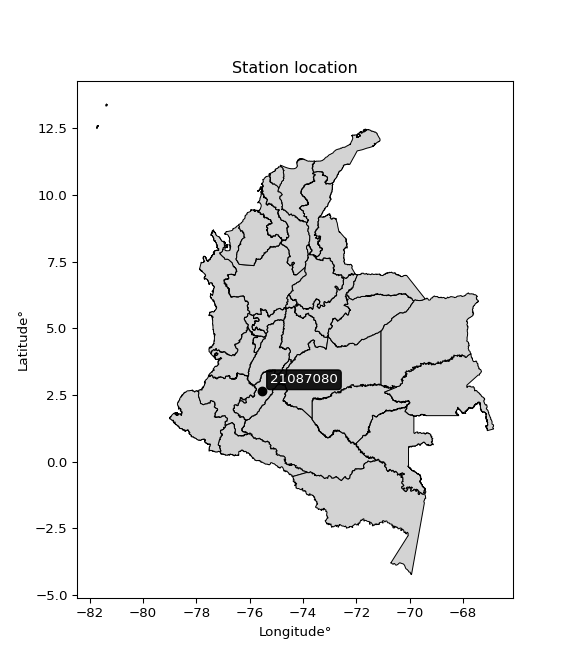

<div align="center">


</div>

# PMax24h Station (Rain): 21087080

Maximum Precipitation in 24 hours (PMax24h) is the greatest amount of rainfall for a specific duration that is meteorologically possible for a given location, acting as a "worst-case" scenario for extreme storms, crucial for designing safety-critical infrastructure like bridges, river deviations, dams, spillways, and nuclear plants to prevent catastrophic failure. The PMax24h is related with the Probable Maximum Precipitation (PMP) and it is calculated by hydrologists using meteorological data to determine the upper limit of extreme rainfall, often leading to the Probable Maximum Flood (PMF) for flood control design, and is increasingly being studied for climate change impacts. Probable Maximum Precipitation (PMP) is the theoretical upper limit of rainfall, a deterministic estimate for extreme events, while probability distributions (like GEV, Gumbel) describe the likelihood and frequency of various precipitation amounts, including rare ones, showing how often events occur, with PMP representing the extreme end of these distributions, used for critical infrastructure design to ensure safety against the worst conceivable weather, unlike standard statistical forecasts which cover typical probabilities.

The most common probability distributions in hydrology, used for analyzing floods, rainfall, and streamflow, include the Normal, Log-Normal, Gumbel, Gamma (including Log-Pearson Type III), and Generalized Extreme Value (GEV) distributions, often chosen based on the data´s skewness and whether modeling extremes or general conditions, with Gumbel and GEV popular for extreme events like floods, while the Normal distribution serves as a baseline, though often requiring transformations for skewed hydrological data. These distributions help in designing water infrastructure, managing water resources, and forecasting hydrologic events.

> Hydrological data often isn´t perfectly normal (it´s skewed), so different distributions are needed for different applications, such as: **Flood Frequency Analysis**: Using Gumbel, GEV, or Log-Pearson Type III for predicting extreme flood magnitudes and their return periods, **Rainfall Analysis**: Normal for annual totals, but Log-Normal, Weibull, or GEV for intensity or extreme daily rainfall, **Streamflow Modeling**: Gamma and Log-Normal for maximum flows, GEV for minimum flows, and Kappa for daily flows.

<div align="center">

</img>

</div>


## A. General information


### 1. General running parameters

• app_version: _v20260225_. • runtime: _2026-02-28 16:54:07.457399_. • Python version: _3.14.0_. • SciPy version: _1.16.3_. • Pandas version: _2.3.3_. • NumPy version: _2.3.5_. • Stations dataset (station_dataset_file): _dataset/pmax24h_in/automatic_colombia_2003_2025.csv_. • Stations catalog (station_catalog_file): _dataset/CNE.xls_. • Minimum year to eval til year_max (date_min): _1900_. • Maximum year to eval since year_min (date_max): _2025_. • Creates, save and include plots into reports (create_plot): _False_. • Plot only fit distributions with Δo > Δ (plot_only_fit): _True_. • Plot only simple graphs avoiding multiple CDFs and multiple Extreme values plots (plot_only_simple): _False_. • Eval low extreme values, if False, evaluates high extreme values (low_extreme): _False_. • Eval every SciPy distribution as logarithmic (pdist_logarithmic_on): _True_. • Standard deviation normalized (ddof): _1.0_. • Return periods to eval in years (Tr): _[2, 2.33, 5, 10, 15, 20, 25, 50, 75, 100, 200, 250, 500, 750, 1000]_. • Minimum data sample per station, 0 means any (minimum_sample): _5_. • Z-Score maximum threshold to adjust a value, 0 means disable (zscore_max): _3.5_. • Z-Score minimum threshold to adjust a value, 0 means disable (zscore_min): _-2.5_. • Avoid zeros, e.g. rain = 0 (avoid_zeros): _True_. • Avoid null values (avoid_nans): _True_. 

:file_folder:Table: [dataset.csv](../../dataset/pmax24h_in/automatic_colombia_2003_2025.csv)

> Delta Degrees of Freedom (DDOF): is a parameter used in the formulas for calculating variance and standard deviation. When ddof=0, the divisor is $N$ (the total number of observations) and this is used when your data set is the entire population. When ddof=1, the divisor is $N-1$ and this is used when your data set is a sample drawn from a larger population. Using $N-1$ provides an unbiased estimate of the population variance (known as Bessel´s correction).


### 2. Station info and location

|   id |   CODIGO | NOMBRE                      | CATEGORIA    | TECNOLOGIA   | ESTADO   | FECHA_INSTALACION   |   FECHA_SUSPENSION |   ALTITUD |   LATITUD |   LONGITUD | DEPARTAMENTO   | MUNICIPIO   | AREA_OPERATIVA                    | ENTIDAD                                                     | AREA_HIDROGRAFICA   | ZONA_HIDROGRAFICA   | SUBZONA_HIDROGRAFICA     | CORRIENTE   | Catalogo   |   Version |
|-----:|---------:|:----------------------------|:-------------|:-------------|:---------|:--------------------|-------------------:|----------:|----------:|-----------:|:---------------|:------------|:----------------------------------|:------------------------------------------------------------|:--------------------|:--------------------|:-------------------------|:------------|:-----------|----------:|
|    0 | 21087080 | HACIENDA VENECIA [21087080] | Limnimétrica | Convencional | Activa   | 15/06/1983          |                nan |       575 |      2.64 |     -75.54 | Huila          | Yaguará     | Area Operativa 04 - Huila-Caquetá | INSTITUTO DE HIDROLOGIA METEOROLOGIA Y ESTUDIOS AMBIENTALES | Magdalena Cauca     | Alto Magdalena      | Río Yaguará y Río Iquira | Yaguara     | CNE_IDEAM  |  20251226 |

<div align="center">

Dynamic map: [:earth_americas:Google](http://maps.google.com/maps?q=2.64,-75.54) [:earth_americas:OSM](https://www.openstreetmap.org/#map=18/2.64/-75.54&layers=P) [:earth_americas:Bing](https://www.bing.com/maps?cp=2.64~-75.54&lvl=18) [:earth_americas:Apple](https://maps.apple.com/frame?center=2.64%2C-75.54&span=0.003%2C0.006)

</div>


<div align="center">

```geojson
{
  "type": "Feature",
  "geometry": {
    "type": "Point", 
    "coordinates": [-75.54, 2.64]
  }, 
  "properties": {
    "Name": "21087080"
  }
}
```

</div>


### 3. Discrete values table and plot

<div align="center">

|               |          0 |          1 |            2 |           3 |          4 |          5 |           6 |          7 |          8 |         9 |
|:--------------|-----------:|-----------:|-------------:|------------:|-----------:|-----------:|------------:|-----------:|-----------:|----------:|
| Date          | 2006       | 2007       | 2008         | 2009        | 2015       | 2016       | 2017        | 2018       | 2019       | 2020      |
| Value         |  125.1     |  226.4     |  386.5       |  268.8      |  103.5     |  110.5     |  472.4      |  616.7     |  687.9     |  673.2    |
| Value_initial |  125.1     |  226.4     |  386.5       |  268.8      |  103.5     |  110.5     |  472.4      |  616.7     |  687.9     |  673.2    |
| count         |   10       |   10       |   10         |   10        |   10       |   10       |   10        |   10       |   10       |   10      |
| mean          |  367.1     |  367.1     |  367.1       |  367.1      |  367.1     |  367.1     |  367.1      |  367.1     |  367.1     |  367.1    |
| std           |  234.219   |  234.219   |  234.219     |  234.219    |  234.219   |  234.219   |  234.219    |  234.219   |  234.219   |  234.219  |
| zscore        |   -1.03322 |   -0.60072 |    0.0828285 |   -0.419693 |   -1.12544 |   -1.09556 |    0.449579 |    1.06567 |    1.36966 |    1.3069 |


</div>


> The initial value (value_initial) correspond to the initial obtained or null completed value, and value (value) is adjusted only when the initial value is outside the valid range (outlier) definite through the Z-Score value. If Z-Score is active, values out of range or outliers are replaced with the station mean value. A Z-Score (or standard score) measures how many standard deviations a data point is from the mean of a dataset, indicating its relative position; positive scores mean above the mean, negative mean below, and a score of zero is exactly at the mean, allowing for comparison of values from different distributions. It´s calculated using the formula $z=(x–μ)/σ$, where $x$ is the data point, $μ$ is the mean, and $σ$ is the standard deviation, helping identify outliers and understand probability.
>
> <sub>**Note**: In this study, "completing" (filling gaps in) and "extending" (forecasting or lengthening the historical record) rainfall data series are avoided for certain critical analyses because they introduce artificial bias and uncertainty, which can distort the statistics of rare events (extremes), alter day-to-day variability, and compromise the integrity and homogeneity of the original data. Some reasons against Completing/Extending rainfall data are: **Distortion of Extremes and Variability**: The primary issue is that most gap-filling or extension methods rely on averaging or regression with nearby stations, which inherently smooths the data. Rainfall is highly variable in space and time, with a large percentage of zero values and occasional large storms. Infilling methods often underestimate the highest values and overestimate the lowest (zero) values, which severely distorts analyses focused on flood frequency, drought severity, and intensity-duration-frequency (IDF) curves, **Loss of Data Homogeneity**: Infilled or extended data are synthetic estimates, not actual measurements. Combining these estimates with observed data can violate the assumption of data homogeneity, which requires that the data properties do not change over time. Inhomogeneity can lead to incorrect conclusions about long-term trends or changes in climate patterns, **Propagation of Errors**: Errors and biases from the original data (e.g., wind-induced undercatch, instrument errors, site changes) or the data used for imputation can propagate through the analysis, leading to unreliable hydrological models and inaccurate predictions, **Compromised Statistical Integrity**: For statistical analyses, especially those involving the frequency of events, using artificial data can introduce time bias or autocorrelation that doesn´t exist in reality, making it difficult to assess the true probability of events, **Difficulty in Validation**: It is difficult to accurately validate the quality of filled or extended data, especially for past periods where ground-truth measurements are unavailable. The reliability of imputation techniques heavily depends on the density of the surrounding station network and the complexity of the local topography.</sub>


### 4. Active continuous probability distributions from SciPy (80 of 104 available)

A Probability Density Function (PDF) describes the relative likelihood of a continuous random variable falling within a specific range, where the total area under its curve equals 1, and the area over any interval gives the actual probability for that range. Unlike discrete probabilities (like rolling a die), a PDF shows density, not direct probability for a single point (which is zero), with higher points indicating higher likelihood, often visualized as a bell curve for normal distributions.

A log of a probability density function (log-PDF) is simply the logarithm of the PDF´s value, denoted as $log(f(x))$, useful for converting multiplication of probabilities into addition, improving numerical stability with tiny numbers, and connecting to information theory concepts like entropy. Instead of dealing with very small probabilities (e.g., 0.000001), log-PDFs use negative numbers (e.g., $log(0.00001) ≈ -11.51$ that are easier for computers to handle, preventing underflow errors and simplifying complex calculations. In this study, each active probability distribution from SciPy is also evaluated in the $log$ form.

[scipy.stats](https://docs.scipy.org/doc/scipy/reference/stats.html) is a Python´s powerful submodule within the SciPy library for comprehensive statistical analysis, offering over 130 probability distributions (like Normal, Poisson, etc.), functions for descriptive stats (mean, variance), hypothesis testing (t-tests, chi-square), random variable generation, and statistical tests, making it essential for data science, modeling, and research. It provides tools to explore, model, and draw conclusions from data efficiently, working seamlessly with [NumPy](https://numpy.org/).

<div align="center">

|   id | p_dist           |   n_parameter | fit_method   | label                                                                       | active   | ref                                                                                                      |
|-----:|:-----------------|--------------:|:-------------|:----------------------------------------------------------------------------|:---------|:---------------------------------------------------------------------------------------------------------|
|    0 | alpha            |             3 | MLE          | Alpha                                                                       | True     | [:mortar_board:](https://docs.scipy.org/doc/scipy/reference/generated/scipy.stats.alpha.html)            |
|    1 | anglit           |             2 | MM           | Anglit                                                                      | True     | [:mortar_board:](https://docs.scipy.org/doc/scipy/reference/generated/scipy.stats.anglit.html)           |
|    2 | arcsine          |             2 | MM           | Arcsine                                                                     | True     | [:mortar_board:](https://docs.scipy.org/doc/scipy/reference/generated/scipy.stats.arcsine.html)          |
|    3 | argus            |             3 | MLE          | Argus                                                                       | True     | [:mortar_board:](https://docs.scipy.org/doc/scipy/reference/generated/scipy.stats.argus.html)            |
|    4 | beta             |             4 | MLE          | Beta                                                                        | True     | [:mortar_board:](https://docs.scipy.org/doc/scipy/reference/generated/scipy.stats.beta.html)             |
|    5 | betaprime        |             4 | MLE          | Beta prime                                                                  | True     | [:mortar_board:](https://docs.scipy.org/doc/scipy/reference/generated/scipy.stats.betaprime.html)        |
|    6 | bradford         |             3 | MLE          | Bradford                                                                    | True     | [:mortar_board:](https://docs.scipy.org/doc/scipy/reference/generated/scipy.stats.bradford.html)         |
|    7 | burr             |             4 | MLE          | Burr (Type III)                                                             | True     | [:mortar_board:](https://docs.scipy.org/doc/scipy/reference/generated/scipy.stats.burr.html)             |
|    8 | burr12           |             4 | MLE          | Burr (Type III) 12                                                          | True     | [:mortar_board:](https://docs.scipy.org/doc/scipy/reference/generated/scipy.stats.burr12.html)           |
|    9 | cosine           |             2 | MLE          | Cosine                                                                      | True     | [:mortar_board:](https://docs.scipy.org/doc/scipy/reference/generated/scipy.stats.cosine.html)           |
|   10 | crystalball      |             4 | MLE          | Crystalball                                                                 | True     | [:mortar_board:](https://docs.scipy.org/doc/scipy/reference/generated/scipy.stats.crystalball.html)      |
|   11 | dgamma           |             3 | MLE          | Double gamma                                                                | True     | [:mortar_board:](https://docs.scipy.org/doc/scipy/reference/generated/scipy.stats.dgamma.html)           |
|   12 | dweibull         |             3 | MLE          | Double Weibull                                                              | True     | [:mortar_board:](https://docs.scipy.org/doc/scipy/reference/generated/scipy.stats.dweibull.html)         |
|   13 | erlang           |             3 | MLE          | Erlang                                                                      | True     | [:mortar_board:](https://docs.scipy.org/doc/scipy/reference/generated/scipy.stats.erlang.html)           |
|   14 | exponnorm        |             3 | MLE          | Exponentially modified Normal                                               | True     | [:mortar_board:](https://docs.scipy.org/doc/scipy/reference/generated/scipy.stats.exponnorm.html)        |
|   15 | exponpow         |             3 | MLE          | Exponential power                                                           | True     | [:mortar_board:](https://docs.scipy.org/doc/scipy/reference/generated/scipy.stats.exponpow.html)         |
|   16 | exponweib        |             4 | MLE          | Exponentiated Weibull                                                       | True     | [:mortar_board:](https://docs.scipy.org/doc/scipy/reference/generated/scipy.stats.exponweib.html)        |
|   17 | f                |             4 | MLE          | F                                                                           | True     | [:mortar_board:](https://docs.scipy.org/doc/scipy/reference/generated/scipy.stats.f.html)                |
|   18 | fatiguelife      |             3 | MLE          | Fatigue-life (Birnbaum-Saunders)                                            | True     | [:mortar_board:](https://docs.scipy.org/doc/scipy/reference/generated/scipy.stats.fatiguelife.html)      |
|   19 | foldnorm         |             3 | MM           | Fold Normal                                                                 | True     | [:mortar_board:](https://docs.scipy.org/doc/scipy/reference/generated/scipy.stats.foldnorm.html)         |
|   20 | gamma            |             3 | MLE          | Gamma                                                                       | True     | [:mortar_board:](https://docs.scipy.org/doc/scipy/reference/generated/scipy.stats.gamma.html)            |
|   21 | gausshyper       |             6 | MLE          | Gauss hypergeometric                                                        | True     | [:mortar_board:](https://docs.scipy.org/doc/scipy/reference/generated/scipy.stats.gausshyper.html)       |
|   22 | genexpon         |             5 | MLE          | Generalized exponential                                                     | True     | [:mortar_board:](https://docs.scipy.org/doc/scipy/reference/generated/scipy.stats.genexpon.html)         |
|   23 | genextreme       |             3 | MLE          | Generalized exponential                                                     | True     | [:mortar_board:](https://docs.scipy.org/doc/scipy/reference/generated/scipy.stats.genextreme.html)       |
|   24 | gengamma         |             4 | MLE          | Generalized gamma                                                           | True     | [:mortar_board:](https://docs.scipy.org/doc/scipy/reference/generated/scipy.stats.gengamma.html)         |
|   25 | genhalflogistic  |             3 | MLE          | Generalized half-logistic                                                   | True     | [:mortar_board:](https://docs.scipy.org/doc/scipy/reference/generated/scipy.stats.genhalflogistic.html)  |
|   26 | genlogistic      |             3 | MLE          | Generalized logistic                                                        | True     | [:mortar_board:](https://docs.scipy.org/doc/scipy/reference/generated/scipy.stats.genlogistic.html)      |
|   27 | gennorm          |             3 | MLE          | Generalized Normal                                                          | True     | [:mortar_board:](https://docs.scipy.org/doc/scipy/reference/generated/scipy.stats.gennorm.html)          |
|   28 | genpareto        |             3 | MLE          | Generalized Pareto                                                          | True     | [:mortar_board:](https://docs.scipy.org/doc/scipy/reference/generated/scipy.stats.genpareto.html)        |
|   29 | gompertz         |             3 | MLE          | Gompertz (or truncated Gumbel)                                              | True     | [:mortar_board:](https://docs.scipy.org/doc/scipy/reference/generated/scipy.stats.gompertz.html)         |
|   30 | gumbel_l         |             2 | MM           | Gumbel Left Skew                                                            | True     | [:mortar_board:](https://docs.scipy.org/doc/scipy/reference/generated/scipy.stats.gumbel_l.html)         |
|   31 | gumbel_r         |             2 | MM           | Gumbel Right Skew                                                           | True     | [:mortar_board:](https://docs.scipy.org/doc/scipy/reference/generated/scipy.stats.gumbel_r.html)         |
|   32 | halfgennorm      |             3 | MLE          | Upper half of a generalized normal                                          | True     | [:mortar_board:](https://docs.scipy.org/doc/scipy/reference/generated/scipy.stats.halfgennorm.html)      |
|   33 | halflogistic     |             2 | MM           | Half-logistic                                                               | True     | [:mortar_board:](https://docs.scipy.org/doc/scipy/reference/generated/scipy.stats.halflogistic.html)     |
|   34 | halfnorm         |             2 | MM           | Half Normal                                                                 | True     | [:mortar_board:](https://docs.scipy.org/doc/scipy/reference/generated/scipy.stats.halfnorm.html)         |
|   35 | hypsecant        |             2 | MM           | hyperbolic secant                                                           | True     | [:mortar_board:](https://docs.scipy.org/doc/scipy/reference/generated/scipy.stats.hypsecant.html)        |
|   36 | invgamma         |             3 | MLE          | Inverted gamma                                                              | True     | [:mortar_board:](https://docs.scipy.org/doc/scipy/reference/generated/scipy.stats.invgamma.html)         |
|   37 | invgauss         |             3 | MLE          | Inverse Gaussian                                                            | True     | [:mortar_board:](https://docs.scipy.org/doc/scipy/reference/generated/scipy.stats.invgauss.html)         |
|   38 | invweibull       |             3 | MLE          | Inverted Weibull                                                            | True     | [:mortar_board:](https://docs.scipy.org/doc/scipy/reference/generated/scipy.stats.invweibull.html)       |
|   39 | johnsonsb        |             4 | MLE          | Johnson SB                                                                  | True     | [:mortar_board:](https://docs.scipy.org/doc/scipy/reference/generated/scipy.stats.johnsonsb.html)        |
|   40 | johnsonsu        |             4 | MLE          | Johnson Su                                                                  | True     | [:mortar_board:](https://docs.scipy.org/doc/scipy/reference/generated/scipy.stats.johnsonsu.html)        |
|   41 | kappa3           |             3 | MLE          | Kappa 3                                                                     | True     | [:mortar_board:](https://docs.scipy.org/doc/scipy/reference/generated/scipy.stats.kappa3.html)           |
|   42 | kappa4           |             4 | MLE          | Kappa 4                                                                     | True     | [:mortar_board:](https://docs.scipy.org/doc/scipy/reference/generated/scipy.stats.kappa4.html)           |
|   43 | ksone            |             3 | MLE          | Kolmogorov-Smirnov one-sided test statistic distribution                    | True     | [:mortar_board:](https://docs.scipy.org/doc/scipy/reference/generated/scipy.stats.ksone.html)            |
|   44 | kstwobign        |             2 | MLE          | Limiting distribution of scaled Kolmogorov-Smirnov two-sided test statistic | True     | [:mortar_board:](https://docs.scipy.org/doc/scipy/reference/generated/scipy.stats.kstwobign.html)        |
|   45 | laplace          |             2 | MM           | Laplace                                                                     | True     | [:mortar_board:](https://docs.scipy.org/doc/scipy/reference/generated/scipy.stats.laplace.html)          |
|   46 | levy_l           |             2 | MLE          | Left-skewed Levy                                                            | True     | [:mortar_board:](https://docs.scipy.org/doc/scipy/reference/generated/scipy.stats.levy_l.html)           |
|   47 | loggamma         |             3 | MLE          | Log gamma                                                                   | True     | [:mortar_board:](https://docs.scipy.org/doc/scipy/reference/generated/scipy.stats.loggamma.html)         |
|   48 | logistic         |             2 | MM           | Logistic (or Sech-squared)                                                  | True     | [:mortar_board:](https://docs.scipy.org/doc/scipy/reference/generated/scipy.stats.logistic.html)         |
|   49 | loglaplace       |             3 | MLE          | Log-Laplace                                                                 | True     | [:mortar_board:](https://docs.scipy.org/doc/scipy/reference/generated/scipy.stats.loglaplace.html)       |
|   50 | lomax            |             3 | MLE          | Lomax (Pareto of the second kind)                                           | True     | [:mortar_board:](https://docs.scipy.org/doc/scipy/reference/generated/scipy.stats.lomax.html)            |
|   51 | maxwell          |             2 | MM           | Maxwell                                                                     | True     | [:mortar_board:](https://docs.scipy.org/doc/scipy/reference/generated/scipy.stats.maxwell.html)          |
|   52 | mielke           |             4 | MLE          | Mielke Beta-Kappa / Dagum                                                   | True     | [:mortar_board:](https://docs.scipy.org/doc/scipy/reference/generated/scipy.stats.mielke.html)           |
|   53 | moyal            |             2 | MM           | Moyal                                                                       | True     | [:mortar_board:](https://docs.scipy.org/doc/scipy/reference/generated/scipy.stats.moyal.html)            |
|   54 | nakagami         |             3 | MLE          | Nakagami                                                                    | True     | [:mortar_board:](https://docs.scipy.org/doc/scipy/reference/generated/scipy.stats.nakagami.html)         |
|   55 | ncf              |             5 | MLE          | Non-central F distribution                                                  | True     | [:mortar_board:](https://docs.scipy.org/doc/scipy/reference/generated/scipy.stats.ncf.html)              |
|   56 | nct              |             4 | MLE          | Non-central Student’s t                                                     | True     | [:mortar_board:](https://docs.scipy.org/doc/scipy/reference/generated/scipy.stats.nct.html)              |
|   57 | norm             |             2 | MM           | Normal                                                                      | True     | [:mortar_board:](https://docs.scipy.org/doc/scipy/reference/generated/scipy.stats.norm.html)             |
|   58 | pearson3         |             3 | MM           | Pearson type III                                                            | True     | [:mortar_board:](https://docs.scipy.org/doc/scipy/reference/generated/scipy.stats.pearson3.html)         |
|   59 | powerlaw         |             3 | MLE          | Power-function                                                              | True     | [:mortar_board:](https://docs.scipy.org/doc/scipy/reference/generated/scipy.stats.powerlaw.html)         |
|   60 | rayleigh         |             2 | MM           | Rayleigh                                                                    | True     | [:mortar_board:](https://docs.scipy.org/doc/scipy/reference/generated/scipy.stats.rayleigh.html)         |
|   61 | rdist            |             3 | MLE          | R-distributed (symmetric beta)                                              | True     | [:mortar_board:](https://docs.scipy.org/doc/scipy/reference/generated/scipy.stats.rdist.html)            |
|   62 | rice             |             3 | MLE          | Rice                                                                        | True     | [:mortar_board:](https://docs.scipy.org/doc/scipy/reference/generated/scipy.stats.rice.html)             |
|   63 | semicircular     |             2 | MM           | Semicircular                                                                | True     | [:mortar_board:](https://docs.scipy.org/doc/scipy/reference/generated/scipy.stats.semicircular.html)     |
|   64 | skewnorm         |             3 | MLE          | Skew normal                                                                 | True     | [:mortar_board:](https://docs.scipy.org/doc/scipy/reference/generated/scipy.stats.skewnorm.html)         |
|   65 | t                |             3 | MLE          | Student’s t                                                                 | True     | [:mortar_board:](https://docs.scipy.org/doc/scipy/reference/generated/scipy.stats.t.html)                |
|   66 | trapezoid        |             4 | MLE          | Trapezoid                                                                   | True     | [:mortar_board:](https://docs.scipy.org/doc/scipy/reference/generated/scipy.stats.trapezoid.html)        |
|   67 | triang           |             3 | MLE          | Triangular                                                                  | True     | [:mortar_board:](https://docs.scipy.org/doc/scipy/reference/generated/scipy.stats.triang.html)           |
|   68 | truncexpon       |             3 | MLE          | Truncated exponential                                                       | True     | [:mortar_board:](https://docs.scipy.org/doc/scipy/reference/generated/scipy.stats.truncexpon.html)       |
|   69 | truncnorm        |             4 | MLE          | Truncated normal                                                            | True     | [:mortar_board:](https://docs.scipy.org/doc/scipy/reference/generated/scipy.stats.truncnorm.html)        |
|   70 | truncpareto      |             4 | MLE          | Upper truncated Pareto                                                      | True     | [:mortar_board:](https://docs.scipy.org/doc/scipy/reference/generated/scipy.stats.truncpareto.html)      |
|   71 | truncweibull_min |             5 | MLE          | Doubly truncated Weibull minimum                                            | True     | [:mortar_board:](https://docs.scipy.org/doc/scipy/reference/generated/scipy.stats.truncweibull_min.html) |
|   72 | tukeylambda      |             3 | MLE          | Tukey-Lamdba                                                                | True     | [:mortar_board:](https://docs.scipy.org/doc/scipy/reference/generated/scipy.stats.tukeylambda.html)      |
|   73 | uniform          |             2 | MLE          | Uniform                                                                     | True     | [:mortar_board:](https://docs.scipy.org/doc/scipy/reference/generated/scipy.stats.uniform.html)          |
|   74 | vonmises         |             3 | MLE          | Von Mises                                                                   | True     | [:mortar_board:](https://docs.scipy.org/doc/scipy/reference/generated/scipy.stats.vonmises.html)         |
|   75 | vonmises_line    |             3 | MLE          | Von Mises line                                                              | True     | [:mortar_board:](https://docs.scipy.org/doc/scipy/reference/generated/scipy.stats.vonmises_line.html)    |
|   76 | wald             |             2 | MM           | Wald                                                                        | True     | [:mortar_board:](https://docs.scipy.org/doc/scipy/reference/generated/scipy.stats.wald.html)             |
|   77 | weibull_max      |             3 | MLE          | Weibull maximum                                                             | True     | [:mortar_board:](https://docs.scipy.org/doc/scipy/reference/generated/scipy.stats.weibull_max.html)      |
|   78 | weibull_min      |             3 | MLE          | Weibull minimum                                                             | True     | [:mortar_board:](https://docs.scipy.org/doc/scipy/reference/generated/scipy.stats.weibull_min.html)      |
|   79 | wrapcauchy       |             3 | MLE          | Wrapped  Cauchy                                                             | True     | [:mortar_board:](https://docs.scipy.org/doc/scipy/reference/generated/scipy.stats.wrapcauchy.html)       |

</div>

> **n_parameter:** # arguments & localization & scale.
>
> **Fit methods:** (MLE) maximum likelihood, (MM) L-moments.
>
>**Inactive** (With the only purpose of prevent loops, zero divisions, infinite values, over high estimated values or horizontal trending for recurrence intervals estimations, the follow distributions were disabled.)**:** lognorm, norminvgauss, powernorm, powerlognorm, cauchy, halfcauchy, foldcauchy, skewcauchy, chi2, expon, fisk, genhyperbolic, geninvgauss, gibrat, kstwo, laplace_asymmetric, levy, levy_stable, ncx2, pareto, rel_breitwigner, recipinvgauss, studentized_range, loguniform, 


## B. Probability (PDF) vs. Empirical (EDF) distributions functions

A continuous probability distribution (CPD) describes probabilities for variables that can take any value within a range (like rain any time), unlike discrete variables with specific outcomes (like temperature). It uses a Probability Density Function (PDF), a curve where the total area under it equals 1, and the probability of the variable falling within an interval (a to b) is found by calculating the area under the curve between those points. A key feature is that the probability of hitting any single exact value is zero, so probabilities are always expressed for ranges, e.g., $P(a ≤ X ≤ b)$.

<div align="center">

Distributions parameters from station values
|     |   station | p_dist              |   n |               loc |            scale | shape                  | shape1                 | shape2                 | shape3            |
|----:|----------:|:--------------------|----:|------------------:|-----------------:|:-----------------------|:-----------------------|:-----------------------|:------------------|
|   0 |  21087080 | alpha               |  10 |      25.8996      |    144.773       | 1.2414126036780602e-08 |                        |                        |                   |
|   1 |  21087080 | anglit              |  10 |     367.1         |    650.022       |                        |                        |                        |                   |
|   2 |  21087080 | arcsine             |  10 |      52.8624      |    628.475       |                        |                        |                        |                   |
|   3 |  21087080 | argus               |  10 |     -92.3396      |    823.546       | 1.521353307989892e-06  |                        |                        |                   |
|   4 |  21087080 | beta                |  10 |     103.5         |    584.4         | 0.3638286737154323     | 0.48759657630551134    |                        |                   |
|   5 |  21087080 | betaprime           |  10 |     -16.8519      |   3011.86        | 2.8556963269640203     | 23.364248516737696     |                        |                   |
|   6 |  21087080 | bradford            |  10 |      25.5993      |    662.301       | 1.4774674272253975e-06 |                        |                        |                   |
|   7 |  21087080 | burr                |  10 |      -0.983118    |      3.88468     | 1.5159877381824263     | 406.0236151300427      |                        |                   |
|   8 |  21087080 | burr12              |  10 |      -2.1101      |    104.595       | 376.2204224228114      | 0.0025639656674460104  |                        |                   |
|   9 |  21087080 | cosine              |  10 |     374.387       |    176.59        |                        |                        |                        |                   |
|  10 |  21087080 | crystalball         |  10 |      -0.255811    |    429.434       | 4.763667463955558      | 1.4119533223587188     |                        |                   |
|  11 |  21087080 | dgamma              |  10 |     337.158       |     65.0955      | 3.0760935298933543     |                        |                        |                   |
|  12 |  21087080 | dweibull            |  10 |     346.96        |    225.759       | 2.143344482577184      |                        |                        |                   |
|  13 |  21087080 | erlang              |  10 |     103.5         |    196.294       | 0.7238142124151463     |                        |                        |                   |
|  14 |  21087080 | exponnorm           |  10 |     331.66        |    219.36        | 0.1615588050147124     |                        |                        |                   |
|  15 |  21087080 | exponpow            |  10 |     103.5         |    504.554       | 0.49912366144412823    |                        |                        |                   |
|  16 |  21087080 | exponweib           |  10 |     103.5         |      0.0423838   | 1.8568813338860566     | 0.08641947379506418    |                        |                   |
|  17 |  21087080 | f                   |  10 |     103.496       |    337.899       | 1.3796291885634888     | 3579.648114256603      |                        |                   |
|  18 |  21087080 | fatiguelife         |  10 |     103.484       |      3.64527     | 8.78718118749196       |                        |                        |                   |
|  19 |  21087080 | foldnorm            |  10 |     -74.8219      |    232.811       | 1.8745917888802408     |                        |                        |                   |
|  20 |  21087080 | gamma               |  10 |     103.5         |    209.19        | 0.5620142609422578     |                        |                        |                   |
|  21 |  21087080 | gausshyper          |  10 |      25.5367      |    662.363       | 1.3509286028895588     | 0.8361355513566333     | 1.0131517857909993     | 0.970681892354232 |
|  22 |  21087080 | genexpon            |  10 |     103.5         |      2.28843     | 0.00868695250915408    | 1.9002148400337266e-08 | 1.139963006824201      |                   |
|  23 |  21087080 | genextreme          |  10 |     104.517       |      6.19495     | -6.0885967526372475    |                        |                        |                   |
|  24 |  21087080 | gengamma            |  10 |     103.5         |      0.153793    | 4.333997693792348      | 0.21165711075424526    |                        |                   |
|  25 |  21087080 | genhalflogistic     |  10 |      45.9176      |    668.937       | 1.0419864233990555     |                        |                        |                   |
|  26 |  21087080 | genlogistic         |  10 |    -957.185       |    182.723       | 779.4084693513582      |                        |                        |                   |
|  27 |  21087080 | gennorm             |  10 |     395.7         |    292.2         | 69258063.88415246      |                        |                        |                   |
|  28 |  21087080 | genpareto           |  10 |      -5.60968     |   1218.79        | -1.7574167000792023    |                        |                        |                   |
|  29 |  21087080 | gompertz            |  10 |     103.5         |    681.476       | 1.8063786516199882     |                        |                        |                   |
|  30 |  21087080 | gumbel_l            |  10 |     467.102       |    173.248       |                        |                        |                        |                   |
|  31 |  21087080 | gumbel_r            |  10 |     267.098       |    173.248       |                        |                        |                        |                   |
|  32 |  21087080 | halfgennorm         |  10 |     103.5         |      0.0534541   | 0.21057090105842446    |                        |                        |                   |
|  33 |  21087080 | halflogistic        |  10 |     103.742       |    189.973       |                        |                        |                        |                   |
|  34 |  21087080 | halfnorm            |  10 |      72.9949      |    368.606       |                        |                        |                        |                   |
|  35 |  21087080 | hypsecant           |  10 |     367.1         |    141.457       |                        |                        |                        |                   |
|  36 |  21087080 | invgamma            |  10 |    -152.576       |   2188.35        | 5.137216810831964      |                        |                        |                   |
|  37 |  21087080 | invgauss            |  10 |      51.137       |    260.31        | 1.2137953845441647     |                        |                        |                   |
|  38 |  21087080 | invweibull          |  10 |     103.5         |      0.410881    | 0.06770002353124277    |                        |                        |                   |
|  39 |  21087080 | johnsonsb           |  10 |      -5.27634     |    693.176       | -0.5081211508732215    | 0.1513231250939069     |                        |                   |
|  40 |  21087080 | johnsonsu           |  10 |       8.03865e+09 |      5.11109e+08 | 120131752.38052586     | 34824934.52830768      |                        |                   |
|  41 |  21087080 | kappa3              |  10 |     102.278       |    585.468       | 8645.119653373189      |                        |                        |                   |
|  42 |  21087080 | kappa4              |  10 |     -16.4469      |    683.586       | 1.2119494546137235     | 0.9641726743788013     |                        |                   |
|  43 |  21087080 | ksone               |  10 |     -17.7609      |    769.722       | 1.0                    |                        |                        |                   |
|  44 |  21087080 | kstwobign           |  10 |    -363.962       |    834.383       |                        |                        |                        |                   |
|  45 |  21087080 | laplace             |  10 |     367.1         |    157.119       |                        |                        |                        |                   |
|  46 |  21087080 | levy_l              |  10 |     709.24        |     97.936       |                        |                        |                        |                   |
|  47 |  21087080 | loggamma            |  10 |  -44794           |   6652.72        | 887.8219525363183      |                        |                        |                   |
|  48 |  21087080 | logistic            |  10 |     367.1         |    122.505       |                        |                        |                        |                   |
|  49 |  21087080 | loglaplace          |  10 |      -0.646377    |    269.446       | 1.5677454639889707     |                        |                        |                   |
|  50 |  21087080 | lomax               |  10 |     103.5         |   7420.37        | 28.686687626338905     |                        |                        |                   |
|  51 |  21087080 | maxwell             |  10 |    -159.42        |    329.947       |                        |                        |                        |                   |
|  52 |  21087080 | mielke              |  10 |      -2.30481     |      5.21514     | 433.8055657539296      | 1.5354622562001232     |                        |                   |
|  53 |  21087080 | moyal               |  10 |     240.032       |    100.025       |                        |                        |                        |                   |
|  54 |  21087080 | nakagami            |  10 |     103.5         |    264.227       | 0.15347830054440598    |                        |                        |                   |
|  55 |  21087080 | ncf                 |  10 |    -152.556       |    410.915       | 109942.58852473239     | 10.274426344669102     | 4026.4489022634025     |                   |
|  56 |  21087080 | nct                 |  10 |      -0.118708    |     13.0788      | 1.350414782241458      | 14.294348986822753     |                        |                   |
|  57 |  21087080 | norm                |  10 |     367.1         |    222.2         |                        |                        |                        |                   |
|  58 |  21087080 | pearson3            |  10 |     367.1         |    222.2         | 0.2306233098721212     |                        |                        |                   |
|  59 |  21087080 | powerlaw            |  10 |     103.5         |    584.4         | 0.19943934847666678    |                        |                        |                   |
|  60 |  21087080 | rayleigh            |  10 |     -57.9807      |    339.165       |                        |                        |                        |                   |
|  61 |  21087080 | rdist               |  10 |      45.6146      |    340.885       | 1.086944854321004      |                        |                        |                   |
|  62 |  21087080 | rice                |  10 |     -22.7574      |    291.968       | 0.6017781410655578     |                        |                        |                   |
|  63 |  21087080 | semicircular        |  10 |     367.1         |    444.399       |                        |                        |                        |                   |
|  64 |  21087080 | skewnorm            |  10 |     103.5         |    344.757       | 21082961.93997256      |                        |                        |                   |
|  65 |  21087080 | t                   |  10 |     367.1         |    222.199       | 127076.77163974248     |                        |                        |                   |
|  66 |  21087080 | trapezoid           |  10 |      45.06        |    701.28        | 1.0                    | 1.0                    |                        |                   |
|  67 |  21087080 | triang              |  10 |    -127.212       |    815.721       | 0.9999999999999968     |                        |                        |                   |
|  68 |  21087080 | truncexpon          |  10 |     103.5         |    642.935       | 0.9089564474523676     |                        |                        |                   |
|  69 |  21087080 | truncnorm           |  10 |     367.1         |    222.2         | -20786.122380930014    | 129170.69071624646     |                        |                   |
|  70 |  21087080 | truncpareto         |  10 |     103.493       |      0.00720744  | 0.11130230633780717    | 81083.93157256603      |                        |                   |
|  71 |  21087080 | truncweibull_min    |  10 |     103.117       |    852.034       | 0.5252091435885093     | 0.00044415423849177797 | 0.6863410193019988     |                   |
|  72 |  21087080 | tukeylambda         |  10 |     395.649       |    315.24        | 1.07866110311241       |                        |                        |                   |
|  73 |  21087080 | uniform             |  10 |     103.5         |    584.4         |                        |                        |                        |                   |
|  74 |  21087080 | vonmises            |  10 |       1.80563     |      1           | 0.18150388197805553    |                        |                        |                   |
|  75 |  21087080 | vonmises_line       |  10 |     395.7         |     93.0102      | 0.020108374942260414   |                        |                        |                   |
|  76 |  21087080 | wald                |  10 |     144.9         |    222.2         |                        |                        |                        |                   |
|  77 |  21087080 | weibull_max         |  10 |     687.9         |      1.66207     | 0.15067482100156065    |                        |                        |                   |
|  78 |  21087080 | weibull_min         |  10 |     103.5         |     80.9628      | 0.518605932323406      |                        |                        |                   |
|  79 |  21087080 | wrapcauchy          |  10 |     103.494       |     93.011       | 0.6328282548584612     |                        |                        |                   |
|  80 |  21087080 | logalpha            |  10 |      -7.11629     |    219.13        | 17.183562805744856     |                        |                        |                   |
|  81 |  21087080 | loganglit           |  10 |       5.6775      |      2.09142     |                        |                        |                        |                   |
|  82 |  21087080 | logarcsine          |  10 |       4.66645     |      2.02211     |                        |                        |                        |                   |
|  83 |  21087080 | logargus            |  10 |       3.99456     |      2.64972     | 1.466133307617926      |                        |                        |                   |
|  84 |  21087080 | logbeta             |  10 |       4.58112     |      1.95252     | 0.5135182190441271     | 0.3822348087465204     |                        |                   |
|  85 |  21087080 | logbetaprime        |  10 |     -10.9076      |     61.3939      | 667.1052520065701      | 2470.9750390393538     |                        |                   |
|  86 |  21087080 | logbradford         |  10 |       4.63957     |      1.89409     | 1.1329198615898592     |                        |                        |                   |
|  87 |  21087080 | logburr             |  10 |      -7.36729     |      8.27317     | 19.10799236869552      | 3428.4522677815057     |                        |                   |
|  88 |  21087080 | logburr12           |  10 |      -3.7161      |     14.4611      | 16.283236989764447     | 645.1860937778092      |                        |                   |
|  89 |  21087080 | logcosine           |  10 |       5.65258     |      0.568858    |                        |                        |                        |                   |
|  90 |  21087080 | logcrystalball      |  10 |       5.6775      |      0.714917    | 198.75429016093756     | 873.5241367204301      |                        |                   |
|  91 |  21087080 | logdgamma           |  10 |       5.76217     |      0.219229    | 2.9170859175968245     |                        |                        |                   |
|  92 |  21087080 | logdweibull         |  10 |       5.73533     |      0.721594    | 2.0684274642207514     |                        |                        |                   |
|  93 |  21087080 | logerlang           |  10 |      -6.37238     |      0.0431738   | 279.0344859689317      |                        |                        |                   |
|  94 |  21087080 | logexponnorm        |  10 |       5.67688     |      0.714921    | 0.0008649682381793686  |                        |                        |                   |
|  95 |  21087080 | logexponpow         |  10 |       4.63957     |      1.43215     | 0.634746621139811      |                        |                        |                   |
|  96 |  21087080 | logexponweib        |  10 |       4.63957     |      1.23953     | 0.30898404344157837    | 0.7354997681144029     |                        |                   |
|  97 |  21087080 | logf                |  10 |    -220.476       |    226.15        | 386340.4564863645      | 413712.3074569998      |                        |                   |
|  98 |  21087080 | logfatiguelife      |  10 |    -113.787       |    119.463       | 0.0059644025410623     |                        |                        |                   |
|  99 |  21087080 | logfoldnorm         |  10 |       3.18352     |      0.710167    | 3.5122428514115223     |                        |                        |                   |
| 100 |  21087080 | loggamma            |  10 |      -6.26779     |      0.0433802   | 275.2602169186828      |                        |                        |                   |
| 101 |  21087080 | loggausshyper       |  10 |       4.55484     |      1.9788      | 0.9817572571316415     | 0.6933078615416525     | 1.2467604717154557     | 1.409030965949873 |
| 102 |  21087080 | loggenexpon         |  10 |       4.63405     |      0.0381937   | 0.021608269292197904   | 3.6673220428082587     | 0.0002026938327242434  |                   |
| 103 |  21087080 | loggenextreme       |  10 |       5.91387     |      0.694251    | 1.1201763497522896     |                        |                        |                   |
| 104 |  21087080 | loggengamma         |  10 |       4.63957     |      1.18148     | 0.22808051133396134    | 1.1855391696110433     |                        |                   |
| 105 |  21087080 | loggenhalflogistic  |  10 |       4.11206     |      2.54529     | 1.0510864723293953     |                        |                        |                   |
| 106 |  21087080 | loggenlogistic      |  10 |       6.53368     |      2.17492e-06 | 2.53941889296396e-06   |                        |                        |                   |
| 107 |  21087080 | loggennorm          |  10 |       5.58661     |      0.947039    | 4625354.490387583      |                        |                        |                   |
| 108 |  21087080 | loggenpareto        |  10 |      -0.0372479   |     17.7559      | -2.7021984697711696    |                        |                        |                   |
| 109 |  21087080 | loggompertz         |  10 |       4.63957     |      0.976664    | 0.373883121940651      |                        |                        |                   |
| 110 |  21087080 | loggumbel_l         |  10 |       5.99925     |      0.557419    |                        |                        |                        |                   |
| 111 |  21087080 | loggumbel_r         |  10 |       5.35575     |      0.557419    |                        |                        |                        |                   |
| 112 |  21087080 | loghalfgennorm      |  10 |       4.63957     |      0.985262    | 0.9622232103693517     |                        |                        |                   |
| 113 |  21087080 | loghalflogistic     |  10 |       4.83013     |      0.61125     |                        |                        |                        |                   |
| 114 |  21087080 | loghalfnorm         |  10 |       4.73124     |      1.18596     |                        |                        |                        |                   |
| 115 |  21087080 | loghypsecant        |  10 |       5.6775      |      0.455131    |                        |                        |                        |                   |
| 116 |  21087080 | loginvgamma         |  10 |      -9.66309     |   6988.11        | 456.6734367839497      |                        |                        |                   |
| 117 |  21087080 | loginvgauss         |  10 |       0.472542    |    248.395       | 0.020934357912344916   |                        |                        |                   |
| 118 |  21087080 | loginvweibull       |  10 |      -6.26901e+07 |      6.26901e+07 | 94029314.417889        |                        |                        |                   |
| 119 |  21087080 | logjohnsonsb        |  10 |       4.52458     |      2.00907     | -0.29309019325683894   | 0.1493478341830558     |                        |                   |
| 120 |  21087080 | logjohnsonsu        |  10 |       6.54102     |      0.000228404 | 4.4286135823548225     | 0.5500367528881938     |                        |                   |
| 121 |  21087080 | logkappa3           |  10 |       4.63948     |      1.88435     | 388.28443146212        |                        |                        |                   |
| 122 |  21087080 | logkappa4           |  10 |       4.35492     |      2.29818     | 1.1415949773526537     | 1.0215587224370903     |                        |                   |
| 123 |  21087080 | logksone            |  10 |       4.43923     |      2.47655     | 1.0                    |                        |                        |                   |
| 124 |  21087080 | logkstwobign        |  10 |       3.04587     |      2.99535     |                        |                        |                        |                   |
| 125 |  21087080 | loglaplace          |  10 |       5.6775      |      0.505523    |                        |                        |                        |                   |
| 126 |  21087080 | loglevy_l           |  10 |       6.57632     |      0.188372    |                        |                        |                        |                   |
| 127 |  21087080 | logloggamma         |  10 |       6.53394     |      3.75917e-05 | 4.438374499717414e-05  |                        |                        |                   |
| 128 |  21087080 | loglogistic         |  10 |       5.6775      |      0.394155    |                        |                        |                        |                   |
| 129 |  21087080 | logloglaplace       |  10 |      -5.74279     |     11.3368      | 17.730317965778976     |                        |                        |                   |
| 130 |  21087080 | loglomax            |  10 |       4.63957     |   2866.42        | 2773.0084315460826     |                        |                        |                   |
| 131 |  21087080 | logmaxwell          |  10 |       3.98345     |      1.06159     |                        |                        |                        |                   |
| 132 |  21087080 | logmielke           |  10 | -182077           | 182079           | 30834302.583081618     | 276140.6025976854      |                        |                   |
| 133 |  21087080 | logmoyal            |  10 |       5.26866     |      0.321826    |                        |                        |                        |                   |
| 134 |  21087080 | lognakagami         |  10 |       4.63957     |      1.5277      | 0.10250155771900665    |                        |                        |                   |
| 135 |  21087080 | logncf              |  10 |      -1.04358     |      6.67973     | 367.6402296246167      | 321.0626239454821      | 3.6810757328556645e-09 |                   |
| 136 |  21087080 | lognct              |  10 |      36.9875      |      0.708835    | 56829.49012750821      | -44.16977230327777     |                        |                   |
| 137 |  21087080 | lognorm             |  10 |       5.6775      |      0.714917    |                        |                        |                        |                   |
| 138 |  21087080 | logpearson3         |  10 |       5.6775      |      0.714918    | -0.24841307008393027   |                        |                        |                   |
| 139 |  21087080 | logpowerlaw         |  10 |       4.63957     |      1.89407     | 0.23154926111274995    |                        |                        |                   |
| 140 |  21087080 | lograyleigh         |  10 |       4.30982     |      1.09125     |                        |                        |                        |                   |
| 141 |  21087080 | logrdist            |  10 |       5.70564     |      1.06607     | 1.0490809684544786     |                        |                        |                   |
| 142 |  21087080 | logrice             |  10 |       4.24487     |      0.840984    | 1.2746098514536532     |                        |                        |                   |
| 143 |  21087080 | logsemicircular     |  10 |       5.6775      |      1.42983     |                        |                        |                        |                   |
| 144 |  21087080 | logskewnorm         |  10 |       6.53365     |      1.11588     | -2495239.4834082415    |                        |                        |                   |
| 145 |  21087080 | logt                |  10 |       5.6775      |      0.714917    | 26254192581.010353     |                        |                        |                   |
| 146 |  21087080 | logtrapezoid        |  10 |       3.65541     |      3.03314     | 1.0                    | 1.0                    |                        |                   |
| 147 |  21087080 | logtriang           |  10 |       4.0305      |      2.50318     | 0.9999849129474185     |                        |                        |                   |
| 148 |  21087080 | logtruncexpon       |  10 |       4.63956     |      2.22492     | 0.8513031930613475     |                        |                        |                   |
| 149 |  21087080 | logtruncnorm        |  10 |       0.111036    |      2.01349     | 2.6378363598195325     | 3.189975990651379      |                        |                   |
| 150 |  21087080 | logtruncpareto      |  10 |       4.63954     |      3.61594e-05 | 6.323283601320671e-09  | 54594.23695440466      |                        |                   |
| 151 |  21087080 | logtruncweibull_min |  10 |       4.61407     |      2.04088     | 1.1159665194524462     | 7.343022572551397e-06  | 0.9405635479329372     |                   |
| 152 |  21087080 | logtukeylambda      |  10 |       5.59219     |      1.07854     | 1.132182857879048      |                        |                        |                   |
| 153 |  21087080 | loguniform          |  10 |       4.63957     |      1.89407     |                        |                        |                        |                   |
| 154 |  21087080 | logvonmises         |  10 |      -0.587278    |      1           | 2.4607139641428812     |                        |                        |                   |
| 155 |  21087080 | logvonmises_line    |  10 |       5.5712      |      0.306355    | 1.0725504310256387e-05 |                        |                        |                   |
| 156 |  21087080 | logwald             |  10 |       4.96254     |      0.714955    |                        |                        |                        |                   |
| 157 |  21087080 | logweibull_max      |  10 |       6.53364     |      1.12784     | 0.7477336602049005     |                        |                        |                   |
| 158 |  21087080 | logweibull_min      |  10 |      -8.6967      |     14.7067      | 24.58041802202734      |                        |                        |                   |
| 159 |  21087080 | logwrapcauchy       |  10 |       4.63957     |      0.301451    | 0.5965490207088064     |                        |                        |                   |

</div>

> **loc** (Location parameter): This shifts the distribution along the x-axis. For many common distributions, like the normal (Gaussian) distribution, loc represents the mean $μ$. For others, like the uniform distribution, it might represent the minimum value, or for the beta distribution, the left end of the support interval.
>
> **scale** (Scale parameter): This determines the width or spread of the distribution. For the normal distribution, scale represents the standard deviation $σ$. For a uniform distribution, it defines the length of the interval (from $loc$ to $loc + scale$).
>
> **shape** (Shape parameters): Refers to parameters that define the specific form of a probability distribution, distinct from its location (loc) and scale (scale). These parameters are required arguments for most distribution functions. For example, a normal (Gaussian) distribution is fully defined by its location (mean) and scale (standard deviation), so it has no specific shape parameters beyond loc and scale. However, other distributions have intrinsic properties that need specification, as Gamma distribution that takes a shape parameter, often named $a$ or $alpha$.


### 0. Cumulative distribution values - CDF (160 evaluated)

Cumulative Distribution Function (CDF), denoted as $F$<sub>$X$</sub>$(x)$, is a function that gives the probability that a random variable $X$ will take a value less than or equal to a specific value, $x$ (i.e., $(P(X≥x)$. It essentially "accumulates" probabilities from a given point up to the far right (positive infinity), providing a complete picture of the distribution´s probabilities for both discrete (like rain) and continuous (like temperature) variables, helping to find probabilities over ranges or above certain values. Each station is evaluated separately ordering the $x$ values ascending, calculating the CDF and PDF values for the activated distributions and their logarithmic forms.

<div align="center">

CDF ordered by x ascending and calculating $log(f(x))$ separately
|   id |   Station |   date |     x |   count |   mean |     std |     zscore |   Value_initial |   station |   m |     alpha |   alpha_pdf |   anglit |   anglit_pdf |   arcsine |   arcsine_pdf |     argus |   argus_pdf |        beta |        beta_pdf |   betaprime |   betaprime_pdf |   bradford |   bradford_pdf |      burr |    burr_pdf |     burr12 |   burr12_pdf |    cosine |   cosine_pdf |   crystalball |   crystalball_pdf |   dgamma |   dgamma_pdf |   dweibull |   dweibull_pdf |      erlang |   erlang_pdf |   exponnorm |   exponnorm_pdf |    exponpow |     exponpow_pdf |   exponweib |   exponweib_pdf |           f |       f_pdf |   fatiguelife |   fatiguelife_pdf |   foldnorm |   foldnorm_pdf |       gamma |    gamma_pdf |   gausshyper |   gausshyper_pdf |    genexpon |   genexpon_pdf |   genextreme |   genextreme_pdf |    gengamma |   gengamma_pdf |   genhalflogistic |   genhalflogistic_pdf |   genlogistic |   genlogistic_pdf |     gennorm |   gennorm_pdf |   genpareto |   genpareto_pdf |    gompertz |   gompertz_pdf |   gumbel_l |   gumbel_l_pdf |   gumbel_r |   gumbel_r_pdf |   halfgennorm |   halfgennorm_pdf |   halflogistic |   halflogistic_pdf |   halfnorm |   halfnorm_pdf |   hypsecant |   hypsecant_pdf |   invgamma |   invgamma_pdf |   invgauss |   invgauss_pdf |   invweibull |   invweibull_pdf |   johnsonsb |   johnsonsb_pdf |   johnsonsu |   johnsonsu_pdf |     kappa3 |   kappa3_pdf |      kappa4 |   kappa4_pdf |    ksone |   ksone_pdf |   kstwobign |   kstwobign_pdf |   laplace |   laplace_pdf |   levy_l |   levy_l_pdf |   loggamma |   loggamma_pdf |   logistic |   logistic_pdf |   loglaplace |   loglaplace_pdf |       lomax |   lomax_pdf |   maxwell |   maxwell_pdf |   mielke |   mielke_pdf |     moyal |   moyal_pdf |    nakagami |   nakagami_pdf |       ncf |     ncf_pdf |       nct |     nct_pdf |     norm |    norm_pdf |   pearson3 |   pearson3_pdf |    powerlaw |   powerlaw_pdf |   rayleigh |   rayleigh_pdf |    rdist |      rdist_pdf |      rice |    rice_pdf |   semicircular |   semicircular_pdf |   skewnorm |   skewnorm_pdf |        t |       t_pdf |   trapezoid |   trapezoid_pdf |    triang |   triang_pdf |   truncexpon |   truncexpon_pdf |   truncnorm |   truncnorm_pdf |   truncpareto |   truncpareto_pdf |   truncweibull_min |   truncweibull_min_pdf |   tukeylambda |   tukeylambda_pdf |   uniform |   uniform_pdf |   vonmises |   vonmises_pdf |   vonmises_line |   vonmises_line_pdf |     wald |    wald_pdf |   weibull_max |   weibull_max_pdf |   weibull_min |   weibull_min_pdf |   wrapcauchy |   wrapcauchy_pdf |   logalpha |   logalpha_pdf |   loganglit |   loganglit_pdf |   logarcsine |   logarcsine_pdf |   logargus |   logargus_pdf |   logbeta |   logbeta_pdf |   logbetaprime |   logbetaprime_pdf |   logbradford |   logbradford_pdf |   logburr |   logburr_pdf |   logburr12 |   logburr12_pdf |   logcosine |   logcosine_pdf |   logcrystalball |   logcrystalball_pdf |   logdgamma |   logdgamma_pdf |   logdweibull |   logdweibull_pdf |   logerlang |   logerlang_pdf |   logexponnorm |   logexponnorm_pdf |   logexponpow |   logexponpow_pdf |   logexponweib |   logexponweib_pdf |      logf |   logf_pdf |   logfatiguelife |   logfatiguelife_pdf |   logfoldnorm |   logfoldnorm_pdf |   loggausshyper |   loggausshyper_pdf |   loggenexpon |   loggenexpon_pdf |   loggenextreme |   loggenextreme_pdf |   loggengamma |   loggengamma_pdf |   loggenhalflogistic |   loggenhalflogistic_pdf |   loggenlogistic |   loggenlogistic_pdf |   loggennorm |   loggennorm_pdf |   loggenpareto |   loggenpareto_pdf |   loggompertz |   loggompertz_pdf |   loggumbel_l |   loggumbel_l_pdf |   loggumbel_r |   loggumbel_r_pdf |   loghalfgennorm |   loghalfgennorm_pdf |   loghalflogistic |   loghalflogistic_pdf |   loghalfnorm |   loghalfnorm_pdf |   loghypsecant |   loghypsecant_pdf |   loginvgamma |   loginvgamma_pdf |   loginvgauss |   loginvgauss_pdf |   loginvweibull |   loginvweibull_pdf |   logjohnsonsb |   logjohnsonsb_pdf |   logjohnsonsu |   logjohnsonsu_pdf |   logkappa3 |   logkappa3_pdf |   logkappa4 |   logkappa4_pdf |   logksone |   logksone_pdf |   logkstwobign |   logkstwobign_pdf |   loglevy_l |   loglevy_l_pdf |   logloggamma |   logloggamma_pdf |   loglogistic |   loglogistic_pdf |   logloglaplace |   logloglaplace_pdf |    loglomax |   loglomax_pdf |   logmaxwell |   logmaxwell_pdf |   logmielke |   logmielke_pdf |   logmoyal |   logmoyal_pdf |   lognakagami |   lognakagami_pdf |    logncf |   logncf_pdf |    lognct |   lognct_pdf |   lognorm |   lognorm_pdf |   logpearson3 |   logpearson3_pdf |   logpowerlaw |   logpowerlaw_pdf |   lograyleigh |   lograyleigh_pdf |    logrdist |   logrdist_pdf |   logrice |   logrice_pdf |   logsemicircular |   logsemicircular_pdf |   logskewnorm |   logskewnorm_pdf |      logt |   logt_pdf |   logtrapezoid |   logtrapezoid_pdf |   logtriang |   logtriang_pdf |   logtruncexpon |   logtruncexpon_pdf |   logtruncnorm |   logtruncnorm_pdf |   logtruncpareto |   logtruncpareto_pdf |   logtruncweibull_min |   logtruncweibull_min_pdf |   logtukeylambda |   logtukeylambda_pdf |   loguniform |   loguniform_pdf |   logvonmises |   logvonmises_pdf |   logvonmises_line |   logvonmises_line_pdf |   logwald |   logwald_pdf |   logweibull_max |   logweibull_max_pdf |   logweibull_min |   logweibull_min_pdf |   logwrapcauchy |   logwrapcauchy_pdf |
|-----:|----------:|-------:|------:|--------:|-------:|--------:|-----------:|----------------:|----------:|----:|----------:|------------:|---------:|-------------:|----------:|--------------:|----------:|------------:|------------:|----------------:|------------:|----------------:|-----------:|---------------:|----------:|------------:|-----------:|-------------:|----------:|-------------:|--------------:|------------------:|---------:|-------------:|-----------:|---------------:|------------:|-------------:|------------:|----------------:|------------:|-----------------:|------------:|----------------:|------------:|------------:|--------------:|------------------:|-----------:|---------------:|------------:|-------------:|-------------:|-----------------:|------------:|---------------:|-------------:|-----------------:|------------:|---------------:|------------------:|----------------------:|--------------:|------------------:|------------:|--------------:|------------:|----------------:|------------:|---------------:|-----------:|---------------:|-----------:|---------------:|--------------:|------------------:|---------------:|-------------------:|-----------:|---------------:|------------:|----------------:|-----------:|---------------:|-----------:|---------------:|-------------:|-----------------:|------------:|----------------:|------------:|----------------:|-----------:|-------------:|------------:|-------------:|---------:|------------:|------------:|----------------:|----------:|--------------:|---------:|-------------:|-----------:|---------------:|-----------:|---------------:|-------------:|-----------------:|------------:|------------:|----------:|--------------:|---------:|-------------:|----------:|------------:|------------:|---------------:|----------:|------------:|----------:|------------:|---------:|------------:|-----------:|---------------:|------------:|---------------:|-----------:|---------------:|---------:|---------------:|----------:|------------:|---------------:|-------------------:|-----------:|---------------:|---------:|------------:|------------:|----------------:|----------:|-------------:|-------------:|-----------------:|------------:|----------------:|--------------:|------------------:|-------------------:|-----------------------:|--------------:|------------------:|----------:|--------------:|-----------:|---------------:|----------------:|--------------------:|---------:|------------:|--------------:|------------------:|--------------:|------------------:|-------------:|-----------------:|-----------:|---------------:|------------:|----------------:|-------------:|-----------------:|-----------:|---------------:|----------:|--------------:|---------------:|-------------------:|--------------:|------------------:|----------:|--------------:|------------:|----------------:|------------:|----------------:|-----------------:|---------------------:|------------:|----------------:|--------------:|------------------:|------------:|----------------:|---------------:|-------------------:|--------------:|------------------:|---------------:|-------------------:|----------:|-----------:|-----------------:|---------------------:|--------------:|------------------:|----------------:|--------------------:|--------------:|------------------:|----------------:|--------------------:|--------------:|------------------:|---------------------:|-------------------------:|-----------------:|---------------------:|-------------:|-----------------:|---------------:|-------------------:|--------------:|------------------:|--------------:|------------------:|--------------:|------------------:|-----------------:|---------------------:|------------------:|----------------------:|--------------:|------------------:|---------------:|-------------------:|--------------:|------------------:|--------------:|------------------:|----------------:|--------------------:|---------------:|-------------------:|---------------:|-------------------:|------------:|----------------:|------------:|----------------:|-----------:|---------------:|---------------:|-------------------:|------------:|----------------:|--------------:|------------------:|--------------:|------------------:|----------------:|--------------------:|------------:|---------------:|-------------:|-----------------:|------------:|----------------:|-----------:|---------------:|--------------:|------------------:|----------:|-------------:|----------:|-------------:|----------:|--------------:|--------------:|------------------:|--------------:|------------------:|--------------:|------------------:|------------:|---------------:|----------:|--------------:|------------------:|----------------------:|--------------:|------------------:|----------:|-----------:|---------------:|-------------------:|------------:|----------------:|----------------:|--------------------:|---------------:|-------------------:|-----------------:|---------------------:|----------------------:|--------------------------:|-----------------:|---------------------:|-------------:|-----------------:|--------------:|------------------:|-------------------:|-----------------------:|----------:|--------------:|-----------------:|---------------------:|-----------------:|---------------------:|----------------:|--------------------:|
|    0 |  21087080 |   2015 | 103.5 |      10 |  367.1 | 234.219 | -1.12544   |           103.5 |  21087080 |   1 | 0.0620934 | 0.00336593  | 0.137495 |  0.00105956  |  0.183225 |    0.00186085 | 0.083613  | 0.000841407 | 0.000126446 |  1453.92        |   0.0869836 |     0.00155184  |   0.117621 |     0.00150989 | 0.0637852 | 0.00253854  | 0.00934276 |  0.00881581  | 0.0968115 |  0.000934436 |      0.59546  |       0.00090227  | 0.160174 |  0.0014022   |   0.154316 |    0.00159712  | 3.93439e-08 |  2.79682     |    0.117598 |     0.000890082 | 7.75552e-09 | 136197           |  0.00922021 |     9.98268e+10 | 0.000335009 | 0.0592689   |     0.0423617 |       4.98395     |   0.129654 |    0.000979326 | 2.28317e-06 | 82.3947      |    0.0664032 |       0.00110888 | 4.54586e-10 |    0.00379603  |  0.000644142 |    143.449       | 2.74672e-14 |    1.77245     |         0.0450637 |           0.000819436 |     0.0958777 |       0.00122844  | 1.09933e-07 |    0.00171116 |   0.0928106 |     0.00088331  | 3.06964e-08 |    0.00265069  |   0.115393 |    0.000626057 |  0.076458  |    0.00113464  |      0        |       0.23785     |      0         |        0           |  0.0659561 |    0.0021572   |   0.0979801 |     0.000681765 |  0.0805763 |    0.00157039  |  0.0557103 |    0.00301144  |  0.000418333 |      7.75171e+09 |    0.222869 |     0.00049221  |    0.12721  |     0.00090094  | 0.00208527 |   0.00170625 | 6.84854e-14 |   0.896198   | 0.157539 |  0.00129917 |   0.0878445 |     0.0012893   | 0.0934005 |   0.000594458 | 0.312385 |  0.000244255 |  0.0722322 |       0.203022 |   0.104168 |    0.00076174  |    0.0641633 |         0.126925 | 5.49383e-16 | 0.00386594  |  0.111619 |   0.00111781  |      nan |          nan | 0.0478387 | 0.00111412  | 8.16057e-06 |    1.7627e+08  | 0.0805763 | 0.00157039  | 0.0605728 | 0.00274569  | 0.117748 | 0.000888307 |   0.113854 |    0.000956942 | 0.000485844 |    6.81848e+09 |   0.107154 |    0.00125336  | 0.557496 |     0.00100218 | 0.0751008 | 0.00114463  |       0.145873 |        0.00115332  |  0         |    0.00231434  | 0.117748 | 0.000888303 |  0.00694444 |     0.000237661 | 0.0799942 |  0.000693454 |  6.94157e-10 |       0.00260506 |    0.117748 |     0.000888307 |      0        |      21.5741      |        0.000180721 |            0.0433758   |   0.000220384 |        0.00209298 | 0         |    0.00171116 |    16.712  |       0.169622 |     3.10024e-07 |          0.00167692 | 0        | 0           |     0.0890148 |       5.55162e-05 |   6.74557e-09 |  246170           |  4.23641e-05 |      0.00760951  |  0.0726276 |       0.219003 |   0.0812863 |        0.261329 |    0         |         0        |  0.0564637 |       0.177969 | 0.0863789 |   0.768409    |      0.0735863 |           0.203113 |   5.18705e-06 |          0.789622 | 0.0620336 |      0.274343 |   0.0817118 |        0.152536 |   0.0609223 |        0.221464 |        0.0732765 |             0.194517 |   0.0530955 |        0.168129 |     0.046611  |          0.208771 |   0.0723688 |        0.202808 |      0.0732776 |           0.194518 |   2.22382e-10 |     158928        |    0.000361608 |        9.25243e+10 | 0.0737593 |   0.196212 |        0.0718853 |             0.194012 |     0.0718774 |          0.192948 |       0.0593631 |            0.667625 |    0.00312566 |          0.56679  |       0.0664759 |           0.0849371 |   8.93105e-05 |       2.71898e+10 |             0.116346 |                 0.247751 |         0        |             0.127889 |  1.34276e-06 |         0.52796  |       0.368929 |        0.1233      |   1.84042e-08 |          0.382817 |     0.0835309 |          0.143413 |     0.0269443 |          0.174692 |      3.34169e-09 |             0.997759 |          0        |              0        |     0         |          0        |      0.0648578 |           0.14152  |     0.0700369 |          0.205278 |     0.0713551 |          0.228013 |       0.0638947 |            0.263599 |       0.238386 |         0.426683   |       0.179354 |          0.075734  | 4.56038e-05 |        0.522602 | 1.05755e-14 |       41.5667   |  0.0808969 |       0.403788 |      0.0603203 |           0.292046 |    0.24486  |       0.0611913 |      0.106819 |          0.126119 |     0.0670256 |          0.158651 |        0.105148 |            0.179565 | 3.37301e-06 |       0.967408 |    0.0560641 |         0.237188 |   0.0634268 |        0.262035 |  0.0078726 |      0.0964309 |   0.000627167 |       1.44758e+11 | 0.0669436 |     0.211573 | 0.0732224 |     0.194191 | 0.0732764 |      0.194517 |     0.0787481 |          0.184041 |   0.000282231 |       7.35781e+10 |     0.0446289 |          0.264551 | 2.77573e-09 |     6.1508e+06 | 0.0483486 |      0.242156 |         0.0824962 |              0.306233 |     0.0896255 |          0.169317 | 0.0732764 |   0.194517 |       0.105281 |           0.21395  |   0.0592047 |        0.19441  |     6.13584e-06 |            0.78419  |    0           |           0        |      5.37628e-07 |         2535.38      |             0.012336  |                  0.53788  |      7.10543e-15 |             0.914845 |     0        |         0.527963 |       1.07276 |          0.167309 |          0.0160064 |               0.519506 |  0        |      0        |         0.229121 |             0.133281 |        0.0863658 |             0.152102 |     1.63688e-08 |            2.08927  |
|    1 |  21087080 |   2016 | 110.5 |      10 |  367.1 | 234.219 | -1.09556   |           110.5 |  21087080 |   2 | 0.0870326 | 0.00373238  | 0.144995 |  0.00108334  |  0.195868 |    0.00175485 | 0.0896015 | 0.000869579 | 0.137629    |     0.00718583  |   0.0981077 |     0.0016255   |   0.128191 |     0.00150989 | 0.0824691 | 0.00278979  | 0.068749   |  0.00797708  | 0.103477  |  0.000970103 |      0.601763 |       0.000898604 | 0.170212 |  0.00146585  |   0.165713 |    0.00165882  | 0.0965899   |  0.00978255  |    0.123946 |     0.000923586 | 0.117946    |      0.00836902  |  0.643641   |     0.0061437   | 0.0585389   | 0.00571685  |     0.53023   |       0.00680149  |   0.136604 |    0.00100628  | 0.164543    |  0.0129301   |    0.0742564 |       0.00113453 | 0.0262223   |    0.0036965   |  0.482628    |      0.00824958  | 0.142973    |    0.0114857   |         0.0508329 |           0.00082891  |     0.104697  |       0.00129117  | 0.5         |    0.00171116 |   0.0990098 |     0.000887909 | 0.0184776   |    0.00262857  |   0.119854 |    0.000648583 |  0.0846522 |    0.0012065   |      0.182877 |       0.0145904   |      0.0177852 |        0.00263112  |  0.0810437 |    0.00215342  |   0.102867  |     0.000714603 |  0.0919236 |    0.00167062  |  0.077925  |    0.00331411  |  0.438084    |      0.0034969   |    0.226243 |     0.000472063 |    0.133626 |     0.00093213  | 0.014029   |   0.00170625 | 0.0265831   |   0.00313276 | 0.166633 |  0.00129917 |   0.0971083 |     0.00135712  | 0.0976558 |   0.000621541 | 0.314109 |  0.000248316 |  0.0864474 |       0.231676 |   0.109622 |    0.000796743 |    0.0730313 |         0.144467 | 0.0266863   | 0.00375922  |  0.119585 |   0.00115812  |      nan |          nan | 0.056036  | 0.00122802  | 0.264039    |    0.0115773   | 0.0919236 | 0.00167062  | 0.0809574 | 0.0030648   | 0.124083 | 0.000921676 |   0.120684 |    0.000994435 | 0.413766    |    0.0117887   |   0.116073 |    0.00129462  | 0.564524 |     0.00100568 | 0.0832994 | 0.00119757  |       0.154004 |        0.00116961  |  0.0161995 |    0.00231386  | 0.124083 | 0.000921672 |  0.0087077  |     0.000266128 | 0.084922  |  0.000714494 |  0.0181365   |       0.00257685 |    0.124083 |     0.000921676 |      0.747413 |       0.0103186   |        0.114376    |            0.00996846  |   0.0135689   |        0.00185297 | 0.0119781 |    0.00171116 |    17.8263 |       0.149364 |     0.011739    |          0.00167702 | 0        | 0           |     0.0894062 |       5.6334e-05  |   0.244932    |       0.0157163   |  0.0528433   |      0.00741222  |  0.0879793 |       0.250375 |   0.0991973 |        0.28586  |    0.0882055 |         1.15081  |  0.0687435 |       0.197367 | 0.127973  |   0.544879    |      0.0877926 |           0.231306 |   0.0506954   |          0.759877 | 0.0816011 |      0.32354  |   0.0922537 |        0.169877 |   0.0764531 |        0.25326  |        0.0868715 |             0.221236 |   0.0651788 |        0.201965 |     0.0619062 |          0.259622 |   0.0865661 |        0.231343 |      0.0868727 |           0.221237 |   0.140564    |          1.35383  |    0.503577    |        1.65012     | 0.0874716 |   0.223126 |        0.0854581 |             0.221071 |     0.0853751 |          0.21984  |       0.101881  |            0.632985 |    0.0405843  |          0.57748  |       0.0722849 |           0.0927084 |   0.498908    |       2.00765     |             0.132813 |                 0.255551 |         0        |             0.138044 |  0.5         |         0.527962 |       0.377088 |        0.126062    |   0.0255786   |          0.398877 |     0.0934357 |          0.159535 |     0.0402099 |          0.231819 |      0.0629078   |             0.926972 |          0        |              0        |     0         |          0        |      0.0748017 |           0.162844 |     0.0844407 |          0.235194 |     0.0873654 |          0.261462 |       0.0826321 |            0.309028 |       0.261421 |         0.295797   |       0.184442 |          0.0798178 | 0.0342467   |        0.522602 | 0.0498632   |        0.667659 |  0.107322  |       0.403788 |      0.0811618 |           0.34448  |    0.248966 |       0.0643197 |      0.1154   |          0.136251 |     0.078185  |          0.182852 |        0.11754  |            0.19947  | 0.0613511   |       0.908039 |    0.0728431 |         0.275615 |   0.0820696 |        0.307728 |  0.0163698 |      0.166819  |   0.436746    |       1.36788     | 0.0818368 |     0.243844 | 0.0867945 |     0.22086  | 0.0868714 |      0.221236 |     0.0915464 |          0.207349 |   0.458759    |       1.62315     |     0.0634719 |          0.310802 | 0.104908    |     0.849086   | 0.0654337 |      0.279775 |         0.103211  |              0.326399 |     0.10127   |          0.186718 | 0.0868714 |   0.221236 |       0.119748 |           0.228177 |   0.0726112 |        0.2153   |     0.0505792   |            0.76146  |    0           |           0        |      0.687732    |            1.4001    |             0.0503934 |                  0.608825 |      0.0386025   |             0.563567 |     0.034552 |         0.527963 |       1.0845  |          0.191971 |          0.0500049 |               0.519506 |  0        |      0        |         0.238052 |             0.139709 |        0.096857  |             0.168752 |     0.129599    |            1.78257  |
|    2 |  21087080 |   2006 | 125.1 |      10 |  367.1 | 234.219 | -1.03322   |           125.1 |  21087080 |   3 | 0.144454  | 0.00404677  | 0.161165 |  0.00113129  |  0.220197 |    0.00158796 | 0.102723  | 0.00092767  | 0.208096    |     0.00355519  |   0.122856  |     0.00176044  |   0.150235 |     0.00150989 | 0.12597   | 0.00312988  | 0.172066   |  0.00627811  | 0.118182  |  0.00104408  |      0.614823 |       0.000890244 | 0.192579 |  0.00159758  |   0.190807 |    0.00177578  | 0.211729    |  0.00665268  |    0.137946 |     0.000994372 | 0.20592     |      0.00468487  |  0.691489   |     0.00193498  | 0.12579     | 0.00391262  |     0.591105  |       0.00291028  |   0.151713 |    0.00106375  | 0.302401    |  0.00736141  |    0.0911743 |       0.00118171 | 0.0787229   |    0.00349721  |  0.545841    |      0.0025128   | 0.257488    |    0.00571815  |         0.0630823 |           0.000849224 |     0.124479  |       0.00141756  | 0.5         |    0.00171116 |   0.112045  |     0.000897764 | 0.0565122   |    0.00258143  |   0.129678 |    0.000697734 |  0.103349  |    0.00135392  |      0.324911 |       0.0069096   |      0.0561545 |        0.00262366  |  0.112412  |    0.00214308  |   0.113825  |     0.000787626 |  0.117716  |    0.00185723  |  0.128896  |    0.00360423  |  0.465461    |      0.00111564  |    0.232869 |     0.000437088 |    0.147713 |     0.000997756 | 0.0389402  |   0.00170625 | 0.0673309   |   0.00257023 | 0.185601 |  0.00129917 |   0.11791   |     0.00149043  | 0.107165  |   0.000682065 | 0.317799 |  0.000257157 |  0.11876   |       0.289744 |   0.121807 |    0.000873189 |    0.0933516 |         0.184663 | 0.0800013   | 0.00354634  |  0.137094 |   0.00123983  |      nan |          nan | 0.0756881 | 0.00146279  | 0.3731      |    0.00529739  | 0.117716  | 0.00185723  | 0.1291    | 0.00347561  | 0.138052 | 0.00099219  |   0.135775 |    0.00107293  | 0.518026    |    0.00478309  |   0.135575 |    0.00137577  | 0.579268 |     0.00101445 | 0.101561  | 0.00130278  |       0.171316 |        0.00120151  |  0.0499573 |    0.0023098   | 0.138053 | 0.000992186 |  0.0130266  |     0.000325502 | 0.095674  |  0.000758378 |  0.0553346   |       0.002519   |    0.138052 |     0.00099219  |      0.823938 |       0.00295213  |        0.219397    |            0.00557044  |   0.040068    |        0.00178896 | 0.036961  |    0.00171116 |    20.1035 |       0.138607 |     0.0362283   |          0.00167783 | 0        | 0           |     0.0902415 |       5.81107e-05 |   0.395874    |       0.00731002  |  0.152344    |      0.00607717  |  0.122876  |       0.312356 |   0.137408  |        0.329228 |    0.183076  |         0.578772 |  0.0955694 |       0.235209 | 0.185411  |   0.406007    |      0.12      |           0.288407 |   0.141779    |          0.709217 | 0.127298  |      0.41096  |   0.115579  |        0.206972 |   0.111663  |        0.314168 |        0.117675  |             0.275969 |   0.0948948 |        0.279996 |     0.100753  |          0.368394 |   0.118822  |        0.289157 |      0.117676  |           0.275969 |   0.273266    |          0.889392 |    0.628279    |        0.662611    | 0.11853   |   0.278169 |        0.116285  |             0.276537 |     0.116033  |          0.275062 |       0.177083  |            0.581294 |    0.113122   |          0.589863 |       0.0848063 |           0.109591  |   0.655347    |       0.851492    |             0.165497 |                 0.271435 |         0        |             0.159568 |  0.5         |         0.527962 |       0.393079 |        0.131768    |   0.0769566   |          0.429039 |     0.115342  |          0.1945   |     0.0763646 |          0.352388 |      0.170673    |             0.813035 |          0        |              0        |     0.0657696 |          0.670489 |      0.097924  |           0.211778 |     0.11734   |          0.295659 |     0.123848  |          0.326626 |       0.1262    |            0.391805 |       0.291055 |         0.198199   |       0.194875 |          0.0885511 | 0.0991006   |        0.522602 | 0.126648    |        0.585941 |  0.157432  |       0.403788 |      0.129605  |           0.43329  |    0.257353 |       0.0710382 |      0.13361  |          0.157751 |     0.104105  |          0.236626 |        0.144913 |            0.243037 | 0.167533    |       0.805284 |    0.111527  |         0.347273 |   0.125528  |        0.391418 |  0.047747  |      0.345858  |   0.543064    |       0.586523    | 0.116068  |     0.308332 | 0.117545  |     0.275506 | 0.117675  |      0.275968 |     0.120224  |          0.255661 |   0.586843    |       0.716903    |     0.107051  |          0.389395 | 0.185092    |     0.527417   | 0.104402  |      0.347314 |         0.145778  |              0.358395 |     0.126632  |          0.222663 | 0.117675  |   0.275969 |       0.149739 |           0.255155 |   0.101787  |        0.254911 |     0.142488    |            0.720152 |    0           |           0        |      0.785191    |            0.483593  |             0.128437  |                  0.639846 |      0.10653     |             0.536251 |     0.100071 |         0.527963 |       1.11154 |          0.245124 |          0.114475  |               0.519507 |  0        |      0        |         0.256201 |             0.15305  |        0.119952  |             0.204358 |     0.289709    |            0.869878 |
|    3 |  21087080 |   2007 | 226.4 |      10 |  367.1 | 234.219 | -0.60072   |           226.4 |  21087080 |   4 | 0.470257  | 0.00221403  | 0.290244 |  0.00139649  |  0.352225 |    0.00113286 | 0.216055  | 0.0013      | 0.402111    |     0.00130212  |   0.325738  |     0.00208782  |   0.303187 |     0.00150989 | 0.427985  | 0.00241908  | 0.529442   |  0.00198638  | 0.248321  |  0.00150416  |      0.701182 |       0.000808204 | 0.386123 |  0.00196642  |   0.385275 |    0.00178534  | 0.610156    |  0.00245655  |    0.263481 |     0.00147251  | 0.472236    |      0.00173605  |  0.76151    |     0.000312961 | 0.384576    | 0.00185535  |     0.739314  |       0.000899017 |   0.279941 |    0.001459    | 0.684855    |  0.00211803  |    0.222307  |       0.00138037 | 0.372827    |    0.00238077  |  0.634426    |      0.000385795 | 0.521731    |    0.00139511  |         0.157078  |           0.00101411  |     0.301931  |       0.00197732  | 0.5         |    0.00171116 |   0.206856  |     0.000977925 | 0.300223    |    0.00222147  |   0.220606 |    0.00112125  |  0.282296  |    0.0020609   |      0.622269 |       0.00144537  |      0.312064  |        0.00237565  |  0.322719  |    0.00198503  |   0.225523  |     0.00146421  |  0.338511  |    0.00226342  |  0.444664  |    0.00239423  |  0.506715    |      0.000189752 |    0.270135 |     0.000324464 |    0.271486 |     0.00143345  | 0.211783   |   0.00170625 | 0.281844    |   0.00188369 | 0.317207 |  0.00129917 |   0.301356  |     0.00200545  | 0.204202  |   0.00129966  | 0.347556 |  0.000336226 |  0.370419  |       0.53223  |   0.240759 |    0.00149213  |    0.301808  |         0.597022 | 0.375767    | 0.00237393  |  0.286794 |   0.00166901  |      nan |          nan | 0.284386  | 0.00240737  | 0.633521    |    0.00153735  | 0.338511  | 0.00226342  | 0.451809  | 0.00245134  | 0.263297 | 0.00146926  |   0.270722 |    0.00156697  | 0.732737    |    0.00118907  |   0.296381 |    0.00173946  | 0.687559 |     0.00114981 | 0.262617  | 0.00180802  |       0.301861 |        0.00135885  |  0.278522  |    0.00217186  | 0.263297 | 0.00146926  |  0.0668658  |     0.000737464 | 0.18792   |  0.00106286  |  0.291422    |       0.00215179 |    0.263297 |     0.00146926  |      0.924758 |       0.000427687 |        0.528375    |            0.00197983  |   0.215278    |        0.0016988  | 0.210301  |    0.00171116 |    36.2166 |       0.157009 |     0.207204    |          0.00170251 | 0.236628 | 0.00467917  |     0.0968674 |       7.38285e-05 |   0.711098    |       0.00151371  |  0.410355    |      0.000942821 |  0.384808  |       0.532706 |   0.379187  |        0.463977 |    0.418778  |         0.325365 |  0.293536  |       0.43861  | 0.376954  |   0.291898    |      0.36977   |           0.528251 |   0.50697     |          0.537825 | 0.435196  |      0.540869 |   0.306688  |        0.452359 |   0.372893  |        0.536948 |        0.360561  |             0.523583 |   0.389961  |        0.604544 |     0.418586  |          0.491583 |   0.36982   |        0.530846 |      0.360562  |           0.52358  |   0.623493    |          0.411326 |    0.812108    |        0.161623    | 0.362654  |   0.524736 |        0.360402  |             0.52638  |     0.359509  |          0.526554 |       0.474853  |            0.445038 |    0.453404   |          0.528332 |       0.185583  |           0.25108   |   0.886454    |       0.183598    |             0.354429 |                 0.37427  |         0        |             0.318961 |  0.5         |         0.527962 |       0.481929 |        0.172514    |   0.368339    |          0.538931 |     0.298977  |          0.446726 |     0.411702  |          0.655463 |      0.532976    |             0.447705 |          0.44976  |              0.652529 |     0.439906  |          0.567728 |      0.330199  |           0.602209 |     0.374007  |          0.539246 |     0.393675  |          0.53873  |       0.427311  |            0.544943 |       0.372602 |         0.11381    |       0.265634 |          0.161239  | 0.409103    |        0.522602 | 0.440132    |        0.495427 |  0.396955  |       0.403788 |      0.445042  |           0.546833 |    0.313802 |       0.128723  |      0.269156 |          0.317787 |     0.343564  |          0.572181 |        0.381487 |            0.605807 | 0.530986    |       0.453605 |    0.393094  |         0.551053 |   0.427968  |        0.54876  |  0.4309    |      0.715989  |   0.724599    |       0.185199    | 0.380744  |     0.545414 | 0.360138  |     0.523242 | 0.360561  |      0.523583 |     0.347129  |          0.501623 |   0.814958    |       0.241082    |     0.405269  |          0.555604 | 0.411546    |     0.31956    | 0.381857  |      0.546071 |         0.386982  |              0.438091 |     0.319284  |          0.435449 | 0.360561  |   0.523583 |       0.339342 |           0.384111 |   0.309156  |        0.444253 |     0.517469    |            0.551615 |    3.86653e-06 |           1.76555  |      0.915195    |            0.117121  |             0.493108  |                  0.566936 |      0.413636    |             0.508955 |     0.413253 |         0.527963 |       1.345   |          0.532824 |          0.422644  |               0.519516 |  0.477634 |      0.980009 |         0.371933 |             0.247502 |        0.307184  |             0.442648 |     0.477557    |            0.143124 |
|    4 |  21087080 |   2009 | 268.8 |      10 |  367.1 | 234.219 | -0.419693  |           268.8 |  21087080 |   5 | 0.551162  | 0.00163921  | 0.35107  |  0.00146858  |  0.398726 |    0.00106648 | 0.2741    | 0.00143564  | 0.453392    |     0.00113294  |   0.412779  |     0.00200363  |   0.367206 |     0.00150989 | 0.519421  | 0.00191037  | 0.600691   |  0.0014218   | 0.315246  |  0.00164617  |      0.734519 |       0.000763435 | 0.459322 |  0.00138495  |   0.451084 |    0.00127353  | 0.700052    |  0.00182376  |    0.32942  |     0.00163105  | 0.53859     |      0.00141564  |  0.772802   |     0.000228245 | 0.456458    | 0.00155203  |     0.773215  |       0.000713683 |   0.344683 |    0.00158897  | 0.761011    |  0.0015189   |    0.281931  |       0.00143025 | 0.466067    |    0.00202683  |  0.648292    |      0.000279179 | 0.572761    |    0.00104296  |         0.201825  |           0.00109832  |     0.386855  |       0.00200946  | 0.5         |    0.00171116 |   0.249179  |     0.0010194   | 0.390959    |    0.00205754  |   0.272651 |    0.00133652  |  0.371493  |    0.00212332  |      0.674167 |       0.00104051  |      0.409013  |        0.00219165  |  0.404723  |    0.00187976  |   0.294718  |     0.00179828  |  0.431626  |    0.00211075  |  0.535049  |    0.00189166  |  0.513604    |      0.000140157 |    0.283529 |     0.000309262 |    0.335414 |     0.00157586  | 0.284128   |   0.00170625 | 0.359455    |   0.00178271 | 0.372292 |  0.00129917 |   0.386887  |     0.00201178  | 0.267459  |   0.00170227  | 0.362752 |  0.000382178 |  0.464133  |       0.554457 |   0.309509 |    0.00174453  |    0.423845  |         0.83843  | 0.468486    | 0.00201002  |  0.359591 |   0.0017546   |      nan |          nan | 0.386459  | 0.00237397  | 0.691431    |    0.0012187   | 0.431626  | 0.00211075  | 0.542969  | 0.00187449  | 0.329102 | 0.00162805  |   0.34034  |    0.00170775  | 0.777356    |    0.000937903 |   0.371332 |    0.00178589  | 0.73876  |     0.00127682 | 0.341351  | 0.00189337  |       0.360338 |        0.00139706  |  0.368395  |    0.00206304  | 0.329102 | 0.00162805  |  0.10179    |     0.000909894 | 0.235686  |  0.0011903   |  0.379715    |       0.00201447 |    0.329102 |     0.00162805  |      0.940083 |       0.00030767  |        0.604098    |            0.00161902  |   0.287039    |        0.00168713 | 0.282854  |    0.00171116 |    42.9946 |       0.131671 |     0.279719    |          0.00171805 | 0.413428 | 0.00361793  |     0.100183  |       8.28681e-05 |   0.764954    |       0.00106777  |  0.442495    |      0.00061802  |  0.477336  |       0.540258 |   0.460102  |        0.47662  |    0.473672  |         0.31591  |  0.374381  |       0.503521 | 0.427254  |   0.295808    |      0.462851  |           0.551169 |   0.59621     |          0.50267  | 0.524732  |      0.49881  |   0.390963  |        0.528005 |   0.467233  |        0.558076 |        0.453493  |             0.55423  |   0.475624  |        0.34345  |     0.483128  |          0.242659 |   0.463308  |        0.553249 |      0.453493  |           0.554226 |   0.688398    |          0.346942 |    0.836807    |        0.128233    | 0.455692  |   0.554287 |        0.453778  |             0.556521 |     0.453015  |          0.557858 |       0.549545  |            0.426454 |    0.540423   |          0.484237 |       0.234579  |           0.323133  |   0.913537    |       0.13502     |             0.422159 |                 0.416016 |         0        |             0.389749 |  0.5         |         0.527962 |       0.513119 |        0.191746    |   0.461801    |          0.547427 |     0.383269  |          0.53475  |     0.520884  |          0.609479 |      0.603699    |             0.378295 |          0.554475 |              0.566509 |     0.533049  |          0.516369 |      0.441904  |           0.687765 |     0.468607  |          0.557566 |     0.486652  |          0.5395   |       0.518283  |            0.510918 |       0.392127 |         0.114739   |       0.296517 |          0.200866  | 0.498815    |        0.522602 | 0.524235    |        0.484914 |  0.466271  |       0.403788 |      0.535722  |           0.506607 |    0.338542 |       0.161577  |      0.329631 |          0.389188 |     0.447216  |          0.6272   |        0.5      |            0.781984 | 0.602731    |       0.384194 |    0.487774  |         0.547304 |   0.519576  |        0.51441  |  0.546334  |      0.623405  |   0.753755    |       0.156131    | 0.475664  |     0.555027 | 0.453031  |     0.55412  | 0.453493  |      0.55423  |     0.437367  |          0.545635 |   0.853248    |       0.207009    |     0.499621  |          0.539592 | 0.465476    |     0.310244   | 0.476313  |      0.549983 |         0.462829  |              0.44448  |     0.399736  |          0.501577 | 0.453493  |   0.55423  |       0.408483 |           0.42143  |   0.390121  |        0.499046 |     0.6086      |            0.510655 |    0.271113    |           1.40486  |      0.933373    |            0.0960555 |             0.587479  |                  0.532347 |      0.500903    |             0.508073 |     0.503886 |         0.527963 |       1.44073 |          0.576484 |          0.511826  |               0.519517 |  0.617099 |      0.66713  |         0.417937 |             0.29014  |        0.389776  |             0.518431 |     0.500982    |            0.133436 |
|    5 |  21087080 |   2008 | 386.5 |      10 |  367.1 | 234.219 |  0.0828285 |           386.5 |  21087080 |   6 | 0.688068  | 0.00081955  | 0.529827 |  0.00153567  |  0.519664 |    0.0010149  | 0.461458  | 0.00172323  | 0.573424    |     0.000952833 |   0.621804  |     0.00151539  |   0.54492  |     0.00150989 | 0.6849    | 0.00101371  | 0.718055   |  0.00069985  | 0.521826  |  0.00180042  |      0.816105 |       0.000619273 | 0.518412 |  0.000942726 |   0.511806 |    0.000632375 | 0.850189    |  0.000863109 |    0.535314 |     0.00178874  | 0.672259    |      0.000916287 |  0.792707   |     0.000128221 | 0.605404    | 0.001033    |     0.838871  |       0.000438597 |   0.542524 |    0.00170483  | 0.882877    |  0.000683752 |    0.456735  |       0.00153585 | 0.658456    |    0.00129651  |  0.672482    |      0.000154856 | 0.664318    |    0.000588318 |         0.347702  |           0.0013996   |     0.607231  |       0.00165725  | 0.5         |    0.00171116 |   0.377603  |     0.00117503  | 0.605407    |    0.00158438  |   0.466334 |    0.00193442  |  0.605331  |    0.00175392  |      0.762131 |       0.000542558 |      0.63168   |        0.00158175  |  0.604961  |    0.00150764  |   0.543518  |     0.00222923  |  0.641759  |    0.00144651  |  0.701708  |    0.00104652  |  0.525984    |      8.08421e-05 |    0.319736 |     0.000317562 |    0.533416 |     0.00171876  | 0.484953   |   0.00170625 | 0.557844    |   0.00160463 | 0.525204 |  0.00129917 |   0.60647   |     0.00165684  | 0.558077  |   0.00281266  | 0.418273 |  0.00058507  |  0.659709  |       0.501305 |   0.539508 |    0.00202799  |    0.712434  |         0.56885  | 0.658263    | 0.0012726   |  0.566123 |   0.00168424  |      nan |          nan | 0.630609  | 0.00170851  | 0.803589    |    0.000747627 | 0.641759  | 0.00144651  | 0.70122   | 0.000947205 | 0.534787 | 0.00178859  |   0.54991  |    0.00176885  | 0.86535     |    0.00060984  |   0.576297 |    0.00163716  | 1        | 10092.5        | 0.561993  | 0.00177869  |       0.527782 |        0.00143118  |  0.588279  |    0.00165237  | 0.534787 | 0.00178859  |  0.237053   |     0.00138855  | 0.396604  |  0.00154407  |  0.596381    |       0.00167747 |    0.534787 |     0.00178859  |      0.966627 |       0.000169274 |        0.759462    |            0.0010933   |   0.484676    |        0.00167503 | 0.484257  |    0.00171116 |    61.7546 |       0.162214 |     0.48394     |          0.00174556 | 0.700769 | 0.00157803  |     0.111999  |       0.000122577 |   0.852459    |       0.000517399 |  0.496458    |      0.000385676 |  0.663516  |       0.467895 |   0.632117  |        0.461151 |    0.5892    |         0.327609 |  0.581773  |       0.634685 | 0.541473  |   0.344621    |      0.657719  |           0.500828 |   0.767194    |          0.441604 | 0.683632  |      0.372848 |   0.603211  |        0.616956 |   0.666404  |        0.520411 |        0.652153  |             0.516931 |   0.534384  |        0.403449 |     0.541733  |          0.372467 |   0.658598  |        0.501016 |      0.652152  |           0.516929 |   0.794373    |          0.242564 |    0.874804    |        0.0854911   | 0.653954  |   0.51485  |        0.652893  |             0.517045 |     0.652963  |          0.519942 |       0.700994  |            0.414516 |    0.696844   |          0.375184 |       0.391624  |           0.568492  |   0.950296    |       0.0743383   |             0.593281 |                 0.534701 |         0        |             0.595577 |  0.5         |         0.527962 |       0.593646 |        0.260843    |   0.655948    |          0.507571 |     0.604349  |          0.658135 |     0.711785  |          0.43413  |      0.71942     |             0.265827 |          0.726789 |              0.385913 |     0.698709  |          0.394326 |      0.684313  |           0.585376 |     0.663647  |          0.495766 |     0.670503  |          0.457412 |       0.68304   |            0.39054  |       0.437563 |         0.14316    |       0.394188 |          0.362518  | 0.688605    |        0.522602 | 0.697391    |        0.470105 |  0.612912  |       0.403788 |      0.698686  |           0.387013 |    0.418755 |       0.30523   |      0.50611  |          0.597553 |     0.670279  |          0.560706 |        0.71413  |            0.433214 | 0.720383    |       0.270381 |    0.673558  |         0.461367 |   0.685276  |        0.39211  |  0.731496  |      0.401041  |   0.802624    |       0.116525    | 0.666939  |     0.479714 | 0.651747  |     0.517323 | 0.652153  |      0.516931 |     0.639106  |          0.541235 |   0.919394    |       0.161575    |     0.679986  |          0.442686 | 0.578318    |     0.317139   | 0.666015  |      0.478676 |         0.623705  |              0.436642 |     0.605405  |          0.625691 | 0.652153  |   0.516932 |       0.575867 |           0.500379 |   0.592406  |        0.614966 |     0.779708    |            0.43375  |    0.672323    |           0.845791 |      0.962934    |            0.0695801 |             0.767336  |                  0.45848  |      0.685928    |             0.512411 |     0.695623 |         0.527963 |       1.64838 |          0.537131 |          0.700495  |               0.519513 |  0.787411 |      0.321888 |         0.545827 |             0.428622 |        0.5996    |             0.61474  |     0.556177    |            0.193707 |
|    6 |  21087080 |   2017 | 472.4 |      10 |  367.1 | 234.219 |  0.449579  |           472.4 |  21087080 |   7 | 0.745756  | 0.000549739 | 0.659175 |  0.00145837  |  0.608769 |    0.00107512 | 0.614418  | 0.00181816  | 0.654712    |     0.000955948 |   0.735136  |     0.00113045  |   0.674619 |     0.00150989 | 0.756217  | 0.000676469 | 0.767458   |  0.000472727 | 0.672206  |  0.00166724  |      0.864476 |       0.000506938 | 0.663303 |  0.00204362  |   0.623538 |    0.00182547  | 0.908151    |  0.000517868 |    0.682642 |     0.00160242  | 0.7413      |      0.000704156 |  0.802226   |     9.63019e-05 | 0.683489    | 0.000798423 |     0.871506  |       0.000328819 |   0.682919 |    0.00153035  | 0.928419    |  0.000403777 |    0.591901  |       0.00161416 | 0.753492    |    0.000935756 |  0.683946    |      0.000115675 | 0.707635    |    0.000433561 |         0.480633  |           0.00171231  |     0.732141  |       0.00124901  | 0.5         |    0.00171116 |   0.485762  |     0.00135782  | 0.726783    |    0.0012444   |   0.64337  |    0.00212242  |  0.736577  |    0.00129988  |      0.801231 |       0.000382639 |      0.748833  |        0.00115609  |  0.721438  |    0.00120345  |   0.717681  |     0.00174423  |  0.746895  |    0.00101987  |  0.776413  |    0.00071932  |  0.532029    |      6.16147e-05 |    0.349129 |     0.000377088 |    0.675534 |     0.00155503  | 0.631519   |   0.00170625 | 0.69168     |   0.00151448 | 0.636803 |  0.00129917 |   0.732534  |     0.00127595  | 0.744195  |   0.0016281   | 0.479807 |  0.000880856 |  0.753226  |       0.426978 |   0.702568 |    0.00170578  |    0.80666   |         0.382456 | 0.751379    | 0.000915632 |  0.700246 |   0.00141755  |      nan |          nan | 0.75428   | 0.0011887   | 0.858818    |    0.000550095 | 0.746895  | 0.00101987  | 0.767356  | 0.000623237 | 0.682214 | 0.00160472  |   0.692802 |    0.00152587  | 0.912329    |    0.000493235 |   0.705568 |    0.00135753  | 1        |     0          | 0.702407  | 0.00147014  |       0.649423 |        0.00139174  |  0.715394  |    0.00130557  | 0.682214 | 0.00160472  |  0.371334   |     0.00173788  | 0.540329  |  0.00180226  |  0.731264    |       0.00146768 |    0.682214 |     0.00160472  |      0.97914  |       0.000126083 |        0.843888    |            0.00088675  |   0.628661    |        0.00167913 | 0.631246  |    0.00171116 |    75.3795 |       0.1825   |     0.633604    |          0.0017345  | 0.805465 | 0.000929777 |     0.124761  |       0.00018156  |   0.888715    |       0.000343502 |  0.531208    |      0.000454007 |  0.75032   |       0.394927 |   0.721674  |        0.428584 |    0.657579  |         0.357784 |  0.714532  |       0.682553 | 0.617189  |   0.420123    |      0.751291  |           0.427938 |   0.852974    |          0.413823 | 0.751388  |      0.303412 |   0.725008  |        0.58488  |   0.764851  |        0.456272 |        0.749164  |             0.445281 |   0.644527  |        0.627272 |     0.640715  |          0.581318 |   0.752115  |        0.427265 |      0.749163  |           0.44528  |   0.83844     |          0.197869 |    0.890392    |        0.0705593   | 0.750488  |   0.442707 |        0.749817  |             0.44437  |     0.750459  |          0.447031 |       0.785546  |            0.432591 |    0.765916   |          0.313461 |       0.52739   |           0.801536  |   0.963104    |       0.0544288   |             0.709542 |                 0.628518 |         0        |             0.752845 |  0.5         |         0.527962 |       0.653156 |        0.341539    |   0.752329    |          0.448734 |     0.735277  |          0.631187 |     0.788845  |          0.335659 |      0.767925    |             0.219097 |          0.795433 |              0.300438 |     0.770983  |          0.326339 |      0.786763  |           0.434254 |     0.755784  |          0.419195 |     0.755054  |          0.383462 |       0.754189  |            0.319129 |       0.470638 |         0.194489   |       0.485338 |          0.57226   | 0.793489    |        0.522602 | 0.791225    |        0.465407 |  0.69395   |       0.403788 |      0.769418  |           0.318429 |    0.497724 |       0.510678  |      0.641436 |          0.75733  |     0.771821  |          0.446812 |        0.788552 |            0.31503  | 0.769704    |       0.222673 |    0.758861  |         0.387039 |   0.756627  |        0.319613 |  0.801645  |      0.301742  |   0.824449    |       0.101534    | 0.755692  |     0.402371 | 0.748854  |     0.445814 | 0.749164  |      0.445281 |     0.742091  |          0.478741 |   0.950078    |       0.144897    |     0.76163   |          0.369919 | 0.643889    |     0.339142   | 0.755092  |      0.406483 |         0.709767  |              0.419366 |     0.736274  |          0.675602 | 0.749165  |   0.445281 |       0.680668 |           0.544008 |   0.722254  |        0.679026 |     0.862949    |            0.396338 |    0.819487    |           0.630116 |      0.975932    |            0.0603827 |             0.855392  |                  0.419329 |      0.789436    |             0.519978 |     0.801582 |         0.527963 |       1.74807 |          0.451167 |          0.804758  |               0.519509 |  0.841643 |      0.225537 |         0.644248 |             0.563575 |        0.721602  |             0.589069 |     0.607585    |            0.348467 |
|    7 |  21087080 |   2018 | 616.7 |      10 |  367.1 | 234.219 |  1.06567   |           616.7 |  21087080 |   8 | 0.806421  | 0.00032115  | 0.84734  |  0.00110661  |  0.792164 |    0.00166736 | 0.868382  | 0.00159535  | 0.811294    |     0.00136669  |   0.859791  |     0.000633344 |   0.892496 |     0.00150989 | 0.829694  | 0.000380092 | 0.820001   |  0.000280587 | 0.874415  |  0.0010791   |      0.924595 |       0.00033099  | 0.894863 |  0.00100542  |   0.8844   |    0.0013452   | 0.95888     |  0.000226653 |    0.869342 |     0.000952516 | 0.824748    |      0.00047126  |  0.813792   |     6.72959e-05 | 0.778315    | 0.000536831 |     0.909995  |       0.000215158 |   0.8634   |    0.000940162 | 0.967777    |  0.000175294 |    0.840353  |       0.00189015 | 0.857459    |    0.00054109  |  0.697797    |      8.03561e-05 | 0.758669    |    0.000289718 |         0.783831  |           0.00259881  |     0.868007  |       0.000672386 | 0.5         |    0.00171116 |   0.726167  |     0.00218842  | 0.868597    |    0.000739635 |   0.906652 |    0.00127774  |  0.875525  |    0.00067178  |      0.844985 |       0.000240814 |      0.874073  |        0.000621132 |  0.859796  |    0.000729335 |   0.892012  |     0.000748839 |  0.856742  |    0.000549669 |  0.855658  |    0.000414537 |  0.539502    |      4.39195e-05 |    0.428521 |     0.000929734 |    0.859733 |     0.000963548 | 0.87773    |   0.00170625 | 0.900478    |   0.00137653 | 0.824273 |  0.00129917 |   0.873793  |     0.000710567 | 0.897895  |   0.000649858 | 0.696398 |  0.00261262  |  0.851475  |       0.308998 |   0.884675 |    0.000832823 |    0.88589   |         0.225726 | 0.853158    | 0.00053096  |  0.863328 |   0.000841331 |      nan |          nan | 0.879066  | 0.000599866 | 0.921119    |    0.000330785 | 0.856742  | 0.000549668 | 0.834794  | 0.000348255 | 0.869348 | 0.000955351 |   0.867838 |    0.000887894 | 0.974422    |    0.000378679 |   0.861728 |    0.000810977 | 1        |     0          | 0.869058  | 0.000843829 |       0.837754 |        0.00118524  |  0.863404  |    0.000764281 | 0.869347 | 0.000955346 |  0.66445    |     0.00232471  | 0.831688  |  0.00223598  |  0.920966    |       0.00117262 |    0.869348 |     0.000955351 |      0.994217 |       8.73623e-05 |        0.954915    |            0.000671172 |   0.873314    |        0.00172457 | 0.878166  |    0.00171116 |    98.3411 |       0.177751 |     0.880375    |          0.00168635 | 0.898131 | 0.000431122 |     0.171792  |       0.000640381 |   0.926148    |       0.000194463 |  0.662138    |      0.00210269  |  0.841458  |       0.289055 |   0.82752   |        0.361283 |    0.764569  |         0.467097 |  0.895098  |       0.638692 | 0.766052  |   0.835245    |      0.849958  |           0.310978 |   0.958914    |          0.381911 | 0.821305  |      0.224001 |   0.863442  |        0.435915 |   0.871459  |        0.339206 |        0.851922  |             0.323336 |   0.800492  |        0.499132 |     0.798532  |          0.549724 |   0.850521  |        0.309823 |      0.85192   |           0.323337 |   0.884454    |          0.149236 |    0.907152    |        0.0559976   | 0.852576  |   0.321043 |        0.852243  |             0.321937 |     0.853434  |          0.323268 |       0.912867  |            0.566787 |    0.839099   |          0.237125 |       0.808662  |           1.40319   |   0.975037    |       0.0363904   |             0.900323 |                 0.824688 |         0        |             1.02771  |  0.5         |         0.527962 |       0.780422 |        0.743715    |   0.85786     |          0.338347 |     0.882816  |          0.450726 |     0.863267  |          0.227705 |      0.819461    |             0.16973  |          0.862774 |              0.209097 |     0.846609  |          0.242818 |      0.878146  |           0.261243 |     0.851971  |          0.301918 |     0.843382  |          0.279932 |       0.827669  |            0.234805 |       0.553066 |         0.571564   |       0.731549 |          1.5548    | 0.932792    |        0.522602 | 0.914986    |        0.464747 |  0.801582  |       0.403788 |      0.843037  |           0.236078 |    0.734497 |       1.57294   |      0.878685 |          1.03745  |     0.869313  |          0.288232 |        0.857231 |            0.208047 | 0.822025    |       0.172068 |    0.848043  |         0.282587 | nan         |      nan        |  0.86813   |      0.203001  |   0.849341    |       0.0858959   | 0.847987  |     0.290427 | 0.851755  |     0.323846 | 0.851922  |      0.323336 |     0.853549  |          0.35215  |   0.986336    |       0.127961    |     0.847016  |          0.271655 | 0.742278    |     0.411706   | 0.849053  |      0.297913 |         0.816731  |              0.379668 |     0.921999  |          0.711606 | 0.851922  |   0.323336 |       0.8334   |           0.601956 |   0.914593  |        0.764109 |     0.962512    |            0.351589 |    0.957714    |           0.419713 |      0.990761    |            0.0513649 |             0.960564  |                  0.370432 |      0.930896    |             0.547653 |     0.942314 |         0.527963 |       1.84997 |          0.312677 |          0.943236  |               0.519506 |  0.890261 |      0.14615  |         0.839821 |             1.0033   |        0.861909  |             0.444428 |     0.8003      |            1.41529  |
|    8 |  21087080 |   2020 | 673.2 |      10 |  367.1 | 234.219 |  1.3069    |           673.2 |  21087080 |   9 | 0.823024  | 0.000268878 | 0.904313 |  0.00090508  |  0.927402 |    0.0044801  | 0.949897  | 0.00124835  | 0.914412    |     0.00287008  |   0.891552  |     0.000495849 |   0.977805 |     0.00150989 | 0.849163  | 0.00031214  | 0.83455    |  0.00023633  | 0.927296  |  0.000792182 |      0.941588 |       0.000271622 | 0.940123 |  0.00061855  |   0.944677 |    0.000800135 | 0.969854    |  0.000165131 |    0.915694 |     0.000693247 | 0.849464    |      0.000405468 |  0.817382   |     6.00562e-05 | 0.806504    | 0.000463112 |     0.92126   |       0.000184581 |   0.909619 |    0.000699718 | 0.976266    |  0.000127821 |    0.957552  |       0.00241869 | 0.884975    |    0.00043664  |  0.702081    |      7.15925e-05 | 0.773981    |    0.000253611 |         0.948062  |           0.00330279  |     0.901308  |       0.000512509 | 0.5         |    0.00171116 |   0.888412  |     0.00431941  | 0.905681    |    0.000576793 |   0.96259  |    0.00070952  |  0.90852   |    0.000503106 |      0.857586 |       0.000206581 |      0.904929  |        0.000476656 |  0.896541  |    0.000574956 |   0.927188  |     0.000510255 |  0.88434   |    0.000432241 |  0.876914  |    0.000340895 |  0.541853    |      3.94562e-05 |    0.528599 |     0.00418494  |    0.907148 |     0.000718513 | 0.974133   |   0.00170625 | 0.976078    |   0.00128621 | 0.897676 |  0.00129917 |   0.909027  |     0.000541961 | 0.928735  |   0.000453572 | 0.90074  |  0.00468945  |  0.876865  |       0.270507 |   0.924049 |    0.000572896 |    0.904057  |         0.18979  | 0.880205    | 0.0004301   |  0.904985 |   0.000637826 |      nan |          nan | 0.908671  | 0.000454534 | 0.938011    |    0.000268965 | 0.88434   | 0.000432241 | 0.852641  | 0.000286311 | 0.915835 | 0.000695143 |   0.911284 |    0.000655527 | 0.994932    |    0.000348304 |   0.902098 |    0.000622291 | 1        |     0          | 0.910541  | 0.000630009 |       0.900807 |        0.00103853  |  0.901561  |    0.000590844 | 0.915834 | 0.000695141 |  0.802287   |     0.00255449  | 0.962819  |  0.00240581  |  0.984392    |       0.00107397 |    0.915835 |     0.000695144 |      0.998873 |       7.77887e-05 |        0.991108    |            0.000611723 |   0.972532    |        0.00181112 | 0.974846  |    0.00171116 |   107.332  |       0.176543 |     0.975347    |          0.00167734 | 0.919438 | 0.000328577 |     0.249375  |       0.00354989  |   0.936118    |       0.000159961 |  0.892223    |      0.00681242  |  0.865325  |       0.255737 |   0.858003  |        0.33379  |    0.809062  |         0.557696 |  0.947801  |       0.553094 | 0.874876  |   2.22279     |      0.875526  |           0.272582 |   0.991975    |          0.372466 | 0.839948  |      0.201684 |   0.898736  |        0.368526 |   0.89933   |        0.296538 |        0.878461  |             0.28233  |   0.840995  |        0.424682 |     0.843955  |          0.483898 |   0.875987  |        0.271428 |      0.878459  |           0.282331 |   0.896928    |          0.135545 |    0.911889    |        0.0521459   | 0.878925  |   0.280298 |        0.878661  |             0.280987 |     0.879945  |          0.281772 |       0.972068  |            0.900862 |    0.858873   |          0.214227 |       0.951266  |           1.96417   |   0.978028    |       0.0319425   |             0.977809 |                 0.96654  |         0        |             1.13847  |  0.5         |         0.527962 |       0.879479 |        2.06477     |   0.885737    |          0.297529 |     0.918662  |          0.366132 |     0.881936  |          0.198778 |      0.833734    |             0.156112 |          0.880008 |              0.184529 |     0.866792  |          0.217905 |      0.899101  |           0.217998 |     0.876778  |          0.264327 |     0.866503  |          0.247858 |       0.847183  |            0.21073  |       0.648859 |         2.59181    |       0.916744 |          2.90834   | 0.978602    |        0.522484 | 0.955854    |        0.468422 |  0.836978  |       0.403788 |      0.862666  |           0.212018 |    0.913094 |       2.45447   |      0.9745   |          1.15057  |     0.892573  |          0.243271 |        0.874294 |            0.181872 | 0.836487    |       0.158081 |    0.871373  |         0.249954 | nan         |      nan        |  0.884795  |      0.177738  |   0.856677    |       0.0815274   | 0.871898  |     0.255417 | 0.878336  |     0.282791 | 0.878461  |      0.282331 |     0.882409  |          0.306271 |   0.997348    |       0.123332    |     0.86949   |          0.241354 | 0.780403    |     0.462113   | 0.873621  |      0.262819 |         0.849239  |              0.361533 |     0.984554  |          0.714891 | 0.878461  |   0.28233  |       0.887003 |           0.621013 |   0.982801  |        0.792089 |     0.992733    |            0.338006 |    0.992095    |           0.36581  |      0.995156    |            0.0489603 |             0.992367  |                  0.355225 |      0.98008     |             0.581934 |     0.988595 |         0.527963 |       1.87544 |          0.268997 |          0.988776  |               0.519506 |  0.902242 |      0.127716 |         0.949379 |             1.70716  |        0.897932  |             0.376463 |     0.955149    |            2.0507   |
|    9 |  21087080 |   2019 | 687.9 |      10 |  367.1 | 234.219 |  1.36966   |           687.9 |  21087080 |  10 | 0.826891  | 0.000257352 | 0.9172   |  0.000847909 |  1        |    0          | 0.96723   | 0.00110442  | 1           | 44901.3         |   0.89861   |     0.00046474  |   1        |     0.00150989 | 0.853641  | 0.000297214 | 0.837951   |  0.00022654  | 0.938395  |  0.000718173 |      0.945474 |       0.000257274 | 0.948624 |  0.000539393 |   0.955518 |    0.000676598 | 0.972184    |  0.000152142 |    0.925428 |     0.000631591 | 0.85531     |      0.000390047 |  0.818253   |     5.84099e-05 | 0.813184    | 0.000445887 |     0.923921  |       0.00017752  |   0.919476 |    0.000641734 | 0.97807     |  0.000117825 |    1         |       0.474494   | 0.891218    |    0.000412942 |  0.703118    |      6.96029e-05 | 0.777648    |    0.000245407 |         1         |           0.013138    |     0.908576  |       0.000476711 | 1           |    0.00171116 |   1         |  6169.21        | 0.913874    |    0.000538175 |   0.972034 |    0.000577362 |  0.915638  |    0.0004658   |      0.860566 |       0.000198896 |      0.911696  |        0.000444303 |  0.904722  |    0.000538378 |   0.934321  |     0.000461019 |  0.890501  |    0.00040628  |  0.881803  |    0.000324474 |  0.542425    |      3.8438e-05  |    1        |     2.26233e+06 |    0.917272 |     0.00065922  | 0.999215   |   0.00170432 | 0.994568    |   0.00121492 | 0.916774 |  0.00129917 |   0.916706  |     0.000503275 | 0.9351    |   0.00041306  | 0.967827 |  0.00403681  |  0.882608  |       0.261263 |   0.932053 |    0.000516957 |    0.90807   |         0.181851 | 0.886358    | 0.000407259 |  0.914004 |   0.00058972  |      nan |          nan | 0.915116  | 0.000422712 | 0.941858    |    0.000254584 | 0.890501  | 0.00040628  | 0.856749  | 0.00027275  | 0.925595 | 0.000633204 |   0.920516 |    0.00060101  | 1           |    0.000341272 |   0.910915 |    0.000577632 | 1        |     0          | 0.919432  | 0.000580003 |       0.915732 |        0.000991354 |  0.909945  |    0.000550146 | 0.925594 | 0.000633202 |  0.840278   |     0.00261427  | 0.998509  |  0.00244999  |  1           |       0.0010497  |    0.925595 |     0.000633204 |      1        |       7.56173e-05 |        0.999998    |            0.000597821 |   1           |        0.00294511 | 1         |    0.00171116 |   109.723  |       0.167806 |     1           |          0.00167692 | 0.924106 | 0.000306807 |     0.989669  |       1.36206e+10 |   0.938413    |       0.000152335 |  1           |      0.00760951  |  0.870763  |       0.247783 |   0.865136  |        0.326647 |    0.821465  |         0.591857 |  0.959402  |       0.519936 | 0.999999  |   9.82459e+08 |      0.881314  |           0.263345 |   0.999996    |          0.37021  | 0.844249  |      0.196476 |   0.906511  |        0.351335 |   0.905621  |        0.285924 |        0.884452  |             0.272422 |   0.84997   |        0.406365 |     0.854211  |          0.465542 |   0.881751  |        0.262201 |      0.884451  |           0.272423 |   0.899821    |          0.132331 |    0.913005    |        0.0512543   | 0.884873  |   0.270461 |        0.884623  |             0.271105 |     0.885923  |          0.271756 |       1         |        17480        |    0.863441   |          0.20878  |       1         |          74.156     |   0.978707    |       0.0309365   |             1        |                 4.68534  |         0.999963 |             1.16755  |  0.999999    |         0.527961 |       1        |        6.32337e+08 |   0.892054    |          0.287366 |     0.926339  |          0.344675 |     0.886158  |          0.192137 |      0.837072    |             0.152932 |          0.883932 |              0.178866 |     0.871435  |          0.211991 |      0.903706  |           0.208363 |     0.88239   |          0.255335 |     0.871774  |          0.240224 |       0.851674  |            0.205094 |       1        |         2.6631e+08 |       0.983666 |          3.03798   | 0.989843    |        0.512655 | 0.965992    |        0.470353 |  0.845701  |       0.403788 |      0.867184  |           0.20634  |    0.964362 |       2.16088   |      0.999673 |          1.17987  |     0.897716  |          0.232959 |        0.878158 |            0.175971 | 0.839866    |       0.154813 |    0.876688  |         0.242165 | nan         |      nan        |  0.888572  |      0.171989  |   0.858427    |       0.0804992   | 0.877325  |     0.247081 | 0.884338  |     0.272868 | 0.884452  |      0.272422 |     0.888903  |          0.295005 |   1           |       0.122249    |     0.874626  |          0.234132 | 0.790563    |     0.478976   | 0.879207  |      0.25438  |         0.856995  |              0.356602 |     0.999998  |          0.715025 | 0.884453  |   0.272421 |       0.900468 |           0.625709 |   0.999985  |        0.798984 |     0.999999    |            0.33474  |    0.999863    |           0.353524 |      0.996208    |            0.0484019 |             1         |                  0.351547 |      0.992904    |             0.610396 |     1        |         0.527963 |       1.88114 |          0.258679 |          0.999998  |               0.519506 |  0.904957 |      0.123607 |         1        |          4282.2      |        0.905876  |             0.35898  |     1           |            2.08927  |


</div>

An Empirical Distribution Function (EDF) is a step-function estimate of a true cumulative distribution function (CDF) based on observed sample data, representing the proportion of data points less than or equal to a given value. It is calculated by ordering your data and jumping up by $1/n$ (where $n$ is sample size) at each unique data point, allowing analysis without assuming an underlying population distribution, and it gets closer to the true CDF as the sample size grows. For the empirical probability calculations, the parameter $m$ correspond to the order number which means the position of the $x$ values in an ascending order list.

The Kolmogorov-Smirnov (K-S) test is a non-parametric statistical test used to determine if a sample data set comes from a specific theoretical distribution (one-sample) or if two different samples come from the same underlying distribution (two-sample), by comparing their cumulative distribution functions (CDFs). It calculates the maximum vertical difference (D statistic) between these functions, with a small p-value indicating a significant difference and rejection of the null hypothesis (that the data/samples match).


### 1. EDF California (1923)

California´s estimates the true probability distribution of water-related data (like rainfall, streamflow) using observed samples, crucial for risk assessment.

<div align="center">


$P=m/n$


</div>


**1.1. Empirical values**

<div align="center">

|                | 0                  | 1              | 2                  | 3                  | 4              | 5              | 6                 | 7                 | 8                  | 9              |
|:---------------|:-------------------|:---------------|:-------------------|:-------------------|:---------------|:---------------|:------------------|:------------------|:-------------------|:---------------|
| date           | 2015               | 2016           | 2006               | 2007               | 2009           | 2008           | 2017              | 2018              | 2020               | 2019           |
| x              | 103.5              | 110.5          | 125.1              | 226.4              | 268.8          | 386.5          | 472.4             | 616.7             | 673.2              | 687.9          |
| m              | 1                  | 2              | 3                  | 4                  | 5              | 6              | 7                 | 8                 | 9                  | 10             |
| empirical_dist | edf_california     | edf_california | edf_california     | edf_california     | edf_california | edf_california | edf_california    | edf_california    | edf_california     | edf_california |
| empirical      | 0.1                | 0.2            | 0.3                | 0.4                | 0.5            | 0.6            | 0.7               | 0.8               | 0.9                | 1.0            |
| empirical_tr   | 1.1111111111111112 | 1.25           | 1.4285714285714286 | 1.6666666666666667 | 2.0            | 2.5            | 3.333333333333333 | 5.000000000000001 | 10.000000000000002 | inf            |

</div>


**1.2. Kolmogorov-Smirnov fit test (sorted by Δ)**


<div align="center">

|                | 0                   | 1                   | 2                   | 3                   | 4                   | 5                   | 6                   | 7                   | 8                   | 9                  | 10                  | 11                 | 12                  | 13                 | 14                  | 15                  | 16                  | 17                  | 18                 | 19                  | 20                  | 21                  | 22                  | 23                  | 24                  | 25                  | 26                  | 27                  | 28                  | 29                  | 30                  | 31                  | 32                  | 33                  | 34                 | 35                 | 36                  | 37                 | 38                  | 39                  | 40                  | 41                  | 42                  | 43                 | 44                 | 45                 | 46                 | 47                  | 48                  | 49                  | 50                  | 51                  | 52                 | 53                  | 54                  | 55                  | 56                  | 57                  | 58                 | 59                  | 60                 | 61                  | 62                  | 63                 | 64                 | 65                 | 66                  | 67                  | 68                 | 69                  | 70                  | 71                  | 72                  | 73                  | 74                  | 75                  | 76                  | 77                  | 78                  | 79                 | 80                  | 81                  | 82                  | 83                 | 84                  | 85                  | 86                 | 87                  | 88                  | 89                 | 90                  | 91                  | 92                  | 93                  | 94                  | 95                  | 96                 | 97                 | 98                 | 99                  | 100                 | 101                | 102                | 103                 | 104                 | 105                | 106                 | 107                 | 108                 | 109                 | 110                | 111                 | 112                 | 113                 | 114                 | 115                 | 116                | 117                | 118                 | 119                 | 120                | 121                 | 122                | 123                | 124                | 125                 | 126                 | 127                 | 128                 | 129                | 130                 | 131                | 132                | 133                 | 134                | 135                | 136                | 137                | 138                | 139                | 140                | 141                | 142                 | 143                | 144                | 145                | 146                 | 147                | 148                 | 149                 | 150                | 151                 | 152                 | 153                | 154                | 155                | 156                | 157                | 158                | 159                |
|:---------------|:--------------------|:--------------------|:--------------------|:--------------------|:--------------------|:--------------------|:--------------------|:--------------------|:--------------------|:-------------------|:--------------------|:-------------------|:--------------------|:-------------------|:--------------------|:--------------------|:--------------------|:--------------------|:-------------------|:--------------------|:--------------------|:--------------------|:--------------------|:--------------------|:--------------------|:--------------------|:--------------------|:--------------------|:--------------------|:--------------------|:--------------------|:--------------------|:--------------------|:--------------------|:-------------------|:-------------------|:--------------------|:-------------------|:--------------------|:--------------------|:--------------------|:--------------------|:--------------------|:-------------------|:-------------------|:-------------------|:-------------------|:--------------------|:--------------------|:--------------------|:--------------------|:--------------------|:-------------------|:--------------------|:--------------------|:--------------------|:--------------------|:--------------------|:-------------------|:--------------------|:-------------------|:--------------------|:--------------------|:-------------------|:-------------------|:-------------------|:--------------------|:--------------------|:-------------------|:--------------------|:--------------------|:--------------------|:--------------------|:--------------------|:--------------------|:--------------------|:--------------------|:--------------------|:--------------------|:-------------------|:--------------------|:--------------------|:--------------------|:-------------------|:--------------------|:--------------------|:-------------------|:--------------------|:--------------------|:-------------------|:--------------------|:--------------------|:--------------------|:--------------------|:--------------------|:--------------------|:-------------------|:-------------------|:-------------------|:--------------------|:--------------------|:-------------------|:-------------------|:--------------------|:--------------------|:-------------------|:--------------------|:--------------------|:--------------------|:--------------------|:-------------------|:--------------------|:--------------------|:--------------------|:--------------------|:--------------------|:-------------------|:-------------------|:--------------------|:--------------------|:-------------------|:--------------------|:-------------------|:-------------------|:-------------------|:--------------------|:--------------------|:--------------------|:--------------------|:-------------------|:--------------------|:-------------------|:-------------------|:--------------------|:-------------------|:-------------------|:-------------------|:-------------------|:-------------------|:-------------------|:-------------------|:-------------------|:--------------------|:-------------------|:-------------------|:-------------------|:--------------------|:-------------------|:--------------------|:--------------------|:-------------------|:--------------------|:--------------------|:-------------------|:-------------------|:-------------------|:-------------------|:-------------------|:-------------------|:-------------------|
| station        | 21087080            | 21087080            | 21087080            | 21087080            | 21087080            | 21087080            | 21087080            | 21087080            | 21087080            | 21087080           | 21087080            | 21087080           | 21087080            | 21087080           | 21087080            | 21087080            | 21087080            | 21087080            | 21087080           | 21087080            | 21087080            | 21087080            | 21087080            | 21087080            | 21087080            | 21087080            | 21087080            | 21087080            | 21087080            | 21087080            | 21087080            | 21087080            | 21087080            | 21087080            | 21087080           | 21087080           | 21087080            | 21087080           | 21087080            | 21087080            | 21087080            | 21087080            | 21087080            | 21087080           | 21087080           | 21087080           | 21087080           | 21087080            | 21087080            | 21087080            | 21087080            | 21087080            | 21087080           | 21087080            | 21087080            | 21087080            | 21087080            | 21087080            | 21087080           | 21087080            | 21087080           | 21087080            | 21087080            | 21087080           | 21087080           | 21087080           | 21087080            | 21087080            | 21087080           | 21087080            | 21087080            | 21087080            | 21087080            | 21087080            | 21087080            | 21087080            | 21087080            | 21087080            | 21087080            | 21087080           | 21087080            | 21087080            | 21087080            | 21087080           | 21087080            | 21087080            | 21087080           | 21087080            | 21087080            | 21087080           | 21087080            | 21087080            | 21087080            | 21087080            | 21087080            | 21087080            | 21087080           | 21087080           | 21087080           | 21087080            | 21087080            | 21087080           | 21087080           | 21087080            | 21087080            | 21087080           | 21087080            | 21087080            | 21087080            | 21087080            | 21087080           | 21087080            | 21087080            | 21087080            | 21087080            | 21087080            | 21087080           | 21087080           | 21087080            | 21087080            | 21087080           | 21087080            | 21087080           | 21087080           | 21087080           | 21087080            | 21087080            | 21087080            | 21087080            | 21087080           | 21087080            | 21087080           | 21087080           | 21087080            | 21087080           | 21087080           | 21087080           | 21087080           | 21087080           | 21087080           | 21087080           | 21087080           | 21087080            | 21087080           | 21087080           | 21087080           | 21087080            | 21087080           | 21087080            | 21087080            | 21087080           | 21087080            | 21087080            | 21087080           | 21087080           | 21087080           | 21087080           | 21087080           | 21087080           | 21087080           |
| empirical_dist | edf_california      | edf_california      | edf_california      | edf_california      | edf_california      | edf_california      | edf_california      | edf_california      | edf_california      | edf_california     | edf_california      | edf_california     | edf_california      | edf_california     | edf_california      | edf_california      | edf_california      | edf_california      | edf_california     | edf_california      | edf_california      | edf_california      | edf_california      | edf_california      | edf_california      | edf_california      | edf_california      | edf_california      | edf_california      | edf_california      | edf_california      | edf_california      | edf_california      | edf_california      | edf_california     | edf_california     | edf_california      | edf_california     | edf_california      | edf_california      | edf_california      | edf_california      | edf_california      | edf_california     | edf_california     | edf_california     | edf_california     | edf_california      | edf_california      | edf_california      | edf_california      | edf_california      | edf_california     | edf_california      | edf_california      | edf_california      | edf_california      | edf_california      | edf_california     | edf_california      | edf_california     | edf_california      | edf_california      | edf_california     | edf_california     | edf_california     | edf_california      | edf_california      | edf_california     | edf_california      | edf_california      | edf_california      | edf_california      | edf_california      | edf_california      | edf_california      | edf_california      | edf_california      | edf_california      | edf_california     | edf_california      | edf_california      | edf_california      | edf_california     | edf_california      | edf_california      | edf_california     | edf_california      | edf_california      | edf_california     | edf_california      | edf_california      | edf_california      | edf_california      | edf_california      | edf_california      | edf_california     | edf_california     | edf_california     | edf_california      | edf_california      | edf_california     | edf_california     | edf_california      | edf_california      | edf_california     | edf_california      | edf_california      | edf_california      | edf_california      | edf_california     | edf_california      | edf_california      | edf_california      | edf_california      | edf_california      | edf_california     | edf_california     | edf_california      | edf_california      | edf_california     | edf_california      | edf_california     | edf_california     | edf_california     | edf_california      | edf_california      | edf_california      | edf_california      | edf_california     | edf_california      | edf_california     | edf_california     | edf_california      | edf_california     | edf_california     | edf_california     | edf_california     | edf_california     | edf_california     | edf_california     | edf_california     | edf_california      | edf_california     | edf_california     | edf_california     | edf_california      | edf_california     | edf_california      | edf_california      | edf_california     | edf_california      | edf_california      | edf_california     | edf_california     | edf_california     | edf_california     | edf_california     | edf_california     | edf_california     |
| p_dist         | beta                | logwrapcauchy       | arcsine             | dgamma              | dweibull            | logbeta             | loggausshyper       | ksone               | logweibull_max      | loggenhalflogistic | semicircular        | exponpow           | anglit              | bradford           | logtrapezoid        | logsemicircular     | logksone            | logloglaplace       | foldnorm           | truncweibull_min    | loglomax            | burr12              | loganglit           | maxwell             | loghalfgennorm      | pearson3            | rayleigh            | johnsonsu           | logbradford         | wrapcauchy          | logloggamma         | logkstwobign        | exponnorm           | t                   | truncnorm          | norm               | nct                 | invgauss           | logtruncweibull_min | logburr             | alpha               | logkappa4           | logskewnorm         | loginvweibull      | burr               | logmielke          | genlogistic        | loginvgauss         | logalpha            | betaprime           | logarcsine          | logtruncexpon       | logpearson3        | logbetaprime        | logweibull_min      | logerlang           | loggamma            | loggamma            | logf               | kstwobign           | ncf                | invgamma            | logexponnorm        | logcrystalball     | logt               | lognorm            | lognct              | loginvgamma         | logfatiguelife     | logncf              | logfoldnorm         | logburr12           | loggumbel_l         | cosine              | logvonmises_line    | f                   | loggenexpon         | halfnorm            | logcosine           | logmaxwell         | logistic            | lograyleigh         | logtukeylambda      | logrice            | loglogistic         | gumbel_r            | logtriang          | rice                | logdweibull         | loguniform         | logkappa3           | loghypsecant        | loglevy_l           | logargus            | logdgamma           | hypsecant           | loglaplace         | loglaplace         | logrdist           | logjohnsonsu        | gausshyper          | lomax              | levy_l             | genexpon            | halfgennorm         | gengamma           | loggompertz         | logexponpow         | loggumbel_r         | moyal               | argus              | gumbel_l            | laplace             | kappa4              | nakagami            | loghalfnorm         | gompertz           | halflogistic       | truncexpon          | skewnorm            | erlang             | genpareto           | logjohnsonsb       | logmoyal           | tukeylambda        | kappa3              | uniform             | vonmises_line       | triang              | loggenextreme      | loggenpareto        | gamma              | genextreme         | genhalflogistic     | loghalflogistic    | wald               | logwald            | weibull_min        | lognakagami        | powerlaw           | fatiguelife        | johnsonsb          | trapezoid           | logtruncnorm       | loggennorm         | gennorm            | logexponweib        | logpowerlaw        | exponweib           | rdist               | invweibull         | loggengamma         | crystalball         | logtruncpareto     | truncpareto        | weibull_max        | loggenlogistic     | logvonmises        | vonmises           | mielke             |
| delta          | 0.09987355379706457 | 0.09999998363118356 | 0.10127387606522276 | 0.10742137391568488 | 0.10919259081757768 | 0.11458904431940031 | 0.12291683937408829 | 0.12770848044457955 | 0.12912106276961713 | 0.1345031620601869 | 0.13966183348178185 | 0.1446896152323448 | 0.14893048997212083 | 0.1497650088566205 | 0.15026136055767952 | 0.15422204574161502 | 0.15429934307453408 | 0.15508651291231632 | 0.1553167833615835 | 0.15946240390221333 | 0.16013401424579699 | 0.16204868018155372 | 0.16259226540877864 | 0.16290557329582878 | 0.16292795979373098 | 0.16422473357838746 | 0.16442491560217445 | 0.16458575134194775 | 0.16719443853405858 | 0.16879177845886595 | 0.17036938160501003 | 0.17039484717303172 | 0.17058006717382168 | 0.17089826412416487 | 0.1708983517496423 | 0.1708983572112509 | 0.17089963788612592 | 0.1711039579336518 | 0.1715629881030672  | 0.17270169840885158 | 0.17310912538050371 | 0.17335201489223423 | 0.17336782719626476 | 0.1738001797935354 | 0.1740297096430771 | 0.1744721701065608 | 0.1755209485467596 | 0.17615151012801328 | 0.17712394267287374 | 0.17714422191277898 | 0.17853518622061837 | 0.17970799754286637 | 0.1797761360153053 | 0.17999987666009493 | 0.18004764707631582 | 0.18117806171897638 | 0.18123998173502415 | 0.18123998173502415 | 0.1814702943061097 | 0.18209022015198703 | 0.1822841937576183 | 0.18228421961097924 | 0.18232397139122974 | 0.1823252567280002 | 0.1823253226574909 | 0.1823253566086923 | 0.18245455587290227 | 0.18265999383145184 | 0.1837145122366992 | 0.18393160777494394 | 0.18396679206500915 | 0.18442132471372286 | 0.18465848493092568 | 0.18475407155132484 | 0.18552544778099017 | 0.18681588585175124 | 0.18687796454653532 | 0.18758779383889787 | 0.18833662857256056 | 0.1884729030087367 | 0.19049105985300457 | 0.19294901508219045 | 0.19347047853554072 | 0.1955982354544059 | 0.19589474529326964 | 0.19665119339540243 | 0.1982127148482964 | 0.19843924817631614 | 0.19924721683004593 | 0.1999289265696743 | 0.20089944102571605 | 0.20207604531407705 | 0.20227627801131742 | 0.20443062927810424 | 0.20510521055295522 | 0.20528210774085448 | 0.2066484257934255 | 0.2066484257934255 | 0.2094368967698872 | 0.21466208114931123 | 0.21806907649580126 | 0.2199987468533194 | 0.2201930390991973 | 0.22127705801953795 | 0.22226916567233035 | 0.2223518650483436 | 0.22304335687034335 | 0.22349325177410295 | 0.22363537617967247 | 0.22431194499181706 | 0.225899767272689  | 0.22734947359454544 | 0.23254084245843842 | 0.23266913222681015 | 0.23352080604619851 | 0.23423041746485998 | 0.2434877507469398 | 0.2438455112825173 | 0.24466536185581172 | 0.25004270747782187 | 0.2501885460710407 | 0.25082053289012035 | 0.2511409492233443 | 0.2522530089050339 | 0.2599319610215886 | 0.26105982933573657 | 0.26303901437371663 | 0.26377165296196775 | 0.26431361532059383 | 0.2654208578600231 | 0.26892874068953687 | 0.2848552721925438 | 0.2968818276334422 | 0.29817545154521685 | 0.3                | 0.3                | 0.3                | 0.3110984060970433 | 0.3245987738232867 | 0.3327367687108568 | 0.3393137334648526 | 0.371479459336711  | 0.39821017660402497 | 0.3999961334684318 | 0.4                | 0.4                | 0.41210841172560253 | 0.4149579701143671 | 0.44364088442605004 | 0.45749625707912644 | 0.4575748753094302 | 0.48645371693475825 | 0.49546005417190797 | 0.5151947581815561 | 0.5474125982835716 | 0.6506252441394808 | 0.9                | 1.0499654991226202 | 108.72280421028401 | nan                |
| deltao         | 0.3942745923300002  | 0.3942745923300002  | 0.3942745923300002  | 0.3942745923300002  | 0.3942745923300002  | 0.3942745923300002  | 0.3942745923300002  | 0.3942745923300002  | 0.3942745923300002  | 0.3942745923300002 | 0.3942745923300002  | 0.3942745923300002 | 0.3942745923300002  | 0.3942745923300002 | 0.3942745923300002  | 0.3942745923300002  | 0.3942745923300002  | 0.3942745923300002  | 0.3942745923300002 | 0.3942745923300002  | 0.3942745923300002  | 0.3942745923300002  | 0.3942745923300002  | 0.3942745923300002  | 0.3942745923300002  | 0.3942745923300002  | 0.3942745923300002  | 0.3942745923300002  | 0.3942745923300002  | 0.3942745923300002  | 0.3942745923300002  | 0.3942745923300002  | 0.3942745923300002  | 0.3942745923300002  | 0.3942745923300002 | 0.3942745923300002 | 0.3942745923300002  | 0.3942745923300002 | 0.3942745923300002  | 0.3942745923300002  | 0.3942745923300002  | 0.3942745923300002  | 0.3942745923300002  | 0.3942745923300002 | 0.3942745923300002 | 0.3942745923300002 | 0.3942745923300002 | 0.3942745923300002  | 0.3942745923300002  | 0.3942745923300002  | 0.3942745923300002  | 0.3942745923300002  | 0.3942745923300002 | 0.3942745923300002  | 0.3942745923300002  | 0.3942745923300002  | 0.3942745923300002  | 0.3942745923300002  | 0.3942745923300002 | 0.3942745923300002  | 0.3942745923300002 | 0.3942745923300002  | 0.3942745923300002  | 0.3942745923300002 | 0.3942745923300002 | 0.3942745923300002 | 0.3942745923300002  | 0.3942745923300002  | 0.3942745923300002 | 0.3942745923300002  | 0.3942745923300002  | 0.3942745923300002  | 0.3942745923300002  | 0.3942745923300002  | 0.3942745923300002  | 0.3942745923300002  | 0.3942745923300002  | 0.3942745923300002  | 0.3942745923300002  | 0.3942745923300002 | 0.3942745923300002  | 0.3942745923300002  | 0.3942745923300002  | 0.3942745923300002 | 0.3942745923300002  | 0.3942745923300002  | 0.3942745923300002 | 0.3942745923300002  | 0.3942745923300002  | 0.3942745923300002 | 0.3942745923300002  | 0.3942745923300002  | 0.3942745923300002  | 0.3942745923300002  | 0.3942745923300002  | 0.3942745923300002  | 0.3942745923300002 | 0.3942745923300002 | 0.3942745923300002 | 0.3942745923300002  | 0.3942745923300002  | 0.3942745923300002 | 0.3942745923300002 | 0.3942745923300002  | 0.3942745923300002  | 0.3942745923300002 | 0.3942745923300002  | 0.3942745923300002  | 0.3942745923300002  | 0.3942745923300002  | 0.3942745923300002 | 0.3942745923300002  | 0.3942745923300002  | 0.3942745923300002  | 0.3942745923300002  | 0.3942745923300002  | 0.3942745923300002 | 0.3942745923300002 | 0.3942745923300002  | 0.3942745923300002  | 0.3942745923300002 | 0.3942745923300002  | 0.3942745923300002 | 0.3942745923300002 | 0.3942745923300002 | 0.3942745923300002  | 0.3942745923300002  | 0.3942745923300002  | 0.3942745923300002  | 0.3942745923300002 | 0.3942745923300002  | 0.3942745923300002 | 0.3942745923300002 | 0.3942745923300002  | 0.3942745923300002 | 0.3942745923300002 | 0.3942745923300002 | 0.3942745923300002 | 0.3942745923300002 | 0.3942745923300002 | 0.3942745923300002 | 0.3942745923300002 | 0.3942745923300002  | 0.3942745923300002 | 0.3942745923300002 | 0.3942745923300002 | 0.3942745923300002  | 0.3942745923300002 | 0.3942745923300002  | 0.3942745923300002  | 0.3942745923300002 | 0.3942745923300002  | 0.3942745923300002  | 0.3942745923300002 | 0.3942745923300002 | 0.3942745923300002 | 0.3942745923300002 | 0.3942745923300002 | 0.3942745923300002 | 0.3942745923300002 |
| eval           | Δo > Δ              | Δo > Δ              | Δo > Δ              | Δo > Δ              | Δo > Δ              | Δo > Δ              | Δo > Δ              | Δo > Δ              | Δo > Δ              | Δo > Δ             | Δo > Δ              | Δo > Δ             | Δo > Δ              | Δo > Δ             | Δo > Δ              | Δo > Δ              | Δo > Δ              | Δo > Δ              | Δo > Δ             | Δo > Δ              | Δo > Δ              | Δo > Δ              | Δo > Δ              | Δo > Δ              | Δo > Δ              | Δo > Δ              | Δo > Δ              | Δo > Δ              | Δo > Δ              | Δo > Δ              | Δo > Δ              | Δo > Δ              | Δo > Δ              | Δo > Δ              | Δo > Δ             | Δo > Δ             | Δo > Δ              | Δo > Δ             | Δo > Δ              | Δo > Δ              | Δo > Δ              | Δo > Δ              | Δo > Δ              | Δo > Δ             | Δo > Δ             | Δo > Δ             | Δo > Δ             | Δo > Δ              | Δo > Δ              | Δo > Δ              | Δo > Δ              | Δo > Δ              | Δo > Δ             | Δo > Δ              | Δo > Δ              | Δo > Δ              | Δo > Δ              | Δo > Δ              | Δo > Δ             | Δo > Δ              | Δo > Δ             | Δo > Δ              | Δo > Δ              | Δo > Δ             | Δo > Δ             | Δo > Δ             | Δo > Δ              | Δo > Δ              | Δo > Δ             | Δo > Δ              | Δo > Δ              | Δo > Δ              | Δo > Δ              | Δo > Δ              | Δo > Δ              | Δo > Δ              | Δo > Δ              | Δo > Δ              | Δo > Δ              | Δo > Δ             | Δo > Δ              | Δo > Δ              | Δo > Δ              | Δo > Δ             | Δo > Δ              | Δo > Δ              | Δo > Δ             | Δo > Δ              | Δo > Δ              | Δo > Δ             | Δo > Δ              | Δo > Δ              | Δo > Δ              | Δo > Δ              | Δo > Δ              | Δo > Δ              | Δo > Δ             | Δo > Δ             | Δo > Δ             | Δo > Δ              | Δo > Δ              | Δo > Δ             | Δo > Δ             | Δo > Δ              | Δo > Δ              | Δo > Δ             | Δo > Δ              | Δo > Δ              | Δo > Δ              | Δo > Δ              | Δo > Δ             | Δo > Δ              | Δo > Δ              | Δo > Δ              | Δo > Δ              | Δo > Δ              | Δo > Δ             | Δo > Δ             | Δo > Δ              | Δo > Δ              | Δo > Δ             | Δo > Δ              | Δo > Δ             | Δo > Δ             | Δo > Δ             | Δo > Δ              | Δo > Δ              | Δo > Δ              | Δo > Δ              | Δo > Δ             | Δo > Δ              | Δo > Δ             | Δo > Δ             | Δo > Δ              | Δo > Δ             | Δo > Δ             | Δo > Δ             | Δo > Δ             | Δo > Δ             | Δo > Δ             | Δo > Δ             | Δo > Δ             | Δo <= Δ             | Δo <= Δ            | Δo <= Δ            | Δo <= Δ            | Δo <= Δ             | Δo <= Δ            | Δo <= Δ             | Δo <= Δ             | Δo <= Δ            | Δo <= Δ             | Δo <= Δ             | Δo <= Δ            | Δo <= Δ            | Δo <= Δ            | Δo <= Δ            | Δo <= Δ            | Δo <= Δ            | Δo <= Δ            |
| fit            | 1                   | 1                   | 1                   | 1                   | 1                   | 1                   | 1                   | 1                   | 1                   | 1                  | 1                   | 1                  | 1                   | 1                  | 1                   | 1                   | 1                   | 1                   | 1                  | 1                   | 1                   | 1                   | 1                   | 1                   | 1                   | 1                   | 1                   | 1                   | 1                   | 1                   | 1                   | 1                   | 1                   | 1                   | 1                  | 1                  | 1                   | 1                  | 1                   | 1                   | 1                   | 1                   | 1                   | 1                  | 1                  | 1                  | 1                  | 1                   | 1                   | 1                   | 1                   | 1                   | 1                  | 1                   | 1                   | 1                   | 1                   | 1                   | 1                  | 1                   | 1                  | 1                   | 1                   | 1                  | 1                  | 1                  | 1                   | 1                   | 1                  | 1                   | 1                   | 1                   | 1                   | 1                   | 1                   | 1                   | 1                   | 1                   | 1                   | 1                  | 1                   | 1                   | 1                   | 1                  | 1                   | 1                   | 1                  | 1                   | 1                   | 1                  | 1                   | 1                   | 1                   | 1                   | 1                   | 1                   | 1                  | 1                  | 1                  | 1                   | 1                   | 1                  | 1                  | 1                   | 1                   | 1                  | 1                   | 1                   | 1                   | 1                   | 1                  | 1                   | 1                   | 1                   | 1                   | 1                   | 1                  | 1                  | 1                   | 1                   | 1                  | 1                   | 1                  | 1                  | 1                  | 1                   | 1                   | 1                   | 1                   | 1                  | 1                   | 1                  | 1                  | 1                   | 1                  | 1                  | 1                  | 1                  | 1                  | 1                  | 1                  | 1                  | 0                   | 0                  | 0                  | 0                  | 0                   | 0                  | 0                   | 0                   | 0                  | 0                   | 0                   | 0                  | 0                  | 0                  | 0                  | 0                  | 0                  | 0                  |
| n              | 10                  | 10                  | 10                  | 10                  | 10                  | 10                  | 10                  | 10                  | 10                  | 10                 | 10                  | 10                 | 10                  | 10                 | 10                  | 10                  | 10                  | 10                  | 10                 | 10                  | 10                  | 10                  | 10                  | 10                  | 10                  | 10                  | 10                  | 10                  | 10                  | 10                  | 10                  | 10                  | 10                  | 10                  | 10                 | 10                 | 10                  | 10                 | 10                  | 10                  | 10                  | 10                  | 10                  | 10                 | 10                 | 10                 | 10                 | 10                  | 10                  | 10                  | 10                  | 10                  | 10                 | 10                  | 10                  | 10                  | 10                  | 10                  | 10                 | 10                  | 10                 | 10                  | 10                  | 10                 | 10                 | 10                 | 10                  | 10                  | 10                 | 10                  | 10                  | 10                  | 10                  | 10                  | 10                  | 10                  | 10                  | 10                  | 10                  | 10                 | 10                  | 10                  | 10                  | 10                 | 10                  | 10                  | 10                 | 10                  | 10                  | 10                 | 10                  | 10                  | 10                  | 10                  | 10                  | 10                  | 10                 | 10                 | 10                 | 10                  | 10                  | 10                 | 10                 | 10                  | 10                  | 10                 | 10                  | 10                  | 10                  | 10                  | 10                 | 10                  | 10                  | 10                  | 10                  | 10                  | 10                 | 10                 | 10                  | 10                  | 10                 | 10                  | 10                 | 10                 | 10                 | 10                  | 10                  | 10                  | 10                  | 10                 | 10                  | 10                 | 10                 | 10                  | 10                 | 10                 | 10                 | 10                 | 10                 | 10                 | 10                 | 10                 | 10                  | 10                 | 10                 | 10                 | 10                  | 10                 | 10                  | 10                  | 10                 | 10                  | 10                  | 10                 | 10                 | 10                 | 10                 | 10                 | 10                 | 10                 |
| best_fit       | 1                   | 0                   | 0                   | 0                   | 0                   | 0                   | 0                   | 0                   | 0                   | 0                  | 0                   | 0                  | 0                   | 0                  | 0                   | 0                   | 0                   | 0                   | 0                  | 0                   | 0                   | 0                   | 0                   | 0                   | 0                   | 0                   | 0                   | 0                   | 0                   | 0                   | 0                   | 0                   | 0                   | 0                   | 0                  | 0                  | 0                   | 0                  | 0                   | 0                   | 0                   | 0                   | 0                   | 0                  | 0                  | 0                  | 0                  | 0                   | 0                   | 0                   | 0                   | 0                   | 0                  | 0                   | 0                   | 0                   | 0                   | 0                   | 0                  | 0                   | 0                  | 0                   | 0                   | 0                  | 0                  | 0                  | 0                   | 0                   | 0                  | 0                   | 0                   | 0                   | 0                   | 0                   | 0                   | 0                   | 0                   | 0                   | 0                   | 0                  | 0                   | 0                   | 0                   | 0                  | 0                   | 0                   | 0                  | 0                   | 0                   | 0                  | 0                   | 0                   | 0                   | 0                   | 0                   | 0                   | 0                  | 0                  | 0                  | 0                   | 0                   | 0                  | 0                  | 0                   | 0                   | 0                  | 0                   | 0                   | 0                   | 0                   | 0                  | 0                   | 0                   | 0                   | 0                   | 0                   | 0                  | 0                  | 0                   | 0                   | 0                  | 0                   | 0                  | 0                  | 0                  | 0                   | 0                   | 0                   | 0                   | 0                  | 0                   | 0                  | 0                  | 0                   | 0                  | 0                  | 0                  | 0                  | 0                  | 0                  | 0                  | 0                  | 0                   | 0                  | 0                  | 0                  | 0                   | 0                  | 0                   | 0                   | 0                  | 0                   | 0                   | 0                  | 0                  | 0                  | 0                  | 0                  | 0                  | 0                  |
| best_fit_sort  | 1                   | 2                   | 3                   | 4                   | 5                   | 6                   | 7                   | 8                   | 9                   | 10                 | 11                  | 12                 | 13                  | 14                 | 15                  | 16                  | 17                  | 18                  | 19                 | 20                  | 21                  | 22                  | 23                  | 24                  | 25                  | 26                  | 27                  | 28                  | 29                  | 30                  | 31                  | 32                  | 33                  | 34                  | 35                 | 36                 | 37                  | 38                 | 39                  | 40                  | 41                  | 42                  | 43                  | 44                 | 45                 | 46                 | 47                 | 48                  | 49                  | 50                  | 51                  | 52                  | 53                 | 54                  | 55                  | 56                  | 57                  | 58                  | 59                 | 60                  | 61                 | 62                  | 63                  | 64                 | 65                 | 66                 | 67                  | 68                  | 69                 | 70                  | 71                  | 72                  | 73                  | 74                  | 75                  | 76                  | 77                  | 78                  | 79                  | 80                 | 81                  | 82                  | 83                  | 84                 | 85                  | 86                  | 87                 | 88                  | 89                  | 90                 | 91                  | 92                  | 93                  | 94                  | 95                  | 96                  | 97                 | 98                 | 99                 | 100                 | 101                 | 102                | 103                | 104                 | 105                 | 106                | 107                 | 108                 | 109                 | 110                 | 111                | 112                 | 113                 | 114                 | 115                 | 116                 | 117                | 118                | 119                 | 120                 | 121                | 122                 | 123                | 124                | 125                | 126                 | 127                 | 128                 | 129                 | 130                | 131                 | 132                | 133                | 134                 | 135                | 136                | 137                | 138                | 139                | 140                | 141                | 142                | 143                 | 144                | 145                | 146                | 147                 | 148                | 149                 | 150                 | 151                | 152                 | 153                 | 154                | 155                | 156                | 157                | 158                | 159                | 160                |

</div>


**1.3. Best fit**

<div align="center">

|   id |   station | empirical_dist   | p_dist   |     delta |   deltao | eval   |   fit |   n |   best_fit |   best_fit_sort |
|-----:|----------:|:-----------------|:---------|----------:|---------:|:-------|------:|----:|-----------:|----------------:|
|    0 |  21087080 | edf_california   | beta     | 0.0998736 | 0.394275 | Δo > Δ |     1 |  10 |          1 |               1 |

</div>


### 2. EDF Hazen (1930)

Hazen method for plotting positions is a formula used to estimate the empirical cumulative probability distribution of flood events or other hydrological data. This formula often results in biased estimations, particularly when extrapolating to extreme events (high return periods).

<div align="center">


$P=(m-0.5)/n$


</div>


**2.1. Empirical values**

<div align="center">

|                | 0                  | 1                  | 2                  | 3                  | 4                  | 5                  | 6                 | 7         | 8                 | 9                  |
|:---------------|:-------------------|:-------------------|:-------------------|:-------------------|:-------------------|:-------------------|:------------------|:----------|:------------------|:-------------------|
| date           | 2015               | 2016               | 2006               | 2007               | 2009               | 2008               | 2017              | 2018      | 2020              | 2019               |
| x              | 103.5              | 110.5              | 125.1              | 226.4              | 268.8              | 386.5              | 472.4             | 616.7     | 673.2             | 687.9              |
| m              | 1                  | 2                  | 3                  | 4                  | 5                  | 6                  | 7                 | 8         | 9                 | 10                 |
| empirical_dist | edf_hazen          | edf_hazen          | edf_hazen          | edf_hazen          | edf_hazen          | edf_hazen          | edf_hazen         | edf_hazen | edf_hazen         | edf_hazen          |
| empirical      | 0.05               | 0.15               | 0.25               | 0.35               | 0.45               | 0.55               | 0.65              | 0.75      | 0.85              | 0.95               |
| empirical_tr   | 1.0526315789473684 | 1.1764705882352942 | 1.3333333333333333 | 1.5384615384615383 | 1.8181818181818181 | 2.2222222222222223 | 2.857142857142857 | 4.0       | 6.666666666666666 | 19.999999999999982 |

</div>


**2.2. Kolmogorov-Smirnov fit test (sorted by Δ)**


<div align="center">

|                | 0                   | 1                   | 2                   | 3                   | 4                   | 5                   | 6                   | 7                   | 8                   | 9                   | 10                  | 11                  | 12                  | 13                  | 14                  | 15                  | 16                  | 17                  | 18                  | 19                  | 20                 | 21                 | 22                  | 23                 | 24                 | 25                  | 26                 | 27                 | 28                  | 29                  | 30                 | 31                  | 32                  | 33                 | 34                  | 35                  | 36                  | 37                  | 38                  | 39                  | 40                  | 41                  | 42                  | 43                 | 44                  | 45                  | 46                  | 47                  | 48                  | 49                 | 50                  | 51                 | 52                  | 53                  | 54                  | 55                 | 56                  | 57                  | 58                  | 59                  | 60                  | 61                 | 62                  | 63                  | 64                  | 65                  | 66                  | 67                 | 68                  | 69                  | 70                  | 71                  | 72                  | 73                  | 74                  | 75                  | 76                  | 77                 | 78                  | 79                  | 80                  | 81                  | 82                  | 83                  | 84                 | 85                  | 86                  | 87                  | 88                  | 89                  | 90                  | 91                  | 92                  | 93                  | 94                  | 95                  | 96                  | 97                  | 98                 | 99                 | 100                 | 101                 | 102                 | 103                 | 104                | 105                 | 106                 | 107                | 108                | 109                 | 110                | 111                 | 112                 | 113                 | 114                 | 115                 | 116                 | 117                | 118                 | 119                 | 120                 | 121                 | 122                | 123                 | 124                | 125                | 126                | 127                | 128                | 129                 | 130                | 131                | 132                 | 133                | 134                | 135                 | 136                 | 137                 | 138                | 139                | 140                | 141                | 142                 | 143                 | 144                | 145                 | 146                 | 147                | 148                | 149                 | 150                | 151                | 152                | 153                | 154                | 155                | 156                | 157                | 158                | 159                |
|:---------------|:--------------------|:--------------------|:--------------------|:--------------------|:--------------------|:--------------------|:--------------------|:--------------------|:--------------------|:--------------------|:--------------------|:--------------------|:--------------------|:--------------------|:--------------------|:--------------------|:--------------------|:--------------------|:--------------------|:--------------------|:-------------------|:-------------------|:--------------------|:-------------------|:-------------------|:--------------------|:-------------------|:-------------------|:--------------------|:--------------------|:-------------------|:--------------------|:--------------------|:-------------------|:--------------------|:--------------------|:--------------------|:--------------------|:--------------------|:--------------------|:--------------------|:--------------------|:--------------------|:-------------------|:--------------------|:--------------------|:--------------------|:--------------------|:--------------------|:-------------------|:--------------------|:-------------------|:--------------------|:--------------------|:--------------------|:-------------------|:--------------------|:--------------------|:--------------------|:--------------------|:--------------------|:-------------------|:--------------------|:--------------------|:--------------------|:--------------------|:--------------------|:-------------------|:--------------------|:--------------------|:--------------------|:--------------------|:--------------------|:--------------------|:--------------------|:--------------------|:--------------------|:-------------------|:--------------------|:--------------------|:--------------------|:--------------------|:--------------------|:--------------------|:-------------------|:--------------------|:--------------------|:--------------------|:--------------------|:--------------------|:--------------------|:--------------------|:--------------------|:--------------------|:--------------------|:--------------------|:--------------------|:--------------------|:-------------------|:-------------------|:--------------------|:--------------------|:--------------------|:--------------------|:-------------------|:--------------------|:--------------------|:-------------------|:-------------------|:--------------------|:-------------------|:--------------------|:--------------------|:--------------------|:--------------------|:--------------------|:--------------------|:-------------------|:--------------------|:--------------------|:--------------------|:--------------------|:-------------------|:--------------------|:-------------------|:-------------------|:-------------------|:-------------------|:-------------------|:--------------------|:-------------------|:-------------------|:--------------------|:-------------------|:-------------------|:--------------------|:--------------------|:--------------------|:-------------------|:-------------------|:-------------------|:-------------------|:--------------------|:--------------------|:-------------------|:--------------------|:--------------------|:-------------------|:-------------------|:--------------------|:-------------------|:-------------------|:-------------------|:-------------------|:-------------------|:-------------------|:-------------------|:-------------------|:-------------------|:-------------------|
| station        | 21087080            | 21087080            | 21087080            | 21087080            | 21087080            | 21087080            | 21087080            | 21087080            | 21087080            | 21087080            | 21087080            | 21087080            | 21087080            | 21087080            | 21087080            | 21087080            | 21087080            | 21087080            | 21087080            | 21087080            | 21087080           | 21087080           | 21087080            | 21087080           | 21087080           | 21087080            | 21087080           | 21087080           | 21087080            | 21087080            | 21087080           | 21087080            | 21087080            | 21087080           | 21087080            | 21087080            | 21087080            | 21087080            | 21087080            | 21087080            | 21087080            | 21087080            | 21087080            | 21087080           | 21087080            | 21087080            | 21087080            | 21087080            | 21087080            | 21087080           | 21087080            | 21087080           | 21087080            | 21087080            | 21087080            | 21087080           | 21087080            | 21087080            | 21087080            | 21087080            | 21087080            | 21087080           | 21087080            | 21087080            | 21087080            | 21087080            | 21087080            | 21087080           | 21087080            | 21087080            | 21087080            | 21087080            | 21087080            | 21087080            | 21087080            | 21087080            | 21087080            | 21087080           | 21087080            | 21087080            | 21087080            | 21087080            | 21087080            | 21087080            | 21087080           | 21087080            | 21087080            | 21087080            | 21087080            | 21087080            | 21087080            | 21087080            | 21087080            | 21087080            | 21087080            | 21087080            | 21087080            | 21087080            | 21087080           | 21087080           | 21087080            | 21087080            | 21087080            | 21087080            | 21087080           | 21087080            | 21087080            | 21087080           | 21087080           | 21087080            | 21087080           | 21087080            | 21087080            | 21087080            | 21087080            | 21087080            | 21087080            | 21087080           | 21087080            | 21087080            | 21087080            | 21087080            | 21087080           | 21087080            | 21087080           | 21087080           | 21087080           | 21087080           | 21087080           | 21087080            | 21087080           | 21087080           | 21087080            | 21087080           | 21087080           | 21087080            | 21087080            | 21087080            | 21087080           | 21087080           | 21087080           | 21087080           | 21087080            | 21087080            | 21087080           | 21087080            | 21087080            | 21087080           | 21087080           | 21087080            | 21087080           | 21087080           | 21087080           | 21087080           | 21087080           | 21087080           | 21087080           | 21087080           | 21087080           | 21087080           |
| empirical_dist | edf_hazen           | edf_hazen           | edf_hazen           | edf_hazen           | edf_hazen           | edf_hazen           | edf_hazen           | edf_hazen           | edf_hazen           | edf_hazen           | edf_hazen           | edf_hazen           | edf_hazen           | edf_hazen           | edf_hazen           | edf_hazen           | edf_hazen           | edf_hazen           | edf_hazen           | edf_hazen           | edf_hazen          | edf_hazen          | edf_hazen           | edf_hazen          | edf_hazen          | edf_hazen           | edf_hazen          | edf_hazen          | edf_hazen           | edf_hazen           | edf_hazen          | edf_hazen           | edf_hazen           | edf_hazen          | edf_hazen           | edf_hazen           | edf_hazen           | edf_hazen           | edf_hazen           | edf_hazen           | edf_hazen           | edf_hazen           | edf_hazen           | edf_hazen          | edf_hazen           | edf_hazen           | edf_hazen           | edf_hazen           | edf_hazen           | edf_hazen          | edf_hazen           | edf_hazen          | edf_hazen           | edf_hazen           | edf_hazen           | edf_hazen          | edf_hazen           | edf_hazen           | edf_hazen           | edf_hazen           | edf_hazen           | edf_hazen          | edf_hazen           | edf_hazen           | edf_hazen           | edf_hazen           | edf_hazen           | edf_hazen          | edf_hazen           | edf_hazen           | edf_hazen           | edf_hazen           | edf_hazen           | edf_hazen           | edf_hazen           | edf_hazen           | edf_hazen           | edf_hazen          | edf_hazen           | edf_hazen           | edf_hazen           | edf_hazen           | edf_hazen           | edf_hazen           | edf_hazen          | edf_hazen           | edf_hazen           | edf_hazen           | edf_hazen           | edf_hazen           | edf_hazen           | edf_hazen           | edf_hazen           | edf_hazen           | edf_hazen           | edf_hazen           | edf_hazen           | edf_hazen           | edf_hazen          | edf_hazen          | edf_hazen           | edf_hazen           | edf_hazen           | edf_hazen           | edf_hazen          | edf_hazen           | edf_hazen           | edf_hazen          | edf_hazen          | edf_hazen           | edf_hazen          | edf_hazen           | edf_hazen           | edf_hazen           | edf_hazen           | edf_hazen           | edf_hazen           | edf_hazen          | edf_hazen           | edf_hazen           | edf_hazen           | edf_hazen           | edf_hazen          | edf_hazen           | edf_hazen          | edf_hazen          | edf_hazen          | edf_hazen          | edf_hazen          | edf_hazen           | edf_hazen          | edf_hazen          | edf_hazen           | edf_hazen          | edf_hazen          | edf_hazen           | edf_hazen           | edf_hazen           | edf_hazen          | edf_hazen          | edf_hazen          | edf_hazen          | edf_hazen           | edf_hazen           | edf_hazen          | edf_hazen           | edf_hazen           | edf_hazen          | edf_hazen          | edf_hazen           | edf_hazen          | edf_hazen          | edf_hazen          | edf_hazen          | edf_hazen          | edf_hazen          | edf_hazen          | edf_hazen          | edf_hazen          | edf_hazen          |
| p_dist         | beta                | logbeta             | semicircular        | anglit              | logtrapezoid        | logsemicircular     | logksone            | ksone               | loganglit           | maxwell             | foldnorm            | rayleigh            | johnsonsu           | pearson3            | wrapcauchy          | exponnorm           | t                   | truncnorm           | norm                | exponpow            | genlogistic        | loginvgauss        | logalpha            | betaprime          | logwrapcauchy      | logarcsine          | logloggamma        | logpearson3        | logbetaprime        | logweibull_min      | logerlang          | loggamma            | loggamma            | logf               | kstwobign           | ncf                 | invgamma            | logexponnorm        | logcrystalball      | logt                | lognorm             | lognct              | loginvgamma         | loginvweibull      | arcsine             | logburr             | logfatiguelife      | logncf              | logfoldnorm         | dweibull           | logburr12           | loggumbel_l        | cosine              | burr                | logmielke           | f                  | halfnorm            | alpha               | logcosine           | logmaxwell          | logistic            | bradford           | lograyleigh         | dgamma              | logrice             | loglogistic         | gumbel_r            | loggenexpon        | rice                | logkstwobign        | logdweibull         | loggenhalflogistic  | nct                 | invgauss            | loghypsecant        | logargus            | logdgamma           | hypsecant          | logrdist            | loglaplace          | loglaplace          | loggausshyper       | logloglaplace       | logtriang           | logjohnsonsu       | logkappa4           | gausshyper          | lomax               | genexpon            | logskewnorm         | gengamma            | loggompertz         | loggumbel_r         | moyal               | argus               | gumbel_l            | logweibull_max      | burr12              | logtukeylambda     | loglomax           | laplace             | kappa4              | logkappa3           | loghalfgennorm      | loghalfnorm        | loguniform          | logvonmises_line    | gompertz           | halflogistic       | truncexpon          | loglevy_l          | skewnorm            | genpareto           | logjohnsonsb        | logmoyal            | truncweibull_min    | tukeylambda         | kappa3             | uniform             | vonmises_line       | triang              | loggenextreme       | logbradford        | logtruncweibull_min | logtruncexpon      | genhalflogistic    | wald               | loghalflogistic    | logwald            | levy_l              | halfgennorm        | logexponpow        | nakagami            | erlang             | loggenpareto       | johnsonsb           | genextreme          | gamma               | trapezoid          | logtruncnorm       | loggennorm         | gennorm            | weibull_min         | lognakagami         | powerlaw           | fatiguelife         | invweibull          | logexponweib       | logpowerlaw        | exponweib           | rdist              | loggengamma        | crystalball        | logtruncpareto     | truncpareto        | weibull_max        | loggenlogistic     | logvonmises        | vonmises           | mielke             |
| delta          | 0.06441209312448182 | 0.06458904431940032 | 0.09587289910506562 | 0.09893048997212084 | 0.10026136055767954 | 0.10422204574161503 | 0.10429934307453403 | 0.10753860177831955 | 0.11259226540877865 | 0.11332763163568127 | 0.11340017223520937 | 0.11442491560217447 | 0.11458575134194776 | 0.11783778752041141 | 0.11879177845886602 | 0.12058006717382169 | 0.12089826412416488 | 0.12089835174964231 | 0.12089835721125092 | 0.12225913075174122 | 0.1255209485467596 | 0.1261515101280133 | 0.12712394267287375 | 0.127144221912779  | 0.1275569392495342 | 0.12853518622061832 | 0.1286850917003507 | 0.1297761360153053 | 0.12999987666009494 | 0.13004764707631583 | 0.1311780617189764 | 0.13123998173502416 | 0.13123998173502416 | 0.1314702943061097 | 0.13209022015198704 | 0.13228419375761832 | 0.13228421961097925 | 0.13232397139122976 | 0.13232525672800022 | 0.13232532265749092 | 0.13232535660869232 | 0.13245455587290228 | 0.13265999383145186 | 0.1330400657754044 | 0.13322510057245313 | 0.13363159624693488 | 0.13371451223669922 | 0.13393160777494395 | 0.13396679206500917 | 0.1343995567601085 | 0.13442132471372287 | 0.1346584849309257 | 0.13475407155132485 | 0.13490014636652092 | 0.13527576973194166 | 0.1368158858517512 | 0.13758779383889788 | 0.13806759144773972 | 0.13833662857256057 | 0.13847290300873671 | 0.14049105985300459 | 0.1424959589103788 | 0.14294901508219046 | 0.14486342308937084 | 0.14559823545440592 | 0.14589474529326965 | 0.14665119339540245 | 0.1468444181750822 | 0.14843924817631615 | 0.14868640276301348 | 0.14924721683004594 | 0.15032303593654128 | 0.15121954978025132 | 0.15170766402437208 | 0.15207604531407706 | 0.15443062927810425 | 0.15510521055295523 | 0.1552821077408545 | 0.15943689676988715 | 0.16243354068599003 | 0.16243354068599003 | 0.16286690954058014 | 0.16412956543504165 | 0.16459253160539722 | 0.1646620811493113 | 0.16498551580699206 | 0.16806907649580127 | 0.16999874685331942 | 0.17127705801953796 | 0.17199888993399937 | 0.17235186504834354 | 0.17304335687034336 | 0.17363537617967248 | 0.17431194499181707 | 0.17589976727268902 | 0.17734947359454545 | 0.17912106276961715 | 0.17944205736579788 | 0.1808957295710698 | 0.1809863002275185 | 0.18254084245843843 | 0.18266913222681017 | 0.18279171039016162 | 0.18297596643973013 | 0.18423041746486   | 0.19231433426268585 | 0.19323643392032475 | 0.1934877507469398 | 0.1938455112825173 | 0.19466536185581174 | 0.194859993699335  | 0.20004270747782188 | 0.20082053289012036 | 0.20114094922334425 | 0.20225300890503387 | 0.20946240390221327 | 0.20993196102158862 | 0.2110598293357366 | 0.21303901437371664 | 0.21377165296196776 | 0.21431361532059387 | 0.21542085786002316 | 0.2171944385340585 | 0.21733604346715896 | 0.2297079975428663 | 0.2481754515452169 | 0.25               | 0.25               | 0.25               | 0.26238537314191085 | 0.2722691656723304 | 0.273493251774103  | 0.28352080604619856 | 0.3001885460710406 | 0.3189287406895369 | 0.32147945933671096 | 0.33262795251795796 | 0.33485527219254385 | 0.348210176604025  | 0.3499961334684318 | 0.35               | 0.35               | 0.36109840609704336 | 0.37459877382328677 | 0.3827367687108568 | 0.38931373346485265 | 0.40757487530943015 | 0.4621084117256026 | 0.4649579701143671 | 0.49364088442605003 | 0.5074962570791264 | 0.5364537169347583 | 0.5454600541719079 | 0.5651947581815562 | 0.5974125982835715 | 0.6006252441394807 | 0.85               | 1.0999654991226202 | 108.77280421028401 | nan                |
| deltao         | 0.3942745923300002  | 0.3942745923300002  | 0.3942745923300002  | 0.3942745923300002  | 0.3942745923300002  | 0.3942745923300002  | 0.3942745923300002  | 0.3942745923300002  | 0.3942745923300002  | 0.3942745923300002  | 0.3942745923300002  | 0.3942745923300002  | 0.3942745923300002  | 0.3942745923300002  | 0.3942745923300002  | 0.3942745923300002  | 0.3942745923300002  | 0.3942745923300002  | 0.3942745923300002  | 0.3942745923300002  | 0.3942745923300002 | 0.3942745923300002 | 0.3942745923300002  | 0.3942745923300002 | 0.3942745923300002 | 0.3942745923300002  | 0.3942745923300002 | 0.3942745923300002 | 0.3942745923300002  | 0.3942745923300002  | 0.3942745923300002 | 0.3942745923300002  | 0.3942745923300002  | 0.3942745923300002 | 0.3942745923300002  | 0.3942745923300002  | 0.3942745923300002  | 0.3942745923300002  | 0.3942745923300002  | 0.3942745923300002  | 0.3942745923300002  | 0.3942745923300002  | 0.3942745923300002  | 0.3942745923300002 | 0.3942745923300002  | 0.3942745923300002  | 0.3942745923300002  | 0.3942745923300002  | 0.3942745923300002  | 0.3942745923300002 | 0.3942745923300002  | 0.3942745923300002 | 0.3942745923300002  | 0.3942745923300002  | 0.3942745923300002  | 0.3942745923300002 | 0.3942745923300002  | 0.3942745923300002  | 0.3942745923300002  | 0.3942745923300002  | 0.3942745923300002  | 0.3942745923300002 | 0.3942745923300002  | 0.3942745923300002  | 0.3942745923300002  | 0.3942745923300002  | 0.3942745923300002  | 0.3942745923300002 | 0.3942745923300002  | 0.3942745923300002  | 0.3942745923300002  | 0.3942745923300002  | 0.3942745923300002  | 0.3942745923300002  | 0.3942745923300002  | 0.3942745923300002  | 0.3942745923300002  | 0.3942745923300002 | 0.3942745923300002  | 0.3942745923300002  | 0.3942745923300002  | 0.3942745923300002  | 0.3942745923300002  | 0.3942745923300002  | 0.3942745923300002 | 0.3942745923300002  | 0.3942745923300002  | 0.3942745923300002  | 0.3942745923300002  | 0.3942745923300002  | 0.3942745923300002  | 0.3942745923300002  | 0.3942745923300002  | 0.3942745923300002  | 0.3942745923300002  | 0.3942745923300002  | 0.3942745923300002  | 0.3942745923300002  | 0.3942745923300002 | 0.3942745923300002 | 0.3942745923300002  | 0.3942745923300002  | 0.3942745923300002  | 0.3942745923300002  | 0.3942745923300002 | 0.3942745923300002  | 0.3942745923300002  | 0.3942745923300002 | 0.3942745923300002 | 0.3942745923300002  | 0.3942745923300002 | 0.3942745923300002  | 0.3942745923300002  | 0.3942745923300002  | 0.3942745923300002  | 0.3942745923300002  | 0.3942745923300002  | 0.3942745923300002 | 0.3942745923300002  | 0.3942745923300002  | 0.3942745923300002  | 0.3942745923300002  | 0.3942745923300002 | 0.3942745923300002  | 0.3942745923300002 | 0.3942745923300002 | 0.3942745923300002 | 0.3942745923300002 | 0.3942745923300002 | 0.3942745923300002  | 0.3942745923300002 | 0.3942745923300002 | 0.3942745923300002  | 0.3942745923300002 | 0.3942745923300002 | 0.3942745923300002  | 0.3942745923300002  | 0.3942745923300002  | 0.3942745923300002 | 0.3942745923300002 | 0.3942745923300002 | 0.3942745923300002 | 0.3942745923300002  | 0.3942745923300002  | 0.3942745923300002 | 0.3942745923300002  | 0.3942745923300002  | 0.3942745923300002 | 0.3942745923300002 | 0.3942745923300002  | 0.3942745923300002 | 0.3942745923300002 | 0.3942745923300002 | 0.3942745923300002 | 0.3942745923300002 | 0.3942745923300002 | 0.3942745923300002 | 0.3942745923300002 | 0.3942745923300002 | 0.3942745923300002 |
| eval           | Δo > Δ              | Δo > Δ              | Δo > Δ              | Δo > Δ              | Δo > Δ              | Δo > Δ              | Δo > Δ              | Δo > Δ              | Δo > Δ              | Δo > Δ              | Δo > Δ              | Δo > Δ              | Δo > Δ              | Δo > Δ              | Δo > Δ              | Δo > Δ              | Δo > Δ              | Δo > Δ              | Δo > Δ              | Δo > Δ              | Δo > Δ             | Δo > Δ             | Δo > Δ              | Δo > Δ             | Δo > Δ             | Δo > Δ              | Δo > Δ             | Δo > Δ             | Δo > Δ              | Δo > Δ              | Δo > Δ             | Δo > Δ              | Δo > Δ              | Δo > Δ             | Δo > Δ              | Δo > Δ              | Δo > Δ              | Δo > Δ              | Δo > Δ              | Δo > Δ              | Δo > Δ              | Δo > Δ              | Δo > Δ              | Δo > Δ             | Δo > Δ              | Δo > Δ              | Δo > Δ              | Δo > Δ              | Δo > Δ              | Δo > Δ             | Δo > Δ              | Δo > Δ             | Δo > Δ              | Δo > Δ              | Δo > Δ              | Δo > Δ             | Δo > Δ              | Δo > Δ              | Δo > Δ              | Δo > Δ              | Δo > Δ              | Δo > Δ             | Δo > Δ              | Δo > Δ              | Δo > Δ              | Δo > Δ              | Δo > Δ              | Δo > Δ             | Δo > Δ              | Δo > Δ              | Δo > Δ              | Δo > Δ              | Δo > Δ              | Δo > Δ              | Δo > Δ              | Δo > Δ              | Δo > Δ              | Δo > Δ             | Δo > Δ              | Δo > Δ              | Δo > Δ              | Δo > Δ              | Δo > Δ              | Δo > Δ              | Δo > Δ             | Δo > Δ              | Δo > Δ              | Δo > Δ              | Δo > Δ              | Δo > Δ              | Δo > Δ              | Δo > Δ              | Δo > Δ              | Δo > Δ              | Δo > Δ              | Δo > Δ              | Δo > Δ              | Δo > Δ              | Δo > Δ             | Δo > Δ             | Δo > Δ              | Δo > Δ              | Δo > Δ              | Δo > Δ              | Δo > Δ             | Δo > Δ              | Δo > Δ              | Δo > Δ             | Δo > Δ             | Δo > Δ              | Δo > Δ             | Δo > Δ              | Δo > Δ              | Δo > Δ              | Δo > Δ              | Δo > Δ              | Δo > Δ              | Δo > Δ             | Δo > Δ              | Δo > Δ              | Δo > Δ              | Δo > Δ              | Δo > Δ             | Δo > Δ              | Δo > Δ             | Δo > Δ             | Δo > Δ             | Δo > Δ             | Δo > Δ             | Δo > Δ              | Δo > Δ             | Δo > Δ             | Δo > Δ              | Δo > Δ             | Δo > Δ             | Δo > Δ              | Δo > Δ              | Δo > Δ              | Δo > Δ             | Δo > Δ             | Δo > Δ             | Δo > Δ             | Δo > Δ              | Δo > Δ              | Δo > Δ             | Δo > Δ              | Δo <= Δ             | Δo <= Δ            | Δo <= Δ            | Δo <= Δ             | Δo <= Δ            | Δo <= Δ            | Δo <= Δ            | Δo <= Δ            | Δo <= Δ            | Δo <= Δ            | Δo <= Δ            | Δo <= Δ            | Δo <= Δ            | Δo <= Δ            |
| fit            | 1                   | 1                   | 1                   | 1                   | 1                   | 1                   | 1                   | 1                   | 1                   | 1                   | 1                   | 1                   | 1                   | 1                   | 1                   | 1                   | 1                   | 1                   | 1                   | 1                   | 1                  | 1                  | 1                   | 1                  | 1                  | 1                   | 1                  | 1                  | 1                   | 1                   | 1                  | 1                   | 1                   | 1                  | 1                   | 1                   | 1                   | 1                   | 1                   | 1                   | 1                   | 1                   | 1                   | 1                  | 1                   | 1                   | 1                   | 1                   | 1                   | 1                  | 1                   | 1                  | 1                   | 1                   | 1                   | 1                  | 1                   | 1                   | 1                   | 1                   | 1                   | 1                  | 1                   | 1                   | 1                   | 1                   | 1                   | 1                  | 1                   | 1                   | 1                   | 1                   | 1                   | 1                   | 1                   | 1                   | 1                   | 1                  | 1                   | 1                   | 1                   | 1                   | 1                   | 1                   | 1                  | 1                   | 1                   | 1                   | 1                   | 1                   | 1                   | 1                   | 1                   | 1                   | 1                   | 1                   | 1                   | 1                   | 1                  | 1                  | 1                   | 1                   | 1                   | 1                   | 1                  | 1                   | 1                   | 1                  | 1                  | 1                   | 1                  | 1                   | 1                   | 1                   | 1                   | 1                   | 1                   | 1                  | 1                   | 1                   | 1                   | 1                   | 1                  | 1                   | 1                  | 1                  | 1                  | 1                  | 1                  | 1                   | 1                  | 1                  | 1                   | 1                  | 1                  | 1                   | 1                   | 1                   | 1                  | 1                  | 1                  | 1                  | 1                   | 1                   | 1                  | 1                   | 0                   | 0                  | 0                  | 0                   | 0                  | 0                  | 0                  | 0                  | 0                  | 0                  | 0                  | 0                  | 0                  | 0                  |
| n              | 10                  | 10                  | 10                  | 10                  | 10                  | 10                  | 10                  | 10                  | 10                  | 10                  | 10                  | 10                  | 10                  | 10                  | 10                  | 10                  | 10                  | 10                  | 10                  | 10                  | 10                 | 10                 | 10                  | 10                 | 10                 | 10                  | 10                 | 10                 | 10                  | 10                  | 10                 | 10                  | 10                  | 10                 | 10                  | 10                  | 10                  | 10                  | 10                  | 10                  | 10                  | 10                  | 10                  | 10                 | 10                  | 10                  | 10                  | 10                  | 10                  | 10                 | 10                  | 10                 | 10                  | 10                  | 10                  | 10                 | 10                  | 10                  | 10                  | 10                  | 10                  | 10                 | 10                  | 10                  | 10                  | 10                  | 10                  | 10                 | 10                  | 10                  | 10                  | 10                  | 10                  | 10                  | 10                  | 10                  | 10                  | 10                 | 10                  | 10                  | 10                  | 10                  | 10                  | 10                  | 10                 | 10                  | 10                  | 10                  | 10                  | 10                  | 10                  | 10                  | 10                  | 10                  | 10                  | 10                  | 10                  | 10                  | 10                 | 10                 | 10                  | 10                  | 10                  | 10                  | 10                 | 10                  | 10                  | 10                 | 10                 | 10                  | 10                 | 10                  | 10                  | 10                  | 10                  | 10                  | 10                  | 10                 | 10                  | 10                  | 10                  | 10                  | 10                 | 10                  | 10                 | 10                 | 10                 | 10                 | 10                 | 10                  | 10                 | 10                 | 10                  | 10                 | 10                 | 10                  | 10                  | 10                  | 10                 | 10                 | 10                 | 10                 | 10                  | 10                  | 10                 | 10                  | 10                  | 10                 | 10                 | 10                  | 10                 | 10                 | 10                 | 10                 | 10                 | 10                 | 10                 | 10                 | 10                 | 10                 |
| best_fit       | 1                   | 0                   | 0                   | 0                   | 0                   | 0                   | 0                   | 0                   | 0                   | 0                   | 0                   | 0                   | 0                   | 0                   | 0                   | 0                   | 0                   | 0                   | 0                   | 0                   | 0                  | 0                  | 0                   | 0                  | 0                  | 0                   | 0                  | 0                  | 0                   | 0                   | 0                  | 0                   | 0                   | 0                  | 0                   | 0                   | 0                   | 0                   | 0                   | 0                   | 0                   | 0                   | 0                   | 0                  | 0                   | 0                   | 0                   | 0                   | 0                   | 0                  | 0                   | 0                  | 0                   | 0                   | 0                   | 0                  | 0                   | 0                   | 0                   | 0                   | 0                   | 0                  | 0                   | 0                   | 0                   | 0                   | 0                   | 0                  | 0                   | 0                   | 0                   | 0                   | 0                   | 0                   | 0                   | 0                   | 0                   | 0                  | 0                   | 0                   | 0                   | 0                   | 0                   | 0                   | 0                  | 0                   | 0                   | 0                   | 0                   | 0                   | 0                   | 0                   | 0                   | 0                   | 0                   | 0                   | 0                   | 0                   | 0                  | 0                  | 0                   | 0                   | 0                   | 0                   | 0                  | 0                   | 0                   | 0                  | 0                  | 0                   | 0                  | 0                   | 0                   | 0                   | 0                   | 0                   | 0                   | 0                  | 0                   | 0                   | 0                   | 0                   | 0                  | 0                   | 0                  | 0                  | 0                  | 0                  | 0                  | 0                   | 0                  | 0                  | 0                   | 0                  | 0                  | 0                   | 0                   | 0                   | 0                  | 0                  | 0                  | 0                  | 0                   | 0                   | 0                  | 0                   | 0                   | 0                  | 0                  | 0                   | 0                  | 0                  | 0                  | 0                  | 0                  | 0                  | 0                  | 0                  | 0                  | 0                  |
| best_fit_sort  | 1                   | 2                   | 3                   | 4                   | 5                   | 6                   | 7                   | 8                   | 9                   | 10                  | 11                  | 12                  | 13                  | 14                  | 15                  | 16                  | 17                  | 18                  | 19                  | 20                  | 21                 | 22                 | 23                  | 24                 | 25                 | 26                  | 27                 | 28                 | 29                  | 30                  | 31                 | 32                  | 33                  | 34                 | 35                  | 36                  | 37                  | 38                  | 39                  | 40                  | 41                  | 42                  | 43                  | 44                 | 45                  | 46                  | 47                  | 48                  | 49                  | 50                 | 51                  | 52                 | 53                  | 54                  | 55                  | 56                 | 57                  | 58                  | 59                  | 60                  | 61                  | 62                 | 63                  | 64                  | 65                  | 66                  | 67                  | 68                 | 69                  | 70                  | 71                  | 72                  | 73                  | 74                  | 75                  | 76                  | 77                  | 78                 | 79                  | 80                  | 81                  | 82                  | 83                  | 84                  | 85                 | 86                  | 87                  | 88                  | 89                  | 90                  | 91                  | 92                  | 93                  | 94                  | 95                  | 96                  | 97                  | 98                  | 99                 | 100                | 101                 | 102                 | 103                 | 104                 | 105                | 106                 | 107                 | 108                | 109                | 110                 | 111                | 112                 | 113                 | 114                 | 115                 | 116                 | 117                 | 118                | 119                 | 120                 | 121                 | 122                 | 123                | 124                 | 125                | 126                | 127                | 128                | 129                | 130                 | 131                | 132                | 133                 | 134                | 135                | 136                 | 137                 | 138                 | 139                | 140                | 141                | 142                | 143                 | 144                 | 145                | 146                 | 147                 | 148                | 149                | 150                 | 151                | 152                | 153                | 154                | 155                | 156                | 157                | 158                | 159                | 160                |

</div>


**2.3. Best fit**

<div align="center">

|   id |   station | empirical_dist   | p_dist   |     delta |   deltao | eval   |   fit |   n |   best_fit |   best_fit_sort |
|-----:|----------:|:-----------------|:---------|----------:|---------:|:-------|------:|----:|-----------:|----------------:|
|    0 |  21087080 | edf_hazen        | beta     | 0.0644121 | 0.394275 | Δo > Δ |     1 |  10 |          1 |               1 |

</div>


### 3. EDF Weibull (1939)

Weibull plotting position formula is an empirical method used to estimate the non-exceedance probability or plotting position for a set of observed data, is often recommended or widely used in practice, particularly in flood frequency analysis.

<div align="center">


$P=m/(n+1)$


</div>


**3.1. Empirical values**

<div align="center">

|                | 0                   | 1                   | 2                  | 3                   | 4                   | 5                  | 6                  | 7                  | 8                  | 9                  |
|:---------------|:--------------------|:--------------------|:-------------------|:--------------------|:--------------------|:-------------------|:-------------------|:-------------------|:-------------------|:-------------------|
| date           | 2015                | 2016                | 2006               | 2007                | 2009                | 2008               | 2017               | 2018               | 2020               | 2019               |
| x              | 103.5               | 110.5               | 125.1              | 226.4               | 268.8               | 386.5              | 472.4              | 616.7              | 673.2              | 687.9              |
| m              | 1                   | 2                   | 3                  | 4                   | 5                   | 6                  | 7                  | 8                  | 9                  | 10                 |
| empirical_dist | edf_weibull         | edf_weibull         | edf_weibull        | edf_weibull         | edf_weibull         | edf_weibull        | edf_weibull        | edf_weibull        | edf_weibull        | edf_weibull        |
| empirical      | 0.09090909090909091 | 0.18181818181818182 | 0.2727272727272727 | 0.36363636363636365 | 0.45454545454545453 | 0.5454545454545454 | 0.6363636363636364 | 0.7272727272727273 | 0.8181818181818182 | 0.9090909090909091 |
| empirical_tr   | 1.1                 | 1.2222222222222223  | 1.375              | 1.5714285714285714  | 1.8333333333333335  | 2.1999999999999997 | 2.75               | 3.666666666666667  | 5.500000000000002  | 10.999999999999996 |

</div>


**3.2. Kolmogorov-Smirnov fit test (sorted by Δ)**


<div align="center">

|                | 0                   | 1                   | 2                   | 3                   | 4                   | 5                   | 6                   | 7                   | 8                   | 9                   | 10                  | 11                  | 12                  | 13                  | 14                  | 15                  | 16                  | 17                  | 18                  | 19                  | 20                  | 21                  | 22                  | 23                  | 24                 | 25                  | 26                 | 27                  | 28                  | 29                 | 30                  | 31                 | 32                 | 33                  | 34                 | 35                 | 36                  | 37                  | 38                 | 39                 | 40                  | 41                  | 42                  | 43                  | 44                 | 45                  | 46                  | 47                  | 48                  | 49                  | 50                  | 51                  | 52                 | 53                  | 54                  | 55                 | 56                  | 57                  | 58                  | 59                  | 60                  | 61                  | 62                 | 63                  | 64                  | 65                  | 66                  | 67                 | 68                  | 69                  | 70                  | 71                 | 72                  | 73                  | 74                  | 75                  | 76                  | 77                  | 78                  | 79                  | 80                 | 81                 | 82                  | 83                  | 84                  | 85                 | 86                  | 87                  | 88                 | 89                 | 90                  | 91                 | 92                  | 93                  | 94                  | 95                  | 96                  | 97                  | 98                  | 99                  | 100                 | 101                | 102                 | 103                 | 104                 | 105                 | 106                 | 107                | 108                 | 109                 | 110                | 111                 | 112                 | 113                | 114                 | 115                 | 116                | 117                 | 118                 | 119                 | 120                 | 121                 | 122                 | 123                | 124                 | 125                 | 126                 | 127                | 128                 | 129                | 130                | 131                | 132                | 133                | 134                 | 135                | 136                 | 137                 | 138                 | 139                 | 140                | 141                | 142                | 143                 | 144                 | 145                 | 146                | 147                | 148                 | 149                 | 150                | 151                | 152                | 153                | 154                | 155                | 156                | 157                | 158                | 159                |
|:---------------|:--------------------|:--------------------|:--------------------|:--------------------|:--------------------|:--------------------|:--------------------|:--------------------|:--------------------|:--------------------|:--------------------|:--------------------|:--------------------|:--------------------|:--------------------|:--------------------|:--------------------|:--------------------|:--------------------|:--------------------|:--------------------|:--------------------|:--------------------|:--------------------|:-------------------|:--------------------|:-------------------|:--------------------|:--------------------|:-------------------|:--------------------|:-------------------|:-------------------|:--------------------|:-------------------|:-------------------|:--------------------|:--------------------|:-------------------|:-------------------|:--------------------|:--------------------|:--------------------|:--------------------|:-------------------|:--------------------|:--------------------|:--------------------|:--------------------|:--------------------|:--------------------|:--------------------|:-------------------|:--------------------|:--------------------|:-------------------|:--------------------|:--------------------|:--------------------|:--------------------|:--------------------|:--------------------|:-------------------|:--------------------|:--------------------|:--------------------|:--------------------|:-------------------|:--------------------|:--------------------|:--------------------|:-------------------|:--------------------|:--------------------|:--------------------|:--------------------|:--------------------|:--------------------|:--------------------|:--------------------|:-------------------|:-------------------|:--------------------|:--------------------|:--------------------|:-------------------|:--------------------|:--------------------|:-------------------|:-------------------|:--------------------|:-------------------|:--------------------|:--------------------|:--------------------|:--------------------|:--------------------|:--------------------|:--------------------|:--------------------|:--------------------|:-------------------|:--------------------|:--------------------|:--------------------|:--------------------|:--------------------|:-------------------|:--------------------|:--------------------|:-------------------|:--------------------|:--------------------|:-------------------|:--------------------|:--------------------|:-------------------|:--------------------|:--------------------|:--------------------|:--------------------|:--------------------|:--------------------|:-------------------|:--------------------|:--------------------|:--------------------|:-------------------|:--------------------|:-------------------|:-------------------|:-------------------|:-------------------|:-------------------|:--------------------|:-------------------|:--------------------|:--------------------|:--------------------|:--------------------|:-------------------|:-------------------|:-------------------|:--------------------|:--------------------|:--------------------|:-------------------|:-------------------|:--------------------|:--------------------|:-------------------|:-------------------|:-------------------|:-------------------|:-------------------|:-------------------|:-------------------|:-------------------|:-------------------|:-------------------|
| station        | 21087080            | 21087080            | 21087080            | 21087080            | 21087080            | 21087080            | 21087080            | 21087080            | 21087080            | 21087080            | 21087080            | 21087080            | 21087080            | 21087080            | 21087080            | 21087080            | 21087080            | 21087080            | 21087080            | 21087080            | 21087080            | 21087080            | 21087080            | 21087080            | 21087080           | 21087080            | 21087080           | 21087080            | 21087080            | 21087080           | 21087080            | 21087080           | 21087080           | 21087080            | 21087080           | 21087080           | 21087080            | 21087080            | 21087080           | 21087080           | 21087080            | 21087080            | 21087080            | 21087080            | 21087080           | 21087080            | 21087080            | 21087080            | 21087080            | 21087080            | 21087080            | 21087080            | 21087080           | 21087080            | 21087080            | 21087080           | 21087080            | 21087080            | 21087080            | 21087080            | 21087080            | 21087080            | 21087080           | 21087080            | 21087080            | 21087080            | 21087080            | 21087080           | 21087080            | 21087080            | 21087080            | 21087080           | 21087080            | 21087080            | 21087080            | 21087080            | 21087080            | 21087080            | 21087080            | 21087080            | 21087080           | 21087080           | 21087080            | 21087080            | 21087080            | 21087080           | 21087080            | 21087080            | 21087080           | 21087080           | 21087080            | 21087080           | 21087080            | 21087080            | 21087080            | 21087080            | 21087080            | 21087080            | 21087080            | 21087080            | 21087080            | 21087080           | 21087080            | 21087080            | 21087080            | 21087080            | 21087080            | 21087080           | 21087080            | 21087080            | 21087080           | 21087080            | 21087080            | 21087080           | 21087080            | 21087080            | 21087080           | 21087080            | 21087080            | 21087080            | 21087080            | 21087080            | 21087080            | 21087080           | 21087080            | 21087080            | 21087080            | 21087080           | 21087080            | 21087080           | 21087080           | 21087080           | 21087080           | 21087080           | 21087080            | 21087080           | 21087080            | 21087080            | 21087080            | 21087080            | 21087080           | 21087080           | 21087080           | 21087080            | 21087080            | 21087080            | 21087080           | 21087080           | 21087080            | 21087080            | 21087080           | 21087080           | 21087080           | 21087080           | 21087080           | 21087080           | 21087080           | 21087080           | 21087080           | 21087080           |
| empirical_dist | edf_weibull         | edf_weibull         | edf_weibull         | edf_weibull         | edf_weibull         | edf_weibull         | edf_weibull         | edf_weibull         | edf_weibull         | edf_weibull         | edf_weibull         | edf_weibull         | edf_weibull         | edf_weibull         | edf_weibull         | edf_weibull         | edf_weibull         | edf_weibull         | edf_weibull         | edf_weibull         | edf_weibull         | edf_weibull         | edf_weibull         | edf_weibull         | edf_weibull        | edf_weibull         | edf_weibull        | edf_weibull         | edf_weibull         | edf_weibull        | edf_weibull         | edf_weibull        | edf_weibull        | edf_weibull         | edf_weibull        | edf_weibull        | edf_weibull         | edf_weibull         | edf_weibull        | edf_weibull        | edf_weibull         | edf_weibull         | edf_weibull         | edf_weibull         | edf_weibull        | edf_weibull         | edf_weibull         | edf_weibull         | edf_weibull         | edf_weibull         | edf_weibull         | edf_weibull         | edf_weibull        | edf_weibull         | edf_weibull         | edf_weibull        | edf_weibull         | edf_weibull         | edf_weibull         | edf_weibull         | edf_weibull         | edf_weibull         | edf_weibull        | edf_weibull         | edf_weibull         | edf_weibull         | edf_weibull         | edf_weibull        | edf_weibull         | edf_weibull         | edf_weibull         | edf_weibull        | edf_weibull         | edf_weibull         | edf_weibull         | edf_weibull         | edf_weibull         | edf_weibull         | edf_weibull         | edf_weibull         | edf_weibull        | edf_weibull        | edf_weibull         | edf_weibull         | edf_weibull         | edf_weibull        | edf_weibull         | edf_weibull         | edf_weibull        | edf_weibull        | edf_weibull         | edf_weibull        | edf_weibull         | edf_weibull         | edf_weibull         | edf_weibull         | edf_weibull         | edf_weibull         | edf_weibull         | edf_weibull         | edf_weibull         | edf_weibull        | edf_weibull         | edf_weibull         | edf_weibull         | edf_weibull         | edf_weibull         | edf_weibull        | edf_weibull         | edf_weibull         | edf_weibull        | edf_weibull         | edf_weibull         | edf_weibull        | edf_weibull         | edf_weibull         | edf_weibull        | edf_weibull         | edf_weibull         | edf_weibull         | edf_weibull         | edf_weibull         | edf_weibull         | edf_weibull        | edf_weibull         | edf_weibull         | edf_weibull         | edf_weibull        | edf_weibull         | edf_weibull        | edf_weibull        | edf_weibull        | edf_weibull        | edf_weibull        | edf_weibull         | edf_weibull        | edf_weibull         | edf_weibull         | edf_weibull         | edf_weibull         | edf_weibull        | edf_weibull        | edf_weibull        | edf_weibull         | edf_weibull         | edf_weibull         | edf_weibull        | edf_weibull        | edf_weibull         | edf_weibull         | edf_weibull        | edf_weibull        | edf_weibull        | edf_weibull        | edf_weibull        | edf_weibull        | edf_weibull        | edf_weibull        | edf_weibull        | edf_weibull        |
| p_dist         | logbeta             | logarcsine          | beta                | ksone               | arcsine             | semicircular        | logksone            | logrdist            | anglit              | logtrapezoid        | exponpow            | logsemicircular     | wrapcauchy          | johnsonsu           | loganglit           | maxwell             | foldnorm            | logwrapcauchy       | rayleigh            | logweibull_max      | pearson3            | exponnorm           | t                   | truncnorm           | norm               | alpha               | logburr            | loginvweibull       | burr                | f                  | logmielke           | genlogistic        | loginvgauss        | logalpha            | betaprime          | logpearson3        | logbetaprime        | logweibull_min      | logkstwobign       | logerlang          | loglevy_l           | loggamma            | loggamma            | logf                | cosine             | kstwobign           | ncf                 | invgamma            | logexponnorm        | logcrystalball      | logt                | lognorm             | lognct             | loginvgamma         | nct                 | invgauss           | logloggamma         | logfatiguelife      | logncf              | logfoldnorm         | dweibull            | logburr12           | loggumbel_l        | logistic            | logjohnsonsu        | gengamma            | loggenexpon         | halfnorm           | logcosine           | logmaxwell          | hypsecant           | bradford           | lograyleigh         | dgamma              | logrice             | loglogistic         | logloglaplace       | gumbel_r            | rice                | logdweibull         | burr12             | loggenhalflogistic | loghalfgennorm      | logjohnsonsb        | loghypsecant        | loglomax           | logargus            | logdgamma           | loglaplace         | loglaplace         | argus               | gausshyper         | gumbel_l            | loggausshyper       | laplace             | logtriang           | logkappa4           | lomax               | genexpon            | logskewnorm         | loggompertz         | loggumbel_r        | moyal               | logtukeylambda      | genpareto           | kappa4              | logkappa3           | loghalfnorm        | loguniform          | logvonmises_line    | gompertz           | halflogistic        | truncexpon          | triang             | loggenextreme       | levy_l              | skewnorm           | logmoyal            | truncweibull_min    | logbradford         | tukeylambda         | logtruncweibull_min | kappa3              | logtruncexpon      | uniform             | vonmises_line       | genhalflogistic     | halfgennorm        | logexponpow         | nakagami           | wald               | logwald            | loghalflogistic    | loggenpareto       | johnsonsb           | genextreme         | erlang              | gennorm             | loggennorm          | gamma               | weibull_min        | trapezoid          | lognakagami        | logtruncnorm        | invweibull          | powerlaw            | fatiguelife        | logexponweib       | logpowerlaw         | exponweib           | rdist              | crystalball        | loggengamma        | logtruncpareto     | truncpareto        | weibull_max        | loggenlogistic     | logvonmises        | vonmises           | mielke             |
| delta          | 0.09090853373627428 | 0.09361266630816395 | 0.09623027494266356 | 0.09700028105857561 | 0.10921992566996219 | 0.11048142557693841 | 0.11529563212405755 | 0.11852780586079625 | 0.12006678948991267 | 0.12298863328495224 | 0.12680458529719585 | 0.12694931846888774 | 0.12897487157826637 | 0.13246022312533468 | 0.13531953813605135 | 0.13605490436295398 | 0.13612744496248208 | 0.13696744243391556 | 0.13715218832944717 | 0.13821197186052622 | 0.14056506024768411 | 0.14206970195875535 | 0.14207475449572093 | 0.14207532370654774 | 0.1420753311241898 | 0.14261304599319435 | 0.1454289711361243 | 0.14652745252080812 | 0.14675698237034981 | 0.146937735974157  | 0.14719944283383352 | 0.1482482212740323 | 0.148878782855286  | 0.14985121540014645 | 0.1498714946400517 | 0.152503408742578  | 0.15272714938736764 | 0.15277491980358854 | 0.1532318573084681 | 0.1539053344462491 | 0.15395090279024407 | 0.15396725446229687 | 0.15396725446229687 | 0.15419756703338242 | 0.1545454718447863 | 0.15481749287925975 | 0.15501146648489103 | 0.15501149233825195 | 0.15505124411850246 | 0.15505252945527292 | 0.15505259538476363 | 0.15505262933596503 | 0.155181828600175  | 0.15538726655872456 | 0.15576500432570595 | 0.1562531185698267 | 0.15631832319618555 | 0.15644178496397193 | 0.15665888050221666 | 0.15669406479228187 | 0.15712682948738121 | 0.15714859744099557 | 0.1573857576581984 | 0.15740240382774218 | 0.15802829620543685 | 0.15809463902931398 | 0.15960523727380804 | 0.1603150665661706 | 0.16106390129983328 | 0.16120017573600942 | 0.16473949595357973 | 0.1652232316376515 | 0.16567628780946317 | 0.16759069581664354 | 0.16832550818167863 | 0.16862201802054236 | 0.16867501998049628 | 0.16937846612267515 | 0.17116652090358886 | 0.17197448955731864 | 0.1726005646154184 | 0.173050308663814  | 0.17396532103720808 | 0.17420624606695767 | 0.17480331804134977 | 0.1749279921999245 | 0.17715790200537695 | 0.17783248328022794 | 0.1793756985206982 | 0.1793756985206982 | 0.18044522181814354 | 0.1815529335878347 | 0.18189492813999997 | 0.18559418226785285 | 0.18708629700389295 | 0.18731980433266993 | 0.18771278853426476 | 0.19272601958059213 | 0.19400433074681067 | 0.19472616266127207 | 0.19577062959761607 | 0.1963626489069452 | 0.19703921771908978 | 0.20362300229834251 | 0.20536598743557488 | 0.20539640495408287 | 0.20551898311743433 | 0.2069576901921327 | 0.21504160698995856 | 0.21596370664759745 | 0.2162150234742125 | 0.21657278400979002 | 0.21739263458308444 | 0.2188590698660484 | 0.21996631240547768 | 0.22147628223281993 | 0.2227699802050946 | 0.22498028163230657 | 0.22764192213873913 | 0.23164126858539946 | 0.23265923374886133 | 0.23329166145135227 | 0.23378710206300932 | 0.2352390695455746 | 0.23576628710098935 | 0.23649892568924047 | 0.25272090609067144 | 0.2586328020359667 | 0.25985688813773933 | 0.2698844424098349 | 0.2727272727272727 | 0.2727272727272727 | 0.2727272727272727 | 0.278019649780446  | 0.29875218660943825 | 0.3008097706997761 | 0.30473400061649525 | 0.31818181818181823 | 0.31818181818181823 | 0.33742293323577743 | 0.3474620424606797 | 0.3527556311494795 | 0.3609624101869231 | 0.36363249710479545 | 0.36666578440033926 | 0.36910040507449315 | 0.375677369828489  | 0.4484720480892389 | 0.45132160647800346 | 0.46182270260786823 | 0.4665871661700355 | 0.504550963262817  | 0.5228173532983946 | 0.5515583945451925 | 0.5655944164653897 | 0.568807062321299  | 0.8181818181818182 | 1.122692771849893  | 108.8137133011931  | nan                |
| deltao         | 0.3942745923300002  | 0.3942745923300002  | 0.3942745923300002  | 0.3942745923300002  | 0.3942745923300002  | 0.3942745923300002  | 0.3942745923300002  | 0.3942745923300002  | 0.3942745923300002  | 0.3942745923300002  | 0.3942745923300002  | 0.3942745923300002  | 0.3942745923300002  | 0.3942745923300002  | 0.3942745923300002  | 0.3942745923300002  | 0.3942745923300002  | 0.3942745923300002  | 0.3942745923300002  | 0.3942745923300002  | 0.3942745923300002  | 0.3942745923300002  | 0.3942745923300002  | 0.3942745923300002  | 0.3942745923300002 | 0.3942745923300002  | 0.3942745923300002 | 0.3942745923300002  | 0.3942745923300002  | 0.3942745923300002 | 0.3942745923300002  | 0.3942745923300002 | 0.3942745923300002 | 0.3942745923300002  | 0.3942745923300002 | 0.3942745923300002 | 0.3942745923300002  | 0.3942745923300002  | 0.3942745923300002 | 0.3942745923300002 | 0.3942745923300002  | 0.3942745923300002  | 0.3942745923300002  | 0.3942745923300002  | 0.3942745923300002 | 0.3942745923300002  | 0.3942745923300002  | 0.3942745923300002  | 0.3942745923300002  | 0.3942745923300002  | 0.3942745923300002  | 0.3942745923300002  | 0.3942745923300002 | 0.3942745923300002  | 0.3942745923300002  | 0.3942745923300002 | 0.3942745923300002  | 0.3942745923300002  | 0.3942745923300002  | 0.3942745923300002  | 0.3942745923300002  | 0.3942745923300002  | 0.3942745923300002 | 0.3942745923300002  | 0.3942745923300002  | 0.3942745923300002  | 0.3942745923300002  | 0.3942745923300002 | 0.3942745923300002  | 0.3942745923300002  | 0.3942745923300002  | 0.3942745923300002 | 0.3942745923300002  | 0.3942745923300002  | 0.3942745923300002  | 0.3942745923300002  | 0.3942745923300002  | 0.3942745923300002  | 0.3942745923300002  | 0.3942745923300002  | 0.3942745923300002 | 0.3942745923300002 | 0.3942745923300002  | 0.3942745923300002  | 0.3942745923300002  | 0.3942745923300002 | 0.3942745923300002  | 0.3942745923300002  | 0.3942745923300002 | 0.3942745923300002 | 0.3942745923300002  | 0.3942745923300002 | 0.3942745923300002  | 0.3942745923300002  | 0.3942745923300002  | 0.3942745923300002  | 0.3942745923300002  | 0.3942745923300002  | 0.3942745923300002  | 0.3942745923300002  | 0.3942745923300002  | 0.3942745923300002 | 0.3942745923300002  | 0.3942745923300002  | 0.3942745923300002  | 0.3942745923300002  | 0.3942745923300002  | 0.3942745923300002 | 0.3942745923300002  | 0.3942745923300002  | 0.3942745923300002 | 0.3942745923300002  | 0.3942745923300002  | 0.3942745923300002 | 0.3942745923300002  | 0.3942745923300002  | 0.3942745923300002 | 0.3942745923300002  | 0.3942745923300002  | 0.3942745923300002  | 0.3942745923300002  | 0.3942745923300002  | 0.3942745923300002  | 0.3942745923300002 | 0.3942745923300002  | 0.3942745923300002  | 0.3942745923300002  | 0.3942745923300002 | 0.3942745923300002  | 0.3942745923300002 | 0.3942745923300002 | 0.3942745923300002 | 0.3942745923300002 | 0.3942745923300002 | 0.3942745923300002  | 0.3942745923300002 | 0.3942745923300002  | 0.3942745923300002  | 0.3942745923300002  | 0.3942745923300002  | 0.3942745923300002 | 0.3942745923300002 | 0.3942745923300002 | 0.3942745923300002  | 0.3942745923300002  | 0.3942745923300002  | 0.3942745923300002 | 0.3942745923300002 | 0.3942745923300002  | 0.3942745923300002  | 0.3942745923300002 | 0.3942745923300002 | 0.3942745923300002 | 0.3942745923300002 | 0.3942745923300002 | 0.3942745923300002 | 0.3942745923300002 | 0.3942745923300002 | 0.3942745923300002 | 0.3942745923300002 |
| eval           | Δo > Δ              | Δo > Δ              | Δo > Δ              | Δo > Δ              | Δo > Δ              | Δo > Δ              | Δo > Δ              | Δo > Δ              | Δo > Δ              | Δo > Δ              | Δo > Δ              | Δo > Δ              | Δo > Δ              | Δo > Δ              | Δo > Δ              | Δo > Δ              | Δo > Δ              | Δo > Δ              | Δo > Δ              | Δo > Δ              | Δo > Δ              | Δo > Δ              | Δo > Δ              | Δo > Δ              | Δo > Δ             | Δo > Δ              | Δo > Δ             | Δo > Δ              | Δo > Δ              | Δo > Δ             | Δo > Δ              | Δo > Δ             | Δo > Δ             | Δo > Δ              | Δo > Δ             | Δo > Δ             | Δo > Δ              | Δo > Δ              | Δo > Δ             | Δo > Δ             | Δo > Δ              | Δo > Δ              | Δo > Δ              | Δo > Δ              | Δo > Δ             | Δo > Δ              | Δo > Δ              | Δo > Δ              | Δo > Δ              | Δo > Δ              | Δo > Δ              | Δo > Δ              | Δo > Δ             | Δo > Δ              | Δo > Δ              | Δo > Δ             | Δo > Δ              | Δo > Δ              | Δo > Δ              | Δo > Δ              | Δo > Δ              | Δo > Δ              | Δo > Δ             | Δo > Δ              | Δo > Δ              | Δo > Δ              | Δo > Δ              | Δo > Δ             | Δo > Δ              | Δo > Δ              | Δo > Δ              | Δo > Δ             | Δo > Δ              | Δo > Δ              | Δo > Δ              | Δo > Δ              | Δo > Δ              | Δo > Δ              | Δo > Δ              | Δo > Δ              | Δo > Δ             | Δo > Δ             | Δo > Δ              | Δo > Δ              | Δo > Δ              | Δo > Δ             | Δo > Δ              | Δo > Δ              | Δo > Δ             | Δo > Δ             | Δo > Δ              | Δo > Δ             | Δo > Δ              | Δo > Δ              | Δo > Δ              | Δo > Δ              | Δo > Δ              | Δo > Δ              | Δo > Δ              | Δo > Δ              | Δo > Δ              | Δo > Δ             | Δo > Δ              | Δo > Δ              | Δo > Δ              | Δo > Δ              | Δo > Δ              | Δo > Δ             | Δo > Δ              | Δo > Δ              | Δo > Δ             | Δo > Δ              | Δo > Δ              | Δo > Δ             | Δo > Δ              | Δo > Δ              | Δo > Δ             | Δo > Δ              | Δo > Δ              | Δo > Δ              | Δo > Δ              | Δo > Δ              | Δo > Δ              | Δo > Δ             | Δo > Δ              | Δo > Δ              | Δo > Δ              | Δo > Δ             | Δo > Δ              | Δo > Δ             | Δo > Δ             | Δo > Δ             | Δo > Δ             | Δo > Δ             | Δo > Δ              | Δo > Δ             | Δo > Δ              | Δo > Δ              | Δo > Δ              | Δo > Δ              | Δo > Δ             | Δo > Δ             | Δo > Δ             | Δo > Δ              | Δo > Δ              | Δo > Δ              | Δo > Δ             | Δo <= Δ            | Δo <= Δ             | Δo <= Δ             | Δo <= Δ            | Δo <= Δ            | Δo <= Δ            | Δo <= Δ            | Δo <= Δ            | Δo <= Δ            | Δo <= Δ            | Δo <= Δ            | Δo <= Δ            | Δo <= Δ            |
| fit            | 1                   | 1                   | 1                   | 1                   | 1                   | 1                   | 1                   | 1                   | 1                   | 1                   | 1                   | 1                   | 1                   | 1                   | 1                   | 1                   | 1                   | 1                   | 1                   | 1                   | 1                   | 1                   | 1                   | 1                   | 1                  | 1                   | 1                  | 1                   | 1                   | 1                  | 1                   | 1                  | 1                  | 1                   | 1                  | 1                  | 1                   | 1                   | 1                  | 1                  | 1                   | 1                   | 1                   | 1                   | 1                  | 1                   | 1                   | 1                   | 1                   | 1                   | 1                   | 1                   | 1                  | 1                   | 1                   | 1                  | 1                   | 1                   | 1                   | 1                   | 1                   | 1                   | 1                  | 1                   | 1                   | 1                   | 1                   | 1                  | 1                   | 1                   | 1                   | 1                  | 1                   | 1                   | 1                   | 1                   | 1                   | 1                   | 1                   | 1                   | 1                  | 1                  | 1                   | 1                   | 1                   | 1                  | 1                   | 1                   | 1                  | 1                  | 1                   | 1                  | 1                   | 1                   | 1                   | 1                   | 1                   | 1                   | 1                   | 1                   | 1                   | 1                  | 1                   | 1                   | 1                   | 1                   | 1                   | 1                  | 1                   | 1                   | 1                  | 1                   | 1                   | 1                  | 1                   | 1                   | 1                  | 1                   | 1                   | 1                   | 1                   | 1                   | 1                   | 1                  | 1                   | 1                   | 1                   | 1                  | 1                   | 1                  | 1                  | 1                  | 1                  | 1                  | 1                   | 1                  | 1                   | 1                   | 1                   | 1                   | 1                  | 1                  | 1                  | 1                   | 1                   | 1                   | 1                  | 0                  | 0                   | 0                   | 0                  | 0                  | 0                  | 0                  | 0                  | 0                  | 0                  | 0                  | 0                  | 0                  |
| n              | 10                  | 10                  | 10                  | 10                  | 10                  | 10                  | 10                  | 10                  | 10                  | 10                  | 10                  | 10                  | 10                  | 10                  | 10                  | 10                  | 10                  | 10                  | 10                  | 10                  | 10                  | 10                  | 10                  | 10                  | 10                 | 10                  | 10                 | 10                  | 10                  | 10                 | 10                  | 10                 | 10                 | 10                  | 10                 | 10                 | 10                  | 10                  | 10                 | 10                 | 10                  | 10                  | 10                  | 10                  | 10                 | 10                  | 10                  | 10                  | 10                  | 10                  | 10                  | 10                  | 10                 | 10                  | 10                  | 10                 | 10                  | 10                  | 10                  | 10                  | 10                  | 10                  | 10                 | 10                  | 10                  | 10                  | 10                  | 10                 | 10                  | 10                  | 10                  | 10                 | 10                  | 10                  | 10                  | 10                  | 10                  | 10                  | 10                  | 10                  | 10                 | 10                 | 10                  | 10                  | 10                  | 10                 | 10                  | 10                  | 10                 | 10                 | 10                  | 10                 | 10                  | 10                  | 10                  | 10                  | 10                  | 10                  | 10                  | 10                  | 10                  | 10                 | 10                  | 10                  | 10                  | 10                  | 10                  | 10                 | 10                  | 10                  | 10                 | 10                  | 10                  | 10                 | 10                  | 10                  | 10                 | 10                  | 10                  | 10                  | 10                  | 10                  | 10                  | 10                 | 10                  | 10                  | 10                  | 10                 | 10                  | 10                 | 10                 | 10                 | 10                 | 10                 | 10                  | 10                 | 10                  | 10                  | 10                  | 10                  | 10                 | 10                 | 10                 | 10                  | 10                  | 10                  | 10                 | 10                 | 10                  | 10                  | 10                 | 10                 | 10                 | 10                 | 10                 | 10                 | 10                 | 10                 | 10                 | 10                 |
| best_fit       | 1                   | 0                   | 0                   | 0                   | 0                   | 0                   | 0                   | 0                   | 0                   | 0                   | 0                   | 0                   | 0                   | 0                   | 0                   | 0                   | 0                   | 0                   | 0                   | 0                   | 0                   | 0                   | 0                   | 0                   | 0                  | 0                   | 0                  | 0                   | 0                   | 0                  | 0                   | 0                  | 0                  | 0                   | 0                  | 0                  | 0                   | 0                   | 0                  | 0                  | 0                   | 0                   | 0                   | 0                   | 0                  | 0                   | 0                   | 0                   | 0                   | 0                   | 0                   | 0                   | 0                  | 0                   | 0                   | 0                  | 0                   | 0                   | 0                   | 0                   | 0                   | 0                   | 0                  | 0                   | 0                   | 0                   | 0                   | 0                  | 0                   | 0                   | 0                   | 0                  | 0                   | 0                   | 0                   | 0                   | 0                   | 0                   | 0                   | 0                   | 0                  | 0                  | 0                   | 0                   | 0                   | 0                  | 0                   | 0                   | 0                  | 0                  | 0                   | 0                  | 0                   | 0                   | 0                   | 0                   | 0                   | 0                   | 0                   | 0                   | 0                   | 0                  | 0                   | 0                   | 0                   | 0                   | 0                   | 0                  | 0                   | 0                   | 0                  | 0                   | 0                   | 0                  | 0                   | 0                   | 0                  | 0                   | 0                   | 0                   | 0                   | 0                   | 0                   | 0                  | 0                   | 0                   | 0                   | 0                  | 0                   | 0                  | 0                  | 0                  | 0                  | 0                  | 0                   | 0                  | 0                   | 0                   | 0                   | 0                   | 0                  | 0                  | 0                  | 0                   | 0                   | 0                   | 0                  | 0                  | 0                   | 0                   | 0                  | 0                  | 0                  | 0                  | 0                  | 0                  | 0                  | 0                  | 0                  | 0                  |
| best_fit_sort  | 1                   | 2                   | 3                   | 4                   | 5                   | 6                   | 7                   | 8                   | 9                   | 10                  | 11                  | 12                  | 13                  | 14                  | 15                  | 16                  | 17                  | 18                  | 19                  | 20                  | 21                  | 22                  | 23                  | 24                  | 25                 | 26                  | 27                 | 28                  | 29                  | 30                 | 31                  | 32                 | 33                 | 34                  | 35                 | 36                 | 37                  | 38                  | 39                 | 40                 | 41                  | 42                  | 43                  | 44                  | 45                 | 46                  | 47                  | 48                  | 49                  | 50                  | 51                  | 52                  | 53                 | 54                  | 55                  | 56                 | 57                  | 58                  | 59                  | 60                  | 61                  | 62                  | 63                 | 64                  | 65                  | 66                  | 67                  | 68                 | 69                  | 70                  | 71                  | 72                 | 73                  | 74                  | 75                  | 76                  | 77                  | 78                  | 79                  | 80                  | 81                 | 82                 | 83                  | 84                  | 85                  | 86                 | 87                  | 88                  | 89                 | 90                 | 91                  | 92                 | 93                  | 94                  | 95                  | 96                  | 97                  | 98                  | 99                  | 100                 | 101                 | 102                | 103                 | 104                 | 105                 | 106                 | 107                 | 108                | 109                 | 110                 | 111                | 112                 | 113                 | 114                | 115                 | 116                 | 117                | 118                 | 119                 | 120                 | 121                 | 122                 | 123                 | 124                | 125                 | 126                 | 127                 | 128                | 129                 | 130                | 131                | 132                | 133                | 134                | 135                 | 136                | 137                 | 138                 | 139                 | 140                 | 141                | 142                | 143                | 144                 | 145                 | 146                 | 147                | 148                | 149                 | 150                 | 151                | 152                | 153                | 154                | 155                | 156                | 157                | 158                | 159                | 160                |

</div>


**3.3. Best fit**

<div align="center">

|   id |   station | empirical_dist   | p_dist   |     delta |   deltao | eval   |   fit |   n |   best_fit |   best_fit_sort |
|-----:|----------:|:-----------------|:---------|----------:|---------:|:-------|------:|----:|-----------:|----------------:|
|    0 |  21087080 | edf_weibull      | logbeta  | 0.0909085 | 0.394275 | Δo > Δ |     1 |  10 |          1 |               1 |

</div>


### 4. EDF Beard (1943)

The Beard formula (or Beard´s plotting position formula) in hydrology is used to estimate the empirical non-exceedance probability _(P)_ of a flood event (or other extreme hydrological data point) within a given dataset.

<div align="center">


$P=(m-0.31)/(n+0.38)$


</div>


**4.1. Empirical values**

<div align="center">

|                | 0                   | 1                   | 2                  | 3                   | 4                   | 5                  | 6                  | 7                  | 8                  | 9                  |
|:---------------|:--------------------|:--------------------|:-------------------|:--------------------|:--------------------|:-------------------|:-------------------|:-------------------|:-------------------|:-------------------|
| date           | 2015                | 2016                | 2006               | 2007                | 2009                | 2008               | 2017               | 2018               | 2020               | 2019               |
| x              | 103.5               | 110.5               | 125.1              | 226.4               | 268.8               | 386.5              | 472.4              | 616.7              | 673.2              | 687.9              |
| m              | 1                   | 2                   | 3                  | 4                   | 5                   | 6                  | 7                  | 8                  | 9                  | 10                 |
| empirical_dist | edf_beard           | edf_beard           | edf_beard          | edf_beard           | edf_beard           | edf_beard          | edf_beard          | edf_beard          | edf_beard          | edf_beard          |
| empirical      | 0.06647398843930635 | 0.16281310211946048 | 0.2591522157996146 | 0.35549132947976875 | 0.45183044315992293 | 0.5481695568400771 | 0.6445086705202312 | 0.7408477842003853 | 0.8371868978805393 | 0.9335260115606935 |
| empirical_tr   | 1.0712074303405574  | 1.1944764096662832  | 1.3498049414824447 | 1.5515695067264574  | 1.8242530755711774  | 2.213219616204691  | 2.813008130081301  | 3.8587360594795537 | 6.142011834319521  | 15.043478260869529 |

</div>


**4.2. Kolmogorov-Smirnov fit test (sorted by Δ)**


<div align="center">

|                | 0                   | 1                   | 2                  | 3                   | 4                   | 5                   | 6                   | 7                   | 8                   | 9                   | 10                  | 11                  | 12                  | 13                  | 14                  | 15                  | 16                  | 17                 | 18                  | 19                 | 20                 | 21                 | 22                  | 23                 | 24                  | 25                  | 26                 | 27                  | 28                  | 29                 | 30                 | 31                  | 32                  | 33                  | 34                  | 35                  | 36                 | 37                 | 38                  | 39                  | 40                  | 41                 | 42                  | 43                  | 44                  | 45                  | 46                  | 47                  | 48                  | 49                 | 50                  | 51                  | 52                  | 53                  | 54                  | 55                  | 56                  | 57                 | 58                  | 59                 | 60                 | 61                  | 62                  | 63                  | 64                  | 65                  | 66                 | 67                  | 68                 | 69                  | 70                  | 71                  | 72                  | 73                  | 74                  | 75                  | 76                  | 77                  | 78                  | 79                  | 80                  | 81                  | 82                  | 83                  | 84                  | 85                 | 86                 | 87                 | 88                 | 89                  | 90                  | 91                  | 92                  | 93                  | 94                  | 95                  | 96                  | 97                  | 98                  | 99                 | 100                 | 101                 | 102                 | 103                 | 104                 | 105                | 106                | 107                 | 108                 | 109                 | 110                 | 111                 | 112                 | 113                | 114                 | 115                | 116                | 117                 | 118                | 119                 | 120                 | 121                 | 122                 | 123                 | 124                 | 125                 | 126                | 127                | 128                | 129                | 130                | 131                | 132                | 133                | 134                 | 135                | 136                 | 137                | 138                | 139                | 140                | 141                 | 142                | 143                | 144                 | 145                | 146                | 147                | 148                 | 149                 | 150                 | 151                | 152                | 153                | 154                | 155                | 156                | 157                | 158                | 159                |
|:---------------|:--------------------|:--------------------|:-------------------|:--------------------|:--------------------|:--------------------|:--------------------|:--------------------|:--------------------|:--------------------|:--------------------|:--------------------|:--------------------|:--------------------|:--------------------|:--------------------|:--------------------|:-------------------|:--------------------|:-------------------|:-------------------|:-------------------|:--------------------|:-------------------|:--------------------|:--------------------|:-------------------|:--------------------|:--------------------|:-------------------|:-------------------|:--------------------|:--------------------|:--------------------|:--------------------|:--------------------|:-------------------|:-------------------|:--------------------|:--------------------|:--------------------|:-------------------|:--------------------|:--------------------|:--------------------|:--------------------|:--------------------|:--------------------|:--------------------|:-------------------|:--------------------|:--------------------|:--------------------|:--------------------|:--------------------|:--------------------|:--------------------|:-------------------|:--------------------|:-------------------|:-------------------|:--------------------|:--------------------|:--------------------|:--------------------|:--------------------|:-------------------|:--------------------|:-------------------|:--------------------|:--------------------|:--------------------|:--------------------|:--------------------|:--------------------|:--------------------|:--------------------|:--------------------|:--------------------|:--------------------|:--------------------|:--------------------|:--------------------|:--------------------|:--------------------|:-------------------|:-------------------|:-------------------|:-------------------|:--------------------|:--------------------|:--------------------|:--------------------|:--------------------|:--------------------|:--------------------|:--------------------|:--------------------|:--------------------|:-------------------|:--------------------|:--------------------|:--------------------|:--------------------|:--------------------|:-------------------|:-------------------|:--------------------|:--------------------|:--------------------|:--------------------|:--------------------|:--------------------|:-------------------|:--------------------|:-------------------|:-------------------|:--------------------|:-------------------|:--------------------|:--------------------|:--------------------|:--------------------|:--------------------|:--------------------|:--------------------|:-------------------|:-------------------|:-------------------|:-------------------|:-------------------|:-------------------|:-------------------|:-------------------|:--------------------|:-------------------|:--------------------|:-------------------|:-------------------|:-------------------|:-------------------|:--------------------|:-------------------|:-------------------|:--------------------|:-------------------|:-------------------|:-------------------|:--------------------|:--------------------|:--------------------|:-------------------|:-------------------|:-------------------|:-------------------|:-------------------|:-------------------|:-------------------|:-------------------|:-------------------|
| station        | 21087080            | 21087080            | 21087080           | 21087080            | 21087080            | 21087080            | 21087080            | 21087080            | 21087080            | 21087080            | 21087080            | 21087080            | 21087080            | 21087080            | 21087080            | 21087080            | 21087080            | 21087080           | 21087080            | 21087080           | 21087080           | 21087080           | 21087080            | 21087080           | 21087080            | 21087080            | 21087080           | 21087080            | 21087080            | 21087080           | 21087080           | 21087080            | 21087080            | 21087080            | 21087080            | 21087080            | 21087080           | 21087080           | 21087080            | 21087080            | 21087080            | 21087080           | 21087080            | 21087080            | 21087080            | 21087080            | 21087080            | 21087080            | 21087080            | 21087080           | 21087080            | 21087080            | 21087080            | 21087080            | 21087080            | 21087080            | 21087080            | 21087080           | 21087080            | 21087080           | 21087080           | 21087080            | 21087080            | 21087080            | 21087080            | 21087080            | 21087080           | 21087080            | 21087080           | 21087080            | 21087080            | 21087080            | 21087080            | 21087080            | 21087080            | 21087080            | 21087080            | 21087080            | 21087080            | 21087080            | 21087080            | 21087080            | 21087080            | 21087080            | 21087080            | 21087080           | 21087080           | 21087080           | 21087080           | 21087080            | 21087080            | 21087080            | 21087080            | 21087080            | 21087080            | 21087080            | 21087080            | 21087080            | 21087080            | 21087080           | 21087080            | 21087080            | 21087080            | 21087080            | 21087080            | 21087080           | 21087080           | 21087080            | 21087080            | 21087080            | 21087080            | 21087080            | 21087080            | 21087080           | 21087080            | 21087080           | 21087080           | 21087080            | 21087080           | 21087080            | 21087080            | 21087080            | 21087080            | 21087080            | 21087080            | 21087080            | 21087080           | 21087080           | 21087080           | 21087080           | 21087080           | 21087080           | 21087080           | 21087080           | 21087080            | 21087080           | 21087080            | 21087080           | 21087080           | 21087080           | 21087080           | 21087080            | 21087080           | 21087080           | 21087080            | 21087080           | 21087080           | 21087080           | 21087080            | 21087080            | 21087080            | 21087080           | 21087080           | 21087080           | 21087080           | 21087080           | 21087080           | 21087080           | 21087080           | 21087080           |
| empirical_dist | edf_beard           | edf_beard           | edf_beard          | edf_beard           | edf_beard           | edf_beard           | edf_beard           | edf_beard           | edf_beard           | edf_beard           | edf_beard           | edf_beard           | edf_beard           | edf_beard           | edf_beard           | edf_beard           | edf_beard           | edf_beard          | edf_beard           | edf_beard          | edf_beard          | edf_beard          | edf_beard           | edf_beard          | edf_beard           | edf_beard           | edf_beard          | edf_beard           | edf_beard           | edf_beard          | edf_beard          | edf_beard           | edf_beard           | edf_beard           | edf_beard           | edf_beard           | edf_beard          | edf_beard          | edf_beard           | edf_beard           | edf_beard           | edf_beard          | edf_beard           | edf_beard           | edf_beard           | edf_beard           | edf_beard           | edf_beard           | edf_beard           | edf_beard          | edf_beard           | edf_beard           | edf_beard           | edf_beard           | edf_beard           | edf_beard           | edf_beard           | edf_beard          | edf_beard           | edf_beard          | edf_beard          | edf_beard           | edf_beard           | edf_beard           | edf_beard           | edf_beard           | edf_beard          | edf_beard           | edf_beard          | edf_beard           | edf_beard           | edf_beard           | edf_beard           | edf_beard           | edf_beard           | edf_beard           | edf_beard           | edf_beard           | edf_beard           | edf_beard           | edf_beard           | edf_beard           | edf_beard           | edf_beard           | edf_beard           | edf_beard          | edf_beard          | edf_beard          | edf_beard          | edf_beard           | edf_beard           | edf_beard           | edf_beard           | edf_beard           | edf_beard           | edf_beard           | edf_beard           | edf_beard           | edf_beard           | edf_beard          | edf_beard           | edf_beard           | edf_beard           | edf_beard           | edf_beard           | edf_beard          | edf_beard          | edf_beard           | edf_beard           | edf_beard           | edf_beard           | edf_beard           | edf_beard           | edf_beard          | edf_beard           | edf_beard          | edf_beard          | edf_beard           | edf_beard          | edf_beard           | edf_beard           | edf_beard           | edf_beard           | edf_beard           | edf_beard           | edf_beard           | edf_beard          | edf_beard          | edf_beard          | edf_beard          | edf_beard          | edf_beard          | edf_beard          | edf_beard          | edf_beard           | edf_beard          | edf_beard           | edf_beard          | edf_beard          | edf_beard          | edf_beard          | edf_beard           | edf_beard          | edf_beard          | edf_beard           | edf_beard          | edf_beard          | edf_beard          | edf_beard           | edf_beard           | edf_beard           | edf_beard          | edf_beard          | edf_beard          | edf_beard          | edf_beard          | edf_beard          | edf_beard          | edf_beard          | edf_beard          |
| p_dist         | logbeta             | beta                | ksone              | semicircular        | logksone            | anglit              | logtrapezoid        | logarcsine          | wrapcauchy          | logsemicircular     | arcsine             | johnsonsu           | loganglit           | logwrapcauchy       | maxwell             | foldnorm            | rayleigh            | exponpow           | pearson3            | exponnorm          | t                  | truncnorm          | norm                | f                  | genlogistic         | loginvweibull       | loginvgauss        | logburr             | logalpha            | betaprime          | burr               | logmielke           | logloggamma         | logpearson3         | logbetaprime        | logweibull_min      | alpha              | logerlang          | loggamma            | loggamma            | logf                | cosine             | kstwobign           | ncf                 | invgamma            | logexponnorm        | logcrystalball      | logt                | lognorm             | lognct             | loginvgamma         | logfatiguelife      | logrdist            | logncf              | logfoldnorm         | dweibull            | logburr12           | loggumbel_l        | logistic            | halfnorm           | logcosine          | logmaxwell          | loggenexpon         | logkstwobign        | bradford            | lograyleigh         | nct                | invgauss            | dgamma             | logrice             | loglogistic         | gumbel_r            | hypsecant           | rice                | logdweibull         | logjohnsonsu        | loggenhalflogistic  | loghypsecant        | logweibull_max      | logargus            | logdgamma           | loglaplace          | loglaplace          | logloglaplace       | gengamma            | gausshyper         | loggausshyper      | logtriang          | burr12             | logkappa4           | loglomax            | loghalfgennorm      | argus               | loglevy_l           | lomax               | gumbel_l            | genexpon            | logskewnorm         | loggompertz         | loggumbel_r        | moyal               | laplace             | logjohnsonsb        | logtukeylambda      | kappa4              | logkappa3          | loghalfnorm        | loguniform          | logvonmises_line    | gompertz            | genpareto           | halflogistic        | truncexpon          | skewnorm           | logmoyal            | truncweibull_min   | triang             | loggenextreme       | logbradford        | tukeylambda         | logtruncweibull_min | kappa3              | uniform             | vonmises_line       | logtruncexpon       | levy_l              | genhalflogistic    | wald               | loghalflogistic    | logwald            | halfgennorm        | logexponpow        | nakagami           | erlang             | loggenpareto        | johnsonsb          | genextreme          | gamma              | loggennorm         | gennorm            | trapezoid          | logtruncnorm        | weibull_min        | lognakagami        | powerlaw            | fatiguelife        | invweibull         | logexponweib       | logpowerlaw         | exponweib           | rdist               | crystalball        | loggengamma        | logtruncpareto     | truncpareto        | weibull_max        | loggenlogistic     | logvonmises        | vonmises           | mielke             |
| delta          | 0.07374126011901494 | 0.07722519524394245 | 0.0910646133390132 | 0.09690636864928037 | 0.10172057519639946 | 0.10649173256225464 | 0.10941357635729415 | 0.11206119778131185 | 0.11330044897909719 | 0.11337426154122965 | 0.11675111213314679 | 0.11888516619767664 | 0.12174448120839326 | 0.12206560976976544 | 0.12247984743529594 | 0.12255238803482404 | 0.12357713140178908 | 0.1240895739116642 | 0.12699000332002608 | 0.1284946450310973 | 0.1284996975680629 | 0.1285002667788897 | 0.12850027419653176 | 0.1333626790464989 | 0.13467316434637422 | 0.13487050893532737 | 0.1353037259276279 | 0.13546203940685786 | 0.13627615847248836 | 0.1362964377123936 | 0.1367305895264439 | 0.13710621289186464 | 0.13783730749996537 | 0.13892835181491991 | 0.13915209245970955 | 0.13919986287593045 | 0.1398980346076627 | 0.140330277518591  | 0.14039219753463877 | 0.14039219753463877 | 0.14062251010572432 | 0.1409704149171282 | 0.14124243595160166 | 0.14143640955723294 | 0.14143643541059386 | 0.14147618719084437 | 0.14147747252761483 | 0.14147753845710553 | 0.14147757240830694 | 0.1416067716725169 | 0.14181220963106647 | 0.14286672803631384 | 0.14296290833058067 | 0.14308382357455857 | 0.14311900786462378 | 0.14355177255972318 | 0.14357354051333748 | 0.1438107007305403 | 0.14382734690008414 | 0.1467400096385125 | 0.1474888443721752 | 0.14762511880835133 | 0.14867486133500518 | 0.15051684592293646 | 0.15164817470999348 | 0.15210123088180508 | 0.1530499929401743 | 0.15353810718429506 | 0.1540156388889855 | 0.15475045125402054 | 0.15504696109288427 | 0.15580340919501706 | 0.15711255090077741 | 0.15759146397593077 | 0.15839943262966055 | 0.15917075166954248 | 0.15947525173615595 | 0.16122826111369168 | 0.16264707433031078 | 0.16358284507771886 | 0.16425742635256985 | 0.16580064159304012 | 0.16580064159304012 | 0.16596000859496463 | 0.16623967318590888 | 0.1698995196557242 | 0.1720191253401948 | 0.1737447474050119 | 0.1739507278860291 | 0.17413773160660673 | 0.17549497074774972 | 0.17748463695996136 | 0.17773021043261195 | 0.17838600526002862 | 0.17915096265293404 | 0.17917991675446837 | 0.18042927381915258 | 0.18115110573361404 | 0.18219557266995798 | 0.1827875919792871 | 0.18346416079143169 | 0.18437128561836136 | 0.18832784710388362 | 0.19004794537068448 | 0.19182134802642478 | 0.1919439261897763 | 0.1933826332644746 | 0.20146655006230052 | 0.20238864971993942 | 0.20263996654655442 | 0.20265097605004329 | 0.20299772708213193 | 0.20381757765542635 | 0.2091949232774365 | 0.21140522470464848 | 0.2140668652110811 | 0.2161440584805168 | 0.21725130101994608 | 0.2190248816939815 | 0.21908417682120324 | 0.21971660452369424 | 0.22021204513535123 | 0.22219123017333126 | 0.22292386876158238 | 0.23153844070278928 | 0.24591138470260449 | 0.2500058947051398 | 0.2591522157996146 | 0.2591522157996146 | 0.2591522157996146 | 0.2667778361925616 | 0.2680019222943342 | 0.2780294765664298 | 0.3020189892309636 | 0.30245475225023055 | 0.3123272435370963 | 0.31981485039849744 | 0.3347079218502458 | 0.3371868978805395 | 0.3371868978805395 | 0.3500406197639479 | 0.35548746294820055 | 0.3556070766172746 | 0.369107444343518  | 0.37724543923108805 | 0.3838224039850839 | 0.3911008868701237 | 0.4566170822458338 | 0.45946664063459836 | 0.48082778230658957 | 0.49102226863982007 | 0.5289860657326015 | 0.5309623874549896 | 0.5597034287017875 | 0.584599496164111  | 0.5878121420200201 | 0.8371868978805393 | 1.1091177149222349 | 108.78927819872332 | nan                |
| deltao         | 0.3942745923300002  | 0.3942745923300002  | 0.3942745923300002 | 0.3942745923300002  | 0.3942745923300002  | 0.3942745923300002  | 0.3942745923300002  | 0.3942745923300002  | 0.3942745923300002  | 0.3942745923300002  | 0.3942745923300002  | 0.3942745923300002  | 0.3942745923300002  | 0.3942745923300002  | 0.3942745923300002  | 0.3942745923300002  | 0.3942745923300002  | 0.3942745923300002 | 0.3942745923300002  | 0.3942745923300002 | 0.3942745923300002 | 0.3942745923300002 | 0.3942745923300002  | 0.3942745923300002 | 0.3942745923300002  | 0.3942745923300002  | 0.3942745923300002 | 0.3942745923300002  | 0.3942745923300002  | 0.3942745923300002 | 0.3942745923300002 | 0.3942745923300002  | 0.3942745923300002  | 0.3942745923300002  | 0.3942745923300002  | 0.3942745923300002  | 0.3942745923300002 | 0.3942745923300002 | 0.3942745923300002  | 0.3942745923300002  | 0.3942745923300002  | 0.3942745923300002 | 0.3942745923300002  | 0.3942745923300002  | 0.3942745923300002  | 0.3942745923300002  | 0.3942745923300002  | 0.3942745923300002  | 0.3942745923300002  | 0.3942745923300002 | 0.3942745923300002  | 0.3942745923300002  | 0.3942745923300002  | 0.3942745923300002  | 0.3942745923300002  | 0.3942745923300002  | 0.3942745923300002  | 0.3942745923300002 | 0.3942745923300002  | 0.3942745923300002 | 0.3942745923300002 | 0.3942745923300002  | 0.3942745923300002  | 0.3942745923300002  | 0.3942745923300002  | 0.3942745923300002  | 0.3942745923300002 | 0.3942745923300002  | 0.3942745923300002 | 0.3942745923300002  | 0.3942745923300002  | 0.3942745923300002  | 0.3942745923300002  | 0.3942745923300002  | 0.3942745923300002  | 0.3942745923300002  | 0.3942745923300002  | 0.3942745923300002  | 0.3942745923300002  | 0.3942745923300002  | 0.3942745923300002  | 0.3942745923300002  | 0.3942745923300002  | 0.3942745923300002  | 0.3942745923300002  | 0.3942745923300002 | 0.3942745923300002 | 0.3942745923300002 | 0.3942745923300002 | 0.3942745923300002  | 0.3942745923300002  | 0.3942745923300002  | 0.3942745923300002  | 0.3942745923300002  | 0.3942745923300002  | 0.3942745923300002  | 0.3942745923300002  | 0.3942745923300002  | 0.3942745923300002  | 0.3942745923300002 | 0.3942745923300002  | 0.3942745923300002  | 0.3942745923300002  | 0.3942745923300002  | 0.3942745923300002  | 0.3942745923300002 | 0.3942745923300002 | 0.3942745923300002  | 0.3942745923300002  | 0.3942745923300002  | 0.3942745923300002  | 0.3942745923300002  | 0.3942745923300002  | 0.3942745923300002 | 0.3942745923300002  | 0.3942745923300002 | 0.3942745923300002 | 0.3942745923300002  | 0.3942745923300002 | 0.3942745923300002  | 0.3942745923300002  | 0.3942745923300002  | 0.3942745923300002  | 0.3942745923300002  | 0.3942745923300002  | 0.3942745923300002  | 0.3942745923300002 | 0.3942745923300002 | 0.3942745923300002 | 0.3942745923300002 | 0.3942745923300002 | 0.3942745923300002 | 0.3942745923300002 | 0.3942745923300002 | 0.3942745923300002  | 0.3942745923300002 | 0.3942745923300002  | 0.3942745923300002 | 0.3942745923300002 | 0.3942745923300002 | 0.3942745923300002 | 0.3942745923300002  | 0.3942745923300002 | 0.3942745923300002 | 0.3942745923300002  | 0.3942745923300002 | 0.3942745923300002 | 0.3942745923300002 | 0.3942745923300002  | 0.3942745923300002  | 0.3942745923300002  | 0.3942745923300002 | 0.3942745923300002 | 0.3942745923300002 | 0.3942745923300002 | 0.3942745923300002 | 0.3942745923300002 | 0.3942745923300002 | 0.3942745923300002 | 0.3942745923300002 |
| eval           | Δo > Δ              | Δo > Δ              | Δo > Δ             | Δo > Δ              | Δo > Δ              | Δo > Δ              | Δo > Δ              | Δo > Δ              | Δo > Δ              | Δo > Δ              | Δo > Δ              | Δo > Δ              | Δo > Δ              | Δo > Δ              | Δo > Δ              | Δo > Δ              | Δo > Δ              | Δo > Δ             | Δo > Δ              | Δo > Δ             | Δo > Δ             | Δo > Δ             | Δo > Δ              | Δo > Δ             | Δo > Δ              | Δo > Δ              | Δo > Δ             | Δo > Δ              | Δo > Δ              | Δo > Δ             | Δo > Δ             | Δo > Δ              | Δo > Δ              | Δo > Δ              | Δo > Δ              | Δo > Δ              | Δo > Δ             | Δo > Δ             | Δo > Δ              | Δo > Δ              | Δo > Δ              | Δo > Δ             | Δo > Δ              | Δo > Δ              | Δo > Δ              | Δo > Δ              | Δo > Δ              | Δo > Δ              | Δo > Δ              | Δo > Δ             | Δo > Δ              | Δo > Δ              | Δo > Δ              | Δo > Δ              | Δo > Δ              | Δo > Δ              | Δo > Δ              | Δo > Δ             | Δo > Δ              | Δo > Δ             | Δo > Δ             | Δo > Δ              | Δo > Δ              | Δo > Δ              | Δo > Δ              | Δo > Δ              | Δo > Δ             | Δo > Δ              | Δo > Δ             | Δo > Δ              | Δo > Δ              | Δo > Δ              | Δo > Δ              | Δo > Δ              | Δo > Δ              | Δo > Δ              | Δo > Δ              | Δo > Δ              | Δo > Δ              | Δo > Δ              | Δo > Δ              | Δo > Δ              | Δo > Δ              | Δo > Δ              | Δo > Δ              | Δo > Δ             | Δo > Δ             | Δo > Δ             | Δo > Δ             | Δo > Δ              | Δo > Δ              | Δo > Δ              | Δo > Δ              | Δo > Δ              | Δo > Δ              | Δo > Δ              | Δo > Δ              | Δo > Δ              | Δo > Δ              | Δo > Δ             | Δo > Δ              | Δo > Δ              | Δo > Δ              | Δo > Δ              | Δo > Δ              | Δo > Δ             | Δo > Δ             | Δo > Δ              | Δo > Δ              | Δo > Δ              | Δo > Δ              | Δo > Δ              | Δo > Δ              | Δo > Δ             | Δo > Δ              | Δo > Δ             | Δo > Δ             | Δo > Δ              | Δo > Δ             | Δo > Δ              | Δo > Δ              | Δo > Δ              | Δo > Δ              | Δo > Δ              | Δo > Δ              | Δo > Δ              | Δo > Δ             | Δo > Δ             | Δo > Δ             | Δo > Δ             | Δo > Δ             | Δo > Δ             | Δo > Δ             | Δo > Δ             | Δo > Δ              | Δo > Δ             | Δo > Δ              | Δo > Δ             | Δo > Δ             | Δo > Δ             | Δo > Δ             | Δo > Δ              | Δo > Δ             | Δo > Δ             | Δo > Δ              | Δo > Δ             | Δo > Δ             | Δo <= Δ            | Δo <= Δ             | Δo <= Δ             | Δo <= Δ             | Δo <= Δ            | Δo <= Δ            | Δo <= Δ            | Δo <= Δ            | Δo <= Δ            | Δo <= Δ            | Δo <= Δ            | Δo <= Δ            | Δo <= Δ            |
| fit            | 1                   | 1                   | 1                  | 1                   | 1                   | 1                   | 1                   | 1                   | 1                   | 1                   | 1                   | 1                   | 1                   | 1                   | 1                   | 1                   | 1                   | 1                  | 1                   | 1                  | 1                  | 1                  | 1                   | 1                  | 1                   | 1                   | 1                  | 1                   | 1                   | 1                  | 1                  | 1                   | 1                   | 1                   | 1                   | 1                   | 1                  | 1                  | 1                   | 1                   | 1                   | 1                  | 1                   | 1                   | 1                   | 1                   | 1                   | 1                   | 1                   | 1                  | 1                   | 1                   | 1                   | 1                   | 1                   | 1                   | 1                   | 1                  | 1                   | 1                  | 1                  | 1                   | 1                   | 1                   | 1                   | 1                   | 1                  | 1                   | 1                  | 1                   | 1                   | 1                   | 1                   | 1                   | 1                   | 1                   | 1                   | 1                   | 1                   | 1                   | 1                   | 1                   | 1                   | 1                   | 1                   | 1                  | 1                  | 1                  | 1                  | 1                   | 1                   | 1                   | 1                   | 1                   | 1                   | 1                   | 1                   | 1                   | 1                   | 1                  | 1                   | 1                   | 1                   | 1                   | 1                   | 1                  | 1                  | 1                   | 1                   | 1                   | 1                   | 1                   | 1                   | 1                  | 1                   | 1                  | 1                  | 1                   | 1                  | 1                   | 1                   | 1                   | 1                   | 1                   | 1                   | 1                   | 1                  | 1                  | 1                  | 1                  | 1                  | 1                  | 1                  | 1                  | 1                   | 1                  | 1                   | 1                  | 1                  | 1                  | 1                  | 1                   | 1                  | 1                  | 1                   | 1                  | 1                  | 0                  | 0                   | 0                   | 0                   | 0                  | 0                  | 0                  | 0                  | 0                  | 0                  | 0                  | 0                  | 0                  |
| n              | 10                  | 10                  | 10                 | 10                  | 10                  | 10                  | 10                  | 10                  | 10                  | 10                  | 10                  | 10                  | 10                  | 10                  | 10                  | 10                  | 10                  | 10                 | 10                  | 10                 | 10                 | 10                 | 10                  | 10                 | 10                  | 10                  | 10                 | 10                  | 10                  | 10                 | 10                 | 10                  | 10                  | 10                  | 10                  | 10                  | 10                 | 10                 | 10                  | 10                  | 10                  | 10                 | 10                  | 10                  | 10                  | 10                  | 10                  | 10                  | 10                  | 10                 | 10                  | 10                  | 10                  | 10                  | 10                  | 10                  | 10                  | 10                 | 10                  | 10                 | 10                 | 10                  | 10                  | 10                  | 10                  | 10                  | 10                 | 10                  | 10                 | 10                  | 10                  | 10                  | 10                  | 10                  | 10                  | 10                  | 10                  | 10                  | 10                  | 10                  | 10                  | 10                  | 10                  | 10                  | 10                  | 10                 | 10                 | 10                 | 10                 | 10                  | 10                  | 10                  | 10                  | 10                  | 10                  | 10                  | 10                  | 10                  | 10                  | 10                 | 10                  | 10                  | 10                  | 10                  | 10                  | 10                 | 10                 | 10                  | 10                  | 10                  | 10                  | 10                  | 10                  | 10                 | 10                  | 10                 | 10                 | 10                  | 10                 | 10                  | 10                  | 10                  | 10                  | 10                  | 10                  | 10                  | 10                 | 10                 | 10                 | 10                 | 10                 | 10                 | 10                 | 10                 | 10                  | 10                 | 10                  | 10                 | 10                 | 10                 | 10                 | 10                  | 10                 | 10                 | 10                  | 10                 | 10                 | 10                 | 10                  | 10                  | 10                  | 10                 | 10                 | 10                 | 10                 | 10                 | 10                 | 10                 | 10                 | 10                 |
| best_fit       | 1                   | 0                   | 0                  | 0                   | 0                   | 0                   | 0                   | 0                   | 0                   | 0                   | 0                   | 0                   | 0                   | 0                   | 0                   | 0                   | 0                   | 0                  | 0                   | 0                  | 0                  | 0                  | 0                   | 0                  | 0                   | 0                   | 0                  | 0                   | 0                   | 0                  | 0                  | 0                   | 0                   | 0                   | 0                   | 0                   | 0                  | 0                  | 0                   | 0                   | 0                   | 0                  | 0                   | 0                   | 0                   | 0                   | 0                   | 0                   | 0                   | 0                  | 0                   | 0                   | 0                   | 0                   | 0                   | 0                   | 0                   | 0                  | 0                   | 0                  | 0                  | 0                   | 0                   | 0                   | 0                   | 0                   | 0                  | 0                   | 0                  | 0                   | 0                   | 0                   | 0                   | 0                   | 0                   | 0                   | 0                   | 0                   | 0                   | 0                   | 0                   | 0                   | 0                   | 0                   | 0                   | 0                  | 0                  | 0                  | 0                  | 0                   | 0                   | 0                   | 0                   | 0                   | 0                   | 0                   | 0                   | 0                   | 0                   | 0                  | 0                   | 0                   | 0                   | 0                   | 0                   | 0                  | 0                  | 0                   | 0                   | 0                   | 0                   | 0                   | 0                   | 0                  | 0                   | 0                  | 0                  | 0                   | 0                  | 0                   | 0                   | 0                   | 0                   | 0                   | 0                   | 0                   | 0                  | 0                  | 0                  | 0                  | 0                  | 0                  | 0                  | 0                  | 0                   | 0                  | 0                   | 0                  | 0                  | 0                  | 0                  | 0                   | 0                  | 0                  | 0                   | 0                  | 0                  | 0                  | 0                   | 0                   | 0                   | 0                  | 0                  | 0                  | 0                  | 0                  | 0                  | 0                  | 0                  | 0                  |
| best_fit_sort  | 1                   | 2                   | 3                  | 4                   | 5                   | 6                   | 7                   | 8                   | 9                   | 10                  | 11                  | 12                  | 13                  | 14                  | 15                  | 16                  | 17                  | 18                 | 19                  | 20                 | 21                 | 22                 | 23                  | 24                 | 25                  | 26                  | 27                 | 28                  | 29                  | 30                 | 31                 | 32                  | 33                  | 34                  | 35                  | 36                  | 37                 | 38                 | 39                  | 40                  | 41                  | 42                 | 43                  | 44                  | 45                  | 46                  | 47                  | 48                  | 49                  | 50                 | 51                  | 52                  | 53                  | 54                  | 55                  | 56                  | 57                  | 58                 | 59                  | 60                 | 61                 | 62                  | 63                  | 64                  | 65                  | 66                  | 67                 | 68                  | 69                 | 70                  | 71                  | 72                  | 73                  | 74                  | 75                  | 76                  | 77                  | 78                  | 79                  | 80                  | 81                  | 82                  | 83                  | 84                  | 85                  | 86                 | 87                 | 88                 | 89                 | 90                  | 91                  | 92                  | 93                  | 94                  | 95                  | 96                  | 97                  | 98                  | 99                  | 100                | 101                 | 102                 | 103                 | 104                 | 105                 | 106                | 107                | 108                 | 109                 | 110                 | 111                 | 112                 | 113                 | 114                | 115                 | 116                | 117                | 118                 | 119                | 120                 | 121                 | 122                 | 123                 | 124                 | 125                 | 126                 | 127                | 128                | 129                | 130                | 131                | 132                | 133                | 134                | 135                 | 136                | 137                 | 138                | 139                | 140                | 141                | 142                 | 143                | 144                | 145                 | 146                | 147                | 148                | 149                 | 150                 | 151                 | 152                | 153                | 154                | 155                | 156                | 157                | 158                | 159                | 160                |

</div>


**4.3. Best fit**

<div align="center">

|   id |   station | empirical_dist   | p_dist   |     delta |   deltao | eval   |   fit |   n |   best_fit |   best_fit_sort |
|-----:|----------:|:-----------------|:---------|----------:|---------:|:-------|------:|----:|-----------:|----------------:|
|    0 |  21087080 | edf_beard        | logbeta  | 0.0737413 | 0.394275 | Δo > Δ |     1 |  10 |          1 |               1 |

</div>


### 5. EDF Chegodayev (1955)

The Chegodayev formula is an empirical plotting position formula used in hydrological frequency analysis to estimate the exceedance probability or return period of a specific event from a set of observed data. It is primarily used for plotting observed data points on probability paper to fit a theoretical distribution, particularly for analyzing extreme events like maximum flood flows or rainfall intensities. The constant _b_ value in the generalized plotting position formula is 0.3.

<div align="center">


$P=(m-b)/(n+1-2b)$


</div>


**5.1. Empirical values**

<div align="center">

|                | 0                  | 1                   | 2                   | 3                  | 4                  | 5                  | 6                  | 7                  | 8                  | 9                  |
|:---------------|:-------------------|:--------------------|:--------------------|:-------------------|:-------------------|:-------------------|:-------------------|:-------------------|:-------------------|:-------------------|
| date           | 2015               | 2016                | 2006                | 2007               | 2009               | 2008               | 2017               | 2018               | 2020               | 2019               |
| x              | 103.5              | 110.5               | 125.1               | 226.4              | 268.8              | 386.5              | 472.4              | 616.7              | 673.2              | 687.9              |
| m              | 1                  | 2                   | 3                   | 4                  | 5                  | 6                  | 7                  | 8                  | 9                  | 10                 |
| empirical_dist | edf_chegodayev     | edf_chegodayev      | edf_chegodayev      | edf_chegodayev     | edf_chegodayev     | edf_chegodayev     | edf_chegodayev     | edf_chegodayev     | edf_chegodayev     | edf_chegodayev     |
| empirical      | 0.0673076923076923 | 0.16346153846153846 | 0.25961538461538464 | 0.3557692307692308 | 0.4519230769230769 | 0.5480769230769231 | 0.6442307692307693 | 0.7403846153846154 | 0.8365384615384615 | 0.9326923076923076 |
| empirical_tr   | 1.0721649484536082 | 1.1954022988505746  | 1.3506493506493507  | 1.5522388059701495 | 1.8245614035087718 | 2.2127659574468086 | 2.810810810810811  | 3.8518518518518525 | 6.117647058823526  | 14.857142857142836 |

</div>


**5.2. Kolmogorov-Smirnov fit test (sorted by Δ)**


<div align="center">

|                | 0                   | 1                   | 2                   | 3                   | 4                   | 5                   | 6                   | 7                   | 8                   | 9                   | 10                  | 11                  | 12                 | 13                  | 14                  | 15                  | 16                 | 17                  | 18                 | 19                  | 20                 | 21                  | 22                  | 23                  | 24                 | 25                  | 26                 | 27                  | 28                  | 29                  | 30                  | 31                  | 32                  | 33                  | 34                  | 35                  | 36                  | 37                  | 38                 | 39                 | 40                  | 41                  | 42                  | 43                  | 44                  | 45                 | 46                  | 47                  | 48                  | 49                  | 50                 | 51                 | 52                  | 53                 | 54                 | 55                 | 56                 | 57                  | 58                  | 59                  | 60                 | 61                  | 62                  | 63                 | 64                 | 65                 | 66                  | 67                 | 68                  | 69                  | 70                 | 71                  | 72                 | 73                 | 74                  | 75                  | 76                  | 77                 | 78                  | 79                  | 80                  | 81                  | 82                  | 83                  | 84                  | 85                 | 86                  | 87                  | 88                 | 89                  | 90                 | 91                  | 92                 | 93                  | 94                  | 95                  | 96                 | 97                  | 98                 | 99                  | 100                | 101                 | 102                 | 103                | 104                | 105                | 106                 | 107                 | 108                 | 109                 | 110                 | 111                 | 112                 | 113                 | 114                | 115                | 116                 | 117                 | 118                 | 119                 | 120                 | 121                 | 122                 | 123                | 124                 | 125                 | 126                 | 127                 | 128                 | 129                 | 130                | 131                | 132                 | 133                | 134                 | 135                | 136                 | 137                | 138                 | 139                 | 140                | 141                 | 142                | 143                 | 144                | 145                 | 146                | 147                 | 148                | 149                | 150                 | 151                | 152                | 153                | 154                | 155                | 156                | 157                | 158                | 159                |
|:---------------|:--------------------|:--------------------|:--------------------|:--------------------|:--------------------|:--------------------|:--------------------|:--------------------|:--------------------|:--------------------|:--------------------|:--------------------|:-------------------|:--------------------|:--------------------|:--------------------|:-------------------|:--------------------|:-------------------|:--------------------|:-------------------|:--------------------|:--------------------|:--------------------|:-------------------|:--------------------|:-------------------|:--------------------|:--------------------|:--------------------|:--------------------|:--------------------|:--------------------|:--------------------|:--------------------|:--------------------|:--------------------|:--------------------|:-------------------|:-------------------|:--------------------|:--------------------|:--------------------|:--------------------|:--------------------|:-------------------|:--------------------|:--------------------|:--------------------|:--------------------|:-------------------|:-------------------|:--------------------|:-------------------|:-------------------|:-------------------|:-------------------|:--------------------|:--------------------|:--------------------|:-------------------|:--------------------|:--------------------|:-------------------|:-------------------|:-------------------|:--------------------|:-------------------|:--------------------|:--------------------|:-------------------|:--------------------|:-------------------|:-------------------|:--------------------|:--------------------|:--------------------|:-------------------|:--------------------|:--------------------|:--------------------|:--------------------|:--------------------|:--------------------|:--------------------|:-------------------|:--------------------|:--------------------|:-------------------|:--------------------|:-------------------|:--------------------|:-------------------|:--------------------|:--------------------|:--------------------|:-------------------|:--------------------|:-------------------|:--------------------|:-------------------|:--------------------|:--------------------|:-------------------|:-------------------|:-------------------|:--------------------|:--------------------|:--------------------|:--------------------|:--------------------|:--------------------|:--------------------|:--------------------|:-------------------|:-------------------|:--------------------|:--------------------|:--------------------|:--------------------|:--------------------|:--------------------|:--------------------|:-------------------|:--------------------|:--------------------|:--------------------|:--------------------|:--------------------|:--------------------|:-------------------|:-------------------|:--------------------|:-------------------|:--------------------|:-------------------|:--------------------|:-------------------|:--------------------|:--------------------|:-------------------|:--------------------|:-------------------|:--------------------|:-------------------|:--------------------|:-------------------|:--------------------|:-------------------|:-------------------|:--------------------|:-------------------|:-------------------|:-------------------|:-------------------|:-------------------|:-------------------|:-------------------|:-------------------|:-------------------|
| station        | 21087080            | 21087080            | 21087080            | 21087080            | 21087080            | 21087080            | 21087080            | 21087080            | 21087080            | 21087080            | 21087080            | 21087080            | 21087080           | 21087080            | 21087080            | 21087080            | 21087080           | 21087080            | 21087080           | 21087080            | 21087080           | 21087080            | 21087080            | 21087080            | 21087080           | 21087080            | 21087080           | 21087080            | 21087080            | 21087080            | 21087080            | 21087080            | 21087080            | 21087080            | 21087080            | 21087080            | 21087080            | 21087080            | 21087080           | 21087080           | 21087080            | 21087080            | 21087080            | 21087080            | 21087080            | 21087080           | 21087080            | 21087080            | 21087080            | 21087080            | 21087080           | 21087080           | 21087080            | 21087080           | 21087080           | 21087080           | 21087080           | 21087080            | 21087080            | 21087080            | 21087080           | 21087080            | 21087080            | 21087080           | 21087080           | 21087080           | 21087080            | 21087080           | 21087080            | 21087080            | 21087080           | 21087080            | 21087080           | 21087080           | 21087080            | 21087080            | 21087080            | 21087080           | 21087080            | 21087080            | 21087080            | 21087080            | 21087080            | 21087080            | 21087080            | 21087080           | 21087080            | 21087080            | 21087080           | 21087080            | 21087080           | 21087080            | 21087080           | 21087080            | 21087080            | 21087080            | 21087080           | 21087080            | 21087080           | 21087080            | 21087080           | 21087080            | 21087080            | 21087080           | 21087080           | 21087080           | 21087080            | 21087080            | 21087080            | 21087080            | 21087080            | 21087080            | 21087080            | 21087080            | 21087080           | 21087080           | 21087080            | 21087080            | 21087080            | 21087080            | 21087080            | 21087080            | 21087080            | 21087080           | 21087080            | 21087080            | 21087080            | 21087080            | 21087080            | 21087080            | 21087080           | 21087080           | 21087080            | 21087080           | 21087080            | 21087080           | 21087080            | 21087080           | 21087080            | 21087080            | 21087080           | 21087080            | 21087080           | 21087080            | 21087080           | 21087080            | 21087080           | 21087080            | 21087080           | 21087080           | 21087080            | 21087080           | 21087080           | 21087080           | 21087080           | 21087080           | 21087080           | 21087080           | 21087080           | 21087080           |
| empirical_dist | edf_chegodayev      | edf_chegodayev      | edf_chegodayev      | edf_chegodayev      | edf_chegodayev      | edf_chegodayev      | edf_chegodayev      | edf_chegodayev      | edf_chegodayev      | edf_chegodayev      | edf_chegodayev      | edf_chegodayev      | edf_chegodayev     | edf_chegodayev      | edf_chegodayev      | edf_chegodayev      | edf_chegodayev     | edf_chegodayev      | edf_chegodayev     | edf_chegodayev      | edf_chegodayev     | edf_chegodayev      | edf_chegodayev      | edf_chegodayev      | edf_chegodayev     | edf_chegodayev      | edf_chegodayev     | edf_chegodayev      | edf_chegodayev      | edf_chegodayev      | edf_chegodayev      | edf_chegodayev      | edf_chegodayev      | edf_chegodayev      | edf_chegodayev      | edf_chegodayev      | edf_chegodayev      | edf_chegodayev      | edf_chegodayev     | edf_chegodayev     | edf_chegodayev      | edf_chegodayev      | edf_chegodayev      | edf_chegodayev      | edf_chegodayev      | edf_chegodayev     | edf_chegodayev      | edf_chegodayev      | edf_chegodayev      | edf_chegodayev      | edf_chegodayev     | edf_chegodayev     | edf_chegodayev      | edf_chegodayev     | edf_chegodayev     | edf_chegodayev     | edf_chegodayev     | edf_chegodayev      | edf_chegodayev      | edf_chegodayev      | edf_chegodayev     | edf_chegodayev      | edf_chegodayev      | edf_chegodayev     | edf_chegodayev     | edf_chegodayev     | edf_chegodayev      | edf_chegodayev     | edf_chegodayev      | edf_chegodayev      | edf_chegodayev     | edf_chegodayev      | edf_chegodayev     | edf_chegodayev     | edf_chegodayev      | edf_chegodayev      | edf_chegodayev      | edf_chegodayev     | edf_chegodayev      | edf_chegodayev      | edf_chegodayev      | edf_chegodayev      | edf_chegodayev      | edf_chegodayev      | edf_chegodayev      | edf_chegodayev     | edf_chegodayev      | edf_chegodayev      | edf_chegodayev     | edf_chegodayev      | edf_chegodayev     | edf_chegodayev      | edf_chegodayev     | edf_chegodayev      | edf_chegodayev      | edf_chegodayev      | edf_chegodayev     | edf_chegodayev      | edf_chegodayev     | edf_chegodayev      | edf_chegodayev     | edf_chegodayev      | edf_chegodayev      | edf_chegodayev     | edf_chegodayev     | edf_chegodayev     | edf_chegodayev      | edf_chegodayev      | edf_chegodayev      | edf_chegodayev      | edf_chegodayev      | edf_chegodayev      | edf_chegodayev      | edf_chegodayev      | edf_chegodayev     | edf_chegodayev     | edf_chegodayev      | edf_chegodayev      | edf_chegodayev      | edf_chegodayev      | edf_chegodayev      | edf_chegodayev      | edf_chegodayev      | edf_chegodayev     | edf_chegodayev      | edf_chegodayev      | edf_chegodayev      | edf_chegodayev      | edf_chegodayev      | edf_chegodayev      | edf_chegodayev     | edf_chegodayev     | edf_chegodayev      | edf_chegodayev     | edf_chegodayev      | edf_chegodayev     | edf_chegodayev      | edf_chegodayev     | edf_chegodayev      | edf_chegodayev      | edf_chegodayev     | edf_chegodayev      | edf_chegodayev     | edf_chegodayev      | edf_chegodayev     | edf_chegodayev      | edf_chegodayev     | edf_chegodayev      | edf_chegodayev     | edf_chegodayev     | edf_chegodayev      | edf_chegodayev     | edf_chegodayev     | edf_chegodayev     | edf_chegodayev     | edf_chegodayev     | edf_chegodayev     | edf_chegodayev     | edf_chegodayev     | edf_chegodayev     |
| p_dist         | logbeta             | beta                | ksone               | semicircular        | logksone            | anglit              | logtrapezoid        | logarcsine          | wrapcauchy          | logsemicircular     | arcsine             | johnsonsu           | logwrapcauchy      | loganglit           | maxwell             | foldnorm            | rayleigh           | exponpow            | pearson3           | exponnorm           | t                  | truncnorm           | norm                | f                   | loginvweibull      | genlogistic         | logburr            | loginvgauss         | logalpha            | betaprime           | burr                | logmielke           | logloggamma         | logpearson3         | logbetaprime        | logweibull_min      | alpha               | logerlang           | loggamma           | loggamma           | logf                | cosine              | kstwobign           | ncf                 | invgamma            | logexponnorm       | logcrystalball      | logt                | lognorm             | lognct              | logrdist           | loginvgamma        | logfatiguelife      | logncf             | logfoldnorm        | dweibull           | logburr12          | loggumbel_l         | logistic            | halfnorm            | logcosine          | logmaxwell          | loggenexpon         | logkstwobign       | bradford           | lograyleigh        | nct                 | invgauss           | dgamma              | logrice             | loglogistic        | gumbel_r            | hypsecant          | rice               | logdweibull         | logjohnsonsu        | loggenhalflogistic  | loghypsecant       | logweibull_max      | logargus            | logdgamma           | gengamma            | logloglaplace       | loglaplace          | loglaplace          | gausshyper         | loggausshyper       | burr12              | logtriang          | logkappa4           | loglomax           | loghalfgennorm      | loglevy_l          | argus               | gumbel_l            | lomax               | genexpon           | logskewnorm         | loggompertz        | loggumbel_r         | moyal              | laplace             | logjohnsonsb        | logtukeylambda     | kappa4             | logkappa3          | loghalfnorm         | loguniform          | genpareto           | logvonmises_line    | gompertz            | halflogistic        | truncexpon          | skewnorm            | logmoyal           | truncweibull_min   | triang              | loggenextreme       | logbradford         | tukeylambda         | logtruncweibull_min | kappa3              | uniform             | vonmises_line      | logtruncexpon       | levy_l              | genhalflogistic     | wald                | loghalflogistic     | logwald             | halfgennorm        | logexponpow        | nakagami            | loggenpareto       | erlang              | johnsonsb          | genextreme          | gamma              | loggennorm          | gennorm             | trapezoid          | weibull_min         | logtruncnorm       | lognakagami         | powerlaw           | fatiguelife         | invweibull         | logexponweib        | logpowerlaw        | exponweib          | rdist               | crystalball        | loggengamma        | logtruncpareto     | truncpareto        | weibull_max        | loggenlogistic     | logvonmises        | vonmises           | mielke             |
| delta          | 0.07420442893478496 | 0.07787363158602034 | 0.09023090947062724 | 0.09736953746505028 | 0.10218374401216948 | 0.10695490137802455 | 0.10987674517306417 | 0.11122749391292597 | 0.11302254768963527 | 0.11383743035699967 | 0.11591740826476084 | 0.11934833501344655 | 0.1217877084803034 | 0.12220765002416328 | 0.12294301625106585 | 0.12301555685059395 | 0.1240403002175591 | 0.12418220767481813 | 0.127453172135796  | 0.12895781384686722 | 0.1289628663838328 | 0.12896343559465961 | 0.12896344301230167 | 0.13382584786226892 | 0.1349631426984813 | 0.13513633316214424 | 0.1355546731700118 | 0.13576689474339793 | 0.13673932728825838 | 0.13675960652816363 | 0.13682322328959784 | 0.13719884665501858 | 0.13830047631573528 | 0.13939152063068994 | 0.13961526127547957 | 0.13966303169170047 | 0.13999066837081664 | 0.14079344633436103 | 0.1408553663504088 | 0.1408553663504088 | 0.14108567892149435 | 0.14143358373289822 | 0.14170560476737168 | 0.14189957837300296 | 0.14189960422636388 | 0.1419393560066144 | 0.14194064134338485 | 0.14194070727287555 | 0.14194074122407696 | 0.14206994048828692 | 0.1421292044621948 | 0.1422753784468365 | 0.14332989685208386 | 0.1435469923903286 | 0.1435821766803938 | 0.1440149413754931 | 0.1440367093291075 | 0.14427386954631033 | 0.14429051571585405 | 0.14720317845428252 | 0.1479520131879452 | 0.14808828762412135 | 0.14876749509815912 | 0.1506094796860904 | 0.1521113435257634 | 0.1525643996975751 | 0.15314262670332823 | 0.153630740947449  | 0.15447880770475542 | 0.15521362006979056 | 0.1555101299086543 | 0.15626657801078708 | 0.1572051846639314 | 0.1580546327917008 | 0.15886260144543057 | 0.15889285038008055 | 0.15993842055192586 | 0.1616914299294617 | 0.16181337046192484 | 0.16404601389348888 | 0.16472059516833987 | 0.16596177189644684 | 0.16605264235811856 | 0.16626381040881014 | 0.16626381040881014 | 0.1699921534188782 | 0.17248229415596472 | 0.17367282659656708 | 0.1742079162207818 | 0.17460090042237664 | 0.1752170694582877 | 0.17720673567049933 | 0.1775523013916427 | 0.17782284419576594 | 0.17927255051762236 | 0.17961413146870406 | 0.1808924426349226 | 0.18161427454938395 | 0.182658741485728  | 0.18325076079505712 | 0.1839273296072017 | 0.18446391938151535 | 0.18767941076180572 | 0.1905111141864544 | 0.1922845168421948 | 0.1924070950055462 | 0.19384580208024463 | 0.20192971887807043 | 0.20274360981319728 | 0.20285181853570933 | 0.20310313536232444 | 0.20346089589790195 | 0.20428074647119637 | 0.20965809209320652 | 0.2118683935204185 | 0.214530034026851  | 0.21623669224367079 | 0.21734393478310007 | 0.21911751545713543 | 0.21954734563697326 | 0.22017977333946415 | 0.22067521395112125 | 0.22265439898910128 | 0.2233870375773524 | 0.23163107446594322 | 0.24507768083421855 | 0.25009852846829383 | 0.25961538461538464 | 0.25961538461538464 | 0.25961538461538464 | 0.2664999349030996 | 0.2677240210048722 | 0.27775157527696775 | 0.3016210483818446 | 0.30211162299411753 | 0.3118640747213264 | 0.31916641405641943 | 0.3348005556133997 | 0.33653846153846156 | 0.33653846153846156 | 0.3501332535271019 | 0.35532917532781255 | 0.3557653642376626 | 0.36882954305405596 | 0.376967537941626  | 0.38354450269562185 | 0.3902671830017378 | 0.45633918095637177 | 0.4591887393451363 | 0.4801793459645116 | 0.49018856477143413 | 0.5281523618642157 | 0.5306844861655275 | 0.5594255274123254 | 0.5839510598220331 | 0.5871637056779422 | 0.8365384615384615 | 1.1095808837380048 | 108.7901119025917  | nan                |
| deltao         | 0.3942745923300002  | 0.3942745923300002  | 0.3942745923300002  | 0.3942745923300002  | 0.3942745923300002  | 0.3942745923300002  | 0.3942745923300002  | 0.3942745923300002  | 0.3942745923300002  | 0.3942745923300002  | 0.3942745923300002  | 0.3942745923300002  | 0.3942745923300002 | 0.3942745923300002  | 0.3942745923300002  | 0.3942745923300002  | 0.3942745923300002 | 0.3942745923300002  | 0.3942745923300002 | 0.3942745923300002  | 0.3942745923300002 | 0.3942745923300002  | 0.3942745923300002  | 0.3942745923300002  | 0.3942745923300002 | 0.3942745923300002  | 0.3942745923300002 | 0.3942745923300002  | 0.3942745923300002  | 0.3942745923300002  | 0.3942745923300002  | 0.3942745923300002  | 0.3942745923300002  | 0.3942745923300002  | 0.3942745923300002  | 0.3942745923300002  | 0.3942745923300002  | 0.3942745923300002  | 0.3942745923300002 | 0.3942745923300002 | 0.3942745923300002  | 0.3942745923300002  | 0.3942745923300002  | 0.3942745923300002  | 0.3942745923300002  | 0.3942745923300002 | 0.3942745923300002  | 0.3942745923300002  | 0.3942745923300002  | 0.3942745923300002  | 0.3942745923300002 | 0.3942745923300002 | 0.3942745923300002  | 0.3942745923300002 | 0.3942745923300002 | 0.3942745923300002 | 0.3942745923300002 | 0.3942745923300002  | 0.3942745923300002  | 0.3942745923300002  | 0.3942745923300002 | 0.3942745923300002  | 0.3942745923300002  | 0.3942745923300002 | 0.3942745923300002 | 0.3942745923300002 | 0.3942745923300002  | 0.3942745923300002 | 0.3942745923300002  | 0.3942745923300002  | 0.3942745923300002 | 0.3942745923300002  | 0.3942745923300002 | 0.3942745923300002 | 0.3942745923300002  | 0.3942745923300002  | 0.3942745923300002  | 0.3942745923300002 | 0.3942745923300002  | 0.3942745923300002  | 0.3942745923300002  | 0.3942745923300002  | 0.3942745923300002  | 0.3942745923300002  | 0.3942745923300002  | 0.3942745923300002 | 0.3942745923300002  | 0.3942745923300002  | 0.3942745923300002 | 0.3942745923300002  | 0.3942745923300002 | 0.3942745923300002  | 0.3942745923300002 | 0.3942745923300002  | 0.3942745923300002  | 0.3942745923300002  | 0.3942745923300002 | 0.3942745923300002  | 0.3942745923300002 | 0.3942745923300002  | 0.3942745923300002 | 0.3942745923300002  | 0.3942745923300002  | 0.3942745923300002 | 0.3942745923300002 | 0.3942745923300002 | 0.3942745923300002  | 0.3942745923300002  | 0.3942745923300002  | 0.3942745923300002  | 0.3942745923300002  | 0.3942745923300002  | 0.3942745923300002  | 0.3942745923300002  | 0.3942745923300002 | 0.3942745923300002 | 0.3942745923300002  | 0.3942745923300002  | 0.3942745923300002  | 0.3942745923300002  | 0.3942745923300002  | 0.3942745923300002  | 0.3942745923300002  | 0.3942745923300002 | 0.3942745923300002  | 0.3942745923300002  | 0.3942745923300002  | 0.3942745923300002  | 0.3942745923300002  | 0.3942745923300002  | 0.3942745923300002 | 0.3942745923300002 | 0.3942745923300002  | 0.3942745923300002 | 0.3942745923300002  | 0.3942745923300002 | 0.3942745923300002  | 0.3942745923300002 | 0.3942745923300002  | 0.3942745923300002  | 0.3942745923300002 | 0.3942745923300002  | 0.3942745923300002 | 0.3942745923300002  | 0.3942745923300002 | 0.3942745923300002  | 0.3942745923300002 | 0.3942745923300002  | 0.3942745923300002 | 0.3942745923300002 | 0.3942745923300002  | 0.3942745923300002 | 0.3942745923300002 | 0.3942745923300002 | 0.3942745923300002 | 0.3942745923300002 | 0.3942745923300002 | 0.3942745923300002 | 0.3942745923300002 | 0.3942745923300002 |
| eval           | Δo > Δ              | Δo > Δ              | Δo > Δ              | Δo > Δ              | Δo > Δ              | Δo > Δ              | Δo > Δ              | Δo > Δ              | Δo > Δ              | Δo > Δ              | Δo > Δ              | Δo > Δ              | Δo > Δ             | Δo > Δ              | Δo > Δ              | Δo > Δ              | Δo > Δ             | Δo > Δ              | Δo > Δ             | Δo > Δ              | Δo > Δ             | Δo > Δ              | Δo > Δ              | Δo > Δ              | Δo > Δ             | Δo > Δ              | Δo > Δ             | Δo > Δ              | Δo > Δ              | Δo > Δ              | Δo > Δ              | Δo > Δ              | Δo > Δ              | Δo > Δ              | Δo > Δ              | Δo > Δ              | Δo > Δ              | Δo > Δ              | Δo > Δ             | Δo > Δ             | Δo > Δ              | Δo > Δ              | Δo > Δ              | Δo > Δ              | Δo > Δ              | Δo > Δ             | Δo > Δ              | Δo > Δ              | Δo > Δ              | Δo > Δ              | Δo > Δ             | Δo > Δ             | Δo > Δ              | Δo > Δ             | Δo > Δ             | Δo > Δ             | Δo > Δ             | Δo > Δ              | Δo > Δ              | Δo > Δ              | Δo > Δ             | Δo > Δ              | Δo > Δ              | Δo > Δ             | Δo > Δ             | Δo > Δ             | Δo > Δ              | Δo > Δ             | Δo > Δ              | Δo > Δ              | Δo > Δ             | Δo > Δ              | Δo > Δ             | Δo > Δ             | Δo > Δ              | Δo > Δ              | Δo > Δ              | Δo > Δ             | Δo > Δ              | Δo > Δ              | Δo > Δ              | Δo > Δ              | Δo > Δ              | Δo > Δ              | Δo > Δ              | Δo > Δ             | Δo > Δ              | Δo > Δ              | Δo > Δ             | Δo > Δ              | Δo > Δ             | Δo > Δ              | Δo > Δ             | Δo > Δ              | Δo > Δ              | Δo > Δ              | Δo > Δ             | Δo > Δ              | Δo > Δ             | Δo > Δ              | Δo > Δ             | Δo > Δ              | Δo > Δ              | Δo > Δ             | Δo > Δ             | Δo > Δ             | Δo > Δ              | Δo > Δ              | Δo > Δ              | Δo > Δ              | Δo > Δ              | Δo > Δ              | Δo > Δ              | Δo > Δ              | Δo > Δ             | Δo > Δ             | Δo > Δ              | Δo > Δ              | Δo > Δ              | Δo > Δ              | Δo > Δ              | Δo > Δ              | Δo > Δ              | Δo > Δ             | Δo > Δ              | Δo > Δ              | Δo > Δ              | Δo > Δ              | Δo > Δ              | Δo > Δ              | Δo > Δ             | Δo > Δ             | Δo > Δ              | Δo > Δ             | Δo > Δ              | Δo > Δ             | Δo > Δ              | Δo > Δ             | Δo > Δ              | Δo > Δ              | Δo > Δ             | Δo > Δ              | Δo > Δ             | Δo > Δ              | Δo > Δ             | Δo > Δ              | Δo > Δ             | Δo <= Δ             | Δo <= Δ            | Δo <= Δ            | Δo <= Δ             | Δo <= Δ            | Δo <= Δ            | Δo <= Δ            | Δo <= Δ            | Δo <= Δ            | Δo <= Δ            | Δo <= Δ            | Δo <= Δ            | Δo <= Δ            |
| fit            | 1                   | 1                   | 1                   | 1                   | 1                   | 1                   | 1                   | 1                   | 1                   | 1                   | 1                   | 1                   | 1                  | 1                   | 1                   | 1                   | 1                  | 1                   | 1                  | 1                   | 1                  | 1                   | 1                   | 1                   | 1                  | 1                   | 1                  | 1                   | 1                   | 1                   | 1                   | 1                   | 1                   | 1                   | 1                   | 1                   | 1                   | 1                   | 1                  | 1                  | 1                   | 1                   | 1                   | 1                   | 1                   | 1                  | 1                   | 1                   | 1                   | 1                   | 1                  | 1                  | 1                   | 1                  | 1                  | 1                  | 1                  | 1                   | 1                   | 1                   | 1                  | 1                   | 1                   | 1                  | 1                  | 1                  | 1                   | 1                  | 1                   | 1                   | 1                  | 1                   | 1                  | 1                  | 1                   | 1                   | 1                   | 1                  | 1                   | 1                   | 1                   | 1                   | 1                   | 1                   | 1                   | 1                  | 1                   | 1                   | 1                  | 1                   | 1                  | 1                   | 1                  | 1                   | 1                   | 1                   | 1                  | 1                   | 1                  | 1                   | 1                  | 1                   | 1                   | 1                  | 1                  | 1                  | 1                   | 1                   | 1                   | 1                   | 1                   | 1                   | 1                   | 1                   | 1                  | 1                  | 1                   | 1                   | 1                   | 1                   | 1                   | 1                   | 1                   | 1                  | 1                   | 1                   | 1                   | 1                   | 1                   | 1                   | 1                  | 1                  | 1                   | 1                  | 1                   | 1                  | 1                   | 1                  | 1                   | 1                   | 1                  | 1                   | 1                  | 1                   | 1                  | 1                   | 1                  | 0                   | 0                  | 0                  | 0                   | 0                  | 0                  | 0                  | 0                  | 0                  | 0                  | 0                  | 0                  | 0                  |
| n              | 10                  | 10                  | 10                  | 10                  | 10                  | 10                  | 10                  | 10                  | 10                  | 10                  | 10                  | 10                  | 10                 | 10                  | 10                  | 10                  | 10                 | 10                  | 10                 | 10                  | 10                 | 10                  | 10                  | 10                  | 10                 | 10                  | 10                 | 10                  | 10                  | 10                  | 10                  | 10                  | 10                  | 10                  | 10                  | 10                  | 10                  | 10                  | 10                 | 10                 | 10                  | 10                  | 10                  | 10                  | 10                  | 10                 | 10                  | 10                  | 10                  | 10                  | 10                 | 10                 | 10                  | 10                 | 10                 | 10                 | 10                 | 10                  | 10                  | 10                  | 10                 | 10                  | 10                  | 10                 | 10                 | 10                 | 10                  | 10                 | 10                  | 10                  | 10                 | 10                  | 10                 | 10                 | 10                  | 10                  | 10                  | 10                 | 10                  | 10                  | 10                  | 10                  | 10                  | 10                  | 10                  | 10                 | 10                  | 10                  | 10                 | 10                  | 10                 | 10                  | 10                 | 10                  | 10                  | 10                  | 10                 | 10                  | 10                 | 10                  | 10                 | 10                  | 10                  | 10                 | 10                 | 10                 | 10                  | 10                  | 10                  | 10                  | 10                  | 10                  | 10                  | 10                  | 10                 | 10                 | 10                  | 10                  | 10                  | 10                  | 10                  | 10                  | 10                  | 10                 | 10                  | 10                  | 10                  | 10                  | 10                  | 10                  | 10                 | 10                 | 10                  | 10                 | 10                  | 10                 | 10                  | 10                 | 10                  | 10                  | 10                 | 10                  | 10                 | 10                  | 10                 | 10                  | 10                 | 10                  | 10                 | 10                 | 10                  | 10                 | 10                 | 10                 | 10                 | 10                 | 10                 | 10                 | 10                 | 10                 |
| best_fit       | 1                   | 0                   | 0                   | 0                   | 0                   | 0                   | 0                   | 0                   | 0                   | 0                   | 0                   | 0                   | 0                  | 0                   | 0                   | 0                   | 0                  | 0                   | 0                  | 0                   | 0                  | 0                   | 0                   | 0                   | 0                  | 0                   | 0                  | 0                   | 0                   | 0                   | 0                   | 0                   | 0                   | 0                   | 0                   | 0                   | 0                   | 0                   | 0                  | 0                  | 0                   | 0                   | 0                   | 0                   | 0                   | 0                  | 0                   | 0                   | 0                   | 0                   | 0                  | 0                  | 0                   | 0                  | 0                  | 0                  | 0                  | 0                   | 0                   | 0                   | 0                  | 0                   | 0                   | 0                  | 0                  | 0                  | 0                   | 0                  | 0                   | 0                   | 0                  | 0                   | 0                  | 0                  | 0                   | 0                   | 0                   | 0                  | 0                   | 0                   | 0                   | 0                   | 0                   | 0                   | 0                   | 0                  | 0                   | 0                   | 0                  | 0                   | 0                  | 0                   | 0                  | 0                   | 0                   | 0                   | 0                  | 0                   | 0                  | 0                   | 0                  | 0                   | 0                   | 0                  | 0                  | 0                  | 0                   | 0                   | 0                   | 0                   | 0                   | 0                   | 0                   | 0                   | 0                  | 0                  | 0                   | 0                   | 0                   | 0                   | 0                   | 0                   | 0                   | 0                  | 0                   | 0                   | 0                   | 0                   | 0                   | 0                   | 0                  | 0                  | 0                   | 0                  | 0                   | 0                  | 0                   | 0                  | 0                   | 0                   | 0                  | 0                   | 0                  | 0                   | 0                  | 0                   | 0                  | 0                   | 0                  | 0                  | 0                   | 0                  | 0                  | 0                  | 0                  | 0                  | 0                  | 0                  | 0                  | 0                  |
| best_fit_sort  | 1                   | 2                   | 3                   | 4                   | 5                   | 6                   | 7                   | 8                   | 9                   | 10                  | 11                  | 12                  | 13                 | 14                  | 15                  | 16                  | 17                 | 18                  | 19                 | 20                  | 21                 | 22                  | 23                  | 24                  | 25                 | 26                  | 27                 | 28                  | 29                  | 30                  | 31                  | 32                  | 33                  | 34                  | 35                  | 36                  | 37                  | 38                  | 39                 | 40                 | 41                  | 42                  | 43                  | 44                  | 45                  | 46                 | 47                  | 48                  | 49                  | 50                  | 51                 | 52                 | 53                  | 54                 | 55                 | 56                 | 57                 | 58                  | 59                  | 60                  | 61                 | 62                  | 63                  | 64                 | 65                 | 66                 | 67                  | 68                 | 69                  | 70                  | 71                 | 72                  | 73                 | 74                 | 75                  | 76                  | 77                  | 78                 | 79                  | 80                  | 81                  | 82                  | 83                  | 84                  | 85                  | 86                 | 87                  | 88                  | 89                 | 90                  | 91                 | 92                  | 93                 | 94                  | 95                  | 96                  | 97                 | 98                  | 99                 | 100                 | 101                | 102                 | 103                 | 104                | 105                | 106                | 107                 | 108                 | 109                 | 110                 | 111                 | 112                 | 113                 | 114                 | 115                | 116                | 117                 | 118                 | 119                 | 120                 | 121                 | 122                 | 123                 | 124                | 125                 | 126                 | 127                 | 128                 | 129                 | 130                 | 131                | 132                | 133                 | 134                | 135                 | 136                | 137                 | 138                | 139                 | 140                 | 141                | 142                 | 143                | 144                 | 145                | 146                 | 147                | 148                 | 149                | 150                | 151                 | 152                | 153                | 154                | 155                | 156                | 157                | 158                | 159                | 160                |

</div>


**5.3. Best fit**

<div align="center">

|   id |   station | empirical_dist   | p_dist   |     delta |   deltao | eval   |   fit |   n |   best_fit |   best_fit_sort |
|-----:|----------:|:-----------------|:---------|----------:|---------:|:-------|------:|----:|-----------:|----------------:|
|    0 |  21087080 | edf_chegodayev   | logbeta  | 0.0742044 | 0.394275 | Δo > Δ |     1 |  10 |          1 |               1 |

</div>


### 6. EDF Blom (1958)

The Blom formula is a specific "plotting position" formula used in hydrology and statistical analysis to estimate the empirical cumulative probability (or non-exceedance probability) of a data series. It is particularly recommended for data that are approximately normally distributed. The constant _a_ is set to 0.375 (or 3/8).

<div align="center">


$P=(m-a)/(n+1-2a)$


</div>


**6.1. Empirical values**

<div align="center">

|                | 0                   | 1                   | 2                   | 3                   | 4                   | 5                  | 6                  | 7                  | 8                  | 9                  |
|:---------------|:--------------------|:--------------------|:--------------------|:--------------------|:--------------------|:-------------------|:-------------------|:-------------------|:-------------------|:-------------------|
| date           | 2015                | 2016                | 2006                | 2007                | 2009                | 2008               | 2017               | 2018               | 2020               | 2019               |
| x              | 103.5               | 110.5               | 125.1               | 226.4               | 268.8               | 386.5              | 472.4              | 616.7              | 673.2              | 687.9              |
| m              | 1                   | 2                   | 3                   | 4                   | 5                   | 6                  | 7                  | 8                  | 9                  | 10                 |
| empirical_dist | edf_blom            | edf_blom            | edf_blom            | edf_blom            | edf_blom            | edf_blom           | edf_blom           | edf_blom           | edf_blom           | edf_blom           |
| empirical      | 0.06097560975609756 | 0.15853658536585366 | 0.25609756097560976 | 0.35365853658536583 | 0.45121951219512196 | 0.5487804878048781 | 0.6463414634146342 | 0.7439024390243902 | 0.8414634146341463 | 0.9390243902439024 |
| empirical_tr   | 1.064935064935065   | 1.1884057971014492  | 1.3442622950819672  | 1.5471698113207546  | 1.8222222222222222  | 2.2162162162162162 | 2.827586206896552  | 3.9047619047619047 | 6.307692307692307  | 16.399999999999984 |

</div>


**6.2. Kolmogorov-Smirnov fit test (sorted by Δ)**


<div align="center">

|                | 0                   | 1                   | 2                   | 3                   | 4                  | 5                   | 6                  | 7                  | 8                   | 9                   | 10                  | 11                  | 12                  | 13                  | 14                  | 15                  | 16                  | 17                  | 18                  | 19                 | 20                 | 21                 | 22                  | 23                  | 24                  | 25                  | 26                 | 27                  | 28                  | 29                  | 30                  | 31                  | 32                 | 33                  | 34                 | 35                  | 36                  | 37                  | 38                  | 39                  | 40                  | 41                 | 42                  | 43                 | 44                  | 45                  | 46                  | 47                  | 48                  | 49                  | 50                  | 51                  | 52                 | 53                  | 54                  | 55                  | 56                  | 57                  | 58                  | 59                  | 60                  | 61                  | 62                  | 63                  | 64                  | 65                  | 66                 | 67                  | 68                 | 69                  | 70                 | 71                  | 72                 | 73                 | 74                  | 75                  | 76                  | 77                 | 78                  | 79                 | 80                  | 81                  | 82                 | 83                 | 84                  | 85                 | 86                  | 87                  | 88                  | 89                  | 90                  | 91                  | 92                  | 93                  | 94                  | 95                 | 96                  | 97                  | 98                  | 99                  | 100                | 101                 | 102                 | 103                 | 104                 | 105                 | 106                 | 107                | 108                | 109                 | 110                 | 111                | 112                 | 113                 | 114                 | 115                 | 116                 | 117                 | 118                | 119                 | 120                 | 121                 | 122                | 123                 | 124                 | 125                 | 126                | 127                 | 128                 | 129                 | 130                 | 131                 | 132                | 133                 | 134                 | 135                | 136                | 137                 | 138                | 139                | 140                 | 141                 | 142                | 143                | 144                 | 145                | 146                | 147                | 148                 | 149                 | 150                 | 151                | 152                | 153                | 154                | 155                | 156                | 157                | 158                | 159                |
|:---------------|:--------------------|:--------------------|:--------------------|:--------------------|:-------------------|:--------------------|:-------------------|:-------------------|:--------------------|:--------------------|:--------------------|:--------------------|:--------------------|:--------------------|:--------------------|:--------------------|:--------------------|:--------------------|:--------------------|:-------------------|:-------------------|:-------------------|:--------------------|:--------------------|:--------------------|:--------------------|:-------------------|:--------------------|:--------------------|:--------------------|:--------------------|:--------------------|:-------------------|:--------------------|:-------------------|:--------------------|:--------------------|:--------------------|:--------------------|:--------------------|:--------------------|:-------------------|:--------------------|:-------------------|:--------------------|:--------------------|:--------------------|:--------------------|:--------------------|:--------------------|:--------------------|:--------------------|:-------------------|:--------------------|:--------------------|:--------------------|:--------------------|:--------------------|:--------------------|:--------------------|:--------------------|:--------------------|:--------------------|:--------------------|:--------------------|:--------------------|:-------------------|:--------------------|:-------------------|:--------------------|:-------------------|:--------------------|:-------------------|:-------------------|:--------------------|:--------------------|:--------------------|:-------------------|:--------------------|:-------------------|:--------------------|:--------------------|:-------------------|:-------------------|:--------------------|:-------------------|:--------------------|:--------------------|:--------------------|:--------------------|:--------------------|:--------------------|:--------------------|:--------------------|:--------------------|:-------------------|:--------------------|:--------------------|:--------------------|:--------------------|:-------------------|:--------------------|:--------------------|:--------------------|:--------------------|:--------------------|:--------------------|:-------------------|:-------------------|:--------------------|:--------------------|:-------------------|:--------------------|:--------------------|:--------------------|:--------------------|:--------------------|:--------------------|:-------------------|:--------------------|:--------------------|:--------------------|:-------------------|:--------------------|:--------------------|:--------------------|:-------------------|:--------------------|:--------------------|:--------------------|:--------------------|:--------------------|:-------------------|:--------------------|:--------------------|:-------------------|:-------------------|:--------------------|:-------------------|:-------------------|:--------------------|:--------------------|:-------------------|:-------------------|:--------------------|:-------------------|:-------------------|:-------------------|:--------------------|:--------------------|:--------------------|:-------------------|:-------------------|:-------------------|:-------------------|:-------------------|:-------------------|:-------------------|:-------------------|:-------------------|
| station        | 21087080            | 21087080            | 21087080            | 21087080            | 21087080           | 21087080            | 21087080           | 21087080           | 21087080            | 21087080            | 21087080            | 21087080            | 21087080            | 21087080            | 21087080            | 21087080            | 21087080            | 21087080            | 21087080            | 21087080           | 21087080           | 21087080           | 21087080            | 21087080            | 21087080            | 21087080            | 21087080           | 21087080            | 21087080            | 21087080            | 21087080            | 21087080            | 21087080           | 21087080            | 21087080           | 21087080            | 21087080            | 21087080            | 21087080            | 21087080            | 21087080            | 21087080           | 21087080            | 21087080           | 21087080            | 21087080            | 21087080            | 21087080            | 21087080            | 21087080            | 21087080            | 21087080            | 21087080           | 21087080            | 21087080            | 21087080            | 21087080            | 21087080            | 21087080            | 21087080            | 21087080            | 21087080            | 21087080            | 21087080            | 21087080            | 21087080            | 21087080           | 21087080            | 21087080           | 21087080            | 21087080           | 21087080            | 21087080           | 21087080           | 21087080            | 21087080            | 21087080            | 21087080           | 21087080            | 21087080           | 21087080            | 21087080            | 21087080           | 21087080           | 21087080            | 21087080           | 21087080            | 21087080            | 21087080            | 21087080            | 21087080            | 21087080            | 21087080            | 21087080            | 21087080            | 21087080           | 21087080            | 21087080            | 21087080            | 21087080            | 21087080           | 21087080            | 21087080            | 21087080            | 21087080            | 21087080            | 21087080            | 21087080           | 21087080           | 21087080            | 21087080            | 21087080           | 21087080            | 21087080            | 21087080            | 21087080            | 21087080            | 21087080            | 21087080           | 21087080            | 21087080            | 21087080            | 21087080           | 21087080            | 21087080            | 21087080            | 21087080           | 21087080            | 21087080            | 21087080            | 21087080            | 21087080            | 21087080           | 21087080            | 21087080            | 21087080           | 21087080           | 21087080            | 21087080           | 21087080           | 21087080            | 21087080            | 21087080           | 21087080           | 21087080            | 21087080           | 21087080           | 21087080           | 21087080            | 21087080            | 21087080            | 21087080           | 21087080           | 21087080           | 21087080           | 21087080           | 21087080           | 21087080           | 21087080           | 21087080           |
| empirical_dist | edf_blom            | edf_blom            | edf_blom            | edf_blom            | edf_blom           | edf_blom            | edf_blom           | edf_blom           | edf_blom            | edf_blom            | edf_blom            | edf_blom            | edf_blom            | edf_blom            | edf_blom            | edf_blom            | edf_blom            | edf_blom            | edf_blom            | edf_blom           | edf_blom           | edf_blom           | edf_blom            | edf_blom            | edf_blom            | edf_blom            | edf_blom           | edf_blom            | edf_blom            | edf_blom            | edf_blom            | edf_blom            | edf_blom           | edf_blom            | edf_blom           | edf_blom            | edf_blom            | edf_blom            | edf_blom            | edf_blom            | edf_blom            | edf_blom           | edf_blom            | edf_blom           | edf_blom            | edf_blom            | edf_blom            | edf_blom            | edf_blom            | edf_blom            | edf_blom            | edf_blom            | edf_blom           | edf_blom            | edf_blom            | edf_blom            | edf_blom            | edf_blom            | edf_blom            | edf_blom            | edf_blom            | edf_blom            | edf_blom            | edf_blom            | edf_blom            | edf_blom            | edf_blom           | edf_blom            | edf_blom           | edf_blom            | edf_blom           | edf_blom            | edf_blom           | edf_blom           | edf_blom            | edf_blom            | edf_blom            | edf_blom           | edf_blom            | edf_blom           | edf_blom            | edf_blom            | edf_blom           | edf_blom           | edf_blom            | edf_blom           | edf_blom            | edf_blom            | edf_blom            | edf_blom            | edf_blom            | edf_blom            | edf_blom            | edf_blom            | edf_blom            | edf_blom           | edf_blom            | edf_blom            | edf_blom            | edf_blom            | edf_blom           | edf_blom            | edf_blom            | edf_blom            | edf_blom            | edf_blom            | edf_blom            | edf_blom           | edf_blom           | edf_blom            | edf_blom            | edf_blom           | edf_blom            | edf_blom            | edf_blom            | edf_blom            | edf_blom            | edf_blom            | edf_blom           | edf_blom            | edf_blom            | edf_blom            | edf_blom           | edf_blom            | edf_blom            | edf_blom            | edf_blom           | edf_blom            | edf_blom            | edf_blom            | edf_blom            | edf_blom            | edf_blom           | edf_blom            | edf_blom            | edf_blom           | edf_blom           | edf_blom            | edf_blom           | edf_blom           | edf_blom            | edf_blom            | edf_blom           | edf_blom           | edf_blom            | edf_blom           | edf_blom           | edf_blom           | edf_blom            | edf_blom            | edf_blom            | edf_blom           | edf_blom           | edf_blom           | edf_blom           | edf_blom           | edf_blom           | edf_blom           | edf_blom           | edf_blom           |
| p_dist         | logbeta             | beta                | semicircular        | ksone               | logksone           | anglit              | logtrapezoid       | logsemicircular    | wrapcauchy          | johnsonsu           | logarcsine          | loganglit           | maxwell             | foldnorm            | rayleigh            | arcsine             | exponpow            | logwrapcauchy       | pearson3            | exponnorm          | t                  | truncnorm          | norm                | f                   | genlogistic         | loginvgauss         | logalpha           | betaprime           | loginvweibull       | logloggamma         | logburr             | logpearson3         | logbetaprime       | burr                | logweibull_min     | logmielke           | logerlang           | loggamma            | loggamma            | logf                | cosine              | kstwobign          | ncf                 | invgamma           | logexponnorm        | logcrystalball      | logt                | lognorm             | lognct              | loginvgamma         | alpha               | logfatiguelife      | logncf             | logfoldnorm         | dweibull            | logburr12           | loggumbel_l         | logistic            | halfnorm            | logcosine           | logmaxwell          | loggenexpon         | logrdist            | bradford            | lograyleigh         | logkstwobign        | dgamma             | logrice             | loglogistic        | nct                 | gumbel_r           | invgauss            | rice               | logdweibull        | loggenhalflogistic  | hypsecant           | loghypsecant        | logargus           | logjohnsonsu        | logdgamma          | loglaplace          | loglaplace          | logloglaplace      | gengamma           | logweibull_max      | loggausshyper      | gausshyper          | logtriang           | logkappa4           | burr12              | lomax               | argus               | loglomax            | genexpon            | logskewnorm         | gumbel_l           | loggompertz         | loghalfgennorm      | loggumbel_r         | moyal               | laplace            | loglevy_l           | logtukeylambda      | kappa4              | logkappa3           | loghalfnorm         | logjohnsonsb        | loguniform         | logvonmises_line   | gompertz            | halflogistic        | truncexpon         | genpareto           | skewnorm            | logmoyal            | truncweibull_min    | triang              | tukeylambda         | loggenextreme      | kappa3              | logbradford         | logtruncweibull_min | uniform            | vonmises_line       | logtruncexpon       | genhalflogistic     | levy_l             | wald                | loghalflogistic     | logwald             | halfgennorm         | logexponpow         | nakagami           | erlang              | loggenpareto        | johnsonsb          | genextreme         | gamma               | loggennorm         | gennorm            | trapezoid           | logtruncnorm        | weibull_min        | lognakagami        | powerlaw            | fatiguelife        | invweibull         | logexponweib       | logpowerlaw         | exponweib           | rdist               | loggengamma        | crystalball        | logtruncpareto     | truncpareto        | weibull_max        | loggenlogistic     | logvonmises        | vonmises           | mielke             |
| delta          | 0.07068660529501009 | 0.07294867849033548 | 0.09385171382527546 | 0.09656299202222199 | 0.0986659203723946 | 0.10343707773824973 | 0.1063589215332893 | 0.1103196067172248 | 0.11513324187350016 | 0.11583051137367173 | 0.11755957646452075 | 0.11868982638438841 | 0.11942519261129103 | 0.11949773321081913 | 0.12052247657778423 | 0.12224949081635558 | 0.12347864294686317 | 0.12389840266416835 | 0.12393534849602117 | 0.1254399902070924 | 0.125445042744058  | 0.1254456119548848 | 0.12544561937252685 | 0.13030802422249405 | 0.13161850952236936 | 0.13224907110362305 | 0.1332215036484835 | 0.13324178288838875 | 0.13425957797052634 | 0.13478265267596046 | 0.13485110844205683 | 0.13587369699091506 | 0.1360974376357047 | 0.13611965856164288 | 0.1361452080519256 | 0.13649528192706362 | 0.13727562269458615 | 0.13733754271063392 | 0.13733754271063392 | 0.13756785528171947 | 0.13791576009312334 | 0.1381877811275968 | 0.13838175473322809 | 0.138381780586589  | 0.13842153236683952 | 0.13842281770360998 | 0.13842288363310068 | 0.13842291758430209 | 0.13855211684851204 | 0.13875755480706162 | 0.13928710364286168 | 0.13981207321230898 | 0.1400291687505537 | 0.14006435304061893 | 0.14049711773571827 | 0.14051888568933263 | 0.14075604590653545 | 0.14171057204812654 | 0.14368535481450764 | 0.14443418954817033 | 0.14457046398434648 | 0.14806393037020416 | 0.14846128701378958 | 0.14859351988598857 | 0.14904657605780022 | 0.14990591495813543 | 0.1509609840649806 | 0.15169579643001568 | 0.1519923062688794 | 0.15243906197537327 | 0.1527487543710122 | 0.15292717621949403 | 0.1545368091519259 | 0.1553447778056557 | 0.15642059691215104 | 0.15650161993597644 | 0.15817360628968682 | 0.160528190253714  | 0.16100354456394544 | 0.161202771528565  | 0.16365305288111198 | 0.16365305288111198 | 0.1653490776301636 | 0.1680724660803118 | 0.16814545301351957 | 0.1689644705161899 | 0.16928858869092323 | 0.17069009258100698 | 0.17108307678260182 | 0.17578352078043202 | 0.17609630782892918 | 0.17711927946781097 | 0.17732776364215264 | 0.17737461899514773 | 0.17809645090960913 | 0.1785689857896674 | 0.17914091784595312 | 0.17931742985436427 | 0.17973293715528224 | 0.18040950596742683 | 0.1837603546535604 | 0.18388438394323742 | 0.18699329054667957 | 0.18876669320241993 | 0.18888927136577138 | 0.19032797844046975 | 0.19260436385749058 | 0.1984118952382956 | 0.1993339948959345 | 0.19958531172254956 | 0.19994307225812707 | 0.2007629228314215 | 0.20204004508524231 | 0.20614026845343164 | 0.20835056988064363 | 0.21101221038707618 | 0.21553312751571582 | 0.21602952199719838 | 0.2166403700551451 | 0.21715739031134637 | 0.21841395072918046 | 0.2185555556622809  | 0.2191365753493264 | 0.21986921393757752 | 0.23092750973798826 | 0.24939496374033884 | 0.2514097633858133 | 0.25609756097560976 | 0.25609756097560976 | 0.25609756097560976 | 0.26861062908696454 | 0.26983471518873714 | 0.2798622694608327 | 0.30140805826616257 | 0.30795313093343935 | 0.3153818983611012 | 0.3240913671521043 | 0.33409699088544476 | 0.3414634146341463 | 0.3414634146341463 | 0.34942968879914693 | 0.35365467005379764 | 0.3574398695116775 | 0.3709402372379209 | 0.37907823212549097 | 0.3856551968794868 | 0.3965992655533326 | 0.4584498751402367 | 0.46129943352900127 | 0.48510429906019636 | 0.49652064732302886 | 0.5327951803493924 | 0.5344844444158103 | 0.5615362215961903 | 0.5888760129177179 | 0.592088658773627  | 0.8414634146341463 | 1.10606306009823   | 108.78377982004011 | nan                |
| deltao         | 0.3942745923300002  | 0.3942745923300002  | 0.3942745923300002  | 0.3942745923300002  | 0.3942745923300002 | 0.3942745923300002  | 0.3942745923300002 | 0.3942745923300002 | 0.3942745923300002  | 0.3942745923300002  | 0.3942745923300002  | 0.3942745923300002  | 0.3942745923300002  | 0.3942745923300002  | 0.3942745923300002  | 0.3942745923300002  | 0.3942745923300002  | 0.3942745923300002  | 0.3942745923300002  | 0.3942745923300002 | 0.3942745923300002 | 0.3942745923300002 | 0.3942745923300002  | 0.3942745923300002  | 0.3942745923300002  | 0.3942745923300002  | 0.3942745923300002 | 0.3942745923300002  | 0.3942745923300002  | 0.3942745923300002  | 0.3942745923300002  | 0.3942745923300002  | 0.3942745923300002 | 0.3942745923300002  | 0.3942745923300002 | 0.3942745923300002  | 0.3942745923300002  | 0.3942745923300002  | 0.3942745923300002  | 0.3942745923300002  | 0.3942745923300002  | 0.3942745923300002 | 0.3942745923300002  | 0.3942745923300002 | 0.3942745923300002  | 0.3942745923300002  | 0.3942745923300002  | 0.3942745923300002  | 0.3942745923300002  | 0.3942745923300002  | 0.3942745923300002  | 0.3942745923300002  | 0.3942745923300002 | 0.3942745923300002  | 0.3942745923300002  | 0.3942745923300002  | 0.3942745923300002  | 0.3942745923300002  | 0.3942745923300002  | 0.3942745923300002  | 0.3942745923300002  | 0.3942745923300002  | 0.3942745923300002  | 0.3942745923300002  | 0.3942745923300002  | 0.3942745923300002  | 0.3942745923300002 | 0.3942745923300002  | 0.3942745923300002 | 0.3942745923300002  | 0.3942745923300002 | 0.3942745923300002  | 0.3942745923300002 | 0.3942745923300002 | 0.3942745923300002  | 0.3942745923300002  | 0.3942745923300002  | 0.3942745923300002 | 0.3942745923300002  | 0.3942745923300002 | 0.3942745923300002  | 0.3942745923300002  | 0.3942745923300002 | 0.3942745923300002 | 0.3942745923300002  | 0.3942745923300002 | 0.3942745923300002  | 0.3942745923300002  | 0.3942745923300002  | 0.3942745923300002  | 0.3942745923300002  | 0.3942745923300002  | 0.3942745923300002  | 0.3942745923300002  | 0.3942745923300002  | 0.3942745923300002 | 0.3942745923300002  | 0.3942745923300002  | 0.3942745923300002  | 0.3942745923300002  | 0.3942745923300002 | 0.3942745923300002  | 0.3942745923300002  | 0.3942745923300002  | 0.3942745923300002  | 0.3942745923300002  | 0.3942745923300002  | 0.3942745923300002 | 0.3942745923300002 | 0.3942745923300002  | 0.3942745923300002  | 0.3942745923300002 | 0.3942745923300002  | 0.3942745923300002  | 0.3942745923300002  | 0.3942745923300002  | 0.3942745923300002  | 0.3942745923300002  | 0.3942745923300002 | 0.3942745923300002  | 0.3942745923300002  | 0.3942745923300002  | 0.3942745923300002 | 0.3942745923300002  | 0.3942745923300002  | 0.3942745923300002  | 0.3942745923300002 | 0.3942745923300002  | 0.3942745923300002  | 0.3942745923300002  | 0.3942745923300002  | 0.3942745923300002  | 0.3942745923300002 | 0.3942745923300002  | 0.3942745923300002  | 0.3942745923300002 | 0.3942745923300002 | 0.3942745923300002  | 0.3942745923300002 | 0.3942745923300002 | 0.3942745923300002  | 0.3942745923300002  | 0.3942745923300002 | 0.3942745923300002 | 0.3942745923300002  | 0.3942745923300002 | 0.3942745923300002 | 0.3942745923300002 | 0.3942745923300002  | 0.3942745923300002  | 0.3942745923300002  | 0.3942745923300002 | 0.3942745923300002 | 0.3942745923300002 | 0.3942745923300002 | 0.3942745923300002 | 0.3942745923300002 | 0.3942745923300002 | 0.3942745923300002 | 0.3942745923300002 |
| eval           | Δo > Δ              | Δo > Δ              | Δo > Δ              | Δo > Δ              | Δo > Δ             | Δo > Δ              | Δo > Δ             | Δo > Δ             | Δo > Δ              | Δo > Δ              | Δo > Δ              | Δo > Δ              | Δo > Δ              | Δo > Δ              | Δo > Δ              | Δo > Δ              | Δo > Δ              | Δo > Δ              | Δo > Δ              | Δo > Δ             | Δo > Δ             | Δo > Δ             | Δo > Δ              | Δo > Δ              | Δo > Δ              | Δo > Δ              | Δo > Δ             | Δo > Δ              | Δo > Δ              | Δo > Δ              | Δo > Δ              | Δo > Δ              | Δo > Δ             | Δo > Δ              | Δo > Δ             | Δo > Δ              | Δo > Δ              | Δo > Δ              | Δo > Δ              | Δo > Δ              | Δo > Δ              | Δo > Δ             | Δo > Δ              | Δo > Δ             | Δo > Δ              | Δo > Δ              | Δo > Δ              | Δo > Δ              | Δo > Δ              | Δo > Δ              | Δo > Δ              | Δo > Δ              | Δo > Δ             | Δo > Δ              | Δo > Δ              | Δo > Δ              | Δo > Δ              | Δo > Δ              | Δo > Δ              | Δo > Δ              | Δo > Δ              | Δo > Δ              | Δo > Δ              | Δo > Δ              | Δo > Δ              | Δo > Δ              | Δo > Δ             | Δo > Δ              | Δo > Δ             | Δo > Δ              | Δo > Δ             | Δo > Δ              | Δo > Δ             | Δo > Δ             | Δo > Δ              | Δo > Δ              | Δo > Δ              | Δo > Δ             | Δo > Δ              | Δo > Δ             | Δo > Δ              | Δo > Δ              | Δo > Δ             | Δo > Δ             | Δo > Δ              | Δo > Δ             | Δo > Δ              | Δo > Δ              | Δo > Δ              | Δo > Δ              | Δo > Δ              | Δo > Δ              | Δo > Δ              | Δo > Δ              | Δo > Δ              | Δo > Δ             | Δo > Δ              | Δo > Δ              | Δo > Δ              | Δo > Δ              | Δo > Δ             | Δo > Δ              | Δo > Δ              | Δo > Δ              | Δo > Δ              | Δo > Δ              | Δo > Δ              | Δo > Δ             | Δo > Δ             | Δo > Δ              | Δo > Δ              | Δo > Δ             | Δo > Δ              | Δo > Δ              | Δo > Δ              | Δo > Δ              | Δo > Δ              | Δo > Δ              | Δo > Δ             | Δo > Δ              | Δo > Δ              | Δo > Δ              | Δo > Δ             | Δo > Δ              | Δo > Δ              | Δo > Δ              | Δo > Δ             | Δo > Δ              | Δo > Δ              | Δo > Δ              | Δo > Δ              | Δo > Δ              | Δo > Δ             | Δo > Δ              | Δo > Δ              | Δo > Δ             | Δo > Δ             | Δo > Δ              | Δo > Δ             | Δo > Δ             | Δo > Δ              | Δo > Δ              | Δo > Δ             | Δo > Δ             | Δo > Δ              | Δo > Δ             | Δo <= Δ            | Δo <= Δ            | Δo <= Δ             | Δo <= Δ             | Δo <= Δ             | Δo <= Δ            | Δo <= Δ            | Δo <= Δ            | Δo <= Δ            | Δo <= Δ            | Δo <= Δ            | Δo <= Δ            | Δo <= Δ            | Δo <= Δ            |
| fit            | 1                   | 1                   | 1                   | 1                   | 1                  | 1                   | 1                  | 1                  | 1                   | 1                   | 1                   | 1                   | 1                   | 1                   | 1                   | 1                   | 1                   | 1                   | 1                   | 1                  | 1                  | 1                  | 1                   | 1                   | 1                   | 1                   | 1                  | 1                   | 1                   | 1                   | 1                   | 1                   | 1                  | 1                   | 1                  | 1                   | 1                   | 1                   | 1                   | 1                   | 1                   | 1                  | 1                   | 1                  | 1                   | 1                   | 1                   | 1                   | 1                   | 1                   | 1                   | 1                   | 1                  | 1                   | 1                   | 1                   | 1                   | 1                   | 1                   | 1                   | 1                   | 1                   | 1                   | 1                   | 1                   | 1                   | 1                  | 1                   | 1                  | 1                   | 1                  | 1                   | 1                  | 1                  | 1                   | 1                   | 1                   | 1                  | 1                   | 1                  | 1                   | 1                   | 1                  | 1                  | 1                   | 1                  | 1                   | 1                   | 1                   | 1                   | 1                   | 1                   | 1                   | 1                   | 1                   | 1                  | 1                   | 1                   | 1                   | 1                   | 1                  | 1                   | 1                   | 1                   | 1                   | 1                   | 1                   | 1                  | 1                  | 1                   | 1                   | 1                  | 1                   | 1                   | 1                   | 1                   | 1                   | 1                   | 1                  | 1                   | 1                   | 1                   | 1                  | 1                   | 1                   | 1                   | 1                  | 1                   | 1                   | 1                   | 1                   | 1                   | 1                  | 1                   | 1                   | 1                  | 1                  | 1                   | 1                  | 1                  | 1                   | 1                   | 1                  | 1                  | 1                   | 1                  | 0                  | 0                  | 0                   | 0                   | 0                   | 0                  | 0                  | 0                  | 0                  | 0                  | 0                  | 0                  | 0                  | 0                  |
| n              | 10                  | 10                  | 10                  | 10                  | 10                 | 10                  | 10                 | 10                 | 10                  | 10                  | 10                  | 10                  | 10                  | 10                  | 10                  | 10                  | 10                  | 10                  | 10                  | 10                 | 10                 | 10                 | 10                  | 10                  | 10                  | 10                  | 10                 | 10                  | 10                  | 10                  | 10                  | 10                  | 10                 | 10                  | 10                 | 10                  | 10                  | 10                  | 10                  | 10                  | 10                  | 10                 | 10                  | 10                 | 10                  | 10                  | 10                  | 10                  | 10                  | 10                  | 10                  | 10                  | 10                 | 10                  | 10                  | 10                  | 10                  | 10                  | 10                  | 10                  | 10                  | 10                  | 10                  | 10                  | 10                  | 10                  | 10                 | 10                  | 10                 | 10                  | 10                 | 10                  | 10                 | 10                 | 10                  | 10                  | 10                  | 10                 | 10                  | 10                 | 10                  | 10                  | 10                 | 10                 | 10                  | 10                 | 10                  | 10                  | 10                  | 10                  | 10                  | 10                  | 10                  | 10                  | 10                  | 10                 | 10                  | 10                  | 10                  | 10                  | 10                 | 10                  | 10                  | 10                  | 10                  | 10                  | 10                  | 10                 | 10                 | 10                  | 10                  | 10                 | 10                  | 10                  | 10                  | 10                  | 10                  | 10                  | 10                 | 10                  | 10                  | 10                  | 10                 | 10                  | 10                  | 10                  | 10                 | 10                  | 10                  | 10                  | 10                  | 10                  | 10                 | 10                  | 10                  | 10                 | 10                 | 10                  | 10                 | 10                 | 10                  | 10                  | 10                 | 10                 | 10                  | 10                 | 10                 | 10                 | 10                  | 10                  | 10                  | 10                 | 10                 | 10                 | 10                 | 10                 | 10                 | 10                 | 10                 | 10                 |
| best_fit       | 1                   | 0                   | 0                   | 0                   | 0                  | 0                   | 0                  | 0                  | 0                   | 0                   | 0                   | 0                   | 0                   | 0                   | 0                   | 0                   | 0                   | 0                   | 0                   | 0                  | 0                  | 0                  | 0                   | 0                   | 0                   | 0                   | 0                  | 0                   | 0                   | 0                   | 0                   | 0                   | 0                  | 0                   | 0                  | 0                   | 0                   | 0                   | 0                   | 0                   | 0                   | 0                  | 0                   | 0                  | 0                   | 0                   | 0                   | 0                   | 0                   | 0                   | 0                   | 0                   | 0                  | 0                   | 0                   | 0                   | 0                   | 0                   | 0                   | 0                   | 0                   | 0                   | 0                   | 0                   | 0                   | 0                   | 0                  | 0                   | 0                  | 0                   | 0                  | 0                   | 0                  | 0                  | 0                   | 0                   | 0                   | 0                  | 0                   | 0                  | 0                   | 0                   | 0                  | 0                  | 0                   | 0                  | 0                   | 0                   | 0                   | 0                   | 0                   | 0                   | 0                   | 0                   | 0                   | 0                  | 0                   | 0                   | 0                   | 0                   | 0                  | 0                   | 0                   | 0                   | 0                   | 0                   | 0                   | 0                  | 0                  | 0                   | 0                   | 0                  | 0                   | 0                   | 0                   | 0                   | 0                   | 0                   | 0                  | 0                   | 0                   | 0                   | 0                  | 0                   | 0                   | 0                   | 0                  | 0                   | 0                   | 0                   | 0                   | 0                   | 0                  | 0                   | 0                   | 0                  | 0                  | 0                   | 0                  | 0                  | 0                   | 0                   | 0                  | 0                  | 0                   | 0                  | 0                  | 0                  | 0                   | 0                   | 0                   | 0                  | 0                  | 0                  | 0                  | 0                  | 0                  | 0                  | 0                  | 0                  |
| best_fit_sort  | 1                   | 2                   | 3                   | 4                   | 5                  | 6                   | 7                  | 8                  | 9                   | 10                  | 11                  | 12                  | 13                  | 14                  | 15                  | 16                  | 17                  | 18                  | 19                  | 20                 | 21                 | 22                 | 23                  | 24                  | 25                  | 26                  | 27                 | 28                  | 29                  | 30                  | 31                  | 32                  | 33                 | 34                  | 35                 | 36                  | 37                  | 38                  | 39                  | 40                  | 41                  | 42                 | 43                  | 44                 | 45                  | 46                  | 47                  | 48                  | 49                  | 50                  | 51                  | 52                  | 53                 | 54                  | 55                  | 56                  | 57                  | 58                  | 59                  | 60                  | 61                  | 62                  | 63                  | 64                  | 65                  | 66                  | 67                 | 68                  | 69                 | 70                  | 71                 | 72                  | 73                 | 74                 | 75                  | 76                  | 77                  | 78                 | 79                  | 80                 | 81                  | 82                  | 83                 | 84                 | 85                  | 86                 | 87                  | 88                  | 89                  | 90                  | 91                  | 92                  | 93                  | 94                  | 95                  | 96                 | 97                  | 98                  | 99                  | 100                 | 101                | 102                 | 103                 | 104                 | 105                 | 106                 | 107                 | 108                | 109                | 110                 | 111                 | 112                | 113                 | 114                 | 115                 | 116                 | 117                 | 118                 | 119                | 120                 | 121                 | 122                 | 123                | 124                 | 125                 | 126                 | 127                | 128                 | 129                 | 130                 | 131                 | 132                 | 133                | 134                 | 135                 | 136                | 137                | 138                 | 139                | 140                | 141                 | 142                 | 143                | 144                | 145                 | 146                | 147                | 148                | 149                 | 150                 | 151                 | 152                | 153                | 154                | 155                | 156                | 157                | 158                | 159                | 160                |

</div>


**6.3. Best fit**

<div align="center">

|   id |   station | empirical_dist   | p_dist   |     delta |   deltao | eval   |   fit |   n |   best_fit |   best_fit_sort |
|-----:|----------:|:-----------------|:---------|----------:|---------:|:-------|------:|----:|-----------:|----------------:|
|    0 |  21087080 | edf_blom         | logbeta  | 0.0706866 | 0.394275 | Δo > Δ |     1 |  10 |          1 |               1 |

</div>


### 7. EDF Tukey (1962)

In hydrology, the Tukey formula is used as a plotting position formula to estimate the empirical probability or frequency of a flood event (or other hydrological data). The formula parameter is given as _c=0.333_ (or 1/3).

<div align="center">


$P=(m-c)/(n+1-2c)$


</div>


**7.1. Empirical values**

<div align="center">

|                | 0                   | 1                   | 2                   | 3                  | 4                   | 5                  | 6                  | 7                  | 8                  | 9                  |
|:---------------|:--------------------|:--------------------|:--------------------|:-------------------|:--------------------|:-------------------|:-------------------|:-------------------|:-------------------|:-------------------|
| date           | 2015                | 2016                | 2006                | 2007               | 2009                | 2008               | 2017               | 2018               | 2020               | 2019               |
| x              | 103.5               | 110.5               | 125.1               | 226.4              | 268.8               | 386.5              | 472.4              | 616.7              | 673.2              | 687.9              |
| m              | 1                   | 2                   | 3                   | 4                  | 5                   | 6                  | 7                  | 8                  | 9                  | 10                 |
| empirical_dist | edf_tukey           | edf_tukey           | edf_tukey           | edf_tukey          | edf_tukey           | edf_tukey          | edf_tukey          | edf_tukey          | edf_tukey          | edf_tukey          |
| empirical      | 0.06451612903225806 | 0.16129032258064516 | 0.25806451612903225 | 0.3548387096774194 | 0.45161290322580644 | 0.5483870967741935 | 0.6451612903225806 | 0.7419354838709677 | 0.8387096774193549 | 0.9354838709677419 |
| empirical_tr   | 1.0689655172413792  | 1.1923076923076923  | 1.3478260869565217  | 1.55               | 1.823529411764706   | 2.214285714285714  | 2.818181818181818  | 3.875              | 6.200000000000001  | 15.499999999999988 |

</div>


**7.2. Kolmogorov-Smirnov fit test (sorted by Δ)**


<div align="center">

|                | 0                   | 1                   | 2                   | 3                   | 4                  | 5                   | 6                   | 7                   | 8                   | 9                   | 10                  | 11                  | 12                 | 13                  | 14                  | 15                  | 16                  | 17                  | 18                  | 19                 | 20                  | 21                  | 22                  | 23                  | 24                  | 25                  | 26                  | 27                 | 28                  | 29                  | 30                  | 31                  | 32                 | 33                  | 34                 | 35                  | 36                  | 37                 | 38                 | 39                  | 40                  | 41                  | 42                 | 43                  | 44                 | 45                 | 46                  | 47                  | 48                  | 49                  | 50                 | 51                  | 52                 | 53                  | 54                  | 55                  | 56                  | 57                  | 58                  | 59                  | 60                  | 61                  | 62                  | 63                  | 64                  | 65                 | 66                  | 67                 | 68                  | 69                  | 70                 | 71                 | 72                 | 73                  | 74                 | 75                  | 76                 | 77                 | 78                 | 79                  | 80                  | 81                  | 82                  | 83                  | 84                  | 85                 | 86                 | 87                  | 88                 | 89                  | 90                 | 91                  | 92                  | 93                  | 94                  | 95                  | 96                  | 97                  | 98                 | 99                  | 100                 | 101                 | 102                 | 103                 | 104                 | 105                 | 106                 | 107                | 108                | 109                 | 110                 | 111                | 112                | 113                 | 114                 | 115                 | 116                | 117                 | 118                 | 119                 | 120                 | 121                 | 122                | 123                | 124                 | 125                 | 126                 | 127                 | 128                 | 129                 | 130                | 131                | 132                 | 133                 | 134                 | 135                | 136                 | 137                 | 138                 | 139                 | 140                | 141                | 142                 | 143                | 144                 | 145                 | 146                | 147                | 148                 | 149                | 150                 | 151                | 152                | 153                | 154                | 155                | 156                | 157                | 158                | 159                |
|:---------------|:--------------------|:--------------------|:--------------------|:--------------------|:-------------------|:--------------------|:--------------------|:--------------------|:--------------------|:--------------------|:--------------------|:--------------------|:-------------------|:--------------------|:--------------------|:--------------------|:--------------------|:--------------------|:--------------------|:-------------------|:--------------------|:--------------------|:--------------------|:--------------------|:--------------------|:--------------------|:--------------------|:-------------------|:--------------------|:--------------------|:--------------------|:--------------------|:-------------------|:--------------------|:-------------------|:--------------------|:--------------------|:-------------------|:-------------------|:--------------------|:--------------------|:--------------------|:-------------------|:--------------------|:-------------------|:-------------------|:--------------------|:--------------------|:--------------------|:--------------------|:-------------------|:--------------------|:-------------------|:--------------------|:--------------------|:--------------------|:--------------------|:--------------------|:--------------------|:--------------------|:--------------------|:--------------------|:--------------------|:--------------------|:--------------------|:-------------------|:--------------------|:-------------------|:--------------------|:--------------------|:-------------------|:-------------------|:-------------------|:--------------------|:-------------------|:--------------------|:-------------------|:-------------------|:-------------------|:--------------------|:--------------------|:--------------------|:--------------------|:--------------------|:--------------------|:-------------------|:-------------------|:--------------------|:-------------------|:--------------------|:-------------------|:--------------------|:--------------------|:--------------------|:--------------------|:--------------------|:--------------------|:--------------------|:-------------------|:--------------------|:--------------------|:--------------------|:--------------------|:--------------------|:--------------------|:--------------------|:--------------------|:-------------------|:-------------------|:--------------------|:--------------------|:-------------------|:-------------------|:--------------------|:--------------------|:--------------------|:-------------------|:--------------------|:--------------------|:--------------------|:--------------------|:--------------------|:-------------------|:-------------------|:--------------------|:--------------------|:--------------------|:--------------------|:--------------------|:--------------------|:-------------------|:-------------------|:--------------------|:--------------------|:--------------------|:-------------------|:--------------------|:--------------------|:--------------------|:--------------------|:-------------------|:-------------------|:--------------------|:-------------------|:--------------------|:--------------------|:-------------------|:-------------------|:--------------------|:-------------------|:--------------------|:-------------------|:-------------------|:-------------------|:-------------------|:-------------------|:-------------------|:-------------------|:-------------------|:-------------------|
| station        | 21087080            | 21087080            | 21087080            | 21087080            | 21087080           | 21087080            | 21087080            | 21087080            | 21087080            | 21087080            | 21087080            | 21087080            | 21087080           | 21087080            | 21087080            | 21087080            | 21087080            | 21087080            | 21087080            | 21087080           | 21087080            | 21087080            | 21087080            | 21087080            | 21087080            | 21087080            | 21087080            | 21087080           | 21087080            | 21087080            | 21087080            | 21087080            | 21087080           | 21087080            | 21087080           | 21087080            | 21087080            | 21087080           | 21087080           | 21087080            | 21087080            | 21087080            | 21087080           | 21087080            | 21087080           | 21087080           | 21087080            | 21087080            | 21087080            | 21087080            | 21087080           | 21087080            | 21087080           | 21087080            | 21087080            | 21087080            | 21087080            | 21087080            | 21087080            | 21087080            | 21087080            | 21087080            | 21087080            | 21087080            | 21087080            | 21087080           | 21087080            | 21087080           | 21087080            | 21087080            | 21087080           | 21087080           | 21087080           | 21087080            | 21087080           | 21087080            | 21087080           | 21087080           | 21087080           | 21087080            | 21087080            | 21087080            | 21087080            | 21087080            | 21087080            | 21087080           | 21087080           | 21087080            | 21087080           | 21087080            | 21087080           | 21087080            | 21087080            | 21087080            | 21087080            | 21087080            | 21087080            | 21087080            | 21087080           | 21087080            | 21087080            | 21087080            | 21087080            | 21087080            | 21087080            | 21087080            | 21087080            | 21087080           | 21087080           | 21087080            | 21087080            | 21087080           | 21087080           | 21087080            | 21087080            | 21087080            | 21087080           | 21087080            | 21087080            | 21087080            | 21087080            | 21087080            | 21087080           | 21087080           | 21087080            | 21087080            | 21087080            | 21087080            | 21087080            | 21087080            | 21087080           | 21087080           | 21087080            | 21087080            | 21087080            | 21087080           | 21087080            | 21087080            | 21087080            | 21087080            | 21087080           | 21087080           | 21087080            | 21087080           | 21087080            | 21087080            | 21087080           | 21087080           | 21087080            | 21087080           | 21087080            | 21087080           | 21087080           | 21087080           | 21087080           | 21087080           | 21087080           | 21087080           | 21087080           | 21087080           |
| empirical_dist | edf_tukey           | edf_tukey           | edf_tukey           | edf_tukey           | edf_tukey          | edf_tukey           | edf_tukey           | edf_tukey           | edf_tukey           | edf_tukey           | edf_tukey           | edf_tukey           | edf_tukey          | edf_tukey           | edf_tukey           | edf_tukey           | edf_tukey           | edf_tukey           | edf_tukey           | edf_tukey          | edf_tukey           | edf_tukey           | edf_tukey           | edf_tukey           | edf_tukey           | edf_tukey           | edf_tukey           | edf_tukey          | edf_tukey           | edf_tukey           | edf_tukey           | edf_tukey           | edf_tukey          | edf_tukey           | edf_tukey          | edf_tukey           | edf_tukey           | edf_tukey          | edf_tukey          | edf_tukey           | edf_tukey           | edf_tukey           | edf_tukey          | edf_tukey           | edf_tukey          | edf_tukey          | edf_tukey           | edf_tukey           | edf_tukey           | edf_tukey           | edf_tukey          | edf_tukey           | edf_tukey          | edf_tukey           | edf_tukey           | edf_tukey           | edf_tukey           | edf_tukey           | edf_tukey           | edf_tukey           | edf_tukey           | edf_tukey           | edf_tukey           | edf_tukey           | edf_tukey           | edf_tukey          | edf_tukey           | edf_tukey          | edf_tukey           | edf_tukey           | edf_tukey          | edf_tukey          | edf_tukey          | edf_tukey           | edf_tukey          | edf_tukey           | edf_tukey          | edf_tukey          | edf_tukey          | edf_tukey           | edf_tukey           | edf_tukey           | edf_tukey           | edf_tukey           | edf_tukey           | edf_tukey          | edf_tukey          | edf_tukey           | edf_tukey          | edf_tukey           | edf_tukey          | edf_tukey           | edf_tukey           | edf_tukey           | edf_tukey           | edf_tukey           | edf_tukey           | edf_tukey           | edf_tukey          | edf_tukey           | edf_tukey           | edf_tukey           | edf_tukey           | edf_tukey           | edf_tukey           | edf_tukey           | edf_tukey           | edf_tukey          | edf_tukey          | edf_tukey           | edf_tukey           | edf_tukey          | edf_tukey          | edf_tukey           | edf_tukey           | edf_tukey           | edf_tukey          | edf_tukey           | edf_tukey           | edf_tukey           | edf_tukey           | edf_tukey           | edf_tukey          | edf_tukey          | edf_tukey           | edf_tukey           | edf_tukey           | edf_tukey           | edf_tukey           | edf_tukey           | edf_tukey          | edf_tukey          | edf_tukey           | edf_tukey           | edf_tukey           | edf_tukey          | edf_tukey           | edf_tukey           | edf_tukey           | edf_tukey           | edf_tukey          | edf_tukey          | edf_tukey           | edf_tukey          | edf_tukey           | edf_tukey           | edf_tukey          | edf_tukey          | edf_tukey           | edf_tukey          | edf_tukey           | edf_tukey          | edf_tukey          | edf_tukey          | edf_tukey          | edf_tukey          | edf_tukey          | edf_tukey          | edf_tukey          | edf_tukey          |
| p_dist         | logbeta             | beta                | ksone               | semicircular        | logksone           | anglit              | logtrapezoid        | logsemicircular     | wrapcauchy          | logarcsine          | johnsonsu           | arcsine             | loganglit          | maxwell             | foldnorm            | rayleigh            | logwrapcauchy       | exponpow            | pearson3            | exponnorm          | t                   | truncnorm           | norm                | f                   | genlogistic         | loginvgauss         | loginvweibull       | logalpha           | betaprime           | logburr             | burr                | logloggamma         | logmielke          | logpearson3         | logbetaprime       | logweibull_min      | logerlang           | loggamma           | loggamma           | logf                | alpha               | cosine              | kstwobign          | ncf                 | invgamma           | logexponnorm       | logcrystalball      | logt                | lognorm             | lognct              | loginvgamma        | logfatiguelife      | logncf             | logfoldnorm         | dweibull            | logburr12           | loggumbel_l         | logistic            | logrdist            | halfnorm            | logcosine           | logmaxwell          | loggenexpon         | logkstwobign        | bradford            | lograyleigh        | nct                 | dgamma             | invgauss            | logrice             | loglogistic        | gumbel_r           | rice               | hypsecant           | logdweibull        | loggenhalflogistic  | logjohnsonsu       | loghypsecant       | logargus           | logdgamma           | logweibull_max      | loglaplace          | loglaplace          | logloglaplace       | gengamma            | gausshyper         | loggausshyper      | logtriang           | logkappa4          | burr12              | loglomax           | argus               | lomax               | loghalfgennorm      | gumbel_l            | genexpon            | logskewnorm         | loglevy_l           | loggompertz        | loggumbel_r         | moyal               | laplace             | logtukeylambda      | logjohnsonsb        | kappa4              | logkappa3           | loghalfnorm         | loguniform         | logvonmises_line   | gompertz            | halflogistic        | genpareto          | truncexpon         | skewnorm            | logmoyal            | truncweibull_min    | triang             | loggenextreme       | tukeylambda         | logbradford         | logtruncweibull_min | kappa3              | uniform            | vonmises_line      | logtruncexpon       | levy_l              | genhalflogistic     | wald                | loghalflogistic     | logwald             | halfgennorm        | logexponpow        | nakagami            | erlang              | loggenpareto        | johnsonsb          | genextreme          | gamma               | loggennorm          | gennorm             | trapezoid          | logtruncnorm       | weibull_min         | lognakagami        | powerlaw            | fatiguelife         | invweibull         | logexponweib       | logpowerlaw         | exponweib          | rdist               | crystalball        | loggengamma        | logtruncpareto     | truncpareto        | weibull_max        | loggenlogistic     | logvonmises        | vonmises           | mielke             |
| delta          | 0.07265356044843257 | 0.07570241570512692 | 0.09302247274606149 | 0.09581866897869795 | 0.1006328755258171 | 0.10540403289167222 | 0.10832587668671179 | 0.11228656187064728 | 0.11395306878144662 | 0.11401905718836025 | 0.11779746652709422 | 0.11870897154019508 | 0.1206567815378109 | 0.12139214776471352 | 0.12146468836424162 | 0.12248943173120672 | 0.12271822957211481 | 0.12387203397754776 | 0.12590230364944366 | 0.1274069453605149 | 0.12741199789748048 | 0.12741256710830728 | 0.12741257452594934 | 0.13227497937591653 | 0.13358546467579185 | 0.13421602625704554 | 0.13465296900121093 | 0.135188458801906  | 0.13520873804181124 | 0.13524449947274142 | 0.13651304959232746 | 0.13674960782938295 | 0.1368886729577482 | 0.13784065214433755 | 0.1380643927891272 | 0.13811216320534808 | 0.13924257784800864 | 0.1393044978640564 | 0.1393044978640564 | 0.13953481043514196 | 0.13968049467354626 | 0.13988271524654583 | 0.1401547362810193 | 0.14034870988665057 | 0.1403487357400115 | 0.140388487520262  | 0.14038977285703247 | 0.14038983878652317 | 0.14038987273772457 | 0.14051907200193453 | 0.1407245099604841 | 0.14177902836573147 | 0.1419961239039762 | 0.14203130819404142 | 0.14246407288914076 | 0.14248584084275512 | 0.14272300105995794 | 0.14273964722950172 | 0.14492076773762907 | 0.14565230996793013 | 0.14640114470159282 | 0.14653741913776896 | 0.14845732140088874 | 0.15029930598882002 | 0.15056047503941106 | 0.1510135312112227 | 0.15283245300605786 | 0.1529279392184031 | 0.15332056725017862 | 0.15366275158343817 | 0.1539592614223019 | 0.1547157095244347 | 0.1565037643053484 | 0.15689501096666092 | 0.1573117329590782 | 0.15838755206557353 | 0.1598233714718919 | 0.1601405614431093 | 0.1624951454071365 | 0.16316972668198748 | 0.16460493373735907 | 0.16471294192245775 | 0.16471294192245775 | 0.16574246866084819 | 0.16689229298825825 | 0.1696819797216077 | 0.1709314256696124 | 0.17265704773442947 | 0.1730500319360243 | 0.17460334768837849 | 0.1761475905500991 | 0.17751267049849545 | 0.17806326298235167 | 0.17813725676231074 | 0.17896237682035188 | 0.17934157414857022 | 0.18006340606303162 | 0.18034386466707691 | 0.1811078729993756 | 0.18169989230870473 | 0.18237646112084932 | 0.18415374568424486 | 0.18896024570010206 | 0.18985062664269914 | 0.19073364835584242 | 0.19085622651919387 | 0.19229493359389224 | 0.2003788503917181 | 0.201300950049357  | 0.20155226687597205 | 0.20191002741154956 | 0.2024334361159268 | 0.202729877984844  | 0.20810722360685413 | 0.21031752503406612 | 0.21297916554049867 | 0.2159265185464003 | 0.21703376108582959 | 0.21799647715062087 | 0.21880734175986505 | 0.2189489466929655  | 0.21912434546476886 | 0.2211035305027489 | 0.221836169091     | 0.23132090076867284 | 0.24786924410965278 | 0.24978835477102332 | 0.25806451612903225 | 0.25806451612903225 | 0.25806451612903225 | 0.267430455994911  | 0.2686545420966836 | 0.27868209636877916 | 0.30180144929684716 | 0.30441261165727884 | 0.3134149432076787 | 0.32133762993731274 | 0.33449038191612934 | 0.33870967741935487 | 0.33870967741935487 | 0.3498230798298314 | 0.3548348431458512 | 0.35625969641962396 | 0.3697600641458674 | 0.37789805903343743 | 0.38447502378743326 | 0.3930587462771721 | 0.4572697020481832 | 0.46011926043694773 | 0.4823505618454049 | 0.49298012804686836 | 0.5309439251396499 | 0.5316150072573389 | 0.5603560485041368 | 0.5861222757029264 | 0.5893349215588356 | 0.8387096774193549 | 1.1080300152516525 | 108.78732033931627 | nan                |
| deltao         | 0.3942745923300002  | 0.3942745923300002  | 0.3942745923300002  | 0.3942745923300002  | 0.3942745923300002 | 0.3942745923300002  | 0.3942745923300002  | 0.3942745923300002  | 0.3942745923300002  | 0.3942745923300002  | 0.3942745923300002  | 0.3942745923300002  | 0.3942745923300002 | 0.3942745923300002  | 0.3942745923300002  | 0.3942745923300002  | 0.3942745923300002  | 0.3942745923300002  | 0.3942745923300002  | 0.3942745923300002 | 0.3942745923300002  | 0.3942745923300002  | 0.3942745923300002  | 0.3942745923300002  | 0.3942745923300002  | 0.3942745923300002  | 0.3942745923300002  | 0.3942745923300002 | 0.3942745923300002  | 0.3942745923300002  | 0.3942745923300002  | 0.3942745923300002  | 0.3942745923300002 | 0.3942745923300002  | 0.3942745923300002 | 0.3942745923300002  | 0.3942745923300002  | 0.3942745923300002 | 0.3942745923300002 | 0.3942745923300002  | 0.3942745923300002  | 0.3942745923300002  | 0.3942745923300002 | 0.3942745923300002  | 0.3942745923300002 | 0.3942745923300002 | 0.3942745923300002  | 0.3942745923300002  | 0.3942745923300002  | 0.3942745923300002  | 0.3942745923300002 | 0.3942745923300002  | 0.3942745923300002 | 0.3942745923300002  | 0.3942745923300002  | 0.3942745923300002  | 0.3942745923300002  | 0.3942745923300002  | 0.3942745923300002  | 0.3942745923300002  | 0.3942745923300002  | 0.3942745923300002  | 0.3942745923300002  | 0.3942745923300002  | 0.3942745923300002  | 0.3942745923300002 | 0.3942745923300002  | 0.3942745923300002 | 0.3942745923300002  | 0.3942745923300002  | 0.3942745923300002 | 0.3942745923300002 | 0.3942745923300002 | 0.3942745923300002  | 0.3942745923300002 | 0.3942745923300002  | 0.3942745923300002 | 0.3942745923300002 | 0.3942745923300002 | 0.3942745923300002  | 0.3942745923300002  | 0.3942745923300002  | 0.3942745923300002  | 0.3942745923300002  | 0.3942745923300002  | 0.3942745923300002 | 0.3942745923300002 | 0.3942745923300002  | 0.3942745923300002 | 0.3942745923300002  | 0.3942745923300002 | 0.3942745923300002  | 0.3942745923300002  | 0.3942745923300002  | 0.3942745923300002  | 0.3942745923300002  | 0.3942745923300002  | 0.3942745923300002  | 0.3942745923300002 | 0.3942745923300002  | 0.3942745923300002  | 0.3942745923300002  | 0.3942745923300002  | 0.3942745923300002  | 0.3942745923300002  | 0.3942745923300002  | 0.3942745923300002  | 0.3942745923300002 | 0.3942745923300002 | 0.3942745923300002  | 0.3942745923300002  | 0.3942745923300002 | 0.3942745923300002 | 0.3942745923300002  | 0.3942745923300002  | 0.3942745923300002  | 0.3942745923300002 | 0.3942745923300002  | 0.3942745923300002  | 0.3942745923300002  | 0.3942745923300002  | 0.3942745923300002  | 0.3942745923300002 | 0.3942745923300002 | 0.3942745923300002  | 0.3942745923300002  | 0.3942745923300002  | 0.3942745923300002  | 0.3942745923300002  | 0.3942745923300002  | 0.3942745923300002 | 0.3942745923300002 | 0.3942745923300002  | 0.3942745923300002  | 0.3942745923300002  | 0.3942745923300002 | 0.3942745923300002  | 0.3942745923300002  | 0.3942745923300002  | 0.3942745923300002  | 0.3942745923300002 | 0.3942745923300002 | 0.3942745923300002  | 0.3942745923300002 | 0.3942745923300002  | 0.3942745923300002  | 0.3942745923300002 | 0.3942745923300002 | 0.3942745923300002  | 0.3942745923300002 | 0.3942745923300002  | 0.3942745923300002 | 0.3942745923300002 | 0.3942745923300002 | 0.3942745923300002 | 0.3942745923300002 | 0.3942745923300002 | 0.3942745923300002 | 0.3942745923300002 | 0.3942745923300002 |
| eval           | Δo > Δ              | Δo > Δ              | Δo > Δ              | Δo > Δ              | Δo > Δ             | Δo > Δ              | Δo > Δ              | Δo > Δ              | Δo > Δ              | Δo > Δ              | Δo > Δ              | Δo > Δ              | Δo > Δ             | Δo > Δ              | Δo > Δ              | Δo > Δ              | Δo > Δ              | Δo > Δ              | Δo > Δ              | Δo > Δ             | Δo > Δ              | Δo > Δ              | Δo > Δ              | Δo > Δ              | Δo > Δ              | Δo > Δ              | Δo > Δ              | Δo > Δ             | Δo > Δ              | Δo > Δ              | Δo > Δ              | Δo > Δ              | Δo > Δ             | Δo > Δ              | Δo > Δ             | Δo > Δ              | Δo > Δ              | Δo > Δ             | Δo > Δ             | Δo > Δ              | Δo > Δ              | Δo > Δ              | Δo > Δ             | Δo > Δ              | Δo > Δ             | Δo > Δ             | Δo > Δ              | Δo > Δ              | Δo > Δ              | Δo > Δ              | Δo > Δ             | Δo > Δ              | Δo > Δ             | Δo > Δ              | Δo > Δ              | Δo > Δ              | Δo > Δ              | Δo > Δ              | Δo > Δ              | Δo > Δ              | Δo > Δ              | Δo > Δ              | Δo > Δ              | Δo > Δ              | Δo > Δ              | Δo > Δ             | Δo > Δ              | Δo > Δ             | Δo > Δ              | Δo > Δ              | Δo > Δ             | Δo > Δ             | Δo > Δ             | Δo > Δ              | Δo > Δ             | Δo > Δ              | Δo > Δ             | Δo > Δ             | Δo > Δ             | Δo > Δ              | Δo > Δ              | Δo > Δ              | Δo > Δ              | Δo > Δ              | Δo > Δ              | Δo > Δ             | Δo > Δ             | Δo > Δ              | Δo > Δ             | Δo > Δ              | Δo > Δ             | Δo > Δ              | Δo > Δ              | Δo > Δ              | Δo > Δ              | Δo > Δ              | Δo > Δ              | Δo > Δ              | Δo > Δ             | Δo > Δ              | Δo > Δ              | Δo > Δ              | Δo > Δ              | Δo > Δ              | Δo > Δ              | Δo > Δ              | Δo > Δ              | Δo > Δ             | Δo > Δ             | Δo > Δ              | Δo > Δ              | Δo > Δ             | Δo > Δ             | Δo > Δ              | Δo > Δ              | Δo > Δ              | Δo > Δ             | Δo > Δ              | Δo > Δ              | Δo > Δ              | Δo > Δ              | Δo > Δ              | Δo > Δ             | Δo > Δ             | Δo > Δ              | Δo > Δ              | Δo > Δ              | Δo > Δ              | Δo > Δ              | Δo > Δ              | Δo > Δ             | Δo > Δ             | Δo > Δ              | Δo > Δ              | Δo > Δ              | Δo > Δ             | Δo > Δ              | Δo > Δ              | Δo > Δ              | Δo > Δ              | Δo > Δ             | Δo > Δ             | Δo > Δ              | Δo > Δ             | Δo > Δ              | Δo > Δ              | Δo > Δ             | Δo <= Δ            | Δo <= Δ             | Δo <= Δ            | Δo <= Δ             | Δo <= Δ            | Δo <= Δ            | Δo <= Δ            | Δo <= Δ            | Δo <= Δ            | Δo <= Δ            | Δo <= Δ            | Δo <= Δ            | Δo <= Δ            |
| fit            | 1                   | 1                   | 1                   | 1                   | 1                  | 1                   | 1                   | 1                   | 1                   | 1                   | 1                   | 1                   | 1                  | 1                   | 1                   | 1                   | 1                   | 1                   | 1                   | 1                  | 1                   | 1                   | 1                   | 1                   | 1                   | 1                   | 1                   | 1                  | 1                   | 1                   | 1                   | 1                   | 1                  | 1                   | 1                  | 1                   | 1                   | 1                  | 1                  | 1                   | 1                   | 1                   | 1                  | 1                   | 1                  | 1                  | 1                   | 1                   | 1                   | 1                   | 1                  | 1                   | 1                  | 1                   | 1                   | 1                   | 1                   | 1                   | 1                   | 1                   | 1                   | 1                   | 1                   | 1                   | 1                   | 1                  | 1                   | 1                  | 1                   | 1                   | 1                  | 1                  | 1                  | 1                   | 1                  | 1                   | 1                  | 1                  | 1                  | 1                   | 1                   | 1                   | 1                   | 1                   | 1                   | 1                  | 1                  | 1                   | 1                  | 1                   | 1                  | 1                   | 1                   | 1                   | 1                   | 1                   | 1                   | 1                   | 1                  | 1                   | 1                   | 1                   | 1                   | 1                   | 1                   | 1                   | 1                   | 1                  | 1                  | 1                   | 1                   | 1                  | 1                  | 1                   | 1                   | 1                   | 1                  | 1                   | 1                   | 1                   | 1                   | 1                   | 1                  | 1                  | 1                   | 1                   | 1                   | 1                   | 1                   | 1                   | 1                  | 1                  | 1                   | 1                   | 1                   | 1                  | 1                   | 1                   | 1                   | 1                   | 1                  | 1                  | 1                   | 1                  | 1                   | 1                   | 1                  | 0                  | 0                   | 0                  | 0                   | 0                  | 0                  | 0                  | 0                  | 0                  | 0                  | 0                  | 0                  | 0                  |
| n              | 10                  | 10                  | 10                  | 10                  | 10                 | 10                  | 10                  | 10                  | 10                  | 10                  | 10                  | 10                  | 10                 | 10                  | 10                  | 10                  | 10                  | 10                  | 10                  | 10                 | 10                  | 10                  | 10                  | 10                  | 10                  | 10                  | 10                  | 10                 | 10                  | 10                  | 10                  | 10                  | 10                 | 10                  | 10                 | 10                  | 10                  | 10                 | 10                 | 10                  | 10                  | 10                  | 10                 | 10                  | 10                 | 10                 | 10                  | 10                  | 10                  | 10                  | 10                 | 10                  | 10                 | 10                  | 10                  | 10                  | 10                  | 10                  | 10                  | 10                  | 10                  | 10                  | 10                  | 10                  | 10                  | 10                 | 10                  | 10                 | 10                  | 10                  | 10                 | 10                 | 10                 | 10                  | 10                 | 10                  | 10                 | 10                 | 10                 | 10                  | 10                  | 10                  | 10                  | 10                  | 10                  | 10                 | 10                 | 10                  | 10                 | 10                  | 10                 | 10                  | 10                  | 10                  | 10                  | 10                  | 10                  | 10                  | 10                 | 10                  | 10                  | 10                  | 10                  | 10                  | 10                  | 10                  | 10                  | 10                 | 10                 | 10                  | 10                  | 10                 | 10                 | 10                  | 10                  | 10                  | 10                 | 10                  | 10                  | 10                  | 10                  | 10                  | 10                 | 10                 | 10                  | 10                  | 10                  | 10                  | 10                  | 10                  | 10                 | 10                 | 10                  | 10                  | 10                  | 10                 | 10                  | 10                  | 10                  | 10                  | 10                 | 10                 | 10                  | 10                 | 10                  | 10                  | 10                 | 10                 | 10                  | 10                 | 10                  | 10                 | 10                 | 10                 | 10                 | 10                 | 10                 | 10                 | 10                 | 10                 |
| best_fit       | 1                   | 0                   | 0                   | 0                   | 0                  | 0                   | 0                   | 0                   | 0                   | 0                   | 0                   | 0                   | 0                  | 0                   | 0                   | 0                   | 0                   | 0                   | 0                   | 0                  | 0                   | 0                   | 0                   | 0                   | 0                   | 0                   | 0                   | 0                  | 0                   | 0                   | 0                   | 0                   | 0                  | 0                   | 0                  | 0                   | 0                   | 0                  | 0                  | 0                   | 0                   | 0                   | 0                  | 0                   | 0                  | 0                  | 0                   | 0                   | 0                   | 0                   | 0                  | 0                   | 0                  | 0                   | 0                   | 0                   | 0                   | 0                   | 0                   | 0                   | 0                   | 0                   | 0                   | 0                   | 0                   | 0                  | 0                   | 0                  | 0                   | 0                   | 0                  | 0                  | 0                  | 0                   | 0                  | 0                   | 0                  | 0                  | 0                  | 0                   | 0                   | 0                   | 0                   | 0                   | 0                   | 0                  | 0                  | 0                   | 0                  | 0                   | 0                  | 0                   | 0                   | 0                   | 0                   | 0                   | 0                   | 0                   | 0                  | 0                   | 0                   | 0                   | 0                   | 0                   | 0                   | 0                   | 0                   | 0                  | 0                  | 0                   | 0                   | 0                  | 0                  | 0                   | 0                   | 0                   | 0                  | 0                   | 0                   | 0                   | 0                   | 0                   | 0                  | 0                  | 0                   | 0                   | 0                   | 0                   | 0                   | 0                   | 0                  | 0                  | 0                   | 0                   | 0                   | 0                  | 0                   | 0                   | 0                   | 0                   | 0                  | 0                  | 0                   | 0                  | 0                   | 0                   | 0                  | 0                  | 0                   | 0                  | 0                   | 0                  | 0                  | 0                  | 0                  | 0                  | 0                  | 0                  | 0                  | 0                  |
| best_fit_sort  | 1                   | 2                   | 3                   | 4                   | 5                  | 6                   | 7                   | 8                   | 9                   | 10                  | 11                  | 12                  | 13                 | 14                  | 15                  | 16                  | 17                  | 18                  | 19                  | 20                 | 21                  | 22                  | 23                  | 24                  | 25                  | 26                  | 27                  | 28                 | 29                  | 30                  | 31                  | 32                  | 33                 | 34                  | 35                 | 36                  | 37                  | 38                 | 39                 | 40                  | 41                  | 42                  | 43                 | 44                  | 45                 | 46                 | 47                  | 48                  | 49                  | 50                  | 51                 | 52                  | 53                 | 54                  | 55                  | 56                  | 57                  | 58                  | 59                  | 60                  | 61                  | 62                  | 63                  | 64                  | 65                  | 66                 | 67                  | 68                 | 69                  | 70                  | 71                 | 72                 | 73                 | 74                  | 75                 | 76                  | 77                 | 78                 | 79                 | 80                  | 81                  | 82                  | 83                  | 84                  | 85                  | 86                 | 87                 | 88                  | 89                 | 90                  | 91                 | 92                  | 93                  | 94                  | 95                  | 96                  | 97                  | 98                  | 99                 | 100                 | 101                 | 102                 | 103                 | 104                 | 105                 | 106                 | 107                 | 108                | 109                | 110                 | 111                 | 112                | 113                | 114                 | 115                 | 116                 | 117                | 118                 | 119                 | 120                 | 121                 | 122                 | 123                | 124                | 125                 | 126                 | 127                 | 128                 | 129                 | 130                 | 131                | 132                | 133                 | 134                 | 135                 | 136                | 137                 | 138                 | 139                 | 140                 | 141                | 142                | 143                 | 144                | 145                 | 146                 | 147                | 148                | 149                 | 150                | 151                 | 152                | 153                | 154                | 155                | 156                | 157                | 158                | 159                | 160                |

</div>


**7.3. Best fit**

<div align="center">

|   id |   station | empirical_dist   | p_dist   |     delta |   deltao | eval   |   fit |   n |   best_fit |   best_fit_sort |
|-----:|----------:|:-----------------|:---------|----------:|---------:|:-------|------:|----:|-----------:|----------------:|
|    0 |  21087080 | edf_tukey        | logbeta  | 0.0726536 | 0.394275 | Δo > Δ |     1 |  10 |          1 |               1 |

</div>


### 8. EDF Gringorten (1963)

Gringorten plotting position formula is essential for estimating the probability and return periods of extreme events like floods and heavy rainfall. The constant _a=0.44_.

<div align="center">


$P=(m-a)/(n+1-2a)$


</div>


**8.1. Empirical values**

<div align="center">

|                | 0                   | 1                   | 2                  | 3                   | 4                  | 5                 | 6                  | 7                  | 8                  | 9                  |
|:---------------|:--------------------|:--------------------|:-------------------|:--------------------|:-------------------|:------------------|:-------------------|:-------------------|:-------------------|:-------------------|
| date           | 2015                | 2016                | 2006               | 2007                | 2009               | 2008              | 2017               | 2018               | 2020               | 2019               |
| x              | 103.5               | 110.5               | 125.1              | 226.4               | 268.8              | 386.5             | 472.4              | 616.7              | 673.2              | 687.9              |
| m              | 1                   | 2                   | 3                  | 4                   | 5                  | 6                 | 7                  | 8                  | 9                  | 10                 |
| empirical_dist | edf_gringorten      | edf_gringorten      | edf_gringorten     | edf_gringorten      | edf_gringorten     | edf_gringorten    | edf_gringorten     | edf_gringorten     | edf_gringorten     | edf_gringorten     |
| empirical      | 0.05533596837944665 | 0.15415019762845852 | 0.2529644268774704 | 0.35177865612648224 | 0.4505928853754941 | 0.549407114624506 | 0.6482213438735178 | 0.7470355731225297 | 0.8458498023715416 | 0.9446640316205535 |
| empirical_tr   | 1.0585774058577406  | 1.1822429906542056  | 1.3386243386243388 | 1.542682926829268   | 1.8201438848920866 | 2.219298245614035 | 2.842696629213483  | 3.9531250000000004 | 6.487179487179492  | 18.071428571428605 |

</div>


**8.2. Kolmogorov-Smirnov fit test (sorted by Δ)**


<div align="center">

|                | 0                   | 1                   | 2                   | 3                   | 4                  | 5                  | 6                   | 7                   | 8                   | 9                   | 10                  | 11                  | 12                  | 13                  | 14                  | 15                  | 16                  | 17                  | 18                  | 19                  | 20                  | 21                  | 22                 | 23                 | 24                  | 25                  | 26                 | 27                 | 28                  | 29                 | 30                  | 31                  | 32                  | 33                  | 34                  | 35                  | 36                  | 37                 | 38                  | 39                  | 40                  | 41                  | 42                 | 43                 | 44                  | 45                  | 46                  | 47                 | 48                  | 49                  | 50                  | 51                  | 52                  | 53                  | 54                  | 55                 | 56                 | 57                  | 58                  | 59                  | 60                 | 61                  | 62                  | 63                  | 64                  | 65                  | 66                  | 67                  | 68                  | 69                  | 70                  | 71                  | 72                  | 73                  | 74                  | 75                  | 76                  | 77                  | 78                  | 79                 | 80                 | 81                 | 82                  | 83                  | 84                  | 85                 | 86                  | 87                 | 88                  | 89                  | 90                  | 91                 | 92                  | 93                 | 94                  | 95                  | 96                  | 97                  | 98                  | 99                  | 100                | 101                 | 102                 | 103                 | 104                 | 105                 | 106                | 107                 | 108                | 109                | 110                 | 111                 | 112                 | 113                 | 114                 | 115                 | 116                 | 117                | 118                 | 119                 | 120                 | 121                 | 122                 | 123                 | 124                 | 125                 | 126                | 127                | 128                | 129                | 130                 | 131                 | 132                | 133                | 134                 | 135                | 136                | 137                 | 138                | 139                | 140                 | 141                 | 142                | 143                | 144                 | 145                | 146                 | 147                | 148                 | 149                 | 150                | 151                | 152                | 153                | 154                | 155                | 156                | 157                | 158                | 159                |
|:---------------|:--------------------|:--------------------|:--------------------|:--------------------|:-------------------|:-------------------|:--------------------|:--------------------|:--------------------|:--------------------|:--------------------|:--------------------|:--------------------|:--------------------|:--------------------|:--------------------|:--------------------|:--------------------|:--------------------|:--------------------|:--------------------|:--------------------|:-------------------|:-------------------|:--------------------|:--------------------|:-------------------|:-------------------|:--------------------|:-------------------|:--------------------|:--------------------|:--------------------|:--------------------|:--------------------|:--------------------|:--------------------|:-------------------|:--------------------|:--------------------|:--------------------|:--------------------|:-------------------|:-------------------|:--------------------|:--------------------|:--------------------|:-------------------|:--------------------|:--------------------|:--------------------|:--------------------|:--------------------|:--------------------|:--------------------|:-------------------|:-------------------|:--------------------|:--------------------|:--------------------|:-------------------|:--------------------|:--------------------|:--------------------|:--------------------|:--------------------|:--------------------|:--------------------|:--------------------|:--------------------|:--------------------|:--------------------|:--------------------|:--------------------|:--------------------|:--------------------|:--------------------|:--------------------|:--------------------|:-------------------|:-------------------|:-------------------|:--------------------|:--------------------|:--------------------|:-------------------|:--------------------|:-------------------|:--------------------|:--------------------|:--------------------|:-------------------|:--------------------|:-------------------|:--------------------|:--------------------|:--------------------|:--------------------|:--------------------|:--------------------|:-------------------|:--------------------|:--------------------|:--------------------|:--------------------|:--------------------|:-------------------|:--------------------|:-------------------|:-------------------|:--------------------|:--------------------|:--------------------|:--------------------|:--------------------|:--------------------|:--------------------|:-------------------|:--------------------|:--------------------|:--------------------|:--------------------|:--------------------|:--------------------|:--------------------|:--------------------|:-------------------|:-------------------|:-------------------|:-------------------|:--------------------|:--------------------|:-------------------|:-------------------|:--------------------|:-------------------|:-------------------|:--------------------|:-------------------|:-------------------|:--------------------|:--------------------|:-------------------|:-------------------|:--------------------|:-------------------|:--------------------|:-------------------|:--------------------|:--------------------|:-------------------|:-------------------|:-------------------|:-------------------|:-------------------|:-------------------|:-------------------|:-------------------|:-------------------|:-------------------|
| station        | 21087080            | 21087080            | 21087080            | 21087080            | 21087080           | 21087080           | 21087080            | 21087080            | 21087080            | 21087080            | 21087080            | 21087080            | 21087080            | 21087080            | 21087080            | 21087080            | 21087080            | 21087080            | 21087080            | 21087080            | 21087080            | 21087080            | 21087080           | 21087080           | 21087080            | 21087080            | 21087080           | 21087080           | 21087080            | 21087080           | 21087080            | 21087080            | 21087080            | 21087080            | 21087080            | 21087080            | 21087080            | 21087080           | 21087080            | 21087080            | 21087080            | 21087080            | 21087080           | 21087080           | 21087080            | 21087080            | 21087080            | 21087080           | 21087080            | 21087080            | 21087080            | 21087080            | 21087080            | 21087080            | 21087080            | 21087080           | 21087080           | 21087080            | 21087080            | 21087080            | 21087080           | 21087080            | 21087080            | 21087080            | 21087080            | 21087080            | 21087080            | 21087080            | 21087080            | 21087080            | 21087080            | 21087080            | 21087080            | 21087080            | 21087080            | 21087080            | 21087080            | 21087080            | 21087080            | 21087080           | 21087080           | 21087080           | 21087080            | 21087080            | 21087080            | 21087080           | 21087080            | 21087080           | 21087080            | 21087080            | 21087080            | 21087080           | 21087080            | 21087080           | 21087080            | 21087080            | 21087080            | 21087080            | 21087080            | 21087080            | 21087080           | 21087080            | 21087080            | 21087080            | 21087080            | 21087080            | 21087080           | 21087080            | 21087080           | 21087080           | 21087080            | 21087080            | 21087080            | 21087080            | 21087080            | 21087080            | 21087080            | 21087080           | 21087080            | 21087080            | 21087080            | 21087080            | 21087080            | 21087080            | 21087080            | 21087080            | 21087080           | 21087080           | 21087080           | 21087080           | 21087080            | 21087080            | 21087080           | 21087080           | 21087080            | 21087080           | 21087080           | 21087080            | 21087080           | 21087080           | 21087080            | 21087080            | 21087080           | 21087080           | 21087080            | 21087080           | 21087080            | 21087080           | 21087080            | 21087080            | 21087080           | 21087080           | 21087080           | 21087080           | 21087080           | 21087080           | 21087080           | 21087080           | 21087080           | 21087080           |
| empirical_dist | edf_gringorten      | edf_gringorten      | edf_gringorten      | edf_gringorten      | edf_gringorten     | edf_gringorten     | edf_gringorten      | edf_gringorten      | edf_gringorten      | edf_gringorten      | edf_gringorten      | edf_gringorten      | edf_gringorten      | edf_gringorten      | edf_gringorten      | edf_gringorten      | edf_gringorten      | edf_gringorten      | edf_gringorten      | edf_gringorten      | edf_gringorten      | edf_gringorten      | edf_gringorten     | edf_gringorten     | edf_gringorten      | edf_gringorten      | edf_gringorten     | edf_gringorten     | edf_gringorten      | edf_gringorten     | edf_gringorten      | edf_gringorten      | edf_gringorten      | edf_gringorten      | edf_gringorten      | edf_gringorten      | edf_gringorten      | edf_gringorten     | edf_gringorten      | edf_gringorten      | edf_gringorten      | edf_gringorten      | edf_gringorten     | edf_gringorten     | edf_gringorten      | edf_gringorten      | edf_gringorten      | edf_gringorten     | edf_gringorten      | edf_gringorten      | edf_gringorten      | edf_gringorten      | edf_gringorten      | edf_gringorten      | edf_gringorten      | edf_gringorten     | edf_gringorten     | edf_gringorten      | edf_gringorten      | edf_gringorten      | edf_gringorten     | edf_gringorten      | edf_gringorten      | edf_gringorten      | edf_gringorten      | edf_gringorten      | edf_gringorten      | edf_gringorten      | edf_gringorten      | edf_gringorten      | edf_gringorten      | edf_gringorten      | edf_gringorten      | edf_gringorten      | edf_gringorten      | edf_gringorten      | edf_gringorten      | edf_gringorten      | edf_gringorten      | edf_gringorten     | edf_gringorten     | edf_gringorten     | edf_gringorten      | edf_gringorten      | edf_gringorten      | edf_gringorten     | edf_gringorten      | edf_gringorten     | edf_gringorten      | edf_gringorten      | edf_gringorten      | edf_gringorten     | edf_gringorten      | edf_gringorten     | edf_gringorten      | edf_gringorten      | edf_gringorten      | edf_gringorten      | edf_gringorten      | edf_gringorten      | edf_gringorten     | edf_gringorten      | edf_gringorten      | edf_gringorten      | edf_gringorten      | edf_gringorten      | edf_gringorten     | edf_gringorten      | edf_gringorten     | edf_gringorten     | edf_gringorten      | edf_gringorten      | edf_gringorten      | edf_gringorten      | edf_gringorten      | edf_gringorten      | edf_gringorten      | edf_gringorten     | edf_gringorten      | edf_gringorten      | edf_gringorten      | edf_gringorten      | edf_gringorten      | edf_gringorten      | edf_gringorten      | edf_gringorten      | edf_gringorten     | edf_gringorten     | edf_gringorten     | edf_gringorten     | edf_gringorten      | edf_gringorten      | edf_gringorten     | edf_gringorten     | edf_gringorten      | edf_gringorten     | edf_gringorten     | edf_gringorten      | edf_gringorten     | edf_gringorten     | edf_gringorten      | edf_gringorten      | edf_gringorten     | edf_gringorten     | edf_gringorten      | edf_gringorten     | edf_gringorten      | edf_gringorten     | edf_gringorten      | edf_gringorten      | edf_gringorten     | edf_gringorten     | edf_gringorten     | edf_gringorten     | edf_gringorten     | edf_gringorten     | edf_gringorten     | edf_gringorten     | edf_gringorten     | edf_gringorten     |
| p_dist         | logbeta             | beta                | semicircular        | logksone            | anglit             | ksone              | logtrapezoid        | logsemicircular     | johnsonsu           | loganglit           | maxwell             | foldnorm            | wrapcauchy          | rayleigh            | pearson3            | exponnorm           | t                   | truncnorm           | norm                | exponpow            | logarcsine          | logwrapcauchy       | arcsine            | genlogistic        | loginvgauss         | logalpha            | betaprime          | f                  | logloggamma         | logpearson3        | logbetaprime        | logweibull_min      | loginvweibull       | logerlang           | loggamma            | loggamma            | logburr             | logf               | kstwobign           | ncf                 | invgamma            | logexponnorm        | logcrystalball     | logt               | lognorm             | cosine              | lognct              | burr               | loginvgamma         | logmielke           | logfatiguelife      | logncf              | logfoldnorm         | dweibull            | logburr12           | loggumbel_l        | alpha              | halfnorm            | logistic            | logcosine           | logmaxwell         | bradford            | lograyleigh         | loggenexpon         | dgamma              | logrice             | loglogistic         | logkstwobign        | gumbel_r            | rice                | nct                 | logdweibull         | invgauss            | loggenhalflogistic  | logrdist            | loghypsecant        | hypsecant           | logargus            | logdgamma           | logjohnsonsu       | loglaplace         | loglaplace         | logloglaplace       | loggausshyper       | logtriang           | logkappa4          | gausshyper          | gengamma           | lomax               | logweibull_max      | genexpon            | logskewnorm        | loggompertz         | argus              | loggumbel_r         | moyal               | burr12              | gumbel_l            | loglomax            | loghalfgennorm      | laplace            | logtukeylambda      | kappa4              | logkappa3           | loghalfnorm         | loglevy_l           | loguniform         | logvonmises_line    | gompertz           | halflogistic       | logjohnsonsb        | truncexpon          | genpareto           | skewnorm            | logmoyal            | truncweibull_min    | tukeylambda         | kappa3             | triang              | uniform             | loggenextreme       | vonmises_line       | logbradford         | logtruncweibull_min | logtruncexpon       | genhalflogistic     | wald               | loghalflogistic    | logwald            | levy_l             | halfgennorm         | logexponpow         | nakagami           | erlang             | loggenpareto        | johnsonsb          | genextreme         | gamma               | loggennorm         | gennorm            | trapezoid           | logtruncnorm        | weibull_min        | lognakagami        | powerlaw            | fatiguelife        | invweibull          | logexponweib       | logpowerlaw         | exponweib           | rdist              | loggengamma        | crystalball        | logtruncpareto     | truncpareto        | weibull_max        | loggenlogistic     | logvonmises        | vonmises           | mielke             |
| delta          | 0.06755347119687072 | 0.06856229075294018 | 0.09071857972713604 | 0.09896337469508754 | 0.1003039436401103 | 0.1022026333988729 | 0.10322578743514993 | 0.10718647261908543 | 0.11517863671744183 | 0.11555669228624904 | 0.11629205851315161 | 0.11636459911267971 | 0.11701312233238381 | 0.11738934247964486 | 0.12080221439788175 | 0.12230685610895298 | 0.12231190864591857 | 0.12231247785674537 | 0.12231248527438743 | 0.12285201612723529 | 0.12319921784117183 | 0.12577828312305195 | 0.1278891321930065 | 0.12848537542423   | 0.12911593700548368 | 0.13008836955034414 | 0.1301086487902494 | 0.1314799174723047 | 0.13164951857782103 | 0.1327405628927757 | 0.13296430353756533 | 0.13301207395378623 | 0.13363295115089846 | 0.13414248859644679 | 0.13420440861249455 | 0.13420440861249455 | 0.13422448162242895 | 0.1344347211835801 | 0.13505464702945744 | 0.13524862063508872 | 0.13524864648844964 | 0.13528839826870015 | 0.1352896836054706 | 0.1352897495349613 | 0.13528978348616272 | 0.13534695692681892 | 0.13541898275037267 | 0.135493031742015  | 0.13562442070892225 | 0.13586865510743573 | 0.13667893911416962 | 0.13689603465241434 | 0.13693121894247956 | 0.13736398363757885 | 0.13738575159119326 | 0.1376229118083961 | 0.1386604768232338 | 0.14055222071636828 | 0.14108394522849865 | 0.14130105545003097 | 0.1414373298862071 | 0.14546038578784914 | 0.14591344195966086 | 0.14743730355057627 | 0.14782784996684117 | 0.14856266233187632 | 0.14885917217074005 | 0.14927928813850755 | 0.14961562027287284 | 0.15140367505378655 | 0.15181243515574538 | 0.15221164370751633 | 0.15230054939986615 | 0.15328746281401162 | 0.15410092839044065 | 0.15504047219154746 | 0.15587499311634856 | 0.15739505615557464 | 0.15806963743042562 | 0.1628834250228291 | 0.1630264260614841 | 0.1630264260614841 | 0.16472245081053571 | 0.16583133641805048 | 0.16755695848286756 | 0.1679499426844624 | 0.16866196187129534 | 0.1699523465391954 | 0.17296317373078982 | 0.17378509439017048 | 0.17424148489700836 | 0.1749633168114697 | 0.17600778374781376 | 0.1764926526481831 | 0.17659980305714287 | 0.17727637186928746 | 0.17766340123931562 | 0.17794235897003952 | 0.17920764410103623 | 0.18119731031324787 | 0.1831337278339325 | 0.18386015644854015 | 0.18563355910428056 | 0.18575613726763196 | 0.18719484434233039 | 0.18952402531988832 | 0.1952787611401562 | 0.19620086079779508 | 0.1964521776244102 | 0.1968099381599877 | 0.19699075159488588 | 0.19762978873328213 | 0.20141341826561443 | 0.20300713435529227 | 0.20521743578250426 | 0.21005528927770734 | 0.21289638789905901 | 0.214024256213207  | 0.21490650069608794 | 0.21600344125118703 | 0.21601374323551722 | 0.21673607983943816 | 0.21778732390955258 | 0.21792892884265302 | 0.23030088291836037 | 0.24876833692071096 | 0.2529644268774704 | 0.2529644268774704 | 0.2529644268774704 | 0.2570494047624642 | 0.27049050954584813 | 0.27171459564762074 | 0.2817421499197163 | 0.3007814314465347 | 0.31359277231009025 | 0.3185150324592406 | 0.3284777548894994 | 0.33347036406581687 | 0.3458498023715416 | 0.3458498023715416 | 0.34880306197951905 | 0.35177478959491404 | 0.3593197499705611 | 0.3728201176968045 | 0.38095811258437456 | 0.3875350773383704 | 0.40223890692998365 | 0.4603297555991203 | 0.46317931398788487 | 0.48949068679759156 | 0.5021602886996798 | 0.534675060808276  | 0.5401240857924613 | 0.5634161020550739 | 0.593262400655113  | 0.5964750465110223 | 0.8458498023715416 | 1.1029299260000904 | 108.77814017866346 | nan                |
| deltao         | 0.3942745923300002  | 0.3942745923300002  | 0.3942745923300002  | 0.3942745923300002  | 0.3942745923300002 | 0.3942745923300002 | 0.3942745923300002  | 0.3942745923300002  | 0.3942745923300002  | 0.3942745923300002  | 0.3942745923300002  | 0.3942745923300002  | 0.3942745923300002  | 0.3942745923300002  | 0.3942745923300002  | 0.3942745923300002  | 0.3942745923300002  | 0.3942745923300002  | 0.3942745923300002  | 0.3942745923300002  | 0.3942745923300002  | 0.3942745923300002  | 0.3942745923300002 | 0.3942745923300002 | 0.3942745923300002  | 0.3942745923300002  | 0.3942745923300002 | 0.3942745923300002 | 0.3942745923300002  | 0.3942745923300002 | 0.3942745923300002  | 0.3942745923300002  | 0.3942745923300002  | 0.3942745923300002  | 0.3942745923300002  | 0.3942745923300002  | 0.3942745923300002  | 0.3942745923300002 | 0.3942745923300002  | 0.3942745923300002  | 0.3942745923300002  | 0.3942745923300002  | 0.3942745923300002 | 0.3942745923300002 | 0.3942745923300002  | 0.3942745923300002  | 0.3942745923300002  | 0.3942745923300002 | 0.3942745923300002  | 0.3942745923300002  | 0.3942745923300002  | 0.3942745923300002  | 0.3942745923300002  | 0.3942745923300002  | 0.3942745923300002  | 0.3942745923300002 | 0.3942745923300002 | 0.3942745923300002  | 0.3942745923300002  | 0.3942745923300002  | 0.3942745923300002 | 0.3942745923300002  | 0.3942745923300002  | 0.3942745923300002  | 0.3942745923300002  | 0.3942745923300002  | 0.3942745923300002  | 0.3942745923300002  | 0.3942745923300002  | 0.3942745923300002  | 0.3942745923300002  | 0.3942745923300002  | 0.3942745923300002  | 0.3942745923300002  | 0.3942745923300002  | 0.3942745923300002  | 0.3942745923300002  | 0.3942745923300002  | 0.3942745923300002  | 0.3942745923300002 | 0.3942745923300002 | 0.3942745923300002 | 0.3942745923300002  | 0.3942745923300002  | 0.3942745923300002  | 0.3942745923300002 | 0.3942745923300002  | 0.3942745923300002 | 0.3942745923300002  | 0.3942745923300002  | 0.3942745923300002  | 0.3942745923300002 | 0.3942745923300002  | 0.3942745923300002 | 0.3942745923300002  | 0.3942745923300002  | 0.3942745923300002  | 0.3942745923300002  | 0.3942745923300002  | 0.3942745923300002  | 0.3942745923300002 | 0.3942745923300002  | 0.3942745923300002  | 0.3942745923300002  | 0.3942745923300002  | 0.3942745923300002  | 0.3942745923300002 | 0.3942745923300002  | 0.3942745923300002 | 0.3942745923300002 | 0.3942745923300002  | 0.3942745923300002  | 0.3942745923300002  | 0.3942745923300002  | 0.3942745923300002  | 0.3942745923300002  | 0.3942745923300002  | 0.3942745923300002 | 0.3942745923300002  | 0.3942745923300002  | 0.3942745923300002  | 0.3942745923300002  | 0.3942745923300002  | 0.3942745923300002  | 0.3942745923300002  | 0.3942745923300002  | 0.3942745923300002 | 0.3942745923300002 | 0.3942745923300002 | 0.3942745923300002 | 0.3942745923300002  | 0.3942745923300002  | 0.3942745923300002 | 0.3942745923300002 | 0.3942745923300002  | 0.3942745923300002 | 0.3942745923300002 | 0.3942745923300002  | 0.3942745923300002 | 0.3942745923300002 | 0.3942745923300002  | 0.3942745923300002  | 0.3942745923300002 | 0.3942745923300002 | 0.3942745923300002  | 0.3942745923300002 | 0.3942745923300002  | 0.3942745923300002 | 0.3942745923300002  | 0.3942745923300002  | 0.3942745923300002 | 0.3942745923300002 | 0.3942745923300002 | 0.3942745923300002 | 0.3942745923300002 | 0.3942745923300002 | 0.3942745923300002 | 0.3942745923300002 | 0.3942745923300002 | 0.3942745923300002 |
| eval           | Δo > Δ              | Δo > Δ              | Δo > Δ              | Δo > Δ              | Δo > Δ             | Δo > Δ             | Δo > Δ              | Δo > Δ              | Δo > Δ              | Δo > Δ              | Δo > Δ              | Δo > Δ              | Δo > Δ              | Δo > Δ              | Δo > Δ              | Δo > Δ              | Δo > Δ              | Δo > Δ              | Δo > Δ              | Δo > Δ              | Δo > Δ              | Δo > Δ              | Δo > Δ             | Δo > Δ             | Δo > Δ              | Δo > Δ              | Δo > Δ             | Δo > Δ             | Δo > Δ              | Δo > Δ             | Δo > Δ              | Δo > Δ              | Δo > Δ              | Δo > Δ              | Δo > Δ              | Δo > Δ              | Δo > Δ              | Δo > Δ             | Δo > Δ              | Δo > Δ              | Δo > Δ              | Δo > Δ              | Δo > Δ             | Δo > Δ             | Δo > Δ              | Δo > Δ              | Δo > Δ              | Δo > Δ             | Δo > Δ              | Δo > Δ              | Δo > Δ              | Δo > Δ              | Δo > Δ              | Δo > Δ              | Δo > Δ              | Δo > Δ             | Δo > Δ             | Δo > Δ              | Δo > Δ              | Δo > Δ              | Δo > Δ             | Δo > Δ              | Δo > Δ              | Δo > Δ              | Δo > Δ              | Δo > Δ              | Δo > Δ              | Δo > Δ              | Δo > Δ              | Δo > Δ              | Δo > Δ              | Δo > Δ              | Δo > Δ              | Δo > Δ              | Δo > Δ              | Δo > Δ              | Δo > Δ              | Δo > Δ              | Δo > Δ              | Δo > Δ             | Δo > Δ             | Δo > Δ             | Δo > Δ              | Δo > Δ              | Δo > Δ              | Δo > Δ             | Δo > Δ              | Δo > Δ             | Δo > Δ              | Δo > Δ              | Δo > Δ              | Δo > Δ             | Δo > Δ              | Δo > Δ             | Δo > Δ              | Δo > Δ              | Δo > Δ              | Δo > Δ              | Δo > Δ              | Δo > Δ              | Δo > Δ             | Δo > Δ              | Δo > Δ              | Δo > Δ              | Δo > Δ              | Δo > Δ              | Δo > Δ             | Δo > Δ              | Δo > Δ             | Δo > Δ             | Δo > Δ              | Δo > Δ              | Δo > Δ              | Δo > Δ              | Δo > Δ              | Δo > Δ              | Δo > Δ              | Δo > Δ             | Δo > Δ              | Δo > Δ              | Δo > Δ              | Δo > Δ              | Δo > Δ              | Δo > Δ              | Δo > Δ              | Δo > Δ              | Δo > Δ             | Δo > Δ             | Δo > Δ             | Δo > Δ             | Δo > Δ              | Δo > Δ              | Δo > Δ             | Δo > Δ             | Δo > Δ              | Δo > Δ             | Δo > Δ             | Δo > Δ              | Δo > Δ             | Δo > Δ             | Δo > Δ              | Δo > Δ              | Δo > Δ             | Δo > Δ             | Δo > Δ              | Δo > Δ             | Δo <= Δ             | Δo <= Δ            | Δo <= Δ             | Δo <= Δ             | Δo <= Δ            | Δo <= Δ            | Δo <= Δ            | Δo <= Δ            | Δo <= Δ            | Δo <= Δ            | Δo <= Δ            | Δo <= Δ            | Δo <= Δ            | Δo <= Δ            |
| fit            | 1                   | 1                   | 1                   | 1                   | 1                  | 1                  | 1                   | 1                   | 1                   | 1                   | 1                   | 1                   | 1                   | 1                   | 1                   | 1                   | 1                   | 1                   | 1                   | 1                   | 1                   | 1                   | 1                  | 1                  | 1                   | 1                   | 1                  | 1                  | 1                   | 1                  | 1                   | 1                   | 1                   | 1                   | 1                   | 1                   | 1                   | 1                  | 1                   | 1                   | 1                   | 1                   | 1                  | 1                  | 1                   | 1                   | 1                   | 1                  | 1                   | 1                   | 1                   | 1                   | 1                   | 1                   | 1                   | 1                  | 1                  | 1                   | 1                   | 1                   | 1                  | 1                   | 1                   | 1                   | 1                   | 1                   | 1                   | 1                   | 1                   | 1                   | 1                   | 1                   | 1                   | 1                   | 1                   | 1                   | 1                   | 1                   | 1                   | 1                  | 1                  | 1                  | 1                   | 1                   | 1                   | 1                  | 1                   | 1                  | 1                   | 1                   | 1                   | 1                  | 1                   | 1                  | 1                   | 1                   | 1                   | 1                   | 1                   | 1                   | 1                  | 1                   | 1                   | 1                   | 1                   | 1                   | 1                  | 1                   | 1                  | 1                  | 1                   | 1                   | 1                   | 1                   | 1                   | 1                   | 1                   | 1                  | 1                   | 1                   | 1                   | 1                   | 1                   | 1                   | 1                   | 1                   | 1                  | 1                  | 1                  | 1                  | 1                   | 1                   | 1                  | 1                  | 1                   | 1                  | 1                  | 1                   | 1                  | 1                  | 1                   | 1                   | 1                  | 1                  | 1                   | 1                  | 0                   | 0                  | 0                   | 0                   | 0                  | 0                  | 0                  | 0                  | 0                  | 0                  | 0                  | 0                  | 0                  | 0                  |
| n              | 10                  | 10                  | 10                  | 10                  | 10                 | 10                 | 10                  | 10                  | 10                  | 10                  | 10                  | 10                  | 10                  | 10                  | 10                  | 10                  | 10                  | 10                  | 10                  | 10                  | 10                  | 10                  | 10                 | 10                 | 10                  | 10                  | 10                 | 10                 | 10                  | 10                 | 10                  | 10                  | 10                  | 10                  | 10                  | 10                  | 10                  | 10                 | 10                  | 10                  | 10                  | 10                  | 10                 | 10                 | 10                  | 10                  | 10                  | 10                 | 10                  | 10                  | 10                  | 10                  | 10                  | 10                  | 10                  | 10                 | 10                 | 10                  | 10                  | 10                  | 10                 | 10                  | 10                  | 10                  | 10                  | 10                  | 10                  | 10                  | 10                  | 10                  | 10                  | 10                  | 10                  | 10                  | 10                  | 10                  | 10                  | 10                  | 10                  | 10                 | 10                 | 10                 | 10                  | 10                  | 10                  | 10                 | 10                  | 10                 | 10                  | 10                  | 10                  | 10                 | 10                  | 10                 | 10                  | 10                  | 10                  | 10                  | 10                  | 10                  | 10                 | 10                  | 10                  | 10                  | 10                  | 10                  | 10                 | 10                  | 10                 | 10                 | 10                  | 10                  | 10                  | 10                  | 10                  | 10                  | 10                  | 10                 | 10                  | 10                  | 10                  | 10                  | 10                  | 10                  | 10                  | 10                  | 10                 | 10                 | 10                 | 10                 | 10                  | 10                  | 10                 | 10                 | 10                  | 10                 | 10                 | 10                  | 10                 | 10                 | 10                  | 10                  | 10                 | 10                 | 10                  | 10                 | 10                  | 10                 | 10                  | 10                  | 10                 | 10                 | 10                 | 10                 | 10                 | 10                 | 10                 | 10                 | 10                 | 10                 |
| best_fit       | 1                   | 0                   | 0                   | 0                   | 0                  | 0                  | 0                   | 0                   | 0                   | 0                   | 0                   | 0                   | 0                   | 0                   | 0                   | 0                   | 0                   | 0                   | 0                   | 0                   | 0                   | 0                   | 0                  | 0                  | 0                   | 0                   | 0                  | 0                  | 0                   | 0                  | 0                   | 0                   | 0                   | 0                   | 0                   | 0                   | 0                   | 0                  | 0                   | 0                   | 0                   | 0                   | 0                  | 0                  | 0                   | 0                   | 0                   | 0                  | 0                   | 0                   | 0                   | 0                   | 0                   | 0                   | 0                   | 0                  | 0                  | 0                   | 0                   | 0                   | 0                  | 0                   | 0                   | 0                   | 0                   | 0                   | 0                   | 0                   | 0                   | 0                   | 0                   | 0                   | 0                   | 0                   | 0                   | 0                   | 0                   | 0                   | 0                   | 0                  | 0                  | 0                  | 0                   | 0                   | 0                   | 0                  | 0                   | 0                  | 0                   | 0                   | 0                   | 0                  | 0                   | 0                  | 0                   | 0                   | 0                   | 0                   | 0                   | 0                   | 0                  | 0                   | 0                   | 0                   | 0                   | 0                   | 0                  | 0                   | 0                  | 0                  | 0                   | 0                   | 0                   | 0                   | 0                   | 0                   | 0                   | 0                  | 0                   | 0                   | 0                   | 0                   | 0                   | 0                   | 0                   | 0                   | 0                  | 0                  | 0                  | 0                  | 0                   | 0                   | 0                  | 0                  | 0                   | 0                  | 0                  | 0                   | 0                  | 0                  | 0                   | 0                   | 0                  | 0                  | 0                   | 0                  | 0                   | 0                  | 0                   | 0                   | 0                  | 0                  | 0                  | 0                  | 0                  | 0                  | 0                  | 0                  | 0                  | 0                  |
| best_fit_sort  | 1                   | 2                   | 3                   | 4                   | 5                  | 6                  | 7                   | 8                   | 9                   | 10                  | 11                  | 12                  | 13                  | 14                  | 15                  | 16                  | 17                  | 18                  | 19                  | 20                  | 21                  | 22                  | 23                 | 24                 | 25                  | 26                  | 27                 | 28                 | 29                  | 30                 | 31                  | 32                  | 33                  | 34                  | 35                  | 36                  | 37                  | 38                 | 39                  | 40                  | 41                  | 42                  | 43                 | 44                 | 45                  | 46                  | 47                  | 48                 | 49                  | 50                  | 51                  | 52                  | 53                  | 54                  | 55                  | 56                 | 57                 | 58                  | 59                  | 60                  | 61                 | 62                  | 63                  | 64                  | 65                  | 66                  | 67                  | 68                  | 69                  | 70                  | 71                  | 72                  | 73                  | 74                  | 75                  | 76                  | 77                  | 78                  | 79                  | 80                 | 81                 | 82                 | 83                  | 84                  | 85                  | 86                 | 87                  | 88                 | 89                  | 90                  | 91                  | 92                 | 93                  | 94                 | 95                  | 96                  | 97                  | 98                  | 99                  | 100                 | 101                | 102                 | 103                 | 104                 | 105                 | 106                 | 107                | 108                 | 109                | 110                | 111                 | 112                 | 113                 | 114                 | 115                 | 116                 | 117                 | 118                | 119                 | 120                 | 121                 | 122                 | 123                 | 124                 | 125                 | 126                 | 127                | 128                | 129                | 130                | 131                 | 132                 | 133                | 134                | 135                 | 136                | 137                | 138                 | 139                | 140                | 141                 | 142                 | 143                | 144                | 145                 | 146                | 147                 | 148                | 149                 | 150                 | 151                | 152                | 153                | 154                | 155                | 156                | 157                | 158                | 159                | 160                |

</div>


**8.3. Best fit**

<div align="center">

|   id |   station | empirical_dist   | p_dist   |     delta |   deltao | eval   |   fit |   n |   best_fit |   best_fit_sort |
|-----:|----------:|:-----------------|:---------|----------:|---------:|:-------|------:|----:|-----------:|----------------:|
|    0 |  21087080 | edf_gringorten   | logbeta  | 0.0675535 | 0.394275 | Δo > Δ |     1 |  10 |          1 |               1 |

</div>


### 9. EDF Filliben (1975)

The specific values of the constants (0.3175) (often denoted as $alpha$) and (0.365) are derived from a method proposed by James J. Filliben in a 1975 paper. This particular formula is the mean value of the $i$-th order statistic of the normal distribution and is considered a robust and effective plotting position formula for the normal probability plot correlation coefficient test for normality.

<div align="center">


$P=(m-0.3175)/(n+0.365)$


</div>


**9.1. Empirical values**

<div align="center">

|                | 0                   | 1                  | 2                   | 3                  | 4                  | 5                  | 6                  | 7                  | 8                  | 9                  |
|:---------------|:--------------------|:-------------------|:--------------------|:-------------------|:-------------------|:-------------------|:-------------------|:-------------------|:-------------------|:-------------------|
| date           | 2015                | 2016               | 2006                | 2007               | 2009               | 2008               | 2017               | 2018               | 2020               | 2019               |
| x              | 103.5               | 110.5              | 125.1               | 226.4              | 268.8              | 386.5              | 472.4              | 616.7              | 673.2              | 687.9              |
| m              | 1                   | 2                  | 3                   | 4                  | 5                  | 6                  | 7                  | 8                  | 9                  | 10                 |
| empirical_dist | edf_filliben        | edf_filliben       | edf_filliben        | edf_filliben       | edf_filliben       | edf_filliben       | edf_filliben       | edf_filliben       | edf_filliben       | edf_filliben       |
| empirical      | 0.06584659913169319 | 0.1623251326579836 | 0.25880366618427403 | 0.3552821997105644 | 0.4517607332368548 | 0.5482392667631452 | 0.6447178002894356 | 0.741196333815726  | 0.8376748673420163 | 0.9341534008683067 |
| empirical_tr   | 1.0704879938032532  | 1.193780593147135  | 1.3491701919947936  | 1.5510662177328844 | 1.8240211174659038 | 2.2135611318739987 | 2.814663951120163  | 3.8639328984156576 | 6.1604754829123305 | 15.186813186813156 |

</div>


**9.2. Kolmogorov-Smirnov fit test (sorted by Δ)**


<div align="center">

|                | 0                   | 1                   | 2                   | 3                   | 4                   | 5                   | 6                   | 7                   | 8                   | 9                   | 10                  | 11                  | 12                  | 13                  | 14                  | 15                  | 16                 | 17                 | 18                  | 19                 | 20                 | 21                 | 22                  | 23                 | 24                  | 25                  | 26                  | 27                  | 28                  | 29                  | 30                 | 31                  | 32                  | 33                  | 34                  | 35                  | 36                 | 37                  | 38                 | 39                 | 40                  | 41                 | 42                  | 43                  | 44                  | 45                  | 46                  | 47                  | 48                  | 49                 | 50                  | 51                  | 52                  | 53                 | 54                  | 55                 | 56                  | 57                  | 58                  | 59                 | 60                 | 61                  | 62                 | 63                  | 64                  | 65                 | 66                 | 67                  | 68                 | 69                  | 70                  | 71                  | 72                  | 73                  | 74                  | 75                  | 76                  | 77                 | 78                  | 79                  | 80                  | 81                  | 82                  | 83                  | 84                  | 85                  | 86                 | 87                 | 88                  | 89                  | 90                  | 91                 | 92                 | 93                  | 94                 | 95                  | 96                 | 97                  | 98                 | 99                 | 100                | 101                | 102                 | 103                 | 104                | 105                | 106                 | 107                 | 108                 | 109                 | 110                 | 111                 | 112                 | 113                | 114                | 115                | 116                 | 117                 | 118                 | 119                | 120                 | 121                 | 122                 | 123                | 124                | 125                 | 126                 | 127                 | 128                 | 129                 | 130                 | 131                 | 132                 | 133                | 134                 | 135                | 136                 | 137                | 138                | 139                | 140                 | 141                | 142                 | 143                 | 144                | 145                | 146                 | 147                 | 148                | 149                 | 150                | 151                | 152                | 153                | 154                | 155                | 156                | 157                | 158                | 159                |
|:---------------|:--------------------|:--------------------|:--------------------|:--------------------|:--------------------|:--------------------|:--------------------|:--------------------|:--------------------|:--------------------|:--------------------|:--------------------|:--------------------|:--------------------|:--------------------|:--------------------|:-------------------|:-------------------|:--------------------|:-------------------|:-------------------|:-------------------|:--------------------|:-------------------|:--------------------|:--------------------|:--------------------|:--------------------|:--------------------|:--------------------|:-------------------|:--------------------|:--------------------|:--------------------|:--------------------|:--------------------|:-------------------|:--------------------|:-------------------|:-------------------|:--------------------|:-------------------|:--------------------|:--------------------|:--------------------|:--------------------|:--------------------|:--------------------|:--------------------|:-------------------|:--------------------|:--------------------|:--------------------|:-------------------|:--------------------|:-------------------|:--------------------|:--------------------|:--------------------|:-------------------|:-------------------|:--------------------|:-------------------|:--------------------|:--------------------|:-------------------|:-------------------|:--------------------|:-------------------|:--------------------|:--------------------|:--------------------|:--------------------|:--------------------|:--------------------|:--------------------|:--------------------|:-------------------|:--------------------|:--------------------|:--------------------|:--------------------|:--------------------|:--------------------|:--------------------|:--------------------|:-------------------|:-------------------|:--------------------|:--------------------|:--------------------|:-------------------|:-------------------|:--------------------|:-------------------|:--------------------|:-------------------|:--------------------|:-------------------|:-------------------|:-------------------|:-------------------|:--------------------|:--------------------|:-------------------|:-------------------|:--------------------|:--------------------|:--------------------|:--------------------|:--------------------|:--------------------|:--------------------|:-------------------|:-------------------|:-------------------|:--------------------|:--------------------|:--------------------|:-------------------|:--------------------|:--------------------|:--------------------|:-------------------|:-------------------|:--------------------|:--------------------|:--------------------|:--------------------|:--------------------|:--------------------|:--------------------|:--------------------|:-------------------|:--------------------|:-------------------|:--------------------|:-------------------|:-------------------|:-------------------|:--------------------|:-------------------|:--------------------|:--------------------|:-------------------|:-------------------|:--------------------|:--------------------|:-------------------|:--------------------|:-------------------|:-------------------|:-------------------|:-------------------|:-------------------|:-------------------|:-------------------|:-------------------|:-------------------|:-------------------|
| station        | 21087080            | 21087080            | 21087080            | 21087080            | 21087080            | 21087080            | 21087080            | 21087080            | 21087080            | 21087080            | 21087080            | 21087080            | 21087080            | 21087080            | 21087080            | 21087080            | 21087080           | 21087080           | 21087080            | 21087080           | 21087080           | 21087080           | 21087080            | 21087080           | 21087080            | 21087080            | 21087080            | 21087080            | 21087080            | 21087080            | 21087080           | 21087080            | 21087080            | 21087080            | 21087080            | 21087080            | 21087080           | 21087080            | 21087080           | 21087080           | 21087080            | 21087080           | 21087080            | 21087080            | 21087080            | 21087080            | 21087080            | 21087080            | 21087080            | 21087080           | 21087080            | 21087080            | 21087080            | 21087080           | 21087080            | 21087080           | 21087080            | 21087080            | 21087080            | 21087080           | 21087080           | 21087080            | 21087080           | 21087080            | 21087080            | 21087080           | 21087080           | 21087080            | 21087080           | 21087080            | 21087080            | 21087080            | 21087080            | 21087080            | 21087080            | 21087080            | 21087080            | 21087080           | 21087080            | 21087080            | 21087080            | 21087080            | 21087080            | 21087080            | 21087080            | 21087080            | 21087080           | 21087080           | 21087080            | 21087080            | 21087080            | 21087080           | 21087080           | 21087080            | 21087080           | 21087080            | 21087080           | 21087080            | 21087080           | 21087080           | 21087080           | 21087080           | 21087080            | 21087080            | 21087080           | 21087080           | 21087080            | 21087080            | 21087080            | 21087080            | 21087080            | 21087080            | 21087080            | 21087080           | 21087080           | 21087080           | 21087080            | 21087080            | 21087080            | 21087080           | 21087080            | 21087080            | 21087080            | 21087080           | 21087080           | 21087080            | 21087080            | 21087080            | 21087080            | 21087080            | 21087080            | 21087080            | 21087080            | 21087080           | 21087080            | 21087080           | 21087080            | 21087080           | 21087080           | 21087080           | 21087080            | 21087080           | 21087080            | 21087080            | 21087080           | 21087080           | 21087080            | 21087080            | 21087080           | 21087080            | 21087080           | 21087080           | 21087080           | 21087080           | 21087080           | 21087080           | 21087080           | 21087080           | 21087080           | 21087080           |
| empirical_dist | edf_filliben        | edf_filliben        | edf_filliben        | edf_filliben        | edf_filliben        | edf_filliben        | edf_filliben        | edf_filliben        | edf_filliben        | edf_filliben        | edf_filliben        | edf_filliben        | edf_filliben        | edf_filliben        | edf_filliben        | edf_filliben        | edf_filliben       | edf_filliben       | edf_filliben        | edf_filliben       | edf_filliben       | edf_filliben       | edf_filliben        | edf_filliben       | edf_filliben        | edf_filliben        | edf_filliben        | edf_filliben        | edf_filliben        | edf_filliben        | edf_filliben       | edf_filliben        | edf_filliben        | edf_filliben        | edf_filliben        | edf_filliben        | edf_filliben       | edf_filliben        | edf_filliben       | edf_filliben       | edf_filliben        | edf_filliben       | edf_filliben        | edf_filliben        | edf_filliben        | edf_filliben        | edf_filliben        | edf_filliben        | edf_filliben        | edf_filliben       | edf_filliben        | edf_filliben        | edf_filliben        | edf_filliben       | edf_filliben        | edf_filliben       | edf_filliben        | edf_filliben        | edf_filliben        | edf_filliben       | edf_filliben       | edf_filliben        | edf_filliben       | edf_filliben        | edf_filliben        | edf_filliben       | edf_filliben       | edf_filliben        | edf_filliben       | edf_filliben        | edf_filliben        | edf_filliben        | edf_filliben        | edf_filliben        | edf_filliben        | edf_filliben        | edf_filliben        | edf_filliben       | edf_filliben        | edf_filliben        | edf_filliben        | edf_filliben        | edf_filliben        | edf_filliben        | edf_filliben        | edf_filliben        | edf_filliben       | edf_filliben       | edf_filliben        | edf_filliben        | edf_filliben        | edf_filliben       | edf_filliben       | edf_filliben        | edf_filliben       | edf_filliben        | edf_filliben       | edf_filliben        | edf_filliben       | edf_filliben       | edf_filliben       | edf_filliben       | edf_filliben        | edf_filliben        | edf_filliben       | edf_filliben       | edf_filliben        | edf_filliben        | edf_filliben        | edf_filliben        | edf_filliben        | edf_filliben        | edf_filliben        | edf_filliben       | edf_filliben       | edf_filliben       | edf_filliben        | edf_filliben        | edf_filliben        | edf_filliben       | edf_filliben        | edf_filliben        | edf_filliben        | edf_filliben       | edf_filliben       | edf_filliben        | edf_filliben        | edf_filliben        | edf_filliben        | edf_filliben        | edf_filliben        | edf_filliben        | edf_filliben        | edf_filliben       | edf_filliben        | edf_filliben       | edf_filliben        | edf_filliben       | edf_filliben       | edf_filliben       | edf_filliben        | edf_filliben       | edf_filliben        | edf_filliben        | edf_filliben       | edf_filliben       | edf_filliben        | edf_filliben        | edf_filliben       | edf_filliben        | edf_filliben       | edf_filliben       | edf_filliben       | edf_filliben       | edf_filliben       | edf_filliben       | edf_filliben       | edf_filliben       | edf_filliben       | edf_filliben       |
| p_dist         | logbeta             | beta                | ksone               | semicircular        | logksone            | anglit              | logtrapezoid        | logarcsine          | logsemicircular     | wrapcauchy          | arcsine             | johnsonsu           | loganglit           | maxwell             | foldnorm            | logwrapcauchy       | rayleigh           | exponpow           | pearson3            | exponnorm          | t                  | truncnorm          | norm                | f                  | genlogistic         | loginvweibull       | loginvgauss         | logburr             | logalpha            | betaprime           | burr               | logmielke           | logloggamma         | logpearson3         | logbetaprime        | logweibull_min      | alpha              | logerlang           | loggamma           | loggamma           | logf                | cosine             | kstwobign           | ncf                 | invgamma            | logexponnorm        | logcrystalball      | logt                | lognorm             | lognct             | loginvgamma         | logfatiguelife      | logncf              | logfoldnorm        | dweibull            | logburr12          | loggumbel_l         | logistic            | logrdist            | halfnorm           | logcosine          | logmaxwell          | loggenexpon        | logkstwobign        | bradford            | lograyleigh        | nct                | invgauss            | dgamma             | logrice             | loglogistic         | gumbel_r            | hypsecant           | rice                | logdweibull         | loggenhalflogistic  | logjohnsonsu        | loghypsecant       | logargus            | logweibull_max      | logdgamma           | loglaplace          | loglaplace          | logloglaplace       | gengamma            | gausshyper          | loggausshyper      | logtriang          | logkappa4           | burr12              | loglomax            | argus              | loghalfgennorm     | lomax               | loglevy_l          | gumbel_l            | genexpon           | logskewnorm         | loggompertz        | loggumbel_r        | moyal              | laplace            | logjohnsonsb        | logtukeylambda      | kappa4             | logkappa3          | loghalfnorm         | loguniform          | logvonmises_line    | gompertz            | genpareto           | halflogistic        | truncexpon          | skewnorm           | logmoyal           | truncweibull_min   | triang              | loggenextreme       | tukeylambda         | logbradford        | logtruncweibull_min | kappa3              | uniform             | vonmises_line      | logtruncexpon      | levy_l              | genhalflogistic     | wald                | loghalflogistic     | logwald             | halfgennorm         | logexponpow         | nakagami            | erlang             | loggenpareto        | johnsonsb          | genextreme          | gamma              | loggennorm         | gennorm            | trapezoid           | logtruncnorm       | weibull_min         | lognakagami         | powerlaw           | fatiguelife        | invweibull          | logexponweib        | logpowerlaw        | exponweib           | rdist              | crystalball        | loggengamma        | logtruncpareto     | truncpareto        | weibull_max        | loggenlogistic     | logvonmises        | vonmises           | mielke             |
| delta          | 0.07339271050367435 | 0.07673722578246545 | 0.09169200264662636 | 0.09655781903393967 | 0.10137202558105887 | 0.10614318294691394 | 0.10906502674195356 | 0.11268858708892504 | 0.11302571192588906 | 0.11350957874830159 | 0.11737850144075995 | 0.11853661658233594 | 0.12139593159305268 | 0.12213129781995524 | 0.12220383841948335 | 0.12227473953896978 | 0.1232285817864485 | 0.1240198639885961 | 0.12664145370468538 | 0.1281460954157566 | 0.1281511479527222 | 0.128151717163549  | 0.12815172458119106 | 0.1330141294311583 | 0.13432461473103363 | 0.13480079901225928 | 0.13495517631228732 | 0.13539232948378976 | 0.13592760885714777 | 0.13594788809705302 | 0.1366608796033758 | 0.13703650296879655 | 0.13748875788462467 | 0.13857980219957933 | 0.13880354284436897 | 0.13885131326058986 | 0.1398283246845946 | 0.13998172790325042 | 0.1400436479192982 | 0.1400436479192982 | 0.14027396049038374 | 0.1406218653017876 | 0.14089388633626107 | 0.14108785994189235 | 0.14108788579525328 | 0.14112763757550378 | 0.14112892291227425 | 0.14112898884176495 | 0.14112902279296635 | 0.1412582220571763 | 0.14146366001572588 | 0.14251817842097325 | 0.14273527395921798 | 0.1427704582492832 | 0.14320322294438248 | 0.1432249908979969 | 0.14346215111519972 | 0.14347879728474344 | 0.14359029763819386 | 0.1463914600231719 | 0.1471402947568346 | 0.14727656919301074 | 0.1486051514119371 | 0.15044713599986836 | 0.15129962509465278 | 0.1517526812664645 | 0.1529802830171062 | 0.15346839726122696 | 0.1536670892736448 | 0.15440190163867995 | 0.15469841147754368 | 0.15545485957967647 | 0.15704284097770926 | 0.15724291436059018 | 0.15805088301431997 | 0.15912670212081526 | 0.15937988143874687 | 0.1608797114983511 | 0.16323429546237828 | 0.16327446363792394 | 0.16390887673722926 | 0.16545209197769953 | 0.16545209197769953 | 0.16589029867189653 | 0.16644880295511322 | 0.16982980973265605 | 0.1716705757248541 | 0.1733961977896712 | 0.17378918199126603 | 0.17415985765523345 | 0.17570410051695406 | 0.1776605005095438 | 0.1776937667291657 | 0.17880241303759345 | 0.1790133945676418 | 0.17911020683140022 | 0.180080724203812  | 0.18080255611827334 | 0.1818470230546174 | 0.1824390423639465 | 0.1831156111760911 | 0.1843015756952932 | 0.18881581656536062 | 0.18969939575534378 | 0.1914727984110842 | 0.1915953765744356 | 0.19303408364913402 | 0.20111800044695982 | 0.20204010010459872 | 0.20229141693121383 | 0.20258126612697513 | 0.20264917746679134 | 0.20346902804008576 | 0.2088463736620959 | 0.2110566750893079 | 0.2137183155957404 | 0.21607434855744864 | 0.21718159109687793 | 0.21873562720586265 | 0.2189551717709134 | 0.21936805490835354 | 0.21986349552001064 | 0.22184268055799067 | 0.2225753191462418 | 0.2314687307797212 | 0.24653877401021765 | 0.24993618478207166 | 0.25880366618427403 | 0.25880366618427403 | 0.25880366618427403 | 0.26698696596176597 | 0.26821105206353857 | 0.27823860633563413 | 0.3019492793078955 | 0.30308214155784374 | 0.312675793152437  | 0.32030281985997433 | 0.3346382119271777 | 0.3376748673420164 | 0.3376748673420164 | 0.34997090984087975 | 0.3552783331789962 | 0.35581620638647893 | 0.36931657411272234 | 0.3774545690002924 | 0.3840315337542882 | 0.39172827617773687 | 0.45682621201503815 | 0.4596757704038027 | 0.48131575176806646 | 0.4916496579474332 | 0.5296134550402147 | 0.5311715172241939 | 0.5599125584709918 | 0.585087465625588  | 0.5883001114814971 | 0.8376748673420163 | 1.108769165306894  | 108.7886508094157  | nan                |
| deltao         | 0.3942745923300002  | 0.3942745923300002  | 0.3942745923300002  | 0.3942745923300002  | 0.3942745923300002  | 0.3942745923300002  | 0.3942745923300002  | 0.3942745923300002  | 0.3942745923300002  | 0.3942745923300002  | 0.3942745923300002  | 0.3942745923300002  | 0.3942745923300002  | 0.3942745923300002  | 0.3942745923300002  | 0.3942745923300002  | 0.3942745923300002 | 0.3942745923300002 | 0.3942745923300002  | 0.3942745923300002 | 0.3942745923300002 | 0.3942745923300002 | 0.3942745923300002  | 0.3942745923300002 | 0.3942745923300002  | 0.3942745923300002  | 0.3942745923300002  | 0.3942745923300002  | 0.3942745923300002  | 0.3942745923300002  | 0.3942745923300002 | 0.3942745923300002  | 0.3942745923300002  | 0.3942745923300002  | 0.3942745923300002  | 0.3942745923300002  | 0.3942745923300002 | 0.3942745923300002  | 0.3942745923300002 | 0.3942745923300002 | 0.3942745923300002  | 0.3942745923300002 | 0.3942745923300002  | 0.3942745923300002  | 0.3942745923300002  | 0.3942745923300002  | 0.3942745923300002  | 0.3942745923300002  | 0.3942745923300002  | 0.3942745923300002 | 0.3942745923300002  | 0.3942745923300002  | 0.3942745923300002  | 0.3942745923300002 | 0.3942745923300002  | 0.3942745923300002 | 0.3942745923300002  | 0.3942745923300002  | 0.3942745923300002  | 0.3942745923300002 | 0.3942745923300002 | 0.3942745923300002  | 0.3942745923300002 | 0.3942745923300002  | 0.3942745923300002  | 0.3942745923300002 | 0.3942745923300002 | 0.3942745923300002  | 0.3942745923300002 | 0.3942745923300002  | 0.3942745923300002  | 0.3942745923300002  | 0.3942745923300002  | 0.3942745923300002  | 0.3942745923300002  | 0.3942745923300002  | 0.3942745923300002  | 0.3942745923300002 | 0.3942745923300002  | 0.3942745923300002  | 0.3942745923300002  | 0.3942745923300002  | 0.3942745923300002  | 0.3942745923300002  | 0.3942745923300002  | 0.3942745923300002  | 0.3942745923300002 | 0.3942745923300002 | 0.3942745923300002  | 0.3942745923300002  | 0.3942745923300002  | 0.3942745923300002 | 0.3942745923300002 | 0.3942745923300002  | 0.3942745923300002 | 0.3942745923300002  | 0.3942745923300002 | 0.3942745923300002  | 0.3942745923300002 | 0.3942745923300002 | 0.3942745923300002 | 0.3942745923300002 | 0.3942745923300002  | 0.3942745923300002  | 0.3942745923300002 | 0.3942745923300002 | 0.3942745923300002  | 0.3942745923300002  | 0.3942745923300002  | 0.3942745923300002  | 0.3942745923300002  | 0.3942745923300002  | 0.3942745923300002  | 0.3942745923300002 | 0.3942745923300002 | 0.3942745923300002 | 0.3942745923300002  | 0.3942745923300002  | 0.3942745923300002  | 0.3942745923300002 | 0.3942745923300002  | 0.3942745923300002  | 0.3942745923300002  | 0.3942745923300002 | 0.3942745923300002 | 0.3942745923300002  | 0.3942745923300002  | 0.3942745923300002  | 0.3942745923300002  | 0.3942745923300002  | 0.3942745923300002  | 0.3942745923300002  | 0.3942745923300002  | 0.3942745923300002 | 0.3942745923300002  | 0.3942745923300002 | 0.3942745923300002  | 0.3942745923300002 | 0.3942745923300002 | 0.3942745923300002 | 0.3942745923300002  | 0.3942745923300002 | 0.3942745923300002  | 0.3942745923300002  | 0.3942745923300002 | 0.3942745923300002 | 0.3942745923300002  | 0.3942745923300002  | 0.3942745923300002 | 0.3942745923300002  | 0.3942745923300002 | 0.3942745923300002 | 0.3942745923300002 | 0.3942745923300002 | 0.3942745923300002 | 0.3942745923300002 | 0.3942745923300002 | 0.3942745923300002 | 0.3942745923300002 | 0.3942745923300002 |
| eval           | Δo > Δ              | Δo > Δ              | Δo > Δ              | Δo > Δ              | Δo > Δ              | Δo > Δ              | Δo > Δ              | Δo > Δ              | Δo > Δ              | Δo > Δ              | Δo > Δ              | Δo > Δ              | Δo > Δ              | Δo > Δ              | Δo > Δ              | Δo > Δ              | Δo > Δ             | Δo > Δ             | Δo > Δ              | Δo > Δ             | Δo > Δ             | Δo > Δ             | Δo > Δ              | Δo > Δ             | Δo > Δ              | Δo > Δ              | Δo > Δ              | Δo > Δ              | Δo > Δ              | Δo > Δ              | Δo > Δ             | Δo > Δ              | Δo > Δ              | Δo > Δ              | Δo > Δ              | Δo > Δ              | Δo > Δ             | Δo > Δ              | Δo > Δ             | Δo > Δ             | Δo > Δ              | Δo > Δ             | Δo > Δ              | Δo > Δ              | Δo > Δ              | Δo > Δ              | Δo > Δ              | Δo > Δ              | Δo > Δ              | Δo > Δ             | Δo > Δ              | Δo > Δ              | Δo > Δ              | Δo > Δ             | Δo > Δ              | Δo > Δ             | Δo > Δ              | Δo > Δ              | Δo > Δ              | Δo > Δ             | Δo > Δ             | Δo > Δ              | Δo > Δ             | Δo > Δ              | Δo > Δ              | Δo > Δ             | Δo > Δ             | Δo > Δ              | Δo > Δ             | Δo > Δ              | Δo > Δ              | Δo > Δ              | Δo > Δ              | Δo > Δ              | Δo > Δ              | Δo > Δ              | Δo > Δ              | Δo > Δ             | Δo > Δ              | Δo > Δ              | Δo > Δ              | Δo > Δ              | Δo > Δ              | Δo > Δ              | Δo > Δ              | Δo > Δ              | Δo > Δ             | Δo > Δ             | Δo > Δ              | Δo > Δ              | Δo > Δ              | Δo > Δ             | Δo > Δ             | Δo > Δ              | Δo > Δ             | Δo > Δ              | Δo > Δ             | Δo > Δ              | Δo > Δ             | Δo > Δ             | Δo > Δ             | Δo > Δ             | Δo > Δ              | Δo > Δ              | Δo > Δ             | Δo > Δ             | Δo > Δ              | Δo > Δ              | Δo > Δ              | Δo > Δ              | Δo > Δ              | Δo > Δ              | Δo > Δ              | Δo > Δ             | Δo > Δ             | Δo > Δ             | Δo > Δ              | Δo > Δ              | Δo > Δ              | Δo > Δ             | Δo > Δ              | Δo > Δ              | Δo > Δ              | Δo > Δ             | Δo > Δ             | Δo > Δ              | Δo > Δ              | Δo > Δ              | Δo > Δ              | Δo > Δ              | Δo > Δ              | Δo > Δ              | Δo > Δ              | Δo > Δ             | Δo > Δ              | Δo > Δ             | Δo > Δ              | Δo > Δ             | Δo > Δ             | Δo > Δ             | Δo > Δ              | Δo > Δ             | Δo > Δ              | Δo > Δ              | Δo > Δ             | Δo > Δ             | Δo > Δ              | Δo <= Δ             | Δo <= Δ            | Δo <= Δ             | Δo <= Δ            | Δo <= Δ            | Δo <= Δ            | Δo <= Δ            | Δo <= Δ            | Δo <= Δ            | Δo <= Δ            | Δo <= Δ            | Δo <= Δ            | Δo <= Δ            |
| fit            | 1                   | 1                   | 1                   | 1                   | 1                   | 1                   | 1                   | 1                   | 1                   | 1                   | 1                   | 1                   | 1                   | 1                   | 1                   | 1                   | 1                  | 1                  | 1                   | 1                  | 1                  | 1                  | 1                   | 1                  | 1                   | 1                   | 1                   | 1                   | 1                   | 1                   | 1                  | 1                   | 1                   | 1                   | 1                   | 1                   | 1                  | 1                   | 1                  | 1                  | 1                   | 1                  | 1                   | 1                   | 1                   | 1                   | 1                   | 1                   | 1                   | 1                  | 1                   | 1                   | 1                   | 1                  | 1                   | 1                  | 1                   | 1                   | 1                   | 1                  | 1                  | 1                   | 1                  | 1                   | 1                   | 1                  | 1                  | 1                   | 1                  | 1                   | 1                   | 1                   | 1                   | 1                   | 1                   | 1                   | 1                   | 1                  | 1                   | 1                   | 1                   | 1                   | 1                   | 1                   | 1                   | 1                   | 1                  | 1                  | 1                   | 1                   | 1                   | 1                  | 1                  | 1                   | 1                  | 1                   | 1                  | 1                   | 1                  | 1                  | 1                  | 1                  | 1                   | 1                   | 1                  | 1                  | 1                   | 1                   | 1                   | 1                   | 1                   | 1                   | 1                   | 1                  | 1                  | 1                  | 1                   | 1                   | 1                   | 1                  | 1                   | 1                   | 1                   | 1                  | 1                  | 1                   | 1                   | 1                   | 1                   | 1                   | 1                   | 1                   | 1                   | 1                  | 1                   | 1                  | 1                   | 1                  | 1                  | 1                  | 1                   | 1                  | 1                   | 1                   | 1                  | 1                  | 1                   | 0                   | 0                  | 0                   | 0                  | 0                  | 0                  | 0                  | 0                  | 0                  | 0                  | 0                  | 0                  | 0                  |
| n              | 10                  | 10                  | 10                  | 10                  | 10                  | 10                  | 10                  | 10                  | 10                  | 10                  | 10                  | 10                  | 10                  | 10                  | 10                  | 10                  | 10                 | 10                 | 10                  | 10                 | 10                 | 10                 | 10                  | 10                 | 10                  | 10                  | 10                  | 10                  | 10                  | 10                  | 10                 | 10                  | 10                  | 10                  | 10                  | 10                  | 10                 | 10                  | 10                 | 10                 | 10                  | 10                 | 10                  | 10                  | 10                  | 10                  | 10                  | 10                  | 10                  | 10                 | 10                  | 10                  | 10                  | 10                 | 10                  | 10                 | 10                  | 10                  | 10                  | 10                 | 10                 | 10                  | 10                 | 10                  | 10                  | 10                 | 10                 | 10                  | 10                 | 10                  | 10                  | 10                  | 10                  | 10                  | 10                  | 10                  | 10                  | 10                 | 10                  | 10                  | 10                  | 10                  | 10                  | 10                  | 10                  | 10                  | 10                 | 10                 | 10                  | 10                  | 10                  | 10                 | 10                 | 10                  | 10                 | 10                  | 10                 | 10                  | 10                 | 10                 | 10                 | 10                 | 10                  | 10                  | 10                 | 10                 | 10                  | 10                  | 10                  | 10                  | 10                  | 10                  | 10                  | 10                 | 10                 | 10                 | 10                  | 10                  | 10                  | 10                 | 10                  | 10                  | 10                  | 10                 | 10                 | 10                  | 10                  | 10                  | 10                  | 10                  | 10                  | 10                  | 10                  | 10                 | 10                  | 10                 | 10                  | 10                 | 10                 | 10                 | 10                  | 10                 | 10                  | 10                  | 10                 | 10                 | 10                  | 10                  | 10                 | 10                  | 10                 | 10                 | 10                 | 10                 | 10                 | 10                 | 10                 | 10                 | 10                 | 10                 |
| best_fit       | 1                   | 0                   | 0                   | 0                   | 0                   | 0                   | 0                   | 0                   | 0                   | 0                   | 0                   | 0                   | 0                   | 0                   | 0                   | 0                   | 0                  | 0                  | 0                   | 0                  | 0                  | 0                  | 0                   | 0                  | 0                   | 0                   | 0                   | 0                   | 0                   | 0                   | 0                  | 0                   | 0                   | 0                   | 0                   | 0                   | 0                  | 0                   | 0                  | 0                  | 0                   | 0                  | 0                   | 0                   | 0                   | 0                   | 0                   | 0                   | 0                   | 0                  | 0                   | 0                   | 0                   | 0                  | 0                   | 0                  | 0                   | 0                   | 0                   | 0                  | 0                  | 0                   | 0                  | 0                   | 0                   | 0                  | 0                  | 0                   | 0                  | 0                   | 0                   | 0                   | 0                   | 0                   | 0                   | 0                   | 0                   | 0                  | 0                   | 0                   | 0                   | 0                   | 0                   | 0                   | 0                   | 0                   | 0                  | 0                  | 0                   | 0                   | 0                   | 0                  | 0                  | 0                   | 0                  | 0                   | 0                  | 0                   | 0                  | 0                  | 0                  | 0                  | 0                   | 0                   | 0                  | 0                  | 0                   | 0                   | 0                   | 0                   | 0                   | 0                   | 0                   | 0                  | 0                  | 0                  | 0                   | 0                   | 0                   | 0                  | 0                   | 0                   | 0                   | 0                  | 0                  | 0                   | 0                   | 0                   | 0                   | 0                   | 0                   | 0                   | 0                   | 0                  | 0                   | 0                  | 0                   | 0                  | 0                  | 0                  | 0                   | 0                  | 0                   | 0                   | 0                  | 0                  | 0                   | 0                   | 0                  | 0                   | 0                  | 0                  | 0                  | 0                  | 0                  | 0                  | 0                  | 0                  | 0                  | 0                  |
| best_fit_sort  | 1                   | 2                   | 3                   | 4                   | 5                   | 6                   | 7                   | 8                   | 9                   | 10                  | 11                  | 12                  | 13                  | 14                  | 15                  | 16                  | 17                 | 18                 | 19                  | 20                 | 21                 | 22                 | 23                  | 24                 | 25                  | 26                  | 27                  | 28                  | 29                  | 30                  | 31                 | 32                  | 33                  | 34                  | 35                  | 36                  | 37                 | 38                  | 39                 | 40                 | 41                  | 42                 | 43                  | 44                  | 45                  | 46                  | 47                  | 48                  | 49                  | 50                 | 51                  | 52                  | 53                  | 54                 | 55                  | 56                 | 57                  | 58                  | 59                  | 60                 | 61                 | 62                  | 63                 | 64                  | 65                  | 66                 | 67                 | 68                  | 69                 | 70                  | 71                  | 72                  | 73                  | 74                  | 75                  | 76                  | 77                  | 78                 | 79                  | 80                  | 81                  | 82                  | 83                  | 84                  | 85                  | 86                  | 87                 | 88                 | 89                  | 90                  | 91                  | 92                 | 93                 | 94                  | 95                 | 96                  | 97                 | 98                  | 99                 | 100                | 101                | 102                | 103                 | 104                 | 105                | 106                | 107                 | 108                 | 109                 | 110                 | 111                 | 112                 | 113                 | 114                | 115                | 116                | 117                 | 118                 | 119                 | 120                | 121                 | 122                 | 123                 | 124                | 125                | 126                 | 127                 | 128                 | 129                 | 130                 | 131                 | 132                 | 133                 | 134                | 135                 | 136                | 137                 | 138                | 139                | 140                | 141                 | 142                | 143                 | 144                 | 145                | 146                | 147                 | 148                 | 149                | 150                 | 151                | 152                | 153                | 154                | 155                | 156                | 157                | 158                | 159                | 160                |

</div>


**9.3. Best fit**

<div align="center">

|   id |   station | empirical_dist   | p_dist   |     delta |   deltao | eval   |   fit |   n |   best_fit |   best_fit_sort |
|-----:|----------:|:-----------------|:---------|----------:|---------:|:-------|------:|----:|-----------:|----------------:|
|    0 |  21087080 | edf_filliben     | logbeta  | 0.0733927 | 0.394275 | Δo > Δ |     1 |  10 |          1 |               1 |

</div>


### 10. EDF Jenkinson (1977)

The Jenkinson formula in hydrology is an empirical plotting position formula used to estimate the non-exceedance probability _(P)_ or return period _(T)_ of a given ordered observation within a sample. It is a widely used method in the frequency analysis of extreme events such as floods and rainfall, as it provides a distribution-free way to plot data. _a≈0.31_ and _b≈0.38_ are constants derived to approximate the median of the probability distribution for the given rank.

<div align="center">


$P=(m-a)/(n+b)$


</div>


**10.1. Empirical values**

<div align="center">

|                | 0                   | 1                   | 2                  | 3                   | 4                   | 5                  | 6                  | 7                  | 8                  | 9                  |
|:---------------|:--------------------|:--------------------|:-------------------|:--------------------|:--------------------|:-------------------|:-------------------|:-------------------|:-------------------|:-------------------|
| date           | 2015                | 2016                | 2006               | 2007                | 2009                | 2008               | 2017               | 2018               | 2020               | 2019               |
| x              | 103.5               | 110.5               | 125.1              | 226.4               | 268.8               | 386.5              | 472.4              | 616.7              | 673.2              | 687.9              |
| m              | 1                   | 2                   | 3                  | 4                   | 5                   | 6                  | 7                  | 8                  | 9                  | 10                 |
| empirical_dist | edf_jenkinson       | edf_jenkinson       | edf_jenkinson      | edf_jenkinson       | edf_jenkinson       | edf_jenkinson      | edf_jenkinson      | edf_jenkinson      | edf_jenkinson      | edf_jenkinson      |
| empirical      | 0.06647398843930635 | 0.16281310211946048 | 0.2591522157996146 | 0.35549132947976875 | 0.45183044315992293 | 0.5481695568400771 | 0.6445086705202312 | 0.7408477842003853 | 0.8371868978805393 | 0.9335260115606935 |
| empirical_tr   | 1.0712074303405574  | 1.1944764096662832  | 1.3498049414824447 | 1.5515695067264574  | 1.8242530755711774  | 2.213219616204691  | 2.813008130081301  | 3.8587360594795537 | 6.142011834319521  | 15.043478260869529 |

</div>


**10.2. Kolmogorov-Smirnov fit test (sorted by Δ)**


<div align="center">

|                | 0                   | 1                   | 2                  | 3                   | 4                   | 5                   | 6                   | 7                   | 8                   | 9                   | 10                  | 11                  | 12                  | 13                  | 14                  | 15                  | 16                  | 17                 | 18                  | 19                 | 20                 | 21                 | 22                  | 23                 | 24                  | 25                  | 26                 | 27                  | 28                  | 29                 | 30                 | 31                  | 32                  | 33                  | 34                  | 35                  | 36                 | 37                 | 38                  | 39                  | 40                  | 41                 | 42                  | 43                  | 44                  | 45                  | 46                  | 47                  | 48                  | 49                 | 50                  | 51                  | 52                  | 53                  | 54                  | 55                  | 56                  | 57                 | 58                  | 59                 | 60                 | 61                  | 62                  | 63                  | 64                  | 65                  | 66                 | 67                  | 68                 | 69                  | 70                  | 71                  | 72                  | 73                  | 74                  | 75                  | 76                  | 77                  | 78                  | 79                  | 80                  | 81                  | 82                  | 83                  | 84                  | 85                 | 86                 | 87                 | 88                 | 89                  | 90                  | 91                  | 92                  | 93                  | 94                  | 95                  | 96                  | 97                  | 98                  | 99                 | 100                 | 101                 | 102                 | 103                 | 104                 | 105                | 106                | 107                 | 108                 | 109                 | 110                 | 111                 | 112                 | 113                | 114                 | 115                | 116                | 117                 | 118                | 119                 | 120                 | 121                 | 122                 | 123                 | 124                 | 125                 | 126                | 127                | 128                | 129                | 130                | 131                | 132                | 133                | 134                 | 135                | 136                 | 137                | 138                | 139                | 140                | 141                 | 142                | 143                | 144                 | 145                | 146                | 147                | 148                 | 149                 | 150                 | 151                | 152                | 153                | 154                | 155                | 156                | 157                | 158                | 159                |
|:---------------|:--------------------|:--------------------|:-------------------|:--------------------|:--------------------|:--------------------|:--------------------|:--------------------|:--------------------|:--------------------|:--------------------|:--------------------|:--------------------|:--------------------|:--------------------|:--------------------|:--------------------|:-------------------|:--------------------|:-------------------|:-------------------|:-------------------|:--------------------|:-------------------|:--------------------|:--------------------|:-------------------|:--------------------|:--------------------|:-------------------|:-------------------|:--------------------|:--------------------|:--------------------|:--------------------|:--------------------|:-------------------|:-------------------|:--------------------|:--------------------|:--------------------|:-------------------|:--------------------|:--------------------|:--------------------|:--------------------|:--------------------|:--------------------|:--------------------|:-------------------|:--------------------|:--------------------|:--------------------|:--------------------|:--------------------|:--------------------|:--------------------|:-------------------|:--------------------|:-------------------|:-------------------|:--------------------|:--------------------|:--------------------|:--------------------|:--------------------|:-------------------|:--------------------|:-------------------|:--------------------|:--------------------|:--------------------|:--------------------|:--------------------|:--------------------|:--------------------|:--------------------|:--------------------|:--------------------|:--------------------|:--------------------|:--------------------|:--------------------|:--------------------|:--------------------|:-------------------|:-------------------|:-------------------|:-------------------|:--------------------|:--------------------|:--------------------|:--------------------|:--------------------|:--------------------|:--------------------|:--------------------|:--------------------|:--------------------|:-------------------|:--------------------|:--------------------|:--------------------|:--------------------|:--------------------|:-------------------|:-------------------|:--------------------|:--------------------|:--------------------|:--------------------|:--------------------|:--------------------|:-------------------|:--------------------|:-------------------|:-------------------|:--------------------|:-------------------|:--------------------|:--------------------|:--------------------|:--------------------|:--------------------|:--------------------|:--------------------|:-------------------|:-------------------|:-------------------|:-------------------|:-------------------|:-------------------|:-------------------|:-------------------|:--------------------|:-------------------|:--------------------|:-------------------|:-------------------|:-------------------|:-------------------|:--------------------|:-------------------|:-------------------|:--------------------|:-------------------|:-------------------|:-------------------|:--------------------|:--------------------|:--------------------|:-------------------|:-------------------|:-------------------|:-------------------|:-------------------|:-------------------|:-------------------|:-------------------|:-------------------|
| station        | 21087080            | 21087080            | 21087080           | 21087080            | 21087080            | 21087080            | 21087080            | 21087080            | 21087080            | 21087080            | 21087080            | 21087080            | 21087080            | 21087080            | 21087080            | 21087080            | 21087080            | 21087080           | 21087080            | 21087080           | 21087080           | 21087080           | 21087080            | 21087080           | 21087080            | 21087080            | 21087080           | 21087080            | 21087080            | 21087080           | 21087080           | 21087080            | 21087080            | 21087080            | 21087080            | 21087080            | 21087080           | 21087080           | 21087080            | 21087080            | 21087080            | 21087080           | 21087080            | 21087080            | 21087080            | 21087080            | 21087080            | 21087080            | 21087080            | 21087080           | 21087080            | 21087080            | 21087080            | 21087080            | 21087080            | 21087080            | 21087080            | 21087080           | 21087080            | 21087080           | 21087080           | 21087080            | 21087080            | 21087080            | 21087080            | 21087080            | 21087080           | 21087080            | 21087080           | 21087080            | 21087080            | 21087080            | 21087080            | 21087080            | 21087080            | 21087080            | 21087080            | 21087080            | 21087080            | 21087080            | 21087080            | 21087080            | 21087080            | 21087080            | 21087080            | 21087080           | 21087080           | 21087080           | 21087080           | 21087080            | 21087080            | 21087080            | 21087080            | 21087080            | 21087080            | 21087080            | 21087080            | 21087080            | 21087080            | 21087080           | 21087080            | 21087080            | 21087080            | 21087080            | 21087080            | 21087080           | 21087080           | 21087080            | 21087080            | 21087080            | 21087080            | 21087080            | 21087080            | 21087080           | 21087080            | 21087080           | 21087080           | 21087080            | 21087080           | 21087080            | 21087080            | 21087080            | 21087080            | 21087080            | 21087080            | 21087080            | 21087080           | 21087080           | 21087080           | 21087080           | 21087080           | 21087080           | 21087080           | 21087080           | 21087080            | 21087080           | 21087080            | 21087080           | 21087080           | 21087080           | 21087080           | 21087080            | 21087080           | 21087080           | 21087080            | 21087080           | 21087080           | 21087080           | 21087080            | 21087080            | 21087080            | 21087080           | 21087080           | 21087080           | 21087080           | 21087080           | 21087080           | 21087080           | 21087080           | 21087080           |
| empirical_dist | edf_jenkinson       | edf_jenkinson       | edf_jenkinson      | edf_jenkinson       | edf_jenkinson       | edf_jenkinson       | edf_jenkinson       | edf_jenkinson       | edf_jenkinson       | edf_jenkinson       | edf_jenkinson       | edf_jenkinson       | edf_jenkinson       | edf_jenkinson       | edf_jenkinson       | edf_jenkinson       | edf_jenkinson       | edf_jenkinson      | edf_jenkinson       | edf_jenkinson      | edf_jenkinson      | edf_jenkinson      | edf_jenkinson       | edf_jenkinson      | edf_jenkinson       | edf_jenkinson       | edf_jenkinson      | edf_jenkinson       | edf_jenkinson       | edf_jenkinson      | edf_jenkinson      | edf_jenkinson       | edf_jenkinson       | edf_jenkinson       | edf_jenkinson       | edf_jenkinson       | edf_jenkinson      | edf_jenkinson      | edf_jenkinson       | edf_jenkinson       | edf_jenkinson       | edf_jenkinson      | edf_jenkinson       | edf_jenkinson       | edf_jenkinson       | edf_jenkinson       | edf_jenkinson       | edf_jenkinson       | edf_jenkinson       | edf_jenkinson      | edf_jenkinson       | edf_jenkinson       | edf_jenkinson       | edf_jenkinson       | edf_jenkinson       | edf_jenkinson       | edf_jenkinson       | edf_jenkinson      | edf_jenkinson       | edf_jenkinson      | edf_jenkinson      | edf_jenkinson       | edf_jenkinson       | edf_jenkinson       | edf_jenkinson       | edf_jenkinson       | edf_jenkinson      | edf_jenkinson       | edf_jenkinson      | edf_jenkinson       | edf_jenkinson       | edf_jenkinson       | edf_jenkinson       | edf_jenkinson       | edf_jenkinson       | edf_jenkinson       | edf_jenkinson       | edf_jenkinson       | edf_jenkinson       | edf_jenkinson       | edf_jenkinson       | edf_jenkinson       | edf_jenkinson       | edf_jenkinson       | edf_jenkinson       | edf_jenkinson      | edf_jenkinson      | edf_jenkinson      | edf_jenkinson      | edf_jenkinson       | edf_jenkinson       | edf_jenkinson       | edf_jenkinson       | edf_jenkinson       | edf_jenkinson       | edf_jenkinson       | edf_jenkinson       | edf_jenkinson       | edf_jenkinson       | edf_jenkinson      | edf_jenkinson       | edf_jenkinson       | edf_jenkinson       | edf_jenkinson       | edf_jenkinson       | edf_jenkinson      | edf_jenkinson      | edf_jenkinson       | edf_jenkinson       | edf_jenkinson       | edf_jenkinson       | edf_jenkinson       | edf_jenkinson       | edf_jenkinson      | edf_jenkinson       | edf_jenkinson      | edf_jenkinson      | edf_jenkinson       | edf_jenkinson      | edf_jenkinson       | edf_jenkinson       | edf_jenkinson       | edf_jenkinson       | edf_jenkinson       | edf_jenkinson       | edf_jenkinson       | edf_jenkinson      | edf_jenkinson      | edf_jenkinson      | edf_jenkinson      | edf_jenkinson      | edf_jenkinson      | edf_jenkinson      | edf_jenkinson      | edf_jenkinson       | edf_jenkinson      | edf_jenkinson       | edf_jenkinson      | edf_jenkinson      | edf_jenkinson      | edf_jenkinson      | edf_jenkinson       | edf_jenkinson      | edf_jenkinson      | edf_jenkinson       | edf_jenkinson      | edf_jenkinson      | edf_jenkinson      | edf_jenkinson       | edf_jenkinson       | edf_jenkinson       | edf_jenkinson      | edf_jenkinson      | edf_jenkinson      | edf_jenkinson      | edf_jenkinson      | edf_jenkinson      | edf_jenkinson      | edf_jenkinson      | edf_jenkinson      |
| p_dist         | logbeta             | beta                | ksone              | semicircular        | logksone            | anglit              | logtrapezoid        | logarcsine          | wrapcauchy          | logsemicircular     | arcsine             | johnsonsu           | loganglit           | logwrapcauchy       | maxwell             | foldnorm            | rayleigh            | exponpow           | pearson3            | exponnorm          | t                  | truncnorm          | norm                | f                  | genlogistic         | loginvweibull       | loginvgauss        | logburr             | logalpha            | betaprime          | burr               | logmielke           | logloggamma         | logpearson3         | logbetaprime        | logweibull_min      | alpha              | logerlang          | loggamma            | loggamma            | logf                | cosine             | kstwobign           | ncf                 | invgamma            | logexponnorm        | logcrystalball      | logt                | lognorm             | lognct             | loginvgamma         | logfatiguelife      | logrdist            | logncf              | logfoldnorm         | dweibull            | logburr12           | loggumbel_l        | logistic            | halfnorm           | logcosine          | logmaxwell          | loggenexpon         | logkstwobign        | bradford            | lograyleigh         | nct                | invgauss            | dgamma             | logrice             | loglogistic         | gumbel_r            | hypsecant           | rice                | logdweibull         | logjohnsonsu        | loggenhalflogistic  | loghypsecant        | logweibull_max      | logargus            | logdgamma           | loglaplace          | loglaplace          | logloglaplace       | gengamma            | gausshyper         | loggausshyper      | logtriang          | burr12             | logkappa4           | loglomax            | loghalfgennorm      | argus               | loglevy_l           | lomax               | gumbel_l            | genexpon            | logskewnorm         | loggompertz         | loggumbel_r        | moyal               | laplace             | logjohnsonsb        | logtukeylambda      | kappa4              | logkappa3          | loghalfnorm        | loguniform          | logvonmises_line    | gompertz            | genpareto           | halflogistic        | truncexpon          | skewnorm           | logmoyal            | truncweibull_min   | triang             | loggenextreme       | logbradford        | tukeylambda         | logtruncweibull_min | kappa3              | uniform             | vonmises_line       | logtruncexpon       | levy_l              | genhalflogistic    | wald               | loghalflogistic    | logwald            | halfgennorm        | logexponpow        | nakagami           | erlang             | loggenpareto        | johnsonsb          | genextreme          | gamma              | loggennorm         | gennorm            | trapezoid          | logtruncnorm        | weibull_min        | lognakagami        | powerlaw            | fatiguelife        | invweibull         | logexponweib       | logpowerlaw         | exponweib           | rdist               | crystalball        | loggengamma        | logtruncpareto     | truncpareto        | weibull_max        | loggenlogistic     | logvonmises        | vonmises           | mielke             |
| delta          | 0.07374126011901494 | 0.07722519524394245 | 0.0910646133390132 | 0.09690636864928037 | 0.10172057519639946 | 0.10649173256225464 | 0.10941357635729415 | 0.11206119778131185 | 0.11330044897909719 | 0.11337426154122965 | 0.11675111213314679 | 0.11888516619767664 | 0.12174448120839326 | 0.12206560976976544 | 0.12247984743529594 | 0.12255238803482404 | 0.12357713140178908 | 0.1240895739116642 | 0.12699000332002608 | 0.1284946450310973 | 0.1284996975680629 | 0.1285002667788897 | 0.12850027419653176 | 0.1333626790464989 | 0.13467316434637422 | 0.13487050893532737 | 0.1353037259276279 | 0.13546203940685786 | 0.13627615847248836 | 0.1362964377123936 | 0.1367305895264439 | 0.13710621289186464 | 0.13783730749996537 | 0.13892835181491991 | 0.13915209245970955 | 0.13919986287593045 | 0.1398980346076627 | 0.140330277518591  | 0.14039219753463877 | 0.14039219753463877 | 0.14062251010572432 | 0.1409704149171282 | 0.14124243595160166 | 0.14143640955723294 | 0.14143643541059386 | 0.14147618719084437 | 0.14147747252761483 | 0.14147753845710553 | 0.14147757240830694 | 0.1416067716725169 | 0.14181220963106647 | 0.14286672803631384 | 0.14296290833058067 | 0.14308382357455857 | 0.14311900786462378 | 0.14355177255972318 | 0.14357354051333748 | 0.1438107007305403 | 0.14382734690008414 | 0.1467400096385125 | 0.1474888443721752 | 0.14762511880835133 | 0.14867486133500518 | 0.15051684592293646 | 0.15164817470999348 | 0.15210123088180508 | 0.1530499929401743 | 0.15353810718429506 | 0.1540156388889855 | 0.15475045125402054 | 0.15504696109288427 | 0.15580340919501706 | 0.15711255090077741 | 0.15759146397593077 | 0.15839943262966055 | 0.15917075166954248 | 0.15947525173615595 | 0.16122826111369168 | 0.16264707433031078 | 0.16358284507771886 | 0.16425742635256985 | 0.16580064159304012 | 0.16580064159304012 | 0.16596000859496463 | 0.16623967318590888 | 0.1698995196557242 | 0.1720191253401948 | 0.1737447474050119 | 0.1739507278860291 | 0.17413773160660673 | 0.17549497074774972 | 0.17748463695996136 | 0.17773021043261195 | 0.17838600526002862 | 0.17915096265293404 | 0.17917991675446837 | 0.18042927381915258 | 0.18115110573361404 | 0.18219557266995798 | 0.1827875919792871 | 0.18346416079143169 | 0.18437128561836136 | 0.18832784710388362 | 0.19004794537068448 | 0.19182134802642478 | 0.1919439261897763 | 0.1933826332644746 | 0.20146655006230052 | 0.20238864971993942 | 0.20263996654655442 | 0.20265097605004329 | 0.20299772708213193 | 0.20381757765542635 | 0.2091949232774365 | 0.21140522470464848 | 0.2140668652110811 | 0.2161440584805168 | 0.21725130101994608 | 0.2190248816939815 | 0.21908417682120324 | 0.21971660452369424 | 0.22021204513535123 | 0.22219123017333126 | 0.22292386876158238 | 0.23153844070278928 | 0.24591138470260449 | 0.2500058947051398 | 0.2591522157996146 | 0.2591522157996146 | 0.2591522157996146 | 0.2667778361925616 | 0.2680019222943342 | 0.2780294765664298 | 0.3020189892309636 | 0.30245475225023055 | 0.3123272435370963 | 0.31981485039849744 | 0.3347079218502458 | 0.3371868978805395 | 0.3371868978805395 | 0.3500406197639479 | 0.35548746294820055 | 0.3556070766172746 | 0.369107444343518  | 0.37724543923108805 | 0.3838224039850839 | 0.3911008868701237 | 0.4566170822458338 | 0.45946664063459836 | 0.48082778230658957 | 0.49102226863982007 | 0.5289860657326015 | 0.5309623874549896 | 0.5597034287017875 | 0.584599496164111  | 0.5878121420200201 | 0.8371868978805393 | 1.1091177149222349 | 108.78927819872332 | nan                |
| deltao         | 0.3942745923300002  | 0.3942745923300002  | 0.3942745923300002 | 0.3942745923300002  | 0.3942745923300002  | 0.3942745923300002  | 0.3942745923300002  | 0.3942745923300002  | 0.3942745923300002  | 0.3942745923300002  | 0.3942745923300002  | 0.3942745923300002  | 0.3942745923300002  | 0.3942745923300002  | 0.3942745923300002  | 0.3942745923300002  | 0.3942745923300002  | 0.3942745923300002 | 0.3942745923300002  | 0.3942745923300002 | 0.3942745923300002 | 0.3942745923300002 | 0.3942745923300002  | 0.3942745923300002 | 0.3942745923300002  | 0.3942745923300002  | 0.3942745923300002 | 0.3942745923300002  | 0.3942745923300002  | 0.3942745923300002 | 0.3942745923300002 | 0.3942745923300002  | 0.3942745923300002  | 0.3942745923300002  | 0.3942745923300002  | 0.3942745923300002  | 0.3942745923300002 | 0.3942745923300002 | 0.3942745923300002  | 0.3942745923300002  | 0.3942745923300002  | 0.3942745923300002 | 0.3942745923300002  | 0.3942745923300002  | 0.3942745923300002  | 0.3942745923300002  | 0.3942745923300002  | 0.3942745923300002  | 0.3942745923300002  | 0.3942745923300002 | 0.3942745923300002  | 0.3942745923300002  | 0.3942745923300002  | 0.3942745923300002  | 0.3942745923300002  | 0.3942745923300002  | 0.3942745923300002  | 0.3942745923300002 | 0.3942745923300002  | 0.3942745923300002 | 0.3942745923300002 | 0.3942745923300002  | 0.3942745923300002  | 0.3942745923300002  | 0.3942745923300002  | 0.3942745923300002  | 0.3942745923300002 | 0.3942745923300002  | 0.3942745923300002 | 0.3942745923300002  | 0.3942745923300002  | 0.3942745923300002  | 0.3942745923300002  | 0.3942745923300002  | 0.3942745923300002  | 0.3942745923300002  | 0.3942745923300002  | 0.3942745923300002  | 0.3942745923300002  | 0.3942745923300002  | 0.3942745923300002  | 0.3942745923300002  | 0.3942745923300002  | 0.3942745923300002  | 0.3942745923300002  | 0.3942745923300002 | 0.3942745923300002 | 0.3942745923300002 | 0.3942745923300002 | 0.3942745923300002  | 0.3942745923300002  | 0.3942745923300002  | 0.3942745923300002  | 0.3942745923300002  | 0.3942745923300002  | 0.3942745923300002  | 0.3942745923300002  | 0.3942745923300002  | 0.3942745923300002  | 0.3942745923300002 | 0.3942745923300002  | 0.3942745923300002  | 0.3942745923300002  | 0.3942745923300002  | 0.3942745923300002  | 0.3942745923300002 | 0.3942745923300002 | 0.3942745923300002  | 0.3942745923300002  | 0.3942745923300002  | 0.3942745923300002  | 0.3942745923300002  | 0.3942745923300002  | 0.3942745923300002 | 0.3942745923300002  | 0.3942745923300002 | 0.3942745923300002 | 0.3942745923300002  | 0.3942745923300002 | 0.3942745923300002  | 0.3942745923300002  | 0.3942745923300002  | 0.3942745923300002  | 0.3942745923300002  | 0.3942745923300002  | 0.3942745923300002  | 0.3942745923300002 | 0.3942745923300002 | 0.3942745923300002 | 0.3942745923300002 | 0.3942745923300002 | 0.3942745923300002 | 0.3942745923300002 | 0.3942745923300002 | 0.3942745923300002  | 0.3942745923300002 | 0.3942745923300002  | 0.3942745923300002 | 0.3942745923300002 | 0.3942745923300002 | 0.3942745923300002 | 0.3942745923300002  | 0.3942745923300002 | 0.3942745923300002 | 0.3942745923300002  | 0.3942745923300002 | 0.3942745923300002 | 0.3942745923300002 | 0.3942745923300002  | 0.3942745923300002  | 0.3942745923300002  | 0.3942745923300002 | 0.3942745923300002 | 0.3942745923300002 | 0.3942745923300002 | 0.3942745923300002 | 0.3942745923300002 | 0.3942745923300002 | 0.3942745923300002 | 0.3942745923300002 |
| eval           | Δo > Δ              | Δo > Δ              | Δo > Δ             | Δo > Δ              | Δo > Δ              | Δo > Δ              | Δo > Δ              | Δo > Δ              | Δo > Δ              | Δo > Δ              | Δo > Δ              | Δo > Δ              | Δo > Δ              | Δo > Δ              | Δo > Δ              | Δo > Δ              | Δo > Δ              | Δo > Δ             | Δo > Δ              | Δo > Δ             | Δo > Δ             | Δo > Δ             | Δo > Δ              | Δo > Δ             | Δo > Δ              | Δo > Δ              | Δo > Δ             | Δo > Δ              | Δo > Δ              | Δo > Δ             | Δo > Δ             | Δo > Δ              | Δo > Δ              | Δo > Δ              | Δo > Δ              | Δo > Δ              | Δo > Δ             | Δo > Δ             | Δo > Δ              | Δo > Δ              | Δo > Δ              | Δo > Δ             | Δo > Δ              | Δo > Δ              | Δo > Δ              | Δo > Δ              | Δo > Δ              | Δo > Δ              | Δo > Δ              | Δo > Δ             | Δo > Δ              | Δo > Δ              | Δo > Δ              | Δo > Δ              | Δo > Δ              | Δo > Δ              | Δo > Δ              | Δo > Δ             | Δo > Δ              | Δo > Δ             | Δo > Δ             | Δo > Δ              | Δo > Δ              | Δo > Δ              | Δo > Δ              | Δo > Δ              | Δo > Δ             | Δo > Δ              | Δo > Δ             | Δo > Δ              | Δo > Δ              | Δo > Δ              | Δo > Δ              | Δo > Δ              | Δo > Δ              | Δo > Δ              | Δo > Δ              | Δo > Δ              | Δo > Δ              | Δo > Δ              | Δo > Δ              | Δo > Δ              | Δo > Δ              | Δo > Δ              | Δo > Δ              | Δo > Δ             | Δo > Δ             | Δo > Δ             | Δo > Δ             | Δo > Δ              | Δo > Δ              | Δo > Δ              | Δo > Δ              | Δo > Δ              | Δo > Δ              | Δo > Δ              | Δo > Δ              | Δo > Δ              | Δo > Δ              | Δo > Δ             | Δo > Δ              | Δo > Δ              | Δo > Δ              | Δo > Δ              | Δo > Δ              | Δo > Δ             | Δo > Δ             | Δo > Δ              | Δo > Δ              | Δo > Δ              | Δo > Δ              | Δo > Δ              | Δo > Δ              | Δo > Δ             | Δo > Δ              | Δo > Δ             | Δo > Δ             | Δo > Δ              | Δo > Δ             | Δo > Δ              | Δo > Δ              | Δo > Δ              | Δo > Δ              | Δo > Δ              | Δo > Δ              | Δo > Δ              | Δo > Δ             | Δo > Δ             | Δo > Δ             | Δo > Δ             | Δo > Δ             | Δo > Δ             | Δo > Δ             | Δo > Δ             | Δo > Δ              | Δo > Δ             | Δo > Δ              | Δo > Δ             | Δo > Δ             | Δo > Δ             | Δo > Δ             | Δo > Δ              | Δo > Δ             | Δo > Δ             | Δo > Δ              | Δo > Δ             | Δo > Δ             | Δo <= Δ            | Δo <= Δ             | Δo <= Δ             | Δo <= Δ             | Δo <= Δ            | Δo <= Δ            | Δo <= Δ            | Δo <= Δ            | Δo <= Δ            | Δo <= Δ            | Δo <= Δ            | Δo <= Δ            | Δo <= Δ            |
| fit            | 1                   | 1                   | 1                  | 1                   | 1                   | 1                   | 1                   | 1                   | 1                   | 1                   | 1                   | 1                   | 1                   | 1                   | 1                   | 1                   | 1                   | 1                  | 1                   | 1                  | 1                  | 1                  | 1                   | 1                  | 1                   | 1                   | 1                  | 1                   | 1                   | 1                  | 1                  | 1                   | 1                   | 1                   | 1                   | 1                   | 1                  | 1                  | 1                   | 1                   | 1                   | 1                  | 1                   | 1                   | 1                   | 1                   | 1                   | 1                   | 1                   | 1                  | 1                   | 1                   | 1                   | 1                   | 1                   | 1                   | 1                   | 1                  | 1                   | 1                  | 1                  | 1                   | 1                   | 1                   | 1                   | 1                   | 1                  | 1                   | 1                  | 1                   | 1                   | 1                   | 1                   | 1                   | 1                   | 1                   | 1                   | 1                   | 1                   | 1                   | 1                   | 1                   | 1                   | 1                   | 1                   | 1                  | 1                  | 1                  | 1                  | 1                   | 1                   | 1                   | 1                   | 1                   | 1                   | 1                   | 1                   | 1                   | 1                   | 1                  | 1                   | 1                   | 1                   | 1                   | 1                   | 1                  | 1                  | 1                   | 1                   | 1                   | 1                   | 1                   | 1                   | 1                  | 1                   | 1                  | 1                  | 1                   | 1                  | 1                   | 1                   | 1                   | 1                   | 1                   | 1                   | 1                   | 1                  | 1                  | 1                  | 1                  | 1                  | 1                  | 1                  | 1                  | 1                   | 1                  | 1                   | 1                  | 1                  | 1                  | 1                  | 1                   | 1                  | 1                  | 1                   | 1                  | 1                  | 0                  | 0                   | 0                   | 0                   | 0                  | 0                  | 0                  | 0                  | 0                  | 0                  | 0                  | 0                  | 0                  |
| n              | 10                  | 10                  | 10                 | 10                  | 10                  | 10                  | 10                  | 10                  | 10                  | 10                  | 10                  | 10                  | 10                  | 10                  | 10                  | 10                  | 10                  | 10                 | 10                  | 10                 | 10                 | 10                 | 10                  | 10                 | 10                  | 10                  | 10                 | 10                  | 10                  | 10                 | 10                 | 10                  | 10                  | 10                  | 10                  | 10                  | 10                 | 10                 | 10                  | 10                  | 10                  | 10                 | 10                  | 10                  | 10                  | 10                  | 10                  | 10                  | 10                  | 10                 | 10                  | 10                  | 10                  | 10                  | 10                  | 10                  | 10                  | 10                 | 10                  | 10                 | 10                 | 10                  | 10                  | 10                  | 10                  | 10                  | 10                 | 10                  | 10                 | 10                  | 10                  | 10                  | 10                  | 10                  | 10                  | 10                  | 10                  | 10                  | 10                  | 10                  | 10                  | 10                  | 10                  | 10                  | 10                  | 10                 | 10                 | 10                 | 10                 | 10                  | 10                  | 10                  | 10                  | 10                  | 10                  | 10                  | 10                  | 10                  | 10                  | 10                 | 10                  | 10                  | 10                  | 10                  | 10                  | 10                 | 10                 | 10                  | 10                  | 10                  | 10                  | 10                  | 10                  | 10                 | 10                  | 10                 | 10                 | 10                  | 10                 | 10                  | 10                  | 10                  | 10                  | 10                  | 10                  | 10                  | 10                 | 10                 | 10                 | 10                 | 10                 | 10                 | 10                 | 10                 | 10                  | 10                 | 10                  | 10                 | 10                 | 10                 | 10                 | 10                  | 10                 | 10                 | 10                  | 10                 | 10                 | 10                 | 10                  | 10                  | 10                  | 10                 | 10                 | 10                 | 10                 | 10                 | 10                 | 10                 | 10                 | 10                 |
| best_fit       | 1                   | 0                   | 0                  | 0                   | 0                   | 0                   | 0                   | 0                   | 0                   | 0                   | 0                   | 0                   | 0                   | 0                   | 0                   | 0                   | 0                   | 0                  | 0                   | 0                  | 0                  | 0                  | 0                   | 0                  | 0                   | 0                   | 0                  | 0                   | 0                   | 0                  | 0                  | 0                   | 0                   | 0                   | 0                   | 0                   | 0                  | 0                  | 0                   | 0                   | 0                   | 0                  | 0                   | 0                   | 0                   | 0                   | 0                   | 0                   | 0                   | 0                  | 0                   | 0                   | 0                   | 0                   | 0                   | 0                   | 0                   | 0                  | 0                   | 0                  | 0                  | 0                   | 0                   | 0                   | 0                   | 0                   | 0                  | 0                   | 0                  | 0                   | 0                   | 0                   | 0                   | 0                   | 0                   | 0                   | 0                   | 0                   | 0                   | 0                   | 0                   | 0                   | 0                   | 0                   | 0                   | 0                  | 0                  | 0                  | 0                  | 0                   | 0                   | 0                   | 0                   | 0                   | 0                   | 0                   | 0                   | 0                   | 0                   | 0                  | 0                   | 0                   | 0                   | 0                   | 0                   | 0                  | 0                  | 0                   | 0                   | 0                   | 0                   | 0                   | 0                   | 0                  | 0                   | 0                  | 0                  | 0                   | 0                  | 0                   | 0                   | 0                   | 0                   | 0                   | 0                   | 0                   | 0                  | 0                  | 0                  | 0                  | 0                  | 0                  | 0                  | 0                  | 0                   | 0                  | 0                   | 0                  | 0                  | 0                  | 0                  | 0                   | 0                  | 0                  | 0                   | 0                  | 0                  | 0                  | 0                   | 0                   | 0                   | 0                  | 0                  | 0                  | 0                  | 0                  | 0                  | 0                  | 0                  | 0                  |
| best_fit_sort  | 1                   | 2                   | 3                  | 4                   | 5                   | 6                   | 7                   | 8                   | 9                   | 10                  | 11                  | 12                  | 13                  | 14                  | 15                  | 16                  | 17                  | 18                 | 19                  | 20                 | 21                 | 22                 | 23                  | 24                 | 25                  | 26                  | 27                 | 28                  | 29                  | 30                 | 31                 | 32                  | 33                  | 34                  | 35                  | 36                  | 37                 | 38                 | 39                  | 40                  | 41                  | 42                 | 43                  | 44                  | 45                  | 46                  | 47                  | 48                  | 49                  | 50                 | 51                  | 52                  | 53                  | 54                  | 55                  | 56                  | 57                  | 58                 | 59                  | 60                 | 61                 | 62                  | 63                  | 64                  | 65                  | 66                  | 67                 | 68                  | 69                 | 70                  | 71                  | 72                  | 73                  | 74                  | 75                  | 76                  | 77                  | 78                  | 79                  | 80                  | 81                  | 82                  | 83                  | 84                  | 85                  | 86                 | 87                 | 88                 | 89                 | 90                  | 91                  | 92                  | 93                  | 94                  | 95                  | 96                  | 97                  | 98                  | 99                  | 100                | 101                 | 102                 | 103                 | 104                 | 105                 | 106                | 107                | 108                 | 109                 | 110                 | 111                 | 112                 | 113                 | 114                | 115                 | 116                | 117                | 118                 | 119                | 120                 | 121                 | 122                 | 123                 | 124                 | 125                 | 126                 | 127                | 128                | 129                | 130                | 131                | 132                | 133                | 134                | 135                 | 136                | 137                 | 138                | 139                | 140                | 141                | 142                 | 143                | 144                | 145                 | 146                | 147                | 148                | 149                 | 150                 | 151                 | 152                | 153                | 154                | 155                | 156                | 157                | 158                | 159                | 160                |

</div>


**10.3. Best fit**

<div align="center">

|   id |   station | empirical_dist   | p_dist   |     delta |   deltao | eval   |   fit |   n |   best_fit |   best_fit_sort |
|-----:|----------:|:-----------------|:---------|----------:|---------:|:-------|------:|----:|-----------:|----------------:|
|    0 |  21087080 | edf_jenkinson    | logbeta  | 0.0737413 | 0.394275 | Δo > Δ |     1 |  10 |          1 |               1 |

</div>


### 11. EDF Cunnane (1978)

Cunnane´s work in statistical hydrology has focused on the performance and evaluation of different probability distributions (such as GEV, Gumbel, Lognormal) for flood frequency estimation. _b_ is a constant, typically set to 0.4.

<div align="center">


$P=(m-b)/(n+1-2b)$


</div>


**11.1. Empirical values**

<div align="center">

|                | 0                    | 1                   | 2                   | 3                   | 4                   | 5                  | 6                  | 7                  | 8                  | 9                  |
|:---------------|:---------------------|:--------------------|:--------------------|:--------------------|:--------------------|:-------------------|:-------------------|:-------------------|:-------------------|:-------------------|
| date           | 2015                 | 2016                | 2006                | 2007                | 2009                | 2008               | 2017               | 2018               | 2020               | 2019               |
| x              | 103.5                | 110.5               | 125.1               | 226.4               | 268.8               | 386.5              | 472.4              | 616.7              | 673.2              | 687.9              |
| m              | 1                    | 2                   | 3                   | 4                   | 5                   | 6                  | 7                  | 8                  | 9                  | 10                 |
| empirical_dist | edf_cunnane          | edf_cunnane         | edf_cunnane         | edf_cunnane         | edf_cunnane         | edf_cunnane        | edf_cunnane        | edf_cunnane        | edf_cunnane        | edf_cunnane        |
| empirical      | 0.058823529411764705 | 0.15686274509803924 | 0.25490196078431376 | 0.35294117647058826 | 0.45098039215686275 | 0.5490196078431373 | 0.6470588235294118 | 0.7450980392156863 | 0.8431372549019608 | 0.9411764705882353 |
| empirical_tr   | 1.0625               | 1.1860465116279069  | 1.3421052631578947  | 1.5454545454545456  | 1.8214285714285712  | 2.217391304347826  | 2.8333333333333335 | 3.9230769230769234 | 6.375              | 16.999999999999996 |

</div>


**11.2. Kolmogorov-Smirnov fit test (sorted by Δ)**


<div align="center">

|                | 0                   | 1                   | 2                   | 3                   | 4                   | 5                   | 6                  | 7                  | 8                  | 9                   | 10                  | 11                  | 12                  | 13                  | 14                  | 15                  | 16                  | 17                  | 18                  | 19                  | 20                 | 21                  | 22                  | 23                  | 24                  | 25                  | 26                 | 27                  | 28                 | 29                  | 30                  | 31                  | 32                 | 33                 | 34                  | 35                  | 36                  | 37                  | 38                 | 39                  | 40                  | 41                 | 42                 | 43                 | 44                  | 45                  | 46                  | 47                 | 48                  | 49                  | 50                 | 51                  | 52                  | 53                  | 54                  | 55                  | 56                  | 57                  | 58                  | 59                  | 60                  | 61                  | 62                  | 63                  | 64                  | 65                  | 66                  | 67                  | 68                  | 69                 | 70                  | 71                  | 72                  | 73                 | 74                 | 75                  | 76                  | 77                 | 78                 | 79                  | 80                  | 81                  | 82                 | 83                  | 84                  | 85                  | 86                  | 87                  | 88                  | 89                  | 90                  | 91                 | 92                  | 93                  | 94                  | 95                 | 96                 | 97                  | 98                  | 99                  | 100                 | 101                 | 102                 | 103                 | 104                 | 105                 | 106                 | 107                 | 108                 | 109                 | 110                 | 111                | 112                | 113                 | 114                 | 115                | 116                 | 117                | 118                 | 119                | 120                | 121                 | 122                 | 123                 | 124                 | 125                 | 126                | 127                 | 128                 | 129                 | 130                | 131                | 132                | 133                 | 134                | 135                 | 136                 | 137                 | 138                | 139                | 140                | 141                 | 142                | 143                | 144                 | 145                 | 146                | 147                | 148                 | 149                 | 150                | 151                | 152                | 153                | 154                | 155                | 156                | 157                | 158                | 159                |
|:---------------|:--------------------|:--------------------|:--------------------|:--------------------|:--------------------|:--------------------|:-------------------|:-------------------|:-------------------|:--------------------|:--------------------|:--------------------|:--------------------|:--------------------|:--------------------|:--------------------|:--------------------|:--------------------|:--------------------|:--------------------|:-------------------|:--------------------|:--------------------|:--------------------|:--------------------|:--------------------|:-------------------|:--------------------|:-------------------|:--------------------|:--------------------|:--------------------|:-------------------|:-------------------|:--------------------|:--------------------|:--------------------|:--------------------|:-------------------|:--------------------|:--------------------|:-------------------|:-------------------|:-------------------|:--------------------|:--------------------|:--------------------|:-------------------|:--------------------|:--------------------|:-------------------|:--------------------|:--------------------|:--------------------|:--------------------|:--------------------|:--------------------|:--------------------|:--------------------|:--------------------|:--------------------|:--------------------|:--------------------|:--------------------|:--------------------|:--------------------|:--------------------|:--------------------|:--------------------|:-------------------|:--------------------|:--------------------|:--------------------|:-------------------|:-------------------|:--------------------|:--------------------|:-------------------|:-------------------|:--------------------|:--------------------|:--------------------|:-------------------|:--------------------|:--------------------|:--------------------|:--------------------|:--------------------|:--------------------|:--------------------|:--------------------|:-------------------|:--------------------|:--------------------|:--------------------|:-------------------|:-------------------|:--------------------|:--------------------|:--------------------|:--------------------|:--------------------|:--------------------|:--------------------|:--------------------|:--------------------|:--------------------|:--------------------|:--------------------|:--------------------|:--------------------|:-------------------|:-------------------|:--------------------|:--------------------|:-------------------|:--------------------|:-------------------|:--------------------|:-------------------|:-------------------|:--------------------|:--------------------|:--------------------|:--------------------|:--------------------|:-------------------|:--------------------|:--------------------|:--------------------|:-------------------|:-------------------|:-------------------|:--------------------|:-------------------|:--------------------|:--------------------|:--------------------|:-------------------|:-------------------|:-------------------|:--------------------|:-------------------|:-------------------|:--------------------|:--------------------|:-------------------|:-------------------|:--------------------|:--------------------|:-------------------|:-------------------|:-------------------|:-------------------|:-------------------|:-------------------|:-------------------|:-------------------|:-------------------|:-------------------|
| station        | 21087080            | 21087080            | 21087080            | 21087080            | 21087080            | 21087080            | 21087080           | 21087080           | 21087080           | 21087080            | 21087080            | 21087080            | 21087080            | 21087080            | 21087080            | 21087080            | 21087080            | 21087080            | 21087080            | 21087080            | 21087080           | 21087080            | 21087080            | 21087080            | 21087080            | 21087080            | 21087080           | 21087080            | 21087080           | 21087080            | 21087080            | 21087080            | 21087080           | 21087080           | 21087080            | 21087080            | 21087080            | 21087080            | 21087080           | 21087080            | 21087080            | 21087080           | 21087080           | 21087080           | 21087080            | 21087080            | 21087080            | 21087080           | 21087080            | 21087080            | 21087080           | 21087080            | 21087080            | 21087080            | 21087080            | 21087080            | 21087080            | 21087080            | 21087080            | 21087080            | 21087080            | 21087080            | 21087080            | 21087080            | 21087080            | 21087080            | 21087080            | 21087080            | 21087080            | 21087080           | 21087080            | 21087080            | 21087080            | 21087080           | 21087080           | 21087080            | 21087080            | 21087080           | 21087080           | 21087080            | 21087080            | 21087080            | 21087080           | 21087080            | 21087080            | 21087080            | 21087080            | 21087080            | 21087080            | 21087080            | 21087080            | 21087080           | 21087080            | 21087080            | 21087080            | 21087080           | 21087080           | 21087080            | 21087080            | 21087080            | 21087080            | 21087080            | 21087080            | 21087080            | 21087080            | 21087080            | 21087080            | 21087080            | 21087080            | 21087080            | 21087080            | 21087080           | 21087080           | 21087080            | 21087080            | 21087080           | 21087080            | 21087080           | 21087080            | 21087080           | 21087080           | 21087080            | 21087080            | 21087080            | 21087080            | 21087080            | 21087080           | 21087080            | 21087080            | 21087080            | 21087080           | 21087080           | 21087080           | 21087080            | 21087080           | 21087080            | 21087080            | 21087080            | 21087080           | 21087080           | 21087080           | 21087080            | 21087080           | 21087080           | 21087080            | 21087080            | 21087080           | 21087080           | 21087080            | 21087080            | 21087080           | 21087080           | 21087080           | 21087080           | 21087080           | 21087080           | 21087080           | 21087080           | 21087080           | 21087080           |
| empirical_dist | edf_cunnane         | edf_cunnane         | edf_cunnane         | edf_cunnane         | edf_cunnane         | edf_cunnane         | edf_cunnane        | edf_cunnane        | edf_cunnane        | edf_cunnane         | edf_cunnane         | edf_cunnane         | edf_cunnane         | edf_cunnane         | edf_cunnane         | edf_cunnane         | edf_cunnane         | edf_cunnane         | edf_cunnane         | edf_cunnane         | edf_cunnane        | edf_cunnane         | edf_cunnane         | edf_cunnane         | edf_cunnane         | edf_cunnane         | edf_cunnane        | edf_cunnane         | edf_cunnane        | edf_cunnane         | edf_cunnane         | edf_cunnane         | edf_cunnane        | edf_cunnane        | edf_cunnane         | edf_cunnane         | edf_cunnane         | edf_cunnane         | edf_cunnane        | edf_cunnane         | edf_cunnane         | edf_cunnane        | edf_cunnane        | edf_cunnane        | edf_cunnane         | edf_cunnane         | edf_cunnane         | edf_cunnane        | edf_cunnane         | edf_cunnane         | edf_cunnane        | edf_cunnane         | edf_cunnane         | edf_cunnane         | edf_cunnane         | edf_cunnane         | edf_cunnane         | edf_cunnane         | edf_cunnane         | edf_cunnane         | edf_cunnane         | edf_cunnane         | edf_cunnane         | edf_cunnane         | edf_cunnane         | edf_cunnane         | edf_cunnane         | edf_cunnane         | edf_cunnane         | edf_cunnane        | edf_cunnane         | edf_cunnane         | edf_cunnane         | edf_cunnane        | edf_cunnane        | edf_cunnane         | edf_cunnane         | edf_cunnane        | edf_cunnane        | edf_cunnane         | edf_cunnane         | edf_cunnane         | edf_cunnane        | edf_cunnane         | edf_cunnane         | edf_cunnane         | edf_cunnane         | edf_cunnane         | edf_cunnane         | edf_cunnane         | edf_cunnane         | edf_cunnane        | edf_cunnane         | edf_cunnane         | edf_cunnane         | edf_cunnane        | edf_cunnane        | edf_cunnane         | edf_cunnane         | edf_cunnane         | edf_cunnane         | edf_cunnane         | edf_cunnane         | edf_cunnane         | edf_cunnane         | edf_cunnane         | edf_cunnane         | edf_cunnane         | edf_cunnane         | edf_cunnane         | edf_cunnane         | edf_cunnane        | edf_cunnane        | edf_cunnane         | edf_cunnane         | edf_cunnane        | edf_cunnane         | edf_cunnane        | edf_cunnane         | edf_cunnane        | edf_cunnane        | edf_cunnane         | edf_cunnane         | edf_cunnane         | edf_cunnane         | edf_cunnane         | edf_cunnane        | edf_cunnane         | edf_cunnane         | edf_cunnane         | edf_cunnane        | edf_cunnane        | edf_cunnane        | edf_cunnane         | edf_cunnane        | edf_cunnane         | edf_cunnane         | edf_cunnane         | edf_cunnane        | edf_cunnane        | edf_cunnane        | edf_cunnane         | edf_cunnane        | edf_cunnane        | edf_cunnane         | edf_cunnane         | edf_cunnane        | edf_cunnane        | edf_cunnane         | edf_cunnane         | edf_cunnane        | edf_cunnane        | edf_cunnane        | edf_cunnane        | edf_cunnane        | edf_cunnane        | edf_cunnane        | edf_cunnane        | edf_cunnane        | edf_cunnane        |
| p_dist         | logbeta             | beta                | semicircular        | logksone            | ksone               | anglit              | logtrapezoid       | logsemicircular    | johnsonsu          | wrapcauchy          | loganglit           | maxwell             | foldnorm            | rayleigh            | logarcsine          | pearson3            | exponpow            | exponnorm           | t                   | truncnorm           | norm               | arcsine             | logwrapcauchy       | f                   | genlogistic         | loginvgauss         | logalpha           | betaprime           | logloggamma        | loginvweibull       | logburr             | logpearson3         | logbetaprime       | logweibull_min     | burr                | logerlang           | loggamma            | loggamma            | logmielke          | logf                | cosine              | kstwobign          | ncf                | invgamma           | logexponnorm        | logcrystalball      | logt                | lognorm            | lognct              | loginvgamma         | logfatiguelife     | logncf              | logfoldnorm         | alpha               | dweibull            | logburr12           | loggumbel_l         | logistic            | halfnorm            | logcosine           | logmaxwell          | bradford            | loggenexpon         | lograyleigh         | logkstwobign        | dgamma              | logrice             | logrdist            | loglogistic         | gumbel_r           | nct                 | invgauss            | rice                | logdweibull        | loggenhalflogistic | hypsecant           | loghypsecant        | logargus           | logdgamma          | logjohnsonsu        | loglaplace          | loglaplace          | logloglaplace      | loggausshyper       | gengamma            | gausshyper          | logtriang           | logkappa4           | logweibull_max      | lomax               | genexpon            | burr12             | argus               | logskewnorm         | loggompertz         | loglomax           | gumbel_l           | loggumbel_r         | moyal               | loghalfgennorm      | laplace             | logtukeylambda      | loglevy_l           | kappa4              | logkappa3           | loghalfnorm         | logjohnsonsb        | loguniform          | logvonmises_line    | gompertz            | halflogistic        | truncexpon         | genpareto          | skewnorm            | logmoyal            | truncweibull_min   | tukeylambda         | triang             | kappa3              | loggenextreme      | uniform            | logbradford         | logtruncweibull_min | vonmises_line       | logtruncexpon       | genhalflogistic     | levy_l             | wald                | loghalflogistic     | logwald             | halfgennorm        | logexponpow        | nakagami           | erlang              | loggenpareto       | johnsonsb           | genextreme          | gamma               | loggennorm         | gennorm            | trapezoid          | logtruncnorm        | weibull_min        | lognakagami        | powerlaw            | fatiguelife         | invweibull         | logexponweib       | logpowerlaw         | exponweib           | rdist              | loggengamma        | crystalball        | logtruncpareto     | truncpareto        | weibull_max        | loggenlogistic     | logvonmises        | vonmises           | mielke             |
| delta          | 0.06949100510371409 | 0.07127483822252101 | 0.09265611363397941 | 0.09747032018109861 | 0.09871507236655484 | 0.10224147754695367 | 0.1051633213419933 | 0.1091240065259288 | 0.1155661434988105 | 0.11585060198827779 | 0.11749422619309241 | 0.11822959241999498 | 0.11830213301952308 | 0.11932687638648823 | 0.11971165680885365 | 0.12273974830472512 | 0.12323952290860396 | 0.12424439001579635 | 0.12424944255276194 | 0.12425001176358874 | 0.1242500191812308 | 0.12440157116068844 | 0.12461576277894593 | 0.12911242403119805 | 0.13042290933107337 | 0.13105347091232705 | 0.1320259034571875 | 0.13204618269709276 | 0.1335870524846644 | 0.13402045793226713 | 0.13461198840379762 | 0.13467809679961906 | 0.1349018374444087 | 0.1349496078606296 | 0.13588053852338366 | 0.13608002250329015 | 0.13614194251933792 | 0.13614194251933792 | 0.1362561618888044 | 0.13637225509042347 | 0.13672015990182734 | 0.1369921809363008 | 0.1371861545419321 | 0.137186180395293  | 0.13722593217554352 | 0.13722721751231398 | 0.13722728344180468 | 0.1372273173930061 | 0.13735651665721604 | 0.13756195461576562 | 0.138616473021013  | 0.13883356855925771 | 0.13886875284932293 | 0.13904798360460247 | 0.13930151754442222 | 0.13932328549803663 | 0.13956044571523946 | 0.14147145200986733 | 0.14248975462321165 | 0.14323858935687434 | 0.14337486379305048 | 0.14739791969469251 | 0.14782481033194494 | 0.14785097586650423 | 0.14966679491987622 | 0.14976538387368454 | 0.15050019623871969 | 0.15061336735812247 | 0.15079670607758341 | 0.1515531541797162 | 0.15219994193711406 | 0.15268805618123482 | 0.15334120896062992 | 0.1541491776143597 | 0.155224996720855  | 0.15626249989771723 | 0.15697800609839083 | 0.159332590062418  | 0.160007171337269  | 0.16172090467872308 | 0.16341393284285277 | 0.16341393284285277 | 0.1651099575919044 | 0.16776887032489385 | 0.16878982619508937 | 0.16904946865266401 | 0.16949449238971093 | 0.16988747659130576 | 0.17029753335785242 | 0.17490070763763318 | 0.17617901880385173 | 0.1765008808952096 | 0.17688015942955176 | 0.17690085071831307 | 0.17794531765465713 | 0.1780451237569302 | 0.1783298657514082 | 0.17853733696398624 | 0.17921390577613083 | 0.18003478996914185 | 0.18352123461530118 | 0.18579769035538352 | 0.18603646428757026 | 0.18757109301112393 | 0.18769367117447533 | 0.18913237824917375 | 0.19427820412530505 | 0.19721629504699956 | 0.19813839470463845 | 0.19838971153125357 | 0.19874747206683108 | 0.1995673226401255 | 0.2018009250469831 | 0.20494466826213564 | 0.20715496968934763 | 0.210442796059076  | 0.21483392180590238 | 0.2152940074774566 | 0.21596179012005037 | 0.2164012500168859 | 0.2179409751580304 | 0.21817483069092125 | 0.2183164356240217  | 0.21867361374628153 | 0.23068838969972905 | 0.24915584370207963 | 0.2535618437301461 | 0.25490196078431376 | 0.25490196078431376 | 0.25490196078431376 | 0.2693279892017421 | 0.2705520753035147 | 0.2805796295756103 | 0.30116893822790336 | 0.3101052112777722 | 0.31657749855239725 | 0.32576520741991866 | 0.33385787084718554 | 0.3431372549019608 | 0.3431372549019608 | 0.3491905687608877 | 0.35293730993902006 | 0.3581572296264551 | 0.3716575973526985 | 0.37979559224026854 | 0.38637255699426437 | 0.3987513458976655 | 0.4591672352550143 | 0.46201679364377884 | 0.48677813932801084 | 0.4986727276673617 | 0.5335125404641701 | 0.5366365247601432 | 0.562253581710968  | 0.5905498531855323 | 0.5937624990414415 | 0.8431372549019608 | 1.104867459906934  | 108.78162773969578 | nan                |
| deltao         | 0.3942745923300002  | 0.3942745923300002  | 0.3942745923300002  | 0.3942745923300002  | 0.3942745923300002  | 0.3942745923300002  | 0.3942745923300002 | 0.3942745923300002 | 0.3942745923300002 | 0.3942745923300002  | 0.3942745923300002  | 0.3942745923300002  | 0.3942745923300002  | 0.3942745923300002  | 0.3942745923300002  | 0.3942745923300002  | 0.3942745923300002  | 0.3942745923300002  | 0.3942745923300002  | 0.3942745923300002  | 0.3942745923300002 | 0.3942745923300002  | 0.3942745923300002  | 0.3942745923300002  | 0.3942745923300002  | 0.3942745923300002  | 0.3942745923300002 | 0.3942745923300002  | 0.3942745923300002 | 0.3942745923300002  | 0.3942745923300002  | 0.3942745923300002  | 0.3942745923300002 | 0.3942745923300002 | 0.3942745923300002  | 0.3942745923300002  | 0.3942745923300002  | 0.3942745923300002  | 0.3942745923300002 | 0.3942745923300002  | 0.3942745923300002  | 0.3942745923300002 | 0.3942745923300002 | 0.3942745923300002 | 0.3942745923300002  | 0.3942745923300002  | 0.3942745923300002  | 0.3942745923300002 | 0.3942745923300002  | 0.3942745923300002  | 0.3942745923300002 | 0.3942745923300002  | 0.3942745923300002  | 0.3942745923300002  | 0.3942745923300002  | 0.3942745923300002  | 0.3942745923300002  | 0.3942745923300002  | 0.3942745923300002  | 0.3942745923300002  | 0.3942745923300002  | 0.3942745923300002  | 0.3942745923300002  | 0.3942745923300002  | 0.3942745923300002  | 0.3942745923300002  | 0.3942745923300002  | 0.3942745923300002  | 0.3942745923300002  | 0.3942745923300002 | 0.3942745923300002  | 0.3942745923300002  | 0.3942745923300002  | 0.3942745923300002 | 0.3942745923300002 | 0.3942745923300002  | 0.3942745923300002  | 0.3942745923300002 | 0.3942745923300002 | 0.3942745923300002  | 0.3942745923300002  | 0.3942745923300002  | 0.3942745923300002 | 0.3942745923300002  | 0.3942745923300002  | 0.3942745923300002  | 0.3942745923300002  | 0.3942745923300002  | 0.3942745923300002  | 0.3942745923300002  | 0.3942745923300002  | 0.3942745923300002 | 0.3942745923300002  | 0.3942745923300002  | 0.3942745923300002  | 0.3942745923300002 | 0.3942745923300002 | 0.3942745923300002  | 0.3942745923300002  | 0.3942745923300002  | 0.3942745923300002  | 0.3942745923300002  | 0.3942745923300002  | 0.3942745923300002  | 0.3942745923300002  | 0.3942745923300002  | 0.3942745923300002  | 0.3942745923300002  | 0.3942745923300002  | 0.3942745923300002  | 0.3942745923300002  | 0.3942745923300002 | 0.3942745923300002 | 0.3942745923300002  | 0.3942745923300002  | 0.3942745923300002 | 0.3942745923300002  | 0.3942745923300002 | 0.3942745923300002  | 0.3942745923300002 | 0.3942745923300002 | 0.3942745923300002  | 0.3942745923300002  | 0.3942745923300002  | 0.3942745923300002  | 0.3942745923300002  | 0.3942745923300002 | 0.3942745923300002  | 0.3942745923300002  | 0.3942745923300002  | 0.3942745923300002 | 0.3942745923300002 | 0.3942745923300002 | 0.3942745923300002  | 0.3942745923300002 | 0.3942745923300002  | 0.3942745923300002  | 0.3942745923300002  | 0.3942745923300002 | 0.3942745923300002 | 0.3942745923300002 | 0.3942745923300002  | 0.3942745923300002 | 0.3942745923300002 | 0.3942745923300002  | 0.3942745923300002  | 0.3942745923300002 | 0.3942745923300002 | 0.3942745923300002  | 0.3942745923300002  | 0.3942745923300002 | 0.3942745923300002 | 0.3942745923300002 | 0.3942745923300002 | 0.3942745923300002 | 0.3942745923300002 | 0.3942745923300002 | 0.3942745923300002 | 0.3942745923300002 | 0.3942745923300002 |
| eval           | Δo > Δ              | Δo > Δ              | Δo > Δ              | Δo > Δ              | Δo > Δ              | Δo > Δ              | Δo > Δ             | Δo > Δ             | Δo > Δ             | Δo > Δ              | Δo > Δ              | Δo > Δ              | Δo > Δ              | Δo > Δ              | Δo > Δ              | Δo > Δ              | Δo > Δ              | Δo > Δ              | Δo > Δ              | Δo > Δ              | Δo > Δ             | Δo > Δ              | Δo > Δ              | Δo > Δ              | Δo > Δ              | Δo > Δ              | Δo > Δ             | Δo > Δ              | Δo > Δ             | Δo > Δ              | Δo > Δ              | Δo > Δ              | Δo > Δ             | Δo > Δ             | Δo > Δ              | Δo > Δ              | Δo > Δ              | Δo > Δ              | Δo > Δ             | Δo > Δ              | Δo > Δ              | Δo > Δ             | Δo > Δ             | Δo > Δ             | Δo > Δ              | Δo > Δ              | Δo > Δ              | Δo > Δ             | Δo > Δ              | Δo > Δ              | Δo > Δ             | Δo > Δ              | Δo > Δ              | Δo > Δ              | Δo > Δ              | Δo > Δ              | Δo > Δ              | Δo > Δ              | Δo > Δ              | Δo > Δ              | Δo > Δ              | Δo > Δ              | Δo > Δ              | Δo > Δ              | Δo > Δ              | Δo > Δ              | Δo > Δ              | Δo > Δ              | Δo > Δ              | Δo > Δ             | Δo > Δ              | Δo > Δ              | Δo > Δ              | Δo > Δ             | Δo > Δ             | Δo > Δ              | Δo > Δ              | Δo > Δ             | Δo > Δ             | Δo > Δ              | Δo > Δ              | Δo > Δ              | Δo > Δ             | Δo > Δ              | Δo > Δ              | Δo > Δ              | Δo > Δ              | Δo > Δ              | Δo > Δ              | Δo > Δ              | Δo > Δ              | Δo > Δ             | Δo > Δ              | Δo > Δ              | Δo > Δ              | Δo > Δ             | Δo > Δ             | Δo > Δ              | Δo > Δ              | Δo > Δ              | Δo > Δ              | Δo > Δ              | Δo > Δ              | Δo > Δ              | Δo > Δ              | Δo > Δ              | Δo > Δ              | Δo > Δ              | Δo > Δ              | Δo > Δ              | Δo > Δ              | Δo > Δ             | Δo > Δ             | Δo > Δ              | Δo > Δ              | Δo > Δ             | Δo > Δ              | Δo > Δ             | Δo > Δ              | Δo > Δ             | Δo > Δ             | Δo > Δ              | Δo > Δ              | Δo > Δ              | Δo > Δ              | Δo > Δ              | Δo > Δ             | Δo > Δ              | Δo > Δ              | Δo > Δ              | Δo > Δ             | Δo > Δ             | Δo > Δ             | Δo > Δ              | Δo > Δ             | Δo > Δ              | Δo > Δ              | Δo > Δ              | Δo > Δ             | Δo > Δ             | Δo > Δ             | Δo > Δ              | Δo > Δ             | Δo > Δ             | Δo > Δ              | Δo > Δ              | Δo <= Δ            | Δo <= Δ            | Δo <= Δ             | Δo <= Δ             | Δo <= Δ            | Δo <= Δ            | Δo <= Δ            | Δo <= Δ            | Δo <= Δ            | Δo <= Δ            | Δo <= Δ            | Δo <= Δ            | Δo <= Δ            | Δo <= Δ            |
| fit            | 1                   | 1                   | 1                   | 1                   | 1                   | 1                   | 1                  | 1                  | 1                  | 1                   | 1                   | 1                   | 1                   | 1                   | 1                   | 1                   | 1                   | 1                   | 1                   | 1                   | 1                  | 1                   | 1                   | 1                   | 1                   | 1                   | 1                  | 1                   | 1                  | 1                   | 1                   | 1                   | 1                  | 1                  | 1                   | 1                   | 1                   | 1                   | 1                  | 1                   | 1                   | 1                  | 1                  | 1                  | 1                   | 1                   | 1                   | 1                  | 1                   | 1                   | 1                  | 1                   | 1                   | 1                   | 1                   | 1                   | 1                   | 1                   | 1                   | 1                   | 1                   | 1                   | 1                   | 1                   | 1                   | 1                   | 1                   | 1                   | 1                   | 1                  | 1                   | 1                   | 1                   | 1                  | 1                  | 1                   | 1                   | 1                  | 1                  | 1                   | 1                   | 1                   | 1                  | 1                   | 1                   | 1                   | 1                   | 1                   | 1                   | 1                   | 1                   | 1                  | 1                   | 1                   | 1                   | 1                  | 1                  | 1                   | 1                   | 1                   | 1                   | 1                   | 1                   | 1                   | 1                   | 1                   | 1                   | 1                   | 1                   | 1                   | 1                   | 1                  | 1                  | 1                   | 1                   | 1                  | 1                   | 1                  | 1                   | 1                  | 1                  | 1                   | 1                   | 1                   | 1                   | 1                   | 1                  | 1                   | 1                   | 1                   | 1                  | 1                  | 1                  | 1                   | 1                  | 1                   | 1                   | 1                   | 1                  | 1                  | 1                  | 1                   | 1                  | 1                  | 1                   | 1                   | 0                  | 0                  | 0                   | 0                   | 0                  | 0                  | 0                  | 0                  | 0                  | 0                  | 0                  | 0                  | 0                  | 0                  |
| n              | 10                  | 10                  | 10                  | 10                  | 10                  | 10                  | 10                 | 10                 | 10                 | 10                  | 10                  | 10                  | 10                  | 10                  | 10                  | 10                  | 10                  | 10                  | 10                  | 10                  | 10                 | 10                  | 10                  | 10                  | 10                  | 10                  | 10                 | 10                  | 10                 | 10                  | 10                  | 10                  | 10                 | 10                 | 10                  | 10                  | 10                  | 10                  | 10                 | 10                  | 10                  | 10                 | 10                 | 10                 | 10                  | 10                  | 10                  | 10                 | 10                  | 10                  | 10                 | 10                  | 10                  | 10                  | 10                  | 10                  | 10                  | 10                  | 10                  | 10                  | 10                  | 10                  | 10                  | 10                  | 10                  | 10                  | 10                  | 10                  | 10                  | 10                 | 10                  | 10                  | 10                  | 10                 | 10                 | 10                  | 10                  | 10                 | 10                 | 10                  | 10                  | 10                  | 10                 | 10                  | 10                  | 10                  | 10                  | 10                  | 10                  | 10                  | 10                  | 10                 | 10                  | 10                  | 10                  | 10                 | 10                 | 10                  | 10                  | 10                  | 10                  | 10                  | 10                  | 10                  | 10                  | 10                  | 10                  | 10                  | 10                  | 10                  | 10                  | 10                 | 10                 | 10                  | 10                  | 10                 | 10                  | 10                 | 10                  | 10                 | 10                 | 10                  | 10                  | 10                  | 10                  | 10                  | 10                 | 10                  | 10                  | 10                  | 10                 | 10                 | 10                 | 10                  | 10                 | 10                  | 10                  | 10                  | 10                 | 10                 | 10                 | 10                  | 10                 | 10                 | 10                  | 10                  | 10                 | 10                 | 10                  | 10                  | 10                 | 10                 | 10                 | 10                 | 10                 | 10                 | 10                 | 10                 | 10                 | 10                 |
| best_fit       | 1                   | 0                   | 0                   | 0                   | 0                   | 0                   | 0                  | 0                  | 0                  | 0                   | 0                   | 0                   | 0                   | 0                   | 0                   | 0                   | 0                   | 0                   | 0                   | 0                   | 0                  | 0                   | 0                   | 0                   | 0                   | 0                   | 0                  | 0                   | 0                  | 0                   | 0                   | 0                   | 0                  | 0                  | 0                   | 0                   | 0                   | 0                   | 0                  | 0                   | 0                   | 0                  | 0                  | 0                  | 0                   | 0                   | 0                   | 0                  | 0                   | 0                   | 0                  | 0                   | 0                   | 0                   | 0                   | 0                   | 0                   | 0                   | 0                   | 0                   | 0                   | 0                   | 0                   | 0                   | 0                   | 0                   | 0                   | 0                   | 0                   | 0                  | 0                   | 0                   | 0                   | 0                  | 0                  | 0                   | 0                   | 0                  | 0                  | 0                   | 0                   | 0                   | 0                  | 0                   | 0                   | 0                   | 0                   | 0                   | 0                   | 0                   | 0                   | 0                  | 0                   | 0                   | 0                   | 0                  | 0                  | 0                   | 0                   | 0                   | 0                   | 0                   | 0                   | 0                   | 0                   | 0                   | 0                   | 0                   | 0                   | 0                   | 0                   | 0                  | 0                  | 0                   | 0                   | 0                  | 0                   | 0                  | 0                   | 0                  | 0                  | 0                   | 0                   | 0                   | 0                   | 0                   | 0                  | 0                   | 0                   | 0                   | 0                  | 0                  | 0                  | 0                   | 0                  | 0                   | 0                   | 0                   | 0                  | 0                  | 0                  | 0                   | 0                  | 0                  | 0                   | 0                   | 0                  | 0                  | 0                   | 0                   | 0                  | 0                  | 0                  | 0                  | 0                  | 0                  | 0                  | 0                  | 0                  | 0                  |
| best_fit_sort  | 1                   | 2                   | 3                   | 4                   | 5                   | 6                   | 7                  | 8                  | 9                  | 10                  | 11                  | 12                  | 13                  | 14                  | 15                  | 16                  | 17                  | 18                  | 19                  | 20                  | 21                 | 22                  | 23                  | 24                  | 25                  | 26                  | 27                 | 28                  | 29                 | 30                  | 31                  | 32                  | 33                 | 34                 | 35                  | 36                  | 37                  | 38                  | 39                 | 40                  | 41                  | 42                 | 43                 | 44                 | 45                  | 46                  | 47                  | 48                 | 49                  | 50                  | 51                 | 52                  | 53                  | 54                  | 55                  | 56                  | 57                  | 58                  | 59                  | 60                  | 61                  | 62                  | 63                  | 64                  | 65                  | 66                  | 67                  | 68                  | 69                  | 70                 | 71                  | 72                  | 73                  | 74                 | 75                 | 76                  | 77                  | 78                 | 79                 | 80                  | 81                  | 82                  | 83                 | 84                  | 85                  | 86                  | 87                  | 88                  | 89                  | 90                  | 91                  | 92                 | 93                  | 94                  | 95                  | 96                 | 97                 | 98                  | 99                  | 100                 | 101                 | 102                 | 103                 | 104                 | 105                 | 106                 | 107                 | 108                 | 109                 | 110                 | 111                 | 112                | 113                | 114                 | 115                 | 116                | 117                 | 118                | 119                 | 120                | 121                | 122                 | 123                 | 124                 | 125                 | 126                 | 127                | 128                 | 129                 | 130                 | 131                | 132                | 133                | 134                 | 135                | 136                 | 137                 | 138                 | 139                | 140                | 141                | 142                 | 143                | 144                | 145                 | 146                 | 147                | 148                | 149                 | 150                 | 151                | 152                | 153                | 154                | 155                | 156                | 157                | 158                | 159                | 160                |

</div>


**11.3. Best fit**

<div align="center">

|   id |   station | empirical_dist   | p_dist   |    delta |   deltao | eval   |   fit |   n |   best_fit |   best_fit_sort |
|-----:|----------:|:-----------------|:---------|---------:|---------:|:-------|------:|----:|-----------:|----------------:|
|    0 |  21087080 | edf_cunnane      | logbeta  | 0.069491 | 0.394275 | Δo > Δ |     1 |  10 |          1 |               1 |

</div>


### 12. EDF Adamowski (1981)

The Adamowski formula in hydrology refers to a specific plotting position formula used for estimating the non-parametric empirical distribution of hydrological events (like flood peaks) to calculate their return periods. This formula provides an alternative to traditional parametric methods (like the Gumbel or Log Pearson Type III distributions). 

<div align="center">


$P=(m-0.25)/(n+0.5)$


</div>


**12.1. Empirical values**

<div align="center">

|                | 0                   | 1                   | 2                  | 3                   | 4                  | 5                  | 6                  | 7                  | 8                  | 9                  |
|:---------------|:--------------------|:--------------------|:-------------------|:--------------------|:-------------------|:-------------------|:-------------------|:-------------------|:-------------------|:-------------------|
| date           | 2015                | 2016                | 2006               | 2007                | 2009               | 2008               | 2017               | 2018               | 2020               | 2019               |
| x              | 103.5               | 110.5               | 125.1              | 226.4               | 268.8              | 386.5              | 472.4              | 616.7              | 673.2              | 687.9              |
| m              | 1                   | 2                   | 3                  | 4                   | 5                  | 6                  | 7                  | 8                  | 9                  | 10                 |
| empirical_dist | edf_adamowski       | edf_adamowski       | edf_adamowski      | edf_adamowski       | edf_adamowski      | edf_adamowski      | edf_adamowski      | edf_adamowski      | edf_adamowski      | edf_adamowski      |
| empirical      | 0.07142857142857142 | 0.16666666666666666 | 0.2619047619047619 | 0.35714285714285715 | 0.4523809523809524 | 0.5476190476190477 | 0.6428571428571429 | 0.7380952380952381 | 0.8333333333333334 | 0.9285714285714286 |
| empirical_tr   | 1.0769230769230769  | 1.2                 | 1.3548387096774193 | 1.5555555555555558  | 1.826086956521739  | 2.210526315789474  | 2.8000000000000003 | 3.818181818181819  | 6.000000000000002  | 14.000000000000007 |

</div>


**12.2. Kolmogorov-Smirnov fit test (sorted by Δ)**


<div align="center">

|                | 0                   | 1                   | 2                   | 3                   | 4                   | 5                   | 6                   | 7                   | 8                   | 9                  | 10                  | 11                  | 12                  | 13                  | 14                  | 15                  | 16                  | 17                  | 18                  | 19                 | 20                 | 21                 | 22                  | 23                  | 24                  | 25                 | 26                 | 27                  | 28                  | 29                 | 30                 | 31                  | 32                 | 33                 | 34                 | 35                  | 36                  | 37                  | 38                 | 39                  | 40                  | 41                  | 42                 | 43                  | 44                  | 45                  | 46                  | 47                  | 48                  | 49                  | 50                 | 51                  | 52                  | 53                  | 54                  | 55                  | 56                  | 57                 | 58                  | 59                  | 60                 | 61                 | 62                  | 63                  | 64                 | 65                  | 66                  | 67                  | 68                 | 69                  | 70                  | 71                  | 72                 | 73                  | 74                  | 75                  | 76                  | 77                  | 78                  | 79                  | 80                  | 81                  | 82                  | 83                  | 84                  | 85                 | 86                 | 87                  | 88                  | 89                 | 90                  | 91                  | 92                  | 93                 | 94                  | 95                  | 96                  | 97                  | 98                 | 99                  | 100                 | 101                | 102                | 103                 | 104                 | 105                 | 106                | 107                 | 108                | 109                | 110                 | 111                 | 112                 | 113                | 114                 | 115                 | 116                 | 117                 | 118                 | 119                 | 120                 | 121                 | 122                 | 123                 | 124                 | 125                | 126                | 127                | 128                | 129                | 130                | 131                | 132                | 133                 | 134                | 135                | 136                 | 137                 | 138                 | 139                | 140                 | 141                | 142                 | 143                | 144                 | 145                | 146                | 147                | 148                 | 149                | 150                | 151                | 152                | 153                | 154                | 155                | 156                | 157                | 158                | 159                |
|:---------------|:--------------------|:--------------------|:--------------------|:--------------------|:--------------------|:--------------------|:--------------------|:--------------------|:--------------------|:-------------------|:--------------------|:--------------------|:--------------------|:--------------------|:--------------------|:--------------------|:--------------------|:--------------------|:--------------------|:-------------------|:-------------------|:-------------------|:--------------------|:--------------------|:--------------------|:-------------------|:-------------------|:--------------------|:--------------------|:-------------------|:-------------------|:--------------------|:-------------------|:-------------------|:-------------------|:--------------------|:--------------------|:--------------------|:-------------------|:--------------------|:--------------------|:--------------------|:-------------------|:--------------------|:--------------------|:--------------------|:--------------------|:--------------------|:--------------------|:--------------------|:-------------------|:--------------------|:--------------------|:--------------------|:--------------------|:--------------------|:--------------------|:-------------------|:--------------------|:--------------------|:-------------------|:-------------------|:--------------------|:--------------------|:-------------------|:--------------------|:--------------------|:--------------------|:-------------------|:--------------------|:--------------------|:--------------------|:-------------------|:--------------------|:--------------------|:--------------------|:--------------------|:--------------------|:--------------------|:--------------------|:--------------------|:--------------------|:--------------------|:--------------------|:--------------------|:-------------------|:-------------------|:--------------------|:--------------------|:-------------------|:--------------------|:--------------------|:--------------------|:-------------------|:--------------------|:--------------------|:--------------------|:--------------------|:-------------------|:--------------------|:--------------------|:-------------------|:-------------------|:--------------------|:--------------------|:--------------------|:-------------------|:--------------------|:-------------------|:-------------------|:--------------------|:--------------------|:--------------------|:-------------------|:--------------------|:--------------------|:--------------------|:--------------------|:--------------------|:--------------------|:--------------------|:--------------------|:--------------------|:--------------------|:--------------------|:-------------------|:-------------------|:-------------------|:-------------------|:-------------------|:-------------------|:-------------------|:-------------------|:--------------------|:-------------------|:-------------------|:--------------------|:--------------------|:--------------------|:-------------------|:--------------------|:-------------------|:--------------------|:-------------------|:--------------------|:-------------------|:-------------------|:-------------------|:--------------------|:-------------------|:-------------------|:-------------------|:-------------------|:-------------------|:-------------------|:-------------------|:-------------------|:-------------------|:-------------------|:-------------------|
| station        | 21087080            | 21087080            | 21087080            | 21087080            | 21087080            | 21087080            | 21087080            | 21087080            | 21087080            | 21087080           | 21087080            | 21087080            | 21087080            | 21087080            | 21087080            | 21087080            | 21087080            | 21087080            | 21087080            | 21087080           | 21087080           | 21087080           | 21087080            | 21087080            | 21087080            | 21087080           | 21087080           | 21087080            | 21087080            | 21087080           | 21087080           | 21087080            | 21087080           | 21087080           | 21087080           | 21087080            | 21087080            | 21087080            | 21087080           | 21087080            | 21087080            | 21087080            | 21087080           | 21087080            | 21087080            | 21087080            | 21087080            | 21087080            | 21087080            | 21087080            | 21087080           | 21087080            | 21087080            | 21087080            | 21087080            | 21087080            | 21087080            | 21087080           | 21087080            | 21087080            | 21087080           | 21087080           | 21087080            | 21087080            | 21087080           | 21087080            | 21087080            | 21087080            | 21087080           | 21087080            | 21087080            | 21087080            | 21087080           | 21087080            | 21087080            | 21087080            | 21087080            | 21087080            | 21087080            | 21087080            | 21087080            | 21087080            | 21087080            | 21087080            | 21087080            | 21087080           | 21087080           | 21087080            | 21087080            | 21087080           | 21087080            | 21087080            | 21087080            | 21087080           | 21087080            | 21087080            | 21087080            | 21087080            | 21087080           | 21087080            | 21087080            | 21087080           | 21087080           | 21087080            | 21087080            | 21087080            | 21087080           | 21087080            | 21087080           | 21087080           | 21087080            | 21087080            | 21087080            | 21087080           | 21087080            | 21087080            | 21087080            | 21087080            | 21087080            | 21087080            | 21087080            | 21087080            | 21087080            | 21087080            | 21087080            | 21087080           | 21087080           | 21087080           | 21087080           | 21087080           | 21087080           | 21087080           | 21087080           | 21087080            | 21087080           | 21087080           | 21087080            | 21087080            | 21087080            | 21087080           | 21087080            | 21087080           | 21087080            | 21087080           | 21087080            | 21087080           | 21087080           | 21087080           | 21087080            | 21087080           | 21087080           | 21087080           | 21087080           | 21087080           | 21087080           | 21087080           | 21087080           | 21087080           | 21087080           | 21087080           |
| empirical_dist | edf_adamowski       | edf_adamowski       | edf_adamowski       | edf_adamowski       | edf_adamowski       | edf_adamowski       | edf_adamowski       | edf_adamowski       | edf_adamowski       | edf_adamowski      | edf_adamowski       | edf_adamowski       | edf_adamowski       | edf_adamowski       | edf_adamowski       | edf_adamowski       | edf_adamowski       | edf_adamowski       | edf_adamowski       | edf_adamowski      | edf_adamowski      | edf_adamowski      | edf_adamowski       | edf_adamowski       | edf_adamowski       | edf_adamowski      | edf_adamowski      | edf_adamowski       | edf_adamowski       | edf_adamowski      | edf_adamowski      | edf_adamowski       | edf_adamowski      | edf_adamowski      | edf_adamowski      | edf_adamowski       | edf_adamowski       | edf_adamowski       | edf_adamowski      | edf_adamowski       | edf_adamowski       | edf_adamowski       | edf_adamowski      | edf_adamowski       | edf_adamowski       | edf_adamowski       | edf_adamowski       | edf_adamowski       | edf_adamowski       | edf_adamowski       | edf_adamowski      | edf_adamowski       | edf_adamowski       | edf_adamowski       | edf_adamowski       | edf_adamowski       | edf_adamowski       | edf_adamowski      | edf_adamowski       | edf_adamowski       | edf_adamowski      | edf_adamowski      | edf_adamowski       | edf_adamowski       | edf_adamowski      | edf_adamowski       | edf_adamowski       | edf_adamowski       | edf_adamowski      | edf_adamowski       | edf_adamowski       | edf_adamowski       | edf_adamowski      | edf_adamowski       | edf_adamowski       | edf_adamowski       | edf_adamowski       | edf_adamowski       | edf_adamowski       | edf_adamowski       | edf_adamowski       | edf_adamowski       | edf_adamowski       | edf_adamowski       | edf_adamowski       | edf_adamowski      | edf_adamowski      | edf_adamowski       | edf_adamowski       | edf_adamowski      | edf_adamowski       | edf_adamowski       | edf_adamowski       | edf_adamowski      | edf_adamowski       | edf_adamowski       | edf_adamowski       | edf_adamowski       | edf_adamowski      | edf_adamowski       | edf_adamowski       | edf_adamowski      | edf_adamowski      | edf_adamowski       | edf_adamowski       | edf_adamowski       | edf_adamowski      | edf_adamowski       | edf_adamowski      | edf_adamowski      | edf_adamowski       | edf_adamowski       | edf_adamowski       | edf_adamowski      | edf_adamowski       | edf_adamowski       | edf_adamowski       | edf_adamowski       | edf_adamowski       | edf_adamowski       | edf_adamowski       | edf_adamowski       | edf_adamowski       | edf_adamowski       | edf_adamowski       | edf_adamowski      | edf_adamowski      | edf_adamowski      | edf_adamowski      | edf_adamowski      | edf_adamowski      | edf_adamowski      | edf_adamowski      | edf_adamowski       | edf_adamowski      | edf_adamowski      | edf_adamowski       | edf_adamowski       | edf_adamowski       | edf_adamowski      | edf_adamowski       | edf_adamowski      | edf_adamowski       | edf_adamowski      | edf_adamowski       | edf_adamowski      | edf_adamowski      | edf_adamowski      | edf_adamowski       | edf_adamowski      | edf_adamowski      | edf_adamowski      | edf_adamowski      | edf_adamowski      | edf_adamowski      | edf_adamowski      | edf_adamowski      | edf_adamowski      | edf_adamowski      | edf_adamowski      |
| p_dist         | logbeta             | beta                | ksone               | semicircular        | logksone            | logarcsine          | anglit              | arcsine             | logtrapezoid        | wrapcauchy         | logsemicircular     | johnsonsu           | logwrapcauchy       | loganglit           | exponpow            | maxwell             | foldnorm            | rayleigh            | pearson3            | exponnorm          | t                  | truncnorm          | norm                | loginvweibull       | logburr             | f                  | burr               | genlogistic         | logmielke           | logrdist           | loginvgauss        | logalpha            | betaprime          | alpha              | logloggamma        | logpearson3         | logbetaprime        | logweibull_min      | logerlang          | loggamma            | loggamma            | logf                | cosine             | kstwobign           | ncf                 | invgamma            | logexponnorm        | logcrystalball      | logt                | lognorm             | lognct             | loginvgamma         | logfatiguelife      | logncf              | logfoldnorm         | dweibull            | logburr12           | loggumbel_l        | logistic            | loggenexpon         | halfnorm           | logcosine          | logmaxwell          | logkstwobign        | nct                | invgauss            | bradford            | lograyleigh         | dgamma             | logrice             | logjohnsonsu        | hypsecant           | logweibull_max     | loglogistic         | gumbel_r            | rice                | logdweibull         | loggenhalflogistic  | loghypsecant        | gengamma            | logargus            | logloglaplace       | logdgamma           | loglaplace          | loglaplace          | gausshyper         | burr12             | loglevy_l           | loglomax            | loggausshyper      | loghalfgennorm      | logtriang           | logkappa4           | argus              | gumbel_l            | lomax               | genexpon            | logskewnorm         | laplace            | loggompertz         | logjohnsonsb        | loggumbel_r        | moyal              | logtukeylambda      | kappa4              | logkappa3           | loghalfnorm        | genpareto           | loguniform         | logvonmises_line   | gompertz            | halflogistic        | truncexpon          | skewnorm           | logmoyal            | triang              | truncweibull_min    | loggenextreme       | logbradford         | tukeylambda         | logtruncweibull_min | kappa3              | uniform             | vonmises_line       | logtruncexpon       | levy_l             | genhalflogistic    | wald               | loghalflogistic    | logwald            | halfgennorm        | logexponpow        | nakagami           | loggenpareto        | erlang             | johnsonsb          | genextreme          | gennorm             | loggennorm          | gamma              | trapezoid           | weibull_min        | logtruncnorm        | lognakagami        | powerlaw            | fatiguelife        | invweibull         | logexponweib       | logpowerlaw         | exponweib          | rdist              | crystalball        | loggengamma        | logtruncpareto     | truncpareto        | weibull_max        | loggenlogistic     | logvonmises        | vonmises           | mielke             |
| delta          | 0.07649380622416224 | 0.08107875979114842 | 0.08617777023606477 | 0.09965891475442756 | 0.10447312130154676 | 0.10710661479204697 | 0.10924427866740183 | 0.11179652914388172 | 0.11216612246244145 | 0.1138233564267512 | 0.11612680764637695 | 0.12163771230282383 | 0.12181592728240043 | 0.12449702731354056 | 0.12464008313269359 | 0.12523239354044313 | 0.12530493413997124 | 0.12632967750693638 | 0.12974254942517327 | 0.1312471911362445 | 0.1312522436732101 | 0.1312528128840369 | 0.13125282030167895 | 0.13570494169829733 | 0.13601254862788725 | 0.1361152251516462 | 0.1372810987474733 | 0.13742571045152152 | 0.13765672211289404 | 0.1380083253413158 | 0.1380562720327752 | 0.13902870457763566 | 0.1390489838175409 | 0.1404485438286921 | 0.1411668080446704 | 0.14168089792006722 | 0.14190463856485686 | 0.14195240898107775 | 0.1430828236237383 | 0.14314474363978608 | 0.14314474363978608 | 0.14337505621087163 | 0.1437229610222755 | 0.14399498205674896 | 0.14418895566238024 | 0.14418898151574117 | 0.14422873329599167 | 0.14423001863276214 | 0.14423008456225284 | 0.14423011851345424 | 0.1443593177776642 | 0.14456475573621377 | 0.14561927414146114 | 0.14583636967970587 | 0.14587155396977108 | 0.14630431866487037 | 0.14632608661848479 | 0.1465632468356876 | 0.14657989300523133 | 0.14922537055603458 | 0.1494925557436598 | 0.1502413904773225 | 0.15037766491349863 | 0.15106735514396585 | 0.1536005021612037 | 0.15408861640532445 | 0.15440072081514067 | 0.15485377698695238 | 0.1567681849941327 | 0.15750299735916784 | 0.15751922400645418 | 0.15766306012180686 | 0.1576924913410457 | 0.15779950719803157 | 0.15855595530016436 | 0.16034401008107807 | 0.16115197873480785 | 0.16222779784130315 | 0.16398080721883898 | 0.16458814552282047 | 0.16633539118286617 | 0.16651051781599402 | 0.16700997245771715 | 0.16855318769818742 | 0.16855318769818742 | 0.1707304227653239 | 0.1722992002229407 | 0.17343142227076355 | 0.17384344308466132 | 0.174771671445342  | 0.17583310929687296 | 0.17649729351015908 | 0.17689027771175392 | 0.1782807196536414 | 0.17973042597549782 | 0.18190350875808134 | 0.18318181992429988 | 0.18390365183876123 | 0.1849217948393908 | 0.18494811877510528 | 0.18502875688946852 | 0.1855401380844344 | 0.186216706896579  | 0.19280049147583167 | 0.19457389413157208 | 0.19469647229492348 | 0.1961351793696219 | 0.20320148527107273 | 0.2042190961674477 | 0.2051411958250866 | 0.20539251265170172 | 0.20575027318727923 | 0.20657012376057365 | 0.2119474693825838 | 0.21415777080979578 | 0.21669456770154624 | 0.21681941131622828 | 0.21780181024097553 | 0.22081875776288862 | 0.22183672292635054 | 0.22246915062884143 | 0.22296459124049853 | 0.22494377627847856 | 0.22567641486672968 | 0.23208894992381868 | 0.2409568017133394 | 0.2505564039261693 | 0.2619047619047619 | 0.2619047619047619 | 0.2619047619047619 | 0.2651263085294732 | 0.2663503946312458 | 0.2763779489033414 | 0.29750016926096545 | 0.302569498451993  | 0.3095746974319491 | 0.31596128585129124 | 0.33333333333333337 | 0.33333333333333337 | 0.3352584310712752 | 0.35059112898497735 | 0.3539555489541862 | 0.35713899061128895 | 0.3674559166804296 | 0.37559391156799965 | 0.3821708763219955 | 0.3861463038808588 | 0.4549655545827454 | 0.45781511297150995 | 0.4769742177593834 | 0.486067685650555  | 0.5240314827433366 | 0.5293108597919012 | 0.5580519010386991 | 0.5807459316169049 | 0.5839585774728141 | 0.8333333333333334 | 1.111870261027382  | 108.79423278171258 | nan                |
| deltao         | 0.3942745923300002  | 0.3942745923300002  | 0.3942745923300002  | 0.3942745923300002  | 0.3942745923300002  | 0.3942745923300002  | 0.3942745923300002  | 0.3942745923300002  | 0.3942745923300002  | 0.3942745923300002 | 0.3942745923300002  | 0.3942745923300002  | 0.3942745923300002  | 0.3942745923300002  | 0.3942745923300002  | 0.3942745923300002  | 0.3942745923300002  | 0.3942745923300002  | 0.3942745923300002  | 0.3942745923300002 | 0.3942745923300002 | 0.3942745923300002 | 0.3942745923300002  | 0.3942745923300002  | 0.3942745923300002  | 0.3942745923300002 | 0.3942745923300002 | 0.3942745923300002  | 0.3942745923300002  | 0.3942745923300002 | 0.3942745923300002 | 0.3942745923300002  | 0.3942745923300002 | 0.3942745923300002 | 0.3942745923300002 | 0.3942745923300002  | 0.3942745923300002  | 0.3942745923300002  | 0.3942745923300002 | 0.3942745923300002  | 0.3942745923300002  | 0.3942745923300002  | 0.3942745923300002 | 0.3942745923300002  | 0.3942745923300002  | 0.3942745923300002  | 0.3942745923300002  | 0.3942745923300002  | 0.3942745923300002  | 0.3942745923300002  | 0.3942745923300002 | 0.3942745923300002  | 0.3942745923300002  | 0.3942745923300002  | 0.3942745923300002  | 0.3942745923300002  | 0.3942745923300002  | 0.3942745923300002 | 0.3942745923300002  | 0.3942745923300002  | 0.3942745923300002 | 0.3942745923300002 | 0.3942745923300002  | 0.3942745923300002  | 0.3942745923300002 | 0.3942745923300002  | 0.3942745923300002  | 0.3942745923300002  | 0.3942745923300002 | 0.3942745923300002  | 0.3942745923300002  | 0.3942745923300002  | 0.3942745923300002 | 0.3942745923300002  | 0.3942745923300002  | 0.3942745923300002  | 0.3942745923300002  | 0.3942745923300002  | 0.3942745923300002  | 0.3942745923300002  | 0.3942745923300002  | 0.3942745923300002  | 0.3942745923300002  | 0.3942745923300002  | 0.3942745923300002  | 0.3942745923300002 | 0.3942745923300002 | 0.3942745923300002  | 0.3942745923300002  | 0.3942745923300002 | 0.3942745923300002  | 0.3942745923300002  | 0.3942745923300002  | 0.3942745923300002 | 0.3942745923300002  | 0.3942745923300002  | 0.3942745923300002  | 0.3942745923300002  | 0.3942745923300002 | 0.3942745923300002  | 0.3942745923300002  | 0.3942745923300002 | 0.3942745923300002 | 0.3942745923300002  | 0.3942745923300002  | 0.3942745923300002  | 0.3942745923300002 | 0.3942745923300002  | 0.3942745923300002 | 0.3942745923300002 | 0.3942745923300002  | 0.3942745923300002  | 0.3942745923300002  | 0.3942745923300002 | 0.3942745923300002  | 0.3942745923300002  | 0.3942745923300002  | 0.3942745923300002  | 0.3942745923300002  | 0.3942745923300002  | 0.3942745923300002  | 0.3942745923300002  | 0.3942745923300002  | 0.3942745923300002  | 0.3942745923300002  | 0.3942745923300002 | 0.3942745923300002 | 0.3942745923300002 | 0.3942745923300002 | 0.3942745923300002 | 0.3942745923300002 | 0.3942745923300002 | 0.3942745923300002 | 0.3942745923300002  | 0.3942745923300002 | 0.3942745923300002 | 0.3942745923300002  | 0.3942745923300002  | 0.3942745923300002  | 0.3942745923300002 | 0.3942745923300002  | 0.3942745923300002 | 0.3942745923300002  | 0.3942745923300002 | 0.3942745923300002  | 0.3942745923300002 | 0.3942745923300002 | 0.3942745923300002 | 0.3942745923300002  | 0.3942745923300002 | 0.3942745923300002 | 0.3942745923300002 | 0.3942745923300002 | 0.3942745923300002 | 0.3942745923300002 | 0.3942745923300002 | 0.3942745923300002 | 0.3942745923300002 | 0.3942745923300002 | 0.3942745923300002 |
| eval           | Δo > Δ              | Δo > Δ              | Δo > Δ              | Δo > Δ              | Δo > Δ              | Δo > Δ              | Δo > Δ              | Δo > Δ              | Δo > Δ              | Δo > Δ             | Δo > Δ              | Δo > Δ              | Δo > Δ              | Δo > Δ              | Δo > Δ              | Δo > Δ              | Δo > Δ              | Δo > Δ              | Δo > Δ              | Δo > Δ             | Δo > Δ             | Δo > Δ             | Δo > Δ              | Δo > Δ              | Δo > Δ              | Δo > Δ             | Δo > Δ             | Δo > Δ              | Δo > Δ              | Δo > Δ             | Δo > Δ             | Δo > Δ              | Δo > Δ             | Δo > Δ             | Δo > Δ             | Δo > Δ              | Δo > Δ              | Δo > Δ              | Δo > Δ             | Δo > Δ              | Δo > Δ              | Δo > Δ              | Δo > Δ             | Δo > Δ              | Δo > Δ              | Δo > Δ              | Δo > Δ              | Δo > Δ              | Δo > Δ              | Δo > Δ              | Δo > Δ             | Δo > Δ              | Δo > Δ              | Δo > Δ              | Δo > Δ              | Δo > Δ              | Δo > Δ              | Δo > Δ             | Δo > Δ              | Δo > Δ              | Δo > Δ             | Δo > Δ             | Δo > Δ              | Δo > Δ              | Δo > Δ             | Δo > Δ              | Δo > Δ              | Δo > Δ              | Δo > Δ             | Δo > Δ              | Δo > Δ              | Δo > Δ              | Δo > Δ             | Δo > Δ              | Δo > Δ              | Δo > Δ              | Δo > Δ              | Δo > Δ              | Δo > Δ              | Δo > Δ              | Δo > Δ              | Δo > Δ              | Δo > Δ              | Δo > Δ              | Δo > Δ              | Δo > Δ             | Δo > Δ             | Δo > Δ              | Δo > Δ              | Δo > Δ             | Δo > Δ              | Δo > Δ              | Δo > Δ              | Δo > Δ             | Δo > Δ              | Δo > Δ              | Δo > Δ              | Δo > Δ              | Δo > Δ             | Δo > Δ              | Δo > Δ              | Δo > Δ             | Δo > Δ             | Δo > Δ              | Δo > Δ              | Δo > Δ              | Δo > Δ             | Δo > Δ              | Δo > Δ             | Δo > Δ             | Δo > Δ              | Δo > Δ              | Δo > Δ              | Δo > Δ             | Δo > Δ              | Δo > Δ              | Δo > Δ              | Δo > Δ              | Δo > Δ              | Δo > Δ              | Δo > Δ              | Δo > Δ              | Δo > Δ              | Δo > Δ              | Δo > Δ              | Δo > Δ             | Δo > Δ             | Δo > Δ             | Δo > Δ             | Δo > Δ             | Δo > Δ             | Δo > Δ             | Δo > Δ             | Δo > Δ              | Δo > Δ             | Δo > Δ             | Δo > Δ              | Δo > Δ              | Δo > Δ              | Δo > Δ             | Δo > Δ              | Δo > Δ             | Δo > Δ              | Δo > Δ             | Δo > Δ              | Δo > Δ             | Δo > Δ             | Δo <= Δ            | Δo <= Δ             | Δo <= Δ            | Δo <= Δ            | Δo <= Δ            | Δo <= Δ            | Δo <= Δ            | Δo <= Δ            | Δo <= Δ            | Δo <= Δ            | Δo <= Δ            | Δo <= Δ            | Δo <= Δ            |
| fit            | 1                   | 1                   | 1                   | 1                   | 1                   | 1                   | 1                   | 1                   | 1                   | 1                  | 1                   | 1                   | 1                   | 1                   | 1                   | 1                   | 1                   | 1                   | 1                   | 1                  | 1                  | 1                  | 1                   | 1                   | 1                   | 1                  | 1                  | 1                   | 1                   | 1                  | 1                  | 1                   | 1                  | 1                  | 1                  | 1                   | 1                   | 1                   | 1                  | 1                   | 1                   | 1                   | 1                  | 1                   | 1                   | 1                   | 1                   | 1                   | 1                   | 1                   | 1                  | 1                   | 1                   | 1                   | 1                   | 1                   | 1                   | 1                  | 1                   | 1                   | 1                  | 1                  | 1                   | 1                   | 1                  | 1                   | 1                   | 1                   | 1                  | 1                   | 1                   | 1                   | 1                  | 1                   | 1                   | 1                   | 1                   | 1                   | 1                   | 1                   | 1                   | 1                   | 1                   | 1                   | 1                   | 1                  | 1                  | 1                   | 1                   | 1                  | 1                   | 1                   | 1                   | 1                  | 1                   | 1                   | 1                   | 1                   | 1                  | 1                   | 1                   | 1                  | 1                  | 1                   | 1                   | 1                   | 1                  | 1                   | 1                  | 1                  | 1                   | 1                   | 1                   | 1                  | 1                   | 1                   | 1                   | 1                   | 1                   | 1                   | 1                   | 1                   | 1                   | 1                   | 1                   | 1                  | 1                  | 1                  | 1                  | 1                  | 1                  | 1                  | 1                  | 1                   | 1                  | 1                  | 1                   | 1                   | 1                   | 1                  | 1                   | 1                  | 1                   | 1                  | 1                   | 1                  | 1                  | 0                  | 0                   | 0                  | 0                  | 0                  | 0                  | 0                  | 0                  | 0                  | 0                  | 0                  | 0                  | 0                  |
| n              | 10                  | 10                  | 10                  | 10                  | 10                  | 10                  | 10                  | 10                  | 10                  | 10                 | 10                  | 10                  | 10                  | 10                  | 10                  | 10                  | 10                  | 10                  | 10                  | 10                 | 10                 | 10                 | 10                  | 10                  | 10                  | 10                 | 10                 | 10                  | 10                  | 10                 | 10                 | 10                  | 10                 | 10                 | 10                 | 10                  | 10                  | 10                  | 10                 | 10                  | 10                  | 10                  | 10                 | 10                  | 10                  | 10                  | 10                  | 10                  | 10                  | 10                  | 10                 | 10                  | 10                  | 10                  | 10                  | 10                  | 10                  | 10                 | 10                  | 10                  | 10                 | 10                 | 10                  | 10                  | 10                 | 10                  | 10                  | 10                  | 10                 | 10                  | 10                  | 10                  | 10                 | 10                  | 10                  | 10                  | 10                  | 10                  | 10                  | 10                  | 10                  | 10                  | 10                  | 10                  | 10                  | 10                 | 10                 | 10                  | 10                  | 10                 | 10                  | 10                  | 10                  | 10                 | 10                  | 10                  | 10                  | 10                  | 10                 | 10                  | 10                  | 10                 | 10                 | 10                  | 10                  | 10                  | 10                 | 10                  | 10                 | 10                 | 10                  | 10                  | 10                  | 10                 | 10                  | 10                  | 10                  | 10                  | 10                  | 10                  | 10                  | 10                  | 10                  | 10                  | 10                  | 10                 | 10                 | 10                 | 10                 | 10                 | 10                 | 10                 | 10                 | 10                  | 10                 | 10                 | 10                  | 10                  | 10                  | 10                 | 10                  | 10                 | 10                  | 10                 | 10                  | 10                 | 10                 | 10                 | 10                  | 10                 | 10                 | 10                 | 10                 | 10                 | 10                 | 10                 | 10                 | 10                 | 10                 | 10                 |
| best_fit       | 1                   | 0                   | 0                   | 0                   | 0                   | 0                   | 0                   | 0                   | 0                   | 0                  | 0                   | 0                   | 0                   | 0                   | 0                   | 0                   | 0                   | 0                   | 0                   | 0                  | 0                  | 0                  | 0                   | 0                   | 0                   | 0                  | 0                  | 0                   | 0                   | 0                  | 0                  | 0                   | 0                  | 0                  | 0                  | 0                   | 0                   | 0                   | 0                  | 0                   | 0                   | 0                   | 0                  | 0                   | 0                   | 0                   | 0                   | 0                   | 0                   | 0                   | 0                  | 0                   | 0                   | 0                   | 0                   | 0                   | 0                   | 0                  | 0                   | 0                   | 0                  | 0                  | 0                   | 0                   | 0                  | 0                   | 0                   | 0                   | 0                  | 0                   | 0                   | 0                   | 0                  | 0                   | 0                   | 0                   | 0                   | 0                   | 0                   | 0                   | 0                   | 0                   | 0                   | 0                   | 0                   | 0                  | 0                  | 0                   | 0                   | 0                  | 0                   | 0                   | 0                   | 0                  | 0                   | 0                   | 0                   | 0                   | 0                  | 0                   | 0                   | 0                  | 0                  | 0                   | 0                   | 0                   | 0                  | 0                   | 0                  | 0                  | 0                   | 0                   | 0                   | 0                  | 0                   | 0                   | 0                   | 0                   | 0                   | 0                   | 0                   | 0                   | 0                   | 0                   | 0                   | 0                  | 0                  | 0                  | 0                  | 0                  | 0                  | 0                  | 0                  | 0                   | 0                  | 0                  | 0                   | 0                   | 0                   | 0                  | 0                   | 0                  | 0                   | 0                  | 0                   | 0                  | 0                  | 0                  | 0                   | 0                  | 0                  | 0                  | 0                  | 0                  | 0                  | 0                  | 0                  | 0                  | 0                  | 0                  |
| best_fit_sort  | 1                   | 2                   | 3                   | 4                   | 5                   | 6                   | 7                   | 8                   | 9                   | 10                 | 11                  | 12                  | 13                  | 14                  | 15                  | 16                  | 17                  | 18                  | 19                  | 20                 | 21                 | 22                 | 23                  | 24                  | 25                  | 26                 | 27                 | 28                  | 29                  | 30                 | 31                 | 32                  | 33                 | 34                 | 35                 | 36                  | 37                  | 38                  | 39                 | 40                  | 41                  | 42                  | 43                 | 44                  | 45                  | 46                  | 47                  | 48                  | 49                  | 50                  | 51                 | 52                  | 53                  | 54                  | 55                  | 56                  | 57                  | 58                 | 59                  | 60                  | 61                 | 62                 | 63                  | 64                  | 65                 | 66                  | 67                  | 68                  | 69                 | 70                  | 71                  | 72                  | 73                 | 74                  | 75                  | 76                  | 77                  | 78                  | 79                  | 80                  | 81                  | 82                  | 83                  | 84                  | 85                  | 86                 | 87                 | 88                  | 89                  | 90                 | 91                  | 92                  | 93                  | 94                 | 95                  | 96                  | 97                  | 98                  | 99                 | 100                 | 101                 | 102                | 103                | 104                 | 105                 | 106                 | 107                | 108                 | 109                | 110                | 111                 | 112                 | 113                 | 114                | 115                 | 116                 | 117                 | 118                 | 119                 | 120                 | 121                 | 122                 | 123                 | 124                 | 125                 | 126                | 127                | 128                | 129                | 130                | 131                | 132                | 133                | 134                 | 135                | 136                | 137                 | 138                 | 139                 | 140                | 141                 | 142                | 143                 | 144                | 145                 | 146                | 147                | 148                | 149                 | 150                | 151                | 152                | 153                | 154                | 155                | 156                | 157                | 158                | 159                | 160                |

</div>


**12.3. Best fit**

<div align="center">

|   id |   station | empirical_dist   | p_dist   |     delta |   deltao | eval   |   fit |   n |   best_fit |   best_fit_sort |
|-----:|----------:|:-----------------|:---------|----------:|---------:|:-------|------:|----:|-----------:|----------------:|
|    0 |  21087080 | edf_adamowski    | logbeta  | 0.0764938 | 0.394275 | Δo > Δ |     1 |  10 |          1 |               1 |

</div>


## C. Best fit & Estimate extreme values for specific return periods - Tr

Best fit in probability distribution analysis means finding the theoretical distribution (like Normal, Poisson, Exponential, etc.) that most accurately mirrors your real-world data´s patterns (shape, center, spread) for better predictions, using methods like visual checks (Q-Q plots), goodness-of-fit tests (Kolmogorov-Smirnov, Chi-Squared), and information criteria (AIC) to score and select the simplest, most representative model.


### 1. Best fit (ordered by delta Δ)

:file_folder:Table: [bestfit_21087080.csv](table/bestfit_21087080.csv)

<div align="center">

|   id |   station | empirical_dist   | p_dist   |     delta |   deltao | eval   |   fit |   n |   best_fit |   best_fit_sort |
|-----:|----------:|:-----------------|:---------|----------:|---------:|:-------|------:|----:|-----------:|----------------:|
|    0 |  21087080 | edf_hazen        | beta     | 0.0644121 | 0.394275 | Δo > Δ |     1 |  10 |          1 |               1 |
|    1 |  21087080 | edf_gringorten   | logbeta  | 0.0675535 | 0.394275 | Δo > Δ |     1 |  10 |          1 |               2 |
|    2 |  21087080 | edf_cunnane      | logbeta  | 0.069491  | 0.394275 | Δo > Δ |     1 |  10 |          1 |               3 |
|    3 |  21087080 | edf_blom         | logbeta  | 0.0706866 | 0.394275 | Δo > Δ |     1 |  10 |          1 |               4 |
|    4 |  21087080 | edf_tukey        | logbeta  | 0.0726536 | 0.394275 | Δo > Δ |     1 |  10 |          1 |               5 |
|    5 |  21087080 | edf_filliben     | logbeta  | 0.0733927 | 0.394275 | Δo > Δ |     1 |  10 |          1 |               6 |
|    6 |  21087080 | edf_beard        | logbeta  | 0.0737413 | 0.394275 | Δo > Δ |     1 |  10 |          1 |               7 |
|    7 |  21087080 | edf_jenkinson    | logbeta  | 0.0737413 | 0.394275 | Δo > Δ |     1 |  10 |          1 |               8 |
|    8 |  21087080 | edf_chegodayev   | logbeta  | 0.0742044 | 0.394275 | Δo > Δ |     1 |  10 |          1 |               9 |
|    9 |  21087080 | edf_adamowski    | logbeta  | 0.0764938 | 0.394275 | Δo > Δ |     1 |  10 |          1 |              10 |
|   10 |  21087080 | edf_weibull      | logbeta  | 0.0909085 | 0.394275 | Δo > Δ |     1 |  10 |          1 |              11 |
|   11 |  21087080 | edf_california   | beta     | 0.0998736 | 0.394275 | Δo > Δ |     1 |  10 |          1 |              12 |

</div>


### 2. Extreme values and % difference analysis

In hydrology, a return period (or recurrence interval $Tr$) is the statistical average time between extreme events like floods or droughts of a specific magnitude, indicating how rare an event is, with a 100-year flood, for example, having a 1% chance of occurring in any given year, not that it happens exactly every century. It is a key tool for infrastructure design (like bridges or dams) and risk assessment, calculated from historical data to determine the probability of future events, although it is important to remember it is statistical average, and events can cluster or be missed.

The extreme value porcentage difference is evaluated as $pdiff = 1 - (ETrBf / ETr) * 100$, where _ETrBf_ correspond to the bestfit extreme value for a specific recurrence interval and _ETr_ correspond to the extreme value for one of the most used PDFsused in hydrology.

> risk_rate: assuming the return period as the project useful life.

:file_folder:Table: [extreme_21087080.csv](table/extreme_21087080.csv), all PDFs.  
:file_folder:Table: [extremepdiff_21087080.csv](table/extremepdiff_21087080.csv), % difference between bestfit and most used PDFs in Hydrology.

<div align="center">

Extreme values table for only best fit PDFs
|   id |      tr |   prob_l |     prob_g |      alpha |   anglit |   arcsine |   argus |    beta |   betaprime |   bradford |      burr |   burr12 |   cosine |   crystalball |   dgamma |   dweibull |   erlang |   exponnorm |   exponpow |        exponweib |        f |   fatiguelife |   foldnorm |    gamma |   gausshyper |   genexpon |       genextreme |   gengamma |   genhalflogistic |   genlogistic |   gennorm |   genpareto |   gompertz |   gumbel_l |   gumbel_r |   halfgennorm |   halflogistic |   halfnorm |   hypsecant |   invgamma |   invgauss |     invweibull |   johnsonsb |   johnsonsu |   kappa3 |   kappa4 |   ksone |   kstwobign |   laplace |   levy_l |   loggamma |   logistic |   loglaplace |    lomax |   maxwell |    mielke |    moyal |   nakagami |      ncf |       nct |     norm |   pearson3 |   powerlaw |   rayleigh |    rdist |     rice |   semicircular |   skewnorm |        t |   trapezoid |   triang |   truncexpon |   truncnorm |   truncpareto |   truncweibull_min |   tukeylambda |   uniform |   vonmises |   vonmises_line |     wald |   weibull_max |   weibull_min |   wrapcauchy |   logalpha |   loganglit |   logarcsine |   logargus |   logbeta |   logbetaprime |   logbradford |   logburr |   logburr12 |   logcosine |   logcrystalball |   logdgamma |   logdweibull |   logerlang |   logexponnorm |   logexponpow |     logexponweib |     logf |   logfatiguelife |   logfoldnorm |   loggausshyper |   loggenexpon |   loggenextreme |   loggengamma |   loggenhalflogistic |   loggenlogistic |   loggennorm |   loggenpareto |   loggompertz |   loggumbel_l |   loggumbel_r |   loghalfgennorm |   loghalflogistic |   loghalfnorm |   loghypsecant |   loginvgamma |   loginvgauss |   loginvweibull |   logjohnsonsb |   logjohnsonsu |   logkappa3 |   logkappa4 |   logksone |   logkstwobign |   loglevy_l |   logloggamma |   loglogistic |   logloglaplace |   loglomax |   logmaxwell |   logmielke |   logmoyal |   lognakagami |   logncf |   lognct |   lognorm |   logpearson3 |   logpowerlaw |   lograyleigh |   logrdist |   logrice |   logsemicircular |   logskewnorm |     logt |   logtrapezoid |   logtriang |   logtruncexpon |   logtruncnorm |   logtruncpareto |   logtruncweibull_min |   logtukeylambda |   loguniform |   logvonmises |   logvonmises_line |   logwald |   logweibull_max |   logweibull_min |   logwrapcauchy |   station |   n |   risk_rate |
|-----:|--------:|---------:|-----------:|-----------:|---------:|----------:|--------:|--------:|------------:|-----------:|----------:|---------:|---------:|--------------:|---------:|-----------:|---------:|------------:|-----------:|-----------------:|---------:|--------------:|-----------:|---------:|-------------:|-----------:|-----------------:|-----------:|------------------:|--------------:|----------:|------------:|-----------:|-----------:|-----------:|--------------:|---------------:|-----------:|------------:|-----------:|-----------:|---------------:|------------:|------------:|---------:|---------:|--------:|------------:|----------:|---------:|-----------:|-----------:|-------------:|---------:|----------:|----------:|---------:|-----------:|---------:|----------:|---------:|-----------:|-----------:|-----------:|---------:|---------:|---------------:|-----------:|---------:|------------:|---------:|-------------:|------------:|--------------:|-------------------:|--------------:|----------:|-----------:|----------------:|---------:|--------------:|--------------:|-------------:|-----------:|------------:|-------------:|-----------:|----------:|---------------:|--------------:|----------:|------------:|------------:|-----------------:|------------:|--------------:|------------:|---------------:|--------------:|-----------------:|---------:|-----------------:|--------------:|----------------:|--------------:|----------------:|--------------:|---------------------:|-----------------:|-------------:|---------------:|--------------:|--------------:|--------------:|-----------------:|------------------:|--------------:|---------------:|--------------:|--------------:|----------------:|---------------:|---------------:|------------:|------------:|-----------:|---------------:|------------:|--------------:|--------------:|----------------:|-----------:|-------------:|------------:|-----------:|--------------:|---------:|---------:|----------:|--------------:|--------------:|--------------:|-----------:|----------:|------------------:|--------------:|---------:|---------------:|------------:|----------------:|---------------:|-----------------:|----------------------:|-----------------:|-------------:|--------------:|-------------------:|----------:|-----------------:|-----------------:|----------------:|----------:|----:|------------:|
|    0 |    2    | 0.5      | 0.5        |    240.541 |  367.1   |   367.1   | 408.63  | 312.005 |     314.063 |    356.75  |   258.915 |  212.466 |  374.387 |     -0.257125 |  337.158 |    346.96  |  187.833 |     366.812 |    243.096 |    103.751       |  298.474 |       107.13  |    361.655 |  162.424 |      414.455 |    286.097 |    112.977       |    211.723 |           483.553 |       326.371 |     395.7 |     482.776 |    324.828 |    403.604 |    330.596 |       165.609 |        312.448 |    321.616 |     367.1   |    302.572 |    251.154 |  195.734       |     664.582 |     367.104 |  102.278 |  350.933 | 367.1   |     326.551 |   367.1   |  493.966 |    286.747 |    367.1   |      292.218 |  284.98  |   348.096 |   258.841 |  318.811 |    159.705 |  302.572 |   247.392 |  367.1   |    358.566 |    121.585 |    341.356 |  45.6146 |  352.454 |        367.1   |    336.035 |  367.1   |     540.94  |  449.589 |      331.468 |     367.1   |       103.879 |            212.612 |       395.649 |   395.7   |    1.80563 |         395.7   |  295.072 |       687.754 |       143.435 |      395.697 |    280.342 |     292.218 |      292.218 |    338.205 |   341.015 |        287.517 |       223.493 |   255.976 |     326.206 |     285.025 |          292.218 |     318.037 |       309.614 |     287.213 |        292.218 |       174.337 |    110.264       |  291.077 |          291.978 |       292.306 |         239.671 |       247.734 |         456.032 |       110.56  |              320.699 |          inf     |      266.829 |        250.628 |       288.239 |       328.636 |       259.836 |          210.861 |           245.097 |       252.437 |        292.218 |       284.375 |       275.548 |         259.433 |        537.069 |        484.249 |     269.41  |     255.732 |    292.218 |        250.821 |     474.496 |       382.545 |       292.218 |         268.8   |    211.909 |      274.886 |     258.855 |    250.168 |       117.471 |  280.875 |  292.462 |   292.218 |       300.988 |       113.805 |       268.989 |    300.557 |   280.661 |           292.218 |       324.081 |  292.218 |        330.352 |     330.466 |         219.392 |        323.204 |          104.374 |               229.175 |          268.323 |      266.829 |      0.555838 |            262.75  |   231.768 |          344.748 |          327.777 |         266.829 |  21087080 |  10 |    0.75     |
|    1 |    2.33 | 0.570815 | 0.429185   |    281.299 |  413.287 |   436.434 | 448.336 | 383.764 |     354.431 |    403.651 |   297.971 |  249.276 |  413.837 |     76.3758   |  424.771 |    440.907 |  211.27  |     406.456 |    292.739 |    104.805       |  354.683 |       118.875 |    403.174 |  182.4   |      459.283 |    326.329 |    137.971       |    266.946 |           521.795 |       365.138 |     395.7 |     531.061 |    365.243 |    438.101 |    367.338 |       195.697 |        350.224 |    364.41  |     398.833 |    341.466 |    288.745 | 2218.69        |     680.559 |     408.378 |  102.278 |  394.607 | 421.608 |     365.534 |   391.095 |  552.55  |    326.165 |    402.036 |      315.672 |  325.558 |   389.291 |   297.566 |  353.592 |    190.395 |  341.465 |   284.391 |  406.752 |    398.387 |    138.637 |    383.161 | 116.746  |  391.48  |        416.636 |    376.06  |  406.752 |     574.893 |  489.084 |      371.438 |     406.752 |       104.3   |            249.112 |       437.917 |   437.085 |    2.18137 |         436.29  |  321.072 |       687.864 |       162.128 |      542.355 |    320.484 |     339.035 |      365.249 |    379.856 |   419.712 |        327.248 |       255.681 |   295.659 |     366.695 |     323.649 |          331.981 |     417.29  |       414.149 |     326.78  |        331.981 |       200.723 |    116.514       |  330.734 |          331.589 |       331.799 |         282.615 |       286.552 |         497.446 |       115.498 |              370.347 |          inf     |      266.829 |        352.612 |       328.467 |       367.213 |       292.442 |          247.286 |           276.774 |       289.701 |        323.63  |       323.411 |       315.138 |         298.835 |        633.758 |        534.806 |     308.506 |     296.046 |    348.235 |        288.496 |     531.092 |       427.961 |       326.982 |         296.498 |    248.158 |      313.845 |     297.823 |    279.79  |       131.813 |  319.924 |  332.254 |   331.981 |       341.493 |       122.456 |       307.715 |    377.441 |   320.109 |           342.709 |       365.441 |  331.981 |        382.609 |     373.045 |         249.929 |        345.982 |          105.407 |               260.565 |          308.437 |      305.13  |      0.627974 |            301.122 |   251.992 |          408.877 |          368.774 |         414.395 |  21087080 |  10 |    0.729209 |
|    2 |    5    | 0.8      | 0.2        |    597.343 |  576.245 |   621.324 | 575.7   | 608.236 |     537.136 |    555.44  |   548.138 |  552.667 |  556.001 |    361.164    |  544.629 |    563.696 |  336.771 |     553.957 |    567.591 |    450.052       |  659.406 |       310.082 |    557.543 |  297.221 |      594.906 |    527.478 |   9516.5         |    789.106 |           622.855 |       533.53  |     395.7 |     646.911 |    537.663 |    549.548 |    526.96  |       469.202 |        521.155 |    545.383 |     526.122 |    531.255 |    507.598 |    1.72109e+09 |     687.807 |     561.767 |  102.278 |  545.574 | 598.017 |     531.122 |   511.067 |  649.61  |    530.694 |    536.928 |      464.381 |  531.712 |   551.433 |   544.334 |  514.699 |    381.741 |  531.255 |   531.894 |  554.108 |    551.186 |    294.397 |    550.523 | 312.948  |  547.016 |        585.683 |    545.323 |  554.108 |     672.304 |  602.39  |      521.026 |     554.108 |       118.453 |            425.507 |       573.882 |   571.02  |    3.51268 |         569.233 |  466.62  |       687.9   |       306.177 |      657.775 |    540.645 |     572.73  |      662.128 |    534.988 |   639.478 |        533.216 |       416.693 |   563.533 |     540.54  |     511.64  |          533.356 |     616.093 |       618.352 |     532.192 |        533.358 |       395.68  |    210.877       |  531.976 |          532.649 |       531.388 |         488.338 |       529.983 |         612.873 |       162.569 |              540.853 |          inf     |      266.829 |        631.913 |       528.064 |       525.588 |       488.746 |          553.123 |           479.709 |       518.588 |        487.43  |       528.35  |       535.416 |         552.34  |        687.208 |        641.248 |     478.323 |     481.395 |    614.288 |        522.761 |     640.098 |       569.594 |       504.675 |         490.412 |    546.594 |      528.786 |     547.313 |    469.841 |       377.961 |  531.19  |  533.689 |   533.356 |       537.1   |       213.177 |       527.241 |    701.348 |   531.164 |           590.389 |       518.5   |  533.355 |        583.083 |     528.159 |         405.213 |        458.33  |          129.327 |               415.511 |          482.085 |      470.986 |      0.998395 |            468.093 |   402.509 |          591.06  |          543.21  |         616.569 |  21087080 |  10 |    0.67232  |
|    3 |   10    | 0.9      | 0.1        |   1177.99  |  668.481 |   665.958 | 637.117 | 667.755 |     690.912 |    621.67  |   899.944 |  inf     |  641.892 |    550.085    |  621.916 |    628.845 |  457.344 |     651.982 |    824.111 |   9511.37        |  955.092 |       573.023 |    659.962 |  413.746 |      647.064 |    710.075 | 908010           |   1746.29  |           658.041 |       670.664 |     395.7 |     675.776 |    663.569 |    611.596 |    656.971 |       953.044 |        663.105 |    679.298 |     627.766 |    712.506 |    749.885 |    1.12146e+14 |     687.895 |     663.522 |  102.278 |  616.353 | 674.989 |     657.196 |   619.973 |  673.042 |    738.191 |    636.271 |      659.253 |  723.665 |   665.54  |   888.971 |  654.968 |    559.193 |  712.506 |   903.387 |  651.86  |    656.782 |    448.072 |    669.857 | 365.457  |  657.19  |        672.424 |    670.574 |  651.861 |     710.353 |  646.648 |      599.064 |     651.86  |       181.155 |            540.312 |       632.121 |   629.46  |    4.20009 |         628.347 |  621.082 |       687.9   |       507.821 |      674.333 |    783.465 |     770.609 |      764.382 |    621.471 |   679.669 |        741.834 |       530.337 |   975.591 |     675.521 |     674.725 |          730.481 |     794.243 |       767.846 |     740.706 |        730.485 |       688.83  |    546.233       |  729.556 |          730.198 |       726.266 |         602.498 |       838     |         654.465 |       245.082 |              616.458 |          inf     |      266.829 |        678.985 |       707.65  |       641.723 |       742.591 |         1159.2   |           757.417 |       797.891 |        675.993 |       740.169 |       782.849 |         910.942 |        687.864 |        669.24  |     579.193 |     597.12  |    786.913 |        821.981 |     669.608 |       629.347 |       694.746 |         789.337 |   1119.58  |      763.351 |     898.019 |    737.823 |      1266.99  |  759.641 |  730.746 |   730.481 |       715.222 |       344.203 |       774.026 |    822.151 |   750.79  |           780.446 |       597.899 |  730.48  |        687.385 |     604.988 |         519.741 |        544.413 |          200.888 |               526.831 |          582.555 |      569.203 |      1.38936  |            567.452 |   661.635 |          650.686 |          676.93  |         654.749 |  21087080 |  10 |    0.651322 |
|    4 |   15    | 0.933333 | 0.0666667  |   1756.57  |  707.868 |   674.471 | 660.467 | 679.055 |     778.824 |    643.747 |  1190.24  |  inf     |  681.017 |    644.361    |  662.738 |    659.999 |  529.542 |     700.961 |    970.858 |  44174.1         | 1132.88  |       744.975 |    711.072 |  485.034 |      662.709 |    816.888 |      1.19558e+07 |   2592.03  |           668.681 |       748.03  |     395.7 |     681.955 |    727.701 |    639.697 |    730.321 |      1372.65  |        743.436 |    748.987 |     685.774 |    826.428 |    908.853 |    5.83162e+16 |     687.899 |     714.299 |  649.288 |  640.819 | 700.646 |     724.126 |   683.679 |  680.121 |    872.2   |    690.398 |      809.227 |  838.119 |   724.087 |  1172     |  736.374 |    656.346 |  826.428 |  1224.66  |  700.641 |    710.754 |    516.998 |    731.342 | 376.472  |  713.716 |        706.25  |    735.754 |  700.642 |     722.561 |  660.849 |      627.334 |     700.641 |       248.395 |            585.411 |       651.195 |   648.94  |    4.44465 |         648.169 |  720.27  |       687.9   |       656.282 |      679.015 |    950.158 |     874.722 |      785.608 |    656.315 |   685.035 |        876.396 |       577.118 |  1342.55  |     748.528 |     765.354 |          854.616 |     908.709 |       852.189 |     875.417 |        854.622 |       927.412 |   1102.92        |  854.237 |          854.949 |       848.799 |         638.292 |      1065.4   |         666.896 |       318.168 |              641.197 |          inf     |      266.829 |        684.907 |       812.176 |       702.445 |       940.253 |         1792.61  |           980.816 |       998.436 |        814.699 |       878.892 |       954.633 |        1208.04  |        687.892 |        676.965 |     617.339 |     641.506 |    854.631 |       1045.23  |     678.787 |       649.034 |       826.91  |        1051.9   |   1703.11  |      921.58  |    1187.34  |    958.744 |      2541.94  |  914.251 |  854.782 |   854.616 |       821.722 |       422.25  |       943.347 |    848.93  |   894.073 |           870.179 |       626.595 |  854.614 |        724.656 |     631.934 |         568.444 |        583.337 |          268.69  |               573.708 |          619.449 |      606.298 |      1.66028  |            605.055 |   910.382 |          666.521 |          748.665 |         666.001 |  21087080 |  10 |    0.644736 |
|    5 |   20    | 0.95     | 0.05       |   2334.64  |  731.038 |   677.469 | 673.283 | 682.983 |     840.794 |    654.785 |  1447.53  |  inf     |  705.077 |    706.1      |  690.483 |    680.111 |  581.305 |     733.06  |   1072.77  | 117173           | 1260.58  |       872.282 |    744.543 |  536.623 |      670.027 |    892.673 |      7.26846e+07 |   3346.89  |           673.786 |       802.199 |     395.7 |     684.314 |    769.8   |    657.188 |    781.68  |      1743.47  |        799.719 |    795.45  |     726.696 |    911.635 |   1028.55  |    4.65015e+18 |     687.9   |     747.552 |  659.056 |  653.278 | 713.475 |     769.213 |   728.879 |  683.746 |    973.632 |    727.809 |      935.901 |  920.312 |   762.942 |  1422.11  |  794.027 |    721.986 |  911.635 |  1517.98  |  732.586 |    746.563 |    555.372 |    772.21  | 380.583  |  751.198 |        725.012 |    779.21  |  732.588 |     728.583 |  667.854 |      641.949 |     732.586 |       304.819 |            609.423 |       660.625 |   658.68  |    4.56906 |         658.094 |  794.184 |       687.9   |       775.084 |      681.277 |   1081.29  |     942.422 |      793.223 |    675.896 |   686.548 |        978.165 |       602.52  |  1686.01  |     798.332 |     827.034 |          947.128 |     995.93  |       911.681 |     977.4   |        947.135 |      1132.95  |   1917.29        |  947.273 |          948.085 |       940.039 |         654.54  |      1251.18  |         672.765 |       384.967 |              653.374 |          inf     |      266.829 |        686.523 |       886.14  |       743.11  |      1109.2   |         2445.32  |          1175.53  |      1159.42  |        929.347 |       984.827 |      1090.62  |        1472.03  |        687.897 |        680.618 |     637.345 |     664.832 |    890.645 |       1228.86  |     683.536 |       658.837 |       932.682 |        1294.81  |   2293.63  |     1044.3   |    1443.75  |   1154.15  |      4094.02  | 1034.78  |  947.195 |   947.128 |       898.596 |       472.146 |      1075.91  |    858.902 |  1002.98  |           924.326 |       641.412 |  947.126 |        743.78  |     645.665 |         595.307 |        605.625 |          324.978 |               599.475 |          638.426 |      625.743 |      1.87898  |            624.781 |  1154.81  |          673.444 |          797.375 |         671.508 |  21087080 |  10 |    0.641514 |
|    6 |   25    | 0.96     | 0.04       |   2912.5   |  746.739 |   678.86  | 681.548 | 684.784 |     888.754 |    661.408 |  1683.01  |  inf     |  721.95  |    751.548    |  711.457 |    694.803 |  621.712 |     756.703 |   1150.46  | 236462           | 1360.37  |       973.432 |    769.182 |  577.118 |      674.206 |    951.456 |      2.91895e+08 |   4031.79  |           676.773 |       843.923 |     395.7 |     685.477 |    800.753 |    669.634 |    821.239 |      2077.75  |        843.082 |    830.019 |     758.366 |    980.506 |   1125.05  |    1.35599e+20 |     687.9   |     772.031 |  664.917 |  660.845 | 721.172 |     802.984 |   763.939 |  686.021 |   1056.18  |    756.428 |     1047.66  |  984.636 |   791.789 |  1650.52  |  838.714 |    771.09  |  980.507 |  1792.32  |  756.102 |    773.159 |    579.73  |    802.574 | 382.572  |  779.001 |        737.183 |    811.543 |  756.104 |     732.171 |  672.027 |      650.88  |     756.102 |       350.197 |            624.326 |       666.235 |   664.524 |    4.64423 |         664.052 |  853.388 |       687.9   |       874.873 |      682.617 |   1191.08  |     991.256 |      796.781 |    688.693 |   687.146 |       1060.93  |       618.457 |  2014.27  |     835.991 |     873.231 |         1021.57  |    1067.45  |       957.84  |    1060.4   |       1021.58  |      1315.71  |   3026.85        | 1022.21  |         1023.13  |      1013.41  |         663.483 |      1410.63  |         676.152 |       447.265 |              660.59  |          inf     |      266.829 |        687.146 |       943.41  |       773.473 |      1259.75  |         3113.2   |          1351.54  |      1295.83  |       1029.04  |      1071.6   |      1204.98  |        1714.08  |        687.898 |        682.768 |     649.658 |     679.181 |    912.977 |       1387.25  |     686.534 |       664.706 |      1022.64  |        1524.78  |   2889.42  |     1145.87  |    1678.39  |   1332.61  |      5859.07  | 1135.03  | 1021.54  |  1021.57  |       959.035 |       506.487 |      1186.33  |    863.684 |  1091.82  |           961.243 |       650.46  | 1021.57  |        755.412 |     653.988 |         612.317 |        620.082 |          370.787 |               615.761 |          649.941 |      637.708 |      2.06758  |            636.924 |  1397.15  |          677.219 |          834.087 |         674.791 |  21087080 |  10 |    0.639603 |
|    7 |   50    | 0.98     | 0.02       |   5800.92  |  785.39  |   680.718 | 700.286 | 687.147 |    1037.79  |    674.654 |  2677.29  |  inf     |  766.133 |    881.693    |  774.264 |    736.472 |  748.378 |     824.475 |   1383.86  |      1.641e+06   | 1673.75  |      1297.96  |    839.738 |  705.067 |      681.917 |   1134.05  |      2.11446e+10 |   6798.59  |           682.553 |       972.454 |     395.7 |     687.183 |    888.809 |    703.422 |    943.103 |      3413.76  |        976.689 |    930.501 |     856.556 |   1211.84  |   1443.13  |    4.41148e+24 |     687.9   |     842.128 |  676.638 |  676.26  | 736.566 |     902.153 |   872.846 |  691.144 |   1335.8   |    843.868 |     1487.3   | 1187.67  |   875.448 |  2611     |  977.441 |    914.407 | 1211.84  |  2998.93  |  823.442 |    850.43  |    631.601 |    890.715 | 385.402  |  859.495 |        764.989 |    905.524 |  823.446 |     739.292 |  680.31  |      669.124 |     823.442 |       479.29  |            655.298 |       677.303 |   676.212 |    4.79541 |         675.974 | 1046.69  |       687.9   |      1227.02  |      685.268 |   1582.93  |    1122.52  |      801.558 |    718.202 |   687.777 |       1341     |       651.996 |  3531.78  |     948.435 |    1006.8   |         1268.72  |    1314.23  |      1102.31  |    1341.63  |       1268.73  |      2034.66  |  14302.2         | 1271.39  |         1272.86  |      1256.78  |         678.766 |      2002.48  |         682.532 |       718.23  |              674.722 |          inf     |      266.829 |        687.784 |      1120.8   |       862.297 |      1864.53  |         6612.32  |          2077.44  |      1790.4   |       1411.35  |      1369.11  |      1616.02  |        2739.68  |        687.9   |        687.081 |     675.003 |     708.608 |    959.337 |       1980.47  |     693.332 |       676.417 |      1354.89  |        2567.73  |   5920.81  |     1499.8   |    2669.03  |   2082.34  |     16759.2   | 1488.38  | 1268.28  |  1268.72  |      1151.58  |       587.214 |      1575.31  |    870.355 |  1393.63  |          1051.2   |       668.925 | 1268.71  |        779.039 |     670.822 |         648.517 |        651.849 |          506.088 |               650.354 |          673.108 |      662.329 |      2.79881  |            661.923 |  2602.33  |          683.711 |          943.118 |         681.338 |  21087080 |  10 |    0.63583  |
|    8 |   75    | 0.986667 | 0.0133333  |   8688.93  |  802.4   |   681.062 | 707.718 | 687.572 |    1125.38  |    679.069 |  3506.39  |  inf     |  787.233 |    951.525    |  809.724 |    758.64  |  823.128 |     860.884 |   1514.88  |      4.44449e+06 | 1858.98  |      1493.41  |    877.596 |  781.136 |      684.215 |   1240.87  |      2.54851e+11 |   8935.75  |           684.408 |      1047.16  |     395.7 |     687.549 |    935.493 |    720.507 |   1013.93  |      4435     |       1054.36  |    985.199 |     913.937 |   1360.84  |   1640.61  |    1.85064e+27 |     687.9   |     879.74  |  680.546 |  681.52  | 741.698 |     956.716 |   936.552 |  693.249 |   1516.91  |    894.37  |     1825.64  | 1308.72  |   920.932 |  3408.31  | 1058.57  |    992.492 | 1360.84  |  4050.65  |  859.575 |    892.573 |    649.862 |    938.668 | 385.979  |  903.156 |        776.096 |    956.683 |  859.58  |     741.649 |  683.052 |      675.322 |     859.575 |       537.836 |            665.98  |       680.924 |   680.108 |    4.84598 |         679.949 | 1165.64  |       687.9   |      1462.34  |      686.147 |   1852.68  |    1185.67  |      802.447 |    730.094 |   687.857 |       1522.18  |       663.693 |  4942.25  |    1011.55  |    1077.61  |         1425.13  |    1478.22  |      1188.12  |    1523.83  |       1425.14  |      2579.22  |  38512.5         | 1429.39  |         1431.34  |      1410.62  |         682.789 |      2425.77  |         684.5   |       950.51  |              679.296 |          inf     |      266.829 |        687.861 |      1224.24  |       911.027 |      2341.77  |        10294.4   |          2667.21  |      2134.91  |       1697.52  |      1564.56  |      1901.05  |        3598.16  |        687.9   |        688.589 |     683.686 |     718.592 |    975.307 |       2408.99  |     696.145 |       680.312 |      1593.94  |        3516.51  |   9008.96  |     1736.16  |    3494.97  |   2703.39  |     29743.3   | 1728.13  | 1424.37  |  1425.13  |      1267.71  |       618.295 |      1838.11  |    871.67  |  1589.5   |          1089.45  |       675.192 | 1425.12  |        787.022 |     676.491 |         661.274 |        663.398 |          570.451 |               662.525 |          680.795 |      670.745 |      3.37193  |            670.472 |  3815.76  |          685.472 |         1003.94  |         683.522 |  21087080 |  10 |    0.634587 |
|    9 |  100    | 0.99     | 0.01       |  11576.8   |  812.515 |   681.183 | 711.866 | 687.718 |    1187.85  |    681.277 |  4244.04  |  inf     |  800.457 |    998.756    |  834.432 |    773.576 |  876.403 |     885.529 |   1605.45  |      8.57811e+06 | 1991.12  |      1634.04  |    903.202 |  835.552 |      685.288 |   1316.65  |      1.48401e+12 |  10719.4   |           685.317 |      1100.03  |     395.7 |     687.688 |    966.778 |    731.683 |   1064.07  |      5282.3   |       1109.33  |   1022.46  |     954.641 |   1473.37  |   1785.24  |    1.32921e+29 |     687.9   |     905.179 |  682.499 |  684.187 | 744.264 |     994.1   |   981.752 |  694.48  |   1653.88  |    930.025 |     2111.42  | 1395.66  |   951.913 |  4115.62  | 1116.12  |   1045.63  | 1473.37  |  5013.17  |  884.013 |    921.348 |    659.18  |    971.337 | 386.193  |  932.851 |        782.317 |    991.534 |  884.019 |     742.825 |  684.419 |      678.443 |     884.013 |       570.858 |            671.391 |       682.714 |   682.056 |    4.87128 |         681.937 | 1252.36  |       687.9   |      1642.32  |      686.585 |   2064.76  |    1224.89  |      802.758 |    736.778 |   687.88  |       1659.09  |       669.643 |  6296.69  |    1055.32  |    1124.51  |         1541.71  |    1604.54  |      1249.77  |    1661.63  |       1541.72  |      3030.32  |  80324           | 1547.3   |         1549.68  |      1525.22  |         684.519 |      2765.41  |         685.439 |      1160.38  |              681.542 |          inf     |      266.829 |        687.882 |      1297.51  |       944.381 |      2751.66  |        14104.7   |          3183.25  |      2406.84  |       1935.05  |      1713.69  |      2126.06  |        4363.8   |        687.9   |        689.385 |     688.111 |     723.601 |    983.392 |       2754.98  |     697.795 |       682.258 |      1787.7   |        4414.85  |  12134.7   |     1918.14  |    4229.73  |   3253.36  |     43946.2   | 1914.85  | 1540.69  |  1541.71  |      1351.71  |       634.724 |      2041.84  |    872.146 |  1737.69  |          1111.47  |       678.348 | 1541.7   |        791.035 |     679.336 |         667.789 |        669.373 |          607.669 |               668.737 |          684.608 |      674.993 |      3.87088  |            674.788 |  5043.95  |          686.25  |         1045.97  |         684.614 |  21087080 |  10 |    0.633968 |
|   10 |  200    | 0.995    | 0.005      |  23128.2   |  831.624 |   681.299 | 719.076 | 687.856 |    1339.82  |    684.589 |  6715.97  |  inf     |  827.347 |   1105.89     |  892.704 |    807.312 | 1005.44  |     941.494 |   1815.91  |      3.63705e+07 | 2311.51  |      1978.28  |    961.284 |  967.925 |      686.759 |   1499.25  |      1.02551e+14 |  16057.8   |           686.649 |      1227.15  |     395.7 |     687.837 |   1036.73  |    755.974 |   1184.59  |      7798.7   |       1241.48  |   1107.68  |    1052.7   |   1770.28  |   2147.37  |    3.85708e+33 |     687.9   |     962.883 |  685.43  |  688.256 | 748.112 |    1080.2   |  1090.66  |  696.811 |   2014.87  |   1015.56  |     2997.45  | 1608.74  |  1022.79  |  6475.75  | 1254.79  |   1166.88  | 1770.28  |  8377.46  |  939.448 |    987.433 |    673.395 |   1046.09  | 386.414  | 1000.65  |        793.161 |   1071.24  |  939.456 |     744.585 |  686.466 |      683.154 |     939.448 |       625.75  |            679.594 |       685.361 |   684.978 |    4.90924 |         684.918 | 1468.39  |       687.9   |      2120.02  |      687.243 |   2656.24  |    1302.56  |      803.058 |    748.475 |   687.897 |       2019.51  |       678.696 | 11444.8   |    1157.82  |    1226.25  |         1842.73  |    1947.2   |      1401.38  |    2024.89  |       1842.75  |      4373.05  | 520958           | 1852.25  |         1856     |      1820.87  |         686.653 |      3736.35  |         686.77  |      1878.07  |              684.832 |          inf     |      266.829 |        687.897 |      1473.66  |      1021.15  |      4055.11  |        30199.9   |          4870.14  |      3166.14  |       2652.84  |      2111.89  |      2756.78  |        6938.94  |        687.9   |        690.699 |     695.182 |     731.111 |    995.644 |       3752.84  |     700.931 |       685.175 |      2354.02  |        7756.48  |  24874.6   |     2409.48  |    6691.71  |   5082.71  |    106996     | 2428.43  | 1840.91  |  1842.73  |      1559.66  |       660.556 |      2596.99  |    872.625 |  2128.16  |          1150.94  |       683.108 | 1842.73  |        797.079 |     683.616 |         677.738 |        678.602 |          671.054 |               678.218 |          690.249 |      681.416 |      5.48427  |            681.314 | 10107.4   |          687.249 |         1143.93  |         686.256 |  21087080 |  10 |    0.633042 |
|   11 |  250    | 0.996    | 0.004      |  28903.9   |  836.488 |   681.313 | 720.764 | 687.872 |    1389.25  |    685.251 |  7783.72  |  inf     |  834.718 |   1138.63     |  911.141 |    817.588 | 1047.16  |     958.615 |   1881.43  |      5.58472e+07 | 2415.19  |      2090.47  |    979.033 | 1010.87  |      687.027 |   1558.03  |      4.00233e+14 |  18125.1   |           686.909 |      1268.01  |     395.7 |     687.858 |   1057.81  |    763.121 |   1223.33  |      8767.19  |       1283.97  |   1133.9   |    1084.27  |   1874.32  |   2267.65  |    1.0494e+35  |     687.9   |     980.517 |  686.016 |  689.085 | 748.882 |    1106.85  |  1125.72  |  697.418 |   2140.98  |   1043.02  |     3355.39  | 1678.44  |  1044.61  |  7491.49  | 1299.43  |   1204.08  | 1874.32  |  9883     |  956.389 |   1007.85  |    676.273 |   1069.1   | 386.443  | 1021.48  |        795.705 |   1095.77  |  956.397 |     744.936 |  686.875 |      684.101 |     956.389 |       637.567 |            681.247 |       685.882 |   685.562 |    4.91684 |         685.515 | 1539.85  |       687.9   |      2286.98  |      687.374 |   2873.74  |    1323.1   |      803.095 |    751.227 |   687.898 |       2145.28  |       680.526 | 13933.5   |    1190.02  |    1255.72  |         1945.96  |    2070.27  |      1451.21  |    2151.8   |       1945.98  |      4892.22  | 977239           | 1956.98  |         1961.28  |      1922.18  |         686.996 |      4100.09  |         687.02  |      2192.89  |              685.474 |          inf     |      266.829 |        687.899 |      1530.25  |      1044.9   |      4593.5   |        38615.7   |          5583.55  |      3444.81  |       2936.43  |      2252.65  |      2989.64  |        8054.69  |        687.9   |        690.996 |     696.798 |     732.607 |    998.113 |       4129.57  |     701.75  |       685.759 |      2571.46  |        9343.61  |  31342     |     2584.7   |    7755.04  |   5867.76  |    140536     | 2614.91  | 1943.83  |  1945.96  |      1628.29  |       665.9   |      2796.55  |    872.685 |  2264.45  |          1160.4   |       684.064 | 1945.95  |        798.291 |     684.474 |         679.753 |        680.487 |          684.953 |               680.138 |          691.358 |      682.708 |      6.13303  |            682.626 | 12720.6   |          687.417 |         1174.57  |         686.584 |  21087080 |  10 |    0.632858 |
|   12 |  500    | 0.998    | 0.002      |  57782.1   |  848.547 |   681.331 | 724.643 | 687.893 |    1544.65  |    686.575 | 12304.5   |  inf     |  854.335 |   1235.72     |  967.582 |    847.984 | 1177.21  |    1009.44  |   2078.5   |      1.92713e+08 | 2738.61  |      2442.4   |   1031.67  | 1145.1   |      687.519 |   1740.63  |      2.7404e+16  |  25788.2   |           687.419 |      1394.85  |     395.7 |     687.887 |   1119.4   |    783.609 |   1343.6   |     12336.2   |       1415.84  |   1212.07  |    1182.32  |   2226.82  |   2651.34  |    2.97782e+39 |     687.9   |    1032.81  |  687.188 |  690.768 | 750.421 |    1186.71  |  1234.63  |  698.985 |   2565.92  |   1128.18  |     4763.44  | 1898.44  |  1109.72  | 11774.8   | 1438.09  |   1314.68  | 2226.82  | 16513.1   | 1006.63  |   1069.04  |    682.063 |   1137.75  | 386.484  | 1083.51  |        801.563 |   1168.88  | 1006.64  |     745.638 |  687.692 |      685.998 |    1006.63  |       662.104 |            684.567 |       686.911 |   686.731 |    4.93203 |         686.707 | 1767.09  |       687.9   |      2846.23  |      687.637 |   3647.14  |    1375.45  |      803.143 |    757.575 |   687.9   |       2568.66  |       684.204 | 26046.1   |    1287.93  |    1337.63  |         2287.35  |    2497.82  |      1609.47  |    2579.51  |       2287.38  |      6820.35  |      7.44448e+06 | 2303.86  |         2310.28  |      2256.96  |         687.567 |      5413.4   |         687.496 |      3545.75  |              686.729 |          inf     |      266.829 |        687.9   |      1705.74  |      1116.11  |      6763.73  |        83040.3   |          8534.56  |      4429.89  |       4025.59  |      2732.83  |      3820.4   |       12794.9   |        687.9   |        691.671 |     700.776 |     735.582 |   1003.07  |       5500.55  |     703.868 |       686.925 |      3382.01  |       16913.9   |  64262.4   |     3187.04  |   12256.6   |   9167.1   |    315756     | 3269.09  | 2284.08  |  2287.35  |      1846.67  |       676.774 |      3487.82  |    872.768 |  2723     |          1182.47  |       685.98  | 2287.34  |        800.72  |     686.192 |         683.81  |        684.299 |          714.105 |               684.003 |          693.543 |      685.299 |      8.33163  |            685.259 | 26427.2   |          687.709 |         1267.36  |         687.242 |  21087080 |  10 |    0.632489 |
|   13 |  750    | 0.998667 | 0.00133333 |  86660.2   |  853.886 |   681.335 | 726.203 | 687.897 |    1636.98  |    687.017 | 16081.5   |  inf     |  863.841 |   1289.66     | 1000.09  |    864.826 | 1253.56  |    1037.72  |   2189.51  |      3.75585e+08 | 2928.66  |      2650.33  |   1060.91  | 1224.14  |      687.665 |   1847.44  |      3.24224e+17 |  31238.7   |           687.585 |      1469     |     395.7 |     687.894 |   1153.01  |    794.559 |   1413.9   |     14859.2   |       1492.93  |   1255.74  |    1239.67  |   2455.55  |   2882.12  |    1.19424e+42 |     687.9   |    1061.86  |  687.579 |  691.341 | 750.935 |    1231.57  |  1298.33  |  699.728 |   2839.3   |   1177.93  |     5847.07  | 2029.62  |  1146.14  | 15337.4   | 1519.21  |   1376.25  | 2455.55  | 22296.3   | 1034.53  |   1103.44  |    684.003 |   1176.14  | 386.492  | 1118.14  |        803.92  |   1209.72  | 1034.55  |     745.872 |  687.964 |      686.631 |    1034.53  |       670.559 |            685.677 |       687.248 |   687.121 |    4.93709 |         687.105 | 1903.34  |       687.9   |      3201.71  |      687.725 |   4177.12  |    1399.28  |      803.152 |    760.134 |   687.9   |       2840.72  |       685.436 | 37948.9   |    1343.87  |    1379.23  |         2502.23  |    2783.31  |      1704.64  |    2854.72  |       2502.27  |      8198.28  |      2.56673e+07 | 2522.6   |         2530.56  |      2467.52  |         687.714 |      6325.95  |         687.643 |      4692.34  |              687.136 |          687.136 |      266.829 |        687.9   |      1808.19  |      1156.13  |      8480.55  |       130136     |         10937.2   |      5098.16  |       4841.44  |      3046.25  |      4391.46  |       16770.1   |        687.9   |        691.942 |     702.676 |     736.564 |   1004.73  |       6461.71  |     704.875 |       687.313 |      3969.15  |       24196.1   |  97814.2   |     3583.21  |   16017     |  11900.7   |    495136     | 3710.26  | 2498.18  |  2502.23  |      1978.06  |       680.454 |      3946.37  |    872.785 |  3017.29  |          1191.48  |       686.62  | 2502.23  |        801.53  |     686.766 |         685.171 |        685.582 |          724.243 |               685.298 |          694.256 |      686.165 |      9.51259  |            686.139 | 40967.8   |          687.789 |         1320.12  |         687.461 |  21087080 |  10 |    0.632366 |
|   14 | 1000    | 0.999    | 0.001      | 115538     |  857.067 |   681.336 | 727.078 | 687.898 |    1703.17  |    687.238 | 19444.3   |  inf     |  869.837 |   1326.79     | 1022.97  |    876.406 | 1307.84  |    1057.2   |   2266.47  |      5.89678e+08 | 3063.84  |      2798.66  |   1081.04  | 1280.42  |      687.734 |   1923.23  |      1.87063e+18 |  35587.1   |           687.667 |      1521.6   |     395.7 |     687.896 |   1175.89  |    801.929 |   1463.77  |     16864.9   |       1547.61  |   1285.9   |    1280.37  |   2628.9   |   3048.41  |    8.3876e+43  |     687.9   |    1081.86  |  687.774 |  691.632 | 751.191 |    1262.65  |  1343.53  |  700.195 |   3045.12  |   1213.21  |     6762.35  | 2123.82  |  1171.3   | 18500.3   | 1576.76  |   1418.67  | 2628.9   | 27590.1   | 1053.75  |   1127.29  |    684.976 |   1202.67  | 386.496  | 1142.03  |        805.245 |   1237.93  | 1053.76  |     745.989 |  688.1   |      686.948 |    1053.75  |       674.84  |            686.233 |       687.415 |   687.316 |    4.93963 |         687.304 | 2001.35  |       687.9   |      3466.55  |      687.769 |   4592.58  |    1413.68  |      803.155 |    761.573 |   687.9   |       3045.38  |       686.052 | 49804.4   |    1383.01  |    1406.13  |         2661.81  |    3003.58  |      1773.39  |    3061.93  |       2661.84  |      9302.42  |      6.30759e+07 | 2685.2   |         2694.42  |      2623.81  |         687.777 |      7046.06  |         687.714 |      5721.44  |              687.335 |          687.333 |      266.829 |        687.9   |      1880.8   |      1183.87  |      9956.52  |       179094     |         13041.2   |      5617.66  |       5518.72  |      3284.39  |      4839.81  |       20318.1   |        687.9   |        692.096 |     703.917 |     737.052 |   1005.56  |       7224.41  |     705.509 |       687.508 |      4446.31  |       31351     | 131785     |     3885.44  |   19364.9   |  14321.6   |    674857     | 4052.54  | 2657.12  |  2661.81  |      2072.91  |       682.305 |      4298.03  |    872.791 |  3238.44  |          1196.57  |       686.94  | 2661.8   |        801.936 |     687.052 |         685.852 |        686.226 |          729.394 |               685.947 |          694.608 |      686.598 |     10.2207   |            686.58  | 56156.2   |          687.825 |         1356.94  |         687.571 |  21087080 |  10 |    0.632305 |


</div>


<sub>**APP DISCLAIMER**: NO WARRANTY - This software is provided by [github.com/rcfdtools](https://github.com/rcfdtools) "as is", without any express or implied warranty, including warranties of merchantability, fitness for a particular purpose, or non-infringement. There is no guarantee that the software will be error-free or operate without interruption. LIMITATION OF LIABILITY - Neither the authors nor copyright holders will be liable for claims or damages arising from the software or its use. You are responsible for determining if the software is appropriate for your use and assume all associated risks, including errors, legal compliance, and data loss. NO PROFESSIONAL ADVICE - The software provides general information and does not offer professional advice. It should not replace consultation with professional advisors.</sub>