<div align="center">


</div>

# PMax24h Station (Rain): 21097070

Maximum Precipitation in 24 hours (PMax24h) is the greatest amount of rainfall for a specific duration that is meteorologically possible for a given location, acting as a "worst-case" scenario for extreme storms, crucial for designing safety-critical infrastructure like bridges, river deviations, dams, spillways, and nuclear plants to prevent catastrophic failure. The PMax24h is related with the Probable Maximum Precipitation (PMP) and it is calculated by hydrologists using meteorological data to determine the upper limit of extreme rainfall, often leading to the Probable Maximum Flood (PMF) for flood control design, and is increasingly being studied for climate change impacts. Probable Maximum Precipitation (PMP) is the theoretical upper limit of rainfall, a deterministic estimate for extreme events, while probability distributions (like GEV, Gumbel) describe the likelihood and frequency of various precipitation amounts, including rare ones, showing how often events occur, with PMP representing the extreme end of these distributions, used for critical infrastructure design to ensure safety against the worst conceivable weather, unlike standard statistical forecasts which cover typical probabilities.

The most common probability distributions in hydrology, used for analyzing floods, rainfall, and streamflow, include the Normal, Log-Normal, Gumbel, Gamma (including Log-Pearson Type III), and Generalized Extreme Value (GEV) distributions, often chosen based on the data´s skewness and whether modeling extremes or general conditions, with Gumbel and GEV popular for extreme events like floods, while the Normal distribution serves as a baseline, though often requiring transformations for skewed hydrological data. These distributions help in designing water infrastructure, managing water resources, and forecasting hydrologic events.

> Hydrological data often isn´t perfectly normal (it´s skewed), so different distributions are needed for different applications, such as: **Flood Frequency Analysis**: Using Gumbel, GEV, or Log-Pearson Type III for predicting extreme flood magnitudes and their return periods, **Rainfall Analysis**: Normal for annual totals, but Log-Normal, Weibull, or GEV for intensity or extreme daily rainfall, **Streamflow Modeling**: Gamma and Log-Normal for maximum flows, GEV for minimum flows, and Kappa for daily flows.

<div align="center">

</img>

</div>


## A. General information


### 1. General running parameters

• app_version: _v20260312_. • runtime: _2026-03-12 07:15:23.203550_. • Python version: _3.14.0_. • SciPy version: _1.16.3_. • Pandas version: _2.3.3_. • NumPy version: _2.3.5_. • Stations dataset (station_dataset_file): _dataset/pmax24h_in/automatic_colombia_2003_2025.csv_. • Stations catalog (station_catalog_file): _dataset/CNE.xls_. • Minimum year to eval til year_max (date_min): _1900_. • Maximum year to eval since year_min (date_max): _2025_. • Creates, save and include plots into reports (create_plot): _True_. • Plot only fit distributions with Δo > Δ (plot_only_fit): _True_. • Plot only simple graphs avoiding multiple CDFs and multiple Extreme values plots (plot_only_simple): _True_. • Eval low extreme values, if False, evaluates high extreme values (low_extreme): _False_. • Eval every SciPy distribution as logarithmic (pdist_logarithmic_on): _True_. • Standard deviation normalized (ddof): _1.0_. • Return periods to eval in years (Tr): _[2, 2.33, 5, 10, 15, 20, 25, 50, 75, 100, 200, 250, 500, 750, 1000]_. • Minimum data sample per station, 0 means any (minimum_sample): _5_. • Z-Score maximum threshold to adjust a value, 0 means disable (zscore_max): _3.5_. • Z-Score minimum threshold to adjust a value, 0 means disable (zscore_min): _-2.5_. • Avoid zeros, e.g. rain = 0 (avoid_zeros): _True_. • Avoid null values (avoid_nans): _True_. 

:file_folder:Table: [dataset.csv](../../dataset/pmax24h_in/automatic_colombia_2003_2025.csv)

> Delta Degrees of Freedom (DDOF): is a parameter used in the formulas for calculating variance and standard deviation. When ddof=0, the divisor is $N$ (the total number of observations) and this is used when your data set is the entire population. When ddof=1, the divisor is $N-1$ and this is used when your data set is a sample drawn from a larger population. Using $N-1$ provides an unbiased estimate of the population variance (known as Bessel´s correction).


### 2. Station info and location

|   id |   CODIGO | NOMBRE                          | CATEGORIA    | TECNOLOGIA                              | ESTADO   | FECHA_INSTALACION   |   FECHA_SUSPENSION |   ALTITUD |   LATITUD |   LONGITUD | DEPARTAMENTO   | MUNICIPIO   | AREA_OPERATIVA                    | ENTIDAD                                                     | AREA_HIDROGRAFICA   | ZONA_HIDROGRAFICA   | SUBZONA_HIDROGRAFICA      | CORRIENTE   | Catalogo   |   Version |
|-----:|---------:|:--------------------------------|:-------------|:----------------------------------------|:---------|:--------------------|-------------------:|----------:|----------:|-----------:|:---------------|:------------|:----------------------------------|:------------------------------------------------------------|:--------------------|:--------------------|:--------------------------|:------------|:-----------|----------:|
|    0 | 21097070 | PUENTE SANTANDER AUT [21097070] | Limnigráfica | Automática con Telemetría, Convencional | Activa   | 15/09/1960          |                nan |       431 |   2.94261 |   -75.3085 | Huila          | Neiva       | Area Operativa 04 - Huila-Caquetá | INSTITUTO DE HIDROLOGIA METEOROLOGIA Y ESTUDIOS AMBIENTALES | Magdalena Cauca     | Alto Magdalena      | Rio Fortalecillas y otros | Magdalena   | CNE_IDEAM  |  20251226 |

<div align="center">

Dynamic map: [:earth_americas:Google](http://maps.google.com/maps?q=2.942611111,-75.30852778) [:earth_americas:OSM](https://www.openstreetmap.org/#map=18/2.942611111/-75.30852778&layers=P) [:earth_americas:Bing](https://www.bing.com/maps?cp=2.942611111~-75.30852778&lvl=18) [:earth_americas:Apple](https://maps.apple.com/frame?center=2.942611111%2C-75.30852778&span=0.003%2C0.006)

</div>


<div align="center">

```geojson
{
  "type": "Feature",
  "geometry": {
    "type": "Point", 
    "coordinates": [-75.30852778, 2.942611111]
  }, 
  "properties": {
    "Name": "21097070"
  }
}
```

</div>


### 3. Discrete values table and plot

<div align="center">

|               |          0 |           1 |           2 |          3 |           4 |          5 |           6 |           7 |           8 |           9 |          10 |          11 |          12 |         13 |          14 |          15 |           16 |          17 |          18 |
|:--------------|-----------:|------------:|------------:|-----------:|------------:|-----------:|------------:|------------:|------------:|------------:|------------:|------------:|------------:|-----------:|------------:|------------:|-------------:|------------:|------------:|
| Date          | 2006       | 2007        | 2009        | 2010       | 2011        | 2012       | 2013        | 2014        | 2015        | 2016        | 2017        | 2018        | 2019        | 2020       | 2021        | 2022        | 2023         | 2024        | 2025        |
| Value         |  782.4     |  208.8      |  186.8      |   18.7     |  283.3      |  630.2     |   21.9      |   38.5      |   33.1      |   17.7      |   40.4      |   27.1      |    5.9      |   32.2     |   13.6      |  103        |  123         |   48.5      |   84.5      |
| Value_initial |  782.4     |  208.8      |  186.8      |   18.7     |  283.3      |  630.2     |   21.9      |   38.5      |   33.1      |   17.7      |   40.4      |   27.1      |    5.9      |   32.2     |   13.6      |  103        |  123         |   48.5      |   84.5      |
| count         |   19       |   19        |   19        |   19       |   19        |   19       |   19        |   19        |   19        |   19        |   19        |   19        |   19        |   19       |   19        |   19        |   19         |   19        |   19        |
| mean          |  142.084   |  142.084    |  142.084    |  142.084   |  142.084    |  142.084   |  142.084    |  142.084    |  142.084    |  142.084    |  142.084    |  142.084    |  142.084    |  142.084   |  142.084    |  142.084    |  142.084     |  142.084    |  142.084    |
| std           |  214.354   |  214.354    |  214.354    |  214.354   |  214.354    |  214.354   |  214.354    |  214.354    |  214.354    |  214.354    |  214.354    |  214.354    |  214.354    |  214.354   |  214.354    |  214.354    |  214.354     |  214.354    |  214.354    |
| zscore        |    2.98719 |    0.311241 |    0.208607 |   -0.57561 |    0.658798 |    2.27715 |   -0.560681 |   -0.483239 |   -0.508431 |   -0.580275 |   -0.474376 |   -0.536423 |   -0.635324 |   -0.51263 |   -0.599403 |   -0.182335 |   -0.0890314 |   -0.436588 |   -0.268641 |


</div>


<div align="center">

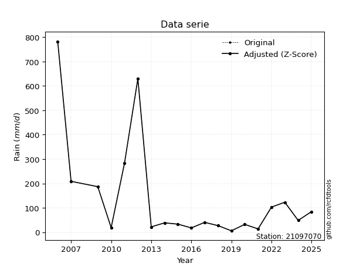</img>

</div>


> The initial value (value_initial) correspond to the initial obtained or null completed value, and value (value) is adjusted only when the initial value is outside the valid range (outlier) definite through the Z-Score value. If Z-Score is active, values out of range or outliers are replaced with the station mean value. A Z-Score (or standard score) measures how many standard deviations a data point is from the mean of a dataset, indicating its relative position; positive scores mean above the mean, negative mean below, and a score of zero is exactly at the mean, allowing for comparison of values from different distributions. It´s calculated using the formula $z=(x–μ)/σ$, where $x$ is the data point, $μ$ is the mean, and $σ$ is the standard deviation, helping identify outliers and understand probability.
>
> <sub>**Note**: In this study, "completing" (filling gaps in) and "extending" (forecasting or lengthening the historical record) rainfall data series are avoided for certain critical analyses because they introduce artificial bias and uncertainty, which can distort the statistics of rare events (extremes), alter day-to-day variability, and compromise the integrity and homogeneity of the original data. Some reasons against Completing/Extending rainfall data are: **Distortion of Extremes and Variability**: The primary issue is that most gap-filling or extension methods rely on averaging or regression with nearby stations, which inherently smooths the data. Rainfall is highly variable in space and time, with a large percentage of zero values and occasional large storms. Infilling methods often underestimate the highest values and overestimate the lowest (zero) values, which severely distorts analyses focused on flood frequency, drought severity, and intensity-duration-frequency (IDF) curves, **Loss of Data Homogeneity**: Infilled or extended data are synthetic estimates, not actual measurements. Combining these estimates with observed data can violate the assumption of data homogeneity, which requires that the data properties do not change over time. Inhomogeneity can lead to incorrect conclusions about long-term trends or changes in climate patterns, **Propagation of Errors**: Errors and biases from the original data (e.g., wind-induced undercatch, instrument errors, site changes) or the data used for imputation can propagate through the analysis, leading to unreliable hydrological models and inaccurate predictions, **Compromised Statistical Integrity**: For statistical analyses, especially those involving the frequency of events, using artificial data can introduce time bias or autocorrelation that doesn´t exist in reality, making it difficult to assess the true probability of events, **Difficulty in Validation**: It is difficult to accurately validate the quality of filled or extended data, especially for past periods where ground-truth measurements are unavailable. The reliability of imputation techniques heavily depends on the density of the surrounding station network and the complexity of the local topography.</sub>


### 4. Active continuous probability distributions from SciPy (80 of 104 available)

A Probability Density Function (PDF) describes the relative likelihood of a continuous random variable falling within a specific range, where the total area under its curve equals 1, and the area over any interval gives the actual probability for that range. Unlike discrete probabilities (like rolling a die), a PDF shows density, not direct probability for a single point (which is zero), with higher points indicating higher likelihood, often visualized as a bell curve for normal distributions.

A log of a probability density function (log-PDF) is simply the logarithm of the PDF´s value, denoted as $log(f(x))$, useful for converting multiplication of probabilities into addition, improving numerical stability with tiny numbers, and connecting to information theory concepts like entropy. Instead of dealing with very small probabilities (e.g., 0.000001), log-PDFs use negative numbers (e.g., $log(0.00001) ≈ -11.51$ that are easier for computers to handle, preventing underflow errors and simplifying complex calculations. In this study, each active probability distribution from SciPy is also evaluated in the $log$ form.

[scipy.stats](https://docs.scipy.org/doc/scipy/reference/stats.html) is a Python´s powerful submodule within the SciPy library for comprehensive statistical analysis, offering over 130 probability distributions (like Normal, Poisson, etc.), functions for descriptive stats (mean, variance), hypothesis testing (t-tests, chi-square), random variable generation, and statistical tests, making it essential for data science, modeling, and research. It provides tools to explore, model, and draw conclusions from data efficiently, working seamlessly with [NumPy](https://numpy.org/).

<div align="center">

|   id | p_dist           |   n_parameter | fit_method   | label                                                                       | active   | ref                                                                                                      |
|-----:|:-----------------|--------------:|:-------------|:----------------------------------------------------------------------------|:---------|:---------------------------------------------------------------------------------------------------------|
|    0 | alpha            |             3 | MLE          | Alpha                                                                       | True     | [:mortar_board:](https://docs.scipy.org/doc/scipy/reference/generated/scipy.stats.alpha.html)            |
|    1 | anglit           |             2 | MM           | Anglit                                                                      | True     | [:mortar_board:](https://docs.scipy.org/doc/scipy/reference/generated/scipy.stats.anglit.html)           |
|    2 | arcsine          |             2 | MM           | Arcsine                                                                     | True     | [:mortar_board:](https://docs.scipy.org/doc/scipy/reference/generated/scipy.stats.arcsine.html)          |
|    3 | argus            |             3 | MLE          | Argus                                                                       | True     | [:mortar_board:](https://docs.scipy.org/doc/scipy/reference/generated/scipy.stats.argus.html)            |
|    4 | beta             |             4 | MLE          | Beta                                                                        | True     | [:mortar_board:](https://docs.scipy.org/doc/scipy/reference/generated/scipy.stats.beta.html)             |
|    5 | betaprime        |             4 | MLE          | Beta prime                                                                  | True     | [:mortar_board:](https://docs.scipy.org/doc/scipy/reference/generated/scipy.stats.betaprime.html)        |
|    6 | bradford         |             3 | MLE          | Bradford                                                                    | True     | [:mortar_board:](https://docs.scipy.org/doc/scipy/reference/generated/scipy.stats.bradford.html)         |
|    7 | burr             |             4 | MLE          | Burr (Type III)                                                             | True     | [:mortar_board:](https://docs.scipy.org/doc/scipy/reference/generated/scipy.stats.burr.html)             |
|    8 | burr12           |             4 | MLE          | Burr (Type III) 12                                                          | True     | [:mortar_board:](https://docs.scipy.org/doc/scipy/reference/generated/scipy.stats.burr12.html)           |
|    9 | cosine           |             2 | MLE          | Cosine                                                                      | True     | [:mortar_board:](https://docs.scipy.org/doc/scipy/reference/generated/scipy.stats.cosine.html)           |
|   10 | crystalball      |             4 | MLE          | Crystalball                                                                 | True     | [:mortar_board:](https://docs.scipy.org/doc/scipy/reference/generated/scipy.stats.crystalball.html)      |
|   11 | dgamma           |             3 | MLE          | Double gamma                                                                | True     | [:mortar_board:](https://docs.scipy.org/doc/scipy/reference/generated/scipy.stats.dgamma.html)           |
|   12 | dweibull         |             3 | MLE          | Double Weibull                                                              | True     | [:mortar_board:](https://docs.scipy.org/doc/scipy/reference/generated/scipy.stats.dweibull.html)         |
|   13 | erlang           |             3 | MLE          | Erlang                                                                      | True     | [:mortar_board:](https://docs.scipy.org/doc/scipy/reference/generated/scipy.stats.erlang.html)           |
|   14 | exponnorm        |             3 | MLE          | Exponentially modified Normal                                               | True     | [:mortar_board:](https://docs.scipy.org/doc/scipy/reference/generated/scipy.stats.exponnorm.html)        |
|   15 | exponpow         |             3 | MLE          | Exponential power                                                           | True     | [:mortar_board:](https://docs.scipy.org/doc/scipy/reference/generated/scipy.stats.exponpow.html)         |
|   16 | exponweib        |             4 | MLE          | Exponentiated Weibull                                                       | True     | [:mortar_board:](https://docs.scipy.org/doc/scipy/reference/generated/scipy.stats.exponweib.html)        |
|   17 | f                |             4 | MLE          | F                                                                           | True     | [:mortar_board:](https://docs.scipy.org/doc/scipy/reference/generated/scipy.stats.f.html)                |
|   18 | fatiguelife      |             3 | MLE          | Fatigue-life (Birnbaum-Saunders)                                            | True     | [:mortar_board:](https://docs.scipy.org/doc/scipy/reference/generated/scipy.stats.fatiguelife.html)      |
|   19 | foldnorm         |             3 | MM           | Fold Normal                                                                 | True     | [:mortar_board:](https://docs.scipy.org/doc/scipy/reference/generated/scipy.stats.foldnorm.html)         |
|   20 | gamma            |             3 | MLE          | Gamma                                                                       | True     | [:mortar_board:](https://docs.scipy.org/doc/scipy/reference/generated/scipy.stats.gamma.html)            |
|   21 | gausshyper       |             6 | MLE          | Gauss hypergeometric                                                        | True     | [:mortar_board:](https://docs.scipy.org/doc/scipy/reference/generated/scipy.stats.gausshyper.html)       |
|   22 | genexpon         |             5 | MLE          | Generalized exponential                                                     | True     | [:mortar_board:](https://docs.scipy.org/doc/scipy/reference/generated/scipy.stats.genexpon.html)         |
|   23 | genextreme       |             3 | MLE          | Generalized exponential                                                     | True     | [:mortar_board:](https://docs.scipy.org/doc/scipy/reference/generated/scipy.stats.genextreme.html)       |
|   24 | gengamma         |             4 | MLE          | Generalized gamma                                                           | True     | [:mortar_board:](https://docs.scipy.org/doc/scipy/reference/generated/scipy.stats.gengamma.html)         |
|   25 | genhalflogistic  |             3 | MLE          | Generalized half-logistic                                                   | True     | [:mortar_board:](https://docs.scipy.org/doc/scipy/reference/generated/scipy.stats.genhalflogistic.html)  |
|   26 | genlogistic      |             3 | MLE          | Generalized logistic                                                        | True     | [:mortar_board:](https://docs.scipy.org/doc/scipy/reference/generated/scipy.stats.genlogistic.html)      |
|   27 | gennorm          |             3 | MLE          | Generalized Normal                                                          | True     | [:mortar_board:](https://docs.scipy.org/doc/scipy/reference/generated/scipy.stats.gennorm.html)          |
|   28 | genpareto        |             3 | MLE          | Generalized Pareto                                                          | True     | [:mortar_board:](https://docs.scipy.org/doc/scipy/reference/generated/scipy.stats.genpareto.html)        |
|   29 | gompertz         |             3 | MLE          | Gompertz (or truncated Gumbel)                                              | True     | [:mortar_board:](https://docs.scipy.org/doc/scipy/reference/generated/scipy.stats.gompertz.html)         |
|   30 | gumbel_l         |             2 | MM           | Gumbel Left Skew                                                            | True     | [:mortar_board:](https://docs.scipy.org/doc/scipy/reference/generated/scipy.stats.gumbel_l.html)         |
|   31 | gumbel_r         |             2 | MM           | Gumbel Right Skew                                                           | True     | [:mortar_board:](https://docs.scipy.org/doc/scipy/reference/generated/scipy.stats.gumbel_r.html)         |
|   32 | halfgennorm      |             3 | MLE          | Upper half of a generalized normal                                          | True     | [:mortar_board:](https://docs.scipy.org/doc/scipy/reference/generated/scipy.stats.halfgennorm.html)      |
|   33 | halflogistic     |             2 | MM           | Half-logistic                                                               | True     | [:mortar_board:](https://docs.scipy.org/doc/scipy/reference/generated/scipy.stats.halflogistic.html)     |
|   34 | halfnorm         |             2 | MM           | Half Normal                                                                 | True     | [:mortar_board:](https://docs.scipy.org/doc/scipy/reference/generated/scipy.stats.halfnorm.html)         |
|   35 | hypsecant        |             2 | MM           | hyperbolic secant                                                           | True     | [:mortar_board:](https://docs.scipy.org/doc/scipy/reference/generated/scipy.stats.hypsecant.html)        |
|   36 | invgamma         |             3 | MLE          | Inverted gamma                                                              | True     | [:mortar_board:](https://docs.scipy.org/doc/scipy/reference/generated/scipy.stats.invgamma.html)         |
|   37 | invgauss         |             3 | MLE          | Inverse Gaussian                                                            | True     | [:mortar_board:](https://docs.scipy.org/doc/scipy/reference/generated/scipy.stats.invgauss.html)         |
|   38 | invweibull       |             3 | MLE          | Inverted Weibull                                                            | True     | [:mortar_board:](https://docs.scipy.org/doc/scipy/reference/generated/scipy.stats.invweibull.html)       |
|   39 | johnsonsb        |             4 | MLE          | Johnson SB                                                                  | True     | [:mortar_board:](https://docs.scipy.org/doc/scipy/reference/generated/scipy.stats.johnsonsb.html)        |
|   40 | johnsonsu        |             4 | MLE          | Johnson Su                                                                  | True     | [:mortar_board:](https://docs.scipy.org/doc/scipy/reference/generated/scipy.stats.johnsonsu.html)        |
|   41 | kappa3           |             3 | MLE          | Kappa 3                                                                     | True     | [:mortar_board:](https://docs.scipy.org/doc/scipy/reference/generated/scipy.stats.kappa3.html)           |
|   42 | kappa4           |             4 | MLE          | Kappa 4                                                                     | True     | [:mortar_board:](https://docs.scipy.org/doc/scipy/reference/generated/scipy.stats.kappa4.html)           |
|   43 | ksone            |             3 | MLE          | Kolmogorov-Smirnov one-sided test statistic distribution                    | True     | [:mortar_board:](https://docs.scipy.org/doc/scipy/reference/generated/scipy.stats.ksone.html)            |
|   44 | kstwobign        |             2 | MLE          | Limiting distribution of scaled Kolmogorov-Smirnov two-sided test statistic | True     | [:mortar_board:](https://docs.scipy.org/doc/scipy/reference/generated/scipy.stats.kstwobign.html)        |
|   45 | laplace          |             2 | MM           | Laplace                                                                     | True     | [:mortar_board:](https://docs.scipy.org/doc/scipy/reference/generated/scipy.stats.laplace.html)          |
|   46 | levy_l           |             2 | MLE          | Left-skewed Levy                                                            | True     | [:mortar_board:](https://docs.scipy.org/doc/scipy/reference/generated/scipy.stats.levy_l.html)           |
|   47 | loggamma         |             3 | MLE          | Log gamma                                                                   | True     | [:mortar_board:](https://docs.scipy.org/doc/scipy/reference/generated/scipy.stats.loggamma.html)         |
|   48 | logistic         |             2 | MM           | Logistic (or Sech-squared)                                                  | True     | [:mortar_board:](https://docs.scipy.org/doc/scipy/reference/generated/scipy.stats.logistic.html)         |
|   49 | loglaplace       |             3 | MLE          | Log-Laplace                                                                 | True     | [:mortar_board:](https://docs.scipy.org/doc/scipy/reference/generated/scipy.stats.loglaplace.html)       |
|   50 | lomax            |             3 | MLE          | Lomax (Pareto of the second kind)                                           | True     | [:mortar_board:](https://docs.scipy.org/doc/scipy/reference/generated/scipy.stats.lomax.html)            |
|   51 | maxwell          |             2 | MM           | Maxwell                                                                     | True     | [:mortar_board:](https://docs.scipy.org/doc/scipy/reference/generated/scipy.stats.maxwell.html)          |
|   52 | mielke           |             4 | MLE          | Mielke Beta-Kappa / Dagum                                                   | True     | [:mortar_board:](https://docs.scipy.org/doc/scipy/reference/generated/scipy.stats.mielke.html)           |
|   53 | moyal            |             2 | MM           | Moyal                                                                       | True     | [:mortar_board:](https://docs.scipy.org/doc/scipy/reference/generated/scipy.stats.moyal.html)            |
|   54 | nakagami         |             3 | MLE          | Nakagami                                                                    | True     | [:mortar_board:](https://docs.scipy.org/doc/scipy/reference/generated/scipy.stats.nakagami.html)         |
|   55 | ncf              |             5 | MLE          | Non-central F distribution                                                  | True     | [:mortar_board:](https://docs.scipy.org/doc/scipy/reference/generated/scipy.stats.ncf.html)              |
|   56 | nct              |             4 | MLE          | Non-central Student’s t                                                     | True     | [:mortar_board:](https://docs.scipy.org/doc/scipy/reference/generated/scipy.stats.nct.html)              |
|   57 | norm             |             2 | MM           | Normal                                                                      | True     | [:mortar_board:](https://docs.scipy.org/doc/scipy/reference/generated/scipy.stats.norm.html)             |
|   58 | pearson3         |             3 | MM           | Pearson type III                                                            | True     | [:mortar_board:](https://docs.scipy.org/doc/scipy/reference/generated/scipy.stats.pearson3.html)         |
|   59 | powerlaw         |             3 | MLE          | Power-function                                                              | True     | [:mortar_board:](https://docs.scipy.org/doc/scipy/reference/generated/scipy.stats.powerlaw.html)         |
|   60 | rayleigh         |             2 | MM           | Rayleigh                                                                    | True     | [:mortar_board:](https://docs.scipy.org/doc/scipy/reference/generated/scipy.stats.rayleigh.html)         |
|   61 | rdist            |             3 | MLE          | R-distributed (symmetric beta)                                              | True     | [:mortar_board:](https://docs.scipy.org/doc/scipy/reference/generated/scipy.stats.rdist.html)            |
|   62 | rice             |             3 | MLE          | Rice                                                                        | True     | [:mortar_board:](https://docs.scipy.org/doc/scipy/reference/generated/scipy.stats.rice.html)             |
|   63 | semicircular     |             2 | MM           | Semicircular                                                                | True     | [:mortar_board:](https://docs.scipy.org/doc/scipy/reference/generated/scipy.stats.semicircular.html)     |
|   64 | skewnorm         |             3 | MLE          | Skew normal                                                                 | True     | [:mortar_board:](https://docs.scipy.org/doc/scipy/reference/generated/scipy.stats.skewnorm.html)         |
|   65 | t                |             3 | MLE          | Student’s t                                                                 | True     | [:mortar_board:](https://docs.scipy.org/doc/scipy/reference/generated/scipy.stats.t.html)                |
|   66 | trapezoid        |             4 | MLE          | Trapezoid                                                                   | True     | [:mortar_board:](https://docs.scipy.org/doc/scipy/reference/generated/scipy.stats.trapezoid.html)        |
|   67 | triang           |             3 | MLE          | Triangular                                                                  | True     | [:mortar_board:](https://docs.scipy.org/doc/scipy/reference/generated/scipy.stats.triang.html)           |
|   68 | truncexpon       |             3 | MLE          | Truncated exponential                                                       | True     | [:mortar_board:](https://docs.scipy.org/doc/scipy/reference/generated/scipy.stats.truncexpon.html)       |
|   69 | truncnorm        |             4 | MLE          | Truncated normal                                                            | True     | [:mortar_board:](https://docs.scipy.org/doc/scipy/reference/generated/scipy.stats.truncnorm.html)        |
|   70 | truncpareto      |             4 | MLE          | Upper truncated Pareto                                                      | True     | [:mortar_board:](https://docs.scipy.org/doc/scipy/reference/generated/scipy.stats.truncpareto.html)      |
|   71 | truncweibull_min |             5 | MLE          | Doubly truncated Weibull minimum                                            | True     | [:mortar_board:](https://docs.scipy.org/doc/scipy/reference/generated/scipy.stats.truncweibull_min.html) |
|   72 | tukeylambda      |             3 | MLE          | Tukey-Lamdba                                                                | True     | [:mortar_board:](https://docs.scipy.org/doc/scipy/reference/generated/scipy.stats.tukeylambda.html)      |
|   73 | uniform          |             2 | MLE          | Uniform                                                                     | True     | [:mortar_board:](https://docs.scipy.org/doc/scipy/reference/generated/scipy.stats.uniform.html)          |
|   74 | vonmises         |             3 | MLE          | Von Mises                                                                   | True     | [:mortar_board:](https://docs.scipy.org/doc/scipy/reference/generated/scipy.stats.vonmises.html)         |
|   75 | vonmises_line    |             3 | MLE          | Von Mises line                                                              | True     | [:mortar_board:](https://docs.scipy.org/doc/scipy/reference/generated/scipy.stats.vonmises_line.html)    |
|   76 | wald             |             2 | MM           | Wald                                                                        | True     | [:mortar_board:](https://docs.scipy.org/doc/scipy/reference/generated/scipy.stats.wald.html)             |
|   77 | weibull_max      |             3 | MLE          | Weibull maximum                                                             | True     | [:mortar_board:](https://docs.scipy.org/doc/scipy/reference/generated/scipy.stats.weibull_max.html)      |
|   78 | weibull_min      |             3 | MLE          | Weibull minimum                                                             | True     | [:mortar_board:](https://docs.scipy.org/doc/scipy/reference/generated/scipy.stats.weibull_min.html)      |
|   79 | wrapcauchy       |             3 | MLE          | Wrapped  Cauchy                                                             | True     | [:mortar_board:](https://docs.scipy.org/doc/scipy/reference/generated/scipy.stats.wrapcauchy.html)       |

</div>

> **n_parameter:** # arguments & localization & scale.
>
> **Fit methods:** (MLE) maximum likelihood, (MM) L-moments.
>
>**Inactive** (With the only purpose of prevent loops, zero divisions, infinite values, over high estimated values or horizontal trending for recurrence intervals estimations, the follow distributions were disabled.)**:** lognorm, norminvgauss, powernorm, powerlognorm, cauchy, halfcauchy, foldcauchy, skewcauchy, chi2, expon, fisk, genhyperbolic, geninvgauss, gibrat, kstwo, laplace_asymmetric, levy, levy_stable, ncx2, pareto, rel_breitwigner, recipinvgauss, studentized_range, loguniform, 


## B. Probability (PDF) vs. Empirical (EDF) distributions functions

A continuous probability distribution (CPD) describes probabilities for variables that can take any value within a range (like rain any time), unlike discrete variables with specific outcomes (like temperature). It uses a Probability Density Function (PDF), a curve where the total area under it equals 1, and the probability of the variable falling within an interval (a to b) is found by calculating the area under the curve between those points. A key feature is that the probability of hitting any single exact value is zero, so probabilities are always expressed for ranges, e.g., $P(a ≤ X ≤ b)$.

<div align="center">

Distributions parameters from station values
|     |   station | p_dist              |   n |              loc |          scale | shape                  | shape1                 | shape2             | shape3             |
|----:|----------:|:--------------------|----:|-----------------:|---------------:|:-----------------------|:-----------------------|:-------------------|:-------------------|
|   0 |  21097070 | alpha               |  19 |     -0.0541595   |   20.15        | 8.273872631770484e-11  |                        |                    |                    |
|   1 |  21097070 | anglit              |  19 |    142.084       |  610.346       |                        |                        |                    |                    |
|   2 |  21097070 | arcsine             |  19 |   -152.973       |  590.114       |                        |                        |                    |                    |
|   3 |  21097070 | argus               |  19 |   -439.778       | 1241.51        | 2.3045900381910473e-07 |                        |                    |                    |
|   4 |  21097070 | beta                |  19 |      5.9         |  855.389       | 0.22942538034975535    | 0.7238252838236818     |                    |                    |
|   5 |  21097070 | betaprime           |  19 |      5.8966      |   58.203       | 0.8388046731436853     | 1.1963382143657824     |                    |                    |
|   6 |  21097070 | bradford            |  19 |      5.89998     |  809.878       | 62.49855822206425      |                        |                    |                    |
|   7 |  21097070 | burr                |  19 |      0.668611    |    6.82197     | 0.9792816470216297     | 5.188297587956201      |                    |                    |
|   8 |  21097070 | burr12              |  19 |     -0.0747877   |   21.1348      | 2.38803599476803       | 0.33691577221700353    |                    |                    |
|   9 |  21097070 | cosine              |  19 |     95.9373      |   70.8617      |                        |                        |                    |                    |
|  10 |  21097070 | crystalball         |  19 |    142.033       |  208.661       | 12140.466369130223     | 2204.1192995646425     |                    |                    |
|  11 |  21097070 | dgamma              |  19 |     33.1         |  136.581       | 0.6472048610876617     |                        |                    |                    |
|  12 |  21097070 | dweibull            |  19 |     32.2         |  183.165       | 0.5942074912164721     |                        |                    |                    |
|  13 |  21097070 | erlang              |  19 |      5.9         |  377.857       | 0.45603954414268977    |                        |                    |                    |
|  14 |  21097070 | exponnorm           |  19 |      5.71438     |    0.0685442   | 1971.9658102586163     |                        |                    |                    |
|  15 |  21097070 | exponpow            |  19 |      5.9         |  411.852       | 0.45612912341357126    |                        |                    |                    |
|  16 |  21097070 | exponweib           |  19 |      5.9         |   23.4527      | 2.001243780691172      | 0.4046573825309463     |                    |                    |
|  17 |  21097070 | f                   |  19 |     -2.64953     |   36.7936      | 716.0917828590917      | 1.9946542920617256     |                    |                    |
|  18 |  21097070 | fatiguelife         |  19 |      1.90422     |   61.8446      | 1.6307256185633339     |                        |                    |                    |
|  19 |  21097070 | foldnorm            |  19 |   -158.317       |  376.354       | 0.0013022326195130207  |                        |                    |                    |
|  20 |  21097070 | gamma               |  19 |      5.9         |  149.452       | 0.6273235016620892     |                        |                    |                    |
|  21 |  21097070 | gausshyper          |  19 |      5.9         | 1104.36        | 0.38537248119294026    | 1.3606265064302465     | 1.4875673879586335 | 1.0412113246818162 |
|  22 |  21097070 | genexpon            |  19 |      5.9         |  224.516       | 1.6486624804063394     | 1.6961679860450985e-10 | 2.111411391644592  |                    |
|  23 |  21097070 | genextreme          |  19 |     34.04        |   37.0894      | -1.0191847383734967    |                        |                    |                    |
|  24 |  21097070 | gengamma            |  19 |      5.9         |   68.365       | 1.1460653003340138     | 0.5177110755522806     |                    |                    |
|  25 |  21097070 | genhalflogistic     |  19 |      5.9         |  130.296       | 0.05345636135039733    |                        |                    |                    |
|  26 |  21097070 | genlogistic         |  19 |   -728.539       |  101.597       | 2483.9530850162        |                        |                    |                    |
|  27 |  21097070 | gennorm             |  19 |     32.2         |    0.0369081   | 0.2179501851782339     |                        |                    |                    |
|  28 |  21097070 | genpareto           |  19 |      5.9         |   53.5133      | 0.7537037620520235     |                        |                    |                    |
|  29 |  21097070 | gompertz            |  19 |      5.89949     |    1.42914e+07 | 102193.87766905696     |                        |                    |                    |
|  30 |  21097070 | gumbel_l            |  19 |    235.982       |  162.673       |                        |                        |                    |                    |
|  31 |  21097070 | gumbel_r            |  19 |     48.1866      |  162.673       |                        |                        |                    |                    |
|  32 |  21097070 | halfgennorm         |  19 |      5.9         |    2.27126     | 0.3280154097069925     |                        |                    |                    |
|  33 |  21097070 | halflogistic        |  19 |   -105.199       |  178.377       |                        |                        |                    |                    |
|  34 |  21097070 | halfnorm            |  19 |   -134.069       |  346.107       |                        |                        |                    |                    |
|  35 |  21097070 | hypsecant           |  19 |    142.084       |  132.822       |                        |                        |                    |                    |
|  36 |  21097070 | invgamma            |  19 |     -2.70073     |   36.6952      | 0.9973282148552185     |                        |                    |                    |
|  37 |  21097070 | invgauss            |  19 |     -0.0062807   |   39.5535      | 3.5923590923393363     |                        |                    |                    |
|  38 |  21097070 | invweibull          |  19 |     -2.35131     |   36.3913      | 0.9811751925244662     |                        |                    |                    |
|  39 |  21097070 | johnsonsb           |  19 |      5.9         |  776.5         | -0.20233528347608773   | 0.1735302121300141     |                    |                    |
|  40 |  21097070 | johnsonsu           |  19 |     12.8989      |    6.07567     | -1.4664346013282596    | 0.5830410286219756     |                    |                    |
|  41 |  21097070 | kappa3              |  19 |      5.9         |   49.7624      | 1.1314273477703716     |                        |                    |                    |
|  42 |  21097070 | kappa4              |  19 |    -69.3641      |  870.738       | 1.0947091343874529     | 1.020308077421924      |                    |                    |
|  43 |  21097070 | ksone               |  19 |    -71.75        |  931.8         | 1.0                    |                        |                    |                    |
|  44 |  21097070 | kstwobign           |  19 |   -355.861       |  587.46        |                        |                        |                    |                    |
|  45 |  21097070 | laplace             |  19 |    142.084       |  147.528       |                        |                        |                    |                    |
|  46 |  21097070 | levy_l              |  19 |    848.857       |  453.715       |                        |                        |                    |                    |
|  47 |  21097070 | loggamma            |  19 | -66003.8         | 8857.61        | 1750.9483820564637     |                        |                    |                    |
|  48 |  21097070 | logistic            |  19 |    142.084       |  115.027       |                        |                        |                    |                    |
|  49 |  21097070 | loglaplace          |  19 |     -0.102404    |   40.5024      | 0.9573250024556652     |                        |                    |                    |
|  50 |  21097070 | lomax               |  19 |      5.9         |   70.9986      | 1.3267997654591808     |                        |                    |                    |
|  51 |  21097070 | maxwell             |  19 |   -352.297       |  309.808       |                        |                        |                    |                    |
|  52 |  21097070 | mielke              |  19 |      4.6328      |   25.0089      | 1.5033199191112416     | 0.9876133129875773     |                    |                    |
|  53 |  21097070 | moyal               |  19 |     22.7724      |   93.9195      |                        |                        |                    |                    |
|  54 |  21097070 | nakagami            |  19 |      5.9         |  334.231       | 0.19661146977080646    |                        |                    |                    |
|  55 |  21097070 | ncf                 |  19 |     -0.00366755  |    0.981098    | 0.7103079705289177     | 1.9959976327707423     | 25.9567787184799   |                    |
|  56 |  21097070 | nct                 |  19 |     -8.33094     |    3.64069     | 0.9044600567204168     | 10.094180344072186     |                    |                    |
|  57 |  21097070 | norm                |  19 |    142.084       |  208.637       |                        |                        |                    |                    |
|  58 |  21097070 | pearson3            |  19 |    142.084       |  208.637       | 2.1121785827739608     |                        |                    |                    |
|  59 |  21097070 | powerlaw            |  19 |      5.9         |  776.5         | 0.2160747284757595     |                        |                    |                    |
|  60 |  21097070 | rayleigh            |  19 |   -257.05        |  318.463       |                        |                        |                    |                    |
|  61 |  21097070 | rdist               |  19 |    -72.1129      |  355.413       | 1.257088218428366      |                        |                    |                    |
|  62 |  21097070 | rice                |  19 |   -145.857       |  251.435       | 0.00016026051533098292 |                        |                    |                    |
|  63 |  21097070 | semicircular        |  19 |    142.084       |  417.273       |                        |                        |                    |                    |
|  64 |  21097070 | skewnorm            |  19 |      5.89996     |  249.155       | 34099973.515187666     |                        |                    |                    |
|  65 |  21097070 | t                   |  19 |     30.1581      |   17.1625      | 0.6049433076764776     |                        |                    |                    |
|  66 |  21097070 | trapezoid           |  19 |    -75.3375      |  931.8         | 1.0                    | 1.0                    |                    |                    |
|  67 |  21097070 | triang              |  19 |      5.9         |  831.218       | 2.079673460868483e-13  |                        |                    |                    |
|  68 |  21097070 | truncexpon          |  19 |      5.9         |  601.659       | 1.2905987980005629     |                        |                    |                    |
|  69 |  21097070 | truncnorm           |  19 |  -7482.24        | 1184.24        | 6.323129808003088      | 6.978859662760517      |                    |                    |
|  70 |  21097070 | truncpareto         |  19 |    -65.0559      |   70.9559      | 1.0507747607160298     | 11.943410025671508     |                    |                    |
|  71 |  21097070 | truncweibull_min    |  19 |     -0.279486    | 1095.48        | 0.005316730770041633   | 0.005640899893875557   | 0.7144634181201688 |                    |
|  72 |  21097070 | tukeylambda         |  19 |    -70.6618      |  389.265       | 1.0997360244381373     |                        |                    |                    |
|  73 |  21097070 | uniform             |  19 |      5.9         |  776.5         |                        |                        |                    |                    |
|  74 |  21097070 | vonmises            |  19 |      1.90396     |    1           | 0.4714947348347092     |                        |                    |                    |
|  75 |  21097070 | vonmises_line       |  19 |     84.674       |  173.646       | 2.8345892813531535     |                        |                    |                    |
|  76 |  21097070 | wald                |  19 |    -66.5525      |  208.637       |                        |                        |                    |                    |
|  77 |  21097070 | weibull_max         |  19 |    782.4         |    1.72873     | 0.1388941291854517     |                        |                    |                    |
|  78 |  21097070 | weibull_min         |  19 |      5.9         |  239.351       | 0.5912915003754629     |                        |                    |                    |
|  79 |  21097070 | wrapcauchy          |  19 |      5.89998     |  123.584       | 0.7475046655501063     |                        |                    |                    |
|  80 |  21097070 | logalpha            |  19 |     -9.01617     |  134.92        | 10.380570095393999     |                        |                    |                    |
|  81 |  21097070 | loganglit           |  19 |      4.10451     |    3.76799     |                        |                        |                    |                    |
|  82 |  21097070 | logarcsine          |  19 |      2.28296     |    3.64309     |                        |                        |                    |                    |
|  83 |  21097070 | logargus            |  19 |      1.00588     |    5.78295     | 2.911039453700712e-05  |                        |                    |                    |
|  84 |  21097070 | logbeta             |  19 |      1.77495     |    4.889       | 0.936537507909062      | 0.9800914602524591     |                    |                    |
|  85 |  21097070 | logbetaprime        |  19 |      0.254581    |  256.137       | 8.68999466622687       | 578.8904786968443      |                    |                    |
|  86 |  21097070 | logbradford         |  19 |      1.77495     |    4.90967     | 0.6576310312508058     |                        |                    |                    |
|  87 |  21097070 | logburr             |  19 |     -0.00199722  |    4.02559     | 5.487887940005786      | 0.913108053742512      |                    |                    |
|  88 |  21097070 | logburr12           |  19 |      1.329       |   29.82        | 2.287812429698146      | 173.94240466376584     |                    |                    |
|  89 |  21097070 | logcosine           |  19 |      4.17623     |    1.10322     |                        |                        |                    |                    |
|  90 |  21097070 | logcrystalball      |  19 |      4.10451     |    1.28803     | 132.7116576318054      | 36.61864491381745      |                    |                    |
|  91 |  21097070 | logdgamma           |  19 |      3.82248     |    0.738061    | 1.4276548968659424     |                        |                    |                    |
|  92 |  21097070 | logdweibull         |  19 |      3.83409     |    1.13648     | 1.2878397695309403     |                        |                    |                    |
|  93 |  21097070 | logerlang           |  19 |     -0.0537062   |    0.407552    | 10.202909460065868     |                        |                    |                    |
|  94 |  21097070 | logexponnorm        |  19 |      3.07102     |    0.870184    | 1.1876685015298476     |                        |                    |                    |
|  95 |  21097070 | logexponpow         |  19 |      1.64961     |    3.73471     | 1.4245541531651655     |                        |                    |                    |
|  96 |  21097070 | logexponweib        |  19 |    -11.4826      |    8.68278     | 107.378142816723       | 2.8089210081659246     |                    |                    |
|  97 |  21097070 | logf                |  19 |     -0.054032    |    4.15775     | 20.421475156629082     | 91940.72673654644      |                    |                    |
|  98 |  21097070 | logfatiguelife      |  19 |     -2.01633     |    5.98671     | 0.21167249145644093    |                        |                    |                    |
|  99 |  21097070 | logfoldnorm         |  19 |      2.022       |    1.45451     | 1.351478155131618      |                        |                    |                    |
| 100 |  21097070 | loggamma            |  19 |     -0.0537101   |    0.407551    | 10.202934093926856     |                        |                    |                    |
| 101 |  21097070 | loggausshyper       |  19 |      1.63235     |    5.03001     | 1.1828950283375992     | 0.8002484315625571     | 0.9348193468655173 | 0.9012988433695355 |
| 102 |  21097070 | loggenexpon         |  19 |      1.51928     |    3.44606     | 3.515146945320881e-05  | 12.745810678832399     | 0.2439112280477438 |                    |
| 103 |  21097070 | loggenextreme       |  19 |      3.58061     |    1.16158     | 0.156153882497843      |                        |                    |                    |
| 104 |  21097070 | loggengamma         |  19 |      1.77495     |    4.65602     | 0.16636773990207962    | 5.7120410560086174     |                    |                    |
| 105 |  21097070 | loggenhalflogistic  |  19 |      1.32695     |    5.52193     | 1.03495779980853       |                        |                    |                    |
| 106 |  21097070 | loggenlogistic      |  19 |      1.81767     |    1.00778     | 5.967739440332268      |                        |                    |                    |
| 107 |  21097070 | loggennorm          |  19 |      3.69881     |    1.01384     | 1.000345496664652      |                        |                    |                    |
| 108 |  21097070 | loggenpareto        |  19 |     -0.00806543  |    9.41125     | -1.4108904877425477    |                        |                    |                    |
| 109 |  21097070 | loggompertz         |  19 |      1.77495     |    1.89246     | 0.29681880817867035    |                        |                    |                    |
| 110 |  21097070 | loggumbel_l         |  19 |      4.68419     |    1.00427     |                        |                        |                    |                    |
| 111 |  21097070 | loggumbel_r         |  19 |      3.52483     |    1.00427     |                        |                        |                    |                    |
| 112 |  21097070 | loghalfgennorm      |  19 |      1.77495     |    1.25788     | 0.7059347156319873     |                        |                    |                    |
| 113 |  21097070 | loghalflogistic     |  19 |      2.57787     |    1.10124     |                        |                        |                    |                    |
| 114 |  21097070 | loghalfnorm         |  19 |      2.39968     |    2.1367      |                        |                        |                    |                    |
| 115 |  21097070 | loghypsecant        |  19 |      4.10451     |    0.819983    |                        |                        |                    |                    |
| 116 |  21097070 | loginvgamma         |  19 |     -4.33274     |  362.636       | 43.976962591567386     |                        |                    |                    |
| 117 |  21097070 | loginvgauss         |  19 |     -2.07312     |  139.065       | 0.044422640029124154   |                        |                    |                    |
| 118 |  21097070 | loginvweibull       |  19 |     -1.19277e+08 |    1.19277e+08 | 107068489.37442142     |                        |                    |                    |
| 119 |  21097070 | logjohnsonsb        |  19 |      1.39087     |    5.98531     | 0.20193693889866285    | 0.9322600012889852     |                    |                    |
| 120 |  21097070 | logjohnsonsu        |  19 |     -1.95895     |    1.11111     | -11.404219836290423    | 4.7978414500391935     |                    |                    |
| 121 |  21097070 | logkappa3           |  19 |      1.76248     |    4.88807     | 1546.3249840485487     |                        |                    |                    |
| 122 |  21097070 | logkappa4           |  19 |      1.46298     |    5.22134     | 1.0635546629174049     | 1.0035724007325064     |                    |                    |
| 123 |  21097070 | logksone            |  19 |      1.28621     |    5.8649      | 1.0                    |                        |                    |                    |
| 124 |  21097070 | logkstwobign        |  19 |     -0.538202    |    5.33314     |                        |                        |                    |                    |
| 125 |  21097070 | loglaplace          |  19 |      4.10451     |    0.910772    |                        |                        |                    |                    |
| 126 |  21097070 | loglevy_l           |  19 |      6.8946      |    1.47049     |                        |                        |                    |                    |
| 127 |  21097070 | logloggamma         |  19 |   -277.421       |   40.7849      | 995.4411704444601      |                        |                    |                    |
| 128 |  21097070 | loglogistic         |  19 |      4.10451     |    0.710126    |                        |                        |                    |                    |
| 129 |  21097070 | logloglaplace       |  19 |     -0.0431705   |    3.742       | 3.8401945618476194     |                        |                    |                    |
| 130 |  21097070 | loglomax            |  19 |      1.77364     | 1365.74        | 585.8777542806429      |                        |                    |                    |
| 131 |  21097070 | logmaxwell          |  19 |      1.05243     |    1.91261     |                        |                        |                    |                    |
| 132 |  21097070 | logmielke           |  19 |  -3176.43        | 3178.74        | 13540.020304409667     | 3315.341353429697      |                    |                    |
| 133 |  21097070 | logmoyal            |  19 |      3.36793     |    0.579815    |                        |                        |                    |                    |
| 134 |  21097070 | lognakagami         |  19 |      2.61007     |    1.94032     | 0.3946577828035204     |                        |                    |                    |
| 135 |  21097070 | logncf              |  19 |     -0.577502    |    1.83354     | 18.859012643225604     | 267.71213906925414     | 28.886063669640592 |                    |
| 136 |  21097070 | lognct              |  19 |     -4.27228     |    0.62013     | 29.331049544211304     | 13.157804802809348     |                    |                    |
| 137 |  21097070 | lognorm             |  19 |      4.10451     |    1.28803     |                        |                        |                    |                    |
| 138 |  21097070 | logpearson3         |  19 |      4.10451     |    1.28803     | 0.3793758840604339     |                        |                    |                    |
| 139 |  21097070 | logpowerlaw         |  19 |      1.77495     |    4.88741     | 0.363953061657385      |                        |                    |                    |
| 140 |  21097070 | lograyleigh         |  19 |      1.64044     |    1.96604     |                        |                        |                    |                    |
| 141 |  21097070 | logrdist            |  19 |      2.42424     |    2.91714     | 1.048984713356544      |                        |                    |                    |
| 142 |  21097070 | logrice             |  19 |      1.44105     |    1.58994     | 1.2093621062673487     |                        |                    |                    |
| 143 |  21097070 | logsemicircular     |  19 |      4.10451     |    2.57605     |                        |                        |                    |                    |
| 144 |  21097070 | logskewnorm         |  19 |      2.5898      |    1.9883      | 2.985948512443175      |                        |                    |                    |
| 145 |  21097070 | logt                |  19 |      4.10451     |    1.28803     | 8392652267.198247      |                        |                    |                    |
| 146 |  21097070 | logtrapezoid        |  19 |      1.28621     |    5.8649      | 0.9999999999999999     | 1.0                    |                    |                    |
| 147 |  21097070 | logtriang           |  19 |      0.421473    |    6.24089     | 0.9999997714280768     |                        |                    |                    |
| 148 |  21097070 | logtruncexpon       |  19 |      1.77495     |    6.1791      | 0.7909590180215462     |                        |                    |                    |
| 149 |  21097070 | logtruncnorm        |  19 |     -0.225297    |    3.60218     | 0.5549544925183154     | 1.9120800713901858     |                    |                    |
| 150 |  21097070 | logtruncpareto      |  19 |      1.77495     |    1.21854e-08 | 0.055555509791560174   | 401089196.53415847     |                    |                    |
| 151 |  21097070 | logtruncweibull_min |  19 |      1.6796      |    5.64455     | 1.321498573463018      | 7.169037731555913e-05  | 0.8827555888516831 |                    |
| 152 |  21097070 | logtukeylambda      |  19 |      3.71079     |    1.92052     | 0.9916514470955644     |                        |                    |                    |
| 153 |  21097070 | loguniform          |  19 |      1.77495     |    4.88741     |                        |                        |                    |                    |
| 154 |  21097070 | logvonmises         |  19 |     -2.40927     |    1           | 0.8985060028465844     |                        |                    |                    |
| 155 |  21097070 | logvonmises_line    |  19 |      4.21839     |    0.777943    | 0.33477586613351507    |                        |                    |                    |
| 156 |  21097070 | logwald             |  19 |      2.81653     |    1.28799     |                        |                        |                    |                    |
| 157 |  21097070 | logweibull_max      |  19 |      6.66237     |    1.48796     | 0.7104493878962348     |                        |                    |                    |
| 158 |  21097070 | logweibull_min      |  19 |      1.3369      |    3.12429     | 2.2791583218601685     |                        |                    |                    |
| 159 |  21097070 | logwrapcauchy       |  19 |      1.62801     |    0.801246    | 8.015204624279889e-06  |                        |                    |                    |

</div>

> **loc** (Location parameter): This shifts the distribution along the x-axis. For many common distributions, like the normal (Gaussian) distribution, loc represents the mean $μ$. For others, like the uniform distribution, it might represent the minimum value, or for the beta distribution, the left end of the support interval.
>
> **scale** (Scale parameter): This determines the width or spread of the distribution. For the normal distribution, scale represents the standard deviation $σ$. For a uniform distribution, it defines the length of the interval (from $loc$ to $loc + scale$).
>
> **shape** (Shape parameters): Refers to parameters that define the specific form of a probability distribution, distinct from its location (loc) and scale (scale). These parameters are required arguments for most distribution functions. For example, a normal (Gaussian) distribution is fully defined by its location (mean) and scale (standard deviation), so it has no specific shape parameters beyond loc and scale. However, other distributions have intrinsic properties that need specification, as Gamma distribution that takes a shape parameter, often named $a$ or $alpha$.


### 0. Cumulative distribution values - CDF (160 evaluated)

Cumulative Distribution Function (CDF), denoted as $F$<sub>$X$</sub>$(x)$, is a function that gives the probability that a random variable $X$ will take a value less than or equal to a specific value, $x$ (i.e., $(P(X≥x)$. It essentially "accumulates" probabilities from a given point up to the far right (positive infinity), providing a complete picture of the distribution´s probabilities for both discrete (like rain) and continuous (like temperature) variables, helping to find probabilities over ranges or above certain values. Each station is evaluated separately ordering the $x$ values ascending, calculating the CDF and PDF values for the activated distributions and their logarithmic forms.

<div align="center">

CDF ordered by x ascending and calculating $log(f(x))$ separately
|   id |   Station |   date |     x |   count |    mean |     std |     zscore |   Value_initial |   station |   m |       alpha |   alpha_pdf |   anglit |   anglit_pdf |   arcsine |   arcsine_pdf |    argus |   argus_pdf |        beta |    beta_pdf |   betaprime |   betaprime_pdf |   bradford |   bradford_pdf |     burr |    burr_pdf |    burr12 |   burr12_pdf |   cosine |   cosine_pdf |   crystalball |   crystalball_pdf |   dgamma |     dgamma_pdf |   dweibull |   dweibull_pdf |      erlang |   erlang_pdf |   exponnorm |   exponnorm_pdf |    exponpow |   exponpow_pdf |   exponweib |   exponweib_pdf |        f |       f_pdf |   fatiguelife |   fatiguelife_pdf |   foldnorm |   foldnorm_pdf |       gamma |       gamma_pdf |   gausshyper |   gausshyper_pdf |    genexpon |   genexpon_pdf |   genextreme |   genextreme_pdf |   gengamma |    gengamma_pdf |   genhalflogistic |   genhalflogistic_pdf |   genlogistic |   genlogistic_pdf |   gennorm |   gennorm_pdf |   genpareto |   genpareto_pdf |    gompertz |   gompertz_pdf |   gumbel_l |   gumbel_l_pdf |   gumbel_r |   gumbel_r_pdf |   halfgennorm |   halfgennorm_pdf |   halflogistic |   halflogistic_pdf |   halfnorm |   halfnorm_pdf |   hypsecant |   hypsecant_pdf |   invgamma |   invgamma_pdf |   invgauss |   invgauss_pdf |   invweibull |   invweibull_pdf |   johnsonsb |   johnsonsb_pdf |   johnsonsu |   johnsonsu_pdf |      kappa3 |   kappa3_pdf |      kappa4 |   kappa4_pdf |     ksone |   ksone_pdf |   kstwobign |   kstwobign_pdf |   laplace |   laplace_pdf |   levy_l |   levy_l_pdf |   loggamma |   loggamma_pdf |   logistic |   logistic_pdf |   loglaplace |   loglaplace_pdf |       lomax |   lomax_pdf |   maxwell |   maxwell_pdf |    mielke |   mielke_pdf |    moyal |   moyal_pdf |    nakagami |   nakagami_pdf |       ncf |     ncf_pdf |       nct |     nct_pdf |     norm |    norm_pdf |   pearson3 |   pearson3_pdf |   powerlaw |   powerlaw_pdf |   rayleigh |   rayleigh_pdf |    rdist |    rdist_pdf |     rice |    rice_pdf |   semicircular |   semicircular_pdf |   skewnorm |   skewnorm_pdf |        t |       t_pdf |   trapezoid |   trapezoid_pdf |      triang |   triang_pdf |   truncexpon |   truncexpon_pdf |   truncnorm |   truncnorm_pdf |   truncpareto |   truncpareto_pdf |   truncweibull_min |   truncweibull_min_pdf |   tukeylambda |   tukeylambda_pdf |    uniform |   uniform_pdf |   vonmises |   vonmises_pdf |   vonmises_line |   vonmises_line_pdf |     wald |    wald_pdf |   weibull_max |   weibull_max_pdf |   weibull_min |   weibull_min_pdf |   wrapcauchy |   wrapcauchy_pdf |   logalpha |   logalpha_pdf |   loganglit |   loganglit_pdf |   logarcsine |   logarcsine_pdf |   logargus |   logargus_pdf |     logbeta |   logbeta_pdf |   logbetaprime |   logbetaprime_pdf |   logbradford |   logbradford_pdf |   logburr |   logburr_pdf |   logburr12 |   logburr12_pdf |   logcosine |   logcosine_pdf |   logcrystalball |   logcrystalball_pdf |   logdgamma |   logdgamma_pdf |   logdweibull |   logdweibull_pdf |   logerlang |   logerlang_pdf |   logexponnorm |   logexponnorm_pdf |   logexponpow |   logexponpow_pdf |   logexponweib |   logexponweib_pdf |      logf |   logf_pdf |   logfatiguelife |   logfatiguelife_pdf |   logfoldnorm |   logfoldnorm_pdf |   loggausshyper |   loggausshyper_pdf |   loggenexpon |   loggenexpon_pdf |   loggenextreme |   loggenextreme_pdf |   loggengamma |   loggengamma_pdf |   loggenhalflogistic |   loggenhalflogistic_pdf |   loggenlogistic |   loggenlogistic_pdf |   loggennorm |   loggennorm_pdf |   loggenpareto |   loggenpareto_pdf |   loggompertz |   loggompertz_pdf |   loggumbel_l |   loggumbel_l_pdf |   loggumbel_r |   loggumbel_r_pdf |   loghalfgennorm |   loghalfgennorm_pdf |   loghalflogistic |   loghalflogistic_pdf |   loghalfnorm |   loghalfnorm_pdf |   loghypsecant |   loghypsecant_pdf |   loginvgamma |   loginvgamma_pdf |   loginvgauss |   loginvgauss_pdf |   loginvweibull |   loginvweibull_pdf |   logjohnsonsb |   logjohnsonsb_pdf |   logjohnsonsu |   logjohnsonsu_pdf |   logkappa3 |   logkappa3_pdf |   logkappa4 |   logkappa4_pdf |   logksone |   logksone_pdf |   logkstwobign |   logkstwobign_pdf |   loglevy_l |   loglevy_l_pdf |   logloggamma |   logloggamma_pdf |   loglogistic |   loglogistic_pdf |   logloglaplace |   logloglaplace_pdf |    loglomax |   loglomax_pdf |   logmaxwell |   logmaxwell_pdf |   logmielke |   logmielke_pdf |    logmoyal |   logmoyal_pdf |   lognakagami |   lognakagami_pdf |    logncf |   logncf_pdf |    lognct |   lognct_pdf |   lognorm |   lognorm_pdf |   logpearson3 |   logpearson3_pdf |   logpowerlaw |   logpowerlaw_pdf |   lograyleigh |   lograyleigh_pdf |   logrdist |   logrdist_pdf |   logrice |   logrice_pdf |   logsemicircular |   logsemicircular_pdf |   logskewnorm |   logskewnorm_pdf |      logt |   logt_pdf |   logtrapezoid |   logtrapezoid_pdf |   logtriang |   logtriang_pdf |   logtruncexpon |   logtruncexpon_pdf |   logtruncnorm |   logtruncnorm_pdf |   logtruncpareto |   logtruncpareto_pdf |   logtruncweibull_min |   logtruncweibull_min_pdf |   logtukeylambda |   logtukeylambda_pdf |   loguniform |   loguniform_pdf |   logvonmises |   logvonmises_pdf |   logvonmises_line |   logvonmises_line_pdf |     logwald |   logwald_pdf |   logweibull_max |   logweibull_max_pdf |   logweibull_min |   logweibull_min_pdf |   logwrapcauchy |   logwrapcauchy_pdf |
|-----:|----------:|-------:|------:|--------:|--------:|--------:|-----------:|----------------:|----------:|----:|------------:|------------:|---------:|-------------:|----------:|--------------:|---------:|------------:|------------:|------------:|------------:|----------------:|-----------:|---------------:|---------:|------------:|----------:|-------------:|---------:|-------------:|--------------:|------------------:|---------:|---------------:|-----------:|---------------:|------------:|-------------:|------------:|----------------:|------------:|---------------:|------------:|----------------:|---------:|------------:|--------------:|------------------:|-----------:|---------------:|------------:|----------------:|-------------:|-----------------:|------------:|---------------:|-------------:|-----------------:|-----------:|----------------:|------------------:|----------------------:|--------------:|------------------:|----------:|--------------:|------------:|----------------:|------------:|---------------:|-----------:|---------------:|-----------:|---------------:|--------------:|------------------:|---------------:|-------------------:|-----------:|---------------:|------------:|----------------:|-----------:|---------------:|-----------:|---------------:|-------------:|-----------------:|------------:|----------------:|------------:|----------------:|------------:|-------------:|------------:|-------------:|----------:|------------:|------------:|----------------:|----------:|--------------:|---------:|-------------:|-----------:|---------------:|-----------:|---------------:|-------------:|-----------------:|------------:|------------:|----------:|--------------:|----------:|-------------:|---------:|------------:|------------:|---------------:|----------:|------------:|----------:|------------:|---------:|------------:|-----------:|---------------:|-----------:|---------------:|-----------:|---------------:|---------:|-------------:|---------:|------------:|---------------:|-------------------:|-----------:|---------------:|---------:|------------:|------------:|----------------:|------------:|-------------:|-------------:|-----------------:|------------:|----------------:|--------------:|------------------:|-------------------:|-----------------------:|--------------:|------------------:|-----------:|--------------:|-----------:|---------------:|----------------:|--------------------:|---------:|------------:|--------------:|------------------:|--------------:|------------------:|-------------:|-----------------:|-----------:|---------------:|------------:|----------------:|-------------:|-----------------:|-----------:|---------------:|------------:|--------------:|---------------:|-------------------:|--------------:|------------------:|----------:|--------------:|------------:|----------------:|------------:|----------------:|-----------------:|---------------------:|------------:|----------------:|--------------:|------------------:|------------:|----------------:|---------------:|-------------------:|--------------:|------------------:|---------------:|-------------------:|----------:|-----------:|-----------------:|---------------------:|--------------:|------------------:|----------------:|--------------------:|--------------:|------------------:|----------------:|--------------------:|--------------:|------------------:|---------------------:|-------------------------:|-----------------:|---------------------:|-------------:|-----------------:|---------------:|-------------------:|--------------:|------------------:|--------------:|------------------:|--------------:|------------------:|-----------------:|---------------------:|------------------:|----------------------:|--------------:|------------------:|---------------:|-------------------:|--------------:|------------------:|--------------:|------------------:|----------------:|--------------------:|---------------:|-------------------:|---------------:|-------------------:|------------:|----------------:|------------:|----------------:|-----------:|---------------:|---------------:|-------------------:|------------:|----------------:|--------------:|------------------:|--------------:|------------------:|----------------:|--------------------:|------------:|---------------:|-------------:|-----------------:|------------:|----------------:|------------:|---------------:|--------------:|------------------:|----------:|-------------:|----------:|-------------:|----------:|--------------:|--------------:|------------------:|--------------:|------------------:|--------------:|------------------:|-----------:|---------------:|----------:|--------------:|------------------:|----------------------:|--------------:|------------------:|----------:|-----------:|---------------:|-------------------:|------------:|----------------:|----------------:|--------------------:|---------------:|-------------------:|-----------------:|---------------------:|----------------------:|--------------------------:|-----------------:|---------------------:|-------------:|-----------------:|--------------:|------------------:|-------------------:|-----------------------:|------------:|--------------:|-----------------:|---------------------:|-----------------:|---------------------:|----------------:|--------------------:|
|    0 |  21097070 |   2019 |   5.9 |      19 | 142.084 | 214.354 | -0.635324  |             5.9 |  21097070 |   1 | 0.000713885 | 0.00147789  | 0.284206 |   0.00147797 |  0.347293 |    0.00121609 | 0.186931 | 0.000809621 | 6.70089e-05 | 1.73091e+10 | 0.000329324 |     0.0813239   | 2.8589e-07 |    0.0185907   | 0.013375 | 0.00733454  | 0.0159719 |  0.00618355  | 0.145739 |  0.00291014  |      0.257068 |       0.0015454   | 0.31883  |    0.00381314  |   0.364672 |    0.00260037  | 1.03113e-08 |  5.29437e+06 |  0.00137273 |     0.00736308  | 8.74809e-09 |    4.49263e+06 | 5.02825e-14 |    45.8463      | 0.013947 | 0.00692238  |     0.0120153 |       0.0100492   |   0.337408 |    0.00192753  | 1.74176e-11 | 12302.1         |  1.57069e-07 |      6.81508e+07 | 1.93088e-11 |    0.0073432   |    0.0137203 |      0.00699734  | 8.9351e-11 | 59689.3         |       2.43293e-09 |           0.00383743  |      0.165139 |       0.00292628  |  0.257216 |   0.00341258  |  2.7014e-11 |     0.018687    | 3.62684e-06 |    0.00715069  |   0.215788 |    0.00117182  |   0.273388 |    0.0021795   |   1.80999e-11 |       0.0689707   |       0.301724 |        0.00254787  |   0.314089 |    0.0021243   |    0.219246 |     0.00152321  |  0.0139473 |    0.00692237  |  0.0126984 |    0.00806697  |    0.0137205 |      0.00699737  | 2.71291e-05 |   101.825       |   0.0206432 |     0.00312873  | 1.18711e-08 |  0.0180178   | 2.66518e-15 |   0.0276202  | 0.0833333 |  0.00107319 |    0.157312 |     0.00239454  |  0.198642 |   0.00134646  | 0.536838 |  0.000265287 |  0.0139576 |      0.04807   |   0.234347 |    0.00155987  |    0.0387381 |        0.0425333 | 4.05179e-11 | 0.0186877   |  0.279582 |   0.00176453  | 0.0104461 |  0.0117735   | 0.273963 | 0.00255437  | 9.69742e-08 |    4.29333e+07 | 0.0139648 | 0.00693039  | 0.0145247 | 0.00632239  | 0.256964 | 0.00154526  |   0.291066 |    0.00365929  | 0.00013282 |    3.23123e+10 |   0.288854 |    0.0018438   | 0.582102 |   0.00106541 | 0.166519 | 0.00200075  |       0.295978 |         0.00144213 |  0         |    0.00320236  | 0.241963 | 0.00513214  |  0.00760095 |     0.000187129 | 7.24501e-10 |  0.00240611  |  3.79787e-09 |      0.00229285  | 0.000164297 |     0.00553031  |   1.34831e-08 |       0.0159892   |        3.93857e-09 |            0.0334167   |      0.605452 |        0.00137922 | 0          |    0.00128783 |    1.08501 |      0.110548  |        0.237822 |         0.00274111  | 0.216172 | 0.0050595   |     0.0967491 |       4.04198e-05 |   4.93711e-11 |   32868.1         |   1.5273e-07 |      0.00891299  |  0.0169063 |      0.0486171 |   0.0276795 |       0.0870772 |     0        |         0        |  0.0264116 |      0.0683777 | 4.85293e-16 |      2.04686  |       0.012491 |          0.0469297 |   7.50852e-12 |          0.265036 | 0.0164389 |     0.0458426 |   0.0115373 |       0.0588443 |   0.0227509 |       0.0621167 |        0.0352544 |            0.0603487 |    0.061688 |       0.0738051 |     0.0582472 |         0.0783199 |   0.0139575 |       0.0480699 |      0.0189029 |          0.047689  |    0.00794308 |         0.0902717 |      0.0164868 |          0.0479919 | 0.0139546 |  0.0480735 |        0.0147383 |            0.0476992 |      0        |         0         |       0.0166291 |            0.136827 |    0.00847183 |         0.0657799 |       0.0179239 |           0.0499349 |   3.54535e-14 |         1.11568   |            0.0423456 |                0.0986708 |         0.014061 |            0.0425145 |     0.074892 |        0.073921  |       0.197837 |           0.11633  |   1.79887e-09 |         0.156843  |     0.0537001 |        0.0520097  |    0.00330855 |         0.0188156 |      9.28831e-11 |            0.633071  |         0         |             0         |     0         |         0         |      0.0371163 |          0.0451622 |     0.0159993 |         0.0481213 |     0.0147964 |         0.047724  |      0.00956426 |           0.0399194 |      0.0108265 |          0.0740807 |      0.0153739 |          0.0476372 |  0.00253917 |        0.20361  | 9.97255e-16 |        1.72072  |  0.0833333 |       0.170506 |     0.00819964 |          0.0429481 |    0.407996 |       0.0361752 |     0.0367325 |         0.0610096 |     0.0362468 |         0.0491926 |       0.0312712 |           0.0660502 | 0.000562503 |      0.42874   |    0.0137398 |        0.0554341 |   0.0159113 |       0.0431928 | 7.81753e-05 |     0.00111249 |   0           |         0         | 0.0163065 |    0.0494552 | 0.0168353 |    0.0487892 | 0.0352546 |     0.0603489 |      0.022483 |         0.0551388 |   1.12732e-06 |       1.84779e+09 |    0.00233774 |         0.0347183 |   0.426187 |     0.115536   | 0.0105816 |     0.063192  |         0.0175085 |              0.105492 |      0.012205 |         0.0407824 | 0.0352545 |  0.0603488 |     0.00694444 |          0.0284177 |   0.0470338 |       0.0695005 |     2.82693e-07 |            0.296083 |    0.000436017 |          0.362967  |         0        |          6.83223e+06 |            0.00793175 |                  0.109763 |      0.000212447 |             0.251159 |     0        |         0.204607 |       1.06563 |         0.0834797 |        7.74273e-05 |               0.142363 | 0           |     0         |        0.0975137 |            0.0329958 |        0.0112956 |            0.0584366 |       0.0291887 |            0.198637 |
|    1 |  21097070 |   2021 |  13.6 |      19 | 142.084 | 214.354 | -0.599403  |            13.6 |  21097070 |   2 | 0.140013    | 0.0290255   | 0.295654 |   0.00149534 |  0.356587 |    0.0011984  | 0.193211 | 0.000821483 | 0.304028    | 0.0090771   | 0.191592    |     0.0181758   | 0.112353   |    0.0116614   | 0.108398 | 0.0148366   | 0.0969707 |  0.0138784   | 0.169034 |  0.0031389   |      0.269109 |       0.00158198  | 0.350793 |    0.00453688  |   0.386725 |    0.00317383  | 0.190065    |  0.0111001   |  0.0566707  |     0.006979    | 0.162069    |    0.00951064  | 0.221842    |     0.0166823   | 0.104796 | 0.0144852   |     0.126427  |       0.0148737   |   0.352183 |    0.00191     | 0.170095    |     0.0134243   |  0.217045    |      0.0107591   | 0.0549738   |    0.00693951  |    0.105795  |      0.0146176   | 0.216029   |     0.0142621   |       0.0295863   |           0.00384622  |      0.188329 |       0.0030938   |  0.287721 |   0.00462676  |  0.127689   |     0.014706    | 0.0535756   |    0.00676761  |   0.224974 |    0.00121423  |   0.290281 |    0.00220719  |   0.180551    |       0.0155134   |       0.321213 |        0.00251384  |   0.330371 |    0.00210475  |    0.231238 |     0.00159182  |  0.104796  |    0.0144852   |  0.115425  |    0.0152318   |    0.105795  |      0.0146175   | 0.158365    |     0.00550115  |   0.080861  |     0.0142875   | 0.126814    |  0.0148772   | 0.0144851   |   0.0017186  | 0.0915969 |  0.00107319 |    0.176155 |     0.00249751  |  0.209285 |   0.00141861  | 0.538892 |  0.000268297 |  0.111949  |      0.197421  |   0.24657  |    0.00161504  |    0.0969077 |        0.106402  | 0.127693    | 0.0147064   |  0.293263 |   0.0017885   | 0.133527  |  0.0164218   | 0.293698 | 0.00257002  | 0.179404    |    0.00916099  | 0.104809  | 0.0144784   | 0.101402  | 0.0145114   | 0.269004 | 0.00158186  |   0.318585 |    0.0034907   | 0.36903    |    0.0103556   |   0.303114 |    0.00185974  | 0.590321 |   0.00106959 | 0.182167 | 0.00206279  |       0.307119 |         0.00145154 |  0.0246544 |    0.00320083  | 0.290908 | 0.00783707  |  0.00911013 |     0.000204866 | 0.0184412   |  0.00238382  |  0.0175424   |      0.00226369  | 0.0418839   |     0.00530744  |   0.110779    |       0.012944    |        0.167103    |            0.0148795   |      0.616074 |        0.00137984 | 0.00991629 |    0.00128783 |    2.30134 |      0.204173  |        0.259502 |         0.00288904  | 0.254561 | 0.00490195  |     0.0970621 |       4.09001e-05 |   0.122835    |       0.00882802  |   0.0676166  |      0.00852508  |  0.110436  |      0.188222  |   0.143689  |       0.186186  |     0.193738 |         0.305632 |  0.113176  |      0.138258  | 0.187768    |      0.210989 |       0.112563 |          0.203141  |   0.209808    |          0.238371 | 0.105532  |     0.185205  |   0.121644  |       0.20338   |   0.116721  |       0.16599   |        0.122972  |            0.158002  |    0.16306  |       0.18288   |     0.166389  |         0.19262   |   0.111949  |       0.19742   |      0.108718  |          0.183298  |    0.143968   |         0.211968  |      0.110707  |          0.191244  | 0.111983  |  0.197517  |        0.111019  |            0.194895  |      0.132213 |         0.233858  |       0.154064  |            0.177849 |    0.140859   |         0.236113  |       0.111563  |           0.18633   |   0.210552    |         0.239581  |            0.132119  |                0.117138  |         0.106444 |            0.197272  |     0.170765 |        0.168529  |       0.2976   |           0.122854 |   0.151807    |         0.206827  |     0.119073  |        0.111209   |    0.0832019  |         0.206001  |      0.347803    |            0.299373  |         0.0146204 |             0.453938  |     0.0784387 |         0.371614  |      0.102007  |          0.122283  |     0.110473  |         0.190826  |     0.110993  |         0.194696  |      0.111118   |           0.219156  |      0.142525  |          0.216335  |      0.110224  |          0.192141  |  0.172578   |        0.20361  | 0.189198    |        0.213088 |  0.225726  |       0.170506 |     0.123168   |          0.237882  |    0.442018 |       0.0459473 |     0.124251  |         0.156629  |     0.108663  |         0.136392  |       0.133513  |           0.193242  | 0.301418    |      0.299495  |    0.11819   |        0.198597  |   0.105356  |       0.1901    | 0.0545641   |     0.208455   |   3.52558e-13 |       626.63      | 0.111418  |    0.189808  | 0.11114   |    0.189903  | 0.122972  |     0.158002  |      0.116281 |         0.179398  |   0.525687    |       0.2291      |    0.114513   |         0.222127  |   0.520971 |     0.112996   | 0.125107  |     0.205126  |         0.152592  |              0.201294 |      0.106982 |         0.205506  | 0.122972  |  0.158002  |     0.0509522  |          0.0769752 |   0.122981  |       0.112383  |     0.231283    |            0.258653 |    0.282409    |          0.310661  |         0.94858  |          0.0365869   |            0.154255   |                  0.209131 |      0.21523     |             0.258417 |     0.170871 |         0.204607 |       1.16746 |         0.172241  |        0.1266      |               0.169636 | 0           |     0         |        0.130338  |            0.0465615 |        0.121248  |            0.203326  |       0.195074  |            0.198635 |
|    2 |  21097070 |   2016 |  17.7 |      19 | 142.084 | 214.354 | -0.580275  |            17.7 |  21097070 |   3 | 0.256398    | 0.026786    | 0.301803 |   0.0015042  |  0.361483 |    0.00118969 | 0.196592 | 0.000827753 | 0.335394    | 0.0065414   | 0.259202    |     0.0150065   | 0.155967   |    0.00973024  | 0.1693   | 0.0146407   | 0.157204  |  0.0151864   | 0.182146 |  0.00325658  |      0.275634 |       0.00160092  | 0.370457 |    0.00508114  |   0.400633 |    0.00363758  | 0.230135    |  0.00870502  |  0.084855   |     0.00677049  | 0.196466    |    0.00748819  | 0.281829    |     0.0129333   | 0.164823 | 0.0145476   |     0.183137  |       0.0127901   |   0.359994 |    0.0019004   | 0.220023    |     0.01114     |  0.255356    |      0.00821801  | 0.0830018   |    0.0067337   |    0.166184  |      0.0145941   | 0.267293   |     0.011069    |       0.0453605   |           0.00384816  |      0.201181 |       0.00317429  |  0.308705 |   0.00567968  |  0.184529   |     0.013067    | 0.08092     |    0.00657208  |   0.229999 |    0.00123714  |   0.299356 |    0.00221954  |   0.237223    |       0.0123961   |       0.331481 |        0.00249505  |   0.338979 |    0.002094    |    0.23784  |     0.00162863  |  0.164823  |    0.0145476   |  0.176333  |    0.0143085   |    0.166184  |      0.014594    | 0.177172    |     0.0038795   |   0.148307  |     0.0174225   | 0.184579    |  0.01333     | 0.0213941   |   0.00165645 | 0.095997  |  0.00107319 |    0.186497 |     0.00254714  |  0.215183 |   0.00145859  | 0.539995 |  0.000269923 |  0.170579  |      0.246381  |   0.253252 |    0.00164409  |    0.129421  |        0.1421    | 0.184535    | 0.0130674   |  0.30062  |   0.00180029  | 0.197917  |  0.0149139   | 0.304245 | 0.00257445  | 0.212189    |    0.00706952  | 0.164806  | 0.0145403   | 0.162645  | 0.0150561   | 0.275529 | 0.00160081  |   0.332722 |    0.00340597  | 0.404688   |    0.00741041  |   0.310755 |    0.00186721  | 0.594711 |   0.001072   | 0.190688 | 0.00209379  |       0.31308  |         0.00145631 |  0.0377738 |    0.00319877  | 0.3273   | 0.0100116   |  0.00996944 |     0.00021431  | 0.0281905   |  0.00237195  |  0.026792    |      0.00224832  | 0.0634077   |     0.00519237  |   0.161156    |       0.0116631   |        0.220555    |            0.0114868   |      0.621732 |        0.00138019 | 0.0151964  |    0.00128783 |    3.00829 |      0.094197  |        0.271504 |         0.00296487  | 0.27445  | 0.00479854  |     0.0972303 |       4.116e-05   |   0.15523     |       0.00714085  |   0.101651   |      0.00805285  |  0.166764  |      0.238548  |   0.196067  |       0.210733  |     0.263812 |         0.237069 |  0.152305  |      0.158564  | 0.242896    |      0.207627 |       0.172763 |          0.252316  |   0.271642    |          0.231037 | 0.162083  |     0.243949  |   0.180397  |       0.241369  |   0.16487   |       0.199113  |        0.169616  |            0.196181  |    0.217987 |       0.235343  |     0.223493  |         0.241288  |   0.170578  |       0.24638   |      0.16426   |          0.238015  |    0.202605   |         0.232293  |      0.168003  |          0.242762  | 0.170642  |  0.246507  |        0.169108  |            0.244908  |      0.195458 |         0.246565  |       0.201436  |            0.181487 |    0.207528   |         0.267925  |       0.167182  |           0.235092  |   0.273227    |         0.236289  |            0.163886  |                0.124086  |         0.166265 |            0.255652  |     0.221478 |        0.218566  |       0.330287 |           0.125283 |   0.208311    |         0.221889  |     0.15195   |        0.139178   |    0.147687   |         0.281274  |      0.420622    |            0.255119  |         0.133456  |             0.445948  |     0.17552   |         0.364347  |      0.1396    |          0.164842  |     0.167516  |         0.241245  |     0.169029  |         0.244721  |      0.176512   |           0.274803  |      0.20225   |          0.235569  |      0.167635  |          0.242655  |  0.226228   |        0.20361  | 0.244874    |        0.209673 |  0.270653  |       0.170506 |     0.192268   |          0.283407  |    0.454643 |       0.0499717 |     0.170435  |         0.194084  |     0.150151  |         0.179694  |       0.192059  |           0.252867  | 0.376033    |      0.267455  |    0.176174  |        0.240366  |   0.163326  |       0.249244  | 0.12562     |     0.326122   |   0.161114    |         0.480115  | 0.167979  |    0.23865   | 0.167935  |    0.24035   | 0.169616  |     0.196182  |      0.169502 |         0.224098  |   0.580862    |       0.192431    |    0.178561   |         0.262058  |   0.550867 |     0.114073   | 0.183875  |     0.239833  |         0.207806  |              0.21709  |      0.169096 |         0.264153  | 0.169616  |  0.196181  |     0.0732532  |          0.092296  |   0.154376  |       0.125914  |     0.298004    |            0.247855 |    0.361884    |          0.292495  |         0.956896 |          0.0273913   |            0.210701   |                  0.218566 |      0.283349    |             0.258617 |     0.224784 |         0.204607 |       1.21817 |         0.21328   |        0.173726    |               0.188767 | 5.35828e-06 |     0.0011026 |        0.143333  |            0.0522105 |        0.179991  |            0.241347  |       0.247413  |            0.198634 |
|    3 |  21097070 |   2010 |  18.7 |      19 | 142.084 | 214.354 | -0.57561   |            18.7 |  21097070 |   4 | 0.282631    | 0.0256653   | 0.303308 |   0.00150632 |  0.362671 |    0.00118763 | 0.197421 | 0.000829277 | 0.341733    | 0.00614597  | 0.273896    |     0.0143896   | 0.165506   |    0.00935249  | 0.183837 | 0.0144274   | 0.172425  |  0.0152419   | 0.185416 |  0.00328479  |      0.277237 |       0.00160548  | 0.375617 |    0.00524116  |   0.40434  |    0.00377926  | 0.238636    |  0.00830622  |  0.0916005  |     0.00672058  | 0.203783    |    0.00715217  | 0.294429    |     0.0122793   | 0.179291 | 0.0143808   |     0.195684  |       0.0123072   |   0.361893 |    0.00189804  | 0.230957    |     0.0107353   |  0.263362    |      0.00780382  | 0.0897108   |    0.00668443  |    0.18069   |      0.0144094   | 0.278085   |     0.0105249   |       0.0492087   |           0.00384834  |      0.204364 |       0.00319296  |  0.314548 |   0.00601171  |  0.197415   |     0.012707    | 0.0874686   |    0.00652526  |   0.231239 |    0.00124277  |   0.301577 |    0.0022223   |   0.249333    |       0.0118337   |       0.333974 |        0.0024904   |   0.341071 |    0.00209134  |    0.239473 |     0.00163763  |  0.179291  |    0.0143808   |  0.190476  |    0.0139737   |    0.18069   |      0.0144093   | 0.180923    |     0.00362862  |   0.165674  |     0.0172745   | 0.197733    |  0.0129794   | 0.0230447   |   0.00164488 | 0.0970702 |  0.00107319 |    0.18905  |     0.00255869  |  0.216646 |   0.00146851  | 0.540266 |  0.000270322 |  0.184372  |      0.255496  |   0.254899 |    0.00165113  |    0.137471  |        0.150939  | 0.197421    | 0.0127074   |  0.302421 |   0.00180306  | 0.212627  |  0.0145053   | 0.30682  | 0.00257513  | 0.219084    |    0.00672876  | 0.179267  | 0.0143737   | 0.177656  | 0.0149551   | 0.277132 | 0.00160537  |   0.336118 |    0.0033858   | 0.411864   |    0.00695261  |   0.312623 |    0.00186893  | 0.595784 |   0.00107261 | 0.192786 | 0.00210113  |       0.314537 |         0.00145744 |  0.0409723 |    0.00319814  | 0.337617 | 0.0106279   |  0.0101849  |     0.000216614 | 0.030561    |  0.00236905  |  0.0290385   |      0.00224458  | 0.0685862   |     0.00516467  |   0.172676    |       0.0113793   |        0.231734    |            0.0108816   |      0.623112 |        0.00138028 | 0.0164842  |    0.00128783 |    3.11201 |      0.121048  |        0.274478 |         0.002983    | 0.279236 | 0.00477188  |     0.0972715 |       4.12239e-05 |   0.162223    |       0.00685017  |   0.109637   |      0.00791797  |  0.180143  |      0.24826   |   0.207777  |       0.215349  |     0.276609 |         0.228823 |  0.161132  |      0.162662  | 0.254291    |      0.207045 |       0.186879 |          0.261282  |   0.284299    |          0.229564 | 0.175819  |     0.255841  |   0.193855  |       0.248316  |   0.175995  |       0.20569   |        0.180617  |            0.204161  |    0.231244 |       0.247149  |     0.237038  |         0.251607  |   0.184372  |       0.255496  |      0.177644  |          0.24898   |    0.215473   |         0.235936  |      0.181618  |          0.25262   | 0.184443  |  0.255627  |        0.182828  |            0.254312  |      0.209087 |         0.249427  |       0.211427  |            0.182095 |    0.222396   |         0.273044  |       0.180363  |           0.244516  |   0.286197    |         0.235696  |            0.170748  |                0.125615  |         0.180621 |            0.26666   |     0.233822 |        0.230745  |       0.337187 |           0.125818 |   0.220589    |         0.224885  |     0.159776  |        0.14565    |    0.163523   |         0.294849  |      0.434421    |            0.247117  |         0.157879  |             0.442718  |     0.195484  |         0.362155  |      0.148938  |          0.17508   |     0.181041  |         0.25088   |     0.18274   |         0.254135  |      0.191881   |           0.28435   |      0.215281  |          0.238577  |      0.181237  |          0.25226   |  0.237418   |        0.20361  | 0.25638     |        0.209073 |  0.280024  |       0.170506 |     0.20804    |          0.290414  |    0.457414 |       0.0508849 |     0.181317  |         0.201934  |     0.160296  |         0.189546  |       0.206333  |           0.266635  | 0.39056     |      0.261218  |    0.189599  |        0.248106  |   0.177343  |       0.26076   | 0.144095    |     0.34583    |   0.186923    |         0.459786  | 0.181354  |    0.248008  | 0.181413  |    0.250035  | 0.180618  |     0.204161  |      0.182061 |         0.232922  |   0.591274    |       0.186548    |    0.193153   |         0.268874  |   0.557145 |     0.114417   | 0.197233  |     0.246186  |         0.219815  |              0.219877 |      0.183906 |         0.274685  | 0.180617  |  0.204161  |     0.0784135  |          0.0954916 |   0.161374  |       0.128736  |     0.311565    |            0.24566  |    0.377854    |          0.288648  |         0.958362 |          0.0260156   |            0.222754   |                  0.220014 |      0.297564    |             0.258649 |     0.236029 |         0.204607 |       1.23013 |         0.222164  |        0.184223    |               0.19325  | 0.00182052  |     0.100032  |        0.146238  |            0.0534944 |        0.193448  |            0.2483    |       0.25833   |            0.198634 |
|    4 |  21097070 |   2013 |  21.9 |      19 | 142.084 | 214.354 | -0.560681  |            21.9 |  21097070 |   5 | 0.358712    | 0.0218906   | 0.308139 |   0.00151299 |  0.366461 |    0.00118124 | 0.200082 | 0.000834141 | 0.359754    | 0.00518049  | 0.317124    |     0.0126903   | 0.193716   |    0.008319    | 0.228654 | 0.0135446   | 0.220869  |  0.0149265   | 0.19607  |  0.00337362  |      0.282398 |       0.00161991  | 0.393331 |    0.00586284  |   0.417294 |    0.00435293  | 0.263507    |  0.00729474  |  0.112854   |     0.00656335  | 0.225231    |    0.00630122  | 0.330873    |     0.0105855   | 0.224148 | 0.0136072   |     0.232767  |       0.0109085   |   0.367955 |    0.00189039  | 0.263525    |     0.00966938  |  0.286576    |      0.00676645  | 0.110852    |    0.00652919  |    0.22556   |      0.01359     | 0.309413   |     0.00912997  |       0.0615235   |           0.00384816  |      0.214674 |       0.00325011  |  0.335846 |   0.0073962   |  0.236344   |     0.011646    | 0.108112    |    0.00637764  |   0.235245 |    0.00126085  |   0.308702 |    0.00223049  |   0.284716    |       0.0103507   |       0.341919 |        0.00247535  |   0.34775  |    0.00208273  |    0.24476  |     0.00166646  |  0.224148  |    0.0136072   |  0.233372  |    0.0128277   |    0.22556   |      0.0135899   | 0.191494    |     0.00301953  |   0.218919  |     0.0158519   | 0.237556    |  0.0119273   | 0.0282561   |   0.00161356 | 0.100504  |  0.00107319 |    0.197296 |     0.00259418  |  0.221397 |   0.00150071  | 0.541133 |  0.000271605 |  0.226634  |      0.278831  |   0.260219 |    0.00167356  |    0.163506  |        0.179525  | 0.236352    | 0.0116463   |  0.308205 |   0.00181165  | 0.256957  |  0.0132091   | 0.315063 | 0.00257631  | 0.23917     |    0.00587573  | 0.224103  | 0.0136014   | 0.224556  | 0.014286    | 0.282292 | 0.00161981  |   0.34685  |    0.00332244  | 0.432209   |    0.00583683  |   0.318612 |    0.00187414  | 0.599219 |   0.00107461 | 0.199546 | 0.00212405  |       0.319207 |         0.00146101 |  0.0512027 |    0.00319576  | 0.374992 | 0.0127615   |  0.0108899  |     0.000223985 | 0.0381272   |  0.00235979  |  0.0362021   |      0.00223268  | 0.0849725   |     0.00507701  |   0.207717    |       0.0105371   |        0.263913    |            0.00931183  |      0.62753  |        0.00138057 | 0.0206053  |    0.00128783 |    3.75215 |      0.182942  |        0.284115 |         0.00303999  | 0.294365 | 0.0046836   |     0.0974038 |       4.14295e-05 |   0.182879    |       0.00609889  |   0.134239   |      0.00745075  |  0.221424  |      0.273746  |   0.242781  |       0.227582  |     0.311232 |         0.210729 |  0.18774   |      0.174145  | 0.286875    |      0.205542 |       0.23     |          0.283854  |   0.320233    |          0.225433 | 0.218808  |     0.287792  |   0.234529  |       0.266112  |   0.209927  |       0.223687  |        0.214654  |            0.226639  |    0.273011 |       0.281706  |     0.279079  |         0.28033   |   0.226633  |       0.278831  |      0.219346  |          0.278421  |    0.253504   |         0.245309  |      0.223606  |          0.278271  | 0.226726  |  0.278971  |        0.224972  |            0.278531  |      0.249141 |         0.257685  |       0.240317  |            0.183638 |    0.266516   |         0.284852  |       0.220996  |           0.26932   |   0.323301    |         0.23411   |            0.190947  |                0.130177  |         0.225034 |            0.29469   |     0.273265 |        0.269657  |       0.357186 |           0.127412 |   0.25677     |         0.233113  |     0.184326  |        0.165479   |    0.212833   |         0.327905  |      0.471756    |            0.226028  |         0.226912  |             0.430657  |     0.25212   |         0.354618  |      0.179071  |          0.207046  |     0.222708  |         0.27598   |     0.224858  |         0.278392  |      0.23868    |           0.306942  |      0.253552  |          0.245599  |      0.22311   |          0.27719   |  0.269581   |        0.20361  | 0.28928     |        0.207507 |  0.306958  |       0.170506 |     0.255215   |          0.305687  |    0.465669 |       0.0536693 |     0.214977  |         0.224108  |     0.192541  |         0.218932  |       0.251735  |           0.308888  | 0.430454    |      0.24409   |    0.230411  |        0.268033  |   0.220974  |       0.290805  | 0.202419    |     0.389221   |   0.25594     |         0.416852  | 0.222515  |    0.272497  | 0.222962  |    0.275346  | 0.214655  |     0.226639  |      0.220762 |         0.256616  |   0.619546    |       0.171925    |    0.236993   |         0.285447  |   0.575312 |     0.115652   | 0.237451  |     0.262542  |         0.255127  |              0.227014 |      0.229418 |         0.300332  | 0.214654  |  0.226639  |     0.0942231  |          0.104676  |   0.18235   |       0.136847  |     0.349879    |            0.23946  |    0.422571    |          0.277508  |         0.9622   |          0.0227197   |            0.257787   |                  0.223354 |      0.338427    |             0.258724 |     0.268349 |         0.204607 |       1.26724 |         0.247511  |        0.215809    |               0.206818 | 0.0725708   |     0.727234  |        0.154993  |            0.0574111 |        0.234121  |            0.266117  |       0.289706  |            0.198634 |
|    5 |  21097070 |   2018 |  27.1 |      19 | 142.084 | 214.354 | -0.536423  |            27.1 |  21097070 |   6 | 0.458051    | 0.0165566   | 0.316034 |   0.00152349 |  0.372578 |    0.00117142 | 0.20444  | 0.000842001 | 0.383869    | 0.00417772  | 0.377311    |     0.0105661   | 0.233501   |    0.00705259  | 0.294801 | 0.0118871   | 0.295035  |  0.0134775   | 0.213978 |  0.003513    |      0.290881 |       0.00164281  | 0.427722 |    0.00759057  |   0.443868 |    0.00615839  | 0.298319    |  0.0061738   |  0.146335   |     0.00631564  | 0.255378    |    0.0053609   | 0.380574    |     0.00865941  | 0.290883 | 0.0120357   |     0.284566  |       0.00910315  |   0.377752 |    0.00187775  | 0.310337    |     0.00840893  |  0.318617    |      0.00564132  | 0.144163    |    0.00628458  |    0.292079  |      0.0119758   | 0.352533   |     0.00756228  |       0.081528    |           0.00384537  |      0.231799 |       0.00333437  |  0.384253 |   0.0120089   |  0.292954   |     0.0101745   | 0.140667    |    0.00614485  |   0.241879 |    0.00129052  |   0.320331 |    0.0022417   |   0.333749    |       0.00861573  |       0.354727 |        0.00245034  |   0.358543 |    0.00206844  |    0.253547 |     0.00171337  |  0.290882  |    0.0120357   |  0.295302  |    0.0110255   |    0.292079  |      0.0119758   | 0.205431    |     0.00239394  |   0.293817  |     0.0129997   | 0.295579    |  0.0104313   | 0.0365411   |   0.00157495 | 0.106085  |  0.00107319 |    0.210925 |     0.00264709  |  0.22934  |   0.00155455  | 0.54255  |  0.000273712 |  0.288726  |      0.302464  |   0.269015 |    0.00170956  |    0.206597  |        0.226837  | 0.292963    | 0.0101747   |  0.31766  |   0.00182472  | 0.32053   |  0.0112906   | 0.328458 | 0.00257502  | 0.267141    |    0.00495172  | 0.290813  | 0.0120321   | 0.294793  | 0.0126756   | 0.290775 | 0.00164272  |   0.363867 |    0.00322319  | 0.459305   |    0.00468133  |   0.328377 |    0.00188172  | 0.604816 |   0.00107805 | 0.210684 | 0.00215942  |       0.326819 |         0.0014666  |  0.0678083 |    0.00319079  | 0.450076 | 0.0158859   |  0.0120857  |     0.000235963 | 0.050359    |  0.00234474  |  0.047762    |      0.00221346  | 0.111009    |     0.00493764  |   0.259342    |       0.00935389  |        0.307415    |            0.00754347  |      0.63471  |        0.00138107 | 0.027302   |    0.00128783 |    4.51528 |      0.241195  |        0.300156 |         0.0031289   | 0.318332 | 0.00453308  |     0.0976201 |       4.17675e-05 |   0.212217    |       0.00524108  |   0.170867   |      0.00663078  |  0.282799  |      0.300875  |   0.292806  |       0.241535  |     0.354298 |         0.194801 |  0.226426  |      0.188879  | 0.330478    |      0.203837 |       0.292998 |          0.305842  |   0.367687    |          0.22009  | 0.284024  |     0.322471  |   0.293306  |       0.284552  |   0.259947  |       0.245324  |        0.265995  |            0.254783  |    0.337783 |       0.324853  |     0.342421  |         0.3123    |   0.288725  |       0.302464  |      0.282295  |          0.310867  |    0.306893   |         0.255403  |      0.285914  |          0.304986  | 0.288848  |  0.302606  |        0.287126  |            0.303321  |      0.305172 |         0.268065  |       0.279631  |            0.185369 |    0.328323   |         0.294126  |       0.281368  |           0.295984  |   0.372965    |         0.232137  |            0.219372  |                0.136748  |         0.290958 |            0.321984  |     0.337198 |        0.332724  |       0.384573 |           0.129711 |   0.307522    |         0.243076  |     0.222669  |        0.194968   |    0.286077   |         0.356502  |      0.517215    |            0.20138   |         0.316419  |             0.408577  |     0.326351  |         0.34173   |      0.228219  |          0.255082  |     0.284476  |         0.302282  |     0.28699   |         0.303251  |      0.306279   |           0.325314  |      0.306595  |          0.251772  |      0.285098  |          0.303118  |  0.31296    |        0.20361  | 0.33329     |        0.205692 |  0.343284  |       0.170506 |     0.321594   |          0.315492  |    0.477538 |       0.0578444 |     0.265752  |         0.252038  |     0.243503  |         0.259404  |       0.324174  |           0.372421  | 0.48015     |      0.222757  |    0.289857  |        0.288779  |   0.286438  |       0.321647  | 0.2888      |     0.415816   |   0.340156    |         0.375711  | 0.283499  |    0.298523  | 0.284634  |    0.302025  | 0.265996  |     0.254783  |      0.278402 |         0.28334   |   0.654434    |       0.156229    |    0.299571   |         0.300642  |   0.600182 |     0.117953   | 0.295321  |     0.279757  |         0.304353  |              0.234755 |      0.296034 |         0.322586  | 0.265996  |  0.254783  |     0.117844   |          0.117064  |   0.21267   |       0.147787  |     0.400025    |            0.231344 |    0.480082    |          0.262362  |         0.966667 |          0.0193821   |            0.305706   |                  0.226202 |      0.393555    |             0.258793 |     0.31194  |         0.204607 |       1.32342 |         0.279144  |        0.261904    |               0.225954 | 0.245142    |     0.801225  |        0.167837  |            0.0632843 |        0.292903  |            0.284594  |       0.332025  |            0.198633 |
|    6 |  21097070 |   2020 |  32.2 |      19 | 142.084 | 214.354 | -0.51263   |            32.2 |  21097070 |   7 | 0.532151    | 0.0127144   | 0.323829 |   0.00153335 |  0.378529 |    0.00116243 | 0.208754 | 0.000849658 | 0.403457    | 0.00354433  | 0.427009    |     0.00899095  | 0.267025   |    0.00613639  | 0.351401 | 0.0103369   | 0.359288  |  0.011711    | 0.232229 |  0.00364308  |      0.299315 |       0.00166458  | 0.478517 |    0.0153873   |   0.5      | 5590.8         | 0.327771    |  0.00541708  |  0.177945   |     0.00608179  | 0.281017    |    0.00472823  | 0.421198    |     0.00734158  | 0.348319 | 0.0105096   |     0.327455  |       0.00777762  |   0.387297 |    0.00186508  | 0.350801    |     0.00749947  |  0.345385    |      0.00489849  | 0.175622    |    0.00605357  |    0.34916   |      0.0104332   | 0.388235   |     0.0064955   |       0.101126    |           0.00383961  |      0.248992 |       0.00340644  |  0.5      |   0.223916    |  0.341698   |     0.00897655  | 0.171441    |    0.0059248   |   0.248535 |    0.00131992  |   0.331786 |    0.0022502   |   0.374429    |       0.0073975   |       0.367159 |        0.00242518  |   0.369056 |    0.00205408  |    0.262403 |     0.00175931  |  0.348318  |    0.0105096   |  0.347547  |    0.00950823  |    0.34916   |      0.0104331   | 0.21658     |     0.00200398  |   0.354036  |     0.0107168   | 0.345527    |  0.00919013  | 0.0444968   |   0.00154605 | 0.111558  |  0.00107319 |    0.224546 |     0.00269327  |  0.237406 |   0.00160923  | 0.543952 |  0.000275804 |  0.341997  |      0.314298  |   0.277823 |    0.00174426  |    0.249659  |        0.274118  | 0.341708    | 0.00897671  |  0.326997 |   0.00183646  | 0.373947  |  0.00970619  | 0.34158  | 0.00257009  | 0.290752    |    0.00434275  | 0.348235  | 0.0105077   | 0.355172  | 0.011018    | 0.299209 | 0.00166451  |   0.380066 |    0.00312999  | 0.481205   |    0.00395347  |   0.337991 |    0.00188808  | 0.610323 |   0.00108164 | 0.221781 | 0.00219184  |       0.334312 |         0.00147182 |  0.084066  |    0.00318457  | 0.533588 | 0.0162471   |  0.0133191  |     0.000247711 | 0.0622795   |  0.00232998  |  0.0590029   |      0.00219478  | 0.13585     |     0.00480459  |   0.304484    |       0.00837565  |        0.342694    |            0.00635909  |      0.641755 |        0.00138159 | 0.0338699  |    0.00128783 |    5.25275 |      0.185031  |        0.316325 |         0.00321113  | 0.341063 | 0.00438051  |     0.097834  |       4.2104e-05  |   0.237353    |       0.00464595  |   0.202625   |      0.00582929  |  0.336045  |      0.315562  |   0.335263  |       0.250575  |     0.387114 |         0.186343 |  0.259972  |      0.2001    | 0.365523    |      0.202668 |       0.346713 |          0.316042  |   0.405279    |          0.215949 | 0.341338  |     0.340642  |   0.343292  |       0.294467  |   0.303563  |       0.260118  |        0.311679  |            0.274546  |    0.395917 |       0.345815  |     0.397562  |         0.32414   |   0.341997  |       0.314298  |      0.337573  |          0.328927  |    0.351479   |         0.261403  |      0.339803  |          0.318848  | 0.342143  |  0.314433  |        0.340614  |            0.315919  |      0.352016 |         0.274972  |       0.311701  |            0.186585 |    0.379297   |         0.296356  |       0.333772  |           0.310762  |   0.412859    |         0.230573  |            0.243439  |                0.142453  |         0.34765  |            0.334035  |     0.399738 |        0.394406  |       0.40711  |           0.131715 |   0.350043    |         0.249914  |     0.258494  |        0.220821   |    0.348524   |         0.365799  |      0.550415    |            0.184048  |         0.385031  |             0.386725  |     0.384224  |         0.329237  |      0.275711  |          0.295745  |     0.337896  |         0.316164  |     0.34047   |         0.315909  |      0.362918   |           0.330196  |      0.350266  |          0.254441  |      0.338631  |          0.316639  |  0.348069   |        0.20361  | 0.368646    |        0.204417 |  0.372684  |       0.170506 |     0.376087   |          0.315484  |    0.487833 |       0.061632  |     0.310961  |         0.271824  |     0.290956  |         0.290513  |       0.393247  |           0.429611  | 0.517173    |      0.206866  |    0.340688  |        0.299928  |   0.343332  |       0.336688  | 0.360615    |     0.414169   |   0.402546    |         0.348539  | 0.336289  |    0.312686  | 0.338037  |    0.316216  | 0.31168   |     0.274546  |      0.328723 |         0.29942   |   0.680459    |       0.145936    |    0.352036   |         0.307028  |   0.620726 |     0.120433   | 0.344442  |     0.289306  |         0.345265  |              0.239564 |      0.352428 |         0.329991  | 0.311679  |  0.274546  |     0.138894   |          0.12709   |   0.238917  |       0.156641  |     0.439365    |            0.224978 |    0.524262    |          0.25007   |         0.969824 |          0.0173093   |            0.344823   |                  0.227346 |      0.438183    |             0.258827 |     0.347221 |         0.204607 |       1.37344 |         0.300156  |        0.302185    |               0.241121 | 0.372729    |     0.67321   |        0.1792    |            0.0686066 |        0.3429    |            0.29455   |       0.366275  |            0.198632 |
|    7 |  21097070 |   2015 |  33.1 |      19 | 142.084 | 214.354 | -0.508431  |            33.1 |  21097070 |   8 | 0.543342    | 0.0121599   | 0.32521  |   0.00153504 |  0.379575 |    0.0011609  | 0.209519 | 0.000851003 | 0.406606    | 0.00345465  | 0.434993    |     0.00875159  | 0.272485   |    0.00599887  | 0.360589 | 0.0100825   | 0.369689  |  0.0114017   | 0.235518 |  0.0036653   |      0.300815 |       0.00166835  | 0.5      | 1463.43        |   0.520797 |    0.0134409   | 0.332596    |  0.00530618  |  0.1834     |     0.00604142  | 0.285231    |    0.00463568  | 0.427717    |     0.0071481   | 0.357663 | 0.010256    |     0.334365  |       0.00757911  |   0.388974 |    0.00186282  | 0.357488    |     0.00736155  |  0.349745    |      0.00479088  | 0.181052    |    0.0060137   |    0.358435  |      0.0101783   | 0.39401    |     0.00633893  |       0.104581    |           0.00383829  |      0.252063 |       0.00341806  |  0.5409   |   0.0301829   |  0.349691   |     0.00878629  | 0.176756    |    0.00588679  |   0.249725 |    0.00132515  |   0.333812 |    0.00225145  |   0.381005    |       0.00721642  |       0.36934  |        0.00242068  |   0.370903 |    0.0020515   |    0.26399  |     0.00176741  |  0.357662  |    0.010256    |  0.355996  |    0.00926855  |    0.358435  |      0.0101783   | 0.218359    |     0.00194918  |   0.363526  |     0.0103747   | 0.353708    |  0.00899161  | 0.0458862   |   0.00154159 | 0.112524  |  0.00107319 |    0.226973 |     0.00270083  |  0.238859 |   0.00161907  | 0.5442   |  0.000276176 |  0.350679  |      0.315569  |   0.279395 |    0.00175031  |    0.257331  |        0.282542  | 0.349701    | 0.00878644  |  0.32865  |   0.00183842  | 0.382569  |  0.00945632  | 0.343892 | 0.00256886  | 0.294621    |    0.00425462  | 0.357578  | 0.0102544   | 0.364962  | 0.0107391   | 0.300709 | 0.00166828  |   0.382876 |    0.00311394  | 0.484716   |    0.00385055  |   0.339691 |    0.00188909  | 0.611297 |   0.0010823  | 0.223756 | 0.00219733  |       0.335637 |         0.00147271 |  0.0869316 |    0.00318333  | 0.548077 | 0.0159334   |  0.013543   |     0.000249784 | 0.0643753   |  0.00232737  |  0.0609768   |      0.0021915   | 0.140164    |     0.00478147  |   0.311952    |       0.00821892  |        0.34834     |            0.00618764  |      0.642998 |        0.00138169 | 0.035029   |    0.00128783 |    5.44711 |      0.238697  |        0.319222 |         0.00322508  | 0.344993 | 0.00435333  |     0.0978719 |       4.21638e-05 |   0.241494    |       0.00455761  |   0.20781    |      0.00569274  |  0.344768  |      0.317265  |   0.342188  |       0.251828  |     0.392236 |         0.185263 |  0.265512  |      0.201831  | 0.371107    |      0.202496 |       0.355439 |          0.317041  |   0.411223    |          0.215301 | 0.350756  |     0.342605  |   0.351426  |       0.295625  |   0.310763  |       0.262229  |        0.319287  |            0.277383  |    0.405464 |       0.346619  |     0.406496  |         0.323956  |   0.350679  |       0.315569  |      0.34667   |          0.33104   |    0.358696   |         0.262178  |      0.348614  |          0.320385  | 0.350829  |  0.315702  |        0.349342  |            0.317291  |      0.359609 |         0.275901  |       0.316847  |            0.186769 |    0.387467   |         0.296302  |       0.342363  |           0.31252   |   0.419212    |         0.230319  |            0.247379  |                0.143399  |         0.356873 |            0.335113  |     0.410759 |        0.405275  |       0.410746 |           0.132048 |   0.356946    |         0.250888  |     0.26464   |        0.225085   |    0.358614   |         0.366198  |      0.555453    |            0.181465  |         0.39564   |             0.382965  |     0.39327   |         0.327085  |      0.283952  |          0.302155  |     0.346634  |         0.317734  |     0.349198  |         0.317291  |      0.372021   |           0.330205  |      0.357284  |          0.254698  |      0.347381  |          0.31815   |  0.353682   |        0.20361  | 0.374278    |        0.204226 |  0.377385  |       0.170506 |     0.384776   |          0.31491   |    0.489541 |       0.0622755 |     0.318494  |         0.274682  |     0.299029  |         0.295174  |       0.405222  |           0.43925   | 0.522842    |      0.204433  |    0.348974  |        0.301227  |   0.352635  |       0.338218  | 0.372008    |     0.412363   |   0.412098    |         0.344487  | 0.344932  |    0.314341  | 0.346776  |    0.317832  | 0.319287  |     0.277383  |      0.337006 |         0.301477  |   0.684462    |       0.144448    |    0.360508   |         0.307575  |   0.624053 |     0.120888   | 0.352433  |     0.290455  |         0.351878  |              0.240218 |      0.361531 |         0.33035   | 0.319287  |  0.277383  |     0.142419   |          0.128693  |   0.243254  |       0.158057  |     0.445553    |            0.223976 |    0.531128    |          0.248106  |         0.970297 |          0.0170174   |            0.351091   |                  0.227444 |      0.445318    |             0.258831 |     0.352862 |         0.204607 |       1.38175 |         0.302983  |        0.308864    |               0.243445 | 0.390987    |     0.651459  |        0.181104  |            0.0695099 |        0.351036  |            0.295716  |       0.371751  |            0.198632 |
|    8 |  21097070 |   2014 |  38.5 |      19 | 142.084 | 214.354 | -0.483239  |            38.5 |  21097070 |   9 | 0.601224    | 0.00943535  | 0.333526 |   0.00154494 |  0.38582  |    0.00115214 | 0.214136 | 0.000859042 | 0.423997    | 0.00301012  | 0.478746    |     0.00750279  | 0.302878   |    0.00528783  | 0.411178 | 0.00869339  | 0.426464  |  0.0096652   | 0.255661 |  0.0037937   |      0.309884 |       0.00169048  | 0.567629 |    0.00791271  |   0.563148 |    0.00556299  | 0.359653    |  0.00474017  |  0.215381   |     0.00580482  | 0.308932    |    0.0041641   | 0.463534    |     0.00616281  | 0.409179 | 0.00886052  |     0.372417  |       0.00655955  |   0.398996 |    0.00184909  | 0.395211    |     0.00663692  |  0.374077    |      0.00424707  | 0.212891    |    0.0057799   |    0.409522  |      0.00878123  | 0.425986   |     0.00554041  |       0.125283    |           0.0038284   |      0.270696 |       0.00348081  |  0.629183 |   0.0104611   |  0.394277   |     0.00775733  | 0.207939    |    0.00566381  |   0.256966 |    0.00135665  |   0.345987 |    0.00225737  |   0.41735     |       0.00628504  |       0.382338 |        0.0023933   |   0.381939 |    0.00203585  |    0.273665 |     0.00181577  |  0.409178  |    0.00886053  |  0.40248   |    0.00799218  |    0.409522  |      0.00878122  | 0.228115    |     0.00167939  |   0.414631  |     0.00863683  | 0.399268    |  0.00791331  | 0.0541445   |   0.00151783 | 0.118319  |  0.00107319 |    0.241673 |     0.00274256  |  0.247764 |   0.00167943  | 0.545698 |  0.000278424 |  0.398733  |      0.319541  |   0.288944 |    0.00178614  |    0.303777  |        0.333538  | 0.394287    | 0.00775744  |  0.338608 |   0.00184947  | 0.429912  |  0.00812352  | 0.35774  | 0.00255933  | 0.316337    |    0.00380971  | 0.409088  | 0.00886004  | 0.418687  | 0.00919863  | 0.309777 | 0.00169042  |   0.399436 |    0.00302002  | 0.504059   |    0.00334093  |   0.349907 |    0.00189447  | 0.617152 |   0.00108639 | 0.235708 | 0.00222878  |       0.343604 |         0.00147791 |  0.1041    |    0.00317506  | 0.626076 | 0.0127039   |  0.0149254  |     0.000262222 | 0.0769009   |  0.00231174  |  0.0727579   |      0.00217192  | 0.165614    |     0.00464504  |   0.353963    |       0.00736405  |        0.379311    |            0.0053261   |      0.650461 |        0.00138228 | 0.0419833  |    0.00128783 |    6.25587 |      0.186351  |        0.336856 |         0.00330502  | 0.36806  | 0.0041898   |     0.0981005 |       4.25264e-05 |   0.264824    |       0.00410228  |   0.236428   |      0.00492118  |  0.393245  |      0.323384  |   0.380713  |       0.25773   |     0.419847 |         0.180438 |  0.296713  |      0.210987  | 0.401641    |      0.201615 |       0.403603 |          0.319526  |   0.443495    |          0.211818 | 0.403084  |     0.348549  |   0.396468  |       0.29988   |   0.351195  |       0.272464  |        0.362283  |            0.291088  |    0.456898 |       0.32477   |     0.454467  |         0.304655  |   0.398732  |       0.319541  |      0.397357  |          0.338632  |    0.398589   |         0.265508  |      0.397488  |          0.325481  | 0.398902  |  0.319661  |        0.397692  |            0.321702  |      0.401634 |         0.279957  |       0.345147  |            0.18775  |    0.43212    |         0.294127  |       0.390157  |           0.319142  |   0.453911    |         0.228875  |            0.269451  |                0.148765  |         0.407744 |            0.337005  |     0.476805 |        0.470392  |       0.430843 |           0.133945 |   0.395229    |         0.255567  |     0.300448  |        0.248898   |    0.413856   |         0.363567  |      0.581852    |            0.168128  |         0.4519    |             0.361315  |     0.441772  |         0.314603  |      0.332182  |          0.335479  |     0.395128  |         0.323145  |     0.397552  |         0.321751  |      0.42174    |           0.326848  |      0.39584   |          0.255346  |      0.395914  |          0.323251  |  0.384452   |        0.20361  | 0.405066    |        0.203238 |  0.403152  |       0.170506 |     0.431996   |          0.309346  |    0.49923  |       0.0660083 |     0.361096  |         0.288587  |     0.345447  |         0.318413  |       0.475731  |           0.494582  | 0.552757    |      0.191596  |    0.394906  |        0.305972  |   0.40415   |       0.342347  | 0.433252    |     0.396633   |   0.462535    |         0.323247  | 0.392958  |    0.320393  | 0.395303  |    0.323463  | 0.362284  |     0.291088  |      0.383275 |         0.310099  |   0.705711    |       0.136933    |    0.407095   |         0.308349  |   0.642528 |     0.123706   | 0.396703  |     0.29488   |         0.388423  |              0.243264 |      0.411405 |         0.328711  | 0.362283  |  0.291088  |     0.162532   |          0.13748   |   0.267727  |       0.165817  |     0.478991    |            0.218565 |    0.567811    |          0.237364  |         0.972756 |          0.0155735   |            0.385484   |                  0.227612 |      0.484435    |             0.258843 |     0.383783 |         0.204607 |       1.42855 |         0.315328  |        0.346575    |               0.255359 | 0.480815    |     0.539987  |        0.191998  |            0.0747433 |        0.396096  |            0.300018  |       0.401769  |            0.198632 |
|    9 |  21097070 |   2017 |  40.4 |      19 | 142.084 | 214.354 | -0.474376  |            40.4 |  21097070 |  10 | 0.618417    | 0.00867791  | 0.336465 |   0.0015483  |  0.388006 |    0.00114921 | 0.215771 | 0.000861856 | 0.429594    | 0.00288339  | 0.49264     |     0.00712779  | 0.312721   |    0.00507613  | 0.42728  | 0.0082597   | 0.4443    |  0.0091149   | 0.262911 |  0.00383678  |      0.313104 |       0.00169806  | 0.581756 |    0.00701604  |   0.573035 |    0.00488556  | 0.368498    |  0.00457328  |  0.226333   |     0.0057238   | 0.31671     |    0.00402532  | 0.474965    |     0.00587381  | 0.425592 | 0.00842177  |     0.384591  |       0.00625901  |   0.402505 |    0.00184419  | 0.407609    |     0.00641619  |  0.381994    |      0.00408854  | 0.223796    |    0.00569982  |    0.425787  |      0.00834362  | 0.436286   |     0.00530553  |       0.132553    |           0.00382413  |      0.277328 |       0.00350005  |  0.647305 |   0.00872675  |  0.408707   |     0.00743614  | 0.218628    |    0.00558738  |   0.259554 |    0.00136781  |   0.350277 |    0.00225883  |   0.429025    |       0.00600886  |       0.386876 |        0.00238351  |   0.385802 |    0.00203026  |    0.277131 |     0.0018327   |  0.425592  |    0.00842178  |  0.417291  |    0.00760273  |    0.425787  |      0.00834361  | 0.231233    |     0.0016031   |   0.430555  |     0.00813325  | 0.413979    |  0.00757557  | 0.0570214   |   0.00151049 | 0.120358  |  0.00107319 |    0.246897 |     0.00275577  |  0.250976 |   0.0017012   | 0.546227 |  0.000279223 |  0.414133  |      0.319767  |   0.29235  |    0.00179854  |    0.320276  |        0.351654  | 0.408718    | 0.00743624  |  0.342126 |   0.00185307  | 0.444955  |  0.0077157   | 0.362599 | 0.00255512  | 0.32345     |    0.00368016  | 0.425501  | 0.00842159  | 0.435699  | 0.00871433  | 0.312996 | 0.00169801  |   0.405143 |    0.00298789  | 0.510267   |    0.00319582  |   0.353508 |    0.00189609  | 0.619218 |   0.00108789 | 0.239952 | 0.00223924  |       0.346413 |         0.00147967 |  0.110129  |    0.00317181  | 0.648983 | 0.0114159   |  0.0154278  |     0.000266599 | 0.081288    |  0.00230624  |  0.076878    |      0.00216507  | 0.174394    |     0.00459795  |   0.367696    |       0.00709454  |        0.38919     |            0.00507736  |      0.653087 |        0.0013825  | 0.0444301  |    0.00128783 |    6.68348 |      0.209471  |        0.343161 |         0.00333152  | 0.375966 | 0.00413238  |     0.0981815 |       4.26553e-05 |   0.272487    |       0.00396661  |   0.245539   |      0.00467182  |  0.408845  |      0.324201  |   0.393165  |       0.259265  |     0.428509 |         0.179249 |  0.306944  |      0.213783  | 0.411347    |      0.201356 |       0.418991 |          0.31929   |   0.453673    |          0.210731 | 0.419882  |     0.348737  |   0.41093   |       0.300496  |   0.364387  |       0.27523   |        0.376395  |            0.294743  |    0.472025 |       0.301172  |     0.46877   |         0.287861  |   0.414133  |       0.319767  |      0.413696  |          0.339619  |    0.411397   |         0.266238  |      0.41318   |          0.325941  | 0.414308  |  0.319882  |        0.413198  |            0.322024  |      0.415142 |         0.280843  |       0.354199  |            0.188056 |    0.446258   |         0.292799  |       0.405558  |           0.320187  |   0.464924    |         0.228389  |            0.27666   |                0.150541  |         0.423963 |            0.336244  |     0.500011 |        0.493235  |       0.437311 |           0.134575 |   0.407571    |         0.256806  |     0.312623  |        0.256583   |    0.431314   |         0.361158  |      0.589855    |            0.164149  |         0.469132  |             0.354109  |     0.456826  |         0.310399  |      0.348576  |          0.345089  |     0.410711  |         0.323749  |     0.413061  |         0.322087  |      0.437434   |           0.324664  |      0.408139  |          0.255299  |      0.4115    |          0.323763  |  0.394261   |        0.20361  | 0.414849    |        0.202942 |  0.411366  |       0.170506 |     0.446837   |          0.3068    |    0.50244  |       0.0672761 |     0.375089  |         0.292335  |     0.360942  |         0.32482   |       0.500001  |           0.51312   | 0.561892    |      0.187676  |    0.409663  |        0.306649  |   0.42064   |       0.342193  | 0.452199    |     0.389923   |   0.47795     |         0.316756  | 0.408415  |    0.321256  | 0.410902  |    0.324123  | 0.376395  |     0.294744  |      0.398258 |         0.311887  |   0.712254    |       0.134742    |    0.421938   |         0.307834  |   0.648511 |     0.124731   | 0.410927  |     0.295621  |         0.40016   |              0.244046 |      0.427201 |         0.327024  | 0.376395  |  0.294743  |     0.169222   |          0.140281  |   0.275774  |       0.168291  |     0.489479    |            0.216867 |    0.579163    |          0.233952  |         0.973496 |          0.0151621   |            0.396447   |                  0.227541 |      0.496904    |             0.258844 |     0.393639 |         0.204607 |       1.4438  |         0.318039  |        0.358959    |               0.258787 | 0.506053    |     0.508152  |        0.195641  |            0.0765179 |        0.410565  |            0.300651  |       0.411338  |            0.198632 |
|   10 |  21097070 |   2024 |  48.5 |      19 | 142.084 | 214.354 | -0.436588  |            48.5 |  21097070 |  11 | 0.678141    | 0.00625697  | 0.349062 |   0.00156198 |  0.397266 |    0.00113754 | 0.2228   | 0.000873768 | 0.451118    | 0.00245762  | 0.544762    |     0.00580975  | 0.350684   |    0.00433607  | 0.487558 | 0.00669632  | 0.509743  |  0.00714149  | 0.294694 |  0.00400724  |      0.326985 |       0.00172917  | 0.629543 |    0.00508114  |   0.605708 |    0.00341399  | 0.403061    |  0.00399113  |  0.271334   |     0.00539087  | 0.347255    |    0.00354222  | 0.51828     |     0.00487669  | 0.487078 | 0.00683148  |     0.430857  |       0.00522313  |   0.417357 |    0.00182293  | 0.45621     |     0.00561831  |  0.412777    |      0.00354261  | 0.268619    |    0.00537068  |    0.486673  |      0.00676259  | 0.475783   |     0.00449074  |       0.163441    |           0.00380136  |      0.305962 |       0.00356567  |  0.701041 |   0.00516512  |  0.463983   |     0.00626034  | 0.2626      |    0.00527295  |   0.270827 |    0.00141575  |   0.368588 |    0.00226146  |   0.473588    |       0.005045    |       0.406011 |        0.00234098  |   0.402149 |    0.0020059   |    0.292265 |     0.00190402  |  0.487078  |    0.00683149  |  0.473004  |    0.00622294  |    0.486673  |      0.00676258  | 0.243123    |     0.00134928  |   0.489136  |     0.006438    | 0.470122    |  0.00633753  | 0.0691427   |   0.00148349 | 0.129051  |  0.00107319 |    0.269421 |     0.00280363  |  0.265141 |   0.00179722  | 0.548503 |  0.000282668 |  0.472352  |      0.316334  |   0.307128 |    0.00185     |    0.391436  |        0.429784  | 0.463995    | 0.0062604   |  0.357193 |   0.00186674  | 0.501289  |  0.00626539  | 0.383209 | 0.00253253  | 0.351354    |    0.00323455  | 0.486989  | 0.00683213  | 0.498885  | 0.00696915  | 0.326878 | 0.00172914  |   0.428806 |    0.002856    | 0.534057   |    0.00270883  |   0.368889 |    0.00190138  | 0.628057 |   0.00109468 | 0.25826  | 0.00228034  |       0.358428 |         0.0014868  |  0.135759  |    0.00315589  | 0.722371 | 0.00706666  |  0.0176628  |     0.000285257 | 0.0998736   |  0.00228279  |  0.0942976   |      0.00213612  | 0.21084     |     0.00440235  |   0.420964    |       0.00609557  |        0.426696    |            0.00423431  |      0.66429  |        0.00138348 | 0.0548616  |    0.00128783 |    7.94928 |      0.100257  |        0.370573 |         0.00343419  | 0.408455 | 0.00389076  |     0.0985292 |       4.32129e-05 |   0.302584    |       0.00348848  |   0.279482   |      0.00374586  |  0.468047  |      0.322525  |   0.44097   |       0.263537  |     0.460943 |         0.176071 |  0.34694   |      0.223811  | 0.448058    |      0.200453 |       0.476971 |          0.314238  |   0.491811    |          0.206708 | 0.483191  |     0.342361  |   0.465841  |       0.29967   |   0.415485  |       0.283412  |        0.43129   |            0.305126  |    0.510256 |       0.239697  |     0.508303  |         0.223372  |   0.472351  |       0.316334  |      0.475682  |          0.337217  |    0.4602     |         0.267502  |      0.472572  |          0.322861  | 0.472546  |  0.316427  |        0.471851  |            0.31877   |      0.466635 |         0.282185  |       0.388669  |            0.189213 |    0.49913    |         0.285245  |       0.464123  |           0.319638  |   0.506479    |         0.226372  |            0.304806  |                0.15759   |         0.484775 |            0.328001  |     0.582492 |        0.41193   |       0.462129 |           0.137093 |   0.454845    |         0.260269  |     0.362169  |        0.285602   |    0.496079   |         0.346283  |      0.618544    |            0.150128  |         0.531278  |             0.325881  |     0.51203   |         0.293595  |      0.414502  |          0.374272  |     0.469762  |         0.321356  |     0.471729  |         0.318879  |      0.49572    |           0.312263  |      0.454705  |          0.254099  |      0.470525  |          0.321068  |  0.431467   |        0.20361  | 0.451836    |        0.201889 |  0.442523  |       0.170506 |     0.501826   |          0.294368  |    0.515199 |       0.0724699 |     0.429584  |         0.303185  |     0.42215   |         0.343516  |       0.583656  |           0.407376  | 0.594876    |      0.173523  |    0.465692  |        0.305663  |   0.482713  |       0.335682  | 0.520773    |     0.359515   |   0.533644    |         0.293017  | 0.467113  |    0.320017  | 0.470037  |    0.321876  | 0.43129   |     0.305126  |      0.455585 |         0.314434  |   0.736168    |       0.127186    |    0.4778     |         0.302773  |   0.671702 |     0.129276   | 0.465007  |     0.29552   |         0.444972  |              0.246203 |      0.486084 |         0.316428  | 0.43129   |  0.305126  |     0.195827   |          0.150906  |   0.307384  |       0.177674  |     0.528528    |            0.210548 |    0.620737    |          0.221089  |         0.976137 |          0.0137773   |            0.437969   |                  0.226785 |      0.544203    |             0.258835 |     0.431028 |         0.204607 |       1.50247 |         0.32243   |        0.407296    |               0.269627 | 0.589041    |     0.404532  |        0.210273  |            0.0837702 |        0.46551   |            0.299891  |       0.447634  |            0.198631 |
|   11 |  21097070 |   2025 |  84.5 |      19 | 142.084 | 214.354 | -0.268641  |            84.5 |  21097070 |  12 | 0.811642    | 0.00218581  | 0.406212 |   0.00160933 |  0.437476 |    0.00109996 | 0.255186 | 0.000924973 | 0.520365    | 0.00155227  | 0.690778    |     0.00282737  | 0.471026   |    0.00263116  | 0.652661 | 0.003123    | 0.676246  |  0.00297155  | 0.448735 |  0.0044628   |      0.39138  |       0.0018406   | 0.756267 |    0.00255165  |   0.689008 |    0.00167778  | 0.517957    |  0.00260027  |  0.44171    |     0.00413038  | 0.450995    |    0.00239422  | 0.646769    |     0.00264452  | 0.65523  | 0.00317062  |     0.570656  |       0.00294589  |   0.481192 |    0.00172168  | 0.615782    |     0.00351444  |  0.514141    |      0.00228917  | 0.438518    |    0.00412307  |    0.653166  |      0.00314287  | 0.598181   |     0.00261385  |       0.297334    |           0.00361474  |      0.435612 |       0.00356244  |  0.805344 |   0.00173485  |  0.627987   |     0.00329932  | 0.429961    |    0.00407621  |   0.3257   |    0.00163351  |   0.44936  |    0.00220969  |   0.608562    |       0.00281882  |       0.486707 |        0.00213906  |   0.472291 |    0.00188856  |    0.366129 |     0.00218767  |  0.65523   |    0.00317062  |  0.630951  |    0.00310797  |    0.653166  |      0.00314287  | 0.280528    |     0.00082764  |   0.646914  |     0.00301487  | 0.63403     |  0.0032494   | 0.121043    |   0.00140827 | 0.167686  |  0.00107319 |    0.372163 |     0.00286597  |  0.338418 |   0.00229392  | 0.558966 |  0.000298855 |  0.637821  |      0.272899  |   0.377397 |    0.00204272  |    0.65283   |        0.381183  | 0.627999    | 0.0032993   |  0.42506  |   0.00189485  | 0.657105  |  0.00298184  | 0.471576 | 0.0023599   | 0.446478    |    0.00221345  | 0.65518   | 0.00317169  | 0.666597  | 0.00308903  | 0.391273 | 0.00184068  |   0.522186 |    0.00235206  | 0.60963    |    0.0016759   |   0.437364 |    0.0018948   | 0.668117 |   0.00113338 | 0.342744 | 0.00239488  |       0.412425 |         0.00151107 |  0.247592  |    0.00304691  | 0.845488 | 0.00165916  |  0.0294247  |     0.000368183 | 0.180178    |  0.00217859  |  0.168942    |      0.00201205  | 0.354926    |     0.00362685  |   0.586476    |       0.00346541  |        0.540867    |            0.0024364   |      0.714187 |        0.00138895 | 0.101223   |    0.00128783 |   13.7076  |      0.20088   |        0.499365 |         0.00365123  | 0.530773 | 0.00294487  |     0.100132  |       4.58595e-05 |   0.404086    |       0.00232063  |   0.36834    |      0.00159588  |  0.637402  |      0.279589  |   0.587719  |       0.261277  |     0.558386 |         0.177729 |  0.478338  |      0.247756  | 0.558728    |      0.198377 |       0.64033  |          0.26799   |   0.603368    |          0.195376 | 0.656682  |     0.273616  |   0.625687  |       0.270015  |   0.57482   |       0.284523  |        0.601776  |            0.299597  |    0.691114 |       0.307497  |     0.678556  |         0.303463  |   0.637821  |       0.272899  |      0.650279  |          0.282008  |    0.606639   |         0.256148  |      0.641084  |          0.276623  | 0.638044  |  0.27291   |        0.638508  |            0.274473  |      0.619928 |         0.264459  |       0.494769  |            0.193189 |    0.646997   |         0.2436    |       0.633168  |           0.281518  |   0.629868    |         0.217092  |            0.398951  |                0.18252   |         0.651793 |            0.267137  |     0.758595 |        0.238226  |       0.540669 |           0.146279 |   0.599373    |         0.256479  |     0.542336  |        0.356199   |    0.668104   |         0.268309  |      0.691887    |            0.115943  |         0.687921  |             0.239169  |     0.6596    |         0.237042  |      0.625583  |          0.358369  |     0.638124  |         0.277514  |     0.638466  |         0.274627  |      0.652903   |           0.24986   |      0.592936  |          0.241855  |      0.638591  |          0.27688   |  0.544509   |        0.20361  | 0.563153    |        0.19924  |  0.537186  |       0.170506 |     0.650984   |          0.240213  |    0.560767 |       0.0930879 |     0.599542  |         0.299714  |     0.614878  |         0.333466  |       0.749508  |           0.214722  | 0.680601    |      0.13675   |    0.628144  |        0.272963  |   0.654305  |       0.274762  | 0.690743    |     0.25291    |   0.677567    |         0.226691  | 0.63581   |    0.279926  | 0.638671  |    0.27784   | 0.601776  |     0.299597  |      0.624335 |         0.285064  |   0.801588    |       0.109603    |    0.636318   |         0.263101  |   0.749216 |     0.153344   | 0.623454  |     0.269228  |         0.581879  |              0.245066 |      0.647195 |         0.259946  | 0.601776  |  0.299597  |     0.288569   |          0.183187  |   0.41394   |       0.206183  |     0.640324    |            0.192455 |    0.732878    |          0.183272  |         0.982882 |          0.0107629   |            0.562409   |                  0.220647 |      0.687871    |             0.258678 |     0.544623 |         0.204607 |       1.67335 |         0.280707  |        0.560459    |               0.274467 | 0.753861    |     0.213806  |        0.264172  |            0.112253  |        0.625538  |            0.270439  |       0.557912  |            0.198631 |
|   12 |  21097070 |   2022 | 103   |      19 | 142.084 | 214.354 | -0.182335  |           103   |  21097070 |  13 | 0.844979    | 0.00148519  | 0.436139 |   0.001625   |  0.457711 |    0.0010884  | 0.272532 | 0.00095012  | 0.546875    | 0.00132777  | 0.735985    |     0.00211098  | 0.51536    |    0.00218888  | 0.702213 | 0.00229651  | 0.72264   |  0.00211686  | 0.531699 |  0.00448084  |      0.425805 |       0.00187876  | 0.79804  |    0.00199937  |   0.716804 |    0.00135113  | 0.562237    |  0.0022071   |  0.513124   |     0.00360204  | 0.492138    |    0.00207042  | 0.690158    |     0.00208229  | 0.70546  | 0.00232401  |     0.619591  |       0.00238043  |   0.51253  |    0.00166593  | 0.674556    |     0.00287002  |  0.553177    |      0.00194985  | 0.509841    |    0.00359934  |    0.702993  |      0.0023073   | 0.64168    |     0.0021182   |       0.362915    |           0.00347025  |      0.500233 |       0.00341007  |  0.83248  |   0.00124499  |  0.681305   |     0.00251539  | 0.500596    |    0.00357112  |   0.356957 |    0.00174541  |   0.48971  |    0.00214924  |   0.65503     |       0.00224057  |       0.525271 |        0.00202966  |   0.50663  |    0.00182327  |    0.407657 |     0.00229637  |  0.70546   |    0.00232401  |  0.68109   |    0.00236536  |    0.702992  |      0.0023073   | 0.294622    |     0.000704332 |   0.695189  |     0.00226088  | 0.686268    |  0.0024515   | 0.146857    |   0.00138346 | 0.18754   |  0.00107319 |    0.424814 |     0.00281833  |  0.383631 |   0.00260039  | 0.564577 |  0.000307769 |  0.689596  |      0.249731  |   0.415863 |    0.00211185  |    0.720656  |        0.306711  | 0.681316    | 0.00251537  |  0.460082 |   0.00188916  | 0.704627  |  0.00221252  | 0.514148 | 0.00223997  | 0.48472     |    0.00193591  | 0.705427  | 0.00232489  | 0.715205  | 0.00223425  | 0.4257   | 0.00187888  |   0.563654 |    0.00213506  | 0.638118   |    0.00141999  |   0.47224  |    0.00187362  | 0.689322 |   0.00115987 | 0.38725  | 0.00241202  |       0.440458 |         0.00151896 |  0.303254  |    0.00296818  | 0.869962 | 0.00105821  |  0.0366303  |     0.000410797 | 0.219987    |  0.00212503  |  0.205599    |      0.00195113  | 0.41878     |     0.00328191  |   0.643363    |       0.00272824  |        0.581638    |            0.00200001  |      0.739916 |        0.0013926  | 0.125048   |    0.00128783 |   16.6331  |      0.224361  |        0.566562 |         0.0035941   | 0.581544 | 0.0025543   |     0.100994  |       4.73368e-05 |   0.44377     |       0.00198682  |   0.393208   |      0.00113205  |  0.690396  |      0.255289  |   0.638867  |       0.254952  |     0.594016 |         0.182657 |  0.527981  |      0.253461  | 0.597948    |      0.197842 |       0.691111 |          0.244675  |   0.641675    |          0.19163  | 0.707647  |     0.241103  |   0.677389  |       0.251769  |   0.630403  |       0.276247  |        0.659703  |            0.28457   |    0.747837 |       0.264992  |     0.73554   |         0.270938  |   0.689595  |       0.249731  |      0.703199  |          0.252187  |    0.65644    |         0.246463  |      0.693438  |          0.25186   | 0.689818  |  0.249714  |        0.690539  |            0.250748  |      0.670952 |         0.250379  |       0.53319   |            0.194988 |    0.693352   |         0.224449  |       0.686712  |           0.258877  |   0.672353    |         0.211873  |            0.436103  |                0.192949  |         0.701944 |            0.239334  |     0.801438 |        0.195956  |       0.57002  |           0.150302 |   0.649479    |         0.249149  |     0.61401   |        0.365879   |    0.718097   |         0.236787  |      0.713855    |            0.106156  |         0.732401  |             0.210485  |     0.704454  |         0.216072  |      0.692821  |          0.319119  |     0.690716  |         0.253336  |     0.690527  |         0.250888  |      0.699833   |           0.224214  |      0.640134  |          0.234711  |      0.691062  |          0.25276   |  0.584819   |        0.20361  | 0.602519    |        0.198452 |  0.570942  |       0.170506 |     0.696397   |          0.218519  |    0.580137 |       0.102854  |     0.657564  |         0.285401  |     0.67845   |         0.307207  |       0.787835  |           0.174171  | 0.706556    |      0.125619  |    0.680287  |        0.253286  |   0.705842  |       0.245644  | 0.737319    |     0.218154   |   0.720263    |         0.204789  | 0.688976  |    0.256665  | 0.691308  |    0.253453  | 0.659703  |     0.284569  |      0.678778 |         0.264266  |   0.822794    |       0.104714    |    0.686441   |         0.242899  |   0.781045 |     0.169255   | 0.675114  |     0.252102  |         0.630102  |              0.241839 |      0.696318 |         0.236212  | 0.659703  |  0.284569  |     0.325975   |          0.194698  |   0.455766  |       0.216349  |     0.677821    |            0.186387 |    0.767884    |          0.170431  |         0.984933 |          0.00997796  |            0.605776   |                  0.217375 |      0.739073    |             0.258561 |     0.585131 |         0.204607 |       1.72612 |         0.251683  |        0.61398     |               0.265369 | 0.792074    |     0.173915  |        0.287681  |            0.125585  |        0.677328  |            0.252241  |       0.597236  |            0.198632 |
|   13 |  21097070 |   2023 | 123   |      19 | 142.084 | 214.354 | -0.0890314 |           123   |  21097070 |  14 | 0.869929    | 0.00104761  | 0.468753 |   0.00163521 |  0.479397 |    0.00108107 | 0.291799 | 0.000976355 | 0.571636    | 0.00115784  | 0.772758    |     0.00160069  | 0.555585   |    0.00185228  | 0.741993 | 0.00172251  | 0.758895  |  0.00155304  | 0.620099 |  0.00433018  |      0.463661 |       0.00190398  | 0.833607 |    0.00158031  |   0.741326 |    0.00111562  | 0.603067    |  0.00189056  |  0.580088   |     0.00310662  | 0.530814    |    0.00180908  | 0.727358    |     0.00166251  | 0.745653 | 0.00173743  |     0.662705  |       0.00195518  |   0.545226 |    0.00160331  | 0.726433    |     0.00234129  |  0.589363    |      0.00168191  | 0.576791    |    0.00310771  |    0.742931  |      0.00172801  | 0.680028   |     0.00173725  |       0.430504    |           0.00328399  |      0.566136 |       0.00316986  |  0.853999 |   0.000932113 |  0.725463   |     0.00193647  | 0.567146    |    0.00309524  |   0.39305  |    0.00186297  |   0.531875 |    0.00206424  |   0.695218    |       0.00180321  |       0.564663 |        0.00190931  |   0.542364 |    0.00174959  |    0.454421 |     0.00237198  |  0.745653  |    0.00173744  |  0.722731  |    0.0018338   |    0.74293   |      0.00172801  | 0.307747    |     0.000613684 |   0.73476   |     0.00173267  | 0.72912     |  0.00187126  | 0.174304    |   0.001362   | 0.209004  |  0.00107319 |    0.48028  |     0.00272149  |  0.439329 |   0.00297793  | 0.570832 |  0.000317901 |  0.731947  |      0.227434  |   0.458617 |    0.00215851  |    0.77011   |        0.252413  | 0.725474    | 0.00193644  |  0.497684 |   0.00186853  | 0.743101  |  0.00167254  | 0.55754  | 0.00209762  | 0.521124    |    0.00171497  | 0.745636  | 0.00173812  | 0.753658  | 0.00165448  | 0.463559 | 0.00190416  |   0.604224 |    0.00192598  | 0.664471   |    0.00122609  |   0.509381 |    0.00183851  | 0.712859 |   0.00119511 | 0.435429 | 0.00240097  |       0.470894 |         0.00152407 |  0.361637  |    0.00286751  | 0.887448 | 0.00072419  |  0.0453069  |     0.000456867 | 0.261909    |  0.00206714  |  0.24398     |      0.00188734  | 0.48099     |     0.002945    |   0.691989    |       0.00216639  |        0.618202    |            0.00167556  |      0.767814 |        0.00139733 | 0.150805   |    0.00128783 |   19.8439  |      0.14076   |        0.63679  |         0.0034086   | 0.62896  | 0.00219792  |     0.101957  |       4.9034e-05  |   0.480696    |       0.00171824  |   0.412564   |      0.000828158 |  0.733623  |      0.231711  |   0.683427  |       0.24689   |     0.627008 |         0.189644 |  0.573301  |      0.257059  | 0.63302     |      0.197447 |       0.732579 |          0.222568  |   0.675392    |          0.188393 | 0.747849  |     0.212157  |   0.720443  |       0.233175  |   0.678494  |       0.265214  |        0.708643  |            0.26634   |    0.791439 |       0.226732  |     0.780716  |         0.237981  |   0.731947  |       0.227434  |      0.74548   |          0.224307  |    0.699222   |         0.235344  |      0.736045  |          0.228205  | 0.732165  |  0.227396  |        0.733027  |            0.227955  |      0.714044 |         0.234883  |       0.567955  |            0.196882 |    0.731588   |         0.206402  |       0.73069   |           0.236536  |   0.709444    |         0.205951  |            0.471234  |                0.203132  |         0.742179 |            0.214188  |     0.833338 |        0.164481  |       0.597045 |           0.154365 |   0.692897    |         0.239747  |     0.678876  |        0.363223   |    0.757665   |         0.209369  |      0.731979    |            0.0982373 |         0.7676    |             0.186513  |     0.741137  |         0.197411  |      0.745846  |          0.278051  |     0.733616  |         0.23      |     0.733038  |         0.228076  |      0.737598   |           0.201515  |      0.681129  |          0.227133  |      0.733868  |          0.229521  |  0.620951   |        0.20361  | 0.637677    |        0.197803 |  0.6012    |       0.170506 |     0.73345    |          0.199128  |    0.599274 |       0.113097  |     0.706701  |         0.267696  |     0.73038   |         0.27731   |       0.816102  |           0.145449  | 0.728021    |      0.116415  |    0.723502  |        0.233489  |   0.747075  |       0.219108  | 0.773489    |     0.189996   |   0.754923    |         0.185982  | 0.732517  |    0.23384   | 0.734211  |    0.229922  | 0.708644  |     0.266339  |      0.723802 |         0.24283   |   0.841021    |       0.10078     |    0.727825   |         0.223337  |   0.812871 |     0.191088   | 0.718302  |     0.234321  |         0.672663  |              0.237622 |      0.736331 |         0.214777  | 0.708643  |  0.26634   |     0.361441   |          0.205016  |   0.494967  |       0.225461  |     0.710426    |            0.18111  |    0.797133    |          0.159278  |         0.986648 |          0.00936361  |            0.644062   |                  0.214072 |      0.784944    |             0.258416 |     0.62144  |         0.204607 |       1.76828 |         0.223316  |        0.660057    |               0.253421 | 0.820341    |     0.145691  |        0.31117   |            0.13949   |        0.720468  |            0.23367   |       0.632485  |            0.198632 |
|   14 |  21097070 |   2009 | 186.8 |      19 | 142.084 | 214.354 |  0.208607  |           186.8 |  21097070 |  15 | 0.914124    | 0.000457809 | 0.573001 |   0.00162086 |  0.548426 |    0.00109142 | 0.356591 | 0.00105282  | 0.634371    | 0.00084907  | 0.844778    |     0.000793483 | 0.651741   |    0.00124268  | 0.818939 | 0.000844276 | 0.827164  |  0.00074006  | 0.856653 |  0.0028851   |      0.584939 |       0.00186842  | 0.906913 |    0.000819792 |   0.79756  |    0.000703513 | 0.701382    |  0.00126042  |  0.738081   |     0.00193775  | 0.627663    |    0.00128238  | 0.806841    |     0.000934655 | 0.822957 | 0.00084435  |     0.759798  |       0.00119007  |   0.640858 |    0.00139234  | 0.838658    |     0.00129917  |  0.678177    |      0.00116189  | 0.735095    |    0.00194525  |    0.819997  |      0.000844135 | 0.765777   |     0.00104266  |       0.617715    |           0.00256343  |      0.738131 |       0.00220585  |  0.896259 |   0.000474883 |  0.813657   |     0.000981484 | 0.725712    |    0.00196138  |   0.522452 |    0.00216969  |   0.652777 |    0.00171154  |   0.782166    |       0.00103118  |       0.674246 |        0.00152876  |   0.646116 |    0.00150002  |    0.605193 |     0.00226683  |  0.822957  |    0.000844351 |  0.807823  |    0.000972437 |    0.819996  |      0.000844136 | 0.341226    |     0.000458868 |   0.814208  |     0.000896769 | 0.813719    |  0.000935758 | 0.25955     |   0.00131425 | 0.277474  |  0.00107319 |    0.639205 |     0.00222839  |  0.630737 |   0.00250299  | 0.592236 |  0.000354116 |  0.815784  |      0.174124  |   0.595979 |    0.00209331  |    0.854699  |        0.159537  | 0.813666    | 0.000981457 |  0.612666 |   0.00171587  | 0.818414  |  0.000833081 | 0.676241 | 0.00162572  | 0.614982    |    0.00127384  | 0.82297   | 0.000844658 | 0.826748  | 0.000793978 | 0.584853 | 0.00186872  |   0.709239 |    0.00139694  | 0.729943   |    0.000871875 |   0.621385 |    0.00165698  | 0.794348 |   0.00138544 | 0.583224 | 0.00219304  |       0.568091 |         0.00151688 |  0.532194  |    0.00246037  | 0.917775 | 0.000316138 |  0.0791431  |     0.000603829 | 0.387901    |  0.00188246  |  0.358228    |      0.00169745  | 0.639753    |     0.00208064  |   0.794467    |       0.00119005  |        0.704356    |            0.00110417  |      0.857627 |        0.00142079 | 0.232968   |    0.00128783 |   29.9562  |      0.0987053 |        0.820704 |         0.00226778  | 0.741478 | 0.00140218  |     0.105277  |       5.52675e-05 |   0.571483    |       0.00118695  |   0.449237   |      0.00040615  |  0.818584  |      0.175297  |   0.781254  |       0.219425  |     0.712016 |         0.222252 |  0.681436  |      0.258798  | 0.71538     |      0.196838 |       0.814612 |          0.170503  |   0.752587    |          0.181184 | 0.823319  |     0.151221  |   0.80793   |       0.184969  |   0.781967  |       0.227567  |        0.808897  |            0.211433  |    0.869305 |       0.149641  |     0.86417   |         0.163306  |   0.815783  |       0.174124  |      0.825907  |          0.162115  |    0.790759   |         0.201027  |      0.819663  |          0.172545  | 0.815977  |  0.17405   |        0.816872  |            0.173716  |      0.803289 |         0.190943  |       0.651391  |            0.20291  |    0.808808   |         0.163345  |       0.81807   |           0.181717  |   0.791674    |         0.186124  |            0.561707  |                0.230871  |         0.819858 |            0.158927  |     0.88966  |        0.108904  |       0.663906 |           0.166313 |   0.786815    |         0.207547  |     0.821305  |        0.306418   |    0.832721   |         0.151787  |      0.76957     |            0.0822605 |         0.834925  |             0.137527  |     0.814711  |         0.1553    |      0.841982  |          0.184891  |     0.818024  |         0.174386  |     0.816921  |         0.173779  |      0.811263   |           0.152318  |      0.7716    |          0.204832  |      0.818135  |          0.174189  |  0.706031   |        0.20361  | 0.72004     |        0.19646  |  0.672446  |       0.170506 |     0.807449   |          0.155781  |    0.652731 |       0.144831  |     0.807683  |         0.213408  |     0.829908  |         0.198783  |       0.866066  |           0.097537  | 0.772557    |      0.0973223 |    0.810641  |        0.183198  |   0.826121  |       0.160645  | 0.840907    |     0.13536    |   0.823929    |         0.145158  | 0.818593  |    0.17828   | 0.818503  |    0.173939  | 0.808898  |     0.211433  |      0.813858 |         0.187747  |   0.881417    |       0.092847    |    0.811144   |         0.175384  |   0.918385 |     0.386795   | 0.806527  |     0.187145  |         0.76903   |              0.222294 |      0.815785 |         0.166169  | 0.808897  |  0.211433  |     0.452184   |          0.229312  |   0.59366   |       0.246918  |     0.783602    |            0.169268 |    0.858438    |          0.134518  |         0.990301 |          0.00817245  |            0.731704   |                  0.205188 |      0.892814    |             0.257798 |     0.706935 |         0.204607 |       1.84782 |         0.158985  |        0.758676    |               0.217581 | 0.870577    |     0.0984922 |        0.377837  |            0.182406  |        0.80816   |            0.185432  |       0.715484  |            0.198634 |
|   15 |  21097070 |   2007 | 208.8 |      19 | 142.084 | 214.354 |  0.311241  |           208.8 |  21097070 |  16 | 0.92314     | 0.000366866 | 0.60844  |   0.00159942 |  0.572601 |    0.00110749 | 0.380015 | 0.0010764   | 0.652313    | 0.000784355 | 0.860594    |     0.00065119  | 0.677637   |    0.00111603  | 0.835772 | 0.000693414 | 0.8419    |  0.000606433 | 0.912606 |  0.00219676  |      0.625508 |       0.0018165   | 0.923186 |    0.00066566  |   0.812071 |    0.000618759 | 0.727489    |  0.00111717  |  0.777423   |     0.00164669  | 0.654491    |    0.00116003  | 0.825773    |     0.000792185 | 0.839771 | 0.000691824 |     0.784167  |       0.00103106  |   0.670667 |    0.00131742  | 0.864679    |     0.00107438  |  0.702422    |      0.0010457   | 0.774613    |    0.00165506  |    0.83682   |      0.000692727 | 0.787079   |     0.000899236 |       0.671209    |           0.00230005  |      0.783081 |       0.00188459  |  0.9058   |   0.000396188 |  0.83325    |     0.000807742 | 0.765639    |    0.00167587  |   0.570923 |    0.00223177  |   0.688963 |    0.00157792  |   0.803095    |       0.000877609 |       0.706497 |        0.00140394  |   0.678141 |    0.00141132  |    0.653557 |     0.00212301  |  0.839771  |    0.000691825 |  0.827401  |    0.000814364 |    0.83682   |      0.000692728 | 0.350982    |     0.000429276 |   0.832208  |     0.000746481 | 0.832384    |  0.000768987 | 0.288327    |   0.00130219 | 0.301084  |  0.00107319 |    0.686059 |     0.00203045  |  0.681894 |   0.00215624  | 0.60018  |  0.000368167 |  0.83441   |      0.160531  |   0.641067 |    0.00200039  |    0.871418  |        0.141179  | 0.833258    | 0.000807718 |  0.649583 |   0.00163858  | 0.835053  |  0.000686677 | 0.710307 | 0.00147261  | 0.641841    |    0.00117062  | 0.83979   | 0.000692061 | 0.84255   | 0.00064987  | 0.625429 | 0.00181683  |   0.738356 |    0.00125288  | 0.748271   |    0.000796858 |   0.656958 |    0.00157571  | 0.826062 |   0.00150541 | 0.630202 | 0.00207454  |       0.601351 |         0.00150604 |  0.584557  |    0.00229861  | 0.924035 | 0.000256363 |  0.0929847  |     0.000654505 | 0.428614    |  0.00181878  |  0.394897    |      0.0016365   | 0.682878    |     0.00184448  |   0.818495    |       0.00100225  |        0.727323    |            0.000987987 |      0.889022 |        0.00143401 | 0.261301   |    0.00128783 |   33.3933  |      0.230396  |        0.865675 |         0.00182428  | 0.770186 | 0.00121324  |     0.10652   |       5.7762e-05  |   0.596238    |       0.00106713  |   0.457418   |      0.00034132  |  0.8373    |      0.160997  |   0.805179  |       0.210225  |     0.737596 |         0.238037 |  0.71018   |      0.257378  | 0.737291    |      0.196758 |       0.832859 |          0.157346  |   0.772657    |          0.179356 | 0.839374  |     0.137358  |   0.827793  |       0.171853  |   0.806627  |       0.215276  |        0.831543  |            0.19532   |    0.885021 |       0.132946  |     0.881366  |         0.145816  |   0.834409  |       0.160531  |      0.843128  |          0.147396  |    0.812547   |         0.190274  |      0.838091  |          0.158576  | 0.834594  |  0.160451  |        0.835443  |            0.159956  |      0.823843 |         0.17825   |       0.674099  |            0.205045 |    0.826373   |         0.152215  |       0.837507  |           0.167501  |   0.812019    |         0.179235  |            0.587878  |                0.239327  |         0.836812 |            0.145746  |     0.901142 |        0.0975722 |       0.68264  |           0.170279 |   0.809336    |         0.19687   |     0.853975  |        0.279755   |    0.848872   |         0.138493  |      0.77852     |            0.0785461 |         0.849605  |             0.1263    |     0.831411  |         0.144746  |      0.861374  |          0.163766  |     0.836651  |         0.160304  |     0.835498  |         0.160004  |      0.827564   |           0.140601  |      0.794018  |          0.197784  |      0.836744  |          0.160176  |  0.7287     |        0.20361  | 0.741896    |        0.196143 |  0.69143   |       0.170506 |     0.824193   |          0.145073  |    0.669449 |       0.155672  |     0.83055   |         0.197304  |     0.85091   |         0.178647  |       0.876393  |           0.0881553 | 0.783139    |      0.0927871 |    0.830287  |        0.16975   |   0.843226  |       0.146739  | 0.855302    |     0.123402   |   0.839532    |         0.135179  | 0.837642  |    0.163988  | 0.837077  |    0.159796  | 0.831543  |     0.195319  |      0.833941 |         0.173055  |   0.89165     |       0.0909928   |    0.829968   |         0.1628    |   1        |     1.6193e+06 | 0.826637  |     0.174098  |         0.793479  |              0.21678  |      0.833606 |         0.154023  | 0.831543  |  0.19532   |     0.478076   |          0.235786  |   0.621469  |       0.252635  |     0.802279    |            0.166245 |    0.873068    |          0.128305  |         0.991196 |          0.00790338  |            0.754407   |                  0.20261  |      0.9215      |             0.257494 |     0.729716 |         0.204607 |       1.86468 |         0.144039  |        0.782344    |               0.207606 | 0.881016    |     0.0891994 |        0.398951  |            0.197165  |        0.828073  |            0.172288  |       0.7376    |            0.198634 |
|   16 |  21097070 |   2011 | 283.3 |      19 | 142.084 | 214.354 |  0.658798  |           283.3 |  21097070 |  17 | 0.943308    | 0.000199737 | 0.723201 |   0.00146611 |  0.658858 |    0.00122867 | 0.462849 | 0.00114403  | 0.704735    | 0.00063737  | 0.897278    |     0.000371499 | 0.749063   |    0.000829681 | 0.87499  | 0.0003997   | 0.876216  |  0.000350738 | 0.996773 |  0.000272295 |      0.750802 |       0.00152033  | 0.959193 |    0.000340566 |   0.85033  |    0.000427205 | 0.796836    |  0.000773762 |  0.871734   |     0.000948943 | 0.728808    |    0.000858278 | 0.872202    |     0.00048928  | 0.878776 | 0.000396153 |     0.846272  |       0.000671886 |   0.759368 |    0.00106502  | 0.924281    |     0.000580831 |  0.769107    |      0.000768077 | 0.869581    |    0.000957692 |    0.875959  |      0.000398474 | 0.840993   |     0.000581542 |       0.811055    |           0.00148177  |      0.889183 |       0.00102792  |  0.928703 |   0.000239003 |  0.878819   |     0.000461484 | 0.862431    |    0.000983734 |   0.737526 |    0.00215823  |   0.790039 |    0.00114457  |   0.854797    |       0.000547665 |       0.796506 |        0.00102473  |   0.772143 |    0.00111419  |    0.788307 |     0.00147889  |  0.878776  |    0.000396154 |  0.874528  |    0.000491104 |    0.875959  |      0.000398474 | 0.380466    |     0.000370707 |   0.875087  |     0.000443536 | 0.875767    |  0.000439996 | 0.384096    |   0.0012708  | 0.381037  |  0.00107319 |    0.812729 |     0.00138391  |  0.808019 |   0.00130132  | 0.629577 |  0.00042304  |  0.878009  |      0.125977  |   0.773411 |    0.00152352  |    0.908023  |        0.100988  | 0.878826    | 0.000461466 |  0.760239 |   0.00132146  | 0.874052  |  0.000399091 | 0.802719 | 0.0010286   | 0.718649    |    0.000909182 | 0.878807  | 0.000396256 | 0.879199  | 0.00037275  | 0.75075  | 0.00152068  |   0.816561 |    0.000870796 | 0.800584   |    0.000623598 |   0.762946 |    0.001263    | 1        | 407.867      | 0.76698  | 0.00158182  |       0.711262 |         0.00143564 |  0.734447  |    0.00172306  | 0.938445 | 0.000146849 |  0.148138   |     0.000826115 | 0.55608     |  0.00160312  |  0.50957     |      0.00144591  | 0.795616    |     0.00122343  |   0.876851    |       0.000611885 |        0.79028     |            0.000728439 |      1        |        0.00247298 | 0.357244   |    0.00128783 |   45.2127  |      0.167261  |        0.955062 |         0.000693676 | 0.84245  | 0.00076816  |     0.111185  |       6.79649e-05 |   0.66417     |       0.000781087 |   0.477905   |      0.000228059 |  0.880796  |      0.124948  |   0.865051  |       0.181353  |     0.821314 |         0.328265 |  0.787548  |      0.248401  | 0.797319    |      0.196761 |       0.875675 |          0.124025  |   0.826641    |          0.174529 | 0.87612   |     0.104802  |   0.874855  |       0.136998  |   0.866773  |       0.178287  |        0.884381  |            0.151273  |    0.91953  |       0.0950885 |     0.919315  |         0.104577  |   0.878009  |       0.125977  |      0.882535  |          0.112169  |    0.865825   |         0.158478  |      0.880997  |          0.123499  | 0.878168  |  0.125889  |        0.878818  |            0.12513   |      0.872886 |         0.143315  |       0.737754  |            0.212713 |    0.868346   |         0.123356  |       0.882944  |           0.131016  |   0.863403    |         0.156669  |            0.664765  |                0.265409  |         0.87623  |            0.113617  |     0.92685  |        0.0722018 |       0.736545 |           0.183814 |   0.864546    |         0.164333  |     0.92625   |        0.191455   |    0.886108   |         0.106689  |      0.801049    |            0.0693504 |         0.883888  |             0.0993163 |     0.871377  |         0.117705  |      0.903651  |          0.115715  |     0.880019  |         0.124778  |     0.878883  |         0.125141  |      0.865955   |           0.111874  |      0.851124  |          0.17586   |      0.880097  |          0.124797  |  0.790828   |        0.20361  | 0.801623    |        0.195363 |  0.743456  |       0.170506 |     0.864238   |          0.117973  |    0.722276 |       0.1925    |     0.883965  |         0.153007  |     0.897656  |         0.129372  |       0.899973  |           0.0675121 | 0.809678    |      0.0814139 |    0.876626  |        0.134465  |   0.882689  |       0.113021  | 0.888527    |     0.0955     |   0.876847    |         0.109925  | 0.882009  |    0.127583  | 0.880274  |    0.124192  | 0.884382  |     0.151273  |      0.880822 |         0.134866  |   0.918693    |       0.0863635   |    0.874565   |         0.130002  |   1        |     0          | 0.874372  |     0.139085  |         0.856903  |              0.197965 |      0.875791 |         0.123096  | 0.884381  |  0.151273  |     0.552728   |          0.253528  |   0.700946  |       0.268303  |     0.851773    |            0.158235 |    0.909721    |          0.11216   |         0.993504 |          0.00724736  |            0.815111   |                  0.195203 |      0.999756    |             0.251309 |     0.792148 |         0.204607 |       1.90313 |         0.109653  |        0.841724    |               0.182269 | 0.904932    |     0.0686342 |        0.4665    |            0.248765  |        0.875252  |            0.137321  |       0.798209  |            0.198635 |
|   17 |  21097070 |   2012 | 630.2 |      19 | 142.084 | 214.354 |  2.27715   |           630.2 |  21097070 |  18 | 0.974495    | 4.0454e-05  | 1        |   0          |  1        |    0          | 0.869529 | 0.00105625  | 0.878527    | 0.000439425 | 0.956434    |     7.68748e-05 | 0.938429   |    0.000378033 | 0.940461 | 8.92738e-05 | 0.934898  |  8.30801e-05 | 1        |  0           |      0.990346 |       0.000123863 | 0.997473 |    1.97638e-05 |   0.933668 |    0.000133136 | 0.939306    |  0.00019873  |  0.990148   |     7.28855e-05 | 0.904621    |    0.000282215 | 0.954547    |     0.000109874 | 0.943173 | 8.69742e-05 |     0.96098   |       0.000144292 |   0.963842 |    0.000236126 | 0.99414     |     4.21402e-05 |  0.929764    |      0.00027213  | 0.98979     |    7.49763e-05 |    0.941098  |      8.86198e-05 | 0.943309   |     0.000142328 |       0.99214     |           8.0776e-05  |      0.996144 |       3.78818e-05 |  0.96953  |   5.74842e-05 |  0.951552   |     9.24493e-05 | 0.988487    |    8.23286e-05 |   0.999987 |    8.72218e-07 |   0.97245  |    0.000167005 |   0.947854    |       0.000125384 |       0.968116 |        0.000175896 |   0.972769 |    0.000201325 |    0.983865 |     0.000121428 |  0.943173  |    8.69741e-05 |  0.95648   |    0.000109508 |    0.941098  |      8.862e-05   | 0.516986    |     0.000565229 |   0.948658  |     9.94828e-05 | 0.946113    |  9.20648e-05 | 0.811693    |   0.001212   | 0.753327  |  0.00107319 |    0.992857 |     8.16316e-05 |  0.981717 |   0.00012393  | 0.850271 |  0.000931267 |  0.949686  |      0.0592802 |   0.985846 |    0.000121311 |    0.961768  |        0.0419779 | 0.951555    | 9.24441e-05 |  0.981914 |   0.0001696   | 0.939839  |  9.02125e-05 | 0.968565 | 0.000167267 | 0.914784    |    0.000320479 | 0.943212  | 8.69671e-05 | 0.94043   | 8.42896e-05 | 0.990346 | 0.00012387  |   0.964002 |    0.000167689 | 0.953954   |    0.00033017  |   0.97937  |    0.00018048  | 1        |   0          | 0.991462 | 0.000104805 |       1        |         0          |  0.987778  |    0.00013872  | 0.963465 | 3.68218e-05 |  0.573317   |     0.00162519  | 0.938032    |  0.000598961 |  0.890761    |      0.00081234  | 0.982663    |     0.000171682 |   0.98157     |       0.000148316 |        0.95533     |            0.000327647 |      1        |        0          | 0.803992   |    0.00128783 |  100.495   |      0.241394  |        1        |         1.25993e-05 | 0.964664 | 0.000138066 |     0.155278  |       0.000263927 |   0.828427    |       0.000286449 |   0.56412    |      0.000535434 |  0.951015  |      0.0572572 |   0.973353  |       0.0854824 |     1        |         0        |  0.960982  |      0.165522  | 0.95549     |      0.200488 |       0.946874 |          0.0597509 |   0.961481    |          0.163031 | 0.935803  |     0.0509705 |   0.952969  |       0.0637184 |   0.96813   |       0.0767975 |        0.965462  |            0.0593404 |    0.969303 |       0.0375986 |     0.973041  |         0.0388174 |   0.949686  |       0.0592804 |      0.945601  |          0.0525852 |    0.958049   |         0.0742275 |      0.950867  |          0.0575414 | 0.949777  |  0.0592058 |        0.949827  |            0.0586028 |      0.954492 |         0.0657697 |       0.92534   |            0.27791  |    0.941459   |         0.0637462 |       0.956605  |           0.0594279 |   0.958764    |         0.0794211 |            0.913542  |                0.369466  |         0.941646 |            0.0558986 |     0.966775 |        0.0327974 |       0.911974 |           0.288405 |   0.95949     |         0.074986  |     0.99691   |        0.0177808  |    0.946919   |         0.051427  |      0.848581    |            0.0506931 |         0.942087  |             0.0510666 |     0.941741  |         0.0621509 |      0.96342   |          0.044512  |     0.950425  |         0.057719  |     0.949878  |         0.0585698 |      0.932192   |           0.0587553 |      0.96247   |          0.0970879 |      0.950579  |          0.057826  |  0.953621   |        0.20361  | 0.957237    |        0.19423  |  0.879781  |       0.170506 |     0.935232   |          0.0636103 |    0.929796 |       0.312642  |     0.965876  |         0.0596689 |     0.964338  |         0.048429  |       0.939629  |           0.0357262 | 0.864793    |      0.0578034 |    0.952998  |        0.0622221 |   0.946748  |       0.0536042 | 0.943921    |     0.0482794  |   0.942859    |         0.0588246 | 0.953542  |    0.0578311 | 0.950274  |    0.0573555 | 0.965462  |     0.0593403 |      0.955868 |         0.0595452 |   0.983658    |       0.0766429   |    0.949577   |         0.0626893 |   1        |     0          | 0.953592  |     0.0643203 |         0.98374   |              0.103024 |      0.947555 |         0.0611866 | 0.965462  |  0.0593405 |     0.774015   |          0.300016  |   0.931875  |       0.309358  |     0.970444    |            0.13903  |    0.984407    |          0.0762094 |         0.998744 |          0.00594454  |            0.962925   |                  0.174298 |      1           |             0        |     0.955738 |         0.204607 |       1.96804 |         0.0616021 |        0.96907     |               0.144206 | 0.945353    |     0.0364265 |        0.775609  |            0.647257  |        0.953474  |            0.0636706 |       0.957025  |            0.198637 |
|   18 |  21097070 |   2006 | 782.4 |      19 | 142.084 | 214.354 |  2.98719   |           782.4 |  21097070 |  19 | 0.979455    | 2.62515e-05 | 1        |   0          |  1        |    0          | 0.994567 | 0.000418189 | 0.947851    | 0.000499784 | 0.965807    |     4.92702e-05 | 0.990024   |    0.000305152 | 0.951504 | 5.89711e-05 | 0.945294  |  5.62401e-05 | 1        |  0           |      0.998926 |       1.72304e-05 | 0.999226 |    5.98581e-06 |   0.950433 |    9.07414e-05 | 0.962825    |  0.000117975 |  0.996805   |     2.36384e-05 | 0.939287    |    0.000181056 | 0.967804    |     6.8586e-05  | 0.953907 | 5.71929e-05 |     0.977564  |       8.03697e-05 |   0.987565 |    9.32517e-05 | 0.998025    |     1.40315e-05 |  0.963929    |      0.000182369 | 0.996661    |    2.45212e-05 |    0.952055  |      5.84854e-05 | 0.960552   |     8.94464e-05 |       0.998471    |           1.72108e-05 |      0.999137 |       8.49436e-06 |  0.976633 |   3.78097e-05 |  0.962742   |     5.83279e-05 | 0.996123    |    2.77251e-05 |   1        |    5.71618e-14 |   0.989099 |    6.66453e-05 |   0.963007    |       7.85107e-05 |       0.986291 |        7.63273e-05 |   0.991902 |    6.92127e-05 |    0.994869 |     3.8629e-05  |  0.953907  |    5.71929e-05 |  0.969719  |    6.86159e-05 |    0.952055  |      5.84856e-05 | 0.999999    |  2952.29        |   0.960836  |     6.41786e-05 | 0.957366    |  5.93047e-05 | 0.99782     |   0.00130093 | 0.916667  |  0.00107319 |    0.998903 |     1.44691e-05 |  0.993484 |   4.41704e-05 | 0.991022 |  0.0005164   |  0.961154  |      0.0471241 |   0.996191 |    3.29856e-05 |    0.969851  |        0.0331029 | 0.962745    | 5.83243e-05 |  0.996179 |   4.22175e-05 | 0.951005  |  5.96742e-05 | 0.986017 | 7.44364e-05 | 0.953202    |    0.000192906 | 0.953945  | 5.71818e-05 | 0.950895  | 5.61285e-05 | 0.998926 | 1.72266e-05 |   0.982258 |    8.23212e-05 | 1          |    0.000278268 |   0.99514  |    4.98108e-05 | 1        |   0          | 0.998903 | 1.61131e-05 |       1        |         0          |  0.99817   |    2.49098e-05 | 0.968134 | 2.56213e-05 |  0.847351   |     0.00197578  | 0.995667    |  0.000158392 |  1           |      0.000630776 | 0.999999    |     7.0596e-05  |   1           |       9.88276e-05 |        1           |            0.000263934 |      1        |        0          | 1          |    0.00128783 |  124.793   |      0.164676  |        1        |         0           | 0.980162 | 7.32195e-05 |     0.985348  |       1.77688e+10 |   0.865401    |       0.000205549 |   0.999998   |      0.00891299  |  0.962066  |      0.0452991 |   0.988688  |       0.0561332 |     1        |         0        |  0.991003  |      0.105537  | 0.999644    |      0.220508 |       0.958483 |          0.0479393 |   0.996439    |          0.160176 | 0.945835  |     0.0420767 |   0.965188  |       0.0496616 |   0.982141  |       0.053246  |        0.976476  |            0.0431145 |    0.976469 |       0.0290131 |     0.980328  |         0.0289811 |   0.961154  |       0.0471243 |      0.955869  |          0.0426831 |    0.972016   |         0.0553477 |      0.961998  |          0.0457462 | 0.96123   |  0.0470576 |        0.961164  |            0.0465871 |      0.967029 |         0.0505841 |       1         |          196.293    |    0.953944   |         0.0519777 |       0.967995  |           0.0462811 |   0.973667    |         0.0586689 |            1         |                1.25267   |         0.952602 |            0.0457132 |     0.973164 |        0.0264915 |       1        |        3846.84     |   0.973495    |         0.0550034 |     0.99923   |        0.00549729 |    0.956981   |         0.0419016 |      0.859109    |            0.0467024 |         0.952169  |             0.0423956 |     0.953956  |         0.0510451 |      0.97189   |          0.0342364 |     0.961578  |         0.0457769 |     0.961208  |         0.0465526 |      0.943817   |           0.0489886 |      0.980583  |          0.0700168 |      0.961752  |          0.0458603 |  0.99765    |        0.198251 | 0.999336    |        0.196603 |  0.916667  |       0.170506 |     0.947802   |          0.0528559 |    0.988142 |       0.182299  |     0.976928  |         0.0431527 |     0.973454  |         0.0363896 |       0.946773  |           0.0304827 | 0.876736    |      0.0526893 |    0.964942  |        0.0486182 |   0.957202  |       0.0433759 | 0.953453    |     0.040094   |   0.954455    |         0.0486241 | 0.964659  |    0.0453656 | 0.961359  |    0.0455122 | 0.976476  |     0.0431144 |      0.967235 |         0.0459986 |   1           |       0.0744674   |    0.9617     |         0.0497602 |   1        |     0          | 0.9659    |     0.0498983 |         0.999644  |              0.02932  |      0.959466 |         0.0492542 | 0.976476  |  0.0431146 |     0.840278   |          0.312594  |   1         |       0.320467  |     1           |            0.134247 |    1           |          0.0680647 |         1        |          0.00566715  |            1          |                  0.168464 |      1           |             0        |     1        |         0.204607 |       1.98077 |         0.0565059 |        1           |               0.142363 | 0.952629    |     0.0310145 |        1         |        12220.4       |        0.965674  |            0.0495346 |       0.999996  |            0.198637 |


</div>

An Empirical Distribution Function (EDF) is a step-function estimate of a true cumulative distribution function (CDF) based on observed sample data, representing the proportion of data points less than or equal to a given value. It is calculated by ordering your data and jumping up by $1/n$ (where $n$ is sample size) at each unique data point, allowing analysis without assuming an underlying population distribution, and it gets closer to the true CDF as the sample size grows. For the empirical probability calculations, the parameter $m$ correspond to the order number which means the position of the $x$ values in an ascending order list.

The Kolmogorov-Smirnov (K-S) test is a non-parametric statistical test used to determine if a sample data set comes from a specific theoretical distribution (one-sample) or if two different samples come from the same underlying distribution (two-sample), by comparing their cumulative distribution functions (CDFs). It calculates the maximum vertical difference (D statistic) between these functions, with a small p-value indicating a significant difference and rejection of the null hypothesis (that the data/samples match).


### 1. EDF California (1923)

California´s estimates the true probability distribution of water-related data (like rainfall, streamflow) using observed samples, crucial for risk assessment.

<div align="center">


$P=m/n$


</div>


**1.1. Empirical values**

<div align="center">

|                | 0                   | 1                   | 2                   | 3                   | 4                  | 5                  | 6                  | 7                   | 8                   | 9                  | 10                 | 11                | 12                 | 13                 | 14                 | 15                 | 16                 | 17                 | 18             |
|:---------------|:--------------------|:--------------------|:--------------------|:--------------------|:-------------------|:-------------------|:-------------------|:--------------------|:--------------------|:-------------------|:-------------------|:------------------|:-------------------|:-------------------|:-------------------|:-------------------|:-------------------|:-------------------|:---------------|
| date           | 2019                | 2021                | 2016                | 2010                | 2013               | 2018               | 2020               | 2015                | 2014                | 2017               | 2024               | 2025              | 2022               | 2023               | 2009               | 2007               | 2011               | 2012               | 2006           |
| x              | 5.9                 | 13.6                | 17.7                | 18.7                | 21.9               | 27.1               | 32.2               | 33.1                | 38.5                | 40.4               | 48.5               | 84.5              | 103.0              | 123.0              | 186.8              | 208.8              | 283.3              | 630.2              | 782.4          |
| m              | 1                   | 2                   | 3                   | 4                   | 5                  | 6                  | 7                  | 8                   | 9                   | 10                 | 11                 | 12                | 13                 | 14                 | 15                 | 16                 | 17                 | 18                 | 19             |
| empirical_dist | edf_california      | edf_california      | edf_california      | edf_california      | edf_california     | edf_california     | edf_california     | edf_california      | edf_california      | edf_california     | edf_california     | edf_california    | edf_california     | edf_california     | edf_california     | edf_california     | edf_california     | edf_california     | edf_california |
| empirical      | 0.05263157894736842 | 0.10526315789473684 | 0.15789473684210525 | 0.21052631578947367 | 0.2631578947368421 | 0.3157894736842105 | 0.3684210526315789 | 0.42105263157894735 | 0.47368421052631576 | 0.5263157894736842 | 0.5789473684210527 | 0.631578947368421 | 0.6842105263157895 | 0.7368421052631579 | 0.7894736842105263 | 0.8421052631578947 | 0.8947368421052632 | 0.9473684210526315 | 1.0            |
| empirical_tr   | 1.0555555555555556  | 1.1176470588235294  | 1.1875              | 1.2666666666666666  | 1.357142857142857  | 1.4615384615384615 | 1.5833333333333335 | 1.7272727272727273  | 1.8999999999999997  | 2.111111111111111  | 2.375              | 2.714285714285714 | 3.166666666666667  | 3.7999999999999994 | 4.75               | 6.333333333333331  | 9.5                | 18.999999999999982 | inf            |

</div>


**1.2. Kolmogorov-Smirnov fit test (sorted by Δ)**


<div align="center">

|                | 0                   | 1                   | 2                   | 3                   | 4                   | 5                   | 6                   | 7                   | 8                   | 9                   | 10                  | 11                  | 12                  | 13                  | 14                  | 15                  | 16                  | 17                  | 18                  | 19                  | 20                  | 21                  | 22                  | 23                  | 24                  | 25                  | 26                  | 27                  | 28                  | 29                  | 30                  | 31                  | 32                  | 33                  | 34                  | 35                  | 36                  | 37                  | 38                  | 39                  | 40                  | 41                  | 42                  | 43                  | 44                  | 45                  | 46                  | 47                  | 48                  | 49                  | 50                  | 51                  | 52                  | 53                  | 54                  | 55                  | 56                  | 57                  | 58                  | 59                  | 60                  | 61                  | 62                  | 63                  | 64                  | 65                  | 66                  | 67                  | 68                  | 69                  | 70                  | 71                  | 72                  | 73                  | 74                  | 75                  | 76                  | 77                  | 78                  | 79                  | 80                  | 81                  | 82                  | 83                  | 84                  | 85                  | 86                  | 87                  | 88                  | 89                  | 90                  | 91                  | 92                  | 93                  | 94                  | 95                  | 96                  | 97                  | 98                  | 99                  | 100                 | 101                 | 102                 | 103                 | 104                 | 105                 | 106                 | 107                 | 108                 | 109                 | 110                 | 111                 | 112                 | 113                 | 114                 | 115                 | 116                 | 117                 | 118                 | 119                 | 120                 | 121                 | 122                 | 123                 | 124                 | 125                 | 126                 | 127                 | 128                 | 129                 | 130                 | 131                 | 132                 | 133                 | 134                 | 135                 | 136                 | 137                 | 138                 | 139                 | 140                 | 141                 | 142                 | 143                 | 144                 | 145                 | 146                 | 147                 | 148                 | 149                 | 150                 | 151                 | 152                 | 153                 | 154                 | 155                 | 156                 | 157                 | 158                 | 159                 |
|:---------------|:--------------------|:--------------------|:--------------------|:--------------------|:--------------------|:--------------------|:--------------------|:--------------------|:--------------------|:--------------------|:--------------------|:--------------------|:--------------------|:--------------------|:--------------------|:--------------------|:--------------------|:--------------------|:--------------------|:--------------------|:--------------------|:--------------------|:--------------------|:--------------------|:--------------------|:--------------------|:--------------------|:--------------------|:--------------------|:--------------------|:--------------------|:--------------------|:--------------------|:--------------------|:--------------------|:--------------------|:--------------------|:--------------------|:--------------------|:--------------------|:--------------------|:--------------------|:--------------------|:--------------------|:--------------------|:--------------------|:--------------------|:--------------------|:--------------------|:--------------------|:--------------------|:--------------------|:--------------------|:--------------------|:--------------------|:--------------------|:--------------------|:--------------------|:--------------------|:--------------------|:--------------------|:--------------------|:--------------------|:--------------------|:--------------------|:--------------------|:--------------------|:--------------------|:--------------------|:--------------------|:--------------------|:--------------------|:--------------------|:--------------------|:--------------------|:--------------------|:--------------------|:--------------------|:--------------------|:--------------------|:--------------------|:--------------------|:--------------------|:--------------------|:--------------------|:--------------------|:--------------------|:--------------------|:--------------------|:--------------------|:--------------------|:--------------------|:--------------------|:--------------------|:--------------------|:--------------------|:--------------------|:--------------------|:--------------------|:--------------------|:--------------------|:--------------------|:--------------------|:--------------------|:--------------------|:--------------------|:--------------------|:--------------------|:--------------------|:--------------------|:--------------------|:--------------------|:--------------------|:--------------------|:--------------------|:--------------------|:--------------------|:--------------------|:--------------------|:--------------------|:--------------------|:--------------------|:--------------------|:--------------------|:--------------------|:--------------------|:--------------------|:--------------------|:--------------------|:--------------------|:--------------------|:--------------------|:--------------------|:--------------------|:--------------------|:--------------------|:--------------------|:--------------------|:--------------------|:--------------------|:--------------------|:--------------------|:--------------------|:--------------------|:--------------------|:--------------------|:--------------------|:--------------------|:--------------------|:--------------------|:--------------------|:--------------------|:--------------------|:--------------------|:--------------------|:--------------------|:--------------------|:--------------------|:--------------------|:--------------------|
| station        | 21097070            | 21097070            | 21097070            | 21097070            | 21097070            | 21097070            | 21097070            | 21097070            | 21097070            | 21097070            | 21097070            | 21097070            | 21097070            | 21097070            | 21097070            | 21097070            | 21097070            | 21097070            | 21097070            | 21097070            | 21097070            | 21097070            | 21097070            | 21097070            | 21097070            | 21097070            | 21097070            | 21097070            | 21097070            | 21097070            | 21097070            | 21097070            | 21097070            | 21097070            | 21097070            | 21097070            | 21097070            | 21097070            | 21097070            | 21097070            | 21097070            | 21097070            | 21097070            | 21097070            | 21097070            | 21097070            | 21097070            | 21097070            | 21097070            | 21097070            | 21097070            | 21097070            | 21097070            | 21097070            | 21097070            | 21097070            | 21097070            | 21097070            | 21097070            | 21097070            | 21097070            | 21097070            | 21097070            | 21097070            | 21097070            | 21097070            | 21097070            | 21097070            | 21097070            | 21097070            | 21097070            | 21097070            | 21097070            | 21097070            | 21097070            | 21097070            | 21097070            | 21097070            | 21097070            | 21097070            | 21097070            | 21097070            | 21097070            | 21097070            | 21097070            | 21097070            | 21097070            | 21097070            | 21097070            | 21097070            | 21097070            | 21097070            | 21097070            | 21097070            | 21097070            | 21097070            | 21097070            | 21097070            | 21097070            | 21097070            | 21097070            | 21097070            | 21097070            | 21097070            | 21097070            | 21097070            | 21097070            | 21097070            | 21097070            | 21097070            | 21097070            | 21097070            | 21097070            | 21097070            | 21097070            | 21097070            | 21097070            | 21097070            | 21097070            | 21097070            | 21097070            | 21097070            | 21097070            | 21097070            | 21097070            | 21097070            | 21097070            | 21097070            | 21097070            | 21097070            | 21097070            | 21097070            | 21097070            | 21097070            | 21097070            | 21097070            | 21097070            | 21097070            | 21097070            | 21097070            | 21097070            | 21097070            | 21097070            | 21097070            | 21097070            | 21097070            | 21097070            | 21097070            | 21097070            | 21097070            | 21097070            | 21097070            | 21097070            | 21097070            | 21097070            | 21097070            | 21097070            | 21097070            | 21097070            | 21097070            |
| empirical_dist | edf_california      | edf_california      | edf_california      | edf_california      | edf_california      | edf_california      | edf_california      | edf_california      | edf_california      | edf_california      | edf_california      | edf_california      | edf_california      | edf_california      | edf_california      | edf_california      | edf_california      | edf_california      | edf_california      | edf_california      | edf_california      | edf_california      | edf_california      | edf_california      | edf_california      | edf_california      | edf_california      | edf_california      | edf_california      | edf_california      | edf_california      | edf_california      | edf_california      | edf_california      | edf_california      | edf_california      | edf_california      | edf_california      | edf_california      | edf_california      | edf_california      | edf_california      | edf_california      | edf_california      | edf_california      | edf_california      | edf_california      | edf_california      | edf_california      | edf_california      | edf_california      | edf_california      | edf_california      | edf_california      | edf_california      | edf_california      | edf_california      | edf_california      | edf_california      | edf_california      | edf_california      | edf_california      | edf_california      | edf_california      | edf_california      | edf_california      | edf_california      | edf_california      | edf_california      | edf_california      | edf_california      | edf_california      | edf_california      | edf_california      | edf_california      | edf_california      | edf_california      | edf_california      | edf_california      | edf_california      | edf_california      | edf_california      | edf_california      | edf_california      | edf_california      | edf_california      | edf_california      | edf_california      | edf_california      | edf_california      | edf_california      | edf_california      | edf_california      | edf_california      | edf_california      | edf_california      | edf_california      | edf_california      | edf_california      | edf_california      | edf_california      | edf_california      | edf_california      | edf_california      | edf_california      | edf_california      | edf_california      | edf_california      | edf_california      | edf_california      | edf_california      | edf_california      | edf_california      | edf_california      | edf_california      | edf_california      | edf_california      | edf_california      | edf_california      | edf_california      | edf_california      | edf_california      | edf_california      | edf_california      | edf_california      | edf_california      | edf_california      | edf_california      | edf_california      | edf_california      | edf_california      | edf_california      | edf_california      | edf_california      | edf_california      | edf_california      | edf_california      | edf_california      | edf_california      | edf_california      | edf_california      | edf_california      | edf_california      | edf_california      | edf_california      | edf_california      | edf_california      | edf_california      | edf_california      | edf_california      | edf_california      | edf_california      | edf_california      | edf_california      | edf_california      | edf_california      | edf_california      | edf_california      | edf_california      | edf_california      |
| p_dist         | loghalfnorm         | logmoyal            | logdweibull         | logkstwobign        | logdgamma           | loggenexpon         | mielke              | burr12              | loginvweibull       | nct                 | loghalflogistic     | loggumbel_r         | johnsonsu           | burr                | logskewnorm         | genextreme          | invweibull          | f                   | invgamma            | ncf                 | betaprime           | loggenlogistic      | lograyleigh         | lognakagami         | halfgennorm         | logmielke           | logburr             | logbetaprime        | invgauss            | gengamma            | logf                | loggamma            | loggamma            | logerlang           | logfoldnorm         | kappa3              | logexponnorm        | logfatiguelife      | logexponweib        | loginvgauss         | logbradford         | logjohnsonsu        | loggengamma         | logburr12           | logrice             | lognct              | loginvgamma         | logweibull_min      | logmaxwell          | logalpha            | lomax               | genpareto           | logncf              | logloglaplace       | logarcsine          | logexponpow         | loggenextreme       | gamma               | exponweib           | loggompertz         | logjohnsonsb        | logtukeylambda      | loggennorm          | logkappa4           | logpearson3         | logbeta             | logwrapcauchy       | logsemicircular     | loganglit           | logtruncexpon       | logtruncweibull_min | logkappa3           | loguniform          | fatiguelife         | lognorm             | logt                | logcrystalball      | logloggamma         | logksone            | truncweibull_min    | truncpareto         | logcosine           | loglogistic         | gausshyper          | wald                | logvonmises_line    | erlang              | loghypsecant        | alpha               | loggausshyper       | loggenpareto        | beta                | logtruncnorm        | gennorm             | loglaplace          | loglaplace          | vonmises_line       | logwald             | t                   | loggumbel_l         | loglomax            | gumbel_r            | moyal               | nakagami            | bradford            | exponpow            | logargus            | rayleigh            | pearson3            | maxwell             | halflogistic        | halfnorm            | loghalfgennorm      | powerlaw            | semicircular        | dgamma              | anglit              | logtriang           | genlogistic         | crystalball         | norm                | loggenhalflogistic  | weibull_min         | logistic            | cosine              | foldnorm            | hypsecant           | arcsine             | exponnorm           | kstwobign           | genexpon            | dweibull            | laplace             | gompertz            | rice                | gumbel_l            | loglevy_l           | truncnorm           | logtrapezoid        | genhalflogistic     | logrdist            | wrapcauchy          | logpowerlaw         | logweibull_max      | skewnorm            | argus               | triang              | levy_l              | truncexpon          | johnsonsb           | rdist               | ksone               | tukeylambda         | kappa4              | uniform             | trapezoid           | weibull_max         | logtruncpareto      | logvonmises         | vonmises            |
| delta          | 0.06949004361063249 | 0.07411661915174872 | 0.0746959462177641  | 0.07947842222175788 | 0.07983107411231971 | 0.0800581089920217  | 0.08136122275628876 | 0.0820158088801215  | 0.0888820713003014  | 0.09061650403577892 | 0.09064279159542768 | 0.09500141091761027 | 0.09576046608870925 | 0.0990362540296193  | 0.09911520829258486 | 0.10052903585185019 | 0.10052925067216878 | 0.10072334237559766 | 0.10072368805235066 | 0.10081440941097936 | 0.1013069057960369  | 0.10235322736865049 | 0.10437779032509298 | 0.10526315789438428 | 0.10535967943949653 | 0.1056754945100013  | 0.1064337011604573  | 0.10732489609883605 | 0.10902508560560348 | 0.11076538786665283 | 0.11200776318835126 | 0.11218274786405724 | 0.11218274786405724 | 0.11218322560508359 | 0.1123127257408566  | 0.11233652361640711 | 0.11261937886560136 | 0.11311733097871723 | 0.113135702054382   | 0.1132544615438722  | 0.11374700579919172 | 0.11481549584980588 | 0.11533252719727433 | 0.11538536562196755 | 0.11538908212757987 | 0.11541332950580929 | 0.11560474971049706 | 0.11575074944500585 | 0.11665268641352877 | 0.11747105327712015 | 0.11759744723802901 | 0.11760842926228787 | 0.11790074427599245 | 0.11792878685499153 | 0.11800410527290256 | 0.1187477715739873  | 0.12075792001581853 | 0.12273689929569437 | 0.1239339157646771  | 0.12410199668676336 | 0.12424188839623185 | 0.12545475137649215 | 0.12701634918335059 | 0.12711183699937056 | 0.12805772786753405 | 0.13088984440419832 | 0.13131302936706357 | 0.1339749909337794  | 0.1379776032731907  | 0.14010907285267454 | 0.1409783764178908  | 0.14748024835071388 | 0.1479195187008162  | 0.14809067468525017 | 0.1499205731008823  | 0.14992101757804055 | 0.14992110164812622 | 0.1512267372788012  | 0.1512803434581873  | 0.1522513501752324  | 0.15861962730253176 | 0.1634619877643751  | 0.16537381580895483 | 0.16617059812166357 | 0.17049238323625615 | 0.17165178228629968 | 0.17588659948299273 | 0.1777395948450154  | 0.180062563214062   | 0.1902788303902792  | 0.1923371521491919  | 0.19876519192063008 | 0.20398975581620826 | 0.20458452765693586 | 0.20603937130123173 | 0.20603937130123173 | 0.2083739403881567  | 0.20870579572344947 | 0.21390868601150093 | 0.21677788626708905 | 0.21813781545025096 | 0.22075659465547576 | 0.22133162780764265 | 0.22759362649446352 | 0.22826380424056125 | 0.23169193109019953 | 0.23200718500056605 | 0.23622234931974506 | 0.2384341804176931  | 0.23915850248785003 | 0.24909281625319346 | 0.2614571093921013  | 0.2627271703247412  | 0.26376687463235193 | 0.2659480676094734  | 0.2661985661049912  | 0.2680896004646153  | 0.2715632631968705  | 0.2729855664053561  | 0.2731811405789514  | 0.2732829414306973  | 0.2741416578104473  | 0.2763630381715075  | 0.2782247455265357  | 0.2842537734078895  | 0.2847763192546308  | 0.2866820884040463  | 0.29466100608353024 | 0.3076137038909187  | 0.3095260740934242  | 0.31032876996406483 | 0.3120403260651256  | 0.313806559234413   | 0.3163475695450591  | 0.32068698445590565 | 0.34379253080123706 | 0.3553643906848271  | 0.36810736085203727 | 0.38312057871376226 | 0.4155066244059727  | 0.41570813356946523 | 0.41683202346261006 | 0.42296732557266364 | 0.44315392095118783 | 0.4431885162912618  | 0.46209029168083227 | 0.4790737948140952  | 0.48420627534817967 | 0.4928620230354632  | 0.5142710020078753  | 0.5294702161951876  | 0.5410213395691417  | 0.5528201252528164  | 0.5625381167132908  | 0.5860372115091335  | 0.749120519587301   | 0.7920908460805783  | 0.843316933786731   | 1.0621941619867354  | 123.79290773243179  |
| deltao         | 0.31564497164100014 | 0.31564497164100014 | 0.31564497164100014 | 0.31564497164100014 | 0.31564497164100014 | 0.31564497164100014 | 0.31564497164100014 | 0.31564497164100014 | 0.31564497164100014 | 0.31564497164100014 | 0.31564497164100014 | 0.31564497164100014 | 0.31564497164100014 | 0.31564497164100014 | 0.31564497164100014 | 0.31564497164100014 | 0.31564497164100014 | 0.31564497164100014 | 0.31564497164100014 | 0.31564497164100014 | 0.31564497164100014 | 0.31564497164100014 | 0.31564497164100014 | 0.31564497164100014 | 0.31564497164100014 | 0.31564497164100014 | 0.31564497164100014 | 0.31564497164100014 | 0.31564497164100014 | 0.31564497164100014 | 0.31564497164100014 | 0.31564497164100014 | 0.31564497164100014 | 0.31564497164100014 | 0.31564497164100014 | 0.31564497164100014 | 0.31564497164100014 | 0.31564497164100014 | 0.31564497164100014 | 0.31564497164100014 | 0.31564497164100014 | 0.31564497164100014 | 0.31564497164100014 | 0.31564497164100014 | 0.31564497164100014 | 0.31564497164100014 | 0.31564497164100014 | 0.31564497164100014 | 0.31564497164100014 | 0.31564497164100014 | 0.31564497164100014 | 0.31564497164100014 | 0.31564497164100014 | 0.31564497164100014 | 0.31564497164100014 | 0.31564497164100014 | 0.31564497164100014 | 0.31564497164100014 | 0.31564497164100014 | 0.31564497164100014 | 0.31564497164100014 | 0.31564497164100014 | 0.31564497164100014 | 0.31564497164100014 | 0.31564497164100014 | 0.31564497164100014 | 0.31564497164100014 | 0.31564497164100014 | 0.31564497164100014 | 0.31564497164100014 | 0.31564497164100014 | 0.31564497164100014 | 0.31564497164100014 | 0.31564497164100014 | 0.31564497164100014 | 0.31564497164100014 | 0.31564497164100014 | 0.31564497164100014 | 0.31564497164100014 | 0.31564497164100014 | 0.31564497164100014 | 0.31564497164100014 | 0.31564497164100014 | 0.31564497164100014 | 0.31564497164100014 | 0.31564497164100014 | 0.31564497164100014 | 0.31564497164100014 | 0.31564497164100014 | 0.31564497164100014 | 0.31564497164100014 | 0.31564497164100014 | 0.31564497164100014 | 0.31564497164100014 | 0.31564497164100014 | 0.31564497164100014 | 0.31564497164100014 | 0.31564497164100014 | 0.31564497164100014 | 0.31564497164100014 | 0.31564497164100014 | 0.31564497164100014 | 0.31564497164100014 | 0.31564497164100014 | 0.31564497164100014 | 0.31564497164100014 | 0.31564497164100014 | 0.31564497164100014 | 0.31564497164100014 | 0.31564497164100014 | 0.31564497164100014 | 0.31564497164100014 | 0.31564497164100014 | 0.31564497164100014 | 0.31564497164100014 | 0.31564497164100014 | 0.31564497164100014 | 0.31564497164100014 | 0.31564497164100014 | 0.31564497164100014 | 0.31564497164100014 | 0.31564497164100014 | 0.31564497164100014 | 0.31564497164100014 | 0.31564497164100014 | 0.31564497164100014 | 0.31564497164100014 | 0.31564497164100014 | 0.31564497164100014 | 0.31564497164100014 | 0.31564497164100014 | 0.31564497164100014 | 0.31564497164100014 | 0.31564497164100014 | 0.31564497164100014 | 0.31564497164100014 | 0.31564497164100014 | 0.31564497164100014 | 0.31564497164100014 | 0.31564497164100014 | 0.31564497164100014 | 0.31564497164100014 | 0.31564497164100014 | 0.31564497164100014 | 0.31564497164100014 | 0.31564497164100014 | 0.31564497164100014 | 0.31564497164100014 | 0.31564497164100014 | 0.31564497164100014 | 0.31564497164100014 | 0.31564497164100014 | 0.31564497164100014 | 0.31564497164100014 | 0.31564497164100014 | 0.31564497164100014 | 0.31564497164100014 | 0.31564497164100014 | 0.31564497164100014 | 0.31564497164100014 |
| eval           | Δo > Δ              | Δo > Δ              | Δo > Δ              | Δo > Δ              | Δo > Δ              | Δo > Δ              | Δo > Δ              | Δo > Δ              | Δo > Δ              | Δo > Δ              | Δo > Δ              | Δo > Δ              | Δo > Δ              | Δo > Δ              | Δo > Δ              | Δo > Δ              | Δo > Δ              | Δo > Δ              | Δo > Δ              | Δo > Δ              | Δo > Δ              | Δo > Δ              | Δo > Δ              | Δo > Δ              | Δo > Δ              | Δo > Δ              | Δo > Δ              | Δo > Δ              | Δo > Δ              | Δo > Δ              | Δo > Δ              | Δo > Δ              | Δo > Δ              | Δo > Δ              | Δo > Δ              | Δo > Δ              | Δo > Δ              | Δo > Δ              | Δo > Δ              | Δo > Δ              | Δo > Δ              | Δo > Δ              | Δo > Δ              | Δo > Δ              | Δo > Δ              | Δo > Δ              | Δo > Δ              | Δo > Δ              | Δo > Δ              | Δo > Δ              | Δo > Δ              | Δo > Δ              | Δo > Δ              | Δo > Δ              | Δo > Δ              | Δo > Δ              | Δo > Δ              | Δo > Δ              | Δo > Δ              | Δo > Δ              | Δo > Δ              | Δo > Δ              | Δo > Δ              | Δo > Δ              | Δo > Δ              | Δo > Δ              | Δo > Δ              | Δo > Δ              | Δo > Δ              | Δo > Δ              | Δo > Δ              | Δo > Δ              | Δo > Δ              | Δo > Δ              | Δo > Δ              | Δo > Δ              | Δo > Δ              | Δo > Δ              | Δo > Δ              | Δo > Δ              | Δo > Δ              | Δo > Δ              | Δo > Δ              | Δo > Δ              | Δo > Δ              | Δo > Δ              | Δo > Δ              | Δo > Δ              | Δo > Δ              | Δo > Δ              | Δo > Δ              | Δo > Δ              | Δo > Δ              | Δo > Δ              | Δo > Δ              | Δo > Δ              | Δo > Δ              | Δo > Δ              | Δo > Δ              | Δo > Δ              | Δo > Δ              | Δo > Δ              | Δo > Δ              | Δo > Δ              | Δo > Δ              | Δo > Δ              | Δo > Δ              | Δo > Δ              | Δo > Δ              | Δo > Δ              | Δo > Δ              | Δo > Δ              | Δo > Δ              | Δo > Δ              | Δo > Δ              | Δo > Δ              | Δo > Δ              | Δo > Δ              | Δo > Δ              | Δo > Δ              | Δo > Δ              | Δo > Δ              | Δo > Δ              | Δo > Δ              | Δo > Δ              | Δo > Δ              | Δo > Δ              | Δo > Δ              | Δo > Δ              | Δo > Δ              | Δo > Δ              | Δo > Δ              | Δo > Δ              | Δo <= Δ             | Δo <= Δ             | Δo <= Δ             | Δo <= Δ             | Δo <= Δ             | Δo <= Δ             | Δo <= Δ             | Δo <= Δ             | Δo <= Δ             | Δo <= Δ             | Δo <= Δ             | Δo <= Δ             | Δo <= Δ             | Δo <= Δ             | Δo <= Δ             | Δo <= Δ             | Δo <= Δ             | Δo <= Δ             | Δo <= Δ             | Δo <= Δ             | Δo <= Δ             | Δo <= Δ             | Δo <= Δ             | Δo <= Δ             | Δo <= Δ             | Δo <= Δ             | Δo <= Δ             |
| fit            | 1                   | 1                   | 1                   | 1                   | 1                   | 1                   | 1                   | 1                   | 1                   | 1                   | 1                   | 1                   | 1                   | 1                   | 1                   | 1                   | 1                   | 1                   | 1                   | 1                   | 1                   | 1                   | 1                   | 1                   | 1                   | 1                   | 1                   | 1                   | 1                   | 1                   | 1                   | 1                   | 1                   | 1                   | 1                   | 1                   | 1                   | 1                   | 1                   | 1                   | 1                   | 1                   | 1                   | 1                   | 1                   | 1                   | 1                   | 1                   | 1                   | 1                   | 1                   | 1                   | 1                   | 1                   | 1                   | 1                   | 1                   | 1                   | 1                   | 1                   | 1                   | 1                   | 1                   | 1                   | 1                   | 1                   | 1                   | 1                   | 1                   | 1                   | 1                   | 1                   | 1                   | 1                   | 1                   | 1                   | 1                   | 1                   | 1                   | 1                   | 1                   | 1                   | 1                   | 1                   | 1                   | 1                   | 1                   | 1                   | 1                   | 1                   | 1                   | 1                   | 1                   | 1                   | 1                   | 1                   | 1                   | 1                   | 1                   | 1                   | 1                   | 1                   | 1                   | 1                   | 1                   | 1                   | 1                   | 1                   | 1                   | 1                   | 1                   | 1                   | 1                   | 1                   | 1                   | 1                   | 1                   | 1                   | 1                   | 1                   | 1                   | 1                   | 1                   | 1                   | 1                   | 1                   | 1                   | 1                   | 1                   | 1                   | 1                   | 1                   | 1                   | 0                   | 0                   | 0                   | 0                   | 0                   | 0                   | 0                   | 0                   | 0                   | 0                   | 0                   | 0                   | 0                   | 0                   | 0                   | 0                   | 0                   | 0                   | 0                   | 0                   | 0                   | 0                   | 0                   | 0                   | 0                   | 0                   | 0                   |
| n              | 19                  | 19                  | 19                  | 19                  | 19                  | 19                  | 19                  | 19                  | 19                  | 19                  | 19                  | 19                  | 19                  | 19                  | 19                  | 19                  | 19                  | 19                  | 19                  | 19                  | 19                  | 19                  | 19                  | 19                  | 19                  | 19                  | 19                  | 19                  | 19                  | 19                  | 19                  | 19                  | 19                  | 19                  | 19                  | 19                  | 19                  | 19                  | 19                  | 19                  | 19                  | 19                  | 19                  | 19                  | 19                  | 19                  | 19                  | 19                  | 19                  | 19                  | 19                  | 19                  | 19                  | 19                  | 19                  | 19                  | 19                  | 19                  | 19                  | 19                  | 19                  | 19                  | 19                  | 19                  | 19                  | 19                  | 19                  | 19                  | 19                  | 19                  | 19                  | 19                  | 19                  | 19                  | 19                  | 19                  | 19                  | 19                  | 19                  | 19                  | 19                  | 19                  | 19                  | 19                  | 19                  | 19                  | 19                  | 19                  | 19                  | 19                  | 19                  | 19                  | 19                  | 19                  | 19                  | 19                  | 19                  | 19                  | 19                  | 19                  | 19                  | 19                  | 19                  | 19                  | 19                  | 19                  | 19                  | 19                  | 19                  | 19                  | 19                  | 19                  | 19                  | 19                  | 19                  | 19                  | 19                  | 19                  | 19                  | 19                  | 19                  | 19                  | 19                  | 19                  | 19                  | 19                  | 19                  | 19                  | 19                  | 19                  | 19                  | 19                  | 19                  | 19                  | 19                  | 19                  | 19                  | 19                  | 19                  | 19                  | 19                  | 19                  | 19                  | 19                  | 19                  | 19                  | 19                  | 19                  | 19                  | 19                  | 19                  | 19                  | 19                  | 19                  | 19                  | 19                  | 19                  | 19                  | 19                  | 19                  |
| best_fit       | 1                   | 0                   | 0                   | 0                   | 0                   | 0                   | 0                   | 0                   | 0                   | 0                   | 0                   | 0                   | 0                   | 0                   | 0                   | 0                   | 0                   | 0                   | 0                   | 0                   | 0                   | 0                   | 0                   | 0                   | 0                   | 0                   | 0                   | 0                   | 0                   | 0                   | 0                   | 0                   | 0                   | 0                   | 0                   | 0                   | 0                   | 0                   | 0                   | 0                   | 0                   | 0                   | 0                   | 0                   | 0                   | 0                   | 0                   | 0                   | 0                   | 0                   | 0                   | 0                   | 0                   | 0                   | 0                   | 0                   | 0                   | 0                   | 0                   | 0                   | 0                   | 0                   | 0                   | 0                   | 0                   | 0                   | 0                   | 0                   | 0                   | 0                   | 0                   | 0                   | 0                   | 0                   | 0                   | 0                   | 0                   | 0                   | 0                   | 0                   | 0                   | 0                   | 0                   | 0                   | 0                   | 0                   | 0                   | 0                   | 0                   | 0                   | 0                   | 0                   | 0                   | 0                   | 0                   | 0                   | 0                   | 0                   | 0                   | 0                   | 0                   | 0                   | 0                   | 0                   | 0                   | 0                   | 0                   | 0                   | 0                   | 0                   | 0                   | 0                   | 0                   | 0                   | 0                   | 0                   | 0                   | 0                   | 0                   | 0                   | 0                   | 0                   | 0                   | 0                   | 0                   | 0                   | 0                   | 0                   | 0                   | 0                   | 0                   | 0                   | 0                   | 0                   | 0                   | 0                   | 0                   | 0                   | 0                   | 0                   | 0                   | 0                   | 0                   | 0                   | 0                   | 0                   | 0                   | 0                   | 0                   | 0                   | 0                   | 0                   | 0                   | 0                   | 0                   | 0                   | 0                   | 0                   | 0                   | 0                   |
| best_fit_sort  | 1                   | 2                   | 3                   | 4                   | 5                   | 6                   | 7                   | 8                   | 9                   | 10                  | 11                  | 12                  | 13                  | 14                  | 15                  | 16                  | 17                  | 18                  | 19                  | 20                  | 21                  | 22                  | 23                  | 24                  | 25                  | 26                  | 27                  | 28                  | 29                  | 30                  | 31                  | 32                  | 33                  | 34                  | 35                  | 36                  | 37                  | 38                  | 39                  | 40                  | 41                  | 42                  | 43                  | 44                  | 45                  | 46                  | 47                  | 48                  | 49                  | 50                  | 51                  | 52                  | 53                  | 54                  | 55                  | 56                  | 57                  | 58                  | 59                  | 60                  | 61                  | 62                  | 63                  | 64                  | 65                  | 66                  | 67                  | 68                  | 69                  | 70                  | 71                  | 72                  | 73                  | 74                  | 75                  | 76                  | 77                  | 78                  | 79                  | 80                  | 81                  | 82                  | 83                  | 84                  | 85                  | 86                  | 87                  | 88                  | 89                  | 90                  | 91                  | 92                  | 93                  | 94                  | 95                  | 96                  | 97                  | 98                  | 99                  | 100                 | 101                 | 102                 | 103                 | 104                 | 105                 | 106                 | 107                 | 108                 | 109                 | 110                 | 111                 | 112                 | 113                 | 114                 | 115                 | 116                 | 117                 | 118                 | 119                 | 120                 | 121                 | 122                 | 123                 | 124                 | 125                 | 126                 | 127                 | 128                 | 129                 | 130                 | 131                 | 132                 | 133                 | 134                 | 135                 | 136                 | 137                 | 138                 | 139                 | 140                 | 141                 | 142                 | 143                 | 144                 | 145                 | 146                 | 147                 | 148                 | 149                 | 150                 | 151                 | 152                 | 153                 | 154                 | 155                 | 156                 | 157                 | 158                 | 159                 | 160                 |

</div>


**1.3. Best fit**

<div align="center">

|   id |   station | empirical_dist   | p_dist      |   delta |   deltao | eval   |   fit |   n |   best_fit |   best_fit_sort |
|-----:|----------:|:-----------------|:------------|--------:|---------:|:-------|------:|----:|-----------:|----------------:|
|    0 |  21097070 | edf_california   | loghalfnorm | 0.06949 | 0.315645 | Δo > Δ |     1 |  19 |          1 |               1 |

</div>


<div align="center">

</img></img>

</div>


### 2. EDF Hazen (1930)

Hazen method for plotting positions is a formula used to estimate the empirical cumulative probability distribution of flood events or other hydrological data. This formula often results in biased estimations, particularly when extrapolating to extreme events (high return periods).

<div align="center">


$P=(m-0.5)/n$


</div>


**2.1. Empirical values**

<div align="center">

|                | 0                   | 1                   | 2                   | 3                   | 4                   | 5                  | 6                   | 7                   | 8                  | 9         | 10                 | 11                 | 12                 | 13                 | 14                 | 15                 | 16                | 17                 | 18                 |
|:---------------|:--------------------|:--------------------|:--------------------|:--------------------|:--------------------|:-------------------|:--------------------|:--------------------|:-------------------|:----------|:-------------------|:-------------------|:-------------------|:-------------------|:-------------------|:-------------------|:------------------|:-------------------|:-------------------|
| date           | 2019                | 2021                | 2016                | 2010                | 2013                | 2018               | 2020                | 2015                | 2014               | 2017      | 2024               | 2025               | 2022               | 2023               | 2009               | 2007               | 2011              | 2012               | 2006               |
| x              | 5.9                 | 13.6                | 17.7                | 18.7                | 21.9                | 27.1               | 32.2                | 33.1                | 38.5               | 40.4      | 48.5               | 84.5               | 103.0              | 123.0              | 186.8              | 208.8              | 283.3             | 630.2              | 782.4              |
| m              | 1                   | 2                   | 3                   | 4                   | 5                   | 6                  | 7                   | 8                   | 9                  | 10        | 11                 | 12                 | 13                 | 14                 | 15                 | 16                 | 17                | 18                 | 19                 |
| empirical_dist | edf_hazen           | edf_hazen           | edf_hazen           | edf_hazen           | edf_hazen           | edf_hazen          | edf_hazen           | edf_hazen           | edf_hazen          | edf_hazen | edf_hazen          | edf_hazen          | edf_hazen          | edf_hazen          | edf_hazen          | edf_hazen          | edf_hazen         | edf_hazen          | edf_hazen          |
| empirical      | 0.02631578947368421 | 0.07894736842105263 | 0.13157894736842105 | 0.18421052631578946 | 0.23684210526315788 | 0.2894736842105263 | 0.34210526315789475 | 0.39473684210526316 | 0.4473684210526316 | 0.5       | 0.5526315789473685 | 0.6052631578947368 | 0.6578947368421053 | 0.7105263157894737 | 0.7631578947368421 | 0.8157894736842105 | 0.868421052631579 | 0.9210526315789473 | 0.9736842105263158 |
| empirical_tr   | 1.027027027027027   | 1.0857142857142856  | 1.1515151515151514  | 1.2258064516129032  | 1.3103448275862069  | 1.4074074074074074 | 1.5199999999999998  | 1.6521739130434783  | 1.8095238095238098 | 2.0       | 2.235294117647059  | 2.533333333333333  | 2.9230769230769234 | 3.4545454545454546 | 4.222222222222223  | 5.428571428571428  | 7.600000000000002 | 12.666666666666663 | 38.00000000000004  |

</div>


**2.2. Kolmogorov-Smirnov fit test (sorted by Δ)**


<div align="center">

|                | 0                   | 1                    | 2                   | 3                   | 4                   | 5                   | 6                   | 7                   | 8                   | 9                   | 10                  | 11                  | 12                  | 13                  | 14                  | 15                  | 16                  | 17                  | 18                  | 19                  | 20                  | 21                  | 22                  | 23                  | 24                  | 25                  | 26                  | 27                  | 28                  | 29                  | 30                  | 31                  | 32                  | 33                  | 34                  | 35                  | 36                  | 37                  | 38                  | 39                  | 40                  | 41                  | 42                  | 43                  | 44                  | 45                  | 46                  | 47                  | 48                  | 49                  | 50                  | 51                  | 52                  | 53                  | 54                  | 55                  | 56                  | 57                  | 58                  | 59                  | 60                  | 61                  | 62                  | 63                  | 64                  | 65                  | 66                  | 67                  | 68                  | 69                  | 70                  | 71                  | 72                  | 73                  | 74                  | 75                  | 76                  | 77                  | 78                  | 79                  | 80                  | 81                  | 82                  | 83                  | 84                  | 85                  | 86                  | 87                  | 88                  | 89                  | 90                  | 91                  | 92                  | 93                  | 94                  | 95                  | 96                  | 97                  | 98                  | 99                  | 100                 | 101                 | 102                 | 103                 | 104                 | 105                 | 106                 | 107                 | 108                 | 109                 | 110                 | 111                 | 112                 | 113                 | 114                 | 115                 | 116                 | 117                 | 118                 | 119                 | 120                 | 121                 | 122                 | 123                 | 124                 | 125                 | 126                 | 127                 | 128                 | 129                 | 130                 | 131                 | 132                 | 133                 | 134                 | 135                 | 136                 | 137                 | 138                 | 139                 | 140                 | 141                 | 142                 | 143                 | 144                 | 145                 | 146                 | 147                 | 148                 | 149                 | 150                 | 151                 | 152                 | 153                 | 154                 | 155                 | 156                 | 157                 | 158                 | 159                 |
|:---------------|:--------------------|:---------------------|:--------------------|:--------------------|:--------------------|:--------------------|:--------------------|:--------------------|:--------------------|:--------------------|:--------------------|:--------------------|:--------------------|:--------------------|:--------------------|:--------------------|:--------------------|:--------------------|:--------------------|:--------------------|:--------------------|:--------------------|:--------------------|:--------------------|:--------------------|:--------------------|:--------------------|:--------------------|:--------------------|:--------------------|:--------------------|:--------------------|:--------------------|:--------------------|:--------------------|:--------------------|:--------------------|:--------------------|:--------------------|:--------------------|:--------------------|:--------------------|:--------------------|:--------------------|:--------------------|:--------------------|:--------------------|:--------------------|:--------------------|:--------------------|:--------------------|:--------------------|:--------------------|:--------------------|:--------------------|:--------------------|:--------------------|:--------------------|:--------------------|:--------------------|:--------------------|:--------------------|:--------------------|:--------------------|:--------------------|:--------------------|:--------------------|:--------------------|:--------------------|:--------------------|:--------------------|:--------------------|:--------------------|:--------------------|:--------------------|:--------------------|:--------------------|:--------------------|:--------------------|:--------------------|:--------------------|:--------------------|:--------------------|:--------------------|:--------------------|:--------------------|:--------------------|:--------------------|:--------------------|:--------------------|:--------------------|:--------------------|:--------------------|:--------------------|:--------------------|:--------------------|:--------------------|:--------------------|:--------------------|:--------------------|:--------------------|:--------------------|:--------------------|:--------------------|:--------------------|:--------------------|:--------------------|:--------------------|:--------------------|:--------------------|:--------------------|:--------------------|:--------------------|:--------------------|:--------------------|:--------------------|:--------------------|:--------------------|:--------------------|:--------------------|:--------------------|:--------------------|:--------------------|:--------------------|:--------------------|:--------------------|:--------------------|:--------------------|:--------------------|:--------------------|:--------------------|:--------------------|:--------------------|:--------------------|:--------------------|:--------------------|:--------------------|:--------------------|:--------------------|:--------------------|:--------------------|:--------------------|:--------------------|:--------------------|:--------------------|:--------------------|:--------------------|:--------------------|:--------------------|:--------------------|:--------------------|:--------------------|:--------------------|:--------------------|:--------------------|:--------------------|:--------------------|:--------------------|:--------------------|:--------------------|
| station        | 21097070            | 21097070             | 21097070            | 21097070            | 21097070            | 21097070            | 21097070            | 21097070            | 21097070            | 21097070            | 21097070            | 21097070            | 21097070            | 21097070            | 21097070            | 21097070            | 21097070            | 21097070            | 21097070            | 21097070            | 21097070            | 21097070            | 21097070            | 21097070            | 21097070            | 21097070            | 21097070            | 21097070            | 21097070            | 21097070            | 21097070            | 21097070            | 21097070            | 21097070            | 21097070            | 21097070            | 21097070            | 21097070            | 21097070            | 21097070            | 21097070            | 21097070            | 21097070            | 21097070            | 21097070            | 21097070            | 21097070            | 21097070            | 21097070            | 21097070            | 21097070            | 21097070            | 21097070            | 21097070            | 21097070            | 21097070            | 21097070            | 21097070            | 21097070            | 21097070            | 21097070            | 21097070            | 21097070            | 21097070            | 21097070            | 21097070            | 21097070            | 21097070            | 21097070            | 21097070            | 21097070            | 21097070            | 21097070            | 21097070            | 21097070            | 21097070            | 21097070            | 21097070            | 21097070            | 21097070            | 21097070            | 21097070            | 21097070            | 21097070            | 21097070            | 21097070            | 21097070            | 21097070            | 21097070            | 21097070            | 21097070            | 21097070            | 21097070            | 21097070            | 21097070            | 21097070            | 21097070            | 21097070            | 21097070            | 21097070            | 21097070            | 21097070            | 21097070            | 21097070            | 21097070            | 21097070            | 21097070            | 21097070            | 21097070            | 21097070            | 21097070            | 21097070            | 21097070            | 21097070            | 21097070            | 21097070            | 21097070            | 21097070            | 21097070            | 21097070            | 21097070            | 21097070            | 21097070            | 21097070            | 21097070            | 21097070            | 21097070            | 21097070            | 21097070            | 21097070            | 21097070            | 21097070            | 21097070            | 21097070            | 21097070            | 21097070            | 21097070            | 21097070            | 21097070            | 21097070            | 21097070            | 21097070            | 21097070            | 21097070            | 21097070            | 21097070            | 21097070            | 21097070            | 21097070            | 21097070            | 21097070            | 21097070            | 21097070            | 21097070            | 21097070            | 21097070            | 21097070            | 21097070            | 21097070            | 21097070            |
| empirical_dist | edf_hazen           | edf_hazen            | edf_hazen           | edf_hazen           | edf_hazen           | edf_hazen           | edf_hazen           | edf_hazen           | edf_hazen           | edf_hazen           | edf_hazen           | edf_hazen           | edf_hazen           | edf_hazen           | edf_hazen           | edf_hazen           | edf_hazen           | edf_hazen           | edf_hazen           | edf_hazen           | edf_hazen           | edf_hazen           | edf_hazen           | edf_hazen           | edf_hazen           | edf_hazen           | edf_hazen           | edf_hazen           | edf_hazen           | edf_hazen           | edf_hazen           | edf_hazen           | edf_hazen           | edf_hazen           | edf_hazen           | edf_hazen           | edf_hazen           | edf_hazen           | edf_hazen           | edf_hazen           | edf_hazen           | edf_hazen           | edf_hazen           | edf_hazen           | edf_hazen           | edf_hazen           | edf_hazen           | edf_hazen           | edf_hazen           | edf_hazen           | edf_hazen           | edf_hazen           | edf_hazen           | edf_hazen           | edf_hazen           | edf_hazen           | edf_hazen           | edf_hazen           | edf_hazen           | edf_hazen           | edf_hazen           | edf_hazen           | edf_hazen           | edf_hazen           | edf_hazen           | edf_hazen           | edf_hazen           | edf_hazen           | edf_hazen           | edf_hazen           | edf_hazen           | edf_hazen           | edf_hazen           | edf_hazen           | edf_hazen           | edf_hazen           | edf_hazen           | edf_hazen           | edf_hazen           | edf_hazen           | edf_hazen           | edf_hazen           | edf_hazen           | edf_hazen           | edf_hazen           | edf_hazen           | edf_hazen           | edf_hazen           | edf_hazen           | edf_hazen           | edf_hazen           | edf_hazen           | edf_hazen           | edf_hazen           | edf_hazen           | edf_hazen           | edf_hazen           | edf_hazen           | edf_hazen           | edf_hazen           | edf_hazen           | edf_hazen           | edf_hazen           | edf_hazen           | edf_hazen           | edf_hazen           | edf_hazen           | edf_hazen           | edf_hazen           | edf_hazen           | edf_hazen           | edf_hazen           | edf_hazen           | edf_hazen           | edf_hazen           | edf_hazen           | edf_hazen           | edf_hazen           | edf_hazen           | edf_hazen           | edf_hazen           | edf_hazen           | edf_hazen           | edf_hazen           | edf_hazen           | edf_hazen           | edf_hazen           | edf_hazen           | edf_hazen           | edf_hazen           | edf_hazen           | edf_hazen           | edf_hazen           | edf_hazen           | edf_hazen           | edf_hazen           | edf_hazen           | edf_hazen           | edf_hazen           | edf_hazen           | edf_hazen           | edf_hazen           | edf_hazen           | edf_hazen           | edf_hazen           | edf_hazen           | edf_hazen           | edf_hazen           | edf_hazen           | edf_hazen           | edf_hazen           | edf_hazen           | edf_hazen           | edf_hazen           | edf_hazen           | edf_hazen           | edf_hazen           | edf_hazen           | edf_hazen           | edf_hazen           |
| p_dist         | loghalfnorm         | logkstwobign         | loginvweibull       | nct                 | mielke              | johnsonsu           | loggumbel_r         | burr12              | burr                | logskewnorm         | genextreme          | invweibull          | f                   | invgamma            | ncf                 | loggenexpon         | loggenlogistic      | lograyleigh         | lognakagami         | logmielke           | logburr             | logbetaprime        | loghalflogistic     | invgauss            | logmoyal            | logf                | loggamma            | loggamma            | logerlang           | logfoldnorm         | kappa3              | logexponnorm        | logfatiguelife      | logexponweib        | loginvgauss         | logjohnsonsu        | logburr12           | logrice             | lognct              | loginvgamma         | logweibull_min      | logmaxwell          | logalpha            | lomax               | genpareto           | logncf              | logexponpow         | loggenextreme       | gamma               | loggompertz         | logjohnsonsb        | logdweibull         | logpearson3         | halfgennorm         | logdgamma           | logsemicircular     | logbeta             | loganglit           | logkappa4           | logtruncweibull_min | logwrapcauchy       | logkappa3           | loguniform          | fatiguelife         | lognorm             | logt                | logcrystalball      | logloggamma         | truncweibull_min    | betaprime           | logarcsine          | truncpareto         | gengamma            | logcosine           | loglogistic         | gausshyper          | logbradford         | loggengamma         | logloglaplace       | logvonmises_line    | logksone            | erlang              | exponweib           | loghypsecant        | logtukeylambda      | loggennorm          | loggausshyper       | logtruncexpon       | loglaplace          | loglaplace          | logwald             | wald                | loggumbel_l         | nakagami            | bradford            | exponpow            | logargus            | alpha               | vonmises_line       | loggenpareto        | beta                | logtruncnorm        | gennorm             | t                   | loglomax            | logtriang           | genlogistic         | crystalball         | norm                | gumbel_r            | moyal               | loggenhalflogistic  | weibull_min         | logistic            | maxwell             | anglit              | cosine              | hypsecant           | rayleigh            | pearson3            | semicircular        | halflogistic        | exponnorm           | kstwobign           | genexpon            | laplace             | halfnorm            | loghalfgennorm      | gompertz            | powerlaw            | dgamma              | rice                | foldnorm            | gumbel_l            | arcsine             | dweibull            | truncnorm           | logtrapezoid        | loglevy_l           | genhalflogistic     | wrapcauchy          | logweibull_max      | skewnorm            | argus               | logrdist            | logpowerlaw         | triang              | truncexpon          | johnsonsb           | levy_l              | ksone               | kappa4              | rdist               | uniform             | tukeylambda         | trapezoid           | weibull_max         | logtruncpareto      | logvonmises         | vonmises            |
| delta          | 0.05433730644116075 | 0.060688697323703106 | 0.06256628182661722 | 0.06430071456209474 | 0.06633783019191872 | 0.06944467661502507 | 0.06956315610939401 | 0.07098315358662621 | 0.07272046455593512 | 0.07279941881890067 | 0.07421324637816601 | 0.0742134611984846  | 0.07440755290191348 | 0.07440789857866648 | 0.07449861993729517 | 0.07594921176233005 | 0.07603743789496631 | 0.0780620008514088  | 0.07894736842070008 | 0.07935970503631712 | 0.08011791168677312 | 0.08100910662515187 | 0.08265820912896482 | 0.0827092961319193  | 0.08548005231239952 | 0.08569197371466708 | 0.08586695839037306 | 0.08586695839037306 | 0.08586743613139941 | 0.08599693626717242 | 0.08602073414272293 | 0.08630358939191718 | 0.08680154150503305 | 0.08681991258069782 | 0.08693867207018802 | 0.0884997063761217  | 0.08906957614828337 | 0.08907329265389569 | 0.08909754003212511 | 0.08928896023681288 | 0.08943495997132167 | 0.09033689693984459 | 0.09115526380343597 | 0.09128165776434483 | 0.09129263978860369 | 0.09158495480230827 | 0.09243198210030312 | 0.09444213054213435 | 0.09642110982201019 | 0.09778620721307918 | 0.09792609892254767 | 0.10101173569144828 | 0.10174193839384987 | 0.10564419033556205 | 0.10614686358600389 | 0.10765920146009522 | 0.11131741633903178 | 0.11166181379950652 | 0.11329457826496517 | 0.11466258694420661 | 0.11612623748547363 | 0.1211644588770297  | 0.12160372922713203 | 0.12177488521156599 | 0.12360478362719812 | 0.12360522810435637 | 0.12360531217444204 | 0.12491094780511702 | 0.1259355607015482  | 0.12762269526972111 | 0.13223293490296936 | 0.13230383782884758 | 0.13708117734033703 | 0.1371461982906909  | 0.13905802633527065 | 0.1398548086479794  | 0.14006279527287593 | 0.14164831667095854 | 0.1442445763286757  | 0.1453359928126155  | 0.1467784928600973  | 0.14957081000930855 | 0.15024970523836131 | 0.1514238053713312  | 0.15177054085017636 | 0.15333213865703477 | 0.16396304091659503 | 0.16642486232635875 | 0.17972358182754755 | 0.17972358182754755 | 0.18239000624976526 | 0.1898561759254788  | 0.19046209679340487 | 0.20127783702077934 | 0.20194801476687707 | 0.20537614161651535 | 0.20569139552688187 | 0.20637835268774618 | 0.2115063222377724  | 0.2186529416228761  | 0.2250809813943143  | 0.23030554528989247 | 0.23090031713062006 | 0.2402244754851851  | 0.24445360492393517 | 0.24524747372318634 | 0.2466697769316719  | 0.2468653511052672  | 0.24696715195701313 | 0.24707238412915997 | 0.24764741728132686 | 0.24782586833676312 | 0.2500472486978233  | 0.2519089560528515  | 0.2532659913534404  | 0.2578900547639409  | 0.2579379839342053  | 0.2603662989303621  | 0.26253813879342924 | 0.26474996989137733 | 0.2696623814589092  | 0.27540860572687764 | 0.2812979144172345  | 0.28321028461974    | 0.28401298049038065 | 0.2874907697607288  | 0.2877728988657855  | 0.2890429597984254  | 0.2900317800713749  | 0.2900826641060361  | 0.29251435557867544 | 0.2943711949822215  | 0.31109210872831505 | 0.3174767413275529  | 0.3209767955572145  | 0.33835611553880984 | 0.3417915713783531  | 0.3568047892400781  | 0.38168018015851135 | 0.3891908349322885  | 0.3905162339889259  | 0.41683813147750365 | 0.41687272681757764 | 0.4357745022071481  | 0.4420239230431494  | 0.4492831150463479  | 0.452758005340411   | 0.46654623356177904 | 0.48795521253419116 | 0.5105220648218639  | 0.5147055500954576  | 0.5362223272396066  | 0.5557860056688719  | 0.5597214220354492  | 0.5791359147265006  | 0.7228047301136168  | 0.7657750566068942  | 0.8696327232604152  | 1.0885099514604195  | 123.81922352190547  |
| deltao         | 0.31564497164100014 | 0.31564497164100014  | 0.31564497164100014 | 0.31564497164100014 | 0.31564497164100014 | 0.31564497164100014 | 0.31564497164100014 | 0.31564497164100014 | 0.31564497164100014 | 0.31564497164100014 | 0.31564497164100014 | 0.31564497164100014 | 0.31564497164100014 | 0.31564497164100014 | 0.31564497164100014 | 0.31564497164100014 | 0.31564497164100014 | 0.31564497164100014 | 0.31564497164100014 | 0.31564497164100014 | 0.31564497164100014 | 0.31564497164100014 | 0.31564497164100014 | 0.31564497164100014 | 0.31564497164100014 | 0.31564497164100014 | 0.31564497164100014 | 0.31564497164100014 | 0.31564497164100014 | 0.31564497164100014 | 0.31564497164100014 | 0.31564497164100014 | 0.31564497164100014 | 0.31564497164100014 | 0.31564497164100014 | 0.31564497164100014 | 0.31564497164100014 | 0.31564497164100014 | 0.31564497164100014 | 0.31564497164100014 | 0.31564497164100014 | 0.31564497164100014 | 0.31564497164100014 | 0.31564497164100014 | 0.31564497164100014 | 0.31564497164100014 | 0.31564497164100014 | 0.31564497164100014 | 0.31564497164100014 | 0.31564497164100014 | 0.31564497164100014 | 0.31564497164100014 | 0.31564497164100014 | 0.31564497164100014 | 0.31564497164100014 | 0.31564497164100014 | 0.31564497164100014 | 0.31564497164100014 | 0.31564497164100014 | 0.31564497164100014 | 0.31564497164100014 | 0.31564497164100014 | 0.31564497164100014 | 0.31564497164100014 | 0.31564497164100014 | 0.31564497164100014 | 0.31564497164100014 | 0.31564497164100014 | 0.31564497164100014 | 0.31564497164100014 | 0.31564497164100014 | 0.31564497164100014 | 0.31564497164100014 | 0.31564497164100014 | 0.31564497164100014 | 0.31564497164100014 | 0.31564497164100014 | 0.31564497164100014 | 0.31564497164100014 | 0.31564497164100014 | 0.31564497164100014 | 0.31564497164100014 | 0.31564497164100014 | 0.31564497164100014 | 0.31564497164100014 | 0.31564497164100014 | 0.31564497164100014 | 0.31564497164100014 | 0.31564497164100014 | 0.31564497164100014 | 0.31564497164100014 | 0.31564497164100014 | 0.31564497164100014 | 0.31564497164100014 | 0.31564497164100014 | 0.31564497164100014 | 0.31564497164100014 | 0.31564497164100014 | 0.31564497164100014 | 0.31564497164100014 | 0.31564497164100014 | 0.31564497164100014 | 0.31564497164100014 | 0.31564497164100014 | 0.31564497164100014 | 0.31564497164100014 | 0.31564497164100014 | 0.31564497164100014 | 0.31564497164100014 | 0.31564497164100014 | 0.31564497164100014 | 0.31564497164100014 | 0.31564497164100014 | 0.31564497164100014 | 0.31564497164100014 | 0.31564497164100014 | 0.31564497164100014 | 0.31564497164100014 | 0.31564497164100014 | 0.31564497164100014 | 0.31564497164100014 | 0.31564497164100014 | 0.31564497164100014 | 0.31564497164100014 | 0.31564497164100014 | 0.31564497164100014 | 0.31564497164100014 | 0.31564497164100014 | 0.31564497164100014 | 0.31564497164100014 | 0.31564497164100014 | 0.31564497164100014 | 0.31564497164100014 | 0.31564497164100014 | 0.31564497164100014 | 0.31564497164100014 | 0.31564497164100014 | 0.31564497164100014 | 0.31564497164100014 | 0.31564497164100014 | 0.31564497164100014 | 0.31564497164100014 | 0.31564497164100014 | 0.31564497164100014 | 0.31564497164100014 | 0.31564497164100014 | 0.31564497164100014 | 0.31564497164100014 | 0.31564497164100014 | 0.31564497164100014 | 0.31564497164100014 | 0.31564497164100014 | 0.31564497164100014 | 0.31564497164100014 | 0.31564497164100014 | 0.31564497164100014 | 0.31564497164100014 | 0.31564497164100014 | 0.31564497164100014 | 0.31564497164100014 |
| eval           | Δo > Δ              | Δo > Δ               | Δo > Δ              | Δo > Δ              | Δo > Δ              | Δo > Δ              | Δo > Δ              | Δo > Δ              | Δo > Δ              | Δo > Δ              | Δo > Δ              | Δo > Δ              | Δo > Δ              | Δo > Δ              | Δo > Δ              | Δo > Δ              | Δo > Δ              | Δo > Δ              | Δo > Δ              | Δo > Δ              | Δo > Δ              | Δo > Δ              | Δo > Δ              | Δo > Δ              | Δo > Δ              | Δo > Δ              | Δo > Δ              | Δo > Δ              | Δo > Δ              | Δo > Δ              | Δo > Δ              | Δo > Δ              | Δo > Δ              | Δo > Δ              | Δo > Δ              | Δo > Δ              | Δo > Δ              | Δo > Δ              | Δo > Δ              | Δo > Δ              | Δo > Δ              | Δo > Δ              | Δo > Δ              | Δo > Δ              | Δo > Δ              | Δo > Δ              | Δo > Δ              | Δo > Δ              | Δo > Δ              | Δo > Δ              | Δo > Δ              | Δo > Δ              | Δo > Δ              | Δo > Δ              | Δo > Δ              | Δo > Δ              | Δo > Δ              | Δo > Δ              | Δo > Δ              | Δo > Δ              | Δo > Δ              | Δo > Δ              | Δo > Δ              | Δo > Δ              | Δo > Δ              | Δo > Δ              | Δo > Δ              | Δo > Δ              | Δo > Δ              | Δo > Δ              | Δo > Δ              | Δo > Δ              | Δo > Δ              | Δo > Δ              | Δo > Δ              | Δo > Δ              | Δo > Δ              | Δo > Δ              | Δo > Δ              | Δo > Δ              | Δo > Δ              | Δo > Δ              | Δo > Δ              | Δo > Δ              | Δo > Δ              | Δo > Δ              | Δo > Δ              | Δo > Δ              | Δo > Δ              | Δo > Δ              | Δo > Δ              | Δo > Δ              | Δo > Δ              | Δo > Δ              | Δo > Δ              | Δo > Δ              | Δo > Δ              | Δo > Δ              | Δo > Δ              | Δo > Δ              | Δo > Δ              | Δo > Δ              | Δo > Δ              | Δo > Δ              | Δo > Δ              | Δo > Δ              | Δo > Δ              | Δo > Δ              | Δo > Δ              | Δo > Δ              | Δo > Δ              | Δo > Δ              | Δo > Δ              | Δo > Δ              | Δo > Δ              | Δo > Δ              | Δo > Δ              | Δo > Δ              | Δo > Δ              | Δo > Δ              | Δo > Δ              | Δo > Δ              | Δo > Δ              | Δo > Δ              | Δo > Δ              | Δo > Δ              | Δo > Δ              | Δo > Δ              | Δo > Δ              | Δo > Δ              | Δo > Δ              | Δo > Δ              | Δo > Δ              | Δo <= Δ             | Δo <= Δ             | Δo <= Δ             | Δo <= Δ             | Δo <= Δ             | Δo <= Δ             | Δo <= Δ             | Δo <= Δ             | Δo <= Δ             | Δo <= Δ             | Δo <= Δ             | Δo <= Δ             | Δo <= Δ             | Δo <= Δ             | Δo <= Δ             | Δo <= Δ             | Δo <= Δ             | Δo <= Δ             | Δo <= Δ             | Δo <= Δ             | Δo <= Δ             | Δo <= Δ             | Δo <= Δ             | Δo <= Δ             | Δo <= Δ             | Δo <= Δ             | Δo <= Δ             |
| fit            | 1                   | 1                    | 1                   | 1                   | 1                   | 1                   | 1                   | 1                   | 1                   | 1                   | 1                   | 1                   | 1                   | 1                   | 1                   | 1                   | 1                   | 1                   | 1                   | 1                   | 1                   | 1                   | 1                   | 1                   | 1                   | 1                   | 1                   | 1                   | 1                   | 1                   | 1                   | 1                   | 1                   | 1                   | 1                   | 1                   | 1                   | 1                   | 1                   | 1                   | 1                   | 1                   | 1                   | 1                   | 1                   | 1                   | 1                   | 1                   | 1                   | 1                   | 1                   | 1                   | 1                   | 1                   | 1                   | 1                   | 1                   | 1                   | 1                   | 1                   | 1                   | 1                   | 1                   | 1                   | 1                   | 1                   | 1                   | 1                   | 1                   | 1                   | 1                   | 1                   | 1                   | 1                   | 1                   | 1                   | 1                   | 1                   | 1                   | 1                   | 1                   | 1                   | 1                   | 1                   | 1                   | 1                   | 1                   | 1                   | 1                   | 1                   | 1                   | 1                   | 1                   | 1                   | 1                   | 1                   | 1                   | 1                   | 1                   | 1                   | 1                   | 1                   | 1                   | 1                   | 1                   | 1                   | 1                   | 1                   | 1                   | 1                   | 1                   | 1                   | 1                   | 1                   | 1                   | 1                   | 1                   | 1                   | 1                   | 1                   | 1                   | 1                   | 1                   | 1                   | 1                   | 1                   | 1                   | 1                   | 1                   | 1                   | 1                   | 1                   | 1                   | 0                   | 0                   | 0                   | 0                   | 0                   | 0                   | 0                   | 0                   | 0                   | 0                   | 0                   | 0                   | 0                   | 0                   | 0                   | 0                   | 0                   | 0                   | 0                   | 0                   | 0                   | 0                   | 0                   | 0                   | 0                   | 0                   | 0                   |
| n              | 19                  | 19                   | 19                  | 19                  | 19                  | 19                  | 19                  | 19                  | 19                  | 19                  | 19                  | 19                  | 19                  | 19                  | 19                  | 19                  | 19                  | 19                  | 19                  | 19                  | 19                  | 19                  | 19                  | 19                  | 19                  | 19                  | 19                  | 19                  | 19                  | 19                  | 19                  | 19                  | 19                  | 19                  | 19                  | 19                  | 19                  | 19                  | 19                  | 19                  | 19                  | 19                  | 19                  | 19                  | 19                  | 19                  | 19                  | 19                  | 19                  | 19                  | 19                  | 19                  | 19                  | 19                  | 19                  | 19                  | 19                  | 19                  | 19                  | 19                  | 19                  | 19                  | 19                  | 19                  | 19                  | 19                  | 19                  | 19                  | 19                  | 19                  | 19                  | 19                  | 19                  | 19                  | 19                  | 19                  | 19                  | 19                  | 19                  | 19                  | 19                  | 19                  | 19                  | 19                  | 19                  | 19                  | 19                  | 19                  | 19                  | 19                  | 19                  | 19                  | 19                  | 19                  | 19                  | 19                  | 19                  | 19                  | 19                  | 19                  | 19                  | 19                  | 19                  | 19                  | 19                  | 19                  | 19                  | 19                  | 19                  | 19                  | 19                  | 19                  | 19                  | 19                  | 19                  | 19                  | 19                  | 19                  | 19                  | 19                  | 19                  | 19                  | 19                  | 19                  | 19                  | 19                  | 19                  | 19                  | 19                  | 19                  | 19                  | 19                  | 19                  | 19                  | 19                  | 19                  | 19                  | 19                  | 19                  | 19                  | 19                  | 19                  | 19                  | 19                  | 19                  | 19                  | 19                  | 19                  | 19                  | 19                  | 19                  | 19                  | 19                  | 19                  | 19                  | 19                  | 19                  | 19                  | 19                  | 19                  |
| best_fit       | 1                   | 0                    | 0                   | 0                   | 0                   | 0                   | 0                   | 0                   | 0                   | 0                   | 0                   | 0                   | 0                   | 0                   | 0                   | 0                   | 0                   | 0                   | 0                   | 0                   | 0                   | 0                   | 0                   | 0                   | 0                   | 0                   | 0                   | 0                   | 0                   | 0                   | 0                   | 0                   | 0                   | 0                   | 0                   | 0                   | 0                   | 0                   | 0                   | 0                   | 0                   | 0                   | 0                   | 0                   | 0                   | 0                   | 0                   | 0                   | 0                   | 0                   | 0                   | 0                   | 0                   | 0                   | 0                   | 0                   | 0                   | 0                   | 0                   | 0                   | 0                   | 0                   | 0                   | 0                   | 0                   | 0                   | 0                   | 0                   | 0                   | 0                   | 0                   | 0                   | 0                   | 0                   | 0                   | 0                   | 0                   | 0                   | 0                   | 0                   | 0                   | 0                   | 0                   | 0                   | 0                   | 0                   | 0                   | 0                   | 0                   | 0                   | 0                   | 0                   | 0                   | 0                   | 0                   | 0                   | 0                   | 0                   | 0                   | 0                   | 0                   | 0                   | 0                   | 0                   | 0                   | 0                   | 0                   | 0                   | 0                   | 0                   | 0                   | 0                   | 0                   | 0                   | 0                   | 0                   | 0                   | 0                   | 0                   | 0                   | 0                   | 0                   | 0                   | 0                   | 0                   | 0                   | 0                   | 0                   | 0                   | 0                   | 0                   | 0                   | 0                   | 0                   | 0                   | 0                   | 0                   | 0                   | 0                   | 0                   | 0                   | 0                   | 0                   | 0                   | 0                   | 0                   | 0                   | 0                   | 0                   | 0                   | 0                   | 0                   | 0                   | 0                   | 0                   | 0                   | 0                   | 0                   | 0                   | 0                   |
| best_fit_sort  | 1                   | 2                    | 3                   | 4                   | 5                   | 6                   | 7                   | 8                   | 9                   | 10                  | 11                  | 12                  | 13                  | 14                  | 15                  | 16                  | 17                  | 18                  | 19                  | 20                  | 21                  | 22                  | 23                  | 24                  | 25                  | 26                  | 27                  | 28                  | 29                  | 30                  | 31                  | 32                  | 33                  | 34                  | 35                  | 36                  | 37                  | 38                  | 39                  | 40                  | 41                  | 42                  | 43                  | 44                  | 45                  | 46                  | 47                  | 48                  | 49                  | 50                  | 51                  | 52                  | 53                  | 54                  | 55                  | 56                  | 57                  | 58                  | 59                  | 60                  | 61                  | 62                  | 63                  | 64                  | 65                  | 66                  | 67                  | 68                  | 69                  | 70                  | 71                  | 72                  | 73                  | 74                  | 75                  | 76                  | 77                  | 78                  | 79                  | 80                  | 81                  | 82                  | 83                  | 84                  | 85                  | 86                  | 87                  | 88                  | 89                  | 90                  | 91                  | 92                  | 93                  | 94                  | 95                  | 96                  | 97                  | 98                  | 99                  | 100                 | 101                 | 102                 | 103                 | 104                 | 105                 | 106                 | 107                 | 108                 | 109                 | 110                 | 111                 | 112                 | 113                 | 114                 | 115                 | 116                 | 117                 | 118                 | 119                 | 120                 | 121                 | 122                 | 123                 | 124                 | 125                 | 126                 | 127                 | 128                 | 129                 | 130                 | 131                 | 132                 | 133                 | 134                 | 135                 | 136                 | 137                 | 138                 | 139                 | 140                 | 141                 | 142                 | 143                 | 144                 | 145                 | 146                 | 147                 | 148                 | 149                 | 150                 | 151                 | 152                 | 153                 | 154                 | 155                 | 156                 | 157                 | 158                 | 159                 | 160                 |

</div>


**2.3. Best fit**

<div align="center">

|   id |   station | empirical_dist   | p_dist      |     delta |   deltao | eval   |   fit |   n |   best_fit |   best_fit_sort |
|-----:|----------:|:-----------------|:------------|----------:|---------:|:-------|------:|----:|-----------:|----------------:|
|    0 |  21097070 | edf_hazen        | loghalfnorm | 0.0543373 | 0.315645 | Δo > Δ |     1 |  19 |          1 |               1 |

</div>


<div align="center">

</img>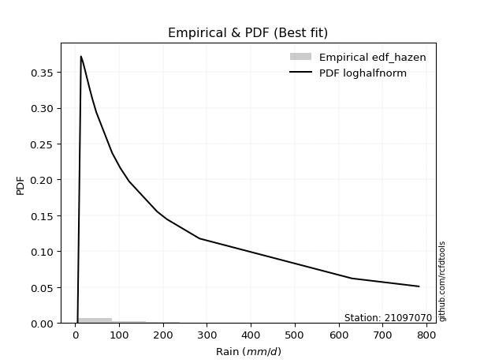</img>

</div>


### 3. EDF Weibull (1939)

Weibull plotting position formula is an empirical method used to estimate the non-exceedance probability or plotting position for a set of observed data, is often recommended or widely used in practice, particularly in flood frequency analysis.

<div align="center">


$P=m/(n+1)$


</div>


**3.1. Empirical values**

<div align="center">

|                | 0                  | 1                  | 2                  | 3           | 4                  | 5                  | 6                  | 7                  | 8                  | 9           | 10                 | 11          | 12                | 13                | 14          | 15                | 16                | 17                 | 18                 |
|:---------------|:-------------------|:-------------------|:-------------------|:------------|:-------------------|:-------------------|:-------------------|:-------------------|:-------------------|:------------|:-------------------|:------------|:------------------|:------------------|:------------|:------------------|:------------------|:-------------------|:-------------------|
| date           | 2019               | 2021               | 2016               | 2010        | 2013               | 2018               | 2020               | 2015               | 2014               | 2017        | 2024               | 2025        | 2022              | 2023              | 2009        | 2007              | 2011              | 2012               | 2006               |
| x              | 5.9                | 13.6               | 17.7               | 18.7        | 21.9               | 27.1               | 32.2               | 33.1               | 38.5               | 40.4        | 48.5               | 84.5        | 103.0             | 123.0             | 186.8       | 208.8             | 283.3             | 630.2              | 782.4              |
| m              | 1                  | 2                  | 3                  | 4           | 5                  | 6                  | 7                  | 8                  | 9                  | 10          | 11                 | 12          | 13                | 14                | 15          | 16                | 17                | 18                 | 19                 |
| empirical_dist | edf_weibull        | edf_weibull        | edf_weibull        | edf_weibull | edf_weibull        | edf_weibull        | edf_weibull        | edf_weibull        | edf_weibull        | edf_weibull | edf_weibull        | edf_weibull | edf_weibull       | edf_weibull       | edf_weibull | edf_weibull       | edf_weibull       | edf_weibull        | edf_weibull        |
| empirical      | 0.05               | 0.1                | 0.15               | 0.2         | 0.25               | 0.3                | 0.35               | 0.4                | 0.45               | 0.5         | 0.55               | 0.6         | 0.65              | 0.7               | 0.75        | 0.8               | 0.85              | 0.9                | 0.95               |
| empirical_tr   | 1.0526315789473684 | 1.1111111111111112 | 1.1764705882352942 | 1.25        | 1.3333333333333333 | 1.4285714285714286 | 1.5384615384615383 | 1.6666666666666667 | 1.8181818181818181 | 2.0         | 2.2222222222222223 | 2.5         | 2.857142857142857 | 3.333333333333333 | 4.0         | 5.000000000000001 | 6.666666666666666 | 10.000000000000002 | 19.999999999999982 |

</div>


**3.2. Kolmogorov-Smirnov fit test (sorted by Δ)**


<div align="center">

|                | 0                    | 1                    | 2                   | 3                   | 4                   | 5                   | 6                   | 7                   | 8                   | 9                   | 10                  | 11                  | 12                  | 13                  | 14                  | 15                  | 16                  | 17                  | 18                  | 19                  | 20                  | 21                  | 22                  | 23                  | 24                  | 25                  | 26                  | 27                  | 28                  | 29                  | 30                  | 31                  | 32                  | 33                  | 34                  | 35                  | 36                  | 37                  | 38                  | 39                  | 40                  | 41                  | 42                  | 43                  | 44                  | 45                  | 46                  | 47                  | 48                  | 49                  | 50                  | 51                  | 52                  | 53                  | 54                  | 55                  | 56                  | 57                  | 58                  | 59                  | 60                  | 61                  | 62                  | 63                  | 64                  | 65                  | 66                  | 67                  | 68                  | 69                  | 70                  | 71                  | 72                  | 73                  | 74                  | 75                  | 76                  | 77                  | 78                  | 79                  | 80                  | 81                  | 82                  | 83                  | 84                  | 85                  | 86                  | 87                  | 88                  | 89                  | 90                  | 91                  | 92                  | 93                  | 94                  | 95                  | 96                  | 97                  | 98                  | 99                  | 100                 | 101                 | 102                 | 103                 | 104                 | 105                 | 106                 | 107                 | 108                 | 109                 | 110                 | 111                 | 112                 | 113                 | 114                 | 115                 | 116                 | 117                 | 118                 | 119                 | 120                 | 121                 | 122                 | 123                 | 124                 | 125                 | 126                 | 127                 | 128                 | 129                 | 130                 | 131                 | 132                 | 133                 | 134                 | 135                 | 136                 | 137                 | 138                 | 139                 | 140                 | 141                 | 142                 | 143                 | 144                 | 145                 | 146                 | 147                 | 148                 | 149                 | 150                 | 151                 | 152                 | 153                 | 154                 | 155                 | 156                 | 157                 | 158                 | 159                 |
|:---------------|:---------------------|:---------------------|:--------------------|:--------------------|:--------------------|:--------------------|:--------------------|:--------------------|:--------------------|:--------------------|:--------------------|:--------------------|:--------------------|:--------------------|:--------------------|:--------------------|:--------------------|:--------------------|:--------------------|:--------------------|:--------------------|:--------------------|:--------------------|:--------------------|:--------------------|:--------------------|:--------------------|:--------------------|:--------------------|:--------------------|:--------------------|:--------------------|:--------------------|:--------------------|:--------------------|:--------------------|:--------------------|:--------------------|:--------------------|:--------------------|:--------------------|:--------------------|:--------------------|:--------------------|:--------------------|:--------------------|:--------------------|:--------------------|:--------------------|:--------------------|:--------------------|:--------------------|:--------------------|:--------------------|:--------------------|:--------------------|:--------------------|:--------------------|:--------------------|:--------------------|:--------------------|:--------------------|:--------------------|:--------------------|:--------------------|:--------------------|:--------------------|:--------------------|:--------------------|:--------------------|:--------------------|:--------------------|:--------------------|:--------------------|:--------------------|:--------------------|:--------------------|:--------------------|:--------------------|:--------------------|:--------------------|:--------------------|:--------------------|:--------------------|:--------------------|:--------------------|:--------------------|:--------------------|:--------------------|:--------------------|:--------------------|:--------------------|:--------------------|:--------------------|:--------------------|:--------------------|:--------------------|:--------------------|:--------------------|:--------------------|:--------------------|:--------------------|:--------------------|:--------------------|:--------------------|:--------------------|:--------------------|:--------------------|:--------------------|:--------------------|:--------------------|:--------------------|:--------------------|:--------------------|:--------------------|:--------------------|:--------------------|:--------------------|:--------------------|:--------------------|:--------------------|:--------------------|:--------------------|:--------------------|:--------------------|:--------------------|:--------------------|:--------------------|:--------------------|:--------------------|:--------------------|:--------------------|:--------------------|:--------------------|:--------------------|:--------------------|:--------------------|:--------------------|:--------------------|:--------------------|:--------------------|:--------------------|:--------------------|:--------------------|:--------------------|:--------------------|:--------------------|:--------------------|:--------------------|:--------------------|:--------------------|:--------------------|:--------------------|:--------------------|:--------------------|:--------------------|:--------------------|:--------------------|:--------------------|:--------------------|
| station        | 21097070             | 21097070             | 21097070            | 21097070            | 21097070            | 21097070            | 21097070            | 21097070            | 21097070            | 21097070            | 21097070            | 21097070            | 21097070            | 21097070            | 21097070            | 21097070            | 21097070            | 21097070            | 21097070            | 21097070            | 21097070            | 21097070            | 21097070            | 21097070            | 21097070            | 21097070            | 21097070            | 21097070            | 21097070            | 21097070            | 21097070            | 21097070            | 21097070            | 21097070            | 21097070            | 21097070            | 21097070            | 21097070            | 21097070            | 21097070            | 21097070            | 21097070            | 21097070            | 21097070            | 21097070            | 21097070            | 21097070            | 21097070            | 21097070            | 21097070            | 21097070            | 21097070            | 21097070            | 21097070            | 21097070            | 21097070            | 21097070            | 21097070            | 21097070            | 21097070            | 21097070            | 21097070            | 21097070            | 21097070            | 21097070            | 21097070            | 21097070            | 21097070            | 21097070            | 21097070            | 21097070            | 21097070            | 21097070            | 21097070            | 21097070            | 21097070            | 21097070            | 21097070            | 21097070            | 21097070            | 21097070            | 21097070            | 21097070            | 21097070            | 21097070            | 21097070            | 21097070            | 21097070            | 21097070            | 21097070            | 21097070            | 21097070            | 21097070            | 21097070            | 21097070            | 21097070            | 21097070            | 21097070            | 21097070            | 21097070            | 21097070            | 21097070            | 21097070            | 21097070            | 21097070            | 21097070            | 21097070            | 21097070            | 21097070            | 21097070            | 21097070            | 21097070            | 21097070            | 21097070            | 21097070            | 21097070            | 21097070            | 21097070            | 21097070            | 21097070            | 21097070            | 21097070            | 21097070            | 21097070            | 21097070            | 21097070            | 21097070            | 21097070            | 21097070            | 21097070            | 21097070            | 21097070            | 21097070            | 21097070            | 21097070            | 21097070            | 21097070            | 21097070            | 21097070            | 21097070            | 21097070            | 21097070            | 21097070            | 21097070            | 21097070            | 21097070            | 21097070            | 21097070            | 21097070            | 21097070            | 21097070            | 21097070            | 21097070            | 21097070            | 21097070            | 21097070            | 21097070            | 21097070            | 21097070            | 21097070            |
| empirical_dist | edf_weibull          | edf_weibull          | edf_weibull         | edf_weibull         | edf_weibull         | edf_weibull         | edf_weibull         | edf_weibull         | edf_weibull         | edf_weibull         | edf_weibull         | edf_weibull         | edf_weibull         | edf_weibull         | edf_weibull         | edf_weibull         | edf_weibull         | edf_weibull         | edf_weibull         | edf_weibull         | edf_weibull         | edf_weibull         | edf_weibull         | edf_weibull         | edf_weibull         | edf_weibull         | edf_weibull         | edf_weibull         | edf_weibull         | edf_weibull         | edf_weibull         | edf_weibull         | edf_weibull         | edf_weibull         | edf_weibull         | edf_weibull         | edf_weibull         | edf_weibull         | edf_weibull         | edf_weibull         | edf_weibull         | edf_weibull         | edf_weibull         | edf_weibull         | edf_weibull         | edf_weibull         | edf_weibull         | edf_weibull         | edf_weibull         | edf_weibull         | edf_weibull         | edf_weibull         | edf_weibull         | edf_weibull         | edf_weibull         | edf_weibull         | edf_weibull         | edf_weibull         | edf_weibull         | edf_weibull         | edf_weibull         | edf_weibull         | edf_weibull         | edf_weibull         | edf_weibull         | edf_weibull         | edf_weibull         | edf_weibull         | edf_weibull         | edf_weibull         | edf_weibull         | edf_weibull         | edf_weibull         | edf_weibull         | edf_weibull         | edf_weibull         | edf_weibull         | edf_weibull         | edf_weibull         | edf_weibull         | edf_weibull         | edf_weibull         | edf_weibull         | edf_weibull         | edf_weibull         | edf_weibull         | edf_weibull         | edf_weibull         | edf_weibull         | edf_weibull         | edf_weibull         | edf_weibull         | edf_weibull         | edf_weibull         | edf_weibull         | edf_weibull         | edf_weibull         | edf_weibull         | edf_weibull         | edf_weibull         | edf_weibull         | edf_weibull         | edf_weibull         | edf_weibull         | edf_weibull         | edf_weibull         | edf_weibull         | edf_weibull         | edf_weibull         | edf_weibull         | edf_weibull         | edf_weibull         | edf_weibull         | edf_weibull         | edf_weibull         | edf_weibull         | edf_weibull         | edf_weibull         | edf_weibull         | edf_weibull         | edf_weibull         | edf_weibull         | edf_weibull         | edf_weibull         | edf_weibull         | edf_weibull         | edf_weibull         | edf_weibull         | edf_weibull         | edf_weibull         | edf_weibull         | edf_weibull         | edf_weibull         | edf_weibull         | edf_weibull         | edf_weibull         | edf_weibull         | edf_weibull         | edf_weibull         | edf_weibull         | edf_weibull         | edf_weibull         | edf_weibull         | edf_weibull         | edf_weibull         | edf_weibull         | edf_weibull         | edf_weibull         | edf_weibull         | edf_weibull         | edf_weibull         | edf_weibull         | edf_weibull         | edf_weibull         | edf_weibull         | edf_weibull         | edf_weibull         | edf_weibull         | edf_weibull         | edf_weibull         |
| p_dist         | logkstwobign         | loggenexpon          | loginvweibull       | loghalfnorm         | mielke              | johnsonsu           | burr                | logskewnorm         | genextreme          | invweibull          | f                   | invgamma            | ncf                 | loggenlogistic      | nct                 | burr12              | lograyleigh         | logmielke           | logburr             | logbetaprime        | invgauss            | loggumbel_r         | logfoldnorm         | logf                | loggamma            | loggamma            | logerlang           | kappa3              | logexponnorm        | logfatiguelife      | logexponweib        | loginvgauss         | halfgennorm         | loghalflogistic     | logjohnsonsu        | logburr12           | logrice             | lognct              | loginvgamma         | logweibull_min      | logexponpow         | logmaxwell          | logmoyal            | logalpha            | lomax               | genpareto           | logncf              | gamma               | loggenextreme       | loggompertz         | logjohnsonsb        | logkappa4           | lognakagami         | logpearson3         | logbeta             | logwrapcauchy       | logsemicircular     | loganglit           | betaprime           | logtruncweibull_min | logarcsine          | logdweibull         | gengamma            | logkappa3           | loguniform          | fatiguelife         | logdgamma           | logbradford         | loggengamma         | truncweibull_min    | lognorm             | logt                | logcrystalball      | logloggamma         | logksone            | exponweib           | truncpareto         | logcosine           | gausshyper          | loglogistic         | logvonmises_line    | erlang              | logtruncexpon       | logloglaplace       | logtukeylambda      | loghypsecant        | loggennorm          | loggausshyper       | wald                | loglaplace          | loglaplace          | vonmises_line       | loggumbel_l         | loggenpareto        | logwald             | nakagami            | bradford            | exponpow            | logargus            | beta                | gennorm             | alpha               | logtruncnorm        | gumbel_r            | moyal               | loglomax            | maxwell             | anglit              | crystalball         | norm                | rayleigh            | pearson3            | logtriang           | logistic            | genlogistic         | loggenhalflogistic  | t                   | semicircular        | weibull_min         | halflogistic        | cosine              | hypsecant           | halfnorm            | dgamma              | powerlaw            | loghalfgennorm      | exponnorm           | kstwobign           | genexpon            | laplace             | gompertz            | foldnorm            | rice                | arcsine             | gumbel_l            | dweibull            | truncnorm           | logtrapezoid        | loglevy_l           | wrapcauchy          | genhalflogistic     | logweibull_max      | skewnorm            | argus               | logrdist            | logpowerlaw         | triang              | truncexpon          | johnsonsb           | levy_l              | ksone               | kappa4              | rdist               | uniform             | tukeylambda         | trapezoid           | weibull_max         | logtruncpareto      | logvonmises         | vonmises            |
| delta          | 0.057449007977442124 | 0.058808193997139546 | 0.06256628182661722 | 0.06471071323593924 | 0.06841366821983441 | 0.06944467661502507 | 0.07272046455593512 | 0.07279941881890067 | 0.07421324637816601 | 0.0742134611984846  | 0.07440755290191348 | 0.07440789857866648 | 0.07449861993729517 | 0.07603743789496631 | 0.07674812291314914 | 0.07716439065339231 | 0.0780620008514088  | 0.07935970503631712 | 0.08011791168677312 | 0.08100910662515187 | 0.0827092961319193  | 0.08272105084623615 | 0.08485793623211496 | 0.08569197371466708 | 0.08586695839037306 | 0.08586695839037306 | 0.08586743613139941 | 0.08602073414272293 | 0.08630358939191718 | 0.08680154150503305 | 0.08681991258069782 | 0.08693867207018802 | 0.0872231377039831  | 0.08792136702370168 | 0.0884997063761217  | 0.08906957614828337 | 0.08907329265389569 | 0.08909754003212511 | 0.08928896023681288 | 0.08943495997132167 | 0.0898004031529347  | 0.09033689693984459 | 0.09090655993440311 | 0.09115526380343597 | 0.09128165776434483 | 0.09129263978860369 | 0.09158495480230827 | 0.09414048586838653 | 0.09444213054213435 | 0.09515462826571075 | 0.09529451997517924 | 0.09816446857831795 | 0.09999999999964745 | 0.10174193839384987 | 0.10194247598314571 | 0.10236566094601096 | 0.10502762251272679 | 0.10903023485213809 | 0.10920164263814217 | 0.11203100799683818 | 0.11381188227139041 | 0.11416963042829043 | 0.11729342507436855 | 0.11853287992966127 | 0.1189721502797636  | 0.11914330626419756 | 0.11930475832284604 | 0.12164174264129698 | 0.12322726403937959 | 0.12330398175417978 | 0.12360478362719812 | 0.12360522810435637 | 0.12360531217444204 | 0.12491094780511702 | 0.12572586128114993 | 0.13182865260678236 | 0.13230383782884758 | 0.13561262704871857 | 0.13722322970061096 | 0.13905802633527065 | 0.14270441386524707 | 0.14693923106194012 | 0.1480038096947798  | 0.14950773422341257 | 0.14975612740765742 | 0.1514238053713312  | 0.15859529655177163 | 0.1613314619692266  | 0.166171965399163   | 0.17972358182754755 | 0.17972358182754755 | 0.18782211171145663 | 0.18783051784603644 | 0.19760031004392872 | 0.1981794799339758  | 0.1986462580734109  | 0.19931643581950864 | 0.20274456266914692 | 0.20305981657951344 | 0.2040283498153669  | 0.20721610660430428 | 0.21164151058248304 | 0.21188449265831352 | 0.2233881736028442  | 0.22396320675501108 | 0.22603255229235622 | 0.2295817808271246  | 0.23420584423762514 | 0.23633903531579348 | 0.23644083616753941 | 0.2388539282671135  | 0.24106575936506153 | 0.2426158947758179  | 0.24287221972307532 | 0.24403819798430348 | 0.2451942893893947  | 0.24548763337992197 | 0.24597817093259344 | 0.24741566975045487 | 0.2517243952005619  | 0.2553064049868369  | 0.2577347199829937  | 0.26408868833946975 | 0.26883014505235964 | 0.2690300325270888  | 0.2706219071668464  | 0.2786663354698661  | 0.2805787056723716  | 0.2813814015430122  | 0.28485919081336036 | 0.2874002011240065  | 0.28740789820199925 | 0.29173961603485304 | 0.29729258503089867 | 0.30695042553807916 | 0.31467190501249404 | 0.33915999243098466 | 0.35417321029270965 | 0.35799596963219554 | 0.37209518135734687 | 0.3865592559849201  | 0.4010486577932932  | 0.4142411478702092  | 0.4199850285229376  | 0.4209712914642021  | 0.4308620624147689  | 0.45012642639304257 | 0.4560199177723053  | 0.46953415990261216 | 0.4868378542955481  | 0.4989160764112471  | 0.5256960114501329  | 0.5321017951425561  | 0.5491951062459755  | 0.5554517042001847  | 0.7070152564294063  | 0.7447224250279468  | 0.8485800916814679  | 1.0978197692763476  | 123.84290773243178  |
| deltao         | 0.31564497164100014  | 0.31564497164100014  | 0.31564497164100014 | 0.31564497164100014 | 0.31564497164100014 | 0.31564497164100014 | 0.31564497164100014 | 0.31564497164100014 | 0.31564497164100014 | 0.31564497164100014 | 0.31564497164100014 | 0.31564497164100014 | 0.31564497164100014 | 0.31564497164100014 | 0.31564497164100014 | 0.31564497164100014 | 0.31564497164100014 | 0.31564497164100014 | 0.31564497164100014 | 0.31564497164100014 | 0.31564497164100014 | 0.31564497164100014 | 0.31564497164100014 | 0.31564497164100014 | 0.31564497164100014 | 0.31564497164100014 | 0.31564497164100014 | 0.31564497164100014 | 0.31564497164100014 | 0.31564497164100014 | 0.31564497164100014 | 0.31564497164100014 | 0.31564497164100014 | 0.31564497164100014 | 0.31564497164100014 | 0.31564497164100014 | 0.31564497164100014 | 0.31564497164100014 | 0.31564497164100014 | 0.31564497164100014 | 0.31564497164100014 | 0.31564497164100014 | 0.31564497164100014 | 0.31564497164100014 | 0.31564497164100014 | 0.31564497164100014 | 0.31564497164100014 | 0.31564497164100014 | 0.31564497164100014 | 0.31564497164100014 | 0.31564497164100014 | 0.31564497164100014 | 0.31564497164100014 | 0.31564497164100014 | 0.31564497164100014 | 0.31564497164100014 | 0.31564497164100014 | 0.31564497164100014 | 0.31564497164100014 | 0.31564497164100014 | 0.31564497164100014 | 0.31564497164100014 | 0.31564497164100014 | 0.31564497164100014 | 0.31564497164100014 | 0.31564497164100014 | 0.31564497164100014 | 0.31564497164100014 | 0.31564497164100014 | 0.31564497164100014 | 0.31564497164100014 | 0.31564497164100014 | 0.31564497164100014 | 0.31564497164100014 | 0.31564497164100014 | 0.31564497164100014 | 0.31564497164100014 | 0.31564497164100014 | 0.31564497164100014 | 0.31564497164100014 | 0.31564497164100014 | 0.31564497164100014 | 0.31564497164100014 | 0.31564497164100014 | 0.31564497164100014 | 0.31564497164100014 | 0.31564497164100014 | 0.31564497164100014 | 0.31564497164100014 | 0.31564497164100014 | 0.31564497164100014 | 0.31564497164100014 | 0.31564497164100014 | 0.31564497164100014 | 0.31564497164100014 | 0.31564497164100014 | 0.31564497164100014 | 0.31564497164100014 | 0.31564497164100014 | 0.31564497164100014 | 0.31564497164100014 | 0.31564497164100014 | 0.31564497164100014 | 0.31564497164100014 | 0.31564497164100014 | 0.31564497164100014 | 0.31564497164100014 | 0.31564497164100014 | 0.31564497164100014 | 0.31564497164100014 | 0.31564497164100014 | 0.31564497164100014 | 0.31564497164100014 | 0.31564497164100014 | 0.31564497164100014 | 0.31564497164100014 | 0.31564497164100014 | 0.31564497164100014 | 0.31564497164100014 | 0.31564497164100014 | 0.31564497164100014 | 0.31564497164100014 | 0.31564497164100014 | 0.31564497164100014 | 0.31564497164100014 | 0.31564497164100014 | 0.31564497164100014 | 0.31564497164100014 | 0.31564497164100014 | 0.31564497164100014 | 0.31564497164100014 | 0.31564497164100014 | 0.31564497164100014 | 0.31564497164100014 | 0.31564497164100014 | 0.31564497164100014 | 0.31564497164100014 | 0.31564497164100014 | 0.31564497164100014 | 0.31564497164100014 | 0.31564497164100014 | 0.31564497164100014 | 0.31564497164100014 | 0.31564497164100014 | 0.31564497164100014 | 0.31564497164100014 | 0.31564497164100014 | 0.31564497164100014 | 0.31564497164100014 | 0.31564497164100014 | 0.31564497164100014 | 0.31564497164100014 | 0.31564497164100014 | 0.31564497164100014 | 0.31564497164100014 | 0.31564497164100014 | 0.31564497164100014 | 0.31564497164100014 | 0.31564497164100014 | 0.31564497164100014 |
| eval           | Δo > Δ               | Δo > Δ               | Δo > Δ              | Δo > Δ              | Δo > Δ              | Δo > Δ              | Δo > Δ              | Δo > Δ              | Δo > Δ              | Δo > Δ              | Δo > Δ              | Δo > Δ              | Δo > Δ              | Δo > Δ              | Δo > Δ              | Δo > Δ              | Δo > Δ              | Δo > Δ              | Δo > Δ              | Δo > Δ              | Δo > Δ              | Δo > Δ              | Δo > Δ              | Δo > Δ              | Δo > Δ              | Δo > Δ              | Δo > Δ              | Δo > Δ              | Δo > Δ              | Δo > Δ              | Δo > Δ              | Δo > Δ              | Δo > Δ              | Δo > Δ              | Δo > Δ              | Δo > Δ              | Δo > Δ              | Δo > Δ              | Δo > Δ              | Δo > Δ              | Δo > Δ              | Δo > Δ              | Δo > Δ              | Δo > Δ              | Δo > Δ              | Δo > Δ              | Δo > Δ              | Δo > Δ              | Δo > Δ              | Δo > Δ              | Δo > Δ              | Δo > Δ              | Δo > Δ              | Δo > Δ              | Δo > Δ              | Δo > Δ              | Δo > Δ              | Δo > Δ              | Δo > Δ              | Δo > Δ              | Δo > Δ              | Δo > Δ              | Δo > Δ              | Δo > Δ              | Δo > Δ              | Δo > Δ              | Δo > Δ              | Δo > Δ              | Δo > Δ              | Δo > Δ              | Δo > Δ              | Δo > Δ              | Δo > Δ              | Δo > Δ              | Δo > Δ              | Δo > Δ              | Δo > Δ              | Δo > Δ              | Δo > Δ              | Δo > Δ              | Δo > Δ              | Δo > Δ              | Δo > Δ              | Δo > Δ              | Δo > Δ              | Δo > Δ              | Δo > Δ              | Δo > Δ              | Δo > Δ              | Δo > Δ              | Δo > Δ              | Δo > Δ              | Δo > Δ              | Δo > Δ              | Δo > Δ              | Δo > Δ              | Δo > Δ              | Δo > Δ              | Δo > Δ              | Δo > Δ              | Δo > Δ              | Δo > Δ              | Δo > Δ              | Δo > Δ              | Δo > Δ              | Δo > Δ              | Δo > Δ              | Δo > Δ              | Δo > Δ              | Δo > Δ              | Δo > Δ              | Δo > Δ              | Δo > Δ              | Δo > Δ              | Δo > Δ              | Δo > Δ              | Δo > Δ              | Δo > Δ              | Δo > Δ              | Δo > Δ              | Δo > Δ              | Δo > Δ              | Δo > Δ              | Δo > Δ              | Δo > Δ              | Δo > Δ              | Δo > Δ              | Δo > Δ              | Δo > Δ              | Δo > Δ              | Δo > Δ              | Δo > Δ              | Δo > Δ              | Δo > Δ              | Δo > Δ              | Δo > Δ              | Δo <= Δ             | Δo <= Δ             | Δo <= Δ             | Δo <= Δ             | Δo <= Δ             | Δo <= Δ             | Δo <= Δ             | Δo <= Δ             | Δo <= Δ             | Δo <= Δ             | Δo <= Δ             | Δo <= Δ             | Δo <= Δ             | Δo <= Δ             | Δo <= Δ             | Δo <= Δ             | Δo <= Δ             | Δo <= Δ             | Δo <= Δ             | Δo <= Δ             | Δo <= Δ             | Δo <= Δ             | Δo <= Δ             | Δo <= Δ             |
| fit            | 1                    | 1                    | 1                   | 1                   | 1                   | 1                   | 1                   | 1                   | 1                   | 1                   | 1                   | 1                   | 1                   | 1                   | 1                   | 1                   | 1                   | 1                   | 1                   | 1                   | 1                   | 1                   | 1                   | 1                   | 1                   | 1                   | 1                   | 1                   | 1                   | 1                   | 1                   | 1                   | 1                   | 1                   | 1                   | 1                   | 1                   | 1                   | 1                   | 1                   | 1                   | 1                   | 1                   | 1                   | 1                   | 1                   | 1                   | 1                   | 1                   | 1                   | 1                   | 1                   | 1                   | 1                   | 1                   | 1                   | 1                   | 1                   | 1                   | 1                   | 1                   | 1                   | 1                   | 1                   | 1                   | 1                   | 1                   | 1                   | 1                   | 1                   | 1                   | 1                   | 1                   | 1                   | 1                   | 1                   | 1                   | 1                   | 1                   | 1                   | 1                   | 1                   | 1                   | 1                   | 1                   | 1                   | 1                   | 1                   | 1                   | 1                   | 1                   | 1                   | 1                   | 1                   | 1                   | 1                   | 1                   | 1                   | 1                   | 1                   | 1                   | 1                   | 1                   | 1                   | 1                   | 1                   | 1                   | 1                   | 1                   | 1                   | 1                   | 1                   | 1                   | 1                   | 1                   | 1                   | 1                   | 1                   | 1                   | 1                   | 1                   | 1                   | 1                   | 1                   | 1                   | 1                   | 1                   | 1                   | 1                   | 1                   | 1                   | 1                   | 1                   | 1                   | 1                   | 1                   | 0                   | 0                   | 0                   | 0                   | 0                   | 0                   | 0                   | 0                   | 0                   | 0                   | 0                   | 0                   | 0                   | 0                   | 0                   | 0                   | 0                   | 0                   | 0                   | 0                   | 0                   | 0                   | 0                   | 0                   |
| n              | 19                   | 19                   | 19                  | 19                  | 19                  | 19                  | 19                  | 19                  | 19                  | 19                  | 19                  | 19                  | 19                  | 19                  | 19                  | 19                  | 19                  | 19                  | 19                  | 19                  | 19                  | 19                  | 19                  | 19                  | 19                  | 19                  | 19                  | 19                  | 19                  | 19                  | 19                  | 19                  | 19                  | 19                  | 19                  | 19                  | 19                  | 19                  | 19                  | 19                  | 19                  | 19                  | 19                  | 19                  | 19                  | 19                  | 19                  | 19                  | 19                  | 19                  | 19                  | 19                  | 19                  | 19                  | 19                  | 19                  | 19                  | 19                  | 19                  | 19                  | 19                  | 19                  | 19                  | 19                  | 19                  | 19                  | 19                  | 19                  | 19                  | 19                  | 19                  | 19                  | 19                  | 19                  | 19                  | 19                  | 19                  | 19                  | 19                  | 19                  | 19                  | 19                  | 19                  | 19                  | 19                  | 19                  | 19                  | 19                  | 19                  | 19                  | 19                  | 19                  | 19                  | 19                  | 19                  | 19                  | 19                  | 19                  | 19                  | 19                  | 19                  | 19                  | 19                  | 19                  | 19                  | 19                  | 19                  | 19                  | 19                  | 19                  | 19                  | 19                  | 19                  | 19                  | 19                  | 19                  | 19                  | 19                  | 19                  | 19                  | 19                  | 19                  | 19                  | 19                  | 19                  | 19                  | 19                  | 19                  | 19                  | 19                  | 19                  | 19                  | 19                  | 19                  | 19                  | 19                  | 19                  | 19                  | 19                  | 19                  | 19                  | 19                  | 19                  | 19                  | 19                  | 19                  | 19                  | 19                  | 19                  | 19                  | 19                  | 19                  | 19                  | 19                  | 19                  | 19                  | 19                  | 19                  | 19                  | 19                  |
| best_fit       | 1                    | 0                    | 0                   | 0                   | 0                   | 0                   | 0                   | 0                   | 0                   | 0                   | 0                   | 0                   | 0                   | 0                   | 0                   | 0                   | 0                   | 0                   | 0                   | 0                   | 0                   | 0                   | 0                   | 0                   | 0                   | 0                   | 0                   | 0                   | 0                   | 0                   | 0                   | 0                   | 0                   | 0                   | 0                   | 0                   | 0                   | 0                   | 0                   | 0                   | 0                   | 0                   | 0                   | 0                   | 0                   | 0                   | 0                   | 0                   | 0                   | 0                   | 0                   | 0                   | 0                   | 0                   | 0                   | 0                   | 0                   | 0                   | 0                   | 0                   | 0                   | 0                   | 0                   | 0                   | 0                   | 0                   | 0                   | 0                   | 0                   | 0                   | 0                   | 0                   | 0                   | 0                   | 0                   | 0                   | 0                   | 0                   | 0                   | 0                   | 0                   | 0                   | 0                   | 0                   | 0                   | 0                   | 0                   | 0                   | 0                   | 0                   | 0                   | 0                   | 0                   | 0                   | 0                   | 0                   | 0                   | 0                   | 0                   | 0                   | 0                   | 0                   | 0                   | 0                   | 0                   | 0                   | 0                   | 0                   | 0                   | 0                   | 0                   | 0                   | 0                   | 0                   | 0                   | 0                   | 0                   | 0                   | 0                   | 0                   | 0                   | 0                   | 0                   | 0                   | 0                   | 0                   | 0                   | 0                   | 0                   | 0                   | 0                   | 0                   | 0                   | 0                   | 0                   | 0                   | 0                   | 0                   | 0                   | 0                   | 0                   | 0                   | 0                   | 0                   | 0                   | 0                   | 0                   | 0                   | 0                   | 0                   | 0                   | 0                   | 0                   | 0                   | 0                   | 0                   | 0                   | 0                   | 0                   | 0                   |
| best_fit_sort  | 1                    | 2                    | 3                   | 4                   | 5                   | 6                   | 7                   | 8                   | 9                   | 10                  | 11                  | 12                  | 13                  | 14                  | 15                  | 16                  | 17                  | 18                  | 19                  | 20                  | 21                  | 22                  | 23                  | 24                  | 25                  | 26                  | 27                  | 28                  | 29                  | 30                  | 31                  | 32                  | 33                  | 34                  | 35                  | 36                  | 37                  | 38                  | 39                  | 40                  | 41                  | 42                  | 43                  | 44                  | 45                  | 46                  | 47                  | 48                  | 49                  | 50                  | 51                  | 52                  | 53                  | 54                  | 55                  | 56                  | 57                  | 58                  | 59                  | 60                  | 61                  | 62                  | 63                  | 64                  | 65                  | 66                  | 67                  | 68                  | 69                  | 70                  | 71                  | 72                  | 73                  | 74                  | 75                  | 76                  | 77                  | 78                  | 79                  | 80                  | 81                  | 82                  | 83                  | 84                  | 85                  | 86                  | 87                  | 88                  | 89                  | 90                  | 91                  | 92                  | 93                  | 94                  | 95                  | 96                  | 97                  | 98                  | 99                  | 100                 | 101                 | 102                 | 103                 | 104                 | 105                 | 106                 | 107                 | 108                 | 109                 | 110                 | 111                 | 112                 | 113                 | 114                 | 115                 | 116                 | 117                 | 118                 | 119                 | 120                 | 121                 | 122                 | 123                 | 124                 | 125                 | 126                 | 127                 | 128                 | 129                 | 130                 | 131                 | 132                 | 133                 | 134                 | 135                 | 136                 | 137                 | 138                 | 139                 | 140                 | 141                 | 142                 | 143                 | 144                 | 145                 | 146                 | 147                 | 148                 | 149                 | 150                 | 151                 | 152                 | 153                 | 154                 | 155                 | 156                 | 157                 | 158                 | 159                 | 160                 |

</div>


**3.3. Best fit**

<div align="center">

|   id |   station | empirical_dist   | p_dist       |    delta |   deltao | eval   |   fit |   n |   best_fit |   best_fit_sort |
|-----:|----------:|:-----------------|:-------------|---------:|---------:|:-------|------:|----:|-----------:|----------------:|
|    0 |  21097070 | edf_weibull      | logkstwobign | 0.057449 | 0.315645 | Δo > Δ |     1 |  19 |          1 |               1 |

</div>


<div align="center">

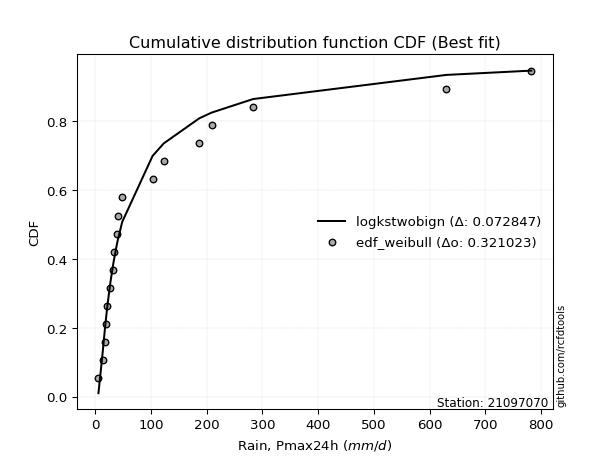</img>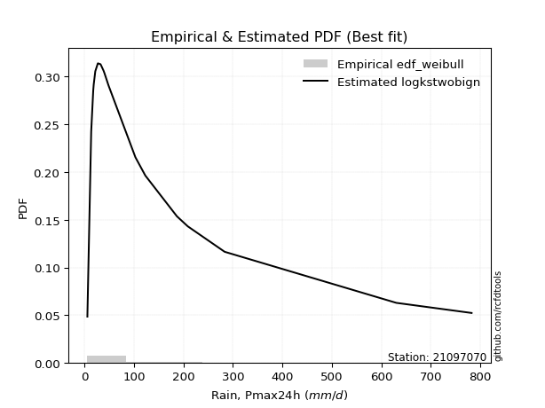</img>

</div>


### 4. EDF Beard (1943)

The Beard formula (or Beard´s plotting position formula) in hydrology is used to estimate the empirical non-exceedance probability _(P)_ of a flood event (or other extreme hydrological data point) within a given dataset.

<div align="center">


$P=(m-0.31)/(n+0.38)$


</div>


**4.1. Empirical values**

<div align="center">

|                | 0                   | 1                   | 2                  | 3                   | 4                   | 5                   | 6                  | 7                  | 8                  | 9         | 10                 | 11                 | 12                 | 13                 | 14                 | 15                 | 16                 | 17                 | 18                 |
|:---------------|:--------------------|:--------------------|:-------------------|:--------------------|:--------------------|:--------------------|:-------------------|:-------------------|:-------------------|:----------|:-------------------|:-------------------|:-------------------|:-------------------|:-------------------|:-------------------|:-------------------|:-------------------|:-------------------|
| date           | 2019                | 2021                | 2016               | 2010                | 2013                | 2018                | 2020               | 2015               | 2014               | 2017      | 2024               | 2025               | 2022               | 2023               | 2009               | 2007               | 2011               | 2012               | 2006               |
| x              | 5.9                 | 13.6                | 17.7               | 18.7                | 21.9                | 27.1                | 32.2               | 33.1               | 38.5               | 40.4      | 48.5               | 84.5               | 103.0              | 123.0              | 186.8              | 208.8              | 283.3              | 630.2              | 782.4              |
| m              | 1                   | 2                   | 3                  | 4                   | 5                   | 6                   | 7                  | 8                  | 9                  | 10        | 11                 | 12                 | 13                 | 14                 | 15                 | 16                 | 17                 | 18                 | 19                 |
| empirical_dist | edf_beard           | edf_beard           | edf_beard          | edf_beard           | edf_beard           | edf_beard           | edf_beard          | edf_beard          | edf_beard          | edf_beard | edf_beard          | edf_beard          | edf_beard          | edf_beard          | edf_beard          | edf_beard          | edf_beard          | edf_beard          | edf_beard          |
| empirical      | 0.03560371517027864 | 0.08720330237358101 | 0.1388028895768834 | 0.19040247678018576 | 0.24200206398348817 | 0.29360165118679055 | 0.3452012383900929 | 0.3968008255933953 | 0.4484004127966976 | 0.5       | 0.5515995872033024 | 0.6031991744066048 | 0.6547987616099071 | 0.7063983488132095 | 0.7579979360165119 | 0.8095975232198143 | 0.8611971104231168 | 0.9127966976264191 | 0.9643962848297215 |
| empirical_tr   | 1.0369181380417336  | 1.0955342001130581  | 1.1611743559017376 | 1.2351816443594645  | 1.3192648059904697  | 1.4156318480642804  | 1.5271867612293144 | 1.6578272027373824 | 1.812909260991581  | 2.0       | 2.230149597238205  | 2.5201560468140443 | 2.896860986547085  | 3.40597539543058   | 4.132196162046909  | 5.252032520325204  | 7.204460966542758  | 11.467455621301793 | 28.086956521739243 |

</div>


**4.2. Kolmogorov-Smirnov fit test (sorted by Δ)**


<div align="center">

|                | 0                    | 1                   | 2                    | 3                   | 4                   | 5                   | 6                   | 7                   | 8                   | 9                   | 10                  | 11                  | 12                  | 13                  | 14                  | 15                  | 16                  | 17                  | 18                  | 19                  | 20                  | 21                  | 22                  | 23                  | 24                  | 25                  | 26                  | 27                  | 28                  | 29                  | 30                  | 31                  | 32                  | 33                  | 34                  | 35                  | 36                  | 37                  | 38                  | 39                  | 40                  | 41                  | 42                  | 43                  | 44                  | 45                  | 46                  | 47                  | 48                  | 49                  | 50                  | 51                  | 52                  | 53                  | 54                  | 55                  | 56                  | 57                  | 58                  | 59                  | 60                  | 61                  | 62                  | 63                  | 64                  | 65                  | 66                  | 67                  | 68                  | 69                  | 70                  | 71                  | 72                  | 73                  | 74                  | 75                  | 76                  | 77                  | 78                  | 79                  | 80                  | 81                  | 82                  | 83                  | 84                  | 85                  | 86                  | 87                  | 88                  | 89                  | 90                  | 91                  | 92                  | 93                  | 94                  | 95                  | 96                  | 97                  | 98                  | 99                  | 100                 | 101                 | 102                 | 103                 | 104                 | 105                 | 106                 | 107                 | 108                 | 109                 | 110                 | 111                 | 112                 | 113                 | 114                 | 115                 | 116                 | 117                 | 118                 | 119                 | 120                 | 121                 | 122                 | 123                 | 124                 | 125                 | 126                 | 127                 | 128                 | 129                 | 130                 | 131                 | 132                 | 133                 | 134                 | 135                 | 136                 | 137                 | 138                 | 139                 | 140                 | 141                 | 142                 | 143                 | 144                 | 145                 | 146                 | 147                 | 148                 | 149                 | 150                 | 151                 | 152                 | 153                 | 154                 | 155                 | 156                 | 157                 | 158                 | 159                 |
|:---------------|:---------------------|:--------------------|:---------------------|:--------------------|:--------------------|:--------------------|:--------------------|:--------------------|:--------------------|:--------------------|:--------------------|:--------------------|:--------------------|:--------------------|:--------------------|:--------------------|:--------------------|:--------------------|:--------------------|:--------------------|:--------------------|:--------------------|:--------------------|:--------------------|:--------------------|:--------------------|:--------------------|:--------------------|:--------------------|:--------------------|:--------------------|:--------------------|:--------------------|:--------------------|:--------------------|:--------------------|:--------------------|:--------------------|:--------------------|:--------------------|:--------------------|:--------------------|:--------------------|:--------------------|:--------------------|:--------------------|:--------------------|:--------------------|:--------------------|:--------------------|:--------------------|:--------------------|:--------------------|:--------------------|:--------------------|:--------------------|:--------------------|:--------------------|:--------------------|:--------------------|:--------------------|:--------------------|:--------------------|:--------------------|:--------------------|:--------------------|:--------------------|:--------------------|:--------------------|:--------------------|:--------------------|:--------------------|:--------------------|:--------------------|:--------------------|:--------------------|:--------------------|:--------------------|:--------------------|:--------------------|:--------------------|:--------------------|:--------------------|:--------------------|:--------------------|:--------------------|:--------------------|:--------------------|:--------------------|:--------------------|:--------------------|:--------------------|:--------------------|:--------------------|:--------------------|:--------------------|:--------------------|:--------------------|:--------------------|:--------------------|:--------------------|:--------------------|:--------------------|:--------------------|:--------------------|:--------------------|:--------------------|:--------------------|:--------------------|:--------------------|:--------------------|:--------------------|:--------------------|:--------------------|:--------------------|:--------------------|:--------------------|:--------------------|:--------------------|:--------------------|:--------------------|:--------------------|:--------------------|:--------------------|:--------------------|:--------------------|:--------------------|:--------------------|:--------------------|:--------------------|:--------------------|:--------------------|:--------------------|:--------------------|:--------------------|:--------------------|:--------------------|:--------------------|:--------------------|:--------------------|:--------------------|:--------------------|:--------------------|:--------------------|:--------------------|:--------------------|:--------------------|:--------------------|:--------------------|:--------------------|:--------------------|:--------------------|:--------------------|:--------------------|:--------------------|:--------------------|:--------------------|:--------------------|:--------------------|:--------------------|
| station        | 21097070             | 21097070            | 21097070             | 21097070            | 21097070            | 21097070            | 21097070            | 21097070            | 21097070            | 21097070            | 21097070            | 21097070            | 21097070            | 21097070            | 21097070            | 21097070            | 21097070            | 21097070            | 21097070            | 21097070            | 21097070            | 21097070            | 21097070            | 21097070            | 21097070            | 21097070            | 21097070            | 21097070            | 21097070            | 21097070            | 21097070            | 21097070            | 21097070            | 21097070            | 21097070            | 21097070            | 21097070            | 21097070            | 21097070            | 21097070            | 21097070            | 21097070            | 21097070            | 21097070            | 21097070            | 21097070            | 21097070            | 21097070            | 21097070            | 21097070            | 21097070            | 21097070            | 21097070            | 21097070            | 21097070            | 21097070            | 21097070            | 21097070            | 21097070            | 21097070            | 21097070            | 21097070            | 21097070            | 21097070            | 21097070            | 21097070            | 21097070            | 21097070            | 21097070            | 21097070            | 21097070            | 21097070            | 21097070            | 21097070            | 21097070            | 21097070            | 21097070            | 21097070            | 21097070            | 21097070            | 21097070            | 21097070            | 21097070            | 21097070            | 21097070            | 21097070            | 21097070            | 21097070            | 21097070            | 21097070            | 21097070            | 21097070            | 21097070            | 21097070            | 21097070            | 21097070            | 21097070            | 21097070            | 21097070            | 21097070            | 21097070            | 21097070            | 21097070            | 21097070            | 21097070            | 21097070            | 21097070            | 21097070            | 21097070            | 21097070            | 21097070            | 21097070            | 21097070            | 21097070            | 21097070            | 21097070            | 21097070            | 21097070            | 21097070            | 21097070            | 21097070            | 21097070            | 21097070            | 21097070            | 21097070            | 21097070            | 21097070            | 21097070            | 21097070            | 21097070            | 21097070            | 21097070            | 21097070            | 21097070            | 21097070            | 21097070            | 21097070            | 21097070            | 21097070            | 21097070            | 21097070            | 21097070            | 21097070            | 21097070            | 21097070            | 21097070            | 21097070            | 21097070            | 21097070            | 21097070            | 21097070            | 21097070            | 21097070            | 21097070            | 21097070            | 21097070            | 21097070            | 21097070            | 21097070            | 21097070            |
| empirical_dist | edf_beard            | edf_beard           | edf_beard            | edf_beard           | edf_beard           | edf_beard           | edf_beard           | edf_beard           | edf_beard           | edf_beard           | edf_beard           | edf_beard           | edf_beard           | edf_beard           | edf_beard           | edf_beard           | edf_beard           | edf_beard           | edf_beard           | edf_beard           | edf_beard           | edf_beard           | edf_beard           | edf_beard           | edf_beard           | edf_beard           | edf_beard           | edf_beard           | edf_beard           | edf_beard           | edf_beard           | edf_beard           | edf_beard           | edf_beard           | edf_beard           | edf_beard           | edf_beard           | edf_beard           | edf_beard           | edf_beard           | edf_beard           | edf_beard           | edf_beard           | edf_beard           | edf_beard           | edf_beard           | edf_beard           | edf_beard           | edf_beard           | edf_beard           | edf_beard           | edf_beard           | edf_beard           | edf_beard           | edf_beard           | edf_beard           | edf_beard           | edf_beard           | edf_beard           | edf_beard           | edf_beard           | edf_beard           | edf_beard           | edf_beard           | edf_beard           | edf_beard           | edf_beard           | edf_beard           | edf_beard           | edf_beard           | edf_beard           | edf_beard           | edf_beard           | edf_beard           | edf_beard           | edf_beard           | edf_beard           | edf_beard           | edf_beard           | edf_beard           | edf_beard           | edf_beard           | edf_beard           | edf_beard           | edf_beard           | edf_beard           | edf_beard           | edf_beard           | edf_beard           | edf_beard           | edf_beard           | edf_beard           | edf_beard           | edf_beard           | edf_beard           | edf_beard           | edf_beard           | edf_beard           | edf_beard           | edf_beard           | edf_beard           | edf_beard           | edf_beard           | edf_beard           | edf_beard           | edf_beard           | edf_beard           | edf_beard           | edf_beard           | edf_beard           | edf_beard           | edf_beard           | edf_beard           | edf_beard           | edf_beard           | edf_beard           | edf_beard           | edf_beard           | edf_beard           | edf_beard           | edf_beard           | edf_beard           | edf_beard           | edf_beard           | edf_beard           | edf_beard           | edf_beard           | edf_beard           | edf_beard           | edf_beard           | edf_beard           | edf_beard           | edf_beard           | edf_beard           | edf_beard           | edf_beard           | edf_beard           | edf_beard           | edf_beard           | edf_beard           | edf_beard           | edf_beard           | edf_beard           | edf_beard           | edf_beard           | edf_beard           | edf_beard           | edf_beard           | edf_beard           | edf_beard           | edf_beard           | edf_beard           | edf_beard           | edf_beard           | edf_beard           | edf_beard           | edf_beard           | edf_beard           | edf_beard           | edf_beard           |
| p_dist         | logkstwobign         | loghalfnorm         | mielke               | loginvweibull       | loggenexpon         | nct                 | johnsonsu           | burr                | logskewnorm         | burr12              | genextreme          | invweibull          | f                   | invgamma            | ncf                 | loggumbel_r         | loggenlogistic      | lograyleigh         | logmielke           | logburr             | logbetaprime        | invgauss            | loghalflogistic     | logfoldnorm         | logf                | loggamma            | loggamma            | logerlang           | kappa3              | logexponnorm        | logfatiguelife      | logexponweib        | loginvgauss         | lognakagami         | logmoyal            | logjohnsonsu        | logburr12           | logrice             | lognct              | loginvgamma         | logweibull_min      | logmaxwell          | logalpha            | lomax               | genpareto           | logexponpow         | logncf              | loggenextreme       | gamma               | loggompertz         | logjohnsonsb        | halfgennorm         | logpearson3         | logbeta             | logkappa4           | logdweibull         | logsemicircular     | logwrapcauchy       | loganglit           | logdgamma           | logtruncweibull_min | logkappa3           | betaprime           | loguniform          | fatiguelife         | lognorm             | logt                | logcrystalball      | truncweibull_min    | logloggamma         | logarcsine          | gengamma            | truncpareto         | logbradford         | loggengamma         | logcosine           | logksone            | gausshyper          | loglogistic         | exponweib           | logvonmises_line    | logtukeylambda      | logloglaplace       | erlang              | loghypsecant        | loggennorm          | logtruncexpon       | loggausshyper       | loglaplace          | loglaplace          | wald                | logwald             | loggumbel_l         | nakagami            | bradford            | vonmises_line       | exponpow            | logargus            | alpha               | loggenpareto        | beta                | gennorm             | logtruncnorm        | loglomax            | gumbel_r            | moyal               | t                   | crystalball         | norm                | maxwell             | logtriang           | genlogistic         | loggenhalflogistic  | logistic            | anglit              | weibull_min         | rayleigh            | pearson3            | cosine              | hypsecant           | semicircular        | halflogistic        | halfnorm            | exponnorm           | loghalfgennorm      | powerlaw            | kstwobign           | genexpon            | dgamma              | laplace             | gompertz            | rice                | foldnorm            | arcsine             | gumbel_l            | dweibull            | truncnorm           | logtrapezoid        | loglevy_l           | wrapcauchy          | genhalflogistic     | logweibull_max      | skewnorm            | argus               | logrdist            | logpowerlaw         | triang              | truncexpon          | johnsonsb           | levy_l              | ksone               | kappa4              | rdist               | uniform             | tukeylambda         | trapezoid           | weibull_max         | logtruncpareto      | logvonmises         | vonmises            |
| delta          | 0.053464755115240764 | 0.05671277721942736 | 0.060415732203322525 | 0.06256628182661722 | 0.06872526955386771 | 0.06875018689663726 | 0.06944467661502507 | 0.07272046455593512 | 0.07279941881890067 | 0.0730471370747583  | 0.07421324637816601 | 0.0742134611984846  | 0.07440755290191348 | 0.07440789857866648 | 0.07449861993729517 | 0.07472311482972427 | 0.07603743789496631 | 0.0780620008514088  | 0.07935970503631712 | 0.08011791168677312 | 0.08100910662515187 | 0.0827092961319193  | 0.0847221926170969  | 0.08496494452310632 | 0.08569197371466708 | 0.08586695839037306 | 0.08586695839037306 | 0.08586743613139941 | 0.08602073414272293 | 0.08630358939191718 | 0.08680154150503305 | 0.08681991258069782 | 0.08693867207018802 | 0.08720330237322846 | 0.0875440358005316  | 0.0884997063761217  | 0.08906957614828337 | 0.08907329265389569 | 0.08909754003212511 | 0.08928896023681288 | 0.08943495997132167 | 0.09033689693984459 | 0.09115526380343597 | 0.09128165776434483 | 0.09129263978860369 | 0.09139999035623703 | 0.09158495480230827 | 0.09444213054213435 | 0.09538911807794409 | 0.09675421546901308 | 0.09689410717848157 | 0.09842024812709971 | 0.10174193839384987 | 0.10409347413056944 | 0.10607063605650283 | 0.10617169441177854 | 0.10662720971602913 | 0.10860997839244896 | 0.11062982205544042 | 0.11130682230633415 | 0.11363059520014052 | 0.1201324671329636  | 0.12039875306125877 | 0.12057173748306593 | 0.12074289346749989 | 0.12360478362719812 | 0.12360522810435637 | 0.12360531217444204 | 0.12490356895748211 | 0.12491094780511702 | 0.12500899269450702 | 0.12882524338780865 | 0.13230383782884758 | 0.1328388530644136  | 0.1344243744624962  | 0.13611420654662482 | 0.13852255890756893 | 0.1388228169039133  | 0.13905802633527065 | 0.14302576302989897 | 0.1443040010685494  | 0.144546598641714   | 0.1463085598168078  | 0.14853881826524246 | 0.1514238053713312  | 0.15539612214516685 | 0.1592009201178964  | 0.16293104917252893 | 0.17972358182754755 | 0.17972358182754755 | 0.18056825022888437 | 0.18858195671416156 | 0.18943010504933877 | 0.20024584527671324 | 0.20091602302281097 | 0.20221839654117799 | 0.20434414987244925 | 0.20465940378281577 | 0.20844233617587826 | 0.21039700767034772 | 0.2168250474417859  | 0.22161239143402564 | 0.22308160308143013 | 0.23722966271547283 | 0.23778445843256554 | 0.23835949158473244 | 0.2422884589733172  | 0.24273738412900303 | 0.24283918498074897 | 0.24397806565684596 | 0.24421548197912024 | 0.24563778518760582 | 0.24679387659269703 | 0.24778098907658735 | 0.2486021290673465  | 0.2490152569537572  | 0.2532502130968348  | 0.25546204419478286 | 0.2569059921901392  | 0.259334307186296   | 0.26037445576231477 | 0.2661206800302832  | 0.2784849731691911  | 0.2802659226731684  | 0.2818190175899631  | 0.2818267301535078  | 0.2821782928756739  | 0.28298098874631455 | 0.28322642988208097 | 0.2864587780166627  | 0.2889997883273088  | 0.2933392032381554  | 0.3018041830317206  | 0.31168886986062    | 0.3133487743512887  | 0.32906818984221536 | 0.340759579634287   | 0.355772797496012   | 0.37239225446191687 | 0.38329229178046365 | 0.3881588431882224  | 0.4106461810131074  | 0.41584073507351155 | 0.42958255174275184 | 0.4337679890906211  | 0.44205917283788554 | 0.4517260135963449  | 0.4624182665855149  | 0.48073127032572893 | 0.5012341391252695  | 0.5085135996310612  | 0.5320943602633424  | 0.5464980799722775  | 0.555593455059185   | 0.5698479890299062  | 0.7166127796492205  | 0.7575191226543659  | 0.8613767893078869  | 1.0898218332598357  | 123.82851144760207  |
| deltao         | 0.31564497164100014  | 0.31564497164100014 | 0.31564497164100014  | 0.31564497164100014 | 0.31564497164100014 | 0.31564497164100014 | 0.31564497164100014 | 0.31564497164100014 | 0.31564497164100014 | 0.31564497164100014 | 0.31564497164100014 | 0.31564497164100014 | 0.31564497164100014 | 0.31564497164100014 | 0.31564497164100014 | 0.31564497164100014 | 0.31564497164100014 | 0.31564497164100014 | 0.31564497164100014 | 0.31564497164100014 | 0.31564497164100014 | 0.31564497164100014 | 0.31564497164100014 | 0.31564497164100014 | 0.31564497164100014 | 0.31564497164100014 | 0.31564497164100014 | 0.31564497164100014 | 0.31564497164100014 | 0.31564497164100014 | 0.31564497164100014 | 0.31564497164100014 | 0.31564497164100014 | 0.31564497164100014 | 0.31564497164100014 | 0.31564497164100014 | 0.31564497164100014 | 0.31564497164100014 | 0.31564497164100014 | 0.31564497164100014 | 0.31564497164100014 | 0.31564497164100014 | 0.31564497164100014 | 0.31564497164100014 | 0.31564497164100014 | 0.31564497164100014 | 0.31564497164100014 | 0.31564497164100014 | 0.31564497164100014 | 0.31564497164100014 | 0.31564497164100014 | 0.31564497164100014 | 0.31564497164100014 | 0.31564497164100014 | 0.31564497164100014 | 0.31564497164100014 | 0.31564497164100014 | 0.31564497164100014 | 0.31564497164100014 | 0.31564497164100014 | 0.31564497164100014 | 0.31564497164100014 | 0.31564497164100014 | 0.31564497164100014 | 0.31564497164100014 | 0.31564497164100014 | 0.31564497164100014 | 0.31564497164100014 | 0.31564497164100014 | 0.31564497164100014 | 0.31564497164100014 | 0.31564497164100014 | 0.31564497164100014 | 0.31564497164100014 | 0.31564497164100014 | 0.31564497164100014 | 0.31564497164100014 | 0.31564497164100014 | 0.31564497164100014 | 0.31564497164100014 | 0.31564497164100014 | 0.31564497164100014 | 0.31564497164100014 | 0.31564497164100014 | 0.31564497164100014 | 0.31564497164100014 | 0.31564497164100014 | 0.31564497164100014 | 0.31564497164100014 | 0.31564497164100014 | 0.31564497164100014 | 0.31564497164100014 | 0.31564497164100014 | 0.31564497164100014 | 0.31564497164100014 | 0.31564497164100014 | 0.31564497164100014 | 0.31564497164100014 | 0.31564497164100014 | 0.31564497164100014 | 0.31564497164100014 | 0.31564497164100014 | 0.31564497164100014 | 0.31564497164100014 | 0.31564497164100014 | 0.31564497164100014 | 0.31564497164100014 | 0.31564497164100014 | 0.31564497164100014 | 0.31564497164100014 | 0.31564497164100014 | 0.31564497164100014 | 0.31564497164100014 | 0.31564497164100014 | 0.31564497164100014 | 0.31564497164100014 | 0.31564497164100014 | 0.31564497164100014 | 0.31564497164100014 | 0.31564497164100014 | 0.31564497164100014 | 0.31564497164100014 | 0.31564497164100014 | 0.31564497164100014 | 0.31564497164100014 | 0.31564497164100014 | 0.31564497164100014 | 0.31564497164100014 | 0.31564497164100014 | 0.31564497164100014 | 0.31564497164100014 | 0.31564497164100014 | 0.31564497164100014 | 0.31564497164100014 | 0.31564497164100014 | 0.31564497164100014 | 0.31564497164100014 | 0.31564497164100014 | 0.31564497164100014 | 0.31564497164100014 | 0.31564497164100014 | 0.31564497164100014 | 0.31564497164100014 | 0.31564497164100014 | 0.31564497164100014 | 0.31564497164100014 | 0.31564497164100014 | 0.31564497164100014 | 0.31564497164100014 | 0.31564497164100014 | 0.31564497164100014 | 0.31564497164100014 | 0.31564497164100014 | 0.31564497164100014 | 0.31564497164100014 | 0.31564497164100014 | 0.31564497164100014 | 0.31564497164100014 | 0.31564497164100014 | 0.31564497164100014 |
| eval           | Δo > Δ               | Δo > Δ              | Δo > Δ               | Δo > Δ              | Δo > Δ              | Δo > Δ              | Δo > Δ              | Δo > Δ              | Δo > Δ              | Δo > Δ              | Δo > Δ              | Δo > Δ              | Δo > Δ              | Δo > Δ              | Δo > Δ              | Δo > Δ              | Δo > Δ              | Δo > Δ              | Δo > Δ              | Δo > Δ              | Δo > Δ              | Δo > Δ              | Δo > Δ              | Δo > Δ              | Δo > Δ              | Δo > Δ              | Δo > Δ              | Δo > Δ              | Δo > Δ              | Δo > Δ              | Δo > Δ              | Δo > Δ              | Δo > Δ              | Δo > Δ              | Δo > Δ              | Δo > Δ              | Δo > Δ              | Δo > Δ              | Δo > Δ              | Δo > Δ              | Δo > Δ              | Δo > Δ              | Δo > Δ              | Δo > Δ              | Δo > Δ              | Δo > Δ              | Δo > Δ              | Δo > Δ              | Δo > Δ              | Δo > Δ              | Δo > Δ              | Δo > Δ              | Δo > Δ              | Δo > Δ              | Δo > Δ              | Δo > Δ              | Δo > Δ              | Δo > Δ              | Δo > Δ              | Δo > Δ              | Δo > Δ              | Δo > Δ              | Δo > Δ              | Δo > Δ              | Δo > Δ              | Δo > Δ              | Δo > Δ              | Δo > Δ              | Δo > Δ              | Δo > Δ              | Δo > Δ              | Δo > Δ              | Δo > Δ              | Δo > Δ              | Δo > Δ              | Δo > Δ              | Δo > Δ              | Δo > Δ              | Δo > Δ              | Δo > Δ              | Δo > Δ              | Δo > Δ              | Δo > Δ              | Δo > Δ              | Δo > Δ              | Δo > Δ              | Δo > Δ              | Δo > Δ              | Δo > Δ              | Δo > Δ              | Δo > Δ              | Δo > Δ              | Δo > Δ              | Δo > Δ              | Δo > Δ              | Δo > Δ              | Δo > Δ              | Δo > Δ              | Δo > Δ              | Δo > Δ              | Δo > Δ              | Δo > Δ              | Δo > Δ              | Δo > Δ              | Δo > Δ              | Δo > Δ              | Δo > Δ              | Δo > Δ              | Δo > Δ              | Δo > Δ              | Δo > Δ              | Δo > Δ              | Δo > Δ              | Δo > Δ              | Δo > Δ              | Δo > Δ              | Δo > Δ              | Δo > Δ              | Δo > Δ              | Δo > Δ              | Δo > Δ              | Δo > Δ              | Δo > Δ              | Δo > Δ              | Δo > Δ              | Δo > Δ              | Δo > Δ              | Δo > Δ              | Δo > Δ              | Δo > Δ              | Δo > Δ              | Δo > Δ              | Δo > Δ              | Δo > Δ              | Δo > Δ              | Δo <= Δ             | Δo <= Δ             | Δo <= Δ             | Δo <= Δ             | Δo <= Δ             | Δo <= Δ             | Δo <= Δ             | Δo <= Δ             | Δo <= Δ             | Δo <= Δ             | Δo <= Δ             | Δo <= Δ             | Δo <= Δ             | Δo <= Δ             | Δo <= Δ             | Δo <= Δ             | Δo <= Δ             | Δo <= Δ             | Δo <= Δ             | Δo <= Δ             | Δo <= Δ             | Δo <= Δ             | Δo <= Δ             | Δo <= Δ             | Δo <= Δ             |
| fit            | 1                    | 1                   | 1                    | 1                   | 1                   | 1                   | 1                   | 1                   | 1                   | 1                   | 1                   | 1                   | 1                   | 1                   | 1                   | 1                   | 1                   | 1                   | 1                   | 1                   | 1                   | 1                   | 1                   | 1                   | 1                   | 1                   | 1                   | 1                   | 1                   | 1                   | 1                   | 1                   | 1                   | 1                   | 1                   | 1                   | 1                   | 1                   | 1                   | 1                   | 1                   | 1                   | 1                   | 1                   | 1                   | 1                   | 1                   | 1                   | 1                   | 1                   | 1                   | 1                   | 1                   | 1                   | 1                   | 1                   | 1                   | 1                   | 1                   | 1                   | 1                   | 1                   | 1                   | 1                   | 1                   | 1                   | 1                   | 1                   | 1                   | 1                   | 1                   | 1                   | 1                   | 1                   | 1                   | 1                   | 1                   | 1                   | 1                   | 1                   | 1                   | 1                   | 1                   | 1                   | 1                   | 1                   | 1                   | 1                   | 1                   | 1                   | 1                   | 1                   | 1                   | 1                   | 1                   | 1                   | 1                   | 1                   | 1                   | 1                   | 1                   | 1                   | 1                   | 1                   | 1                   | 1                   | 1                   | 1                   | 1                   | 1                   | 1                   | 1                   | 1                   | 1                   | 1                   | 1                   | 1                   | 1                   | 1                   | 1                   | 1                   | 1                   | 1                   | 1                   | 1                   | 1                   | 1                   | 1                   | 1                   | 1                   | 1                   | 1                   | 1                   | 1                   | 1                   | 0                   | 0                   | 0                   | 0                   | 0                   | 0                   | 0                   | 0                   | 0                   | 0                   | 0                   | 0                   | 0                   | 0                   | 0                   | 0                   | 0                   | 0                   | 0                   | 0                   | 0                   | 0                   | 0                   | 0                   | 0                   |
| n              | 19                   | 19                  | 19                   | 19                  | 19                  | 19                  | 19                  | 19                  | 19                  | 19                  | 19                  | 19                  | 19                  | 19                  | 19                  | 19                  | 19                  | 19                  | 19                  | 19                  | 19                  | 19                  | 19                  | 19                  | 19                  | 19                  | 19                  | 19                  | 19                  | 19                  | 19                  | 19                  | 19                  | 19                  | 19                  | 19                  | 19                  | 19                  | 19                  | 19                  | 19                  | 19                  | 19                  | 19                  | 19                  | 19                  | 19                  | 19                  | 19                  | 19                  | 19                  | 19                  | 19                  | 19                  | 19                  | 19                  | 19                  | 19                  | 19                  | 19                  | 19                  | 19                  | 19                  | 19                  | 19                  | 19                  | 19                  | 19                  | 19                  | 19                  | 19                  | 19                  | 19                  | 19                  | 19                  | 19                  | 19                  | 19                  | 19                  | 19                  | 19                  | 19                  | 19                  | 19                  | 19                  | 19                  | 19                  | 19                  | 19                  | 19                  | 19                  | 19                  | 19                  | 19                  | 19                  | 19                  | 19                  | 19                  | 19                  | 19                  | 19                  | 19                  | 19                  | 19                  | 19                  | 19                  | 19                  | 19                  | 19                  | 19                  | 19                  | 19                  | 19                  | 19                  | 19                  | 19                  | 19                  | 19                  | 19                  | 19                  | 19                  | 19                  | 19                  | 19                  | 19                  | 19                  | 19                  | 19                  | 19                  | 19                  | 19                  | 19                  | 19                  | 19                  | 19                  | 19                  | 19                  | 19                  | 19                  | 19                  | 19                  | 19                  | 19                  | 19                  | 19                  | 19                  | 19                  | 19                  | 19                  | 19                  | 19                  | 19                  | 19                  | 19                  | 19                  | 19                  | 19                  | 19                  | 19                  | 19                  |
| best_fit       | 1                    | 0                   | 0                    | 0                   | 0                   | 0                   | 0                   | 0                   | 0                   | 0                   | 0                   | 0                   | 0                   | 0                   | 0                   | 0                   | 0                   | 0                   | 0                   | 0                   | 0                   | 0                   | 0                   | 0                   | 0                   | 0                   | 0                   | 0                   | 0                   | 0                   | 0                   | 0                   | 0                   | 0                   | 0                   | 0                   | 0                   | 0                   | 0                   | 0                   | 0                   | 0                   | 0                   | 0                   | 0                   | 0                   | 0                   | 0                   | 0                   | 0                   | 0                   | 0                   | 0                   | 0                   | 0                   | 0                   | 0                   | 0                   | 0                   | 0                   | 0                   | 0                   | 0                   | 0                   | 0                   | 0                   | 0                   | 0                   | 0                   | 0                   | 0                   | 0                   | 0                   | 0                   | 0                   | 0                   | 0                   | 0                   | 0                   | 0                   | 0                   | 0                   | 0                   | 0                   | 0                   | 0                   | 0                   | 0                   | 0                   | 0                   | 0                   | 0                   | 0                   | 0                   | 0                   | 0                   | 0                   | 0                   | 0                   | 0                   | 0                   | 0                   | 0                   | 0                   | 0                   | 0                   | 0                   | 0                   | 0                   | 0                   | 0                   | 0                   | 0                   | 0                   | 0                   | 0                   | 0                   | 0                   | 0                   | 0                   | 0                   | 0                   | 0                   | 0                   | 0                   | 0                   | 0                   | 0                   | 0                   | 0                   | 0                   | 0                   | 0                   | 0                   | 0                   | 0                   | 0                   | 0                   | 0                   | 0                   | 0                   | 0                   | 0                   | 0                   | 0                   | 0                   | 0                   | 0                   | 0                   | 0                   | 0                   | 0                   | 0                   | 0                   | 0                   | 0                   | 0                   | 0                   | 0                   | 0                   |
| best_fit_sort  | 1                    | 2                   | 3                    | 4                   | 5                   | 6                   | 7                   | 8                   | 9                   | 10                  | 11                  | 12                  | 13                  | 14                  | 15                  | 16                  | 17                  | 18                  | 19                  | 20                  | 21                  | 22                  | 23                  | 24                  | 25                  | 26                  | 27                  | 28                  | 29                  | 30                  | 31                  | 32                  | 33                  | 34                  | 35                  | 36                  | 37                  | 38                  | 39                  | 40                  | 41                  | 42                  | 43                  | 44                  | 45                  | 46                  | 47                  | 48                  | 49                  | 50                  | 51                  | 52                  | 53                  | 54                  | 55                  | 56                  | 57                  | 58                  | 59                  | 60                  | 61                  | 62                  | 63                  | 64                  | 65                  | 66                  | 67                  | 68                  | 69                  | 70                  | 71                  | 72                  | 73                  | 74                  | 75                  | 76                  | 77                  | 78                  | 79                  | 80                  | 81                  | 82                  | 83                  | 84                  | 85                  | 86                  | 87                  | 88                  | 89                  | 90                  | 91                  | 92                  | 93                  | 94                  | 95                  | 96                  | 97                  | 98                  | 99                  | 100                 | 101                 | 102                 | 103                 | 104                 | 105                 | 106                 | 107                 | 108                 | 109                 | 110                 | 111                 | 112                 | 113                 | 114                 | 115                 | 116                 | 117                 | 118                 | 119                 | 120                 | 121                 | 122                 | 123                 | 124                 | 125                 | 126                 | 127                 | 128                 | 129                 | 130                 | 131                 | 132                 | 133                 | 134                 | 135                 | 136                 | 137                 | 138                 | 139                 | 140                 | 141                 | 142                 | 143                 | 144                 | 145                 | 146                 | 147                 | 148                 | 149                 | 150                 | 151                 | 152                 | 153                 | 154                 | 155                 | 156                 | 157                 | 158                 | 159                 | 160                 |

</div>


**4.3. Best fit**

<div align="center">

|   id |   station | empirical_dist   | p_dist       |     delta |   deltao | eval   |   fit |   n |   best_fit |   best_fit_sort |
|-----:|----------:|:-----------------|:-------------|----------:|---------:|:-------|------:|----:|-----------:|----------------:|
|    0 |  21097070 | edf_beard        | logkstwobign | 0.0534648 | 0.315645 | Δo > Δ |     1 |  19 |          1 |               1 |

</div>


<div align="center">

</img></img>

</div>


### 5. EDF Chegodayev (1955)

The Chegodayev formula is an empirical plotting position formula used in hydrological frequency analysis to estimate the exceedance probability or return period of a specific event from a set of observed data. It is primarily used for plotting observed data points on probability paper to fit a theoretical distribution, particularly for analyzing extreme events like maximum flood flows or rainfall intensities. The constant _b_ value in the generalized plotting position formula is 0.3.

<div align="center">


$P=(m-b)/(n+1-2b)$


</div>


**5.1. Empirical values**

<div align="center">

|                | 0                   | 1                   | 2                  | 3                  | 4                   | 5                   | 6                  | 7                  | 8                  | 9              | 10                 | 11                 | 12                 | 13                 | 14                 | 15                 | 16                 | 17                 | 18                 |
|:---------------|:--------------------|:--------------------|:-------------------|:-------------------|:--------------------|:--------------------|:-------------------|:-------------------|:-------------------|:---------------|:-------------------|:-------------------|:-------------------|:-------------------|:-------------------|:-------------------|:-------------------|:-------------------|:-------------------|
| date           | 2019                | 2021                | 2016               | 2010               | 2013                | 2018                | 2020               | 2015               | 2014               | 2017           | 2024               | 2025               | 2022               | 2023               | 2009               | 2007               | 2011               | 2012               | 2006               |
| x              | 5.9                 | 13.6                | 17.7               | 18.7               | 21.9                | 27.1                | 32.2               | 33.1               | 38.5               | 40.4           | 48.5               | 84.5               | 103.0              | 123.0              | 186.8              | 208.8              | 283.3              | 630.2              | 782.4              |
| m              | 1                   | 2                   | 3                  | 4                  | 5                   | 6                   | 7                  | 8                  | 9                  | 10             | 11                 | 12                 | 13                 | 14                 | 15                 | 16                 | 17                 | 18                 | 19                 |
| empirical_dist | edf_chegodayev      | edf_chegodayev      | edf_chegodayev     | edf_chegodayev     | edf_chegodayev      | edf_chegodayev      | edf_chegodayev     | edf_chegodayev     | edf_chegodayev     | edf_chegodayev | edf_chegodayev     | edf_chegodayev     | edf_chegodayev     | edf_chegodayev     | edf_chegodayev     | edf_chegodayev     | edf_chegodayev     | edf_chegodayev     | edf_chegodayev     |
| empirical      | 0.03608247422680413 | 0.08762886597938145 | 0.1391752577319588 | 0.1907216494845361 | 0.24226804123711343 | 0.29381443298969073 | 0.3453608247422681 | 0.3969072164948454 | 0.4484536082474227 | 0.5            | 0.5515463917525774 | 0.6030927835051546 | 0.654639175257732  | 0.7061855670103093 | 0.7577319587628866 | 0.8092783505154639 | 0.8608247422680413 | 0.9123711340206185 | 0.9639175257731959 |
| empirical_tr   | 1.0374331550802138  | 1.096045197740113   | 1.1616766467065869 | 1.2356687898089171 | 1.3197278911564627  | 1.416058394160584   | 1.5275590551181104 | 1.6581196581196582 | 1.8130841121495327 | 2.0            | 2.2298850574712645 | 2.519480519480519  | 2.8955223880597014 | 3.403508771929825  | 4.127659574468085  | 5.243243243243244  | 7.185185185185188  | 11.41176470588235  | 27.714285714285726 |

</div>


**5.2. Kolmogorov-Smirnov fit test (sorted by Δ)**


<div align="center">

|                | 0                   | 1                   | 2                   | 3                   | 4                   | 5                   | 6                   | 7                   | 8                   | 9                   | 10                  | 11                  | 12                  | 13                  | 14                  | 15                  | 16                  | 17                  | 18                  | 19                  | 20                  | 21                  | 22                  | 23                  | 24                  | 25                  | 26                  | 27                  | 28                  | 29                  | 30                  | 31                  | 32                  | 33                  | 34                  | 35                  | 36                  | 37                  | 38                  | 39                  | 40                  | 41                  | 42                  | 43                  | 44                  | 45                  | 46                  | 47                  | 48                  | 49                  | 50                  | 51                  | 52                  | 53                  | 54                  | 55                  | 56                  | 57                  | 58                  | 59                  | 60                  | 61                  | 62                  | 63                  | 64                  | 65                  | 66                  | 67                  | 68                  | 69                  | 70                  | 71                  | 72                  | 73                  | 74                  | 75                  | 76                  | 77                  | 78                  | 79                  | 80                  | 81                  | 82                  | 83                  | 84                  | 85                  | 86                  | 87                  | 88                  | 89                  | 90                  | 91                  | 92                  | 93                  | 94                  | 95                  | 96                  | 97                  | 98                  | 99                  | 100                 | 101                 | 102                 | 103                 | 104                 | 105                 | 106                 | 107                 | 108                 | 109                 | 110                 | 111                 | 112                 | 113                 | 114                 | 115                 | 116                 | 117                 | 118                 | 119                 | 120                 | 121                 | 122                 | 123                 | 124                 | 125                 | 126                 | 127                 | 128                 | 129                 | 130                 | 131                 | 132                 | 133                 | 134                 | 135                 | 136                 | 137                 | 138                 | 139                 | 140                 | 141                 | 142                 | 143                 | 144                 | 145                 | 146                 | 147                 | 148                 | 149                 | 150                 | 151                 | 152                 | 153                 | 154                 | 155                 | 156                 | 157                 | 158                 | 159                 |
|:---------------|:--------------------|:--------------------|:--------------------|:--------------------|:--------------------|:--------------------|:--------------------|:--------------------|:--------------------|:--------------------|:--------------------|:--------------------|:--------------------|:--------------------|:--------------------|:--------------------|:--------------------|:--------------------|:--------------------|:--------------------|:--------------------|:--------------------|:--------------------|:--------------------|:--------------------|:--------------------|:--------------------|:--------------------|:--------------------|:--------------------|:--------------------|:--------------------|:--------------------|:--------------------|:--------------------|:--------------------|:--------------------|:--------------------|:--------------------|:--------------------|:--------------------|:--------------------|:--------------------|:--------------------|:--------------------|:--------------------|:--------------------|:--------------------|:--------------------|:--------------------|:--------------------|:--------------------|:--------------------|:--------------------|:--------------------|:--------------------|:--------------------|:--------------------|:--------------------|:--------------------|:--------------------|:--------------------|:--------------------|:--------------------|:--------------------|:--------------------|:--------------------|:--------------------|:--------------------|:--------------------|:--------------------|:--------------------|:--------------------|:--------------------|:--------------------|:--------------------|:--------------------|:--------------------|:--------------------|:--------------------|:--------------------|:--------------------|:--------------------|:--------------------|:--------------------|:--------------------|:--------------------|:--------------------|:--------------------|:--------------------|:--------------------|:--------------------|:--------------------|:--------------------|:--------------------|:--------------------|:--------------------|:--------------------|:--------------------|:--------------------|:--------------------|:--------------------|:--------------------|:--------------------|:--------------------|:--------------------|:--------------------|:--------------------|:--------------------|:--------------------|:--------------------|:--------------------|:--------------------|:--------------------|:--------------------|:--------------------|:--------------------|:--------------------|:--------------------|:--------------------|:--------------------|:--------------------|:--------------------|:--------------------|:--------------------|:--------------------|:--------------------|:--------------------|:--------------------|:--------------------|:--------------------|:--------------------|:--------------------|:--------------------|:--------------------|:--------------------|:--------------------|:--------------------|:--------------------|:--------------------|:--------------------|:--------------------|:--------------------|:--------------------|:--------------------|:--------------------|:--------------------|:--------------------|:--------------------|:--------------------|:--------------------|:--------------------|:--------------------|:--------------------|:--------------------|:--------------------|:--------------------|:--------------------|:--------------------|:--------------------|
| station        | 21097070            | 21097070            | 21097070            | 21097070            | 21097070            | 21097070            | 21097070            | 21097070            | 21097070            | 21097070            | 21097070            | 21097070            | 21097070            | 21097070            | 21097070            | 21097070            | 21097070            | 21097070            | 21097070            | 21097070            | 21097070            | 21097070            | 21097070            | 21097070            | 21097070            | 21097070            | 21097070            | 21097070            | 21097070            | 21097070            | 21097070            | 21097070            | 21097070            | 21097070            | 21097070            | 21097070            | 21097070            | 21097070            | 21097070            | 21097070            | 21097070            | 21097070            | 21097070            | 21097070            | 21097070            | 21097070            | 21097070            | 21097070            | 21097070            | 21097070            | 21097070            | 21097070            | 21097070            | 21097070            | 21097070            | 21097070            | 21097070            | 21097070            | 21097070            | 21097070            | 21097070            | 21097070            | 21097070            | 21097070            | 21097070            | 21097070            | 21097070            | 21097070            | 21097070            | 21097070            | 21097070            | 21097070            | 21097070            | 21097070            | 21097070            | 21097070            | 21097070            | 21097070            | 21097070            | 21097070            | 21097070            | 21097070            | 21097070            | 21097070            | 21097070            | 21097070            | 21097070            | 21097070            | 21097070            | 21097070            | 21097070            | 21097070            | 21097070            | 21097070            | 21097070            | 21097070            | 21097070            | 21097070            | 21097070            | 21097070            | 21097070            | 21097070            | 21097070            | 21097070            | 21097070            | 21097070            | 21097070            | 21097070            | 21097070            | 21097070            | 21097070            | 21097070            | 21097070            | 21097070            | 21097070            | 21097070            | 21097070            | 21097070            | 21097070            | 21097070            | 21097070            | 21097070            | 21097070            | 21097070            | 21097070            | 21097070            | 21097070            | 21097070            | 21097070            | 21097070            | 21097070            | 21097070            | 21097070            | 21097070            | 21097070            | 21097070            | 21097070            | 21097070            | 21097070            | 21097070            | 21097070            | 21097070            | 21097070            | 21097070            | 21097070            | 21097070            | 21097070            | 21097070            | 21097070            | 21097070            | 21097070            | 21097070            | 21097070            | 21097070            | 21097070            | 21097070            | 21097070            | 21097070            | 21097070            | 21097070            |
| empirical_dist | edf_chegodayev      | edf_chegodayev      | edf_chegodayev      | edf_chegodayev      | edf_chegodayev      | edf_chegodayev      | edf_chegodayev      | edf_chegodayev      | edf_chegodayev      | edf_chegodayev      | edf_chegodayev      | edf_chegodayev      | edf_chegodayev      | edf_chegodayev      | edf_chegodayev      | edf_chegodayev      | edf_chegodayev      | edf_chegodayev      | edf_chegodayev      | edf_chegodayev      | edf_chegodayev      | edf_chegodayev      | edf_chegodayev      | edf_chegodayev      | edf_chegodayev      | edf_chegodayev      | edf_chegodayev      | edf_chegodayev      | edf_chegodayev      | edf_chegodayev      | edf_chegodayev      | edf_chegodayev      | edf_chegodayev      | edf_chegodayev      | edf_chegodayev      | edf_chegodayev      | edf_chegodayev      | edf_chegodayev      | edf_chegodayev      | edf_chegodayev      | edf_chegodayev      | edf_chegodayev      | edf_chegodayev      | edf_chegodayev      | edf_chegodayev      | edf_chegodayev      | edf_chegodayev      | edf_chegodayev      | edf_chegodayev      | edf_chegodayev      | edf_chegodayev      | edf_chegodayev      | edf_chegodayev      | edf_chegodayev      | edf_chegodayev      | edf_chegodayev      | edf_chegodayev      | edf_chegodayev      | edf_chegodayev      | edf_chegodayev      | edf_chegodayev      | edf_chegodayev      | edf_chegodayev      | edf_chegodayev      | edf_chegodayev      | edf_chegodayev      | edf_chegodayev      | edf_chegodayev      | edf_chegodayev      | edf_chegodayev      | edf_chegodayev      | edf_chegodayev      | edf_chegodayev      | edf_chegodayev      | edf_chegodayev      | edf_chegodayev      | edf_chegodayev      | edf_chegodayev      | edf_chegodayev      | edf_chegodayev      | edf_chegodayev      | edf_chegodayev      | edf_chegodayev      | edf_chegodayev      | edf_chegodayev      | edf_chegodayev      | edf_chegodayev      | edf_chegodayev      | edf_chegodayev      | edf_chegodayev      | edf_chegodayev      | edf_chegodayev      | edf_chegodayev      | edf_chegodayev      | edf_chegodayev      | edf_chegodayev      | edf_chegodayev      | edf_chegodayev      | edf_chegodayev      | edf_chegodayev      | edf_chegodayev      | edf_chegodayev      | edf_chegodayev      | edf_chegodayev      | edf_chegodayev      | edf_chegodayev      | edf_chegodayev      | edf_chegodayev      | edf_chegodayev      | edf_chegodayev      | edf_chegodayev      | edf_chegodayev      | edf_chegodayev      | edf_chegodayev      | edf_chegodayev      | edf_chegodayev      | edf_chegodayev      | edf_chegodayev      | edf_chegodayev      | edf_chegodayev      | edf_chegodayev      | edf_chegodayev      | edf_chegodayev      | edf_chegodayev      | edf_chegodayev      | edf_chegodayev      | edf_chegodayev      | edf_chegodayev      | edf_chegodayev      | edf_chegodayev      | edf_chegodayev      | edf_chegodayev      | edf_chegodayev      | edf_chegodayev      | edf_chegodayev      | edf_chegodayev      | edf_chegodayev      | edf_chegodayev      | edf_chegodayev      | edf_chegodayev      | edf_chegodayev      | edf_chegodayev      | edf_chegodayev      | edf_chegodayev      | edf_chegodayev      | edf_chegodayev      | edf_chegodayev      | edf_chegodayev      | edf_chegodayev      | edf_chegodayev      | edf_chegodayev      | edf_chegodayev      | edf_chegodayev      | edf_chegodayev      | edf_chegodayev      | edf_chegodayev      | edf_chegodayev      | edf_chegodayev      | edf_chegodayev      | edf_chegodayev      |
| p_dist         | logkstwobign        | loghalfnorm         | mielke              | loginvweibull       | loggenexpon         | nct                 | johnsonsu           | burr                | logskewnorm         | burr12              | genextreme          | invweibull          | f                   | invgamma            | ncf                 | loggumbel_r         | loggenlogistic      | lograyleigh         | logmielke           | logburr             | logbetaprime        | invgauss            | loghalflogistic     | logfoldnorm         | logf                | loggamma            | loggamma            | logerlang           | kappa3              | logexponnorm        | logfatiguelife      | logexponweib        | loginvgauss         | lognakagami         | logmoyal            | logjohnsonsu        | logburr12           | logrice             | lognct              | loginvgamma         | logweibull_min      | logmaxwell          | logalpha            | lomax               | genpareto           | logexponpow         | logncf              | loggenextreme       | gamma               | loggompertz         | logjohnsonsb        | halfgennorm         | logpearson3         | logbeta             | logkappa4           | logdweibull         | logsemicircular     | logwrapcauchy       | loganglit           | logdgamma           | logtruncweibull_min | betaprime           | logkappa3           | loguniform          | fatiguelife         | lognorm             | logt                | logcrystalball      | logarcsine          | truncweibull_min    | logloggamma         | gengamma            | truncpareto         | logbradford         | loggengamma         | logcosine           | logksone            | gausshyper          | loglogistic         | exponweib           | logtukeylambda      | logvonmises_line    | logloglaplace       | erlang              | loghypsecant        | loggennorm          | logtruncexpon       | loggausshyper       | loglaplace          | loglaplace          | wald                | logwald             | loggumbel_l         | nakagami            | bradford            | vonmises_line       | exponpow            | logargus            | alpha               | loggenpareto        | beta                | gennorm             | logtruncnorm        | loglomax            | gumbel_r            | moyal               | t                   | crystalball         | norm                | maxwell             | logtriang           | genlogistic         | loggenhalflogistic  | logistic            | anglit              | weibull_min         | rayleigh            | pearson3            | cosine              | hypsecant           | semicircular        | halflogistic        | halfnorm            | exponnorm           | powerlaw            | loghalfgennorm      | kstwobign           | dgamma              | genexpon            | laplace             | gompertz            | rice                | foldnorm            | arcsine             | gumbel_l            | dweibull            | truncnorm           | logtrapezoid        | loglevy_l           | wrapcauchy          | genhalflogistic     | logweibull_max      | skewnorm            | argus               | logrdist            | logpowerlaw         | triang              | truncexpon          | johnsonsb           | levy_l              | ksone               | kappa4              | rdist               | uniform             | tukeylambda         | trapezoid           | weibull_max         | logtruncpareto      | logvonmises         | vonmises            |
| delta          | 0.0531626327480737  | 0.05697875447305267 | 0.06068170945694784 | 0.06256628182661722 | 0.0683529013987923  | 0.06901616415026257 | 0.06944467661502507 | 0.07272046455593512 | 0.07279941881890067 | 0.07315352797620844 | 0.07421324637816601 | 0.0742134611984846  | 0.07440755290191348 | 0.07440789857866648 | 0.07449861993729517 | 0.07498909208334958 | 0.07603743789496631 | 0.0780620008514088  | 0.07935970503631712 | 0.08011791168677312 | 0.08100910662515187 | 0.0827092961319193  | 0.08482858351854705 | 0.0849117490723813  | 0.08569197371466708 | 0.08586695839037306 | 0.08586695839037306 | 0.08586743613139941 | 0.08602073414272293 | 0.08630358939191718 | 0.08680154150503305 | 0.08681991258069782 | 0.08693867207018802 | 0.0876288659790289  | 0.08765042670198175 | 0.0884997063761217  | 0.08906957614828337 | 0.08907329265389569 | 0.08909754003212511 | 0.08928896023681288 | 0.08943495997132167 | 0.09033689693984459 | 0.09115526380343597 | 0.09128165776434483 | 0.09129263978860369 | 0.09134679490551201 | 0.09158495480230827 | 0.09444213054213435 | 0.09533592262721907 | 0.09670102001828806 | 0.09684091172775655 | 0.0980478799720243  | 0.10174193839384987 | 0.10372110597549403 | 0.10569826790142742 | 0.10643767166540385 | 0.1065740142653041  | 0.10823761023737355 | 0.1105766266047154  | 0.11157279955995947 | 0.1135773997494155  | 0.12002638490618336 | 0.12007927168223859 | 0.12051854203234091 | 0.12068969801677487 | 0.12360478362719812 | 0.12360522810435637 | 0.12360531217444204 | 0.12463662453943161 | 0.1248503735067571  | 0.12491094780511702 | 0.12839967978200822 | 0.13230383782884758 | 0.13246648490933818 | 0.13405200630742078 | 0.1360610110958998  | 0.1380969953017685  | 0.13876962145318827 | 0.13905802633527065 | 0.14265339487482356 | 0.1441742304866386  | 0.14425080561782438 | 0.14641495071825794 | 0.14848562281451744 | 0.1514238053713312  | 0.155502513046617   | 0.158828551962821   | 0.1628778537218039  | 0.17972358182754755 | 0.17972358182754755 | 0.18008949117235887 | 0.1889011294185119  | 0.18937690959861375 | 0.20019264982598822 | 0.20086282757208596 | 0.20173963748465248 | 0.20429095442172424 | 0.20460620833209076 | 0.2085487270773284  | 0.20997144406454726 | 0.21639948383598545 | 0.22113363237750014 | 0.22270923492635472 | 0.23685729456039742 | 0.23730569937604004 | 0.23788073252820693 | 0.24239484987476734 | 0.24252460232610284 | 0.24262640317784878 | 0.24349930660032046 | 0.24416228652839522 | 0.2455845897368808  | 0.246740681141972   | 0.24756820727368717 | 0.248123370010821   | 0.24896206150303218 | 0.2527714540403094  | 0.2549832851382574  | 0.2568527967394142  | 0.259281111735571   | 0.2598956967057893  | 0.2656419209737578  | 0.27800621411266563 | 0.2802127272224434  | 0.2814011665477073  | 0.2814466494348876  | 0.2821250974249489  | 0.2827476708255555  | 0.28292779329558954 | 0.2864055825659377  | 0.2889465928765838  | 0.29328600778743036 | 0.30132542397519513 | 0.31121011080409455 | 0.31313599254838853 | 0.3285894307856899  | 0.34070638418356197 | 0.35571960204528696 | 0.3719134954053914  | 0.3829199236253882  | 0.3881056477374974  | 0.41032700830875707 | 0.41578753962278653 | 0.4292633790384015  | 0.4333424254848206  | 0.4416868046828101  | 0.4516728181456199  | 0.4622054847826147  | 0.48035890217065347 | 0.500755380068744   | 0.5081944269267109  | 0.5318815784604423  | 0.546019320915752   | 0.5553806732562849  | 0.5693692299733807  | 0.7162936069448702  | 0.7570935590485653  | 0.8609512257020864  | 1.090087810513461   | 123.82899020665859  |
| deltao         | 0.31564497164100014 | 0.31564497164100014 | 0.31564497164100014 | 0.31564497164100014 | 0.31564497164100014 | 0.31564497164100014 | 0.31564497164100014 | 0.31564497164100014 | 0.31564497164100014 | 0.31564497164100014 | 0.31564497164100014 | 0.31564497164100014 | 0.31564497164100014 | 0.31564497164100014 | 0.31564497164100014 | 0.31564497164100014 | 0.31564497164100014 | 0.31564497164100014 | 0.31564497164100014 | 0.31564497164100014 | 0.31564497164100014 | 0.31564497164100014 | 0.31564497164100014 | 0.31564497164100014 | 0.31564497164100014 | 0.31564497164100014 | 0.31564497164100014 | 0.31564497164100014 | 0.31564497164100014 | 0.31564497164100014 | 0.31564497164100014 | 0.31564497164100014 | 0.31564497164100014 | 0.31564497164100014 | 0.31564497164100014 | 0.31564497164100014 | 0.31564497164100014 | 0.31564497164100014 | 0.31564497164100014 | 0.31564497164100014 | 0.31564497164100014 | 0.31564497164100014 | 0.31564497164100014 | 0.31564497164100014 | 0.31564497164100014 | 0.31564497164100014 | 0.31564497164100014 | 0.31564497164100014 | 0.31564497164100014 | 0.31564497164100014 | 0.31564497164100014 | 0.31564497164100014 | 0.31564497164100014 | 0.31564497164100014 | 0.31564497164100014 | 0.31564497164100014 | 0.31564497164100014 | 0.31564497164100014 | 0.31564497164100014 | 0.31564497164100014 | 0.31564497164100014 | 0.31564497164100014 | 0.31564497164100014 | 0.31564497164100014 | 0.31564497164100014 | 0.31564497164100014 | 0.31564497164100014 | 0.31564497164100014 | 0.31564497164100014 | 0.31564497164100014 | 0.31564497164100014 | 0.31564497164100014 | 0.31564497164100014 | 0.31564497164100014 | 0.31564497164100014 | 0.31564497164100014 | 0.31564497164100014 | 0.31564497164100014 | 0.31564497164100014 | 0.31564497164100014 | 0.31564497164100014 | 0.31564497164100014 | 0.31564497164100014 | 0.31564497164100014 | 0.31564497164100014 | 0.31564497164100014 | 0.31564497164100014 | 0.31564497164100014 | 0.31564497164100014 | 0.31564497164100014 | 0.31564497164100014 | 0.31564497164100014 | 0.31564497164100014 | 0.31564497164100014 | 0.31564497164100014 | 0.31564497164100014 | 0.31564497164100014 | 0.31564497164100014 | 0.31564497164100014 | 0.31564497164100014 | 0.31564497164100014 | 0.31564497164100014 | 0.31564497164100014 | 0.31564497164100014 | 0.31564497164100014 | 0.31564497164100014 | 0.31564497164100014 | 0.31564497164100014 | 0.31564497164100014 | 0.31564497164100014 | 0.31564497164100014 | 0.31564497164100014 | 0.31564497164100014 | 0.31564497164100014 | 0.31564497164100014 | 0.31564497164100014 | 0.31564497164100014 | 0.31564497164100014 | 0.31564497164100014 | 0.31564497164100014 | 0.31564497164100014 | 0.31564497164100014 | 0.31564497164100014 | 0.31564497164100014 | 0.31564497164100014 | 0.31564497164100014 | 0.31564497164100014 | 0.31564497164100014 | 0.31564497164100014 | 0.31564497164100014 | 0.31564497164100014 | 0.31564497164100014 | 0.31564497164100014 | 0.31564497164100014 | 0.31564497164100014 | 0.31564497164100014 | 0.31564497164100014 | 0.31564497164100014 | 0.31564497164100014 | 0.31564497164100014 | 0.31564497164100014 | 0.31564497164100014 | 0.31564497164100014 | 0.31564497164100014 | 0.31564497164100014 | 0.31564497164100014 | 0.31564497164100014 | 0.31564497164100014 | 0.31564497164100014 | 0.31564497164100014 | 0.31564497164100014 | 0.31564497164100014 | 0.31564497164100014 | 0.31564497164100014 | 0.31564497164100014 | 0.31564497164100014 | 0.31564497164100014 | 0.31564497164100014 | 0.31564497164100014 | 0.31564497164100014 |
| eval           | Δo > Δ              | Δo > Δ              | Δo > Δ              | Δo > Δ              | Δo > Δ              | Δo > Δ              | Δo > Δ              | Δo > Δ              | Δo > Δ              | Δo > Δ              | Δo > Δ              | Δo > Δ              | Δo > Δ              | Δo > Δ              | Δo > Δ              | Δo > Δ              | Δo > Δ              | Δo > Δ              | Δo > Δ              | Δo > Δ              | Δo > Δ              | Δo > Δ              | Δo > Δ              | Δo > Δ              | Δo > Δ              | Δo > Δ              | Δo > Δ              | Δo > Δ              | Δo > Δ              | Δo > Δ              | Δo > Δ              | Δo > Δ              | Δo > Δ              | Δo > Δ              | Δo > Δ              | Δo > Δ              | Δo > Δ              | Δo > Δ              | Δo > Δ              | Δo > Δ              | Δo > Δ              | Δo > Δ              | Δo > Δ              | Δo > Δ              | Δo > Δ              | Δo > Δ              | Δo > Δ              | Δo > Δ              | Δo > Δ              | Δo > Δ              | Δo > Δ              | Δo > Δ              | Δo > Δ              | Δo > Δ              | Δo > Δ              | Δo > Δ              | Δo > Δ              | Δo > Δ              | Δo > Δ              | Δo > Δ              | Δo > Δ              | Δo > Δ              | Δo > Δ              | Δo > Δ              | Δo > Δ              | Δo > Δ              | Δo > Δ              | Δo > Δ              | Δo > Δ              | Δo > Δ              | Δo > Δ              | Δo > Δ              | Δo > Δ              | Δo > Δ              | Δo > Δ              | Δo > Δ              | Δo > Δ              | Δo > Δ              | Δo > Δ              | Δo > Δ              | Δo > Δ              | Δo > Δ              | Δo > Δ              | Δo > Δ              | Δo > Δ              | Δo > Δ              | Δo > Δ              | Δo > Δ              | Δo > Δ              | Δo > Δ              | Δo > Δ              | Δo > Δ              | Δo > Δ              | Δo > Δ              | Δo > Δ              | Δo > Δ              | Δo > Δ              | Δo > Δ              | Δo > Δ              | Δo > Δ              | Δo > Δ              | Δo > Δ              | Δo > Δ              | Δo > Δ              | Δo > Δ              | Δo > Δ              | Δo > Δ              | Δo > Δ              | Δo > Δ              | Δo > Δ              | Δo > Δ              | Δo > Δ              | Δo > Δ              | Δo > Δ              | Δo > Δ              | Δo > Δ              | Δo > Δ              | Δo > Δ              | Δo > Δ              | Δo > Δ              | Δo > Δ              | Δo > Δ              | Δo > Δ              | Δo > Δ              | Δo > Δ              | Δo > Δ              | Δo > Δ              | Δo > Δ              | Δo > Δ              | Δo > Δ              | Δo > Δ              | Δo > Δ              | Δo > Δ              | Δo > Δ              | Δo > Δ              | Δo <= Δ             | Δo <= Δ             | Δo <= Δ             | Δo <= Δ             | Δo <= Δ             | Δo <= Δ             | Δo <= Δ             | Δo <= Δ             | Δo <= Δ             | Δo <= Δ             | Δo <= Δ             | Δo <= Δ             | Δo <= Δ             | Δo <= Δ             | Δo <= Δ             | Δo <= Δ             | Δo <= Δ             | Δo <= Δ             | Δo <= Δ             | Δo <= Δ             | Δo <= Δ             | Δo <= Δ             | Δo <= Δ             | Δo <= Δ             | Δo <= Δ             |
| fit            | 1                   | 1                   | 1                   | 1                   | 1                   | 1                   | 1                   | 1                   | 1                   | 1                   | 1                   | 1                   | 1                   | 1                   | 1                   | 1                   | 1                   | 1                   | 1                   | 1                   | 1                   | 1                   | 1                   | 1                   | 1                   | 1                   | 1                   | 1                   | 1                   | 1                   | 1                   | 1                   | 1                   | 1                   | 1                   | 1                   | 1                   | 1                   | 1                   | 1                   | 1                   | 1                   | 1                   | 1                   | 1                   | 1                   | 1                   | 1                   | 1                   | 1                   | 1                   | 1                   | 1                   | 1                   | 1                   | 1                   | 1                   | 1                   | 1                   | 1                   | 1                   | 1                   | 1                   | 1                   | 1                   | 1                   | 1                   | 1                   | 1                   | 1                   | 1                   | 1                   | 1                   | 1                   | 1                   | 1                   | 1                   | 1                   | 1                   | 1                   | 1                   | 1                   | 1                   | 1                   | 1                   | 1                   | 1                   | 1                   | 1                   | 1                   | 1                   | 1                   | 1                   | 1                   | 1                   | 1                   | 1                   | 1                   | 1                   | 1                   | 1                   | 1                   | 1                   | 1                   | 1                   | 1                   | 1                   | 1                   | 1                   | 1                   | 1                   | 1                   | 1                   | 1                   | 1                   | 1                   | 1                   | 1                   | 1                   | 1                   | 1                   | 1                   | 1                   | 1                   | 1                   | 1                   | 1                   | 1                   | 1                   | 1                   | 1                   | 1                   | 1                   | 1                   | 1                   | 0                   | 0                   | 0                   | 0                   | 0                   | 0                   | 0                   | 0                   | 0                   | 0                   | 0                   | 0                   | 0                   | 0                   | 0                   | 0                   | 0                   | 0                   | 0                   | 0                   | 0                   | 0                   | 0                   | 0                   | 0                   |
| n              | 19                  | 19                  | 19                  | 19                  | 19                  | 19                  | 19                  | 19                  | 19                  | 19                  | 19                  | 19                  | 19                  | 19                  | 19                  | 19                  | 19                  | 19                  | 19                  | 19                  | 19                  | 19                  | 19                  | 19                  | 19                  | 19                  | 19                  | 19                  | 19                  | 19                  | 19                  | 19                  | 19                  | 19                  | 19                  | 19                  | 19                  | 19                  | 19                  | 19                  | 19                  | 19                  | 19                  | 19                  | 19                  | 19                  | 19                  | 19                  | 19                  | 19                  | 19                  | 19                  | 19                  | 19                  | 19                  | 19                  | 19                  | 19                  | 19                  | 19                  | 19                  | 19                  | 19                  | 19                  | 19                  | 19                  | 19                  | 19                  | 19                  | 19                  | 19                  | 19                  | 19                  | 19                  | 19                  | 19                  | 19                  | 19                  | 19                  | 19                  | 19                  | 19                  | 19                  | 19                  | 19                  | 19                  | 19                  | 19                  | 19                  | 19                  | 19                  | 19                  | 19                  | 19                  | 19                  | 19                  | 19                  | 19                  | 19                  | 19                  | 19                  | 19                  | 19                  | 19                  | 19                  | 19                  | 19                  | 19                  | 19                  | 19                  | 19                  | 19                  | 19                  | 19                  | 19                  | 19                  | 19                  | 19                  | 19                  | 19                  | 19                  | 19                  | 19                  | 19                  | 19                  | 19                  | 19                  | 19                  | 19                  | 19                  | 19                  | 19                  | 19                  | 19                  | 19                  | 19                  | 19                  | 19                  | 19                  | 19                  | 19                  | 19                  | 19                  | 19                  | 19                  | 19                  | 19                  | 19                  | 19                  | 19                  | 19                  | 19                  | 19                  | 19                  | 19                  | 19                  | 19                  | 19                  | 19                  | 19                  |
| best_fit       | 1                   | 0                   | 0                   | 0                   | 0                   | 0                   | 0                   | 0                   | 0                   | 0                   | 0                   | 0                   | 0                   | 0                   | 0                   | 0                   | 0                   | 0                   | 0                   | 0                   | 0                   | 0                   | 0                   | 0                   | 0                   | 0                   | 0                   | 0                   | 0                   | 0                   | 0                   | 0                   | 0                   | 0                   | 0                   | 0                   | 0                   | 0                   | 0                   | 0                   | 0                   | 0                   | 0                   | 0                   | 0                   | 0                   | 0                   | 0                   | 0                   | 0                   | 0                   | 0                   | 0                   | 0                   | 0                   | 0                   | 0                   | 0                   | 0                   | 0                   | 0                   | 0                   | 0                   | 0                   | 0                   | 0                   | 0                   | 0                   | 0                   | 0                   | 0                   | 0                   | 0                   | 0                   | 0                   | 0                   | 0                   | 0                   | 0                   | 0                   | 0                   | 0                   | 0                   | 0                   | 0                   | 0                   | 0                   | 0                   | 0                   | 0                   | 0                   | 0                   | 0                   | 0                   | 0                   | 0                   | 0                   | 0                   | 0                   | 0                   | 0                   | 0                   | 0                   | 0                   | 0                   | 0                   | 0                   | 0                   | 0                   | 0                   | 0                   | 0                   | 0                   | 0                   | 0                   | 0                   | 0                   | 0                   | 0                   | 0                   | 0                   | 0                   | 0                   | 0                   | 0                   | 0                   | 0                   | 0                   | 0                   | 0                   | 0                   | 0                   | 0                   | 0                   | 0                   | 0                   | 0                   | 0                   | 0                   | 0                   | 0                   | 0                   | 0                   | 0                   | 0                   | 0                   | 0                   | 0                   | 0                   | 0                   | 0                   | 0                   | 0                   | 0                   | 0                   | 0                   | 0                   | 0                   | 0                   | 0                   |
| best_fit_sort  | 1                   | 2                   | 3                   | 4                   | 5                   | 6                   | 7                   | 8                   | 9                   | 10                  | 11                  | 12                  | 13                  | 14                  | 15                  | 16                  | 17                  | 18                  | 19                  | 20                  | 21                  | 22                  | 23                  | 24                  | 25                  | 26                  | 27                  | 28                  | 29                  | 30                  | 31                  | 32                  | 33                  | 34                  | 35                  | 36                  | 37                  | 38                  | 39                  | 40                  | 41                  | 42                  | 43                  | 44                  | 45                  | 46                  | 47                  | 48                  | 49                  | 50                  | 51                  | 52                  | 53                  | 54                  | 55                  | 56                  | 57                  | 58                  | 59                  | 60                  | 61                  | 62                  | 63                  | 64                  | 65                  | 66                  | 67                  | 68                  | 69                  | 70                  | 71                  | 72                  | 73                  | 74                  | 75                  | 76                  | 77                  | 78                  | 79                  | 80                  | 81                  | 82                  | 83                  | 84                  | 85                  | 86                  | 87                  | 88                  | 89                  | 90                  | 91                  | 92                  | 93                  | 94                  | 95                  | 96                  | 97                  | 98                  | 99                  | 100                 | 101                 | 102                 | 103                 | 104                 | 105                 | 106                 | 107                 | 108                 | 109                 | 110                 | 111                 | 112                 | 113                 | 114                 | 115                 | 116                 | 117                 | 118                 | 119                 | 120                 | 121                 | 122                 | 123                 | 124                 | 125                 | 126                 | 127                 | 128                 | 129                 | 130                 | 131                 | 132                 | 133                 | 134                 | 135                 | 136                 | 137                 | 138                 | 139                 | 140                 | 141                 | 142                 | 143                 | 144                 | 145                 | 146                 | 147                 | 148                 | 149                 | 150                 | 151                 | 152                 | 153                 | 154                 | 155                 | 156                 | 157                 | 158                 | 159                 | 160                 |

</div>


**5.3. Best fit**

<div align="center">

|   id |   station | empirical_dist   | p_dist       |     delta |   deltao | eval   |   fit |   n |   best_fit |   best_fit_sort |
|-----:|----------:|:-----------------|:-------------|----------:|---------:|:-------|------:|----:|-----------:|----------------:|
|    0 |  21097070 | edf_chegodayev   | logkstwobign | 0.0531626 | 0.315645 | Δo > Δ |     1 |  19 |          1 |               1 |

</div>


<div align="center">

</img></img>

</div>


### 6. EDF Blom (1958)

The Blom formula is a specific "plotting position" formula used in hydrology and statistical analysis to estimate the empirical cumulative probability (or non-exceedance probability) of a data series. It is particularly recommended for data that are approximately normally distributed. The constant _a_ is set to 0.375 (or 3/8).

<div align="center">


$P=(m-a)/(n+1-2a)$


</div>


**6.1. Empirical values**

<div align="center">

|                | 0                    | 1                   | 2                   | 3                   | 4                   | 5                  | 6                   | 7                  | 8                   | 9        | 10                 | 11                 | 12                 | 13                 | 14                 | 15                 | 16                 | 17                 | 18                 |
|:---------------|:---------------------|:--------------------|:--------------------|:--------------------|:--------------------|:-------------------|:--------------------|:-------------------|:--------------------|:---------|:-------------------|:-------------------|:-------------------|:-------------------|:-------------------|:-------------------|:-------------------|:-------------------|:-------------------|
| date           | 2019                 | 2021                | 2016                | 2010                | 2013                | 2018               | 2020                | 2015               | 2014                | 2017     | 2024               | 2025               | 2022               | 2023               | 2009               | 2007               | 2011               | 2012               | 2006               |
| x              | 5.9                  | 13.6                | 17.7                | 18.7                | 21.9                | 27.1               | 32.2                | 33.1               | 38.5                | 40.4     | 48.5               | 84.5               | 103.0              | 123.0              | 186.8              | 208.8              | 283.3              | 630.2              | 782.4              |
| m              | 1                    | 2                   | 3                   | 4                   | 5                   | 6                  | 7                   | 8                  | 9                   | 10       | 11                 | 12                 | 13                 | 14                 | 15                 | 16                 | 17                 | 18                 | 19                 |
| empirical_dist | edf_blom             | edf_blom            | edf_blom            | edf_blom            | edf_blom            | edf_blom           | edf_blom            | edf_blom           | edf_blom            | edf_blom | edf_blom           | edf_blom           | edf_blom           | edf_blom           | edf_blom           | edf_blom           | edf_blom           | edf_blom           | edf_blom           |
| empirical      | 0.032467532467532464 | 0.08441558441558442 | 0.13636363636363635 | 0.18831168831168832 | 0.24025974025974026 | 0.2922077922077922 | 0.34415584415584416 | 0.3961038961038961 | 0.44805194805194803 | 0.5      | 0.551948051948052  | 0.6038961038961039 | 0.6558441558441559 | 0.7077922077922078 | 0.7597402597402597 | 0.8116883116883117 | 0.8636363636363636 | 0.9155844155844156 | 0.9675324675324676 |
| empirical_tr   | 1.0335570469798658   | 1.0921985815602837  | 1.1578947368421053  | 1.232               | 1.3162393162393162  | 1.4128440366972477 | 1.5247524752475246  | 1.6559139784946235 | 1.811764705882353   | 2.0      | 2.2318840579710146 | 2.5245901639344264 | 2.905660377358491  | 3.4222222222222216 | 4.162162162162161  | 5.310344827586206  | 7.333333333333334  | 11.84615384615385  | 30.800000000000043 |

</div>


**6.2. Kolmogorov-Smirnov fit test (sorted by Δ)**


<div align="center">

|                | 0                    | 1                   | 2                   | 3                   | 4                   | 5                   | 6                   | 7                   | 8                   | 9                   | 10                  | 11                  | 12                  | 13                  | 14                  | 15                  | 16                  | 17                  | 18                  | 19                  | 20                  | 21                  | 22                  | 23                  | 24                  | 25                  | 26                  | 27                  | 28                  | 29                  | 30                  | 31                  | 32                  | 33                  | 34                  | 35                  | 36                  | 37                  | 38                  | 39                  | 40                  | 41                  | 42                  | 43                  | 44                  | 45                  | 46                  | 47                  | 48                  | 49                  | 50                  | 51                  | 52                  | 53                  | 54                  | 55                  | 56                  | 57                  | 58                  | 59                  | 60                  | 61                  | 62                  | 63                  | 64                  | 65                  | 66                  | 67                  | 68                  | 69                  | 70                  | 71                  | 72                  | 73                  | 74                  | 75                  | 76                  | 77                  | 78                  | 79                  | 80                  | 81                  | 82                  | 83                  | 84                  | 85                  | 86                  | 87                  | 88                  | 89                  | 90                  | 91                  | 92                  | 93                  | 94                  | 95                  | 96                  | 97                  | 98                  | 99                  | 100                 | 101                 | 102                 | 103                 | 104                 | 105                 | 106                 | 107                 | 108                 | 109                 | 110                 | 111                 | 112                 | 113                 | 114                 | 115                 | 116                 | 117                 | 118                 | 119                 | 120                 | 121                 | 122                 | 123                 | 124                 | 125                 | 126                 | 127                 | 128                 | 129                 | 130                 | 131                 | 132                 | 133                 | 134                 | 135                 | 136                 | 137                 | 138                 | 139                 | 140                 | 141                 | 142                 | 143                 | 144                 | 145                 | 146                 | 147                 | 148                 | 149                 | 150                 | 151                 | 152                 | 153                 | 154                 | 155                 | 156                 | 157                 | 158                 | 159                 |
|:---------------|:---------------------|:--------------------|:--------------------|:--------------------|:--------------------|:--------------------|:--------------------|:--------------------|:--------------------|:--------------------|:--------------------|:--------------------|:--------------------|:--------------------|:--------------------|:--------------------|:--------------------|:--------------------|:--------------------|:--------------------|:--------------------|:--------------------|:--------------------|:--------------------|:--------------------|:--------------------|:--------------------|:--------------------|:--------------------|:--------------------|:--------------------|:--------------------|:--------------------|:--------------------|:--------------------|:--------------------|:--------------------|:--------------------|:--------------------|:--------------------|:--------------------|:--------------------|:--------------------|:--------------------|:--------------------|:--------------------|:--------------------|:--------------------|:--------------------|:--------------------|:--------------------|:--------------------|:--------------------|:--------------------|:--------------------|:--------------------|:--------------------|:--------------------|:--------------------|:--------------------|:--------------------|:--------------------|:--------------------|:--------------------|:--------------------|:--------------------|:--------------------|:--------------------|:--------------------|:--------------------|:--------------------|:--------------------|:--------------------|:--------------------|:--------------------|:--------------------|:--------------------|:--------------------|:--------------------|:--------------------|:--------------------|:--------------------|:--------------------|:--------------------|:--------------------|:--------------------|:--------------------|:--------------------|:--------------------|:--------------------|:--------------------|:--------------------|:--------------------|:--------------------|:--------------------|:--------------------|:--------------------|:--------------------|:--------------------|:--------------------|:--------------------|:--------------------|:--------------------|:--------------------|:--------------------|:--------------------|:--------------------|:--------------------|:--------------------|:--------------------|:--------------------|:--------------------|:--------------------|:--------------------|:--------------------|:--------------------|:--------------------|:--------------------|:--------------------|:--------------------|:--------------------|:--------------------|:--------------------|:--------------------|:--------------------|:--------------------|:--------------------|:--------------------|:--------------------|:--------------------|:--------------------|:--------------------|:--------------------|:--------------------|:--------------------|:--------------------|:--------------------|:--------------------|:--------------------|:--------------------|:--------------------|:--------------------|:--------------------|:--------------------|:--------------------|:--------------------|:--------------------|:--------------------|:--------------------|:--------------------|:--------------------|:--------------------|:--------------------|:--------------------|:--------------------|:--------------------|:--------------------|:--------------------|:--------------------|:--------------------|
| station        | 21097070             | 21097070            | 21097070            | 21097070            | 21097070            | 21097070            | 21097070            | 21097070            | 21097070            | 21097070            | 21097070            | 21097070            | 21097070            | 21097070            | 21097070            | 21097070            | 21097070            | 21097070            | 21097070            | 21097070            | 21097070            | 21097070            | 21097070            | 21097070            | 21097070            | 21097070            | 21097070            | 21097070            | 21097070            | 21097070            | 21097070            | 21097070            | 21097070            | 21097070            | 21097070            | 21097070            | 21097070            | 21097070            | 21097070            | 21097070            | 21097070            | 21097070            | 21097070            | 21097070            | 21097070            | 21097070            | 21097070            | 21097070            | 21097070            | 21097070            | 21097070            | 21097070            | 21097070            | 21097070            | 21097070            | 21097070            | 21097070            | 21097070            | 21097070            | 21097070            | 21097070            | 21097070            | 21097070            | 21097070            | 21097070            | 21097070            | 21097070            | 21097070            | 21097070            | 21097070            | 21097070            | 21097070            | 21097070            | 21097070            | 21097070            | 21097070            | 21097070            | 21097070            | 21097070            | 21097070            | 21097070            | 21097070            | 21097070            | 21097070            | 21097070            | 21097070            | 21097070            | 21097070            | 21097070            | 21097070            | 21097070            | 21097070            | 21097070            | 21097070            | 21097070            | 21097070            | 21097070            | 21097070            | 21097070            | 21097070            | 21097070            | 21097070            | 21097070            | 21097070            | 21097070            | 21097070            | 21097070            | 21097070            | 21097070            | 21097070            | 21097070            | 21097070            | 21097070            | 21097070            | 21097070            | 21097070            | 21097070            | 21097070            | 21097070            | 21097070            | 21097070            | 21097070            | 21097070            | 21097070            | 21097070            | 21097070            | 21097070            | 21097070            | 21097070            | 21097070            | 21097070            | 21097070            | 21097070            | 21097070            | 21097070            | 21097070            | 21097070            | 21097070            | 21097070            | 21097070            | 21097070            | 21097070            | 21097070            | 21097070            | 21097070            | 21097070            | 21097070            | 21097070            | 21097070            | 21097070            | 21097070            | 21097070            | 21097070            | 21097070            | 21097070            | 21097070            | 21097070            | 21097070            | 21097070            | 21097070            |
| empirical_dist | edf_blom             | edf_blom            | edf_blom            | edf_blom            | edf_blom            | edf_blom            | edf_blom            | edf_blom            | edf_blom            | edf_blom            | edf_blom            | edf_blom            | edf_blom            | edf_blom            | edf_blom            | edf_blom            | edf_blom            | edf_blom            | edf_blom            | edf_blom            | edf_blom            | edf_blom            | edf_blom            | edf_blom            | edf_blom            | edf_blom            | edf_blom            | edf_blom            | edf_blom            | edf_blom            | edf_blom            | edf_blom            | edf_blom            | edf_blom            | edf_blom            | edf_blom            | edf_blom            | edf_blom            | edf_blom            | edf_blom            | edf_blom            | edf_blom            | edf_blom            | edf_blom            | edf_blom            | edf_blom            | edf_blom            | edf_blom            | edf_blom            | edf_blom            | edf_blom            | edf_blom            | edf_blom            | edf_blom            | edf_blom            | edf_blom            | edf_blom            | edf_blom            | edf_blom            | edf_blom            | edf_blom            | edf_blom            | edf_blom            | edf_blom            | edf_blom            | edf_blom            | edf_blom            | edf_blom            | edf_blom            | edf_blom            | edf_blom            | edf_blom            | edf_blom            | edf_blom            | edf_blom            | edf_blom            | edf_blom            | edf_blom            | edf_blom            | edf_blom            | edf_blom            | edf_blom            | edf_blom            | edf_blom            | edf_blom            | edf_blom            | edf_blom            | edf_blom            | edf_blom            | edf_blom            | edf_blom            | edf_blom            | edf_blom            | edf_blom            | edf_blom            | edf_blom            | edf_blom            | edf_blom            | edf_blom            | edf_blom            | edf_blom            | edf_blom            | edf_blom            | edf_blom            | edf_blom            | edf_blom            | edf_blom            | edf_blom            | edf_blom            | edf_blom            | edf_blom            | edf_blom            | edf_blom            | edf_blom            | edf_blom            | edf_blom            | edf_blom            | edf_blom            | edf_blom            | edf_blom            | edf_blom            | edf_blom            | edf_blom            | edf_blom            | edf_blom            | edf_blom            | edf_blom            | edf_blom            | edf_blom            | edf_blom            | edf_blom            | edf_blom            | edf_blom            | edf_blom            | edf_blom            | edf_blom            | edf_blom            | edf_blom            | edf_blom            | edf_blom            | edf_blom            | edf_blom            | edf_blom            | edf_blom            | edf_blom            | edf_blom            | edf_blom            | edf_blom            | edf_blom            | edf_blom            | edf_blom            | edf_blom            | edf_blom            | edf_blom            | edf_blom            | edf_blom            | edf_blom            | edf_blom            | edf_blom            | edf_blom            |
| p_dist         | loghalfnorm          | logkstwobign        | mielke              | loginvweibull       | nct                 | johnsonsu           | loggenexpon         | burr12              | burr                | logskewnorm         | loggumbel_r         | genextreme          | invweibull          | f                   | invgamma            | ncf                 | loggenlogistic      | lograyleigh         | logmielke           | logburr             | logbetaprime        | invgauss            | loghalflogistic     | lognakagami         | logfoldnorm         | logf                | loggamma            | loggamma            | logerlang           | kappa3              | logexponnorm        | logfatiguelife      | logexponweib        | logmoyal            | loginvgauss         | logjohnsonsu        | logburr12           | logrice             | lognct              | loginvgamma         | logweibull_min      | logmaxwell          | logalpha            | lomax               | genpareto           | logncf              | logexponpow         | loggenextreme       | gamma               | loggompertz         | logjohnsonsb        | halfgennorm         | logpearson3         | logdweibull         | logbeta             | logsemicircular     | logkappa4           | logdgamma           | loganglit           | logwrapcauchy       | logtruncweibull_min | logkappa3           | loguniform          | fatiguelife         | betaprime           | lognorm             | logt                | logcrystalball      | logloggamma         | truncweibull_min    | logarcsine          | gengamma            | truncpareto         | logbradford         | logcosine           | loggengamma         | loglogistic         | gausshyper          | logksone            | logvonmises_line    | exponweib           | logloglaplace       | logtukeylambda      | erlang              | loghypsecant        | loggennorm          | logtruncexpon       | loggausshyper       | loglaplace          | loglaplace          | wald                | logwald             | loggumbel_l         | nakagami            | bradford            | exponpow            | logargus            | vonmises_line       | alpha               | loggenpareto        | beta                | gennorm             | logtruncnorm        | loglomax            | gumbel_r            | moyal               | t                   | crystalball         | norm                | logtriang           | genlogistic         | maxwell             | loggenhalflogistic  | logistic            | weibull_min         | anglit              | rayleigh            | cosine              | pearson3            | hypsecant           | semicircular        | halflogistic        | exponnorm           | halfnorm            | kstwobign           | genexpon            | loghalfgennorm      | powerlaw            | dgamma              | laplace             | gompertz            | rice                | foldnorm            | gumbel_l            | arcsine             | dweibull            | truncnorm           | logtrapezoid        | loglevy_l           | wrapcauchy          | genhalflogistic     | logweibull_max      | skewnorm            | argus               | logrdist            | logpowerlaw         | triang              | truncexpon          | johnsonsb           | levy_l              | ksone               | kappa4              | rdist               | uniform             | tukeylambda         | trapezoid           | weibull_max         | logtruncpareto      | logvonmises         | vonmises            |
| delta          | 0.055704360439793654 | 0.0559040083284878  | 0.06155314119670341 | 0.06256628182661722 | 0.06700786317288943 | 0.06944467661502507 | 0.07116452276711474 | 0.07235020758525912 | 0.07272046455593512 | 0.07279941881890067 | 0.07298079110597644 | 0.07421324637816601 | 0.0742134611984846  | 0.07440755290191348 | 0.07440789857866648 | 0.07449861993729517 | 0.07603743789496631 | 0.0780620008514088  | 0.07935970503631712 | 0.08011791168677312 | 0.08100910662515187 | 0.0827092961319193  | 0.08402526312759773 | 0.08441558441523186 | 0.08531340926785591 | 0.08569197371466708 | 0.08586695839037306 | 0.08586695839037306 | 0.08586743613139941 | 0.08602073414272293 | 0.08630358939191718 | 0.08680154150503305 | 0.08681991258069782 | 0.08684710631103243 | 0.08693867207018802 | 0.0884997063761217  | 0.08906957614828337 | 0.08907329265389569 | 0.08909754003212511 | 0.08928896023681288 | 0.08943495997132167 | 0.09033689693984459 | 0.09115526380343597 | 0.09128165776434483 | 0.09129263978860369 | 0.09158495480230827 | 0.09174845510098661 | 0.09444213054213435 | 0.09573758282269368 | 0.09710268021376267 | 0.09724257192323116 | 0.10085950134034674 | 0.10174193839384987 | 0.10442937068803071 | 0.10653272734381647 | 0.10697567446077871 | 0.10850988926974986 | 0.10956449858258632 | 0.11097828680019    | 0.11104923160569599 | 0.1139790599448901  | 0.1204809318777132  | 0.12092020222781552 | 0.12109135821224948 | 0.1228380062745058  | 0.12360478362719812 | 0.12360522810435637 | 0.12360531217444204 | 0.12491094780511702 | 0.1252520337022317  | 0.12744824590775405 | 0.13161296134580525 | 0.13230383782884758 | 0.13527810627766063 | 0.1364626712913744  | 0.13686362767574323 | 0.13905802633527065 | 0.13917128164866288 | 0.14131027686556552 | 0.144652465813299   | 0.145465016243146   | 0.14561163032730862 | 0.14698585185496105 | 0.14888728300999204 | 0.1514238053713312  | 0.15469919265566767 | 0.16164017333114344 | 0.16327951391727852 | 0.17972358182754755 | 0.17972358182754755 | 0.18370443293163052 | 0.1864911682456641  | 0.18977856979408836 | 0.20059431002146283 | 0.20126448776756056 | 0.20469261461719884 | 0.20500786852756536 | 0.20535457924392414 | 0.20774540668637909 | 0.2131847256283443  | 0.2196127653997825  | 0.2247485741367718  | 0.22552085629467716 | 0.23966891592871986 | 0.2409206411353117  | 0.2414956742874786  | 0.241591529483818   | 0.24413124310800127 | 0.2442330439597472  | 0.24456394672386983 | 0.2459862499323554  | 0.24711424835959211 | 0.2471423413374466  | 0.2491748480555856  | 0.2493637216985068  | 0.25173831177009265 | 0.256386395799581   | 0.2572544569348888  | 0.25859822689752904 | 0.2596827719310456  | 0.26351063846506095 | 0.2692568627330294  | 0.280614387417918   | 0.28162115587193726 | 0.2825267576204235  | 0.28332945349106414 | 0.2842582708032101  | 0.2846144481115044  | 0.28636261258482715 | 0.2868072427614123  | 0.2893482530720584  | 0.29368766798290497 | 0.30494036573446676 | 0.31474263333028696 | 0.3148250525633662  | 0.33220437254496155 | 0.3411080443790366  | 0.35612126224076157 | 0.37552843716466305 | 0.38573154499371054 | 0.388507307932972   | 0.4127369694816048  | 0.41618919981826114 | 0.43167334021124926 | 0.4365557070486177  | 0.44449842605113254 | 0.4520744783410945  | 0.4638121255645131  | 0.4831705235389758  | 0.5043703218280157  | 0.5106043880995588  | 0.5334882192423407  | 0.5496342626750237  | 0.5569873140381834  | 0.5729841717326524  | 0.718703568117718   | 0.7603068406123624  | 0.8641645072658835  | 1.088079509536088   | 123.82537526489932  |
| deltao         | 0.31564497164100014  | 0.31564497164100014 | 0.31564497164100014 | 0.31564497164100014 | 0.31564497164100014 | 0.31564497164100014 | 0.31564497164100014 | 0.31564497164100014 | 0.31564497164100014 | 0.31564497164100014 | 0.31564497164100014 | 0.31564497164100014 | 0.31564497164100014 | 0.31564497164100014 | 0.31564497164100014 | 0.31564497164100014 | 0.31564497164100014 | 0.31564497164100014 | 0.31564497164100014 | 0.31564497164100014 | 0.31564497164100014 | 0.31564497164100014 | 0.31564497164100014 | 0.31564497164100014 | 0.31564497164100014 | 0.31564497164100014 | 0.31564497164100014 | 0.31564497164100014 | 0.31564497164100014 | 0.31564497164100014 | 0.31564497164100014 | 0.31564497164100014 | 0.31564497164100014 | 0.31564497164100014 | 0.31564497164100014 | 0.31564497164100014 | 0.31564497164100014 | 0.31564497164100014 | 0.31564497164100014 | 0.31564497164100014 | 0.31564497164100014 | 0.31564497164100014 | 0.31564497164100014 | 0.31564497164100014 | 0.31564497164100014 | 0.31564497164100014 | 0.31564497164100014 | 0.31564497164100014 | 0.31564497164100014 | 0.31564497164100014 | 0.31564497164100014 | 0.31564497164100014 | 0.31564497164100014 | 0.31564497164100014 | 0.31564497164100014 | 0.31564497164100014 | 0.31564497164100014 | 0.31564497164100014 | 0.31564497164100014 | 0.31564497164100014 | 0.31564497164100014 | 0.31564497164100014 | 0.31564497164100014 | 0.31564497164100014 | 0.31564497164100014 | 0.31564497164100014 | 0.31564497164100014 | 0.31564497164100014 | 0.31564497164100014 | 0.31564497164100014 | 0.31564497164100014 | 0.31564497164100014 | 0.31564497164100014 | 0.31564497164100014 | 0.31564497164100014 | 0.31564497164100014 | 0.31564497164100014 | 0.31564497164100014 | 0.31564497164100014 | 0.31564497164100014 | 0.31564497164100014 | 0.31564497164100014 | 0.31564497164100014 | 0.31564497164100014 | 0.31564497164100014 | 0.31564497164100014 | 0.31564497164100014 | 0.31564497164100014 | 0.31564497164100014 | 0.31564497164100014 | 0.31564497164100014 | 0.31564497164100014 | 0.31564497164100014 | 0.31564497164100014 | 0.31564497164100014 | 0.31564497164100014 | 0.31564497164100014 | 0.31564497164100014 | 0.31564497164100014 | 0.31564497164100014 | 0.31564497164100014 | 0.31564497164100014 | 0.31564497164100014 | 0.31564497164100014 | 0.31564497164100014 | 0.31564497164100014 | 0.31564497164100014 | 0.31564497164100014 | 0.31564497164100014 | 0.31564497164100014 | 0.31564497164100014 | 0.31564497164100014 | 0.31564497164100014 | 0.31564497164100014 | 0.31564497164100014 | 0.31564497164100014 | 0.31564497164100014 | 0.31564497164100014 | 0.31564497164100014 | 0.31564497164100014 | 0.31564497164100014 | 0.31564497164100014 | 0.31564497164100014 | 0.31564497164100014 | 0.31564497164100014 | 0.31564497164100014 | 0.31564497164100014 | 0.31564497164100014 | 0.31564497164100014 | 0.31564497164100014 | 0.31564497164100014 | 0.31564497164100014 | 0.31564497164100014 | 0.31564497164100014 | 0.31564497164100014 | 0.31564497164100014 | 0.31564497164100014 | 0.31564497164100014 | 0.31564497164100014 | 0.31564497164100014 | 0.31564497164100014 | 0.31564497164100014 | 0.31564497164100014 | 0.31564497164100014 | 0.31564497164100014 | 0.31564497164100014 | 0.31564497164100014 | 0.31564497164100014 | 0.31564497164100014 | 0.31564497164100014 | 0.31564497164100014 | 0.31564497164100014 | 0.31564497164100014 | 0.31564497164100014 | 0.31564497164100014 | 0.31564497164100014 | 0.31564497164100014 | 0.31564497164100014 | 0.31564497164100014 | 0.31564497164100014 |
| eval           | Δo > Δ               | Δo > Δ              | Δo > Δ              | Δo > Δ              | Δo > Δ              | Δo > Δ              | Δo > Δ              | Δo > Δ              | Δo > Δ              | Δo > Δ              | Δo > Δ              | Δo > Δ              | Δo > Δ              | Δo > Δ              | Δo > Δ              | Δo > Δ              | Δo > Δ              | Δo > Δ              | Δo > Δ              | Δo > Δ              | Δo > Δ              | Δo > Δ              | Δo > Δ              | Δo > Δ              | Δo > Δ              | Δo > Δ              | Δo > Δ              | Δo > Δ              | Δo > Δ              | Δo > Δ              | Δo > Δ              | Δo > Δ              | Δo > Δ              | Δo > Δ              | Δo > Δ              | Δo > Δ              | Δo > Δ              | Δo > Δ              | Δo > Δ              | Δo > Δ              | Δo > Δ              | Δo > Δ              | Δo > Δ              | Δo > Δ              | Δo > Δ              | Δo > Δ              | Δo > Δ              | Δo > Δ              | Δo > Δ              | Δo > Δ              | Δo > Δ              | Δo > Δ              | Δo > Δ              | Δo > Δ              | Δo > Δ              | Δo > Δ              | Δo > Δ              | Δo > Δ              | Δo > Δ              | Δo > Δ              | Δo > Δ              | Δo > Δ              | Δo > Δ              | Δo > Δ              | Δo > Δ              | Δo > Δ              | Δo > Δ              | Δo > Δ              | Δo > Δ              | Δo > Δ              | Δo > Δ              | Δo > Δ              | Δo > Δ              | Δo > Δ              | Δo > Δ              | Δo > Δ              | Δo > Δ              | Δo > Δ              | Δo > Δ              | Δo > Δ              | Δo > Δ              | Δo > Δ              | Δo > Δ              | Δo > Δ              | Δo > Δ              | Δo > Δ              | Δo > Δ              | Δo > Δ              | Δo > Δ              | Δo > Δ              | Δo > Δ              | Δo > Δ              | Δo > Δ              | Δo > Δ              | Δo > Δ              | Δo > Δ              | Δo > Δ              | Δo > Δ              | Δo > Δ              | Δo > Δ              | Δo > Δ              | Δo > Δ              | Δo > Δ              | Δo > Δ              | Δo > Δ              | Δo > Δ              | Δo > Δ              | Δo > Δ              | Δo > Δ              | Δo > Δ              | Δo > Δ              | Δo > Δ              | Δo > Δ              | Δo > Δ              | Δo > Δ              | Δo > Δ              | Δo > Δ              | Δo > Δ              | Δo > Δ              | Δo > Δ              | Δo > Δ              | Δo > Δ              | Δo > Δ              | Δo > Δ              | Δo > Δ              | Δo > Δ              | Δo > Δ              | Δo > Δ              | Δo > Δ              | Δo > Δ              | Δo > Δ              | Δo > Δ              | Δo > Δ              | Δo > Δ              | Δo > Δ              | Δo <= Δ             | Δo <= Δ             | Δo <= Δ             | Δo <= Δ             | Δo <= Δ             | Δo <= Δ             | Δo <= Δ             | Δo <= Δ             | Δo <= Δ             | Δo <= Δ             | Δo <= Δ             | Δo <= Δ             | Δo <= Δ             | Δo <= Δ             | Δo <= Δ             | Δo <= Δ             | Δo <= Δ             | Δo <= Δ             | Δo <= Δ             | Δo <= Δ             | Δo <= Δ             | Δo <= Δ             | Δo <= Δ             | Δo <= Δ             | Δo <= Δ             |
| fit            | 1                    | 1                   | 1                   | 1                   | 1                   | 1                   | 1                   | 1                   | 1                   | 1                   | 1                   | 1                   | 1                   | 1                   | 1                   | 1                   | 1                   | 1                   | 1                   | 1                   | 1                   | 1                   | 1                   | 1                   | 1                   | 1                   | 1                   | 1                   | 1                   | 1                   | 1                   | 1                   | 1                   | 1                   | 1                   | 1                   | 1                   | 1                   | 1                   | 1                   | 1                   | 1                   | 1                   | 1                   | 1                   | 1                   | 1                   | 1                   | 1                   | 1                   | 1                   | 1                   | 1                   | 1                   | 1                   | 1                   | 1                   | 1                   | 1                   | 1                   | 1                   | 1                   | 1                   | 1                   | 1                   | 1                   | 1                   | 1                   | 1                   | 1                   | 1                   | 1                   | 1                   | 1                   | 1                   | 1                   | 1                   | 1                   | 1                   | 1                   | 1                   | 1                   | 1                   | 1                   | 1                   | 1                   | 1                   | 1                   | 1                   | 1                   | 1                   | 1                   | 1                   | 1                   | 1                   | 1                   | 1                   | 1                   | 1                   | 1                   | 1                   | 1                   | 1                   | 1                   | 1                   | 1                   | 1                   | 1                   | 1                   | 1                   | 1                   | 1                   | 1                   | 1                   | 1                   | 1                   | 1                   | 1                   | 1                   | 1                   | 1                   | 1                   | 1                   | 1                   | 1                   | 1                   | 1                   | 1                   | 1                   | 1                   | 1                   | 1                   | 1                   | 1                   | 1                   | 0                   | 0                   | 0                   | 0                   | 0                   | 0                   | 0                   | 0                   | 0                   | 0                   | 0                   | 0                   | 0                   | 0                   | 0                   | 0                   | 0                   | 0                   | 0                   | 0                   | 0                   | 0                   | 0                   | 0                   | 0                   |
| n              | 19                   | 19                  | 19                  | 19                  | 19                  | 19                  | 19                  | 19                  | 19                  | 19                  | 19                  | 19                  | 19                  | 19                  | 19                  | 19                  | 19                  | 19                  | 19                  | 19                  | 19                  | 19                  | 19                  | 19                  | 19                  | 19                  | 19                  | 19                  | 19                  | 19                  | 19                  | 19                  | 19                  | 19                  | 19                  | 19                  | 19                  | 19                  | 19                  | 19                  | 19                  | 19                  | 19                  | 19                  | 19                  | 19                  | 19                  | 19                  | 19                  | 19                  | 19                  | 19                  | 19                  | 19                  | 19                  | 19                  | 19                  | 19                  | 19                  | 19                  | 19                  | 19                  | 19                  | 19                  | 19                  | 19                  | 19                  | 19                  | 19                  | 19                  | 19                  | 19                  | 19                  | 19                  | 19                  | 19                  | 19                  | 19                  | 19                  | 19                  | 19                  | 19                  | 19                  | 19                  | 19                  | 19                  | 19                  | 19                  | 19                  | 19                  | 19                  | 19                  | 19                  | 19                  | 19                  | 19                  | 19                  | 19                  | 19                  | 19                  | 19                  | 19                  | 19                  | 19                  | 19                  | 19                  | 19                  | 19                  | 19                  | 19                  | 19                  | 19                  | 19                  | 19                  | 19                  | 19                  | 19                  | 19                  | 19                  | 19                  | 19                  | 19                  | 19                  | 19                  | 19                  | 19                  | 19                  | 19                  | 19                  | 19                  | 19                  | 19                  | 19                  | 19                  | 19                  | 19                  | 19                  | 19                  | 19                  | 19                  | 19                  | 19                  | 19                  | 19                  | 19                  | 19                  | 19                  | 19                  | 19                  | 19                  | 19                  | 19                  | 19                  | 19                  | 19                  | 19                  | 19                  | 19                  | 19                  | 19                  |
| best_fit       | 1                    | 0                   | 0                   | 0                   | 0                   | 0                   | 0                   | 0                   | 0                   | 0                   | 0                   | 0                   | 0                   | 0                   | 0                   | 0                   | 0                   | 0                   | 0                   | 0                   | 0                   | 0                   | 0                   | 0                   | 0                   | 0                   | 0                   | 0                   | 0                   | 0                   | 0                   | 0                   | 0                   | 0                   | 0                   | 0                   | 0                   | 0                   | 0                   | 0                   | 0                   | 0                   | 0                   | 0                   | 0                   | 0                   | 0                   | 0                   | 0                   | 0                   | 0                   | 0                   | 0                   | 0                   | 0                   | 0                   | 0                   | 0                   | 0                   | 0                   | 0                   | 0                   | 0                   | 0                   | 0                   | 0                   | 0                   | 0                   | 0                   | 0                   | 0                   | 0                   | 0                   | 0                   | 0                   | 0                   | 0                   | 0                   | 0                   | 0                   | 0                   | 0                   | 0                   | 0                   | 0                   | 0                   | 0                   | 0                   | 0                   | 0                   | 0                   | 0                   | 0                   | 0                   | 0                   | 0                   | 0                   | 0                   | 0                   | 0                   | 0                   | 0                   | 0                   | 0                   | 0                   | 0                   | 0                   | 0                   | 0                   | 0                   | 0                   | 0                   | 0                   | 0                   | 0                   | 0                   | 0                   | 0                   | 0                   | 0                   | 0                   | 0                   | 0                   | 0                   | 0                   | 0                   | 0                   | 0                   | 0                   | 0                   | 0                   | 0                   | 0                   | 0                   | 0                   | 0                   | 0                   | 0                   | 0                   | 0                   | 0                   | 0                   | 0                   | 0                   | 0                   | 0                   | 0                   | 0                   | 0                   | 0                   | 0                   | 0                   | 0                   | 0                   | 0                   | 0                   | 0                   | 0                   | 0                   | 0                   |
| best_fit_sort  | 1                    | 2                   | 3                   | 4                   | 5                   | 6                   | 7                   | 8                   | 9                   | 10                  | 11                  | 12                  | 13                  | 14                  | 15                  | 16                  | 17                  | 18                  | 19                  | 20                  | 21                  | 22                  | 23                  | 24                  | 25                  | 26                  | 27                  | 28                  | 29                  | 30                  | 31                  | 32                  | 33                  | 34                  | 35                  | 36                  | 37                  | 38                  | 39                  | 40                  | 41                  | 42                  | 43                  | 44                  | 45                  | 46                  | 47                  | 48                  | 49                  | 50                  | 51                  | 52                  | 53                  | 54                  | 55                  | 56                  | 57                  | 58                  | 59                  | 60                  | 61                  | 62                  | 63                  | 64                  | 65                  | 66                  | 67                  | 68                  | 69                  | 70                  | 71                  | 72                  | 73                  | 74                  | 75                  | 76                  | 77                  | 78                  | 79                  | 80                  | 81                  | 82                  | 83                  | 84                  | 85                  | 86                  | 87                  | 88                  | 89                  | 90                  | 91                  | 92                  | 93                  | 94                  | 95                  | 96                  | 97                  | 98                  | 99                  | 100                 | 101                 | 102                 | 103                 | 104                 | 105                 | 106                 | 107                 | 108                 | 109                 | 110                 | 111                 | 112                 | 113                 | 114                 | 115                 | 116                 | 117                 | 118                 | 119                 | 120                 | 121                 | 122                 | 123                 | 124                 | 125                 | 126                 | 127                 | 128                 | 129                 | 130                 | 131                 | 132                 | 133                 | 134                 | 135                 | 136                 | 137                 | 138                 | 139                 | 140                 | 141                 | 142                 | 143                 | 144                 | 145                 | 146                 | 147                 | 148                 | 149                 | 150                 | 151                 | 152                 | 153                 | 154                 | 155                 | 156                 | 157                 | 158                 | 159                 | 160                 |

</div>


**6.3. Best fit**

<div align="center">

|   id |   station | empirical_dist   | p_dist      |     delta |   deltao | eval   |   fit |   n |   best_fit |   best_fit_sort |
|-----:|----------:|:-----------------|:------------|----------:|---------:|:-------|------:|----:|-----------:|----------------:|
|    0 |  21097070 | edf_blom         | loghalfnorm | 0.0557044 | 0.315645 | Δo > Δ |     1 |  19 |          1 |               1 |

</div>


<div align="center">

</img>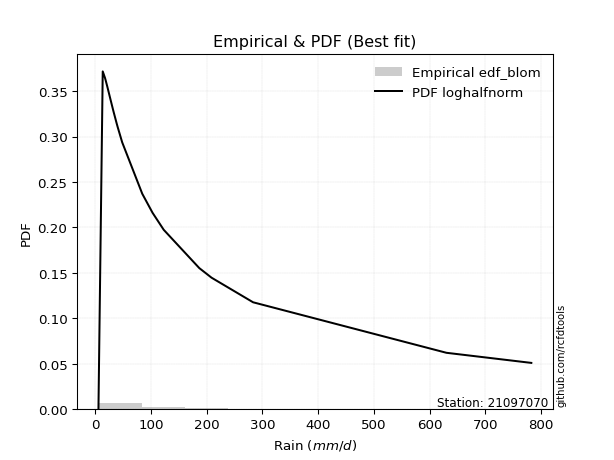</img>

</div>


### 7. EDF Tukey (1962)

In hydrology, the Tukey formula is used as a plotting position formula to estimate the empirical probability or frequency of a flood event (or other hydrological data). The formula parameter is given as _c=0.333_ (or 1/3).

<div align="center">


$P=(m-c)/(n+1-2c)$


</div>


**7.1. Empirical values**

<div align="center">

|                | 0                    | 1                   | 2                   | 3                  | 4                  | 5                   | 6                  | 7                   | 8                  | 9         | 10                 | 11                 | 12                 | 13                 | 14                 | 15                 | 16                 | 17                 | 18                 |
|:---------------|:---------------------|:--------------------|:--------------------|:-------------------|:-------------------|:--------------------|:-------------------|:--------------------|:-------------------|:----------|:-------------------|:-------------------|:-------------------|:-------------------|:-------------------|:-------------------|:-------------------|:-------------------|:-------------------|
| date           | 2019                 | 2021                | 2016                | 2010               | 2013               | 2018                | 2020               | 2015                | 2014               | 2017      | 2024               | 2025               | 2022               | 2023               | 2009               | 2007               | 2011               | 2012               | 2006               |
| x              | 5.9                  | 13.6                | 17.7                | 18.7               | 21.9               | 27.1                | 32.2               | 33.1                | 38.5               | 40.4      | 48.5               | 84.5               | 103.0              | 123.0              | 186.8              | 208.8              | 283.3              | 630.2              | 782.4              |
| m              | 1                    | 2                   | 3                   | 4                  | 5                  | 6                   | 7                  | 8                   | 9                  | 10        | 11                 | 12                 | 13                 | 14                 | 15                 | 16                 | 17                 | 18                 | 19                 |
| empirical_dist | edf_tukey            | edf_tukey           | edf_tukey           | edf_tukey          | edf_tukey          | edf_tukey           | edf_tukey          | edf_tukey           | edf_tukey          | edf_tukey | edf_tukey          | edf_tukey          | edf_tukey          | edf_tukey          | edf_tukey          | edf_tukey          | edf_tukey          | edf_tukey          | edf_tukey          |
| empirical      | 0.034482758620689655 | 0.08620689655172414 | 0.13793103448275862 | 0.1896551724137931 | 0.2413793103448276 | 0.29310344827586204 | 0.3448275862068966 | 0.39655172413793105 | 0.4482758620689655 | 0.5       | 0.5517241379310345 | 0.603448275862069  | 0.6551724137931034 | 0.7068965517241379 | 0.7586206896551724 | 0.8103448275862069 | 0.8620689655172413 | 0.9137931034482759 | 0.9655172413793104 |
| empirical_tr   | 1.0357142857142856   | 1.0943396226415094  | 1.1600000000000001  | 1.2340425531914894 | 1.3181818181818183 | 1.4146341463414636  | 1.5263157894736843 | 1.6571428571428573  | 1.8125             | 2.0       | 2.230769230769231  | 2.5217391304347827 | 2.9                | 3.4117647058823524 | 4.142857142857142  | 5.272727272727272  | 7.249999999999997  | 11.600000000000007 | 29.000000000000036 |

</div>


**7.2. Kolmogorov-Smirnov fit test (sorted by Δ)**


<div align="center">

|                | 0                   | 1                    | 2                    | 3                   | 4                   | 5                   | 6                   | 7                   | 8                   | 9                   | 10                  | 11                  | 12                  | 13                  | 14                  | 15                  | 16                  | 17                  | 18                  | 19                  | 20                  | 21                  | 22                  | 23                  | 24                  | 25                  | 26                  | 27                  | 28                  | 29                  | 30                  | 31                  | 32                  | 33                  | 34                  | 35                  | 36                  | 37                  | 38                  | 39                  | 40                  | 41                  | 42                  | 43                  | 44                  | 45                  | 46                  | 47                  | 48                  | 49                  | 50                  | 51                  | 52                  | 53                  | 54                  | 55                  | 56                  | 57                  | 58                  | 59                  | 60                  | 61                  | 62                  | 63                  | 64                  | 65                  | 66                  | 67                  | 68                  | 69                  | 70                  | 71                  | 72                  | 73                  | 74                  | 75                  | 76                  | 77                  | 78                  | 79                  | 80                  | 81                  | 82                  | 83                  | 84                  | 85                  | 86                  | 87                  | 88                  | 89                  | 90                  | 91                  | 92                  | 93                  | 94                  | 95                  | 96                  | 97                  | 98                  | 99                  | 100                 | 101                 | 102                 | 103                 | 104                 | 105                 | 106                 | 107                 | 108                 | 109                 | 110                 | 111                 | 112                 | 113                 | 114                 | 115                 | 116                 | 117                 | 118                 | 119                 | 120                 | 121                 | 122                 | 123                 | 124                 | 125                 | 126                 | 127                 | 128                 | 129                 | 130                 | 131                 | 132                 | 133                 | 134                 | 135                 | 136                 | 137                 | 138                 | 139                 | 140                 | 141                 | 142                 | 143                 | 144                 | 145                 | 146                 | 147                 | 148                 | 149                 | 150                 | 151                 | 152                 | 153                 | 154                 | 155                 | 156                 | 157                 | 158                 | 159                 |
|:---------------|:--------------------|:---------------------|:---------------------|:--------------------|:--------------------|:--------------------|:--------------------|:--------------------|:--------------------|:--------------------|:--------------------|:--------------------|:--------------------|:--------------------|:--------------------|:--------------------|:--------------------|:--------------------|:--------------------|:--------------------|:--------------------|:--------------------|:--------------------|:--------------------|:--------------------|:--------------------|:--------------------|:--------------------|:--------------------|:--------------------|:--------------------|:--------------------|:--------------------|:--------------------|:--------------------|:--------------------|:--------------------|:--------------------|:--------------------|:--------------------|:--------------------|:--------------------|:--------------------|:--------------------|:--------------------|:--------------------|:--------------------|:--------------------|:--------------------|:--------------------|:--------------------|:--------------------|:--------------------|:--------------------|:--------------------|:--------------------|:--------------------|:--------------------|:--------------------|:--------------------|:--------------------|:--------------------|:--------------------|:--------------------|:--------------------|:--------------------|:--------------------|:--------------------|:--------------------|:--------------------|:--------------------|:--------------------|:--------------------|:--------------------|:--------------------|:--------------------|:--------------------|:--------------------|:--------------------|:--------------------|:--------------------|:--------------------|:--------------------|:--------------------|:--------------------|:--------------------|:--------------------|:--------------------|:--------------------|:--------------------|:--------------------|:--------------------|:--------------------|:--------------------|:--------------------|:--------------------|:--------------------|:--------------------|:--------------------|:--------------------|:--------------------|:--------------------|:--------------------|:--------------------|:--------------------|:--------------------|:--------------------|:--------------------|:--------------------|:--------------------|:--------------------|:--------------------|:--------------------|:--------------------|:--------------------|:--------------------|:--------------------|:--------------------|:--------------------|:--------------------|:--------------------|:--------------------|:--------------------|:--------------------|:--------------------|:--------------------|:--------------------|:--------------------|:--------------------|:--------------------|:--------------------|:--------------------|:--------------------|:--------------------|:--------------------|:--------------------|:--------------------|:--------------------|:--------------------|:--------------------|:--------------------|:--------------------|:--------------------|:--------------------|:--------------------|:--------------------|:--------------------|:--------------------|:--------------------|:--------------------|:--------------------|:--------------------|:--------------------|:--------------------|:--------------------|:--------------------|:--------------------|:--------------------|:--------------------|:--------------------|
| station        | 21097070            | 21097070             | 21097070             | 21097070            | 21097070            | 21097070            | 21097070            | 21097070            | 21097070            | 21097070            | 21097070            | 21097070            | 21097070            | 21097070            | 21097070            | 21097070            | 21097070            | 21097070            | 21097070            | 21097070            | 21097070            | 21097070            | 21097070            | 21097070            | 21097070            | 21097070            | 21097070            | 21097070            | 21097070            | 21097070            | 21097070            | 21097070            | 21097070            | 21097070            | 21097070            | 21097070            | 21097070            | 21097070            | 21097070            | 21097070            | 21097070            | 21097070            | 21097070            | 21097070            | 21097070            | 21097070            | 21097070            | 21097070            | 21097070            | 21097070            | 21097070            | 21097070            | 21097070            | 21097070            | 21097070            | 21097070            | 21097070            | 21097070            | 21097070            | 21097070            | 21097070            | 21097070            | 21097070            | 21097070            | 21097070            | 21097070            | 21097070            | 21097070            | 21097070            | 21097070            | 21097070            | 21097070            | 21097070            | 21097070            | 21097070            | 21097070            | 21097070            | 21097070            | 21097070            | 21097070            | 21097070            | 21097070            | 21097070            | 21097070            | 21097070            | 21097070            | 21097070            | 21097070            | 21097070            | 21097070            | 21097070            | 21097070            | 21097070            | 21097070            | 21097070            | 21097070            | 21097070            | 21097070            | 21097070            | 21097070            | 21097070            | 21097070            | 21097070            | 21097070            | 21097070            | 21097070            | 21097070            | 21097070            | 21097070            | 21097070            | 21097070            | 21097070            | 21097070            | 21097070            | 21097070            | 21097070            | 21097070            | 21097070            | 21097070            | 21097070            | 21097070            | 21097070            | 21097070            | 21097070            | 21097070            | 21097070            | 21097070            | 21097070            | 21097070            | 21097070            | 21097070            | 21097070            | 21097070            | 21097070            | 21097070            | 21097070            | 21097070            | 21097070            | 21097070            | 21097070            | 21097070            | 21097070            | 21097070            | 21097070            | 21097070            | 21097070            | 21097070            | 21097070            | 21097070            | 21097070            | 21097070            | 21097070            | 21097070            | 21097070            | 21097070            | 21097070            | 21097070            | 21097070            | 21097070            | 21097070            |
| empirical_dist | edf_tukey           | edf_tukey            | edf_tukey            | edf_tukey           | edf_tukey           | edf_tukey           | edf_tukey           | edf_tukey           | edf_tukey           | edf_tukey           | edf_tukey           | edf_tukey           | edf_tukey           | edf_tukey           | edf_tukey           | edf_tukey           | edf_tukey           | edf_tukey           | edf_tukey           | edf_tukey           | edf_tukey           | edf_tukey           | edf_tukey           | edf_tukey           | edf_tukey           | edf_tukey           | edf_tukey           | edf_tukey           | edf_tukey           | edf_tukey           | edf_tukey           | edf_tukey           | edf_tukey           | edf_tukey           | edf_tukey           | edf_tukey           | edf_tukey           | edf_tukey           | edf_tukey           | edf_tukey           | edf_tukey           | edf_tukey           | edf_tukey           | edf_tukey           | edf_tukey           | edf_tukey           | edf_tukey           | edf_tukey           | edf_tukey           | edf_tukey           | edf_tukey           | edf_tukey           | edf_tukey           | edf_tukey           | edf_tukey           | edf_tukey           | edf_tukey           | edf_tukey           | edf_tukey           | edf_tukey           | edf_tukey           | edf_tukey           | edf_tukey           | edf_tukey           | edf_tukey           | edf_tukey           | edf_tukey           | edf_tukey           | edf_tukey           | edf_tukey           | edf_tukey           | edf_tukey           | edf_tukey           | edf_tukey           | edf_tukey           | edf_tukey           | edf_tukey           | edf_tukey           | edf_tukey           | edf_tukey           | edf_tukey           | edf_tukey           | edf_tukey           | edf_tukey           | edf_tukey           | edf_tukey           | edf_tukey           | edf_tukey           | edf_tukey           | edf_tukey           | edf_tukey           | edf_tukey           | edf_tukey           | edf_tukey           | edf_tukey           | edf_tukey           | edf_tukey           | edf_tukey           | edf_tukey           | edf_tukey           | edf_tukey           | edf_tukey           | edf_tukey           | edf_tukey           | edf_tukey           | edf_tukey           | edf_tukey           | edf_tukey           | edf_tukey           | edf_tukey           | edf_tukey           | edf_tukey           | edf_tukey           | edf_tukey           | edf_tukey           | edf_tukey           | edf_tukey           | edf_tukey           | edf_tukey           | edf_tukey           | edf_tukey           | edf_tukey           | edf_tukey           | edf_tukey           | edf_tukey           | edf_tukey           | edf_tukey           | edf_tukey           | edf_tukey           | edf_tukey           | edf_tukey           | edf_tukey           | edf_tukey           | edf_tukey           | edf_tukey           | edf_tukey           | edf_tukey           | edf_tukey           | edf_tukey           | edf_tukey           | edf_tukey           | edf_tukey           | edf_tukey           | edf_tukey           | edf_tukey           | edf_tukey           | edf_tukey           | edf_tukey           | edf_tukey           | edf_tukey           | edf_tukey           | edf_tukey           | edf_tukey           | edf_tukey           | edf_tukey           | edf_tukey           | edf_tukey           | edf_tukey           | edf_tukey           | edf_tukey           |
| p_dist         | logkstwobign        | loghalfnorm          | mielke               | loginvweibull       | nct                 | johnsonsu           | loggenexpon         | burr                | burr12              | logskewnorm         | loggumbel_r         | genextreme          | invweibull          | f                   | invgamma            | ncf                 | loggenlogistic      | lograyleigh         | logmielke           | logburr             | logbetaprime        | invgauss            | loghalflogistic     | logfoldnorm         | logf                | loggamma            | loggamma            | logerlang           | kappa3              | lognakagami         | logexponnorm        | logfatiguelife      | logexponweib        | loginvgauss         | logmoyal            | logjohnsonsu        | logburr12           | logrice             | lognct              | loginvgamma         | logweibull_min      | logmaxwell          | logalpha            | lomax               | genpareto           | logexponpow         | logncf              | loggenextreme       | gamma               | loggompertz         | logjohnsonsb        | halfgennorm         | logpearson3         | logbeta             | logdweibull         | logsemicircular     | logkappa4           | logwrapcauchy       | logdgamma           | loganglit           | logtruncweibull_min | logkappa3           | loguniform          | fatiguelife         | betaprime           | lognorm             | logt                | logcrystalball      | logloggamma         | truncweibull_min    | logarcsine          | gengamma            | truncpareto         | logbradford         | loggengamma         | logcosine           | gausshyper          | loglogistic         | logksone            | exponweib           | logvonmises_line    | logtukeylambda      | logloglaplace       | erlang              | loghypsecant        | loggennorm          | logtruncexpon       | loggausshyper       | loglaplace          | loglaplace          | wald                | logwald             | loggumbel_l         | nakagami            | bradford            | vonmises_line       | exponpow            | logargus            | alpha               | loggenpareto        | beta                | gennorm             | logtruncnorm        | loglomax            | gumbel_r            | moyal               | t                   | crystalball         | norm                | logtriang           | maxwell             | genlogistic         | loggenhalflogistic  | logistic            | weibull_min         | anglit              | rayleigh            | pearson3            | cosine              | hypsecant           | semicircular        | halflogistic        | halfnorm            | exponnorm           | kstwobign           | loghalfgennorm      | powerlaw            | genexpon            | dgamma              | laplace             | gompertz            | rice                | foldnorm            | arcsine             | gumbel_l            | dweibull            | truncnorm           | logtrapezoid        | loglevy_l           | wrapcauchy          | genhalflogistic     | logweibull_max      | skewnorm            | argus               | logrdist            | logpowerlaw         | triang              | truncexpon          | johnsonsb           | levy_l              | ksone               | kappa4              | rdist               | uniform             | tukeylambda         | trapezoid           | weibull_max         | logtruncpareto      | logvonmises         | vonmises            |
| delta          | 0.05433661020936553 | 0.056152188473828635 | 0.059985743077581144 | 0.06256628182661722 | 0.06812743325797677 | 0.06944467661502507 | 0.06959712464799248 | 0.07272046455593512 | 0.0727980356192941  | 0.07279941881890067 | 0.07410036119106378 | 0.07421324637816601 | 0.0742134611984846  | 0.07440755290191348 | 0.07440789857866648 | 0.07449861993729517 | 0.07603743789496631 | 0.0780620008514088  | 0.07935970503631712 | 0.08011791168677312 | 0.08100910662515187 | 0.0827092961319193  | 0.08447309116163271 | 0.08508949525083842 | 0.08569197371466708 | 0.08586695839037306 | 0.08586695839037306 | 0.08586743613139941 | 0.08602073414272293 | 0.08620689655137159 | 0.08630358939191718 | 0.08680154150503305 | 0.08681991258069782 | 0.08693867207018802 | 0.08729493434506741 | 0.0884997063761217  | 0.08906957614828337 | 0.08907329265389569 | 0.08909754003212511 | 0.08928896023681288 | 0.08943495997132167 | 0.09033689693984459 | 0.09115526380343597 | 0.09128165776434483 | 0.09129263978860369 | 0.09152454108396912 | 0.09158495480230827 | 0.09444213054213435 | 0.09551366880567619 | 0.09687876619674518 | 0.09701865790621367 | 0.09929210322122448 | 0.10174193839384987 | 0.1049653292246942  | 0.10554894077311805 | 0.10675176044376122 | 0.1069424911506276  | 0.10948183348657373 | 0.11068406866767366 | 0.11075437278317252 | 0.11375514592787261 | 0.1202570178606957  | 0.12069628821079803 | 0.12086744419523199 | 0.12127060815538354 | 0.12360478362719812 | 0.12360522810435637 | 0.12360531217444204 | 0.12491094780511702 | 0.1250281196852142  | 0.1258808477886318  | 0.12982164920966552 | 0.13230383782884758 | 0.13371070815853836 | 0.13529622955662096 | 0.13623875727435691 | 0.1389473676316454  | 0.13905802633527065 | 0.1395189647294258  | 0.14389761812402374 | 0.1444285517962815  | 0.14541845373583878 | 0.1460594583613436  | 0.14866336899297455 | 0.1514238053713312  | 0.15514702068970265 | 0.16007277521202118 | 0.16305559990026103 | 0.17972358182754755 | 0.17972358182754755 | 0.18168920677847333 | 0.1878346523477689  | 0.18955465577707087 | 0.20037039600444534 | 0.20104057375054307 | 0.20333935309076695 | 0.20446870060018135 | 0.20478395451054787 | 0.20819323472041407 | 0.21139341349220458 | 0.21782145326364277 | 0.2227333479836146  | 0.2239534581755549  | 0.2381015178095976  | 0.2389054149821545  | 0.2394804481343214  | 0.242039357517853   | 0.24323558703993142 | 0.24333738789167736 | 0.24434003270685234 | 0.24509902220643492 | 0.24576233591533792 | 0.24691842732042912 | 0.24827919198751575 | 0.2491398076814893  | 0.24972308561693546 | 0.2543711696464238  | 0.25658300074437185 | 0.2570305429178713  | 0.2594588579140281  | 0.26149541231190376 | 0.2672416365798722  | 0.27960592971878007 | 0.2803904734009005  | 0.282302843603406   | 0.2826908726840878  | 0.2828231359753646  | 0.28310553947404665 | 0.28434738643166996 | 0.2865833287443948  | 0.2891243390550409  | 0.2934637539658875  | 0.30292513958130957 | 0.312809826410209   | 0.3138469772622171  | 0.33018914639180436 | 0.3408841303620191  | 0.3558973482237441  | 0.37351321101150586 | 0.3841641468745882  | 0.3882833939159545  | 0.4113934853795     | 0.41596528580124364 | 0.4303298561091444  | 0.4347643949124779  | 0.4429310279320103  | 0.451850564324077   | 0.4629164694964433  | 0.4816031254198535  | 0.5023550956748585  | 0.5092609039974538  | 0.5325925631742708  | 0.5476190365218665  | 0.5560916579701134  | 0.5709689455794952  | 0.7173600840156131  | 0.7585155284762227  | 0.8623731951297438  | 1.0891990796211752  | 123.82739049105247  |
| deltao         | 0.31564497164100014 | 0.31564497164100014  | 0.31564497164100014  | 0.31564497164100014 | 0.31564497164100014 | 0.31564497164100014 | 0.31564497164100014 | 0.31564497164100014 | 0.31564497164100014 | 0.31564497164100014 | 0.31564497164100014 | 0.31564497164100014 | 0.31564497164100014 | 0.31564497164100014 | 0.31564497164100014 | 0.31564497164100014 | 0.31564497164100014 | 0.31564497164100014 | 0.31564497164100014 | 0.31564497164100014 | 0.31564497164100014 | 0.31564497164100014 | 0.31564497164100014 | 0.31564497164100014 | 0.31564497164100014 | 0.31564497164100014 | 0.31564497164100014 | 0.31564497164100014 | 0.31564497164100014 | 0.31564497164100014 | 0.31564497164100014 | 0.31564497164100014 | 0.31564497164100014 | 0.31564497164100014 | 0.31564497164100014 | 0.31564497164100014 | 0.31564497164100014 | 0.31564497164100014 | 0.31564497164100014 | 0.31564497164100014 | 0.31564497164100014 | 0.31564497164100014 | 0.31564497164100014 | 0.31564497164100014 | 0.31564497164100014 | 0.31564497164100014 | 0.31564497164100014 | 0.31564497164100014 | 0.31564497164100014 | 0.31564497164100014 | 0.31564497164100014 | 0.31564497164100014 | 0.31564497164100014 | 0.31564497164100014 | 0.31564497164100014 | 0.31564497164100014 | 0.31564497164100014 | 0.31564497164100014 | 0.31564497164100014 | 0.31564497164100014 | 0.31564497164100014 | 0.31564497164100014 | 0.31564497164100014 | 0.31564497164100014 | 0.31564497164100014 | 0.31564497164100014 | 0.31564497164100014 | 0.31564497164100014 | 0.31564497164100014 | 0.31564497164100014 | 0.31564497164100014 | 0.31564497164100014 | 0.31564497164100014 | 0.31564497164100014 | 0.31564497164100014 | 0.31564497164100014 | 0.31564497164100014 | 0.31564497164100014 | 0.31564497164100014 | 0.31564497164100014 | 0.31564497164100014 | 0.31564497164100014 | 0.31564497164100014 | 0.31564497164100014 | 0.31564497164100014 | 0.31564497164100014 | 0.31564497164100014 | 0.31564497164100014 | 0.31564497164100014 | 0.31564497164100014 | 0.31564497164100014 | 0.31564497164100014 | 0.31564497164100014 | 0.31564497164100014 | 0.31564497164100014 | 0.31564497164100014 | 0.31564497164100014 | 0.31564497164100014 | 0.31564497164100014 | 0.31564497164100014 | 0.31564497164100014 | 0.31564497164100014 | 0.31564497164100014 | 0.31564497164100014 | 0.31564497164100014 | 0.31564497164100014 | 0.31564497164100014 | 0.31564497164100014 | 0.31564497164100014 | 0.31564497164100014 | 0.31564497164100014 | 0.31564497164100014 | 0.31564497164100014 | 0.31564497164100014 | 0.31564497164100014 | 0.31564497164100014 | 0.31564497164100014 | 0.31564497164100014 | 0.31564497164100014 | 0.31564497164100014 | 0.31564497164100014 | 0.31564497164100014 | 0.31564497164100014 | 0.31564497164100014 | 0.31564497164100014 | 0.31564497164100014 | 0.31564497164100014 | 0.31564497164100014 | 0.31564497164100014 | 0.31564497164100014 | 0.31564497164100014 | 0.31564497164100014 | 0.31564497164100014 | 0.31564497164100014 | 0.31564497164100014 | 0.31564497164100014 | 0.31564497164100014 | 0.31564497164100014 | 0.31564497164100014 | 0.31564497164100014 | 0.31564497164100014 | 0.31564497164100014 | 0.31564497164100014 | 0.31564497164100014 | 0.31564497164100014 | 0.31564497164100014 | 0.31564497164100014 | 0.31564497164100014 | 0.31564497164100014 | 0.31564497164100014 | 0.31564497164100014 | 0.31564497164100014 | 0.31564497164100014 | 0.31564497164100014 | 0.31564497164100014 | 0.31564497164100014 | 0.31564497164100014 | 0.31564497164100014 | 0.31564497164100014 | 0.31564497164100014 |
| eval           | Δo > Δ              | Δo > Δ               | Δo > Δ               | Δo > Δ              | Δo > Δ              | Δo > Δ              | Δo > Δ              | Δo > Δ              | Δo > Δ              | Δo > Δ              | Δo > Δ              | Δo > Δ              | Δo > Δ              | Δo > Δ              | Δo > Δ              | Δo > Δ              | Δo > Δ              | Δo > Δ              | Δo > Δ              | Δo > Δ              | Δo > Δ              | Δo > Δ              | Δo > Δ              | Δo > Δ              | Δo > Δ              | Δo > Δ              | Δo > Δ              | Δo > Δ              | Δo > Δ              | Δo > Δ              | Δo > Δ              | Δo > Δ              | Δo > Δ              | Δo > Δ              | Δo > Δ              | Δo > Δ              | Δo > Δ              | Δo > Δ              | Δo > Δ              | Δo > Δ              | Δo > Δ              | Δo > Δ              | Δo > Δ              | Δo > Δ              | Δo > Δ              | Δo > Δ              | Δo > Δ              | Δo > Δ              | Δo > Δ              | Δo > Δ              | Δo > Δ              | Δo > Δ              | Δo > Δ              | Δo > Δ              | Δo > Δ              | Δo > Δ              | Δo > Δ              | Δo > Δ              | Δo > Δ              | Δo > Δ              | Δo > Δ              | Δo > Δ              | Δo > Δ              | Δo > Δ              | Δo > Δ              | Δo > Δ              | Δo > Δ              | Δo > Δ              | Δo > Δ              | Δo > Δ              | Δo > Δ              | Δo > Δ              | Δo > Δ              | Δo > Δ              | Δo > Δ              | Δo > Δ              | Δo > Δ              | Δo > Δ              | Δo > Δ              | Δo > Δ              | Δo > Δ              | Δo > Δ              | Δo > Δ              | Δo > Δ              | Δo > Δ              | Δo > Δ              | Δo > Δ              | Δo > Δ              | Δo > Δ              | Δo > Δ              | Δo > Δ              | Δo > Δ              | Δo > Δ              | Δo > Δ              | Δo > Δ              | Δo > Δ              | Δo > Δ              | Δo > Δ              | Δo > Δ              | Δo > Δ              | Δo > Δ              | Δo > Δ              | Δo > Δ              | Δo > Δ              | Δo > Δ              | Δo > Δ              | Δo > Δ              | Δo > Δ              | Δo > Δ              | Δo > Δ              | Δo > Δ              | Δo > Δ              | Δo > Δ              | Δo > Δ              | Δo > Δ              | Δo > Δ              | Δo > Δ              | Δo > Δ              | Δo > Δ              | Δo > Δ              | Δo > Δ              | Δo > Δ              | Δo > Δ              | Δo > Δ              | Δo > Δ              | Δo > Δ              | Δo > Δ              | Δo > Δ              | Δo > Δ              | Δo > Δ              | Δo > Δ              | Δo > Δ              | Δo > Δ              | Δo > Δ              | Δo > Δ              | Δo <= Δ             | Δo <= Δ             | Δo <= Δ             | Δo <= Δ             | Δo <= Δ             | Δo <= Δ             | Δo <= Δ             | Δo <= Δ             | Δo <= Δ             | Δo <= Δ             | Δo <= Δ             | Δo <= Δ             | Δo <= Δ             | Δo <= Δ             | Δo <= Δ             | Δo <= Δ             | Δo <= Δ             | Δo <= Δ             | Δo <= Δ             | Δo <= Δ             | Δo <= Δ             | Δo <= Δ             | Δo <= Δ             | Δo <= Δ             | Δo <= Δ             |
| fit            | 1                   | 1                    | 1                    | 1                   | 1                   | 1                   | 1                   | 1                   | 1                   | 1                   | 1                   | 1                   | 1                   | 1                   | 1                   | 1                   | 1                   | 1                   | 1                   | 1                   | 1                   | 1                   | 1                   | 1                   | 1                   | 1                   | 1                   | 1                   | 1                   | 1                   | 1                   | 1                   | 1                   | 1                   | 1                   | 1                   | 1                   | 1                   | 1                   | 1                   | 1                   | 1                   | 1                   | 1                   | 1                   | 1                   | 1                   | 1                   | 1                   | 1                   | 1                   | 1                   | 1                   | 1                   | 1                   | 1                   | 1                   | 1                   | 1                   | 1                   | 1                   | 1                   | 1                   | 1                   | 1                   | 1                   | 1                   | 1                   | 1                   | 1                   | 1                   | 1                   | 1                   | 1                   | 1                   | 1                   | 1                   | 1                   | 1                   | 1                   | 1                   | 1                   | 1                   | 1                   | 1                   | 1                   | 1                   | 1                   | 1                   | 1                   | 1                   | 1                   | 1                   | 1                   | 1                   | 1                   | 1                   | 1                   | 1                   | 1                   | 1                   | 1                   | 1                   | 1                   | 1                   | 1                   | 1                   | 1                   | 1                   | 1                   | 1                   | 1                   | 1                   | 1                   | 1                   | 1                   | 1                   | 1                   | 1                   | 1                   | 1                   | 1                   | 1                   | 1                   | 1                   | 1                   | 1                   | 1                   | 1                   | 1                   | 1                   | 1                   | 1                   | 1                   | 1                   | 0                   | 0                   | 0                   | 0                   | 0                   | 0                   | 0                   | 0                   | 0                   | 0                   | 0                   | 0                   | 0                   | 0                   | 0                   | 0                   | 0                   | 0                   | 0                   | 0                   | 0                   | 0                   | 0                   | 0                   | 0                   |
| n              | 19                  | 19                   | 19                   | 19                  | 19                  | 19                  | 19                  | 19                  | 19                  | 19                  | 19                  | 19                  | 19                  | 19                  | 19                  | 19                  | 19                  | 19                  | 19                  | 19                  | 19                  | 19                  | 19                  | 19                  | 19                  | 19                  | 19                  | 19                  | 19                  | 19                  | 19                  | 19                  | 19                  | 19                  | 19                  | 19                  | 19                  | 19                  | 19                  | 19                  | 19                  | 19                  | 19                  | 19                  | 19                  | 19                  | 19                  | 19                  | 19                  | 19                  | 19                  | 19                  | 19                  | 19                  | 19                  | 19                  | 19                  | 19                  | 19                  | 19                  | 19                  | 19                  | 19                  | 19                  | 19                  | 19                  | 19                  | 19                  | 19                  | 19                  | 19                  | 19                  | 19                  | 19                  | 19                  | 19                  | 19                  | 19                  | 19                  | 19                  | 19                  | 19                  | 19                  | 19                  | 19                  | 19                  | 19                  | 19                  | 19                  | 19                  | 19                  | 19                  | 19                  | 19                  | 19                  | 19                  | 19                  | 19                  | 19                  | 19                  | 19                  | 19                  | 19                  | 19                  | 19                  | 19                  | 19                  | 19                  | 19                  | 19                  | 19                  | 19                  | 19                  | 19                  | 19                  | 19                  | 19                  | 19                  | 19                  | 19                  | 19                  | 19                  | 19                  | 19                  | 19                  | 19                  | 19                  | 19                  | 19                  | 19                  | 19                  | 19                  | 19                  | 19                  | 19                  | 19                  | 19                  | 19                  | 19                  | 19                  | 19                  | 19                  | 19                  | 19                  | 19                  | 19                  | 19                  | 19                  | 19                  | 19                  | 19                  | 19                  | 19                  | 19                  | 19                  | 19                  | 19                  | 19                  | 19                  | 19                  |
| best_fit       | 1                   | 0                    | 0                    | 0                   | 0                   | 0                   | 0                   | 0                   | 0                   | 0                   | 0                   | 0                   | 0                   | 0                   | 0                   | 0                   | 0                   | 0                   | 0                   | 0                   | 0                   | 0                   | 0                   | 0                   | 0                   | 0                   | 0                   | 0                   | 0                   | 0                   | 0                   | 0                   | 0                   | 0                   | 0                   | 0                   | 0                   | 0                   | 0                   | 0                   | 0                   | 0                   | 0                   | 0                   | 0                   | 0                   | 0                   | 0                   | 0                   | 0                   | 0                   | 0                   | 0                   | 0                   | 0                   | 0                   | 0                   | 0                   | 0                   | 0                   | 0                   | 0                   | 0                   | 0                   | 0                   | 0                   | 0                   | 0                   | 0                   | 0                   | 0                   | 0                   | 0                   | 0                   | 0                   | 0                   | 0                   | 0                   | 0                   | 0                   | 0                   | 0                   | 0                   | 0                   | 0                   | 0                   | 0                   | 0                   | 0                   | 0                   | 0                   | 0                   | 0                   | 0                   | 0                   | 0                   | 0                   | 0                   | 0                   | 0                   | 0                   | 0                   | 0                   | 0                   | 0                   | 0                   | 0                   | 0                   | 0                   | 0                   | 0                   | 0                   | 0                   | 0                   | 0                   | 0                   | 0                   | 0                   | 0                   | 0                   | 0                   | 0                   | 0                   | 0                   | 0                   | 0                   | 0                   | 0                   | 0                   | 0                   | 0                   | 0                   | 0                   | 0                   | 0                   | 0                   | 0                   | 0                   | 0                   | 0                   | 0                   | 0                   | 0                   | 0                   | 0                   | 0                   | 0                   | 0                   | 0                   | 0                   | 0                   | 0                   | 0                   | 0                   | 0                   | 0                   | 0                   | 0                   | 0                   | 0                   |
| best_fit_sort  | 1                   | 2                    | 3                    | 4                   | 5                   | 6                   | 7                   | 8                   | 9                   | 10                  | 11                  | 12                  | 13                  | 14                  | 15                  | 16                  | 17                  | 18                  | 19                  | 20                  | 21                  | 22                  | 23                  | 24                  | 25                  | 26                  | 27                  | 28                  | 29                  | 30                  | 31                  | 32                  | 33                  | 34                  | 35                  | 36                  | 37                  | 38                  | 39                  | 40                  | 41                  | 42                  | 43                  | 44                  | 45                  | 46                  | 47                  | 48                  | 49                  | 50                  | 51                  | 52                  | 53                  | 54                  | 55                  | 56                  | 57                  | 58                  | 59                  | 60                  | 61                  | 62                  | 63                  | 64                  | 65                  | 66                  | 67                  | 68                  | 69                  | 70                  | 71                  | 72                  | 73                  | 74                  | 75                  | 76                  | 77                  | 78                  | 79                  | 80                  | 81                  | 82                  | 83                  | 84                  | 85                  | 86                  | 87                  | 88                  | 89                  | 90                  | 91                  | 92                  | 93                  | 94                  | 95                  | 96                  | 97                  | 98                  | 99                  | 100                 | 101                 | 102                 | 103                 | 104                 | 105                 | 106                 | 107                 | 108                 | 109                 | 110                 | 111                 | 112                 | 113                 | 114                 | 115                 | 116                 | 117                 | 118                 | 119                 | 120                 | 121                 | 122                 | 123                 | 124                 | 125                 | 126                 | 127                 | 128                 | 129                 | 130                 | 131                 | 132                 | 133                 | 134                 | 135                 | 136                 | 137                 | 138                 | 139                 | 140                 | 141                 | 142                 | 143                 | 144                 | 145                 | 146                 | 147                 | 148                 | 149                 | 150                 | 151                 | 152                 | 153                 | 154                 | 155                 | 156                 | 157                 | 158                 | 159                 | 160                 |

</div>


**7.3. Best fit**

<div align="center">

|   id |   station | empirical_dist   | p_dist       |     delta |   deltao | eval   |   fit |   n |   best_fit |   best_fit_sort |
|-----:|----------:|:-----------------|:-------------|----------:|---------:|:-------|------:|----:|-----------:|----------------:|
|    0 |  21097070 | edf_tukey        | logkstwobign | 0.0543366 | 0.315645 | Δo > Δ |     1 |  19 |          1 |               1 |

</div>


<div align="center">

</img>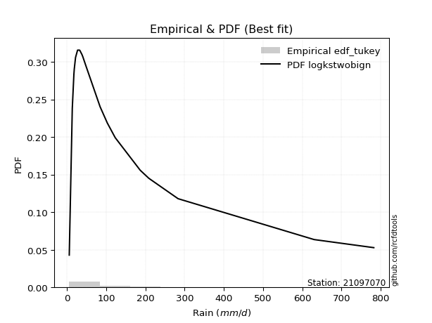</img>

</div>


### 8. EDF Gringorten (1963)

Gringorten plotting position formula is essential for estimating the probability and return periods of extreme events like floods and heavy rainfall. The constant _a=0.44_.

<div align="center">


$P=(m-a)/(n+1-2a)$


</div>


**8.1. Empirical values**

<div align="center">

|                | 0                    | 1                   | 2                   | 3                   | 4                   | 5                   | 6                  | 7                  | 8                  | 9              | 10                 | 11                | 12                 | 13                 | 14                 | 15                 | 16                 | 17                 | 18                 |
|:---------------|:---------------------|:--------------------|:--------------------|:--------------------|:--------------------|:--------------------|:-------------------|:-------------------|:-------------------|:---------------|:-------------------|:------------------|:-------------------|:-------------------|:-------------------|:-------------------|:-------------------|:-------------------|:-------------------|
| date           | 2019                 | 2021                | 2016                | 2010                | 2013                | 2018                | 2020               | 2015               | 2014               | 2017           | 2024               | 2025              | 2022               | 2023               | 2009               | 2007               | 2011               | 2012               | 2006               |
| x              | 5.9                  | 13.6                | 17.7                | 18.7                | 21.9                | 27.1                | 32.2               | 33.1               | 38.5               | 40.4           | 48.5               | 84.5              | 103.0              | 123.0              | 186.8              | 208.8              | 283.3              | 630.2              | 782.4              |
| m              | 1                    | 2                   | 3                   | 4                   | 5                   | 6                   | 7                  | 8                  | 9                  | 10             | 11                 | 12                | 13                 | 14                 | 15                 | 16                 | 17                 | 18                 | 19                 |
| empirical_dist | edf_gringorten       | edf_gringorten      | edf_gringorten      | edf_gringorten      | edf_gringorten      | edf_gringorten      | edf_gringorten     | edf_gringorten     | edf_gringorten     | edf_gringorten | edf_gringorten     | edf_gringorten    | edf_gringorten     | edf_gringorten     | edf_gringorten     | edf_gringorten     | edf_gringorten     | edf_gringorten     | edf_gringorten     |
| empirical      | 0.029288702928870293 | 0.08158995815899582 | 0.13389121338912133 | 0.18619246861924685 | 0.23849372384937234 | 0.29079497907949786 | 0.3430962343096234 | 0.3953974895397489 | 0.4476987447698745 | 0.5            | 0.5523012552301255 | 0.604602510460251 | 0.6569037656903766 | 0.7092050209205021 | 0.7615062761506276 | 0.8138075313807531 | 0.8661087866108785 | 0.918410041841004  | 0.9707112970711296 |
| empirical_tr   | 1.0301724137931034   | 1.0888382687927107  | 1.1545893719806763  | 1.2287917737789202  | 1.313186813186813   | 1.4100294985250739  | 1.522292993630573  | 1.6539792387543253 | 1.8106060606060606 | 2.0            | 2.2336448598130842 | 2.529100529100529 | 2.9146341463414633 | 3.4388489208633093 | 4.192982456140351  | 5.370786516853932  | 7.468749999999993  | 12.256410256410238 | 34.14285714285699  |

</div>


**8.2. Kolmogorov-Smirnov fit test (sorted by Δ)**


<div align="center">

|                | 0                    | 1                    | 2                   | 3                   | 4                   | 5                   | 6                   | 7                   | 8                   | 9                   | 10                  | 11                  | 12                  | 13                  | 14                  | 15                  | 16                  | 17                  | 18                  | 19                  | 20                  | 21                  | 22                  | 23                  | 24                  | 25                  | 26                  | 27                  | 28                  | 29                  | 30                  | 31                  | 32                  | 33                  | 34                  | 35                  | 36                  | 37                  | 38                  | 39                  | 40                  | 41                  | 42                  | 43                  | 44                  | 45                  | 46                  | 47                  | 48                  | 49                  | 50                  | 51                  | 52                  | 53                  | 54                  | 55                  | 56                  | 57                  | 58                  | 59                  | 60                  | 61                  | 62                  | 63                  | 64                  | 65                  | 66                  | 67                  | 68                  | 69                  | 70                  | 71                  | 72                  | 73                  | 74                  | 75                  | 76                  | 77                  | 78                  | 79                  | 80                  | 81                  | 82                  | 83                  | 84                  | 85                  | 86                  | 87                  | 88                  | 89                  | 90                  | 91                  | 92                  | 93                  | 94                  | 95                  | 96                  | 97                  | 98                  | 99                  | 100                 | 101                 | 102                 | 103                 | 104                 | 105                 | 106                 | 107                 | 108                 | 109                 | 110                 | 111                 | 112                 | 113                 | 114                 | 115                 | 116                 | 117                 | 118                 | 119                 | 120                 | 121                 | 122                 | 123                 | 124                 | 125                 | 126                 | 127                 | 128                 | 129                 | 130                 | 131                 | 132                 | 133                 | 134                 | 135                 | 136                 | 137                 | 138                 | 139                 | 140                 | 141                 | 142                 | 143                 | 144                 | 145                 | 146                 | 147                 | 148                 | 149                 | 150                 | 151                 | 152                 | 153                 | 154                 | 155                 | 156                 | 157                 | 158                 | 159                 |
|:---------------|:---------------------|:---------------------|:--------------------|:--------------------|:--------------------|:--------------------|:--------------------|:--------------------|:--------------------|:--------------------|:--------------------|:--------------------|:--------------------|:--------------------|:--------------------|:--------------------|:--------------------|:--------------------|:--------------------|:--------------------|:--------------------|:--------------------|:--------------------|:--------------------|:--------------------|:--------------------|:--------------------|:--------------------|:--------------------|:--------------------|:--------------------|:--------------------|:--------------------|:--------------------|:--------------------|:--------------------|:--------------------|:--------------------|:--------------------|:--------------------|:--------------------|:--------------------|:--------------------|:--------------------|:--------------------|:--------------------|:--------------------|:--------------------|:--------------------|:--------------------|:--------------------|:--------------------|:--------------------|:--------------------|:--------------------|:--------------------|:--------------------|:--------------------|:--------------------|:--------------------|:--------------------|:--------------------|:--------------------|:--------------------|:--------------------|:--------------------|:--------------------|:--------------------|:--------------------|:--------------------|:--------------------|:--------------------|:--------------------|:--------------------|:--------------------|:--------------------|:--------------------|:--------------------|:--------------------|:--------------------|:--------------------|:--------------------|:--------------------|:--------------------|:--------------------|:--------------------|:--------------------|:--------------------|:--------------------|:--------------------|:--------------------|:--------------------|:--------------------|:--------------------|:--------------------|:--------------------|:--------------------|:--------------------|:--------------------|:--------------------|:--------------------|:--------------------|:--------------------|:--------------------|:--------------------|:--------------------|:--------------------|:--------------------|:--------------------|:--------------------|:--------------------|:--------------------|:--------------------|:--------------------|:--------------------|:--------------------|:--------------------|:--------------------|:--------------------|:--------------------|:--------------------|:--------------------|:--------------------|:--------------------|:--------------------|:--------------------|:--------------------|:--------------------|:--------------------|:--------------------|:--------------------|:--------------------|:--------------------|:--------------------|:--------------------|:--------------------|:--------------------|:--------------------|:--------------------|:--------------------|:--------------------|:--------------------|:--------------------|:--------------------|:--------------------|:--------------------|:--------------------|:--------------------|:--------------------|:--------------------|:--------------------|:--------------------|:--------------------|:--------------------|:--------------------|:--------------------|:--------------------|:--------------------|:--------------------|:--------------------|
| station        | 21097070             | 21097070             | 21097070            | 21097070            | 21097070            | 21097070            | 21097070            | 21097070            | 21097070            | 21097070            | 21097070            | 21097070            | 21097070            | 21097070            | 21097070            | 21097070            | 21097070            | 21097070            | 21097070            | 21097070            | 21097070            | 21097070            | 21097070            | 21097070            | 21097070            | 21097070            | 21097070            | 21097070            | 21097070            | 21097070            | 21097070            | 21097070            | 21097070            | 21097070            | 21097070            | 21097070            | 21097070            | 21097070            | 21097070            | 21097070            | 21097070            | 21097070            | 21097070            | 21097070            | 21097070            | 21097070            | 21097070            | 21097070            | 21097070            | 21097070            | 21097070            | 21097070            | 21097070            | 21097070            | 21097070            | 21097070            | 21097070            | 21097070            | 21097070            | 21097070            | 21097070            | 21097070            | 21097070            | 21097070            | 21097070            | 21097070            | 21097070            | 21097070            | 21097070            | 21097070            | 21097070            | 21097070            | 21097070            | 21097070            | 21097070            | 21097070            | 21097070            | 21097070            | 21097070            | 21097070            | 21097070            | 21097070            | 21097070            | 21097070            | 21097070            | 21097070            | 21097070            | 21097070            | 21097070            | 21097070            | 21097070            | 21097070            | 21097070            | 21097070            | 21097070            | 21097070            | 21097070            | 21097070            | 21097070            | 21097070            | 21097070            | 21097070            | 21097070            | 21097070            | 21097070            | 21097070            | 21097070            | 21097070            | 21097070            | 21097070            | 21097070            | 21097070            | 21097070            | 21097070            | 21097070            | 21097070            | 21097070            | 21097070            | 21097070            | 21097070            | 21097070            | 21097070            | 21097070            | 21097070            | 21097070            | 21097070            | 21097070            | 21097070            | 21097070            | 21097070            | 21097070            | 21097070            | 21097070            | 21097070            | 21097070            | 21097070            | 21097070            | 21097070            | 21097070            | 21097070            | 21097070            | 21097070            | 21097070            | 21097070            | 21097070            | 21097070            | 21097070            | 21097070            | 21097070            | 21097070            | 21097070            | 21097070            | 21097070            | 21097070            | 21097070            | 21097070            | 21097070            | 21097070            | 21097070            | 21097070            |
| empirical_dist | edf_gringorten       | edf_gringorten       | edf_gringorten      | edf_gringorten      | edf_gringorten      | edf_gringorten      | edf_gringorten      | edf_gringorten      | edf_gringorten      | edf_gringorten      | edf_gringorten      | edf_gringorten      | edf_gringorten      | edf_gringorten      | edf_gringorten      | edf_gringorten      | edf_gringorten      | edf_gringorten      | edf_gringorten      | edf_gringorten      | edf_gringorten      | edf_gringorten      | edf_gringorten      | edf_gringorten      | edf_gringorten      | edf_gringorten      | edf_gringorten      | edf_gringorten      | edf_gringorten      | edf_gringorten      | edf_gringorten      | edf_gringorten      | edf_gringorten      | edf_gringorten      | edf_gringorten      | edf_gringorten      | edf_gringorten      | edf_gringorten      | edf_gringorten      | edf_gringorten      | edf_gringorten      | edf_gringorten      | edf_gringorten      | edf_gringorten      | edf_gringorten      | edf_gringorten      | edf_gringorten      | edf_gringorten      | edf_gringorten      | edf_gringorten      | edf_gringorten      | edf_gringorten      | edf_gringorten      | edf_gringorten      | edf_gringorten      | edf_gringorten      | edf_gringorten      | edf_gringorten      | edf_gringorten      | edf_gringorten      | edf_gringorten      | edf_gringorten      | edf_gringorten      | edf_gringorten      | edf_gringorten      | edf_gringorten      | edf_gringorten      | edf_gringorten      | edf_gringorten      | edf_gringorten      | edf_gringorten      | edf_gringorten      | edf_gringorten      | edf_gringorten      | edf_gringorten      | edf_gringorten      | edf_gringorten      | edf_gringorten      | edf_gringorten      | edf_gringorten      | edf_gringorten      | edf_gringorten      | edf_gringorten      | edf_gringorten      | edf_gringorten      | edf_gringorten      | edf_gringorten      | edf_gringorten      | edf_gringorten      | edf_gringorten      | edf_gringorten      | edf_gringorten      | edf_gringorten      | edf_gringorten      | edf_gringorten      | edf_gringorten      | edf_gringorten      | edf_gringorten      | edf_gringorten      | edf_gringorten      | edf_gringorten      | edf_gringorten      | edf_gringorten      | edf_gringorten      | edf_gringorten      | edf_gringorten      | edf_gringorten      | edf_gringorten      | edf_gringorten      | edf_gringorten      | edf_gringorten      | edf_gringorten      | edf_gringorten      | edf_gringorten      | edf_gringorten      | edf_gringorten      | edf_gringorten      | edf_gringorten      | edf_gringorten      | edf_gringorten      | edf_gringorten      | edf_gringorten      | edf_gringorten      | edf_gringorten      | edf_gringorten      | edf_gringorten      | edf_gringorten      | edf_gringorten      | edf_gringorten      | edf_gringorten      | edf_gringorten      | edf_gringorten      | edf_gringorten      | edf_gringorten      | edf_gringorten      | edf_gringorten      | edf_gringorten      | edf_gringorten      | edf_gringorten      | edf_gringorten      | edf_gringorten      | edf_gringorten      | edf_gringorten      | edf_gringorten      | edf_gringorten      | edf_gringorten      | edf_gringorten      | edf_gringorten      | edf_gringorten      | edf_gringorten      | edf_gringorten      | edf_gringorten      | edf_gringorten      | edf_gringorten      | edf_gringorten      | edf_gringorten      | edf_gringorten      | edf_gringorten      | edf_gringorten      | edf_gringorten      |
| p_dist         | loghalfnorm          | logkstwobign         | loginvweibull       | mielke              | nct                 | johnsonsu           | loggumbel_r         | burr12              | burr                | logskewnorm         | loggenexpon         | genextreme          | invweibull          | f                   | invgamma            | ncf                 | loggenlogistic      | lograyleigh         | logmielke           | logburr             | logbetaprime        | lognakagami         | invgauss            | loghalflogistic     | logfoldnorm         | logf                | loggamma            | loggamma            | logerlang           | kappa3              | logmoyal            | logexponnorm        | logfatiguelife      | logexponweib        | loginvgauss         | logjohnsonsu        | logburr12           | logrice             | lognct              | loginvgamma         | logweibull_min      | logmaxwell          | logalpha            | lomax               | genpareto           | logncf              | logexponpow         | loggenextreme       | gamma               | loggompertz         | logjohnsonsb        | logpearson3         | logdweibull         | halfgennorm         | logsemicircular     | logdgamma           | logbeta             | logkappa4           | loganglit           | logwrapcauchy       | logtruncweibull_min | logkappa3           | loguniform          | fatiguelife         | lognorm             | logt                | logcrystalball      | logloggamma         | betaprime           | truncweibull_min    | logarcsine          | truncpareto         | gengamma            | logcosine           | logbradford         | loglogistic         | loggengamma         | gausshyper          | logksone            | logloglaplace       | logvonmises_line    | exponweib           | erlang              | logtukeylambda      | loghypsecant        | loggennorm          | loggausshyper       | logtruncexpon       | loglaplace          | loglaplace          | logwald             | wald                | loggumbel_l         | nakagami            | bradford            | exponpow            | logargus            | alpha               | vonmises_line       | loggenpareto        | beta                | gennorm             | logtruncnorm        | t                   | loglomax            | gumbel_r            | moyal               | logtriang           | crystalball         | norm                | genlogistic         | loggenhalflogistic  | weibull_min         | maxwell             | logistic            | anglit              | cosine              | rayleigh            | hypsecant           | pearson3            | semicircular        | halflogistic        | exponnorm           | kstwobign           | genexpon            | halfnorm            | loghalfgennorm      | laplace             | powerlaw            | dgamma              | gompertz            | rice                | foldnorm            | gumbel_l            | arcsine             | dweibull            | truncnorm           | logtrapezoid        | loglevy_l           | wrapcauchy          | genhalflogistic     | logweibull_max      | skewnorm            | argus               | logrdist            | logpowerlaw         | triang              | truncexpon          | johnsonsb           | levy_l              | ksone               | kappa4              | rdist               | uniform             | tukeylambda         | trapezoid           | weibull_max         | logtruncpareto      | logvonmises         | vonmises            |
| delta          | 0.054997953875646544 | 0.058376431303002824 | 0.06256628182661722 | 0.06402556417121844 | 0.06524184676252154 | 0.06944467661502507 | 0.07121477469560855 | 0.07164380102111201 | 0.07272046455593512 | 0.07279941881890067 | 0.07363694574162977 | 0.07421324637816601 | 0.0742134611984846  | 0.07440755290191348 | 0.07440789857866648 | 0.07449861993729517 | 0.07603743789496631 | 0.0780620008514088  | 0.07935970503631712 | 0.08011791168677312 | 0.08100910662515187 | 0.08158995815864327 | 0.0827092961319193  | 0.08331885656345062 | 0.08566661254992947 | 0.08569197371466708 | 0.08586695839037306 | 0.08586695839037306 | 0.08586743613139941 | 0.08602073414272293 | 0.08614069974688532 | 0.08630358939191718 | 0.08680154150503305 | 0.08681991258069782 | 0.08693867207018802 | 0.0884997063761217  | 0.08906957614828337 | 0.08907329265389569 | 0.08909754003212511 | 0.08928896023681288 | 0.08943495997132167 | 0.09033689693984459 | 0.09115526380343597 | 0.09128165776434483 | 0.09129263978860369 | 0.09158495480230827 | 0.09210165838306017 | 0.09444213054213435 | 0.09609078610476723 | 0.09745588349583623 | 0.09759577520530471 | 0.10174193839384987 | 0.10266335427766282 | 0.10333192431486177 | 0.10732887774285227 | 0.10779848217221843 | 0.1090051503183315  | 0.11098231224426489 | 0.11133149008226356 | 0.11352165458021102 | 0.11433226322696366 | 0.12083413515978675 | 0.12127340550988908 | 0.12144456149432303 | 0.12360478362719812 | 0.12360522810435637 | 0.12360531217444204 | 0.12491094780511702 | 0.12531042924902083 | 0.12560523698430526 | 0.12992066888226908 | 0.13230383782884758 | 0.13443858760239386 | 0.13681587457344796 | 0.13775052925217565 | 0.13905802633527065 | 0.13933605065025825 | 0.13952448493073644 | 0.14413590312215413 | 0.1449052237631615  | 0.14500566909537255 | 0.14793743921766103 | 0.1492404862920656  | 0.14945827482947607 | 0.1514238053713312  | 0.15399278609152056 | 0.16363271719935207 | 0.16411259630565847 | 0.17972358182754755 | 0.17972358182754755 | 0.18437194855322264 | 0.18688326247029272 | 0.19013177307616191 | 0.20094751330353638 | 0.20161769104963412 | 0.2050458178992724  | 0.20536107180963892 | 0.20703900012223198 | 0.20853340878258633 | 0.2160103518849329  | 0.22243839165637108 | 0.227927403675434   | 0.2279932792691922  | 0.2408851229196709  | 0.2421413389032349  | 0.2440994706739739  | 0.24467450382614078 | 0.24491715000594338 | 0.2455440562362956  | 0.24564585708804154 | 0.24633945321442896 | 0.24749554461952017 | 0.24971692498058035 | 0.2502930778982543  | 0.25058766118387993 | 0.2549171413087548  | 0.25760766021696235 | 0.25956522533824317 | 0.26003597521311916 | 0.2617770564361912  | 0.2666894680037231  | 0.27243569227169157 | 0.28096759069999155 | 0.28287996090249706 | 0.2836826567731377  | 0.2847999854105994  | 0.2867306937777251  | 0.28716044604348584 | 0.28744007436809293 | 0.2895414421234893  | 0.28970145635413197 | 0.2940408712649785  | 0.3081191952731289  | 0.3161554464585813  | 0.31800388210202835 | 0.3353832020836237  | 0.34146124766111013 | 0.3564744655228351  | 0.3787072667033252  | 0.3882039679682254  | 0.38886051121504556 | 0.41485618917404626 | 0.4165424031003347  | 0.4337925599036907  | 0.43938133330520623 | 0.44697084902564754 | 0.45242768162316804 | 0.46522493869280745 | 0.4856429465134907  | 0.5075491513666778  | 0.5127236077920001  | 0.534901032370635   | 0.5528130922136858  | 0.5584001271664776  | 0.5761630012713145  | 0.7208227878101594  | 0.7631324668689509  | 0.866990133522472   | 1.08631349312572    | 123.82219643536065  |
| deltao         | 0.31564497164100014  | 0.31564497164100014  | 0.31564497164100014 | 0.31564497164100014 | 0.31564497164100014 | 0.31564497164100014 | 0.31564497164100014 | 0.31564497164100014 | 0.31564497164100014 | 0.31564497164100014 | 0.31564497164100014 | 0.31564497164100014 | 0.31564497164100014 | 0.31564497164100014 | 0.31564497164100014 | 0.31564497164100014 | 0.31564497164100014 | 0.31564497164100014 | 0.31564497164100014 | 0.31564497164100014 | 0.31564497164100014 | 0.31564497164100014 | 0.31564497164100014 | 0.31564497164100014 | 0.31564497164100014 | 0.31564497164100014 | 0.31564497164100014 | 0.31564497164100014 | 0.31564497164100014 | 0.31564497164100014 | 0.31564497164100014 | 0.31564497164100014 | 0.31564497164100014 | 0.31564497164100014 | 0.31564497164100014 | 0.31564497164100014 | 0.31564497164100014 | 0.31564497164100014 | 0.31564497164100014 | 0.31564497164100014 | 0.31564497164100014 | 0.31564497164100014 | 0.31564497164100014 | 0.31564497164100014 | 0.31564497164100014 | 0.31564497164100014 | 0.31564497164100014 | 0.31564497164100014 | 0.31564497164100014 | 0.31564497164100014 | 0.31564497164100014 | 0.31564497164100014 | 0.31564497164100014 | 0.31564497164100014 | 0.31564497164100014 | 0.31564497164100014 | 0.31564497164100014 | 0.31564497164100014 | 0.31564497164100014 | 0.31564497164100014 | 0.31564497164100014 | 0.31564497164100014 | 0.31564497164100014 | 0.31564497164100014 | 0.31564497164100014 | 0.31564497164100014 | 0.31564497164100014 | 0.31564497164100014 | 0.31564497164100014 | 0.31564497164100014 | 0.31564497164100014 | 0.31564497164100014 | 0.31564497164100014 | 0.31564497164100014 | 0.31564497164100014 | 0.31564497164100014 | 0.31564497164100014 | 0.31564497164100014 | 0.31564497164100014 | 0.31564497164100014 | 0.31564497164100014 | 0.31564497164100014 | 0.31564497164100014 | 0.31564497164100014 | 0.31564497164100014 | 0.31564497164100014 | 0.31564497164100014 | 0.31564497164100014 | 0.31564497164100014 | 0.31564497164100014 | 0.31564497164100014 | 0.31564497164100014 | 0.31564497164100014 | 0.31564497164100014 | 0.31564497164100014 | 0.31564497164100014 | 0.31564497164100014 | 0.31564497164100014 | 0.31564497164100014 | 0.31564497164100014 | 0.31564497164100014 | 0.31564497164100014 | 0.31564497164100014 | 0.31564497164100014 | 0.31564497164100014 | 0.31564497164100014 | 0.31564497164100014 | 0.31564497164100014 | 0.31564497164100014 | 0.31564497164100014 | 0.31564497164100014 | 0.31564497164100014 | 0.31564497164100014 | 0.31564497164100014 | 0.31564497164100014 | 0.31564497164100014 | 0.31564497164100014 | 0.31564497164100014 | 0.31564497164100014 | 0.31564497164100014 | 0.31564497164100014 | 0.31564497164100014 | 0.31564497164100014 | 0.31564497164100014 | 0.31564497164100014 | 0.31564497164100014 | 0.31564497164100014 | 0.31564497164100014 | 0.31564497164100014 | 0.31564497164100014 | 0.31564497164100014 | 0.31564497164100014 | 0.31564497164100014 | 0.31564497164100014 | 0.31564497164100014 | 0.31564497164100014 | 0.31564497164100014 | 0.31564497164100014 | 0.31564497164100014 | 0.31564497164100014 | 0.31564497164100014 | 0.31564497164100014 | 0.31564497164100014 | 0.31564497164100014 | 0.31564497164100014 | 0.31564497164100014 | 0.31564497164100014 | 0.31564497164100014 | 0.31564497164100014 | 0.31564497164100014 | 0.31564497164100014 | 0.31564497164100014 | 0.31564497164100014 | 0.31564497164100014 | 0.31564497164100014 | 0.31564497164100014 | 0.31564497164100014 | 0.31564497164100014 | 0.31564497164100014 | 0.31564497164100014 |
| eval           | Δo > Δ               | Δo > Δ               | Δo > Δ              | Δo > Δ              | Δo > Δ              | Δo > Δ              | Δo > Δ              | Δo > Δ              | Δo > Δ              | Δo > Δ              | Δo > Δ              | Δo > Δ              | Δo > Δ              | Δo > Δ              | Δo > Δ              | Δo > Δ              | Δo > Δ              | Δo > Δ              | Δo > Δ              | Δo > Δ              | Δo > Δ              | Δo > Δ              | Δo > Δ              | Δo > Δ              | Δo > Δ              | Δo > Δ              | Δo > Δ              | Δo > Δ              | Δo > Δ              | Δo > Δ              | Δo > Δ              | Δo > Δ              | Δo > Δ              | Δo > Δ              | Δo > Δ              | Δo > Δ              | Δo > Δ              | Δo > Δ              | Δo > Δ              | Δo > Δ              | Δo > Δ              | Δo > Δ              | Δo > Δ              | Δo > Δ              | Δo > Δ              | Δo > Δ              | Δo > Δ              | Δo > Δ              | Δo > Δ              | Δo > Δ              | Δo > Δ              | Δo > Δ              | Δo > Δ              | Δo > Δ              | Δo > Δ              | Δo > Δ              | Δo > Δ              | Δo > Δ              | Δo > Δ              | Δo > Δ              | Δo > Δ              | Δo > Δ              | Δo > Δ              | Δo > Δ              | Δo > Δ              | Δo > Δ              | Δo > Δ              | Δo > Δ              | Δo > Δ              | Δo > Δ              | Δo > Δ              | Δo > Δ              | Δo > Δ              | Δo > Δ              | Δo > Δ              | Δo > Δ              | Δo > Δ              | Δo > Δ              | Δo > Δ              | Δo > Δ              | Δo > Δ              | Δo > Δ              | Δo > Δ              | Δo > Δ              | Δo > Δ              | Δo > Δ              | Δo > Δ              | Δo > Δ              | Δo > Δ              | Δo > Δ              | Δo > Δ              | Δo > Δ              | Δo > Δ              | Δo > Δ              | Δo > Δ              | Δo > Δ              | Δo > Δ              | Δo > Δ              | Δo > Δ              | Δo > Δ              | Δo > Δ              | Δo > Δ              | Δo > Δ              | Δo > Δ              | Δo > Δ              | Δo > Δ              | Δo > Δ              | Δo > Δ              | Δo > Δ              | Δo > Δ              | Δo > Δ              | Δo > Δ              | Δo > Δ              | Δo > Δ              | Δo > Δ              | Δo > Δ              | Δo > Δ              | Δo > Δ              | Δo > Δ              | Δo > Δ              | Δo > Δ              | Δo > Δ              | Δo > Δ              | Δo > Δ              | Δo > Δ              | Δo > Δ              | Δo > Δ              | Δo > Δ              | Δo > Δ              | Δo > Δ              | Δo > Δ              | Δo > Δ              | Δo > Δ              | Δo <= Δ             | Δo <= Δ             | Δo <= Δ             | Δo <= Δ             | Δo <= Δ             | Δo <= Δ             | Δo <= Δ             | Δo <= Δ             | Δo <= Δ             | Δo <= Δ             | Δo <= Δ             | Δo <= Δ             | Δo <= Δ             | Δo <= Δ             | Δo <= Δ             | Δo <= Δ             | Δo <= Δ             | Δo <= Δ             | Δo <= Δ             | Δo <= Δ             | Δo <= Δ             | Δo <= Δ             | Δo <= Δ             | Δo <= Δ             | Δo <= Δ             | Δo <= Δ             | Δo <= Δ             |
| fit            | 1                    | 1                    | 1                   | 1                   | 1                   | 1                   | 1                   | 1                   | 1                   | 1                   | 1                   | 1                   | 1                   | 1                   | 1                   | 1                   | 1                   | 1                   | 1                   | 1                   | 1                   | 1                   | 1                   | 1                   | 1                   | 1                   | 1                   | 1                   | 1                   | 1                   | 1                   | 1                   | 1                   | 1                   | 1                   | 1                   | 1                   | 1                   | 1                   | 1                   | 1                   | 1                   | 1                   | 1                   | 1                   | 1                   | 1                   | 1                   | 1                   | 1                   | 1                   | 1                   | 1                   | 1                   | 1                   | 1                   | 1                   | 1                   | 1                   | 1                   | 1                   | 1                   | 1                   | 1                   | 1                   | 1                   | 1                   | 1                   | 1                   | 1                   | 1                   | 1                   | 1                   | 1                   | 1                   | 1                   | 1                   | 1                   | 1                   | 1                   | 1                   | 1                   | 1                   | 1                   | 1                   | 1                   | 1                   | 1                   | 1                   | 1                   | 1                   | 1                   | 1                   | 1                   | 1                   | 1                   | 1                   | 1                   | 1                   | 1                   | 1                   | 1                   | 1                   | 1                   | 1                   | 1                   | 1                   | 1                   | 1                   | 1                   | 1                   | 1                   | 1                   | 1                   | 1                   | 1                   | 1                   | 1                   | 1                   | 1                   | 1                   | 1                   | 1                   | 1                   | 1                   | 1                   | 1                   | 1                   | 1                   | 1                   | 1                   | 1                   | 1                   | 0                   | 0                   | 0                   | 0                   | 0                   | 0                   | 0                   | 0                   | 0                   | 0                   | 0                   | 0                   | 0                   | 0                   | 0                   | 0                   | 0                   | 0                   | 0                   | 0                   | 0                   | 0                   | 0                   | 0                   | 0                   | 0                   | 0                   |
| n              | 19                   | 19                   | 19                  | 19                  | 19                  | 19                  | 19                  | 19                  | 19                  | 19                  | 19                  | 19                  | 19                  | 19                  | 19                  | 19                  | 19                  | 19                  | 19                  | 19                  | 19                  | 19                  | 19                  | 19                  | 19                  | 19                  | 19                  | 19                  | 19                  | 19                  | 19                  | 19                  | 19                  | 19                  | 19                  | 19                  | 19                  | 19                  | 19                  | 19                  | 19                  | 19                  | 19                  | 19                  | 19                  | 19                  | 19                  | 19                  | 19                  | 19                  | 19                  | 19                  | 19                  | 19                  | 19                  | 19                  | 19                  | 19                  | 19                  | 19                  | 19                  | 19                  | 19                  | 19                  | 19                  | 19                  | 19                  | 19                  | 19                  | 19                  | 19                  | 19                  | 19                  | 19                  | 19                  | 19                  | 19                  | 19                  | 19                  | 19                  | 19                  | 19                  | 19                  | 19                  | 19                  | 19                  | 19                  | 19                  | 19                  | 19                  | 19                  | 19                  | 19                  | 19                  | 19                  | 19                  | 19                  | 19                  | 19                  | 19                  | 19                  | 19                  | 19                  | 19                  | 19                  | 19                  | 19                  | 19                  | 19                  | 19                  | 19                  | 19                  | 19                  | 19                  | 19                  | 19                  | 19                  | 19                  | 19                  | 19                  | 19                  | 19                  | 19                  | 19                  | 19                  | 19                  | 19                  | 19                  | 19                  | 19                  | 19                  | 19                  | 19                  | 19                  | 19                  | 19                  | 19                  | 19                  | 19                  | 19                  | 19                  | 19                  | 19                  | 19                  | 19                  | 19                  | 19                  | 19                  | 19                  | 19                  | 19                  | 19                  | 19                  | 19                  | 19                  | 19                  | 19                  | 19                  | 19                  | 19                  |
| best_fit       | 1                    | 0                    | 0                   | 0                   | 0                   | 0                   | 0                   | 0                   | 0                   | 0                   | 0                   | 0                   | 0                   | 0                   | 0                   | 0                   | 0                   | 0                   | 0                   | 0                   | 0                   | 0                   | 0                   | 0                   | 0                   | 0                   | 0                   | 0                   | 0                   | 0                   | 0                   | 0                   | 0                   | 0                   | 0                   | 0                   | 0                   | 0                   | 0                   | 0                   | 0                   | 0                   | 0                   | 0                   | 0                   | 0                   | 0                   | 0                   | 0                   | 0                   | 0                   | 0                   | 0                   | 0                   | 0                   | 0                   | 0                   | 0                   | 0                   | 0                   | 0                   | 0                   | 0                   | 0                   | 0                   | 0                   | 0                   | 0                   | 0                   | 0                   | 0                   | 0                   | 0                   | 0                   | 0                   | 0                   | 0                   | 0                   | 0                   | 0                   | 0                   | 0                   | 0                   | 0                   | 0                   | 0                   | 0                   | 0                   | 0                   | 0                   | 0                   | 0                   | 0                   | 0                   | 0                   | 0                   | 0                   | 0                   | 0                   | 0                   | 0                   | 0                   | 0                   | 0                   | 0                   | 0                   | 0                   | 0                   | 0                   | 0                   | 0                   | 0                   | 0                   | 0                   | 0                   | 0                   | 0                   | 0                   | 0                   | 0                   | 0                   | 0                   | 0                   | 0                   | 0                   | 0                   | 0                   | 0                   | 0                   | 0                   | 0                   | 0                   | 0                   | 0                   | 0                   | 0                   | 0                   | 0                   | 0                   | 0                   | 0                   | 0                   | 0                   | 0                   | 0                   | 0                   | 0                   | 0                   | 0                   | 0                   | 0                   | 0                   | 0                   | 0                   | 0                   | 0                   | 0                   | 0                   | 0                   | 0                   |
| best_fit_sort  | 1                    | 2                    | 3                   | 4                   | 5                   | 6                   | 7                   | 8                   | 9                   | 10                  | 11                  | 12                  | 13                  | 14                  | 15                  | 16                  | 17                  | 18                  | 19                  | 20                  | 21                  | 22                  | 23                  | 24                  | 25                  | 26                  | 27                  | 28                  | 29                  | 30                  | 31                  | 32                  | 33                  | 34                  | 35                  | 36                  | 37                  | 38                  | 39                  | 40                  | 41                  | 42                  | 43                  | 44                  | 45                  | 46                  | 47                  | 48                  | 49                  | 50                  | 51                  | 52                  | 53                  | 54                  | 55                  | 56                  | 57                  | 58                  | 59                  | 60                  | 61                  | 62                  | 63                  | 64                  | 65                  | 66                  | 67                  | 68                  | 69                  | 70                  | 71                  | 72                  | 73                  | 74                  | 75                  | 76                  | 77                  | 78                  | 79                  | 80                  | 81                  | 82                  | 83                  | 84                  | 85                  | 86                  | 87                  | 88                  | 89                  | 90                  | 91                  | 92                  | 93                  | 94                  | 95                  | 96                  | 97                  | 98                  | 99                  | 100                 | 101                 | 102                 | 103                 | 104                 | 105                 | 106                 | 107                 | 108                 | 109                 | 110                 | 111                 | 112                 | 113                 | 114                 | 115                 | 116                 | 117                 | 118                 | 119                 | 120                 | 121                 | 122                 | 123                 | 124                 | 125                 | 126                 | 127                 | 128                 | 129                 | 130                 | 131                 | 132                 | 133                 | 134                 | 135                 | 136                 | 137                 | 138                 | 139                 | 140                 | 141                 | 142                 | 143                 | 144                 | 145                 | 146                 | 147                 | 148                 | 149                 | 150                 | 151                 | 152                 | 153                 | 154                 | 155                 | 156                 | 157                 | 158                 | 159                 | 160                 |

</div>


**8.3. Best fit**

<div align="center">

|   id |   station | empirical_dist   | p_dist      |    delta |   deltao | eval   |   fit |   n |   best_fit |   best_fit_sort |
|-----:|----------:|:-----------------|:------------|---------:|---------:|:-------|------:|----:|-----------:|----------------:|
|    0 |  21097070 | edf_gringorten   | loghalfnorm | 0.054998 | 0.315645 | Δo > Δ |     1 |  19 |          1 |               1 |

</div>


<div align="center">

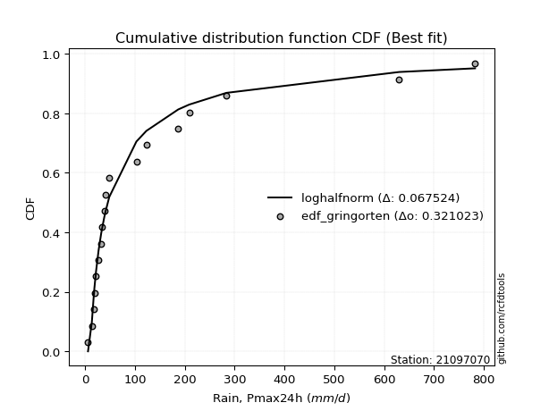</img>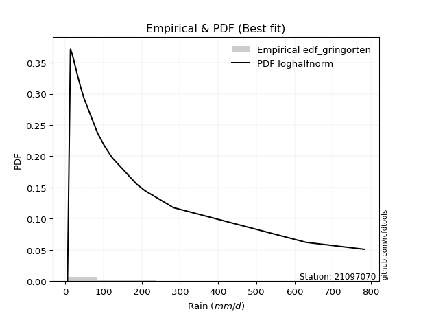</img>

</div>


### 9. EDF Filliben (1975)

The specific values of the constants (0.3175) (often denoted as $alpha$) and (0.365) are derived from a method proposed by James J. Filliben in a 1975 paper. This particular formula is the mean value of the $i$-th order statistic of the normal distribution and is considered a robust and effective plotting position formula for the normal probability plot correlation coefficient test for normality.

<div align="center">


$P=(m-0.3175)/(n+0.365)$


</div>


**9.1. Empirical values**

<div align="center">

|                | 0                   | 1                   | 2                  | 3                   | 4                   | 5                  | 6                  | 7                  | 8                  | 9            | 10                 | 11                 | 12                 | 13                 | 14                 | 15                 | 16                | 17                 | 18                 |
|:---------------|:--------------------|:--------------------|:-------------------|:--------------------|:--------------------|:-------------------|:-------------------|:-------------------|:-------------------|:-------------|:-------------------|:-------------------|:-------------------|:-------------------|:-------------------|:-------------------|:------------------|:-------------------|:-------------------|
| date           | 2019                | 2021                | 2016               | 2010                | 2013                | 2018               | 2020               | 2015               | 2014               | 2017         | 2024               | 2025               | 2022               | 2023               | 2009               | 2007               | 2011              | 2012               | 2006               |
| x              | 5.9                 | 13.6                | 17.7               | 18.7                | 21.9                | 27.1               | 32.2               | 33.1               | 38.5               | 40.4         | 48.5               | 84.5               | 103.0              | 123.0              | 186.8              | 208.8              | 283.3             | 630.2              | 782.4              |
| m              | 1                   | 2                   | 3                  | 4                   | 5                   | 6                  | 7                  | 8                  | 9                  | 10           | 11                 | 12                 | 13                 | 14                 | 15                 | 16                 | 17                | 18                 | 19                 |
| empirical_dist | edf_filliben        | edf_filliben        | edf_filliben       | edf_filliben        | edf_filliben        | edf_filliben       | edf_filliben       | edf_filliben       | edf_filliben       | edf_filliben | edf_filliben       | edf_filliben       | edf_filliben       | edf_filliben       | edf_filliben       | edf_filliben       | edf_filliben      | edf_filliben       | edf_filliben       |
| empirical      | 0.03524399690162665 | 0.08688355280144593 | 0.1385231087012652 | 0.19016266460108444 | 0.24180222050090372 | 0.293441776400723  | 0.3450813323005423 | 0.3967208882003615 | 0.4483604441001807 | 0.5          | 0.5516395558998193 | 0.6032791117996386 | 0.6549186676994578 | 0.7065582235992771 | 0.7581977794990963 | 0.8098373353989156 | 0.861476891298735 | 0.9131164471985542 | 0.9647560030983735 |
| empirical_tr   | 1.0365315134484143  | 1.0951505726000283  | 1.1607972426195114 | 1.2348158775705405  | 1.3189170781542654  | 1.4153115293257812 | 1.5269071555292728 | 1.6576075326342818 | 1.8127779077931194 | 2.0          | 2.2303484019579614 | 2.5206638464041657 | 2.8978675645342316 | 3.407831060272768  | 4.135611318739989  | 5.258655804480651  | 7.219012115563846 | 11.509658246656779 | 28.373626373626497 |

</div>


**9.2. Kolmogorov-Smirnov fit test (sorted by Δ)**


<div align="center">

|                | 0                   | 1                   | 2                   | 3                   | 4                   | 5                   | 6                   | 7                   | 8                   | 9                   | 10                  | 11                  | 12                  | 13                  | 14                  | 15                  | 16                  | 17                  | 18                  | 19                  | 20                  | 21                  | 22                  | 23                  | 24                  | 25                  | 26                  | 27                  | 28                  | 29                  | 30                  | 31                  | 32                  | 33                  | 34                  | 35                  | 36                  | 37                  | 38                  | 39                  | 40                  | 41                  | 42                  | 43                  | 44                  | 45                  | 46                  | 47                  | 48                  | 49                  | 50                  | 51                  | 52                  | 53                  | 54                  | 55                  | 56                  | 57                  | 58                  | 59                  | 60                  | 61                  | 62                  | 63                  | 64                  | 65                  | 66                  | 67                  | 68                  | 69                  | 70                  | 71                  | 72                  | 73                  | 74                  | 75                  | 76                  | 77                  | 78                  | 79                  | 80                  | 81                  | 82                  | 83                  | 84                  | 85                  | 86                  | 87                  | 88                  | 89                  | 90                  | 91                  | 92                  | 93                  | 94                  | 95                  | 96                  | 97                  | 98                  | 99                  | 100                 | 101                 | 102                 | 103                 | 104                 | 105                 | 106                 | 107                 | 108                 | 109                 | 110                 | 111                 | 112                 | 113                 | 114                 | 115                 | 116                 | 117                 | 118                 | 119                 | 120                 | 121                 | 122                 | 123                 | 124                 | 125                 | 126                 | 127                 | 128                 | 129                 | 130                 | 131                 | 132                 | 133                 | 134                 | 135                 | 136                 | 137                 | 138                 | 139                 | 140                 | 141                 | 142                 | 143                 | 144                 | 145                 | 146                 | 147                 | 148                 | 149                 | 150                 | 151                 | 152                 | 153                 | 154                 | 155                 | 156                 | 157                 | 158                 | 159                 |
|:---------------|:--------------------|:--------------------|:--------------------|:--------------------|:--------------------|:--------------------|:--------------------|:--------------------|:--------------------|:--------------------|:--------------------|:--------------------|:--------------------|:--------------------|:--------------------|:--------------------|:--------------------|:--------------------|:--------------------|:--------------------|:--------------------|:--------------------|:--------------------|:--------------------|:--------------------|:--------------------|:--------------------|:--------------------|:--------------------|:--------------------|:--------------------|:--------------------|:--------------------|:--------------------|:--------------------|:--------------------|:--------------------|:--------------------|:--------------------|:--------------------|:--------------------|:--------------------|:--------------------|:--------------------|:--------------------|:--------------------|:--------------------|:--------------------|:--------------------|:--------------------|:--------------------|:--------------------|:--------------------|:--------------------|:--------------------|:--------------------|:--------------------|:--------------------|:--------------------|:--------------------|:--------------------|:--------------------|:--------------------|:--------------------|:--------------------|:--------------------|:--------------------|:--------------------|:--------------------|:--------------------|:--------------------|:--------------------|:--------------------|:--------------------|:--------------------|:--------------------|:--------------------|:--------------------|:--------------------|:--------------------|:--------------------|:--------------------|:--------------------|:--------------------|:--------------------|:--------------------|:--------------------|:--------------------|:--------------------|:--------------------|:--------------------|:--------------------|:--------------------|:--------------------|:--------------------|:--------------------|:--------------------|:--------------------|:--------------------|:--------------------|:--------------------|:--------------------|:--------------------|:--------------------|:--------------------|:--------------------|:--------------------|:--------------------|:--------------------|:--------------------|:--------------------|:--------------------|:--------------------|:--------------------|:--------------------|:--------------------|:--------------------|:--------------------|:--------------------|:--------------------|:--------------------|:--------------------|:--------------------|:--------------------|:--------------------|:--------------------|:--------------------|:--------------------|:--------------------|:--------------------|:--------------------|:--------------------|:--------------------|:--------------------|:--------------------|:--------------------|:--------------------|:--------------------|:--------------------|:--------------------|:--------------------|:--------------------|:--------------------|:--------------------|:--------------------|:--------------------|:--------------------|:--------------------|:--------------------|:--------------------|:--------------------|:--------------------|:--------------------|:--------------------|:--------------------|:--------------------|:--------------------|:--------------------|:--------------------|:--------------------|
| station        | 21097070            | 21097070            | 21097070            | 21097070            | 21097070            | 21097070            | 21097070            | 21097070            | 21097070            | 21097070            | 21097070            | 21097070            | 21097070            | 21097070            | 21097070            | 21097070            | 21097070            | 21097070            | 21097070            | 21097070            | 21097070            | 21097070            | 21097070            | 21097070            | 21097070            | 21097070            | 21097070            | 21097070            | 21097070            | 21097070            | 21097070            | 21097070            | 21097070            | 21097070            | 21097070            | 21097070            | 21097070            | 21097070            | 21097070            | 21097070            | 21097070            | 21097070            | 21097070            | 21097070            | 21097070            | 21097070            | 21097070            | 21097070            | 21097070            | 21097070            | 21097070            | 21097070            | 21097070            | 21097070            | 21097070            | 21097070            | 21097070            | 21097070            | 21097070            | 21097070            | 21097070            | 21097070            | 21097070            | 21097070            | 21097070            | 21097070            | 21097070            | 21097070            | 21097070            | 21097070            | 21097070            | 21097070            | 21097070            | 21097070            | 21097070            | 21097070            | 21097070            | 21097070            | 21097070            | 21097070            | 21097070            | 21097070            | 21097070            | 21097070            | 21097070            | 21097070            | 21097070            | 21097070            | 21097070            | 21097070            | 21097070            | 21097070            | 21097070            | 21097070            | 21097070            | 21097070            | 21097070            | 21097070            | 21097070            | 21097070            | 21097070            | 21097070            | 21097070            | 21097070            | 21097070            | 21097070            | 21097070            | 21097070            | 21097070            | 21097070            | 21097070            | 21097070            | 21097070            | 21097070            | 21097070            | 21097070            | 21097070            | 21097070            | 21097070            | 21097070            | 21097070            | 21097070            | 21097070            | 21097070            | 21097070            | 21097070            | 21097070            | 21097070            | 21097070            | 21097070            | 21097070            | 21097070            | 21097070            | 21097070            | 21097070            | 21097070            | 21097070            | 21097070            | 21097070            | 21097070            | 21097070            | 21097070            | 21097070            | 21097070            | 21097070            | 21097070            | 21097070            | 21097070            | 21097070            | 21097070            | 21097070            | 21097070            | 21097070            | 21097070            | 21097070            | 21097070            | 21097070            | 21097070            | 21097070            | 21097070            |
| empirical_dist | edf_filliben        | edf_filliben        | edf_filliben        | edf_filliben        | edf_filliben        | edf_filliben        | edf_filliben        | edf_filliben        | edf_filliben        | edf_filliben        | edf_filliben        | edf_filliben        | edf_filliben        | edf_filliben        | edf_filliben        | edf_filliben        | edf_filliben        | edf_filliben        | edf_filliben        | edf_filliben        | edf_filliben        | edf_filliben        | edf_filliben        | edf_filliben        | edf_filliben        | edf_filliben        | edf_filliben        | edf_filliben        | edf_filliben        | edf_filliben        | edf_filliben        | edf_filliben        | edf_filliben        | edf_filliben        | edf_filliben        | edf_filliben        | edf_filliben        | edf_filliben        | edf_filliben        | edf_filliben        | edf_filliben        | edf_filliben        | edf_filliben        | edf_filliben        | edf_filliben        | edf_filliben        | edf_filliben        | edf_filliben        | edf_filliben        | edf_filliben        | edf_filliben        | edf_filliben        | edf_filliben        | edf_filliben        | edf_filliben        | edf_filliben        | edf_filliben        | edf_filliben        | edf_filliben        | edf_filliben        | edf_filliben        | edf_filliben        | edf_filliben        | edf_filliben        | edf_filliben        | edf_filliben        | edf_filliben        | edf_filliben        | edf_filliben        | edf_filliben        | edf_filliben        | edf_filliben        | edf_filliben        | edf_filliben        | edf_filliben        | edf_filliben        | edf_filliben        | edf_filliben        | edf_filliben        | edf_filliben        | edf_filliben        | edf_filliben        | edf_filliben        | edf_filliben        | edf_filliben        | edf_filliben        | edf_filliben        | edf_filliben        | edf_filliben        | edf_filliben        | edf_filliben        | edf_filliben        | edf_filliben        | edf_filliben        | edf_filliben        | edf_filliben        | edf_filliben        | edf_filliben        | edf_filliben        | edf_filliben        | edf_filliben        | edf_filliben        | edf_filliben        | edf_filliben        | edf_filliben        | edf_filliben        | edf_filliben        | edf_filliben        | edf_filliben        | edf_filliben        | edf_filliben        | edf_filliben        | edf_filliben        | edf_filliben        | edf_filliben        | edf_filliben        | edf_filliben        | edf_filliben        | edf_filliben        | edf_filliben        | edf_filliben        | edf_filliben        | edf_filliben        | edf_filliben        | edf_filliben        | edf_filliben        | edf_filliben        | edf_filliben        | edf_filliben        | edf_filliben        | edf_filliben        | edf_filliben        | edf_filliben        | edf_filliben        | edf_filliben        | edf_filliben        | edf_filliben        | edf_filliben        | edf_filliben        | edf_filliben        | edf_filliben        | edf_filliben        | edf_filliben        | edf_filliben        | edf_filliben        | edf_filliben        | edf_filliben        | edf_filliben        | edf_filliben        | edf_filliben        | edf_filliben        | edf_filliben        | edf_filliben        | edf_filliben        | edf_filliben        | edf_filliben        | edf_filliben        | edf_filliben        | edf_filliben        | edf_filliben        |
| p_dist         | logkstwobign        | loghalfnorm         | mielke              | loginvweibull       | nct                 | loggenexpon         | johnsonsu           | burr                | logskewnorm         | burr12              | genextreme          | invweibull          | f                   | invgamma            | ncf                 | loggumbel_r         | loggenlogistic      | lograyleigh         | logmielke           | logburr             | logbetaprime        | invgauss            | loghalflogistic     | logfoldnorm         | logf                | loggamma            | loggamma            | logerlang           | kappa3              | logexponnorm        | logfatiguelife      | logexponweib        | lognakagami         | loginvgauss         | logmoyal            | logjohnsonsu        | logburr12           | logrice             | lognct              | loginvgamma         | logweibull_min      | logmaxwell          | logalpha            | lomax               | genpareto           | logexponpow         | logncf              | loggenextreme       | gamma               | loggompertz         | logjohnsonsb        | halfgennorm         | logpearson3         | logbeta             | logdweibull         | logkappa4           | logsemicircular     | logwrapcauchy       | loganglit           | logdgamma           | logtruncweibull_min | logkappa3           | loguniform          | betaprime           | fatiguelife         | lognorm             | logt                | logcrystalball      | logloggamma         | truncweibull_min    | logarcsine          | gengamma            | truncpareto         | logbradford         | loggengamma         | logcosine           | logksone            | gausshyper          | loglogistic         | exponweib           | logvonmises_line    | logtukeylambda      | logloglaplace       | erlang              | loghypsecant        | loggennorm          | logtruncexpon       | loggausshyper       | loglaplace          | loglaplace          | wald                | logwald             | loggumbel_l         | nakagami            | bradford            | vonmises_line       | exponpow            | logargus            | alpha               | loggenpareto        | beta                | gennorm             | logtruncnorm        | loglomax            | gumbel_r            | moyal               | t                   | crystalball         | norm                | logtriang           | maxwell             | genlogistic         | loggenhalflogistic  | logistic            | anglit              | weibull_min         | rayleigh            | pearson3            | cosine              | hypsecant           | semicircular        | halflogistic        | halfnorm            | exponnorm           | loghalfgennorm      | powerlaw            | kstwobign           | genexpon            | dgamma              | laplace             | gompertz            | rice                | foldnorm            | arcsine             | gumbel_l            | dweibull            | truncnorm           | logtrapezoid        | loglevy_l           | wrapcauchy          | genhalflogistic     | logweibull_max      | skewnorm            | argus               | logrdist            | logpowerlaw         | triang              | truncexpon          | johnsonsb           | levy_l              | ksone               | kappa4              | rdist               | uniform             | tukeylambda         | trapezoid           | weibull_max         | logtruncpareto      | logvonmises         | vonmises            |
| delta          | 0.05374453599085896 | 0.05651293373684296 | 0.06021588872073813 | 0.06256628182661722 | 0.06855034341405286 | 0.0690050504294859  | 0.06944467661502507 | 0.07272046455593512 | 0.07279941881890067 | 0.07296719968172449 | 0.07421324637816601 | 0.0742134611984846  | 0.07440755290191348 | 0.07440789857866648 | 0.07449861993729517 | 0.07452327134713987 | 0.07603743789496631 | 0.0780620008514088  | 0.07935970503631712 | 0.08011791168677312 | 0.08100910662515187 | 0.0827092961319193  | 0.0846422552240631  | 0.08500491321962322 | 0.08569197371466708 | 0.08586695839037306 | 0.08586695839037306 | 0.08586743613139941 | 0.08602073414272293 | 0.08630358939191718 | 0.08680154150503305 | 0.08681991258069782 | 0.08688355280109337 | 0.08693867207018802 | 0.0874640984074978  | 0.0884997063761217  | 0.08906957614828337 | 0.08907329265389569 | 0.08909754003212511 | 0.08928896023681288 | 0.08943495997132167 | 0.09033689693984459 | 0.09115526380343597 | 0.09128165776434483 | 0.09129263978860369 | 0.09143995905275393 | 0.09158495480230827 | 0.09444213054213435 | 0.09542908677446099 | 0.09679418416552998 | 0.09693407587499847 | 0.0987000290027179  | 0.10174193839384987 | 0.10437325500618763 | 0.10597185092919414 | 0.10635041693212102 | 0.10666717841254603 | 0.10888975926806715 | 0.11066979075195732 | 0.11110697882374976 | 0.11367056389665742 | 0.1201724358294805  | 0.12061170617958283 | 0.12067853393687697 | 0.12078286216401679 | 0.12360478362719812 | 0.12360522810435637 | 0.12360531217444204 | 0.12491094780511702 | 0.12494353765399902 | 0.12528877357012522 | 0.12914499295994375 | 0.13230383782884758 | 0.1331186339400318  | 0.1347041553381144  | 0.13615417524314172 | 0.13884230847970402 | 0.1388627856004302  | 0.13905802633527065 | 0.14330554390551717 | 0.1443439697650663  | 0.1448263795173322  | 0.146228622423774   | 0.14857878696175936 | 0.1514238053713312  | 0.15531618475213305 | 0.1594807009935146  | 0.16297101786904583 | 0.17972358182754755 | 0.17972358182754755 | 0.18092796849753634 | 0.18834214453506024 | 0.18947007374585567 | 0.20028581397323014 | 0.20095599171932788 | 0.20257811480982996 | 0.20438411856896616 | 0.20469937247933268 | 0.20836239878284446 | 0.2107167572424828  | 0.21714479701392098 | 0.2219721097026776  | 0.22336138395704833 | 0.23750944359109102 | 0.2381441767012175  | 0.2387192098533844  | 0.2422085215802834  | 0.24289725891507064 | 0.24299905976681657 | 0.24425545067563714 | 0.24433778392549793 | 0.24567775388412272 | 0.24683384528921393 | 0.24794086386265496 | 0.24896184733599847 | 0.2490552256502741  | 0.2536099313654868  | 0.25582176246343485 | 0.2569459608866561  | 0.2593742758828129  | 0.26073417403096677 | 0.2664803982989352  | 0.2788446914378431  | 0.2803058913696853  | 0.2820987984655813  | 0.28214647972564283 | 0.2822182615721908  | 0.28302095744283146 | 0.28358614815073296 | 0.2864987467131796  | 0.2890397570238257  | 0.2933791719346723  | 0.3021639013003726  | 0.312048588129272   | 0.3135086491373563  | 0.32942790811086736 | 0.3407995483308039  | 0.3558127661925289  | 0.37275197273056887 | 0.38357207265608184 | 0.3881988118847393  | 0.4108859931922087  | 0.41588070377002845 | 0.42982236392185313 | 0.43408773866275613 | 0.44233895371350374 | 0.4517659822928618  | 0.4625781413715825  | 0.48101105120134713 | 0.5015938573939215  | 0.5087534118101626  | 0.53225423504941    | 0.5468577982409295  | 0.5557533298452526  | 0.5702077072985582  | 0.7168525918283218  | 0.757838872226501   | 0.861696538880022   | 1.0896219897772514  | 123.82815172933341  |
| deltao         | 0.31564497164100014 | 0.31564497164100014 | 0.31564497164100014 | 0.31564497164100014 | 0.31564497164100014 | 0.31564497164100014 | 0.31564497164100014 | 0.31564497164100014 | 0.31564497164100014 | 0.31564497164100014 | 0.31564497164100014 | 0.31564497164100014 | 0.31564497164100014 | 0.31564497164100014 | 0.31564497164100014 | 0.31564497164100014 | 0.31564497164100014 | 0.31564497164100014 | 0.31564497164100014 | 0.31564497164100014 | 0.31564497164100014 | 0.31564497164100014 | 0.31564497164100014 | 0.31564497164100014 | 0.31564497164100014 | 0.31564497164100014 | 0.31564497164100014 | 0.31564497164100014 | 0.31564497164100014 | 0.31564497164100014 | 0.31564497164100014 | 0.31564497164100014 | 0.31564497164100014 | 0.31564497164100014 | 0.31564497164100014 | 0.31564497164100014 | 0.31564497164100014 | 0.31564497164100014 | 0.31564497164100014 | 0.31564497164100014 | 0.31564497164100014 | 0.31564497164100014 | 0.31564497164100014 | 0.31564497164100014 | 0.31564497164100014 | 0.31564497164100014 | 0.31564497164100014 | 0.31564497164100014 | 0.31564497164100014 | 0.31564497164100014 | 0.31564497164100014 | 0.31564497164100014 | 0.31564497164100014 | 0.31564497164100014 | 0.31564497164100014 | 0.31564497164100014 | 0.31564497164100014 | 0.31564497164100014 | 0.31564497164100014 | 0.31564497164100014 | 0.31564497164100014 | 0.31564497164100014 | 0.31564497164100014 | 0.31564497164100014 | 0.31564497164100014 | 0.31564497164100014 | 0.31564497164100014 | 0.31564497164100014 | 0.31564497164100014 | 0.31564497164100014 | 0.31564497164100014 | 0.31564497164100014 | 0.31564497164100014 | 0.31564497164100014 | 0.31564497164100014 | 0.31564497164100014 | 0.31564497164100014 | 0.31564497164100014 | 0.31564497164100014 | 0.31564497164100014 | 0.31564497164100014 | 0.31564497164100014 | 0.31564497164100014 | 0.31564497164100014 | 0.31564497164100014 | 0.31564497164100014 | 0.31564497164100014 | 0.31564497164100014 | 0.31564497164100014 | 0.31564497164100014 | 0.31564497164100014 | 0.31564497164100014 | 0.31564497164100014 | 0.31564497164100014 | 0.31564497164100014 | 0.31564497164100014 | 0.31564497164100014 | 0.31564497164100014 | 0.31564497164100014 | 0.31564497164100014 | 0.31564497164100014 | 0.31564497164100014 | 0.31564497164100014 | 0.31564497164100014 | 0.31564497164100014 | 0.31564497164100014 | 0.31564497164100014 | 0.31564497164100014 | 0.31564497164100014 | 0.31564497164100014 | 0.31564497164100014 | 0.31564497164100014 | 0.31564497164100014 | 0.31564497164100014 | 0.31564497164100014 | 0.31564497164100014 | 0.31564497164100014 | 0.31564497164100014 | 0.31564497164100014 | 0.31564497164100014 | 0.31564497164100014 | 0.31564497164100014 | 0.31564497164100014 | 0.31564497164100014 | 0.31564497164100014 | 0.31564497164100014 | 0.31564497164100014 | 0.31564497164100014 | 0.31564497164100014 | 0.31564497164100014 | 0.31564497164100014 | 0.31564497164100014 | 0.31564497164100014 | 0.31564497164100014 | 0.31564497164100014 | 0.31564497164100014 | 0.31564497164100014 | 0.31564497164100014 | 0.31564497164100014 | 0.31564497164100014 | 0.31564497164100014 | 0.31564497164100014 | 0.31564497164100014 | 0.31564497164100014 | 0.31564497164100014 | 0.31564497164100014 | 0.31564497164100014 | 0.31564497164100014 | 0.31564497164100014 | 0.31564497164100014 | 0.31564497164100014 | 0.31564497164100014 | 0.31564497164100014 | 0.31564497164100014 | 0.31564497164100014 | 0.31564497164100014 | 0.31564497164100014 | 0.31564497164100014 | 0.31564497164100014 | 0.31564497164100014 |
| eval           | Δo > Δ              | Δo > Δ              | Δo > Δ              | Δo > Δ              | Δo > Δ              | Δo > Δ              | Δo > Δ              | Δo > Δ              | Δo > Δ              | Δo > Δ              | Δo > Δ              | Δo > Δ              | Δo > Δ              | Δo > Δ              | Δo > Δ              | Δo > Δ              | Δo > Δ              | Δo > Δ              | Δo > Δ              | Δo > Δ              | Δo > Δ              | Δo > Δ              | Δo > Δ              | Δo > Δ              | Δo > Δ              | Δo > Δ              | Δo > Δ              | Δo > Δ              | Δo > Δ              | Δo > Δ              | Δo > Δ              | Δo > Δ              | Δo > Δ              | Δo > Δ              | Δo > Δ              | Δo > Δ              | Δo > Δ              | Δo > Δ              | Δo > Δ              | Δo > Δ              | Δo > Δ              | Δo > Δ              | Δo > Δ              | Δo > Δ              | Δo > Δ              | Δo > Δ              | Δo > Δ              | Δo > Δ              | Δo > Δ              | Δo > Δ              | Δo > Δ              | Δo > Δ              | Δo > Δ              | Δo > Δ              | Δo > Δ              | Δo > Δ              | Δo > Δ              | Δo > Δ              | Δo > Δ              | Δo > Δ              | Δo > Δ              | Δo > Δ              | Δo > Δ              | Δo > Δ              | Δo > Δ              | Δo > Δ              | Δo > Δ              | Δo > Δ              | Δo > Δ              | Δo > Δ              | Δo > Δ              | Δo > Δ              | Δo > Δ              | Δo > Δ              | Δo > Δ              | Δo > Δ              | Δo > Δ              | Δo > Δ              | Δo > Δ              | Δo > Δ              | Δo > Δ              | Δo > Δ              | Δo > Δ              | Δo > Δ              | Δo > Δ              | Δo > Δ              | Δo > Δ              | Δo > Δ              | Δo > Δ              | Δo > Δ              | Δo > Δ              | Δo > Δ              | Δo > Δ              | Δo > Δ              | Δo > Δ              | Δo > Δ              | Δo > Δ              | Δo > Δ              | Δo > Δ              | Δo > Δ              | Δo > Δ              | Δo > Δ              | Δo > Δ              | Δo > Δ              | Δo > Δ              | Δo > Δ              | Δo > Δ              | Δo > Δ              | Δo > Δ              | Δo > Δ              | Δo > Δ              | Δo > Δ              | Δo > Δ              | Δo > Δ              | Δo > Δ              | Δo > Δ              | Δo > Δ              | Δo > Δ              | Δo > Δ              | Δo > Δ              | Δo > Δ              | Δo > Δ              | Δo > Δ              | Δo > Δ              | Δo > Δ              | Δo > Δ              | Δo > Δ              | Δo > Δ              | Δo > Δ              | Δo > Δ              | Δo > Δ              | Δo > Δ              | Δo > Δ              | Δo > Δ              | Δo > Δ              | Δo <= Δ             | Δo <= Δ             | Δo <= Δ             | Δo <= Δ             | Δo <= Δ             | Δo <= Δ             | Δo <= Δ             | Δo <= Δ             | Δo <= Δ             | Δo <= Δ             | Δo <= Δ             | Δo <= Δ             | Δo <= Δ             | Δo <= Δ             | Δo <= Δ             | Δo <= Δ             | Δo <= Δ             | Δo <= Δ             | Δo <= Δ             | Δo <= Δ             | Δo <= Δ             | Δo <= Δ             | Δo <= Δ             | Δo <= Δ             | Δo <= Δ             |
| fit            | 1                   | 1                   | 1                   | 1                   | 1                   | 1                   | 1                   | 1                   | 1                   | 1                   | 1                   | 1                   | 1                   | 1                   | 1                   | 1                   | 1                   | 1                   | 1                   | 1                   | 1                   | 1                   | 1                   | 1                   | 1                   | 1                   | 1                   | 1                   | 1                   | 1                   | 1                   | 1                   | 1                   | 1                   | 1                   | 1                   | 1                   | 1                   | 1                   | 1                   | 1                   | 1                   | 1                   | 1                   | 1                   | 1                   | 1                   | 1                   | 1                   | 1                   | 1                   | 1                   | 1                   | 1                   | 1                   | 1                   | 1                   | 1                   | 1                   | 1                   | 1                   | 1                   | 1                   | 1                   | 1                   | 1                   | 1                   | 1                   | 1                   | 1                   | 1                   | 1                   | 1                   | 1                   | 1                   | 1                   | 1                   | 1                   | 1                   | 1                   | 1                   | 1                   | 1                   | 1                   | 1                   | 1                   | 1                   | 1                   | 1                   | 1                   | 1                   | 1                   | 1                   | 1                   | 1                   | 1                   | 1                   | 1                   | 1                   | 1                   | 1                   | 1                   | 1                   | 1                   | 1                   | 1                   | 1                   | 1                   | 1                   | 1                   | 1                   | 1                   | 1                   | 1                   | 1                   | 1                   | 1                   | 1                   | 1                   | 1                   | 1                   | 1                   | 1                   | 1                   | 1                   | 1                   | 1                   | 1                   | 1                   | 1                   | 1                   | 1                   | 1                   | 1                   | 1                   | 0                   | 0                   | 0                   | 0                   | 0                   | 0                   | 0                   | 0                   | 0                   | 0                   | 0                   | 0                   | 0                   | 0                   | 0                   | 0                   | 0                   | 0                   | 0                   | 0                   | 0                   | 0                   | 0                   | 0                   | 0                   |
| n              | 19                  | 19                  | 19                  | 19                  | 19                  | 19                  | 19                  | 19                  | 19                  | 19                  | 19                  | 19                  | 19                  | 19                  | 19                  | 19                  | 19                  | 19                  | 19                  | 19                  | 19                  | 19                  | 19                  | 19                  | 19                  | 19                  | 19                  | 19                  | 19                  | 19                  | 19                  | 19                  | 19                  | 19                  | 19                  | 19                  | 19                  | 19                  | 19                  | 19                  | 19                  | 19                  | 19                  | 19                  | 19                  | 19                  | 19                  | 19                  | 19                  | 19                  | 19                  | 19                  | 19                  | 19                  | 19                  | 19                  | 19                  | 19                  | 19                  | 19                  | 19                  | 19                  | 19                  | 19                  | 19                  | 19                  | 19                  | 19                  | 19                  | 19                  | 19                  | 19                  | 19                  | 19                  | 19                  | 19                  | 19                  | 19                  | 19                  | 19                  | 19                  | 19                  | 19                  | 19                  | 19                  | 19                  | 19                  | 19                  | 19                  | 19                  | 19                  | 19                  | 19                  | 19                  | 19                  | 19                  | 19                  | 19                  | 19                  | 19                  | 19                  | 19                  | 19                  | 19                  | 19                  | 19                  | 19                  | 19                  | 19                  | 19                  | 19                  | 19                  | 19                  | 19                  | 19                  | 19                  | 19                  | 19                  | 19                  | 19                  | 19                  | 19                  | 19                  | 19                  | 19                  | 19                  | 19                  | 19                  | 19                  | 19                  | 19                  | 19                  | 19                  | 19                  | 19                  | 19                  | 19                  | 19                  | 19                  | 19                  | 19                  | 19                  | 19                  | 19                  | 19                  | 19                  | 19                  | 19                  | 19                  | 19                  | 19                  | 19                  | 19                  | 19                  | 19                  | 19                  | 19                  | 19                  | 19                  | 19                  |
| best_fit       | 1                   | 0                   | 0                   | 0                   | 0                   | 0                   | 0                   | 0                   | 0                   | 0                   | 0                   | 0                   | 0                   | 0                   | 0                   | 0                   | 0                   | 0                   | 0                   | 0                   | 0                   | 0                   | 0                   | 0                   | 0                   | 0                   | 0                   | 0                   | 0                   | 0                   | 0                   | 0                   | 0                   | 0                   | 0                   | 0                   | 0                   | 0                   | 0                   | 0                   | 0                   | 0                   | 0                   | 0                   | 0                   | 0                   | 0                   | 0                   | 0                   | 0                   | 0                   | 0                   | 0                   | 0                   | 0                   | 0                   | 0                   | 0                   | 0                   | 0                   | 0                   | 0                   | 0                   | 0                   | 0                   | 0                   | 0                   | 0                   | 0                   | 0                   | 0                   | 0                   | 0                   | 0                   | 0                   | 0                   | 0                   | 0                   | 0                   | 0                   | 0                   | 0                   | 0                   | 0                   | 0                   | 0                   | 0                   | 0                   | 0                   | 0                   | 0                   | 0                   | 0                   | 0                   | 0                   | 0                   | 0                   | 0                   | 0                   | 0                   | 0                   | 0                   | 0                   | 0                   | 0                   | 0                   | 0                   | 0                   | 0                   | 0                   | 0                   | 0                   | 0                   | 0                   | 0                   | 0                   | 0                   | 0                   | 0                   | 0                   | 0                   | 0                   | 0                   | 0                   | 0                   | 0                   | 0                   | 0                   | 0                   | 0                   | 0                   | 0                   | 0                   | 0                   | 0                   | 0                   | 0                   | 0                   | 0                   | 0                   | 0                   | 0                   | 0                   | 0                   | 0                   | 0                   | 0                   | 0                   | 0                   | 0                   | 0                   | 0                   | 0                   | 0                   | 0                   | 0                   | 0                   | 0                   | 0                   | 0                   |
| best_fit_sort  | 1                   | 2                   | 3                   | 4                   | 5                   | 6                   | 7                   | 8                   | 9                   | 10                  | 11                  | 12                  | 13                  | 14                  | 15                  | 16                  | 17                  | 18                  | 19                  | 20                  | 21                  | 22                  | 23                  | 24                  | 25                  | 26                  | 27                  | 28                  | 29                  | 30                  | 31                  | 32                  | 33                  | 34                  | 35                  | 36                  | 37                  | 38                  | 39                  | 40                  | 41                  | 42                  | 43                  | 44                  | 45                  | 46                  | 47                  | 48                  | 49                  | 50                  | 51                  | 52                  | 53                  | 54                  | 55                  | 56                  | 57                  | 58                  | 59                  | 60                  | 61                  | 62                  | 63                  | 64                  | 65                  | 66                  | 67                  | 68                  | 69                  | 70                  | 71                  | 72                  | 73                  | 74                  | 75                  | 76                  | 77                  | 78                  | 79                  | 80                  | 81                  | 82                  | 83                  | 84                  | 85                  | 86                  | 87                  | 88                  | 89                  | 90                  | 91                  | 92                  | 93                  | 94                  | 95                  | 96                  | 97                  | 98                  | 99                  | 100                 | 101                 | 102                 | 103                 | 104                 | 105                 | 106                 | 107                 | 108                 | 109                 | 110                 | 111                 | 112                 | 113                 | 114                 | 115                 | 116                 | 117                 | 118                 | 119                 | 120                 | 121                 | 122                 | 123                 | 124                 | 125                 | 126                 | 127                 | 128                 | 129                 | 130                 | 131                 | 132                 | 133                 | 134                 | 135                 | 136                 | 137                 | 138                 | 139                 | 140                 | 141                 | 142                 | 143                 | 144                 | 145                 | 146                 | 147                 | 148                 | 149                 | 150                 | 151                 | 152                 | 153                 | 154                 | 155                 | 156                 | 157                 | 158                 | 159                 | 160                 |

</div>


**9.3. Best fit**

<div align="center">

|   id |   station | empirical_dist   | p_dist       |     delta |   deltao | eval   |   fit |   n |   best_fit |   best_fit_sort |
|-----:|----------:|:-----------------|:-------------|----------:|---------:|:-------|------:|----:|-----------:|----------------:|
|    0 |  21097070 | edf_filliben     | logkstwobign | 0.0537445 | 0.315645 | Δo > Δ |     1 |  19 |          1 |               1 |

</div>


<div align="center">

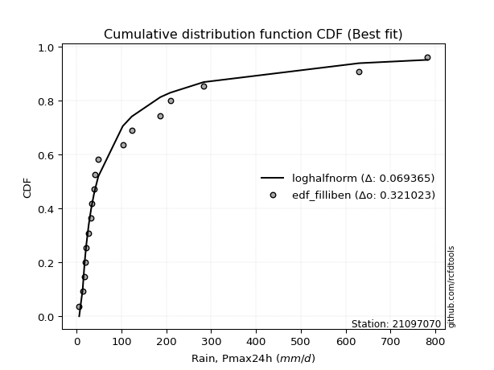</img></img>

</div>


### 10. EDF Jenkinson (1977)

The Jenkinson formula in hydrology is an empirical plotting position formula used to estimate the non-exceedance probability _(P)_ or return period _(T)_ of a given ordered observation within a sample. It is a widely used method in the frequency analysis of extreme events such as floods and rainfall, as it provides a distribution-free way to plot data. _a≈0.31_ and _b≈0.38_ are constants derived to approximate the median of the probability distribution for the given rank.

<div align="center">


$P=(m-a)/(n+b)$


</div>


**10.1. Empirical values**

<div align="center">

|                | 0                   | 1                   | 2                  | 3                   | 4                   | 5                   | 6                  | 7                  | 8                  | 9             | 10                 | 11                 | 12                 | 13                 | 14                 | 15                 | 16                 | 17                 | 18                 |
|:---------------|:--------------------|:--------------------|:-------------------|:--------------------|:--------------------|:--------------------|:-------------------|:-------------------|:-------------------|:--------------|:-------------------|:-------------------|:-------------------|:-------------------|:-------------------|:-------------------|:-------------------|:-------------------|:-------------------|
| date           | 2019                | 2021                | 2016               | 2010                | 2013                | 2018                | 2020               | 2015               | 2014               | 2017          | 2024               | 2025               | 2022               | 2023               | 2009               | 2007               | 2011               | 2012               | 2006               |
| x              | 5.9                 | 13.6                | 17.7               | 18.7                | 21.9                | 27.1                | 32.2               | 33.1               | 38.5               | 40.4          | 48.5               | 84.5               | 103.0              | 123.0              | 186.8              | 208.8              | 283.3              | 630.2              | 782.4              |
| m              | 1                   | 2                   | 3                  | 4                   | 5                   | 6                   | 7                  | 8                  | 9                  | 10            | 11                 | 12                 | 13                 | 14                 | 15                 | 16                 | 17                 | 18                 | 19                 |
| empirical_dist | edf_jenkinson       | edf_jenkinson       | edf_jenkinson      | edf_jenkinson       | edf_jenkinson       | edf_jenkinson       | edf_jenkinson      | edf_jenkinson      | edf_jenkinson      | edf_jenkinson | edf_jenkinson      | edf_jenkinson      | edf_jenkinson      | edf_jenkinson      | edf_jenkinson      | edf_jenkinson      | edf_jenkinson      | edf_jenkinson      | edf_jenkinson      |
| empirical      | 0.03560371517027864 | 0.08720330237358101 | 0.1388028895768834 | 0.19040247678018576 | 0.24200206398348817 | 0.29360165118679055 | 0.3452012383900929 | 0.3968008255933953 | 0.4484004127966976 | 0.5           | 0.5515995872033024 | 0.6031991744066048 | 0.6547987616099071 | 0.7063983488132095 | 0.7579979360165119 | 0.8095975232198143 | 0.8611971104231168 | 0.9127966976264191 | 0.9643962848297215 |
| empirical_tr   | 1.0369181380417336  | 1.0955342001130581  | 1.1611743559017376 | 1.2351816443594645  | 1.3192648059904697  | 1.4156318480642804  | 1.5271867612293144 | 1.6578272027373824 | 1.812909260991581  | 2.0           | 2.230149597238205  | 2.5201560468140443 | 2.896860986547085  | 3.40597539543058   | 4.132196162046909  | 5.252032520325204  | 7.204460966542758  | 11.467455621301793 | 28.086956521739243 |

</div>


**10.2. Kolmogorov-Smirnov fit test (sorted by Δ)**


<div align="center">

|                | 0                    | 1                   | 2                    | 3                   | 4                   | 5                   | 6                   | 7                   | 8                   | 9                   | 10                  | 11                  | 12                  | 13                  | 14                  | 15                  | 16                  | 17                  | 18                  | 19                  | 20                  | 21                  | 22                  | 23                  | 24                  | 25                  | 26                  | 27                  | 28                  | 29                  | 30                  | 31                  | 32                  | 33                  | 34                  | 35                  | 36                  | 37                  | 38                  | 39                  | 40                  | 41                  | 42                  | 43                  | 44                  | 45                  | 46                  | 47                  | 48                  | 49                  | 50                  | 51                  | 52                  | 53                  | 54                  | 55                  | 56                  | 57                  | 58                  | 59                  | 60                  | 61                  | 62                  | 63                  | 64                  | 65                  | 66                  | 67                  | 68                  | 69                  | 70                  | 71                  | 72                  | 73                  | 74                  | 75                  | 76                  | 77                  | 78                  | 79                  | 80                  | 81                  | 82                  | 83                  | 84                  | 85                  | 86                  | 87                  | 88                  | 89                  | 90                  | 91                  | 92                  | 93                  | 94                  | 95                  | 96                  | 97                  | 98                  | 99                  | 100                 | 101                 | 102                 | 103                 | 104                 | 105                 | 106                 | 107                 | 108                 | 109                 | 110                 | 111                 | 112                 | 113                 | 114                 | 115                 | 116                 | 117                 | 118                 | 119                 | 120                 | 121                 | 122                 | 123                 | 124                 | 125                 | 126                 | 127                 | 128                 | 129                 | 130                 | 131                 | 132                 | 133                 | 134                 | 135                 | 136                 | 137                 | 138                 | 139                 | 140                 | 141                 | 142                 | 143                 | 144                 | 145                 | 146                 | 147                 | 148                 | 149                 | 150                 | 151                 | 152                 | 153                 | 154                 | 155                 | 156                 | 157                 | 158                 | 159                 |
|:---------------|:---------------------|:--------------------|:---------------------|:--------------------|:--------------------|:--------------------|:--------------------|:--------------------|:--------------------|:--------------------|:--------------------|:--------------------|:--------------------|:--------------------|:--------------------|:--------------------|:--------------------|:--------------------|:--------------------|:--------------------|:--------------------|:--------------------|:--------------------|:--------------------|:--------------------|:--------------------|:--------------------|:--------------------|:--------------------|:--------------------|:--------------------|:--------------------|:--------------------|:--------------------|:--------------------|:--------------------|:--------------------|:--------------------|:--------------------|:--------------------|:--------------------|:--------------------|:--------------------|:--------------------|:--------------------|:--------------------|:--------------------|:--------------------|:--------------------|:--------------------|:--------------------|:--------------------|:--------------------|:--------------------|:--------------------|:--------------------|:--------------------|:--------------------|:--------------------|:--------------------|:--------------------|:--------------------|:--------------------|:--------------------|:--------------------|:--------------------|:--------------------|:--------------------|:--------------------|:--------------------|:--------------------|:--------------------|:--------------------|:--------------------|:--------------------|:--------------------|:--------------------|:--------------------|:--------------------|:--------------------|:--------------------|:--------------------|:--------------------|:--------------------|:--------------------|:--------------------|:--------------------|:--------------------|:--------------------|:--------------------|:--------------------|:--------------------|:--------------------|:--------------------|:--------------------|:--------------------|:--------------------|:--------------------|:--------------------|:--------------------|:--------------------|:--------------------|:--------------------|:--------------------|:--------------------|:--------------------|:--------------------|:--------------------|:--------------------|:--------------------|:--------------------|:--------------------|:--------------------|:--------------------|:--------------------|:--------------------|:--------------------|:--------------------|:--------------------|:--------------------|:--------------------|:--------------------|:--------------------|:--------------------|:--------------------|:--------------------|:--------------------|:--------------------|:--------------------|:--------------------|:--------------------|:--------------------|:--------------------|:--------------------|:--------------------|:--------------------|:--------------------|:--------------------|:--------------------|:--------------------|:--------------------|:--------------------|:--------------------|:--------------------|:--------------------|:--------------------|:--------------------|:--------------------|:--------------------|:--------------------|:--------------------|:--------------------|:--------------------|:--------------------|:--------------------|:--------------------|:--------------------|:--------------------|:--------------------|:--------------------|
| station        | 21097070             | 21097070            | 21097070             | 21097070            | 21097070            | 21097070            | 21097070            | 21097070            | 21097070            | 21097070            | 21097070            | 21097070            | 21097070            | 21097070            | 21097070            | 21097070            | 21097070            | 21097070            | 21097070            | 21097070            | 21097070            | 21097070            | 21097070            | 21097070            | 21097070            | 21097070            | 21097070            | 21097070            | 21097070            | 21097070            | 21097070            | 21097070            | 21097070            | 21097070            | 21097070            | 21097070            | 21097070            | 21097070            | 21097070            | 21097070            | 21097070            | 21097070            | 21097070            | 21097070            | 21097070            | 21097070            | 21097070            | 21097070            | 21097070            | 21097070            | 21097070            | 21097070            | 21097070            | 21097070            | 21097070            | 21097070            | 21097070            | 21097070            | 21097070            | 21097070            | 21097070            | 21097070            | 21097070            | 21097070            | 21097070            | 21097070            | 21097070            | 21097070            | 21097070            | 21097070            | 21097070            | 21097070            | 21097070            | 21097070            | 21097070            | 21097070            | 21097070            | 21097070            | 21097070            | 21097070            | 21097070            | 21097070            | 21097070            | 21097070            | 21097070            | 21097070            | 21097070            | 21097070            | 21097070            | 21097070            | 21097070            | 21097070            | 21097070            | 21097070            | 21097070            | 21097070            | 21097070            | 21097070            | 21097070            | 21097070            | 21097070            | 21097070            | 21097070            | 21097070            | 21097070            | 21097070            | 21097070            | 21097070            | 21097070            | 21097070            | 21097070            | 21097070            | 21097070            | 21097070            | 21097070            | 21097070            | 21097070            | 21097070            | 21097070            | 21097070            | 21097070            | 21097070            | 21097070            | 21097070            | 21097070            | 21097070            | 21097070            | 21097070            | 21097070            | 21097070            | 21097070            | 21097070            | 21097070            | 21097070            | 21097070            | 21097070            | 21097070            | 21097070            | 21097070            | 21097070            | 21097070            | 21097070            | 21097070            | 21097070            | 21097070            | 21097070            | 21097070            | 21097070            | 21097070            | 21097070            | 21097070            | 21097070            | 21097070            | 21097070            | 21097070            | 21097070            | 21097070            | 21097070            | 21097070            | 21097070            |
| empirical_dist | edf_jenkinson        | edf_jenkinson       | edf_jenkinson        | edf_jenkinson       | edf_jenkinson       | edf_jenkinson       | edf_jenkinson       | edf_jenkinson       | edf_jenkinson       | edf_jenkinson       | edf_jenkinson       | edf_jenkinson       | edf_jenkinson       | edf_jenkinson       | edf_jenkinson       | edf_jenkinson       | edf_jenkinson       | edf_jenkinson       | edf_jenkinson       | edf_jenkinson       | edf_jenkinson       | edf_jenkinson       | edf_jenkinson       | edf_jenkinson       | edf_jenkinson       | edf_jenkinson       | edf_jenkinson       | edf_jenkinson       | edf_jenkinson       | edf_jenkinson       | edf_jenkinson       | edf_jenkinson       | edf_jenkinson       | edf_jenkinson       | edf_jenkinson       | edf_jenkinson       | edf_jenkinson       | edf_jenkinson       | edf_jenkinson       | edf_jenkinson       | edf_jenkinson       | edf_jenkinson       | edf_jenkinson       | edf_jenkinson       | edf_jenkinson       | edf_jenkinson       | edf_jenkinson       | edf_jenkinson       | edf_jenkinson       | edf_jenkinson       | edf_jenkinson       | edf_jenkinson       | edf_jenkinson       | edf_jenkinson       | edf_jenkinson       | edf_jenkinson       | edf_jenkinson       | edf_jenkinson       | edf_jenkinson       | edf_jenkinson       | edf_jenkinson       | edf_jenkinson       | edf_jenkinson       | edf_jenkinson       | edf_jenkinson       | edf_jenkinson       | edf_jenkinson       | edf_jenkinson       | edf_jenkinson       | edf_jenkinson       | edf_jenkinson       | edf_jenkinson       | edf_jenkinson       | edf_jenkinson       | edf_jenkinson       | edf_jenkinson       | edf_jenkinson       | edf_jenkinson       | edf_jenkinson       | edf_jenkinson       | edf_jenkinson       | edf_jenkinson       | edf_jenkinson       | edf_jenkinson       | edf_jenkinson       | edf_jenkinson       | edf_jenkinson       | edf_jenkinson       | edf_jenkinson       | edf_jenkinson       | edf_jenkinson       | edf_jenkinson       | edf_jenkinson       | edf_jenkinson       | edf_jenkinson       | edf_jenkinson       | edf_jenkinson       | edf_jenkinson       | edf_jenkinson       | edf_jenkinson       | edf_jenkinson       | edf_jenkinson       | edf_jenkinson       | edf_jenkinson       | edf_jenkinson       | edf_jenkinson       | edf_jenkinson       | edf_jenkinson       | edf_jenkinson       | edf_jenkinson       | edf_jenkinson       | edf_jenkinson       | edf_jenkinson       | edf_jenkinson       | edf_jenkinson       | edf_jenkinson       | edf_jenkinson       | edf_jenkinson       | edf_jenkinson       | edf_jenkinson       | edf_jenkinson       | edf_jenkinson       | edf_jenkinson       | edf_jenkinson       | edf_jenkinson       | edf_jenkinson       | edf_jenkinson       | edf_jenkinson       | edf_jenkinson       | edf_jenkinson       | edf_jenkinson       | edf_jenkinson       | edf_jenkinson       | edf_jenkinson       | edf_jenkinson       | edf_jenkinson       | edf_jenkinson       | edf_jenkinson       | edf_jenkinson       | edf_jenkinson       | edf_jenkinson       | edf_jenkinson       | edf_jenkinson       | edf_jenkinson       | edf_jenkinson       | edf_jenkinson       | edf_jenkinson       | edf_jenkinson       | edf_jenkinson       | edf_jenkinson       | edf_jenkinson       | edf_jenkinson       | edf_jenkinson       | edf_jenkinson       | edf_jenkinson       | edf_jenkinson       | edf_jenkinson       | edf_jenkinson       | edf_jenkinson       | edf_jenkinson       |
| p_dist         | logkstwobign         | loghalfnorm         | mielke               | loginvweibull       | loggenexpon         | nct                 | johnsonsu           | burr                | logskewnorm         | burr12              | genextreme          | invweibull          | f                   | invgamma            | ncf                 | loggumbel_r         | loggenlogistic      | lograyleigh         | logmielke           | logburr             | logbetaprime        | invgauss            | loghalflogistic     | logfoldnorm         | logf                | loggamma            | loggamma            | logerlang           | kappa3              | logexponnorm        | logfatiguelife      | logexponweib        | loginvgauss         | lognakagami         | logmoyal            | logjohnsonsu        | logburr12           | logrice             | lognct              | loginvgamma         | logweibull_min      | logmaxwell          | logalpha            | lomax               | genpareto           | logexponpow         | logncf              | loggenextreme       | gamma               | loggompertz         | logjohnsonsb        | halfgennorm         | logpearson3         | logbeta             | logkappa4           | logdweibull         | logsemicircular     | logwrapcauchy       | loganglit           | logdgamma           | logtruncweibull_min | logkappa3           | betaprime           | loguniform          | fatiguelife         | lognorm             | logt                | logcrystalball      | truncweibull_min    | logloggamma         | logarcsine          | gengamma            | truncpareto         | logbradford         | loggengamma         | logcosine           | logksone            | gausshyper          | loglogistic         | exponweib           | logvonmises_line    | logtukeylambda      | logloglaplace       | erlang              | loghypsecant        | loggennorm          | logtruncexpon       | loggausshyper       | loglaplace          | loglaplace          | wald                | logwald             | loggumbel_l         | nakagami            | bradford            | vonmises_line       | exponpow            | logargus            | alpha               | loggenpareto        | beta                | gennorm             | logtruncnorm        | loglomax            | gumbel_r            | moyal               | t                   | crystalball         | norm                | maxwell             | logtriang           | genlogistic         | loggenhalflogistic  | logistic            | anglit              | weibull_min         | rayleigh            | pearson3            | cosine              | hypsecant           | semicircular        | halflogistic        | halfnorm            | exponnorm           | loghalfgennorm      | powerlaw            | kstwobign           | genexpon            | dgamma              | laplace             | gompertz            | rice                | foldnorm            | arcsine             | gumbel_l            | dweibull            | truncnorm           | logtrapezoid        | loglevy_l           | wrapcauchy          | genhalflogistic     | logweibull_max      | skewnorm            | argus               | logrdist            | logpowerlaw         | triang              | truncexpon          | johnsonsb           | levy_l              | ksone               | kappa4              | rdist               | uniform             | tukeylambda         | trapezoid           | weibull_max         | logtruncpareto      | logvonmises         | vonmises            |
| delta          | 0.053464755115240764 | 0.05671277721942736 | 0.060415732203322525 | 0.06256628182661722 | 0.06872526955386771 | 0.06875018689663726 | 0.06944467661502507 | 0.07272046455593512 | 0.07279941881890067 | 0.0730471370747583  | 0.07421324637816601 | 0.0742134611984846  | 0.07440755290191348 | 0.07440789857866648 | 0.07449861993729517 | 0.07472311482972427 | 0.07603743789496631 | 0.0780620008514088  | 0.07935970503631712 | 0.08011791168677312 | 0.08100910662515187 | 0.0827092961319193  | 0.0847221926170969  | 0.08496494452310632 | 0.08569197371466708 | 0.08586695839037306 | 0.08586695839037306 | 0.08586743613139941 | 0.08602073414272293 | 0.08630358939191718 | 0.08680154150503305 | 0.08681991258069782 | 0.08693867207018802 | 0.08720330237322846 | 0.0875440358005316  | 0.0884997063761217  | 0.08906957614828337 | 0.08907329265389569 | 0.08909754003212511 | 0.08928896023681288 | 0.08943495997132167 | 0.09033689693984459 | 0.09115526380343597 | 0.09128165776434483 | 0.09129263978860369 | 0.09139999035623703 | 0.09158495480230827 | 0.09444213054213435 | 0.09538911807794409 | 0.09675421546901308 | 0.09689410717848157 | 0.09842024812709971 | 0.10174193839384987 | 0.10409347413056944 | 0.10607063605650283 | 0.10617169441177854 | 0.10662720971602913 | 0.10860997839244896 | 0.11062982205544042 | 0.11130682230633415 | 0.11363059520014052 | 0.1201324671329636  | 0.12039875306125877 | 0.12057173748306593 | 0.12074289346749989 | 0.12360478362719812 | 0.12360522810435637 | 0.12360531217444204 | 0.12490356895748211 | 0.12491094780511702 | 0.12500899269450702 | 0.12882524338780865 | 0.13230383782884758 | 0.1328388530644136  | 0.1344243744624962  | 0.13611420654662482 | 0.13852255890756893 | 0.1388228169039133  | 0.13905802633527065 | 0.14302576302989897 | 0.1443040010685494  | 0.144546598641714   | 0.1463085598168078  | 0.14853881826524246 | 0.1514238053713312  | 0.15539612214516685 | 0.1592009201178964  | 0.16293104917252893 | 0.17972358182754755 | 0.17972358182754755 | 0.18056825022888437 | 0.18858195671416156 | 0.18943010504933877 | 0.20024584527671324 | 0.20091602302281097 | 0.20221839654117799 | 0.20434414987244925 | 0.20465940378281577 | 0.20844233617587826 | 0.21039700767034772 | 0.2168250474417859  | 0.22161239143402564 | 0.22308160308143013 | 0.23722966271547283 | 0.23778445843256554 | 0.23835949158473244 | 0.2422884589733172  | 0.24273738412900303 | 0.24283918498074897 | 0.24397806565684596 | 0.24421548197912024 | 0.24563778518760582 | 0.24679387659269703 | 0.24778098907658735 | 0.2486021290673465  | 0.2490152569537572  | 0.2532502130968348  | 0.25546204419478286 | 0.2569059921901392  | 0.259334307186296   | 0.26037445576231477 | 0.2661206800302832  | 0.2784849731691911  | 0.2802659226731684  | 0.2818190175899631  | 0.2818267301535078  | 0.2821782928756739  | 0.28298098874631455 | 0.28322642988208097 | 0.2864587780166627  | 0.2889997883273088  | 0.2933392032381554  | 0.3018041830317206  | 0.31168886986062    | 0.3133487743512887  | 0.32906818984221536 | 0.340759579634287   | 0.355772797496012   | 0.37239225446191687 | 0.38329229178046365 | 0.3881588431882224  | 0.4106461810131074  | 0.41584073507351155 | 0.42958255174275184 | 0.4337679890906211  | 0.44205917283788554 | 0.4517260135963449  | 0.4624182665855149  | 0.48073127032572893 | 0.5012341391252695  | 0.5085135996310612  | 0.5320943602633424  | 0.5464980799722775  | 0.555593455059185   | 0.5698479890299062  | 0.7166127796492205  | 0.7575191226543659  | 0.8613767893078869  | 1.0898218332598357  | 123.82851144760207  |
| deltao         | 0.31564497164100014  | 0.31564497164100014 | 0.31564497164100014  | 0.31564497164100014 | 0.31564497164100014 | 0.31564497164100014 | 0.31564497164100014 | 0.31564497164100014 | 0.31564497164100014 | 0.31564497164100014 | 0.31564497164100014 | 0.31564497164100014 | 0.31564497164100014 | 0.31564497164100014 | 0.31564497164100014 | 0.31564497164100014 | 0.31564497164100014 | 0.31564497164100014 | 0.31564497164100014 | 0.31564497164100014 | 0.31564497164100014 | 0.31564497164100014 | 0.31564497164100014 | 0.31564497164100014 | 0.31564497164100014 | 0.31564497164100014 | 0.31564497164100014 | 0.31564497164100014 | 0.31564497164100014 | 0.31564497164100014 | 0.31564497164100014 | 0.31564497164100014 | 0.31564497164100014 | 0.31564497164100014 | 0.31564497164100014 | 0.31564497164100014 | 0.31564497164100014 | 0.31564497164100014 | 0.31564497164100014 | 0.31564497164100014 | 0.31564497164100014 | 0.31564497164100014 | 0.31564497164100014 | 0.31564497164100014 | 0.31564497164100014 | 0.31564497164100014 | 0.31564497164100014 | 0.31564497164100014 | 0.31564497164100014 | 0.31564497164100014 | 0.31564497164100014 | 0.31564497164100014 | 0.31564497164100014 | 0.31564497164100014 | 0.31564497164100014 | 0.31564497164100014 | 0.31564497164100014 | 0.31564497164100014 | 0.31564497164100014 | 0.31564497164100014 | 0.31564497164100014 | 0.31564497164100014 | 0.31564497164100014 | 0.31564497164100014 | 0.31564497164100014 | 0.31564497164100014 | 0.31564497164100014 | 0.31564497164100014 | 0.31564497164100014 | 0.31564497164100014 | 0.31564497164100014 | 0.31564497164100014 | 0.31564497164100014 | 0.31564497164100014 | 0.31564497164100014 | 0.31564497164100014 | 0.31564497164100014 | 0.31564497164100014 | 0.31564497164100014 | 0.31564497164100014 | 0.31564497164100014 | 0.31564497164100014 | 0.31564497164100014 | 0.31564497164100014 | 0.31564497164100014 | 0.31564497164100014 | 0.31564497164100014 | 0.31564497164100014 | 0.31564497164100014 | 0.31564497164100014 | 0.31564497164100014 | 0.31564497164100014 | 0.31564497164100014 | 0.31564497164100014 | 0.31564497164100014 | 0.31564497164100014 | 0.31564497164100014 | 0.31564497164100014 | 0.31564497164100014 | 0.31564497164100014 | 0.31564497164100014 | 0.31564497164100014 | 0.31564497164100014 | 0.31564497164100014 | 0.31564497164100014 | 0.31564497164100014 | 0.31564497164100014 | 0.31564497164100014 | 0.31564497164100014 | 0.31564497164100014 | 0.31564497164100014 | 0.31564497164100014 | 0.31564497164100014 | 0.31564497164100014 | 0.31564497164100014 | 0.31564497164100014 | 0.31564497164100014 | 0.31564497164100014 | 0.31564497164100014 | 0.31564497164100014 | 0.31564497164100014 | 0.31564497164100014 | 0.31564497164100014 | 0.31564497164100014 | 0.31564497164100014 | 0.31564497164100014 | 0.31564497164100014 | 0.31564497164100014 | 0.31564497164100014 | 0.31564497164100014 | 0.31564497164100014 | 0.31564497164100014 | 0.31564497164100014 | 0.31564497164100014 | 0.31564497164100014 | 0.31564497164100014 | 0.31564497164100014 | 0.31564497164100014 | 0.31564497164100014 | 0.31564497164100014 | 0.31564497164100014 | 0.31564497164100014 | 0.31564497164100014 | 0.31564497164100014 | 0.31564497164100014 | 0.31564497164100014 | 0.31564497164100014 | 0.31564497164100014 | 0.31564497164100014 | 0.31564497164100014 | 0.31564497164100014 | 0.31564497164100014 | 0.31564497164100014 | 0.31564497164100014 | 0.31564497164100014 | 0.31564497164100014 | 0.31564497164100014 | 0.31564497164100014 | 0.31564497164100014 | 0.31564497164100014 |
| eval           | Δo > Δ               | Δo > Δ              | Δo > Δ               | Δo > Δ              | Δo > Δ              | Δo > Δ              | Δo > Δ              | Δo > Δ              | Δo > Δ              | Δo > Δ              | Δo > Δ              | Δo > Δ              | Δo > Δ              | Δo > Δ              | Δo > Δ              | Δo > Δ              | Δo > Δ              | Δo > Δ              | Δo > Δ              | Δo > Δ              | Δo > Δ              | Δo > Δ              | Δo > Δ              | Δo > Δ              | Δo > Δ              | Δo > Δ              | Δo > Δ              | Δo > Δ              | Δo > Δ              | Δo > Δ              | Δo > Δ              | Δo > Δ              | Δo > Δ              | Δo > Δ              | Δo > Δ              | Δo > Δ              | Δo > Δ              | Δo > Δ              | Δo > Δ              | Δo > Δ              | Δo > Δ              | Δo > Δ              | Δo > Δ              | Δo > Δ              | Δo > Δ              | Δo > Δ              | Δo > Δ              | Δo > Δ              | Δo > Δ              | Δo > Δ              | Δo > Δ              | Δo > Δ              | Δo > Δ              | Δo > Δ              | Δo > Δ              | Δo > Δ              | Δo > Δ              | Δo > Δ              | Δo > Δ              | Δo > Δ              | Δo > Δ              | Δo > Δ              | Δo > Δ              | Δo > Δ              | Δo > Δ              | Δo > Δ              | Δo > Δ              | Δo > Δ              | Δo > Δ              | Δo > Δ              | Δo > Δ              | Δo > Δ              | Δo > Δ              | Δo > Δ              | Δo > Δ              | Δo > Δ              | Δo > Δ              | Δo > Δ              | Δo > Δ              | Δo > Δ              | Δo > Δ              | Δo > Δ              | Δo > Δ              | Δo > Δ              | Δo > Δ              | Δo > Δ              | Δo > Δ              | Δo > Δ              | Δo > Δ              | Δo > Δ              | Δo > Δ              | Δo > Δ              | Δo > Δ              | Δo > Δ              | Δo > Δ              | Δo > Δ              | Δo > Δ              | Δo > Δ              | Δo > Δ              | Δo > Δ              | Δo > Δ              | Δo > Δ              | Δo > Δ              | Δo > Δ              | Δo > Δ              | Δo > Δ              | Δo > Δ              | Δo > Δ              | Δo > Δ              | Δo > Δ              | Δo > Δ              | Δo > Δ              | Δo > Δ              | Δo > Δ              | Δo > Δ              | Δo > Δ              | Δo > Δ              | Δo > Δ              | Δo > Δ              | Δo > Δ              | Δo > Δ              | Δo > Δ              | Δo > Δ              | Δo > Δ              | Δo > Δ              | Δo > Δ              | Δo > Δ              | Δo > Δ              | Δo > Δ              | Δo > Δ              | Δo > Δ              | Δo > Δ              | Δo > Δ              | Δo > Δ              | Δo > Δ              | Δo <= Δ             | Δo <= Δ             | Δo <= Δ             | Δo <= Δ             | Δo <= Δ             | Δo <= Δ             | Δo <= Δ             | Δo <= Δ             | Δo <= Δ             | Δo <= Δ             | Δo <= Δ             | Δo <= Δ             | Δo <= Δ             | Δo <= Δ             | Δo <= Δ             | Δo <= Δ             | Δo <= Δ             | Δo <= Δ             | Δo <= Δ             | Δo <= Δ             | Δo <= Δ             | Δo <= Δ             | Δo <= Δ             | Δo <= Δ             | Δo <= Δ             |
| fit            | 1                    | 1                   | 1                    | 1                   | 1                   | 1                   | 1                   | 1                   | 1                   | 1                   | 1                   | 1                   | 1                   | 1                   | 1                   | 1                   | 1                   | 1                   | 1                   | 1                   | 1                   | 1                   | 1                   | 1                   | 1                   | 1                   | 1                   | 1                   | 1                   | 1                   | 1                   | 1                   | 1                   | 1                   | 1                   | 1                   | 1                   | 1                   | 1                   | 1                   | 1                   | 1                   | 1                   | 1                   | 1                   | 1                   | 1                   | 1                   | 1                   | 1                   | 1                   | 1                   | 1                   | 1                   | 1                   | 1                   | 1                   | 1                   | 1                   | 1                   | 1                   | 1                   | 1                   | 1                   | 1                   | 1                   | 1                   | 1                   | 1                   | 1                   | 1                   | 1                   | 1                   | 1                   | 1                   | 1                   | 1                   | 1                   | 1                   | 1                   | 1                   | 1                   | 1                   | 1                   | 1                   | 1                   | 1                   | 1                   | 1                   | 1                   | 1                   | 1                   | 1                   | 1                   | 1                   | 1                   | 1                   | 1                   | 1                   | 1                   | 1                   | 1                   | 1                   | 1                   | 1                   | 1                   | 1                   | 1                   | 1                   | 1                   | 1                   | 1                   | 1                   | 1                   | 1                   | 1                   | 1                   | 1                   | 1                   | 1                   | 1                   | 1                   | 1                   | 1                   | 1                   | 1                   | 1                   | 1                   | 1                   | 1                   | 1                   | 1                   | 1                   | 1                   | 1                   | 0                   | 0                   | 0                   | 0                   | 0                   | 0                   | 0                   | 0                   | 0                   | 0                   | 0                   | 0                   | 0                   | 0                   | 0                   | 0                   | 0                   | 0                   | 0                   | 0                   | 0                   | 0                   | 0                   | 0                   | 0                   |
| n              | 19                   | 19                  | 19                   | 19                  | 19                  | 19                  | 19                  | 19                  | 19                  | 19                  | 19                  | 19                  | 19                  | 19                  | 19                  | 19                  | 19                  | 19                  | 19                  | 19                  | 19                  | 19                  | 19                  | 19                  | 19                  | 19                  | 19                  | 19                  | 19                  | 19                  | 19                  | 19                  | 19                  | 19                  | 19                  | 19                  | 19                  | 19                  | 19                  | 19                  | 19                  | 19                  | 19                  | 19                  | 19                  | 19                  | 19                  | 19                  | 19                  | 19                  | 19                  | 19                  | 19                  | 19                  | 19                  | 19                  | 19                  | 19                  | 19                  | 19                  | 19                  | 19                  | 19                  | 19                  | 19                  | 19                  | 19                  | 19                  | 19                  | 19                  | 19                  | 19                  | 19                  | 19                  | 19                  | 19                  | 19                  | 19                  | 19                  | 19                  | 19                  | 19                  | 19                  | 19                  | 19                  | 19                  | 19                  | 19                  | 19                  | 19                  | 19                  | 19                  | 19                  | 19                  | 19                  | 19                  | 19                  | 19                  | 19                  | 19                  | 19                  | 19                  | 19                  | 19                  | 19                  | 19                  | 19                  | 19                  | 19                  | 19                  | 19                  | 19                  | 19                  | 19                  | 19                  | 19                  | 19                  | 19                  | 19                  | 19                  | 19                  | 19                  | 19                  | 19                  | 19                  | 19                  | 19                  | 19                  | 19                  | 19                  | 19                  | 19                  | 19                  | 19                  | 19                  | 19                  | 19                  | 19                  | 19                  | 19                  | 19                  | 19                  | 19                  | 19                  | 19                  | 19                  | 19                  | 19                  | 19                  | 19                  | 19                  | 19                  | 19                  | 19                  | 19                  | 19                  | 19                  | 19                  | 19                  | 19                  |
| best_fit       | 1                    | 0                   | 0                    | 0                   | 0                   | 0                   | 0                   | 0                   | 0                   | 0                   | 0                   | 0                   | 0                   | 0                   | 0                   | 0                   | 0                   | 0                   | 0                   | 0                   | 0                   | 0                   | 0                   | 0                   | 0                   | 0                   | 0                   | 0                   | 0                   | 0                   | 0                   | 0                   | 0                   | 0                   | 0                   | 0                   | 0                   | 0                   | 0                   | 0                   | 0                   | 0                   | 0                   | 0                   | 0                   | 0                   | 0                   | 0                   | 0                   | 0                   | 0                   | 0                   | 0                   | 0                   | 0                   | 0                   | 0                   | 0                   | 0                   | 0                   | 0                   | 0                   | 0                   | 0                   | 0                   | 0                   | 0                   | 0                   | 0                   | 0                   | 0                   | 0                   | 0                   | 0                   | 0                   | 0                   | 0                   | 0                   | 0                   | 0                   | 0                   | 0                   | 0                   | 0                   | 0                   | 0                   | 0                   | 0                   | 0                   | 0                   | 0                   | 0                   | 0                   | 0                   | 0                   | 0                   | 0                   | 0                   | 0                   | 0                   | 0                   | 0                   | 0                   | 0                   | 0                   | 0                   | 0                   | 0                   | 0                   | 0                   | 0                   | 0                   | 0                   | 0                   | 0                   | 0                   | 0                   | 0                   | 0                   | 0                   | 0                   | 0                   | 0                   | 0                   | 0                   | 0                   | 0                   | 0                   | 0                   | 0                   | 0                   | 0                   | 0                   | 0                   | 0                   | 0                   | 0                   | 0                   | 0                   | 0                   | 0                   | 0                   | 0                   | 0                   | 0                   | 0                   | 0                   | 0                   | 0                   | 0                   | 0                   | 0                   | 0                   | 0                   | 0                   | 0                   | 0                   | 0                   | 0                   | 0                   |
| best_fit_sort  | 1                    | 2                   | 3                    | 4                   | 5                   | 6                   | 7                   | 8                   | 9                   | 10                  | 11                  | 12                  | 13                  | 14                  | 15                  | 16                  | 17                  | 18                  | 19                  | 20                  | 21                  | 22                  | 23                  | 24                  | 25                  | 26                  | 27                  | 28                  | 29                  | 30                  | 31                  | 32                  | 33                  | 34                  | 35                  | 36                  | 37                  | 38                  | 39                  | 40                  | 41                  | 42                  | 43                  | 44                  | 45                  | 46                  | 47                  | 48                  | 49                  | 50                  | 51                  | 52                  | 53                  | 54                  | 55                  | 56                  | 57                  | 58                  | 59                  | 60                  | 61                  | 62                  | 63                  | 64                  | 65                  | 66                  | 67                  | 68                  | 69                  | 70                  | 71                  | 72                  | 73                  | 74                  | 75                  | 76                  | 77                  | 78                  | 79                  | 80                  | 81                  | 82                  | 83                  | 84                  | 85                  | 86                  | 87                  | 88                  | 89                  | 90                  | 91                  | 92                  | 93                  | 94                  | 95                  | 96                  | 97                  | 98                  | 99                  | 100                 | 101                 | 102                 | 103                 | 104                 | 105                 | 106                 | 107                 | 108                 | 109                 | 110                 | 111                 | 112                 | 113                 | 114                 | 115                 | 116                 | 117                 | 118                 | 119                 | 120                 | 121                 | 122                 | 123                 | 124                 | 125                 | 126                 | 127                 | 128                 | 129                 | 130                 | 131                 | 132                 | 133                 | 134                 | 135                 | 136                 | 137                 | 138                 | 139                 | 140                 | 141                 | 142                 | 143                 | 144                 | 145                 | 146                 | 147                 | 148                 | 149                 | 150                 | 151                 | 152                 | 153                 | 154                 | 155                 | 156                 | 157                 | 158                 | 159                 | 160                 |

</div>


**10.3. Best fit**

<div align="center">

|   id |   station | empirical_dist   | p_dist       |     delta |   deltao | eval   |   fit |   n |   best_fit |   best_fit_sort |
|-----:|----------:|:-----------------|:-------------|----------:|---------:|:-------|------:|----:|-----------:|----------------:|
|    0 |  21097070 | edf_jenkinson    | logkstwobign | 0.0534648 | 0.315645 | Δo > Δ |     1 |  19 |          1 |               1 |

</div>


<div align="center">

</img>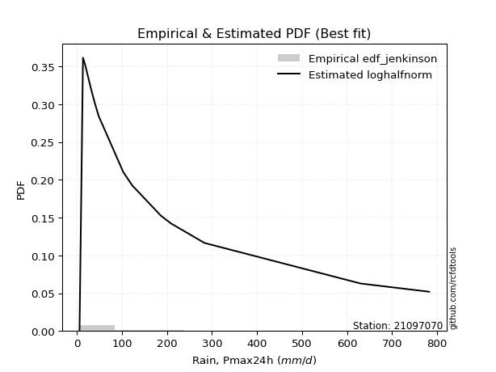</img>

</div>


### 11. EDF Cunnane (1978)

Cunnane´s work in statistical hydrology has focused on the performance and evaluation of different probability distributions (such as GEV, Gumbel, Lognormal) for flood frequency estimation. _b_ is a constant, typically set to 0.4.

<div align="center">


$P=(m-b)/(n+1-2b)$


</div>


**11.1. Empirical values**

<div align="center">

|                | 0                 | 1                   | 2                   | 3                  | 4                   | 5                  | 6                  | 7                  | 8                  | 9           | 10                 | 11                 | 12                | 13                 | 14                 | 15                | 16                 | 17                 | 18                 |
|:---------------|:------------------|:--------------------|:--------------------|:-------------------|:--------------------|:-------------------|:-------------------|:-------------------|:-------------------|:------------|:-------------------|:-------------------|:------------------|:-------------------|:-------------------|:------------------|:-------------------|:-------------------|:-------------------|
| date           | 2019              | 2021                | 2016                | 2010               | 2013                | 2018               | 2020               | 2015               | 2014               | 2017        | 2024               | 2025               | 2022              | 2023               | 2009               | 2007              | 2011               | 2012               | 2006               |
| x              | 5.9               | 13.6                | 17.7                | 18.7               | 21.9                | 27.1               | 32.2               | 33.1               | 38.5               | 40.4        | 48.5               | 84.5               | 103.0             | 123.0              | 186.8              | 208.8             | 283.3              | 630.2              | 782.4              |
| m              | 1                 | 2                   | 3                   | 4                  | 5                   | 6                  | 7                  | 8                  | 9                  | 10          | 11                 | 12                 | 13                | 14                 | 15                 | 16                | 17                 | 18                 | 19                 |
| empirical_dist | edf_cunnane       | edf_cunnane         | edf_cunnane         | edf_cunnane        | edf_cunnane         | edf_cunnane        | edf_cunnane        | edf_cunnane        | edf_cunnane        | edf_cunnane | edf_cunnane        | edf_cunnane        | edf_cunnane       | edf_cunnane        | edf_cunnane        | edf_cunnane       | edf_cunnane        | edf_cunnane        | edf_cunnane        |
| empirical      | 0.03125           | 0.08333333333333334 | 0.13541666666666669 | 0.1875             | 0.23958333333333331 | 0.2916666666666667 | 0.34375            | 0.3958333333333333 | 0.4479166666666667 | 0.5         | 0.5520833333333334 | 0.6041666666666666 | 0.65625           | 0.7083333333333334 | 0.7604166666666666 | 0.8125            | 0.8645833333333335 | 0.9166666666666667 | 0.9687500000000001 |
| empirical_tr   | 1.032258064516129 | 1.090909090909091   | 1.1566265060240966  | 1.2307692307692308 | 1.3150684931506849  | 1.411764705882353  | 1.5238095238095237 | 1.6551724137931032 | 1.8113207547169814 | 2.0         | 2.2325581395348837 | 2.526315789473684  | 2.909090909090909 | 3.428571428571429  | 4.17391304347826   | 5.333333333333333 | 7.384615384615393  | 12.00000000000001  | 32.000000000000114 |

</div>


**11.2. Kolmogorov-Smirnov fit test (sorted by Δ)**


<div align="center">

|                | 0                    | 1                    | 2                   | 3                   | 4                   | 5                   | 6                   | 7                   | 8                   | 9                   | 10                  | 11                  | 12                  | 13                  | 14                  | 15                  | 16                  | 17                  | 18                  | 19                  | 20                  | 21                  | 22                  | 23                  | 24                  | 25                  | 26                  | 27                  | 28                  | 29                  | 30                  | 31                  | 32                  | 33                  | 34                  | 35                  | 36                  | 37                  | 38                  | 39                  | 40                  | 41                  | 42                  | 43                  | 44                  | 45                  | 46                  | 47                  | 48                  | 49                  | 50                  | 51                  | 52                  | 53                  | 54                  | 55                  | 56                  | 57                  | 58                  | 59                  | 60                  | 61                  | 62                  | 63                  | 64                  | 65                  | 66                  | 67                  | 68                  | 69                  | 70                  | 71                  | 72                  | 73                  | 74                  | 75                  | 76                  | 77                  | 78                  | 79                  | 80                  | 81                  | 82                  | 83                  | 84                  | 85                  | 86                  | 87                  | 88                  | 89                  | 90                  | 91                  | 92                  | 93                  | 94                  | 95                  | 96                  | 97                  | 98                  | 99                  | 100                 | 101                 | 102                 | 103                 | 104                 | 105                 | 106                 | 107                 | 108                 | 109                 | 110                 | 111                 | 112                 | 113                 | 114                 | 115                 | 116                 | 117                 | 118                 | 119                 | 120                 | 121                 | 122                 | 123                 | 124                 | 125                 | 126                 | 127                 | 128                 | 129                 | 130                 | 131                 | 132                 | 133                 | 134                 | 135                 | 136                 | 137                 | 138                 | 139                 | 140                 | 141                 | 142                 | 143                 | 144                 | 145                 | 146                 | 147                 | 148                 | 149                 | 150                 | 151                 | 152                 | 153                 | 154                 | 155                 | 156                 | 157                 | 158                 | 159                 |
|:---------------|:---------------------|:---------------------|:--------------------|:--------------------|:--------------------|:--------------------|:--------------------|:--------------------|:--------------------|:--------------------|:--------------------|:--------------------|:--------------------|:--------------------|:--------------------|:--------------------|:--------------------|:--------------------|:--------------------|:--------------------|:--------------------|:--------------------|:--------------------|:--------------------|:--------------------|:--------------------|:--------------------|:--------------------|:--------------------|:--------------------|:--------------------|:--------------------|:--------------------|:--------------------|:--------------------|:--------------------|:--------------------|:--------------------|:--------------------|:--------------------|:--------------------|:--------------------|:--------------------|:--------------------|:--------------------|:--------------------|:--------------------|:--------------------|:--------------------|:--------------------|:--------------------|:--------------------|:--------------------|:--------------------|:--------------------|:--------------------|:--------------------|:--------------------|:--------------------|:--------------------|:--------------------|:--------------------|:--------------------|:--------------------|:--------------------|:--------------------|:--------------------|:--------------------|:--------------------|:--------------------|:--------------------|:--------------------|:--------------------|:--------------------|:--------------------|:--------------------|:--------------------|:--------------------|:--------------------|:--------------------|:--------------------|:--------------------|:--------------------|:--------------------|:--------------------|:--------------------|:--------------------|:--------------------|:--------------------|:--------------------|:--------------------|:--------------------|:--------------------|:--------------------|:--------------------|:--------------------|:--------------------|:--------------------|:--------------------|:--------------------|:--------------------|:--------------------|:--------------------|:--------------------|:--------------------|:--------------------|:--------------------|:--------------------|:--------------------|:--------------------|:--------------------|:--------------------|:--------------------|:--------------------|:--------------------|:--------------------|:--------------------|:--------------------|:--------------------|:--------------------|:--------------------|:--------------------|:--------------------|:--------------------|:--------------------|:--------------------|:--------------------|:--------------------|:--------------------|:--------------------|:--------------------|:--------------------|:--------------------|:--------------------|:--------------------|:--------------------|:--------------------|:--------------------|:--------------------|:--------------------|:--------------------|:--------------------|:--------------------|:--------------------|:--------------------|:--------------------|:--------------------|:--------------------|:--------------------|:--------------------|:--------------------|:--------------------|:--------------------|:--------------------|:--------------------|:--------------------|:--------------------|:--------------------|:--------------------|:--------------------|
| station        | 21097070             | 21097070             | 21097070            | 21097070            | 21097070            | 21097070            | 21097070            | 21097070            | 21097070            | 21097070            | 21097070            | 21097070            | 21097070            | 21097070            | 21097070            | 21097070            | 21097070            | 21097070            | 21097070            | 21097070            | 21097070            | 21097070            | 21097070            | 21097070            | 21097070            | 21097070            | 21097070            | 21097070            | 21097070            | 21097070            | 21097070            | 21097070            | 21097070            | 21097070            | 21097070            | 21097070            | 21097070            | 21097070            | 21097070            | 21097070            | 21097070            | 21097070            | 21097070            | 21097070            | 21097070            | 21097070            | 21097070            | 21097070            | 21097070            | 21097070            | 21097070            | 21097070            | 21097070            | 21097070            | 21097070            | 21097070            | 21097070            | 21097070            | 21097070            | 21097070            | 21097070            | 21097070            | 21097070            | 21097070            | 21097070            | 21097070            | 21097070            | 21097070            | 21097070            | 21097070            | 21097070            | 21097070            | 21097070            | 21097070            | 21097070            | 21097070            | 21097070            | 21097070            | 21097070            | 21097070            | 21097070            | 21097070            | 21097070            | 21097070            | 21097070            | 21097070            | 21097070            | 21097070            | 21097070            | 21097070            | 21097070            | 21097070            | 21097070            | 21097070            | 21097070            | 21097070            | 21097070            | 21097070            | 21097070            | 21097070            | 21097070            | 21097070            | 21097070            | 21097070            | 21097070            | 21097070            | 21097070            | 21097070            | 21097070            | 21097070            | 21097070            | 21097070            | 21097070            | 21097070            | 21097070            | 21097070            | 21097070            | 21097070            | 21097070            | 21097070            | 21097070            | 21097070            | 21097070            | 21097070            | 21097070            | 21097070            | 21097070            | 21097070            | 21097070            | 21097070            | 21097070            | 21097070            | 21097070            | 21097070            | 21097070            | 21097070            | 21097070            | 21097070            | 21097070            | 21097070            | 21097070            | 21097070            | 21097070            | 21097070            | 21097070            | 21097070            | 21097070            | 21097070            | 21097070            | 21097070            | 21097070            | 21097070            | 21097070            | 21097070            | 21097070            | 21097070            | 21097070            | 21097070            | 21097070            | 21097070            |
| empirical_dist | edf_cunnane          | edf_cunnane          | edf_cunnane         | edf_cunnane         | edf_cunnane         | edf_cunnane         | edf_cunnane         | edf_cunnane         | edf_cunnane         | edf_cunnane         | edf_cunnane         | edf_cunnane         | edf_cunnane         | edf_cunnane         | edf_cunnane         | edf_cunnane         | edf_cunnane         | edf_cunnane         | edf_cunnane         | edf_cunnane         | edf_cunnane         | edf_cunnane         | edf_cunnane         | edf_cunnane         | edf_cunnane         | edf_cunnane         | edf_cunnane         | edf_cunnane         | edf_cunnane         | edf_cunnane         | edf_cunnane         | edf_cunnane         | edf_cunnane         | edf_cunnane         | edf_cunnane         | edf_cunnane         | edf_cunnane         | edf_cunnane         | edf_cunnane         | edf_cunnane         | edf_cunnane         | edf_cunnane         | edf_cunnane         | edf_cunnane         | edf_cunnane         | edf_cunnane         | edf_cunnane         | edf_cunnane         | edf_cunnane         | edf_cunnane         | edf_cunnane         | edf_cunnane         | edf_cunnane         | edf_cunnane         | edf_cunnane         | edf_cunnane         | edf_cunnane         | edf_cunnane         | edf_cunnane         | edf_cunnane         | edf_cunnane         | edf_cunnane         | edf_cunnane         | edf_cunnane         | edf_cunnane         | edf_cunnane         | edf_cunnane         | edf_cunnane         | edf_cunnane         | edf_cunnane         | edf_cunnane         | edf_cunnane         | edf_cunnane         | edf_cunnane         | edf_cunnane         | edf_cunnane         | edf_cunnane         | edf_cunnane         | edf_cunnane         | edf_cunnane         | edf_cunnane         | edf_cunnane         | edf_cunnane         | edf_cunnane         | edf_cunnane         | edf_cunnane         | edf_cunnane         | edf_cunnane         | edf_cunnane         | edf_cunnane         | edf_cunnane         | edf_cunnane         | edf_cunnane         | edf_cunnane         | edf_cunnane         | edf_cunnane         | edf_cunnane         | edf_cunnane         | edf_cunnane         | edf_cunnane         | edf_cunnane         | edf_cunnane         | edf_cunnane         | edf_cunnane         | edf_cunnane         | edf_cunnane         | edf_cunnane         | edf_cunnane         | edf_cunnane         | edf_cunnane         | edf_cunnane         | edf_cunnane         | edf_cunnane         | edf_cunnane         | edf_cunnane         | edf_cunnane         | edf_cunnane         | edf_cunnane         | edf_cunnane         | edf_cunnane         | edf_cunnane         | edf_cunnane         | edf_cunnane         | edf_cunnane         | edf_cunnane         | edf_cunnane         | edf_cunnane         | edf_cunnane         | edf_cunnane         | edf_cunnane         | edf_cunnane         | edf_cunnane         | edf_cunnane         | edf_cunnane         | edf_cunnane         | edf_cunnane         | edf_cunnane         | edf_cunnane         | edf_cunnane         | edf_cunnane         | edf_cunnane         | edf_cunnane         | edf_cunnane         | edf_cunnane         | edf_cunnane         | edf_cunnane         | edf_cunnane         | edf_cunnane         | edf_cunnane         | edf_cunnane         | edf_cunnane         | edf_cunnane         | edf_cunnane         | edf_cunnane         | edf_cunnane         | edf_cunnane         | edf_cunnane         | edf_cunnane         | edf_cunnane         | edf_cunnane         |
| p_dist         | loghalfnorm          | logkstwobign         | mielke              | loginvweibull       | nct                 | johnsonsu           | burr12              | loggenexpon         | loggumbel_r         | burr                | logskewnorm         | genextreme          | invweibull          | f                   | invgamma            | ncf                 | loggenlogistic      | lograyleigh         | logmielke           | logburr             | logbetaprime        | invgauss            | lognakagami         | loghalflogistic     | logfoldnorm         | logf                | loggamma            | loggamma            | logerlang           | kappa3              | logexponnorm        | logmoyal            | logfatiguelife      | logexponweib        | loginvgauss         | logjohnsonsu        | logburr12           | logrice             | lognct              | loginvgamma         | logweibull_min      | logmaxwell          | logalpha            | lomax               | genpareto           | logncf              | logexponpow         | loggenextreme       | gamma               | loggompertz         | logjohnsonsb        | logpearson3         | halfgennorm         | logdweibull         | logsemicircular     | logbeta             | logdgamma           | logkappa4           | loganglit           | logwrapcauchy       | logtruncweibull_min | logkappa3           | loguniform          | fatiguelife         | lognorm             | logt                | logcrystalball      | betaprime           | logloggamma         | truncweibull_min    | logarcsine          | truncpareto         | gengamma            | logbradford         | logcosine           | loggengamma         | loglogistic         | gausshyper          | logksone            | logvonmises_line    | logloglaplace       | exponweib           | logtukeylambda      | erlang              | loghypsecant        | loggennorm          | logtruncexpon       | loggausshyper       | loglaplace          | loglaplace          | wald                | logwald             | loggumbel_l         | nakagami            | bradford            | exponpow            | logargus            | vonmises_line       | alpha               | loggenpareto        | beta                | gennorm             | logtruncnorm        | loglomax            | t                   | gumbel_r            | moyal               | crystalball         | logtriang           | norm                | genlogistic         | loggenhalflogistic  | maxwell             | weibull_min         | logistic            | anglit              | cosine              | rayleigh            | pearson3            | hypsecant           | semicircular        | halflogistic        | exponnorm           | kstwobign           | halfnorm            | genexpon            | loghalfgennorm      | powerlaw            | laplace             | dgamma              | gompertz            | rice                | foldnorm            | gumbel_l            | arcsine             | dweibull            | truncnorm           | logtrapezoid        | loglevy_l           | wrapcauchy          | genhalflogistic     | logweibull_max      | skewnorm            | argus               | logrdist            | logpowerlaw         | triang              | truncexpon          | johnsonsb           | levy_l              | ksone               | kappa4              | rdist               | uniform             | tukeylambda         | trapezoid           | weibull_max         | logtruncpareto      | logvonmises         | vonmises            |
| delta          | 0.055433797669230955 | 0.056850978025457466 | 0.06250011089367308 | 0.06256628182661722 | 0.06633145624648251 | 0.06944467661502507 | 0.07207964481469642 | 0.07211149246408441 | 0.07230438417956953 | 0.07272046455593512 | 0.07279941881890067 | 0.07421324637816601 | 0.0742134611984846  | 0.07440755290191348 | 0.07440789857866648 | 0.07449861993729517 | 0.07603743789496631 | 0.0780620008514088  | 0.07935970503631712 | 0.08011791168677312 | 0.08100910662515187 | 0.0827092961319193  | 0.08333333333298079 | 0.08375470035703503 | 0.08544869065313732 | 0.08569197371466708 | 0.08586695839037306 | 0.08586695839037306 | 0.08586743613139941 | 0.08602073414272293 | 0.08630358939191718 | 0.08657654354046973 | 0.08680154150503305 | 0.08681991258069782 | 0.08693867207018802 | 0.0884997063761217  | 0.08906957614828337 | 0.08907329265389569 | 0.08909754003212511 | 0.08928896023681288 | 0.08943495997132167 | 0.09033689693984459 | 0.09115526380343597 | 0.09128165776434483 | 0.09129263978860369 | 0.09158495480230827 | 0.09188373648626802 | 0.09444213054213435 | 0.09587286420797508 | 0.09723796159904408 | 0.09737785330851256 | 0.10174193839384987 | 0.10180647103731641 | 0.1037529637616238  | 0.10711095584606012 | 0.10747969704078614 | 0.10888809165617941 | 0.10945685896671953 | 0.11111356818547141 | 0.11199620130266566 | 0.11411434133017151 | 0.1206162132629946  | 0.12105548361309693 | 0.12122663959753088 | 0.12360478362719812 | 0.12360522810435637 | 0.12360531217444204 | 0.12378497597147547 | 0.12491094780511702 | 0.1253873150875131  | 0.12839521560472372 | 0.13230383782884758 | 0.13269521242805632 | 0.1362250759746303  | 0.1365979526766558  | 0.1378105973727129  | 0.13905802633527065 | 0.1393065630339443  | 0.1423925279478166  | 0.1447877471985804  | 0.14534106755674592 | 0.14641198594011567 | 0.14793282155193072 | 0.14902256439527345 | 0.1514238053713312  | 0.15442862988510497 | 0.1625871430281131  | 0.16341479530255992 | 0.17972358182754755 | 0.17972358182754755 | 0.184921965399163   | 0.1856794799339758  | 0.18991385117936976 | 0.20072959140674423 | 0.20139976915284197 | 0.20482789600248025 | 0.20514314991284677 | 0.20657211171145662 | 0.2074748439158164  | 0.21426697671059539 | 0.22069501648203357 | 0.22596610660430427 | 0.22646782599164683 | 0.24061588562568953 | 0.2413209667132553  | 0.24213817360284418 | 0.24271320675501107 | 0.2446723686491269  | 0.24469922810915123 | 0.24477416950087283 | 0.2461215313176368  | 0.24727762272272802 | 0.2483317808271246  | 0.2494990030837882  | 0.24971597359671122 | 0.2529558442376251  | 0.2573897383201702  | 0.2576039282671135  | 0.2598157593650615  | 0.259818053316327   | 0.26472817093259343 | 0.2704743952005619  | 0.2807496688031994  | 0.2826620390057049  | 0.28283868833946973 | 0.28346473487634555 | 0.28520524050017976 | 0.2856966991937554  | 0.2869425241466937  | 0.2875801450523596  | 0.2894835344573398  | 0.29382294936818637 | 0.30615789820199923 | 0.3152837588714126  | 0.31604258503089866 | 0.333421905012494   | 0.341243325764318   | 0.356256543626043   | 0.37674596963219553 | 0.3866785146906804  | 0.3886425893182534  | 0.41354865779329314 | 0.41632448120354254 | 0.4324850285229376  | 0.4376379581308687  | 0.4454453957481022  | 0.4522097597263759  | 0.46435325110563874 | 0.48411749323594566 | 0.5055878542955481  | 0.511416076411247   | 0.5340293447834663  | 0.5508517951425561  | 0.557528439579309   | 0.5742017042001848  | 0.7195152564294063  | 0.7613890916946136  | 0.8652467583481345  | 1.0874031026096809  | 123.82415773243179  |
| deltao         | 0.31564497164100014  | 0.31564497164100014  | 0.31564497164100014 | 0.31564497164100014 | 0.31564497164100014 | 0.31564497164100014 | 0.31564497164100014 | 0.31564497164100014 | 0.31564497164100014 | 0.31564497164100014 | 0.31564497164100014 | 0.31564497164100014 | 0.31564497164100014 | 0.31564497164100014 | 0.31564497164100014 | 0.31564497164100014 | 0.31564497164100014 | 0.31564497164100014 | 0.31564497164100014 | 0.31564497164100014 | 0.31564497164100014 | 0.31564497164100014 | 0.31564497164100014 | 0.31564497164100014 | 0.31564497164100014 | 0.31564497164100014 | 0.31564497164100014 | 0.31564497164100014 | 0.31564497164100014 | 0.31564497164100014 | 0.31564497164100014 | 0.31564497164100014 | 0.31564497164100014 | 0.31564497164100014 | 0.31564497164100014 | 0.31564497164100014 | 0.31564497164100014 | 0.31564497164100014 | 0.31564497164100014 | 0.31564497164100014 | 0.31564497164100014 | 0.31564497164100014 | 0.31564497164100014 | 0.31564497164100014 | 0.31564497164100014 | 0.31564497164100014 | 0.31564497164100014 | 0.31564497164100014 | 0.31564497164100014 | 0.31564497164100014 | 0.31564497164100014 | 0.31564497164100014 | 0.31564497164100014 | 0.31564497164100014 | 0.31564497164100014 | 0.31564497164100014 | 0.31564497164100014 | 0.31564497164100014 | 0.31564497164100014 | 0.31564497164100014 | 0.31564497164100014 | 0.31564497164100014 | 0.31564497164100014 | 0.31564497164100014 | 0.31564497164100014 | 0.31564497164100014 | 0.31564497164100014 | 0.31564497164100014 | 0.31564497164100014 | 0.31564497164100014 | 0.31564497164100014 | 0.31564497164100014 | 0.31564497164100014 | 0.31564497164100014 | 0.31564497164100014 | 0.31564497164100014 | 0.31564497164100014 | 0.31564497164100014 | 0.31564497164100014 | 0.31564497164100014 | 0.31564497164100014 | 0.31564497164100014 | 0.31564497164100014 | 0.31564497164100014 | 0.31564497164100014 | 0.31564497164100014 | 0.31564497164100014 | 0.31564497164100014 | 0.31564497164100014 | 0.31564497164100014 | 0.31564497164100014 | 0.31564497164100014 | 0.31564497164100014 | 0.31564497164100014 | 0.31564497164100014 | 0.31564497164100014 | 0.31564497164100014 | 0.31564497164100014 | 0.31564497164100014 | 0.31564497164100014 | 0.31564497164100014 | 0.31564497164100014 | 0.31564497164100014 | 0.31564497164100014 | 0.31564497164100014 | 0.31564497164100014 | 0.31564497164100014 | 0.31564497164100014 | 0.31564497164100014 | 0.31564497164100014 | 0.31564497164100014 | 0.31564497164100014 | 0.31564497164100014 | 0.31564497164100014 | 0.31564497164100014 | 0.31564497164100014 | 0.31564497164100014 | 0.31564497164100014 | 0.31564497164100014 | 0.31564497164100014 | 0.31564497164100014 | 0.31564497164100014 | 0.31564497164100014 | 0.31564497164100014 | 0.31564497164100014 | 0.31564497164100014 | 0.31564497164100014 | 0.31564497164100014 | 0.31564497164100014 | 0.31564497164100014 | 0.31564497164100014 | 0.31564497164100014 | 0.31564497164100014 | 0.31564497164100014 | 0.31564497164100014 | 0.31564497164100014 | 0.31564497164100014 | 0.31564497164100014 | 0.31564497164100014 | 0.31564497164100014 | 0.31564497164100014 | 0.31564497164100014 | 0.31564497164100014 | 0.31564497164100014 | 0.31564497164100014 | 0.31564497164100014 | 0.31564497164100014 | 0.31564497164100014 | 0.31564497164100014 | 0.31564497164100014 | 0.31564497164100014 | 0.31564497164100014 | 0.31564497164100014 | 0.31564497164100014 | 0.31564497164100014 | 0.31564497164100014 | 0.31564497164100014 | 0.31564497164100014 | 0.31564497164100014 | 0.31564497164100014 |
| eval           | Δo > Δ               | Δo > Δ               | Δo > Δ              | Δo > Δ              | Δo > Δ              | Δo > Δ              | Δo > Δ              | Δo > Δ              | Δo > Δ              | Δo > Δ              | Δo > Δ              | Δo > Δ              | Δo > Δ              | Δo > Δ              | Δo > Δ              | Δo > Δ              | Δo > Δ              | Δo > Δ              | Δo > Δ              | Δo > Δ              | Δo > Δ              | Δo > Δ              | Δo > Δ              | Δo > Δ              | Δo > Δ              | Δo > Δ              | Δo > Δ              | Δo > Δ              | Δo > Δ              | Δo > Δ              | Δo > Δ              | Δo > Δ              | Δo > Δ              | Δo > Δ              | Δo > Δ              | Δo > Δ              | Δo > Δ              | Δo > Δ              | Δo > Δ              | Δo > Δ              | Δo > Δ              | Δo > Δ              | Δo > Δ              | Δo > Δ              | Δo > Δ              | Δo > Δ              | Δo > Δ              | Δo > Δ              | Δo > Δ              | Δo > Δ              | Δo > Δ              | Δo > Δ              | Δo > Δ              | Δo > Δ              | Δo > Δ              | Δo > Δ              | Δo > Δ              | Δo > Δ              | Δo > Δ              | Δo > Δ              | Δo > Δ              | Δo > Δ              | Δo > Δ              | Δo > Δ              | Δo > Δ              | Δo > Δ              | Δo > Δ              | Δo > Δ              | Δo > Δ              | Δo > Δ              | Δo > Δ              | Δo > Δ              | Δo > Δ              | Δo > Δ              | Δo > Δ              | Δo > Δ              | Δo > Δ              | Δo > Δ              | Δo > Δ              | Δo > Δ              | Δo > Δ              | Δo > Δ              | Δo > Δ              | Δo > Δ              | Δo > Δ              | Δo > Δ              | Δo > Δ              | Δo > Δ              | Δo > Δ              | Δo > Δ              | Δo > Δ              | Δo > Δ              | Δo > Δ              | Δo > Δ              | Δo > Δ              | Δo > Δ              | Δo > Δ              | Δo > Δ              | Δo > Δ              | Δo > Δ              | Δo > Δ              | Δo > Δ              | Δo > Δ              | Δo > Δ              | Δo > Δ              | Δo > Δ              | Δo > Δ              | Δo > Δ              | Δo > Δ              | Δo > Δ              | Δo > Δ              | Δo > Δ              | Δo > Δ              | Δo > Δ              | Δo > Δ              | Δo > Δ              | Δo > Δ              | Δo > Δ              | Δo > Δ              | Δo > Δ              | Δo > Δ              | Δo > Δ              | Δo > Δ              | Δo > Δ              | Δo > Δ              | Δo > Δ              | Δo > Δ              | Δo > Δ              | Δo > Δ              | Δo > Δ              | Δo > Δ              | Δo > Δ              | Δo > Δ              | Δo > Δ              | Δo <= Δ             | Δo <= Δ             | Δo <= Δ             | Δo <= Δ             | Δo <= Δ             | Δo <= Δ             | Δo <= Δ             | Δo <= Δ             | Δo <= Δ             | Δo <= Δ             | Δo <= Δ             | Δo <= Δ             | Δo <= Δ             | Δo <= Δ             | Δo <= Δ             | Δo <= Δ             | Δo <= Δ             | Δo <= Δ             | Δo <= Δ             | Δo <= Δ             | Δo <= Δ             | Δo <= Δ             | Δo <= Δ             | Δo <= Δ             | Δo <= Δ             | Δo <= Δ             |
| fit            | 1                    | 1                    | 1                   | 1                   | 1                   | 1                   | 1                   | 1                   | 1                   | 1                   | 1                   | 1                   | 1                   | 1                   | 1                   | 1                   | 1                   | 1                   | 1                   | 1                   | 1                   | 1                   | 1                   | 1                   | 1                   | 1                   | 1                   | 1                   | 1                   | 1                   | 1                   | 1                   | 1                   | 1                   | 1                   | 1                   | 1                   | 1                   | 1                   | 1                   | 1                   | 1                   | 1                   | 1                   | 1                   | 1                   | 1                   | 1                   | 1                   | 1                   | 1                   | 1                   | 1                   | 1                   | 1                   | 1                   | 1                   | 1                   | 1                   | 1                   | 1                   | 1                   | 1                   | 1                   | 1                   | 1                   | 1                   | 1                   | 1                   | 1                   | 1                   | 1                   | 1                   | 1                   | 1                   | 1                   | 1                   | 1                   | 1                   | 1                   | 1                   | 1                   | 1                   | 1                   | 1                   | 1                   | 1                   | 1                   | 1                   | 1                   | 1                   | 1                   | 1                   | 1                   | 1                   | 1                   | 1                   | 1                   | 1                   | 1                   | 1                   | 1                   | 1                   | 1                   | 1                   | 1                   | 1                   | 1                   | 1                   | 1                   | 1                   | 1                   | 1                   | 1                   | 1                   | 1                   | 1                   | 1                   | 1                   | 1                   | 1                   | 1                   | 1                   | 1                   | 1                   | 1                   | 1                   | 1                   | 1                   | 1                   | 1                   | 1                   | 1                   | 1                   | 0                   | 0                   | 0                   | 0                   | 0                   | 0                   | 0                   | 0                   | 0                   | 0                   | 0                   | 0                   | 0                   | 0                   | 0                   | 0                   | 0                   | 0                   | 0                   | 0                   | 0                   | 0                   | 0                   | 0                   | 0                   | 0                   |
| n              | 19                   | 19                   | 19                  | 19                  | 19                  | 19                  | 19                  | 19                  | 19                  | 19                  | 19                  | 19                  | 19                  | 19                  | 19                  | 19                  | 19                  | 19                  | 19                  | 19                  | 19                  | 19                  | 19                  | 19                  | 19                  | 19                  | 19                  | 19                  | 19                  | 19                  | 19                  | 19                  | 19                  | 19                  | 19                  | 19                  | 19                  | 19                  | 19                  | 19                  | 19                  | 19                  | 19                  | 19                  | 19                  | 19                  | 19                  | 19                  | 19                  | 19                  | 19                  | 19                  | 19                  | 19                  | 19                  | 19                  | 19                  | 19                  | 19                  | 19                  | 19                  | 19                  | 19                  | 19                  | 19                  | 19                  | 19                  | 19                  | 19                  | 19                  | 19                  | 19                  | 19                  | 19                  | 19                  | 19                  | 19                  | 19                  | 19                  | 19                  | 19                  | 19                  | 19                  | 19                  | 19                  | 19                  | 19                  | 19                  | 19                  | 19                  | 19                  | 19                  | 19                  | 19                  | 19                  | 19                  | 19                  | 19                  | 19                  | 19                  | 19                  | 19                  | 19                  | 19                  | 19                  | 19                  | 19                  | 19                  | 19                  | 19                  | 19                  | 19                  | 19                  | 19                  | 19                  | 19                  | 19                  | 19                  | 19                  | 19                  | 19                  | 19                  | 19                  | 19                  | 19                  | 19                  | 19                  | 19                  | 19                  | 19                  | 19                  | 19                  | 19                  | 19                  | 19                  | 19                  | 19                  | 19                  | 19                  | 19                  | 19                  | 19                  | 19                  | 19                  | 19                  | 19                  | 19                  | 19                  | 19                  | 19                  | 19                  | 19                  | 19                  | 19                  | 19                  | 19                  | 19                  | 19                  | 19                  | 19                  |
| best_fit       | 1                    | 0                    | 0                   | 0                   | 0                   | 0                   | 0                   | 0                   | 0                   | 0                   | 0                   | 0                   | 0                   | 0                   | 0                   | 0                   | 0                   | 0                   | 0                   | 0                   | 0                   | 0                   | 0                   | 0                   | 0                   | 0                   | 0                   | 0                   | 0                   | 0                   | 0                   | 0                   | 0                   | 0                   | 0                   | 0                   | 0                   | 0                   | 0                   | 0                   | 0                   | 0                   | 0                   | 0                   | 0                   | 0                   | 0                   | 0                   | 0                   | 0                   | 0                   | 0                   | 0                   | 0                   | 0                   | 0                   | 0                   | 0                   | 0                   | 0                   | 0                   | 0                   | 0                   | 0                   | 0                   | 0                   | 0                   | 0                   | 0                   | 0                   | 0                   | 0                   | 0                   | 0                   | 0                   | 0                   | 0                   | 0                   | 0                   | 0                   | 0                   | 0                   | 0                   | 0                   | 0                   | 0                   | 0                   | 0                   | 0                   | 0                   | 0                   | 0                   | 0                   | 0                   | 0                   | 0                   | 0                   | 0                   | 0                   | 0                   | 0                   | 0                   | 0                   | 0                   | 0                   | 0                   | 0                   | 0                   | 0                   | 0                   | 0                   | 0                   | 0                   | 0                   | 0                   | 0                   | 0                   | 0                   | 0                   | 0                   | 0                   | 0                   | 0                   | 0                   | 0                   | 0                   | 0                   | 0                   | 0                   | 0                   | 0                   | 0                   | 0                   | 0                   | 0                   | 0                   | 0                   | 0                   | 0                   | 0                   | 0                   | 0                   | 0                   | 0                   | 0                   | 0                   | 0                   | 0                   | 0                   | 0                   | 0                   | 0                   | 0                   | 0                   | 0                   | 0                   | 0                   | 0                   | 0                   | 0                   |
| best_fit_sort  | 1                    | 2                    | 3                   | 4                   | 5                   | 6                   | 7                   | 8                   | 9                   | 10                  | 11                  | 12                  | 13                  | 14                  | 15                  | 16                  | 17                  | 18                  | 19                  | 20                  | 21                  | 22                  | 23                  | 24                  | 25                  | 26                  | 27                  | 28                  | 29                  | 30                  | 31                  | 32                  | 33                  | 34                  | 35                  | 36                  | 37                  | 38                  | 39                  | 40                  | 41                  | 42                  | 43                  | 44                  | 45                  | 46                  | 47                  | 48                  | 49                  | 50                  | 51                  | 52                  | 53                  | 54                  | 55                  | 56                  | 57                  | 58                  | 59                  | 60                  | 61                  | 62                  | 63                  | 64                  | 65                  | 66                  | 67                  | 68                  | 69                  | 70                  | 71                  | 72                  | 73                  | 74                  | 75                  | 76                  | 77                  | 78                  | 79                  | 80                  | 81                  | 82                  | 83                  | 84                  | 85                  | 86                  | 87                  | 88                  | 89                  | 90                  | 91                  | 92                  | 93                  | 94                  | 95                  | 96                  | 97                  | 98                  | 99                  | 100                 | 101                 | 102                 | 103                 | 104                 | 105                 | 106                 | 107                 | 108                 | 109                 | 110                 | 111                 | 112                 | 113                 | 114                 | 115                 | 116                 | 117                 | 118                 | 119                 | 120                 | 121                 | 122                 | 123                 | 124                 | 125                 | 126                 | 127                 | 128                 | 129                 | 130                 | 131                 | 132                 | 133                 | 134                 | 135                 | 136                 | 137                 | 138                 | 139                 | 140                 | 141                 | 142                 | 143                 | 144                 | 145                 | 146                 | 147                 | 148                 | 149                 | 150                 | 151                 | 152                 | 153                 | 154                 | 155                 | 156                 | 157                 | 158                 | 159                 | 160                 |

</div>


**11.3. Best fit**

<div align="center">

|   id |   station | empirical_dist   | p_dist      |     delta |   deltao | eval   |   fit |   n |   best_fit |   best_fit_sort |
|-----:|----------:|:-----------------|:------------|----------:|---------:|:-------|------:|----:|-----------:|----------------:|
|    0 |  21097070 | edf_cunnane      | loghalfnorm | 0.0554338 | 0.315645 | Δo > Δ |     1 |  19 |          1 |               1 |

</div>


<div align="center">

</img></img>

</div>


### 12. EDF Adamowski (1981)

The Adamowski formula in hydrology refers to a specific plotting position formula used for estimating the non-parametric empirical distribution of hydrological events (like flood peaks) to calculate their return periods. This formula provides an alternative to traditional parametric methods (like the Gumbel or Log Pearson Type III distributions). 

<div align="center">


$P=(m-0.25)/(n+0.5)$


</div>


**12.1. Empirical values**

<div align="center">

|                | 0                    | 1                   | 2                   | 3                   | 4                   | 5                  | 6                   | 7                  | 8                   | 9             | 10                 | 11                 | 12                 | 13                 | 14                 | 15                 | 16                 | 17                 | 18                 |
|:---------------|:---------------------|:--------------------|:--------------------|:--------------------|:--------------------|:-------------------|:--------------------|:-------------------|:--------------------|:--------------|:-------------------|:-------------------|:-------------------|:-------------------|:-------------------|:-------------------|:-------------------|:-------------------|:-------------------|
| date           | 2019                 | 2021                | 2016                | 2010                | 2013                | 2018               | 2020                | 2015               | 2014                | 2017          | 2024               | 2025               | 2022               | 2023               | 2009               | 2007               | 2011               | 2012               | 2006               |
| x              | 5.9                  | 13.6                | 17.7                | 18.7                | 21.9                | 27.1               | 32.2                | 33.1               | 38.5                | 40.4          | 48.5               | 84.5               | 103.0              | 123.0              | 186.8              | 208.8              | 283.3              | 630.2              | 782.4              |
| m              | 1                    | 2                   | 3                   | 4                   | 5                   | 6                  | 7                   | 8                  | 9                   | 10            | 11                 | 12                 | 13                 | 14                 | 15                 | 16                 | 17                 | 18                 | 19                 |
| empirical_dist | edf_adamowski        | edf_adamowski       | edf_adamowski       | edf_adamowski       | edf_adamowski       | edf_adamowski      | edf_adamowski       | edf_adamowski      | edf_adamowski       | edf_adamowski | edf_adamowski      | edf_adamowski      | edf_adamowski      | edf_adamowski      | edf_adamowski      | edf_adamowski      | edf_adamowski      | edf_adamowski      | edf_adamowski      |
| empirical      | 0.038461538461538464 | 0.08974358974358974 | 0.14102564102564102 | 0.19230769230769232 | 0.24358974358974358 | 0.2948717948717949 | 0.34615384615384615 | 0.3974358974358974 | 0.44871794871794873 | 0.5           | 0.5512820512820513 | 0.6025641025641025 | 0.6538461538461539 | 0.7051282051282052 | 0.7564102564102564 | 0.8076923076923077 | 0.8589743589743589 | 0.9102564102564102 | 0.9615384615384616 |
| empirical_tr   | 1.04                 | 1.0985915492957747  | 1.164179104477612   | 1.2380952380952381  | 1.3220338983050848  | 1.4181818181818182 | 1.5294117647058822  | 1.6595744680851061 | 1.813953488372093   | 2.0           | 2.2285714285714286 | 2.5161290322580645 | 2.888888888888889  | 3.3913043478260874 | 4.105263157894736  | 5.2                | 7.090909090909088  | 11.14285714285714  | 26.000000000000018 |

</div>


**12.2. Kolmogorov-Smirnov fit test (sorted by Δ)**


<div align="center">

|                | 0                   | 1                    | 2                    | 3                   | 4                   | 5                   | 6                   | 7                   | 8                   | 9                   | 10                  | 11                  | 12                  | 13                  | 14                  | 15                  | 16                  | 17                  | 18                  | 19                  | 20                  | 21                  | 22                  | 23                  | 24                  | 25                  | 26                  | 27                  | 28                  | 29                  | 30                  | 31                  | 32                  | 33                  | 34                  | 35                  | 36                  | 37                  | 38                  | 39                  | 40                  | 41                  | 42                  | 43                  | 44                  | 45                  | 46                  | 47                  | 48                  | 49                  | 50                  | 51                  | 52                  | 53                  | 54                  | 55                  | 56                  | 57                  | 58                  | 59                  | 60                  | 61                  | 62                  | 63                  | 64                  | 65                  | 66                  | 67                  | 68                  | 69                  | 70                  | 71                  | 72                  | 73                  | 74                  | 75                  | 76                  | 77                  | 78                  | 79                  | 80                  | 81                  | 82                  | 83                  | 84                  | 85                  | 86                  | 87                  | 88                  | 89                  | 90                  | 91                  | 92                  | 93                  | 94                  | 95                  | 96                  | 97                  | 98                  | 99                  | 100                 | 101                 | 102                 | 103                 | 104                 | 105                 | 106                 | 107                 | 108                 | 109                 | 110                 | 111                 | 112                 | 113                 | 114                 | 115                 | 116                 | 117                 | 118                 | 119                 | 120                 | 121                 | 122                 | 123                 | 124                 | 125                 | 126                 | 127                 | 128                 | 129                 | 130                 | 131                 | 132                 | 133                 | 134                 | 135                 | 136                 | 137                 | 138                 | 139                 | 140                 | 141                 | 142                 | 143                 | 144                 | 145                 | 146                 | 147                 | 148                 | 149                 | 150                 | 151                 | 152                 | 153                 | 154                 | 155                 | 156                 | 157                 | 158                 | 159                 |
|:---------------|:--------------------|:---------------------|:---------------------|:--------------------|:--------------------|:--------------------|:--------------------|:--------------------|:--------------------|:--------------------|:--------------------|:--------------------|:--------------------|:--------------------|:--------------------|:--------------------|:--------------------|:--------------------|:--------------------|:--------------------|:--------------------|:--------------------|:--------------------|:--------------------|:--------------------|:--------------------|:--------------------|:--------------------|:--------------------|:--------------------|:--------------------|:--------------------|:--------------------|:--------------------|:--------------------|:--------------------|:--------------------|:--------------------|:--------------------|:--------------------|:--------------------|:--------------------|:--------------------|:--------------------|:--------------------|:--------------------|:--------------------|:--------------------|:--------------------|:--------------------|:--------------------|:--------------------|:--------------------|:--------------------|:--------------------|:--------------------|:--------------------|:--------------------|:--------------------|:--------------------|:--------------------|:--------------------|:--------------------|:--------------------|:--------------------|:--------------------|:--------------------|:--------------------|:--------------------|:--------------------|:--------------------|:--------------------|:--------------------|:--------------------|:--------------------|:--------------------|:--------------------|:--------------------|:--------------------|:--------------------|:--------------------|:--------------------|:--------------------|:--------------------|:--------------------|:--------------------|:--------------------|:--------------------|:--------------------|:--------------------|:--------------------|:--------------------|:--------------------|:--------------------|:--------------------|:--------------------|:--------------------|:--------------------|:--------------------|:--------------------|:--------------------|:--------------------|:--------------------|:--------------------|:--------------------|:--------------------|:--------------------|:--------------------|:--------------------|:--------------------|:--------------------|:--------------------|:--------------------|:--------------------|:--------------------|:--------------------|:--------------------|:--------------------|:--------------------|:--------------------|:--------------------|:--------------------|:--------------------|:--------------------|:--------------------|:--------------------|:--------------------|:--------------------|:--------------------|:--------------------|:--------------------|:--------------------|:--------------------|:--------------------|:--------------------|:--------------------|:--------------------|:--------------------|:--------------------|:--------------------|:--------------------|:--------------------|:--------------------|:--------------------|:--------------------|:--------------------|:--------------------|:--------------------|:--------------------|:--------------------|:--------------------|:--------------------|:--------------------|:--------------------|:--------------------|:--------------------|:--------------------|:--------------------|:--------------------|:--------------------|
| station        | 21097070            | 21097070             | 21097070             | 21097070            | 21097070            | 21097070            | 21097070            | 21097070            | 21097070            | 21097070            | 21097070            | 21097070            | 21097070            | 21097070            | 21097070            | 21097070            | 21097070            | 21097070            | 21097070            | 21097070            | 21097070            | 21097070            | 21097070            | 21097070            | 21097070            | 21097070            | 21097070            | 21097070            | 21097070            | 21097070            | 21097070            | 21097070            | 21097070            | 21097070            | 21097070            | 21097070            | 21097070            | 21097070            | 21097070            | 21097070            | 21097070            | 21097070            | 21097070            | 21097070            | 21097070            | 21097070            | 21097070            | 21097070            | 21097070            | 21097070            | 21097070            | 21097070            | 21097070            | 21097070            | 21097070            | 21097070            | 21097070            | 21097070            | 21097070            | 21097070            | 21097070            | 21097070            | 21097070            | 21097070            | 21097070            | 21097070            | 21097070            | 21097070            | 21097070            | 21097070            | 21097070            | 21097070            | 21097070            | 21097070            | 21097070            | 21097070            | 21097070            | 21097070            | 21097070            | 21097070            | 21097070            | 21097070            | 21097070            | 21097070            | 21097070            | 21097070            | 21097070            | 21097070            | 21097070            | 21097070            | 21097070            | 21097070            | 21097070            | 21097070            | 21097070            | 21097070            | 21097070            | 21097070            | 21097070            | 21097070            | 21097070            | 21097070            | 21097070            | 21097070            | 21097070            | 21097070            | 21097070            | 21097070            | 21097070            | 21097070            | 21097070            | 21097070            | 21097070            | 21097070            | 21097070            | 21097070            | 21097070            | 21097070            | 21097070            | 21097070            | 21097070            | 21097070            | 21097070            | 21097070            | 21097070            | 21097070            | 21097070            | 21097070            | 21097070            | 21097070            | 21097070            | 21097070            | 21097070            | 21097070            | 21097070            | 21097070            | 21097070            | 21097070            | 21097070            | 21097070            | 21097070            | 21097070            | 21097070            | 21097070            | 21097070            | 21097070            | 21097070            | 21097070            | 21097070            | 21097070            | 21097070            | 21097070            | 21097070            | 21097070            | 21097070            | 21097070            | 21097070            | 21097070            | 21097070            | 21097070            |
| empirical_dist | edf_adamowski       | edf_adamowski        | edf_adamowski        | edf_adamowski       | edf_adamowski       | edf_adamowski       | edf_adamowski       | edf_adamowski       | edf_adamowski       | edf_adamowski       | edf_adamowski       | edf_adamowski       | edf_adamowski       | edf_adamowski       | edf_adamowski       | edf_adamowski       | edf_adamowski       | edf_adamowski       | edf_adamowski       | edf_adamowski       | edf_adamowski       | edf_adamowski       | edf_adamowski       | edf_adamowski       | edf_adamowski       | edf_adamowski       | edf_adamowski       | edf_adamowski       | edf_adamowski       | edf_adamowski       | edf_adamowski       | edf_adamowski       | edf_adamowski       | edf_adamowski       | edf_adamowski       | edf_adamowski       | edf_adamowski       | edf_adamowski       | edf_adamowski       | edf_adamowski       | edf_adamowski       | edf_adamowski       | edf_adamowski       | edf_adamowski       | edf_adamowski       | edf_adamowski       | edf_adamowski       | edf_adamowski       | edf_adamowski       | edf_adamowski       | edf_adamowski       | edf_adamowski       | edf_adamowski       | edf_adamowski       | edf_adamowski       | edf_adamowski       | edf_adamowski       | edf_adamowski       | edf_adamowski       | edf_adamowski       | edf_adamowski       | edf_adamowski       | edf_adamowski       | edf_adamowski       | edf_adamowski       | edf_adamowski       | edf_adamowski       | edf_adamowski       | edf_adamowski       | edf_adamowski       | edf_adamowski       | edf_adamowski       | edf_adamowski       | edf_adamowski       | edf_adamowski       | edf_adamowski       | edf_adamowski       | edf_adamowski       | edf_adamowski       | edf_adamowski       | edf_adamowski       | edf_adamowski       | edf_adamowski       | edf_adamowski       | edf_adamowski       | edf_adamowski       | edf_adamowski       | edf_adamowski       | edf_adamowski       | edf_adamowski       | edf_adamowski       | edf_adamowski       | edf_adamowski       | edf_adamowski       | edf_adamowski       | edf_adamowski       | edf_adamowski       | edf_adamowski       | edf_adamowski       | edf_adamowski       | edf_adamowski       | edf_adamowski       | edf_adamowski       | edf_adamowski       | edf_adamowski       | edf_adamowski       | edf_adamowski       | edf_adamowski       | edf_adamowski       | edf_adamowski       | edf_adamowski       | edf_adamowski       | edf_adamowski       | edf_adamowski       | edf_adamowski       | edf_adamowski       | edf_adamowski       | edf_adamowski       | edf_adamowski       | edf_adamowski       | edf_adamowski       | edf_adamowski       | edf_adamowski       | edf_adamowski       | edf_adamowski       | edf_adamowski       | edf_adamowski       | edf_adamowski       | edf_adamowski       | edf_adamowski       | edf_adamowski       | edf_adamowski       | edf_adamowski       | edf_adamowski       | edf_adamowski       | edf_adamowski       | edf_adamowski       | edf_adamowski       | edf_adamowski       | edf_adamowski       | edf_adamowski       | edf_adamowski       | edf_adamowski       | edf_adamowski       | edf_adamowski       | edf_adamowski       | edf_adamowski       | edf_adamowski       | edf_adamowski       | edf_adamowski       | edf_adamowski       | edf_adamowski       | edf_adamowski       | edf_adamowski       | edf_adamowski       | edf_adamowski       | edf_adamowski       | edf_adamowski       | edf_adamowski       | edf_adamowski       |
| p_dist         | logkstwobign        | loghalfnorm          | mielke               | loginvweibull       | loggenexpon         | johnsonsu           | nct                 | burr                | logskewnorm         | burr12              | genextreme          | invweibull          | f                   | invgamma            | ncf                 | loggenlogistic      | loggumbel_r         | lograyleigh         | logmielke           | logburr             | logbetaprime        | invgauss            | logfoldnorm         | loghalflogistic     | logf                | loggamma            | loggamma            | logerlang           | kappa3              | logexponnorm        | logfatiguelife      | logexponweib        | loginvgauss         | logmoyal            | logjohnsonsu        | logburr12           | logrice             | lognct              | loginvgamma         | logweibull_min      | lognakagami         | logmaxwell          | logexponpow         | logalpha            | lomax               | genpareto           | logncf              | loggenextreme       | gamma               | halfgennorm         | loggompertz         | logjohnsonsb        | logpearson3         | logbeta             | logkappa4           | logsemicircular     | logwrapcauchy       | logdweibull         | loganglit           | logdgamma           | logtruncweibull_min | betaprime           | logkappa3           | loguniform          | fatiguelife         | logarcsine          | lognorm             | logt                | logcrystalball      | truncweibull_min    | logloggamma         | gengamma            | logbradford         | loggengamma         | truncpareto         | logcosine           | logksone            | gausshyper          | loglogistic         | exponweib           | logtukeylambda      | logvonmises_line    | logloglaplace       | erlang              | loghypsecant        | loggennorm          | logtruncexpon       | loggausshyper       | wald                | loglaplace          | loglaplace          | loggumbel_l         | logwald             | vonmises_line       | nakagami            | bradford            | exponpow            | logargus            | loggenpareto        | alpha               | beta                | gennorm             | logtruncnorm        | gumbel_r            | loglomax            | moyal               | maxwell             | crystalball         | norm                | t                   | logtriang           | genlogistic         | anglit              | loggenhalflogistic  | logistic            | weibull_min         | rayleigh            | pearson3            | cosine              | semicircular        | hypsecant           | halflogistic        | halfnorm            | powerlaw            | loghalfgennorm      | exponnorm           | dgamma              | kstwobign           | genexpon            | laplace             | gompertz            | rice                | foldnorm            | arcsine             | gumbel_l            | dweibull            | truncnorm           | logtrapezoid        | loglevy_l           | wrapcauchy          | genhalflogistic     | logweibull_max      | skewnorm            | argus               | logrdist            | logpowerlaw         | triang              | truncexpon          | johnsonsb           | levy_l              | ksone               | kappa4              | rdist               | uniform             | tukeylambda         | trapezoid           | weibull_max         | logtruncpareto      | logvonmises         | vonmises            |
| delta          | 0.0531626327480737  | 0.058300456825682856 | 0.062003411809578024 | 0.06256628182661722 | 0.06650251810511007 | 0.06944467661502507 | 0.07033786650289275 | 0.07272046455593512 | 0.07279941881890067 | 0.07368220891726052 | 0.07421324637816601 | 0.0742134611984846  | 0.07440755290191348 | 0.07440789857866648 | 0.07449861993729517 | 0.07603743789496631 | 0.07631079443597977 | 0.0780620008514088  | 0.07935970503631712 | 0.08011791168677312 | 0.08100910662515187 | 0.0827092961319193  | 0.08485793623211496 | 0.08535726445959912 | 0.08569197371466708 | 0.08586695839037306 | 0.08586695839037306 | 0.08586743613139941 | 0.08602073414272293 | 0.08630358939191718 | 0.08680154150503305 | 0.08681991258069782 | 0.08693867207018802 | 0.08817910764303383 | 0.0884997063761217  | 0.08906957614828337 | 0.08907329265389569 | 0.08909754003212511 | 0.08928896023681288 | 0.08943495997132167 | 0.08974358974323719 | 0.09033689693984459 | 0.09108245443498597 | 0.09115526380343597 | 0.09128165776434483 | 0.09129263978860369 | 0.09158495480230827 | 0.09444213054213435 | 0.09507158215669304 | 0.09619749667834207 | 0.09643667954776203 | 0.09657657125723051 | 0.10174193839384987 | 0.10322452726519699 | 0.10384788460774519 | 0.10630967379477807 | 0.10638722694369132 | 0.10775937401803404 | 0.11031228613418936 | 0.11289450191258965 | 0.11331305927888946 | 0.11817600161250114 | 0.11981493121171255 | 0.12025420156181488 | 0.12042535754624883 | 0.12278624124574938 | 0.12360478362719812 | 0.12360522810435637 | 0.12360531217444204 | 0.12458603303623106 | 0.12491094780511702 | 0.12628495601779993 | 0.13061610161565596 | 0.13220162301373856 | 0.13230383782884758 | 0.13579667062537376 | 0.1359822715375602  | 0.13850528098266224 | 0.13905802633527065 | 0.14080301158114134 | 0.14232384719295638 | 0.14398646514729835 | 0.14694363165931001 | 0.1482212823439914  | 0.1514238053713312  | 0.15603119398766907 | 0.15697816866913877 | 0.16261351325127787 | 0.17771042693762454 | 0.17972358182754755 | 0.17972358182754755 | 0.18911256912808772 | 0.1904871722416681  | 0.19936057324991815 | 0.19992830935546219 | 0.20059848710155992 | 0.2040266139511982  | 0.20434186786156472 | 0.20785672030033897 | 0.20907740801838048 | 0.21428476007177716 | 0.2187545681427658  | 0.2208588516326725  | 0.2349266351413057  | 0.2350069112667152  | 0.2355016682934726  | 0.24112024236558613 | 0.2414672404439987  | 0.24156904129574464 | 0.2429235308158194  | 0.24389794605786919 | 0.24532024926635476 | 0.24574430577608666 | 0.24647634067144597 | 0.24651084539158302 | 0.24869772103250615 | 0.250392389805575   | 0.2526042209035231  | 0.25658845626888815 | 0.25751663247105494 | 0.25901677126504496 | 0.2632628567390234  | 0.27562714987793124 | 0.279286442783499   | 0.2795962661412054  | 0.27994838675191736 | 0.2803686065908212  | 0.28186075695442286 | 0.2826634528250635  | 0.28614124209541164 | 0.28868225240605777 | 0.2930216673169043  | 0.2989463597404608  | 0.3088310465693602  | 0.3120786306662844  | 0.3262103665509556  | 0.34044204371303594 | 0.35545526157476093 | 0.3695344311706571  | 0.3810695403317058  | 0.38784130726697136 | 0.40874096548560085 | 0.4155231991522605  | 0.4276773362152453  | 0.4312277017206123  | 0.4398364213891279  | 0.45140847767509384 | 0.46114812290051055 | 0.4785085188769711  | 0.49837631583400965 | 0.5066083841035547  | 0.5308242165783381  | 0.5436402566810177  | 0.5543233113741808  | 0.5669901657386464  | 0.714707564121714   | 0.754978835284357   | 0.8588365019378781  | 1.0914095128660912  | 123.83136927089332  |
| deltao         | 0.31564497164100014 | 0.31564497164100014  | 0.31564497164100014  | 0.31564497164100014 | 0.31564497164100014 | 0.31564497164100014 | 0.31564497164100014 | 0.31564497164100014 | 0.31564497164100014 | 0.31564497164100014 | 0.31564497164100014 | 0.31564497164100014 | 0.31564497164100014 | 0.31564497164100014 | 0.31564497164100014 | 0.31564497164100014 | 0.31564497164100014 | 0.31564497164100014 | 0.31564497164100014 | 0.31564497164100014 | 0.31564497164100014 | 0.31564497164100014 | 0.31564497164100014 | 0.31564497164100014 | 0.31564497164100014 | 0.31564497164100014 | 0.31564497164100014 | 0.31564497164100014 | 0.31564497164100014 | 0.31564497164100014 | 0.31564497164100014 | 0.31564497164100014 | 0.31564497164100014 | 0.31564497164100014 | 0.31564497164100014 | 0.31564497164100014 | 0.31564497164100014 | 0.31564497164100014 | 0.31564497164100014 | 0.31564497164100014 | 0.31564497164100014 | 0.31564497164100014 | 0.31564497164100014 | 0.31564497164100014 | 0.31564497164100014 | 0.31564497164100014 | 0.31564497164100014 | 0.31564497164100014 | 0.31564497164100014 | 0.31564497164100014 | 0.31564497164100014 | 0.31564497164100014 | 0.31564497164100014 | 0.31564497164100014 | 0.31564497164100014 | 0.31564497164100014 | 0.31564497164100014 | 0.31564497164100014 | 0.31564497164100014 | 0.31564497164100014 | 0.31564497164100014 | 0.31564497164100014 | 0.31564497164100014 | 0.31564497164100014 | 0.31564497164100014 | 0.31564497164100014 | 0.31564497164100014 | 0.31564497164100014 | 0.31564497164100014 | 0.31564497164100014 | 0.31564497164100014 | 0.31564497164100014 | 0.31564497164100014 | 0.31564497164100014 | 0.31564497164100014 | 0.31564497164100014 | 0.31564497164100014 | 0.31564497164100014 | 0.31564497164100014 | 0.31564497164100014 | 0.31564497164100014 | 0.31564497164100014 | 0.31564497164100014 | 0.31564497164100014 | 0.31564497164100014 | 0.31564497164100014 | 0.31564497164100014 | 0.31564497164100014 | 0.31564497164100014 | 0.31564497164100014 | 0.31564497164100014 | 0.31564497164100014 | 0.31564497164100014 | 0.31564497164100014 | 0.31564497164100014 | 0.31564497164100014 | 0.31564497164100014 | 0.31564497164100014 | 0.31564497164100014 | 0.31564497164100014 | 0.31564497164100014 | 0.31564497164100014 | 0.31564497164100014 | 0.31564497164100014 | 0.31564497164100014 | 0.31564497164100014 | 0.31564497164100014 | 0.31564497164100014 | 0.31564497164100014 | 0.31564497164100014 | 0.31564497164100014 | 0.31564497164100014 | 0.31564497164100014 | 0.31564497164100014 | 0.31564497164100014 | 0.31564497164100014 | 0.31564497164100014 | 0.31564497164100014 | 0.31564497164100014 | 0.31564497164100014 | 0.31564497164100014 | 0.31564497164100014 | 0.31564497164100014 | 0.31564497164100014 | 0.31564497164100014 | 0.31564497164100014 | 0.31564497164100014 | 0.31564497164100014 | 0.31564497164100014 | 0.31564497164100014 | 0.31564497164100014 | 0.31564497164100014 | 0.31564497164100014 | 0.31564497164100014 | 0.31564497164100014 | 0.31564497164100014 | 0.31564497164100014 | 0.31564497164100014 | 0.31564497164100014 | 0.31564497164100014 | 0.31564497164100014 | 0.31564497164100014 | 0.31564497164100014 | 0.31564497164100014 | 0.31564497164100014 | 0.31564497164100014 | 0.31564497164100014 | 0.31564497164100014 | 0.31564497164100014 | 0.31564497164100014 | 0.31564497164100014 | 0.31564497164100014 | 0.31564497164100014 | 0.31564497164100014 | 0.31564497164100014 | 0.31564497164100014 | 0.31564497164100014 | 0.31564497164100014 | 0.31564497164100014 | 0.31564497164100014 |
| eval           | Δo > Δ              | Δo > Δ               | Δo > Δ               | Δo > Δ              | Δo > Δ              | Δo > Δ              | Δo > Δ              | Δo > Δ              | Δo > Δ              | Δo > Δ              | Δo > Δ              | Δo > Δ              | Δo > Δ              | Δo > Δ              | Δo > Δ              | Δo > Δ              | Δo > Δ              | Δo > Δ              | Δo > Δ              | Δo > Δ              | Δo > Δ              | Δo > Δ              | Δo > Δ              | Δo > Δ              | Δo > Δ              | Δo > Δ              | Δo > Δ              | Δo > Δ              | Δo > Δ              | Δo > Δ              | Δo > Δ              | Δo > Δ              | Δo > Δ              | Δo > Δ              | Δo > Δ              | Δo > Δ              | Δo > Δ              | Δo > Δ              | Δo > Δ              | Δo > Δ              | Δo > Δ              | Δo > Δ              | Δo > Δ              | Δo > Δ              | Δo > Δ              | Δo > Δ              | Δo > Δ              | Δo > Δ              | Δo > Δ              | Δo > Δ              | Δo > Δ              | Δo > Δ              | Δo > Δ              | Δo > Δ              | Δo > Δ              | Δo > Δ              | Δo > Δ              | Δo > Δ              | Δo > Δ              | Δo > Δ              | Δo > Δ              | Δo > Δ              | Δo > Δ              | Δo > Δ              | Δo > Δ              | Δo > Δ              | Δo > Δ              | Δo > Δ              | Δo > Δ              | Δo > Δ              | Δo > Δ              | Δo > Δ              | Δo > Δ              | Δo > Δ              | Δo > Δ              | Δo > Δ              | Δo > Δ              | Δo > Δ              | Δo > Δ              | Δo > Δ              | Δo > Δ              | Δo > Δ              | Δo > Δ              | Δo > Δ              | Δo > Δ              | Δo > Δ              | Δo > Δ              | Δo > Δ              | Δo > Δ              | Δo > Δ              | Δo > Δ              | Δo > Δ              | Δo > Δ              | Δo > Δ              | Δo > Δ              | Δo > Δ              | Δo > Δ              | Δo > Δ              | Δo > Δ              | Δo > Δ              | Δo > Δ              | Δo > Δ              | Δo > Δ              | Δo > Δ              | Δo > Δ              | Δo > Δ              | Δo > Δ              | Δo > Δ              | Δo > Δ              | Δo > Δ              | Δo > Δ              | Δo > Δ              | Δo > Δ              | Δo > Δ              | Δo > Δ              | Δo > Δ              | Δo > Δ              | Δo > Δ              | Δo > Δ              | Δo > Δ              | Δo > Δ              | Δo > Δ              | Δo > Δ              | Δo > Δ              | Δo > Δ              | Δo > Δ              | Δo > Δ              | Δo > Δ              | Δo > Δ              | Δo > Δ              | Δo > Δ              | Δo > Δ              | Δo > Δ              | Δo > Δ              | Δo > Δ              | Δo <= Δ             | Δo <= Δ             | Δo <= Δ             | Δo <= Δ             | Δo <= Δ             | Δo <= Δ             | Δo <= Δ             | Δo <= Δ             | Δo <= Δ             | Δo <= Δ             | Δo <= Δ             | Δo <= Δ             | Δo <= Δ             | Δo <= Δ             | Δo <= Δ             | Δo <= Δ             | Δo <= Δ             | Δo <= Δ             | Δo <= Δ             | Δo <= Δ             | Δo <= Δ             | Δo <= Δ             | Δo <= Δ             | Δo <= Δ             | Δo <= Δ             |
| fit            | 1                   | 1                    | 1                    | 1                   | 1                   | 1                   | 1                   | 1                   | 1                   | 1                   | 1                   | 1                   | 1                   | 1                   | 1                   | 1                   | 1                   | 1                   | 1                   | 1                   | 1                   | 1                   | 1                   | 1                   | 1                   | 1                   | 1                   | 1                   | 1                   | 1                   | 1                   | 1                   | 1                   | 1                   | 1                   | 1                   | 1                   | 1                   | 1                   | 1                   | 1                   | 1                   | 1                   | 1                   | 1                   | 1                   | 1                   | 1                   | 1                   | 1                   | 1                   | 1                   | 1                   | 1                   | 1                   | 1                   | 1                   | 1                   | 1                   | 1                   | 1                   | 1                   | 1                   | 1                   | 1                   | 1                   | 1                   | 1                   | 1                   | 1                   | 1                   | 1                   | 1                   | 1                   | 1                   | 1                   | 1                   | 1                   | 1                   | 1                   | 1                   | 1                   | 1                   | 1                   | 1                   | 1                   | 1                   | 1                   | 1                   | 1                   | 1                   | 1                   | 1                   | 1                   | 1                   | 1                   | 1                   | 1                   | 1                   | 1                   | 1                   | 1                   | 1                   | 1                   | 1                   | 1                   | 1                   | 1                   | 1                   | 1                   | 1                   | 1                   | 1                   | 1                   | 1                   | 1                   | 1                   | 1                   | 1                   | 1                   | 1                   | 1                   | 1                   | 1                   | 1                   | 1                   | 1                   | 1                   | 1                   | 1                   | 1                   | 1                   | 1                   | 1                   | 1                   | 0                   | 0                   | 0                   | 0                   | 0                   | 0                   | 0                   | 0                   | 0                   | 0                   | 0                   | 0                   | 0                   | 0                   | 0                   | 0                   | 0                   | 0                   | 0                   | 0                   | 0                   | 0                   | 0                   | 0                   | 0                   |
| n              | 19                  | 19                   | 19                   | 19                  | 19                  | 19                  | 19                  | 19                  | 19                  | 19                  | 19                  | 19                  | 19                  | 19                  | 19                  | 19                  | 19                  | 19                  | 19                  | 19                  | 19                  | 19                  | 19                  | 19                  | 19                  | 19                  | 19                  | 19                  | 19                  | 19                  | 19                  | 19                  | 19                  | 19                  | 19                  | 19                  | 19                  | 19                  | 19                  | 19                  | 19                  | 19                  | 19                  | 19                  | 19                  | 19                  | 19                  | 19                  | 19                  | 19                  | 19                  | 19                  | 19                  | 19                  | 19                  | 19                  | 19                  | 19                  | 19                  | 19                  | 19                  | 19                  | 19                  | 19                  | 19                  | 19                  | 19                  | 19                  | 19                  | 19                  | 19                  | 19                  | 19                  | 19                  | 19                  | 19                  | 19                  | 19                  | 19                  | 19                  | 19                  | 19                  | 19                  | 19                  | 19                  | 19                  | 19                  | 19                  | 19                  | 19                  | 19                  | 19                  | 19                  | 19                  | 19                  | 19                  | 19                  | 19                  | 19                  | 19                  | 19                  | 19                  | 19                  | 19                  | 19                  | 19                  | 19                  | 19                  | 19                  | 19                  | 19                  | 19                  | 19                  | 19                  | 19                  | 19                  | 19                  | 19                  | 19                  | 19                  | 19                  | 19                  | 19                  | 19                  | 19                  | 19                  | 19                  | 19                  | 19                  | 19                  | 19                  | 19                  | 19                  | 19                  | 19                  | 19                  | 19                  | 19                  | 19                  | 19                  | 19                  | 19                  | 19                  | 19                  | 19                  | 19                  | 19                  | 19                  | 19                  | 19                  | 19                  | 19                  | 19                  | 19                  | 19                  | 19                  | 19                  | 19                  | 19                  | 19                  |
| best_fit       | 1                   | 0                    | 0                    | 0                   | 0                   | 0                   | 0                   | 0                   | 0                   | 0                   | 0                   | 0                   | 0                   | 0                   | 0                   | 0                   | 0                   | 0                   | 0                   | 0                   | 0                   | 0                   | 0                   | 0                   | 0                   | 0                   | 0                   | 0                   | 0                   | 0                   | 0                   | 0                   | 0                   | 0                   | 0                   | 0                   | 0                   | 0                   | 0                   | 0                   | 0                   | 0                   | 0                   | 0                   | 0                   | 0                   | 0                   | 0                   | 0                   | 0                   | 0                   | 0                   | 0                   | 0                   | 0                   | 0                   | 0                   | 0                   | 0                   | 0                   | 0                   | 0                   | 0                   | 0                   | 0                   | 0                   | 0                   | 0                   | 0                   | 0                   | 0                   | 0                   | 0                   | 0                   | 0                   | 0                   | 0                   | 0                   | 0                   | 0                   | 0                   | 0                   | 0                   | 0                   | 0                   | 0                   | 0                   | 0                   | 0                   | 0                   | 0                   | 0                   | 0                   | 0                   | 0                   | 0                   | 0                   | 0                   | 0                   | 0                   | 0                   | 0                   | 0                   | 0                   | 0                   | 0                   | 0                   | 0                   | 0                   | 0                   | 0                   | 0                   | 0                   | 0                   | 0                   | 0                   | 0                   | 0                   | 0                   | 0                   | 0                   | 0                   | 0                   | 0                   | 0                   | 0                   | 0                   | 0                   | 0                   | 0                   | 0                   | 0                   | 0                   | 0                   | 0                   | 0                   | 0                   | 0                   | 0                   | 0                   | 0                   | 0                   | 0                   | 0                   | 0                   | 0                   | 0                   | 0                   | 0                   | 0                   | 0                   | 0                   | 0                   | 0                   | 0                   | 0                   | 0                   | 0                   | 0                   | 0                   |
| best_fit_sort  | 1                   | 2                    | 3                    | 4                   | 5                   | 6                   | 7                   | 8                   | 9                   | 10                  | 11                  | 12                  | 13                  | 14                  | 15                  | 16                  | 17                  | 18                  | 19                  | 20                  | 21                  | 22                  | 23                  | 24                  | 25                  | 26                  | 27                  | 28                  | 29                  | 30                  | 31                  | 32                  | 33                  | 34                  | 35                  | 36                  | 37                  | 38                  | 39                  | 40                  | 41                  | 42                  | 43                  | 44                  | 45                  | 46                  | 47                  | 48                  | 49                  | 50                  | 51                  | 52                  | 53                  | 54                  | 55                  | 56                  | 57                  | 58                  | 59                  | 60                  | 61                  | 62                  | 63                  | 64                  | 65                  | 66                  | 67                  | 68                  | 69                  | 70                  | 71                  | 72                  | 73                  | 74                  | 75                  | 76                  | 77                  | 78                  | 79                  | 80                  | 81                  | 82                  | 83                  | 84                  | 85                  | 86                  | 87                  | 88                  | 89                  | 90                  | 91                  | 92                  | 93                  | 94                  | 95                  | 96                  | 97                  | 98                  | 99                  | 100                 | 101                 | 102                 | 103                 | 104                 | 105                 | 106                 | 107                 | 108                 | 109                 | 110                 | 111                 | 112                 | 113                 | 114                 | 115                 | 116                 | 117                 | 118                 | 119                 | 120                 | 121                 | 122                 | 123                 | 124                 | 125                 | 126                 | 127                 | 128                 | 129                 | 130                 | 131                 | 132                 | 133                 | 134                 | 135                 | 136                 | 137                 | 138                 | 139                 | 140                 | 141                 | 142                 | 143                 | 144                 | 145                 | 146                 | 147                 | 148                 | 149                 | 150                 | 151                 | 152                 | 153                 | 154                 | 155                 | 156                 | 157                 | 158                 | 159                 | 160                 |

</div>


**12.3. Best fit**

<div align="center">

|   id |   station | empirical_dist   | p_dist       |     delta |   deltao | eval   |   fit |   n |   best_fit |   best_fit_sort |
|-----:|----------:|:-----------------|:-------------|----------:|---------:|:-------|------:|----:|-----------:|----------------:|
|    0 |  21097070 | edf_adamowski    | logkstwobign | 0.0531626 | 0.315645 | Δo > Δ |     1 |  19 |          1 |               1 |

</div>


<div align="center">

</img>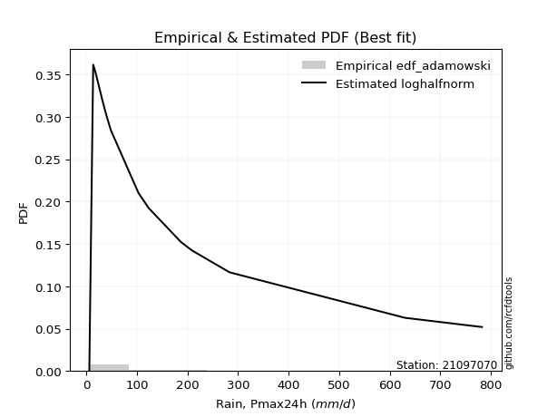</img>

</div>


## C. Best fit & Estimate extreme values for specific return periods - Tr

Best fit in probability distribution analysis means finding the theoretical distribution (like Normal, Poisson, Exponential, etc.) that most accurately mirrors your real-world data´s patterns (shape, center, spread) for better predictions, using methods like visual checks (Q-Q plots), goodness-of-fit tests (Kolmogorov-Smirnov, Chi-Squared), and information criteria (AIC) to score and select the simplest, most representative model.


### 1. Best fit (ordered by delta Δ)

:file_folder:Table: [bestfit_21097070.csv](table/bestfit_21097070.csv)

<div align="center">

|   id |   station | empirical_dist   | p_dist       |     delta |   deltao | eval   |   fit |   n |   best_fit |   best_fit_sort |
|-----:|----------:|:-----------------|:-------------|----------:|---------:|:-------|------:|----:|-----------:|----------------:|
|    0 |  21097070 | edf_adamowski    | logkstwobign | 0.0531626 | 0.315645 | Δo > Δ |     1 |  19 |          1 |               1 |
|    1 |  21097070 | edf_chegodayev   | logkstwobign | 0.0531626 | 0.315645 | Δo > Δ |     1 |  19 |          1 |               2 |
|    2 |  21097070 | edf_jenkinson    | logkstwobign | 0.0534648 | 0.315645 | Δo > Δ |     1 |  19 |          1 |               3 |
|    3 |  21097070 | edf_beard        | logkstwobign | 0.0534648 | 0.315645 | Δo > Δ |     1 |  19 |          1 |               4 |
|    4 |  21097070 | edf_filliben     | logkstwobign | 0.0537445 | 0.315645 | Δo > Δ |     1 |  19 |          1 |               5 |
|    5 |  21097070 | edf_tukey        | logkstwobign | 0.0543366 | 0.315645 | Δo > Δ |     1 |  19 |          1 |               6 |
|    6 |  21097070 | edf_hazen        | loghalfnorm  | 0.0543373 | 0.315645 | Δo > Δ |     1 |  19 |          1 |               7 |
|    7 |  21097070 | edf_gringorten   | loghalfnorm  | 0.054998  | 0.315645 | Δo > Δ |     1 |  19 |          1 |               8 |
|    8 |  21097070 | edf_cunnane      | loghalfnorm  | 0.0554338 | 0.315645 | Δo > Δ |     1 |  19 |          1 |               9 |
|    9 |  21097070 | edf_blom         | loghalfnorm  | 0.0557044 | 0.315645 | Δo > Δ |     1 |  19 |          1 |              10 |
|   10 |  21097070 | edf_weibull      | logkstwobign | 0.057449  | 0.315645 | Δo > Δ |     1 |  19 |          1 |              11 |
|   11 |  21097070 | edf_california   | loghalfnorm  | 0.06949   | 0.315645 | Δo > Δ |     1 |  19 |          1 |              12 |

</div>


### 2. Extreme values and % difference analysis

In hydrology, a return period (or recurrence interval $Tr$) is the statistical average time between extreme events like floods or droughts of a specific magnitude, indicating how rare an event is, with a 100-year flood, for example, having a 1% chance of occurring in any given year, not that it happens exactly every century. It is a key tool for infrastructure design (like bridges or dams) and risk assessment, calculated from historical data to determine the probability of future events, although it is important to remember it is statistical average, and events can cluster or be missed.

The extreme value porcentage difference is evaluated as $pdiff = 1 - (ETrBf / ETr) * 100$, where _ETrBf_ correspond to the bestfit extreme value for a specific recurrence interval and _ETr_ correspond to the extreme value for one of the most used PDFsused in hydrology.

> risk_rate: assuming the return period as the project useful life.

:file_folder:Table: [extreme_21097070.csv](table/extreme_21097070.csv), all PDFs.  
:file_folder:Table: [extremepdiff_21097070.csv](table/extremepdiff_21097070.csv), % difference between bestfit and most used PDFs in Hydrology.

<div align="center">

Extreme values table for only best fit PDFs
|   id |      tr |   prob_l |     prob_g |      alpha |   anglit |   arcsine |   argus |     beta |   betaprime |   bradford |       burr |      burr12 |   cosine |   crystalball |   dgamma |   dweibull |    erlang |   exponnorm |   exponpow |   exponweib |          f |   fatiguelife |   foldnorm |    gamma |   gausshyper |   genexpon |   genextreme |   gengamma |   genhalflogistic |   genlogistic |   gennorm |   genpareto |   gompertz |   gumbel_l |   gumbel_r |   halfgennorm |   halflogistic |   halfnorm |   hypsecant |   invgamma |   invgauss |   invweibull |   johnsonsb |   johnsonsu |     kappa3 |   kappa4 |   ksone |   kstwobign |   laplace |   levy_l |   loggamma |   logistic |   loglaplace |      lomax |   maxwell |     mielke |     moyal |   nakagami |        ncf |        nct |    norm |   pearson3 |   powerlaw |   rayleigh |     rdist |    rice |   semicircular |   skewnorm |           t |   trapezoid |   triang |   truncexpon |   truncnorm |   truncpareto |   truncweibull_min |   tukeylambda |   uniform |   vonmises |   vonmises_line |      wald |   weibull_max |   weibull_min |   wrapcauchy |   logalpha |   loganglit |   logarcsine |   logargus |   logbeta |   logbetaprime |   logbradford |          logburr |   logburr12 |   logcosine |   logcrystalball |   logdgamma |   logdweibull |   logerlang |   logexponnorm |   logexponpow |   logexponweib |       logf |   logfatiguelife |   logfoldnorm |   loggausshyper |   loggenexpon |   loggenextreme |   loggengamma |   loggenhalflogistic |   loggenlogistic |   loggennorm |   loggenpareto |   loggompertz |   loggumbel_l |   loggumbel_r |   loghalfgennorm |   loghalflogistic |   loghalfnorm |   loghypsecant |   loginvgamma |   loginvgauss |   loginvweibull |   logjohnsonsb |   logjohnsonsu |   logkappa3 |   logkappa4 |   logksone |   logkstwobign |   loglevy_l |   logloggamma |   loglogistic |    logloglaplace |         loglomax |   logmaxwell |   logmielke |   logmoyal |   lognakagami |    logncf |     lognct |   lognorm |   logpearson3 |   logpowerlaw |   lograyleigh |   logrdist |   logrice |   logsemicircular |   logskewnorm |      logt |   logtrapezoid |   logtriang |   logtruncexpon |   logtruncnorm |   logtruncpareto |   logtruncweibull_min |   logtukeylambda |   loguniform |   logvonmises |   logvonmises_line |     logwald |   logweibull_max |   logweibull_min |   logwrapcauchy |   station |   n |   risk_rate |
|-----:|--------:|---------:|-----------:|-----------:|---------:|----------:|--------:|---------:|------------:|-----------:|-----------:|------------:|---------:|--------------:|---------:|-----------:|----------:|------------:|-----------:|------------:|-----------:|--------------:|-----------:|---------:|-------------:|-----------:|-------------:|-----------:|------------------:|--------------:|----------:|------------:|-----------:|-----------:|-----------:|--------------:|---------------:|-----------:|------------:|-----------:|-----------:|-------------:|------------:|------------:|-----------:|---------:|--------:|------------:|----------:|---------:|-----------:|-----------:|-------------:|-----------:|----------:|-----------:|----------:|-----------:|-----------:|-----------:|--------:|-----------:|-----------:|-----------:|----------:|--------:|---------------:|-----------:|------------:|------------:|---------:|-------------:|------------:|--------------:|-------------------:|--------------:|----------:|-----------:|----------------:|----------:|--------------:|--------------:|-------------:|-----------:|------------:|-------------:|-----------:|----------:|---------------:|--------------:|-----------------:|------------:|------------:|-----------------:|------------:|--------------:|------------:|---------------:|--------------:|---------------:|-----------:|-----------------:|--------------:|----------------:|--------------:|----------------:|--------------:|---------------------:|-----------------:|-------------:|---------------:|--------------:|--------------:|--------------:|-----------------:|------------------:|--------------:|---------------:|--------------:|--------------:|----------------:|---------------:|---------------:|------------:|------------:|-----------:|---------------:|------------:|--------------:|--------------:|-----------------:|-----------------:|-------------:|------------:|-----------:|--------------:|----------:|-----------:|----------:|--------------:|--------------:|--------------:|-----------:|----------:|------------------:|--------------:|----------:|---------------:|------------:|----------------:|---------------:|-----------------:|----------------------:|-----------------:|-------------:|--------------:|-------------------:|------------:|-----------------:|-----------------:|----------------:|----------:|----:|------------:|
|    0 |    2    | 0.5      | 0.5        |    29.8203 |  142.084 |   142.084 | 315.446 |  72.1736 |     41.4469 |    96.2015 |    50.4023 |     47.1623 |  95.9373 |       142.033 |  33.1    |     32.2   |   77.8171 |     99.4049 |    106.85  |     44.8969 |    50.4375 |       63.7489 |    95.5296 |  56.786  |      78.5005 |    100.293 |      50.5207 |    54.1805 |           144.922 |       102.932 |   32.2    |     54.6145 |    102.833 |    176.36  |    107.808 |       54.0237 |        90.7684 |    99.3764 |     142.084 |    50.4375 |    53.0708 |      50.5207 |     597.919 |     50.2266 |    53.4646 |  375.523 | 394.15  |     130.305 |   142.084 | -148.458 |    52.9567 |    142.084 |      60.613  |    54.6124 |   124.24  |    48.2948 |   96.7431 |    111.1   |    50.4509 |    48.6604 | 142.084 |    75.2953 |    37.3026 |    117.912 | -72.1129  | 150.185 |        142.084 |    173.953 |     30.1581 |     583.545 |  249.358 |      276.717 |     129.571 |       63.1876 |            69.2816 |      -70.6618 |   394.15  |    1.90396 |          84.674 |   74.4528 |       782.276 |       134.676 |      394.15  |    53.5806 |      60.613 |      60.6129 |    92.1759 |   62.8918 |        52.2098 |       50.4642 |     50.9531      |     54.3836 |     65.1197 |          60.6131 |     45.7172 |       46.2514 |     52.9568 |        52.145  |       56.2883 |        52.8256 |    52.9225 |           53.005 |       54.5956 |         86.8177 |       48.6482 |         54.2925 |       47.1325 |              141.302 |          50.816  |      40.3991 |        63.6726 |       57.6572 |       74.8968 |       49.0533 |     24.9267      |           44.1547 |       46.5653 |         60.613 |       53.3139 |       53.0237 |         49.1706 |        58.0127 |        53.1913 |     5.82688 |     61.6133 |    67.9423 |        48.2004 |     38.9506 |       61.0184 |       60.613  |     40.3999      |     29.6777      |      54.2905 |     51.0761 |    45.8142 |       43.3578 |   53.7783 |    53.2594 |    60.613 |        55.882 |       12.2151 |       52.2102 |    11.2936 |   54.6206 |           60.613  |       50.6925 |   60.6131 |        228.908 |     125.77  |         42.4164 |        29.2609 |          5.90011 |               63.8415 |          40.8862 |      67.9423 |     0.0898808 |            67.9239 |     39.9252 |          321.855 |          54.4391 |         63.13   |  21097070 |  19 |    0.75     |
|    1 |    2.33 | 0.570815 | 0.429185   |    35.4931 |  185.452 |   207.186 | 375.303 | 122.293  |     53.2391 |   131.488  |    63.2546 |     58.294  | 111.768  |       179.269 |  38.9086 |     39.952 |  106.95   |    120.048  |    146.731 |     60.6416 |    63.0155 |       84.554  |   139.224  |  72.5765 |     112.38   |    121.091 |      63.2777 |    74.6674 |           169.224 |       124.481 |   34.3408 |     69.2189 |    124.19  |    208.752 |    142.308 |       72.2163 |       126.239  |   139.559  |     171.88  |    63.0155 |    67.7538 |      63.2777 |     704.549 |     63.7454 |    67.6765 |  432.709 | 460.136 |     157.751 |   164.615 |  122.947 |    66.7975 |    174.888 |      69.6584 |    69.216  |   162.921 |    61.3617 |  129.401  |    154.419 |    63.0308 |    60.5007 | 179.316 |   106.384  |    63.8691 |    157.165 |  -4.71923 | 181.177 |        188.597 |    202.879 |     34.5574 |     628.659 |  292.569 |      327.223 |     156.346 |       80.1167 |            97.728  |      -19.228  |   449.138 |    2.19929 |         104.185 |   98.8658 |       782.373 |       186.238 |      641.91  |    67.2577 |      79.221 |      90.5967 |   121.816  |   89.8112 |        65.9834 |       71.6291 |     63.2105      |     69.349  |     83.3198 |          76.2761 |     58.9569 |       60.2348 |     66.7976 |        64.8164 |       73.576  |        66.3168 |    66.7487 |           66.742 |       70.4228 |        124.799  |       62.7957 |         68.2527 |       64.5975 |              194.269 |          63.6447 |      47.1629 |       103.547  |       75.6427 |       91.4766 |       60.6966 |     36.092       |           54.9641 |       59.6755 |         72.854 |       66.9931 |       66.7595 |         62.2745 |        77.1557 |        66.8568 |     5.82688 |     87.8144 |   102.923  |        61.8387 |     93.8708 |       76.8358 |       74.2191 |     47.0233      |     42.3882      |      68.9338 |     63.6067 |    56.048  |       55.2609 |   67.5975 |    66.8935 |    76.276 |        70.392 |       16.8128 |       66.527  |    21.0637 |   69.8307 |           80.7741 |       64.0617 |   76.2761 |        304.076 |     170.139 |         59.4864 |        38.9913 |          5.9004  |               87.7862 |          53.7521 |      96.0399 |     0.112136  |            87.7572 |     46.4194 |          404.779 |          69.4042 |         90.1715 |  21097070 |  19 |    0.729209 |
|    2 |    5    | 0.8      | 0.2        |    79.481  |  338.463 |   380.79  | 567.307 | 457.512  |    142.14   |   351.666  |   166.508  |    155.598  | 168.815  |       317.646 | 103.986  |    190.306 |  287.427  |    223.257  |    381.75  |    179.684  |   162.725  |      224.937  |   324      | 160.39   |     326.803  |    225.074 |     165.494  |   223.871  |           276.015 |       218.095 |   81.5131 |    173.723  |    230.971 |    313.396 |    292.187 |      205.316  |       286.735  |   309.485  |     291.4   |   162.725  |   179.019  |     165.495  |     780.51  |    171.983  |   173.076  |  620.553 | 673.69  |     274.336 |   277.263 |  572.602 |   171.085  |    301.546 |     139.636  |   173.715  |   315.166 |   166.742  |  280.674  |    387.831 |   162.721  |   157.803  | 317.677 |   265.109  |   282.364  |    314.312 | 190.852   | 305.249 |        347.325 |    325.205 |     64.7499 |     758.09  |  465.386 |      527.718 |     286.919 |      191.539  |           296.962  |      145.981  |   627.1   |    3.32853 |         178.02  |  235.53   |       782.4   |       541.16  |      756.548 |   168.67   |     203.743 |     264.587  |   297.931  |  287.187  |       171.88   |      243.444  |    161.597       |    179.063  |    202.52   |         179.207  |    127.82   |      133.752  |    171.085  |       160.767  |      195.687  |       167.43   |   170.901  |          170.056 |      183.626  |        376.996  |      177.148  |        169.678  |      195.41   |              451.86  |         165.778  |     102.249  |       392.972  |      199.239  |      174.532  |      153.113  |    279.059       |          148.047  |      170.368  |        152.37  |      169.081  |      170.017  |        173.809  |       215.245  |       168.96   |   296.354   |    280.957  |   394.701  |       178.203  |    403.128  |      180.271  |      162.22   |    110.743       |    252.286       |     176.449  |    160.298  |   142.608  |      159.666  |  168.927  |   168.612  |   179.207 |       173.828 |       83.2864 |      175.521  |   114.779  |  180.465  |          215.201  |      170.358  |  179.207  |        686.725 |     404.843 |        205.96   |       125.242  |          5.96693 |              262.296  |         130.38   |     294.384  |     0.266918  |           227.696  |    107.92   |          653.404 |         178.866  |        285.866  |  21097070 |  19 |    0.67232  |
|    3 |   10    | 0.9      | 0.1        |   160.298  |  425.069 |   422.7   | 659.895 | 678.963  |    290.809  |   536.239  |   361.705  |    369.503  | 203.281  |       409.443 | 178.693  |    440.197 |  480.853  |    316.947  |    614.21  |    351.525  |   348.248  |      385.736  |   460.73   | 247.294  |     534.138  |    319.467 |     358.285  |   423.357  |           360.878 |       294.338 |  194.956  |    337.584  |    327.904 |    371.657 |    414.261 |      391.878  |       420.021  |   435.226  |     386.84  |   348.247  |   344.829  |     358.286  |     782.25  |    351.309  |   350.719  |  703.007 | 766.87  |     363.1   |   379.522 |  681.159 |   342.266  |    394.825 |     262.523  |   337.565  |   422.308 |   365.311  |  412.381  |    587.12  |   348.115  |   351.377  | 409.463 |   411.776  |   482.742  |    426.361 | 251.964   | 393.715 |        428.771 |    415.724 |    143.274  |     808.646 |  574.264 |      641.682 |     399.007 |      325.878  |           482.055  |      216.441  |   704.75  |    4.05879 |         229.924 |  380.563  |       782.4   |       986.786 |      770.805 |   334.22   |     347.765 |     342.715  |   458.582  |  476.856  |       350.995  |      434.729  |    365.607       |    345.709  |    346.344  |         315.823  |    235.454  |      239.519  |    342.267  |       335.165  |      358.198  |       334.214  |   341.811  |          340.202 |      347.945  |        573.375  |      376.754  |        325.282  |      364.154  |              607.299 |         356.704  |     206.383  |       603.887  |      358.323  |      250.08   |      325.318  |   2253.02        |          337.104  |      370.269  |        274.655 |      336.677  |      339.995  |        400.997  |       382.057  |       336.406  |   484.292   |    469.381  |   709.541  |       398.917  |    573.116  |      316.367  |      288.535  |    283.412       |   1276.36        |     341.887  |    334.014  |   321.564  |      356.001  |  329.366  |   336.19   |   315.823 |       329.845 |      229.039  |      350.549  |   177.299  |  345.991  |          355.805  |      350.818  |  315.823  |        944.013 |     567.991 |        387.245  |       260.208  |          7.07766 |              443.413  |         192.081  |     479.923  |     0.514335  |           398.677  |    264.207  |          734.883 |         344.366  |        472.934  |  21097070 |  19 |    0.651322 |
|    4 |   15    | 0.933333 | 0.0666667  |   240.826  |  462.052 |   430.693 | 695.094 | 752.418  |    427.331  |   616.862  |   558.976  |    611.864  | 218.981  |       455.251 | 225.235  |    627.691 |  601.637  |    371.753  |    750.992 |    483.165  |   533.782  |      488.304  |   531.884  | 299.946  |     643.548  |    374.684 |     552.875  |   567.198  |           407.423 |       337.354 |  303.855  |    481.519  |    384.605 |    398.042 |    483.135 |      532.737  |       495.449  |   500.661  |     441.306 |   533.781  |   472.386  |     552.877  |     782.358 |    506.06   |   516.561  |  730.37  | 797.93  |     410.223 |   439.34  |  713.953 |   494.207  |    445.648 |     379.793  |   481.491  |   477.281 |   565.168  |  488.818  |    694.236 |   533.455  |   555.4    | 455.266 |   498.214  |   570.149  |    484.094 | 266.78    | 439.296 |        460.533 |    462.829 |    251.968  |     824.867 |  622.499 |      685.032 |     460.476 |      410.171  |           566.517  |      239.425  |   730.633 |    4.36186 |         257.471 |  473.697  |       782.4   |      1296.37  |      774.812 |   482.222  |     436.96  |     360.052  |   540.284  |  564.04   |       513.616  |      530.918  |    601           |    482.946  |    442.241  |         419.032  |    331.961  |      327.701  |    494.209  |       510.586  |      475.804  |       483.366  |   493.487  |          492.087 |      478.773  |        648.348  |      558.599  |        454.673  |      479.75   |              664.355 |         548.212  |     311.23   |       676.011  |      471.42   |      294.321  |      497.7    |   8335.88        |          537.031  |      554.572  |        384.432 |      486.727  |      491.704  |        642.659  |       485.92   |       485.93   |   570.435   |    557.222  |   862.741  |       611.89   |    637.385  |      418.469  |      394.876  |    534.082       |   3297.75        |     480.034  |    503.651  |   515.473  |      541.487  |  468.346  |   487.007  |   419.032 |       459.754 |      336.434  |      500.654  |   193.548  |  480.735  |          432.88   |      510.902  |  419.033  |       1045.49  |     633.177 |        485.275  |       353.501  |          9.82997 |              532.948  |         218.622  |     564.838  |     0.724255  |           494.236  |    469.505  |          755.848 |         480.09   |        559.344  |  21097070 |  19 |    0.644736 |
|    5 |   20    | 0.95     | 0.05       |   321.283  |  483.807 |   433.508 | 714.415 | 786.676  |    556.469  |   661.556  |   757.673  |    874.966  | 228.636  |       485.25  | 259.076  |    777.652 |  689.807  |    410.638  |    847.307 |    591.475  |   719.428  |      563.743  |   579.323  | 337.89   |     712.878  |    413.86  |     748.724  |   681.159  |           439.412 |       367.472 |  404.369  |    613.872  |    424.835 |    414.465 |    531.358 |      647.814  |       548.296  |   544.288  |     479.73  |   719.426  |   576.257  |     748.728  |     782.382 |    643.979  |   675.489  |  743.99  | 813.46  |     441.967 |   481.781 |  730.747 |   633.557  |    480.775 |     493.557  |   613.835  |   513.765 |   765.896  |  542.952  |    766.264 |   718.864  |   766.75   | 485.261 |   559.749  |   618.315  |    522.467 | 272.827   | 469.593 |        478.149 |    494.235 |    387.272  |     832.869 |  651.252 |      707.937 |     501.684 |      468.113  |           614.142  |      250.759  |   743.575 |    4.52493 |         276.369 |  543.1    |       782.4   |      1536.65  |      776.745 |   619.224  |     499.77  |     366.364  |   591.163  |  613.161  |       664.997  |      587.466  |    867.766       |    602.208  |    513.973  |         504.276  |    421.93   |      405.816  |    633.56   |       687.632  |      569.201  |       620.851  |   632.579  |          632.066 |      590.098  |        686.06   |      727.147  |        567.488  |      568.201  |              693.676 |         740.191  |     416.54   |       709.79   |      560.47   |      325.728  |      670.287  |  21846.4         |          744.204  |      725.982  |        487.348 |      625.59   |      631.513  |        894.136  |       559.081  |       623.959  |   619.093   |    607.151  |   951.332  |       816.26   |    673.039  |      502.414  |      490.503  |    873.473       |   6469.7         |     601.299  |    670.86   |   720.022  |      716.458  |  593.928  |   627.205  |   504.276 |       574.032 |      411.537  |      634.485  |   199.831  |  596.976  |          482.615  |      656.421  |  504.277  |       1099.49  |     668.037 |        544.96   |       419.568  |         14.1519  |              585.404  |         233.259  |     612.774  |     0.897063  |           552.81   |    720.632  |          764.804 |         597.682  |        608.301  |  21097070 |  19 |    0.641514 |
|    6 |   25    | 0.96     | 0.04       |   401.712  |  498.551 |   434.814 | 726.874 | 805.881  |    680.372  |   689.894  |   957.447  |   1154.68   | 235.407  |       507.333 | 285.695  |    903.212 |  759.371  |    440.799  |    921.369 |    684.37   |   905.177  |      623.498  |   614.619  | 367.599  |     761.454  |    444.248 |     945.527  |   776.285  |           463.715 |       390.671 |  497.321  |    738.228  |    456.04  |    426.152 |    568.503 |      746.081  |       589.012  |   576.747  |     509.467 |   905.175  |   664.164  |     945.531  |     782.39  |    769.592  |   829.562  |  752.129 | 822.778 |     465.744 |   514.701 |  741.288 |   763.713  |    507.648 |     604.784  |   738.182  |   540.85  |   967.276  |  584.912  |    820.043 |   904.344  |   983.767  | 507.342 |   607.577  |   648.724  |    550.977 | 275.949   | 492.103 |        489.578 |    517.602 |    546.695  |     837.636 |  670.875 |      722.11  |     532.022 |      510.418  |           644.617  |      257.49   |   751.34  |    4.62596 |         290.826 |  598.69   |       782.4   |      1734.41  |      777.889 |   748.351  |     547.393 |     369.33   |   626.486  |  644.525  |       807.979  |      624.503  |   1165.49        |    709.006  |    571.111  |         577.922  |    507.304  |      477.052  |    763.716  |       866.078  |      647.275  |       749.708  |   762.485  |          763.349 |      688.281  |        708.287  |      885.413  |        668.531  |      640.182  |              711.468 |         932.537  |     522.196  |       728.71   |      634.523  |      350.098  |      843.044  |  47013.2         |          956.883  |      887.063  |        585.556 |      756.365  |      762.636  |       1153.13   |       614.606  |       753.657  |   650.258   |    639.23   |  1008.79   |      1012.92   |    696.429  |      574.689  |      579.014  |   1313.24        |  10914.2         |     710.739  |    836.328  |   932.92   |      882.512  |  709.981  |   759.749  |   577.921 |       677.498 |      465.823  |      756.593  |   202.89   |  700.517  |          517.896  |      790.982  |  577.923  |       1132.99  |     689.713 |        584.858  |       468.364  |         19.9517  |              619.726  |         242.516  |     643.466  |     1.03725   |           591.934  |   1015.67   |          769.6   |         702.733  |        639.709  |  21097070 |  19 |    0.639603 |
|    7 |   50    | 0.98     | 0.02       |   803.731  |  534.842 |   436.559 | 755.123 | 839.63   |   1252      |   750.225  |  1966.93   |   2733.01   | 253.136  |       570.57  | 369.969  |   1342.18  |  980.731  |    534.49   |   1146.9   |   1024.94   |  1835.06   |      814.566  |   717.213  | 461.142  |     883.518  |    538.641 |    1938.97   |  1108.81   |           536.758 |       462.135 |  882.804  |   1289.41   |    552.97  |    457.877 |    682.928 |     1104.09   |       714.465  |   671.096  |     601.664 |  1835.05   |   975.175  |    1938.98   |     782.398 |   1285.43   |  1555.61   |  768.294 | 841.414 |     535.566 |   616.96  |  765.021 |  1328.92   |    589.75  |    1137.02   |  1289.32   |   619.403 |  1980.55   |  715.171  |    976.764 |  1832.57   |  2126.96   | 570.572 |   756.592  |   713.089  |    633.739 | 280.856   | 557.445 |        515.686 |    585.522 |   1654.95   |     847.097 |  719.566 |      751.5   |     615.346 |      619.776  |           710.176  |      270.73   |   766.87  |    4.83359 |         335.653 |  780.193  |       782.4   |      2409.77  |      780.153 |  1321.98   |     684.86  |     373.328  |   714.589  |  711.612  |      1442.49   |      706.386  |   3113.13        |   1135.31   |    752.656  |         853.881  |    892.462  |      773.657  |   1328.93   |      1772.94   |      920.711  |      1312.19   |  1326.54   |         1338.64  |     1069.52   |        750.278  |     1575.92   |       1069.19   |      880.914  |              747.303 |        1897.95   |    1053.87   |       761.759  |      891.961  |      425.842  |     1708.6    | 561682           |         2075.96   |     1588.23   |       1034.57  |     1335.51   |     1337.25   |       2524.61   |       775.958  |      1325      |   717.373   |    708.524  |  1134.34   |      1909.23   |    752.111  |      843.778  |      961.208  |   5481.53        |  55463.6         |    1154.31   |   1647.28   |  2084.91   |     1617.99   | 1204.3    |  1351.89   |   853.88  |      1100.86  |      600.92   |     1261.12   |   207.205  | 1109.82   |          608.474  |     1360.06   |  853.882  |       1202.51  |     734.833 |        675.299  |       595.294  |         65.5421  |              695.586  |         262.184  |     709.541  |     1.44147   |           680.028  |   3114.38   |          777.62  |        1120.06   |        707.473  |  21097070 |  19 |    0.63583  |
|    8 |   75    | 0.986667 | 0.0133333  |  1205.69   |  550.814 |   436.882 | 766.326 | 848.858  |   1776.43   |   771.474  |  2987.75   |   4523.89   | 261.603  |       604.501 | 420.13   |   1631.67  | 1113.2    |    589.295  |   1275.27  |   1262.51   |  2766.2    |      929.347  |   773.061  | 516.573  |     936.488  |    593.858 |    2942.5    |  1329      |           577.973 |       503.673 | 1186.97   |   1773.56   |    609.671 |    473.92  |    749.436 |     1352.51   |       787.39   |   722.455  |     655.543 |  2766.19   |  1181.23   |    2942.52   |     782.399 |   1694.79   |  2237.74   |  773.626 | 847.626 |     573.982 |   676.777 |  774.773 |  1809.85   |    637.17  |    1644.94   |  1773.43   |   662.111 |  3000.6    |  791.344  |   1062.11  |  2761.73   |  3334.87   | 604.499 |   844.012  |   735.63   |    678.764 | 282.017   | 592.994 |        526.116 |    622.494 |   3206.25   |     850.23  |  741.138 |      761.625 |     655.253 |      666.398  |           733.478  |      275.045  |   772.047 |    4.90397 |         362.576 |  891.881  |       782.4   |      2846.08  |      780.903 |  1825.52   |     755.831 |     374.075  |   752.87   |  735.231  |      1995.57   |      736.204  |   5834.45        |   1464.16   |    858.705  |        1052.84   |   1236.84   |     1015.33   |   1809.86   |      2695.78   |     1101.99   |      1792.44   |  1806.42   |         1833.66  |     1354.89   |        762.876  |     2163.2    |       1373.08   |     1032.78   |              759.23  |        2867.3    |    1589.14   |       770.683  |     1061.54   |      470.176  |     2576.06   |      2.56016e+06 |         3256.46   |     2180.8    |       1442.83  |     1841.2    |     1831.76   |       3981.07   |       860.69   |      1820.42   |   741.25    |    733.223  |  1179.57   |      2705.93   |    776.264  |     1036.35   |     1288.12   |  14366.6         | 143677           |    1502.54   |   2441.41   |  3336.69   |     2250.57   | 1616.48   |  1874.7    |  1052.83  |      1438.01  |      655.498  |     1665.23   |   208.062  | 1422.23   |          648.941  |     1826.82   | 1052.84   |       1226.45  |     750.411 |        708.987  |       649.318  |        123.244   |              723.222  |         269.105  |     733.04   |     1.62446   |           712.503  |   6206.03   |          779.708 |        1440.14   |        731.62   |  21097070 |  19 |    0.634587 |
|    9 |  100    | 0.99     | 0.01       |  1607.64   |  560.312 |   436.995 | 772.58  | 852.917  |   2272.38   |   782.322  |  4015.98   |   6468.47   | 266.91   |       627.451 | 456.022  |   1851.07  | 1208.27   |    628.18   |   1364.67  |   1449.07   |  3698.19   |     1011.85   |   811.106  | 556.16   |     967.067  |    633.034 |    3952.63   |  1496.6    |           606.604 |       533.072 | 1443.36   |   2218.75   |    649.9   |    484.413 |    796.508 |     1547.14   |       839.005  |   757.443  |     693.762 |  3698.17   |  1337.05   |    3952.65   |     782.4   |   2043.96   |  2893.04   |  776.274 | 850.732 |     600.302 |   719.219 |  780.474 |  2240.75   |    670.649 |    2137.66   |  2218.59   |   691.201 |  4025.05   |  845.386  |   1120.21  |  3691.51   |  4586.85   | 627.446 |   906.131  |   747.11   |    709.439 | 282.488   | 617.212 |        531.956 |    647.681 |   5140.19   |     851.792 |  753.997 |      766.752 |     679.307 |      692.241  |           745.414  |      277.173  |   774.635 |    4.93929 |         382.342 |  973.313  |       782.4   |      3173.46  |      781.278 |  2287.67   |     801.473 |     374.336  |   775.124  |  747.25   |      2498.99   |      751.622  |   9360.26        |   1740.1    |    932.664  |        1213.07   |   1556.83   |     1226.25   |   2240.76   |      3629.17   |     1239.98   |      2222.97   |  2236.36   |         2280.75  |     1589.93   |        768.717  |     2687.61   |       1623.68   |     1145.12   |              765.159 |        3839.23   |    2126.76   |       774.573  |     1190.27   |      501.643  |     3444.79   |      7.72247e+06 |         4478.52   |     2706.59   |       1826.78  |     2303.16   |     2278.43   |       5495.39   |       916.135  |      2270.62   |   753.485   |    745.882  |  1202.86   |      3436.29   |    790.739  |     1190.71   |     1583.86   |  30354           | 282397           |    1798.13   |   3224.91   |  4658.11   |     2817.8    | 1981.24   |  2356.24   |  1213.06  |      1727.42  |      684.884  |     2012.42   |   208.373  | 1682.65   |          672.767  |     2233.51   | 1213.07   |       1238.57  |     758.304 |        726.561  |       679.161  |        180.085   |              737.515  |         272.639  |     745.08   |     1.72673   |           729.351  |  10259.7    |          780.607 |        1707.67   |        744.001  |  21097070 |  19 |    0.633968 |
|   10 |  200    | 0.995    | 0.005      |  3215.4    |  578.255 |   437.105 | 783.45  | 858.067  |   4093.75   |   798.876  |  8174.94   |  15309.3    | 277.7    |       679.508 | 543.336  |   2425.67  | 1440.4    |    721.871  |   1574.32  |   1962.67   |  7431.32   |     1213.62   |   898.121  | 652.28   |    1021.52   |    727.427 |    8034.07   |  1938.84   |           673.652 |       603.75  | 2219.17   |   3785.74   |    746.83  |    507.222 |    909.674 |     2081.93   |       963.094  |   837.464  |     785.836 |  7431.29   |  1741.52   |    8034.13   |     782.4   |   3128.61   |  5358.83   |  780.212 | 855.391 |     660.925 |   821.478 |  791.275 |  3688.79   |    750.959 |    4018.92   |  3785.43   |   757.755 |  8150      |  975.589  |   1252.85  |  7414.51   |  9880.25   | 679.497 |  1056.06   |   764.594  |    779.626 | 283.031   | 672.627 |        542.139 |    705.287 |  16101.1    |     854.13  |  778.342 |      774.525 |     723.196 |      734.724  |           763.683  |      280.311  |   778.517 |    4.99239 |         433.28  | 1176.15   |       782.4   |      4021.09  |      781.839 |  3907.9    |     895.356 |     374.589  |   815.38   |  765.48   |      4231.9    |      775.406  |  32388.3         |   2578.62   |   1103.27   |        1672.78   |   2699.4    |     1908.97   |   3688.81   |      7428.8    |     1603.9    |      3666.53   |  3681      |         3802.89  |     2285.43   |        776.614  |     4433.56   |       2358.53   |     1430.55   |              773.96  |        7742.88   |    4291.77   |       779.447  |     1528.78   |      577.494  |     6927.48   |      1.20825e+08 |         9634.73   |     4435.77   |       3225.14  |     3908      |     3799.55   |      11928.1    |      1034.04   |      3820.5    |   772.218   |    765.254  |  1238.66   |      5958.06   |    818.91   |     1630.53   |     2600.4    | 235814           |      1.44061e+06 |    2711.81   |   6295.13   | 10406.5    |     4710.87   | 3185.73   |  4052.62   |  1672.78  |      2639.53  |      731.806  |     3103.84   |   208.686  | 2466.57   |          716.415  |     3537      | 1672.79   |       1256.93  |     770.273 |        753.881  |       727.998  |        350.307   |              759.573  |         278.038  |     763.512  |     1.89442   |           755.401  |  35888.2    |          781.726 |        2515.7    |        762.966  |  21097070 |  19 |    0.633042 |
|   11 |  250    | 0.996    | 0.004      |  4019.27   |  582.821 |   437.118 | 785.994 | 858.92   |   4943.02   |   802.229  | 10273.1    |  20202.6    | 280.658  |       695.416 | 571.657  |   2624.05  | 1515.92   |    752.032  |   1640.11  |   2147.96   |  9300      |     1279.33   |   924.89   | 683.415  |    1034.4    |    757.815 |   10091.4    |  2092.67   |           694.683 |       626.471 | 2521.85   |   4491.04   |    778.034 |    513.932 |    946.055 |     2274.71   |      1002.99   |   862.082  |     815.475 |  9299.95   |  1879.56   |   10091.5    |     782.4   |   3563.87   |  6532.02   |  780.992 | 856.323 |     679.686 |   854.398 |  794.086 |  4312.63   |    776.743 |    4924.61   |  4490.66   |   778.242 | 10223.5    | 1017.5    |   1293.57  |  9277.59   | 12647.2    | 695.403 |  1104.4    |   768.129  |    801.231 | 283.111   | 689.685 |        544.527 |    723.009 |  23270.3    |     854.597 |  784.547 |      776.092 |     733.507 |      743.814  |           767.39   |      280.927  |   779.294 |    5.00302 |         450.801 | 1243.25   |       782.4   |      4311.23  |      781.951 |  4634.52   |     920.957 |     374.619  |   825.099  |  769.142  |      4993.99   |      780.26   |  49946.2         |   2909.17   |   1155.27   |        1845.39   |   3219.37   |     2194.15   |   4312.66   |      9355.66   |     1730.36   |      4285.88   |  4303.33   |         4466.43  |     2553.45   |        778.018  |     5177.82   |       2637.15   |     1526.69   |              775.696 |        9701.14   |    5380.16   |       780.243  |     1646.21   |      601.921  |     8671.98   |      3.00574e+08 |        12325.4    |     5163.84   |       3872.71  |     4621.14   |     4462.81   |      15302.9    |      1067.5    |      4503.4    |   776.024   |    769.182  |  1245.94   |      7064.39   |    826.405  |     1794.64   |     3049.08   | 495593           |      2.43529e+06 |    3077.43   |   7805.02   | 13479.8    |     5517.45   | 3697.31   |  4816.2    |  1845.38  |      3011.39  |      741.621  |     3546.7    |   208.726  | 2773.11   |          727.058  |     4074.31   | 1845.39   |       1260.63  |     772.686 |        759.487  |       738.406  |        406.499   |              764.076  |         279.133  |     767.253  |     1.93008   |           760.724  |  54307.7    |          781.908 |        2832.49   |        766.817  |  21097070 |  19 |    0.632858 |
|   12 |  500    | 0.998    | 0.002      |  8038.63   |  594.144 |   437.135 | 791.842 | 860.379  |   8860.72   |   808.975  | 20874.6    |  47814.4    | 288.53   |       742.593 | 660.167  |   3280.49  | 1752.54   |    845.723  |   1839.33  |   2788.19   | 18655.8    |     1485.38   |  1004.7    | 780.622  |    1063.94   |    852.208 |   20476.4    |  2605.85   |           758.38  |       696.995 | 3650.28   |   7617.08   |    874.962 |    533.17  |   1058.97  |     2940.97   |      1126.81   |   935.481  |     907.542 | 18655.6    |  2329.39   |   20476.6    |     782.4   |   5245.99   | 12071.2    |  782.539 | 858.186 |     735.91  |   956.657 |  801.345 |  6929.4    |    856.704 |    9258.52   |  7616.38   |   839.376 | 20655.5    | 1147.71   |   1414.74  | 18602.2    | 27225.6    | 742.574 |  1254.72   |   775.239  |    865.694 | 283.237   | 740.581 |        550.028 |    775.848 |  73119.7    |     855.53  |  799.945 |      779.238 |     756.209 |      762.646  |           774.859  |      282.141  |   780.847 |    5.02428 |         507.024 | 1456.62   |       782.4   |      5264.46  |      782.176 |  7843.06   |     987.637 |     374.659  |   847.885  |  776.458  |      8265.75   |      790.066  | 215383           |   4164.55   |   1305.89   |        2469.22   |   5549.82   |     3351.78   |   6929.45   |     19150.8    |     2151.52   |      6863.13   |  6913.52   |         7289.06  |     3547.69   |        780.554  |     8252.47   |       3641.69   |     1837.89   |              779.125 |       19530.2    |   10856.6    |       781.588  |     2037.01   |      677.827  |    17412.9    |      5.50428e+09 |        26471.9    |     8123.91   |       6836.88  |     7730.48   |     7285.29   |      33159.8    |      1158.91   |      7448.95   |   783.794   |    777.087  |  1260.64   |     11769.2    |    846.079  |     2383.94   |     4995.24   |      6.68971e+06 |      1.24551e+07 |    4488.45   |  15210.9    | 30114      |     8836.82   | 5811.81   |  8199.77   |  2469.21  |      4479.18  |      761.702  |     5280.31   |   208.78   | 3927.48   |          752.17   |     6211.25   | 2469.22   |       1268.06  |     777.531 |        770.845  |       759.917  |        556.993   |              773.175  |         281.339  |     774.789  |     2.00354   |           771.485  | 202729      |          782.215 |        4028.1    |        774.577  |  21097070 |  19 |    0.632489 |
|   13 |  750    | 0.998667 | 0.00133333 | 12058      |  599.157 |   437.138 | 794.193 | 860.769  |  12454.8    |   811.237  | 31594.2    |  79145      | 292.344  |       768.8   | 712.265  |   3691.91  | 1892.2    |    900.528  |   1952.39  |   3209.53   | 28024.6    |     1607.07   |  1049.29   | 837.787  |    1075.66   |    907.425 |   30966.2    |  2930.65   |           794.537 |       738.223 | 4456.88   |  10363      |    931.661 |    543.452 |   1124.99  |     3379.94   |      1199.19   |   976.486  |     961.397 | 28024.5    |  2605.64   |   30966.4    |     782.4   |   6503.92   | 17282.1    |  783.048 | 858.808 |     767.495 |  1016.47  |  804.789 |  9081.79   |    903.421 |   13394.3    | 10362      |   873.568 | 31156.3    | 1223.87   |   1482.25  | 27936.5    | 42630.2    | 768.778 |  1342.76   |   777.62   |    901.742 | 283.267   | 769.041 |        552.241 |    805.366 | 142901      |     855.841 |  806.767 |      780.29  |     764.503 |      769.125  |           777.364  |      282.537  |   781.365 |    5.03137 |         538.033 | 1584.55   |       782.4   |      5857.69  |      782.251 | 10652.7    |    1018.68  |     374.667  |   857.22   |  778.883  |     11027.7    |      793.364  | 553311           |   5086.2    |   1385.79   |        2902.79   |   7619.72   |     4270.69   |   9081.86   |     29118.9    |     2417.45   |      8957.71   |  9060.31   |         9649.16  |     4258.76   |        781.287  |    10731.9    |       4329.9    |     2028.45   |              780.246 |       29399.4    |   16369.9    |       781.942  |     2283.71   |      722.246  |    26173.3    |      3.17567e+10 |        41386.8    |    10464.2    |       9533.46  |    10409.7    |     9646.34   |      52112.7    |      1204.45   |      9954.18   |   786.588   |    779.735  |  1265.58   |     15677.4    |    855.575  |     2790.45   |     6665.14   |      3.86877e+07 |      3.23858e+07 |    5543.34   |  22468      | 48191.5    |    11495.1    | 7524.39   | 11172.2    |  2902.79  |      5607.01  |      768.532  |     6596.41   |   208.791  | 4767.02   |          762.519  |     7861.09   | 2902.8    |       1270.54  |     779.151 |        774.675  |       767.3    |        622.015   |              776.236  |         282.08   |     777.318  |     2.02867   |           775.107  | 446587      |          782.295 |        4899.44   |        777.181  |  21097070 |  19 |    0.632366 |
|   14 | 1000    | 0.999    | 0.001      | 16077.3    |  602.144 |   437.14  | 795.512 | 860.939  |  15853.6    |   812.37   | 42391.1    | 113165      | 294.751  |       786.844 | 749.353  |   3995.79  | 1991.77   |    939.413  |   2031.11  |   3530.11   | 37402      |     1693.86   |  1080.09   | 878.464  |    1082.16   |    946.601 |   41524.6    |  3172.05   |           819.713 |       767.468 | 5101.9    |  12887.9    |    971.89  |    550.372 |   1171.81  |     3714.34   |      1250.54   |  1004.8    |     999.607 | 37401.8    |  2806.84   |   41525      |     782.4   |   7541.69   | 22290.8    |  783.301 | 859.118 |     789.377 |  1058.92  |  806.954 | 10973.2    |    936.55  |   17406.5    | 12886.7    |   897.201 | 41702      | 1277.91   |   1528.8   | 37277.3    | 58597.2    | 786.82  |  1405.28   |   778.813  |    926.652 | 283.279   | 788.708 |        553.485 |    825.752 | 229895      |     855.996 |  810.833 |      780.817 |     768.806 |      772.404  |           778.62   |      282.733  |   781.623 |    5.03492 |         557.316 | 1676.58   |       782.4   |      6294.19  |      782.288 | 13233.6    |    1037.64  |     374.669  |   862.505  |  780.09   |     13496.2    |      795.019  |      1.12846e+06 |   5838.22   |   1438.69   |        3244.8    |   9535.52   |     5060.32   |  10973.3    |     39201      |     2614.73   |     10780.4    | 10946.7    |        11746.2   |     4829.55   |        781.623  |    12879.4    |       4863.92   |     2167.36   |              780.801 |       39294.8    |   21907.1    |       782.095  |     2466.79   |      753.769  |    34946.5    |      1.12604e+11 |        56823.6    |    12463.2    |      12069.8   |    12841.5    |    11744.9    |      71814      |      1233.62   |     12207.3    |   788.136   |    781.061  |  1268.06   |     19122.6    |    861.598  |     3109.58   |     8177.76   |      1.51103e+08 |      6.38235e+07 |    6414.06   |  29630.4    | 67274.9    |    13783.8    | 9015.31   | 13906.8    |  3244.8   |      6555.57  |      771.973  |     7693      |   208.795  | 5447.98   |          768.396  |     9249.86   | 3244.81   |       1271.78  |     779.962 |        776.598  |       771.033  |        658.015   |              777.772  |         282.452  |     778.585  |     2.04136   |           776.923  | 788186      |          782.33  |        5606.97   |        778.486  |  21097070 |  19 |    0.632305 |


</div>


<div align="center">

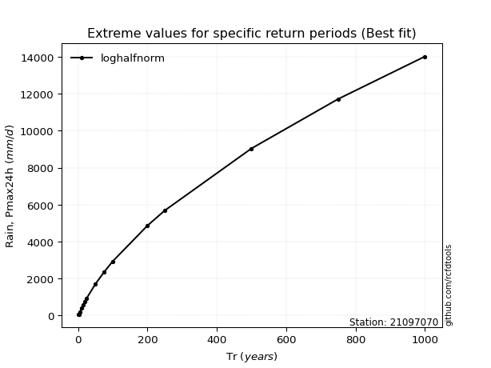</img>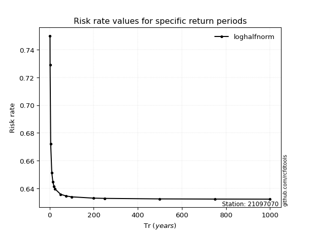</img>

</div>


<sub>**APP DISCLAIMER**: NO WARRANTY - This software is provided by [github.com/rcfdtools](https://github.com/rcfdtools) "as is", without any express or implied warranty, including warranties of merchantability, fitness for a particular purpose, or non-infringement. There is no guarantee that the software will be error-free or operate without interruption. LIMITATION OF LIABILITY - Neither the authors nor copyright holders will be liable for claims or damages arising from the software or its use. You are responsible for determining if the software is appropriate for your use and assume all associated risks, including errors, legal compliance, and data loss. NO PROFESSIONAL ADVICE - The software provides general information and does not offer professional advice. It should not replace consultation with professional advisors.</sub>