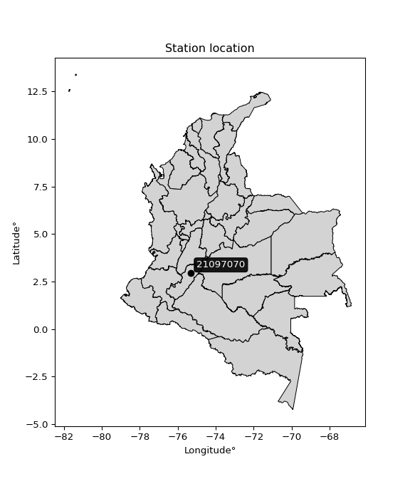

<div align="center">


</div>

# PMP Station (Rain, Pmax24h): 21097070

Probable Maximum Precipitation (PMP) is the greatest amount of rainfall for a specific duration that is meteorologically possible for a given location, acting as a "worst-case" scenario for extreme storms, crucial for designing safety-critical infrastructure like bridges, river deviations, dams, spillways, and nuclear plants to prevent catastrophic failure. PMP is calculated by hydrologists using meteorological data to determine the upper limit of extreme rainfall, often leading to the Probable Maximum Flood (PMF) for flood control design, and is increasingly being studied for climate change impacts. Probable Maximum Precipitation (PMP) is the theoretical upper limit of rainfall, a deterministic estimate for extreme events, while probability distributions (like GEV, Gumbel) describe the likelihood and frequency of various precipitation amounts, including rare ones, showing how often events occur, with PMP representing the extreme end of these distributions, used for critical infrastructure design to ensure safety against the worst conceivable weather, unlike standard statistical forecasts which cover typical probabilities.

The most common probability distributions in hydrology, used for analyzing floods, rainfall, and streamflow, include the Normal, Log-Normal, Gumbel, Gamma (including Log-Pearson Type III), and Generalized Extreme Value (GEV) distributions, often chosen based on the data´s skewness and whether modeling extremes or general conditions, with Gumbel and GEV popular for extreme events like floods, while the Normal distribution serves as a baseline, though often requiring transformations for skewed hydrological data. These distributions help in designing water infrastructure, managing water resources, and forecasting hydrologic events.

> Hydrological data often isn´t perfectly normal (it´s skewed), so different distributions are needed for different applications, such as: **Flood Frequency Analysis**: Using Gumbel, GEV, or Log-Pearson Type III for predicting extreme flood magnitudes and their return periods, **Rainfall Analysis**: Normal for annual totals, but Log-Normal, Weibull, or GEV for intensity or extreme daily rainfall, **Streamflow Modeling**: Gamma and Log-Normal for maximum flows, GEV for minimum flows, and Kappa for daily flows.

<div align="center">

</img>

</div>


## A. General information


### 1. General running parameters

• app_version: _v20260108_. • runtime: _2026-01-09 11:32:22.148588_. • Python version: _3.14.0_. • SciPy version: _1.16.3_. • Pandas version: _2.3.3_. • NumPy version: _2.3.5_. • Stations dataset (station_dataset_file): _dataset/pmax24h_in/automatic_colombia_2003_2024.csv_. • Stations catalog (station_catalog_file): _dataset/CNE.xls_. • Minimum year to eval til year_max (date_min): _1900_. • Maximum year to eval since year_min (date_max): _2024_. • Creates, save and include plots into reports (create_plot): _False_. • Plot only fit distributions with Δo > Δ (plot_only_fit): _True_. • Plot only simple graphs avoiding multiple CDFs and multiple Extreme values plots (plot_only_simple): _True_. • Eval low extreme values, if False, evaluates high extreme values (low_extreme): _False_. • Eval every SciPy distribution as logarithmic (pdist_logarithmic_on): _True_. • Standard deviation normalized (ddof): _1.0_. • Return periods to eval in years (Tr): _[2, 2.33, 5, 10, 15, 20, 25, 50, 75, 100, 200, 250, 500, 750, 1000]_. • Minimum data sample per station, 0 means any (minimum_sample): _5_. • Z-Score maximum threshold to adjust a value, 0 means disable (zscore_max): _3.5_. • Z-Score minimum threshold to adjust a value, 0 means disable (zscore_min): _-2.5_. • Avoid zeros, e.g. rain = 0 (avoid_zeros): _True_. • Avoid null values (avoid_nans): _True_. 

:file_folder:Table: [dataset.csv](../../dataset/pmax24h_in/automatic_colombia_2003_2024.csv)

> Delta Degrees of Freedom (DDOF): is a parameter used in the formulas for calculating variance and standard deviation. When ddof=0, the divisor is $N$ (the total number of observations) and this is used when your data set is the entire population. When ddof=1, the divisor is $N-1$ and this is used when your data set is a sample drawn from a larger population. Using $N-1$ provides an unbiased estimate of the population variance (known as Bessel´s correction).


### 2. Station info and location

|   id |   CODIGO | NOMBRE                          | CATEGORIA    | TECNOLOGIA                              | ESTADO   | FECHA_INSTALACION   |   FECHA_SUSPENSION |   ALTITUD |   LATITUD |   LONGITUD | DEPARTAMENTO   | MUNICIPIO   | AREA_OPERATIVA                    | ENTIDAD                                                     | AREA_HIDROGRAFICA   | ZONA_HIDROGRAFICA   | SUBZONA_HIDROGRAFICA      | CORRIENTE   | Catalogo   |   Version |
|-----:|---------:|:--------------------------------|:-------------|:----------------------------------------|:---------|:--------------------|-------------------:|----------:|----------:|-----------:|:---------------|:------------|:----------------------------------|:------------------------------------------------------------|:--------------------|:--------------------|:--------------------------|:------------|:-----------|----------:|
|    0 | 21097070 | PUENTE SANTANDER AUT [21097070] | Limnigráfica | Automática con Telemetría, Convencional | Activa   | 15/09/1960          |                nan |       431 |   2.94261 |   -75.3085 | Huila          | Neiva       | Area Operativa 04 - Huila-Caquetá | INSTITUTO DE HIDROLOGIA METEOROLOGIA Y ESTUDIOS AMBIENTALES | Magdalena Cauca     | Alto Magdalena      | Rio Fortalecillas y otros | Magdalena   | CNE_IDEAM  |  20251226 |

<div align="center">

Dynamic map: [:earth_americas:Google](http://maps.google.com/maps?q=2.942611111,-75.30852778) [:earth_americas:OSM](https://www.openstreetmap.org/#map=18/2.942611111/-75.30852778&layers=P) [:earth_americas:Bing](https://www.bing.com/maps?cp=2.942611111~-75.30852778&lvl=18) [:earth_americas:Apple](https://maps.apple.com/frame?center=2.942611111%2C-75.30852778&span=0.003%2C0.006)

</div>


<div align="center">

```geojson
{
  "type": "Feature",
  "geometry": {
    "type": "Point", 
    "coordinates": [-75.30852778, 2.942611111]
  }, 
  "properties": {
    "Name": "21097070"
  }
}
```

</div>


### 3. Discrete values table and plot

<div align="center">

|               |          0 |          1 |           2 |           3 |           4 |          5 |           6 |           7 |          8 |           9 |          10 |         11 |         12 |          13 |          14 |          15 |          16 |          17 |
|:--------------|-----------:|-----------:|------------:|------------:|------------:|-----------:|------------:|------------:|-----------:|------------:|------------:|-----------:|-----------:|------------:|------------:|------------:|------------:|------------:|
| Date          | 2006       | 2007       | 2009        | 2010        | 2011        | 2012       | 2013        | 2014        | 2015       | 2016        | 2017        | 2018       | 2019       | 2020        | 2021        | 2022        | 2023        | 2024        |
| Value         |  782.4     |  208.8     |  186.8      |   18.7      |  283.3      |  630.2     |   21.9      |   38.5      |   33.1     |   17.7      |   40.4      |   27.1     |    5.9     |   32.2      |   13.6      |  103        |  123        |   48.5      |
| Value_initial |  782.4     |  208.8     |  186.8      |   18.7      |  283.3      |  630.2     |   21.9      |   38.5      |   33.1     |   17.7      |   40.4      |   27.1     |    5.9     |   32.2      |   13.6      |  103        |  123        |   48.5      |
| count         |   18       |   18       |   18        |   18        |   18        |   18       |   18        |   18        |   18       |   18        |   18        |   18       |   18       |   18        |   18        |   18        |   18        |   18        |
| mean          |  145.283   |  145.283   |  145.283    |  145.283    |  145.283    |  145.283   |  145.283    |  145.283    |  145.283   |  145.283    |  145.283    |  145.283   |  145.283   |  145.283    |  145.283    |  145.283    |  145.283    |  145.283    |
| std           |  220.101   |  220.101   |  220.101    |  220.101    |  220.101    |  220.101   |  220.101    |  220.101    |  220.101   |  220.101    |  220.101    |  220.101   |  220.101   |  220.101    |  220.101    |  220.101    |  220.101    |  220.101    |
| zscore        |    2.89466 |    0.28858 |    0.188626 |   -0.575115 |    0.627061 |    2.20316 |   -0.560576 |   -0.485156 |   -0.50969 |   -0.579658 |   -0.476524 |   -0.53695 |   -0.63327 |   -0.513779 |   -0.598286 |   -0.192109 |   -0.101241 |   -0.439722 |


</div>


> The initial value (value_initial) correspond to the initial obtained or null completed value, and value (value) is adjusted only when the initial value is outside the valid range (outlier) definite through the Z-Score value. If Z-Score is active, values out of range or outliers are replaced with the station mean value. A Z-Score (or standard score) measures how many standard deviations a data point is from the mean of a dataset, indicating its relative position; positive scores mean above the mean, negative mean below, and a score of zero is exactly at the mean, allowing for comparison of values from different distributions. It´s calculated using the formula $z=(x–μ)/σ$, where $x$ is the data point, $μ$ is the mean, and $σ$ is the standard deviation, helping identify outliers and understand probability.
>
> <sub>**Note**: In this study, "completing" (filling gaps in) and "extending" (forecasting or lengthening the historical record) rainfall data series are avoided for certain critical analyses because they introduce artificial bias and uncertainty, which can distort the statistics of rare events (extremes), alter day-to-day variability, and compromise the integrity and homogeneity of the original data. Some reasons against Completing/Extending rainfall data are: **Distortion of Extremes and Variability**: The primary issue is that most gap-filling or extension methods rely on averaging or regression with nearby stations, which inherently smooths the data. Rainfall is highly variable in space and time, with a large percentage of zero values and occasional large storms. Infilling methods often underestimate the highest values and overestimate the lowest (zero) values, which severely distorts analyses focused on flood frequency, drought severity, and intensity-duration-frequency (IDF) curves, **Loss of Data Homogeneity**: Infilled or extended data are synthetic estimates, not actual measurements. Combining these estimates with observed data can violate the assumption of data homogeneity, which requires that the data properties do not change over time. Inhomogeneity can lead to incorrect conclusions about long-term trends or changes in climate patterns, **Propagation of Errors**: Errors and biases from the original data (e.g., wind-induced undercatch, instrument errors, site changes) or the data used for imputation can propagate through the analysis, leading to unreliable hydrological models and inaccurate predictions, **Compromised Statistical Integrity**: For statistical analyses, especially those involving the frequency of events, using artificial data can introduce time bias or autocorrelation that doesn´t exist in reality, making it difficult to assess the true probability of events, **Difficulty in Validation**: It is difficult to accurately validate the quality of filled or extended data, especially for past periods where ground-truth measurements are unavailable. The reliability of imputation techniques heavily depends on the density of the surrounding station network and the complexity of the local topography.</sub>


### 4. Active continuous probability distributions from SciPy (45 of 104 available)

A Probability Density Function (PDF) describes the relative likelihood of a continuous random variable falling within a specific range, where the total area under its curve equals 1, and the area over any interval gives the actual probability for that range. Unlike discrete probabilities (like rolling a die), a PDF shows density, not direct probability for a single point (which is zero), with higher points indicating higher likelihood, often visualized as a bell curve for normal distributions.

A log of a probability density function (log-PDF) is simply the logarithm of the PDF´s value, denoted as $log(f(x))$, useful for converting multiplication of probabilities into addition, improving numerical stability with tiny numbers, and connecting to information theory concepts like entropy. Instead of dealing with very small probabilities (e.g., 0.000001), log-PDFs use negative numbers (e.g., $log(0.00001) ≈ -11.51$ that are easier for computers to handle, preventing underflow errors and simplifying complex calculations. In this study, each active probability distribution from SciPy is also evaluated in the $log$ form.

[scipy.stats](https://docs.scipy.org/doc/scipy/reference/stats.html) is a Python´s powerful submodule within the SciPy library for comprehensive statistical analysis, offering over 130 probability distributions (like Normal, Poisson), functions for descriptive stats (mean, variance), hypothesis testing (t-tests, chi-square), random variable generation, and statistical tests, making it essential for data science, modeling, and research. It provides tools to explore, model, and draw conclusions from data efficiently, working seamlessly with NumPy.

<div align="center">

|   id | p_dist             |   n_parameter | fit_method   | label                                                                       | active   | ref                                                                                                        |
|-----:|:-------------------|--------------:|:-------------|:----------------------------------------------------------------------------|:---------|:-----------------------------------------------------------------------------------------------------------|
|    0 | alpha              |             3 | MLE          | Alpha                                                                       | True     | [:mortar_board:](https://docs.scipy.org/doc/scipy/reference/generated/scipy.stats.alpha.html)              |
|    1 | betaprime          |             4 | MLE          | Beta prime                                                                  | True     | [:mortar_board:](https://docs.scipy.org/doc/scipy/reference/generated/scipy.stats.betaprime.html)          |
|    2 | chi2               |             3 | MLE          | Chi²                                                                        | True     | [:mortar_board:](https://docs.scipy.org/doc/scipy/reference/generated/scipy.stats.chi2.html)               |
|    3 | crystalball        |             4 | MLE          | Crystalball                                                                 | True     | [:mortar_board:](https://docs.scipy.org/doc/scipy/reference/generated/scipy.stats.crystalball.html)        |
|    4 | dweibull           |             3 | MLE          | Double Weibull                                                              | True     | [:mortar_board:](https://docs.scipy.org/doc/scipy/reference/generated/scipy.stats.dweibull.html)           |
|    5 | erlang             |             3 | MLE          | Erlang                                                                      | True     | [:mortar_board:](https://docs.scipy.org/doc/scipy/reference/generated/scipy.stats.erlang.html)             |
|    6 | expon              |             2 | MLE          | Exponential                                                                 | True     | [:mortar_board:](https://docs.scipy.org/doc/scipy/reference/generated/scipy.stats.expon.html)              |
|    7 | exponnorm          |             3 | MLE          | Exponentially modified Normal                                               | True     | [:mortar_board:](https://docs.scipy.org/doc/scipy/reference/generated/scipy.stats.exponnorm.html)          |
|    8 | f                  |             4 | MLE          | F                                                                           | True     | [:mortar_board:](https://docs.scipy.org/doc/scipy/reference/generated/scipy.stats.f.html)                  |
|    9 | fatiguelife        |             3 | MLE          | Fatigue-life (Birnbaum-Saunders)                                            | True     | [:mortar_board:](https://docs.scipy.org/doc/scipy/reference/generated/scipy.stats.fatiguelife.html)        |
|   10 | fisk               |             3 | MLE          | Fisk                                                                        | True     | [:mortar_board:](https://docs.scipy.org/doc/scipy/reference/generated/scipy.stats.fisk.html)               |
|   11 | gamma              |             3 | MLE          | Gamma                                                                       | True     | [:mortar_board:](https://docs.scipy.org/doc/scipy/reference/generated/scipy.stats.gamma.html)              |
|   12 | genexpon           |             5 | MLE          | Generalized exponential                                                     | True     | [:mortar_board:](https://docs.scipy.org/doc/scipy/reference/generated/scipy.stats.genexpon.html)           |
|   13 | genlogistic        |             3 | MLE          | Generalized logistic                                                        | True     | [:mortar_board:](https://docs.scipy.org/doc/scipy/reference/generated/scipy.stats.genlogistic.html)        |
|   14 | gibrat             |             2 | MM           | Gibrat                                                                      | True     | [:mortar_board:](https://docs.scipy.org/doc/scipy/reference/generated/scipy.stats.gibrat.html)             |
|   15 | gompertz           |             3 | MLE          | Gompertz (or truncated Gumbel)                                              | True     | [:mortar_board:](https://docs.scipy.org/doc/scipy/reference/generated/scipy.stats.gompertz.html)           |
|   16 | gumbel_l           |             2 | MM           | Gumbel Left Skew                                                            | True     | [:mortar_board:](https://docs.scipy.org/doc/scipy/reference/generated/scipy.stats.gumbel_l.html)           |
|   17 | gumbel_r           |             2 | MM           | Gumbel Right Skew                                                           | True     | [:mortar_board:](https://docs.scipy.org/doc/scipy/reference/generated/scipy.stats.gumbel_r.html)           |
|   18 | halflogistic       |             2 | MM           | Half-logistic                                                               | True     | [:mortar_board:](https://docs.scipy.org/doc/scipy/reference/generated/scipy.stats.halflogistic.html)       |
|   19 | halfnorm           |             2 | MM           | Half Normal                                                                 | True     | [:mortar_board:](https://docs.scipy.org/doc/scipy/reference/generated/scipy.stats.halfnorm.html)           |
|   20 | hypsecant          |             2 | MM           | hyperbolic secant                                                           | True     | [:mortar_board:](https://docs.scipy.org/doc/scipy/reference/generated/scipy.stats.hypsecant.html)          |
|   21 | invgamma           |             3 | MLE          | Inverted gamma                                                              | True     | [:mortar_board:](https://docs.scipy.org/doc/scipy/reference/generated/scipy.stats.invgamma.html)           |
|   22 | invgauss           |             3 | MLE          | Inverse Gaussian                                                            | True     | [:mortar_board:](https://docs.scipy.org/doc/scipy/reference/generated/scipy.stats.invgauss.html)           |
|   23 | invweibull         |             3 | MLE          | Inverted Weibull                                                            | True     | [:mortar_board:](https://docs.scipy.org/doc/scipy/reference/generated/scipy.stats.invweibull.html)         |
|   24 | kappa4             |             4 | MLE          | Kappa 4                                                                     | True     | [:mortar_board:](https://docs.scipy.org/doc/scipy/reference/generated/scipy.stats.kappa4.html)             |
|   25 | kstwobign          |             2 | MLE          | Limiting distribution of scaled Kolmogorov-Smirnov two-sided test statistic | True     | [:mortar_board:](https://docs.scipy.org/doc/scipy/reference/generated/scipy.stats.kstwobign.html)          |
|   26 | laplace            |             2 | MM           | Laplace                                                                     | True     | [:mortar_board:](https://docs.scipy.org/doc/scipy/reference/generated/scipy.stats.laplace.html)            |
|   27 | laplace_asymmetric |             3 | MLE          | Asymmetric Laplace                                                          | True     | [:mortar_board:](https://docs.scipy.org/doc/scipy/reference/generated/scipy.stats.laplace_asymmetric.html) |
|   28 | loggamma           |             3 | MLE          | Log gamma                                                                   | True     | [:mortar_board:](https://docs.scipy.org/doc/scipy/reference/generated/scipy.stats.loggamma.html)           |
|   29 | logistic           |             2 | MM           | Logistic (or Sech-squared)                                                  | True     | [:mortar_board:](https://docs.scipy.org/doc/scipy/reference/generated/scipy.stats.logistic.html)           |
|   30 | lognorm            |             3 | MLE          | Log Normal                                                                  | True     | [:mortar_board:](https://docs.scipy.org/doc/scipy/reference/generated/scipy.stats.lognorm.html)            |
|   31 | maxwell            |             2 | MM           | Maxwell                                                                     | True     | [:mortar_board:](https://docs.scipy.org/doc/scipy/reference/generated/scipy.stats.maxwell.html)            |
|   32 | mielke             |             4 | MLE          | Mielke Beta-Kappa / Dagum                                                   | True     | [:mortar_board:](https://docs.scipy.org/doc/scipy/reference/generated/scipy.stats.mielke.html)             |
|   33 | moyal              |             2 | MM           | Moyal                                                                       | True     | [:mortar_board:](https://docs.scipy.org/doc/scipy/reference/generated/scipy.stats.moyal.html)              |
|   34 | nakagami           |             3 | MLE          | Nakagami                                                                    | True     | [:mortar_board:](https://docs.scipy.org/doc/scipy/reference/generated/scipy.stats.nakagami.html)           |
|   35 | ncf                |             5 | MLE          | Non-central F distribution                                                  | True     | [:mortar_board:](https://docs.scipy.org/doc/scipy/reference/generated/scipy.stats.ncf.html)                |
|   36 | nct                |             4 | MLE          | Non-central Student’s t                                                     | True     | [:mortar_board:](https://docs.scipy.org/doc/scipy/reference/generated/scipy.stats.nct.html)                |
|   37 | norm               |             2 | MM           | Normal                                                                      | True     | [:mortar_board:](https://docs.scipy.org/doc/scipy/reference/generated/scipy.stats.norm.html)               |
|   38 | pearson3           |             3 | MM           | Pearson type III                                                            | True     | [:mortar_board:](https://docs.scipy.org/doc/scipy/reference/generated/scipy.stats.pearson3.html)           |
|   39 | rayleigh           |             2 | MM           | Rayleigh                                                                    | True     | [:mortar_board:](https://docs.scipy.org/doc/scipy/reference/generated/scipy.stats.rayleigh.html)           |
|   40 | rice               |             3 | MLE          | Rice                                                                        | True     | [:mortar_board:](https://docs.scipy.org/doc/scipy/reference/generated/scipy.stats.rice.html)               |
|   41 | t                  |             3 | MLE          | Student’s t                                                                 | True     | [:mortar_board:](https://docs.scipy.org/doc/scipy/reference/generated/scipy.stats.t.html)                  |
|   42 | truncnorm          |             4 | MLE          | Truncated normal                                                            | True     | [:mortar_board:](https://docs.scipy.org/doc/scipy/reference/generated/scipy.stats.truncnorm.html)          |
|   43 | wald               |             2 | MM           | Wald                                                                        | True     | [:mortar_board:](https://docs.scipy.org/doc/scipy/reference/generated/scipy.stats.wald.html)               |
|   44 | weibull_min        |             3 | MLE          | Weibull minimum                                                             | True     | [:mortar_board:](https://docs.scipy.org/doc/scipy/reference/generated/scipy.stats.weibull_min.html)        |

</div>

> **n_parameter:** # arguments & localization & scale.
>
> **Fit methods:** (MLE) maximum likelihood, (MM) L-moments.
>
>**Inactive** (With the only purpose of prevent loops, zero divisions, infinite values, over high estimated values or horizontal trending for recurrence intervals estimations, the follow distributions were disabled.)**:** foldnorm, gennorm, norminvgauss, powernorm, powerlognorm, skewnorm, genextreme, anglit, arcsine, argus, beta, bradford, burr, burr12, cauchy, cosine, halfcauchy, foldcauchy, skewcauchy, wrapcauchy, dgamma, gengamma, exponweib, exponpow, truncexpon, gausshyper, genhalflogistic, genhyperbolic, geninvgauss, halfgennorm, johnsonsb, johnsonsu, kappa3, ksone, kstwo, loglaplace, levy, levy_l, levy_stable, ncx2, pareto, genpareto, truncpareto, lomax, powerlaw, rdist, rel_breitwigner, recipinvgauss, semicircular, studentized_range, trapezoid, triang, truncweibull_min, tukeylambda, uniform, loguniform, vonmises, vonmises_line, weibull_max, 


## B. Probability (PDF) vs. Empirical (EDF) distributions functions

A continuous probability distribution (CPD) describes probabilities for variables that can take any value within a range (like rain any time), unlike discrete variables with specific outcomes (like temperature). It uses a Probability Density Function (PDF), a curve where the total area under it equals 1, and the probability of the variable falling within an interval (a to b) is found by calculating the area under the curve between those points. A key feature is that the probability of hitting any single exact value is zero, so probabilities are always expressed for ranges, e.g., $P(a ≤ X ≤ b)$.

<div align="center">

Distributions parameters from station values
|    |   station | p_dist                |   n |              loc |          scale | shape                  | shape1                | shape2                | shape3   |
|---:|----------:|:----------------------|----:|-----------------:|---------------:|:-----------------------|:----------------------|:----------------------|:---------|
|  0 |  21097070 | alpha                 |  18 |     -0.0541346   |   19.6533      | 2.3693967323778343e-10 |                       |                       |          |
|  1 |  21097070 | betaprime             |  18 |      5.8988      |   47.4183      | 0.8967572126436051     | 1.1198295219787382    |                       |          |
|  2 |  21097070 | chi2                  |  18 |      5.9         |  120.291       | 1.3469405810559631     |                       |                       |          |
|  3 |  21097070 | crystalball           |  18 |    145.283       |  213.9         | 8622.458145919685      | 16413.599047073367    |                       |          |
|  4 |  21097070 | dweibull              |  18 |     32.2         |  112.835       | 0.6317501510748373     |                       |                       |          |
|  5 |  21097070 | erlang                |  18 |      5.9         |  310.068       | 0.4711854125870064     |                       |                       |          |
|  6 |  21097070 | expon                 |  18 |      5.9         |  139.383       |                        |                       |                       |          |
|  7 |  21097070 | exponnorm             |  18 |      5.69174     |    0.0726294   | 1925.9583598586096     |                       |                       |          |
|  8 |  21097070 | f                     |  18 |     -1.75558     |   33.8815      | 468.34658461430706     | 1.8748575166357864    |                       |          |
|  9 |  21097070 | fatiguelife           |  18 |      2.2184      |   60.4         | 1.7003272622642278     |                       |                       |          |
| 10 |  21097070 | fisk                  |  18 |      5.9         |   28.2731      | 0.7625598728700247     |                       |                       |          |
| 11 |  21097070 | gamma                 |  18 |      5.9         |  216.472       | 0.5787341100175578     |                       |                       |          |
| 12 |  21097070 | genexpon              |  18 |      5.9         |  234.721       | 1.6839932425266744     | 7.766389336982537e-13 | 2.1468531328263176    |          |
| 13 |  21097070 | genlogistic           |  18 |   -760.921       |  105.954       | 2446.921640896202      |                       |                       |          |
| 14 |  21097070 | gibrat                |  18 |    -17.8952      |   98.9728      |                        |                       |                       |          |
| 15 |  21097070 | gompertz              |  18 |      5.9         |    3.13994e+11 | 2177751278.886587      |                       |                       |          |
| 16 |  21097070 | gumbel_l              |  18 |    241.55        |  166.777       |                        |                       |                       |          |
| 17 |  21097070 | gumbel_r              |  18 |     49.0171      |  166.777       |                        |                       |                       |          |
| 18 |  21097070 | halflogistic          |  18 |   -108.238       |  182.877       |                        |                       |                       |          |
| 19 |  21097070 | halfnorm              |  18 |   -137.836       |  354.838       |                        |                       |                       |          |
| 20 |  21097070 | hypsecant             |  18 |    145.283       |  136.173       |                        |                       |                       |          |
| 21 |  21097070 | invgamma              |  18 |     -1.82332     |   31.7574      | 0.93743155455678       |                       |                       |          |
| 22 |  21097070 | invgauss              |  18 |      0.392092    |   36.1537      | 4.0076410315231055     |                       |                       |          |
| 23 |  21097070 | invweibull            |  18 |     -1.24822     |   33.6892      | 0.9361840314351769     |                       |                       |          |
| 24 |  21097070 | kappa4                |  18 |    -69.3641      |  870.738       | 1.0947091343874529     | 1.020308077421924     |                       |          |
| 25 |  21097070 | kstwobign             |  18 |   -369.147       |  605.931       |                        |                       |                       |          |
| 26 |  21097070 | laplace               |  18 |    145.283       |  151.25        |                        |                       |                       |          |
| 27 |  21097070 | laplace_asymmetric    |  18 |      5.9         |    0.000686219 | 4.9232459624352405e-06 |                       |                       |          |
| 28 |  21097070 | loggamma              |  18 | -66689.1         | 9056.04        | 1604.4648956349874     |                       |                       |          |
| 29 |  21097070 | logistic              |  18 |    145.283       |  117.929       |                        |                       |                       |          |
| 30 |  21097070 | lognorm               |  18 |      5.9         |    6.66521     | 8.965125484848796      |                       |                       |          |
| 31 |  21097070 | maxwell               |  18 |   -361.569       |  317.623       |                        |                       |                       |          |
| 32 |  21097070 | mielke                |  18 |      0.83322     |    4.27623     | 6.5047459678684305     | 0.9357320025130318    |                       |          |
| 33 |  21097070 | moyal                 |  18 |     22.9617      |   96.2887      |                        |                       |                       |          |
| 34 |  21097070 | nakagami              |  18 |      5.9         |  352.144       | 0.2107585990532841     |                       |                       |          |
| 35 |  21097070 | ncf                   |  18 |     -0.398406    |   20.938       | 16.961128892961682     | 1.8856855970331878    | 10.773640742177305    |          |
| 36 |  21097070 | nct                   |  18 |     -7.16951     |    3.46103     | 0.8563119602890967     | 9.806983541662754     |                       |          |
| 37 |  21097070 | norm                  |  18 |    145.283       |  213.9         |                        |                       |                       |          |
| 38 |  21097070 | pearson3              |  18 |    145.283       |  213.9         | 2.025174622363674      |                       |                       |          |
| 39 |  21097070 | rayleigh              |  18 |   -263.919       |  326.497       |                        |                       |                       |          |
| 40 |  21097070 | rice                  |  18 |   -151.558       |  258.716       | 0.00021188808738780904 |                       |                       |          |
| 41 |  21097070 | t                     |  18 |     29.0424      |   15.2872      | 0.575063899397436      |                       |                       |          |
| 42 |  21097070 | truncnorm             |  18 |  -7278.66        | 1088.06        | 6.694977589262367      | 999.5903421674154     |                       |          |
| 43 |  21097070 | wald                  |  18 |    -68.6164      |  213.9         |                        |                       |                       |          |
| 44 |  21097070 | weibull_min           |  18 |      5.9         |  229.624       | 0.60518168938272       |                       |                       |          |
| 45 |  21097070 | logalpha              |  18 |     -7.4299      |  101.539       | 8.931026883691706      |                       |                       |          |
| 46 |  21097070 | logbetaprime          |  18 |     -0.0506285   |   62.893       | 10.281737707751624     | 157.66397945847862    |                       |          |
| 47 |  21097070 | logchi2               |  18 |      0.350897    |    0.24043     | 15.535307952171614     |                       |                       |          |
| 48 |  21097070 | logcrystalball        |  18 |      4.08605     |    1.32087     | 231.34310090518898     | 118.80154486009597    |                       |          |
| 49 |  21097070 | logdweibull           |  18 |      3.8305      |    1.15935     | 1.2722296378217264     |                       |                       |          |
| 50 |  21097070 | logerlang             |  18 |      0.350903    |    0.48086     | 7.767645565536849      |                       |                       |          |
| 51 |  21097070 | logexpon              |  18 |      1.77495     |    2.3111      |                        |                       |                       |          |
| 52 |  21097070 | logexponnorm          |  18 |      2.8108      |    0.702381    | 1.8156180174115748     |                       |                       |          |
| 53 |  21097070 | logf                  |  18 |      0.348758    |    3.73755     | 15.549441692854735     | 321130.35429793544    |                       |          |
| 54 |  21097070 | logfatiguelife        |  18 |     -1.32277     |    5.24946     | 0.24639248471571157    |                       |                       |          |
| 55 |  21097070 | logfisk               |  18 |     -0.0346801   |    3.91633     | 5.215520801204203      |                       |                       |          |
| 56 |  21097070 | loggamma              |  18 |      0.350909    |    0.480862    | 7.767600899341494      |                       |                       |          |
| 57 |  21097070 | loggenexpon           |  18 |      1.77495     |    0.201243    | 0.021259424098300148   | 10.382316767797096    | 0.0008362505165301392 |          |
| 58 |  21097070 | loggenlogistic        |  18 |      1.06438     |    1.05953     | 10.291459149005515     |                       |                       |          |
| 59 |  21097070 | loggibrat             |  18 |      3.0784      |    0.611175    |                        |                       |                       |          |
| 60 |  21097070 | loggompertz           |  18 |      1.77495     |    2.01011     | 0.337343768434958      |                       |                       |          |
| 61 |  21097070 | loggumbel_l           |  18 |      4.68051     |    1.02988     |                        |                       |                       |          |
| 62 |  21097070 | loggumbel_r           |  18 |      3.49159     |    1.02988     |                        |                       |                       |          |
| 63 |  21097070 | loghalflogistic       |  18 |      2.52048     |    1.12932     |                        |                       |                       |          |
| 64 |  21097070 | loghalfnorm           |  18 |      2.33771     |    2.19122     |                        |                       |                       |          |
| 65 |  21097070 | loghypsecant          |  18 |      4.08605     |    0.840894    |                        |                       |                       |          |
| 66 |  21097070 | loginvgamma           |  18 |     -3.31249     |  231.958       | 32.346761210807585     |                       |                       |          |
| 67 |  21097070 | loginvgauss           |  18 |     -1.3869      |   91.1176      | 0.06006462748131721    |                       |                       |          |
| 68 |  21097070 | loginvweibull         |  18 |     -9.82692e+07 |    9.82692e+07 | 87668994.17726475      |                       |                       |          |
| 69 |  21097070 | logkappa4             |  18 |      1.44244     |    5.23587     | 1.0678116983516475     | 0.9998136740222805    |                       |          |
| 70 |  21097070 | logkstwobign          |  18 |     -0.588775    |    5.36935     |                        |                       |                       |          |
| 71 |  21097070 | loglaplace            |  18 |      4.08605     |    0.933998    |                        |                       |                       |          |
| 72 |  21097070 | loglaplace_asymmetric |  18 |      3.47197     |    0.94365     | 0.7262583096506956     |                       |                       |          |
| 73 |  21097070 | logloggamma           |  18 |   -375.388       |   51.802       | 1519.0209880029988     |                       |                       |          |
| 74 |  21097070 | loglogistic           |  18 |      4.08605     |    0.728235    |                        |                       |                       |          |
| 75 |  21097070 | loglognorm            |  18 |     -1.41291     |    5.343       | 0.24063838893841422    |                       |                       |          |
| 76 |  21097070 | logmaxwell            |  18 |      0.956138    |    1.96138     |                        |                       |                       |          |
| 77 |  21097070 | logmielke             |  18 |    -51.799       |   53.495       | 345.6728038485637      | 53.994409083969856    |                       |          |
| 78 |  21097070 | logmoyal              |  18 |      3.33069     |    0.594602    |                        |                       |                       |          |
| 79 |  21097070 | lognakagami           |  18 |      2.61007     |    1.94269     | 0.36565451527978354    |                       |                       |          |
| 80 |  21097070 | logncf                |  18 |     -0.732622    |    3.6233      | 33.19044220372315      | 109.4609670425557     | 10.13547024835637     |          |
| 81 |  21097070 | lognct                |  18 |     -3.5988      |    0.596601    | 23.092945751038528     | 12.449621620680581    |                       |          |
| 82 |  21097070 | lognorm               |  18 |      4.08605     |    1.32087     |                        |                       |                       |          |
| 83 |  21097070 | logpearson3           |  18 |      4.08605     |    1.32087     | 0.41240002013498595    |                       |                       |          |
| 84 |  21097070 | lograyleigh           |  18 |      1.55914     |    2.01618     |                        |                       |                       |          |
| 85 |  21097070 | logrice               |  18 |      1.44772     |    1.70937     | 0.9896114034067462     |                       |                       |          |
| 86 |  21097070 | logt                  |  18 |      4.08605     |    1.32087     | 21690228244.5747       |                       |                       |          |
| 87 |  21097070 | logtruncnorm          |  18 |     -0.0970428   |    3.45556     | 0.541734962172219      | 3.4740581730124713    |                       |          |
| 88 |  21097070 | logwald               |  18 |      2.7652      |    1.32086     |                        |                       |                       |          |
| 89 |  21097070 | logweibull_min        |  18 |      1.38748     |    3.04692     | 2.1532250172125087     |                       |                       |          |

</div>

> **loc** (Location parameter): This shifts the distribution along the x-axis. For many common distributions, like the normal (Gaussian) distribution, loc represents the mean $μ$. For others, like the uniform distribution, it might represent the minimum value, or for the beta distribution, the left end of the support interval.
>
> **scale** (Scale parameter): This determines the width or spread of the distribution. For the normal distribution, scale represents the standard deviation $σ$. For a uniform distribution, it defines the length of the interval (from $loc$ to $loc + scale$).
>
> **shape** (Shape parameters): Refers to parameters that define the specific form of a probability distribution, distinct from its location (loc) and scale (scale). These parameters are required arguments for most distribution functions. For example, a normal (Gaussian) distribution is fully defined by its location (mean) and scale (standard deviation), so it has no specific shape parameters beyond loc and scale. However, other distributions have intrinsic properties that need specification, as Gamma distribution that takes a shape parameter, often named $a$ or $alpha$.


### 0. Cumulative distribution values - CDF (90 evaluated)

Cumulative Distribution Function (CDF), denoted as $F$<sub>$X$</sub>$(x)$, is a function that gives the probability that a random variable $X$ will take a value less than or equal to a specific value, $x$ (i.e., $(P(X≥x)$. It essentially "accumulates" probabilities from a given point up to the far right (positive infinity), providing a complete picture of the distribution´s probabilities for both discrete (like rain) and continuous (like temperature) variables, helping to find probabilities over ranges or above certain values. Each station is evaluated separately ordering the $x$ values ascending, calculating the CDF and PDF values for the activated distributions and their logarithmic forms.

<div align="center">

CDF ordered by x ascending and calculating $log(f(x))$ separately
|   id |   Station |   date |     x |   count |    mean |     std |    zscore |   Value_initial |   station |   m |      alpha |   alpha_pdf |   betaprime |   betaprime_pdf |        chi2 |       chi2_pdf |   crystalball |   crystalball_pdf |   dweibull |   dweibull_pdf |      erlang |   erlang_pdf |     expon |   expon_pdf |   exponnorm |   exponnorm_pdf |         f |       f_pdf |   fatiguelife |   fatiguelife_pdf |        fisk |      fisk_pdf |       gamma |       gamma_pdf |    genexpon |   genexpon_pdf |   genlogistic |   genlogistic_pdf |    gibrat |   gibrat_pdf |    gompertz |   gompertz_pdf |   gumbel_l |   gumbel_l_pdf |   gumbel_r |   gumbel_r_pdf |   halflogistic |   halflogistic_pdf |   halfnorm |   halfnorm_pdf |   hypsecant |   hypsecant_pdf |   invgamma |   invgamma_pdf |   invgauss |   invgauss_pdf |   invweibull |   invweibull_pdf |      kappa4 |   kappa4_pdf |   kstwobign |   kstwobign_pdf |   laplace |   laplace_pdf |   laplace_asymmetric |   laplace_asymmetric_pdf |   loggamma |   loggamma_pdf |   logistic |   logistic_pdf |   lognorm |   lognorm_pdf |   maxwell |   maxwell_pdf |    mielke |   mielke_pdf |    moyal |   moyal_pdf |    nakagami |   nakagami_pdf |       ncf |     ncf_pdf |       nct |     nct_pdf |     norm |    norm_pdf |   pearson3 |   pearson3_pdf |   rayleigh |   rayleigh_pdf |     rice |    rice_pdf |        t |       t_pdf |   truncnorm |   truncnorm_pdf |     wald |    wald_pdf |   weibull_min |   weibull_min_pdf |   logalpha |   logalpha_pdf |   logbetaprime |   logbetaprime_pdf |   logchi2 |   logchi2_pdf |   logcrystalball |   logcrystalball_pdf |   logdweibull |   logdweibull_pdf |   logerlang |   logerlang_pdf |   logexpon |   logexpon_pdf |   logexponnorm |   logexponnorm_pdf |      logf |   logf_pdf |   logfatiguelife |   logfatiguelife_pdf |   logfisk |   logfisk_pdf |   loggenexpon |   loggenexpon_pdf |   loggenlogistic |   loggenlogistic_pdf |   loggibrat |   loggibrat_pdf |   loggompertz |   loggompertz_pdf |   loggumbel_l |   loggumbel_l_pdf |   loggumbel_r |   loggumbel_r_pdf |   loghalflogistic |   loghalflogistic_pdf |   loghalfnorm |   loghalfnorm_pdf |   loghypsecant |   loghypsecant_pdf |   loginvgamma |   loginvgamma_pdf |   loginvgauss |   loginvgauss_pdf |   loginvweibull |   loginvweibull_pdf |   logkappa4 |   logkappa4_pdf |   logkstwobign |   logkstwobign_pdf |   loglaplace |   loglaplace_pdf |   loglaplace_asymmetric |   loglaplace_asymmetric_pdf |   logloggamma |   logloggamma_pdf |   loglogistic |   loglogistic_pdf |   loglognorm |   loglognorm_pdf |   logmaxwell |   logmaxwell_pdf |   logmielke |   logmielke_pdf |    logmoyal |   logmoyal_pdf |   lognakagami |   lognakagami_pdf |    logncf |   logncf_pdf |    lognct |   lognct_pdf |   logpearson3 |   logpearson3_pdf |   lograyleigh |   lograyleigh_pdf |   logrice |   logrice_pdf |      logt |   logt_pdf |   logtruncnorm |   logtruncnorm_pdf |   logwald |   logwald_pdf |   logweibull_min |   logweibull_min_pdf |
|-----:|----------:|-------:|------:|--------:|--------:|--------:|----------:|----------------:|----------:|----:|-----------:|------------:|------------:|----------------:|------------:|---------------:|--------------:|------------------:|-----------:|---------------:|------------:|-------------:|----------:|------------:|------------:|----------------:|----------:|------------:|--------------:|------------------:|------------:|--------------:|------------:|----------------:|------------:|---------------:|--------------:|------------------:|----------:|-------------:|------------:|---------------:|-----------:|---------------:|-----------:|---------------:|---------------:|-------------------:|-----------:|---------------:|------------:|----------------:|-----------:|---------------:|-----------:|---------------:|-------------:|-----------------:|------------:|-------------:|------------:|----------------:|----------:|--------------:|---------------------:|-------------------------:|-----------:|---------------:|-----------:|---------------:|----------:|--------------:|----------:|--------------:|----------:|-------------:|---------:|------------:|------------:|---------------:|----------:|------------:|----------:|------------:|---------:|------------:|-----------:|---------------:|-----------:|---------------:|---------:|------------:|---------:|------------:|------------:|----------------:|---------:|------------:|--------------:|------------------:|-----------:|---------------:|---------------:|-------------------:|----------:|--------------:|-----------------:|---------------------:|--------------:|------------------:|------------:|----------------:|-----------:|---------------:|---------------:|-------------------:|----------:|-----------:|-----------------:|---------------------:|----------:|--------------:|--------------:|------------------:|-----------------:|---------------------:|------------:|----------------:|--------------:|------------------:|--------------:|------------------:|--------------:|------------------:|------------------:|----------------------:|--------------:|------------------:|---------------:|-------------------:|--------------:|------------------:|--------------:|------------------:|----------------:|--------------------:|------------:|----------------:|---------------:|-------------------:|-------------:|-----------------:|------------------------:|----------------------------:|--------------:|------------------:|--------------:|------------------:|-------------:|-----------------:|-------------:|-----------------:|------------:|----------------:|------------:|---------------:|--------------:|------------------:|----------:|-------------:|----------:|-------------:|--------------:|------------------:|--------------:|------------------:|----------:|--------------:|----------:|-----------:|---------------:|-------------------:|----------:|--------------:|-----------------:|---------------------:|
|    0 |  21097070 |   2019 |   5.9 |      18 | 145.283 | 220.101 | -0.63327  |             5.9 |  21097070 |   1 | 0.00096415 | 0.00190494  |  8.3698e-05 |     0.0626733   | 2.01113e-12 | 1524.96        |      0.25732  |       0.00150832  |   0.335664 |    0.00321307  | 8.48393e-09 |  2.25039e+06 | 0         | 0.00717446  |  0.00148792 |     0.0071235   | 0.0142302 | 0.00767225  |     0.0126451 |       0.0112182   | 2.60358e-13 | 223.535       | 9.71817e-11 | 63323.2         | 3.56843e-14 |    0.00717446  |      0.172166 |       0.00285768  | 0.0770265 |  0.00607089  | 5.60316e-12 |    0.00693565  |   0.216059 |    0.00114421  |   0.273891 |    0.00212677  |       0.302311 |        0.00248421  |   0.314578 |    0.00207147  |    0.219597 |     0.00148773  |  0.0142308 |    0.0076722   |  0.0133044 |    0.00890158  |    0.0139959 |      0.00782507  | 2.66518e-15 |   0.0276202  |    0.161772 |     0.00234667  |  0.198952 |   0.00131539  |          3.25415e-11 |              0.00717446  |  0.0142885 |      0.0527492 |   0.234706 |    0.00152311  | 0.0400871 |     0.0653555 |  0.279989 |   0.00172185  | 0.0137244 |  0.00811201  | 0.274552 | 0.00249211  | 3.00556e-08 |    1.4264e+07  | 0.0144478 | 0.00775103  | 0.0153998 | 0.00705242  | 0.25732  | 0.00150832  |   0.293753 |    0.00335505  |   0.289279 |    0.00179893  | 0.169066 | 0.00195472  | 0.238611 | 0.00517426  | 1.37005e-05 |     0.00628477  | 0.217337 | 0.0049313   |    2.8991e-11 |   19753.7         |  0.0178661 |      0.0527137 |      0.0161024 |          0.0542906 | 0.0142885 |     0.0527493 |        0.0400871 |            0.0653555 |      0.062958 |         0.0807438 |   0.0142884 |       0.052749  |   0        |      0.432695  |      0.0140111 |          0.0440114 | 0.0143136 |  0.0527863 |         0.01517  |            0.0518521 | 0.0175233 |     0.0496186 |    1.3822e-09 |         0.105641  |         0.014256 |            0.0468523 | 0           |      0          |   3.16511e-09 |         0.167823  |     0.0577934 |        0.0544629  |    0.00501481 |         0.0257848 |         0         |             0         |     0         |         0         |       0.040708 |          0.0482785 |     0.0166869 |         0.052136  |     0.0152579 |         0.0518726 |       0.0113707 |           0.0454124 | 1.14449e-15 |        1.96882  |     0.00978916 |          0.0485861 |    0.0421061 |        0.0450816 |               0.0290282 |                   0.0423564 |     0.0417704 |         0.0661573 |     0.0401729 |         0.0529486 |    0.0159318 |        0.0519881 |    0.0183694 |        0.0649801 |   0.0151842 |        0.047035 | 0.000215955 |     0.00264705 |    0          |         0         | 0.0171219 |    0.0538611 | 0.0179919 |    0.0532308 |     0.0256677 |         0.0612339 |    0.00571217 |         0.0527862 | 0.0111766 |     0.0679909 | 0.0400874 |  0.0653557 |    3.45108e-10 |          0.339387  | 0         |     0         |        0.0117209 |            0.0647518 |
|    1 |  21097070 |   2021 |  13.6 |      18 | 145.283 | 220.101 | -0.598286 |            13.6 |  21097070 |   2 | 0.150047   | 0.0298515   |  0.188626   |     0.0187123   | 0.107555    |    0.00922852  |      0.269069 |       0.00154312  |   0.363012 |    0.00394763  | 0.196364    |  0.0118147   | 0.0537451 | 0.00678887  |  0.054967   |     0.00675597  | 0.114678  | 0.0156497   |     0.135769  |       0.0154175   | 0.270546    |   0.0195444   | 0.160622    |     0.0118028   | 0.0537451   |    0.00678887  |      0.194754 |       0.00300617  | 0.126103  |  0.00657621  | 0.0520035   |    0.00657497  |   0.225024 |    0.00118457  |   0.290371 |    0.00215301  |       0.321316 |        0.00245181  |   0.330457 |    0.00205286  |    0.231303 |     0.00155301  |  0.114677  |    0.0156495   |  0.124833  |    0.0161351   |    0.116098  |      0.0157623   | 0.0144851   |   0.0017186  |    0.180211 |     0.00244078  |  0.209343 |   0.00138409  |          0.0537451   |              0.00678887  |  0.121264  |      0.211039  |   0.246637 |    0.00157558  | 0.131905  |     0.161774  |  0.293336 |   0.00174461  | 0.118349  |  0.0159401   | 0.293804 | 0.00250684  | 0.157056    |    0.00859693  | 0.114864  | 0.015591    | 0.11112   | 0.0156119   | 0.269069 | 0.00154312  |   0.319101 |    0.00322974  |   0.30319  |    0.00181405  | 0.184343 | 0.00201261  | 0.288887 | 0.00820879  | 0.0472776   |     0.0059938   | 0.254762 | 0.00478038  |    0.120259   |       0.00885917  |  0.118521  |      0.199749  |      0.12209   |          0.207974  | 0.121264  |     0.211038  |        0.131905  |            0.161774  |      0.171934 |         0.19133   |   0.121263  |       0.211038  |   0.303265 |      0.301473  |      0.113152  |          0.215146  | 0.121282  |  0.210974  |         0.119789 |            0.208332  | 0.114305  |     0.199647  |    0.150318   |         0.24162   |         0.116321 |            0.21314   | 0           |      0          |   0.159496    |         0.213709  |     0.125356  |        0.11375    |    0.0950272  |         0.217166  |         0.0396464 |             0.442049  |     0.0989205 |         0.361326  |       0.108971 |          0.127073  |     0.118733  |         0.203247  |     0.119716  |         0.208008  |       0.119412  |           0.226397  | 0.190573    |        0.213703 |     0.130153   |          0.242164  |    0.102958  |        0.110234  |               0.0981822 |                   0.143262  |     0.133533  |         0.160584  |     0.116418  |         0.141253  |    0.119155  |        0.205608  |    0.129402  |        0.202713  |   0.115708  |        0.210246 | 0.0667981   |     0.229213   |    2.8356e-12 |      4669.56      | 0.120465  |    0.203285  | 0.119713  |    0.201659  |     0.125729  |         0.186475  |    0.127025   |         0.225691  | 0.133508  |     0.215993  | 0.131906  |  0.161774  |    0.263178    |          0.28917   | 0         |     0         |        0.130626  |            0.214332  |
|    2 |  21097070 |   2016 |  17.7 |      18 | 145.283 | 220.101 | -0.579658 |            17.7 |  21097070 |   3 | 0.268306   | 0.026958    |  0.25837    |     0.0154936   | 0.142408    |    0.00789214  |      0.275433 |       0.00156115  |   0.380331 |    0.00453317  | 0.239107    |  0.00930338  | 0.0811741 | 0.00659208  |  0.0822645  |     0.00656082  | 0.178577  | 0.015274    |     0.19382   |       0.0129473   | 0.339318    |   0.0144874   | 0.204228    |     0.00967517  | 0.0811741   |    0.00659208  |      0.207227 |       0.00307736  | 0.153241  |  0.00664401  | 0.0785812   |    0.00639064  |   0.229925 |    0.00120638  |   0.299223 |    0.00216476  |       0.331332 |        0.00243393  |   0.338853 |    0.00204263  |    0.237743 |     0.00158803  |  0.178576  |    0.0152739   |  0.188606  |    0.0148226   |    0.180171  |      0.0152563   | 0.0213941   |   0.00165645 |    0.190312 |     0.00248612  |  0.215095 |   0.00142212  |          0.0811741   |              0.00659208  |  0.183202  |      0.25741   |   0.253153 |    0.00160322  | 0.179324  |     0.198188  |  0.300512 |   0.00175583  | 0.182826  |  0.01529     | 0.304091 | 0.00251106  | 0.188014    |    0.00671489  | 0.178511  | 0.0152143   | 0.176014  | 0.0157302   | 0.275433 | 0.00156115  |   0.33221  |    0.00316524  |   0.310643 |    0.00182117  | 0.192655 | 0.00204156  | 0.327584 | 0.0108045   | 0.0715444   |     0.00584429  | 0.274163 | 0.00468201  |    0.152867   |       0.00720766  |  0.177801  |      0.24904   |      0.183248  |          0.254723  | 0.183202  |     0.25741   |        0.179324  |            0.198188  |      0.228426 |         0.237909  |   0.183201  |       0.25741   |   0.378341 |      0.268988  |      0.178582  |          0.279957  | 0.183199  |  0.25732   |         0.181235 |            0.256475  | 0.174773  |     0.258651  |    0.21748    |         0.266547  |         0.179998 |            0.268344  | 0           |      0          |   0.217562    |         0.22681   |     0.158854  |        0.141288   |    0.161655   |         0.286036  |         0.155067  |             0.432098  |     0.193194  |         0.353401  |       0.147831 |          0.16955   |     0.178942  |         0.252426  |     0.181082  |         0.256207  |       0.186377  |           0.279335  | 0.246373    |        0.210011 |     0.200032   |          0.285053  |    0.136516  |        0.146163  |               0.144215  |                   0.21043   |     0.180535  |         0.196232  |     0.159097  |         0.183711  |    0.179943  |        0.254339  |    0.188026  |        0.241083  |   0.178738  |        0.266497 | 0.141906    |     0.335122   |    0.180182   |         0.497624  | 0.180466  |    0.250808  | 0.179502  |    0.250931  |     0.180545  |         0.228934  |    0.191448   |         0.261447  | 0.194917  |     0.248717  | 0.179325  |  0.198188  |    0.337071    |          0.271611  | 0.0012603 |     0.0756209 |        0.191925  |            0.249507  |
|    3 |  21097070 |   2010 |  18.7 |      18 | 145.283 | 220.101 | -0.575115 |            18.7 |  21097070 |   4 | 0.294664   | 0.0257462   |  0.27354    |     0.0148539   | 0.150179    |    0.0076534   |      0.276996 |       0.0015655   |   0.384951 |    0.00471058  | 0.248196    |  0.00888297  | 0.0877426 | 0.00654495  |  0.0888019  |     0.00651409  | 0.193722  | 0.0150087   |     0.206494  |       0.0124058   | 0.35336     |   0.0136127   | 0.213715    |     0.00930615  | 0.0877426   |    0.00654495  |      0.210313 |       0.00309387  | 0.159886  |  0.00664563  | 0.0849498   |    0.00634647  |   0.231134 |    0.00121173  |   0.301389 |    0.0021674   |       0.333764 |        0.00242951  |   0.340895 |    0.0020401   |    0.239335 |     0.00159659  |  0.193721  |    0.0150086   |  0.203224  |    0.0144124   |    0.195287  |      0.014969    | 0.0230447   |   0.00164488 |    0.192804 |     0.00249668  |  0.216522 |   0.00143155  |          0.0877426   |              0.00654495  |  0.197578  |      0.265665  |   0.25476  |    0.00160993  | 0.190424  |     0.205725  |  0.302269 |   0.00175847  | 0.197964  |  0.0149798   | 0.306603 | 0.00251172  | 0.194571    |    0.00640596  | 0.193598  | 0.0149519   | 0.191648  | 0.0155283   | 0.276996 | 0.0015655   |   0.335368 |    0.00314974  |   0.312465 |    0.0018228   | 0.1947   | 0.00204842  | 0.338763 | 0.011562    | 0.0773707   |     0.00580837  | 0.278832 | 0.00465668  |    0.159929   |       0.00692167  |  0.191744  |      0.258245  |      0.197482  |          0.263177  | 0.197578  |     0.265664  |        0.190424  |            0.205725  |      0.241773 |         0.247788  |   0.197578  |       0.265664  |   0.39295  |      0.262667  |      0.1943    |          0.291903  | 0.197571  |  0.265571  |         0.195571 |            0.265146  | 0.189306  |     0.27012   |    0.23224    |         0.270523  |         0.19502  |            0.278201  | 0           |      0          |   0.230097    |         0.229363  |     0.166792  |        0.147626   |    0.177712   |         0.298106  |         0.178721  |             0.428603  |     0.212555  |         0.35113   |       0.157425 |          0.179673  |     0.193067  |         0.261481  |     0.195404  |         0.2649    |       0.201977  |           0.288232  | 0.257897    |        0.209361 |     0.215881   |          0.291538  |    0.14479   |        0.155021  |               0.156256  |                   0.228     |     0.191524  |         0.203626  |     0.169455  |         0.193261  |    0.194168  |        0.263222  |    0.201471  |        0.248111  |   0.193667  |        0.27668  | 0.160797    |     0.351956   |    0.206786   |         0.471465  | 0.194492  |    0.259542  | 0.193547  |    0.260084  |     0.193354  |         0.237154  |    0.205985   |         0.267482  | 0.208746  |     0.254455  | 0.190424  |  0.205726  |    0.351896    |          0.267889  | 0.011505  |     0.311204  |        0.20581   |            0.255707  |
|    4 |  21097070 |   2013 |  21.9 |      18 | 145.283 | 220.101 | -0.560576 |            21.9 |  21097070 |   5 | 0.370681   | 0.0217934   |  0.318129   |     0.0130765   | 0.173612    |    0.00702156  |      0.282028 |       0.00157924  |   0.401096 |    0.00542231  | 0.274815    |  0.00781319  | 0.108448  | 0.0063964   |  0.10941    |     0.00636676  | 0.240138  | 0.0139659   |     0.243666  |       0.0108772   | 0.393138    |   0.0113707   | 0.241883    |     0.0083469   | 0.108448    |    0.00639641  |      0.220295 |       0.00314436  | 0.181122  |  0.0066195   | 0.105035    |    0.00620717  |   0.235039 |    0.00122893  |   0.308338 |    0.00217523  |       0.341515 |        0.0024152   |   0.34741  |    0.00203191  |    0.244488 |     0.00162402  |  0.240137  |    0.0139659   |  0.247198  |    0.0130737   |    0.24149   |      0.0138776   | 0.0282561   |   0.00161356 |    0.200845 |     0.00252912  |  0.221152 |   0.00146216  |          0.108448    |              0.0063964   |  0.241222  |      0.286077  |   0.259946 |    0.00163127  | 0.224601  |     0.226828  |  0.307909 |   0.00176666  | 0.244113  |  0.0138388   | 0.314642 | 0.00251289  | 0.213755    |    0.00562931  | 0.23985   | 0.0139209   | 0.239916  | 0.0145801   | 0.282028 | 0.00157924  |   0.345368 |    0.0031007   |   0.318306 |    0.00182778  | 0.201289 | 0.00206984  | 0.379958 | 0.0142309   | 0.0957754   |     0.0056949   | 0.2936   | 0.00457284  |    0.180831   |       0.00618025  |  0.234456  |      0.281778  |      0.240788  |          0.284323  | 0.241222  |     0.286076  |        0.224601  |            0.226828  |      0.283116 |         0.275343  |   0.241222  |       0.286077  |   0.433055 |      0.245314  |      0.24284   |          0.321358  | 0.2412    |  0.285977  |         0.239228 |            0.286732  | 0.234396  |     0.299871  |    0.275736   |         0.279599  |         0.240954 |            0.302267  | 7.63154e-06 |      0.00427956 |   0.266882    |         0.23626   |     0.191617  |        0.16697    |    0.227198   |         0.326924  |         0.245481  |             0.416064  |     0.267437  |         0.343477  |       0.188242 |          0.211037  |     0.236245  |         0.284385  |     0.239028  |         0.286563  |       0.249239  |           0.308926  | 0.29083     |        0.20766  |     0.263122   |          0.305437  |    0.17147   |        0.183587  |               0.19676   |                   0.287101  |     0.225339  |         0.224365  |     0.202203  |         0.221517  |    0.237576  |        0.28553   |    0.242126  |        0.266062  |   0.23944   |        0.301769 | 0.219463    |     0.387646   |    0.276726   |         0.417985  | 0.237298  |    0.281649  | 0.236533  |    0.28338   |     0.232574  |         0.258922  |    0.24944    |         0.282009  | 0.250112  |     0.268738  | 0.224602  |  0.226828  |    0.393363    |          0.25711   | 0.105723  |     0.775794  |        0.247469  |            0.271154  |
|    5 |  21097070 |   2018 |  27.1 |      18 | 145.283 | 220.101 | -0.53695  |            27.1 |  21097070 |   6 | 0.469208   | 0.0163664   |  0.380012   |     0.0108357   | 0.208054    |    0.00626815  |      0.290297 |       0.00160107  |   0.434081 |    0.0076019   | 0.312128    |  0.00662088  | 0.141096  | 0.00616217  |  0.14191    |     0.00613442  | 0.307906  | 0.0121013   |     0.294997  |       0.00897052  | 0.445332    |   0.00888495  | 0.282222    |     0.00723781  | 0.141096    |    0.00616217  |      0.236843 |       0.00321875  | 0.215264  |  0.00649843  | 0.136737    |    0.00598729  |   0.241503 |    0.00125713  |   0.319678 |    0.002186    |       0.354013 |        0.00239143  |   0.357941 |    0.00201834  |    0.253049 |     0.00166865  |  0.307904  |    0.0121013   |  0.309852  |    0.011078    |    0.3087    |      0.0119826   | 0.0365411   |   0.00157495 |    0.214125 |     0.00257748  |  0.228887 |   0.00151331  |          0.141096    |              0.00616217  |  0.304379  |      0.305134  |   0.268518 |    0.00166554  | 0.27577   |     0.252963  |  0.317129 |   0.00177914  | 0.311019  |  0.0119115   | 0.327708 | 0.00251183  | 0.240662    |    0.00478203  | 0.307434  | 0.012075    | 0.310822  | 0.0126681   | 0.290297 | 0.00160107  |   0.361288 |    0.00302285  |   0.32783  |    0.00183503  | 0.21214  | 0.00210293  | 0.464643 | 0.01794     | 0.124919    |     0.00551512  | 0.317011 | 0.00442992  |    0.210613   |       0.00532929  |  0.297179  |      0.305357  |      0.303697  |          0.304588  | 0.304378  |     0.305134  |        0.27577   |            0.252963  |      0.345273 |         0.306328  |   0.304378  |       0.305134  |   0.482982 |      0.223711  |      0.31434   |          0.346902  | 0.304335  |  0.305035  |         0.302673 |            0.30713   | 0.301688  |     0.329543  |    0.336139   |         0.286423  |         0.307846 |            0.323447  | 0.154671    |      1.07605    |   0.318103    |         0.244323  |     0.230186  |        0.195545   |    0.299691   |         0.350651  |         0.331866  |             0.393983  |     0.3393    |         0.330686  |       0.238086 |          0.257463  |     0.299402  |         0.306788  |     0.30245   |         0.307082  |       0.317     |           0.324902  | 0.334855    |        0.205682 |     0.329282   |          0.31376   |    0.215403  |        0.230625  |               0.2685    |                   0.391781  |     0.275945  |         0.25017   |     0.2535    |         0.259858  |    0.30088   |        0.307015  |    0.300891  |        0.284429  |   0.306373  |        0.324279 | 0.304634    |     0.406662   |    0.360307   |         0.369469  | 0.299793  |    0.303388  | 0.299549  |    0.306474  |     0.290404  |         0.28279   |    0.311036   |         0.294974  | 0.308958  |     0.282647  | 0.275771  |  0.252963  |    0.446579    |          0.242451  | 0.27516   |     0.757335  |        0.306958  |            0.286166  |
|    6 |  21097070 |   2020 |  32.2 |      18 | 145.283 | 220.101 | -0.513779 |            32.2 |  21097070 |   7 | 0.542308   | 0.0125194   |  0.430846   |     0.00917078  | 0.238563    |    0.00571957  |      0.298516 |       0.00162184  |   0.5      | 2005.3         | 0.34372     |  0.00581119  | 0.171955  | 0.00594077  |  0.172632   |     0.00591479  | 0.365226  | 0.0104151   |     0.337098  |       0.00760764  | 0.486212    |   0.00724316  | 0.317046    |     0.0064556   | 0.171955    |    0.00594077  |      0.253425 |       0.00328233  | 0.247961  |  0.00631587  | 0.166738    |    0.00577921  |   0.247986 |    0.00128509  |   0.330848 |    0.00219425  |       0.366148 |        0.00236754  |   0.368199 |    0.00200469  |    0.26167  |     0.00171237  |  0.365225  |    0.0104152   |  0.362078  |    0.00945889  |    0.365407  |      0.0102964   | 0.0444968   |   0.00154605 |    0.22738  |     0.00261971  |  0.236737 |   0.0015652   |          0.171955    |              0.00594077  |  0.357782  |      0.313182  |   0.277097 |    0.0016986   | 0.320999  |     0.271091  |  0.326232 |   0.00179037  | 0.367346  |  0.0102207   | 0.340509 | 0.00250737  | 0.263535    |    0.00421965  | 0.364658  | 0.0104026   | 0.37072   | 0.010855    | 0.298516 | 0.00162184  |   0.376515 |    0.00294861  |   0.337204 |    0.00184115  | 0.222943 | 0.0021333   | 0.556811 | 0.0173307   | 0.152608    |     0.00534419  | 0.339235 | 0.00428499  |    0.236205   |       0.0047358   |  0.350917  |      0.316747  |      0.357092  |          0.313627  | 0.357781  |     0.313182  |        0.320999  |            0.271091  |      0.399387 |         0.318414  |   0.357781  |       0.313182  |   0.520153 |      0.207627  |      0.374963  |          0.354254  | 0.357721  |  0.31309   |         0.356489 |            0.315921  | 0.359786  |     0.342591  |    0.385683   |         0.287605  |         0.36437  |            0.330709  | 0.329922    |      0.920079   |   0.360704    |         0.249576  |     0.26603   |        0.220421   |    0.360871   |         0.357141  |         0.397997  |             0.372613  |     0.39529   |         0.318471  |       0.285818 |          0.29603   |     0.353296  |         0.317121  |     0.356266  |         0.315968  |       0.373423  |           0.328159  | 0.370199    |        0.204285 |     0.383397   |          0.312886  |    0.259078  |        0.277386  |               0.345315  |                   0.503863  |     0.320681  |         0.268201  |     0.300851  |         0.288835  |    0.35475   |        0.316633  |    0.350831  |        0.294001  |   0.363115  |        0.332363 | 0.374548    |     0.401666   |    0.421318   |         0.339058  | 0.353083  |    0.31359   | 0.353438  |    0.317384  |     0.340429  |         0.296558  |    0.362404   |         0.300028  | 0.358331  |     0.289329  | 0.320999  |  0.271091  |    0.487361    |          0.230559  | 0.394994  |     0.630532  |        0.356983  |            0.29331   |
|    7 |  21097070 |   2015 |  33.1 |      18 | 145.283 | 220.101 | -0.50969  |            33.1 |  21097070 |   8 | 0.553324   | 0.0119673   |  0.438986   |     0.00891806  | 0.243673    |    0.00563595  |      0.299977 |       0.00162544  |   0.523079 |    0.0158201   | 0.348896    |  0.00569215  | 0.177285  | 0.00590254  |  0.177938   |     0.00587686  | 0.374477  | 0.0101425   |     0.343854  |       0.00740587  | 0.492624    |   0.0070073   | 0.322803    |     0.00633833  | 0.177285    |    0.00590254  |      0.256384 |       0.00329258  | 0.253629  |  0.00627909  | 0.171923    |    0.00574325  |   0.249144 |    0.00129006  |   0.332824 |    0.00219547  |       0.368277 |        0.00236326  |   0.370003 |    0.00200225  |    0.263215 |     0.00172007  |  0.374475  |    0.0101425   |  0.370477  |    0.00920701  |    0.374552  |      0.0100252   | 0.0458862   |   0.00154159 |    0.229741 |     0.00262663  |  0.23815  |   0.00157454  |          0.177285    |              0.00590253  |  0.366425  |      0.313867  |   0.278628 |    0.00170437  | 0.328507  |     0.273674  |  0.327844 |   0.00179225  | 0.376422  |  0.00994998  | 0.342765 | 0.00250625  | 0.267296    |    0.00413797  | 0.373898  | 0.0101318   | 0.380355  | 0.0105587   | 0.299977 | 0.00162544  |   0.379163 |    0.00293572  |   0.338862 |    0.00184213  | 0.224865 | 0.00213845  | 0.572151 | 0.0167404   | 0.157404    |     0.00531457  | 0.34308  | 0.00425915  |    0.240427   |       0.00464747  |  0.359665  |      0.31791   |      0.36575   |          0.314462  | 0.366425  |     0.313866  |        0.328507  |            0.273674  |      0.408167 |         0.318403  |   0.366425  |       0.313867  |   0.525843 |      0.205165  |      0.384731  |          0.354333  | 0.366362  |  0.313777  |         0.365209 |            0.316692  | 0.369247  |     0.343701  |    0.39361    |         0.287452  |         0.373492 |            0.331077  | 0.354787    |      0.88383    |   0.367594    |         0.250295  |     0.272163  |        0.22451    |    0.370717   |         0.357195  |         0.408219  |             0.368964  |     0.40404   |         0.316379  |       0.294062 |          0.30204   |     0.362052  |         0.318117  |     0.364988  |         0.316753  |       0.382466  |           0.327942  | 0.375828    |        0.204076 |     0.392013   |          0.312201  |    0.266838  |        0.285695  |               0.359058  |                   0.493286  |     0.32811   |         0.270784  |     0.308872  |         0.293134  |    0.363491  |        0.317525  |    0.358951  |        0.295082  |   0.372285  |        0.332832 | 0.385592    |     0.399535   |    0.430603   |         0.334633  | 0.361742  |    0.314599  | 0.362202  |    0.318467  |     0.348628  |         0.298259  |    0.37068    |         0.300401  | 0.366316  |     0.290019  | 0.328508  |  0.273674  |    0.49369     |          0.22866   | 0.412095  |     0.610216  |        0.365078  |            0.294038  |
|    8 |  21097070 |   2014 |  38.5 |      18 | 145.283 | 220.101 | -0.485156 |            38.5 |  21097070 |   9 | 0.61022    | 0.00926419  |  0.483448   |     0.00760257  | 0.272873    |    0.00519443  |      0.308812 |       0.00164658  |   0.574595 |    0.00689222  | 0.377916    |  0.00508303  | 0.208549  | 0.00567823  |  0.209068   |     0.00565431  | 0.425147  | 0.00867073  |     0.380942  |       0.00637832  | 0.527121    |   0.00583065  | 0.355317    |     0.00572808  | 0.208549    |    0.00567823  |      0.274318 |       0.00334795  | 0.286901  |  0.00603908  | 0.202363    |    0.00553213  |   0.256191 |    0.00132     |   0.344696 |    0.00220134  |       0.380969 |        0.00233727  |   0.380775 |    0.00198739  |    0.272628 |     0.00176612  |  0.425146  |    0.00867076  |  0.416478  |    0.00788076  |    0.424622  |      0.00856647  | 0.0541445   |   0.00151783 |    0.24403  |     0.00266483  |  0.246806 |   0.00163178  |          0.208549    |              0.00567823  |  0.413988  |      0.314807  |   0.287924 |    0.00173853  | 0.370842  |     0.286059  |  0.337551 |   0.00180288  | 0.426102  |  0.00849805  | 0.356276 | 0.0024975   | 0.288471    |    0.00372436  | 0.424537  | 0.00866891  | 0.432907  | 0.00895471  | 0.308812 | 0.00164658  |   0.394809 |    0.00285968  |   0.348824 |    0.00184736  | 0.236493 | 0.00216797  | 0.650696 | 0.0122689   | 0.18563     |     0.00514019  | 0.365659 | 0.00410359  |    0.26424    |       0.00419114  |  0.408018  |      0.321118  |      0.413462  |          0.316156  | 0.413988  |     0.314807  |        0.370842  |            0.286059  |      0.455415 |         0.300908  |   0.413988  |       0.314807  |   0.555857 |      0.192178  |      0.438038  |          0.34978   | 0.413912  |  0.314728  |         0.413226 |            0.317941  | 0.42139   |     0.345057  |    0.436901   |         0.285038  |         0.423481 |            0.329485  | 0.473773    |      0.695627   |   0.405682    |         0.253586  |     0.307805  |        0.247262   |    0.424483   |         0.353179  |         0.462418  |             0.348072  |     0.450953  |         0.304294  |       0.342093 |          0.332907  |     0.410369  |         0.320454  |     0.413019  |         0.318071  |       0.431758  |           0.323513  | 0.406585    |        0.202988 |     0.438784   |          0.306148  |    0.313703  |        0.335872  |               0.429434  |                   0.439123  |     0.370012  |         0.283246  |     0.35483   |         0.314357  |    0.411679  |        0.319351  |    0.403874  |        0.298811  |   0.422572  |        0.331637 | 0.444809    |     0.382871   |    0.479426   |         0.311878  | 0.409542  |    0.31716   | 0.410607  |    0.321234  |     0.39427   |         0.305043  |    0.416122   |         0.300417  | 0.410332  |     0.291981  | 0.370842  |  0.286059  |    0.527461    |          0.218276  | 0.496344  |     0.507446  |        0.409709  |            0.296048  |
|    9 |  21097070 |   2017 |  40.4 |      18 | 145.283 | 220.101 | -0.476524 |            40.4 |  21097070 |  10 | 0.627097   | 0.00851529  |  0.497514   |     0.0072089   | 0.282612    |    0.00505912  |      0.311947 |       0.00165383  |   0.586868 |    0.00607422  | 0.3874      |  0.00490289  | 0.219264  | 0.00560135  |  0.219739   |     0.00557803  | 0.441186  | 0.00821686  |     0.392771  |       0.00607808  | 0.537874    |   0.00549409  | 0.366023    |     0.00554413  | 0.219265    |    0.00560136  |      0.280695 |       0.00336493  | 0.29829   |  0.00594889  | 0.212806    |    0.00545971  |   0.258709 |    0.00133061  |   0.34888  |    0.00220282  |       0.385401 |        0.00232798  |   0.384546 |    0.00198209  |    0.275999 |     0.00178224  |  0.441184  |    0.00821688  |  0.431067  |    0.00748075  |    0.440467  |      0.00811801  | 0.0570214   |   0.00151049 |    0.249105 |     0.00267693  |  0.249926 |   0.0016524   |          0.219264    |              0.00560135  |  0.429139  |      0.314148  |   0.291239 |    0.00175036  | 0.384702  |     0.289326  |  0.34098  |   0.00180635  | 0.44182   |  0.00805273  | 0.361018 | 0.00249363  | 0.295431    |    0.00360352  | 0.440574  | 0.00821724  | 0.449446  | 0.00846023  | 0.311947 | 0.00165383  |   0.400218 |    0.00283344  |   0.352335 |    0.00184894  | 0.240622 | 0.0021778   | 0.67258  | 0.0107934   | 0.195339    |     0.00508017  | 0.373404 | 0.00404891  |    0.272071   |       0.00405481  |  0.423487  |      0.321043  |      0.428682  |          0.315707  | 0.429138  |     0.314148  |        0.384702  |            0.289326  |      0.469558 |         0.285006  |   0.429138  |       0.314149  |   0.565018 |      0.188214  |      0.454816  |          0.346694  | 0.429059  |  0.314073  |         0.428529 |            0.317323  | 0.437987  |     0.343865  |    0.450602   |         0.283732  |         0.439314 |            0.327779  | 0.505997    |      0.642934   |   0.417918    |         0.25439   |     0.319893  |        0.254578   |    0.441435   |         0.350499  |         0.479018  |             0.341153  |     0.465514  |         0.300239  |       0.358344 |          0.341668  |     0.4258    |         0.320125  |     0.428328  |         0.317473  |       0.447285  |           0.321049  | 0.416356    |        0.202661 |     0.453469   |          0.303486  |    0.330307  |        0.353649  |               0.4502    |                   0.423141  |     0.383737  |         0.286565  |     0.370114  |         0.32013   |    0.427053  |        0.318885  |    0.418279  |        0.299229  |   0.43851   |        0.33     | 0.463092    |     0.37612    |    0.494285   |         0.305062  | 0.424817  |    0.316951  | 0.426078  |    0.321022  |     0.408996  |         0.306296  |    0.430578   |         0.299727  | 0.424398  |     0.291971  | 0.384702  |  0.289326  |    0.537896    |          0.21498   | 0.520079  |     0.478271  |        0.42397   |            0.295999  |
|   10 |  21097070 |   2024 |  48.5 |      18 | 145.283 | 220.101 | -0.439722 |            48.5 |  21097070 |  11 | 0.685646   | 0.00612839  |  0.550035   |     0.00583224  | 0.321513    |    0.00456611  |      0.325465 |       0.00168362  |   0.627569 |    0.00425179  | 0.424429    |  0.0042724   | 0.263342  | 0.00528512  |  0.263638   |     0.0052642   | 0.500874  | 0.00660112  |     0.437604  |       0.00505185  | 0.577521    |   0.00436754  | 0.408146    |     0.00488652  | 0.263342    |    0.00528512  |      0.308201 |       0.00342287  | 0.344866  |  0.00554837  | 0.25581     |    0.00516144  |   0.269672 |    0.00137617  |   0.366739 |    0.00220581  |       0.404095 |        0.00228763  |   0.400508 |    0.00195898  |    0.290711 |     0.00185022  |  0.500873  |    0.00660114  |  0.485684  |    0.00607924  |    0.499449  |      0.00652515  | 0.0691427   |   0.00148349 |    0.270974 |     0.00272086  |  0.263675 |   0.00174331  |          0.263342    |              0.00528512  |  0.486054  |      0.307818  |   0.305617 |    0.00179952  | 0.438485  |     0.298432  |  0.355667 |   0.00181958  | 0.50033   |  0.00647369  | 0.381137 | 0.00247276  | 0.322837    |    0.00318627  | 0.500293  | 0.00660738  | 0.510518  | 0.00670935  | 0.325465 | 0.00168362  |   0.422724 |    0.00272449  |   0.367335 |    0.00185419  | 0.258422 | 0.00221649  | 0.740205 | 0.00638494  | 0.235475    |     0.0048319   | 0.405264 | 0.00381851  |    0.302869   |       0.00357302  |  0.481821  |      0.316266  |      0.485945  |          0.310014  | 0.486054  |     0.307818  |        0.438485  |            0.298432  |      0.509325 |         0.230136  |   0.486054  |       0.307818  |   0.598087 |      0.173906  |      0.516688  |          0.329045  | 0.485963  |  0.307759  |         0.486024 |            0.310924  | 0.499971  |     0.332942  |    0.501849   |         0.276618  |         0.498305 |            0.31675   | 0.607642    |      0.47852    |   0.464603    |         0.256254  |     0.368937  |        0.282081   |    0.504202   |         0.335249  |         0.538907  |             0.314162  |     0.51892   |         0.284092  |       0.423346 |          0.367614  |     0.483888  |         0.314529  |     0.485856  |         0.311131  |       0.504831  |           0.307846  | 0.45328     |        0.201494 |     0.507822   |          0.290769  |    0.401686  |        0.430071  |               0.522331  |                   0.367627  |     0.437042  |         0.295981  |     0.430258  |         0.336617  |    0.484876  |        0.312903  |    0.472883  |        0.297553  |   0.497916  |        0.319005 | 0.529186    |     0.346359   |    0.547767   |         0.280631  | 0.482378  |    0.311988  | 0.484362  |    0.315758  |     0.465135  |         0.307102  |    0.484917   |         0.294279  | 0.477566  |     0.289247  | 0.438485  |  0.298431  |    0.576044    |          0.202565  | 0.59843   |     0.383241  |        0.477846  |            0.292922  |
|   11 |  21097070 |   2022 | 103   |      18 | 145.283 | 220.101 | -0.192109 |           103   |  21097070 |  12 | 0.848754   | 0.00144993  |  0.739326   |     0.00206208  | 0.514166    |    0.00278182  |      0.421648 |       0.001829    |   0.762621 |    0.00157791  | 0.59351     |  0.00231805  | 0.501743  | 0.00357472  |  0.501249   |     0.00356553  | 0.709734  | 0.00221144  |     0.619588  |       0.0022959   | 0.719275    |   0.00158573  | 0.603811    |     0.00268489  | 0.501743    |    0.00357472  |      0.494718 |       0.00328555  | 0.579291  |  0.00323451  | 0.490055    |    0.0035368   |   0.353203 |    0.00168983  |   0.485062 |    0.0021042   |       0.520876 |        0.00199229  |   0.502686 |    0.00178599  |    0.402712 |     0.00222921  |  0.709734  |    0.00221144  |  0.687044  |    0.00227352  |    0.70658   |      0.00220385  | 0.146857    |   0.00138346 |    0.421689 |     0.00273639  |  0.378058 |   0.00249956  |          0.501743    |              0.00357472  |  0.694794  |      0.237893  |   0.411311 |    0.00205322  | 0.661072  |     0.277064  |  0.456003 |   0.00184398  | 0.706147  |  0.00219487  | 0.509296 | 0.0021992   | 0.455859    |    0.00195288  | 0.709603  | 0.00221809  | 0.717345  | 0.00213353  | 0.421648 | 0.001829    |   0.553357 |    0.0020981   |   0.468192 |    0.0018305   | 0.383722 | 0.00234378  | 0.873207 | 0.00097137  | 0.458914    |     0.00344416  | 0.575984 | 0.0025328   |    0.447884   |       0.002044    |  0.696655  |      0.243761  |      0.696567  |          0.240068  | 0.694794  |     0.237893  |        0.661072  |            0.277064  |      0.733159 |         0.265072  |   0.694794  |       0.237893  |   0.709865 |      0.12554   |      0.722532  |          0.213889  | 0.694685  |  0.237902  |         0.696323 |            0.238644  | 0.71449   |     0.227852  |    0.691271   |         0.220772  |         0.706062 |            0.228062  | 0.825029    |      0.165612   |   0.654255    |         0.2407    |     0.615771  |        0.356858   |    0.719235   |         0.230159  |         0.733413  |             0.204594  |     0.705493  |         0.210199  |       0.694355 |          0.310141  |     0.696924  |         0.241417  |     0.696329  |         0.238845  |       0.705324  |           0.219667  | 0.603497    |        0.19761  |     0.699738   |          0.215371  |    0.722129  |        0.297507  |               0.732462  |                   0.205904  |     0.658636  |         0.277041  |     0.679927  |         0.298841  |    0.696652  |        0.240111  |    0.681505  |        0.246486  |   0.706758  |        0.228441 | 0.738367    |     0.211946   |    0.725568   |         0.194711  | 0.694822  |    0.242313  | 0.698336  |    0.242296  |     0.681685  |         0.255483  |    0.687609   |         0.236356  | 0.680458  |     0.241003  | 0.661072  |  0.277064  |    0.709976    |          0.153908  | 0.792906  |     0.16876   |        0.682396  |            0.241549  |
|   12 |  21097070 |   2023 | 123   |      18 | 145.283 | 220.101 | -0.101241 |           123   |  21097070 |  13 | 0.873107   | 0.00102246  |  0.775173   |     0.00155737  | 0.565925    |    0.00240805  |      0.458515 |       0.001855    |   0.790889 |    0.00126831  | 0.636213    |  0.00196833  | 0.568345  | 0.00309689  |  0.567697   |     0.0030905   | 0.747997  | 0.00165511  |     0.661211  |       0.00188975  | 0.747191    |   0.0012301   | 0.653101    |     0.00226223  | 0.568345    |    0.00309689  |      0.558376 |       0.00307058  | 0.63802   |  0.00266029  | 0.556104    |    0.00307871  |   0.388131 |    0.00180224  |   0.526387 |    0.00202541  |       0.559581 |        0.00187796  |   0.537713 |    0.00171623  |    0.448143 |     0.00230659  |  0.747996  |    0.00165511  |  0.727044  |    0.00176074  |    0.74476   |      0.00165371  | 0.174304    |   0.001362   |    0.475598 |     0.00264809  |  0.431505 |   0.00285293  |          0.568345    |              0.00309689  |  0.735117  |      0.216476  |   0.452901 |    0.00210111  | 0.70875   |     0.259672  |  0.492726 |   0.00182603  | 0.744192  |  0.00164884  | 0.551953 | 0.0020649   | 0.492685    |    0.00173965  | 0.747983  | 0.00166021  | 0.754108  | 0.001584    | 0.458515 | 0.001855    |   0.593384 |    0.00190776  |   0.5045   |    0.00179848  | 0.430564 | 0.00233579  | 0.889332 | 0.000671108 | 0.523672    |     0.00303985  | 0.623076 | 0.00218643  |    0.485873   |       0.00176769  |  0.737873  |      0.220686  |      0.737239  |          0.218227  | 0.735117  |     0.216476  |        0.70875   |            0.259672  |      0.777409 |         0.23345   |   0.735117  |       0.216476  |   0.731309 |      0.116261  |      0.758151  |          0.18793   | 0.73501   |  0.216497  |         0.736724 |            0.216623  | 0.752469  |     0.200426  |    0.728969   |         0.203999  |         0.744427 |            0.204421  | 0.851452    |      0.133609   |   0.696147    |         0.23106   |     0.679022  |        0.354171   |    0.757749   |         0.204104  |         0.767675  |             0.181824  |     0.741216  |         0.192458  |       0.745957 |          0.271044  |     0.737754  |         0.218679  |     0.736763  |         0.216788  |       0.742314  |           0.197337  | 0.638496    |        0.196852 |     0.736257   |          0.196265  |    0.770211  |        0.246027  |               0.766616  |                   0.179619  |     0.706362  |         0.260222  |     0.730491  |         0.270344  |    0.737279  |        0.217694  |    0.723595  |        0.227637  |   0.745149  |        0.204338 | 0.773565    |     0.185213   |    0.758537   |         0.177021  | 0.735864  |    0.220143  | 0.739295  |    0.219245  |     0.725219  |         0.234869  |    0.727914   |         0.217739  | 0.721703  |     0.223611  | 0.708751  |  0.259671  |    0.736338    |          0.143268  | 0.820397  |     0.142011  |        0.723674  |            0.223454  |
|   13 |  21097070 |   2009 | 186.8 |      18 | 145.283 | 220.101 |  0.188626 |           186.8 |  21097070 |  14 | 0.916233   | 0.000446651 |  0.845064   |     0.000768917 | 0.691478    |    0.00160258  |      0.576949 |       0.00183029  |   0.852402 |    0.000735897 | 0.737163    |  0.00127307  | 0.726884  | 0.00195946  |  0.726028   |     0.00195861  | 0.821869  | 0.000810622 |     0.755434  |       0.00116088  | 0.804606    |   0.000662719 | 0.767078    |     0.00140271  | 0.726884    |    0.00195946  |      0.726777 |       0.00218893  | 0.766288  |  0.0014967   | 0.714827    |    0.00197786  |   0.513326 |    0.00210151  |   0.645499 |    0.00169421  |       0.667742 |        0.00151501  |   0.639749 |    0.00147963  |    0.595578 |     0.00223296  |  0.821869  |    0.000810624 |  0.808765  |    0.000935044 |    0.818788  |      0.000814969 | 0.25955     |   0.00131425 |    0.630984 |     0.00219188  |  0.62002  |   0.00251226  |          0.726884    |              0.00195946  |  0.815013  |      0.166405  |   0.587114 |    0.00205557  | 0.806778  |     0.207571  |  0.605395 |   0.00168692  | 0.818095  |  0.00081466  | 0.669315 | 0.00161526  | 0.588545    |    0.00130967  | 0.822076  | 0.000812848 | 0.824394  | 0.000767954 | 0.576949 | 0.00183029  |   0.698433 |    0.00141083  |   0.61436  |    0.00163054  | 0.574809 | 0.00214938  | 0.917711 | 0.000298976 | 0.68352     |     0.00203645  | 0.735476 | 0.00140699  |    0.5792     |       0.00121854  |  0.818737  |      0.166969  |      0.817631  |          0.167022  | 0.815013  |     0.166406  |        0.806778  |            0.207571  |      0.859678 |         0.162083  |   0.815013  |       0.166406  |   0.775751 |      0.0970314 |      0.825468  |          0.136636  | 0.814919  |  0.166444  |         0.816447 |            0.165533  | 0.823919  |     0.143721  |    0.805729   |         0.163393  |         0.818829 |            0.152982  | 0.895913    |      0.0839773  |   0.78656     |         0.199809  |     0.818233  |        0.300927   |    0.831198   |         0.149219  |         0.833546  |             0.135126  |     0.813153  |         0.152376  |       0.840125 |          0.182232  |     0.817984  |         0.165955  |     0.816536  |         0.165607  |       0.814439  |           0.149136  | 0.720407    |        0.195238 |     0.809208   |          0.153629  |    0.853096  |        0.157285  |               0.830798  |                   0.130223  |     0.804838  |         0.20905   |     0.827912  |         0.195642  |    0.817256  |        0.165711  |    0.808804  |        0.179827  |   0.819347  |        0.152185 | 0.839549    |     0.13309    |    0.82438    |         0.138985  | 0.816876  |    0.16808   | 0.819607  |    0.165806  |     0.8125    |         0.182551  |    0.809386   |         0.172134  | 0.805922  |     0.178991  | 0.806778  |  0.207571  |    0.791216    |          0.119775  | 0.869586  |     0.0969105 |        0.807565  |            0.177709  |
|   14 |  21097070 |   2007 | 208.8 |      18 | 145.283 | 220.101 |  0.28858  |           208.8 |  21097070 |  15 | 0.925029   | 0.000357904 |  0.860392   |     0.000631201 | 0.724545    |    0.00140874  |      0.616746 |       0.00178465  |   0.867378 |    0.000629616 | 0.76339     |  0.00111604  | 0.766762  | 0.00167335  |  0.7659     |     0.00167357  | 0.838036  | 0.000666241 |     0.779248  |       0.00100935  | 0.818       |   0.000559522 | 0.795722    |     0.00120735  | 0.766763    |    0.00167335  |      0.771591 |       0.00188822  | 0.79638   |  0.00124831  | 0.755183    |    0.00169797  |   0.560321 |    0.0021663   |   0.68138  |    0.00156737  |       0.699748 |        0.00139535  |   0.671375 |    0.00139536  |    0.643365 |     0.00210443  |  0.838036  |    0.000666243 |  0.827601  |    0.000784108 |    0.835055  |      0.00067089  | 0.288327    |   0.00130219 |    0.677176 |     0.00200659  |  0.671459 |   0.00217218  |          0.766762    |              0.00167335  |  0.832834  |      0.153789  |   0.631487 |    0.00197331  | 0.829039  |     0.192273  |  0.641738 |   0.00161541  | 0.834361  |  0.000671058 | 0.703217 | 0.00146798  | 0.616211    |    0.00120808  | 0.838286  | 0.00066794  | 0.839704  | 0.000630744 | 0.616746 | 0.00178465  |   0.727917 |    0.00127194  |   0.649411 |    0.00155469  | 0.620934 | 0.00204081  | 0.923646 | 0.000243645 | 0.725351    |     0.00177229  | 0.764319 | 0.00122054  |    0.604599   |       0.00109426  |  0.836576  |      0.153575  |      0.835505  |          0.15412   | 0.832834  |     0.15379   |        0.829039  |            0.192273  |      0.876781 |         0.145325  |   0.832834  |       0.15379   |   0.786298 |      0.0924677 |      0.840041  |          0.125309  | 0.832745  |  0.15383   |         0.834161 |            0.152755  | 0.839198  |     0.130915  |    0.823327   |         0.152748  |         0.835174 |            0.140741  | 0.904742    |      0.0748379  |   0.808251    |         0.189726  |     0.850385  |        0.275976   |    0.847096   |         0.13649   |         0.847986  |             0.124376  |     0.829555  |         0.142308  |       0.859269 |          0.161959  |     0.835725  |         0.152819  |     0.834257  |         0.152807  |       0.8304    |           0.137681  | 0.742122    |        0.194843 |     0.825723   |          0.143105  |    0.869604  |        0.13961   |               0.844693  |                   0.119529  |     0.827272  |         0.193877  |     0.848617  |         0.176408  |    0.834979  |        0.152739  |    0.828112  |        0.167022  |   0.835597  |        0.139846 | 0.853719    |     0.12162    |    0.839336   |         0.129731  | 0.834856  |    0.154971  | 0.837322  |    0.152513  |     0.83205   |         0.168665  |    0.827882   |         0.160146  | 0.825176  |     0.166872  | 0.82904   |  0.192273  |    0.804223    |          0.113912  | 0.879869  |     0.0879661 |        0.826666  |            0.16543   |
|   15 |  21097070 |   2011 | 283.3 |      18 | 145.283 | 220.101 |  0.627061 |           283.3 |  21097070 |  16 | 0.944703   | 0.000194837 |  0.895999   |     0.000361388 | 0.810343    |    0.000933241 |      0.740614 |       0.00151459  |   0.904699 |    0.000397436 | 0.831444    |  0.000743887 | 0.863331  | 0.000980525 |  0.862564   |     0.000982516 | 0.875775  | 0.000385406 |     0.840397  |       0.000666032 | 0.850858    |   0.000348839 | 0.867048    |     0.000750156 | 0.863331    |    0.000980524 |      0.879532 |       0.00106554  | 0.867127  |  0.000713031 | 0.853971    |    0.00101281  |   0.723199 |    0.00213182  |   0.782373 |    0.00115132  |       0.789648 |        0.00102926  |   0.76471  |    0.00111183  |    0.778362 |     0.00149926  |  0.875775  |    0.000385407 |  0.873096  |    0.000475707 |    0.873134  |      0.000389724 | 0.384096    |   0.0012708  |    0.803415 |     0.00139337  |  0.799242 |   0.00132733  |          0.863331    |              0.000980525 |  0.874779  |      0.121835  |   0.763206 |    0.00153247  | 0.881275  |     0.150309  |  0.751424 |   0.00131839  | 0.872479  |  0.000390437 | 0.795822 | 0.00103679  | 0.69591     |    0.000948665 | 0.876108  | 0.00038611  | 0.875451  | 0.00036563  | 0.740614 | 0.00151459  |   0.807865 |    0.000896419 |   0.754521 |    0.00126014  | 0.75649  | 0.00158204  | 0.937426 | 0.000141346 | 0.830568    |     0.0011038   | 0.837285 | 0.000778764 |    0.674108   |       0.000797135 |  0.878193  |      0.120044  |      0.877443  |          0.121494  | 0.874779  |     0.121835  |        0.881274  |            0.150309  |      0.91483  |         0.105608  |   0.874779  |       0.121835  |   0.812729 |      0.081031  |      0.874064  |          0.0987319 | 0.874702  |  0.121879  |         0.875748 |            0.120577  | 0.874374  |     0.100841  |    0.865621   |         0.124837  |         0.873419 |            0.110837  | 0.924434    |      0.0554376  |   0.861599    |         0.159389  |     0.922291  |        0.19277    |    0.883918   |         0.105903  |         0.881851  |             0.0984392 |     0.868964  |         0.116444  |       0.901269 |          0.115538  |     0.877209  |         0.119896  |     0.875852  |         0.120579  |       0.868004  |           0.109619  | 0.801416    |        0.19382  |     0.865241   |          0.116475  |    0.905945  |        0.100702  |               0.877198  |                   0.0945114 |     0.880018  |         0.151993  |     0.894993  |         0.129052  |    0.876496  |        0.120162  |    0.873867  |        0.133318  |   0.873548  |        0.109838 | 0.886567    |     0.0947403  |    0.875276   |         0.106324  | 0.876979  |    0.121884  | 0.87866   |    0.119269  |     0.877918  |         0.132571  |    0.871899   |         0.128807  | 0.871116  |     0.134562  | 0.881275  |  0.150309  |    0.836633    |          0.0987466 | 0.903521  |     0.0680805 |        0.872132  |            0.132961  |
|   16 |  21097070 |   2012 | 630.2 |      18 | 145.283 | 220.101 |  2.20316  |           630.2 |  21097070 |  17 | 0.975123   | 3.94578e-05 |  0.954107   |     7.67851e-05 | 0.962888    |    0.000169334 |      0.988306 |       0.000142787 |   0.971588 |    8.6078e-05  | 0.958996    |  0.000158245 | 0.988655  | 8.13913e-05 |  0.98849    |     8.22822e-05 | 0.939354  | 8.76393e-05 |     0.956733  |       0.000151993 | 0.913719    |   9.62964e-05 | 0.979178    |     0.000107345 | 0.988655    |    8.13912e-05 |      0.995153 |       4.56374e-05 | 0.969891  |  0.000105304 | 0.986831    |    9.13322e-05 |   0.999966 |    2.11186e-06 |   0.969805 |    0.000178288 |       0.965342 |        0.00018623  |   0.969572 |    0.000216067 |    0.981919 |     0.000132709 |  0.939354  |    8.76393e-05 |  0.953545  |    0.000110041 |    0.9377    |      8.94268e-05 | 0.811693    |   0.001212   |    0.991323 |     9.44728e-05 |  0.979742 |   0.000133937 |          0.988655    |              8.13913e-05 |  0.94527   |      0.0598346 |   0.983888 |    0.000134425 | 0.963006  |     0.0612154 |  0.979183 |   0.000187013 | 0.937261  |  8.9871e-05  | 0.965929 | 0.000176813 | 0.904243    |    0.000348688 | 0.939729  | 8.75503e-05 | 0.936363  | 8.54216e-05 | 0.988306 | 0.000142787 |   0.96176  |    0.000177636 |   0.976477 |    0.000197304 | 0.989593 | 0.000121548 | 0.96184  | 3.64958e-05 | 0.98318     |     0.000114421 | 0.962504 | 0.000143838 |    0.839874   |       0.000284336 |  0.946674  |      0.057247  |      0.947253  |          0.0586998 | 0.94527   |     0.0598346 |        0.963006  |            0.0612154 |      0.970059 |         0.0410018 |   0.94527   |       0.0598345 |   0.867497 |      0.0573331 |      0.932721  |          0.0527569 | 0.945226  |  0.0598699 |         0.945326 |            0.0589572 | 0.932575  |     0.0506035 |    0.940227   |         0.0655936 |         0.938138 |            0.0563667 | 0.95605     |      0.0276159  |   0.955328    |         0.0765776 |     0.996123  |        0.0209016  |    0.94481    |         0.0520816 |         0.939997  |             0.0515382 |     0.939195  |         0.0627945 |       0.961585 |          0.0455722 |     0.945939  |         0.0578193 |     0.945402  |         0.058903  |       0.932983  |           0.0577381 | 0.955417    |        0.191471 |     0.935431   |          0.0630155 |    0.960041  |        0.0427826 |               0.933631  |                   0.0510793 |     0.962805  |         0.0620362 |     0.962337  |         0.0497701 |    0.945588  |        0.058324  |    0.950438  |        0.0634117 |   0.937581  |        0.055738 | 0.941945    |     0.048732   |    0.939924   |         0.0586348 | 0.946855  |    0.0586286 | 0.946772  |    0.0570355 |     0.952725  |         0.0606653 |    0.947002   |         0.0637142 | 0.949186  |     0.0653317 | 0.963006  |  0.0612154 |    0.90165     |          0.0654454 | 0.943863  |     0.0366158 |        0.949154  |            0.0644736 |
|   17 |  21097070 |   2006 | 782.4 |      18 | 145.283 | 220.101 |  2.89466  |           782.4 |  21097070 |  18 | 0.979961   | 2.56048e-05 |  0.963517   |     4.97313e-05 | 0.981367    |    8.37643e-05 |      0.998552 |       2.20896e-05 |   0.981733 |    5.09102e-05 | 0.977019    |  8.63075e-05 | 0.996193  | 2.73117e-05 |  0.996123   |     2.77182e-05 | 0.950227  | 5.82618e-05 |     0.974417  |       8.69655e-05 | 0.925963    |   6.73245e-05 | 0.99043     |     4.8475e-05  | 0.996193    |    2.73117e-05 |      0.998845 |       1.08912e-05 | 0.981697  |  5.61068e-05 | 0.995418    |    3.17819e-05 |   1        |    1.15951e-12 |   0.987766 |    7.29049e-05 |       0.984772 |        8.26327e-05 |   0.990497 |    7.7882e-05  |    0.994085 |     4.34313e-05 |  0.950227  |    5.82618e-05 |  0.966955  |    7.0155e-05  |    0.948806  |      5.95661e-05 | 0.99782     |   0.00130093 |    0.998541 |     1.82982e-05 |  0.992594 |   4.89641e-05 |          0.996193    |              2.73117e-05 |  0.956931  |      0.0483148 |   0.995515 |    3.78601e-05 | 0.97444   |     0.0450768 |  0.995302 |   4.96832e-05 | 0.948425  |  5.98994e-05 | 0.984538 | 8.02772e-05 | 0.946404    |    0.000213923 | 0.950586  | 5.81487e-05 | 0.947018  | 5.74277e-05 | 0.998552 | 2.20896e-05 |   0.981136 |    8.75447e-05 |   0.994113 |    5.7783e-05  | 0.99852  | 2.0646e-05  | 0.966483 | 2.55807e-05 | 0.994084    |     4.09904e-05 | 0.978726 | 7.70703e-05 |    0.876354   |       0.000201437 |  0.957804  |      0.0460114 |      0.958667  |          0.0471671 | 0.956931  |     0.0483148 |        0.97444   |            0.0450769 |      0.977809 |         0.0310541 |   0.956931  |       0.0483147 |   0.879337 |      0.05221   |      0.943219  |          0.0445254 | 0.956894  |  0.0483462 |         0.956818 |            0.0476298 | 0.942578  |     0.0421515 |    0.95309    |         0.0536113 |         0.949239 |            0.0465539 | 0.96154     |      0.0232882  |   0.9698      |         0.0576507 |     0.998941  |        0.00704245 |    0.955027   |         0.0426708 |         0.950196  |             0.0430023 |     0.951576  |         0.0519298 |       0.970285 |          0.0352865 |     0.957196  |         0.0466029 |     0.956882  |         0.047575  |       0.944412  |           0.0481874 | 0.996772    |        0.190828 |     0.94789    |          0.0524227 |    0.968303  |        0.0339373 |               0.94381   |                   0.0432453 |     0.974386  |         0.0456235 |     0.971743  |         0.0377056 |    0.956951  |        0.0470659 |    0.962664  |        0.0500064 |   0.948562  |        0.046074 | 0.951588    |     0.0406596  |    0.95154    |         0.0489723 | 0.958252  |    0.0470978 | 0.957866  |    0.0458844 |     0.964377  |         0.0474704 |    0.959373   |         0.0510037 | 0.9618    |     0.0516665 | 0.97444   |  0.0450768 |    0.914993    |          0.0580159 | 0.951189  |     0.0312771 |        0.961613  |            0.0510834 |


</div>

An Empirical Distribution Function (EDF) is a step-function estimate of a true cumulative distribution function (CDF) based on observed sample data, representing the proportion of data points less than or equal to a given value. It is calculated by ordering your data and jumping up by $1/n$ (where $n$ is sample size) at each unique data point, allowing analysis without assuming an underlying population distribution, and it gets closer to the true CDF as the sample size grows. For the empirical probability calculations, the parameter $m$ correspond to the order number which means the position of the $x$ values in an ascending order list.

The Kolmogorov-Smirnov (K-S) test is a non-parametric statistical test used to determine if a sample data set comes from a specific theoretical distribution (one-sample) or if two different samples come from the same underlying distribution (two-sample), by comparing their cumulative distribution functions (CDFs). It calculates the maximum vertical difference (D statistic) between these functions, with a small p-value indicating a significant difference and rejection of the null hypothesis (that the data/samples match).


### 1. EDF California (1923)

California´s estimates the true probability distribution of water-related data (like rainfall, streamflow) using observed samples, crucial for risk assessment.

<div align="center">


$P=m/n$


</div>


**1.1. Empirical values**

<div align="center">

|                | 0                   | 1                  | 2                   | 3                  | 4                  | 5                  | 6                  | 7                  | 8              | 9                  | 10                 | 11                 | 12                 | 13                 | 14                 | 15                 | 16                 | 17             |
|:---------------|:--------------------|:-------------------|:--------------------|:-------------------|:-------------------|:-------------------|:-------------------|:-------------------|:---------------|:-------------------|:-------------------|:-------------------|:-------------------|:-------------------|:-------------------|:-------------------|:-------------------|:---------------|
| date           | 2019                | 2021               | 2016                | 2010               | 2013               | 2018               | 2020               | 2015               | 2014           | 2017               | 2024               | 2022               | 2023               | 2009               | 2007               | 2011               | 2012               | 2006           |
| x              | 5.9                 | 13.6               | 17.7                | 18.7               | 21.9               | 27.1               | 32.2               | 33.1               | 38.5           | 40.4               | 48.5               | 103.0              | 123.0              | 186.8              | 208.8              | 283.3              | 630.2              | 782.4          |
| m              | 1                   | 2                  | 3                   | 4                  | 5                  | 6                  | 7                  | 8                  | 9              | 10                 | 11                 | 12                 | 13                 | 14                 | 15                 | 16                 | 17                 | 18             |
| empirical_dist | edf_california      | edf_california     | edf_california      | edf_california     | edf_california     | edf_california     | edf_california     | edf_california     | edf_california | edf_california     | edf_california     | edf_california     | edf_california     | edf_california     | edf_california     | edf_california     | edf_california     | edf_california |
| empirical      | 0.05555555555555555 | 0.1111111111111111 | 0.16666666666666666 | 0.2222222222222222 | 0.2777777777777778 | 0.3333333333333333 | 0.3888888888888889 | 0.4444444444444444 | 0.5            | 0.5555555555555556 | 0.6111111111111112 | 0.6666666666666666 | 0.7222222222222222 | 0.7777777777777778 | 0.8333333333333334 | 0.8888888888888888 | 0.9444444444444444 | 1.0            |
| empirical_tr   | 1.0588235294117647  | 1.125              | 1.2                 | 1.2857142857142856 | 1.3846153846153846 | 1.4999999999999998 | 1.6363636363636362 | 1.7999999999999998 | 2.0            | 2.25               | 2.5714285714285716 | 2.9999999999999996 | 3.5999999999999996 | 4.5                | 6.000000000000002  | 8.999999999999996  | 17.999999999999993 | inf            |

</div>


**1.2. Kolmogorov-Smirnov fit test (sorted by Δ)**


<div align="center">

|                | 0                   | 1                   | 2                   | 3                   | 4                   | 5                   | 6                   | 7                     | 8                   | 9                   | 10                  | 11                  | 12                  | 13                  | 14                  | 15                  | 16                  | 17                  | 18                  | 19                  | 20                  | 21                  | 22                  | 23                  | 24                  | 25                  | 26                  | 27                  | 28                  | 29                  | 30                  | 31                  | 32                  | 33                  | 34                  | 35                  | 36                  | 37                  | 38                  | 39                  | 40                  | 41                  | 42                  | 43                  | 44                  | 45                  | 46                  | 47                  | 48                  | 49                  | 50                  | 51                  | 52                  | 53                  | 54                  | 55                  | 56                  | 57                  | 58                  | 59                  | 60                  | 61                  | 62                  | 63                  | 64                  | 65                  | 66                  | 67                  | 68                  | 69                  | 70                  | 71                  | 72                  | 73                  | 74                  | 75                  | 76                  | 77                  | 78                  | 79                  | 80                  | 81                  | 82                  | 83                  | 84                  | 85                  | 86                  | 87                  | 88                  | 89                  |
|:---------------|:--------------------|:--------------------|:--------------------|:--------------------|:--------------------|:--------------------|:--------------------|:----------------------|:--------------------|:--------------------|:--------------------|:--------------------|:--------------------|:--------------------|:--------------------|:--------------------|:--------------------|:--------------------|:--------------------|:--------------------|:--------------------|:--------------------|:--------------------|:--------------------|:--------------------|:--------------------|:--------------------|:--------------------|:--------------------|:--------------------|:--------------------|:--------------------|:--------------------|:--------------------|:--------------------|:--------------------|:--------------------|:--------------------|:--------------------|:--------------------|:--------------------|:--------------------|:--------------------|:--------------------|:--------------------|:--------------------|:--------------------|:--------------------|:--------------------|:--------------------|:--------------------|:--------------------|:--------------------|:--------------------|:--------------------|:--------------------|:--------------------|:--------------------|:--------------------|:--------------------|:--------------------|:--------------------|:--------------------|:--------------------|:--------------------|:--------------------|:--------------------|:--------------------|:--------------------|:--------------------|:--------------------|:--------------------|:--------------------|:--------------------|:--------------------|:--------------------|:--------------------|:--------------------|:--------------------|:--------------------|:--------------------|:--------------------|:--------------------|:--------------------|:--------------------|:--------------------|:--------------------|:--------------------|:--------------------|:--------------------|
| station        | 21097070            | 21097070            | 21097070            | 21097070            | 21097070            | 21097070            | 21097070            | 21097070              | 21097070            | 21097070            | 21097070            | 21097070            | 21097070            | 21097070            | 21097070            | 21097070            | 21097070            | 21097070            | 21097070            | 21097070            | 21097070            | 21097070            | 21097070            | 21097070            | 21097070            | 21097070            | 21097070            | 21097070            | 21097070            | 21097070            | 21097070            | 21097070            | 21097070            | 21097070            | 21097070            | 21097070            | 21097070            | 21097070            | 21097070            | 21097070            | 21097070            | 21097070            | 21097070            | 21097070            | 21097070            | 21097070            | 21097070            | 21097070            | 21097070            | 21097070            | 21097070            | 21097070            | 21097070            | 21097070            | 21097070            | 21097070            | 21097070            | 21097070            | 21097070            | 21097070            | 21097070            | 21097070            | 21097070            | 21097070            | 21097070            | 21097070            | 21097070            | 21097070            | 21097070            | 21097070            | 21097070            | 21097070            | 21097070            | 21097070            | 21097070            | 21097070            | 21097070            | 21097070            | 21097070            | 21097070            | 21097070            | 21097070            | 21097070            | 21097070            | 21097070            | 21097070            | 21097070            | 21097070            | 21097070            | 21097070            |
| empirical_dist | edf_california      | edf_california      | edf_california      | edf_california      | edf_california      | edf_california      | edf_california      | edf_california        | edf_california      | edf_california      | edf_california      | edf_california      | edf_california      | edf_california      | edf_california      | edf_california      | edf_california      | edf_california      | edf_california      | edf_california      | edf_california      | edf_california      | edf_california      | edf_california      | edf_california      | edf_california      | edf_california      | edf_california      | edf_california      | edf_california      | edf_california      | edf_california      | edf_california      | edf_california      | edf_california      | edf_california      | edf_california      | edf_california      | edf_california      | edf_california      | edf_california      | edf_california      | edf_california      | edf_california      | edf_california      | edf_california      | edf_california      | edf_california      | edf_california      | edf_california      | edf_california      | edf_california      | edf_california      | edf_california      | edf_california      | edf_california      | edf_california      | edf_california      | edf_california      | edf_california      | edf_california      | edf_california      | edf_california      | edf_california      | edf_california      | edf_california      | edf_california      | edf_california      | edf_california      | edf_california      | edf_california      | edf_california      | edf_california      | edf_california      | edf_california      | edf_california      | edf_california      | edf_california      | edf_california      | edf_california      | edf_california      | edf_california      | edf_california      | edf_california      | edf_california      | edf_california      | edf_california      | edf_california      | edf_california      | edf_california      |
| p_dist         | loghalflogistic     | betaprime           | loghalfnorm         | logmoyal            | logexponnorm        | logdweibull         | logkstwobign        | loglaplace_asymmetric | nct                 | loginvweibull       | loggenexpon         | lognakagami         | mielke              | loggumbel_r         | f                   | invgamma            | ncf                 | invweibull          | loggenlogistic      | logmielke           | logfisk             | invgauss            | lograyleigh         | loggamma            | loggamma            | logchi2             | logerlang           | logf                | logbetaprime        | logfatiguelife      | loginvgauss         | loglognorm          | lognct              | loginvgamma         | logncf              | logalpha            | logweibull_min      | logrice             | logmaxwell          | loggompertz         | logpearson3         | logkappa4           | logtruncnorm        | logt                | lognorm             | lognorm             | logcrystalball      | fisk                | fatiguelife         | logloggamma         | alpha               | loglogistic         | erlang              | loghypsecant        | gamma               | wald                | t                   | logwald             | logexpon            | loglaplace          | moyal               | pearson3            | loggumbel_l         | rayleigh            | gumbel_r            | halflogistic        | maxwell             | halfnorm            | gibrat              | loggibrat           | dweibull            | crystalball         | norm                | nakagami            | chi2                | genlogistic         | logistic            | weibull_min         | hypsecant           | kstwobign           | gumbel_l            | laplace             | exponnorm           | genexpon            | expon               | laplace_asymmetric  | rice                | gompertz            | truncnorm           | kappa4              |
| delta          | 0.07653708615053478 | 0.09170379592831288 | 0.09219154676016794 | 0.09246322160696896 | 0.10073944640342775 | 0.10178569728223286 | 0.10328896943681554 | 0.10535544149735221   | 0.10610998506349989 | 0.10827079862597039 | 0.10926168596248031 | 0.11111111110827551 | 0.11373547937606182 | 0.11412090869183006 | 0.11436993104059612 | 0.11437112880821587 | 0.11498170385690681 | 0.11508878605461692 | 0.11624184965110779 | 0.117045555328335   | 0.11756893268080243 | 0.12542678517904338 | 0.12619454666607866 | 0.12641694589561625 | 0.12641694589561625 | 0.12641721700796432 | 0.12641728869752955 | 0.12649650692952313 | 0.1268731201329107  | 0.12702669382700416 | 0.12722713013069203 | 0.12850210170906962 | 0.12947766137952    | 0.12975525799046356 | 0.13073878308351983 | 0.13206837542208072 | 0.13326501635365373 | 0.13354531474891435 | 0.13822852818019982 | 0.1465077899656705  | 0.1465595573511425  | 0.15783083287987965 | 0.17040441680432175 | 0.17262590603040123 | 0.17262647465297837 | 0.17262647465297837 | 0.1726265104023807  | 0.17265165805682384 | 0.1735071913593379  | 0.17406956814785995 | 0.18208720200820128 | 0.18544106728686738 | 0.18668226643099295 | 0.19721189916085452 | 0.20296558997969089 | 0.2058475883550303  | 0.20654029901508608 | 0.21071725089609336 | 0.21167436481386778 | 0.22524830656300182 | 0.22997449202191245 | 0.23819768630809593 | 0.24217442098806652 | 0.2437764360923425  | 0.2443722248243161  | 0.24675587655567807 | 0.2554444573965764  | 0.2590226078594875  | 0.2662455570138287  | 0.27777014624226376 | 0.2801084872057368  | 0.28564608511153006 | 0.28564609274721703 | 0.28827450197320126 | 0.28959815129684474 | 0.30290967019882054 | 0.3054940660710253  | 0.3082423823304679  | 0.32039990824352155 | 0.3401367948891359  | 0.3414395574954674  | 0.3474358911485805  | 0.34747353481940757 | 0.3477687529398116  | 0.3477688073549993  | 0.3477688516314975  | 0.35268872870312884 | 0.3553012604242868  | 0.37563647063346844 | 0.5479182336723551  |
| deltao         | 0.32102346734599996 | 0.32102346734599996 | 0.32102346734599996 | 0.32102346734599996 | 0.32102346734599996 | 0.32102346734599996 | 0.32102346734599996 | 0.32102346734599996   | 0.32102346734599996 | 0.32102346734599996 | 0.32102346734599996 | 0.32102346734599996 | 0.32102346734599996 | 0.32102346734599996 | 0.32102346734599996 | 0.32102346734599996 | 0.32102346734599996 | 0.32102346734599996 | 0.32102346734599996 | 0.32102346734599996 | 0.32102346734599996 | 0.32102346734599996 | 0.32102346734599996 | 0.32102346734599996 | 0.32102346734599996 | 0.32102346734599996 | 0.32102346734599996 | 0.32102346734599996 | 0.32102346734599996 | 0.32102346734599996 | 0.32102346734599996 | 0.32102346734599996 | 0.32102346734599996 | 0.32102346734599996 | 0.32102346734599996 | 0.32102346734599996 | 0.32102346734599996 | 0.32102346734599996 | 0.32102346734599996 | 0.32102346734599996 | 0.32102346734599996 | 0.32102346734599996 | 0.32102346734599996 | 0.32102346734599996 | 0.32102346734599996 | 0.32102346734599996 | 0.32102346734599996 | 0.32102346734599996 | 0.32102346734599996 | 0.32102346734599996 | 0.32102346734599996 | 0.32102346734599996 | 0.32102346734599996 | 0.32102346734599996 | 0.32102346734599996 | 0.32102346734599996 | 0.32102346734599996 | 0.32102346734599996 | 0.32102346734599996 | 0.32102346734599996 | 0.32102346734599996 | 0.32102346734599996 | 0.32102346734599996 | 0.32102346734599996 | 0.32102346734599996 | 0.32102346734599996 | 0.32102346734599996 | 0.32102346734599996 | 0.32102346734599996 | 0.32102346734599996 | 0.32102346734599996 | 0.32102346734599996 | 0.32102346734599996 | 0.32102346734599996 | 0.32102346734599996 | 0.32102346734599996 | 0.32102346734599996 | 0.32102346734599996 | 0.32102346734599996 | 0.32102346734599996 | 0.32102346734599996 | 0.32102346734599996 | 0.32102346734599996 | 0.32102346734599996 | 0.32102346734599996 | 0.32102346734599996 | 0.32102346734599996 | 0.32102346734599996 | 0.32102346734599996 | 0.32102346734599996 |
| eval           | Δo > Δ              | Δo > Δ              | Δo > Δ              | Δo > Δ              | Δo > Δ              | Δo > Δ              | Δo > Δ              | Δo > Δ                | Δo > Δ              | Δo > Δ              | Δo > Δ              | Δo > Δ              | Δo > Δ              | Δo > Δ              | Δo > Δ              | Δo > Δ              | Δo > Δ              | Δo > Δ              | Δo > Δ              | Δo > Δ              | Δo > Δ              | Δo > Δ              | Δo > Δ              | Δo > Δ              | Δo > Δ              | Δo > Δ              | Δo > Δ              | Δo > Δ              | Δo > Δ              | Δo > Δ              | Δo > Δ              | Δo > Δ              | Δo > Δ              | Δo > Δ              | Δo > Δ              | Δo > Δ              | Δo > Δ              | Δo > Δ              | Δo > Δ              | Δo > Δ              | Δo > Δ              | Δo > Δ              | Δo > Δ              | Δo > Δ              | Δo > Δ              | Δo > Δ              | Δo > Δ              | Δo > Δ              | Δo > Δ              | Δo > Δ              | Δo > Δ              | Δo > Δ              | Δo > Δ              | Δo > Δ              | Δo > Δ              | Δo > Δ              | Δo > Δ              | Δo > Δ              | Δo > Δ              | Δo > Δ              | Δo > Δ              | Δo > Δ              | Δo > Δ              | Δo > Δ              | Δo > Δ              | Δo > Δ              | Δo > Δ              | Δo > Δ              | Δo > Δ              | Δo > Δ              | Δo > Δ              | Δo > Δ              | Δo > Δ              | Δo > Δ              | Δo > Δ              | Δo > Δ              | Δo > Δ              | Δo > Δ              | Δo > Δ              | Δo <= Δ             | Δo <= Δ             | Δo <= Δ             | Δo <= Δ             | Δo <= Δ             | Δo <= Δ             | Δo <= Δ             | Δo <= Δ             | Δo <= Δ             | Δo <= Δ             | Δo <= Δ             |
| fit            | 1                   | 1                   | 1                   | 1                   | 1                   | 1                   | 1                   | 1                     | 1                   | 1                   | 1                   | 1                   | 1                   | 1                   | 1                   | 1                   | 1                   | 1                   | 1                   | 1                   | 1                   | 1                   | 1                   | 1                   | 1                   | 1                   | 1                   | 1                   | 1                   | 1                   | 1                   | 1                   | 1                   | 1                   | 1                   | 1                   | 1                   | 1                   | 1                   | 1                   | 1                   | 1                   | 1                   | 1                   | 1                   | 1                   | 1                   | 1                   | 1                   | 1                   | 1                   | 1                   | 1                   | 1                   | 1                   | 1                   | 1                   | 1                   | 1                   | 1                   | 1                   | 1                   | 1                   | 1                   | 1                   | 1                   | 1                   | 1                   | 1                   | 1                   | 1                   | 1                   | 1                   | 1                   | 1                   | 1                   | 1                   | 1                   | 1                   | 0                   | 0                   | 0                   | 0                   | 0                   | 0                   | 0                   | 0                   | 0                   | 0                   | 0                   |
| n              | 18                  | 18                  | 18                  | 18                  | 18                  | 18                  | 18                  | 18                    | 18                  | 18                  | 18                  | 18                  | 18                  | 18                  | 18                  | 18                  | 18                  | 18                  | 18                  | 18                  | 18                  | 18                  | 18                  | 18                  | 18                  | 18                  | 18                  | 18                  | 18                  | 18                  | 18                  | 18                  | 18                  | 18                  | 18                  | 18                  | 18                  | 18                  | 18                  | 18                  | 18                  | 18                  | 18                  | 18                  | 18                  | 18                  | 18                  | 18                  | 18                  | 18                  | 18                  | 18                  | 18                  | 18                  | 18                  | 18                  | 18                  | 18                  | 18                  | 18                  | 18                  | 18                  | 18                  | 18                  | 18                  | 18                  | 18                  | 18                  | 18                  | 18                  | 18                  | 18                  | 18                  | 18                  | 18                  | 18                  | 18                  | 18                  | 18                  | 18                  | 18                  | 18                  | 18                  | 18                  | 18                  | 18                  | 18                  | 18                  | 18                  | 18                  |
| best_fit       | 1                   | 0                   | 0                   | 0                   | 0                   | 0                   | 0                   | 0                     | 0                   | 0                   | 0                   | 0                   | 0                   | 0                   | 0                   | 0                   | 0                   | 0                   | 0                   | 0                   | 0                   | 0                   | 0                   | 0                   | 0                   | 0                   | 0                   | 0                   | 0                   | 0                   | 0                   | 0                   | 0                   | 0                   | 0                   | 0                   | 0                   | 0                   | 0                   | 0                   | 0                   | 0                   | 0                   | 0                   | 0                   | 0                   | 0                   | 0                   | 0                   | 0                   | 0                   | 0                   | 0                   | 0                   | 0                   | 0                   | 0                   | 0                   | 0                   | 0                   | 0                   | 0                   | 0                   | 0                   | 0                   | 0                   | 0                   | 0                   | 0                   | 0                   | 0                   | 0                   | 0                   | 0                   | 0                   | 0                   | 0                   | 0                   | 0                   | 0                   | 0                   | 0                   | 0                   | 0                   | 0                   | 0                   | 0                   | 0                   | 0                   | 0                   |
| best_fit_sort  | 1                   | 2                   | 3                   | 4                   | 5                   | 6                   | 7                   | 8                     | 9                   | 10                  | 11                  | 12                  | 13                  | 14                  | 15                  | 16                  | 17                  | 18                  | 19                  | 20                  | 21                  | 22                  | 23                  | 24                  | 25                  | 26                  | 27                  | 28                  | 29                  | 30                  | 31                  | 32                  | 33                  | 34                  | 35                  | 36                  | 37                  | 38                  | 39                  | 40                  | 41                  | 42                  | 43                  | 44                  | 45                  | 46                  | 47                  | 48                  | 49                  | 50                  | 51                  | 52                  | 53                  | 54                  | 55                  | 56                  | 57                  | 58                  | 59                  | 60                  | 61                  | 62                  | 63                  | 64                  | 65                  | 66                  | 67                  | 68                  | 69                  | 70                  | 71                  | 72                  | 73                  | 74                  | 75                  | 76                  | 77                  | 78                  | 79                  | 80                  | 81                  | 82                  | 83                  | 84                  | 85                  | 86                  | 87                  | 88                  | 89                  | 90                  |

</div>


**1.3. Best fit**

<div align="center">

|   id |   station | empirical_dist   | p_dist          |     delta |   deltao | eval   |   fit |   n |   best_fit |   best_fit_sort |
|-----:|----------:|:-----------------|:----------------|----------:|---------:|:-------|------:|----:|-----------:|----------------:|
|    0 |  21097070 | edf_california   | loghalflogistic | 0.0765371 | 0.321023 | Δo > Δ |     1 |  18 |          1 |               1 |

</div>


### 2. EDF Hazen (1930)

Hazen method for plotting positions is a formula used to estimate the empirical cumulative probability distribution of flood events or other hydrological data. This formula often results in biased estimations, particularly when extrapolating to extreme events (high return periods).

<div align="center">


$P=(m-0.5)/n$


</div>


**2.1. Empirical values**

<div align="center">

|                | 0                    | 1                   | 2                  | 3                   | 4                  | 5                  | 6                  | 7                  | 8                  | 9                  | 10                 | 11                 | 12                 | 13        | 14                 | 15                 | 16                 | 17                 |
|:---------------|:---------------------|:--------------------|:-------------------|:--------------------|:-------------------|:-------------------|:-------------------|:-------------------|:-------------------|:-------------------|:-------------------|:-------------------|:-------------------|:----------|:-------------------|:-------------------|:-------------------|:-------------------|
| date           | 2019                 | 2021                | 2016               | 2010                | 2013               | 2018               | 2020               | 2015               | 2014               | 2017               | 2024               | 2022               | 2023               | 2009      | 2007               | 2011               | 2012               | 2006               |
| x              | 5.9                  | 13.6                | 17.7               | 18.7                | 21.9               | 27.1               | 32.2               | 33.1               | 38.5               | 40.4               | 48.5               | 103.0              | 123.0              | 186.8     | 208.8              | 283.3              | 630.2              | 782.4              |
| m              | 1                    | 2                   | 3                  | 4                   | 5                  | 6                  | 7                  | 8                  | 9                  | 10                 | 11                 | 12                 | 13                 | 14        | 15                 | 16                 | 17                 | 18                 |
| empirical_dist | edf_hazen            | edf_hazen           | edf_hazen          | edf_hazen           | edf_hazen          | edf_hazen          | edf_hazen          | edf_hazen          | edf_hazen          | edf_hazen          | edf_hazen          | edf_hazen          | edf_hazen          | edf_hazen | edf_hazen          | edf_hazen          | edf_hazen          | edf_hazen          |
| empirical      | 0.027777777777777776 | 0.08333333333333333 | 0.1388888888888889 | 0.19444444444444445 | 0.25               | 0.3055555555555556 | 0.3611111111111111 | 0.4166666666666667 | 0.4722222222222222 | 0.5277777777777778 | 0.5833333333333334 | 0.6388888888888888 | 0.6944444444444444 | 0.75      | 0.8055555555555556 | 0.8611111111111112 | 0.9166666666666666 | 0.9722222222222222 |
| empirical_tr   | 1.0285714285714287   | 1.090909090909091   | 1.161290322580645  | 1.2413793103448276  | 1.3333333333333333 | 1.44               | 1.565217391304348  | 1.7142857142857144 | 1.894736842105263  | 2.1176470588235294 | 2.4000000000000004 | 2.7692307692307687 | 3.2727272727272725 | 4.0       | 5.142857142857143  | 7.200000000000003  | 11.999999999999995 | 35.999999999999986 |

</div>


**2.2. Kolmogorov-Smirnov fit test (sorted by Δ)**


<div align="center">

|                | 0                   | 1                   | 2                   | 3                   | 4                   | 5                   | 6                   | 7                   | 8                   | 9                   | 10                  | 11                  | 12                  | 13                  | 14                  | 15                  | 16                    | 17                  | 18                  | 19                  | 20                  | 21                  | 22                  | 23                  | 24                  | 25                  | 26                  | 27                  | 28                  | 29                  | 30                  | 31                  | 32                  | 33                  | 34                  | 35                  | 36                  | 37                  | 38                  | 39                  | 40                  | 41                  | 42                  | 43                  | 44                  | 45                  | 46                  | 47                  | 48                  | 49                  | 50                  | 51                  | 52                  | 53                  | 54                  | 55                  | 56                  | 57                  | 58                  | 59                  | 60                  | 61                  | 62                  | 63                  | 64                  | 65                  | 66                  | 67                  | 68                  | 69                  | 70                  | 71                  | 72                  | 73                  | 74                  | 75                  | 76                  | 77                  | 78                  | 79                  | 80                  | 81                  | 82                  | 83                  | 84                  | 85                  | 86                  | 87                  | 88                  | 89                  |
|:---------------|:--------------------|:--------------------|:--------------------|:--------------------|:--------------------|:--------------------|:--------------------|:--------------------|:--------------------|:--------------------|:--------------------|:--------------------|:--------------------|:--------------------|:--------------------|:--------------------|:----------------------|:--------------------|:--------------------|:--------------------|:--------------------|:--------------------|:--------------------|:--------------------|:--------------------|:--------------------|:--------------------|:--------------------|:--------------------|:--------------------|:--------------------|:--------------------|:--------------------|:--------------------|:--------------------|:--------------------|:--------------------|:--------------------|:--------------------|:--------------------|:--------------------|:--------------------|:--------------------|:--------------------|:--------------------|:--------------------|:--------------------|:--------------------|:--------------------|:--------------------|:--------------------|:--------------------|:--------------------|:--------------------|:--------------------|:--------------------|:--------------------|:--------------------|:--------------------|:--------------------|:--------------------|:--------------------|:--------------------|:--------------------|:--------------------|:--------------------|:--------------------|:--------------------|:--------------------|:--------------------|:--------------------|:--------------------|:--------------------|:--------------------|:--------------------|:--------------------|:--------------------|:--------------------|:--------------------|:--------------------|:--------------------|:--------------------|:--------------------|:--------------------|:--------------------|:--------------------|:--------------------|:--------------------|:--------------------|:--------------------|
| station        | 21097070            | 21097070            | 21097070            | 21097070            | 21097070            | 21097070            | 21097070            | 21097070            | 21097070            | 21097070            | 21097070            | 21097070            | 21097070            | 21097070            | 21097070            | 21097070            | 21097070              | 21097070            | 21097070            | 21097070            | 21097070            | 21097070            | 21097070            | 21097070            | 21097070            | 21097070            | 21097070            | 21097070            | 21097070            | 21097070            | 21097070            | 21097070            | 21097070            | 21097070            | 21097070            | 21097070            | 21097070            | 21097070            | 21097070            | 21097070            | 21097070            | 21097070            | 21097070            | 21097070            | 21097070            | 21097070            | 21097070            | 21097070            | 21097070            | 21097070            | 21097070            | 21097070            | 21097070            | 21097070            | 21097070            | 21097070            | 21097070            | 21097070            | 21097070            | 21097070            | 21097070            | 21097070            | 21097070            | 21097070            | 21097070            | 21097070            | 21097070            | 21097070            | 21097070            | 21097070            | 21097070            | 21097070            | 21097070            | 21097070            | 21097070            | 21097070            | 21097070            | 21097070            | 21097070            | 21097070            | 21097070            | 21097070            | 21097070            | 21097070            | 21097070            | 21097070            | 21097070            | 21097070            | 21097070            | 21097070            |
| empirical_dist | edf_hazen           | edf_hazen           | edf_hazen           | edf_hazen           | edf_hazen           | edf_hazen           | edf_hazen           | edf_hazen           | edf_hazen           | edf_hazen           | edf_hazen           | edf_hazen           | edf_hazen           | edf_hazen           | edf_hazen           | edf_hazen           | edf_hazen             | edf_hazen           | edf_hazen           | edf_hazen           | edf_hazen           | edf_hazen           | edf_hazen           | edf_hazen           | edf_hazen           | edf_hazen           | edf_hazen           | edf_hazen           | edf_hazen           | edf_hazen           | edf_hazen           | edf_hazen           | edf_hazen           | edf_hazen           | edf_hazen           | edf_hazen           | edf_hazen           | edf_hazen           | edf_hazen           | edf_hazen           | edf_hazen           | edf_hazen           | edf_hazen           | edf_hazen           | edf_hazen           | edf_hazen           | edf_hazen           | edf_hazen           | edf_hazen           | edf_hazen           | edf_hazen           | edf_hazen           | edf_hazen           | edf_hazen           | edf_hazen           | edf_hazen           | edf_hazen           | edf_hazen           | edf_hazen           | edf_hazen           | edf_hazen           | edf_hazen           | edf_hazen           | edf_hazen           | edf_hazen           | edf_hazen           | edf_hazen           | edf_hazen           | edf_hazen           | edf_hazen           | edf_hazen           | edf_hazen           | edf_hazen           | edf_hazen           | edf_hazen           | edf_hazen           | edf_hazen           | edf_hazen           | edf_hazen           | edf_hazen           | edf_hazen           | edf_hazen           | edf_hazen           | edf_hazen           | edf_hazen           | edf_hazen           | edf_hazen           | edf_hazen           | edf_hazen           | edf_hazen           |
| p_dist         | loghalfnorm         | logkstwobign        | nct                 | loginvweibull       | loggenexpon         | logexponnorm        | mielke              | loggumbel_r         | f                   | invgamma            | lognakagami         | ncf                 | invweibull          | loggenlogistic      | logmielke           | logfisk             | loglaplace_asymmetric | loghalflogistic     | invgauss            | lograyleigh         | loggamma            | loggamma            | logchi2             | logerlang           | logf                | logbetaprime        | logfatiguelife      | loginvgauss         | logmoyal            | loglognorm          | lognct              | loginvgamma         | logncf              | logalpha            | logweibull_min      | logrice             | logdweibull         | logmaxwell          | loggompertz         | logpearson3         | betaprime           | logkappa4           | logt                | lognorm             | lognorm             | logcrystalball      | fatiguelife         | logloggamma         | loglogistic         | erlang              | loghypsecant        | gamma               | logwald             | wald                | loglaplace          | logtruncnorm        | fisk                | alpha               | loggumbel_l         | t                   | gibrat              | logexpon            | gumbel_r            | moyal               | loggibrat           | maxwell             | crystalball         | norm                | nakagami            | rayleigh            | chi2                | pearson3            | halflogistic        | genlogistic         | logistic            | weibull_min         | halfnorm            | hypsecant           | dweibull            | kstwobign           | gumbel_l            | laplace             | exponnorm           | genexpon            | expon               | laplace_asymmetric  | rice                | gompertz            | truncnorm           | kappa4              |
| delta          | 0.06660413902295526 | 0.07551119165903775 | 0.07845646284610475 | 0.0804930208481926  | 0.08148390818470252 | 0.08364309537562853 | 0.08595770159828403 | 0.08634313091405227 | 0.08659215326281833 | 0.08659335103043808 | 0.08667881120788412 | 0.08720392607912902 | 0.08731100827683913 | 0.08846407187333    | 0.0892677775505572  | 0.08979115490302464 | 0.09357324662635058   | 0.09452432705355085 | 0.09764900740126559 | 0.09841676888830087 | 0.09863916811783846 | 0.09863916811783846 | 0.09863943923018653 | 0.09863951091975176 | 0.09871872915174534 | 0.0990953423551329  | 0.09924891604922637 | 0.09944935235291424 | 0.0994780472168002  | 0.10072432393129183 | 0.1016998836017422  | 0.10197748021268577 | 0.10296100530574204 | 0.10429059764430293 | 0.10548723857587594 | 0.10576753697113656 | 0.10967825326988234 | 0.11045075040242203 | 0.1187300121878927  | 0.11878177957336472 | 0.11948157370609064 | 0.13005305510210186 | 0.14484812825262344 | 0.14484869687520058 | 0.14484869687520058 | 0.1448487326246029  | 0.1457294135815601  | 0.14629179037008216 | 0.1576632895090896  | 0.15890448865321516 | 0.16943412138307673 | 0.1751878122019131  | 0.1829394731183156  | 0.18955970237772174 | 0.19747052878522403 | 0.1981821945820995  | 0.2004294358346016  | 0.20986497978597907 | 0.21439664321028873 | 0.23431807679286387 | 0.2384677792360509  | 0.23945214259164554 | 0.24611276306868762 | 0.24677414858221047 | 0.24999236846448594 | 0.2522107229637956  | 0.25786830733375227 | 0.25786831496943924 | 0.26049672419542347 | 0.2615011098092124  | 0.26182037351906695 | 0.2659754640858737  | 0.27453365433345583 | 0.27513189242104275 | 0.2777162882932475  | 0.2804646045526901  | 0.28680038563726523 | 0.29262213046574376 | 0.3078862649835145  | 0.3123590171113581  | 0.3136617797176896  | 0.3196581133708027  | 0.3196957570416298  | 0.3199909751620338  | 0.31999102957722153 | 0.3199910738537197  | 0.32491095092535105 | 0.327523482646509   | 0.34785869285569065 | 0.5201404558945774  |
| deltao         | 0.32102346734599996 | 0.32102346734599996 | 0.32102346734599996 | 0.32102346734599996 | 0.32102346734599996 | 0.32102346734599996 | 0.32102346734599996 | 0.32102346734599996 | 0.32102346734599996 | 0.32102346734599996 | 0.32102346734599996 | 0.32102346734599996 | 0.32102346734599996 | 0.32102346734599996 | 0.32102346734599996 | 0.32102346734599996 | 0.32102346734599996   | 0.32102346734599996 | 0.32102346734599996 | 0.32102346734599996 | 0.32102346734599996 | 0.32102346734599996 | 0.32102346734599996 | 0.32102346734599996 | 0.32102346734599996 | 0.32102346734599996 | 0.32102346734599996 | 0.32102346734599996 | 0.32102346734599996 | 0.32102346734599996 | 0.32102346734599996 | 0.32102346734599996 | 0.32102346734599996 | 0.32102346734599996 | 0.32102346734599996 | 0.32102346734599996 | 0.32102346734599996 | 0.32102346734599996 | 0.32102346734599996 | 0.32102346734599996 | 0.32102346734599996 | 0.32102346734599996 | 0.32102346734599996 | 0.32102346734599996 | 0.32102346734599996 | 0.32102346734599996 | 0.32102346734599996 | 0.32102346734599996 | 0.32102346734599996 | 0.32102346734599996 | 0.32102346734599996 | 0.32102346734599996 | 0.32102346734599996 | 0.32102346734599996 | 0.32102346734599996 | 0.32102346734599996 | 0.32102346734599996 | 0.32102346734599996 | 0.32102346734599996 | 0.32102346734599996 | 0.32102346734599996 | 0.32102346734599996 | 0.32102346734599996 | 0.32102346734599996 | 0.32102346734599996 | 0.32102346734599996 | 0.32102346734599996 | 0.32102346734599996 | 0.32102346734599996 | 0.32102346734599996 | 0.32102346734599996 | 0.32102346734599996 | 0.32102346734599996 | 0.32102346734599996 | 0.32102346734599996 | 0.32102346734599996 | 0.32102346734599996 | 0.32102346734599996 | 0.32102346734599996 | 0.32102346734599996 | 0.32102346734599996 | 0.32102346734599996 | 0.32102346734599996 | 0.32102346734599996 | 0.32102346734599996 | 0.32102346734599996 | 0.32102346734599996 | 0.32102346734599996 | 0.32102346734599996 | 0.32102346734599996 |
| eval           | Δo > Δ              | Δo > Δ              | Δo > Δ              | Δo > Δ              | Δo > Δ              | Δo > Δ              | Δo > Δ              | Δo > Δ              | Δo > Δ              | Δo > Δ              | Δo > Δ              | Δo > Δ              | Δo > Δ              | Δo > Δ              | Δo > Δ              | Δo > Δ              | Δo > Δ                | Δo > Δ              | Δo > Δ              | Δo > Δ              | Δo > Δ              | Δo > Δ              | Δo > Δ              | Δo > Δ              | Δo > Δ              | Δo > Δ              | Δo > Δ              | Δo > Δ              | Δo > Δ              | Δo > Δ              | Δo > Δ              | Δo > Δ              | Δo > Δ              | Δo > Δ              | Δo > Δ              | Δo > Δ              | Δo > Δ              | Δo > Δ              | Δo > Δ              | Δo > Δ              | Δo > Δ              | Δo > Δ              | Δo > Δ              | Δo > Δ              | Δo > Δ              | Δo > Δ              | Δo > Δ              | Δo > Δ              | Δo > Δ              | Δo > Δ              | Δo > Δ              | Δo > Δ              | Δo > Δ              | Δo > Δ              | Δo > Δ              | Δo > Δ              | Δo > Δ              | Δo > Δ              | Δo > Δ              | Δo > Δ              | Δo > Δ              | Δo > Δ              | Δo > Δ              | Δo > Δ              | Δo > Δ              | Δo > Δ              | Δo > Δ              | Δo > Δ              | Δo > Δ              | Δo > Δ              | Δo > Δ              | Δo > Δ              | Δo > Δ              | Δo > Δ              | Δo > Δ              | Δo > Δ              | Δo > Δ              | Δo > Δ              | Δo > Δ              | Δo > Δ              | Δo > Δ              | Δo > Δ              | Δo > Δ              | Δo > Δ              | Δo > Δ              | Δo > Δ              | Δo <= Δ             | Δo <= Δ             | Δo <= Δ             | Δo <= Δ             |
| fit            | 1                   | 1                   | 1                   | 1                   | 1                   | 1                   | 1                   | 1                   | 1                   | 1                   | 1                   | 1                   | 1                   | 1                   | 1                   | 1                   | 1                     | 1                   | 1                   | 1                   | 1                   | 1                   | 1                   | 1                   | 1                   | 1                   | 1                   | 1                   | 1                   | 1                   | 1                   | 1                   | 1                   | 1                   | 1                   | 1                   | 1                   | 1                   | 1                   | 1                   | 1                   | 1                   | 1                   | 1                   | 1                   | 1                   | 1                   | 1                   | 1                   | 1                   | 1                   | 1                   | 1                   | 1                   | 1                   | 1                   | 1                   | 1                   | 1                   | 1                   | 1                   | 1                   | 1                   | 1                   | 1                   | 1                   | 1                   | 1                   | 1                   | 1                   | 1                   | 1                   | 1                   | 1                   | 1                   | 1                   | 1                   | 1                   | 1                   | 1                   | 1                   | 1                   | 1                   | 1                   | 1                   | 1                   | 0                   | 0                   | 0                   | 0                   |
| n              | 18                  | 18                  | 18                  | 18                  | 18                  | 18                  | 18                  | 18                  | 18                  | 18                  | 18                  | 18                  | 18                  | 18                  | 18                  | 18                  | 18                    | 18                  | 18                  | 18                  | 18                  | 18                  | 18                  | 18                  | 18                  | 18                  | 18                  | 18                  | 18                  | 18                  | 18                  | 18                  | 18                  | 18                  | 18                  | 18                  | 18                  | 18                  | 18                  | 18                  | 18                  | 18                  | 18                  | 18                  | 18                  | 18                  | 18                  | 18                  | 18                  | 18                  | 18                  | 18                  | 18                  | 18                  | 18                  | 18                  | 18                  | 18                  | 18                  | 18                  | 18                  | 18                  | 18                  | 18                  | 18                  | 18                  | 18                  | 18                  | 18                  | 18                  | 18                  | 18                  | 18                  | 18                  | 18                  | 18                  | 18                  | 18                  | 18                  | 18                  | 18                  | 18                  | 18                  | 18                  | 18                  | 18                  | 18                  | 18                  | 18                  | 18                  |
| best_fit       | 1                   | 0                   | 0                   | 0                   | 0                   | 0                   | 0                   | 0                   | 0                   | 0                   | 0                   | 0                   | 0                   | 0                   | 0                   | 0                   | 0                     | 0                   | 0                   | 0                   | 0                   | 0                   | 0                   | 0                   | 0                   | 0                   | 0                   | 0                   | 0                   | 0                   | 0                   | 0                   | 0                   | 0                   | 0                   | 0                   | 0                   | 0                   | 0                   | 0                   | 0                   | 0                   | 0                   | 0                   | 0                   | 0                   | 0                   | 0                   | 0                   | 0                   | 0                   | 0                   | 0                   | 0                   | 0                   | 0                   | 0                   | 0                   | 0                   | 0                   | 0                   | 0                   | 0                   | 0                   | 0                   | 0                   | 0                   | 0                   | 0                   | 0                   | 0                   | 0                   | 0                   | 0                   | 0                   | 0                   | 0                   | 0                   | 0                   | 0                   | 0                   | 0                   | 0                   | 0                   | 0                   | 0                   | 0                   | 0                   | 0                   | 0                   |
| best_fit_sort  | 1                   | 2                   | 3                   | 4                   | 5                   | 6                   | 7                   | 8                   | 9                   | 10                  | 11                  | 12                  | 13                  | 14                  | 15                  | 16                  | 17                    | 18                  | 19                  | 20                  | 21                  | 22                  | 23                  | 24                  | 25                  | 26                  | 27                  | 28                  | 29                  | 30                  | 31                  | 32                  | 33                  | 34                  | 35                  | 36                  | 37                  | 38                  | 39                  | 40                  | 41                  | 42                  | 43                  | 44                  | 45                  | 46                  | 47                  | 48                  | 49                  | 50                  | 51                  | 52                  | 53                  | 54                  | 55                  | 56                  | 57                  | 58                  | 59                  | 60                  | 61                  | 62                  | 63                  | 64                  | 65                  | 66                  | 67                  | 68                  | 69                  | 70                  | 71                  | 72                  | 73                  | 74                  | 75                  | 76                  | 77                  | 78                  | 79                  | 80                  | 81                  | 82                  | 83                  | 84                  | 85                  | 86                  | 87                  | 88                  | 89                  | 90                  |

</div>


**2.3. Best fit**

<div align="center">

|   id |   station | empirical_dist   | p_dist      |     delta |   deltao | eval   |   fit |   n |   best_fit |   best_fit_sort |
|-----:|----------:|:-----------------|:------------|----------:|---------:|:-------|------:|----:|-----------:|----------------:|
|    0 |  21097070 | edf_hazen        | loghalfnorm | 0.0666041 | 0.321023 | Δo > Δ |     1 |  18 |          1 |               1 |

</div>


### 3. EDF Weibull (1939)

Weibull plotting position formula is an empirical method used to estimate the non-exceedance probability or plotting position for a set of observed data, is often recommended or widely used in practice, particularly in flood frequency analysis.

<div align="center">


$P=m/(n+1)$


</div>


**3.1. Empirical values**

<div align="center">

|                | 0                   | 1                   | 2                   | 3                   | 4                  | 5                  | 6                  | 7                   | 8                   | 9                  | 10                 | 11                | 12                 | 13                 | 14                 | 15                 | 16                 | 17                 |
|:---------------|:--------------------|:--------------------|:--------------------|:--------------------|:-------------------|:-------------------|:-------------------|:--------------------|:--------------------|:-------------------|:-------------------|:------------------|:-------------------|:-------------------|:-------------------|:-------------------|:-------------------|:-------------------|
| date           | 2019                | 2021                | 2016                | 2010                | 2013               | 2018               | 2020               | 2015                | 2014                | 2017               | 2024               | 2022              | 2023               | 2009               | 2007               | 2011               | 2012               | 2006               |
| x              | 5.9                 | 13.6                | 17.7                | 18.7                | 21.9               | 27.1               | 32.2               | 33.1                | 38.5                | 40.4               | 48.5               | 103.0             | 123.0              | 186.8              | 208.8              | 283.3              | 630.2              | 782.4              |
| m              | 1                   | 2                   | 3                   | 4                   | 5                  | 6                  | 7                  | 8                   | 9                   | 10                 | 11                 | 12                | 13                 | 14                 | 15                 | 16                 | 17                 | 18                 |
| empirical_dist | edf_weibull         | edf_weibull         | edf_weibull         | edf_weibull         | edf_weibull        | edf_weibull        | edf_weibull        | edf_weibull         | edf_weibull         | edf_weibull        | edf_weibull        | edf_weibull       | edf_weibull        | edf_weibull        | edf_weibull        | edf_weibull        | edf_weibull        | edf_weibull        |
| empirical      | 0.05263157894736842 | 0.10526315789473684 | 0.15789473684210525 | 0.21052631578947367 | 0.2631578947368421 | 0.3157894736842105 | 0.3684210526315789 | 0.42105263157894735 | 0.47368421052631576 | 0.5263157894736842 | 0.5789473684210527 | 0.631578947368421 | 0.6842105263157895 | 0.7368421052631579 | 0.7894736842105263 | 0.8421052631578947 | 0.8947368421052632 | 0.9473684210526315 |
| empirical_tr   | 1.0555555555555556  | 1.1176470588235294  | 1.1875              | 1.2666666666666666  | 1.357142857142857  | 1.4615384615384615 | 1.5833333333333335 | 1.7272727272727273  | 1.8999999999999997  | 2.111111111111111  | 2.375              | 2.714285714285714 | 3.166666666666667  | 3.7999999999999994 | 4.75               | 6.333333333333331  | 9.5                | 18.999999999999982 |

</div>


**3.2. Kolmogorov-Smirnov fit test (sorted by Δ)**


<div align="center">

|                | 0                   | 1                   | 2                   | 3                   | 4                   | 5                   | 6                   | 7                   | 8                   | 9                   | 10                  | 11                  | 12                  | 13                  | 14                  | 15                  | 16                  | 17                  | 18                  | 19                  | 20                  | 21                  | 22                  | 23                  | 24                  | 25                  | 26                  | 27                  | 28                    | 29                  | 30                  | 31                  | 32                  | 33                  | 34                  | 35                  | 36                  | 37                  | 38                  | 39                  | 40                  | 41                  | 42                  | 43                  | 44                  | 45                  | 46                  | 47                  | 48                  | 49                  | 50                  | 51                  | 52                  | 53                  | 54                  | 55                  | 56                  | 57                  | 58                  | 59                  | 60                  | 61                  | 62                  | 63                  | 64                  | 65                  | 66                  | 67                  | 68                  | 69                  | 70                  | 71                  | 72                  | 73                  | 74                  | 75                  | 76                  | 77                  | 78                  | 79                  | 80                  | 81                  | 82                  | 83                  | 84                  | 85                  | 86                  | 87                  | 88                  | 89                  |
|:---------------|:--------------------|:--------------------|:--------------------|:--------------------|:--------------------|:--------------------|:--------------------|:--------------------|:--------------------|:--------------------|:--------------------|:--------------------|:--------------------|:--------------------|:--------------------|:--------------------|:--------------------|:--------------------|:--------------------|:--------------------|:--------------------|:--------------------|:--------------------|:--------------------|:--------------------|:--------------------|:--------------------|:--------------------|:----------------------|:--------------------|:--------------------|:--------------------|:--------------------|:--------------------|:--------------------|:--------------------|:--------------------|:--------------------|:--------------------|:--------------------|:--------------------|:--------------------|:--------------------|:--------------------|:--------------------|:--------------------|:--------------------|:--------------------|:--------------------|:--------------------|:--------------------|:--------------------|:--------------------|:--------------------|:--------------------|:--------------------|:--------------------|:--------------------|:--------------------|:--------------------|:--------------------|:--------------------|:--------------------|:--------------------|:--------------------|:--------------------|:--------------------|:--------------------|:--------------------|:--------------------|:--------------------|:--------------------|:--------------------|:--------------------|:--------------------|:--------------------|:--------------------|:--------------------|:--------------------|:--------------------|:--------------------|:--------------------|:--------------------|:--------------------|:--------------------|:--------------------|:--------------------|:--------------------|:--------------------|:--------------------|
| station        | 21097070            | 21097070            | 21097070            | 21097070            | 21097070            | 21097070            | 21097070            | 21097070            | 21097070            | 21097070            | 21097070            | 21097070            | 21097070            | 21097070            | 21097070            | 21097070            | 21097070            | 21097070            | 21097070            | 21097070            | 21097070            | 21097070            | 21097070            | 21097070            | 21097070            | 21097070            | 21097070            | 21097070            | 21097070              | 21097070            | 21097070            | 21097070            | 21097070            | 21097070            | 21097070            | 21097070            | 21097070            | 21097070            | 21097070            | 21097070            | 21097070            | 21097070            | 21097070            | 21097070            | 21097070            | 21097070            | 21097070            | 21097070            | 21097070            | 21097070            | 21097070            | 21097070            | 21097070            | 21097070            | 21097070            | 21097070            | 21097070            | 21097070            | 21097070            | 21097070            | 21097070            | 21097070            | 21097070            | 21097070            | 21097070            | 21097070            | 21097070            | 21097070            | 21097070            | 21097070            | 21097070            | 21097070            | 21097070            | 21097070            | 21097070            | 21097070            | 21097070            | 21097070            | 21097070            | 21097070            | 21097070            | 21097070            | 21097070            | 21097070            | 21097070            | 21097070            | 21097070            | 21097070            | 21097070            | 21097070            |
| empirical_dist | edf_weibull         | edf_weibull         | edf_weibull         | edf_weibull         | edf_weibull         | edf_weibull         | edf_weibull         | edf_weibull         | edf_weibull         | edf_weibull         | edf_weibull         | edf_weibull         | edf_weibull         | edf_weibull         | edf_weibull         | edf_weibull         | edf_weibull         | edf_weibull         | edf_weibull         | edf_weibull         | edf_weibull         | edf_weibull         | edf_weibull         | edf_weibull         | edf_weibull         | edf_weibull         | edf_weibull         | edf_weibull         | edf_weibull           | edf_weibull         | edf_weibull         | edf_weibull         | edf_weibull         | edf_weibull         | edf_weibull         | edf_weibull         | edf_weibull         | edf_weibull         | edf_weibull         | edf_weibull         | edf_weibull         | edf_weibull         | edf_weibull         | edf_weibull         | edf_weibull         | edf_weibull         | edf_weibull         | edf_weibull         | edf_weibull         | edf_weibull         | edf_weibull         | edf_weibull         | edf_weibull         | edf_weibull         | edf_weibull         | edf_weibull         | edf_weibull         | edf_weibull         | edf_weibull         | edf_weibull         | edf_weibull         | edf_weibull         | edf_weibull         | edf_weibull         | edf_weibull         | edf_weibull         | edf_weibull         | edf_weibull         | edf_weibull         | edf_weibull         | edf_weibull         | edf_weibull         | edf_weibull         | edf_weibull         | edf_weibull         | edf_weibull         | edf_weibull         | edf_weibull         | edf_weibull         | edf_weibull         | edf_weibull         | edf_weibull         | edf_weibull         | edf_weibull         | edf_weibull         | edf_weibull         | edf_weibull         | edf_weibull         | edf_weibull         | edf_weibull         |
| p_dist         | logkstwobign        | loghalfnorm         | loggenexpon         | loginvweibull       | mielke              | f                   | invgamma            | ncf                 | invweibull          | loggenlogistic      | nct                 | logmielke           | logfisk             | logexponnorm        | loggumbel_r         | invgauss            | lograyleigh         | loggamma            | loggamma            | logchi2             | logerlang           | logf                | logbetaprime        | logfatiguelife      | loginvgauss         | loglognorm          | lognct              | loginvgamma         | loglaplace_asymmetric | logncf              | loghalflogistic     | logrice             | logweibull_min      | logalpha            | lognakagami         | logmoyal            | logmaxwell          | betaprime           | loggompertz         | logpearson3         | logdweibull         | logkappa4           | fatiguelife         | logt                | lognorm             | lognorm             | logcrystalball      | logloggamma         | erlang              | loglogistic         | loghypsecant        | gamma               | wald                | logtruncnorm        | fisk                | loglaplace          | logwald             | loggumbel_l         | alpha               | logexpon            | gumbel_r            | moyal               | maxwell             | gibrat              | rayleigh            | pearson3            | t                   | halflogistic        | crystalball         | norm                | nakagami            | chi2                | halfnorm            | loggibrat           | genlogistic         | logistic            | weibull_min         | dweibull            | hypsecant           | kstwobign           | gumbel_l            | laplace             | exponnorm           | genexpon            | expon               | laplace_asymmetric  | rice                | gompertz            | truncnorm           | kappa4              |
| delta          | 0.07284705781214112 | 0.0763113518613402  | 0.07709794327242181 | 0.07903103254409899 | 0.08449571329419042 | 0.08513016495872472 | 0.08513136272634447 | 0.08574193777503542 | 0.08584901997274552 | 0.08700208356923639 | 0.08755236473450856 | 0.0878057892464636  | 0.08832916659893103 | 0.09095303689609635 | 0.09435638651583644 | 0.09524881493670556 | 0.09573784585678258 | 0.09717717981374485 | 0.09717717981374485 | 0.09717745092609292 | 0.09717752261565815 | 0.09725674084765173 | 0.09763335405103929 | 0.09778692774513276 | 0.09798736404882064 | 0.09926233562719822 | 0.1002378952976486  | 0.10051549190859216 | 0.1008831881468184    | 0.10149901700164843 | 0.10183426857401867 | 0.10191762251719261 | 0.10234576918741722 | 0.10282860934020932 | 0.10526315789190124 | 0.10678798873726802 | 0.1080365171328092  | 0.10822239309793136 | 0.11434404727561198 | 0.11731979126927111 | 0.12283614800672449 | 0.12566709018982114 | 0.1413434486692794  | 0.1416136378776262  | 0.1416142319821458  | 0.1416142319821458  | 0.1416142622556245  | 0.14257844346680915 | 0.15451852374093444 | 0.15620130120499598 | 0.16797213307898312 | 0.17080184728963238 | 0.1736838456649718  | 0.17917634662888315 | 0.18142358788138524 | 0.19600854048113042 | 0.19902134446334482 | 0.210010678298008   | 0.2171749213064469  | 0.22044629463842919 | 0.221258961899097   | 0.22192034741261984 | 0.22735692179420497 | 0.23408181432377018 | 0.23664730863962175 | 0.24112166291628306 | 0.2416280183133317  | 0.2496798531638652  | 0.25348234242147155 | 0.2534823500571585  | 0.25611075928314275 | 0.25743440860678624 | 0.2619465844676746  | 0.26315026320132806 | 0.27074592750876203 | 0.2733303233809668  | 0.2760786396404094  | 0.2830324638139239  | 0.28823616555346304 | 0.3079730521990774  | 0.3092758148054089  | 0.315272148458522   | 0.31530979212934906 | 0.31560501024975307 | 0.3156050646649408  | 0.315605108941439   | 0.32052498601307033 | 0.3231375177342283  | 0.34347272794340994 | 0.5099065377659224  |
| deltao         | 0.32102346734599996 | 0.32102346734599996 | 0.32102346734599996 | 0.32102346734599996 | 0.32102346734599996 | 0.32102346734599996 | 0.32102346734599996 | 0.32102346734599996 | 0.32102346734599996 | 0.32102346734599996 | 0.32102346734599996 | 0.32102346734599996 | 0.32102346734599996 | 0.32102346734599996 | 0.32102346734599996 | 0.32102346734599996 | 0.32102346734599996 | 0.32102346734599996 | 0.32102346734599996 | 0.32102346734599996 | 0.32102346734599996 | 0.32102346734599996 | 0.32102346734599996 | 0.32102346734599996 | 0.32102346734599996 | 0.32102346734599996 | 0.32102346734599996 | 0.32102346734599996 | 0.32102346734599996   | 0.32102346734599996 | 0.32102346734599996 | 0.32102346734599996 | 0.32102346734599996 | 0.32102346734599996 | 0.32102346734599996 | 0.32102346734599996 | 0.32102346734599996 | 0.32102346734599996 | 0.32102346734599996 | 0.32102346734599996 | 0.32102346734599996 | 0.32102346734599996 | 0.32102346734599996 | 0.32102346734599996 | 0.32102346734599996 | 0.32102346734599996 | 0.32102346734599996 | 0.32102346734599996 | 0.32102346734599996 | 0.32102346734599996 | 0.32102346734599996 | 0.32102346734599996 | 0.32102346734599996 | 0.32102346734599996 | 0.32102346734599996 | 0.32102346734599996 | 0.32102346734599996 | 0.32102346734599996 | 0.32102346734599996 | 0.32102346734599996 | 0.32102346734599996 | 0.32102346734599996 | 0.32102346734599996 | 0.32102346734599996 | 0.32102346734599996 | 0.32102346734599996 | 0.32102346734599996 | 0.32102346734599996 | 0.32102346734599996 | 0.32102346734599996 | 0.32102346734599996 | 0.32102346734599996 | 0.32102346734599996 | 0.32102346734599996 | 0.32102346734599996 | 0.32102346734599996 | 0.32102346734599996 | 0.32102346734599996 | 0.32102346734599996 | 0.32102346734599996 | 0.32102346734599996 | 0.32102346734599996 | 0.32102346734599996 | 0.32102346734599996 | 0.32102346734599996 | 0.32102346734599996 | 0.32102346734599996 | 0.32102346734599996 | 0.32102346734599996 | 0.32102346734599996 |
| eval           | Δo > Δ              | Δo > Δ              | Δo > Δ              | Δo > Δ              | Δo > Δ              | Δo > Δ              | Δo > Δ              | Δo > Δ              | Δo > Δ              | Δo > Δ              | Δo > Δ              | Δo > Δ              | Δo > Δ              | Δo > Δ              | Δo > Δ              | Δo > Δ              | Δo > Δ              | Δo > Δ              | Δo > Δ              | Δo > Δ              | Δo > Δ              | Δo > Δ              | Δo > Δ              | Δo > Δ              | Δo > Δ              | Δo > Δ              | Δo > Δ              | Δo > Δ              | Δo > Δ                | Δo > Δ              | Δo > Δ              | Δo > Δ              | Δo > Δ              | Δo > Δ              | Δo > Δ              | Δo > Δ              | Δo > Δ              | Δo > Δ              | Δo > Δ              | Δo > Δ              | Δo > Δ              | Δo > Δ              | Δo > Δ              | Δo > Δ              | Δo > Δ              | Δo > Δ              | Δo > Δ              | Δo > Δ              | Δo > Δ              | Δo > Δ              | Δo > Δ              | Δo > Δ              | Δo > Δ              | Δo > Δ              | Δo > Δ              | Δo > Δ              | Δo > Δ              | Δo > Δ              | Δo > Δ              | Δo > Δ              | Δo > Δ              | Δo > Δ              | Δo > Δ              | Δo > Δ              | Δo > Δ              | Δo > Δ              | Δo > Δ              | Δo > Δ              | Δo > Δ              | Δo > Δ              | Δo > Δ              | Δo > Δ              | Δo > Δ              | Δo > Δ              | Δo > Δ              | Δo > Δ              | Δo > Δ              | Δo > Δ              | Δo > Δ              | Δo > Δ              | Δo > Δ              | Δo > Δ              | Δo > Δ              | Δo > Δ              | Δo > Δ              | Δo > Δ              | Δo > Δ              | Δo <= Δ             | Δo <= Δ             | Δo <= Δ             |
| fit            | 1                   | 1                   | 1                   | 1                   | 1                   | 1                   | 1                   | 1                   | 1                   | 1                   | 1                   | 1                   | 1                   | 1                   | 1                   | 1                   | 1                   | 1                   | 1                   | 1                   | 1                   | 1                   | 1                   | 1                   | 1                   | 1                   | 1                   | 1                   | 1                     | 1                   | 1                   | 1                   | 1                   | 1                   | 1                   | 1                   | 1                   | 1                   | 1                   | 1                   | 1                   | 1                   | 1                   | 1                   | 1                   | 1                   | 1                   | 1                   | 1                   | 1                   | 1                   | 1                   | 1                   | 1                   | 1                   | 1                   | 1                   | 1                   | 1                   | 1                   | 1                   | 1                   | 1                   | 1                   | 1                   | 1                   | 1                   | 1                   | 1                   | 1                   | 1                   | 1                   | 1                   | 1                   | 1                   | 1                   | 1                   | 1                   | 1                   | 1                   | 1                   | 1                   | 1                   | 1                   | 1                   | 1                   | 1                   | 0                   | 0                   | 0                   |
| n              | 18                  | 18                  | 18                  | 18                  | 18                  | 18                  | 18                  | 18                  | 18                  | 18                  | 18                  | 18                  | 18                  | 18                  | 18                  | 18                  | 18                  | 18                  | 18                  | 18                  | 18                  | 18                  | 18                  | 18                  | 18                  | 18                  | 18                  | 18                  | 18                    | 18                  | 18                  | 18                  | 18                  | 18                  | 18                  | 18                  | 18                  | 18                  | 18                  | 18                  | 18                  | 18                  | 18                  | 18                  | 18                  | 18                  | 18                  | 18                  | 18                  | 18                  | 18                  | 18                  | 18                  | 18                  | 18                  | 18                  | 18                  | 18                  | 18                  | 18                  | 18                  | 18                  | 18                  | 18                  | 18                  | 18                  | 18                  | 18                  | 18                  | 18                  | 18                  | 18                  | 18                  | 18                  | 18                  | 18                  | 18                  | 18                  | 18                  | 18                  | 18                  | 18                  | 18                  | 18                  | 18                  | 18                  | 18                  | 18                  | 18                  | 18                  |
| best_fit       | 1                   | 0                   | 0                   | 0                   | 0                   | 0                   | 0                   | 0                   | 0                   | 0                   | 0                   | 0                   | 0                   | 0                   | 0                   | 0                   | 0                   | 0                   | 0                   | 0                   | 0                   | 0                   | 0                   | 0                   | 0                   | 0                   | 0                   | 0                   | 0                     | 0                   | 0                   | 0                   | 0                   | 0                   | 0                   | 0                   | 0                   | 0                   | 0                   | 0                   | 0                   | 0                   | 0                   | 0                   | 0                   | 0                   | 0                   | 0                   | 0                   | 0                   | 0                   | 0                   | 0                   | 0                   | 0                   | 0                   | 0                   | 0                   | 0                   | 0                   | 0                   | 0                   | 0                   | 0                   | 0                   | 0                   | 0                   | 0                   | 0                   | 0                   | 0                   | 0                   | 0                   | 0                   | 0                   | 0                   | 0                   | 0                   | 0                   | 0                   | 0                   | 0                   | 0                   | 0                   | 0                   | 0                   | 0                   | 0                   | 0                   | 0                   |
| best_fit_sort  | 1                   | 2                   | 3                   | 4                   | 5                   | 6                   | 7                   | 8                   | 9                   | 10                  | 11                  | 12                  | 13                  | 14                  | 15                  | 16                  | 17                  | 18                  | 19                  | 20                  | 21                  | 22                  | 23                  | 24                  | 25                  | 26                  | 27                  | 28                  | 29                    | 30                  | 31                  | 32                  | 33                  | 34                  | 35                  | 36                  | 37                  | 38                  | 39                  | 40                  | 41                  | 42                  | 43                  | 44                  | 45                  | 46                  | 47                  | 48                  | 49                  | 50                  | 51                  | 52                  | 53                  | 54                  | 55                  | 56                  | 57                  | 58                  | 59                  | 60                  | 61                  | 62                  | 63                  | 64                  | 65                  | 66                  | 67                  | 68                  | 69                  | 70                  | 71                  | 72                  | 73                  | 74                  | 75                  | 76                  | 77                  | 78                  | 79                  | 80                  | 81                  | 82                  | 83                  | 84                  | 85                  | 86                  | 87                  | 88                  | 89                  | 90                  |

</div>


**3.3. Best fit**

<div align="center">

|   id |   station | empirical_dist   | p_dist       |     delta |   deltao | eval   |   fit |   n |   best_fit |   best_fit_sort |
|-----:|----------:|:-----------------|:-------------|----------:|---------:|:-------|------:|----:|-----------:|----------------:|
|    0 |  21097070 | edf_weibull      | logkstwobign | 0.0728471 | 0.321023 | Δo > Δ |     1 |  18 |          1 |               1 |

</div>


### 4. EDF Beard (1943)

The Beard formula (or Beard´s plotting position formula) in hydrology is used to estimate the empirical non-exceedance probability _(P)_ of a flood event (or other extreme hydrological data point) within a given dataset.

<div align="center">


$P=(m-0.31)/(n+0.38)$


</div>


**4.1. Empirical values**

<div align="center">

|                | 0                   | 1                   | 2                   | 3                   | 4                  | 5                   | 6                  | 7                  | 8                   | 9                  | 10                 | 11                 | 12                | 13                 | 14                 | 15                 | 16                 | 17                 |
|:---------------|:--------------------|:--------------------|:--------------------|:--------------------|:-------------------|:--------------------|:-------------------|:-------------------|:--------------------|:-------------------|:-------------------|:-------------------|:------------------|:-------------------|:-------------------|:-------------------|:-------------------|:-------------------|
| date           | 2019                | 2021                | 2016                | 2010                | 2013               | 2018                | 2020               | 2015               | 2014                | 2017               | 2024               | 2022               | 2023              | 2009               | 2007               | 2011               | 2012               | 2006               |
| x              | 5.9                 | 13.6                | 17.7                | 18.7                | 21.9               | 27.1                | 32.2               | 33.1               | 38.5                | 40.4               | 48.5               | 103.0              | 123.0             | 186.8              | 208.8              | 283.3              | 630.2              | 782.4              |
| m              | 1                   | 2                   | 3                   | 4                   | 5                  | 6                   | 7                  | 8                  | 9                   | 10                 | 11                 | 12                 | 13                | 14                 | 15                 | 16                 | 17                 | 18                 |
| empirical_dist | edf_beard           | edf_beard           | edf_beard           | edf_beard           | edf_beard          | edf_beard           | edf_beard          | edf_beard          | edf_beard           | edf_beard          | edf_beard          | edf_beard          | edf_beard         | edf_beard          | edf_beard          | edf_beard          | edf_beard          | edf_beard          |
| empirical      | 0.03754080522306855 | 0.09194776931447225 | 0.14635473340587596 | 0.20076169749727965 | 0.2551686615886834 | 0.30957562568008706 | 0.3639825897714908 | 0.4183895538628945 | 0.47279651795429817 | 0.5272034820457019 | 0.5816104461371056 | 0.6360174102285092 | 0.690424374319913 | 0.7448313384113167 | 0.7992383025027203 | 0.8536452665941241 | 0.9080522306855279 | 0.9624591947769315 |
| empirical_tr   | 1.0390050876201244  | 1.1012582384661473  | 1.17144678138942    | 1.2511912865895167  | 1.3425858290723158 | 1.4483845547675334  | 1.572284003421728  | 1.7193638914873717 | 1.896800825593395   | 2.1150747986191027 | 2.390117035110533  | 2.747384155455904  | 3.230228471001758 | 3.9189765458422174 | 4.981029810298102  | 6.832713754646843  | 10.875739644970428 | 26.637681159420353 |

</div>


**4.2. Kolmogorov-Smirnov fit test (sorted by Δ)**


<div align="center">

|                | 0                   | 1                   | 2                   | 3                   | 4                   | 5                   | 6                   | 7                   | 8                   | 9                   | 10                  | 11                  | 12                  | 13                  | 14                  | 15                  | 16                  | 17                    | 18                  | 19                  | 20                  | 21                  | 22                  | 23                  | 24                  | 25                  | 26                  | 27                  | 28                  | 29                  | 30                  | 31                  | 32                  | 33                  | 34                  | 35                  | 36                  | 37                  | 38                  | 39                  | 40                  | 41                  | 42                  | 43                  | 44                  | 45                  | 46                  | 47                  | 48                  | 49                  | 50                  | 51                  | 52                  | 53                  | 54                  | 55                  | 56                  | 57                  | 58                  | 59                  | 60                  | 61                  | 62                  | 63                  | 64                  | 65                  | 66                  | 67                  | 68                  | 69                  | 70                  | 71                  | 72                  | 73                  | 74                  | 75                  | 76                  | 77                  | 78                  | 79                  | 80                  | 81                  | 82                  | 83                  | 84                  | 85                  | 86                  | 87                  | 88                  | 89                  |
|:---------------|:--------------------|:--------------------|:--------------------|:--------------------|:--------------------|:--------------------|:--------------------|:--------------------|:--------------------|:--------------------|:--------------------|:--------------------|:--------------------|:--------------------|:--------------------|:--------------------|:--------------------|:----------------------|:--------------------|:--------------------|:--------------------|:--------------------|:--------------------|:--------------------|:--------------------|:--------------------|:--------------------|:--------------------|:--------------------|:--------------------|:--------------------|:--------------------|:--------------------|:--------------------|:--------------------|:--------------------|:--------------------|:--------------------|:--------------------|:--------------------|:--------------------|:--------------------|:--------------------|:--------------------|:--------------------|:--------------------|:--------------------|:--------------------|:--------------------|:--------------------|:--------------------|:--------------------|:--------------------|:--------------------|:--------------------|:--------------------|:--------------------|:--------------------|:--------------------|:--------------------|:--------------------|:--------------------|:--------------------|:--------------------|:--------------------|:--------------------|:--------------------|:--------------------|:--------------------|:--------------------|:--------------------|:--------------------|:--------------------|:--------------------|:--------------------|:--------------------|:--------------------|:--------------------|:--------------------|:--------------------|:--------------------|:--------------------|:--------------------|:--------------------|:--------------------|:--------------------|:--------------------|:--------------------|:--------------------|:--------------------|
| station        | 21097070            | 21097070            | 21097070            | 21097070            | 21097070            | 21097070            | 21097070            | 21097070            | 21097070            | 21097070            | 21097070            | 21097070            | 21097070            | 21097070            | 21097070            | 21097070            | 21097070            | 21097070              | 21097070            | 21097070            | 21097070            | 21097070            | 21097070            | 21097070            | 21097070            | 21097070            | 21097070            | 21097070            | 21097070            | 21097070            | 21097070            | 21097070            | 21097070            | 21097070            | 21097070            | 21097070            | 21097070            | 21097070            | 21097070            | 21097070            | 21097070            | 21097070            | 21097070            | 21097070            | 21097070            | 21097070            | 21097070            | 21097070            | 21097070            | 21097070            | 21097070            | 21097070            | 21097070            | 21097070            | 21097070            | 21097070            | 21097070            | 21097070            | 21097070            | 21097070            | 21097070            | 21097070            | 21097070            | 21097070            | 21097070            | 21097070            | 21097070            | 21097070            | 21097070            | 21097070            | 21097070            | 21097070            | 21097070            | 21097070            | 21097070            | 21097070            | 21097070            | 21097070            | 21097070            | 21097070            | 21097070            | 21097070            | 21097070            | 21097070            | 21097070            | 21097070            | 21097070            | 21097070            | 21097070            | 21097070            |
| empirical_dist | edf_beard           | edf_beard           | edf_beard           | edf_beard           | edf_beard           | edf_beard           | edf_beard           | edf_beard           | edf_beard           | edf_beard           | edf_beard           | edf_beard           | edf_beard           | edf_beard           | edf_beard           | edf_beard           | edf_beard           | edf_beard             | edf_beard           | edf_beard           | edf_beard           | edf_beard           | edf_beard           | edf_beard           | edf_beard           | edf_beard           | edf_beard           | edf_beard           | edf_beard           | edf_beard           | edf_beard           | edf_beard           | edf_beard           | edf_beard           | edf_beard           | edf_beard           | edf_beard           | edf_beard           | edf_beard           | edf_beard           | edf_beard           | edf_beard           | edf_beard           | edf_beard           | edf_beard           | edf_beard           | edf_beard           | edf_beard           | edf_beard           | edf_beard           | edf_beard           | edf_beard           | edf_beard           | edf_beard           | edf_beard           | edf_beard           | edf_beard           | edf_beard           | edf_beard           | edf_beard           | edf_beard           | edf_beard           | edf_beard           | edf_beard           | edf_beard           | edf_beard           | edf_beard           | edf_beard           | edf_beard           | edf_beard           | edf_beard           | edf_beard           | edf_beard           | edf_beard           | edf_beard           | edf_beard           | edf_beard           | edf_beard           | edf_beard           | edf_beard           | edf_beard           | edf_beard           | edf_beard           | edf_beard           | edf_beard           | edf_beard           | edf_beard           | edf_beard           | edf_beard           | edf_beard           |
| p_dist         | loghalfnorm         | logkstwobign        | loggenexpon         | loginvweibull       | nct                 | mielke              | f                   | invgamma            | loggumbel_r         | logexponnorm        | ncf                 | invweibull          | loggenlogistic      | logmielke           | logfisk             | lognakagami         | invgauss            | loglaplace_asymmetric | lograyleigh         | loghalflogistic     | loggamma            | loggamma            | logchi2             | logerlang           | logf                | logbetaprime        | logfatiguelife      | loginvgauss         | loglognorm          | lognct              | loginvgamma         | logmoyal            | logncf              | logalpha            | logweibull_min      | logrice             | logmaxwell          | betaprime           | logdweibull         | loggompertz         | logpearson3         | logkappa4           | logt                | lognorm             | lognorm             | logcrystalball      | fatiguelife         | logloggamma         | loglogistic         | erlang              | loghypsecant        | gamma               | wald                | logwald             | logtruncnorm        | fisk                | loglaplace          | loggumbel_l         | alpha               | logexpon            | gumbel_r            | gibrat              | moyal               | t                   | maxwell             | rayleigh            | loggibrat           | crystalball         | norm                | pearson3            | nakagami            | chi2                | halflogistic        | genlogistic         | logistic            | halfnorm            | weibull_min         | hypsecant           | dweibull            | kstwobign           | gumbel_l            | laplace             | exponnorm           | genexpon            | expon               | laplace_asymmetric  | rice                | gompertz            | truncnorm           | kappa4              |
| delta          | 0.06947561768333488 | 0.07378830446280993 | 0.0797610209884747  | 0.0799187251161167  | 0.08132794150648437 | 0.08538340586620813 | 0.08601785753074243 | 0.08601905529836218 | 0.08636715336767764 | 0.08651457403600815 | 0.08662963034705312 | 0.08673671254476323 | 0.0878897761412541  | 0.0886934818184813  | 0.08921685917094874 | 0.09194776931163666 | 0.09613650750872327 | 0.0964447252867302    | 0.09669388169207305 | 0.09739580571393047 | 0.09806487238576256 | 0.09806487238576256 | 0.09806514349811063 | 0.09806521518767586 | 0.09814443341966944 | 0.098521046623057   | 0.09867462031715046 | 0.09887505662083834 | 0.10015002819921592 | 0.1011255878696663  | 0.10140318448060986 | 0.10234952587717983 | 0.10238670957366613 | 0.10371630191222703 | 0.10376435137964812 | 0.10404464977490874 | 0.10892420970482691 | 0.11201572918910357 | 0.11484691485856569 | 0.11700712499166488 | 0.11820748384128882 | 0.12833016790587404 | 0.14312524105639562 | 0.14312580967897276 | 0.14312580967897276 | 0.1431258454283751  | 0.1440065263853323  | 0.14456890317385435 | 0.15708899377701369 | 0.15718160145698734 | 0.16885982565100083 | 0.17346492500568528 | 0.17979667493243096 | 0.1892567261711508  | 0.19071635006511245 | 0.19296359131761454 | 0.19689623305314813 | 0.2126737560140609  | 0.2127364584463587  | 0.23198629807465848 | 0.23634973562339687 | 0.23674489203982307 | 0.23701112113691972 | 0.2371895554532435  | 0.24244769551850484 | 0.2517380823639216  | 0.25516103005316937 | 0.25614542013752445 | 0.2561454277732114  | 0.2562124366405829  | 0.25877383699919565 | 0.26009748632283913 | 0.26477062688816505 | 0.2734090052248149  | 0.2759934010970197  | 0.27703735819197445 | 0.2787417173564623  | 0.29089924326951594 | 0.29812323753822373 | 0.3106361299151303  | 0.3119388925214618  | 0.31793522617457487 | 0.31797286984540196 | 0.31826808796580597 | 0.3182681423809937  | 0.3182681866574919  | 0.32318806372912323 | 0.32580059545028117 | 0.34613580565946284 | 0.5161203857700459  |
| deltao         | 0.32102346734599996 | 0.32102346734599996 | 0.32102346734599996 | 0.32102346734599996 | 0.32102346734599996 | 0.32102346734599996 | 0.32102346734599996 | 0.32102346734599996 | 0.32102346734599996 | 0.32102346734599996 | 0.32102346734599996 | 0.32102346734599996 | 0.32102346734599996 | 0.32102346734599996 | 0.32102346734599996 | 0.32102346734599996 | 0.32102346734599996 | 0.32102346734599996   | 0.32102346734599996 | 0.32102346734599996 | 0.32102346734599996 | 0.32102346734599996 | 0.32102346734599996 | 0.32102346734599996 | 0.32102346734599996 | 0.32102346734599996 | 0.32102346734599996 | 0.32102346734599996 | 0.32102346734599996 | 0.32102346734599996 | 0.32102346734599996 | 0.32102346734599996 | 0.32102346734599996 | 0.32102346734599996 | 0.32102346734599996 | 0.32102346734599996 | 0.32102346734599996 | 0.32102346734599996 | 0.32102346734599996 | 0.32102346734599996 | 0.32102346734599996 | 0.32102346734599996 | 0.32102346734599996 | 0.32102346734599996 | 0.32102346734599996 | 0.32102346734599996 | 0.32102346734599996 | 0.32102346734599996 | 0.32102346734599996 | 0.32102346734599996 | 0.32102346734599996 | 0.32102346734599996 | 0.32102346734599996 | 0.32102346734599996 | 0.32102346734599996 | 0.32102346734599996 | 0.32102346734599996 | 0.32102346734599996 | 0.32102346734599996 | 0.32102346734599996 | 0.32102346734599996 | 0.32102346734599996 | 0.32102346734599996 | 0.32102346734599996 | 0.32102346734599996 | 0.32102346734599996 | 0.32102346734599996 | 0.32102346734599996 | 0.32102346734599996 | 0.32102346734599996 | 0.32102346734599996 | 0.32102346734599996 | 0.32102346734599996 | 0.32102346734599996 | 0.32102346734599996 | 0.32102346734599996 | 0.32102346734599996 | 0.32102346734599996 | 0.32102346734599996 | 0.32102346734599996 | 0.32102346734599996 | 0.32102346734599996 | 0.32102346734599996 | 0.32102346734599996 | 0.32102346734599996 | 0.32102346734599996 | 0.32102346734599996 | 0.32102346734599996 | 0.32102346734599996 | 0.32102346734599996 |
| eval           | Δo > Δ              | Δo > Δ              | Δo > Δ              | Δo > Δ              | Δo > Δ              | Δo > Δ              | Δo > Δ              | Δo > Δ              | Δo > Δ              | Δo > Δ              | Δo > Δ              | Δo > Δ              | Δo > Δ              | Δo > Δ              | Δo > Δ              | Δo > Δ              | Δo > Δ              | Δo > Δ                | Δo > Δ              | Δo > Δ              | Δo > Δ              | Δo > Δ              | Δo > Δ              | Δo > Δ              | Δo > Δ              | Δo > Δ              | Δo > Δ              | Δo > Δ              | Δo > Δ              | Δo > Δ              | Δo > Δ              | Δo > Δ              | Δo > Δ              | Δo > Δ              | Δo > Δ              | Δo > Δ              | Δo > Δ              | Δo > Δ              | Δo > Δ              | Δo > Δ              | Δo > Δ              | Δo > Δ              | Δo > Δ              | Δo > Δ              | Δo > Δ              | Δo > Δ              | Δo > Δ              | Δo > Δ              | Δo > Δ              | Δo > Δ              | Δo > Δ              | Δo > Δ              | Δo > Δ              | Δo > Δ              | Δo > Δ              | Δo > Δ              | Δo > Δ              | Δo > Δ              | Δo > Δ              | Δo > Δ              | Δo > Δ              | Δo > Δ              | Δo > Δ              | Δo > Δ              | Δo > Δ              | Δo > Δ              | Δo > Δ              | Δo > Δ              | Δo > Δ              | Δo > Δ              | Δo > Δ              | Δo > Δ              | Δo > Δ              | Δo > Δ              | Δo > Δ              | Δo > Δ              | Δo > Δ              | Δo > Δ              | Δo > Δ              | Δo > Δ              | Δo > Δ              | Δo > Δ              | Δo > Δ              | Δo > Δ              | Δo > Δ              | Δo > Δ              | Δo <= Δ             | Δo <= Δ             | Δo <= Δ             | Δo <= Δ             |
| fit            | 1                   | 1                   | 1                   | 1                   | 1                   | 1                   | 1                   | 1                   | 1                   | 1                   | 1                   | 1                   | 1                   | 1                   | 1                   | 1                   | 1                   | 1                     | 1                   | 1                   | 1                   | 1                   | 1                   | 1                   | 1                   | 1                   | 1                   | 1                   | 1                   | 1                   | 1                   | 1                   | 1                   | 1                   | 1                   | 1                   | 1                   | 1                   | 1                   | 1                   | 1                   | 1                   | 1                   | 1                   | 1                   | 1                   | 1                   | 1                   | 1                   | 1                   | 1                   | 1                   | 1                   | 1                   | 1                   | 1                   | 1                   | 1                   | 1                   | 1                   | 1                   | 1                   | 1                   | 1                   | 1                   | 1                   | 1                   | 1                   | 1                   | 1                   | 1                   | 1                   | 1                   | 1                   | 1                   | 1                   | 1                   | 1                   | 1                   | 1                   | 1                   | 1                   | 1                   | 1                   | 1                   | 1                   | 0                   | 0                   | 0                   | 0                   |
| n              | 18                  | 18                  | 18                  | 18                  | 18                  | 18                  | 18                  | 18                  | 18                  | 18                  | 18                  | 18                  | 18                  | 18                  | 18                  | 18                  | 18                  | 18                    | 18                  | 18                  | 18                  | 18                  | 18                  | 18                  | 18                  | 18                  | 18                  | 18                  | 18                  | 18                  | 18                  | 18                  | 18                  | 18                  | 18                  | 18                  | 18                  | 18                  | 18                  | 18                  | 18                  | 18                  | 18                  | 18                  | 18                  | 18                  | 18                  | 18                  | 18                  | 18                  | 18                  | 18                  | 18                  | 18                  | 18                  | 18                  | 18                  | 18                  | 18                  | 18                  | 18                  | 18                  | 18                  | 18                  | 18                  | 18                  | 18                  | 18                  | 18                  | 18                  | 18                  | 18                  | 18                  | 18                  | 18                  | 18                  | 18                  | 18                  | 18                  | 18                  | 18                  | 18                  | 18                  | 18                  | 18                  | 18                  | 18                  | 18                  | 18                  | 18                  |
| best_fit       | 1                   | 0                   | 0                   | 0                   | 0                   | 0                   | 0                   | 0                   | 0                   | 0                   | 0                   | 0                   | 0                   | 0                   | 0                   | 0                   | 0                   | 0                     | 0                   | 0                   | 0                   | 0                   | 0                   | 0                   | 0                   | 0                   | 0                   | 0                   | 0                   | 0                   | 0                   | 0                   | 0                   | 0                   | 0                   | 0                   | 0                   | 0                   | 0                   | 0                   | 0                   | 0                   | 0                   | 0                   | 0                   | 0                   | 0                   | 0                   | 0                   | 0                   | 0                   | 0                   | 0                   | 0                   | 0                   | 0                   | 0                   | 0                   | 0                   | 0                   | 0                   | 0                   | 0                   | 0                   | 0                   | 0                   | 0                   | 0                   | 0                   | 0                   | 0                   | 0                   | 0                   | 0                   | 0                   | 0                   | 0                   | 0                   | 0                   | 0                   | 0                   | 0                   | 0                   | 0                   | 0                   | 0                   | 0                   | 0                   | 0                   | 0                   |
| best_fit_sort  | 1                   | 2                   | 3                   | 4                   | 5                   | 6                   | 7                   | 8                   | 9                   | 10                  | 11                  | 12                  | 13                  | 14                  | 15                  | 16                  | 17                  | 18                    | 19                  | 20                  | 21                  | 22                  | 23                  | 24                  | 25                  | 26                  | 27                  | 28                  | 29                  | 30                  | 31                  | 32                  | 33                  | 34                  | 35                  | 36                  | 37                  | 38                  | 39                  | 40                  | 41                  | 42                  | 43                  | 44                  | 45                  | 46                  | 47                  | 48                  | 49                  | 50                  | 51                  | 52                  | 53                  | 54                  | 55                  | 56                  | 57                  | 58                  | 59                  | 60                  | 61                  | 62                  | 63                  | 64                  | 65                  | 66                  | 67                  | 68                  | 69                  | 70                  | 71                  | 72                  | 73                  | 74                  | 75                  | 76                  | 77                  | 78                  | 79                  | 80                  | 81                  | 82                  | 83                  | 84                  | 85                  | 86                  | 87                  | 88                  | 89                  | 90                  |

</div>


**4.3. Best fit**

<div align="center">

|   id |   station | empirical_dist   | p_dist      |     delta |   deltao | eval   |   fit |   n |   best_fit |   best_fit_sort |
|-----:|----------:|:-----------------|:------------|----------:|---------:|:-------|------:|----:|-----------:|----------------:|
|    0 |  21097070 | edf_beard        | loghalfnorm | 0.0694756 | 0.321023 | Δo > Δ |     1 |  18 |          1 |               1 |

</div>


### 5. EDF Chegodayev (1955)

The Chegodayev formula is an empirical plotting position formula used in hydrological frequency analysis to estimate the exceedance probability or return period of a specific event from a set of observed data. It is primarily used for plotting observed data points on probability paper to fit a theoretical distribution, particularly for analyzing extreme events like maximum flood flows or rainfall intensities. The constant _b_ value in the generalized plotting position formula is 0.3.

<div align="center">


$P=(m-b)/(n+1-2b)$


</div>


**5.1. Empirical values**

<div align="center">

|                | 0                   | 1                  | 2                   | 3                   | 4                  | 5                  | 6                   | 7                   | 8                   | 9                  | 10                 | 11                 | 12                 | 13                 | 14                 | 15                 | 16                | 17                 |
|:---------------|:--------------------|:-------------------|:--------------------|:--------------------|:-------------------|:-------------------|:--------------------|:--------------------|:--------------------|:-------------------|:-------------------|:-------------------|:-------------------|:-------------------|:-------------------|:-------------------|:------------------|:-------------------|
| date           | 2019                | 2021               | 2016                | 2010                | 2013               | 2018               | 2020                | 2015                | 2014                | 2017               | 2024               | 2022               | 2023               | 2009               | 2007               | 2011               | 2012              | 2006               |
| x              | 5.9                 | 13.6               | 17.7                | 18.7                | 21.9               | 27.1               | 32.2                | 33.1                | 38.5                | 40.4               | 48.5               | 103.0              | 123.0              | 186.8              | 208.8              | 283.3              | 630.2             | 782.4              |
| m              | 1                   | 2                  | 3                   | 4                   | 5                  | 6                  | 7                   | 8                   | 9                   | 10                 | 11                 | 12                 | 13                 | 14                 | 15                 | 16                 | 17                | 18                 |
| empirical_dist | edf_chegodayev      | edf_chegodayev     | edf_chegodayev      | edf_chegodayev      | edf_chegodayev     | edf_chegodayev     | edf_chegodayev      | edf_chegodayev      | edf_chegodayev      | edf_chegodayev     | edf_chegodayev     | edf_chegodayev     | edf_chegodayev     | edf_chegodayev     | edf_chegodayev     | edf_chegodayev     | edf_chegodayev    | edf_chegodayev     |
| empirical      | 0.03804347826086957 | 0.0923913043478261 | 0.14673913043478262 | 0.20108695652173916 | 0.2554347826086957 | 0.3097826086956522 | 0.36413043478260876 | 0.41847826086956524 | 0.47282608695652173 | 0.5271739130434783 | 0.5815217391304348 | 0.6358695652173914 | 0.6902173913043479 | 0.7445652173913043 | 0.7989130434782609 | 0.8532608695652174 | 0.907608695652174 | 0.9619565217391305 |
| empirical_tr   | 1.03954802259887    | 1.1017964071856288 | 1.1719745222929936  | 1.251700680272109   | 1.343065693430657  | 1.4488188976377954 | 1.5726495726495728  | 1.719626168224299   | 1.8969072164948453  | 2.1149425287356323 | 2.38961038961039   | 2.7462686567164183 | 3.228070175438597  | 3.914893617021276  | 4.972972972972973  | 6.814814814814816  | 10.82352941176471 | 26.285714285714324 |

</div>


**5.2. Kolmogorov-Smirnov fit test (sorted by Δ)**


<div align="center">

|                | 0                   | 1                   | 2                   | 3                   | 4                   | 5                   | 6                   | 7                   | 8                   | 9                   | 10                  | 11                  | 12                  | 13                  | 14                  | 15                  | 16                  | 17                    | 18                  | 19                  | 20                  | 21                  | 22                  | 23                  | 24                  | 25                  | 26                  | 27                  | 28                  | 29                  | 30                  | 31                  | 32                  | 33                  | 34                  | 35                  | 36                  | 37                  | 38                  | 39                  | 40                  | 41                  | 42                  | 43                  | 44                  | 45                  | 46                  | 47                  | 48                  | 49                  | 50                  | 51                  | 52                  | 53                  | 54                  | 55                  | 56                  | 57                  | 58                  | 59                  | 60                  | 61                  | 62                  | 63                  | 64                  | 65                  | 66                  | 67                  | 68                  | 69                  | 70                  | 71                  | 72                  | 73                  | 74                  | 75                  | 76                  | 77                  | 78                  | 79                  | 80                  | 81                  | 82                  | 83                  | 84                  | 85                  | 86                  | 87                  | 88                  | 89                  |
|:---------------|:--------------------|:--------------------|:--------------------|:--------------------|:--------------------|:--------------------|:--------------------|:--------------------|:--------------------|:--------------------|:--------------------|:--------------------|:--------------------|:--------------------|:--------------------|:--------------------|:--------------------|:----------------------|:--------------------|:--------------------|:--------------------|:--------------------|:--------------------|:--------------------|:--------------------|:--------------------|:--------------------|:--------------------|:--------------------|:--------------------|:--------------------|:--------------------|:--------------------|:--------------------|:--------------------|:--------------------|:--------------------|:--------------------|:--------------------|:--------------------|:--------------------|:--------------------|:--------------------|:--------------------|:--------------------|:--------------------|:--------------------|:--------------------|:--------------------|:--------------------|:--------------------|:--------------------|:--------------------|:--------------------|:--------------------|:--------------------|:--------------------|:--------------------|:--------------------|:--------------------|:--------------------|:--------------------|:--------------------|:--------------------|:--------------------|:--------------------|:--------------------|:--------------------|:--------------------|:--------------------|:--------------------|:--------------------|:--------------------|:--------------------|:--------------------|:--------------------|:--------------------|:--------------------|:--------------------|:--------------------|:--------------------|:--------------------|:--------------------|:--------------------|:--------------------|:--------------------|:--------------------|:--------------------|:--------------------|:--------------------|
| station        | 21097070            | 21097070            | 21097070            | 21097070            | 21097070            | 21097070            | 21097070            | 21097070            | 21097070            | 21097070            | 21097070            | 21097070            | 21097070            | 21097070            | 21097070            | 21097070            | 21097070            | 21097070              | 21097070            | 21097070            | 21097070            | 21097070            | 21097070            | 21097070            | 21097070            | 21097070            | 21097070            | 21097070            | 21097070            | 21097070            | 21097070            | 21097070            | 21097070            | 21097070            | 21097070            | 21097070            | 21097070            | 21097070            | 21097070            | 21097070            | 21097070            | 21097070            | 21097070            | 21097070            | 21097070            | 21097070            | 21097070            | 21097070            | 21097070            | 21097070            | 21097070            | 21097070            | 21097070            | 21097070            | 21097070            | 21097070            | 21097070            | 21097070            | 21097070            | 21097070            | 21097070            | 21097070            | 21097070            | 21097070            | 21097070            | 21097070            | 21097070            | 21097070            | 21097070            | 21097070            | 21097070            | 21097070            | 21097070            | 21097070            | 21097070            | 21097070            | 21097070            | 21097070            | 21097070            | 21097070            | 21097070            | 21097070            | 21097070            | 21097070            | 21097070            | 21097070            | 21097070            | 21097070            | 21097070            | 21097070            |
| empirical_dist | edf_chegodayev      | edf_chegodayev      | edf_chegodayev      | edf_chegodayev      | edf_chegodayev      | edf_chegodayev      | edf_chegodayev      | edf_chegodayev      | edf_chegodayev      | edf_chegodayev      | edf_chegodayev      | edf_chegodayev      | edf_chegodayev      | edf_chegodayev      | edf_chegodayev      | edf_chegodayev      | edf_chegodayev      | edf_chegodayev        | edf_chegodayev      | edf_chegodayev      | edf_chegodayev      | edf_chegodayev      | edf_chegodayev      | edf_chegodayev      | edf_chegodayev      | edf_chegodayev      | edf_chegodayev      | edf_chegodayev      | edf_chegodayev      | edf_chegodayev      | edf_chegodayev      | edf_chegodayev      | edf_chegodayev      | edf_chegodayev      | edf_chegodayev      | edf_chegodayev      | edf_chegodayev      | edf_chegodayev      | edf_chegodayev      | edf_chegodayev      | edf_chegodayev      | edf_chegodayev      | edf_chegodayev      | edf_chegodayev      | edf_chegodayev      | edf_chegodayev      | edf_chegodayev      | edf_chegodayev      | edf_chegodayev      | edf_chegodayev      | edf_chegodayev      | edf_chegodayev      | edf_chegodayev      | edf_chegodayev      | edf_chegodayev      | edf_chegodayev      | edf_chegodayev      | edf_chegodayev      | edf_chegodayev      | edf_chegodayev      | edf_chegodayev      | edf_chegodayev      | edf_chegodayev      | edf_chegodayev      | edf_chegodayev      | edf_chegodayev      | edf_chegodayev      | edf_chegodayev      | edf_chegodayev      | edf_chegodayev      | edf_chegodayev      | edf_chegodayev      | edf_chegodayev      | edf_chegodayev      | edf_chegodayev      | edf_chegodayev      | edf_chegodayev      | edf_chegodayev      | edf_chegodayev      | edf_chegodayev      | edf_chegodayev      | edf_chegodayev      | edf_chegodayev      | edf_chegodayev      | edf_chegodayev      | edf_chegodayev      | edf_chegodayev      | edf_chegodayev      | edf_chegodayev      | edf_chegodayev      |
| p_dist         | loghalfnorm         | logkstwobign        | loggenexpon         | loginvweibull       | nct                 | mielke              | f                   | invgamma            | ncf                 | loggumbel_r         | logexponnorm        | invweibull          | loggenlogistic      | logmielke           | logfisk             | lognakagami         | invgauss            | loglaplace_asymmetric | lograyleigh         | loghalflogistic     | loggamma            | loggamma            | logchi2             | logerlang           | logf                | logbetaprime        | logfatiguelife      | loginvgauss         | loglognorm          | lognct              | loginvgamma         | logncf              | logmoyal            | logweibull_min      | logalpha            | logrice             | logmaxwell          | betaprime           | logdweibull         | loggompertz         | logpearson3         | logkappa4           | logt                | lognorm             | lognorm             | logcrystalball      | fatiguelife         | logloggamma         | loglogistic         | erlang              | loghypsecant        | gamma               | wald                | logwald             | logtruncnorm        | fisk                | loglaplace          | loggumbel_l         | alpha               | logexpon            | gumbel_r            | moyal               | gibrat              | t                   | maxwell             | rayleigh            | loggibrat           | pearson3            | crystalball         | norm                | nakagami            | chi2                | halflogistic        | genlogistic         | logistic            | halfnorm            | weibull_min         | hypsecant           | dweibull            | kstwobign           | gumbel_l            | laplace             | exponnorm           | genexpon            | expon               | laplace_asymmetric  | rice                | gompertz            | truncnorm           | kappa4              |
| delta          | 0.06962346269445274 | 0.07370518138193521 | 0.07967231398180397 | 0.07988915611389308 | 0.08147578651760223 | 0.08535383686398451 | 0.08598828852851881 | 0.08598948629613856 | 0.0866000613448295  | 0.08663327438768997 | 0.08666241904712602 | 0.08670714354253961 | 0.08786020713903048 | 0.08866391281625768 | 0.08918729016872512 | 0.0923913043449905  | 0.09610693850649965 | 0.09659257029784807   | 0.0966051746854023  | 0.09754365072504834 | 0.09803530338353894 | 0.09803530338353894 | 0.09803557449588701 | 0.09803564618545224 | 0.09811486441744582 | 0.09849147762083338 | 0.09864505131492685 | 0.09884548761861472 | 0.1001204591969923  | 0.10109601886744268 | 0.10137361547838625 | 0.10235714057144252 | 0.10249737088829769 | 0.10367564437297738 | 0.10368673291000341 | 0.103955942768238   | 0.1088946407026033  | 0.11163133216019691 | 0.11511303587857802 | 0.11691841798499414 | 0.1181779148390652  | 0.1282414608992033  | 0.14303653404972488 | 0.14303710267230202 | 0.14303710267230202 | 0.14303713842170435 | 0.14391781937866155 | 0.1444801961671836  | 0.15705942477479007 | 0.1570928944503166  | 0.1688302566487772  | 0.17337621799901454 | 0.17929400189462993 | 0.18958198519561031 | 0.1903319530362058  | 0.19257919428870787 | 0.1968666640509245  | 0.21258504900739017 | 0.21288430345747655 | 0.23160190104575182 | 0.23584706258559585 | 0.2365084480991187  | 0.23665618503315233 | 0.23733740046436136 | 0.24194502248070382 | 0.2512354093261206  | 0.25542715107318165 | 0.2557097636027819  | 0.2560567131308537  | 0.2560567207665407  | 0.2586851299925249  | 0.2600087793161684  | 0.26426795385036406 | 0.2733202982181442  | 0.27590469409034896 | 0.27653468515417345 | 0.27865301034979156 | 0.2908105362628452  | 0.29762056450042274 | 0.31054742290845955 | 0.31185018551479105 | 0.31784651916790413 | 0.3178841628387312  | 0.3181793809591352  | 0.31817943537432297 | 0.31817947965082116 | 0.3230993567224525  | 0.32571188844361043 | 0.3460470986527921  | 0.5159134027544808  |
| deltao         | 0.32102346734599996 | 0.32102346734599996 | 0.32102346734599996 | 0.32102346734599996 | 0.32102346734599996 | 0.32102346734599996 | 0.32102346734599996 | 0.32102346734599996 | 0.32102346734599996 | 0.32102346734599996 | 0.32102346734599996 | 0.32102346734599996 | 0.32102346734599996 | 0.32102346734599996 | 0.32102346734599996 | 0.32102346734599996 | 0.32102346734599996 | 0.32102346734599996   | 0.32102346734599996 | 0.32102346734599996 | 0.32102346734599996 | 0.32102346734599996 | 0.32102346734599996 | 0.32102346734599996 | 0.32102346734599996 | 0.32102346734599996 | 0.32102346734599996 | 0.32102346734599996 | 0.32102346734599996 | 0.32102346734599996 | 0.32102346734599996 | 0.32102346734599996 | 0.32102346734599996 | 0.32102346734599996 | 0.32102346734599996 | 0.32102346734599996 | 0.32102346734599996 | 0.32102346734599996 | 0.32102346734599996 | 0.32102346734599996 | 0.32102346734599996 | 0.32102346734599996 | 0.32102346734599996 | 0.32102346734599996 | 0.32102346734599996 | 0.32102346734599996 | 0.32102346734599996 | 0.32102346734599996 | 0.32102346734599996 | 0.32102346734599996 | 0.32102346734599996 | 0.32102346734599996 | 0.32102346734599996 | 0.32102346734599996 | 0.32102346734599996 | 0.32102346734599996 | 0.32102346734599996 | 0.32102346734599996 | 0.32102346734599996 | 0.32102346734599996 | 0.32102346734599996 | 0.32102346734599996 | 0.32102346734599996 | 0.32102346734599996 | 0.32102346734599996 | 0.32102346734599996 | 0.32102346734599996 | 0.32102346734599996 | 0.32102346734599996 | 0.32102346734599996 | 0.32102346734599996 | 0.32102346734599996 | 0.32102346734599996 | 0.32102346734599996 | 0.32102346734599996 | 0.32102346734599996 | 0.32102346734599996 | 0.32102346734599996 | 0.32102346734599996 | 0.32102346734599996 | 0.32102346734599996 | 0.32102346734599996 | 0.32102346734599996 | 0.32102346734599996 | 0.32102346734599996 | 0.32102346734599996 | 0.32102346734599996 | 0.32102346734599996 | 0.32102346734599996 | 0.32102346734599996 |
| eval           | Δo > Δ              | Δo > Δ              | Δo > Δ              | Δo > Δ              | Δo > Δ              | Δo > Δ              | Δo > Δ              | Δo > Δ              | Δo > Δ              | Δo > Δ              | Δo > Δ              | Δo > Δ              | Δo > Δ              | Δo > Δ              | Δo > Δ              | Δo > Δ              | Δo > Δ              | Δo > Δ                | Δo > Δ              | Δo > Δ              | Δo > Δ              | Δo > Δ              | Δo > Δ              | Δo > Δ              | Δo > Δ              | Δo > Δ              | Δo > Δ              | Δo > Δ              | Δo > Δ              | Δo > Δ              | Δo > Δ              | Δo > Δ              | Δo > Δ              | Δo > Δ              | Δo > Δ              | Δo > Δ              | Δo > Δ              | Δo > Δ              | Δo > Δ              | Δo > Δ              | Δo > Δ              | Δo > Δ              | Δo > Δ              | Δo > Δ              | Δo > Δ              | Δo > Δ              | Δo > Δ              | Δo > Δ              | Δo > Δ              | Δo > Δ              | Δo > Δ              | Δo > Δ              | Δo > Δ              | Δo > Δ              | Δo > Δ              | Δo > Δ              | Δo > Δ              | Δo > Δ              | Δo > Δ              | Δo > Δ              | Δo > Δ              | Δo > Δ              | Δo > Δ              | Δo > Δ              | Δo > Δ              | Δo > Δ              | Δo > Δ              | Δo > Δ              | Δo > Δ              | Δo > Δ              | Δo > Δ              | Δo > Δ              | Δo > Δ              | Δo > Δ              | Δo > Δ              | Δo > Δ              | Δo > Δ              | Δo > Δ              | Δo > Δ              | Δo > Δ              | Δo > Δ              | Δo > Δ              | Δo > Δ              | Δo > Δ              | Δo > Δ              | Δo > Δ              | Δo <= Δ             | Δo <= Δ             | Δo <= Δ             | Δo <= Δ             |
| fit            | 1                   | 1                   | 1                   | 1                   | 1                   | 1                   | 1                   | 1                   | 1                   | 1                   | 1                   | 1                   | 1                   | 1                   | 1                   | 1                   | 1                   | 1                     | 1                   | 1                   | 1                   | 1                   | 1                   | 1                   | 1                   | 1                   | 1                   | 1                   | 1                   | 1                   | 1                   | 1                   | 1                   | 1                   | 1                   | 1                   | 1                   | 1                   | 1                   | 1                   | 1                   | 1                   | 1                   | 1                   | 1                   | 1                   | 1                   | 1                   | 1                   | 1                   | 1                   | 1                   | 1                   | 1                   | 1                   | 1                   | 1                   | 1                   | 1                   | 1                   | 1                   | 1                   | 1                   | 1                   | 1                   | 1                   | 1                   | 1                   | 1                   | 1                   | 1                   | 1                   | 1                   | 1                   | 1                   | 1                   | 1                   | 1                   | 1                   | 1                   | 1                   | 1                   | 1                   | 1                   | 1                   | 1                   | 0                   | 0                   | 0                   | 0                   |
| n              | 18                  | 18                  | 18                  | 18                  | 18                  | 18                  | 18                  | 18                  | 18                  | 18                  | 18                  | 18                  | 18                  | 18                  | 18                  | 18                  | 18                  | 18                    | 18                  | 18                  | 18                  | 18                  | 18                  | 18                  | 18                  | 18                  | 18                  | 18                  | 18                  | 18                  | 18                  | 18                  | 18                  | 18                  | 18                  | 18                  | 18                  | 18                  | 18                  | 18                  | 18                  | 18                  | 18                  | 18                  | 18                  | 18                  | 18                  | 18                  | 18                  | 18                  | 18                  | 18                  | 18                  | 18                  | 18                  | 18                  | 18                  | 18                  | 18                  | 18                  | 18                  | 18                  | 18                  | 18                  | 18                  | 18                  | 18                  | 18                  | 18                  | 18                  | 18                  | 18                  | 18                  | 18                  | 18                  | 18                  | 18                  | 18                  | 18                  | 18                  | 18                  | 18                  | 18                  | 18                  | 18                  | 18                  | 18                  | 18                  | 18                  | 18                  |
| best_fit       | 1                   | 0                   | 0                   | 0                   | 0                   | 0                   | 0                   | 0                   | 0                   | 0                   | 0                   | 0                   | 0                   | 0                   | 0                   | 0                   | 0                   | 0                     | 0                   | 0                   | 0                   | 0                   | 0                   | 0                   | 0                   | 0                   | 0                   | 0                   | 0                   | 0                   | 0                   | 0                   | 0                   | 0                   | 0                   | 0                   | 0                   | 0                   | 0                   | 0                   | 0                   | 0                   | 0                   | 0                   | 0                   | 0                   | 0                   | 0                   | 0                   | 0                   | 0                   | 0                   | 0                   | 0                   | 0                   | 0                   | 0                   | 0                   | 0                   | 0                   | 0                   | 0                   | 0                   | 0                   | 0                   | 0                   | 0                   | 0                   | 0                   | 0                   | 0                   | 0                   | 0                   | 0                   | 0                   | 0                   | 0                   | 0                   | 0                   | 0                   | 0                   | 0                   | 0                   | 0                   | 0                   | 0                   | 0                   | 0                   | 0                   | 0                   |
| best_fit_sort  | 1                   | 2                   | 3                   | 4                   | 5                   | 6                   | 7                   | 8                   | 9                   | 10                  | 11                  | 12                  | 13                  | 14                  | 15                  | 16                  | 17                  | 18                    | 19                  | 20                  | 21                  | 22                  | 23                  | 24                  | 25                  | 26                  | 27                  | 28                  | 29                  | 30                  | 31                  | 32                  | 33                  | 34                  | 35                  | 36                  | 37                  | 38                  | 39                  | 40                  | 41                  | 42                  | 43                  | 44                  | 45                  | 46                  | 47                  | 48                  | 49                  | 50                  | 51                  | 52                  | 53                  | 54                  | 55                  | 56                  | 57                  | 58                  | 59                  | 60                  | 61                  | 62                  | 63                  | 64                  | 65                  | 66                  | 67                  | 68                  | 69                  | 70                  | 71                  | 72                  | 73                  | 74                  | 75                  | 76                  | 77                  | 78                  | 79                  | 80                  | 81                  | 82                  | 83                  | 84                  | 85                  | 86                  | 87                  | 88                  | 89                  | 90                  |

</div>


**5.3. Best fit**

<div align="center">

|   id |   station | empirical_dist   | p_dist      |     delta |   deltao | eval   |   fit |   n |   best_fit |   best_fit_sort |
|-----:|----------:|:-----------------|:------------|----------:|---------:|:-------|------:|----:|-----------:|----------------:|
|    0 |  21097070 | edf_chegodayev   | loghalfnorm | 0.0696235 | 0.321023 | Δo > Δ |     1 |  18 |          1 |               1 |

</div>


### 6. EDF Blom (1958)

The Blom formula is a specific "plotting position" formula used in hydrology and statistical analysis to estimate the empirical cumulative probability (or non-exceedance probability) of a data series. It is particularly recommended for data that are approximately normally distributed. The constant _a_ is set to 0.375 (or 3/8).

<div align="center">


$P=(m-a)/(n+1-2a)$


</div>


**6.1. Empirical values**

<div align="center">

|                | 0                   | 1                   | 2                   | 3                   | 4                  | 5                  | 6                  | 7                  | 8                  | 9                  | 10                 | 11                 | 12                 | 13                 | 14                 | 15                 | 16                 | 17                 |
|:---------------|:--------------------|:--------------------|:--------------------|:--------------------|:-------------------|:-------------------|:-------------------|:-------------------|:-------------------|:-------------------|:-------------------|:-------------------|:-------------------|:-------------------|:-------------------|:-------------------|:-------------------|:-------------------|
| date           | 2019                | 2021                | 2016                | 2010                | 2013               | 2018               | 2020               | 2015               | 2014               | 2017               | 2024               | 2022               | 2023               | 2009               | 2007               | 2011               | 2012               | 2006               |
| x              | 5.9                 | 13.6                | 17.7                | 18.7                | 21.9               | 27.1               | 32.2               | 33.1               | 38.5               | 40.4               | 48.5               | 103.0              | 123.0              | 186.8              | 208.8              | 283.3              | 630.2              | 782.4              |
| m              | 1                   | 2                   | 3                   | 4                   | 5                  | 6                  | 7                  | 8                  | 9                  | 10                 | 11                 | 12                 | 13                 | 14                 | 15                 | 16                 | 17                 | 18                 |
| empirical_dist | edf_blom            | edf_blom            | edf_blom            | edf_blom            | edf_blom           | edf_blom           | edf_blom           | edf_blom           | edf_blom           | edf_blom           | edf_blom           | edf_blom           | edf_blom           | edf_blom           | edf_blom           | edf_blom           | edf_blom           | edf_blom           |
| empirical      | 0.03424657534246575 | 0.08904109589041095 | 0.14383561643835616 | 0.19863013698630136 | 0.2534246575342466 | 0.3082191780821918 | 0.363013698630137  | 0.4178082191780822 | 0.4726027397260274 | 0.5273972602739726 | 0.5821917808219178 | 0.636986301369863  | 0.6917808219178082 | 0.7465753424657534 | 0.8013698630136986 | 0.8561643835616438 | 0.910958904109589  | 0.9657534246575342 |
| empirical_tr   | 1.0354609929078014  | 1.0977443609022557  | 1.168               | 1.2478632478632479  | 1.3394495412844036 | 1.4455445544554455 | 1.5698924731182795 | 1.7176470588235295 | 1.896103896103896  | 2.1159420289855073 | 2.3934426229508197 | 2.7547169811320753 | 3.2444444444444445 | 3.9459459459459456 | 5.0344827586206895 | 6.952380952380952  | 11.230769230769228 | 29.199999999999978 |

</div>


**6.2. Kolmogorov-Smirnov fit test (sorted by Δ)**


<div align="center">

|                | 0                   | 1                   | 2                   | 3                   | 4                   | 5                   | 6                   | 7                   | 8                   | 9                   | 10                  | 11                  | 12                  | 13                  | 14                  | 15                  | 16                    | 17                  | 18                  | 19                  | 20                  | 21                  | 22                  | 23                  | 24                  | 25                  | 26                  | 27                  | 28                  | 29                  | 30                  | 31                  | 32                  | 33                  | 34                  | 35                  | 36                  | 37                  | 38                  | 39                  | 40                  | 41                  | 42                  | 43                  | 44                  | 45                  | 46                  | 47                  | 48                  | 49                  | 50                  | 51                  | 52                  | 53                  | 54                  | 55                  | 56                  | 57                  | 58                  | 59                  | 60                  | 61                  | 62                  | 63                  | 64                  | 65                  | 66                  | 67                  | 68                  | 69                  | 70                  | 71                  | 72                  | 73                  | 74                  | 75                  | 76                  | 77                  | 78                  | 79                  | 80                  | 81                  | 82                  | 83                  | 84                  | 85                  | 86                  | 87                  | 88                  | 89                  |
|:---------------|:--------------------|:--------------------|:--------------------|:--------------------|:--------------------|:--------------------|:--------------------|:--------------------|:--------------------|:--------------------|:--------------------|:--------------------|:--------------------|:--------------------|:--------------------|:--------------------|:----------------------|:--------------------|:--------------------|:--------------------|:--------------------|:--------------------|:--------------------|:--------------------|:--------------------|:--------------------|:--------------------|:--------------------|:--------------------|:--------------------|:--------------------|:--------------------|:--------------------|:--------------------|:--------------------|:--------------------|:--------------------|:--------------------|:--------------------|:--------------------|:--------------------|:--------------------|:--------------------|:--------------------|:--------------------|:--------------------|:--------------------|:--------------------|:--------------------|:--------------------|:--------------------|:--------------------|:--------------------|:--------------------|:--------------------|:--------------------|:--------------------|:--------------------|:--------------------|:--------------------|:--------------------|:--------------------|:--------------------|:--------------------|:--------------------|:--------------------|:--------------------|:--------------------|:--------------------|:--------------------|:--------------------|:--------------------|:--------------------|:--------------------|:--------------------|:--------------------|:--------------------|:--------------------|:--------------------|:--------------------|:--------------------|:--------------------|:--------------------|:--------------------|:--------------------|:--------------------|:--------------------|:--------------------|:--------------------|:--------------------|
| station        | 21097070            | 21097070            | 21097070            | 21097070            | 21097070            | 21097070            | 21097070            | 21097070            | 21097070            | 21097070            | 21097070            | 21097070            | 21097070            | 21097070            | 21097070            | 21097070            | 21097070              | 21097070            | 21097070            | 21097070            | 21097070            | 21097070            | 21097070            | 21097070            | 21097070            | 21097070            | 21097070            | 21097070            | 21097070            | 21097070            | 21097070            | 21097070            | 21097070            | 21097070            | 21097070            | 21097070            | 21097070            | 21097070            | 21097070            | 21097070            | 21097070            | 21097070            | 21097070            | 21097070            | 21097070            | 21097070            | 21097070            | 21097070            | 21097070            | 21097070            | 21097070            | 21097070            | 21097070            | 21097070            | 21097070            | 21097070            | 21097070            | 21097070            | 21097070            | 21097070            | 21097070            | 21097070            | 21097070            | 21097070            | 21097070            | 21097070            | 21097070            | 21097070            | 21097070            | 21097070            | 21097070            | 21097070            | 21097070            | 21097070            | 21097070            | 21097070            | 21097070            | 21097070            | 21097070            | 21097070            | 21097070            | 21097070            | 21097070            | 21097070            | 21097070            | 21097070            | 21097070            | 21097070            | 21097070            | 21097070            |
| empirical_dist | edf_blom            | edf_blom            | edf_blom            | edf_blom            | edf_blom            | edf_blom            | edf_blom            | edf_blom            | edf_blom            | edf_blom            | edf_blom            | edf_blom            | edf_blom            | edf_blom            | edf_blom            | edf_blom            | edf_blom              | edf_blom            | edf_blom            | edf_blom            | edf_blom            | edf_blom            | edf_blom            | edf_blom            | edf_blom            | edf_blom            | edf_blom            | edf_blom            | edf_blom            | edf_blom            | edf_blom            | edf_blom            | edf_blom            | edf_blom            | edf_blom            | edf_blom            | edf_blom            | edf_blom            | edf_blom            | edf_blom            | edf_blom            | edf_blom            | edf_blom            | edf_blom            | edf_blom            | edf_blom            | edf_blom            | edf_blom            | edf_blom            | edf_blom            | edf_blom            | edf_blom            | edf_blom            | edf_blom            | edf_blom            | edf_blom            | edf_blom            | edf_blom            | edf_blom            | edf_blom            | edf_blom            | edf_blom            | edf_blom            | edf_blom            | edf_blom            | edf_blom            | edf_blom            | edf_blom            | edf_blom            | edf_blom            | edf_blom            | edf_blom            | edf_blom            | edf_blom            | edf_blom            | edf_blom            | edf_blom            | edf_blom            | edf_blom            | edf_blom            | edf_blom            | edf_blom            | edf_blom            | edf_blom            | edf_blom            | edf_blom            | edf_blom            | edf_blom            | edf_blom            | edf_blom            |
| p_dist         | loghalfnorm         | logkstwobign        | loginvweibull       | loggenexpon         | nct                 | logexponnorm        | mielke              | loggumbel_r         | f                   | invgamma            | ncf                 | invweibull          | loggenlogistic      | logmielke           | lognakagami         | logfisk             | loglaplace_asymmetric | loghalflogistic     | invgauss            | lograyleigh         | loggamma            | loggamma            | logchi2             | logerlang           | logf                | logbetaprime        | logfatiguelife      | loginvgauss         | loglognorm          | lognct              | logmoyal            | loginvgamma         | logncf              | logalpha            | logweibull_min      | logrice             | logmaxwell          | logdweibull         | betaprime           | loggompertz         | logpearson3         | logkappa4           | logt                | lognorm             | lognorm             | logcrystalball      | fatiguelife         | logloggamma         | loglogistic         | erlang              | loghypsecant        | gamma               | wald                | logwald             | logtruncnorm        | fisk                | loglaplace          | alpha               | loggumbel_l         | logexpon            | t                   | gibrat              | gumbel_r            | moyal               | maxwell             | loggibrat           | rayleigh            | crystalball         | norm                | nakagami            | pearson3            | chi2                | halflogistic        | genlogistic         | logistic            | weibull_min         | halfnorm            | hypsecant           | dweibull            | kstwobign           | gumbel_l            | laplace             | exponnorm           | genexpon            | expon               | laplace_asymmetric  | rice                | gompertz            | truncnorm           | kappa4              |
| delta          | 0.06850672654198109 | 0.07436963914762218 | 0.08011250334438741 | 0.08034235567328696 | 0.08035905036513058 | 0.08554568289465436 | 0.08557718409447884 | 0.08596261341024708 | 0.08621163575901314 | 0.08621283352663289 | 0.08682340857532383 | 0.08693049077303394 | 0.08808355436952481 | 0.08888726004675201 | 0.08904109588757536 | 0.08941063739921945 | 0.09547583414537641   | 0.09642691457257668 | 0.09650745488985002 | 0.0972752163768853  | 0.09825865061403327 | 0.09825865061403327 | 0.09825892172638134 | 0.09825899341594657 | 0.09833821164794015 | 0.09871482485132771 | 0.09886839854542118 | 0.09906883484910906 | 0.10034380642748664 | 0.10131936609793701 | 0.10138063473582604 | 0.10159696270888058 | 0.10258048780193685 | 0.10391008014049774 | 0.10434568606446037 | 0.10462598445972099 | 0.10930919789100646 | 0.11310291080412893 | 0.11453484615662338 | 0.11758845967647713 | 0.11840126206955953 | 0.1289115025906863  | 0.14370657574120788 | 0.143707144363785   | 0.143707144363785   | 0.14370718011318734 | 0.14458786107014454 | 0.1451502378586666  | 0.1572827720052844  | 0.1577629361417996  | 0.16905360387927154 | 0.17404625969049753 | 0.18309090481303375 | 0.1871251656601725  | 0.19323546703263225 | 0.19548270828513434 | 0.19709001128141884 | 0.2117675673050049  | 0.21325509069887316 | 0.23450541504217828 | 0.2362206643118897  | 0.23732622672463533 | 0.23964396550399966 | 0.2403053510175225  | 0.24574192539910764 | 0.25341702599873256 | 0.2550323122445244  | 0.2567267548223367  | 0.25672676245802367 | 0.2593551716840079  | 0.2595066665211857  | 0.2606788210076514  | 0.2680648567687679  | 0.2739903399096272  | 0.27657473578183195 | 0.27932305204127456 | 0.2803315880725773  | 0.2914805779543282  | 0.3014174674188266  | 0.31121746459994254 | 0.31252022720627404 | 0.3185165608593871  | 0.3185542045302142  | 0.3188494226506182  | 0.31884947706580596 | 0.31884952134230415 | 0.3237693984139355  | 0.3263819301350934  | 0.3467171403442751  | 0.5174768333679411  |
| deltao         | 0.32102346734599996 | 0.32102346734599996 | 0.32102346734599996 | 0.32102346734599996 | 0.32102346734599996 | 0.32102346734599996 | 0.32102346734599996 | 0.32102346734599996 | 0.32102346734599996 | 0.32102346734599996 | 0.32102346734599996 | 0.32102346734599996 | 0.32102346734599996 | 0.32102346734599996 | 0.32102346734599996 | 0.32102346734599996 | 0.32102346734599996   | 0.32102346734599996 | 0.32102346734599996 | 0.32102346734599996 | 0.32102346734599996 | 0.32102346734599996 | 0.32102346734599996 | 0.32102346734599996 | 0.32102346734599996 | 0.32102346734599996 | 0.32102346734599996 | 0.32102346734599996 | 0.32102346734599996 | 0.32102346734599996 | 0.32102346734599996 | 0.32102346734599996 | 0.32102346734599996 | 0.32102346734599996 | 0.32102346734599996 | 0.32102346734599996 | 0.32102346734599996 | 0.32102346734599996 | 0.32102346734599996 | 0.32102346734599996 | 0.32102346734599996 | 0.32102346734599996 | 0.32102346734599996 | 0.32102346734599996 | 0.32102346734599996 | 0.32102346734599996 | 0.32102346734599996 | 0.32102346734599996 | 0.32102346734599996 | 0.32102346734599996 | 0.32102346734599996 | 0.32102346734599996 | 0.32102346734599996 | 0.32102346734599996 | 0.32102346734599996 | 0.32102346734599996 | 0.32102346734599996 | 0.32102346734599996 | 0.32102346734599996 | 0.32102346734599996 | 0.32102346734599996 | 0.32102346734599996 | 0.32102346734599996 | 0.32102346734599996 | 0.32102346734599996 | 0.32102346734599996 | 0.32102346734599996 | 0.32102346734599996 | 0.32102346734599996 | 0.32102346734599996 | 0.32102346734599996 | 0.32102346734599996 | 0.32102346734599996 | 0.32102346734599996 | 0.32102346734599996 | 0.32102346734599996 | 0.32102346734599996 | 0.32102346734599996 | 0.32102346734599996 | 0.32102346734599996 | 0.32102346734599996 | 0.32102346734599996 | 0.32102346734599996 | 0.32102346734599996 | 0.32102346734599996 | 0.32102346734599996 | 0.32102346734599996 | 0.32102346734599996 | 0.32102346734599996 | 0.32102346734599996 |
| eval           | Δo > Δ              | Δo > Δ              | Δo > Δ              | Δo > Δ              | Δo > Δ              | Δo > Δ              | Δo > Δ              | Δo > Δ              | Δo > Δ              | Δo > Δ              | Δo > Δ              | Δo > Δ              | Δo > Δ              | Δo > Δ              | Δo > Δ              | Δo > Δ              | Δo > Δ                | Δo > Δ              | Δo > Δ              | Δo > Δ              | Δo > Δ              | Δo > Δ              | Δo > Δ              | Δo > Δ              | Δo > Δ              | Δo > Δ              | Δo > Δ              | Δo > Δ              | Δo > Δ              | Δo > Δ              | Δo > Δ              | Δo > Δ              | Δo > Δ              | Δo > Δ              | Δo > Δ              | Δo > Δ              | Δo > Δ              | Δo > Δ              | Δo > Δ              | Δo > Δ              | Δo > Δ              | Δo > Δ              | Δo > Δ              | Δo > Δ              | Δo > Δ              | Δo > Δ              | Δo > Δ              | Δo > Δ              | Δo > Δ              | Δo > Δ              | Δo > Δ              | Δo > Δ              | Δo > Δ              | Δo > Δ              | Δo > Δ              | Δo > Δ              | Δo > Δ              | Δo > Δ              | Δo > Δ              | Δo > Δ              | Δo > Δ              | Δo > Δ              | Δo > Δ              | Δo > Δ              | Δo > Δ              | Δo > Δ              | Δo > Δ              | Δo > Δ              | Δo > Δ              | Δo > Δ              | Δo > Δ              | Δo > Δ              | Δo > Δ              | Δo > Δ              | Δo > Δ              | Δo > Δ              | Δo > Δ              | Δo > Δ              | Δo > Δ              | Δo > Δ              | Δo > Δ              | Δo > Δ              | Δo > Δ              | Δo > Δ              | Δo > Δ              | Δo > Δ              | Δo <= Δ             | Δo <= Δ             | Δo <= Δ             | Δo <= Δ             |
| fit            | 1                   | 1                   | 1                   | 1                   | 1                   | 1                   | 1                   | 1                   | 1                   | 1                   | 1                   | 1                   | 1                   | 1                   | 1                   | 1                   | 1                     | 1                   | 1                   | 1                   | 1                   | 1                   | 1                   | 1                   | 1                   | 1                   | 1                   | 1                   | 1                   | 1                   | 1                   | 1                   | 1                   | 1                   | 1                   | 1                   | 1                   | 1                   | 1                   | 1                   | 1                   | 1                   | 1                   | 1                   | 1                   | 1                   | 1                   | 1                   | 1                   | 1                   | 1                   | 1                   | 1                   | 1                   | 1                   | 1                   | 1                   | 1                   | 1                   | 1                   | 1                   | 1                   | 1                   | 1                   | 1                   | 1                   | 1                   | 1                   | 1                   | 1                   | 1                   | 1                   | 1                   | 1                   | 1                   | 1                   | 1                   | 1                   | 1                   | 1                   | 1                   | 1                   | 1                   | 1                   | 1                   | 1                   | 0                   | 0                   | 0                   | 0                   |
| n              | 18                  | 18                  | 18                  | 18                  | 18                  | 18                  | 18                  | 18                  | 18                  | 18                  | 18                  | 18                  | 18                  | 18                  | 18                  | 18                  | 18                    | 18                  | 18                  | 18                  | 18                  | 18                  | 18                  | 18                  | 18                  | 18                  | 18                  | 18                  | 18                  | 18                  | 18                  | 18                  | 18                  | 18                  | 18                  | 18                  | 18                  | 18                  | 18                  | 18                  | 18                  | 18                  | 18                  | 18                  | 18                  | 18                  | 18                  | 18                  | 18                  | 18                  | 18                  | 18                  | 18                  | 18                  | 18                  | 18                  | 18                  | 18                  | 18                  | 18                  | 18                  | 18                  | 18                  | 18                  | 18                  | 18                  | 18                  | 18                  | 18                  | 18                  | 18                  | 18                  | 18                  | 18                  | 18                  | 18                  | 18                  | 18                  | 18                  | 18                  | 18                  | 18                  | 18                  | 18                  | 18                  | 18                  | 18                  | 18                  | 18                  | 18                  |
| best_fit       | 1                   | 0                   | 0                   | 0                   | 0                   | 0                   | 0                   | 0                   | 0                   | 0                   | 0                   | 0                   | 0                   | 0                   | 0                   | 0                   | 0                     | 0                   | 0                   | 0                   | 0                   | 0                   | 0                   | 0                   | 0                   | 0                   | 0                   | 0                   | 0                   | 0                   | 0                   | 0                   | 0                   | 0                   | 0                   | 0                   | 0                   | 0                   | 0                   | 0                   | 0                   | 0                   | 0                   | 0                   | 0                   | 0                   | 0                   | 0                   | 0                   | 0                   | 0                   | 0                   | 0                   | 0                   | 0                   | 0                   | 0                   | 0                   | 0                   | 0                   | 0                   | 0                   | 0                   | 0                   | 0                   | 0                   | 0                   | 0                   | 0                   | 0                   | 0                   | 0                   | 0                   | 0                   | 0                   | 0                   | 0                   | 0                   | 0                   | 0                   | 0                   | 0                   | 0                   | 0                   | 0                   | 0                   | 0                   | 0                   | 0                   | 0                   |
| best_fit_sort  | 1                   | 2                   | 3                   | 4                   | 5                   | 6                   | 7                   | 8                   | 9                   | 10                  | 11                  | 12                  | 13                  | 14                  | 15                  | 16                  | 17                    | 18                  | 19                  | 20                  | 21                  | 22                  | 23                  | 24                  | 25                  | 26                  | 27                  | 28                  | 29                  | 30                  | 31                  | 32                  | 33                  | 34                  | 35                  | 36                  | 37                  | 38                  | 39                  | 40                  | 41                  | 42                  | 43                  | 44                  | 45                  | 46                  | 47                  | 48                  | 49                  | 50                  | 51                  | 52                  | 53                  | 54                  | 55                  | 56                  | 57                  | 58                  | 59                  | 60                  | 61                  | 62                  | 63                  | 64                  | 65                  | 66                  | 67                  | 68                  | 69                  | 70                  | 71                  | 72                  | 73                  | 74                  | 75                  | 76                  | 77                  | 78                  | 79                  | 80                  | 81                  | 82                  | 83                  | 84                  | 85                  | 86                  | 87                  | 88                  | 89                  | 90                  |

</div>


**6.3. Best fit**

<div align="center">

|   id |   station | empirical_dist   | p_dist      |     delta |   deltao | eval   |   fit |   n |   best_fit |   best_fit_sort |
|-----:|----------:|:-----------------|:------------|----------:|---------:|:-------|------:|----:|-----------:|----------------:|
|    0 |  21097070 | edf_blom         | loghalfnorm | 0.0685067 | 0.321023 | Δo > Δ |     1 |  18 |          1 |               1 |

</div>


### 7. EDF Tukey (1962)

In hydrology, the Tukey formula is used as a plotting position formula to estimate the empirical probability or frequency of a flood event (or other hydrological data). The formula parameter is given as _c=0.333_ (or 1/3).

<div align="center">


$P=(m-c)/(n+1-2c)$


</div>


**7.1. Empirical values**

<div align="center">

|                | 0                   | 1                   | 2                   | 3         | 4                  | 5                  | 6                   | 7                   | 8                  | 9                  | 10                 | 11                 | 12                 | 13                 | 14                | 15                 | 16                 | 17                 |
|:---------------|:--------------------|:--------------------|:--------------------|:----------|:-------------------|:-------------------|:--------------------|:--------------------|:-------------------|:-------------------|:-------------------|:-------------------|:-------------------|:-------------------|:------------------|:-------------------|:-------------------|:-------------------|
| date           | 2019                | 2021                | 2016                | 2010      | 2013               | 2018               | 2020                | 2015                | 2014               | 2017               | 2024               | 2022               | 2023               | 2009               | 2007              | 2011               | 2012               | 2006               |
| x              | 5.9                 | 13.6                | 17.7                | 18.7      | 21.9               | 27.1               | 32.2                | 33.1                | 38.5               | 40.4               | 48.5               | 103.0              | 123.0              | 186.8              | 208.8             | 283.3              | 630.2              | 782.4              |
| m              | 1                   | 2                   | 3                   | 4         | 5                  | 6                  | 7                   | 8                   | 9                  | 10                 | 11                 | 12                 | 13                 | 14                 | 15                | 16                 | 17                 | 18                 |
| empirical_dist | edf_tukey           | edf_tukey           | edf_tukey           | edf_tukey | edf_tukey          | edf_tukey          | edf_tukey           | edf_tukey           | edf_tukey          | edf_tukey          | edf_tukey          | edf_tukey          | edf_tukey          | edf_tukey          | edf_tukey         | edf_tukey          | edf_tukey          | edf_tukey          |
| empirical      | 0.03636363636363636 | 0.09090909090909091 | 0.14545454545454545 | 0.2       | 0.2545454545454545 | 0.3090909090909091 | 0.36363636363636365 | 0.41818181818181815 | 0.4727272727272727 | 0.5272727272727272 | 0.5818181818181818 | 0.6363636363636364 | 0.6909090909090909 | 0.7454545454545455 | 0.8               | 0.8545454545454545 | 0.9090909090909091 | 0.9636363636363636 |
| empirical_tr   | 1.0377358490566038  | 1.1                 | 1.1702127659574468  | 1.25      | 1.3414634146341462 | 1.4473684210526316 | 1.5714285714285714  | 1.71875             | 1.8965517241379308 | 2.115384615384615  | 2.391304347826087  | 2.75               | 3.235294117647059  | 3.928571428571429  | 5.000000000000001 | 6.874999999999997  | 10.999999999999996 | 27.49999999999999  |

</div>


**7.2. Kolmogorov-Smirnov fit test (sorted by Δ)**


<div align="center">

|                | 0                   | 1                   | 2                   | 3                   | 4                   | 5                   | 6                   | 7                   | 8                   | 9                   | 10                  | 11                  | 12                  | 13                  | 14                  | 15                  | 16                    | 17                  | 18                  | 19                  | 20                  | 21                  | 22                  | 23                  | 24                  | 25                  | 26                  | 27                  | 28                  | 29                  | 30                  | 31                  | 32                  | 33                  | 34                  | 35                  | 36                  | 37                  | 38                  | 39                  | 40                  | 41                  | 42                  | 43                  | 44                  | 45                  | 46                  | 47                  | 48                  | 49                  | 50                  | 51                  | 52                  | 53                  | 54                  | 55                  | 56                  | 57                  | 58                  | 59                  | 60                  | 61                  | 62                  | 63                  | 64                  | 65                  | 66                  | 67                  | 68                  | 69                  | 70                  | 71                  | 72                  | 73                  | 74                  | 75                  | 76                  | 77                  | 78                  | 79                  | 80                  | 81                  | 82                  | 83                  | 84                  | 85                  | 86                  | 87                  | 88                  | 89                  |
|:---------------|:--------------------|:--------------------|:--------------------|:--------------------|:--------------------|:--------------------|:--------------------|:--------------------|:--------------------|:--------------------|:--------------------|:--------------------|:--------------------|:--------------------|:--------------------|:--------------------|:----------------------|:--------------------|:--------------------|:--------------------|:--------------------|:--------------------|:--------------------|:--------------------|:--------------------|:--------------------|:--------------------|:--------------------|:--------------------|:--------------------|:--------------------|:--------------------|:--------------------|:--------------------|:--------------------|:--------------------|:--------------------|:--------------------|:--------------------|:--------------------|:--------------------|:--------------------|:--------------------|:--------------------|:--------------------|:--------------------|:--------------------|:--------------------|:--------------------|:--------------------|:--------------------|:--------------------|:--------------------|:--------------------|:--------------------|:--------------------|:--------------------|:--------------------|:--------------------|:--------------------|:--------------------|:--------------------|:--------------------|:--------------------|:--------------------|:--------------------|:--------------------|:--------------------|:--------------------|:--------------------|:--------------------|:--------------------|:--------------------|:--------------------|:--------------------|:--------------------|:--------------------|:--------------------|:--------------------|:--------------------|:--------------------|:--------------------|:--------------------|:--------------------|:--------------------|:--------------------|:--------------------|:--------------------|:--------------------|:--------------------|
| station        | 21097070            | 21097070            | 21097070            | 21097070            | 21097070            | 21097070            | 21097070            | 21097070            | 21097070            | 21097070            | 21097070            | 21097070            | 21097070            | 21097070            | 21097070            | 21097070            | 21097070              | 21097070            | 21097070            | 21097070            | 21097070            | 21097070            | 21097070            | 21097070            | 21097070            | 21097070            | 21097070            | 21097070            | 21097070            | 21097070            | 21097070            | 21097070            | 21097070            | 21097070            | 21097070            | 21097070            | 21097070            | 21097070            | 21097070            | 21097070            | 21097070            | 21097070            | 21097070            | 21097070            | 21097070            | 21097070            | 21097070            | 21097070            | 21097070            | 21097070            | 21097070            | 21097070            | 21097070            | 21097070            | 21097070            | 21097070            | 21097070            | 21097070            | 21097070            | 21097070            | 21097070            | 21097070            | 21097070            | 21097070            | 21097070            | 21097070            | 21097070            | 21097070            | 21097070            | 21097070            | 21097070            | 21097070            | 21097070            | 21097070            | 21097070            | 21097070            | 21097070            | 21097070            | 21097070            | 21097070            | 21097070            | 21097070            | 21097070            | 21097070            | 21097070            | 21097070            | 21097070            | 21097070            | 21097070            | 21097070            |
| empirical_dist | edf_tukey           | edf_tukey           | edf_tukey           | edf_tukey           | edf_tukey           | edf_tukey           | edf_tukey           | edf_tukey           | edf_tukey           | edf_tukey           | edf_tukey           | edf_tukey           | edf_tukey           | edf_tukey           | edf_tukey           | edf_tukey           | edf_tukey             | edf_tukey           | edf_tukey           | edf_tukey           | edf_tukey           | edf_tukey           | edf_tukey           | edf_tukey           | edf_tukey           | edf_tukey           | edf_tukey           | edf_tukey           | edf_tukey           | edf_tukey           | edf_tukey           | edf_tukey           | edf_tukey           | edf_tukey           | edf_tukey           | edf_tukey           | edf_tukey           | edf_tukey           | edf_tukey           | edf_tukey           | edf_tukey           | edf_tukey           | edf_tukey           | edf_tukey           | edf_tukey           | edf_tukey           | edf_tukey           | edf_tukey           | edf_tukey           | edf_tukey           | edf_tukey           | edf_tukey           | edf_tukey           | edf_tukey           | edf_tukey           | edf_tukey           | edf_tukey           | edf_tukey           | edf_tukey           | edf_tukey           | edf_tukey           | edf_tukey           | edf_tukey           | edf_tukey           | edf_tukey           | edf_tukey           | edf_tukey           | edf_tukey           | edf_tukey           | edf_tukey           | edf_tukey           | edf_tukey           | edf_tukey           | edf_tukey           | edf_tukey           | edf_tukey           | edf_tukey           | edf_tukey           | edf_tukey           | edf_tukey           | edf_tukey           | edf_tukey           | edf_tukey           | edf_tukey           | edf_tukey           | edf_tukey           | edf_tukey           | edf_tukey           | edf_tukey           | edf_tukey           |
| p_dist         | loghalfnorm         | logkstwobign        | loggenexpon         | loginvweibull       | nct                 | mielke              | loggumbel_r         | f                   | invgamma            | logexponnorm        | ncf                 | invweibull          | loggenlogistic      | logmielke           | logfisk             | lognakagami         | loglaplace_asymmetric | invgauss            | lograyleigh         | loghalflogistic     | loggamma            | loggamma            | logchi2             | logerlang           | logf                | logbetaprime        | logfatiguelife      | loginvgauss         | loglognorm          | lognct              | loginvgamma         | logmoyal            | logncf              | logalpha            | logweibull_min      | logrice             | logmaxwell          | betaprime           | logdweibull         | loggompertz         | logpearson3         | logkappa4           | logt                | lognorm             | lognorm             | logcrystalball      | fatiguelife         | logloggamma         | loglogistic         | erlang              | loghypsecant        | gamma               | wald                | logwald             | logtruncnorm        | fisk                | loglaplace          | alpha               | loggumbel_l         | logexpon            | t                   | gibrat              | gumbel_r            | moyal               | maxwell             | rayleigh            | loggibrat           | crystalball         | norm                | pearson3            | nakagami            | chi2                | halflogistic        | genlogistic         | logistic            | halfnorm            | weibull_min         | hypsecant           | dweibull            | kstwobign           | gumbel_l            | laplace             | exponnorm           | genexpon            | expon               | laplace_asymmetric  | rice                | gompertz            | truncnorm           | kappa4              |
| delta          | 0.06912939154820774 | 0.07399604014388617 | 0.07996875666955094 | 0.07998797034314203 | 0.08098171537135723 | 0.08545265109323347 | 0.0858380804090017  | 0.08608710275776776 | 0.08608830052538752 | 0.08616834790088101 | 0.08669887557407846 | 0.08680595777178857 | 0.08795902136827943 | 0.08876272704550664 | 0.08928610439797408 | 0.09090909090625532 | 0.09609849915160307   | 0.0962057527357486  | 0.09690161737314928 | 0.09704957957880334 | 0.0981341176127879  | 0.0981341176127879  | 0.09813438872513597 | 0.0981344604147012  | 0.09821367864669478 | 0.09859029185008233 | 0.0987438655441758  | 0.09894430184786368 | 0.10021927342624126 | 0.10119483309669164 | 0.1014724297076352  | 0.10200329974205269 | 0.10245595480069147 | 0.10378554713925237 | 0.10397208706072436 | 0.10425238545598497 | 0.10899345493185225 | 0.11291591714043409 | 0.11422370781533686 | 0.11721486067274112 | 0.11827672906831416 | 0.12853790358695028 | 0.14333297673747186 | 0.143333545360049   | 0.143333545360049   | 0.14333358110945132 | 0.14421426206640853 | 0.14477663885493058 | 0.15715823900403902 | 0.15738933713806358 | 0.16892907087802617 | 0.17367266068676152 | 0.18097384379186315 | 0.18849502867387116 | 0.19161653801644296 | 0.19386377926894505 | 0.19696547828017347 | 0.21239023231123155 | 0.21288149169513715 | 0.232886486025989   | 0.23684332931811636 | 0.2369526277208993  | 0.23752690448282904 | 0.2381882899963519  | 0.243624864377937   | 0.2529152512233538  | 0.2545378230099405  | 0.2563531558186007  | 0.25635316345428766 | 0.2573896055000151  | 0.2589815726802719  | 0.26030522200391537 | 0.26594779574759725 | 0.27361674090589116 | 0.27620113677809593 | 0.27821452705140665 | 0.27894945303753854 | 0.2911069789505922  | 0.2993004063976559  | 0.3108438655962065  | 0.312146628202538   | 0.3181429618556511  | 0.3181806055264782  | 0.3184758236468822  | 0.31847587806206995 | 0.31847592233856814 | 0.32339579941019947 | 0.3260083311313574  | 0.3463435413405391  | 0.5166051023592239  |
| deltao         | 0.32102346734599996 | 0.32102346734599996 | 0.32102346734599996 | 0.32102346734599996 | 0.32102346734599996 | 0.32102346734599996 | 0.32102346734599996 | 0.32102346734599996 | 0.32102346734599996 | 0.32102346734599996 | 0.32102346734599996 | 0.32102346734599996 | 0.32102346734599996 | 0.32102346734599996 | 0.32102346734599996 | 0.32102346734599996 | 0.32102346734599996   | 0.32102346734599996 | 0.32102346734599996 | 0.32102346734599996 | 0.32102346734599996 | 0.32102346734599996 | 0.32102346734599996 | 0.32102346734599996 | 0.32102346734599996 | 0.32102346734599996 | 0.32102346734599996 | 0.32102346734599996 | 0.32102346734599996 | 0.32102346734599996 | 0.32102346734599996 | 0.32102346734599996 | 0.32102346734599996 | 0.32102346734599996 | 0.32102346734599996 | 0.32102346734599996 | 0.32102346734599996 | 0.32102346734599996 | 0.32102346734599996 | 0.32102346734599996 | 0.32102346734599996 | 0.32102346734599996 | 0.32102346734599996 | 0.32102346734599996 | 0.32102346734599996 | 0.32102346734599996 | 0.32102346734599996 | 0.32102346734599996 | 0.32102346734599996 | 0.32102346734599996 | 0.32102346734599996 | 0.32102346734599996 | 0.32102346734599996 | 0.32102346734599996 | 0.32102346734599996 | 0.32102346734599996 | 0.32102346734599996 | 0.32102346734599996 | 0.32102346734599996 | 0.32102346734599996 | 0.32102346734599996 | 0.32102346734599996 | 0.32102346734599996 | 0.32102346734599996 | 0.32102346734599996 | 0.32102346734599996 | 0.32102346734599996 | 0.32102346734599996 | 0.32102346734599996 | 0.32102346734599996 | 0.32102346734599996 | 0.32102346734599996 | 0.32102346734599996 | 0.32102346734599996 | 0.32102346734599996 | 0.32102346734599996 | 0.32102346734599996 | 0.32102346734599996 | 0.32102346734599996 | 0.32102346734599996 | 0.32102346734599996 | 0.32102346734599996 | 0.32102346734599996 | 0.32102346734599996 | 0.32102346734599996 | 0.32102346734599996 | 0.32102346734599996 | 0.32102346734599996 | 0.32102346734599996 | 0.32102346734599996 |
| eval           | Δo > Δ              | Δo > Δ              | Δo > Δ              | Δo > Δ              | Δo > Δ              | Δo > Δ              | Δo > Δ              | Δo > Δ              | Δo > Δ              | Δo > Δ              | Δo > Δ              | Δo > Δ              | Δo > Δ              | Δo > Δ              | Δo > Δ              | Δo > Δ              | Δo > Δ                | Δo > Δ              | Δo > Δ              | Δo > Δ              | Δo > Δ              | Δo > Δ              | Δo > Δ              | Δo > Δ              | Δo > Δ              | Δo > Δ              | Δo > Δ              | Δo > Δ              | Δo > Δ              | Δo > Δ              | Δo > Δ              | Δo > Δ              | Δo > Δ              | Δo > Δ              | Δo > Δ              | Δo > Δ              | Δo > Δ              | Δo > Δ              | Δo > Δ              | Δo > Δ              | Δo > Δ              | Δo > Δ              | Δo > Δ              | Δo > Δ              | Δo > Δ              | Δo > Δ              | Δo > Δ              | Δo > Δ              | Δo > Δ              | Δo > Δ              | Δo > Δ              | Δo > Δ              | Δo > Δ              | Δo > Δ              | Δo > Δ              | Δo > Δ              | Δo > Δ              | Δo > Δ              | Δo > Δ              | Δo > Δ              | Δo > Δ              | Δo > Δ              | Δo > Δ              | Δo > Δ              | Δo > Δ              | Δo > Δ              | Δo > Δ              | Δo > Δ              | Δo > Δ              | Δo > Δ              | Δo > Δ              | Δo > Δ              | Δo > Δ              | Δo > Δ              | Δo > Δ              | Δo > Δ              | Δo > Δ              | Δo > Δ              | Δo > Δ              | Δo > Δ              | Δo > Δ              | Δo > Δ              | Δo > Δ              | Δo > Δ              | Δo > Δ              | Δo > Δ              | Δo <= Δ             | Δo <= Δ             | Δo <= Δ             | Δo <= Δ             |
| fit            | 1                   | 1                   | 1                   | 1                   | 1                   | 1                   | 1                   | 1                   | 1                   | 1                   | 1                   | 1                   | 1                   | 1                   | 1                   | 1                   | 1                     | 1                   | 1                   | 1                   | 1                   | 1                   | 1                   | 1                   | 1                   | 1                   | 1                   | 1                   | 1                   | 1                   | 1                   | 1                   | 1                   | 1                   | 1                   | 1                   | 1                   | 1                   | 1                   | 1                   | 1                   | 1                   | 1                   | 1                   | 1                   | 1                   | 1                   | 1                   | 1                   | 1                   | 1                   | 1                   | 1                   | 1                   | 1                   | 1                   | 1                   | 1                   | 1                   | 1                   | 1                   | 1                   | 1                   | 1                   | 1                   | 1                   | 1                   | 1                   | 1                   | 1                   | 1                   | 1                   | 1                   | 1                   | 1                   | 1                   | 1                   | 1                   | 1                   | 1                   | 1                   | 1                   | 1                   | 1                   | 1                   | 1                   | 0                   | 0                   | 0                   | 0                   |
| n              | 18                  | 18                  | 18                  | 18                  | 18                  | 18                  | 18                  | 18                  | 18                  | 18                  | 18                  | 18                  | 18                  | 18                  | 18                  | 18                  | 18                    | 18                  | 18                  | 18                  | 18                  | 18                  | 18                  | 18                  | 18                  | 18                  | 18                  | 18                  | 18                  | 18                  | 18                  | 18                  | 18                  | 18                  | 18                  | 18                  | 18                  | 18                  | 18                  | 18                  | 18                  | 18                  | 18                  | 18                  | 18                  | 18                  | 18                  | 18                  | 18                  | 18                  | 18                  | 18                  | 18                  | 18                  | 18                  | 18                  | 18                  | 18                  | 18                  | 18                  | 18                  | 18                  | 18                  | 18                  | 18                  | 18                  | 18                  | 18                  | 18                  | 18                  | 18                  | 18                  | 18                  | 18                  | 18                  | 18                  | 18                  | 18                  | 18                  | 18                  | 18                  | 18                  | 18                  | 18                  | 18                  | 18                  | 18                  | 18                  | 18                  | 18                  |
| best_fit       | 1                   | 0                   | 0                   | 0                   | 0                   | 0                   | 0                   | 0                   | 0                   | 0                   | 0                   | 0                   | 0                   | 0                   | 0                   | 0                   | 0                     | 0                   | 0                   | 0                   | 0                   | 0                   | 0                   | 0                   | 0                   | 0                   | 0                   | 0                   | 0                   | 0                   | 0                   | 0                   | 0                   | 0                   | 0                   | 0                   | 0                   | 0                   | 0                   | 0                   | 0                   | 0                   | 0                   | 0                   | 0                   | 0                   | 0                   | 0                   | 0                   | 0                   | 0                   | 0                   | 0                   | 0                   | 0                   | 0                   | 0                   | 0                   | 0                   | 0                   | 0                   | 0                   | 0                   | 0                   | 0                   | 0                   | 0                   | 0                   | 0                   | 0                   | 0                   | 0                   | 0                   | 0                   | 0                   | 0                   | 0                   | 0                   | 0                   | 0                   | 0                   | 0                   | 0                   | 0                   | 0                   | 0                   | 0                   | 0                   | 0                   | 0                   |
| best_fit_sort  | 1                   | 2                   | 3                   | 4                   | 5                   | 6                   | 7                   | 8                   | 9                   | 10                  | 11                  | 12                  | 13                  | 14                  | 15                  | 16                  | 17                    | 18                  | 19                  | 20                  | 21                  | 22                  | 23                  | 24                  | 25                  | 26                  | 27                  | 28                  | 29                  | 30                  | 31                  | 32                  | 33                  | 34                  | 35                  | 36                  | 37                  | 38                  | 39                  | 40                  | 41                  | 42                  | 43                  | 44                  | 45                  | 46                  | 47                  | 48                  | 49                  | 50                  | 51                  | 52                  | 53                  | 54                  | 55                  | 56                  | 57                  | 58                  | 59                  | 60                  | 61                  | 62                  | 63                  | 64                  | 65                  | 66                  | 67                  | 68                  | 69                  | 70                  | 71                  | 72                  | 73                  | 74                  | 75                  | 76                  | 77                  | 78                  | 79                  | 80                  | 81                  | 82                  | 83                  | 84                  | 85                  | 86                  | 87                  | 88                  | 89                  | 90                  |

</div>


**7.3. Best fit**

<div align="center">

|   id |   station | empirical_dist   | p_dist      |     delta |   deltao | eval   |   fit |   n |   best_fit |   best_fit_sort |
|-----:|----------:|:-----------------|:------------|----------:|---------:|:-------|------:|----:|-----------:|----------------:|
|    0 |  21097070 | edf_tukey        | loghalfnorm | 0.0691294 | 0.321023 | Δo > Δ |     1 |  18 |          1 |               1 |

</div>


### 8. EDF Gringorten (1963)

Gringorten plotting position formula is essential for estimating the probability and return periods of extreme events like floods and heavy rainfall. The constant _a=0.44_.

<div align="center">


$P=(m-a)/(n+1-2a)$


</div>


**8.1. Empirical values**

<div align="center">

|                | 0                   | 1                   | 2                  | 3                   | 4                  | 5                  | 6                   | 7                  | 8                   | 9                  | 10                 | 11                 | 12                 | 13                 | 14                 | 15                 | 16                 | 17                 |
|:---------------|:--------------------|:--------------------|:-------------------|:--------------------|:-------------------|:-------------------|:--------------------|:-------------------|:--------------------|:-------------------|:-------------------|:-------------------|:-------------------|:-------------------|:-------------------|:-------------------|:-------------------|:-------------------|
| date           | 2019                | 2021                | 2016               | 2010                | 2013               | 2018               | 2020                | 2015               | 2014                | 2017               | 2024               | 2022               | 2023               | 2009               | 2007               | 2011               | 2012               | 2006               |
| x              | 5.9                 | 13.6                | 17.7               | 18.7                | 21.9               | 27.1               | 32.2                | 33.1               | 38.5                | 40.4               | 48.5               | 103.0              | 123.0              | 186.8              | 208.8              | 283.3              | 630.2              | 782.4              |
| m              | 1                   | 2                   | 3                  | 4                   | 5                  | 6                  | 7                   | 8                  | 9                   | 10                 | 11                 | 12                 | 13                 | 14                 | 15                 | 16                 | 17                 | 18                 |
| empirical_dist | edf_gringorten      | edf_gringorten      | edf_gringorten     | edf_gringorten      | edf_gringorten     | edf_gringorten     | edf_gringorten      | edf_gringorten     | edf_gringorten      | edf_gringorten     | edf_gringorten     | edf_gringorten     | edf_gringorten     | edf_gringorten     | edf_gringorten     | edf_gringorten     | edf_gringorten     | edf_gringorten     |
| empirical      | 0.03090507726269316 | 0.08609271523178808 | 0.141280353200883  | 0.19646799116997793 | 0.2516556291390728 | 0.3068432671081677 | 0.36203090507726265 | 0.4172185430463576 | 0.47240618101545256 | 0.5275938189845475 | 0.5827814569536424 | 0.6379690949227373 | 0.6931567328918322 | 0.7483443708609271 | 0.8035320088300221 | 0.8587196467991169 | 0.9139072847682118 | 0.9690949227373067 |
| empirical_tr   | 1.031890660592255   | 1.0942028985507246  | 1.1645244215938304 | 1.2445054945054945  | 1.3362831858407078 | 1.4426751592356688 | 1.5674740484429064  | 1.7159090909090906 | 1.8953974895397487  | 2.1168224299065423 | 2.3968253968253967 | 2.76219512195122   | 3.2589928057553954 | 3.9736842105263146 | 5.089887640449438  | 7.078124999999997  | 11.6153846153846   | 32.35714285714269  |

</div>


**8.2. Kolmogorov-Smirnov fit test (sorted by Δ)**


<div align="center">

|                | 0                   | 1                   | 2                   | 3                   | 4                   | 5                   | 6                   | 7                   | 8                   | 9                   | 10                  | 11                  | 12                  | 13                  | 14                  | 15                  | 16                    | 17                  | 18                  | 19                  | 20                  | 21                  | 22                  | 23                  | 24                  | 25                  | 26                  | 27                  | 28                  | 29                  | 30                  | 31                  | 32                  | 33                  | 34                  | 35                  | 36                  | 37                  | 38                  | 39                  | 40                  | 41                  | 42                  | 43                  | 44                  | 45                  | 46                  | 47                  | 48                  | 49                  | 50                  | 51                  | 52                  | 53                  | 54                  | 55                  | 56                  | 57                  | 58                  | 59                  | 60                  | 61                  | 62                  | 63                  | 64                  | 65                  | 66                  | 67                  | 68                  | 69                  | 70                  | 71                  | 72                  | 73                  | 74                  | 75                  | 76                  | 77                  | 78                  | 79                  | 80                  | 81                  | 82                  | 83                  | 84                  | 85                  | 86                  | 87                  | 88                  | 89                  |
|:---------------|:--------------------|:--------------------|:--------------------|:--------------------|:--------------------|:--------------------|:--------------------|:--------------------|:--------------------|:--------------------|:--------------------|:--------------------|:--------------------|:--------------------|:--------------------|:--------------------|:----------------------|:--------------------|:--------------------|:--------------------|:--------------------|:--------------------|:--------------------|:--------------------|:--------------------|:--------------------|:--------------------|:--------------------|:--------------------|:--------------------|:--------------------|:--------------------|:--------------------|:--------------------|:--------------------|:--------------------|:--------------------|:--------------------|:--------------------|:--------------------|:--------------------|:--------------------|:--------------------|:--------------------|:--------------------|:--------------------|:--------------------|:--------------------|:--------------------|:--------------------|:--------------------|:--------------------|:--------------------|:--------------------|:--------------------|:--------------------|:--------------------|:--------------------|:--------------------|:--------------------|:--------------------|:--------------------|:--------------------|:--------------------|:--------------------|:--------------------|:--------------------|:--------------------|:--------------------|:--------------------|:--------------------|:--------------------|:--------------------|:--------------------|:--------------------|:--------------------|:--------------------|:--------------------|:--------------------|:--------------------|:--------------------|:--------------------|:--------------------|:--------------------|:--------------------|:--------------------|:--------------------|:--------------------|:--------------------|:--------------------|
| station        | 21097070            | 21097070            | 21097070            | 21097070            | 21097070            | 21097070            | 21097070            | 21097070            | 21097070            | 21097070            | 21097070            | 21097070            | 21097070            | 21097070            | 21097070            | 21097070            | 21097070              | 21097070            | 21097070            | 21097070            | 21097070            | 21097070            | 21097070            | 21097070            | 21097070            | 21097070            | 21097070            | 21097070            | 21097070            | 21097070            | 21097070            | 21097070            | 21097070            | 21097070            | 21097070            | 21097070            | 21097070            | 21097070            | 21097070            | 21097070            | 21097070            | 21097070            | 21097070            | 21097070            | 21097070            | 21097070            | 21097070            | 21097070            | 21097070            | 21097070            | 21097070            | 21097070            | 21097070            | 21097070            | 21097070            | 21097070            | 21097070            | 21097070            | 21097070            | 21097070            | 21097070            | 21097070            | 21097070            | 21097070            | 21097070            | 21097070            | 21097070            | 21097070            | 21097070            | 21097070            | 21097070            | 21097070            | 21097070            | 21097070            | 21097070            | 21097070            | 21097070            | 21097070            | 21097070            | 21097070            | 21097070            | 21097070            | 21097070            | 21097070            | 21097070            | 21097070            | 21097070            | 21097070            | 21097070            | 21097070            |
| empirical_dist | edf_gringorten      | edf_gringorten      | edf_gringorten      | edf_gringorten      | edf_gringorten      | edf_gringorten      | edf_gringorten      | edf_gringorten      | edf_gringorten      | edf_gringorten      | edf_gringorten      | edf_gringorten      | edf_gringorten      | edf_gringorten      | edf_gringorten      | edf_gringorten      | edf_gringorten        | edf_gringorten      | edf_gringorten      | edf_gringorten      | edf_gringorten      | edf_gringorten      | edf_gringorten      | edf_gringorten      | edf_gringorten      | edf_gringorten      | edf_gringorten      | edf_gringorten      | edf_gringorten      | edf_gringorten      | edf_gringorten      | edf_gringorten      | edf_gringorten      | edf_gringorten      | edf_gringorten      | edf_gringorten      | edf_gringorten      | edf_gringorten      | edf_gringorten      | edf_gringorten      | edf_gringorten      | edf_gringorten      | edf_gringorten      | edf_gringorten      | edf_gringorten      | edf_gringorten      | edf_gringorten      | edf_gringorten      | edf_gringorten      | edf_gringorten      | edf_gringorten      | edf_gringorten      | edf_gringorten      | edf_gringorten      | edf_gringorten      | edf_gringorten      | edf_gringorten      | edf_gringorten      | edf_gringorten      | edf_gringorten      | edf_gringorten      | edf_gringorten      | edf_gringorten      | edf_gringorten      | edf_gringorten      | edf_gringorten      | edf_gringorten      | edf_gringorten      | edf_gringorten      | edf_gringorten      | edf_gringorten      | edf_gringorten      | edf_gringorten      | edf_gringorten      | edf_gringorten      | edf_gringorten      | edf_gringorten      | edf_gringorten      | edf_gringorten      | edf_gringorten      | edf_gringorten      | edf_gringorten      | edf_gringorten      | edf_gringorten      | edf_gringorten      | edf_gringorten      | edf_gringorten      | edf_gringorten      | edf_gringorten      | edf_gringorten      |
| p_dist         | loghalfnorm         | logkstwobign        | nct                 | loginvweibull       | loggenexpon         | logexponnorm        | mielke              | loggumbel_r         | f                   | invgamma            | ncf                 | invweibull          | lognakagami         | loggenlogistic      | logmielke           | logfisk             | loglaplace_asymmetric | loghalflogistic     | invgauss            | lograyleigh         | loggamma            | loggamma            | logchi2             | logerlang           | logf                | logbetaprime        | logfatiguelife      | loginvgauss         | logmoyal            | loglognorm          | lognct              | loginvgamma         | logncf              | logalpha            | logweibull_min      | logrice             | logmaxwell          | logdweibull         | betaprime           | loggompertz         | logpearson3         | logkappa4           | logt                | lognorm             | lognorm             | logcrystalball      | fatiguelife         | logloggamma         | loglogistic         | erlang              | loghypsecant        | gamma               | logwald             | wald                | logtruncnorm        | loglaplace          | fisk                | alpha               | loggumbel_l         | t                   | logexpon            | gibrat              | gumbel_r            | moyal               | maxwell             | loggibrat           | crystalball         | norm                | rayleigh            | nakagami            | chi2                | pearson3            | halflogistic        | genlogistic         | logistic            | weibull_min         | halfnorm            | hypsecant           | dweibull            | kstwobign           | gumbel_l            | laplace             | exponnorm           | genexpon            | expon               | laplace_asymmetric  | rice                | gompertz            | truncnorm           | kappa4              |
| delta          | 0.06752393298910675 | 0.07495931527934674 | 0.07937625681225624 | 0.0803090620549623  | 0.08093203180501152 | 0.08456288934178002 | 0.08577374280505373 | 0.08615917212082197 | 0.08640819446958803 | 0.08640939223720778 | 0.08701996728589872 | 0.08712704948360883 | 0.08759860517403562 | 0.0882801130800997  | 0.0890838187573269  | 0.08960719610979434 | 0.09449304059250208   | 0.09544412101970234 | 0.09709713102157458 | 0.09786489250860986 | 0.09845520932460816 | 0.09845520932460816 | 0.09845548043695623 | 0.09845555212652146 | 0.09853477035851504 | 0.0989113835619026  | 0.09906495725599607 | 0.09926539355968395 | 0.1003978411829517  | 0.10054036513806153 | 0.1015159248085119  | 0.10179352141945547 | 0.10277704651251174 | 0.10410663885107263 | 0.10493536219618493 | 0.10521566059144555 | 0.10989887402273102 | 0.11133388240895525 | 0.11709010939409653 | 0.11817813580820169 | 0.11859782078013442 | 0.12950117872241085 | 0.14429625187293244 | 0.14429682049550957 | 0.14429682049550957 | 0.1442968562449119  | 0.1451775372018691  | 0.14573991399039116 | 0.1574793307158593  | 0.15835261227352415 | 0.16925016258984643 | 0.1746359358222221  | 0.18496301984384908 | 0.18643240289280635 | 0.1957907302701054  | 0.19728656999199373 | 0.1980379715226075  | 0.21078477375213056 | 0.21384476683059772 | 0.23523787075901537 | 0.23706067827965144 | 0.23791590285635988 | 0.24298546358377227 | 0.24364684909729512 | 0.24908342347888024 | 0.25164799760355877 | 0.25731643095406126 | 0.25731643858974823 | 0.258373810324297   | 0.25994484781573246 | 0.26126849713937594 | 0.26284816460095833 | 0.2714063548485405  | 0.27458001604135174 | 0.2771644119135565  | 0.2799127281729991  | 0.2836730861523499  | 0.29207025408605275 | 0.30475896549859915 | 0.3118071407316671  | 0.3131099033379986  | 0.3191062369911117  | 0.3191438806619388  | 0.3194390987823428  | 0.3194391531975305  | 0.3194391974740287  | 0.32435907454566004 | 0.326971606266818   | 0.34730681647599965 | 0.5188527443419652  |
| deltao         | 0.32102346734599996 | 0.32102346734599996 | 0.32102346734599996 | 0.32102346734599996 | 0.32102346734599996 | 0.32102346734599996 | 0.32102346734599996 | 0.32102346734599996 | 0.32102346734599996 | 0.32102346734599996 | 0.32102346734599996 | 0.32102346734599996 | 0.32102346734599996 | 0.32102346734599996 | 0.32102346734599996 | 0.32102346734599996 | 0.32102346734599996   | 0.32102346734599996 | 0.32102346734599996 | 0.32102346734599996 | 0.32102346734599996 | 0.32102346734599996 | 0.32102346734599996 | 0.32102346734599996 | 0.32102346734599996 | 0.32102346734599996 | 0.32102346734599996 | 0.32102346734599996 | 0.32102346734599996 | 0.32102346734599996 | 0.32102346734599996 | 0.32102346734599996 | 0.32102346734599996 | 0.32102346734599996 | 0.32102346734599996 | 0.32102346734599996 | 0.32102346734599996 | 0.32102346734599996 | 0.32102346734599996 | 0.32102346734599996 | 0.32102346734599996 | 0.32102346734599996 | 0.32102346734599996 | 0.32102346734599996 | 0.32102346734599996 | 0.32102346734599996 | 0.32102346734599996 | 0.32102346734599996 | 0.32102346734599996 | 0.32102346734599996 | 0.32102346734599996 | 0.32102346734599996 | 0.32102346734599996 | 0.32102346734599996 | 0.32102346734599996 | 0.32102346734599996 | 0.32102346734599996 | 0.32102346734599996 | 0.32102346734599996 | 0.32102346734599996 | 0.32102346734599996 | 0.32102346734599996 | 0.32102346734599996 | 0.32102346734599996 | 0.32102346734599996 | 0.32102346734599996 | 0.32102346734599996 | 0.32102346734599996 | 0.32102346734599996 | 0.32102346734599996 | 0.32102346734599996 | 0.32102346734599996 | 0.32102346734599996 | 0.32102346734599996 | 0.32102346734599996 | 0.32102346734599996 | 0.32102346734599996 | 0.32102346734599996 | 0.32102346734599996 | 0.32102346734599996 | 0.32102346734599996 | 0.32102346734599996 | 0.32102346734599996 | 0.32102346734599996 | 0.32102346734599996 | 0.32102346734599996 | 0.32102346734599996 | 0.32102346734599996 | 0.32102346734599996 | 0.32102346734599996 |
| eval           | Δo > Δ              | Δo > Δ              | Δo > Δ              | Δo > Δ              | Δo > Δ              | Δo > Δ              | Δo > Δ              | Δo > Δ              | Δo > Δ              | Δo > Δ              | Δo > Δ              | Δo > Δ              | Δo > Δ              | Δo > Δ              | Δo > Δ              | Δo > Δ              | Δo > Δ                | Δo > Δ              | Δo > Δ              | Δo > Δ              | Δo > Δ              | Δo > Δ              | Δo > Δ              | Δo > Δ              | Δo > Δ              | Δo > Δ              | Δo > Δ              | Δo > Δ              | Δo > Δ              | Δo > Δ              | Δo > Δ              | Δo > Δ              | Δo > Δ              | Δo > Δ              | Δo > Δ              | Δo > Δ              | Δo > Δ              | Δo > Δ              | Δo > Δ              | Δo > Δ              | Δo > Δ              | Δo > Δ              | Δo > Δ              | Δo > Δ              | Δo > Δ              | Δo > Δ              | Δo > Δ              | Δo > Δ              | Δo > Δ              | Δo > Δ              | Δo > Δ              | Δo > Δ              | Δo > Δ              | Δo > Δ              | Δo > Δ              | Δo > Δ              | Δo > Δ              | Δo > Δ              | Δo > Δ              | Δo > Δ              | Δo > Δ              | Δo > Δ              | Δo > Δ              | Δo > Δ              | Δo > Δ              | Δo > Δ              | Δo > Δ              | Δo > Δ              | Δo > Δ              | Δo > Δ              | Δo > Δ              | Δo > Δ              | Δo > Δ              | Δo > Δ              | Δo > Δ              | Δo > Δ              | Δo > Δ              | Δo > Δ              | Δo > Δ              | Δo > Δ              | Δo > Δ              | Δo > Δ              | Δo > Δ              | Δo > Δ              | Δo > Δ              | Δo > Δ              | Δo <= Δ             | Δo <= Δ             | Δo <= Δ             | Δo <= Δ             |
| fit            | 1                   | 1                   | 1                   | 1                   | 1                   | 1                   | 1                   | 1                   | 1                   | 1                   | 1                   | 1                   | 1                   | 1                   | 1                   | 1                   | 1                     | 1                   | 1                   | 1                   | 1                   | 1                   | 1                   | 1                   | 1                   | 1                   | 1                   | 1                   | 1                   | 1                   | 1                   | 1                   | 1                   | 1                   | 1                   | 1                   | 1                   | 1                   | 1                   | 1                   | 1                   | 1                   | 1                   | 1                   | 1                   | 1                   | 1                   | 1                   | 1                   | 1                   | 1                   | 1                   | 1                   | 1                   | 1                   | 1                   | 1                   | 1                   | 1                   | 1                   | 1                   | 1                   | 1                   | 1                   | 1                   | 1                   | 1                   | 1                   | 1                   | 1                   | 1                   | 1                   | 1                   | 1                   | 1                   | 1                   | 1                   | 1                   | 1                   | 1                   | 1                   | 1                   | 1                   | 1                   | 1                   | 1                   | 0                   | 0                   | 0                   | 0                   |
| n              | 18                  | 18                  | 18                  | 18                  | 18                  | 18                  | 18                  | 18                  | 18                  | 18                  | 18                  | 18                  | 18                  | 18                  | 18                  | 18                  | 18                    | 18                  | 18                  | 18                  | 18                  | 18                  | 18                  | 18                  | 18                  | 18                  | 18                  | 18                  | 18                  | 18                  | 18                  | 18                  | 18                  | 18                  | 18                  | 18                  | 18                  | 18                  | 18                  | 18                  | 18                  | 18                  | 18                  | 18                  | 18                  | 18                  | 18                  | 18                  | 18                  | 18                  | 18                  | 18                  | 18                  | 18                  | 18                  | 18                  | 18                  | 18                  | 18                  | 18                  | 18                  | 18                  | 18                  | 18                  | 18                  | 18                  | 18                  | 18                  | 18                  | 18                  | 18                  | 18                  | 18                  | 18                  | 18                  | 18                  | 18                  | 18                  | 18                  | 18                  | 18                  | 18                  | 18                  | 18                  | 18                  | 18                  | 18                  | 18                  | 18                  | 18                  |
| best_fit       | 1                   | 0                   | 0                   | 0                   | 0                   | 0                   | 0                   | 0                   | 0                   | 0                   | 0                   | 0                   | 0                   | 0                   | 0                   | 0                   | 0                     | 0                   | 0                   | 0                   | 0                   | 0                   | 0                   | 0                   | 0                   | 0                   | 0                   | 0                   | 0                   | 0                   | 0                   | 0                   | 0                   | 0                   | 0                   | 0                   | 0                   | 0                   | 0                   | 0                   | 0                   | 0                   | 0                   | 0                   | 0                   | 0                   | 0                   | 0                   | 0                   | 0                   | 0                   | 0                   | 0                   | 0                   | 0                   | 0                   | 0                   | 0                   | 0                   | 0                   | 0                   | 0                   | 0                   | 0                   | 0                   | 0                   | 0                   | 0                   | 0                   | 0                   | 0                   | 0                   | 0                   | 0                   | 0                   | 0                   | 0                   | 0                   | 0                   | 0                   | 0                   | 0                   | 0                   | 0                   | 0                   | 0                   | 0                   | 0                   | 0                   | 0                   |
| best_fit_sort  | 1                   | 2                   | 3                   | 4                   | 5                   | 6                   | 7                   | 8                   | 9                   | 10                  | 11                  | 12                  | 13                  | 14                  | 15                  | 16                  | 17                    | 18                  | 19                  | 20                  | 21                  | 22                  | 23                  | 24                  | 25                  | 26                  | 27                  | 28                  | 29                  | 30                  | 31                  | 32                  | 33                  | 34                  | 35                  | 36                  | 37                  | 38                  | 39                  | 40                  | 41                  | 42                  | 43                  | 44                  | 45                  | 46                  | 47                  | 48                  | 49                  | 50                  | 51                  | 52                  | 53                  | 54                  | 55                  | 56                  | 57                  | 58                  | 59                  | 60                  | 61                  | 62                  | 63                  | 64                  | 65                  | 66                  | 67                  | 68                  | 69                  | 70                  | 71                  | 72                  | 73                  | 74                  | 75                  | 76                  | 77                  | 78                  | 79                  | 80                  | 81                  | 82                  | 83                  | 84                  | 85                  | 86                  | 87                  | 88                  | 89                  | 90                  |

</div>


**8.3. Best fit**

<div align="center">

|   id |   station | empirical_dist   | p_dist      |     delta |   deltao | eval   |   fit |   n |   best_fit |   best_fit_sort |
|-----:|----------:|:-----------------|:------------|----------:|---------:|:-------|------:|----:|-----------:|----------------:|
|    0 |  21097070 | edf_gringorten   | loghalfnorm | 0.0675239 | 0.321023 | Δo > Δ |     1 |  18 |          1 |               1 |

</div>


### 9. EDF Filliben (1975)

The specific values of the constants (0.3175) (often denoted as $alpha$) and (0.365) are derived from a method proposed by James J. Filliben in a 1975 paper. This particular formula is the mean value of the $i$-th order statistic of the normal distribution and is considered a robust and effective plotting position formula for the normal probability plot correlation coefficient test for normality.

<div align="center">


$P=(m-0.3175)/(n+0.365)$


</div>


**9.1. Empirical values**

<div align="center">

|                | 0                  | 1                  | 2                   | 3                   | 4                   | 5                  | 6                   | 7                  | 8                   | 9                  | 10                | 11                 | 12                 | 13                 | 14                 | 15                 | 16                 | 17                 |
|:---------------|:-------------------|:-------------------|:--------------------|:--------------------|:--------------------|:-------------------|:--------------------|:-------------------|:--------------------|:-------------------|:------------------|:-------------------|:-------------------|:-------------------|:-------------------|:-------------------|:-------------------|:-------------------|
| date           | 2019               | 2021               | 2016                | 2010                | 2013                | 2018               | 2020                | 2015               | 2014                | 2017               | 2024              | 2022               | 2023               | 2009               | 2007               | 2011               | 2012               | 2006               |
| x              | 5.9                | 13.6               | 17.7                | 18.7                | 21.9                | 27.1               | 32.2                | 33.1               | 38.5                | 40.4               | 48.5              | 103.0              | 123.0              | 186.8              | 208.8              | 283.3              | 630.2              | 782.4              |
| m              | 1                  | 2                  | 3                   | 4                   | 5                   | 6                  | 7                   | 8                  | 9                   | 10                 | 11                | 12                 | 13                 | 14                 | 15                 | 16                 | 17                 | 18                 |
| empirical_dist | edf_filliben       | edf_filliben       | edf_filliben        | edf_filliben        | edf_filliben        | edf_filliben       | edf_filliben        | edf_filliben       | edf_filliben        | edf_filliben       | edf_filliben      | edf_filliben       | edf_filliben       | edf_filliben       | edf_filliben       | edf_filliben       | edf_filliben       | edf_filliben       |
| empirical      | 0.0371630819493602 | 0.0916144840729649 | 0.14606588619656957 | 0.20051728832017426 | 0.25496869044377896 | 0.3094200925673836 | 0.36387149469098834 | 0.418322896814593  | 0.47277429893819767 | 0.5272257010618023 | 0.581677103185407 | 0.6361285053090118 | 0.6905799074326164 | 0.7450313095562211 | 0.7994827116798258 | 0.8539341138034304 | 0.9083855159270352 | 0.96283691805064   |
| empirical_tr   | 1.03859748338753   | 1.100854188520905  | 1.1710505340347521  | 1.2508087859696917  | 1.3422254704915038  | 1.4480583481174847 | 1.5720094157928526  | 1.7191668616896794 | 1.8967208882003614  | 2.1151742009789807 | 2.390497884803124 | 2.7482229704451933 | 3.2318521777386717 | 3.9220501868659907 | 4.987101154107265  | 6.846225535880707  | 10.915304606240722 | 26.908424908425033 |

</div>


**9.2. Kolmogorov-Smirnov fit test (sorted by Δ)**


<div align="center">

|                | 0                   | 1                   | 2                   | 3                   | 4                   | 5                   | 6                   | 7                   | 8                   | 9                   | 10                  | 11                  | 12                  | 13                  | 14                  | 15                  | 16                  | 17                    | 18                  | 19                  | 20                  | 21                  | 22                  | 23                  | 24                  | 25                  | 26                  | 27                  | 28                  | 29                  | 30                  | 31                  | 32                  | 33                  | 34                  | 35                  | 36                  | 37                  | 38                  | 39                  | 40                  | 41                  | 42                  | 43                  | 44                  | 45                  | 46                  | 47                  | 48                  | 49                  | 50                  | 51                  | 52                  | 53                  | 54                  | 55                  | 56                  | 57                  | 58                  | 59                  | 60                  | 61                  | 62                  | 63                  | 64                  | 65                  | 66                  | 67                  | 68                  | 69                  | 70                  | 71                  | 72                  | 73                  | 74                  | 75                  | 76                  | 77                  | 78                  | 79                  | 80                  | 81                  | 82                  | 83                  | 84                  | 85                  | 86                  | 87                  | 88                  | 89                  |
|:---------------|:--------------------|:--------------------|:--------------------|:--------------------|:--------------------|:--------------------|:--------------------|:--------------------|:--------------------|:--------------------|:--------------------|:--------------------|:--------------------|:--------------------|:--------------------|:--------------------|:--------------------|:----------------------|:--------------------|:--------------------|:--------------------|:--------------------|:--------------------|:--------------------|:--------------------|:--------------------|:--------------------|:--------------------|:--------------------|:--------------------|:--------------------|:--------------------|:--------------------|:--------------------|:--------------------|:--------------------|:--------------------|:--------------------|:--------------------|:--------------------|:--------------------|:--------------------|:--------------------|:--------------------|:--------------------|:--------------------|:--------------------|:--------------------|:--------------------|:--------------------|:--------------------|:--------------------|:--------------------|:--------------------|:--------------------|:--------------------|:--------------------|:--------------------|:--------------------|:--------------------|:--------------------|:--------------------|:--------------------|:--------------------|:--------------------|:--------------------|:--------------------|:--------------------|:--------------------|:--------------------|:--------------------|:--------------------|:--------------------|:--------------------|:--------------------|:--------------------|:--------------------|:--------------------|:--------------------|:--------------------|:--------------------|:--------------------|:--------------------|:--------------------|:--------------------|:--------------------|:--------------------|:--------------------|:--------------------|:--------------------|
| station        | 21097070            | 21097070            | 21097070            | 21097070            | 21097070            | 21097070            | 21097070            | 21097070            | 21097070            | 21097070            | 21097070            | 21097070            | 21097070            | 21097070            | 21097070            | 21097070            | 21097070            | 21097070              | 21097070            | 21097070            | 21097070            | 21097070            | 21097070            | 21097070            | 21097070            | 21097070            | 21097070            | 21097070            | 21097070            | 21097070            | 21097070            | 21097070            | 21097070            | 21097070            | 21097070            | 21097070            | 21097070            | 21097070            | 21097070            | 21097070            | 21097070            | 21097070            | 21097070            | 21097070            | 21097070            | 21097070            | 21097070            | 21097070            | 21097070            | 21097070            | 21097070            | 21097070            | 21097070            | 21097070            | 21097070            | 21097070            | 21097070            | 21097070            | 21097070            | 21097070            | 21097070            | 21097070            | 21097070            | 21097070            | 21097070            | 21097070            | 21097070            | 21097070            | 21097070            | 21097070            | 21097070            | 21097070            | 21097070            | 21097070            | 21097070            | 21097070            | 21097070            | 21097070            | 21097070            | 21097070            | 21097070            | 21097070            | 21097070            | 21097070            | 21097070            | 21097070            | 21097070            | 21097070            | 21097070            | 21097070            |
| empirical_dist | edf_filliben        | edf_filliben        | edf_filliben        | edf_filliben        | edf_filliben        | edf_filliben        | edf_filliben        | edf_filliben        | edf_filliben        | edf_filliben        | edf_filliben        | edf_filliben        | edf_filliben        | edf_filliben        | edf_filliben        | edf_filliben        | edf_filliben        | edf_filliben          | edf_filliben        | edf_filliben        | edf_filliben        | edf_filliben        | edf_filliben        | edf_filliben        | edf_filliben        | edf_filliben        | edf_filliben        | edf_filliben        | edf_filliben        | edf_filliben        | edf_filliben        | edf_filliben        | edf_filliben        | edf_filliben        | edf_filliben        | edf_filliben        | edf_filliben        | edf_filliben        | edf_filliben        | edf_filliben        | edf_filliben        | edf_filliben        | edf_filliben        | edf_filliben        | edf_filliben        | edf_filliben        | edf_filliben        | edf_filliben        | edf_filliben        | edf_filliben        | edf_filliben        | edf_filliben        | edf_filliben        | edf_filliben        | edf_filliben        | edf_filliben        | edf_filliben        | edf_filliben        | edf_filliben        | edf_filliben        | edf_filliben        | edf_filliben        | edf_filliben        | edf_filliben        | edf_filliben        | edf_filliben        | edf_filliben        | edf_filliben        | edf_filliben        | edf_filliben        | edf_filliben        | edf_filliben        | edf_filliben        | edf_filliben        | edf_filliben        | edf_filliben        | edf_filliben        | edf_filliben        | edf_filliben        | edf_filliben        | edf_filliben        | edf_filliben        | edf_filliben        | edf_filliben        | edf_filliben        | edf_filliben        | edf_filliben        | edf_filliben        | edf_filliben        | edf_filliben        |
| p_dist         | loghalfnorm         | logkstwobign        | loggenexpon         | loginvweibull       | nct                 | mielke              | f                   | invgamma            | loggumbel_r         | logexponnorm        | ncf                 | invweibull          | loggenlogistic      | logmielke           | logfisk             | lognakagami         | invgauss            | loglaplace_asymmetric | lograyleigh         | loghalflogistic     | loggamma            | loggamma            | logchi2             | logerlang           | logf                | logbetaprime        | logfatiguelife      | loginvgauss         | loglognorm          | lognct              | loginvgamma         | logmoyal            | logncf              | logalpha            | logweibull_min      | logrice             | logmaxwell          | betaprime           | logdweibull         | loggompertz         | logpearson3         | logkappa4           | logt                | lognorm             | lognorm             | logcrystalball      | fatiguelife         | logloggamma         | loglogistic         | erlang              | loghypsecant        | gamma               | wald                | logwald             | logtruncnorm        | fisk                | loglaplace          | alpha               | loggumbel_l         | logexpon            | gumbel_r            | gibrat              | t                   | moyal               | maxwell             | rayleigh            | loggibrat           | crystalball         | norm                | pearson3            | nakagami            | chi2                | halflogistic        | genlogistic         | logistic            | halfnorm            | weibull_min         | hypsecant           | dweibull            | kstwobign           | gumbel_l            | laplace             | exponnorm           | genexpon            | expon               | laplace_asymmetric  | rice                | gompertz            | truncnorm           | kappa4              |
| delta          | 0.06936452260283232 | 0.07385496151111137 | 0.07982767803677615 | 0.07994094413221714 | 0.08121684642598181 | 0.08540562488230857 | 0.08604007654684287 | 0.08604127431446262 | 0.0861671822227732  | 0.0864034789555056  | 0.08665184936315357 | 0.08675893156086367 | 0.08791199515735454 | 0.08871570083458175 | 0.08923907818704918 | 0.0916144840701293  | 0.09615872652482371 | 0.09633363020622765   | 0.09676053874037449 | 0.09728471063342792 | 0.098087091401863   | 0.098087091401863   | 0.09808736251421107 | 0.0980874342037763  | 0.09816665243576989 | 0.09854326563915744 | 0.09869683933325091 | 0.09889727563693879 | 0.10017224721531637 | 0.10114780688576674 | 0.10142540349671031 | 0.10223843079667727 | 0.10240892858976658 | 0.10373852092832747 | 0.10383100842794957 | 0.10411130682321018 | 0.10894642872092736 | 0.11230457639840996 | 0.11464694371366124 | 0.11707378203996632 | 0.11822970285738926 | 0.12839682495417548 | 0.14319189810469707 | 0.1431924667272742  | 0.1431924667272742  | 0.14319250247667653 | 0.14407318343363373 | 0.1446355602221558  | 0.15711121279311413 | 0.15724825850528878 | 0.16888204466710127 | 0.17353158205398672 | 0.18017439820613929 | 0.18901231699404542 | 0.19100519727441884 | 0.19325243852692092 | 0.19691845206924857 | 0.21262536336585613 | 0.21274041306236235 | 0.23227514528396487 | 0.23672745889710523 | 0.23681154908812452 | 0.23707846037274094 | 0.23738884441062807 | 0.2428254187922132  | 0.25211580563763    | 0.2549610589082649  | 0.2562120771858259  | 0.25621208482151286 | 0.2565901599142913  | 0.2588404940474971  | 0.2601641433711406  | 0.26514835016187344 | 0.27347566227311637 | 0.27606005814532114 | 0.27741508146568283 | 0.27880837440476375 | 0.2909659003178174  | 0.2985009608119321  | 0.31070278696343173 | 0.31200554956976323 | 0.3180018832228763  | 0.3180395268937034  | 0.3183347450141074  | 0.31833479942929516 | 0.31833484370579335 | 0.3232547207774247  | 0.3258672524985826  | 0.3462024627077643  | 0.5162759188827494  |
| deltao         | 0.32102346734599996 | 0.32102346734599996 | 0.32102346734599996 | 0.32102346734599996 | 0.32102346734599996 | 0.32102346734599996 | 0.32102346734599996 | 0.32102346734599996 | 0.32102346734599996 | 0.32102346734599996 | 0.32102346734599996 | 0.32102346734599996 | 0.32102346734599996 | 0.32102346734599996 | 0.32102346734599996 | 0.32102346734599996 | 0.32102346734599996 | 0.32102346734599996   | 0.32102346734599996 | 0.32102346734599996 | 0.32102346734599996 | 0.32102346734599996 | 0.32102346734599996 | 0.32102346734599996 | 0.32102346734599996 | 0.32102346734599996 | 0.32102346734599996 | 0.32102346734599996 | 0.32102346734599996 | 0.32102346734599996 | 0.32102346734599996 | 0.32102346734599996 | 0.32102346734599996 | 0.32102346734599996 | 0.32102346734599996 | 0.32102346734599996 | 0.32102346734599996 | 0.32102346734599996 | 0.32102346734599996 | 0.32102346734599996 | 0.32102346734599996 | 0.32102346734599996 | 0.32102346734599996 | 0.32102346734599996 | 0.32102346734599996 | 0.32102346734599996 | 0.32102346734599996 | 0.32102346734599996 | 0.32102346734599996 | 0.32102346734599996 | 0.32102346734599996 | 0.32102346734599996 | 0.32102346734599996 | 0.32102346734599996 | 0.32102346734599996 | 0.32102346734599996 | 0.32102346734599996 | 0.32102346734599996 | 0.32102346734599996 | 0.32102346734599996 | 0.32102346734599996 | 0.32102346734599996 | 0.32102346734599996 | 0.32102346734599996 | 0.32102346734599996 | 0.32102346734599996 | 0.32102346734599996 | 0.32102346734599996 | 0.32102346734599996 | 0.32102346734599996 | 0.32102346734599996 | 0.32102346734599996 | 0.32102346734599996 | 0.32102346734599996 | 0.32102346734599996 | 0.32102346734599996 | 0.32102346734599996 | 0.32102346734599996 | 0.32102346734599996 | 0.32102346734599996 | 0.32102346734599996 | 0.32102346734599996 | 0.32102346734599996 | 0.32102346734599996 | 0.32102346734599996 | 0.32102346734599996 | 0.32102346734599996 | 0.32102346734599996 | 0.32102346734599996 | 0.32102346734599996 |
| eval           | Δo > Δ              | Δo > Δ              | Δo > Δ              | Δo > Δ              | Δo > Δ              | Δo > Δ              | Δo > Δ              | Δo > Δ              | Δo > Δ              | Δo > Δ              | Δo > Δ              | Δo > Δ              | Δo > Δ              | Δo > Δ              | Δo > Δ              | Δo > Δ              | Δo > Δ              | Δo > Δ                | Δo > Δ              | Δo > Δ              | Δo > Δ              | Δo > Δ              | Δo > Δ              | Δo > Δ              | Δo > Δ              | Δo > Δ              | Δo > Δ              | Δo > Δ              | Δo > Δ              | Δo > Δ              | Δo > Δ              | Δo > Δ              | Δo > Δ              | Δo > Δ              | Δo > Δ              | Δo > Δ              | Δo > Δ              | Δo > Δ              | Δo > Δ              | Δo > Δ              | Δo > Δ              | Δo > Δ              | Δo > Δ              | Δo > Δ              | Δo > Δ              | Δo > Δ              | Δo > Δ              | Δo > Δ              | Δo > Δ              | Δo > Δ              | Δo > Δ              | Δo > Δ              | Δo > Δ              | Δo > Δ              | Δo > Δ              | Δo > Δ              | Δo > Δ              | Δo > Δ              | Δo > Δ              | Δo > Δ              | Δo > Δ              | Δo > Δ              | Δo > Δ              | Δo > Δ              | Δo > Δ              | Δo > Δ              | Δo > Δ              | Δo > Δ              | Δo > Δ              | Δo > Δ              | Δo > Δ              | Δo > Δ              | Δo > Δ              | Δo > Δ              | Δo > Δ              | Δo > Δ              | Δo > Δ              | Δo > Δ              | Δo > Δ              | Δo > Δ              | Δo > Δ              | Δo > Δ              | Δo > Δ              | Δo > Δ              | Δo > Δ              | Δo > Δ              | Δo <= Δ             | Δo <= Δ             | Δo <= Δ             | Δo <= Δ             |
| fit            | 1                   | 1                   | 1                   | 1                   | 1                   | 1                   | 1                   | 1                   | 1                   | 1                   | 1                   | 1                   | 1                   | 1                   | 1                   | 1                   | 1                   | 1                     | 1                   | 1                   | 1                   | 1                   | 1                   | 1                   | 1                   | 1                   | 1                   | 1                   | 1                   | 1                   | 1                   | 1                   | 1                   | 1                   | 1                   | 1                   | 1                   | 1                   | 1                   | 1                   | 1                   | 1                   | 1                   | 1                   | 1                   | 1                   | 1                   | 1                   | 1                   | 1                   | 1                   | 1                   | 1                   | 1                   | 1                   | 1                   | 1                   | 1                   | 1                   | 1                   | 1                   | 1                   | 1                   | 1                   | 1                   | 1                   | 1                   | 1                   | 1                   | 1                   | 1                   | 1                   | 1                   | 1                   | 1                   | 1                   | 1                   | 1                   | 1                   | 1                   | 1                   | 1                   | 1                   | 1                   | 1                   | 1                   | 0                   | 0                   | 0                   | 0                   |
| n              | 18                  | 18                  | 18                  | 18                  | 18                  | 18                  | 18                  | 18                  | 18                  | 18                  | 18                  | 18                  | 18                  | 18                  | 18                  | 18                  | 18                  | 18                    | 18                  | 18                  | 18                  | 18                  | 18                  | 18                  | 18                  | 18                  | 18                  | 18                  | 18                  | 18                  | 18                  | 18                  | 18                  | 18                  | 18                  | 18                  | 18                  | 18                  | 18                  | 18                  | 18                  | 18                  | 18                  | 18                  | 18                  | 18                  | 18                  | 18                  | 18                  | 18                  | 18                  | 18                  | 18                  | 18                  | 18                  | 18                  | 18                  | 18                  | 18                  | 18                  | 18                  | 18                  | 18                  | 18                  | 18                  | 18                  | 18                  | 18                  | 18                  | 18                  | 18                  | 18                  | 18                  | 18                  | 18                  | 18                  | 18                  | 18                  | 18                  | 18                  | 18                  | 18                  | 18                  | 18                  | 18                  | 18                  | 18                  | 18                  | 18                  | 18                  |
| best_fit       | 1                   | 0                   | 0                   | 0                   | 0                   | 0                   | 0                   | 0                   | 0                   | 0                   | 0                   | 0                   | 0                   | 0                   | 0                   | 0                   | 0                   | 0                     | 0                   | 0                   | 0                   | 0                   | 0                   | 0                   | 0                   | 0                   | 0                   | 0                   | 0                   | 0                   | 0                   | 0                   | 0                   | 0                   | 0                   | 0                   | 0                   | 0                   | 0                   | 0                   | 0                   | 0                   | 0                   | 0                   | 0                   | 0                   | 0                   | 0                   | 0                   | 0                   | 0                   | 0                   | 0                   | 0                   | 0                   | 0                   | 0                   | 0                   | 0                   | 0                   | 0                   | 0                   | 0                   | 0                   | 0                   | 0                   | 0                   | 0                   | 0                   | 0                   | 0                   | 0                   | 0                   | 0                   | 0                   | 0                   | 0                   | 0                   | 0                   | 0                   | 0                   | 0                   | 0                   | 0                   | 0                   | 0                   | 0                   | 0                   | 0                   | 0                   |
| best_fit_sort  | 1                   | 2                   | 3                   | 4                   | 5                   | 6                   | 7                   | 8                   | 9                   | 10                  | 11                  | 12                  | 13                  | 14                  | 15                  | 16                  | 17                  | 18                    | 19                  | 20                  | 21                  | 22                  | 23                  | 24                  | 25                  | 26                  | 27                  | 28                  | 29                  | 30                  | 31                  | 32                  | 33                  | 34                  | 35                  | 36                  | 37                  | 38                  | 39                  | 40                  | 41                  | 42                  | 43                  | 44                  | 45                  | 46                  | 47                  | 48                  | 49                  | 50                  | 51                  | 52                  | 53                  | 54                  | 55                  | 56                  | 57                  | 58                  | 59                  | 60                  | 61                  | 62                  | 63                  | 64                  | 65                  | 66                  | 67                  | 68                  | 69                  | 70                  | 71                  | 72                  | 73                  | 74                  | 75                  | 76                  | 77                  | 78                  | 79                  | 80                  | 81                  | 82                  | 83                  | 84                  | 85                  | 86                  | 87                  | 88                  | 89                  | 90                  |

</div>


**9.3. Best fit**

<div align="center">

|   id |   station | empirical_dist   | p_dist      |     delta |   deltao | eval   |   fit |   n |   best_fit |   best_fit_sort |
|-----:|----------:|:-----------------|:------------|----------:|---------:|:-------|------:|----:|-----------:|----------------:|
|    0 |  21097070 | edf_filliben     | loghalfnorm | 0.0693645 | 0.321023 | Δo > Δ |     1 |  18 |          1 |               1 |

</div>


### 10. EDF Jenkinson (1977)

The Jenkinson formula in hydrology is an empirical plotting position formula used to estimate the non-exceedance probability _(P)_ or return period _(T)_ of a given ordered observation within a sample. It is a widely used method in the frequency analysis of extreme events such as floods and rainfall, as it provides a distribution-free way to plot data. _a≈0.31_ and _b≈0.38_ are constants derived to approximate the median of the probability distribution for the given rank.

<div align="center">


$P=(m-a)/(n+b)$


</div>


**10.1. Empirical values**

<div align="center">

|                | 0                   | 1                   | 2                   | 3                   | 4                  | 5                   | 6                  | 7                  | 8                   | 9                  | 10                 | 11                 | 12                | 13                 | 14                 | 15                 | 16                 | 17                 |
|:---------------|:--------------------|:--------------------|:--------------------|:--------------------|:-------------------|:--------------------|:-------------------|:-------------------|:--------------------|:-------------------|:-------------------|:-------------------|:------------------|:-------------------|:-------------------|:-------------------|:-------------------|:-------------------|
| date           | 2019                | 2021                | 2016                | 2010                | 2013               | 2018                | 2020               | 2015               | 2014                | 2017               | 2024               | 2022               | 2023              | 2009               | 2007               | 2011               | 2012               | 2006               |
| x              | 5.9                 | 13.6                | 17.7                | 18.7                | 21.9               | 27.1                | 32.2               | 33.1               | 38.5                | 40.4               | 48.5               | 103.0              | 123.0             | 186.8              | 208.8              | 283.3              | 630.2              | 782.4              |
| m              | 1                   | 2                   | 3                   | 4                   | 5                  | 6                   | 7                  | 8                  | 9                   | 10                 | 11                 | 12                 | 13                | 14                 | 15                 | 16                 | 17                 | 18                 |
| empirical_dist | edf_jenkinson       | edf_jenkinson       | edf_jenkinson       | edf_jenkinson       | edf_jenkinson      | edf_jenkinson       | edf_jenkinson      | edf_jenkinson      | edf_jenkinson       | edf_jenkinson      | edf_jenkinson      | edf_jenkinson      | edf_jenkinson     | edf_jenkinson      | edf_jenkinson      | edf_jenkinson      | edf_jenkinson      | edf_jenkinson      |
| empirical      | 0.03754080522306855 | 0.09194776931447225 | 0.14635473340587596 | 0.20076169749727965 | 0.2551686615886834 | 0.30957562568008706 | 0.3639825897714908 | 0.4183895538628945 | 0.47279651795429817 | 0.5272034820457019 | 0.5816104461371056 | 0.6360174102285092 | 0.690424374319913 | 0.7448313384113167 | 0.7992383025027203 | 0.8536452665941241 | 0.9080522306855279 | 0.9624591947769315 |
| empirical_tr   | 1.0390050876201244  | 1.1012582384661473  | 1.17144678138942    | 1.2511912865895167  | 1.3425858290723158 | 1.4483845547675334  | 1.572284003421728  | 1.7193638914873717 | 1.896800825593395   | 2.1150747986191027 | 2.390117035110533  | 2.747384155455904  | 3.230228471001758 | 3.9189765458422174 | 4.981029810298102  | 6.832713754646843  | 10.875739644970428 | 26.637681159420353 |

</div>


**10.2. Kolmogorov-Smirnov fit test (sorted by Δ)**


<div align="center">

|                | 0                   | 1                   | 2                   | 3                   | 4                   | 5                   | 6                   | 7                   | 8                   | 9                   | 10                  | 11                  | 12                  | 13                  | 14                  | 15                  | 16                  | 17                    | 18                  | 19                  | 20                  | 21                  | 22                  | 23                  | 24                  | 25                  | 26                  | 27                  | 28                  | 29                  | 30                  | 31                  | 32                  | 33                  | 34                  | 35                  | 36                  | 37                  | 38                  | 39                  | 40                  | 41                  | 42                  | 43                  | 44                  | 45                  | 46                  | 47                  | 48                  | 49                  | 50                  | 51                  | 52                  | 53                  | 54                  | 55                  | 56                  | 57                  | 58                  | 59                  | 60                  | 61                  | 62                  | 63                  | 64                  | 65                  | 66                  | 67                  | 68                  | 69                  | 70                  | 71                  | 72                  | 73                  | 74                  | 75                  | 76                  | 77                  | 78                  | 79                  | 80                  | 81                  | 82                  | 83                  | 84                  | 85                  | 86                  | 87                  | 88                  | 89                  |
|:---------------|:--------------------|:--------------------|:--------------------|:--------------------|:--------------------|:--------------------|:--------------------|:--------------------|:--------------------|:--------------------|:--------------------|:--------------------|:--------------------|:--------------------|:--------------------|:--------------------|:--------------------|:----------------------|:--------------------|:--------------------|:--------------------|:--------------------|:--------------------|:--------------------|:--------------------|:--------------------|:--------------------|:--------------------|:--------------------|:--------------------|:--------------------|:--------------------|:--------------------|:--------------------|:--------------------|:--------------------|:--------------------|:--------------------|:--------------------|:--------------------|:--------------------|:--------------------|:--------------------|:--------------------|:--------------------|:--------------------|:--------------------|:--------------------|:--------------------|:--------------------|:--------------------|:--------------------|:--------------------|:--------------------|:--------------------|:--------------------|:--------------------|:--------------------|:--------------------|:--------------------|:--------------------|:--------------------|:--------------------|:--------------------|:--------------------|:--------------------|:--------------------|:--------------------|:--------------------|:--------------------|:--------------------|:--------------------|:--------------------|:--------------------|:--------------------|:--------------------|:--------------------|:--------------------|:--------------------|:--------------------|:--------------------|:--------------------|:--------------------|:--------------------|:--------------------|:--------------------|:--------------------|:--------------------|:--------------------|:--------------------|
| station        | 21097070            | 21097070            | 21097070            | 21097070            | 21097070            | 21097070            | 21097070            | 21097070            | 21097070            | 21097070            | 21097070            | 21097070            | 21097070            | 21097070            | 21097070            | 21097070            | 21097070            | 21097070              | 21097070            | 21097070            | 21097070            | 21097070            | 21097070            | 21097070            | 21097070            | 21097070            | 21097070            | 21097070            | 21097070            | 21097070            | 21097070            | 21097070            | 21097070            | 21097070            | 21097070            | 21097070            | 21097070            | 21097070            | 21097070            | 21097070            | 21097070            | 21097070            | 21097070            | 21097070            | 21097070            | 21097070            | 21097070            | 21097070            | 21097070            | 21097070            | 21097070            | 21097070            | 21097070            | 21097070            | 21097070            | 21097070            | 21097070            | 21097070            | 21097070            | 21097070            | 21097070            | 21097070            | 21097070            | 21097070            | 21097070            | 21097070            | 21097070            | 21097070            | 21097070            | 21097070            | 21097070            | 21097070            | 21097070            | 21097070            | 21097070            | 21097070            | 21097070            | 21097070            | 21097070            | 21097070            | 21097070            | 21097070            | 21097070            | 21097070            | 21097070            | 21097070            | 21097070            | 21097070            | 21097070            | 21097070            |
| empirical_dist | edf_jenkinson       | edf_jenkinson       | edf_jenkinson       | edf_jenkinson       | edf_jenkinson       | edf_jenkinson       | edf_jenkinson       | edf_jenkinson       | edf_jenkinson       | edf_jenkinson       | edf_jenkinson       | edf_jenkinson       | edf_jenkinson       | edf_jenkinson       | edf_jenkinson       | edf_jenkinson       | edf_jenkinson       | edf_jenkinson         | edf_jenkinson       | edf_jenkinson       | edf_jenkinson       | edf_jenkinson       | edf_jenkinson       | edf_jenkinson       | edf_jenkinson       | edf_jenkinson       | edf_jenkinson       | edf_jenkinson       | edf_jenkinson       | edf_jenkinson       | edf_jenkinson       | edf_jenkinson       | edf_jenkinson       | edf_jenkinson       | edf_jenkinson       | edf_jenkinson       | edf_jenkinson       | edf_jenkinson       | edf_jenkinson       | edf_jenkinson       | edf_jenkinson       | edf_jenkinson       | edf_jenkinson       | edf_jenkinson       | edf_jenkinson       | edf_jenkinson       | edf_jenkinson       | edf_jenkinson       | edf_jenkinson       | edf_jenkinson       | edf_jenkinson       | edf_jenkinson       | edf_jenkinson       | edf_jenkinson       | edf_jenkinson       | edf_jenkinson       | edf_jenkinson       | edf_jenkinson       | edf_jenkinson       | edf_jenkinson       | edf_jenkinson       | edf_jenkinson       | edf_jenkinson       | edf_jenkinson       | edf_jenkinson       | edf_jenkinson       | edf_jenkinson       | edf_jenkinson       | edf_jenkinson       | edf_jenkinson       | edf_jenkinson       | edf_jenkinson       | edf_jenkinson       | edf_jenkinson       | edf_jenkinson       | edf_jenkinson       | edf_jenkinson       | edf_jenkinson       | edf_jenkinson       | edf_jenkinson       | edf_jenkinson       | edf_jenkinson       | edf_jenkinson       | edf_jenkinson       | edf_jenkinson       | edf_jenkinson       | edf_jenkinson       | edf_jenkinson       | edf_jenkinson       | edf_jenkinson       |
| p_dist         | loghalfnorm         | logkstwobign        | loggenexpon         | loginvweibull       | nct                 | mielke              | f                   | invgamma            | loggumbel_r         | logexponnorm        | ncf                 | invweibull          | loggenlogistic      | logmielke           | logfisk             | lognakagami         | invgauss            | loglaplace_asymmetric | lograyleigh         | loghalflogistic     | loggamma            | loggamma            | logchi2             | logerlang           | logf                | logbetaprime        | logfatiguelife      | loginvgauss         | loglognorm          | lognct              | loginvgamma         | logmoyal            | logncf              | logalpha            | logweibull_min      | logrice             | logmaxwell          | betaprime           | logdweibull         | loggompertz         | logpearson3         | logkappa4           | logt                | lognorm             | lognorm             | logcrystalball      | fatiguelife         | logloggamma         | loglogistic         | erlang              | loghypsecant        | gamma               | wald                | logwald             | logtruncnorm        | fisk                | loglaplace          | loggumbel_l         | alpha               | logexpon            | gumbel_r            | gibrat              | moyal               | t                   | maxwell             | rayleigh            | loggibrat           | crystalball         | norm                | pearson3            | nakagami            | chi2                | halflogistic        | genlogistic         | logistic            | halfnorm            | weibull_min         | hypsecant           | dweibull            | kstwobign           | gumbel_l            | laplace             | exponnorm           | genexpon            | expon               | laplace_asymmetric  | rice                | gompertz            | truncnorm           | kappa4              |
| delta          | 0.06947561768333488 | 0.07378830446280993 | 0.0797610209884747  | 0.0799187251161167  | 0.08132794150648437 | 0.08538340586620813 | 0.08601785753074243 | 0.08601905529836218 | 0.08636715336767764 | 0.08651457403600815 | 0.08662963034705312 | 0.08673671254476323 | 0.0878897761412541  | 0.0886934818184813  | 0.08921685917094874 | 0.09194776931163666 | 0.09613650750872327 | 0.0964447252867302    | 0.09669388169207305 | 0.09739580571393047 | 0.09806487238576256 | 0.09806487238576256 | 0.09806514349811063 | 0.09806521518767586 | 0.09814443341966944 | 0.098521046623057   | 0.09867462031715046 | 0.09887505662083834 | 0.10015002819921592 | 0.1011255878696663  | 0.10140318448060986 | 0.10234952587717983 | 0.10238670957366613 | 0.10371630191222703 | 0.10376435137964812 | 0.10404464977490874 | 0.10892420970482691 | 0.11201572918910357 | 0.11484691485856569 | 0.11700712499166488 | 0.11820748384128882 | 0.12833016790587404 | 0.14312524105639562 | 0.14312580967897276 | 0.14312580967897276 | 0.1431258454283751  | 0.1440065263853323  | 0.14456890317385435 | 0.15708899377701369 | 0.15718160145698734 | 0.16885982565100083 | 0.17346492500568528 | 0.17979667493243096 | 0.1892567261711508  | 0.19071635006511245 | 0.19296359131761454 | 0.19689623305314813 | 0.2126737560140609  | 0.2127364584463587  | 0.23198629807465848 | 0.23634973562339687 | 0.23674489203982307 | 0.23701112113691972 | 0.2371895554532435  | 0.24244769551850484 | 0.2517380823639216  | 0.25516103005316937 | 0.25614542013752445 | 0.2561454277732114  | 0.2562124366405829  | 0.25877383699919565 | 0.26009748632283913 | 0.26477062688816505 | 0.2734090052248149  | 0.2759934010970197  | 0.27703735819197445 | 0.2787417173564623  | 0.29089924326951594 | 0.29812323753822373 | 0.3106361299151303  | 0.3119388925214618  | 0.31793522617457487 | 0.31797286984540196 | 0.31826808796580597 | 0.3182681423809937  | 0.3182681866574919  | 0.32318806372912323 | 0.32580059545028117 | 0.34613580565946284 | 0.5161203857700459  |
| deltao         | 0.32102346734599996 | 0.32102346734599996 | 0.32102346734599996 | 0.32102346734599996 | 0.32102346734599996 | 0.32102346734599996 | 0.32102346734599996 | 0.32102346734599996 | 0.32102346734599996 | 0.32102346734599996 | 0.32102346734599996 | 0.32102346734599996 | 0.32102346734599996 | 0.32102346734599996 | 0.32102346734599996 | 0.32102346734599996 | 0.32102346734599996 | 0.32102346734599996   | 0.32102346734599996 | 0.32102346734599996 | 0.32102346734599996 | 0.32102346734599996 | 0.32102346734599996 | 0.32102346734599996 | 0.32102346734599996 | 0.32102346734599996 | 0.32102346734599996 | 0.32102346734599996 | 0.32102346734599996 | 0.32102346734599996 | 0.32102346734599996 | 0.32102346734599996 | 0.32102346734599996 | 0.32102346734599996 | 0.32102346734599996 | 0.32102346734599996 | 0.32102346734599996 | 0.32102346734599996 | 0.32102346734599996 | 0.32102346734599996 | 0.32102346734599996 | 0.32102346734599996 | 0.32102346734599996 | 0.32102346734599996 | 0.32102346734599996 | 0.32102346734599996 | 0.32102346734599996 | 0.32102346734599996 | 0.32102346734599996 | 0.32102346734599996 | 0.32102346734599996 | 0.32102346734599996 | 0.32102346734599996 | 0.32102346734599996 | 0.32102346734599996 | 0.32102346734599996 | 0.32102346734599996 | 0.32102346734599996 | 0.32102346734599996 | 0.32102346734599996 | 0.32102346734599996 | 0.32102346734599996 | 0.32102346734599996 | 0.32102346734599996 | 0.32102346734599996 | 0.32102346734599996 | 0.32102346734599996 | 0.32102346734599996 | 0.32102346734599996 | 0.32102346734599996 | 0.32102346734599996 | 0.32102346734599996 | 0.32102346734599996 | 0.32102346734599996 | 0.32102346734599996 | 0.32102346734599996 | 0.32102346734599996 | 0.32102346734599996 | 0.32102346734599996 | 0.32102346734599996 | 0.32102346734599996 | 0.32102346734599996 | 0.32102346734599996 | 0.32102346734599996 | 0.32102346734599996 | 0.32102346734599996 | 0.32102346734599996 | 0.32102346734599996 | 0.32102346734599996 | 0.32102346734599996 |
| eval           | Δo > Δ              | Δo > Δ              | Δo > Δ              | Δo > Δ              | Δo > Δ              | Δo > Δ              | Δo > Δ              | Δo > Δ              | Δo > Δ              | Δo > Δ              | Δo > Δ              | Δo > Δ              | Δo > Δ              | Δo > Δ              | Δo > Δ              | Δo > Δ              | Δo > Δ              | Δo > Δ                | Δo > Δ              | Δo > Δ              | Δo > Δ              | Δo > Δ              | Δo > Δ              | Δo > Δ              | Δo > Δ              | Δo > Δ              | Δo > Δ              | Δo > Δ              | Δo > Δ              | Δo > Δ              | Δo > Δ              | Δo > Δ              | Δo > Δ              | Δo > Δ              | Δo > Δ              | Δo > Δ              | Δo > Δ              | Δo > Δ              | Δo > Δ              | Δo > Δ              | Δo > Δ              | Δo > Δ              | Δo > Δ              | Δo > Δ              | Δo > Δ              | Δo > Δ              | Δo > Δ              | Δo > Δ              | Δo > Δ              | Δo > Δ              | Δo > Δ              | Δo > Δ              | Δo > Δ              | Δo > Δ              | Δo > Δ              | Δo > Δ              | Δo > Δ              | Δo > Δ              | Δo > Δ              | Δo > Δ              | Δo > Δ              | Δo > Δ              | Δo > Δ              | Δo > Δ              | Δo > Δ              | Δo > Δ              | Δo > Δ              | Δo > Δ              | Δo > Δ              | Δo > Δ              | Δo > Δ              | Δo > Δ              | Δo > Δ              | Δo > Δ              | Δo > Δ              | Δo > Δ              | Δo > Δ              | Δo > Δ              | Δo > Δ              | Δo > Δ              | Δo > Δ              | Δo > Δ              | Δo > Δ              | Δo > Δ              | Δo > Δ              | Δo > Δ              | Δo <= Δ             | Δo <= Δ             | Δo <= Δ             | Δo <= Δ             |
| fit            | 1                   | 1                   | 1                   | 1                   | 1                   | 1                   | 1                   | 1                   | 1                   | 1                   | 1                   | 1                   | 1                   | 1                   | 1                   | 1                   | 1                   | 1                     | 1                   | 1                   | 1                   | 1                   | 1                   | 1                   | 1                   | 1                   | 1                   | 1                   | 1                   | 1                   | 1                   | 1                   | 1                   | 1                   | 1                   | 1                   | 1                   | 1                   | 1                   | 1                   | 1                   | 1                   | 1                   | 1                   | 1                   | 1                   | 1                   | 1                   | 1                   | 1                   | 1                   | 1                   | 1                   | 1                   | 1                   | 1                   | 1                   | 1                   | 1                   | 1                   | 1                   | 1                   | 1                   | 1                   | 1                   | 1                   | 1                   | 1                   | 1                   | 1                   | 1                   | 1                   | 1                   | 1                   | 1                   | 1                   | 1                   | 1                   | 1                   | 1                   | 1                   | 1                   | 1                   | 1                   | 1                   | 1                   | 0                   | 0                   | 0                   | 0                   |
| n              | 18                  | 18                  | 18                  | 18                  | 18                  | 18                  | 18                  | 18                  | 18                  | 18                  | 18                  | 18                  | 18                  | 18                  | 18                  | 18                  | 18                  | 18                    | 18                  | 18                  | 18                  | 18                  | 18                  | 18                  | 18                  | 18                  | 18                  | 18                  | 18                  | 18                  | 18                  | 18                  | 18                  | 18                  | 18                  | 18                  | 18                  | 18                  | 18                  | 18                  | 18                  | 18                  | 18                  | 18                  | 18                  | 18                  | 18                  | 18                  | 18                  | 18                  | 18                  | 18                  | 18                  | 18                  | 18                  | 18                  | 18                  | 18                  | 18                  | 18                  | 18                  | 18                  | 18                  | 18                  | 18                  | 18                  | 18                  | 18                  | 18                  | 18                  | 18                  | 18                  | 18                  | 18                  | 18                  | 18                  | 18                  | 18                  | 18                  | 18                  | 18                  | 18                  | 18                  | 18                  | 18                  | 18                  | 18                  | 18                  | 18                  | 18                  |
| best_fit       | 1                   | 0                   | 0                   | 0                   | 0                   | 0                   | 0                   | 0                   | 0                   | 0                   | 0                   | 0                   | 0                   | 0                   | 0                   | 0                   | 0                   | 0                     | 0                   | 0                   | 0                   | 0                   | 0                   | 0                   | 0                   | 0                   | 0                   | 0                   | 0                   | 0                   | 0                   | 0                   | 0                   | 0                   | 0                   | 0                   | 0                   | 0                   | 0                   | 0                   | 0                   | 0                   | 0                   | 0                   | 0                   | 0                   | 0                   | 0                   | 0                   | 0                   | 0                   | 0                   | 0                   | 0                   | 0                   | 0                   | 0                   | 0                   | 0                   | 0                   | 0                   | 0                   | 0                   | 0                   | 0                   | 0                   | 0                   | 0                   | 0                   | 0                   | 0                   | 0                   | 0                   | 0                   | 0                   | 0                   | 0                   | 0                   | 0                   | 0                   | 0                   | 0                   | 0                   | 0                   | 0                   | 0                   | 0                   | 0                   | 0                   | 0                   |
| best_fit_sort  | 1                   | 2                   | 3                   | 4                   | 5                   | 6                   | 7                   | 8                   | 9                   | 10                  | 11                  | 12                  | 13                  | 14                  | 15                  | 16                  | 17                  | 18                    | 19                  | 20                  | 21                  | 22                  | 23                  | 24                  | 25                  | 26                  | 27                  | 28                  | 29                  | 30                  | 31                  | 32                  | 33                  | 34                  | 35                  | 36                  | 37                  | 38                  | 39                  | 40                  | 41                  | 42                  | 43                  | 44                  | 45                  | 46                  | 47                  | 48                  | 49                  | 50                  | 51                  | 52                  | 53                  | 54                  | 55                  | 56                  | 57                  | 58                  | 59                  | 60                  | 61                  | 62                  | 63                  | 64                  | 65                  | 66                  | 67                  | 68                  | 69                  | 70                  | 71                  | 72                  | 73                  | 74                  | 75                  | 76                  | 77                  | 78                  | 79                  | 80                  | 81                  | 82                  | 83                  | 84                  | 85                  | 86                  | 87                  | 88                  | 89                  | 90                  |

</div>


**10.3. Best fit**

<div align="center">

|   id |   station | empirical_dist   | p_dist      |     delta |   deltao | eval   |   fit |   n |   best_fit |   best_fit_sort |
|-----:|----------:|:-----------------|:------------|----------:|---------:|:-------|------:|----:|-----------:|----------------:|
|    0 |  21097070 | edf_jenkinson    | loghalfnorm | 0.0694756 | 0.321023 | Δo > Δ |     1 |  18 |          1 |               1 |

</div>


### 11. EDF Cunnane (1978)

Cunnane´s work in statistical hydrology has focused on the performance and evaluation of different probability distributions (such as GEV, Gumbel, Lognormal) for flood frequency estimation. _b_ is a constant, typically set to 0.4.

<div align="center">


$P=(m-b)/(n+1-2b)$


</div>


**11.1. Empirical values**

<div align="center">

|                | 0                   | 1                   | 2                   | 3                   | 4                   | 5                  | 6                  | 7                  | 8                  | 9                  | 10                 | 11                 | 12                 | 13                 | 14                 | 15                 | 16                 | 17                 |
|:---------------|:--------------------|:--------------------|:--------------------|:--------------------|:--------------------|:-------------------|:-------------------|:-------------------|:-------------------|:-------------------|:-------------------|:-------------------|:-------------------|:-------------------|:-------------------|:-------------------|:-------------------|:-------------------|
| date           | 2019                | 2021                | 2016                | 2010                | 2013                | 2018               | 2020               | 2015               | 2014               | 2017               | 2024               | 2022               | 2023               | 2009               | 2007               | 2011               | 2012               | 2006               |
| x              | 5.9                 | 13.6                | 17.7                | 18.7                | 21.9                | 27.1               | 32.2               | 33.1               | 38.5               | 40.4               | 48.5               | 103.0              | 123.0              | 186.8              | 208.8              | 283.3              | 630.2              | 782.4              |
| m              | 1                   | 2                   | 3                   | 4                   | 5                   | 6                  | 7                  | 8                  | 9                  | 10                 | 11                 | 12                 | 13                 | 14                 | 15                 | 16                 | 17                 | 18                 |
| empirical_dist | edf_cunnane         | edf_cunnane         | edf_cunnane         | edf_cunnane         | edf_cunnane         | edf_cunnane        | edf_cunnane        | edf_cunnane        | edf_cunnane        | edf_cunnane        | edf_cunnane        | edf_cunnane        | edf_cunnane        | edf_cunnane        | edf_cunnane        | edf_cunnane        | edf_cunnane        | edf_cunnane        |
| empirical      | 0.03296703296703297 | 0.08791208791208792 | 0.14285714285714288 | 0.19780219780219782 | 0.25274725274725274 | 0.3076923076923077 | 0.3626373626373626 | 0.4175824175824176 | 0.4725274725274725 | 0.5274725274725275 | 0.5824175824175825 | 0.6373626373626373 | 0.6923076923076923 | 0.7472527472527473 | 0.8021978021978022 | 0.8571428571428572 | 0.9120879120879122 | 0.9670329670329672 |
| empirical_tr   | 1.0340909090909092  | 1.0963855421686748  | 1.1666666666666667  | 1.2465753424657533  | 1.338235294117647   | 1.4444444444444444 | 1.5689655172413794 | 1.716981132075472  | 1.8958333333333333 | 2.116279069767442  | 2.3947368421052633 | 2.7575757575757573 | 3.25               | 3.956521739130435  | 5.055555555555556  | 7.0000000000000036 | 11.375000000000012 | 30.333333333333442 |

</div>


**11.2. Kolmogorov-Smirnov fit test (sorted by Δ)**


<div align="center">

|                | 0                   | 1                   | 2                   | 3                   | 4                   | 5                   | 6                   | 7                   | 8                   | 9                   | 10                  | 11                  | 12                  | 13                  | 14                  | 15                  | 16                    | 17                  | 18                  | 19                  | 20                  | 21                  | 22                  | 23                  | 24                  | 25                  | 26                  | 27                  | 28                  | 29                  | 30                  | 31                  | 32                  | 33                  | 34                  | 35                  | 36                  | 37                  | 38                  | 39                  | 40                  | 41                  | 42                  | 43                  | 44                  | 45                  | 46                  | 47                  | 48                  | 49                  | 50                  | 51                  | 52                  | 53                  | 54                  | 55                  | 56                  | 57                  | 58                  | 59                  | 60                  | 61                  | 62                  | 63                  | 64                  | 65                  | 66                  | 67                  | 68                  | 69                  | 70                  | 71                  | 72                  | 73                  | 74                  | 75                  | 76                  | 77                  | 78                  | 79                  | 80                  | 81                  | 82                  | 83                  | 84                  | 85                  | 86                  | 87                  | 88                  | 89                  |
|:---------------|:--------------------|:--------------------|:--------------------|:--------------------|:--------------------|:--------------------|:--------------------|:--------------------|:--------------------|:--------------------|:--------------------|:--------------------|:--------------------|:--------------------|:--------------------|:--------------------|:----------------------|:--------------------|:--------------------|:--------------------|:--------------------|:--------------------|:--------------------|:--------------------|:--------------------|:--------------------|:--------------------|:--------------------|:--------------------|:--------------------|:--------------------|:--------------------|:--------------------|:--------------------|:--------------------|:--------------------|:--------------------|:--------------------|:--------------------|:--------------------|:--------------------|:--------------------|:--------------------|:--------------------|:--------------------|:--------------------|:--------------------|:--------------------|:--------------------|:--------------------|:--------------------|:--------------------|:--------------------|:--------------------|:--------------------|:--------------------|:--------------------|:--------------------|:--------------------|:--------------------|:--------------------|:--------------------|:--------------------|:--------------------|:--------------------|:--------------------|:--------------------|:--------------------|:--------------------|:--------------------|:--------------------|:--------------------|:--------------------|:--------------------|:--------------------|:--------------------|:--------------------|:--------------------|:--------------------|:--------------------|:--------------------|:--------------------|:--------------------|:--------------------|:--------------------|:--------------------|:--------------------|:--------------------|:--------------------|:--------------------|
| station        | 21097070            | 21097070            | 21097070            | 21097070            | 21097070            | 21097070            | 21097070            | 21097070            | 21097070            | 21097070            | 21097070            | 21097070            | 21097070            | 21097070            | 21097070            | 21097070            | 21097070              | 21097070            | 21097070            | 21097070            | 21097070            | 21097070            | 21097070            | 21097070            | 21097070            | 21097070            | 21097070            | 21097070            | 21097070            | 21097070            | 21097070            | 21097070            | 21097070            | 21097070            | 21097070            | 21097070            | 21097070            | 21097070            | 21097070            | 21097070            | 21097070            | 21097070            | 21097070            | 21097070            | 21097070            | 21097070            | 21097070            | 21097070            | 21097070            | 21097070            | 21097070            | 21097070            | 21097070            | 21097070            | 21097070            | 21097070            | 21097070            | 21097070            | 21097070            | 21097070            | 21097070            | 21097070            | 21097070            | 21097070            | 21097070            | 21097070            | 21097070            | 21097070            | 21097070            | 21097070            | 21097070            | 21097070            | 21097070            | 21097070            | 21097070            | 21097070            | 21097070            | 21097070            | 21097070            | 21097070            | 21097070            | 21097070            | 21097070            | 21097070            | 21097070            | 21097070            | 21097070            | 21097070            | 21097070            | 21097070            |
| empirical_dist | edf_cunnane         | edf_cunnane         | edf_cunnane         | edf_cunnane         | edf_cunnane         | edf_cunnane         | edf_cunnane         | edf_cunnane         | edf_cunnane         | edf_cunnane         | edf_cunnane         | edf_cunnane         | edf_cunnane         | edf_cunnane         | edf_cunnane         | edf_cunnane         | edf_cunnane           | edf_cunnane         | edf_cunnane         | edf_cunnane         | edf_cunnane         | edf_cunnane         | edf_cunnane         | edf_cunnane         | edf_cunnane         | edf_cunnane         | edf_cunnane         | edf_cunnane         | edf_cunnane         | edf_cunnane         | edf_cunnane         | edf_cunnane         | edf_cunnane         | edf_cunnane         | edf_cunnane         | edf_cunnane         | edf_cunnane         | edf_cunnane         | edf_cunnane         | edf_cunnane         | edf_cunnane         | edf_cunnane         | edf_cunnane         | edf_cunnane         | edf_cunnane         | edf_cunnane         | edf_cunnane         | edf_cunnane         | edf_cunnane         | edf_cunnane         | edf_cunnane         | edf_cunnane         | edf_cunnane         | edf_cunnane         | edf_cunnane         | edf_cunnane         | edf_cunnane         | edf_cunnane         | edf_cunnane         | edf_cunnane         | edf_cunnane         | edf_cunnane         | edf_cunnane         | edf_cunnane         | edf_cunnane         | edf_cunnane         | edf_cunnane         | edf_cunnane         | edf_cunnane         | edf_cunnane         | edf_cunnane         | edf_cunnane         | edf_cunnane         | edf_cunnane         | edf_cunnane         | edf_cunnane         | edf_cunnane         | edf_cunnane         | edf_cunnane         | edf_cunnane         | edf_cunnane         | edf_cunnane         | edf_cunnane         | edf_cunnane         | edf_cunnane         | edf_cunnane         | edf_cunnane         | edf_cunnane         | edf_cunnane         | edf_cunnane         |
| p_dist         | loghalfnorm         | logkstwobign        | nct                 | loginvweibull       | loggenexpon         | logexponnorm        | mielke              | loggumbel_r         | f                   | invgamma            | ncf                 | invweibull          | loggenlogistic      | lognakagami         | logmielke           | logfisk             | loglaplace_asymmetric | loghalflogistic     | invgauss            | lograyleigh         | loggamma            | loggamma            | logchi2             | logerlang           | logf                | logbetaprime        | logfatiguelife      | loginvgauss         | loglognorm          | logmoyal            | lognct              | loginvgamma         | logncf              | logalpha            | logweibull_min      | logrice             | logmaxwell          | logdweibull         | betaprime           | loggompertz         | logpearson3         | logkappa4           | logt                | lognorm             | lognorm             | logcrystalball      | fatiguelife         | logloggamma         | loglogistic         | erlang              | loghypsecant        | gamma               | wald                | logwald             | logtruncnorm        | fisk                | loglaplace          | alpha               | loggumbel_l         | logexpon            | t                   | gibrat              | gumbel_r            | moyal               | maxwell             | loggibrat           | rayleigh            | crystalball         | norm                | nakagami            | pearson3            | chi2                | halflogistic        | genlogistic         | logistic            | weibull_min         | halfnorm            | hypsecant           | dweibull            | kstwobign           | gumbel_l            | laplace             | exponnorm           | genexpon            | expon               | laplace_asymmetric  | rice                | gompertz            | truncnorm           | kappa4              |
| delta          | 0.06813039054920678 | 0.07459544074328683 | 0.07998271437235627 | 0.0801877705429423  | 0.08056815726895161 | 0.08516934690188005 | 0.08565245129303373 | 0.08603788060880196 | 0.08628690295756802 | 0.08628810072518778 | 0.08689867577387872 | 0.08700575797158883 | 0.08815882156807969 | 0.08820506273413564 | 0.0889625272453069  | 0.08948590459777434 | 0.0950994981526021    | 0.09605057857980237 | 0.09673325648551467 | 0.09750101797254995 | 0.09833391781258816 | 0.09833391781258816 | 0.09833418892493623 | 0.09833426061450146 | 0.09841347884649504 | 0.0987900920498826  | 0.09894366574397606 | 0.09914410204766394 | 0.10041907362604152 | 0.10100429874305172 | 0.1013946332964919  | 0.10167222990743546 | 0.10265575500049173 | 0.10398534733905263 | 0.10457148766012503 | 0.10485178605538564 | 0.10953499948667111 | 0.11242550601713508 | 0.11551331973783666 | 0.11781426127214178 | 0.11847652926811442 | 0.12913730418635094 | 0.14393237733687253 | 0.14393294595944967 | 0.14393294595944967 | 0.143932981708852   | 0.1448136626658092  | 0.14537603945433125 | 0.15735803920383928 | 0.15798873773746425 | 0.16912887107782643 | 0.17427206128616218 | 0.18437044718846654 | 0.18629722647606897 | 0.19421394061384553 | 0.19646118186634762 | 0.19716527847997373 | 0.2113912313122306  | 0.21348089229453782 | 0.23548388862339156 | 0.2358443283191154  | 0.23755202832029998 | 0.24092350787943245 | 0.2415848933929553  | 0.24702146777454043 | 0.2527396212117387  | 0.2563118546199572  | 0.25695255641800135 | 0.2569525640536883  | 0.25958097327967256 | 0.2607862088966185  | 0.26090462260331604 | 0.26934439914420066 | 0.27421614150529183 | 0.2768005373774966  | 0.2795488536369392  | 0.28161113044801006 | 0.29170637954999284 | 0.30269700979425934 | 0.3114432661956072  | 0.3127460288019387  | 0.3187423624550518  | 0.31878000612587887 | 0.3190752242462829  | 0.3190752786614706  | 0.3190753229379688  | 0.32399520000960014 | 0.3266077317307581  | 0.34694294193993974 | 0.5180037037578252  |
| deltao         | 0.32102346734599996 | 0.32102346734599996 | 0.32102346734599996 | 0.32102346734599996 | 0.32102346734599996 | 0.32102346734599996 | 0.32102346734599996 | 0.32102346734599996 | 0.32102346734599996 | 0.32102346734599996 | 0.32102346734599996 | 0.32102346734599996 | 0.32102346734599996 | 0.32102346734599996 | 0.32102346734599996 | 0.32102346734599996 | 0.32102346734599996   | 0.32102346734599996 | 0.32102346734599996 | 0.32102346734599996 | 0.32102346734599996 | 0.32102346734599996 | 0.32102346734599996 | 0.32102346734599996 | 0.32102346734599996 | 0.32102346734599996 | 0.32102346734599996 | 0.32102346734599996 | 0.32102346734599996 | 0.32102346734599996 | 0.32102346734599996 | 0.32102346734599996 | 0.32102346734599996 | 0.32102346734599996 | 0.32102346734599996 | 0.32102346734599996 | 0.32102346734599996 | 0.32102346734599996 | 0.32102346734599996 | 0.32102346734599996 | 0.32102346734599996 | 0.32102346734599996 | 0.32102346734599996 | 0.32102346734599996 | 0.32102346734599996 | 0.32102346734599996 | 0.32102346734599996 | 0.32102346734599996 | 0.32102346734599996 | 0.32102346734599996 | 0.32102346734599996 | 0.32102346734599996 | 0.32102346734599996 | 0.32102346734599996 | 0.32102346734599996 | 0.32102346734599996 | 0.32102346734599996 | 0.32102346734599996 | 0.32102346734599996 | 0.32102346734599996 | 0.32102346734599996 | 0.32102346734599996 | 0.32102346734599996 | 0.32102346734599996 | 0.32102346734599996 | 0.32102346734599996 | 0.32102346734599996 | 0.32102346734599996 | 0.32102346734599996 | 0.32102346734599996 | 0.32102346734599996 | 0.32102346734599996 | 0.32102346734599996 | 0.32102346734599996 | 0.32102346734599996 | 0.32102346734599996 | 0.32102346734599996 | 0.32102346734599996 | 0.32102346734599996 | 0.32102346734599996 | 0.32102346734599996 | 0.32102346734599996 | 0.32102346734599996 | 0.32102346734599996 | 0.32102346734599996 | 0.32102346734599996 | 0.32102346734599996 | 0.32102346734599996 | 0.32102346734599996 | 0.32102346734599996 |
| eval           | Δo > Δ              | Δo > Δ              | Δo > Δ              | Δo > Δ              | Δo > Δ              | Δo > Δ              | Δo > Δ              | Δo > Δ              | Δo > Δ              | Δo > Δ              | Δo > Δ              | Δo > Δ              | Δo > Δ              | Δo > Δ              | Δo > Δ              | Δo > Δ              | Δo > Δ                | Δo > Δ              | Δo > Δ              | Δo > Δ              | Δo > Δ              | Δo > Δ              | Δo > Δ              | Δo > Δ              | Δo > Δ              | Δo > Δ              | Δo > Δ              | Δo > Δ              | Δo > Δ              | Δo > Δ              | Δo > Δ              | Δo > Δ              | Δo > Δ              | Δo > Δ              | Δo > Δ              | Δo > Δ              | Δo > Δ              | Δo > Δ              | Δo > Δ              | Δo > Δ              | Δo > Δ              | Δo > Δ              | Δo > Δ              | Δo > Δ              | Δo > Δ              | Δo > Δ              | Δo > Δ              | Δo > Δ              | Δo > Δ              | Δo > Δ              | Δo > Δ              | Δo > Δ              | Δo > Δ              | Δo > Δ              | Δo > Δ              | Δo > Δ              | Δo > Δ              | Δo > Δ              | Δo > Δ              | Δo > Δ              | Δo > Δ              | Δo > Δ              | Δo > Δ              | Δo > Δ              | Δo > Δ              | Δo > Δ              | Δo > Δ              | Δo > Δ              | Δo > Δ              | Δo > Δ              | Δo > Δ              | Δo > Δ              | Δo > Δ              | Δo > Δ              | Δo > Δ              | Δo > Δ              | Δo > Δ              | Δo > Δ              | Δo > Δ              | Δo > Δ              | Δo > Δ              | Δo > Δ              | Δo > Δ              | Δo > Δ              | Δo > Δ              | Δo > Δ              | Δo <= Δ             | Δo <= Δ             | Δo <= Δ             | Δo <= Δ             |
| fit            | 1                   | 1                   | 1                   | 1                   | 1                   | 1                   | 1                   | 1                   | 1                   | 1                   | 1                   | 1                   | 1                   | 1                   | 1                   | 1                   | 1                     | 1                   | 1                   | 1                   | 1                   | 1                   | 1                   | 1                   | 1                   | 1                   | 1                   | 1                   | 1                   | 1                   | 1                   | 1                   | 1                   | 1                   | 1                   | 1                   | 1                   | 1                   | 1                   | 1                   | 1                   | 1                   | 1                   | 1                   | 1                   | 1                   | 1                   | 1                   | 1                   | 1                   | 1                   | 1                   | 1                   | 1                   | 1                   | 1                   | 1                   | 1                   | 1                   | 1                   | 1                   | 1                   | 1                   | 1                   | 1                   | 1                   | 1                   | 1                   | 1                   | 1                   | 1                   | 1                   | 1                   | 1                   | 1                   | 1                   | 1                   | 1                   | 1                   | 1                   | 1                   | 1                   | 1                   | 1                   | 1                   | 1                   | 0                   | 0                   | 0                   | 0                   |
| n              | 18                  | 18                  | 18                  | 18                  | 18                  | 18                  | 18                  | 18                  | 18                  | 18                  | 18                  | 18                  | 18                  | 18                  | 18                  | 18                  | 18                    | 18                  | 18                  | 18                  | 18                  | 18                  | 18                  | 18                  | 18                  | 18                  | 18                  | 18                  | 18                  | 18                  | 18                  | 18                  | 18                  | 18                  | 18                  | 18                  | 18                  | 18                  | 18                  | 18                  | 18                  | 18                  | 18                  | 18                  | 18                  | 18                  | 18                  | 18                  | 18                  | 18                  | 18                  | 18                  | 18                  | 18                  | 18                  | 18                  | 18                  | 18                  | 18                  | 18                  | 18                  | 18                  | 18                  | 18                  | 18                  | 18                  | 18                  | 18                  | 18                  | 18                  | 18                  | 18                  | 18                  | 18                  | 18                  | 18                  | 18                  | 18                  | 18                  | 18                  | 18                  | 18                  | 18                  | 18                  | 18                  | 18                  | 18                  | 18                  | 18                  | 18                  |
| best_fit       | 1                   | 0                   | 0                   | 0                   | 0                   | 0                   | 0                   | 0                   | 0                   | 0                   | 0                   | 0                   | 0                   | 0                   | 0                   | 0                   | 0                     | 0                   | 0                   | 0                   | 0                   | 0                   | 0                   | 0                   | 0                   | 0                   | 0                   | 0                   | 0                   | 0                   | 0                   | 0                   | 0                   | 0                   | 0                   | 0                   | 0                   | 0                   | 0                   | 0                   | 0                   | 0                   | 0                   | 0                   | 0                   | 0                   | 0                   | 0                   | 0                   | 0                   | 0                   | 0                   | 0                   | 0                   | 0                   | 0                   | 0                   | 0                   | 0                   | 0                   | 0                   | 0                   | 0                   | 0                   | 0                   | 0                   | 0                   | 0                   | 0                   | 0                   | 0                   | 0                   | 0                   | 0                   | 0                   | 0                   | 0                   | 0                   | 0                   | 0                   | 0                   | 0                   | 0                   | 0                   | 0                   | 0                   | 0                   | 0                   | 0                   | 0                   |
| best_fit_sort  | 1                   | 2                   | 3                   | 4                   | 5                   | 6                   | 7                   | 8                   | 9                   | 10                  | 11                  | 12                  | 13                  | 14                  | 15                  | 16                  | 17                    | 18                  | 19                  | 20                  | 21                  | 22                  | 23                  | 24                  | 25                  | 26                  | 27                  | 28                  | 29                  | 30                  | 31                  | 32                  | 33                  | 34                  | 35                  | 36                  | 37                  | 38                  | 39                  | 40                  | 41                  | 42                  | 43                  | 44                  | 45                  | 46                  | 47                  | 48                  | 49                  | 50                  | 51                  | 52                  | 53                  | 54                  | 55                  | 56                  | 57                  | 58                  | 59                  | 60                  | 61                  | 62                  | 63                  | 64                  | 65                  | 66                  | 67                  | 68                  | 69                  | 70                  | 71                  | 72                  | 73                  | 74                  | 75                  | 76                  | 77                  | 78                  | 79                  | 80                  | 81                  | 82                  | 83                  | 84                  | 85                  | 86                  | 87                  | 88                  | 89                  | 90                  |

</div>


**11.3. Best fit**

<div align="center">

|   id |   station | empirical_dist   | p_dist      |     delta |   deltao | eval   |   fit |   n |   best_fit |   best_fit_sort |
|-----:|----------:|:-----------------|:------------|----------:|---------:|:-------|------:|----:|-----------:|----------------:|
|    0 |  21097070 | edf_cunnane      | loghalfnorm | 0.0681304 | 0.321023 | Δo > Δ |     1 |  18 |          1 |               1 |

</div>


### 12. EDF Adamowski (1981)

The Adamowski formula in hydrology refers to a specific plotting position formula used for estimating the non-parametric empirical distribution of hydrological events (like flood peaks) to calculate their return periods. This formula provides an alternative to traditional parametric methods (like the Gumbel or Log Pearson Type III distributions). 

<div align="center">


$P=(m-0.25)/(n+0.5)$


</div>


**12.1. Empirical values**

<div align="center">

|                | 0                   | 1                  | 2                   | 3                   | 4                   | 5                  | 6                   | 7                  | 8                   | 9                 | 10                | 11                 | 12                 | 13                 | 14                 | 15                 | 16                 | 17                 |
|:---------------|:--------------------|:-------------------|:--------------------|:--------------------|:--------------------|:-------------------|:--------------------|:-------------------|:--------------------|:------------------|:------------------|:-------------------|:-------------------|:-------------------|:-------------------|:-------------------|:-------------------|:-------------------|
| date           | 2019                | 2021               | 2016                | 2010                | 2013                | 2018               | 2020                | 2015               | 2014                | 2017              | 2024              | 2022               | 2023               | 2009               | 2007               | 2011               | 2012               | 2006               |
| x              | 5.9                 | 13.6               | 17.7                | 18.7                | 21.9                | 27.1               | 32.2                | 33.1               | 38.5                | 40.4              | 48.5              | 103.0              | 123.0              | 186.8              | 208.8              | 283.3              | 630.2              | 782.4              |
| m              | 1                   | 2                  | 3                   | 4                   | 5                   | 6                  | 7                   | 8                  | 9                   | 10                | 11                | 12                 | 13                 | 14                 | 15                 | 16                 | 17                 | 18                 |
| empirical_dist | edf_adamowski       | edf_adamowski      | edf_adamowski       | edf_adamowski       | edf_adamowski       | edf_adamowski      | edf_adamowski       | edf_adamowski      | edf_adamowski       | edf_adamowski     | edf_adamowski     | edf_adamowski      | edf_adamowski      | edf_adamowski      | edf_adamowski      | edf_adamowski      | edf_adamowski      | edf_adamowski      |
| empirical      | 0.04054054054054054 | 0.0945945945945946 | 0.14864864864864866 | 0.20270270270270271 | 0.25675675675675674 | 0.3108108108108108 | 0.36486486486486486 | 0.4189189189189189 | 0.47297297297297297 | 0.527027027027027 | 0.581081081081081 | 0.6351351351351351 | 0.6891891891891891 | 0.7432432432432432 | 0.7972972972972973 | 0.8513513513513513 | 0.9054054054054054 | 0.9594594594594594 |
| empirical_tr   | 1.0422535211267605  | 1.1044776119402986 | 1.1746031746031746  | 1.2542372881355932  | 1.3454545454545455  | 1.4509803921568627 | 1.574468085106383   | 1.7209302325581393 | 1.8974358974358976  | 2.114285714285714 | 2.387096774193548 | 2.7407407407407405 | 3.2173913043478257 | 3.8947368421052624 | 4.933333333333333  | 6.727272727272726  | 10.571428571428568 | 24.66666666666665  |

</div>


**12.2. Kolmogorov-Smirnov fit test (sorted by Δ)**


<div align="center">

|                | 0                   | 1                   | 2                   | 3                   | 4                   | 5                   | 6                   | 7                   | 8                   | 9                   | 10                  | 11                  | 12                  | 13                  | 14                  | 15                  | 16                  | 17                  | 18                    | 19                  | 20                  | 21                  | 22                  | 23                  | 24                  | 25                  | 26                  | 27                  | 28                  | 29                  | 30                  | 31                  | 32                  | 33                  | 34                  | 35                  | 36                  | 37                  | 38                  | 39                  | 40                  | 41                  | 42                  | 43                  | 44                  | 45                  | 46                  | 47                  | 48                  | 49                  | 50                  | 51                  | 52                  | 53                  | 54                  | 55                  | 56                  | 57                  | 58                  | 59                  | 60                  | 61                  | 62                  | 63                  | 64                  | 65                  | 66                  | 67                  | 68                  | 69                  | 70                  | 71                  | 72                  | 73                  | 74                  | 75                  | 76                  | 77                  | 78                  | 79                  | 80                  | 81                  | 82                  | 83                  | 84                  | 85                  | 86                  | 87                  | 88                  | 89                  |
|:---------------|:--------------------|:--------------------|:--------------------|:--------------------|:--------------------|:--------------------|:--------------------|:--------------------|:--------------------|:--------------------|:--------------------|:--------------------|:--------------------|:--------------------|:--------------------|:--------------------|:--------------------|:--------------------|:----------------------|:--------------------|:--------------------|:--------------------|:--------------------|:--------------------|:--------------------|:--------------------|:--------------------|:--------------------|:--------------------|:--------------------|:--------------------|:--------------------|:--------------------|:--------------------|:--------------------|:--------------------|:--------------------|:--------------------|:--------------------|:--------------------|:--------------------|:--------------------|:--------------------|:--------------------|:--------------------|:--------------------|:--------------------|:--------------------|:--------------------|:--------------------|:--------------------|:--------------------|:--------------------|:--------------------|:--------------------|:--------------------|:--------------------|:--------------------|:--------------------|:--------------------|:--------------------|:--------------------|:--------------------|:--------------------|:--------------------|:--------------------|:--------------------|:--------------------|:--------------------|:--------------------|:--------------------|:--------------------|:--------------------|:--------------------|:--------------------|:--------------------|:--------------------|:--------------------|:--------------------|:--------------------|:--------------------|:--------------------|:--------------------|:--------------------|:--------------------|:--------------------|:--------------------|:--------------------|:--------------------|:--------------------|
| station        | 21097070            | 21097070            | 21097070            | 21097070            | 21097070            | 21097070            | 21097070            | 21097070            | 21097070            | 21097070            | 21097070            | 21097070            | 21097070            | 21097070            | 21097070            | 21097070            | 21097070            | 21097070            | 21097070              | 21097070            | 21097070            | 21097070            | 21097070            | 21097070            | 21097070            | 21097070            | 21097070            | 21097070            | 21097070            | 21097070            | 21097070            | 21097070            | 21097070            | 21097070            | 21097070            | 21097070            | 21097070            | 21097070            | 21097070            | 21097070            | 21097070            | 21097070            | 21097070            | 21097070            | 21097070            | 21097070            | 21097070            | 21097070            | 21097070            | 21097070            | 21097070            | 21097070            | 21097070            | 21097070            | 21097070            | 21097070            | 21097070            | 21097070            | 21097070            | 21097070            | 21097070            | 21097070            | 21097070            | 21097070            | 21097070            | 21097070            | 21097070            | 21097070            | 21097070            | 21097070            | 21097070            | 21097070            | 21097070            | 21097070            | 21097070            | 21097070            | 21097070            | 21097070            | 21097070            | 21097070            | 21097070            | 21097070            | 21097070            | 21097070            | 21097070            | 21097070            | 21097070            | 21097070            | 21097070            | 21097070            |
| empirical_dist | edf_adamowski       | edf_adamowski       | edf_adamowski       | edf_adamowski       | edf_adamowski       | edf_adamowski       | edf_adamowski       | edf_adamowski       | edf_adamowski       | edf_adamowski       | edf_adamowski       | edf_adamowski       | edf_adamowski       | edf_adamowski       | edf_adamowski       | edf_adamowski       | edf_adamowski       | edf_adamowski       | edf_adamowski         | edf_adamowski       | edf_adamowski       | edf_adamowski       | edf_adamowski       | edf_adamowski       | edf_adamowski       | edf_adamowski       | edf_adamowski       | edf_adamowski       | edf_adamowski       | edf_adamowski       | edf_adamowski       | edf_adamowski       | edf_adamowski       | edf_adamowski       | edf_adamowski       | edf_adamowski       | edf_adamowski       | edf_adamowski       | edf_adamowski       | edf_adamowski       | edf_adamowski       | edf_adamowski       | edf_adamowski       | edf_adamowski       | edf_adamowski       | edf_adamowski       | edf_adamowski       | edf_adamowski       | edf_adamowski       | edf_adamowski       | edf_adamowski       | edf_adamowski       | edf_adamowski       | edf_adamowski       | edf_adamowski       | edf_adamowski       | edf_adamowski       | edf_adamowski       | edf_adamowski       | edf_adamowski       | edf_adamowski       | edf_adamowski       | edf_adamowski       | edf_adamowski       | edf_adamowski       | edf_adamowski       | edf_adamowski       | edf_adamowski       | edf_adamowski       | edf_adamowski       | edf_adamowski       | edf_adamowski       | edf_adamowski       | edf_adamowski       | edf_adamowski       | edf_adamowski       | edf_adamowski       | edf_adamowski       | edf_adamowski       | edf_adamowski       | edf_adamowski       | edf_adamowski       | edf_adamowski       | edf_adamowski       | edf_adamowski       | edf_adamowski       | edf_adamowski       | edf_adamowski       | edf_adamowski       | edf_adamowski       |
| p_dist         | loghalfnorm         | logkstwobign        | loggenexpon         | loginvweibull       | nct                 | mielke              | f                   | invgamma            | ncf                 | invweibull          | logexponnorm        | loggenlogistic      | loggumbel_r         | logmielke           | logfisk             | lognakagami         | invgauss            | lograyleigh         | loglaplace_asymmetric | loggamma            | loggamma            | logchi2             | logerlang           | logf                | loghalflogistic     | logbetaprime        | logfatiguelife      | loginvgauss         | loglognorm          | lognct              | loginvgamma         | logncf              | logmoyal            | logweibull_min      | logrice             | logalpha            | logmaxwell          | betaprime           | logdweibull         | loggompertz         | logpearson3         | logkappa4           | logt                | lognorm             | lognorm             | logcrystalball      | fatiguelife         | logloggamma         | erlang              | loglogistic         | loghypsecant        | gamma               | wald                | logtruncnorm        | fisk                | logwald             | loglaplace          | loggumbel_l         | alpha               | logexpon            | gumbel_r            | moyal               | gibrat              | t                   | maxwell             | rayleigh            | pearson3            | crystalball         | norm                | loggibrat           | nakagami            | chi2                | halflogistic        | genlogistic         | halfnorm            | logistic            | weibull_min         | hypsecant           | dweibull            | kstwobign           | gumbel_l            | laplace             | exponnorm           | genexpon            | expon               | laplace_asymmetric  | rice                | gompertz            | truncnorm           | kappa4              |
| delta          | 0.07035789277670901 | 0.07355829536548392 | 0.07923165593245018 | 0.07974227009744178 | 0.0822102165998585  | 0.08520695084753321 | 0.08584140251206751 | 0.08584260027968726 | 0.0864531753283782  | 0.08656025752608831 | 0.08739684912938228 | 0.08771332112257918 | 0.0879552485357511  | 0.08851702679980639 | 0.08904040415227382 | 0.09459459459175901 | 0.09596005249004835 | 0.09644908341012537 | 0.09732700038010433   | 0.09788841736708764 | 0.09788841736708764 | 0.09788868847943571 | 0.09788876016900094 | 0.09796797840099453 | 0.0982780808073046  | 0.09834459160438208 | 0.09849816529847555 | 0.09869860160216343 | 0.09997357318054101 | 0.10094913285099139 | 0.10122672946193495 | 0.10221025455499122 | 0.10323180097055396 | 0.1032349863236236  | 0.10351528471888422 | 0.10353984689355211 | 0.108747754686152   | 0.10972181394633088 | 0.11643501002663914 | 0.11647775993564036 | 0.1180310288226139  | 0.12780080284984952 | 0.1425958760003711  | 0.14259644462294824 | 0.14259644462294824 | 0.14259648037235056 | 0.14347716132930777 | 0.14403953811782982 | 0.15665223640096282 | 0.15691253875833877 | 0.1686833706323259  | 0.17293555994966076 | 0.17679693961495896 | 0.18842243482233975 | 0.19066967607484184 | 0.19119773137657387 | 0.1967197780344732  | 0.2121443909580364  | 0.21361873353973282 | 0.22969238283188578 | 0.23335000030592487 | 0.23401138581944772 | 0.23621552698379855 | 0.23807183054661762 | 0.23944796020103284 | 0.24873834704644962 | 0.2532127013231109  | 0.2556160550814999  | 0.2556160627171869  | 0.2567491252212427  | 0.2582444719431711  | 0.2595681212668146  | 0.2617708915706931  | 0.2728796401687904  | 0.2740376228745025  | 0.2754640360409952  | 0.2782123523004378  | 0.2903698782134914  | 0.2951235022207518  | 0.31010676485910577 | 0.31140952746543726 | 0.31740586111855035 | 0.31744350478937744 | 0.31773872290978145 | 0.3177387773249692  | 0.3177388216014674  | 0.3226586986730987  | 0.32527123039425665 | 0.3456064406034383  | 0.5148852006393221  |
| deltao         | 0.32102346734599996 | 0.32102346734599996 | 0.32102346734599996 | 0.32102346734599996 | 0.32102346734599996 | 0.32102346734599996 | 0.32102346734599996 | 0.32102346734599996 | 0.32102346734599996 | 0.32102346734599996 | 0.32102346734599996 | 0.32102346734599996 | 0.32102346734599996 | 0.32102346734599996 | 0.32102346734599996 | 0.32102346734599996 | 0.32102346734599996 | 0.32102346734599996 | 0.32102346734599996   | 0.32102346734599996 | 0.32102346734599996 | 0.32102346734599996 | 0.32102346734599996 | 0.32102346734599996 | 0.32102346734599996 | 0.32102346734599996 | 0.32102346734599996 | 0.32102346734599996 | 0.32102346734599996 | 0.32102346734599996 | 0.32102346734599996 | 0.32102346734599996 | 0.32102346734599996 | 0.32102346734599996 | 0.32102346734599996 | 0.32102346734599996 | 0.32102346734599996 | 0.32102346734599996 | 0.32102346734599996 | 0.32102346734599996 | 0.32102346734599996 | 0.32102346734599996 | 0.32102346734599996 | 0.32102346734599996 | 0.32102346734599996 | 0.32102346734599996 | 0.32102346734599996 | 0.32102346734599996 | 0.32102346734599996 | 0.32102346734599996 | 0.32102346734599996 | 0.32102346734599996 | 0.32102346734599996 | 0.32102346734599996 | 0.32102346734599996 | 0.32102346734599996 | 0.32102346734599996 | 0.32102346734599996 | 0.32102346734599996 | 0.32102346734599996 | 0.32102346734599996 | 0.32102346734599996 | 0.32102346734599996 | 0.32102346734599996 | 0.32102346734599996 | 0.32102346734599996 | 0.32102346734599996 | 0.32102346734599996 | 0.32102346734599996 | 0.32102346734599996 | 0.32102346734599996 | 0.32102346734599996 | 0.32102346734599996 | 0.32102346734599996 | 0.32102346734599996 | 0.32102346734599996 | 0.32102346734599996 | 0.32102346734599996 | 0.32102346734599996 | 0.32102346734599996 | 0.32102346734599996 | 0.32102346734599996 | 0.32102346734599996 | 0.32102346734599996 | 0.32102346734599996 | 0.32102346734599996 | 0.32102346734599996 | 0.32102346734599996 | 0.32102346734599996 | 0.32102346734599996 |
| eval           | Δo > Δ              | Δo > Δ              | Δo > Δ              | Δo > Δ              | Δo > Δ              | Δo > Δ              | Δo > Δ              | Δo > Δ              | Δo > Δ              | Δo > Δ              | Δo > Δ              | Δo > Δ              | Δo > Δ              | Δo > Δ              | Δo > Δ              | Δo > Δ              | Δo > Δ              | Δo > Δ              | Δo > Δ                | Δo > Δ              | Δo > Δ              | Δo > Δ              | Δo > Δ              | Δo > Δ              | Δo > Δ              | Δo > Δ              | Δo > Δ              | Δo > Δ              | Δo > Δ              | Δo > Δ              | Δo > Δ              | Δo > Δ              | Δo > Δ              | Δo > Δ              | Δo > Δ              | Δo > Δ              | Δo > Δ              | Δo > Δ              | Δo > Δ              | Δo > Δ              | Δo > Δ              | Δo > Δ              | Δo > Δ              | Δo > Δ              | Δo > Δ              | Δo > Δ              | Δo > Δ              | Δo > Δ              | Δo > Δ              | Δo > Δ              | Δo > Δ              | Δo > Δ              | Δo > Δ              | Δo > Δ              | Δo > Δ              | Δo > Δ              | Δo > Δ              | Δo > Δ              | Δo > Δ              | Δo > Δ              | Δo > Δ              | Δo > Δ              | Δo > Δ              | Δo > Δ              | Δo > Δ              | Δo > Δ              | Δo > Δ              | Δo > Δ              | Δo > Δ              | Δo > Δ              | Δo > Δ              | Δo > Δ              | Δo > Δ              | Δo > Δ              | Δo > Δ              | Δo > Δ              | Δo > Δ              | Δo > Δ              | Δo > Δ              | Δo > Δ              | Δo > Δ              | Δo > Δ              | Δo > Δ              | Δo > Δ              | Δo > Δ              | Δo > Δ              | Δo <= Δ             | Δo <= Δ             | Δo <= Δ             | Δo <= Δ             |
| fit            | 1                   | 1                   | 1                   | 1                   | 1                   | 1                   | 1                   | 1                   | 1                   | 1                   | 1                   | 1                   | 1                   | 1                   | 1                   | 1                   | 1                   | 1                   | 1                     | 1                   | 1                   | 1                   | 1                   | 1                   | 1                   | 1                   | 1                   | 1                   | 1                   | 1                   | 1                   | 1                   | 1                   | 1                   | 1                   | 1                   | 1                   | 1                   | 1                   | 1                   | 1                   | 1                   | 1                   | 1                   | 1                   | 1                   | 1                   | 1                   | 1                   | 1                   | 1                   | 1                   | 1                   | 1                   | 1                   | 1                   | 1                   | 1                   | 1                   | 1                   | 1                   | 1                   | 1                   | 1                   | 1                   | 1                   | 1                   | 1                   | 1                   | 1                   | 1                   | 1                   | 1                   | 1                   | 1                   | 1                   | 1                   | 1                   | 1                   | 1                   | 1                   | 1                   | 1                   | 1                   | 1                   | 1                   | 0                   | 0                   | 0                   | 0                   |
| n              | 18                  | 18                  | 18                  | 18                  | 18                  | 18                  | 18                  | 18                  | 18                  | 18                  | 18                  | 18                  | 18                  | 18                  | 18                  | 18                  | 18                  | 18                  | 18                    | 18                  | 18                  | 18                  | 18                  | 18                  | 18                  | 18                  | 18                  | 18                  | 18                  | 18                  | 18                  | 18                  | 18                  | 18                  | 18                  | 18                  | 18                  | 18                  | 18                  | 18                  | 18                  | 18                  | 18                  | 18                  | 18                  | 18                  | 18                  | 18                  | 18                  | 18                  | 18                  | 18                  | 18                  | 18                  | 18                  | 18                  | 18                  | 18                  | 18                  | 18                  | 18                  | 18                  | 18                  | 18                  | 18                  | 18                  | 18                  | 18                  | 18                  | 18                  | 18                  | 18                  | 18                  | 18                  | 18                  | 18                  | 18                  | 18                  | 18                  | 18                  | 18                  | 18                  | 18                  | 18                  | 18                  | 18                  | 18                  | 18                  | 18                  | 18                  |
| best_fit       | 1                   | 0                   | 0                   | 0                   | 0                   | 0                   | 0                   | 0                   | 0                   | 0                   | 0                   | 0                   | 0                   | 0                   | 0                   | 0                   | 0                   | 0                   | 0                     | 0                   | 0                   | 0                   | 0                   | 0                   | 0                   | 0                   | 0                   | 0                   | 0                   | 0                   | 0                   | 0                   | 0                   | 0                   | 0                   | 0                   | 0                   | 0                   | 0                   | 0                   | 0                   | 0                   | 0                   | 0                   | 0                   | 0                   | 0                   | 0                   | 0                   | 0                   | 0                   | 0                   | 0                   | 0                   | 0                   | 0                   | 0                   | 0                   | 0                   | 0                   | 0                   | 0                   | 0                   | 0                   | 0                   | 0                   | 0                   | 0                   | 0                   | 0                   | 0                   | 0                   | 0                   | 0                   | 0                   | 0                   | 0                   | 0                   | 0                   | 0                   | 0                   | 0                   | 0                   | 0                   | 0                   | 0                   | 0                   | 0                   | 0                   | 0                   |
| best_fit_sort  | 1                   | 2                   | 3                   | 4                   | 5                   | 6                   | 7                   | 8                   | 9                   | 10                  | 11                  | 12                  | 13                  | 14                  | 15                  | 16                  | 17                  | 18                  | 19                    | 20                  | 21                  | 22                  | 23                  | 24                  | 25                  | 26                  | 27                  | 28                  | 29                  | 30                  | 31                  | 32                  | 33                  | 34                  | 35                  | 36                  | 37                  | 38                  | 39                  | 40                  | 41                  | 42                  | 43                  | 44                  | 45                  | 46                  | 47                  | 48                  | 49                  | 50                  | 51                  | 52                  | 53                  | 54                  | 55                  | 56                  | 57                  | 58                  | 59                  | 60                  | 61                  | 62                  | 63                  | 64                  | 65                  | 66                  | 67                  | 68                  | 69                  | 70                  | 71                  | 72                  | 73                  | 74                  | 75                  | 76                  | 77                  | 78                  | 79                  | 80                  | 81                  | 82                  | 83                  | 84                  | 85                  | 86                  | 87                  | 88                  | 89                  | 90                  |

</div>


**12.3. Best fit**

<div align="center">

|   id |   station | empirical_dist   | p_dist      |     delta |   deltao | eval   |   fit |   n |   best_fit |   best_fit_sort |
|-----:|----------:|:-----------------|:------------|----------:|---------:|:-------|------:|----:|-----------:|----------------:|
|    0 |  21097070 | edf_adamowski    | loghalfnorm | 0.0703579 | 0.321023 | Δo > Δ |     1 |  18 |          1 |               1 |

</div>


## C. Best fit & Estimate extreme values for specific return periods - Tr

Best fit in probability distribution analysis means finding the theoretical distribution (like Normal, Poisson, Exponential) that most accurately mirrors your real-world data´s patterns (shape, center, spread) for better predictions, using methods like visual checks (Q-Q plots), goodness-of-fit tests (Kolmogorov-Smirnov, Chi-Squared), and information criteria (AIC) to score and select the simplest, most representative model.


### 1. Best fit (ordered by delta Δ)

:file_folder:Table: [bestfit_21097070.csv](table/bestfit_21097070.csv)

<div align="center">

|   id |   station | empirical_dist   | p_dist          |     delta |   deltao | eval   |   fit |   n |   best_fit |   best_fit_sort |
|-----:|----------:|:-----------------|:----------------|----------:|---------:|:-------|------:|----:|-----------:|----------------:|
|    0 |  21097070 | edf_hazen        | loghalfnorm     | 0.0666041 | 0.321023 | Δo > Δ |     1 |  18 |          1 |               1 |
|    1 |  21097070 | edf_gringorten   | loghalfnorm     | 0.0675239 | 0.321023 | Δo > Δ |     1 |  18 |          1 |               2 |
|    2 |  21097070 | edf_cunnane      | loghalfnorm     | 0.0681304 | 0.321023 | Δo > Δ |     1 |  18 |          1 |               3 |
|    3 |  21097070 | edf_blom         | loghalfnorm     | 0.0685067 | 0.321023 | Δo > Δ |     1 |  18 |          1 |               4 |
|    4 |  21097070 | edf_tukey        | loghalfnorm     | 0.0691294 | 0.321023 | Δo > Δ |     1 |  18 |          1 |               5 |
|    5 |  21097070 | edf_filliben     | loghalfnorm     | 0.0693645 | 0.321023 | Δo > Δ |     1 |  18 |          1 |               6 |
|    6 |  21097070 | edf_beard        | loghalfnorm     | 0.0694756 | 0.321023 | Δo > Δ |     1 |  18 |          1 |               7 |
|    7 |  21097070 | edf_jenkinson    | loghalfnorm     | 0.0694756 | 0.321023 | Δo > Δ |     1 |  18 |          1 |               8 |
|    8 |  21097070 | edf_chegodayev   | loghalfnorm     | 0.0696235 | 0.321023 | Δo > Δ |     1 |  18 |          1 |               9 |
|    9 |  21097070 | edf_adamowski    | loghalfnorm     | 0.0703579 | 0.321023 | Δo > Δ |     1 |  18 |          1 |              10 |
|   10 |  21097070 | edf_weibull      | logkstwobign    | 0.0728471 | 0.321023 | Δo > Δ |     1 |  18 |          1 |              11 |
|   11 |  21097070 | edf_california   | loghalflogistic | 0.0765371 | 0.321023 | Δo > Δ |     1 |  18 |          1 |              12 |

</div>


### 2. Extreme values and % difference analysis

In hydrology, a return period (or recurrence interval $Tr$) is the statistical average time between extreme events like floods or droughts of a specific magnitude, indicating how rare an event is, with a 100-year flood, for example, having a 1% chance of occurring in any given year, not that it happens exactly every century. It is a key tool for infrastructure design (like bridges or dams) and risk assessment, calculated from historical data to determine the probability of future events, although it is important to remember it is statistical average, and events can cluster or be missed.

The extreme value porcentage difference is evaluated as $pdiff = 1 - (ETrBf / ETr) * 100$, where _ETrBf_ correspond to the bestfit extreme value for a specific recurrence interval and _ETr_ correspond to the extreme value for one of the most used PDFsused in hydrology.

> risk_rate: assuming the return period as the project useful life.

:file_folder:Table: [extreme_21097070.csv](table/extreme_21097070.csv), all PDFs.  
:file_folder:Table: [extremepdiff_21097070.csv](table/extremepdiff_21097070.csv), % difference between bestfit and most used PDFs in Hydrology.

<div align="center">

Extreme values table for only best fit PDFs
|   id |      tr |   prob_l |     prob_g |      alpha |   betaprime |      chi2 |   crystalball |   dweibull |    erlang |   expon |   exponnorm |          f |   fatiguelife |        fisk |     gamma |   genexpon |   genlogistic |    gibrat |   gompertz |   gumbel_l |   gumbel_r |   halflogistic |   halfnorm |   hypsecant |   invgamma |   invgauss |   invweibull |   kappa4 |   kstwobign |   laplace |   laplace_asymmetric |   loggamma |   logistic |   lognorm |   maxwell |     mielke |     moyal |   nakagami |        ncf |        nct |    norm |   pearson3 |   rayleigh |    rice |           t |   truncnorm |      wald |   weibull_min |   logalpha |   logbetaprime |    logchi2 |   logcrystalball |   logdweibull |   logerlang |         logexpon |   logexponnorm |       logf |   logfatiguelife |          logfisk |   loggenexpon |   loggenlogistic |        loggibrat |   loggompertz |   loggumbel_l |   loggumbel_r |   loghalflogistic |   loghalfnorm |   loghypsecant |   loginvgamma |   loginvgauss |   loginvweibull |   logkappa4 |   logkstwobign |   loglaplace |   loglaplace_asymmetric |   logloggamma |   loglogistic |   loglognorm |   logmaxwell |   logmielke |   logmoyal |   lognakagami |     logncf |     lognct |   logpearson3 |   lograyleigh |   logrice |      logt |   logtruncnorm |     logwald |   logweibull_min |   station |   n |   risk_rate |
|-----:|--------:|---------:|-----------:|-----------:|------------:|----------:|--------------:|-----------:|----------:|--------:|------------:|-----------:|--------------:|------------:|----------:|-----------:|--------------:|----------:|-----------:|-----------:|-----------:|---------------:|-----------:|------------:|-----------:|-----------:|-------------:|---------:|------------:|----------:|---------------------:|-----------:|-----------:|----------:|----------:|-----------:|----------:|-----------:|-----------:|-----------:|--------:|-----------:|-----------:|--------:|------------:|------------:|----------:|--------------:|-----------:|---------------:|-----------:|-----------------:|--------------:|------------:|-----------------:|---------------:|-----------:|-----------------:|-----------------:|--------------:|-----------------:|-----------------:|--------------:|--------------:|--------------:|------------------:|--------------:|---------------:|--------------:|--------------:|----------------:|------------:|---------------:|-------------:|------------------------:|--------------:|--------------:|-------------:|-------------:|------------:|-----------:|--------------:|-----------:|-----------:|--------------:|--------------:|----------:|----------:|---------------:|------------:|-----------------:|----------:|----:|------------:|
|    0 |    2    | 0.5      | 0.5        |    29.0839 |     40.7465 |   98.0034 |       145.283 |    32.2    |   68.8386 | 102.513 |     102.65  |    48.3678 |       62.6184 |     34.1731 |   70.103  |    102.513 |       104.611 |   81.0776 |    105.84  |    180.424 |    110.143 |         92.673 |    101.498 |     145.283 |    48.3679 |    50.9239 |      48.5846 |  375.523 |     132.306 |   145.283 |              102.513 |    50.7568 |    145.283 |   59.5045 |   126.989 |    48.4491 |   98.7985 |    127.252 |    48.4557 |    46.9653 | 145.283 |    78.9973 |    120.501 | 153.057 |     29.0424 |     115.396 |   75.9459 |       131.214 |    51.3825 |        50.7578 |    50.7568 |          59.5045 |       46.0854 |     50.7568 |     29.2794      |        46.122  |    50.7725 |          50.7388 |     48.5043      |       48.177  |          48.7603 |     40.0277      |       55.68   |       73.9249 |       47.897  |           42.9983 |       45.4067 |        59.5045 |       51.0603 |       50.7648 |         47.7465 |     61.2043 |        47.2173 |      59.5045 |                 45.7045 |       59.8809 |       59.5045 |      50.9119 |      53.1481 |     48.8181 |    44.6564 |       41.1673 |    51.3308 |    50.9724 |       54.3528 |       51.0607 |   52.4275 |   59.5043 |        34.03   |     38.7796 |          52.3269 |  21097070 |  18 |    0.75     |
|    1 |    2.33 | 0.570815 | 0.429185   |    34.6169 |     52.2279 |  125.045  |       183.454 |    37.9628 |   93.611  | 123.8   |     124.013 |    60.8018 |       83.9353 |     46.995  |   91.3535 |    123.8   |       127.084 |  100.413  |    127.859 |    213.633 |    145.512 |        129.038 |    142.694 |     175.831 |    60.802  |    65.3393 |      61.2542 |  432.709 |     160.615 |   168.382 |              123.8   |    64.4111 |    178.914 |   75.3212 |   166.646 |    61.1821 |  132.28   |    173.606 |    60.9003 |    58.7677 | 183.454 |   111.49   |    160.744 | 184.945 |     33.0204 |     139.313 |  100.975  |       180.038 |    64.7865 |        64.2797 |    64.4111 |          75.3212 |       60.0506 |     64.4111 |     41.6723      |        57.4982 |    64.4345 |          64.2405 |     60.4463      |       62.6397 |          61.4672 |     45.1042      |       73.5094 |       90.7511 |       59.5886 |           53.8244 |       58.5603 |        71.8579 |       64.47   |       64.2632 |         60.5593 |     87.3265 |        60.68   |      68.6274 |                 55.7363 |       75.8973 |       73.239  |      64.3627 |      67.8954 |     61.4451 |    54.9132 |       52.7352 |    64.9232 |    64.2836 |       68.8652 |       65.4656 |   67.439  |   75.3211 |        47.2694 |     45.2612 |          67.122  |  21097070 |  18 |    0.729209 |
|    2 |    5    | 0.8      | 0.2        |    77.5205 |    140.81   |  272.533  |       325.306 |   130.453  |  245.109  | 230.229 |     230.822 |   162.854  |      230.745  |    180.04   |  212.386  |    230.229 |       224.712 |  211.734  |    237.953 |    320.916 |    299.172 |        293.584 |    316.907 |     298.366 |   162.854  |   177.781  |     165.98   |  620.553 |     280.866 |   283.872 |              230.229 |   171.142  |    308.768 |  180.86   |   322.731 |   166.663  |  287.37   |    415.487 |   162.714  |   159.183  | 325.306 |   274.702  |    321.855 | 312.61  |     61.5477 |     257.798 |  241.086  |       510.01  |   167.695  |       168.709  |   171.142  |         180.86   |      136.027  |    171.142  |    243.355       |       156.948  |   171.236  |         169.69   |    159.826       |      180.428  |         166.033  |     89.6937      |      200.004  |      176.024  |      153.907  |          148.687  |      171.72   |       153.142  |      168.286  |      169.612  |        170.098  |    281.237  |       176.125  |     140.031  |                150.319  |      182.557  |      163.302  |     168.943  |     178.007  |    165.431  |   143.088  |      158.107  |   169.528  |   166.763  |      174.707  |      177.047  |  180.779  |  180.86   |       201.263  |    107.518  |         179.114  |  21097070 |  18 |    0.67232  |
|    3 |   10    | 0.9      | 0.1        |   156.345  |    294.789  |  416.305  |       419.407 |   271.857  |  405.99   | 326.842 |     327.78  |   361.953  |      400.659  |    510.26   |  334.368  |    326.842 |       304.225 |  338.627  |    337.893 |    380.647 |    424.326 |        430.232 |    445.82  |     396.213 |   361.952  |   351.302  |     371.515  |  703.007 |     372.421 |   388.711 |              326.842 |   355.436  |    404.4   |  323.377  |   432.576 |   373.998  |  422.399  |    618.252 |   360.462  |   368.498  | 419.407 |   423.449  |    436.731 | 403.638 |    141.265  |     363.824 |  389.778  |       916.948 |   345.168  |       346.631  |   355.437  |         323.377  |      248.576  |    355.436  |   1207.68        |       380.167  |   355.671  |         353.019  |    377.472       |      385.239  |         369.948  |    196.368       |      368.916  |      254.542  |      333.351  |          345.74   |      380.672  |       280.224  |      348.551  |      352.663  |        394.469  |    472.111  |       396.429  |     267.538  |                369.958  |      325.892  |      294.756  |     350.781  |     350.773  |    370.504  |   329.407  |      365.032  |   348.012  |   344.035  |      339.126  |      359.89   |  358.406  |  323.376  |       614.613  |    269.307  |         356.303  |  21097070 |  18 |    0.651322 |
|    4 |   15    | 0.933333 | 0.0666667  |   234.888  |    440.43   |  502.894  |       466.365 |   374.218  |  506.112  | 383.357 |     384.497 |   567.9    |      509.295  |    906.173  |  408.795  |    383.357 |       349.085 |  426.152  |    396.354 |    407.698 |    494.937 |        507.562 |    512.906 |     452.054 |   567.898  |   487.503  |     584.674  |  730.37  |     421.026 |   450.037 |              383.357 |   525.045  |    456.505 |  432.159  |   488.936 |   589.162  |  500.764  |    726.796 |   564.356  |   596.47   | 466.365 |   510.605  |    495.92  | 450.539 |    256.739  |     425.194 |  485.261  |      1196.97  |   510.933  |       509.163  |   525.045  |         432.159  |      344.218  |    525.043  |   3082.59        |       637.587  |   525.418  |         523.326  |    639.779       |      569.981  |         580.463  |    337.131       |      491.651  |      300.819  |      515.549  |          557.37   |      576.061  |       395.606  |      517.125  |      522.688  |        634.043  |    561.604  |       609.842  |     390.71   |                626.546  |      434.822  |      406.631  |     520.463  |     496.792  |    585.38   |   534.438  |      565.918  |   511.905  |   509.816  |      478.787  |      518.688  |  507.368  |  432.159  |      1109.11   |    485.644  |         506.2    |  21097070 |  18 |    0.644736 |
|    5 |   20    | 0.95     | 0.05       |   313.362  |    580.883  |  565.134  |       497.117 |   454.671  |  579.095  | 423.455 |     424.738 |   778.521  |      589.254  |   1349.58   |  462.596  |    423.455 |       380.495 |  494.809  |    437.832 |    424.535 |    544.377 |        561.742 |    557.633 |     491.447 |   778.518  |   599.557  |     802.944  |  743.99  |     453.768 |   493.549 |              423.455 |   684.239  |    492.518 |  522.536  |   526.34  |   809.553  |  556.264  |    799.708 |   772.443  |   837.69   | 497.117 |   572.491  |    535.261 | 481.713 |    404.738  |     468.453 |  556.415  |      1413.21  |   669.073  |       661.13   |   684.239  |         522.536  |      429.953  |    684.237  |   5993.23        |       920.17   |   684.747  |         684.404  |    946.55        |      739.714  |         795.386  |    515.141       |      589.463  |      333.782  |      699.617  |          778.841  |      759.314  |       504.556  |      677.78   |      683.503  |        883.953  |    612.624  |       815.12   |     511.149  |                910.52   |      525.05   |      507.905  |     681.727  |     625.874  |    807.558  |   752.902  |      758.498  |   665.923  |   668.002  |      603.161  |      661.323  |  638.156  |  522.536  |      1647.45   |    753.599  |         638.579  |  21097070 |  18 |    0.641514 |
|    6 |   25    | 0.96     | 0.04       |   391.808  |    717.593  |  613.792  |       519.755 |   521.284  |  636.628  | 454.558 |     455.952 |   992.705  |      652.612  |   1831.24   |  504.798  |    454.558 |       404.689 |  552.045  |    470.006 |    436.517 |    582.459 |        603.486 |    590.911 |     521.934 |   992.699  |   694.999  |    1025.08   |  752.129 |     478.293 |   527.3   |              454.558 |   835.489  |    520.068 |  600.934  |   554.109 |  1033.89   |  599.282  |    854.124 |   983.722  |  1089.31   | 519.755 |   620.516  |    564.491 | 504.875 |    582.933  |     501.847 |  613.407  |      1590.6   |   821.635  |       805.166  |   835.489  |         600.934  |      508.816  |    835.486  |  10037.6         |      1223.08   |   836.129  |         838.424  |   1297.69        |      897.903  |        1013.63   |    733.54        |      671.472  |      359.415  |      885.095  |         1007.86   |      932.546  |       609.076  |      832.508  |      837.282  |       1141.79   |    645.469  |      1012.99   |     629.595  |               1216.77   |      603.141  |      602.099  |     836.623  |     742.949  |   1035.66   |   981.987  |      943.348  |   812.569  |   820.58   |      716.774  |      792.143  |  756.105  |  600.934  |      2212.59   |   1071.48   |         758.484  |  21097070 |  18 |    0.639603 |
|    7 |   50    | 0.98     | 0.02       |   783.918  |   1366.13   |  766.657  |       584.58  |   750.145  |  819.495  | 551.171 |     552.91  |  2099.51   |      855.282  |   4660.15   |  638.013  |    551.171 |       479.217 |  753.803  |    569.946 |    469.042 |    699.77  |        732.103 |    687.64  |     616.456 |  2099.49   |  1035.86   |    2174.43   |  768.294 |     550.31  |   632.138 |              551.171 |  1513.98   |    604.242 |  896.763  |   634.643 |  2195.05   |  732.827  |   1012.65  |  2072.2    |  2456.56   | 584.58  |   769.795  |    649.34  | 572.109 |   1878.1    |     604.708 |  799.489  |      2193.15  |  1532.2    |      1449      |  1513.98   |         896.763  |      842.519  |   1513.97   |  49812.6         |      2960.35   |  1515.24   |        1538.98   |   3732.18        |     1576.9    |        2138.02   |   2549.82        |      960.465  |      439.363  |     1826.43   |         2230.17   |     1694.67   |      1091.86   |     1549.05   |     1536.93   |       2511.93   |    716.621  |      1917.59   |    1202.88   |               2994.64   |      896.519  |     1012.53   |    1549      |    1221.63   |   2241.33   |  2240.03   |     1778.89   |  1475.14   |  1530.28   |     1189.34   |     1337.69   | 1232.7    |  896.763  |      5205.13   |   3380.83   |        1246.93   |  21097070 |  18 |    0.63583  |
|    8 |   75    | 0.986667 | 0.0133333  |  1175.97   |   1979.27   |  857.055  |       619.363 |   898.464  |  928.815  | 607.686 |     609.627 |  3245.55   |      977.071  |   7997.48   |  717.143  |    607.686 |       522.536 |  890.072  |    628.407 |    485.49  |    767.956 |        806.867 |    740.295 |     671.695 |  3245.52   |  1263.61   |    3365.86   |  773.626 |     589.933 |   693.465 |              607.686 |  2112.08   |    652.858 | 1111.63   |   678.428 |  3399.13   |  810.921  |   1098.97  |  3195.68   |  3948.69   | 619.363 |   857.175  |    695.501 | 608.687 |   3771.57   |     664.282 |  913.995  |      2580.27  |  2190.79   |      2015.04   |  2112.07   |        1111.63   |     1119.26   |   2112.06   | 127146           |      4964.84   |  2113.9    |        2166.98   |   7361.97        |     2142.92   |        3298.32   |   5915.08        |     1153.56   |      486.333  |     2782.71   |         3538.75   |     2345.84   |      1535.7    |     2207.09   |     2164.37   |       3972.24   |    742.067  |      2724.23   |    1756.68   |               5071.61   |     1108.52   |     1367.07   |    2197.07   |    1600.91   |   3525.45   |  3628.21   |     2512.59   |  2065.82   |  2186.3    |     1572.43   |     1778.91   | 1605      | 1111.63   |      8248.98   |   6856.59   |        1631.89   |  21097070 |  18 |    0.634587 |
|    9 |  100    | 0.99     | 0.01       |  1568.01   |   2570.5    |  921.548  |       642.889 |  1009.79   | 1007.23   | 647.784 |     649.868 |  4417.86   |     1064.63   |  11711.5    |  773.724  |    647.784 |       553.196 |  995.633  |    669.885 |    496.248 |    816.216 |        859.784 |    776.165 |     710.878 |  4417.82   |  1436.55   |    4585.38   |  776.274 |     617.081 |   736.977 |              647.784 |  2660.27   |    687.182 | 1285.44   |   708.252 |  4631.83   |  866.326  |   1157.74  |  4342.51   |  5528.2    | 642.889 |   919.193  |    726.95  | 633.607 |   6201.05   |     706.29  |  997.48   |      2869.83  |  2818.16   |      2533.36   |  2660.26   |        1285.45   |     1363.49   |   2660.25   | 247201           |      7165.3    |  2662.62   |        2749.44   |  12296.8         |     2641.25   |        4482.48   |  11351.7         |     1301.35   |      519.739  |     3748.8    |         4906.46   |     2927.52   |      1956.1    |     2828.92   |     2746.53   |       5494.15   |    755.133  |      3465.15   |    2298.18   |               7370.26   |     1279.44   |     1689.82   |    2804.98   |    1924.64   |   4867.29   |  5108.35   |     3178.84   |  2612.36   |  2809.55   |     1904.97   |     2160.2    | 1919.75   | 1285.45   |     11236.6    |  11481.6    |        1959.15   |  21097070 |  18 |    0.633968 |
|   10 |  200    | 0.995    | 0.005      |  3136.14   |   4807.07   | 1077.95   |       696.253 |  1297.81   | 1198.58   | 744.397 |     746.827 |  9274.09   |     1278.77   |  29249.2    |  911.293  |    744.397 |       626.904 | 1282.83   |    769.825 |    519.632 |    932.236 |        987.004 |    858.205 |     805.274 |  9273.98   |  1887.54   |    9641.71   |  780.212 |     679.61  |   841.815 |              744.397 |  4566.23   |    769.518 | 1787.18   |   776.485 |  9744.34   |  999.814  |   1291.93  |  9077.96   | 12429.1    | 696.253 |  1068.68   |    798.908 | 690.626 |  20630.6    |     806.639 | 1205.43   |      3616.51  |  5153.1    |      4334.89   |  4566.21   |        1787.18   |     2167.21   |   4566.19   |      1.22676e+06 |     17343      |  4570.47   |        4814.12   |  47618.4         |     4263.18   |        9369.96   |  66875.9         |     1694.19   |      600.477  |     7674.36   |        10763.6    |     4858.72   |      3503.87   |     5107.31   |     4811.52   |      11982.7    |    775.171  |      6030.59   |    4390.82   |              18139.3    |     1770.39   |     2809.67   |    5003.02   |    2933.18   |  10641.6    | 11648.7    |     5442.31   |  4546.31   |  5116.13   |     2970.29   |     3368.79   | 2886.02   | 1787.18   |     22219.6    |  41466.7    |        2971.84   |  21097070 |  18 |    0.633042 |
|   11 |  250    | 0.996    | 0.004      |  3920.2    |   5875.71   | 1128.56   |       712.56  |  1396.24   | 1260.8    | 775.5   |     778.04  | 11771.5    |     1348.52   |  39241.8    |  955.903  |    775.499 |       650.6   | 1385.87   |    801.999 |    526.512 |    969.535 |       1027.9   |    883.444 |     835.661 | 11771.3    |  2041.98   |   12243.8    |  780.992 |     698.962 |   875.566 |              775.5   |  5411.26   |    795.952 | 1976.53   |   797.489 | 12375.9    | 1042.79   |   1333.13  | 11507      | 16131.3    | 712.56  |  1116.82   |    821.058 | 708.178 |  30397.3    |     838.689 | 1274.23   |      3871.21  |  6256.35   |      5134.04   |  5411.24   |        1976.53   |     2507.67   |   5411.21   |      2.0546e+06  |     23052.1    |  5416.36   |        5745.39   |  76534.2         |     4940.6    |       11876      | 126364           |     1831.73   |      626.539  |     9662.11   |        13856.3    |     5678.18   |      4227.09   |     6167.27   |     5743.55   |      15396.6    |    779.243  |      7158.65   |    5408.28   |              24240.3    |     1954.85   |     3307.85   |    6012.96   |    3339.4    |  13713      | 15188.8    |     6420.73   |  5418.53   |  6199.58   |     3410.67   |     3862.57   | 3270.17   | 1976.53   |     27114.8    |  63416.3    |        3377.14   |  21097070 |  18 |    0.632858 |
|   12 |  500    | 0.998    | 0.002      |  7840.48   |  10944.9    | 1286.46   |       760.921 |  1718.93   | 1455.69   | 872.113 |     874.999 | 24677.7    |     1567.23   |  97637      | 1095.31   |    872.113 |       724.148 | 1742      |    901.938 |    546.235 |   1085.3   |       1154.85  |    958.694 |     930.05  | 24677.4    |  2546.59   |   25701.2    |  782.539 |     756.953 |   980.404 |              872.113 |  9070.55   |    877.93  | 2664.4    |   860.165 | 25989.6    | 1176.27   |   1455.76  | 24021.8    | 36250.9    | 760.921 |  1266.4    |    887.147 | 760.548 | 101395      |     937.474 | 1492.98   |      4705.4   | 11446      |      8600.79   |  9070.51   |        2664.41   |     3910.95   |   9070.46   |      1.01962e+07 |     55795.6    |  9079.48   |        9862.25   | 382230           |     7673.38   |       24781.4    |      1.13944e+06 |     2293.38   |      707.689  |    19749      |        30345.6    |     9036.97   |      7571.45   |    11045.4    |     9867.3    |      33522.9    |    787.453  |     11967.6    |   10332.9    |              59659      |     2621.8    |     5487.84   |   10585.2    |    4917.64   |  30326.2    | 34634.6    |    10508.5    |  9281.92   | 11251.1    |     5175.04   |     5809.24   | 4741.45   | 2664.41   |     46840.8    | 244826      |        4940.21   |  21097070 |  18 |    0.632489 |
|   13 |  750    | 0.998667 | 0.00133333 | 11760.7    |  15737.4    | 1379.24   |       787.787 |  1919.14   | 1570.68   | 928.628 |     931.716 | 38041.9    |     1696.41   | 166305      | 1177.36   |    928.628 |       767.144 | 1977.51   |    960.399 |    556.776 |   1152.98  |       1229.06  |   1000.73  |     985.264 | 38041.3    |  2857.25   |   39647      |  783.048 |     789.531 |  1041.73  |              928.628 | 12188      |    925.825 | 3145.2    |   895.22  | 40101.2    | 1254.36   |   1524.1   | 36939.3    | 58209.1    | 787.787 |  1353.92   |    924.104 | 789.832 | 205194      |     994.731 | 1624.14   |      5222.75  | 16331.6    |     11563      | 12188      |        3145.2    |     5043.83   |  12187.9    |      2.60257e+07 |     93575.3    | 12200.3    |       13453.9    |      1.08546e+06 |     9817.01   |       38094.9    |      4.87881e+06 |     2587.58   |      755.286  |    29994.9    |        47987      |    11715.7    |     10647.6    |    15512.7    |    13468.8    |      52830.8    |    790.21   |     15972.8    |   15090      |             101036      |     3085.42   |     7376.47   |   14690.1    |    6106.17   |  48457.6    | 56094.4    |    13835.2    | 12666.3    | 15951.8    |     6553.33   |     7298.47   | 5831.41   | 3145.21   |     61024.7    | 550303      |        6106.97   |  21097070 |  18 |    0.632366 |
|   14 | 1000    | 0.999    | 0.001      | 15681      |  20358.6    | 1445.23   |       806.283 |  2066.16   | 1652.65   | 968.726 |     971.957 | 51712.5    |     1788.55   | 242623      | 1235.78   |    968.726 |       797.642 | 2157.74   |   1001.88  |    563.87  |   1200.99  |       1281.7   |   1029.77  |    1024.44  | 51711.6    |  3083.8    |   53919.6    |  783.301 |     812.101 |  1085.24  |              968.726 | 14990.1    |    959.791 | 3525.77   |   919.448 | 54546.1    | 1309.76   |   1571.23  | 50125.5    | 81453.4    | 806.283 |  1416.03   |    949.643 | 810.069 | 338377      |    1035.12  | 1718.49   |      5602.63  | 21046.3    |     14232.4    | 14990      |        3525.77   |     6027.87   |  14989.9    |      5.05998e+07 |    135049      | 15005.4    |       16734.3    |      2.39412e+06 |    11639.8    |       51680.6    |      1.48479e+07 |     2807.15   |      789.111  |    40345.4    |        66420.3    |    14016.2    |     13561.7    |    19735.8    |    16760.7    |      72948      |    791.592  |     19509.2    |   19741.6    |             146830      |     3451.11   |     9097.85   |   18516      |    7091.64   |  67712.4    | 78976.3    |    16727.8    | 15769.5    | 20447.5    |     7724.75   |     8545.22   | 6725.63   | 3525.78   |     71714      | 985421      |        7068.68   |  21097070 |  18 |    0.632305 |


</div>


<sub>**APP DISCLAIMER**: NO WARRANTY - This software is provided by [github.com/rcfdtools](https://github.com/rcfdtools) "as is", without any express or implied warranty, including warranties of merchantability, fitness for a particular purpose, or non-infringement. There is no guarantee that the software will be error-free or operate without interruption. LIMITATION OF LIABILITY - Neither the authors nor copyright holders will be liable for claims or damages arising from the software or its use. You are responsible for determining if the software is appropriate for your use and assume all associated risks, including errors, legal compliance, and data loss. NO PROFESSIONAL ADVICE - The software provides general information and does not offer professional advice. It should not replace consultation with professional advisors.</sub>