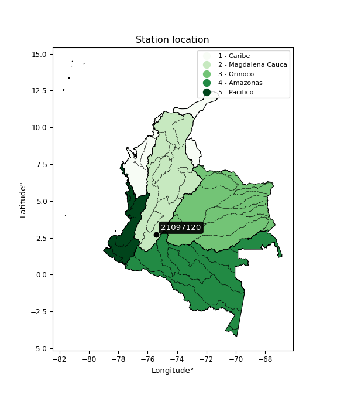

<div align="center">


</div>

# PMP Station (Rain, Pmax24h): 21097120

Probable Maximum Precipitation (PMP) is the greatest amount of rainfall for a specific duration that is meteorologically possible for a given location, acting as a "worst-case" scenario for extreme storms, crucial for designing safety-critical infrastructure like bridges, river deviations, dams, spillways, and nuclear plants to prevent catastrophic failure. PMP is calculated by hydrologists using meteorological data to determine the upper limit of extreme rainfall, often leading to the Probable Maximum Flood (PMF) for flood control design, and is increasingly being studied for climate change impacts. Probable Maximum Precipitation (PMP) is the theoretical upper limit of rainfall, a deterministic estimate for extreme events, while probability distributions (like GEV, Gumbel) describe the likelihood and frequency of various precipitation amounts, including rare ones, showing how often events occur, with PMP representing the extreme end of these distributions, used for critical infrastructure design to ensure safety against the worst conceivable weather, unlike standard statistical forecasts which cover typical probabilities.

The most common probability distributions in hydrology, used for analyzing floods, rainfall, and streamflow, include the Normal, Log-Normal, Gumbel, Gamma (including Log-Pearson Type III), and Generalized Extreme Value (GEV) distributions, often chosen based on the data´s skewness and whether modeling extremes or general conditions, with Gumbel and GEV popular for extreme events like floods, while the Normal distribution serves as a baseline, though often requiring transformations for skewed hydrological data. These distributions help in designing water infrastructure, managing water resources, and forecasting hydrologic events.

> Hydrological data often isn´t perfectly normal (it´s skewed), so different distributions are needed for different applications, such as: **Flood Frequency Analysis**: Using Gumbel, GEV, or Log-Pearson Type III for predicting extreme flood magnitudes and their return periods, **Rainfall Analysis**: Normal for annual totals, but Log-Normal, Weibull, or GEV for intensity or extreme daily rainfall, **Streamflow Modeling**: Gamma and Log-Normal for maximum flows, GEV for minimum flows, and Kappa for daily flows.

<div align="center">

</img>

</div>


## A. General information


### 1. General running parameters

• app_version: _v20260108_. • runtime: _2026-01-08 18:05:13.093906_. • Python version: _3.14.0_. • SciPy version: _1.16.3_. • Pandas version: _2.3.3_. • NumPy version: _2.3.5_. • Stations dataset (station_dataset_file): _dataset/pmax24h_in/automatic_colombia_2003_2024.csv_. • Stations catalog (station_catalog_file): _dataset/CNE.xls_. • Minimum year to eval til year_max (date_min): _1900_. • Maximum year to eval since year_min (date_max): _2024_. • Creates, save and include plots into reports (create_plot): _False_. • Plot only fit distributions with Δo > Δ (plot_only_fit): _True_. • Plot only simple graphs avoiding multiple CDFs and multiple Extreme values plots (plot_only_simple): _False_. • Eval low extreme values, if False, evaluates high extreme values (low_extreme): _False_. • Eval every SciPy distribution as logarithmic (pdist_logarithmic_on): _True_. • Standard deviation normalized (ddof): _1.0_. • Return periods to eval in years (Tr): _[2, 2.33, 5, 10, 15, 20, 25, 50, 75, 100, 200, 250, 500, 750, 1000]_. • Minimum data sample per station, 0 means any (minimum_sample): _5_. • Z-Score maximum threshold to adjust a value, 0 means disable (zscore_max): _3.5_. • Z-Score minimum threshold to adjust a value, 0 means disable (zscore_min): _-2.5_. • Avoid zeros, e.g. rain = 0 (avoid_zeros): _True_. • Avoid null values (avoid_nans): _True_. 

:file_folder:Table: [dataset.csv](../../dataset/pmax24h_in/automatic_colombia_2003_2024.csv)

> Delta Degrees of Freedom (DDOF): is a parameter used in the formulas for calculating variance and standard deviation. When ddof=0, the divisor is $N$ (the total number of observations) and this is used when your data set is the entire population. When ddof=1, the divisor is $N-1$ and this is used when your data set is a sample drawn from a larger population. Using $N-1$ provides an unbiased estimate of the population variance (known as Bessel´s correction).


### 2. Station info and location

|   id |   CODIGO | NOMBRE                        | CATEGORIA    | TECNOLOGIA                              | ESTADO           | FECHA_INSTALACION   |   FECHA_SUSPENSION |   ALTITUD |   LATITUD |   LONGITUD | DEPARTAMENTO   | MUNICIPIO   | AREA_OPERATIVA                    | ENTIDAD                                                     | AREA_HIDROGRAFICA   | ZONA_HIDROGRAFICA   | SUBZONA_HIDROGRAFICA                      | CORRIENTE   | Catalogo   |   Version |
|-----:|---------:|:------------------------------|:-------------|:----------------------------------------|:-----------------|:--------------------|-------------------:|----------:|----------:|-----------:|:---------------|:------------|:----------------------------------|:------------------------------------------------------------|:--------------------|:--------------------|:------------------------------------------|:------------|:-----------|----------:|
|    0 | 21097120 | LA ESPERANZA - AUT [21097120] | Limnigráfica | Automática con Telemetría, Convencional | En Mantenimiento | 15/11/1993          |                nan |       460 |   2.72842 |   -75.3964 | Huila          | Palermo     | Area Operativa 04 - Huila-Caquetá | INSTITUTO DE HIDROLOGIA METEOROLOGIA Y ESTUDIOS AMBIENTALES | Magdalena Cauca     | Alto Magdalena      | Juncal y otros Rios directos al Magdalena | Magdalena   | CNE_IDEAM  |  20251226 |

<div align="center">

Dynamic map: [:earth_americas:Google](http://maps.google.com/maps?q=2.728416667,-75.39638889) [:earth_americas:OSM](https://www.openstreetmap.org/#map=18/2.728416667/-75.39638889&layers=P) [:earth_americas:Bing](https://www.bing.com/maps?cp=2.728416667~-75.39638889&lvl=18) [:earth_americas:Apple](https://maps.apple.com/frame?center=2.728416667%2C-75.39638889&span=0.003%2C0.006)

</div>


<div align="center">

```geojson
{
  "type": "Feature",
  "geometry": {
    "type": "Point", 
    "coordinates": [-75.39638889, 2.728416667]
  }, 
  "properties": {
    "Name": "21097120"
  }
}
```

</div>


### 3. Discrete values table and plot

<div align="center">

|               |           0 |           1 |           2 |           3 |           4 |         5 |
|:--------------|------------:|------------:|------------:|------------:|------------:|----------:|
| Date          | 2019        | 2020        | 2021        | 2022        | 2023        | 2024      |
| Value         |   71.4      |  105.8      |   71.2      |   82.6      |   63.8      |  154.4    |
| Value_initial |   71.4      |  105.8      |   71.2      |   82.6      |   63.8      |  154.4    |
| count         |    6        |    6        |    6        |    6        |    6        |    6      |
| mean          |   91.5333   |   91.5333   |   91.5333   |   91.5333   |   91.5333   |   91.5333 |
| std           |   34.1277   |   34.1277   |   34.1277   |   34.1277   |   34.1277   |   34.1277 |
| zscore        |   -0.589941 |    0.418038 |   -0.595802 |   -0.261762 |   -0.812635 |    1.8421 |


</div>


> The initial value (value_initial) correspond to the initial obtained or null completed value, and value (value) is adjusted only when the initial value is outside the valid range (outlier) definite through the Z-Score value. If Z-Score is active, values out of range or outliers are replaced with the station mean value. A Z-Score (or standard score) measures how many standard deviations a data point is from the mean of a dataset, indicating its relative position; positive scores mean above the mean, negative mean below, and a score of zero is exactly at the mean, allowing for comparison of values from different distributions. It´s calculated using the formula $z=(x–μ)/σ$, where $x$ is the data point, $μ$ is the mean, and $σ$ is the standard deviation, helping identify outliers and understand probability.
>
> <sub>**Note**: In this study, "completing" (filling gaps in) and "extending" (forecasting or lengthening the historical record) rainfall data series are avoided for certain critical analyses because they introduce artificial bias and uncertainty, which can distort the statistics of rare events (extremes), alter day-to-day variability, and compromise the integrity and homogeneity of the original data. Some reasons against Completing/Extending rainfall data are: **Distortion of Extremes and Variability**: The primary issue is that most gap-filling or extension methods rely on averaging or regression with nearby stations, which inherently smooths the data. Rainfall is highly variable in space and time, with a large percentage of zero values and occasional large storms. Infilling methods often underestimate the highest values and overestimate the lowest (zero) values, which severely distorts analyses focused on flood frequency, drought severity, and intensity-duration-frequency (IDF) curves, **Loss of Data Homogeneity**: Infilled or extended data are synthetic estimates, not actual measurements. Combining these estimates with observed data can violate the assumption of data homogeneity, which requires that the data properties do not change over time. Inhomogeneity can lead to incorrect conclusions about long-term trends or changes in climate patterns, **Propagation of Errors**: Errors and biases from the original data (e.g., wind-induced undercatch, instrument errors, site changes) or the data used for imputation can propagate through the analysis, leading to unreliable hydrological models and inaccurate predictions, **Compromised Statistical Integrity**: For statistical analyses, especially those involving the frequency of events, using artificial data can introduce time bias or autocorrelation that doesn´t exist in reality, making it difficult to assess the true probability of events, **Difficulty in Validation**: It is difficult to accurately validate the quality of filled or extended data, especially for past periods where ground-truth measurements are unavailable. The reliability of imputation techniques heavily depends on the density of the surrounding station network and the complexity of the local topography.</sub>


### 4. Active continuous probability distributions from SciPy (43 of 104 available)

A Probability Density Function (PDF) describes the relative likelihood of a continuous random variable falling within a specific range, where the total area under its curve equals 1, and the area over any interval gives the actual probability for that range. Unlike discrete probabilities (like rolling a die), a PDF shows density, not direct probability for a single point (which is zero), with higher points indicating higher likelihood, often visualized as a bell curve for normal distributions.

A log of a probability density function (log-PDF) is simply the logarithm of the PDF´s value, denoted as $log(f(x))$, useful for converting multiplication of probabilities into addition, improving numerical stability with tiny numbers, and connecting to information theory concepts like entropy. Instead of dealing with very small probabilities (e.g., 0.000001), log-PDFs use negative numbers (e.g., $log(0.00001) ≈ -11.51$ that are easier for computers to handle, preventing underflow errors and simplifying complex calculations. In this study, each active probability distribution from SciPy is also evaluated in the $log$ form.

[scipy.stats](https://docs.scipy.org/doc/scipy/reference/stats.html) is a Python´s powerful submodule within the SciPy library for comprehensive statistical analysis, offering over 130 probability distributions (like Normal, Poisson), functions for descriptive stats (mean, variance), hypothesis testing (t-tests, chi-square), random variable generation, and statistical tests, making it essential for data science, modeling, and research. It provides tools to explore, model, and draw conclusions from data efficiently, working seamlessly with NumPy.

<div align="center">

|   id | p_dist             |   n_parameter | fit_method   | label                                                                       | active   | ref                                                                                                        |
|-----:|:-------------------|--------------:|:-------------|:----------------------------------------------------------------------------|:---------|:-----------------------------------------------------------------------------------------------------------|
|    0 | alpha              |             3 | MLE          | Alpha                                                                       | True     | [:mortar_board:](https://docs.scipy.org/doc/scipy/reference/generated/scipy.stats.alpha.html)              |
|    1 | betaprime          |             4 | MLE          | Beta prime                                                                  | True     | [:mortar_board:](https://docs.scipy.org/doc/scipy/reference/generated/scipy.stats.betaprime.html)          |
|    2 | chi2               |             3 | MLE          | Chi²                                                                        | True     | [:mortar_board:](https://docs.scipy.org/doc/scipy/reference/generated/scipy.stats.chi2.html)               |
|    3 | crystalball        |             4 | MLE          | Crystalball                                                                 | True     | [:mortar_board:](https://docs.scipy.org/doc/scipy/reference/generated/scipy.stats.crystalball.html)        |
|    4 | erlang             |             3 | MLE          | Erlang                                                                      | True     | [:mortar_board:](https://docs.scipy.org/doc/scipy/reference/generated/scipy.stats.erlang.html)             |
|    5 | expon              |             2 | MLE          | Exponential                                                                 | True     | [:mortar_board:](https://docs.scipy.org/doc/scipy/reference/generated/scipy.stats.expon.html)              |
|    6 | exponnorm          |             3 | MLE          | Exponentially modified Normal                                               | True     | [:mortar_board:](https://docs.scipy.org/doc/scipy/reference/generated/scipy.stats.exponnorm.html)          |
|    7 | f                  |             4 | MLE          | F                                                                           | True     | [:mortar_board:](https://docs.scipy.org/doc/scipy/reference/generated/scipy.stats.f.html)                  |
|    8 | fatiguelife        |             3 | MLE          | Fatigue-life (Birnbaum-Saunders)                                            | True     | [:mortar_board:](https://docs.scipy.org/doc/scipy/reference/generated/scipy.stats.fatiguelife.html)        |
|    9 | fisk               |             3 | MLE          | Fisk                                                                        | True     | [:mortar_board:](https://docs.scipy.org/doc/scipy/reference/generated/scipy.stats.fisk.html)               |
|   10 | gamma              |             3 | MLE          | Gamma                                                                       | True     | [:mortar_board:](https://docs.scipy.org/doc/scipy/reference/generated/scipy.stats.gamma.html)              |
|   11 | genexpon           |             5 | MLE          | Generalized exponential                                                     | True     | [:mortar_board:](https://docs.scipy.org/doc/scipy/reference/generated/scipy.stats.genexpon.html)           |
|   12 | genlogistic        |             3 | MLE          | Generalized logistic                                                        | True     | [:mortar_board:](https://docs.scipy.org/doc/scipy/reference/generated/scipy.stats.genlogistic.html)        |
|   13 | gibrat             |             2 | MM           | Gibrat                                                                      | True     | [:mortar_board:](https://docs.scipy.org/doc/scipy/reference/generated/scipy.stats.gibrat.html)             |
|   14 | gompertz           |             3 | MLE          | Gompertz (or truncated Gumbel)                                              | True     | [:mortar_board:](https://docs.scipy.org/doc/scipy/reference/generated/scipy.stats.gompertz.html)           |
|   15 | gumbel_l           |             2 | MM           | Gumbel Left Skew                                                            | True     | [:mortar_board:](https://docs.scipy.org/doc/scipy/reference/generated/scipy.stats.gumbel_l.html)           |
|   16 | gumbel_r           |             2 | MM           | Gumbel Right Skew                                                           | True     | [:mortar_board:](https://docs.scipy.org/doc/scipy/reference/generated/scipy.stats.gumbel_r.html)           |
|   17 | halflogistic       |             2 | MM           | Half-logistic                                                               | True     | [:mortar_board:](https://docs.scipy.org/doc/scipy/reference/generated/scipy.stats.halflogistic.html)       |
|   18 | halfnorm           |             2 | MM           | Half Normal                                                                 | True     | [:mortar_board:](https://docs.scipy.org/doc/scipy/reference/generated/scipy.stats.halfnorm.html)           |
|   19 | hypsecant          |             2 | MM           | hyperbolic secant                                                           | True     | [:mortar_board:](https://docs.scipy.org/doc/scipy/reference/generated/scipy.stats.hypsecant.html)          |
|   20 | invgamma           |             3 | MLE          | Inverted gamma                                                              | True     | [:mortar_board:](https://docs.scipy.org/doc/scipy/reference/generated/scipy.stats.invgamma.html)           |
|   21 | invgauss           |             3 | MLE          | Inverse Gaussian                                                            | True     | [:mortar_board:](https://docs.scipy.org/doc/scipy/reference/generated/scipy.stats.invgauss.html)           |
|   22 | invweibull         |             3 | MLE          | Inverted Weibull                                                            | True     | [:mortar_board:](https://docs.scipy.org/doc/scipy/reference/generated/scipy.stats.invweibull.html)         |
|   23 | kstwobign          |             2 | MLE          | Limiting distribution of scaled Kolmogorov-Smirnov two-sided test statistic | True     | [:mortar_board:](https://docs.scipy.org/doc/scipy/reference/generated/scipy.stats.kstwobign.html)          |
|   24 | laplace            |             2 | MM           | Laplace                                                                     | True     | [:mortar_board:](https://docs.scipy.org/doc/scipy/reference/generated/scipy.stats.laplace.html)            |
|   25 | laplace_asymmetric |             3 | MLE          | Asymmetric Laplace                                                          | True     | [:mortar_board:](https://docs.scipy.org/doc/scipy/reference/generated/scipy.stats.laplace_asymmetric.html) |
|   26 | loggamma           |             3 | MLE          | Log gamma                                                                   | True     | [:mortar_board:](https://docs.scipy.org/doc/scipy/reference/generated/scipy.stats.loggamma.html)           |
|   27 | logistic           |             2 | MM           | Logistic (or Sech-squared)                                                  | True     | [:mortar_board:](https://docs.scipy.org/doc/scipy/reference/generated/scipy.stats.logistic.html)           |
|   28 | lognorm            |             3 | MLE          | Log Normal                                                                  | True     | [:mortar_board:](https://docs.scipy.org/doc/scipy/reference/generated/scipy.stats.lognorm.html)            |
|   29 | maxwell            |             2 | MM           | Maxwell                                                                     | True     | [:mortar_board:](https://docs.scipy.org/doc/scipy/reference/generated/scipy.stats.maxwell.html)            |
|   30 | mielke             |             4 | MLE          | Mielke Beta-Kappa / Dagum                                                   | True     | [:mortar_board:](https://docs.scipy.org/doc/scipy/reference/generated/scipy.stats.mielke.html)             |
|   31 | moyal              |             2 | MM           | Moyal                                                                       | True     | [:mortar_board:](https://docs.scipy.org/doc/scipy/reference/generated/scipy.stats.moyal.html)              |
|   32 | nakagami           |             3 | MLE          | Nakagami                                                                    | True     | [:mortar_board:](https://docs.scipy.org/doc/scipy/reference/generated/scipy.stats.nakagami.html)           |
|   33 | ncf                |             5 | MLE          | Non-central F distribution                                                  | True     | [:mortar_board:](https://docs.scipy.org/doc/scipy/reference/generated/scipy.stats.ncf.html)                |
|   34 | nct                |             4 | MLE          | Non-central Student’s t                                                     | True     | [:mortar_board:](https://docs.scipy.org/doc/scipy/reference/generated/scipy.stats.nct.html)                |
|   35 | norm               |             2 | MM           | Normal                                                                      | True     | [:mortar_board:](https://docs.scipy.org/doc/scipy/reference/generated/scipy.stats.norm.html)               |
|   36 | pearson3           |             3 | MM           | Pearson type III                                                            | True     | [:mortar_board:](https://docs.scipy.org/doc/scipy/reference/generated/scipy.stats.pearson3.html)           |
|   37 | rayleigh           |             2 | MM           | Rayleigh                                                                    | True     | [:mortar_board:](https://docs.scipy.org/doc/scipy/reference/generated/scipy.stats.rayleigh.html)           |
|   38 | rice               |             3 | MLE          | Rice                                                                        | True     | [:mortar_board:](https://docs.scipy.org/doc/scipy/reference/generated/scipy.stats.rice.html)               |
|   39 | t                  |             3 | MLE          | Student’s t                                                                 | True     | [:mortar_board:](https://docs.scipy.org/doc/scipy/reference/generated/scipy.stats.t.html)                  |
|   40 | truncnorm          |             4 | MLE          | Truncated normal                                                            | True     | [:mortar_board:](https://docs.scipy.org/doc/scipy/reference/generated/scipy.stats.truncnorm.html)          |
|   41 | wald               |             2 | MM           | Wald                                                                        | True     | [:mortar_board:](https://docs.scipy.org/doc/scipy/reference/generated/scipy.stats.wald.html)               |
|   42 | weibull_min        |             3 | MLE          | Weibull minimum                                                             | True     | [:mortar_board:](https://docs.scipy.org/doc/scipy/reference/generated/scipy.stats.weibull_min.html)        |

</div>

> **n_parameter:** # arguments & localization & scale.
>
> **Fit methods:** (MLE) maximum likelihood, (MM) L-moments.
>
>**Inactive** (With the only purpose of prevent loops, zero divisions, infinite values, over high estimated values or horizontal trending for recurrence intervals estimations, the follow distributions were disabled.)**:** foldnorm, gennorm, norminvgauss, powernorm, powerlognorm, skewnorm, genextreme, anglit, arcsine, argus, beta, bradford, burr, burr12, cauchy, cosine, halfcauchy, foldcauchy, skewcauchy, wrapcauchy, dgamma, gengamma, exponweib, exponpow, truncexpon, gausshyper, genhalflogistic, genhyperbolic, geninvgauss, halfgennorm, johnsonsb, johnsonsu, kappa4, kappa3, ksone, kstwo, loglaplace, levy, levy_l, levy_stable, ncx2, pareto, genpareto, truncpareto, lomax, powerlaw, rdist, rel_breitwigner, recipinvgauss, semicircular, studentized_range, trapezoid, triang, truncweibull_min, tukeylambda, uniform, loguniform, vonmises, vonmises_line, weibull_max, dweibull, 


## B. Probability (PDF) vs. Empirical (EDF) distributions functions

A continuous probability distribution (CPD) describes probabilities for variables that can take any value within a range (like rain any time), unlike discrete variables with specific outcomes (like temperature). It uses a Probability Density Function (PDF), a curve where the total area under it equals 1, and the probability of the variable falling within an interval (a to b) is found by calculating the area under the curve between those points. A key feature is that the probability of hitting any single exact value is zero, so probabilities are always expressed for ranges, e.g., $P(a ≤ X ≤ b)$.

<div align="center">

Distributions parameters from station values
|    |   station | p_dist                |   n |            loc |          scale | shape                  | shape1                 | shape2             | shape3   |
|---:|----------:|:----------------------|----:|---------------:|---------------:|:-----------------------|:-----------------------|:-------------------|:---------|
|  0 |  21097120 | alpha                 |   6 |      57.124    |   13.1798      | 9.71116273270693e-09   |                        |                    |          |
|  1 |  21097120 | betaprime             |   6 |      -1.80527  |    3.64385     | 307.7662656294781      | 13.07542752534139      |                    |          |
|  2 |  21097120 | chi2                  |   6 |      63.8      |    3.92941     | 0.19017119324396378    |                        |                    |          |
|  3 |  21097120 | crystalball           |   6 |      91.5333   |   31.1542      | 7885.218709982939      | 74.35557371167683      |                    |          |
|  4 |  21097120 | erlang                |   6 |      63.8      |   21.9311      | 0.623671307188344      |                        |                    |          |
|  5 |  21097120 | expon                 |   6 |      63.8      |   27.7333      |                        |                        |                    |          |
|  6 |  21097120 | exponnorm             |   6 |      63.772    |    0.00907831  | 3042.633411439163      |                        |                    |          |
|  7 |  21097120 | f                     |   6 |      58.3311   |   14.6616      | 1857.3646087291663     | 2.8614878668996733     |                    |          |
|  8 |  21097120 | fatiguelife           |   6 |      62.8313   |   10.5605      | 1.7606046170257046     |                        |                    |          |
|  9 |  21097120 | fisk                  |   6 |      63.8      |   21.1418      | 0.6725707545385566     |                        |                    |          |
| 10 |  21097120 | gamma                 |   6 |      63.8      |   20.0473      | 0.6749573053366339     |                        |                    |          |
| 11 |  21097120 | genexpon              |   6 |      63.8      |   62.0528      | 2.237355667297096      | 2.9861407667900116e-09 | 1.2940799541941663 |          |
| 12 |  21097120 | genlogistic           |   6 |     -74.4657   |   19.6375      | 2382.225561151213      |                        |                    |          |
| 13 |  21097120 | gibrat                |   6 |      67.7666   |   14.4152      |                        |                        |                    |          |
| 14 |  21097120 | gompertz              |   6 |      63.8      |    2.7979e+13  | 800376774869.2283      |                        |                    |          |
| 15 |  21097120 | gumbel_l              |   6 |     105.554    |   24.2908      |                        |                        |                    |          |
| 16 |  21097120 | gumbel_r              |   6 |      77.5123   |   24.2908      |                        |                        |                    |          |
| 17 |  21097120 | halflogistic          |   6 |      54.6084   |   26.6357      |                        |                        |                    |          |
| 18 |  21097120 | halfnorm              |   6 |      50.2974   |   51.6815      |                        |                        |                    |          |
| 19 |  21097120 | hypsecant             |   6 |      91.5333   |   19.8334      |                        |                        |                    |          |
| 20 |  21097120 | invgamma              |   6 |      58.323    |   20.9585      | 1.4299794054594268     |                        |                    |          |
| 21 |  21097120 | invgauss              |   6 |      60.52     |   16.0007      | 1.9382555758264508     |                        |                    |          |
| 22 |  21097120 | invweibull            |   6 |      63.8      |    2.13929     | 0.0469671678293724     |                        |                    |          |
| 23 |  21097120 | kstwobign             |   6 |       6.47112  |   98.476       |                        |                        |                    |          |
| 24 |  21097120 | laplace               |   6 |      91.5333   |   22.0293      |                        |                        |                    |          |
| 25 |  21097120 | laplace_asymmetric    |   6 |      63.8      |    0.000432847 | 1.5607675606308848e-05 |                        |                    |          |
| 26 |  21097120 | loggamma              |   6 |   -7624.22     | 1088.27        | 1200.24222260102       |                        |                    |          |
| 27 |  21097120 | logistic              |   6 |      91.5333   |   17.1762      |                        |                        |                    |          |
| 28 |  21097120 | lognorm               |   6 |      63.8      |    0.0552962   | 13.304372080154268     |                        |                    |          |
| 29 |  21097120 | maxwell               |   6 |      17.711    |   46.2613      |                        |                        |                    |          |
| 30 |  21097120 | mielke                |   6 |      17.432    |   14.7596      | 1118.3686385032242     | 4.143296085517164      |                    |          |
| 31 |  21097120 | moyal                 |   6 |      73.7174   |   14.0243      |                        |                        |                    |          |
| 32 |  21097120 | nakagami              |   6 |      63.8      |   56.9566      | 0.22526451951359644    |                        |                    |          |
| 33 |  21097120 | ncf                   |   6 |       0.012922 |    1.80425e-07 | 6.876340617839785e-09  | 1.9873890984718794     | 2.0995068897869302 |          |
| 34 |  21097120 | nct                   |   6 |      -0.273223 |    1.11592     | 7.082944920376846      | 72.73119518243624      |                    |          |
| 35 |  21097120 | norm                  |   6 |      91.5333   |   31.1542      |                        |                        |                    |          |
| 36 |  21097120 | pearson3              |   6 |      91.5333   |   31.1542      | 1.172679342657827      |                        |                    |          |
| 37 |  21097120 | rayleigh              |   6 |      31.9336   |   47.5537      |                        |                        |                    |          |
| 38 |  21097120 | rice                  |   6 |      44.3463   |   39.9825      | 0.0003915377884178096  |                        |                    |          |
| 39 |  21097120 | t                     |   6 |      91.5347   |   31.1618      | 59461.76011825993      |                        |                    |          |
| 40 |  21097120 | truncnorm             |   6 | -126842        | 1989.13        | 63.79985387951454      | 163.2361906446825      |                    |          |
| 41 |  21097120 | wald                  |   6 |      60.3792   |   31.1542      |                        |                        |                    |          |
| 42 |  21097120 | weibull_min           |   6 |      63.8      |   38.6329      | 0.5436989973373847     |                        |                    |          |
| 43 |  21097120 | logalpha              |   6 |       3.58315  |    2.98638     | 3.768958445764655      |                        |                    |          |
| 44 |  21097120 | logbetaprime          |   6 |       1.12302  |   23.0056      | 157.8080474729976      | 1085.1364651903923     |                    |          |
| 45 |  21097120 | logchi2               |   6 |       4.15575  |    0.970161    | 1.0829281115353953     |                        |                    |          |
| 46 |  21097120 | logcrystalball        |   6 |       4.46744  |    0.301504    | 7.315520871466905      | 1.0141755457930266     |                    |          |
| 47 |  21097120 | logerlang             |   6 |       4.15575  |    0.299543    | 0.4206630941647852     |                        |                    |          |
| 48 |  21097120 | logexpon              |   6 |       4.15575  |    0.311689    |                        |                        |                    |          |
| 49 |  21097120 | logexponnorm          |   6 |       4.15551  |    7.17588e-05 | 4329.765351617196      |                        |                    |          |
| 50 |  21097120 | logf                  |   6 |       4.03657  |    0.269098    | 1841.9263018079082     | 4.672331655677052      |                    |          |
| 51 |  21097120 | logfatiguelife        |   6 |       4.12031  |    0.20471     | 1.1576140467391558     |                        |                    |          |
| 52 |  21097120 | logfisk               |   6 |       4.15575  |    0.243405    | 0.8597044007078412     |                        |                    |          |
| 53 |  21097120 | loggamma              |   6 |       4.15575  |    0.355288    | 0.38129400674331043    |                        |                    |          |
| 54 |  21097120 | loggenexpon           |   6 |       4.15575  |    0.548244    | 1.7592397312362889     | 1.2193357508182751e-06 | 1.382154134165082  |          |
| 55 |  21097120 | loggenlogistic        |   6 |       2.84934  |    0.209169    | 1202.2512445143366     |                        |                    |          |
| 56 |  21097120 | loggibrat             |   6 |       4.23747  |    0.139487    |                        |                        |                    |          |
| 57 |  21097120 | loggompertz           |   6 |       4.15575  |    5.94211     | 18.105364918564128     |                        |                    |          |
| 58 |  21097120 | loggumbel_l           |   6 |       4.60313  |    0.235082    |                        |                        |                    |          |
| 59 |  21097120 | loggumbel_r           |   6 |       4.33175  |    0.235082    |                        |                        |                    |          |
| 60 |  21097120 | loghalflogistic       |   6 |       4.11009  |    0.257775    |                        |                        |                    |          |
| 61 |  21097120 | loghalfnorm           |   6 |       4.06837  |    0.500164    |                        |                        |                    |          |
| 62 |  21097120 | loghypsecant          |   6 |       4.46744  |    0.191944    |                        |                        |                    |          |
| 63 |  21097120 | loginvgamma           |   6 |       0.764182 |  621.925       | 169.07628481454086     |                        |                    |          |
| 64 |  21097120 | loginvgauss           |   6 |       4.09087  |    0.358384    | 1.0507573989879448     |                        |                    |          |
| 65 |  21097120 | loginvweibull         |   6 |       3.97886  |    0.306101    | 1.97545677076644       |                        |                    |          |
| 66 |  21097120 | logkstwobign          |   6 |       3.58961  |    1.01103     |                        |                        |                    |          |
| 67 |  21097120 | loglaplace            |   6 |       4.46744  |    0.213196    |                        |                        |                    |          |
| 68 |  21097120 | loglaplace_asymmetric |   6 |       4.26549  |    0.152315    | 0.5369215489648578     |                        |                    |          |
| 69 |  21097120 | logloggamma           |   6 |     -77.2115   |   11.3377      | 1345.4588387146578     |                        |                    |          |
| 70 |  21097120 | loglogistic           |   6 |       4.46744  |    0.166228    |                        |                        |                    |          |
| 71 |  21097120 | loglognorm            |   6 |       4.15575  |    0.00104015  | 12.450236586872508     |                        |                    |          |
| 72 |  21097120 | logmaxwell            |   6 |       3.753    |    0.447708    |                        |                        |                    |          |
| 73 |  21097120 | logmielke             |   6 |       3.43051  |    0.349117    | 320.79861491906263     | 4.569130210642639      |                    |          |
| 74 |  21097120 | logmoyal              |   6 |       4.29502  |    0.135725    |                        |                        |                    |          |
| 75 |  21097120 | lognakagami           |   6 |       4.15575  |    0.527706    | 0.2943228212099264     |                        |                    |          |
| 76 |  21097120 | logncf                |   6 |       4.03819  |    0.17053     | 275.7249545355821      | 4.672648467102399      | 157.89332734712863 |          |
| 77 |  21097120 | lognct                |   6 |       0.788157 |    0.0589873   | 87.65500483651468      | 61.75829759741811      |                    |          |
| 78 |  21097120 | lognorm               |   6 |       4.46744  |    0.301504    |                        |                        |                    |          |
| 79 |  21097120 | logpearson3           |   6 |       4.46744  |    0.301504    | 0.8999738548161971     |                        |                    |          |
| 80 |  21097120 | lograyleigh           |   6 |       3.89065  |    0.460216    |                        |                        |                    |          |
| 81 |  21097120 | logrice               |   6 |       3.98838  |    0.400253    | 0.0008058606681952628  |                        |                    |          |
| 82 |  21097120 | logt                  |   6 |       4.46744  |    0.301504    | 21201907673.93479      |                        |                    |          |
| 83 |  21097120 | logtruncnorm          |   6 |      -2.75687  |    1.6827      | 4.10806366738958       | 4.633289682306961      |                    |          |
| 84 |  21097120 | logwald               |   6 |       4.16592  |    0.301517    |                        |                        |                    |          |
| 85 |  21097120 | logweibull_min        |   6 |       4.15575  |    0.270724    | 0.7031731117416511     |                        |                    |          |

</div>

> **loc** (Location parameter): This shifts the distribution along the x-axis. For many common distributions, like the normal (Gaussian) distribution, loc represents the mean $μ$. For others, like the uniform distribution, it might represent the minimum value, or for the beta distribution, the left end of the support interval.
>
> **scale** (Scale parameter): This determines the width or spread of the distribution. For the normal distribution, scale represents the standard deviation $σ$. For a uniform distribution, it defines the length of the interval (from $loc$ to $loc + scale$).
>
> **shape** (Shape parameters): Refers to parameters that define the specific form of a probability distribution, distinct from its location (loc) and scale (scale). These parameters are required arguments for most distribution functions. For example, a normal (Gaussian) distribution is fully defined by its location (mean) and scale (standard deviation), so it has no specific shape parameters beyond loc and scale. However, other distributions have intrinsic properties that need specification, as Gamma distribution that takes a shape parameter, often named $a$ or $alpha$.


### 0. Cumulative distribution values - CDF (86 evaluated)

Cumulative Distribution Function (CDF), denoted as $F$<sub>$X$</sub>$(x)$, is a function that gives the probability that a random variable $X$ will take a value less than or equal to a specific value, $x$ (i.e., $(P(X≥x)$. It essentially "accumulates" probabilities from a given point up to the far right (positive infinity), providing a complete picture of the distribution´s probabilities for both discrete (like rain) and continuous (like temperature) variables, helping to find probabilities over ranges or above certain values. Each station is evaluated separately ordering the $x$ values ascending, calculating the CDF and PDF values for the activated distributions and their logarithmic forms.

<div align="center">

CDF ordered by x ascending and calculating $log(f(x))$ separately
|   id |   Station |   date |     x |   count |    mean |     std |    zscore |   Value_initial |   station |   m |     alpha |   alpha_pdf |   betaprime |   betaprime_pdf |      chi2 |    chi2_pdf |   crystalball |   crystalball_pdf |      erlang |     erlang_pdf |    expon |   expon_pdf |   exponnorm |   exponnorm_pdf |         f |      f_pdf |   fatiguelife |   fatiguelife_pdf |        fisk |   fisk_pdf |       gamma |      gamma_pdf |    genexpon |   genexpon_pdf |   genlogistic |   genlogistic_pdf |    gibrat |   gibrat_pdf |    gompertz |   gompertz_pdf |   gumbel_l |   gumbel_l_pdf |   gumbel_r |   gumbel_r_pdf |   halflogistic |   halflogistic_pdf |   halfnorm |   halfnorm_pdf |   hypsecant |   hypsecant_pdf |   invgamma |   invgamma_pdf |   invgauss |   invgauss_pdf |   invweibull |   invweibull_pdf |   kstwobign |   kstwobign_pdf |   laplace |   laplace_pdf |   laplace_asymmetric |   laplace_asymmetric_pdf |    loggamma |   loggamma_pdf |   logistic |   logistic_pdf |   lognorm |   lognorm_pdf |   maxwell |   maxwell_pdf |   mielke |   mielke_pdf |    moyal |   moyal_pdf |    nakagami |   nakagami_pdf |      ncf |     ncf_pdf |      nct |    nct_pdf |     norm |   norm_pdf |   pearson3 |   pearson3_pdf |   rayleigh |   rayleigh_pdf |     rice |   rice_pdf |        t |      t_pdf |   truncnorm |   truncnorm_pdf |       wald |   wald_pdf |   weibull_min |   weibull_min_pdf |   logalpha |   logalpha_pdf |   logbetaprime |   logbetaprime_pdf |     logchi2 |   logchi2_pdf |   logcrystalball |   logcrystalball_pdf |   logerlang |   logerlang_pdf |   logexpon |   logexpon_pdf |   logexponnorm |   logexponnorm_pdf |      logf |   logf_pdf |   logfatiguelife |   logfatiguelife_pdf |     logfisk |   logfisk_pdf |   loggenexpon |   loggenexpon_pdf |   loggenlogistic |   loggenlogistic_pdf |   loggibrat |   loggibrat_pdf |   loggompertz |   loggompertz_pdf |   loggumbel_l |   loggumbel_l_pdf |   loggumbel_r |   loggumbel_r_pdf |   loghalflogistic |   loghalflogistic_pdf |   loghalfnorm |   loghalfnorm_pdf |   loghypsecant |   loghypsecant_pdf |   loginvgamma |   loginvgamma_pdf |   loginvgauss |   loginvgauss_pdf |   loginvweibull |   loginvweibull_pdf |   logkstwobign |   logkstwobign_pdf |   loglaplace |   loglaplace_pdf |   loglaplace_asymmetric |   loglaplace_asymmetric_pdf |   logloggamma |   logloggamma_pdf |   loglogistic |   loglogistic_pdf |   loglognorm |   loglognorm_pdf |   logmaxwell |   logmaxwell_pdf |   logmielke |   logmielke_pdf |   logmoyal |   logmoyal_pdf |   lognakagami |   lognakagami_pdf |    logncf |   logncf_pdf |   lognct |   lognct_pdf |   logpearson3 |   logpearson3_pdf |   lograyleigh |   lograyleigh_pdf |   logrice |   logrice_pdf |     logt |   logt_pdf |   logtruncnorm |   logtruncnorm_pdf |   logwald |   logwald_pdf |   logweibull_min |   logweibull_min_pdf |
|-----:|----------:|-------:|------:|--------:|--------:|--------:|----------:|----------------:|----------:|----:|----------:|------------:|------------:|----------------:|----------:|------------:|--------------:|------------------:|------------:|---------------:|---------:|------------:|------------:|----------------:|----------:|-----------:|--------------:|------------------:|------------:|-----------:|------------:|---------------:|------------:|---------------:|--------------:|------------------:|----------:|-------------:|------------:|---------------:|-----------:|---------------:|-----------:|---------------:|---------------:|-------------------:|-----------:|---------------:|------------:|----------------:|-----------:|---------------:|-----------:|---------------:|-------------:|-----------------:|------------:|----------------:|----------:|--------------:|---------------------:|-------------------------:|------------:|---------------:|-----------:|---------------:|----------:|--------------:|----------:|--------------:|---------:|-------------:|---------:|------------:|------------:|---------------:|---------:|------------:|---------:|-----------:|---------:|-----------:|-----------:|---------------:|-----------:|---------------:|---------:|-----------:|---------:|-----------:|------------:|----------------:|-----------:|-----------:|--------------:|------------------:|-----------:|---------------:|---------------:|-------------------:|------------:|--------------:|-----------------:|---------------------:|------------:|----------------:|-----------:|---------------:|---------------:|-------------------:|----------:|-----------:|-----------------:|---------------------:|------------:|--------------:|--------------:|------------------:|-----------------:|---------------------:|------------:|----------------:|--------------:|------------------:|--------------:|------------------:|--------------:|------------------:|------------------:|----------------------:|--------------:|------------------:|---------------:|-------------------:|--------------:|------------------:|--------------:|------------------:|----------------:|--------------------:|---------------:|-------------------:|-------------:|-----------------:|------------------------:|----------------------------:|--------------:|------------------:|--------------:|------------------:|-------------:|-----------------:|-------------:|-----------------:|------------:|----------------:|-----------:|---------------:|--------------:|------------------:|----------:|-------------:|---------:|-------------:|--------------:|------------------:|--------------:|------------------:|----------:|--------------:|---------:|-----------:|---------------:|-------------------:|----------:|--------------:|-----------------:|---------------------:|
|    0 |  21097120 |   2023 |  63.8 |       6 | 91.5333 | 34.1277 | -0.812635 |            63.8 |  21097120 |   1 | 0.0483593 |  0.0336118  |    0.141539 |      0.0131163  | 0.0389316 | 5.20986e+11 |      0.18668  |        0.0086162  | 2.43871e-10 | 21405.6        | 0        |  0.0360577  |  0.00101271 |      0.0361293  | 0.0481234 | 0.0305619  |     0.0442539 |        0.0988254  | 9.54676e-06 | 8.84207    | 4.12442e-11 | 3917.86        | 4.31866e-11 |     0.0360557  |      0.124391 |        0.0131971  | 0         |  0           | 1.76837e-13 |     0.0286064  |   0.164109 |    0.00616855  |   0.17229  |     0.0124732  |       0.170851 |         0.0182238  |   0.206112 |     0.0149205  |    0.154167 |      0.00747275 |  0.0481532 |     0.0305864  |  0.0446082 |     0.0382019  |   0.00834119 |      2.63909e+11 |    0.113015 |      0.0123807  |  0.141979 |    0.00644501 |          3.56532e-10 |               0.0360582  | 3.04568e-06 |    1.30751e+09 |   0.165946 |     0.00805811 |  0.15062  |      0.775446 |  0.196949 |    0.0104219  |      nan |          nan | 0.154402 |  0.0146948  | 5.35879e-08 |    3.39781e+06 | 0.622326 | 0.00253251  | 0.128305 | 0.0143578  | 0.18668  | 0.0086162  |   0.180176 |     0.0138851  |   0.201106 |     0.0112578  | 0.111631 | 0.0108108  | 0.186729 | 0.00861536 |    0        |      0.0320822  | 0.00660534 | 0.00953502 |   2.78417e-09 |   213042          |  0.0740218 |       1.27651  |       0.132003 |           0.807143 | 5.56844e-09 |   3.39471e+06 |         0.15062  |             0.775448 | 8.73027e-07 |     4.13487e+08 |   0        |       3.20833  |    0.000773514 |           3.21476  | 0.0506456 |   1.75832  |        0.0430372 |             3.14116  | 7.02314e-13 |    339.899    |   4.99653e-09 |          3.20887  |        0.0974352 |             1.08364  |   0         |        0        |    1.0825e-14 |          3.04696  |      0.138523 |          0.546416 |      0.120735 |          1.0858   |         0.0883422 |              1.92454  |      0.138694 |          1.57108  |       0.123912 |           0.629386 |      0.136655 |          0.862425 |     0.0455579 |          2.17877  |       0.0521096 |            1.71928  |      0.0875392 |           1.06211  |     0.115888 |         0.543576 |                0.058485 |                    0.71514  |      0.157403 |          0.771601 |      0.132957 |           0.6935  |    0.0128074 |      2.98841e+12 |     0.152746 |         0.962278 |    0.086832 |        1.31388  |  0.0948419 |       1.2167   |   1.56182e-09 |        1.0351e+06 | 0.0506445 |     1.75832  | 0.137796 |     0.887467 |      0.135157 |          1.10036  |      0.152882 |          1.06033  | 0.0837188 |      0.957292 | 0.15062  |   0.775447 |    4.29998e-06 |           2.82754  |  0        |      0        |      6.53464e-11 |         51734.9      |
|    1 |  21097120 |   2021 |  71.2 |       6 | 91.5333 | 34.1277 | -0.595802 |            71.2 |  21097120 |   2 | 0.349104  |  0.0342384  |    0.251414 |      0.0162058  | 0.974891  | 0.00522645  |      0.256985 |        0.0103489  | 0.500196    |     0.0340735  | 0.234194 |  0.0276132  |  0.235792   |      0.0276667  | 0.330841  | 0.0345443  |     0.447324  |        0.0270217  | 0.330473    | 0.0201099  | 0.489388    |    0.035593    | 0.234183    |     0.027612   |      0.239282 |        0.0174206  | 0.0756795 |  0.0415139   | 0.190782    |     0.0231488  |   0.215804 |    0.00784805  |   0.273418 |     0.0145963  |       0.301759 |         0.0170625  |   0.314118 |     0.014226   |    0.219267 |      0.0102016  |  0.330976  |     0.0345451  |  0.351255  |     0.0331344  |   0.38931    |      0.00233101  |    0.21939  |      0.015967   |  0.19866  |    0.00901799 |          0.234197    |               0.0276135  | 0.662963    |    1.83477     |   0.234368 |     0.010447   |  0.251491 |      1.05729  |  0.279606 |    0.0118172  |      nan |          nan | 0.273998 |  0.0171066  | 0.312354    |    0.0189579   | 0.640196 | 0.00230275  | 0.250533 | 0.0180924  | 0.256985 | 0.0103489  |   0.288424 |     0.0150855  |   0.288879 |     0.012348   | 0.201921 | 0.0134063  | 0.257024 | 0.0103471  |    0.211336 |      0.0253035  | 0.216241   | 0.0338815  |   0.334467    |        0.0199099  |  0.271708  |       2.12761  |       0.239421 |           1.1413   | 0.233026    |   1.10819     |         0.251492 |             1.0573   | 0.667233    |     1.96525     |   0.296777 |       2.25617  |    0.298108    |           2.25907  | 0.319263  |   2.48631  |        0.382753  |             2.30398  | 0.335179    |      1.74569  |   0.296818    |          2.25642  |        0.251954  |             1.65953  |   0.0542467 |        3.92681  |    0.286433   |          2.21474  |      0.211649 |          0.797507 |      0.265652 |          1.49794  |         0.292623  |              1.77358  |      0.306507 |          1.47604  |       0.213877 |           1.0323   |      0.250692 |          1.20135  |     0.341931  |          2.43642  |       0.320258  |            2.51319  |      0.237185  |           1.58659  |     0.193904 |         0.90951  |                0.223774 |                    2.73625  |      0.256924 |          1.03667  |      0.228837 |           1.06162 |    0.645868  |      0.272248    |     0.273318 |         1.21281  |    0.274094 |        1.92348  |  0.264884  |       1.76024  |   0.307249    |        1.63195    | 0.31926   |     2.4863   | 0.254862 |     1.22866  |      0.275104 |          1.40353  |      0.282301 |          1.2702   | 0.213112  |      1.36113  | 0.251491 |   1.0573   |    0.272028    |           2.1584   |  0.198092 |      3.53506  |      0.41137     |             1.99886  |
|    2 |  21097120 |   2019 |  71.4 |       6 | 91.5333 | 34.1277 | -0.589941 |            71.4 |  21097120 |   3 | 0.355898  |  0.0336942  |    0.25466  |      0.0162572  | 0.975911  | 0.00497363  |      0.259059 |        0.0103921  | 0.506946    |     0.033427   | 0.239697 |  0.0274148  |  0.241306   |      0.0274671  | 0.337707  | 0.0341136  |     0.452666  |        0.0264015  | 0.334454    | 0.0196987  | 0.496441    |    0.0349356   | 0.239685    |     0.0274137  |      0.242774 |        0.0174958  | 0.0840817 |  0.0424803   | 0.195399    |     0.0230167  |   0.217379 |    0.00789705  |   0.276341 |     0.0146314  |       0.305168 |         0.0170236  |   0.316961 |     0.0142037  |    0.221315 |      0.0102812  |  0.337842  |     0.0341139  |  0.35783   |     0.0326175  |   0.38977    |      0.00226951  |    0.22259  |      0.0160295  |  0.200472 |    0.00910024 |          0.2397      |               0.027415   | 0.66805     |    1.79213     |   0.236464 |     0.0105116  |  0.254466 |      1.06386  |  0.281972 |    0.0118463  |      nan |          nan | 0.277422 |  0.0171296  | 0.316117    |    0.0186782   | 0.640656 | 0.00229697  | 0.254157 | 0.018144   | 0.259059 | 0.0103921  |   0.291442 |     0.0150953  |   0.291351 |     0.0123677  | 0.204608 | 0.0134607  | 0.259098 | 0.0103903  |    0.216381 |      0.0251417  | 0.223002   | 0.0337275  |   0.338413    |        0.0195525  |  0.277684  |       2.13299  |       0.242633 |           1.14883  | 0.236115    |   1.09386     |         0.254467 |             1.06386  | 0.67268     |     1.91867     |   0.303077 |       2.23596  |    0.304417    |           2.23877  | 0.326212  |   2.46798  |        0.389165  |             2.26773  | 0.340031    |      1.71422  |   0.303119    |          2.2362   |        0.25662   |             1.66777  |   0.0655731 |        4.14125  |    0.29262    |          2.19657  |      0.213897 |          0.80478  |      0.269861 |          1.50363  |         0.29759   |              1.7679   |      0.310643 |          1.47276  |       0.216789 |           1.04413  |      0.254072 |          1.20856  |     0.348727  |          2.40923  |       0.327282  |            2.49496  |      0.241645  |           1.59353  |     0.196472 |         0.921556 |                0.231412 |                    2.70933  |      0.25984  |          1.04284  |      0.231828 |           1.07132 |    0.646622  |      0.265261    |     0.276727 |         1.21733  |    0.279492 |        1.92561  |  0.269827  |       1.76443  |   0.311801    |        1.61403    | 0.326209  |     2.46796  | 0.258318 |     1.23571  |      0.279047 |          1.40755  |      0.285869 |          1.27334  | 0.21694   |      1.36822  | 0.254466 |   1.06386  |    0.278061    |           2.14343  |  0.207985 |      3.51799  |      0.416929    |             1.9652   |
|    3 |  21097120 |   2022 |  82.6 |       6 | 91.5333 | 34.1277 | -0.261762 |            82.6 |  21097120 |   4 | 0.604919  |  0.0141732  |    0.443013 |      0.0166058  | 0.996808  | 0.000526981 |      0.387153 |        0.0122896  | 0.752591    |     0.0142653  | 0.49231  |  0.0183061  |  0.494208   |      0.0183112  | 0.604606  | 0.015896   |     0.641315  |        0.0112672  | 0.480271    | 0.00892983 | 0.753899    |    0.0148862   | 0.492291    |     0.0183058  |      0.449147 |        0.0183037  | 0.511406  |  0.026884    | 0.415968    |     0.016707   |   0.322053 |    0.0108481   |   0.4444   |     0.0148378  |       0.481897 |         0.0144125  |   0.468049 |     0.0126991  |    0.361243 |      0.0145483  |  0.60469   |     0.0158907  |  0.606634  |     0.0149253  |   0.405368   |      0.000914438 |    0.41149  |      0.0169106  |  0.333315 |    0.0151305  |          0.492315    |               0.0183062  | 0.83255     |    0.711333    |   0.372829 |     0.0136135  |  0.429668 |      1.30256  |  0.420813 |    0.0126882  |      nan |          nan | 0.466271 |  0.015894   | 0.47362     |    0.0111247   | 0.664689 | 0.00200432  | 0.459966 | 0.0176213  | 0.387153 | 0.0122896  |   0.458165 |     0.0142822  |   0.433115 |     0.0127012  | 0.367261 | 0.0151411  | 0.387164 | 0.0122867  |    0.452936 |      0.0175536  | 0.524114   | 0.0200676  |   0.49134     |        0.00994396 |  0.569356  |       1.69988  |       0.431866 |           1.39589  | 0.360798    |   0.693331    |         0.429669 |             1.30256  | 0.84597     |     0.729051    |   0.563328 |       1.40099  |    0.564816    |           1.40066  | 0.604315  |   1.38176  |        0.623059  |             1.13535  | 0.512726    |      0.83168  |   0.563388    |          1.40103  |        0.507676  |             1.6449   |   0.593114  |        2.19797  |    0.552575   |          1.42384  |      0.360653 |          1.21653  |      0.494236 |          1.48165  |         0.52954   |              1.39576  |      0.510469 |          1.2564   |       0.412514 |           1.59611  |      0.449453 |          1.41329  |     0.609566  |          1.28571  |       0.607064  |            1.37553  |      0.480705  |           1.5808   |     0.389157 |         1.82535  |                0.540145 |                    1.62102  |      0.430846 |          1.2691   |      0.420325 |           1.46577 |    0.671092  |      0.112481    |     0.464067 |         1.30624  |    0.540328 |        1.5385   |  0.518859  |       1.53998  |   0.501946    |        1.08324    | 0.604313  |     1.38178  | 0.45633  |     1.41893  |      0.48783  |          1.39055  |      0.47619  |          1.29436  | 0.431873  |      1.50941  | 0.429669 |   1.30256  |    0.53986     |           1.48755  |  0.586896 |      1.7393   |      0.619926    |             1.00111  |
|    4 |  21097120 |   2020 | 105.8 |       6 | 91.5333 | 34.1277 |  0.418038 |           105.8 |  21097120 |   5 | 0.786572  |  0.00427856 |    0.754146 |      0.00965287 | 0.999909  | 1.32989e-05 |      0.676501 |        0.0115307  | 0.929853    |     0.00366003 | 0.780065 |  0.00793035 |  0.781625   |      0.00790584 | 0.809622  | 0.00474994 |     0.806239  |        0.00456135 | 0.613409    | 0.00379744 | 0.935249    |    0.00360347  | 0.780046    |     0.00793058 |      0.782213 |        0.00978353 | 0.834021  |  0.00655174  | 0.699247    |     0.00860344 |   0.635841 |    0.015144    |   0.731934 |     0.00940319 |       0.744704 |         0.00836126 |   0.717148 |     0.00867284 |    0.711447 |      0.0126365  |  0.809629  |     0.00474822 |  0.8093    |     0.00504524 |   0.419159   |      0.000407564 |    0.739169 |      0.0106147  |  0.738356 |    0.0118771  |          0.780069    |               0.00793029 | 0.936358    |    0.233813    |   0.696483 |     0.0123074  |  0.740148 |      1.07551  |  0.695195 |    0.0102045  |      nan |          nan | 0.750031 |  0.00861453 | 0.668487    |    0.00648535  | 0.705583 | 0.00154974  | 0.770212 | 0.00901155 | 0.676501 | 0.0115307  |   0.730813 |     0.00897361 |   0.70073  |     0.00977554 | 0.693092 | 0.0117982  | 0.676445 | 0.0115287  |    0.740156 |      0.00833912 | 0.802133   | 0.00676942 |   0.648829    |        0.00475729 |  0.841336  |       0.62162  |       0.752874 |           1.06195  | 0.497542    |   0.448411    |         0.740149 |             1.07551  | 0.948161    |     0.21614     |   0.802648 |       0.633171 |    0.803817    |           0.631424 | 0.815377  |   0.497239 |        0.80877   |             0.48723  | 0.652216    |      0.385544 |   0.802701    |          0.633106 |        0.812506  |             0.806464 |   0.866919  |        0.506964 |    0.79984    |          0.664067 |      0.722543 |          1.51319  |      0.782018 |          0.81793  |         0.789331  |              0.731172 |      0.764368 |          0.789591 |       0.7779   |           1.06548  |      0.763943 |          1.00811  |     0.813569  |          0.509632 |       0.814616  |            0.483317 |      0.789078  |           0.881629 |     0.798833 |         0.94358  |                0.807843 |                    0.677367 |      0.735066 |          1.06551  |      0.762734 |           1.08869 |    0.690377  |      0.0559933   |     0.751018 |         0.936266 |    0.801459 |        0.657327 |  0.795503  |       0.736637 |   0.714256    |        0.672706   | 0.815379  |     0.497248 | 0.767376 |     0.983481 |      0.76968  |          0.847457 |      0.754133 |          0.894904 | 0.756912  |      1.02146  | 0.740148 |   1.07551  |    0.812601    |           0.786154 |  0.83704  |      0.553458 |      0.788164    |             0.457047 |
|    5 |  21097120 |   2024 | 154.4 |       6 | 91.5333 | 34.1277 |  1.8421   |           154.4 |  21097120 |   6 | 0.892226  |  0.00110116 |    0.967965 |      0.00136029 | 1         | 1.36756e-08 |      0.9782   |        0.00167174 | 0.993911    |     0.00029883 | 0.961873 |  0.00137478 |  0.96241    |      0.00136088 | 0.921207  | 0.00107069 |     0.930513  |        0.0013599  | 0.726855    | 0.00147384 | 0.995304    |    0.000248514 | 0.961866    |     0.00137495 |      0.979536 |        0.00103137 | 0.963546  |  0.000922185 | 0.92511     |     0.00214233 |   0.99943  |    0.000175296 |   0.958677 |     0.00166555 |       0.953889 |         0.00169124 |   0.956023 |     0.00203022 |    0.973269 |      0.00134622 |  0.921184  |     0.00107054 |  0.933933  |     0.00123607 |   0.432285   |      0.000187944 |    0.978071 |      0.00133802 |  0.971187 |    0.00130795 |          0.961874    |               0.00137474 | 0.983005    |    0.0571293   |   0.974916 |     0.00142378 |  0.971119 |      0.218663 |  0.966901 |    0.00191418 |      nan |          nan | 0.955079 |  0.00159985 | 0.878988    |    0.00271727  | 0.765634 | 0.000984676 | 0.964684 | 0.00128386 | 0.9782   | 0.00167174 |   0.956615 |     0.00176839 |   0.963708 |     0.00196544 | 0.977365 | 0.00155828 | 0.97817  | 0.00167319 |    0.945398 |      0.00175301 | 0.953888   | 0.00124406 |   0.795973    |        0.00194616 |  0.957219  |       0.128322 |       0.971698 |           0.201909 | 0.632377    |   0.285715    |         0.971119 |             0.218661 | 0.988539    |     0.0442873   |   0.941311 |       0.188294 |    0.941884    |           0.18705  | 0.921483  |   0.150018 |        0.922617  |             0.176485 | 0.751865    |      0.181479 |   0.941339    |          0.188236 |        0.966494  |             0.157468 |   0.959874  |        0.107713 |    0.945166   |          0.193869 |      0.99834  |          0.045204 |      0.951944 |          0.199431 |         0.9471    |              0.19979  |      0.947829 |          0.242172 |       0.967711 |           0.167933 |      0.970073 |          0.196515 |     0.927225  |          0.167135 |       0.91772   |            0.146756 |      0.967296  |           0.185559 |     0.965837 |         0.160241 |                0.949304 |                    0.178707 |      0.968901 |          0.230628 |      0.968982 |           0.18081 |    0.706003  |      0.0313077   |     0.959025 |         0.236956 |    0.936894 |        0.173341 |  0.948659  |       0.188877 |   0.892985    |        0.306918   | 0.921486  |     0.150018 | 0.968511 |     0.196485 |      0.952626 |          0.218171 |      0.95567  |          0.240466 | 0.96821   |      0.208588 | 0.971119 |   0.218662 |    1           |           0.284739 |  0.948941 |      0.144133 |      0.899517    |             0.1837   |


</div>

An Empirical Distribution Function (EDF) is a step-function estimate of a true cumulative distribution function (CDF) based on observed sample data, representing the proportion of data points less than or equal to a given value. It is calculated by ordering your data and jumping up by $1/n$ (where $n$ is sample size) at each unique data point, allowing analysis without assuming an underlying population distribution, and it gets closer to the true CDF as the sample size grows. For the empirical probability calculations, the parameter $m$ correspond to the order number which means the position of the $x$ values in an ascending order list.

The Kolmogorov-Smirnov (K-S) test is a non-parametric statistical test used to determine if a sample data set comes from a specific theoretical distribution (one-sample) or if two different samples come from the same underlying distribution (two-sample), by comparing their cumulative distribution functions (CDFs). It calculates the maximum vertical difference (D statistic) between these functions, with a small p-value indicating a significant difference and rejection of the null hypothesis (that the data/samples match).


### 1. EDF California (1923)

California´s estimates the true probability distribution of water-related data (like rainfall, streamflow) using observed samples, crucial for risk assessment.

<div align="center">


$P=m/n$


</div>


**1.1. Empirical values**

<div align="center">

|                | 0                   | 1                  | 2              | 3                  | 4                  | 5              |
|:---------------|:--------------------|:-------------------|:---------------|:-------------------|:-------------------|:---------------|
| date           | 2023                | 2021               | 2019           | 2022               | 2020               | 2024           |
| x              | 63.8                | 71.2               | 71.4           | 82.6               | 105.8              | 154.4          |
| m              | 1                   | 2                  | 3              | 4                  | 5                  | 6              |
| empirical_dist | edf_california      | edf_california     | edf_california | edf_california     | edf_california     | edf_california |
| empirical      | 0.16666666666666666 | 0.3333333333333333 | 0.5            | 0.6666666666666666 | 0.8333333333333334 | 1.0            |
| empirical_tr   | 1.2                 | 1.4999999999999998 | 2.0            | 2.9999999999999996 | 6.000000000000002  | inf            |

</div>


**1.2. Kolmogorov-Smirnov fit test (sorted by Δ)**


<div align="center">

|                | 0                   | 1                   | 2                   | 3                   | 4                   | 5                  | 6                   | 7                   | 8                   | 9                  | 10                 | 11                 | 12                  | 13                  | 14                | 15                  | 16                  | 17                 | 18                  | 19                  | 20                  | 21                  | 22                  | 23                  | 24                 | 25                  | 26                 | 27                  | 28                  | 29                 | 30                 | 31                  | 32                  | 33                 | 34                  | 35                  | 36                  | 37                  | 38                  | 39                  | 40                 | 41                  | 42                 | 43                 | 44                 | 45                  | 46                 | 47                 | 48                  | 49                 | 50                  | 51                  | 52                  | 53                 | 54                  | 55                 | 56                    | 57                 | 58                  | 59                 | 60                 | 61                 | 62                 | 63                  | 64                  | 65                  | 66                | 67                  | 68                  | 69                 | 70                  | 71                  | 72                  | 73                  | 74                 | 75                 | 76                | 77                 | 78                  | 79                  | 80                  | 81                  | 82                  | 83                 | 84                 | 85             |
|:---------------|:--------------------|:--------------------|:--------------------|:--------------------|:--------------------|:-------------------|:--------------------|:--------------------|:--------------------|:-------------------|:-------------------|:-------------------|:--------------------|:--------------------|:------------------|:--------------------|:--------------------|:-------------------|:--------------------|:--------------------|:--------------------|:--------------------|:--------------------|:--------------------|:-------------------|:--------------------|:-------------------|:--------------------|:--------------------|:-------------------|:-------------------|:--------------------|:--------------------|:-------------------|:--------------------|:--------------------|:--------------------|:--------------------|:--------------------|:--------------------|:-------------------|:--------------------|:-------------------|:-------------------|:-------------------|:--------------------|:-------------------|:-------------------|:--------------------|:-------------------|:--------------------|:--------------------|:--------------------|:-------------------|:--------------------|:-------------------|:----------------------|:-------------------|:--------------------|:-------------------|:-------------------|:-------------------|:-------------------|:--------------------|:--------------------|:--------------------|:------------------|:--------------------|:--------------------|:-------------------|:--------------------|:--------------------|:--------------------|:--------------------|:-------------------|:-------------------|:------------------|:-------------------|:--------------------|:--------------------|:--------------------|:--------------------|:--------------------|:-------------------|:-------------------|:---------------|
| station        | 21097120            | 21097120            | 21097120            | 21097120            | 21097120            | 21097120           | 21097120            | 21097120            | 21097120            | 21097120           | 21097120           | 21097120           | 21097120            | 21097120            | 21097120          | 21097120            | 21097120            | 21097120           | 21097120            | 21097120            | 21097120            | 21097120            | 21097120            | 21097120            | 21097120           | 21097120            | 21097120           | 21097120            | 21097120            | 21097120           | 21097120           | 21097120            | 21097120            | 21097120           | 21097120            | 21097120            | 21097120            | 21097120            | 21097120            | 21097120            | 21097120           | 21097120            | 21097120           | 21097120           | 21097120           | 21097120            | 21097120           | 21097120           | 21097120            | 21097120           | 21097120            | 21097120            | 21097120            | 21097120           | 21097120            | 21097120           | 21097120              | 21097120           | 21097120            | 21097120           | 21097120           | 21097120           | 21097120           | 21097120            | 21097120            | 21097120            | 21097120          | 21097120            | 21097120            | 21097120           | 21097120            | 21097120            | 21097120            | 21097120            | 21097120           | 21097120           | 21097120          | 21097120           | 21097120            | 21097120            | 21097120            | 21097120            | 21097120            | 21097120           | 21097120           | 21097120       |
| empirical_dist | edf_california      | edf_california      | edf_california      | edf_california      | edf_california      | edf_california     | edf_california      | edf_california      | edf_california      | edf_california     | edf_california     | edf_california     | edf_california      | edf_california      | edf_california    | edf_california      | edf_california      | edf_california     | edf_california      | edf_california      | edf_california      | edf_california      | edf_california      | edf_california      | edf_california     | edf_california      | edf_california     | edf_california      | edf_california      | edf_california     | edf_california     | edf_california      | edf_california      | edf_california     | edf_california      | edf_california      | edf_california      | edf_california      | edf_california      | edf_california      | edf_california     | edf_california      | edf_california     | edf_california     | edf_california     | edf_california      | edf_california     | edf_california     | edf_california      | edf_california     | edf_california      | edf_california      | edf_california      | edf_california     | edf_california      | edf_california     | edf_california        | edf_california     | edf_california      | edf_california     | edf_california     | edf_california     | edf_california     | edf_california      | edf_california      | edf_california      | edf_california    | edf_california      | edf_california      | edf_california     | edf_california      | edf_california      | edf_california      | edf_california      | edf_california     | edf_california     | edf_california    | edf_california     | edf_california      | edf_california      | edf_california      | edf_california      | edf_california      | edf_california     | edf_california     | edf_california |
| p_dist         | fatiguelife         | logfatiguelife      | invgauss            | alpha               | loginvgauss         | invgamma           | f                   | logweibull_min      | gamma               | erlang             | loginvweibull      | logf               | logncf              | lognakagami         | loghalfnorm       | nakagami            | halflogistic        | logexponnorm       | loggenexpon         | logexpon            | halfnorm            | loghalflogistic     | weibull_min         | loggompertz         | pearson3           | lograyleigh         | logmielke          | logpearson3         | logtruncnorm        | logalpha           | moyal              | logmaxwell          | gumbel_r            | loggumbel_r        | logmoyal            | rayleigh            | logloggamma         | lognct              | loggenlogistic      | betaprime           | logcrystalball     | logt                | lognorm            | lognorm            | nct                | maxwell             | loginvgamma        | logfisk            | genlogistic         | logbetaprime       | logkstwobign        | exponnorm           | laplace_asymmetric  | expon              | genexpon            | loglogistic        | loglaplace_asymmetric | fisk               | wald                | kstwobign          | t                  | crystalball        | norm               | logrice             | loghypsecant        | truncnorm           | logwald           | logistic            | rice                | loglaplace         | gompertz            | hypsecant           | loggumbel_l         | loglognorm          | loggamma           | loggamma           | laplace           | logerlang          | gumbel_l            | logchi2             | gibrat              | loggibrat           | ncf                 | invweibull         | chi2               | mielke         |
| delta          | 0.12241278936701633 | 0.12362949566852019 | 0.14216979166959748 | 0.14410234799030308 | 0.15127328696637854 | 0.1621583582896554 | 0.16229282193075467 | 0.16666666660132026 | 0.16666666662542243 | 0.1668628130775825 | 0.1727182290049855 | 0.1737881017241963 | 0.17379101094456467 | 0.18819900426960767 | 0.189357190167328 | 0.19304617910671729 | 0.19483208289489395 | 0.1955832684193891 | 0.19688089018549265 | 0.19692288261482999 | 0.19861729774699372 | 0.20241030462847887 | 0.20402696651464836 | 0.20738025995395326 | 0.2085575424717569 | 0.21413116310372532 | 0.2205079054902968 | 0.22095294891136041 | 0.22193893921088648 | 0.2223160808719608 | 0.2225781420375912 | 0.22327349281071063 | 0.22365917940957164 | 0.2301386198131566 | 0.23017274975551516 | 0.23355175060217093 | 0.24015978671969657 | 0.24168195352414512 | 0.24337955699416208 | 0.24533967658607542 | 0.2455333094180599 | 0.24553358587249707 | 0.2455339235626729 | 0.2455339235626729 | 0.2458429111684025 | 0.24585383146710094 | 0.2459282359051297 | 0.2481346807792555 | 0.25722630809102837 | 0.2573673848017767 | 0.25835474392365465 | 0.25869427338337647 | 0.26030001621059884 | 0.2603028322818943 | 0.26031450642410914 | 0.2681718180834244 | 0.2685882026480271    | 0.2731447062511184 | 0.27699757687466775 | 0.2774101340195122 | 0.2795024879292013 | 0.2795132579804728 | 0.2795132613954043 | 0.28305981700196664 | 0.28321103409860116 | 0.28361947806792154 | 0.292014958838992 | 0.29383775014940927 | 0.29940614165404883 | 0.3035283527218392 | 0.30460132258259176 | 0.30542406177085824 | 0.30601342095113965 | 0.31253503227809104 | 0.3296297758023549 | 0.3296297758023549 | 0.333351659011119 | 0.3338995765770126 | 0.34461331575337256 | 0.36762347519794014 | 0.41591833210552986 | 0.43442692857510484 | 0.45565888495712037 | 0.5677148980408895 | 0.6415576670546348 | nan            |
| deltao         | 0.530385761606      | 0.530385761606      | 0.530385761606      | 0.530385761606      | 0.530385761606      | 0.530385761606     | 0.530385761606      | 0.530385761606      | 0.530385761606      | 0.530385761606     | 0.530385761606     | 0.530385761606     | 0.530385761606      | 0.530385761606      | 0.530385761606    | 0.530385761606      | 0.530385761606      | 0.530385761606     | 0.530385761606      | 0.530385761606      | 0.530385761606      | 0.530385761606      | 0.530385761606      | 0.530385761606      | 0.530385761606     | 0.530385761606      | 0.530385761606     | 0.530385761606      | 0.530385761606      | 0.530385761606     | 0.530385761606     | 0.530385761606      | 0.530385761606      | 0.530385761606     | 0.530385761606      | 0.530385761606      | 0.530385761606      | 0.530385761606      | 0.530385761606      | 0.530385761606      | 0.530385761606     | 0.530385761606      | 0.530385761606     | 0.530385761606     | 0.530385761606     | 0.530385761606      | 0.530385761606     | 0.530385761606     | 0.530385761606      | 0.530385761606     | 0.530385761606      | 0.530385761606      | 0.530385761606      | 0.530385761606     | 0.530385761606      | 0.530385761606     | 0.530385761606        | 0.530385761606     | 0.530385761606      | 0.530385761606     | 0.530385761606     | 0.530385761606     | 0.530385761606     | 0.530385761606      | 0.530385761606      | 0.530385761606      | 0.530385761606    | 0.530385761606      | 0.530385761606      | 0.530385761606     | 0.530385761606      | 0.530385761606      | 0.530385761606      | 0.530385761606      | 0.530385761606     | 0.530385761606     | 0.530385761606    | 0.530385761606     | 0.530385761606      | 0.530385761606      | 0.530385761606      | 0.530385761606      | 0.530385761606      | 0.530385761606     | 0.530385761606     | 0.530385761606 |
| eval           | Δo > Δ              | Δo > Δ              | Δo > Δ              | Δo > Δ              | Δo > Δ              | Δo > Δ             | Δo > Δ              | Δo > Δ              | Δo > Δ              | Δo > Δ             | Δo > Δ             | Δo > Δ             | Δo > Δ              | Δo > Δ              | Δo > Δ            | Δo > Δ              | Δo > Δ              | Δo > Δ             | Δo > Δ              | Δo > Δ              | Δo > Δ              | Δo > Δ              | Δo > Δ              | Δo > Δ              | Δo > Δ             | Δo > Δ              | Δo > Δ             | Δo > Δ              | Δo > Δ              | Δo > Δ             | Δo > Δ             | Δo > Δ              | Δo > Δ              | Δo > Δ             | Δo > Δ              | Δo > Δ              | Δo > Δ              | Δo > Δ              | Δo > Δ              | Δo > Δ              | Δo > Δ             | Δo > Δ              | Δo > Δ             | Δo > Δ             | Δo > Δ             | Δo > Δ              | Δo > Δ             | Δo > Δ             | Δo > Δ              | Δo > Δ             | Δo > Δ              | Δo > Δ              | Δo > Δ              | Δo > Δ             | Δo > Δ              | Δo > Δ             | Δo > Δ                | Δo > Δ             | Δo > Δ              | Δo > Δ             | Δo > Δ             | Δo > Δ             | Δo > Δ             | Δo > Δ              | Δo > Δ              | Δo > Δ              | Δo > Δ            | Δo > Δ              | Δo > Δ              | Δo > Δ             | Δo > Δ              | Δo > Δ              | Δo > Δ              | Δo > Δ              | Δo > Δ             | Δo > Δ             | Δo > Δ            | Δo > Δ             | Δo > Δ              | Δo > Δ              | Δo > Δ              | Δo > Δ              | Δo > Δ              | Δo <= Δ            | Δo <= Δ            | Δo <= Δ        |
| fit            | 1                   | 1                   | 1                   | 1                   | 1                   | 1                  | 1                   | 1                   | 1                   | 1                  | 1                  | 1                  | 1                   | 1                   | 1                 | 1                   | 1                   | 1                  | 1                   | 1                   | 1                   | 1                   | 1                   | 1                   | 1                  | 1                   | 1                  | 1                   | 1                   | 1                  | 1                  | 1                   | 1                   | 1                  | 1                   | 1                   | 1                   | 1                   | 1                   | 1                   | 1                  | 1                   | 1                  | 1                  | 1                  | 1                   | 1                  | 1                  | 1                   | 1                  | 1                   | 1                   | 1                   | 1                  | 1                   | 1                  | 1                     | 1                  | 1                   | 1                  | 1                  | 1                  | 1                  | 1                   | 1                   | 1                   | 1                 | 1                   | 1                   | 1                  | 1                   | 1                   | 1                   | 1                   | 1                  | 1                  | 1                 | 1                  | 1                   | 1                   | 1                   | 1                   | 1                   | 0                  | 0                  | 0              |
| n              | 6                   | 6                   | 6                   | 6                   | 6                   | 6                  | 6                   | 6                   | 6                   | 6                  | 6                  | 6                  | 6                   | 6                   | 6                 | 6                   | 6                   | 6                  | 6                   | 6                   | 6                   | 6                   | 6                   | 6                   | 6                  | 6                   | 6                  | 6                   | 6                   | 6                  | 6                  | 6                   | 6                   | 6                  | 6                   | 6                   | 6                   | 6                   | 6                   | 6                   | 6                  | 6                   | 6                  | 6                  | 6                  | 6                   | 6                  | 6                  | 6                   | 6                  | 6                   | 6                   | 6                   | 6                  | 6                   | 6                  | 6                     | 6                  | 6                   | 6                  | 6                  | 6                  | 6                  | 6                   | 6                   | 6                   | 6                 | 6                   | 6                   | 6                  | 6                   | 6                   | 6                   | 6                   | 6                  | 6                  | 6                 | 6                  | 6                   | 6                   | 6                   | 6                   | 6                   | 6                  | 6                  | 6              |
| best_fit       | 1                   | 0                   | 0                   | 0                   | 0                   | 0                  | 0                   | 0                   | 0                   | 0                  | 0                  | 0                  | 0                   | 0                   | 0                 | 0                   | 0                   | 0                  | 0                   | 0                   | 0                   | 0                   | 0                   | 0                   | 0                  | 0                   | 0                  | 0                   | 0                   | 0                  | 0                  | 0                   | 0                   | 0                  | 0                   | 0                   | 0                   | 0                   | 0                   | 0                   | 0                  | 0                   | 0                  | 0                  | 0                  | 0                   | 0                  | 0                  | 0                   | 0                  | 0                   | 0                   | 0                   | 0                  | 0                   | 0                  | 0                     | 0                  | 0                   | 0                  | 0                  | 0                  | 0                  | 0                   | 0                   | 0                   | 0                 | 0                   | 0                   | 0                  | 0                   | 0                   | 0                   | 0                   | 0                  | 0                  | 0                 | 0                  | 0                   | 0                   | 0                   | 0                   | 0                   | 0                  | 0                  | 0              |
| best_fit_sort  | 1                   | 2                   | 3                   | 4                   | 5                   | 6                  | 7                   | 8                   | 9                   | 10                 | 11                 | 12                 | 13                  | 14                  | 15                | 16                  | 17                  | 18                 | 19                  | 20                  | 21                  | 22                  | 23                  | 24                  | 25                 | 26                  | 27                 | 28                  | 29                  | 30                 | 31                 | 32                  | 33                  | 34                 | 35                  | 36                  | 37                  | 38                  | 39                  | 40                  | 41                 | 42                  | 43                 | 44                 | 45                 | 46                  | 47                 | 48                 | 49                  | 50                 | 51                  | 52                  | 53                  | 54                 | 55                  | 56                 | 57                    | 58                 | 59                  | 60                 | 61                 | 62                 | 63                 | 64                  | 65                  | 66                  | 67                | 68                  | 69                  | 70                 | 71                  | 72                  | 73                  | 74                  | 75                 | 76                 | 77                | 78                 | 79                  | 80                  | 81                  | 82                  | 83                  | 84                 | 85                 | 86             |

</div>


**1.3. Best fit**

<div align="center">

|   id |   station | empirical_dist   | p_dist      |    delta |   deltao | eval   |   fit |   n |   best_fit |   best_fit_sort |
|-----:|----------:|:-----------------|:------------|---------:|---------:|:-------|------:|----:|-----------:|----------------:|
|    0 |  21097120 | edf_california   | fatiguelife | 0.122413 | 0.530386 | Δo > Δ |     1 |   6 |          1 |               1 |

</div>


### 2. EDF Hazen (1930)

Hazen method for plotting positions is a formula used to estimate the empirical cumulative probability distribution of flood events or other hydrological data. This formula often results in biased estimations, particularly when extrapolating to extreme events (high return periods).

<div align="center">


$P=(m-0.5)/n$


</div>


**2.1. Empirical values**

<div align="center">

|                | 0                   | 1                  | 2                  | 3                  | 4         | 5                  |
|:---------------|:--------------------|:-------------------|:-------------------|:-------------------|:----------|:-------------------|
| date           | 2023                | 2021               | 2019               | 2022               | 2020      | 2024               |
| x              | 63.8                | 71.2               | 71.4               | 82.6               | 105.8     | 154.4              |
| m              | 1                   | 2                  | 3                  | 4                  | 5         | 6                  |
| empirical_dist | edf_hazen           | edf_hazen          | edf_hazen          | edf_hazen          | edf_hazen | edf_hazen          |
| empirical      | 0.08333333333333333 | 0.25               | 0.4166666666666667 | 0.5833333333333334 | 0.75      | 0.9166666666666666 |
| empirical_tr   | 1.090909090909091   | 1.3333333333333333 | 1.7142857142857144 | 2.4000000000000004 | 4.0       | 11.999999999999995 |

</div>


**2.2. Kolmogorov-Smirnov fit test (sorted by Δ)**


<div align="center">

|                | 0                   | 1                   | 2                  | 3                   | 4                   | 5                  | 6                   | 7                   | 8                   | 9                   | 10                  | 11                  | 12                 | 13                  | 14                  | 15                  | 16                  | 17                 | 18                  | 19                  | 20                | 21                  | 22                 | 23                 | 24                  | 25                 | 26                  | 27                 | 28                  | 29                  | 30                  | 31                  | 32                  | 33                 | 34                  | 35                  | 36                 | 37                  | 38                  | 39                  | 40                  | 41                 | 42                  | 43                  | 44                  | 45                  | 46                  | 47                  | 48                  | 49                  | 50                  | 51                 | 52                  | 53                    | 54                  | 55                  | 56                  | 57                  | 58                  | 59                  | 60                  | 61                  | 62                 | 63                 | 64                 | 65                | 66                  | 67                 | 68                  | 69                  | 70                 | 71                  | 72                  | 73                 | 74                 | 75                  | 76                  | 77                  | 78                  | 79                  | 80                  | 81                 | 82                 | 83                 | 84                | 85             |
|:---------------|:--------------------|:--------------------|:-------------------|:--------------------|:--------------------|:-------------------|:--------------------|:--------------------|:--------------------|:--------------------|:--------------------|:--------------------|:-------------------|:--------------------|:--------------------|:--------------------|:--------------------|:-------------------|:--------------------|:--------------------|:------------------|:--------------------|:-------------------|:-------------------|:--------------------|:-------------------|:--------------------|:-------------------|:--------------------|:--------------------|:--------------------|:--------------------|:--------------------|:-------------------|:--------------------|:--------------------|:-------------------|:--------------------|:--------------------|:--------------------|:--------------------|:-------------------|:--------------------|:--------------------|:--------------------|:--------------------|:--------------------|:--------------------|:--------------------|:--------------------|:--------------------|:-------------------|:--------------------|:----------------------|:--------------------|:--------------------|:--------------------|:--------------------|:--------------------|:--------------------|:--------------------|:--------------------|:-------------------|:-------------------|:-------------------|:------------------|:--------------------|:-------------------|:--------------------|:--------------------|:-------------------|:--------------------|:--------------------|:-------------------|:-------------------|:--------------------|:--------------------|:--------------------|:--------------------|:--------------------|:--------------------|:-------------------|:-------------------|:-------------------|:------------------|:---------------|
| station        | 21097120            | 21097120            | 21097120           | 21097120            | 21097120            | 21097120           | 21097120            | 21097120            | 21097120            | 21097120            | 21097120            | 21097120            | 21097120           | 21097120            | 21097120            | 21097120            | 21097120            | 21097120           | 21097120            | 21097120            | 21097120          | 21097120            | 21097120           | 21097120           | 21097120            | 21097120           | 21097120            | 21097120           | 21097120            | 21097120            | 21097120            | 21097120            | 21097120            | 21097120           | 21097120            | 21097120            | 21097120           | 21097120            | 21097120            | 21097120            | 21097120            | 21097120           | 21097120            | 21097120            | 21097120            | 21097120            | 21097120            | 21097120            | 21097120            | 21097120            | 21097120            | 21097120           | 21097120            | 21097120              | 21097120            | 21097120            | 21097120            | 21097120            | 21097120            | 21097120            | 21097120            | 21097120            | 21097120           | 21097120           | 21097120           | 21097120          | 21097120            | 21097120           | 21097120            | 21097120            | 21097120           | 21097120            | 21097120            | 21097120           | 21097120           | 21097120            | 21097120            | 21097120            | 21097120            | 21097120            | 21097120            | 21097120           | 21097120           | 21097120           | 21097120          | 21097120       |
| empirical_dist | edf_hazen           | edf_hazen           | edf_hazen          | edf_hazen           | edf_hazen           | edf_hazen          | edf_hazen           | edf_hazen           | edf_hazen           | edf_hazen           | edf_hazen           | edf_hazen           | edf_hazen          | edf_hazen           | edf_hazen           | edf_hazen           | edf_hazen           | edf_hazen          | edf_hazen           | edf_hazen           | edf_hazen         | edf_hazen           | edf_hazen          | edf_hazen          | edf_hazen           | edf_hazen          | edf_hazen           | edf_hazen          | edf_hazen           | edf_hazen           | edf_hazen           | edf_hazen           | edf_hazen           | edf_hazen          | edf_hazen           | edf_hazen           | edf_hazen          | edf_hazen           | edf_hazen           | edf_hazen           | edf_hazen           | edf_hazen          | edf_hazen           | edf_hazen           | edf_hazen           | edf_hazen           | edf_hazen           | edf_hazen           | edf_hazen           | edf_hazen           | edf_hazen           | edf_hazen          | edf_hazen           | edf_hazen             | edf_hazen           | edf_hazen           | edf_hazen           | edf_hazen           | edf_hazen           | edf_hazen           | edf_hazen           | edf_hazen           | edf_hazen          | edf_hazen          | edf_hazen          | edf_hazen         | edf_hazen           | edf_hazen          | edf_hazen           | edf_hazen           | edf_hazen          | edf_hazen           | edf_hazen           | edf_hazen          | edf_hazen          | edf_hazen           | edf_hazen           | edf_hazen           | edf_hazen           | edf_hazen           | edf_hazen           | edf_hazen          | edf_hazen          | edf_hazen          | edf_hazen         | edf_hazen      |
| p_dist         | f                   | invgamma            | loginvweibull      | logf                | logncf              | loginvgauss        | alpha               | invgauss            | lognakagami         | loghalfnorm         | nakagami            | halflogistic        | logexponnorm       | loggenexpon         | logexpon            | loghalflogistic     | weibull_min         | halfnorm           | loggompertz         | pearson3            | lograyleigh       | logfatiguelife      | logmielke          | logpearson3        | logtruncnorm        | logalpha           | moyal               | logmaxwell         | gumbel_r            | loggumbel_r         | logmoyal            | rayleigh            | logloggamma         | lognct             | loggenlogistic      | logweibull_min      | betaprime          | logcrystalball      | logt                | lognorm             | lognorm             | nct                | maxwell             | loginvgamma         | logfisk             | genlogistic         | logbetaprime        | logkstwobign        | exponnorm           | laplace_asymmetric  | expon               | genexpon           | loglogistic         | loglaplace_asymmetric | fisk                | wald                | kstwobign           | t                   | crystalball         | norm                | fatiguelife         | logrice             | loghypsecant       | truncnorm          | logwald            | logistic          | rice                | loglaplace         | gompertz            | hypsecant           | loggumbel_l        | gamma               | laplace             | erlang             | gumbel_l           | logchi2             | gibrat              | loggibrat           | loglognorm          | loggamma            | loggamma            | logerlang          | invweibull         | ncf                | chi2              | mielke         |
| delta          | 0.08084136740337367 | 0.08097572510980316 | 0.0893848956716522 | 0.09045476839086297 | 0.09045767761123136 | 0.0919305567987993 | 0.09910446757827329 | 0.10125515858326567 | 0.10486567093627436 | 0.10602385683399468 | 0.10971284577338403 | 0.11149874956156064 | 0.1122499350860558 | 0.11354755685215934 | 0.11358954928149667 | 0.11907697129514555 | 0.12069363318131499 | 0.1227784614712198 | 0.12404692662061995 | 0.12522420913842358 | 0.130797829770392 | 0.13275343604128964 | 0.1371745721569635 | 0.1376196155780271 | 0.13860560587755316 | 0.1389827475386275 | 0.13924480870425787 | 0.1399401594773773 | 0.14032584607623833 | 0.14680528647982327 | 0.14683941642218185 | 0.15021841726883767 | 0.15682645338636325 | 0.1583486201908118 | 0.16004622366082877 | 0.16136993419768175 | 0.1620063432527421 | 0.16219997608472658 | 0.16220025253916376 | 0.16220059022933958 | 0.16220059022933958 | 0.1625095778350692 | 0.16252049813376768 | 0.16259490257179637 | 0.16480134744592212 | 0.17389297475769505 | 0.17403405146844336 | 0.17502141059032134 | 0.17536094005004316 | 0.17696668287726552 | 0.17696949894856104 | 0.1769811730907758 | 0.18483848475009104 | 0.18525486931469376   | 0.18981137291778505 | 0.19366424354133446 | 0.19407680068617889 | 0.19616915459586803 | 0.19617992464713951 | 0.19617992806207102 | 0.19732431580087612 | 0.19972648366863333 | 0.1998777007652678 | 0.2002861447345882 | 0.2086816255056587 | 0.210504416816076 | 0.21607280832071557 | 0.2201950193885059 | 0.22126798924925847 | 0.22209072843752498 | 0.2226800876178064 | 0.23938843448607589 | 0.25001832567778576 | 0.2501961464109158 | 0.2612799824200393 | 0.28429014186460677 | 0.33258499877219655 | 0.35109359524177153 | 0.39586836561142436 | 0.41296310913568823 | 0.41296310913568823 | 0.4172329099103459 | 0.4843815647075561 | 0.5389922182904536 | 0.724891000387968 | nan            |
| deltao         | 0.530385761606      | 0.530385761606      | 0.530385761606     | 0.530385761606      | 0.530385761606      | 0.530385761606     | 0.530385761606      | 0.530385761606      | 0.530385761606      | 0.530385761606      | 0.530385761606      | 0.530385761606      | 0.530385761606     | 0.530385761606      | 0.530385761606      | 0.530385761606      | 0.530385761606      | 0.530385761606     | 0.530385761606      | 0.530385761606      | 0.530385761606    | 0.530385761606      | 0.530385761606     | 0.530385761606     | 0.530385761606      | 0.530385761606     | 0.530385761606      | 0.530385761606     | 0.530385761606      | 0.530385761606      | 0.530385761606      | 0.530385761606      | 0.530385761606      | 0.530385761606     | 0.530385761606      | 0.530385761606      | 0.530385761606     | 0.530385761606      | 0.530385761606      | 0.530385761606      | 0.530385761606      | 0.530385761606     | 0.530385761606      | 0.530385761606      | 0.530385761606      | 0.530385761606      | 0.530385761606      | 0.530385761606      | 0.530385761606      | 0.530385761606      | 0.530385761606      | 0.530385761606     | 0.530385761606      | 0.530385761606        | 0.530385761606      | 0.530385761606      | 0.530385761606      | 0.530385761606      | 0.530385761606      | 0.530385761606      | 0.530385761606      | 0.530385761606      | 0.530385761606     | 0.530385761606     | 0.530385761606     | 0.530385761606    | 0.530385761606      | 0.530385761606     | 0.530385761606      | 0.530385761606      | 0.530385761606     | 0.530385761606      | 0.530385761606      | 0.530385761606     | 0.530385761606     | 0.530385761606      | 0.530385761606      | 0.530385761606      | 0.530385761606      | 0.530385761606      | 0.530385761606      | 0.530385761606     | 0.530385761606     | 0.530385761606     | 0.530385761606    | 0.530385761606 |
| eval           | Δo > Δ              | Δo > Δ              | Δo > Δ             | Δo > Δ              | Δo > Δ              | Δo > Δ             | Δo > Δ              | Δo > Δ              | Δo > Δ              | Δo > Δ              | Δo > Δ              | Δo > Δ              | Δo > Δ             | Δo > Δ              | Δo > Δ              | Δo > Δ              | Δo > Δ              | Δo > Δ             | Δo > Δ              | Δo > Δ              | Δo > Δ            | Δo > Δ              | Δo > Δ             | Δo > Δ             | Δo > Δ              | Δo > Δ             | Δo > Δ              | Δo > Δ             | Δo > Δ              | Δo > Δ              | Δo > Δ              | Δo > Δ              | Δo > Δ              | Δo > Δ             | Δo > Δ              | Δo > Δ              | Δo > Δ             | Δo > Δ              | Δo > Δ              | Δo > Δ              | Δo > Δ              | Δo > Δ             | Δo > Δ              | Δo > Δ              | Δo > Δ              | Δo > Δ              | Δo > Δ              | Δo > Δ              | Δo > Δ              | Δo > Δ              | Δo > Δ              | Δo > Δ             | Δo > Δ              | Δo > Δ                | Δo > Δ              | Δo > Δ              | Δo > Δ              | Δo > Δ              | Δo > Δ              | Δo > Δ              | Δo > Δ              | Δo > Δ              | Δo > Δ             | Δo > Δ             | Δo > Δ             | Δo > Δ            | Δo > Δ              | Δo > Δ             | Δo > Δ              | Δo > Δ              | Δo > Δ             | Δo > Δ              | Δo > Δ              | Δo > Δ             | Δo > Δ             | Δo > Δ              | Δo > Δ              | Δo > Δ              | Δo > Δ              | Δo > Δ              | Δo > Δ              | Δo > Δ             | Δo > Δ             | Δo <= Δ            | Δo <= Δ           | Δo <= Δ        |
| fit            | 1                   | 1                   | 1                  | 1                   | 1                   | 1                  | 1                   | 1                   | 1                   | 1                   | 1                   | 1                   | 1                  | 1                   | 1                   | 1                   | 1                   | 1                  | 1                   | 1                   | 1                 | 1                   | 1                  | 1                  | 1                   | 1                  | 1                   | 1                  | 1                   | 1                   | 1                   | 1                   | 1                   | 1                  | 1                   | 1                   | 1                  | 1                   | 1                   | 1                   | 1                   | 1                  | 1                   | 1                   | 1                   | 1                   | 1                   | 1                   | 1                   | 1                   | 1                   | 1                  | 1                   | 1                     | 1                   | 1                   | 1                   | 1                   | 1                   | 1                   | 1                   | 1                   | 1                  | 1                  | 1                  | 1                 | 1                   | 1                  | 1                   | 1                   | 1                  | 1                   | 1                   | 1                  | 1                  | 1                   | 1                   | 1                   | 1                   | 1                   | 1                   | 1                  | 1                  | 0                  | 0                 | 0              |
| n              | 6                   | 6                   | 6                  | 6                   | 6                   | 6                  | 6                   | 6                   | 6                   | 6                   | 6                   | 6                   | 6                  | 6                   | 6                   | 6                   | 6                   | 6                  | 6                   | 6                   | 6                 | 6                   | 6                  | 6                  | 6                   | 6                  | 6                   | 6                  | 6                   | 6                   | 6                   | 6                   | 6                   | 6                  | 6                   | 6                   | 6                  | 6                   | 6                   | 6                   | 6                   | 6                  | 6                   | 6                   | 6                   | 6                   | 6                   | 6                   | 6                   | 6                   | 6                   | 6                  | 6                   | 6                     | 6                   | 6                   | 6                   | 6                   | 6                   | 6                   | 6                   | 6                   | 6                  | 6                  | 6                  | 6                 | 6                   | 6                  | 6                   | 6                   | 6                  | 6                   | 6                   | 6                  | 6                  | 6                   | 6                   | 6                   | 6                   | 6                   | 6                   | 6                  | 6                  | 6                  | 6                 | 6              |
| best_fit       | 1                   | 0                   | 0                  | 0                   | 0                   | 0                  | 0                   | 0                   | 0                   | 0                   | 0                   | 0                   | 0                  | 0                   | 0                   | 0                   | 0                   | 0                  | 0                   | 0                   | 0                 | 0                   | 0                  | 0                  | 0                   | 0                  | 0                   | 0                  | 0                   | 0                   | 0                   | 0                   | 0                   | 0                  | 0                   | 0                   | 0                  | 0                   | 0                   | 0                   | 0                   | 0                  | 0                   | 0                   | 0                   | 0                   | 0                   | 0                   | 0                   | 0                   | 0                   | 0                  | 0                   | 0                     | 0                   | 0                   | 0                   | 0                   | 0                   | 0                   | 0                   | 0                   | 0                  | 0                  | 0                  | 0                 | 0                   | 0                  | 0                   | 0                   | 0                  | 0                   | 0                   | 0                  | 0                  | 0                   | 0                   | 0                   | 0                   | 0                   | 0                   | 0                  | 0                  | 0                  | 0                 | 0              |
| best_fit_sort  | 1                   | 2                   | 3                  | 4                   | 5                   | 6                  | 7                   | 8                   | 9                   | 10                  | 11                  | 12                  | 13                 | 14                  | 15                  | 16                  | 17                  | 18                 | 19                  | 20                  | 21                | 22                  | 23                 | 24                 | 25                  | 26                 | 27                  | 28                 | 29                  | 30                  | 31                  | 32                  | 33                  | 34                 | 35                  | 36                  | 37                 | 38                  | 39                  | 40                  | 41                  | 42                 | 43                  | 44                  | 45                  | 46                  | 47                  | 48                  | 49                  | 50                  | 51                  | 52                 | 53                  | 54                    | 55                  | 56                  | 57                  | 58                  | 59                  | 60                  | 61                  | 62                  | 63                 | 64                 | 65                 | 66                | 67                  | 68                 | 69                  | 70                  | 71                 | 72                  | 73                  | 74                 | 75                 | 76                  | 77                  | 78                  | 79                  | 80                  | 81                  | 82                 | 83                 | 84                 | 85                | 86             |

</div>


**2.3. Best fit**

<div align="center">

|   id |   station | empirical_dist   | p_dist   |     delta |   deltao | eval   |   fit |   n |   best_fit |   best_fit_sort |
|-----:|----------:|:-----------------|:---------|----------:|---------:|:-------|------:|----:|-----------:|----------------:|
|    0 |  21097120 | edf_hazen        | f        | 0.0808414 | 0.530386 | Δo > Δ |     1 |   6 |          1 |               1 |

</div>


### 3. EDF Weibull (1939)

Weibull plotting position formula is an empirical method used to estimate the non-exceedance probability or plotting position for a set of observed data, is often recommended or widely used in practice, particularly in flood frequency analysis.

<div align="center">


$P=m/(n+1)$


</div>


**3.1. Empirical values**

<div align="center">

|                | 0                   | 1                  | 2                   | 3                  | 4                  | 5                  |
|:---------------|:--------------------|:-------------------|:--------------------|:-------------------|:-------------------|:-------------------|
| date           | 2023                | 2021               | 2019                | 2022               | 2020               | 2024               |
| x              | 63.8                | 71.2               | 71.4                | 82.6               | 105.8              | 154.4              |
| m              | 1                   | 2                  | 3                   | 4                  | 5                  | 6                  |
| empirical_dist | edf_weibull         | edf_weibull        | edf_weibull         | edf_weibull        | edf_weibull        | edf_weibull        |
| empirical      | 0.14285714285714285 | 0.2857142857142857 | 0.42857142857142855 | 0.5714285714285714 | 0.7142857142857143 | 0.8571428571428571 |
| empirical_tr   | 1.1666666666666665  | 1.4                | 1.75                | 2.333333333333333  | 3.5                | 6.999999999999997  |

</div>


**3.2. Kolmogorov-Smirnov fit test (sorted by Δ)**


<div align="center">

|                | 0                   | 1                   | 2                   | 3                   | 4                   | 5                   | 6                   | 7                   | 8                   | 9                 | 10                  | 11                 | 12                 | 13                  | 14                 | 15                  | 16                  | 17                  | 18                | 19                | 20                 | 21                  | 22                  | 23                  | 24                  | 25                  | 26                  | 27                  | 28                  | 29                 | 30                  | 31                  | 32                  | 33                 | 34                  | 35                 | 36                  | 37                  | 38                  | 39                  | 40                  | 41                  | 42                  | 43                  | 44                  | 45                  | 46                  | 47                  | 48                  | 49                  | 50                 | 51                  | 52                 | 53                  | 54                 | 55                 | 56                  | 57                 | 58                    | 59                  | 60                  | 61                  | 62                | 63                 | 64                  | 65                  | 66                  | 67                 | 68                  | 69                  | 70                 | 71                  | 72                  | 73                  | 74                  | 75                  | 76                 | 77                  | 78                 | 79                  | 80                  | 81                 | 82                 | 83                  | 84                 | 85             |
|:---------------|:--------------------|:--------------------|:--------------------|:--------------------|:--------------------|:--------------------|:--------------------|:--------------------|:--------------------|:------------------|:--------------------|:-------------------|:-------------------|:--------------------|:-------------------|:--------------------|:--------------------|:--------------------|:------------------|:------------------|:-------------------|:--------------------|:--------------------|:--------------------|:--------------------|:--------------------|:--------------------|:--------------------|:--------------------|:-------------------|:--------------------|:--------------------|:--------------------|:-------------------|:--------------------|:-------------------|:--------------------|:--------------------|:--------------------|:--------------------|:--------------------|:--------------------|:--------------------|:--------------------|:--------------------|:--------------------|:--------------------|:--------------------|:--------------------|:--------------------|:-------------------|:--------------------|:-------------------|:--------------------|:-------------------|:-------------------|:--------------------|:-------------------|:----------------------|:--------------------|:--------------------|:--------------------|:------------------|:-------------------|:--------------------|:--------------------|:--------------------|:-------------------|:--------------------|:--------------------|:-------------------|:--------------------|:--------------------|:--------------------|:--------------------|:--------------------|:-------------------|:--------------------|:-------------------|:--------------------|:--------------------|:-------------------|:-------------------|:--------------------|:-------------------|:---------------|
| station        | 21097120            | 21097120            | 21097120            | 21097120            | 21097120            | 21097120            | 21097120            | 21097120            | 21097120            | 21097120          | 21097120            | 21097120           | 21097120           | 21097120            | 21097120           | 21097120            | 21097120            | 21097120            | 21097120          | 21097120          | 21097120           | 21097120            | 21097120            | 21097120            | 21097120            | 21097120            | 21097120            | 21097120            | 21097120            | 21097120           | 21097120            | 21097120            | 21097120            | 21097120           | 21097120            | 21097120           | 21097120            | 21097120            | 21097120            | 21097120            | 21097120            | 21097120            | 21097120            | 21097120            | 21097120            | 21097120            | 21097120            | 21097120            | 21097120            | 21097120            | 21097120           | 21097120            | 21097120           | 21097120            | 21097120           | 21097120           | 21097120            | 21097120           | 21097120              | 21097120            | 21097120            | 21097120            | 21097120          | 21097120           | 21097120            | 21097120            | 21097120            | 21097120           | 21097120            | 21097120            | 21097120           | 21097120            | 21097120            | 21097120            | 21097120            | 21097120            | 21097120           | 21097120            | 21097120           | 21097120            | 21097120            | 21097120           | 21097120           | 21097120            | 21097120           | 21097120       |
| empirical_dist | edf_weibull         | edf_weibull         | edf_weibull         | edf_weibull         | edf_weibull         | edf_weibull         | edf_weibull         | edf_weibull         | edf_weibull         | edf_weibull       | edf_weibull         | edf_weibull        | edf_weibull        | edf_weibull         | edf_weibull        | edf_weibull         | edf_weibull         | edf_weibull         | edf_weibull       | edf_weibull       | edf_weibull        | edf_weibull         | edf_weibull         | edf_weibull         | edf_weibull         | edf_weibull         | edf_weibull         | edf_weibull         | edf_weibull         | edf_weibull        | edf_weibull         | edf_weibull         | edf_weibull         | edf_weibull        | edf_weibull         | edf_weibull        | edf_weibull         | edf_weibull         | edf_weibull         | edf_weibull         | edf_weibull         | edf_weibull         | edf_weibull         | edf_weibull         | edf_weibull         | edf_weibull         | edf_weibull         | edf_weibull         | edf_weibull         | edf_weibull         | edf_weibull        | edf_weibull         | edf_weibull        | edf_weibull         | edf_weibull        | edf_weibull        | edf_weibull         | edf_weibull        | edf_weibull           | edf_weibull         | edf_weibull         | edf_weibull         | edf_weibull       | edf_weibull        | edf_weibull         | edf_weibull         | edf_weibull         | edf_weibull        | edf_weibull         | edf_weibull         | edf_weibull        | edf_weibull         | edf_weibull         | edf_weibull         | edf_weibull         | edf_weibull         | edf_weibull        | edf_weibull         | edf_weibull        | edf_weibull         | edf_weibull         | edf_weibull        | edf_weibull        | edf_weibull         | edf_weibull        | edf_weibull    |
| p_dist         | alpha               | f                   | invgamma            | invgauss            | loginvgauss         | logfatiguelife      | loginvweibull       | logf                | logncf              | halfnorm          | loghalfnorm         | halflogistic       | loghalflogistic    | pearson3            | rayleigh           | logexponnorm        | lograyleigh         | fisk                | nakagami          | loggenexpon       | weibull_min        | lognakagami         | logweibull_min      | logfisk             | loggompertz         | logexpon            | logmielke           | logpearson3         | logtruncnorm        | maxwell            | logalpha            | moyal               | logmaxwell          | gumbel_r           | loggumbel_r         | logmoyal           | fatiguelife         | logloggamma         | lognct              | loggenlogistic      | betaprime           | logcrystalball      | logt                | lognorm             | lognorm             | nct                 | loginvgamma         | t                   | crystalball         | norm                | genlogistic        | logbetaprime        | logkstwobign       | exponnorm           | laplace_asymmetric | expon              | genexpon            | loglogistic        | loglaplace_asymmetric | logistic            | wald                | kstwobign           | hypsecant         | logrice            | loghypsecant        | truncnorm           | loggumbel_l         | erlang             | logwald             | gamma               | rice               | logchi2             | loglaplace          | gompertz            | laplace             | gumbel_l            | gibrat             | loglognorm          | loggibrat          | loggamma            | loggamma            | logerlang          | invweibull         | ncf                 | chi2               | mielke         |
| delta          | 0.09449783843850565 | 0.09533585457698257 | 0.09534370046185492 | 0.09824889295785777 | 0.09928331648958466 | 0.09981997185899638 | 0.10128965757641406 | 0.10235953029562483 | 0.10236243951599322 | 0.111610662146026 | 0.11792861873875654 | 0.1234035114663225 | 0.1309817331999074 | 0.13712897104318544 | 0.1383136553640757 | 0.14208362873031394 | 0.14270259167515387 | 0.14284759609321926 | 0.142857089269246 | 0.142857137860612 | 0.1428571400729679 | 0.14285714129532545 | 0.14285714279179645 | 0.14285714285644052 | 0.14285714285713202 | 0.14285714285714285 | 0.14907933406172535 | 0.14952437748278896 | 0.15051036778231502 | 0.1506157362290057 | 0.15088750944338936 | 0.15114957060901973 | 0.15184492138213918 | 0.1522306079810002 | 0.15871004838458513 | 0.1587441783269437 | 0.16161003008659042 | 0.16873121529112511 | 0.17025338209557367 | 0.17195098556559063 | 0.17391110515750396 | 0.17410473798948845 | 0.17410501444392562 | 0.17410535213410144 | 0.17410535213410144 | 0.17441433973983106 | 0.17449966447655824 | 0.18426439269110606 | 0.18427516274237754 | 0.18427516615730904 | 0.1857977366624569 | 0.18593881337320523 | 0.1869261724950832 | 0.18726570195480502 | 0.1888714447820274 | 0.1888742608533229 | 0.18888593499553766 | 0.1967432466548529 | 0.19715963121945562   | 0.19859965491131404 | 0.20556900544609633 | 0.20598156259094075 | 0.210185966532763 | 0.2116312455733952 | 0.21178246267002968 | 0.21219090663935006 | 0.21467488115085176 | 0.2155672514765834 | 0.22058638741042055 | 0.22096326604203365 | 0.2239633394235113 | 0.22476633234079724 | 0.23209978129326778 | 0.23317275115402034 | 0.23811356377302378 | 0.24937522051527733 | 0.3444897606769584 | 0.36015407989713866 | 0.3629983571465334 | 0.37724882342140253 | 0.37724882342140253 | 0.3815186241960602 | 0.4248577551837466 | 0.47946840876664415 | 0.6891767146736824 | nan            |
| deltao         | 0.530385761606      | 0.530385761606      | 0.530385761606      | 0.530385761606      | 0.530385761606      | 0.530385761606      | 0.530385761606      | 0.530385761606      | 0.530385761606      | 0.530385761606    | 0.530385761606      | 0.530385761606     | 0.530385761606     | 0.530385761606      | 0.530385761606     | 0.530385761606      | 0.530385761606      | 0.530385761606      | 0.530385761606    | 0.530385761606    | 0.530385761606     | 0.530385761606      | 0.530385761606      | 0.530385761606      | 0.530385761606      | 0.530385761606      | 0.530385761606      | 0.530385761606      | 0.530385761606      | 0.530385761606     | 0.530385761606      | 0.530385761606      | 0.530385761606      | 0.530385761606     | 0.530385761606      | 0.530385761606     | 0.530385761606      | 0.530385761606      | 0.530385761606      | 0.530385761606      | 0.530385761606      | 0.530385761606      | 0.530385761606      | 0.530385761606      | 0.530385761606      | 0.530385761606      | 0.530385761606      | 0.530385761606      | 0.530385761606      | 0.530385761606      | 0.530385761606     | 0.530385761606      | 0.530385761606     | 0.530385761606      | 0.530385761606     | 0.530385761606     | 0.530385761606      | 0.530385761606     | 0.530385761606        | 0.530385761606      | 0.530385761606      | 0.530385761606      | 0.530385761606    | 0.530385761606     | 0.530385761606      | 0.530385761606      | 0.530385761606      | 0.530385761606     | 0.530385761606      | 0.530385761606      | 0.530385761606     | 0.530385761606      | 0.530385761606      | 0.530385761606      | 0.530385761606      | 0.530385761606      | 0.530385761606     | 0.530385761606      | 0.530385761606     | 0.530385761606      | 0.530385761606      | 0.530385761606     | 0.530385761606     | 0.530385761606      | 0.530385761606     | 0.530385761606 |
| eval           | Δo > Δ              | Δo > Δ              | Δo > Δ              | Δo > Δ              | Δo > Δ              | Δo > Δ              | Δo > Δ              | Δo > Δ              | Δo > Δ              | Δo > Δ            | Δo > Δ              | Δo > Δ             | Δo > Δ             | Δo > Δ              | Δo > Δ             | Δo > Δ              | Δo > Δ              | Δo > Δ              | Δo > Δ            | Δo > Δ            | Δo > Δ             | Δo > Δ              | Δo > Δ              | Δo > Δ              | Δo > Δ              | Δo > Δ              | Δo > Δ              | Δo > Δ              | Δo > Δ              | Δo > Δ             | Δo > Δ              | Δo > Δ              | Δo > Δ              | Δo > Δ             | Δo > Δ              | Δo > Δ             | Δo > Δ              | Δo > Δ              | Δo > Δ              | Δo > Δ              | Δo > Δ              | Δo > Δ              | Δo > Δ              | Δo > Δ              | Δo > Δ              | Δo > Δ              | Δo > Δ              | Δo > Δ              | Δo > Δ              | Δo > Δ              | Δo > Δ             | Δo > Δ              | Δo > Δ             | Δo > Δ              | Δo > Δ             | Δo > Δ             | Δo > Δ              | Δo > Δ             | Δo > Δ                | Δo > Δ              | Δo > Δ              | Δo > Δ              | Δo > Δ            | Δo > Δ             | Δo > Δ              | Δo > Δ              | Δo > Δ              | Δo > Δ             | Δo > Δ              | Δo > Δ              | Δo > Δ             | Δo > Δ              | Δo > Δ              | Δo > Δ              | Δo > Δ              | Δo > Δ              | Δo > Δ             | Δo > Δ              | Δo > Δ             | Δo > Δ              | Δo > Δ              | Δo > Δ             | Δo > Δ             | Δo > Δ              | Δo <= Δ            | Δo <= Δ        |
| fit            | 1                   | 1                   | 1                   | 1                   | 1                   | 1                   | 1                   | 1                   | 1                   | 1                 | 1                   | 1                  | 1                  | 1                   | 1                  | 1                   | 1                   | 1                   | 1                 | 1                 | 1                  | 1                   | 1                   | 1                   | 1                   | 1                   | 1                   | 1                   | 1                   | 1                  | 1                   | 1                   | 1                   | 1                  | 1                   | 1                  | 1                   | 1                   | 1                   | 1                   | 1                   | 1                   | 1                   | 1                   | 1                   | 1                   | 1                   | 1                   | 1                   | 1                   | 1                  | 1                   | 1                  | 1                   | 1                  | 1                  | 1                   | 1                  | 1                     | 1                   | 1                   | 1                   | 1                 | 1                  | 1                   | 1                   | 1                   | 1                  | 1                   | 1                   | 1                  | 1                   | 1                   | 1                   | 1                   | 1                   | 1                  | 1                   | 1                  | 1                   | 1                   | 1                  | 1                  | 1                   | 0                  | 0              |
| n              | 6                   | 6                   | 6                   | 6                   | 6                   | 6                   | 6                   | 6                   | 6                   | 6                 | 6                   | 6                  | 6                  | 6                   | 6                  | 6                   | 6                   | 6                   | 6                 | 6                 | 6                  | 6                   | 6                   | 6                   | 6                   | 6                   | 6                   | 6                   | 6                   | 6                  | 6                   | 6                   | 6                   | 6                  | 6                   | 6                  | 6                   | 6                   | 6                   | 6                   | 6                   | 6                   | 6                   | 6                   | 6                   | 6                   | 6                   | 6                   | 6                   | 6                   | 6                  | 6                   | 6                  | 6                   | 6                  | 6                  | 6                   | 6                  | 6                     | 6                   | 6                   | 6                   | 6                 | 6                  | 6                   | 6                   | 6                   | 6                  | 6                   | 6                   | 6                  | 6                   | 6                   | 6                   | 6                   | 6                   | 6                  | 6                   | 6                  | 6                   | 6                   | 6                  | 6                  | 6                   | 6                  | 6              |
| best_fit       | 1                   | 0                   | 0                   | 0                   | 0                   | 0                   | 0                   | 0                   | 0                   | 0                 | 0                   | 0                  | 0                  | 0                   | 0                  | 0                   | 0                   | 0                   | 0                 | 0                 | 0                  | 0                   | 0                   | 0                   | 0                   | 0                   | 0                   | 0                   | 0                   | 0                  | 0                   | 0                   | 0                   | 0                  | 0                   | 0                  | 0                   | 0                   | 0                   | 0                   | 0                   | 0                   | 0                   | 0                   | 0                   | 0                   | 0                   | 0                   | 0                   | 0                   | 0                  | 0                   | 0                  | 0                   | 0                  | 0                  | 0                   | 0                  | 0                     | 0                   | 0                   | 0                   | 0                 | 0                  | 0                   | 0                   | 0                   | 0                  | 0                   | 0                   | 0                  | 0                   | 0                   | 0                   | 0                   | 0                   | 0                  | 0                   | 0                  | 0                   | 0                   | 0                  | 0                  | 0                   | 0                  | 0              |
| best_fit_sort  | 1                   | 2                   | 3                   | 4                   | 5                   | 6                   | 7                   | 8                   | 9                   | 10                | 11                  | 12                 | 13                 | 14                  | 15                 | 16                  | 17                  | 18                  | 19                | 20                | 21                 | 22                  | 23                  | 24                  | 25                  | 26                  | 27                  | 28                  | 29                  | 30                 | 31                  | 32                  | 33                  | 34                 | 35                  | 36                 | 37                  | 38                  | 39                  | 40                  | 41                  | 42                  | 43                  | 44                  | 45                  | 46                  | 47                  | 48                  | 49                  | 50                  | 51                 | 52                  | 53                 | 54                  | 55                 | 56                 | 57                  | 58                 | 59                    | 60                  | 61                  | 62                  | 63                | 64                 | 65                  | 66                  | 67                  | 68                 | 69                  | 70                  | 71                 | 72                  | 73                  | 74                  | 75                  | 76                  | 77                 | 78                  | 79                 | 80                  | 81                  | 82                 | 83                 | 84                  | 85                 | 86             |

</div>


**3.3. Best fit**

<div align="center">

|   id |   station | empirical_dist   | p_dist   |     delta |   deltao | eval   |   fit |   n |   best_fit |   best_fit_sort |
|-----:|----------:|:-----------------|:---------|----------:|---------:|:-------|------:|----:|-----------:|----------------:|
|    0 |  21097120 | edf_weibull      | alpha    | 0.0944978 | 0.530386 | Δo > Δ |     1 |   6 |          1 |               1 |

</div>


### 4. EDF Beard (1943)

The Beard formula (or Beard´s plotting position formula) in hydrology is used to estimate the empirical non-exceedance probability _(P)_ of a flood event (or other extreme hydrological data point) within a given dataset.

<div align="center">


$P=(m-0.31)/(n+0.38)$


</div>


**4.1. Empirical values**

<div align="center">

|                | 0                   | 1                   | 2                  | 3                  | 4                  | 5                  |
|:---------------|:--------------------|:--------------------|:-------------------|:-------------------|:-------------------|:-------------------|
| date           | 2023                | 2021                | 2019               | 2022               | 2020               | 2024               |
| x              | 63.8                | 71.2                | 71.4               | 82.6               | 105.8              | 154.4              |
| m              | 1                   | 2                   | 3                  | 4                  | 5                  | 6                  |
| empirical_dist | edf_beard           | edf_beard           | edf_beard          | edf_beard          | edf_beard          | edf_beard          |
| empirical      | 0.10815047021943573 | 0.26489028213166144 | 0.4216300940438871 | 0.5783699059561128 | 0.7351097178683387 | 0.8918495297805643 |
| empirical_tr   | 1.1212653778558874  | 1.3603411513859276  | 1.7289972899728996 | 2.3717472118959106 | 3.7751479289940844 | 9.246376811594207  |

</div>


**4.2. Kolmogorov-Smirnov fit test (sorted by Δ)**


<div align="center">

|                | 0                   | 1                   | 2                  | 3                   | 4                   | 5                   | 6                   | 7                  | 8                  | 9                   | 10                 | 11                 | 12                  | 13                  | 14                  | 15                 | 16                  | 17                  | 18                  | 19                 | 20                  | 21                  | 22                 | 23                  | 24                  | 25                 | 26                  | 27                 | 28                  | 29                  | 30                  | 31                  | 32                 | 33                 | 34                  | 35                 | 36                  | 37                  | 38                 | 39                  | 40                  | 41                 | 42                  | 43                  | 44                  | 45                  | 46                 | 47                 | 48                  | 49                 | 50                  | 51                  | 52                  | 53                  | 54                  | 55                    | 56                  | 57                  | 58                  | 59                 | 60                  | 61                  | 62                  | 63                  | 64                  | 65                  | 66                  | 67                  | 68                  | 69                  | 70                  | 71                  | 72                  | 73                 | 74                  | 75                  | 76                | 77                  | 78                 | 79                 | 80                 | 81                  | 82                 | 83                 | 84                 | 85             |
|:---------------|:--------------------|:--------------------|:-------------------|:--------------------|:--------------------|:--------------------|:--------------------|:-------------------|:-------------------|:--------------------|:-------------------|:-------------------|:--------------------|:--------------------|:--------------------|:-------------------|:--------------------|:--------------------|:--------------------|:-------------------|:--------------------|:--------------------|:-------------------|:--------------------|:--------------------|:-------------------|:--------------------|:-------------------|:--------------------|:--------------------|:--------------------|:--------------------|:-------------------|:-------------------|:--------------------|:-------------------|:--------------------|:--------------------|:-------------------|:--------------------|:--------------------|:-------------------|:--------------------|:--------------------|:--------------------|:--------------------|:-------------------|:-------------------|:--------------------|:-------------------|:--------------------|:--------------------|:--------------------|:--------------------|:--------------------|:----------------------|:--------------------|:--------------------|:--------------------|:-------------------|:--------------------|:--------------------|:--------------------|:--------------------|:--------------------|:--------------------|:--------------------|:--------------------|:--------------------|:--------------------|:--------------------|:--------------------|:--------------------|:-------------------|:--------------------|:--------------------|:------------------|:--------------------|:-------------------|:-------------------|:-------------------|:--------------------|:-------------------|:-------------------|:-------------------|:---------------|
| station        | 21097120            | 21097120            | 21097120           | 21097120            | 21097120            | 21097120            | 21097120            | 21097120           | 21097120           | 21097120            | 21097120           | 21097120           | 21097120            | 21097120            | 21097120            | 21097120           | 21097120            | 21097120            | 21097120            | 21097120           | 21097120            | 21097120            | 21097120           | 21097120            | 21097120            | 21097120           | 21097120            | 21097120           | 21097120            | 21097120            | 21097120            | 21097120            | 21097120           | 21097120           | 21097120            | 21097120           | 21097120            | 21097120            | 21097120           | 21097120            | 21097120            | 21097120           | 21097120            | 21097120            | 21097120            | 21097120            | 21097120           | 21097120           | 21097120            | 21097120           | 21097120            | 21097120            | 21097120            | 21097120            | 21097120            | 21097120              | 21097120            | 21097120            | 21097120            | 21097120           | 21097120            | 21097120            | 21097120            | 21097120            | 21097120            | 21097120            | 21097120            | 21097120            | 21097120            | 21097120            | 21097120            | 21097120            | 21097120            | 21097120           | 21097120            | 21097120            | 21097120          | 21097120            | 21097120           | 21097120           | 21097120           | 21097120            | 21097120           | 21097120           | 21097120           | 21097120       |
| empirical_dist | edf_beard           | edf_beard           | edf_beard          | edf_beard           | edf_beard           | edf_beard           | edf_beard           | edf_beard          | edf_beard          | edf_beard           | edf_beard          | edf_beard          | edf_beard           | edf_beard           | edf_beard           | edf_beard          | edf_beard           | edf_beard           | edf_beard           | edf_beard          | edf_beard           | edf_beard           | edf_beard          | edf_beard           | edf_beard           | edf_beard          | edf_beard           | edf_beard          | edf_beard           | edf_beard           | edf_beard           | edf_beard           | edf_beard          | edf_beard          | edf_beard           | edf_beard          | edf_beard           | edf_beard           | edf_beard          | edf_beard           | edf_beard           | edf_beard          | edf_beard           | edf_beard           | edf_beard           | edf_beard           | edf_beard          | edf_beard          | edf_beard           | edf_beard          | edf_beard           | edf_beard           | edf_beard           | edf_beard           | edf_beard           | edf_beard             | edf_beard           | edf_beard           | edf_beard           | edf_beard          | edf_beard           | edf_beard           | edf_beard           | edf_beard           | edf_beard           | edf_beard           | edf_beard           | edf_beard           | edf_beard           | edf_beard           | edf_beard           | edf_beard           | edf_beard           | edf_beard          | edf_beard           | edf_beard           | edf_beard         | edf_beard           | edf_beard          | edf_beard          | edf_beard          | edf_beard           | edf_beard          | edf_beard          | edf_beard          | edf_beard      |
| p_dist         | loginvgauss         | invgamma            | f                  | alpha               | invgauss            | loginvweibull       | logf                | logncf             | nakagami           | weibull_min         | lognakagami        | halfnorm           | loghalfnorm         | halflogistic        | logexponnorm        | logfatiguelife     | loggenexpon         | logexpon            | loghalflogistic     | loggompertz        | pearson3            | lograyleigh         | logfisk            | logmielke           | logpearson3         | logtruncnorm       | logalpha            | moyal              | logmaxwell          | rayleigh            | gumbel_r            | logweibull_min      | loggumbel_r        | logmoyal           | maxwell             | logloggamma        | lognct              | fisk                | loggenlogistic     | betaprime           | logcrystalball      | logt               | lognorm             | lognorm             | nct                 | loginvgamma         | genlogistic        | logbetaprime       | logkstwobign        | exponnorm          | laplace_asymmetric  | expon               | genexpon            | fatiguelife         | loglogistic         | loglaplace_asymmetric | t                   | crystalball         | norm                | wald               | kstwobign           | logrice             | loghypsecant        | truncnorm           | logistic            | logwald             | rice                | hypsecant           | loggumbel_l         | gamma               | loglaplace          | gompertz            | erlang              | laplace            | gumbel_l            | logchi2             | gibrat            | loggibrat           | loglognorm         | loggamma           | loggamma           | logerlang           | invweibull         | ncf                | chi2               | mielke         |
| delta          | 0.07845931290696029 | 0.08378845233354254 | 0.0839229159746418 | 0.08421418544661186 | 0.08636487645160423 | 0.09434832304887264 | 0.09541819576808341 | 0.0954211049884518 | 0.1081504166315389 | 0.10815046743526079 | 0.1098290983134948 | 0.1103205370364399 | 0.11098728421121512 | 0.11646217693878108 | 0.11721336246327624 | 0.1178631539096282 | 0.11851098422937978 | 0.11855297665871711 | 0.12404039867236599 | 0.1290103539978404 | 0.13018763651564402 | 0.13576125714761245 | 0.1399842105598198 | 0.14213799953418393 | 0.14258304295524754 | 0.1435690332547736 | 0.14394617491584794 | 0.1442082360814783 | 0.14490358685459775 | 0.14525498989161711 | 0.14528927345345877 | 0.14647965206602032 | 0.1517687138570437 | 0.1518028437994023 | 0.15755707075654712 | 0.1617898807635837 | 0.16331204756803225 | 0.16499423603168273 | 0.1650096510380492 | 0.16696977062996254 | 0.16716340346194702 | 0.1671636799163842 | 0.16716401760656002 | 0.16716401760656002 | 0.16747300521228964 | 0.16755832994901682 | 0.1788564021349155 | 0.1789974788456638 | 0.17998483796754178 | 0.1803243674272636 | 0.18193011025448597 | 0.18193292632578148 | 0.18194460046799624 | 0.18243403366921468 | 0.18980191212731148 | 0.1902182966919142    | 0.19120572721864748 | 0.19121649726991896 | 0.19121650068485047 | 0.1986276709185549 | 0.19904022806339933 | 0.20468991104585377 | 0.20484112814248825 | 0.20524957211180864 | 0.20554098943885546 | 0.21364505288287913 | 0.21702200489596987 | 0.21712730106030442 | 0.21771666024058584 | 0.22449815235441445 | 0.22515844676572636 | 0.22623141662647892 | 0.23530586427925437 | 0.2450548983005652 | 0.25631655504281875 | 0.25947300497850445 | 0.337548426149417 | 0.35605702261899197 | 0.3809780834797629 | 0.3980728270040268 | 0.3980728270040268 | 0.40234262777868446 | 0.4595644278214538 | 0.5141750814043513 | 0.7100007182563066 | nan            |
| deltao         | 0.530385761606      | 0.530385761606      | 0.530385761606     | 0.530385761606      | 0.530385761606      | 0.530385761606      | 0.530385761606      | 0.530385761606     | 0.530385761606     | 0.530385761606      | 0.530385761606     | 0.530385761606     | 0.530385761606      | 0.530385761606      | 0.530385761606      | 0.530385761606     | 0.530385761606      | 0.530385761606      | 0.530385761606      | 0.530385761606     | 0.530385761606      | 0.530385761606      | 0.530385761606     | 0.530385761606      | 0.530385761606      | 0.530385761606     | 0.530385761606      | 0.530385761606     | 0.530385761606      | 0.530385761606      | 0.530385761606      | 0.530385761606      | 0.530385761606     | 0.530385761606     | 0.530385761606      | 0.530385761606     | 0.530385761606      | 0.530385761606      | 0.530385761606     | 0.530385761606      | 0.530385761606      | 0.530385761606     | 0.530385761606      | 0.530385761606      | 0.530385761606      | 0.530385761606      | 0.530385761606     | 0.530385761606     | 0.530385761606      | 0.530385761606     | 0.530385761606      | 0.530385761606      | 0.530385761606      | 0.530385761606      | 0.530385761606      | 0.530385761606        | 0.530385761606      | 0.530385761606      | 0.530385761606      | 0.530385761606     | 0.530385761606      | 0.530385761606      | 0.530385761606      | 0.530385761606      | 0.530385761606      | 0.530385761606      | 0.530385761606      | 0.530385761606      | 0.530385761606      | 0.530385761606      | 0.530385761606      | 0.530385761606      | 0.530385761606      | 0.530385761606     | 0.530385761606      | 0.530385761606      | 0.530385761606    | 0.530385761606      | 0.530385761606     | 0.530385761606     | 0.530385761606     | 0.530385761606      | 0.530385761606     | 0.530385761606     | 0.530385761606     | 0.530385761606 |
| eval           | Δo > Δ              | Δo > Δ              | Δo > Δ             | Δo > Δ              | Δo > Δ              | Δo > Δ              | Δo > Δ              | Δo > Δ             | Δo > Δ             | Δo > Δ              | Δo > Δ             | Δo > Δ             | Δo > Δ              | Δo > Δ              | Δo > Δ              | Δo > Δ             | Δo > Δ              | Δo > Δ              | Δo > Δ              | Δo > Δ             | Δo > Δ              | Δo > Δ              | Δo > Δ             | Δo > Δ              | Δo > Δ              | Δo > Δ             | Δo > Δ              | Δo > Δ             | Δo > Δ              | Δo > Δ              | Δo > Δ              | Δo > Δ              | Δo > Δ             | Δo > Δ             | Δo > Δ              | Δo > Δ             | Δo > Δ              | Δo > Δ              | Δo > Δ             | Δo > Δ              | Δo > Δ              | Δo > Δ             | Δo > Δ              | Δo > Δ              | Δo > Δ              | Δo > Δ              | Δo > Δ             | Δo > Δ             | Δo > Δ              | Δo > Δ             | Δo > Δ              | Δo > Δ              | Δo > Δ              | Δo > Δ              | Δo > Δ              | Δo > Δ                | Δo > Δ              | Δo > Δ              | Δo > Δ              | Δo > Δ             | Δo > Δ              | Δo > Δ              | Δo > Δ              | Δo > Δ              | Δo > Δ              | Δo > Δ              | Δo > Δ              | Δo > Δ              | Δo > Δ              | Δo > Δ              | Δo > Δ              | Δo > Δ              | Δo > Δ              | Δo > Δ             | Δo > Δ              | Δo > Δ              | Δo > Δ            | Δo > Δ              | Δo > Δ             | Δo > Δ             | Δo > Δ             | Δo > Δ              | Δo > Δ             | Δo > Δ             | Δo <= Δ            | Δo <= Δ        |
| fit            | 1                   | 1                   | 1                  | 1                   | 1                   | 1                   | 1                   | 1                  | 1                  | 1                   | 1                  | 1                  | 1                   | 1                   | 1                   | 1                  | 1                   | 1                   | 1                   | 1                  | 1                   | 1                   | 1                  | 1                   | 1                   | 1                  | 1                   | 1                  | 1                   | 1                   | 1                   | 1                   | 1                  | 1                  | 1                   | 1                  | 1                   | 1                   | 1                  | 1                   | 1                   | 1                  | 1                   | 1                   | 1                   | 1                   | 1                  | 1                  | 1                   | 1                  | 1                   | 1                   | 1                   | 1                   | 1                   | 1                     | 1                   | 1                   | 1                   | 1                  | 1                   | 1                   | 1                   | 1                   | 1                   | 1                   | 1                   | 1                   | 1                   | 1                   | 1                   | 1                   | 1                   | 1                  | 1                   | 1                   | 1                 | 1                   | 1                  | 1                  | 1                  | 1                   | 1                  | 1                  | 0                  | 0              |
| n              | 6                   | 6                   | 6                  | 6                   | 6                   | 6                   | 6                   | 6                  | 6                  | 6                   | 6                  | 6                  | 6                   | 6                   | 6                   | 6                  | 6                   | 6                   | 6                   | 6                  | 6                   | 6                   | 6                  | 6                   | 6                   | 6                  | 6                   | 6                  | 6                   | 6                   | 6                   | 6                   | 6                  | 6                  | 6                   | 6                  | 6                   | 6                   | 6                  | 6                   | 6                   | 6                  | 6                   | 6                   | 6                   | 6                   | 6                  | 6                  | 6                   | 6                  | 6                   | 6                   | 6                   | 6                   | 6                   | 6                     | 6                   | 6                   | 6                   | 6                  | 6                   | 6                   | 6                   | 6                   | 6                   | 6                   | 6                   | 6                   | 6                   | 6                   | 6                   | 6                   | 6                   | 6                  | 6                   | 6                   | 6                 | 6                   | 6                  | 6                  | 6                  | 6                   | 6                  | 6                  | 6                  | 6              |
| best_fit       | 1                   | 0                   | 0                  | 0                   | 0                   | 0                   | 0                   | 0                  | 0                  | 0                   | 0                  | 0                  | 0                   | 0                   | 0                   | 0                  | 0                   | 0                   | 0                   | 0                  | 0                   | 0                   | 0                  | 0                   | 0                   | 0                  | 0                   | 0                  | 0                   | 0                   | 0                   | 0                   | 0                  | 0                  | 0                   | 0                  | 0                   | 0                   | 0                  | 0                   | 0                   | 0                  | 0                   | 0                   | 0                   | 0                   | 0                  | 0                  | 0                   | 0                  | 0                   | 0                   | 0                   | 0                   | 0                   | 0                     | 0                   | 0                   | 0                   | 0                  | 0                   | 0                   | 0                   | 0                   | 0                   | 0                   | 0                   | 0                   | 0                   | 0                   | 0                   | 0                   | 0                   | 0                  | 0                   | 0                   | 0                 | 0                   | 0                  | 0                  | 0                  | 0                   | 0                  | 0                  | 0                  | 0              |
| best_fit_sort  | 1                   | 2                   | 3                  | 4                   | 5                   | 6                   | 7                   | 8                  | 9                  | 10                  | 11                 | 12                 | 13                  | 14                  | 15                  | 16                 | 17                  | 18                  | 19                  | 20                 | 21                  | 22                  | 23                 | 24                  | 25                  | 26                 | 27                  | 28                 | 29                  | 30                  | 31                  | 32                  | 33                 | 34                 | 35                  | 36                 | 37                  | 38                  | 39                 | 40                  | 41                  | 42                 | 43                  | 44                  | 45                  | 46                  | 47                 | 48                 | 49                  | 50                 | 51                  | 52                  | 53                  | 54                  | 55                  | 56                    | 57                  | 58                  | 59                  | 60                 | 61                  | 62                  | 63                  | 64                  | 65                  | 66                  | 67                  | 68                  | 69                  | 70                  | 71                  | 72                  | 73                  | 74                 | 75                  | 76                  | 77                | 78                  | 79                 | 80                 | 81                 | 82                  | 83                 | 84                 | 85                 | 86             |

</div>


**4.3. Best fit**

<div align="center">

|   id |   station | empirical_dist   | p_dist      |     delta |   deltao | eval   |   fit |   n |   best_fit |   best_fit_sort |
|-----:|----------:|:-----------------|:------------|----------:|---------:|:-------|------:|----:|-----------:|----------------:|
|    0 |  21097120 | edf_beard        | loginvgauss | 0.0784593 | 0.530386 | Δo > Δ |     1 |   6 |          1 |               1 |

</div>


### 5. EDF Chegodayev (1955)

The Chegodayev formula is an empirical plotting position formula used in hydrological frequency analysis to estimate the exceedance probability or return period of a specific event from a set of observed data. It is primarily used for plotting observed data points on probability paper to fit a theoretical distribution, particularly for analyzing extreme events like maximum flood flows or rainfall intensities. The constant _b_ value in the generalized plotting position formula is 0.3.

<div align="center">


$P=(m-b)/(n+1-2b)$


</div>


**5.1. Empirical values**

<div align="center">

|                | 0                   | 1                  | 2                  | 3                  | 4                 | 5                 |
|:---------------|:--------------------|:-------------------|:-------------------|:-------------------|:------------------|:------------------|
| date           | 2023                | 2021               | 2019               | 2022               | 2020              | 2024              |
| x              | 63.8                | 71.2               | 71.4               | 82.6               | 105.8             | 154.4             |
| m              | 1                   | 2                  | 3                  | 4                  | 5                 | 6                 |
| empirical_dist | edf_chegodayev      | edf_chegodayev     | edf_chegodayev     | edf_chegodayev     | edf_chegodayev    | edf_chegodayev    |
| empirical      | 0.10937499999999999 | 0.265625           | 0.421875           | 0.578125           | 0.734375          | 0.890625          |
| empirical_tr   | 1.1228070175438596  | 1.3617021276595744 | 1.7297297297297298 | 2.3703703703703702 | 3.764705882352941 | 9.142857142857142 |

</div>


**5.2. Kolmogorov-Smirnov fit test (sorted by Δ)**


<div align="center">

|                | 0                   | 1                   | 2                   | 3                   | 4                   | 5                   | 6                   | 7                   | 8                   | 9                   | 10                  | 11                  | 12                | 13                  | 14                  | 15                  | 16                  | 17                  | 18                  | 19                  | 20                 | 21                  | 22                 | 23                 | 24                  | 25                  | 26                 | 27                 | 28                 | 29                  | 30                  | 31                  | 32                 | 33                  | 34                 | 35                  | 36                  | 37                  | 38                  | 39                  | 40                 | 41                  | 42                 | 43                 | 44                 | 45                 | 46                  | 47                  | 48                  | 49                  | 50                  | 51                  | 52                  | 53                 | 54                  | 55                    | 56                  | 57                  | 58                  | 59                  | 60                 | 61                  | 62                  | 63                  | 64                 | 65                | 66                 | 67                  | 68                  | 69                  | 70                  | 71                 | 72                 | 73                 | 74                  | 75                  | 76                  | 77                  | 78                  | 79                  | 80                  | 81                 | 82                 | 83                | 84                | 85             |
|:---------------|:--------------------|:--------------------|:--------------------|:--------------------|:--------------------|:--------------------|:--------------------|:--------------------|:--------------------|:--------------------|:--------------------|:--------------------|:------------------|:--------------------|:--------------------|:--------------------|:--------------------|:--------------------|:--------------------|:--------------------|:-------------------|:--------------------|:-------------------|:-------------------|:--------------------|:--------------------|:-------------------|:-------------------|:-------------------|:--------------------|:--------------------|:--------------------|:-------------------|:--------------------|:-------------------|:--------------------|:--------------------|:--------------------|:--------------------|:--------------------|:-------------------|:--------------------|:-------------------|:-------------------|:-------------------|:-------------------|:--------------------|:--------------------|:--------------------|:--------------------|:--------------------|:--------------------|:--------------------|:-------------------|:--------------------|:----------------------|:--------------------|:--------------------|:--------------------|:--------------------|:-------------------|:--------------------|:--------------------|:--------------------|:-------------------|:------------------|:-------------------|:--------------------|:--------------------|:--------------------|:--------------------|:-------------------|:-------------------|:-------------------|:--------------------|:--------------------|:--------------------|:--------------------|:--------------------|:--------------------|:--------------------|:-------------------|:-------------------|:------------------|:------------------|:---------------|
| station        | 21097120            | 21097120            | 21097120            | 21097120            | 21097120            | 21097120            | 21097120            | 21097120            | 21097120            | 21097120            | 21097120            | 21097120            | 21097120          | 21097120            | 21097120            | 21097120            | 21097120            | 21097120            | 21097120            | 21097120            | 21097120           | 21097120            | 21097120           | 21097120           | 21097120            | 21097120            | 21097120           | 21097120           | 21097120           | 21097120            | 21097120            | 21097120            | 21097120           | 21097120            | 21097120           | 21097120            | 21097120            | 21097120            | 21097120            | 21097120            | 21097120           | 21097120            | 21097120           | 21097120           | 21097120           | 21097120           | 21097120            | 21097120            | 21097120            | 21097120            | 21097120            | 21097120            | 21097120            | 21097120           | 21097120            | 21097120              | 21097120            | 21097120            | 21097120            | 21097120            | 21097120           | 21097120            | 21097120            | 21097120            | 21097120           | 21097120          | 21097120           | 21097120            | 21097120            | 21097120            | 21097120            | 21097120           | 21097120           | 21097120           | 21097120            | 21097120            | 21097120            | 21097120            | 21097120            | 21097120            | 21097120            | 21097120           | 21097120           | 21097120          | 21097120          | 21097120       |
| empirical_dist | edf_chegodayev      | edf_chegodayev      | edf_chegodayev      | edf_chegodayev      | edf_chegodayev      | edf_chegodayev      | edf_chegodayev      | edf_chegodayev      | edf_chegodayev      | edf_chegodayev      | edf_chegodayev      | edf_chegodayev      | edf_chegodayev    | edf_chegodayev      | edf_chegodayev      | edf_chegodayev      | edf_chegodayev      | edf_chegodayev      | edf_chegodayev      | edf_chegodayev      | edf_chegodayev     | edf_chegodayev      | edf_chegodayev     | edf_chegodayev     | edf_chegodayev      | edf_chegodayev      | edf_chegodayev     | edf_chegodayev     | edf_chegodayev     | edf_chegodayev      | edf_chegodayev      | edf_chegodayev      | edf_chegodayev     | edf_chegodayev      | edf_chegodayev     | edf_chegodayev      | edf_chegodayev      | edf_chegodayev      | edf_chegodayev      | edf_chegodayev      | edf_chegodayev     | edf_chegodayev      | edf_chegodayev     | edf_chegodayev     | edf_chegodayev     | edf_chegodayev     | edf_chegodayev      | edf_chegodayev      | edf_chegodayev      | edf_chegodayev      | edf_chegodayev      | edf_chegodayev      | edf_chegodayev      | edf_chegodayev     | edf_chegodayev      | edf_chegodayev        | edf_chegodayev      | edf_chegodayev      | edf_chegodayev      | edf_chegodayev      | edf_chegodayev     | edf_chegodayev      | edf_chegodayev      | edf_chegodayev      | edf_chegodayev     | edf_chegodayev    | edf_chegodayev     | edf_chegodayev      | edf_chegodayev      | edf_chegodayev      | edf_chegodayev      | edf_chegodayev     | edf_chegodayev     | edf_chegodayev     | edf_chegodayev      | edf_chegodayev      | edf_chegodayev      | edf_chegodayev      | edf_chegodayev      | edf_chegodayev      | edf_chegodayev      | edf_chegodayev     | edf_chegodayev     | edf_chegodayev    | edf_chegodayev    | edf_chegodayev |
| p_dist         | loginvgauss         | alpha               | invgamma            | f                   | invgauss            | loginvweibull       | logf                | logncf              | nakagami            | weibull_min         | lognakagami         | halfnorm            | loghalfnorm       | halflogistic        | logfatiguelife      | logexponnorm        | loggenexpon         | logexpon            | loghalflogistic     | loggompertz         | pearson3           | lograyleigh         | logfisk            | logmielke          | logpearson3         | logtruncnorm        | logalpha           | moyal              | rayleigh           | logmaxwell          | gumbel_r            | logweibull_min      | loggumbel_r        | logmoyal            | maxwell            | logloggamma         | lognct              | fisk                | loggenlogistic      | betaprime           | logcrystalball     | logt                | lognorm            | lognorm            | nct                | loginvgamma        | genlogistic         | logbetaprime        | logkstwobign        | exponnorm           | fatiguelife         | laplace_asymmetric  | expon               | genexpon           | loglogistic         | loglaplace_asymmetric | t                   | crystalball         | norm                | wald                | kstwobign          | logrice             | loghypsecant        | logistic            | truncnorm          | logwald           | hypsecant          | rice                | loggumbel_l         | gamma               | loglaplace          | gompertz           | erlang             | laplace            | gumbel_l            | logchi2             | gibrat              | loggibrat           | loglognorm          | loggamma            | loggamma            | logerlang          | invweibull         | ncf               | chi2              | mielke         |
| delta          | 0.07919403077529896 | 0.08347946757827329 | 0.08403335828965541 | 0.08416782193075467 | 0.08563015858326567 | 0.09459322900498551 | 0.09566310172419629 | 0.09566601094456467 | 0.10937494641210316 | 0.10937499721582504 | 0.11007400426960767 | 0.11007563108032709 | 0.111232190167328 | 0.11670708289489395 | 0.11712843604128964 | 0.11745826841938911 | 0.11875589018549265 | 0.11879788261482999 | 0.12428530462847887 | 0.12925525995395326 | 0.1304325424717569 | 0.13600616310372532 | 0.1387596807792555 | 0.1423829054902968 | 0.14282794891136041 | 0.14381393921088648 | 0.1441910808719608 | 0.1444531420375912 | 0.1450100839355043 | 0.14514849281071063 | 0.14553417940957164 | 0.14574493419768175 | 0.1520136198131566 | 0.15204774975551516 | 0.1573121648004343 | 0.16203478671969657 | 0.16355695352414512 | 0.16376970625111842 | 0.16525455699416208 | 0.16721467658607542 | 0.1674083094180599 | 0.16740858587249707 | 0.1674089235626729 | 0.1674089235626729 | 0.1677179111684025 | 0.1678032359051297 | 0.17910130809102837 | 0.17924238480177668 | 0.18022974392365465 | 0.18056927338337647 | 0.18169931580087612 | 0.18217501621059884 | 0.18217783228189435 | 0.1821895064241091 | 0.19004681808342436 | 0.19046320264802707   | 0.19096082126253466 | 0.19097159131380614 | 0.19097159472873765 | 0.19887257687466778 | 0.1992851340195122 | 0.20493481700196664 | 0.20508603409860113 | 0.20529608348274264 | 0.2054944780679215 | 0.213889958838992 | 0.2168823951041916 | 0.21726691085208275 | 0.21747175428447302 | 0.22376343448607589 | 0.22540335272183923 | 0.2264763225825918 | 0.2345711464109158 | 0.2448099923444524 | 0.25607164908670593 | 0.25824847519794014 | 0.33779333210552986 | 0.35630192857510484 | 0.38024336561142436 | 0.39733810913568823 | 0.39733810913568823 | 0.4016079099103459 | 0.4583398980408895 | 0.512950551623787 | 0.709266000387968 | nan            |
| deltao         | 0.530385761606      | 0.530385761606      | 0.530385761606      | 0.530385761606      | 0.530385761606      | 0.530385761606      | 0.530385761606      | 0.530385761606      | 0.530385761606      | 0.530385761606      | 0.530385761606      | 0.530385761606      | 0.530385761606    | 0.530385761606      | 0.530385761606      | 0.530385761606      | 0.530385761606      | 0.530385761606      | 0.530385761606      | 0.530385761606      | 0.530385761606     | 0.530385761606      | 0.530385761606     | 0.530385761606     | 0.530385761606      | 0.530385761606      | 0.530385761606     | 0.530385761606     | 0.530385761606     | 0.530385761606      | 0.530385761606      | 0.530385761606      | 0.530385761606     | 0.530385761606      | 0.530385761606     | 0.530385761606      | 0.530385761606      | 0.530385761606      | 0.530385761606      | 0.530385761606      | 0.530385761606     | 0.530385761606      | 0.530385761606     | 0.530385761606     | 0.530385761606     | 0.530385761606     | 0.530385761606      | 0.530385761606      | 0.530385761606      | 0.530385761606      | 0.530385761606      | 0.530385761606      | 0.530385761606      | 0.530385761606     | 0.530385761606      | 0.530385761606        | 0.530385761606      | 0.530385761606      | 0.530385761606      | 0.530385761606      | 0.530385761606     | 0.530385761606      | 0.530385761606      | 0.530385761606      | 0.530385761606     | 0.530385761606    | 0.530385761606     | 0.530385761606      | 0.530385761606      | 0.530385761606      | 0.530385761606      | 0.530385761606     | 0.530385761606     | 0.530385761606     | 0.530385761606      | 0.530385761606      | 0.530385761606      | 0.530385761606      | 0.530385761606      | 0.530385761606      | 0.530385761606      | 0.530385761606     | 0.530385761606     | 0.530385761606    | 0.530385761606    | 0.530385761606 |
| eval           | Δo > Δ              | Δo > Δ              | Δo > Δ              | Δo > Δ              | Δo > Δ              | Δo > Δ              | Δo > Δ              | Δo > Δ              | Δo > Δ              | Δo > Δ              | Δo > Δ              | Δo > Δ              | Δo > Δ            | Δo > Δ              | Δo > Δ              | Δo > Δ              | Δo > Δ              | Δo > Δ              | Δo > Δ              | Δo > Δ              | Δo > Δ             | Δo > Δ              | Δo > Δ             | Δo > Δ             | Δo > Δ              | Δo > Δ              | Δo > Δ             | Δo > Δ             | Δo > Δ             | Δo > Δ              | Δo > Δ              | Δo > Δ              | Δo > Δ             | Δo > Δ              | Δo > Δ             | Δo > Δ              | Δo > Δ              | Δo > Δ              | Δo > Δ              | Δo > Δ              | Δo > Δ             | Δo > Δ              | Δo > Δ             | Δo > Δ             | Δo > Δ             | Δo > Δ             | Δo > Δ              | Δo > Δ              | Δo > Δ              | Δo > Δ              | Δo > Δ              | Δo > Δ              | Δo > Δ              | Δo > Δ             | Δo > Δ              | Δo > Δ                | Δo > Δ              | Δo > Δ              | Δo > Δ              | Δo > Δ              | Δo > Δ             | Δo > Δ              | Δo > Δ              | Δo > Δ              | Δo > Δ             | Δo > Δ            | Δo > Δ             | Δo > Δ              | Δo > Δ              | Δo > Δ              | Δo > Δ              | Δo > Δ             | Δo > Δ             | Δo > Δ             | Δo > Δ              | Δo > Δ              | Δo > Δ              | Δo > Δ              | Δo > Δ              | Δo > Δ              | Δo > Δ              | Δo > Δ             | Δo > Δ             | Δo > Δ            | Δo <= Δ           | Δo <= Δ        |
| fit            | 1                   | 1                   | 1                   | 1                   | 1                   | 1                   | 1                   | 1                   | 1                   | 1                   | 1                   | 1                   | 1                 | 1                   | 1                   | 1                   | 1                   | 1                   | 1                   | 1                   | 1                  | 1                   | 1                  | 1                  | 1                   | 1                   | 1                  | 1                  | 1                  | 1                   | 1                   | 1                   | 1                  | 1                   | 1                  | 1                   | 1                   | 1                   | 1                   | 1                   | 1                  | 1                   | 1                  | 1                  | 1                  | 1                  | 1                   | 1                   | 1                   | 1                   | 1                   | 1                   | 1                   | 1                  | 1                   | 1                     | 1                   | 1                   | 1                   | 1                   | 1                  | 1                   | 1                   | 1                   | 1                  | 1                 | 1                  | 1                   | 1                   | 1                   | 1                   | 1                  | 1                  | 1                  | 1                   | 1                   | 1                   | 1                   | 1                   | 1                   | 1                   | 1                  | 1                  | 1                 | 0                 | 0              |
| n              | 6                   | 6                   | 6                   | 6                   | 6                   | 6                   | 6                   | 6                   | 6                   | 6                   | 6                   | 6                   | 6                 | 6                   | 6                   | 6                   | 6                   | 6                   | 6                   | 6                   | 6                  | 6                   | 6                  | 6                  | 6                   | 6                   | 6                  | 6                  | 6                  | 6                   | 6                   | 6                   | 6                  | 6                   | 6                  | 6                   | 6                   | 6                   | 6                   | 6                   | 6                  | 6                   | 6                  | 6                  | 6                  | 6                  | 6                   | 6                   | 6                   | 6                   | 6                   | 6                   | 6                   | 6                  | 6                   | 6                     | 6                   | 6                   | 6                   | 6                   | 6                  | 6                   | 6                   | 6                   | 6                  | 6                 | 6                  | 6                   | 6                   | 6                   | 6                   | 6                  | 6                  | 6                  | 6                   | 6                   | 6                   | 6                   | 6                   | 6                   | 6                   | 6                  | 6                  | 6                 | 6                 | 6              |
| best_fit       | 1                   | 0                   | 0                   | 0                   | 0                   | 0                   | 0                   | 0                   | 0                   | 0                   | 0                   | 0                   | 0                 | 0                   | 0                   | 0                   | 0                   | 0                   | 0                   | 0                   | 0                  | 0                   | 0                  | 0                  | 0                   | 0                   | 0                  | 0                  | 0                  | 0                   | 0                   | 0                   | 0                  | 0                   | 0                  | 0                   | 0                   | 0                   | 0                   | 0                   | 0                  | 0                   | 0                  | 0                  | 0                  | 0                  | 0                   | 0                   | 0                   | 0                   | 0                   | 0                   | 0                   | 0                  | 0                   | 0                     | 0                   | 0                   | 0                   | 0                   | 0                  | 0                   | 0                   | 0                   | 0                  | 0                 | 0                  | 0                   | 0                   | 0                   | 0                   | 0                  | 0                  | 0                  | 0                   | 0                   | 0                   | 0                   | 0                   | 0                   | 0                   | 0                  | 0                  | 0                 | 0                 | 0              |
| best_fit_sort  | 1                   | 2                   | 3                   | 4                   | 5                   | 6                   | 7                   | 8                   | 9                   | 10                  | 11                  | 12                  | 13                | 14                  | 15                  | 16                  | 17                  | 18                  | 19                  | 20                  | 21                 | 22                  | 23                 | 24                 | 25                  | 26                  | 27                 | 28                 | 29                 | 30                  | 31                  | 32                  | 33                 | 34                  | 35                 | 36                  | 37                  | 38                  | 39                  | 40                  | 41                 | 42                  | 43                 | 44                 | 45                 | 46                 | 47                  | 48                  | 49                  | 50                  | 51                  | 52                  | 53                  | 54                 | 55                  | 56                    | 57                  | 58                  | 59                  | 60                  | 61                 | 62                  | 63                  | 64                  | 65                 | 66                | 67                 | 68                  | 69                  | 70                  | 71                  | 72                 | 73                 | 74                 | 75                  | 76                  | 77                  | 78                  | 79                  | 80                  | 81                  | 82                 | 83                 | 84                | 85                | 86             |

</div>


**5.3. Best fit**

<div align="center">

|   id |   station | empirical_dist   | p_dist      |    delta |   deltao | eval   |   fit |   n |   best_fit |   best_fit_sort |
|-----:|----------:|:-----------------|:------------|---------:|---------:|:-------|------:|----:|-----------:|----------------:|
|    0 |  21097120 | edf_chegodayev   | loginvgauss | 0.079194 | 0.530386 | Δo > Δ |     1 |   6 |          1 |               1 |

</div>


### 6. EDF Blom (1958)

The Blom formula is a specific "plotting position" formula used in hydrology and statistical analysis to estimate the empirical cumulative probability (or non-exceedance probability) of a data series. It is particularly recommended for data that are approximately normally distributed. The constant _a_ is set to 0.375 (or 3/8).

<div align="center">


$P=(m-a)/(n+1-2a)$


</div>


**6.1. Empirical values**

<div align="center">

|                | 0                  | 1                  | 2                  | 3                 | 4                 | 5                  |
|:---------------|:-------------------|:-------------------|:-------------------|:------------------|:------------------|:-------------------|
| date           | 2023               | 2021               | 2019               | 2022              | 2020              | 2024               |
| x              | 63.8               | 71.2               | 71.4               | 82.6              | 105.8             | 154.4              |
| m              | 1                  | 2                  | 3                  | 4                 | 5                 | 6                  |
| empirical_dist | edf_blom           | edf_blom           | edf_blom           | edf_blom          | edf_blom          | edf_blom           |
| empirical      | 0.1                | 0.26               | 0.42               | 0.58              | 0.74              | 0.9                |
| empirical_tr   | 1.1111111111111112 | 1.3513513513513513 | 1.7241379310344827 | 2.380952380952381 | 3.846153846153846 | 10.000000000000002 |

</div>


**6.2. Kolmogorov-Smirnov fit test (sorted by Δ)**


<div align="center">

|                | 0                   | 1                  | 2                   | 3                   | 4                   | 5                  | 6                   | 7                   | 8                   | 9                   | 10                  | 11                  | 12                  | 13                  | 14                 | 15                  | 16                  | 17                  | 18                  | 19                  | 20                  | 21                 | 22                 | 23                 | 24                  | 25                 | 26                  | 27                 | 28                  | 29                  | 30                 | 31                  | 32                  | 33                  | 34                  | 35                  | 36                 | 37                  | 38                 | 39                  | 40                  | 41                  | 42                  | 43                 | 44                  | 45                  | 46                  | 47                  | 48                  | 49                  | 50                  | 51                  | 52                 | 53                 | 54                  | 55                    | 56                  | 57                 | 58                 | 59                  | 60                  | 61                  | 62                 | 63                 | 64                 | 65                | 66                  | 67                  | 68                  | 69                 | 70                  | 71                  | 72                 | 73                  | 74                 | 75                  | 76                  | 77                 | 78                  | 79                 | 80                 | 81                 | 82                 | 83                | 84                | 85             |
|:---------------|:--------------------|:-------------------|:--------------------|:--------------------|:--------------------|:-------------------|:--------------------|:--------------------|:--------------------|:--------------------|:--------------------|:--------------------|:--------------------|:--------------------|:-------------------|:--------------------|:--------------------|:--------------------|:--------------------|:--------------------|:--------------------|:-------------------|:-------------------|:-------------------|:--------------------|:-------------------|:--------------------|:-------------------|:--------------------|:--------------------|:-------------------|:--------------------|:--------------------|:--------------------|:--------------------|:--------------------|:-------------------|:--------------------|:-------------------|:--------------------|:--------------------|:--------------------|:--------------------|:-------------------|:--------------------|:--------------------|:--------------------|:--------------------|:--------------------|:--------------------|:--------------------|:--------------------|:-------------------|:-------------------|:--------------------|:----------------------|:--------------------|:-------------------|:-------------------|:--------------------|:--------------------|:--------------------|:-------------------|:-------------------|:-------------------|:------------------|:--------------------|:--------------------|:--------------------|:-------------------|:--------------------|:--------------------|:-------------------|:--------------------|:-------------------|:--------------------|:--------------------|:-------------------|:--------------------|:-------------------|:-------------------|:-------------------|:-------------------|:------------------|:------------------|:---------------|
| station        | 21097120            | 21097120           | 21097120            | 21097120            | 21097120            | 21097120           | 21097120            | 21097120            | 21097120            | 21097120            | 21097120            | 21097120            | 21097120            | 21097120            | 21097120           | 21097120            | 21097120            | 21097120            | 21097120            | 21097120            | 21097120            | 21097120           | 21097120           | 21097120           | 21097120            | 21097120           | 21097120            | 21097120           | 21097120            | 21097120            | 21097120           | 21097120            | 21097120            | 21097120            | 21097120            | 21097120            | 21097120           | 21097120            | 21097120           | 21097120            | 21097120            | 21097120            | 21097120            | 21097120           | 21097120            | 21097120            | 21097120            | 21097120            | 21097120            | 21097120            | 21097120            | 21097120            | 21097120           | 21097120           | 21097120            | 21097120              | 21097120            | 21097120           | 21097120           | 21097120            | 21097120            | 21097120            | 21097120           | 21097120           | 21097120           | 21097120          | 21097120            | 21097120            | 21097120            | 21097120           | 21097120            | 21097120            | 21097120           | 21097120            | 21097120           | 21097120            | 21097120            | 21097120           | 21097120            | 21097120           | 21097120           | 21097120           | 21097120           | 21097120          | 21097120          | 21097120       |
| empirical_dist | edf_blom            | edf_blom           | edf_blom            | edf_blom            | edf_blom            | edf_blom           | edf_blom            | edf_blom            | edf_blom            | edf_blom            | edf_blom            | edf_blom            | edf_blom            | edf_blom            | edf_blom           | edf_blom            | edf_blom            | edf_blom            | edf_blom            | edf_blom            | edf_blom            | edf_blom           | edf_blom           | edf_blom           | edf_blom            | edf_blom           | edf_blom            | edf_blom           | edf_blom            | edf_blom            | edf_blom           | edf_blom            | edf_blom            | edf_blom            | edf_blom            | edf_blom            | edf_blom           | edf_blom            | edf_blom           | edf_blom            | edf_blom            | edf_blom            | edf_blom            | edf_blom           | edf_blom            | edf_blom            | edf_blom            | edf_blom            | edf_blom            | edf_blom            | edf_blom            | edf_blom            | edf_blom           | edf_blom           | edf_blom            | edf_blom              | edf_blom            | edf_blom           | edf_blom           | edf_blom            | edf_blom            | edf_blom            | edf_blom           | edf_blom           | edf_blom           | edf_blom          | edf_blom            | edf_blom            | edf_blom            | edf_blom           | edf_blom            | edf_blom            | edf_blom           | edf_blom            | edf_blom           | edf_blom            | edf_blom            | edf_blom           | edf_blom            | edf_blom           | edf_blom           | edf_blom           | edf_blom           | edf_blom          | edf_blom          | edf_blom       |
| p_dist         | loginvgauss         | invgamma           | f                   | alpha               | invgauss            | loginvweibull      | logf                | logncf              | weibull_min         | nakagami            | lognakagami         | loghalfnorm         | halfnorm            | halflogistic        | logexponnorm       | loggenexpon         | logexpon            | loghalflogistic     | logfatiguelife      | loggompertz         | pearson3            | lograyleigh        | logmielke          | logpearson3        | logtruncnorm        | logalpha           | moyal               | logmaxwell         | gumbel_r            | rayleigh            | logfisk            | loggumbel_r         | logmoyal            | logweibull_min      | maxwell             | logloggamma         | lognct             | loggenlogistic      | betaprime          | logcrystalball      | logt                | lognorm             | lognorm             | nct                | loginvgamma         | fisk                | genlogistic         | logbetaprime        | logkstwobign        | exponnorm           | laplace_asymmetric  | expon               | genexpon           | fatiguelife        | loglogistic         | loglaplace_asymmetric | t                   | crystalball        | norm               | wald                | kstwobign           | logrice             | loghypsecant       | truncnorm          | logistic           | logwald           | rice                | hypsecant           | loggumbel_l         | loglaplace         | gompertz            | gamma               | erlang             | laplace             | gumbel_l           | logchi2             | gibrat              | loggibrat          | loglognorm          | loggamma           | loggamma           | logerlang          | invweibull         | ncf               | chi2              | mielke         |
| delta          | 0.08193055679879929 | 0.0821583582896554 | 0.08229282193075466 | 0.08910446757827328 | 0.09125515858326566 | 0.0927182290049855 | 0.09378810172419627 | 0.09379101094456466 | 0.10402696651464838 | 0.10637951244005062 | 0.10819900426960766 | 0.10935719016732798 | 0.11195063108032705 | 0.11483208289489394 | 0.1155832684193891 | 0.11688089018549264 | 0.11692288261482997 | 0.12241030462847885 | 0.12275343604128963 | 0.12738025995395325 | 0.12855754247175688 | 0.1341311631037253 | 0.1405079054902968 | 0.1409529489113604 | 0.14193893921088646 | 0.1423160808719608 | 0.14257814203759117 | 0.1432734928107106 | 0.14365917940957162 | 0.14688508393550426 | 0.1481346807792555 | 0.15013861981315657 | 0.15017274975551514 | 0.15136993419768174 | 0.15918716480043427 | 0.16015978671969655 | 0.1616819535241451 | 0.16337955699416207 | 0.1653396765860754 | 0.16553330941805988 | 0.16553358587249706 | 0.16553392356267288 | 0.16553392356267288 | 0.1658429111684025 | 0.16592823590512967 | 0.17314470625111844 | 0.17722630809102835 | 0.17736738480177666 | 0.17835474392365464 | 0.17869427338337646 | 0.18030001621059882 | 0.18030283228189434 | 0.1803145064241091 | 0.1873243158008761 | 0.18817181808342434 | 0.18858820264802706   | 0.19283582126253462 | 0.1928465913138061 | 0.1928465947287376 | 0.19699757687466776 | 0.19741013401951218 | 0.20305981700196662 | 0.2032110340986011 | 0.2036194780679215 | 0.2071710834827426 | 0.212014958838992 | 0.21539191085208273 | 0.21875739510419157 | 0.21934675428447298 | 0.2235283527218392 | 0.22460132258259177 | 0.22938843448607588 | 0.2401961464109158 | 0.24668499234445235 | 0.2579466490867059 | 0.26762347519794016 | 0.33591833210552985 | 0.3544269285751048 | 0.38586836561142435 | 0.4029631091356882 | 0.4029631091356882 | 0.4072329099103459 | 0.4677148980408895 | 0.522325551623787 | 0.714891000387968 | nan            |
| deltao         | 0.530385761606      | 0.530385761606     | 0.530385761606      | 0.530385761606      | 0.530385761606      | 0.530385761606     | 0.530385761606      | 0.530385761606      | 0.530385761606      | 0.530385761606      | 0.530385761606      | 0.530385761606      | 0.530385761606      | 0.530385761606      | 0.530385761606     | 0.530385761606      | 0.530385761606      | 0.530385761606      | 0.530385761606      | 0.530385761606      | 0.530385761606      | 0.530385761606     | 0.530385761606     | 0.530385761606     | 0.530385761606      | 0.530385761606     | 0.530385761606      | 0.530385761606     | 0.530385761606      | 0.530385761606      | 0.530385761606     | 0.530385761606      | 0.530385761606      | 0.530385761606      | 0.530385761606      | 0.530385761606      | 0.530385761606     | 0.530385761606      | 0.530385761606     | 0.530385761606      | 0.530385761606      | 0.530385761606      | 0.530385761606      | 0.530385761606     | 0.530385761606      | 0.530385761606      | 0.530385761606      | 0.530385761606      | 0.530385761606      | 0.530385761606      | 0.530385761606      | 0.530385761606      | 0.530385761606     | 0.530385761606     | 0.530385761606      | 0.530385761606        | 0.530385761606      | 0.530385761606     | 0.530385761606     | 0.530385761606      | 0.530385761606      | 0.530385761606      | 0.530385761606     | 0.530385761606     | 0.530385761606     | 0.530385761606    | 0.530385761606      | 0.530385761606      | 0.530385761606      | 0.530385761606     | 0.530385761606      | 0.530385761606      | 0.530385761606     | 0.530385761606      | 0.530385761606     | 0.530385761606      | 0.530385761606      | 0.530385761606     | 0.530385761606      | 0.530385761606     | 0.530385761606     | 0.530385761606     | 0.530385761606     | 0.530385761606    | 0.530385761606    | 0.530385761606 |
| eval           | Δo > Δ              | Δo > Δ             | Δo > Δ              | Δo > Δ              | Δo > Δ              | Δo > Δ             | Δo > Δ              | Δo > Δ              | Δo > Δ              | Δo > Δ              | Δo > Δ              | Δo > Δ              | Δo > Δ              | Δo > Δ              | Δo > Δ             | Δo > Δ              | Δo > Δ              | Δo > Δ              | Δo > Δ              | Δo > Δ              | Δo > Δ              | Δo > Δ             | Δo > Δ             | Δo > Δ             | Δo > Δ              | Δo > Δ             | Δo > Δ              | Δo > Δ             | Δo > Δ              | Δo > Δ              | Δo > Δ             | Δo > Δ              | Δo > Δ              | Δo > Δ              | Δo > Δ              | Δo > Δ              | Δo > Δ             | Δo > Δ              | Δo > Δ             | Δo > Δ              | Δo > Δ              | Δo > Δ              | Δo > Δ              | Δo > Δ             | Δo > Δ              | Δo > Δ              | Δo > Δ              | Δo > Δ              | Δo > Δ              | Δo > Δ              | Δo > Δ              | Δo > Δ              | Δo > Δ             | Δo > Δ             | Δo > Δ              | Δo > Δ                | Δo > Δ              | Δo > Δ             | Δo > Δ             | Δo > Δ              | Δo > Δ              | Δo > Δ              | Δo > Δ             | Δo > Δ             | Δo > Δ             | Δo > Δ            | Δo > Δ              | Δo > Δ              | Δo > Δ              | Δo > Δ             | Δo > Δ              | Δo > Δ              | Δo > Δ             | Δo > Δ              | Δo > Δ             | Δo > Δ              | Δo > Δ              | Δo > Δ             | Δo > Δ              | Δo > Δ             | Δo > Δ             | Δo > Δ             | Δo > Δ             | Δo > Δ            | Δo <= Δ           | Δo <= Δ        |
| fit            | 1                   | 1                  | 1                   | 1                   | 1                   | 1                  | 1                   | 1                   | 1                   | 1                   | 1                   | 1                   | 1                   | 1                   | 1                  | 1                   | 1                   | 1                   | 1                   | 1                   | 1                   | 1                  | 1                  | 1                  | 1                   | 1                  | 1                   | 1                  | 1                   | 1                   | 1                  | 1                   | 1                   | 1                   | 1                   | 1                   | 1                  | 1                   | 1                  | 1                   | 1                   | 1                   | 1                   | 1                  | 1                   | 1                   | 1                   | 1                   | 1                   | 1                   | 1                   | 1                   | 1                  | 1                  | 1                   | 1                     | 1                   | 1                  | 1                  | 1                   | 1                   | 1                   | 1                  | 1                  | 1                  | 1                 | 1                   | 1                   | 1                   | 1                  | 1                   | 1                   | 1                  | 1                   | 1                  | 1                   | 1                   | 1                  | 1                   | 1                  | 1                  | 1                  | 1                  | 1                 | 0                 | 0              |
| n              | 6                   | 6                  | 6                   | 6                   | 6                   | 6                  | 6                   | 6                   | 6                   | 6                   | 6                   | 6                   | 6                   | 6                   | 6                  | 6                   | 6                   | 6                   | 6                   | 6                   | 6                   | 6                  | 6                  | 6                  | 6                   | 6                  | 6                   | 6                  | 6                   | 6                   | 6                  | 6                   | 6                   | 6                   | 6                   | 6                   | 6                  | 6                   | 6                  | 6                   | 6                   | 6                   | 6                   | 6                  | 6                   | 6                   | 6                   | 6                   | 6                   | 6                   | 6                   | 6                   | 6                  | 6                  | 6                   | 6                     | 6                   | 6                  | 6                  | 6                   | 6                   | 6                   | 6                  | 6                  | 6                  | 6                 | 6                   | 6                   | 6                   | 6                  | 6                   | 6                   | 6                  | 6                   | 6                  | 6                   | 6                   | 6                  | 6                   | 6                  | 6                  | 6                  | 6                  | 6                 | 6                 | 6              |
| best_fit       | 1                   | 0                  | 0                   | 0                   | 0                   | 0                  | 0                   | 0                   | 0                   | 0                   | 0                   | 0                   | 0                   | 0                   | 0                  | 0                   | 0                   | 0                   | 0                   | 0                   | 0                   | 0                  | 0                  | 0                  | 0                   | 0                  | 0                   | 0                  | 0                   | 0                   | 0                  | 0                   | 0                   | 0                   | 0                   | 0                   | 0                  | 0                   | 0                  | 0                   | 0                   | 0                   | 0                   | 0                  | 0                   | 0                   | 0                   | 0                   | 0                   | 0                   | 0                   | 0                   | 0                  | 0                  | 0                   | 0                     | 0                   | 0                  | 0                  | 0                   | 0                   | 0                   | 0                  | 0                  | 0                  | 0                 | 0                   | 0                   | 0                   | 0                  | 0                   | 0                   | 0                  | 0                   | 0                  | 0                   | 0                   | 0                  | 0                   | 0                  | 0                  | 0                  | 0                  | 0                 | 0                 | 0              |
| best_fit_sort  | 1                   | 2                  | 3                   | 4                   | 5                   | 6                  | 7                   | 8                   | 9                   | 10                  | 11                  | 12                  | 13                  | 14                  | 15                 | 16                  | 17                  | 18                  | 19                  | 20                  | 21                  | 22                 | 23                 | 24                 | 25                  | 26                 | 27                  | 28                 | 29                  | 30                  | 31                 | 32                  | 33                  | 34                  | 35                  | 36                  | 37                 | 38                  | 39                 | 40                  | 41                  | 42                  | 43                  | 44                 | 45                  | 46                  | 47                  | 48                  | 49                  | 50                  | 51                  | 52                  | 53                 | 54                 | 55                  | 56                    | 57                  | 58                 | 59                 | 60                  | 61                  | 62                  | 63                 | 64                 | 65                 | 66                | 67                  | 68                  | 69                  | 70                 | 71                  | 72                  | 73                 | 74                  | 75                 | 76                  | 77                  | 78                 | 79                  | 80                 | 81                 | 82                 | 83                 | 84                | 85                | 86             |

</div>


**6.3. Best fit**

<div align="center">

|   id |   station | empirical_dist   | p_dist      |     delta |   deltao | eval   |   fit |   n |   best_fit |   best_fit_sort |
|-----:|----------:|:-----------------|:------------|----------:|---------:|:-------|------:|----:|-----------:|----------------:|
|    0 |  21097120 | edf_blom         | loginvgauss | 0.0819306 | 0.530386 | Δo > Δ |     1 |   6 |          1 |               1 |

</div>


### 7. EDF Tukey (1962)

In hydrology, the Tukey formula is used as a plotting position formula to estimate the empirical probability or frequency of a flood event (or other hydrological data). The formula parameter is given as _c=0.333_ (or 1/3).

<div align="center">


$P=(m-c)/(n+1-2c)$


</div>


**7.1. Empirical values**

<div align="center">

|                | 0                   | 1                  | 2                   | 3                  | 4                  | 5                  |
|:---------------|:--------------------|:-------------------|:--------------------|:-------------------|:-------------------|:-------------------|
| date           | 2023                | 2021               | 2019                | 2022               | 2020               | 2024               |
| x              | 63.8                | 71.2               | 71.4                | 82.6               | 105.8              | 154.4              |
| m              | 1                   | 2                  | 3                   | 4                  | 5                  | 6                  |
| empirical_dist | edf_tukey           | edf_tukey          | edf_tukey           | edf_tukey          | edf_tukey          | edf_tukey          |
| empirical      | 0.10526315789473684 | 0.2631578947368421 | 0.42105263157894735 | 0.5789473684210527 | 0.7368421052631579 | 0.8947368421052632 |
| empirical_tr   | 1.1176470588235294  | 1.357142857142857  | 1.7272727272727273  | 2.375              | 3.7999999999999994 | 9.5                |

</div>


**7.2. Kolmogorov-Smirnov fit test (sorted by Δ)**


<div align="center">

|                | 0                   | 1                   | 2                   | 3                  | 4                   | 5                   | 6                   | 7                   | 8                   | 9                   | 10                  | 11                  | 12                  | 13                 | 14                  | 15               | 16                  | 17                  | 18                  | 19                 | 20                  | 21                  | 22                  | 23                  | 24                  | 25                  | 26                  | 27                  | 28                  | 29                  | 30                  | 31                  | 32                  | 33                 | 34                  | 35                 | 36                  | 37                  | 38                  | 39                  | 40                  | 41                  | 42                  | 43                  | 44                  | 45                  | 46                 | 47                  | 48                | 49                  | 50                  | 51                 | 52                  | 53                  | 54                 | 55                    | 56                  | 57                 | 58                 | 59                  | 60                  | 61                  | 62                  | 63                  | 64                 | 65                  | 66                 | 67                  | 68                  | 69                  | 70                  | 71                 | 72                  | 73                  | 74                 | 75                 | 76                 | 77                 | 78                  | 79                  | 80                  | 81                 | 82                  | 83                 | 84                | 85             |
|:---------------|:--------------------|:--------------------|:--------------------|:-------------------|:--------------------|:--------------------|:--------------------|:--------------------|:--------------------|:--------------------|:--------------------|:--------------------|:--------------------|:-------------------|:--------------------|:-----------------|:--------------------|:--------------------|:--------------------|:-------------------|:--------------------|:--------------------|:--------------------|:--------------------|:--------------------|:--------------------|:--------------------|:--------------------|:--------------------|:--------------------|:--------------------|:--------------------|:--------------------|:-------------------|:--------------------|:-------------------|:--------------------|:--------------------|:--------------------|:--------------------|:--------------------|:--------------------|:--------------------|:--------------------|:--------------------|:--------------------|:-------------------|:--------------------|:------------------|:--------------------|:--------------------|:-------------------|:--------------------|:--------------------|:-------------------|:----------------------|:--------------------|:-------------------|:-------------------|:--------------------|:--------------------|:--------------------|:--------------------|:--------------------|:-------------------|:--------------------|:-------------------|:--------------------|:--------------------|:--------------------|:--------------------|:-------------------|:--------------------|:--------------------|:-------------------|:-------------------|:-------------------|:-------------------|:--------------------|:--------------------|:--------------------|:-------------------|:--------------------|:-------------------|:------------------|:---------------|
| station        | 21097120            | 21097120            | 21097120            | 21097120           | 21097120            | 21097120            | 21097120            | 21097120            | 21097120            | 21097120            | 21097120            | 21097120            | 21097120            | 21097120           | 21097120            | 21097120         | 21097120            | 21097120            | 21097120            | 21097120           | 21097120            | 21097120            | 21097120            | 21097120            | 21097120            | 21097120            | 21097120            | 21097120            | 21097120            | 21097120            | 21097120            | 21097120            | 21097120            | 21097120           | 21097120            | 21097120           | 21097120            | 21097120            | 21097120            | 21097120            | 21097120            | 21097120            | 21097120            | 21097120            | 21097120            | 21097120            | 21097120           | 21097120            | 21097120          | 21097120            | 21097120            | 21097120           | 21097120            | 21097120            | 21097120           | 21097120              | 21097120            | 21097120           | 21097120           | 21097120            | 21097120            | 21097120            | 21097120            | 21097120            | 21097120           | 21097120            | 21097120           | 21097120            | 21097120            | 21097120            | 21097120            | 21097120           | 21097120            | 21097120            | 21097120           | 21097120           | 21097120           | 21097120           | 21097120            | 21097120            | 21097120            | 21097120           | 21097120            | 21097120           | 21097120          | 21097120       |
| empirical_dist | edf_tukey           | edf_tukey           | edf_tukey           | edf_tukey          | edf_tukey           | edf_tukey           | edf_tukey           | edf_tukey           | edf_tukey           | edf_tukey           | edf_tukey           | edf_tukey           | edf_tukey           | edf_tukey          | edf_tukey           | edf_tukey        | edf_tukey           | edf_tukey           | edf_tukey           | edf_tukey          | edf_tukey           | edf_tukey           | edf_tukey           | edf_tukey           | edf_tukey           | edf_tukey           | edf_tukey           | edf_tukey           | edf_tukey           | edf_tukey           | edf_tukey           | edf_tukey           | edf_tukey           | edf_tukey          | edf_tukey           | edf_tukey          | edf_tukey           | edf_tukey           | edf_tukey           | edf_tukey           | edf_tukey           | edf_tukey           | edf_tukey           | edf_tukey           | edf_tukey           | edf_tukey           | edf_tukey          | edf_tukey           | edf_tukey         | edf_tukey           | edf_tukey           | edf_tukey          | edf_tukey           | edf_tukey           | edf_tukey          | edf_tukey             | edf_tukey           | edf_tukey          | edf_tukey          | edf_tukey           | edf_tukey           | edf_tukey           | edf_tukey           | edf_tukey           | edf_tukey          | edf_tukey           | edf_tukey          | edf_tukey           | edf_tukey           | edf_tukey           | edf_tukey           | edf_tukey          | edf_tukey           | edf_tukey           | edf_tukey          | edf_tukey          | edf_tukey          | edf_tukey          | edf_tukey           | edf_tukey           | edf_tukey           | edf_tukey          | edf_tukey           | edf_tukey          | edf_tukey         | edf_tukey      |
| p_dist         | loginvgauss         | invgamma            | f                   | alpha              | invgauss            | loginvweibull       | logf                | logncf              | weibull_min         | nakagami            | lognakagami         | loghalfnorm         | halfnorm            | halflogistic       | logexponnorm        | loggenexpon      | logexpon            | logfatiguelife      | loghalflogistic     | loggompertz        | pearson3            | lograyleigh         | logmielke           | logpearson3         | logfisk             | logtruncnorm        | logalpha            | moyal               | logmaxwell          | gumbel_r            | rayleigh            | logweibull_min      | loggumbel_r         | logmoyal           | maxwell             | logloggamma        | lognct              | loggenlogistic      | betaprime           | logcrystalball      | logt                | lognorm             | lognorm             | nct                 | loginvgamma         | fisk                | genlogistic        | logbetaprime        | logkstwobign      | exponnorm           | laplace_asymmetric  | expon              | genexpon            | fatiguelife         | loglogistic        | loglaplace_asymmetric | t                   | crystalball        | norm               | wald                | kstwobign           | logrice             | loghypsecant        | truncnorm           | logistic           | logwald             | rice               | hypsecant           | loggumbel_l         | loglaplace          | gompertz            | gamma              | erlang              | laplace             | gumbel_l           | logchi2            | gibrat             | loggibrat          | loglognorm          | loggamma            | loggamma            | logerlang          | invweibull          | ncf                | chi2              | mielke         |
| delta          | 0.07877266206195721 | 0.08321098986860276 | 0.08334545350970202 | 0.0859465728414312 | 0.08809726384642358 | 0.09377086058393286 | 0.09484073330314363 | 0.09484364252351202 | 0.10526315511056189 | 0.10532688086110331 | 0.10925163584855502 | 0.11040982174627534 | 0.11089799950137974 | 0.1158847144738413 | 0.11663589999833646 | 0.11793352176444 | 0.11797551419377733 | 0.11959554130444755 | 0.12346293620742621 | 0.1284328915329006 | 0.12961017405070424 | 0.13518379468267266 | 0.14156053706924415 | 0.14200558049030776 | 0.14287152288451865 | 0.14299157078983382 | 0.14336871245090815 | 0.14363077361653853 | 0.14432612438965797 | 0.14471181098851899 | 0.14583245235655695 | 0.14821203946083966 | 0.15119125139210393 | 0.1512253813344625 | 0.15813453322148696 | 0.1612124182986439 | 0.16273458510309247 | 0.16443218857310943 | 0.16639230816502276 | 0.16658594099700724 | 0.16658621745144442 | 0.16658655514162024 | 0.16658655514162024 | 0.16689554274734986 | 0.16698086748407703 | 0.16788154835638158 | 0.1782789396699757 | 0.17842001638072402 | 0.179407375502602 | 0.17974690496232382 | 0.18135264778954618 | 0.1813554638608417 | 0.18136713800305646 | 0.18416642106403402 | 0.1892244496623717 | 0.18964083422697442   | 0.19178318968358732 | 0.1917939597348588 | 0.1917939631497903 | 0.19805020845361512 | 0.19846276559845955 | 0.20411244858091399 | 0.20426366567754847 | 0.20467210964686885 | 0.2061184519037953 | 0.21306759041793935 | 0.2164445424310301 | 0.21770476352524426 | 0.21829412270552567 | 0.22458098430078657 | 0.22565395416153913 | 0.2262305397492338 | 0.23703825167407372 | 0.24563236076550504 | 0.2568940175077586 | 0.2623603173032033 | 0.3369709636844772 | 0.3554795601540522 | 0.38271047087458226 | 0.39980521439884614 | 0.39980521439884614 | 0.4040750151735038 | 0.46245174014615265 | 0.5170623937290502 | 0.711733105651126 | nan            |
| deltao         | 0.530385761606      | 0.530385761606      | 0.530385761606      | 0.530385761606     | 0.530385761606      | 0.530385761606      | 0.530385761606      | 0.530385761606      | 0.530385761606      | 0.530385761606      | 0.530385761606      | 0.530385761606      | 0.530385761606      | 0.530385761606     | 0.530385761606      | 0.530385761606   | 0.530385761606      | 0.530385761606      | 0.530385761606      | 0.530385761606     | 0.530385761606      | 0.530385761606      | 0.530385761606      | 0.530385761606      | 0.530385761606      | 0.530385761606      | 0.530385761606      | 0.530385761606      | 0.530385761606      | 0.530385761606      | 0.530385761606      | 0.530385761606      | 0.530385761606      | 0.530385761606     | 0.530385761606      | 0.530385761606     | 0.530385761606      | 0.530385761606      | 0.530385761606      | 0.530385761606      | 0.530385761606      | 0.530385761606      | 0.530385761606      | 0.530385761606      | 0.530385761606      | 0.530385761606      | 0.530385761606     | 0.530385761606      | 0.530385761606    | 0.530385761606      | 0.530385761606      | 0.530385761606     | 0.530385761606      | 0.530385761606      | 0.530385761606     | 0.530385761606        | 0.530385761606      | 0.530385761606     | 0.530385761606     | 0.530385761606      | 0.530385761606      | 0.530385761606      | 0.530385761606      | 0.530385761606      | 0.530385761606     | 0.530385761606      | 0.530385761606     | 0.530385761606      | 0.530385761606      | 0.530385761606      | 0.530385761606      | 0.530385761606     | 0.530385761606      | 0.530385761606      | 0.530385761606     | 0.530385761606     | 0.530385761606     | 0.530385761606     | 0.530385761606      | 0.530385761606      | 0.530385761606      | 0.530385761606     | 0.530385761606      | 0.530385761606     | 0.530385761606    | 0.530385761606 |
| eval           | Δo > Δ              | Δo > Δ              | Δo > Δ              | Δo > Δ             | Δo > Δ              | Δo > Δ              | Δo > Δ              | Δo > Δ              | Δo > Δ              | Δo > Δ              | Δo > Δ              | Δo > Δ              | Δo > Δ              | Δo > Δ             | Δo > Δ              | Δo > Δ           | Δo > Δ              | Δo > Δ              | Δo > Δ              | Δo > Δ             | Δo > Δ              | Δo > Δ              | Δo > Δ              | Δo > Δ              | Δo > Δ              | Δo > Δ              | Δo > Δ              | Δo > Δ              | Δo > Δ              | Δo > Δ              | Δo > Δ              | Δo > Δ              | Δo > Δ              | Δo > Δ             | Δo > Δ              | Δo > Δ             | Δo > Δ              | Δo > Δ              | Δo > Δ              | Δo > Δ              | Δo > Δ              | Δo > Δ              | Δo > Δ              | Δo > Δ              | Δo > Δ              | Δo > Δ              | Δo > Δ             | Δo > Δ              | Δo > Δ            | Δo > Δ              | Δo > Δ              | Δo > Δ             | Δo > Δ              | Δo > Δ              | Δo > Δ             | Δo > Δ                | Δo > Δ              | Δo > Δ             | Δo > Δ             | Δo > Δ              | Δo > Δ              | Δo > Δ              | Δo > Δ              | Δo > Δ              | Δo > Δ             | Δo > Δ              | Δo > Δ             | Δo > Δ              | Δo > Δ              | Δo > Δ              | Δo > Δ              | Δo > Δ             | Δo > Δ              | Δo > Δ              | Δo > Δ             | Δo > Δ             | Δo > Δ             | Δo > Δ             | Δo > Δ              | Δo > Δ              | Δo > Δ              | Δo > Δ             | Δo > Δ              | Δo > Δ             | Δo <= Δ           | Δo <= Δ        |
| fit            | 1                   | 1                   | 1                   | 1                  | 1                   | 1                   | 1                   | 1                   | 1                   | 1                   | 1                   | 1                   | 1                   | 1                  | 1                   | 1                | 1                   | 1                   | 1                   | 1                  | 1                   | 1                   | 1                   | 1                   | 1                   | 1                   | 1                   | 1                   | 1                   | 1                   | 1                   | 1                   | 1                   | 1                  | 1                   | 1                  | 1                   | 1                   | 1                   | 1                   | 1                   | 1                   | 1                   | 1                   | 1                   | 1                   | 1                  | 1                   | 1                 | 1                   | 1                   | 1                  | 1                   | 1                   | 1                  | 1                     | 1                   | 1                  | 1                  | 1                   | 1                   | 1                   | 1                   | 1                   | 1                  | 1                   | 1                  | 1                   | 1                   | 1                   | 1                   | 1                  | 1                   | 1                   | 1                  | 1                  | 1                  | 1                  | 1                   | 1                   | 1                   | 1                  | 1                   | 1                  | 0                 | 0              |
| n              | 6                   | 6                   | 6                   | 6                  | 6                   | 6                   | 6                   | 6                   | 6                   | 6                   | 6                   | 6                   | 6                   | 6                  | 6                   | 6                | 6                   | 6                   | 6                   | 6                  | 6                   | 6                   | 6                   | 6                   | 6                   | 6                   | 6                   | 6                   | 6                   | 6                   | 6                   | 6                   | 6                   | 6                  | 6                   | 6                  | 6                   | 6                   | 6                   | 6                   | 6                   | 6                   | 6                   | 6                   | 6                   | 6                   | 6                  | 6                   | 6                 | 6                   | 6                   | 6                  | 6                   | 6                   | 6                  | 6                     | 6                   | 6                  | 6                  | 6                   | 6                   | 6                   | 6                   | 6                   | 6                  | 6                   | 6                  | 6                   | 6                   | 6                   | 6                   | 6                  | 6                   | 6                   | 6                  | 6                  | 6                  | 6                  | 6                   | 6                   | 6                   | 6                  | 6                   | 6                  | 6                 | 6              |
| best_fit       | 1                   | 0                   | 0                   | 0                  | 0                   | 0                   | 0                   | 0                   | 0                   | 0                   | 0                   | 0                   | 0                   | 0                  | 0                   | 0                | 0                   | 0                   | 0                   | 0                  | 0                   | 0                   | 0                   | 0                   | 0                   | 0                   | 0                   | 0                   | 0                   | 0                   | 0                   | 0                   | 0                   | 0                  | 0                   | 0                  | 0                   | 0                   | 0                   | 0                   | 0                   | 0                   | 0                   | 0                   | 0                   | 0                   | 0                  | 0                   | 0                 | 0                   | 0                   | 0                  | 0                   | 0                   | 0                  | 0                     | 0                   | 0                  | 0                  | 0                   | 0                   | 0                   | 0                   | 0                   | 0                  | 0                   | 0                  | 0                   | 0                   | 0                   | 0                   | 0                  | 0                   | 0                   | 0                  | 0                  | 0                  | 0                  | 0                   | 0                   | 0                   | 0                  | 0                   | 0                  | 0                 | 0              |
| best_fit_sort  | 1                   | 2                   | 3                   | 4                  | 5                   | 6                   | 7                   | 8                   | 9                   | 10                  | 11                  | 12                  | 13                  | 14                 | 15                  | 16               | 17                  | 18                  | 19                  | 20                 | 21                  | 22                  | 23                  | 24                  | 25                  | 26                  | 27                  | 28                  | 29                  | 30                  | 31                  | 32                  | 33                  | 34                 | 35                  | 36                 | 37                  | 38                  | 39                  | 40                  | 41                  | 42                  | 43                  | 44                  | 45                  | 46                  | 47                 | 48                  | 49                | 50                  | 51                  | 52                 | 53                  | 54                  | 55                 | 56                    | 57                  | 58                 | 59                 | 60                  | 61                  | 62                  | 63                  | 64                  | 65                 | 66                  | 67                 | 68                  | 69                  | 70                  | 71                  | 72                 | 73                  | 74                  | 75                 | 76                 | 77                 | 78                 | 79                  | 80                  | 81                  | 82                 | 83                  | 84                 | 85                | 86             |

</div>


**7.3. Best fit**

<div align="center">

|   id |   station | empirical_dist   | p_dist      |     delta |   deltao | eval   |   fit |   n |   best_fit |   best_fit_sort |
|-----:|----------:|:-----------------|:------------|----------:|---------:|:-------|------:|----:|-----------:|----------------:|
|    0 |  21097120 | edf_tukey        | loginvgauss | 0.0787727 | 0.530386 | Δo > Δ |     1 |   6 |          1 |               1 |

</div>


### 8. EDF Gringorten (1963)

Gringorten plotting position formula is essential for estimating the probability and return periods of extreme events like floods and heavy rainfall. The constant _a=0.44_.

<div align="center">


$P=(m-a)/(n+1-2a)$


</div>


**8.1. Empirical values**

<div align="center">

|                | 0                   | 1                  | 2                   | 3                  | 4                  | 5                  |
|:---------------|:--------------------|:-------------------|:--------------------|:-------------------|:-------------------|:-------------------|
| date           | 2023                | 2021               | 2019                | 2022               | 2020               | 2024               |
| x              | 63.8                | 71.2               | 71.4                | 82.6               | 105.8              | 154.4              |
| m              | 1                   | 2                  | 3                   | 4                  | 5                  | 6                  |
| empirical_dist | edf_gringorten      | edf_gringorten     | edf_gringorten      | edf_gringorten     | edf_gringorten     | edf_gringorten     |
| empirical      | 0.09150326797385622 | 0.2549019607843137 | 0.41830065359477125 | 0.5816993464052288 | 0.7450980392156862 | 0.9084967320261437 |
| empirical_tr   | 1.1007194244604317  | 1.3421052631578947 | 1.7191011235955058  | 2.3906250000000004 | 3.9230769230769216 | 10.928571428571415 |

</div>


**8.2. Kolmogorov-Smirnov fit test (sorted by Δ)**


<div align="center">

|                | 0                   | 1                   | 2                   | 3                   | 4                   | 5                   | 6                   | 7                   | 8                   | 9                   | 10                  | 11                  | 12                  | 13                  | 14                  | 15                 | 16                  | 17                  | 18                  | 19                  | 20                  | 21                  | 22                  | 23                  | 24                  | 25                  | 26                  | 27                  | 28                 | 29                  | 30                  | 31                 | 32                  | 33                  | 34                  | 35                  | 36                 | 37                  | 38                  | 39                  | 40                  | 41                  | 42                  | 43                  | 44                  | 45                  | 46                  | 47                 | 48                  | 49                 | 50                 | 51                  | 52                 | 53                 | 54                    | 55                 | 56                  | 57                  | 58                  | 59                  | 60                  | 61                 | 62                  | 63                  | 64                  | 65                  | 66                | 67                 | 68                  | 69                  | 70                  | 71                  | 72                 | 73                 | 74                  | 75                 | 76                 | 77                 | 78                  | 79                 | 80                 | 81                 | 82                  | 83                 | 84                 | 85             |
|:---------------|:--------------------|:--------------------|:--------------------|:--------------------|:--------------------|:--------------------|:--------------------|:--------------------|:--------------------|:--------------------|:--------------------|:--------------------|:--------------------|:--------------------|:--------------------|:-------------------|:--------------------|:--------------------|:--------------------|:--------------------|:--------------------|:--------------------|:--------------------|:--------------------|:--------------------|:--------------------|:--------------------|:--------------------|:-------------------|:--------------------|:--------------------|:-------------------|:--------------------|:--------------------|:--------------------|:--------------------|:-------------------|:--------------------|:--------------------|:--------------------|:--------------------|:--------------------|:--------------------|:--------------------|:--------------------|:--------------------|:--------------------|:-------------------|:--------------------|:-------------------|:-------------------|:--------------------|:-------------------|:-------------------|:----------------------|:-------------------|:--------------------|:--------------------|:--------------------|:--------------------|:--------------------|:-------------------|:--------------------|:--------------------|:--------------------|:--------------------|:------------------|:-------------------|:--------------------|:--------------------|:--------------------|:--------------------|:-------------------|:-------------------|:--------------------|:-------------------|:-------------------|:-------------------|:--------------------|:-------------------|:-------------------|:-------------------|:--------------------|:-------------------|:-------------------|:---------------|
| station        | 21097120            | 21097120            | 21097120            | 21097120            | 21097120            | 21097120            | 21097120            | 21097120            | 21097120            | 21097120            | 21097120            | 21097120            | 21097120            | 21097120            | 21097120            | 21097120           | 21097120            | 21097120            | 21097120            | 21097120            | 21097120            | 21097120            | 21097120            | 21097120            | 21097120            | 21097120            | 21097120            | 21097120            | 21097120           | 21097120            | 21097120            | 21097120           | 21097120            | 21097120            | 21097120            | 21097120            | 21097120           | 21097120            | 21097120            | 21097120            | 21097120            | 21097120            | 21097120            | 21097120            | 21097120            | 21097120            | 21097120            | 21097120           | 21097120            | 21097120           | 21097120           | 21097120            | 21097120           | 21097120           | 21097120              | 21097120           | 21097120            | 21097120            | 21097120            | 21097120            | 21097120            | 21097120           | 21097120            | 21097120            | 21097120            | 21097120            | 21097120          | 21097120           | 21097120            | 21097120            | 21097120            | 21097120            | 21097120           | 21097120           | 21097120            | 21097120           | 21097120           | 21097120           | 21097120            | 21097120           | 21097120           | 21097120           | 21097120            | 21097120           | 21097120           | 21097120       |
| empirical_dist | edf_gringorten      | edf_gringorten      | edf_gringorten      | edf_gringorten      | edf_gringorten      | edf_gringorten      | edf_gringorten      | edf_gringorten      | edf_gringorten      | edf_gringorten      | edf_gringorten      | edf_gringorten      | edf_gringorten      | edf_gringorten      | edf_gringorten      | edf_gringorten     | edf_gringorten      | edf_gringorten      | edf_gringorten      | edf_gringorten      | edf_gringorten      | edf_gringorten      | edf_gringorten      | edf_gringorten      | edf_gringorten      | edf_gringorten      | edf_gringorten      | edf_gringorten      | edf_gringorten     | edf_gringorten      | edf_gringorten      | edf_gringorten     | edf_gringorten      | edf_gringorten      | edf_gringorten      | edf_gringorten      | edf_gringorten     | edf_gringorten      | edf_gringorten      | edf_gringorten      | edf_gringorten      | edf_gringorten      | edf_gringorten      | edf_gringorten      | edf_gringorten      | edf_gringorten      | edf_gringorten      | edf_gringorten     | edf_gringorten      | edf_gringorten     | edf_gringorten     | edf_gringorten      | edf_gringorten     | edf_gringorten     | edf_gringorten        | edf_gringorten     | edf_gringorten      | edf_gringorten      | edf_gringorten      | edf_gringorten      | edf_gringorten      | edf_gringorten     | edf_gringorten      | edf_gringorten      | edf_gringorten      | edf_gringorten      | edf_gringorten    | edf_gringorten     | edf_gringorten      | edf_gringorten      | edf_gringorten      | edf_gringorten      | edf_gringorten     | edf_gringorten     | edf_gringorten      | edf_gringorten     | edf_gringorten     | edf_gringorten     | edf_gringorten      | edf_gringorten     | edf_gringorten     | edf_gringorten     | edf_gringorten      | edf_gringorten     | edf_gringorten     | edf_gringorten |
| p_dist         | invgamma            | f                   | loginvgauss         | loginvweibull       | logf                | logncf              | alpha               | invgauss            | lognakagami         | loghalfnorm         | nakagami            | weibull_min         | halflogistic        | logexponnorm        | halfnorm            | loggenexpon        | logexpon            | loghalflogistic     | loggompertz         | pearson3            | logfatiguelife      | lograyleigh         | logmielke           | logpearson3         | logtruncnorm        | logalpha            | moyal               | logmaxwell          | gumbel_r           | loggumbel_r         | logmoyal            | rayleigh           | logweibull_min      | logfisk             | logloggamma         | lognct              | maxwell            | loggenlogistic      | betaprime           | logcrystalball      | logt                | lognorm             | lognorm             | nct                 | loginvgamma         | genlogistic         | logbetaprime        | logkstwobign       | exponnorm           | laplace_asymmetric | expon              | genexpon            | fisk               | loglogistic        | loglaplace_asymmetric | fatiguelife        | t                   | crystalball         | norm                | wald                | kstwobign           | logrice            | loghypsecant        | truncnorm           | logistic            | logwald             | rice              | hypsecant          | loggumbel_l         | loglaplace          | gompertz            | gamma               | erlang             | laplace            | gumbel_l            | logchi2            | gibrat             | loggibrat          | loglognorm          | loggamma           | loggamma           | logerlang          | invweibull          | ncf                | chi2               | mielke         |
| delta          | 0.08045901188442667 | 0.08059347552552593 | 0.08702859601448559 | 0.09101888259975677 | 0.09208875531896754 | 0.09209166453933593 | 0.09420250679395958 | 0.09635319779895196 | 0.10649965786437893 | 0.10765784376209925 | 0.10807885884527946 | 0.11252369854079203 | 0.11313273648966521 | 0.11388392201416037 | 0.11460852683069692 | 0.1151815437802639 | 0.11522353620960124 | 0.12071095822325012 | 0.12568091354872452 | 0.12685819606652815 | 0.12785147525697593 | 0.13243181669849657 | 0.13880855908506806 | 0.13925360250613167 | 0.14023959280565773 | 0.14061673446673206 | 0.14087879563236244 | 0.14157414640548188 | 0.1419598330043429 | 0.14843927340792784 | 0.14847340335028641 | 0.1485844303407331 | 0.15646797341336804 | 0.15663141280539916 | 0.15846044031446782 | 0.15998260711891638 | 0.1608865112056631 | 0.16168021058893334 | 0.16364033018084667 | 0.16383396301283115 | 0.16383423946726833 | 0.16383457715744415 | 0.16383457715744415 | 0.16414356476317377 | 0.16422888949990094 | 0.17552696168579962 | 0.17566803839654793 | 0.1766553975184259 | 0.17699492697814773 | 0.1786006698053701 | 0.1786034858766656 | 0.17861516001888036 | 0.1816414382772621 | 0.1864724716781956 | 0.18688885624279833   | 0.1924223550165624 | 0.19453516766776346 | 0.19454593771903494 | 0.19454594113396645 | 0.19529823046943903 | 0.19571078761428345 | 0.2013604705967379 | 0.20151168769337238 | 0.20192013166269276 | 0.20887042988797144 | 0.21031561243376326 | 0.214438821392611 | 0.2204567415094204 | 0.22104610068970182 | 0.22182900631661048 | 0.22290197617736304 | 0.23448647370176218 | 0.2452941856266021 | 0.2483843387496812 | 0.25964599549193473 | 0.2761202072240838 | 0.3342189857003011 | 0.3527275821698761 | 0.39096640482711065 | 0.4080611483513745 | 0.4080611483513745 | 0.4123309491260322 | 0.47621163006703315 | 0.5308222836499308 | 0.7199890396036543 | nan            |
| deltao         | 0.530385761606      | 0.530385761606      | 0.530385761606      | 0.530385761606      | 0.530385761606      | 0.530385761606      | 0.530385761606      | 0.530385761606      | 0.530385761606      | 0.530385761606      | 0.530385761606      | 0.530385761606      | 0.530385761606      | 0.530385761606      | 0.530385761606      | 0.530385761606     | 0.530385761606      | 0.530385761606      | 0.530385761606      | 0.530385761606      | 0.530385761606      | 0.530385761606      | 0.530385761606      | 0.530385761606      | 0.530385761606      | 0.530385761606      | 0.530385761606      | 0.530385761606      | 0.530385761606     | 0.530385761606      | 0.530385761606      | 0.530385761606     | 0.530385761606      | 0.530385761606      | 0.530385761606      | 0.530385761606      | 0.530385761606     | 0.530385761606      | 0.530385761606      | 0.530385761606      | 0.530385761606      | 0.530385761606      | 0.530385761606      | 0.530385761606      | 0.530385761606      | 0.530385761606      | 0.530385761606      | 0.530385761606     | 0.530385761606      | 0.530385761606     | 0.530385761606     | 0.530385761606      | 0.530385761606     | 0.530385761606     | 0.530385761606        | 0.530385761606     | 0.530385761606      | 0.530385761606      | 0.530385761606      | 0.530385761606      | 0.530385761606      | 0.530385761606     | 0.530385761606      | 0.530385761606      | 0.530385761606      | 0.530385761606      | 0.530385761606    | 0.530385761606     | 0.530385761606      | 0.530385761606      | 0.530385761606      | 0.530385761606      | 0.530385761606     | 0.530385761606     | 0.530385761606      | 0.530385761606     | 0.530385761606     | 0.530385761606     | 0.530385761606      | 0.530385761606     | 0.530385761606     | 0.530385761606     | 0.530385761606      | 0.530385761606     | 0.530385761606     | 0.530385761606 |
| eval           | Δo > Δ              | Δo > Δ              | Δo > Δ              | Δo > Δ              | Δo > Δ              | Δo > Δ              | Δo > Δ              | Δo > Δ              | Δo > Δ              | Δo > Δ              | Δo > Δ              | Δo > Δ              | Δo > Δ              | Δo > Δ              | Δo > Δ              | Δo > Δ             | Δo > Δ              | Δo > Δ              | Δo > Δ              | Δo > Δ              | Δo > Δ              | Δo > Δ              | Δo > Δ              | Δo > Δ              | Δo > Δ              | Δo > Δ              | Δo > Δ              | Δo > Δ              | Δo > Δ             | Δo > Δ              | Δo > Δ              | Δo > Δ             | Δo > Δ              | Δo > Δ              | Δo > Δ              | Δo > Δ              | Δo > Δ             | Δo > Δ              | Δo > Δ              | Δo > Δ              | Δo > Δ              | Δo > Δ              | Δo > Δ              | Δo > Δ              | Δo > Δ              | Δo > Δ              | Δo > Δ              | Δo > Δ             | Δo > Δ              | Δo > Δ             | Δo > Δ             | Δo > Δ              | Δo > Δ             | Δo > Δ             | Δo > Δ                | Δo > Δ             | Δo > Δ              | Δo > Δ              | Δo > Δ              | Δo > Δ              | Δo > Δ              | Δo > Δ             | Δo > Δ              | Δo > Δ              | Δo > Δ              | Δo > Δ              | Δo > Δ            | Δo > Δ             | Δo > Δ              | Δo > Δ              | Δo > Δ              | Δo > Δ              | Δo > Δ             | Δo > Δ             | Δo > Δ              | Δo > Δ             | Δo > Δ             | Δo > Δ             | Δo > Δ              | Δo > Δ             | Δo > Δ             | Δo > Δ             | Δo > Δ              | Δo <= Δ            | Δo <= Δ            | Δo <= Δ        |
| fit            | 1                   | 1                   | 1                   | 1                   | 1                   | 1                   | 1                   | 1                   | 1                   | 1                   | 1                   | 1                   | 1                   | 1                   | 1                   | 1                  | 1                   | 1                   | 1                   | 1                   | 1                   | 1                   | 1                   | 1                   | 1                   | 1                   | 1                   | 1                   | 1                  | 1                   | 1                   | 1                  | 1                   | 1                   | 1                   | 1                   | 1                  | 1                   | 1                   | 1                   | 1                   | 1                   | 1                   | 1                   | 1                   | 1                   | 1                   | 1                  | 1                   | 1                  | 1                  | 1                   | 1                  | 1                  | 1                     | 1                  | 1                   | 1                   | 1                   | 1                   | 1                   | 1                  | 1                   | 1                   | 1                   | 1                   | 1                 | 1                  | 1                   | 1                   | 1                   | 1                   | 1                  | 1                  | 1                   | 1                  | 1                  | 1                  | 1                   | 1                  | 1                  | 1                  | 1                   | 0                  | 0                  | 0              |
| n              | 6                   | 6                   | 6                   | 6                   | 6                   | 6                   | 6                   | 6                   | 6                   | 6                   | 6                   | 6                   | 6                   | 6                   | 6                   | 6                  | 6                   | 6                   | 6                   | 6                   | 6                   | 6                   | 6                   | 6                   | 6                   | 6                   | 6                   | 6                   | 6                  | 6                   | 6                   | 6                  | 6                   | 6                   | 6                   | 6                   | 6                  | 6                   | 6                   | 6                   | 6                   | 6                   | 6                   | 6                   | 6                   | 6                   | 6                   | 6                  | 6                   | 6                  | 6                  | 6                   | 6                  | 6                  | 6                     | 6                  | 6                   | 6                   | 6                   | 6                   | 6                   | 6                  | 6                   | 6                   | 6                   | 6                   | 6                 | 6                  | 6                   | 6                   | 6                   | 6                   | 6                  | 6                  | 6                   | 6                  | 6                  | 6                  | 6                   | 6                  | 6                  | 6                  | 6                   | 6                  | 6                  | 6              |
| best_fit       | 1                   | 0                   | 0                   | 0                   | 0                   | 0                   | 0                   | 0                   | 0                   | 0                   | 0                   | 0                   | 0                   | 0                   | 0                   | 0                  | 0                   | 0                   | 0                   | 0                   | 0                   | 0                   | 0                   | 0                   | 0                   | 0                   | 0                   | 0                   | 0                  | 0                   | 0                   | 0                  | 0                   | 0                   | 0                   | 0                   | 0                  | 0                   | 0                   | 0                   | 0                   | 0                   | 0                   | 0                   | 0                   | 0                   | 0                   | 0                  | 0                   | 0                  | 0                  | 0                   | 0                  | 0                  | 0                     | 0                  | 0                   | 0                   | 0                   | 0                   | 0                   | 0                  | 0                   | 0                   | 0                   | 0                   | 0                 | 0                  | 0                   | 0                   | 0                   | 0                   | 0                  | 0                  | 0                   | 0                  | 0                  | 0                  | 0                   | 0                  | 0                  | 0                  | 0                   | 0                  | 0                  | 0              |
| best_fit_sort  | 1                   | 2                   | 3                   | 4                   | 5                   | 6                   | 7                   | 8                   | 9                   | 10                  | 11                  | 12                  | 13                  | 14                  | 15                  | 16                 | 17                  | 18                  | 19                  | 20                  | 21                  | 22                  | 23                  | 24                  | 25                  | 26                  | 27                  | 28                  | 29                 | 30                  | 31                  | 32                 | 33                  | 34                  | 35                  | 36                  | 37                 | 38                  | 39                  | 40                  | 41                  | 42                  | 43                  | 44                  | 45                  | 46                  | 47                  | 48                 | 49                  | 50                 | 51                 | 52                  | 53                 | 54                 | 55                    | 56                 | 57                  | 58                  | 59                  | 60                  | 61                  | 62                 | 63                  | 64                  | 65                  | 66                  | 67                | 68                 | 69                  | 70                  | 71                  | 72                  | 73                 | 74                 | 75                  | 76                 | 77                 | 78                 | 79                  | 80                 | 81                 | 82                 | 83                  | 84                 | 85                 | 86             |

</div>


**8.3. Best fit**

<div align="center">

|   id |   station | empirical_dist   | p_dist   |    delta |   deltao | eval   |   fit |   n |   best_fit |   best_fit_sort |
|-----:|----------:|:-----------------|:---------|---------:|---------:|:-------|------:|----:|-----------:|----------------:|
|    0 |  21097120 | edf_gringorten   | invgamma | 0.080459 | 0.530386 | Δo > Δ |     1 |   6 |          1 |               1 |

</div>


### 9. EDF Filliben (1975)

The specific values of the constants (0.3175) (often denoted as $alpha$) and (0.365) are derived from a method proposed by James J. Filliben in a 1975 paper. This particular formula is the mean value of the $i$-th order statistic of the normal distribution and is considered a robust and effective plotting position formula for the normal probability plot correlation coefficient test for normality.

<div align="center">


$P=(m-0.3175)/(n+0.365)$


</div>


**9.1. Empirical values**

<div align="center">

|                | 0                   | 1                   | 2                  | 3                  | 4                  | 5                  |
|:---------------|:--------------------|:--------------------|:-------------------|:-------------------|:-------------------|:-------------------|
| date           | 2023                | 2021                | 2019               | 2022               | 2020               | 2024               |
| x              | 63.8                | 71.2                | 71.4               | 82.6               | 105.8              | 154.4              |
| m              | 1                   | 2                   | 3                  | 4                  | 5                  | 6                  |
| empirical_dist | edf_filliben        | edf_filliben        | edf_filliben       | edf_filliben       | edf_filliben       | edf_filliben       |
| empirical      | 0.10722702278083267 | 0.26433621366849963 | 0.4214454045561665 | 0.5785545954438335 | 0.7356637863315004 | 0.8927729772191673 |
| empirical_tr   | 1.1201055873295205  | 1.3593166043780034  | 1.7284453496266123 | 2.3727865796831313 | 3.783060921248143  | 9.326007326007321  |

</div>


**9.2. Kolmogorov-Smirnov fit test (sorted by Δ)**


<div align="center">

|                | 0                   | 1                   | 2                  | 3                   | 4                   | 5                   | 6                   | 7                  | 8                   | 9                   | 10                 | 11                  | 12                  | 13                  | 14                  | 15                  | 16                  | 17                  | 18                  | 19                 | 20                  | 21                  | 22                  | 23                  | 24                  | 25                | 26                  | 27                 | 28                  | 29                  | 30                  | 31                  | 32                 | 33                  | 34                  | 35                 | 36                  | 37                 | 38                  | 39                  | 40                  | 41                 | 42                  | 43                  | 44                  | 45                 | 46                 | 47                 | 48                  | 49                | 50                  | 51                  | 52                  | 53                  | 54                  | 55                    | 56                  | 57                  | 58                  | 59                 | 60                  | 61                  | 62                  | 63                  | 64                  | 65                  | 66                  | 67                  | 68                 | 69                  | 70                  | 71                 | 72                  | 73                  | 74                 | 75                 | 76                 | 77                  | 78                 | 79                 | 80                 | 81                  | 82                  | 83                 | 84                 | 85             |
|:---------------|:--------------------|:--------------------|:-------------------|:--------------------|:--------------------|:--------------------|:--------------------|:-------------------|:--------------------|:--------------------|:-------------------|:--------------------|:--------------------|:--------------------|:--------------------|:--------------------|:--------------------|:--------------------|:--------------------|:-------------------|:--------------------|:--------------------|:--------------------|:--------------------|:--------------------|:------------------|:--------------------|:-------------------|:--------------------|:--------------------|:--------------------|:--------------------|:-------------------|:--------------------|:--------------------|:-------------------|:--------------------|:-------------------|:--------------------|:--------------------|:--------------------|:-------------------|:--------------------|:--------------------|:--------------------|:-------------------|:-------------------|:-------------------|:--------------------|:------------------|:--------------------|:--------------------|:--------------------|:--------------------|:--------------------|:----------------------|:--------------------|:--------------------|:--------------------|:-------------------|:--------------------|:--------------------|:--------------------|:--------------------|:--------------------|:--------------------|:--------------------|:--------------------|:-------------------|:--------------------|:--------------------|:-------------------|:--------------------|:--------------------|:-------------------|:-------------------|:-------------------|:--------------------|:-------------------|:-------------------|:-------------------|:--------------------|:--------------------|:-------------------|:-------------------|:---------------|
| station        | 21097120            | 21097120            | 21097120           | 21097120            | 21097120            | 21097120            | 21097120            | 21097120           | 21097120            | 21097120            | 21097120           | 21097120            | 21097120            | 21097120            | 21097120            | 21097120            | 21097120            | 21097120            | 21097120            | 21097120           | 21097120            | 21097120            | 21097120            | 21097120            | 21097120            | 21097120          | 21097120            | 21097120           | 21097120            | 21097120            | 21097120            | 21097120            | 21097120           | 21097120            | 21097120            | 21097120           | 21097120            | 21097120           | 21097120            | 21097120            | 21097120            | 21097120           | 21097120            | 21097120            | 21097120            | 21097120           | 21097120           | 21097120           | 21097120            | 21097120          | 21097120            | 21097120            | 21097120            | 21097120            | 21097120            | 21097120              | 21097120            | 21097120            | 21097120            | 21097120           | 21097120            | 21097120            | 21097120            | 21097120            | 21097120            | 21097120            | 21097120            | 21097120            | 21097120           | 21097120            | 21097120            | 21097120           | 21097120            | 21097120            | 21097120           | 21097120           | 21097120           | 21097120            | 21097120           | 21097120           | 21097120           | 21097120            | 21097120            | 21097120           | 21097120           | 21097120       |
| empirical_dist | edf_filliben        | edf_filliben        | edf_filliben       | edf_filliben        | edf_filliben        | edf_filliben        | edf_filliben        | edf_filliben       | edf_filliben        | edf_filliben        | edf_filliben       | edf_filliben        | edf_filliben        | edf_filliben        | edf_filliben        | edf_filliben        | edf_filliben        | edf_filliben        | edf_filliben        | edf_filliben       | edf_filliben        | edf_filliben        | edf_filliben        | edf_filliben        | edf_filliben        | edf_filliben      | edf_filliben        | edf_filliben       | edf_filliben        | edf_filliben        | edf_filliben        | edf_filliben        | edf_filliben       | edf_filliben        | edf_filliben        | edf_filliben       | edf_filliben        | edf_filliben       | edf_filliben        | edf_filliben        | edf_filliben        | edf_filliben       | edf_filliben        | edf_filliben        | edf_filliben        | edf_filliben       | edf_filliben       | edf_filliben       | edf_filliben        | edf_filliben      | edf_filliben        | edf_filliben        | edf_filliben        | edf_filliben        | edf_filliben        | edf_filliben          | edf_filliben        | edf_filliben        | edf_filliben        | edf_filliben       | edf_filliben        | edf_filliben        | edf_filliben        | edf_filliben        | edf_filliben        | edf_filliben        | edf_filliben        | edf_filliben        | edf_filliben       | edf_filliben        | edf_filliben        | edf_filliben       | edf_filliben        | edf_filliben        | edf_filliben       | edf_filliben       | edf_filliben       | edf_filliben        | edf_filliben       | edf_filliben       | edf_filliben       | edf_filliben        | edf_filliben        | edf_filliben       | edf_filliben       | edf_filliben   |
| p_dist         | loginvgauss         | invgamma            | f                  | alpha               | invgauss            | loginvweibull       | logf                | logncf             | nakagami            | weibull_min         | lognakagami        | halfnorm            | loghalfnorm         | halflogistic        | logexponnorm        | loggenexpon         | logexpon            | logfatiguelife      | loghalflogistic     | loggompertz        | pearson3            | lograyleigh         | logfisk             | logmielke           | logpearson3         | logtruncnorm      | logalpha            | moyal              | logmaxwell          | gumbel_r            | rayleigh            | logweibull_min      | loggumbel_r        | logmoyal            | maxwell             | logloggamma        | lognct              | loggenlogistic     | fisk                | betaprime           | logcrystalball      | logt               | lognorm             | lognorm             | nct                 | loginvgamma        | genlogistic        | logbetaprime       | logkstwobign        | exponnorm         | laplace_asymmetric  | expon               | genexpon            | fatiguelife         | loglogistic         | loglaplace_asymmetric | t                   | crystalball         | norm                | wald               | kstwobign           | logrice             | loghypsecant        | truncnorm           | logistic            | logwald             | rice                | hypsecant           | loggumbel_l        | loglaplace          | gamma               | gompertz           | erlang              | laplace             | gumbel_l           | logchi2            | gibrat             | loggibrat           | loglognorm         | loggamma           | loggamma           | logerlang           | invweibull          | ncf                | chi2               | mielke         |
| delta          | 0.07790524444379854 | 0.08360376284582194 | 0.0837382264869212 | 0.08476825390977366 | 0.08691894491476604 | 0.09416363356115204 | 0.09523350628036281 | 0.0952364155007312 | 0.10722696919293584 | 0.10722701999665772 | 0.1096444088257742 | 0.11050522652416056 | 0.11080259472349452 | 0.11627748745106048 | 0.11702867297555564 | 0.11832629474165918 | 0.11836828717099651 | 0.11841722237279001 | 0.12385570918464539 | 0.1288256645101198 | 0.13000294702792342 | 0.13557656765989184 | 0.14090765799842275 | 0.14195331004646333 | 0.14239835346752694 | 0.143384343767053 | 0.14376148542812733 | 0.1440235465937577 | 0.14471889736687715 | 0.14510458396573817 | 0.14543967937933777 | 0.14703372052918212 | 0.1515840243693231 | 0.15161815431168169 | 0.15774176024426778 | 0.1616051912758631 | 0.16312735808031165 | 0.1648249615503286 | 0.16591768347028568 | 0.16678508114224194 | 0.16697871397422642 | 0.1669789904286636 | 0.16697932811883942 | 0.16697932811883942 | 0.16728831572456904 | 0.1673736404612962 | 0.1786717126471949 | 0.1788127893579432 | 0.17980014847982118 | 0.180139677939543 | 0.18174542076676536 | 0.18174823683806088 | 0.18175991098027564 | 0.18298810213237648 | 0.18961722263959088 | 0.1900336072041936    | 0.19139041670636814 | 0.19140118675763962 | 0.19140119017257112 | 0.1984429814308343 | 0.19885553857567873 | 0.20450522155813317 | 0.20465643865476765 | 0.20506488262408804 | 0.20572567892657612 | 0.21346036339515853 | 0.21683731540824927 | 0.21731199054802508 | 0.2179013497283065 | 0.22497375727800575 | 0.22505222081757625 | 0.2260467271387583 | 0.23585993274241618 | 0.24523958778828586 | 0.2565012445305394 | 0.2603964524171074 | 0.3373637366616964 | 0.35587233313127137 | 0.3815321519429247 | 0.3986268954671886 | 0.3986268954671886 | 0.40289669624184626 | 0.46048787526005674 | 0.5150985288429544 | 0.7105547867194684 | nan            |
| deltao         | 0.530385761606      | 0.530385761606      | 0.530385761606     | 0.530385761606      | 0.530385761606      | 0.530385761606      | 0.530385761606      | 0.530385761606     | 0.530385761606      | 0.530385761606      | 0.530385761606     | 0.530385761606      | 0.530385761606      | 0.530385761606      | 0.530385761606      | 0.530385761606      | 0.530385761606      | 0.530385761606      | 0.530385761606      | 0.530385761606     | 0.530385761606      | 0.530385761606      | 0.530385761606      | 0.530385761606      | 0.530385761606      | 0.530385761606    | 0.530385761606      | 0.530385761606     | 0.530385761606      | 0.530385761606      | 0.530385761606      | 0.530385761606      | 0.530385761606     | 0.530385761606      | 0.530385761606      | 0.530385761606     | 0.530385761606      | 0.530385761606     | 0.530385761606      | 0.530385761606      | 0.530385761606      | 0.530385761606     | 0.530385761606      | 0.530385761606      | 0.530385761606      | 0.530385761606     | 0.530385761606     | 0.530385761606     | 0.530385761606      | 0.530385761606    | 0.530385761606      | 0.530385761606      | 0.530385761606      | 0.530385761606      | 0.530385761606      | 0.530385761606        | 0.530385761606      | 0.530385761606      | 0.530385761606      | 0.530385761606     | 0.530385761606      | 0.530385761606      | 0.530385761606      | 0.530385761606      | 0.530385761606      | 0.530385761606      | 0.530385761606      | 0.530385761606      | 0.530385761606     | 0.530385761606      | 0.530385761606      | 0.530385761606     | 0.530385761606      | 0.530385761606      | 0.530385761606     | 0.530385761606     | 0.530385761606     | 0.530385761606      | 0.530385761606     | 0.530385761606     | 0.530385761606     | 0.530385761606      | 0.530385761606      | 0.530385761606     | 0.530385761606     | 0.530385761606 |
| eval           | Δo > Δ              | Δo > Δ              | Δo > Δ             | Δo > Δ              | Δo > Δ              | Δo > Δ              | Δo > Δ              | Δo > Δ             | Δo > Δ              | Δo > Δ              | Δo > Δ             | Δo > Δ              | Δo > Δ              | Δo > Δ              | Δo > Δ              | Δo > Δ              | Δo > Δ              | Δo > Δ              | Δo > Δ              | Δo > Δ             | Δo > Δ              | Δo > Δ              | Δo > Δ              | Δo > Δ              | Δo > Δ              | Δo > Δ            | Δo > Δ              | Δo > Δ             | Δo > Δ              | Δo > Δ              | Δo > Δ              | Δo > Δ              | Δo > Δ             | Δo > Δ              | Δo > Δ              | Δo > Δ             | Δo > Δ              | Δo > Δ             | Δo > Δ              | Δo > Δ              | Δo > Δ              | Δo > Δ             | Δo > Δ              | Δo > Δ              | Δo > Δ              | Δo > Δ             | Δo > Δ             | Δo > Δ             | Δo > Δ              | Δo > Δ            | Δo > Δ              | Δo > Δ              | Δo > Δ              | Δo > Δ              | Δo > Δ              | Δo > Δ                | Δo > Δ              | Δo > Δ              | Δo > Δ              | Δo > Δ             | Δo > Δ              | Δo > Δ              | Δo > Δ              | Δo > Δ              | Δo > Δ              | Δo > Δ              | Δo > Δ              | Δo > Δ              | Δo > Δ             | Δo > Δ              | Δo > Δ              | Δo > Δ             | Δo > Δ              | Δo > Δ              | Δo > Δ             | Δo > Δ             | Δo > Δ             | Δo > Δ              | Δo > Δ             | Δo > Δ             | Δo > Δ             | Δo > Δ              | Δo > Δ              | Δo > Δ             | Δo <= Δ            | Δo <= Δ        |
| fit            | 1                   | 1                   | 1                  | 1                   | 1                   | 1                   | 1                   | 1                  | 1                   | 1                   | 1                  | 1                   | 1                   | 1                   | 1                   | 1                   | 1                   | 1                   | 1                   | 1                  | 1                   | 1                   | 1                   | 1                   | 1                   | 1                 | 1                   | 1                  | 1                   | 1                   | 1                   | 1                   | 1                  | 1                   | 1                   | 1                  | 1                   | 1                  | 1                   | 1                   | 1                   | 1                  | 1                   | 1                   | 1                   | 1                  | 1                  | 1                  | 1                   | 1                 | 1                   | 1                   | 1                   | 1                   | 1                   | 1                     | 1                   | 1                   | 1                   | 1                  | 1                   | 1                   | 1                   | 1                   | 1                   | 1                   | 1                   | 1                   | 1                  | 1                   | 1                   | 1                  | 1                   | 1                   | 1                  | 1                  | 1                  | 1                   | 1                  | 1                  | 1                  | 1                   | 1                   | 1                  | 0                  | 0              |
| n              | 6                   | 6                   | 6                  | 6                   | 6                   | 6                   | 6                   | 6                  | 6                   | 6                   | 6                  | 6                   | 6                   | 6                   | 6                   | 6                   | 6                   | 6                   | 6                   | 6                  | 6                   | 6                   | 6                   | 6                   | 6                   | 6                 | 6                   | 6                  | 6                   | 6                   | 6                   | 6                   | 6                  | 6                   | 6                   | 6                  | 6                   | 6                  | 6                   | 6                   | 6                   | 6                  | 6                   | 6                   | 6                   | 6                  | 6                  | 6                  | 6                   | 6                 | 6                   | 6                   | 6                   | 6                   | 6                   | 6                     | 6                   | 6                   | 6                   | 6                  | 6                   | 6                   | 6                   | 6                   | 6                   | 6                   | 6                   | 6                   | 6                  | 6                   | 6                   | 6                  | 6                   | 6                   | 6                  | 6                  | 6                  | 6                   | 6                  | 6                  | 6                  | 6                   | 6                   | 6                  | 6                  | 6              |
| best_fit       | 1                   | 0                   | 0                  | 0                   | 0                   | 0                   | 0                   | 0                  | 0                   | 0                   | 0                  | 0                   | 0                   | 0                   | 0                   | 0                   | 0                   | 0                   | 0                   | 0                  | 0                   | 0                   | 0                   | 0                   | 0                   | 0                 | 0                   | 0                  | 0                   | 0                   | 0                   | 0                   | 0                  | 0                   | 0                   | 0                  | 0                   | 0                  | 0                   | 0                   | 0                   | 0                  | 0                   | 0                   | 0                   | 0                  | 0                  | 0                  | 0                   | 0                 | 0                   | 0                   | 0                   | 0                   | 0                   | 0                     | 0                   | 0                   | 0                   | 0                  | 0                   | 0                   | 0                   | 0                   | 0                   | 0                   | 0                   | 0                   | 0                  | 0                   | 0                   | 0                  | 0                   | 0                   | 0                  | 0                  | 0                  | 0                   | 0                  | 0                  | 0                  | 0                   | 0                   | 0                  | 0                  | 0              |
| best_fit_sort  | 1                   | 2                   | 3                  | 4                   | 5                   | 6                   | 7                   | 8                  | 9                   | 10                  | 11                 | 12                  | 13                  | 14                  | 15                  | 16                  | 17                  | 18                  | 19                  | 20                 | 21                  | 22                  | 23                  | 24                  | 25                  | 26                | 27                  | 28                 | 29                  | 30                  | 31                  | 32                  | 33                 | 34                  | 35                  | 36                 | 37                  | 38                 | 39                  | 40                  | 41                  | 42                 | 43                  | 44                  | 45                  | 46                 | 47                 | 48                 | 49                  | 50                | 51                  | 52                  | 53                  | 54                  | 55                  | 56                    | 57                  | 58                  | 59                  | 60                 | 61                  | 62                  | 63                  | 64                  | 65                  | 66                  | 67                  | 68                  | 69                 | 70                  | 71                  | 72                 | 73                  | 74                  | 75                 | 76                 | 77                 | 78                  | 79                 | 80                 | 81                 | 82                  | 83                  | 84                 | 85                 | 86             |

</div>


**9.3. Best fit**

<div align="center">

|   id |   station | empirical_dist   | p_dist      |     delta |   deltao | eval   |   fit |   n |   best_fit |   best_fit_sort |
|-----:|----------:|:-----------------|:------------|----------:|---------:|:-------|------:|----:|-----------:|----------------:|
|    0 |  21097120 | edf_filliben     | loginvgauss | 0.0779052 | 0.530386 | Δo > Δ |     1 |   6 |          1 |               1 |

</div>


### 10. EDF Jenkinson (1977)

The Jenkinson formula in hydrology is an empirical plotting position formula used to estimate the non-exceedance probability _(P)_ or return period _(T)_ of a given ordered observation within a sample. It is a widely used method in the frequency analysis of extreme events such as floods and rainfall, as it provides a distribution-free way to plot data. _a≈0.31_ and _b≈0.38_ are constants derived to approximate the median of the probability distribution for the given rank.

<div align="center">


$P=(m-a)/(n+b)$


</div>


**10.1. Empirical values**

<div align="center">

|                | 0                   | 1                   | 2                  | 3                  | 4                  | 5                  |
|:---------------|:--------------------|:--------------------|:-------------------|:-------------------|:-------------------|:-------------------|
| date           | 2023                | 2021                | 2019               | 2022               | 2020               | 2024               |
| x              | 63.8                | 71.2                | 71.4               | 82.6               | 105.8              | 154.4              |
| m              | 1                   | 2                   | 3                  | 4                  | 5                  | 6                  |
| empirical_dist | edf_jenkinson       | edf_jenkinson       | edf_jenkinson      | edf_jenkinson      | edf_jenkinson      | edf_jenkinson      |
| empirical      | 0.10815047021943573 | 0.26489028213166144 | 0.4216300940438871 | 0.5783699059561128 | 0.7351097178683387 | 0.8918495297805643 |
| empirical_tr   | 1.1212653778558874  | 1.3603411513859276  | 1.7289972899728996 | 2.3717472118959106 | 3.7751479289940844 | 9.246376811594207  |

</div>


**10.2. Kolmogorov-Smirnov fit test (sorted by Δ)**


<div align="center">

|                | 0                   | 1                   | 2                  | 3                   | 4                   | 5                   | 6                   | 7                  | 8                  | 9                   | 10                 | 11                 | 12                  | 13                  | 14                  | 15                 | 16                  | 17                  | 18                  | 19                 | 20                  | 21                  | 22                 | 23                  | 24                  | 25                 | 26                  | 27                 | 28                  | 29                  | 30                  | 31                  | 32                 | 33                 | 34                  | 35                 | 36                  | 37                  | 38                 | 39                  | 40                  | 41                 | 42                  | 43                  | 44                  | 45                  | 46                 | 47                 | 48                  | 49                 | 50                  | 51                  | 52                  | 53                  | 54                  | 55                    | 56                  | 57                  | 58                  | 59                 | 60                  | 61                  | 62                  | 63                  | 64                  | 65                  | 66                  | 67                  | 68                  | 69                  | 70                  | 71                  | 72                  | 73                 | 74                  | 75                  | 76                | 77                  | 78                 | 79                 | 80                 | 81                  | 82                 | 83                 | 84                 | 85             |
|:---------------|:--------------------|:--------------------|:-------------------|:--------------------|:--------------------|:--------------------|:--------------------|:-------------------|:-------------------|:--------------------|:-------------------|:-------------------|:--------------------|:--------------------|:--------------------|:-------------------|:--------------------|:--------------------|:--------------------|:-------------------|:--------------------|:--------------------|:-------------------|:--------------------|:--------------------|:-------------------|:--------------------|:-------------------|:--------------------|:--------------------|:--------------------|:--------------------|:-------------------|:-------------------|:--------------------|:-------------------|:--------------------|:--------------------|:-------------------|:--------------------|:--------------------|:-------------------|:--------------------|:--------------------|:--------------------|:--------------------|:-------------------|:-------------------|:--------------------|:-------------------|:--------------------|:--------------------|:--------------------|:--------------------|:--------------------|:----------------------|:--------------------|:--------------------|:--------------------|:-------------------|:--------------------|:--------------------|:--------------------|:--------------------|:--------------------|:--------------------|:--------------------|:--------------------|:--------------------|:--------------------|:--------------------|:--------------------|:--------------------|:-------------------|:--------------------|:--------------------|:------------------|:--------------------|:-------------------|:-------------------|:-------------------|:--------------------|:-------------------|:-------------------|:-------------------|:---------------|
| station        | 21097120            | 21097120            | 21097120           | 21097120            | 21097120            | 21097120            | 21097120            | 21097120           | 21097120           | 21097120            | 21097120           | 21097120           | 21097120            | 21097120            | 21097120            | 21097120           | 21097120            | 21097120            | 21097120            | 21097120           | 21097120            | 21097120            | 21097120           | 21097120            | 21097120            | 21097120           | 21097120            | 21097120           | 21097120            | 21097120            | 21097120            | 21097120            | 21097120           | 21097120           | 21097120            | 21097120           | 21097120            | 21097120            | 21097120           | 21097120            | 21097120            | 21097120           | 21097120            | 21097120            | 21097120            | 21097120            | 21097120           | 21097120           | 21097120            | 21097120           | 21097120            | 21097120            | 21097120            | 21097120            | 21097120            | 21097120              | 21097120            | 21097120            | 21097120            | 21097120           | 21097120            | 21097120            | 21097120            | 21097120            | 21097120            | 21097120            | 21097120            | 21097120            | 21097120            | 21097120            | 21097120            | 21097120            | 21097120            | 21097120           | 21097120            | 21097120            | 21097120          | 21097120            | 21097120           | 21097120           | 21097120           | 21097120            | 21097120           | 21097120           | 21097120           | 21097120       |
| empirical_dist | edf_jenkinson       | edf_jenkinson       | edf_jenkinson      | edf_jenkinson       | edf_jenkinson       | edf_jenkinson       | edf_jenkinson       | edf_jenkinson      | edf_jenkinson      | edf_jenkinson       | edf_jenkinson      | edf_jenkinson      | edf_jenkinson       | edf_jenkinson       | edf_jenkinson       | edf_jenkinson      | edf_jenkinson       | edf_jenkinson       | edf_jenkinson       | edf_jenkinson      | edf_jenkinson       | edf_jenkinson       | edf_jenkinson      | edf_jenkinson       | edf_jenkinson       | edf_jenkinson      | edf_jenkinson       | edf_jenkinson      | edf_jenkinson       | edf_jenkinson       | edf_jenkinson       | edf_jenkinson       | edf_jenkinson      | edf_jenkinson      | edf_jenkinson       | edf_jenkinson      | edf_jenkinson       | edf_jenkinson       | edf_jenkinson      | edf_jenkinson       | edf_jenkinson       | edf_jenkinson      | edf_jenkinson       | edf_jenkinson       | edf_jenkinson       | edf_jenkinson       | edf_jenkinson      | edf_jenkinson      | edf_jenkinson       | edf_jenkinson      | edf_jenkinson       | edf_jenkinson       | edf_jenkinson       | edf_jenkinson       | edf_jenkinson       | edf_jenkinson         | edf_jenkinson       | edf_jenkinson       | edf_jenkinson       | edf_jenkinson      | edf_jenkinson       | edf_jenkinson       | edf_jenkinson       | edf_jenkinson       | edf_jenkinson       | edf_jenkinson       | edf_jenkinson       | edf_jenkinson       | edf_jenkinson       | edf_jenkinson       | edf_jenkinson       | edf_jenkinson       | edf_jenkinson       | edf_jenkinson      | edf_jenkinson       | edf_jenkinson       | edf_jenkinson     | edf_jenkinson       | edf_jenkinson      | edf_jenkinson      | edf_jenkinson      | edf_jenkinson       | edf_jenkinson      | edf_jenkinson      | edf_jenkinson      | edf_jenkinson  |
| p_dist         | loginvgauss         | invgamma            | f                  | alpha               | invgauss            | loginvweibull       | logf                | logncf             | nakagami           | weibull_min         | lognakagami        | halfnorm           | loghalfnorm         | halflogistic        | logexponnorm        | logfatiguelife     | loggenexpon         | logexpon            | loghalflogistic     | loggompertz        | pearson3            | lograyleigh         | logfisk            | logmielke           | logpearson3         | logtruncnorm       | logalpha            | moyal              | logmaxwell          | rayleigh            | gumbel_r            | logweibull_min      | loggumbel_r        | logmoyal           | maxwell             | logloggamma        | lognct              | fisk                | loggenlogistic     | betaprime           | logcrystalball      | logt               | lognorm             | lognorm             | nct                 | loginvgamma         | genlogistic        | logbetaprime       | logkstwobign        | exponnorm          | laplace_asymmetric  | expon               | genexpon            | fatiguelife         | loglogistic         | loglaplace_asymmetric | t                   | crystalball         | norm                | wald               | kstwobign           | logrice             | loghypsecant        | truncnorm           | logistic            | logwald             | rice                | hypsecant           | loggumbel_l         | gamma               | loglaplace          | gompertz            | erlang              | laplace            | gumbel_l            | logchi2             | gibrat            | loggibrat           | loglognorm         | loggamma           | loggamma           | logerlang           | invweibull         | ncf                | chi2               | mielke         |
| delta          | 0.07845931290696029 | 0.08378845233354254 | 0.0839229159746418 | 0.08421418544661186 | 0.08636487645160423 | 0.09434832304887264 | 0.09541819576808341 | 0.0954211049884518 | 0.1081504166315389 | 0.10815046743526079 | 0.1098290983134948 | 0.1103205370364399 | 0.11098728421121512 | 0.11646217693878108 | 0.11721336246327624 | 0.1178631539096282 | 0.11851098422937978 | 0.11855297665871711 | 0.12404039867236599 | 0.1290103539978404 | 0.13018763651564402 | 0.13576125714761245 | 0.1399842105598198 | 0.14213799953418393 | 0.14258304295524754 | 0.1435690332547736 | 0.14394617491584794 | 0.1442082360814783 | 0.14490358685459775 | 0.14525498989161711 | 0.14528927345345877 | 0.14647965206602032 | 0.1517687138570437 | 0.1518028437994023 | 0.15755707075654712 | 0.1617898807635837 | 0.16331204756803225 | 0.16499423603168273 | 0.1650096510380492 | 0.16696977062996254 | 0.16716340346194702 | 0.1671636799163842 | 0.16716401760656002 | 0.16716401760656002 | 0.16747300521228964 | 0.16755832994901682 | 0.1788564021349155 | 0.1789974788456638 | 0.17998483796754178 | 0.1803243674272636 | 0.18193011025448597 | 0.18193292632578148 | 0.18194460046799624 | 0.18243403366921468 | 0.18980191212731148 | 0.1902182966919142    | 0.19120572721864748 | 0.19121649726991896 | 0.19121650068485047 | 0.1986276709185549 | 0.19904022806339933 | 0.20468991104585377 | 0.20484112814248825 | 0.20524957211180864 | 0.20554098943885546 | 0.21364505288287913 | 0.21702200489596987 | 0.21712730106030442 | 0.21771666024058584 | 0.22449815235441445 | 0.22515844676572636 | 0.22623141662647892 | 0.23530586427925437 | 0.2450548983005652 | 0.25631655504281875 | 0.25947300497850445 | 0.337548426149417 | 0.35605702261899197 | 0.3809780834797629 | 0.3980728270040268 | 0.3980728270040268 | 0.40234262777868446 | 0.4595644278214538 | 0.5141750814043513 | 0.7100007182563066 | nan            |
| deltao         | 0.530385761606      | 0.530385761606      | 0.530385761606     | 0.530385761606      | 0.530385761606      | 0.530385761606      | 0.530385761606      | 0.530385761606     | 0.530385761606     | 0.530385761606      | 0.530385761606     | 0.530385761606     | 0.530385761606      | 0.530385761606      | 0.530385761606      | 0.530385761606     | 0.530385761606      | 0.530385761606      | 0.530385761606      | 0.530385761606     | 0.530385761606      | 0.530385761606      | 0.530385761606     | 0.530385761606      | 0.530385761606      | 0.530385761606     | 0.530385761606      | 0.530385761606     | 0.530385761606      | 0.530385761606      | 0.530385761606      | 0.530385761606      | 0.530385761606     | 0.530385761606     | 0.530385761606      | 0.530385761606     | 0.530385761606      | 0.530385761606      | 0.530385761606     | 0.530385761606      | 0.530385761606      | 0.530385761606     | 0.530385761606      | 0.530385761606      | 0.530385761606      | 0.530385761606      | 0.530385761606     | 0.530385761606     | 0.530385761606      | 0.530385761606     | 0.530385761606      | 0.530385761606      | 0.530385761606      | 0.530385761606      | 0.530385761606      | 0.530385761606        | 0.530385761606      | 0.530385761606      | 0.530385761606      | 0.530385761606     | 0.530385761606      | 0.530385761606      | 0.530385761606      | 0.530385761606      | 0.530385761606      | 0.530385761606      | 0.530385761606      | 0.530385761606      | 0.530385761606      | 0.530385761606      | 0.530385761606      | 0.530385761606      | 0.530385761606      | 0.530385761606     | 0.530385761606      | 0.530385761606      | 0.530385761606    | 0.530385761606      | 0.530385761606     | 0.530385761606     | 0.530385761606     | 0.530385761606      | 0.530385761606     | 0.530385761606     | 0.530385761606     | 0.530385761606 |
| eval           | Δo > Δ              | Δo > Δ              | Δo > Δ             | Δo > Δ              | Δo > Δ              | Δo > Δ              | Δo > Δ              | Δo > Δ             | Δo > Δ             | Δo > Δ              | Δo > Δ             | Δo > Δ             | Δo > Δ              | Δo > Δ              | Δo > Δ              | Δo > Δ             | Δo > Δ              | Δo > Δ              | Δo > Δ              | Δo > Δ             | Δo > Δ              | Δo > Δ              | Δo > Δ             | Δo > Δ              | Δo > Δ              | Δo > Δ             | Δo > Δ              | Δo > Δ             | Δo > Δ              | Δo > Δ              | Δo > Δ              | Δo > Δ              | Δo > Δ             | Δo > Δ             | Δo > Δ              | Δo > Δ             | Δo > Δ              | Δo > Δ              | Δo > Δ             | Δo > Δ              | Δo > Δ              | Δo > Δ             | Δo > Δ              | Δo > Δ              | Δo > Δ              | Δo > Δ              | Δo > Δ             | Δo > Δ             | Δo > Δ              | Δo > Δ             | Δo > Δ              | Δo > Δ              | Δo > Δ              | Δo > Δ              | Δo > Δ              | Δo > Δ                | Δo > Δ              | Δo > Δ              | Δo > Δ              | Δo > Δ             | Δo > Δ              | Δo > Δ              | Δo > Δ              | Δo > Δ              | Δo > Δ              | Δo > Δ              | Δo > Δ              | Δo > Δ              | Δo > Δ              | Δo > Δ              | Δo > Δ              | Δo > Δ              | Δo > Δ              | Δo > Δ             | Δo > Δ              | Δo > Δ              | Δo > Δ            | Δo > Δ              | Δo > Δ             | Δo > Δ             | Δo > Δ             | Δo > Δ              | Δo > Δ             | Δo > Δ             | Δo <= Δ            | Δo <= Δ        |
| fit            | 1                   | 1                   | 1                  | 1                   | 1                   | 1                   | 1                   | 1                  | 1                  | 1                   | 1                  | 1                  | 1                   | 1                   | 1                   | 1                  | 1                   | 1                   | 1                   | 1                  | 1                   | 1                   | 1                  | 1                   | 1                   | 1                  | 1                   | 1                  | 1                   | 1                   | 1                   | 1                   | 1                  | 1                  | 1                   | 1                  | 1                   | 1                   | 1                  | 1                   | 1                   | 1                  | 1                   | 1                   | 1                   | 1                   | 1                  | 1                  | 1                   | 1                  | 1                   | 1                   | 1                   | 1                   | 1                   | 1                     | 1                   | 1                   | 1                   | 1                  | 1                   | 1                   | 1                   | 1                   | 1                   | 1                   | 1                   | 1                   | 1                   | 1                   | 1                   | 1                   | 1                   | 1                  | 1                   | 1                   | 1                 | 1                   | 1                  | 1                  | 1                  | 1                   | 1                  | 1                  | 0                  | 0              |
| n              | 6                   | 6                   | 6                  | 6                   | 6                   | 6                   | 6                   | 6                  | 6                  | 6                   | 6                  | 6                  | 6                   | 6                   | 6                   | 6                  | 6                   | 6                   | 6                   | 6                  | 6                   | 6                   | 6                  | 6                   | 6                   | 6                  | 6                   | 6                  | 6                   | 6                   | 6                   | 6                   | 6                  | 6                  | 6                   | 6                  | 6                   | 6                   | 6                  | 6                   | 6                   | 6                  | 6                   | 6                   | 6                   | 6                   | 6                  | 6                  | 6                   | 6                  | 6                   | 6                   | 6                   | 6                   | 6                   | 6                     | 6                   | 6                   | 6                   | 6                  | 6                   | 6                   | 6                   | 6                   | 6                   | 6                   | 6                   | 6                   | 6                   | 6                   | 6                   | 6                   | 6                   | 6                  | 6                   | 6                   | 6                 | 6                   | 6                  | 6                  | 6                  | 6                   | 6                  | 6                  | 6                  | 6              |
| best_fit       | 1                   | 0                   | 0                  | 0                   | 0                   | 0                   | 0                   | 0                  | 0                  | 0                   | 0                  | 0                  | 0                   | 0                   | 0                   | 0                  | 0                   | 0                   | 0                   | 0                  | 0                   | 0                   | 0                  | 0                   | 0                   | 0                  | 0                   | 0                  | 0                   | 0                   | 0                   | 0                   | 0                  | 0                  | 0                   | 0                  | 0                   | 0                   | 0                  | 0                   | 0                   | 0                  | 0                   | 0                   | 0                   | 0                   | 0                  | 0                  | 0                   | 0                  | 0                   | 0                   | 0                   | 0                   | 0                   | 0                     | 0                   | 0                   | 0                   | 0                  | 0                   | 0                   | 0                   | 0                   | 0                   | 0                   | 0                   | 0                   | 0                   | 0                   | 0                   | 0                   | 0                   | 0                  | 0                   | 0                   | 0                 | 0                   | 0                  | 0                  | 0                  | 0                   | 0                  | 0                  | 0                  | 0              |
| best_fit_sort  | 1                   | 2                   | 3                  | 4                   | 5                   | 6                   | 7                   | 8                  | 9                  | 10                  | 11                 | 12                 | 13                  | 14                  | 15                  | 16                 | 17                  | 18                  | 19                  | 20                 | 21                  | 22                  | 23                 | 24                  | 25                  | 26                 | 27                  | 28                 | 29                  | 30                  | 31                  | 32                  | 33                 | 34                 | 35                  | 36                 | 37                  | 38                  | 39                 | 40                  | 41                  | 42                 | 43                  | 44                  | 45                  | 46                  | 47                 | 48                 | 49                  | 50                 | 51                  | 52                  | 53                  | 54                  | 55                  | 56                    | 57                  | 58                  | 59                  | 60                 | 61                  | 62                  | 63                  | 64                  | 65                  | 66                  | 67                  | 68                  | 69                  | 70                  | 71                  | 72                  | 73                  | 74                 | 75                  | 76                  | 77                | 78                  | 79                 | 80                 | 81                 | 82                  | 83                 | 84                 | 85                 | 86             |

</div>


**10.3. Best fit**

<div align="center">

|   id |   station | empirical_dist   | p_dist      |     delta |   deltao | eval   |   fit |   n |   best_fit |   best_fit_sort |
|-----:|----------:|:-----------------|:------------|----------:|---------:|:-------|------:|----:|-----------:|----------------:|
|    0 |  21097120 | edf_jenkinson    | loginvgauss | 0.0784593 | 0.530386 | Δo > Δ |     1 |   6 |          1 |               1 |

</div>


### 11. EDF Cunnane (1978)

Cunnane´s work in statistical hydrology has focused on the performance and evaluation of different probability distributions (such as GEV, Gumbel, Lognormal) for flood frequency estimation. _b_ is a constant, typically set to 0.4.

<div align="center">


$P=(m-b)/(n+1-2b)$


</div>


**11.1. Empirical values**

<div align="center">

|                | 0                  | 1                   | 2                   | 3                  | 4                  | 5                  |
|:---------------|:-------------------|:--------------------|:--------------------|:-------------------|:-------------------|:-------------------|
| date           | 2023               | 2021                | 2019                | 2022               | 2020               | 2024               |
| x              | 63.8               | 71.2                | 71.4                | 82.6               | 105.8              | 154.4              |
| m              | 1                  | 2                   | 3                   | 4                  | 5                  | 6                  |
| empirical_dist | edf_cunnane        | edf_cunnane         | edf_cunnane         | edf_cunnane        | edf_cunnane        | edf_cunnane        |
| empirical      | 0.0967741935483871 | 0.25806451612903225 | 0.41935483870967744 | 0.5806451612903226 | 0.7419354838709676 | 0.9032258064516128 |
| empirical_tr   | 1.1071428571428572 | 1.3478260869565217  | 1.7222222222222225  | 2.384615384615385  | 3.8749999999999982 | 10.333333333333318 |

</div>


**11.2. Kolmogorov-Smirnov fit test (sorted by Δ)**


<div align="center">

|                | 0                   | 1                   | 2                   | 3                   | 4                   | 5                   | 6                   | 7                   | 8                   | 9                   | 10                  | 11                  | 12                 | 13                  | 14                  | 15                  | 16                  | 17                 | 18                  | 19                 | 20                  | 21                  | 22                  | 23                  | 24                 | 25                  | 26                  | 27                  | 28                  | 29                  | 30                  | 31                 | 32                  | 33                 | 34                | 35                  | 36                  | 37                  | 38                  | 39                  | 40                 | 41                  | 42                  | 43                  | 44                  | 45                  | 46                 | 47                 | 48                  | 49                 | 50                  | 51                 | 52                  | 53                 | 54                    | 55                  | 56                  | 57                  | 58                  | 59                 | 60                  | 61                  | 62                  | 63                  | 64                  | 65                  | 66                  | 67                  | 68                  | 69                  | 70                  | 71                  | 72                  | 73                | 74                  | 75                 | 76                 | 77                 | 78                 | 79                | 80                | 81                  | 82                  | 83                 | 84                 | 85             |
|:---------------|:--------------------|:--------------------|:--------------------|:--------------------|:--------------------|:--------------------|:--------------------|:--------------------|:--------------------|:--------------------|:--------------------|:--------------------|:-------------------|:--------------------|:--------------------|:--------------------|:--------------------|:-------------------|:--------------------|:-------------------|:--------------------|:--------------------|:--------------------|:--------------------|:-------------------|:--------------------|:--------------------|:--------------------|:--------------------|:--------------------|:--------------------|:-------------------|:--------------------|:-------------------|:------------------|:--------------------|:--------------------|:--------------------|:--------------------|:--------------------|:-------------------|:--------------------|:--------------------|:--------------------|:--------------------|:--------------------|:-------------------|:-------------------|:--------------------|:-------------------|:--------------------|:-------------------|:--------------------|:-------------------|:----------------------|:--------------------|:--------------------|:--------------------|:--------------------|:-------------------|:--------------------|:--------------------|:--------------------|:--------------------|:--------------------|:--------------------|:--------------------|:--------------------|:--------------------|:--------------------|:--------------------|:--------------------|:--------------------|:------------------|:--------------------|:-------------------|:-------------------|:-------------------|:-------------------|:------------------|:------------------|:--------------------|:--------------------|:-------------------|:-------------------|:---------------|
| station        | 21097120            | 21097120            | 21097120            | 21097120            | 21097120            | 21097120            | 21097120            | 21097120            | 21097120            | 21097120            | 21097120            | 21097120            | 21097120           | 21097120            | 21097120            | 21097120            | 21097120            | 21097120           | 21097120            | 21097120           | 21097120            | 21097120            | 21097120            | 21097120            | 21097120           | 21097120            | 21097120            | 21097120            | 21097120            | 21097120            | 21097120            | 21097120           | 21097120            | 21097120           | 21097120          | 21097120            | 21097120            | 21097120            | 21097120            | 21097120            | 21097120           | 21097120            | 21097120            | 21097120            | 21097120            | 21097120            | 21097120           | 21097120           | 21097120            | 21097120           | 21097120            | 21097120           | 21097120            | 21097120           | 21097120              | 21097120            | 21097120            | 21097120            | 21097120            | 21097120           | 21097120            | 21097120            | 21097120            | 21097120            | 21097120            | 21097120            | 21097120            | 21097120            | 21097120            | 21097120            | 21097120            | 21097120            | 21097120            | 21097120          | 21097120            | 21097120           | 21097120           | 21097120           | 21097120           | 21097120          | 21097120          | 21097120            | 21097120            | 21097120           | 21097120           | 21097120       |
| empirical_dist | edf_cunnane         | edf_cunnane         | edf_cunnane         | edf_cunnane         | edf_cunnane         | edf_cunnane         | edf_cunnane         | edf_cunnane         | edf_cunnane         | edf_cunnane         | edf_cunnane         | edf_cunnane         | edf_cunnane        | edf_cunnane         | edf_cunnane         | edf_cunnane         | edf_cunnane         | edf_cunnane        | edf_cunnane         | edf_cunnane        | edf_cunnane         | edf_cunnane         | edf_cunnane         | edf_cunnane         | edf_cunnane        | edf_cunnane         | edf_cunnane         | edf_cunnane         | edf_cunnane         | edf_cunnane         | edf_cunnane         | edf_cunnane        | edf_cunnane         | edf_cunnane        | edf_cunnane       | edf_cunnane         | edf_cunnane         | edf_cunnane         | edf_cunnane         | edf_cunnane         | edf_cunnane        | edf_cunnane         | edf_cunnane         | edf_cunnane         | edf_cunnane         | edf_cunnane         | edf_cunnane        | edf_cunnane        | edf_cunnane         | edf_cunnane        | edf_cunnane         | edf_cunnane        | edf_cunnane         | edf_cunnane        | edf_cunnane           | edf_cunnane         | edf_cunnane         | edf_cunnane         | edf_cunnane         | edf_cunnane        | edf_cunnane         | edf_cunnane         | edf_cunnane         | edf_cunnane         | edf_cunnane         | edf_cunnane         | edf_cunnane         | edf_cunnane         | edf_cunnane         | edf_cunnane         | edf_cunnane         | edf_cunnane         | edf_cunnane         | edf_cunnane       | edf_cunnane         | edf_cunnane        | edf_cunnane        | edf_cunnane        | edf_cunnane        | edf_cunnane       | edf_cunnane       | edf_cunnane         | edf_cunnane         | edf_cunnane        | edf_cunnane        | edf_cunnane    |
| p_dist         | invgamma            | f                   | loginvgauss         | alpha               | loginvweibull       | logf                | logncf              | invgauss            | nakagami            | weibull_min         | lognakagami         | loghalfnorm         | halfnorm           | halflogistic        | logexponnorm        | loggenexpon         | logexpon            | loghalflogistic    | logfatiguelife      | loggompertz        | pearson3            | lograyleigh         | logmielke           | logpearson3         | logtruncnorm       | logalpha            | moyal               | logmaxwell          | gumbel_r            | rayleigh            | loggumbel_r         | logmoyal           | logfisk             | logweibull_min     | logloggamma       | maxwell             | lognct              | loggenlogistic      | betaprime           | logcrystalball      | logt               | lognorm             | lognorm             | nct                 | loginvgamma         | fisk                | genlogistic        | logbetaprime       | logkstwobign        | exponnorm          | laplace_asymmetric  | expon              | genexpon            | loglogistic        | loglaplace_asymmetric | fatiguelife         | t                   | crystalball         | norm                | wald               | kstwobign           | logrice             | loghypsecant        | truncnorm           | logistic            | logwald             | rice                | hypsecant           | loggumbel_l         | loglaplace          | gompertz            | gamma               | erlang              | laplace           | gumbel_l            | logchi2            | gibrat             | loggibrat          | loglognorm         | loggamma          | loggamma          | logerlang           | invweibull          | ncf                | chi2               | mielke         |
| delta          | 0.08151319699933285 | 0.08164766064043211 | 0.08386604066976705 | 0.09103995144924104 | 0.09207306771466295 | 0.09314294043387372 | 0.09314584965424211 | 0.09319064245423342 | 0.10702467373037328 | 0.10725277296626112 | 0.10755384297928511 | 0.10871202887700543 | 0.1125957923706497 | 0.11418692160457139 | 0.11493810712906655 | 0.11623572889517009 | 0.11627772132450742 | 0.1217651433381563 | 0.12468891991225739 | 0.1267350986636307 | 0.12791238118143433 | 0.13348600181340275 | 0.13986274419997424 | 0.14030778762103785 | 0.1412937779205639 | 0.14167091958163824 | 0.14193298074726862 | 0.14262833152038806 | 0.14301401811924908 | 0.14753024522582692 | 0.14949345852283402 | 0.1495275884651926 | 0.15136048723086826 | 0.1533054180686495 | 0.159514625429374 | 0.15983232609075693 | 0.16103679223382256 | 0.16273439570383952 | 0.16469451529575285 | 0.16488814812773733 | 0.1648884245821745 | 0.16488876227235033 | 0.16488876227235033 | 0.16519774987807995 | 0.16528307461480712 | 0.17637051270273119 | 0.1765811468007058 | 0.1767222235114541 | 0.17770958263333209 | 0.1780491120930539 | 0.17965485492027627 | 0.1796576709915718 | 0.17966934513378655 | 0.1875266567931018 | 0.1879430413577045    | 0.18925979967184386 | 0.19348098255285728 | 0.19349175260412876 | 0.19349175601906027 | 0.1963524155843452 | 0.19676497272918964 | 0.20241465571164408 | 0.20256587280827856 | 0.20297431677759895 | 0.20781624477306526 | 0.21136979754866944 | 0.21474674956176018 | 0.21940255639451423 | 0.21999191557479564 | 0.22288319143151666 | 0.22395616129226922 | 0.23132391835704363 | 0.24213163028188356 | 0.247330153634775 | 0.25859181037702855 | 0.2708492816495529 | 0.3352731708152073 | 0.3537817672847823 | 0.3878038494823921 | 0.404898593006656 | 0.404898593006656 | 0.40916839378131364 | 0.47094070449250225 | 0.5255513580753999 | 0.7168264842589358 | nan            |
| deltao         | 0.530385761606      | 0.530385761606      | 0.530385761606      | 0.530385761606      | 0.530385761606      | 0.530385761606      | 0.530385761606      | 0.530385761606      | 0.530385761606      | 0.530385761606      | 0.530385761606      | 0.530385761606      | 0.530385761606     | 0.530385761606      | 0.530385761606      | 0.530385761606      | 0.530385761606      | 0.530385761606     | 0.530385761606      | 0.530385761606     | 0.530385761606      | 0.530385761606      | 0.530385761606      | 0.530385761606      | 0.530385761606     | 0.530385761606      | 0.530385761606      | 0.530385761606      | 0.530385761606      | 0.530385761606      | 0.530385761606      | 0.530385761606     | 0.530385761606      | 0.530385761606     | 0.530385761606    | 0.530385761606      | 0.530385761606      | 0.530385761606      | 0.530385761606      | 0.530385761606      | 0.530385761606     | 0.530385761606      | 0.530385761606      | 0.530385761606      | 0.530385761606      | 0.530385761606      | 0.530385761606     | 0.530385761606     | 0.530385761606      | 0.530385761606     | 0.530385761606      | 0.530385761606     | 0.530385761606      | 0.530385761606     | 0.530385761606        | 0.530385761606      | 0.530385761606      | 0.530385761606      | 0.530385761606      | 0.530385761606     | 0.530385761606      | 0.530385761606      | 0.530385761606      | 0.530385761606      | 0.530385761606      | 0.530385761606      | 0.530385761606      | 0.530385761606      | 0.530385761606      | 0.530385761606      | 0.530385761606      | 0.530385761606      | 0.530385761606      | 0.530385761606    | 0.530385761606      | 0.530385761606     | 0.530385761606     | 0.530385761606     | 0.530385761606     | 0.530385761606    | 0.530385761606    | 0.530385761606      | 0.530385761606      | 0.530385761606     | 0.530385761606     | 0.530385761606 |
| eval           | Δo > Δ              | Δo > Δ              | Δo > Δ              | Δo > Δ              | Δo > Δ              | Δo > Δ              | Δo > Δ              | Δo > Δ              | Δo > Δ              | Δo > Δ              | Δo > Δ              | Δo > Δ              | Δo > Δ             | Δo > Δ              | Δo > Δ              | Δo > Δ              | Δo > Δ              | Δo > Δ             | Δo > Δ              | Δo > Δ             | Δo > Δ              | Δo > Δ              | Δo > Δ              | Δo > Δ              | Δo > Δ             | Δo > Δ              | Δo > Δ              | Δo > Δ              | Δo > Δ              | Δo > Δ              | Δo > Δ              | Δo > Δ             | Δo > Δ              | Δo > Δ             | Δo > Δ            | Δo > Δ              | Δo > Δ              | Δo > Δ              | Δo > Δ              | Δo > Δ              | Δo > Δ             | Δo > Δ              | Δo > Δ              | Δo > Δ              | Δo > Δ              | Δo > Δ              | Δo > Δ             | Δo > Δ             | Δo > Δ              | Δo > Δ             | Δo > Δ              | Δo > Δ             | Δo > Δ              | Δo > Δ             | Δo > Δ                | Δo > Δ              | Δo > Δ              | Δo > Δ              | Δo > Δ              | Δo > Δ             | Δo > Δ              | Δo > Δ              | Δo > Δ              | Δo > Δ              | Δo > Δ              | Δo > Δ              | Δo > Δ              | Δo > Δ              | Δo > Δ              | Δo > Δ              | Δo > Δ              | Δo > Δ              | Δo > Δ              | Δo > Δ            | Δo > Δ              | Δo > Δ             | Δo > Δ             | Δo > Δ             | Δo > Δ             | Δo > Δ            | Δo > Δ            | Δo > Δ              | Δo > Δ              | Δo > Δ             | Δo <= Δ            | Δo <= Δ        |
| fit            | 1                   | 1                   | 1                   | 1                   | 1                   | 1                   | 1                   | 1                   | 1                   | 1                   | 1                   | 1                   | 1                  | 1                   | 1                   | 1                   | 1                   | 1                  | 1                   | 1                  | 1                   | 1                   | 1                   | 1                   | 1                  | 1                   | 1                   | 1                   | 1                   | 1                   | 1                   | 1                  | 1                   | 1                  | 1                 | 1                   | 1                   | 1                   | 1                   | 1                   | 1                  | 1                   | 1                   | 1                   | 1                   | 1                   | 1                  | 1                  | 1                   | 1                  | 1                   | 1                  | 1                   | 1                  | 1                     | 1                   | 1                   | 1                   | 1                   | 1                  | 1                   | 1                   | 1                   | 1                   | 1                   | 1                   | 1                   | 1                   | 1                   | 1                   | 1                   | 1                   | 1                   | 1                 | 1                   | 1                  | 1                  | 1                  | 1                  | 1                 | 1                 | 1                   | 1                   | 1                  | 0                  | 0              |
| n              | 6                   | 6                   | 6                   | 6                   | 6                   | 6                   | 6                   | 6                   | 6                   | 6                   | 6                   | 6                   | 6                  | 6                   | 6                   | 6                   | 6                   | 6                  | 6                   | 6                  | 6                   | 6                   | 6                   | 6                   | 6                  | 6                   | 6                   | 6                   | 6                   | 6                   | 6                   | 6                  | 6                   | 6                  | 6                 | 6                   | 6                   | 6                   | 6                   | 6                   | 6                  | 6                   | 6                   | 6                   | 6                   | 6                   | 6                  | 6                  | 6                   | 6                  | 6                   | 6                  | 6                   | 6                  | 6                     | 6                   | 6                   | 6                   | 6                   | 6                  | 6                   | 6                   | 6                   | 6                   | 6                   | 6                   | 6                   | 6                   | 6                   | 6                   | 6                   | 6                   | 6                   | 6                 | 6                   | 6                  | 6                  | 6                  | 6                  | 6                 | 6                 | 6                   | 6                   | 6                  | 6                  | 6              |
| best_fit       | 1                   | 0                   | 0                   | 0                   | 0                   | 0                   | 0                   | 0                   | 0                   | 0                   | 0                   | 0                   | 0                  | 0                   | 0                   | 0                   | 0                   | 0                  | 0                   | 0                  | 0                   | 0                   | 0                   | 0                   | 0                  | 0                   | 0                   | 0                   | 0                   | 0                   | 0                   | 0                  | 0                   | 0                  | 0                 | 0                   | 0                   | 0                   | 0                   | 0                   | 0                  | 0                   | 0                   | 0                   | 0                   | 0                   | 0                  | 0                  | 0                   | 0                  | 0                   | 0                  | 0                   | 0                  | 0                     | 0                   | 0                   | 0                   | 0                   | 0                  | 0                   | 0                   | 0                   | 0                   | 0                   | 0                   | 0                   | 0                   | 0                   | 0                   | 0                   | 0                   | 0                   | 0                 | 0                   | 0                  | 0                  | 0                  | 0                  | 0                 | 0                 | 0                   | 0                   | 0                  | 0                  | 0              |
| best_fit_sort  | 1                   | 2                   | 3                   | 4                   | 5                   | 6                   | 7                   | 8                   | 9                   | 10                  | 11                  | 12                  | 13                 | 14                  | 15                  | 16                  | 17                  | 18                 | 19                  | 20                 | 21                  | 22                  | 23                  | 24                  | 25                 | 26                  | 27                  | 28                  | 29                  | 30                  | 31                  | 32                 | 33                  | 34                 | 35                | 36                  | 37                  | 38                  | 39                  | 40                  | 41                 | 42                  | 43                  | 44                  | 45                  | 46                  | 47                 | 48                 | 49                  | 50                 | 51                  | 52                 | 53                  | 54                 | 55                    | 56                  | 57                  | 58                  | 59                  | 60                 | 61                  | 62                  | 63                  | 64                  | 65                  | 66                  | 67                  | 68                  | 69                  | 70                  | 71                  | 72                  | 73                  | 74                | 75                  | 76                 | 77                 | 78                 | 79                 | 80                | 81                | 82                  | 83                  | 84                 | 85                 | 86             |

</div>


**11.3. Best fit**

<div align="center">

|   id |   station | empirical_dist   | p_dist   |     delta |   deltao | eval   |   fit |   n |   best_fit |   best_fit_sort |
|-----:|----------:|:-----------------|:---------|----------:|---------:|:-------|------:|----:|-----------:|----------------:|
|    0 |  21097120 | edf_cunnane      | invgamma | 0.0815132 | 0.530386 | Δo > Δ |     1 |   6 |          1 |               1 |

</div>


### 12. EDF Adamowski (1981)

The Adamowski formula in hydrology refers to a specific plotting position formula used for estimating the non-parametric empirical distribution of hydrological events (like flood peaks) to calculate their return periods. This formula provides an alternative to traditional parametric methods (like the Gumbel or Log Pearson Type III distributions). 

<div align="center">


$P=(m-0.25)/(n+0.5)$


</div>


**12.1. Empirical values**

<div align="center">

|                | 0                   | 1                  | 2                  | 3                  | 4                  | 5                  |
|:---------------|:--------------------|:-------------------|:-------------------|:-------------------|:-------------------|:-------------------|
| date           | 2023                | 2021               | 2019               | 2022               | 2020               | 2024               |
| x              | 63.8                | 71.2               | 71.4               | 82.6               | 105.8              | 154.4              |
| m              | 1                   | 2                  | 3                  | 4                  | 5                  | 6                  |
| empirical_dist | edf_adamowski       | edf_adamowski      | edf_adamowski      | edf_adamowski      | edf_adamowski      | edf_adamowski      |
| empirical      | 0.11538461538461539 | 0.2692307692307692 | 0.4230769230769231 | 0.5769230769230769 | 0.7307692307692307 | 0.8846153846153846 |
| empirical_tr   | 1.1304347826086958  | 1.3684210526315788 | 1.7333333333333334 | 2.3636363636363633 | 3.7142857142857135 | 8.666666666666664  |

</div>


**12.2. Kolmogorov-Smirnov fit test (sorted by Δ)**


<div align="center">

|                | 0                   | 1                   | 2                   | 3                   | 4                   | 5                   | 6                   | 7                   | 8                   | 9                   | 10                  | 11                  | 12                  | 13                  | 14                  | 15                  | 16                  | 17                  | 18                  | 19                  | 20                  | 21                  | 22                 | 23                  | 24                  | 25                  | 26                 | 27                  | 28                  | 29                  | 30                 | 31                 | 32                  | 33                  | 34                  | 35                | 36                  | 37                 | 38                  | 39                 | 40                  | 41                  | 42                  | 43                  | 44                  | 45                  | 46                 | 47                  | 48                  | 49                  | 50                  | 51                 | 52                  | 53                  | 54                  | 55                  | 56                  | 57                  | 58                    | 59                  | 60                  | 61                 | 62                 | 63                 | 64                  | 65                  | 66                  | 67                 | 68                  | 69                  | 70                 | 71                  | 72                 | 73                  | 74                 | 75                 | 76                  | 77                 | 78                  | 79                | 80                | 81                 | 82                  | 83                 | 84                 | 85             |
|:---------------|:--------------------|:--------------------|:--------------------|:--------------------|:--------------------|:--------------------|:--------------------|:--------------------|:--------------------|:--------------------|:--------------------|:--------------------|:--------------------|:--------------------|:--------------------|:--------------------|:--------------------|:--------------------|:--------------------|:--------------------|:--------------------|:--------------------|:-------------------|:--------------------|:--------------------|:--------------------|:-------------------|:--------------------|:--------------------|:--------------------|:-------------------|:-------------------|:--------------------|:--------------------|:--------------------|:------------------|:--------------------|:-------------------|:--------------------|:-------------------|:--------------------|:--------------------|:--------------------|:--------------------|:--------------------|:--------------------|:-------------------|:--------------------|:--------------------|:--------------------|:--------------------|:-------------------|:--------------------|:--------------------|:--------------------|:--------------------|:--------------------|:--------------------|:----------------------|:--------------------|:--------------------|:-------------------|:-------------------|:-------------------|:--------------------|:--------------------|:--------------------|:-------------------|:--------------------|:--------------------|:-------------------|:--------------------|:-------------------|:--------------------|:-------------------|:-------------------|:--------------------|:-------------------|:--------------------|:------------------|:------------------|:-------------------|:--------------------|:-------------------|:-------------------|:---------------|
| station        | 21097120            | 21097120            | 21097120            | 21097120            | 21097120            | 21097120            | 21097120            | 21097120            | 21097120            | 21097120            | 21097120            | 21097120            | 21097120            | 21097120            | 21097120            | 21097120            | 21097120            | 21097120            | 21097120            | 21097120            | 21097120            | 21097120            | 21097120           | 21097120            | 21097120            | 21097120            | 21097120           | 21097120            | 21097120            | 21097120            | 21097120           | 21097120           | 21097120            | 21097120            | 21097120            | 21097120          | 21097120            | 21097120           | 21097120            | 21097120           | 21097120            | 21097120            | 21097120            | 21097120            | 21097120            | 21097120            | 21097120           | 21097120            | 21097120            | 21097120            | 21097120            | 21097120           | 21097120            | 21097120            | 21097120            | 21097120            | 21097120            | 21097120            | 21097120              | 21097120            | 21097120            | 21097120           | 21097120           | 21097120           | 21097120            | 21097120            | 21097120            | 21097120           | 21097120            | 21097120            | 21097120           | 21097120            | 21097120           | 21097120            | 21097120           | 21097120           | 21097120            | 21097120           | 21097120            | 21097120          | 21097120          | 21097120           | 21097120            | 21097120           | 21097120           | 21097120       |
| empirical_dist | edf_adamowski       | edf_adamowski       | edf_adamowski       | edf_adamowski       | edf_adamowski       | edf_adamowski       | edf_adamowski       | edf_adamowski       | edf_adamowski       | edf_adamowski       | edf_adamowski       | edf_adamowski       | edf_adamowski       | edf_adamowski       | edf_adamowski       | edf_adamowski       | edf_adamowski       | edf_adamowski       | edf_adamowski       | edf_adamowski       | edf_adamowski       | edf_adamowski       | edf_adamowski      | edf_adamowski       | edf_adamowski       | edf_adamowski       | edf_adamowski      | edf_adamowski       | edf_adamowski       | edf_adamowski       | edf_adamowski      | edf_adamowski      | edf_adamowski       | edf_adamowski       | edf_adamowski       | edf_adamowski     | edf_adamowski       | edf_adamowski      | edf_adamowski       | edf_adamowski      | edf_adamowski       | edf_adamowski       | edf_adamowski       | edf_adamowski       | edf_adamowski       | edf_adamowski       | edf_adamowski      | edf_adamowski       | edf_adamowski       | edf_adamowski       | edf_adamowski       | edf_adamowski      | edf_adamowski       | edf_adamowski       | edf_adamowski       | edf_adamowski       | edf_adamowski       | edf_adamowski       | edf_adamowski         | edf_adamowski       | edf_adamowski       | edf_adamowski      | edf_adamowski      | edf_adamowski      | edf_adamowski       | edf_adamowski       | edf_adamowski       | edf_adamowski      | edf_adamowski       | edf_adamowski       | edf_adamowski      | edf_adamowski       | edf_adamowski      | edf_adamowski       | edf_adamowski      | edf_adamowski      | edf_adamowski       | edf_adamowski      | edf_adamowski       | edf_adamowski     | edf_adamowski     | edf_adamowski      | edf_adamowski       | edf_adamowski      | edf_adamowski      | edf_adamowski  |
| p_dist         | alpha               | invgauss            | loginvgauss         | invgamma            | f                   | loginvweibull       | logf                | logncf              | halfnorm            | loghalfnorm         | logfatiguelife      | nakagami            | weibull_min         | lognakagami         | halflogistic        | logexponnorm        | loggenexpon         | logexpon            | loghalflogistic     | loggompertz         | pearson3            | logfisk             | lograyleigh        | logweibull_min      | logmielke           | rayleigh            | logpearson3        | logtruncnorm        | logalpha            | moyal               | logmaxwell         | gumbel_r           | loggumbel_r         | logmoyal            | maxwell             | fisk              | logloggamma         | lognct             | loggenlogistic      | betaprime          | logcrystalball      | logt                | lognorm             | lognorm             | nct                 | loginvgamma         | fatiguelife        | genlogistic         | logbetaprime        | logkstwobign        | exponnorm           | laplace_asymmetric | expon               | genexpon            | t                   | crystalball         | norm                | loglogistic         | loglaplace_asymmetric | wald                | kstwobign           | logistic           | logrice            | loghypsecant       | truncnorm           | logwald             | hypsecant           | loggumbel_l        | rice                | gamma               | loglaplace         | gompertz            | erlang             | laplace             | logchi2            | gumbel_l           | gibrat              | loggibrat          | loglognorm          | loggamma          | loggamma          | logerlang          | invweibull          | ncf                | chi2               | mielke         |
| delta          | 0.07987369834750407 | 0.08202438935249645 | 0.08279980000606824 | 0.08523528136657849 | 0.08536974500767774 | 0.09579515208190859 | 0.09686502480111936 | 0.09686793402148774 | 0.10887370800340396 | 0.11243411324425107 | 0.11352266681052042 | 0.11538456179671856 | 0.11538461260044044 | 0.11538461382279798 | 0.11790900597181703 | 0.11866019149631218 | 0.11995781326241572 | 0.11999980569175306 | 0.12548722770540194 | 0.13045718303087633 | 0.13163446554867997 | 0.13275006539464007 | 0.1372080861806484 | 0.14213916496691253 | 0.14358482856721988 | 0.14380816085858117 | 0.1440298719882835 | 0.14501586228780955 | 0.14539300394888388 | 0.14565506511451426 | 0.1463504158876337 | 0.1467361024864947 | 0.15321554289007966 | 0.15324967283243823 | 0.15611024172351118 | 0.157760090866503 | 0.16323670979661964 | 0.1647588766010682 | 0.16645648007108516 | 0.1684165996629985 | 0.16861023249498297 | 0.16861050894942015 | 0.16861084663959597 | 0.16861084663959597 | 0.16891983424532558 | 0.16900515898205276 | 0.1780935465701069 | 0.18030323116795144 | 0.18044430787869975 | 0.18143166700057772 | 0.18177119646029954 | 0.1833769392875219 | 0.18337975535881743 | 0.18339142950103218 | 0.18975889818561154 | 0.18976966823688302 | 0.18976967165181452 | 0.19124874116034743 | 0.19166512572495015   | 0.20007449995159085 | 0.20048705709643527 | 0.2040941604058195 | 0.2061367400788897 | 0.2062879571755242 | 0.20669640114484458 | 0.21509188191591508 | 0.21568047202726848 | 0.2162698312075499 | 0.21846883392900582 | 0.22015766525530667 | 0.2266052757987623 | 0.22767824565951486 | 0.2309653771801466 | 0.24360806926752926 | 0.2522388598133247 | 0.2548697260097828 | 0.33899525518245294 | 0.3575038516520279 | 0.37663759638065514 | 0.393732339904919 | 0.393732339904919 | 0.3980021406795767 | 0.45233028265627406 | 0.5069409362391716 | 0.7056602311571989 | nan            |
| deltao         | 0.530385761606      | 0.530385761606      | 0.530385761606      | 0.530385761606      | 0.530385761606      | 0.530385761606      | 0.530385761606      | 0.530385761606      | 0.530385761606      | 0.530385761606      | 0.530385761606      | 0.530385761606      | 0.530385761606      | 0.530385761606      | 0.530385761606      | 0.530385761606      | 0.530385761606      | 0.530385761606      | 0.530385761606      | 0.530385761606      | 0.530385761606      | 0.530385761606      | 0.530385761606     | 0.530385761606      | 0.530385761606      | 0.530385761606      | 0.530385761606     | 0.530385761606      | 0.530385761606      | 0.530385761606      | 0.530385761606     | 0.530385761606     | 0.530385761606      | 0.530385761606      | 0.530385761606      | 0.530385761606    | 0.530385761606      | 0.530385761606     | 0.530385761606      | 0.530385761606     | 0.530385761606      | 0.530385761606      | 0.530385761606      | 0.530385761606      | 0.530385761606      | 0.530385761606      | 0.530385761606     | 0.530385761606      | 0.530385761606      | 0.530385761606      | 0.530385761606      | 0.530385761606     | 0.530385761606      | 0.530385761606      | 0.530385761606      | 0.530385761606      | 0.530385761606      | 0.530385761606      | 0.530385761606        | 0.530385761606      | 0.530385761606      | 0.530385761606     | 0.530385761606     | 0.530385761606     | 0.530385761606      | 0.530385761606      | 0.530385761606      | 0.530385761606     | 0.530385761606      | 0.530385761606      | 0.530385761606     | 0.530385761606      | 0.530385761606     | 0.530385761606      | 0.530385761606     | 0.530385761606     | 0.530385761606      | 0.530385761606     | 0.530385761606      | 0.530385761606    | 0.530385761606    | 0.530385761606     | 0.530385761606      | 0.530385761606     | 0.530385761606     | 0.530385761606 |
| eval           | Δo > Δ              | Δo > Δ              | Δo > Δ              | Δo > Δ              | Δo > Δ              | Δo > Δ              | Δo > Δ              | Δo > Δ              | Δo > Δ              | Δo > Δ              | Δo > Δ              | Δo > Δ              | Δo > Δ              | Δo > Δ              | Δo > Δ              | Δo > Δ              | Δo > Δ              | Δo > Δ              | Δo > Δ              | Δo > Δ              | Δo > Δ              | Δo > Δ              | Δo > Δ             | Δo > Δ              | Δo > Δ              | Δo > Δ              | Δo > Δ             | Δo > Δ              | Δo > Δ              | Δo > Δ              | Δo > Δ             | Δo > Δ             | Δo > Δ              | Δo > Δ              | Δo > Δ              | Δo > Δ            | Δo > Δ              | Δo > Δ             | Δo > Δ              | Δo > Δ             | Δo > Δ              | Δo > Δ              | Δo > Δ              | Δo > Δ              | Δo > Δ              | Δo > Δ              | Δo > Δ             | Δo > Δ              | Δo > Δ              | Δo > Δ              | Δo > Δ              | Δo > Δ             | Δo > Δ              | Δo > Δ              | Δo > Δ              | Δo > Δ              | Δo > Δ              | Δo > Δ              | Δo > Δ                | Δo > Δ              | Δo > Δ              | Δo > Δ             | Δo > Δ             | Δo > Δ             | Δo > Δ              | Δo > Δ              | Δo > Δ              | Δo > Δ             | Δo > Δ              | Δo > Δ              | Δo > Δ             | Δo > Δ              | Δo > Δ             | Δo > Δ              | Δo > Δ             | Δo > Δ             | Δo > Δ              | Δo > Δ             | Δo > Δ              | Δo > Δ            | Δo > Δ            | Δo > Δ             | Δo > Δ              | Δo > Δ             | Δo <= Δ            | Δo <= Δ        |
| fit            | 1                   | 1                   | 1                   | 1                   | 1                   | 1                   | 1                   | 1                   | 1                   | 1                   | 1                   | 1                   | 1                   | 1                   | 1                   | 1                   | 1                   | 1                   | 1                   | 1                   | 1                   | 1                   | 1                  | 1                   | 1                   | 1                   | 1                  | 1                   | 1                   | 1                   | 1                  | 1                  | 1                   | 1                   | 1                   | 1                 | 1                   | 1                  | 1                   | 1                  | 1                   | 1                   | 1                   | 1                   | 1                   | 1                   | 1                  | 1                   | 1                   | 1                   | 1                   | 1                  | 1                   | 1                   | 1                   | 1                   | 1                   | 1                   | 1                     | 1                   | 1                   | 1                  | 1                  | 1                  | 1                   | 1                   | 1                   | 1                  | 1                   | 1                   | 1                  | 1                   | 1                  | 1                   | 1                  | 1                  | 1                   | 1                  | 1                   | 1                 | 1                 | 1                  | 1                   | 1                  | 0                  | 0              |
| n              | 6                   | 6                   | 6                   | 6                   | 6                   | 6                   | 6                   | 6                   | 6                   | 6                   | 6                   | 6                   | 6                   | 6                   | 6                   | 6                   | 6                   | 6                   | 6                   | 6                   | 6                   | 6                   | 6                  | 6                   | 6                   | 6                   | 6                  | 6                   | 6                   | 6                   | 6                  | 6                  | 6                   | 6                   | 6                   | 6                 | 6                   | 6                  | 6                   | 6                  | 6                   | 6                   | 6                   | 6                   | 6                   | 6                   | 6                  | 6                   | 6                   | 6                   | 6                   | 6                  | 6                   | 6                   | 6                   | 6                   | 6                   | 6                   | 6                     | 6                   | 6                   | 6                  | 6                  | 6                  | 6                   | 6                   | 6                   | 6                  | 6                   | 6                   | 6                  | 6                   | 6                  | 6                   | 6                  | 6                  | 6                   | 6                  | 6                   | 6                 | 6                 | 6                  | 6                   | 6                  | 6                  | 6              |
| best_fit       | 1                   | 0                   | 0                   | 0                   | 0                   | 0                   | 0                   | 0                   | 0                   | 0                   | 0                   | 0                   | 0                   | 0                   | 0                   | 0                   | 0                   | 0                   | 0                   | 0                   | 0                   | 0                   | 0                  | 0                   | 0                   | 0                   | 0                  | 0                   | 0                   | 0                   | 0                  | 0                  | 0                   | 0                   | 0                   | 0                 | 0                   | 0                  | 0                   | 0                  | 0                   | 0                   | 0                   | 0                   | 0                   | 0                   | 0                  | 0                   | 0                   | 0                   | 0                   | 0                  | 0                   | 0                   | 0                   | 0                   | 0                   | 0                   | 0                     | 0                   | 0                   | 0                  | 0                  | 0                  | 0                   | 0                   | 0                   | 0                  | 0                   | 0                   | 0                  | 0                   | 0                  | 0                   | 0                  | 0                  | 0                   | 0                  | 0                   | 0                 | 0                 | 0                  | 0                   | 0                  | 0                  | 0              |
| best_fit_sort  | 1                   | 2                   | 3                   | 4                   | 5                   | 6                   | 7                   | 8                   | 9                   | 10                  | 11                  | 12                  | 13                  | 14                  | 15                  | 16                  | 17                  | 18                  | 19                  | 20                  | 21                  | 22                  | 23                 | 24                  | 25                  | 26                  | 27                 | 28                  | 29                  | 30                  | 31                 | 32                 | 33                  | 34                  | 35                  | 36                | 37                  | 38                 | 39                  | 40                 | 41                  | 42                  | 43                  | 44                  | 45                  | 46                  | 47                 | 48                  | 49                  | 50                  | 51                  | 52                 | 53                  | 54                  | 55                  | 56                  | 57                  | 58                  | 59                    | 60                  | 61                  | 62                 | 63                 | 64                 | 65                  | 66                  | 67                  | 68                 | 69                  | 70                  | 71                 | 72                  | 73                 | 74                  | 75                 | 76                 | 77                  | 78                 | 79                  | 80                | 81                | 82                 | 83                  | 84                 | 85                 | 86             |

</div>


**12.3. Best fit**

<div align="center">

|   id |   station | empirical_dist   | p_dist   |     delta |   deltao | eval   |   fit |   n |   best_fit |   best_fit_sort |
|-----:|----------:|:-----------------|:---------|----------:|---------:|:-------|------:|----:|-----------:|----------------:|
|    0 |  21097120 | edf_adamowski    | alpha    | 0.0798737 | 0.530386 | Δo > Δ |     1 |   6 |          1 |               1 |

</div>


## C. Best fit & Estimate extreme values for specific return periods - Tr

Best fit in probability distribution analysis means finding the theoretical distribution (like Normal, Poisson, Exponential) that most accurately mirrors your real-world data´s patterns (shape, center, spread) for better predictions, using methods like visual checks (Q-Q plots), goodness-of-fit tests (Kolmogorov-Smirnov, Chi-Squared), and information criteria (AIC) to score and select the simplest, most representative model.


### 1. Best fit (ordered by delta Δ)

:file_folder:Table: [bestfit_21097120.csv](table/bestfit_21097120.csv)

<div align="center">

|   id |   station | empirical_dist   | p_dist      |     delta |   deltao | eval   |   fit |   n |   best_fit |   best_fit_sort |
|-----:|----------:|:-----------------|:------------|----------:|---------:|:-------|------:|----:|-----------:|----------------:|
|    0 |  21097120 | edf_filliben     | loginvgauss | 0.0779052 | 0.530386 | Δo > Δ |     1 |   6 |          1 |               1 |
|    1 |  21097120 | edf_jenkinson    | loginvgauss | 0.0784593 | 0.530386 | Δo > Δ |     1 |   6 |          1 |               2 |
|    2 |  21097120 | edf_beard        | loginvgauss | 0.0784593 | 0.530386 | Δo > Δ |     1 |   6 |          1 |               3 |
|    3 |  21097120 | edf_tukey        | loginvgauss | 0.0787727 | 0.530386 | Δo > Δ |     1 |   6 |          1 |               4 |
|    4 |  21097120 | edf_chegodayev   | loginvgauss | 0.079194  | 0.530386 | Δo > Δ |     1 |   6 |          1 |               5 |
|    5 |  21097120 | edf_adamowski    | alpha       | 0.0798737 | 0.530386 | Δo > Δ |     1 |   6 |          1 |               6 |
|    6 |  21097120 | edf_gringorten   | invgamma    | 0.080459  | 0.530386 | Δo > Δ |     1 |   6 |          1 |               7 |
|    7 |  21097120 | edf_hazen        | f           | 0.0808414 | 0.530386 | Δo > Δ |     1 |   6 |          1 |               8 |
|    8 |  21097120 | edf_cunnane      | invgamma    | 0.0815132 | 0.530386 | Δo > Δ |     1 |   6 |          1 |               9 |
|    9 |  21097120 | edf_blom         | loginvgauss | 0.0819306 | 0.530386 | Δo > Δ |     1 |   6 |          1 |              10 |
|   10 |  21097120 | edf_weibull      | alpha       | 0.0944978 | 0.530386 | Δo > Δ |     1 |   6 |          1 |              11 |
|   11 |  21097120 | edf_california   | fatiguelife | 0.122413  | 0.530386 | Δo > Δ |     1 |   6 |          1 |              12 |

</div>


### 2. Extreme values and % difference analysis

In hydrology, a return period (or recurrence interval $Tr$) is the statistical average time between extreme events like floods or droughts of a specific magnitude, indicating how rare an event is, with a 100-year flood, for example, having a 1% chance of occurring in any given year, not that it happens exactly every century. It is a key tool for infrastructure design (like bridges or dams) and risk assessment, calculated from historical data to determine the probability of future events, although it is important to remember it is statistical average, and events can cluster or be missed.

> risk_rate: assuming the return period as the project useful life.

:file_folder:Table: [extreme_21097120.csv](table/extreme_21097120.csv), all PDFs.  
:file_folder:Table: [extremepdiff_21097120.csv](table/extremepdiff_21097120.csv), % difference between bestfit and most used PDFs in Hydrology.

<div align="center">

Extreme values table for only best fit PDFs
|   id |      tr |   prob_l |     prob_g |      alpha |   betaprime |    chi2 |   crystalball |   erlang |    expon |   exponnorm |         f |   fatiguelife |        fisk |    gamma |   genexpon |   genlogistic |   gibrat |   gompertz |   gumbel_l |   gumbel_r |   halflogistic |   halfnorm |   hypsecant |   invgamma |   invgauss |       invweibull |   kstwobign |   laplace |   laplace_asymmetric |   loggamma |   logistic |   lognorm |   maxwell |   mielke |    moyal |   nakagami |        ncf |      nct |     norm |   pearson3 |   rayleigh |     rice |        t |   truncnorm |     wald |   weibull_min |   logalpha |   logbetaprime |          logchi2 |   logcrystalball |   logerlang |   logexpon |   logexponnorm |        logf |   logfatiguelife |           logfisk |   loggenexpon |   loggenlogistic |   loggibrat |   loggompertz |   loggumbel_l |   loggumbel_r |   loghalflogistic |   loghalfnorm |   loghypsecant |   loginvgamma |   loginvgauss |   loginvweibull |   logkstwobign |   loglaplace |   loglaplace_asymmetric |   logloggamma |   loglogistic |    loglognorm |   logmaxwell |   logmielke |   logmoyal |   lognakagami |      logncf |   lognct |   logpearson3 |   lograyleigh |   logrice |     logt |   logtruncnorm |   logwald |   logweibull_min |   station |   n |   risk_rate |
|-----:|--------:|---------:|-----------:|-----------:|------------:|--------:|--------------:|---------:|---------:|------------:|----------:|--------------:|------------:|---------:|-----------:|--------------:|---------:|-----------:|-----------:|-----------:|---------------:|-----------:|------------:|-----------:|-----------:|-----------------:|------------:|----------:|---------------------:|-----------:|-----------:|----------:|----------:|---------:|---------:|-----------:|-----------:|---------:|---------:|-----------:|-----------:|---------:|---------:|------------:|---------:|--------------:|-----------:|---------------:|-----------------:|-----------------:|------------:|-----------:|---------------:|------------:|-----------------:|------------------:|--------------:|-----------------:|------------:|--------------:|--------------:|--------------:|------------------:|--------------:|---------------:|--------------:|--------------:|----------------:|---------------:|-------------:|------------------------:|--------------:|--------------:|--------------:|-------------:|------------:|-----------:|--------------:|------------:|---------:|--------------:|--------------:|----------:|---------:|---------------:|----------:|-----------------:|----------:|----:|------------:|
|    0 |    2    | 0.5      | 0.5        |    76.6643 |     86.1002 | 63.8032 |       91.5333 |  71.1942 |  83.0233 |     82.9181 |   77.1433 |       73.3918 |     84.9418 |  71.5024 |    83.0244 |       85.4258 |  82.1819 |    88.0305 |    96.6515 |    86.4152 |        83.8707 |    85.1561 |     91.5333 |    77.1383 |    76.7056 |   5303.78        |     87.9672 |   91.5333 |              83.023  |    66.8308 |    91.5333 |   87.1335 |   88.8688 |  79.683  |  84.7629 |    85.0622 |    27.0329 |  84.9166 |  91.5333 |    85.5841 |    87.9238 |  91.4221 |  91.5347 |     85.4035 |  81.4344 |       83.4877 |    79.4791 |        86.7135 |    106.384       |          87.1335 |     66.9612 |    79.186  |        79.1127 |     77.3868 |          75.5667 |     81.3823       |       79.1831 |          82.2168 |     79.5956 |       79.7578 |       91.5581 |       82.9227 |           80.9057 |       81.9184 |        87.1335 |       85.6111 |       76.8106 |     77.2746     |        83.6226 |      87.1335 |                 80.6619 |       87.1742 |       87.1335 |  63.8664      |      84.9154 |     80.5338 |    81.6073 |       82.452  |     77.3869 |  85.1891 |       83.3293 |       84.1423 |   86.4566 |  87.1335 |        80.486  |   79.02   |          74.9265 |  21097120 |   6 |    0.75     |
|    1 |    2.33 | 0.570815 | 0.429185   |    80.3748 |     90.7275 | 63.8131 |       97.0928 |  73.4994 |  87.2587 |     87.1366 |   80.6095 |       77.2716 |     96.1064 |  73.7599 |    87.2601 |       89.591  |  84.9981 |    93.3692 |   101.488  |    91.5667 |        89.1673 |    91.1562 |     95.9826 |    80.6042 |    80.3605 | 479071           |     92.568  |   94.8977 |              87.2584 |    68.3286 |    96.4316 |   91.95   |   94.6447 |  82.9562 |  89.6394 |    92.6326 |    45.8481 |  89.3017 |  97.0928 |    90.9589 |    93.7852 |  96.3502 |  97.0955 |     90.163  |  85.0798 |       92.1955 |    82.671  |        91.26   |    127.205       |          91.95   |     68.3869 |    83.0465 |        82.9571 |     80.7194 |          79.1938 |     89.5596       |       83.0428 |          85.947  |     81.7945 |       83.6862 |       95.9459 |       87.1617 |           85.161  |       86.8161 |        90.9674 |       90.0987 |       80.2896 |     80.57       |        87.6673 |      90.0172 |                 84.2333 |       92.114  |       91.3635 |  64.415       |      89.7972 |     84.302  |    85.551  |       88.4256 |     80.7195 |  89.6574 |       87.874  |       89.0533 |   90.8288 |  91.95   |        84.3849 |   81.8577 |          78.9747 |  21097120 |   6 |    0.729209 |
|    2 |    5    | 0.8      | 0.2        |   109.147  |    110.982  | 64.2807 |      117.753  |  86.3399 | 108.435  |    108.228  |  103.857  |      104.46   |    229.875  |  86.0659 |   108.438  |      107.685  | 101.212  |   120.062  |   117.114  |   113.947  |       113.133  |   116.53   |    113.83   |   103.854  |   104.018  |      1.58441e+14 |    112.111  |  111.719  |             108.434  |    79.2873 |   115.345  |  112.302  |  117.378  |  99.2864 | 112.228  |   131.056  |   195.279  | 109.329  | 117.753  |   114.467  |   117.251  | 116.08   | 117.761  |    113.956  | 105.487  |      156.501  |    99.8074 |       110.918  |    359.876       |         112.302  |     78.2744 |   105.361  |       105.168  |    102.75   |         103.962  |    216.273        |      105.353  |         104.217  |     95.6886 |      105.826  |      111.61   |      108.241  |          107.391  |      110.981  |       108.118  |      109.865  |      103.136  |    102.814      |       107.146  |     105.931  |                104.606  |      112.966  |      109.715  |   7.22454e+17 |     111.895  |    105.566  |   106.455  |      122.448  |    102.749  | 109.553  |      109.871  |      111.757  |  110.662  | 112.302  |       104.152  |   99.732  |         108.68   |  21097120 |   6 |    0.67232  |
|    3 |   10    | 0.9      | 0.1        |   162.007  |    127.679  | 65.7456 |      131.459  |  99.0637 | 127.658  |    127.374  |  138.233  |      136.195  |    618.35   |  98.0562 |   127.662  |      122.422  | 119.694  |   144.292  |   125.814  |   132.176  |       133.036  |   135.306  |    128.081  |   138.246  |   133.428  |      1.37687e+21 |    126.991  |  126.988  |             127.657  |    93.8393 |   129.273  |  128.231  |  133.377  | 115.544  | 131.895  |   162.758  |   474.058  | 126.901  | 131.459  |   133.301  |   133.982  | 130.147  | 131.471  |    135.551  | 127.144  |      242.928  |   119.528  |       126.823  |   1043.91        |         128.231  |     90.7805 |   130.77   |       130.441  |    136.874  |         138.16   |   1467.29         |      130.755  |         121.931  |    114.427  |      129.946  |      121.413  |      129.124  |          130.203  |      133.095  |       124.107  |      126.294  |      134.909  |    139.097      |       124.831  |     122.801  |                127.337  |      129.253  |      125.547  | inf           |     130.634  |    131.492  |   128.773  |      158.07   |    136.872  | 126.357  |      130.467  |      131.401  |  127.397  | 128.231  |       120.675  |  122.988  |         154.807  |  21097120 |   6 |    0.651322 |
|    4 |   15    | 0.933333 | 0.0666667  |   214.679  |    137.213  | 67.0546 |      138.298  | 106.776  | 138.903  |    138.574  |  167.441  |      156.522  |   1133.45   | 105.276  |   138.907  |      130.737  | 132.441  |   158.466  |   129.754  |   142.46   |       144.299  |   145.077  |    136.214  |   167.471  |   153.918  |      1.13197e+25 |    134.89   |  135.92   |             138.902  |   104.474  |   136.862  |  137.006  |  141.586  | 126.102  | 143.309  |   179.669  |   753.393  | 137.377  | 138.298  |   143.712  |   142.603  | 137.396  | 138.312  |    148.182  | 141.051  |      305.192  |   134.24   |       135.782  |   2007.24        |         137.006  |     99.6652 |   148.387  |       147.954  |    168.704  |         164.895  |  12061            |      148.366  |         133.222  |    129.449  |      146.061  |      126.132  |      142.636  |          145.198  |      146.295  |       134.27   |      135.722  |      160.448  |    174.818      |       135.376  |     133.889  |                142.859  |      138.212  |      135.115  | inf           |     141.435  |    151.361  |   143.813  |      180.862  |    168.7    | 136.109  |      143.19   |      142.834  |  136.985  | 137.006  |       128.836  |  140.707  |         194.835  |  21097120 |   6 |    0.644736 |
|    5 |   20    | 0.95     | 0.05       |   267.305  |    143.95   | 68.1477 |      142.777  | 112.336  | 146.882  |    146.52   |  193.767  |      171.491  |   1748.16   | 110.466  |   146.886  |      136.558  | 142.441  |   168.523  |   132.206  |   149.661  |       152.19   |   151.591  |    141.952  |   193.817  |   169.802  |      6.23699e+27 |    140.211  |  142.258  |             146.881  |   113.065  |   142.108  |  143.075  |  147.034  | 134.163  | 151.392  |   191.018  |  1033.25   | 144.978  | 142.777  |   150.903  |   148.333  | 142.213  | 142.792  |    157.143  | 151.414  |      354.448  |   146.731  |       142.062  |   3223.88        |         143.075  |    106.722  |   162.307  |       161.787  |    200.205  |         187.599  | 112801            |      162.282  |         141.744  |    142.601  |      158.474  |      129.162  |      152.931  |          156.721  |      155.815  |       141.936  |      142.405  |      182.637  |    211.789      |       142.978  |     142.358  |                155.007  |      144.402  |      142.151  | inf           |     149.092  |    168.382  |   155.515  |      197.921  |    200.198  | 143.07   |      152.598  |      150.979  |  143.753  | 143.075  |       133.774  |  155.552  |         231.486  |  21097120 |   6 |    0.641514 |
|    6 |   25    | 0.96     | 0.04       |   319.912  |    149.181  | 69.0755 |      146.075  | 116.689  | 153.07   |    152.684  |  218.148  |      183.356  |   2447.68   | 114.522  |   153.075  |      141.042  | 150.777  |   176.323  |   133.951  |   155.207  |       158.27   |   156.438  |    146.392  |   218.219  |   182.84   |      8.0607e+29  |    144.197  |  147.173  |             153.069  |   120.375  |   146.12   |  147.714  |  151.078  | 140.777  | 157.657  |   199.485  |  1313.52   | 150.993  | 146.075  |   156.388  |   152.59   | 145.793  | 146.09   |    164.093  | 159.715  |      395.507  |   157.931  |       146.908  |   4677.85        |         147.714  |    112.653  |   173.997  |       173.402  |    232.083  |         207.688  |      1.16499e+06  |      173.968  |         148.679  |    154.581  |      168.696  |      131.361  |      161.365  |          166.219  |      163.299  |       148.169  |      147.604  |      202.637  |    250.707      |       148.95   |     149.294  |                165.136  |      149.13   |      147.78   | inf           |     155.043  |    183.673  |   165.237  |      211.671  |    232.072  | 148.512  |      160.136  |      157.329  |  148.998  | 147.714  |       137.098  |  168.564  |         265.909  |  21097120 |   6 |    0.639603 |
|    7 |   50    | 0.98     | 0.02       |   582.865  |    165.557  | 72.3167 |      155.516  | 130.399  | 172.293  |    171.83   |  323.319  |      221.32   |   6953.19   | 127.266  |   172.3    |      154.855  | 180.163  |   200.554  |   138.688  |   172.294  |       177.003  |   170.527  |    160.159  |   323.499  |   226.96   |      2.57389e+36 |    155.901  |  162.443  |             172.292  |   147.127  |   158.38   |  161.848  |  162.808  | 163.601  | 177.108  |   224.144  |  2719.12   | 170.47   | 155.516  |   173.004  |   164.948  | 156.183  | 155.535  |    185.679  | 186.817  |      538.625  |   204.914  |       161.917  |  15187.3         |         161.847  |    133.877  |   215.958  |       215.072  |    405.752  |         287.027  |      3.80373e+11  |      215.914  |         172.245  |    205.422  |      204.011  |      137.524  |      190.38   |          199.257  |      187.153  |       169.286  |      163.938  |      284.72   |    485.547      |       167.968  |     173.069  |                201.02   |      163.515  |      166.396  | inf           |     173.681  |    247.129  |   199.461  |      257.36   |    405.714  | 165.762  |      185.05   |      177.317  |  165.331  | 161.848  |       144.795  |  219.12   |         419.635  |  21097120 |   6 |    0.63583  |
|    8 |   75    | 0.986667 | 0.0133333  |   845.782  |    175.287  | 74.4131 |      160.582  | 138.525  | 183.538  |    183.03   |  413.026  |      244.139  |  12780.6    | 134.802  |   183.545  |      162.884  | 200.011  |   214.728  |   141.084  |   182.225  |       187.892  |   178.196  |    168.204  |   413.317  |   255.03   |      1.5527e+40  |    162.341  |  171.375  |             183.537  |   166.021  |   165.461  |  169.981  |  169.185  | 178.761  | 188.482  |   237.572  |  4129.33   | 182.51   | 160.582  |   182.484  |   171.672  | 161.836  | 160.602  |    198.305  | 203.495  |      633.057  |   245.602  |       170.722  |  30611.7         |         169.98   |    148.486  |   245.051  |       243.947  |    612.354  |         348.314  |      3.93535e+17  |      244.996  |         187.624  |    248.916  |      227.376  |      140.75   |      209.586  |          221.403  |      201.572  |       182.993  |      173.682  |      351.161  |    806.426      |       179.449  |     188.696  |                225.524  |      171.779  |      178.198  | inf           |     184.738  |    300.239  |   222.671  |      286.254  |    612.271  | 176.161  |      200.79   |      189.238  |  174.956  | 169.981  |       147.746  |  257.503  |         557.234  |  21097120 |   6 |    0.634587 |
|    9 |  100    | 0.99     | 0.01       |  1108.69   |    182.281  | 75.9715 |      164.009  | 144.328  | 191.517  |    190.976  |  493.977  |      260.545  |  19666.6    | 140.178  |   191.524  |      168.567  | 215.385  |   224.784  |   142.651  |   189.254  |       195.599  |   183.42   |    173.911  |   494.378  |   275.838  |      7.35835e+42 |    166.753  |  177.713  |             191.515  |   181.105  |   170.46   |  175.712  |  173.529  | 190.431  | 196.552  |   246.713  |  5542.57   | 191.38   | 164.009  |   189.12   |   176.252  | 165.687  | 164.03   |    207.262  | 215.654  |      704.765  |   283.988  |       177.001  |  50555.7         |         175.712  |    159.96   |   268.039  |       266.756  |    858.798  |         400.198  |      9.05889e+23  |      267.975  |         199.331  |    288.845  |      245.27   |      142.9    |      224.339  |          238.549  |      212.025  |       193.384  |      180.704  |      409.255  |   1237.33       |       187.764  |     200.631  |                244.701  |      177.597  |      187.032  | inf           |     192.67   |    348.371  |   240.758  |      307.766  |    858.649  | 183.705  |      212.531  |      197.816  |  181.833  | 175.712  |       149.309  |  289.662  |         686.222  |  21097120 |   6 |    0.633968 |
|   10 |  200    | 0.995    | 0.005      |  2160.3    |    199.504  | 79.9221 |      171.781  | 158.421  | 210.74   |    210.122  |  770.967  |      300.675  |  55418.1    | 153.215  |   210.748  |      182.228  | 257.215  |   249.015  |   146.057  |   206.152  |       214.129  |   195.369  |    187.66   |   771.798  |   328.662  |      1.99257e+49 |    176.915  |  192.982  |             210.738  |   224.103  |   182.452  |  189.439  |  183.467  | 222.059  | 215.994  |   267.59   | 11214.3    | 213.995  | 171.781  |   204.857  |   186.733  | 174.499  | 171.805  |    228.841  | 245.943  |      893.327  |   434.608  |       192.288  | 171449           |         189.438  |    191.888  |   332.679  |       330.86   |   2352.14   |         561.658  |      5.0914e+51   |      332.587  |         230.552  |    432.96   |      293.244  |      147.689  |      264.198  |          285.401  |      238.018  |       220.906  |      198.051  |      599.544  |   4660.92       |       208.413  |     232.582  |                297.874  |      191.512  |      210.048  | inf           |     212.121  |    518.906  |   290.602  |      363.188  |   2351.43   | 202.519  |      242.956  |      218.932  |  198.602  | 189.439  |       151.775  |  388.328  |        1159.08   |  21097120 |   6 |    0.633042 |
|   11 |  250    | 0.996    | 0.004      |  2686.09   |    205.173  | 81.2433 |      174.156  | 162.986  | 216.929  |    216.286  |  892.719  |      313.747  |  77312.2    | 157.434  |   216.937  |      186.62   | 272.223  |   256.815  |   147.059  |   211.584  |       220.086  |   199.045  |    192.086  |   893.759  |   346.393  |      2.3303e+51  |    180.06   |  197.898  |             216.926  |   240.229  |   186.302  |  193.844  |  186.526  | 233.408  | 222.253  |   274.002  | 14057.8    | 221.682  | 174.156  |   209.856  |   189.959  | 177.212  | 174.181  |    235.787  | 255.963  |      958.717  |   513.241  |       197.268  | 254842           |         193.843  |    203.607  |   356.641  |       354.612  |   3485.04   |         627.118  |      3.72657e+66  |      356.538  |         241.594  |    500.633  |      310.254  |      149.128  |      278.46   |          302.338  |      246.638  |       230.573  |      203.779  |      680.357  |   7962.97       |       215.252  |     243.914  |                317.34   |      195.971  |      218.022  | inf           |     218.495  |    597.798  |   308.748  |      382.149  |   3483.8    | 208.785  |      253.44   |      225.876  |  204.069  | 193.844  |       152.287  |  427.873  |        1381.02   |  21097120 |   6 |    0.632858 |
|   12 |  500    | 0.998    | 0.002      |  5315.08   |    223.226  | 85.4711 |      181.2    | 177.24   | 236.152  |    235.432  | 1418.22   |      354.739  | 217217      | 170.595  |   236.161  |      200.251  | 324.092  |   281.046  |   149.931  |   228.446  |       238.575  |   210.005  |    205.833  |  1420.26   |   403.426  |      6.11015e+57 |    189.485  |  213.167  |             236.149  |   298.792  |   198.242  |  207.518  |  195.655  | 272.799  | 241.695  |   293.087  | 28319.7    | 246.951  | 181.2    |   225.21   |   199.585  | 185.305  | 181.227  |    257.362  | 287.824  |     1176.16   |   981.055  |       212.958  | 880217           |         207.518  |    245.204  |   442.648  |       439.828  |  15467.9    |         885.784  |      1.54741e+147 |      442.505  |         279.346  |    826.976  |      368.415  |      153.332  |      327.817  |          361.579  |      274.237  |       263.385  |      222.07   |     1017.4    |  65466.8        |       237.121  |     282.759  |                386.297  |      209.796  |      244.729  | inf           |     238.676  |    972.002  |   372.665  |      444.692  |  15458.9    | 228.975  |      288.357  |      247.929  |  221.29   | 207.518  |       153.33   |  582.415  |        2425.36   |  21097120 |   6 |    0.632489 |
|   13 |  750    | 0.998667 | 0.00133333 |  7944.06   |    234.122  | 88.0177 |      185.113  | 185.623  | 247.397  |    246.632  | 1866.6    |      378.951  | 397269      | 178.329  |   247.407  |      208.22   | 358.395  |   295.22   |   151.467  |   238.303  |       249.383  |   216.128  |    213.875  |  1869.58   |   438.014  |      3.45446e+61 |    194.779  |  222.1    |             247.394  |   339.942  |   205.218  |  215.527  |  200.76   | 299.076  | 253.068  |   303.726  | 42629.1    | 262.789  | 185.113  |   234.084  |   204.967  | 189.831  | 185.141  |    269.98   | 306.927  |     1313.29   |  1628.4    |       222.309  |      1.8268e+06  |         215.527  |    273.668  |   502.278  |       498.878  |  46465.3    |        1085.99   |      9.56957e+234 |      502.105  |         304.093  |   1152.52   |      406.45   |      155.627  |      360.629  |          401.451  |      290.978  |       284.702  |      233.148  |     1295.25   | 331297          |       250.367  |     308.289  |                433.387  |      217.88   |      261.821  | inf           |     250.766  |   1339      |   416.025  |      483.934  |  46429.4    | 241.331  |      310.555  |      261.187  |  231.546  | 215.527  |       153.683  |  700.691  |        3414.81   |  21097120 |   6 |    0.632366 |
|   14 | 1000    | 0.999    | 0.001      | 10573      |    242.014  | 89.8526 |      187.807  | 191.589  | 255.375  |    254.578  | 2271.26   |      396.22   | 609592      | 183.829  |   255.386  |      213.872  | 384.645  |   305.276  |   152.5    |   245.295  |       257.05   |   220.357  |    219.581  |  2275.13   |   463.044  |      1.58508e+64 |    198.448  |  228.437  |             255.372  |   372.736  |   210.165  |  221.22   |  204.289  | 319.339  | 261.137  |   311.064  | 56969.4    | 274.536  | 187.807  |   240.337  |   208.687  | 192.958  | 187.836  |    278.932  | 320.668  |     1414.97   |  2530.55   |       229.028  |      3.07283e+06 |         221.22   |    295.969  |   549.397  |       545.523  | 114810      |        1255.78   |    inf            |      549.199  |         322.964  |   1485.8    |      435.371  |      157.191  |      385.877  |          432.372  |      303.133  |       300.865  |      241.189  |     1541.05   |      1.3034e+06 |       259.976  |     327.789  |                470.239  |      223.62   |      274.661  | inf           |     259.478  |   1710.9    |   449.815  |      513.015  | 114703      | 250.361  |      327.161  |      270.76   |  238.91   | 221.22   |       153.861  |  800.358  |        4376.86   |  21097120 |   6 |    0.632305 |


</div>


<sub>**APP DISCLAIMER**: NO WARRANTY - This software is provided by [github.com/rcfdtools](https://github.com/rcfdtools) "as is", without any express or implied warranty, including warranties of merchantability, fitness for a particular purpose, or non-infringement. There is no guarantee that the software will be error-free or operate without interruption. LIMITATION OF LIABILITY - Neither the authors nor copyright holders will be liable for claims or damages arising from the software or its use. You are responsible for determining if the software is appropriate for your use and assume all associated risks, including errors, legal compliance, and data loss. NO PROFESSIONAL ADVICE - The software provides general information and does not offer professional advice. It should not replace consultation with professional advisors.</sub>