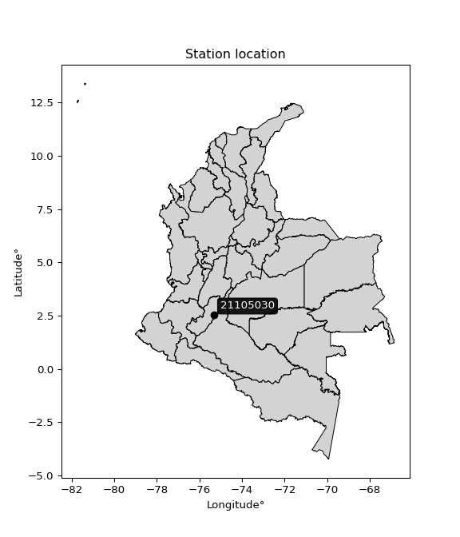

<div align="center">


</div>

# PMax24h Station (Rain): 21105030

Maximum Precipitation in 24 hours (PMax24h) is the greatest amount of rainfall for a specific duration that is meteorologically possible for a given location, acting as a "worst-case" scenario for extreme storms, crucial for designing safety-critical infrastructure like bridges, river deviations, dams, spillways, and nuclear plants to prevent catastrophic failure. The PMax24h is related with the Probable Maximum Precipitation (PMP) and it is calculated by hydrologists using meteorological data to determine the upper limit of extreme rainfall, often leading to the Probable Maximum Flood (PMF) for flood control design, and is increasingly being studied for climate change impacts. Probable Maximum Precipitation (PMP) is the theoretical upper limit of rainfall, a deterministic estimate for extreme events, while probability distributions (like GEV, Gumbel) describe the likelihood and frequency of various precipitation amounts, including rare ones, showing how often events occur, with PMP representing the extreme end of these distributions, used for critical infrastructure design to ensure safety against the worst conceivable weather, unlike standard statistical forecasts which cover typical probabilities.

The most common probability distributions in hydrology, used for analyzing floods, rainfall, and streamflow, include the Normal, Log-Normal, Gumbel, Gamma (including Log-Pearson Type III), and Generalized Extreme Value (GEV) distributions, often chosen based on the data´s skewness and whether modeling extremes or general conditions, with Gumbel and GEV popular for extreme events like floods, while the Normal distribution serves as a baseline, though often requiring transformations for skewed hydrological data. These distributions help in designing water infrastructure, managing water resources, and forecasting hydrologic events.

> Hydrological data often isn´t perfectly normal (it´s skewed), so different distributions are needed for different applications, such as: **Flood Frequency Analysis**: Using Gumbel, GEV, or Log-Pearson Type III for predicting extreme flood magnitudes and their return periods, **Rainfall Analysis**: Normal for annual totals, but Log-Normal, Weibull, or GEV for intensity or extreme daily rainfall, **Streamflow Modeling**: Gamma and Log-Normal for maximum flows, GEV for minimum flows, and Kappa for daily flows.

<div align="center">

</img>

</div>


## A. General information


### 1. General running parameters

• app_version: _v20260225_. • runtime: _2026-02-28 16:54:07.457399_. • Python version: _3.14.0_. • SciPy version: _1.16.3_. • Pandas version: _2.3.3_. • NumPy version: _2.3.5_. • Stations dataset (station_dataset_file): _dataset/pmax24h_in/automatic_colombia_2003_2025.csv_. • Stations catalog (station_catalog_file): _dataset/CNE.xls_. • Minimum year to eval til year_max (date_min): _1900_. • Maximum year to eval since year_min (date_max): _2025_. • Creates, save and include plots into reports (create_plot): _False_. • Plot only fit distributions with Δo > Δ (plot_only_fit): _True_. • Plot only simple graphs avoiding multiple CDFs and multiple Extreme values plots (plot_only_simple): _False_. • Eval low extreme values, if False, evaluates high extreme values (low_extreme): _False_. • Eval every SciPy distribution as logarithmic (pdist_logarithmic_on): _True_. • Standard deviation normalized (ddof): _1.0_. • Return periods to eval in years (Tr): _[2, 2.33, 5, 10, 15, 20, 25, 50, 75, 100, 200, 250, 500, 750, 1000]_. • Minimum data sample per station, 0 means any (minimum_sample): _5_. • Z-Score maximum threshold to adjust a value, 0 means disable (zscore_max): _3.5_. • Z-Score minimum threshold to adjust a value, 0 means disable (zscore_min): _-2.5_. • Avoid zeros, e.g. rain = 0 (avoid_zeros): _True_. • Avoid null values (avoid_nans): _True_. 

:file_folder:Table: [dataset.csv](../../dataset/pmax24h_in/automatic_colombia_2003_2025.csv)

> Delta Degrees of Freedom (DDOF): is a parameter used in the formulas for calculating variance and standard deviation. When ddof=0, the divisor is $N$ (the total number of observations) and this is used when your data set is the entire population. When ddof=1, the divisor is $N-1$ and this is used when your data set is a sample drawn from a larger population. Using $N-1$ provides an unbiased estimate of the population variance (known as Bessel´s correction).


### 2. Station info and location

|   id |   CODIGO | NOMBRE                     | CATEGORIA               | TECNOLOGIA                              | ESTADO           | FECHA_INSTALACION   |   FECHA_SUSPENSION |   ALTITUD |   LATITUD |   LONGITUD | DEPARTAMENTO   | MUNICIPIO   | AREA_OPERATIVA                    | ENTIDAD                                                     | AREA_HIDROGRAFICA   | ZONA_HIDROGRAFICA   | SUBZONA_HIDROGRAFICA   |   CORRIENTE | Catalogo   |   Version |
|-----:|---------:|:---------------------------|:------------------------|:----------------------------------------|:-----------------|:--------------------|-------------------:|----------:|----------:|-----------:|:---------------|:------------|:----------------------------------|:------------------------------------------------------------|:--------------------|:--------------------|:-----------------------|------------:|:-----------|----------:|
|    0 | 21105030 | ALGECIRAS - AUT [21105030] | Climatológica Ordinaria | Automática con Telemetría, Convencional | En Mantenimiento | 15/04/1971          |                nan |       993 |      2.52 |     -75.32 | Huila          | Algeciras   | Area Operativa 04 - Huila-Caquetá | INSTITUTO DE HIDROLOGIA METEOROLOGIA Y ESTUDIOS AMBIENTALES | Magdalena Cauca     | Alto Magdalena      | Rio Neiva              |         nan | CNE_IDEAM  |  20251226 |

<div align="center">

Dynamic map: [:earth_americas:Google](http://maps.google.com/maps?q=2.52,-75.319997222) [:earth_americas:OSM](https://www.openstreetmap.org/#map=18/2.52/-75.319997222&layers=P) [:earth_americas:Bing](https://www.bing.com/maps?cp=2.52~-75.319997222&lvl=18) [:earth_americas:Apple](https://maps.apple.com/frame?center=2.52%2C-75.319997222&span=0.003%2C0.006)

</div>


<div align="center">

```geojson
{
  "type": "Feature",
  "geometry": {
    "type": "Point", 
    "coordinates": [-75.319997222, 2.52]
  }, 
  "properties": {
    "Name": "21105030"
  }
}
```

</div>


### 3. Discrete values table and plot

<div align="center">

|               |           0 |           1 |           2 |          3 |          4 |          5 |           6 |
|:--------------|------------:|------------:|------------:|-----------:|-----------:|-----------:|------------:|
| Date          | 2019        | 2020        | 2021        | 2022       | 2023       | 2024       | 2025        |
| Value         |   55.8      |   92.8      |   56        |   27.2     |    6       |  100       |   82.8      |
| Value_initial |   55.8      |   92.8      |   56        |   27.2     |    6       |  100       |   82.8      |
| count         |    7        |    7        |    7        |    7       |    7       |    7       |    7        |
| mean          |   60.0857   |   60.0857   |   60.0857   |   60.0857  |   60.0857  |   60.0857  |   60.0857   |
| std           |   34.6918   |   34.6918   |   34.6918   |   34.6918  |   34.6918  |   34.6918  |   34.6918   |
| zscore        |   -0.123537 |    0.942999 |   -0.117772 |   -0.94794 |   -1.55904 |    1.15054 |    0.654746 |


</div>


> The initial value (value_initial) correspond to the initial obtained or null completed value, and value (value) is adjusted only when the initial value is outside the valid range (outlier) definite through the Z-Score value. If Z-Score is active, values out of range or outliers are replaced with the station mean value. A Z-Score (or standard score) measures how many standard deviations a data point is from the mean of a dataset, indicating its relative position; positive scores mean above the mean, negative mean below, and a score of zero is exactly at the mean, allowing for comparison of values from different distributions. It´s calculated using the formula $z=(x–μ)/σ$, where $x$ is the data point, $μ$ is the mean, and $σ$ is the standard deviation, helping identify outliers and understand probability.
>
> <sub>**Note**: In this study, "completing" (filling gaps in) and "extending" (forecasting or lengthening the historical record) rainfall data series are avoided for certain critical analyses because they introduce artificial bias and uncertainty, which can distort the statistics of rare events (extremes), alter day-to-day variability, and compromise the integrity and homogeneity of the original data. Some reasons against Completing/Extending rainfall data are: **Distortion of Extremes and Variability**: The primary issue is that most gap-filling or extension methods rely on averaging or regression with nearby stations, which inherently smooths the data. Rainfall is highly variable in space and time, with a large percentage of zero values and occasional large storms. Infilling methods often underestimate the highest values and overestimate the lowest (zero) values, which severely distorts analyses focused on flood frequency, drought severity, and intensity-duration-frequency (IDF) curves, **Loss of Data Homogeneity**: Infilled or extended data are synthetic estimates, not actual measurements. Combining these estimates with observed data can violate the assumption of data homogeneity, which requires that the data properties do not change over time. Inhomogeneity can lead to incorrect conclusions about long-term trends or changes in climate patterns, **Propagation of Errors**: Errors and biases from the original data (e.g., wind-induced undercatch, instrument errors, site changes) or the data used for imputation can propagate through the analysis, leading to unreliable hydrological models and inaccurate predictions, **Compromised Statistical Integrity**: For statistical analyses, especially those involving the frequency of events, using artificial data can introduce time bias or autocorrelation that doesn´t exist in reality, making it difficult to assess the true probability of events, **Difficulty in Validation**: It is difficult to accurately validate the quality of filled or extended data, especially for past periods where ground-truth measurements are unavailable. The reliability of imputation techniques heavily depends on the density of the surrounding station network and the complexity of the local topography.</sub>


### 4. Active continuous probability distributions from SciPy (80 of 104 available)

A Probability Density Function (PDF) describes the relative likelihood of a continuous random variable falling within a specific range, where the total area under its curve equals 1, and the area over any interval gives the actual probability for that range. Unlike discrete probabilities (like rolling a die), a PDF shows density, not direct probability for a single point (which is zero), with higher points indicating higher likelihood, often visualized as a bell curve for normal distributions.

A log of a probability density function (log-PDF) is simply the logarithm of the PDF´s value, denoted as $log(f(x))$, useful for converting multiplication of probabilities into addition, improving numerical stability with tiny numbers, and connecting to information theory concepts like entropy. Instead of dealing with very small probabilities (e.g., 0.000001), log-PDFs use negative numbers (e.g., $log(0.00001) ≈ -11.51$ that are easier for computers to handle, preventing underflow errors and simplifying complex calculations. In this study, each active probability distribution from SciPy is also evaluated in the $log$ form.

[scipy.stats](https://docs.scipy.org/doc/scipy/reference/stats.html) is a Python´s powerful submodule within the SciPy library for comprehensive statistical analysis, offering over 130 probability distributions (like Normal, Poisson, etc.), functions for descriptive stats (mean, variance), hypothesis testing (t-tests, chi-square), random variable generation, and statistical tests, making it essential for data science, modeling, and research. It provides tools to explore, model, and draw conclusions from data efficiently, working seamlessly with [NumPy](https://numpy.org/).

<div align="center">

|   id | p_dist           |   n_parameter | fit_method   | label                                                                       | active   | ref                                                                                                      |
|-----:|:-----------------|--------------:|:-------------|:----------------------------------------------------------------------------|:---------|:---------------------------------------------------------------------------------------------------------|
|    0 | alpha            |             3 | MLE          | Alpha                                                                       | True     | [:mortar_board:](https://docs.scipy.org/doc/scipy/reference/generated/scipy.stats.alpha.html)            |
|    1 | anglit           |             2 | MM           | Anglit                                                                      | True     | [:mortar_board:](https://docs.scipy.org/doc/scipy/reference/generated/scipy.stats.anglit.html)           |
|    2 | arcsine          |             2 | MM           | Arcsine                                                                     | True     | [:mortar_board:](https://docs.scipy.org/doc/scipy/reference/generated/scipy.stats.arcsine.html)          |
|    3 | argus            |             3 | MLE          | Argus                                                                       | True     | [:mortar_board:](https://docs.scipy.org/doc/scipy/reference/generated/scipy.stats.argus.html)            |
|    4 | beta             |             4 | MLE          | Beta                                                                        | True     | [:mortar_board:](https://docs.scipy.org/doc/scipy/reference/generated/scipy.stats.beta.html)             |
|    5 | betaprime        |             4 | MLE          | Beta prime                                                                  | True     | [:mortar_board:](https://docs.scipy.org/doc/scipy/reference/generated/scipy.stats.betaprime.html)        |
|    6 | bradford         |             3 | MLE          | Bradford                                                                    | True     | [:mortar_board:](https://docs.scipy.org/doc/scipy/reference/generated/scipy.stats.bradford.html)         |
|    7 | burr             |             4 | MLE          | Burr (Type III)                                                             | True     | [:mortar_board:](https://docs.scipy.org/doc/scipy/reference/generated/scipy.stats.burr.html)             |
|    8 | burr12           |             4 | MLE          | Burr (Type III) 12                                                          | True     | [:mortar_board:](https://docs.scipy.org/doc/scipy/reference/generated/scipy.stats.burr12.html)           |
|    9 | cosine           |             2 | MLE          | Cosine                                                                      | True     | [:mortar_board:](https://docs.scipy.org/doc/scipy/reference/generated/scipy.stats.cosine.html)           |
|   10 | crystalball      |             4 | MLE          | Crystalball                                                                 | True     | [:mortar_board:](https://docs.scipy.org/doc/scipy/reference/generated/scipy.stats.crystalball.html)      |
|   11 | dgamma           |             3 | MLE          | Double gamma                                                                | True     | [:mortar_board:](https://docs.scipy.org/doc/scipy/reference/generated/scipy.stats.dgamma.html)           |
|   12 | dweibull         |             3 | MLE          | Double Weibull                                                              | True     | [:mortar_board:](https://docs.scipy.org/doc/scipy/reference/generated/scipy.stats.dweibull.html)         |
|   13 | erlang           |             3 | MLE          | Erlang                                                                      | True     | [:mortar_board:](https://docs.scipy.org/doc/scipy/reference/generated/scipy.stats.erlang.html)           |
|   14 | exponnorm        |             3 | MLE          | Exponentially modified Normal                                               | True     | [:mortar_board:](https://docs.scipy.org/doc/scipy/reference/generated/scipy.stats.exponnorm.html)        |
|   15 | exponpow         |             3 | MLE          | Exponential power                                                           | True     | [:mortar_board:](https://docs.scipy.org/doc/scipy/reference/generated/scipy.stats.exponpow.html)         |
|   16 | exponweib        |             4 | MLE          | Exponentiated Weibull                                                       | True     | [:mortar_board:](https://docs.scipy.org/doc/scipy/reference/generated/scipy.stats.exponweib.html)        |
|   17 | f                |             4 | MLE          | F                                                                           | True     | [:mortar_board:](https://docs.scipy.org/doc/scipy/reference/generated/scipy.stats.f.html)                |
|   18 | fatiguelife      |             3 | MLE          | Fatigue-life (Birnbaum-Saunders)                                            | True     | [:mortar_board:](https://docs.scipy.org/doc/scipy/reference/generated/scipy.stats.fatiguelife.html)      |
|   19 | foldnorm         |             3 | MM           | Fold Normal                                                                 | True     | [:mortar_board:](https://docs.scipy.org/doc/scipy/reference/generated/scipy.stats.foldnorm.html)         |
|   20 | gamma            |             3 | MLE          | Gamma                                                                       | True     | [:mortar_board:](https://docs.scipy.org/doc/scipy/reference/generated/scipy.stats.gamma.html)            |
|   21 | gausshyper       |             6 | MLE          | Gauss hypergeometric                                                        | True     | [:mortar_board:](https://docs.scipy.org/doc/scipy/reference/generated/scipy.stats.gausshyper.html)       |
|   22 | genexpon         |             5 | MLE          | Generalized exponential                                                     | True     | [:mortar_board:](https://docs.scipy.org/doc/scipy/reference/generated/scipy.stats.genexpon.html)         |
|   23 | genextreme       |             3 | MLE          | Generalized exponential                                                     | True     | [:mortar_board:](https://docs.scipy.org/doc/scipy/reference/generated/scipy.stats.genextreme.html)       |
|   24 | gengamma         |             4 | MLE          | Generalized gamma                                                           | True     | [:mortar_board:](https://docs.scipy.org/doc/scipy/reference/generated/scipy.stats.gengamma.html)         |
|   25 | genhalflogistic  |             3 | MLE          | Generalized half-logistic                                                   | True     | [:mortar_board:](https://docs.scipy.org/doc/scipy/reference/generated/scipy.stats.genhalflogistic.html)  |
|   26 | genlogistic      |             3 | MLE          | Generalized logistic                                                        | True     | [:mortar_board:](https://docs.scipy.org/doc/scipy/reference/generated/scipy.stats.genlogistic.html)      |
|   27 | gennorm          |             3 | MLE          | Generalized Normal                                                          | True     | [:mortar_board:](https://docs.scipy.org/doc/scipy/reference/generated/scipy.stats.gennorm.html)          |
|   28 | genpareto        |             3 | MLE          | Generalized Pareto                                                          | True     | [:mortar_board:](https://docs.scipy.org/doc/scipy/reference/generated/scipy.stats.genpareto.html)        |
|   29 | gompertz         |             3 | MLE          | Gompertz (or truncated Gumbel)                                              | True     | [:mortar_board:](https://docs.scipy.org/doc/scipy/reference/generated/scipy.stats.gompertz.html)         |
|   30 | gumbel_l         |             2 | MM           | Gumbel Left Skew                                                            | True     | [:mortar_board:](https://docs.scipy.org/doc/scipy/reference/generated/scipy.stats.gumbel_l.html)         |
|   31 | gumbel_r         |             2 | MM           | Gumbel Right Skew                                                           | True     | [:mortar_board:](https://docs.scipy.org/doc/scipy/reference/generated/scipy.stats.gumbel_r.html)         |
|   32 | halfgennorm      |             3 | MLE          | Upper half of a generalized normal                                          | True     | [:mortar_board:](https://docs.scipy.org/doc/scipy/reference/generated/scipy.stats.halfgennorm.html)      |
|   33 | halflogistic     |             2 | MM           | Half-logistic                                                               | True     | [:mortar_board:](https://docs.scipy.org/doc/scipy/reference/generated/scipy.stats.halflogistic.html)     |
|   34 | halfnorm         |             2 | MM           | Half Normal                                                                 | True     | [:mortar_board:](https://docs.scipy.org/doc/scipy/reference/generated/scipy.stats.halfnorm.html)         |
|   35 | hypsecant        |             2 | MM           | hyperbolic secant                                                           | True     | [:mortar_board:](https://docs.scipy.org/doc/scipy/reference/generated/scipy.stats.hypsecant.html)        |
|   36 | invgamma         |             3 | MLE          | Inverted gamma                                                              | True     | [:mortar_board:](https://docs.scipy.org/doc/scipy/reference/generated/scipy.stats.invgamma.html)         |
|   37 | invgauss         |             3 | MLE          | Inverse Gaussian                                                            | True     | [:mortar_board:](https://docs.scipy.org/doc/scipy/reference/generated/scipy.stats.invgauss.html)         |
|   38 | invweibull       |             3 | MLE          | Inverted Weibull                                                            | True     | [:mortar_board:](https://docs.scipy.org/doc/scipy/reference/generated/scipy.stats.invweibull.html)       |
|   39 | johnsonsb        |             4 | MLE          | Johnson SB                                                                  | True     | [:mortar_board:](https://docs.scipy.org/doc/scipy/reference/generated/scipy.stats.johnsonsb.html)        |
|   40 | johnsonsu        |             4 | MLE          | Johnson Su                                                                  | True     | [:mortar_board:](https://docs.scipy.org/doc/scipy/reference/generated/scipy.stats.johnsonsu.html)        |
|   41 | kappa3           |             3 | MLE          | Kappa 3                                                                     | True     | [:mortar_board:](https://docs.scipy.org/doc/scipy/reference/generated/scipy.stats.kappa3.html)           |
|   42 | kappa4           |             4 | MLE          | Kappa 4                                                                     | True     | [:mortar_board:](https://docs.scipy.org/doc/scipy/reference/generated/scipy.stats.kappa4.html)           |
|   43 | ksone            |             3 | MLE          | Kolmogorov-Smirnov one-sided test statistic distribution                    | True     | [:mortar_board:](https://docs.scipy.org/doc/scipy/reference/generated/scipy.stats.ksone.html)            |
|   44 | kstwobign        |             2 | MLE          | Limiting distribution of scaled Kolmogorov-Smirnov two-sided test statistic | True     | [:mortar_board:](https://docs.scipy.org/doc/scipy/reference/generated/scipy.stats.kstwobign.html)        |
|   45 | laplace          |             2 | MM           | Laplace                                                                     | True     | [:mortar_board:](https://docs.scipy.org/doc/scipy/reference/generated/scipy.stats.laplace.html)          |
|   46 | levy_l           |             2 | MLE          | Left-skewed Levy                                                            | True     | [:mortar_board:](https://docs.scipy.org/doc/scipy/reference/generated/scipy.stats.levy_l.html)           |
|   47 | loggamma         |             3 | MLE          | Log gamma                                                                   | True     | [:mortar_board:](https://docs.scipy.org/doc/scipy/reference/generated/scipy.stats.loggamma.html)         |
|   48 | logistic         |             2 | MM           | Logistic (or Sech-squared)                                                  | True     | [:mortar_board:](https://docs.scipy.org/doc/scipy/reference/generated/scipy.stats.logistic.html)         |
|   49 | loglaplace       |             3 | MLE          | Log-Laplace                                                                 | True     | [:mortar_board:](https://docs.scipy.org/doc/scipy/reference/generated/scipy.stats.loglaplace.html)       |
|   50 | lomax            |             3 | MLE          | Lomax (Pareto of the second kind)                                           | True     | [:mortar_board:](https://docs.scipy.org/doc/scipy/reference/generated/scipy.stats.lomax.html)            |
|   51 | maxwell          |             2 | MM           | Maxwell                                                                     | True     | [:mortar_board:](https://docs.scipy.org/doc/scipy/reference/generated/scipy.stats.maxwell.html)          |
|   52 | mielke           |             4 | MLE          | Mielke Beta-Kappa / Dagum                                                   | True     | [:mortar_board:](https://docs.scipy.org/doc/scipy/reference/generated/scipy.stats.mielke.html)           |
|   53 | moyal            |             2 | MM           | Moyal                                                                       | True     | [:mortar_board:](https://docs.scipy.org/doc/scipy/reference/generated/scipy.stats.moyal.html)            |
|   54 | nakagami         |             3 | MLE          | Nakagami                                                                    | True     | [:mortar_board:](https://docs.scipy.org/doc/scipy/reference/generated/scipy.stats.nakagami.html)         |
|   55 | ncf              |             5 | MLE          | Non-central F distribution                                                  | True     | [:mortar_board:](https://docs.scipy.org/doc/scipy/reference/generated/scipy.stats.ncf.html)              |
|   56 | nct              |             4 | MLE          | Non-central Student’s t                                                     | True     | [:mortar_board:](https://docs.scipy.org/doc/scipy/reference/generated/scipy.stats.nct.html)              |
|   57 | norm             |             2 | MM           | Normal                                                                      | True     | [:mortar_board:](https://docs.scipy.org/doc/scipy/reference/generated/scipy.stats.norm.html)             |
|   58 | pearson3         |             3 | MM           | Pearson type III                                                            | True     | [:mortar_board:](https://docs.scipy.org/doc/scipy/reference/generated/scipy.stats.pearson3.html)         |
|   59 | powerlaw         |             3 | MLE          | Power-function                                                              | True     | [:mortar_board:](https://docs.scipy.org/doc/scipy/reference/generated/scipy.stats.powerlaw.html)         |
|   60 | rayleigh         |             2 | MM           | Rayleigh                                                                    | True     | [:mortar_board:](https://docs.scipy.org/doc/scipy/reference/generated/scipy.stats.rayleigh.html)         |
|   61 | rdist            |             3 | MLE          | R-distributed (symmetric beta)                                              | True     | [:mortar_board:](https://docs.scipy.org/doc/scipy/reference/generated/scipy.stats.rdist.html)            |
|   62 | rice             |             3 | MLE          | Rice                                                                        | True     | [:mortar_board:](https://docs.scipy.org/doc/scipy/reference/generated/scipy.stats.rice.html)             |
|   63 | semicircular     |             2 | MM           | Semicircular                                                                | True     | [:mortar_board:](https://docs.scipy.org/doc/scipy/reference/generated/scipy.stats.semicircular.html)     |
|   64 | skewnorm         |             3 | MLE          | Skew normal                                                                 | True     | [:mortar_board:](https://docs.scipy.org/doc/scipy/reference/generated/scipy.stats.skewnorm.html)         |
|   65 | t                |             3 | MLE          | Student’s t                                                                 | True     | [:mortar_board:](https://docs.scipy.org/doc/scipy/reference/generated/scipy.stats.t.html)                |
|   66 | trapezoid        |             4 | MLE          | Trapezoid                                                                   | True     | [:mortar_board:](https://docs.scipy.org/doc/scipy/reference/generated/scipy.stats.trapezoid.html)        |
|   67 | triang           |             3 | MLE          | Triangular                                                                  | True     | [:mortar_board:](https://docs.scipy.org/doc/scipy/reference/generated/scipy.stats.triang.html)           |
|   68 | truncexpon       |             3 | MLE          | Truncated exponential                                                       | True     | [:mortar_board:](https://docs.scipy.org/doc/scipy/reference/generated/scipy.stats.truncexpon.html)       |
|   69 | truncnorm        |             4 | MLE          | Truncated normal                                                            | True     | [:mortar_board:](https://docs.scipy.org/doc/scipy/reference/generated/scipy.stats.truncnorm.html)        |
|   70 | truncpareto      |             4 | MLE          | Upper truncated Pareto                                                      | True     | [:mortar_board:](https://docs.scipy.org/doc/scipy/reference/generated/scipy.stats.truncpareto.html)      |
|   71 | truncweibull_min |             5 | MLE          | Doubly truncated Weibull minimum                                            | True     | [:mortar_board:](https://docs.scipy.org/doc/scipy/reference/generated/scipy.stats.truncweibull_min.html) |
|   72 | tukeylambda      |             3 | MLE          | Tukey-Lamdba                                                                | True     | [:mortar_board:](https://docs.scipy.org/doc/scipy/reference/generated/scipy.stats.tukeylambda.html)      |
|   73 | uniform          |             2 | MLE          | Uniform                                                                     | True     | [:mortar_board:](https://docs.scipy.org/doc/scipy/reference/generated/scipy.stats.uniform.html)          |
|   74 | vonmises         |             3 | MLE          | Von Mises                                                                   | True     | [:mortar_board:](https://docs.scipy.org/doc/scipy/reference/generated/scipy.stats.vonmises.html)         |
|   75 | vonmises_line    |             3 | MLE          | Von Mises line                                                              | True     | [:mortar_board:](https://docs.scipy.org/doc/scipy/reference/generated/scipy.stats.vonmises_line.html)    |
|   76 | wald             |             2 | MM           | Wald                                                                        | True     | [:mortar_board:](https://docs.scipy.org/doc/scipy/reference/generated/scipy.stats.wald.html)             |
|   77 | weibull_max      |             3 | MLE          | Weibull maximum                                                             | True     | [:mortar_board:](https://docs.scipy.org/doc/scipy/reference/generated/scipy.stats.weibull_max.html)      |
|   78 | weibull_min      |             3 | MLE          | Weibull minimum                                                             | True     | [:mortar_board:](https://docs.scipy.org/doc/scipy/reference/generated/scipy.stats.weibull_min.html)      |
|   79 | wrapcauchy       |             3 | MLE          | Wrapped  Cauchy                                                             | True     | [:mortar_board:](https://docs.scipy.org/doc/scipy/reference/generated/scipy.stats.wrapcauchy.html)       |

</div>

> **n_parameter:** # arguments & localization & scale.
>
> **Fit methods:** (MLE) maximum likelihood, (MM) L-moments.
>
>**Inactive** (With the only purpose of prevent loops, zero divisions, infinite values, over high estimated values or horizontal trending for recurrence intervals estimations, the follow distributions were disabled.)**:** lognorm, norminvgauss, powernorm, powerlognorm, cauchy, halfcauchy, foldcauchy, skewcauchy, chi2, expon, fisk, genhyperbolic, geninvgauss, gibrat, kstwo, laplace_asymmetric, levy, levy_stable, ncx2, pareto, rel_breitwigner, recipinvgauss, studentized_range, loguniform, 


## B. Probability (PDF) vs. Empirical (EDF) distributions functions

A continuous probability distribution (CPD) describes probabilities for variables that can take any value within a range (like rain any time), unlike discrete variables with specific outcomes (like temperature). It uses a Probability Density Function (PDF), a curve where the total area under it equals 1, and the probability of the variable falling within an interval (a to b) is found by calculating the area under the curve between those points. A key feature is that the probability of hitting any single exact value is zero, so probabilities are always expressed for ranges, e.g., $P(a ≤ X ≤ b)$.

<div align="center">

Distributions parameters from station values
|     |   station | p_dist              |   n |             loc |            scale | shape                  | shape1                | shape2                 | shape3             |
|----:|----------:|:--------------------|----:|----------------:|-----------------:|:-----------------------|:----------------------|:-----------------------|:-------------------|
|   0 |  21105030 | alpha               |   7 |    -0.0342596   |     15.3457      | 1.5693166563443395e-10 |                       |                        |                    |
|   1 |  21105030 | anglit              |   7 |    60.0857      |     93.9589      |                        |                       |                        |                    |
|   2 |  21105030 | arcsine             |   7 |    14.6635      |     90.8444      |                        |                       |                        |                    |
|   3 |  21105030 | argus               |   7 |   -20.2416      |    124.59        | 1.5212282371125314     |                       |                        |                    |
|   4 |  21105030 | beta                |   7 |    -2.78856     |    102.789       | 0.9740783860707514     | 0.6352893991233994    |                        |                    |
|   5 |  21105030 | betaprime           |   7 |  -880.049       | 108494           | 850.0822651841377      | 98123.38831464617     |                        |                    |
|   6 |  21105030 | bradford            |   7 |    -4.54681     |    104.547       | 6.897219553544031e-06  |                       |                        |                    |
|   7 |  21105030 | burr                |   7 |    -1.75687     |    103.01        | 274.4450889257118      | 0.004802450861721666  |                        |                    |
|   8 |  21105030 | burr12              |   7 |    -1.6149      |      7.49736     | 272.29797291442344     | 0.001977793059548565  |                        |                    |
|   9 |  21105030 | cosine              |   7 |    58.2252      |     26.2242      |                        |                       |                        |                    |
|  10 |  21105030 | crystalball         |   7 |    60.0857      |     32.1183      | 15318.529700033505     | 11356.013010779188    |                        |                    |
|  11 |  21105030 | dgamma              |   7 |    68.6866      |      9.31982     | 3.0547344748467387     |                       |                        |                    |
|  12 |  21105030 | dweibull            |   7 |    66.9598      |     31.9436      | 1.7955611307425179     |                       |                        |                    |
|  13 |  21105030 | erlang              |   7 |  -507.323       |      1.86681     | 303.7686776453171      |                       |                        |                    |
|  14 |  21105030 | exponnorm           |   7 |    60.0583      |     32.1183      | 0.0008570630686702248  |                       |                        |                    |
|  15 |  21105030 | exponpow            |   7 |     6           |      6.23724     | 0.12054948041969743    |                       |                        |                    |
|  16 |  21105030 | exponweib           |   7 | -1022.33        |    687.879       | 1744.8861474018163     | 4.573473006165145     |                        |                    |
|  17 |  21105030 | f                   |   7 |     0.732064    |     58.9234      | 3.6366691605761385     | 182.6284640941269     |                        |                    |
|  18 |  21105030 | fatiguelife         |   7 |     6           |      0.000101833 | 696.4076952665353      |                       |                        |                    |
|  19 |  21105030 | foldnorm            |   7 |   -41.559       |     30.5986      | 3.3369843016111638     |                       |                        |                    |
|  20 |  21105030 | gamma               |   7 |  -469.912       |      2.01337     | 263.11128611246136     |                       |                        |                    |
|  21 |  21105030 | gausshyper          |   7 |    -3.36744     |    103.367       | 1.5007983548335408     | 0.7259064862848696    | 0.590453028091976      | 1.1211457674856073 |
|  22 |  21105030 | genexpon            |   7 |     5.99996     |      1.03484     | 0.019121885300151062   | 1.374910239269142e-07 | 2.3191557224057022     |                    |
|  23 |  21105030 | genextreme          |   7 |    58.183       |     45.4824      | 1.0876549421790216     |                       |                        |                    |
|  24 |  21105030 | gengamma            |   7 |  -261.149       |      4.65024     | 85.63375258521091      | 1.0509000000566897    |                        |                    |
|  25 |  21105030 | genhalflogistic     |   7 |    -8.12466     |    121.814       | 1.126608762691686      |                       |                        |                    |
|  26 |  21105030 | genlogistic         |   7 |   100           |      1.14875e-05 | 2.8745120228005685e-07 |                       |                        |                    |
|  27 |  21105030 | gennorm             |   7 |    53           |     47.0001      | 11698227.879478216     |                       |                        |                    |
|  28 |  21105030 | genpareto           |   7 |     0.219794    |    260.87        | -2.614446563904563     |                       |                        |                    |
|  29 |  21105030 | gompertz            |   7 |     0.867583    |      3.40173     | 1.3677518146098804e-12 |                       |                        |                    |
|  30 |  21105030 | gumbel_l            |   7 |    74.5407      |     25.0426      |                        |                       |                        |                    |
|  31 |  21105030 | gumbel_r            |   7 |    45.6308      |     25.0426      |                        |                       |                        |                    |
|  32 |  21105030 | halfgennorm         |   7 |     6           |      7.13634     | 0.4529195159710306     |                       |                        |                    |
|  33 |  21105030 | halflogistic        |   7 |    22.018       |     27.46        |                        |                       |                        |                    |
|  34 |  21105030 | halfnorm            |   7 |    17.5737      |     53.2809      |                        |                       |                        |                    |
|  35 |  21105030 | hypsecant           |   7 |    60.0857      |     20.4472      |                        |                       |                        |                    |
|  36 |  21105030 | invgamma            |   7 |  -204.741       |  15186.5         | 58.5053677979146       |                       |                        |                    |
|  37 |  21105030 | invgauss            |   7 |  -136.179       |   6464.04        | 0.030215574286214367   |                       |                        |                    |
|  38 |  21105030 | invweibull          |   7 |    -6.8228e+07  |      6.8228e+07  | 2172206.826400616      |                       |                        |                    |
|  39 |  21105030 | johnsonsb           |   7 |    -8.37021     |    108.37        | -0.3990930257327117    | 0.07773178128125838   |                        |                    |
|  40 |  21105030 | johnsonsu           |   7 |   112.442       |      0.511637    | 6.985847878928592      | 1.3730926413094862    |                        |                    |
|  41 |  21105030 | kappa3              |   7 |     6           |     93.9979      | 87612.29666827896      |                       |                        |                    |
|  42 |  21105030 | kappa4              |   7 |     4.80768     |    107.758       | 1.0105807971965988     | 1.1320030888316601    |                        |                    |
|  43 |  21105030 | ksone               |   7 |     4.45514     |    111.261       | 1.0                    |                       |                        |                    |
|  44 |  21105030 | kstwobign           |   7 |   -65.783       |    143.585       |                        |                       |                        |                    |
|  45 |  21105030 | laplace             |   7 |    60.0857      |     22.7111      |                        |                       |                        |                    |
|  46 |  21105030 | levy_l              |   7 |   102.815       |     12.2546      |                        |                       |                        |                    |
|  47 |  21105030 | loggamma            |   7 |   100           |      1.0318e-05  | 2.5829728850506884e-07 |                       |                        |                    |
|  48 |  21105030 | logistic            |   7 |    60.0857      |     17.7078      |                        |                       |                        |                    |
|  49 |  21105030 | loglaplace          |   7 |    -0.154917    |     56.1549      | 1.5887188357258855     |                       |                        |                    |
|  50 |  21105030 | lomax               |   7 |     6           |      4.59528e+11 | 7243471754.885025      |                       |                        |                    |
|  51 |  21105030 | maxwell             |   7 |   -16.0212      |     47.693       |                        |                       |                        |                    |
|  52 |  21105030 | mielke              |   7 |     6           |     94.3503      | 0.7498420067649576     | 768.7486818732045     |                        |                    |
|  53 |  21105030 | moyal               |   7 |    41.7184      |     14.4583      |                        |                       |                        |                    |
|  54 |  21105030 | nakagami            |   7 |     6           |     61.5932      | 0.40543664655859535    |                       |                        |                    |
|  55 |  21105030 | ncf                 |   7 |    -0.00303782  |      4.38237e-08 | 3.630066754378678e-09  | 2.8483985680498796    | 3.2787545376154363     |                    |
|  56 |  21105030 | nct                 |   7 | -1949.87        |     32.0886      | 874457.2980955141      | 62.63744109714777     |                        |                    |
|  57 |  21105030 | norm                |   7 |    60.0857      |     32.1183      |                        |                       |                        |                    |
|  58 |  21105030 | pearson3            |   7 |    60.0857      |     32.1184      | -0.36049230614898686   |                       |                        |                    |
|  59 |  21105030 | powerlaw            |   7 |     6           |     94           | 0.16572645593856244    |                       |                        |                    |
|  60 |  21105030 | rayleigh            |   7 |    -1.35852     |     49.0254      |                        |                       |                        |                    |
|  61 |  21105030 | rdist               |   7 |    -2.41783     |     58.4178      | 1.018126522422139      |                       |                        |                    |
|  62 |  21105030 | rice                |   7 |   -11.517       |     36.2491      | 1.639168856021373      |                       |                        |                    |
|  63 |  21105030 | semicircular        |   7 |    60.0857      |     64.2367      |                        |                       |                        |                    |
|  64 |  21105030 | skewnorm            |   7 |   100           |     51.2428      | -5909625.449195031     |                       |                        |                    |
|  65 |  21105030 | t                   |   7 |    60.0849      |     32.1181      | 103732470.84211943     |                       |                        |                    |
|  66 |  21105030 | trapezoid           |   7 |   -32.2966      |    136.267       | 1.0                    | 1.0                   |                        |                    |
|  67 |  21105030 | triang              |   7 |   -19.6038      |    119.901       | 0.9999999999996116     |                       |                        |                    |
|  68 |  21105030 | truncexpon          |   7 |    -3.21138     |    142.299       | 0.7253154876255168     |                       |                        |                    |
|  69 |  21105030 | truncnorm           |   7 |    60.0857      |     32.1183      | -294.6928904494141     | 946.4315457795782     |                        |                    |
|  70 |  21105030 | truncpareto         |   7 |     5.9454      |      0.0546003   | 0.16796592558643045    | 1722.6020216314764    |                        |                    |
|  71 |  21105030 | truncweibull_min    |   7 |    -1.74843     |    138.302       | 1.5299554012581646     | 0.0026721680017506473 | 0.7356975634896861     |                    |
|  72 |  21105030 | tukeylambda         |   7 |    53           |     50.9447      | 1.0839292697206198     |                       |                        |                    |
|  73 |  21105030 | uniform             |   7 |     6           |     94           |                        |                       |                        |                    |
|  74 |  21105030 | vonmises            |   7 |    -0.331462    |      1           | 1.248410437579146      |                       |                        |                    |
|  75 |  21105030 | vonmises_line       |   7 |    52.9604      |     14.9732      | 7.790425922326957e-06  |                       |                        |                    |
|  76 |  21105030 | wald                |   7 |    27.9674      |     32.1183      |                        |                       |                        |                    |
|  77 |  21105030 | weibull_max         |   7 |   100           |      1.58528     | 0.2501499340083174     |                       |                        |                    |
|  78 |  21105030 | weibull_min         |   7 | -7963.68        |   8039.09        | 307.27720070291        |                       |                        |                    |
|  79 |  21105030 | wrapcauchy          |   7 |     5.99999     |     14.9606      | 0.30955583305993284    |                       |                        |                    |
|  80 |  21105030 | logalpha            |   7 |   -27.6736      |   1019.15        | 32.38673962621681      |                       |                        |                    |
|  81 |  21105030 | loganglit           |   7 |     3.81345     |      2.6949      |                        |                       |                        |                    |
|  82 |  21105030 | logarcsine          |   7 |     2.51065     |      2.60559     |                        |                       |                        |                    |
|  83 |  21105030 | logargus            |   7 |     0.56192     |      4.11796     | 2.862465497945415      |                       |                        |                    |
|  84 |  21105030 | logbeta             |   7 |     1.53823     |      3.06694     | 0.7929794703833217     | 0.21560800818058162   |                        |                    |
|  85 |  21105030 | logbetaprime        |   7 |   -28.637       |    264.933       | 1262.4835046737194     | 10305.189024601295    |                        |                    |
|  86 |  21105030 | logbradford         |   7 |     1.79159     |      2.81358     | 0.987332204020728      |                       |                        |                    |
|  87 |  21105030 | logburr             |   7 |    -1.26942     |      5.89205     | 1083.9627368699862     | 0.0054859423251195855 |                        |                    |
|  88 |  21105030 | logburr12           |   7 | -1969.88        |   1981.87        | 3613.8395805981545     | 1495344.0958814817    |                        |                    |
|  89 |  21105030 | logcosine           |   7 |     3.63206     |      0.817886    |                        |                       |                        |                    |
|  90 |  21105030 | logcrystalball      |   7 |     3.81345     |      0.921207    | 13.376595794389903     | 262.16904385185836    |                        |                    |
|  91 |  21105030 | logdgamma           |   7 |     4.02535     |      0.869359    | 0.5491914217774483     |                       |                        |                    |
|  92 |  21105030 | logdweibull         |   7 |     4.02177     |      1.10022     | 0.6149833030879256     |                       |                        |                    |
|  93 |  21105030 | logerlang           |   7 |   -14.914       |      0.0484334   | 386.3234353200435      |                       |                        |                    |
|  94 |  21105030 | logexponnorm        |   7 |     3.81285     |      0.92121     | 0.0006497050694167414  |                       |                        |                    |
|  95 |  21105030 | logexponpow         |   7 |     1.79176     |      1.37615     | 0.3767288503559101     |                       |                        |                    |
|  96 |  21105030 | logexponweib        |   7 |     1.79176     |      1.1544      | 1.0989987522735114     | 0.7775682489553504    |                        |                    |
|  97 |  21105030 | logf                |   7 | -1453.96        |   1457.77        | 13779847.248876672     | 7802046.459162209     |                        |                    |
|  98 |  21105030 | logfatiguelife      |   7 |  -754.462       |    758.275       | 0.0012155766130547575  |                       |                        |                    |
|  99 |  21105030 | logfoldnorm         |   7 |    -1.68609     |      0.84955     | 6.485803014112015      |                       |                        |                    |
| 100 |  21105030 | loggamma            |   7 |   -13.9724      |      0.0526631   | 337.3574711449746      |                       |                        |                    |
| 101 |  21105030 | loggausshyper       |   7 |     1.65433     |      2.95084     | 1.4727429246950785     | 0.6159779478054579    | 1.2958948338933438     | 0.8222378438687855 |
| 102 |  21105030 | loggenexpon         |   7 |     1.55663     |      0.02471     | 0.0012347450043881311  | 3.3482741921792303    | 5.4368365358726405e-05 |                    |
| 103 |  21105030 | loggenextreme       |   7 |     3.80124     |      1.01166     | 1.2583945775850103     |                       |                        |                    |
| 104 |  21105030 | loggengamma         |   7 |     1.79176     |      1.15215     | 1.0992116849653706     | 0.7769771256283707    |                        |                    |
| 105 |  21105030 | loggenhalflogistic  |   7 |     1.77587     |      3.21023     | 1.1346355812659255     |                       |                        |                    |
| 106 |  21105030 | loggenlogistic      |   7 |     4.60524     |      4.02224e-06 | 5.098543610012347e-06  |                       |                        |                    |
| 107 |  21105030 | loggennorm          |   7 |     4.02535     |      0.0282682   | 0.3855505245011459     |                       |                        |                    |
| 108 |  21105030 | loggenpareto        |   7 |    -0.00264095  |      8.90344     | -1.9322490338951033    |                       |                        |                    |
| 109 |  21105030 | loggompertz         |   7 |     1.79176     |      0.605792    | 0.0195602483953254     |                       |                        |                    |
| 110 |  21105030 | loggumbel_l         |   7 |     4.22804     |      0.718262    |                        |                       |                        |                    |
| 111 |  21105030 | loggumbel_r         |   7 |     3.39886     |      0.718262    |                        |                       |                        |                    |
| 112 |  21105030 | loghalfgennorm      |   7 |     1.79176     |      1.0863      | 0.7231618560786048     |                       |                        |                    |
| 113 |  21105030 | loghalflogistic     |   7 |     2.72161     |      0.7876      |                        |                       |                        |                    |
| 114 |  21105030 | loghalfnorm         |   7 |     2.59415     |      1.52817     |                        |                       |                        |                    |
| 115 |  21105030 | loghypsecant        |   7 |     3.81345     |      0.586459    |                        |                       |                        |                    |
| 116 |  21105030 | loginvgamma         |   7 |   -17.0299      |   9445.67        | 454.90655191045823     |                       |                        |                    |
| 117 |  21105030 | loginvgauss         |   7 |    -5.66069     |    780.492       | 0.012168343898715926   |                       |                        |                    |
| 118 |  21105030 | loginvweibull       |   7 |    -1.26695e+08 |      1.26695e+08 | 110733452.82882734     |                       |                        |                    |
| 119 |  21105030 | logjohnsonsb        |   7 |     1.79176     |      2.81341     | -0.5271028365797357    | 0.09678617017112628   |                        |                    |
| 120 |  21105030 | logjohnsonsu        |   7 |     4.60517     |      7.11865e-14 | 4.27028173135947       | 0.15452397191634942   |                        |                    |
| 121 |  21105030 | logkappa3           |   7 |     1.79175     |      2.81341     | 1100920.9430999132     |                       |                        |                    |
| 122 |  21105030 | logkappa4           |   7 |     1.87849     |      3.33701     | 0.9489924266504481     | 1.223836617495779     |                        |                    |
| 123 |  21105030 | logksone            |   7 |     1.51042     |      3.37609     | 1.0                    |                       |                        |                    |
| 124 |  21105030 | logkstwobign        |   7 |    -0.615784    |      5.06397     |                        |                       |                        |                    |
| 125 |  21105030 | loglaplace          |   7 |     3.81345     |      0.651392    |                        |                       |                        |                    |
| 126 |  21105030 | loglevy_l           |   7 |     4.64005     |      0.150215    |                        |                       |                        |                    |
| 127 |  21105030 | logloggamma         |   7 |     4.6052      |      2.77452e-07 | 3.5028487089889023e-07 |                       |                        |                    |
| 128 |  21105030 | loglogistic         |   7 |     3.81345     |      0.507888    |                        |                       |                        |                    |
| 129 |  21105030 | logloglaplace       |   7 |    -0.0547303   |      4.08008     | 5.273990286871093      |                       |                        |                    |
| 130 |  21105030 | loglomax            |   7 |     1.79176     |      3.27075e+06 | 1666056.4734397796     |                       |                        |                    |
| 131 |  21105030 | logmaxwell          |   7 |     1.63058     |      1.36791     |                        |                       |                        |                    |
| 132 |  21105030 | logmielke           |   7 |    -3.72455e+07 |      3.72455e+07 | 46922489.67824363      | 20036762616.10933     |                        |                    |
| 133 |  21105030 | logmoyal            |   7 |     3.28664     |      0.414689    |                        |                       |                        |                    |
| 134 |  21105030 | lognakagami         |   7 |     3.16577     |      1.03428     | 0.9375050621398061     |                       |                        |                    |
| 135 |  21105030 | logncf              |   7 |    -1.2084      |      5.78026e-07 | 1.5589503918853276e-05 | 230.1634846593023     | 134.52758373510216     |                    |
| 136 |  21105030 | lognct              |   7 |   -47.8459      |      0.871679    | 13320.581661380966     | 59.26007506483637     |                        |                    |
| 137 |  21105030 | lognorm             |   7 |     3.81345     |      0.921207    |                        |                       |                        |                    |
| 138 |  21105030 | logpearson3         |   7 |     3.81345     |      0.921205    | -1.332747725721207     |                       |                        |                    |
| 139 |  21105030 | logpowerlaw         |   7 |     1.79176     |      2.81341     | 0.1829639083694849     |                       |                        |                    |
| 140 |  21105030 | lograyleigh         |   7 |     2.05113     |      1.40613     |                        |                       |                        |                    |
| 141 |  21105030 | logrdist            |   7 |     2.90858     |      1.11682     | 1.138690426420698      |                       |                        |                    |
| 142 |  21105030 | logrice             |   7 |  -235.065       |      0.921142    | 259.3261898937976      |                       |                        |                    |
| 143 |  21105030 | logsemicircular     |   7 |     3.81345     |      1.84244     |                        |                       |                        |                    |
| 144 |  21105030 | logskewnorm         |   7 |     4.60517     |      1.21472     | -6328672.525192831     |                       |                        |                    |
| 145 |  21105030 | logt                |   7 |     4.21113     |      0.411509    | 1.5574004585896786     |                       |                        |                    |
| 146 |  21105030 | logtrapezoid        |   7 |     1.20788     |      3.90835     | 1.0                    | 1.0                   |                        |                    |
| 147 |  21105030 | logtriang           |   7 |     1.23146     |      3.37374     | 0.9999934981614761     |                       |                        |                    |
| 148 |  21105030 | logtruncexpon       |   7 |     1.78613     |      4.13546     | 0.6816763381414324     |                       |                        |                    |
| 149 |  21105030 | logtruncnorm        |   7 |    -0.194383    |      1.68981     | 2.062393718865698      | 2.8402983849365437    |                        |                    |
| 150 |  21105030 | logtruncpareto      |   7 |     1.78955     |      0.00221231  | 0.167810574319197      | 1272.70456679832      |                        |                    |
| 151 |  21105030 | logtruncweibull_min |   7 |     1.68794     |      5.09465     | 1.3927425870511003     | 0.0014603001579854835 | 0.5726063081151269     |                    |
| 152 |  21105030 | logtukeylambda      |   7 |     2.92146     |      1.20649     | 1.0679705089518845     |                       |                        |                    |
| 153 |  21105030 | loguniform          |   7 |     1.79176     |      2.81341     |                        |                       |                        |                    |
| 154 |  21105030 | logvonmises         |   7 |    -2.26619     |      1           | 1.9055195265219504     |                       |                        |                    |
| 155 |  21105030 | logvonmises_line    |   7 |     3.96871     |      0.692946    | 1.0345747866127812     |                       |                        |                    |
| 156 |  21105030 | logwald             |   7 |     2.89222     |      0.921228    |                        |                       |                        |                    |
| 157 |  21105030 | logweibull_max      |   7 |     4.60517     |      1.55281     | 0.40461769485363897    |                       |                        |                    |
| 158 |  21105030 | logweibull_min      |   7 |     1.79176     |      1.18441     | 0.7009610851583832     |                       |                        |                    |
| 159 |  21105030 | logwrapcauchy       |   7 |     1.79176     |      0.447768    | 0.6475403895143543     |                       |                        |                    |

</div>

> **loc** (Location parameter): This shifts the distribution along the x-axis. For many common distributions, like the normal (Gaussian) distribution, loc represents the mean $μ$. For others, like the uniform distribution, it might represent the minimum value, or for the beta distribution, the left end of the support interval.
>
> **scale** (Scale parameter): This determines the width or spread of the distribution. For the normal distribution, scale represents the standard deviation $σ$. For a uniform distribution, it defines the length of the interval (from $loc$ to $loc + scale$).
>
> **shape** (Shape parameters): Refers to parameters that define the specific form of a probability distribution, distinct from its location (loc) and scale (scale). These parameters are required arguments for most distribution functions. For example, a normal (Gaussian) distribution is fully defined by its location (mean) and scale (standard deviation), so it has no specific shape parameters beyond loc and scale. However, other distributions have intrinsic properties that need specification, as Gamma distribution that takes a shape parameter, often named $a$ or $alpha$.


### 0. Cumulative distribution values - CDF (160 evaluated)

Cumulative Distribution Function (CDF), denoted as $F$<sub>$X$</sub>$(x)$, is a function that gives the probability that a random variable $X$ will take a value less than or equal to a specific value, $x$ (i.e., $(P(X≥x)$. It essentially "accumulates" probabilities from a given point up to the far right (positive infinity), providing a complete picture of the distribution´s probabilities for both discrete (like rain) and continuous (like temperature) variables, helping to find probabilities over ranges or above certain values. Each station is evaluated separately ordering the $x$ values ascending, calculating the CDF and PDF values for the activated distributions and their logarithmic forms.

<div align="center">

CDF ordered by x ascending and calculating $log(f(x))$ separately
|   id |   Station |   date |     x |   count |    mean |     std |    zscore |   Value_initial |   station |   m |     alpha |   alpha_pdf |    anglit |   anglit_pdf |   arcsine |   arcsine_pdf |     argus |   argus_pdf |      beta |      beta_pdf |   betaprime |   betaprime_pdf |   bradford |   bradford_pdf |      burr |     burr_pdf |     burr12 |   burr12_pdf |    cosine |   cosine_pdf |   crystalball |   crystalball_pdf |    dgamma |   dgamma_pdf |   dweibull |   dweibull_pdf |   erlang |   erlang_pdf |   exponnorm |   exponnorm_pdf |   exponpow |   exponpow_pdf |   exponweib |   exponweib_pdf |         f |      f_pdf |   fatiguelife |   fatiguelife_pdf |   foldnorm |   foldnorm_pdf |     gamma |   gamma_pdf |   gausshyper |   gausshyper_pdf |    genexpon |   genexpon_pdf |   genextreme |   genextreme_pdf |   gengamma |   gengamma_pdf |   genhalflogistic |   genhalflogistic_pdf |   genlogistic |   genlogistic_pdf |    gennorm |   gennorm_pdf |   genpareto |   genpareto_pdf |    gompertz |   gompertz_pdf |   gumbel_l |   gumbel_l_pdf |   gumbel_r |   gumbel_r_pdf |   halfgennorm |   halfgennorm_pdf |   halflogistic |   halflogistic_pdf |   halfnorm |   halfnorm_pdf |   hypsecant |   hypsecant_pdf |   invgamma |   invgamma_pdf |   invgauss |   invgauss_pdf |   invweibull |   invweibull_pdf |   johnsonsb |   johnsonsb_pdf |   johnsonsu |   johnsonsu_pdf |      kappa3 |   kappa3_pdf |      kappa4 |   kappa4_pdf |    ksone |   ksone_pdf |   kstwobign |   kstwobign_pdf |   laplace |   laplace_pdf |   levy_l |   levy_l_pdf |   loggamma |   loggamma_pdf |   logistic |   logistic_pdf |   loglaplace |   loglaplace_pdf |       lomax |   lomax_pdf |   maxwell |   maxwell_pdf |      mielke |   mielke_pdf |       moyal |   moyal_pdf |    nakagami |   nakagami_pdf |      ncf |    ncf_pdf |       nct |    nct_pdf |      norm |   norm_pdf |   pearson3 |   pearson3_pdf |   powerlaw |   powerlaw_pdf |   rayleigh |   rayleigh_pdf |    rdist |       rdist_pdf |      rice |   rice_pdf |   semicircular |   semicircular_pdf |   skewnorm |   skewnorm_pdf |         t |      t_pdf |   trapezoid |   trapezoid_pdf |    triang |   triang_pdf |   truncexpon |   truncexpon_pdf |   truncnorm |   truncnorm_pdf |   truncpareto |   truncpareto_pdf |   truncweibull_min |   truncweibull_min_pdf |   tukeylambda |   tukeylambda_pdf |   uniform |   uniform_pdf |   vonmises |   vonmises_pdf |   vonmises_line |   vonmises_line_pdf |     wald |   wald_pdf |   weibull_max |   weibull_max_pdf |   weibull_min |   weibull_min_pdf |   wrapcauchy |   wrapcauchy_pdf |   logalpha |   logalpha_pdf |   loganglit |   loganglit_pdf |   logarcsine |   logarcsine_pdf |   logargus |   logargus_pdf |   logbeta |   logbeta_pdf |   logbetaprime |   logbetaprime_pdf |   logbradford |   logbradford_pdf |   logburr |   logburr_pdf |   logburr12 |   logburr12_pdf |   logcosine |   logcosine_pdf |   logcrystalball |   logcrystalball_pdf |   logdgamma |   logdgamma_pdf |   logdweibull |   logdweibull_pdf |   logerlang |   logerlang_pdf |   logexponnorm |   logexponnorm_pdf |   logexponpow |   logexponpow_pdf |   logexponweib |   logexponweib_pdf |      logf |   logf_pdf |   logfatiguelife |   logfatiguelife_pdf |   logfoldnorm |   logfoldnorm_pdf |   loggausshyper |   loggausshyper_pdf |   loggenexpon |   loggenexpon_pdf |   loggenextreme |   loggenextreme_pdf |   loggengamma |   loggengamma_pdf |   loggenhalflogistic |   loggenhalflogistic_pdf |   loggenlogistic |   loggenlogistic_pdf |   loggennorm |   loggennorm_pdf |   loggenpareto |   loggenpareto_pdf |   loggompertz |   loggompertz_pdf |   loggumbel_l |   loggumbel_l_pdf |   loggumbel_r |   loggumbel_r_pdf |   loghalfgennorm |   loghalfgennorm_pdf |   loghalflogistic |   loghalflogistic_pdf |   loghalfnorm |   loghalfnorm_pdf |   loghypsecant |   loghypsecant_pdf |   loginvgamma |   loginvgamma_pdf |   loginvgauss |   loginvgauss_pdf |   loginvweibull |   loginvweibull_pdf |   logjohnsonsb |   logjohnsonsb_pdf |   logjohnsonsu |   logjohnsonsu_pdf |   logkappa3 |   logkappa3_pdf |   logkappa4 |   logkappa4_pdf |   logksone |   logksone_pdf |   logkstwobign |   logkstwobign_pdf |   loglevy_l |   loglevy_l_pdf |   logloggamma |   logloggamma_pdf |   loglogistic |   loglogistic_pdf |   logloglaplace |   logloglaplace_pdf |    loglomax |   loglomax_pdf |   logmaxwell |   logmaxwell_pdf |   logmielke |   logmielke_pdf |    logmoyal |   logmoyal_pdf |   lognakagami |   lognakagami_pdf |     logncf |   logncf_pdf |    lognct |   lognct_pdf |   lognorm |   lognorm_pdf |   logpearson3 |   logpearson3_pdf |   logpowerlaw |   logpowerlaw_pdf |   lograyleigh |   lograyleigh_pdf |    logrdist |   logrdist_pdf |   logrice |   logrice_pdf |   logsemicircular |   logsemicircular_pdf |   logskewnorm |   logskewnorm_pdf |      logt |   logt_pdf |   logtrapezoid |   logtrapezoid_pdf |   logtriang |   logtriang_pdf |   logtruncexpon |   logtruncexpon_pdf |   logtruncnorm |   logtruncnorm_pdf |   logtruncpareto |   logtruncpareto_pdf |   logtruncweibull_min |   logtruncweibull_min_pdf |   logtukeylambda |   logtukeylambda_pdf |   loguniform |   loguniform_pdf |   logvonmises |   logvonmises_pdf |   logvonmises_line |   logvonmises_line_pdf |   logwald |   logwald_pdf |   logweibull_max |   logweibull_max_pdf |   logweibull_min |   logweibull_min_pdf |   logwrapcauchy |   logwrapcauchy_pdf |
|-----:|----------:|-------:|------:|--------:|--------:|--------:|----------:|----------------:|----------:|----:|----------:|------------:|----------:|-------------:|----------:|--------------:|----------:|------------:|----------:|--------------:|------------:|----------------:|-----------:|---------------:|----------:|-------------:|-----------:|-------------:|----------:|-------------:|--------------:|------------------:|----------:|-------------:|-----------:|---------------:|---------:|-------------:|------------:|----------------:|-----------:|---------------:|------------:|----------------:|----------:|-----------:|--------------:|------------------:|-----------:|---------------:|----------:|------------:|-------------:|-----------------:|------------:|---------------:|-------------:|-----------------:|-----------:|---------------:|------------------:|----------------------:|--------------:|------------------:|-----------:|--------------:|------------:|----------------:|------------:|---------------:|-----------:|---------------:|-----------:|---------------:|--------------:|------------------:|---------------:|-------------------:|-----------:|---------------:|------------:|----------------:|-----------:|---------------:|-----------:|---------------:|-------------:|-----------------:|------------:|----------------:|------------:|----------------:|------------:|-------------:|------------:|-------------:|---------:|------------:|------------:|----------------:|----------:|--------------:|---------:|-------------:|-----------:|---------------:|-----------:|---------------:|-------------:|-----------------:|------------:|------------:|----------:|--------------:|------------:|-------------:|------------:|------------:|------------:|---------------:|---------:|-----------:|----------:|-----------:|----------:|-----------:|-----------:|---------------:|-----------:|---------------:|-----------:|---------------:|---------:|----------------:|----------:|-----------:|---------------:|-------------------:|-----------:|---------------:|----------:|-----------:|------------:|----------------:|----------:|-------------:|-------------:|-----------------:|------------:|----------------:|--------------:|------------------:|-------------------:|-----------------------:|--------------:|------------------:|----------:|--------------:|-----------:|---------------:|----------------:|--------------------:|---------:|-----------:|--------------:|------------------:|--------------:|------------------:|-------------:|-----------------:|-----------:|---------------:|------------:|----------------:|-------------:|-----------------:|-----------:|---------------:|----------:|--------------:|---------------:|-------------------:|--------------:|------------------:|----------:|--------------:|------------:|----------------:|------------:|----------------:|-----------------:|---------------------:|------------:|----------------:|--------------:|------------------:|------------:|----------------:|---------------:|-------------------:|--------------:|------------------:|---------------:|-------------------:|----------:|-----------:|-----------------:|---------------------:|--------------:|------------------:|----------------:|--------------------:|--------------:|------------------:|----------------:|--------------------:|--------------:|------------------:|---------------------:|-------------------------:|-----------------:|---------------------:|-------------:|-----------------:|---------------:|-------------------:|--------------:|------------------:|--------------:|------------------:|--------------:|------------------:|-----------------:|---------------------:|------------------:|----------------------:|--------------:|------------------:|---------------:|-------------------:|--------------:|------------------:|--------------:|------------------:|----------------:|--------------------:|---------------:|-------------------:|---------------:|-------------------:|------------:|----------------:|------------:|----------------:|-----------:|---------------:|---------------:|-------------------:|------------:|----------------:|--------------:|------------------:|--------------:|------------------:|----------------:|--------------------:|------------:|---------------:|-------------:|-----------------:|------------:|----------------:|------------:|---------------:|--------------:|------------------:|-----------:|-------------:|----------:|-------------:|----------:|--------------:|--------------:|------------------:|--------------:|------------------:|--------------:|------------------:|------------:|---------------:|----------:|--------------:|------------------:|----------------------:|--------------:|------------------:|----------:|-----------:|---------------:|-------------------:|------------:|----------------:|----------------:|--------------------:|---------------:|-------------------:|-----------------:|---------------------:|----------------------:|--------------------------:|-----------------:|---------------------:|-------------:|-----------------:|--------------:|------------------:|-------------------:|-----------------------:|----------:|--------------:|-----------------:|---------------------:|-----------------:|---------------------:|----------------:|--------------------:|
|    0 |  21105030 |   2023 |   6   |       7 | 60.0857 | 34.6918 | -1.55904  |             6   |  21105030 |   1 | 0.0109874 |  0.013253   | 0.0433605 |   0.00433524 |  0        |    0          | 0.0405429 |  0.00313417 | 0.0592327 |    0.00667567 |   0.0459132 |      0.00309591 |   0.100881 |     0.00956511 | 0.0330843 | nan          | 0.00837104 |   0.069131   | 0.0377671 |   0.00359047 |     0.0460955 |        0.00300881 | 0.0193638 |   0.00153479 |  0.0205633 |     0.00193282 | 0.045687 |   0.00315199 |   0.0460953 |      0.00300879 |  0.0133656 |    9.06982e+11 |   0.0391288 |      0.00355057 | 0.0195754 | 0.00636604 |      0.040386 |       1.10122e+09 |   0.037317 |     0.00266148 | 0.0458104 |  0.00316305 |    0.0244967 |       0.00387875 | 7.91164e-07 |     0.018478   |     0.121743 |       0.00250756 |  0.0451551 |     0.00324678 |         0.0620491 |            0.0047032  |      0        |        0.00238125 | 5.6262e-07 |     0.0106383 |   0.0225666 |     0.00397722  | 4.81605e-12 |    1.81784e-12 |  0.0627136 |     0.00242406 | 0.00769422 |     0.00149545 |   1.34255e-10 |        0.0573515  |      0         |         0          |   0        |     0          |   0.0451211 |      0.00219934 |  0.0451063 |     0.00369749 |  0.0396194 |     0.00351743 |    0.0366831 |       0.00386041 |    0.292848 |     0.00214442  |   0.0976374 |      0.00222462 | 1.60019e-08 |    0.0106372 | 0.000658395 |   0.0100427  | 0.013885 |  0.00898786 |   0.0360117 |      0.00445099 | 0.0462074 |    0.00203458 | 0.277992 |   0.00137613 |  0.0163865 |      0.0457555 |   0.04503  |     0.00242844 |    0.0224426 |        0.0344533 | 6.14357e-11 |  0.0157628  | 0.0245682 |    0.00320602 | 4.81609e-11 |  21.9901     | 0.000583585 | 0.000256393 | 3.02884e-14 |    13.8261     | 0.269721 | 0.0119591  | 0.0461327 | 0.00301053 | 0.0460955 | 0.00300881 |  0.0550998 |     0.00290964 | 0.00150858 |    2.81488e+11 |  0.0112012 |     0.0030273  | 0.546601 |      0.00557413 | 0.0310263 | 0.00360026 |      0.0367974 |         0.00534689 |  0.0665941 |     0.00289467 | 0.0460967 | 0.00300889 |   0.0789844 |      0.00412488 | 0.0455998 |   0.00356195 |     0.121517 |       0.0127697  |   0.0460955 |      0.00300881 |      0        |       4.30878     |          0.0257659 |             0.00510552 |   7.10543e-15 |         0.0184321 |  0        |     0.0106383 |    1.51872 |      0.387483  |     0.000841432 |           0.0106293 | 0        | 0          |     0.0622466 |       0.000459949 |     0.0672618 |        0.00250409 |  1.84658e-07 |       0.0201775  |  0.0138533 |      0.0415125 |    0.001239 |       0.0261068 |     0        |         0        |  0.0170661 |      0.0323986 | 0.0360235 |   0.117038    |      0.0162618 |          0.0439847 |   8.78153e-05 |          0.510918 | 0.0203673 |    nan        |   0.0119116 |       0.0217021 |   0.0180631 |       0.0723444 |        0.0140958 |            0.0389675 |   0.0136034 |     0.0177884   |      0.106745 |         0.0454566 |   0.0150189 |       0.0429628 |      0.0140962 |          0.0389685 |    1.1236e-06 |       1.90635e+09 |    3.71552e-14 |        142.993     | 0.0143091 |   0.039429 |        0.0140297 |            0.0388912 |     0.0083774 |         0.0268678 |       0.0103189 |            0.109255 |     0.0197913 |          0.117678 |       0.0668116 |           0.0510634 |   3.62062e-14 |       139.262     |           0.00248255 |                 0.156631 |         0        |            0.0358211 |    0.0311322 |        0.0218446 |       0.225337 |        0.142501    |    4.2115e-08 |         0.0322888 |     0.0330846 |         0.0452915 |   8.52695e-05 |        0.00111234 |      6.12649e-10 |             0.74939  |          0        |              0        |      0        |          0        |       0.020258 |          0.0345196 |     0.0159723 |         0.0468087 |      0.015705 |         0.0483496 |       0.0217651 |            0.07281  |    1.92965e-05 |        3.6471e+10  |       0.249951 |        0.0174518   |  1.9003e-06 |        0.355436 |   0.0217269 |        0.245092 |  0.0833333 |         0.2962 |      0.0224682 |          0.0925428 |    0.181636 |       0.0313284 |     0.0286679 |         0.0361934 |     0.0183324 |         0.0354337 |      0.00763869 |           0.0218178 | 3.67117e-09 |       0.50938  |  0.000433313 |       0.00804256 |   0.0286108 |       0.0360443 | 1.32541e-09 |    6.02913e-08 |     0         |          0        | 0.00904524 |    0.0350268 | 0.0143794 |    0.0397241 | 0.0140958 |     0.0389676 |     0.0363073 |         0.0478929 |     0.0011318 |         9.326e+11 |      0        |          0        | 1.13226e-09 |  742728        | 0.0140895 |     0.0389554 |          0        |              0        |     0.0205526 |         0.0449379 | 0.023959  |  0.0149428 |       0.022318 |          0.0764477 |   0.0275815 |       0.0984529 |       0.0027534 |            0.488601 |      0         |           0        |         0        |          108.562     |             0.0116505 |                  0.160034 |      7.10543e-15 |             0.747236 |     0        |          0.35544 |       1.01347 |         0.0233629 |        1.35685e-09 |              0.0634688 |  0        |      0        |         0.280311 |          0.0512731   |      9.46107e-12 |        29867.2       |     2.00723e-06 |           1.66147   |
|    1 |  21105030 |   2022 |  27.2 |       7 | 60.0857 | 34.6918 | -0.94794  |            27.2 |  21105030 |   2 | 0.573114  |  0.0140848  | 0.17789   |   0.00814016 |  0.242301 |    0.0101592  | 0.136771  |  0.0060214  | 0.204442  |    0.00709838 |   0.156263  |      0.00757742 |   0.303662 |     0.0095651  | 0.187762  |   0.00854625 | 0.51571    |   0.00905136 | 0.164367  |   0.00836359 |     0.152943  |        0.00735376 | 0.0936462 |   0.00639151 |  0.113655  |     0.00760377 | 0.158365 |   0.00772662 |   0.152942  |      0.00735373 |  0.887689  |    0.00235839  |   0.173605  |      0.00915085 | 0.244986  | 0.0122843  |      0.743823 |       0.00497388  |   0.137888 |     0.00719916 | 0.158721  |  0.00773209 |    0.140077  |       0.00672562 | 0.324119    |     0.012489   |     0.18922  |       0.00397849 |  0.161636  |     0.00795617 |         0.173776  |            0.00591219 |      0        |        0.00404756 | 0.5        |     0.0106383 |   0.113595  |     0.00465716  | 3.14515e-09 |    9.24975e-10 |  0.140161  |     0.00518495 | 0.123994   |     0.010336   |   0.4239      |        0.011154   |      0.0940755 |         0.0180471  |   0.143374 |     0.0147326  |   0.125802  |      0.00599362 |  0.178634  |     0.00894013 |  0.172062  |     0.00905053 |    0.185804  |       0.00995621 |    0.324639 |     0.00117029  |   0.161047  |      0.00393595 | 0.225508    |    0.0106372 | 0.206004    |   0.00973625 | 0.204428 |  0.00898786 |   0.204249  |      0.0107278  | 0.11752   |    0.00517455 | 0.312738 |   0.00195864 |  0.310708  |      0.371949  |   0.135037 |     0.0065961  |    0.228449  |        0.350709  | 0.28407     |  0.0112851  | 0.155627  |    0.00911245 | 0.326435    |   0.011546   | 0.0985041   | 0.0116444   | 0.324754    |     0.0120029  | 0.47422  | 0.00757015 | 0.153019  | 0.00735528 | 0.152943  | 0.00735376 |  0.152404  |     0.00655251 | 0.781285   |    0.00610753  |  0.156055  |     0.0100278  | 0.671212 |      0.00638342 | 0.157872  | 0.00837228 |      0.188941  |         0.00851332 |  0.155408  |     0.0056758  | 0.152947  | 0.00735396 |   0.190636  |      0.00640831 | 0.152376  |   0.00651125 |     0.373034 |       0.0110022  |   0.152943  |      0.00735376 |      0.886301 |       0.00406463  |          0.187653  |             0.00948397 |   0.230519    |         0.0105399 |  0.225532 |     0.0106383 |    4.97332 |      0.0443993 |     0.226182    |           0.0106293 | 0        | 0          |     0.0739262 |       0.000661642 |     0.145734  |        0.0051742  |  0.324439    |       0.00960909 |  0.303713  |      0.371331  |    0.31516  |       0.344784  |     0.371907 |         0.26554  |  0.17184   |      0.240747  | 0.213793  |   0.143336    |      0.298338  |          0.362617  |   0.619641    |          0.333854 | 0.221455  |      0.287995 |   0.173945  |       0.289107  |   0.37373   |       0.373669  |        0.289832  |            0.371481  |   0.110234  |     0.16837     |      0.231619 |         0.152543  |   0.306327  |       0.375274  |      0.289834  |          0.371481  |    0.837621   |       0.118147    |    0.684864    |          0.196335  | 0.290881  |   0.371254 |        0.289814  |            0.371505  |     0.269966  |         0.389176  |       0.354242  |            0.305822 |     0.418094  |          0.331512 |       0.230652  |           0.206504  |   0.67126     |         0.198127  |           0.329291   |                 0.301767 |         0        |            0.243337  |    0.120155  |        0.146456  |       0.480091 |        0.206666    |    0.19551    |         0.314877  |     0.241138  |         0.291533  |   0.319044    |        0.507453   |      0.575167    |             0.210495 |          0.353317 |              0.555591 |      0.357351 |          0.468834 |       0.252565 |          0.386874  |     0.321166  |         0.378306  |      0.319234 |         0.362002  |       0.360097  |            0.321461 |    0.304094    |        0.0484054   |       0.28925  |        0.0405774   |  0.537228   |        0.355436 |   0.462719  |        0.329829 |  0.531028  |         0.2962 |      0.412868  |          0.328668  |    0.262534 |       0.0945693 |     0.193253  |         0.243983  |     0.268035  |         0.38629   |      0.178985   |           0.281114  | 0.536943    |       0.235872 |  0.316613    |       0.412952   |   0.192086  |       0.241993  | 0.326979    |    0.583269    |     0.0217632 |          0.294356 | 0.31668    |    0.389701  | 0.291862  |    0.371045  | 0.289833  |     0.371481  |     0.237125  |         0.269412  |     0.892544  |         0.108044  |      0.327297 |          0.425999 | 0.625271    |       0.329944 | 0.289814  |     0.371498  |          0.325981 |              0.332016 |     0.283802  |         0.369835  | 0.0965377 |  0.135935  |       0.287422 |          0.274345  |   0.3771    |       0.364039  |       0.62134   |            0.33902  |      0.0202344 |           1.59934  |         0.952666 |            0.0530544 |             0.495757  |                  0.385988 |      0.666043    |             0.436028 |     0.537233 |          0.35544 |       1.19169 |         0.314642  |        0.210188    |              0.323159  |  0.31574  |      1.03045  |         0.394085 |          0.114045    |      0.694677    |            0.16799   |     0.508       |           0.0770409 |
|    2 |  21105030 |   2019 |  55.8 |       7 | 60.0857 | 34.6918 | -0.123537 |            55.8 |  21105030 |   3 | 0.783436  |  0.00378201 | 0.454451  |   0.0105987  |  0.469922 |    0.00703921 | 0.374455  |  0.0107581  | 0.423254  |    0.00836866 |   0.454315  |      0.0122763  |   0.577223 |     0.00956508 | 0.464334  |   0.0106329  | 0.665913   |   0.00313372 | 0.470584  |   0.0121121  |     0.446925  |        0.0123109  | 0.423316  |   0.0124452  |  0.429784  |     0.0104643  | 0.459084 |   0.0122528  |   0.446923  |      0.0123109  |  0.926699  |    0.000823568 |   0.492014  |      0.0115609  | 0.561353  | 0.00920676 |      0.842352 |       0.00242939  |   0.438341 |     0.0128819  | 0.458934  |  0.0122116  |    0.371968  |       0.00948571 | 0.601566    |     0.00736233 |     0.349142 |       0.0076422  |  0.465199  |     0.012136   |         0.377392  |            0.00861087 |      0        |        0.00827943 | 0.5        |     0.0106383 |   0.267609  |     0.00633784  | 1.40977e-05 |    4.14425e-06 |  0.37696   |     0.0117715  | 0.513627   |     0.0136651  |   0.639528    |        0.00514743 |      0.547715  |         0.0127459  |   0.526902 |     0.011577   |   0.433766  |      0.0152316  |  0.493943  |     0.0116906  |  0.494774  |     0.0119991  |    0.508088  |       0.0109529  |    0.355649 |     0.00110641  |   0.333983  |      0.0088206  | 0.52973     |    0.0106372 | 0.490534    |   0.0102253  | 0.461481 |  0.00898786 |   0.529753  |      0.0106369  | 0.414015  |    0.0182296  | 0.390327 |   0.00380279 |  0.599753  |      0.396066  |   0.439787 |     0.0139134  |    0.636858  |        0.557486  | 0.543876    |  0.00718982 | 0.481275  |    0.012208   | 0.619311    |   0.009325   | 0.538895    | 0.0140382   | 0.611426    |     0.00822042 | 0.636568 | 0.00419955 | 0.446998  | 0.012309   | 0.446925  | 0.0123109  |  0.423719  |     0.011991   | 0.90007    |    0.00299529  |  0.493209  |     0.0120522  | 0.974956 |      0.0637814  | 0.464803  | 0.0120566  |      0.457558  |         0.00988846 |  0.388379  |     0.0107336  | 0.446935  | 0.0123111  |   0.417965  |      0.00948879 | 0.395494  |   0.01049    |     0.658092 |       0.00899895 |   0.446925  |      0.0123109  |      0.954923 |       0.00150169  |          0.494785  |             0.0115151  |   0.529128    |         0.0104038 |  0.529787 |     0.0106383 |    9.34373 |      0.348641  |     0.530183    |           0.0106294 | 0.609076 | 0.0152403  |     0.100356  |       0.00130577  |     0.376344  |        0.0112828  |  0.515738    |       0.00564447 |  0.59178   |      0.393964  |    0.576996 |       0.366645  |     0.551119 |         0.247513 |  0.469465  |      0.64797   | 0.345856  |   0.250675    |      0.585481  |          0.400856  |   0.841706    |          0.28663  | 0.527498  |      0.592833 |   0.509503  |       0.639684  |   0.648835  |       0.367511  |        0.589455  |            0.422132  |   0.472497  |     4.21055     |      0.5      |    180885         |   0.599544  |       0.402712  |      0.589456  |          0.42213   |    0.901555   |       0.0661917   |    0.794877    |          0.11807   | 0.589866  |   0.420833 |        0.589318  |            0.421804  |     0.592077  |         0.457029  |       0.607833  |            0.418081 |     0.642078  |          0.280232 |       0.460673  |           0.486353  |   0.783126    |         0.121084  |           0.601684   |                 0.481897 |         0        |            0.605032  |    0.487558  |        3.05382   |       0.656838 |        0.30442     |    0.530849   |         0.601269  |     0.527813  |         0.493301  |   0.656979    |        0.384259   |      0.698653    |             0.139356 |          0.677997 |              0.343017 |      0.649803 |          0.337486 |       0.610766 |          0.510234  |     0.609162  |         0.387161  |      0.591082 |         0.364302  |       0.579812  |            0.276214 |    0.345565    |        0.0771623   |       0.333041 |        0.0962731   |  0.792629   |        0.355436 |   0.718586  |        0.390664 |  0.743864  |         0.2962 |      0.628704  |          0.263299  |    0.377922 |       0.281665  |     0.478752  |         0.604426  |     0.60113   |         0.472097  |      0.497692   |           0.64389   | 0.678875    |       0.163575 |  0.616887    |       0.386771   |   0.474941  |       0.598338  | 0.680228    |    0.364216    |     0.504898  |          0.78024  | 0.60597    |    0.379123  | 0.589938  |    0.418815  | 0.589455  |     0.422131  |     0.504746  |         0.477701  |     0.958372  |         0.0786307 |      0.62546  |          0.373299 | 0.982627    |       2.7274   | 0.589456  |     0.422163  |          0.57183  |              0.343314 |     0.631032  |         0.585298  | 0.350743  |  0.70723   |       0.518355 |          0.368426  |   0.684045  |       0.4903    |       0.844956  |            0.284947 |      0.766707  |           0.605941 |         0.982867 |            0.0337057 |             0.776098  |                  0.389607 |      0.985683    |             0.474088 |     0.792637 |          0.35544 |       1.5024  |         0.500975  |        0.526638    |              0.50103   |  0.744907 |      0.312374 |         0.510207 |          0.238124    |      0.789488    |            0.103107  |     0.587069    |           0.191735  |
|    3 |  21105030 |   2021 |  56   |       7 | 60.0857 | 34.6918 | -0.117772 |            56   |  21105030 |   4 | 0.78419   |  0.00375607 | 0.456571  |   0.0106027  |  0.471329 |    0.00703633 | 0.37661   |  0.010794   | 0.424929  |    0.00838177 |   0.456771  |      0.0122831  |   0.579136 |     0.00956508 | 0.466462  |   0.0106446  | 0.666538   |   0.003117   | 0.473007  |   0.0121162  |     0.449388  |        0.0123209  | 0.425792  |   0.012313   |  0.431866  |     0.0103648  | 0.461535 |   0.0122574  |   0.449386  |      0.0123209  |  0.926863  |    0.000819339 |   0.494325  |      0.0115461  | 0.563192  | 0.00917722 |      0.842836 |       0.00241962  |   0.440918 |     0.0128947  | 0.461377  |  0.012216   |    0.373867  |       0.00950616 | 0.603036    |     0.00733517 |     0.350674 |       0.00767854 |  0.467627  |     0.0121372  |         0.379116  |            0.00863685 |      0        |        0.00832097 | 0.5        |     0.0106383 |   0.268878  |     0.00635561  | 1.49514e-05 |    4.39521e-06 |  0.37932   |     0.0118209  | 0.516356   |     0.0136284  |   0.640556    |        0.00512494 |      0.550259  |         0.0126951  |   0.529215 |     0.0115458  |   0.436815  |      0.0152617  |  0.49628   |     0.0116795  |  0.497173  |     0.0119873  |    0.510277  |       0.0109303  |    0.35587  |     0.00110823  |   0.335752  |      0.0088702  | 0.531858    |    0.0106372 | 0.492579    |   0.0102302  | 0.463278 |  0.00898786 |   0.531878  |      0.0106127  | 0.417677  |    0.0183909  | 0.39109  |   0.00382506 |  0.601169  |      0.395644  |   0.442572 |     0.0139319  |    0.638847  |        0.554433  | 0.545311    |  0.00716719 | 0.483715  |    0.0121987  | 0.621175    |   0.00931566 | 0.541697    | 0.0139776   | 0.613068    |     0.00819668 | 0.637407 | 0.0041837  | 0.44946   | 0.0123189  | 0.449388  | 0.0123209  |  0.426119  |     0.0120136  | 0.900668   |    0.00298529  |  0.495618  |     0.0120369  | 1        | 135219          | 0.467215  | 0.0120573  |      0.459536  |         0.00989047 |  0.390529  |     0.0107698  | 0.449398  | 0.0123211  |   0.419865  |      0.00951033 | 0.397595  |   0.0105178  |     0.65989  |       0.00898631 |   0.449388  |      0.0123209  |      0.955223 |       0.00149468  |          0.497089  |             0.0115203  |   0.531209    |         0.010404  |  0.531915 |     0.0106383 |    9.41653 |      0.376829  |     0.532309    |           0.0106294 | 0.61211  | 0.0150926  |     0.100617  |       0.00131363  |     0.378605  |        0.011328   |  0.516867    |       0.00564976 |  0.593189  |      0.393541  |    0.578307 |       0.366492  |     0.552005 |         0.247626 |  0.471788  |      0.65091   | 0.346755  |   0.251813    |      0.586915  |          0.400502  |   0.842731    |          0.286428 | 0.529622  |      0.594819 |   0.511794  |       0.64088   |   0.650149  |       0.367118  |        0.590964  |            0.421758  |   0.5       |     2.03527e+06 |      0.514541 |         2.46266   |   0.600984  |       0.40228   |      0.590966  |          0.421756  |    0.901791   |       0.0660145   |    0.795299    |          0.117788  | 0.591371  |   0.420459 |        0.590827  |            0.42143   |     0.593712  |         0.456577  |       0.609331  |            0.419042 |     0.64308   |          0.279826 |       0.462417  |           0.488812  |   0.783558    |         0.120804  |           0.603411   |                 0.483289 |         0        |            0.607782  |    0.5       |        4.79108   |       0.657929 |        0.305324    |    0.533001   |         0.602056  |     0.529579  |         0.49391   |   0.658352    |        0.383149   |      0.699151    |             0.139084 |          0.679222 |              0.341961 |      0.651009 |          0.336748 |       0.612589 |          0.509166  |     0.610546  |         0.386684  |      0.592384 |         0.363885  |       0.5808    |            0.27582  |    0.345842    |        0.0775372   |       0.333386 |        0.0969069   |  0.793901   |        0.355436 |   0.719984  |        0.391142 |  0.744924  |         0.2962 |      0.629645  |          0.262875  |    0.378933 |       0.283927  |     0.480919  |         0.607163  |     0.602818  |         0.47142   |      0.5        |           0.646309  | 0.67946     |       0.163277 |  0.618269    |       0.386158   |   0.477087  |       0.601041  | 0.681529    |    0.362912    |     0.507687  |          0.778891 | 0.607325   |    0.378574  | 0.591436  |    0.418439  | 0.590964  |     0.421758  |     0.506457  |         0.478661  |     0.958654  |         0.0785278 |      0.626795 |          0.372644 | 0.998477    |      17.1784   | 0.590966  |     0.421789  |          0.573058 |              0.343237 |     0.633128  |         0.586124  | 0.353281  |  0.711302  |       0.519674 |          0.368894  |   0.685801  |       0.490929  |       0.845975  |            0.284701 |      0.768869  |           0.602747 |         0.982987 |            0.0336427 |             0.777492  |                  0.389561 |      0.987382    |             0.475799 |     0.793909 |          0.35544 |       1.50419 |         0.500952  |        0.528431    |              0.500818  |  0.746022 |      0.310693 |         0.511062 |          0.239398    |      0.789857    |            0.102878  |     0.587758    |           0.193527  |
|    4 |  21105030 |   2025 |  82.8 |       7 | 60.0857 | 34.6918 |  0.654746 |            82.8 |  21105030 |   5 | 0.853027  |  0.0017541  | 0.732438  |   0.00942301 |  0.666693 |    0.0080923  | 0.726284  |  0.0148342  | 0.68439   |    0.0116918  |   0.76226   |      0.00939842 |   0.83548  |     0.00956506 | 0.770915  |   0.0120164  | 0.728538   |   0.00173187 | 0.7774    |   0.00966262 |     0.760281  |        0.00967282 | 0.592404  |   0.0131518  |  0.623546  |     0.012111   | 0.7636   |   0.00922702 |   0.760279  |      0.00967284 |  0.943345  |    0.000465892 |   0.757031  |      0.00762526 | 0.758621  | 0.00556159 |      0.893805 |       0.00148839  |   0.766453 |     0.0100086  | 0.762366  |  0.00920284 |    0.673859  |       0.0134614  | 0.758074    |     0.00447035 |     0.642849 |       0.0151831  |  0.76281   |     0.00894536 |         0.672826  |            0.0141221  |      0        |        0.0162712  | 0.5        |     0.0106383 |   0.489539  |     0.0113515   | 0.0386958   |    0.0111523   |  0.751101  |     0.0138223  | 0.797181   |     0.00721572 |   0.746666    |        0.00305237 |      0.802905  |         0.00647019 |   0.779122 |     0.00707847 |   0.797498  |      0.00924901 |  0.765952  |     0.00788127 |  0.772487  |     0.0079701  |    0.750786  |       0.00685146 |    0.393792 |     0.00206667  |   0.67729   |      0.016621   | 0.816933    |    0.0106372 | 0.779135    |   0.0113592  | 0.704153 |  0.00898786 |   0.765459  |      0.00672835 | 0.816086  |    0.00809798 | 0.566064 |   0.0114834  |  0.743544  |      0.325387  |   0.782914 |     0.00959803 |    0.801868  |        0.304166  | 0.701978    |  0.00469768 | 0.768516  |    0.00839456 | 0.856994    |   0.00836732 | 0.809131    | 0.00647328  | 0.792183    |     0.0052561  | 0.726449 | 0.002625   | 0.760282  | 0.00967042 | 0.760281  | 0.00967282 |  0.751405  |     0.010799   | 0.967063   |    0.00208682  |  0.770857  |     0.00802346 | 1        |      0          | 0.761921  | 0.00902722 |      0.720327  |         0.00927027 |  0.737129  |     0.0147178  | 0.760291  | 0.00967268 |   0.713422  |      0.0123969  | 0.729433  |   0.0142462  |     0.879404 |       0.00744369 |   0.760281  |      0.00967282 |      0.986176 |       0.000905822 |          0.807951  |             0.0114501  |   0.811754    |         0.0105997 |  0.817021 |     0.0106383 |   13.9001  |      0.129423  |     0.817176    |           0.0106293 | 0.847226 | 0.00480964 |     0.162747  |       0.00429729  |     0.73453   |        0.0134452  |  0.717448    |       0.0114137  |  0.734858  |      0.324254  |    0.716355 |       0.334533  |     0.653168 |         0.275627 |  0.788746  |      0.940953  | 0.489762  |   0.589221    |      0.732383  |          0.335563  |   0.950647    |          0.265967 | 0.809097  |      0.846196 |   0.769398  |       0.619254  |   0.782922  |       0.306352  |        0.743622  |            0.349558  |   0.812041  |     0.32488     |      0.706379 |         0.243559  |   0.745565  |       0.32967   |      0.743623  |          0.349556  |    0.92423    |       0.0496571   |    0.835922    |          0.0913024 | 0.743551  |   0.348513 |        0.743355  |            0.349266  |     0.757235  |         0.368211  |       0.805219  |            0.638285 |     0.743215  |          0.231085 |       0.728958  |           0.970276  |   0.82538     |         0.0943722 |           0.831529   |                 0.720415 |         0        |            0.997787  |    0.80988   |        0.305292  |       0.808636 |        0.52472     |    0.770036   |         0.565387  |     0.727439  |         0.493274  |   0.784656    |        0.264927   |      0.748212    |             0.112917 |          0.791688 |              0.236941 |      0.766919 |          0.256445 |       0.781331 |          0.34422   |     0.748644  |         0.313531  |      0.723448 |         0.30158   |       0.679743  |            0.22935  |    0.392684    |        0.211305    |       0.39853  |        0.315993    |  0.932904   |        0.355436 |   0.887525  |        0.48542  |  0.860761  |         0.2962 |      0.723216  |          0.215513  |    0.587551 |       1.04502   |     0.78795   |         0.994791  |     0.766245  |         0.352664  |      0.691452   |           0.36395   | 0.737355    |       0.133786 |  0.754041    |       0.304114   |   0.780849  |       0.983726  | 0.797877    |    0.238423    |     0.767662  |          0.524648 | 0.741318   |    0.30222   | 0.742856  |    0.346837  | 0.743622  |     0.349557  |     0.709633  |         0.544014  |     0.987375  |         0.0688292 |      0.757024 |          0.29067  | 1           |       0        | 0.743633  |     0.349575  |          0.704567 |              0.326502 |     0.876522  |         0.648967  | 0.66039   |  0.688672  |       0.673953 |          0.420098  |   0.891229  |       0.559647  |       0.952212  |            0.259012 |      0.946538  |           0.329241 |         0.99495  |            0.02787   |             0.928471  |                  0.381667 |      1           |             0        |     0.932913 |          0.35544 |       1.69049 |         0.431201  |        0.710089    |              0.407958  |  0.838825 |      0.178772 |         0.652947 |          0.596661    |      0.825661    |            0.0813291 |     0.749996    |           0.868737  |
|    5 |  21105030 |   2020 |  92.8 |       7 | 60.0857 | 34.6918 |  0.942999 |            92.8 |  21105030 |   6 | 0.868706  |  0.00140145 | 0.820712  |   0.00816513 |  0.755962 |    0.0101015  | 0.874237  |  0.0142998  | 0.818688  |    0.0160166  |   0.845288  |      0.00718251 |   0.931131 |     0.00956506 | 0.893281  |   0.0124513  | 0.744421   |   0.00145784 | 0.863949  |   0.0075844  |     0.845793  |        0.00739395 | 0.732467  |   0.0135201  |  0.747541  |     0.0119879  | 0.845076 |   0.00705002 |   0.845792  |      0.00739398 |  0.947631  |    0.000394556 |   0.824731  |      0.00593892 | 0.808786  | 0.0045007  |      0.907534 |       0.00126523  |   0.854065 |     0.00748106 | 0.843706  |  0.00704704 |    0.825143  |       0.0174841  | 0.79889     |     0.00371614 |     0.820038 |       0.0207761  |  0.841902  |     0.00686357 |         0.834376  |            0.0187273  |      0        |        0.0208974  | 0.5        |     0.0106383 |   0.634147  |     0.0194354   | 0.525864    |    0.104014    |  0.874227  |     0.0104127  | 0.858948   |     0.00521515 |   0.774748    |        0.00258237 |      0.858817  |         0.00477847 |   0.842015 |     0.0055272  |   0.873166  |      0.00604015 |  0.835678  |     0.00608151 |  0.842665  |     0.00608642 |    0.811819  |       0.00538837 |    0.423217 |     0.00452782  |   0.847331  |      0.0164856  | 0.923305    |    0.0106372 | 0.897735    |   0.0125544  | 0.794032 |  0.00898786 |   0.825729  |      0.00535128 | 0.88159   |    0.00521376 | 0.731345 |   0.0238984  |  0.779133  |      0.298593  |   0.863828 |     0.00664281 |    0.833683  |        0.255325  | 0.745439    |  0.00401261 | 0.842692  |    0.00644908 | 0.939373    |   0.00811499 | 0.86428     | 0.00464795  | 0.839942    |     0.00431199 | 0.750744 | 0.00224734 | 0.845775  | 0.00739254 | 0.845793  | 0.00739395 |  0.847896  |     0.00839004 | 0.98688    |    0.00188424  |  0.841874  |     0.00619469 | 1        |      0          | 0.842053  | 0.00698024 |      0.809598  |         0.00852903 |  0.888258  |     0.0154177  | 0.845801  | 0.00739375 |   0.842777  |      0.013474   | 0.878851  |   0.0156374  |     0.951285 |       0.00693854 |   0.845793  |      0.00739395 |      0.994605 |       0.00078523  |          0.920941  |             0.0111272  |   0.918947    |         0.0108881 |  0.923404 |     0.0106383 |   15.1531  |      0.192628  |     0.923469    |           0.0106293 | 0.887493 | 0.00334959 |     0.232195  |       0.0117795   |     0.856661  |        0.0106199  |  0.861343    |       0.0175836  |  0.770355  |      0.298135  |    0.753678 |       0.319766  |     0.685507 |         0.292633 |  0.895716  |      0.911533  | 0.582746  |   1.20902     |      0.769171  |          0.309374  |   0.98066     |          0.260541 | 0.910492  |      0.933521 |   0.835941  |       0.542772  |   0.816547  |       0.283132  |        0.781811  |            0.319895  |   0.84479   |     0.253907    |      0.731629 |         0.201891  |   0.781587  |       0.301894  |      0.781811  |          0.319894  |    0.929669   |       0.0458206   |    0.845965    |          0.084955  | 0.78163   |   0.319019 |        0.781514  |            0.319658  |     0.797196  |         0.332303  |       0.890101  |            0.907486 |     0.768703  |          0.215961 |       0.859512  |           1.38381   |   0.835772    |         0.0880014 |           0.921878   |                 0.885435 |         0        |            1.15294   |    0.840048  |        0.229478  |       0.881533 |        0.8205      |    0.83107    |         0.501339  |     0.782056  |         0.462284  |   0.81309     |        0.234231   |      0.760712    |             0.106436 |          0.817198 |              0.210886 |      0.79487  |          0.233962 |       0.817689 |          0.294148  |     0.782895  |         0.287055  |      0.756571 |         0.279254  |       0.705093  |            0.215338 |    0.429152    |        0.522439    |       0.454629 |        0.819649    |  0.97343    |        0.355436 |   0.947162  |        0.576976 |  0.894534  |         0.2962 |      0.747007  |          0.20184   |    0.758275 |       2.14741   |     0.909945  |         1.14881   |     0.804037  |         0.310228  |      0.729824   |           0.310763  | 0.752175    |       0.126237 |  0.78718     |       0.277106   |   0.901468  |       1.13568   | 0.823379    |    0.209443    |     0.822408  |          0.43604  | 0.774316   |    0.27651   | 0.78076   |    0.317629  | 0.781811  |     0.319895  |     0.771442  |         0.53738   |     0.995087  |         0.0664789 |      0.788701 |          0.264961 | 1           |       0        | 0.781824  |     0.319908  |          0.741342 |              0.318292 |     0.950948  |         0.655606  | 0.730936  |  0.548054  |       0.722703 |          0.435027  |   0.956181  |       0.579682  |       0.981341  |            0.251968 |      0.980799  |           0.273254 |         0.998049 |            0.0265208 |             0.971808  |                  0.378432 |      1           |             0        |     0.97344  |          0.35544 |       1.73746 |         0.391844  |        0.754145    |              0.3643    |  0.857755 |      0.154015 |         0.74603  |          1.18357     |      0.834636    |            0.0761676 |     0.881374    |           1.45129   |
|    6 |  21105030 |   2024 | 100   |       7 | 60.0857 | 34.6918 |  1.15054  |           100   |  21105030 |   7 | 0.878079  |  0.00120926 | 0.875512  |   0.00702727 |  0.841615 |    0.0146822  | 0.967282  |  0.0107374  | 1         | 3994.49       |   0.891247  |      0.00560074 |   0.999999 |     0.00956505 | 0.983836  |   0.012315   | 0.754339   |   0.00130198 | 0.912648  |   0.00593434 |     0.893016  |        0.00573855 | 0.820211  |   0.0106812  |  0.827201  |     0.00997743 | 0.890237 |   0.00551268 |   0.893015  |      0.00573858 |  0.95032   |    0.000353621 |   0.863483  |      0.00484646 | 0.838773  | 0.00384332 |      0.916147 |       0.00113034  |   0.901359 |     0.00567842 | 0.888896  |  0.00552345 |    1         |     201.668      | 0.823943    |     0.00325321 |     1        |       0.42457    |  0.886031  |     0.0054127  |         1         |            1.01933    |      0.999995 |        0.0250229  | 0.999999   |     0.0106383 |   1         |     2.72705e+07 | 0.997962    |    0.00371156  |  0.936955  |     0.00695821 | 0.892209   |     0.00406352 |   0.792313    |        0.00230426 |      0.889582  |         0.00379905 |   0.87814  |     0.00452565 |   0.910213  |      0.00433318 |  0.87512   |     0.00489575 |  0.881968  |     0.00485451 |    0.847241  |       0.00447149 |    0.992986 |     1.26128e+11 |   0.950696  |      0.0112456  | 0.999892    |    0.0106363 | 1           |   0.592081   | 0.858744 |  0.00898786 |   0.861013  |      0.00446599 | 0.913761  |    0.00379724 | 0.963057 |   0.0335389  |  0.800764  |      0.28029   |   0.905    |     0.00485522 |    0.851709  |        0.227653  | 0.772751    |  0.00358209 | 0.884326  |    0.0051357  | 0.997161    |   0.00752322 | 0.893993    | 0.0036443   | 0.868737    |     0.00369584 | 0.766088 | 0.00202048 | 0.89299   | 0.00573789 | 0.893016  | 0.00573855 |  0.901229  |     0.00641821 | 1          |    0.00176305  |  0.882017  |     0.00497551 | 1        |      0          | 0.887004  | 0.00552023 |      0.868391  |         0.00776513 |  0.999999  |     0.0155707  | 0.893022  | 0.00573833 |   0.942581  |      0.0142495  | 0.995046  |   0.016639   |     1        |       0.0065962  |   0.893016  |      0.00573855 |      1        |       0.000715485 |          1         |             0.0108252  |   1           |         0.0154999 |  1        |     0.0106383 |   16.4232  |      0.378556  |     1           |           0.0106293 | 0.908859 | 0.00262097 |     0.999636  |       3.20418e+09 |     0.922394  |        0.00755913 |  1           |       0.0201775  |  0.791971  |      0.280343  |    0.77717  |       0.308839  |     0.707912 |         0.307657 |  0.959324  |      0.762339  | 0.999663  |   2.13526e+11 |      0.791614  |          0.291232  |   1           |          0.257103 | 0.982297  |      0.956001 |   0.874122  |       0.477472  |   0.837103  |       0.266954  |        0.804951  |            0.299337  |   0.862412  |     0.218944    |      0.74592  |         0.181315  |   0.80344   |       0.282929  |      0.804951  |          0.299336  |    0.933005   |       0.0434917   |    0.852167    |          0.0810758 | 0.804709  |   0.298583 |        0.804637  |            0.299143  |     0.82111   |         0.30767   |       1         |       295438        |     0.784468  |          0.206011 |       1         |        1866.5       |   0.842201    |         0.0841001 |           1          |                48.7149   |         0.999916 |            1.26748   |    0.855829  |        0.194371  |       1        |        5.59793e+06 |    0.866585   |         0.44792   |     0.815583  |         0.434058  |   0.829884    |        0.215448   |      0.768515    |             0.10243  |          0.832357 |              0.195011 |      0.811816 |          0.219644 |       0.838518 |          0.263692  |     0.803679  |         0.269203  |      0.776876 |         0.264171  |       0.720843  |            0.20623  |    0.970184    |        1.52723e+08 |       0.999956 |        8.18211e+07 |  0.999989   |        0.355433 |   1         |      248.14     |  0.916667  |         0.2962 |      0.761759  |          0.193028  |    0.962029 |       2.75581   |     0.999968  |         1.26246   |     0.826188  |         0.282742  |      0.751904   |           0.280791  | 0.76143     |       0.121522 |  0.807221    |       0.259301   |   0.990415  |       1.22733   | 0.838376    |    0.192186    |     0.852889  |          0.380219 | 0.794342   |    0.259492  | 0.803743  |    0.297409  | 0.804951  |     0.299337  |     0.811111  |         0.522853  |     1         |         0.0650328 |      0.807872 |          0.248182 | 1           |       0        | 0.804965  |     0.299346  |          0.764895 |              0.312002 |     0.999999  |         0.656848  | 0.768564  |  0.46053   |       0.755575 |          0.444811  |   0.999987  |       0.592812  |       1         |            0.247456 |      1         |           0.241237 |         1        |            0.0257007 |             1         |                  0.376117 |      1           |             0        |     1        |          0.35544 |       1.7657  |         0.363711  |        0.780261    |              0.334668  |  0.868731 |      0.14003  |         0.999999 |          3.09822e+08 |      0.840208    |            0.0730108 |     0.999999    |           1.66147   |


</div>

An Empirical Distribution Function (EDF) is a step-function estimate of a true cumulative distribution function (CDF) based on observed sample data, representing the proportion of data points less than or equal to a given value. It is calculated by ordering your data and jumping up by $1/n$ (where $n$ is sample size) at each unique data point, allowing analysis without assuming an underlying population distribution, and it gets closer to the true CDF as the sample size grows. For the empirical probability calculations, the parameter $m$ correspond to the order number which means the position of the $x$ values in an ascending order list.

The Kolmogorov-Smirnov (K-S) test is a non-parametric statistical test used to determine if a sample data set comes from a specific theoretical distribution (one-sample) or if two different samples come from the same underlying distribution (two-sample), by comparing their cumulative distribution functions (CDFs). It calculates the maximum vertical difference (D statistic) between these functions, with a small p-value indicating a significant difference and rejection of the null hypothesis (that the data/samples match).


### 1. EDF California (1923)

California´s estimates the true probability distribution of water-related data (like rainfall, streamflow) using observed samples, crucial for risk assessment.

<div align="center">


$P=m/n$


</div>


**1.1. Empirical values**

<div align="center">

|                | 0                   | 1                  | 2                   | 3                  | 4                  | 5                  | 6              |
|:---------------|:--------------------|:-------------------|:--------------------|:-------------------|:-------------------|:-------------------|:---------------|
| date           | 2023                | 2022               | 2019                | 2021               | 2025               | 2020               | 2024           |
| x              | 6.0                 | 27.2               | 55.8                | 56.0               | 82.8               | 92.8               | 100.0          |
| m              | 1                   | 2                  | 3                   | 4                  | 5                  | 6                  | 7              |
| empirical_dist | edf_california      | edf_california     | edf_california      | edf_california     | edf_california     | edf_california     | edf_california |
| empirical      | 0.14285714285714285 | 0.2857142857142857 | 0.42857142857142855 | 0.5714285714285714 | 0.7142857142857143 | 0.8571428571428571 | 1.0            |
| empirical_tr   | 1.1666666666666665  | 1.4                | 1.75                | 2.333333333333333  | 3.5                | 6.999999999999997  | inf            |

</div>


**1.2. Kolmogorov-Smirnov fit test (sorted by Δ)**


<div align="center">

|                | 0                   | 1                   | 2                   | 3                   | 4                   | 5                   | 6                   | 7                   | 8                   | 9                   | 10                  | 11                  | 12                  | 13                  | 14                  | 15                  | 16                  | 17                  | 18                  | 19                  | 20                  | 21                  | 22                  | 23                  | 24                  | 25                  | 26                  | 27                  | 28                  | 29                  | 30                  | 31                  | 32                  | 33                  | 34                  | 35                  | 36                  | 37                  | 38                  | 39                  | 40                  | 41                  | 42                  | 43                  | 44                  | 45                  | 46                  | 47                  | 48                  | 49                  | 50                  | 51                  | 52                  | 53                  | 54                  | 55                  | 56                  | 57                  | 58                  | 59                  | 60                  | 61                  | 62                  | 63                  | 64                  | 65                  | 66                  | 67                  | 68                  | 69                  | 70                  | 71                  | 72                  | 73                  | 74                  | 75                  | 76                  | 77                  | 78                  | 79                  | 80                  | 81                  | 82                  | 83                  | 84                  | 85                  | 86                  | 87                  | 88                  | 89                  | 90                  | 91                  | 92                  | 93                  | 94                  | 95                  | 96                  | 97                  | 98                  | 99                  | 100                 | 101                 | 102                 | 103                 | 104                 | 105                 | 106                 | 107                 | 108                 | 109                 | 110                 | 111                 | 112                 | 113                 | 114                 | 115                 | 116                 | 117                 | 118                 | 119                 | 120                 | 121                 | 122                 | 123                 | 124                 | 125                 | 126                 | 127                 | 128                 | 129                 | 130                 | 131                 | 132                 | 133                 | 134                 | 135                 | 136                 | 137                 | 138                 | 139                 | 140                 | 141                 | 142                 | 143                 | 144                 | 145                 | 146                 | 147                 | 148                 | 149                 | 150                 | 151                 | 152                 | 153                 | 154                 | 155                 | 156                 | 157                 | 158                 | 159                 |
|:---------------|:--------------------|:--------------------|:--------------------|:--------------------|:--------------------|:--------------------|:--------------------|:--------------------|:--------------------|:--------------------|:--------------------|:--------------------|:--------------------|:--------------------|:--------------------|:--------------------|:--------------------|:--------------------|:--------------------|:--------------------|:--------------------|:--------------------|:--------------------|:--------------------|:--------------------|:--------------------|:--------------------|:--------------------|:--------------------|:--------------------|:--------------------|:--------------------|:--------------------|:--------------------|:--------------------|:--------------------|:--------------------|:--------------------|:--------------------|:--------------------|:--------------------|:--------------------|:--------------------|:--------------------|:--------------------|:--------------------|:--------------------|:--------------------|:--------------------|:--------------------|:--------------------|:--------------------|:--------------------|:--------------------|:--------------------|:--------------------|:--------------------|:--------------------|:--------------------|:--------------------|:--------------------|:--------------------|:--------------------|:--------------------|:--------------------|:--------------------|:--------------------|:--------------------|:--------------------|:--------------------|:--------------------|:--------------------|:--------------------|:--------------------|:--------------------|:--------------------|:--------------------|:--------------------|:--------------------|:--------------------|:--------------------|:--------------------|:--------------------|:--------------------|:--------------------|:--------------------|:--------------------|:--------------------|:--------------------|:--------------------|:--------------------|:--------------------|:--------------------|:--------------------|:--------------------|:--------------------|:--------------------|:--------------------|:--------------------|:--------------------|:--------------------|:--------------------|:--------------------|:--------------------|:--------------------|:--------------------|:--------------------|:--------------------|:--------------------|:--------------------|:--------------------|:--------------------|:--------------------|:--------------------|:--------------------|:--------------------|:--------------------|:--------------------|:--------------------|:--------------------|:--------------------|:--------------------|:--------------------|:--------------------|:--------------------|:--------------------|:--------------------|:--------------------|:--------------------|:--------------------|:--------------------|:--------------------|:--------------------|:--------------------|:--------------------|:--------------------|:--------------------|:--------------------|:--------------------|:--------------------|:--------------------|:--------------------|:--------------------|:--------------------|:--------------------|:--------------------|:--------------------|:--------------------|:--------------------|:--------------------|:--------------------|:--------------------|:--------------------|:--------------------|:--------------------|:--------------------|:--------------------|:--------------------|:--------------------|:--------------------|
| station        | 21105030            | 21105030            | 21105030            | 21105030            | 21105030            | 21105030            | 21105030            | 21105030            | 21105030            | 21105030            | 21105030            | 21105030            | 21105030            | 21105030            | 21105030            | 21105030            | 21105030            | 21105030            | 21105030            | 21105030            | 21105030            | 21105030            | 21105030            | 21105030            | 21105030            | 21105030            | 21105030            | 21105030            | 21105030            | 21105030            | 21105030            | 21105030            | 21105030            | 21105030            | 21105030            | 21105030            | 21105030            | 21105030            | 21105030            | 21105030            | 21105030            | 21105030            | 21105030            | 21105030            | 21105030            | 21105030            | 21105030            | 21105030            | 21105030            | 21105030            | 21105030            | 21105030            | 21105030            | 21105030            | 21105030            | 21105030            | 21105030            | 21105030            | 21105030            | 21105030            | 21105030            | 21105030            | 21105030            | 21105030            | 21105030            | 21105030            | 21105030            | 21105030            | 21105030            | 21105030            | 21105030            | 21105030            | 21105030            | 21105030            | 21105030            | 21105030            | 21105030            | 21105030            | 21105030            | 21105030            | 21105030            | 21105030            | 21105030            | 21105030            | 21105030            | 21105030            | 21105030            | 21105030            | 21105030            | 21105030            | 21105030            | 21105030            | 21105030            | 21105030            | 21105030            | 21105030            | 21105030            | 21105030            | 21105030            | 21105030            | 21105030            | 21105030            | 21105030            | 21105030            | 21105030            | 21105030            | 21105030            | 21105030            | 21105030            | 21105030            | 21105030            | 21105030            | 21105030            | 21105030            | 21105030            | 21105030            | 21105030            | 21105030            | 21105030            | 21105030            | 21105030            | 21105030            | 21105030            | 21105030            | 21105030            | 21105030            | 21105030            | 21105030            | 21105030            | 21105030            | 21105030            | 21105030            | 21105030            | 21105030            | 21105030            | 21105030            | 21105030            | 21105030            | 21105030            | 21105030            | 21105030            | 21105030            | 21105030            | 21105030            | 21105030            | 21105030            | 21105030            | 21105030            | 21105030            | 21105030            | 21105030            | 21105030            | 21105030            | 21105030            | 21105030            | 21105030            | 21105030            | 21105030            | 21105030            | 21105030            |
| empirical_dist | edf_california      | edf_california      | edf_california      | edf_california      | edf_california      | edf_california      | edf_california      | edf_california      | edf_california      | edf_california      | edf_california      | edf_california      | edf_california      | edf_california      | edf_california      | edf_california      | edf_california      | edf_california      | edf_california      | edf_california      | edf_california      | edf_california      | edf_california      | edf_california      | edf_california      | edf_california      | edf_california      | edf_california      | edf_california      | edf_california      | edf_california      | edf_california      | edf_california      | edf_california      | edf_california      | edf_california      | edf_california      | edf_california      | edf_california      | edf_california      | edf_california      | edf_california      | edf_california      | edf_california      | edf_california      | edf_california      | edf_california      | edf_california      | edf_california      | edf_california      | edf_california      | edf_california      | edf_california      | edf_california      | edf_california      | edf_california      | edf_california      | edf_california      | edf_california      | edf_california      | edf_california      | edf_california      | edf_california      | edf_california      | edf_california      | edf_california      | edf_california      | edf_california      | edf_california      | edf_california      | edf_california      | edf_california      | edf_california      | edf_california      | edf_california      | edf_california      | edf_california      | edf_california      | edf_california      | edf_california      | edf_california      | edf_california      | edf_california      | edf_california      | edf_california      | edf_california      | edf_california      | edf_california      | edf_california      | edf_california      | edf_california      | edf_california      | edf_california      | edf_california      | edf_california      | edf_california      | edf_california      | edf_california      | edf_california      | edf_california      | edf_california      | edf_california      | edf_california      | edf_california      | edf_california      | edf_california      | edf_california      | edf_california      | edf_california      | edf_california      | edf_california      | edf_california      | edf_california      | edf_california      | edf_california      | edf_california      | edf_california      | edf_california      | edf_california      | edf_california      | edf_california      | edf_california      | edf_california      | edf_california      | edf_california      | edf_california      | edf_california      | edf_california      | edf_california      | edf_california      | edf_california      | edf_california      | edf_california      | edf_california      | edf_california      | edf_california      | edf_california      | edf_california      | edf_california      | edf_california      | edf_california      | edf_california      | edf_california      | edf_california      | edf_california      | edf_california      | edf_california      | edf_california      | edf_california      | edf_california      | edf_california      | edf_california      | edf_california      | edf_california      | edf_california      | edf_california      | edf_california      | edf_california      | edf_california      | edf_california      |
| p_dist         | loggenextreme       | burr                | logloggamma         | logmielke           | truncweibull_min    | invgauss            | cosine              | logburr             | gengamma            | anglit              | invgamma            | logargus            | gamma               | erlang              | rice                | betaprime           | maxwell             | logburr12           | semicircular        | rayleigh            | nct                 | t                   | norm                | crystalball         | truncnorm           | exponnorm           | exponweib           | logweibull_max      | kstwobign           | ksone               | vonmises_line       | kappa4              | wrapcauchy          | loggompertz         | kappa3              | tukeylambda         | halfnorm            | uniform             | pearson3            | beta                | foldnorm            | bradford            | logistic            | trapezoid           | invweibull          | arcsine             | hypsecant           | f                   | gumbel_r            | loggennorm          | laplace             | dweibull            | loggenhalflogistic  | loglogistic         | triang              | logdgamma           | genexpon            | logfoldnorm         | loggausshyper       | levy_l              | skewnorm            | loghypsecant        | nakagami            | loggumbel_l         | moyal               | logpearson3         | mielke              | halflogistic        | dgamma              | gumbel_l            | genhalflogistic     | loglevy_l           | logmaxwell          | weibull_min         | argus               | logrice             | logexponnorm        | logcrystalball      | lognorm             | logf                | logfatiguelife      | lognct              | loginvgamma         | logerlang           | lograyleigh         | gausshyper          | loggamma            | loggamma            | logskewnorm         | logncf              | logalpha            | loglaplace          | loglaplace          | logbetaprime        | halfgennorm         | loggenexpon         | logvonmises_line    | logcosine           | genextreme          | loghalfnorm         | logwrapcauchy       | loganglit           | loginvgauss         | lomax               | loggenpareto        | loggumbel_r         | truncexpon          | logt                | ncf                 | logsemicircular     | johnsonsu           | logkstwobign        | logtrapezoid        | burr12              | logloglaplace       | loghalflogistic     | loglomax            | logmoyal            | logdweibull         | logtriang           | lognakagami         | logbeta             | loginvweibull       | wald                | loghalfgennorm      | logkappa4           | logarcsine          | genpareto           | logksone            | logwald             | logtruncnorm        | logtruncweibull_min | alpha               | gennorm             | logkappa3           | loguniform          | loggengamma         | logexponweib        | logjohnsonsu        | logweibull_min      | logbradford         | logtruncexpon       | logjohnsonsb        | johnsonsb           | fatiguelife         | powerlaw            | rdist               | logexponpow         | logrdist            | logtukeylambda      | truncpareto         | exponpow            | logpowerlaw         | weibull_max         | logtruncpareto      | gompertz            | genlogistic         | loggenlogistic      | logvonmises         | vonmises            |
| delta          | 0.10901112605476165 | 0.10977284656079592 | 0.11418922359423504 | 0.11424631879676879 | 0.11709128644924549 | 0.11803196965632268 | 0.12134775424033845 | 0.12248989215203422 | 0.12407836726404026 | 0.12448807441297838 | 0.12488025010212678 | 0.12579103248118179 | 0.1269931706699871  | 0.1273494806667585  | 0.12784215875120242 | 0.1294514027958033  | 0.1300873983126428  | 0.1309455025316149  | 0.13160936453920824 | 0.1316559343347695  | 0.13269559306372947 | 0.13276701998124144 | 0.13277125922302757 | 0.13277126103945924 | 0.13277126842784834 | 0.13277196487428852 | 0.13651726649722506 | 0.13745362988697113 | 0.13898747630429742 | 0.14125585533171015 | 0.1420157107272454  | 0.14219874820274528 | 0.1428569581995728  | 0.14285710074210065 | 0.14285712685529015 | 0.14285714285713574 | 0.14285714285714285 | 0.14285714285714285 | 0.14530911967506294 | 0.14649944671739218 | 0.14782674445231292 | 0.14865188658431977 | 0.15067701116177307 | 0.15156395346576645 | 0.152759309762714   | 0.15838479334906508 | 0.1599122423659512  | 0.16122744002533596 | 0.16172021376599485 | 0.1655590910768147  | 0.16819464927848454 | 0.17279893798643287 | 0.17311264444219482 | 0.17381195800076032 | 0.173833845329053   | 0.17547981995387768 | 0.17605695513259434 | 0.17888969513020814 | 0.1792619482264946  | 0.18033830051141364 | 0.18089912466662494 | 0.18219433731325224 | 0.18285447363857882 | 0.184417230281962   | 0.1872102209214131  | 0.18888918348983985 | 0.19073914792282204 | 0.19163883249367503 | 0.19206803929213323 | 0.19210891058218738 | 0.1923122320779923  | 0.1924951771431871  | 0.19277867679470695 | 0.19282357152304358 | 0.19481855922570457 | 0.1950354050313624  | 0.19504918599284937 | 0.1950493951671377  | 0.19504941209800442 | 0.19529132262995708 | 0.1953625103829778  | 0.1962572900768791  | 0.1963207784023736  | 0.19656028562449657 | 0.19688900088294564 | 0.19756178865960983 | 0.19923600771135686 | 0.19923600771135686 | 0.20246095840165085 | 0.20565801340136036 | 0.2080294565881684  | 0.20828655683632374 | 0.20828655683632374 | 0.20838563677647937 | 0.21095684576393997 | 0.2155318897620273  | 0.21973933579621563 | 0.22026315614376718 | 0.2207546192849172  | 0.22123122119857758 | 0.22228590453334096 | 0.22282996687814405 | 0.2231244033600176  | 0.22724928804447198 | 0.2282664677284108  | 0.22840761548038463 | 0.22952029573556637 | 0.23143642773002238 | 0.23391208898648264 | 0.2351046957463323  | 0.2356764478798936  | 0.23824100662739334 | 0.24442498020744308 | 0.24566085754857037 | 0.24809609489174567 | 0.2494253073965949  | 0.25122913036819405 | 0.2516565205800952  | 0.25407981003803015 | 0.2554740714246346  | 0.2639510724674182  | 0.2743966898633027  | 0.27915677936593897 | 0.2857142857142857  | 0.28945311502768556 | 0.2900140916074369  | 0.2920883166113709  | 0.30255027672465806 | 0.31529302536775244 | 0.3163359409989129  | 0.33813555386700317 | 0.3475266591528036  | 0.35486465378060156 | 0.3571428571428571  | 0.3640578120668288  | 0.36406591615558864 | 0.3855458056350197  | 0.3991492430449948  | 0.4025138211562086  | 0.40896316505076846 | 0.4131345858840801  | 0.41638455288879656 | 0.42799080195817796 | 0.43392549277098996 | 0.4581090215905784  | 0.49557065854643534 | 0.5463841927643183  | 0.5519063351073628  | 0.5540552381677148  | 0.5571116467287089  | 0.600587126279709   | 0.6019752083879158  | 0.606829502785149   | 0.6249474716545786  | 0.6669513115813941  | 0.6755899457036836  | 0.8571428571428571  | 0.8571428571428571  | 1.0738249658074666  | 15.423218510753888  |
| deltao         | 0.48442053926100004 | 0.48442053926100004 | 0.48442053926100004 | 0.48442053926100004 | 0.48442053926100004 | 0.48442053926100004 | 0.48442053926100004 | 0.48442053926100004 | 0.48442053926100004 | 0.48442053926100004 | 0.48442053926100004 | 0.48442053926100004 | 0.48442053926100004 | 0.48442053926100004 | 0.48442053926100004 | 0.48442053926100004 | 0.48442053926100004 | 0.48442053926100004 | 0.48442053926100004 | 0.48442053926100004 | 0.48442053926100004 | 0.48442053926100004 | 0.48442053926100004 | 0.48442053926100004 | 0.48442053926100004 | 0.48442053926100004 | 0.48442053926100004 | 0.48442053926100004 | 0.48442053926100004 | 0.48442053926100004 | 0.48442053926100004 | 0.48442053926100004 | 0.48442053926100004 | 0.48442053926100004 | 0.48442053926100004 | 0.48442053926100004 | 0.48442053926100004 | 0.48442053926100004 | 0.48442053926100004 | 0.48442053926100004 | 0.48442053926100004 | 0.48442053926100004 | 0.48442053926100004 | 0.48442053926100004 | 0.48442053926100004 | 0.48442053926100004 | 0.48442053926100004 | 0.48442053926100004 | 0.48442053926100004 | 0.48442053926100004 | 0.48442053926100004 | 0.48442053926100004 | 0.48442053926100004 | 0.48442053926100004 | 0.48442053926100004 | 0.48442053926100004 | 0.48442053926100004 | 0.48442053926100004 | 0.48442053926100004 | 0.48442053926100004 | 0.48442053926100004 | 0.48442053926100004 | 0.48442053926100004 | 0.48442053926100004 | 0.48442053926100004 | 0.48442053926100004 | 0.48442053926100004 | 0.48442053926100004 | 0.48442053926100004 | 0.48442053926100004 | 0.48442053926100004 | 0.48442053926100004 | 0.48442053926100004 | 0.48442053926100004 | 0.48442053926100004 | 0.48442053926100004 | 0.48442053926100004 | 0.48442053926100004 | 0.48442053926100004 | 0.48442053926100004 | 0.48442053926100004 | 0.48442053926100004 | 0.48442053926100004 | 0.48442053926100004 | 0.48442053926100004 | 0.48442053926100004 | 0.48442053926100004 | 0.48442053926100004 | 0.48442053926100004 | 0.48442053926100004 | 0.48442053926100004 | 0.48442053926100004 | 0.48442053926100004 | 0.48442053926100004 | 0.48442053926100004 | 0.48442053926100004 | 0.48442053926100004 | 0.48442053926100004 | 0.48442053926100004 | 0.48442053926100004 | 0.48442053926100004 | 0.48442053926100004 | 0.48442053926100004 | 0.48442053926100004 | 0.48442053926100004 | 0.48442053926100004 | 0.48442053926100004 | 0.48442053926100004 | 0.48442053926100004 | 0.48442053926100004 | 0.48442053926100004 | 0.48442053926100004 | 0.48442053926100004 | 0.48442053926100004 | 0.48442053926100004 | 0.48442053926100004 | 0.48442053926100004 | 0.48442053926100004 | 0.48442053926100004 | 0.48442053926100004 | 0.48442053926100004 | 0.48442053926100004 | 0.48442053926100004 | 0.48442053926100004 | 0.48442053926100004 | 0.48442053926100004 | 0.48442053926100004 | 0.48442053926100004 | 0.48442053926100004 | 0.48442053926100004 | 0.48442053926100004 | 0.48442053926100004 | 0.48442053926100004 | 0.48442053926100004 | 0.48442053926100004 | 0.48442053926100004 | 0.48442053926100004 | 0.48442053926100004 | 0.48442053926100004 | 0.48442053926100004 | 0.48442053926100004 | 0.48442053926100004 | 0.48442053926100004 | 0.48442053926100004 | 0.48442053926100004 | 0.48442053926100004 | 0.48442053926100004 | 0.48442053926100004 | 0.48442053926100004 | 0.48442053926100004 | 0.48442053926100004 | 0.48442053926100004 | 0.48442053926100004 | 0.48442053926100004 | 0.48442053926100004 | 0.48442053926100004 | 0.48442053926100004 | 0.48442053926100004 | 0.48442053926100004 | 0.48442053926100004 |
| eval           | Δo > Δ              | Δo > Δ              | Δo > Δ              | Δo > Δ              | Δo > Δ              | Δo > Δ              | Δo > Δ              | Δo > Δ              | Δo > Δ              | Δo > Δ              | Δo > Δ              | Δo > Δ              | Δo > Δ              | Δo > Δ              | Δo > Δ              | Δo > Δ              | Δo > Δ              | Δo > Δ              | Δo > Δ              | Δo > Δ              | Δo > Δ              | Δo > Δ              | Δo > Δ              | Δo > Δ              | Δo > Δ              | Δo > Δ              | Δo > Δ              | Δo > Δ              | Δo > Δ              | Δo > Δ              | Δo > Δ              | Δo > Δ              | Δo > Δ              | Δo > Δ              | Δo > Δ              | Δo > Δ              | Δo > Δ              | Δo > Δ              | Δo > Δ              | Δo > Δ              | Δo > Δ              | Δo > Δ              | Δo > Δ              | Δo > Δ              | Δo > Δ              | Δo > Δ              | Δo > Δ              | Δo > Δ              | Δo > Δ              | Δo > Δ              | Δo > Δ              | Δo > Δ              | Δo > Δ              | Δo > Δ              | Δo > Δ              | Δo > Δ              | Δo > Δ              | Δo > Δ              | Δo > Δ              | Δo > Δ              | Δo > Δ              | Δo > Δ              | Δo > Δ              | Δo > Δ              | Δo > Δ              | Δo > Δ              | Δo > Δ              | Δo > Δ              | Δo > Δ              | Δo > Δ              | Δo > Δ              | Δo > Δ              | Δo > Δ              | Δo > Δ              | Δo > Δ              | Δo > Δ              | Δo > Δ              | Δo > Δ              | Δo > Δ              | Δo > Δ              | Δo > Δ              | Δo > Δ              | Δo > Δ              | Δo > Δ              | Δo > Δ              | Δo > Δ              | Δo > Δ              | Δo > Δ              | Δo > Δ              | Δo > Δ              | Δo > Δ              | Δo > Δ              | Δo > Δ              | Δo > Δ              | Δo > Δ              | Δo > Δ              | Δo > Δ              | Δo > Δ              | Δo > Δ              | Δo > Δ              | Δo > Δ              | Δo > Δ              | Δo > Δ              | Δo > Δ              | Δo > Δ              | Δo > Δ              | Δo > Δ              | Δo > Δ              | Δo > Δ              | Δo > Δ              | Δo > Δ              | Δo > Δ              | Δo > Δ              | Δo > Δ              | Δo > Δ              | Δo > Δ              | Δo > Δ              | Δo > Δ              | Δo > Δ              | Δo > Δ              | Δo > Δ              | Δo > Δ              | Δo > Δ              | Δo > Δ              | Δo > Δ              | Δo > Δ              | Δo > Δ              | Δo > Δ              | Δo > Δ              | Δo > Δ              | Δo > Δ              | Δo > Δ              | Δo > Δ              | Δo > Δ              | Δo > Δ              | Δo > Δ              | Δo > Δ              | Δo > Δ              | Δo > Δ              | Δo > Δ              | Δo > Δ              | Δo > Δ              | Δo > Δ              | Δo > Δ              | Δo > Δ              | Δo <= Δ             | Δo <= Δ             | Δo <= Δ             | Δo <= Δ             | Δo <= Δ             | Δo <= Δ             | Δo <= Δ             | Δo <= Δ             | Δo <= Δ             | Δo <= Δ             | Δo <= Δ             | Δo <= Δ             | Δo <= Δ             | Δo <= Δ             | Δo <= Δ             |
| fit            | 1                   | 1                   | 1                   | 1                   | 1                   | 1                   | 1                   | 1                   | 1                   | 1                   | 1                   | 1                   | 1                   | 1                   | 1                   | 1                   | 1                   | 1                   | 1                   | 1                   | 1                   | 1                   | 1                   | 1                   | 1                   | 1                   | 1                   | 1                   | 1                   | 1                   | 1                   | 1                   | 1                   | 1                   | 1                   | 1                   | 1                   | 1                   | 1                   | 1                   | 1                   | 1                   | 1                   | 1                   | 1                   | 1                   | 1                   | 1                   | 1                   | 1                   | 1                   | 1                   | 1                   | 1                   | 1                   | 1                   | 1                   | 1                   | 1                   | 1                   | 1                   | 1                   | 1                   | 1                   | 1                   | 1                   | 1                   | 1                   | 1                   | 1                   | 1                   | 1                   | 1                   | 1                   | 1                   | 1                   | 1                   | 1                   | 1                   | 1                   | 1                   | 1                   | 1                   | 1                   | 1                   | 1                   | 1                   | 1                   | 1                   | 1                   | 1                   | 1                   | 1                   | 1                   | 1                   | 1                   | 1                   | 1                   | 1                   | 1                   | 1                   | 1                   | 1                   | 1                   | 1                   | 1                   | 1                   | 1                   | 1                   | 1                   | 1                   | 1                   | 1                   | 1                   | 1                   | 1                   | 1                   | 1                   | 1                   | 1                   | 1                   | 1                   | 1                   | 1                   | 1                   | 1                   | 1                   | 1                   | 1                   | 1                   | 1                   | 1                   | 1                   | 1                   | 1                   | 1                   | 1                   | 1                   | 1                   | 1                   | 1                   | 1                   | 1                   | 1                   | 1                   | 0                   | 0                   | 0                   | 0                   | 0                   | 0                   | 0                   | 0                   | 0                   | 0                   | 0                   | 0                   | 0                   | 0                   | 0                   |
| n              | 7                   | 7                   | 7                   | 7                   | 7                   | 7                   | 7                   | 7                   | 7                   | 7                   | 7                   | 7                   | 7                   | 7                   | 7                   | 7                   | 7                   | 7                   | 7                   | 7                   | 7                   | 7                   | 7                   | 7                   | 7                   | 7                   | 7                   | 7                   | 7                   | 7                   | 7                   | 7                   | 7                   | 7                   | 7                   | 7                   | 7                   | 7                   | 7                   | 7                   | 7                   | 7                   | 7                   | 7                   | 7                   | 7                   | 7                   | 7                   | 7                   | 7                   | 7                   | 7                   | 7                   | 7                   | 7                   | 7                   | 7                   | 7                   | 7                   | 7                   | 7                   | 7                   | 7                   | 7                   | 7                   | 7                   | 7                   | 7                   | 7                   | 7                   | 7                   | 7                   | 7                   | 7                   | 7                   | 7                   | 7                   | 7                   | 7                   | 7                   | 7                   | 7                   | 7                   | 7                   | 7                   | 7                   | 7                   | 7                   | 7                   | 7                   | 7                   | 7                   | 7                   | 7                   | 7                   | 7                   | 7                   | 7                   | 7                   | 7                   | 7                   | 7                   | 7                   | 7                   | 7                   | 7                   | 7                   | 7                   | 7                   | 7                   | 7                   | 7                   | 7                   | 7                   | 7                   | 7                   | 7                   | 7                   | 7                   | 7                   | 7                   | 7                   | 7                   | 7                   | 7                   | 7                   | 7                   | 7                   | 7                   | 7                   | 7                   | 7                   | 7                   | 7                   | 7                   | 7                   | 7                   | 7                   | 7                   | 7                   | 7                   | 7                   | 7                   | 7                   | 7                   | 7                   | 7                   | 7                   | 7                   | 7                   | 7                   | 7                   | 7                   | 7                   | 7                   | 7                   | 7                   | 7                   | 7                   | 7                   |
| best_fit       | 1                   | 0                   | 0                   | 0                   | 0                   | 0                   | 0                   | 0                   | 0                   | 0                   | 0                   | 0                   | 0                   | 0                   | 0                   | 0                   | 0                   | 0                   | 0                   | 0                   | 0                   | 0                   | 0                   | 0                   | 0                   | 0                   | 0                   | 0                   | 0                   | 0                   | 0                   | 0                   | 0                   | 0                   | 0                   | 0                   | 0                   | 0                   | 0                   | 0                   | 0                   | 0                   | 0                   | 0                   | 0                   | 0                   | 0                   | 0                   | 0                   | 0                   | 0                   | 0                   | 0                   | 0                   | 0                   | 0                   | 0                   | 0                   | 0                   | 0                   | 0                   | 0                   | 0                   | 0                   | 0                   | 0                   | 0                   | 0                   | 0                   | 0                   | 0                   | 0                   | 0                   | 0                   | 0                   | 0                   | 0                   | 0                   | 0                   | 0                   | 0                   | 0                   | 0                   | 0                   | 0                   | 0                   | 0                   | 0                   | 0                   | 0                   | 0                   | 0                   | 0                   | 0                   | 0                   | 0                   | 0                   | 0                   | 0                   | 0                   | 0                   | 0                   | 0                   | 0                   | 0                   | 0                   | 0                   | 0                   | 0                   | 0                   | 0                   | 0                   | 0                   | 0                   | 0                   | 0                   | 0                   | 0                   | 0                   | 0                   | 0                   | 0                   | 0                   | 0                   | 0                   | 0                   | 0                   | 0                   | 0                   | 0                   | 0                   | 0                   | 0                   | 0                   | 0                   | 0                   | 0                   | 0                   | 0                   | 0                   | 0                   | 0                   | 0                   | 0                   | 0                   | 0                   | 0                   | 0                   | 0                   | 0                   | 0                   | 0                   | 0                   | 0                   | 0                   | 0                   | 0                   | 0                   | 0                   | 0                   |
| best_fit_sort  | 1                   | 2                   | 3                   | 4                   | 5                   | 6                   | 7                   | 8                   | 9                   | 10                  | 11                  | 12                  | 13                  | 14                  | 15                  | 16                  | 17                  | 18                  | 19                  | 20                  | 21                  | 22                  | 23                  | 24                  | 25                  | 26                  | 27                  | 28                  | 29                  | 30                  | 31                  | 32                  | 33                  | 34                  | 35                  | 36                  | 37                  | 38                  | 39                  | 40                  | 41                  | 42                  | 43                  | 44                  | 45                  | 46                  | 47                  | 48                  | 49                  | 50                  | 51                  | 52                  | 53                  | 54                  | 55                  | 56                  | 57                  | 58                  | 59                  | 60                  | 61                  | 62                  | 63                  | 64                  | 65                  | 66                  | 67                  | 68                  | 69                  | 70                  | 71                  | 72                  | 73                  | 74                  | 75                  | 76                  | 77                  | 78                  | 79                  | 80                  | 81                  | 82                  | 83                  | 84                  | 85                  | 86                  | 87                  | 88                  | 89                  | 90                  | 91                  | 92                  | 93                  | 94                  | 95                  | 96                  | 97                  | 98                  | 99                  | 100                 | 101                 | 102                 | 103                 | 104                 | 105                 | 106                 | 107                 | 108                 | 109                 | 110                 | 111                 | 112                 | 113                 | 114                 | 115                 | 116                 | 117                 | 118                 | 119                 | 120                 | 121                 | 122                 | 123                 | 124                 | 125                 | 126                 | 127                 | 128                 | 129                 | 130                 | 131                 | 132                 | 133                 | 134                 | 135                 | 136                 | 137                 | 138                 | 139                 | 140                 | 141                 | 142                 | 143                 | 144                 | 145                 | 146                 | 147                 | 148                 | 149                 | 150                 | 151                 | 152                 | 153                 | 154                 | 155                 | 156                 | 157                 | 158                 | 159                 | 160                 |

</div>


**1.3. Best fit**

<div align="center">

|   id |   station | empirical_dist   | p_dist        |    delta |   deltao | eval   |   fit |   n |   best_fit |   best_fit_sort |
|-----:|----------:|:-----------------|:--------------|---------:|---------:|:-------|------:|----:|-----------:|----------------:|
|    0 |  21105030 | edf_california   | loggenextreme | 0.109011 | 0.484421 | Δo > Δ |     1 |   7 |          1 |               1 |

</div>


### 2. EDF Hazen (1930)

Hazen method for plotting positions is a formula used to estimate the empirical cumulative probability distribution of flood events or other hydrological data. This formula often results in biased estimations, particularly when extrapolating to extreme events (high return periods).

<div align="center">


$P=(m-0.5)/n$


</div>


**2.1. Empirical values**

<div align="center">

|                | 0                   | 1                   | 2                   | 3         | 4                  | 5                  | 6                  |
|:---------------|:--------------------|:--------------------|:--------------------|:----------|:-------------------|:-------------------|:-------------------|
| date           | 2023                | 2022                | 2019                | 2021      | 2025               | 2020               | 2024               |
| x              | 6.0                 | 27.2                | 55.8                | 56.0      | 82.8               | 92.8               | 100.0              |
| m              | 1                   | 2                   | 3                   | 4         | 5                  | 6                  | 7                  |
| empirical_dist | edf_hazen           | edf_hazen           | edf_hazen           | edf_hazen | edf_hazen          | edf_hazen          | edf_hazen          |
| empirical      | 0.07142857142857142 | 0.21428571428571427 | 0.35714285714285715 | 0.5       | 0.6428571428571429 | 0.7857142857142857 | 0.9285714285714286 |
| empirical_tr   | 1.0769230769230769  | 1.2727272727272727  | 1.5555555555555558  | 2.0       | 2.8000000000000003 | 4.666666666666666  | 14.000000000000007 |

</div>


**2.2. Kolmogorov-Smirnov fit test (sorted by Δ)**


<div align="center">

|                | 0                   | 1                   | 2                   | 3                   | 4                   | 5                   | 6                   | 7                   | 8                   | 9                   | 10                  | 11                  | 12                  | 13                  | 14                  | 15                  | 16                  | 17                  | 18                  | 19                  | 20                  | 21                  | 22                  | 23                  | 24                  | 25                  | 26                  | 27                  | 28                  | 29                  | 30                  | 31                  | 32                  | 33                  | 34                  | 35                  | 36                  | 37                  | 38                  | 39                  | 40                  | 41                  | 42                  | 43                  | 44                  | 45                  | 46                  | 47                  | 48                  | 49                  | 50                  | 51                  | 52                  | 53                  | 54                  | 55                  | 56                  | 57                  | 58                  | 59                  | 60                  | 61                  | 62                  | 63                  | 64                  | 65                  | 66                  | 67                  | 68                  | 69                  | 70                  | 71                  | 72                  | 73                  | 74                  | 75                  | 76                  | 77                  | 78                  | 79                  | 80                  | 81                  | 82                  | 83                  | 84                  | 85                  | 86                  | 87                  | 88                  | 89                  | 90                  | 91                  | 92                  | 93                  | 94                  | 95                  | 96                  | 97                  | 98                  | 99                  | 100                 | 101                 | 102                 | 103                 | 104                 | 105                 | 106                 | 107                 | 108                 | 109                 | 110                 | 111                 | 112                 | 113                 | 114                 | 115                 | 116                 | 117                 | 118                 | 119                 | 120                 | 121                 | 122                 | 123                 | 124                 | 125                 | 126                 | 127                 | 128                 | 129                 | 130                 | 131                 | 132                 | 133                 | 134                 | 135                 | 136                 | 137                 | 138                 | 139                 | 140                 | 141                 | 142                 | 143                 | 144                 | 145                 | 146                 | 147                 | 148                 | 149                 | 150                 | 151                 | 152                 | 153                 | 154                 | 155                 | 156                 | 157                 | 158                 | 159                 |
|:---------------|:--------------------|:--------------------|:--------------------|:--------------------|:--------------------|:--------------------|:--------------------|:--------------------|:--------------------|:--------------------|:--------------------|:--------------------|:--------------------|:--------------------|:--------------------|:--------------------|:--------------------|:--------------------|:--------------------|:--------------------|:--------------------|:--------------------|:--------------------|:--------------------|:--------------------|:--------------------|:--------------------|:--------------------|:--------------------|:--------------------|:--------------------|:--------------------|:--------------------|:--------------------|:--------------------|:--------------------|:--------------------|:--------------------|:--------------------|:--------------------|:--------------------|:--------------------|:--------------------|:--------------------|:--------------------|:--------------------|:--------------------|:--------------------|:--------------------|:--------------------|:--------------------|:--------------------|:--------------------|:--------------------|:--------------------|:--------------------|:--------------------|:--------------------|:--------------------|:--------------------|:--------------------|:--------------------|:--------------------|:--------------------|:--------------------|:--------------------|:--------------------|:--------------------|:--------------------|:--------------------|:--------------------|:--------------------|:--------------------|:--------------------|:--------------------|:--------------------|:--------------------|:--------------------|:--------------------|:--------------------|:--------------------|:--------------------|:--------------------|:--------------------|:--------------------|:--------------------|:--------------------|:--------------------|:--------------------|:--------------------|:--------------------|:--------------------|:--------------------|:--------------------|:--------------------|:--------------------|:--------------------|:--------------------|:--------------------|:--------------------|:--------------------|:--------------------|:--------------------|:--------------------|:--------------------|:--------------------|:--------------------|:--------------------|:--------------------|:--------------------|:--------------------|:--------------------|:--------------------|:--------------------|:--------------------|:--------------------|:--------------------|:--------------------|:--------------------|:--------------------|:--------------------|:--------------------|:--------------------|:--------------------|:--------------------|:--------------------|:--------------------|:--------------------|:--------------------|:--------------------|:--------------------|:--------------------|:--------------------|:--------------------|:--------------------|:--------------------|:--------------------|:--------------------|:--------------------|:--------------------|:--------------------|:--------------------|:--------------------|:--------------------|:--------------------|:--------------------|:--------------------|:--------------------|:--------------------|:--------------------|:--------------------|:--------------------|:--------------------|:--------------------|:--------------------|:--------------------|:--------------------|:--------------------|:--------------------|:--------------------|
| station        | 21105030            | 21105030            | 21105030            | 21105030            | 21105030            | 21105030            | 21105030            | 21105030            | 21105030            | 21105030            | 21105030            | 21105030            | 21105030            | 21105030            | 21105030            | 21105030            | 21105030            | 21105030            | 21105030            | 21105030            | 21105030            | 21105030            | 21105030            | 21105030            | 21105030            | 21105030            | 21105030            | 21105030            | 21105030            | 21105030            | 21105030            | 21105030            | 21105030            | 21105030            | 21105030            | 21105030            | 21105030            | 21105030            | 21105030            | 21105030            | 21105030            | 21105030            | 21105030            | 21105030            | 21105030            | 21105030            | 21105030            | 21105030            | 21105030            | 21105030            | 21105030            | 21105030            | 21105030            | 21105030            | 21105030            | 21105030            | 21105030            | 21105030            | 21105030            | 21105030            | 21105030            | 21105030            | 21105030            | 21105030            | 21105030            | 21105030            | 21105030            | 21105030            | 21105030            | 21105030            | 21105030            | 21105030            | 21105030            | 21105030            | 21105030            | 21105030            | 21105030            | 21105030            | 21105030            | 21105030            | 21105030            | 21105030            | 21105030            | 21105030            | 21105030            | 21105030            | 21105030            | 21105030            | 21105030            | 21105030            | 21105030            | 21105030            | 21105030            | 21105030            | 21105030            | 21105030            | 21105030            | 21105030            | 21105030            | 21105030            | 21105030            | 21105030            | 21105030            | 21105030            | 21105030            | 21105030            | 21105030            | 21105030            | 21105030            | 21105030            | 21105030            | 21105030            | 21105030            | 21105030            | 21105030            | 21105030            | 21105030            | 21105030            | 21105030            | 21105030            | 21105030            | 21105030            | 21105030            | 21105030            | 21105030            | 21105030            | 21105030            | 21105030            | 21105030            | 21105030            | 21105030            | 21105030            | 21105030            | 21105030            | 21105030            | 21105030            | 21105030            | 21105030            | 21105030            | 21105030            | 21105030            | 21105030            | 21105030            | 21105030            | 21105030            | 21105030            | 21105030            | 21105030            | 21105030            | 21105030            | 21105030            | 21105030            | 21105030            | 21105030            | 21105030            | 21105030            | 21105030            | 21105030            | 21105030            | 21105030            |
| empirical_dist | edf_hazen           | edf_hazen           | edf_hazen           | edf_hazen           | edf_hazen           | edf_hazen           | edf_hazen           | edf_hazen           | edf_hazen           | edf_hazen           | edf_hazen           | edf_hazen           | edf_hazen           | edf_hazen           | edf_hazen           | edf_hazen           | edf_hazen           | edf_hazen           | edf_hazen           | edf_hazen           | edf_hazen           | edf_hazen           | edf_hazen           | edf_hazen           | edf_hazen           | edf_hazen           | edf_hazen           | edf_hazen           | edf_hazen           | edf_hazen           | edf_hazen           | edf_hazen           | edf_hazen           | edf_hazen           | edf_hazen           | edf_hazen           | edf_hazen           | edf_hazen           | edf_hazen           | edf_hazen           | edf_hazen           | edf_hazen           | edf_hazen           | edf_hazen           | edf_hazen           | edf_hazen           | edf_hazen           | edf_hazen           | edf_hazen           | edf_hazen           | edf_hazen           | edf_hazen           | edf_hazen           | edf_hazen           | edf_hazen           | edf_hazen           | edf_hazen           | edf_hazen           | edf_hazen           | edf_hazen           | edf_hazen           | edf_hazen           | edf_hazen           | edf_hazen           | edf_hazen           | edf_hazen           | edf_hazen           | edf_hazen           | edf_hazen           | edf_hazen           | edf_hazen           | edf_hazen           | edf_hazen           | edf_hazen           | edf_hazen           | edf_hazen           | edf_hazen           | edf_hazen           | edf_hazen           | edf_hazen           | edf_hazen           | edf_hazen           | edf_hazen           | edf_hazen           | edf_hazen           | edf_hazen           | edf_hazen           | edf_hazen           | edf_hazen           | edf_hazen           | edf_hazen           | edf_hazen           | edf_hazen           | edf_hazen           | edf_hazen           | edf_hazen           | edf_hazen           | edf_hazen           | edf_hazen           | edf_hazen           | edf_hazen           | edf_hazen           | edf_hazen           | edf_hazen           | edf_hazen           | edf_hazen           | edf_hazen           | edf_hazen           | edf_hazen           | edf_hazen           | edf_hazen           | edf_hazen           | edf_hazen           | edf_hazen           | edf_hazen           | edf_hazen           | edf_hazen           | edf_hazen           | edf_hazen           | edf_hazen           | edf_hazen           | edf_hazen           | edf_hazen           | edf_hazen           | edf_hazen           | edf_hazen           | edf_hazen           | edf_hazen           | edf_hazen           | edf_hazen           | edf_hazen           | edf_hazen           | edf_hazen           | edf_hazen           | edf_hazen           | edf_hazen           | edf_hazen           | edf_hazen           | edf_hazen           | edf_hazen           | edf_hazen           | edf_hazen           | edf_hazen           | edf_hazen           | edf_hazen           | edf_hazen           | edf_hazen           | edf_hazen           | edf_hazen           | edf_hazen           | edf_hazen           | edf_hazen           | edf_hazen           | edf_hazen           | edf_hazen           | edf_hazen           | edf_hazen           | edf_hazen           | edf_hazen           | edf_hazen           |
| p_dist         | beta                | trapezoid           | anglit              | semicircular        | dweibull            | triang              | loggenextreme       | ksone               | pearson3            | skewnorm            | arcsine             | exponnorm           | truncnorm           | norm                | crystalball         | nct                 | t                   | rice                | betaprime           | gamma               | gengamma            | dgamma              | gumbel_l            | erlang              | genhalflogistic     | loglevy_l           | weibull_min         | argus               | foldnorm            | maxwell             | gausshyper          | burr                | cosine              | exponweib           | rayleigh            | kappa4              | invgamma            | invgauss            | logmielke           | logistic            | logloggamma         | logargus            | logpearson3         | genextreme          | invweibull          | logburr12           | hypsecant           | gumbel_r            | wrapcauchy          | logt                | johnsonsu           | truncweibull_min    | loggennorm          | logdgamma           | logvonmises_line    | halfnorm            | logburr             | loggumbel_l         | tukeylambda         | kstwobign           | logtrapezoid        | laplace             | loggompertz         | kappa3              | uniform             | vonmises_line       | logloglaplace       | moyal               | logdweibull         | lomax               | halflogistic        | lognakagami         | logbeta             | f                   | levy_l              | logweibull_max      | logsemicircular     | loganglit           | bradford            | logarcsine          | loginvweibull       | logbetaprime        | genpareto           | logfatiguelife      | logcrystalball      | lognorm             | logexponnorm        | logrice             | logf                | lognct              | loginvgauss         | logalpha            | logfoldnorm         | logerlang           | loggamma            | loggamma            | loglogistic         | genexpon            | loggenhalflogistic  | logncf              | loggausshyper       | wald                | loginvgamma         | loghypsecant        | nakagami            | logmaxwell          | mielke              | lograyleigh         | logkstwobign        | logskewnorm         | ncf                 | loglaplace          | loglaplace          | halfgennorm         | loggenexpon         | gennorm             | logcosine           | loghalfnorm         | logwrapcauchy       | loggenpareto        | loggumbel_r         | truncexpon          | burr12              | loghalflogistic     | loglomax            | logmoyal            | logtriang           | logjohnsonsu        | logjohnsonsb        | loghalfgennorm      | logkappa4           | johnsonsb           | logksone            | logwald             | logtruncnorm        | logtruncweibull_min | alpha               | logkappa3           | loguniform          | loggengamma         | logexponweib        | logweibull_min      | logbradford         | logtruncexpon       | fatiguelife         | weibull_max         | powerlaw            | gompertz            | rdist               | logexponpow         | logrdist            | logtukeylambda      | truncpareto         | exponpow            | logpowerlaw         | logtruncpareto      | genlogistic         | loggenlogistic      | logvonmises         | vonmises            |
| delta          | 0.07507087528882078 | 0.08013538203719506 | 0.09730774610866538 | 0.100414941813248   | 0.10137036655786147 | 0.1024052739004816  | 0.1035301119163588  | 0.10433772861215818 | 0.10854805783574084 | 0.10947055323805355 | 0.11277896873504084 | 0.11742234708266897 | 0.11742372746575036 | 0.11742373842472487 | 0.11742373955868801 | 0.11742519429732823 | 0.11743366199228555 | 0.11906357547752122 | 0.11940325177557887 | 0.11950889800491904 | 0.11995256025409962 | 0.12063946786356182 | 0.12068033915361598 | 0.12074292024370725 | 0.12088366064942091 | 0.1210666057146157  | 0.12139500009447218 | 0.12338998779713317 | 0.1235957273624585  | 0.12565841217810925 | 0.12613321723103843 | 0.12805770306319342 | 0.1345425158148591  | 0.13487106035040336 | 0.13606616482667272 | 0.13627835466300076 | 0.13680020593907338 | 0.13763143629701835 | 0.13799211851368454 | 0.14005706208359547 | 0.14509328769466934 | 0.14588860722455266 | 0.1476031700154053  | 0.1493260478563458  | 0.1509454294519203  | 0.15236039708552135 | 0.1546410382109592  | 0.15648416246513258 | 0.1585952181325096  | 0.16000785630145098 | 0.16424787645132222 | 0.16509336569950284 | 0.16702259848914314 | 0.1691834211642348  | 0.16949560762394827 | 0.16975951125872762 | 0.17035499068276344 | 0.1706697680361064  | 0.1719852739700341  | 0.1726098876773498  | 0.17299640877887168 | 0.17322904208425616 | 0.17370569127964747 | 0.17407622197830708 | 0.17416413373860173 | 0.17431911154822044 | 0.17666752346317427 | 0.18175261684091976 | 0.18265123860945875 | 0.18673279451202723 | 0.19057235902666175 | 0.19252250103884683 | 0.20296811843473128 | 0.20421025430663836 | 0.20656388994387528 | 0.20888220131554255 | 0.21468705276555106 | 0.21985275082592654 | 0.22008045801289117 | 0.22065974518279952 | 0.22266945180234837 | 0.22833853441347257 | 0.23112170529608667 | 0.23217548964034546 | 0.2323118271970795  | 0.23231193710680037 | 0.2323130813342456  | 0.23231334490493533 | 0.2327232090061298  | 0.2327950427405317  | 0.23393897036369987 | 0.23463690357515793 | 0.2349346105297781  | 0.2424008599838518  | 0.24260978235302627 | 0.24260978235302627 | 0.24398759170836842 | 0.24442300773554843 | 0.24454121587076622 | 0.24882684820610051 | 0.250690519655066   | 0.2519334825705111  | 0.25201873027782223 | 0.25362290874182364 | 0.2542830450671502  | 0.25974379242164264 | 0.26216771935139344 | 0.26831757231151704 | 0.2715611609678856  | 0.27388952983022224 | 0.2794256076857696  | 0.27971512826489514 | 0.27971512826489514 | 0.28238541719251137 | 0.28493538261553913 | 0.2857142857142857  | 0.2916917275723386  | 0.292659792627149   | 0.29371447596191236 | 0.2996950391569822  | 0.299836186908956   | 0.30094886716413777 | 0.30876987457707156 | 0.3208538788251663  | 0.32265770179676545 | 0.3230850920086666  | 0.32690264285320597 | 0.3310852497276372  | 0.35656223052960656 | 0.36088168645625696 | 0.3614426630360083  | 0.36249692134241857 | 0.38672159679632384 | 0.3877645124274843  | 0.40956412529557457 | 0.418955230581375   | 0.42629322520917295 | 0.4354863834954002  | 0.43549448758416004 | 0.4569743770635911  | 0.47057781447356617 | 0.48039173647933986 | 0.4845631573126515  | 0.48781312431736795 | 0.5295375930191498  | 0.5535189002260072  | 0.5669992299750067  | 0.6041613742751122  | 0.6178127641928897  | 0.6233349065359342  | 0.6254838095962862  | 0.6285402181572803  | 0.6720156977082804  | 0.6734037798164872  | 0.6782580742137204  | 0.7383798830099655  | 0.7857142857142857  | 0.7857142857142857  | 1.145253537236038   | 15.494647082182459  |
| deltao         | 0.48442053926100004 | 0.48442053926100004 | 0.48442053926100004 | 0.48442053926100004 | 0.48442053926100004 | 0.48442053926100004 | 0.48442053926100004 | 0.48442053926100004 | 0.48442053926100004 | 0.48442053926100004 | 0.48442053926100004 | 0.48442053926100004 | 0.48442053926100004 | 0.48442053926100004 | 0.48442053926100004 | 0.48442053926100004 | 0.48442053926100004 | 0.48442053926100004 | 0.48442053926100004 | 0.48442053926100004 | 0.48442053926100004 | 0.48442053926100004 | 0.48442053926100004 | 0.48442053926100004 | 0.48442053926100004 | 0.48442053926100004 | 0.48442053926100004 | 0.48442053926100004 | 0.48442053926100004 | 0.48442053926100004 | 0.48442053926100004 | 0.48442053926100004 | 0.48442053926100004 | 0.48442053926100004 | 0.48442053926100004 | 0.48442053926100004 | 0.48442053926100004 | 0.48442053926100004 | 0.48442053926100004 | 0.48442053926100004 | 0.48442053926100004 | 0.48442053926100004 | 0.48442053926100004 | 0.48442053926100004 | 0.48442053926100004 | 0.48442053926100004 | 0.48442053926100004 | 0.48442053926100004 | 0.48442053926100004 | 0.48442053926100004 | 0.48442053926100004 | 0.48442053926100004 | 0.48442053926100004 | 0.48442053926100004 | 0.48442053926100004 | 0.48442053926100004 | 0.48442053926100004 | 0.48442053926100004 | 0.48442053926100004 | 0.48442053926100004 | 0.48442053926100004 | 0.48442053926100004 | 0.48442053926100004 | 0.48442053926100004 | 0.48442053926100004 | 0.48442053926100004 | 0.48442053926100004 | 0.48442053926100004 | 0.48442053926100004 | 0.48442053926100004 | 0.48442053926100004 | 0.48442053926100004 | 0.48442053926100004 | 0.48442053926100004 | 0.48442053926100004 | 0.48442053926100004 | 0.48442053926100004 | 0.48442053926100004 | 0.48442053926100004 | 0.48442053926100004 | 0.48442053926100004 | 0.48442053926100004 | 0.48442053926100004 | 0.48442053926100004 | 0.48442053926100004 | 0.48442053926100004 | 0.48442053926100004 | 0.48442053926100004 | 0.48442053926100004 | 0.48442053926100004 | 0.48442053926100004 | 0.48442053926100004 | 0.48442053926100004 | 0.48442053926100004 | 0.48442053926100004 | 0.48442053926100004 | 0.48442053926100004 | 0.48442053926100004 | 0.48442053926100004 | 0.48442053926100004 | 0.48442053926100004 | 0.48442053926100004 | 0.48442053926100004 | 0.48442053926100004 | 0.48442053926100004 | 0.48442053926100004 | 0.48442053926100004 | 0.48442053926100004 | 0.48442053926100004 | 0.48442053926100004 | 0.48442053926100004 | 0.48442053926100004 | 0.48442053926100004 | 0.48442053926100004 | 0.48442053926100004 | 0.48442053926100004 | 0.48442053926100004 | 0.48442053926100004 | 0.48442053926100004 | 0.48442053926100004 | 0.48442053926100004 | 0.48442053926100004 | 0.48442053926100004 | 0.48442053926100004 | 0.48442053926100004 | 0.48442053926100004 | 0.48442053926100004 | 0.48442053926100004 | 0.48442053926100004 | 0.48442053926100004 | 0.48442053926100004 | 0.48442053926100004 | 0.48442053926100004 | 0.48442053926100004 | 0.48442053926100004 | 0.48442053926100004 | 0.48442053926100004 | 0.48442053926100004 | 0.48442053926100004 | 0.48442053926100004 | 0.48442053926100004 | 0.48442053926100004 | 0.48442053926100004 | 0.48442053926100004 | 0.48442053926100004 | 0.48442053926100004 | 0.48442053926100004 | 0.48442053926100004 | 0.48442053926100004 | 0.48442053926100004 | 0.48442053926100004 | 0.48442053926100004 | 0.48442053926100004 | 0.48442053926100004 | 0.48442053926100004 | 0.48442053926100004 | 0.48442053926100004 | 0.48442053926100004 | 0.48442053926100004 | 0.48442053926100004 |
| eval           | Δo > Δ              | Δo > Δ              | Δo > Δ              | Δo > Δ              | Δo > Δ              | Δo > Δ              | Δo > Δ              | Δo > Δ              | Δo > Δ              | Δo > Δ              | Δo > Δ              | Δo > Δ              | Δo > Δ              | Δo > Δ              | Δo > Δ              | Δo > Δ              | Δo > Δ              | Δo > Δ              | Δo > Δ              | Δo > Δ              | Δo > Δ              | Δo > Δ              | Δo > Δ              | Δo > Δ              | Δo > Δ              | Δo > Δ              | Δo > Δ              | Δo > Δ              | Δo > Δ              | Δo > Δ              | Δo > Δ              | Δo > Δ              | Δo > Δ              | Δo > Δ              | Δo > Δ              | Δo > Δ              | Δo > Δ              | Δo > Δ              | Δo > Δ              | Δo > Δ              | Δo > Δ              | Δo > Δ              | Δo > Δ              | Δo > Δ              | Δo > Δ              | Δo > Δ              | Δo > Δ              | Δo > Δ              | Δo > Δ              | Δo > Δ              | Δo > Δ              | Δo > Δ              | Δo > Δ              | Δo > Δ              | Δo > Δ              | Δo > Δ              | Δo > Δ              | Δo > Δ              | Δo > Δ              | Δo > Δ              | Δo > Δ              | Δo > Δ              | Δo > Δ              | Δo > Δ              | Δo > Δ              | Δo > Δ              | Δo > Δ              | Δo > Δ              | Δo > Δ              | Δo > Δ              | Δo > Δ              | Δo > Δ              | Δo > Δ              | Δo > Δ              | Δo > Δ              | Δo > Δ              | Δo > Δ              | Δo > Δ              | Δo > Δ              | Δo > Δ              | Δo > Δ              | Δo > Δ              | Δo > Δ              | Δo > Δ              | Δo > Δ              | Δo > Δ              | Δo > Δ              | Δo > Δ              | Δo > Δ              | Δo > Δ              | Δo > Δ              | Δo > Δ              | Δo > Δ              | Δo > Δ              | Δo > Δ              | Δo > Δ              | Δo > Δ              | Δo > Δ              | Δo > Δ              | Δo > Δ              | Δo > Δ              | Δo > Δ              | Δo > Δ              | Δo > Δ              | Δo > Δ              | Δo > Δ              | Δo > Δ              | Δo > Δ              | Δo > Δ              | Δo > Δ              | Δo > Δ              | Δo > Δ              | Δo > Δ              | Δo > Δ              | Δo > Δ              | Δo > Δ              | Δo > Δ              | Δo > Δ              | Δo > Δ              | Δo > Δ              | Δo > Δ              | Δo > Δ              | Δo > Δ              | Δo > Δ              | Δo > Δ              | Δo > Δ              | Δo > Δ              | Δo > Δ              | Δo > Δ              | Δo > Δ              | Δo > Δ              | Δo > Δ              | Δo > Δ              | Δo > Δ              | Δo > Δ              | Δo > Δ              | Δo > Δ              | Δo > Δ              | Δo > Δ              | Δo > Δ              | Δo > Δ              | Δo > Δ              | Δo <= Δ             | Δo <= Δ             | Δo <= Δ             | Δo <= Δ             | Δo <= Δ             | Δo <= Δ             | Δo <= Δ             | Δo <= Δ             | Δo <= Δ             | Δo <= Δ             | Δo <= Δ             | Δo <= Δ             | Δo <= Δ             | Δo <= Δ             | Δo <= Δ             | Δo <= Δ             | Δo <= Δ             | Δo <= Δ             |
| fit            | 1                   | 1                   | 1                   | 1                   | 1                   | 1                   | 1                   | 1                   | 1                   | 1                   | 1                   | 1                   | 1                   | 1                   | 1                   | 1                   | 1                   | 1                   | 1                   | 1                   | 1                   | 1                   | 1                   | 1                   | 1                   | 1                   | 1                   | 1                   | 1                   | 1                   | 1                   | 1                   | 1                   | 1                   | 1                   | 1                   | 1                   | 1                   | 1                   | 1                   | 1                   | 1                   | 1                   | 1                   | 1                   | 1                   | 1                   | 1                   | 1                   | 1                   | 1                   | 1                   | 1                   | 1                   | 1                   | 1                   | 1                   | 1                   | 1                   | 1                   | 1                   | 1                   | 1                   | 1                   | 1                   | 1                   | 1                   | 1                   | 1                   | 1                   | 1                   | 1                   | 1                   | 1                   | 1                   | 1                   | 1                   | 1                   | 1                   | 1                   | 1                   | 1                   | 1                   | 1                   | 1                   | 1                   | 1                   | 1                   | 1                   | 1                   | 1                   | 1                   | 1                   | 1                   | 1                   | 1                   | 1                   | 1                   | 1                   | 1                   | 1                   | 1                   | 1                   | 1                   | 1                   | 1                   | 1                   | 1                   | 1                   | 1                   | 1                   | 1                   | 1                   | 1                   | 1                   | 1                   | 1                   | 1                   | 1                   | 1                   | 1                   | 1                   | 1                   | 1                   | 1                   | 1                   | 1                   | 1                   | 1                   | 1                   | 1                   | 1                   | 1                   | 1                   | 1                   | 1                   | 1                   | 1                   | 1                   | 1                   | 1                   | 1                   | 0                   | 0                   | 0                   | 0                   | 0                   | 0                   | 0                   | 0                   | 0                   | 0                   | 0                   | 0                   | 0                   | 0                   | 0                   | 0                   | 0                   | 0                   |
| n              | 7                   | 7                   | 7                   | 7                   | 7                   | 7                   | 7                   | 7                   | 7                   | 7                   | 7                   | 7                   | 7                   | 7                   | 7                   | 7                   | 7                   | 7                   | 7                   | 7                   | 7                   | 7                   | 7                   | 7                   | 7                   | 7                   | 7                   | 7                   | 7                   | 7                   | 7                   | 7                   | 7                   | 7                   | 7                   | 7                   | 7                   | 7                   | 7                   | 7                   | 7                   | 7                   | 7                   | 7                   | 7                   | 7                   | 7                   | 7                   | 7                   | 7                   | 7                   | 7                   | 7                   | 7                   | 7                   | 7                   | 7                   | 7                   | 7                   | 7                   | 7                   | 7                   | 7                   | 7                   | 7                   | 7                   | 7                   | 7                   | 7                   | 7                   | 7                   | 7                   | 7                   | 7                   | 7                   | 7                   | 7                   | 7                   | 7                   | 7                   | 7                   | 7                   | 7                   | 7                   | 7                   | 7                   | 7                   | 7                   | 7                   | 7                   | 7                   | 7                   | 7                   | 7                   | 7                   | 7                   | 7                   | 7                   | 7                   | 7                   | 7                   | 7                   | 7                   | 7                   | 7                   | 7                   | 7                   | 7                   | 7                   | 7                   | 7                   | 7                   | 7                   | 7                   | 7                   | 7                   | 7                   | 7                   | 7                   | 7                   | 7                   | 7                   | 7                   | 7                   | 7                   | 7                   | 7                   | 7                   | 7                   | 7                   | 7                   | 7                   | 7                   | 7                   | 7                   | 7                   | 7                   | 7                   | 7                   | 7                   | 7                   | 7                   | 7                   | 7                   | 7                   | 7                   | 7                   | 7                   | 7                   | 7                   | 7                   | 7                   | 7                   | 7                   | 7                   | 7                   | 7                   | 7                   | 7                   | 7                   |
| best_fit       | 1                   | 0                   | 0                   | 0                   | 0                   | 0                   | 0                   | 0                   | 0                   | 0                   | 0                   | 0                   | 0                   | 0                   | 0                   | 0                   | 0                   | 0                   | 0                   | 0                   | 0                   | 0                   | 0                   | 0                   | 0                   | 0                   | 0                   | 0                   | 0                   | 0                   | 0                   | 0                   | 0                   | 0                   | 0                   | 0                   | 0                   | 0                   | 0                   | 0                   | 0                   | 0                   | 0                   | 0                   | 0                   | 0                   | 0                   | 0                   | 0                   | 0                   | 0                   | 0                   | 0                   | 0                   | 0                   | 0                   | 0                   | 0                   | 0                   | 0                   | 0                   | 0                   | 0                   | 0                   | 0                   | 0                   | 0                   | 0                   | 0                   | 0                   | 0                   | 0                   | 0                   | 0                   | 0                   | 0                   | 0                   | 0                   | 0                   | 0                   | 0                   | 0                   | 0                   | 0                   | 0                   | 0                   | 0                   | 0                   | 0                   | 0                   | 0                   | 0                   | 0                   | 0                   | 0                   | 0                   | 0                   | 0                   | 0                   | 0                   | 0                   | 0                   | 0                   | 0                   | 0                   | 0                   | 0                   | 0                   | 0                   | 0                   | 0                   | 0                   | 0                   | 0                   | 0                   | 0                   | 0                   | 0                   | 0                   | 0                   | 0                   | 0                   | 0                   | 0                   | 0                   | 0                   | 0                   | 0                   | 0                   | 0                   | 0                   | 0                   | 0                   | 0                   | 0                   | 0                   | 0                   | 0                   | 0                   | 0                   | 0                   | 0                   | 0                   | 0                   | 0                   | 0                   | 0                   | 0                   | 0                   | 0                   | 0                   | 0                   | 0                   | 0                   | 0                   | 0                   | 0                   | 0                   | 0                   | 0                   |
| best_fit_sort  | 1                   | 2                   | 3                   | 4                   | 5                   | 6                   | 7                   | 8                   | 9                   | 10                  | 11                  | 12                  | 13                  | 14                  | 15                  | 16                  | 17                  | 18                  | 19                  | 20                  | 21                  | 22                  | 23                  | 24                  | 25                  | 26                  | 27                  | 28                  | 29                  | 30                  | 31                  | 32                  | 33                  | 34                  | 35                  | 36                  | 37                  | 38                  | 39                  | 40                  | 41                  | 42                  | 43                  | 44                  | 45                  | 46                  | 47                  | 48                  | 49                  | 50                  | 51                  | 52                  | 53                  | 54                  | 55                  | 56                  | 57                  | 58                  | 59                  | 60                  | 61                  | 62                  | 63                  | 64                  | 65                  | 66                  | 67                  | 68                  | 69                  | 70                  | 71                  | 72                  | 73                  | 74                  | 75                  | 76                  | 77                  | 78                  | 79                  | 80                  | 81                  | 82                  | 83                  | 84                  | 85                  | 86                  | 87                  | 88                  | 89                  | 90                  | 91                  | 92                  | 93                  | 94                  | 95                  | 96                  | 97                  | 98                  | 99                  | 100                 | 101                 | 102                 | 103                 | 104                 | 105                 | 106                 | 107                 | 108                 | 109                 | 110                 | 111                 | 112                 | 113                 | 114                 | 115                 | 116                 | 117                 | 118                 | 119                 | 120                 | 121                 | 122                 | 123                 | 124                 | 125                 | 126                 | 127                 | 128                 | 129                 | 130                 | 131                 | 132                 | 133                 | 134                 | 135                 | 136                 | 137                 | 138                 | 139                 | 140                 | 141                 | 142                 | 143                 | 144                 | 145                 | 146                 | 147                 | 148                 | 149                 | 150                 | 151                 | 152                 | 153                 | 154                 | 155                 | 156                 | 157                 | 158                 | 159                 | 160                 |

</div>


**2.3. Best fit**

<div align="center">

|   id |   station | empirical_dist   | p_dist   |     delta |   deltao | eval   |   fit |   n |   best_fit |   best_fit_sort |
|-----:|----------:|:-----------------|:---------|----------:|---------:|:-------|------:|----:|-----------:|----------------:|
|    0 |  21105030 | edf_hazen        | beta     | 0.0750709 | 0.484421 | Δo > Δ |     1 |   7 |          1 |               1 |

</div>


### 3. EDF Weibull (1939)

Weibull plotting position formula is an empirical method used to estimate the non-exceedance probability or plotting position for a set of observed data, is often recommended or widely used in practice, particularly in flood frequency analysis.

<div align="center">


$P=m/(n+1)$


</div>


**3.1. Empirical values**

<div align="center">

|                | 0                  | 1                  | 2           | 3           | 4                  | 5           | 6           |
|:---------------|:-------------------|:-------------------|:------------|:------------|:-------------------|:------------|:------------|
| date           | 2023               | 2022               | 2019        | 2021        | 2025               | 2020        | 2024        |
| x              | 6.0                | 27.2               | 55.8        | 56.0        | 82.8               | 92.8        | 100.0       |
| m              | 1                  | 2                  | 3           | 4           | 5                  | 6           | 7           |
| empirical_dist | edf_weibull        | edf_weibull        | edf_weibull | edf_weibull | edf_weibull        | edf_weibull | edf_weibull |
| empirical      | 0.125              | 0.25               | 0.375       | 0.5         | 0.625              | 0.75        | 0.875       |
| empirical_tr   | 1.1428571428571428 | 1.3333333333333333 | 1.6         | 2.0         | 2.6666666666666665 | 4.0         | 8.0         |

</div>


**3.2. Kolmogorov-Smirnov fit test (sorted by Δ)**


<div align="center">

|                | 0                   | 1                   | 2                   | 3                   | 4                   | 5                   | 6                   | 7                   | 8                   | 9                   | 10                  | 11                  | 12                  | 13                  | 14                  | 15                  | 16                  | 17                  | 18                  | 19                  | 20                  | 21                  | 22                  | 23                  | 24                  | 25                  | 26                  | 27                  | 28                  | 29                  | 30                  | 31                  | 32                  | 33                  | 34                  | 35                  | 36                  | 37                  | 38                  | 39                  | 40                  | 41                  | 42                  | 43                  | 44                  | 45                  | 46                  | 47                  | 48                  | 49                  | 50                  | 51                  | 52                  | 53                  | 54                  | 55                  | 56                  | 57                  | 58                  | 59                  | 60                  | 61                  | 62                  | 63                  | 64                  | 65                  | 66                  | 67                  | 68                  | 69                  | 70                  | 71                  | 72                  | 73                  | 74                  | 75                  | 76                  | 77                  | 78                  | 79                  | 80                  | 81                  | 82                  | 83                  | 84                  | 85                  | 86                  | 87                  | 88                  | 89                  | 90                  | 91                  | 92                  | 93                  | 94                  | 95                  | 96                  | 97                  | 98                  | 99                  | 100                 | 101                 | 102                 | 103                 | 104                 | 105                 | 106                 | 107                 | 108                 | 109                 | 110                 | 111                 | 112                 | 113                 | 114                 | 115                 | 116                 | 117                 | 118                 | 119                 | 120                 | 121                 | 122                 | 123                 | 124                 | 125                 | 126                 | 127                 | 128                 | 129                 | 130                 | 131                 | 132                 | 133                 | 134                 | 135                 | 136                 | 137                 | 138                 | 139                 | 140                 | 141                 | 142                 | 143                 | 144                 | 145                 | 146                 | 147                 | 148                 | 149                 | 150                 | 151                 | 152                 | 153                 | 154                 | 155                 | 156                 | 157                 | 158                 | 159                 |
|:---------------|:--------------------|:--------------------|:--------------------|:--------------------|:--------------------|:--------------------|:--------------------|:--------------------|:--------------------|:--------------------|:--------------------|:--------------------|:--------------------|:--------------------|:--------------------|:--------------------|:--------------------|:--------------------|:--------------------|:--------------------|:--------------------|:--------------------|:--------------------|:--------------------|:--------------------|:--------------------|:--------------------|:--------------------|:--------------------|:--------------------|:--------------------|:--------------------|:--------------------|:--------------------|:--------------------|:--------------------|:--------------------|:--------------------|:--------------------|:--------------------|:--------------------|:--------------------|:--------------------|:--------------------|:--------------------|:--------------------|:--------------------|:--------------------|:--------------------|:--------------------|:--------------------|:--------------------|:--------------------|:--------------------|:--------------------|:--------------------|:--------------------|:--------------------|:--------------------|:--------------------|:--------------------|:--------------------|:--------------------|:--------------------|:--------------------|:--------------------|:--------------------|:--------------------|:--------------------|:--------------------|:--------------------|:--------------------|:--------------------|:--------------------|:--------------------|:--------------------|:--------------------|:--------------------|:--------------------|:--------------------|:--------------------|:--------------------|:--------------------|:--------------------|:--------------------|:--------------------|:--------------------|:--------------------|:--------------------|:--------------------|:--------------------|:--------------------|:--------------------|:--------------------|:--------------------|:--------------------|:--------------------|:--------------------|:--------------------|:--------------------|:--------------------|:--------------------|:--------------------|:--------------------|:--------------------|:--------------------|:--------------------|:--------------------|:--------------------|:--------------------|:--------------------|:--------------------|:--------------------|:--------------------|:--------------------|:--------------------|:--------------------|:--------------------|:--------------------|:--------------------|:--------------------|:--------------------|:--------------------|:--------------------|:--------------------|:--------------------|:--------------------|:--------------------|:--------------------|:--------------------|:--------------------|:--------------------|:--------------------|:--------------------|:--------------------|:--------------------|:--------------------|:--------------------|:--------------------|:--------------------|:--------------------|:--------------------|:--------------------|:--------------------|:--------------------|:--------------------|:--------------------|:--------------------|:--------------------|:--------------------|:--------------------|:--------------------|:--------------------|:--------------------|:--------------------|:--------------------|:--------------------|:--------------------|:--------------------|:--------------------|
| station        | 21105030            | 21105030            | 21105030            | 21105030            | 21105030            | 21105030            | 21105030            | 21105030            | 21105030            | 21105030            | 21105030            | 21105030            | 21105030            | 21105030            | 21105030            | 21105030            | 21105030            | 21105030            | 21105030            | 21105030            | 21105030            | 21105030            | 21105030            | 21105030            | 21105030            | 21105030            | 21105030            | 21105030            | 21105030            | 21105030            | 21105030            | 21105030            | 21105030            | 21105030            | 21105030            | 21105030            | 21105030            | 21105030            | 21105030            | 21105030            | 21105030            | 21105030            | 21105030            | 21105030            | 21105030            | 21105030            | 21105030            | 21105030            | 21105030            | 21105030            | 21105030            | 21105030            | 21105030            | 21105030            | 21105030            | 21105030            | 21105030            | 21105030            | 21105030            | 21105030            | 21105030            | 21105030            | 21105030            | 21105030            | 21105030            | 21105030            | 21105030            | 21105030            | 21105030            | 21105030            | 21105030            | 21105030            | 21105030            | 21105030            | 21105030            | 21105030            | 21105030            | 21105030            | 21105030            | 21105030            | 21105030            | 21105030            | 21105030            | 21105030            | 21105030            | 21105030            | 21105030            | 21105030            | 21105030            | 21105030            | 21105030            | 21105030            | 21105030            | 21105030            | 21105030            | 21105030            | 21105030            | 21105030            | 21105030            | 21105030            | 21105030            | 21105030            | 21105030            | 21105030            | 21105030            | 21105030            | 21105030            | 21105030            | 21105030            | 21105030            | 21105030            | 21105030            | 21105030            | 21105030            | 21105030            | 21105030            | 21105030            | 21105030            | 21105030            | 21105030            | 21105030            | 21105030            | 21105030            | 21105030            | 21105030            | 21105030            | 21105030            | 21105030            | 21105030            | 21105030            | 21105030            | 21105030            | 21105030            | 21105030            | 21105030            | 21105030            | 21105030            | 21105030            | 21105030            | 21105030            | 21105030            | 21105030            | 21105030            | 21105030            | 21105030            | 21105030            | 21105030            | 21105030            | 21105030            | 21105030            | 21105030            | 21105030            | 21105030            | 21105030            | 21105030            | 21105030            | 21105030            | 21105030            | 21105030            | 21105030            |
| empirical_dist | edf_weibull         | edf_weibull         | edf_weibull         | edf_weibull         | edf_weibull         | edf_weibull         | edf_weibull         | edf_weibull         | edf_weibull         | edf_weibull         | edf_weibull         | edf_weibull         | edf_weibull         | edf_weibull         | edf_weibull         | edf_weibull         | edf_weibull         | edf_weibull         | edf_weibull         | edf_weibull         | edf_weibull         | edf_weibull         | edf_weibull         | edf_weibull         | edf_weibull         | edf_weibull         | edf_weibull         | edf_weibull         | edf_weibull         | edf_weibull         | edf_weibull         | edf_weibull         | edf_weibull         | edf_weibull         | edf_weibull         | edf_weibull         | edf_weibull         | edf_weibull         | edf_weibull         | edf_weibull         | edf_weibull         | edf_weibull         | edf_weibull         | edf_weibull         | edf_weibull         | edf_weibull         | edf_weibull         | edf_weibull         | edf_weibull         | edf_weibull         | edf_weibull         | edf_weibull         | edf_weibull         | edf_weibull         | edf_weibull         | edf_weibull         | edf_weibull         | edf_weibull         | edf_weibull         | edf_weibull         | edf_weibull         | edf_weibull         | edf_weibull         | edf_weibull         | edf_weibull         | edf_weibull         | edf_weibull         | edf_weibull         | edf_weibull         | edf_weibull         | edf_weibull         | edf_weibull         | edf_weibull         | edf_weibull         | edf_weibull         | edf_weibull         | edf_weibull         | edf_weibull         | edf_weibull         | edf_weibull         | edf_weibull         | edf_weibull         | edf_weibull         | edf_weibull         | edf_weibull         | edf_weibull         | edf_weibull         | edf_weibull         | edf_weibull         | edf_weibull         | edf_weibull         | edf_weibull         | edf_weibull         | edf_weibull         | edf_weibull         | edf_weibull         | edf_weibull         | edf_weibull         | edf_weibull         | edf_weibull         | edf_weibull         | edf_weibull         | edf_weibull         | edf_weibull         | edf_weibull         | edf_weibull         | edf_weibull         | edf_weibull         | edf_weibull         | edf_weibull         | edf_weibull         | edf_weibull         | edf_weibull         | edf_weibull         | edf_weibull         | edf_weibull         | edf_weibull         | edf_weibull         | edf_weibull         | edf_weibull         | edf_weibull         | edf_weibull         | edf_weibull         | edf_weibull         | edf_weibull         | edf_weibull         | edf_weibull         | edf_weibull         | edf_weibull         | edf_weibull         | edf_weibull         | edf_weibull         | edf_weibull         | edf_weibull         | edf_weibull         | edf_weibull         | edf_weibull         | edf_weibull         | edf_weibull         | edf_weibull         | edf_weibull         | edf_weibull         | edf_weibull         | edf_weibull         | edf_weibull         | edf_weibull         | edf_weibull         | edf_weibull         | edf_weibull         | edf_weibull         | edf_weibull         | edf_weibull         | edf_weibull         | edf_weibull         | edf_weibull         | edf_weibull         | edf_weibull         | edf_weibull         | edf_weibull         | edf_weibull         |
| p_dist         | trapezoid           | semicircular        | anglit              | ksone               | loglevy_l           | weibull_min         | logloglaplace       | argus               | beta                | loggenextreme       | genhalflogistic     | arcsine             | gumbel_l            | gausshyper          | pearson3            | triang              | logdweibull         | logpearson3         | exponweib           | invweibull          | exponnorm           | truncnorm           | norm                | crystalball         | nct                 | t                   | dweibull            | rice                | betaprime           | gamma               | gengamma            | skewnorm            | erlang              | wrapcauchy          | invgamma            | foldnorm            | logtrapezoid        | maxwell             | logburr12           | rayleigh            | burr                | invgauss            | genextreme          | logvonmises_line    | cosine              | loggumbel_l         | levy_l              | logt                | halfnorm            | kappa4              | kstwobign           | logweibull_max      | loggompertz         | logmielke           | dgamma              | logistic            | logloggamma         | logargus            | johnsonsu           | logbeta             | lomax               | gumbel_r            | hypsecant           | logarcsine          | halflogistic        | truncweibull_min    | logburr             | moyal               | loggennorm          | f                   | tukeylambda         | logdgamma           | laplace             | kappa3              | uniform             | vonmises_line       | logsemicircular     | loganglit           | loginvweibull       | bradford            | logbetaprime        | logfatiguelife      | logcrystalball      | lognorm             | logexponnorm        | logrice             | logf                | lognct              | loginvgauss         | logalpha            | logfoldnorm         | logerlang           | loggamma            | loggamma            | loglogistic         | genexpon            | loggenhalflogistic  | lognakagami         | logncf              | genpareto           | loggausshyper       | loginvgamma         | loghypsecant        | nakagami            | logmaxwell          | mielke              | gennorm             | wald                | lograyleigh         | logkstwobign        | logskewnorm         | logwrapcauchy       | ncf                 | loglaplace          | loglaplace          | halfgennorm         | loggenexpon         | logcosine           | loghalfnorm         | loggenpareto        | loggumbel_r         | truncexpon          | burr12              | logjohnsonsu        | loghalflogistic     | loglomax            | logmoyal            | logtriang           | logjohnsonsb        | loghalfgennorm      | johnsonsb           | logkappa4           | logksone            | logwald             | logtruncnorm        | logtruncweibull_min | alpha               | logkappa3           | loguniform          | loggengamma         | logexponweib        | logweibull_min      | logbradford         | logtruncexpon       | fatiguelife         | weibull_max         | powerlaw            | gompertz            | logexponpow         | rdist               | logrdist            | logtukeylambda      | truncpareto         | exponpow            | logpowerlaw         | logtruncpareto      | genlogistic         | loggenlogistic      | logvonmises         | vonmises            |
| delta          | 0.09277652493601729 | 0.09532748184988449 | 0.10743772736084323 | 0.1111150077717057  | 0.1210666057146157  | 0.12139500009447218 | 0.12309609489174567 | 0.12423723195528547 | 0.12499999992824629 | 0.12499999999979039 | 0.12499999999998623 | 0.125               | 0.12610055642422846 | 0.12613321723103843 | 0.12640520069288375 | 0.12885100842559138 | 0.12907981003803015 | 0.12974602715826244 | 0.13203120839906435 | 0.13308828659477745 | 0.13527948993981187 | 0.13528087032289327 | 0.13528088128186777 | 0.13528088241583092 | 0.13528233715447113 | 0.13529080484942846 | 0.13634532887373185 | 0.13692071833466413 | 0.13726039463272177 | 0.13736604086206194 | 0.13780970311124252 | 0.1382583866437166  | 0.13860006310085016 | 0.14073807527536675 | 0.1409522427813814  | 0.1414528702196014  | 0.14335538877430654 | 0.14351555503525215 | 0.14439780827768933 | 0.14585735906489372 | 0.14591484592033632 | 0.14748704687850844 | 0.1493260478563458  | 0.15163846476680543 | 0.152399658672002   | 0.15281262517896355 | 0.1529924613724467  | 0.15346227743944008 | 0.15412164883051638 | 0.15413549752014366 | 0.15475274482020696 | 0.15531077274411398 | 0.15584854842250462 | 0.15584926137082744 | 0.15635375357784753 | 0.15791420494073838 | 0.16295043055181224 | 0.16374575008169556 | 0.16424787645132222 | 0.16725383272044558 | 0.16887565165488438 | 0.17218074080587875 | 0.1724981810681021  | 0.1761193608999161  | 0.17790534280581716 | 0.18295050855664574 | 0.18409692888151297 | 0.1841310065533066  | 0.18487974134628604 | 0.1863531114494955  | 0.1867542181575672  | 0.1870405640213777  | 0.19108618494139906 | 0.19193336483544998 | 0.19202127659574464 | 0.19217625440536334 | 0.1968299099084082  | 0.20199560796878369 | 0.20481230894520552 | 0.21048027873096464 | 0.21048139155632972 | 0.2143183467832026  | 0.21445468433993664 | 0.21445479424965752 | 0.21445593847710276 | 0.21445620204779248 | 0.21486606614898696 | 0.21493789988338885 | 0.21608182750655702 | 0.21677976071801508 | 0.21707746767263525 | 0.22454371712670895 | 0.22475263949588342 | 0.22475263949588342 | 0.22613044885122557 | 0.22656586487840558 | 0.22668407301362337 | 0.22823678675313255 | 0.23096970534895767 | 0.23112170529608667 | 0.23283337679792315 | 0.23416158742067938 | 0.2357657658846808  | 0.23642590221000737 | 0.2418866495644998  | 0.2443105764942506  | 0.25                | 0.25                | 0.2504604294543742  | 0.2537040181107427  | 0.2560323869730794  | 0.25800019024762666 | 0.2615684648286267  | 0.2618579854077523  | 0.2618579854077523  | 0.2645282743353685  | 0.2670782397583963  | 0.27383458471519573 | 0.2748026497700061  | 0.28183789629983935 | 0.2819790440518132  | 0.2830917243069949  | 0.2909127317199287  | 0.2953709640133515  | 0.30299673596802346 | 0.30387483501882606 | 0.30522794915152374 | 0.3090454999960631  | 0.32084794481532086 | 0.32516740074197126 | 0.32678263562813287 | 0.34358552017886546 | 0.368864453939181   | 0.3699073695703414  | 0.3917069824384317  | 0.40109808772423217 | 0.4084360823520301  | 0.41762924063825735 | 0.4176373447270172  | 0.4212600913493054  | 0.43486352875928047 | 0.44467745076505416 | 0.46670601445550863 | 0.4699559814602251  | 0.4938233073048641  | 0.5178046145117216  | 0.531284944260721   | 0.5863042314179693  | 0.5876206208216485  | 0.5999556213357468  | 0.6076266667391435  | 0.6106830753001375  | 0.6363014119939947  | 0.6376894941022015  | 0.6425437884994347  | 0.7026655972956798  | 0.75                | 0.75                | 1.1273963943788952  | 15.548218510753888  |
| deltao         | 0.48442053926100004 | 0.48442053926100004 | 0.48442053926100004 | 0.48442053926100004 | 0.48442053926100004 | 0.48442053926100004 | 0.48442053926100004 | 0.48442053926100004 | 0.48442053926100004 | 0.48442053926100004 | 0.48442053926100004 | 0.48442053926100004 | 0.48442053926100004 | 0.48442053926100004 | 0.48442053926100004 | 0.48442053926100004 | 0.48442053926100004 | 0.48442053926100004 | 0.48442053926100004 | 0.48442053926100004 | 0.48442053926100004 | 0.48442053926100004 | 0.48442053926100004 | 0.48442053926100004 | 0.48442053926100004 | 0.48442053926100004 | 0.48442053926100004 | 0.48442053926100004 | 0.48442053926100004 | 0.48442053926100004 | 0.48442053926100004 | 0.48442053926100004 | 0.48442053926100004 | 0.48442053926100004 | 0.48442053926100004 | 0.48442053926100004 | 0.48442053926100004 | 0.48442053926100004 | 0.48442053926100004 | 0.48442053926100004 | 0.48442053926100004 | 0.48442053926100004 | 0.48442053926100004 | 0.48442053926100004 | 0.48442053926100004 | 0.48442053926100004 | 0.48442053926100004 | 0.48442053926100004 | 0.48442053926100004 | 0.48442053926100004 | 0.48442053926100004 | 0.48442053926100004 | 0.48442053926100004 | 0.48442053926100004 | 0.48442053926100004 | 0.48442053926100004 | 0.48442053926100004 | 0.48442053926100004 | 0.48442053926100004 | 0.48442053926100004 | 0.48442053926100004 | 0.48442053926100004 | 0.48442053926100004 | 0.48442053926100004 | 0.48442053926100004 | 0.48442053926100004 | 0.48442053926100004 | 0.48442053926100004 | 0.48442053926100004 | 0.48442053926100004 | 0.48442053926100004 | 0.48442053926100004 | 0.48442053926100004 | 0.48442053926100004 | 0.48442053926100004 | 0.48442053926100004 | 0.48442053926100004 | 0.48442053926100004 | 0.48442053926100004 | 0.48442053926100004 | 0.48442053926100004 | 0.48442053926100004 | 0.48442053926100004 | 0.48442053926100004 | 0.48442053926100004 | 0.48442053926100004 | 0.48442053926100004 | 0.48442053926100004 | 0.48442053926100004 | 0.48442053926100004 | 0.48442053926100004 | 0.48442053926100004 | 0.48442053926100004 | 0.48442053926100004 | 0.48442053926100004 | 0.48442053926100004 | 0.48442053926100004 | 0.48442053926100004 | 0.48442053926100004 | 0.48442053926100004 | 0.48442053926100004 | 0.48442053926100004 | 0.48442053926100004 | 0.48442053926100004 | 0.48442053926100004 | 0.48442053926100004 | 0.48442053926100004 | 0.48442053926100004 | 0.48442053926100004 | 0.48442053926100004 | 0.48442053926100004 | 0.48442053926100004 | 0.48442053926100004 | 0.48442053926100004 | 0.48442053926100004 | 0.48442053926100004 | 0.48442053926100004 | 0.48442053926100004 | 0.48442053926100004 | 0.48442053926100004 | 0.48442053926100004 | 0.48442053926100004 | 0.48442053926100004 | 0.48442053926100004 | 0.48442053926100004 | 0.48442053926100004 | 0.48442053926100004 | 0.48442053926100004 | 0.48442053926100004 | 0.48442053926100004 | 0.48442053926100004 | 0.48442053926100004 | 0.48442053926100004 | 0.48442053926100004 | 0.48442053926100004 | 0.48442053926100004 | 0.48442053926100004 | 0.48442053926100004 | 0.48442053926100004 | 0.48442053926100004 | 0.48442053926100004 | 0.48442053926100004 | 0.48442053926100004 | 0.48442053926100004 | 0.48442053926100004 | 0.48442053926100004 | 0.48442053926100004 | 0.48442053926100004 | 0.48442053926100004 | 0.48442053926100004 | 0.48442053926100004 | 0.48442053926100004 | 0.48442053926100004 | 0.48442053926100004 | 0.48442053926100004 | 0.48442053926100004 | 0.48442053926100004 | 0.48442053926100004 | 0.48442053926100004 | 0.48442053926100004 |
| eval           | Δo > Δ              | Δo > Δ              | Δo > Δ              | Δo > Δ              | Δo > Δ              | Δo > Δ              | Δo > Δ              | Δo > Δ              | Δo > Δ              | Δo > Δ              | Δo > Δ              | Δo > Δ              | Δo > Δ              | Δo > Δ              | Δo > Δ              | Δo > Δ              | Δo > Δ              | Δo > Δ              | Δo > Δ              | Δo > Δ              | Δo > Δ              | Δo > Δ              | Δo > Δ              | Δo > Δ              | Δo > Δ              | Δo > Δ              | Δo > Δ              | Δo > Δ              | Δo > Δ              | Δo > Δ              | Δo > Δ              | Δo > Δ              | Δo > Δ              | Δo > Δ              | Δo > Δ              | Δo > Δ              | Δo > Δ              | Δo > Δ              | Δo > Δ              | Δo > Δ              | Δo > Δ              | Δo > Δ              | Δo > Δ              | Δo > Δ              | Δo > Δ              | Δo > Δ              | Δo > Δ              | Δo > Δ              | Δo > Δ              | Δo > Δ              | Δo > Δ              | Δo > Δ              | Δo > Δ              | Δo > Δ              | Δo > Δ              | Δo > Δ              | Δo > Δ              | Δo > Δ              | Δo > Δ              | Δo > Δ              | Δo > Δ              | Δo > Δ              | Δo > Δ              | Δo > Δ              | Δo > Δ              | Δo > Δ              | Δo > Δ              | Δo > Δ              | Δo > Δ              | Δo > Δ              | Δo > Δ              | Δo > Δ              | Δo > Δ              | Δo > Δ              | Δo > Δ              | Δo > Δ              | Δo > Δ              | Δo > Δ              | Δo > Δ              | Δo > Δ              | Δo > Δ              | Δo > Δ              | Δo > Δ              | Δo > Δ              | Δo > Δ              | Δo > Δ              | Δo > Δ              | Δo > Δ              | Δo > Δ              | Δo > Δ              | Δo > Δ              | Δo > Δ              | Δo > Δ              | Δo > Δ              | Δo > Δ              | Δo > Δ              | Δo > Δ              | Δo > Δ              | Δo > Δ              | Δo > Δ              | Δo > Δ              | Δo > Δ              | Δo > Δ              | Δo > Δ              | Δo > Δ              | Δo > Δ              | Δo > Δ              | Δo > Δ              | Δo > Δ              | Δo > Δ              | Δo > Δ              | Δo > Δ              | Δo > Δ              | Δo > Δ              | Δo > Δ              | Δo > Δ              | Δo > Δ              | Δo > Δ              | Δo > Δ              | Δo > Δ              | Δo > Δ              | Δo > Δ              | Δo > Δ              | Δo > Δ              | Δo > Δ              | Δo > Δ              | Δo > Δ              | Δo > Δ              | Δo > Δ              | Δo > Δ              | Δo > Δ              | Δo > Δ              | Δo > Δ              | Δo > Δ              | Δo > Δ              | Δo > Δ              | Δo > Δ              | Δo > Δ              | Δo > Δ              | Δo > Δ              | Δo > Δ              | Δo > Δ              | Δo > Δ              | Δo > Δ              | Δo <= Δ             | Δo <= Δ             | Δo <= Δ             | Δo <= Δ             | Δo <= Δ             | Δo <= Δ             | Δo <= Δ             | Δo <= Δ             | Δo <= Δ             | Δo <= Δ             | Δo <= Δ             | Δo <= Δ             | Δo <= Δ             | Δo <= Δ             | Δo <= Δ             | Δo <= Δ             |
| fit            | 1                   | 1                   | 1                   | 1                   | 1                   | 1                   | 1                   | 1                   | 1                   | 1                   | 1                   | 1                   | 1                   | 1                   | 1                   | 1                   | 1                   | 1                   | 1                   | 1                   | 1                   | 1                   | 1                   | 1                   | 1                   | 1                   | 1                   | 1                   | 1                   | 1                   | 1                   | 1                   | 1                   | 1                   | 1                   | 1                   | 1                   | 1                   | 1                   | 1                   | 1                   | 1                   | 1                   | 1                   | 1                   | 1                   | 1                   | 1                   | 1                   | 1                   | 1                   | 1                   | 1                   | 1                   | 1                   | 1                   | 1                   | 1                   | 1                   | 1                   | 1                   | 1                   | 1                   | 1                   | 1                   | 1                   | 1                   | 1                   | 1                   | 1                   | 1                   | 1                   | 1                   | 1                   | 1                   | 1                   | 1                   | 1                   | 1                   | 1                   | 1                   | 1                   | 1                   | 1                   | 1                   | 1                   | 1                   | 1                   | 1                   | 1                   | 1                   | 1                   | 1                   | 1                   | 1                   | 1                   | 1                   | 1                   | 1                   | 1                   | 1                   | 1                   | 1                   | 1                   | 1                   | 1                   | 1                   | 1                   | 1                   | 1                   | 1                   | 1                   | 1                   | 1                   | 1                   | 1                   | 1                   | 1                   | 1                   | 1                   | 1                   | 1                   | 1                   | 1                   | 1                   | 1                   | 1                   | 1                   | 1                   | 1                   | 1                   | 1                   | 1                   | 1                   | 1                   | 1                   | 1                   | 1                   | 1                   | 1                   | 1                   | 1                   | 1                   | 1                   | 0                   | 0                   | 0                   | 0                   | 0                   | 0                   | 0                   | 0                   | 0                   | 0                   | 0                   | 0                   | 0                   | 0                   | 0                   | 0                   |
| n              | 7                   | 7                   | 7                   | 7                   | 7                   | 7                   | 7                   | 7                   | 7                   | 7                   | 7                   | 7                   | 7                   | 7                   | 7                   | 7                   | 7                   | 7                   | 7                   | 7                   | 7                   | 7                   | 7                   | 7                   | 7                   | 7                   | 7                   | 7                   | 7                   | 7                   | 7                   | 7                   | 7                   | 7                   | 7                   | 7                   | 7                   | 7                   | 7                   | 7                   | 7                   | 7                   | 7                   | 7                   | 7                   | 7                   | 7                   | 7                   | 7                   | 7                   | 7                   | 7                   | 7                   | 7                   | 7                   | 7                   | 7                   | 7                   | 7                   | 7                   | 7                   | 7                   | 7                   | 7                   | 7                   | 7                   | 7                   | 7                   | 7                   | 7                   | 7                   | 7                   | 7                   | 7                   | 7                   | 7                   | 7                   | 7                   | 7                   | 7                   | 7                   | 7                   | 7                   | 7                   | 7                   | 7                   | 7                   | 7                   | 7                   | 7                   | 7                   | 7                   | 7                   | 7                   | 7                   | 7                   | 7                   | 7                   | 7                   | 7                   | 7                   | 7                   | 7                   | 7                   | 7                   | 7                   | 7                   | 7                   | 7                   | 7                   | 7                   | 7                   | 7                   | 7                   | 7                   | 7                   | 7                   | 7                   | 7                   | 7                   | 7                   | 7                   | 7                   | 7                   | 7                   | 7                   | 7                   | 7                   | 7                   | 7                   | 7                   | 7                   | 7                   | 7                   | 7                   | 7                   | 7                   | 7                   | 7                   | 7                   | 7                   | 7                   | 7                   | 7                   | 7                   | 7                   | 7                   | 7                   | 7                   | 7                   | 7                   | 7                   | 7                   | 7                   | 7                   | 7                   | 7                   | 7                   | 7                   | 7                   |
| best_fit       | 1                   | 0                   | 0                   | 0                   | 0                   | 0                   | 0                   | 0                   | 0                   | 0                   | 0                   | 0                   | 0                   | 0                   | 0                   | 0                   | 0                   | 0                   | 0                   | 0                   | 0                   | 0                   | 0                   | 0                   | 0                   | 0                   | 0                   | 0                   | 0                   | 0                   | 0                   | 0                   | 0                   | 0                   | 0                   | 0                   | 0                   | 0                   | 0                   | 0                   | 0                   | 0                   | 0                   | 0                   | 0                   | 0                   | 0                   | 0                   | 0                   | 0                   | 0                   | 0                   | 0                   | 0                   | 0                   | 0                   | 0                   | 0                   | 0                   | 0                   | 0                   | 0                   | 0                   | 0                   | 0                   | 0                   | 0                   | 0                   | 0                   | 0                   | 0                   | 0                   | 0                   | 0                   | 0                   | 0                   | 0                   | 0                   | 0                   | 0                   | 0                   | 0                   | 0                   | 0                   | 0                   | 0                   | 0                   | 0                   | 0                   | 0                   | 0                   | 0                   | 0                   | 0                   | 0                   | 0                   | 0                   | 0                   | 0                   | 0                   | 0                   | 0                   | 0                   | 0                   | 0                   | 0                   | 0                   | 0                   | 0                   | 0                   | 0                   | 0                   | 0                   | 0                   | 0                   | 0                   | 0                   | 0                   | 0                   | 0                   | 0                   | 0                   | 0                   | 0                   | 0                   | 0                   | 0                   | 0                   | 0                   | 0                   | 0                   | 0                   | 0                   | 0                   | 0                   | 0                   | 0                   | 0                   | 0                   | 0                   | 0                   | 0                   | 0                   | 0                   | 0                   | 0                   | 0                   | 0                   | 0                   | 0                   | 0                   | 0                   | 0                   | 0                   | 0                   | 0                   | 0                   | 0                   | 0                   | 0                   |
| best_fit_sort  | 1                   | 2                   | 3                   | 4                   | 5                   | 6                   | 7                   | 8                   | 9                   | 10                  | 11                  | 12                  | 13                  | 14                  | 15                  | 16                  | 17                  | 18                  | 19                  | 20                  | 21                  | 22                  | 23                  | 24                  | 25                  | 26                  | 27                  | 28                  | 29                  | 30                  | 31                  | 32                  | 33                  | 34                  | 35                  | 36                  | 37                  | 38                  | 39                  | 40                  | 41                  | 42                  | 43                  | 44                  | 45                  | 46                  | 47                  | 48                  | 49                  | 50                  | 51                  | 52                  | 53                  | 54                  | 55                  | 56                  | 57                  | 58                  | 59                  | 60                  | 61                  | 62                  | 63                  | 64                  | 65                  | 66                  | 67                  | 68                  | 69                  | 70                  | 71                  | 72                  | 73                  | 74                  | 75                  | 76                  | 77                  | 78                  | 79                  | 80                  | 81                  | 82                  | 83                  | 84                  | 85                  | 86                  | 87                  | 88                  | 89                  | 90                  | 91                  | 92                  | 93                  | 94                  | 95                  | 96                  | 97                  | 98                  | 99                  | 100                 | 101                 | 102                 | 103                 | 104                 | 105                 | 106                 | 107                 | 108                 | 109                 | 110                 | 111                 | 112                 | 113                 | 114                 | 115                 | 116                 | 117                 | 118                 | 119                 | 120                 | 121                 | 122                 | 123                 | 124                 | 125                 | 126                 | 127                 | 128                 | 129                 | 130                 | 131                 | 132                 | 133                 | 134                 | 135                 | 136                 | 137                 | 138                 | 139                 | 140                 | 141                 | 142                 | 143                 | 144                 | 145                 | 146                 | 147                 | 148                 | 149                 | 150                 | 151                 | 152                 | 153                 | 154                 | 155                 | 156                 | 157                 | 158                 | 159                 | 160                 |

</div>


**3.3. Best fit**

<div align="center">

|   id |   station | empirical_dist   | p_dist    |     delta |   deltao | eval   |   fit |   n |   best_fit |   best_fit_sort |
|-----:|----------:|:-----------------|:----------|----------:|---------:|:-------|------:|----:|-----------:|----------------:|
|    0 |  21105030 | edf_weibull      | trapezoid | 0.0927765 | 0.484421 | Δo > Δ |     1 |   7 |          1 |               1 |

</div>


### 4. EDF Beard (1943)

The Beard formula (or Beard´s plotting position formula) in hydrology is used to estimate the empirical non-exceedance probability _(P)_ of a flood event (or other extreme hydrological data point) within a given dataset.

<div align="center">


$P=(m-0.31)/(n+0.38)$


</div>


**4.1. Empirical values**

<div align="center">

|                | 0                   | 1                   | 2                   | 3         | 4                  | 5                  | 6                  |
|:---------------|:--------------------|:--------------------|:--------------------|:----------|:-------------------|:-------------------|:-------------------|
| date           | 2023                | 2022                | 2019                | 2021      | 2025               | 2020               | 2024               |
| x              | 6.0                 | 27.2                | 55.8                | 56.0      | 82.8               | 92.8               | 100.0              |
| m              | 1                   | 2                   | 3                   | 4         | 5                  | 6                  | 7                  |
| empirical_dist | edf_beard           | edf_beard           | edf_beard           | edf_beard | edf_beard          | edf_beard          | edf_beard          |
| empirical      | 0.09349593495934959 | 0.22899728997289973 | 0.36449864498644985 | 0.5       | 0.6355013550135502 | 0.7710027100271003 | 0.9065040650406505 |
| empirical_tr   | 1.1031390134529149  | 1.29701230228471    | 1.5735607675906182  | 2.0       | 2.743494423791822  | 4.366863905325444  | 10.695652173913055 |

</div>


**4.2. Kolmogorov-Smirnov fit test (sorted by Δ)**


<div align="center">

|                | 0                   | 1                   | 2                   | 3                   | 4                   | 5                   | 6                   | 7                   | 8                   | 9                   | 10                  | 11                  | 12                  | 13                  | 14                  | 15                  | 16                  | 17                  | 18                  | 19                  | 20                  | 21                  | 22                  | 23                  | 24                  | 25                  | 26                  | 27                  | 28                  | 29                  | 30                  | 31                  | 32                  | 33                  | 34                  | 35                  | 36                  | 37                  | 38                  | 39                  | 40                  | 41                  | 42                  | 43                  | 44                  | 45                  | 46                  | 47                  | 48                  | 49                  | 50                  | 51                  | 52                  | 53                  | 54                  | 55                  | 56                  | 57                  | 58                  | 59                  | 60                  | 61                  | 62                  | 63                  | 64                  | 65                  | 66                  | 67                  | 68                  | 69                  | 70                  | 71                  | 72                  | 73                  | 74                  | 75                  | 76                  | 77                  | 78                  | 79                  | 80                  | 81                  | 82                  | 83                  | 84                  | 85                  | 86                  | 87                  | 88                  | 89                  | 90                  | 91                  | 92                  | 93                  | 94                  | 95                  | 96                  | 97                  | 98                  | 99                  | 100                 | 101                 | 102                 | 103                 | 104                 | 105                 | 106                 | 107                 | 108                 | 109                 | 110                 | 111                 | 112                 | 113                 | 114                 | 115                 | 116                 | 117                 | 118                 | 119                 | 120                 | 121                 | 122                 | 123                 | 124                 | 125                 | 126                 | 127                 | 128                 | 129                 | 130                 | 131                 | 132                 | 133                 | 134                 | 135                 | 136                 | 137                 | 138                 | 139                 | 140                 | 141                 | 142                 | 143                 | 144                 | 145                 | 146                 | 147                 | 148                 | 149                 | 150                 | 151                 | 152                 | 153                 | 154                 | 155                 | 156                 | 157                 | 158                 | 159                 |
|:---------------|:--------------------|:--------------------|:--------------------|:--------------------|:--------------------|:--------------------|:--------------------|:--------------------|:--------------------|:--------------------|:--------------------|:--------------------|:--------------------|:--------------------|:--------------------|:--------------------|:--------------------|:--------------------|:--------------------|:--------------------|:--------------------|:--------------------|:--------------------|:--------------------|:--------------------|:--------------------|:--------------------|:--------------------|:--------------------|:--------------------|:--------------------|:--------------------|:--------------------|:--------------------|:--------------------|:--------------------|:--------------------|:--------------------|:--------------------|:--------------------|:--------------------|:--------------------|:--------------------|:--------------------|:--------------------|:--------------------|:--------------------|:--------------------|:--------------------|:--------------------|:--------------------|:--------------------|:--------------------|:--------------------|:--------------------|:--------------------|:--------------------|:--------------------|:--------------------|:--------------------|:--------------------|:--------------------|:--------------------|:--------------------|:--------------------|:--------------------|:--------------------|:--------------------|:--------------------|:--------------------|:--------------------|:--------------------|:--------------------|:--------------------|:--------------------|:--------------------|:--------------------|:--------------------|:--------------------|:--------------------|:--------------------|:--------------------|:--------------------|:--------------------|:--------------------|:--------------------|:--------------------|:--------------------|:--------------------|:--------------------|:--------------------|:--------------------|:--------------------|:--------------------|:--------------------|:--------------------|:--------------------|:--------------------|:--------------------|:--------------------|:--------------------|:--------------------|:--------------------|:--------------------|:--------------------|:--------------------|:--------------------|:--------------------|:--------------------|:--------------------|:--------------------|:--------------------|:--------------------|:--------------------|:--------------------|:--------------------|:--------------------|:--------------------|:--------------------|:--------------------|:--------------------|:--------------------|:--------------------|:--------------------|:--------------------|:--------------------|:--------------------|:--------------------|:--------------------|:--------------------|:--------------------|:--------------------|:--------------------|:--------------------|:--------------------|:--------------------|:--------------------|:--------------------|:--------------------|:--------------------|:--------------------|:--------------------|:--------------------|:--------------------|:--------------------|:--------------------|:--------------------|:--------------------|:--------------------|:--------------------|:--------------------|:--------------------|:--------------------|:--------------------|:--------------------|:--------------------|:--------------------|:--------------------|:--------------------|:--------------------|
| station        | 21105030            | 21105030            | 21105030            | 21105030            | 21105030            | 21105030            | 21105030            | 21105030            | 21105030            | 21105030            | 21105030            | 21105030            | 21105030            | 21105030            | 21105030            | 21105030            | 21105030            | 21105030            | 21105030            | 21105030            | 21105030            | 21105030            | 21105030            | 21105030            | 21105030            | 21105030            | 21105030            | 21105030            | 21105030            | 21105030            | 21105030            | 21105030            | 21105030            | 21105030            | 21105030            | 21105030            | 21105030            | 21105030            | 21105030            | 21105030            | 21105030            | 21105030            | 21105030            | 21105030            | 21105030            | 21105030            | 21105030            | 21105030            | 21105030            | 21105030            | 21105030            | 21105030            | 21105030            | 21105030            | 21105030            | 21105030            | 21105030            | 21105030            | 21105030            | 21105030            | 21105030            | 21105030            | 21105030            | 21105030            | 21105030            | 21105030            | 21105030            | 21105030            | 21105030            | 21105030            | 21105030            | 21105030            | 21105030            | 21105030            | 21105030            | 21105030            | 21105030            | 21105030            | 21105030            | 21105030            | 21105030            | 21105030            | 21105030            | 21105030            | 21105030            | 21105030            | 21105030            | 21105030            | 21105030            | 21105030            | 21105030            | 21105030            | 21105030            | 21105030            | 21105030            | 21105030            | 21105030            | 21105030            | 21105030            | 21105030            | 21105030            | 21105030            | 21105030            | 21105030            | 21105030            | 21105030            | 21105030            | 21105030            | 21105030            | 21105030            | 21105030            | 21105030            | 21105030            | 21105030            | 21105030            | 21105030            | 21105030            | 21105030            | 21105030            | 21105030            | 21105030            | 21105030            | 21105030            | 21105030            | 21105030            | 21105030            | 21105030            | 21105030            | 21105030            | 21105030            | 21105030            | 21105030            | 21105030            | 21105030            | 21105030            | 21105030            | 21105030            | 21105030            | 21105030            | 21105030            | 21105030            | 21105030            | 21105030            | 21105030            | 21105030            | 21105030            | 21105030            | 21105030            | 21105030            | 21105030            | 21105030            | 21105030            | 21105030            | 21105030            | 21105030            | 21105030            | 21105030            | 21105030            | 21105030            | 21105030            |
| empirical_dist | edf_beard           | edf_beard           | edf_beard           | edf_beard           | edf_beard           | edf_beard           | edf_beard           | edf_beard           | edf_beard           | edf_beard           | edf_beard           | edf_beard           | edf_beard           | edf_beard           | edf_beard           | edf_beard           | edf_beard           | edf_beard           | edf_beard           | edf_beard           | edf_beard           | edf_beard           | edf_beard           | edf_beard           | edf_beard           | edf_beard           | edf_beard           | edf_beard           | edf_beard           | edf_beard           | edf_beard           | edf_beard           | edf_beard           | edf_beard           | edf_beard           | edf_beard           | edf_beard           | edf_beard           | edf_beard           | edf_beard           | edf_beard           | edf_beard           | edf_beard           | edf_beard           | edf_beard           | edf_beard           | edf_beard           | edf_beard           | edf_beard           | edf_beard           | edf_beard           | edf_beard           | edf_beard           | edf_beard           | edf_beard           | edf_beard           | edf_beard           | edf_beard           | edf_beard           | edf_beard           | edf_beard           | edf_beard           | edf_beard           | edf_beard           | edf_beard           | edf_beard           | edf_beard           | edf_beard           | edf_beard           | edf_beard           | edf_beard           | edf_beard           | edf_beard           | edf_beard           | edf_beard           | edf_beard           | edf_beard           | edf_beard           | edf_beard           | edf_beard           | edf_beard           | edf_beard           | edf_beard           | edf_beard           | edf_beard           | edf_beard           | edf_beard           | edf_beard           | edf_beard           | edf_beard           | edf_beard           | edf_beard           | edf_beard           | edf_beard           | edf_beard           | edf_beard           | edf_beard           | edf_beard           | edf_beard           | edf_beard           | edf_beard           | edf_beard           | edf_beard           | edf_beard           | edf_beard           | edf_beard           | edf_beard           | edf_beard           | edf_beard           | edf_beard           | edf_beard           | edf_beard           | edf_beard           | edf_beard           | edf_beard           | edf_beard           | edf_beard           | edf_beard           | edf_beard           | edf_beard           | edf_beard           | edf_beard           | edf_beard           | edf_beard           | edf_beard           | edf_beard           | edf_beard           | edf_beard           | edf_beard           | edf_beard           | edf_beard           | edf_beard           | edf_beard           | edf_beard           | edf_beard           | edf_beard           | edf_beard           | edf_beard           | edf_beard           | edf_beard           | edf_beard           | edf_beard           | edf_beard           | edf_beard           | edf_beard           | edf_beard           | edf_beard           | edf_beard           | edf_beard           | edf_beard           | edf_beard           | edf_beard           | edf_beard           | edf_beard           | edf_beard           | edf_beard           | edf_beard           | edf_beard           | edf_beard           | edf_beard           |
| p_dist         | trapezoid           | semicircular        | beta                | loggenextreme       | anglit              | ksone               | arcsine             | triang              | dweibull            | pearson3            | skewnorm            | gumbel_l            | genhalflogistic     | loglevy_l           | weibull_min         | argus               | exponnorm           | truncnorm           | norm                | crystalball         | nct                 | t                   | gausshyper          | rice                | betaprime           | gamma               | gengamma            | exponweib           | erlang              | invgamma            | foldnorm            | maxwell             | dgamma              | rayleigh            | burr                | invgauss            | logpearson3         | cosine              | invweibull          | kappa4              | logburr12           | logmielke           | logt                | logistic            | genextreme          | wrapcauchy          | logloggamma         | logargus            | logtrapezoid        | logloglaplace       | logdweibull         | gumbel_r            | hypsecant           | logvonmises_line    | halfnorm            | loggumbel_l         | johnsonsu           | kstwobign           | loggompertz         | truncweibull_min    | logburr             | loggennorm          | moyal               | tukeylambda         | logdgamma           | lomax               | laplace             | kappa3              | uniform             | vonmises_line       | halflogistic        | levy_l              | logweibull_max      | logbeta             | f                   | logarcsine          | lognakagami         | logsemicircular     | loganglit           | bradford            | loginvweibull       | logbetaprime        | logfatiguelife      | logcrystalball      | lognorm             | logexponnorm        | logrice             | logf                | lognct              | loginvgauss         | logalpha            | logfoldnorm         | genpareto           | logerlang           | loggamma            | loggamma            | loglogistic         | genexpon            | loggenhalflogistic  | logncf              | loggausshyper       | wald                | loginvgamma         | loghypsecant        | nakagami            | logmaxwell          | mielke              | lograyleigh         | logkstwobign        | logskewnorm         | gennorm             | ncf                 | loglaplace          | loglaplace          | halfgennorm         | loggenexpon         | logwrapcauchy       | logcosine           | loghalfnorm         | loggenpareto        | loggumbel_r         | truncexpon          | burr12              | loghalflogistic     | loglomax            | logmoyal            | logjohnsonsu        | logtriang           | logjohnsonsb        | loghalfgennorm      | johnsonsb           | logkappa4           | logksone            | logwald             | logtruncnorm        | logtruncweibull_min | alpha               | logkappa3           | loguniform          | loggengamma         | logexponweib        | logweibull_min      | logbradford         | logtruncexpon       | fatiguelife         | weibull_max         | powerlaw            | gompertz            | logexponpow         | rdist               | logrdist            | logtukeylambda      | truncpareto         | exponpow            | logpowerlaw         | logtruncpareto      | genlogistic         | loggenlogistic      | logvonmises         | vonmises            |
| delta          | 0.08013538203719506 | 0.0930591539696553  | 0.09349593488759578 | 0.0961743240727661  | 0.09693637234729302 | 0.09698194076856548 | 0.10542318089144814 | 0.10784829839849108 | 0.11534261884663156 | 0.11590384567933354 | 0.11725567661661629 | 0.12068033915361598 | 0.12088366064942091 | 0.1210666057146157  | 0.12139500009447218 | 0.12338998779713317 | 0.12477813492626166 | 0.12477951530934306 | 0.12477952626831756 | 0.12477952740228071 | 0.12478098214092093 | 0.12478944983587825 | 0.12613321723103843 | 0.12641936332111392 | 0.12675903961917157 | 0.12686468584851174 | 0.12730834809769231 | 0.12751527250681066 | 0.12809870808729995 | 0.1304508877678312  | 0.1309515152060512  | 0.13301420002170194 | 0.13535104355074729 | 0.13535600405134351 | 0.13541349090678612 | 0.13698569186495824 | 0.1402473821718126  | 0.1418983036584518  | 0.1435896416083276  | 0.14363414250659345 | 0.14500460924192865 | 0.14534790635727723 | 0.14671888087379487 | 0.14741284992718817 | 0.1493260478563458  | 0.1512394302889169  | 0.15244907553826204 | 0.15324439506814536 | 0.1538567437878567  | 0.15460015993239618 | 0.16058387507868066 | 0.16167938579232854 | 0.1619968260545519  | 0.16213981978035558 | 0.16240372341513493 | 0.1633139801925137  | 0.16424787645132222 | 0.1652540998337571  | 0.16634990343605477 | 0.17244915354309553 | 0.17359557386796276 | 0.17437838633273584 | 0.17439682899732706 | 0.176252863144017   | 0.1765392090078275  | 0.17937700666843454 | 0.18058482992784886 | 0.18143200982189978 | 0.18151992158219443 | 0.18167489939181314 | 0.18321657118306905 | 0.1844965264130971  | 0.18681483778476438 | 0.18825654274754589 | 0.19685446646304566 | 0.19859238165202142 | 0.20723407672603228 | 0.20733126492195836 | 0.21249696298233384 | 0.21272467016929847 | 0.21531366395875567 | 0.22098274656987987 | 0.22481970179675276 | 0.2249560393534868  | 0.22495614926320767 | 0.2249572934906529  | 0.22495755706134263 | 0.2253674211625371  | 0.225439254896939   | 0.22658318252010717 | 0.22728111573156523 | 0.2275788226861854  | 0.23112170529608667 | 0.2350450721402591  | 0.23525399450943357 | 0.23525399450943357 | 0.23663180386477572 | 0.23706721989195573 | 0.23718542802717352 | 0.24147106036250782 | 0.2433347318114733  | 0.24457769472691843 | 0.24466294243422954 | 0.24626712089823094 | 0.24692725722355752 | 0.25238800457804994 | 0.25481193150780074 | 0.26096178446792434 | 0.2642053731242929  | 0.26653374198662955 | 0.2710027100271003  | 0.2720698198421769  | 0.27235934042130244 | 0.27235934042130244 | 0.27502962934891867 | 0.27757959477194644 | 0.27900290027472696 | 0.2843359397287459  | 0.2853040047835563  | 0.2923392513133895  | 0.29248039906536333 | 0.29359307932054507 | 0.30141408673347886 | 0.3134980909815736  | 0.3143761900323762  | 0.3157293041650739  | 0.3163736740404518  | 0.3195468550096133  | 0.34185065484242116 | 0.34617011076907156 | 0.34778534565523317 | 0.3540868751924156  | 0.37936580895273114 | 0.3804087245838916  | 0.40220833745198187 | 0.4115994427377823  | 0.41893743736558026 | 0.4281305956518075  | 0.42813869974056734 | 0.4422628013764057  | 0.4558662387863808  | 0.46568016079215446 | 0.4772073694690588  | 0.48045733647377525 | 0.5148260173319644  | 0.5388073245388219  | 0.5522876542878213  | 0.5968055864315195  | 0.6086233308487488  | 0.6104569763492969  | 0.6181280217526937  | 0.6211844303136878  | 0.657304122021095   | 0.6586922041293019  | 0.663546498526535   | 0.7236683073227801  | 0.7710027100271003  | 0.7710027100271003  | 1.1378977493924454  | 15.516714445713237  |
| deltao         | 0.48442053926100004 | 0.48442053926100004 | 0.48442053926100004 | 0.48442053926100004 | 0.48442053926100004 | 0.48442053926100004 | 0.48442053926100004 | 0.48442053926100004 | 0.48442053926100004 | 0.48442053926100004 | 0.48442053926100004 | 0.48442053926100004 | 0.48442053926100004 | 0.48442053926100004 | 0.48442053926100004 | 0.48442053926100004 | 0.48442053926100004 | 0.48442053926100004 | 0.48442053926100004 | 0.48442053926100004 | 0.48442053926100004 | 0.48442053926100004 | 0.48442053926100004 | 0.48442053926100004 | 0.48442053926100004 | 0.48442053926100004 | 0.48442053926100004 | 0.48442053926100004 | 0.48442053926100004 | 0.48442053926100004 | 0.48442053926100004 | 0.48442053926100004 | 0.48442053926100004 | 0.48442053926100004 | 0.48442053926100004 | 0.48442053926100004 | 0.48442053926100004 | 0.48442053926100004 | 0.48442053926100004 | 0.48442053926100004 | 0.48442053926100004 | 0.48442053926100004 | 0.48442053926100004 | 0.48442053926100004 | 0.48442053926100004 | 0.48442053926100004 | 0.48442053926100004 | 0.48442053926100004 | 0.48442053926100004 | 0.48442053926100004 | 0.48442053926100004 | 0.48442053926100004 | 0.48442053926100004 | 0.48442053926100004 | 0.48442053926100004 | 0.48442053926100004 | 0.48442053926100004 | 0.48442053926100004 | 0.48442053926100004 | 0.48442053926100004 | 0.48442053926100004 | 0.48442053926100004 | 0.48442053926100004 | 0.48442053926100004 | 0.48442053926100004 | 0.48442053926100004 | 0.48442053926100004 | 0.48442053926100004 | 0.48442053926100004 | 0.48442053926100004 | 0.48442053926100004 | 0.48442053926100004 | 0.48442053926100004 | 0.48442053926100004 | 0.48442053926100004 | 0.48442053926100004 | 0.48442053926100004 | 0.48442053926100004 | 0.48442053926100004 | 0.48442053926100004 | 0.48442053926100004 | 0.48442053926100004 | 0.48442053926100004 | 0.48442053926100004 | 0.48442053926100004 | 0.48442053926100004 | 0.48442053926100004 | 0.48442053926100004 | 0.48442053926100004 | 0.48442053926100004 | 0.48442053926100004 | 0.48442053926100004 | 0.48442053926100004 | 0.48442053926100004 | 0.48442053926100004 | 0.48442053926100004 | 0.48442053926100004 | 0.48442053926100004 | 0.48442053926100004 | 0.48442053926100004 | 0.48442053926100004 | 0.48442053926100004 | 0.48442053926100004 | 0.48442053926100004 | 0.48442053926100004 | 0.48442053926100004 | 0.48442053926100004 | 0.48442053926100004 | 0.48442053926100004 | 0.48442053926100004 | 0.48442053926100004 | 0.48442053926100004 | 0.48442053926100004 | 0.48442053926100004 | 0.48442053926100004 | 0.48442053926100004 | 0.48442053926100004 | 0.48442053926100004 | 0.48442053926100004 | 0.48442053926100004 | 0.48442053926100004 | 0.48442053926100004 | 0.48442053926100004 | 0.48442053926100004 | 0.48442053926100004 | 0.48442053926100004 | 0.48442053926100004 | 0.48442053926100004 | 0.48442053926100004 | 0.48442053926100004 | 0.48442053926100004 | 0.48442053926100004 | 0.48442053926100004 | 0.48442053926100004 | 0.48442053926100004 | 0.48442053926100004 | 0.48442053926100004 | 0.48442053926100004 | 0.48442053926100004 | 0.48442053926100004 | 0.48442053926100004 | 0.48442053926100004 | 0.48442053926100004 | 0.48442053926100004 | 0.48442053926100004 | 0.48442053926100004 | 0.48442053926100004 | 0.48442053926100004 | 0.48442053926100004 | 0.48442053926100004 | 0.48442053926100004 | 0.48442053926100004 | 0.48442053926100004 | 0.48442053926100004 | 0.48442053926100004 | 0.48442053926100004 | 0.48442053926100004 | 0.48442053926100004 | 0.48442053926100004 | 0.48442053926100004 |
| eval           | Δo > Δ              | Δo > Δ              | Δo > Δ              | Δo > Δ              | Δo > Δ              | Δo > Δ              | Δo > Δ              | Δo > Δ              | Δo > Δ              | Δo > Δ              | Δo > Δ              | Δo > Δ              | Δo > Δ              | Δo > Δ              | Δo > Δ              | Δo > Δ              | Δo > Δ              | Δo > Δ              | Δo > Δ              | Δo > Δ              | Δo > Δ              | Δo > Δ              | Δo > Δ              | Δo > Δ              | Δo > Δ              | Δo > Δ              | Δo > Δ              | Δo > Δ              | Δo > Δ              | Δo > Δ              | Δo > Δ              | Δo > Δ              | Δo > Δ              | Δo > Δ              | Δo > Δ              | Δo > Δ              | Δo > Δ              | Δo > Δ              | Δo > Δ              | Δo > Δ              | Δo > Δ              | Δo > Δ              | Δo > Δ              | Δo > Δ              | Δo > Δ              | Δo > Δ              | Δo > Δ              | Δo > Δ              | Δo > Δ              | Δo > Δ              | Δo > Δ              | Δo > Δ              | Δo > Δ              | Δo > Δ              | Δo > Δ              | Δo > Δ              | Δo > Δ              | Δo > Δ              | Δo > Δ              | Δo > Δ              | Δo > Δ              | Δo > Δ              | Δo > Δ              | Δo > Δ              | Δo > Δ              | Δo > Δ              | Δo > Δ              | Δo > Δ              | Δo > Δ              | Δo > Δ              | Δo > Δ              | Δo > Δ              | Δo > Δ              | Δo > Δ              | Δo > Δ              | Δo > Δ              | Δo > Δ              | Δo > Δ              | Δo > Δ              | Δo > Δ              | Δo > Δ              | Δo > Δ              | Δo > Δ              | Δo > Δ              | Δo > Δ              | Δo > Δ              | Δo > Δ              | Δo > Δ              | Δo > Δ              | Δo > Δ              | Δo > Δ              | Δo > Δ              | Δo > Δ              | Δo > Δ              | Δo > Δ              | Δo > Δ              | Δo > Δ              | Δo > Δ              | Δo > Δ              | Δo > Δ              | Δo > Δ              | Δo > Δ              | Δo > Δ              | Δo > Δ              | Δo > Δ              | Δo > Δ              | Δo > Δ              | Δo > Δ              | Δo > Δ              | Δo > Δ              | Δo > Δ              | Δo > Δ              | Δo > Δ              | Δo > Δ              | Δo > Δ              | Δo > Δ              | Δo > Δ              | Δo > Δ              | Δo > Δ              | Δo > Δ              | Δo > Δ              | Δo > Δ              | Δo > Δ              | Δo > Δ              | Δo > Δ              | Δo > Δ              | Δo > Δ              | Δo > Δ              | Δo > Δ              | Δo > Δ              | Δo > Δ              | Δo > Δ              | Δo > Δ              | Δo > Δ              | Δo > Δ              | Δo > Δ              | Δo > Δ              | Δo > Δ              | Δo > Δ              | Δo > Δ              | Δo > Δ              | Δo > Δ              | Δo > Δ              | Δo > Δ              | Δo <= Δ             | Δo <= Δ             | Δo <= Δ             | Δo <= Δ             | Δo <= Δ             | Δo <= Δ             | Δo <= Δ             | Δo <= Δ             | Δo <= Δ             | Δo <= Δ             | Δo <= Δ             | Δo <= Δ             | Δo <= Δ             | Δo <= Δ             | Δo <= Δ             | Δo <= Δ             |
| fit            | 1                   | 1                   | 1                   | 1                   | 1                   | 1                   | 1                   | 1                   | 1                   | 1                   | 1                   | 1                   | 1                   | 1                   | 1                   | 1                   | 1                   | 1                   | 1                   | 1                   | 1                   | 1                   | 1                   | 1                   | 1                   | 1                   | 1                   | 1                   | 1                   | 1                   | 1                   | 1                   | 1                   | 1                   | 1                   | 1                   | 1                   | 1                   | 1                   | 1                   | 1                   | 1                   | 1                   | 1                   | 1                   | 1                   | 1                   | 1                   | 1                   | 1                   | 1                   | 1                   | 1                   | 1                   | 1                   | 1                   | 1                   | 1                   | 1                   | 1                   | 1                   | 1                   | 1                   | 1                   | 1                   | 1                   | 1                   | 1                   | 1                   | 1                   | 1                   | 1                   | 1                   | 1                   | 1                   | 1                   | 1                   | 1                   | 1                   | 1                   | 1                   | 1                   | 1                   | 1                   | 1                   | 1                   | 1                   | 1                   | 1                   | 1                   | 1                   | 1                   | 1                   | 1                   | 1                   | 1                   | 1                   | 1                   | 1                   | 1                   | 1                   | 1                   | 1                   | 1                   | 1                   | 1                   | 1                   | 1                   | 1                   | 1                   | 1                   | 1                   | 1                   | 1                   | 1                   | 1                   | 1                   | 1                   | 1                   | 1                   | 1                   | 1                   | 1                   | 1                   | 1                   | 1                   | 1                   | 1                   | 1                   | 1                   | 1                   | 1                   | 1                   | 1                   | 1                   | 1                   | 1                   | 1                   | 1                   | 1                   | 1                   | 1                   | 1                   | 1                   | 0                   | 0                   | 0                   | 0                   | 0                   | 0                   | 0                   | 0                   | 0                   | 0                   | 0                   | 0                   | 0                   | 0                   | 0                   | 0                   |
| n              | 7                   | 7                   | 7                   | 7                   | 7                   | 7                   | 7                   | 7                   | 7                   | 7                   | 7                   | 7                   | 7                   | 7                   | 7                   | 7                   | 7                   | 7                   | 7                   | 7                   | 7                   | 7                   | 7                   | 7                   | 7                   | 7                   | 7                   | 7                   | 7                   | 7                   | 7                   | 7                   | 7                   | 7                   | 7                   | 7                   | 7                   | 7                   | 7                   | 7                   | 7                   | 7                   | 7                   | 7                   | 7                   | 7                   | 7                   | 7                   | 7                   | 7                   | 7                   | 7                   | 7                   | 7                   | 7                   | 7                   | 7                   | 7                   | 7                   | 7                   | 7                   | 7                   | 7                   | 7                   | 7                   | 7                   | 7                   | 7                   | 7                   | 7                   | 7                   | 7                   | 7                   | 7                   | 7                   | 7                   | 7                   | 7                   | 7                   | 7                   | 7                   | 7                   | 7                   | 7                   | 7                   | 7                   | 7                   | 7                   | 7                   | 7                   | 7                   | 7                   | 7                   | 7                   | 7                   | 7                   | 7                   | 7                   | 7                   | 7                   | 7                   | 7                   | 7                   | 7                   | 7                   | 7                   | 7                   | 7                   | 7                   | 7                   | 7                   | 7                   | 7                   | 7                   | 7                   | 7                   | 7                   | 7                   | 7                   | 7                   | 7                   | 7                   | 7                   | 7                   | 7                   | 7                   | 7                   | 7                   | 7                   | 7                   | 7                   | 7                   | 7                   | 7                   | 7                   | 7                   | 7                   | 7                   | 7                   | 7                   | 7                   | 7                   | 7                   | 7                   | 7                   | 7                   | 7                   | 7                   | 7                   | 7                   | 7                   | 7                   | 7                   | 7                   | 7                   | 7                   | 7                   | 7                   | 7                   | 7                   |
| best_fit       | 1                   | 0                   | 0                   | 0                   | 0                   | 0                   | 0                   | 0                   | 0                   | 0                   | 0                   | 0                   | 0                   | 0                   | 0                   | 0                   | 0                   | 0                   | 0                   | 0                   | 0                   | 0                   | 0                   | 0                   | 0                   | 0                   | 0                   | 0                   | 0                   | 0                   | 0                   | 0                   | 0                   | 0                   | 0                   | 0                   | 0                   | 0                   | 0                   | 0                   | 0                   | 0                   | 0                   | 0                   | 0                   | 0                   | 0                   | 0                   | 0                   | 0                   | 0                   | 0                   | 0                   | 0                   | 0                   | 0                   | 0                   | 0                   | 0                   | 0                   | 0                   | 0                   | 0                   | 0                   | 0                   | 0                   | 0                   | 0                   | 0                   | 0                   | 0                   | 0                   | 0                   | 0                   | 0                   | 0                   | 0                   | 0                   | 0                   | 0                   | 0                   | 0                   | 0                   | 0                   | 0                   | 0                   | 0                   | 0                   | 0                   | 0                   | 0                   | 0                   | 0                   | 0                   | 0                   | 0                   | 0                   | 0                   | 0                   | 0                   | 0                   | 0                   | 0                   | 0                   | 0                   | 0                   | 0                   | 0                   | 0                   | 0                   | 0                   | 0                   | 0                   | 0                   | 0                   | 0                   | 0                   | 0                   | 0                   | 0                   | 0                   | 0                   | 0                   | 0                   | 0                   | 0                   | 0                   | 0                   | 0                   | 0                   | 0                   | 0                   | 0                   | 0                   | 0                   | 0                   | 0                   | 0                   | 0                   | 0                   | 0                   | 0                   | 0                   | 0                   | 0                   | 0                   | 0                   | 0                   | 0                   | 0                   | 0                   | 0                   | 0                   | 0                   | 0                   | 0                   | 0                   | 0                   | 0                   | 0                   |
| best_fit_sort  | 1                   | 2                   | 3                   | 4                   | 5                   | 6                   | 7                   | 8                   | 9                   | 10                  | 11                  | 12                  | 13                  | 14                  | 15                  | 16                  | 17                  | 18                  | 19                  | 20                  | 21                  | 22                  | 23                  | 24                  | 25                  | 26                  | 27                  | 28                  | 29                  | 30                  | 31                  | 32                  | 33                  | 34                  | 35                  | 36                  | 37                  | 38                  | 39                  | 40                  | 41                  | 42                  | 43                  | 44                  | 45                  | 46                  | 47                  | 48                  | 49                  | 50                  | 51                  | 52                  | 53                  | 54                  | 55                  | 56                  | 57                  | 58                  | 59                  | 60                  | 61                  | 62                  | 63                  | 64                  | 65                  | 66                  | 67                  | 68                  | 69                  | 70                  | 71                  | 72                  | 73                  | 74                  | 75                  | 76                  | 77                  | 78                  | 79                  | 80                  | 81                  | 82                  | 83                  | 84                  | 85                  | 86                  | 87                  | 88                  | 89                  | 90                  | 91                  | 92                  | 93                  | 94                  | 95                  | 96                  | 97                  | 98                  | 99                  | 100                 | 101                 | 102                 | 103                 | 104                 | 105                 | 106                 | 107                 | 108                 | 109                 | 110                 | 111                 | 112                 | 113                 | 114                 | 115                 | 116                 | 117                 | 118                 | 119                 | 120                 | 121                 | 122                 | 123                 | 124                 | 125                 | 126                 | 127                 | 128                 | 129                 | 130                 | 131                 | 132                 | 133                 | 134                 | 135                 | 136                 | 137                 | 138                 | 139                 | 140                 | 141                 | 142                 | 143                 | 144                 | 145                 | 146                 | 147                 | 148                 | 149                 | 150                 | 151                 | 152                 | 153                 | 154                 | 155                 | 156                 | 157                 | 158                 | 159                 | 160                 |

</div>


**4.3. Best fit**

<div align="center">

|   id |   station | empirical_dist   | p_dist    |     delta |   deltao | eval   |   fit |   n |   best_fit |   best_fit_sort |
|-----:|----------:|:-----------------|:----------|----------:|---------:|:-------|------:|----:|-----------:|----------------:|
|    0 |  21105030 | edf_beard        | trapezoid | 0.0801354 | 0.484421 | Δo > Δ |     1 |   7 |          1 |               1 |

</div>


### 5. EDF Chegodayev (1955)

The Chegodayev formula is an empirical plotting position formula used in hydrological frequency analysis to estimate the exceedance probability or return period of a specific event from a set of observed data. It is primarily used for plotting observed data points on probability paper to fit a theoretical distribution, particularly for analyzing extreme events like maximum flood flows or rainfall intensities. The constant _b_ value in the generalized plotting position formula is 0.3.

<div align="center">


$P=(m-b)/(n+1-2b)$


</div>


**5.1. Empirical values**

<div align="center">

|                | 0                   | 1                   | 2                   | 3              | 4                  | 5                  | 6                  |
|:---------------|:--------------------|:--------------------|:--------------------|:---------------|:-------------------|:-------------------|:-------------------|
| date           | 2023                | 2022                | 2019                | 2021           | 2025               | 2020               | 2024               |
| x              | 6.0                 | 27.2                | 55.8                | 56.0           | 82.8               | 92.8               | 100.0              |
| m              | 1                   | 2                   | 3                   | 4              | 5                  | 6                  | 7                  |
| empirical_dist | edf_chegodayev      | edf_chegodayev      | edf_chegodayev      | edf_chegodayev | edf_chegodayev     | edf_chegodayev     | edf_chegodayev     |
| empirical      | 0.09459459459459459 | 0.22972972972972971 | 0.36486486486486486 | 0.5            | 0.6351351351351351 | 0.7702702702702703 | 0.9054054054054054 |
| empirical_tr   | 1.1044776119402986  | 1.2982456140350878  | 1.574468085106383   | 2.0            | 2.7407407407407405 | 4.352941176470589  | 10.571428571428568 |

</div>


**5.2. Kolmogorov-Smirnov fit test (sorted by Δ)**


<div align="center">

|                | 0                   | 1                   | 2                   | 3                   | 4                   | 5                   | 6                   | 7                   | 8                   | 9                   | 10                  | 11                  | 12                  | 13                  | 14                  | 15                  | 16                  | 17                  | 18                  | 19                  | 20                  | 21                  | 22                  | 23                  | 24                  | 25                  | 26                  | 27                  | 28                  | 29                  | 30                  | 31                  | 32                  | 33                  | 34                  | 35                  | 36                  | 37                  | 38                  | 39                  | 40                  | 41                  | 42                  | 43                  | 44                  | 45                  | 46                  | 47                  | 48                  | 49                  | 50                  | 51                  | 52                  | 53                  | 54                  | 55                  | 56                  | 57                  | 58                  | 59                  | 60                  | 61                  | 62                  | 63                  | 64                  | 65                  | 66                  | 67                  | 68                  | 69                  | 70                  | 71                  | 72                  | 73                  | 74                  | 75                  | 76                  | 77                  | 78                  | 79                  | 80                  | 81                  | 82                  | 83                  | 84                  | 85                  | 86                  | 87                  | 88                  | 89                  | 90                  | 91                  | 92                  | 93                  | 94                  | 95                  | 96                  | 97                  | 98                  | 99                  | 100                 | 101                 | 102                 | 103                 | 104                 | 105                 | 106                 | 107                 | 108                 | 109                 | 110                 | 111                 | 112                 | 113                 | 114                 | 115                 | 116                 | 117                 | 118                 | 119                 | 120                 | 121                 | 122                 | 123                 | 124                 | 125                 | 126                 | 127                 | 128                 | 129                 | 130                 | 131                 | 132                 | 133                 | 134                 | 135                 | 136                 | 137                 | 138                 | 139                 | 140                 | 141                 | 142                 | 143                 | 144                 | 145                 | 146                 | 147                 | 148                 | 149                 | 150                 | 151                 | 152                 | 153                 | 154                 | 155                 | 156                 | 157                 | 158                 | 159                 |
|:---------------|:--------------------|:--------------------|:--------------------|:--------------------|:--------------------|:--------------------|:--------------------|:--------------------|:--------------------|:--------------------|:--------------------|:--------------------|:--------------------|:--------------------|:--------------------|:--------------------|:--------------------|:--------------------|:--------------------|:--------------------|:--------------------|:--------------------|:--------------------|:--------------------|:--------------------|:--------------------|:--------------------|:--------------------|:--------------------|:--------------------|:--------------------|:--------------------|:--------------------|:--------------------|:--------------------|:--------------------|:--------------------|:--------------------|:--------------------|:--------------------|:--------------------|:--------------------|:--------------------|:--------------------|:--------------------|:--------------------|:--------------------|:--------------------|:--------------------|:--------------------|:--------------------|:--------------------|:--------------------|:--------------------|:--------------------|:--------------------|:--------------------|:--------------------|:--------------------|:--------------------|:--------------------|:--------------------|:--------------------|:--------------------|:--------------------|:--------------------|:--------------------|:--------------------|:--------------------|:--------------------|:--------------------|:--------------------|:--------------------|:--------------------|:--------------------|:--------------------|:--------------------|:--------------------|:--------------------|:--------------------|:--------------------|:--------------------|:--------------------|:--------------------|:--------------------|:--------------------|:--------------------|:--------------------|:--------------------|:--------------------|:--------------------|:--------------------|:--------------------|:--------------------|:--------------------|:--------------------|:--------------------|:--------------------|:--------------------|:--------------------|:--------------------|:--------------------|:--------------------|:--------------------|:--------------------|:--------------------|:--------------------|:--------------------|:--------------------|:--------------------|:--------------------|:--------------------|:--------------------|:--------------------|:--------------------|:--------------------|:--------------------|:--------------------|:--------------------|:--------------------|:--------------------|:--------------------|:--------------------|:--------------------|:--------------------|:--------------------|:--------------------|:--------------------|:--------------------|:--------------------|:--------------------|:--------------------|:--------------------|:--------------------|:--------------------|:--------------------|:--------------------|:--------------------|:--------------------|:--------------------|:--------------------|:--------------------|:--------------------|:--------------------|:--------------------|:--------------------|:--------------------|:--------------------|:--------------------|:--------------------|:--------------------|:--------------------|:--------------------|:--------------------|:--------------------|:--------------------|:--------------------|:--------------------|:--------------------|:--------------------|
| station        | 21105030            | 21105030            | 21105030            | 21105030            | 21105030            | 21105030            | 21105030            | 21105030            | 21105030            | 21105030            | 21105030            | 21105030            | 21105030            | 21105030            | 21105030            | 21105030            | 21105030            | 21105030            | 21105030            | 21105030            | 21105030            | 21105030            | 21105030            | 21105030            | 21105030            | 21105030            | 21105030            | 21105030            | 21105030            | 21105030            | 21105030            | 21105030            | 21105030            | 21105030            | 21105030            | 21105030            | 21105030            | 21105030            | 21105030            | 21105030            | 21105030            | 21105030            | 21105030            | 21105030            | 21105030            | 21105030            | 21105030            | 21105030            | 21105030            | 21105030            | 21105030            | 21105030            | 21105030            | 21105030            | 21105030            | 21105030            | 21105030            | 21105030            | 21105030            | 21105030            | 21105030            | 21105030            | 21105030            | 21105030            | 21105030            | 21105030            | 21105030            | 21105030            | 21105030            | 21105030            | 21105030            | 21105030            | 21105030            | 21105030            | 21105030            | 21105030            | 21105030            | 21105030            | 21105030            | 21105030            | 21105030            | 21105030            | 21105030            | 21105030            | 21105030            | 21105030            | 21105030            | 21105030            | 21105030            | 21105030            | 21105030            | 21105030            | 21105030            | 21105030            | 21105030            | 21105030            | 21105030            | 21105030            | 21105030            | 21105030            | 21105030            | 21105030            | 21105030            | 21105030            | 21105030            | 21105030            | 21105030            | 21105030            | 21105030            | 21105030            | 21105030            | 21105030            | 21105030            | 21105030            | 21105030            | 21105030            | 21105030            | 21105030            | 21105030            | 21105030            | 21105030            | 21105030            | 21105030            | 21105030            | 21105030            | 21105030            | 21105030            | 21105030            | 21105030            | 21105030            | 21105030            | 21105030            | 21105030            | 21105030            | 21105030            | 21105030            | 21105030            | 21105030            | 21105030            | 21105030            | 21105030            | 21105030            | 21105030            | 21105030            | 21105030            | 21105030            | 21105030            | 21105030            | 21105030            | 21105030            | 21105030            | 21105030            | 21105030            | 21105030            | 21105030            | 21105030            | 21105030            | 21105030            | 21105030            | 21105030            |
| empirical_dist | edf_chegodayev      | edf_chegodayev      | edf_chegodayev      | edf_chegodayev      | edf_chegodayev      | edf_chegodayev      | edf_chegodayev      | edf_chegodayev      | edf_chegodayev      | edf_chegodayev      | edf_chegodayev      | edf_chegodayev      | edf_chegodayev      | edf_chegodayev      | edf_chegodayev      | edf_chegodayev      | edf_chegodayev      | edf_chegodayev      | edf_chegodayev      | edf_chegodayev      | edf_chegodayev      | edf_chegodayev      | edf_chegodayev      | edf_chegodayev      | edf_chegodayev      | edf_chegodayev      | edf_chegodayev      | edf_chegodayev      | edf_chegodayev      | edf_chegodayev      | edf_chegodayev      | edf_chegodayev      | edf_chegodayev      | edf_chegodayev      | edf_chegodayev      | edf_chegodayev      | edf_chegodayev      | edf_chegodayev      | edf_chegodayev      | edf_chegodayev      | edf_chegodayev      | edf_chegodayev      | edf_chegodayev      | edf_chegodayev      | edf_chegodayev      | edf_chegodayev      | edf_chegodayev      | edf_chegodayev      | edf_chegodayev      | edf_chegodayev      | edf_chegodayev      | edf_chegodayev      | edf_chegodayev      | edf_chegodayev      | edf_chegodayev      | edf_chegodayev      | edf_chegodayev      | edf_chegodayev      | edf_chegodayev      | edf_chegodayev      | edf_chegodayev      | edf_chegodayev      | edf_chegodayev      | edf_chegodayev      | edf_chegodayev      | edf_chegodayev      | edf_chegodayev      | edf_chegodayev      | edf_chegodayev      | edf_chegodayev      | edf_chegodayev      | edf_chegodayev      | edf_chegodayev      | edf_chegodayev      | edf_chegodayev      | edf_chegodayev      | edf_chegodayev      | edf_chegodayev      | edf_chegodayev      | edf_chegodayev      | edf_chegodayev      | edf_chegodayev      | edf_chegodayev      | edf_chegodayev      | edf_chegodayev      | edf_chegodayev      | edf_chegodayev      | edf_chegodayev      | edf_chegodayev      | edf_chegodayev      | edf_chegodayev      | edf_chegodayev      | edf_chegodayev      | edf_chegodayev      | edf_chegodayev      | edf_chegodayev      | edf_chegodayev      | edf_chegodayev      | edf_chegodayev      | edf_chegodayev      | edf_chegodayev      | edf_chegodayev      | edf_chegodayev      | edf_chegodayev      | edf_chegodayev      | edf_chegodayev      | edf_chegodayev      | edf_chegodayev      | edf_chegodayev      | edf_chegodayev      | edf_chegodayev      | edf_chegodayev      | edf_chegodayev      | edf_chegodayev      | edf_chegodayev      | edf_chegodayev      | edf_chegodayev      | edf_chegodayev      | edf_chegodayev      | edf_chegodayev      | edf_chegodayev      | edf_chegodayev      | edf_chegodayev      | edf_chegodayev      | edf_chegodayev      | edf_chegodayev      | edf_chegodayev      | edf_chegodayev      | edf_chegodayev      | edf_chegodayev      | edf_chegodayev      | edf_chegodayev      | edf_chegodayev      | edf_chegodayev      | edf_chegodayev      | edf_chegodayev      | edf_chegodayev      | edf_chegodayev      | edf_chegodayev      | edf_chegodayev      | edf_chegodayev      | edf_chegodayev      | edf_chegodayev      | edf_chegodayev      | edf_chegodayev      | edf_chegodayev      | edf_chegodayev      | edf_chegodayev      | edf_chegodayev      | edf_chegodayev      | edf_chegodayev      | edf_chegodayev      | edf_chegodayev      | edf_chegodayev      | edf_chegodayev      | edf_chegodayev      | edf_chegodayev      | edf_chegodayev      | edf_chegodayev      | edf_chegodayev      |
| p_dist         | trapezoid           | semicircular        | beta                | loggenextreme       | ksone               | anglit              | arcsine             | triang              | dweibull            | pearson3            | skewnorm            | gumbel_l            | genhalflogistic     | loglevy_l           | weibull_min         | argus               | exponnorm           | truncnorm           | norm                | crystalball         | nct                 | t                   | gausshyper          | rice                | betaprime           | exponweib           | gamma               | gengamma            | erlang              | invgamma            | foldnorm            | maxwell             | rayleigh            | burr                | dgamma              | invgauss            | logpearson3         | cosine              | invweibull          | kappa4              | logburr12           | logmielke           | logt                | logistic            | genextreme          | wrapcauchy          | logloggamma         | logtrapezoid        | logloglaplace       | logargus            | logdweibull         | logvonmises_line    | halfnorm            | gumbel_r            | hypsecant           | loggumbel_l         | johnsonsu           | kstwobign           | loggompertz         | truncweibull_min    | logburr             | moyal               | loggennorm          | tukeylambda         | logdgamma           | lomax               | laplace             | kappa3              | uniform             | vonmises_line       | halflogistic        | levy_l              | logweibull_max      | logbeta             | f                   | logarcsine          | logsemicircular     | lognakagami         | loganglit           | bradford            | loginvweibull       | logbetaprime        | logfatiguelife      | logcrystalball      | lognorm             | logexponnorm        | logrice             | logf                | lognct              | loginvgauss         | logalpha            | logfoldnorm         | genpareto           | logerlang           | loggamma            | loggamma            | loglogistic         | genexpon            | loggenhalflogistic  | logncf              | loggausshyper       | wald                | loginvgamma         | loghypsecant        | nakagami            | logmaxwell          | mielke              | lograyleigh         | logkstwobign        | logskewnorm         | gennorm             | ncf                 | loglaplace          | loglaplace          | halfgennorm         | loggenexpon         | logwrapcauchy       | logcosine           | loghalfnorm         | loggenpareto        | loggumbel_r         | truncexpon          | burr12              | loghalflogistic     | loglomax            | logmoyal            | logjohnsonsu        | logtriang           | logjohnsonsb        | loghalfgennorm      | johnsonsb           | logkappa4           | logksone            | logwald             | logtruncnorm        | logtruncweibull_min | alpha               | logkappa3           | loguniform          | loggengamma         | logexponweib        | logweibull_min      | logbradford         | logtruncexpon       | fatiguelife         | weibull_max         | powerlaw            | gompertz            | logexponpow         | rdist               | logrdist            | logtukeylambda      | truncpareto         | exponpow            | logpowerlaw         | logtruncpareto      | genlogistic         | loggenlogistic      | logvonmises         | vonmises            |
| delta          | 0.08013538203719506 | 0.0926929340912403  | 0.09459459452284091 | 0.0958081041943511  | 0.09661572089015047 | 0.09730259222570814 | 0.10505696101303313 | 0.1085807381553211  | 0.11607505860346155 | 0.11627006555774866 | 0.1179881163734463  | 0.12068033915361598 | 0.12088366064942091 | 0.1210666057146157  | 0.12139500009447218 | 0.12338998779713317 | 0.12514435480467678 | 0.12514573518775818 | 0.12514574614673268 | 0.12514574728069583 | 0.12514720201933605 | 0.12515566971429337 | 0.12613321723103843 | 0.12678558319952904 | 0.12712525949758668 | 0.12714905262839565 | 0.12723090572692686 | 0.12767456797610743 | 0.12846492796571507 | 0.13081710764624632 | 0.1313177350844663  | 0.13338041990011706 | 0.13572222392975863 | 0.13577971078520124 | 0.13608348330757725 | 0.13735191174337336 | 0.1398811622933976  | 0.14226452353686692 | 0.1432234217299126  | 0.14400036238500857 | 0.14463838936351364 | 0.14571412623569235 | 0.14671888087379487 | 0.1477790698056033  | 0.1493260478563458  | 0.1508732104105019  | 0.15281529541667715 | 0.15349052390944168 | 0.15350150029715104 | 0.15361061494656048 | 0.15948521544343552 | 0.16177359990194057 | 0.16203750353671992 | 0.16204560567074366 | 0.16236304593296702 | 0.1629477603140987  | 0.16424787645132222 | 0.1648878799553421  | 0.16598368355763976 | 0.17281537342151065 | 0.17396179374637788 | 0.17403060911891205 | 0.17474460621115095 | 0.17661908302243212 | 0.1769054288862426  | 0.17901078679001953 | 0.18095104980626397 | 0.1817982297003149  | 0.18188614146060955 | 0.18204111927022826 | 0.18285035130465405 | 0.18339786677785214 | 0.1857161781495194  | 0.18752410299071587 | 0.19648824658463065 | 0.19749372201677629 | 0.20696504504354335 | 0.20796651648286227 | 0.21213074310391883 | 0.21235845029088346 | 0.21494744408034067 | 0.22061652669146486 | 0.22445348191833775 | 0.22458981947507178 | 0.22458992938479266 | 0.2245910736122379  | 0.22459133718292762 | 0.2250012012841221  | 0.225073035018524   | 0.22621696264169217 | 0.22691489585315022 | 0.2272126028077704  | 0.23112170529608667 | 0.2346788522618441  | 0.23488777463101856 | 0.23488777463101856 | 0.23626558398636072 | 0.23670100001354072 | 0.2368192081487585  | 0.2411048404840928  | 0.2429685119330583  | 0.24421147484850342 | 0.24429672255581453 | 0.24590090101981593 | 0.2465610373451425  | 0.25202178469963493 | 0.25444571162938573 | 0.26059556458950933 | 0.26383915324587787 | 0.26616752210821454 | 0.2702702702702703  | 0.27170359996376187 | 0.27199312054288743 | 0.27199312054288743 | 0.27466340947050366 | 0.27721337489353143 | 0.27827046051789694 | 0.28396971985033087 | 0.28493778490514127 | 0.2919730314349745  | 0.2921141791869483  | 0.29322685944213006 | 0.30104786685506385 | 0.3131318711031586  | 0.3140099701539612  | 0.3153630842866589  | 0.3156412342836218  | 0.31918063513119826 | 0.34111821508559115 | 0.34543767101224154 | 0.34705290589840315 | 0.3537206553140006  | 0.37899958907431613 | 0.38004250470547657 | 0.40184211757356686 | 0.4112332228593673  | 0.41857121748716525 | 0.4277643757733925  | 0.42777247986215233 | 0.4415303616195757  | 0.45513379902955076 | 0.46494772103532445 | 0.4768411495906438  | 0.48009111659536025 | 0.5140935775751344  | 0.5380748847819918  | 0.5515552145309913  | 0.5964393665531044  | 0.6078908910919187  | 0.610090756470882   | 0.6177618018742785  | 0.6208182104352726  | 0.656571682264265   | 0.6579597643724718  | 0.662814058769705   | 0.7229358675659501  | 0.7702702702702703  | 0.7702702702702703  | 1.1375315295140302  | 15.517813105348482  |
| deltao         | 0.48442053926100004 | 0.48442053926100004 | 0.48442053926100004 | 0.48442053926100004 | 0.48442053926100004 | 0.48442053926100004 | 0.48442053926100004 | 0.48442053926100004 | 0.48442053926100004 | 0.48442053926100004 | 0.48442053926100004 | 0.48442053926100004 | 0.48442053926100004 | 0.48442053926100004 | 0.48442053926100004 | 0.48442053926100004 | 0.48442053926100004 | 0.48442053926100004 | 0.48442053926100004 | 0.48442053926100004 | 0.48442053926100004 | 0.48442053926100004 | 0.48442053926100004 | 0.48442053926100004 | 0.48442053926100004 | 0.48442053926100004 | 0.48442053926100004 | 0.48442053926100004 | 0.48442053926100004 | 0.48442053926100004 | 0.48442053926100004 | 0.48442053926100004 | 0.48442053926100004 | 0.48442053926100004 | 0.48442053926100004 | 0.48442053926100004 | 0.48442053926100004 | 0.48442053926100004 | 0.48442053926100004 | 0.48442053926100004 | 0.48442053926100004 | 0.48442053926100004 | 0.48442053926100004 | 0.48442053926100004 | 0.48442053926100004 | 0.48442053926100004 | 0.48442053926100004 | 0.48442053926100004 | 0.48442053926100004 | 0.48442053926100004 | 0.48442053926100004 | 0.48442053926100004 | 0.48442053926100004 | 0.48442053926100004 | 0.48442053926100004 | 0.48442053926100004 | 0.48442053926100004 | 0.48442053926100004 | 0.48442053926100004 | 0.48442053926100004 | 0.48442053926100004 | 0.48442053926100004 | 0.48442053926100004 | 0.48442053926100004 | 0.48442053926100004 | 0.48442053926100004 | 0.48442053926100004 | 0.48442053926100004 | 0.48442053926100004 | 0.48442053926100004 | 0.48442053926100004 | 0.48442053926100004 | 0.48442053926100004 | 0.48442053926100004 | 0.48442053926100004 | 0.48442053926100004 | 0.48442053926100004 | 0.48442053926100004 | 0.48442053926100004 | 0.48442053926100004 | 0.48442053926100004 | 0.48442053926100004 | 0.48442053926100004 | 0.48442053926100004 | 0.48442053926100004 | 0.48442053926100004 | 0.48442053926100004 | 0.48442053926100004 | 0.48442053926100004 | 0.48442053926100004 | 0.48442053926100004 | 0.48442053926100004 | 0.48442053926100004 | 0.48442053926100004 | 0.48442053926100004 | 0.48442053926100004 | 0.48442053926100004 | 0.48442053926100004 | 0.48442053926100004 | 0.48442053926100004 | 0.48442053926100004 | 0.48442053926100004 | 0.48442053926100004 | 0.48442053926100004 | 0.48442053926100004 | 0.48442053926100004 | 0.48442053926100004 | 0.48442053926100004 | 0.48442053926100004 | 0.48442053926100004 | 0.48442053926100004 | 0.48442053926100004 | 0.48442053926100004 | 0.48442053926100004 | 0.48442053926100004 | 0.48442053926100004 | 0.48442053926100004 | 0.48442053926100004 | 0.48442053926100004 | 0.48442053926100004 | 0.48442053926100004 | 0.48442053926100004 | 0.48442053926100004 | 0.48442053926100004 | 0.48442053926100004 | 0.48442053926100004 | 0.48442053926100004 | 0.48442053926100004 | 0.48442053926100004 | 0.48442053926100004 | 0.48442053926100004 | 0.48442053926100004 | 0.48442053926100004 | 0.48442053926100004 | 0.48442053926100004 | 0.48442053926100004 | 0.48442053926100004 | 0.48442053926100004 | 0.48442053926100004 | 0.48442053926100004 | 0.48442053926100004 | 0.48442053926100004 | 0.48442053926100004 | 0.48442053926100004 | 0.48442053926100004 | 0.48442053926100004 | 0.48442053926100004 | 0.48442053926100004 | 0.48442053926100004 | 0.48442053926100004 | 0.48442053926100004 | 0.48442053926100004 | 0.48442053926100004 | 0.48442053926100004 | 0.48442053926100004 | 0.48442053926100004 | 0.48442053926100004 | 0.48442053926100004 | 0.48442053926100004 | 0.48442053926100004 |
| eval           | Δo > Δ              | Δo > Δ              | Δo > Δ              | Δo > Δ              | Δo > Δ              | Δo > Δ              | Δo > Δ              | Δo > Δ              | Δo > Δ              | Δo > Δ              | Δo > Δ              | Δo > Δ              | Δo > Δ              | Δo > Δ              | Δo > Δ              | Δo > Δ              | Δo > Δ              | Δo > Δ              | Δo > Δ              | Δo > Δ              | Δo > Δ              | Δo > Δ              | Δo > Δ              | Δo > Δ              | Δo > Δ              | Δo > Δ              | Δo > Δ              | Δo > Δ              | Δo > Δ              | Δo > Δ              | Δo > Δ              | Δo > Δ              | Δo > Δ              | Δo > Δ              | Δo > Δ              | Δo > Δ              | Δo > Δ              | Δo > Δ              | Δo > Δ              | Δo > Δ              | Δo > Δ              | Δo > Δ              | Δo > Δ              | Δo > Δ              | Δo > Δ              | Δo > Δ              | Δo > Δ              | Δo > Δ              | Δo > Δ              | Δo > Δ              | Δo > Δ              | Δo > Δ              | Δo > Δ              | Δo > Δ              | Δo > Δ              | Δo > Δ              | Δo > Δ              | Δo > Δ              | Δo > Δ              | Δo > Δ              | Δo > Δ              | Δo > Δ              | Δo > Δ              | Δo > Δ              | Δo > Δ              | Δo > Δ              | Δo > Δ              | Δo > Δ              | Δo > Δ              | Δo > Δ              | Δo > Δ              | Δo > Δ              | Δo > Δ              | Δo > Δ              | Δo > Δ              | Δo > Δ              | Δo > Δ              | Δo > Δ              | Δo > Δ              | Δo > Δ              | Δo > Δ              | Δo > Δ              | Δo > Δ              | Δo > Δ              | Δo > Δ              | Δo > Δ              | Δo > Δ              | Δo > Δ              | Δo > Δ              | Δo > Δ              | Δo > Δ              | Δo > Δ              | Δo > Δ              | Δo > Δ              | Δo > Δ              | Δo > Δ              | Δo > Δ              | Δo > Δ              | Δo > Δ              | Δo > Δ              | Δo > Δ              | Δo > Δ              | Δo > Δ              | Δo > Δ              | Δo > Δ              | Δo > Δ              | Δo > Δ              | Δo > Δ              | Δo > Δ              | Δo > Δ              | Δo > Δ              | Δo > Δ              | Δo > Δ              | Δo > Δ              | Δo > Δ              | Δo > Δ              | Δo > Δ              | Δo > Δ              | Δo > Δ              | Δo > Δ              | Δo > Δ              | Δo > Δ              | Δo > Δ              | Δo > Δ              | Δo > Δ              | Δo > Δ              | Δo > Δ              | Δo > Δ              | Δo > Δ              | Δo > Δ              | Δo > Δ              | Δo > Δ              | Δo > Δ              | Δo > Δ              | Δo > Δ              | Δo > Δ              | Δo > Δ              | Δo > Δ              | Δo > Δ              | Δo > Δ              | Δo > Δ              | Δo > Δ              | Δo > Δ              | Δo > Δ              | Δo <= Δ             | Δo <= Δ             | Δo <= Δ             | Δo <= Δ             | Δo <= Δ             | Δo <= Δ             | Δo <= Δ             | Δo <= Δ             | Δo <= Δ             | Δo <= Δ             | Δo <= Δ             | Δo <= Δ             | Δo <= Δ             | Δo <= Δ             | Δo <= Δ             | Δo <= Δ             |
| fit            | 1                   | 1                   | 1                   | 1                   | 1                   | 1                   | 1                   | 1                   | 1                   | 1                   | 1                   | 1                   | 1                   | 1                   | 1                   | 1                   | 1                   | 1                   | 1                   | 1                   | 1                   | 1                   | 1                   | 1                   | 1                   | 1                   | 1                   | 1                   | 1                   | 1                   | 1                   | 1                   | 1                   | 1                   | 1                   | 1                   | 1                   | 1                   | 1                   | 1                   | 1                   | 1                   | 1                   | 1                   | 1                   | 1                   | 1                   | 1                   | 1                   | 1                   | 1                   | 1                   | 1                   | 1                   | 1                   | 1                   | 1                   | 1                   | 1                   | 1                   | 1                   | 1                   | 1                   | 1                   | 1                   | 1                   | 1                   | 1                   | 1                   | 1                   | 1                   | 1                   | 1                   | 1                   | 1                   | 1                   | 1                   | 1                   | 1                   | 1                   | 1                   | 1                   | 1                   | 1                   | 1                   | 1                   | 1                   | 1                   | 1                   | 1                   | 1                   | 1                   | 1                   | 1                   | 1                   | 1                   | 1                   | 1                   | 1                   | 1                   | 1                   | 1                   | 1                   | 1                   | 1                   | 1                   | 1                   | 1                   | 1                   | 1                   | 1                   | 1                   | 1                   | 1                   | 1                   | 1                   | 1                   | 1                   | 1                   | 1                   | 1                   | 1                   | 1                   | 1                   | 1                   | 1                   | 1                   | 1                   | 1                   | 1                   | 1                   | 1                   | 1                   | 1                   | 1                   | 1                   | 1                   | 1                   | 1                   | 1                   | 1                   | 1                   | 1                   | 1                   | 0                   | 0                   | 0                   | 0                   | 0                   | 0                   | 0                   | 0                   | 0                   | 0                   | 0                   | 0                   | 0                   | 0                   | 0                   | 0                   |
| n              | 7                   | 7                   | 7                   | 7                   | 7                   | 7                   | 7                   | 7                   | 7                   | 7                   | 7                   | 7                   | 7                   | 7                   | 7                   | 7                   | 7                   | 7                   | 7                   | 7                   | 7                   | 7                   | 7                   | 7                   | 7                   | 7                   | 7                   | 7                   | 7                   | 7                   | 7                   | 7                   | 7                   | 7                   | 7                   | 7                   | 7                   | 7                   | 7                   | 7                   | 7                   | 7                   | 7                   | 7                   | 7                   | 7                   | 7                   | 7                   | 7                   | 7                   | 7                   | 7                   | 7                   | 7                   | 7                   | 7                   | 7                   | 7                   | 7                   | 7                   | 7                   | 7                   | 7                   | 7                   | 7                   | 7                   | 7                   | 7                   | 7                   | 7                   | 7                   | 7                   | 7                   | 7                   | 7                   | 7                   | 7                   | 7                   | 7                   | 7                   | 7                   | 7                   | 7                   | 7                   | 7                   | 7                   | 7                   | 7                   | 7                   | 7                   | 7                   | 7                   | 7                   | 7                   | 7                   | 7                   | 7                   | 7                   | 7                   | 7                   | 7                   | 7                   | 7                   | 7                   | 7                   | 7                   | 7                   | 7                   | 7                   | 7                   | 7                   | 7                   | 7                   | 7                   | 7                   | 7                   | 7                   | 7                   | 7                   | 7                   | 7                   | 7                   | 7                   | 7                   | 7                   | 7                   | 7                   | 7                   | 7                   | 7                   | 7                   | 7                   | 7                   | 7                   | 7                   | 7                   | 7                   | 7                   | 7                   | 7                   | 7                   | 7                   | 7                   | 7                   | 7                   | 7                   | 7                   | 7                   | 7                   | 7                   | 7                   | 7                   | 7                   | 7                   | 7                   | 7                   | 7                   | 7                   | 7                   | 7                   |
| best_fit       | 1                   | 0                   | 0                   | 0                   | 0                   | 0                   | 0                   | 0                   | 0                   | 0                   | 0                   | 0                   | 0                   | 0                   | 0                   | 0                   | 0                   | 0                   | 0                   | 0                   | 0                   | 0                   | 0                   | 0                   | 0                   | 0                   | 0                   | 0                   | 0                   | 0                   | 0                   | 0                   | 0                   | 0                   | 0                   | 0                   | 0                   | 0                   | 0                   | 0                   | 0                   | 0                   | 0                   | 0                   | 0                   | 0                   | 0                   | 0                   | 0                   | 0                   | 0                   | 0                   | 0                   | 0                   | 0                   | 0                   | 0                   | 0                   | 0                   | 0                   | 0                   | 0                   | 0                   | 0                   | 0                   | 0                   | 0                   | 0                   | 0                   | 0                   | 0                   | 0                   | 0                   | 0                   | 0                   | 0                   | 0                   | 0                   | 0                   | 0                   | 0                   | 0                   | 0                   | 0                   | 0                   | 0                   | 0                   | 0                   | 0                   | 0                   | 0                   | 0                   | 0                   | 0                   | 0                   | 0                   | 0                   | 0                   | 0                   | 0                   | 0                   | 0                   | 0                   | 0                   | 0                   | 0                   | 0                   | 0                   | 0                   | 0                   | 0                   | 0                   | 0                   | 0                   | 0                   | 0                   | 0                   | 0                   | 0                   | 0                   | 0                   | 0                   | 0                   | 0                   | 0                   | 0                   | 0                   | 0                   | 0                   | 0                   | 0                   | 0                   | 0                   | 0                   | 0                   | 0                   | 0                   | 0                   | 0                   | 0                   | 0                   | 0                   | 0                   | 0                   | 0                   | 0                   | 0                   | 0                   | 0                   | 0                   | 0                   | 0                   | 0                   | 0                   | 0                   | 0                   | 0                   | 0                   | 0                   | 0                   |
| best_fit_sort  | 1                   | 2                   | 3                   | 4                   | 5                   | 6                   | 7                   | 8                   | 9                   | 10                  | 11                  | 12                  | 13                  | 14                  | 15                  | 16                  | 17                  | 18                  | 19                  | 20                  | 21                  | 22                  | 23                  | 24                  | 25                  | 26                  | 27                  | 28                  | 29                  | 30                  | 31                  | 32                  | 33                  | 34                  | 35                  | 36                  | 37                  | 38                  | 39                  | 40                  | 41                  | 42                  | 43                  | 44                  | 45                  | 46                  | 47                  | 48                  | 49                  | 50                  | 51                  | 52                  | 53                  | 54                  | 55                  | 56                  | 57                  | 58                  | 59                  | 60                  | 61                  | 62                  | 63                  | 64                  | 65                  | 66                  | 67                  | 68                  | 69                  | 70                  | 71                  | 72                  | 73                  | 74                  | 75                  | 76                  | 77                  | 78                  | 79                  | 80                  | 81                  | 82                  | 83                  | 84                  | 85                  | 86                  | 87                  | 88                  | 89                  | 90                  | 91                  | 92                  | 93                  | 94                  | 95                  | 96                  | 97                  | 98                  | 99                  | 100                 | 101                 | 102                 | 103                 | 104                 | 105                 | 106                 | 107                 | 108                 | 109                 | 110                 | 111                 | 112                 | 113                 | 114                 | 115                 | 116                 | 117                 | 118                 | 119                 | 120                 | 121                 | 122                 | 123                 | 124                 | 125                 | 126                 | 127                 | 128                 | 129                 | 130                 | 131                 | 132                 | 133                 | 134                 | 135                 | 136                 | 137                 | 138                 | 139                 | 140                 | 141                 | 142                 | 143                 | 144                 | 145                 | 146                 | 147                 | 148                 | 149                 | 150                 | 151                 | 152                 | 153                 | 154                 | 155                 | 156                 | 157                 | 158                 | 159                 | 160                 |

</div>


**5.3. Best fit**

<div align="center">

|   id |   station | empirical_dist   | p_dist    |     delta |   deltao | eval   |   fit |   n |   best_fit |   best_fit_sort |
|-----:|----------:|:-----------------|:----------|----------:|---------:|:-------|------:|----:|-----------:|----------------:|
|    0 |  21105030 | edf_chegodayev   | trapezoid | 0.0801354 | 0.484421 | Δo > Δ |     1 |   7 |          1 |               1 |

</div>


### 6. EDF Blom (1958)

The Blom formula is a specific "plotting position" formula used in hydrology and statistical analysis to estimate the empirical cumulative probability (or non-exceedance probability) of a data series. It is particularly recommended for data that are approximately normally distributed. The constant _a_ is set to 0.375 (or 3/8).

<div align="center">


$P=(m-a)/(n+1-2a)$


</div>


**6.1. Empirical values**

<div align="center">

|                | 0                   | 1                   | 2                  | 3        | 4                  | 5                  | 6                  |
|:---------------|:--------------------|:--------------------|:-------------------|:---------|:-------------------|:-------------------|:-------------------|
| date           | 2023                | 2022                | 2019               | 2021     | 2025               | 2020               | 2024               |
| x              | 6.0                 | 27.2                | 55.8               | 56.0     | 82.8               | 92.8               | 100.0              |
| m              | 1                   | 2                   | 3                  | 4        | 5                  | 6                  | 7                  |
| empirical_dist | edf_blom            | edf_blom            | edf_blom           | edf_blom | edf_blom           | edf_blom           | edf_blom           |
| empirical      | 0.08620689655172414 | 0.22413793103448276 | 0.3620689655172414 | 0.5      | 0.6379310344827587 | 0.7758620689655172 | 0.9137931034482759 |
| empirical_tr   | 1.0943396226415094  | 1.288888888888889   | 1.5675675675675675 | 2.0      | 2.7619047619047623 | 4.461538461538462  | 11.600000000000007 |

</div>


**6.2. Kolmogorov-Smirnov fit test (sorted by Δ)**


<div align="center">

|                | 0                   | 1                   | 2                   | 3                   | 4                   | 5                   | 6                   | 7                   | 8                   | 9                   | 10                  | 11                  | 12                  | 13                  | 14                  | 15                  | 16                  | 17                  | 18                  | 19                  | 20                  | 21                  | 22                  | 23                  | 24                  | 25                  | 26                  | 27                  | 28                  | 29                  | 30                  | 31                  | 32                  | 33                  | 34                  | 35                  | 36                  | 37                  | 38                  | 39                  | 40                  | 41                  | 42                  | 43                  | 44                  | 45                  | 46                  | 47                  | 48                  | 49                  | 50                  | 51                  | 52                  | 53                  | 54                  | 55                  | 56                  | 57                  | 58                  | 59                  | 60                  | 61                  | 62                  | 63                  | 64                  | 65                  | 66                  | 67                  | 68                  | 69                  | 70                  | 71                  | 72                  | 73                  | 74                  | 75                  | 76                  | 77                  | 78                  | 79                  | 80                  | 81                  | 82                  | 83                  | 84                  | 85                  | 86                  | 87                  | 88                  | 89                  | 90                  | 91                  | 92                  | 93                  | 94                  | 95                  | 96                  | 97                  | 98                  | 99                  | 100                 | 101                 | 102                 | 103                 | 104                 | 105                 | 106                 | 107                 | 108                 | 109                 | 110                 | 111                 | 112                 | 113                 | 114                 | 115                 | 116                 | 117                 | 118                 | 119                 | 120                 | 121                 | 122                 | 123                 | 124                 | 125                 | 126                 | 127                 | 128                 | 129                 | 130                 | 131                 | 132                 | 133                 | 134                 | 135                 | 136                 | 137                 | 138                 | 139                 | 140                 | 141                 | 142                 | 143                 | 144                 | 145                 | 146                 | 147                 | 148                 | 149                 | 150                 | 151                 | 152                 | 153                 | 154                 | 155                 | 156                 | 157                 | 158                 | 159                 |
|:---------------|:--------------------|:--------------------|:--------------------|:--------------------|:--------------------|:--------------------|:--------------------|:--------------------|:--------------------|:--------------------|:--------------------|:--------------------|:--------------------|:--------------------|:--------------------|:--------------------|:--------------------|:--------------------|:--------------------|:--------------------|:--------------------|:--------------------|:--------------------|:--------------------|:--------------------|:--------------------|:--------------------|:--------------------|:--------------------|:--------------------|:--------------------|:--------------------|:--------------------|:--------------------|:--------------------|:--------------------|:--------------------|:--------------------|:--------------------|:--------------------|:--------------------|:--------------------|:--------------------|:--------------------|:--------------------|:--------------------|:--------------------|:--------------------|:--------------------|:--------------------|:--------------------|:--------------------|:--------------------|:--------------------|:--------------------|:--------------------|:--------------------|:--------------------|:--------------------|:--------------------|:--------------------|:--------------------|:--------------------|:--------------------|:--------------------|:--------------------|:--------------------|:--------------------|:--------------------|:--------------------|:--------------------|:--------------------|:--------------------|:--------------------|:--------------------|:--------------------|:--------------------|:--------------------|:--------------------|:--------------------|:--------------------|:--------------------|:--------------------|:--------------------|:--------------------|:--------------------|:--------------------|:--------------------|:--------------------|:--------------------|:--------------------|:--------------------|:--------------------|:--------------------|:--------------------|:--------------------|:--------------------|:--------------------|:--------------------|:--------------------|:--------------------|:--------------------|:--------------------|:--------------------|:--------------------|:--------------------|:--------------------|:--------------------|:--------------------|:--------------------|:--------------------|:--------------------|:--------------------|:--------------------|:--------------------|:--------------------|:--------------------|:--------------------|:--------------------|:--------------------|:--------------------|:--------------------|:--------------------|:--------------------|:--------------------|:--------------------|:--------------------|:--------------------|:--------------------|:--------------------|:--------------------|:--------------------|:--------------------|:--------------------|:--------------------|:--------------------|:--------------------|:--------------------|:--------------------|:--------------------|:--------------------|:--------------------|:--------------------|:--------------------|:--------------------|:--------------------|:--------------------|:--------------------|:--------------------|:--------------------|:--------------------|:--------------------|:--------------------|:--------------------|:--------------------|:--------------------|:--------------------|:--------------------|:--------------------|:--------------------|
| station        | 21105030            | 21105030            | 21105030            | 21105030            | 21105030            | 21105030            | 21105030            | 21105030            | 21105030            | 21105030            | 21105030            | 21105030            | 21105030            | 21105030            | 21105030            | 21105030            | 21105030            | 21105030            | 21105030            | 21105030            | 21105030            | 21105030            | 21105030            | 21105030            | 21105030            | 21105030            | 21105030            | 21105030            | 21105030            | 21105030            | 21105030            | 21105030            | 21105030            | 21105030            | 21105030            | 21105030            | 21105030            | 21105030            | 21105030            | 21105030            | 21105030            | 21105030            | 21105030            | 21105030            | 21105030            | 21105030            | 21105030            | 21105030            | 21105030            | 21105030            | 21105030            | 21105030            | 21105030            | 21105030            | 21105030            | 21105030            | 21105030            | 21105030            | 21105030            | 21105030            | 21105030            | 21105030            | 21105030            | 21105030            | 21105030            | 21105030            | 21105030            | 21105030            | 21105030            | 21105030            | 21105030            | 21105030            | 21105030            | 21105030            | 21105030            | 21105030            | 21105030            | 21105030            | 21105030            | 21105030            | 21105030            | 21105030            | 21105030            | 21105030            | 21105030            | 21105030            | 21105030            | 21105030            | 21105030            | 21105030            | 21105030            | 21105030            | 21105030            | 21105030            | 21105030            | 21105030            | 21105030            | 21105030            | 21105030            | 21105030            | 21105030            | 21105030            | 21105030            | 21105030            | 21105030            | 21105030            | 21105030            | 21105030            | 21105030            | 21105030            | 21105030            | 21105030            | 21105030            | 21105030            | 21105030            | 21105030            | 21105030            | 21105030            | 21105030            | 21105030            | 21105030            | 21105030            | 21105030            | 21105030            | 21105030            | 21105030            | 21105030            | 21105030            | 21105030            | 21105030            | 21105030            | 21105030            | 21105030            | 21105030            | 21105030            | 21105030            | 21105030            | 21105030            | 21105030            | 21105030            | 21105030            | 21105030            | 21105030            | 21105030            | 21105030            | 21105030            | 21105030            | 21105030            | 21105030            | 21105030            | 21105030            | 21105030            | 21105030            | 21105030            | 21105030            | 21105030            | 21105030            | 21105030            | 21105030            | 21105030            |
| empirical_dist | edf_blom            | edf_blom            | edf_blom            | edf_blom            | edf_blom            | edf_blom            | edf_blom            | edf_blom            | edf_blom            | edf_blom            | edf_blom            | edf_blom            | edf_blom            | edf_blom            | edf_blom            | edf_blom            | edf_blom            | edf_blom            | edf_blom            | edf_blom            | edf_blom            | edf_blom            | edf_blom            | edf_blom            | edf_blom            | edf_blom            | edf_blom            | edf_blom            | edf_blom            | edf_blom            | edf_blom            | edf_blom            | edf_blom            | edf_blom            | edf_blom            | edf_blom            | edf_blom            | edf_blom            | edf_blom            | edf_blom            | edf_blom            | edf_blom            | edf_blom            | edf_blom            | edf_blom            | edf_blom            | edf_blom            | edf_blom            | edf_blom            | edf_blom            | edf_blom            | edf_blom            | edf_blom            | edf_blom            | edf_blom            | edf_blom            | edf_blom            | edf_blom            | edf_blom            | edf_blom            | edf_blom            | edf_blom            | edf_blom            | edf_blom            | edf_blom            | edf_blom            | edf_blom            | edf_blom            | edf_blom            | edf_blom            | edf_blom            | edf_blom            | edf_blom            | edf_blom            | edf_blom            | edf_blom            | edf_blom            | edf_blom            | edf_blom            | edf_blom            | edf_blom            | edf_blom            | edf_blom            | edf_blom            | edf_blom            | edf_blom            | edf_blom            | edf_blom            | edf_blom            | edf_blom            | edf_blom            | edf_blom            | edf_blom            | edf_blom            | edf_blom            | edf_blom            | edf_blom            | edf_blom            | edf_blom            | edf_blom            | edf_blom            | edf_blom            | edf_blom            | edf_blom            | edf_blom            | edf_blom            | edf_blom            | edf_blom            | edf_blom            | edf_blom            | edf_blom            | edf_blom            | edf_blom            | edf_blom            | edf_blom            | edf_blom            | edf_blom            | edf_blom            | edf_blom            | edf_blom            | edf_blom            | edf_blom            | edf_blom            | edf_blom            | edf_blom            | edf_blom            | edf_blom            | edf_blom            | edf_blom            | edf_blom            | edf_blom            | edf_blom            | edf_blom            | edf_blom            | edf_blom            | edf_blom            | edf_blom            | edf_blom            | edf_blom            | edf_blom            | edf_blom            | edf_blom            | edf_blom            | edf_blom            | edf_blom            | edf_blom            | edf_blom            | edf_blom            | edf_blom            | edf_blom            | edf_blom            | edf_blom            | edf_blom            | edf_blom            | edf_blom            | edf_blom            | edf_blom            | edf_blom            | edf_blom            | edf_blom            |
| p_dist         | trapezoid           | beta                | anglit              | semicircular        | loggenextreme       | ksone               | triang              | arcsine             | dweibull            | skewnorm            | pearson3            | gumbel_l            | genhalflogistic     | loglevy_l           | weibull_min         | exponnorm           | truncnorm           | norm                | crystalball         | nct                 | t                   | argus               | rice                | betaprime           | gamma               | gengamma            | erlang              | gausshyper          | foldnorm            | exponweib           | dgamma              | maxwell             | invgamma            | rayleigh            | burr                | invgauss            | cosine              | kappa4              | logpearson3         | logmielke           | logistic            | invweibull          | logt                | logburr12           | genextreme          | logloggamma         | logargus            | wrapcauchy          | logtrapezoid        | gumbel_r            | hypsecant           | logloglaplace       | johnsonsu           | logvonmises_line    | halfnorm            | loggumbel_l         | kstwobign           | logdweibull         | loggompertz         | truncweibull_min    | logburr             | loggennorm          | tukeylambda         | logdgamma           | moyal               | laplace             | kappa3              | uniform             | vonmises_line       | lomax               | halflogistic        | levy_l              | logbeta             | logweibull_max      | f                   | lognakagami         | logarcsine          | logsemicircular     | loganglit           | bradford            | loginvweibull       | logbetaprime        | logfatiguelife      | logcrystalball      | lognorm             | logexponnorm        | logrice             | logf                | lognct              | loginvgauss         | logalpha            | logfoldnorm         | genpareto           | logerlang           | loggamma            | loggamma            | loglogistic         | genexpon            | loggenhalflogistic  | logncf              | loggausshyper       | wald                | loginvgamma         | loghypsecant        | nakagami            | logmaxwell          | mielke              | lograyleigh         | logkstwobign        | logskewnorm         | ncf                 | loglaplace          | loglaplace          | gennorm             | halfgennorm         | loggenexpon         | logwrapcauchy       | logcosine           | loghalfnorm         | loggenpareto        | loggumbel_r         | truncexpon          | burr12              | loghalflogistic     | loglomax            | logmoyal            | logjohnsonsu        | logtriang           | logjohnsonsb        | loghalfgennorm      | johnsonsb           | logkappa4           | logksone            | logwald             | logtruncnorm        | logtruncweibull_min | alpha               | logkappa3           | loguniform          | loggengamma         | logexponweib        | logweibull_min      | logbradford         | logtruncexpon       | fatiguelife         | weibull_max         | powerlaw            | gompertz            | rdist               | logexponpow         | logrdist            | logtukeylambda      | truncpareto         | exponpow            | logpowerlaw         | logtruncpareto      | genlogistic         | loggenlogistic      | logvonmises         | vonmises            |
| delta          | 0.08013538203719506 | 0.08620689647997037 | 0.09450669287808455 | 0.09548883343886377 | 0.09860400354197457 | 0.09941162023777395 | 0.10298893946007415 | 0.10785286036065661 | 0.1104832599082146  | 0.11239631767819935 | 0.11347416621012507 | 0.12068033915361598 | 0.12088366064942091 | 0.1210666057146157  | 0.12139500009447218 | 0.1223484554570532  | 0.12234983584013459 | 0.1223498467991091  | 0.12234984793307224 | 0.12235130267171246 | 0.12235977036666978 | 0.12338998779713317 | 0.12398968385190545 | 0.1243293601499631  | 0.12443500637930327 | 0.12487866862848385 | 0.12566902861809148 | 0.12613321723103843 | 0.12852183573684273 | 0.12994495197601913 | 0.1304916846123303  | 0.13058452055249348 | 0.13187409756468915 | 0.13292632458213505 | 0.13298381143757765 | 0.13455601239574977 | 0.13946862418924333 | 0.141204463037385   | 0.14267706164102106 | 0.14291822688806877 | 0.1449831704579797  | 0.14601932107753607 | 0.14671888087379487 | 0.14743428871113712 | 0.1493260478563458  | 0.15001939606905357 | 0.1508147155989369  | 0.15366910975812537 | 0.158218083655719   | 0.15924970632312008 | 0.15956714658534343 | 0.16188919834002158 | 0.16424787645132222 | 0.16456949924956404 | 0.1648334028843434  | 0.16574365966172216 | 0.16768377930296557 | 0.16787291348630606 | 0.16877958290526324 | 0.17001947407388707 | 0.1711658943987543  | 0.17194870686352737 | 0.17382318367480853 | 0.17410952953861902 | 0.17682650846653553 | 0.1781551504586404  | 0.1790023303526913  | 0.17909024211298596 | 0.17924521992260467 | 0.181806686137643   | 0.18564625065227752 | 0.19178556482072256 | 0.19311590168596282 | 0.19410387619238983 | 0.19928414593225413 | 0.20237471778761532 | 0.20588142005964682 | 0.20976094439116683 | 0.2149266424515423  | 0.21515434963850694 | 0.21774334342796414 | 0.22341242603908834 | 0.22724938126596123 | 0.22738571882269526 | 0.22738582873241614 | 0.22738697295986138 | 0.2273872365305511  | 0.22779710063174557 | 0.22786893436614747 | 0.22901286198931564 | 0.2297107952007737  | 0.23000850215539387 | 0.23112170529608667 | 0.23747475160946757 | 0.23768367397864204 | 0.23768367397864204 | 0.2390614833339842  | 0.2394968993611642  | 0.23961510749638198 | 0.24390073983171628 | 0.24576441128068177 | 0.2470073741961269  | 0.247092621903438   | 0.2486968003674394  | 0.24935693669276598 | 0.2548176840472584  | 0.2572416109770092  | 0.2633914639371328  | 0.26663505259350134 | 0.268963421455838   | 0.27449949931138534 | 0.2747890198905109  | 0.2747890198905109  | 0.27586206896551724 | 0.27745930881812714 | 0.2800092742411549  | 0.2838622592131439  | 0.28676561919795435 | 0.28773368425276474 | 0.29476893078259797 | 0.2949100785345718  | 0.29602275878975354 | 0.3038437662026873  | 0.3159277704507821  | 0.3168058695015847  | 0.31815898363428236 | 0.32123303297886874 | 0.32197653447882174 | 0.3467100137808381  | 0.3510294697074885  | 0.3526447045936501  | 0.3565165546616241  | 0.3817954884219396  | 0.38283840405310005 | 0.40463801692119034 | 0.4140291222069908  | 0.4213671168347887  | 0.43056027512101597 | 0.4305683792097758  | 0.44712216031482266 | 0.4607255977247977  | 0.4705395197305714  | 0.47963704893826725 | 0.4828870159429837  | 0.5196853762703814  | 0.5436666834772388  | 0.5571470132262383  | 0.599235265900728   | 0.6128866558185053  | 0.6134826897871657  | 0.6205577012219021  | 0.6236141097828962  | 0.6621634809595119  | 0.6635515630677188  | 0.668405857464952   | 0.728527666261197   | 0.7758620689655172  | 0.7758620689655172  | 1.1403274288616538  | 15.509425407305612  |
| deltao         | 0.48442053926100004 | 0.48442053926100004 | 0.48442053926100004 | 0.48442053926100004 | 0.48442053926100004 | 0.48442053926100004 | 0.48442053926100004 | 0.48442053926100004 | 0.48442053926100004 | 0.48442053926100004 | 0.48442053926100004 | 0.48442053926100004 | 0.48442053926100004 | 0.48442053926100004 | 0.48442053926100004 | 0.48442053926100004 | 0.48442053926100004 | 0.48442053926100004 | 0.48442053926100004 | 0.48442053926100004 | 0.48442053926100004 | 0.48442053926100004 | 0.48442053926100004 | 0.48442053926100004 | 0.48442053926100004 | 0.48442053926100004 | 0.48442053926100004 | 0.48442053926100004 | 0.48442053926100004 | 0.48442053926100004 | 0.48442053926100004 | 0.48442053926100004 | 0.48442053926100004 | 0.48442053926100004 | 0.48442053926100004 | 0.48442053926100004 | 0.48442053926100004 | 0.48442053926100004 | 0.48442053926100004 | 0.48442053926100004 | 0.48442053926100004 | 0.48442053926100004 | 0.48442053926100004 | 0.48442053926100004 | 0.48442053926100004 | 0.48442053926100004 | 0.48442053926100004 | 0.48442053926100004 | 0.48442053926100004 | 0.48442053926100004 | 0.48442053926100004 | 0.48442053926100004 | 0.48442053926100004 | 0.48442053926100004 | 0.48442053926100004 | 0.48442053926100004 | 0.48442053926100004 | 0.48442053926100004 | 0.48442053926100004 | 0.48442053926100004 | 0.48442053926100004 | 0.48442053926100004 | 0.48442053926100004 | 0.48442053926100004 | 0.48442053926100004 | 0.48442053926100004 | 0.48442053926100004 | 0.48442053926100004 | 0.48442053926100004 | 0.48442053926100004 | 0.48442053926100004 | 0.48442053926100004 | 0.48442053926100004 | 0.48442053926100004 | 0.48442053926100004 | 0.48442053926100004 | 0.48442053926100004 | 0.48442053926100004 | 0.48442053926100004 | 0.48442053926100004 | 0.48442053926100004 | 0.48442053926100004 | 0.48442053926100004 | 0.48442053926100004 | 0.48442053926100004 | 0.48442053926100004 | 0.48442053926100004 | 0.48442053926100004 | 0.48442053926100004 | 0.48442053926100004 | 0.48442053926100004 | 0.48442053926100004 | 0.48442053926100004 | 0.48442053926100004 | 0.48442053926100004 | 0.48442053926100004 | 0.48442053926100004 | 0.48442053926100004 | 0.48442053926100004 | 0.48442053926100004 | 0.48442053926100004 | 0.48442053926100004 | 0.48442053926100004 | 0.48442053926100004 | 0.48442053926100004 | 0.48442053926100004 | 0.48442053926100004 | 0.48442053926100004 | 0.48442053926100004 | 0.48442053926100004 | 0.48442053926100004 | 0.48442053926100004 | 0.48442053926100004 | 0.48442053926100004 | 0.48442053926100004 | 0.48442053926100004 | 0.48442053926100004 | 0.48442053926100004 | 0.48442053926100004 | 0.48442053926100004 | 0.48442053926100004 | 0.48442053926100004 | 0.48442053926100004 | 0.48442053926100004 | 0.48442053926100004 | 0.48442053926100004 | 0.48442053926100004 | 0.48442053926100004 | 0.48442053926100004 | 0.48442053926100004 | 0.48442053926100004 | 0.48442053926100004 | 0.48442053926100004 | 0.48442053926100004 | 0.48442053926100004 | 0.48442053926100004 | 0.48442053926100004 | 0.48442053926100004 | 0.48442053926100004 | 0.48442053926100004 | 0.48442053926100004 | 0.48442053926100004 | 0.48442053926100004 | 0.48442053926100004 | 0.48442053926100004 | 0.48442053926100004 | 0.48442053926100004 | 0.48442053926100004 | 0.48442053926100004 | 0.48442053926100004 | 0.48442053926100004 | 0.48442053926100004 | 0.48442053926100004 | 0.48442053926100004 | 0.48442053926100004 | 0.48442053926100004 | 0.48442053926100004 | 0.48442053926100004 | 0.48442053926100004 | 0.48442053926100004 |
| eval           | Δo > Δ              | Δo > Δ              | Δo > Δ              | Δo > Δ              | Δo > Δ              | Δo > Δ              | Δo > Δ              | Δo > Δ              | Δo > Δ              | Δo > Δ              | Δo > Δ              | Δo > Δ              | Δo > Δ              | Δo > Δ              | Δo > Δ              | Δo > Δ              | Δo > Δ              | Δo > Δ              | Δo > Δ              | Δo > Δ              | Δo > Δ              | Δo > Δ              | Δo > Δ              | Δo > Δ              | Δo > Δ              | Δo > Δ              | Δo > Δ              | Δo > Δ              | Δo > Δ              | Δo > Δ              | Δo > Δ              | Δo > Δ              | Δo > Δ              | Δo > Δ              | Δo > Δ              | Δo > Δ              | Δo > Δ              | Δo > Δ              | Δo > Δ              | Δo > Δ              | Δo > Δ              | Δo > Δ              | Δo > Δ              | Δo > Δ              | Δo > Δ              | Δo > Δ              | Δo > Δ              | Δo > Δ              | Δo > Δ              | Δo > Δ              | Δo > Δ              | Δo > Δ              | Δo > Δ              | Δo > Δ              | Δo > Δ              | Δo > Δ              | Δo > Δ              | Δo > Δ              | Δo > Δ              | Δo > Δ              | Δo > Δ              | Δo > Δ              | Δo > Δ              | Δo > Δ              | Δo > Δ              | Δo > Δ              | Δo > Δ              | Δo > Δ              | Δo > Δ              | Δo > Δ              | Δo > Δ              | Δo > Δ              | Δo > Δ              | Δo > Δ              | Δo > Δ              | Δo > Δ              | Δo > Δ              | Δo > Δ              | Δo > Δ              | Δo > Δ              | Δo > Δ              | Δo > Δ              | Δo > Δ              | Δo > Δ              | Δo > Δ              | Δo > Δ              | Δo > Δ              | Δo > Δ              | Δo > Δ              | Δo > Δ              | Δo > Δ              | Δo > Δ              | Δo > Δ              | Δo > Δ              | Δo > Δ              | Δo > Δ              | Δo > Δ              | Δo > Δ              | Δo > Δ              | Δo > Δ              | Δo > Δ              | Δo > Δ              | Δo > Δ              | Δo > Δ              | Δo > Δ              | Δo > Δ              | Δo > Δ              | Δo > Δ              | Δo > Δ              | Δo > Δ              | Δo > Δ              | Δo > Δ              | Δo > Δ              | Δo > Δ              | Δo > Δ              | Δo > Δ              | Δo > Δ              | Δo > Δ              | Δo > Δ              | Δo > Δ              | Δo > Δ              | Δo > Δ              | Δo > Δ              | Δo > Δ              | Δo > Δ              | Δo > Δ              | Δo > Δ              | Δo > Δ              | Δo > Δ              | Δo > Δ              | Δo > Δ              | Δo > Δ              | Δo > Δ              | Δo > Δ              | Δo > Δ              | Δo > Δ              | Δo > Δ              | Δo > Δ              | Δo > Δ              | Δo > Δ              | Δo > Δ              | Δo > Δ              | Δo > Δ              | Δo > Δ              | Δo <= Δ             | Δo <= Δ             | Δo <= Δ             | Δo <= Δ             | Δo <= Δ             | Δo <= Δ             | Δo <= Δ             | Δo <= Δ             | Δo <= Δ             | Δo <= Δ             | Δo <= Δ             | Δo <= Δ             | Δo <= Δ             | Δo <= Δ             | Δo <= Δ             | Δo <= Δ             |
| fit            | 1                   | 1                   | 1                   | 1                   | 1                   | 1                   | 1                   | 1                   | 1                   | 1                   | 1                   | 1                   | 1                   | 1                   | 1                   | 1                   | 1                   | 1                   | 1                   | 1                   | 1                   | 1                   | 1                   | 1                   | 1                   | 1                   | 1                   | 1                   | 1                   | 1                   | 1                   | 1                   | 1                   | 1                   | 1                   | 1                   | 1                   | 1                   | 1                   | 1                   | 1                   | 1                   | 1                   | 1                   | 1                   | 1                   | 1                   | 1                   | 1                   | 1                   | 1                   | 1                   | 1                   | 1                   | 1                   | 1                   | 1                   | 1                   | 1                   | 1                   | 1                   | 1                   | 1                   | 1                   | 1                   | 1                   | 1                   | 1                   | 1                   | 1                   | 1                   | 1                   | 1                   | 1                   | 1                   | 1                   | 1                   | 1                   | 1                   | 1                   | 1                   | 1                   | 1                   | 1                   | 1                   | 1                   | 1                   | 1                   | 1                   | 1                   | 1                   | 1                   | 1                   | 1                   | 1                   | 1                   | 1                   | 1                   | 1                   | 1                   | 1                   | 1                   | 1                   | 1                   | 1                   | 1                   | 1                   | 1                   | 1                   | 1                   | 1                   | 1                   | 1                   | 1                   | 1                   | 1                   | 1                   | 1                   | 1                   | 1                   | 1                   | 1                   | 1                   | 1                   | 1                   | 1                   | 1                   | 1                   | 1                   | 1                   | 1                   | 1                   | 1                   | 1                   | 1                   | 1                   | 1                   | 1                   | 1                   | 1                   | 1                   | 1                   | 1                   | 1                   | 0                   | 0                   | 0                   | 0                   | 0                   | 0                   | 0                   | 0                   | 0                   | 0                   | 0                   | 0                   | 0                   | 0                   | 0                   | 0                   |
| n              | 7                   | 7                   | 7                   | 7                   | 7                   | 7                   | 7                   | 7                   | 7                   | 7                   | 7                   | 7                   | 7                   | 7                   | 7                   | 7                   | 7                   | 7                   | 7                   | 7                   | 7                   | 7                   | 7                   | 7                   | 7                   | 7                   | 7                   | 7                   | 7                   | 7                   | 7                   | 7                   | 7                   | 7                   | 7                   | 7                   | 7                   | 7                   | 7                   | 7                   | 7                   | 7                   | 7                   | 7                   | 7                   | 7                   | 7                   | 7                   | 7                   | 7                   | 7                   | 7                   | 7                   | 7                   | 7                   | 7                   | 7                   | 7                   | 7                   | 7                   | 7                   | 7                   | 7                   | 7                   | 7                   | 7                   | 7                   | 7                   | 7                   | 7                   | 7                   | 7                   | 7                   | 7                   | 7                   | 7                   | 7                   | 7                   | 7                   | 7                   | 7                   | 7                   | 7                   | 7                   | 7                   | 7                   | 7                   | 7                   | 7                   | 7                   | 7                   | 7                   | 7                   | 7                   | 7                   | 7                   | 7                   | 7                   | 7                   | 7                   | 7                   | 7                   | 7                   | 7                   | 7                   | 7                   | 7                   | 7                   | 7                   | 7                   | 7                   | 7                   | 7                   | 7                   | 7                   | 7                   | 7                   | 7                   | 7                   | 7                   | 7                   | 7                   | 7                   | 7                   | 7                   | 7                   | 7                   | 7                   | 7                   | 7                   | 7                   | 7                   | 7                   | 7                   | 7                   | 7                   | 7                   | 7                   | 7                   | 7                   | 7                   | 7                   | 7                   | 7                   | 7                   | 7                   | 7                   | 7                   | 7                   | 7                   | 7                   | 7                   | 7                   | 7                   | 7                   | 7                   | 7                   | 7                   | 7                   | 7                   |
| best_fit       | 1                   | 0                   | 0                   | 0                   | 0                   | 0                   | 0                   | 0                   | 0                   | 0                   | 0                   | 0                   | 0                   | 0                   | 0                   | 0                   | 0                   | 0                   | 0                   | 0                   | 0                   | 0                   | 0                   | 0                   | 0                   | 0                   | 0                   | 0                   | 0                   | 0                   | 0                   | 0                   | 0                   | 0                   | 0                   | 0                   | 0                   | 0                   | 0                   | 0                   | 0                   | 0                   | 0                   | 0                   | 0                   | 0                   | 0                   | 0                   | 0                   | 0                   | 0                   | 0                   | 0                   | 0                   | 0                   | 0                   | 0                   | 0                   | 0                   | 0                   | 0                   | 0                   | 0                   | 0                   | 0                   | 0                   | 0                   | 0                   | 0                   | 0                   | 0                   | 0                   | 0                   | 0                   | 0                   | 0                   | 0                   | 0                   | 0                   | 0                   | 0                   | 0                   | 0                   | 0                   | 0                   | 0                   | 0                   | 0                   | 0                   | 0                   | 0                   | 0                   | 0                   | 0                   | 0                   | 0                   | 0                   | 0                   | 0                   | 0                   | 0                   | 0                   | 0                   | 0                   | 0                   | 0                   | 0                   | 0                   | 0                   | 0                   | 0                   | 0                   | 0                   | 0                   | 0                   | 0                   | 0                   | 0                   | 0                   | 0                   | 0                   | 0                   | 0                   | 0                   | 0                   | 0                   | 0                   | 0                   | 0                   | 0                   | 0                   | 0                   | 0                   | 0                   | 0                   | 0                   | 0                   | 0                   | 0                   | 0                   | 0                   | 0                   | 0                   | 0                   | 0                   | 0                   | 0                   | 0                   | 0                   | 0                   | 0                   | 0                   | 0                   | 0                   | 0                   | 0                   | 0                   | 0                   | 0                   | 0                   |
| best_fit_sort  | 1                   | 2                   | 3                   | 4                   | 5                   | 6                   | 7                   | 8                   | 9                   | 10                  | 11                  | 12                  | 13                  | 14                  | 15                  | 16                  | 17                  | 18                  | 19                  | 20                  | 21                  | 22                  | 23                  | 24                  | 25                  | 26                  | 27                  | 28                  | 29                  | 30                  | 31                  | 32                  | 33                  | 34                  | 35                  | 36                  | 37                  | 38                  | 39                  | 40                  | 41                  | 42                  | 43                  | 44                  | 45                  | 46                  | 47                  | 48                  | 49                  | 50                  | 51                  | 52                  | 53                  | 54                  | 55                  | 56                  | 57                  | 58                  | 59                  | 60                  | 61                  | 62                  | 63                  | 64                  | 65                  | 66                  | 67                  | 68                  | 69                  | 70                  | 71                  | 72                  | 73                  | 74                  | 75                  | 76                  | 77                  | 78                  | 79                  | 80                  | 81                  | 82                  | 83                  | 84                  | 85                  | 86                  | 87                  | 88                  | 89                  | 90                  | 91                  | 92                  | 93                  | 94                  | 95                  | 96                  | 97                  | 98                  | 99                  | 100                 | 101                 | 102                 | 103                 | 104                 | 105                 | 106                 | 107                 | 108                 | 109                 | 110                 | 111                 | 112                 | 113                 | 114                 | 115                 | 116                 | 117                 | 118                 | 119                 | 120                 | 121                 | 122                 | 123                 | 124                 | 125                 | 126                 | 127                 | 128                 | 129                 | 130                 | 131                 | 132                 | 133                 | 134                 | 135                 | 136                 | 137                 | 138                 | 139                 | 140                 | 141                 | 142                 | 143                 | 144                 | 145                 | 146                 | 147                 | 148                 | 149                 | 150                 | 151                 | 152                 | 153                 | 154                 | 155                 | 156                 | 157                 | 158                 | 159                 | 160                 |

</div>


**6.3. Best fit**

<div align="center">

|   id |   station | empirical_dist   | p_dist    |     delta |   deltao | eval   |   fit |   n |   best_fit |   best_fit_sort |
|-----:|----------:|:-----------------|:----------|----------:|---------:|:-------|------:|----:|-----------:|----------------:|
|    0 |  21105030 | edf_blom         | trapezoid | 0.0801354 | 0.484421 | Δo > Δ |     1 |   7 |          1 |               1 |

</div>


### 7. EDF Tukey (1962)

In hydrology, the Tukey formula is used as a plotting position formula to estimate the empirical probability or frequency of a flood event (or other hydrological data). The formula parameter is given as _c=0.333_ (or 1/3).

<div align="center">


$P=(m-c)/(n+1-2c)$


</div>


**7.1. Empirical values**

<div align="center">

|                | 0                   | 1                   | 2                   | 3         | 4                  | 5                  | 6                  |
|:---------------|:--------------------|:--------------------|:--------------------|:----------|:-------------------|:-------------------|:-------------------|
| date           | 2023                | 2022                | 2019                | 2021      | 2025               | 2020               | 2024               |
| x              | 6.0                 | 27.2                | 55.8                | 56.0      | 82.8               | 92.8               | 100.0              |
| m              | 1                   | 2                   | 3                   | 4         | 5                  | 6                  | 7                  |
| empirical_dist | edf_tukey           | edf_tukey           | edf_tukey           | edf_tukey | edf_tukey          | edf_tukey          | edf_tukey          |
| empirical      | 0.09090909090909091 | 0.22727272727272727 | 0.36363636363636365 | 0.5       | 0.6363636363636364 | 0.7727272727272727 | 0.9090909090909091 |
| empirical_tr   | 1.1                 | 1.2941176470588236  | 1.5714285714285714  | 2.0       | 2.75               | 4.3999999999999995 | 10.999999999999996 |

</div>


**7.2. Kolmogorov-Smirnov fit test (sorted by Δ)**


<div align="center">

|                | 0                   | 1                   | 2                   | 3                   | 4                   | 5                   | 6                   | 7                   | 8                   | 9                   | 10                  | 11                  | 12                  | 13                  | 14                  | 15                  | 16                  | 17                  | 18                  | 19                  | 20                  | 21                  | 22                  | 23                  | 24                  | 25                  | 26                  | 27                  | 28                  | 29                  | 30                  | 31                  | 32                  | 33                  | 34                  | 35                  | 36                  | 37                  | 38                  | 39                  | 40                  | 41                  | 42                  | 43                  | 44                  | 45                  | 46                  | 47                  | 48                  | 49                  | 50                  | 51                  | 52                  | 53                  | 54                  | 55                  | 56                  | 57                  | 58                  | 59                  | 60                  | 61                  | 62                  | 63                  | 64                  | 65                  | 66                  | 67                  | 68                  | 69                  | 70                  | 71                  | 72                  | 73                  | 74                  | 75                  | 76                  | 77                  | 78                  | 79                  | 80                  | 81                  | 82                  | 83                  | 84                  | 85                  | 86                  | 87                  | 88                  | 89                  | 90                  | 91                  | 92                  | 93                  | 94                  | 95                  | 96                  | 97                  | 98                  | 99                  | 100                 | 101                 | 102                 | 103                 | 104                 | 105                 | 106                 | 107                 | 108                 | 109                 | 110                 | 111                 | 112                 | 113                 | 114                 | 115                 | 116                 | 117                 | 118                 | 119                 | 120                 | 121                 | 122                 | 123                 | 124                 | 125                 | 126                 | 127                 | 128                 | 129                 | 130                 | 131                 | 132                 | 133                 | 134                 | 135                 | 136                 | 137                 | 138                 | 139                 | 140                 | 141                 | 142                 | 143                 | 144                 | 145                 | 146                 | 147                 | 148                 | 149                 | 150                 | 151                 | 152                 | 153                 | 154                 | 155                 | 156                 | 157                 | 158                 | 159                 |
|:---------------|:--------------------|:--------------------|:--------------------|:--------------------|:--------------------|:--------------------|:--------------------|:--------------------|:--------------------|:--------------------|:--------------------|:--------------------|:--------------------|:--------------------|:--------------------|:--------------------|:--------------------|:--------------------|:--------------------|:--------------------|:--------------------|:--------------------|:--------------------|:--------------------|:--------------------|:--------------------|:--------------------|:--------------------|:--------------------|:--------------------|:--------------------|:--------------------|:--------------------|:--------------------|:--------------------|:--------------------|:--------------------|:--------------------|:--------------------|:--------------------|:--------------------|:--------------------|:--------------------|:--------------------|:--------------------|:--------------------|:--------------------|:--------------------|:--------------------|:--------------------|:--------------------|:--------------------|:--------------------|:--------------------|:--------------------|:--------------------|:--------------------|:--------------------|:--------------------|:--------------------|:--------------------|:--------------------|:--------------------|:--------------------|:--------------------|:--------------------|:--------------------|:--------------------|:--------------------|:--------------------|:--------------------|:--------------------|:--------------------|:--------------------|:--------------------|:--------------------|:--------------------|:--------------------|:--------------------|:--------------------|:--------------------|:--------------------|:--------------------|:--------------------|:--------------------|:--------------------|:--------------------|:--------------------|:--------------------|:--------------------|:--------------------|:--------------------|:--------------------|:--------------------|:--------------------|:--------------------|:--------------------|:--------------------|:--------------------|:--------------------|:--------------------|:--------------------|:--------------------|:--------------------|:--------------------|:--------------------|:--------------------|:--------------------|:--------------------|:--------------------|:--------------------|:--------------------|:--------------------|:--------------------|:--------------------|:--------------------|:--------------------|:--------------------|:--------------------|:--------------------|:--------------------|:--------------------|:--------------------|:--------------------|:--------------------|:--------------------|:--------------------|:--------------------|:--------------------|:--------------------|:--------------------|:--------------------|:--------------------|:--------------------|:--------------------|:--------------------|:--------------------|:--------------------|:--------------------|:--------------------|:--------------------|:--------------------|:--------------------|:--------------------|:--------------------|:--------------------|:--------------------|:--------------------|:--------------------|:--------------------|:--------------------|:--------------------|:--------------------|:--------------------|:--------------------|:--------------------|:--------------------|:--------------------|:--------------------|:--------------------|
| station        | 21105030            | 21105030            | 21105030            | 21105030            | 21105030            | 21105030            | 21105030            | 21105030            | 21105030            | 21105030            | 21105030            | 21105030            | 21105030            | 21105030            | 21105030            | 21105030            | 21105030            | 21105030            | 21105030            | 21105030            | 21105030            | 21105030            | 21105030            | 21105030            | 21105030            | 21105030            | 21105030            | 21105030            | 21105030            | 21105030            | 21105030            | 21105030            | 21105030            | 21105030            | 21105030            | 21105030            | 21105030            | 21105030            | 21105030            | 21105030            | 21105030            | 21105030            | 21105030            | 21105030            | 21105030            | 21105030            | 21105030            | 21105030            | 21105030            | 21105030            | 21105030            | 21105030            | 21105030            | 21105030            | 21105030            | 21105030            | 21105030            | 21105030            | 21105030            | 21105030            | 21105030            | 21105030            | 21105030            | 21105030            | 21105030            | 21105030            | 21105030            | 21105030            | 21105030            | 21105030            | 21105030            | 21105030            | 21105030            | 21105030            | 21105030            | 21105030            | 21105030            | 21105030            | 21105030            | 21105030            | 21105030            | 21105030            | 21105030            | 21105030            | 21105030            | 21105030            | 21105030            | 21105030            | 21105030            | 21105030            | 21105030            | 21105030            | 21105030            | 21105030            | 21105030            | 21105030            | 21105030            | 21105030            | 21105030            | 21105030            | 21105030            | 21105030            | 21105030            | 21105030            | 21105030            | 21105030            | 21105030            | 21105030            | 21105030            | 21105030            | 21105030            | 21105030            | 21105030            | 21105030            | 21105030            | 21105030            | 21105030            | 21105030            | 21105030            | 21105030            | 21105030            | 21105030            | 21105030            | 21105030            | 21105030            | 21105030            | 21105030            | 21105030            | 21105030            | 21105030            | 21105030            | 21105030            | 21105030            | 21105030            | 21105030            | 21105030            | 21105030            | 21105030            | 21105030            | 21105030            | 21105030            | 21105030            | 21105030            | 21105030            | 21105030            | 21105030            | 21105030            | 21105030            | 21105030            | 21105030            | 21105030            | 21105030            | 21105030            | 21105030            | 21105030            | 21105030            | 21105030            | 21105030            | 21105030            | 21105030            |
| empirical_dist | edf_tukey           | edf_tukey           | edf_tukey           | edf_tukey           | edf_tukey           | edf_tukey           | edf_tukey           | edf_tukey           | edf_tukey           | edf_tukey           | edf_tukey           | edf_tukey           | edf_tukey           | edf_tukey           | edf_tukey           | edf_tukey           | edf_tukey           | edf_tukey           | edf_tukey           | edf_tukey           | edf_tukey           | edf_tukey           | edf_tukey           | edf_tukey           | edf_tukey           | edf_tukey           | edf_tukey           | edf_tukey           | edf_tukey           | edf_tukey           | edf_tukey           | edf_tukey           | edf_tukey           | edf_tukey           | edf_tukey           | edf_tukey           | edf_tukey           | edf_tukey           | edf_tukey           | edf_tukey           | edf_tukey           | edf_tukey           | edf_tukey           | edf_tukey           | edf_tukey           | edf_tukey           | edf_tukey           | edf_tukey           | edf_tukey           | edf_tukey           | edf_tukey           | edf_tukey           | edf_tukey           | edf_tukey           | edf_tukey           | edf_tukey           | edf_tukey           | edf_tukey           | edf_tukey           | edf_tukey           | edf_tukey           | edf_tukey           | edf_tukey           | edf_tukey           | edf_tukey           | edf_tukey           | edf_tukey           | edf_tukey           | edf_tukey           | edf_tukey           | edf_tukey           | edf_tukey           | edf_tukey           | edf_tukey           | edf_tukey           | edf_tukey           | edf_tukey           | edf_tukey           | edf_tukey           | edf_tukey           | edf_tukey           | edf_tukey           | edf_tukey           | edf_tukey           | edf_tukey           | edf_tukey           | edf_tukey           | edf_tukey           | edf_tukey           | edf_tukey           | edf_tukey           | edf_tukey           | edf_tukey           | edf_tukey           | edf_tukey           | edf_tukey           | edf_tukey           | edf_tukey           | edf_tukey           | edf_tukey           | edf_tukey           | edf_tukey           | edf_tukey           | edf_tukey           | edf_tukey           | edf_tukey           | edf_tukey           | edf_tukey           | edf_tukey           | edf_tukey           | edf_tukey           | edf_tukey           | edf_tukey           | edf_tukey           | edf_tukey           | edf_tukey           | edf_tukey           | edf_tukey           | edf_tukey           | edf_tukey           | edf_tukey           | edf_tukey           | edf_tukey           | edf_tukey           | edf_tukey           | edf_tukey           | edf_tukey           | edf_tukey           | edf_tukey           | edf_tukey           | edf_tukey           | edf_tukey           | edf_tukey           | edf_tukey           | edf_tukey           | edf_tukey           | edf_tukey           | edf_tukey           | edf_tukey           | edf_tukey           | edf_tukey           | edf_tukey           | edf_tukey           | edf_tukey           | edf_tukey           | edf_tukey           | edf_tukey           | edf_tukey           | edf_tukey           | edf_tukey           | edf_tukey           | edf_tukey           | edf_tukey           | edf_tukey           | edf_tukey           | edf_tukey           | edf_tukey           | edf_tukey           | edf_tukey           | edf_tukey           |
| p_dist         | trapezoid           | beta                | semicircular        | anglit              | loggenextreme       | ksone               | triang              | arcsine             | dweibull            | pearson3            | skewnorm            | gumbel_l            | genhalflogistic     | loglevy_l           | weibull_min         | argus               | exponnorm           | truncnorm           | norm                | crystalball         | nct                 | t                   | rice                | betaprime           | gamma               | gausshyper          | gengamma            | erlang              | exponweib           | foldnorm            | invgamma            | maxwell             | dgamma              | rayleigh            | burr                | invgauss            | cosine              | logpearson3         | kappa4              | invweibull          | logmielke           | logburr12           | logistic            | logt                | genextreme          | logloggamma         | wrapcauchy          | logargus            | logtrapezoid        | logloglaplace       | gumbel_r            | hypsecant           | logvonmises_line    | logdweibull         | halfnorm            | loggumbel_l         | johnsonsu           | kstwobign           | loggompertz         | truncweibull_min    | logburr             | loggennorm          | moyal               | tukeylambda         | logdgamma           | laplace             | lomax               | kappa3              | uniform             | vonmises_line       | halflogistic        | levy_l              | logweibull_max      | logbeta             | f                   | logarcsine          | lognakagami         | logsemicircular     | loganglit           | bradford            | loginvweibull       | logbetaprime        | logfatiguelife      | logcrystalball      | lognorm             | logexponnorm        | logrice             | logf                | lognct              | loginvgauss         | logalpha            | logfoldnorm         | genpareto           | logerlang           | loggamma            | loggamma            | loglogistic         | genexpon            | loggenhalflogistic  | logncf              | loggausshyper       | wald                | loginvgamma         | loghypsecant        | nakagami            | logmaxwell          | mielke              | lograyleigh         | logkstwobign        | logskewnorm         | gennorm             | ncf                 | loglaplace          | loglaplace          | halfgennorm         | loggenexpon         | logwrapcauchy       | logcosine           | loghalfnorm         | loggenpareto        | loggumbel_r         | truncexpon          | burr12              | loghalflogistic     | loglomax            | logmoyal            | logjohnsonsu        | logtriang           | logjohnsonsb        | loghalfgennorm      | johnsonsb           | logkappa4           | logksone            | logwald             | logtruncnorm        | logtruncweibull_min | alpha               | logkappa3           | loguniform          | loggengamma         | logexponweib        | logweibull_min      | logbradford         | logtruncexpon       | fatiguelife         | weibull_max         | powerlaw            | gompertz            | logexponpow         | rdist               | logrdist            | logtukeylambda      | truncpareto         | exponpow            | logpowerlaw         | logtruncpareto      | genlogistic         | loggenlogistic      | logvonmises         | vonmises            |
| delta          | 0.08013538203719506 | 0.09090909083733723 | 0.09392143531974151 | 0.09607409099720687 | 0.0970366054228523  | 0.09784422211865168 | 0.10612373569831868 | 0.10628546224153435 | 0.1136180561464591  | 0.11504156432924739 | 0.11553111391644388 | 0.12068033915361598 | 0.12088366064942091 | 0.1210666057146157  | 0.12139500009447218 | 0.12338998779713317 | 0.12391585357617552 | 0.12391723395925691 | 0.12391724491823142 | 0.12391724605219456 | 0.12391870079083478 | 0.1239271684857921  | 0.12555708197102777 | 0.12589675826908542 | 0.1260024044984256  | 0.12613321723103843 | 0.12644606674760617 | 0.1272364267372138  | 0.12837755385689686 | 0.13008923385596505 | 0.1303066994455669  | 0.1321519186716158  | 0.13362648085057482 | 0.13449372270125737 | 0.13455120955669997 | 0.1361234105148721  | 0.14103602230836565 | 0.1411096635218988  | 0.1427718611565073  | 0.1444519229584138  | 0.1444856250071911  | 0.14586689059201485 | 0.14655056857710203 | 0.14671888087379487 | 0.1493260478563458  | 0.1515867941881759  | 0.1521017116390031  | 0.1523821137180592  | 0.1547190251379429  | 0.15718700398265473 | 0.1608171044422424  | 0.16113454470446575 | 0.16300210113044178 | 0.1631707191289392  | 0.16326600476522113 | 0.1641762615425999  | 0.16424787645132222 | 0.1661163811838433  | 0.16721218478614097 | 0.1715868721930094  | 0.1727332925178766  | 0.1735161049826497  | 0.17525911034741326 | 0.17539058179393086 | 0.17567692765774134 | 0.1797225485777627  | 0.18023928801852074 | 0.18056972847181363 | 0.18065764023210829 | 0.180812618041727   | 0.18407885253315526 | 0.1870833704633558  | 0.18940168183502307 | 0.1899811054477183  | 0.19771674781313187 | 0.20117922570227997 | 0.20550951402585982 | 0.20819354627204456 | 0.21335924433242004 | 0.21358695151938467 | 0.21617594530884188 | 0.22184502791996608 | 0.22568198314683896 | 0.225818320703573   | 0.22581843061329387 | 0.2258195748407391  | 0.22581983841142883 | 0.2262297025126233  | 0.2263015362470252  | 0.22744546387019338 | 0.22814339708165143 | 0.2284411040362716  | 0.23112170529608667 | 0.2359073534903453  | 0.23611627585951978 | 0.23611627585951978 | 0.23749408521486193 | 0.23792950124204193 | 0.23804770937725972 | 0.24233334171259402 | 0.2441970131615595  | 0.24543997607700463 | 0.24552522378431574 | 0.24712940224831714 | 0.24778953857364372 | 0.25325028592813614 | 0.25567421285788694 | 0.26182406581801054 | 0.2650676544743791  | 0.26739602333671575 | 0.2727272727272727  | 0.2729321011922631  | 0.27322162177138865 | 0.27322162177138865 | 0.27589191069900487 | 0.27844187612203264 | 0.28072746297489937 | 0.2851982210788321  | 0.2861662861336425  | 0.2932015326634757  | 0.29334268041544953 | 0.29445536067063127 | 0.30227636808356506 | 0.3143603723316598  | 0.3152384713824624  | 0.3165915855151601  | 0.3180982367406242  | 0.3204091363596995  | 0.34357521754259357 | 0.34789467346924396 | 0.3495099083554056  | 0.3549491565425018  | 0.38022809030281735 | 0.3812710059339778  | 0.40307061880206807 | 0.4124617240878685  | 0.41979971871566646 | 0.4289928770018937  | 0.42900098109065354 | 0.44398736407657813 | 0.4575908014865532  | 0.46740472349232687 | 0.478069650819145   | 0.48131961782386146 | 0.5165505800321368  | 0.5405318872389943  | 0.5540122169879937  | 0.5976678677816056  | 0.6103478935489212  | 0.6113192576993831  | 0.6189903031027798  | 0.6220467116637739  | 0.6590286847212674  | 0.6604167668294743  | 0.6652710612267074  | 0.7253928700229525  | 0.7727272727272727  | 0.7727272727272727  | 1.1387600307425316  | 15.51412760166298   |
| deltao         | 0.48442053926100004 | 0.48442053926100004 | 0.48442053926100004 | 0.48442053926100004 | 0.48442053926100004 | 0.48442053926100004 | 0.48442053926100004 | 0.48442053926100004 | 0.48442053926100004 | 0.48442053926100004 | 0.48442053926100004 | 0.48442053926100004 | 0.48442053926100004 | 0.48442053926100004 | 0.48442053926100004 | 0.48442053926100004 | 0.48442053926100004 | 0.48442053926100004 | 0.48442053926100004 | 0.48442053926100004 | 0.48442053926100004 | 0.48442053926100004 | 0.48442053926100004 | 0.48442053926100004 | 0.48442053926100004 | 0.48442053926100004 | 0.48442053926100004 | 0.48442053926100004 | 0.48442053926100004 | 0.48442053926100004 | 0.48442053926100004 | 0.48442053926100004 | 0.48442053926100004 | 0.48442053926100004 | 0.48442053926100004 | 0.48442053926100004 | 0.48442053926100004 | 0.48442053926100004 | 0.48442053926100004 | 0.48442053926100004 | 0.48442053926100004 | 0.48442053926100004 | 0.48442053926100004 | 0.48442053926100004 | 0.48442053926100004 | 0.48442053926100004 | 0.48442053926100004 | 0.48442053926100004 | 0.48442053926100004 | 0.48442053926100004 | 0.48442053926100004 | 0.48442053926100004 | 0.48442053926100004 | 0.48442053926100004 | 0.48442053926100004 | 0.48442053926100004 | 0.48442053926100004 | 0.48442053926100004 | 0.48442053926100004 | 0.48442053926100004 | 0.48442053926100004 | 0.48442053926100004 | 0.48442053926100004 | 0.48442053926100004 | 0.48442053926100004 | 0.48442053926100004 | 0.48442053926100004 | 0.48442053926100004 | 0.48442053926100004 | 0.48442053926100004 | 0.48442053926100004 | 0.48442053926100004 | 0.48442053926100004 | 0.48442053926100004 | 0.48442053926100004 | 0.48442053926100004 | 0.48442053926100004 | 0.48442053926100004 | 0.48442053926100004 | 0.48442053926100004 | 0.48442053926100004 | 0.48442053926100004 | 0.48442053926100004 | 0.48442053926100004 | 0.48442053926100004 | 0.48442053926100004 | 0.48442053926100004 | 0.48442053926100004 | 0.48442053926100004 | 0.48442053926100004 | 0.48442053926100004 | 0.48442053926100004 | 0.48442053926100004 | 0.48442053926100004 | 0.48442053926100004 | 0.48442053926100004 | 0.48442053926100004 | 0.48442053926100004 | 0.48442053926100004 | 0.48442053926100004 | 0.48442053926100004 | 0.48442053926100004 | 0.48442053926100004 | 0.48442053926100004 | 0.48442053926100004 | 0.48442053926100004 | 0.48442053926100004 | 0.48442053926100004 | 0.48442053926100004 | 0.48442053926100004 | 0.48442053926100004 | 0.48442053926100004 | 0.48442053926100004 | 0.48442053926100004 | 0.48442053926100004 | 0.48442053926100004 | 0.48442053926100004 | 0.48442053926100004 | 0.48442053926100004 | 0.48442053926100004 | 0.48442053926100004 | 0.48442053926100004 | 0.48442053926100004 | 0.48442053926100004 | 0.48442053926100004 | 0.48442053926100004 | 0.48442053926100004 | 0.48442053926100004 | 0.48442053926100004 | 0.48442053926100004 | 0.48442053926100004 | 0.48442053926100004 | 0.48442053926100004 | 0.48442053926100004 | 0.48442053926100004 | 0.48442053926100004 | 0.48442053926100004 | 0.48442053926100004 | 0.48442053926100004 | 0.48442053926100004 | 0.48442053926100004 | 0.48442053926100004 | 0.48442053926100004 | 0.48442053926100004 | 0.48442053926100004 | 0.48442053926100004 | 0.48442053926100004 | 0.48442053926100004 | 0.48442053926100004 | 0.48442053926100004 | 0.48442053926100004 | 0.48442053926100004 | 0.48442053926100004 | 0.48442053926100004 | 0.48442053926100004 | 0.48442053926100004 | 0.48442053926100004 | 0.48442053926100004 | 0.48442053926100004 | 0.48442053926100004 |
| eval           | Δo > Δ              | Δo > Δ              | Δo > Δ              | Δo > Δ              | Δo > Δ              | Δo > Δ              | Δo > Δ              | Δo > Δ              | Δo > Δ              | Δo > Δ              | Δo > Δ              | Δo > Δ              | Δo > Δ              | Δo > Δ              | Δo > Δ              | Δo > Δ              | Δo > Δ              | Δo > Δ              | Δo > Δ              | Δo > Δ              | Δo > Δ              | Δo > Δ              | Δo > Δ              | Δo > Δ              | Δo > Δ              | Δo > Δ              | Δo > Δ              | Δo > Δ              | Δo > Δ              | Δo > Δ              | Δo > Δ              | Δo > Δ              | Δo > Δ              | Δo > Δ              | Δo > Δ              | Δo > Δ              | Δo > Δ              | Δo > Δ              | Δo > Δ              | Δo > Δ              | Δo > Δ              | Δo > Δ              | Δo > Δ              | Δo > Δ              | Δo > Δ              | Δo > Δ              | Δo > Δ              | Δo > Δ              | Δo > Δ              | Δo > Δ              | Δo > Δ              | Δo > Δ              | Δo > Δ              | Δo > Δ              | Δo > Δ              | Δo > Δ              | Δo > Δ              | Δo > Δ              | Δo > Δ              | Δo > Δ              | Δo > Δ              | Δo > Δ              | Δo > Δ              | Δo > Δ              | Δo > Δ              | Δo > Δ              | Δo > Δ              | Δo > Δ              | Δo > Δ              | Δo > Δ              | Δo > Δ              | Δo > Δ              | Δo > Δ              | Δo > Δ              | Δo > Δ              | Δo > Δ              | Δo > Δ              | Δo > Δ              | Δo > Δ              | Δo > Δ              | Δo > Δ              | Δo > Δ              | Δo > Δ              | Δo > Δ              | Δo > Δ              | Δo > Δ              | Δo > Δ              | Δo > Δ              | Δo > Δ              | Δo > Δ              | Δo > Δ              | Δo > Δ              | Δo > Δ              | Δo > Δ              | Δo > Δ              | Δo > Δ              | Δo > Δ              | Δo > Δ              | Δo > Δ              | Δo > Δ              | Δo > Δ              | Δo > Δ              | Δo > Δ              | Δo > Δ              | Δo > Δ              | Δo > Δ              | Δo > Δ              | Δo > Δ              | Δo > Δ              | Δo > Δ              | Δo > Δ              | Δo > Δ              | Δo > Δ              | Δo > Δ              | Δo > Δ              | Δo > Δ              | Δo > Δ              | Δo > Δ              | Δo > Δ              | Δo > Δ              | Δo > Δ              | Δo > Δ              | Δo > Δ              | Δo > Δ              | Δo > Δ              | Δo > Δ              | Δo > Δ              | Δo > Δ              | Δo > Δ              | Δo > Δ              | Δo > Δ              | Δo > Δ              | Δo > Δ              | Δo > Δ              | Δo > Δ              | Δo > Δ              | Δo > Δ              | Δo > Δ              | Δo > Δ              | Δo > Δ              | Δo > Δ              | Δo > Δ              | Δo > Δ              | Δo > Δ              | Δo <= Δ             | Δo <= Δ             | Δo <= Δ             | Δo <= Δ             | Δo <= Δ             | Δo <= Δ             | Δo <= Δ             | Δo <= Δ             | Δo <= Δ             | Δo <= Δ             | Δo <= Δ             | Δo <= Δ             | Δo <= Δ             | Δo <= Δ             | Δo <= Δ             | Δo <= Δ             |
| fit            | 1                   | 1                   | 1                   | 1                   | 1                   | 1                   | 1                   | 1                   | 1                   | 1                   | 1                   | 1                   | 1                   | 1                   | 1                   | 1                   | 1                   | 1                   | 1                   | 1                   | 1                   | 1                   | 1                   | 1                   | 1                   | 1                   | 1                   | 1                   | 1                   | 1                   | 1                   | 1                   | 1                   | 1                   | 1                   | 1                   | 1                   | 1                   | 1                   | 1                   | 1                   | 1                   | 1                   | 1                   | 1                   | 1                   | 1                   | 1                   | 1                   | 1                   | 1                   | 1                   | 1                   | 1                   | 1                   | 1                   | 1                   | 1                   | 1                   | 1                   | 1                   | 1                   | 1                   | 1                   | 1                   | 1                   | 1                   | 1                   | 1                   | 1                   | 1                   | 1                   | 1                   | 1                   | 1                   | 1                   | 1                   | 1                   | 1                   | 1                   | 1                   | 1                   | 1                   | 1                   | 1                   | 1                   | 1                   | 1                   | 1                   | 1                   | 1                   | 1                   | 1                   | 1                   | 1                   | 1                   | 1                   | 1                   | 1                   | 1                   | 1                   | 1                   | 1                   | 1                   | 1                   | 1                   | 1                   | 1                   | 1                   | 1                   | 1                   | 1                   | 1                   | 1                   | 1                   | 1                   | 1                   | 1                   | 1                   | 1                   | 1                   | 1                   | 1                   | 1                   | 1                   | 1                   | 1                   | 1                   | 1                   | 1                   | 1                   | 1                   | 1                   | 1                   | 1                   | 1                   | 1                   | 1                   | 1                   | 1                   | 1                   | 1                   | 1                   | 1                   | 0                   | 0                   | 0                   | 0                   | 0                   | 0                   | 0                   | 0                   | 0                   | 0                   | 0                   | 0                   | 0                   | 0                   | 0                   | 0                   |
| n              | 7                   | 7                   | 7                   | 7                   | 7                   | 7                   | 7                   | 7                   | 7                   | 7                   | 7                   | 7                   | 7                   | 7                   | 7                   | 7                   | 7                   | 7                   | 7                   | 7                   | 7                   | 7                   | 7                   | 7                   | 7                   | 7                   | 7                   | 7                   | 7                   | 7                   | 7                   | 7                   | 7                   | 7                   | 7                   | 7                   | 7                   | 7                   | 7                   | 7                   | 7                   | 7                   | 7                   | 7                   | 7                   | 7                   | 7                   | 7                   | 7                   | 7                   | 7                   | 7                   | 7                   | 7                   | 7                   | 7                   | 7                   | 7                   | 7                   | 7                   | 7                   | 7                   | 7                   | 7                   | 7                   | 7                   | 7                   | 7                   | 7                   | 7                   | 7                   | 7                   | 7                   | 7                   | 7                   | 7                   | 7                   | 7                   | 7                   | 7                   | 7                   | 7                   | 7                   | 7                   | 7                   | 7                   | 7                   | 7                   | 7                   | 7                   | 7                   | 7                   | 7                   | 7                   | 7                   | 7                   | 7                   | 7                   | 7                   | 7                   | 7                   | 7                   | 7                   | 7                   | 7                   | 7                   | 7                   | 7                   | 7                   | 7                   | 7                   | 7                   | 7                   | 7                   | 7                   | 7                   | 7                   | 7                   | 7                   | 7                   | 7                   | 7                   | 7                   | 7                   | 7                   | 7                   | 7                   | 7                   | 7                   | 7                   | 7                   | 7                   | 7                   | 7                   | 7                   | 7                   | 7                   | 7                   | 7                   | 7                   | 7                   | 7                   | 7                   | 7                   | 7                   | 7                   | 7                   | 7                   | 7                   | 7                   | 7                   | 7                   | 7                   | 7                   | 7                   | 7                   | 7                   | 7                   | 7                   | 7                   |
| best_fit       | 1                   | 0                   | 0                   | 0                   | 0                   | 0                   | 0                   | 0                   | 0                   | 0                   | 0                   | 0                   | 0                   | 0                   | 0                   | 0                   | 0                   | 0                   | 0                   | 0                   | 0                   | 0                   | 0                   | 0                   | 0                   | 0                   | 0                   | 0                   | 0                   | 0                   | 0                   | 0                   | 0                   | 0                   | 0                   | 0                   | 0                   | 0                   | 0                   | 0                   | 0                   | 0                   | 0                   | 0                   | 0                   | 0                   | 0                   | 0                   | 0                   | 0                   | 0                   | 0                   | 0                   | 0                   | 0                   | 0                   | 0                   | 0                   | 0                   | 0                   | 0                   | 0                   | 0                   | 0                   | 0                   | 0                   | 0                   | 0                   | 0                   | 0                   | 0                   | 0                   | 0                   | 0                   | 0                   | 0                   | 0                   | 0                   | 0                   | 0                   | 0                   | 0                   | 0                   | 0                   | 0                   | 0                   | 0                   | 0                   | 0                   | 0                   | 0                   | 0                   | 0                   | 0                   | 0                   | 0                   | 0                   | 0                   | 0                   | 0                   | 0                   | 0                   | 0                   | 0                   | 0                   | 0                   | 0                   | 0                   | 0                   | 0                   | 0                   | 0                   | 0                   | 0                   | 0                   | 0                   | 0                   | 0                   | 0                   | 0                   | 0                   | 0                   | 0                   | 0                   | 0                   | 0                   | 0                   | 0                   | 0                   | 0                   | 0                   | 0                   | 0                   | 0                   | 0                   | 0                   | 0                   | 0                   | 0                   | 0                   | 0                   | 0                   | 0                   | 0                   | 0                   | 0                   | 0                   | 0                   | 0                   | 0                   | 0                   | 0                   | 0                   | 0                   | 0                   | 0                   | 0                   | 0                   | 0                   | 0                   |
| best_fit_sort  | 1                   | 2                   | 3                   | 4                   | 5                   | 6                   | 7                   | 8                   | 9                   | 10                  | 11                  | 12                  | 13                  | 14                  | 15                  | 16                  | 17                  | 18                  | 19                  | 20                  | 21                  | 22                  | 23                  | 24                  | 25                  | 26                  | 27                  | 28                  | 29                  | 30                  | 31                  | 32                  | 33                  | 34                  | 35                  | 36                  | 37                  | 38                  | 39                  | 40                  | 41                  | 42                  | 43                  | 44                  | 45                  | 46                  | 47                  | 48                  | 49                  | 50                  | 51                  | 52                  | 53                  | 54                  | 55                  | 56                  | 57                  | 58                  | 59                  | 60                  | 61                  | 62                  | 63                  | 64                  | 65                  | 66                  | 67                  | 68                  | 69                  | 70                  | 71                  | 72                  | 73                  | 74                  | 75                  | 76                  | 77                  | 78                  | 79                  | 80                  | 81                  | 82                  | 83                  | 84                  | 85                  | 86                  | 87                  | 88                  | 89                  | 90                  | 91                  | 92                  | 93                  | 94                  | 95                  | 96                  | 97                  | 98                  | 99                  | 100                 | 101                 | 102                 | 103                 | 104                 | 105                 | 106                 | 107                 | 108                 | 109                 | 110                 | 111                 | 112                 | 113                 | 114                 | 115                 | 116                 | 117                 | 118                 | 119                 | 120                 | 121                 | 122                 | 123                 | 124                 | 125                 | 126                 | 127                 | 128                 | 129                 | 130                 | 131                 | 132                 | 133                 | 134                 | 135                 | 136                 | 137                 | 138                 | 139                 | 140                 | 141                 | 142                 | 143                 | 144                 | 145                 | 146                 | 147                 | 148                 | 149                 | 150                 | 151                 | 152                 | 153                 | 154                 | 155                 | 156                 | 157                 | 158                 | 159                 | 160                 |

</div>


**7.3. Best fit**

<div align="center">

|   id |   station | empirical_dist   | p_dist    |     delta |   deltao | eval   |   fit |   n |   best_fit |   best_fit_sort |
|-----:|----------:|:-----------------|:----------|----------:|---------:|:-------|------:|----:|-----------:|----------------:|
|    0 |  21105030 | edf_tukey        | trapezoid | 0.0801354 | 0.484421 | Δo > Δ |     1 |   7 |          1 |               1 |

</div>


### 8. EDF Gringorten (1963)

Gringorten plotting position formula is essential for estimating the probability and return periods of extreme events like floods and heavy rainfall. The constant _a=0.44_.

<div align="center">


$P=(m-a)/(n+1-2a)$


</div>


**8.1. Empirical values**

<div align="center">

|                | 0                   | 1                   | 2                  | 3              | 4                  | 5                  | 6                  |
|:---------------|:--------------------|:--------------------|:-------------------|:---------------|:-------------------|:-------------------|:-------------------|
| date           | 2023                | 2022                | 2019               | 2021           | 2025               | 2020               | 2024               |
| x              | 6.0                 | 27.2                | 55.8               | 56.0           | 82.8               | 92.8               | 100.0              |
| m              | 1                   | 2                   | 3                  | 4              | 5                  | 6                  | 7                  |
| empirical_dist | edf_gringorten      | edf_gringorten      | edf_gringorten     | edf_gringorten | edf_gringorten     | edf_gringorten     | edf_gringorten     |
| empirical      | 0.07865168539325844 | 0.21910112359550563 | 0.3595505617977528 | 0.5            | 0.6404494382022471 | 0.7808988764044943 | 0.9213483146067415 |
| empirical_tr   | 1.0853658536585364  | 1.2805755395683454  | 1.5614035087719298 | 2.0            | 2.781249999999999  | 4.564102564102562  | 12.714285714285701 |

</div>


**8.2. Kolmogorov-Smirnov fit test (sorted by Δ)**


<div align="center">

|                | 0                   | 1                   | 2                   | 3                   | 4                   | 5                   | 6                   | 7                   | 8                   | 9                   | 10                  | 11                  | 12                  | 13                  | 14                  | 15                  | 16                  | 17                  | 18                  | 19                  | 20                  | 21                  | 22                  | 23                  | 24                  | 25                  | 26                  | 27                  | 28                  | 29                  | 30                  | 31                  | 32                  | 33                  | 34                  | 35                  | 36                  | 37                  | 38                  | 39                  | 40                  | 41                  | 42                  | 43                  | 44                  | 45                  | 46                  | 47                  | 48                  | 49                  | 50                  | 51                  | 52                  | 53                  | 54                  | 55                  | 56                  | 57                  | 58                  | 59                  | 60                  | 61                  | 62                  | 63                  | 64                  | 65                  | 66                  | 67                  | 68                  | 69                  | 70                  | 71                  | 72                  | 73                  | 74                  | 75                  | 76                  | 77                  | 78                  | 79                  | 80                  | 81                  | 82                  | 83                  | 84                  | 85                  | 86                  | 87                  | 88                  | 89                  | 90                  | 91                  | 92                  | 93                  | 94                  | 95                  | 96                  | 97                  | 98                  | 99                  | 100                 | 101                 | 102                 | 103                 | 104                 | 105                 | 106                 | 107                 | 108                 | 109                 | 110                 | 111                 | 112                 | 113                 | 114                 | 115                 | 116                 | 117                 | 118                 | 119                 | 120                 | 121                 | 122                 | 123                 | 124                 | 125                 | 126                 | 127                 | 128                 | 129                 | 130                 | 131                 | 132                 | 133                 | 134                 | 135                 | 136                 | 137                 | 138                 | 139                 | 140                 | 141                 | 142                 | 143                 | 144                 | 145                 | 146                 | 147                 | 148                 | 149                 | 150                 | 151                 | 152                 | 153                 | 154                 | 155                 | 156                 | 157                 | 158                 | 159                 |
|:---------------|:--------------------|:--------------------|:--------------------|:--------------------|:--------------------|:--------------------|:--------------------|:--------------------|:--------------------|:--------------------|:--------------------|:--------------------|:--------------------|:--------------------|:--------------------|:--------------------|:--------------------|:--------------------|:--------------------|:--------------------|:--------------------|:--------------------|:--------------------|:--------------------|:--------------------|:--------------------|:--------------------|:--------------------|:--------------------|:--------------------|:--------------------|:--------------------|:--------------------|:--------------------|:--------------------|:--------------------|:--------------------|:--------------------|:--------------------|:--------------------|:--------------------|:--------------------|:--------------------|:--------------------|:--------------------|:--------------------|:--------------------|:--------------------|:--------------------|:--------------------|:--------------------|:--------------------|:--------------------|:--------------------|:--------------------|:--------------------|:--------------------|:--------------------|:--------------------|:--------------------|:--------------------|:--------------------|:--------------------|:--------------------|:--------------------|:--------------------|:--------------------|:--------------------|:--------------------|:--------------------|:--------------------|:--------------------|:--------------------|:--------------------|:--------------------|:--------------------|:--------------------|:--------------------|:--------------------|:--------------------|:--------------------|:--------------------|:--------------------|:--------------------|:--------------------|:--------------------|:--------------------|:--------------------|:--------------------|:--------------------|:--------------------|:--------------------|:--------------------|:--------------------|:--------------------|:--------------------|:--------------------|:--------------------|:--------------------|:--------------------|:--------------------|:--------------------|:--------------------|:--------------------|:--------------------|:--------------------|:--------------------|:--------------------|:--------------------|:--------------------|:--------------------|:--------------------|:--------------------|:--------------------|:--------------------|:--------------------|:--------------------|:--------------------|:--------------------|:--------------------|:--------------------|:--------------------|:--------------------|:--------------------|:--------------------|:--------------------|:--------------------|:--------------------|:--------------------|:--------------------|:--------------------|:--------------------|:--------------------|:--------------------|:--------------------|:--------------------|:--------------------|:--------------------|:--------------------|:--------------------|:--------------------|:--------------------|:--------------------|:--------------------|:--------------------|:--------------------|:--------------------|:--------------------|:--------------------|:--------------------|:--------------------|:--------------------|:--------------------|:--------------------|:--------------------|:--------------------|:--------------------|:--------------------|:--------------------|:--------------------|
| station        | 21105030            | 21105030            | 21105030            | 21105030            | 21105030            | 21105030            | 21105030            | 21105030            | 21105030            | 21105030            | 21105030            | 21105030            | 21105030            | 21105030            | 21105030            | 21105030            | 21105030            | 21105030            | 21105030            | 21105030            | 21105030            | 21105030            | 21105030            | 21105030            | 21105030            | 21105030            | 21105030            | 21105030            | 21105030            | 21105030            | 21105030            | 21105030            | 21105030            | 21105030            | 21105030            | 21105030            | 21105030            | 21105030            | 21105030            | 21105030            | 21105030            | 21105030            | 21105030            | 21105030            | 21105030            | 21105030            | 21105030            | 21105030            | 21105030            | 21105030            | 21105030            | 21105030            | 21105030            | 21105030            | 21105030            | 21105030            | 21105030            | 21105030            | 21105030            | 21105030            | 21105030            | 21105030            | 21105030            | 21105030            | 21105030            | 21105030            | 21105030            | 21105030            | 21105030            | 21105030            | 21105030            | 21105030            | 21105030            | 21105030            | 21105030            | 21105030            | 21105030            | 21105030            | 21105030            | 21105030            | 21105030            | 21105030            | 21105030            | 21105030            | 21105030            | 21105030            | 21105030            | 21105030            | 21105030            | 21105030            | 21105030            | 21105030            | 21105030            | 21105030            | 21105030            | 21105030            | 21105030            | 21105030            | 21105030            | 21105030            | 21105030            | 21105030            | 21105030            | 21105030            | 21105030            | 21105030            | 21105030            | 21105030            | 21105030            | 21105030            | 21105030            | 21105030            | 21105030            | 21105030            | 21105030            | 21105030            | 21105030            | 21105030            | 21105030            | 21105030            | 21105030            | 21105030            | 21105030            | 21105030            | 21105030            | 21105030            | 21105030            | 21105030            | 21105030            | 21105030            | 21105030            | 21105030            | 21105030            | 21105030            | 21105030            | 21105030            | 21105030            | 21105030            | 21105030            | 21105030            | 21105030            | 21105030            | 21105030            | 21105030            | 21105030            | 21105030            | 21105030            | 21105030            | 21105030            | 21105030            | 21105030            | 21105030            | 21105030            | 21105030            | 21105030            | 21105030            | 21105030            | 21105030            | 21105030            | 21105030            |
| empirical_dist | edf_gringorten      | edf_gringorten      | edf_gringorten      | edf_gringorten      | edf_gringorten      | edf_gringorten      | edf_gringorten      | edf_gringorten      | edf_gringorten      | edf_gringorten      | edf_gringorten      | edf_gringorten      | edf_gringorten      | edf_gringorten      | edf_gringorten      | edf_gringorten      | edf_gringorten      | edf_gringorten      | edf_gringorten      | edf_gringorten      | edf_gringorten      | edf_gringorten      | edf_gringorten      | edf_gringorten      | edf_gringorten      | edf_gringorten      | edf_gringorten      | edf_gringorten      | edf_gringorten      | edf_gringorten      | edf_gringorten      | edf_gringorten      | edf_gringorten      | edf_gringorten      | edf_gringorten      | edf_gringorten      | edf_gringorten      | edf_gringorten      | edf_gringorten      | edf_gringorten      | edf_gringorten      | edf_gringorten      | edf_gringorten      | edf_gringorten      | edf_gringorten      | edf_gringorten      | edf_gringorten      | edf_gringorten      | edf_gringorten      | edf_gringorten      | edf_gringorten      | edf_gringorten      | edf_gringorten      | edf_gringorten      | edf_gringorten      | edf_gringorten      | edf_gringorten      | edf_gringorten      | edf_gringorten      | edf_gringorten      | edf_gringorten      | edf_gringorten      | edf_gringorten      | edf_gringorten      | edf_gringorten      | edf_gringorten      | edf_gringorten      | edf_gringorten      | edf_gringorten      | edf_gringorten      | edf_gringorten      | edf_gringorten      | edf_gringorten      | edf_gringorten      | edf_gringorten      | edf_gringorten      | edf_gringorten      | edf_gringorten      | edf_gringorten      | edf_gringorten      | edf_gringorten      | edf_gringorten      | edf_gringorten      | edf_gringorten      | edf_gringorten      | edf_gringorten      | edf_gringorten      | edf_gringorten      | edf_gringorten      | edf_gringorten      | edf_gringorten      | edf_gringorten      | edf_gringorten      | edf_gringorten      | edf_gringorten      | edf_gringorten      | edf_gringorten      | edf_gringorten      | edf_gringorten      | edf_gringorten      | edf_gringorten      | edf_gringorten      | edf_gringorten      | edf_gringorten      | edf_gringorten      | edf_gringorten      | edf_gringorten      | edf_gringorten      | edf_gringorten      | edf_gringorten      | edf_gringorten      | edf_gringorten      | edf_gringorten      | edf_gringorten      | edf_gringorten      | edf_gringorten      | edf_gringorten      | edf_gringorten      | edf_gringorten      | edf_gringorten      | edf_gringorten      | edf_gringorten      | edf_gringorten      | edf_gringorten      | edf_gringorten      | edf_gringorten      | edf_gringorten      | edf_gringorten      | edf_gringorten      | edf_gringorten      | edf_gringorten      | edf_gringorten      | edf_gringorten      | edf_gringorten      | edf_gringorten      | edf_gringorten      | edf_gringorten      | edf_gringorten      | edf_gringorten      | edf_gringorten      | edf_gringorten      | edf_gringorten      | edf_gringorten      | edf_gringorten      | edf_gringorten      | edf_gringorten      | edf_gringorten      | edf_gringorten      | edf_gringorten      | edf_gringorten      | edf_gringorten      | edf_gringorten      | edf_gringorten      | edf_gringorten      | edf_gringorten      | edf_gringorten      | edf_gringorten      | edf_gringorten      | edf_gringorten      | edf_gringorten      |
| p_dist         | beta                | trapezoid           | anglit              | semicircular        | loggenextreme       | ksone               | triang              | dweibull            | skewnorm            | arcsine             | pearson3            | exponnorm           | truncnorm           | norm                | crystalball         | nct                 | t                   | gumbel_l            | genhalflogistic     | loglevy_l           | weibull_min         | rice                | betaprime           | gamma               | gengamma            | erlang              | argus               | dgamma              | foldnorm            | gausshyper          | maxwell             | burr                | exponweib           | rayleigh            | invgamma            | invgauss            | cosine              | kappa4              | logmielke           | logistic            | logpearson3         | logloggamma         | logargus            | invweibull          | genextreme          | logburr12           | logt                | wrapcauchy          | gumbel_r            | hypsecant           | johnsonsu           | logtrapezoid        | logvonmises_line    | halfnorm            | truncweibull_min    | loggumbel_l         | logburr             | loggennorm          | logloglaplace       | kstwobign           | loggompertz         | tukeylambda         | logdgamma           | logdweibull         | laplace             | kappa3              | uniform             | vonmises_line       | moyal               | lomax               | halflogistic        | lognakagami         | logbeta             | levy_l              | logweibull_max      | f                   | logsemicircular     | logarcsine          | loganglit           | bradford            | loginvweibull       | logbetaprime        | logfatiguelife      | logcrystalball      | lognorm             | logexponnorm        | logrice             | logf                | lognct              | genpareto           | loginvgauss         | logalpha            | logfoldnorm         | logerlang           | loggamma            | loggamma            | loglogistic         | genexpon            | loggenhalflogistic  | logncf              | loggausshyper       | wald                | loginvgamma         | loghypsecant        | nakagami            | logmaxwell          | mielke              | lograyleigh         | logkstwobign        | logskewnorm         | ncf                 | loglaplace          | loglaplace          | halfgennorm         | gennorm             | loggenexpon         | logwrapcauchy       | logcosine           | loghalfnorm         | loggenpareto        | loggumbel_r         | truncexpon          | burr12              | loghalflogistic     | loglomax            | logmoyal            | logtriang           | logjohnsonsu        | logjohnsonsb        | loghalfgennorm      | johnsonsb           | logkappa4           | logksone            | logwald             | logtruncnorm        | logtruncweibull_min | alpha               | logkappa3           | loguniform          | loggengamma         | logexponweib        | logweibull_min      | logbradford         | logtruncexpon       | fatiguelife         | weibull_max         | powerlaw            | gompertz            | rdist               | logexponpow         | logrdist            | logtukeylambda      | truncpareto         | exponpow            | logpowerlaw         | logtruncpareto      | genlogistic         | loggenlogistic      | logvonmises         | vonmises            |
| delta          | 0.0786516853215048  | 0.08013538203719506 | 0.09490004145376973 | 0.09800723715835236 | 0.10112240726146315 | 0.10193002395726253 | 0.1024052739004816  | 0.10544645246923746 | 0.10947055323805355 | 0.11037126408014519 | 0.11095576249063666 | 0.11983005173756478 | 0.11983143212064618 | 0.11983144307962068 | 0.11983144421358383 | 0.11983289895222404 | 0.11984136664718137 | 0.12068033915361598 | 0.12088366064942091 | 0.1210666057146157  | 0.12139500009447218 | 0.12147128013241704 | 0.12181095643047468 | 0.12191660265981485 | 0.12236026490899543 | 0.12315062489860307 | 0.12338998779713317 | 0.12545487717335319 | 0.1260034320173543  | 0.12613321723103843 | 0.12806611683300506 | 0.13046540771808923 | 0.1324633556955077  | 0.13365846017177707 | 0.13439250128417773 | 0.1352237316421227  | 0.1369502204697549  | 0.13868605931789657 | 0.14039982316858035 | 0.1424647667384913  | 0.14519546536050965 | 0.14750099234956515 | 0.14829631187944847 | 0.14853772479702465 | 0.1493260478563458  | 0.1499526924306257  | 0.15278474233676387 | 0.15618751347761395 | 0.15673130260363166 | 0.15704874286585502 | 0.16424787645132222 | 0.16577329481418457 | 0.16708790296905263 | 0.16735180660383198 | 0.16750107035439865 | 0.16826206338121075 | 0.16864749067926588 | 0.16943030314403895 | 0.16944440949848716 | 0.17020218302245416 | 0.17129798662475182 | 0.17130477995532012 | 0.1715911258191306  | 0.17542812464477164 | 0.17563674673915197 | 0.1764839266332029  | 0.17657183839349755 | 0.17672681620311625 | 0.1793449121860241  | 0.18432508985713159 | 0.1881646543717661  | 0.19733791034863818 | 0.19815270912493987 | 0.19934077597918826 | 0.20165908735085553 | 0.2018025496517427  | 0.2122793481106554  | 0.2134366312181124  | 0.2174450461710309  | 0.21767275335799552 | 0.22026174714745272 | 0.22593082975857692 | 0.2297677849854498  | 0.22990412254218384 | 0.22990423245190472 | 0.22990537667934996 | 0.22990564025003968 | 0.23031550435123416 | 0.23038733808563605 | 0.23112170529608667 | 0.23153126570880422 | 0.23222919892026228 | 0.23252690587488245 | 0.23999315532895615 | 0.24020207769813062 | 0.24020207769813062 | 0.24157988705347277 | 0.24201530308065278 | 0.24213351121587057 | 0.24641914355120487 | 0.24828281500017035 | 0.24952577791561548 | 0.24961102562292659 | 0.251215204086928   | 0.25187534041225457 | 0.257336087766747   | 0.2597600146964978  | 0.2659098676566214  | 0.2691534563129899  | 0.2714818251753266  | 0.2770179030308739  | 0.2773074236099995  | 0.2773074236099995  | 0.2799777125376157  | 0.2808988764044944  | 0.2825276779606435  | 0.28889906665212106 | 0.28928402291744293 | 0.2902520879722533  | 0.29728733450208655 | 0.2974284822540604  | 0.2985411625092421  | 0.3063621699221759  | 0.31844617417027066 | 0.31932427322107326 | 0.32067738735377094 | 0.3244949381983103  | 0.3262698404178458  | 0.35174682121981515 | 0.35606627714646566 | 0.35768151203262716 | 0.35903495838111266 | 0.3843138921414282  | 0.3853568077725886  | 0.4071564206406789  | 0.41654752592647937 | 0.4238855205542773  | 0.43307867884050455 | 0.4330867829292644  | 0.4521589677537998  | 0.4657624051637749  | 0.47557632716954856 | 0.48215545265775583 | 0.4854054196624723  | 0.5247221837093585  | 0.5487034909162158  | 0.5621838206652154  | 0.6017536696202164  | 0.615405059537994   | 0.6185194972261429  | 0.6230761049413907  | 0.6261325135023847  | 0.6672002883984891  | 0.668588370506696   | 0.6734426649039291  | 0.7335644737001742  | 0.7808988764044943  | 0.7808988764044943  | 1.1428458325811424  | 15.501870196147147  |
| deltao         | 0.48442053926100004 | 0.48442053926100004 | 0.48442053926100004 | 0.48442053926100004 | 0.48442053926100004 | 0.48442053926100004 | 0.48442053926100004 | 0.48442053926100004 | 0.48442053926100004 | 0.48442053926100004 | 0.48442053926100004 | 0.48442053926100004 | 0.48442053926100004 | 0.48442053926100004 | 0.48442053926100004 | 0.48442053926100004 | 0.48442053926100004 | 0.48442053926100004 | 0.48442053926100004 | 0.48442053926100004 | 0.48442053926100004 | 0.48442053926100004 | 0.48442053926100004 | 0.48442053926100004 | 0.48442053926100004 | 0.48442053926100004 | 0.48442053926100004 | 0.48442053926100004 | 0.48442053926100004 | 0.48442053926100004 | 0.48442053926100004 | 0.48442053926100004 | 0.48442053926100004 | 0.48442053926100004 | 0.48442053926100004 | 0.48442053926100004 | 0.48442053926100004 | 0.48442053926100004 | 0.48442053926100004 | 0.48442053926100004 | 0.48442053926100004 | 0.48442053926100004 | 0.48442053926100004 | 0.48442053926100004 | 0.48442053926100004 | 0.48442053926100004 | 0.48442053926100004 | 0.48442053926100004 | 0.48442053926100004 | 0.48442053926100004 | 0.48442053926100004 | 0.48442053926100004 | 0.48442053926100004 | 0.48442053926100004 | 0.48442053926100004 | 0.48442053926100004 | 0.48442053926100004 | 0.48442053926100004 | 0.48442053926100004 | 0.48442053926100004 | 0.48442053926100004 | 0.48442053926100004 | 0.48442053926100004 | 0.48442053926100004 | 0.48442053926100004 | 0.48442053926100004 | 0.48442053926100004 | 0.48442053926100004 | 0.48442053926100004 | 0.48442053926100004 | 0.48442053926100004 | 0.48442053926100004 | 0.48442053926100004 | 0.48442053926100004 | 0.48442053926100004 | 0.48442053926100004 | 0.48442053926100004 | 0.48442053926100004 | 0.48442053926100004 | 0.48442053926100004 | 0.48442053926100004 | 0.48442053926100004 | 0.48442053926100004 | 0.48442053926100004 | 0.48442053926100004 | 0.48442053926100004 | 0.48442053926100004 | 0.48442053926100004 | 0.48442053926100004 | 0.48442053926100004 | 0.48442053926100004 | 0.48442053926100004 | 0.48442053926100004 | 0.48442053926100004 | 0.48442053926100004 | 0.48442053926100004 | 0.48442053926100004 | 0.48442053926100004 | 0.48442053926100004 | 0.48442053926100004 | 0.48442053926100004 | 0.48442053926100004 | 0.48442053926100004 | 0.48442053926100004 | 0.48442053926100004 | 0.48442053926100004 | 0.48442053926100004 | 0.48442053926100004 | 0.48442053926100004 | 0.48442053926100004 | 0.48442053926100004 | 0.48442053926100004 | 0.48442053926100004 | 0.48442053926100004 | 0.48442053926100004 | 0.48442053926100004 | 0.48442053926100004 | 0.48442053926100004 | 0.48442053926100004 | 0.48442053926100004 | 0.48442053926100004 | 0.48442053926100004 | 0.48442053926100004 | 0.48442053926100004 | 0.48442053926100004 | 0.48442053926100004 | 0.48442053926100004 | 0.48442053926100004 | 0.48442053926100004 | 0.48442053926100004 | 0.48442053926100004 | 0.48442053926100004 | 0.48442053926100004 | 0.48442053926100004 | 0.48442053926100004 | 0.48442053926100004 | 0.48442053926100004 | 0.48442053926100004 | 0.48442053926100004 | 0.48442053926100004 | 0.48442053926100004 | 0.48442053926100004 | 0.48442053926100004 | 0.48442053926100004 | 0.48442053926100004 | 0.48442053926100004 | 0.48442053926100004 | 0.48442053926100004 | 0.48442053926100004 | 0.48442053926100004 | 0.48442053926100004 | 0.48442053926100004 | 0.48442053926100004 | 0.48442053926100004 | 0.48442053926100004 | 0.48442053926100004 | 0.48442053926100004 | 0.48442053926100004 | 0.48442053926100004 | 0.48442053926100004 |
| eval           | Δo > Δ              | Δo > Δ              | Δo > Δ              | Δo > Δ              | Δo > Δ              | Δo > Δ              | Δo > Δ              | Δo > Δ              | Δo > Δ              | Δo > Δ              | Δo > Δ              | Δo > Δ              | Δo > Δ              | Δo > Δ              | Δo > Δ              | Δo > Δ              | Δo > Δ              | Δo > Δ              | Δo > Δ              | Δo > Δ              | Δo > Δ              | Δo > Δ              | Δo > Δ              | Δo > Δ              | Δo > Δ              | Δo > Δ              | Δo > Δ              | Δo > Δ              | Δo > Δ              | Δo > Δ              | Δo > Δ              | Δo > Δ              | Δo > Δ              | Δo > Δ              | Δo > Δ              | Δo > Δ              | Δo > Δ              | Δo > Δ              | Δo > Δ              | Δo > Δ              | Δo > Δ              | Δo > Δ              | Δo > Δ              | Δo > Δ              | Δo > Δ              | Δo > Δ              | Δo > Δ              | Δo > Δ              | Δo > Δ              | Δo > Δ              | Δo > Δ              | Δo > Δ              | Δo > Δ              | Δo > Δ              | Δo > Δ              | Δo > Δ              | Δo > Δ              | Δo > Δ              | Δo > Δ              | Δo > Δ              | Δo > Δ              | Δo > Δ              | Δo > Δ              | Δo > Δ              | Δo > Δ              | Δo > Δ              | Δo > Δ              | Δo > Δ              | Δo > Δ              | Δo > Δ              | Δo > Δ              | Δo > Δ              | Δo > Δ              | Δo > Δ              | Δo > Δ              | Δo > Δ              | Δo > Δ              | Δo > Δ              | Δo > Δ              | Δo > Δ              | Δo > Δ              | Δo > Δ              | Δo > Δ              | Δo > Δ              | Δo > Δ              | Δo > Δ              | Δo > Δ              | Δo > Δ              | Δo > Δ              | Δo > Δ              | Δo > Δ              | Δo > Δ              | Δo > Δ              | Δo > Δ              | Δo > Δ              | Δo > Δ              | Δo > Δ              | Δo > Δ              | Δo > Δ              | Δo > Δ              | Δo > Δ              | Δo > Δ              | Δo > Δ              | Δo > Δ              | Δo > Δ              | Δo > Δ              | Δo > Δ              | Δo > Δ              | Δo > Δ              | Δo > Δ              | Δo > Δ              | Δo > Δ              | Δo > Δ              | Δo > Δ              | Δo > Δ              | Δo > Δ              | Δo > Δ              | Δo > Δ              | Δo > Δ              | Δo > Δ              | Δo > Δ              | Δo > Δ              | Δo > Δ              | Δo > Δ              | Δo > Δ              | Δo > Δ              | Δo > Δ              | Δo > Δ              | Δo > Δ              | Δo > Δ              | Δo > Δ              | Δo > Δ              | Δo > Δ              | Δo > Δ              | Δo > Δ              | Δo > Δ              | Δo > Δ              | Δo > Δ              | Δo > Δ              | Δo > Δ              | Δo > Δ              | Δo > Δ              | Δo > Δ              | Δo <= Δ             | Δo <= Δ             | Δo <= Δ             | Δo <= Δ             | Δo <= Δ             | Δo <= Δ             | Δo <= Δ             | Δo <= Δ             | Δo <= Δ             | Δo <= Δ             | Δo <= Δ             | Δo <= Δ             | Δo <= Δ             | Δo <= Δ             | Δo <= Δ             | Δo <= Δ             | Δo <= Δ             |
| fit            | 1                   | 1                   | 1                   | 1                   | 1                   | 1                   | 1                   | 1                   | 1                   | 1                   | 1                   | 1                   | 1                   | 1                   | 1                   | 1                   | 1                   | 1                   | 1                   | 1                   | 1                   | 1                   | 1                   | 1                   | 1                   | 1                   | 1                   | 1                   | 1                   | 1                   | 1                   | 1                   | 1                   | 1                   | 1                   | 1                   | 1                   | 1                   | 1                   | 1                   | 1                   | 1                   | 1                   | 1                   | 1                   | 1                   | 1                   | 1                   | 1                   | 1                   | 1                   | 1                   | 1                   | 1                   | 1                   | 1                   | 1                   | 1                   | 1                   | 1                   | 1                   | 1                   | 1                   | 1                   | 1                   | 1                   | 1                   | 1                   | 1                   | 1                   | 1                   | 1                   | 1                   | 1                   | 1                   | 1                   | 1                   | 1                   | 1                   | 1                   | 1                   | 1                   | 1                   | 1                   | 1                   | 1                   | 1                   | 1                   | 1                   | 1                   | 1                   | 1                   | 1                   | 1                   | 1                   | 1                   | 1                   | 1                   | 1                   | 1                   | 1                   | 1                   | 1                   | 1                   | 1                   | 1                   | 1                   | 1                   | 1                   | 1                   | 1                   | 1                   | 1                   | 1                   | 1                   | 1                   | 1                   | 1                   | 1                   | 1                   | 1                   | 1                   | 1                   | 1                   | 1                   | 1                   | 1                   | 1                   | 1                   | 1                   | 1                   | 1                   | 1                   | 1                   | 1                   | 1                   | 1                   | 1                   | 1                   | 1                   | 1                   | 1                   | 1                   | 0                   | 0                   | 0                   | 0                   | 0                   | 0                   | 0                   | 0                   | 0                   | 0                   | 0                   | 0                   | 0                   | 0                   | 0                   | 0                   | 0                   |
| n              | 7                   | 7                   | 7                   | 7                   | 7                   | 7                   | 7                   | 7                   | 7                   | 7                   | 7                   | 7                   | 7                   | 7                   | 7                   | 7                   | 7                   | 7                   | 7                   | 7                   | 7                   | 7                   | 7                   | 7                   | 7                   | 7                   | 7                   | 7                   | 7                   | 7                   | 7                   | 7                   | 7                   | 7                   | 7                   | 7                   | 7                   | 7                   | 7                   | 7                   | 7                   | 7                   | 7                   | 7                   | 7                   | 7                   | 7                   | 7                   | 7                   | 7                   | 7                   | 7                   | 7                   | 7                   | 7                   | 7                   | 7                   | 7                   | 7                   | 7                   | 7                   | 7                   | 7                   | 7                   | 7                   | 7                   | 7                   | 7                   | 7                   | 7                   | 7                   | 7                   | 7                   | 7                   | 7                   | 7                   | 7                   | 7                   | 7                   | 7                   | 7                   | 7                   | 7                   | 7                   | 7                   | 7                   | 7                   | 7                   | 7                   | 7                   | 7                   | 7                   | 7                   | 7                   | 7                   | 7                   | 7                   | 7                   | 7                   | 7                   | 7                   | 7                   | 7                   | 7                   | 7                   | 7                   | 7                   | 7                   | 7                   | 7                   | 7                   | 7                   | 7                   | 7                   | 7                   | 7                   | 7                   | 7                   | 7                   | 7                   | 7                   | 7                   | 7                   | 7                   | 7                   | 7                   | 7                   | 7                   | 7                   | 7                   | 7                   | 7                   | 7                   | 7                   | 7                   | 7                   | 7                   | 7                   | 7                   | 7                   | 7                   | 7                   | 7                   | 7                   | 7                   | 7                   | 7                   | 7                   | 7                   | 7                   | 7                   | 7                   | 7                   | 7                   | 7                   | 7                   | 7                   | 7                   | 7                   | 7                   |
| best_fit       | 1                   | 0                   | 0                   | 0                   | 0                   | 0                   | 0                   | 0                   | 0                   | 0                   | 0                   | 0                   | 0                   | 0                   | 0                   | 0                   | 0                   | 0                   | 0                   | 0                   | 0                   | 0                   | 0                   | 0                   | 0                   | 0                   | 0                   | 0                   | 0                   | 0                   | 0                   | 0                   | 0                   | 0                   | 0                   | 0                   | 0                   | 0                   | 0                   | 0                   | 0                   | 0                   | 0                   | 0                   | 0                   | 0                   | 0                   | 0                   | 0                   | 0                   | 0                   | 0                   | 0                   | 0                   | 0                   | 0                   | 0                   | 0                   | 0                   | 0                   | 0                   | 0                   | 0                   | 0                   | 0                   | 0                   | 0                   | 0                   | 0                   | 0                   | 0                   | 0                   | 0                   | 0                   | 0                   | 0                   | 0                   | 0                   | 0                   | 0                   | 0                   | 0                   | 0                   | 0                   | 0                   | 0                   | 0                   | 0                   | 0                   | 0                   | 0                   | 0                   | 0                   | 0                   | 0                   | 0                   | 0                   | 0                   | 0                   | 0                   | 0                   | 0                   | 0                   | 0                   | 0                   | 0                   | 0                   | 0                   | 0                   | 0                   | 0                   | 0                   | 0                   | 0                   | 0                   | 0                   | 0                   | 0                   | 0                   | 0                   | 0                   | 0                   | 0                   | 0                   | 0                   | 0                   | 0                   | 0                   | 0                   | 0                   | 0                   | 0                   | 0                   | 0                   | 0                   | 0                   | 0                   | 0                   | 0                   | 0                   | 0                   | 0                   | 0                   | 0                   | 0                   | 0                   | 0                   | 0                   | 0                   | 0                   | 0                   | 0                   | 0                   | 0                   | 0                   | 0                   | 0                   | 0                   | 0                   | 0                   |
| best_fit_sort  | 1                   | 2                   | 3                   | 4                   | 5                   | 6                   | 7                   | 8                   | 9                   | 10                  | 11                  | 12                  | 13                  | 14                  | 15                  | 16                  | 17                  | 18                  | 19                  | 20                  | 21                  | 22                  | 23                  | 24                  | 25                  | 26                  | 27                  | 28                  | 29                  | 30                  | 31                  | 32                  | 33                  | 34                  | 35                  | 36                  | 37                  | 38                  | 39                  | 40                  | 41                  | 42                  | 43                  | 44                  | 45                  | 46                  | 47                  | 48                  | 49                  | 50                  | 51                  | 52                  | 53                  | 54                  | 55                  | 56                  | 57                  | 58                  | 59                  | 60                  | 61                  | 62                  | 63                  | 64                  | 65                  | 66                  | 67                  | 68                  | 69                  | 70                  | 71                  | 72                  | 73                  | 74                  | 75                  | 76                  | 77                  | 78                  | 79                  | 80                  | 81                  | 82                  | 83                  | 84                  | 85                  | 86                  | 87                  | 88                  | 89                  | 90                  | 91                  | 92                  | 93                  | 94                  | 95                  | 96                  | 97                  | 98                  | 99                  | 100                 | 101                 | 102                 | 103                 | 104                 | 105                 | 106                 | 107                 | 108                 | 109                 | 110                 | 111                 | 112                 | 113                 | 114                 | 115                 | 116                 | 117                 | 118                 | 119                 | 120                 | 121                 | 122                 | 123                 | 124                 | 125                 | 126                 | 127                 | 128                 | 129                 | 130                 | 131                 | 132                 | 133                 | 134                 | 135                 | 136                 | 137                 | 138                 | 139                 | 140                 | 141                 | 142                 | 143                 | 144                 | 145                 | 146                 | 147                 | 148                 | 149                 | 150                 | 151                 | 152                 | 153                 | 154                 | 155                 | 156                 | 157                 | 158                 | 159                 | 160                 |

</div>


**8.3. Best fit**

<div align="center">

|   id |   station | empirical_dist   | p_dist   |     delta |   deltao | eval   |   fit |   n |   best_fit |   best_fit_sort |
|-----:|----------:|:-----------------|:---------|----------:|---------:|:-------|------:|----:|-----------:|----------------:|
|    0 |  21105030 | edf_gringorten   | beta     | 0.0786517 | 0.484421 | Δo > Δ |     1 |   7 |          1 |               1 |

</div>


### 9. EDF Filliben (1975)

The specific values of the constants (0.3175) (often denoted as $alpha$) and (0.365) are derived from a method proposed by James J. Filliben in a 1975 paper. This particular formula is the mean value of the $i$-th order statistic of the normal distribution and is considered a robust and effective plotting position formula for the normal probability plot correlation coefficient test for normality.

<div align="center">


$P=(m-0.3175)/(n+0.365)$


</div>


**9.1. Empirical values**

<div align="center">

|                | 0                   | 1                   | 2                   | 3            | 4                  | 5                  | 6                  |
|:---------------|:--------------------|:--------------------|:--------------------|:-------------|:-------------------|:-------------------|:-------------------|
| date           | 2023                | 2022                | 2019                | 2021         | 2025               | 2020               | 2024               |
| x              | 6.0                 | 27.2                | 55.8                | 56.0         | 82.8               | 92.8               | 100.0              |
| m              | 1                   | 2                   | 3                   | 4            | 5                  | 6                  | 7                  |
| empirical_dist | edf_filliben        | edf_filliben        | edf_filliben        | edf_filliben | edf_filliben       | edf_filliben       | edf_filliben       |
| empirical      | 0.09266802443991853 | 0.22844534962661237 | 0.36422267481330617 | 0.5          | 0.6357773251866938 | 0.7715546503733877 | 0.9073319755600815 |
| empirical_tr   | 1.1021324354657687  | 1.2960844698636163  | 1.5728777362520021  | 2.0          | 2.7455731593662627 | 4.377414561664191  | 10.791208791208794 |

</div>


**9.2. Kolmogorov-Smirnov fit test (sorted by Δ)**


<div align="center">

|                | 0                   | 1                   | 2                   | 3                   | 4                   | 5                   | 6                   | 7                   | 8                   | 9                   | 10                  | 11                  | 12                  | 13                  | 14                  | 15                  | 16                  | 17                  | 18                  | 19                  | 20                  | 21                  | 22                  | 23                  | 24                  | 25                  | 26                  | 27                  | 28                  | 29                  | 30                  | 31                  | 32                  | 33                  | 34                  | 35                  | 36                  | 37                  | 38                  | 39                  | 40                  | 41                  | 42                  | 43                  | 44                  | 45                  | 46                  | 47                  | 48                  | 49                  | 50                  | 51                  | 52                  | 53                  | 54                  | 55                  | 56                  | 57                  | 58                  | 59                  | 60                  | 61                  | 62                  | 63                  | 64                  | 65                  | 66                  | 67                  | 68                  | 69                  | 70                  | 71                  | 72                  | 73                  | 74                  | 75                  | 76                  | 77                  | 78                  | 79                  | 80                  | 81                  | 82                  | 83                  | 84                  | 85                  | 86                  | 87                  | 88                  | 89                  | 90                  | 91                  | 92                  | 93                  | 94                  | 95                  | 96                  | 97                  | 98                  | 99                  | 100                 | 101                 | 102                 | 103                 | 104                 | 105                 | 106                 | 107                 | 108                 | 109                 | 110                 | 111                 | 112                 | 113                 | 114                 | 115                 | 116                 | 117                 | 118                 | 119                 | 120                 | 121                 | 122                 | 123                 | 124                 | 125                 | 126                 | 127                 | 128                 | 129                 | 130                 | 131                 | 132                 | 133                 | 134                 | 135                 | 136                 | 137                 | 138                 | 139                 | 140                 | 141                 | 142                 | 143                 | 144                 | 145                 | 146                 | 147                 | 148                 | 149                 | 150                 | 151                 | 152                 | 153                 | 154                 | 155                 | 156                 | 157                 | 158                 | 159                 |
|:---------------|:--------------------|:--------------------|:--------------------|:--------------------|:--------------------|:--------------------|:--------------------|:--------------------|:--------------------|:--------------------|:--------------------|:--------------------|:--------------------|:--------------------|:--------------------|:--------------------|:--------------------|:--------------------|:--------------------|:--------------------|:--------------------|:--------------------|:--------------------|:--------------------|:--------------------|:--------------------|:--------------------|:--------------------|:--------------------|:--------------------|:--------------------|:--------------------|:--------------------|:--------------------|:--------------------|:--------------------|:--------------------|:--------------------|:--------------------|:--------------------|:--------------------|:--------------------|:--------------------|:--------------------|:--------------------|:--------------------|:--------------------|:--------------------|:--------------------|:--------------------|:--------------------|:--------------------|:--------------------|:--------------------|:--------------------|:--------------------|:--------------------|:--------------------|:--------------------|:--------------------|:--------------------|:--------------------|:--------------------|:--------------------|:--------------------|:--------------------|:--------------------|:--------------------|:--------------------|:--------------------|:--------------------|:--------------------|:--------------------|:--------------------|:--------------------|:--------------------|:--------------------|:--------------------|:--------------------|:--------------------|:--------------------|:--------------------|:--------------------|:--------------------|:--------------------|:--------------------|:--------------------|:--------------------|:--------------------|:--------------------|:--------------------|:--------------------|:--------------------|:--------------------|:--------------------|:--------------------|:--------------------|:--------------------|:--------------------|:--------------------|:--------------------|:--------------------|:--------------------|:--------------------|:--------------------|:--------------------|:--------------------|:--------------------|:--------------------|:--------------------|:--------------------|:--------------------|:--------------------|:--------------------|:--------------------|:--------------------|:--------------------|:--------------------|:--------------------|:--------------------|:--------------------|:--------------------|:--------------------|:--------------------|:--------------------|:--------------------|:--------------------|:--------------------|:--------------------|:--------------------|:--------------------|:--------------------|:--------------------|:--------------------|:--------------------|:--------------------|:--------------------|:--------------------|:--------------------|:--------------------|:--------------------|:--------------------|:--------------------|:--------------------|:--------------------|:--------------------|:--------------------|:--------------------|:--------------------|:--------------------|:--------------------|:--------------------|:--------------------|:--------------------|:--------------------|:--------------------|:--------------------|:--------------------|:--------------------|:--------------------|
| station        | 21105030            | 21105030            | 21105030            | 21105030            | 21105030            | 21105030            | 21105030            | 21105030            | 21105030            | 21105030            | 21105030            | 21105030            | 21105030            | 21105030            | 21105030            | 21105030            | 21105030            | 21105030            | 21105030            | 21105030            | 21105030            | 21105030            | 21105030            | 21105030            | 21105030            | 21105030            | 21105030            | 21105030            | 21105030            | 21105030            | 21105030            | 21105030            | 21105030            | 21105030            | 21105030            | 21105030            | 21105030            | 21105030            | 21105030            | 21105030            | 21105030            | 21105030            | 21105030            | 21105030            | 21105030            | 21105030            | 21105030            | 21105030            | 21105030            | 21105030            | 21105030            | 21105030            | 21105030            | 21105030            | 21105030            | 21105030            | 21105030            | 21105030            | 21105030            | 21105030            | 21105030            | 21105030            | 21105030            | 21105030            | 21105030            | 21105030            | 21105030            | 21105030            | 21105030            | 21105030            | 21105030            | 21105030            | 21105030            | 21105030            | 21105030            | 21105030            | 21105030            | 21105030            | 21105030            | 21105030            | 21105030            | 21105030            | 21105030            | 21105030            | 21105030            | 21105030            | 21105030            | 21105030            | 21105030            | 21105030            | 21105030            | 21105030            | 21105030            | 21105030            | 21105030            | 21105030            | 21105030            | 21105030            | 21105030            | 21105030            | 21105030            | 21105030            | 21105030            | 21105030            | 21105030            | 21105030            | 21105030            | 21105030            | 21105030            | 21105030            | 21105030            | 21105030            | 21105030            | 21105030            | 21105030            | 21105030            | 21105030            | 21105030            | 21105030            | 21105030            | 21105030            | 21105030            | 21105030            | 21105030            | 21105030            | 21105030            | 21105030            | 21105030            | 21105030            | 21105030            | 21105030            | 21105030            | 21105030            | 21105030            | 21105030            | 21105030            | 21105030            | 21105030            | 21105030            | 21105030            | 21105030            | 21105030            | 21105030            | 21105030            | 21105030            | 21105030            | 21105030            | 21105030            | 21105030            | 21105030            | 21105030            | 21105030            | 21105030            | 21105030            | 21105030            | 21105030            | 21105030            | 21105030            | 21105030            | 21105030            |
| empirical_dist | edf_filliben        | edf_filliben        | edf_filliben        | edf_filliben        | edf_filliben        | edf_filliben        | edf_filliben        | edf_filliben        | edf_filliben        | edf_filliben        | edf_filliben        | edf_filliben        | edf_filliben        | edf_filliben        | edf_filliben        | edf_filliben        | edf_filliben        | edf_filliben        | edf_filliben        | edf_filliben        | edf_filliben        | edf_filliben        | edf_filliben        | edf_filliben        | edf_filliben        | edf_filliben        | edf_filliben        | edf_filliben        | edf_filliben        | edf_filliben        | edf_filliben        | edf_filliben        | edf_filliben        | edf_filliben        | edf_filliben        | edf_filliben        | edf_filliben        | edf_filliben        | edf_filliben        | edf_filliben        | edf_filliben        | edf_filliben        | edf_filliben        | edf_filliben        | edf_filliben        | edf_filliben        | edf_filliben        | edf_filliben        | edf_filliben        | edf_filliben        | edf_filliben        | edf_filliben        | edf_filliben        | edf_filliben        | edf_filliben        | edf_filliben        | edf_filliben        | edf_filliben        | edf_filliben        | edf_filliben        | edf_filliben        | edf_filliben        | edf_filliben        | edf_filliben        | edf_filliben        | edf_filliben        | edf_filliben        | edf_filliben        | edf_filliben        | edf_filliben        | edf_filliben        | edf_filliben        | edf_filliben        | edf_filliben        | edf_filliben        | edf_filliben        | edf_filliben        | edf_filliben        | edf_filliben        | edf_filliben        | edf_filliben        | edf_filliben        | edf_filliben        | edf_filliben        | edf_filliben        | edf_filliben        | edf_filliben        | edf_filliben        | edf_filliben        | edf_filliben        | edf_filliben        | edf_filliben        | edf_filliben        | edf_filliben        | edf_filliben        | edf_filliben        | edf_filliben        | edf_filliben        | edf_filliben        | edf_filliben        | edf_filliben        | edf_filliben        | edf_filliben        | edf_filliben        | edf_filliben        | edf_filliben        | edf_filliben        | edf_filliben        | edf_filliben        | edf_filliben        | edf_filliben        | edf_filliben        | edf_filliben        | edf_filliben        | edf_filliben        | edf_filliben        | edf_filliben        | edf_filliben        | edf_filliben        | edf_filliben        | edf_filliben        | edf_filliben        | edf_filliben        | edf_filliben        | edf_filliben        | edf_filliben        | edf_filliben        | edf_filliben        | edf_filliben        | edf_filliben        | edf_filliben        | edf_filliben        | edf_filliben        | edf_filliben        | edf_filliben        | edf_filliben        | edf_filliben        | edf_filliben        | edf_filliben        | edf_filliben        | edf_filliben        | edf_filliben        | edf_filliben        | edf_filliben        | edf_filliben        | edf_filliben        | edf_filliben        | edf_filliben        | edf_filliben        | edf_filliben        | edf_filliben        | edf_filliben        | edf_filliben        | edf_filliben        | edf_filliben        | edf_filliben        | edf_filliben        | edf_filliben        | edf_filliben        | edf_filliben        |
| p_dist         | trapezoid           | beta                | semicircular        | loggenextreme       | anglit              | ksone               | arcsine             | triang              | dweibull            | pearson3            | skewnorm            | gumbel_l            | genhalflogistic     | loglevy_l           | weibull_min         | argus               | exponnorm           | truncnorm           | norm                | crystalball         | nct                 | t                   | gausshyper          | rice                | betaprime           | gamma               | gengamma            | exponweib           | erlang              | invgamma            | foldnorm            | maxwell             | dgamma              | rayleigh            | burr                | invgauss            | logpearson3         | cosine              | kappa4              | invweibull          | logmielke           | logburr12           | logt                | logistic            | genextreme          | wrapcauchy          | logloggamma         | logargus            | logtrapezoid        | logloglaplace       | gumbel_r            | logdweibull         | hypsecant           | logvonmises_line    | halfnorm            | loggumbel_l         | johnsonsu           | kstwobign           | loggompertz         | truncweibull_min    | logburr             | loggennorm          | moyal               | tukeylambda         | logdgamma           | lomax               | laplace             | kappa3              | uniform             | vonmises_line       | halflogistic        | levy_l              | logweibull_max      | logbeta             | f                   | logarcsine          | lognakagami         | logsemicircular     | loganglit           | bradford            | loginvweibull       | logbetaprime        | logfatiguelife      | logcrystalball      | lognorm             | logexponnorm        | logrice             | logf                | lognct              | loginvgauss         | logalpha            | logfoldnorm         | genpareto           | logerlang           | loggamma            | loggamma            | loglogistic         | genexpon            | loggenhalflogistic  | logncf              | loggausshyper       | wald                | loginvgamma         | loghypsecant        | nakagami            | logmaxwell          | mielke              | lograyleigh         | logkstwobign        | logskewnorm         | gennorm             | ncf                 | loglaplace          | loglaplace          | halfgennorm         | loggenexpon         | logwrapcauchy       | logcosine           | loghalfnorm         | loggenpareto        | loggumbel_r         | truncexpon          | burr12              | loghalflogistic     | loglomax            | logmoyal            | logjohnsonsu        | logtriang           | logjohnsonsb        | loghalfgennorm      | johnsonsb           | logkappa4           | logksone            | logwald             | logtruncnorm        | logtruncweibull_min | alpha               | logkappa3           | loguniform          | loggengamma         | logexponweib        | logweibull_min      | logbradford         | logtruncexpon       | fatiguelife         | weibull_max         | powerlaw            | gompertz            | logexponpow         | rdist               | logrdist            | logtukeylambda      | truncpareto         | exponpow            | logpowerlaw         | logtruncpareto      | genlogistic         | loggenlogistic      | logvonmises         | vonmises            |
| delta          | 0.08013538203719506 | 0.09266802436816479 | 0.09333512414279899 | 0.09645029424590978 | 0.0966604021741494  | 0.09725791094170916 | 0.10569915106459182 | 0.10729635805220372 | 0.1147906785003442  | 0.11562787550618991 | 0.11670373627032893 | 0.12068033915361598 | 0.12088366064942091 | 0.1210666057146157  | 0.12139500009447218 | 0.12338998779713317 | 0.12450216475311804 | 0.12450354513619943 | 0.12450355609517394 | 0.12450355722913709 | 0.1245050119677773  | 0.12451347966273463 | 0.12613321723103843 | 0.1261433931479703  | 0.12648306944602794 | 0.1265887156753681  | 0.1270323779245487  | 0.12779124267995434 | 0.12782273791415633 | 0.13017491759468758 | 0.13067554503290757 | 0.13273822984855832 | 0.13479910320445992 | 0.1350800338781999  | 0.1351375207336425  | 0.1367097216918146  | 0.14052335234495628 | 0.14162233348530817 | 0.14335817233344983 | 0.14386561178147128 | 0.1450719361841336  | 0.14528057941507233 | 0.14671888087379487 | 0.14713687975404455 | 0.1493260478563458  | 0.15151540046206058 | 0.1521731053651184  | 0.15296842489500173 | 0.15413271396100037 | 0.15542807045182716 | 0.16140341561918492 | 0.16141178559811165 | 0.16172085588140828 | 0.16241578995349926 | 0.1626796935882786  | 0.16358995036565738 | 0.16424787645132222 | 0.1655300700069008  | 0.16662587360919845 | 0.1721731833699519  | 0.17331960369481914 | 0.1741024161595922  | 0.17467279917047074 | 0.17597689297087338 | 0.17626323883468387 | 0.17965297684157822 | 0.18030885975470523 | 0.18115603964875615 | 0.1812439514090508  | 0.1813989292186695  | 0.18349254135621273 | 0.18532443693252817 | 0.18764274830419544 | 0.18880848309383325 | 0.19713043663618934 | 0.1994202921714524  | 0.20668213637974492 | 0.20760723509510204 | 0.21277293315547752 | 0.21300064034244215 | 0.21558963413189935 | 0.22125871674302355 | 0.22509567196989644 | 0.22523200952663047 | 0.22523211943635135 | 0.2252332636637966  | 0.2252335272344863  | 0.2256433913356808  | 0.22571522507008268 | 0.22685915269325085 | 0.2275570859047089  | 0.22785479285932908 | 0.23112170529608667 | 0.23532104231340278 | 0.23552996468257725 | 0.23552996468257725 | 0.2369077740379194  | 0.2373431900650994  | 0.2374613982003172  | 0.2417470305356515  | 0.24361070198461698 | 0.2448536649000621  | 0.24493891260737322 | 0.24654309107137462 | 0.2472032273967012  | 0.2526639747511936  | 0.2550879016809444  | 0.261237754641068   | 0.26448134329743656 | 0.2668097121597732  | 0.27155465037338766 | 0.27234579001532055 | 0.2726353105944461  | 0.2726353105944461  | 0.27530559952206235 | 0.2778555649450901  | 0.2795548406210143  | 0.28461190990188956 | 0.28557997495669996 | 0.2926152214865332  | 0.292756369238507   | 0.29386904949368875 | 0.30169005690662254 | 0.3137740611547173  | 0.3146521602055199  | 0.31600527433821757 | 0.31692561438673916 | 0.31982282518275695 | 0.3424025951887085  | 0.3467220511153589  | 0.34833728600152053 | 0.3543628453655593  | 0.3796417791258748  | 0.38068469475703526 | 0.40248430762512555 | 0.411875412910926   | 0.41921340753872394 | 0.4284065658249512  | 0.428414669913711   | 0.4428147417226931  | 0.45641817913266813 | 0.4662321011384418  | 0.47748333964220246 | 0.48073330664691893 | 0.5153779576782518  | 0.5393592648851092  | 0.5528395946341087  | 0.5970815566046631  | 0.6091752711950361  | 0.6107329465224406  | 0.6184039919258373  | 0.6214604004868314  | 0.6578560623673824  | 0.6592441444755892  | 0.6640984388728224  | 0.7242202476690675  | 0.7715546503733877  | 0.7715546503733877  | 1.138173719565589   | 15.515886535193806  |
| deltao         | 0.48442053926100004 | 0.48442053926100004 | 0.48442053926100004 | 0.48442053926100004 | 0.48442053926100004 | 0.48442053926100004 | 0.48442053926100004 | 0.48442053926100004 | 0.48442053926100004 | 0.48442053926100004 | 0.48442053926100004 | 0.48442053926100004 | 0.48442053926100004 | 0.48442053926100004 | 0.48442053926100004 | 0.48442053926100004 | 0.48442053926100004 | 0.48442053926100004 | 0.48442053926100004 | 0.48442053926100004 | 0.48442053926100004 | 0.48442053926100004 | 0.48442053926100004 | 0.48442053926100004 | 0.48442053926100004 | 0.48442053926100004 | 0.48442053926100004 | 0.48442053926100004 | 0.48442053926100004 | 0.48442053926100004 | 0.48442053926100004 | 0.48442053926100004 | 0.48442053926100004 | 0.48442053926100004 | 0.48442053926100004 | 0.48442053926100004 | 0.48442053926100004 | 0.48442053926100004 | 0.48442053926100004 | 0.48442053926100004 | 0.48442053926100004 | 0.48442053926100004 | 0.48442053926100004 | 0.48442053926100004 | 0.48442053926100004 | 0.48442053926100004 | 0.48442053926100004 | 0.48442053926100004 | 0.48442053926100004 | 0.48442053926100004 | 0.48442053926100004 | 0.48442053926100004 | 0.48442053926100004 | 0.48442053926100004 | 0.48442053926100004 | 0.48442053926100004 | 0.48442053926100004 | 0.48442053926100004 | 0.48442053926100004 | 0.48442053926100004 | 0.48442053926100004 | 0.48442053926100004 | 0.48442053926100004 | 0.48442053926100004 | 0.48442053926100004 | 0.48442053926100004 | 0.48442053926100004 | 0.48442053926100004 | 0.48442053926100004 | 0.48442053926100004 | 0.48442053926100004 | 0.48442053926100004 | 0.48442053926100004 | 0.48442053926100004 | 0.48442053926100004 | 0.48442053926100004 | 0.48442053926100004 | 0.48442053926100004 | 0.48442053926100004 | 0.48442053926100004 | 0.48442053926100004 | 0.48442053926100004 | 0.48442053926100004 | 0.48442053926100004 | 0.48442053926100004 | 0.48442053926100004 | 0.48442053926100004 | 0.48442053926100004 | 0.48442053926100004 | 0.48442053926100004 | 0.48442053926100004 | 0.48442053926100004 | 0.48442053926100004 | 0.48442053926100004 | 0.48442053926100004 | 0.48442053926100004 | 0.48442053926100004 | 0.48442053926100004 | 0.48442053926100004 | 0.48442053926100004 | 0.48442053926100004 | 0.48442053926100004 | 0.48442053926100004 | 0.48442053926100004 | 0.48442053926100004 | 0.48442053926100004 | 0.48442053926100004 | 0.48442053926100004 | 0.48442053926100004 | 0.48442053926100004 | 0.48442053926100004 | 0.48442053926100004 | 0.48442053926100004 | 0.48442053926100004 | 0.48442053926100004 | 0.48442053926100004 | 0.48442053926100004 | 0.48442053926100004 | 0.48442053926100004 | 0.48442053926100004 | 0.48442053926100004 | 0.48442053926100004 | 0.48442053926100004 | 0.48442053926100004 | 0.48442053926100004 | 0.48442053926100004 | 0.48442053926100004 | 0.48442053926100004 | 0.48442053926100004 | 0.48442053926100004 | 0.48442053926100004 | 0.48442053926100004 | 0.48442053926100004 | 0.48442053926100004 | 0.48442053926100004 | 0.48442053926100004 | 0.48442053926100004 | 0.48442053926100004 | 0.48442053926100004 | 0.48442053926100004 | 0.48442053926100004 | 0.48442053926100004 | 0.48442053926100004 | 0.48442053926100004 | 0.48442053926100004 | 0.48442053926100004 | 0.48442053926100004 | 0.48442053926100004 | 0.48442053926100004 | 0.48442053926100004 | 0.48442053926100004 | 0.48442053926100004 | 0.48442053926100004 | 0.48442053926100004 | 0.48442053926100004 | 0.48442053926100004 | 0.48442053926100004 | 0.48442053926100004 | 0.48442053926100004 | 0.48442053926100004 |
| eval           | Δo > Δ              | Δo > Δ              | Δo > Δ              | Δo > Δ              | Δo > Δ              | Δo > Δ              | Δo > Δ              | Δo > Δ              | Δo > Δ              | Δo > Δ              | Δo > Δ              | Δo > Δ              | Δo > Δ              | Δo > Δ              | Δo > Δ              | Δo > Δ              | Δo > Δ              | Δo > Δ              | Δo > Δ              | Δo > Δ              | Δo > Δ              | Δo > Δ              | Δo > Δ              | Δo > Δ              | Δo > Δ              | Δo > Δ              | Δo > Δ              | Δo > Δ              | Δo > Δ              | Δo > Δ              | Δo > Δ              | Δo > Δ              | Δo > Δ              | Δo > Δ              | Δo > Δ              | Δo > Δ              | Δo > Δ              | Δo > Δ              | Δo > Δ              | Δo > Δ              | Δo > Δ              | Δo > Δ              | Δo > Δ              | Δo > Δ              | Δo > Δ              | Δo > Δ              | Δo > Δ              | Δo > Δ              | Δo > Δ              | Δo > Δ              | Δo > Δ              | Δo > Δ              | Δo > Δ              | Δo > Δ              | Δo > Δ              | Δo > Δ              | Δo > Δ              | Δo > Δ              | Δo > Δ              | Δo > Δ              | Δo > Δ              | Δo > Δ              | Δo > Δ              | Δo > Δ              | Δo > Δ              | Δo > Δ              | Δo > Δ              | Δo > Δ              | Δo > Δ              | Δo > Δ              | Δo > Δ              | Δo > Δ              | Δo > Δ              | Δo > Δ              | Δo > Δ              | Δo > Δ              | Δo > Δ              | Δo > Δ              | Δo > Δ              | Δo > Δ              | Δo > Δ              | Δo > Δ              | Δo > Δ              | Δo > Δ              | Δo > Δ              | Δo > Δ              | Δo > Δ              | Δo > Δ              | Δo > Δ              | Δo > Δ              | Δo > Δ              | Δo > Δ              | Δo > Δ              | Δo > Δ              | Δo > Δ              | Δo > Δ              | Δo > Δ              | Δo > Δ              | Δo > Δ              | Δo > Δ              | Δo > Δ              | Δo > Δ              | Δo > Δ              | Δo > Δ              | Δo > Δ              | Δo > Δ              | Δo > Δ              | Δo > Δ              | Δo > Δ              | Δo > Δ              | Δo > Δ              | Δo > Δ              | Δo > Δ              | Δo > Δ              | Δo > Δ              | Δo > Δ              | Δo > Δ              | Δo > Δ              | Δo > Δ              | Δo > Δ              | Δo > Δ              | Δo > Δ              | Δo > Δ              | Δo > Δ              | Δo > Δ              | Δo > Δ              | Δo > Δ              | Δo > Δ              | Δo > Δ              | Δo > Δ              | Δo > Δ              | Δo > Δ              | Δo > Δ              | Δo > Δ              | Δo > Δ              | Δo > Δ              | Δo > Δ              | Δo > Δ              | Δo > Δ              | Δo > Δ              | Δo > Δ              | Δo > Δ              | Δo > Δ              | Δo > Δ              | Δo <= Δ             | Δo <= Δ             | Δo <= Δ             | Δo <= Δ             | Δo <= Δ             | Δo <= Δ             | Δo <= Δ             | Δo <= Δ             | Δo <= Δ             | Δo <= Δ             | Δo <= Δ             | Δo <= Δ             | Δo <= Δ             | Δo <= Δ             | Δo <= Δ             | Δo <= Δ             |
| fit            | 1                   | 1                   | 1                   | 1                   | 1                   | 1                   | 1                   | 1                   | 1                   | 1                   | 1                   | 1                   | 1                   | 1                   | 1                   | 1                   | 1                   | 1                   | 1                   | 1                   | 1                   | 1                   | 1                   | 1                   | 1                   | 1                   | 1                   | 1                   | 1                   | 1                   | 1                   | 1                   | 1                   | 1                   | 1                   | 1                   | 1                   | 1                   | 1                   | 1                   | 1                   | 1                   | 1                   | 1                   | 1                   | 1                   | 1                   | 1                   | 1                   | 1                   | 1                   | 1                   | 1                   | 1                   | 1                   | 1                   | 1                   | 1                   | 1                   | 1                   | 1                   | 1                   | 1                   | 1                   | 1                   | 1                   | 1                   | 1                   | 1                   | 1                   | 1                   | 1                   | 1                   | 1                   | 1                   | 1                   | 1                   | 1                   | 1                   | 1                   | 1                   | 1                   | 1                   | 1                   | 1                   | 1                   | 1                   | 1                   | 1                   | 1                   | 1                   | 1                   | 1                   | 1                   | 1                   | 1                   | 1                   | 1                   | 1                   | 1                   | 1                   | 1                   | 1                   | 1                   | 1                   | 1                   | 1                   | 1                   | 1                   | 1                   | 1                   | 1                   | 1                   | 1                   | 1                   | 1                   | 1                   | 1                   | 1                   | 1                   | 1                   | 1                   | 1                   | 1                   | 1                   | 1                   | 1                   | 1                   | 1                   | 1                   | 1                   | 1                   | 1                   | 1                   | 1                   | 1                   | 1                   | 1                   | 1                   | 1                   | 1                   | 1                   | 1                   | 1                   | 0                   | 0                   | 0                   | 0                   | 0                   | 0                   | 0                   | 0                   | 0                   | 0                   | 0                   | 0                   | 0                   | 0                   | 0                   | 0                   |
| n              | 7                   | 7                   | 7                   | 7                   | 7                   | 7                   | 7                   | 7                   | 7                   | 7                   | 7                   | 7                   | 7                   | 7                   | 7                   | 7                   | 7                   | 7                   | 7                   | 7                   | 7                   | 7                   | 7                   | 7                   | 7                   | 7                   | 7                   | 7                   | 7                   | 7                   | 7                   | 7                   | 7                   | 7                   | 7                   | 7                   | 7                   | 7                   | 7                   | 7                   | 7                   | 7                   | 7                   | 7                   | 7                   | 7                   | 7                   | 7                   | 7                   | 7                   | 7                   | 7                   | 7                   | 7                   | 7                   | 7                   | 7                   | 7                   | 7                   | 7                   | 7                   | 7                   | 7                   | 7                   | 7                   | 7                   | 7                   | 7                   | 7                   | 7                   | 7                   | 7                   | 7                   | 7                   | 7                   | 7                   | 7                   | 7                   | 7                   | 7                   | 7                   | 7                   | 7                   | 7                   | 7                   | 7                   | 7                   | 7                   | 7                   | 7                   | 7                   | 7                   | 7                   | 7                   | 7                   | 7                   | 7                   | 7                   | 7                   | 7                   | 7                   | 7                   | 7                   | 7                   | 7                   | 7                   | 7                   | 7                   | 7                   | 7                   | 7                   | 7                   | 7                   | 7                   | 7                   | 7                   | 7                   | 7                   | 7                   | 7                   | 7                   | 7                   | 7                   | 7                   | 7                   | 7                   | 7                   | 7                   | 7                   | 7                   | 7                   | 7                   | 7                   | 7                   | 7                   | 7                   | 7                   | 7                   | 7                   | 7                   | 7                   | 7                   | 7                   | 7                   | 7                   | 7                   | 7                   | 7                   | 7                   | 7                   | 7                   | 7                   | 7                   | 7                   | 7                   | 7                   | 7                   | 7                   | 7                   | 7                   |
| best_fit       | 1                   | 0                   | 0                   | 0                   | 0                   | 0                   | 0                   | 0                   | 0                   | 0                   | 0                   | 0                   | 0                   | 0                   | 0                   | 0                   | 0                   | 0                   | 0                   | 0                   | 0                   | 0                   | 0                   | 0                   | 0                   | 0                   | 0                   | 0                   | 0                   | 0                   | 0                   | 0                   | 0                   | 0                   | 0                   | 0                   | 0                   | 0                   | 0                   | 0                   | 0                   | 0                   | 0                   | 0                   | 0                   | 0                   | 0                   | 0                   | 0                   | 0                   | 0                   | 0                   | 0                   | 0                   | 0                   | 0                   | 0                   | 0                   | 0                   | 0                   | 0                   | 0                   | 0                   | 0                   | 0                   | 0                   | 0                   | 0                   | 0                   | 0                   | 0                   | 0                   | 0                   | 0                   | 0                   | 0                   | 0                   | 0                   | 0                   | 0                   | 0                   | 0                   | 0                   | 0                   | 0                   | 0                   | 0                   | 0                   | 0                   | 0                   | 0                   | 0                   | 0                   | 0                   | 0                   | 0                   | 0                   | 0                   | 0                   | 0                   | 0                   | 0                   | 0                   | 0                   | 0                   | 0                   | 0                   | 0                   | 0                   | 0                   | 0                   | 0                   | 0                   | 0                   | 0                   | 0                   | 0                   | 0                   | 0                   | 0                   | 0                   | 0                   | 0                   | 0                   | 0                   | 0                   | 0                   | 0                   | 0                   | 0                   | 0                   | 0                   | 0                   | 0                   | 0                   | 0                   | 0                   | 0                   | 0                   | 0                   | 0                   | 0                   | 0                   | 0                   | 0                   | 0                   | 0                   | 0                   | 0                   | 0                   | 0                   | 0                   | 0                   | 0                   | 0                   | 0                   | 0                   | 0                   | 0                   | 0                   |
| best_fit_sort  | 1                   | 2                   | 3                   | 4                   | 5                   | 6                   | 7                   | 8                   | 9                   | 10                  | 11                  | 12                  | 13                  | 14                  | 15                  | 16                  | 17                  | 18                  | 19                  | 20                  | 21                  | 22                  | 23                  | 24                  | 25                  | 26                  | 27                  | 28                  | 29                  | 30                  | 31                  | 32                  | 33                  | 34                  | 35                  | 36                  | 37                  | 38                  | 39                  | 40                  | 41                  | 42                  | 43                  | 44                  | 45                  | 46                  | 47                  | 48                  | 49                  | 50                  | 51                  | 52                  | 53                  | 54                  | 55                  | 56                  | 57                  | 58                  | 59                  | 60                  | 61                  | 62                  | 63                  | 64                  | 65                  | 66                  | 67                  | 68                  | 69                  | 70                  | 71                  | 72                  | 73                  | 74                  | 75                  | 76                  | 77                  | 78                  | 79                  | 80                  | 81                  | 82                  | 83                  | 84                  | 85                  | 86                  | 87                  | 88                  | 89                  | 90                  | 91                  | 92                  | 93                  | 94                  | 95                  | 96                  | 97                  | 98                  | 99                  | 100                 | 101                 | 102                 | 103                 | 104                 | 105                 | 106                 | 107                 | 108                 | 109                 | 110                 | 111                 | 112                 | 113                 | 114                 | 115                 | 116                 | 117                 | 118                 | 119                 | 120                 | 121                 | 122                 | 123                 | 124                 | 125                 | 126                 | 127                 | 128                 | 129                 | 130                 | 131                 | 132                 | 133                 | 134                 | 135                 | 136                 | 137                 | 138                 | 139                 | 140                 | 141                 | 142                 | 143                 | 144                 | 145                 | 146                 | 147                 | 148                 | 149                 | 150                 | 151                 | 152                 | 153                 | 154                 | 155                 | 156                 | 157                 | 158                 | 159                 | 160                 |

</div>


**9.3. Best fit**

<div align="center">

|   id |   station | empirical_dist   | p_dist    |     delta |   deltao | eval   |   fit |   n |   best_fit |   best_fit_sort |
|-----:|----------:|:-----------------|:----------|----------:|---------:|:-------|------:|----:|-----------:|----------------:|
|    0 |  21105030 | edf_filliben     | trapezoid | 0.0801354 | 0.484421 | Δo > Δ |     1 |   7 |          1 |               1 |

</div>


### 10. EDF Jenkinson (1977)

The Jenkinson formula in hydrology is an empirical plotting position formula used to estimate the non-exceedance probability _(P)_ or return period _(T)_ of a given ordered observation within a sample. It is a widely used method in the frequency analysis of extreme events such as floods and rainfall, as it provides a distribution-free way to plot data. _a≈0.31_ and _b≈0.38_ are constants derived to approximate the median of the probability distribution for the given rank.

<div align="center">


$P=(m-a)/(n+b)$


</div>


**10.1. Empirical values**

<div align="center">

|                | 0                   | 1                   | 2                   | 3             | 4                  | 5                  | 6                  |
|:---------------|:--------------------|:--------------------|:--------------------|:--------------|:-------------------|:-------------------|:-------------------|
| date           | 2023                | 2022                | 2019                | 2021          | 2025               | 2020               | 2024               |
| x              | 6.0                 | 27.2                | 55.8                | 56.0          | 82.8               | 92.8               | 100.0              |
| m              | 1                   | 2                   | 3                   | 4             | 5                  | 6                  | 7                  |
| empirical_dist | edf_jenkinson       | edf_jenkinson       | edf_jenkinson       | edf_jenkinson | edf_jenkinson      | edf_jenkinson      | edf_jenkinson      |
| empirical      | 0.09349593495934959 | 0.22899728997289973 | 0.36449864498644985 | 0.5           | 0.6355013550135502 | 0.7710027100271003 | 0.9065040650406505 |
| empirical_tr   | 1.1031390134529149  | 1.29701230228471    | 1.5735607675906182  | 2.0           | 2.743494423791822  | 4.366863905325444  | 10.695652173913055 |

</div>


**10.2. Kolmogorov-Smirnov fit test (sorted by Δ)**


<div align="center">

|                | 0                   | 1                   | 2                   | 3                   | 4                   | 5                   | 6                   | 7                   | 8                   | 9                   | 10                  | 11                  | 12                  | 13                  | 14                  | 15                  | 16                  | 17                  | 18                  | 19                  | 20                  | 21                  | 22                  | 23                  | 24                  | 25                  | 26                  | 27                  | 28                  | 29                  | 30                  | 31                  | 32                  | 33                  | 34                  | 35                  | 36                  | 37                  | 38                  | 39                  | 40                  | 41                  | 42                  | 43                  | 44                  | 45                  | 46                  | 47                  | 48                  | 49                  | 50                  | 51                  | 52                  | 53                  | 54                  | 55                  | 56                  | 57                  | 58                  | 59                  | 60                  | 61                  | 62                  | 63                  | 64                  | 65                  | 66                  | 67                  | 68                  | 69                  | 70                  | 71                  | 72                  | 73                  | 74                  | 75                  | 76                  | 77                  | 78                  | 79                  | 80                  | 81                  | 82                  | 83                  | 84                  | 85                  | 86                  | 87                  | 88                  | 89                  | 90                  | 91                  | 92                  | 93                  | 94                  | 95                  | 96                  | 97                  | 98                  | 99                  | 100                 | 101                 | 102                 | 103                 | 104                 | 105                 | 106                 | 107                 | 108                 | 109                 | 110                 | 111                 | 112                 | 113                 | 114                 | 115                 | 116                 | 117                 | 118                 | 119                 | 120                 | 121                 | 122                 | 123                 | 124                 | 125                 | 126                 | 127                 | 128                 | 129                 | 130                 | 131                 | 132                 | 133                 | 134                 | 135                 | 136                 | 137                 | 138                 | 139                 | 140                 | 141                 | 142                 | 143                 | 144                 | 145                 | 146                 | 147                 | 148                 | 149                 | 150                 | 151                 | 152                 | 153                 | 154                 | 155                 | 156                 | 157                 | 158                 | 159                 |
|:---------------|:--------------------|:--------------------|:--------------------|:--------------------|:--------------------|:--------------------|:--------------------|:--------------------|:--------------------|:--------------------|:--------------------|:--------------------|:--------------------|:--------------------|:--------------------|:--------------------|:--------------------|:--------------------|:--------------------|:--------------------|:--------------------|:--------------------|:--------------------|:--------------------|:--------------------|:--------------------|:--------------------|:--------------------|:--------------------|:--------------------|:--------------------|:--------------------|:--------------------|:--------------------|:--------------------|:--------------------|:--------------------|:--------------------|:--------------------|:--------------------|:--------------------|:--------------------|:--------------------|:--------------------|:--------------------|:--------------------|:--------------------|:--------------------|:--------------------|:--------------------|:--------------------|:--------------------|:--------------------|:--------------------|:--------------------|:--------------------|:--------------------|:--------------------|:--------------------|:--------------------|:--------------------|:--------------------|:--------------------|:--------------------|:--------------------|:--------------------|:--------------------|:--------------------|:--------------------|:--------------------|:--------------------|:--------------------|:--------------------|:--------------------|:--------------------|:--------------------|:--------------------|:--------------------|:--------------------|:--------------------|:--------------------|:--------------------|:--------------------|:--------------------|:--------------------|:--------------------|:--------------------|:--------------------|:--------------------|:--------------------|:--------------------|:--------------------|:--------------------|:--------------------|:--------------------|:--------------------|:--------------------|:--------------------|:--------------------|:--------------------|:--------------------|:--------------------|:--------------------|:--------------------|:--------------------|:--------------------|:--------------------|:--------------------|:--------------------|:--------------------|:--------------------|:--------------------|:--------------------|:--------------------|:--------------------|:--------------------|:--------------------|:--------------------|:--------------------|:--------------------|:--------------------|:--------------------|:--------------------|:--------------------|:--------------------|:--------------------|:--------------------|:--------------------|:--------------------|:--------------------|:--------------------|:--------------------|:--------------------|:--------------------|:--------------------|:--------------------|:--------------------|:--------------------|:--------------------|:--------------------|:--------------------|:--------------------|:--------------------|:--------------------|:--------------------|:--------------------|:--------------------|:--------------------|:--------------------|:--------------------|:--------------------|:--------------------|:--------------------|:--------------------|:--------------------|:--------------------|:--------------------|:--------------------|:--------------------|:--------------------|
| station        | 21105030            | 21105030            | 21105030            | 21105030            | 21105030            | 21105030            | 21105030            | 21105030            | 21105030            | 21105030            | 21105030            | 21105030            | 21105030            | 21105030            | 21105030            | 21105030            | 21105030            | 21105030            | 21105030            | 21105030            | 21105030            | 21105030            | 21105030            | 21105030            | 21105030            | 21105030            | 21105030            | 21105030            | 21105030            | 21105030            | 21105030            | 21105030            | 21105030            | 21105030            | 21105030            | 21105030            | 21105030            | 21105030            | 21105030            | 21105030            | 21105030            | 21105030            | 21105030            | 21105030            | 21105030            | 21105030            | 21105030            | 21105030            | 21105030            | 21105030            | 21105030            | 21105030            | 21105030            | 21105030            | 21105030            | 21105030            | 21105030            | 21105030            | 21105030            | 21105030            | 21105030            | 21105030            | 21105030            | 21105030            | 21105030            | 21105030            | 21105030            | 21105030            | 21105030            | 21105030            | 21105030            | 21105030            | 21105030            | 21105030            | 21105030            | 21105030            | 21105030            | 21105030            | 21105030            | 21105030            | 21105030            | 21105030            | 21105030            | 21105030            | 21105030            | 21105030            | 21105030            | 21105030            | 21105030            | 21105030            | 21105030            | 21105030            | 21105030            | 21105030            | 21105030            | 21105030            | 21105030            | 21105030            | 21105030            | 21105030            | 21105030            | 21105030            | 21105030            | 21105030            | 21105030            | 21105030            | 21105030            | 21105030            | 21105030            | 21105030            | 21105030            | 21105030            | 21105030            | 21105030            | 21105030            | 21105030            | 21105030            | 21105030            | 21105030            | 21105030            | 21105030            | 21105030            | 21105030            | 21105030            | 21105030            | 21105030            | 21105030            | 21105030            | 21105030            | 21105030            | 21105030            | 21105030            | 21105030            | 21105030            | 21105030            | 21105030            | 21105030            | 21105030            | 21105030            | 21105030            | 21105030            | 21105030            | 21105030            | 21105030            | 21105030            | 21105030            | 21105030            | 21105030            | 21105030            | 21105030            | 21105030            | 21105030            | 21105030            | 21105030            | 21105030            | 21105030            | 21105030            | 21105030            | 21105030            | 21105030            |
| empirical_dist | edf_jenkinson       | edf_jenkinson       | edf_jenkinson       | edf_jenkinson       | edf_jenkinson       | edf_jenkinson       | edf_jenkinson       | edf_jenkinson       | edf_jenkinson       | edf_jenkinson       | edf_jenkinson       | edf_jenkinson       | edf_jenkinson       | edf_jenkinson       | edf_jenkinson       | edf_jenkinson       | edf_jenkinson       | edf_jenkinson       | edf_jenkinson       | edf_jenkinson       | edf_jenkinson       | edf_jenkinson       | edf_jenkinson       | edf_jenkinson       | edf_jenkinson       | edf_jenkinson       | edf_jenkinson       | edf_jenkinson       | edf_jenkinson       | edf_jenkinson       | edf_jenkinson       | edf_jenkinson       | edf_jenkinson       | edf_jenkinson       | edf_jenkinson       | edf_jenkinson       | edf_jenkinson       | edf_jenkinson       | edf_jenkinson       | edf_jenkinson       | edf_jenkinson       | edf_jenkinson       | edf_jenkinson       | edf_jenkinson       | edf_jenkinson       | edf_jenkinson       | edf_jenkinson       | edf_jenkinson       | edf_jenkinson       | edf_jenkinson       | edf_jenkinson       | edf_jenkinson       | edf_jenkinson       | edf_jenkinson       | edf_jenkinson       | edf_jenkinson       | edf_jenkinson       | edf_jenkinson       | edf_jenkinson       | edf_jenkinson       | edf_jenkinson       | edf_jenkinson       | edf_jenkinson       | edf_jenkinson       | edf_jenkinson       | edf_jenkinson       | edf_jenkinson       | edf_jenkinson       | edf_jenkinson       | edf_jenkinson       | edf_jenkinson       | edf_jenkinson       | edf_jenkinson       | edf_jenkinson       | edf_jenkinson       | edf_jenkinson       | edf_jenkinson       | edf_jenkinson       | edf_jenkinson       | edf_jenkinson       | edf_jenkinson       | edf_jenkinson       | edf_jenkinson       | edf_jenkinson       | edf_jenkinson       | edf_jenkinson       | edf_jenkinson       | edf_jenkinson       | edf_jenkinson       | edf_jenkinson       | edf_jenkinson       | edf_jenkinson       | edf_jenkinson       | edf_jenkinson       | edf_jenkinson       | edf_jenkinson       | edf_jenkinson       | edf_jenkinson       | edf_jenkinson       | edf_jenkinson       | edf_jenkinson       | edf_jenkinson       | edf_jenkinson       | edf_jenkinson       | edf_jenkinson       | edf_jenkinson       | edf_jenkinson       | edf_jenkinson       | edf_jenkinson       | edf_jenkinson       | edf_jenkinson       | edf_jenkinson       | edf_jenkinson       | edf_jenkinson       | edf_jenkinson       | edf_jenkinson       | edf_jenkinson       | edf_jenkinson       | edf_jenkinson       | edf_jenkinson       | edf_jenkinson       | edf_jenkinson       | edf_jenkinson       | edf_jenkinson       | edf_jenkinson       | edf_jenkinson       | edf_jenkinson       | edf_jenkinson       | edf_jenkinson       | edf_jenkinson       | edf_jenkinson       | edf_jenkinson       | edf_jenkinson       | edf_jenkinson       | edf_jenkinson       | edf_jenkinson       | edf_jenkinson       | edf_jenkinson       | edf_jenkinson       | edf_jenkinson       | edf_jenkinson       | edf_jenkinson       | edf_jenkinson       | edf_jenkinson       | edf_jenkinson       | edf_jenkinson       | edf_jenkinson       | edf_jenkinson       | edf_jenkinson       | edf_jenkinson       | edf_jenkinson       | edf_jenkinson       | edf_jenkinson       | edf_jenkinson       | edf_jenkinson       | edf_jenkinson       | edf_jenkinson       | edf_jenkinson       | edf_jenkinson       | edf_jenkinson       |
| p_dist         | trapezoid           | semicircular        | beta                | loggenextreme       | anglit              | ksone               | arcsine             | triang              | dweibull            | pearson3            | skewnorm            | gumbel_l            | genhalflogistic     | loglevy_l           | weibull_min         | argus               | exponnorm           | truncnorm           | norm                | crystalball         | nct                 | t                   | gausshyper          | rice                | betaprime           | gamma               | gengamma            | exponweib           | erlang              | invgamma            | foldnorm            | maxwell             | dgamma              | rayleigh            | burr                | invgauss            | logpearson3         | cosine              | invweibull          | kappa4              | logburr12           | logmielke           | logt                | logistic            | genextreme          | wrapcauchy          | logloggamma         | logargus            | logtrapezoid        | logloglaplace       | logdweibull         | gumbel_r            | hypsecant           | logvonmises_line    | halfnorm            | loggumbel_l         | johnsonsu           | kstwobign           | loggompertz         | truncweibull_min    | logburr             | loggennorm          | moyal               | tukeylambda         | logdgamma           | lomax               | laplace             | kappa3              | uniform             | vonmises_line       | halflogistic        | levy_l              | logweibull_max      | logbeta             | f                   | logarcsine          | lognakagami         | logsemicircular     | loganglit           | bradford            | loginvweibull       | logbetaprime        | logfatiguelife      | logcrystalball      | lognorm             | logexponnorm        | logrice             | logf                | lognct              | loginvgauss         | logalpha            | logfoldnorm         | genpareto           | logerlang           | loggamma            | loggamma            | loglogistic         | genexpon            | loggenhalflogistic  | logncf              | loggausshyper       | wald                | loginvgamma         | loghypsecant        | nakagami            | logmaxwell          | mielke              | lograyleigh         | logkstwobign        | logskewnorm         | gennorm             | ncf                 | loglaplace          | loglaplace          | halfgennorm         | loggenexpon         | logwrapcauchy       | logcosine           | loghalfnorm         | loggenpareto        | loggumbel_r         | truncexpon          | burr12              | loghalflogistic     | loglomax            | logmoyal            | logjohnsonsu        | logtriang           | logjohnsonsb        | loghalfgennorm      | johnsonsb           | logkappa4           | logksone            | logwald             | logtruncnorm        | logtruncweibull_min | alpha               | logkappa3           | loguniform          | loggengamma         | logexponweib        | logweibull_min      | logbradford         | logtruncexpon       | fatiguelife         | weibull_max         | powerlaw            | gompertz            | logexponpow         | rdist               | logrdist            | logtukeylambda      | truncpareto         | exponpow            | logpowerlaw         | logtruncpareto      | genlogistic         | loggenlogistic      | logvonmises         | vonmises            |
| delta          | 0.08013538203719506 | 0.0930591539696553  | 0.09349593488759578 | 0.0961743240727661  | 0.09693637234729302 | 0.09698194076856548 | 0.10542318089144814 | 0.10784829839849108 | 0.11534261884663156 | 0.11590384567933354 | 0.11725567661661629 | 0.12068033915361598 | 0.12088366064942091 | 0.1210666057146157  | 0.12139500009447218 | 0.12338998779713317 | 0.12477813492626166 | 0.12477951530934306 | 0.12477952626831756 | 0.12477952740228071 | 0.12478098214092093 | 0.12478944983587825 | 0.12613321723103843 | 0.12641936332111392 | 0.12675903961917157 | 0.12686468584851174 | 0.12730834809769231 | 0.12751527250681066 | 0.12809870808729995 | 0.1304508877678312  | 0.1309515152060512  | 0.13301420002170194 | 0.13535104355074729 | 0.13535600405134351 | 0.13541349090678612 | 0.13698569186495824 | 0.1402473821718126  | 0.1418983036584518  | 0.1435896416083276  | 0.14363414250659345 | 0.14500460924192865 | 0.14534790635727723 | 0.14671888087379487 | 0.14741284992718817 | 0.1493260478563458  | 0.1512394302889169  | 0.15244907553826204 | 0.15324439506814536 | 0.1538567437878567  | 0.15460015993239618 | 0.16058387507868066 | 0.16167938579232854 | 0.1619968260545519  | 0.16213981978035558 | 0.16240372341513493 | 0.1633139801925137  | 0.16424787645132222 | 0.1652540998337571  | 0.16634990343605477 | 0.17244915354309553 | 0.17359557386796276 | 0.17437838633273584 | 0.17439682899732706 | 0.176252863144017   | 0.1765392090078275  | 0.17937700666843454 | 0.18058482992784886 | 0.18143200982189978 | 0.18151992158219443 | 0.18167489939181314 | 0.18321657118306905 | 0.1844965264130971  | 0.18681483778476438 | 0.18825654274754589 | 0.19685446646304566 | 0.19859238165202142 | 0.20723407672603228 | 0.20733126492195836 | 0.21249696298233384 | 0.21272467016929847 | 0.21531366395875567 | 0.22098274656987987 | 0.22481970179675276 | 0.2249560393534868  | 0.22495614926320767 | 0.2249572934906529  | 0.22495755706134263 | 0.2253674211625371  | 0.225439254896939   | 0.22658318252010717 | 0.22728111573156523 | 0.2275788226861854  | 0.23112170529608667 | 0.2350450721402591  | 0.23525399450943357 | 0.23525399450943357 | 0.23663180386477572 | 0.23706721989195573 | 0.23718542802717352 | 0.24147106036250782 | 0.2433347318114733  | 0.24457769472691843 | 0.24466294243422954 | 0.24626712089823094 | 0.24692725722355752 | 0.25238800457804994 | 0.25481193150780074 | 0.26096178446792434 | 0.2642053731242929  | 0.26653374198662955 | 0.2710027100271003  | 0.2720698198421769  | 0.27235934042130244 | 0.27235934042130244 | 0.27502962934891867 | 0.27757959477194644 | 0.27900290027472696 | 0.2843359397287459  | 0.2853040047835563  | 0.2923392513133895  | 0.29248039906536333 | 0.29359307932054507 | 0.30141408673347886 | 0.3134980909815736  | 0.3143761900323762  | 0.3157293041650739  | 0.3163736740404518  | 0.3195468550096133  | 0.34185065484242116 | 0.34617011076907156 | 0.34778534565523317 | 0.3540868751924156  | 0.37936580895273114 | 0.3804087245838916  | 0.40220833745198187 | 0.4115994427377823  | 0.41893743736558026 | 0.4281305956518075  | 0.42813869974056734 | 0.4422628013764057  | 0.4558662387863808  | 0.46568016079215446 | 0.4772073694690588  | 0.48045733647377525 | 0.5148260173319644  | 0.5388073245388219  | 0.5522876542878213  | 0.5968055864315195  | 0.6086233308487488  | 0.6104569763492969  | 0.6181280217526937  | 0.6211844303136878  | 0.657304122021095   | 0.6586922041293019  | 0.663546498526535   | 0.7236683073227801  | 0.7710027100271003  | 0.7710027100271003  | 1.1378977493924454  | 15.516714445713237  |
| deltao         | 0.48442053926100004 | 0.48442053926100004 | 0.48442053926100004 | 0.48442053926100004 | 0.48442053926100004 | 0.48442053926100004 | 0.48442053926100004 | 0.48442053926100004 | 0.48442053926100004 | 0.48442053926100004 | 0.48442053926100004 | 0.48442053926100004 | 0.48442053926100004 | 0.48442053926100004 | 0.48442053926100004 | 0.48442053926100004 | 0.48442053926100004 | 0.48442053926100004 | 0.48442053926100004 | 0.48442053926100004 | 0.48442053926100004 | 0.48442053926100004 | 0.48442053926100004 | 0.48442053926100004 | 0.48442053926100004 | 0.48442053926100004 | 0.48442053926100004 | 0.48442053926100004 | 0.48442053926100004 | 0.48442053926100004 | 0.48442053926100004 | 0.48442053926100004 | 0.48442053926100004 | 0.48442053926100004 | 0.48442053926100004 | 0.48442053926100004 | 0.48442053926100004 | 0.48442053926100004 | 0.48442053926100004 | 0.48442053926100004 | 0.48442053926100004 | 0.48442053926100004 | 0.48442053926100004 | 0.48442053926100004 | 0.48442053926100004 | 0.48442053926100004 | 0.48442053926100004 | 0.48442053926100004 | 0.48442053926100004 | 0.48442053926100004 | 0.48442053926100004 | 0.48442053926100004 | 0.48442053926100004 | 0.48442053926100004 | 0.48442053926100004 | 0.48442053926100004 | 0.48442053926100004 | 0.48442053926100004 | 0.48442053926100004 | 0.48442053926100004 | 0.48442053926100004 | 0.48442053926100004 | 0.48442053926100004 | 0.48442053926100004 | 0.48442053926100004 | 0.48442053926100004 | 0.48442053926100004 | 0.48442053926100004 | 0.48442053926100004 | 0.48442053926100004 | 0.48442053926100004 | 0.48442053926100004 | 0.48442053926100004 | 0.48442053926100004 | 0.48442053926100004 | 0.48442053926100004 | 0.48442053926100004 | 0.48442053926100004 | 0.48442053926100004 | 0.48442053926100004 | 0.48442053926100004 | 0.48442053926100004 | 0.48442053926100004 | 0.48442053926100004 | 0.48442053926100004 | 0.48442053926100004 | 0.48442053926100004 | 0.48442053926100004 | 0.48442053926100004 | 0.48442053926100004 | 0.48442053926100004 | 0.48442053926100004 | 0.48442053926100004 | 0.48442053926100004 | 0.48442053926100004 | 0.48442053926100004 | 0.48442053926100004 | 0.48442053926100004 | 0.48442053926100004 | 0.48442053926100004 | 0.48442053926100004 | 0.48442053926100004 | 0.48442053926100004 | 0.48442053926100004 | 0.48442053926100004 | 0.48442053926100004 | 0.48442053926100004 | 0.48442053926100004 | 0.48442053926100004 | 0.48442053926100004 | 0.48442053926100004 | 0.48442053926100004 | 0.48442053926100004 | 0.48442053926100004 | 0.48442053926100004 | 0.48442053926100004 | 0.48442053926100004 | 0.48442053926100004 | 0.48442053926100004 | 0.48442053926100004 | 0.48442053926100004 | 0.48442053926100004 | 0.48442053926100004 | 0.48442053926100004 | 0.48442053926100004 | 0.48442053926100004 | 0.48442053926100004 | 0.48442053926100004 | 0.48442053926100004 | 0.48442053926100004 | 0.48442053926100004 | 0.48442053926100004 | 0.48442053926100004 | 0.48442053926100004 | 0.48442053926100004 | 0.48442053926100004 | 0.48442053926100004 | 0.48442053926100004 | 0.48442053926100004 | 0.48442053926100004 | 0.48442053926100004 | 0.48442053926100004 | 0.48442053926100004 | 0.48442053926100004 | 0.48442053926100004 | 0.48442053926100004 | 0.48442053926100004 | 0.48442053926100004 | 0.48442053926100004 | 0.48442053926100004 | 0.48442053926100004 | 0.48442053926100004 | 0.48442053926100004 | 0.48442053926100004 | 0.48442053926100004 | 0.48442053926100004 | 0.48442053926100004 | 0.48442053926100004 | 0.48442053926100004 | 0.48442053926100004 |
| eval           | Δo > Δ              | Δo > Δ              | Δo > Δ              | Δo > Δ              | Δo > Δ              | Δo > Δ              | Δo > Δ              | Δo > Δ              | Δo > Δ              | Δo > Δ              | Δo > Δ              | Δo > Δ              | Δo > Δ              | Δo > Δ              | Δo > Δ              | Δo > Δ              | Δo > Δ              | Δo > Δ              | Δo > Δ              | Δo > Δ              | Δo > Δ              | Δo > Δ              | Δo > Δ              | Δo > Δ              | Δo > Δ              | Δo > Δ              | Δo > Δ              | Δo > Δ              | Δo > Δ              | Δo > Δ              | Δo > Δ              | Δo > Δ              | Δo > Δ              | Δo > Δ              | Δo > Δ              | Δo > Δ              | Δo > Δ              | Δo > Δ              | Δo > Δ              | Δo > Δ              | Δo > Δ              | Δo > Δ              | Δo > Δ              | Δo > Δ              | Δo > Δ              | Δo > Δ              | Δo > Δ              | Δo > Δ              | Δo > Δ              | Δo > Δ              | Δo > Δ              | Δo > Δ              | Δo > Δ              | Δo > Δ              | Δo > Δ              | Δo > Δ              | Δo > Δ              | Δo > Δ              | Δo > Δ              | Δo > Δ              | Δo > Δ              | Δo > Δ              | Δo > Δ              | Δo > Δ              | Δo > Δ              | Δo > Δ              | Δo > Δ              | Δo > Δ              | Δo > Δ              | Δo > Δ              | Δo > Δ              | Δo > Δ              | Δo > Δ              | Δo > Δ              | Δo > Δ              | Δo > Δ              | Δo > Δ              | Δo > Δ              | Δo > Δ              | Δo > Δ              | Δo > Δ              | Δo > Δ              | Δo > Δ              | Δo > Δ              | Δo > Δ              | Δo > Δ              | Δo > Δ              | Δo > Δ              | Δo > Δ              | Δo > Δ              | Δo > Δ              | Δo > Δ              | Δo > Δ              | Δo > Δ              | Δo > Δ              | Δo > Δ              | Δo > Δ              | Δo > Δ              | Δo > Δ              | Δo > Δ              | Δo > Δ              | Δo > Δ              | Δo > Δ              | Δo > Δ              | Δo > Δ              | Δo > Δ              | Δo > Δ              | Δo > Δ              | Δo > Δ              | Δo > Δ              | Δo > Δ              | Δo > Δ              | Δo > Δ              | Δo > Δ              | Δo > Δ              | Δo > Δ              | Δo > Δ              | Δo > Δ              | Δo > Δ              | Δo > Δ              | Δo > Δ              | Δo > Δ              | Δo > Δ              | Δo > Δ              | Δo > Δ              | Δo > Δ              | Δo > Δ              | Δo > Δ              | Δo > Δ              | Δo > Δ              | Δo > Δ              | Δo > Δ              | Δo > Δ              | Δo > Δ              | Δo > Δ              | Δo > Δ              | Δo > Δ              | Δo > Δ              | Δo > Δ              | Δo > Δ              | Δo > Δ              | Δo > Δ              | Δo > Δ              | Δo > Δ              | Δo <= Δ             | Δo <= Δ             | Δo <= Δ             | Δo <= Δ             | Δo <= Δ             | Δo <= Δ             | Δo <= Δ             | Δo <= Δ             | Δo <= Δ             | Δo <= Δ             | Δo <= Δ             | Δo <= Δ             | Δo <= Δ             | Δo <= Δ             | Δo <= Δ             | Δo <= Δ             |
| fit            | 1                   | 1                   | 1                   | 1                   | 1                   | 1                   | 1                   | 1                   | 1                   | 1                   | 1                   | 1                   | 1                   | 1                   | 1                   | 1                   | 1                   | 1                   | 1                   | 1                   | 1                   | 1                   | 1                   | 1                   | 1                   | 1                   | 1                   | 1                   | 1                   | 1                   | 1                   | 1                   | 1                   | 1                   | 1                   | 1                   | 1                   | 1                   | 1                   | 1                   | 1                   | 1                   | 1                   | 1                   | 1                   | 1                   | 1                   | 1                   | 1                   | 1                   | 1                   | 1                   | 1                   | 1                   | 1                   | 1                   | 1                   | 1                   | 1                   | 1                   | 1                   | 1                   | 1                   | 1                   | 1                   | 1                   | 1                   | 1                   | 1                   | 1                   | 1                   | 1                   | 1                   | 1                   | 1                   | 1                   | 1                   | 1                   | 1                   | 1                   | 1                   | 1                   | 1                   | 1                   | 1                   | 1                   | 1                   | 1                   | 1                   | 1                   | 1                   | 1                   | 1                   | 1                   | 1                   | 1                   | 1                   | 1                   | 1                   | 1                   | 1                   | 1                   | 1                   | 1                   | 1                   | 1                   | 1                   | 1                   | 1                   | 1                   | 1                   | 1                   | 1                   | 1                   | 1                   | 1                   | 1                   | 1                   | 1                   | 1                   | 1                   | 1                   | 1                   | 1                   | 1                   | 1                   | 1                   | 1                   | 1                   | 1                   | 1                   | 1                   | 1                   | 1                   | 1                   | 1                   | 1                   | 1                   | 1                   | 1                   | 1                   | 1                   | 1                   | 1                   | 0                   | 0                   | 0                   | 0                   | 0                   | 0                   | 0                   | 0                   | 0                   | 0                   | 0                   | 0                   | 0                   | 0                   | 0                   | 0                   |
| n              | 7                   | 7                   | 7                   | 7                   | 7                   | 7                   | 7                   | 7                   | 7                   | 7                   | 7                   | 7                   | 7                   | 7                   | 7                   | 7                   | 7                   | 7                   | 7                   | 7                   | 7                   | 7                   | 7                   | 7                   | 7                   | 7                   | 7                   | 7                   | 7                   | 7                   | 7                   | 7                   | 7                   | 7                   | 7                   | 7                   | 7                   | 7                   | 7                   | 7                   | 7                   | 7                   | 7                   | 7                   | 7                   | 7                   | 7                   | 7                   | 7                   | 7                   | 7                   | 7                   | 7                   | 7                   | 7                   | 7                   | 7                   | 7                   | 7                   | 7                   | 7                   | 7                   | 7                   | 7                   | 7                   | 7                   | 7                   | 7                   | 7                   | 7                   | 7                   | 7                   | 7                   | 7                   | 7                   | 7                   | 7                   | 7                   | 7                   | 7                   | 7                   | 7                   | 7                   | 7                   | 7                   | 7                   | 7                   | 7                   | 7                   | 7                   | 7                   | 7                   | 7                   | 7                   | 7                   | 7                   | 7                   | 7                   | 7                   | 7                   | 7                   | 7                   | 7                   | 7                   | 7                   | 7                   | 7                   | 7                   | 7                   | 7                   | 7                   | 7                   | 7                   | 7                   | 7                   | 7                   | 7                   | 7                   | 7                   | 7                   | 7                   | 7                   | 7                   | 7                   | 7                   | 7                   | 7                   | 7                   | 7                   | 7                   | 7                   | 7                   | 7                   | 7                   | 7                   | 7                   | 7                   | 7                   | 7                   | 7                   | 7                   | 7                   | 7                   | 7                   | 7                   | 7                   | 7                   | 7                   | 7                   | 7                   | 7                   | 7                   | 7                   | 7                   | 7                   | 7                   | 7                   | 7                   | 7                   | 7                   |
| best_fit       | 1                   | 0                   | 0                   | 0                   | 0                   | 0                   | 0                   | 0                   | 0                   | 0                   | 0                   | 0                   | 0                   | 0                   | 0                   | 0                   | 0                   | 0                   | 0                   | 0                   | 0                   | 0                   | 0                   | 0                   | 0                   | 0                   | 0                   | 0                   | 0                   | 0                   | 0                   | 0                   | 0                   | 0                   | 0                   | 0                   | 0                   | 0                   | 0                   | 0                   | 0                   | 0                   | 0                   | 0                   | 0                   | 0                   | 0                   | 0                   | 0                   | 0                   | 0                   | 0                   | 0                   | 0                   | 0                   | 0                   | 0                   | 0                   | 0                   | 0                   | 0                   | 0                   | 0                   | 0                   | 0                   | 0                   | 0                   | 0                   | 0                   | 0                   | 0                   | 0                   | 0                   | 0                   | 0                   | 0                   | 0                   | 0                   | 0                   | 0                   | 0                   | 0                   | 0                   | 0                   | 0                   | 0                   | 0                   | 0                   | 0                   | 0                   | 0                   | 0                   | 0                   | 0                   | 0                   | 0                   | 0                   | 0                   | 0                   | 0                   | 0                   | 0                   | 0                   | 0                   | 0                   | 0                   | 0                   | 0                   | 0                   | 0                   | 0                   | 0                   | 0                   | 0                   | 0                   | 0                   | 0                   | 0                   | 0                   | 0                   | 0                   | 0                   | 0                   | 0                   | 0                   | 0                   | 0                   | 0                   | 0                   | 0                   | 0                   | 0                   | 0                   | 0                   | 0                   | 0                   | 0                   | 0                   | 0                   | 0                   | 0                   | 0                   | 0                   | 0                   | 0                   | 0                   | 0                   | 0                   | 0                   | 0                   | 0                   | 0                   | 0                   | 0                   | 0                   | 0                   | 0                   | 0                   | 0                   | 0                   |
| best_fit_sort  | 1                   | 2                   | 3                   | 4                   | 5                   | 6                   | 7                   | 8                   | 9                   | 10                  | 11                  | 12                  | 13                  | 14                  | 15                  | 16                  | 17                  | 18                  | 19                  | 20                  | 21                  | 22                  | 23                  | 24                  | 25                  | 26                  | 27                  | 28                  | 29                  | 30                  | 31                  | 32                  | 33                  | 34                  | 35                  | 36                  | 37                  | 38                  | 39                  | 40                  | 41                  | 42                  | 43                  | 44                  | 45                  | 46                  | 47                  | 48                  | 49                  | 50                  | 51                  | 52                  | 53                  | 54                  | 55                  | 56                  | 57                  | 58                  | 59                  | 60                  | 61                  | 62                  | 63                  | 64                  | 65                  | 66                  | 67                  | 68                  | 69                  | 70                  | 71                  | 72                  | 73                  | 74                  | 75                  | 76                  | 77                  | 78                  | 79                  | 80                  | 81                  | 82                  | 83                  | 84                  | 85                  | 86                  | 87                  | 88                  | 89                  | 90                  | 91                  | 92                  | 93                  | 94                  | 95                  | 96                  | 97                  | 98                  | 99                  | 100                 | 101                 | 102                 | 103                 | 104                 | 105                 | 106                 | 107                 | 108                 | 109                 | 110                 | 111                 | 112                 | 113                 | 114                 | 115                 | 116                 | 117                 | 118                 | 119                 | 120                 | 121                 | 122                 | 123                 | 124                 | 125                 | 126                 | 127                 | 128                 | 129                 | 130                 | 131                 | 132                 | 133                 | 134                 | 135                 | 136                 | 137                 | 138                 | 139                 | 140                 | 141                 | 142                 | 143                 | 144                 | 145                 | 146                 | 147                 | 148                 | 149                 | 150                 | 151                 | 152                 | 153                 | 154                 | 155                 | 156                 | 157                 | 158                 | 159                 | 160                 |

</div>


**10.3. Best fit**

<div align="center">

|   id |   station | empirical_dist   | p_dist    |     delta |   deltao | eval   |   fit |   n |   best_fit |   best_fit_sort |
|-----:|----------:|:-----------------|:----------|----------:|---------:|:-------|------:|----:|-----------:|----------------:|
|    0 |  21105030 | edf_jenkinson    | trapezoid | 0.0801354 | 0.484421 | Δo > Δ |     1 |   7 |          1 |               1 |

</div>


### 11. EDF Cunnane (1978)

Cunnane´s work in statistical hydrology has focused on the performance and evaluation of different probability distributions (such as GEV, Gumbel, Lognormal) for flood frequency estimation. _b_ is a constant, typically set to 0.4.

<div align="center">


$P=(m-b)/(n+1-2b)$


</div>


**11.1. Empirical values**

<div align="center">

|                | 0                   | 1                   | 2                  | 3           | 4                  | 5                  | 6                  |
|:---------------|:--------------------|:--------------------|:-------------------|:------------|:-------------------|:-------------------|:-------------------|
| date           | 2023                | 2022                | 2019               | 2021        | 2025               | 2020               | 2024               |
| x              | 6.0                 | 27.2                | 55.8               | 56.0        | 82.8               | 92.8               | 100.0              |
| m              | 1                   | 2                   | 3                  | 4           | 5                  | 6                  | 7                  |
| empirical_dist | edf_cunnane         | edf_cunnane         | edf_cunnane        | edf_cunnane | edf_cunnane        | edf_cunnane        | edf_cunnane        |
| empirical      | 0.08333333333333333 | 0.22222222222222224 | 0.3611111111111111 | 0.5         | 0.6388888888888888 | 0.7777777777777777 | 0.9166666666666666 |
| empirical_tr   | 1.090909090909091   | 1.2857142857142856  | 1.565217391304348  | 2.0         | 2.7692307692307687 | 4.499999999999998  | 11.999999999999995 |

</div>


**11.2. Kolmogorov-Smirnov fit test (sorted by Δ)**


<div align="center">

|                | 0                   | 1                   | 2                   | 3                   | 4                   | 5                   | 6                   | 7                   | 8                   | 9                   | 10                  | 11                  | 12                  | 13                  | 14                  | 15                  | 16                  | 17                  | 18                  | 19                  | 20                  | 21                  | 22                  | 23                  | 24                  | 25                  | 26                  | 27                  | 28                  | 29                  | 30                  | 31                  | 32                  | 33                  | 34                  | 35                  | 36                  | 37                  | 38                  | 39                  | 40                  | 41                  | 42                  | 43                  | 44                  | 45                  | 46                  | 47                  | 48                  | 49                  | 50                  | 51                  | 52                  | 53                  | 54                  | 55                  | 56                  | 57                  | 58                  | 59                  | 60                  | 61                  | 62                  | 63                  | 64                  | 65                  | 66                  | 67                  | 68                  | 69                  | 70                  | 71                  | 72                  | 73                  | 74                  | 75                  | 76                  | 77                  | 78                  | 79                  | 80                  | 81                  | 82                  | 83                  | 84                  | 85                  | 86                  | 87                  | 88                  | 89                  | 90                  | 91                  | 92                  | 93                  | 94                  | 95                  | 96                  | 97                  | 98                  | 99                  | 100                 | 101                 | 102                 | 103                 | 104                 | 105                 | 106                 | 107                 | 108                 | 109                 | 110                 | 111                 | 112                 | 113                 | 114                 | 115                 | 116                 | 117                 | 118                 | 119                 | 120                 | 121                 | 122                 | 123                 | 124                 | 125                 | 126                 | 127                 | 128                 | 129                 | 130                 | 131                 | 132                 | 133                 | 134                 | 135                 | 136                 | 137                 | 138                 | 139                 | 140                 | 141                 | 142                 | 143                 | 144                 | 145                 | 146                 | 147                 | 148                 | 149                 | 150                 | 151                 | 152                 | 153                 | 154                 | 155                 | 156                 | 157                 | 158                 | 159                 |
|:---------------|:--------------------|:--------------------|:--------------------|:--------------------|:--------------------|:--------------------|:--------------------|:--------------------|:--------------------|:--------------------|:--------------------|:--------------------|:--------------------|:--------------------|:--------------------|:--------------------|:--------------------|:--------------------|:--------------------|:--------------------|:--------------------|:--------------------|:--------------------|:--------------------|:--------------------|:--------------------|:--------------------|:--------------------|:--------------------|:--------------------|:--------------------|:--------------------|:--------------------|:--------------------|:--------------------|:--------------------|:--------------------|:--------------------|:--------------------|:--------------------|:--------------------|:--------------------|:--------------------|:--------------------|:--------------------|:--------------------|:--------------------|:--------------------|:--------------------|:--------------------|:--------------------|:--------------------|:--------------------|:--------------------|:--------------------|:--------------------|:--------------------|:--------------------|:--------------------|:--------------------|:--------------------|:--------------------|:--------------------|:--------------------|:--------------------|:--------------------|:--------------------|:--------------------|:--------------------|:--------------------|:--------------------|:--------------------|:--------------------|:--------------------|:--------------------|:--------------------|:--------------------|:--------------------|:--------------------|:--------------------|:--------------------|:--------------------|:--------------------|:--------------------|:--------------------|:--------------------|:--------------------|:--------------------|:--------------------|:--------------------|:--------------------|:--------------------|:--------------------|:--------------------|:--------------------|:--------------------|:--------------------|:--------------------|:--------------------|:--------------------|:--------------------|:--------------------|:--------------------|:--------------------|:--------------------|:--------------------|:--------------------|:--------------------|:--------------------|:--------------------|:--------------------|:--------------------|:--------------------|:--------------------|:--------------------|:--------------------|:--------------------|:--------------------|:--------------------|:--------------------|:--------------------|:--------------------|:--------------------|:--------------------|:--------------------|:--------------------|:--------------------|:--------------------|:--------------------|:--------------------|:--------------------|:--------------------|:--------------------|:--------------------|:--------------------|:--------------------|:--------------------|:--------------------|:--------------------|:--------------------|:--------------------|:--------------------|:--------------------|:--------------------|:--------------------|:--------------------|:--------------------|:--------------------|:--------------------|:--------------------|:--------------------|:--------------------|:--------------------|:--------------------|:--------------------|:--------------------|:--------------------|:--------------------|:--------------------|:--------------------|
| station        | 21105030            | 21105030            | 21105030            | 21105030            | 21105030            | 21105030            | 21105030            | 21105030            | 21105030            | 21105030            | 21105030            | 21105030            | 21105030            | 21105030            | 21105030            | 21105030            | 21105030            | 21105030            | 21105030            | 21105030            | 21105030            | 21105030            | 21105030            | 21105030            | 21105030            | 21105030            | 21105030            | 21105030            | 21105030            | 21105030            | 21105030            | 21105030            | 21105030            | 21105030            | 21105030            | 21105030            | 21105030            | 21105030            | 21105030            | 21105030            | 21105030            | 21105030            | 21105030            | 21105030            | 21105030            | 21105030            | 21105030            | 21105030            | 21105030            | 21105030            | 21105030            | 21105030            | 21105030            | 21105030            | 21105030            | 21105030            | 21105030            | 21105030            | 21105030            | 21105030            | 21105030            | 21105030            | 21105030            | 21105030            | 21105030            | 21105030            | 21105030            | 21105030            | 21105030            | 21105030            | 21105030            | 21105030            | 21105030            | 21105030            | 21105030            | 21105030            | 21105030            | 21105030            | 21105030            | 21105030            | 21105030            | 21105030            | 21105030            | 21105030            | 21105030            | 21105030            | 21105030            | 21105030            | 21105030            | 21105030            | 21105030            | 21105030            | 21105030            | 21105030            | 21105030            | 21105030            | 21105030            | 21105030            | 21105030            | 21105030            | 21105030            | 21105030            | 21105030            | 21105030            | 21105030            | 21105030            | 21105030            | 21105030            | 21105030            | 21105030            | 21105030            | 21105030            | 21105030            | 21105030            | 21105030            | 21105030            | 21105030            | 21105030            | 21105030            | 21105030            | 21105030            | 21105030            | 21105030            | 21105030            | 21105030            | 21105030            | 21105030            | 21105030            | 21105030            | 21105030            | 21105030            | 21105030            | 21105030            | 21105030            | 21105030            | 21105030            | 21105030            | 21105030            | 21105030            | 21105030            | 21105030            | 21105030            | 21105030            | 21105030            | 21105030            | 21105030            | 21105030            | 21105030            | 21105030            | 21105030            | 21105030            | 21105030            | 21105030            | 21105030            | 21105030            | 21105030            | 21105030            | 21105030            | 21105030            | 21105030            |
| empirical_dist | edf_cunnane         | edf_cunnane         | edf_cunnane         | edf_cunnane         | edf_cunnane         | edf_cunnane         | edf_cunnane         | edf_cunnane         | edf_cunnane         | edf_cunnane         | edf_cunnane         | edf_cunnane         | edf_cunnane         | edf_cunnane         | edf_cunnane         | edf_cunnane         | edf_cunnane         | edf_cunnane         | edf_cunnane         | edf_cunnane         | edf_cunnane         | edf_cunnane         | edf_cunnane         | edf_cunnane         | edf_cunnane         | edf_cunnane         | edf_cunnane         | edf_cunnane         | edf_cunnane         | edf_cunnane         | edf_cunnane         | edf_cunnane         | edf_cunnane         | edf_cunnane         | edf_cunnane         | edf_cunnane         | edf_cunnane         | edf_cunnane         | edf_cunnane         | edf_cunnane         | edf_cunnane         | edf_cunnane         | edf_cunnane         | edf_cunnane         | edf_cunnane         | edf_cunnane         | edf_cunnane         | edf_cunnane         | edf_cunnane         | edf_cunnane         | edf_cunnane         | edf_cunnane         | edf_cunnane         | edf_cunnane         | edf_cunnane         | edf_cunnane         | edf_cunnane         | edf_cunnane         | edf_cunnane         | edf_cunnane         | edf_cunnane         | edf_cunnane         | edf_cunnane         | edf_cunnane         | edf_cunnane         | edf_cunnane         | edf_cunnane         | edf_cunnane         | edf_cunnane         | edf_cunnane         | edf_cunnane         | edf_cunnane         | edf_cunnane         | edf_cunnane         | edf_cunnane         | edf_cunnane         | edf_cunnane         | edf_cunnane         | edf_cunnane         | edf_cunnane         | edf_cunnane         | edf_cunnane         | edf_cunnane         | edf_cunnane         | edf_cunnane         | edf_cunnane         | edf_cunnane         | edf_cunnane         | edf_cunnane         | edf_cunnane         | edf_cunnane         | edf_cunnane         | edf_cunnane         | edf_cunnane         | edf_cunnane         | edf_cunnane         | edf_cunnane         | edf_cunnane         | edf_cunnane         | edf_cunnane         | edf_cunnane         | edf_cunnane         | edf_cunnane         | edf_cunnane         | edf_cunnane         | edf_cunnane         | edf_cunnane         | edf_cunnane         | edf_cunnane         | edf_cunnane         | edf_cunnane         | edf_cunnane         | edf_cunnane         | edf_cunnane         | edf_cunnane         | edf_cunnane         | edf_cunnane         | edf_cunnane         | edf_cunnane         | edf_cunnane         | edf_cunnane         | edf_cunnane         | edf_cunnane         | edf_cunnane         | edf_cunnane         | edf_cunnane         | edf_cunnane         | edf_cunnane         | edf_cunnane         | edf_cunnane         | edf_cunnane         | edf_cunnane         | edf_cunnane         | edf_cunnane         | edf_cunnane         | edf_cunnane         | edf_cunnane         | edf_cunnane         | edf_cunnane         | edf_cunnane         | edf_cunnane         | edf_cunnane         | edf_cunnane         | edf_cunnane         | edf_cunnane         | edf_cunnane         | edf_cunnane         | edf_cunnane         | edf_cunnane         | edf_cunnane         | edf_cunnane         | edf_cunnane         | edf_cunnane         | edf_cunnane         | edf_cunnane         | edf_cunnane         | edf_cunnane         | edf_cunnane         | edf_cunnane         | edf_cunnane         |
| p_dist         | trapezoid           | beta                | anglit              | semicircular        | loggenextreme       | ksone               | triang              | dweibull            | arcsine             | skewnorm            | pearson3            | gumbel_l            | genhalflogistic     | loglevy_l           | exponnorm           | truncnorm           | norm                | crystalball         | nct                 | weibull_min         | t                   | rice                | betaprime           | argus               | gamma               | gengamma            | erlang              | gausshyper          | foldnorm            | dgamma              | maxwell             | exponweib           | burr                | rayleigh            | invgamma            | invgauss            | cosine              | kappa4              | logmielke           | logpearson3         | logistic            | invweibull          | logt                | logburr12           | logloggamma         | genextreme          | logargus            | wrapcauchy          | gumbel_r            | hypsecant           | logtrapezoid        | johnsonsu           | logloglaplace       | logvonmises_line    | halfnorm            | loggumbel_l         | kstwobign           | truncweibull_min    | loggompertz         | logburr             | logdweibull         | loggennorm          | tukeylambda         | logdgamma           | laplace             | moyal               | kappa3              | uniform             | vonmises_line       | lomax               | halflogistic        | levy_l              | logbeta             | logweibull_max      | f                   | lognakagami         | logarcsine          | logsemicircular     | loganglit           | bradford            | loginvweibull       | logbetaprime        | logfatiguelife      | logcrystalball      | lognorm             | logexponnorm        | logrice             | logf                | lognct              | loginvgauss         | logalpha            | logfoldnorm         | genpareto           | logerlang           | loggamma            | loggamma            | loglogistic         | genexpon            | loggenhalflogistic  | logncf              | loggausshyper       | wald                | loginvgamma         | loghypsecant        | nakagami            | logmaxwell          | mielke              | lograyleigh         | logkstwobign        | logskewnorm         | ncf                 | loglaplace          | loglaplace          | gennorm             | halfgennorm         | loggenexpon         | logwrapcauchy       | logcosine           | loghalfnorm         | loggenpareto        | loggumbel_r         | truncexpon          | burr12              | loghalflogistic     | loglomax            | logmoyal            | logtriang           | logjohnsonsu        | logjohnsonsb        | loghalfgennorm      | johnsonsb           | logkappa4           | logksone            | logwald             | logtruncnorm        | logtruncweibull_min | alpha               | logkappa3           | loguniform          | loggengamma         | logexponweib        | logweibull_min      | logbradford         | logtruncexpon       | fatiguelife         | weibull_max         | powerlaw            | gompertz            | rdist               | logexponpow         | logrdist            | logtukeylambda      | truncpareto         | exponpow            | logpowerlaw         | logtruncpareto      | genlogistic         | loggenlogistic      | logvonmises         | vonmises            |
| delta          | 0.08013538203719506 | 0.08333333326157966 | 0.09354883847195439 | 0.09644668784499405 | 0.09956185794810485 | 0.10036947464390422 | 0.1024052739004816  | 0.10856755109595408 | 0.10881071476678689 | 0.11048060886593891 | 0.1125163118039949  | 0.12068033915361598 | 0.12088366064942091 | 0.1210666057146157  | 0.12139060105092303 | 0.12139198143400443 | 0.12139199239297893 | 0.12139199352694208 | 0.1213934482655823  | 0.12139500009447218 | 0.12140191596053962 | 0.12303182944577529 | 0.12337150574383293 | 0.12338998779713317 | 0.1234771519731731  | 0.12392081422235368 | 0.12471117421196132 | 0.12613321723103843 | 0.12756398133071256 | 0.1285759758000698  | 0.1296266661463633  | 0.1309028063821494  | 0.13202595703144748 | 0.13209791085841877 | 0.13283195197081943 | 0.1336631823287644  | 0.13851076978311316 | 0.14024660863125482 | 0.1419603724819386  | 0.14363491604715134 | 0.14402531605184954 | 0.14697717548366634 | 0.148103094396689   | 0.1483921431172674  | 0.1490615416629234  | 0.1493260478563458  | 0.14985686119280672 | 0.15462696416425564 | 0.1582918519169899  | 0.15860929217921327 | 0.1610916468741097  | 0.16424787645132222 | 0.1647627615584123  | 0.16552735365569432 | 0.16579125729047367 | 0.16670151406785244 | 0.16864163370909585 | 0.1690616196677569  | 0.1697374373113935  | 0.17020803999262413 | 0.17074647670469678 | 0.1709908524573972  | 0.17286532926867837 | 0.17315167513248886 | 0.17719729605251022 | 0.1777843628726658  | 0.17804447594656114 | 0.1781323877068558  | 0.1782873655164745  | 0.18276454054377328 | 0.1866041050584078  | 0.1946591280391134  | 0.19503161049822326 | 0.19697743941078066 | 0.2002420003383844  | 0.2004590089753548  | 0.20875498327803754 | 0.2107187987972971  | 0.21588449685767258 | 0.2161122040446372  | 0.21870119783409442 | 0.22437028044521862 | 0.2282072356720915  | 0.22834357322882554 | 0.22834368313854642 | 0.22834482736599165 | 0.22834509093668137 | 0.22875495503787585 | 0.22882678877227774 | 0.22997071639544592 | 0.23066864960690397 | 0.23096635656152414 | 0.23112170529608667 | 0.23843260601559785 | 0.23864152838477232 | 0.23864152838477232 | 0.24001933774011447 | 0.24045475376729447 | 0.24057296190251226 | 0.24485859423784656 | 0.24672226568681205 | 0.24796522860225717 | 0.24805047630956828 | 0.24965465477356968 | 0.25031479109889626 | 0.2557755384533887  | 0.2581994653831395  | 0.2643493183432631  | 0.2675929069996316  | 0.2699212758619683  | 0.2754573537175156  | 0.2757468742966412  | 0.2757468742966412  | 0.2777777777777778  | 0.2784171632242574  | 0.2809671286472852  | 0.28577796802540445 | 0.2877234736040846  | 0.288691538658895   | 0.29572678518872825 | 0.29586793294070207 | 0.2969806131958838  | 0.3048016206088176  | 0.31688562485691235 | 0.31776372390771496 | 0.31911683804041263 | 0.322934388884952   | 0.3231487417911292  | 0.34862572259309854 | 0.35294517851974905 | 0.35456041340591055 | 0.35747440906775435 | 0.3827533428280699  | 0.3837962584592303  | 0.4055958713273206  | 0.41498697661312106 | 0.422324971240919   | 0.43151812952714624 | 0.4315262336159061  | 0.4490378691270832  | 0.46264130653705826 | 0.47245522854283195 | 0.48059490334439753 | 0.483844870349114   | 0.5216010850826419  | 0.5455823922894992  | 0.5590627220384988  | 0.6001931203068581  | 0.6138445102246357  | 0.6153983985994262  | 0.6215155556280323  | 0.6245719641890264  | 0.6640791897717725  | 0.6654672718799793  | 0.6703215662772125  | 0.7304433750734576  | 0.7777777777777777  | 0.7777777777777777  | 1.141285283267784   | 15.506551844087221  |
| deltao         | 0.48442053926100004 | 0.48442053926100004 | 0.48442053926100004 | 0.48442053926100004 | 0.48442053926100004 | 0.48442053926100004 | 0.48442053926100004 | 0.48442053926100004 | 0.48442053926100004 | 0.48442053926100004 | 0.48442053926100004 | 0.48442053926100004 | 0.48442053926100004 | 0.48442053926100004 | 0.48442053926100004 | 0.48442053926100004 | 0.48442053926100004 | 0.48442053926100004 | 0.48442053926100004 | 0.48442053926100004 | 0.48442053926100004 | 0.48442053926100004 | 0.48442053926100004 | 0.48442053926100004 | 0.48442053926100004 | 0.48442053926100004 | 0.48442053926100004 | 0.48442053926100004 | 0.48442053926100004 | 0.48442053926100004 | 0.48442053926100004 | 0.48442053926100004 | 0.48442053926100004 | 0.48442053926100004 | 0.48442053926100004 | 0.48442053926100004 | 0.48442053926100004 | 0.48442053926100004 | 0.48442053926100004 | 0.48442053926100004 | 0.48442053926100004 | 0.48442053926100004 | 0.48442053926100004 | 0.48442053926100004 | 0.48442053926100004 | 0.48442053926100004 | 0.48442053926100004 | 0.48442053926100004 | 0.48442053926100004 | 0.48442053926100004 | 0.48442053926100004 | 0.48442053926100004 | 0.48442053926100004 | 0.48442053926100004 | 0.48442053926100004 | 0.48442053926100004 | 0.48442053926100004 | 0.48442053926100004 | 0.48442053926100004 | 0.48442053926100004 | 0.48442053926100004 | 0.48442053926100004 | 0.48442053926100004 | 0.48442053926100004 | 0.48442053926100004 | 0.48442053926100004 | 0.48442053926100004 | 0.48442053926100004 | 0.48442053926100004 | 0.48442053926100004 | 0.48442053926100004 | 0.48442053926100004 | 0.48442053926100004 | 0.48442053926100004 | 0.48442053926100004 | 0.48442053926100004 | 0.48442053926100004 | 0.48442053926100004 | 0.48442053926100004 | 0.48442053926100004 | 0.48442053926100004 | 0.48442053926100004 | 0.48442053926100004 | 0.48442053926100004 | 0.48442053926100004 | 0.48442053926100004 | 0.48442053926100004 | 0.48442053926100004 | 0.48442053926100004 | 0.48442053926100004 | 0.48442053926100004 | 0.48442053926100004 | 0.48442053926100004 | 0.48442053926100004 | 0.48442053926100004 | 0.48442053926100004 | 0.48442053926100004 | 0.48442053926100004 | 0.48442053926100004 | 0.48442053926100004 | 0.48442053926100004 | 0.48442053926100004 | 0.48442053926100004 | 0.48442053926100004 | 0.48442053926100004 | 0.48442053926100004 | 0.48442053926100004 | 0.48442053926100004 | 0.48442053926100004 | 0.48442053926100004 | 0.48442053926100004 | 0.48442053926100004 | 0.48442053926100004 | 0.48442053926100004 | 0.48442053926100004 | 0.48442053926100004 | 0.48442053926100004 | 0.48442053926100004 | 0.48442053926100004 | 0.48442053926100004 | 0.48442053926100004 | 0.48442053926100004 | 0.48442053926100004 | 0.48442053926100004 | 0.48442053926100004 | 0.48442053926100004 | 0.48442053926100004 | 0.48442053926100004 | 0.48442053926100004 | 0.48442053926100004 | 0.48442053926100004 | 0.48442053926100004 | 0.48442053926100004 | 0.48442053926100004 | 0.48442053926100004 | 0.48442053926100004 | 0.48442053926100004 | 0.48442053926100004 | 0.48442053926100004 | 0.48442053926100004 | 0.48442053926100004 | 0.48442053926100004 | 0.48442053926100004 | 0.48442053926100004 | 0.48442053926100004 | 0.48442053926100004 | 0.48442053926100004 | 0.48442053926100004 | 0.48442053926100004 | 0.48442053926100004 | 0.48442053926100004 | 0.48442053926100004 | 0.48442053926100004 | 0.48442053926100004 | 0.48442053926100004 | 0.48442053926100004 | 0.48442053926100004 | 0.48442053926100004 | 0.48442053926100004 | 0.48442053926100004 |
| eval           | Δo > Δ              | Δo > Δ              | Δo > Δ              | Δo > Δ              | Δo > Δ              | Δo > Δ              | Δo > Δ              | Δo > Δ              | Δo > Δ              | Δo > Δ              | Δo > Δ              | Δo > Δ              | Δo > Δ              | Δo > Δ              | Δo > Δ              | Δo > Δ              | Δo > Δ              | Δo > Δ              | Δo > Δ              | Δo > Δ              | Δo > Δ              | Δo > Δ              | Δo > Δ              | Δo > Δ              | Δo > Δ              | Δo > Δ              | Δo > Δ              | Δo > Δ              | Δo > Δ              | Δo > Δ              | Δo > Δ              | Δo > Δ              | Δo > Δ              | Δo > Δ              | Δo > Δ              | Δo > Δ              | Δo > Δ              | Δo > Δ              | Δo > Δ              | Δo > Δ              | Δo > Δ              | Δo > Δ              | Δo > Δ              | Δo > Δ              | Δo > Δ              | Δo > Δ              | Δo > Δ              | Δo > Δ              | Δo > Δ              | Δo > Δ              | Δo > Δ              | Δo > Δ              | Δo > Δ              | Δo > Δ              | Δo > Δ              | Δo > Δ              | Δo > Δ              | Δo > Δ              | Δo > Δ              | Δo > Δ              | Δo > Δ              | Δo > Δ              | Δo > Δ              | Δo > Δ              | Δo > Δ              | Δo > Δ              | Δo > Δ              | Δo > Δ              | Δo > Δ              | Δo > Δ              | Δo > Δ              | Δo > Δ              | Δo > Δ              | Δo > Δ              | Δo > Δ              | Δo > Δ              | Δo > Δ              | Δo > Δ              | Δo > Δ              | Δo > Δ              | Δo > Δ              | Δo > Δ              | Δo > Δ              | Δo > Δ              | Δo > Δ              | Δo > Δ              | Δo > Δ              | Δo > Δ              | Δo > Δ              | Δo > Δ              | Δo > Δ              | Δo > Δ              | Δo > Δ              | Δo > Δ              | Δo > Δ              | Δo > Δ              | Δo > Δ              | Δo > Δ              | Δo > Δ              | Δo > Δ              | Δo > Δ              | Δo > Δ              | Δo > Δ              | Δo > Δ              | Δo > Δ              | Δo > Δ              | Δo > Δ              | Δo > Δ              | Δo > Δ              | Δo > Δ              | Δo > Δ              | Δo > Δ              | Δo > Δ              | Δo > Δ              | Δo > Δ              | Δo > Δ              | Δo > Δ              | Δo > Δ              | Δo > Δ              | Δo > Δ              | Δo > Δ              | Δo > Δ              | Δo > Δ              | Δo > Δ              | Δo > Δ              | Δo > Δ              | Δo > Δ              | Δo > Δ              | Δo > Δ              | Δo > Δ              | Δo > Δ              | Δo > Δ              | Δo > Δ              | Δo > Δ              | Δo > Δ              | Δo > Δ              | Δo > Δ              | Δo > Δ              | Δo > Δ              | Δo > Δ              | Δo > Δ              | Δo > Δ              | Δo > Δ              | Δo > Δ              | Δo <= Δ             | Δo <= Δ             | Δo <= Δ             | Δo <= Δ             | Δo <= Δ             | Δo <= Δ             | Δo <= Δ             | Δo <= Δ             | Δo <= Δ             | Δo <= Δ             | Δo <= Δ             | Δo <= Δ             | Δo <= Δ             | Δo <= Δ             | Δo <= Δ             | Δo <= Δ             |
| fit            | 1                   | 1                   | 1                   | 1                   | 1                   | 1                   | 1                   | 1                   | 1                   | 1                   | 1                   | 1                   | 1                   | 1                   | 1                   | 1                   | 1                   | 1                   | 1                   | 1                   | 1                   | 1                   | 1                   | 1                   | 1                   | 1                   | 1                   | 1                   | 1                   | 1                   | 1                   | 1                   | 1                   | 1                   | 1                   | 1                   | 1                   | 1                   | 1                   | 1                   | 1                   | 1                   | 1                   | 1                   | 1                   | 1                   | 1                   | 1                   | 1                   | 1                   | 1                   | 1                   | 1                   | 1                   | 1                   | 1                   | 1                   | 1                   | 1                   | 1                   | 1                   | 1                   | 1                   | 1                   | 1                   | 1                   | 1                   | 1                   | 1                   | 1                   | 1                   | 1                   | 1                   | 1                   | 1                   | 1                   | 1                   | 1                   | 1                   | 1                   | 1                   | 1                   | 1                   | 1                   | 1                   | 1                   | 1                   | 1                   | 1                   | 1                   | 1                   | 1                   | 1                   | 1                   | 1                   | 1                   | 1                   | 1                   | 1                   | 1                   | 1                   | 1                   | 1                   | 1                   | 1                   | 1                   | 1                   | 1                   | 1                   | 1                   | 1                   | 1                   | 1                   | 1                   | 1                   | 1                   | 1                   | 1                   | 1                   | 1                   | 1                   | 1                   | 1                   | 1                   | 1                   | 1                   | 1                   | 1                   | 1                   | 1                   | 1                   | 1                   | 1                   | 1                   | 1                   | 1                   | 1                   | 1                   | 1                   | 1                   | 1                   | 1                   | 1                   | 1                   | 0                   | 0                   | 0                   | 0                   | 0                   | 0                   | 0                   | 0                   | 0                   | 0                   | 0                   | 0                   | 0                   | 0                   | 0                   | 0                   |
| n              | 7                   | 7                   | 7                   | 7                   | 7                   | 7                   | 7                   | 7                   | 7                   | 7                   | 7                   | 7                   | 7                   | 7                   | 7                   | 7                   | 7                   | 7                   | 7                   | 7                   | 7                   | 7                   | 7                   | 7                   | 7                   | 7                   | 7                   | 7                   | 7                   | 7                   | 7                   | 7                   | 7                   | 7                   | 7                   | 7                   | 7                   | 7                   | 7                   | 7                   | 7                   | 7                   | 7                   | 7                   | 7                   | 7                   | 7                   | 7                   | 7                   | 7                   | 7                   | 7                   | 7                   | 7                   | 7                   | 7                   | 7                   | 7                   | 7                   | 7                   | 7                   | 7                   | 7                   | 7                   | 7                   | 7                   | 7                   | 7                   | 7                   | 7                   | 7                   | 7                   | 7                   | 7                   | 7                   | 7                   | 7                   | 7                   | 7                   | 7                   | 7                   | 7                   | 7                   | 7                   | 7                   | 7                   | 7                   | 7                   | 7                   | 7                   | 7                   | 7                   | 7                   | 7                   | 7                   | 7                   | 7                   | 7                   | 7                   | 7                   | 7                   | 7                   | 7                   | 7                   | 7                   | 7                   | 7                   | 7                   | 7                   | 7                   | 7                   | 7                   | 7                   | 7                   | 7                   | 7                   | 7                   | 7                   | 7                   | 7                   | 7                   | 7                   | 7                   | 7                   | 7                   | 7                   | 7                   | 7                   | 7                   | 7                   | 7                   | 7                   | 7                   | 7                   | 7                   | 7                   | 7                   | 7                   | 7                   | 7                   | 7                   | 7                   | 7                   | 7                   | 7                   | 7                   | 7                   | 7                   | 7                   | 7                   | 7                   | 7                   | 7                   | 7                   | 7                   | 7                   | 7                   | 7                   | 7                   | 7                   |
| best_fit       | 1                   | 0                   | 0                   | 0                   | 0                   | 0                   | 0                   | 0                   | 0                   | 0                   | 0                   | 0                   | 0                   | 0                   | 0                   | 0                   | 0                   | 0                   | 0                   | 0                   | 0                   | 0                   | 0                   | 0                   | 0                   | 0                   | 0                   | 0                   | 0                   | 0                   | 0                   | 0                   | 0                   | 0                   | 0                   | 0                   | 0                   | 0                   | 0                   | 0                   | 0                   | 0                   | 0                   | 0                   | 0                   | 0                   | 0                   | 0                   | 0                   | 0                   | 0                   | 0                   | 0                   | 0                   | 0                   | 0                   | 0                   | 0                   | 0                   | 0                   | 0                   | 0                   | 0                   | 0                   | 0                   | 0                   | 0                   | 0                   | 0                   | 0                   | 0                   | 0                   | 0                   | 0                   | 0                   | 0                   | 0                   | 0                   | 0                   | 0                   | 0                   | 0                   | 0                   | 0                   | 0                   | 0                   | 0                   | 0                   | 0                   | 0                   | 0                   | 0                   | 0                   | 0                   | 0                   | 0                   | 0                   | 0                   | 0                   | 0                   | 0                   | 0                   | 0                   | 0                   | 0                   | 0                   | 0                   | 0                   | 0                   | 0                   | 0                   | 0                   | 0                   | 0                   | 0                   | 0                   | 0                   | 0                   | 0                   | 0                   | 0                   | 0                   | 0                   | 0                   | 0                   | 0                   | 0                   | 0                   | 0                   | 0                   | 0                   | 0                   | 0                   | 0                   | 0                   | 0                   | 0                   | 0                   | 0                   | 0                   | 0                   | 0                   | 0                   | 0                   | 0                   | 0                   | 0                   | 0                   | 0                   | 0                   | 0                   | 0                   | 0                   | 0                   | 0                   | 0                   | 0                   | 0                   | 0                   | 0                   |
| best_fit_sort  | 1                   | 2                   | 3                   | 4                   | 5                   | 6                   | 7                   | 8                   | 9                   | 10                  | 11                  | 12                  | 13                  | 14                  | 15                  | 16                  | 17                  | 18                  | 19                  | 20                  | 21                  | 22                  | 23                  | 24                  | 25                  | 26                  | 27                  | 28                  | 29                  | 30                  | 31                  | 32                  | 33                  | 34                  | 35                  | 36                  | 37                  | 38                  | 39                  | 40                  | 41                  | 42                  | 43                  | 44                  | 45                  | 46                  | 47                  | 48                  | 49                  | 50                  | 51                  | 52                  | 53                  | 54                  | 55                  | 56                  | 57                  | 58                  | 59                  | 60                  | 61                  | 62                  | 63                  | 64                  | 65                  | 66                  | 67                  | 68                  | 69                  | 70                  | 71                  | 72                  | 73                  | 74                  | 75                  | 76                  | 77                  | 78                  | 79                  | 80                  | 81                  | 82                  | 83                  | 84                  | 85                  | 86                  | 87                  | 88                  | 89                  | 90                  | 91                  | 92                  | 93                  | 94                  | 95                  | 96                  | 97                  | 98                  | 99                  | 100                 | 101                 | 102                 | 103                 | 104                 | 105                 | 106                 | 107                 | 108                 | 109                 | 110                 | 111                 | 112                 | 113                 | 114                 | 115                 | 116                 | 117                 | 118                 | 119                 | 120                 | 121                 | 122                 | 123                 | 124                 | 125                 | 126                 | 127                 | 128                 | 129                 | 130                 | 131                 | 132                 | 133                 | 134                 | 135                 | 136                 | 137                 | 138                 | 139                 | 140                 | 141                 | 142                 | 143                 | 144                 | 145                 | 146                 | 147                 | 148                 | 149                 | 150                 | 151                 | 152                 | 153                 | 154                 | 155                 | 156                 | 157                 | 158                 | 159                 | 160                 |

</div>


**11.3. Best fit**

<div align="center">

|   id |   station | empirical_dist   | p_dist    |     delta |   deltao | eval   |   fit |   n |   best_fit |   best_fit_sort |
|-----:|----------:|:-----------------|:----------|----------:|---------:|:-------|------:|----:|-----------:|----------------:|
|    0 |  21105030 | edf_cunnane      | trapezoid | 0.0801354 | 0.484421 | Δo > Δ |     1 |   7 |          1 |               1 |

</div>


### 12. EDF Adamowski (1981)

The Adamowski formula in hydrology refers to a specific plotting position formula used for estimating the non-parametric empirical distribution of hydrological events (like flood peaks) to calculate their return periods. This formula provides an alternative to traditional parametric methods (like the Gumbel or Log Pearson Type III distributions). 

<div align="center">


$P=(m-0.25)/(n+0.5)$


</div>


**12.1. Empirical values**

<div align="center">

|                | 0                  | 1                   | 2                   | 3             | 4                  | 5                  | 6                  |
|:---------------|:-------------------|:--------------------|:--------------------|:--------------|:-------------------|:-------------------|:-------------------|
| date           | 2023               | 2022                | 2019                | 2021          | 2025               | 2020               | 2024               |
| x              | 6.0                | 27.2                | 55.8                | 56.0          | 82.8               | 92.8               | 100.0              |
| m              | 1                  | 2                   | 3                   | 4             | 5                  | 6                  | 7                  |
| empirical_dist | edf_adamowski      | edf_adamowski       | edf_adamowski       | edf_adamowski | edf_adamowski      | edf_adamowski      | edf_adamowski      |
| empirical      | 0.1                | 0.23333333333333334 | 0.36666666666666664 | 0.5           | 0.6333333333333333 | 0.7666666666666667 | 0.9                |
| empirical_tr   | 1.1111111111111112 | 1.3043478260869565  | 1.5789473684210527  | 2.0           | 2.727272727272727  | 4.2857142857142865 | 10.000000000000002 |

</div>


**12.2. Kolmogorov-Smirnov fit test (sorted by Δ)**


<div align="center">

|                | 0                   | 1                   | 2                   | 3                   | 4                   | 5                   | 6                   | 7                   | 8                   | 9                   | 10                  | 11                  | 12                  | 13                  | 14                  | 15                  | 16                  | 17                  | 18                  | 19                  | 20                  | 21                  | 22                  | 23                  | 24                  | 25                  | 26                  | 27                  | 28                  | 29                  | 30                  | 31                  | 32                  | 33                  | 34                  | 35                  | 36                  | 37                  | 38                  | 39                  | 40                  | 41                  | 42                  | 43                  | 44                  | 45                  | 46                  | 47                  | 48                  | 49                  | 50                  | 51                  | 52                  | 53                  | 54                  | 55                  | 56                  | 57                  | 58                  | 59                  | 60                  | 61                  | 62                  | 63                  | 64                  | 65                  | 66                  | 67                  | 68                  | 69                  | 70                  | 71                  | 72                  | 73                  | 74                  | 75                  | 76                  | 77                  | 78                  | 79                  | 80                  | 81                  | 82                  | 83                  | 84                  | 85                  | 86                  | 87                  | 88                  | 89                  | 90                  | 91                  | 92                  | 93                  | 94                  | 95                  | 96                  | 97                  | 98                  | 99                  | 100                 | 101                 | 102                 | 103                 | 104                 | 105                 | 106                 | 107                 | 108                 | 109                 | 110                 | 111                 | 112                 | 113                 | 114                 | 115                 | 116                 | 117                 | 118                 | 119                 | 120                 | 121                 | 122                 | 123                 | 124                 | 125                 | 126                 | 127                 | 128                 | 129                 | 130                 | 131                 | 132                 | 133                 | 134                 | 135                 | 136                 | 137                 | 138                 | 139                 | 140                 | 141                 | 142                 | 143                 | 144                 | 145                 | 146                 | 147                 | 148                 | 149                 | 150                 | 151                 | 152                 | 153                 | 154                 | 155                 | 156                 | 157                 | 158                 | 159                 |
|:---------------|:--------------------|:--------------------|:--------------------|:--------------------|:--------------------|:--------------------|:--------------------|:--------------------|:--------------------|:--------------------|:--------------------|:--------------------|:--------------------|:--------------------|:--------------------|:--------------------|:--------------------|:--------------------|:--------------------|:--------------------|:--------------------|:--------------------|:--------------------|:--------------------|:--------------------|:--------------------|:--------------------|:--------------------|:--------------------|:--------------------|:--------------------|:--------------------|:--------------------|:--------------------|:--------------------|:--------------------|:--------------------|:--------------------|:--------------------|:--------------------|:--------------------|:--------------------|:--------------------|:--------------------|:--------------------|:--------------------|:--------------------|:--------------------|:--------------------|:--------------------|:--------------------|:--------------------|:--------------------|:--------------------|:--------------------|:--------------------|:--------------------|:--------------------|:--------------------|:--------------------|:--------------------|:--------------------|:--------------------|:--------------------|:--------------------|:--------------------|:--------------------|:--------------------|:--------------------|:--------------------|:--------------------|:--------------------|:--------------------|:--------------------|:--------------------|:--------------------|:--------------------|:--------------------|:--------------------|:--------------------|:--------------------|:--------------------|:--------------------|:--------------------|:--------------------|:--------------------|:--------------------|:--------------------|:--------------------|:--------------------|:--------------------|:--------------------|:--------------------|:--------------------|:--------------------|:--------------------|:--------------------|:--------------------|:--------------------|:--------------------|:--------------------|:--------------------|:--------------------|:--------------------|:--------------------|:--------------------|:--------------------|:--------------------|:--------------------|:--------------------|:--------------------|:--------------------|:--------------------|:--------------------|:--------------------|:--------------------|:--------------------|:--------------------|:--------------------|:--------------------|:--------------------|:--------------------|:--------------------|:--------------------|:--------------------|:--------------------|:--------------------|:--------------------|:--------------------|:--------------------|:--------------------|:--------------------|:--------------------|:--------------------|:--------------------|:--------------------|:--------------------|:--------------------|:--------------------|:--------------------|:--------------------|:--------------------|:--------------------|:--------------------|:--------------------|:--------------------|:--------------------|:--------------------|:--------------------|:--------------------|:--------------------|:--------------------|:--------------------|:--------------------|:--------------------|:--------------------|:--------------------|:--------------------|:--------------------|:--------------------|
| station        | 21105030            | 21105030            | 21105030            | 21105030            | 21105030            | 21105030            | 21105030            | 21105030            | 21105030            | 21105030            | 21105030            | 21105030            | 21105030            | 21105030            | 21105030            | 21105030            | 21105030            | 21105030            | 21105030            | 21105030            | 21105030            | 21105030            | 21105030            | 21105030            | 21105030            | 21105030            | 21105030            | 21105030            | 21105030            | 21105030            | 21105030            | 21105030            | 21105030            | 21105030            | 21105030            | 21105030            | 21105030            | 21105030            | 21105030            | 21105030            | 21105030            | 21105030            | 21105030            | 21105030            | 21105030            | 21105030            | 21105030            | 21105030            | 21105030            | 21105030            | 21105030            | 21105030            | 21105030            | 21105030            | 21105030            | 21105030            | 21105030            | 21105030            | 21105030            | 21105030            | 21105030            | 21105030            | 21105030            | 21105030            | 21105030            | 21105030            | 21105030            | 21105030            | 21105030            | 21105030            | 21105030            | 21105030            | 21105030            | 21105030            | 21105030            | 21105030            | 21105030            | 21105030            | 21105030            | 21105030            | 21105030            | 21105030            | 21105030            | 21105030            | 21105030            | 21105030            | 21105030            | 21105030            | 21105030            | 21105030            | 21105030            | 21105030            | 21105030            | 21105030            | 21105030            | 21105030            | 21105030            | 21105030            | 21105030            | 21105030            | 21105030            | 21105030            | 21105030            | 21105030            | 21105030            | 21105030            | 21105030            | 21105030            | 21105030            | 21105030            | 21105030            | 21105030            | 21105030            | 21105030            | 21105030            | 21105030            | 21105030            | 21105030            | 21105030            | 21105030            | 21105030            | 21105030            | 21105030            | 21105030            | 21105030            | 21105030            | 21105030            | 21105030            | 21105030            | 21105030            | 21105030            | 21105030            | 21105030            | 21105030            | 21105030            | 21105030            | 21105030            | 21105030            | 21105030            | 21105030            | 21105030            | 21105030            | 21105030            | 21105030            | 21105030            | 21105030            | 21105030            | 21105030            | 21105030            | 21105030            | 21105030            | 21105030            | 21105030            | 21105030            | 21105030            | 21105030            | 21105030            | 21105030            | 21105030            | 21105030            |
| empirical_dist | edf_adamowski       | edf_adamowski       | edf_adamowski       | edf_adamowski       | edf_adamowski       | edf_adamowski       | edf_adamowski       | edf_adamowski       | edf_adamowski       | edf_adamowski       | edf_adamowski       | edf_adamowski       | edf_adamowski       | edf_adamowski       | edf_adamowski       | edf_adamowski       | edf_adamowski       | edf_adamowski       | edf_adamowski       | edf_adamowski       | edf_adamowski       | edf_adamowski       | edf_adamowski       | edf_adamowski       | edf_adamowski       | edf_adamowski       | edf_adamowski       | edf_adamowski       | edf_adamowski       | edf_adamowski       | edf_adamowski       | edf_adamowski       | edf_adamowski       | edf_adamowski       | edf_adamowski       | edf_adamowski       | edf_adamowski       | edf_adamowski       | edf_adamowski       | edf_adamowski       | edf_adamowski       | edf_adamowski       | edf_adamowski       | edf_adamowski       | edf_adamowski       | edf_adamowski       | edf_adamowski       | edf_adamowski       | edf_adamowski       | edf_adamowski       | edf_adamowski       | edf_adamowski       | edf_adamowski       | edf_adamowski       | edf_adamowski       | edf_adamowski       | edf_adamowski       | edf_adamowski       | edf_adamowski       | edf_adamowski       | edf_adamowski       | edf_adamowski       | edf_adamowski       | edf_adamowski       | edf_adamowski       | edf_adamowski       | edf_adamowski       | edf_adamowski       | edf_adamowski       | edf_adamowski       | edf_adamowski       | edf_adamowski       | edf_adamowski       | edf_adamowski       | edf_adamowski       | edf_adamowski       | edf_adamowski       | edf_adamowski       | edf_adamowski       | edf_adamowski       | edf_adamowski       | edf_adamowski       | edf_adamowski       | edf_adamowski       | edf_adamowski       | edf_adamowski       | edf_adamowski       | edf_adamowski       | edf_adamowski       | edf_adamowski       | edf_adamowski       | edf_adamowski       | edf_adamowski       | edf_adamowski       | edf_adamowski       | edf_adamowski       | edf_adamowski       | edf_adamowski       | edf_adamowski       | edf_adamowski       | edf_adamowski       | edf_adamowski       | edf_adamowski       | edf_adamowski       | edf_adamowski       | edf_adamowski       | edf_adamowski       | edf_adamowski       | edf_adamowski       | edf_adamowski       | edf_adamowski       | edf_adamowski       | edf_adamowski       | edf_adamowski       | edf_adamowski       | edf_adamowski       | edf_adamowski       | edf_adamowski       | edf_adamowski       | edf_adamowski       | edf_adamowski       | edf_adamowski       | edf_adamowski       | edf_adamowski       | edf_adamowski       | edf_adamowski       | edf_adamowski       | edf_adamowski       | edf_adamowski       | edf_adamowski       | edf_adamowski       | edf_adamowski       | edf_adamowski       | edf_adamowski       | edf_adamowski       | edf_adamowski       | edf_adamowski       | edf_adamowski       | edf_adamowski       | edf_adamowski       | edf_adamowski       | edf_adamowski       | edf_adamowski       | edf_adamowski       | edf_adamowski       | edf_adamowski       | edf_adamowski       | edf_adamowski       | edf_adamowski       | edf_adamowski       | edf_adamowski       | edf_adamowski       | edf_adamowski       | edf_adamowski       | edf_adamowski       | edf_adamowski       | edf_adamowski       | edf_adamowski       | edf_adamowski       | edf_adamowski       |
| p_dist         | trapezoid           | semicircular        | ksone               | anglit              | beta                | loggenextreme       | arcsine             | triang              | pearson3            | dweibull            | gumbel_l            | genhalflogistic     | loglevy_l           | weibull_min         | skewnorm            | argus               | exponweib           | gausshyper          | exponnorm           | truncnorm           | norm                | crystalball         | nct                 | t                   | rice                | betaprime           | gamma               | gengamma            | erlang              | invgamma            | foldnorm            | maxwell             | rayleigh            | burr                | logpearson3         | invgauss            | dgamma              | invweibull          | logburr12           | cosine              | kappa4              | logt                | logmielke           | logloglaplace       | wrapcauchy          | genextreme          | logistic            | logtrapezoid        | logdweibull         | logloggamma         | logargus            | logvonmises_line    | halfnorm            | loggumbel_l         | kstwobign           | gumbel_r            | hypsecant           | loggompertz         | johnsonsu           | truncweibull_min    | logburr             | moyal               | loggennorm          | lomax               | levy_l              | tukeylambda         | logdgamma           | logweibull_max      | halflogistic        | laplace             | kappa3              | uniform             | vonmises_line       | logbeta             | logarcsine          | f                   | logsemicircular     | loganglit           | bradford            | lognakagami         | loginvweibull       | logbetaprime        | logfatiguelife      | logcrystalball      | lognorm             | logexponnorm        | logrice             | logf                | lognct              | loginvgauss         | logalpha            | logfoldnorm         | genpareto           | logerlang           | loggamma            | loggamma            | loglogistic         | genexpon            | loggenhalflogistic  | logncf              | loggausshyper       | wald                | loginvgamma         | loghypsecant        | nakagami            | logmaxwell          | mielke              | lograyleigh         | logkstwobign        | logskewnorm         | gennorm             | ncf                 | loglaplace          | loglaplace          | halfgennorm         | logwrapcauchy       | loggenexpon         | logcosine           | loghalfnorm         | loggenpareto        | loggumbel_r         | truncexpon          | burr12              | loghalflogistic     | logjohnsonsu        | loglomax            | logmoyal            | logtriang           | logjohnsonsb        | loghalfgennorm      | johnsonsb           | logkappa4           | logksone            | logwald             | logtruncnorm        | logtruncweibull_min | alpha               | logkappa3           | loguniform          | loggengamma         | logexponweib        | logweibull_min      | logbradford         | logtruncexpon       | fatiguelife         | weibull_max         | powerlaw            | gompertz            | logexponpow         | rdist               | logrdist            | logtukeylambda      | truncpareto         | exponpow            | logpowerlaw         | logtruncpareto      | genlogistic         | loggenlogistic      | logvonmises         | vonmises            |
| delta          | 0.08013538203719506 | 0.09089113228943851 | 0.09481391908834869 | 0.09910439402750992 | 0.09999999992824626 | 0.09999999999979037 | 0.10325515921123135 | 0.11218434175892467 | 0.11807186735955044 | 0.11967866220706518 | 0.12068033915361598 | 0.12088366064942091 | 0.1210666057146157  | 0.12139500009447218 | 0.12159171997704987 | 0.12338998779713317 | 0.12534725082659387 | 0.12613321723103843 | 0.12694615660647857 | 0.12694753698955996 | 0.12694754794853447 | 0.1269475490824976  | 0.12694900382113783 | 0.12695747151609516 | 0.12858738500133082 | 0.12892706129938847 | 0.12903270752872864 | 0.12947636977790922 | 0.13026672976751685 | 0.1326189094480481  | 0.1331195368862681  | 0.13518222170191885 | 0.13752402573156042 | 0.13758151258700302 | 0.1380793604915958  | 0.13915371354517514 | 0.13968708691118087 | 0.1414216199281108  | 0.14283658756171186 | 0.1440663253386687  | 0.14580216418681036 | 0.14671888087379487 | 0.14751592803749414 | 0.1480960948917457  | 0.1490714086087001  | 0.1493260478563458  | 0.14958087160740507 | 0.1516887221076399  | 0.15407981003803017 | 0.15461709721847894 | 0.15541241674836226 | 0.15997179810013878 | 0.16023570173491813 | 0.1611459585122969  | 0.16308607815354031 | 0.16384740747254545 | 0.1641648477347688  | 0.16418188175583798 | 0.16424787645132222 | 0.17461717522331244 | 0.17576359554817966 | 0.1757976732199733  | 0.17654640801295274 | 0.17720898498821774 | 0.1779924613724467  | 0.1784208848242339  | 0.1787072306880444  | 0.18031077274411397 | 0.18104854950285226 | 0.18275285160806576 | 0.18360003150211668 | 0.18368794326241134 | 0.18384292107203004 | 0.1839204993871123  | 0.19208831661137094 | 0.19468644478282887 | 0.20516324324174157 | 0.21032894130211705 | 0.21055664848908168 | 0.2115701200864659  | 0.21314564227853888 | 0.21881472488966308 | 0.22265168011653597 | 0.22278801767327    | 0.22278812758299088 | 0.22278927181043612 | 0.22278953538112584 | 0.22319939948232032 | 0.2232712332167222  | 0.22441516083989038 | 0.22511309405134844 | 0.2254108010059686  | 0.23112170529608667 | 0.2328770504600423  | 0.23308597282921678 | 0.23308597282921678 | 0.23446378218455893 | 0.23489919821173894 | 0.23501740634695673 | 0.23930303868229102 | 0.2411667101312565  | 0.24240967304670163 | 0.24249492075401274 | 0.24409909921801415 | 0.24475923554334073 | 0.25021998289783315 | 0.25264390982758395 | 0.25879376278770755 | 0.2620373514440761  | 0.26436572030641275 | 0.2666666666666667  | 0.2699017981619601  | 0.27019131874108565 | 0.27019131874108565 | 0.2728616076687019  | 0.2746668569142933  | 0.27541157309172964 | 0.2821679180485291  | 0.2831359831033395  | 0.2901712296331727  | 0.29031237738514654 | 0.2914250576403283  | 0.29924606505326207 | 0.3113300693013568  | 0.3120376306800182  | 0.3122081683521594  | 0.3135612824848571  | 0.3173788333293965  | 0.3375146114819876  | 0.3418340674086379  | 0.3434493022947996  | 0.3519188535121988  | 0.37719778727251435 | 0.3782407029036748  | 0.4000403157717651  | 0.4094314210575655  | 0.41676941568536346 | 0.4259625739715907  | 0.42597067806035055 | 0.4379267580159721  | 0.45153019542594713 | 0.4613441174317208  | 0.475039347788842   | 0.47828931479355846 | 0.5104899739715307  | 0.5344712811783883  | 0.5479516109273876  | 0.5946375647513026  | 0.6042872874883152  | 0.6082889546690802  | 0.6159600000724768  | 0.6190164086334708  | 0.6529680786606613  | 0.6543561607688682  | 0.6592104551661013  | 0.7193322639623465  | 0.7666666666666667  | 0.7666666666666667  | 1.1357297277122285  | 15.523218510753887  |
| deltao         | 0.48442053926100004 | 0.48442053926100004 | 0.48442053926100004 | 0.48442053926100004 | 0.48442053926100004 | 0.48442053926100004 | 0.48442053926100004 | 0.48442053926100004 | 0.48442053926100004 | 0.48442053926100004 | 0.48442053926100004 | 0.48442053926100004 | 0.48442053926100004 | 0.48442053926100004 | 0.48442053926100004 | 0.48442053926100004 | 0.48442053926100004 | 0.48442053926100004 | 0.48442053926100004 | 0.48442053926100004 | 0.48442053926100004 | 0.48442053926100004 | 0.48442053926100004 | 0.48442053926100004 | 0.48442053926100004 | 0.48442053926100004 | 0.48442053926100004 | 0.48442053926100004 | 0.48442053926100004 | 0.48442053926100004 | 0.48442053926100004 | 0.48442053926100004 | 0.48442053926100004 | 0.48442053926100004 | 0.48442053926100004 | 0.48442053926100004 | 0.48442053926100004 | 0.48442053926100004 | 0.48442053926100004 | 0.48442053926100004 | 0.48442053926100004 | 0.48442053926100004 | 0.48442053926100004 | 0.48442053926100004 | 0.48442053926100004 | 0.48442053926100004 | 0.48442053926100004 | 0.48442053926100004 | 0.48442053926100004 | 0.48442053926100004 | 0.48442053926100004 | 0.48442053926100004 | 0.48442053926100004 | 0.48442053926100004 | 0.48442053926100004 | 0.48442053926100004 | 0.48442053926100004 | 0.48442053926100004 | 0.48442053926100004 | 0.48442053926100004 | 0.48442053926100004 | 0.48442053926100004 | 0.48442053926100004 | 0.48442053926100004 | 0.48442053926100004 | 0.48442053926100004 | 0.48442053926100004 | 0.48442053926100004 | 0.48442053926100004 | 0.48442053926100004 | 0.48442053926100004 | 0.48442053926100004 | 0.48442053926100004 | 0.48442053926100004 | 0.48442053926100004 | 0.48442053926100004 | 0.48442053926100004 | 0.48442053926100004 | 0.48442053926100004 | 0.48442053926100004 | 0.48442053926100004 | 0.48442053926100004 | 0.48442053926100004 | 0.48442053926100004 | 0.48442053926100004 | 0.48442053926100004 | 0.48442053926100004 | 0.48442053926100004 | 0.48442053926100004 | 0.48442053926100004 | 0.48442053926100004 | 0.48442053926100004 | 0.48442053926100004 | 0.48442053926100004 | 0.48442053926100004 | 0.48442053926100004 | 0.48442053926100004 | 0.48442053926100004 | 0.48442053926100004 | 0.48442053926100004 | 0.48442053926100004 | 0.48442053926100004 | 0.48442053926100004 | 0.48442053926100004 | 0.48442053926100004 | 0.48442053926100004 | 0.48442053926100004 | 0.48442053926100004 | 0.48442053926100004 | 0.48442053926100004 | 0.48442053926100004 | 0.48442053926100004 | 0.48442053926100004 | 0.48442053926100004 | 0.48442053926100004 | 0.48442053926100004 | 0.48442053926100004 | 0.48442053926100004 | 0.48442053926100004 | 0.48442053926100004 | 0.48442053926100004 | 0.48442053926100004 | 0.48442053926100004 | 0.48442053926100004 | 0.48442053926100004 | 0.48442053926100004 | 0.48442053926100004 | 0.48442053926100004 | 0.48442053926100004 | 0.48442053926100004 | 0.48442053926100004 | 0.48442053926100004 | 0.48442053926100004 | 0.48442053926100004 | 0.48442053926100004 | 0.48442053926100004 | 0.48442053926100004 | 0.48442053926100004 | 0.48442053926100004 | 0.48442053926100004 | 0.48442053926100004 | 0.48442053926100004 | 0.48442053926100004 | 0.48442053926100004 | 0.48442053926100004 | 0.48442053926100004 | 0.48442053926100004 | 0.48442053926100004 | 0.48442053926100004 | 0.48442053926100004 | 0.48442053926100004 | 0.48442053926100004 | 0.48442053926100004 | 0.48442053926100004 | 0.48442053926100004 | 0.48442053926100004 | 0.48442053926100004 | 0.48442053926100004 | 0.48442053926100004 | 0.48442053926100004 |
| eval           | Δo > Δ              | Δo > Δ              | Δo > Δ              | Δo > Δ              | Δo > Δ              | Δo > Δ              | Δo > Δ              | Δo > Δ              | Δo > Δ              | Δo > Δ              | Δo > Δ              | Δo > Δ              | Δo > Δ              | Δo > Δ              | Δo > Δ              | Δo > Δ              | Δo > Δ              | Δo > Δ              | Δo > Δ              | Δo > Δ              | Δo > Δ              | Δo > Δ              | Δo > Δ              | Δo > Δ              | Δo > Δ              | Δo > Δ              | Δo > Δ              | Δo > Δ              | Δo > Δ              | Δo > Δ              | Δo > Δ              | Δo > Δ              | Δo > Δ              | Δo > Δ              | Δo > Δ              | Δo > Δ              | Δo > Δ              | Δo > Δ              | Δo > Δ              | Δo > Δ              | Δo > Δ              | Δo > Δ              | Δo > Δ              | Δo > Δ              | Δo > Δ              | Δo > Δ              | Δo > Δ              | Δo > Δ              | Δo > Δ              | Δo > Δ              | Δo > Δ              | Δo > Δ              | Δo > Δ              | Δo > Δ              | Δo > Δ              | Δo > Δ              | Δo > Δ              | Δo > Δ              | Δo > Δ              | Δo > Δ              | Δo > Δ              | Δo > Δ              | Δo > Δ              | Δo > Δ              | Δo > Δ              | Δo > Δ              | Δo > Δ              | Δo > Δ              | Δo > Δ              | Δo > Δ              | Δo > Δ              | Δo > Δ              | Δo > Δ              | Δo > Δ              | Δo > Δ              | Δo > Δ              | Δo > Δ              | Δo > Δ              | Δo > Δ              | Δo > Δ              | Δo > Δ              | Δo > Δ              | Δo > Δ              | Δo > Δ              | Δo > Δ              | Δo > Δ              | Δo > Δ              | Δo > Δ              | Δo > Δ              | Δo > Δ              | Δo > Δ              | Δo > Δ              | Δo > Δ              | Δo > Δ              | Δo > Δ              | Δo > Δ              | Δo > Δ              | Δo > Δ              | Δo > Δ              | Δo > Δ              | Δo > Δ              | Δo > Δ              | Δo > Δ              | Δo > Δ              | Δo > Δ              | Δo > Δ              | Δo > Δ              | Δo > Δ              | Δo > Δ              | Δo > Δ              | Δo > Δ              | Δo > Δ              | Δo > Δ              | Δo > Δ              | Δo > Δ              | Δo > Δ              | Δo > Δ              | Δo > Δ              | Δo > Δ              | Δo > Δ              | Δo > Δ              | Δo > Δ              | Δo > Δ              | Δo > Δ              | Δo > Δ              | Δo > Δ              | Δo > Δ              | Δo > Δ              | Δo > Δ              | Δo > Δ              | Δo > Δ              | Δo > Δ              | Δo > Δ              | Δo > Δ              | Δo > Δ              | Δo > Δ              | Δo > Δ              | Δo > Δ              | Δo > Δ              | Δo > Δ              | Δo > Δ              | Δo > Δ              | Δo > Δ              | Δo > Δ              | Δo <= Δ             | Δo <= Δ             | Δo <= Δ             | Δo <= Δ             | Δo <= Δ             | Δo <= Δ             | Δo <= Δ             | Δo <= Δ             | Δo <= Δ             | Δo <= Δ             | Δo <= Δ             | Δo <= Δ             | Δo <= Δ             | Δo <= Δ             | Δo <= Δ             | Δo <= Δ             |
| fit            | 1                   | 1                   | 1                   | 1                   | 1                   | 1                   | 1                   | 1                   | 1                   | 1                   | 1                   | 1                   | 1                   | 1                   | 1                   | 1                   | 1                   | 1                   | 1                   | 1                   | 1                   | 1                   | 1                   | 1                   | 1                   | 1                   | 1                   | 1                   | 1                   | 1                   | 1                   | 1                   | 1                   | 1                   | 1                   | 1                   | 1                   | 1                   | 1                   | 1                   | 1                   | 1                   | 1                   | 1                   | 1                   | 1                   | 1                   | 1                   | 1                   | 1                   | 1                   | 1                   | 1                   | 1                   | 1                   | 1                   | 1                   | 1                   | 1                   | 1                   | 1                   | 1                   | 1                   | 1                   | 1                   | 1                   | 1                   | 1                   | 1                   | 1                   | 1                   | 1                   | 1                   | 1                   | 1                   | 1                   | 1                   | 1                   | 1                   | 1                   | 1                   | 1                   | 1                   | 1                   | 1                   | 1                   | 1                   | 1                   | 1                   | 1                   | 1                   | 1                   | 1                   | 1                   | 1                   | 1                   | 1                   | 1                   | 1                   | 1                   | 1                   | 1                   | 1                   | 1                   | 1                   | 1                   | 1                   | 1                   | 1                   | 1                   | 1                   | 1                   | 1                   | 1                   | 1                   | 1                   | 1                   | 1                   | 1                   | 1                   | 1                   | 1                   | 1                   | 1                   | 1                   | 1                   | 1                   | 1                   | 1                   | 1                   | 1                   | 1                   | 1                   | 1                   | 1                   | 1                   | 1                   | 1                   | 1                   | 1                   | 1                   | 1                   | 1                   | 1                   | 0                   | 0                   | 0                   | 0                   | 0                   | 0                   | 0                   | 0                   | 0                   | 0                   | 0                   | 0                   | 0                   | 0                   | 0                   | 0                   |
| n              | 7                   | 7                   | 7                   | 7                   | 7                   | 7                   | 7                   | 7                   | 7                   | 7                   | 7                   | 7                   | 7                   | 7                   | 7                   | 7                   | 7                   | 7                   | 7                   | 7                   | 7                   | 7                   | 7                   | 7                   | 7                   | 7                   | 7                   | 7                   | 7                   | 7                   | 7                   | 7                   | 7                   | 7                   | 7                   | 7                   | 7                   | 7                   | 7                   | 7                   | 7                   | 7                   | 7                   | 7                   | 7                   | 7                   | 7                   | 7                   | 7                   | 7                   | 7                   | 7                   | 7                   | 7                   | 7                   | 7                   | 7                   | 7                   | 7                   | 7                   | 7                   | 7                   | 7                   | 7                   | 7                   | 7                   | 7                   | 7                   | 7                   | 7                   | 7                   | 7                   | 7                   | 7                   | 7                   | 7                   | 7                   | 7                   | 7                   | 7                   | 7                   | 7                   | 7                   | 7                   | 7                   | 7                   | 7                   | 7                   | 7                   | 7                   | 7                   | 7                   | 7                   | 7                   | 7                   | 7                   | 7                   | 7                   | 7                   | 7                   | 7                   | 7                   | 7                   | 7                   | 7                   | 7                   | 7                   | 7                   | 7                   | 7                   | 7                   | 7                   | 7                   | 7                   | 7                   | 7                   | 7                   | 7                   | 7                   | 7                   | 7                   | 7                   | 7                   | 7                   | 7                   | 7                   | 7                   | 7                   | 7                   | 7                   | 7                   | 7                   | 7                   | 7                   | 7                   | 7                   | 7                   | 7                   | 7                   | 7                   | 7                   | 7                   | 7                   | 7                   | 7                   | 7                   | 7                   | 7                   | 7                   | 7                   | 7                   | 7                   | 7                   | 7                   | 7                   | 7                   | 7                   | 7                   | 7                   | 7                   |
| best_fit       | 1                   | 0                   | 0                   | 0                   | 0                   | 0                   | 0                   | 0                   | 0                   | 0                   | 0                   | 0                   | 0                   | 0                   | 0                   | 0                   | 0                   | 0                   | 0                   | 0                   | 0                   | 0                   | 0                   | 0                   | 0                   | 0                   | 0                   | 0                   | 0                   | 0                   | 0                   | 0                   | 0                   | 0                   | 0                   | 0                   | 0                   | 0                   | 0                   | 0                   | 0                   | 0                   | 0                   | 0                   | 0                   | 0                   | 0                   | 0                   | 0                   | 0                   | 0                   | 0                   | 0                   | 0                   | 0                   | 0                   | 0                   | 0                   | 0                   | 0                   | 0                   | 0                   | 0                   | 0                   | 0                   | 0                   | 0                   | 0                   | 0                   | 0                   | 0                   | 0                   | 0                   | 0                   | 0                   | 0                   | 0                   | 0                   | 0                   | 0                   | 0                   | 0                   | 0                   | 0                   | 0                   | 0                   | 0                   | 0                   | 0                   | 0                   | 0                   | 0                   | 0                   | 0                   | 0                   | 0                   | 0                   | 0                   | 0                   | 0                   | 0                   | 0                   | 0                   | 0                   | 0                   | 0                   | 0                   | 0                   | 0                   | 0                   | 0                   | 0                   | 0                   | 0                   | 0                   | 0                   | 0                   | 0                   | 0                   | 0                   | 0                   | 0                   | 0                   | 0                   | 0                   | 0                   | 0                   | 0                   | 0                   | 0                   | 0                   | 0                   | 0                   | 0                   | 0                   | 0                   | 0                   | 0                   | 0                   | 0                   | 0                   | 0                   | 0                   | 0                   | 0                   | 0                   | 0                   | 0                   | 0                   | 0                   | 0                   | 0                   | 0                   | 0                   | 0                   | 0                   | 0                   | 0                   | 0                   | 0                   |
| best_fit_sort  | 1                   | 2                   | 3                   | 4                   | 5                   | 6                   | 7                   | 8                   | 9                   | 10                  | 11                  | 12                  | 13                  | 14                  | 15                  | 16                  | 17                  | 18                  | 19                  | 20                  | 21                  | 22                  | 23                  | 24                  | 25                  | 26                  | 27                  | 28                  | 29                  | 30                  | 31                  | 32                  | 33                  | 34                  | 35                  | 36                  | 37                  | 38                  | 39                  | 40                  | 41                  | 42                  | 43                  | 44                  | 45                  | 46                  | 47                  | 48                  | 49                  | 50                  | 51                  | 52                  | 53                  | 54                  | 55                  | 56                  | 57                  | 58                  | 59                  | 60                  | 61                  | 62                  | 63                  | 64                  | 65                  | 66                  | 67                  | 68                  | 69                  | 70                  | 71                  | 72                  | 73                  | 74                  | 75                  | 76                  | 77                  | 78                  | 79                  | 80                  | 81                  | 82                  | 83                  | 84                  | 85                  | 86                  | 87                  | 88                  | 89                  | 90                  | 91                  | 92                  | 93                  | 94                  | 95                  | 96                  | 97                  | 98                  | 99                  | 100                 | 101                 | 102                 | 103                 | 104                 | 105                 | 106                 | 107                 | 108                 | 109                 | 110                 | 111                 | 112                 | 113                 | 114                 | 115                 | 116                 | 117                 | 118                 | 119                 | 120                 | 121                 | 122                 | 123                 | 124                 | 125                 | 126                 | 127                 | 128                 | 129                 | 130                 | 131                 | 132                 | 133                 | 134                 | 135                 | 136                 | 137                 | 138                 | 139                 | 140                 | 141                 | 142                 | 143                 | 144                 | 145                 | 146                 | 147                 | 148                 | 149                 | 150                 | 151                 | 152                 | 153                 | 154                 | 155                 | 156                 | 157                 | 158                 | 159                 | 160                 |

</div>


**12.3. Best fit**

<div align="center">

|   id |   station | empirical_dist   | p_dist    |     delta |   deltao | eval   |   fit |   n |   best_fit |   best_fit_sort |
|-----:|----------:|:-----------------|:----------|----------:|---------:|:-------|------:|----:|-----------:|----------------:|
|    0 |  21105030 | edf_adamowski    | trapezoid | 0.0801354 | 0.484421 | Δo > Δ |     1 |   7 |          1 |               1 |

</div>


## C. Best fit & Estimate extreme values for specific return periods - Tr

Best fit in probability distribution analysis means finding the theoretical distribution (like Normal, Poisson, Exponential, etc.) that most accurately mirrors your real-world data´s patterns (shape, center, spread) for better predictions, using methods like visual checks (Q-Q plots), goodness-of-fit tests (Kolmogorov-Smirnov, Chi-Squared), and information criteria (AIC) to score and select the simplest, most representative model.


### 1. Best fit (ordered by delta Δ)

:file_folder:Table: [bestfit_21105030.csv](table/bestfit_21105030.csv)

<div align="center">

|   id |   station | empirical_dist   | p_dist        |     delta |   deltao | eval   |   fit |   n |   best_fit |   best_fit_sort |
|-----:|----------:|:-----------------|:--------------|----------:|---------:|:-------|------:|----:|-----------:|----------------:|
|    0 |  21105030 | edf_hazen        | beta          | 0.0750709 | 0.484421 | Δo > Δ |     1 |   7 |          1 |               1 |
|    1 |  21105030 | edf_gringorten   | beta          | 0.0786517 | 0.484421 | Δo > Δ |     1 |   7 |          1 |               2 |
|    2 |  21105030 | edf_jenkinson    | trapezoid     | 0.0801354 | 0.484421 | Δo > Δ |     1 |   7 |          1 |               3 |
|    3 |  21105030 | edf_adamowski    | trapezoid     | 0.0801354 | 0.484421 | Δo > Δ |     1 |   7 |          1 |               4 |
|    4 |  21105030 | edf_filliben     | trapezoid     | 0.0801354 | 0.484421 | Δo > Δ |     1 |   7 |          1 |               5 |
|    5 |  21105030 | edf_tukey        | trapezoid     | 0.0801354 | 0.484421 | Δo > Δ |     1 |   7 |          1 |               6 |
|    6 |  21105030 | edf_blom         | trapezoid     | 0.0801354 | 0.484421 | Δo > Δ |     1 |   7 |          1 |               7 |
|    7 |  21105030 | edf_cunnane      | trapezoid     | 0.0801354 | 0.484421 | Δo > Δ |     1 |   7 |          1 |               8 |
|    8 |  21105030 | edf_chegodayev   | trapezoid     | 0.0801354 | 0.484421 | Δo > Δ |     1 |   7 |          1 |               9 |
|    9 |  21105030 | edf_beard        | trapezoid     | 0.0801354 | 0.484421 | Δo > Δ |     1 |   7 |          1 |              10 |
|   10 |  21105030 | edf_weibull      | trapezoid     | 0.0927765 | 0.484421 | Δo > Δ |     1 |   7 |          1 |              11 |
|   11 |  21105030 | edf_california   | loggenextreme | 0.109011  | 0.484421 | Δo > Δ |     1 |   7 |          1 |              12 |

</div>


### 2. Extreme values and % difference analysis

In hydrology, a return period (or recurrence interval $Tr$) is the statistical average time between extreme events like floods or droughts of a specific magnitude, indicating how rare an event is, with a 100-year flood, for example, having a 1% chance of occurring in any given year, not that it happens exactly every century. It is a key tool for infrastructure design (like bridges or dams) and risk assessment, calculated from historical data to determine the probability of future events, although it is important to remember it is statistical average, and events can cluster or be missed.

The extreme value porcentage difference is evaluated as $pdiff = 1 - (ETrBf / ETr) * 100$, where _ETrBf_ correspond to the bestfit extreme value for a specific recurrence interval and _ETr_ correspond to the extreme value for one of the most used PDFsused in hydrology.

> risk_rate: assuming the return period as the project useful life.

:file_folder:Table: [extreme_21105030.csv](table/extreme_21105030.csv), all PDFs.  
:file_folder:Table: [extremepdiff_21105030.csv](table/extremepdiff_21105030.csv), % difference between bestfit and most used PDFs in Hydrology.

<div align="center">

Extreme values table for only best fit PDFs
|   id |      tr |   prob_l |     prob_g |      alpha |   anglit |   arcsine |    argus |    beta |   betaprime |   bradford |     burr |   burr12 |   cosine |   crystalball |   dgamma |   dweibull |   erlang |   exponnorm |   exponpow |   exponweib |        f |   fatiguelife |   foldnorm |    gamma |   gausshyper |   genexpon |   genextreme |   gengamma |   genhalflogistic |   genlogistic |   gennorm |   genpareto |   gompertz |   gumbel_l |   gumbel_r |   halfgennorm |   halflogistic |   halfnorm |   hypsecant |   invgamma |   invgauss |   invweibull |   johnsonsb |   johnsonsu |   kappa3 |   kappa4 |    ksone |   kstwobign |   laplace |   levy_l |   loggamma |   logistic |   loglaplace |    lomax |   maxwell |   mielke |    moyal |   nakagami |       ncf |      nct |     norm |   pearson3 |   powerlaw |   rayleigh |    rdist |     rice |   semicircular |   skewnorm |        t |   trapezoid |   triang |   truncexpon |   truncnorm |   truncpareto |   truncweibull_min |   tukeylambda |   uniform |   vonmises |   vonmises_line |     wald |   weibull_max |   weibull_min |   wrapcauchy |   logalpha |   loganglit |   logarcsine |   logargus |   logbeta |   logbetaprime |   logbradford |   logburr |   logburr12 |   logcosine |   logcrystalball |   logdgamma |      logdweibull |   logerlang |   logexponnorm |   logexponpow |     logexponweib |     logf |   logfatiguelife |   logfoldnorm |   loggausshyper |   loggenexpon |   loggenextreme |      loggengamma |   loggenhalflogistic |   loggenlogistic |       loggennorm |   loggenpareto |   loggompertz |   loggumbel_l |   loggumbel_r |   loghalfgennorm |   loghalflogistic |   loghalfnorm |   loghypsecant |   loginvgamma |   loginvgauss |   loginvweibull |   logjohnsonsb |   logjohnsonsu |   logkappa3 |   logkappa4 |   logksone |   logkstwobign |   loglevy_l |   logloggamma |   loglogistic |   logloglaplace |         loglomax |   logmaxwell |   logmielke |   logmoyal |   lognakagami |    logncf |   lognct |   lognorm |   logpearson3 |   logpowerlaw |   lograyleigh |   logrdist |   logrice |   logsemicircular |   logskewnorm |             logt |   logtrapezoid |   logtriang |   logtruncexpon |   logtruncnorm |   logtruncpareto |   logtruncweibull_min |   logtukeylambda |   loguniform |   logvonmises |   logvonmises_line |    logwald |   logweibull_max |   logweibull_min |   logwrapcauchy |   station |   n |   risk_rate |
|-----:|--------:|---------:|-----------:|-----------:|---------:|----------:|---------:|--------:|------------:|-----------:|---------:|---------:|---------:|--------------:|---------:|-----------:|---------:|------------:|-----------:|------------:|---------:|--------------:|-----------:|---------:|-------------:|-----------:|-------------:|-----------:|------------------:|--------------:|----------:|------------:|-----------:|-----------:|-----------:|--------------:|---------------:|-----------:|------------:|-----------:|-----------:|-------------:|------------:|------------:|---------:|---------:|---------:|------------:|----------:|---------:|-----------:|-----------:|-------------:|---------:|----------:|---------:|---------:|-----------:|----------:|---------:|---------:|-----------:|-----------:|-----------:|---------:|---------:|---------------:|-----------:|---------:|------------:|---------:|-------------:|------------:|--------------:|-------------------:|--------------:|----------:|-----------:|----------------:|---------:|--------------:|--------------:|-------------:|-----------:|------------:|-------------:|-----------:|----------:|---------------:|--------------:|----------:|------------:|------------:|-----------------:|------------:|-----------------:|------------:|---------------:|--------------:|-----------------:|---------:|-----------------:|--------------:|----------------:|--------------:|----------------:|-----------------:|---------------------:|-----------------:|-----------------:|---------------:|--------------:|--------------:|--------------:|-----------------:|------------------:|--------------:|---------------:|--------------:|--------------:|----------------:|---------------:|---------------:|------------:|------------:|-----------:|---------------:|------------:|--------------:|--------------:|----------------:|-----------------:|-------------:|------------:|-----------:|--------------:|----------:|---------:|----------:|--------------:|--------------:|--------------:|-----------:|----------:|------------------:|--------------:|-----------------:|---------------:|------------:|----------------:|---------------:|-----------------:|----------------------:|-----------------:|-------------:|--------------:|-------------------:|-----------:|-----------------:|-----------------:|----------------:|----------:|----:|------------:|
|    0 |    2    | 0.5      | 0.5        |    22.7173 |  60.0857 |   60.0857 |  66.5144 | 64.6328 |     59.51   |    47.7265 |  59.1241 |  25.5416 |  58.2252 |       60.0857 |  68.6866 |    66.9598 |  59.1341 |     60.0858 |    6.03051 |     56.4923 |  49.4572 |       6.0001  |    60.5482 |  59.1581 |      68.3833 |    43.5117 |      71.9311 |    58.6687 |           68.6386 |           inf |        53 |     83.7064 |    92.5488 |    65.3622 |    54.8092 |       34.929  |        52.186  |    53.5111 |     60.0857 |    56.3187 |    56.236  |      55.0643 |     99.3653 |     70.9981 |   6      |  56.7247 |  60.0857 |     53.0444 |   60.0857 |  75.8782 |    43.6566 |    60.0857 |      45.3065 |  49.9735 |   57.3387 |  43.4356 |  53.1057 |    43.3824 |   30.7398 |  60.0806 |  60.0857 |    62.0117 |    7.4345  |    56.3645 | -2.41783 |  58.7211 |        60.0857 |    65.4373 |  60.0849 |     64.0584 |  65.1791 |      39.2349 |     60.0857 |       6.70213 |            56.2526 |       53      |   53      |  -0.331462 |         52.9604 |  49.6743 |       99.6337 |       65.8263 |      53      |    44.4606 |     45.3065 |      45.3064 |    58.4141 |   84.2002 |        45.2553 |       19.2822 |   53.2156 |     54.9739 |     37.7905 |          45.3065 |     56      |     55.8         |     43.8517 |        45.3063 |       7.71034 |     13.4976      |  45.2337 |          45.3143 |       45.7833 |         42.2318 |       34.9253 |         60.2366 |     14.0375      |              44.3334 |         inf      |     56           |        29.8991 |       52.9807 |       52.7092 |       38.9434 |     19.701       |           36.121  |       37.5203 |        45.3065 |       42.4929 |       43.7823 |         42.3837 |        98.799  |        96.4893 |     5.99997 |     30.4203 |    24.4949 |        35.6956 |     74.4303 |       57.7527 |       45.3065 |          56     |     23.3951      |      41.8739 |     58.1245 |    37.0865 |       55.4513 |   42.6927 |  45.1868 |   45.3065 |       55.2468 |       6.39444 |       40.72   |    18.3308 |   45.307  |           45.3063 |       44.0734 |     67.4324      |        53.0643 |     37.2275 |         19.297  |        39.6708 |          6.16075 |               27.5006 |          18.5683 |      24.4949 |      0.103706 |            52.9164 |    33.6099 |          53.3841 |     12.1084      |         24.4949 |  21105030 |   7 |    0.75     |
|    1 |    2.33 | 0.570815 | 0.429185   |    27.0376 |  66.7619 |   70.1078 |  71.9127 | 72.1499 |     65.2983 |    55.1301 |  65.5606 |  34.4454 |  64.0837 |       65.8172 |  81.0955 |    78.1767 |  64.9564 |     65.8174 |    6.10755 |     62.8127 |  56.8364 |       7.57292 |    66.0086 |  65.003  |      74.6155 |    51.7766 |      77.7131 |    64.582  |           74.933  |           inf |        53 |     89.0702 |    93.2262 |    70.3488 |    60.1201 |       44.1573 |        57.6464 |    59.697  |     64.6727 |    62.5202 |    62.2751 |      61.7255 |     99.9358 |     76.0494 |   6      |  63.5723 |  67.9647 |     59.7527 |   63.5542 |  83.2087 |    51.9056 |    65.1356 |      50.0454 |  59.6621 |   63.2934 |  50.6686 |  58.1332 |    51.0257 |   42.1345 |  65.8133 |  65.8172 |    67.6457 |    9.19017 |    62.4072 | 10.3168  |  64.6735 |        67.246  |    70.953  |  65.8164 |     70.656  |  70.9843 |      46.4177 |     65.8173 |       7.1776  |            62.364  |       59.8058 |   59.6567 |  -0.147688 |         59.6226 |  53.4325 |       99.8431 |       71.0313 |      65.1273 |    52.9291 |     54.8682 |      60.3946 |    64.386  |   91.841  |        53.8037 |       23.5563 |   59.8873 |     61.2903 |     45.3665 |          53.4016 |     57.1468 |     58.7674      |     51.9936 |        53.4014 |       8.73273 |     16.8575      |  53.3426 |          53.4169 |       53.278  |         50.9452 |       43.7578 |         67.8303 |     17.7108      |              52.2498 |         inf      |     57.72        |        40.7051 |       59.5934 |       60.8134 |       45.3511 |     26.6469      |           42.2452 |       44.8041 |        51.6769 |       50.6136 |       52.8051 |         54.0229 |        99.8083 |        98.8802 |     5.99997 |     37.3841 |    31.1105 |        45.2234 |     81.428  |       64.1412 |       52.3676 |          63.132 |     31.5743      |      49.6725 |     64.5686 |    42.839  |       60.8448 |   50.9389 |  53.3223 |   53.4015 |       63.7735 |       6.84203 |       48.4259 |    22.9782 |   53.4015 |           55.6354 |       50.2298 |     73.4943      |        64.1185 |     43.8333 |         23.4955 |        42.7979 |          6.26795 |               33.0032 |          21.8551 |      29.8952 |      0.11956  |            60.986  |    37.4354 |          68.962  |     15.2498      |         50.7449 |  21105030 |   7 |    0.729209 |
|    2 |    5    | 0.8      | 0.2        |    60.5376 |  90.3171 |   96.833  |  87.7433 | 91.5994 |     87.0192 |    79.0906 |  85.2096 | inf      |  85.1955 |       87.1172 |  98.1765 |    97.3854 |  86.9426 |     87.1173 |   10.4124  |     88.8497 |  90.8878 |      40.9824  |    86.3007 |  87.101  |      91.3214 |    93.0994 |      91.8184 |    87.1772 |           90.9037 |           inf |        53 |     98.5153 |    95.4145 |    86.458  |    83.1931 |      103.424  |        82.3539 |    85.856  |     83.0719 |    87.3619 |    86.4092 |      90.6647 |    100      |     89.9917 |   6      |  84.6253 |  93.4641 |     88.248  |   80.8957 |  95.3537 |    99.7281 |    84.6339 |      82.2953 | 108.103  |   86.7306 |  76.0652 |  81.4208 |    84.3085 |  119.132  |  87.1181 |  87.1172 |    87.5242 |   30.4551  |    86.5991 | 44.5346  |  87.236  |        91.6813 |    87.0178 |  87.1161 |     89.5839 |  87.6391 |      72.5136 |     87.1172 |      14.3864  |            82.1062 |       81.6901 |   81.2    |   0.568589 |         81.1841 |  74.4711 |       99.9961 |       87.8694 |      89.0543 |   102.943  |    107.828  |     129.987  |    83.7947 |   99.7526 |       102.958  |       48.3436 |   81.9105 |     87.0977 |     87.6381 |          98.3721 |     79.9088 |    144.923       |     98.7981 |        98.372  |      20.5659  |     58.3119      |  98.4466 |          98.4725 |       93.5896 |         82.1203 |      108.039  |         88.5367 |     64.5721      |              79.147  |         inf      |     80.2728      |        81.4202 |       87.4184 |       96.5298 |       87.9007 |    139.669       |           85.8106 |       94.8764 |        87.5958 |       98.6507 |      109.495  |        155.022  |        99.9998 |        99.9846 |     5.99997 |     68.1858 |    67.4437 |       123.543  |     94.4991 |       83.8013 |       91.6092 |         121.452 |    141.367       |      97.2873 |     84.4079 |    83.5442 |       88.3401 |  102.226  |  98.7566 |   98.3721 |       97.9076 |      13.7727  |       96.9208 |    43.3244 |   98.3676 |          112.132  |       73.5103 |    107.752       |       110.346  |     70.0366 |         47.7959 |        59.0915 |          8.0065  |               59.3344 |          36.9323 |      56.9679 |      0.206303 |           106.311  |    68.4465 |          96.2596 |     61.9971      |         87.1022 |  21105030 |   7 |    0.67232  |
|    3 |   10    | 0.9      | 0.1        |   122.085  | 103.65   |  103.285  |  94.6314 | 97.1761 |    101.611  |    89.5454 |  93.3391 | inf      |  97.9506 |      101.247  | 109.206  |   108.598  | 101.833  |    101.247  |   33.2834  |    108.554  | 119.756  |      87.1123  |    99.7619 | 102.09   |      96.6801 |   130.611  |      96.3829 |   102.71   |           96.0801 |           inf |        53 |     99.7576 |    96.6328 |    95.427  |   101.986  |      175.302  |       102.872  |   105.213  |     97.7643 |   105.555  |   103.969  |     114.235  |    100      |     96.1482 |   6      |  92.9801 | 104.59   |    109.944  |   96.6378 |  98.2857 |   155.128  |    98.9936 |     129.26   | 152.077  |  103.224  |  87.9823 | 101.696  |   109.393  |  233.563  | 101.252  | 101.247  |    99.8093 |   55.7766  |   103.848  | 52.9886  | 102.46   |       104.219  |    93.5608 | 101.246  |     96.9772 |  94.1444 |      85.5942 |    101.247  |      30.9057  |            90.924  |       91.0535 |   90.6    |   1.1176   |         90.592  |  96.798  |       99.9998 |       97.2593 |      94.9235 |   162.571  |    158.053  |     156.41   |    93.2384 |   99.9901 |       159.187  |       68.6676 |   91.7578 |    105.922  |    130.454  |         147.529  |    122.949  |    606.119       |    152.452  |       147.529  |      54.5156  |    207.708       | 147.846  |         147.792  |      136.001  |         93.789  |      205.975  |         95.3749 |    241.278       |              90.4679 |         inf      |    135.023       |        94.7567 |      108.362  |      124.848  |      150.688  |    747.289       |          154.57   |      165.3    |       133.504  |      156.02   |      182.963  |        365.826  |       100      |        99.9991 |     5.99997 |     84.9268 |    94.5286 |       265.536  |     97.9573 |       91.9957 |      138.296  |         240.165 |    551.218       |     156.138  |     92.68   |   149.442  |      115.321  |  168.42   | 148.776  |  147.529  |      119.936  |      29.1813  |      158.957  |    51.813  |  147.518  |          160.661  |       85.8437 |    163.079       |       136.411  |     84.1047 |         68.0065 |        72.8933 |         13.4914  |               76.8626 |          46.2624 |      75.4771 |      0.308012 |           162.727  |   129.858  |          99.4052 |    294.244       |         93.9743 |  21105030 |   7 |    0.651322 |
|    4 |   15    | 0.933333 | 0.0666667  |   183.413  | 109.343  |  104.515  |  97.1334 | 98.508  |    108.948  |    93.0303 |  95.9996 | inf      | 103.761  |      108.298  | 115.035  |   114.148  | 109.355  |    108.298  |   64.7747  |    119.151  | 136.186  |     117.282   |   106.479  | 109.668  |      98.1038 |   152.554  |      97.7177 |   110.624  |           97.5657 |           inf |        53 |     99.916  |    97.1845 |    99.4888 |   112.588  |      225.114  |       114.484  |   115.286  |    106.149  |   115.196  |   113.218  |     127.534  |    100      |     98.557  |   6      |  95.563  | 108.299  |    121.461  |  105.846  |  99.1715 |   193.892  |   106.818  |     168.332  | 177.8    |  111.687  |  92.0565 | 113.463  |   122.504  |  331.005  | 108.305  | 108.298  |   105.677  |   67.991   |   112.736  | 54.6358  | 110.11   |       109.109  |    95.7135 | 108.297  |     99.3494 |  96.2317 |      90.236  |    108.298  |      43.5638  |            93.9159 |       94.1171 |   93.7333 |   1.42767  |         93.728  | 111.135  |      100      |      101.515  |      96.6608 |   205.204  |    186.089  |     162.029  |    96.8369 |   99.9985 |       198.166  |       77.6117 |   95.0747 |    115.738  |    156.371  |         180.596  |    162.115  |   1735.5         |    189.744  |       180.596  |     100.759   |    459.389       | 181.117  |         181      |      163.885  |         96.7322 |      287.272  |         97.2587 |    548.448       |              93.9883 |         inf      |    201.652       |        97.5697 |      119.458  |      140.274  |      204.243  |   2125.54        |          215.657  |      220.672  |       169.801  |      197.073  |      238.56   |        593.816  |       100      |        99.9998 |     5.99997 |     90.5416 |   105.788  |       398.6    |     99.0266 |       94.6843 |      173.087  |         373.802 |   1221.86        |     199.032  |     95.3945 |   209.434  |      132.31   |  218.64   | 182.585  |  180.596  |      129.955  |      41.3205  |      205.109  |    53.8965 |  180.579  |          184.848  |       90.338  |    223.581       |       146.015  |     89.1923 |         77.0284 |        79.6438 |         19.7869  |               83.862  |          49.8122 |      82.8979 |      0.38503  |           205.228  |   195.913  |          99.7907 |    810.678       |         96.0123 |  21105030 |   7 |    0.644736 |
|    5 |   20    | 0.95     | 0.05       |   244.687  | 112.692  |  104.949  |  98.4807 | 99.0513 |    113.773  |    94.7727 |  97.3213 | inf      | 107.334  |      112.916  | 118.997  |   117.789  | 114.314  |    112.916  |   99.1017  |    126.367  | 147.708  |     139.619   |   110.878  | 114.667  |      98.7251 |   168.123  |      98.3467 |   115.867  |           98.2565 |           inf |        53 |     99.9604 |    97.528  |   102.017  |   120.012  |      263.902  |       122.62   |   122.002  |    112.064  |   121.725  |   119.455  |     136.845  |    100      |     99.9383 |   6      |  96.7959 | 110.153  |    129.22   |  112.38   |  99.6251 |   224.597  |   112.225  |     203.026  | 196.05   |  117.304  |  94.112  | 121.797  |   131.256  |  418.945  | 112.924  | 112.916  |   109.426  |   74.9781  |   118.643  | 55.2235  | 115.134  |       111.821  |    96.7868 | 112.914  |    100.52   |  97.2614 |      92.6149 |    112.916  |      52.6437  |            95.4237 |       95.6306 |   95.3    |   1.64226  |         95.296  | 121.82   |      100      |      104.166  |      97.5072 |   239.444  |    204.851  |     164.055  |    98.8136 |   99.9996 |       228.859  |       82.599  |   96.7397 |    122.302  |    174.804  |         206.17   |    198.666  |   3992.3         |    219.169  |       206.17   |     157.6     |    823.099       | 206.869  |         206.7    |      185.176  |         97.9383 |      358.387  |         98.1041 |   1001.58        |              95.6667 |         inf      |    280.178       |        98.5987 |      126.94   |      150.824  |      252.708  |   4580.1         |          272.334  |      267.549  |       201.196  |      230.057  |      284.789  |        833.591  |       100      |        99.9999 |     5.99997 |     93.2547 |   111.911  |       524.053  |     99.5788 |       96.0211 |      202.127  |         522.64  |   2149.3         |     233.821  |     96.7441 |   265.982  |      144.969  |  260.54   | 208.809  |  206.17   |      136.035  |      50.2672  |      242.979  |    54.7199 |  206.149  |          199.801  |       92.6659 |    293.331       |       150.999  |     91.8142 |         82.0965 |        83.6829 |         25.892   |               87.6147 |          51.669  |      86.8775 |      0.451184 |           238.954  |   266.165  |          99.8993 |   1733.54        |         97.0124 |  21105030 |   7 |    0.641514 |
|    6 |   25    | 0.96     | 0.04       |   305.94   | 114.962  |  105.15   |  99.3399 | 99.3323 |    117.334  |    95.8182 |  98.1116 | inf      | 109.839  |      116.315  | 121.993  |   120.476  | 117.982  |    116.315  |  134.111   |    131.816  | 156.584  |     157.367   |   114.117  | 118.365  |      99.0628 |   180.199  |      98.7103 |   119.756  |           98.6519 |           inf |        53 |     99.9779 |    97.7724 |   103.816  |   125.73   |      295.953  |       128.888  |   126.999  |    116.642  |   126.645  |   124.14   |     144.017  |    100      |    100.867  |   6      |  97.511  | 111.266  |    135.032  |  117.448  |  99.9098 |   250.385  |   116.362  |     234.789  | 210.206  |  121.473  |  95.3511 | 128.256  |   137.771  |  500.459  | 116.324  | 116.315  |   112.139  |   79.4771  |   123.032  | 55.4987  | 118.84   |       113.58   |    97.43   | 116.314  |    101.217  |  97.8749 |      94.0616 |    116.315  |      59.3186  |            96.3324 |       96.5308 |   96.24   |   1.80231  |         96.2368 | 130.377  |      100      |      106.052  |      98.01   |   268.498  |    218.63   |     165.004  |   100.089  |   99.9999 |       254.526  |       85.7734 |   97.7411 |    127.199  |    189.013  |         227.282  |    233.352  |   7984.25        |    243.814  |       227.283  |     223.976   |   1307.76        | 228.139  |         227.926  |      202.596  |         98.5601 |      422.412  |         98.5742 |   1614.66        |              96.6386 |         inf      |    371.027       |        99.0873 |      132.55   |      158.811  |      297.747  |   8425.41        |          325.97   |      308.777  |       229.426  |      258.052  |      325.011  |       1082.46   |       100      |       100      |     5.99997 |     94.8257 |   115.754  |       643.264  |     99.9269 |       96.8208 |      227.59   |         686.602 |   3330.8         |     263.525  |     97.5516 |   320.12   |      155.153  |  297.115  | 230.503  |  227.283  |      140.241  |      56.9716  |      275.574  |    55.1319 |  227.258  |          210.142  |       94.0897 |    374.612       |       154.049  |     93.4128 |         85.3367 |        86.3781 |         31.4734  |               89.9526 |          52.8077 |      89.3565 |      0.510992 |           266.037  |   340.213  |          99.9427 |   3195.4         |         97.6094 |  21105030 |   7 |    0.639603 |
|    7 |   50    | 0.98     | 0.02       |   612.107  | 120.548  |  105.418  | 101.26   | 99.7757 |    127.58   |    97.9091 |  99.6918 | inf      | 116.401  |      126.049  | 130.965  |   128.214  | 128.563  |    126.049  |  300.761   |    148.05   | 183.91   |     214.309   |   123.39   | 129.04   |      99.6395 |   217.711  |      99.3999 |   131.034  |           99.3896 |           inf |        53 |     99.9964 |    98.4358 |   108.7    |   143.345  |      406.439  |       148.2    |   141.524  |    130.835  |   141.284  |   138      |     166.11   |    100      |    103.162  |   6      |  98.8642 | 113.491  |    152.097  |  133.19   | 100.551  |   342.569  |   129.001  |     368.78   | 254.18   |  133.566  |  97.8422 | 148.309  |   156.716  |  852.657  | 126.061  | 126.049  |   119.691  |   89.2119  |   135.773  | 55.8714  | 129.481  |       117.599  |    98.7154 | 126.047  |    102.6    |  99.0923 |      96.9998 |    126.049  |      76.3216  |            98.1595 |       98.3051 |   98.12   |   2.22737  |         98.1184 | 158.319  |      100      |      111.176  |      99.0079 |   374.359  |    256.626  |     166.28   |   102.981  |  100      |       345.553  |       92.5651 |   99.7615 |    141.503  |    231.933  |         300.479  |    390.047  |  87944.8         |    331.491  |       300.48   |     676.968   |   5819.36        | 301.949  |         301.573  |      262.088  |         99.5303 |      680.799  |         99.4092 |   7507.38        |              98.4724 |         inf      |   1028.14        |        99.76   |      149.076  |      182.69   |      493.475  |  60221.9         |          567.208  |      468.341  |       344.696  |      360.085  |      478.351  |       2420.64   |       100      |       100      |     5.99997 |     97.7524 |   123.84   |      1174.3    |    100.715  |       98.415  |      327.032  |        1731.7   |  12987.4         |     372.78   |     99.1614 |   568.975  |      188.957  |  437.616  | 305.994  |  300.479  |      150.926  |      74.5189  |      397.136  |    55.7433 |  300.44   |          235.818  |       97.0008 |   1029.69        |       160.285  |     96.6681 |         92.3077 |        92.5296 |         51.3458  |               94.8326 |          55.1317 |      94.5286 |      0.761702 |           344.097  |   758.233  |          99.9899 |  23938           |         98.802  |  21105030 |   7 |    0.63583  |
|    8 |   75    | 0.986667 | 0.0133333  |   918.231  | 123.007  |  105.468  | 102.012  | 99.8815 |    133.107  |    98.6061 | 100.233  | inf      | 119.534  |      131.272  | 136.031  |   132.399  | 134.289  |    131.272  |  447.227   |    157.129  | 199.769  |     248.603   |   128.366  | 134.821  |      99.7938 |   239.654  |      99.6153 |   137.173  |           99.6149 |           inf |        53 |     99.9988 |    98.7712 |   111.17   |   153.584  |      478.73   |       159.427  |   149.43   |    139.13   |   149.491  |   145.713  |     178.952  |    100      |    104.2    |   6      |  99.2822 | 114.233  |    161.487  |  142.398  | 100.814  |   405.872  |   136.301  |     480.254  | 279.903  |  140.141  |  98.6763 | 160.035  |   167.03   | 1153.6    | 131.286  | 131.272  |   123.611  |   92.6866  |   142.704  | 55.942   | 135.206  |       119.205  |    99.1437 | 131.27   |    103.058  |  99.4953 |      97.9929 |    131.272  |      83.3439  |            98.7714 |       98.8849 |   98.7467 |   2.40682  |         98.7456 | 175.512  |      100      |      113.768  |      99.3389 |   448.679  |    275.377  |     166.518  |   104.129  |  100      |       407.495  |       94.9687 |  100.468  |    149.338  |    255.743  |         349.037  |    530.747  | 421303           |    391.382  |       349.039  |    1298.25    |  14437.7         | 350.964  |         350.476  |      300.916  |         99.7565 |      882.731  |         99.6464 |  19092.2         |              99.0366 |         inf      |   2074.29        |        99.8903 |      158.209  |      196.1    |      661.911  | 199699           |          782.675  |      587.552  |       437.273  |      431.734  |      591.574  |       3864.41   |       100      |       100      |     5.99997 |     98.6258 |   126.659  |      1635.29   |    101.041  |       98.945  |      403.2    |        3156.23  |  28788.7         |     450.14   |     99.697  |   796.453  |      210.347  |  542.435  | 356.284  |  349.037  |      155.806  |      81.9538  |      484.482  |    55.8753 |  348.989  |          246.932  |       97.9906 |   2358.57        |       162.405  |     97.7707 |         94.7874 |        94.8512 |         62.6719  |               96.5222 |          55.9158 |      96.3183 |      0.96533  |           379.479  |  1241.59   |          99.9963 |  83768.3         |         99.2003 |  21105030 |   7 |    0.634587 |
|    9 |  100    | 0.99     | 0.01       |  1224.34   | 124.469  |  105.485  | 102.429  | 99.9247 |    136.857  |    98.9546 | 100.52   | inf      | 121.498  |      134.804  | 139.562  |   135.242  | 138.181  |    134.804  |  576.824   |    163.406  | 210.983  |     273.278   |   131.731  | 138.751  |      99.8613 |   255.222  |      99.7192 |   141.359  |           99.722  |           inf |        53 |     99.9994 |    98.9907 |   112.785  |   160.83   |      533.455  |       167.372  |   154.816  |    145.013  |   155.188  |   151.042  |     188.041  |    100      |    104.836  |   6      |  99.4817 | 114.604  |    167.92   |  148.932  | 100.968  |   455.44   |   141.455  |     579.236  | 298.153  |  144.619  |  99.0941 | 168.355  |   174.055  | 1425.46   | 134.82   | 134.804  |   126.212  |   94.4689  |   147.426  | 55.967   | 139.084  |       120.104  |    99.3578 | 134.803  |    103.287  |  99.6963 |      98.492  |    134.804  |      87.1604  |            99.078  |       99.1714 |   99.06   |   2.50327  |         99.0592 | 188.048  |      100      |      115.463  |      99.5043 |   507.706  |    287.171  |     166.601  |   104.769  |  100      |       455.721  |       96.198  |  100.849  |    154.697  |    271.897  |         386.255  |    662.124  |      1.37225e+06 |    438.129  |       386.257  |    2060.35    |  27915.8         | 388.555  |         387.978  |      330.388  |         99.8473 |     1053.65   |         99.7542 |  37554           |              99.3053 |         inf      |   3582.91        |        99.9371 |      164.485  |      205.4    |      814.823  | 477078           |          983.007  |      685.704  |       517.655  |      488.642  |      684.374  |       5381.05   |       100      |       100      |     5.99997 |     99.0318 |   128.092  |      2051.77   |    101.232  |       99.2096 |      467.433  |        4973.62  |  50640.6         |     511.834  |     99.9663 |  1011.09   |      226.291  |  629.002  | 394.929  |  386.255  |      158.772  |      86.0386  |      554.752  |    55.9258 |  386.198  |          253.383  |       98.4892 |   4899.34        |       163.472  |     98.3252 |         96.0583 |        96.0716 |         69.8002  |               97.3792 |          56.308  |      97.2258 |      1.13426  |           399.209  |  1778.82   |          99.9982 | 210193           |         99.3998 |  21105030 |   7 |    0.633968 |
|   10 |  200    | 0.995    | 0.005      |  2448.77   | 127.231  |  105.502  | 103.149  | 99.9747 |    145.396  |    99.4773 | 101.025  | inf      | 125.491  |      142.817  | 147.89   |   141.736  | 147.067  |    142.817  |  988.43    |    178.03   | 237.915  |     333.679   |   139.365  | 147.728  |      99.9466 |   292.734  |      99.8682 |   150.958  |           99.873  |           inf |        53 |     99.9999 |    99.4676 |   116.296  |   178.251  |      677.042  |       186.475  |   167.135  |    159.187  |   168.563  |   163.468  |     209.892  |    100      |    106.103  |  99.5401 |  99.7635 | 115.16   |    182.737  |  164.674  | 101.26   |   592.447  |   153.818  |     909.796  | 342.127  |  154.864  |  99.7224 | 188.399  |   190.118  | 2357.25   | 142.836  | 142.817  |   131.958  |   97.1995  |   158.231  | 55.9916  | 147.895  |       121.672  |    99.6789 | 142.816  |    103.629  |  99.9972 |      99.244  |    142.817  |      93.3052  |            99.5386 |       99.5947 |   99.53   |   2.65445  |         99.5296 | 219.274  |      100      |      119.151  |      99.7522 |   674.272  |    310.847  |     166.681  |   105.883  |  100      |       587.918  |       98.0773 |  101.54   |    167.016  |    307.959  |         486.055  |   1136.36   |      2.95921e+07 |    566.76   |       486.057  |    6238.65    | 143234           | 489.442  |         488.624  |      408.387  |         99.9504 |     1579.9    |         99.8975 | 200553           |              99.6839 |         inf      |  15847.4         |        99.9835 |      179.007  |      227.162  |     1342.97   |      4.15302e+06 |         1700.22   |      976.295  |       777.316  |      649.223  |      958.327  |      11927.2    |       100      |       100      |     5.99997 |     99.5844 |   130.273  |      3460.04   |    101.594  |       99.6063 |      666.378  |       16566.4   | 197458           |     686.675  |    100.388  |  1796.65   |      267.468  |  887.756  | 498.934  |  486.055  |      164.537  |      92.6788  |      756.287  |    55.98   |  485.975  |          265.035  |       99.2418 |  55253.6         |       165.083  |     99.1612 |         98.0045 |        97.9832 |         82.9499  |               98.6802 |          56.8938 |      98.6031 |      1.56809  |           431.412  |  4356.06   |          99.9997 |      2.13262e+06 |         99.6995 |  21105030 |   7 |    0.633042 |
|   11 |  250    | 0.996    | 0.004      |  3060.98   | 127.934  |  105.504  | 103.317  | 99.9822 |    148.015  |    99.5819 | 101.154  | inf      | 126.586  |      145.266  | 150.525  |   143.733  | 149.799  |    145.266  | 1153.68    |    182.599  | 246.568  |     353.363   |   141.698  | 150.489  |      99.9608 |   304.81   |      99.8967 |   153.92   |           99.9013 |           inf |        53 |     99.9999 |    99.608  |   117.329  |   183.852  |      726.803  |       192.616  |   170.925  |    163.75   |   172.781  |   167.361  |     216.916  |    100      |    106.446  |  99.6341 |  99.8163 | 115.271  |    187.323  |  169.742  | 101.336  |   642.317  |   157.787  |    1052.13   | 356.283  |  158.018  |  99.8493 | 194.851  |   195.057  | 2767.39   | 145.285  | 145.266  |   133.672  |   97.7539  |   161.557  | 55.9946  | 150.592  |       122.039  |    99.7431 | 145.264  |    103.697  | 100.057  |      99.3949 |    145.266  |      94.5984  |            99.6308 |       99.678  |   99.624  |   2.68536  |         99.6237 | 229.604  |      100      |      120.236  |      99.8018 |   736.045  |    317.178  |     166.691  |   106.144  |  100      |       635.683  |       98.4584 |  101.72   |    170.824  |    318.654  |         521.419  |   1354.67   |      8.49214e+07 |    613.399  |       521.422  |    8891.56    | 245721           | 525.219  |         524.314  |      435.714  |         99.9655 |     1789.77   |         99.9226 | 348383           |              99.7547 |         inf      |  26947.7         |        99.9893 |      183.52   |      233.994  |     1576.99   |      8.49392e+06 |         2027.7    |     1088.4    |       885.999  |      708.769  |     1064.01   |      15405.2    |       100      |       100      |     5.99997 |     99.6835 |   130.713  |      4067.4    |    101.689  |       99.6856 |      746.726  |       25269.8   | 306003           |     751.686  |    100.481  |  2161.92   |      281.592  |  988.766  | 535.908  |  521.42   |      166.046  |      94.086   |      831.986  |    55.9874 |  521.331  |          267.845  |       99.393  | 155938           |       165.407  |     99.329  |         98.3996 |        98.3778 |         86.0075  |               98.9426 |          57.01   |      98.8809 |      1.69589  |           438.226  |  5858.32   |          99.9998 |      4.628e+06   |         99.7596 |  21105030 |   7 |    0.632858 |
|   12 |  500    | 0.998    | 0.002      |  6122.01   | 129.678  |  105.507  | 103.701  | 99.994  |    155.808  |    99.791  | 101.501  | inf      | 129.499  |      152.527  | 158.592  |   149.688  | 157.944  |    152.528  | 1779.56    |    196.399  | 273.422  |     415.114   |   148.616  | 158.724  |      99.9849 |   342.322  |      99.9514 |   162.784  |           99.9549 |           inf |        53 |    100      |   100.01   |   120.291  |   201.235  |      892.404  |       211.678  |   182.224  |    177.923  |   185.661  |   179.172  |     238.719  |    100      |    107.36   |  99.8221 |  99.9162 | 115.494  |    201.065  |  185.484  | 101.532  |   817.295  |   170.097  |    1652.57   | 400.257  |  167.429  | 100.116  | 214.895  |   209.78   | 4540.39   | 152.55   | 152.527  |   138.643  |   98.8713  |   171.481  | 55.9986  | 158.597  |       122.886  |    99.8716 | 152.526  |    103.834  | 100.177  |      99.6971 |    152.527  |      97.2526  |            99.8153 |       99.8423 |   99.812  |   2.74759  |         99.8119 | 262.451  |      100      |      123.348  |      99.9009 |   957.094  |    333.438  |     166.704  |   106.743  |  100      |       801.994  |       99.2257 |  102.216  |    182.23   |    348.961  |         642.156  |   2349.1    |      2.72867e+09 |    776.402  |       642.161  |   26473.9     |      1.36539e+06 | 647.457  |         646.252  |      527.982  |         99.9888 |     2596.9    |         99.9677 |      2.01039e+06 |              99.8883 |          99.8488 | 165657           |        99.9972 |      197.103  |      254.738  |     2596.34   |      8.2893e+07  |         3502.98   |     1504.99   |      1330.39   |      921.802  |     1457.98   |      34086.7    |       100      |       100      |     5.99997 |     99.8644 |   131.599  |      6603.9    |    101.934  |       99.8441 |     1062.9    |      105757     |      1.19317e+06 |     984.611  |    100.708  |  3841.57   |      328.321  | 1370.6    | 662.554  |  642.157  |      169.882  |      96.9847  |     1105.93   |    55.9983 |  642.038  |          274.429  |       99.6961 |      1.21262e+07 |       166.056  |     99.6652 |         99.1958 |        99.18   |         92.628   |               99.4698 |          57.2406 |      99.4389 |      2.00729  |           452.22   | 15029.1    |         100      |      5.5891e+07  |         99.8797 |  21105030 |   7 |    0.632489 |
|   13 |  750    | 0.998667 | 0.00133333 |  9183.04   | 130.449  |  105.507  | 103.855  | 99.9968 |    160.155  |    99.8607 | 101.681  | inf      | 130.911  |      156.561  | 163.24   |   153.019  | 162.497  |    156.562  | 2230.2     |    204.214  | 289.128  |     451.599   |   152.459  | 163.329  |      99.9914 |   364.265  |      99.9688 |   167.759  |           99.9714 |           inf |        53 |    100      |   100.225  |   121.874  |   211.398  |      997.035  |       222.821  |   188.537  |    186.214  |   193.066  |   185.907  |     251.465  |    100      |    107.807  |  99.8848 |  99.947  | 115.568  |    208.785  |  194.693  | 101.625  |   935.084  |   177.289  |    2152.1    | 425.98   |  172.693  | 100.219  | 226.62   |   218.002  | 6055.78   | 156.586  | 156.561  |   141.331  |   99.2463  |   177.03   | 55.9994  | 163.05   |       123.227  |    99.9144 | 156.56   |    103.879  | 100.217  |      99.798  |    156.561  |      98.1578  |            99.8769 |       99.8961 |   99.8747 |   2.76842  |         99.8746 | 282.145  |      100      |      125.011  |      99.9339 |  1109.35   |    340.901  |     166.706  |   106.984  |  100      |       912.962  |       99.483  |  102.477  |    188.635  |    364.668  |         720.923  |   3250.57   |      2.37159e+10 |    885.646  |       720.928  |   49736.2     |      3.82018e+06 | 727.272  |         725.871  |      587.433  |         99.9942 |     3197.96   |         99.9806 |      5.7465e+06  |              99.9295 |          99.9015 | 540192           |        99.9987 |      204.772  |      266.569  |     3474.92   |      3.2625e+08  |         4822.16   |     1803.69   |      1687.52   |     1068.49   |     1742.23   |      54228      |       100      |       100      |     5.99997 |     99.9174 |   131.895  |      8670.5    |    102.05   |       99.8969 |     1306.4    |      267740     |      2.64484e+06 |    1145.07   |    100.814  |  5377.18   |      357.753  | 1650.8    | 745.488  |  720.924  |      171.636  |      97.9766  |     1296.74   |    56.0006 |  720.784  |          277.125  |       99.7973 |      4.44843e+08 |       166.272  |     99.7774 |         99.463  |        99.4514 |         94.9969  |               99.6462 |          57.3165 |      99.6256 |      2.12901  |           456.991  | 26439.6    |         100      |      2.5406e+08  |         99.9198 |  21105030 |   7 |    0.632366 |
|   14 | 1000    | 0.999    | 0.001      | 12244.1    | 130.909  |  105.508  | 103.942  | 99.998  |    163.154  |    99.8955 | 101.804  | inf      | 131.801  |      159.339  | 166.51   |   155.321  | 165.643  |    159.339  | 2590.18    |    209.652  | 300.275  |     477.624   |   155.105  | 166.513  |      99.9942 |   379.833  |      99.9772 |   171.206  |           99.9793 |           inf |        53 |    100      |   100.37   |   122.939  |   218.606  |     1074.76   |       230.725  |   192.896  |    192.096  |   198.271  |   190.618  |     260.506  |    100      |    108.091  |  99.9161 |  99.9618 | 115.605  |    214.133  |  201.226  | 101.683  |  1026.25   |   182.389  |    2595.66   | 444.23   |  176.331  | 100.279  | 234.938  |   223.678  | 7424.89   | 159.364  | 159.339  |   143.152  |   99.4342  |   180.865  | 55.9996  | 166.118  |       123.418  |    99.9358 | 159.337  |    103.902  | 100.237  |      99.8485 |    159.339  |      98.6144  |            99.9076 |       99.9227 |   99.906  |   2.77884  |         99.9059 | 296.312  |      100      |      126.131  |      99.9504 |  1228.94   |    345.428  |     166.707  |   107.119  |  100      |       998.37   |       99.612  |  102.656  |    193.072  |    374.939  |         780.701  |   4097.36   |      1.16501e+11 |    969.968  |       780.707  |   77509.6     |      8.01398e+06 | 787.878  |         786.328  |      632.213  |         99.9964 |     3692.89   |         99.9865 |      1.2236e+07  |              99.9491 |          99.9278 |      1.31999e+06 |        99.9993 |      210.102  |      274.84   |     4273.03   |      8.76452e+08 |         6049.23   |     2043.92   |      1997.65   |     1183.67   |     1972.11   |      75379.6    |       100      |       100      |     5.99997 |     99.9419 |   132.044  |     10470.4    |    102.123  |       99.9233 |     1512.18   |      541174     |      4.65239e+06 |    1271.01   |    100.882  |  6826.16   |      379.618  | 1880.02   | 808.578  |  780.702  |      172.702  |      98.4775  |     1447.5    |    56.0015 |  780.546  |          278.651  |       99.848  |      1.07819e+10 |       166.381  |     99.8335 |         99.5969 |        99.5878 |         96.2138  |               99.7345 |          57.3541 |      99.7191 |      2.19331  |           459.397  | 39693.8    |         100      |      7.62264e+08 |         99.9399 |  21105030 |   7 |    0.632305 |


</div>


<sub>**APP DISCLAIMER**: NO WARRANTY - This software is provided by [github.com/rcfdtools](https://github.com/rcfdtools) "as is", without any express or implied warranty, including warranties of merchantability, fitness for a particular purpose, or non-infringement. There is no guarantee that the software will be error-free or operate without interruption. LIMITATION OF LIABILITY - Neither the authors nor copyright holders will be liable for claims or damages arising from the software or its use. You are responsible for determining if the software is appropriate for your use and assume all associated risks, including errors, legal compliance, and data loss. NO PROFESSIONAL ADVICE - The software provides general information and does not offer professional advice. It should not replace consultation with professional advisors.</sub>