<div align="center">


</div>

# Station (rain, Pmax24h): 21105030

Probable Maximum Precipitation (PMP) is the greatest amount of rainfall for a specific duration that is meteorologically possible for a given location, acting as a "worst-case" scenario for extreme storms, crucial for designing safety-critical infrastructure like bridges, river deviations, dams, spillways, and nuclear plants to prevent catastrophic failure. PMP is calculated by hydrologists using meteorological data to determine the upper limit of extreme rainfall, often leading to the Probable Maximum Flood (PMF) for flood control design, and is increasingly being studied for climate change impacts.

<div align="center">

</img>

</div>


## A. General information


### 1. General running parameters

• app_version: _v20251225_. • runtime: _2025-12-26 14:29:50.888910_. • Python version: _3.14.0_. • SciPy version: _1.16.3_. • Pandas version: _2.3.3_. • NumPy version: _2.3.5_. • Stations dataset (station_dataset_file): _dataset/pmax24h_in/automatic_colombia.csv_. • Stations catalog (station_catalog_file): _dataset/CNE_IDEAM.xls_. • Plot only fit distributions with Δo > Δ (plot_only_fit): _True_. • Eval low extreme values, if False, evaluates high extreme values (low_extreme): _False_. • Eval every SciPy distribution as logarithmic (pdist_logarithmic_on): _True_. • Standard deviation normalized (ddof): _1.0_. • Return periods to eval in years (Tr): _[2, 2.33, 5, 10, 15, 20, 25, 50, 75, 100, 200, 250, 500, 750, 1000]_. • Minimum data sample per station, 0 means any (minimum_sample): _5_. • Z-Score threshold to adjust a value, 0 means disable (zscore): _3.5_. • Avoid zeros, e.g. rain = 0 (avoid_zeros): _True_. • Avoid null values (avoid_nans): _True_. [:file_folder:Dataset file.](../../dataset/pmax24h_in/automatic_colombia.csv)


### 2. Station info and location

|   id |   CODIGO | NOMBRE                     | CATEGORIA               | TECNOLOGIA                              | ESTADO           | FECHA_INSTALACION   |   FECHA_SUSPENSION |   ALTITUD |   LATITUD |   LONGITUD | DEPARTAMENTO   | MUNICIPIO   | AREA_OPERATIVA                    | ENTIDAD                                                     | AREA_HIDROGRAFICA   | ZONA_HIDROGRAFICA   | SUBZONA_HIDROGRAFICA   |   CORRIENTE | OBSERVACION                                                                                   |   SUBRED | Catalogo   |
|-----:|---------:|:---------------------------|:------------------------|:----------------------------------------|:-----------------|:--------------------|-------------------:|----------:|----------:|-----------:|:---------------|:------------|:----------------------------------|:------------------------------------------------------------|:--------------------|:--------------------|:-----------------------|------------:|:----------------------------------------------------------------------------------------------|---------:|:-----------|
|    0 | 21105030 | ALGECIRAS - AUT [21105030] | Climatológica Ordinaria | Automática con Telemetría, Convencional | En Mantenimiento | 15/04/1971          |                nan |       993 |      2.52 |     -75.32 | Huila          | Algeciras   | Area Operativa 04 - Huila-Caquetá | INSTITUTO DE HIDROLOGIA METEOROLOGIA Y ESTUDIOS AMBIENTALES | Magdalena Cauca     | Alto Magdalena      | Rio Neiva              |         nan | Actualizada Tecnologia y Tipo de Transmision por solicitud del coordinador del AO. (01022023) |      nan | CNE_IDEAM  |

<div align="center">

Map location in: [:earth_americas:Google](http://maps.google.com/maps?q=2.52,-75.319997222) [:earth_americas:OSM](https://www.openstreetmap.org/#map=18/2.52/-75.319997222&layers=P) [:earth_americas:Bing](https://www.bing.com/maps?cp=2.52~-75.319997222&lvl=18) [:earth_americas:Apple](https://maps.apple.com/frame?center=2.52%2C-75.319997222&span=0.003%2C0.006)

</div>


<div align="center">

```geojson
{
  "type": "Feature",
  "geometry": {
    "type": "Point", 
    "coordinates": [-75.319997222, 2.52]
  }, 
  "properties": {
    "Name": "21105030"
  }
}
```

</div>


### 3. Discrete values table and plot

|               |           0 |          1 |            2 |           3 |          4 |          5 |           6 |
|:--------------|------------:|-----------:|-------------:|------------:|-----------:|-----------:|------------:|
| Date          | 2019        | 2020       | 2021         | 2022        | 2023       | 2024       | 2025        |
| Value         |   55.8      |   92.8     |   56         |   27.2      |    6       |  100       |   38.4      |
| Value_initial |   55.8      |   92.8     |   56         |   27.2      |    6       |  100       |   38.4      |
| count         |    7        |    7       |    7         |    7        |    7       |    7       |    7        |
| mean          |   53.7429   |   53.7429  |   53.7429    |   53.7429   |   53.7429  |   53.7429  |   53.7429   |
| std           |   33.8965   |   33.8965  |   33.8965    |   33.8965   |   33.8965  |   33.8965  |   33.8965   |
| zscore        |    0.060689 |    1.15225 |    0.0665894 |   -0.783057 |   -1.40849 |    1.36466 |   -0.452639 |

<div align="center">

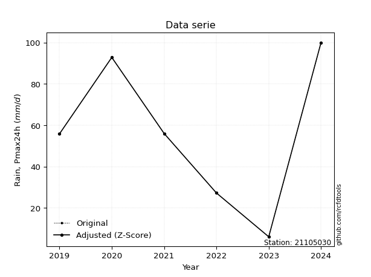</img>

</div>

> If Z-Score is active, values out of range or outliers are replaced with the station mean value.


### 4. Active continuous probability distributions from SciPy (45 of 104 available)

[scipy.stats](https://docs.scipy.org/doc/scipy/reference/stats.html) is a Python´s powerful submodule within the SciPy library for comprehensive statistical analysis, offering over 130 probability distributions (like Normal, Poisson), functions for descriptive stats (mean, variance), hypothesis testing (t-tests, chi-square), random variable generation, and statistical tests, making it essential for data science, modeling, and research. It provides tools to explore, model, and draw conclusions from data efficiently, working seamlessly with NumPy.

<div align="center">

|   id | p_dist             |   n_parameter | fit_method   | label                                                                       | active   | ref                                                                                                        |
|-----:|:-------------------|--------------:|:-------------|:----------------------------------------------------------------------------|:---------|:-----------------------------------------------------------------------------------------------------------|
|    0 | alpha              |             3 | MLE          | Alpha                                                                       | True     | [:mortar_board:](https://docs.scipy.org/doc/scipy/reference/generated/scipy.stats.alpha.html)              |
|    1 | betaprime          |             4 | MLE          | Beta prime                                                                  | True     | [:mortar_board:](https://docs.scipy.org/doc/scipy/reference/generated/scipy.stats.betaprime.html)          |
|    2 | chi2               |             3 | MLE          | Chi²                                                                        | True     | [:mortar_board:](https://docs.scipy.org/doc/scipy/reference/generated/scipy.stats.chi2.html)               |
|    3 | crystalball        |             4 | MLE          | Crystalball                                                                 | True     | [:mortar_board:](https://docs.scipy.org/doc/scipy/reference/generated/scipy.stats.crystalball.html)        |
|    4 | erlang             |             3 | MLE          | Erlang                                                                      | True     | [:mortar_board:](https://docs.scipy.org/doc/scipy/reference/generated/scipy.stats.erlang.html)             |
|    5 | expon              |             2 | MLE          | Exponential                                                                 | True     | [:mortar_board:](https://docs.scipy.org/doc/scipy/reference/generated/scipy.stats.expon.html)              |
|    6 | exponnorm          |             3 | MLE          | Exponentially modified Normal                                               | True     | [:mortar_board:](https://docs.scipy.org/doc/scipy/reference/generated/scipy.stats.exponnorm.html)          |
|    7 | f                  |             4 | MLE          | F                                                                           | True     | [:mortar_board:](https://docs.scipy.org/doc/scipy/reference/generated/scipy.stats.f.html)                  |
|    8 | fatiguelife        |             3 | MLE          | Fatigue-life (Birnbaum-Saunders)                                            | True     | [:mortar_board:](https://docs.scipy.org/doc/scipy/reference/generated/scipy.stats.fatiguelife.html)        |
|    9 | fisk               |             3 | MLE          | Fisk                                                                        | True     | [:mortar_board:](https://docs.scipy.org/doc/scipy/reference/generated/scipy.stats.fisk.html)               |
|   10 | gamma              |             3 | MLE          | Gamma                                                                       | True     | [:mortar_board:](https://docs.scipy.org/doc/scipy/reference/generated/scipy.stats.gamma.html)              |
|   11 | genexpon           |             5 | MLE          | Generalized exponential                                                     | True     | [:mortar_board:](https://docs.scipy.org/doc/scipy/reference/generated/scipy.stats.genexpon.html)           |
|   12 | genlogistic        |             3 | MLE          | Generalized logistic                                                        | True     | [:mortar_board:](https://docs.scipy.org/doc/scipy/reference/generated/scipy.stats.genlogistic.html)        |
|   13 | gibrat             |             2 | MM           | Gibrat                                                                      | True     | [:mortar_board:](https://docs.scipy.org/doc/scipy/reference/generated/scipy.stats.gibrat.html)             |
|   14 | gompertz           |             3 | MLE          | Gompertz (or truncated Gumbel)                                              | True     | [:mortar_board:](https://docs.scipy.org/doc/scipy/reference/generated/scipy.stats.gompertz.html)           |
|   15 | gumbel_l           |             2 | MM           | Gumbel Left Skew                                                            | True     | [:mortar_board:](https://docs.scipy.org/doc/scipy/reference/generated/scipy.stats.gumbel_l.html)           |
|   16 | gumbel_r           |             2 | MM           | Gumbel Right Skew                                                           | True     | [:mortar_board:](https://docs.scipy.org/doc/scipy/reference/generated/scipy.stats.gumbel_r.html)           |
|   17 | halflogistic       |             2 | MM           | Half-logistic                                                               | True     | [:mortar_board:](https://docs.scipy.org/doc/scipy/reference/generated/scipy.stats.halflogistic.html)       |
|   18 | halfnorm           |             2 | MM           | Half Normal                                                                 | True     | [:mortar_board:](https://docs.scipy.org/doc/scipy/reference/generated/scipy.stats.halfnorm.html)           |
|   19 | hypsecant          |             2 | MM           | hyperbolic secant                                                           | True     | [:mortar_board:](https://docs.scipy.org/doc/scipy/reference/generated/scipy.stats.hypsecant.html)          |
|   20 | invgamma           |             3 | MLE          | Inverted gamma                                                              | True     | [:mortar_board:](https://docs.scipy.org/doc/scipy/reference/generated/scipy.stats.invgamma.html)           |
|   21 | invgauss           |             3 | MLE          | Inverse Gaussian                                                            | True     | [:mortar_board:](https://docs.scipy.org/doc/scipy/reference/generated/scipy.stats.invgauss.html)           |
|   22 | invweibull         |             3 | MLE          | Inverted Weibull                                                            | True     | [:mortar_board:](https://docs.scipy.org/doc/scipy/reference/generated/scipy.stats.invweibull.html)         |
|   23 | johnsonsu          |             4 | MLE          | Johnson Su                                                                  | True     | [:mortar_board:](https://docs.scipy.org/doc/scipy/reference/generated/scipy.stats.johnsonsu.html)          |
|   24 | kstwobign          |             2 | MLE          | Limiting distribution of scaled Kolmogorov-Smirnov two-sided test statistic | True     | [:mortar_board:](https://docs.scipy.org/doc/scipy/reference/generated/scipy.stats.kstwobign.html)          |
|   25 | laplace            |             2 | MM           | Laplace                                                                     | True     | [:mortar_board:](https://docs.scipy.org/doc/scipy/reference/generated/scipy.stats.laplace.html)            |
|   26 | laplace_asymmetric |             3 | MLE          | Asymmetric Laplace                                                          | True     | [:mortar_board:](https://docs.scipy.org/doc/scipy/reference/generated/scipy.stats.laplace_asymmetric.html) |
|   27 | loggamma           |             3 | MLE          | Log gamma                                                                   | True     | [:mortar_board:](https://docs.scipy.org/doc/scipy/reference/generated/scipy.stats.loggamma.html)           |
|   28 | logistic           |             2 | MM           | Logistic (or Sech-squared)                                                  | True     | [:mortar_board:](https://docs.scipy.org/doc/scipy/reference/generated/scipy.stats.logistic.html)           |
|   29 | lognorm            |             3 | MLE          | Log Normal                                                                  | True     | [:mortar_board:](https://docs.scipy.org/doc/scipy/reference/generated/scipy.stats.lognorm.html)            |
|   30 | maxwell            |             2 | MM           | Maxwell                                                                     | True     | [:mortar_board:](https://docs.scipy.org/doc/scipy/reference/generated/scipy.stats.maxwell.html)            |
|   31 | mielke             |             4 | MLE          | Mielke Beta-Kappa / Dagum                                                   | True     | [:mortar_board:](https://docs.scipy.org/doc/scipy/reference/generated/scipy.stats.mielke.html)             |
|   32 | moyal              |             2 | MM           | Moyal                                                                       | True     | [:mortar_board:](https://docs.scipy.org/doc/scipy/reference/generated/scipy.stats.moyal.html)              |
|   33 | nakagami           |             3 | MLE          | Nakagami                                                                    | True     | [:mortar_board:](https://docs.scipy.org/doc/scipy/reference/generated/scipy.stats.nakagami.html)           |
|   34 | ncf                |             5 | MLE          | Non-central F distribution                                                  | True     | [:mortar_board:](https://docs.scipy.org/doc/scipy/reference/generated/scipy.stats.ncf.html)                |
|   35 | nct                |             4 | MLE          | Non-central Student’s t                                                     | True     | [:mortar_board:](https://docs.scipy.org/doc/scipy/reference/generated/scipy.stats.nct.html)                |
|   36 | norm               |             2 | MM           | Normal                                                                      | True     | [:mortar_board:](https://docs.scipy.org/doc/scipy/reference/generated/scipy.stats.norm.html)               |
|   37 | pareto             |             3 | MLE          | Pareto                                                                      | True     | [:mortar_board:](https://docs.scipy.org/doc/scipy/reference/generated/scipy.stats.pareto.html)             |
|   38 | pearson3           |             3 | MM           | Pearson type III                                                            | True     | [:mortar_board:](https://docs.scipy.org/doc/scipy/reference/generated/scipy.stats.pearson3.html)           |
|   39 | rayleigh           |             2 | MM           | Rayleigh                                                                    | True     | [:mortar_board:](https://docs.scipy.org/doc/scipy/reference/generated/scipy.stats.rayleigh.html)           |
|   40 | rice               |             3 | MLE          | Rice                                                                        | True     | [:mortar_board:](https://docs.scipy.org/doc/scipy/reference/generated/scipy.stats.rice.html)               |
|   41 | t                  |             3 | MLE          | Student’s t                                                                 | True     | [:mortar_board:](https://docs.scipy.org/doc/scipy/reference/generated/scipy.stats.t.html)                  |
|   42 | truncnorm          |             4 | MLE          | Truncated normal                                                            | True     | [:mortar_board:](https://docs.scipy.org/doc/scipy/reference/generated/scipy.stats.truncnorm.html)          |
|   43 | wald               |             2 | MM           | Wald                                                                        | True     | [:mortar_board:](https://docs.scipy.org/doc/scipy/reference/generated/scipy.stats.wald.html)               |
|   44 | weibull_min        |             3 | MLE          | Weibull minimum                                                             | True     | [:mortar_board:](https://docs.scipy.org/doc/scipy/reference/generated/scipy.stats.weibull_min.html)        |

</div>

> **n_parameter:** # arguments & localization & scale.
>
> **Fit methods:** (MLE) maximum likelihood, (MM) L-moments.
>
>**Inactive:** foldnorm, gennorm, norminvgauss, powernorm, powerlognorm, skewnorm, genextreme, anglit, arcsine, argus, beta, bradford, burr, burr12, cauchy, cosine, halfcauchy, foldcauchy, skewcauchy, wrapcauchy, dgamma, gengamma, exponweib, exponpow, truncexpon, gausshyper, genhalflogistic, genhyperbolic, geninvgauss, halfgennorm, johnsonsb, kappa4, kappa3, ksone, kstwo, loglaplace, levy, levy_l, levy_stable, ncx2, genpareto, truncpareto, lomax, powerlaw, rdist, rel_breitwigner, recipinvgauss, semicircular, studentized_range, trapezoid, triang, truncweibull_min, tukeylambda, uniform, loguniform, vonmises, vonmises_line, weibull_max, dweibull, 


## B. Probability distributions vs. Empirical distributions

A continuous probability distribution (CPD) describes probabilities for variables that can take any value within a range (like rain any time), unlike discrete variables with specific outcomes (like temperature). It uses a Probability Density Function (PDF), a curve where the total area under it equals 1, and the probability of the variable falling within an interval (a to b) is found by calculating the area under the curve between those points. A key feature is that the probability of hitting any single exact value is zero, so probabilities are always expressed for ranges, e.g., $P(a ≤ X ≤ b)$.

<div align="center">

Distributions parameters
|    |   station | p_dist                |   n |             loc |           scale | shape                  | shape1                 | shape2                | shape3   |
|---:|----------:|:----------------------|----:|----------------:|----------------:|:-----------------------|:-----------------------|:----------------------|:---------|
|  0 |  21105030 | alpha                 |   7 |    -0.0345786   |    15.2109      | 1.7681889298025144e-11 |                        |                       |          |
|  1 |  21105030 | betaprime             |   7 |   -59.5545      | 10539.1         | 12.643993259863826     | 1177.1423309684        |                       |          |
|  2 |  21105030 | chi2                  |   7 |     6           |     5.22082     | 1.3975837876668153     |                        |                       |          |
|  3 |  21105030 | crystalball           |   7 |    -0.0161094   |    62.2394      | 11.794660927350717     | 1.0000000058835359     |                       |          |
|  4 |  21105030 | erlang                |   7 |  -218.69        |     3.61456     | 75.30533377955965      |                        |                       |          |
|  5 |  21105030 | expon                 |   7 |     6           |    47.7429      |                        |                        |                       |          |
|  6 |  21105030 | exponnorm             |   7 |    50.3015      |    31.1928      | 0.11032489834384372    |                        |                       |          |
|  7 |  21105030 | f                     |   7 |   -55.3892      |   109.12        | 23.153295890461802     | 16911.939000545655     |                       |          |
|  8 |  21105030 | fatiguelife           |   7 |     6           |     1.26769e-05 | 2343.2985562841823     |                        |                       |          |
|  9 |  21105030 | fisk                  |   7 |  -113.005       |   164.114       | 8.768846087719748      |                        |                       |          |
| 10 |  21105030 | gamma                 |   7 |  -218.383       |     3.58272     | 75.87946823915945      |                        |                       |          |
| 11 |  21105030 | genexpon              |   7 |     6           |     3.99127     | 0.08364525763460177    | 1.0556585577787759e-08 | 0.8265326759118087    |          |
| 12 |  21105030 | genlogistic           |   7 |   -52.2993      |    27.313       | 28.371944984886497     |                        |                       |          |
| 13 |  21105030 | gibrat                |   7 |    29.8023      |    14.5207      |                        |                        |                       |          |
| 14 |  21105030 | gompertz              |   7 |     0.867586    |     3.40173     | 1.3832766770613157e-12 |                        |                       |          |
| 15 |  21105030 | gumbel_l              |   7 |    67.8664      |    24.4685      |                        |                        |                       |          |
| 16 |  21105030 | gumbel_r              |   7 |    39.6193      |    24.4685      |                        |                        |                       |          |
| 17 |  21105030 | halflogistic          |   7 |    16.5479      |    26.8305      |                        |                        |                       |          |
| 18 |  21105030 | halfnorm              |   7 |    12.2053      |    52.0595      |                        |                        |                       |          |
| 19 |  21105030 | hypsecant             |   7 |    53.7429      |    19.9784      |                        |                        |                       |          |
| 20 |  21105030 | invgamma              |   7 |  -153.265       |  8580.54        | 42.44467971198584      |                        |                       |          |
| 21 |  21105030 | invgauss              |   7 |   -97.0633      |  3238.12        | 0.046527579045372136   |                        |                       |          |
| 22 |  21105030 | invweibull            |   7 |    -1.58026e+09 |     1.58026e+09 | 56729653.46784935      |                        |                       |          |
| 23 |  21105030 | johnsonsu             |   7 |     9.76514e+07 |     7.00358e+08 | 3176655.714924913      | 22856466.342149906     |                       |          |
| 24 |  21105030 | kstwobign             |   7 |   -59.1279      |   129.114       |                        |                        |                       |          |
| 25 |  21105030 | laplace               |   7 |    53.7429      |    22.1904      |                        |                        |                       |          |
| 26 |  21105030 | laplace_asymmetric    |   7 |    55.8         |    25.2515      | 1.041563470237183      |                        |                       |          |
| 27 |  21105030 | loggamma              |   7 | -7551.45        |  1077.55        | 1162.4224233675618     |                        |                       |          |
| 28 |  21105030 | logistic              |   7 |    53.7429      |    17.3018      |                        |                        |                       |          |
| 29 |  21105030 | lognorm               |   7 |     6           |     0.199082    | 13.498481656956635     |                        |                       |          |
| 30 |  21105030 | maxwell               |   7 |   -20.6193      |    46.5996      |                        |                        |                       |          |
| 31 |  21105030 | mielke                |   7 |     6           |    96.1245      | 0.6198534928656825     | 139.7018382508308      |                       |          |
| 32 |  21105030 | moyal                 |   7 |    35.7966      |    14.1269      |                        |                        |                       |          |
| 33 |  21105030 | nakagami              |   7 |    27.2         |    54.3937      | 0.20232835214946598    |                        |                       |          |
| 34 |  21105030 | ncf                   |   7 |     6           |    20.5971      | 1.6646891565153026     | 3121.512163539107      | 2.318262319301985     |          |
| 35 |  21105030 | nct                   |   7 |  1841.58        |    31.3761      | 4068268.9892825047     | -56.98093820876382     |                       |          |
| 36 |  21105030 | norm                  |   7 |    53.7429      |    31.382       |                        |                        |                       |          |
| 37 |  21105030 | pareto                |   7 |     5.95274     |     0.0472643   | 0.1679554063249449     |                        |                       |          |
| 38 |  21105030 | pearson3              |   7 |    53.7429      |    31.382       | 0.12685214193952288    |                        |                       |          |
| 39 |  21105030 | rayleigh              |   7 |    -6.29277     |    47.9015      |                        |                        |                       |          |
| 40 |  21105030 | rice                  |   7 |    -8.0842      |    38.6599      | 1.1029759816592173     |                        |                       |          |
| 41 |  21105030 | t                     |   7 |    53.7424      |    31.3822      | 61811468.26083806      |                        |                       |          |
| 42 |  21105030 | truncnorm             |   7 |    53.7429      |    31.382       | -301.4456591084455     | 1050.4886454409277     |                       |          |
| 43 |  21105030 | wald                  |   7 |    22.3608      |    31.382       |                        |                        |                       |          |
| 44 |  21105030 | weibull_min           |   7 |    -6.66406     |    68.0953      | 2.003500419664957      |                        |                       |          |
| 45 |  21105030 | logalpha              |   7 |   -20.1065      |   594.165       | 25.020724683173597     |                        |                       |          |
| 46 |  21105030 | logbetaprime          |   7 |    -0.785553    |     3.78833e+10 | 17.144092116495116     | 143952387324.67694     |                       |          |
| 47 |  21105030 | logchi2               |   7 |     1.79176     |     1.02943     | 1.1827062090021847     |                        |                       |          |
| 48 |  21105030 | logcrystalball        |   7 |     3.70368     |     0.887998    | 1321.5806080953175     | 169.66521460613916     |                       |          |
| 49 |  21105030 | logerlang             |   7 |   -11.4274      |     0.0554319   | 272.7600827692552      |                        |                       |          |
| 50 |  21105030 | logexpon              |   7 |     1.79176     |     1.91192     |                        |                        |                       |          |
| 51 |  21105030 | logexponnorm          |   7 |     3.70301     |     0.887992    | 0.0007561023951757938  |                        |                       |          |
| 52 |  21105030 | logf                  |   7 |  -870.268       |   873.974       | 4887372.981985433      | 3218557.1035231957     |                       |          |
| 53 |  21105030 | logfatiguelife        |   7 |  -519.392       |   523.097       | 0.0016976430115550707  |                        |                       |          |
| 54 |  21105030 | logfisk               |   7 |    -1.27196e+08 |     1.27196e+08 | 267827456.16085964     |                        |                       |          |
| 55 |  21105030 | loggamma              |   7 |   -11.121       |     0.0566576   | 261.42900206707384     |                        |                       |          |
| 56 |  21105030 | loggenexpon           |   7 |     1.79176     |     4.19375e+07 | 6434435.144096214      | 54207062.063452475     | 10637600.421940032    |          |
| 57 |  21105030 | loggenlogistic        |   7 |     4.60571     |     6.83394e-05 | 7.45462925363341e-05   |                        |                       |          |
| 58 |  21105030 | loggibrat             |   7 |     3.02629     |     0.410865    |                        |                        |                       |          |
| 59 |  21105030 | loggompertz           |   7 |     1.79176     |     0.664484    | 0.03360258971091574    |                        |                       |          |
| 60 |  21105030 | loggumbel_l           |   7 |     4.10333     |     0.69237     |                        |                        |                       |          |
| 61 |  21105030 | loggumbel_r           |   7 |     3.30404     |     0.69237     |                        |                        |                       |          |
| 62 |  21105030 | loghalflogistic       |   7 |     2.65118     |     0.75922     |                        |                        |                       |          |
| 63 |  21105030 | loghalfnorm           |   7 |     2.52837     |     1.47304     |                        |                        |                       |          |
| 64 |  21105030 | loghypsecant          |   7 |     3.70368     |     0.565317    |                        |                        |                       |          |
| 65 |  21105030 | loginvgamma           |   7 |   -16.3014      |  9137.37        | 458.1777580947419      |                        |                       |          |
| 66 |  21105030 | loginvgauss           |   7 |    -4.54674     |   591.594       | 0.013890361256331269   |                        |                       |          |
| 67 |  21105030 | loginvweibull         |   7 |    -1.2014e+08  |     1.2014e+08  | 118599267.37615675     |                        |                       |          |
| 68 |  21105030 | logjohnsonsu          |   7 |     4.63026     |     0.00244054  | 3.899871681698904      | 0.6614470132011709     |                       |          |
| 69 |  21105030 | logkstwobign          |   7 |    -0.490302    |     4.79678     |                        |                        |                       |          |
| 70 |  21105030 | loglaplace            |   7 |     3.70368     |     0.62791     |                        |                        |                       |          |
| 71 |  21105030 | loglaplace_asymmetric |   7 |     4.02535     |     0.565168    | 1.3242282548934852     |                        |                       |          |
| 72 |  21105030 | logloggamma           |   7 |     4.61261     |     5.71185e-06 | 6.276970641976336e-06  |                        |                       |          |
| 73 |  21105030 | loglogistic           |   7 |     3.70368     |     0.489579    |                        |                        |                       |          |
| 74 |  21105030 | loglognorm            |   7 |     1.79176     |     0.0113261   | 12.887087159814657     |                        |                       |          |
| 75 |  21105030 | logmaxwell            |   7 |     1.5995      |     1.3186      |                        |                        |                       |          |
| 76 |  21105030 | logmielke             |   7 |   -19.7921      |    24.3974      | 25.879058453131126     | 1282883.936821552      |                       |          |
| 77 |  21105030 | logmoyal              |   7 |     3.19587     |     0.39974     |                        |                        |                       |          |
| 78 |  21105030 | lognakagami           |   7 |     3.30322     |     0.81464     | 0.1506483665246568     |                        |                       |          |
| 79 |  21105030 | logncf                |   7 |   -18.6554      |    22.3428      | 2094.0954278774384     | 2504.332655941872      | 4.514565922330476e-05 |          |
| 80 |  21105030 | lognct                |   7 |   -50.4884      |     0.86374     | 31732.78661073534      | 62.73855174308767      |                       |          |
| 81 |  21105030 | lognorm               |   7 |     3.70368     |     0.887998    |                        |                        |                       |          |
| 82 |  21105030 | logpareto             |   7 |     1.78967     |     0.00208821  | 0.1678104394605234     |                        |                       |          |
| 83 |  21105030 | logpearson3           |   7 |     3.70368     |     0.887997    | -1.1608515985369525    |                        |                       |          |
| 84 |  21105030 | lograyleigh           |   7 |     2.00483     |     1.35548     |                        |                        |                       |          |
| 85 |  21105030 | logrice               |   7 |  -245.752       |     0.889115    | 280.5635227362079      |                        |                       |          |
| 86 |  21105030 | logt                  |   7 |     3.9432      |     0.552049    | 2.4789867224000925     |                        |                       |          |
| 87 |  21105030 | logtruncnorm          |   7 |    -0.0702988   |     1.90208     | 1.7735911181651502     | 2.4580826573709413     |                       |          |
| 88 |  21105030 | logwald               |   7 |     2.81566     |     0.888019    |                        |                        |                       |          |
| 89 |  21105030 | logweibull_min        |   7 |     1.79176     |     1.17047     | 0.7288700426953156     |                        |                       |          |

</div>

> **loc** (Location parameter): This shifts the distribution along the x-axis. For many common distributions, like the normal (Gaussian) distribution, loc represents the mean $μ$. For others, like the uniform distribution, it might represent the minimum value, or for the beta distribution, the left end of the support interval.
>
> **scale** (Scale parameter): This determines the width or spread of the distribution. For the normal distribution, scale represents the standard deviation $σ$. For a uniform distribution, it defines the length of the interval (from $loc$ to $loc + scale$).
>
> **shape** (Shape parameters): Refers to parameters that define the specific form of a probability distribution, distinct from its location (loc) and scale (scale). These parameters are required arguments for most distribution functions. For example, a normal (Gaussian) distribution is fully defined by its location (mean) and scale (standard deviation), so it has no specific shape parameters beyond loc and scale. However, other distributions have intrinsic properties that need specification, as Gamma distribution that takes a shape parameter, often named $a$ or $alpha$.


### 0. Cumulative distribution values - CDF (90 evaluated)

> Ordered by x ascending and calculating $log(f(x))$ separately. 

|   id |   Station |   date |     x |   count |    mean |     std |     zscore |   Value_initial |   station |   m |     alpha |   alpha_pdf |   betaprime |   betaprime_pdf |        chi2 |       chi2_pdf |   crystalball |   crystalball_pdf |    erlang |   erlang_pdf |    expon |   expon_pdf |   exponnorm |   exponnorm_pdf |         f |      f_pdf |   fatiguelife |   fatiguelife_pdf |      fisk |   fisk_pdf |     gamma |   gamma_pdf |    genexpon |   genexpon_pdf |   genlogistic |   genlogistic_pdf |   gibrat |   gibrat_pdf |    gompertz |   gompertz_pdf |   gumbel_l |   gumbel_l_pdf |   gumbel_r |   gumbel_r_pdf |   halflogistic |   halflogistic_pdf |   halfnorm |   halfnorm_pdf |   hypsecant |   hypsecant_pdf |   invgamma |   invgamma_pdf |   invgauss |   invgauss_pdf |   invweibull |   invweibull_pdf |   johnsonsu |   johnsonsu_pdf |   kstwobign |   kstwobign_pdf |   laplace |   laplace_pdf |   laplace_asymmetric |   laplace_asymmetric_pdf |   loggamma |   loggamma_pdf |   logistic |   logistic_pdf |   lognorm |   lognorm_pdf |   maxwell |   maxwell_pdf |     mielke |   mielke_pdf |      moyal |   moyal_pdf |    nakagami |   nakagami_pdf |         ncf |    ncf_pdf |       nct |    nct_pdf |      norm |   norm_pdf |   pareto |   pareto_pdf |   pearson3 |   pearson3_pdf |   rayleigh |   rayleigh_pdf |      rice |   rice_pdf |         t |      t_pdf |   truncnorm |   truncnorm_pdf |      wald |   wald_pdf |   weibull_min |   weibull_min_pdf |   logalpha |   logalpha_pdf |   logbetaprime |   logbetaprime_pdf |     logchi2 |   logchi2_pdf |   logcrystalball |   logcrystalball_pdf |   logerlang |   logerlang_pdf |   logexpon |   logexpon_pdf |   logexponnorm |   logexponnorm_pdf |      logf |   logf_pdf |   logfatiguelife |   logfatiguelife_pdf |   logfisk |   logfisk_pdf |   loggenexpon |   loggenexpon_pdf |   loggenlogistic |   loggenlogistic_pdf |   loggibrat |   loggibrat_pdf |   loggompertz |   loggompertz_pdf |   loggumbel_l |   loggumbel_l_pdf |   loggumbel_r |   loggumbel_r_pdf |   loghalflogistic |   loghalflogistic_pdf |   loghalfnorm |   loghalfnorm_pdf |   loghypsecant |   loghypsecant_pdf |   loginvgamma |   loginvgamma_pdf |   loginvgauss |   loginvgauss_pdf |   loginvweibull |   loginvweibull_pdf |   logjohnsonsu |   logjohnsonsu_pdf |   logkstwobign |   logkstwobign_pdf |   loglaplace |   loglaplace_pdf |   loglaplace_asymmetric |   loglaplace_asymmetric_pdf |   logloggamma |   logloggamma_pdf |   loglogistic |   loglogistic_pdf |   loglognorm |   loglognorm_pdf |   logmaxwell |   logmaxwell_pdf |   logmielke |   logmielke_pdf |    logmoyal |   logmoyal_pdf |   lognakagami |   lognakagami_pdf |   logncf |   logncf_pdf |    lognct |   lognct_pdf |   logpareto |   logpareto_pdf |   logpearson3 |   logpearson3_pdf |   lograyleigh |   lograyleigh_pdf |   logrice |   logrice_pdf |      logt |   logt_pdf |   logtruncnorm |   logtruncnorm_pdf |   logwald |   logwald_pdf |   logweibull_min |   logweibull_min_pdf |
|-----:|----------:|-------:|------:|--------:|--------:|--------:|-----------:|----------------:|----------:|----:|----------:|------------:|------------:|----------------:|------------:|---------------:|--------------:|------------------:|----------:|-------------:|---------:|------------:|------------:|----------------:|----------:|-----------:|--------------:|------------------:|----------:|-----------:|----------:|------------:|------------:|---------------:|--------------:|------------------:|---------:|-------------:|------------:|---------------:|-----------:|---------------:|-----------:|---------------:|---------------:|-------------------:|-----------:|---------------:|------------:|----------------:|-----------:|---------------:|-----------:|---------------:|-------------:|-----------------:|------------:|----------------:|------------:|----------------:|----------:|--------------:|---------------------:|-------------------------:|-----------:|---------------:|-----------:|---------------:|----------:|--------------:|----------:|--------------:|-----------:|-------------:|-----------:|------------:|------------:|---------------:|------------:|-----------:|----------:|-----------:|----------:|-----------:|---------:|-------------:|-----------:|---------------:|-----------:|---------------:|----------:|-----------:|----------:|-----------:|------------:|----------------:|----------:|-----------:|--------------:|------------------:|-----------:|---------------:|---------------:|-------------------:|------------:|--------------:|-----------------:|---------------------:|------------:|----------------:|-----------:|---------------:|---------------:|-------------------:|----------:|-----------:|-----------------:|---------------------:|----------:|--------------:|--------------:|------------------:|-----------------:|---------------------:|------------:|----------------:|--------------:|------------------:|--------------:|------------------:|--------------:|------------------:|------------------:|----------------------:|--------------:|------------------:|---------------:|-------------------:|--------------:|------------------:|--------------:|------------------:|----------------:|--------------------:|---------------:|-------------------:|---------------:|-------------------:|-------------:|-----------------:|------------------------:|----------------------------:|--------------:|------------------:|--------------:|------------------:|-------------:|-----------------:|-------------:|-----------------:|------------:|----------------:|------------:|---------------:|--------------:|------------------:|---------:|-------------:|----------:|-------------:|------------:|----------------:|--------------:|------------------:|--------------:|------------------:|----------:|--------------:|----------:|-----------:|---------------:|-------------------:|----------:|--------------:|-----------------:|---------------------:|
|    0 |  21105030 |   2023 |   6   |       7 | 53.7429 | 33.8965 | -1.40849   |             6   |  21105030 |   1 | 0.0117145 |  0.0139041  |    0.046717 |      0.0044331  | 1.05269e-11 | 4141.13        |      0.538502 |        0.00637993 | 0.0577598 |   0.00419159 | 0        |  0.0209455  |   0.0640118 |      0.00399729 | 0.0461669 | 0.00445702 |     0.0442622 |       1.00092e+11 | 0.0563442 | 0.00391779 | 0.0569303 |  0.00416547 | 9.34153e-08 |     0.020957   |     0.0419036 |        0.00460484 | 0        |   0          | 4.87071e-12 |    1.83847e-12 |  0.0766855 |     0.00301069 |  0.0192343 |     0.00310587 |       0        |         0          |   0        |     0          |   0.0581869 |      0.0028963  |  0.0476487 |     0.00439948 |  0.0470062 |     0.00452309 |    0.0410115 |       0.00470229 |   0.0613932 |      0.00392014 |   0.0389546 |      0.00520206 | 0.0581544 |    0.0026207  |            0.0783385 |               0.00297854 |  0.0158509 |       0.047517 |  0.0595572 |     0.00323724 | 0.0156566 |     0.0442452 | 0.0449933 |    0.00474604 | 1.4368e-05 |   6.01656    | 0.00409373 |  0.00131582 | 0           |    0           | 5.81832e-13 | 2.62142    | 0.0640889 | 0.00399615 | 0.0640867 | 0.00399617 | 0        |  3.55354     |  0.0603413 |     0.00408037 |  0.0323922 |     0.00518383 | 0.0356493 | 0.00499546 | 0.0640897 | 0.00399629 |   0.0640867 |      0.00399617 | 0         | 0          |     0.0337994 |        0.00525579 |  0.0173324 |      0.0531093 |      0.0208301 |          0.0672927 | 4.04681e-10 |   1.07775e+06 |        0.0156566 |            0.0442452 |   0.0157997 |       0.0473242 |   0        |       0.523034 |       0.015656 |           0.044244 | 0.0154071 |  0.0437785 |        0.0154388 |            0.0438753 | 0.0132973 |     0.0276269 |   2.61091e-11 |          0.153429 |         0        |            0.0506611 |    0        |        0        |   1.27949e-08 |         0.0505695 |     0.0348631 |         0.0494652 |   0.000138648 |        0.00177895 |          0        |              0        |      0        |          0        |      0.0216229 |          0.0382197 |     0.0164477 |         0.0500967 |     0.0156122 |         0.0530055 |       0.0176938 |           0.0704709 |       0.109791 |          0.0437576 |       0.02262  |          0.0981442 |    0.0238005 |        0.0379044 |               0.0322034 |                   0.0430289 |     0.0450518 |         0.0495091 |     0.0197387 |         0.0395219 |   0.00715876 |      6.94614e+12 |  0.000819183 |        0.0127281 |   0.0419607 |        0.050311 | 7.00334e-09 |    3.02054e-07 |   0           |       0           | 0.017321 |    0.0498687 | 0.0157686 |    0.0445872 |    0        |      80.3611    |     0.0363767 |         0.0527753 |      0        |          0        | 0.0157805 |     0.0444897 | 0.0209742 |  0.0215059 |    0           |           0        |  0        |      0        |      3.47347e-12 |        11401.8       |
|    1 |  21105030 |   2022 |  27.2 |       7 | 53.7429 | 33.8965 | -0.783057  |            27.2 |  21105030 |   2 | 0.576493  |  0.0139997  |    0.209688 |      0.0107575  | 0.926473    |    0.00781436  |      0.669046 |        0.00582536 | 0.203674  |   0.0096551  | 0.358564 |  0.0134352  |   0.19885   |      0.00889685 | 0.210368  | 0.0108245  |     0.70948   |       0.00445908  | 0.200894  | 0.0100404  | 0.202709  |  0.00967653 | 0.35872     |     0.0134393  |     0.222248  |        0.0119192  | 0        |   0          | 3.18084e-09 |    9.3547e-10  |  0.172843  |     0.00641485 |  0.189904  |     0.0128931  |       0.19594  |         0.01792    |   0.226675 |     0.0147036  |   0.164827  |      0.00788646 |  0.210561  |     0.0108192  |  0.21393   |     0.0109855  |    0.2249    |       0.0120467  |   0.195463  |      0.00892451 |   0.237366  |      0.0124261  | 0.15118   |    0.00681283 |            0.175404  |               0.00666909 |  0.342266  |       0.408105 |  0.177393  |     0.00843408 | 0.326004  |     0.405821  | 0.211578  |    0.0106497  | 0.391803   |   0.0114557  | 0.175218   |  0.0152738  | 2.22638e-07 |    2.53587e+07 | 0.314865    | 0.0124997  | 0.198832  | 0.0088895  | 0.198833  | 0.00888971 | 0.64153  |  0.00283363  |  0.200405  |     0.00926615 |  0.216858  |     0.0114312  | 0.208179  | 0.0107587  | 0.198838  | 0.00888979 |   0.198833  |      0.00888971 | 0.0277801 | 0.0206398  |     0.21863   |        0.0114048  |  0.359273  |      0.40534   |      0.374579  |          0.370975  | 0.727177    |   0.175228    |        0.326004  |            0.405821  |   0.341507  |       0.407906  |   0.546402 |       0.237247 |       0.326003 |           0.405824 | 0.325087  |  0.405896  |        0.325332  |            0.405776  | 0.245226  |     0.389731  |   0.43039     |          0.321858 |         0        |            0.263458  |    0.346603 |        1.33275  |   0.254098    |         0.366802  |     0.270112  |         0.331926  |   0.367444    |        0.531334   |          0.40483  |              0.550639 |      0.401122 |          0.471673 |      0.291303  |          0.446317  |     0.350936  |         0.407103  |     0.370642  |         0.409158  |       0.403575  |           0.361504  |       0.23431  |          0.152921  |       0.440897 |          0.342287  |    0.264233  |        0.420814  |               0.242651  |                   0.324221  |     0.237178  |         0.260644  |     0.306193  |         0.433921  |   0.64793    |      0.0190566   |  0.356249    |        0.438412  |   0.241855  |        0.271007 | 0.381927    |    0.595404    |   2.03011e-05 |       1.37735e+10 | 0.339896 |    0.398159  | 0.327046  |    0.405719  |    0.66885  |       0.0367154 |     0.27168   |         0.317443  |      0.367936 |          0.44666  | 0.326368  |     0.405498  | 0.172877  |  0.308261  |    4.85916e-06 |           1.39996  |  0.406493 |      0.917598 |      0.700261    |            0.174152  |
|    2 |  21105030 |   2025 |  38.4 |       7 | 53.7429 | 33.8965 | -0.452639  |            38.4 |  21105030 |   3 | 0.692281  |  0.00759697 |    0.342242 |      0.0126292  | 0.977204    |    0.00235273  |      0.731459 |        0.00529806 | 0.325562  |   0.0119247  | 0.492691 |  0.0106259  |   0.312555  |      0.0112875  | 0.343486  | 0.0126583  |     0.752457  |       0.00332814  | 0.330305  | 0.0128114  | 0.325017  |  0.0119765  | 0.49288     |     0.0106277  |     0.365354  |        0.0132325  | 0.300112 |   0.040447   | 8.5627e-08  |    2.5172e-08  |  0.259118  |     0.0090811  |  0.349555  |     0.0150159  |       0.386114 |         0.0158573  |   0.385153 |     0.013504   |   0.276545  |      0.0121654  |  0.344095  |     0.0127283  |  0.348549  |     0.0127497  |    0.368573  |       0.0132065  |   0.309973  |      0.0114028  |   0.381858  |      0.0130163  | 0.250433  |    0.0112856  |            0.268521  |               0.0102095  |  0.489552  |       0.436133 |  0.291775  |     0.0119434  | 0.475026  |     0.44838   | 0.341534  |    0.0123158  | 0.509624   |   0.00974976 | 0.361782   |  0.0169921  | 0.415537    |    0.0149066   | 0.445325    | 0.0107932  | 0.312451  | 0.0112802  | 0.312454  | 0.0112804  | 0.666136 |  0.00172817  |  0.318158  |     0.0116081  |  0.352902  |     0.012604   | 0.338199  | 0.0122461  | 0.31246   | 0.0112804  |   0.312454  |      0.0112804  | 0.374644  | 0.0275373  |     0.354235  |        0.0125554  |  0.503211  |      0.420058  |      0.503436  |          0.369802  | 0.780527    |   0.136267    |        0.475026  |            0.44838   |   0.488805  |       0.436407  |   0.62126  |       0.198094 |       0.475026 |           0.448383 | 0.474181  |  0.448729  |        0.474346  |            0.448363  | 0.401761  |     0.506086  |   0.537247    |          0.295621 |         0        |            0.383775  |    0.660674 |        0.588856 |   0.402769    |         0.493484  |     0.404359  |         0.445732  |   0.544205    |        0.478227   |          0.576039 |              0.440043 |      0.552814 |          0.405753 |      0.46873   |          0.560349  |     0.496596  |         0.427964  |     0.514076  |         0.413519  |       0.524356  |           0.334175  |       0.299551 |          0.233988  |       0.553823 |          0.309814  |    0.457612  |        0.728786  |               0.38467   |                   0.513982  |     0.346461  |         0.38074   |     0.471626  |         0.508998  |   0.653831   |      0.0154209   |  0.508897    |        0.436902  |   0.354918  |        0.391847 | 0.570024    |    0.482428    |   0.619934    |       0.529084    | 0.483726 |    0.426707  | 0.475881  |    0.447416  |    0.680062 |       0.0288901 |     0.398927  |         0.420735  |      0.520405 |          0.428928 | 0.475235  |     0.447833  | 0.318529  |  0.541649  |    0.410772    |           0.998465 |  0.641893 |      0.493989 |      0.753288    |            0.135574  |
|    3 |  21105030 |   2019 |  55.8 |       7 | 53.7429 | 33.8965 |  0.060689  |            55.8 |  21105030 |   4 | 0.785293  |  0.00375123 |    0.563184 |      0.0121246  | 0.996131    |    0.000390509 |      0.815087 |        0.00428751 | 0.544321  |   0.012565   | 0.647635 |  0.00738047 |   0.526306  |      0.0126854  | 0.564304  | 0.0120872  |     0.801175  |       0.00236908  | 0.561468  | 0.0127904  | 0.544838  |  0.0126256  | 0.647837    |     0.0073803  |     0.584536  |        0.0113831  | 0.719863 |   0.0129513  | 1.42576e-05 |    4.19125e-06 |  0.457032  |     0.0135519  |  0.596793  |     0.0125899  |       0.623972 |         0.0113799  |   0.597632 |     0.0107936  |   0.532718  |      0.0158486  |  0.566052  |     0.0121171  |  0.569254  |     0.0119845  |    0.585995  |       0.0112429  |   0.526506  |      0.0128664  |   0.593499  |      0.0109179  | 0.544268  |    0.0205373  |            0.52035   |               0.0197844  |  0.647695  |       0.399328 |  0.529689  |     0.0143984  | 0.639908  |     0.421342  | 0.557954  |    0.0120011  | 0.665223   |   0.00827993 | 0.622272   |  0.0123222  | 0.602484    |    0.00813615  | 0.610357    | 0.00821227 | 0.526127  | 0.0126851  | 0.526133  | 0.0126852  | 0.689363 |  0.00104666  |  0.534504  |     0.0126285  |  0.568352  |     0.0116808  | 0.553473  | 0.0119959  | 0.526138  | 0.0126851  |   0.526133  |      0.0126852  | 0.693018  | 0.0115343  |     0.568803  |        0.011634   |  0.65375   |      0.376534  |      0.635234  |          0.330095  | 0.825395    |   0.10544     |        0.639908  |            0.421342  |   0.647127  |       0.399964  |   0.688505 |       0.162922 |       0.639909 |           0.421344 | 0.639226  |  0.421808  |        0.639223  |            0.421346  | 0.595988  |     0.507006  |   0.640542    |          0.255873 |         0        |            0.576926  |    0.811912 |        0.270903 |   0.605421    |         0.572162  |     0.588885  |         0.5278    |   0.701423    |        0.359282   |          0.717578 |              0.319461 |      0.689331 |          0.323992 |      0.67034   |          0.484346  |     0.650789  |         0.387331  |     0.66069   |         0.363246  |       0.639922  |           0.282003  |       0.417233 |          0.424294  |       0.660896 |          0.262027  |    0.698726  |        0.479805  |               0.633799  |                   0.846859  |     0.522415  |         0.574102  |     0.656948  |         0.460328  |   0.659067   |      0.0127632   |  0.662603    |        0.377803  |   0.534448  |        0.580797 | 0.721902    |    0.333407    |   0.764591    |       0.289447    | 0.639093 |    0.394419  | 0.640289  |    0.419891  |    0.68975  |       0.0233247 |     0.574703  |         0.511835  |      0.669469 |          0.362842 | 0.639907  |     0.420814  | 0.551213  |  0.645667  |    0.718817    |           0.667024 |  0.779668 |      0.270723 |      0.798048    |            0.105593  |
|    4 |  21105030 |   2021 |  56   |       7 | 53.7429 | 33.8965 |  0.0665894 |            56   |  21105030 |   5 | 0.78604   |  0.00372548 |    0.565606 |      0.0120984  | 0.996208    |    0.000382638 |      0.815943 |        0.00427515 | 0.546833  |   0.0125498  | 0.649108 |  0.00734962 |   0.528842  |      0.0126797  | 0.566719  | 0.0120605  |     0.801648  |       0.00236095  | 0.564023  | 0.0127586  | 0.547362  |  0.0126102  | 0.64931     |     0.00734943 |     0.586809  |        0.0113456  | 0.722438 |   0.0127948  | 1.5121e-05  |    4.44506e-06 |  0.459746  |     0.0135948  |  0.599306  |     0.01254    |       0.626242 |         0.011327   |   0.599787 |     0.0107589  |   0.535886  |      0.0158315  |  0.568473  |     0.0120891  |  0.571648  |     0.0119559  |    0.588239  |       0.0112052  |   0.529079  |      0.0128606  |   0.595679  |      0.0108831  | 0.548357  |    0.020353   |            0.524291  |               0.0196219  |  0.649122  |       0.39868  |  0.532568  |     0.014388   | 0.641414  |     0.420731  | 0.560353  |    0.0119793  | 0.666877   |   0.00826732 | 0.62473    |  0.0122562  | 0.604107    |    0.0080961   | 0.611997    | 0.00818417 | 0.528663  | 0.0126795  | 0.528669  | 0.0126796  | 0.689572 |  0.00104178  |  0.537029  |     0.0126179  |  0.570685  |     0.0116551  | 0.55587   | 0.0119764  | 0.528674  | 0.0126795  |   0.528669  |      0.0126796  | 0.695314  | 0.0114271  |     0.571128  |        0.0116085  |  0.655096  |      0.375877  |      0.636414  |          0.329572  | 0.825772    |   0.105188    |        0.641414  |            0.420731  |   0.648557  |       0.399318  |   0.689088 |       0.162618 |       0.641415 |           0.420733 | 0.640734  |  0.421197  |        0.64073   |            0.420736  | 0.5978    |     0.506267  |   0.641457    |          0.255461 |         0        |            0.579182  |    0.812878 |        0.269075 |   0.607469    |         0.572266  |     0.590774  |         0.528097  |   0.702706    |        0.358084   |          0.718719 |              0.318382 |      0.690488 |          0.323194 |      0.67207   |          0.482778  |     0.652174  |         0.386676  |     0.661988  |         0.362561  |       0.64093   |           0.281451  |       0.418756 |          0.427149  |       0.661832 |          0.261544  |    0.700438  |        0.477078  |               0.636836  |                   0.850917  |     0.524473  |         0.576364  |     0.658593  |         0.459268  |   0.659113   |      0.0127421   |  0.663954    |        0.377035  |   0.53653   |        0.582972 | 0.723092    |    0.332106    |   0.765624    |       0.288107    | 0.640503 |    0.393827  | 0.64179   |    0.419279  |    0.689833 |       0.0232812 |     0.576536  |         0.512409  |      0.670766 |          0.36206  | 0.641411  |     0.420205  | 0.553521  |  0.64482   |    0.721198    |           0.664329 |  0.780634 |      0.269274 |      0.798425    |            0.10535   |
|    5 |  21105030 |   2020 |  92.8 |       7 | 53.7429 | 33.8965 |  1.15225   |            92.8 |  21105030 |   6 | 0.869849  |  0.00138946 |    0.883713 |      0.00500259 | 0.999903    |    9.55056e-06 |      0.932056 |        0.00210829 | 0.891594  |   0.00542293 | 0.837662 |  0.00340026 |   0.893324  |      0.00585436 | 0.883298  | 0.00498279 |     0.867933  |       0.00137567  | 0.879211  | 0.00452489 | 0.892862  |  0.00540344 | 0.837824    |     0.00339873 |     0.869773  |        0.00443216 | 0.928883 |   0.0021574  | 0.529859    |    0.104307    |  0.937366  |     0.00709175 |  0.892449  |     0.00415015 |       0.889807 |         0.00388073 |   0.878408 |     0.00462386 |   0.910469  |      0.00442252 |  0.882562  |     0.00488755 |  0.882438  |     0.00487155 |    0.867973  |       0.00441199 |   0.896603  |      0.00581224 |   0.874612  |      0.00456759 | 0.913985  |    0.00387621 |            0.895739  |               0.0043005  |  0.821268  |       0.27487  |  0.905287  |     0.00495569 | 0.824084  |     0.29125   | 0.88463   |    0.00524569 | 0.93871    |   0.00670349 | 0.894209   |  0.00372231 | 0.811942    |    0.00391076  | 0.82999     | 0.00400886 | 0.893352  | 0.00585989 | 0.893355  | 0.00585973 | 0.71702  |  0.00054726  |  0.891447  |     0.00564222 |  0.882311  |     0.0050825  | 0.885318  | 0.00539933 | 0.893356  | 0.00585965 |   0.893355  |      0.00585973 | 0.909014  | 0.00267718 |     0.881916  |        0.00508147 |  0.816975  |      0.259554  |      0.781652  |          0.242318  | 0.870991    |   0.0757256   |        0.824084  |            0.29125   |   0.821042  |       0.275484  |   0.761271 |       0.124863 |       0.824086 |           0.29125  | 0.823635  |  0.291673  |        0.823443  |            0.29145   | 0.81151   |     0.32208   |   0.755451    |          0.195811 |         0        |            1.00484   |    0.902809 |        0.114267 |   0.869725    |         0.406168  |     0.843259  |         0.419525  |   0.843574    |        0.207257   |          0.844778 |              0.188581 |      0.825898 |          0.215078 |      0.855076  |          0.247593  |     0.818882  |         0.266762  |     0.817218  |         0.248363  |       0.763243  |           0.203567  |       0.838081 |          1.62448   |       0.776731 |          0.194058  |    0.86599   |        0.213423  |               0.888794  |                   0.260562  |     0.913664  |         1.00406   |     0.844056  |         0.268854  |   0.664896   |      0.0103236   |  0.823809    |        0.252787  |   0.923527  |        0.982629 | 0.850581    |    0.184695    |   0.874607    |       0.159062    | 0.812214 |    0.277723  | 0.823811  |    0.29032   |    0.700256 |       0.0183525 |     0.836779  |         0.470383  |      0.823753 |          0.242271 | 0.823898  |     0.29108   | 0.810026  |  0.340484  |    0.9742      |           0.36203  |  0.877595 |      0.133762 |      0.844043    |            0.0771258 |
|    6 |  21105030 |   2024 | 100   |       7 | 53.7429 | 33.8965 |  1.36466   |           100   |  21105030 |   7 | 0.879142  |  0.00119888 |    0.915444 |      0.00384452 | 0.999953    |    4.67884e-06 |      0.945968 |        0.00176239 | 0.925533  |   0.00404181 | 0.860387 |  0.00292427 |   0.929698  |      0.0042867  | 0.914927  | 0.00383562 |     0.877395  |       0.0012553   | 0.907753  | 0.00344724 | 0.926633  |  0.00401556 | 0.860538    |     0.00292271 |     0.898299  |        0.00352078 | 0.942457 |   0.00164217 | 0.9981      |    0.00349903  |  0.975725  |     0.00368895 |  0.918714  |     0.00318322 |       0.914635 |         0.00304584 |   0.908287 |     0.00369713 |   0.937349  |      0.00311573 |  0.91358   |     0.00376239 |  0.913411  |     0.00376441 |    0.896423  |       0.00351874 |   0.932563  |      0.00421685 |   0.904143  |      0.00365882 | 0.937819  |    0.00280217 |            0.922528  |               0.00319552 |  0.841031  |       0.254124 |  0.935447  |     0.00349013 | 0.844993  |     0.268351  | 0.917897  |    0.00402493 | 0.986054   |   0.00622783 | 0.917911   |  0.00289516 | 0.838346    |    0.00343353  | 0.856735    | 0.00343284 | 0.929757  | 0.00428994 | 0.929759  | 0.00428981 | 0.72078  |  0.000498648 |  0.926667  |     0.00417795 |  0.914731  |     0.00394997 | 0.919517  | 0.00412863 | 0.92976   | 0.00428976 |   0.929759  |      0.00428981 | 0.926136  | 0.00210586 |     0.914346  |        0.00395367 |  0.835671  |      0.240888  |      0.799243  |          0.228528  | 0.876517    |   0.0722276   |        0.844993  |            0.268351  |   0.84085   |       0.254695  |   0.770421 |       0.120077 |       0.844994 |           0.268351 | 0.844574  |  0.26876   |        0.844368  |            0.268592  | 0.834407  |     0.290938  |   0.769758    |          0.187145 |         0.999409 |            1.08979   |    0.910882 |        0.102101 |   0.898194    |         0.355187  |     0.8731    |         0.378363  |   0.858383    |        0.18932    |          0.858297 |              0.173419 |      0.841421 |          0.200491 |      0.872512  |          0.219534  |     0.838081  |         0.247142  |     0.835117  |         0.23075   |       0.778048  |           0.19276   |       0.971183 |          1.72665   |       0.790878 |          0.184607  |    0.881025  |        0.189478  |               0.906655  |                   0.218713  |     0.991857  |         1.08999   |     0.863109  |         0.241334  |   0.665657   |      0.0100405   |  0.841994    |        0.234002  |   0.999828  |        1.06034  | 0.863777    |    0.168724    |   0.886006    |       0.146218    | 0.832225 |    0.257852  | 0.844655  |    0.267571  |    0.701606 |       0.017785  |     0.870693  |         0.435886  |      0.841199 |          0.224748 | 0.844796  |     0.268239  | 0.833759  |  0.295517  |    1           |           0.328959 |  0.887128 |      0.12161  |      0.84968     |            0.0737972 |

An Empirical Distribution Function (EDF) is a step-function estimate of a true cumulative distribution function (CDF) based on observed sample data, representing the proportion of data points less than or equal to a given value. It is calculated by ordering your data and jumping up by $1/n$ (where $n$ is sample size) at each unique data point, allowing analysis without assuming an underlying population distribution, and it gets closer to the true CDF as the sample size grows.


### 1. Empirical - EDF California (1923)

California´s estimates the true probability distribution of water-related data (like rainfall, streamflow) using observed samples, crucial for risk assessment.

<div align="center">


$P=m/n$


</div>


**1.1. Empirical values**

<div align="center">

|                | 0                   | 1                  | 2                   | 3                  | 4                  | 5                  | 6              |
|:---------------|:--------------------|:-------------------|:--------------------|:-------------------|:-------------------|:-------------------|:---------------|
| date           | 2023                | 2022               | 2025                | 2019               | 2021               | 2020               | 2024           |
| x              | 6.0                 | 27.2               | 38.4                | 55.8               | 56.0               | 92.8               | 100.0          |
| m              | 1                   | 2                  | 3                   | 4                  | 5                  | 6                  | 7              |
| empirical_dist | edf_california      | edf_california     | edf_california      | edf_california     | edf_california     | edf_california     | edf_california |
| empirical      | 0.14285714285714285 | 0.2857142857142857 | 0.42857142857142855 | 0.5714285714285714 | 0.7142857142857143 | 0.8571428571428571 | 1.0            |
| empirical_tr   | 1.1666666666666665  | 1.4                | 1.75                | 2.333333333333333  | 3.5                | 6.999999999999997  | inf            |

</div>


**1.2. Kolmogorov-Smirnov fit test (sorted by Δ)**


<div align="center">

|                | 0                     | 1                   | 2                   | 3                   | 4                   | 5                   | 6                   | 7                   | 8                   | 9                   | 10                  | 11                  | 12                  | 13                  | 14                  | 15                  | 16                  | 17                  | 18                  | 19                  | 20                  | 21                  | 22                  | 23                  | 24                  | 25                  | 26                  | 27                  | 28                  | 29                  | 30                  | 31                  | 32                  | 33                  | 34                  | 35                  | 36                  | 37                  | 38                  | 39                  | 40                  | 41                  | 42                  | 43                  | 44                  | 45                  | 46                  | 47                  | 48                  | 49                  | 50                  | 51                  | 52                  | 53                  | 54                  | 55                  | 56                  | 57                  | 58                  | 59                  | 60                  | 61                  | 62                  | 63                  | 64                  | 65                  | 66                  | 67                  | 68                  | 69                  | 70                  | 71                  | 72                  | 73                  | 74                  | 75                  | 76                  | 77                  | 78                  | 79                  | 80                  | 81                  | 82                  | 83                  | 84                  | 85                  | 86                  | 87                  | 88                  | 89                  |
|:---------------|:----------------------|:--------------------|:--------------------|:--------------------|:--------------------|:--------------------|:--------------------|:--------------------|:--------------------|:--------------------|:--------------------|:--------------------|:--------------------|:--------------------|:--------------------|:--------------------|:--------------------|:--------------------|:--------------------|:--------------------|:--------------------|:--------------------|:--------------------|:--------------------|:--------------------|:--------------------|:--------------------|:--------------------|:--------------------|:--------------------|:--------------------|:--------------------|:--------------------|:--------------------|:--------------------|:--------------------|:--------------------|:--------------------|:--------------------|:--------------------|:--------------------|:--------------------|:--------------------|:--------------------|:--------------------|:--------------------|:--------------------|:--------------------|:--------------------|:--------------------|:--------------------|:--------------------|:--------------------|:--------------------|:--------------------|:--------------------|:--------------------|:--------------------|:--------------------|:--------------------|:--------------------|:--------------------|:--------------------|:--------------------|:--------------------|:--------------------|:--------------------|:--------------------|:--------------------|:--------------------|:--------------------|:--------------------|:--------------------|:--------------------|:--------------------|:--------------------|:--------------------|:--------------------|:--------------------|:--------------------|:--------------------|:--------------------|:--------------------|:--------------------|:--------------------|:--------------------|:--------------------|:--------------------|:--------------------|:--------------------|
| station        | 21105030              | 21105030            | 21105030            | 21105030            | 21105030            | 21105030            | 21105030            | 21105030            | 21105030            | 21105030            | 21105030            | 21105030            | 21105030            | 21105030            | 21105030            | 21105030            | 21105030            | 21105030            | 21105030            | 21105030            | 21105030            | 21105030            | 21105030            | 21105030            | 21105030            | 21105030            | 21105030            | 21105030            | 21105030            | 21105030            | 21105030            | 21105030            | 21105030            | 21105030            | 21105030            | 21105030            | 21105030            | 21105030            | 21105030            | 21105030            | 21105030            | 21105030            | 21105030            | 21105030            | 21105030            | 21105030            | 21105030            | 21105030            | 21105030            | 21105030            | 21105030            | 21105030            | 21105030            | 21105030            | 21105030            | 21105030            | 21105030            | 21105030            | 21105030            | 21105030            | 21105030            | 21105030            | 21105030            | 21105030            | 21105030            | 21105030            | 21105030            | 21105030            | 21105030            | 21105030            | 21105030            | 21105030            | 21105030            | 21105030            | 21105030            | 21105030            | 21105030            | 21105030            | 21105030            | 21105030            | 21105030            | 21105030            | 21105030            | 21105030            | 21105030            | 21105030            | 21105030            | 21105030            | 21105030            | 21105030            |
| empirical_dist | edf_california        | edf_california      | edf_california      | edf_california      | edf_california      | edf_california      | edf_california      | edf_california      | edf_california      | edf_california      | edf_california      | edf_california      | edf_california      | edf_california      | edf_california      | edf_california      | edf_california      | edf_california      | edf_california      | edf_california      | edf_california      | edf_california      | edf_california      | edf_california      | edf_california      | edf_california      | edf_california      | edf_california      | edf_california      | edf_california      | edf_california      | edf_california      | edf_california      | edf_california      | edf_california      | edf_california      | edf_california      | edf_california      | edf_california      | edf_california      | edf_california      | edf_california      | edf_california      | edf_california      | edf_california      | edf_california      | edf_california      | edf_california      | edf_california      | edf_california      | edf_california      | edf_california      | edf_california      | edf_california      | edf_california      | edf_california      | edf_california      | edf_california      | edf_california      | edf_california      | edf_california      | edf_california      | edf_california      | edf_california      | edf_california      | edf_california      | edf_california      | edf_california      | edf_california      | edf_california      | edf_california      | edf_california      | edf_california      | edf_california      | edf_california      | edf_california      | edf_california      | edf_california      | edf_california      | edf_california      | edf_california      | edf_california      | edf_california      | edf_california      | edf_california      | edf_california      | edf_california      | edf_california      | edf_california      | edf_california      |
| p_dist         | loglaplace_asymmetric | kstwobign           | gumbel_r            | invweibull          | loggumbel_l         | loglaplace          | genlogistic         | loghypsecant        | loglogistic         | logpearson3         | moyal               | invgauss            | loggumbel_r         | mielke              | genexpon            | loggompertz         | halflogistic        | halfnorm            | expon               | weibull_min         | ncf                 | rayleigh            | invgamma            | loghalflogistic     | f                   | betaprime           | fisk                | logmoyal            | maxwell             | logexponnorm        | logcrystalball      | lognorm             | lognorm             | logrice             | lognct              | logf                | logfatiguelife      | logmaxwell          | rice                | loghalfnorm         | lograyleigh         | loggamma            | loggamma            | logerlang           | loginvgamma         | logalpha            | loginvgauss         | logfisk             | logt                | gamma               | erlang              | logncf              | pearson3            | logmielke           | laplace             | hypsecant           | logistic            | johnsonsu           | exponnorm           | t                   | norm                | truncnorm           | nct                 | logloggamma         | laplace_asymmetric  | logbetaprime        | logkstwobign        | logwald             | loginvweibull       | loggenexpon         | loggibrat           | gumbel_l            | wald                | logexpon            | lognakagami         | logtruncnorm        | nakagami            | gibrat              | alpha               | logjohnsonsu        | pareto              | loglognorm          | logpareto           | crystalball         | logweibull_min      | fatiguelife         | logchi2             | chi2                | gompertz            | loggenlogistic      |
| delta          | 0.11065377177837864   | 0.11860678571742456 | 0.12362287554186972 | 0.12604636674316594 | 0.12690029588870733 | 0.12729745030052708 | 0.12747655986359563 | 0.12748776492012337 | 0.1368914194599038  | 0.13775020076327582 | 0.13876341638428805 | 0.1426381258556494  | 0.14271849512754503 | 0.142842774836955   | 0.14285704944187544 | 0.14285713006228348 | 0.14285714285714285 | 0.14285714285714285 | 0.14285714285714285 | 0.14315815223163153 | 0.14326458226769756 | 0.14360038762000804 | 0.14581292000540824 | 0.14746771002534748 | 0.1475668899933208  | 0.14867974197756906 | 0.1502624483744721  | 0.1504733537982248  | 0.15393321023191575 | 0.15500558104827677 | 0.15500741076073998 | 0.1550074399568382  | 0.1550074399568382  | 0.15520406286862853 | 0.1553450390024259  | 0.15542607644171214 | 0.15563179950504946 | 0.1580056802376807  | 0.15841593237209273 | 0.15857909276123427 | 0.1588013234258262  | 0.15896855151553813 | 0.15896855151553813 | 0.1591499476213396  | 0.16191856447834574 | 0.16432904464118214 | 0.164883310168368   | 0.1655927495885089  | 0.16624124842495058 | 0.16692399606408348 | 0.16745305642107422 | 0.16777539363970573 | 0.17725676249226596 | 0.17775606669196842 | 0.17813863897990456 | 0.17839961602507604 | 0.1817176375555387  | 0.1852069436776399  | 0.18544332720760137 | 0.18561152826892213 | 0.1856166224473601  | 0.18561662726984862 | 0.18562272416572045 | 0.18981275487825355 | 0.18999489583060203 | 0.20075687636563377 | 0.209122262584023   | 0.21332153815164961 | 0.2219516675323182  | 0.23024231073795676 | 0.24048379000030096 | 0.25453937157882967 | 0.2579341394816564  | 0.2606873544652585  | 0.28569398462982293 | 0.28570942655377074 | 0.2857140630759981  | 0.2857142857142857  | 0.2907782372590846  | 0.2955295977552848  | 0.35581563734729293 | 0.3622157735998398  | 0.3831356463134038  | 0.39564498956917765 | 0.4145468465823     | 0.42376589909045614 | 0.44146305892131177 | 0.6407586369840514  | 0.7142705932671892  | 0.8571428571428571  |
| deltao         | 0.48442053926100004   | 0.48442053926100004 | 0.48442053926100004 | 0.48442053926100004 | 0.48442053926100004 | 0.48442053926100004 | 0.48442053926100004 | 0.48442053926100004 | 0.48442053926100004 | 0.48442053926100004 | 0.48442053926100004 | 0.48442053926100004 | 0.48442053926100004 | 0.48442053926100004 | 0.48442053926100004 | 0.48442053926100004 | 0.48442053926100004 | 0.48442053926100004 | 0.48442053926100004 | 0.48442053926100004 | 0.48442053926100004 | 0.48442053926100004 | 0.48442053926100004 | 0.48442053926100004 | 0.48442053926100004 | 0.48442053926100004 | 0.48442053926100004 | 0.48442053926100004 | 0.48442053926100004 | 0.48442053926100004 | 0.48442053926100004 | 0.48442053926100004 | 0.48442053926100004 | 0.48442053926100004 | 0.48442053926100004 | 0.48442053926100004 | 0.48442053926100004 | 0.48442053926100004 | 0.48442053926100004 | 0.48442053926100004 | 0.48442053926100004 | 0.48442053926100004 | 0.48442053926100004 | 0.48442053926100004 | 0.48442053926100004 | 0.48442053926100004 | 0.48442053926100004 | 0.48442053926100004 | 0.48442053926100004 | 0.48442053926100004 | 0.48442053926100004 | 0.48442053926100004 | 0.48442053926100004 | 0.48442053926100004 | 0.48442053926100004 | 0.48442053926100004 | 0.48442053926100004 | 0.48442053926100004 | 0.48442053926100004 | 0.48442053926100004 | 0.48442053926100004 | 0.48442053926100004 | 0.48442053926100004 | 0.48442053926100004 | 0.48442053926100004 | 0.48442053926100004 | 0.48442053926100004 | 0.48442053926100004 | 0.48442053926100004 | 0.48442053926100004 | 0.48442053926100004 | 0.48442053926100004 | 0.48442053926100004 | 0.48442053926100004 | 0.48442053926100004 | 0.48442053926100004 | 0.48442053926100004 | 0.48442053926100004 | 0.48442053926100004 | 0.48442053926100004 | 0.48442053926100004 | 0.48442053926100004 | 0.48442053926100004 | 0.48442053926100004 | 0.48442053926100004 | 0.48442053926100004 | 0.48442053926100004 | 0.48442053926100004 | 0.48442053926100004 | 0.48442053926100004 |
| eval           | Δo > Δ                | Δo > Δ              | Δo > Δ              | Δo > Δ              | Δo > Δ              | Δo > Δ              | Δo > Δ              | Δo > Δ              | Δo > Δ              | Δo > Δ              | Δo > Δ              | Δo > Δ              | Δo > Δ              | Δo > Δ              | Δo > Δ              | Δo > Δ              | Δo > Δ              | Δo > Δ              | Δo > Δ              | Δo > Δ              | Δo > Δ              | Δo > Δ              | Δo > Δ              | Δo > Δ              | Δo > Δ              | Δo > Δ              | Δo > Δ              | Δo > Δ              | Δo > Δ              | Δo > Δ              | Δo > Δ              | Δo > Δ              | Δo > Δ              | Δo > Δ              | Δo > Δ              | Δo > Δ              | Δo > Δ              | Δo > Δ              | Δo > Δ              | Δo > Δ              | Δo > Δ              | Δo > Δ              | Δo > Δ              | Δo > Δ              | Δo > Δ              | Δo > Δ              | Δo > Δ              | Δo > Δ              | Δo > Δ              | Δo > Δ              | Δo > Δ              | Δo > Δ              | Δo > Δ              | Δo > Δ              | Δo > Δ              | Δo > Δ              | Δo > Δ              | Δo > Δ              | Δo > Δ              | Δo > Δ              | Δo > Δ              | Δo > Δ              | Δo > Δ              | Δo > Δ              | Δo > Δ              | Δo > Δ              | Δo > Δ              | Δo > Δ              | Δo > Δ              | Δo > Δ              | Δo > Δ              | Δo > Δ              | Δo > Δ              | Δo > Δ              | Δo > Δ              | Δo > Δ              | Δo > Δ              | Δo > Δ              | Δo > Δ              | Δo > Δ              | Δo > Δ              | Δo > Δ              | Δo > Δ              | Δo > Δ              | Δo > Δ              | Δo > Δ              | Δo > Δ              | Δo <= Δ             | Δo <= Δ             | Δo <= Δ             |
| fit            | 1                     | 1                   | 1                   | 1                   | 1                   | 1                   | 1                   | 1                   | 1                   | 1                   | 1                   | 1                   | 1                   | 1                   | 1                   | 1                   | 1                   | 1                   | 1                   | 1                   | 1                   | 1                   | 1                   | 1                   | 1                   | 1                   | 1                   | 1                   | 1                   | 1                   | 1                   | 1                   | 1                   | 1                   | 1                   | 1                   | 1                   | 1                   | 1                   | 1                   | 1                   | 1                   | 1                   | 1                   | 1                   | 1                   | 1                   | 1                   | 1                   | 1                   | 1                   | 1                   | 1                   | 1                   | 1                   | 1                   | 1                   | 1                   | 1                   | 1                   | 1                   | 1                   | 1                   | 1                   | 1                   | 1                   | 1                   | 1                   | 1                   | 1                   | 1                   | 1                   | 1                   | 1                   | 1                   | 1                   | 1                   | 1                   | 1                   | 1                   | 1                   | 1                   | 1                   | 1                   | 1                   | 1                   | 1                   | 0                   | 0                   | 0                   |
| n              | 7                     | 7                   | 7                   | 7                   | 7                   | 7                   | 7                   | 7                   | 7                   | 7                   | 7                   | 7                   | 7                   | 7                   | 7                   | 7                   | 7                   | 7                   | 7                   | 7                   | 7                   | 7                   | 7                   | 7                   | 7                   | 7                   | 7                   | 7                   | 7                   | 7                   | 7                   | 7                   | 7                   | 7                   | 7                   | 7                   | 7                   | 7                   | 7                   | 7                   | 7                   | 7                   | 7                   | 7                   | 7                   | 7                   | 7                   | 7                   | 7                   | 7                   | 7                   | 7                   | 7                   | 7                   | 7                   | 7                   | 7                   | 7                   | 7                   | 7                   | 7                   | 7                   | 7                   | 7                   | 7                   | 7                   | 7                   | 7                   | 7                   | 7                   | 7                   | 7                   | 7                   | 7                   | 7                   | 7                   | 7                   | 7                   | 7                   | 7                   | 7                   | 7                   | 7                   | 7                   | 7                   | 7                   | 7                   | 7                   | 7                   | 7                   |
| best_fit       | 1                     | 0                   | 0                   | 0                   | 0                   | 0                   | 0                   | 0                   | 0                   | 0                   | 0                   | 0                   | 0                   | 0                   | 0                   | 0                   | 0                   | 0                   | 0                   | 0                   | 0                   | 0                   | 0                   | 0                   | 0                   | 0                   | 0                   | 0                   | 0                   | 0                   | 0                   | 0                   | 0                   | 0                   | 0                   | 0                   | 0                   | 0                   | 0                   | 0                   | 0                   | 0                   | 0                   | 0                   | 0                   | 0                   | 0                   | 0                   | 0                   | 0                   | 0                   | 0                   | 0                   | 0                   | 0                   | 0                   | 0                   | 0                   | 0                   | 0                   | 0                   | 0                   | 0                   | 0                   | 0                   | 0                   | 0                   | 0                   | 0                   | 0                   | 0                   | 0                   | 0                   | 0                   | 0                   | 0                   | 0                   | 0                   | 0                   | 0                   | 0                   | 0                   | 0                   | 0                   | 0                   | 0                   | 0                   | 0                   | 0                   | 0                   |
| best_fit_sort  | 1                     | 2                   | 3                   | 4                   | 5                   | 6                   | 7                   | 8                   | 9                   | 10                  | 11                  | 12                  | 13                  | 14                  | 15                  | 16                  | 17                  | 18                  | 19                  | 20                  | 21                  | 22                  | 23                  | 24                  | 25                  | 26                  | 27                  | 28                  | 29                  | 30                  | 31                  | 32                  | 33                  | 34                  | 35                  | 36                  | 37                  | 38                  | 39                  | 40                  | 41                  | 42                  | 43                  | 44                  | 45                  | 46                  | 47                  | 48                  | 49                  | 50                  | 51                  | 52                  | 53                  | 54                  | 55                  | 56                  | 57                  | 58                  | 59                  | 60                  | 61                  | 62                  | 63                  | 64                  | 65                  | 66                  | 67                  | 68                  | 69                  | 70                  | 71                  | 72                  | 73                  | 74                  | 75                  | 76                  | 77                  | 78                  | 79                  | 80                  | 81                  | 82                  | 83                  | 84                  | 85                  | 86                  | 87                  | 88                  | 89                  | 90                  |

</div>


<div align="center">

</img>

</div>


**1.3. Best fit**

<div align="center">

|   id |   station | empirical_dist   | p_dist                |    delta |   deltao | eval   |   fit |   n |   best_fit |   best_fit_sort |
|-----:|----------:|:-----------------|:----------------------|---------:|---------:|:-------|------:|----:|-----------:|----------------:|
|    0 |  21105030 | edf_california   | loglaplace_asymmetric | 0.110654 | 0.484421 | Δo > Δ |     1 |   7 |          1 |               1 |

</div>


<div align="center">

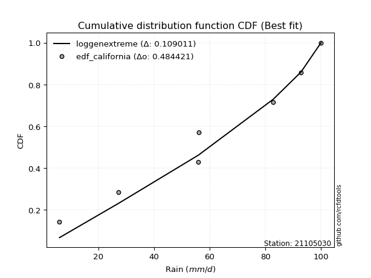</img>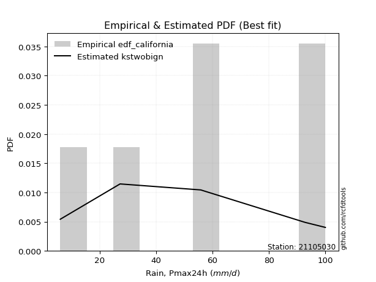</img>

</div>


### 2. Empirical - EDF Hazen (1930)

Hazen method for plotting positions is a formula used to estimate the empirical cumulative probability distribution of flood events or other hydrological data. This formula often results in biased estimations, particularly when extrapolating to extreme events (high return periods).

<div align="center">


$P=(m-0.5)/n$


</div>


**2.1. Empirical values**

<div align="center">

|                | 0                   | 1                   | 2                   | 3         | 4                  | 5                  | 6                  |
|:---------------|:--------------------|:--------------------|:--------------------|:----------|:-------------------|:-------------------|:-------------------|
| date           | 2023                | 2022                | 2025                | 2019      | 2021               | 2020               | 2024               |
| x              | 6.0                 | 27.2                | 38.4                | 55.8      | 56.0               | 92.8               | 100.0              |
| m              | 1                   | 2                   | 3                   | 4         | 5                  | 6                  | 7                  |
| empirical_dist | edf_hazen           | edf_hazen           | edf_hazen           | edf_hazen | edf_hazen          | edf_hazen          | edf_hazen          |
| empirical      | 0.07142857142857142 | 0.21428571428571427 | 0.35714285714285715 | 0.5       | 0.6428571428571429 | 0.7857142857142857 | 0.9285714285714286 |
| empirical_tr   | 1.0769230769230769  | 1.2727272727272727  | 1.5555555555555558  | 2.0       | 2.8000000000000003 | 4.666666666666666  | 14.000000000000007 |

</div>


**2.2. Kolmogorov-Smirnov fit test (sorted by Δ)**


<div align="center">

|                | 0                   | 1                   | 2                   | 3                   | 4                   | 5                   | 6                   | 7                   | 8                   | 9                   | 10                  | 11                  | 12                  | 13                  | 14                  | 15                  | 16                  | 17                  | 18                  | 19                  | 20                  | 21                  | 22                  | 23                  | 24                  | 25                  | 26                  | 27                  | 28                  | 29                  | 30                  | 31                  | 32                  | 33                  | 34                  | 35                  | 36                    | 37                  | 38                  | 39                  | 40                  | 41                  | 42                  | 43                  | 44                  | 45                  | 46                  | 47                  | 48                  | 49                  | 50                  | 51                  | 52                  | 53                  | 54                  | 55                  | 56                  | 57                  | 58                  | 59                  | 60                  | 61                  | 62                  | 63                  | 64                  | 65                  | 66                  | 67                  | 68                  | 69                  | 70                  | 71                  | 72                  | 73                  | 74                  | 75                  | 76                  | 77                  | 78                  | 79                  | 80                  | 81                  | 82                  | 83                  | 84                  | 85                  | 86                  | 87                  | 88                  | 89                  |
|:---------------|:--------------------|:--------------------|:--------------------|:--------------------|:--------------------|:--------------------|:--------------------|:--------------------|:--------------------|:--------------------|:--------------------|:--------------------|:--------------------|:--------------------|:--------------------|:--------------------|:--------------------|:--------------------|:--------------------|:--------------------|:--------------------|:--------------------|:--------------------|:--------------------|:--------------------|:--------------------|:--------------------|:--------------------|:--------------------|:--------------------|:--------------------|:--------------------|:--------------------|:--------------------|:--------------------|:--------------------|:----------------------|:--------------------|:--------------------|:--------------------|:--------------------|:--------------------|:--------------------|:--------------------|:--------------------|:--------------------|:--------------------|:--------------------|:--------------------|:--------------------|:--------------------|:--------------------|:--------------------|:--------------------|:--------------------|:--------------------|:--------------------|:--------------------|:--------------------|:--------------------|:--------------------|:--------------------|:--------------------|:--------------------|:--------------------|:--------------------|:--------------------|:--------------------|:--------------------|:--------------------|:--------------------|:--------------------|:--------------------|:--------------------|:--------------------|:--------------------|:--------------------|:--------------------|:--------------------|:--------------------|:--------------------|:--------------------|:--------------------|:--------------------|:--------------------|:--------------------|:--------------------|:--------------------|:--------------------|:--------------------|
| station        | 21105030            | 21105030            | 21105030            | 21105030            | 21105030            | 21105030            | 21105030            | 21105030            | 21105030            | 21105030            | 21105030            | 21105030            | 21105030            | 21105030            | 21105030            | 21105030            | 21105030            | 21105030            | 21105030            | 21105030            | 21105030            | 21105030            | 21105030            | 21105030            | 21105030            | 21105030            | 21105030            | 21105030            | 21105030            | 21105030            | 21105030            | 21105030            | 21105030            | 21105030            | 21105030            | 21105030            | 21105030              | 21105030            | 21105030            | 21105030            | 21105030            | 21105030            | 21105030            | 21105030            | 21105030            | 21105030            | 21105030            | 21105030            | 21105030            | 21105030            | 21105030            | 21105030            | 21105030            | 21105030            | 21105030            | 21105030            | 21105030            | 21105030            | 21105030            | 21105030            | 21105030            | 21105030            | 21105030            | 21105030            | 21105030            | 21105030            | 21105030            | 21105030            | 21105030            | 21105030            | 21105030            | 21105030            | 21105030            | 21105030            | 21105030            | 21105030            | 21105030            | 21105030            | 21105030            | 21105030            | 21105030            | 21105030            | 21105030            | 21105030            | 21105030            | 21105030            | 21105030            | 21105030            | 21105030            | 21105030            |
| empirical_dist | edf_hazen           | edf_hazen           | edf_hazen           | edf_hazen           | edf_hazen           | edf_hazen           | edf_hazen           | edf_hazen           | edf_hazen           | edf_hazen           | edf_hazen           | edf_hazen           | edf_hazen           | edf_hazen           | edf_hazen           | edf_hazen           | edf_hazen           | edf_hazen           | edf_hazen           | edf_hazen           | edf_hazen           | edf_hazen           | edf_hazen           | edf_hazen           | edf_hazen           | edf_hazen           | edf_hazen           | edf_hazen           | edf_hazen           | edf_hazen           | edf_hazen           | edf_hazen           | edf_hazen           | edf_hazen           | edf_hazen           | edf_hazen           | edf_hazen             | edf_hazen           | edf_hazen           | edf_hazen           | edf_hazen           | edf_hazen           | edf_hazen           | edf_hazen           | edf_hazen           | edf_hazen           | edf_hazen           | edf_hazen           | edf_hazen           | edf_hazen           | edf_hazen           | edf_hazen           | edf_hazen           | edf_hazen           | edf_hazen           | edf_hazen           | edf_hazen           | edf_hazen           | edf_hazen           | edf_hazen           | edf_hazen           | edf_hazen           | edf_hazen           | edf_hazen           | edf_hazen           | edf_hazen           | edf_hazen           | edf_hazen           | edf_hazen           | edf_hazen           | edf_hazen           | edf_hazen           | edf_hazen           | edf_hazen           | edf_hazen           | edf_hazen           | edf_hazen           | edf_hazen           | edf_hazen           | edf_hazen           | edf_hazen           | edf_hazen           | edf_hazen           | edf_hazen           | edf_hazen           | edf_hazen           | edf_hazen           | edf_hazen           | edf_hazen           | edf_hazen           |
| p_dist         | logpearson3         | genlogistic         | invweibull          | loggumbel_l         | fisk                | kstwobign           | logt                | logfisk             | weibull_min         | rayleigh            | invgauss            | invgamma            | f                   | halfnorm            | betaprime           | maxwell             | rice                | loggompertz         | pearson3            | erlang              | gumbel_r            | gamma               | ncf                 | johnsonsu           | exponnorm           | t                   | norm                | truncnorm           | nct                 | laplace_asymmetric  | logistic            | moyal               | halflogistic        | hypsecant           | logloggamma         | laplace             | loglaplace_asymmetric | logmielke           | logncf              | logfatiguelife      | logf                | logrice             | lognorm             | lognorm             | logcrystalball      | logexponnorm        | lognct              | logerlang           | expon               | loggamma            | loggamma            | genexpon            | loginvgamma         | logalpha            | loglogistic         | logbetaprime        | loginvgauss         | logmaxwell          | lograyleigh         | loghypsecant        | mielke              | gumbel_l            | loginvweibull       | wald                | loghalfnorm         | loglaplace          | loggumbel_r         | nakagami            | loggenexpon         | logtruncnorm        | loghalflogistic     | gibrat              | logmoyal            | logjohnsonsu        | logkstwobign        | lognakagami         | logwald             | loggibrat           | logexpon            | alpha               | pareto              | loglognorm          | logpareto           | crystalball         | logweibull_min      | fatiguelife         | logchi2             | gompertz            | chi2                | loggenlogistic      |
| delta          | 0.07470322946053143 | 0.08453627746879666 | 0.08599452988305467 | 0.08888474431169868 | 0.09349651114901258 | 0.09349882682828647 | 0.09481267699637919 | 0.09598776875064041 | 0.09620141625967837 | 0.09659719522414112 | 0.09672404998330553 | 0.09684818336988388 | 0.09758380539050338 | 0.09763220703811615 | 0.09799883393740771 | 0.09891527149384138 | 0.09960322244734532 | 0.10542148679911856 | 0.10582819106369457 | 0.10587927384778295 | 0.10673503556909969 | 0.10714756521095481 | 0.11035740618137313 | 0.1137783722490685  | 0.11401475577902997 | 0.11418295684035074 | 0.1141880510187887  | 0.11418805584127723 | 0.11419415273714906 | 0.11856632440203063 | 0.1195727989389127  | 0.12227199242343711 | 0.12397172278310287 | 0.12475497416147174 | 0.1279493026357319  | 0.12827093088054953 | 0.13379926463583713   | 0.13781233867153952 | 0.13909334236786752 | 0.13922314462975482 | 0.13922629563834654 | 0.13990689963414205 | 0.13990760065578445 | 0.13990760065578445 | 0.13990765457179066 | 0.13990867366691917 | 0.14028874545283554 | 0.14712735727764714 | 0.14763509248395634 | 0.14769491987357986 | 0.14769491987357986 | 0.14783701193992016 | 0.15078927576921564 | 0.15374987469695944 | 0.1569483496764036  | 0.16029289169383068 | 0.1606896828144353  | 0.16260342482576695 | 0.16946881065052    | 0.17034038528289308 | 0.17751692388366905 | 0.18311080015025827 | 0.1892895079027144  | 0.19301757271236575 | 0.19567144162061373 | 0.19872602172909848 | 0.20142294878077704 | 0.21428549164742672 | 0.21610389406415878 | 0.2188165297762502  | 0.21889628145391887 | 0.2198630003172225  | 0.2219019252267962  | 0.22410102632671342 | 0.22661131862399128 | 0.26459083762695734 | 0.284750109580221   | 0.31191236142887235 | 0.3321159258938299  | 0.362206808687656   | 0.42724420877586433 | 0.4336443450284112  | 0.4545642177419752  | 0.4670735609977491  | 0.4859754180108714  | 0.49519447051902754 | 0.5128916303498832  | 0.6428420218386178  | 0.7121872084126228  | 0.7857142857142857  |
| deltao         | 0.48442053926100004 | 0.48442053926100004 | 0.48442053926100004 | 0.48442053926100004 | 0.48442053926100004 | 0.48442053926100004 | 0.48442053926100004 | 0.48442053926100004 | 0.48442053926100004 | 0.48442053926100004 | 0.48442053926100004 | 0.48442053926100004 | 0.48442053926100004 | 0.48442053926100004 | 0.48442053926100004 | 0.48442053926100004 | 0.48442053926100004 | 0.48442053926100004 | 0.48442053926100004 | 0.48442053926100004 | 0.48442053926100004 | 0.48442053926100004 | 0.48442053926100004 | 0.48442053926100004 | 0.48442053926100004 | 0.48442053926100004 | 0.48442053926100004 | 0.48442053926100004 | 0.48442053926100004 | 0.48442053926100004 | 0.48442053926100004 | 0.48442053926100004 | 0.48442053926100004 | 0.48442053926100004 | 0.48442053926100004 | 0.48442053926100004 | 0.48442053926100004   | 0.48442053926100004 | 0.48442053926100004 | 0.48442053926100004 | 0.48442053926100004 | 0.48442053926100004 | 0.48442053926100004 | 0.48442053926100004 | 0.48442053926100004 | 0.48442053926100004 | 0.48442053926100004 | 0.48442053926100004 | 0.48442053926100004 | 0.48442053926100004 | 0.48442053926100004 | 0.48442053926100004 | 0.48442053926100004 | 0.48442053926100004 | 0.48442053926100004 | 0.48442053926100004 | 0.48442053926100004 | 0.48442053926100004 | 0.48442053926100004 | 0.48442053926100004 | 0.48442053926100004 | 0.48442053926100004 | 0.48442053926100004 | 0.48442053926100004 | 0.48442053926100004 | 0.48442053926100004 | 0.48442053926100004 | 0.48442053926100004 | 0.48442053926100004 | 0.48442053926100004 | 0.48442053926100004 | 0.48442053926100004 | 0.48442053926100004 | 0.48442053926100004 | 0.48442053926100004 | 0.48442053926100004 | 0.48442053926100004 | 0.48442053926100004 | 0.48442053926100004 | 0.48442053926100004 | 0.48442053926100004 | 0.48442053926100004 | 0.48442053926100004 | 0.48442053926100004 | 0.48442053926100004 | 0.48442053926100004 | 0.48442053926100004 | 0.48442053926100004 | 0.48442053926100004 | 0.48442053926100004 |
| eval           | Δo > Δ              | Δo > Δ              | Δo > Δ              | Δo > Δ              | Δo > Δ              | Δo > Δ              | Δo > Δ              | Δo > Δ              | Δo > Δ              | Δo > Δ              | Δo > Δ              | Δo > Δ              | Δo > Δ              | Δo > Δ              | Δo > Δ              | Δo > Δ              | Δo > Δ              | Δo > Δ              | Δo > Δ              | Δo > Δ              | Δo > Δ              | Δo > Δ              | Δo > Δ              | Δo > Δ              | Δo > Δ              | Δo > Δ              | Δo > Δ              | Δo > Δ              | Δo > Δ              | Δo > Δ              | Δo > Δ              | Δo > Δ              | Δo > Δ              | Δo > Δ              | Δo > Δ              | Δo > Δ              | Δo > Δ                | Δo > Δ              | Δo > Δ              | Δo > Δ              | Δo > Δ              | Δo > Δ              | Δo > Δ              | Δo > Δ              | Δo > Δ              | Δo > Δ              | Δo > Δ              | Δo > Δ              | Δo > Δ              | Δo > Δ              | Δo > Δ              | Δo > Δ              | Δo > Δ              | Δo > Δ              | Δo > Δ              | Δo > Δ              | Δo > Δ              | Δo > Δ              | Δo > Δ              | Δo > Δ              | Δo > Δ              | Δo > Δ              | Δo > Δ              | Δo > Δ              | Δo > Δ              | Δo > Δ              | Δo > Δ              | Δo > Δ              | Δo > Δ              | Δo > Δ              | Δo > Δ              | Δo > Δ              | Δo > Δ              | Δo > Δ              | Δo > Δ              | Δo > Δ              | Δo > Δ              | Δo > Δ              | Δo > Δ              | Δo > Δ              | Δo > Δ              | Δo > Δ              | Δo > Δ              | Δo > Δ              | Δo <= Δ             | Δo <= Δ             | Δo <= Δ             | Δo <= Δ             | Δo <= Δ             | Δo <= Δ             |
| fit            | 1                   | 1                   | 1                   | 1                   | 1                   | 1                   | 1                   | 1                   | 1                   | 1                   | 1                   | 1                   | 1                   | 1                   | 1                   | 1                   | 1                   | 1                   | 1                   | 1                   | 1                   | 1                   | 1                   | 1                   | 1                   | 1                   | 1                   | 1                   | 1                   | 1                   | 1                   | 1                   | 1                   | 1                   | 1                   | 1                   | 1                     | 1                   | 1                   | 1                   | 1                   | 1                   | 1                   | 1                   | 1                   | 1                   | 1                   | 1                   | 1                   | 1                   | 1                   | 1                   | 1                   | 1                   | 1                   | 1                   | 1                   | 1                   | 1                   | 1                   | 1                   | 1                   | 1                   | 1                   | 1                   | 1                   | 1                   | 1                   | 1                   | 1                   | 1                   | 1                   | 1                   | 1                   | 1                   | 1                   | 1                   | 1                   | 1                   | 1                   | 1                   | 1                   | 1                   | 1                   | 0                   | 0                   | 0                   | 0                   | 0                   | 0                   |
| n              | 7                   | 7                   | 7                   | 7                   | 7                   | 7                   | 7                   | 7                   | 7                   | 7                   | 7                   | 7                   | 7                   | 7                   | 7                   | 7                   | 7                   | 7                   | 7                   | 7                   | 7                   | 7                   | 7                   | 7                   | 7                   | 7                   | 7                   | 7                   | 7                   | 7                   | 7                   | 7                   | 7                   | 7                   | 7                   | 7                   | 7                     | 7                   | 7                   | 7                   | 7                   | 7                   | 7                   | 7                   | 7                   | 7                   | 7                   | 7                   | 7                   | 7                   | 7                   | 7                   | 7                   | 7                   | 7                   | 7                   | 7                   | 7                   | 7                   | 7                   | 7                   | 7                   | 7                   | 7                   | 7                   | 7                   | 7                   | 7                   | 7                   | 7                   | 7                   | 7                   | 7                   | 7                   | 7                   | 7                   | 7                   | 7                   | 7                   | 7                   | 7                   | 7                   | 7                   | 7                   | 7                   | 7                   | 7                   | 7                   | 7                   | 7                   |
| best_fit       | 1                   | 0                   | 0                   | 0                   | 0                   | 0                   | 0                   | 0                   | 0                   | 0                   | 0                   | 0                   | 0                   | 0                   | 0                   | 0                   | 0                   | 0                   | 0                   | 0                   | 0                   | 0                   | 0                   | 0                   | 0                   | 0                   | 0                   | 0                   | 0                   | 0                   | 0                   | 0                   | 0                   | 0                   | 0                   | 0                   | 0                     | 0                   | 0                   | 0                   | 0                   | 0                   | 0                   | 0                   | 0                   | 0                   | 0                   | 0                   | 0                   | 0                   | 0                   | 0                   | 0                   | 0                   | 0                   | 0                   | 0                   | 0                   | 0                   | 0                   | 0                   | 0                   | 0                   | 0                   | 0                   | 0                   | 0                   | 0                   | 0                   | 0                   | 0                   | 0                   | 0                   | 0                   | 0                   | 0                   | 0                   | 0                   | 0                   | 0                   | 0                   | 0                   | 0                   | 0                   | 0                   | 0                   | 0                   | 0                   | 0                   | 0                   |
| best_fit_sort  | 1                   | 2                   | 3                   | 4                   | 5                   | 6                   | 7                   | 8                   | 9                   | 10                  | 11                  | 12                  | 13                  | 14                  | 15                  | 16                  | 17                  | 18                  | 19                  | 20                  | 21                  | 22                  | 23                  | 24                  | 25                  | 26                  | 27                  | 28                  | 29                  | 30                  | 31                  | 32                  | 33                  | 34                  | 35                  | 36                  | 37                    | 38                  | 39                  | 40                  | 41                  | 42                  | 43                  | 44                  | 45                  | 46                  | 47                  | 48                  | 49                  | 50                  | 51                  | 52                  | 53                  | 54                  | 55                  | 56                  | 57                  | 58                  | 59                  | 60                  | 61                  | 62                  | 63                  | 64                  | 65                  | 66                  | 67                  | 68                  | 69                  | 70                  | 71                  | 72                  | 73                  | 74                  | 75                  | 76                  | 77                  | 78                  | 79                  | 80                  | 81                  | 82                  | 83                  | 84                  | 85                  | 86                  | 87                  | 88                  | 89                  | 90                  |

</div>


<div align="center">

</img>

</div>


**2.3. Best fit**

<div align="center">

|   id |   station | empirical_dist   | p_dist      |     delta |   deltao | eval   |   fit |   n |   best_fit |   best_fit_sort |
|-----:|----------:|:-----------------|:------------|----------:|---------:|:-------|------:|----:|-----------:|----------------:|
|    0 |  21105030 | edf_hazen        | logpearson3 | 0.0747032 | 0.484421 | Δo > Δ |     1 |   7 |          1 |               1 |

</div>


<div align="center">

</img>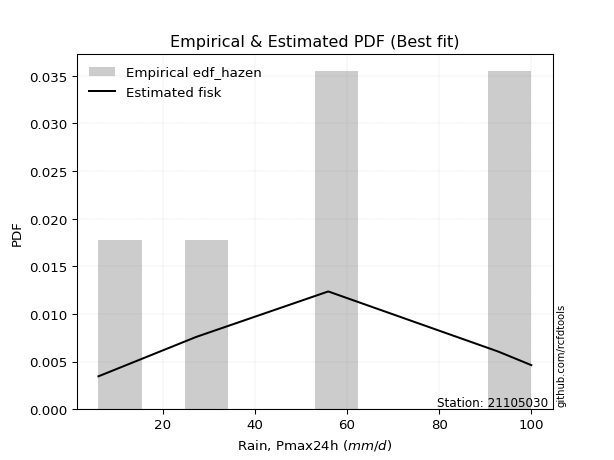</img>

</div>


### 3. Empirical - EDF Weibull (1939)

Weibull plotting position formula is an empirical method used to estimate the non-exceedance probability or plotting position for a set of observed data, is often recommended or widely used in practice, particularly in flood frequency analysis.

<div align="center">


$P=m/(n+1)$


</div>


**3.1. Empirical values**

<div align="center">

|                | 0                  | 1                  | 2           | 3           | 4                  | 5           | 6           |
|:---------------|:-------------------|:-------------------|:------------|:------------|:-------------------|:------------|:------------|
| date           | 2023               | 2022               | 2025        | 2019        | 2021               | 2020        | 2024        |
| x              | 6.0                | 27.2               | 38.4        | 55.8        | 56.0               | 92.8        | 100.0       |
| m              | 1                  | 2                  | 3           | 4           | 5                  | 6           | 7           |
| empirical_dist | edf_weibull        | edf_weibull        | edf_weibull | edf_weibull | edf_weibull        | edf_weibull | edf_weibull |
| empirical      | 0.125              | 0.25               | 0.375       | 0.5         | 0.625              | 0.75        | 0.875       |
| empirical_tr   | 1.1428571428571428 | 1.3333333333333333 | 1.6         | 2.0         | 2.6666666666666665 | 4.0         | 8.0         |

</div>


**3.2. Kolmogorov-Smirnov fit test (sorted by Δ)**


<div align="center">

|                | 0                   | 1                   | 2                   | 3                   | 4                   | 5                   | 6                   | 7                   | 8                   | 9                   | 10                  | 11                  | 12                  | 13                  | 14                  | 15                  | 16                  | 17                  | 18                  | 19                  | 20                    | 21                  | 22                  | 23                  | 24                  | 25                  | 26                  | 27                  | 28                  | 29                  | 30                  | 31                  | 32                  | 33                  | 34                  | 35                  | 36                  | 37                  | 38                  | 39                  | 40                  | 41                  | 42                  | 43                  | 44                  | 45                  | 46                  | 47                  | 48                  | 49                  | 50                  | 51                  | 52                  | 53                  | 54                  | 55                  | 56                  | 57                  | 58                  | 59                  | 60                  | 61                  | 62                  | 63                  | 64                  | 65                  | 66                  | 67                  | 68                  | 69                  | 70                  | 71                  | 72                  | 73                  | 74                  | 75                  | 76                  | 77                  | 78                  | 79                  | 80                  | 81                  | 82                  | 83                  | 84                  | 85                  | 86                  | 87                  | 88                  | 89                  |
|:---------------|:--------------------|:--------------------|:--------------------|:--------------------|:--------------------|:--------------------|:--------------------|:--------------------|:--------------------|:--------------------|:--------------------|:--------------------|:--------------------|:--------------------|:--------------------|:--------------------|:--------------------|:--------------------|:--------------------|:--------------------|:----------------------|:--------------------|:--------------------|:--------------------|:--------------------|:--------------------|:--------------------|:--------------------|:--------------------|:--------------------|:--------------------|:--------------------|:--------------------|:--------------------|:--------------------|:--------------------|:--------------------|:--------------------|:--------------------|:--------------------|:--------------------|:--------------------|:--------------------|:--------------------|:--------------------|:--------------------|:--------------------|:--------------------|:--------------------|:--------------------|:--------------------|:--------------------|:--------------------|:--------------------|:--------------------|:--------------------|:--------------------|:--------------------|:--------------------|:--------------------|:--------------------|:--------------------|:--------------------|:--------------------|:--------------------|:--------------------|:--------------------|:--------------------|:--------------------|:--------------------|:--------------------|:--------------------|:--------------------|:--------------------|:--------------------|:--------------------|:--------------------|:--------------------|:--------------------|:--------------------|:--------------------|:--------------------|:--------------------|:--------------------|:--------------------|:--------------------|:--------------------|:--------------------|:--------------------|:--------------------|
| station        | 21105030            | 21105030            | 21105030            | 21105030            | 21105030            | 21105030            | 21105030            | 21105030            | 21105030            | 21105030            | 21105030            | 21105030            | 21105030            | 21105030            | 21105030            | 21105030            | 21105030            | 21105030            | 21105030            | 21105030            | 21105030              | 21105030            | 21105030            | 21105030            | 21105030            | 21105030            | 21105030            | 21105030            | 21105030            | 21105030            | 21105030            | 21105030            | 21105030            | 21105030            | 21105030            | 21105030            | 21105030            | 21105030            | 21105030            | 21105030            | 21105030            | 21105030            | 21105030            | 21105030            | 21105030            | 21105030            | 21105030            | 21105030            | 21105030            | 21105030            | 21105030            | 21105030            | 21105030            | 21105030            | 21105030            | 21105030            | 21105030            | 21105030            | 21105030            | 21105030            | 21105030            | 21105030            | 21105030            | 21105030            | 21105030            | 21105030            | 21105030            | 21105030            | 21105030            | 21105030            | 21105030            | 21105030            | 21105030            | 21105030            | 21105030            | 21105030            | 21105030            | 21105030            | 21105030            | 21105030            | 21105030            | 21105030            | 21105030            | 21105030            | 21105030            | 21105030            | 21105030            | 21105030            | 21105030            | 21105030            |
| empirical_dist | edf_weibull         | edf_weibull         | edf_weibull         | edf_weibull         | edf_weibull         | edf_weibull         | edf_weibull         | edf_weibull         | edf_weibull         | edf_weibull         | edf_weibull         | edf_weibull         | edf_weibull         | edf_weibull         | edf_weibull         | edf_weibull         | edf_weibull         | edf_weibull         | edf_weibull         | edf_weibull         | edf_weibull           | edf_weibull         | edf_weibull         | edf_weibull         | edf_weibull         | edf_weibull         | edf_weibull         | edf_weibull         | edf_weibull         | edf_weibull         | edf_weibull         | edf_weibull         | edf_weibull         | edf_weibull         | edf_weibull         | edf_weibull         | edf_weibull         | edf_weibull         | edf_weibull         | edf_weibull         | edf_weibull         | edf_weibull         | edf_weibull         | edf_weibull         | edf_weibull         | edf_weibull         | edf_weibull         | edf_weibull         | edf_weibull         | edf_weibull         | edf_weibull         | edf_weibull         | edf_weibull         | edf_weibull         | edf_weibull         | edf_weibull         | edf_weibull         | edf_weibull         | edf_weibull         | edf_weibull         | edf_weibull         | edf_weibull         | edf_weibull         | edf_weibull         | edf_weibull         | edf_weibull         | edf_weibull         | edf_weibull         | edf_weibull         | edf_weibull         | edf_weibull         | edf_weibull         | edf_weibull         | edf_weibull         | edf_weibull         | edf_weibull         | edf_weibull         | edf_weibull         | edf_weibull         | edf_weibull         | edf_weibull         | edf_weibull         | edf_weibull         | edf_weibull         | edf_weibull         | edf_weibull         | edf_weibull         | edf_weibull         | edf_weibull         | edf_weibull         |
| p_dist         | logpearson3         | loggumbel_l         | logt                | logfisk             | invweibull          | genlogistic         | kstwobign           | loggompertz         | ncf                 | halfnorm            | fisk                | weibull_min         | rayleigh            | invgauss            | invgamma            | f                   | betaprime           | maxwell             | logbetaprime        | rice                | loglaplace_asymmetric | logncf              | logfatiguelife      | logf                | halflogistic        | logrice             | lognorm             | lognorm             | logcrystalball      | logexponnorm        | lognct              | pearson3            | erlang              | gumbel_r            | gamma               | exponnorm           | nct                 | truncnorm           | norm                | t                   | moyal               | laplace_asymmetric  | johnsonsu           | logerlang           | expon               | loggamma            | loggamma            | genexpon            | loginvgamma         | loginvweibull       | logalpha            | logistic            | loglogistic         | hypsecant           | loginvgauss         | logmaxwell          | logloggamma         | laplace             | lograyleigh         | loghypsecant        | logmielke           | loggenexpon         | gumbel_l            | mielke              | loghalfnorm         | logkstwobign        | loglaplace          | loggumbel_r         | logjohnsonsu        | loghalflogistic     | logmoyal            | wald                | logtruncnorm        | nakagami            | gibrat              | lognakagami         | logwald             | logexpon            | loggibrat           | alpha               | pareto              | loglognorm          | logpareto           | crystalball         | logweibull_min      | fatiguelife         | logchi2             | gompertz            | chi2                | loggenlogistic      |
| delta          | 0.08862331889189866 | 0.09325905791270095 | 0.10402583440288404 | 0.11170265330757237 | 0.1179733844453823  | 0.11977299102312922 | 0.12461232955609403 | 0.12499998720514065 | 0.12499999999941817 | 0.12840769521606843 | 0.12921079686329828 | 0.13191570197396407 | 0.13231148093842682 | 0.13243833569759123 | 0.13256246908416958 | 0.13329809110478907 | 0.1337131196516934  | 0.13462955720812708 | 0.13523421558878024 | 0.13531750816163102 | 0.13879431730935676   | 0.13909334236786752 | 0.13922314462975482 | 0.13922629563834654 | 0.13980669830758075 | 0.13990689963414205 | 0.13990760065578445 | 0.13990760065578445 | 0.13990765457179066 | 0.13990867366691917 | 0.14028874545283554 | 0.14144744104988916 | 0.14159355956206865 | 0.1424493212833854  | 0.1428618509252405  | 0.14332428079816983 | 0.14335214571862864 | 0.1433552194304848  | 0.14335522189815575 | 0.14335607687575902 | 0.14420872311747845 | 0.14573932138491885 | 0.14660315389470813 | 0.14712735727764714 | 0.14763509248395634 | 0.14769491987357986 | 0.14769491987357986 | 0.14783701193992016 | 0.15078927576921564 | 0.15357522218842867 | 0.15374987469695944 | 0.1552870846531984  | 0.1569483496764036  | 0.16046925987575744 | 0.1606896828144353  | 0.16260342482576695 | 0.1636635883500176  | 0.16398521659483523 | 0.16946881065052    | 0.17034038528289308 | 0.17352662438582522 | 0.18038960834987305 | 0.18736595298195524 | 0.1887104380023994  | 0.1893306881466602  | 0.19089703290970556 | 0.19872602172909848 | 0.20142294878077704 | 0.2062438834695705  | 0.2175775689203373  | 0.2219019252267962  | 0.2222198537673707  | 0.24999514083948504 | 0.24999977736171244 | 0.25                | 0.26459083762695734 | 0.27966812055388746 | 0.2964016401795442  | 0.31191236142887235 | 0.3264925229733703  | 0.39152992306157863 | 0.3979300593141255  | 0.4188499320276895  | 0.4190463214115103  | 0.4502611322965857  | 0.45948018480474184 | 0.47717734463559747 | 0.6249848789814749  | 0.6764729226983371  | 0.75                |
| deltao         | 0.48442053926100004 | 0.48442053926100004 | 0.48442053926100004 | 0.48442053926100004 | 0.48442053926100004 | 0.48442053926100004 | 0.48442053926100004 | 0.48442053926100004 | 0.48442053926100004 | 0.48442053926100004 | 0.48442053926100004 | 0.48442053926100004 | 0.48442053926100004 | 0.48442053926100004 | 0.48442053926100004 | 0.48442053926100004 | 0.48442053926100004 | 0.48442053926100004 | 0.48442053926100004 | 0.48442053926100004 | 0.48442053926100004   | 0.48442053926100004 | 0.48442053926100004 | 0.48442053926100004 | 0.48442053926100004 | 0.48442053926100004 | 0.48442053926100004 | 0.48442053926100004 | 0.48442053926100004 | 0.48442053926100004 | 0.48442053926100004 | 0.48442053926100004 | 0.48442053926100004 | 0.48442053926100004 | 0.48442053926100004 | 0.48442053926100004 | 0.48442053926100004 | 0.48442053926100004 | 0.48442053926100004 | 0.48442053926100004 | 0.48442053926100004 | 0.48442053926100004 | 0.48442053926100004 | 0.48442053926100004 | 0.48442053926100004 | 0.48442053926100004 | 0.48442053926100004 | 0.48442053926100004 | 0.48442053926100004 | 0.48442053926100004 | 0.48442053926100004 | 0.48442053926100004 | 0.48442053926100004 | 0.48442053926100004 | 0.48442053926100004 | 0.48442053926100004 | 0.48442053926100004 | 0.48442053926100004 | 0.48442053926100004 | 0.48442053926100004 | 0.48442053926100004 | 0.48442053926100004 | 0.48442053926100004 | 0.48442053926100004 | 0.48442053926100004 | 0.48442053926100004 | 0.48442053926100004 | 0.48442053926100004 | 0.48442053926100004 | 0.48442053926100004 | 0.48442053926100004 | 0.48442053926100004 | 0.48442053926100004 | 0.48442053926100004 | 0.48442053926100004 | 0.48442053926100004 | 0.48442053926100004 | 0.48442053926100004 | 0.48442053926100004 | 0.48442053926100004 | 0.48442053926100004 | 0.48442053926100004 | 0.48442053926100004 | 0.48442053926100004 | 0.48442053926100004 | 0.48442053926100004 | 0.48442053926100004 | 0.48442053926100004 | 0.48442053926100004 | 0.48442053926100004 |
| eval           | Δo > Δ              | Δo > Δ              | Δo > Δ              | Δo > Δ              | Δo > Δ              | Δo > Δ              | Δo > Δ              | Δo > Δ              | Δo > Δ              | Δo > Δ              | Δo > Δ              | Δo > Δ              | Δo > Δ              | Δo > Δ              | Δo > Δ              | Δo > Δ              | Δo > Δ              | Δo > Δ              | Δo > Δ              | Δo > Δ              | Δo > Δ                | Δo > Δ              | Δo > Δ              | Δo > Δ              | Δo > Δ              | Δo > Δ              | Δo > Δ              | Δo > Δ              | Δo > Δ              | Δo > Δ              | Δo > Δ              | Δo > Δ              | Δo > Δ              | Δo > Δ              | Δo > Δ              | Δo > Δ              | Δo > Δ              | Δo > Δ              | Δo > Δ              | Δo > Δ              | Δo > Δ              | Δo > Δ              | Δo > Δ              | Δo > Δ              | Δo > Δ              | Δo > Δ              | Δo > Δ              | Δo > Δ              | Δo > Δ              | Δo > Δ              | Δo > Δ              | Δo > Δ              | Δo > Δ              | Δo > Δ              | Δo > Δ              | Δo > Δ              | Δo > Δ              | Δo > Δ              | Δo > Δ              | Δo > Δ              | Δo > Δ              | Δo > Δ              | Δo > Δ              | Δo > Δ              | Δo > Δ              | Δo > Δ              | Δo > Δ              | Δo > Δ              | Δo > Δ              | Δo > Δ              | Δo > Δ              | Δo > Δ              | Δo > Δ              | Δo > Δ              | Δo > Δ              | Δo > Δ              | Δo > Δ              | Δo > Δ              | Δo > Δ              | Δo > Δ              | Δo > Δ              | Δo > Δ              | Δo > Δ              | Δo > Δ              | Δo > Δ              | Δo > Δ              | Δo > Δ              | Δo <= Δ             | Δo <= Δ             | Δo <= Δ             |
| fit            | 1                   | 1                   | 1                   | 1                   | 1                   | 1                   | 1                   | 1                   | 1                   | 1                   | 1                   | 1                   | 1                   | 1                   | 1                   | 1                   | 1                   | 1                   | 1                   | 1                   | 1                     | 1                   | 1                   | 1                   | 1                   | 1                   | 1                   | 1                   | 1                   | 1                   | 1                   | 1                   | 1                   | 1                   | 1                   | 1                   | 1                   | 1                   | 1                   | 1                   | 1                   | 1                   | 1                   | 1                   | 1                   | 1                   | 1                   | 1                   | 1                   | 1                   | 1                   | 1                   | 1                   | 1                   | 1                   | 1                   | 1                   | 1                   | 1                   | 1                   | 1                   | 1                   | 1                   | 1                   | 1                   | 1                   | 1                   | 1                   | 1                   | 1                   | 1                   | 1                   | 1                   | 1                   | 1                   | 1                   | 1                   | 1                   | 1                   | 1                   | 1                   | 1                   | 1                   | 1                   | 1                   | 1                   | 1                   | 0                   | 0                   | 0                   |
| n              | 7                   | 7                   | 7                   | 7                   | 7                   | 7                   | 7                   | 7                   | 7                   | 7                   | 7                   | 7                   | 7                   | 7                   | 7                   | 7                   | 7                   | 7                   | 7                   | 7                   | 7                     | 7                   | 7                   | 7                   | 7                   | 7                   | 7                   | 7                   | 7                   | 7                   | 7                   | 7                   | 7                   | 7                   | 7                   | 7                   | 7                   | 7                   | 7                   | 7                   | 7                   | 7                   | 7                   | 7                   | 7                   | 7                   | 7                   | 7                   | 7                   | 7                   | 7                   | 7                   | 7                   | 7                   | 7                   | 7                   | 7                   | 7                   | 7                   | 7                   | 7                   | 7                   | 7                   | 7                   | 7                   | 7                   | 7                   | 7                   | 7                   | 7                   | 7                   | 7                   | 7                   | 7                   | 7                   | 7                   | 7                   | 7                   | 7                   | 7                   | 7                   | 7                   | 7                   | 7                   | 7                   | 7                   | 7                   | 7                   | 7                   | 7                   |
| best_fit       | 1                   | 0                   | 0                   | 0                   | 0                   | 0                   | 0                   | 0                   | 0                   | 0                   | 0                   | 0                   | 0                   | 0                   | 0                   | 0                   | 0                   | 0                   | 0                   | 0                   | 0                     | 0                   | 0                   | 0                   | 0                   | 0                   | 0                   | 0                   | 0                   | 0                   | 0                   | 0                   | 0                   | 0                   | 0                   | 0                   | 0                   | 0                   | 0                   | 0                   | 0                   | 0                   | 0                   | 0                   | 0                   | 0                   | 0                   | 0                   | 0                   | 0                   | 0                   | 0                   | 0                   | 0                   | 0                   | 0                   | 0                   | 0                   | 0                   | 0                   | 0                   | 0                   | 0                   | 0                   | 0                   | 0                   | 0                   | 0                   | 0                   | 0                   | 0                   | 0                   | 0                   | 0                   | 0                   | 0                   | 0                   | 0                   | 0                   | 0                   | 0                   | 0                   | 0                   | 0                   | 0                   | 0                   | 0                   | 0                   | 0                   | 0                   |
| best_fit_sort  | 1                   | 2                   | 3                   | 4                   | 5                   | 6                   | 7                   | 8                   | 9                   | 10                  | 11                  | 12                  | 13                  | 14                  | 15                  | 16                  | 17                  | 18                  | 19                  | 20                  | 21                    | 22                  | 23                  | 24                  | 25                  | 26                  | 27                  | 28                  | 29                  | 30                  | 31                  | 32                  | 33                  | 34                  | 35                  | 36                  | 37                  | 38                  | 39                  | 40                  | 41                  | 42                  | 43                  | 44                  | 45                  | 46                  | 47                  | 48                  | 49                  | 50                  | 51                  | 52                  | 53                  | 54                  | 55                  | 56                  | 57                  | 58                  | 59                  | 60                  | 61                  | 62                  | 63                  | 64                  | 65                  | 66                  | 67                  | 68                  | 69                  | 70                  | 71                  | 72                  | 73                  | 74                  | 75                  | 76                  | 77                  | 78                  | 79                  | 80                  | 81                  | 82                  | 83                  | 84                  | 85                  | 86                  | 87                  | 88                  | 89                  | 90                  |

</div>


<div align="center">

</img>

</div>


**3.3. Best fit**

<div align="center">

|   id |   station | empirical_dist   | p_dist      |     delta |   deltao | eval   |   fit |   n |   best_fit |   best_fit_sort |
|-----:|----------:|:-----------------|:------------|----------:|---------:|:-------|------:|----:|-----------:|----------------:|
|    0 |  21105030 | edf_weibull      | logpearson3 | 0.0886233 | 0.484421 | Δo > Δ |     1 |   7 |          1 |               1 |

</div>


<div align="center">

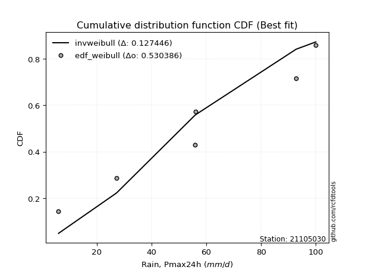</img></img>

</div>


### 4. Empirical - EDF Beard (1943)

The Beard formula (or Beard´s plotting position formula) in hydrology is used to estimate the empirical non-exceedance probability _(P)_ of a flood event (or other extreme hydrological data point) within a given dataset.

<div align="center">


$P=(m-0.31)/(n+0.38)$


</div>


**4.1. Empirical values**

<div align="center">

|                | 0                   | 1                   | 2                   | 3         | 4                  | 5                  | 6                  |
|:---------------|:--------------------|:--------------------|:--------------------|:----------|:-------------------|:-------------------|:-------------------|
| date           | 2023                | 2022                | 2025                | 2019      | 2021               | 2020               | 2024               |
| x              | 6.0                 | 27.2                | 38.4                | 55.8      | 56.0               | 92.8               | 100.0              |
| m              | 1                   | 2                   | 3                   | 4         | 5                  | 6                  | 7                  |
| empirical_dist | edf_beard           | edf_beard           | edf_beard           | edf_beard | edf_beard          | edf_beard          | edf_beard          |
| empirical      | 0.09349593495934959 | 0.22899728997289973 | 0.36449864498644985 | 0.5       | 0.6355013550135502 | 0.7710027100271003 | 0.9065040650406505 |
| empirical_tr   | 1.1031390134529149  | 1.29701230228471    | 1.5735607675906182  | 2.0       | 2.743494423791822  | 4.366863905325444  | 10.695652173913055 |

</div>


**4.2. Kolmogorov-Smirnov fit test (sorted by Δ)**


<div align="center">

|                | 0                   | 1                   | 2                   | 3                   | 4                   | 5                   | 6                   | 7                   | 8                   | 9                   | 10                  | 11                  | 12                  | 13                  | 14                  | 15                  | 16                  | 17                  | 18                  | 19                  | 20                  | 21                  | 22                  | 23                  | 24                  | 25                  | 26                  | 27                  | 28                  | 29                  | 30                  | 31                  | 32                    | 33                  | 34                  | 35                  | 36                  | 37                  | 38                  | 39                  | 40                  | 41                  | 42                  | 43                  | 44                  | 45                  | 46                  | 47                  | 48                  | 49                  | 50                  | 51                  | 52                  | 53                  | 54                  | 55                  | 56                  | 57                  | 58                  | 59                  | 60                  | 61                  | 62                  | 63                  | 64                  | 65                  | 66                  | 67                  | 68                  | 69                  | 70                  | 71                  | 72                  | 73                  | 74                  | 75                  | 76                  | 77                  | 78                  | 79                  | 80                  | 81                  | 82                  | 83                  | 84                  | 85                  | 86                  | 87                  | 88                  | 89                  |
|:---------------|:--------------------|:--------------------|:--------------------|:--------------------|:--------------------|:--------------------|:--------------------|:--------------------|:--------------------|:--------------------|:--------------------|:--------------------|:--------------------|:--------------------|:--------------------|:--------------------|:--------------------|:--------------------|:--------------------|:--------------------|:--------------------|:--------------------|:--------------------|:--------------------|:--------------------|:--------------------|:--------------------|:--------------------|:--------------------|:--------------------|:--------------------|:--------------------|:----------------------|:--------------------|:--------------------|:--------------------|:--------------------|:--------------------|:--------------------|:--------------------|:--------------------|:--------------------|:--------------------|:--------------------|:--------------------|:--------------------|:--------------------|:--------------------|:--------------------|:--------------------|:--------------------|:--------------------|:--------------------|:--------------------|:--------------------|:--------------------|:--------------------|:--------------------|:--------------------|:--------------------|:--------------------|:--------------------|:--------------------|:--------------------|:--------------------|:--------------------|:--------------------|:--------------------|:--------------------|:--------------------|:--------------------|:--------------------|:--------------------|:--------------------|:--------------------|:--------------------|:--------------------|:--------------------|:--------------------|:--------------------|:--------------------|:--------------------|:--------------------|:--------------------|:--------------------|:--------------------|:--------------------|:--------------------|:--------------------|:--------------------|
| station        | 21105030            | 21105030            | 21105030            | 21105030            | 21105030            | 21105030            | 21105030            | 21105030            | 21105030            | 21105030            | 21105030            | 21105030            | 21105030            | 21105030            | 21105030            | 21105030            | 21105030            | 21105030            | 21105030            | 21105030            | 21105030            | 21105030            | 21105030            | 21105030            | 21105030            | 21105030            | 21105030            | 21105030            | 21105030            | 21105030            | 21105030            | 21105030            | 21105030              | 21105030            | 21105030            | 21105030            | 21105030            | 21105030            | 21105030            | 21105030            | 21105030            | 21105030            | 21105030            | 21105030            | 21105030            | 21105030            | 21105030            | 21105030            | 21105030            | 21105030            | 21105030            | 21105030            | 21105030            | 21105030            | 21105030            | 21105030            | 21105030            | 21105030            | 21105030            | 21105030            | 21105030            | 21105030            | 21105030            | 21105030            | 21105030            | 21105030            | 21105030            | 21105030            | 21105030            | 21105030            | 21105030            | 21105030            | 21105030            | 21105030            | 21105030            | 21105030            | 21105030            | 21105030            | 21105030            | 21105030            | 21105030            | 21105030            | 21105030            | 21105030            | 21105030            | 21105030            | 21105030            | 21105030            | 21105030            | 21105030            |
| empirical_dist | edf_beard           | edf_beard           | edf_beard           | edf_beard           | edf_beard           | edf_beard           | edf_beard           | edf_beard           | edf_beard           | edf_beard           | edf_beard           | edf_beard           | edf_beard           | edf_beard           | edf_beard           | edf_beard           | edf_beard           | edf_beard           | edf_beard           | edf_beard           | edf_beard           | edf_beard           | edf_beard           | edf_beard           | edf_beard           | edf_beard           | edf_beard           | edf_beard           | edf_beard           | edf_beard           | edf_beard           | edf_beard           | edf_beard             | edf_beard           | edf_beard           | edf_beard           | edf_beard           | edf_beard           | edf_beard           | edf_beard           | edf_beard           | edf_beard           | edf_beard           | edf_beard           | edf_beard           | edf_beard           | edf_beard           | edf_beard           | edf_beard           | edf_beard           | edf_beard           | edf_beard           | edf_beard           | edf_beard           | edf_beard           | edf_beard           | edf_beard           | edf_beard           | edf_beard           | edf_beard           | edf_beard           | edf_beard           | edf_beard           | edf_beard           | edf_beard           | edf_beard           | edf_beard           | edf_beard           | edf_beard           | edf_beard           | edf_beard           | edf_beard           | edf_beard           | edf_beard           | edf_beard           | edf_beard           | edf_beard           | edf_beard           | edf_beard           | edf_beard           | edf_beard           | edf_beard           | edf_beard           | edf_beard           | edf_beard           | edf_beard           | edf_beard           | edf_beard           | edf_beard           | edf_beard           |
| p_dist         | logpearson3         | logt                | loggumbel_l         | logfisk             | invweibull          | genlogistic         | kstwobign           | loggompertz         | halfnorm            | fisk                | ncf                 | weibull_min         | rayleigh            | invgauss            | invgamma            | f                   | betaprime           | maxwell             | rice                | pearson3            | erlang              | gumbel_r            | gamma               | exponnorm           | nct                 | truncnorm           | norm                | t                   | moyal               | halflogistic        | laplace_asymmetric  | johnsonsu           | loglaplace_asymmetric | logistic            | logncf              | logfatiguelife      | logf                | hypsecant           | logrice             | lognorm             | lognorm             | logcrystalball      | logexponnorm        | lognct              | logloggamma         | laplace             | logbetaprime        | logerlang           | expon               | loggamma            | loggamma            | genexpon            | loginvgamma         | logmielke           | logalpha            | loglogistic         | loginvgauss         | logmaxwell          | mielke              | lograyleigh         | loghypsecant        | loginvweibull       | gumbel_l            | loghalfnorm         | loglaplace          | wald                | loggenexpon         | loggumbel_r         | logkstwobign        | logjohnsonsu        | loghalflogistic     | logmoyal            | logtruncnorm        | nakagami            | gibrat              | lognakagami         | logwald             | loggibrat           | logexpon            | alpha               | pareto              | loglognorm          | logpareto           | crystalball         | logweibull_min      | fatiguelife         | logchi2             | gompertz            | chi2                | loggenlogistic      |
| delta          | 0.07470322946053143 | 0.08197996611773095 | 0.08888474431169868 | 0.09598776875064041 | 0.096970674418282   | 0.09877028099602891 | 0.10360961952899372 | 0.10542148679911856 | 0.10740498518896813 | 0.10820808683619798 | 0.11035740618137313 | 0.11091299194686377 | 0.11130877091132652 | 0.11143562567049092 | 0.11155975905706927 | 0.11229538107768877 | 0.11271040962459311 | 0.11362684718102678 | 0.11431479813453072 | 0.12044473102278885 | 0.12059084953496835 | 0.12144661125628509 | 0.1218591408981402  | 0.12232157077106953 | 0.12234943569152834 | 0.12235250940338449 | 0.12235251187105545 | 0.12235336684865872 | 0.12320601309037815 | 0.12397172278310287 | 0.12473661135781855 | 0.12560044386760782 | 0.13379926463583713   | 0.1342843746260981  | 0.13909334236786752 | 0.13922314462975482 | 0.13922629563834654 | 0.13946654984865714 | 0.13990689963414205 | 0.13990760065578445 | 0.13990760065578445 | 0.13990765457179066 | 0.13990867366691917 | 0.14028874545283554 | 0.1426608783229173  | 0.14298250656773492 | 0.14558131600664523 | 0.14712735727764714 | 0.14763509248395634 | 0.14769491987357986 | 0.14769491987357986 | 0.14783701193992016 | 0.15078927576921564 | 0.15252391435872492 | 0.15374987469695944 | 0.1569483496764036  | 0.1606896828144353  | 0.16260342482576695 | 0.1677077279752991  | 0.16946881065052    | 0.17034038528289308 | 0.17457793221552895 | 0.17575501230666557 | 0.1893306881466602  | 0.19872602172909848 | 0.20121714374027042 | 0.20139231837697333 | 0.20142294878077704 | 0.21189974293680583 | 0.21674523848312072 | 0.2175775689203373  | 0.2219019252267962  | 0.22899243081238477 | 0.22899706733461217 | 0.22899728997289973 | 0.26459083762695734 | 0.27966812055388746 | 0.31191236142887235 | 0.3174043502066445  | 0.3474952330004706  | 0.41253263308867893 | 0.4189327693412258  | 0.4398526420547898  | 0.4450061974669709  | 0.471263842323686   | 0.48048289483184214 | 0.49818005466269777 | 0.6354862339950251  | 0.6974756327254374  | 0.7710027100271003  |
| deltao         | 0.48442053926100004 | 0.48442053926100004 | 0.48442053926100004 | 0.48442053926100004 | 0.48442053926100004 | 0.48442053926100004 | 0.48442053926100004 | 0.48442053926100004 | 0.48442053926100004 | 0.48442053926100004 | 0.48442053926100004 | 0.48442053926100004 | 0.48442053926100004 | 0.48442053926100004 | 0.48442053926100004 | 0.48442053926100004 | 0.48442053926100004 | 0.48442053926100004 | 0.48442053926100004 | 0.48442053926100004 | 0.48442053926100004 | 0.48442053926100004 | 0.48442053926100004 | 0.48442053926100004 | 0.48442053926100004 | 0.48442053926100004 | 0.48442053926100004 | 0.48442053926100004 | 0.48442053926100004 | 0.48442053926100004 | 0.48442053926100004 | 0.48442053926100004 | 0.48442053926100004   | 0.48442053926100004 | 0.48442053926100004 | 0.48442053926100004 | 0.48442053926100004 | 0.48442053926100004 | 0.48442053926100004 | 0.48442053926100004 | 0.48442053926100004 | 0.48442053926100004 | 0.48442053926100004 | 0.48442053926100004 | 0.48442053926100004 | 0.48442053926100004 | 0.48442053926100004 | 0.48442053926100004 | 0.48442053926100004 | 0.48442053926100004 | 0.48442053926100004 | 0.48442053926100004 | 0.48442053926100004 | 0.48442053926100004 | 0.48442053926100004 | 0.48442053926100004 | 0.48442053926100004 | 0.48442053926100004 | 0.48442053926100004 | 0.48442053926100004 | 0.48442053926100004 | 0.48442053926100004 | 0.48442053926100004 | 0.48442053926100004 | 0.48442053926100004 | 0.48442053926100004 | 0.48442053926100004 | 0.48442053926100004 | 0.48442053926100004 | 0.48442053926100004 | 0.48442053926100004 | 0.48442053926100004 | 0.48442053926100004 | 0.48442053926100004 | 0.48442053926100004 | 0.48442053926100004 | 0.48442053926100004 | 0.48442053926100004 | 0.48442053926100004 | 0.48442053926100004 | 0.48442053926100004 | 0.48442053926100004 | 0.48442053926100004 | 0.48442053926100004 | 0.48442053926100004 | 0.48442053926100004 | 0.48442053926100004 | 0.48442053926100004 | 0.48442053926100004 | 0.48442053926100004 |
| eval           | Δo > Δ              | Δo > Δ              | Δo > Δ              | Δo > Δ              | Δo > Δ              | Δo > Δ              | Δo > Δ              | Δo > Δ              | Δo > Δ              | Δo > Δ              | Δo > Δ              | Δo > Δ              | Δo > Δ              | Δo > Δ              | Δo > Δ              | Δo > Δ              | Δo > Δ              | Δo > Δ              | Δo > Δ              | Δo > Δ              | Δo > Δ              | Δo > Δ              | Δo > Δ              | Δo > Δ              | Δo > Δ              | Δo > Δ              | Δo > Δ              | Δo > Δ              | Δo > Δ              | Δo > Δ              | Δo > Δ              | Δo > Δ              | Δo > Δ                | Δo > Δ              | Δo > Δ              | Δo > Δ              | Δo > Δ              | Δo > Δ              | Δo > Δ              | Δo > Δ              | Δo > Δ              | Δo > Δ              | Δo > Δ              | Δo > Δ              | Δo > Δ              | Δo > Δ              | Δo > Δ              | Δo > Δ              | Δo > Δ              | Δo > Δ              | Δo > Δ              | Δo > Δ              | Δo > Δ              | Δo > Δ              | Δo > Δ              | Δo > Δ              | Δo > Δ              | Δo > Δ              | Δo > Δ              | Δo > Δ              | Δo > Δ              | Δo > Δ              | Δo > Δ              | Δo > Δ              | Δo > Δ              | Δo > Δ              | Δo > Δ              | Δo > Δ              | Δo > Δ              | Δo > Δ              | Δo > Δ              | Δo > Δ              | Δo > Δ              | Δo > Δ              | Δo > Δ              | Δo > Δ              | Δo > Δ              | Δo > Δ              | Δo > Δ              | Δo > Δ              | Δo > Δ              | Δo > Δ              | Δo > Δ              | Δo > Δ              | Δo > Δ              | Δo > Δ              | Δo <= Δ             | Δo <= Δ             | Δo <= Δ             | Δo <= Δ             |
| fit            | 1                   | 1                   | 1                   | 1                   | 1                   | 1                   | 1                   | 1                   | 1                   | 1                   | 1                   | 1                   | 1                   | 1                   | 1                   | 1                   | 1                   | 1                   | 1                   | 1                   | 1                   | 1                   | 1                   | 1                   | 1                   | 1                   | 1                   | 1                   | 1                   | 1                   | 1                   | 1                   | 1                     | 1                   | 1                   | 1                   | 1                   | 1                   | 1                   | 1                   | 1                   | 1                   | 1                   | 1                   | 1                   | 1                   | 1                   | 1                   | 1                   | 1                   | 1                   | 1                   | 1                   | 1                   | 1                   | 1                   | 1                   | 1                   | 1                   | 1                   | 1                   | 1                   | 1                   | 1                   | 1                   | 1                   | 1                   | 1                   | 1                   | 1                   | 1                   | 1                   | 1                   | 1                   | 1                   | 1                   | 1                   | 1                   | 1                   | 1                   | 1                   | 1                   | 1                   | 1                   | 1                   | 1                   | 0                   | 0                   | 0                   | 0                   |
| n              | 7                   | 7                   | 7                   | 7                   | 7                   | 7                   | 7                   | 7                   | 7                   | 7                   | 7                   | 7                   | 7                   | 7                   | 7                   | 7                   | 7                   | 7                   | 7                   | 7                   | 7                   | 7                   | 7                   | 7                   | 7                   | 7                   | 7                   | 7                   | 7                   | 7                   | 7                   | 7                   | 7                     | 7                   | 7                   | 7                   | 7                   | 7                   | 7                   | 7                   | 7                   | 7                   | 7                   | 7                   | 7                   | 7                   | 7                   | 7                   | 7                   | 7                   | 7                   | 7                   | 7                   | 7                   | 7                   | 7                   | 7                   | 7                   | 7                   | 7                   | 7                   | 7                   | 7                   | 7                   | 7                   | 7                   | 7                   | 7                   | 7                   | 7                   | 7                   | 7                   | 7                   | 7                   | 7                   | 7                   | 7                   | 7                   | 7                   | 7                   | 7                   | 7                   | 7                   | 7                   | 7                   | 7                   | 7                   | 7                   | 7                   | 7                   |
| best_fit       | 1                   | 0                   | 0                   | 0                   | 0                   | 0                   | 0                   | 0                   | 0                   | 0                   | 0                   | 0                   | 0                   | 0                   | 0                   | 0                   | 0                   | 0                   | 0                   | 0                   | 0                   | 0                   | 0                   | 0                   | 0                   | 0                   | 0                   | 0                   | 0                   | 0                   | 0                   | 0                   | 0                     | 0                   | 0                   | 0                   | 0                   | 0                   | 0                   | 0                   | 0                   | 0                   | 0                   | 0                   | 0                   | 0                   | 0                   | 0                   | 0                   | 0                   | 0                   | 0                   | 0                   | 0                   | 0                   | 0                   | 0                   | 0                   | 0                   | 0                   | 0                   | 0                   | 0                   | 0                   | 0                   | 0                   | 0                   | 0                   | 0                   | 0                   | 0                   | 0                   | 0                   | 0                   | 0                   | 0                   | 0                   | 0                   | 0                   | 0                   | 0                   | 0                   | 0                   | 0                   | 0                   | 0                   | 0                   | 0                   | 0                   | 0                   |
| best_fit_sort  | 1                   | 2                   | 3                   | 4                   | 5                   | 6                   | 7                   | 8                   | 9                   | 10                  | 11                  | 12                  | 13                  | 14                  | 15                  | 16                  | 17                  | 18                  | 19                  | 20                  | 21                  | 22                  | 23                  | 24                  | 25                  | 26                  | 27                  | 28                  | 29                  | 30                  | 31                  | 32                  | 33                    | 34                  | 35                  | 36                  | 37                  | 38                  | 39                  | 40                  | 41                  | 42                  | 43                  | 44                  | 45                  | 46                  | 47                  | 48                  | 49                  | 50                  | 51                  | 52                  | 53                  | 54                  | 55                  | 56                  | 57                  | 58                  | 59                  | 60                  | 61                  | 62                  | 63                  | 64                  | 65                  | 66                  | 67                  | 68                  | 69                  | 70                  | 71                  | 72                  | 73                  | 74                  | 75                  | 76                  | 77                  | 78                  | 79                  | 80                  | 81                  | 82                  | 83                  | 84                  | 85                  | 86                  | 87                  | 88                  | 89                  | 90                  |

</div>


<div align="center">

</img>

</div>


**4.3. Best fit**

<div align="center">

|   id |   station | empirical_dist   | p_dist      |     delta |   deltao | eval   |   fit |   n |   best_fit |   best_fit_sort |
|-----:|----------:|:-----------------|:------------|----------:|---------:|:-------|------:|----:|-----------:|----------------:|
|    0 |  21105030 | edf_beard        | logpearson3 | 0.0747032 | 0.484421 | Δo > Δ |     1 |   7 |          1 |               1 |

</div>


<div align="center">

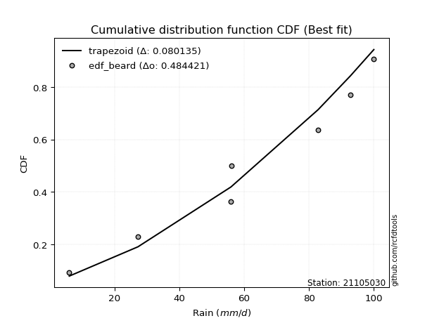</img></img>

</div>


### 5. Empirical - EDF Chegodayev (1955)

The Chegodayev formula is an empirical plotting position formula used in hydrological frequency analysis to estimate the exceedance probability or return period of a specific event from a set of observed data. It is primarily used for plotting observed data points on probability paper to fit a theoretical distribution, particularly for analyzing extreme events like maximum flood flows or rainfall intensities. The constant _b_ value in the generalized plotting position formula is 0.3.

<div align="center">


$P=(m-b)/(n+1-2b)$


</div>


**5.1. Empirical values**

<div align="center">

|                | 0                   | 1                   | 2                   | 3              | 4                  | 5                  | 6                  |
|:---------------|:--------------------|:--------------------|:--------------------|:---------------|:-------------------|:-------------------|:-------------------|
| date           | 2023                | 2022                | 2025                | 2019           | 2021               | 2020               | 2024               |
| x              | 6.0                 | 27.2                | 38.4                | 55.8           | 56.0               | 92.8               | 100.0              |
| m              | 1                   | 2                   | 3                   | 4              | 5                  | 6                  | 7                  |
| empirical_dist | edf_chegodayev      | edf_chegodayev      | edf_chegodayev      | edf_chegodayev | edf_chegodayev     | edf_chegodayev     | edf_chegodayev     |
| empirical      | 0.09459459459459459 | 0.22972972972972971 | 0.36486486486486486 | 0.5            | 0.6351351351351351 | 0.7702702702702703 | 0.9054054054054054 |
| empirical_tr   | 1.1044776119402986  | 1.2982456140350878  | 1.574468085106383   | 2.0            | 2.7407407407407405 | 4.352941176470589  | 10.571428571428568 |

</div>


**5.2. Kolmogorov-Smirnov fit test (sorted by Δ)**


<div align="center">

|                | 0                   | 1                   | 2                   | 3                   | 4                   | 5                   | 6                   | 7                   | 8                   | 9                   | 10                  | 11                  | 12                  | 13                  | 14                  | 15                  | 16                  | 17                  | 18                  | 19                  | 20                  | 21                  | 22                  | 23                  | 24                  | 25                  | 26                  | 27                  | 28                  | 29                  | 30                  | 31                  | 32                    | 33                  | 34                  | 35                  | 36                  | 37                  | 38                  | 39                  | 40                  | 41                  | 42                  | 43                  | 44                  | 45                  | 46                  | 47                  | 48                  | 49                  | 50                  | 51                  | 52                  | 53                  | 54                  | 55                  | 56                  | 57                  | 58                  | 59                  | 60                  | 61                  | 62                  | 63                  | 64                  | 65                  | 66                  | 67                  | 68                  | 69                  | 70                  | 71                  | 72                  | 73                  | 74                  | 75                  | 76                  | 77                  | 78                  | 79                  | 80                  | 81                  | 82                  | 83                  | 84                  | 85                  | 86                  | 87                  | 88                  | 89                  |
|:---------------|:--------------------|:--------------------|:--------------------|:--------------------|:--------------------|:--------------------|:--------------------|:--------------------|:--------------------|:--------------------|:--------------------|:--------------------|:--------------------|:--------------------|:--------------------|:--------------------|:--------------------|:--------------------|:--------------------|:--------------------|:--------------------|:--------------------|:--------------------|:--------------------|:--------------------|:--------------------|:--------------------|:--------------------|:--------------------|:--------------------|:--------------------|:--------------------|:----------------------|:--------------------|:--------------------|:--------------------|:--------------------|:--------------------|:--------------------|:--------------------|:--------------------|:--------------------|:--------------------|:--------------------|:--------------------|:--------------------|:--------------------|:--------------------|:--------------------|:--------------------|:--------------------|:--------------------|:--------------------|:--------------------|:--------------------|:--------------------|:--------------------|:--------------------|:--------------------|:--------------------|:--------------------|:--------------------|:--------------------|:--------------------|:--------------------|:--------------------|:--------------------|:--------------------|:--------------------|:--------------------|:--------------------|:--------------------|:--------------------|:--------------------|:--------------------|:--------------------|:--------------------|:--------------------|:--------------------|:--------------------|:--------------------|:--------------------|:--------------------|:--------------------|:--------------------|:--------------------|:--------------------|:--------------------|:--------------------|:--------------------|
| station        | 21105030            | 21105030            | 21105030            | 21105030            | 21105030            | 21105030            | 21105030            | 21105030            | 21105030            | 21105030            | 21105030            | 21105030            | 21105030            | 21105030            | 21105030            | 21105030            | 21105030            | 21105030            | 21105030            | 21105030            | 21105030            | 21105030            | 21105030            | 21105030            | 21105030            | 21105030            | 21105030            | 21105030            | 21105030            | 21105030            | 21105030            | 21105030            | 21105030              | 21105030            | 21105030            | 21105030            | 21105030            | 21105030            | 21105030            | 21105030            | 21105030            | 21105030            | 21105030            | 21105030            | 21105030            | 21105030            | 21105030            | 21105030            | 21105030            | 21105030            | 21105030            | 21105030            | 21105030            | 21105030            | 21105030            | 21105030            | 21105030            | 21105030            | 21105030            | 21105030            | 21105030            | 21105030            | 21105030            | 21105030            | 21105030            | 21105030            | 21105030            | 21105030            | 21105030            | 21105030            | 21105030            | 21105030            | 21105030            | 21105030            | 21105030            | 21105030            | 21105030            | 21105030            | 21105030            | 21105030            | 21105030            | 21105030            | 21105030            | 21105030            | 21105030            | 21105030            | 21105030            | 21105030            | 21105030            | 21105030            |
| empirical_dist | edf_chegodayev      | edf_chegodayev      | edf_chegodayev      | edf_chegodayev      | edf_chegodayev      | edf_chegodayev      | edf_chegodayev      | edf_chegodayev      | edf_chegodayev      | edf_chegodayev      | edf_chegodayev      | edf_chegodayev      | edf_chegodayev      | edf_chegodayev      | edf_chegodayev      | edf_chegodayev      | edf_chegodayev      | edf_chegodayev      | edf_chegodayev      | edf_chegodayev      | edf_chegodayev      | edf_chegodayev      | edf_chegodayev      | edf_chegodayev      | edf_chegodayev      | edf_chegodayev      | edf_chegodayev      | edf_chegodayev      | edf_chegodayev      | edf_chegodayev      | edf_chegodayev      | edf_chegodayev      | edf_chegodayev        | edf_chegodayev      | edf_chegodayev      | edf_chegodayev      | edf_chegodayev      | edf_chegodayev      | edf_chegodayev      | edf_chegodayev      | edf_chegodayev      | edf_chegodayev      | edf_chegodayev      | edf_chegodayev      | edf_chegodayev      | edf_chegodayev      | edf_chegodayev      | edf_chegodayev      | edf_chegodayev      | edf_chegodayev      | edf_chegodayev      | edf_chegodayev      | edf_chegodayev      | edf_chegodayev      | edf_chegodayev      | edf_chegodayev      | edf_chegodayev      | edf_chegodayev      | edf_chegodayev      | edf_chegodayev      | edf_chegodayev      | edf_chegodayev      | edf_chegodayev      | edf_chegodayev      | edf_chegodayev      | edf_chegodayev      | edf_chegodayev      | edf_chegodayev      | edf_chegodayev      | edf_chegodayev      | edf_chegodayev      | edf_chegodayev      | edf_chegodayev      | edf_chegodayev      | edf_chegodayev      | edf_chegodayev      | edf_chegodayev      | edf_chegodayev      | edf_chegodayev      | edf_chegodayev      | edf_chegodayev      | edf_chegodayev      | edf_chegodayev      | edf_chegodayev      | edf_chegodayev      | edf_chegodayev      | edf_chegodayev      | edf_chegodayev      | edf_chegodayev      | edf_chegodayev      |
| p_dist         | logpearson3         | logt                | loggumbel_l         | logfisk             | invweibull          | genlogistic         | kstwobign           | loggompertz         | halfnorm            | fisk                | ncf                 | weibull_min         | rayleigh            | invgauss            | invgamma            | f                   | betaprime           | maxwell             | rice                | pearson3            | erlang              | gumbel_r            | gamma               | exponnorm           | nct                 | truncnorm           | norm                | t                   | moyal               | halflogistic        | laplace_asymmetric  | johnsonsu           | loglaplace_asymmetric | logistic            | logncf              | logfatiguelife      | logf                | logrice             | lognorm             | lognorm             | logcrystalball      | logexponnorm        | hypsecant           | lognct              | logloggamma         | laplace             | logbetaprime        | logerlang           | expon               | loggamma            | loggamma            | genexpon            | loginvgamma         | logmielke           | logalpha            | loglogistic         | loginvgauss         | logmaxwell          | mielke              | lograyleigh         | loghypsecant        | loginvweibull       | gumbel_l            | loghalfnorm         | loglaplace          | loggenexpon         | loggumbel_r         | wald                | logkstwobign        | logjohnsonsu        | loghalflogistic     | logmoyal            | logtruncnorm        | nakagami            | gibrat              | lognakagami         | logwald             | loggibrat           | logexpon            | alpha               | pareto              | loglognorm          | logpareto           | crystalball         | logweibull_min      | fatiguelife         | logchi2             | gompertz            | chi2                | loggenlogistic      |
| delta          | 0.07470322946053143 | 0.08161374623931583 | 0.08888474431169868 | 0.09598776875064041 | 0.09770311417511202 | 0.09950272075285893 | 0.10434205928582374 | 0.10542148679911856 | 0.10813742494579814 | 0.108940526593028   | 0.11035740618137313 | 0.11164543170369379 | 0.11204121066815653 | 0.11216806542732094 | 0.11229219881389929 | 0.11302782083451879 | 0.11344284938142313 | 0.1143592869378568  | 0.11504723789136073 | 0.12117717077961887 | 0.12132328929179836 | 0.1221790510131151  | 0.12259158065497022 | 0.12305401052789955 | 0.12308187544835836 | 0.12308494916021451 | 0.12308495162788546 | 0.12308580660548873 | 0.12393845284720817 | 0.12397172278310287 | 0.12546905111464857 | 0.12633288362443784 | 0.13379926463583713   | 0.13501681438292812 | 0.13909334236786752 | 0.13922314462975482 | 0.13922629563834654 | 0.13990689963414205 | 0.13990760065578445 | 0.13990760065578445 | 0.13990765457179066 | 0.13990867366691917 | 0.14019898960548716 | 0.14028874545283554 | 0.1433933180797473  | 0.14371494632456494 | 0.14484887624981524 | 0.14712735727764714 | 0.14763509248395634 | 0.14769491987357986 | 0.14769491987357986 | 0.14783701193992016 | 0.15078927576921564 | 0.15325635411555494 | 0.15374987469695944 | 0.1569483496764036  | 0.1606896828144353  | 0.16260342482576695 | 0.1684401677321291  | 0.16946881065052    | 0.17034038528289308 | 0.17384549245869896 | 0.17538879242825045 | 0.1893306881466602  | 0.19872602172909848 | 0.20065987862014334 | 0.20142294878077704 | 0.2019495834971004  | 0.21116730317997584 | 0.2163790186047056  | 0.2175775689203373  | 0.2219019252267962  | 0.22972487056921476 | 0.22972950709144216 | 0.22972972972972971 | 0.26459083762695734 | 0.27966812055388746 | 0.31191236142887235 | 0.31667191044981446 | 0.34676279324364057 | 0.4118001933318489  | 0.4182003295843958  | 0.4391202022979598  | 0.44390753783172593 | 0.470531402566856   | 0.4797504550750121  | 0.49744761490586775 | 0.63512001411661    | 0.6967431929686074  | 0.7702702702702703  |
| deltao         | 0.48442053926100004 | 0.48442053926100004 | 0.48442053926100004 | 0.48442053926100004 | 0.48442053926100004 | 0.48442053926100004 | 0.48442053926100004 | 0.48442053926100004 | 0.48442053926100004 | 0.48442053926100004 | 0.48442053926100004 | 0.48442053926100004 | 0.48442053926100004 | 0.48442053926100004 | 0.48442053926100004 | 0.48442053926100004 | 0.48442053926100004 | 0.48442053926100004 | 0.48442053926100004 | 0.48442053926100004 | 0.48442053926100004 | 0.48442053926100004 | 0.48442053926100004 | 0.48442053926100004 | 0.48442053926100004 | 0.48442053926100004 | 0.48442053926100004 | 0.48442053926100004 | 0.48442053926100004 | 0.48442053926100004 | 0.48442053926100004 | 0.48442053926100004 | 0.48442053926100004   | 0.48442053926100004 | 0.48442053926100004 | 0.48442053926100004 | 0.48442053926100004 | 0.48442053926100004 | 0.48442053926100004 | 0.48442053926100004 | 0.48442053926100004 | 0.48442053926100004 | 0.48442053926100004 | 0.48442053926100004 | 0.48442053926100004 | 0.48442053926100004 | 0.48442053926100004 | 0.48442053926100004 | 0.48442053926100004 | 0.48442053926100004 | 0.48442053926100004 | 0.48442053926100004 | 0.48442053926100004 | 0.48442053926100004 | 0.48442053926100004 | 0.48442053926100004 | 0.48442053926100004 | 0.48442053926100004 | 0.48442053926100004 | 0.48442053926100004 | 0.48442053926100004 | 0.48442053926100004 | 0.48442053926100004 | 0.48442053926100004 | 0.48442053926100004 | 0.48442053926100004 | 0.48442053926100004 | 0.48442053926100004 | 0.48442053926100004 | 0.48442053926100004 | 0.48442053926100004 | 0.48442053926100004 | 0.48442053926100004 | 0.48442053926100004 | 0.48442053926100004 | 0.48442053926100004 | 0.48442053926100004 | 0.48442053926100004 | 0.48442053926100004 | 0.48442053926100004 | 0.48442053926100004 | 0.48442053926100004 | 0.48442053926100004 | 0.48442053926100004 | 0.48442053926100004 | 0.48442053926100004 | 0.48442053926100004 | 0.48442053926100004 | 0.48442053926100004 | 0.48442053926100004 |
| eval           | Δo > Δ              | Δo > Δ              | Δo > Δ              | Δo > Δ              | Δo > Δ              | Δo > Δ              | Δo > Δ              | Δo > Δ              | Δo > Δ              | Δo > Δ              | Δo > Δ              | Δo > Δ              | Δo > Δ              | Δo > Δ              | Δo > Δ              | Δo > Δ              | Δo > Δ              | Δo > Δ              | Δo > Δ              | Δo > Δ              | Δo > Δ              | Δo > Δ              | Δo > Δ              | Δo > Δ              | Δo > Δ              | Δo > Δ              | Δo > Δ              | Δo > Δ              | Δo > Δ              | Δo > Δ              | Δo > Δ              | Δo > Δ              | Δo > Δ                | Δo > Δ              | Δo > Δ              | Δo > Δ              | Δo > Δ              | Δo > Δ              | Δo > Δ              | Δo > Δ              | Δo > Δ              | Δo > Δ              | Δo > Δ              | Δo > Δ              | Δo > Δ              | Δo > Δ              | Δo > Δ              | Δo > Δ              | Δo > Δ              | Δo > Δ              | Δo > Δ              | Δo > Δ              | Δo > Δ              | Δo > Δ              | Δo > Δ              | Δo > Δ              | Δo > Δ              | Δo > Δ              | Δo > Δ              | Δo > Δ              | Δo > Δ              | Δo > Δ              | Δo > Δ              | Δo > Δ              | Δo > Δ              | Δo > Δ              | Δo > Δ              | Δo > Δ              | Δo > Δ              | Δo > Δ              | Δo > Δ              | Δo > Δ              | Δo > Δ              | Δo > Δ              | Δo > Δ              | Δo > Δ              | Δo > Δ              | Δo > Δ              | Δo > Δ              | Δo > Δ              | Δo > Δ              | Δo > Δ              | Δo > Δ              | Δo > Δ              | Δo > Δ              | Δo > Δ              | Δo <= Δ             | Δo <= Δ             | Δo <= Δ             | Δo <= Δ             |
| fit            | 1                   | 1                   | 1                   | 1                   | 1                   | 1                   | 1                   | 1                   | 1                   | 1                   | 1                   | 1                   | 1                   | 1                   | 1                   | 1                   | 1                   | 1                   | 1                   | 1                   | 1                   | 1                   | 1                   | 1                   | 1                   | 1                   | 1                   | 1                   | 1                   | 1                   | 1                   | 1                   | 1                     | 1                   | 1                   | 1                   | 1                   | 1                   | 1                   | 1                   | 1                   | 1                   | 1                   | 1                   | 1                   | 1                   | 1                   | 1                   | 1                   | 1                   | 1                   | 1                   | 1                   | 1                   | 1                   | 1                   | 1                   | 1                   | 1                   | 1                   | 1                   | 1                   | 1                   | 1                   | 1                   | 1                   | 1                   | 1                   | 1                   | 1                   | 1                   | 1                   | 1                   | 1                   | 1                   | 1                   | 1                   | 1                   | 1                   | 1                   | 1                   | 1                   | 1                   | 1                   | 1                   | 1                   | 0                   | 0                   | 0                   | 0                   |
| n              | 7                   | 7                   | 7                   | 7                   | 7                   | 7                   | 7                   | 7                   | 7                   | 7                   | 7                   | 7                   | 7                   | 7                   | 7                   | 7                   | 7                   | 7                   | 7                   | 7                   | 7                   | 7                   | 7                   | 7                   | 7                   | 7                   | 7                   | 7                   | 7                   | 7                   | 7                   | 7                   | 7                     | 7                   | 7                   | 7                   | 7                   | 7                   | 7                   | 7                   | 7                   | 7                   | 7                   | 7                   | 7                   | 7                   | 7                   | 7                   | 7                   | 7                   | 7                   | 7                   | 7                   | 7                   | 7                   | 7                   | 7                   | 7                   | 7                   | 7                   | 7                   | 7                   | 7                   | 7                   | 7                   | 7                   | 7                   | 7                   | 7                   | 7                   | 7                   | 7                   | 7                   | 7                   | 7                   | 7                   | 7                   | 7                   | 7                   | 7                   | 7                   | 7                   | 7                   | 7                   | 7                   | 7                   | 7                   | 7                   | 7                   | 7                   |
| best_fit       | 1                   | 0                   | 0                   | 0                   | 0                   | 0                   | 0                   | 0                   | 0                   | 0                   | 0                   | 0                   | 0                   | 0                   | 0                   | 0                   | 0                   | 0                   | 0                   | 0                   | 0                   | 0                   | 0                   | 0                   | 0                   | 0                   | 0                   | 0                   | 0                   | 0                   | 0                   | 0                   | 0                     | 0                   | 0                   | 0                   | 0                   | 0                   | 0                   | 0                   | 0                   | 0                   | 0                   | 0                   | 0                   | 0                   | 0                   | 0                   | 0                   | 0                   | 0                   | 0                   | 0                   | 0                   | 0                   | 0                   | 0                   | 0                   | 0                   | 0                   | 0                   | 0                   | 0                   | 0                   | 0                   | 0                   | 0                   | 0                   | 0                   | 0                   | 0                   | 0                   | 0                   | 0                   | 0                   | 0                   | 0                   | 0                   | 0                   | 0                   | 0                   | 0                   | 0                   | 0                   | 0                   | 0                   | 0                   | 0                   | 0                   | 0                   |
| best_fit_sort  | 1                   | 2                   | 3                   | 4                   | 5                   | 6                   | 7                   | 8                   | 9                   | 10                  | 11                  | 12                  | 13                  | 14                  | 15                  | 16                  | 17                  | 18                  | 19                  | 20                  | 21                  | 22                  | 23                  | 24                  | 25                  | 26                  | 27                  | 28                  | 29                  | 30                  | 31                  | 32                  | 33                    | 34                  | 35                  | 36                  | 37                  | 38                  | 39                  | 40                  | 41                  | 42                  | 43                  | 44                  | 45                  | 46                  | 47                  | 48                  | 49                  | 50                  | 51                  | 52                  | 53                  | 54                  | 55                  | 56                  | 57                  | 58                  | 59                  | 60                  | 61                  | 62                  | 63                  | 64                  | 65                  | 66                  | 67                  | 68                  | 69                  | 70                  | 71                  | 72                  | 73                  | 74                  | 75                  | 76                  | 77                  | 78                  | 79                  | 80                  | 81                  | 82                  | 83                  | 84                  | 85                  | 86                  | 87                  | 88                  | 89                  | 90                  |

</div>


<div align="center">

</img>

</div>


**5.3. Best fit**

<div align="center">

|   id |   station | empirical_dist   | p_dist      |     delta |   deltao | eval   |   fit |   n |   best_fit |   best_fit_sort |
|-----:|----------:|:-----------------|:------------|----------:|---------:|:-------|------:|----:|-----------:|----------------:|
|    0 |  21105030 | edf_chegodayev   | logpearson3 | 0.0747032 | 0.484421 | Δo > Δ |     1 |   7 |          1 |               1 |

</div>


<div align="center">

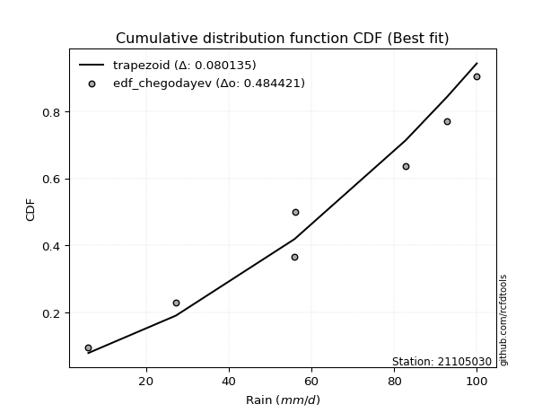</img>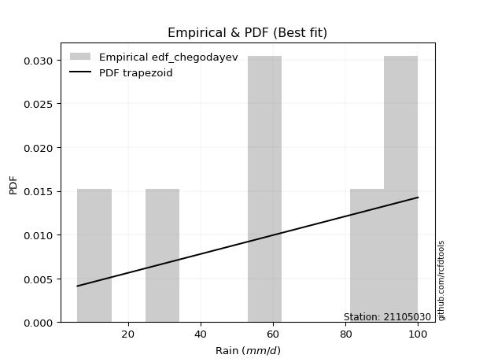</img>

</div>


### 6. Empirical - EDF Blom (1958)

The Blom formula is a specific "plotting position" formula used in hydrology and statistical analysis to estimate the empirical cumulative probability (or non-exceedance probability) of a data series. It is particularly recommended for data that are approximately normally distributed. The constant _a_ is set to 0.375 (or 3/8).

<div align="center">


$P=(m-a)/(n+1-2a)$


</div>


**6.1. Empirical values**

<div align="center">

|                | 0                   | 1                   | 2                  | 3        | 4                  | 5                  | 6                  |
|:---------------|:--------------------|:--------------------|:-------------------|:---------|:-------------------|:-------------------|:-------------------|
| date           | 2023                | 2022                | 2025               | 2019     | 2021               | 2020               | 2024               |
| x              | 6.0                 | 27.2                | 38.4               | 55.8     | 56.0               | 92.8               | 100.0              |
| m              | 1                   | 2                   | 3                  | 4        | 5                  | 6                  | 7                  |
| empirical_dist | edf_blom            | edf_blom            | edf_blom           | edf_blom | edf_blom           | edf_blom           | edf_blom           |
| empirical      | 0.08620689655172414 | 0.22413793103448276 | 0.3620689655172414 | 0.5      | 0.6379310344827587 | 0.7758620689655172 | 0.9137931034482759 |
| empirical_tr   | 1.0943396226415094  | 1.288888888888889   | 1.5675675675675675 | 2.0      | 2.7619047619047623 | 4.461538461538462  | 11.600000000000007 |

</div>


**6.2. Kolmogorov-Smirnov fit test (sorted by Δ)**


<div align="center">

|                | 0                   | 1                   | 2                   | 3                   | 4                   | 5                   | 6                   | 7                   | 8                   | 9                   | 10                  | 11                  | 12                  | 13                  | 14                  | 15                  | 16                  | 17                  | 18                  | 19                  | 20                  | 21                  | 22                  | 23                  | 24                  | 25                  | 26                  | 27                  | 28                  | 29                  | 30                  | 31                  | 32                  | 33                    | 34                  | 35                  | 36                  | 37                  | 38                  | 39                  | 40                  | 41                  | 42                  | 43                  | 44                  | 45                  | 46                  | 47                  | 48                  | 49                  | 50                  | 51                  | 52                  | 53                  | 54                  | 55                  | 56                  | 57                  | 58                  | 59                  | 60                  | 61                  | 62                  | 63                  | 64                  | 65                  | 66                  | 67                  | 68                  | 69                  | 70                  | 71                  | 72                  | 73                  | 74                  | 75                  | 76                  | 77                  | 78                  | 79                  | 80                  | 81                  | 82                  | 83                  | 84                  | 85                  | 86                  | 87                  | 88                  | 89                  |
|:---------------|:--------------------|:--------------------|:--------------------|:--------------------|:--------------------|:--------------------|:--------------------|:--------------------|:--------------------|:--------------------|:--------------------|:--------------------|:--------------------|:--------------------|:--------------------|:--------------------|:--------------------|:--------------------|:--------------------|:--------------------|:--------------------|:--------------------|:--------------------|:--------------------|:--------------------|:--------------------|:--------------------|:--------------------|:--------------------|:--------------------|:--------------------|:--------------------|:--------------------|:----------------------|:--------------------|:--------------------|:--------------------|:--------------------|:--------------------|:--------------------|:--------------------|:--------------------|:--------------------|:--------------------|:--------------------|:--------------------|:--------------------|:--------------------|:--------------------|:--------------------|:--------------------|:--------------------|:--------------------|:--------------------|:--------------------|:--------------------|:--------------------|:--------------------|:--------------------|:--------------------|:--------------------|:--------------------|:--------------------|:--------------------|:--------------------|:--------------------|:--------------------|:--------------------|:--------------------|:--------------------|:--------------------|:--------------------|:--------------------|:--------------------|:--------------------|:--------------------|:--------------------|:--------------------|:--------------------|:--------------------|:--------------------|:--------------------|:--------------------|:--------------------|:--------------------|:--------------------|:--------------------|:--------------------|:--------------------|:--------------------|
| station        | 21105030            | 21105030            | 21105030            | 21105030            | 21105030            | 21105030            | 21105030            | 21105030            | 21105030            | 21105030            | 21105030            | 21105030            | 21105030            | 21105030            | 21105030            | 21105030            | 21105030            | 21105030            | 21105030            | 21105030            | 21105030            | 21105030            | 21105030            | 21105030            | 21105030            | 21105030            | 21105030            | 21105030            | 21105030            | 21105030            | 21105030            | 21105030            | 21105030            | 21105030              | 21105030            | 21105030            | 21105030            | 21105030            | 21105030            | 21105030            | 21105030            | 21105030            | 21105030            | 21105030            | 21105030            | 21105030            | 21105030            | 21105030            | 21105030            | 21105030            | 21105030            | 21105030            | 21105030            | 21105030            | 21105030            | 21105030            | 21105030            | 21105030            | 21105030            | 21105030            | 21105030            | 21105030            | 21105030            | 21105030            | 21105030            | 21105030            | 21105030            | 21105030            | 21105030            | 21105030            | 21105030            | 21105030            | 21105030            | 21105030            | 21105030            | 21105030            | 21105030            | 21105030            | 21105030            | 21105030            | 21105030            | 21105030            | 21105030            | 21105030            | 21105030            | 21105030            | 21105030            | 21105030            | 21105030            | 21105030            |
| empirical_dist | edf_blom            | edf_blom            | edf_blom            | edf_blom            | edf_blom            | edf_blom            | edf_blom            | edf_blom            | edf_blom            | edf_blom            | edf_blom            | edf_blom            | edf_blom            | edf_blom            | edf_blom            | edf_blom            | edf_blom            | edf_blom            | edf_blom            | edf_blom            | edf_blom            | edf_blom            | edf_blom            | edf_blom            | edf_blom            | edf_blom            | edf_blom            | edf_blom            | edf_blom            | edf_blom            | edf_blom            | edf_blom            | edf_blom            | edf_blom              | edf_blom            | edf_blom            | edf_blom            | edf_blom            | edf_blom            | edf_blom            | edf_blom            | edf_blom            | edf_blom            | edf_blom            | edf_blom            | edf_blom            | edf_blom            | edf_blom            | edf_blom            | edf_blom            | edf_blom            | edf_blom            | edf_blom            | edf_blom            | edf_blom            | edf_blom            | edf_blom            | edf_blom            | edf_blom            | edf_blom            | edf_blom            | edf_blom            | edf_blom            | edf_blom            | edf_blom            | edf_blom            | edf_blom            | edf_blom            | edf_blom            | edf_blom            | edf_blom            | edf_blom            | edf_blom            | edf_blom            | edf_blom            | edf_blom            | edf_blom            | edf_blom            | edf_blom            | edf_blom            | edf_blom            | edf_blom            | edf_blom            | edf_blom            | edf_blom            | edf_blom            | edf_blom            | edf_blom            | edf_blom            | edf_blom            |
| p_dist         | logpearson3         | logt                | loggumbel_l         | invweibull          | genlogistic         | logfisk             | kstwobign           | halfnorm            | fisk                | loggompertz         | weibull_min         | rayleigh            | invgauss            | invgamma            | f                   | betaprime           | maxwell             | rice                | ncf                 | pearson3            | erlang              | gumbel_r            | gamma               | exponnorm           | nct                 | truncnorm           | norm                | t                   | laplace_asymmetric  | johnsonsu           | moyal               | halflogistic        | logistic            | loglaplace_asymmetric | hypsecant           | logloggamma         | laplace             | logncf              | logfatiguelife      | logf                | logrice             | lognorm             | lognorm             | logcrystalball      | logexponnorm        | lognct              | logerlang           | expon               | logmielke           | loggamma            | loggamma            | genexpon            | logbetaprime        | loginvgamma         | logalpha            | loglogistic         | loginvgauss         | logmaxwell          | mielke              | lograyleigh         | loghypsecant        | gumbel_l            | loginvweibull       | loghalfnorm         | wald                | loglaplace          | loggumbel_r         | loggenexpon         | logkstwobign        | loghalflogistic     | logjohnsonsu        | logmoyal            | logtruncnorm        | nakagami            | gibrat              | lognakagami         | logwald             | loggibrat           | logexpon            | alpha               | pareto              | loglognorm          | logpareto           | crystalball         | logweibull_min      | fatiguelife         | logchi2             | gompertz            | chi2                | loggenlogistic      |
| delta          | 0.07470322946053143 | 0.08440964558693942 | 0.08888474431169868 | 0.09211131547986506 | 0.09391092205761198 | 0.09598776875064041 | 0.09875026059057679 | 0.10254562625055119 | 0.10334872789778105 | 0.10542148679911856 | 0.10605363300844683 | 0.10644941197290958 | 0.10657626673207399 | 0.10670040011865234 | 0.10743602213927184 | 0.10785105068617618 | 0.10876748824260984 | 0.10945543919611378 | 0.11035740618137313 | 0.11558537208437192 | 0.11573149059655141 | 0.11658725231786815 | 0.11699978195972327 | 0.1174622118326526  | 0.1174900767531114  | 0.11749315046496756 | 0.11749315293263851 | 0.11749400791024178 | 0.11987725241940161 | 0.12074108492919089 | 0.12227199242343711 | 0.12397172278310287 | 0.12942501568768117 | 0.13379926463583713   | 0.1346071909102402  | 0.13780151938450036 | 0.138123147629318   | 0.13909334236786752 | 0.13922314462975482 | 0.13922629563834654 | 0.13990689963414205 | 0.13990760065578445 | 0.13990760065578445 | 0.13990765457179066 | 0.13990867366691917 | 0.14028874545283554 | 0.14712735727764714 | 0.14763509248395634 | 0.14766455542030799 | 0.14769491987357986 | 0.14769491987357986 | 0.14783701193992016 | 0.1504406749450622  | 0.15078927576921564 | 0.15374987469695944 | 0.1569483496764036  | 0.1606896828144353  | 0.16260342482576695 | 0.16766470713490056 | 0.16946881065052    | 0.17034038528289308 | 0.17818469177587404 | 0.1794372911539459  | 0.1907453332462295  | 0.19635778480185345 | 0.19872602172909848 | 0.20142294878077704 | 0.2062516773153903  | 0.2167591018752228  | 0.2175775689203373  | 0.21917491795232918 | 0.2219019252267962  | 0.2241330718739678  | 0.2241377083961952  | 0.22413793103448276 | 0.26459083762695734 | 0.2798240012058368  | 0.31191236142887235 | 0.3222637091450614  | 0.3523545919388875  | 0.41739199202709587 | 0.42379212827964274 | 0.44471200099320674 | 0.45229523587459636 | 0.47612320126210295 | 0.4853422537702591  | 0.5030394136011147  | 0.6379159134642336  | 0.7023349916638544  | 0.7758620689655172  |
| deltao         | 0.48442053926100004 | 0.48442053926100004 | 0.48442053926100004 | 0.48442053926100004 | 0.48442053926100004 | 0.48442053926100004 | 0.48442053926100004 | 0.48442053926100004 | 0.48442053926100004 | 0.48442053926100004 | 0.48442053926100004 | 0.48442053926100004 | 0.48442053926100004 | 0.48442053926100004 | 0.48442053926100004 | 0.48442053926100004 | 0.48442053926100004 | 0.48442053926100004 | 0.48442053926100004 | 0.48442053926100004 | 0.48442053926100004 | 0.48442053926100004 | 0.48442053926100004 | 0.48442053926100004 | 0.48442053926100004 | 0.48442053926100004 | 0.48442053926100004 | 0.48442053926100004 | 0.48442053926100004 | 0.48442053926100004 | 0.48442053926100004 | 0.48442053926100004 | 0.48442053926100004 | 0.48442053926100004   | 0.48442053926100004 | 0.48442053926100004 | 0.48442053926100004 | 0.48442053926100004 | 0.48442053926100004 | 0.48442053926100004 | 0.48442053926100004 | 0.48442053926100004 | 0.48442053926100004 | 0.48442053926100004 | 0.48442053926100004 | 0.48442053926100004 | 0.48442053926100004 | 0.48442053926100004 | 0.48442053926100004 | 0.48442053926100004 | 0.48442053926100004 | 0.48442053926100004 | 0.48442053926100004 | 0.48442053926100004 | 0.48442053926100004 | 0.48442053926100004 | 0.48442053926100004 | 0.48442053926100004 | 0.48442053926100004 | 0.48442053926100004 | 0.48442053926100004 | 0.48442053926100004 | 0.48442053926100004 | 0.48442053926100004 | 0.48442053926100004 | 0.48442053926100004 | 0.48442053926100004 | 0.48442053926100004 | 0.48442053926100004 | 0.48442053926100004 | 0.48442053926100004 | 0.48442053926100004 | 0.48442053926100004 | 0.48442053926100004 | 0.48442053926100004 | 0.48442053926100004 | 0.48442053926100004 | 0.48442053926100004 | 0.48442053926100004 | 0.48442053926100004 | 0.48442053926100004 | 0.48442053926100004 | 0.48442053926100004 | 0.48442053926100004 | 0.48442053926100004 | 0.48442053926100004 | 0.48442053926100004 | 0.48442053926100004 | 0.48442053926100004 | 0.48442053926100004 |
| eval           | Δo > Δ              | Δo > Δ              | Δo > Δ              | Δo > Δ              | Δo > Δ              | Δo > Δ              | Δo > Δ              | Δo > Δ              | Δo > Δ              | Δo > Δ              | Δo > Δ              | Δo > Δ              | Δo > Δ              | Δo > Δ              | Δo > Δ              | Δo > Δ              | Δo > Δ              | Δo > Δ              | Δo > Δ              | Δo > Δ              | Δo > Δ              | Δo > Δ              | Δo > Δ              | Δo > Δ              | Δo > Δ              | Δo > Δ              | Δo > Δ              | Δo > Δ              | Δo > Δ              | Δo > Δ              | Δo > Δ              | Δo > Δ              | Δo > Δ              | Δo > Δ                | Δo > Δ              | Δo > Δ              | Δo > Δ              | Δo > Δ              | Δo > Δ              | Δo > Δ              | Δo > Δ              | Δo > Δ              | Δo > Δ              | Δo > Δ              | Δo > Δ              | Δo > Δ              | Δo > Δ              | Δo > Δ              | Δo > Δ              | Δo > Δ              | Δo > Δ              | Δo > Δ              | Δo > Δ              | Δo > Δ              | Δo > Δ              | Δo > Δ              | Δo > Δ              | Δo > Δ              | Δo > Δ              | Δo > Δ              | Δo > Δ              | Δo > Δ              | Δo > Δ              | Δo > Δ              | Δo > Δ              | Δo > Δ              | Δo > Δ              | Δo > Δ              | Δo > Δ              | Δo > Δ              | Δo > Δ              | Δo > Δ              | Δo > Δ              | Δo > Δ              | Δo > Δ              | Δo > Δ              | Δo > Δ              | Δo > Δ              | Δo > Δ              | Δo > Δ              | Δo > Δ              | Δo > Δ              | Δo > Δ              | Δo > Δ              | Δo > Δ              | Δo <= Δ             | Δo <= Δ             | Δo <= Δ             | Δo <= Δ             | Δo <= Δ             |
| fit            | 1                   | 1                   | 1                   | 1                   | 1                   | 1                   | 1                   | 1                   | 1                   | 1                   | 1                   | 1                   | 1                   | 1                   | 1                   | 1                   | 1                   | 1                   | 1                   | 1                   | 1                   | 1                   | 1                   | 1                   | 1                   | 1                   | 1                   | 1                   | 1                   | 1                   | 1                   | 1                   | 1                   | 1                     | 1                   | 1                   | 1                   | 1                   | 1                   | 1                   | 1                   | 1                   | 1                   | 1                   | 1                   | 1                   | 1                   | 1                   | 1                   | 1                   | 1                   | 1                   | 1                   | 1                   | 1                   | 1                   | 1                   | 1                   | 1                   | 1                   | 1                   | 1                   | 1                   | 1                   | 1                   | 1                   | 1                   | 1                   | 1                   | 1                   | 1                   | 1                   | 1                   | 1                   | 1                   | 1                   | 1                   | 1                   | 1                   | 1                   | 1                   | 1                   | 1                   | 1                   | 1                   | 0                   | 0                   | 0                   | 0                   | 0                   |
| n              | 7                   | 7                   | 7                   | 7                   | 7                   | 7                   | 7                   | 7                   | 7                   | 7                   | 7                   | 7                   | 7                   | 7                   | 7                   | 7                   | 7                   | 7                   | 7                   | 7                   | 7                   | 7                   | 7                   | 7                   | 7                   | 7                   | 7                   | 7                   | 7                   | 7                   | 7                   | 7                   | 7                   | 7                     | 7                   | 7                   | 7                   | 7                   | 7                   | 7                   | 7                   | 7                   | 7                   | 7                   | 7                   | 7                   | 7                   | 7                   | 7                   | 7                   | 7                   | 7                   | 7                   | 7                   | 7                   | 7                   | 7                   | 7                   | 7                   | 7                   | 7                   | 7                   | 7                   | 7                   | 7                   | 7                   | 7                   | 7                   | 7                   | 7                   | 7                   | 7                   | 7                   | 7                   | 7                   | 7                   | 7                   | 7                   | 7                   | 7                   | 7                   | 7                   | 7                   | 7                   | 7                   | 7                   | 7                   | 7                   | 7                   | 7                   |
| best_fit       | 1                   | 0                   | 0                   | 0                   | 0                   | 0                   | 0                   | 0                   | 0                   | 0                   | 0                   | 0                   | 0                   | 0                   | 0                   | 0                   | 0                   | 0                   | 0                   | 0                   | 0                   | 0                   | 0                   | 0                   | 0                   | 0                   | 0                   | 0                   | 0                   | 0                   | 0                   | 0                   | 0                   | 0                     | 0                   | 0                   | 0                   | 0                   | 0                   | 0                   | 0                   | 0                   | 0                   | 0                   | 0                   | 0                   | 0                   | 0                   | 0                   | 0                   | 0                   | 0                   | 0                   | 0                   | 0                   | 0                   | 0                   | 0                   | 0                   | 0                   | 0                   | 0                   | 0                   | 0                   | 0                   | 0                   | 0                   | 0                   | 0                   | 0                   | 0                   | 0                   | 0                   | 0                   | 0                   | 0                   | 0                   | 0                   | 0                   | 0                   | 0                   | 0                   | 0                   | 0                   | 0                   | 0                   | 0                   | 0                   | 0                   | 0                   |
| best_fit_sort  | 1                   | 2                   | 3                   | 4                   | 5                   | 6                   | 7                   | 8                   | 9                   | 10                  | 11                  | 12                  | 13                  | 14                  | 15                  | 16                  | 17                  | 18                  | 19                  | 20                  | 21                  | 22                  | 23                  | 24                  | 25                  | 26                  | 27                  | 28                  | 29                  | 30                  | 31                  | 32                  | 33                  | 34                    | 35                  | 36                  | 37                  | 38                  | 39                  | 40                  | 41                  | 42                  | 43                  | 44                  | 45                  | 46                  | 47                  | 48                  | 49                  | 50                  | 51                  | 52                  | 53                  | 54                  | 55                  | 56                  | 57                  | 58                  | 59                  | 60                  | 61                  | 62                  | 63                  | 64                  | 65                  | 66                  | 67                  | 68                  | 69                  | 70                  | 71                  | 72                  | 73                  | 74                  | 75                  | 76                  | 77                  | 78                  | 79                  | 80                  | 81                  | 82                  | 83                  | 84                  | 85                  | 86                  | 87                  | 88                  | 89                  | 90                  |

</div>


<div align="center">

</img>

</div>


**6.3. Best fit**

<div align="center">

|   id |   station | empirical_dist   | p_dist      |     delta |   deltao | eval   |   fit |   n |   best_fit |   best_fit_sort |
|-----:|----------:|:-----------------|:------------|----------:|---------:|:-------|------:|----:|-----------:|----------------:|
|    0 |  21105030 | edf_blom         | logpearson3 | 0.0747032 | 0.484421 | Δo > Δ |     1 |   7 |          1 |               1 |

</div>


<div align="center">

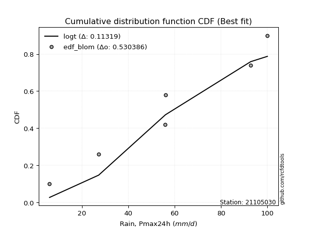</img>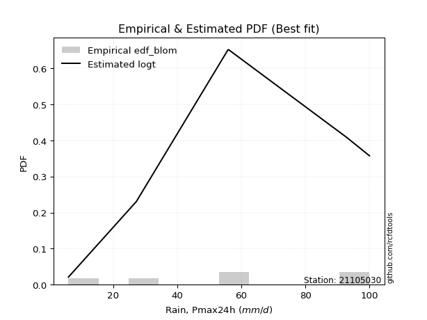</img>

</div>


### 7. Empirical - EDF Tukey (1962)

In hydrology, the Tukey formula is used as a plotting position formula to estimate the empirical probability or frequency of a flood event (or other hydrological data). The formula parameter is given as _c=0.333_ (or 1/3).

<div align="center">


$P=(m-c)/(n+1-2c)$


</div>


**7.1. Empirical values**

<div align="center">

|                | 0                   | 1                   | 2                   | 3         | 4                  | 5                  | 6                  |
|:---------------|:--------------------|:--------------------|:--------------------|:----------|:-------------------|:-------------------|:-------------------|
| date           | 2023                | 2022                | 2025                | 2019      | 2021               | 2020               | 2024               |
| x              | 6.0                 | 27.2                | 38.4                | 55.8      | 56.0               | 92.8               | 100.0              |
| m              | 1                   | 2                   | 3                   | 4         | 5                  | 6                  | 7                  |
| empirical_dist | edf_tukey           | edf_tukey           | edf_tukey           | edf_tukey | edf_tukey          | edf_tukey          | edf_tukey          |
| empirical      | 0.09090909090909091 | 0.22727272727272727 | 0.36363636363636365 | 0.5       | 0.6363636363636364 | 0.7727272727272727 | 0.9090909090909091 |
| empirical_tr   | 1.1                 | 1.2941176470588236  | 1.5714285714285714  | 2.0       | 2.75               | 4.3999999999999995 | 10.999999999999996 |

</div>


**7.2. Kolmogorov-Smirnov fit test (sorted by Δ)**


<div align="center">

|                | 0                   | 1                   | 2                   | 3                   | 4                   | 5                   | 6                   | 7                   | 8                   | 9                   | 10                  | 11                  | 12                  | 13                  | 14                  | 15                  | 16                  | 17                  | 18                  | 19                  | 20                  | 21                  | 22                  | 23                  | 24                  | 25                  | 26                  | 27                  | 28                  | 29                  | 30                  | 31                  | 32                  | 33                    | 34                  | 35                  | 36                  | 37                  | 38                  | 39                  | 40                  | 41                  | 42                  | 43                  | 44                  | 45                  | 46                  | 47                  | 48                  | 49                  | 50                  | 51                  | 52                  | 53                  | 54                  | 55                  | 56                  | 57                  | 58                  | 59                  | 60                  | 61                  | 62                  | 63                  | 64                  | 65                  | 66                  | 67                  | 68                  | 69                  | 70                  | 71                  | 72                  | 73                  | 74                  | 75                  | 76                  | 77                  | 78                  | 79                  | 80                  | 81                  | 82                  | 83                  | 84                  | 85                  | 86                  | 87                  | 88                  | 89                  |
|:---------------|:--------------------|:--------------------|:--------------------|:--------------------|:--------------------|:--------------------|:--------------------|:--------------------|:--------------------|:--------------------|:--------------------|:--------------------|:--------------------|:--------------------|:--------------------|:--------------------|:--------------------|:--------------------|:--------------------|:--------------------|:--------------------|:--------------------|:--------------------|:--------------------|:--------------------|:--------------------|:--------------------|:--------------------|:--------------------|:--------------------|:--------------------|:--------------------|:--------------------|:----------------------|:--------------------|:--------------------|:--------------------|:--------------------|:--------------------|:--------------------|:--------------------|:--------------------|:--------------------|:--------------------|:--------------------|:--------------------|:--------------------|:--------------------|:--------------------|:--------------------|:--------------------|:--------------------|:--------------------|:--------------------|:--------------------|:--------------------|:--------------------|:--------------------|:--------------------|:--------------------|:--------------------|:--------------------|:--------------------|:--------------------|:--------------------|:--------------------|:--------------------|:--------------------|:--------------------|:--------------------|:--------------------|:--------------------|:--------------------|:--------------------|:--------------------|:--------------------|:--------------------|:--------------------|:--------------------|:--------------------|:--------------------|:--------------------|:--------------------|:--------------------|:--------------------|:--------------------|:--------------------|:--------------------|:--------------------|:--------------------|
| station        | 21105030            | 21105030            | 21105030            | 21105030            | 21105030            | 21105030            | 21105030            | 21105030            | 21105030            | 21105030            | 21105030            | 21105030            | 21105030            | 21105030            | 21105030            | 21105030            | 21105030            | 21105030            | 21105030            | 21105030            | 21105030            | 21105030            | 21105030            | 21105030            | 21105030            | 21105030            | 21105030            | 21105030            | 21105030            | 21105030            | 21105030            | 21105030            | 21105030            | 21105030              | 21105030            | 21105030            | 21105030            | 21105030            | 21105030            | 21105030            | 21105030            | 21105030            | 21105030            | 21105030            | 21105030            | 21105030            | 21105030            | 21105030            | 21105030            | 21105030            | 21105030            | 21105030            | 21105030            | 21105030            | 21105030            | 21105030            | 21105030            | 21105030            | 21105030            | 21105030            | 21105030            | 21105030            | 21105030            | 21105030            | 21105030            | 21105030            | 21105030            | 21105030            | 21105030            | 21105030            | 21105030            | 21105030            | 21105030            | 21105030            | 21105030            | 21105030            | 21105030            | 21105030            | 21105030            | 21105030            | 21105030            | 21105030            | 21105030            | 21105030            | 21105030            | 21105030            | 21105030            | 21105030            | 21105030            | 21105030            |
| empirical_dist | edf_tukey           | edf_tukey           | edf_tukey           | edf_tukey           | edf_tukey           | edf_tukey           | edf_tukey           | edf_tukey           | edf_tukey           | edf_tukey           | edf_tukey           | edf_tukey           | edf_tukey           | edf_tukey           | edf_tukey           | edf_tukey           | edf_tukey           | edf_tukey           | edf_tukey           | edf_tukey           | edf_tukey           | edf_tukey           | edf_tukey           | edf_tukey           | edf_tukey           | edf_tukey           | edf_tukey           | edf_tukey           | edf_tukey           | edf_tukey           | edf_tukey           | edf_tukey           | edf_tukey           | edf_tukey             | edf_tukey           | edf_tukey           | edf_tukey           | edf_tukey           | edf_tukey           | edf_tukey           | edf_tukey           | edf_tukey           | edf_tukey           | edf_tukey           | edf_tukey           | edf_tukey           | edf_tukey           | edf_tukey           | edf_tukey           | edf_tukey           | edf_tukey           | edf_tukey           | edf_tukey           | edf_tukey           | edf_tukey           | edf_tukey           | edf_tukey           | edf_tukey           | edf_tukey           | edf_tukey           | edf_tukey           | edf_tukey           | edf_tukey           | edf_tukey           | edf_tukey           | edf_tukey           | edf_tukey           | edf_tukey           | edf_tukey           | edf_tukey           | edf_tukey           | edf_tukey           | edf_tukey           | edf_tukey           | edf_tukey           | edf_tukey           | edf_tukey           | edf_tukey           | edf_tukey           | edf_tukey           | edf_tukey           | edf_tukey           | edf_tukey           | edf_tukey           | edf_tukey           | edf_tukey           | edf_tukey           | edf_tukey           | edf_tukey           | edf_tukey           |
| p_dist         | logpearson3         | logt                | loggumbel_l         | invweibull          | logfisk             | genlogistic         | kstwobign           | loggompertz         | halfnorm            | fisk                | weibull_min         | rayleigh            | invgauss            | invgamma            | ncf                 | f                   | betaprime           | maxwell             | rice                | pearson3            | erlang              | gumbel_r            | gamma               | exponnorm           | nct                 | truncnorm           | norm                | t                   | moyal               | laplace_asymmetric  | johnsonsu           | halflogistic        | logistic            | loglaplace_asymmetric | hypsecant           | logncf              | logfatiguelife      | logf                | logrice             | lognorm             | lognorm             | logcrystalball      | logexponnorm        | lognct              | logloggamma         | laplace             | logerlang           | logbetaprime        | expon               | loggamma            | loggamma            | genexpon            | loginvgamma         | logmielke           | logalpha            | loglogistic         | loginvgauss         | logmaxwell          | mielke              | lograyleigh         | loghypsecant        | loginvweibull       | gumbel_l            | loghalfnorm         | loglaplace          | wald                | loggumbel_r         | loggenexpon         | logkstwobign        | loghalflogistic     | logjohnsonsu        | logmoyal            | logtruncnorm        | nakagami            | gibrat              | lognakagami         | logwald             | loggibrat           | logexpon            | alpha               | pareto              | loglognorm          | logpareto           | crystalball         | logweibull_min      | fatiguelife         | logchi2             | gompertz            | chi2                | loggenlogistic      |
| delta          | 0.07470322946053143 | 0.0828422474678171  | 0.08888474431169868 | 0.0952461117181096  | 0.09598776875064041 | 0.09704571829585651 | 0.10188505682882132 | 0.10542148679911856 | 0.10568042248879572 | 0.10648352413602558 | 0.10918842924669137 | 0.10958420821115411 | 0.10971106297031852 | 0.10983519635689687 | 0.11035740618137313 | 0.11057081837751637 | 0.1109858469244207  | 0.11190228448085437 | 0.11259023543435831 | 0.11872016832261645 | 0.11886628683479594 | 0.11972204855611268 | 0.1201345781979678  | 0.12059700807089713 | 0.12062487299135594 | 0.12062794670321209 | 0.12062794917088304 | 0.12062880414848631 | 0.12227199242343711 | 0.12301204865764614 | 0.12387588116743542 | 0.12397172278310287 | 0.1325598119259257  | 0.13379926463583713   | 0.13774198714848473 | 0.13909334236786752 | 0.13922314462975482 | 0.13922629563834654 | 0.13990689963414205 | 0.13990760065578445 | 0.13990760065578445 | 0.13990765457179066 | 0.13990867366691917 | 0.14028874545283554 | 0.1409363156227449  | 0.14125794386756252 | 0.14712735727764714 | 0.1473058787068177  | 0.14763509248395634 | 0.14769491987357986 | 0.14769491987357986 | 0.14783701193992016 | 0.15078927576921564 | 0.15079935165855252 | 0.15374987469695944 | 0.1569483496764036  | 0.1606896828144353  | 0.16260342482576695 | 0.1659831652751267  | 0.16946881065052    | 0.17034038528289308 | 0.1763024949157014  | 0.17661729365675172 | 0.1893306881466602  | 0.19872602172909848 | 0.19949258104009795 | 0.20142294878077704 | 0.2031168810771458  | 0.2136243056369783  | 0.2175775689203373  | 0.21760751983320686 | 0.2219019252267962  | 0.2272678681122123  | 0.2272725046344397  | 0.22727272727272727 | 0.26459083762695734 | 0.27966812055388746 | 0.31191236142887235 | 0.3191289129068169  | 0.349219795700643   | 0.41425719578885134 | 0.4206573320413982  | 0.4415772047549622  | 0.44759304151722956 | 0.4729884050238584  | 0.48220745753201455 | 0.4999046173628702  | 0.6363485153451113  | 0.6992001954256098  | 0.7727272727272727  |
| deltao         | 0.48442053926100004 | 0.48442053926100004 | 0.48442053926100004 | 0.48442053926100004 | 0.48442053926100004 | 0.48442053926100004 | 0.48442053926100004 | 0.48442053926100004 | 0.48442053926100004 | 0.48442053926100004 | 0.48442053926100004 | 0.48442053926100004 | 0.48442053926100004 | 0.48442053926100004 | 0.48442053926100004 | 0.48442053926100004 | 0.48442053926100004 | 0.48442053926100004 | 0.48442053926100004 | 0.48442053926100004 | 0.48442053926100004 | 0.48442053926100004 | 0.48442053926100004 | 0.48442053926100004 | 0.48442053926100004 | 0.48442053926100004 | 0.48442053926100004 | 0.48442053926100004 | 0.48442053926100004 | 0.48442053926100004 | 0.48442053926100004 | 0.48442053926100004 | 0.48442053926100004 | 0.48442053926100004   | 0.48442053926100004 | 0.48442053926100004 | 0.48442053926100004 | 0.48442053926100004 | 0.48442053926100004 | 0.48442053926100004 | 0.48442053926100004 | 0.48442053926100004 | 0.48442053926100004 | 0.48442053926100004 | 0.48442053926100004 | 0.48442053926100004 | 0.48442053926100004 | 0.48442053926100004 | 0.48442053926100004 | 0.48442053926100004 | 0.48442053926100004 | 0.48442053926100004 | 0.48442053926100004 | 0.48442053926100004 | 0.48442053926100004 | 0.48442053926100004 | 0.48442053926100004 | 0.48442053926100004 | 0.48442053926100004 | 0.48442053926100004 | 0.48442053926100004 | 0.48442053926100004 | 0.48442053926100004 | 0.48442053926100004 | 0.48442053926100004 | 0.48442053926100004 | 0.48442053926100004 | 0.48442053926100004 | 0.48442053926100004 | 0.48442053926100004 | 0.48442053926100004 | 0.48442053926100004 | 0.48442053926100004 | 0.48442053926100004 | 0.48442053926100004 | 0.48442053926100004 | 0.48442053926100004 | 0.48442053926100004 | 0.48442053926100004 | 0.48442053926100004 | 0.48442053926100004 | 0.48442053926100004 | 0.48442053926100004 | 0.48442053926100004 | 0.48442053926100004 | 0.48442053926100004 | 0.48442053926100004 | 0.48442053926100004 | 0.48442053926100004 | 0.48442053926100004 |
| eval           | Δo > Δ              | Δo > Δ              | Δo > Δ              | Δo > Δ              | Δo > Δ              | Δo > Δ              | Δo > Δ              | Δo > Δ              | Δo > Δ              | Δo > Δ              | Δo > Δ              | Δo > Δ              | Δo > Δ              | Δo > Δ              | Δo > Δ              | Δo > Δ              | Δo > Δ              | Δo > Δ              | Δo > Δ              | Δo > Δ              | Δo > Δ              | Δo > Δ              | Δo > Δ              | Δo > Δ              | Δo > Δ              | Δo > Δ              | Δo > Δ              | Δo > Δ              | Δo > Δ              | Δo > Δ              | Δo > Δ              | Δo > Δ              | Δo > Δ              | Δo > Δ                | Δo > Δ              | Δo > Δ              | Δo > Δ              | Δo > Δ              | Δo > Δ              | Δo > Δ              | Δo > Δ              | Δo > Δ              | Δo > Δ              | Δo > Δ              | Δo > Δ              | Δo > Δ              | Δo > Δ              | Δo > Δ              | Δo > Δ              | Δo > Δ              | Δo > Δ              | Δo > Δ              | Δo > Δ              | Δo > Δ              | Δo > Δ              | Δo > Δ              | Δo > Δ              | Δo > Δ              | Δo > Δ              | Δo > Δ              | Δo > Δ              | Δo > Δ              | Δo > Δ              | Δo > Δ              | Δo > Δ              | Δo > Δ              | Δo > Δ              | Δo > Δ              | Δo > Δ              | Δo > Δ              | Δo > Δ              | Δo > Δ              | Δo > Δ              | Δo > Δ              | Δo > Δ              | Δo > Δ              | Δo > Δ              | Δo > Δ              | Δo > Δ              | Δo > Δ              | Δo > Δ              | Δo > Δ              | Δo > Δ              | Δo > Δ              | Δo > Δ              | Δo > Δ              | Δo <= Δ             | Δo <= Δ             | Δo <= Δ             | Δo <= Δ             |
| fit            | 1                   | 1                   | 1                   | 1                   | 1                   | 1                   | 1                   | 1                   | 1                   | 1                   | 1                   | 1                   | 1                   | 1                   | 1                   | 1                   | 1                   | 1                   | 1                   | 1                   | 1                   | 1                   | 1                   | 1                   | 1                   | 1                   | 1                   | 1                   | 1                   | 1                   | 1                   | 1                   | 1                   | 1                     | 1                   | 1                   | 1                   | 1                   | 1                   | 1                   | 1                   | 1                   | 1                   | 1                   | 1                   | 1                   | 1                   | 1                   | 1                   | 1                   | 1                   | 1                   | 1                   | 1                   | 1                   | 1                   | 1                   | 1                   | 1                   | 1                   | 1                   | 1                   | 1                   | 1                   | 1                   | 1                   | 1                   | 1                   | 1                   | 1                   | 1                   | 1                   | 1                   | 1                   | 1                   | 1                   | 1                   | 1                   | 1                   | 1                   | 1                   | 1                   | 1                   | 1                   | 1                   | 1                   | 0                   | 0                   | 0                   | 0                   |
| n              | 7                   | 7                   | 7                   | 7                   | 7                   | 7                   | 7                   | 7                   | 7                   | 7                   | 7                   | 7                   | 7                   | 7                   | 7                   | 7                   | 7                   | 7                   | 7                   | 7                   | 7                   | 7                   | 7                   | 7                   | 7                   | 7                   | 7                   | 7                   | 7                   | 7                   | 7                   | 7                   | 7                   | 7                     | 7                   | 7                   | 7                   | 7                   | 7                   | 7                   | 7                   | 7                   | 7                   | 7                   | 7                   | 7                   | 7                   | 7                   | 7                   | 7                   | 7                   | 7                   | 7                   | 7                   | 7                   | 7                   | 7                   | 7                   | 7                   | 7                   | 7                   | 7                   | 7                   | 7                   | 7                   | 7                   | 7                   | 7                   | 7                   | 7                   | 7                   | 7                   | 7                   | 7                   | 7                   | 7                   | 7                   | 7                   | 7                   | 7                   | 7                   | 7                   | 7                   | 7                   | 7                   | 7                   | 7                   | 7                   | 7                   | 7                   |
| best_fit       | 1                   | 0                   | 0                   | 0                   | 0                   | 0                   | 0                   | 0                   | 0                   | 0                   | 0                   | 0                   | 0                   | 0                   | 0                   | 0                   | 0                   | 0                   | 0                   | 0                   | 0                   | 0                   | 0                   | 0                   | 0                   | 0                   | 0                   | 0                   | 0                   | 0                   | 0                   | 0                   | 0                   | 0                     | 0                   | 0                   | 0                   | 0                   | 0                   | 0                   | 0                   | 0                   | 0                   | 0                   | 0                   | 0                   | 0                   | 0                   | 0                   | 0                   | 0                   | 0                   | 0                   | 0                   | 0                   | 0                   | 0                   | 0                   | 0                   | 0                   | 0                   | 0                   | 0                   | 0                   | 0                   | 0                   | 0                   | 0                   | 0                   | 0                   | 0                   | 0                   | 0                   | 0                   | 0                   | 0                   | 0                   | 0                   | 0                   | 0                   | 0                   | 0                   | 0                   | 0                   | 0                   | 0                   | 0                   | 0                   | 0                   | 0                   |
| best_fit_sort  | 1                   | 2                   | 3                   | 4                   | 5                   | 6                   | 7                   | 8                   | 9                   | 10                  | 11                  | 12                  | 13                  | 14                  | 15                  | 16                  | 17                  | 18                  | 19                  | 20                  | 21                  | 22                  | 23                  | 24                  | 25                  | 26                  | 27                  | 28                  | 29                  | 30                  | 31                  | 32                  | 33                  | 34                    | 35                  | 36                  | 37                  | 38                  | 39                  | 40                  | 41                  | 42                  | 43                  | 44                  | 45                  | 46                  | 47                  | 48                  | 49                  | 50                  | 51                  | 52                  | 53                  | 54                  | 55                  | 56                  | 57                  | 58                  | 59                  | 60                  | 61                  | 62                  | 63                  | 64                  | 65                  | 66                  | 67                  | 68                  | 69                  | 70                  | 71                  | 72                  | 73                  | 74                  | 75                  | 76                  | 77                  | 78                  | 79                  | 80                  | 81                  | 82                  | 83                  | 84                  | 85                  | 86                  | 87                  | 88                  | 89                  | 90                  |

</div>


<div align="center">

</img>

</div>


**7.3. Best fit**

<div align="center">

|   id |   station | empirical_dist   | p_dist      |     delta |   deltao | eval   |   fit |   n |   best_fit |   best_fit_sort |
|-----:|----------:|:-----------------|:------------|----------:|---------:|:-------|------:|----:|-----------:|----------------:|
|    0 |  21105030 | edf_tukey        | logpearson3 | 0.0747032 | 0.484421 | Δo > Δ |     1 |   7 |          1 |               1 |

</div>


<div align="center">

</img></img>

</div>


### 8. Empirical - EDF Gringorten (1963)

Gringorten plotting position formula is essential for estimating the probability and return periods of extreme events like floods and heavy rainfall. The constant _a=0.44_.

<div align="center">


$P=(m-a)/(n+1-2a)$


</div>


**8.1. Empirical values**

<div align="center">

|                | 0                   | 1                   | 2                  | 3              | 4                  | 5                  | 6                  |
|:---------------|:--------------------|:--------------------|:-------------------|:---------------|:-------------------|:-------------------|:-------------------|
| date           | 2023                | 2022                | 2025               | 2019           | 2021               | 2020               | 2024               |
| x              | 6.0                 | 27.2                | 38.4               | 55.8           | 56.0               | 92.8               | 100.0              |
| m              | 1                   | 2                   | 3                  | 4              | 5                  | 6                  | 7                  |
| empirical_dist | edf_gringorten      | edf_gringorten      | edf_gringorten     | edf_gringorten | edf_gringorten     | edf_gringorten     | edf_gringorten     |
| empirical      | 0.07865168539325844 | 0.21910112359550563 | 0.3595505617977528 | 0.5            | 0.6404494382022471 | 0.7808988764044943 | 0.9213483146067415 |
| empirical_tr   | 1.0853658536585364  | 1.2805755395683454  | 1.5614035087719298 | 2.0            | 2.781249999999999  | 4.564102564102562  | 12.714285714285701 |

</div>


**8.2. Kolmogorov-Smirnov fit test (sorted by Δ)**


<div align="center">

|                | 0                   | 1                   | 2                   | 3                   | 4                   | 5                   | 6                   | 7                   | 8                   | 9                   | 10                  | 11                  | 12                  | 13                  | 14                  | 15                  | 16                  | 17                  | 18                  | 19                  | 20                  | 21                  | 22                  | 23                  | 24                  | 25                  | 26                  | 27                  | 28                  | 29                  | 30                  | 31                  | 32                  | 33                  | 34                  | 35                  | 36                    | 37                  | 38                  | 39                  | 40                  | 41                  | 42                  | 43                  | 44                  | 45                  | 46                  | 47                  | 48                  | 49                  | 50                  | 51                  | 52                  | 53                  | 54                  | 55                  | 56                  | 57                  | 58                  | 59                  | 60                  | 61                  | 62                  | 63                  | 64                  | 65                  | 66                  | 67                  | 68                  | 69                  | 70                  | 71                  | 72                  | 73                  | 74                  | 75                  | 76                  | 77                  | 78                  | 79                  | 80                  | 81                  | 82                  | 83                  | 84                  | 85                  | 86                  | 87                  | 88                  | 89                  |
|:---------------|:--------------------|:--------------------|:--------------------|:--------------------|:--------------------|:--------------------|:--------------------|:--------------------|:--------------------|:--------------------|:--------------------|:--------------------|:--------------------|:--------------------|:--------------------|:--------------------|:--------------------|:--------------------|:--------------------|:--------------------|:--------------------|:--------------------|:--------------------|:--------------------|:--------------------|:--------------------|:--------------------|:--------------------|:--------------------|:--------------------|:--------------------|:--------------------|:--------------------|:--------------------|:--------------------|:--------------------|:----------------------|:--------------------|:--------------------|:--------------------|:--------------------|:--------------------|:--------------------|:--------------------|:--------------------|:--------------------|:--------------------|:--------------------|:--------------------|:--------------------|:--------------------|:--------------------|:--------------------|:--------------------|:--------------------|:--------------------|:--------------------|:--------------------|:--------------------|:--------------------|:--------------------|:--------------------|:--------------------|:--------------------|:--------------------|:--------------------|:--------------------|:--------------------|:--------------------|:--------------------|:--------------------|:--------------------|:--------------------|:--------------------|:--------------------|:--------------------|:--------------------|:--------------------|:--------------------|:--------------------|:--------------------|:--------------------|:--------------------|:--------------------|:--------------------|:--------------------|:--------------------|:--------------------|:--------------------|:--------------------|
| station        | 21105030            | 21105030            | 21105030            | 21105030            | 21105030            | 21105030            | 21105030            | 21105030            | 21105030            | 21105030            | 21105030            | 21105030            | 21105030            | 21105030            | 21105030            | 21105030            | 21105030            | 21105030            | 21105030            | 21105030            | 21105030            | 21105030            | 21105030            | 21105030            | 21105030            | 21105030            | 21105030            | 21105030            | 21105030            | 21105030            | 21105030            | 21105030            | 21105030            | 21105030            | 21105030            | 21105030            | 21105030              | 21105030            | 21105030            | 21105030            | 21105030            | 21105030            | 21105030            | 21105030            | 21105030            | 21105030            | 21105030            | 21105030            | 21105030            | 21105030            | 21105030            | 21105030            | 21105030            | 21105030            | 21105030            | 21105030            | 21105030            | 21105030            | 21105030            | 21105030            | 21105030            | 21105030            | 21105030            | 21105030            | 21105030            | 21105030            | 21105030            | 21105030            | 21105030            | 21105030            | 21105030            | 21105030            | 21105030            | 21105030            | 21105030            | 21105030            | 21105030            | 21105030            | 21105030            | 21105030            | 21105030            | 21105030            | 21105030            | 21105030            | 21105030            | 21105030            | 21105030            | 21105030            | 21105030            | 21105030            |
| empirical_dist | edf_gringorten      | edf_gringorten      | edf_gringorten      | edf_gringorten      | edf_gringorten      | edf_gringorten      | edf_gringorten      | edf_gringorten      | edf_gringorten      | edf_gringorten      | edf_gringorten      | edf_gringorten      | edf_gringorten      | edf_gringorten      | edf_gringorten      | edf_gringorten      | edf_gringorten      | edf_gringorten      | edf_gringorten      | edf_gringorten      | edf_gringorten      | edf_gringorten      | edf_gringorten      | edf_gringorten      | edf_gringorten      | edf_gringorten      | edf_gringorten      | edf_gringorten      | edf_gringorten      | edf_gringorten      | edf_gringorten      | edf_gringorten      | edf_gringorten      | edf_gringorten      | edf_gringorten      | edf_gringorten      | edf_gringorten        | edf_gringorten      | edf_gringorten      | edf_gringorten      | edf_gringorten      | edf_gringorten      | edf_gringorten      | edf_gringorten      | edf_gringorten      | edf_gringorten      | edf_gringorten      | edf_gringorten      | edf_gringorten      | edf_gringorten      | edf_gringorten      | edf_gringorten      | edf_gringorten      | edf_gringorten      | edf_gringorten      | edf_gringorten      | edf_gringorten      | edf_gringorten      | edf_gringorten      | edf_gringorten      | edf_gringorten      | edf_gringorten      | edf_gringorten      | edf_gringorten      | edf_gringorten      | edf_gringorten      | edf_gringorten      | edf_gringorten      | edf_gringorten      | edf_gringorten      | edf_gringorten      | edf_gringorten      | edf_gringorten      | edf_gringorten      | edf_gringorten      | edf_gringorten      | edf_gringorten      | edf_gringorten      | edf_gringorten      | edf_gringorten      | edf_gringorten      | edf_gringorten      | edf_gringorten      | edf_gringorten      | edf_gringorten      | edf_gringorten      | edf_gringorten      | edf_gringorten      | edf_gringorten      | edf_gringorten      |
| p_dist         | logpearson3         | invweibull          | logt                | genlogistic         | loggumbel_l         | kstwobign           | logfisk             | halfnorm            | fisk                | weibull_min         | rayleigh            | invgauss            | invgamma            | f                   | betaprime           | maxwell             | rice                | loggompertz         | ncf                 | pearson3            | erlang              | gumbel_r            | gamma               | exponnorm           | nct                 | truncnorm           | norm                | t                   | johnsonsu           | laplace_asymmetric  | moyal               | halflogistic        | logistic            | hypsecant           | logloggamma         | laplace             | loglaplace_asymmetric | logncf              | logfatiguelife      | logf                | logrice             | lognorm             | lognorm             | logcrystalball      | logexponnorm        | lognct              | logmielke           | logerlang           | expon               | loggamma            | loggamma            | genexpon            | loginvgamma         | logalpha            | logbetaprime        | loglogistic         | loginvgauss         | logmaxwell          | lograyleigh         | loghypsecant        | mielke              | gumbel_l            | loginvweibull       | wald                | loghalfnorm         | loglaplace          | loggumbel_r         | loggenexpon         | loghalflogistic     | logtruncnorm        | nakagami            | gibrat              | logjohnsonsu        | logkstwobign        | logmoyal            | lognakagami         | logwald             | loggibrat           | logexpon            | alpha               | pareto              | loglognorm          | logpareto           | crystalball         | logweibull_min      | fatiguelife         | logchi2             | gompertz            | chi2                | loggenlogistic      |
| delta          | 0.07470322946053143 | 0.08707450804088801 | 0.08758956303169207 | 0.08887411461863493 | 0.08888474431169868 | 0.09371345315159973 | 0.09598776875064041 | 0.09763220703811615 | 0.09831192045880399 | 0.10101682556946978 | 0.10141260453393253 | 0.10153945929309693 | 0.10166359267967529 | 0.10239921470029478 | 0.10281424324719912 | 0.10373068080363279 | 0.10441863175713673 | 0.10542148679911856 | 0.11035740618137313 | 0.11054856464539486 | 0.11069468315757436 | 0.1115504448788911  | 0.11196297452074622 | 0.11242540439367554 | 0.11245326931413435 | 0.1124563430259905  | 0.11245634549366146 | 0.11245720047126473 | 0.11570427749021384 | 0.11615861974713482 | 0.12227199242343711 | 0.12397172278310287 | 0.12438820824870411 | 0.12957038347126315 | 0.1327647119455233  | 0.13308634019034093 | 0.13379926463583713   | 0.13909334236786752 | 0.13922314462975482 | 0.13922629563834654 | 0.13990689963414205 | 0.13990760065578445 | 0.13990760065578445 | 0.13990765457179066 | 0.13990867366691917 | 0.14028874545283554 | 0.14262774798133093 | 0.14712735727764714 | 0.14763509248395634 | 0.14769491987357986 | 0.14769491987357986 | 0.14783701193992016 | 0.15078927576921564 | 0.15374987469695944 | 0.15547748238403933 | 0.1569483496764036  | 0.1606896828144353  | 0.16260342482576695 | 0.16946881065052    | 0.17034038528289308 | 0.1727015145738777  | 0.18070309549536245 | 0.18447409859292305 | 0.19301757271236575 | 0.19326373696571808 | 0.19872602172909848 | 0.20142294878077704 | 0.21128848475436743 | 0.2175775689203373  | 0.21909626443499067 | 0.21910090095721807 | 0.2198630003172225  | 0.2216933216718176  | 0.22179590931419993 | 0.2219019252267962  | 0.26459083762695734 | 0.28234240492532536 | 0.31191236142887235 | 0.3273005165840386  | 0.3573913993778647  | 0.42242879946607303 | 0.4288289357186199  | 0.4497488084321839  | 0.45985044703306205 | 0.4811600087010801  | 0.49037906120923624 | 0.5080762210400919  | 0.640434317183722   | 0.7073717991028315  | 0.7808988764044943  |
| deltao         | 0.48442053926100004 | 0.48442053926100004 | 0.48442053926100004 | 0.48442053926100004 | 0.48442053926100004 | 0.48442053926100004 | 0.48442053926100004 | 0.48442053926100004 | 0.48442053926100004 | 0.48442053926100004 | 0.48442053926100004 | 0.48442053926100004 | 0.48442053926100004 | 0.48442053926100004 | 0.48442053926100004 | 0.48442053926100004 | 0.48442053926100004 | 0.48442053926100004 | 0.48442053926100004 | 0.48442053926100004 | 0.48442053926100004 | 0.48442053926100004 | 0.48442053926100004 | 0.48442053926100004 | 0.48442053926100004 | 0.48442053926100004 | 0.48442053926100004 | 0.48442053926100004 | 0.48442053926100004 | 0.48442053926100004 | 0.48442053926100004 | 0.48442053926100004 | 0.48442053926100004 | 0.48442053926100004 | 0.48442053926100004 | 0.48442053926100004 | 0.48442053926100004   | 0.48442053926100004 | 0.48442053926100004 | 0.48442053926100004 | 0.48442053926100004 | 0.48442053926100004 | 0.48442053926100004 | 0.48442053926100004 | 0.48442053926100004 | 0.48442053926100004 | 0.48442053926100004 | 0.48442053926100004 | 0.48442053926100004 | 0.48442053926100004 | 0.48442053926100004 | 0.48442053926100004 | 0.48442053926100004 | 0.48442053926100004 | 0.48442053926100004 | 0.48442053926100004 | 0.48442053926100004 | 0.48442053926100004 | 0.48442053926100004 | 0.48442053926100004 | 0.48442053926100004 | 0.48442053926100004 | 0.48442053926100004 | 0.48442053926100004 | 0.48442053926100004 | 0.48442053926100004 | 0.48442053926100004 | 0.48442053926100004 | 0.48442053926100004 | 0.48442053926100004 | 0.48442053926100004 | 0.48442053926100004 | 0.48442053926100004 | 0.48442053926100004 | 0.48442053926100004 | 0.48442053926100004 | 0.48442053926100004 | 0.48442053926100004 | 0.48442053926100004 | 0.48442053926100004 | 0.48442053926100004 | 0.48442053926100004 | 0.48442053926100004 | 0.48442053926100004 | 0.48442053926100004 | 0.48442053926100004 | 0.48442053926100004 | 0.48442053926100004 | 0.48442053926100004 | 0.48442053926100004 |
| eval           | Δo > Δ              | Δo > Δ              | Δo > Δ              | Δo > Δ              | Δo > Δ              | Δo > Δ              | Δo > Δ              | Δo > Δ              | Δo > Δ              | Δo > Δ              | Δo > Δ              | Δo > Δ              | Δo > Δ              | Δo > Δ              | Δo > Δ              | Δo > Δ              | Δo > Δ              | Δo > Δ              | Δo > Δ              | Δo > Δ              | Δo > Δ              | Δo > Δ              | Δo > Δ              | Δo > Δ              | Δo > Δ              | Δo > Δ              | Δo > Δ              | Δo > Δ              | Δo > Δ              | Δo > Δ              | Δo > Δ              | Δo > Δ              | Δo > Δ              | Δo > Δ              | Δo > Δ              | Δo > Δ              | Δo > Δ                | Δo > Δ              | Δo > Δ              | Δo > Δ              | Δo > Δ              | Δo > Δ              | Δo > Δ              | Δo > Δ              | Δo > Δ              | Δo > Δ              | Δo > Δ              | Δo > Δ              | Δo > Δ              | Δo > Δ              | Δo > Δ              | Δo > Δ              | Δo > Δ              | Δo > Δ              | Δo > Δ              | Δo > Δ              | Δo > Δ              | Δo > Δ              | Δo > Δ              | Δo > Δ              | Δo > Δ              | Δo > Δ              | Δo > Δ              | Δo > Δ              | Δo > Δ              | Δo > Δ              | Δo > Δ              | Δo > Δ              | Δo > Δ              | Δo > Δ              | Δo > Δ              | Δo > Δ              | Δo > Δ              | Δo > Δ              | Δo > Δ              | Δo > Δ              | Δo > Δ              | Δo > Δ              | Δo > Δ              | Δo > Δ              | Δo > Δ              | Δo > Δ              | Δo > Δ              | Δo > Δ              | Δo > Δ              | Δo <= Δ             | Δo <= Δ             | Δo <= Δ             | Δo <= Δ             | Δo <= Δ             |
| fit            | 1                   | 1                   | 1                   | 1                   | 1                   | 1                   | 1                   | 1                   | 1                   | 1                   | 1                   | 1                   | 1                   | 1                   | 1                   | 1                   | 1                   | 1                   | 1                   | 1                   | 1                   | 1                   | 1                   | 1                   | 1                   | 1                   | 1                   | 1                   | 1                   | 1                   | 1                   | 1                   | 1                   | 1                   | 1                   | 1                   | 1                     | 1                   | 1                   | 1                   | 1                   | 1                   | 1                   | 1                   | 1                   | 1                   | 1                   | 1                   | 1                   | 1                   | 1                   | 1                   | 1                   | 1                   | 1                   | 1                   | 1                   | 1                   | 1                   | 1                   | 1                   | 1                   | 1                   | 1                   | 1                   | 1                   | 1                   | 1                   | 1                   | 1                   | 1                   | 1                   | 1                   | 1                   | 1                   | 1                   | 1                   | 1                   | 1                   | 1                   | 1                   | 1                   | 1                   | 1                   | 1                   | 0                   | 0                   | 0                   | 0                   | 0                   |
| n              | 7                   | 7                   | 7                   | 7                   | 7                   | 7                   | 7                   | 7                   | 7                   | 7                   | 7                   | 7                   | 7                   | 7                   | 7                   | 7                   | 7                   | 7                   | 7                   | 7                   | 7                   | 7                   | 7                   | 7                   | 7                   | 7                   | 7                   | 7                   | 7                   | 7                   | 7                   | 7                   | 7                   | 7                   | 7                   | 7                   | 7                     | 7                   | 7                   | 7                   | 7                   | 7                   | 7                   | 7                   | 7                   | 7                   | 7                   | 7                   | 7                   | 7                   | 7                   | 7                   | 7                   | 7                   | 7                   | 7                   | 7                   | 7                   | 7                   | 7                   | 7                   | 7                   | 7                   | 7                   | 7                   | 7                   | 7                   | 7                   | 7                   | 7                   | 7                   | 7                   | 7                   | 7                   | 7                   | 7                   | 7                   | 7                   | 7                   | 7                   | 7                   | 7                   | 7                   | 7                   | 7                   | 7                   | 7                   | 7                   | 7                   | 7                   |
| best_fit       | 1                   | 0                   | 0                   | 0                   | 0                   | 0                   | 0                   | 0                   | 0                   | 0                   | 0                   | 0                   | 0                   | 0                   | 0                   | 0                   | 0                   | 0                   | 0                   | 0                   | 0                   | 0                   | 0                   | 0                   | 0                   | 0                   | 0                   | 0                   | 0                   | 0                   | 0                   | 0                   | 0                   | 0                   | 0                   | 0                   | 0                     | 0                   | 0                   | 0                   | 0                   | 0                   | 0                   | 0                   | 0                   | 0                   | 0                   | 0                   | 0                   | 0                   | 0                   | 0                   | 0                   | 0                   | 0                   | 0                   | 0                   | 0                   | 0                   | 0                   | 0                   | 0                   | 0                   | 0                   | 0                   | 0                   | 0                   | 0                   | 0                   | 0                   | 0                   | 0                   | 0                   | 0                   | 0                   | 0                   | 0                   | 0                   | 0                   | 0                   | 0                   | 0                   | 0                   | 0                   | 0                   | 0                   | 0                   | 0                   | 0                   | 0                   |
| best_fit_sort  | 1                   | 2                   | 3                   | 4                   | 5                   | 6                   | 7                   | 8                   | 9                   | 10                  | 11                  | 12                  | 13                  | 14                  | 15                  | 16                  | 17                  | 18                  | 19                  | 20                  | 21                  | 22                  | 23                  | 24                  | 25                  | 26                  | 27                  | 28                  | 29                  | 30                  | 31                  | 32                  | 33                  | 34                  | 35                  | 36                  | 37                    | 38                  | 39                  | 40                  | 41                  | 42                  | 43                  | 44                  | 45                  | 46                  | 47                  | 48                  | 49                  | 50                  | 51                  | 52                  | 53                  | 54                  | 55                  | 56                  | 57                  | 58                  | 59                  | 60                  | 61                  | 62                  | 63                  | 64                  | 65                  | 66                  | 67                  | 68                  | 69                  | 70                  | 71                  | 72                  | 73                  | 74                  | 75                  | 76                  | 77                  | 78                  | 79                  | 80                  | 81                  | 82                  | 83                  | 84                  | 85                  | 86                  | 87                  | 88                  | 89                  | 90                  |

</div>


<div align="center">

</img>

</div>


**8.3. Best fit**

<div align="center">

|   id |   station | empirical_dist   | p_dist      |     delta |   deltao | eval   |   fit |   n |   best_fit |   best_fit_sort |
|-----:|----------:|:-----------------|:------------|----------:|---------:|:-------|------:|----:|-----------:|----------------:|
|    0 |  21105030 | edf_gringorten   | logpearson3 | 0.0747032 | 0.484421 | Δo > Δ |     1 |   7 |          1 |               1 |

</div>


<div align="center">

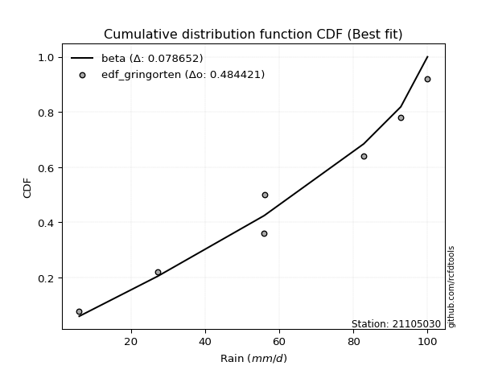</img></img>

</div>


### 9. Empirical - EDF Filliben (1975)

The specific values of the constants (0.3175) (often denoted as $alpha$) and (0.365) are derived from a method proposed by James J. Filliben in a 1975 paper. This particular formula is the mean value of the $i$-th order statistic of the normal distribution and is considered a robust and effective plotting position formula for the normal probability plot correlation coefficient test for normality.

<div align="center">


$P=(m-0.3175)/(n+0.365)$


</div>


**9.1. Empirical values**

<div align="center">

|                | 0                   | 1                   | 2                   | 3            | 4                  | 5                  | 6                  |
|:---------------|:--------------------|:--------------------|:--------------------|:-------------|:-------------------|:-------------------|:-------------------|
| date           | 2023                | 2022                | 2025                | 2019         | 2021               | 2020               | 2024               |
| x              | 6.0                 | 27.2                | 38.4                | 55.8         | 56.0               | 92.8               | 100.0              |
| m              | 1                   | 2                   | 3                   | 4            | 5                  | 6                  | 7                  |
| empirical_dist | edf_filliben        | edf_filliben        | edf_filliben        | edf_filliben | edf_filliben       | edf_filliben       | edf_filliben       |
| empirical      | 0.09266802443991853 | 0.22844534962661237 | 0.36422267481330617 | 0.5          | 0.6357773251866938 | 0.7715546503733877 | 0.9073319755600815 |
| empirical_tr   | 1.1021324354657687  | 1.2960844698636163  | 1.5728777362520021  | 2.0          | 2.7455731593662627 | 4.377414561664191  | 10.791208791208794 |

</div>


**9.2. Kolmogorov-Smirnov fit test (sorted by Δ)**


<div align="center">

|                | 0                   | 1                   | 2                   | 3                   | 4                   | 5                   | 6                   | 7                   | 8                   | 9                   | 10                  | 11                  | 12                  | 13                  | 14                  | 15                  | 16                  | 17                  | 18                  | 19                  | 20                  | 21                  | 22                  | 23                  | 24                  | 25                  | 26                  | 27                  | 28                  | 29                  | 30                  | 31                  | 32                  | 33                    | 34                  | 35                  | 36                  | 37                  | 38                  | 39                  | 40                  | 41                  | 42                  | 43                  | 44                  | 45                  | 46                  | 47                  | 48                  | 49                  | 50                  | 51                  | 52                  | 53                  | 54                  | 55                  | 56                  | 57                  | 58                  | 59                  | 60                  | 61                  | 62                  | 63                  | 64                  | 65                  | 66                  | 67                  | 68                  | 69                  | 70                  | 71                  | 72                  | 73                  | 74                  | 75                  | 76                  | 77                  | 78                  | 79                  | 80                  | 81                  | 82                  | 83                  | 84                  | 85                  | 86                  | 87                  | 88                  | 89                  |
|:---------------|:--------------------|:--------------------|:--------------------|:--------------------|:--------------------|:--------------------|:--------------------|:--------------------|:--------------------|:--------------------|:--------------------|:--------------------|:--------------------|:--------------------|:--------------------|:--------------------|:--------------------|:--------------------|:--------------------|:--------------------|:--------------------|:--------------------|:--------------------|:--------------------|:--------------------|:--------------------|:--------------------|:--------------------|:--------------------|:--------------------|:--------------------|:--------------------|:--------------------|:----------------------|:--------------------|:--------------------|:--------------------|:--------------------|:--------------------|:--------------------|:--------------------|:--------------------|:--------------------|:--------------------|:--------------------|:--------------------|:--------------------|:--------------------|:--------------------|:--------------------|:--------------------|:--------------------|:--------------------|:--------------------|:--------------------|:--------------------|:--------------------|:--------------------|:--------------------|:--------------------|:--------------------|:--------------------|:--------------------|:--------------------|:--------------------|:--------------------|:--------------------|:--------------------|:--------------------|:--------------------|:--------------------|:--------------------|:--------------------|:--------------------|:--------------------|:--------------------|:--------------------|:--------------------|:--------------------|:--------------------|:--------------------|:--------------------|:--------------------|:--------------------|:--------------------|:--------------------|:--------------------|:--------------------|:--------------------|:--------------------|
| station        | 21105030            | 21105030            | 21105030            | 21105030            | 21105030            | 21105030            | 21105030            | 21105030            | 21105030            | 21105030            | 21105030            | 21105030            | 21105030            | 21105030            | 21105030            | 21105030            | 21105030            | 21105030            | 21105030            | 21105030            | 21105030            | 21105030            | 21105030            | 21105030            | 21105030            | 21105030            | 21105030            | 21105030            | 21105030            | 21105030            | 21105030            | 21105030            | 21105030            | 21105030              | 21105030            | 21105030            | 21105030            | 21105030            | 21105030            | 21105030            | 21105030            | 21105030            | 21105030            | 21105030            | 21105030            | 21105030            | 21105030            | 21105030            | 21105030            | 21105030            | 21105030            | 21105030            | 21105030            | 21105030            | 21105030            | 21105030            | 21105030            | 21105030            | 21105030            | 21105030            | 21105030            | 21105030            | 21105030            | 21105030            | 21105030            | 21105030            | 21105030            | 21105030            | 21105030            | 21105030            | 21105030            | 21105030            | 21105030            | 21105030            | 21105030            | 21105030            | 21105030            | 21105030            | 21105030            | 21105030            | 21105030            | 21105030            | 21105030            | 21105030            | 21105030            | 21105030            | 21105030            | 21105030            | 21105030            | 21105030            |
| empirical_dist | edf_filliben        | edf_filliben        | edf_filliben        | edf_filliben        | edf_filliben        | edf_filliben        | edf_filliben        | edf_filliben        | edf_filliben        | edf_filliben        | edf_filliben        | edf_filliben        | edf_filliben        | edf_filliben        | edf_filliben        | edf_filliben        | edf_filliben        | edf_filliben        | edf_filliben        | edf_filliben        | edf_filliben        | edf_filliben        | edf_filliben        | edf_filliben        | edf_filliben        | edf_filliben        | edf_filliben        | edf_filliben        | edf_filliben        | edf_filliben        | edf_filliben        | edf_filliben        | edf_filliben        | edf_filliben          | edf_filliben        | edf_filliben        | edf_filliben        | edf_filliben        | edf_filliben        | edf_filliben        | edf_filliben        | edf_filliben        | edf_filliben        | edf_filliben        | edf_filliben        | edf_filliben        | edf_filliben        | edf_filliben        | edf_filliben        | edf_filliben        | edf_filliben        | edf_filliben        | edf_filliben        | edf_filliben        | edf_filliben        | edf_filliben        | edf_filliben        | edf_filliben        | edf_filliben        | edf_filliben        | edf_filliben        | edf_filliben        | edf_filliben        | edf_filliben        | edf_filliben        | edf_filliben        | edf_filliben        | edf_filliben        | edf_filliben        | edf_filliben        | edf_filliben        | edf_filliben        | edf_filliben        | edf_filliben        | edf_filliben        | edf_filliben        | edf_filliben        | edf_filliben        | edf_filliben        | edf_filliben        | edf_filliben        | edf_filliben        | edf_filliben        | edf_filliben        | edf_filliben        | edf_filliben        | edf_filliben        | edf_filliben        | edf_filliben        | edf_filliben        |
| p_dist         | logpearson3         | logt                | loggumbel_l         | logfisk             | invweibull          | genlogistic         | kstwobign           | loggompertz         | halfnorm            | fisk                | ncf                 | weibull_min         | rayleigh            | invgauss            | invgamma            | f                   | betaprime           | maxwell             | rice                | pearson3            | erlang              | gumbel_r            | gamma               | exponnorm           | nct                 | truncnorm           | norm                | t                   | moyal               | halflogistic        | laplace_asymmetric  | johnsonsu           | logistic            | loglaplace_asymmetric | hypsecant           | logncf              | logfatiguelife      | logf                | logrice             | lognorm             | lognorm             | logcrystalball      | logexponnorm        | lognct              | logloggamma         | laplace             | logbetaprime        | logerlang           | expon               | loggamma            | loggamma            | genexpon            | loginvgamma         | logmielke           | logalpha            | loglogistic         | loginvgauss         | logmaxwell          | mielke              | lograyleigh         | loghypsecant        | loginvweibull       | gumbel_l            | loghalfnorm         | loglaplace          | wald                | loggumbel_r         | loggenexpon         | logkstwobign        | logjohnsonsu        | loghalflogistic     | logmoyal            | logtruncnorm        | nakagami            | gibrat              | lognakagami         | logwald             | loggibrat           | logexpon            | alpha               | pareto              | loglognorm          | logpareto           | crystalball         | logweibull_min      | fatiguelife         | logchi2             | gompertz            | chi2                | loggenlogistic      |
| delta          | 0.07470322946053143 | 0.08225593629087458 | 0.08888474431169868 | 0.09598776875064041 | 0.09641873407199464 | 0.09821834064974155 | 0.10305767918270636 | 0.10542148679911856 | 0.10685304484268077 | 0.10765614648991062 | 0.11035740618137313 | 0.11036105160057641 | 0.11075683056503915 | 0.11088368532420356 | 0.11100781871078191 | 0.11174344073140141 | 0.11215846927830575 | 0.11307490683473942 | 0.11376285778824335 | 0.11989279067650149 | 0.12003890918868099 | 0.12089467090999773 | 0.12130720055185285 | 0.12176963042478217 | 0.12179749534524098 | 0.12180056905709713 | 0.12180057152476809 | 0.12180142650237136 | 0.12265407274409079 | 0.12397172278310287 | 0.12418467101153119 | 0.12504850352132046 | 0.13373243427981074 | 0.13379926463583713   | 0.13891460950236978 | 0.13909334236786752 | 0.13922314462975482 | 0.13922629563834654 | 0.13990689963414205 | 0.13990760065578445 | 0.13990760065578445 | 0.13990765457179066 | 0.13990867366691917 | 0.14028874545283554 | 0.14210893797662993 | 0.14243056622144756 | 0.1461332563529326  | 0.14712735727764714 | 0.14763509248395634 | 0.14769491987357986 | 0.14769491987357986 | 0.14783701193992016 | 0.15078927576921564 | 0.15197197401243756 | 0.15374987469695944 | 0.1569483496764036  | 0.1606896828144353  | 0.16260342482576695 | 0.16715578762901173 | 0.16946881065052    | 0.17034038528289308 | 0.1751298725618163  | 0.1760309824798092  | 0.1893306881466602  | 0.19872602172909848 | 0.20066520339398305 | 0.20142294878077704 | 0.2019442587232607  | 0.2124516832830932  | 0.21702120865626434 | 0.2175775689203373  | 0.2219019252267962  | 0.2284404904660974  | 0.2284451269883248  | 0.22844534962661237 | 0.26459083762695734 | 0.27966812055388746 | 0.31191236142887235 | 0.31795629055293184 | 0.34804717334675794 | 0.4130845734349663  | 0.41948470968751317 | 0.44040458240107716 | 0.445834107986402   | 0.47181578266997337 | 0.4810348351781295  | 0.49873199500898513 | 0.6357622041681688  | 0.6980275730717248  | 0.7715546503733877  |
| deltao         | 0.48442053926100004 | 0.48442053926100004 | 0.48442053926100004 | 0.48442053926100004 | 0.48442053926100004 | 0.48442053926100004 | 0.48442053926100004 | 0.48442053926100004 | 0.48442053926100004 | 0.48442053926100004 | 0.48442053926100004 | 0.48442053926100004 | 0.48442053926100004 | 0.48442053926100004 | 0.48442053926100004 | 0.48442053926100004 | 0.48442053926100004 | 0.48442053926100004 | 0.48442053926100004 | 0.48442053926100004 | 0.48442053926100004 | 0.48442053926100004 | 0.48442053926100004 | 0.48442053926100004 | 0.48442053926100004 | 0.48442053926100004 | 0.48442053926100004 | 0.48442053926100004 | 0.48442053926100004 | 0.48442053926100004 | 0.48442053926100004 | 0.48442053926100004 | 0.48442053926100004 | 0.48442053926100004   | 0.48442053926100004 | 0.48442053926100004 | 0.48442053926100004 | 0.48442053926100004 | 0.48442053926100004 | 0.48442053926100004 | 0.48442053926100004 | 0.48442053926100004 | 0.48442053926100004 | 0.48442053926100004 | 0.48442053926100004 | 0.48442053926100004 | 0.48442053926100004 | 0.48442053926100004 | 0.48442053926100004 | 0.48442053926100004 | 0.48442053926100004 | 0.48442053926100004 | 0.48442053926100004 | 0.48442053926100004 | 0.48442053926100004 | 0.48442053926100004 | 0.48442053926100004 | 0.48442053926100004 | 0.48442053926100004 | 0.48442053926100004 | 0.48442053926100004 | 0.48442053926100004 | 0.48442053926100004 | 0.48442053926100004 | 0.48442053926100004 | 0.48442053926100004 | 0.48442053926100004 | 0.48442053926100004 | 0.48442053926100004 | 0.48442053926100004 | 0.48442053926100004 | 0.48442053926100004 | 0.48442053926100004 | 0.48442053926100004 | 0.48442053926100004 | 0.48442053926100004 | 0.48442053926100004 | 0.48442053926100004 | 0.48442053926100004 | 0.48442053926100004 | 0.48442053926100004 | 0.48442053926100004 | 0.48442053926100004 | 0.48442053926100004 | 0.48442053926100004 | 0.48442053926100004 | 0.48442053926100004 | 0.48442053926100004 | 0.48442053926100004 | 0.48442053926100004 |
| eval           | Δo > Δ              | Δo > Δ              | Δo > Δ              | Δo > Δ              | Δo > Δ              | Δo > Δ              | Δo > Δ              | Δo > Δ              | Δo > Δ              | Δo > Δ              | Δo > Δ              | Δo > Δ              | Δo > Δ              | Δo > Δ              | Δo > Δ              | Δo > Δ              | Δo > Δ              | Δo > Δ              | Δo > Δ              | Δo > Δ              | Δo > Δ              | Δo > Δ              | Δo > Δ              | Δo > Δ              | Δo > Δ              | Δo > Δ              | Δo > Δ              | Δo > Δ              | Δo > Δ              | Δo > Δ              | Δo > Δ              | Δo > Δ              | Δo > Δ              | Δo > Δ                | Δo > Δ              | Δo > Δ              | Δo > Δ              | Δo > Δ              | Δo > Δ              | Δo > Δ              | Δo > Δ              | Δo > Δ              | Δo > Δ              | Δo > Δ              | Δo > Δ              | Δo > Δ              | Δo > Δ              | Δo > Δ              | Δo > Δ              | Δo > Δ              | Δo > Δ              | Δo > Δ              | Δo > Δ              | Δo > Δ              | Δo > Δ              | Δo > Δ              | Δo > Δ              | Δo > Δ              | Δo > Δ              | Δo > Δ              | Δo > Δ              | Δo > Δ              | Δo > Δ              | Δo > Δ              | Δo > Δ              | Δo > Δ              | Δo > Δ              | Δo > Δ              | Δo > Δ              | Δo > Δ              | Δo > Δ              | Δo > Δ              | Δo > Δ              | Δo > Δ              | Δo > Δ              | Δo > Δ              | Δo > Δ              | Δo > Δ              | Δo > Δ              | Δo > Δ              | Δo > Δ              | Δo > Δ              | Δo > Δ              | Δo > Δ              | Δo > Δ              | Δo > Δ              | Δo <= Δ             | Δo <= Δ             | Δo <= Δ             | Δo <= Δ             |
| fit            | 1                   | 1                   | 1                   | 1                   | 1                   | 1                   | 1                   | 1                   | 1                   | 1                   | 1                   | 1                   | 1                   | 1                   | 1                   | 1                   | 1                   | 1                   | 1                   | 1                   | 1                   | 1                   | 1                   | 1                   | 1                   | 1                   | 1                   | 1                   | 1                   | 1                   | 1                   | 1                   | 1                   | 1                     | 1                   | 1                   | 1                   | 1                   | 1                   | 1                   | 1                   | 1                   | 1                   | 1                   | 1                   | 1                   | 1                   | 1                   | 1                   | 1                   | 1                   | 1                   | 1                   | 1                   | 1                   | 1                   | 1                   | 1                   | 1                   | 1                   | 1                   | 1                   | 1                   | 1                   | 1                   | 1                   | 1                   | 1                   | 1                   | 1                   | 1                   | 1                   | 1                   | 1                   | 1                   | 1                   | 1                   | 1                   | 1                   | 1                   | 1                   | 1                   | 1                   | 1                   | 1                   | 1                   | 0                   | 0                   | 0                   | 0                   |
| n              | 7                   | 7                   | 7                   | 7                   | 7                   | 7                   | 7                   | 7                   | 7                   | 7                   | 7                   | 7                   | 7                   | 7                   | 7                   | 7                   | 7                   | 7                   | 7                   | 7                   | 7                   | 7                   | 7                   | 7                   | 7                   | 7                   | 7                   | 7                   | 7                   | 7                   | 7                   | 7                   | 7                   | 7                     | 7                   | 7                   | 7                   | 7                   | 7                   | 7                   | 7                   | 7                   | 7                   | 7                   | 7                   | 7                   | 7                   | 7                   | 7                   | 7                   | 7                   | 7                   | 7                   | 7                   | 7                   | 7                   | 7                   | 7                   | 7                   | 7                   | 7                   | 7                   | 7                   | 7                   | 7                   | 7                   | 7                   | 7                   | 7                   | 7                   | 7                   | 7                   | 7                   | 7                   | 7                   | 7                   | 7                   | 7                   | 7                   | 7                   | 7                   | 7                   | 7                   | 7                   | 7                   | 7                   | 7                   | 7                   | 7                   | 7                   |
| best_fit       | 1                   | 0                   | 0                   | 0                   | 0                   | 0                   | 0                   | 0                   | 0                   | 0                   | 0                   | 0                   | 0                   | 0                   | 0                   | 0                   | 0                   | 0                   | 0                   | 0                   | 0                   | 0                   | 0                   | 0                   | 0                   | 0                   | 0                   | 0                   | 0                   | 0                   | 0                   | 0                   | 0                   | 0                     | 0                   | 0                   | 0                   | 0                   | 0                   | 0                   | 0                   | 0                   | 0                   | 0                   | 0                   | 0                   | 0                   | 0                   | 0                   | 0                   | 0                   | 0                   | 0                   | 0                   | 0                   | 0                   | 0                   | 0                   | 0                   | 0                   | 0                   | 0                   | 0                   | 0                   | 0                   | 0                   | 0                   | 0                   | 0                   | 0                   | 0                   | 0                   | 0                   | 0                   | 0                   | 0                   | 0                   | 0                   | 0                   | 0                   | 0                   | 0                   | 0                   | 0                   | 0                   | 0                   | 0                   | 0                   | 0                   | 0                   |
| best_fit_sort  | 1                   | 2                   | 3                   | 4                   | 5                   | 6                   | 7                   | 8                   | 9                   | 10                  | 11                  | 12                  | 13                  | 14                  | 15                  | 16                  | 17                  | 18                  | 19                  | 20                  | 21                  | 22                  | 23                  | 24                  | 25                  | 26                  | 27                  | 28                  | 29                  | 30                  | 31                  | 32                  | 33                  | 34                    | 35                  | 36                  | 37                  | 38                  | 39                  | 40                  | 41                  | 42                  | 43                  | 44                  | 45                  | 46                  | 47                  | 48                  | 49                  | 50                  | 51                  | 52                  | 53                  | 54                  | 55                  | 56                  | 57                  | 58                  | 59                  | 60                  | 61                  | 62                  | 63                  | 64                  | 65                  | 66                  | 67                  | 68                  | 69                  | 70                  | 71                  | 72                  | 73                  | 74                  | 75                  | 76                  | 77                  | 78                  | 79                  | 80                  | 81                  | 82                  | 83                  | 84                  | 85                  | 86                  | 87                  | 88                  | 89                  | 90                  |

</div>


<div align="center">

</img>

</div>


**9.3. Best fit**

<div align="center">

|   id |   station | empirical_dist   | p_dist      |     delta |   deltao | eval   |   fit |   n |   best_fit |   best_fit_sort |
|-----:|----------:|:-----------------|:------------|----------:|---------:|:-------|------:|----:|-----------:|----------------:|
|    0 |  21105030 | edf_filliben     | logpearson3 | 0.0747032 | 0.484421 | Δo > Δ |     1 |   7 |          1 |               1 |

</div>


<div align="center">

</img></img>

</div>


### 10. Empirical - EDF Jenkinson (1977)

The Jenkinson formula in hydrology is an empirical plotting position formula used to estimate the non-exceedance probability _(P)_ or return period _(T)_ of a given ordered observation within a sample. It is a widely used method in the frequency analysis of extreme events such as floods and rainfall, as it provides a distribution-free way to plot data. _a≈0.31_ and _b≈0.38_ are constants derived to approximate the median of the probability distribution for the given rank.

<div align="center">


$P=(m-a)/(n+b)$


</div>


**10.1. Empirical values**

<div align="center">

|                | 0                   | 1                   | 2                   | 3             | 4                  | 5                  | 6                  |
|:---------------|:--------------------|:--------------------|:--------------------|:--------------|:-------------------|:-------------------|:-------------------|
| date           | 2023                | 2022                | 2025                | 2019          | 2021               | 2020               | 2024               |
| x              | 6.0                 | 27.2                | 38.4                | 55.8          | 56.0               | 92.8               | 100.0              |
| m              | 1                   | 2                   | 3                   | 4             | 5                  | 6                  | 7                  |
| empirical_dist | edf_jenkinson       | edf_jenkinson       | edf_jenkinson       | edf_jenkinson | edf_jenkinson      | edf_jenkinson      | edf_jenkinson      |
| empirical      | 0.09349593495934959 | 0.22899728997289973 | 0.36449864498644985 | 0.5           | 0.6355013550135502 | 0.7710027100271003 | 0.9065040650406505 |
| empirical_tr   | 1.1031390134529149  | 1.29701230228471    | 1.5735607675906182  | 2.0           | 2.743494423791822  | 4.366863905325444  | 10.695652173913055 |

</div>


**10.2. Kolmogorov-Smirnov fit test (sorted by Δ)**


<div align="center">

|                | 0                   | 1                   | 2                   | 3                   | 4                   | 5                   | 6                   | 7                   | 8                   | 9                   | 10                  | 11                  | 12                  | 13                  | 14                  | 15                  | 16                  | 17                  | 18                  | 19                  | 20                  | 21                  | 22                  | 23                  | 24                  | 25                  | 26                  | 27                  | 28                  | 29                  | 30                  | 31                  | 32                    | 33                  | 34                  | 35                  | 36                  | 37                  | 38                  | 39                  | 40                  | 41                  | 42                  | 43                  | 44                  | 45                  | 46                  | 47                  | 48                  | 49                  | 50                  | 51                  | 52                  | 53                  | 54                  | 55                  | 56                  | 57                  | 58                  | 59                  | 60                  | 61                  | 62                  | 63                  | 64                  | 65                  | 66                  | 67                  | 68                  | 69                  | 70                  | 71                  | 72                  | 73                  | 74                  | 75                  | 76                  | 77                  | 78                  | 79                  | 80                  | 81                  | 82                  | 83                  | 84                  | 85                  | 86                  | 87                  | 88                  | 89                  |
|:---------------|:--------------------|:--------------------|:--------------------|:--------------------|:--------------------|:--------------------|:--------------------|:--------------------|:--------------------|:--------------------|:--------------------|:--------------------|:--------------------|:--------------------|:--------------------|:--------------------|:--------------------|:--------------------|:--------------------|:--------------------|:--------------------|:--------------------|:--------------------|:--------------------|:--------------------|:--------------------|:--------------------|:--------------------|:--------------------|:--------------------|:--------------------|:--------------------|:----------------------|:--------------------|:--------------------|:--------------------|:--------------------|:--------------------|:--------------------|:--------------------|:--------------------|:--------------------|:--------------------|:--------------------|:--------------------|:--------------------|:--------------------|:--------------------|:--------------------|:--------------------|:--------------------|:--------------------|:--------------------|:--------------------|:--------------------|:--------------------|:--------------------|:--------------------|:--------------------|:--------------------|:--------------------|:--------------------|:--------------------|:--------------------|:--------------------|:--------------------|:--------------------|:--------------------|:--------------------|:--------------------|:--------------------|:--------------------|:--------------------|:--------------------|:--------------------|:--------------------|:--------------------|:--------------------|:--------------------|:--------------------|:--------------------|:--------------------|:--------------------|:--------------------|:--------------------|:--------------------|:--------------------|:--------------------|:--------------------|:--------------------|
| station        | 21105030            | 21105030            | 21105030            | 21105030            | 21105030            | 21105030            | 21105030            | 21105030            | 21105030            | 21105030            | 21105030            | 21105030            | 21105030            | 21105030            | 21105030            | 21105030            | 21105030            | 21105030            | 21105030            | 21105030            | 21105030            | 21105030            | 21105030            | 21105030            | 21105030            | 21105030            | 21105030            | 21105030            | 21105030            | 21105030            | 21105030            | 21105030            | 21105030              | 21105030            | 21105030            | 21105030            | 21105030            | 21105030            | 21105030            | 21105030            | 21105030            | 21105030            | 21105030            | 21105030            | 21105030            | 21105030            | 21105030            | 21105030            | 21105030            | 21105030            | 21105030            | 21105030            | 21105030            | 21105030            | 21105030            | 21105030            | 21105030            | 21105030            | 21105030            | 21105030            | 21105030            | 21105030            | 21105030            | 21105030            | 21105030            | 21105030            | 21105030            | 21105030            | 21105030            | 21105030            | 21105030            | 21105030            | 21105030            | 21105030            | 21105030            | 21105030            | 21105030            | 21105030            | 21105030            | 21105030            | 21105030            | 21105030            | 21105030            | 21105030            | 21105030            | 21105030            | 21105030            | 21105030            | 21105030            | 21105030            |
| empirical_dist | edf_jenkinson       | edf_jenkinson       | edf_jenkinson       | edf_jenkinson       | edf_jenkinson       | edf_jenkinson       | edf_jenkinson       | edf_jenkinson       | edf_jenkinson       | edf_jenkinson       | edf_jenkinson       | edf_jenkinson       | edf_jenkinson       | edf_jenkinson       | edf_jenkinson       | edf_jenkinson       | edf_jenkinson       | edf_jenkinson       | edf_jenkinson       | edf_jenkinson       | edf_jenkinson       | edf_jenkinson       | edf_jenkinson       | edf_jenkinson       | edf_jenkinson       | edf_jenkinson       | edf_jenkinson       | edf_jenkinson       | edf_jenkinson       | edf_jenkinson       | edf_jenkinson       | edf_jenkinson       | edf_jenkinson         | edf_jenkinson       | edf_jenkinson       | edf_jenkinson       | edf_jenkinson       | edf_jenkinson       | edf_jenkinson       | edf_jenkinson       | edf_jenkinson       | edf_jenkinson       | edf_jenkinson       | edf_jenkinson       | edf_jenkinson       | edf_jenkinson       | edf_jenkinson       | edf_jenkinson       | edf_jenkinson       | edf_jenkinson       | edf_jenkinson       | edf_jenkinson       | edf_jenkinson       | edf_jenkinson       | edf_jenkinson       | edf_jenkinson       | edf_jenkinson       | edf_jenkinson       | edf_jenkinson       | edf_jenkinson       | edf_jenkinson       | edf_jenkinson       | edf_jenkinson       | edf_jenkinson       | edf_jenkinson       | edf_jenkinson       | edf_jenkinson       | edf_jenkinson       | edf_jenkinson       | edf_jenkinson       | edf_jenkinson       | edf_jenkinson       | edf_jenkinson       | edf_jenkinson       | edf_jenkinson       | edf_jenkinson       | edf_jenkinson       | edf_jenkinson       | edf_jenkinson       | edf_jenkinson       | edf_jenkinson       | edf_jenkinson       | edf_jenkinson       | edf_jenkinson       | edf_jenkinson       | edf_jenkinson       | edf_jenkinson       | edf_jenkinson       | edf_jenkinson       | edf_jenkinson       |
| p_dist         | logpearson3         | logt                | loggumbel_l         | logfisk             | invweibull          | genlogistic         | kstwobign           | loggompertz         | halfnorm            | fisk                | ncf                 | weibull_min         | rayleigh            | invgauss            | invgamma            | f                   | betaprime           | maxwell             | rice                | pearson3            | erlang              | gumbel_r            | gamma               | exponnorm           | nct                 | truncnorm           | norm                | t                   | moyal               | halflogistic        | laplace_asymmetric  | johnsonsu           | loglaplace_asymmetric | logistic            | logncf              | logfatiguelife      | logf                | hypsecant           | logrice             | lognorm             | lognorm             | logcrystalball      | logexponnorm        | lognct              | logloggamma         | laplace             | logbetaprime        | logerlang           | expon               | loggamma            | loggamma            | genexpon            | loginvgamma         | logmielke           | logalpha            | loglogistic         | loginvgauss         | logmaxwell          | mielke              | lograyleigh         | loghypsecant        | loginvweibull       | gumbel_l            | loghalfnorm         | loglaplace          | wald                | loggenexpon         | loggumbel_r         | logkstwobign        | logjohnsonsu        | loghalflogistic     | logmoyal            | logtruncnorm        | nakagami            | gibrat              | lognakagami         | logwald             | loggibrat           | logexpon            | alpha               | pareto              | loglognorm          | logpareto           | crystalball         | logweibull_min      | fatiguelife         | logchi2             | gompertz            | chi2                | loggenlogistic      |
| delta          | 0.07470322946053143 | 0.08197996611773095 | 0.08888474431169868 | 0.09598776875064041 | 0.096970674418282   | 0.09877028099602891 | 0.10360961952899372 | 0.10542148679911856 | 0.10740498518896813 | 0.10820808683619798 | 0.11035740618137313 | 0.11091299194686377 | 0.11130877091132652 | 0.11143562567049092 | 0.11155975905706927 | 0.11229538107768877 | 0.11271040962459311 | 0.11362684718102678 | 0.11431479813453072 | 0.12044473102278885 | 0.12059084953496835 | 0.12144661125628509 | 0.1218591408981402  | 0.12232157077106953 | 0.12234943569152834 | 0.12235250940338449 | 0.12235251187105545 | 0.12235336684865872 | 0.12320601309037815 | 0.12397172278310287 | 0.12473661135781855 | 0.12560044386760782 | 0.13379926463583713   | 0.1342843746260981  | 0.13909334236786752 | 0.13922314462975482 | 0.13922629563834654 | 0.13946654984865714 | 0.13990689963414205 | 0.13990760065578445 | 0.13990760065578445 | 0.13990765457179066 | 0.13990867366691917 | 0.14028874545283554 | 0.1426608783229173  | 0.14298250656773492 | 0.14558131600664523 | 0.14712735727764714 | 0.14763509248395634 | 0.14769491987357986 | 0.14769491987357986 | 0.14783701193992016 | 0.15078927576921564 | 0.15252391435872492 | 0.15374987469695944 | 0.1569483496764036  | 0.1606896828144353  | 0.16260342482576695 | 0.1677077279752991  | 0.16946881065052    | 0.17034038528289308 | 0.17457793221552895 | 0.17575501230666557 | 0.1893306881466602  | 0.19872602172909848 | 0.20121714374027042 | 0.20139231837697333 | 0.20142294878077704 | 0.21189974293680583 | 0.21674523848312072 | 0.2175775689203373  | 0.2219019252267962  | 0.22899243081238477 | 0.22899706733461217 | 0.22899728997289973 | 0.26459083762695734 | 0.27966812055388746 | 0.31191236142887235 | 0.3174043502066445  | 0.3474952330004706  | 0.41253263308867893 | 0.4189327693412258  | 0.4398526420547898  | 0.4450061974669709  | 0.471263842323686   | 0.48048289483184214 | 0.49818005466269777 | 0.6354862339950251  | 0.6974756327254374  | 0.7710027100271003  |
| deltao         | 0.48442053926100004 | 0.48442053926100004 | 0.48442053926100004 | 0.48442053926100004 | 0.48442053926100004 | 0.48442053926100004 | 0.48442053926100004 | 0.48442053926100004 | 0.48442053926100004 | 0.48442053926100004 | 0.48442053926100004 | 0.48442053926100004 | 0.48442053926100004 | 0.48442053926100004 | 0.48442053926100004 | 0.48442053926100004 | 0.48442053926100004 | 0.48442053926100004 | 0.48442053926100004 | 0.48442053926100004 | 0.48442053926100004 | 0.48442053926100004 | 0.48442053926100004 | 0.48442053926100004 | 0.48442053926100004 | 0.48442053926100004 | 0.48442053926100004 | 0.48442053926100004 | 0.48442053926100004 | 0.48442053926100004 | 0.48442053926100004 | 0.48442053926100004 | 0.48442053926100004   | 0.48442053926100004 | 0.48442053926100004 | 0.48442053926100004 | 0.48442053926100004 | 0.48442053926100004 | 0.48442053926100004 | 0.48442053926100004 | 0.48442053926100004 | 0.48442053926100004 | 0.48442053926100004 | 0.48442053926100004 | 0.48442053926100004 | 0.48442053926100004 | 0.48442053926100004 | 0.48442053926100004 | 0.48442053926100004 | 0.48442053926100004 | 0.48442053926100004 | 0.48442053926100004 | 0.48442053926100004 | 0.48442053926100004 | 0.48442053926100004 | 0.48442053926100004 | 0.48442053926100004 | 0.48442053926100004 | 0.48442053926100004 | 0.48442053926100004 | 0.48442053926100004 | 0.48442053926100004 | 0.48442053926100004 | 0.48442053926100004 | 0.48442053926100004 | 0.48442053926100004 | 0.48442053926100004 | 0.48442053926100004 | 0.48442053926100004 | 0.48442053926100004 | 0.48442053926100004 | 0.48442053926100004 | 0.48442053926100004 | 0.48442053926100004 | 0.48442053926100004 | 0.48442053926100004 | 0.48442053926100004 | 0.48442053926100004 | 0.48442053926100004 | 0.48442053926100004 | 0.48442053926100004 | 0.48442053926100004 | 0.48442053926100004 | 0.48442053926100004 | 0.48442053926100004 | 0.48442053926100004 | 0.48442053926100004 | 0.48442053926100004 | 0.48442053926100004 | 0.48442053926100004 |
| eval           | Δo > Δ              | Δo > Δ              | Δo > Δ              | Δo > Δ              | Δo > Δ              | Δo > Δ              | Δo > Δ              | Δo > Δ              | Δo > Δ              | Δo > Δ              | Δo > Δ              | Δo > Δ              | Δo > Δ              | Δo > Δ              | Δo > Δ              | Δo > Δ              | Δo > Δ              | Δo > Δ              | Δo > Δ              | Δo > Δ              | Δo > Δ              | Δo > Δ              | Δo > Δ              | Δo > Δ              | Δo > Δ              | Δo > Δ              | Δo > Δ              | Δo > Δ              | Δo > Δ              | Δo > Δ              | Δo > Δ              | Δo > Δ              | Δo > Δ                | Δo > Δ              | Δo > Δ              | Δo > Δ              | Δo > Δ              | Δo > Δ              | Δo > Δ              | Δo > Δ              | Δo > Δ              | Δo > Δ              | Δo > Δ              | Δo > Δ              | Δo > Δ              | Δo > Δ              | Δo > Δ              | Δo > Δ              | Δo > Δ              | Δo > Δ              | Δo > Δ              | Δo > Δ              | Δo > Δ              | Δo > Δ              | Δo > Δ              | Δo > Δ              | Δo > Δ              | Δo > Δ              | Δo > Δ              | Δo > Δ              | Δo > Δ              | Δo > Δ              | Δo > Δ              | Δo > Δ              | Δo > Δ              | Δo > Δ              | Δo > Δ              | Δo > Δ              | Δo > Δ              | Δo > Δ              | Δo > Δ              | Δo > Δ              | Δo > Δ              | Δo > Δ              | Δo > Δ              | Δo > Δ              | Δo > Δ              | Δo > Δ              | Δo > Δ              | Δo > Δ              | Δo > Δ              | Δo > Δ              | Δo > Δ              | Δo > Δ              | Δo > Δ              | Δo > Δ              | Δo <= Δ             | Δo <= Δ             | Δo <= Δ             | Δo <= Δ             |
| fit            | 1                   | 1                   | 1                   | 1                   | 1                   | 1                   | 1                   | 1                   | 1                   | 1                   | 1                   | 1                   | 1                   | 1                   | 1                   | 1                   | 1                   | 1                   | 1                   | 1                   | 1                   | 1                   | 1                   | 1                   | 1                   | 1                   | 1                   | 1                   | 1                   | 1                   | 1                   | 1                   | 1                     | 1                   | 1                   | 1                   | 1                   | 1                   | 1                   | 1                   | 1                   | 1                   | 1                   | 1                   | 1                   | 1                   | 1                   | 1                   | 1                   | 1                   | 1                   | 1                   | 1                   | 1                   | 1                   | 1                   | 1                   | 1                   | 1                   | 1                   | 1                   | 1                   | 1                   | 1                   | 1                   | 1                   | 1                   | 1                   | 1                   | 1                   | 1                   | 1                   | 1                   | 1                   | 1                   | 1                   | 1                   | 1                   | 1                   | 1                   | 1                   | 1                   | 1                   | 1                   | 1                   | 1                   | 0                   | 0                   | 0                   | 0                   |
| n              | 7                   | 7                   | 7                   | 7                   | 7                   | 7                   | 7                   | 7                   | 7                   | 7                   | 7                   | 7                   | 7                   | 7                   | 7                   | 7                   | 7                   | 7                   | 7                   | 7                   | 7                   | 7                   | 7                   | 7                   | 7                   | 7                   | 7                   | 7                   | 7                   | 7                   | 7                   | 7                   | 7                     | 7                   | 7                   | 7                   | 7                   | 7                   | 7                   | 7                   | 7                   | 7                   | 7                   | 7                   | 7                   | 7                   | 7                   | 7                   | 7                   | 7                   | 7                   | 7                   | 7                   | 7                   | 7                   | 7                   | 7                   | 7                   | 7                   | 7                   | 7                   | 7                   | 7                   | 7                   | 7                   | 7                   | 7                   | 7                   | 7                   | 7                   | 7                   | 7                   | 7                   | 7                   | 7                   | 7                   | 7                   | 7                   | 7                   | 7                   | 7                   | 7                   | 7                   | 7                   | 7                   | 7                   | 7                   | 7                   | 7                   | 7                   |
| best_fit       | 1                   | 0                   | 0                   | 0                   | 0                   | 0                   | 0                   | 0                   | 0                   | 0                   | 0                   | 0                   | 0                   | 0                   | 0                   | 0                   | 0                   | 0                   | 0                   | 0                   | 0                   | 0                   | 0                   | 0                   | 0                   | 0                   | 0                   | 0                   | 0                   | 0                   | 0                   | 0                   | 0                     | 0                   | 0                   | 0                   | 0                   | 0                   | 0                   | 0                   | 0                   | 0                   | 0                   | 0                   | 0                   | 0                   | 0                   | 0                   | 0                   | 0                   | 0                   | 0                   | 0                   | 0                   | 0                   | 0                   | 0                   | 0                   | 0                   | 0                   | 0                   | 0                   | 0                   | 0                   | 0                   | 0                   | 0                   | 0                   | 0                   | 0                   | 0                   | 0                   | 0                   | 0                   | 0                   | 0                   | 0                   | 0                   | 0                   | 0                   | 0                   | 0                   | 0                   | 0                   | 0                   | 0                   | 0                   | 0                   | 0                   | 0                   |
| best_fit_sort  | 1                   | 2                   | 3                   | 4                   | 5                   | 6                   | 7                   | 8                   | 9                   | 10                  | 11                  | 12                  | 13                  | 14                  | 15                  | 16                  | 17                  | 18                  | 19                  | 20                  | 21                  | 22                  | 23                  | 24                  | 25                  | 26                  | 27                  | 28                  | 29                  | 30                  | 31                  | 32                  | 33                    | 34                  | 35                  | 36                  | 37                  | 38                  | 39                  | 40                  | 41                  | 42                  | 43                  | 44                  | 45                  | 46                  | 47                  | 48                  | 49                  | 50                  | 51                  | 52                  | 53                  | 54                  | 55                  | 56                  | 57                  | 58                  | 59                  | 60                  | 61                  | 62                  | 63                  | 64                  | 65                  | 66                  | 67                  | 68                  | 69                  | 70                  | 71                  | 72                  | 73                  | 74                  | 75                  | 76                  | 77                  | 78                  | 79                  | 80                  | 81                  | 82                  | 83                  | 84                  | 85                  | 86                  | 87                  | 88                  | 89                  | 90                  |

</div>


<div align="center">

</img>

</div>


**10.3. Best fit**

<div align="center">

|   id |   station | empirical_dist   | p_dist      |     delta |   deltao | eval   |   fit |   n |   best_fit |   best_fit_sort |
|-----:|----------:|:-----------------|:------------|----------:|---------:|:-------|------:|----:|-----------:|----------------:|
|    0 |  21105030 | edf_jenkinson    | logpearson3 | 0.0747032 | 0.484421 | Δo > Δ |     1 |   7 |          1 |               1 |

</div>


<div align="center">

</img></img>

</div>


### 11. Empirical - EDF Cunnane (1978)

Cunnane´s work in statistical hydrology has focused on the performance and evaluation of different probability distributions (such as GEV, Gumbel, Lognormal) for flood frequency estimation. _b_ is a constant, typically set to 0.4.

<div align="center">


$P=(m-b)/(n+1-2b)$


</div>


**11.1. Empirical values**

<div align="center">

|                | 0                   | 1                   | 2                  | 3           | 4                  | 5                  | 6                  |
|:---------------|:--------------------|:--------------------|:-------------------|:------------|:-------------------|:-------------------|:-------------------|
| date           | 2023                | 2022                | 2025               | 2019        | 2021               | 2020               | 2024               |
| x              | 6.0                 | 27.2                | 38.4               | 55.8        | 56.0               | 92.8               | 100.0              |
| m              | 1                   | 2                   | 3                  | 4           | 5                  | 6                  | 7                  |
| empirical_dist | edf_cunnane         | edf_cunnane         | edf_cunnane        | edf_cunnane | edf_cunnane        | edf_cunnane        | edf_cunnane        |
| empirical      | 0.08333333333333333 | 0.22222222222222224 | 0.3611111111111111 | 0.5         | 0.6388888888888888 | 0.7777777777777777 | 0.9166666666666666 |
| empirical_tr   | 1.090909090909091   | 1.2857142857142856  | 1.565217391304348  | 2.0         | 2.7692307692307687 | 4.499999999999998  | 11.999999999999995 |

</div>


**11.2. Kolmogorov-Smirnov fit test (sorted by Δ)**


<div align="center">

|                | 0                   | 1                   | 2                   | 3                   | 4                   | 5                   | 6                   | 7                   | 8                   | 9                   | 10                  | 11                  | 12                  | 13                  | 14                  | 15                  | 16                  | 17                  | 18                  | 19                  | 20                  | 21                  | 22                  | 23                  | 24                  | 25                  | 26                  | 27                  | 28                  | 29                  | 30                  | 31                  | 32                  | 33                  | 34                    | 35                  | 36                  | 37                  | 38                  | 39                  | 40                  | 41                  | 42                  | 43                  | 44                  | 45                  | 46                  | 47                  | 48                  | 49                  | 50                  | 51                  | 52                  | 53                  | 54                  | 55                  | 56                  | 57                  | 58                  | 59                  | 60                  | 61                  | 62                  | 63                  | 64                  | 65                  | 66                  | 67                  | 68                  | 69                  | 70                  | 71                  | 72                  | 73                  | 74                  | 75                  | 76                  | 77                  | 78                  | 79                  | 80                  | 81                  | 82                  | 83                  | 84                  | 85                  | 86                  | 87                  | 88                  | 89                  |
|:---------------|:--------------------|:--------------------|:--------------------|:--------------------|:--------------------|:--------------------|:--------------------|:--------------------|:--------------------|:--------------------|:--------------------|:--------------------|:--------------------|:--------------------|:--------------------|:--------------------|:--------------------|:--------------------|:--------------------|:--------------------|:--------------------|:--------------------|:--------------------|:--------------------|:--------------------|:--------------------|:--------------------|:--------------------|:--------------------|:--------------------|:--------------------|:--------------------|:--------------------|:--------------------|:----------------------|:--------------------|:--------------------|:--------------------|:--------------------|:--------------------|:--------------------|:--------------------|:--------------------|:--------------------|:--------------------|:--------------------|:--------------------|:--------------------|:--------------------|:--------------------|:--------------------|:--------------------|:--------------------|:--------------------|:--------------------|:--------------------|:--------------------|:--------------------|:--------------------|:--------------------|:--------------------|:--------------------|:--------------------|:--------------------|:--------------------|:--------------------|:--------------------|:--------------------|:--------------------|:--------------------|:--------------------|:--------------------|:--------------------|:--------------------|:--------------------|:--------------------|:--------------------|:--------------------|:--------------------|:--------------------|:--------------------|:--------------------|:--------------------|:--------------------|:--------------------|:--------------------|:--------------------|:--------------------|:--------------------|:--------------------|
| station        | 21105030            | 21105030            | 21105030            | 21105030            | 21105030            | 21105030            | 21105030            | 21105030            | 21105030            | 21105030            | 21105030            | 21105030            | 21105030            | 21105030            | 21105030            | 21105030            | 21105030            | 21105030            | 21105030            | 21105030            | 21105030            | 21105030            | 21105030            | 21105030            | 21105030            | 21105030            | 21105030            | 21105030            | 21105030            | 21105030            | 21105030            | 21105030            | 21105030            | 21105030            | 21105030              | 21105030            | 21105030            | 21105030            | 21105030            | 21105030            | 21105030            | 21105030            | 21105030            | 21105030            | 21105030            | 21105030            | 21105030            | 21105030            | 21105030            | 21105030            | 21105030            | 21105030            | 21105030            | 21105030            | 21105030            | 21105030            | 21105030            | 21105030            | 21105030            | 21105030            | 21105030            | 21105030            | 21105030            | 21105030            | 21105030            | 21105030            | 21105030            | 21105030            | 21105030            | 21105030            | 21105030            | 21105030            | 21105030            | 21105030            | 21105030            | 21105030            | 21105030            | 21105030            | 21105030            | 21105030            | 21105030            | 21105030            | 21105030            | 21105030            | 21105030            | 21105030            | 21105030            | 21105030            | 21105030            | 21105030            |
| empirical_dist | edf_cunnane         | edf_cunnane         | edf_cunnane         | edf_cunnane         | edf_cunnane         | edf_cunnane         | edf_cunnane         | edf_cunnane         | edf_cunnane         | edf_cunnane         | edf_cunnane         | edf_cunnane         | edf_cunnane         | edf_cunnane         | edf_cunnane         | edf_cunnane         | edf_cunnane         | edf_cunnane         | edf_cunnane         | edf_cunnane         | edf_cunnane         | edf_cunnane         | edf_cunnane         | edf_cunnane         | edf_cunnane         | edf_cunnane         | edf_cunnane         | edf_cunnane         | edf_cunnane         | edf_cunnane         | edf_cunnane         | edf_cunnane         | edf_cunnane         | edf_cunnane         | edf_cunnane           | edf_cunnane         | edf_cunnane         | edf_cunnane         | edf_cunnane         | edf_cunnane         | edf_cunnane         | edf_cunnane         | edf_cunnane         | edf_cunnane         | edf_cunnane         | edf_cunnane         | edf_cunnane         | edf_cunnane         | edf_cunnane         | edf_cunnane         | edf_cunnane         | edf_cunnane         | edf_cunnane         | edf_cunnane         | edf_cunnane         | edf_cunnane         | edf_cunnane         | edf_cunnane         | edf_cunnane         | edf_cunnane         | edf_cunnane         | edf_cunnane         | edf_cunnane         | edf_cunnane         | edf_cunnane         | edf_cunnane         | edf_cunnane         | edf_cunnane         | edf_cunnane         | edf_cunnane         | edf_cunnane         | edf_cunnane         | edf_cunnane         | edf_cunnane         | edf_cunnane         | edf_cunnane         | edf_cunnane         | edf_cunnane         | edf_cunnane         | edf_cunnane         | edf_cunnane         | edf_cunnane         | edf_cunnane         | edf_cunnane         | edf_cunnane         | edf_cunnane         | edf_cunnane         | edf_cunnane         | edf_cunnane         | edf_cunnane         |
| p_dist         | logpearson3         | logt                | loggumbel_l         | invweibull          | genlogistic         | logfisk             | kstwobign           | halfnorm            | fisk                | weibull_min         | rayleigh            | invgauss            | invgamma            | loggompertz         | f                   | betaprime           | maxwell             | rice                | ncf                 | pearson3            | erlang              | gumbel_r            | gamma               | exponnorm           | nct                 | truncnorm           | norm                | t                   | laplace_asymmetric  | johnsonsu           | moyal               | halflogistic        | logistic            | hypsecant           | loglaplace_asymmetric | logloggamma         | laplace             | logncf              | logfatiguelife      | logf                | logrice             | lognorm             | lognorm             | logcrystalball      | logexponnorm        | lognct              | logmielke           | logerlang           | expon               | loggamma            | loggamma            | genexpon            | loginvgamma         | logbetaprime        | logalpha            | loglogistic         | loginvgauss         | logmaxwell          | lograyleigh         | mielke              | loghypsecant        | gumbel_l            | loginvweibull       | loghalfnorm         | wald                | loglaplace          | loggumbel_r         | loggenexpon         | loghalflogistic     | logkstwobign        | logjohnsonsu        | logmoyal            | logtruncnorm        | nakagami            | gibrat              | lognakagami         | logwald             | loggibrat           | logexpon            | alpha               | pareto              | loglognorm          | logpareto           | crystalball         | logweibull_min      | fatiguelife         | logchi2             | gompertz            | chi2                | loggenlogistic      |
| delta          | 0.07470322946053143 | 0.08536749999306958 | 0.08888474431169868 | 0.09019560666760462 | 0.09199521324535154 | 0.09598776875064041 | 0.09683455177831635 | 0.10062991743829075 | 0.1014330190855206  | 0.1041379241961864  | 0.10453370316064914 | 0.10466055791981355 | 0.1047846913063919  | 0.10542148679911856 | 0.1055203133270114  | 0.10593534187391573 | 0.1068517794303494  | 0.10753973038385334 | 0.11035740618137313 | 0.11366966327211148 | 0.11381578178429097 | 0.11467154350560771 | 0.11508407314746283 | 0.11554650302039216 | 0.11557436794085096 | 0.11557744165270711 | 0.11557744412037807 | 0.11557829909798134 | 0.11796154360714117 | 0.11882537611693045 | 0.12227199242343711 | 0.12397172278310287 | 0.12750930687542072 | 0.13269148209797976 | 0.13379926463583713   | 0.13588581057223992 | 0.13620743881705755 | 0.13909334236786752 | 0.13922314462975482 | 0.13922629563834654 | 0.13990689963414205 | 0.13990760065578445 | 0.13990760065578445 | 0.13990765457179066 | 0.13990867366691917 | 0.14028874545283554 | 0.14574884660804754 | 0.14712735727764714 | 0.14763509248395634 | 0.14769491987357986 | 0.14769491987357986 | 0.14783701193992016 | 0.15078927576921564 | 0.15235638375732272 | 0.15374987469695944 | 0.1569483496764036  | 0.1606896828144353  | 0.16260342482576695 | 0.16946881065052    | 0.16958041594716108 | 0.17034038528289308 | 0.1791425461820042  | 0.18135299996620644 | 0.19170318765235977 | 0.19444207598959293 | 0.19872602172909848 | 0.20142294878077704 | 0.20816738612765082 | 0.2175775689203373  | 0.21867481068748332 | 0.22013277235845935 | 0.2219019252267962  | 0.22221736306170728 | 0.22222199958393468 | 0.22222222222222224 | 0.26459083762695734 | 0.28078185561196706 | 0.31191236142887235 | 0.32417941795732197 | 0.35427030075114807 | 0.4193077008393564  | 0.4257078370919033  | 0.4466277098054673  | 0.4551687990929872  | 0.4780389100743635  | 0.48725796258251963 | 0.5049551224133753  | 0.6388737678703638  | 0.7042507004761149  | 0.7777777777777777  |
| deltao         | 0.48442053926100004 | 0.48442053926100004 | 0.48442053926100004 | 0.48442053926100004 | 0.48442053926100004 | 0.48442053926100004 | 0.48442053926100004 | 0.48442053926100004 | 0.48442053926100004 | 0.48442053926100004 | 0.48442053926100004 | 0.48442053926100004 | 0.48442053926100004 | 0.48442053926100004 | 0.48442053926100004 | 0.48442053926100004 | 0.48442053926100004 | 0.48442053926100004 | 0.48442053926100004 | 0.48442053926100004 | 0.48442053926100004 | 0.48442053926100004 | 0.48442053926100004 | 0.48442053926100004 | 0.48442053926100004 | 0.48442053926100004 | 0.48442053926100004 | 0.48442053926100004 | 0.48442053926100004 | 0.48442053926100004 | 0.48442053926100004 | 0.48442053926100004 | 0.48442053926100004 | 0.48442053926100004 | 0.48442053926100004   | 0.48442053926100004 | 0.48442053926100004 | 0.48442053926100004 | 0.48442053926100004 | 0.48442053926100004 | 0.48442053926100004 | 0.48442053926100004 | 0.48442053926100004 | 0.48442053926100004 | 0.48442053926100004 | 0.48442053926100004 | 0.48442053926100004 | 0.48442053926100004 | 0.48442053926100004 | 0.48442053926100004 | 0.48442053926100004 | 0.48442053926100004 | 0.48442053926100004 | 0.48442053926100004 | 0.48442053926100004 | 0.48442053926100004 | 0.48442053926100004 | 0.48442053926100004 | 0.48442053926100004 | 0.48442053926100004 | 0.48442053926100004 | 0.48442053926100004 | 0.48442053926100004 | 0.48442053926100004 | 0.48442053926100004 | 0.48442053926100004 | 0.48442053926100004 | 0.48442053926100004 | 0.48442053926100004 | 0.48442053926100004 | 0.48442053926100004 | 0.48442053926100004 | 0.48442053926100004 | 0.48442053926100004 | 0.48442053926100004 | 0.48442053926100004 | 0.48442053926100004 | 0.48442053926100004 | 0.48442053926100004 | 0.48442053926100004 | 0.48442053926100004 | 0.48442053926100004 | 0.48442053926100004 | 0.48442053926100004 | 0.48442053926100004 | 0.48442053926100004 | 0.48442053926100004 | 0.48442053926100004 | 0.48442053926100004 | 0.48442053926100004 |
| eval           | Δo > Δ              | Δo > Δ              | Δo > Δ              | Δo > Δ              | Δo > Δ              | Δo > Δ              | Δo > Δ              | Δo > Δ              | Δo > Δ              | Δo > Δ              | Δo > Δ              | Δo > Δ              | Δo > Δ              | Δo > Δ              | Δo > Δ              | Δo > Δ              | Δo > Δ              | Δo > Δ              | Δo > Δ              | Δo > Δ              | Δo > Δ              | Δo > Δ              | Δo > Δ              | Δo > Δ              | Δo > Δ              | Δo > Δ              | Δo > Δ              | Δo > Δ              | Δo > Δ              | Δo > Δ              | Δo > Δ              | Δo > Δ              | Δo > Δ              | Δo > Δ              | Δo > Δ                | Δo > Δ              | Δo > Δ              | Δo > Δ              | Δo > Δ              | Δo > Δ              | Δo > Δ              | Δo > Δ              | Δo > Δ              | Δo > Δ              | Δo > Δ              | Δo > Δ              | Δo > Δ              | Δo > Δ              | Δo > Δ              | Δo > Δ              | Δo > Δ              | Δo > Δ              | Δo > Δ              | Δo > Δ              | Δo > Δ              | Δo > Δ              | Δo > Δ              | Δo > Δ              | Δo > Δ              | Δo > Δ              | Δo > Δ              | Δo > Δ              | Δo > Δ              | Δo > Δ              | Δo > Δ              | Δo > Δ              | Δo > Δ              | Δo > Δ              | Δo > Δ              | Δo > Δ              | Δo > Δ              | Δo > Δ              | Δo > Δ              | Δo > Δ              | Δo > Δ              | Δo > Δ              | Δo > Δ              | Δo > Δ              | Δo > Δ              | Δo > Δ              | Δo > Δ              | Δo > Δ              | Δo > Δ              | Δo > Δ              | Δo > Δ              | Δo <= Δ             | Δo <= Δ             | Δo <= Δ             | Δo <= Δ             | Δo <= Δ             |
| fit            | 1                   | 1                   | 1                   | 1                   | 1                   | 1                   | 1                   | 1                   | 1                   | 1                   | 1                   | 1                   | 1                   | 1                   | 1                   | 1                   | 1                   | 1                   | 1                   | 1                   | 1                   | 1                   | 1                   | 1                   | 1                   | 1                   | 1                   | 1                   | 1                   | 1                   | 1                   | 1                   | 1                   | 1                   | 1                     | 1                   | 1                   | 1                   | 1                   | 1                   | 1                   | 1                   | 1                   | 1                   | 1                   | 1                   | 1                   | 1                   | 1                   | 1                   | 1                   | 1                   | 1                   | 1                   | 1                   | 1                   | 1                   | 1                   | 1                   | 1                   | 1                   | 1                   | 1                   | 1                   | 1                   | 1                   | 1                   | 1                   | 1                   | 1                   | 1                   | 1                   | 1                   | 1                   | 1                   | 1                   | 1                   | 1                   | 1                   | 1                   | 1                   | 1                   | 1                   | 1                   | 1                   | 0                   | 0                   | 0                   | 0                   | 0                   |
| n              | 7                   | 7                   | 7                   | 7                   | 7                   | 7                   | 7                   | 7                   | 7                   | 7                   | 7                   | 7                   | 7                   | 7                   | 7                   | 7                   | 7                   | 7                   | 7                   | 7                   | 7                   | 7                   | 7                   | 7                   | 7                   | 7                   | 7                   | 7                   | 7                   | 7                   | 7                   | 7                   | 7                   | 7                   | 7                     | 7                   | 7                   | 7                   | 7                   | 7                   | 7                   | 7                   | 7                   | 7                   | 7                   | 7                   | 7                   | 7                   | 7                   | 7                   | 7                   | 7                   | 7                   | 7                   | 7                   | 7                   | 7                   | 7                   | 7                   | 7                   | 7                   | 7                   | 7                   | 7                   | 7                   | 7                   | 7                   | 7                   | 7                   | 7                   | 7                   | 7                   | 7                   | 7                   | 7                   | 7                   | 7                   | 7                   | 7                   | 7                   | 7                   | 7                   | 7                   | 7                   | 7                   | 7                   | 7                   | 7                   | 7                   | 7                   |
| best_fit       | 1                   | 0                   | 0                   | 0                   | 0                   | 0                   | 0                   | 0                   | 0                   | 0                   | 0                   | 0                   | 0                   | 0                   | 0                   | 0                   | 0                   | 0                   | 0                   | 0                   | 0                   | 0                   | 0                   | 0                   | 0                   | 0                   | 0                   | 0                   | 0                   | 0                   | 0                   | 0                   | 0                   | 0                   | 0                     | 0                   | 0                   | 0                   | 0                   | 0                   | 0                   | 0                   | 0                   | 0                   | 0                   | 0                   | 0                   | 0                   | 0                   | 0                   | 0                   | 0                   | 0                   | 0                   | 0                   | 0                   | 0                   | 0                   | 0                   | 0                   | 0                   | 0                   | 0                   | 0                   | 0                   | 0                   | 0                   | 0                   | 0                   | 0                   | 0                   | 0                   | 0                   | 0                   | 0                   | 0                   | 0                   | 0                   | 0                   | 0                   | 0                   | 0                   | 0                   | 0                   | 0                   | 0                   | 0                   | 0                   | 0                   | 0                   |
| best_fit_sort  | 1                   | 2                   | 3                   | 4                   | 5                   | 6                   | 7                   | 8                   | 9                   | 10                  | 11                  | 12                  | 13                  | 14                  | 15                  | 16                  | 17                  | 18                  | 19                  | 20                  | 21                  | 22                  | 23                  | 24                  | 25                  | 26                  | 27                  | 28                  | 29                  | 30                  | 31                  | 32                  | 33                  | 34                  | 35                    | 36                  | 37                  | 38                  | 39                  | 40                  | 41                  | 42                  | 43                  | 44                  | 45                  | 46                  | 47                  | 48                  | 49                  | 50                  | 51                  | 52                  | 53                  | 54                  | 55                  | 56                  | 57                  | 58                  | 59                  | 60                  | 61                  | 62                  | 63                  | 64                  | 65                  | 66                  | 67                  | 68                  | 69                  | 70                  | 71                  | 72                  | 73                  | 74                  | 75                  | 76                  | 77                  | 78                  | 79                  | 80                  | 81                  | 82                  | 83                  | 84                  | 85                  | 86                  | 87                  | 88                  | 89                  | 90                  |

</div>


<div align="center">

</img>

</div>


**11.3. Best fit**

<div align="center">

|   id |   station | empirical_dist   | p_dist      |     delta |   deltao | eval   |   fit |   n |   best_fit |   best_fit_sort |
|-----:|----------:|:-----------------|:------------|----------:|---------:|:-------|------:|----:|-----------:|----------------:|
|    0 |  21105030 | edf_cunnane      | logpearson3 | 0.0747032 | 0.484421 | Δo > Δ |     1 |   7 |          1 |               1 |

</div>


<div align="center">

</img>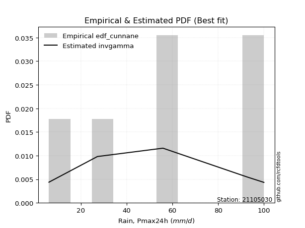</img>

</div>


### 12. Empirical - EDF Adamowski (1981)

The Adamowski formula in hydrology refers to a specific plotting position formula used for estimating the non-parametric empirical distribution of hydrological events (like flood peaks) to calculate their return periods. This formula provides an alternative to traditional parametric methods (like the Gumbel or Log Pearson Type III distributions). 

<div align="center">


$P=(m-0.25)/(n+0.5)$


</div>


**12.1. Empirical values**

<div align="center">

|                | 0                  | 1                   | 2                   | 3             | 4                  | 5                  | 6                  |
|:---------------|:-------------------|:--------------------|:--------------------|:--------------|:-------------------|:-------------------|:-------------------|
| date           | 2023               | 2022                | 2025                | 2019          | 2021               | 2020               | 2024               |
| x              | 6.0                | 27.2                | 38.4                | 55.8          | 56.0               | 92.8               | 100.0              |
| m              | 1                  | 2                   | 3                   | 4             | 5                  | 6                  | 7                  |
| empirical_dist | edf_adamowski      | edf_adamowski       | edf_adamowski       | edf_adamowski | edf_adamowski      | edf_adamowski      | edf_adamowski      |
| empirical      | 0.1                | 0.23333333333333334 | 0.36666666666666664 | 0.5           | 0.6333333333333333 | 0.7666666666666667 | 0.9                |
| empirical_tr   | 1.1111111111111112 | 1.3043478260869565  | 1.5789473684210527  | 2.0           | 2.727272727272727  | 4.2857142857142865 | 10.000000000000002 |

</div>


**12.2. Kolmogorov-Smirnov fit test (sorted by Δ)**


<div align="center">

|                | 0                   | 1                   | 2                   | 3                   | 4                   | 5                   | 6                   | 7                   | 8                   | 9                   | 10                  | 11                  | 12                  | 13                  | 14                  | 15                  | 16                  | 17                  | 18                  | 19                  | 20                  | 21                  | 22                  | 23                  | 24                  | 25                  | 26                  | 27                  | 28                  | 29                  | 30                  | 31                  | 32                    | 33                  | 34                  | 35                  | 36                  | 37                  | 38                  | 39                  | 40                  | 41                  | 42                  | 43                  | 44                  | 45                  | 46                  | 47                  | 48                  | 49                  | 50                  | 51                  | 52                  | 53                  | 54                  | 55                  | 56                  | 57                  | 58                  | 59                  | 60                  | 61                  | 62                  | 63                  | 64                  | 65                  | 66                  | 67                  | 68                  | 69                  | 70                  | 71                  | 72                  | 73                  | 74                  | 75                  | 76                  | 77                  | 78                  | 79                  | 80                  | 81                  | 82                  | 83                  | 84                  | 85                  | 86                  | 87                  | 88                  | 89                  |
|:---------------|:--------------------|:--------------------|:--------------------|:--------------------|:--------------------|:--------------------|:--------------------|:--------------------|:--------------------|:--------------------|:--------------------|:--------------------|:--------------------|:--------------------|:--------------------|:--------------------|:--------------------|:--------------------|:--------------------|:--------------------|:--------------------|:--------------------|:--------------------|:--------------------|:--------------------|:--------------------|:--------------------|:--------------------|:--------------------|:--------------------|:--------------------|:--------------------|:----------------------|:--------------------|:--------------------|:--------------------|:--------------------|:--------------------|:--------------------|:--------------------|:--------------------|:--------------------|:--------------------|:--------------------|:--------------------|:--------------------|:--------------------|:--------------------|:--------------------|:--------------------|:--------------------|:--------------------|:--------------------|:--------------------|:--------------------|:--------------------|:--------------------|:--------------------|:--------------------|:--------------------|:--------------------|:--------------------|:--------------------|:--------------------|:--------------------|:--------------------|:--------------------|:--------------------|:--------------------|:--------------------|:--------------------|:--------------------|:--------------------|:--------------------|:--------------------|:--------------------|:--------------------|:--------------------|:--------------------|:--------------------|:--------------------|:--------------------|:--------------------|:--------------------|:--------------------|:--------------------|:--------------------|:--------------------|:--------------------|:--------------------|
| station        | 21105030            | 21105030            | 21105030            | 21105030            | 21105030            | 21105030            | 21105030            | 21105030            | 21105030            | 21105030            | 21105030            | 21105030            | 21105030            | 21105030            | 21105030            | 21105030            | 21105030            | 21105030            | 21105030            | 21105030            | 21105030            | 21105030            | 21105030            | 21105030            | 21105030            | 21105030            | 21105030            | 21105030            | 21105030            | 21105030            | 21105030            | 21105030            | 21105030              | 21105030            | 21105030            | 21105030            | 21105030            | 21105030            | 21105030            | 21105030            | 21105030            | 21105030            | 21105030            | 21105030            | 21105030            | 21105030            | 21105030            | 21105030            | 21105030            | 21105030            | 21105030            | 21105030            | 21105030            | 21105030            | 21105030            | 21105030            | 21105030            | 21105030            | 21105030            | 21105030            | 21105030            | 21105030            | 21105030            | 21105030            | 21105030            | 21105030            | 21105030            | 21105030            | 21105030            | 21105030            | 21105030            | 21105030            | 21105030            | 21105030            | 21105030            | 21105030            | 21105030            | 21105030            | 21105030            | 21105030            | 21105030            | 21105030            | 21105030            | 21105030            | 21105030            | 21105030            | 21105030            | 21105030            | 21105030            | 21105030            |
| empirical_dist | edf_adamowski       | edf_adamowski       | edf_adamowski       | edf_adamowski       | edf_adamowski       | edf_adamowski       | edf_adamowski       | edf_adamowski       | edf_adamowski       | edf_adamowski       | edf_adamowski       | edf_adamowski       | edf_adamowski       | edf_adamowski       | edf_adamowski       | edf_adamowski       | edf_adamowski       | edf_adamowski       | edf_adamowski       | edf_adamowski       | edf_adamowski       | edf_adamowski       | edf_adamowski       | edf_adamowski       | edf_adamowski       | edf_adamowski       | edf_adamowski       | edf_adamowski       | edf_adamowski       | edf_adamowski       | edf_adamowski       | edf_adamowski       | edf_adamowski         | edf_adamowski       | edf_adamowski       | edf_adamowski       | edf_adamowski       | edf_adamowski       | edf_adamowski       | edf_adamowski       | edf_adamowski       | edf_adamowski       | edf_adamowski       | edf_adamowski       | edf_adamowski       | edf_adamowski       | edf_adamowski       | edf_adamowski       | edf_adamowski       | edf_adamowski       | edf_adamowski       | edf_adamowski       | edf_adamowski       | edf_adamowski       | edf_adamowski       | edf_adamowski       | edf_adamowski       | edf_adamowski       | edf_adamowski       | edf_adamowski       | edf_adamowski       | edf_adamowski       | edf_adamowski       | edf_adamowski       | edf_adamowski       | edf_adamowski       | edf_adamowski       | edf_adamowski       | edf_adamowski       | edf_adamowski       | edf_adamowski       | edf_adamowski       | edf_adamowski       | edf_adamowski       | edf_adamowski       | edf_adamowski       | edf_adamowski       | edf_adamowski       | edf_adamowski       | edf_adamowski       | edf_adamowski       | edf_adamowski       | edf_adamowski       | edf_adamowski       | edf_adamowski       | edf_adamowski       | edf_adamowski       | edf_adamowski       | edf_adamowski       | edf_adamowski       |
| p_dist         | logpearson3         | logt                | loggumbel_l         | logfisk             | invweibull          | genlogistic         | loggompertz         | kstwobign           | ncf                 | halfnorm            | fisk                | weibull_min         | rayleigh            | invgauss            | invgamma            | f                   | betaprime           | maxwell             | rice                | halflogistic        | pearson3            | erlang              | gumbel_r            | gamma               | exponnorm           | nct                 | truncnorm           | norm                | t                   | moyal               | laplace_asymmetric  | johnsonsu           | loglaplace_asymmetric | logistic            | logncf              | logfatiguelife      | logf                | logrice             | lognorm             | lognorm             | logcrystalball      | logexponnorm        | lognct              | logbetaprime        | hypsecant           | logloggamma         | logerlang           | laplace             | expon               | loggamma            | loggamma            | genexpon            | loginvgamma         | logalpha            | logmielke           | loglogistic         | loginvgauss         | logmaxwell          | lograyleigh         | loginvweibull       | loghypsecant        | mielke              | gumbel_l            | loghalfnorm         | loggenexpon         | loglaplace          | loggumbel_r         | wald                | logkstwobign        | logjohnsonsu        | loghalflogistic     | logmoyal            | logtruncnorm        | nakagami            | gibrat              | lognakagami         | logwald             | loggibrat           | logexpon            | alpha               | pareto              | loglognorm          | logpareto           | crystalball         | logweibull_min      | fatiguelife         | logchi2             | gompertz            | chi2                | loggenlogistic      |
| delta          | 0.07470322946053143 | 0.07981194443751405 | 0.08888474431169868 | 0.09598776875064041 | 0.10130671777871558 | 0.1031063243564625  | 0.10542148679911856 | 0.10794566288942731 | 0.11035740618137313 | 0.11174102854940171 | 0.11254413019663156 | 0.11524903530729735 | 0.1156448142717601  | 0.1157716690309245  | 0.11589580241750286 | 0.11663142443812236 | 0.1170464529850267  | 0.11796289054146036 | 0.1186508414949643  | 0.12397172278310287 | 0.12478077438322244 | 0.12492689289540193 | 0.12578265461671867 | 0.1261951842585738  | 0.12665761413150312 | 0.12668547905196192 | 0.12668855276381807 | 0.12668855523148903 | 0.1266894102090923  | 0.12754205645081174 | 0.12907265471825213 | 0.1299364872280414  | 0.13379926463583713   | 0.13862041798653169 | 0.13909334236786752 | 0.13922314462975482 | 0.13922629563834654 | 0.13990689963414205 | 0.13990760065578445 | 0.13990760065578445 | 0.13990765457179066 | 0.13990867366691917 | 0.14028874545283554 | 0.14124527264621162 | 0.14380259320909072 | 0.14699692168335088 | 0.14712735727764714 | 0.1473185499281685  | 0.14763509248395634 | 0.14769491987357986 | 0.14769491987357986 | 0.14783701193992016 | 0.15078927576921564 | 0.15374987469695944 | 0.1568599577191585  | 0.1569483496764036  | 0.1606896828144353  | 0.16260342482576695 | 0.16946881065052    | 0.17024188885509534 | 0.17034038528289308 | 0.17204377133573268 | 0.17358699062644867 | 0.1893306881466602  | 0.19705627501653972 | 0.19872602172909848 | 0.20142294878077704 | 0.20555318710070403 | 0.20756369957637222 | 0.21457721680290381 | 0.2175775689203373  | 0.2219019252267962  | 0.23332847417281838 | 0.23333311069504578 | 0.23333333333333334 | 0.26459083762695734 | 0.27966812055388746 | 0.31191236142887235 | 0.31306830684621084 | 0.34315918964003694 | 0.4081965897282453  | 0.41459672598079217 | 0.43551659869435616 | 0.4385021324263205  | 0.46692779896325237 | 0.4761468514714085  | 0.49384401130226413 | 0.6333182123148082  | 0.6931395893650039  | 0.7666666666666667  |
| deltao         | 0.48442053926100004 | 0.48442053926100004 | 0.48442053926100004 | 0.48442053926100004 | 0.48442053926100004 | 0.48442053926100004 | 0.48442053926100004 | 0.48442053926100004 | 0.48442053926100004 | 0.48442053926100004 | 0.48442053926100004 | 0.48442053926100004 | 0.48442053926100004 | 0.48442053926100004 | 0.48442053926100004 | 0.48442053926100004 | 0.48442053926100004 | 0.48442053926100004 | 0.48442053926100004 | 0.48442053926100004 | 0.48442053926100004 | 0.48442053926100004 | 0.48442053926100004 | 0.48442053926100004 | 0.48442053926100004 | 0.48442053926100004 | 0.48442053926100004 | 0.48442053926100004 | 0.48442053926100004 | 0.48442053926100004 | 0.48442053926100004 | 0.48442053926100004 | 0.48442053926100004   | 0.48442053926100004 | 0.48442053926100004 | 0.48442053926100004 | 0.48442053926100004 | 0.48442053926100004 | 0.48442053926100004 | 0.48442053926100004 | 0.48442053926100004 | 0.48442053926100004 | 0.48442053926100004 | 0.48442053926100004 | 0.48442053926100004 | 0.48442053926100004 | 0.48442053926100004 | 0.48442053926100004 | 0.48442053926100004 | 0.48442053926100004 | 0.48442053926100004 | 0.48442053926100004 | 0.48442053926100004 | 0.48442053926100004 | 0.48442053926100004 | 0.48442053926100004 | 0.48442053926100004 | 0.48442053926100004 | 0.48442053926100004 | 0.48442053926100004 | 0.48442053926100004 | 0.48442053926100004 | 0.48442053926100004 | 0.48442053926100004 | 0.48442053926100004 | 0.48442053926100004 | 0.48442053926100004 | 0.48442053926100004 | 0.48442053926100004 | 0.48442053926100004 | 0.48442053926100004 | 0.48442053926100004 | 0.48442053926100004 | 0.48442053926100004 | 0.48442053926100004 | 0.48442053926100004 | 0.48442053926100004 | 0.48442053926100004 | 0.48442053926100004 | 0.48442053926100004 | 0.48442053926100004 | 0.48442053926100004 | 0.48442053926100004 | 0.48442053926100004 | 0.48442053926100004 | 0.48442053926100004 | 0.48442053926100004 | 0.48442053926100004 | 0.48442053926100004 | 0.48442053926100004 |
| eval           | Δo > Δ              | Δo > Δ              | Δo > Δ              | Δo > Δ              | Δo > Δ              | Δo > Δ              | Δo > Δ              | Δo > Δ              | Δo > Δ              | Δo > Δ              | Δo > Δ              | Δo > Δ              | Δo > Δ              | Δo > Δ              | Δo > Δ              | Δo > Δ              | Δo > Δ              | Δo > Δ              | Δo > Δ              | Δo > Δ              | Δo > Δ              | Δo > Δ              | Δo > Δ              | Δo > Δ              | Δo > Δ              | Δo > Δ              | Δo > Δ              | Δo > Δ              | Δo > Δ              | Δo > Δ              | Δo > Δ              | Δo > Δ              | Δo > Δ                | Δo > Δ              | Δo > Δ              | Δo > Δ              | Δo > Δ              | Δo > Δ              | Δo > Δ              | Δo > Δ              | Δo > Δ              | Δo > Δ              | Δo > Δ              | Δo > Δ              | Δo > Δ              | Δo > Δ              | Δo > Δ              | Δo > Δ              | Δo > Δ              | Δo > Δ              | Δo > Δ              | Δo > Δ              | Δo > Δ              | Δo > Δ              | Δo > Δ              | Δo > Δ              | Δo > Δ              | Δo > Δ              | Δo > Δ              | Δo > Δ              | Δo > Δ              | Δo > Δ              | Δo > Δ              | Δo > Δ              | Δo > Δ              | Δo > Δ              | Δo > Δ              | Δo > Δ              | Δo > Δ              | Δo > Δ              | Δo > Δ              | Δo > Δ              | Δo > Δ              | Δo > Δ              | Δo > Δ              | Δo > Δ              | Δo > Δ              | Δo > Δ              | Δo > Δ              | Δo > Δ              | Δo > Δ              | Δo > Δ              | Δo > Δ              | Δo > Δ              | Δo > Δ              | Δo > Δ              | Δo <= Δ             | Δo <= Δ             | Δo <= Δ             | Δo <= Δ             |
| fit            | 1                   | 1                   | 1                   | 1                   | 1                   | 1                   | 1                   | 1                   | 1                   | 1                   | 1                   | 1                   | 1                   | 1                   | 1                   | 1                   | 1                   | 1                   | 1                   | 1                   | 1                   | 1                   | 1                   | 1                   | 1                   | 1                   | 1                   | 1                   | 1                   | 1                   | 1                   | 1                   | 1                     | 1                   | 1                   | 1                   | 1                   | 1                   | 1                   | 1                   | 1                   | 1                   | 1                   | 1                   | 1                   | 1                   | 1                   | 1                   | 1                   | 1                   | 1                   | 1                   | 1                   | 1                   | 1                   | 1                   | 1                   | 1                   | 1                   | 1                   | 1                   | 1                   | 1                   | 1                   | 1                   | 1                   | 1                   | 1                   | 1                   | 1                   | 1                   | 1                   | 1                   | 1                   | 1                   | 1                   | 1                   | 1                   | 1                   | 1                   | 1                   | 1                   | 1                   | 1                   | 1                   | 1                   | 0                   | 0                   | 0                   | 0                   |
| n              | 7                   | 7                   | 7                   | 7                   | 7                   | 7                   | 7                   | 7                   | 7                   | 7                   | 7                   | 7                   | 7                   | 7                   | 7                   | 7                   | 7                   | 7                   | 7                   | 7                   | 7                   | 7                   | 7                   | 7                   | 7                   | 7                   | 7                   | 7                   | 7                   | 7                   | 7                   | 7                   | 7                     | 7                   | 7                   | 7                   | 7                   | 7                   | 7                   | 7                   | 7                   | 7                   | 7                   | 7                   | 7                   | 7                   | 7                   | 7                   | 7                   | 7                   | 7                   | 7                   | 7                   | 7                   | 7                   | 7                   | 7                   | 7                   | 7                   | 7                   | 7                   | 7                   | 7                   | 7                   | 7                   | 7                   | 7                   | 7                   | 7                   | 7                   | 7                   | 7                   | 7                   | 7                   | 7                   | 7                   | 7                   | 7                   | 7                   | 7                   | 7                   | 7                   | 7                   | 7                   | 7                   | 7                   | 7                   | 7                   | 7                   | 7                   |
| best_fit       | 1                   | 0                   | 0                   | 0                   | 0                   | 0                   | 0                   | 0                   | 0                   | 0                   | 0                   | 0                   | 0                   | 0                   | 0                   | 0                   | 0                   | 0                   | 0                   | 0                   | 0                   | 0                   | 0                   | 0                   | 0                   | 0                   | 0                   | 0                   | 0                   | 0                   | 0                   | 0                   | 0                     | 0                   | 0                   | 0                   | 0                   | 0                   | 0                   | 0                   | 0                   | 0                   | 0                   | 0                   | 0                   | 0                   | 0                   | 0                   | 0                   | 0                   | 0                   | 0                   | 0                   | 0                   | 0                   | 0                   | 0                   | 0                   | 0                   | 0                   | 0                   | 0                   | 0                   | 0                   | 0                   | 0                   | 0                   | 0                   | 0                   | 0                   | 0                   | 0                   | 0                   | 0                   | 0                   | 0                   | 0                   | 0                   | 0                   | 0                   | 0                   | 0                   | 0                   | 0                   | 0                   | 0                   | 0                   | 0                   | 0                   | 0                   |
| best_fit_sort  | 1                   | 2                   | 3                   | 4                   | 5                   | 6                   | 7                   | 8                   | 9                   | 10                  | 11                  | 12                  | 13                  | 14                  | 15                  | 16                  | 17                  | 18                  | 19                  | 20                  | 21                  | 22                  | 23                  | 24                  | 25                  | 26                  | 27                  | 28                  | 29                  | 30                  | 31                  | 32                  | 33                    | 34                  | 35                  | 36                  | 37                  | 38                  | 39                  | 40                  | 41                  | 42                  | 43                  | 44                  | 45                  | 46                  | 47                  | 48                  | 49                  | 50                  | 51                  | 52                  | 53                  | 54                  | 55                  | 56                  | 57                  | 58                  | 59                  | 60                  | 61                  | 62                  | 63                  | 64                  | 65                  | 66                  | 67                  | 68                  | 69                  | 70                  | 71                  | 72                  | 73                  | 74                  | 75                  | 76                  | 77                  | 78                  | 79                  | 80                  | 81                  | 82                  | 83                  | 84                  | 85                  | 86                  | 87                  | 88                  | 89                  | 90                  |

</div>


<div align="center">

</img>

</div>


**12.3. Best fit**

<div align="center">

|   id |   station | empirical_dist   | p_dist      |     delta |   deltao | eval   |   fit |   n |   best_fit |   best_fit_sort |
|-----:|----------:|:-----------------|:------------|----------:|---------:|:-------|------:|----:|-----------:|----------------:|
|    0 |  21105030 | edf_adamowski    | logpearson3 | 0.0747032 | 0.484421 | Δo > Δ |     1 |   7 |          1 |               1 |

</div>


<div align="center">

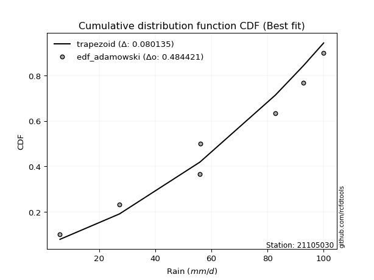</img>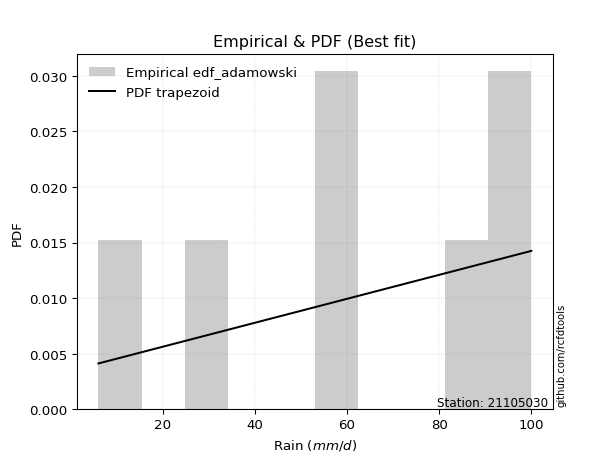</img>

</div>


## C. Best fit & Estimate extreme values for specific return periods - Tr


### 1. Best fit (ordered by delta Δ)

<div align="center">

|   id |   station | empirical_dist   | p_dist                |     delta |   deltao | eval   |   fit |   n |   best_fit |   best_fit_sort |
|-----:|----------:|:-----------------|:----------------------|----------:|---------:|:-------|------:|----:|-----------:|----------------:|
|    0 |  21105030 | edf_adamowski    | logpearson3           | 0.0747032 | 0.484421 | Δo > Δ |     1 |   7 |          1 |               1 |
|    1 |  21105030 | edf_cunnane      | logpearson3           | 0.0747032 | 0.484421 | Δo > Δ |     1 |   7 |          1 |               2 |
|    2 |  21105030 | edf_jenkinson    | logpearson3           | 0.0747032 | 0.484421 | Δo > Δ |     1 |   7 |          1 |               3 |
|    3 |  21105030 | edf_filliben     | logpearson3           | 0.0747032 | 0.484421 | Δo > Δ |     1 |   7 |          1 |               4 |
|    4 |  21105030 | edf_gringorten   | logpearson3           | 0.0747032 | 0.484421 | Δo > Δ |     1 |   7 |          1 |               5 |
|    5 |  21105030 | edf_tukey        | logpearson3           | 0.0747032 | 0.484421 | Δo > Δ |     1 |   7 |          1 |               6 |
|    6 |  21105030 | edf_blom         | logpearson3           | 0.0747032 | 0.484421 | Δo > Δ |     1 |   7 |          1 |               7 |
|    7 |  21105030 | edf_chegodayev   | logpearson3           | 0.0747032 | 0.484421 | Δo > Δ |     1 |   7 |          1 |               8 |
|    8 |  21105030 | edf_beard        | logpearson3           | 0.0747032 | 0.484421 | Δo > Δ |     1 |   7 |          1 |               9 |
|    9 |  21105030 | edf_hazen        | logpearson3           | 0.0747032 | 0.484421 | Δo > Δ |     1 |   7 |          1 |              10 |
|   10 |  21105030 | edf_weibull      | logpearson3           | 0.0886233 | 0.484421 | Δo > Δ |     1 |   7 |          1 |              11 |
|   11 |  21105030 | edf_california   | loglaplace_asymmetric | 0.110654  | 0.484421 | Δo > Δ |     1 |   7 |          1 |              12 |

</div>

:file_folder:Tables: [bestfit_21105030.csv](table/bestfit_21105030.csv) | [extreme_21105030.csv](table/extreme_21105030.csv)


### 2. Extreme values

In hydrology, a return period (or recurrence interval $Tr$) is the statistical average time between extreme events like floods or droughts of a specific magnitude, indicating how rare an event is, with a 100-year flood, for example, having a 1% chance of occurring in any given year, not that it happens exactly every century. It is a key tool for infrastructure design (like bridges or dams) and risk assessment, calculated from historical data to determine the probability of future events, although it is important to remember it is statistical average, and events can cluster or be missed.

> risk_rate: assuming the return period as the project useful life.

|   id |      tr |   prob_l |     prob_g |      alpha |   betaprime |    chi2 |   crystalball |   erlang |    expon |   exponnorm |        f |   fatiguelife |     fisk |    gamma |   genexpon |   genlogistic |   gibrat |   gompertz |   gumbel_l |   gumbel_r |   halflogistic |   halfnorm |   hypsecant |   invgamma |   invgauss |   invweibull |   johnsonsu |   kstwobign |   laplace |   laplace_asymmetric |   loggamma |   logistic |   lognorm |   maxwell |   mielke |    moyal |   nakagami |      ncf |      nct |     norm |           pareto |   pearson3 |   rayleigh |     rice |        t |   truncnorm |     wald |   weibull_min |   logalpha |   logbetaprime |     logchi2 |   logcrystalball |   logerlang |         logexpon |   logexponnorm |     logf |   logfatiguelife |   logfisk |   loggenexpon |   loggenlogistic |   loggibrat |   loggompertz |   loggumbel_l |   loggumbel_r |   loghalflogistic |   loghalfnorm |   loghypsecant |   loginvgamma |   loginvgauss |   loginvweibull |   logjohnsonsu |   logkstwobign |   loglaplace |   loglaplace_asymmetric |   logloggamma |   loglogistic |     loglognorm |   logmaxwell |    logmielke |   logmoyal |   lognakagami |   logncf |   lognct |     logpareto |   logpearson3 |   lograyleigh |   logrice |        logt |   logtruncnorm |    logwald |   logweibull_min |   station |   n |   risk_rate |
|-----:|--------:|---------:|-----------:|-----------:|------------:|--------:|--------------:|---------:|---------:|------------:|---------:|--------------:|---------:|---------:|-----------:|--------------:|---------:|-----------:|-----------:|-----------:|---------------:|-----------:|------------:|-----------:|-----------:|-------------:|------------:|------------:|----------:|---------------------:|-----------:|-----------:|----------:|----------:|---------:|---------:|-----------:|---------:|---------:|---------:|-----------------:|-----------:|-----------:|---------:|---------:|------------:|---------:|--------------:|-----------:|---------------:|------------:|-----------------:|------------:|-----------------:|---------------:|---------:|-----------------:|----------:|--------------:|-----------------:|------------:|--------------:|--------------:|--------------:|------------------:|--------------:|---------------:|--------------:|--------------:|----------------:|---------------:|---------------:|-------------:|------------------------:|--------------:|--------------:|---------------:|-------------:|-------------:|-----------:|--------------:|---------:|---------:|--------------:|--------------:|--------------:|----------:|------------:|---------------:|-----------:|-----------------:|----------:|----:|------------:|
|    0 |    2    | 0.5      | 0.5        |    22.5172 |     50.7102 | 10.2424 |    -0.0161094 |  52.3021 |  39.0928 |     53.7294 |  50.6093 |       6.00001 |  51.1092 |  52.2788 |    39.0747 |       48.7498 |  44.323  |    92.5105 |    58.8984 |    48.5873 |        46.0242 |    47.319  |     53.7429 |    50.4905 |    50.1856 |      48.5571 |     53.7429 |     47.7231 |   53.7429 |              54.7507 |    39.3313 |    53.7429 |   40.5965 |   51.0589 |  37.4186 |  46.9229 |    44.989  |  43.6613 |  53.7433 |  53.7429 |      8.88264     |    53.0795 |    50.1069 |  51.4102 |  53.7424 |     53.7429 |  43.5701 |       50.0472 |    38.1076 |        38.0451 |     11.3102 |          40.5965 |     39.3981 |     22.5786      |        40.5965 |  40.6694 |          40.6581 |   46.3925 |       33.9334 |         inf      |     31.0983 |       46.2642 |       46.9727 |       35.0859 |           32.6312 |       33.8496 |        40.5965 |       38.7067 |       37.118  |         35.7321 |        65.7995 |        32.4397 |      40.5965 |                 46.7263 |       53.6171 |       40.5965 |   6.06834      |      37.6275 |  2.53756e-09 |    33.4718 |       32.1576 |  39.8932 |  40.5243 |   6.8181      |       48.0207 |       36.6272 |   40.5804 |     51.5835 |        42.1753 |    30.442  |     12.1784      |  21105030 |   7 |    0.75     |
|    1 |    2.33 | 0.570815 | 0.429185   |    26.7995 |     56.4316 | 11.4533 |    11.0905    |  57.9235 |  46.3842 |     59.3294 |  56.3403 |       8.21671 |  56.5342 |  57.8718 |    46.362  |       54.6062 |  47.1598 |    93.1878 |    63.7706 |    53.7764 |        51.3595 |    53.363  |     58.2246 |    56.194  |    55.9304 |      54.4646 |     59.2638 |     53.7552 |   57.1318 |              58.4952 |    46.3387 |    58.677  |   47.5673 |   56.877  |  44.9038 |  51.8351 |    52.0891 |  51.1708 |  59.3435 |  59.343  |     13.2264      |    58.6964 |    56.0112 |  57.2546 |  59.3426 |     59.343  |  47.2422 |       55.9731 |    45.1955 |        46.2383 |     13.9002 |          47.5673 |     46.412  |     30.2348      |        47.5673 |  47.6484 |          47.6409 |   53.1211 |       43.1125 |         inf      |     33.6975 |       52.5156 |       53.9163 |       40.6351 |           37.9489 |       40.163  |        46.0856 |       45.7583 |       44.135  |         44.2953 |        73.0774 |        40.5886 |      44.6823 |                 51.5958 |       60.4853 |       46.6793 |   6.71736      |      44.3613 |  2.53756e-09 |    38.4631 |       35.3082 |  47.1715 |  47.5021 |   8.26836     |       55.3773 |       43.2875 |   47.5579 |     57.5309 |        45.7626 |    33.7753 |     15.2115      |  21105030 |   7 |    0.729209 |
|    2 |    5    | 0.8      | 0.2        |    60.0053 |     79.4363 | 17.9946 |    52.3659    |  79.4928 |  82.8392 |     80.1485 |  79.4365 |      55.3061  |  79.2178 |  79.3297 |    82.797  |       79.9339 |  63.4921 |    95.3761 |    79.5106 |    76.3205 |        75.5005 |    78.9223 |     76.2021 |    79.35   |    79.2907 |      80.1297 |     79.781  |     79.3786 |   74.0757 |              77.007  |    86.1316 |    77.7283 |   85.7161 |   79.7769 |  73.0642 |  74.5888 |    89.8275 |  85.8528 |  80.1552 |  80.1546 |    691.714       |    79.9426 |    79.6484 |  79.9865 |  80.1544 |     80.1546 |  67.7985 |       79.6882 |    87.0944 |       100.332  |     44.6396 |          85.7161 |     86.2111 |    130.175       |        85.7156 |  85.8477 |          85.8945 |   89.6142 |      118.58   |         inf      |     53.4928 |       79.5513 |       84.1682 |       76.9033 |           75.1403 |       82.7775 |        76.6461 |       86.6586 |       86.7719 |        112.641  |        90.557  |       105.155  |      72.1704 |                 72.2367 |       82.233  |       80.0285 |   1.85346e+253 |      84.8047 |  2.53756e-09 |    73.2259 |       63.7311 |  88.8858 |  85.769  |   1.10884e+14 |       86.0131 |       84.4985 |   85.7624 |     90.1769 |        63.6136 |    60.4256 |     56.8474      |  21105030 |   7 |    0.67232  |
|    3 |   10    | 0.9      | 0.1        |   121.012  |     96.2592 | 24.3231 |    79.7468    |  94.3984 | 115.932  |     93.9672 |  96.3669 |     120.324   |  97.8422 |  94.1561 |   115.872  |      100.487  |  82.109  |    96.5944 |    88.2739 |    94.6823 |        95.5487 |    97.8357 |     90.5577 |    96.6139 |    96.6524 |     101.034  |     93.3915 |     98.8874 |   89.457  |              93.8116 |   131.154  |    91.7588 |  126.684  |   95.8926 |  87.0987 |  94.3995 |   121.799  | 114.782  |  93.961  |  93.9605 |  42516.3         |    94.3626 |    96.5022 |  95.6593 |  93.9604 |     93.9605 |  89.6136 |       96.5904 |   137.33   |       175.35   |    143.83   |         126.684  |    131.191  |    489.862       |       126.683  | 126.894  |         127.039  |  131.715  |      257.156  |         inf      |     90.5875 |      100.512  |      107.855  |      129.298  |          132.51   |      141.361  |       115.055  |      134.365  |      139.923  |        240.899  |        96.1943 |       217.071  |     111.527  |                 97.1034 |       91.5363 |      119.033  | inf            |     133.803  |  2.53756e-09 |   128.268  |      110.659  | 136.618  | 126.983  | inf           |      107.293  |      136.136  |  126.815  |    134.438  |        77.3274 |   112.024  |    236.808       |  21105030 |   7 |    0.651322 |
|    4 |   15    | 0.933333 | 0.0666667  |   181.802  |    105.134  | 28.1232 |    93.4105    | 102.017  | 135.29   |    100.866  | 105.309  |     162.848   | 108.738  | 101.733  |   135.219  |      112.068  |  94.9502 |    97.1462 |    92.2426 |   105.042  |       106.894  |   107.678  |     98.7503 |   105.865  |   105.908  |     112.827  |    100.183  |    109.244  |   98.4544 |             103.642  |   162.227  |    99.4033 |  153.953  |  104.161  |  91.9993 | 105.897  |   138.953  | 130.993  | 100.85   | 100.85   | 475270           |   101.656  |   105.186  | 103.597  | 100.85   |    100.85   | 103.622  |      105.297  |   173.47   |       234.848  |    293.285  |         153.953  |    162.211  |   1063.52        |       153.951  | 154.228  |         154.456  |  162.467  |      390.075  |         inf      |    130.276  |      111.79   |      120.673  |      173.341  |          182.673  |      186.758  |       145.072  |      168.013  |      179.217  |        369.912  |        97.9475 |       318.938  |     143.863  |                115.449  |       94.6162 |      147.778  | inf            |     169.075  |  2.53756e-09 |   177.585  |      149.763  | 169.795  | 154.469  | inf           |      117.56   |      174.057  |  154.149  |    174.181  |        83.5057 |   166.521  |    591.884       |  21105030 |   7 |    0.644736 |
|    5 |   20    | 0.95     | 0.05       |   242.538  |    111.122  | 30.851  |   102.359     | 107.071  | 149.025  |    105.384  | 111.345  |     194.331   | 116.597  | 106.761  |   148.946  |      120.174  | 105.023  |    97.4896 |    94.713  |   112.295  |       114.843  |   114.24   |    104.53   |   112.169  |   112.191  |     121.085  |    104.631  |    116.221  |  104.838  |             110.616  |   186.651  |   104.687  |  174.917  |  109.649  |  94.4903 | 114.039  |   150.484  | 142.251  | 105.362  | 105.362  |      2.63522e+06 |   106.468  |   110.958  | 108.828  | 105.362  |    105.362  | 114.061  |      111.084  |   202.629  |       285.777  |    490.665  |         174.917  |    186.583  |   1843.4         |       174.915  | 175.248  |         175.55   |  187.824  |      518.119  |          95.4584 |    173.239  |      119.454  |      129.41   |      212.833  |          228.75   |      224.862  |       170.847  |      194.822  |      211.459  |        499.476  |        98.8297 |       413.308  |     172.345  |                130.53   |       96.1525 |      171.609  | inf            |     197.478  |  2.53756e-09 |   223.599  |      183.753  | 195.983  | 175.626  | inf           |      124.026  |      204.939  |  175.168  |    213.069  |        87.0324 |   223.748  |   1170.83        |  21105030 |   7 |    0.641514 |
|    6 |   25    | 0.96     | 0.04       |   303.252  |    115.621  | 32.982  |   108.945     | 110.826  | 159.678  |    108.711  | 115.881  |     219.345   | 122.796  | 110.494  |   159.594  |      126.415  | 113.42   |    97.734  |    96.4709 |   117.882  |       120.967  |   119.123  |    109.003  |   116.94   |   116.929  |     127.446  |    107.906  |    121.447  |  109.79   |             116.026  |   207.057  |   108.729  |  192.152  |  113.723  |  95.998  | 120.351  |   159.091  | 150.864  | 108.683  | 108.683  |      9.94979e+06 |   110.028  |   115.246  | 112.694  | 108.683  |    108.683  | 122.423  |      115.383  |   227.461  |       331.032  |    734.536  |         192.152  |    206.937  |   2824.26        |       192.15   | 192.535  |         192.901  |  209.862  |      642.117  |          96.3791 |    219.703  |      125.231  |      136.01   |      249.287  |          272.034  |      258.175  |       193.899  |      217.444  |      239.253  |        629.461  |        99.3711 |       501.87   |     198.266  |                143.573  |       97.073  |      192.403  | inf            |     221.608  |  2.53756e-09 |   267.319  |      214.141  | 217.926  | 193.035  | inf           |      128.624  |      231.38   |  192.451  |    252.237  |        89.315  |   283.476  |   2021.85        |  21105030 |   7 |    0.639603 |
|    7 |   50    | 0.98     | 0.02       |   606.73   |    128.928  | 39.6691 |   127.808     | 121.733  | 192.771  |    118.24   | 129.307  |     299.604   | 142.792  | 121.341  |   192.669  |      145.637  | 143.021  |    98.3974 |   101.243  |   135.094  |       139.837  |   133.314  |    122.87   |   131.24   |   131.047  |     147.04   |    117.282  |    136.792  |  125.171  |             132.83   |   279.362  |   121.078  |  251.491  |  125.539  |  99.0491 | 139.943  |   184.171  | 177.057  | 118.194  | 118.194  |      6.16786e+08 |   120.308  |   127.695  | 123.824  | 118.194  |    118.194  | 149.724  |      127.86   |   318.591  |       510.357  |   2622.76   |         251.491  |    279.016  |  10628           |       251.488  | 252.075  |         252.693  |  294.545  |     1218.97   |          98.2182 |    507.671  |      142.384  |      155.673  |      405.702  |          464.001  |      385.749  |       287.075  |      299.065  |      343.537  |       1283.58   |       100.529  |       887.542  |     306.386  |                192.996  |       98.9116 |      272.881  | inf            |     309.589  |  2.53756e-09 |   465.378  |      334.744  | 296.077  | 253.062  | inf           |      140.876  |      329.086  |  251.967  |    464.714  |        94.3145 |   613.792  |  12055.1         |  21105030 |   7 |    0.63583  |
|    8 |   75    | 0.986667 | 0.0133333  |   910.166  |    136.332  | 43.6194 |   137.929     | 127.681  | 212.129  |    123.355  | 136.779  |     347.939   | 155.105  | 127.256  |   212.016  |      156.807  | 163.014  |    98.7329 |   103.656  |   145.098  |       150.806  |   141.039  |    130.975  |   139.325  |   138.964  |     158.428  |    122.313  |    145.236  |  134.169  |             142.661  |   328.55   |   128.211  |  290.56   |  131.963  | 100.099  | 151.401  |   197.828  | 192.047  | 123.297  | 123.297  |      6.89565e+09 |   125.875  |   134.467  | 129.827  | 123.297  |    123.297  | 166.523  |      134.648  |   383.134  |       648.548  |   5583.09   |         290.56   |    328.017  |  23074           |       290.555  | 291.296  |         292.103  |  358.244  |     1747.84   |          98.8306 |    893.837  |      151.946  |      166.674  |      538.448  |          632.877  |      479.995  |       361.067  |      355.755  |      419.245  |       1942.18   |       100.968  |      1214.55   |     395.219  |                229.458  |       99.5237 |      333.907  | inf            |     371.303  | 98.7589      |   643.588  |      426.995  | 349.546  | 292.652  | inf           |      146.821  |      398.602  |  291.162  |    716.722  |        96.1262 |   987.361  |  36285.2         |  21105030 |   7 |    0.634587 |
|    9 |  100    | 0.99     | 0.01       |  1213.59   |    141.445  | 46.4362 |   144.774     | 131.743  | 225.864  |    126.815  | 141.941  |     382.718   | 164.154  | 131.295  |   225.743  |      164.713  | 178.501  |    98.9523 |   105.234  |   152.178  |       158.57   |   146.302  |    136.723  |   144.965  |   144.457  |     166.489  |    125.715  |    151.02   |  140.552  |             149.635  |   366.855  |   133.247  |  320.37   |  136.338  | 100.653  | 159.53   |   207.125  | 202.558  | 126.748  | 126.748  |      3.82345e+10 |   129.661  |   139.081  | 133.899  | 126.748  |    126.748  | 178.772  |      139.271  |   434.701  |       764.897  |   9581.1    |         320.37   |    366.16   |  39994.2         |       320.365  | 321.233  |         322.194  |  411.349  |     2245.09   |          99.1366 |   1385.39   |      158.55   |      174.287  |      657.891  |          788.366  |      557.067  |       424.848  |      400.486  |      480.671  |       2603.7    |       101.211  |      1505.75   |     473.466  |                259.433  |       99.8296 |      385.044  | inf            |     420.242  | 99.0732      |   810.029  |      503.923  | 391.33   | 322.892  | inf           |      150.572  |      454.194  |  321.073  |   1016.32   |        97.0623 |  1396.37   |  81219.5         |  21105030 |   7 |    0.633968 |
|   10 |  200    | 0.995    | 0.005      |  2427.26   |    153.363  | 53.2629 |   160.302     | 141.071  | 258.957  |    134.666  | 153.975  |     467.85    | 187.124  | 140.57   |   258.818  |      183.716  | 220.636  |    99.4293 |   108.665  |   169.2    |       177.235  |   158.338  |    150.573  |   158.296  |   157.338  |     185.867  |    133.434  |    164.344  |  155.934  |             166.44   |   471.945  |   145.327  |  399.82   |  146.349  | 101.617  | 179.114  |   228.353  | 227.511  | 134.577  | 134.578  |      2.37015e+12 |   138.311  |   149.638  | 143.164  | 134.578  |    134.578  | 209.281  |      149.85   |   581.533  |      1121.99   |  35600.8    |         399.82   |    470.74   | 150502           |       399.813  | 401.059  |         402.472  |  573.078  |     4042.02   |          99.5955 |   4564.03   |      173.922  |      192.054  |     1064.96   |         1336.91   |      783.1    |       628.675  |      525.555  |      659.489  |       5267.92   |       101.636  |      2470.18   |     731.658  |                348.74   |      100.288  |      541.95   | inf            |     557.854  | 99.5447      |  1409.86   |      735.365  | 506.526  | 403.612  | inf           |      158.248  |      612.325  |  400.809  |   2808.49   |        98.5061 |  3310.87   | 610956           |  21105030 |   7 |    0.633042 |
|   11 |  250    | 0.996    | 0.004      |  3034.09   |    157.094  | 55.471  |   165.047     | 143.953  | 269.61   |    137.066  | 157.743  |     495.595   | 194.894  | 143.436  |   269.466  |      189.824  | 235.754  |    99.5696 |   109.674  |   174.672  |       183.235  |   162.041  |    155.031  |   162.525  |   161.393  |     192.097  |    135.793  |    168.468  |  160.885  |             171.849  |   509.958  |   149.205  |  427.826  |  149.43   | 101.861  | 185.419  |   234.871  | 235.445  | 136.97   | 136.97   |      8.94901e+12 |   140.972  |   152.888  | 146.002  | 136.97   |    136.97   | 219.375  |      153.106  |   636.443  |      1264.46   |  54482      |         427.826  |    508.548  | 230583           |       427.818  | 429.209  |         430.794  |  637.449  |     4865.07   |          99.6873 |   7000.49   |      178.725  |      197.619  |     1243.32   |         1584.33   |      869.601  |       713.202  |      571.569  |      727.661  |       6607.37   |       101.738  |      2879.11   |     841.703  |                383.586  |      100.38   |      604.809  | inf            |     608.681  | 99.639       |  1685.21   |      825.772  | 548.373  | 432.104  | inf           |      160.362  |      671.304  |  428.921  |   4146.51   |        98.8008 |  4405.37   |      1.1957e+06  |  21105030 |   7 |    0.632858 |
|   12 |  500    | 0.998    | 0.002      |  6068.24   |    168.405  | 62.3568 |   179.119     | 152.589  | 302.703  |    144.185  | 169.168  |     582.63    | 220.297  | 152.023  |   302.54   |      208.785  | 288.002  |    99.9719 |   112.568  |   191.657  |       201.86   |   173.081  |    168.879  |   175.517  |   173.751  |     211.433  |    142.787  |    180.825  |  176.266  |             188.654  |   642.518  |   161.232  |  522.95   |  158.626  | 102.512  | 205.003  |   254.265  | 259.825  | 144.065  | 144.065  |      5.54748e+14 |   148.908  |   162.584  | 154.438  | 144.066  |    144.065  | 251.469  |      162.821  |   834.737  |      1814.77   | 205866      |         522.95   |    640.319  | 867708           |       522.94   | 524.868  |         527.079  |  886.796  |     8563.83   |          99.8708 |  30702.7    |      193.25   |      214.481  |     2010.52   |         2683.63   |     1188.47   |      1055.34   |      734.896  |      978.809  |      13347.8    |       101.983  |      4556.54   |    1300.7    |                515.631  |      100.563  |      850.007  | inf            |     789.572  | 99.8276      |  2933.06   |     1165.62   | 694.942  | 529.013  | inf           |      166.002  |      883.242  |  524.42   |  17727.2    |        99.3963 | 10924.3    |      1.02602e+07 |  21105030 |   7 |    0.632489 |
|   13 |  750    | 0.998667 | 0.00133333 |  9102.39   |    174.849  | 66.4012 |   186.936     | 157.444  | 322.061  |    148.141  | 175.677  |     634.054   | 236.097  | 156.85   |   321.888  |      219.869  | 322.556  |   100.187  |   114.114  |   201.586  |       212.747  |   179.249  |    176.979  |   183.037  |   180.833  |     222.737  |    146.673  |    187.766  |  185.264  |             198.484  |   731.155  |   168.259  |  584.651  |  163.769  | 102.848  | 216.459  |   265.072  | 273.92   | 148.006  | 148.007  |      6.20207e+15 |   153.348  |   168.006  | 159.135  | 148.007  |    148.007  | 270.712  |      168.253  |   972.812  |      2228      | 450119      |         584.651  |    728.37   |      1.88385e+06 |       584.639  | 586.95   |         589.599  | 1075.45   |    11847      |          99.9319 |  81618.1    |      201.495  |      224.075  |     2662.74   |         3651.95   |     1415.08   |      1327.21   |      846.366  |     1157.67   |      20134.3    |       102.089  |      5897.13   |    1677.83   |                613.047  |      100.625  |     1036.99   | inf            |     913.261  | 99.8905      |  4056.05   |     1412.16   | 793.433  | 591.971  | inf           |      168.74   |     1029.71   |  586.377  |  50868      |        99.5967 | 18830.9    |      3.76511e+07 |  21105030 |   7 |    0.632366 |
|   14 | 1000    | 0.999    | 0.001      | 12136.5    |    179.354  | 69.2772 |   192.318     | 160.81   | 335.796  |    150.865  | 180.227  |     670.736   | 247.753  | 160.197  |   335.615  |      227.731  | 348.998  |   100.332  |   115.155  |   208.629  |       220.47   |   183.509  |    182.727  |   188.345  |   185.801  |     230.756  |    149.348  |    192.576  |  191.648  |             205.458  |   799.48   |   173.242  |  631.314  |  167.323  | 103.075  | 224.587  |   272.524  | 283.853  | 150.72   | 150.721  |      3.43888e+16 |   156.417  |   171.753  | 162.373  | 150.721  |    150.721  | 284.553  |      172.006  |  1082.04   |      2570.74   | 785539      |         631.314  |    796.217  |      3.26528e+06 |       631.301  | 633.917  |         636.912  | 1233.09   |    14878.2    |          99.9625 | 172473      |      207.242  |      230.773  |     3250      |         4543.97   |     1596.34   |      1561.6    |      933.42   |     1301.18   |      26950.8    |       102.153  |      7050.76   |    2010.01   |                693.132  |      100.655  |     1194.03   | inf            |    1009.9    | 99.9219      |  5104.92   |     1611.77   | 869.59   | 639.632  | inf           |      170.468  |     1144.88   |  633.239  | 119987      |        99.6972 | 27859.8    |      9.64507e+07 |  21105030 |   7 |    0.632305 |

<div align="center">

</img>

</div>


<div align="center">

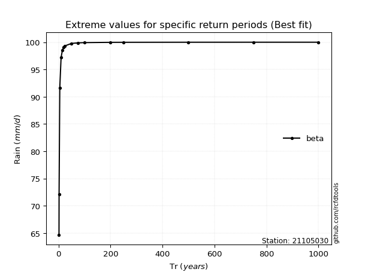</img>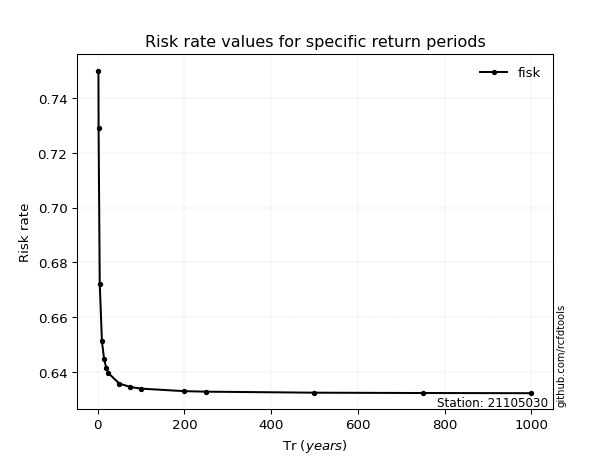</img>

</div>


<sub>**APP DISCLAIMER**: NO WARRANTY - This software is provided by [github.com/rcfdtools](https://github.com/rcfdtools) "as is", without any express or implied warranty, including warranties of merchantability, fitness for a particular purpose, or non-infringement. There is no guarantee that the software will be error-free or operate without interruption. LIMITATION OF LIABILITY - Neither the authors nor copyright holders will be liable for claims or damages arising from the software or its use. You are responsible for determining if the software is appropriate for your use and assume all associated risks, including errors, legal compliance, and data loss. NO PROFESSIONAL ADVICE - The software provides general information and does not offer professional advice. It should not replace consultation with professional advisors.</sub>