<div align="center">


</div>

# Station (rain, Pmax24h): 21107020

Probable Maximum Precipitation (PMP) is the greatest amount of rainfall for a specific duration that is meteorologically possible for a given location, acting as a "worst-case" scenario for extreme storms, crucial for designing safety-critical infrastructure like bridges, river deviations, dams, spillways, and nuclear plants to prevent catastrophic failure. PMP is calculated by hydrologists using meteorological data to determine the upper limit of extreme rainfall, often leading to the Probable Maximum Flood (PMF) for flood control design, and is increasingly being studied for climate change impacts.

<div align="center">

</img>

</div>


## A. General information


### 1. General running parameters

• app_version: _v20251225_. • runtime: _2025-12-26 14:29:50.888910_. • Python version: _3.14.0_. • SciPy version: _1.16.3_. • Pandas version: _2.3.3_. • NumPy version: _2.3.5_. • Stations dataset (station_dataset_file): _dataset/pmax24h_in/automatic_colombia.csv_. • Stations catalog (station_catalog_file): _dataset/CNE_IDEAM.xls_. • Plot only fit distributions with Δo > Δ (plot_only_fit): _True_. • Eval low extreme values, if False, evaluates high extreme values (low_extreme): _False_. • Eval every SciPy distribution as logarithmic (pdist_logarithmic_on): _True_. • Standard deviation normalized (ddof): _1.0_. • Return periods to eval in years (Tr): _[2, 2.33, 5, 10, 15, 20, 25, 50, 75, 100, 200, 250, 500, 750, 1000]_. • Minimum data sample per station, 0 means any (minimum_sample): _5_. • Z-Score threshold to adjust a value, 0 means disable (zscore): _3.5_. • Avoid zeros, e.g. rain = 0 (avoid_zeros): _True_. • Avoid null values (avoid_nans): _True_. [:file_folder:Dataset file.](../../dataset/pmax24h_in/automatic_colombia.csv)


### 2. Station info and location

|   id |   CODIGO | NOMBRE                  | CATEGORIA    | TECNOLOGIA   | ESTADO   | FECHA_INSTALACION   |   FECHA_SUSPENSION |   ALTITUD |   LATITUD |   LONGITUD | DEPARTAMENTO   | MUNICIPIO   | AREA_OPERATIVA                    | ENTIDAD                                                     | AREA_HIDROGRAFICA   | ZONA_HIDROGRAFICA   | SUBZONA_HIDROGRAFICA   | CORRIENTE   | OBSERVACION                                                                                                                                                                                                                        |   SUBRED | Catalogo   |
|-----:|---------:|:------------------------|:-------------|:-------------|:---------|:--------------------|-------------------:|----------:|----------:|-----------:|:---------------|:------------|:----------------------------------|:------------------------------------------------------------|:--------------------|:--------------------|:-----------------------|:------------|:-----------------------------------------------------------------------------------------------------------------------------------------------------------------------------------------------------------------------------------|---------:|:-----------|
|    0 | 21107020 | PUENTE MULAS [21107020] | Limnimétrica | Convencional | Activa   | 15/04/1967          |                nan |       740 |   2.56639 |   -75.3743 | Huila          | Campoalegre | Area Operativa 04 - Huila-Caquetá | INSTITUTO DE HIDROLOGIA METEOROLOGIA Y ESTUDIOS AMBIENTALES | Magdalena Cauca     | Alto Magdalena      | Rio Neiva              | Neiva       | Actualizada Tecnologia (Convencional) y Tipo de Transmision (N/A) por solicitud del coordinador del AO La Estacion ha sido objeto de bandalismo en varias oportunidades . Se acordo el retiro del componente automatico (19042023) |      nan | CNE_IDEAM  |

<div align="center">

Map location in: [:earth_americas:Google](http://maps.google.com/maps?q=2.566388889,-75.37427778) [:earth_americas:OSM](https://www.openstreetmap.org/#map=18/2.566388889/-75.37427778&layers=P) [:earth_americas:Bing](https://www.bing.com/maps?cp=2.566388889~-75.37427778&lvl=18) [:earth_americas:Apple](https://maps.apple.com/frame?center=2.566388889%2C-75.37427778&span=0.003%2C0.006)

</div>


<div align="center">

```geojson
{
  "type": "Feature",
  "geometry": {
    "type": "Point", 
    "coordinates": [-75.37427778, 2.566388889]
  }, 
  "properties": {
    "Name": "21107020"
  }
}
```

</div>


### 3. Discrete values table and plot

|               |          0 |            1 |           2 |           3 |          4 |
|:--------------|-----------:|-------------:|------------:|------------:|-----------:|
| Date          | 2019       | 2020         | 2021        | 2022        | 2024       |
| Value         |   86.6     |   46.8       |   34.8      |   50.6      |    2.4     |
| Value_initial |   86.6     |   46.8       |   34.8      |   50.6      |    2.4     |
| count         |    5       |    5         |    5        |    5        |    5       |
| mean          |   44.24    |   44.24      |   44.24     |   44.24     |   44.24    |
| std           |   30.3359  |   30.3359    |   30.3359   |   30.3359   |   30.3359  |
| zscore        |    1.39636 |    0.0843884 |   -0.311182 |    0.209652 |   -1.37922 |

<div align="center">

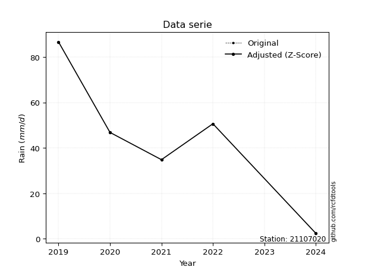</img>

</div>

> If Z-Score is active, values out of range or outliers are replaced with the station mean value.


### 4. Active continuous probability distributions from SciPy (45 of 104 available)

[scipy.stats](https://docs.scipy.org/doc/scipy/reference/stats.html) is a Python´s powerful submodule within the SciPy library for comprehensive statistical analysis, offering over 130 probability distributions (like Normal, Poisson), functions for descriptive stats (mean, variance), hypothesis testing (t-tests, chi-square), random variable generation, and statistical tests, making it essential for data science, modeling, and research. It provides tools to explore, model, and draw conclusions from data efficiently, working seamlessly with NumPy.

<div align="center">

|   id | p_dist             |   n_parameter | fit_method   | label                                                                       | active   | ref                                                                                                        |
|-----:|:-------------------|--------------:|:-------------|:----------------------------------------------------------------------------|:---------|:-----------------------------------------------------------------------------------------------------------|
|    0 | alpha              |             3 | MLE          | Alpha                                                                       | True     | [:mortar_board:](https://docs.scipy.org/doc/scipy/reference/generated/scipy.stats.alpha.html)              |
|    1 | betaprime          |             4 | MLE          | Beta prime                                                                  | True     | [:mortar_board:](https://docs.scipy.org/doc/scipy/reference/generated/scipy.stats.betaprime.html)          |
|    2 | chi2               |             3 | MLE          | Chi²                                                                        | True     | [:mortar_board:](https://docs.scipy.org/doc/scipy/reference/generated/scipy.stats.chi2.html)               |
|    3 | crystalball        |             4 | MLE          | Crystalball                                                                 | True     | [:mortar_board:](https://docs.scipy.org/doc/scipy/reference/generated/scipy.stats.crystalball.html)        |
|    4 | erlang             |             3 | MLE          | Erlang                                                                      | True     | [:mortar_board:](https://docs.scipy.org/doc/scipy/reference/generated/scipy.stats.erlang.html)             |
|    5 | expon              |             2 | MLE          | Exponential                                                                 | True     | [:mortar_board:](https://docs.scipy.org/doc/scipy/reference/generated/scipy.stats.expon.html)              |
|    6 | exponnorm          |             3 | MLE          | Exponentially modified Normal                                               | True     | [:mortar_board:](https://docs.scipy.org/doc/scipy/reference/generated/scipy.stats.exponnorm.html)          |
|    7 | f                  |             4 | MLE          | F                                                                           | True     | [:mortar_board:](https://docs.scipy.org/doc/scipy/reference/generated/scipy.stats.f.html)                  |
|    8 | fatiguelife        |             3 | MLE          | Fatigue-life (Birnbaum-Saunders)                                            | True     | [:mortar_board:](https://docs.scipy.org/doc/scipy/reference/generated/scipy.stats.fatiguelife.html)        |
|    9 | fisk               |             3 | MLE          | Fisk                                                                        | True     | [:mortar_board:](https://docs.scipy.org/doc/scipy/reference/generated/scipy.stats.fisk.html)               |
|   10 | gamma              |             3 | MLE          | Gamma                                                                       | True     | [:mortar_board:](https://docs.scipy.org/doc/scipy/reference/generated/scipy.stats.gamma.html)              |
|   11 | genexpon           |             5 | MLE          | Generalized exponential                                                     | True     | [:mortar_board:](https://docs.scipy.org/doc/scipy/reference/generated/scipy.stats.genexpon.html)           |
|   12 | genlogistic        |             3 | MLE          | Generalized logistic                                                        | True     | [:mortar_board:](https://docs.scipy.org/doc/scipy/reference/generated/scipy.stats.genlogistic.html)        |
|   13 | gibrat             |             2 | MM           | Gibrat                                                                      | True     | [:mortar_board:](https://docs.scipy.org/doc/scipy/reference/generated/scipy.stats.gibrat.html)             |
|   14 | gompertz           |             3 | MLE          | Gompertz (or truncated Gumbel)                                              | True     | [:mortar_board:](https://docs.scipy.org/doc/scipy/reference/generated/scipy.stats.gompertz.html)           |
|   15 | gumbel_l           |             2 | MM           | Gumbel Left Skew                                                            | True     | [:mortar_board:](https://docs.scipy.org/doc/scipy/reference/generated/scipy.stats.gumbel_l.html)           |
|   16 | gumbel_r           |             2 | MM           | Gumbel Right Skew                                                           | True     | [:mortar_board:](https://docs.scipy.org/doc/scipy/reference/generated/scipy.stats.gumbel_r.html)           |
|   17 | halflogistic       |             2 | MM           | Half-logistic                                                               | True     | [:mortar_board:](https://docs.scipy.org/doc/scipy/reference/generated/scipy.stats.halflogistic.html)       |
|   18 | halfnorm           |             2 | MM           | Half Normal                                                                 | True     | [:mortar_board:](https://docs.scipy.org/doc/scipy/reference/generated/scipy.stats.halfnorm.html)           |
|   19 | hypsecant          |             2 | MM           | hyperbolic secant                                                           | True     | [:mortar_board:](https://docs.scipy.org/doc/scipy/reference/generated/scipy.stats.hypsecant.html)          |
|   20 | invgamma           |             3 | MLE          | Inverted gamma                                                              | True     | [:mortar_board:](https://docs.scipy.org/doc/scipy/reference/generated/scipy.stats.invgamma.html)           |
|   21 | invgauss           |             3 | MLE          | Inverse Gaussian                                                            | True     | [:mortar_board:](https://docs.scipy.org/doc/scipy/reference/generated/scipy.stats.invgauss.html)           |
|   22 | invweibull         |             3 | MLE          | Inverted Weibull                                                            | True     | [:mortar_board:](https://docs.scipy.org/doc/scipy/reference/generated/scipy.stats.invweibull.html)         |
|   23 | johnsonsu          |             4 | MLE          | Johnson Su                                                                  | True     | [:mortar_board:](https://docs.scipy.org/doc/scipy/reference/generated/scipy.stats.johnsonsu.html)          |
|   24 | kstwobign          |             2 | MLE          | Limiting distribution of scaled Kolmogorov-Smirnov two-sided test statistic | True     | [:mortar_board:](https://docs.scipy.org/doc/scipy/reference/generated/scipy.stats.kstwobign.html)          |
|   25 | laplace            |             2 | MM           | Laplace                                                                     | True     | [:mortar_board:](https://docs.scipy.org/doc/scipy/reference/generated/scipy.stats.laplace.html)            |
|   26 | laplace_asymmetric |             3 | MLE          | Asymmetric Laplace                                                          | True     | [:mortar_board:](https://docs.scipy.org/doc/scipy/reference/generated/scipy.stats.laplace_asymmetric.html) |
|   27 | loggamma           |             3 | MLE          | Log gamma                                                                   | True     | [:mortar_board:](https://docs.scipy.org/doc/scipy/reference/generated/scipy.stats.loggamma.html)           |
|   28 | logistic           |             2 | MM           | Logistic (or Sech-squared)                                                  | True     | [:mortar_board:](https://docs.scipy.org/doc/scipy/reference/generated/scipy.stats.logistic.html)           |
|   29 | lognorm            |             3 | MLE          | Log Normal                                                                  | True     | [:mortar_board:](https://docs.scipy.org/doc/scipy/reference/generated/scipy.stats.lognorm.html)            |
|   30 | maxwell            |             2 | MM           | Maxwell                                                                     | True     | [:mortar_board:](https://docs.scipy.org/doc/scipy/reference/generated/scipy.stats.maxwell.html)            |
|   31 | mielke             |             4 | MLE          | Mielke Beta-Kappa / Dagum                                                   | True     | [:mortar_board:](https://docs.scipy.org/doc/scipy/reference/generated/scipy.stats.mielke.html)             |
|   32 | moyal              |             2 | MM           | Moyal                                                                       | True     | [:mortar_board:](https://docs.scipy.org/doc/scipy/reference/generated/scipy.stats.moyal.html)              |
|   33 | nakagami           |             3 | MLE          | Nakagami                                                                    | True     | [:mortar_board:](https://docs.scipy.org/doc/scipy/reference/generated/scipy.stats.nakagami.html)           |
|   34 | ncf                |             5 | MLE          | Non-central F distribution                                                  | True     | [:mortar_board:](https://docs.scipy.org/doc/scipy/reference/generated/scipy.stats.ncf.html)                |
|   35 | nct                |             4 | MLE          | Non-central Student’s t                                                     | True     | [:mortar_board:](https://docs.scipy.org/doc/scipy/reference/generated/scipy.stats.nct.html)                |
|   36 | norm               |             2 | MM           | Normal                                                                      | True     | [:mortar_board:](https://docs.scipy.org/doc/scipy/reference/generated/scipy.stats.norm.html)               |
|   37 | pareto             |             3 | MLE          | Pareto                                                                      | True     | [:mortar_board:](https://docs.scipy.org/doc/scipy/reference/generated/scipy.stats.pareto.html)             |
|   38 | pearson3           |             3 | MM           | Pearson type III                                                            | True     | [:mortar_board:](https://docs.scipy.org/doc/scipy/reference/generated/scipy.stats.pearson3.html)           |
|   39 | rayleigh           |             2 | MM           | Rayleigh                                                                    | True     | [:mortar_board:](https://docs.scipy.org/doc/scipy/reference/generated/scipy.stats.rayleigh.html)           |
|   40 | rice               |             3 | MLE          | Rice                                                                        | True     | [:mortar_board:](https://docs.scipy.org/doc/scipy/reference/generated/scipy.stats.rice.html)               |
|   41 | t                  |             3 | MLE          | Student’s t                                                                 | True     | [:mortar_board:](https://docs.scipy.org/doc/scipy/reference/generated/scipy.stats.t.html)                  |
|   42 | truncnorm          |             4 | MLE          | Truncated normal                                                            | True     | [:mortar_board:](https://docs.scipy.org/doc/scipy/reference/generated/scipy.stats.truncnorm.html)          |
|   43 | wald               |             2 | MM           | Wald                                                                        | True     | [:mortar_board:](https://docs.scipy.org/doc/scipy/reference/generated/scipy.stats.wald.html)               |
|   44 | weibull_min        |             3 | MLE          | Weibull minimum                                                             | True     | [:mortar_board:](https://docs.scipy.org/doc/scipy/reference/generated/scipy.stats.weibull_min.html)        |

</div>

> **n_parameter:** # arguments & localization & scale.
>
> **Fit methods:** (MLE) maximum likelihood, (MM) L-moments.
>
>**Inactive:** foldnorm, gennorm, norminvgauss, powernorm, powerlognorm, skewnorm, genextreme, anglit, arcsine, argus, beta, bradford, burr, burr12, cauchy, cosine, halfcauchy, foldcauchy, skewcauchy, wrapcauchy, dgamma, gengamma, exponweib, exponpow, truncexpon, gausshyper, genhalflogistic, genhyperbolic, geninvgauss, halfgennorm, johnsonsb, kappa4, kappa3, ksone, kstwo, loglaplace, levy, levy_l, levy_stable, ncx2, genpareto, truncpareto, lomax, powerlaw, rdist, rel_breitwigner, recipinvgauss, semicircular, studentized_range, trapezoid, triang, truncweibull_min, tukeylambda, uniform, loguniform, vonmises, vonmises_line, weibull_max, dweibull, 


## B. Probability distributions vs. Empirical distributions

A continuous probability distribution (CPD) describes probabilities for variables that can take any value within a range (like rain any time), unlike discrete variables with specific outcomes (like temperature). It uses a Probability Density Function (PDF), a curve where the total area under it equals 1, and the probability of the variable falling within an interval (a to b) is found by calculating the area under the curve between those points. A key feature is that the probability of hitting any single exact value is zero, so probabilities are always expressed for ranges, e.g., $P(a ≤ X ≤ b)$.

<div align="center">

Distributions parameters
|    |   station | p_dist                |   n |             loc |           scale | shape                  | shape1                 | shape2                 | shape3   |
|---:|----------:|:----------------------|----:|----------------:|----------------:|:-----------------------|:-----------------------|:-----------------------|:---------|
|  0 |  21107020 | alpha                 |   5 |   -37.0265      |   158.979       | 2.41603292372202       |                        |                        |          |
|  1 |  21107020 | betaprime             |   5 |  -537.082       | 27157.6         | 468.2221595321889      | 21874.959592009443     |                        |          |
|  2 |  21107020 | chi2                  |   5 |     2.4         |     3.09913     | 1.2333728841012657     |                        |                        |          |
|  3 |  21107020 | crystalball           |   5 |    44.24        |    27.1333      | 1251.623506165241      | 7630.2641219701745     |                        |          |
|  4 |  21107020 | erlang                |   5 | -2334.77        |     0.309449    | 7687.900221101299      |                        |                        |          |
|  5 |  21107020 | expon                 |   5 |     2.4         |    41.84        |                        |                        |                        |          |
|  6 |  21107020 | exponnorm             |   5 |    43.3621      |    27.1191      | 0.03237188187464306    |                        |                        |          |
|  7 |  21107020 | f                     |   5 |  -826.448       |   870.655       | 2056.6695392376278     | 994252.8533231695      |                        |          |
|  8 |  21107020 | fatiguelife           |   5 |     2.4         |     3.47068e-06 | 3163.497453357246      |                        |                        |          |
|  9 |  21107020 | fisk                  |   5 | -2621.33        |  2665.45        | 171.10901786570878     |                        |                        |          |
| 10 |  21107020 | gamma                 |   5 | -2324.45        |     0.310771    | 7621.960867883403      |                        |                        |          |
| 11 |  21107020 | genexpon              |   5 |     2.39998     |     2.72436     | 0.06514862777586511    | 3.2612770605875535e-08 | 2.1667532701739303     |          |
| 12 |  21107020 | genlogistic           |   5 |    41.9331      |    16.1023      | 1.0988473698503909     |                        |                        |          |
| 13 |  21107020 | gibrat                |   5 |    23.5407      |    12.5547      |                        |                        |                        |          |
| 14 |  21107020 | gompertz              |   5 |    34.8         |    30.8332      | 0.7258897010901566     |                        |                        |          |
| 15 |  21107020 | gumbel_l              |   5 |    56.4514      |    21.1557      |                        |                        |                        |          |
| 16 |  21107020 | gumbel_r              |   5 |    32.0286      |    21.1557      |                        |                        |                        |          |
| 17 |  21107020 | halflogistic          |   5 |    12.0807      |    23.198       |                        |                        |                        |          |
| 18 |  21107020 | halfnorm              |   5 |     8.32622     |    45.0112      |                        |                        |                        |          |
| 19 |  21107020 | hypsecant             |   5 |    44.24        |    17.2736      |                        |                        |                        |          |
| 20 |  21107020 | invgamma              |   5 |  -210.405       | 22008           | 87.45993293547643      |                        |                        |          |
| 21 |  21107020 | invgauss              |   5 |  -124.149       |  5985.05        | 0.028146281402947643   |                        |                        |          |
| 22 |  21107020 | invweibull            |   5 |     2.4         |     3.03156     | 0.04042453366090277    |                        |                        |          |
| 23 |  21107020 | johnsonsu             |   5 |  -805.266       |  1948.2         | -33.14029125500582     | 78.29845647181597      |                        |          |
| 24 |  21107020 | kstwobign             |   5 |   -58.377       |   117.385       |                        |                        |                        |          |
| 25 |  21107020 | laplace               |   5 |    44.24        |    19.1861      |                        |                        |                        |          |
| 26 |  21107020 | laplace_asymmetric    |   5 |    46.8         |    19.8765      | 1.0664673284785815     |                        |                        |          |
| 27 |  21107020 | loggamma              |   5 | -6791.12        |   959.317       | 1243.3945868027722     |                        |                        |          |
| 28 |  21107020 | logistic              |   5 |    44.24        |    14.9594      |                        |                        |                        |          |
| 29 |  21107020 | lognorm               |   5 |     2.4         |     0.0191757   | 15.70121779728254      |                        |                        |          |
| 30 |  21107020 | maxwell               |   5 |   -20.0545      |    40.2906      |                        |                        |                        |          |
| 31 |  21107020 | mielke                |   5 |     2.4         |    84.6326      | 0.8776237249905094     | 4774.417208775234      |                        |          |
| 32 |  21107020 | moyal                 |   5 |    28.7235      |    12.2143      |                        |                        |                        |          |
| 33 |  21107020 | nakagami              |   5 |     2.4         |    55.4923      | 0.3380113218130668     |                        |                        |          |
| 34 |  21107020 | ncf                   |   5 |    -0.0791414   |     5.56483     | 1.1883956906278241     | 26.4975189203507       | 7.382957327289816      |          |
| 35 |  21107020 | nct                   |   5 |    -0.358829    |     0.112013    | 0.4634265984071861     | 54.73621077272456      |                        |          |
| 36 |  21107020 | norm                  |   5 |    44.24        |    27.1333      |                        |                        |                        |          |
| 37 |  21107020 | pareto                |   5 |     1.98672     |     0.413279    | 0.26109854341544847    |                        |                        |          |
| 38 |  21107020 | pearson3              |   5 |    44.24        |    27.1332      | 0.02201482693131468    |                        |                        |          |
| 39 |  21107020 | rayleigh              |   5 |    -7.66753     |    41.4162      |                        |                        |                        |          |
| 40 |  21107020 | rice                  |   5 |   -13.0668      |    31.295       | 1.4508418449053213     |                        |                        |          |
| 41 |  21107020 | t                     |   5 |    44.24        |    27.1332      | 1509437673.7811627     |                        |                        |          |
| 42 |  21107020 | truncnorm             |   5 |   -41.5031      |    13.5062      | -5.57967976097969      | 9.484752892517708      |                        |          |
| 43 |  21107020 | wald                  |   5 |    17.1068      |    27.1332      |                        |                        |                        |          |
| 44 |  21107020 | weibull_min           |   5 |   -21.204       |    73.7149      | 2.636523260844572      |                        |                        |          |
| 45 |  21107020 | logalpha              |   5 |   -20.6571      |   426.428       | 17.830046412657012     |                        |                        |          |
| 46 |  21107020 | logbetaprime          |   5 |   -26.3823      |   366.264       | 547.6856405972958      | 6748.272401424031      |                        |          |
| 47 |  21107020 | logchi2               |   5 |   -16.9257      |     0.0429798   | 470.8387661626153      |                        |                        |          |
| 48 |  21107020 | logcrystalball        |   5 |     3.33124     |     1.26267     | 82.95194309218371      | 17285.335104535196     |                        |          |
| 49 |  21107020 | logerlang             |   5 |   -19.8567      |     0.0764718   | 303.2032142395103      |                        |                        |          |
| 50 |  21107020 | logexpon              |   5 |     0.875469    |     2.45578     |                        |                        |                        |          |
| 51 |  21107020 | logexponnorm          |   5 |     3.33057     |     1.26267     | 0.0005290818583634583  |                        |                        |          |
| 52 |  21107020 | logf                  |   5 | -1970.59        |  1973.91        | 14659396.71245344      | 7326299.226642584      |                        |          |
| 53 |  21107020 | logfatiguelife        |   5 |  -701.299       |   704.627       | 0.0017954190167930005  |                        |                        |          |
| 54 |  21107020 | logfisk               |   5 |    -6.13573e+07 |     6.13573e+07 | 93177861.05538836      |                        |                        |          |
| 55 |  21107020 | loggamma              |   5 |   -17.696       |     0.0822259   | 255.48102023260677     |                        |                        |          |
| 56 |  21107020 | loggenexpon           |   5 |     0.874715    |     0.0402619   | 0.0067119838216025615  | 2.142514270428716      | 0.00011712751192016448 |          |
| 57 |  21107020 | loggenlogistic        |   5 |     4.46133     |     2.01676e-06 | 1.7839292736160036e-06 |                        |                        |          |
| 58 |  21107020 | loggibrat             |   5 |     2.36796     |     0.584261    |                        |                        |                        |          |
| 59 |  21107020 | loggompertz           |   5 |     0.875468    |     0.828109    | 0.02889223838405628    |                        |                        |          |
| 60 |  21107020 | loggumbel_l           |   5 |     3.89951     |     0.984501    |                        |                        |                        |          |
| 61 |  21107020 | loggumbel_r           |   5 |     2.76297     |     0.984501    |                        |                        |                        |          |
| 62 |  21107020 | loghalflogistic       |   5 |     1.83473     |     1.07951     |                        |                        |                        |          |
| 63 |  21107020 | loghalfnorm           |   5 |     1.65994     |     2.09466     |                        |                        |                        |          |
| 64 |  21107020 | loghypsecant          |   5 |     3.33124     |     0.803842    |                        |                        |                        |          |
| 65 |  21107020 | loginvgamma           |   5 |   -24.4031      | 11669.9         | 421.86929525179494     |                        |                        |          |
| 66 |  21107020 | loginvgauss           |   5 |    -9.91673     |  1219.8         | 0.010862944623098482   |                        |                        |          |
| 67 |  21107020 | loginvweibull         |   5 |    -1.14619e+08 |     1.14619e+08 | 78655854.15820411      |                        |                        |          |
| 68 |  21107020 | logjohnsonsu          |   5 |     4.54398     |     0.00198458  | 5.337667425183378      | 0.8202635447733333     |                        |          |
| 69 |  21107020 | logkstwobign          |   5 |    -2.47725     |     6.62025     |                        |                        |                        |          |
| 70 |  21107020 | loglaplace            |   5 |     3.33124     |     0.892844    |                        |                        |                        |          |
| 71 |  21107020 | loglaplace_asymmetric |   5 |     3.92395     |     0.609912    | 1.5976136893144846     |                        |                        |          |
| 72 |  21107020 | logloggamma           |   5 |     4.46135     |     2.87883e-06 | 2.5349957454467764e-06 |                        |                        |          |
| 73 |  21107020 | loglogistic           |   5 |     3.33124     |     0.696147    |                        |                        |                        |          |
| 74 |  21107020 | loglognorm            |   5 |     0.875469    |     0.00157332  | 15.141408742564497     |                        |                        |          |
| 75 |  21107020 | logmaxwell            |   5 |     0.339242    |     1.87496     |                        |                        |                        |          |
| 76 |  21107020 | logmielke             |   5 |    -4.64255e+07 |     4.64255e+07 | 40351687.62211488      | 10087176227.587753     |                        |          |
| 77 |  21107020 | logmoyal              |   5 |     2.60917     |     0.568402    |                        |                        |                        |          |
| 78 |  21107020 | lognakagami           |   5 |     3.54962     |     0.483446    | 0.07529285840966718    |                        |                        |          |
| 79 |  21107020 | logncf                |   5 |   -64.0395      |    67.3558      | 14246.643210659102     | 8673.381679726961      | 1.8143639788870524e-08 |          |
| 80 |  21107020 | lognct                |   5 |   -89.6523      |     1.23093     | 50539.63344599215      | 75.53739937063612      |                        |          |
| 81 |  21107020 | lognorm               |   5 |     3.33124     |     1.26267     |                        |                        |                        |          |
| 82 |  21107020 | logpareto             |   5 |     0.85013     |     0.0253387   | 0.2604315991614931     |                        |                        |          |
| 83 |  21107020 | logpearson3           |   5 |     3.33124     |     1.26267     | -1.2927868367122537    |                        |                        |          |
| 84 |  21107020 | lograyleigh           |   5 |     0.915667    |     1.92735     |                        |                        |                        |          |
| 85 |  21107020 | logrice               |   5 |    -0.176679    |     1.35209     | 2.3671180307628417     |                        |                        |          |
| 86 |  21107020 | logt                  |   5 |     3.87314     |     0.13095     | 0.5833597704544247     |                        |                        |          |
| 87 |  21107020 | logtruncnorm          |   5 |     0.857333    |     2.76942     | 0.006548518229214125   | 457.2284116110686      |                        |          |
| 88 |  21107020 | logwald               |   5 |     2.06856     |     1.26268     |                        |                        |                        |          |
| 89 |  21107020 | logweibull_min        |   5 |     0.875469    |     1.26109     | 0.6838303944616295     |                        |                        |          |

</div>

> **loc** (Location parameter): This shifts the distribution along the x-axis. For many common distributions, like the normal (Gaussian) distribution, loc represents the mean $μ$. For others, like the uniform distribution, it might represent the minimum value, or for the beta distribution, the left end of the support interval.
>
> **scale** (Scale parameter): This determines the width or spread of the distribution. For the normal distribution, scale represents the standard deviation $σ$. For a uniform distribution, it defines the length of the interval (from $loc$ to $loc + scale$).
>
> **shape** (Shape parameters): Refers to parameters that define the specific form of a probability distribution, distinct from its location (loc) and scale (scale). These parameters are required arguments for most distribution functions. For example, a normal (Gaussian) distribution is fully defined by its location (mean) and scale (standard deviation), so it has no specific shape parameters beyond loc and scale. However, other distributions have intrinsic properties that need specification, as Gamma distribution that takes a shape parameter, often named $a$ or $alpha$.


### 0. Cumulative distribution values - CDF (90 evaluated)

> Ordered by x ascending and calculating $log(f(x))$ separately. 

|   id |   Station |   date |    x |   count |   mean |     std |     zscore |   Value_initial |   station |   m |     alpha |   alpha_pdf |   betaprime |   betaprime_pdf |        chi2 |         chi2_pdf |   crystalball |   crystalball_pdf |    erlang |   erlang_pdf |    expon |   expon_pdf |   exponnorm |   exponnorm_pdf |        f |      f_pdf |   fatiguelife |   fatiguelife_pdf |      fisk |   fisk_pdf |     gamma |   gamma_pdf |    genexpon |   genexpon_pdf |   genlogistic |   genlogistic_pdf |   gibrat |   gibrat_pdf |    gompertz |   gompertz_pdf |   gumbel_l |   gumbel_l_pdf |   gumbel_r |   gumbel_r_pdf |   halflogistic |   halflogistic_pdf |   halfnorm |   halfnorm_pdf |   hypsecant |   hypsecant_pdf |   invgamma |   invgamma_pdf |   invgauss |   invgauss_pdf |   invweibull |   invweibull_pdf |   johnsonsu |   johnsonsu_pdf |   kstwobign |   kstwobign_pdf |   laplace |   laplace_pdf |   laplace_asymmetric |   laplace_asymmetric_pdf |   loggamma |   loggamma_pdf |   logistic |   logistic_pdf |   lognorm |   lognorm_pdf |   maxwell |   maxwell_pdf |     mielke |   mielke_pdf |      moyal |   moyal_pdf |    nakagami |   nakagami_pdf |       ncf |    ncf_pdf |       nct |    nct_pdf |      norm |   norm_pdf |      pareto |   pareto_pdf |   pearson3 |   pearson3_pdf |   rayleigh |   rayleigh_pdf |      rice |   rice_pdf |         t |      t_pdf |   truncnorm |   truncnorm_pdf |     wald |   wald_pdf |   weibull_min |   weibull_min_pdf |   logalpha |   logalpha_pdf |   logbetaprime |   logbetaprime_pdf |   logchi2 |   logchi2_pdf |   logcrystalball |   logcrystalball_pdf |   logerlang |   logerlang_pdf |   logexpon |   logexpon_pdf |   logexponnorm |   logexponnorm_pdf |      logf |   logf_pdf |   logfatiguelife |   logfatiguelife_pdf |   logfisk |   logfisk_pdf |   loggenexpon |   loggenexpon_pdf |   loggenlogistic |   loggenlogistic_pdf |   loggibrat |   loggibrat_pdf |   loggompertz |   loggompertz_pdf |   loggumbel_l |   loggumbel_l_pdf |   loggumbel_r |   loggumbel_r_pdf |   loghalflogistic |   loghalflogistic_pdf |   loghalfnorm |   loghalfnorm_pdf |   loghypsecant |   loghypsecant_pdf |   loginvgamma |   loginvgamma_pdf |   loginvgauss |   loginvgauss_pdf |   loginvweibull |   loginvweibull_pdf |   logjohnsonsu |   logjohnsonsu_pdf |   logkstwobign |   logkstwobign_pdf |   loglaplace |   loglaplace_pdf |   loglaplace_asymmetric |   loglaplace_asymmetric_pdf |   logloggamma |   logloggamma_pdf |   loglogistic |   loglogistic_pdf |   loglognorm |   loglognorm_pdf |   logmaxwell |   logmaxwell_pdf |   logmielke |   logmielke_pdf |    logmoyal |   logmoyal_pdf |   lognakagami |   lognakagami_pdf |    logncf |   logncf_pdf |    lognct |   lognct_pdf |   logpareto |   logpareto_pdf |   logpearson3 |   logpearson3_pdf |   lograyleigh |   lograyleigh_pdf |   logrice |   logrice_pdf |      logt |   logt_pdf |   logtruncnorm |   logtruncnorm_pdf |   logwald |   logwald_pdf |   logweibull_min |   logweibull_min_pdf |
|-----:|----------:|-------:|-----:|--------:|-------:|--------:|-----------:|----------------:|----------:|----:|----------:|------------:|------------:|----------------:|------------:|-----------------:|--------------:|------------------:|----------:|-------------:|---------:|------------:|------------:|----------------:|---------:|-----------:|--------------:|------------------:|----------:|-----------:|----------:|------------:|------------:|---------------:|--------------:|------------------:|---------:|-------------:|------------:|---------------:|-----------:|---------------:|-----------:|---------------:|---------------:|-------------------:|-----------:|---------------:|------------:|----------------:|-----------:|---------------:|-----------:|---------------:|-------------:|-----------------:|------------:|----------------:|------------:|----------------:|----------:|--------------:|---------------------:|-------------------------:|-----------:|---------------:|-----------:|---------------:|----------:|--------------:|----------:|--------------:|-----------:|-------------:|-----------:|------------:|------------:|---------------:|----------:|-----------:|----------:|-----------:|----------:|-----------:|------------:|-------------:|-----------:|---------------:|-----------:|---------------:|----------:|-----------:|----------:|-----------:|------------:|----------------:|---------:|-----------:|--------------:|------------------:|-----------:|---------------:|---------------:|-------------------:|----------:|--------------:|-----------------:|---------------------:|------------:|----------------:|-----------:|---------------:|---------------:|-------------------:|----------:|-----------:|-----------------:|---------------------:|----------:|--------------:|--------------:|------------------:|-----------------:|---------------------:|------------:|----------------:|--------------:|------------------:|--------------:|------------------:|--------------:|------------------:|------------------:|----------------------:|--------------:|------------------:|---------------:|-------------------:|--------------:|------------------:|--------------:|------------------:|----------------:|--------------------:|---------------:|-------------------:|---------------:|-------------------:|-------------:|-----------------:|------------------------:|----------------------------:|--------------:|------------------:|--------------:|------------------:|-------------:|-----------------:|-------------:|-----------------:|------------:|----------------:|------------:|---------------:|--------------:|------------------:|----------:|-------------:|----------:|-------------:|------------:|----------------:|--------------:|------------------:|--------------:|------------------:|----------:|--------------:|----------:|-----------:|---------------:|-------------------:|----------:|--------------:|-----------------:|---------------------:|
|    0 |  21107020 |   2024 |  2.4 |       5 |  44.24 | 30.3359 | -1.37922   |             2.4 |  21107020 |   1 | 0.0534384 |  0.0111389  |   0.0588615 |      0.00454769 | 1.23496e-10 | 171494           |     0.0615346 |        0.00447786 | 0.0608916 |   0.00449422 | 0        |  0.0239006  |   0.0615327 |      0.0044779  | 0.060187 | 0.00454067 |      0.121109 |        4.6428e+11 | 0.0629989 | 0.0038497  | 0.0608868 |  0.00449438 | 5.75217e-07 |      0.0239134 |     0.0615247 |        0.0038666  | 0        |   0          | 0           |      0         |  0.0747558 |     0.0033981  |  0.0172969 |     0.00331719 |       0        |         0          |   0        |     0          |   0.0563375 |      0.00324448 |  0.0497195 |     0.00477357 |  0.0511662 |     0.00501706 |    0.0127011 |      5.04787e+12 |   0.0612222 |      0.00449289 |   0.0485612 |      0.00655524 | 0.0564788 |    0.00294373 |            0.0655178 |               0.0030908  |  0.0281243 |      0.0532854 |  0.0574913 |     0.00362222 | 0.0258933 |      0.047668 | 0.0419768 |    0.0052661  | 2.3566e-11 |    0.314561  | 0.00330835 |  0.00128304 | 2.14979e-12 |  3272.56       | 0.0196191 | 0.00765407 | 0.0502501 | 0.0606234  | 0.0615346 | 0.00447786 | 1.11022e-16 |  0.631773    |  0.0609124 |     0.00449347 |  0.0291122 |     0.00569838 | 0.0427128 | 0.00552655 | 0.0615343 | 0.00447785 |    0.999424 |     0.000149944 | 0        | 0          |     0.0484524 |        0.00527876 |  0.0242048 |      0.0523142 |      0.0277849 |          0.0514319 | 0.0284362 |     0.0537677 |        0.0258933 |             0.047668 |   0.0291631 |       0.0537918 |   0        |       0.407203 |      0.0258933 |          0.0476682 | 0.0260588 |  0.0479755 |        0.0260315 |            0.0479559 | 0.0157697 |     0.0235703 |    0.00012561 |          0.166804 |         0        |            0.0370846 |    0        |       0         |   1.77407e-08 |         0.0348894 |      0.045287 |         0.0449423 |    0.00111152 |        0.00767962 |          0        |              0        |      0        |          0        |      0.0299756 |          0.0372354 |     0.0290319 |          0.05545  |     0.0272244 |         0.0561724 |        0.035562 |           0.0814231 |      0.0806026 |          0.0334302 |       0.04032  |           0.10367  |    0.0319476 |        0.0357819 |               0.0314563 |                   0.0322826 |     0.0425275 |         0.0374483 |     0.0285352 |         0.0398205 |    0.0227522 |      3.21202e+13 |   0.00607095 |        0.0334118 |    0.043618 |       0.0379115 | 4.31845e-06 |    8.37256e-05 |    0          |       0           | 0.0273817 |    0.0505863 | 0.0260376 |    0.0479257 | 1.11022e-16 |      10.278     |     0.0487308 |         0.0468267 |      0        |          0        |  0.023191 |     0.0528146 | 0.0506719 | 0.00985424 |    9.12492e-13 |           0.289612 |  0        |     0         |      1.04924e-11 |        64626.8       |
|    1 |  21107020 |   2021 | 34.8 |       5 |  44.24 | 30.3359 | -0.311182  |            34.8 |  21107020 |   2 | 0.584886  |  0.012139   |   0.369309  |      0.0140528  | 0.998156    |      0.000316393 |     0.363953  |        0.0138396  | 0.365223  |   0.0138928  | 0.53901  |  0.0110179  |   0.363957  |      0.0138398  | 0.36806  | 0.0139689  |      0.832934 |        0.00372971 | 0.354455  | 0.0147405  | 0.365242  |  0.0138938  | 0.539202    |      0.0110193 |     0.356369  |        0.0148097  | 0.456639 |   0.0352228  | 8.38021e-08 |      0.0235425 |  0.301877  |     0.0118586  |  0.415939  |     0.0172468  |       0.453963 |         0.0171118  |   0.443575 |     0.0149108  |   0.334108  |      0.0159811  |  0.390244  |     0.0147583  |  0.395823  |     0.0145047  |    0.403058  |      0.000456958 |   0.364945  |      0.0138711  |   0.445691  |      0.0139483  | 0.305694  |    0.0159331  |            0.30211   |               0.014252   |  0.579874  |      0.295179  |  0.347274  |     0.0151527  | 0.568653  |      0.311261 | 0.39666   |    0.0145294  | 0.430564   |    0.0116627 | 0.435522   |  0.0187921  | 0.524572    |     0.0100367  | 0.481145  | 0.0145746  | 0.652033  | 0.00456034 | 0.363953  | 0.0138396  | 0.680873    |  0.00253932  |  0.365164  |     0.0138905  |  0.408862  |     0.0146354  | 0.384914  | 0.0141208  | 0.363953  | 0.0138396  |    1        |     3.46548e-09 | 0.483911 | 0.0254473  |     0.384045  |        0.0140517  |  0.584724  |      0.283751  |      0.566803  |          0.296325  | 0.58006   |     0.294025  |        0.568653  |             0.311261 |   0.572865  |       0.292716  |   0.663421 |       0.137056 |      0.568655  |          0.311261  | 0.570019  |  0.310945  |        0.569274  |            0.310481  | 0.481813  |     0.37915   |    0.631505   |          0.213431 |         0        |            0.394898  |    0.759384 |       0.26345   |   0.503875    |         0.437239  |      0.503856 |         0.353216  |    0.637777   |        0.291367   |          0.660831 |              0.260905 |      0.633017 |          0.253571 |      0.585428  |          0.38181   |     0.578434  |          0.286439 |     0.582041  |         0.278592  |        0.587138 |           0.21455   |      0.370615  |          0.31163   |       0.621425 |           0.203882 |    0.608484  |        0.438504  |               0.489309  |                   0.502163  |     0.448054  |         0.394541  |     0.577785  |         0.350428  |    0.688375  |      0.00873283  |   0.597733   |        0.28804   |    0.445752 |       0.387435  | 0.661938    |    0.278907    |    0.00465596 |       1.57878e+12 | 0.570604  |    0.301548  | 0.568971  |    0.310516  | 0.703533    |       0.0286015 |     0.484326  |         0.338098  |      0.606952 |          0.278697 |  0.574518 |     0.301439  | 0.182705  | 0.311559   |    0.667284    |           0.180554 |  0.729015 |     0.245563  |      0.812125    |            0.0803272 |
|    2 |  21107020 |   2020 | 46.8 |       5 |  44.24 | 30.3359 |  0.0843884 |            46.8 |  21107020 |   3 | 0.703818  |  0.00794883 |   0.543819  |      0.0145603  | 0.999761    |      4.04546e-05 |     0.537584  |        0.0146378  | 0.539099  |   0.0146222  | 0.653955 |  0.00827068 |   0.537589  |      0.0146377  | 0.542081 | 0.0145674  |      0.870893 |        0.00268061 | 0.542843  | 0.015915   | 0.539128  |  0.0146227  | 0.654152    |      0.0082704 |     0.544384  |        0.0157889  | 0.731253 |   0.0141825  | 0.29204     |      0.0245971 |  0.469366  |     0.0158942  |  0.608068  |     0.0142985  |       0.634148 |         0.0128859  |   0.607316 |     0.0123018  |   0.547003  |      0.018227   |  0.566829  |     0.0141932  |  0.567975  |     0.0137557  |    0.40772   |      0.000333044 |   0.538674  |      0.0146209  |   0.601721  |      0.0118629  | 0.562456  |    0.0228053  |            0.532131  |               0.0251033  |  0.664307  |      0.272786  |  0.542678  |     0.0165902  | 0.658209  |      0.290768 | 0.568755  |    0.0137632  | 0.567714   |    0.0112216 | 0.633273   |  0.0139073  | 0.633557    |     0.00819077 | 0.637154  | 0.0113407  | 0.696127  | 0.00297666 | 0.537584  | 0.0146378  | 0.705814    |  0.00171403  |  0.539028  |     0.0146225  |  0.578855  |     0.013373   | 0.555699  | 0.013959   | 0.537584  | 0.0146378  |    1        |     1.54322e-11 | 0.703225 | 0.0127911  |     0.554463  |        0.0139652  |  0.665306  |      0.258658  |      0.651972  |          0.27651   | 0.664157  |     0.271699  |        0.658209  |             0.290768 |   0.656829  |       0.272097  |   0.701672 |       0.12148  |      0.658211  |          0.290768  | 0.659441  |  0.290202  |        0.658579  |            0.289878  | 0.593181  |     0.366467  |    0.691694   |          0.192595 |         0        |            0.513212  |    0.823308 |       0.175484  |   0.63754     |         0.456838  |      0.61209  |         0.373127  |    0.716852   |        0.242386   |          0.731297 |              0.215469 |      0.70332  |          0.220974 |      0.691144  |          0.32671   |     0.660304  |          0.26445  |     0.661374  |         0.255432  |        0.647569 |           0.193099  |      0.484022  |          0.46838   |       0.67876  |           0.183041 |    0.719042  |        0.314677  |               0.663178  |                   0.680599  |     0.581608  |         0.512144  |     0.676836  |         0.314199  |    0.690824  |      0.00783489  |   0.678957   |        0.258942  |    0.576669 |       0.501224  | 0.736172    |    0.223429    |    0.793357   |       0.392776    | 0.657219  |    0.280917  | 0.658297  |    0.289986  | 0.711465    |       0.0250833 |     0.590215  |         0.374441  |      0.685166 |          0.248348 |  0.661021 |     0.280316  | 0.442538  | 2.0302     |    0.717994    |           0.161792 |  0.791157 |     0.178353  |      0.834126    |            0.068603  |
|    3 |  21107020 |   2022 | 50.6 |       5 |  44.24 | 30.3359 |  0.209652  |            50.6 |  21107020 |   4 | 0.732073  |  0.00694656 |   0.598429  |      0.014138   | 0.999874    |      2.12345e-05 |     0.592662  |        0.0143047  | 0.594076  |   0.0142672  | 0.683998 |  0.00755262 |   0.592666  |      0.0143046  | 0.596776 | 0.0141747  |      0.880604 |        0.00243582 | 0.602362  | 0.0153389  | 0.594105  |  0.0142674  | 0.684194    |      0.007552  |     0.603347  |        0.0151764  | 0.778736 |   0.0109784  | 0.384841    |      0.0241761 |  0.531569  |     0.0167918  |  0.659892  |     0.0129659  |       0.680598 |         0.0115697  |   0.652363 |     0.0114046  |   0.614638  |      0.0172454  |  0.619472  |     0.0134794  |  0.618953  |     0.0130452  |    0.408935  |      0.000306681 |   0.59366   |      0.014273   |   0.645232  |      0.0110309  | 0.641073  |    0.0187076  |            0.618428  |               0.0204731  |  0.685305  |      0.265026  |  0.604715  |     0.0159789  | 0.680611  |      0.282991 | 0.619823  |    0.013087   | 0.61014    |    0.0111094 | 0.682987   |  0.0122716  | 0.663691    |     0.00767355 | 0.678233  | 0.0102846  | 0.706815  | 0.00265901 | 0.592662  | 0.0143047  | 0.712       |  0.00154683  |  0.594007  |     0.0142684  |  0.628294  |     0.0126266  | 0.607836  | 0.0134478  | 0.592662  | 0.0143047  |    1        |     2.35705e-12 | 0.74727  | 0.0104848  |     0.606666  |        0.0134763  |  0.685189  |      0.25064   |      0.673283  |          0.269321  | 0.685072  |     0.263984  |        0.680611  |             0.282991 |   0.677792  |       0.264807  |   0.711007 |       0.117679 |      0.680613  |          0.282991  | 0.681797  |  0.282374  |        0.680911  |            0.282098  | 0.621445  |     0.357255  |    0.706506   |          0.186858 |         0        |            0.549905  |    0.836338 |       0.158694  |   0.673075    |         0.452786  |      0.641251 |         0.373555  |    0.735277   |        0.229663   |          0.747678 |              0.204248 |      0.720236 |          0.212397 |      0.715937  |          0.308309  |     0.680663  |          0.257017 |     0.681026  |         0.247957  |        0.662414 |           0.187222  |      0.522813  |          0.526914  |       0.692832 |           0.177473 |    0.742565  |        0.288331  |               0.718498  |                   0.737372  |     0.622996  |         0.548589  |     0.700863  |         0.301163  |    0.691428  |      0.00762772  |   0.69883    |        0.25011   |    0.617156 |       0.536415  | 0.753091    |    0.210126    |    0.820844   |       0.316621    | 0.678861  |    0.273388  | 0.680638  |    0.282222  | 0.713392    |       0.024283  |     0.619722  |         0.381211  |      0.704212 |          0.239541 |  0.682613 |     0.272696  | 0.602624  | 1.79155    |    0.730433    |           0.156882 |  0.804534 |     0.164567  |      0.839375    |            0.0658894 |
|    4 |  21107020 |   2019 | 86.6 |       5 |  44.24 | 30.3359 |  1.39636   |            86.6 |  21107020 |   5 | 0.877662  |  0.00220871 |   0.938081  |      0.00428674 | 1           |      5.14944e-08 |     0.94076   |        0.00434667 | 0.940133  |   0.00433154 | 0.866336 |  0.00319464 |   0.940758  |      0.00434662 | 0.938881 | 0.00430792 |      0.940262 |        0.00109761 | 0.937341  | 0.00371121 | 0.940144  |  0.00433087 | 0.866481    |      0.0031929 |     0.935636  |        0.00375104 | 0.946734 |   0.00171993 | 0.957952    |      0.0053115 |  0.984364  |     0.00307325 |  0.926991  |     0.00332185 |       0.92259  |         0.00320777 |   0.917962 |     0.00390798 |   0.945325  |      0.00314971 |  0.929555  |     0.00402186 |  0.923029  |     0.00412213 |    0.41717   |      0.0001751   |   0.940275  |      0.00433748 |   0.90536   |      0.00398171 | 0.945031  |    0.00286502 |            0.944702  |               0.00296699 |  0.810672  |      0.198826  |  0.944364  |     0.00351225 | 0.814599  |      0.211685 | 0.928335  |    0.00417514 | 0.995513   |    0.0103763 | 0.925464   |  0.00304231 | 0.865041    |     0.00379569 | 0.904618  | 0.00330474 | 0.771038  | 0.00121906 | 0.94076   | 0.00434667 | 0.750799    |  0.000768982 |  0.940145  |     0.0043325  |  0.925004  |     0.00412154 | 0.933046  | 0.00433341 | 0.94076   | 0.00434666 |    1        |     8.6237e-22  | 0.931649 | 0.00222897 |     0.9344    |        0.00437055 |  0.803274  |      0.187341  |      0.801698  |          0.205369  | 0.810004  |     0.198294  |        0.814599  |             0.211685 |   0.803821  |       0.20131   |   0.767801 |       0.094552 |      0.814601  |          0.211684  | 0.815399  |  0.210923  |        0.814466  |            0.211033  | 0.787799  |     0.253869  |    0.796105   |          0.146611 |         0.999975 |            0.88453   |    0.899052 |       0.0844159 |   0.885322    |         0.303901  |      0.829562 |         0.306318  |    0.836807   |        0.151434   |          0.838634 |              0.137419 |      0.818902 |          0.155754 |      0.846941  |          0.183156  |     0.802691  |          0.194811 |     0.798616  |         0.187999  |        0.752131 |           0.14702   |      0.956346  |          0.917398  |       0.77802  |           0.13999  |    0.858976  |        0.157949  |               0.931104  |                   0.180468  |     0.999955  |         0.880526  |     0.83525   |         0.19767   |    0.695193  |      0.00644964  |   0.815582   |        0.183507  |    0.984457 |       0.838618  | 0.844549    |    0.135       |    0.925031   |       0.118984    | 0.808657  |    0.206279  | 0.814279  |    0.211212  | 0.725169    |       0.0198204 |     0.826316  |         0.365675  |      0.815875 |          0.175746 |  0.81192  |     0.20521   | 0.869612  | 0.127086   |    0.805844    |           0.124191 |  0.873223 |     0.0980461 |      0.870412    |            0.0504981 |

An Empirical Distribution Function (EDF) is a step-function estimate of a true cumulative distribution function (CDF) based on observed sample data, representing the proportion of data points less than or equal to a given value. It is calculated by ordering your data and jumping up by $1/n$ (where $n$ is sample size) at each unique data point, allowing analysis without assuming an underlying population distribution, and it gets closer to the true CDF as the sample size grows.


### 1. Empirical - EDF California (1923)

California´s estimates the true probability distribution of water-related data (like rainfall, streamflow) using observed samples, crucial for risk assessment.

<div align="center">


$P=m/n$


</div>


**1.1. Empirical values**

<div align="center">

|                | 0              | 1                  | 2              | 3                 | 4              |
|:---------------|:---------------|:-------------------|:---------------|:------------------|:---------------|
| date           | 2024           | 2021               | 2020           | 2022              | 2019           |
| x              | 2.4            | 34.8               | 46.8           | 50.6              | 86.6           |
| m              | 1              | 2                  | 3              | 4                 | 5              |
| empirical_dist | edf_california | edf_california     | edf_california | edf_california    | edf_california |
| empirical      | 0.2            | 0.4                | 0.6            | 0.8               | 1.0            |
| empirical_tr   | 1.25           | 1.6666666666666667 | 2.5            | 5.000000000000001 | inf            |

</div>


**1.2. Kolmogorov-Smirnov fit test (sorted by Δ)**


<div align="center">

|                | 0                   | 1                   | 2                     | 3                   | 4                  | 5                   | 6                  | 7                   | 8                   | 9                   | 10                  | 11                  | 12                 | 13                  | 14                  | 15                  | 16                 | 17                  | 18                 | 19                  | 20                  | 21                  | 22                  | 23                  | 24                  | 25                  | 26                  | 27                  | 28                 | 29                  | 30                  | 31                  | 32                  | 33                  | 34                  | 35                 | 36                  | 37                  | 38                 | 39                  | 40                  | 41                  | 42                  | 43                 | 44                  | 45                 | 46                 | 47                 | 48                 | 49                 | 50                  | 51                  | 52                  | 53                  | 54                  | 55                  | 56                  | 57                  | 58                  | 59                  | 60                 | 61                  | 62                  | 63                 | 64                  | 65                  | 66                  | 67                  | 68                  | 69                  | 70                  | 71                 | 72                 | 73                 | 74                 | 75                  | 76                 | 77                 | 78                  | 79                  | 80                  | 81                 | 82                 | 83                  | 84                 | 85                  | 86                 | 87                 | 88                 | 89                 |
|:---------------|:--------------------|:--------------------|:----------------------|:--------------------|:-------------------|:--------------------|:-------------------|:--------------------|:--------------------|:--------------------|:--------------------|:--------------------|:-------------------|:--------------------|:--------------------|:--------------------|:-------------------|:--------------------|:-------------------|:--------------------|:--------------------|:--------------------|:--------------------|:--------------------|:--------------------|:--------------------|:--------------------|:--------------------|:-------------------|:--------------------|:--------------------|:--------------------|:--------------------|:--------------------|:--------------------|:-------------------|:--------------------|:--------------------|:-------------------|:--------------------|:--------------------|:--------------------|:--------------------|:-------------------|:--------------------|:-------------------|:-------------------|:-------------------|:-------------------|:-------------------|:--------------------|:--------------------|:--------------------|:--------------------|:--------------------|:--------------------|:--------------------|:--------------------|:--------------------|:--------------------|:-------------------|:--------------------|:--------------------|:-------------------|:--------------------|:--------------------|:--------------------|:--------------------|:--------------------|:--------------------|:--------------------|:-------------------|:-------------------|:-------------------|:-------------------|:--------------------|:-------------------|:-------------------|:--------------------|:--------------------|:--------------------|:-------------------|:-------------------|:--------------------|:-------------------|:--------------------|:-------------------|:-------------------|:-------------------|:-------------------|
| station        | 21107020            | 21107020            | 21107020              | 21107020            | 21107020           | 21107020            | 21107020           | 21107020            | 21107020            | 21107020            | 21107020            | 21107020            | 21107020           | 21107020            | 21107020            | 21107020            | 21107020           | 21107020            | 21107020           | 21107020            | 21107020            | 21107020            | 21107020            | 21107020            | 21107020            | 21107020            | 21107020            | 21107020            | 21107020           | 21107020            | 21107020            | 21107020            | 21107020            | 21107020            | 21107020            | 21107020           | 21107020            | 21107020            | 21107020           | 21107020            | 21107020            | 21107020            | 21107020            | 21107020           | 21107020            | 21107020           | 21107020           | 21107020           | 21107020           | 21107020           | 21107020            | 21107020            | 21107020            | 21107020            | 21107020            | 21107020            | 21107020            | 21107020            | 21107020            | 21107020            | 21107020           | 21107020            | 21107020            | 21107020           | 21107020            | 21107020            | 21107020            | 21107020            | 21107020            | 21107020            | 21107020            | 21107020           | 21107020           | 21107020           | 21107020           | 21107020            | 21107020           | 21107020           | 21107020            | 21107020            | 21107020            | 21107020           | 21107020           | 21107020            | 21107020           | 21107020            | 21107020           | 21107020           | 21107020           | 21107020           |
| empirical_dist | edf_california      | edf_california      | edf_california        | edf_california      | edf_california     | edf_california      | edf_california     | edf_california      | edf_california      | edf_california      | edf_california      | edf_california      | edf_california     | edf_california      | edf_california      | edf_california      | edf_california     | edf_california      | edf_california     | edf_california      | edf_california      | edf_california      | edf_california      | edf_california      | edf_california      | edf_california      | edf_california      | edf_california      | edf_california     | edf_california      | edf_california      | edf_california      | edf_california      | edf_california      | edf_california      | edf_california     | edf_california      | edf_california      | edf_california     | edf_california      | edf_california      | edf_california      | edf_california      | edf_california     | edf_california      | edf_california     | edf_california     | edf_california     | edf_california     | edf_california     | edf_california      | edf_california      | edf_california      | edf_california      | edf_california      | edf_california      | edf_california      | edf_california      | edf_california      | edf_california      | edf_california     | edf_california      | edf_california      | edf_california     | edf_california      | edf_california      | edf_california      | edf_california      | edf_california      | edf_california      | edf_california      | edf_california     | edf_california     | edf_california     | edf_california     | edf_california      | edf_california     | edf_california     | edf_california      | edf_california      | edf_california      | edf_california     | edf_california     | edf_california      | edf_california     | edf_california      | edf_california     | edf_california     | edf_california     | edf_california     |
| p_dist         | kstwobign           | laplace             | loglaplace_asymmetric | loggumbel_l         | rayleigh           | logloggamma         | loglogistic        | maxwell             | logpearson3         | ncf                 | invgamma            | invgauss            | laplace_asymmetric | gumbel_r            | logmielke           | logf                | alpha              | hypsecant           | logexponnorm       | lognorm             | lognorm             | logcrystalball      | loghypsecant        | logfatiguelife      | lognct              | logrice             | loggamma            | loggamma            | logchi2            | logncf              | rice                | weibull_min         | logistic            | logerlang           | genlogistic         | moyal              | logalpha            | loginvgamma         | fisk               | logmaxwell          | logbetaprime        | genexpon            | loggompertz         | mielke             | nakagami            | wald               | halfnorm           | halflogistic       | gibrat             | expon              | loginvgauss         | betaprime           | f                   | gamma               | erlang              | pearson3            | johnsonsu           | lograyleigh         | exponnorm           | t                   | crystalball        | norm                | loglaplace          | logfisk            | logt                | logkstwobign        | loggenexpon         | loghalfnorm         | loggumbel_r         | loginvweibull       | nct                 | loghalflogistic    | logmoyal           | logexpon           | logtruncnorm       | gumbel_l            | logjohnsonsu       | pareto             | logpareto           | loglognorm          | logwald             | loggibrat          | lognakagami        | logweibull_min      | gompertz           | fatiguelife         | invweibull         | chi2               | truncnorm          | loggenlogistic     |
| delta          | 0.15476804750199413 | 0.15892679668565024 | 0.1685437284922184    | 0.17043831575680002 | 0.1717061396792704 | 0.17700385232157168 | 0.1777852506603428 | 0.18017678525237002 | 0.18027840815973495 | 0.18038085908958726 | 0.18052808161218492 | 0.18104687591968938 | 0.1815721631422349 | 0.18270307470386732 | 0.18284350271902017 | 0.18460138766195744 | 0.1848864014349676 | 0.18536239082824457 | 0.1853993839566046 | 0.18540108705928593 | 0.18540108705928593 | 0.18540109075051203 | 0.18542827775107418 | 0.18553371480247982 | 0.18572092995887424 | 0.18807968815780296 | 0.18932827618240988 | 0.18932827618240988 | 0.1899960760324021 | 0.19134335271598157 | 0.19216421120967686 | 0.19333431190377304 | 0.19528458596072673 | 0.19617855866509903 | 0.19665272687042978 | 0.196691654782193  | 0.19672602328857192 | 0.19730896044383783 | 0.1976382801775426 | 0.19773295324094597 | 0.19830191650081086 | 0.19999942478346527 | 0.19999998225928853 | 0.199999999976434  | 0.19999999999785023 | 0.2                | 0.2                | 0.2                | 0.2                | 0.2                | 0.20138385694707184 | 0.20157079080697582 | 0.20322449449245827 | 0.20589462062045338 | 0.20592436701924732 | 0.20599285588099037 | 0.20634034878697316 | 0.20695190840006883 | 0.20733360104437648 | 0.20733769642592548 | 0.2073377832662745 | 0.20733778353219146 | 0.20848398601430118 | 0.212200800090666  | 0.21729506690299596 | 0.22197985017136557 | 0.23150453466185572 | 0.23301735121075196 | 0.23777705307108776 | 0.24786930149513609 | 0.25203347414496724 | 0.2608313785384281 | 0.2619380611248223 | 0.2634209767067516 | 0.2672837177562565 | 0.26843074109265175 | 0.2771870738057668 | 0.2808732066923102 | 0.30353340691498065 | 0.30480740763753233 | 0.32901510114481414 | 0.3593844621895924 | 0.3953440443039446 | 0.41212462933076954 | 0.4151590582597151 | 0.43293378138729544 | 0.5828299602889797 | 0.5981556386453246 | 0.7994241649884335 | 0.8                |
| deltao         | 0.5865427407550001  | 0.5865427407550001  | 0.5865427407550001    | 0.5865427407550001  | 0.5865427407550001 | 0.5865427407550001  | 0.5865427407550001 | 0.5865427407550001  | 0.5865427407550001  | 0.5865427407550001  | 0.5865427407550001  | 0.5865427407550001  | 0.5865427407550001 | 0.5865427407550001  | 0.5865427407550001  | 0.5865427407550001  | 0.5865427407550001 | 0.5865427407550001  | 0.5865427407550001 | 0.5865427407550001  | 0.5865427407550001  | 0.5865427407550001  | 0.5865427407550001  | 0.5865427407550001  | 0.5865427407550001  | 0.5865427407550001  | 0.5865427407550001  | 0.5865427407550001  | 0.5865427407550001 | 0.5865427407550001  | 0.5865427407550001  | 0.5865427407550001  | 0.5865427407550001  | 0.5865427407550001  | 0.5865427407550001  | 0.5865427407550001 | 0.5865427407550001  | 0.5865427407550001  | 0.5865427407550001 | 0.5865427407550001  | 0.5865427407550001  | 0.5865427407550001  | 0.5865427407550001  | 0.5865427407550001 | 0.5865427407550001  | 0.5865427407550001 | 0.5865427407550001 | 0.5865427407550001 | 0.5865427407550001 | 0.5865427407550001 | 0.5865427407550001  | 0.5865427407550001  | 0.5865427407550001  | 0.5865427407550001  | 0.5865427407550001  | 0.5865427407550001  | 0.5865427407550001  | 0.5865427407550001  | 0.5865427407550001  | 0.5865427407550001  | 0.5865427407550001 | 0.5865427407550001  | 0.5865427407550001  | 0.5865427407550001 | 0.5865427407550001  | 0.5865427407550001  | 0.5865427407550001  | 0.5865427407550001  | 0.5865427407550001  | 0.5865427407550001  | 0.5865427407550001  | 0.5865427407550001 | 0.5865427407550001 | 0.5865427407550001 | 0.5865427407550001 | 0.5865427407550001  | 0.5865427407550001 | 0.5865427407550001 | 0.5865427407550001  | 0.5865427407550001  | 0.5865427407550001  | 0.5865427407550001 | 0.5865427407550001 | 0.5865427407550001  | 0.5865427407550001 | 0.5865427407550001  | 0.5865427407550001 | 0.5865427407550001 | 0.5865427407550001 | 0.5865427407550001 |
| eval           | Δo > Δ              | Δo > Δ              | Δo > Δ                | Δo > Δ              | Δo > Δ             | Δo > Δ              | Δo > Δ             | Δo > Δ              | Δo > Δ              | Δo > Δ              | Δo > Δ              | Δo > Δ              | Δo > Δ             | Δo > Δ              | Δo > Δ              | Δo > Δ              | Δo > Δ             | Δo > Δ              | Δo > Δ             | Δo > Δ              | Δo > Δ              | Δo > Δ              | Δo > Δ              | Δo > Δ              | Δo > Δ              | Δo > Δ              | Δo > Δ              | Δo > Δ              | Δo > Δ             | Δo > Δ              | Δo > Δ              | Δo > Δ              | Δo > Δ              | Δo > Δ              | Δo > Δ              | Δo > Δ             | Δo > Δ              | Δo > Δ              | Δo > Δ             | Δo > Δ              | Δo > Δ              | Δo > Δ              | Δo > Δ              | Δo > Δ             | Δo > Δ              | Δo > Δ             | Δo > Δ             | Δo > Δ             | Δo > Δ             | Δo > Δ             | Δo > Δ              | Δo > Δ              | Δo > Δ              | Δo > Δ              | Δo > Δ              | Δo > Δ              | Δo > Δ              | Δo > Δ              | Δo > Δ              | Δo > Δ              | Δo > Δ             | Δo > Δ              | Δo > Δ              | Δo > Δ             | Δo > Δ              | Δo > Δ              | Δo > Δ              | Δo > Δ              | Δo > Δ              | Δo > Δ              | Δo > Δ              | Δo > Δ             | Δo > Δ             | Δo > Δ             | Δo > Δ             | Δo > Δ              | Δo > Δ             | Δo > Δ             | Δo > Δ              | Δo > Δ              | Δo > Δ              | Δo > Δ             | Δo > Δ             | Δo > Δ              | Δo > Δ             | Δo > Δ              | Δo > Δ             | Δo <= Δ            | Δo <= Δ            | Δo <= Δ            |
| fit            | 1                   | 1                   | 1                     | 1                   | 1                  | 1                   | 1                  | 1                   | 1                   | 1                   | 1                   | 1                   | 1                  | 1                   | 1                   | 1                   | 1                  | 1                   | 1                  | 1                   | 1                   | 1                   | 1                   | 1                   | 1                   | 1                   | 1                   | 1                   | 1                  | 1                   | 1                   | 1                   | 1                   | 1                   | 1                   | 1                  | 1                   | 1                   | 1                  | 1                   | 1                   | 1                   | 1                   | 1                  | 1                   | 1                  | 1                  | 1                  | 1                  | 1                  | 1                   | 1                   | 1                   | 1                   | 1                   | 1                   | 1                   | 1                   | 1                   | 1                   | 1                  | 1                   | 1                   | 1                  | 1                   | 1                   | 1                   | 1                   | 1                   | 1                   | 1                   | 1                  | 1                  | 1                  | 1                  | 1                   | 1                  | 1                  | 1                   | 1                   | 1                   | 1                  | 1                  | 1                   | 1                  | 1                   | 1                  | 0                  | 0                  | 0                  |
| n              | 5                   | 5                   | 5                     | 5                   | 5                  | 5                   | 5                  | 5                   | 5                   | 5                   | 5                   | 5                   | 5                  | 5                   | 5                   | 5                   | 5                  | 5                   | 5                  | 5                   | 5                   | 5                   | 5                   | 5                   | 5                   | 5                   | 5                   | 5                   | 5                  | 5                   | 5                   | 5                   | 5                   | 5                   | 5                   | 5                  | 5                   | 5                   | 5                  | 5                   | 5                   | 5                   | 5                   | 5                  | 5                   | 5                  | 5                  | 5                  | 5                  | 5                  | 5                   | 5                   | 5                   | 5                   | 5                   | 5                   | 5                   | 5                   | 5                   | 5                   | 5                  | 5                   | 5                   | 5                  | 5                   | 5                   | 5                   | 5                   | 5                   | 5                   | 5                   | 5                  | 5                  | 5                  | 5                  | 5                   | 5                  | 5                  | 5                   | 5                   | 5                   | 5                  | 5                  | 5                   | 5                  | 5                   | 5                  | 5                  | 5                  | 5                  |
| best_fit       | 1                   | 0                   | 0                     | 0                   | 0                  | 0                   | 0                  | 0                   | 0                   | 0                   | 0                   | 0                   | 0                  | 0                   | 0                   | 0                   | 0                  | 0                   | 0                  | 0                   | 0                   | 0                   | 0                   | 0                   | 0                   | 0                   | 0                   | 0                   | 0                  | 0                   | 0                   | 0                   | 0                   | 0                   | 0                   | 0                  | 0                   | 0                   | 0                  | 0                   | 0                   | 0                   | 0                   | 0                  | 0                   | 0                  | 0                  | 0                  | 0                  | 0                  | 0                   | 0                   | 0                   | 0                   | 0                   | 0                   | 0                   | 0                   | 0                   | 0                   | 0                  | 0                   | 0                   | 0                  | 0                   | 0                   | 0                   | 0                   | 0                   | 0                   | 0                   | 0                  | 0                  | 0                  | 0                  | 0                   | 0                  | 0                  | 0                   | 0                   | 0                   | 0                  | 0                  | 0                   | 0                  | 0                   | 0                  | 0                  | 0                  | 0                  |
| best_fit_sort  | 1                   | 2                   | 3                     | 4                   | 5                  | 6                   | 7                  | 8                   | 9                   | 10                  | 11                  | 12                  | 13                 | 14                  | 15                  | 16                  | 17                 | 18                  | 19                 | 20                  | 21                  | 22                  | 23                  | 24                  | 25                  | 26                  | 27                  | 28                  | 29                 | 30                  | 31                  | 32                  | 33                  | 34                  | 35                  | 36                 | 37                  | 38                  | 39                 | 40                  | 41                  | 42                  | 43                  | 44                 | 45                  | 46                 | 47                 | 48                 | 49                 | 50                 | 51                  | 52                  | 53                  | 54                  | 55                  | 56                  | 57                  | 58                  | 59                  | 60                  | 61                 | 62                  | 63                  | 64                 | 65                  | 66                  | 67                  | 68                  | 69                  | 70                  | 71                  | 72                 | 73                 | 74                 | 75                 | 76                  | 77                 | 78                 | 79                  | 80                  | 81                  | 82                 | 83                 | 84                  | 85                 | 86                  | 87                 | 88                 | 89                 | 90                 |

</div>


<div align="center">

</img>

</div>


**1.3. Best fit**

<div align="center">

|   id |   station | empirical_dist   | p_dist    |    delta |   deltao | eval   |   fit |   n |   best_fit |   best_fit_sort |
|-----:|----------:|:-----------------|:----------|---------:|---------:|:-------|------:|----:|-----------:|----------------:|
|    0 |  21107020 | edf_california   | kstwobign | 0.154768 | 0.586543 | Δo > Δ |     1 |   5 |          1 |               1 |

</div>


<div align="center">

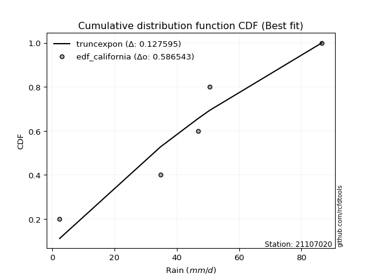</img>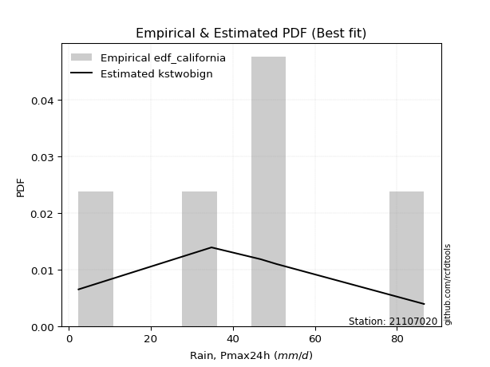</img>

</div>


### 2. Empirical - EDF Hazen (1930)

Hazen method for plotting positions is a formula used to estimate the empirical cumulative probability distribution of flood events or other hydrological data. This formula often results in biased estimations, particularly when extrapolating to extreme events (high return periods).

<div align="center">


$P=(m-0.5)/n$


</div>


**2.1. Empirical values**

<div align="center">

|                | 0                  | 1                  | 2         | 3                 | 4                  |
|:---------------|:-------------------|:-------------------|:----------|:------------------|:-------------------|
| date           | 2024               | 2021               | 2020      | 2022              | 2019               |
| x              | 2.4                | 34.8               | 46.8      | 50.6              | 86.6               |
| m              | 1                  | 2                  | 3         | 4                 | 5                  |
| empirical_dist | edf_hazen          | edf_hazen          | edf_hazen | edf_hazen         | edf_hazen          |
| empirical      | 0.1                | 0.3                | 0.5       | 0.7               | 0.9                |
| empirical_tr   | 1.1111111111111112 | 1.4285714285714286 | 2.0       | 3.333333333333333 | 10.000000000000002 |

</div>


**2.2. Kolmogorov-Smirnov fit test (sorted by Δ)**


<div align="center">

|                | 0                  | 1                   | 2                   | 3                   | 4                   | 5                   | 6                   | 7                   | 8                  | 9                   | 10                 | 11                  | 12                  | 13                 | 14                  | 15                  | 16                  | 17                  | 18                  | 19                  | 20                  | 21                  | 22                  | 23                  | 24                 | 25                  | 26                  | 27                 | 28                 | 29                  | 30                 | 31                  | 32                 | 33                  | 34                 | 35                  | 36                    | 37                  | 38                  | 39                  | 40                  | 41                  | 42                  | 43                  | 44                 | 45                  | 46                  | 47                  | 48                 | 49                 | 50                  | 51                  | 52                 | 53                  | 54                 | 55                 | 56                  | 57                 | 58                 | 59                 | 60                 | 61                  | 62                  | 63                 | 64                 | 65                  | 66                 | 67                  | 68                 | 69                 | 70                 | 71                  | 72                 | 73                 | 74                 | 75                 | 76                  | 77                 | 78                 | 79                  | 80                 | 81                 | 82                  | 83                  | 84                 | 85                 | 86                 | 87                 | 88                 | 89                 |
|:---------------|:-------------------|:--------------------|:--------------------|:--------------------|:--------------------|:--------------------|:--------------------|:--------------------|:-------------------|:--------------------|:-------------------|:--------------------|:--------------------|:-------------------|:--------------------|:--------------------|:--------------------|:--------------------|:--------------------|:--------------------|:--------------------|:--------------------|:--------------------|:--------------------|:-------------------|:--------------------|:--------------------|:-------------------|:-------------------|:--------------------|:-------------------|:--------------------|:-------------------|:--------------------|:-------------------|:--------------------|:----------------------|:--------------------|:--------------------|:--------------------|:--------------------|:--------------------|:--------------------|:--------------------|:-------------------|:--------------------|:--------------------|:--------------------|:-------------------|:-------------------|:--------------------|:--------------------|:-------------------|:--------------------|:-------------------|:-------------------|:--------------------|:-------------------|:-------------------|:-------------------|:-------------------|:--------------------|:--------------------|:-------------------|:-------------------|:--------------------|:-------------------|:--------------------|:-------------------|:-------------------|:-------------------|:--------------------|:-------------------|:-------------------|:-------------------|:-------------------|:--------------------|:-------------------|:-------------------|:--------------------|:-------------------|:-------------------|:--------------------|:--------------------|:-------------------|:-------------------|:-------------------|:-------------------|:-------------------|:-------------------|
| station        | 21107020           | 21107020            | 21107020            | 21107020            | 21107020            | 21107020            | 21107020            | 21107020            | 21107020           | 21107020            | 21107020           | 21107020            | 21107020            | 21107020           | 21107020            | 21107020            | 21107020            | 21107020            | 21107020            | 21107020            | 21107020            | 21107020            | 21107020            | 21107020            | 21107020           | 21107020            | 21107020            | 21107020           | 21107020           | 21107020            | 21107020           | 21107020            | 21107020           | 21107020            | 21107020           | 21107020            | 21107020              | 21107020            | 21107020            | 21107020            | 21107020            | 21107020            | 21107020            | 21107020            | 21107020           | 21107020            | 21107020            | 21107020            | 21107020           | 21107020           | 21107020            | 21107020            | 21107020           | 21107020            | 21107020           | 21107020           | 21107020            | 21107020           | 21107020           | 21107020           | 21107020           | 21107020            | 21107020            | 21107020           | 21107020           | 21107020            | 21107020           | 21107020            | 21107020           | 21107020           | 21107020           | 21107020            | 21107020           | 21107020           | 21107020           | 21107020           | 21107020            | 21107020           | 21107020           | 21107020            | 21107020           | 21107020           | 21107020            | 21107020            | 21107020           | 21107020           | 21107020           | 21107020           | 21107020           | 21107020           |
| empirical_dist | edf_hazen          | edf_hazen           | edf_hazen           | edf_hazen           | edf_hazen           | edf_hazen           | edf_hazen           | edf_hazen           | edf_hazen          | edf_hazen           | edf_hazen          | edf_hazen           | edf_hazen           | edf_hazen          | edf_hazen           | edf_hazen           | edf_hazen           | edf_hazen           | edf_hazen           | edf_hazen           | edf_hazen           | edf_hazen           | edf_hazen           | edf_hazen           | edf_hazen          | edf_hazen           | edf_hazen           | edf_hazen          | edf_hazen          | edf_hazen           | edf_hazen          | edf_hazen           | edf_hazen          | edf_hazen           | edf_hazen          | edf_hazen           | edf_hazen             | edf_hazen           | edf_hazen           | edf_hazen           | edf_hazen           | edf_hazen           | edf_hazen           | edf_hazen           | edf_hazen          | edf_hazen           | edf_hazen           | edf_hazen           | edf_hazen          | edf_hazen          | edf_hazen           | edf_hazen           | edf_hazen          | edf_hazen           | edf_hazen          | edf_hazen          | edf_hazen           | edf_hazen          | edf_hazen          | edf_hazen          | edf_hazen          | edf_hazen           | edf_hazen           | edf_hazen          | edf_hazen          | edf_hazen           | edf_hazen          | edf_hazen           | edf_hazen          | edf_hazen          | edf_hazen          | edf_hazen           | edf_hazen          | edf_hazen          | edf_hazen          | edf_hazen          | edf_hazen           | edf_hazen          | edf_hazen          | edf_hazen           | edf_hazen          | edf_hazen          | edf_hazen           | edf_hazen           | edf_hazen          | edf_hazen          | edf_hazen          | edf_hazen          | edf_hazen          | edf_hazen          |
| p_dist         | laplace            | laplace_asymmetric  | hypsecant           | invgamma            | rice                | weibull_min         | logistic            | invgauss            | genlogistic        | maxwell             | fisk               | betaprime           | f                   | gamma              | erlang              | pearson3            | johnsonsu           | exponnorm           | t                   | crystalball         | norm                | rayleigh            | gumbel_r            | logt                | mielke             | moyal               | halfnorm            | kstwobign          | logmielke          | logloggamma         | halflogistic       | gumbel_l            | logjohnsonsu       | ncf                 | logfisk            | logpearson3         | loglaplace_asymmetric | wald                | loggumbel_l         | loggompertz         | nakagami            | gibrat              | expon               | genexpon            | logbetaprime       | logcrystalball      | lognorm             | lognorm             | logexponnorm       | lognct             | logfatiguelife      | logf                | logncf             | logerlang           | logrice            | loglogistic        | loginvgamma         | loggamma           | loggamma           | logchi2            | loginvgauss        | logalpha            | alpha               | loghypsecant       | loginvweibull      | lognakagami         | logmaxwell         | lograyleigh         | loglaplace         | gompertz           | logkstwobign       | loggenexpon         | loghalfnorm        | loggumbel_r        | nct                | loghalflogistic    | logmoyal            | logexpon           | logtruncnorm       | pareto              | loglognorm         | logpareto          | logwald             | loggibrat           | invweibull         | logweibull_min     | fatiguelife        | chi2               | loggenlogistic     | truncnorm          |
| delta          | 0.0624555475002716 | 0.08157216314223481 | 0.08536239082824448 | 0.09024401816394884 | 0.09216421120967677 | 0.09333431190377295 | 0.09528458596072664 | 0.09582305259155793 | 0.0966527268704297 | 0.09665979697165017 | 0.0976382801775425 | 0.10157079080697573 | 0.10322449449245819 | 0.1058946206204533 | 0.10592436701924723 | 0.10599285588099028 | 0.10634034878697307 | 0.10733360104437639 | 0.10733769642592539 | 0.10733778326627441 | 0.10733778353219137 | 0.10886229159882527 | 0.11593880986129873 | 0.11729506690299593 | 0.1305636429287121 | 0.13552245355429288 | 0.14357454691519217 | 0.1456910453698218 | 0.1457517330997949 | 0.14805436273134975 | 0.1539634331504372 | 0.16843074109265166 | 0.1771870738057667 | 0.18114526157330085 | 0.1818128378949304 | 0.18432632272849564 | 0.1893093190486813    | 0.20322470956570815 | 0.20385635812995978 | 0.20387517577208242 | 0.22457223827558875 | 0.23125264962261238 | 0.23900984183029766 | 0.23920190411528935 | 0.2668032458284109 | 0.26865280603169445 | 0.26865281331591345 | 0.26865281331591345 | 0.2686547466097841 | 0.2689705749665619 | 0.26927433695678477 | 0.27001944774979575 | 0.2706043032894521 | 0.27286541388181834 | 0.2745177087801916 | 0.2777852506603428 | 0.27843391656222066 | 0.2798739508050235 | 0.2798739508050235 | 0.2800602439564928 | 0.2820414996509641 | 0.28472384907978326 | 0.28488640143496763 | 0.2854282777510742 | 0.2871378435623921 | 0.29534404430394456 | 0.297732953240946  | 0.30695190840006886 | 0.3084839860143012 | 0.315159058259715  | 0.3214253636935785 | 0.33150453466185575 | 0.333017351210752  | 0.3377770530710878 | 0.3520334741449673 | 0.3608313785384281 | 0.36193806112482235 | 0.3634209767067516 | 0.3672837177562565 | 0.38087320669231023 | 0.3883747312889955 | 0.4035334069149807 | 0.42901510114481417 | 0.45938446218959245 | 0.4828299602889798 | 0.5121246293307695 | 0.5329337813872954 | 0.6981556386453247 | 0.7                | 0.8994241649884336 |
| deltao         | 0.5865427407550001 | 0.5865427407550001  | 0.5865427407550001  | 0.5865427407550001  | 0.5865427407550001  | 0.5865427407550001  | 0.5865427407550001  | 0.5865427407550001  | 0.5865427407550001 | 0.5865427407550001  | 0.5865427407550001 | 0.5865427407550001  | 0.5865427407550001  | 0.5865427407550001 | 0.5865427407550001  | 0.5865427407550001  | 0.5865427407550001  | 0.5865427407550001  | 0.5865427407550001  | 0.5865427407550001  | 0.5865427407550001  | 0.5865427407550001  | 0.5865427407550001  | 0.5865427407550001  | 0.5865427407550001 | 0.5865427407550001  | 0.5865427407550001  | 0.5865427407550001 | 0.5865427407550001 | 0.5865427407550001  | 0.5865427407550001 | 0.5865427407550001  | 0.5865427407550001 | 0.5865427407550001  | 0.5865427407550001 | 0.5865427407550001  | 0.5865427407550001    | 0.5865427407550001  | 0.5865427407550001  | 0.5865427407550001  | 0.5865427407550001  | 0.5865427407550001  | 0.5865427407550001  | 0.5865427407550001  | 0.5865427407550001 | 0.5865427407550001  | 0.5865427407550001  | 0.5865427407550001  | 0.5865427407550001 | 0.5865427407550001 | 0.5865427407550001  | 0.5865427407550001  | 0.5865427407550001 | 0.5865427407550001  | 0.5865427407550001 | 0.5865427407550001 | 0.5865427407550001  | 0.5865427407550001 | 0.5865427407550001 | 0.5865427407550001 | 0.5865427407550001 | 0.5865427407550001  | 0.5865427407550001  | 0.5865427407550001 | 0.5865427407550001 | 0.5865427407550001  | 0.5865427407550001 | 0.5865427407550001  | 0.5865427407550001 | 0.5865427407550001 | 0.5865427407550001 | 0.5865427407550001  | 0.5865427407550001 | 0.5865427407550001 | 0.5865427407550001 | 0.5865427407550001 | 0.5865427407550001  | 0.5865427407550001 | 0.5865427407550001 | 0.5865427407550001  | 0.5865427407550001 | 0.5865427407550001 | 0.5865427407550001  | 0.5865427407550001  | 0.5865427407550001 | 0.5865427407550001 | 0.5865427407550001 | 0.5865427407550001 | 0.5865427407550001 | 0.5865427407550001 |
| eval           | Δo > Δ             | Δo > Δ              | Δo > Δ              | Δo > Δ              | Δo > Δ              | Δo > Δ              | Δo > Δ              | Δo > Δ              | Δo > Δ             | Δo > Δ              | Δo > Δ             | Δo > Δ              | Δo > Δ              | Δo > Δ             | Δo > Δ              | Δo > Δ              | Δo > Δ              | Δo > Δ              | Δo > Δ              | Δo > Δ              | Δo > Δ              | Δo > Δ              | Δo > Δ              | Δo > Δ              | Δo > Δ             | Δo > Δ              | Δo > Δ              | Δo > Δ             | Δo > Δ             | Δo > Δ              | Δo > Δ             | Δo > Δ              | Δo > Δ             | Δo > Δ              | Δo > Δ             | Δo > Δ              | Δo > Δ                | Δo > Δ              | Δo > Δ              | Δo > Δ              | Δo > Δ              | Δo > Δ              | Δo > Δ              | Δo > Δ              | Δo > Δ             | Δo > Δ              | Δo > Δ              | Δo > Δ              | Δo > Δ             | Δo > Δ             | Δo > Δ              | Δo > Δ              | Δo > Δ             | Δo > Δ              | Δo > Δ             | Δo > Δ             | Δo > Δ              | Δo > Δ             | Δo > Δ             | Δo > Δ             | Δo > Δ             | Δo > Δ              | Δo > Δ              | Δo > Δ             | Δo > Δ             | Δo > Δ              | Δo > Δ             | Δo > Δ              | Δo > Δ             | Δo > Δ             | Δo > Δ             | Δo > Δ              | Δo > Δ             | Δo > Δ             | Δo > Δ             | Δo > Δ             | Δo > Δ              | Δo > Δ             | Δo > Δ             | Δo > Δ              | Δo > Δ             | Δo > Δ             | Δo > Δ              | Δo > Δ              | Δo > Δ             | Δo > Δ             | Δo > Δ             | Δo <= Δ            | Δo <= Δ            | Δo <= Δ            |
| fit            | 1                  | 1                   | 1                   | 1                   | 1                   | 1                   | 1                   | 1                   | 1                  | 1                   | 1                  | 1                   | 1                   | 1                  | 1                   | 1                   | 1                   | 1                   | 1                   | 1                   | 1                   | 1                   | 1                   | 1                   | 1                  | 1                   | 1                   | 1                  | 1                  | 1                   | 1                  | 1                   | 1                  | 1                   | 1                  | 1                   | 1                     | 1                   | 1                   | 1                   | 1                   | 1                   | 1                   | 1                   | 1                  | 1                   | 1                   | 1                   | 1                  | 1                  | 1                   | 1                   | 1                  | 1                   | 1                  | 1                  | 1                   | 1                  | 1                  | 1                  | 1                  | 1                   | 1                   | 1                  | 1                  | 1                   | 1                  | 1                   | 1                  | 1                  | 1                  | 1                   | 1                  | 1                  | 1                  | 1                  | 1                   | 1                  | 1                  | 1                   | 1                  | 1                  | 1                   | 1                   | 1                  | 1                  | 1                  | 0                  | 0                  | 0                  |
| n              | 5                  | 5                   | 5                   | 5                   | 5                   | 5                   | 5                   | 5                   | 5                  | 5                   | 5                  | 5                   | 5                   | 5                  | 5                   | 5                   | 5                   | 5                   | 5                   | 5                   | 5                   | 5                   | 5                   | 5                   | 5                  | 5                   | 5                   | 5                  | 5                  | 5                   | 5                  | 5                   | 5                  | 5                   | 5                  | 5                   | 5                     | 5                   | 5                   | 5                   | 5                   | 5                   | 5                   | 5                   | 5                  | 5                   | 5                   | 5                   | 5                  | 5                  | 5                   | 5                   | 5                  | 5                   | 5                  | 5                  | 5                   | 5                  | 5                  | 5                  | 5                  | 5                   | 5                   | 5                  | 5                  | 5                   | 5                  | 5                   | 5                  | 5                  | 5                  | 5                   | 5                  | 5                  | 5                  | 5                  | 5                   | 5                  | 5                  | 5                   | 5                  | 5                  | 5                   | 5                   | 5                  | 5                  | 5                  | 5                  | 5                  | 5                  |
| best_fit       | 1                  | 0                   | 0                   | 0                   | 0                   | 0                   | 0                   | 0                   | 0                  | 0                   | 0                  | 0                   | 0                   | 0                  | 0                   | 0                   | 0                   | 0                   | 0                   | 0                   | 0                   | 0                   | 0                   | 0                   | 0                  | 0                   | 0                   | 0                  | 0                  | 0                   | 0                  | 0                   | 0                  | 0                   | 0                  | 0                   | 0                     | 0                   | 0                   | 0                   | 0                   | 0                   | 0                   | 0                   | 0                  | 0                   | 0                   | 0                   | 0                  | 0                  | 0                   | 0                   | 0                  | 0                   | 0                  | 0                  | 0                   | 0                  | 0                  | 0                  | 0                  | 0                   | 0                   | 0                  | 0                  | 0                   | 0                  | 0                   | 0                  | 0                  | 0                  | 0                   | 0                  | 0                  | 0                  | 0                  | 0                   | 0                  | 0                  | 0                   | 0                  | 0                  | 0                   | 0                   | 0                  | 0                  | 0                  | 0                  | 0                  | 0                  |
| best_fit_sort  | 1                  | 2                   | 3                   | 4                   | 5                   | 6                   | 7                   | 8                   | 9                  | 10                  | 11                 | 12                  | 13                  | 14                 | 15                  | 16                  | 17                  | 18                  | 19                  | 20                  | 21                  | 22                  | 23                  | 24                  | 25                 | 26                  | 27                  | 28                 | 29                 | 30                  | 31                 | 32                  | 33                 | 34                  | 35                 | 36                  | 37                    | 38                  | 39                  | 40                  | 41                  | 42                  | 43                  | 44                  | 45                 | 46                  | 47                  | 48                  | 49                 | 50                 | 51                  | 52                  | 53                 | 54                  | 55                 | 56                 | 57                  | 58                 | 59                 | 60                 | 61                 | 62                  | 63                  | 64                 | 65                 | 66                  | 67                 | 68                  | 69                 | 70                 | 71                 | 72                  | 73                 | 74                 | 75                 | 76                 | 77                  | 78                 | 79                 | 80                  | 81                 | 82                 | 83                  | 84                  | 85                 | 86                 | 87                 | 88                 | 89                 | 90                 |

</div>


<div align="center">

</img>

</div>


**2.3. Best fit**

<div align="center">

|   id |   station | empirical_dist   | p_dist   |     delta |   deltao | eval   |   fit |   n |   best_fit |   best_fit_sort |
|-----:|----------:|:-----------------|:---------|----------:|---------:|:-------|------:|----:|-----------:|----------------:|
|    0 |  21107020 | edf_hazen        | laplace  | 0.0624555 | 0.586543 | Δo > Δ |     1 |   5 |          1 |               1 |

</div>


<div align="center">

</img></img>

</div>


### 3. Empirical - EDF Weibull (1939)

Weibull plotting position formula is an empirical method used to estimate the non-exceedance probability or plotting position for a set of observed data, is often recommended or widely used in practice, particularly in flood frequency analysis.

<div align="center">


$P=m/(n+1)$


</div>


**3.1. Empirical values**

<div align="center">

|                | 0                   | 1                  | 2           | 3                  | 4                  |
|:---------------|:--------------------|:-------------------|:------------|:-------------------|:-------------------|
| date           | 2024                | 2021               | 2020        | 2022               | 2019               |
| x              | 2.4                 | 34.8               | 46.8        | 50.6               | 86.6               |
| m              | 1                   | 2                  | 3           | 4                  | 5                  |
| empirical_dist | edf_weibull         | edf_weibull        | edf_weibull | edf_weibull        | edf_weibull        |
| empirical      | 0.16666666666666666 | 0.3333333333333333 | 0.5         | 0.6666666666666666 | 0.8333333333333334 |
| empirical_tr   | 1.2                 | 1.4999999999999998 | 2.0         | 2.9999999999999996 | 6.000000000000002  |

</div>


**3.2. Kolmogorov-Smirnov fit test (sorted by Δ)**


<div align="center">

|                | 0                   | 1                   | 2                   | 3                   | 4                  | 5                   | 6                   | 7                   | 8                   | 9                   | 10                  | 11                  | 12                  | 13                  | 14                  | 15                  | 16                  | 17                  | 18                 | 19                  | 20                  | 21                  | 22                  | 23                  | 24                  | 25                  | 26                  | 27                  | 28                 | 29                  | 30                 | 31                    | 32                  | 33                  | 34                  | 35                  | 36                  | 37                  | 38                 | 39                  | 40                  | 41                  | 42                  | 43                  | 44                 | 45                  | 46                  | 47                  | 48                  | 49                  | 50                  | 51                  | 52                 | 53                  | 54                  | 55                 | 56                  | 57                  | 58                  | 59                 | 60                  | 61                  | 62                 | 63                 | 64                  | 65                 | 66                  | 67                 | 68                  | 69                  | 70                  | 71                  | 72                  | 73                 | 74                 | 75                 | 76                 | 77                 | 78                 | 79                 | 80                 | 81                  | 82                  | 83                  | 84                 | 85                  | 86                  | 87                 | 88                 | 89                 |
|:---------------|:--------------------|:--------------------|:--------------------|:--------------------|:-------------------|:--------------------|:--------------------|:--------------------|:--------------------|:--------------------|:--------------------|:--------------------|:--------------------|:--------------------|:--------------------|:--------------------|:--------------------|:--------------------|:-------------------|:--------------------|:--------------------|:--------------------|:--------------------|:--------------------|:--------------------|:--------------------|:--------------------|:--------------------|:-------------------|:--------------------|:-------------------|:----------------------|:--------------------|:--------------------|:--------------------|:--------------------|:--------------------|:--------------------|:-------------------|:--------------------|:--------------------|:--------------------|:--------------------|:--------------------|:-------------------|:--------------------|:--------------------|:--------------------|:--------------------|:--------------------|:--------------------|:--------------------|:-------------------|:--------------------|:--------------------|:-------------------|:--------------------|:--------------------|:--------------------|:-------------------|:--------------------|:--------------------|:-------------------|:-------------------|:--------------------|:-------------------|:--------------------|:-------------------|:--------------------|:--------------------|:--------------------|:--------------------|:--------------------|:-------------------|:-------------------|:-------------------|:-------------------|:-------------------|:-------------------|:-------------------|:-------------------|:--------------------|:--------------------|:--------------------|:-------------------|:--------------------|:--------------------|:-------------------|:-------------------|:-------------------|
| station        | 21107020            | 21107020            | 21107020            | 21107020            | 21107020           | 21107020            | 21107020            | 21107020            | 21107020            | 21107020            | 21107020            | 21107020            | 21107020            | 21107020            | 21107020            | 21107020            | 21107020            | 21107020            | 21107020           | 21107020            | 21107020            | 21107020            | 21107020            | 21107020            | 21107020            | 21107020            | 21107020            | 21107020            | 21107020           | 21107020            | 21107020           | 21107020              | 21107020            | 21107020            | 21107020            | 21107020            | 21107020            | 21107020            | 21107020           | 21107020            | 21107020            | 21107020            | 21107020            | 21107020            | 21107020           | 21107020            | 21107020            | 21107020            | 21107020            | 21107020            | 21107020            | 21107020            | 21107020           | 21107020            | 21107020            | 21107020           | 21107020            | 21107020            | 21107020            | 21107020           | 21107020            | 21107020            | 21107020           | 21107020           | 21107020            | 21107020           | 21107020            | 21107020           | 21107020            | 21107020            | 21107020            | 21107020            | 21107020            | 21107020           | 21107020           | 21107020           | 21107020           | 21107020           | 21107020           | 21107020           | 21107020           | 21107020            | 21107020            | 21107020            | 21107020           | 21107020            | 21107020            | 21107020           | 21107020           | 21107020           |
| empirical_dist | edf_weibull         | edf_weibull         | edf_weibull         | edf_weibull         | edf_weibull        | edf_weibull         | edf_weibull         | edf_weibull         | edf_weibull         | edf_weibull         | edf_weibull         | edf_weibull         | edf_weibull         | edf_weibull         | edf_weibull         | edf_weibull         | edf_weibull         | edf_weibull         | edf_weibull        | edf_weibull         | edf_weibull         | edf_weibull         | edf_weibull         | edf_weibull         | edf_weibull         | edf_weibull         | edf_weibull         | edf_weibull         | edf_weibull        | edf_weibull         | edf_weibull        | edf_weibull           | edf_weibull         | edf_weibull         | edf_weibull         | edf_weibull         | edf_weibull         | edf_weibull         | edf_weibull        | edf_weibull         | edf_weibull         | edf_weibull         | edf_weibull         | edf_weibull         | edf_weibull        | edf_weibull         | edf_weibull         | edf_weibull         | edf_weibull         | edf_weibull         | edf_weibull         | edf_weibull         | edf_weibull        | edf_weibull         | edf_weibull         | edf_weibull        | edf_weibull         | edf_weibull         | edf_weibull         | edf_weibull        | edf_weibull         | edf_weibull         | edf_weibull        | edf_weibull        | edf_weibull         | edf_weibull        | edf_weibull         | edf_weibull        | edf_weibull         | edf_weibull         | edf_weibull         | edf_weibull         | edf_weibull         | edf_weibull        | edf_weibull        | edf_weibull        | edf_weibull        | edf_weibull        | edf_weibull        | edf_weibull        | edf_weibull        | edf_weibull         | edf_weibull         | edf_weibull         | edf_weibull        | edf_weibull         | edf_weibull         | edf_weibull        | edf_weibull        | edf_weibull        |
| p_dist         | fisk                | genlogistic         | f                   | erlang              | gamma              | pearson3            | johnsonsu           | exponnorm           | crystalball         | norm                | t                   | betaprime           | logistic            | laplace_asymmetric  | laplace             | hypsecant           | invgauss            | invgamma            | kstwobign          | weibull_min         | rice                | maxwell             | rayleigh            | logjohnsonsu        | ncf                 | gumbel_r            | logt                | logfisk             | logpearson3        | gumbel_l            | logmielke          | loglaplace_asymmetric | moyal               | logloggamma         | mielke              | halfnorm            | halflogistic        | loggumbel_l         | loggompertz        | nakagami            | wald                | expon               | genexpon            | gibrat              | logbetaprime       | logcrystalball      | lognorm             | lognorm             | logexponnorm        | lognct              | logfatiguelife      | logf                | logncf             | logerlang           | logrice             | loglogistic        | loginvgamma         | loggamma            | loggamma            | logchi2            | loginvgauss         | logalpha            | alpha              | loghypsecant       | loginvweibull       | logmaxwell         | lograyleigh         | loglaplace         | logkstwobign        | loggenexpon         | loghalfnorm         | loggumbel_r         | nct                 | loghalflogistic    | logmoyal           | lognakagami        | logexpon           | gompertz           | logtruncnorm       | pareto             | loglognorm         | logpareto           | logwald             | invweibull          | loggibrat          | logweibull_min      | fatiguelife         | chi2               | loggenlogistic     | truncnorm          |
| delta          | 0.10400786570683695 | 0.10514200807055828 | 0.10647968642980425 | 0.10679921492481026 | 0.1068105287548261 | 0.10681194958950413 | 0.10694148769208922 | 0.10742448086850498 | 0.10742637002979083 | 0.10742637044220082 | 0.10742661346336846 | 0.10780519744947765 | 0.11103021572698712 | 0.11136872702082978 | 0.11169807245959795 | 0.11199152037751914 | 0.11550047315252678 | 0.11694721630659227 | 0.1181054608177122 | 0.11821427418982848 | 0.12395390810597084 | 0.12468983801721609 | 0.13755443867334033 | 0.14385374047243338 | 0.14781192823996753 | 0.14936974137053396 | 0.15062840023632926 | 0.15089701369574962 | 0.1509929893951623 | 0.15103079249091356 | 0.1511232086772496 | 0.16317793584755924   | 0.16335832144885964 | 0.16662203356276384 | 0.16666666664310065 | 0.16666666666666666 | 0.16666666666666666 | 0.17052302479662645 | 0.1705418424387491 | 0.19123890494225543 | 0.20322470956570815 | 0.20567650849696434 | 0.20586857078195603 | 0.23125264962261238 | 0.2334699124950776 | 0.23531947269836112 | 0.23531947998258013 | 0.23531947998258013 | 0.23532141327645079 | 0.23563724163322858 | 0.23594100362345144 | 0.23668611441646242 | 0.2372709699561188 | 0.23953208054848502 | 0.24118437544685828 | 0.2444519173270095 | 0.24510058322888734 | 0.24654061747169015 | 0.24654061747169015 | 0.2467269106231595 | 0.24870816631763076 | 0.25139051574644994 | 0.2515530681016343 | 0.2520949444177409 | 0.25380451022905876 | 0.2643996199076127 | 0.27361857506673554 | 0.2751506526809679 | 0.28809203036024517 | 0.29817120132852243 | 0.29968401787741866 | 0.30444371973775447 | 0.31870014081163395 | 0.3274980452050948 | 0.328604727791489  | 0.3286773776372779 | 0.3300876433734183 | 0.3333332495312138 | 0.3339503844229232 | 0.3475398733589769 | 0.3550413979556622 | 0.37020007358164736 | 0.39568176781148084 | 0.41616329362231314 | 0.4260511288562591 | 0.47879129599743625 | 0.49960044805396214 | 0.6648223053119913 | 0.6666666666666666 | 0.8327574983217669 |
| deltao         | 0.5865427407550001  | 0.5865427407550001  | 0.5865427407550001  | 0.5865427407550001  | 0.5865427407550001 | 0.5865427407550001  | 0.5865427407550001  | 0.5865427407550001  | 0.5865427407550001  | 0.5865427407550001  | 0.5865427407550001  | 0.5865427407550001  | 0.5865427407550001  | 0.5865427407550001  | 0.5865427407550001  | 0.5865427407550001  | 0.5865427407550001  | 0.5865427407550001  | 0.5865427407550001 | 0.5865427407550001  | 0.5865427407550001  | 0.5865427407550001  | 0.5865427407550001  | 0.5865427407550001  | 0.5865427407550001  | 0.5865427407550001  | 0.5865427407550001  | 0.5865427407550001  | 0.5865427407550001 | 0.5865427407550001  | 0.5865427407550001 | 0.5865427407550001    | 0.5865427407550001  | 0.5865427407550001  | 0.5865427407550001  | 0.5865427407550001  | 0.5865427407550001  | 0.5865427407550001  | 0.5865427407550001 | 0.5865427407550001  | 0.5865427407550001  | 0.5865427407550001  | 0.5865427407550001  | 0.5865427407550001  | 0.5865427407550001 | 0.5865427407550001  | 0.5865427407550001  | 0.5865427407550001  | 0.5865427407550001  | 0.5865427407550001  | 0.5865427407550001  | 0.5865427407550001  | 0.5865427407550001 | 0.5865427407550001  | 0.5865427407550001  | 0.5865427407550001 | 0.5865427407550001  | 0.5865427407550001  | 0.5865427407550001  | 0.5865427407550001 | 0.5865427407550001  | 0.5865427407550001  | 0.5865427407550001 | 0.5865427407550001 | 0.5865427407550001  | 0.5865427407550001 | 0.5865427407550001  | 0.5865427407550001 | 0.5865427407550001  | 0.5865427407550001  | 0.5865427407550001  | 0.5865427407550001  | 0.5865427407550001  | 0.5865427407550001 | 0.5865427407550001 | 0.5865427407550001 | 0.5865427407550001 | 0.5865427407550001 | 0.5865427407550001 | 0.5865427407550001 | 0.5865427407550001 | 0.5865427407550001  | 0.5865427407550001  | 0.5865427407550001  | 0.5865427407550001 | 0.5865427407550001  | 0.5865427407550001  | 0.5865427407550001 | 0.5865427407550001 | 0.5865427407550001 |
| eval           | Δo > Δ              | Δo > Δ              | Δo > Δ              | Δo > Δ              | Δo > Δ             | Δo > Δ              | Δo > Δ              | Δo > Δ              | Δo > Δ              | Δo > Δ              | Δo > Δ              | Δo > Δ              | Δo > Δ              | Δo > Δ              | Δo > Δ              | Δo > Δ              | Δo > Δ              | Δo > Δ              | Δo > Δ             | Δo > Δ              | Δo > Δ              | Δo > Δ              | Δo > Δ              | Δo > Δ              | Δo > Δ              | Δo > Δ              | Δo > Δ              | Δo > Δ              | Δo > Δ             | Δo > Δ              | Δo > Δ             | Δo > Δ                | Δo > Δ              | Δo > Δ              | Δo > Δ              | Δo > Δ              | Δo > Δ              | Δo > Δ              | Δo > Δ             | Δo > Δ              | Δo > Δ              | Δo > Δ              | Δo > Δ              | Δo > Δ              | Δo > Δ             | Δo > Δ              | Δo > Δ              | Δo > Δ              | Δo > Δ              | Δo > Δ              | Δo > Δ              | Δo > Δ              | Δo > Δ             | Δo > Δ              | Δo > Δ              | Δo > Δ             | Δo > Δ              | Δo > Δ              | Δo > Δ              | Δo > Δ             | Δo > Δ              | Δo > Δ              | Δo > Δ             | Δo > Δ             | Δo > Δ              | Δo > Δ             | Δo > Δ              | Δo > Δ             | Δo > Δ              | Δo > Δ              | Δo > Δ              | Δo > Δ              | Δo > Δ              | Δo > Δ             | Δo > Δ             | Δo > Δ             | Δo > Δ             | Δo > Δ             | Δo > Δ             | Δo > Δ             | Δo > Δ             | Δo > Δ              | Δo > Δ              | Δo > Δ              | Δo > Δ             | Δo > Δ              | Δo > Δ              | Δo <= Δ            | Δo <= Δ            | Δo <= Δ            |
| fit            | 1                   | 1                   | 1                   | 1                   | 1                  | 1                   | 1                   | 1                   | 1                   | 1                   | 1                   | 1                   | 1                   | 1                   | 1                   | 1                   | 1                   | 1                   | 1                  | 1                   | 1                   | 1                   | 1                   | 1                   | 1                   | 1                   | 1                   | 1                   | 1                  | 1                   | 1                  | 1                     | 1                   | 1                   | 1                   | 1                   | 1                   | 1                   | 1                  | 1                   | 1                   | 1                   | 1                   | 1                   | 1                  | 1                   | 1                   | 1                   | 1                   | 1                   | 1                   | 1                   | 1                  | 1                   | 1                   | 1                  | 1                   | 1                   | 1                   | 1                  | 1                   | 1                   | 1                  | 1                  | 1                   | 1                  | 1                   | 1                  | 1                   | 1                   | 1                   | 1                   | 1                   | 1                  | 1                  | 1                  | 1                  | 1                  | 1                  | 1                  | 1                  | 1                   | 1                   | 1                   | 1                  | 1                   | 1                   | 0                  | 0                  | 0                  |
| n              | 5                   | 5                   | 5                   | 5                   | 5                  | 5                   | 5                   | 5                   | 5                   | 5                   | 5                   | 5                   | 5                   | 5                   | 5                   | 5                   | 5                   | 5                   | 5                  | 5                   | 5                   | 5                   | 5                   | 5                   | 5                   | 5                   | 5                   | 5                   | 5                  | 5                   | 5                  | 5                     | 5                   | 5                   | 5                   | 5                   | 5                   | 5                   | 5                  | 5                   | 5                   | 5                   | 5                   | 5                   | 5                  | 5                   | 5                   | 5                   | 5                   | 5                   | 5                   | 5                   | 5                  | 5                   | 5                   | 5                  | 5                   | 5                   | 5                   | 5                  | 5                   | 5                   | 5                  | 5                  | 5                   | 5                  | 5                   | 5                  | 5                   | 5                   | 5                   | 5                   | 5                   | 5                  | 5                  | 5                  | 5                  | 5                  | 5                  | 5                  | 5                  | 5                   | 5                   | 5                   | 5                  | 5                   | 5                   | 5                  | 5                  | 5                  |
| best_fit       | 1                   | 0                   | 0                   | 0                   | 0                  | 0                   | 0                   | 0                   | 0                   | 0                   | 0                   | 0                   | 0                   | 0                   | 0                   | 0                   | 0                   | 0                   | 0                  | 0                   | 0                   | 0                   | 0                   | 0                   | 0                   | 0                   | 0                   | 0                   | 0                  | 0                   | 0                  | 0                     | 0                   | 0                   | 0                   | 0                   | 0                   | 0                   | 0                  | 0                   | 0                   | 0                   | 0                   | 0                   | 0                  | 0                   | 0                   | 0                   | 0                   | 0                   | 0                   | 0                   | 0                  | 0                   | 0                   | 0                  | 0                   | 0                   | 0                   | 0                  | 0                   | 0                   | 0                  | 0                  | 0                   | 0                  | 0                   | 0                  | 0                   | 0                   | 0                   | 0                   | 0                   | 0                  | 0                  | 0                  | 0                  | 0                  | 0                  | 0                  | 0                  | 0                   | 0                   | 0                   | 0                  | 0                   | 0                   | 0                  | 0                  | 0                  |
| best_fit_sort  | 1                   | 2                   | 3                   | 4                   | 5                  | 6                   | 7                   | 8                   | 9                   | 10                  | 11                  | 12                  | 13                  | 14                  | 15                  | 16                  | 17                  | 18                  | 19                 | 20                  | 21                  | 22                  | 23                  | 24                  | 25                  | 26                  | 27                  | 28                  | 29                 | 30                  | 31                 | 32                    | 33                  | 34                  | 35                  | 36                  | 37                  | 38                  | 39                 | 40                  | 41                  | 42                  | 43                  | 44                  | 45                 | 46                  | 47                  | 48                  | 49                  | 50                  | 51                  | 52                  | 53                 | 54                  | 55                  | 56                 | 57                  | 58                  | 59                  | 60                 | 61                  | 62                  | 63                 | 64                 | 65                  | 66                 | 67                  | 68                 | 69                  | 70                  | 71                  | 72                  | 73                  | 74                 | 75                 | 76                 | 77                 | 78                 | 79                 | 80                 | 81                 | 82                  | 83                  | 84                  | 85                 | 86                  | 87                  | 88                 | 89                 | 90                 |

</div>


<div align="center">

</img>

</div>


**3.3. Best fit**

<div align="center">

|   id |   station | empirical_dist   | p_dist   |    delta |   deltao | eval   |   fit |   n |   best_fit |   best_fit_sort |
|-----:|----------:|:-----------------|:---------|---------:|---------:|:-------|------:|----:|-----------:|----------------:|
|    0 |  21107020 | edf_weibull      | fisk     | 0.104008 | 0.586543 | Δo > Δ |     1 |   5 |          1 |               1 |

</div>


<div align="center">

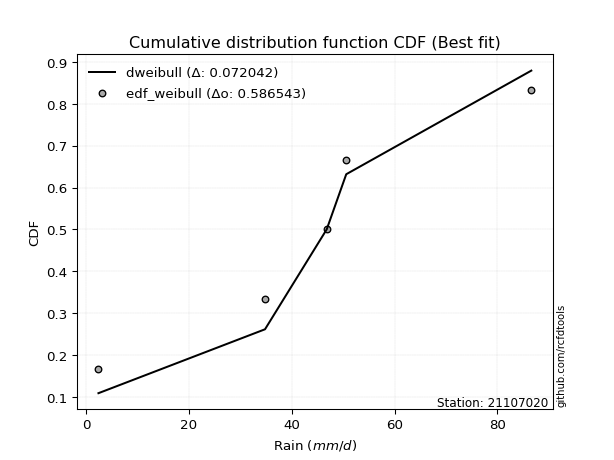</img>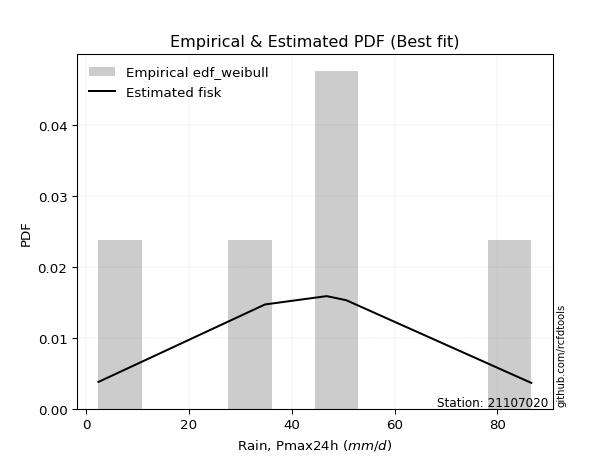</img>

</div>


### 4. Empirical - EDF Beard (1943)

The Beard formula (or Beard´s plotting position formula) in hydrology is used to estimate the empirical non-exceedance probability _(P)_ of a flood event (or other extreme hydrological data point) within a given dataset.

<div align="center">


$P=(m-0.31)/(n+0.38)$


</div>


**4.1. Empirical values**

<div align="center">

|                | 0                   | 1                  | 2         | 3                  | 4                  |
|:---------------|:--------------------|:-------------------|:----------|:-------------------|:-------------------|
| date           | 2024                | 2021               | 2020      | 2022               | 2019               |
| x              | 2.4                 | 34.8               | 46.8      | 50.6               | 86.6               |
| m              | 1                   | 2                  | 3         | 4                  | 5                  |
| empirical_dist | edf_beard           | edf_beard          | edf_beard | edf_beard          | edf_beard          |
| empirical      | 0.12825278810408922 | 0.3141263940520446 | 0.5       | 0.6858736059479554 | 0.8717472118959109 |
| empirical_tr   | 1.1471215351812367  | 1.4579945799457996 | 2.0       | 3.183431952662722  | 7.797101449275368  |

</div>


**4.2. Kolmogorov-Smirnov fit test (sorted by Δ)**


<div align="center">

|                | 0                   | 1                   | 2                   | 3                   | 4                   | 5                   | 6                  | 7                   | 8                   | 9                  | 10                  | 11                  | 12                  | 13                  | 14                  | 15                  | 16                  | 17                  | 18                  | 19                  | 20                  | 21                 | 22                  | 23                 | 24                  | 25                  | 26                  | 27                  | 28                  | 29                  | 30                  | 31                  | 32                  | 33                  | 34                  | 35                 | 36                    | 37                  | 38                  | 39                  | 40                  | 41                  | 42                  | 43                  | 44                 | 45                 | 46                 | 47                 | 48                 | 49                  | 50                  | 51                 | 52                 | 53                 | 54                  | 55                 | 56                  | 57                  | 58                  | 59                 | 60                  | 61                  | 62                 | 63                 | 64                  | 65                 | 66                  | 67                 | 68                  | 69                 | 70                 | 71                 | 72                  | 73                  | 74                  | 75                 | 76                 | 77                 | 78                 | 79                 | 80                 | 81                  | 82                  | 83                 | 84                  | 85                  | 86                 | 87                 | 88                 | 89                 |
|:---------------|:--------------------|:--------------------|:--------------------|:--------------------|:--------------------|:--------------------|:-------------------|:--------------------|:--------------------|:-------------------|:--------------------|:--------------------|:--------------------|:--------------------|:--------------------|:--------------------|:--------------------|:--------------------|:--------------------|:--------------------|:--------------------|:-------------------|:--------------------|:-------------------|:--------------------|:--------------------|:--------------------|:--------------------|:--------------------|:--------------------|:--------------------|:--------------------|:--------------------|:--------------------|:--------------------|:-------------------|:----------------------|:--------------------|:--------------------|:--------------------|:--------------------|:--------------------|:--------------------|:--------------------|:-------------------|:-------------------|:-------------------|:-------------------|:-------------------|:--------------------|:--------------------|:-------------------|:-------------------|:-------------------|:--------------------|:-------------------|:--------------------|:--------------------|:--------------------|:-------------------|:--------------------|:--------------------|:-------------------|:-------------------|:--------------------|:-------------------|:--------------------|:-------------------|:--------------------|:-------------------|:-------------------|:-------------------|:--------------------|:--------------------|:--------------------|:-------------------|:-------------------|:-------------------|:-------------------|:-------------------|:-------------------|:--------------------|:--------------------|:-------------------|:--------------------|:--------------------|:-------------------|:-------------------|:-------------------|:-------------------|
| station        | 21107020            | 21107020            | 21107020            | 21107020            | 21107020            | 21107020            | 21107020           | 21107020            | 21107020            | 21107020           | 21107020            | 21107020            | 21107020            | 21107020            | 21107020            | 21107020            | 21107020            | 21107020            | 21107020            | 21107020            | 21107020            | 21107020           | 21107020            | 21107020           | 21107020            | 21107020            | 21107020            | 21107020            | 21107020            | 21107020            | 21107020            | 21107020            | 21107020            | 21107020            | 21107020            | 21107020           | 21107020              | 21107020            | 21107020            | 21107020            | 21107020            | 21107020            | 21107020            | 21107020            | 21107020           | 21107020           | 21107020           | 21107020           | 21107020           | 21107020            | 21107020            | 21107020           | 21107020           | 21107020           | 21107020            | 21107020           | 21107020            | 21107020            | 21107020            | 21107020           | 21107020            | 21107020            | 21107020           | 21107020           | 21107020            | 21107020           | 21107020            | 21107020           | 21107020            | 21107020           | 21107020           | 21107020           | 21107020            | 21107020            | 21107020            | 21107020           | 21107020           | 21107020           | 21107020           | 21107020           | 21107020           | 21107020            | 21107020            | 21107020           | 21107020            | 21107020            | 21107020           | 21107020           | 21107020           | 21107020           |
| empirical_dist | edf_beard           | edf_beard           | edf_beard           | edf_beard           | edf_beard           | edf_beard           | edf_beard          | edf_beard           | edf_beard           | edf_beard          | edf_beard           | edf_beard           | edf_beard           | edf_beard           | edf_beard           | edf_beard           | edf_beard           | edf_beard           | edf_beard           | edf_beard           | edf_beard           | edf_beard          | edf_beard           | edf_beard          | edf_beard           | edf_beard           | edf_beard           | edf_beard           | edf_beard           | edf_beard           | edf_beard           | edf_beard           | edf_beard           | edf_beard           | edf_beard           | edf_beard          | edf_beard             | edf_beard           | edf_beard           | edf_beard           | edf_beard           | edf_beard           | edf_beard           | edf_beard           | edf_beard          | edf_beard          | edf_beard          | edf_beard          | edf_beard          | edf_beard           | edf_beard           | edf_beard          | edf_beard          | edf_beard          | edf_beard           | edf_beard          | edf_beard           | edf_beard           | edf_beard           | edf_beard          | edf_beard           | edf_beard           | edf_beard          | edf_beard          | edf_beard           | edf_beard          | edf_beard           | edf_beard          | edf_beard           | edf_beard          | edf_beard          | edf_beard          | edf_beard           | edf_beard           | edf_beard           | edf_beard          | edf_beard          | edf_beard          | edf_beard          | edf_beard          | edf_beard          | edf_beard           | edf_beard           | edf_beard          | edf_beard           | edf_beard           | edf_beard          | edf_beard          | edf_beard          | edf_beard          |
| p_dist         | laplace_asymmetric  | laplace             | hypsecant           | invgamma            | weibull_min         | logistic            | invgauss           | genlogistic         | fisk                | rice               | maxwell             | betaprime           | f                   | gamma               | erlang              | pearson3            | johnsonsu           | exponnorm           | t                   | crystalball         | norm                | rayleigh           | gumbel_r            | mielke             | halfnorm            | logt                | kstwobign           | logmielke           | moyal               | logloggamma         | halflogistic        | gumbel_l            | logjohnsonsu        | ncf                 | logfisk             | logpearson3        | loglaplace_asymmetric | loggumbel_l         | loggompertz         | wald                | nakagami            | expon               | genexpon            | gibrat              | logbetaprime       | logcrystalball     | lognorm            | lognorm            | logexponnorm       | lognct              | logfatiguelife      | logf               | logncf             | logerlang          | logrice             | loglogistic        | loginvgamma         | loggamma            | loggamma            | logchi2            | loginvgauss         | logalpha            | alpha              | loghypsecant       | loginvweibull       | logmaxwell         | lograyleigh         | loglaplace         | logkstwobign        | lognakagami        | gompertz           | loggenexpon        | loghalfnorm         | loggumbel_r         | nct                 | loghalflogistic    | logmoyal           | logexpon           | logtruncnorm       | pareto             | loglognorm         | logpareto           | logwald             | loggibrat          | invweibull          | logweibull_min      | fatiguelife        | chi2               | loggenlogistic     | truncnorm          |
| delta          | 0.07295484845825229 | 0.07328419389702046 | 0.07357764181494164 | 0.07853333774401483 | 0.07980039562725104 | 0.08115819190868212 | 0.0816966585395133 | 0.08252633281838517 | 0.08351188612549798 | 0.0855400295433934 | 0.08627595945463865 | 0.08744439675493121 | 0.08909810044041366 | 0.09176822656840877 | 0.09179797296720271 | 0.09186646182894576 | 0.09221395473492855 | 0.09320720699233187 | 0.09321130237388087 | 0.09321138921422989 | 0.09321138948014684 | 0.0991405601107629 | 0.11095586280795652 | 0.1282527880805232 | 0.12944815286314754 | 0.13142146095504056 | 0.13156465131777717 | 0.13162533904775026 | 0.13327317070482358 | 0.13392796867930512 | 0.13983703909839257 | 0.15430434704060714 | 0.16306067975372218 | 0.16701886752125622 | 0.16768644384288578 | 0.170199928676451  | 0.17518292499663668   | 0.18972996407791515 | 0.18974878172003778 | 0.20322470956570815 | 0.21044584422354412 | 0.22488344777825303 | 0.22507551006324472 | 0.23125264962261238 | 0.2526768517763663 | 0.2545264119796498 | 0.2545264192638688 | 0.2545264192638688 | 0.2545283525577395 | 0.25484418091451727 | 0.25514794290474013 | 0.2558930536977511 | 0.2564779092374075 | 0.2587390198297737 | 0.26039131472814697 | 0.2636588566082982 | 0.26430752251017603 | 0.26574755675297884 | 0.26574755675297884 | 0.2659338499044482 | 0.26791510559891946 | 0.27059745502773863 | 0.270760007382923  | 0.2713018836990296 | 0.27301144951034745 | 0.2836065591889014 | 0.29282551434802423 | 0.2943575919622566 | 0.30729896964153386 | 0.3094704383559892 | 0.3141263102499251 | 0.3173781406098111 | 0.31889095715870736 | 0.32365065901904316 | 0.33790708009292264 | 0.3467049844863835 | 0.3478116670727777 | 0.349294582654707  | 0.3531573237042119 | 0.3667468126402656 | 0.3742483372369509 | 0.38940701286293605 | 0.41488870709276954 | 0.4452580681375478 | 0.45457717218489063 | 0.49799823527872494 | 0.5188073873352508 | 0.6840292445932801 | 0.6858736059479554 | 0.8711713768843443 |
| deltao         | 0.5865427407550001  | 0.5865427407550001  | 0.5865427407550001  | 0.5865427407550001  | 0.5865427407550001  | 0.5865427407550001  | 0.5865427407550001 | 0.5865427407550001  | 0.5865427407550001  | 0.5865427407550001 | 0.5865427407550001  | 0.5865427407550001  | 0.5865427407550001  | 0.5865427407550001  | 0.5865427407550001  | 0.5865427407550001  | 0.5865427407550001  | 0.5865427407550001  | 0.5865427407550001  | 0.5865427407550001  | 0.5865427407550001  | 0.5865427407550001 | 0.5865427407550001  | 0.5865427407550001 | 0.5865427407550001  | 0.5865427407550001  | 0.5865427407550001  | 0.5865427407550001  | 0.5865427407550001  | 0.5865427407550001  | 0.5865427407550001  | 0.5865427407550001  | 0.5865427407550001  | 0.5865427407550001  | 0.5865427407550001  | 0.5865427407550001 | 0.5865427407550001    | 0.5865427407550001  | 0.5865427407550001  | 0.5865427407550001  | 0.5865427407550001  | 0.5865427407550001  | 0.5865427407550001  | 0.5865427407550001  | 0.5865427407550001 | 0.5865427407550001 | 0.5865427407550001 | 0.5865427407550001 | 0.5865427407550001 | 0.5865427407550001  | 0.5865427407550001  | 0.5865427407550001 | 0.5865427407550001 | 0.5865427407550001 | 0.5865427407550001  | 0.5865427407550001 | 0.5865427407550001  | 0.5865427407550001  | 0.5865427407550001  | 0.5865427407550001 | 0.5865427407550001  | 0.5865427407550001  | 0.5865427407550001 | 0.5865427407550001 | 0.5865427407550001  | 0.5865427407550001 | 0.5865427407550001  | 0.5865427407550001 | 0.5865427407550001  | 0.5865427407550001 | 0.5865427407550001 | 0.5865427407550001 | 0.5865427407550001  | 0.5865427407550001  | 0.5865427407550001  | 0.5865427407550001 | 0.5865427407550001 | 0.5865427407550001 | 0.5865427407550001 | 0.5865427407550001 | 0.5865427407550001 | 0.5865427407550001  | 0.5865427407550001  | 0.5865427407550001 | 0.5865427407550001  | 0.5865427407550001  | 0.5865427407550001 | 0.5865427407550001 | 0.5865427407550001 | 0.5865427407550001 |
| eval           | Δo > Δ              | Δo > Δ              | Δo > Δ              | Δo > Δ              | Δo > Δ              | Δo > Δ              | Δo > Δ             | Δo > Δ              | Δo > Δ              | Δo > Δ             | Δo > Δ              | Δo > Δ              | Δo > Δ              | Δo > Δ              | Δo > Δ              | Δo > Δ              | Δo > Δ              | Δo > Δ              | Δo > Δ              | Δo > Δ              | Δo > Δ              | Δo > Δ             | Δo > Δ              | Δo > Δ             | Δo > Δ              | Δo > Δ              | Δo > Δ              | Δo > Δ              | Δo > Δ              | Δo > Δ              | Δo > Δ              | Δo > Δ              | Δo > Δ              | Δo > Δ              | Δo > Δ              | Δo > Δ             | Δo > Δ                | Δo > Δ              | Δo > Δ              | Δo > Δ              | Δo > Δ              | Δo > Δ              | Δo > Δ              | Δo > Δ              | Δo > Δ             | Δo > Δ             | Δo > Δ             | Δo > Δ             | Δo > Δ             | Δo > Δ              | Δo > Δ              | Δo > Δ             | Δo > Δ             | Δo > Δ             | Δo > Δ              | Δo > Δ             | Δo > Δ              | Δo > Δ              | Δo > Δ              | Δo > Δ             | Δo > Δ              | Δo > Δ              | Δo > Δ             | Δo > Δ             | Δo > Δ              | Δo > Δ             | Δo > Δ              | Δo > Δ             | Δo > Δ              | Δo > Δ             | Δo > Δ             | Δo > Δ             | Δo > Δ              | Δo > Δ              | Δo > Δ              | Δo > Δ             | Δo > Δ             | Δo > Δ             | Δo > Δ             | Δo > Δ             | Δo > Δ             | Δo > Δ              | Δo > Δ              | Δo > Δ             | Δo > Δ              | Δo > Δ              | Δo > Δ             | Δo <= Δ            | Δo <= Δ            | Δo <= Δ            |
| fit            | 1                   | 1                   | 1                   | 1                   | 1                   | 1                   | 1                  | 1                   | 1                   | 1                  | 1                   | 1                   | 1                   | 1                   | 1                   | 1                   | 1                   | 1                   | 1                   | 1                   | 1                   | 1                  | 1                   | 1                  | 1                   | 1                   | 1                   | 1                   | 1                   | 1                   | 1                   | 1                   | 1                   | 1                   | 1                   | 1                  | 1                     | 1                   | 1                   | 1                   | 1                   | 1                   | 1                   | 1                   | 1                  | 1                  | 1                  | 1                  | 1                  | 1                   | 1                   | 1                  | 1                  | 1                  | 1                   | 1                  | 1                   | 1                   | 1                   | 1                  | 1                   | 1                   | 1                  | 1                  | 1                   | 1                  | 1                   | 1                  | 1                   | 1                  | 1                  | 1                  | 1                   | 1                   | 1                   | 1                  | 1                  | 1                  | 1                  | 1                  | 1                  | 1                   | 1                   | 1                  | 1                   | 1                   | 1                  | 0                  | 0                  | 0                  |
| n              | 5                   | 5                   | 5                   | 5                   | 5                   | 5                   | 5                  | 5                   | 5                   | 5                  | 5                   | 5                   | 5                   | 5                   | 5                   | 5                   | 5                   | 5                   | 5                   | 5                   | 5                   | 5                  | 5                   | 5                  | 5                   | 5                   | 5                   | 5                   | 5                   | 5                   | 5                   | 5                   | 5                   | 5                   | 5                   | 5                  | 5                     | 5                   | 5                   | 5                   | 5                   | 5                   | 5                   | 5                   | 5                  | 5                  | 5                  | 5                  | 5                  | 5                   | 5                   | 5                  | 5                  | 5                  | 5                   | 5                  | 5                   | 5                   | 5                   | 5                  | 5                   | 5                   | 5                  | 5                  | 5                   | 5                  | 5                   | 5                  | 5                   | 5                  | 5                  | 5                  | 5                   | 5                   | 5                   | 5                  | 5                  | 5                  | 5                  | 5                  | 5                  | 5                   | 5                   | 5                  | 5                   | 5                   | 5                  | 5                  | 5                  | 5                  |
| best_fit       | 1                   | 0                   | 0                   | 0                   | 0                   | 0                   | 0                  | 0                   | 0                   | 0                  | 0                   | 0                   | 0                   | 0                   | 0                   | 0                   | 0                   | 0                   | 0                   | 0                   | 0                   | 0                  | 0                   | 0                  | 0                   | 0                   | 0                   | 0                   | 0                   | 0                   | 0                   | 0                   | 0                   | 0                   | 0                   | 0                  | 0                     | 0                   | 0                   | 0                   | 0                   | 0                   | 0                   | 0                   | 0                  | 0                  | 0                  | 0                  | 0                  | 0                   | 0                   | 0                  | 0                  | 0                  | 0                   | 0                  | 0                   | 0                   | 0                   | 0                  | 0                   | 0                   | 0                  | 0                  | 0                   | 0                  | 0                   | 0                  | 0                   | 0                  | 0                  | 0                  | 0                   | 0                   | 0                   | 0                  | 0                  | 0                  | 0                  | 0                  | 0                  | 0                   | 0                   | 0                  | 0                   | 0                   | 0                  | 0                  | 0                  | 0                  |
| best_fit_sort  | 1                   | 2                   | 3                   | 4                   | 5                   | 6                   | 7                  | 8                   | 9                   | 10                 | 11                  | 12                  | 13                  | 14                  | 15                  | 16                  | 17                  | 18                  | 19                  | 20                  | 21                  | 22                 | 23                  | 24                 | 25                  | 26                  | 27                  | 28                  | 29                  | 30                  | 31                  | 32                  | 33                  | 34                  | 35                  | 36                 | 37                    | 38                  | 39                  | 40                  | 41                  | 42                  | 43                  | 44                  | 45                 | 46                 | 47                 | 48                 | 49                 | 50                  | 51                  | 52                 | 53                 | 54                 | 55                  | 56                 | 57                  | 58                  | 59                  | 60                 | 61                  | 62                  | 63                 | 64                 | 65                  | 66                 | 67                  | 68                 | 69                  | 70                 | 71                 | 72                 | 73                  | 74                  | 75                  | 76                 | 77                 | 78                 | 79                 | 80                 | 81                 | 82                  | 83                  | 84                 | 85                  | 86                  | 87                 | 88                 | 89                 | 90                 |

</div>


<div align="center">

</img>

</div>


**4.3. Best fit**

<div align="center">

|   id |   station | empirical_dist   | p_dist             |     delta |   deltao | eval   |   fit |   n |   best_fit |   best_fit_sort |
|-----:|----------:|:-----------------|:-------------------|----------:|---------:|:-------|------:|----:|-----------:|----------------:|
|    0 |  21107020 | edf_beard        | laplace_asymmetric | 0.0729548 | 0.586543 | Δo > Δ |     1 |   5 |          1 |               1 |

</div>


<div align="center">

</img>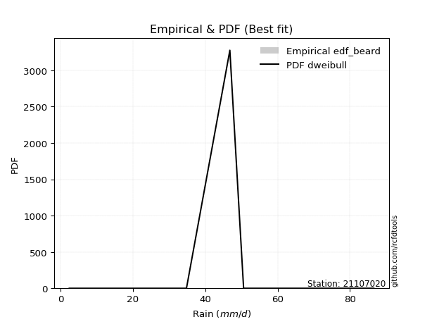</img>

</div>


### 5. Empirical - EDF Chegodayev (1955)

The Chegodayev formula is an empirical plotting position formula used in hydrological frequency analysis to estimate the exceedance probability or return period of a specific event from a set of observed data. It is primarily used for plotting observed data points on probability paper to fit a theoretical distribution, particularly for analyzing extreme events like maximum flood flows or rainfall intensities. The constant _b_ value in the generalized plotting position formula is 0.3.

<div align="center">


$P=(m-b)/(n+1-2b)$


</div>


**5.1. Empirical values**

<div align="center">

|                | 0                   | 1                   | 2              | 3                  | 4                  |
|:---------------|:--------------------|:--------------------|:---------------|:-------------------|:-------------------|
| date           | 2024                | 2021                | 2020           | 2022               | 2019               |
| x              | 2.4                 | 34.8                | 46.8           | 50.6               | 86.6               |
| m              | 1                   | 2                   | 3              | 4                  | 5                  |
| empirical_dist | edf_chegodayev      | edf_chegodayev      | edf_chegodayev | edf_chegodayev     | edf_chegodayev     |
| empirical      | 0.12962962962962962 | 0.31481481481481477 | 0.5            | 0.6851851851851851 | 0.8703703703703703 |
| empirical_tr   | 1.148936170212766   | 1.4594594594594594  | 2.0            | 3.1764705882352935 | 7.714285714285713  |

</div>


**5.2. Kolmogorov-Smirnov fit test (sorted by Δ)**


<div align="center">

|                | 0                  | 1                   | 2                   | 3                   | 4                  | 5                   | 6                   | 7                   | 8                   | 9                  | 10                  | 11                  | 12                  | 13                  | 14                 | 15                  | 16                  | 17                  | 18                  | 19                  | 20                  | 21                  | 22                  | 23                 | 24                  | 25                  | 26                 | 27                 | 28                  | 29                  | 30                  | 31                  | 32                  | 33                  | 34                  | 35                  | 36                    | 37                 | 38                  | 39                  | 40                  | 41                  | 42                  | 43                  | 44                  | 45                  | 46                  | 47                  | 48                  | 49                 | 50                 | 51                  | 52                  | 53                  | 54                 | 55                  | 56                 | 57                 | 58                 | 59                  | 60                 | 61                 | 62                  | 63                  | 64                 | 65                 | 66                 | 67                  | 68                 | 69                  | 70                  | 71                 | 72                 | 73                 | 74                 | 75                  | 76                  | 77                 | 78                  | 79                  | 80                  | 81                 | 82                 | 83                  | 84                 | 85                 | 86                 | 87                 | 88                 | 89                 |
|:---------------|:-------------------|:--------------------|:--------------------|:--------------------|:-------------------|:--------------------|:--------------------|:--------------------|:--------------------|:-------------------|:--------------------|:--------------------|:--------------------|:--------------------|:-------------------|:--------------------|:--------------------|:--------------------|:--------------------|:--------------------|:--------------------|:--------------------|:--------------------|:-------------------|:--------------------|:--------------------|:-------------------|:-------------------|:--------------------|:--------------------|:--------------------|:--------------------|:--------------------|:--------------------|:--------------------|:--------------------|:----------------------|:-------------------|:--------------------|:--------------------|:--------------------|:--------------------|:--------------------|:--------------------|:--------------------|:--------------------|:--------------------|:--------------------|:--------------------|:-------------------|:-------------------|:--------------------|:--------------------|:--------------------|:-------------------|:--------------------|:-------------------|:-------------------|:-------------------|:--------------------|:-------------------|:-------------------|:--------------------|:--------------------|:-------------------|:-------------------|:-------------------|:--------------------|:-------------------|:--------------------|:--------------------|:-------------------|:-------------------|:-------------------|:-------------------|:--------------------|:--------------------|:-------------------|:--------------------|:--------------------|:--------------------|:-------------------|:-------------------|:--------------------|:-------------------|:-------------------|:-------------------|:-------------------|:-------------------|:-------------------|
| station        | 21107020           | 21107020            | 21107020            | 21107020            | 21107020           | 21107020            | 21107020            | 21107020            | 21107020            | 21107020           | 21107020            | 21107020            | 21107020            | 21107020            | 21107020           | 21107020            | 21107020            | 21107020            | 21107020            | 21107020            | 21107020            | 21107020            | 21107020            | 21107020           | 21107020            | 21107020            | 21107020           | 21107020           | 21107020            | 21107020            | 21107020            | 21107020            | 21107020            | 21107020            | 21107020            | 21107020            | 21107020              | 21107020           | 21107020            | 21107020            | 21107020            | 21107020            | 21107020            | 21107020            | 21107020            | 21107020            | 21107020            | 21107020            | 21107020            | 21107020           | 21107020           | 21107020            | 21107020            | 21107020            | 21107020           | 21107020            | 21107020           | 21107020           | 21107020           | 21107020            | 21107020           | 21107020           | 21107020            | 21107020            | 21107020           | 21107020           | 21107020           | 21107020            | 21107020           | 21107020            | 21107020            | 21107020           | 21107020           | 21107020           | 21107020           | 21107020            | 21107020            | 21107020           | 21107020            | 21107020            | 21107020            | 21107020           | 21107020           | 21107020            | 21107020           | 21107020           | 21107020           | 21107020           | 21107020           | 21107020           |
| empirical_dist | edf_chegodayev     | edf_chegodayev      | edf_chegodayev      | edf_chegodayev      | edf_chegodayev     | edf_chegodayev      | edf_chegodayev      | edf_chegodayev      | edf_chegodayev      | edf_chegodayev     | edf_chegodayev      | edf_chegodayev      | edf_chegodayev      | edf_chegodayev      | edf_chegodayev     | edf_chegodayev      | edf_chegodayev      | edf_chegodayev      | edf_chegodayev      | edf_chegodayev      | edf_chegodayev      | edf_chegodayev      | edf_chegodayev      | edf_chegodayev     | edf_chegodayev      | edf_chegodayev      | edf_chegodayev     | edf_chegodayev     | edf_chegodayev      | edf_chegodayev      | edf_chegodayev      | edf_chegodayev      | edf_chegodayev      | edf_chegodayev      | edf_chegodayev      | edf_chegodayev      | edf_chegodayev        | edf_chegodayev     | edf_chegodayev      | edf_chegodayev      | edf_chegodayev      | edf_chegodayev      | edf_chegodayev      | edf_chegodayev      | edf_chegodayev      | edf_chegodayev      | edf_chegodayev      | edf_chegodayev      | edf_chegodayev      | edf_chegodayev     | edf_chegodayev     | edf_chegodayev      | edf_chegodayev      | edf_chegodayev      | edf_chegodayev     | edf_chegodayev      | edf_chegodayev     | edf_chegodayev     | edf_chegodayev     | edf_chegodayev      | edf_chegodayev     | edf_chegodayev     | edf_chegodayev      | edf_chegodayev      | edf_chegodayev     | edf_chegodayev     | edf_chegodayev     | edf_chegodayev      | edf_chegodayev     | edf_chegodayev      | edf_chegodayev      | edf_chegodayev     | edf_chegodayev     | edf_chegodayev     | edf_chegodayev     | edf_chegodayev      | edf_chegodayev      | edf_chegodayev     | edf_chegodayev      | edf_chegodayev      | edf_chegodayev      | edf_chegodayev     | edf_chegodayev     | edf_chegodayev      | edf_chegodayev     | edf_chegodayev     | edf_chegodayev     | edf_chegodayev     | edf_chegodayev     | edf_chegodayev     |
| p_dist         | laplace_asymmetric | laplace             | hypsecant           | invgamma            | logistic           | invgauss            | weibull_min         | genlogistic         | fisk                | betaprime          | rice                | maxwell             | f                   | gamma               | erlang             | pearson3            | johnsonsu           | exponnorm           | t                   | crystalball         | norm                | rayleigh            | gumbel_r            | mielke             | halfnorm            | kstwobign           | logmielke          | logt               | logloggamma         | moyal               | halflogistic        | gumbel_l            | logjohnsonsu        | ncf                 | logfisk             | logpearson3         | loglaplace_asymmetric | loggumbel_l        | loggompertz         | wald                | nakagami            | expon               | genexpon            | gibrat              | logbetaprime        | logcrystalball      | lognorm             | lognorm             | logexponnorm        | lognct             | logfatiguelife     | logf                | logncf              | logerlang           | logrice            | loglogistic         | loginvgamma        | loggamma           | loggamma           | logchi2             | loginvgauss        | logalpha           | alpha               | loghypsecant        | loginvweibull      | logmaxwell         | lograyleigh        | loglaplace          | logkstwobign       | lognakagami         | gompertz            | loggenexpon        | loghalfnorm        | loggumbel_r        | nct                | loghalflogistic     | logmoyal            | logexpon           | logtruncnorm        | pareto              | loglognorm          | logpareto          | logwald            | loggibrat           | invweibull         | logweibull_min     | fatiguelife        | chi2               | loggenlogistic     | truncnorm          |
| delta          | 0.0743316899837928 | 0.07466103542256097 | 0.07495448334048216 | 0.07991017926955524 | 0.0804697711459118 | 0.08100823777674315 | 0.08117723715279145 | 0.08183791205561486 | 0.08282346536272767 | 0.0867559759921609 | 0.08691687106893381 | 0.08765280098017905 | 0.08840967967764335 | 0.09107980580563846 | 0.0911095522044324 | 0.09117804106617544 | 0.09152553397215824 | 0.09251878622956156 | 0.09252288161111055 | 0.09252296845145958 | 0.09252296871737653 | 0.10051740163630331 | 0.11233270433349693 | 0.1296296296060636 | 0.12962962962962962 | 0.13087623055500702 | 0.1309369182849801 | 0.1321098817178107 | 0.13323954791653497 | 0.13327317070482358 | 0.13914861833562242 | 0.15361592627783682 | 0.16237225899095187 | 0.16633044675848607 | 0.16699802308011563 | 0.16951150791368086 | 0.17449450423386653   | 0.189041543315145  | 0.18906036095726764 | 0.20322470956570815 | 0.20975742346077397 | 0.22419502701548288 | 0.22438708930047457 | 0.23125264962261238 | 0.25198843101359614 | 0.25383799121687967 | 0.25383799850109867 | 0.25383799850109867 | 0.25383993179496933 | 0.2541557601517471 | 0.25445952214197   | 0.25520463293498097 | 0.25578948847463734 | 0.25805059906700356 | 0.2597028939653768 | 0.26297043584552804 | 0.2636191017474059 | 0.2650591359902087 | 0.2650591359902087 | 0.26524542914167804 | 0.2672266848361493 | 0.2699090342649685 | 0.27007158662015285 | 0.27061346293625943 | 0.2723230287475773 | 0.2829181384261312 | 0.2921370935852541 | 0.29366917119948643 | 0.3066105488787637 | 0.31015885911875934 | 0.31481473101269525 | 0.316689719847041  | 0.3182025363959372 | 0.322962238256273  | 0.3372186593301525 | 0.34601656372361334 | 0.34712324631000757 | 0.3486061618919368 | 0.35246890294144173 | 0.36605839187749545 | 0.37355991647418074 | 0.3887185921001659 | 0.4142002863299994 | 0.44456964737477767 | 0.4532003306593501 | 0.4973098145159548 | 0.5181189665724807 | 0.6833408238305099 | 0.6851851851851851 | 0.8697945353588039 |
| deltao         | 0.5865427407550001 | 0.5865427407550001  | 0.5865427407550001  | 0.5865427407550001  | 0.5865427407550001 | 0.5865427407550001  | 0.5865427407550001  | 0.5865427407550001  | 0.5865427407550001  | 0.5865427407550001 | 0.5865427407550001  | 0.5865427407550001  | 0.5865427407550001  | 0.5865427407550001  | 0.5865427407550001 | 0.5865427407550001  | 0.5865427407550001  | 0.5865427407550001  | 0.5865427407550001  | 0.5865427407550001  | 0.5865427407550001  | 0.5865427407550001  | 0.5865427407550001  | 0.5865427407550001 | 0.5865427407550001  | 0.5865427407550001  | 0.5865427407550001 | 0.5865427407550001 | 0.5865427407550001  | 0.5865427407550001  | 0.5865427407550001  | 0.5865427407550001  | 0.5865427407550001  | 0.5865427407550001  | 0.5865427407550001  | 0.5865427407550001  | 0.5865427407550001    | 0.5865427407550001 | 0.5865427407550001  | 0.5865427407550001  | 0.5865427407550001  | 0.5865427407550001  | 0.5865427407550001  | 0.5865427407550001  | 0.5865427407550001  | 0.5865427407550001  | 0.5865427407550001  | 0.5865427407550001  | 0.5865427407550001  | 0.5865427407550001 | 0.5865427407550001 | 0.5865427407550001  | 0.5865427407550001  | 0.5865427407550001  | 0.5865427407550001 | 0.5865427407550001  | 0.5865427407550001 | 0.5865427407550001 | 0.5865427407550001 | 0.5865427407550001  | 0.5865427407550001 | 0.5865427407550001 | 0.5865427407550001  | 0.5865427407550001  | 0.5865427407550001 | 0.5865427407550001 | 0.5865427407550001 | 0.5865427407550001  | 0.5865427407550001 | 0.5865427407550001  | 0.5865427407550001  | 0.5865427407550001 | 0.5865427407550001 | 0.5865427407550001 | 0.5865427407550001 | 0.5865427407550001  | 0.5865427407550001  | 0.5865427407550001 | 0.5865427407550001  | 0.5865427407550001  | 0.5865427407550001  | 0.5865427407550001 | 0.5865427407550001 | 0.5865427407550001  | 0.5865427407550001 | 0.5865427407550001 | 0.5865427407550001 | 0.5865427407550001 | 0.5865427407550001 | 0.5865427407550001 |
| eval           | Δo > Δ             | Δo > Δ              | Δo > Δ              | Δo > Δ              | Δo > Δ             | Δo > Δ              | Δo > Δ              | Δo > Δ              | Δo > Δ              | Δo > Δ             | Δo > Δ              | Δo > Δ              | Δo > Δ              | Δo > Δ              | Δo > Δ             | Δo > Δ              | Δo > Δ              | Δo > Δ              | Δo > Δ              | Δo > Δ              | Δo > Δ              | Δo > Δ              | Δo > Δ              | Δo > Δ             | Δo > Δ              | Δo > Δ              | Δo > Δ             | Δo > Δ             | Δo > Δ              | Δo > Δ              | Δo > Δ              | Δo > Δ              | Δo > Δ              | Δo > Δ              | Δo > Δ              | Δo > Δ              | Δo > Δ                | Δo > Δ             | Δo > Δ              | Δo > Δ              | Δo > Δ              | Δo > Δ              | Δo > Δ              | Δo > Δ              | Δo > Δ              | Δo > Δ              | Δo > Δ              | Δo > Δ              | Δo > Δ              | Δo > Δ             | Δo > Δ             | Δo > Δ              | Δo > Δ              | Δo > Δ              | Δo > Δ             | Δo > Δ              | Δo > Δ             | Δo > Δ             | Δo > Δ             | Δo > Δ              | Δo > Δ             | Δo > Δ             | Δo > Δ              | Δo > Δ              | Δo > Δ             | Δo > Δ             | Δo > Δ             | Δo > Δ              | Δo > Δ             | Δo > Δ              | Δo > Δ              | Δo > Δ             | Δo > Δ             | Δo > Δ             | Δo > Δ             | Δo > Δ              | Δo > Δ              | Δo > Δ             | Δo > Δ              | Δo > Δ              | Δo > Δ              | Δo > Δ             | Δo > Δ             | Δo > Δ              | Δo > Δ             | Δo > Δ             | Δo > Δ             | Δo <= Δ            | Δo <= Δ            | Δo <= Δ            |
| fit            | 1                  | 1                   | 1                   | 1                   | 1                  | 1                   | 1                   | 1                   | 1                   | 1                  | 1                   | 1                   | 1                   | 1                   | 1                  | 1                   | 1                   | 1                   | 1                   | 1                   | 1                   | 1                   | 1                   | 1                  | 1                   | 1                   | 1                  | 1                  | 1                   | 1                   | 1                   | 1                   | 1                   | 1                   | 1                   | 1                   | 1                     | 1                  | 1                   | 1                   | 1                   | 1                   | 1                   | 1                   | 1                   | 1                   | 1                   | 1                   | 1                   | 1                  | 1                  | 1                   | 1                   | 1                   | 1                  | 1                   | 1                  | 1                  | 1                  | 1                   | 1                  | 1                  | 1                   | 1                   | 1                  | 1                  | 1                  | 1                   | 1                  | 1                   | 1                   | 1                  | 1                  | 1                  | 1                  | 1                   | 1                   | 1                  | 1                   | 1                   | 1                   | 1                  | 1                  | 1                   | 1                  | 1                  | 1                  | 0                  | 0                  | 0                  |
| n              | 5                  | 5                   | 5                   | 5                   | 5                  | 5                   | 5                   | 5                   | 5                   | 5                  | 5                   | 5                   | 5                   | 5                   | 5                  | 5                   | 5                   | 5                   | 5                   | 5                   | 5                   | 5                   | 5                   | 5                  | 5                   | 5                   | 5                  | 5                  | 5                   | 5                   | 5                   | 5                   | 5                   | 5                   | 5                   | 5                   | 5                     | 5                  | 5                   | 5                   | 5                   | 5                   | 5                   | 5                   | 5                   | 5                   | 5                   | 5                   | 5                   | 5                  | 5                  | 5                   | 5                   | 5                   | 5                  | 5                   | 5                  | 5                  | 5                  | 5                   | 5                  | 5                  | 5                   | 5                   | 5                  | 5                  | 5                  | 5                   | 5                  | 5                   | 5                   | 5                  | 5                  | 5                  | 5                  | 5                   | 5                   | 5                  | 5                   | 5                   | 5                   | 5                  | 5                  | 5                   | 5                  | 5                  | 5                  | 5                  | 5                  | 5                  |
| best_fit       | 1                  | 0                   | 0                   | 0                   | 0                  | 0                   | 0                   | 0                   | 0                   | 0                  | 0                   | 0                   | 0                   | 0                   | 0                  | 0                   | 0                   | 0                   | 0                   | 0                   | 0                   | 0                   | 0                   | 0                  | 0                   | 0                   | 0                  | 0                  | 0                   | 0                   | 0                   | 0                   | 0                   | 0                   | 0                   | 0                   | 0                     | 0                  | 0                   | 0                   | 0                   | 0                   | 0                   | 0                   | 0                   | 0                   | 0                   | 0                   | 0                   | 0                  | 0                  | 0                   | 0                   | 0                   | 0                  | 0                   | 0                  | 0                  | 0                  | 0                   | 0                  | 0                  | 0                   | 0                   | 0                  | 0                  | 0                  | 0                   | 0                  | 0                   | 0                   | 0                  | 0                  | 0                  | 0                  | 0                   | 0                   | 0                  | 0                   | 0                   | 0                   | 0                  | 0                  | 0                   | 0                  | 0                  | 0                  | 0                  | 0                  | 0                  |
| best_fit_sort  | 1                  | 2                   | 3                   | 4                   | 5                  | 6                   | 7                   | 8                   | 9                   | 10                 | 11                  | 12                  | 13                  | 14                  | 15                 | 16                  | 17                  | 18                  | 19                  | 20                  | 21                  | 22                  | 23                  | 24                 | 25                  | 26                  | 27                 | 28                 | 29                  | 30                  | 31                  | 32                  | 33                  | 34                  | 35                  | 36                  | 37                    | 38                 | 39                  | 40                  | 41                  | 42                  | 43                  | 44                  | 45                  | 46                  | 47                  | 48                  | 49                  | 50                 | 51                 | 52                  | 53                  | 54                  | 55                 | 56                  | 57                 | 58                 | 59                 | 60                  | 61                 | 62                 | 63                  | 64                  | 65                 | 66                 | 67                 | 68                  | 69                 | 70                  | 71                  | 72                 | 73                 | 74                 | 75                 | 76                  | 77                  | 78                 | 79                  | 80                  | 81                  | 82                 | 83                 | 84                  | 85                 | 86                 | 87                 | 88                 | 89                 | 90                 |

</div>


<div align="center">

</img>

</div>


**5.3. Best fit**

<div align="center">

|   id |   station | empirical_dist   | p_dist             |     delta |   deltao | eval   |   fit |   n |   best_fit |   best_fit_sort |
|-----:|----------:|:-----------------|:-------------------|----------:|---------:|:-------|------:|----:|-----------:|----------------:|
|    0 |  21107020 | edf_chegodayev   | laplace_asymmetric | 0.0743317 | 0.586543 | Δo > Δ |     1 |   5 |          1 |               1 |

</div>


<div align="center">

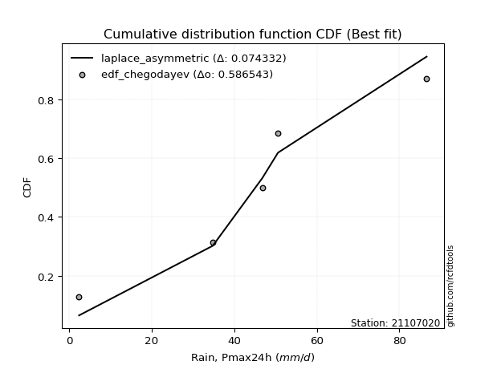</img></img>

</div>


### 6. Empirical - EDF Blom (1958)

The Blom formula is a specific "plotting position" formula used in hydrology and statistical analysis to estimate the empirical cumulative probability (or non-exceedance probability) of a data series. It is particularly recommended for data that are approximately normally distributed. The constant _a_ is set to 0.375 (or 3/8).

<div align="center">


$P=(m-a)/(n+1-2a)$


</div>


**6.1. Empirical values**

<div align="center">

|                | 0                   | 1                   | 2        | 3                  | 4                  |
|:---------------|:--------------------|:--------------------|:---------|:-------------------|:-------------------|
| date           | 2024                | 2021                | 2020     | 2022               | 2019               |
| x              | 2.4                 | 34.8                | 46.8     | 50.6               | 86.6               |
| m              | 1                   | 2                   | 3        | 4                  | 5                  |
| empirical_dist | edf_blom            | edf_blom            | edf_blom | edf_blom           | edf_blom           |
| empirical      | 0.11904761904761904 | 0.30952380952380953 | 0.5      | 0.6904761904761905 | 0.8809523809523809 |
| empirical_tr   | 1.135135135135135   | 1.4482758620689655  | 2.0      | 3.230769230769231  | 8.399999999999999  |

</div>


**6.2. Kolmogorov-Smirnov fit test (sorted by Δ)**


<div align="center">

|                | 0                   | 1                   | 2                  | 3                   | 4                   | 5                   | 6                   | 7                   | 8                  | 9                   | 10                  | 11                  | 12                 | 13                 | 14                  | 15                  | 16                  | 17                 | 18                 | 19                  | 20                  | 21                  | 22                  | 23                  | 24                  | 25                  | 26                  | 27                  | 28                  | 29                 | 30                  | 31                  | 32                 | 33                 | 34                  | 35                 | 36                    | 37                  | 38                  | 39                  | 40                 | 41                  | 42                 | 43                  | 44                  | 45                 | 46                 | 47                 | 48                  | 49                  | 50                 | 51                 | 52                 | 53                 | 54                  | 55                 | 56                 | 57                  | 58                  | 59                  | 60                  | 61                 | 62                 | 63                  | 64                  | 65                  | 66                 | 67                  | 68                 | 69                 | 70                  | 71                 | 72                  | 73                  | 74                  | 75                  | 76                 | 77                  | 78                  | 79                 | 80                 | 81                  | 82                 | 83                 | 84                 | 85                 | 86                 | 87                 | 88                 | 89                 |
|:---------------|:--------------------|:--------------------|:-------------------|:--------------------|:--------------------|:--------------------|:--------------------|:--------------------|:-------------------|:--------------------|:--------------------|:--------------------|:-------------------|:-------------------|:--------------------|:--------------------|:--------------------|:-------------------|:-------------------|:--------------------|:--------------------|:--------------------|:--------------------|:--------------------|:--------------------|:--------------------|:--------------------|:--------------------|:--------------------|:-------------------|:--------------------|:--------------------|:-------------------|:-------------------|:--------------------|:-------------------|:----------------------|:--------------------|:--------------------|:--------------------|:-------------------|:--------------------|:-------------------|:--------------------|:--------------------|:-------------------|:-------------------|:-------------------|:--------------------|:--------------------|:-------------------|:-------------------|:-------------------|:-------------------|:--------------------|:-------------------|:-------------------|:--------------------|:--------------------|:--------------------|:--------------------|:-------------------|:-------------------|:--------------------|:--------------------|:--------------------|:-------------------|:--------------------|:-------------------|:-------------------|:--------------------|:-------------------|:--------------------|:--------------------|:--------------------|:--------------------|:-------------------|:--------------------|:--------------------|:-------------------|:-------------------|:--------------------|:-------------------|:-------------------|:-------------------|:-------------------|:-------------------|:-------------------|:-------------------|:-------------------|
| station        | 21107020            | 21107020            | 21107020           | 21107020            | 21107020            | 21107020            | 21107020            | 21107020            | 21107020           | 21107020            | 21107020            | 21107020            | 21107020           | 21107020           | 21107020            | 21107020            | 21107020            | 21107020           | 21107020           | 21107020            | 21107020            | 21107020            | 21107020            | 21107020            | 21107020            | 21107020            | 21107020            | 21107020            | 21107020            | 21107020           | 21107020            | 21107020            | 21107020           | 21107020           | 21107020            | 21107020           | 21107020              | 21107020            | 21107020            | 21107020            | 21107020           | 21107020            | 21107020           | 21107020            | 21107020            | 21107020           | 21107020           | 21107020           | 21107020            | 21107020            | 21107020           | 21107020           | 21107020           | 21107020           | 21107020            | 21107020           | 21107020           | 21107020            | 21107020            | 21107020            | 21107020            | 21107020           | 21107020           | 21107020            | 21107020            | 21107020            | 21107020           | 21107020            | 21107020           | 21107020           | 21107020            | 21107020           | 21107020            | 21107020            | 21107020            | 21107020            | 21107020           | 21107020            | 21107020            | 21107020           | 21107020           | 21107020            | 21107020           | 21107020           | 21107020           | 21107020           | 21107020           | 21107020           | 21107020           | 21107020           |
| empirical_dist | edf_blom            | edf_blom            | edf_blom           | edf_blom            | edf_blom            | edf_blom            | edf_blom            | edf_blom            | edf_blom           | edf_blom            | edf_blom            | edf_blom            | edf_blom           | edf_blom           | edf_blom            | edf_blom            | edf_blom            | edf_blom           | edf_blom           | edf_blom            | edf_blom            | edf_blom            | edf_blom            | edf_blom            | edf_blom            | edf_blom            | edf_blom            | edf_blom            | edf_blom            | edf_blom           | edf_blom            | edf_blom            | edf_blom           | edf_blom           | edf_blom            | edf_blom           | edf_blom              | edf_blom            | edf_blom            | edf_blom            | edf_blom           | edf_blom            | edf_blom           | edf_blom            | edf_blom            | edf_blom           | edf_blom           | edf_blom           | edf_blom            | edf_blom            | edf_blom           | edf_blom           | edf_blom           | edf_blom           | edf_blom            | edf_blom           | edf_blom           | edf_blom            | edf_blom            | edf_blom            | edf_blom            | edf_blom           | edf_blom           | edf_blom            | edf_blom            | edf_blom            | edf_blom           | edf_blom            | edf_blom           | edf_blom           | edf_blom            | edf_blom           | edf_blom            | edf_blom            | edf_blom            | edf_blom            | edf_blom           | edf_blom            | edf_blom            | edf_blom           | edf_blom           | edf_blom            | edf_blom           | edf_blom           | edf_blom           | edf_blom           | edf_blom           | edf_blom           | edf_blom           | edf_blom           |
| p_dist         | laplace             | laplace_asymmetric  | hypsecant          | invgamma            | rice                | weibull_min         | logistic            | invgauss            | genlogistic        | maxwell             | fisk                | betaprime           | f                  | gamma              | erlang              | pearson3            | johnsonsu           | exponnorm          | t                  | crystalball         | norm                | rayleigh            | gumbel_r            | mielke              | logt                | moyal               | halfnorm            | kstwobign           | logmielke           | logloggamma        | halflogistic        | gumbel_l            | logjohnsonsu       | ncf                | logfisk             | logpearson3        | loglaplace_asymmetric | loggumbel_l         | loggompertz         | wald                | nakagami           | expon               | genexpon           | gibrat              | logbetaprime        | logcrystalball     | lognorm            | lognorm            | logexponnorm        | lognct              | logfatiguelife     | logf               | logncf             | logerlang          | logrice             | loglogistic        | loginvgamma        | loggamma            | loggamma            | logchi2             | loginvgauss         | logalpha           | alpha              | loghypsecant        | loginvweibull       | logmaxwell          | lograyleigh        | loglaplace          | lognakagami        | gompertz           | logkstwobign        | loggenexpon        | loghalfnorm         | loggumbel_r         | nct                 | loghalflogistic     | logmoyal           | logexpon            | logtruncnorm        | pareto             | loglognorm         | logpareto           | logwald            | loggibrat          | invweibull         | logweibull_min     | fatiguelife        | chi2               | loggenlogistic     | truncnorm          |
| delta          | 0.06407902484055039 | 0.07204835361842532 | 0.075838581304435  | 0.08072020864013929 | 0.08264040168586728 | 0.08381050237996346 | 0.08576077643691715 | 0.08629924306774839 | 0.0871289173466202 | 0.08713598744784062 | 0.08811447065373301 | 0.09204698128316624 | 0.0937006849686487 | 0.0963708110966438 | 0.09640055749543774 | 0.09646904635718079 | 0.09681653926316358 | 0.0978097915205669 | 0.0978138869021159 | 0.09781397374246492 | 0.09781397400838188 | 0.09933848207501572 | 0.10806805532554431 | 0.12103983340490254 | 0.12681887642680548 | 0.13327317070482358 | 0.13405073739138262 | 0.13616723584601226 | 0.13622792357598534 | 0.1385305532075402 | 0.14443962362662766 | 0.15890693156884217 | 0.1676632642819572 | 0.1716214520494913 | 0.17228902837112087 | 0.1748025132046861 | 0.17978550952487177   | 0.19433254860615023 | 0.19435136624827287 | 0.20322470956570815 | 0.2150484287517792 | 0.22948603230648812 | 0.2296780945914798 | 0.23125264962261238 | 0.25727943630460137 | 0.2591289965078849 | 0.2591290037921039 | 0.2591290037921039 | 0.25913093708597457 | 0.25944676544275236 | 0.2597505274329752 | 0.2604956382259862 | 0.2610804937656426 | 0.2633416043580088 | 0.26499389925638206 | 0.2682614411365333 | 0.2689101070384111 | 0.27035014128121393 | 0.27035014128121393 | 0.27053643443268327 | 0.27251769012715454 | 0.2752000395559737 | 0.2753625919111581 | 0.27590446822726467 | 0.27761403403858254 | 0.28820914371713646 | 0.2974280988762593 | 0.29896017649049167 | 0.3048678538277541 | 0.30952372572169   | 0.31190155416976895 | 0.3219807251380462 | 0.32349354168694244 | 0.32825324354727825 | 0.34250966462115773 | 0.35130756901461857 | 0.3524142516010128 | 0.35389716718294206 | 0.35775990823244697 | 0.3713493971685007 | 0.378850921765186  | 0.39400959739117114 | 0.4194912916210046 | 0.4498606526657829 | 0.4637823412413607 | 0.50260081980696   | 0.5234099718634859 | 0.6886318291215151 | 0.6904761904761905 | 0.8803765459408145 |
| deltao         | 0.5865427407550001  | 0.5865427407550001  | 0.5865427407550001 | 0.5865427407550001  | 0.5865427407550001  | 0.5865427407550001  | 0.5865427407550001  | 0.5865427407550001  | 0.5865427407550001 | 0.5865427407550001  | 0.5865427407550001  | 0.5865427407550001  | 0.5865427407550001 | 0.5865427407550001 | 0.5865427407550001  | 0.5865427407550001  | 0.5865427407550001  | 0.5865427407550001 | 0.5865427407550001 | 0.5865427407550001  | 0.5865427407550001  | 0.5865427407550001  | 0.5865427407550001  | 0.5865427407550001  | 0.5865427407550001  | 0.5865427407550001  | 0.5865427407550001  | 0.5865427407550001  | 0.5865427407550001  | 0.5865427407550001 | 0.5865427407550001  | 0.5865427407550001  | 0.5865427407550001 | 0.5865427407550001 | 0.5865427407550001  | 0.5865427407550001 | 0.5865427407550001    | 0.5865427407550001  | 0.5865427407550001  | 0.5865427407550001  | 0.5865427407550001 | 0.5865427407550001  | 0.5865427407550001 | 0.5865427407550001  | 0.5865427407550001  | 0.5865427407550001 | 0.5865427407550001 | 0.5865427407550001 | 0.5865427407550001  | 0.5865427407550001  | 0.5865427407550001 | 0.5865427407550001 | 0.5865427407550001 | 0.5865427407550001 | 0.5865427407550001  | 0.5865427407550001 | 0.5865427407550001 | 0.5865427407550001  | 0.5865427407550001  | 0.5865427407550001  | 0.5865427407550001  | 0.5865427407550001 | 0.5865427407550001 | 0.5865427407550001  | 0.5865427407550001  | 0.5865427407550001  | 0.5865427407550001 | 0.5865427407550001  | 0.5865427407550001 | 0.5865427407550001 | 0.5865427407550001  | 0.5865427407550001 | 0.5865427407550001  | 0.5865427407550001  | 0.5865427407550001  | 0.5865427407550001  | 0.5865427407550001 | 0.5865427407550001  | 0.5865427407550001  | 0.5865427407550001 | 0.5865427407550001 | 0.5865427407550001  | 0.5865427407550001 | 0.5865427407550001 | 0.5865427407550001 | 0.5865427407550001 | 0.5865427407550001 | 0.5865427407550001 | 0.5865427407550001 | 0.5865427407550001 |
| eval           | Δo > Δ              | Δo > Δ              | Δo > Δ             | Δo > Δ              | Δo > Δ              | Δo > Δ              | Δo > Δ              | Δo > Δ              | Δo > Δ             | Δo > Δ              | Δo > Δ              | Δo > Δ              | Δo > Δ             | Δo > Δ             | Δo > Δ              | Δo > Δ              | Δo > Δ              | Δo > Δ             | Δo > Δ             | Δo > Δ              | Δo > Δ              | Δo > Δ              | Δo > Δ              | Δo > Δ              | Δo > Δ              | Δo > Δ              | Δo > Δ              | Δo > Δ              | Δo > Δ              | Δo > Δ             | Δo > Δ              | Δo > Δ              | Δo > Δ             | Δo > Δ             | Δo > Δ              | Δo > Δ             | Δo > Δ                | Δo > Δ              | Δo > Δ              | Δo > Δ              | Δo > Δ             | Δo > Δ              | Δo > Δ             | Δo > Δ              | Δo > Δ              | Δo > Δ             | Δo > Δ             | Δo > Δ             | Δo > Δ              | Δo > Δ              | Δo > Δ             | Δo > Δ             | Δo > Δ             | Δo > Δ             | Δo > Δ              | Δo > Δ             | Δo > Δ             | Δo > Δ              | Δo > Δ              | Δo > Δ              | Δo > Δ              | Δo > Δ             | Δo > Δ             | Δo > Δ              | Δo > Δ              | Δo > Δ              | Δo > Δ             | Δo > Δ              | Δo > Δ             | Δo > Δ             | Δo > Δ              | Δo > Δ             | Δo > Δ              | Δo > Δ              | Δo > Δ              | Δo > Δ              | Δo > Δ             | Δo > Δ              | Δo > Δ              | Δo > Δ             | Δo > Δ             | Δo > Δ              | Δo > Δ             | Δo > Δ             | Δo > Δ             | Δo > Δ             | Δo > Δ             | Δo <= Δ            | Δo <= Δ            | Δo <= Δ            |
| fit            | 1                   | 1                   | 1                  | 1                   | 1                   | 1                   | 1                   | 1                   | 1                  | 1                   | 1                   | 1                   | 1                  | 1                  | 1                   | 1                   | 1                   | 1                  | 1                  | 1                   | 1                   | 1                   | 1                   | 1                   | 1                   | 1                   | 1                   | 1                   | 1                   | 1                  | 1                   | 1                   | 1                  | 1                  | 1                   | 1                  | 1                     | 1                   | 1                   | 1                   | 1                  | 1                   | 1                  | 1                   | 1                   | 1                  | 1                  | 1                  | 1                   | 1                   | 1                  | 1                  | 1                  | 1                  | 1                   | 1                  | 1                  | 1                   | 1                   | 1                   | 1                   | 1                  | 1                  | 1                   | 1                   | 1                   | 1                  | 1                   | 1                  | 1                  | 1                   | 1                  | 1                   | 1                   | 1                   | 1                   | 1                  | 1                   | 1                   | 1                  | 1                  | 1                   | 1                  | 1                  | 1                  | 1                  | 1                  | 0                  | 0                  | 0                  |
| n              | 5                   | 5                   | 5                  | 5                   | 5                   | 5                   | 5                   | 5                   | 5                  | 5                   | 5                   | 5                   | 5                  | 5                  | 5                   | 5                   | 5                   | 5                  | 5                  | 5                   | 5                   | 5                   | 5                   | 5                   | 5                   | 5                   | 5                   | 5                   | 5                   | 5                  | 5                   | 5                   | 5                  | 5                  | 5                   | 5                  | 5                     | 5                   | 5                   | 5                   | 5                  | 5                   | 5                  | 5                   | 5                   | 5                  | 5                  | 5                  | 5                   | 5                   | 5                  | 5                  | 5                  | 5                  | 5                   | 5                  | 5                  | 5                   | 5                   | 5                   | 5                   | 5                  | 5                  | 5                   | 5                   | 5                   | 5                  | 5                   | 5                  | 5                  | 5                   | 5                  | 5                   | 5                   | 5                   | 5                   | 5                  | 5                   | 5                   | 5                  | 5                  | 5                   | 5                  | 5                  | 5                  | 5                  | 5                  | 5                  | 5                  | 5                  |
| best_fit       | 1                   | 0                   | 0                  | 0                   | 0                   | 0                   | 0                   | 0                   | 0                  | 0                   | 0                   | 0                   | 0                  | 0                  | 0                   | 0                   | 0                   | 0                  | 0                  | 0                   | 0                   | 0                   | 0                   | 0                   | 0                   | 0                   | 0                   | 0                   | 0                   | 0                  | 0                   | 0                   | 0                  | 0                  | 0                   | 0                  | 0                     | 0                   | 0                   | 0                   | 0                  | 0                   | 0                  | 0                   | 0                   | 0                  | 0                  | 0                  | 0                   | 0                   | 0                  | 0                  | 0                  | 0                  | 0                   | 0                  | 0                  | 0                   | 0                   | 0                   | 0                   | 0                  | 0                  | 0                   | 0                   | 0                   | 0                  | 0                   | 0                  | 0                  | 0                   | 0                  | 0                   | 0                   | 0                   | 0                   | 0                  | 0                   | 0                   | 0                  | 0                  | 0                   | 0                  | 0                  | 0                  | 0                  | 0                  | 0                  | 0                  | 0                  |
| best_fit_sort  | 1                   | 2                   | 3                  | 4                   | 5                   | 6                   | 7                   | 8                   | 9                  | 10                  | 11                  | 12                  | 13                 | 14                 | 15                  | 16                  | 17                  | 18                 | 19                 | 20                  | 21                  | 22                  | 23                  | 24                  | 25                  | 26                  | 27                  | 28                  | 29                  | 30                 | 31                  | 32                  | 33                 | 34                 | 35                  | 36                 | 37                    | 38                  | 39                  | 40                  | 41                 | 42                  | 43                 | 44                  | 45                  | 46                 | 47                 | 48                 | 49                  | 50                  | 51                 | 52                 | 53                 | 54                 | 55                  | 56                 | 57                 | 58                  | 59                  | 60                  | 61                  | 62                 | 63                 | 64                  | 65                  | 66                  | 67                 | 68                  | 69                 | 70                 | 71                  | 72                 | 73                  | 74                  | 75                  | 76                  | 77                 | 78                  | 79                  | 80                 | 81                 | 82                  | 83                 | 84                 | 85                 | 86                 | 87                 | 88                 | 89                 | 90                 |

</div>


<div align="center">

</img>

</div>


**6.3. Best fit**

<div align="center">

|   id |   station | empirical_dist   | p_dist   |    delta |   deltao | eval   |   fit |   n |   best_fit |   best_fit_sort |
|-----:|----------:|:-----------------|:---------|---------:|---------:|:-------|------:|----:|-----------:|----------------:|
|    0 |  21107020 | edf_blom         | laplace  | 0.064079 | 0.586543 | Δo > Δ |     1 |   5 |          1 |               1 |

</div>


<div align="center">

</img>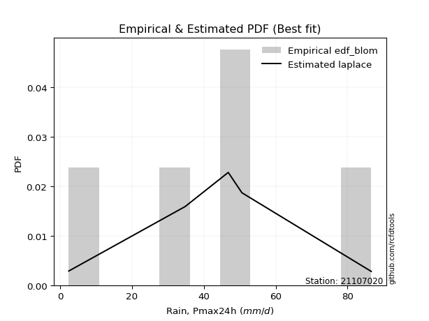</img>

</div>


### 7. Empirical - EDF Tukey (1962)

In hydrology, the Tukey formula is used as a plotting position formula to estimate the empirical probability or frequency of a flood event (or other hydrological data). The formula parameter is given as _c=0.333_ (or 1/3).

<div align="center">


$P=(m-c)/(n+1-2c)$


</div>


**7.1. Empirical values**

<div align="center">

|                | 0                  | 1                  | 2         | 3         | 4         |
|:---------------|:-------------------|:-------------------|:----------|:----------|:----------|
| date           | 2024               | 2021               | 2020      | 2022      | 2019      |
| x              | 2.4                | 34.8               | 46.8      | 50.6      | 86.6      |
| m              | 1                  | 2                  | 3         | 4         | 5         |
| empirical_dist | edf_tukey          | edf_tukey          | edf_tukey | edf_tukey | edf_tukey |
| empirical      | 0.125              | 0.3125             | 0.5       | 0.6875    | 0.875     |
| empirical_tr   | 1.1428571428571428 | 1.4545454545454546 | 2.0       | 3.2       | 8.0       |

</div>


**7.2. Kolmogorov-Smirnov fit test (sorted by Δ)**


<div align="center">

|                | 0                   | 1                   | 2                   | 3                   | 4                   | 5                   | 6                   | 7                   | 8                   | 9                   | 10                  | 11                  | 12                  | 13                  | 14                  | 15                  | 16                  | 17                  | 18                  | 19                  | 20                  | 21                  | 22                  | 23                  | 24                  | 25                  | 26                 | 27                  | 28                  | 29                  | 30                 | 31                 | 32                  | 33                  | 34                 | 35                  | 36                    | 37                  | 38                 | 39                  | 40                  | 41                  | 42                  | 43                  | 44                 | 45                  | 46                  | 47                  | 48                 | 49                 | 50                  | 51                  | 52                 | 53                  | 54                 | 55                 | 56                  | 57                  | 58                  | 59                 | 60                 | 61                  | 62                 | 63                 | 64                  | 65                 | 66                  | 67                 | 68                 | 69                 | 70                 | 71                  | 72                 | 73                 | 74                  | 75                 | 76                  | 77                 | 78                 | 79                 | 80                 | 81                 | 82                  | 83                  | 84                  | 85                  | 86                 | 87                 | 88                 | 89                 |
|:---------------|:--------------------|:--------------------|:--------------------|:--------------------|:--------------------|:--------------------|:--------------------|:--------------------|:--------------------|:--------------------|:--------------------|:--------------------|:--------------------|:--------------------|:--------------------|:--------------------|:--------------------|:--------------------|:--------------------|:--------------------|:--------------------|:--------------------|:--------------------|:--------------------|:--------------------|:--------------------|:-------------------|:--------------------|:--------------------|:--------------------|:-------------------|:-------------------|:--------------------|:--------------------|:-------------------|:--------------------|:----------------------|:--------------------|:-------------------|:--------------------|:--------------------|:--------------------|:--------------------|:--------------------|:-------------------|:--------------------|:--------------------|:--------------------|:-------------------|:-------------------|:--------------------|:--------------------|:-------------------|:--------------------|:-------------------|:-------------------|:--------------------|:--------------------|:--------------------|:-------------------|:-------------------|:--------------------|:-------------------|:-------------------|:--------------------|:-------------------|:--------------------|:-------------------|:-------------------|:-------------------|:-------------------|:--------------------|:-------------------|:-------------------|:--------------------|:-------------------|:--------------------|:-------------------|:-------------------|:-------------------|:-------------------|:-------------------|:--------------------|:--------------------|:--------------------|:--------------------|:-------------------|:-------------------|:-------------------|:-------------------|
| station        | 21107020            | 21107020            | 21107020            | 21107020            | 21107020            | 21107020            | 21107020            | 21107020            | 21107020            | 21107020            | 21107020            | 21107020            | 21107020            | 21107020            | 21107020            | 21107020            | 21107020            | 21107020            | 21107020            | 21107020            | 21107020            | 21107020            | 21107020            | 21107020            | 21107020            | 21107020            | 21107020           | 21107020            | 21107020            | 21107020            | 21107020           | 21107020           | 21107020            | 21107020            | 21107020           | 21107020            | 21107020              | 21107020            | 21107020           | 21107020            | 21107020            | 21107020            | 21107020            | 21107020            | 21107020           | 21107020            | 21107020            | 21107020            | 21107020           | 21107020           | 21107020            | 21107020            | 21107020           | 21107020            | 21107020           | 21107020           | 21107020            | 21107020            | 21107020            | 21107020           | 21107020           | 21107020            | 21107020           | 21107020           | 21107020            | 21107020           | 21107020            | 21107020           | 21107020           | 21107020           | 21107020           | 21107020            | 21107020           | 21107020           | 21107020            | 21107020           | 21107020            | 21107020           | 21107020           | 21107020           | 21107020           | 21107020           | 21107020            | 21107020            | 21107020            | 21107020            | 21107020           | 21107020           | 21107020           | 21107020           |
| empirical_dist | edf_tukey           | edf_tukey           | edf_tukey           | edf_tukey           | edf_tukey           | edf_tukey           | edf_tukey           | edf_tukey           | edf_tukey           | edf_tukey           | edf_tukey           | edf_tukey           | edf_tukey           | edf_tukey           | edf_tukey           | edf_tukey           | edf_tukey           | edf_tukey           | edf_tukey           | edf_tukey           | edf_tukey           | edf_tukey           | edf_tukey           | edf_tukey           | edf_tukey           | edf_tukey           | edf_tukey          | edf_tukey           | edf_tukey           | edf_tukey           | edf_tukey          | edf_tukey          | edf_tukey           | edf_tukey           | edf_tukey          | edf_tukey           | edf_tukey             | edf_tukey           | edf_tukey          | edf_tukey           | edf_tukey           | edf_tukey           | edf_tukey           | edf_tukey           | edf_tukey          | edf_tukey           | edf_tukey           | edf_tukey           | edf_tukey          | edf_tukey          | edf_tukey           | edf_tukey           | edf_tukey          | edf_tukey           | edf_tukey          | edf_tukey          | edf_tukey           | edf_tukey           | edf_tukey           | edf_tukey          | edf_tukey          | edf_tukey           | edf_tukey          | edf_tukey          | edf_tukey           | edf_tukey          | edf_tukey           | edf_tukey          | edf_tukey          | edf_tukey          | edf_tukey          | edf_tukey           | edf_tukey          | edf_tukey          | edf_tukey           | edf_tukey          | edf_tukey           | edf_tukey          | edf_tukey          | edf_tukey          | edf_tukey          | edf_tukey          | edf_tukey           | edf_tukey           | edf_tukey           | edf_tukey           | edf_tukey          | edf_tukey          | edf_tukey          | edf_tukey          |
| p_dist         | laplace_asymmetric  | laplace             | hypsecant           | invgamma            | weibull_min         | rice                | logistic            | invgauss            | genlogistic         | maxwell             | fisk                | betaprime           | f                   | gamma               | erlang              | pearson3            | johnsonsu           | exponnorm           | t                   | crystalball         | norm                | rayleigh            | gumbel_r            | mielke              | logt                | halfnorm            | kstwobign          | logmielke           | moyal               | logloggamma         | halflogistic       | gumbel_l           | logjohnsonsu        | ncf                 | logfisk            | logpearson3         | loglaplace_asymmetric | loggumbel_l         | loggompertz        | wald                | nakagami            | expon               | genexpon            | gibrat              | logbetaprime       | logcrystalball      | lognorm             | lognorm             | logexponnorm       | lognct             | logfatiguelife      | logf                | logncf             | logerlang           | logrice            | loglogistic        | loginvgamma         | loggamma            | loggamma            | logchi2            | loginvgauss        | logalpha            | alpha              | loghypsecant       | loginvweibull       | logmaxwell         | lograyleigh         | loglaplace         | lognakagami        | logkstwobign       | gompertz           | loggenexpon         | loghalfnorm        | loggumbel_r        | nct                 | loghalflogistic    | logmoyal            | logexpon           | logtruncnorm       | pareto             | loglognorm         | logpareto          | logwald             | loggibrat           | invweibull          | logweibull_min      | fatiguelife        | chi2               | loggenlogistic     | truncnorm          |
| delta          | 0.06970206035416315 | 0.07003140579293132 | 0.07286239082824453 | 0.07774401816394882 | 0.08083431190377299 | 0.08228724143930419 | 0.08278458596072669 | 0.08332305259155792 | 0.08415272687042974 | 0.08415979697165016 | 0.08513828017754255 | 0.08907079080697577 | 0.09072449449245823 | 0.09339462062045334 | 0.09342436701924728 | 0.09349285588099032 | 0.09384034878697312 | 0.09483360104437644 | 0.09483769642592543 | 0.09483778326627446 | 0.09483778353219141 | 0.09636229159882526 | 0.10806805532554431 | 0.12499999997643398 | 0.12979506690299594 | 0.13107454691519216 | 0.1331910453698218 | 0.13325173309979488 | 0.13327317070482358 | 0.13555436273134974 | 0.1414634331504372 | 0.1559307410926517 | 0.16468707380576675 | 0.16864526157330084 | 0.1693128378949304 | 0.17182632272849563 | 0.1768093190486813    | 0.19135635812995977 | 0.1913751757720824 | 0.20322470956570815 | 0.21207223827558874 | 0.22650984183029765 | 0.22670190411528934 | 0.23125264962261238 | 0.2543032458284109 | 0.25615280603169444 | 0.25615281331591344 | 0.25615281331591344 | 0.2561547466097841 | 0.2564705749665619 | 0.25677433695678475 | 0.25751944774979574 | 0.2581043032894521 | 0.26036541388181833 | 0.2620177087801916 | 0.2652852506603428 | 0.26593391656222065 | 0.26737395080502346 | 0.26737395080502346 | 0.2675602439564928 | 0.2695414996509641 | 0.27222384907978325 | 0.2723864014349676 | 0.2729282777510742 | 0.27463784356239207 | 0.285232953240946  | 0.29445190840006885 | 0.2959839860143012 | 0.3078440443039446 | 0.3089253636935785 | 0.3124999161978805 | 0.31900453466185574 | 0.320517351210752  | 0.3252770530710878 | 0.33953347414496726 | 0.3483313785384281 | 0.34943806112482234 | 0.3509209767067516 | 0.3547837177562565 | 0.3683732066923102 | 0.3758747312889955 | 0.3910334069149807 | 0.41651510114481416 | 0.44688446218959244 | 0.45782996028897976 | 0.49962462933076957 | 0.5204337813872955 | 0.6856556386453246 | 0.6875             | 0.8744241649884336 |
| deltao         | 0.5865427407550001  | 0.5865427407550001  | 0.5865427407550001  | 0.5865427407550001  | 0.5865427407550001  | 0.5865427407550001  | 0.5865427407550001  | 0.5865427407550001  | 0.5865427407550001  | 0.5865427407550001  | 0.5865427407550001  | 0.5865427407550001  | 0.5865427407550001  | 0.5865427407550001  | 0.5865427407550001  | 0.5865427407550001  | 0.5865427407550001  | 0.5865427407550001  | 0.5865427407550001  | 0.5865427407550001  | 0.5865427407550001  | 0.5865427407550001  | 0.5865427407550001  | 0.5865427407550001  | 0.5865427407550001  | 0.5865427407550001  | 0.5865427407550001 | 0.5865427407550001  | 0.5865427407550001  | 0.5865427407550001  | 0.5865427407550001 | 0.5865427407550001 | 0.5865427407550001  | 0.5865427407550001  | 0.5865427407550001 | 0.5865427407550001  | 0.5865427407550001    | 0.5865427407550001  | 0.5865427407550001 | 0.5865427407550001  | 0.5865427407550001  | 0.5865427407550001  | 0.5865427407550001  | 0.5865427407550001  | 0.5865427407550001 | 0.5865427407550001  | 0.5865427407550001  | 0.5865427407550001  | 0.5865427407550001 | 0.5865427407550001 | 0.5865427407550001  | 0.5865427407550001  | 0.5865427407550001 | 0.5865427407550001  | 0.5865427407550001 | 0.5865427407550001 | 0.5865427407550001  | 0.5865427407550001  | 0.5865427407550001  | 0.5865427407550001 | 0.5865427407550001 | 0.5865427407550001  | 0.5865427407550001 | 0.5865427407550001 | 0.5865427407550001  | 0.5865427407550001 | 0.5865427407550001  | 0.5865427407550001 | 0.5865427407550001 | 0.5865427407550001 | 0.5865427407550001 | 0.5865427407550001  | 0.5865427407550001 | 0.5865427407550001 | 0.5865427407550001  | 0.5865427407550001 | 0.5865427407550001  | 0.5865427407550001 | 0.5865427407550001 | 0.5865427407550001 | 0.5865427407550001 | 0.5865427407550001 | 0.5865427407550001  | 0.5865427407550001  | 0.5865427407550001  | 0.5865427407550001  | 0.5865427407550001 | 0.5865427407550001 | 0.5865427407550001 | 0.5865427407550001 |
| eval           | Δo > Δ              | Δo > Δ              | Δo > Δ              | Δo > Δ              | Δo > Δ              | Δo > Δ              | Δo > Δ              | Δo > Δ              | Δo > Δ              | Δo > Δ              | Δo > Δ              | Δo > Δ              | Δo > Δ              | Δo > Δ              | Δo > Δ              | Δo > Δ              | Δo > Δ              | Δo > Δ              | Δo > Δ              | Δo > Δ              | Δo > Δ              | Δo > Δ              | Δo > Δ              | Δo > Δ              | Δo > Δ              | Δo > Δ              | Δo > Δ             | Δo > Δ              | Δo > Δ              | Δo > Δ              | Δo > Δ             | Δo > Δ             | Δo > Δ              | Δo > Δ              | Δo > Δ             | Δo > Δ              | Δo > Δ                | Δo > Δ              | Δo > Δ             | Δo > Δ              | Δo > Δ              | Δo > Δ              | Δo > Δ              | Δo > Δ              | Δo > Δ             | Δo > Δ              | Δo > Δ              | Δo > Δ              | Δo > Δ             | Δo > Δ             | Δo > Δ              | Δo > Δ              | Δo > Δ             | Δo > Δ              | Δo > Δ             | Δo > Δ             | Δo > Δ              | Δo > Δ              | Δo > Δ              | Δo > Δ             | Δo > Δ             | Δo > Δ              | Δo > Δ             | Δo > Δ             | Δo > Δ              | Δo > Δ             | Δo > Δ              | Δo > Δ             | Δo > Δ             | Δo > Δ             | Δo > Δ             | Δo > Δ              | Δo > Δ             | Δo > Δ             | Δo > Δ              | Δo > Δ             | Δo > Δ              | Δo > Δ             | Δo > Δ             | Δo > Δ             | Δo > Δ             | Δo > Δ             | Δo > Δ              | Δo > Δ              | Δo > Δ              | Δo > Δ              | Δo > Δ             | Δo <= Δ            | Δo <= Δ            | Δo <= Δ            |
| fit            | 1                   | 1                   | 1                   | 1                   | 1                   | 1                   | 1                   | 1                   | 1                   | 1                   | 1                   | 1                   | 1                   | 1                   | 1                   | 1                   | 1                   | 1                   | 1                   | 1                   | 1                   | 1                   | 1                   | 1                   | 1                   | 1                   | 1                  | 1                   | 1                   | 1                   | 1                  | 1                  | 1                   | 1                   | 1                  | 1                   | 1                     | 1                   | 1                  | 1                   | 1                   | 1                   | 1                   | 1                   | 1                  | 1                   | 1                   | 1                   | 1                  | 1                  | 1                   | 1                   | 1                  | 1                   | 1                  | 1                  | 1                   | 1                   | 1                   | 1                  | 1                  | 1                   | 1                  | 1                  | 1                   | 1                  | 1                   | 1                  | 1                  | 1                  | 1                  | 1                   | 1                  | 1                  | 1                   | 1                  | 1                   | 1                  | 1                  | 1                  | 1                  | 1                  | 1                   | 1                   | 1                   | 1                   | 1                  | 0                  | 0                  | 0                  |
| n              | 5                   | 5                   | 5                   | 5                   | 5                   | 5                   | 5                   | 5                   | 5                   | 5                   | 5                   | 5                   | 5                   | 5                   | 5                   | 5                   | 5                   | 5                   | 5                   | 5                   | 5                   | 5                   | 5                   | 5                   | 5                   | 5                   | 5                  | 5                   | 5                   | 5                   | 5                  | 5                  | 5                   | 5                   | 5                  | 5                   | 5                     | 5                   | 5                  | 5                   | 5                   | 5                   | 5                   | 5                   | 5                  | 5                   | 5                   | 5                   | 5                  | 5                  | 5                   | 5                   | 5                  | 5                   | 5                  | 5                  | 5                   | 5                   | 5                   | 5                  | 5                  | 5                   | 5                  | 5                  | 5                   | 5                  | 5                   | 5                  | 5                  | 5                  | 5                  | 5                   | 5                  | 5                  | 5                   | 5                  | 5                   | 5                  | 5                  | 5                  | 5                  | 5                  | 5                   | 5                   | 5                   | 5                   | 5                  | 5                  | 5                  | 5                  |
| best_fit       | 1                   | 0                   | 0                   | 0                   | 0                   | 0                   | 0                   | 0                   | 0                   | 0                   | 0                   | 0                   | 0                   | 0                   | 0                   | 0                   | 0                   | 0                   | 0                   | 0                   | 0                   | 0                   | 0                   | 0                   | 0                   | 0                   | 0                  | 0                   | 0                   | 0                   | 0                  | 0                  | 0                   | 0                   | 0                  | 0                   | 0                     | 0                   | 0                  | 0                   | 0                   | 0                   | 0                   | 0                   | 0                  | 0                   | 0                   | 0                   | 0                  | 0                  | 0                   | 0                   | 0                  | 0                   | 0                  | 0                  | 0                   | 0                   | 0                   | 0                  | 0                  | 0                   | 0                  | 0                  | 0                   | 0                  | 0                   | 0                  | 0                  | 0                  | 0                  | 0                   | 0                  | 0                  | 0                   | 0                  | 0                   | 0                  | 0                  | 0                  | 0                  | 0                  | 0                   | 0                   | 0                   | 0                   | 0                  | 0                  | 0                  | 0                  |
| best_fit_sort  | 1                   | 2                   | 3                   | 4                   | 5                   | 6                   | 7                   | 8                   | 9                   | 10                  | 11                  | 12                  | 13                  | 14                  | 15                  | 16                  | 17                  | 18                  | 19                  | 20                  | 21                  | 22                  | 23                  | 24                  | 25                  | 26                  | 27                 | 28                  | 29                  | 30                  | 31                 | 32                 | 33                  | 34                  | 35                 | 36                  | 37                    | 38                  | 39                 | 40                  | 41                  | 42                  | 43                  | 44                  | 45                 | 46                  | 47                  | 48                  | 49                 | 50                 | 51                  | 52                  | 53                 | 54                  | 55                 | 56                 | 57                  | 58                  | 59                  | 60                 | 61                 | 62                  | 63                 | 64                 | 65                  | 66                 | 67                  | 68                 | 69                 | 70                 | 71                 | 72                  | 73                 | 74                 | 75                  | 76                 | 77                  | 78                 | 79                 | 80                 | 81                 | 82                 | 83                  | 84                  | 85                  | 86                  | 87                 | 88                 | 89                 | 90                 |

</div>


<div align="center">

</img>

</div>


**7.3. Best fit**

<div align="center">

|   id |   station | empirical_dist   | p_dist             |     delta |   deltao | eval   |   fit |   n |   best_fit |   best_fit_sort |
|-----:|----------:|:-----------------|:-------------------|----------:|---------:|:-------|------:|----:|-----------:|----------------:|
|    0 |  21107020 | edf_tukey        | laplace_asymmetric | 0.0697021 | 0.586543 | Δo > Δ |     1 |   5 |          1 |               1 |

</div>


<div align="center">

</img>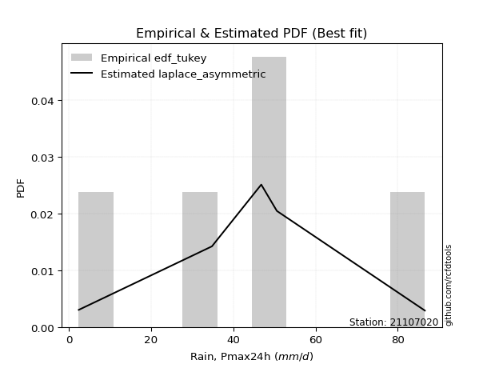</img>

</div>


### 8. Empirical - EDF Gringorten (1963)

Gringorten plotting position formula is essential for estimating the probability and return periods of extreme events like floods and heavy rainfall. The constant _a=0.44_.

<div align="center">


$P=(m-a)/(n+1-2a)$


</div>


**8.1. Empirical values**

<div align="center">

|                | 0                   | 1                  | 2              | 3                 | 4                  |
|:---------------|:--------------------|:-------------------|:---------------|:------------------|:-------------------|
| date           | 2024                | 2021               | 2020           | 2022              | 2019               |
| x              | 2.4                 | 34.8               | 46.8           | 50.6              | 86.6               |
| m              | 1                   | 2                  | 3              | 4                 | 5                  |
| empirical_dist | edf_gringorten      | edf_gringorten     | edf_gringorten | edf_gringorten    | edf_gringorten     |
| empirical      | 0.10937500000000001 | 0.3046875          | 0.5            | 0.6953125         | 0.8906249999999999 |
| empirical_tr   | 1.1228070175438596  | 1.4382022471910112 | 2.0            | 3.282051282051282 | 9.142857142857133  |

</div>


**8.2. Kolmogorov-Smirnov fit test (sorted by Δ)**


<div align="center">

|                | 0                  | 1                   | 2                   | 3                   | 4                   | 5                   | 6                   | 7                   | 8                   | 9                   | 10                  | 11                  | 12                  | 13                  | 14                  | 15                  | 16                  | 17                  | 18                  | 19                  | 20                  | 21                  | 22                  | 23                  | 24                  | 25                  | 26                  | 27                 | 28                  | 29                  | 30                 | 31                 | 32                  | 33                  | 34                 | 35                  | 36                    | 37                  | 38                 | 39                  | 40                  | 41                  | 42                  | 43                  | 44                 | 45                  | 46                  | 47                  | 48                 | 49                 | 50                  | 51                  | 52                 | 53                  | 54                 | 55                 | 56                  | 57                  | 58                  | 59                 | 60                 | 61                  | 62                 | 63                 | 64                  | 65                 | 66                 | 67                  | 68                 | 69                  | 70                 | 71                  | 72                 | 73                 | 74                  | 75                 | 76                  | 77                 | 78                 | 79                 | 80                 | 81                 | 82                  | 83                  | 84                  | 85                 | 86                 | 87                 | 88                 | 89                 |
|:---------------|:-------------------|:--------------------|:--------------------|:--------------------|:--------------------|:--------------------|:--------------------|:--------------------|:--------------------|:--------------------|:--------------------|:--------------------|:--------------------|:--------------------|:--------------------|:--------------------|:--------------------|:--------------------|:--------------------|:--------------------|:--------------------|:--------------------|:--------------------|:--------------------|:--------------------|:--------------------|:--------------------|:-------------------|:--------------------|:--------------------|:-------------------|:-------------------|:--------------------|:--------------------|:-------------------|:--------------------|:----------------------|:--------------------|:-------------------|:--------------------|:--------------------|:--------------------|:--------------------|:--------------------|:-------------------|:--------------------|:--------------------|:--------------------|:-------------------|:-------------------|:--------------------|:--------------------|:-------------------|:--------------------|:-------------------|:-------------------|:--------------------|:--------------------|:--------------------|:-------------------|:-------------------|:--------------------|:-------------------|:-------------------|:--------------------|:-------------------|:-------------------|:--------------------|:-------------------|:--------------------|:-------------------|:--------------------|:-------------------|:-------------------|:--------------------|:-------------------|:--------------------|:-------------------|:-------------------|:-------------------|:-------------------|:-------------------|:--------------------|:--------------------|:--------------------|:-------------------|:-------------------|:-------------------|:-------------------|:-------------------|
| station        | 21107020           | 21107020            | 21107020            | 21107020            | 21107020            | 21107020            | 21107020            | 21107020            | 21107020            | 21107020            | 21107020            | 21107020            | 21107020            | 21107020            | 21107020            | 21107020            | 21107020            | 21107020            | 21107020            | 21107020            | 21107020            | 21107020            | 21107020            | 21107020            | 21107020            | 21107020            | 21107020            | 21107020           | 21107020            | 21107020            | 21107020           | 21107020           | 21107020            | 21107020            | 21107020           | 21107020            | 21107020              | 21107020            | 21107020           | 21107020            | 21107020            | 21107020            | 21107020            | 21107020            | 21107020           | 21107020            | 21107020            | 21107020            | 21107020           | 21107020           | 21107020            | 21107020            | 21107020           | 21107020            | 21107020           | 21107020           | 21107020            | 21107020            | 21107020            | 21107020           | 21107020           | 21107020            | 21107020           | 21107020           | 21107020            | 21107020           | 21107020           | 21107020            | 21107020           | 21107020            | 21107020           | 21107020            | 21107020           | 21107020           | 21107020            | 21107020           | 21107020            | 21107020           | 21107020           | 21107020           | 21107020           | 21107020           | 21107020            | 21107020            | 21107020            | 21107020           | 21107020           | 21107020           | 21107020           | 21107020           |
| empirical_dist | edf_gringorten     | edf_gringorten      | edf_gringorten      | edf_gringorten      | edf_gringorten      | edf_gringorten      | edf_gringorten      | edf_gringorten      | edf_gringorten      | edf_gringorten      | edf_gringorten      | edf_gringorten      | edf_gringorten      | edf_gringorten      | edf_gringorten      | edf_gringorten      | edf_gringorten      | edf_gringorten      | edf_gringorten      | edf_gringorten      | edf_gringorten      | edf_gringorten      | edf_gringorten      | edf_gringorten      | edf_gringorten      | edf_gringorten      | edf_gringorten      | edf_gringorten     | edf_gringorten      | edf_gringorten      | edf_gringorten     | edf_gringorten     | edf_gringorten      | edf_gringorten      | edf_gringorten     | edf_gringorten      | edf_gringorten        | edf_gringorten      | edf_gringorten     | edf_gringorten      | edf_gringorten      | edf_gringorten      | edf_gringorten      | edf_gringorten      | edf_gringorten     | edf_gringorten      | edf_gringorten      | edf_gringorten      | edf_gringorten     | edf_gringorten     | edf_gringorten      | edf_gringorten      | edf_gringorten     | edf_gringorten      | edf_gringorten     | edf_gringorten     | edf_gringorten      | edf_gringorten      | edf_gringorten      | edf_gringorten     | edf_gringorten     | edf_gringorten      | edf_gringorten     | edf_gringorten     | edf_gringorten      | edf_gringorten     | edf_gringorten     | edf_gringorten      | edf_gringorten     | edf_gringorten      | edf_gringorten     | edf_gringorten      | edf_gringorten     | edf_gringorten     | edf_gringorten      | edf_gringorten     | edf_gringorten      | edf_gringorten     | edf_gringorten     | edf_gringorten     | edf_gringorten     | edf_gringorten     | edf_gringorten      | edf_gringorten      | edf_gringorten      | edf_gringorten     | edf_gringorten     | edf_gringorten     | edf_gringorten     | edf_gringorten     |
| p_dist         | laplace            | laplace_asymmetric  | hypsecant           | invgamma            | rice                | weibull_min         | logistic            | invgauss            | genlogistic         | maxwell             | fisk                | betaprime           | f                   | gamma               | erlang              | pearson3            | johnsonsu           | exponnorm           | t                   | crystalball         | norm                | rayleigh            | gumbel_r            | logt                | mielke              | moyal               | halfnorm            | kstwobign          | logmielke           | logloggamma         | halflogistic       | gumbel_l           | logjohnsonsu        | ncf                 | logfisk            | logpearson3         | loglaplace_asymmetric | loggumbel_l         | loggompertz        | wald                | nakagami            | gibrat              | expon               | genexpon            | logbetaprime       | logcrystalball      | lognorm             | lognorm             | logexponnorm       | lognct             | logfatiguelife      | logf                | logncf             | logerlang           | logrice            | loglogistic        | loginvgamma         | loggamma            | loggamma            | logchi2            | loginvgauss        | logalpha            | alpha              | loghypsecant       | loginvweibull       | logmaxwell         | lognakagami        | lograyleigh         | loglaplace         | gompertz            | logkstwobign       | loggenexpon         | loghalfnorm        | loggumbel_r        | nct                 | loghalflogistic    | logmoyal            | logexpon           | logtruncnorm       | pareto             | loglognorm         | logpareto          | logwald             | loggibrat           | invweibull          | logweibull_min     | fatiguelife        | chi2               | loggenlogistic     | truncnorm          |
| delta          | 0.0624555475002716 | 0.07688466314223485 | 0.08067489082824453 | 0.08555651816394882 | 0.08747671120967682 | 0.08864681190377299 | 0.09059708596072669 | 0.09113555259155792 | 0.09196522687042974 | 0.09197229697165016 | 0.09295078017754255 | 0.09688329080697577 | 0.09853699449245823 | 0.10120712062045334 | 0.10123686701924728 | 0.10130535588099032 | 0.10165284878697312 | 0.10264610104437644 | 0.10265019642592543 | 0.10265028326627446 | 0.10265028353219141 | 0.10417479159882526 | 0.11125130986129872 | 0.12198256690299594 | 0.12587614292871208 | 0.13327317070482358 | 0.13888704691519216 | 0.1410035453698218 | 0.14106423309979488 | 0.14336686273134974 | 0.1492759331504372 | 0.1637432410926517 | 0.17249957380576675 | 0.17645776157330084 | 0.1771253378949304 | 0.17963882272849563 | 0.1846218190486813    | 0.19916885812995977 | 0.1991876757720824 | 0.20322470956570815 | 0.21988473827558874 | 0.23125264962261238 | 0.23432234183029765 | 0.23451440411528934 | 0.2621157458284109 | 0.26396530603169444 | 0.26396531331591344 | 0.26396531331591344 | 0.2639672466097841 | 0.2642830749665619 | 0.26458683695678475 | 0.26533194774979574 | 0.2659168032894521 | 0.26817791388181833 | 0.2698302087801916 | 0.2730977506603428 | 0.27374641656222065 | 0.27518645080502346 | 0.27518645080502346 | 0.2753727439564928 | 0.2773539996509641 | 0.28003634907978325 | 0.2801989014349676 | 0.2807407777510742 | 0.28245034356239207 | 0.293045453240946  | 0.3000315443039446 | 0.30226440840006885 | 0.3037964860143012 | 0.31047155825971506 | 0.3167378636935785 | 0.32681703466185574 | 0.328329851210752  | 0.3330895530710878 | 0.34734597414496726 | 0.3561438785384281 | 0.35725056112482234 | 0.3587334767067516 | 0.3625962177562565 | 0.3761857066923102 | 0.3836872312889955 | 0.3988459069149807 | 0.42432760114481416 | 0.45469696218959244 | 0.47345496028897965 | 0.5074371293307696 | 0.5282462813872955 | 0.6934681386453246 | 0.6953125          | 0.8900491649884336 |
| deltao         | 0.5865427407550001 | 0.5865427407550001  | 0.5865427407550001  | 0.5865427407550001  | 0.5865427407550001  | 0.5865427407550001  | 0.5865427407550001  | 0.5865427407550001  | 0.5865427407550001  | 0.5865427407550001  | 0.5865427407550001  | 0.5865427407550001  | 0.5865427407550001  | 0.5865427407550001  | 0.5865427407550001  | 0.5865427407550001  | 0.5865427407550001  | 0.5865427407550001  | 0.5865427407550001  | 0.5865427407550001  | 0.5865427407550001  | 0.5865427407550001  | 0.5865427407550001  | 0.5865427407550001  | 0.5865427407550001  | 0.5865427407550001  | 0.5865427407550001  | 0.5865427407550001 | 0.5865427407550001  | 0.5865427407550001  | 0.5865427407550001 | 0.5865427407550001 | 0.5865427407550001  | 0.5865427407550001  | 0.5865427407550001 | 0.5865427407550001  | 0.5865427407550001    | 0.5865427407550001  | 0.5865427407550001 | 0.5865427407550001  | 0.5865427407550001  | 0.5865427407550001  | 0.5865427407550001  | 0.5865427407550001  | 0.5865427407550001 | 0.5865427407550001  | 0.5865427407550001  | 0.5865427407550001  | 0.5865427407550001 | 0.5865427407550001 | 0.5865427407550001  | 0.5865427407550001  | 0.5865427407550001 | 0.5865427407550001  | 0.5865427407550001 | 0.5865427407550001 | 0.5865427407550001  | 0.5865427407550001  | 0.5865427407550001  | 0.5865427407550001 | 0.5865427407550001 | 0.5865427407550001  | 0.5865427407550001 | 0.5865427407550001 | 0.5865427407550001  | 0.5865427407550001 | 0.5865427407550001 | 0.5865427407550001  | 0.5865427407550001 | 0.5865427407550001  | 0.5865427407550001 | 0.5865427407550001  | 0.5865427407550001 | 0.5865427407550001 | 0.5865427407550001  | 0.5865427407550001 | 0.5865427407550001  | 0.5865427407550001 | 0.5865427407550001 | 0.5865427407550001 | 0.5865427407550001 | 0.5865427407550001 | 0.5865427407550001  | 0.5865427407550001  | 0.5865427407550001  | 0.5865427407550001 | 0.5865427407550001 | 0.5865427407550001 | 0.5865427407550001 | 0.5865427407550001 |
| eval           | Δo > Δ             | Δo > Δ              | Δo > Δ              | Δo > Δ              | Δo > Δ              | Δo > Δ              | Δo > Δ              | Δo > Δ              | Δo > Δ              | Δo > Δ              | Δo > Δ              | Δo > Δ              | Δo > Δ              | Δo > Δ              | Δo > Δ              | Δo > Δ              | Δo > Δ              | Δo > Δ              | Δo > Δ              | Δo > Δ              | Δo > Δ              | Δo > Δ              | Δo > Δ              | Δo > Δ              | Δo > Δ              | Δo > Δ              | Δo > Δ              | Δo > Δ             | Δo > Δ              | Δo > Δ              | Δo > Δ             | Δo > Δ             | Δo > Δ              | Δo > Δ              | Δo > Δ             | Δo > Δ              | Δo > Δ                | Δo > Δ              | Δo > Δ             | Δo > Δ              | Δo > Δ              | Δo > Δ              | Δo > Δ              | Δo > Δ              | Δo > Δ             | Δo > Δ              | Δo > Δ              | Δo > Δ              | Δo > Δ             | Δo > Δ             | Δo > Δ              | Δo > Δ              | Δo > Δ             | Δo > Δ              | Δo > Δ             | Δo > Δ             | Δo > Δ              | Δo > Δ              | Δo > Δ              | Δo > Δ             | Δo > Δ             | Δo > Δ              | Δo > Δ             | Δo > Δ             | Δo > Δ              | Δo > Δ             | Δo > Δ             | Δo > Δ              | Δo > Δ             | Δo > Δ              | Δo > Δ             | Δo > Δ              | Δo > Δ             | Δo > Δ             | Δo > Δ              | Δo > Δ             | Δo > Δ              | Δo > Δ             | Δo > Δ             | Δo > Δ             | Δo > Δ             | Δo > Δ             | Δo > Δ              | Δo > Δ              | Δo > Δ              | Δo > Δ             | Δo > Δ             | Δo <= Δ            | Δo <= Δ            | Δo <= Δ            |
| fit            | 1                  | 1                   | 1                   | 1                   | 1                   | 1                   | 1                   | 1                   | 1                   | 1                   | 1                   | 1                   | 1                   | 1                   | 1                   | 1                   | 1                   | 1                   | 1                   | 1                   | 1                   | 1                   | 1                   | 1                   | 1                   | 1                   | 1                   | 1                  | 1                   | 1                   | 1                  | 1                  | 1                   | 1                   | 1                  | 1                   | 1                     | 1                   | 1                  | 1                   | 1                   | 1                   | 1                   | 1                   | 1                  | 1                   | 1                   | 1                   | 1                  | 1                  | 1                   | 1                   | 1                  | 1                   | 1                  | 1                  | 1                   | 1                   | 1                   | 1                  | 1                  | 1                   | 1                  | 1                  | 1                   | 1                  | 1                  | 1                   | 1                  | 1                   | 1                  | 1                   | 1                  | 1                  | 1                   | 1                  | 1                   | 1                  | 1                  | 1                  | 1                  | 1                  | 1                   | 1                   | 1                   | 1                  | 1                  | 0                  | 0                  | 0                  |
| n              | 5                  | 5                   | 5                   | 5                   | 5                   | 5                   | 5                   | 5                   | 5                   | 5                   | 5                   | 5                   | 5                   | 5                   | 5                   | 5                   | 5                   | 5                   | 5                   | 5                   | 5                   | 5                   | 5                   | 5                   | 5                   | 5                   | 5                   | 5                  | 5                   | 5                   | 5                  | 5                  | 5                   | 5                   | 5                  | 5                   | 5                     | 5                   | 5                  | 5                   | 5                   | 5                   | 5                   | 5                   | 5                  | 5                   | 5                   | 5                   | 5                  | 5                  | 5                   | 5                   | 5                  | 5                   | 5                  | 5                  | 5                   | 5                   | 5                   | 5                  | 5                  | 5                   | 5                  | 5                  | 5                   | 5                  | 5                  | 5                   | 5                  | 5                   | 5                  | 5                   | 5                  | 5                  | 5                   | 5                  | 5                   | 5                  | 5                  | 5                  | 5                  | 5                  | 5                   | 5                   | 5                   | 5                  | 5                  | 5                  | 5                  | 5                  |
| best_fit       | 1                  | 0                   | 0                   | 0                   | 0                   | 0                   | 0                   | 0                   | 0                   | 0                   | 0                   | 0                   | 0                   | 0                   | 0                   | 0                   | 0                   | 0                   | 0                   | 0                   | 0                   | 0                   | 0                   | 0                   | 0                   | 0                   | 0                   | 0                  | 0                   | 0                   | 0                  | 0                  | 0                   | 0                   | 0                  | 0                   | 0                     | 0                   | 0                  | 0                   | 0                   | 0                   | 0                   | 0                   | 0                  | 0                   | 0                   | 0                   | 0                  | 0                  | 0                   | 0                   | 0                  | 0                   | 0                  | 0                  | 0                   | 0                   | 0                   | 0                  | 0                  | 0                   | 0                  | 0                  | 0                   | 0                  | 0                  | 0                   | 0                  | 0                   | 0                  | 0                   | 0                  | 0                  | 0                   | 0                  | 0                   | 0                  | 0                  | 0                  | 0                  | 0                  | 0                   | 0                   | 0                   | 0                  | 0                  | 0                  | 0                  | 0                  |
| best_fit_sort  | 1                  | 2                   | 3                   | 4                   | 5                   | 6                   | 7                   | 8                   | 9                   | 10                  | 11                  | 12                  | 13                  | 14                  | 15                  | 16                  | 17                  | 18                  | 19                  | 20                  | 21                  | 22                  | 23                  | 24                  | 25                  | 26                  | 27                  | 28                 | 29                  | 30                  | 31                 | 32                 | 33                  | 34                  | 35                 | 36                  | 37                    | 38                  | 39                 | 40                  | 41                  | 42                  | 43                  | 44                  | 45                 | 46                  | 47                  | 48                  | 49                 | 50                 | 51                  | 52                  | 53                 | 54                  | 55                 | 56                 | 57                  | 58                  | 59                  | 60                 | 61                 | 62                  | 63                 | 64                 | 65                  | 66                 | 67                 | 68                  | 69                 | 70                  | 71                 | 72                  | 73                 | 74                 | 75                  | 76                 | 77                  | 78                 | 79                 | 80                 | 81                 | 82                 | 83                  | 84                  | 85                  | 86                 | 87                 | 88                 | 89                 | 90                 |

</div>


<div align="center">

</img>

</div>


**8.3. Best fit**

<div align="center">

|   id |   station | empirical_dist   | p_dist   |     delta |   deltao | eval   |   fit |   n |   best_fit |   best_fit_sort |
|-----:|----------:|:-----------------|:---------|----------:|---------:|:-------|------:|----:|-----------:|----------------:|
|    0 |  21107020 | edf_gringorten   | laplace  | 0.0624555 | 0.586543 | Δo > Δ |     1 |   5 |          1 |               1 |

</div>


<div align="center">

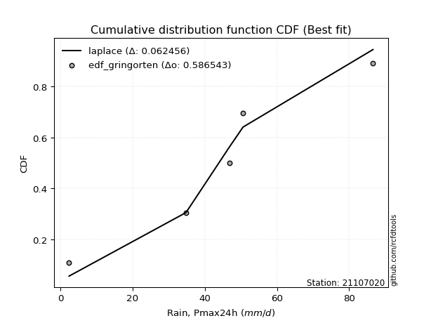</img>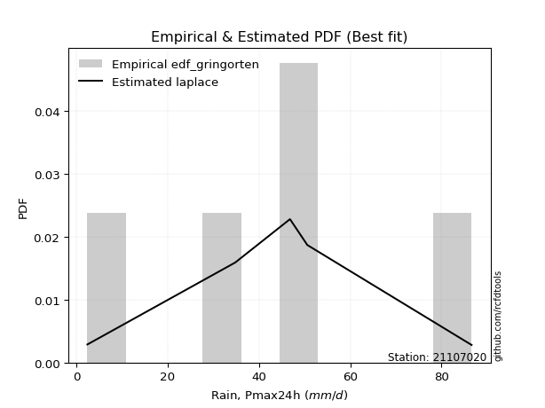</img>

</div>


### 9. Empirical - EDF Filliben (1975)

The specific values of the constants (0.3175) (often denoted as $alpha$) and (0.365) are derived from a method proposed by James J. Filliben in a 1975 paper. This particular formula is the mean value of the $i$-th order statistic of the normal distribution and is considered a robust and effective plotting position formula for the normal probability plot correlation coefficient test for normality.

<div align="center">


$P=(m-0.3175)/(n+0.365)$


</div>


**9.1. Empirical values**

<div align="center">

|                | 0                   | 1                  | 2            | 3                  | 4                  |
|:---------------|:--------------------|:-------------------|:-------------|:-------------------|:-------------------|
| date           | 2024                | 2021               | 2020         | 2022               | 2019               |
| x              | 2.4                 | 34.8               | 46.8         | 50.6               | 86.6               |
| m              | 1                   | 2                  | 3            | 4                  | 5                  |
| empirical_dist | edf_filliben        | edf_filliben       | edf_filliben | edf_filliben       | edf_filliben       |
| empirical      | 0.12721342031686858 | 0.3136067101584343 | 0.5          | 0.6863932898415657 | 0.8727865796831314 |
| empirical_tr   | 1.1457554725040042  | 1.456890699253225  | 2.0          | 3.188707280832095  | 7.860805860805863  |

</div>


**9.2. Kolmogorov-Smirnov fit test (sorted by Δ)**


<div align="center">

|                | 0                  | 1                   | 2                   | 3                  | 4                   | 5                   | 6                   | 7                   | 8                   | 9                   | 10                  | 11                  | 12                 | 13                  | 14                  | 15                  | 16                  | 17                 | 18                 | 19                  | 20                  | 21                  | 22                  | 23                  | 24                  | 25                  | 26                  | 27                 | 28                  | 29                  | 30                 | 31                  | 32                  | 33                  | 34                  | 35                  | 36                    | 37                 | 38                  | 39                  | 40                  | 41                  | 42                  | 43                  | 44                  | 45                  | 46                  | 47                  | 48                 | 49                 | 50                 | 51                  | 52                  | 53                  | 54                 | 55                  | 56                 | 57                 | 58                 | 59                  | 60                 | 61                 | 62                  | 63                 | 64                 | 65                 | 66                 | 67                 | 68                 | 69                  | 70                  | 71                  | 72                 | 73                 | 74                 | 75                  | 76                  | 77                 | 78                 | 79                  | 80                  | 81                 | 82                 | 83                  | 84                 | 85                 | 86                 | 87                 | 88                 | 89                 |
|:---------------|:-------------------|:--------------------|:--------------------|:-------------------|:--------------------|:--------------------|:--------------------|:--------------------|:--------------------|:--------------------|:--------------------|:--------------------|:-------------------|:--------------------|:--------------------|:--------------------|:--------------------|:-------------------|:-------------------|:--------------------|:--------------------|:--------------------|:--------------------|:--------------------|:--------------------|:--------------------|:--------------------|:-------------------|:--------------------|:--------------------|:-------------------|:--------------------|:--------------------|:--------------------|:--------------------|:--------------------|:----------------------|:-------------------|:--------------------|:--------------------|:--------------------|:--------------------|:--------------------|:--------------------|:--------------------|:--------------------|:--------------------|:--------------------|:-------------------|:-------------------|:-------------------|:--------------------|:--------------------|:--------------------|:-------------------|:--------------------|:-------------------|:-------------------|:-------------------|:--------------------|:-------------------|:-------------------|:--------------------|:-------------------|:-------------------|:-------------------|:-------------------|:-------------------|:-------------------|:--------------------|:--------------------|:--------------------|:-------------------|:-------------------|:-------------------|:--------------------|:--------------------|:-------------------|:-------------------|:--------------------|:--------------------|:-------------------|:-------------------|:--------------------|:-------------------|:-------------------|:-------------------|:-------------------|:-------------------|:-------------------|
| station        | 21107020           | 21107020            | 21107020            | 21107020           | 21107020            | 21107020            | 21107020            | 21107020            | 21107020            | 21107020            | 21107020            | 21107020            | 21107020           | 21107020            | 21107020            | 21107020            | 21107020            | 21107020           | 21107020           | 21107020            | 21107020            | 21107020            | 21107020            | 21107020            | 21107020            | 21107020            | 21107020            | 21107020           | 21107020            | 21107020            | 21107020           | 21107020            | 21107020            | 21107020            | 21107020            | 21107020            | 21107020              | 21107020           | 21107020            | 21107020            | 21107020            | 21107020            | 21107020            | 21107020            | 21107020            | 21107020            | 21107020            | 21107020            | 21107020           | 21107020           | 21107020           | 21107020            | 21107020            | 21107020            | 21107020           | 21107020            | 21107020           | 21107020           | 21107020           | 21107020            | 21107020           | 21107020           | 21107020            | 21107020           | 21107020           | 21107020           | 21107020           | 21107020           | 21107020           | 21107020            | 21107020            | 21107020            | 21107020           | 21107020           | 21107020           | 21107020            | 21107020            | 21107020           | 21107020           | 21107020            | 21107020            | 21107020           | 21107020           | 21107020            | 21107020           | 21107020           | 21107020           | 21107020           | 21107020           | 21107020           |
| empirical_dist | edf_filliben       | edf_filliben        | edf_filliben        | edf_filliben       | edf_filliben        | edf_filliben        | edf_filliben        | edf_filliben        | edf_filliben        | edf_filliben        | edf_filliben        | edf_filliben        | edf_filliben       | edf_filliben        | edf_filliben        | edf_filliben        | edf_filliben        | edf_filliben       | edf_filliben       | edf_filliben        | edf_filliben        | edf_filliben        | edf_filliben        | edf_filliben        | edf_filliben        | edf_filliben        | edf_filliben        | edf_filliben       | edf_filliben        | edf_filliben        | edf_filliben       | edf_filliben        | edf_filliben        | edf_filliben        | edf_filliben        | edf_filliben        | edf_filliben          | edf_filliben       | edf_filliben        | edf_filliben        | edf_filliben        | edf_filliben        | edf_filliben        | edf_filliben        | edf_filliben        | edf_filliben        | edf_filliben        | edf_filliben        | edf_filliben       | edf_filliben       | edf_filliben       | edf_filliben        | edf_filliben        | edf_filliben        | edf_filliben       | edf_filliben        | edf_filliben       | edf_filliben       | edf_filliben       | edf_filliben        | edf_filliben       | edf_filliben       | edf_filliben        | edf_filliben       | edf_filliben       | edf_filliben       | edf_filliben       | edf_filliben       | edf_filliben       | edf_filliben        | edf_filliben        | edf_filliben        | edf_filliben       | edf_filliben       | edf_filliben       | edf_filliben        | edf_filliben        | edf_filliben       | edf_filliben       | edf_filliben        | edf_filliben        | edf_filliben       | edf_filliben       | edf_filliben        | edf_filliben       | edf_filliben       | edf_filliben       | edf_filliben       | edf_filliben       | edf_filliben       |
| p_dist         | laplace_asymmetric | laplace             | hypsecant           | invgamma           | weibull_min         | logistic            | invgauss            | genlogistic         | fisk                | rice                | maxwell             | betaprime           | f                  | gamma               | erlang              | pearson3            | johnsonsu           | exponnorm          | t                  | crystalball         | norm                | rayleigh            | gumbel_r            | mielke              | halfnorm            | logt                | kstwobign           | logmielke          | moyal               | logloggamma         | halflogistic       | gumbel_l            | logjohnsonsu        | ncf                 | logfisk             | logpearson3         | loglaplace_asymmetric | loggumbel_l        | loggompertz         | wald                | nakagami            | expon               | genexpon            | gibrat              | logbetaprime        | logcrystalball      | lognorm             | lognorm             | logexponnorm       | lognct             | logfatiguelife     | logf                | logncf              | logerlang           | logrice            | loglogistic         | loginvgamma        | loggamma           | loggamma           | logchi2             | loginvgauss        | logalpha           | alpha               | loghypsecant       | loginvweibull      | logmaxwell         | lograyleigh        | loglaplace         | logkstwobign       | lognakagami         | gompertz            | loggenexpon         | loghalfnorm        | loggumbel_r        | nct                | loghalflogistic     | logmoyal            | logexpon           | logtruncnorm       | pareto              | loglognorm          | logpareto          | logwald            | loggibrat           | invweibull         | logweibull_min     | fatiguelife        | chi2               | loggenlogistic     | truncnorm          |
| delta          | 0.0719154806710317 | 0.07224482610979988 | 0.07253827402772106 | 0.0774939699567942 | 0.07972760174533866 | 0.08167787580229235 | 0.08221634243312365 | 0.08304601671199541 | 0.08403157001910821 | 0.08450066175617277 | 0.08523659166741801 | 0.08796408064854144 | 0.0896177843340239 | 0.09228791046201901 | 0.09231765686081295 | 0.09238614572255599 | 0.09273363862853878 | 0.0937268908859421 | 0.0937309862674911 | 0.09373107310784012 | 0.09373107337375708 | 0.09810119232354227 | 0.10991649502073589 | 0.12721342029330257 | 0.12996783675675788 | 0.13090177706143022 | 0.13208433521138752 | 0.1321450229413606 | 0.13327317070482358 | 0.13444765257291547 | 0.1403567229920029 | 0.15482403093421737 | 0.16358036364733242 | 0.16753855141486657 | 0.16820612773649612 | 0.17071961257006135 | 0.17570260889024703   | 0.1902496479715255 | 0.19026846561364813 | 0.20322470956570815 | 0.21096552811715447 | 0.22540313167186338 | 0.22559519395685507 | 0.23125264962261238 | 0.25319653566997663 | 0.25504609587326016 | 0.25504610315747916 | 0.25504610315747916 | 0.2550480364513498 | 0.2553638648081276 | 0.2556676267983505 | 0.25641273759136146 | 0.25699759313101783 | 0.25925870372338405 | 0.2609109986217573 | 0.26417854050190853 | 0.2648272064037864 | 0.2662672406465892 | 0.2662672406465892 | 0.26645353379805853 | 0.2684347894925298 | 0.271117138921349  | 0.27127969127653334 | 0.2718215675926399 | 0.2735311334039578 | 0.2841262430825117 | 0.2933451982416346 | 0.2948772758558669 | 0.3078186535351442 | 0.30895075446237885 | 0.31360662635631475 | 0.31789782450342147 | 0.3194106410523177 | 0.3241703429126535 | 0.338426763986533  | 0.34722466837999383 | 0.34833135096638806 | 0.3498142665483173 | 0.3536770075978222 | 0.36726649653387594 | 0.37476802113056124 | 0.3899266967565464 | 0.4154083909863799 | 0.44577775203115816 | 0.4556165399721112 | 0.4985179191723353 | 0.5193270712288611 | 0.6845489284868904 | 0.6863932898415657 | 0.872210744671565  |
| deltao         | 0.5865427407550001 | 0.5865427407550001  | 0.5865427407550001  | 0.5865427407550001 | 0.5865427407550001  | 0.5865427407550001  | 0.5865427407550001  | 0.5865427407550001  | 0.5865427407550001  | 0.5865427407550001  | 0.5865427407550001  | 0.5865427407550001  | 0.5865427407550001 | 0.5865427407550001  | 0.5865427407550001  | 0.5865427407550001  | 0.5865427407550001  | 0.5865427407550001 | 0.5865427407550001 | 0.5865427407550001  | 0.5865427407550001  | 0.5865427407550001  | 0.5865427407550001  | 0.5865427407550001  | 0.5865427407550001  | 0.5865427407550001  | 0.5865427407550001  | 0.5865427407550001 | 0.5865427407550001  | 0.5865427407550001  | 0.5865427407550001 | 0.5865427407550001  | 0.5865427407550001  | 0.5865427407550001  | 0.5865427407550001  | 0.5865427407550001  | 0.5865427407550001    | 0.5865427407550001 | 0.5865427407550001  | 0.5865427407550001  | 0.5865427407550001  | 0.5865427407550001  | 0.5865427407550001  | 0.5865427407550001  | 0.5865427407550001  | 0.5865427407550001  | 0.5865427407550001  | 0.5865427407550001  | 0.5865427407550001 | 0.5865427407550001 | 0.5865427407550001 | 0.5865427407550001  | 0.5865427407550001  | 0.5865427407550001  | 0.5865427407550001 | 0.5865427407550001  | 0.5865427407550001 | 0.5865427407550001 | 0.5865427407550001 | 0.5865427407550001  | 0.5865427407550001 | 0.5865427407550001 | 0.5865427407550001  | 0.5865427407550001 | 0.5865427407550001 | 0.5865427407550001 | 0.5865427407550001 | 0.5865427407550001 | 0.5865427407550001 | 0.5865427407550001  | 0.5865427407550001  | 0.5865427407550001  | 0.5865427407550001 | 0.5865427407550001 | 0.5865427407550001 | 0.5865427407550001  | 0.5865427407550001  | 0.5865427407550001 | 0.5865427407550001 | 0.5865427407550001  | 0.5865427407550001  | 0.5865427407550001 | 0.5865427407550001 | 0.5865427407550001  | 0.5865427407550001 | 0.5865427407550001 | 0.5865427407550001 | 0.5865427407550001 | 0.5865427407550001 | 0.5865427407550001 |
| eval           | Δo > Δ             | Δo > Δ              | Δo > Δ              | Δo > Δ             | Δo > Δ              | Δo > Δ              | Δo > Δ              | Δo > Δ              | Δo > Δ              | Δo > Δ              | Δo > Δ              | Δo > Δ              | Δo > Δ             | Δo > Δ              | Δo > Δ              | Δo > Δ              | Δo > Δ              | Δo > Δ             | Δo > Δ             | Δo > Δ              | Δo > Δ              | Δo > Δ              | Δo > Δ              | Δo > Δ              | Δo > Δ              | Δo > Δ              | Δo > Δ              | Δo > Δ             | Δo > Δ              | Δo > Δ              | Δo > Δ             | Δo > Δ              | Δo > Δ              | Δo > Δ              | Δo > Δ              | Δo > Δ              | Δo > Δ                | Δo > Δ             | Δo > Δ              | Δo > Δ              | Δo > Δ              | Δo > Δ              | Δo > Δ              | Δo > Δ              | Δo > Δ              | Δo > Δ              | Δo > Δ              | Δo > Δ              | Δo > Δ             | Δo > Δ             | Δo > Δ             | Δo > Δ              | Δo > Δ              | Δo > Δ              | Δo > Δ             | Δo > Δ              | Δo > Δ             | Δo > Δ             | Δo > Δ             | Δo > Δ              | Δo > Δ             | Δo > Δ             | Δo > Δ              | Δo > Δ             | Δo > Δ             | Δo > Δ             | Δo > Δ             | Δo > Δ             | Δo > Δ             | Δo > Δ              | Δo > Δ              | Δo > Δ              | Δo > Δ             | Δo > Δ             | Δo > Δ             | Δo > Δ              | Δo > Δ              | Δo > Δ             | Δo > Δ             | Δo > Δ              | Δo > Δ              | Δo > Δ             | Δo > Δ             | Δo > Δ              | Δo > Δ             | Δo > Δ             | Δo > Δ             | Δo <= Δ            | Δo <= Δ            | Δo <= Δ            |
| fit            | 1                  | 1                   | 1                   | 1                  | 1                   | 1                   | 1                   | 1                   | 1                   | 1                   | 1                   | 1                   | 1                  | 1                   | 1                   | 1                   | 1                   | 1                  | 1                  | 1                   | 1                   | 1                   | 1                   | 1                   | 1                   | 1                   | 1                   | 1                  | 1                   | 1                   | 1                  | 1                   | 1                   | 1                   | 1                   | 1                   | 1                     | 1                  | 1                   | 1                   | 1                   | 1                   | 1                   | 1                   | 1                   | 1                   | 1                   | 1                   | 1                  | 1                  | 1                  | 1                   | 1                   | 1                   | 1                  | 1                   | 1                  | 1                  | 1                  | 1                   | 1                  | 1                  | 1                   | 1                  | 1                  | 1                  | 1                  | 1                  | 1                  | 1                   | 1                   | 1                   | 1                  | 1                  | 1                  | 1                   | 1                   | 1                  | 1                  | 1                   | 1                   | 1                  | 1                  | 1                   | 1                  | 1                  | 1                  | 0                  | 0                  | 0                  |
| n              | 5                  | 5                   | 5                   | 5                  | 5                   | 5                   | 5                   | 5                   | 5                   | 5                   | 5                   | 5                   | 5                  | 5                   | 5                   | 5                   | 5                   | 5                  | 5                  | 5                   | 5                   | 5                   | 5                   | 5                   | 5                   | 5                   | 5                   | 5                  | 5                   | 5                   | 5                  | 5                   | 5                   | 5                   | 5                   | 5                   | 5                     | 5                  | 5                   | 5                   | 5                   | 5                   | 5                   | 5                   | 5                   | 5                   | 5                   | 5                   | 5                  | 5                  | 5                  | 5                   | 5                   | 5                   | 5                  | 5                   | 5                  | 5                  | 5                  | 5                   | 5                  | 5                  | 5                   | 5                  | 5                  | 5                  | 5                  | 5                  | 5                  | 5                   | 5                   | 5                   | 5                  | 5                  | 5                  | 5                   | 5                   | 5                  | 5                  | 5                   | 5                   | 5                  | 5                  | 5                   | 5                  | 5                  | 5                  | 5                  | 5                  | 5                  |
| best_fit       | 1                  | 0                   | 0                   | 0                  | 0                   | 0                   | 0                   | 0                   | 0                   | 0                   | 0                   | 0                   | 0                  | 0                   | 0                   | 0                   | 0                   | 0                  | 0                  | 0                   | 0                   | 0                   | 0                   | 0                   | 0                   | 0                   | 0                   | 0                  | 0                   | 0                   | 0                  | 0                   | 0                   | 0                   | 0                   | 0                   | 0                     | 0                  | 0                   | 0                   | 0                   | 0                   | 0                   | 0                   | 0                   | 0                   | 0                   | 0                   | 0                  | 0                  | 0                  | 0                   | 0                   | 0                   | 0                  | 0                   | 0                  | 0                  | 0                  | 0                   | 0                  | 0                  | 0                   | 0                  | 0                  | 0                  | 0                  | 0                  | 0                  | 0                   | 0                   | 0                   | 0                  | 0                  | 0                  | 0                   | 0                   | 0                  | 0                  | 0                   | 0                   | 0                  | 0                  | 0                   | 0                  | 0                  | 0                  | 0                  | 0                  | 0                  |
| best_fit_sort  | 1                  | 2                   | 3                   | 4                  | 5                   | 6                   | 7                   | 8                   | 9                   | 10                  | 11                  | 12                  | 13                 | 14                  | 15                  | 16                  | 17                  | 18                 | 19                 | 20                  | 21                  | 22                  | 23                  | 24                  | 25                  | 26                  | 27                  | 28                 | 29                  | 30                  | 31                 | 32                  | 33                  | 34                  | 35                  | 36                  | 37                    | 38                 | 39                  | 40                  | 41                  | 42                  | 43                  | 44                  | 45                  | 46                  | 47                  | 48                  | 49                 | 50                 | 51                 | 52                  | 53                  | 54                  | 55                 | 56                  | 57                 | 58                 | 59                 | 60                  | 61                 | 62                 | 63                  | 64                 | 65                 | 66                 | 67                 | 68                 | 69                 | 70                  | 71                  | 72                  | 73                 | 74                 | 75                 | 76                  | 77                  | 78                 | 79                 | 80                  | 81                  | 82                 | 83                 | 84                  | 85                 | 86                 | 87                 | 88                 | 89                 | 90                 |

</div>


<div align="center">

</img>

</div>


**9.3. Best fit**

<div align="center">

|   id |   station | empirical_dist   | p_dist             |     delta |   deltao | eval   |   fit |   n |   best_fit |   best_fit_sort |
|-----:|----------:|:-----------------|:-------------------|----------:|---------:|:-------|------:|----:|-----------:|----------------:|
|    0 |  21107020 | edf_filliben     | laplace_asymmetric | 0.0719155 | 0.586543 | Δo > Δ |     1 |   5 |          1 |               1 |

</div>


<div align="center">

</img></img>

</div>


### 10. Empirical - EDF Jenkinson (1977)

The Jenkinson formula in hydrology is an empirical plotting position formula used to estimate the non-exceedance probability _(P)_ or return period _(T)_ of a given ordered observation within a sample. It is a widely used method in the frequency analysis of extreme events such as floods and rainfall, as it provides a distribution-free way to plot data. _a≈0.31_ and _b≈0.38_ are constants derived to approximate the median of the probability distribution for the given rank.

<div align="center">


$P=(m-a)/(n+b)$


</div>


**10.1. Empirical values**

<div align="center">

|                | 0                   | 1                  | 2             | 3                  | 4                  |
|:---------------|:--------------------|:-------------------|:--------------|:-------------------|:-------------------|
| date           | 2024                | 2021               | 2020          | 2022               | 2019               |
| x              | 2.4                 | 34.8               | 46.8          | 50.6               | 86.6               |
| m              | 1                   | 2                  | 3             | 4                  | 5                  |
| empirical_dist | edf_jenkinson       | edf_jenkinson      | edf_jenkinson | edf_jenkinson      | edf_jenkinson      |
| empirical      | 0.12825278810408922 | 0.3141263940520446 | 0.5           | 0.6858736059479554 | 0.8717472118959109 |
| empirical_tr   | 1.1471215351812367  | 1.4579945799457996 | 2.0           | 3.183431952662722  | 7.797101449275368  |

</div>


**10.2. Kolmogorov-Smirnov fit test (sorted by Δ)**


<div align="center">

|                | 0                   | 1                   | 2                   | 3                   | 4                   | 5                   | 6                  | 7                   | 8                   | 9                  | 10                  | 11                  | 12                  | 13                  | 14                  | 15                  | 16                  | 17                  | 18                  | 19                  | 20                  | 21                 | 22                  | 23                 | 24                  | 25                  | 26                  | 27                  | 28                  | 29                  | 30                  | 31                  | 32                  | 33                  | 34                  | 35                 | 36                    | 37                  | 38                  | 39                  | 40                  | 41                  | 42                  | 43                  | 44                 | 45                 | 46                 | 47                 | 48                 | 49                  | 50                  | 51                 | 52                 | 53                 | 54                  | 55                 | 56                  | 57                  | 58                  | 59                 | 60                  | 61                  | 62                 | 63                 | 64                  | 65                 | 66                  | 67                 | 68                  | 69                 | 70                 | 71                 | 72                  | 73                  | 74                  | 75                 | 76                 | 77                 | 78                 | 79                 | 80                 | 81                  | 82                  | 83                 | 84                  | 85                  | 86                 | 87                 | 88                 | 89                 |
|:---------------|:--------------------|:--------------------|:--------------------|:--------------------|:--------------------|:--------------------|:-------------------|:--------------------|:--------------------|:-------------------|:--------------------|:--------------------|:--------------------|:--------------------|:--------------------|:--------------------|:--------------------|:--------------------|:--------------------|:--------------------|:--------------------|:-------------------|:--------------------|:-------------------|:--------------------|:--------------------|:--------------------|:--------------------|:--------------------|:--------------------|:--------------------|:--------------------|:--------------------|:--------------------|:--------------------|:-------------------|:----------------------|:--------------------|:--------------------|:--------------------|:--------------------|:--------------------|:--------------------|:--------------------|:-------------------|:-------------------|:-------------------|:-------------------|:-------------------|:--------------------|:--------------------|:-------------------|:-------------------|:-------------------|:--------------------|:-------------------|:--------------------|:--------------------|:--------------------|:-------------------|:--------------------|:--------------------|:-------------------|:-------------------|:--------------------|:-------------------|:--------------------|:-------------------|:--------------------|:-------------------|:-------------------|:-------------------|:--------------------|:--------------------|:--------------------|:-------------------|:-------------------|:-------------------|:-------------------|:-------------------|:-------------------|:--------------------|:--------------------|:-------------------|:--------------------|:--------------------|:-------------------|:-------------------|:-------------------|:-------------------|
| station        | 21107020            | 21107020            | 21107020            | 21107020            | 21107020            | 21107020            | 21107020           | 21107020            | 21107020            | 21107020           | 21107020            | 21107020            | 21107020            | 21107020            | 21107020            | 21107020            | 21107020            | 21107020            | 21107020            | 21107020            | 21107020            | 21107020           | 21107020            | 21107020           | 21107020            | 21107020            | 21107020            | 21107020            | 21107020            | 21107020            | 21107020            | 21107020            | 21107020            | 21107020            | 21107020            | 21107020           | 21107020              | 21107020            | 21107020            | 21107020            | 21107020            | 21107020            | 21107020            | 21107020            | 21107020           | 21107020           | 21107020           | 21107020           | 21107020           | 21107020            | 21107020            | 21107020           | 21107020           | 21107020           | 21107020            | 21107020           | 21107020            | 21107020            | 21107020            | 21107020           | 21107020            | 21107020            | 21107020           | 21107020           | 21107020            | 21107020           | 21107020            | 21107020           | 21107020            | 21107020           | 21107020           | 21107020           | 21107020            | 21107020            | 21107020            | 21107020           | 21107020           | 21107020           | 21107020           | 21107020           | 21107020           | 21107020            | 21107020            | 21107020           | 21107020            | 21107020            | 21107020           | 21107020           | 21107020           | 21107020           |
| empirical_dist | edf_jenkinson       | edf_jenkinson       | edf_jenkinson       | edf_jenkinson       | edf_jenkinson       | edf_jenkinson       | edf_jenkinson      | edf_jenkinson       | edf_jenkinson       | edf_jenkinson      | edf_jenkinson       | edf_jenkinson       | edf_jenkinson       | edf_jenkinson       | edf_jenkinson       | edf_jenkinson       | edf_jenkinson       | edf_jenkinson       | edf_jenkinson       | edf_jenkinson       | edf_jenkinson       | edf_jenkinson      | edf_jenkinson       | edf_jenkinson      | edf_jenkinson       | edf_jenkinson       | edf_jenkinson       | edf_jenkinson       | edf_jenkinson       | edf_jenkinson       | edf_jenkinson       | edf_jenkinson       | edf_jenkinson       | edf_jenkinson       | edf_jenkinson       | edf_jenkinson      | edf_jenkinson         | edf_jenkinson       | edf_jenkinson       | edf_jenkinson       | edf_jenkinson       | edf_jenkinson       | edf_jenkinson       | edf_jenkinson       | edf_jenkinson      | edf_jenkinson      | edf_jenkinson      | edf_jenkinson      | edf_jenkinson      | edf_jenkinson       | edf_jenkinson       | edf_jenkinson      | edf_jenkinson      | edf_jenkinson      | edf_jenkinson       | edf_jenkinson      | edf_jenkinson       | edf_jenkinson       | edf_jenkinson       | edf_jenkinson      | edf_jenkinson       | edf_jenkinson       | edf_jenkinson      | edf_jenkinson      | edf_jenkinson       | edf_jenkinson      | edf_jenkinson       | edf_jenkinson      | edf_jenkinson       | edf_jenkinson      | edf_jenkinson      | edf_jenkinson      | edf_jenkinson       | edf_jenkinson       | edf_jenkinson       | edf_jenkinson      | edf_jenkinson      | edf_jenkinson      | edf_jenkinson      | edf_jenkinson      | edf_jenkinson      | edf_jenkinson       | edf_jenkinson       | edf_jenkinson      | edf_jenkinson       | edf_jenkinson       | edf_jenkinson      | edf_jenkinson      | edf_jenkinson      | edf_jenkinson      |
| p_dist         | laplace_asymmetric  | laplace             | hypsecant           | invgamma            | weibull_min         | logistic            | invgauss           | genlogistic         | fisk                | rice               | maxwell             | betaprime           | f                   | gamma               | erlang              | pearson3            | johnsonsu           | exponnorm           | t                   | crystalball         | norm                | rayleigh           | gumbel_r            | mielke             | halfnorm            | logt                | kstwobign           | logmielke           | moyal               | logloggamma         | halflogistic        | gumbel_l            | logjohnsonsu        | ncf                 | logfisk             | logpearson3        | loglaplace_asymmetric | loggumbel_l         | loggompertz         | wald                | nakagami            | expon               | genexpon            | gibrat              | logbetaprime       | logcrystalball     | lognorm            | lognorm            | logexponnorm       | lognct              | logfatiguelife      | logf               | logncf             | logerlang          | logrice             | loglogistic        | loginvgamma         | loggamma            | loggamma            | logchi2            | loginvgauss         | logalpha            | alpha              | loghypsecant       | loginvweibull       | logmaxwell         | lograyleigh         | loglaplace         | logkstwobign        | lognakagami        | gompertz           | loggenexpon        | loghalfnorm         | loggumbel_r         | nct                 | loghalflogistic    | logmoyal           | logexpon           | logtruncnorm       | pareto             | loglognorm         | logpareto           | logwald             | loggibrat          | invweibull          | logweibull_min      | fatiguelife        | chi2               | loggenlogistic     | truncnorm          |
| delta          | 0.07295484845825229 | 0.07328419389702046 | 0.07357764181494164 | 0.07853333774401483 | 0.07980039562725104 | 0.08115819190868212 | 0.0816966585395133 | 0.08252633281838517 | 0.08351188612549798 | 0.0855400295433934 | 0.08627595945463865 | 0.08744439675493121 | 0.08909810044041366 | 0.09176822656840877 | 0.09179797296720271 | 0.09186646182894576 | 0.09221395473492855 | 0.09320720699233187 | 0.09321130237388087 | 0.09321138921422989 | 0.09321138948014684 | 0.0991405601107629 | 0.11095586280795652 | 0.1282527880805232 | 0.12944815286314754 | 0.13142146095504056 | 0.13156465131777717 | 0.13162533904775026 | 0.13327317070482358 | 0.13392796867930512 | 0.13983703909839257 | 0.15430434704060714 | 0.16306067975372218 | 0.16701886752125622 | 0.16768644384288578 | 0.170199928676451  | 0.17518292499663668   | 0.18972996407791515 | 0.18974878172003778 | 0.20322470956570815 | 0.21044584422354412 | 0.22488344777825303 | 0.22507551006324472 | 0.23125264962261238 | 0.2526768517763663 | 0.2545264119796498 | 0.2545264192638688 | 0.2545264192638688 | 0.2545283525577395 | 0.25484418091451727 | 0.25514794290474013 | 0.2558930536977511 | 0.2564779092374075 | 0.2587390198297737 | 0.26039131472814697 | 0.2636588566082982 | 0.26430752251017603 | 0.26574755675297884 | 0.26574755675297884 | 0.2659338499044482 | 0.26791510559891946 | 0.27059745502773863 | 0.270760007382923  | 0.2713018836990296 | 0.27301144951034745 | 0.2836065591889014 | 0.29282551434802423 | 0.2943575919622566 | 0.30729896964153386 | 0.3094704383559892 | 0.3141263102499251 | 0.3173781406098111 | 0.31889095715870736 | 0.32365065901904316 | 0.33790708009292264 | 0.3467049844863835 | 0.3478116670727777 | 0.349294582654707  | 0.3531573237042119 | 0.3667468126402656 | 0.3742483372369509 | 0.38940701286293605 | 0.41488870709276954 | 0.4452580681375478 | 0.45457717218489063 | 0.49799823527872494 | 0.5188073873352508 | 0.6840292445932801 | 0.6858736059479554 | 0.8711713768843443 |
| deltao         | 0.5865427407550001  | 0.5865427407550001  | 0.5865427407550001  | 0.5865427407550001  | 0.5865427407550001  | 0.5865427407550001  | 0.5865427407550001 | 0.5865427407550001  | 0.5865427407550001  | 0.5865427407550001 | 0.5865427407550001  | 0.5865427407550001  | 0.5865427407550001  | 0.5865427407550001  | 0.5865427407550001  | 0.5865427407550001  | 0.5865427407550001  | 0.5865427407550001  | 0.5865427407550001  | 0.5865427407550001  | 0.5865427407550001  | 0.5865427407550001 | 0.5865427407550001  | 0.5865427407550001 | 0.5865427407550001  | 0.5865427407550001  | 0.5865427407550001  | 0.5865427407550001  | 0.5865427407550001  | 0.5865427407550001  | 0.5865427407550001  | 0.5865427407550001  | 0.5865427407550001  | 0.5865427407550001  | 0.5865427407550001  | 0.5865427407550001 | 0.5865427407550001    | 0.5865427407550001  | 0.5865427407550001  | 0.5865427407550001  | 0.5865427407550001  | 0.5865427407550001  | 0.5865427407550001  | 0.5865427407550001  | 0.5865427407550001 | 0.5865427407550001 | 0.5865427407550001 | 0.5865427407550001 | 0.5865427407550001 | 0.5865427407550001  | 0.5865427407550001  | 0.5865427407550001 | 0.5865427407550001 | 0.5865427407550001 | 0.5865427407550001  | 0.5865427407550001 | 0.5865427407550001  | 0.5865427407550001  | 0.5865427407550001  | 0.5865427407550001 | 0.5865427407550001  | 0.5865427407550001  | 0.5865427407550001 | 0.5865427407550001 | 0.5865427407550001  | 0.5865427407550001 | 0.5865427407550001  | 0.5865427407550001 | 0.5865427407550001  | 0.5865427407550001 | 0.5865427407550001 | 0.5865427407550001 | 0.5865427407550001  | 0.5865427407550001  | 0.5865427407550001  | 0.5865427407550001 | 0.5865427407550001 | 0.5865427407550001 | 0.5865427407550001 | 0.5865427407550001 | 0.5865427407550001 | 0.5865427407550001  | 0.5865427407550001  | 0.5865427407550001 | 0.5865427407550001  | 0.5865427407550001  | 0.5865427407550001 | 0.5865427407550001 | 0.5865427407550001 | 0.5865427407550001 |
| eval           | Δo > Δ              | Δo > Δ              | Δo > Δ              | Δo > Δ              | Δo > Δ              | Δo > Δ              | Δo > Δ             | Δo > Δ              | Δo > Δ              | Δo > Δ             | Δo > Δ              | Δo > Δ              | Δo > Δ              | Δo > Δ              | Δo > Δ              | Δo > Δ              | Δo > Δ              | Δo > Δ              | Δo > Δ              | Δo > Δ              | Δo > Δ              | Δo > Δ             | Δo > Δ              | Δo > Δ             | Δo > Δ              | Δo > Δ              | Δo > Δ              | Δo > Δ              | Δo > Δ              | Δo > Δ              | Δo > Δ              | Δo > Δ              | Δo > Δ              | Δo > Δ              | Δo > Δ              | Δo > Δ             | Δo > Δ                | Δo > Δ              | Δo > Δ              | Δo > Δ              | Δo > Δ              | Δo > Δ              | Δo > Δ              | Δo > Δ              | Δo > Δ             | Δo > Δ             | Δo > Δ             | Δo > Δ             | Δo > Δ             | Δo > Δ              | Δo > Δ              | Δo > Δ             | Δo > Δ             | Δo > Δ             | Δo > Δ              | Δo > Δ             | Δo > Δ              | Δo > Δ              | Δo > Δ              | Δo > Δ             | Δo > Δ              | Δo > Δ              | Δo > Δ             | Δo > Δ             | Δo > Δ              | Δo > Δ             | Δo > Δ              | Δo > Δ             | Δo > Δ              | Δo > Δ             | Δo > Δ             | Δo > Δ             | Δo > Δ              | Δo > Δ              | Δo > Δ              | Δo > Δ             | Δo > Δ             | Δo > Δ             | Δo > Δ             | Δo > Δ             | Δo > Δ             | Δo > Δ              | Δo > Δ              | Δo > Δ             | Δo > Δ              | Δo > Δ              | Δo > Δ             | Δo <= Δ            | Δo <= Δ            | Δo <= Δ            |
| fit            | 1                   | 1                   | 1                   | 1                   | 1                   | 1                   | 1                  | 1                   | 1                   | 1                  | 1                   | 1                   | 1                   | 1                   | 1                   | 1                   | 1                   | 1                   | 1                   | 1                   | 1                   | 1                  | 1                   | 1                  | 1                   | 1                   | 1                   | 1                   | 1                   | 1                   | 1                   | 1                   | 1                   | 1                   | 1                   | 1                  | 1                     | 1                   | 1                   | 1                   | 1                   | 1                   | 1                   | 1                   | 1                  | 1                  | 1                  | 1                  | 1                  | 1                   | 1                   | 1                  | 1                  | 1                  | 1                   | 1                  | 1                   | 1                   | 1                   | 1                  | 1                   | 1                   | 1                  | 1                  | 1                   | 1                  | 1                   | 1                  | 1                   | 1                  | 1                  | 1                  | 1                   | 1                   | 1                   | 1                  | 1                  | 1                  | 1                  | 1                  | 1                  | 1                   | 1                   | 1                  | 1                   | 1                   | 1                  | 0                  | 0                  | 0                  |
| n              | 5                   | 5                   | 5                   | 5                   | 5                   | 5                   | 5                  | 5                   | 5                   | 5                  | 5                   | 5                   | 5                   | 5                   | 5                   | 5                   | 5                   | 5                   | 5                   | 5                   | 5                   | 5                  | 5                   | 5                  | 5                   | 5                   | 5                   | 5                   | 5                   | 5                   | 5                   | 5                   | 5                   | 5                   | 5                   | 5                  | 5                     | 5                   | 5                   | 5                   | 5                   | 5                   | 5                   | 5                   | 5                  | 5                  | 5                  | 5                  | 5                  | 5                   | 5                   | 5                  | 5                  | 5                  | 5                   | 5                  | 5                   | 5                   | 5                   | 5                  | 5                   | 5                   | 5                  | 5                  | 5                   | 5                  | 5                   | 5                  | 5                   | 5                  | 5                  | 5                  | 5                   | 5                   | 5                   | 5                  | 5                  | 5                  | 5                  | 5                  | 5                  | 5                   | 5                   | 5                  | 5                   | 5                   | 5                  | 5                  | 5                  | 5                  |
| best_fit       | 1                   | 0                   | 0                   | 0                   | 0                   | 0                   | 0                  | 0                   | 0                   | 0                  | 0                   | 0                   | 0                   | 0                   | 0                   | 0                   | 0                   | 0                   | 0                   | 0                   | 0                   | 0                  | 0                   | 0                  | 0                   | 0                   | 0                   | 0                   | 0                   | 0                   | 0                   | 0                   | 0                   | 0                   | 0                   | 0                  | 0                     | 0                   | 0                   | 0                   | 0                   | 0                   | 0                   | 0                   | 0                  | 0                  | 0                  | 0                  | 0                  | 0                   | 0                   | 0                  | 0                  | 0                  | 0                   | 0                  | 0                   | 0                   | 0                   | 0                  | 0                   | 0                   | 0                  | 0                  | 0                   | 0                  | 0                   | 0                  | 0                   | 0                  | 0                  | 0                  | 0                   | 0                   | 0                   | 0                  | 0                  | 0                  | 0                  | 0                  | 0                  | 0                   | 0                   | 0                  | 0                   | 0                   | 0                  | 0                  | 0                  | 0                  |
| best_fit_sort  | 1                   | 2                   | 3                   | 4                   | 5                   | 6                   | 7                  | 8                   | 9                   | 10                 | 11                  | 12                  | 13                  | 14                  | 15                  | 16                  | 17                  | 18                  | 19                  | 20                  | 21                  | 22                 | 23                  | 24                 | 25                  | 26                  | 27                  | 28                  | 29                  | 30                  | 31                  | 32                  | 33                  | 34                  | 35                  | 36                 | 37                    | 38                  | 39                  | 40                  | 41                  | 42                  | 43                  | 44                  | 45                 | 46                 | 47                 | 48                 | 49                 | 50                  | 51                  | 52                 | 53                 | 54                 | 55                  | 56                 | 57                  | 58                  | 59                  | 60                 | 61                  | 62                  | 63                 | 64                 | 65                  | 66                 | 67                  | 68                 | 69                  | 70                 | 71                 | 72                 | 73                  | 74                  | 75                  | 76                 | 77                 | 78                 | 79                 | 80                 | 81                 | 82                  | 83                  | 84                 | 85                  | 86                  | 87                 | 88                 | 89                 | 90                 |

</div>


<div align="center">

</img>

</div>


**10.3. Best fit**

<div align="center">

|   id |   station | empirical_dist   | p_dist             |     delta |   deltao | eval   |   fit |   n |   best_fit |   best_fit_sort |
|-----:|----------:|:-----------------|:-------------------|----------:|---------:|:-------|------:|----:|-----------:|----------------:|
|    0 |  21107020 | edf_jenkinson    | laplace_asymmetric | 0.0729548 | 0.586543 | Δo > Δ |     1 |   5 |          1 |               1 |

</div>


<div align="center">

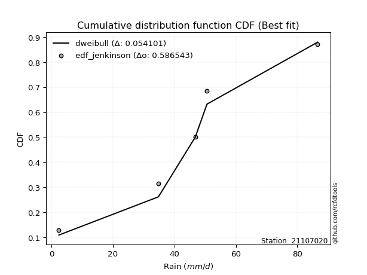</img>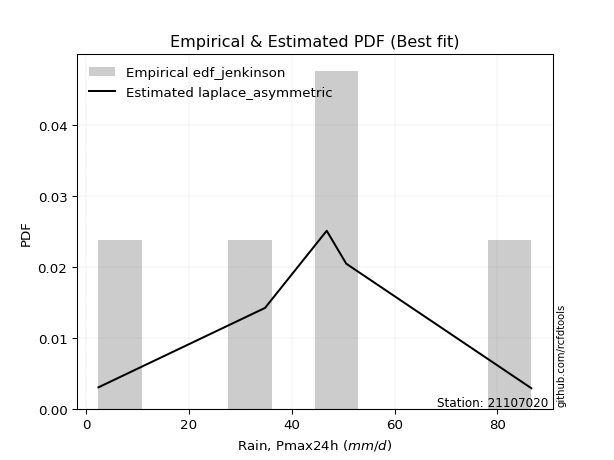</img>

</div>


### 11. Empirical - EDF Cunnane (1978)

Cunnane´s work in statistical hydrology has focused on the performance and evaluation of different probability distributions (such as GEV, Gumbel, Lognormal) for flood frequency estimation. _b_ is a constant, typically set to 0.4.

<div align="center">


$P=(m-b)/(n+1-2b)$


</div>


**11.1. Empirical values**

<div align="center">

|                | 0                   | 1                  | 2           | 3                  | 4                  |
|:---------------|:--------------------|:-------------------|:------------|:-------------------|:-------------------|
| date           | 2024                | 2021               | 2020        | 2022               | 2019               |
| x              | 2.4                 | 34.8               | 46.8        | 50.6               | 86.6               |
| m              | 1                   | 2                  | 3           | 4                  | 5                  |
| empirical_dist | edf_cunnane         | edf_cunnane        | edf_cunnane | edf_cunnane        | edf_cunnane        |
| empirical      | 0.11538461538461538 | 0.3076923076923077 | 0.5         | 0.6923076923076923 | 0.8846153846153845 |
| empirical_tr   | 1.1304347826086958  | 1.4444444444444444 | 2.0         | 3.25               | 8.666666666666655  |

</div>


**11.2. Kolmogorov-Smirnov fit test (sorted by Δ)**


<div align="center">

|                | 0                  | 1                   | 2                   | 3                   | 4                  | 5                   | 6                   | 7                   | 8                   | 9                   | 10                  | 11                  | 12                  | 13                  | 14                  | 15                  | 16                 | 17                  | 18                  | 19                  | 20                 | 21                  | 22                  | 23                  | 24                  | 25                  | 26                  | 27                  | 28                  | 29                  | 30                  | 31                 | 32                  | 33                  | 34                 | 35                  | 36                    | 37                  | 38                 | 39                  | 40                  | 41                  | 42                  | 43                  | 44                 | 45                 | 46                  | 47                  | 48                 | 49                 | 50                  | 51                  | 52                 | 53                 | 54                 | 55                 | 56                  | 57                  | 58                  | 59                 | 60                  | 61                  | 62                 | 63                 | 64                  | 65                 | 66                  | 67                 | 68                 | 69                 | 70                  | 71                  | 72                  | 73                 | 74                  | 75                 | 76                  | 77                 | 78                 | 79                 | 80                 | 81                  | 82                  | 83                 | 84                  | 85                 | 86                 | 87                 | 88                 | 89                 |
|:---------------|:-------------------|:--------------------|:--------------------|:--------------------|:-------------------|:--------------------|:--------------------|:--------------------|:--------------------|:--------------------|:--------------------|:--------------------|:--------------------|:--------------------|:--------------------|:--------------------|:-------------------|:--------------------|:--------------------|:--------------------|:-------------------|:--------------------|:--------------------|:--------------------|:--------------------|:--------------------|:--------------------|:--------------------|:--------------------|:--------------------|:--------------------|:-------------------|:--------------------|:--------------------|:-------------------|:--------------------|:----------------------|:--------------------|:-------------------|:--------------------|:--------------------|:--------------------|:--------------------|:--------------------|:-------------------|:-------------------|:--------------------|:--------------------|:-------------------|:-------------------|:--------------------|:--------------------|:-------------------|:-------------------|:-------------------|:-------------------|:--------------------|:--------------------|:--------------------|:-------------------|:--------------------|:--------------------|:-------------------|:-------------------|:--------------------|:-------------------|:--------------------|:-------------------|:-------------------|:-------------------|:--------------------|:--------------------|:--------------------|:-------------------|:--------------------|:-------------------|:--------------------|:-------------------|:-------------------|:-------------------|:-------------------|:--------------------|:--------------------|:-------------------|:--------------------|:-------------------|:-------------------|:-------------------|:-------------------|:-------------------|
| station        | 21107020           | 21107020            | 21107020            | 21107020            | 21107020           | 21107020            | 21107020            | 21107020            | 21107020            | 21107020            | 21107020            | 21107020            | 21107020            | 21107020            | 21107020            | 21107020            | 21107020           | 21107020            | 21107020            | 21107020            | 21107020           | 21107020            | 21107020            | 21107020            | 21107020            | 21107020            | 21107020            | 21107020            | 21107020            | 21107020            | 21107020            | 21107020           | 21107020            | 21107020            | 21107020           | 21107020            | 21107020              | 21107020            | 21107020           | 21107020            | 21107020            | 21107020            | 21107020            | 21107020            | 21107020           | 21107020           | 21107020            | 21107020            | 21107020           | 21107020           | 21107020            | 21107020            | 21107020           | 21107020           | 21107020           | 21107020           | 21107020            | 21107020            | 21107020            | 21107020           | 21107020            | 21107020            | 21107020           | 21107020           | 21107020            | 21107020           | 21107020            | 21107020           | 21107020           | 21107020           | 21107020            | 21107020            | 21107020            | 21107020           | 21107020            | 21107020           | 21107020            | 21107020           | 21107020           | 21107020           | 21107020           | 21107020            | 21107020            | 21107020           | 21107020            | 21107020           | 21107020           | 21107020           | 21107020           | 21107020           |
| empirical_dist | edf_cunnane        | edf_cunnane         | edf_cunnane         | edf_cunnane         | edf_cunnane        | edf_cunnane         | edf_cunnane         | edf_cunnane         | edf_cunnane         | edf_cunnane         | edf_cunnane         | edf_cunnane         | edf_cunnane         | edf_cunnane         | edf_cunnane         | edf_cunnane         | edf_cunnane        | edf_cunnane         | edf_cunnane         | edf_cunnane         | edf_cunnane        | edf_cunnane         | edf_cunnane         | edf_cunnane         | edf_cunnane         | edf_cunnane         | edf_cunnane         | edf_cunnane         | edf_cunnane         | edf_cunnane         | edf_cunnane         | edf_cunnane        | edf_cunnane         | edf_cunnane         | edf_cunnane        | edf_cunnane         | edf_cunnane           | edf_cunnane         | edf_cunnane        | edf_cunnane         | edf_cunnane         | edf_cunnane         | edf_cunnane         | edf_cunnane         | edf_cunnane        | edf_cunnane        | edf_cunnane         | edf_cunnane         | edf_cunnane        | edf_cunnane        | edf_cunnane         | edf_cunnane         | edf_cunnane        | edf_cunnane        | edf_cunnane        | edf_cunnane        | edf_cunnane         | edf_cunnane         | edf_cunnane         | edf_cunnane        | edf_cunnane         | edf_cunnane         | edf_cunnane        | edf_cunnane        | edf_cunnane         | edf_cunnane        | edf_cunnane         | edf_cunnane        | edf_cunnane        | edf_cunnane        | edf_cunnane         | edf_cunnane         | edf_cunnane         | edf_cunnane        | edf_cunnane         | edf_cunnane        | edf_cunnane         | edf_cunnane        | edf_cunnane        | edf_cunnane        | edf_cunnane        | edf_cunnane         | edf_cunnane         | edf_cunnane        | edf_cunnane         | edf_cunnane        | edf_cunnane        | edf_cunnane        | edf_cunnane        | edf_cunnane        |
| p_dist         | laplace            | laplace_asymmetric  | hypsecant           | invgamma            | rice               | weibull_min         | logistic            | invgauss            | genlogistic         | maxwell             | fisk                | betaprime           | f                   | gamma               | erlang              | pearson3            | johnsonsu          | exponnorm           | t                   | crystalball         | norm               | rayleigh            | gumbel_r            | mielke              | logt                | moyal               | halfnorm            | kstwobign           | logmielke           | logloggamma         | halflogistic        | gumbel_l           | logjohnsonsu        | ncf                 | logfisk            | logpearson3         | loglaplace_asymmetric | loggumbel_l         | loggompertz        | wald                | nakagami            | gibrat              | expon               | genexpon            | logbetaprime       | logcrystalball     | lognorm             | lognorm             | logexponnorm       | lognct             | logfatiguelife      | logf                | logncf             | logerlang          | logrice            | loglogistic        | loginvgamma         | loggamma            | loggamma            | logchi2            | loginvgauss         | logalpha            | alpha              | loghypsecant       | loginvweibull       | logmaxwell         | lograyleigh         | loglaplace         | lognakagami        | gompertz           | logkstwobign        | loggenexpon         | loghalfnorm         | loggumbel_r        | nct                 | loghalflogistic    | logmoyal            | logexpon           | logtruncnorm       | pareto             | loglognorm         | logpareto           | logwald             | loggibrat          | invweibull          | logweibull_min     | fatiguelife        | chi2               | loggenlogistic     | truncnorm          |
| delta          | 0.0624555475002716 | 0.07387985544992715 | 0.07767008313593682 | 0.08255171047164112 | 0.0844719035173691 | 0.08564200421146528 | 0.08759227826841898 | 0.08813074489925021 | 0.08896041917812203 | 0.08896748927934245 | 0.08994597248523484 | 0.09387848311466807 | 0.09553218680015052 | 0.09820231292814563 | 0.09823205932693957 | 0.09830054818868261 | 0.0986480410946654 | 0.09964129335206873 | 0.09964538873361772 | 0.09964547557396675 | 0.0996454758398837 | 0.10116998390651755 | 0.10824650216899101 | 0.12287133523640437 | 0.12498737459530365 | 0.13327317070482358 | 0.13588223922288445 | 0.13799873767751408 | 0.13805942540748717 | 0.14036205503904203 | 0.14627112545812948 | 0.160738433400344  | 0.16949476611345904 | 0.17345295388099313 | 0.1741205302026227 | 0.17663401503618792 | 0.1816170113563736    | 0.19616405043765206 | 0.1961828680797747 | 0.20322470956570815 | 0.21687993058328103 | 0.23125264962261238 | 0.23131753413798994 | 0.23150959642298163 | 0.2591109381361032 | 0.2609604983393867 | 0.26096050562360573 | 0.26096050562360573 | 0.2609624389174764 | 0.2612782672742542 | 0.26158202926447705 | 0.26232714005748803 | 0.2629119955971444 | 0.2651731061895106 | 0.2668254010878839 | 0.2700929429680351 | 0.27074160886991294 | 0.27218164311271575 | 0.27218164311271575 | 0.2723679362641851 | 0.27434919195865637 | 0.27703154138747554 | 0.2771940937426599 | 0.2777359700587665 | 0.27944553587008436 | 0.2900406455486383 | 0.29925960070776114 | 0.3007916783219935 | 0.3030363519962523 | 0.3076922238901882 | 0.31373305600127077 | 0.32381222696954803 | 0.32532504351844427 | 0.3300847453787801 | 0.34434116645265955 | 0.3531390708461204 | 0.35424575343251463 | 0.3557286690144439 | 0.3595914100639488 | 0.3731808990000025 | 0.3806824235966878 | 0.39584109922267297 | 0.42132279345250645 | 0.4516921544972847 | 0.46744534490436424 | 0.5044323216384619 | 0.5252414736949877 | 0.6904633309530169 | 0.6923076923076923 | 0.8840395496038181 |
| deltao         | 0.5865427407550001 | 0.5865427407550001  | 0.5865427407550001  | 0.5865427407550001  | 0.5865427407550001 | 0.5865427407550001  | 0.5865427407550001  | 0.5865427407550001  | 0.5865427407550001  | 0.5865427407550001  | 0.5865427407550001  | 0.5865427407550001  | 0.5865427407550001  | 0.5865427407550001  | 0.5865427407550001  | 0.5865427407550001  | 0.5865427407550001 | 0.5865427407550001  | 0.5865427407550001  | 0.5865427407550001  | 0.5865427407550001 | 0.5865427407550001  | 0.5865427407550001  | 0.5865427407550001  | 0.5865427407550001  | 0.5865427407550001  | 0.5865427407550001  | 0.5865427407550001  | 0.5865427407550001  | 0.5865427407550001  | 0.5865427407550001  | 0.5865427407550001 | 0.5865427407550001  | 0.5865427407550001  | 0.5865427407550001 | 0.5865427407550001  | 0.5865427407550001    | 0.5865427407550001  | 0.5865427407550001 | 0.5865427407550001  | 0.5865427407550001  | 0.5865427407550001  | 0.5865427407550001  | 0.5865427407550001  | 0.5865427407550001 | 0.5865427407550001 | 0.5865427407550001  | 0.5865427407550001  | 0.5865427407550001 | 0.5865427407550001 | 0.5865427407550001  | 0.5865427407550001  | 0.5865427407550001 | 0.5865427407550001 | 0.5865427407550001 | 0.5865427407550001 | 0.5865427407550001  | 0.5865427407550001  | 0.5865427407550001  | 0.5865427407550001 | 0.5865427407550001  | 0.5865427407550001  | 0.5865427407550001 | 0.5865427407550001 | 0.5865427407550001  | 0.5865427407550001 | 0.5865427407550001  | 0.5865427407550001 | 0.5865427407550001 | 0.5865427407550001 | 0.5865427407550001  | 0.5865427407550001  | 0.5865427407550001  | 0.5865427407550001 | 0.5865427407550001  | 0.5865427407550001 | 0.5865427407550001  | 0.5865427407550001 | 0.5865427407550001 | 0.5865427407550001 | 0.5865427407550001 | 0.5865427407550001  | 0.5865427407550001  | 0.5865427407550001 | 0.5865427407550001  | 0.5865427407550001 | 0.5865427407550001 | 0.5865427407550001 | 0.5865427407550001 | 0.5865427407550001 |
| eval           | Δo > Δ             | Δo > Δ              | Δo > Δ              | Δo > Δ              | Δo > Δ             | Δo > Δ              | Δo > Δ              | Δo > Δ              | Δo > Δ              | Δo > Δ              | Δo > Δ              | Δo > Δ              | Δo > Δ              | Δo > Δ              | Δo > Δ              | Δo > Δ              | Δo > Δ             | Δo > Δ              | Δo > Δ              | Δo > Δ              | Δo > Δ             | Δo > Δ              | Δo > Δ              | Δo > Δ              | Δo > Δ              | Δo > Δ              | Δo > Δ              | Δo > Δ              | Δo > Δ              | Δo > Δ              | Δo > Δ              | Δo > Δ             | Δo > Δ              | Δo > Δ              | Δo > Δ             | Δo > Δ              | Δo > Δ                | Δo > Δ              | Δo > Δ             | Δo > Δ              | Δo > Δ              | Δo > Δ              | Δo > Δ              | Δo > Δ              | Δo > Δ             | Δo > Δ             | Δo > Δ              | Δo > Δ              | Δo > Δ             | Δo > Δ             | Δo > Δ              | Δo > Δ              | Δo > Δ             | Δo > Δ             | Δo > Δ             | Δo > Δ             | Δo > Δ              | Δo > Δ              | Δo > Δ              | Δo > Δ             | Δo > Δ              | Δo > Δ              | Δo > Δ             | Δo > Δ             | Δo > Δ              | Δo > Δ             | Δo > Δ              | Δo > Δ             | Δo > Δ             | Δo > Δ             | Δo > Δ              | Δo > Δ              | Δo > Δ              | Δo > Δ             | Δo > Δ              | Δo > Δ             | Δo > Δ              | Δo > Δ             | Δo > Δ             | Δo > Δ             | Δo > Δ             | Δo > Δ              | Δo > Δ              | Δo > Δ             | Δo > Δ              | Δo > Δ             | Δo > Δ             | Δo <= Δ            | Δo <= Δ            | Δo <= Δ            |
| fit            | 1                  | 1                   | 1                   | 1                   | 1                  | 1                   | 1                   | 1                   | 1                   | 1                   | 1                   | 1                   | 1                   | 1                   | 1                   | 1                   | 1                  | 1                   | 1                   | 1                   | 1                  | 1                   | 1                   | 1                   | 1                   | 1                   | 1                   | 1                   | 1                   | 1                   | 1                   | 1                  | 1                   | 1                   | 1                  | 1                   | 1                     | 1                   | 1                  | 1                   | 1                   | 1                   | 1                   | 1                   | 1                  | 1                  | 1                   | 1                   | 1                  | 1                  | 1                   | 1                   | 1                  | 1                  | 1                  | 1                  | 1                   | 1                   | 1                   | 1                  | 1                   | 1                   | 1                  | 1                  | 1                   | 1                  | 1                   | 1                  | 1                  | 1                  | 1                   | 1                   | 1                   | 1                  | 1                   | 1                  | 1                   | 1                  | 1                  | 1                  | 1                  | 1                   | 1                   | 1                  | 1                   | 1                  | 1                  | 0                  | 0                  | 0                  |
| n              | 5                  | 5                   | 5                   | 5                   | 5                  | 5                   | 5                   | 5                   | 5                   | 5                   | 5                   | 5                   | 5                   | 5                   | 5                   | 5                   | 5                  | 5                   | 5                   | 5                   | 5                  | 5                   | 5                   | 5                   | 5                   | 5                   | 5                   | 5                   | 5                   | 5                   | 5                   | 5                  | 5                   | 5                   | 5                  | 5                   | 5                     | 5                   | 5                  | 5                   | 5                   | 5                   | 5                   | 5                   | 5                  | 5                  | 5                   | 5                   | 5                  | 5                  | 5                   | 5                   | 5                  | 5                  | 5                  | 5                  | 5                   | 5                   | 5                   | 5                  | 5                   | 5                   | 5                  | 5                  | 5                   | 5                  | 5                   | 5                  | 5                  | 5                  | 5                   | 5                   | 5                   | 5                  | 5                   | 5                  | 5                   | 5                  | 5                  | 5                  | 5                  | 5                   | 5                   | 5                  | 5                   | 5                  | 5                  | 5                  | 5                  | 5                  |
| best_fit       | 1                  | 0                   | 0                   | 0                   | 0                  | 0                   | 0                   | 0                   | 0                   | 0                   | 0                   | 0                   | 0                   | 0                   | 0                   | 0                   | 0                  | 0                   | 0                   | 0                   | 0                  | 0                   | 0                   | 0                   | 0                   | 0                   | 0                   | 0                   | 0                   | 0                   | 0                   | 0                  | 0                   | 0                   | 0                  | 0                   | 0                     | 0                   | 0                  | 0                   | 0                   | 0                   | 0                   | 0                   | 0                  | 0                  | 0                   | 0                   | 0                  | 0                  | 0                   | 0                   | 0                  | 0                  | 0                  | 0                  | 0                   | 0                   | 0                   | 0                  | 0                   | 0                   | 0                  | 0                  | 0                   | 0                  | 0                   | 0                  | 0                  | 0                  | 0                   | 0                   | 0                   | 0                  | 0                   | 0                  | 0                   | 0                  | 0                  | 0                  | 0                  | 0                   | 0                   | 0                  | 0                   | 0                  | 0                  | 0                  | 0                  | 0                  |
| best_fit_sort  | 1                  | 2                   | 3                   | 4                   | 5                  | 6                   | 7                   | 8                   | 9                   | 10                  | 11                  | 12                  | 13                  | 14                  | 15                  | 16                  | 17                 | 18                  | 19                  | 20                  | 21                 | 22                  | 23                  | 24                  | 25                  | 26                  | 27                  | 28                  | 29                  | 30                  | 31                  | 32                 | 33                  | 34                  | 35                 | 36                  | 37                    | 38                  | 39                 | 40                  | 41                  | 42                  | 43                  | 44                  | 45                 | 46                 | 47                  | 48                  | 49                 | 50                 | 51                  | 52                  | 53                 | 54                 | 55                 | 56                 | 57                  | 58                  | 59                  | 60                 | 61                  | 62                  | 63                 | 64                 | 65                  | 66                 | 67                  | 68                 | 69                 | 70                 | 71                  | 72                  | 73                  | 74                 | 75                  | 76                 | 77                  | 78                 | 79                 | 80                 | 81                 | 82                  | 83                  | 84                 | 85                  | 86                 | 87                 | 88                 | 89                 | 90                 |

</div>


<div align="center">

</img>

</div>


**11.3. Best fit**

<div align="center">

|   id |   station | empirical_dist   | p_dist   |     delta |   deltao | eval   |   fit |   n |   best_fit |   best_fit_sort |
|-----:|----------:|:-----------------|:---------|----------:|---------:|:-------|------:|----:|-----------:|----------------:|
|    0 |  21107020 | edf_cunnane      | laplace  | 0.0624555 | 0.586543 | Δo > Δ |     1 |   5 |          1 |               1 |

</div>


<div align="center">

</img>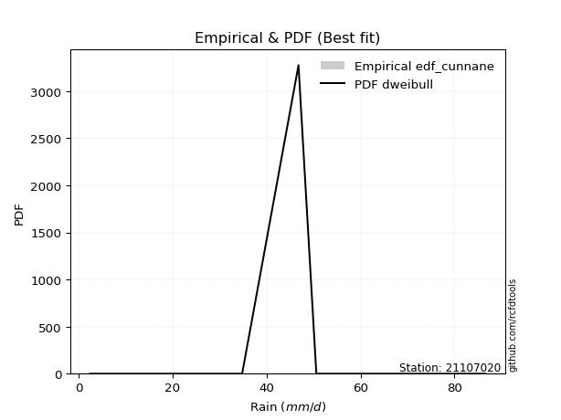</img>

</div>


### 12. Empirical - EDF Adamowski (1981)

The Adamowski formula in hydrology refers to a specific plotting position formula used for estimating the non-parametric empirical distribution of hydrological events (like flood peaks) to calculate their return periods. This formula provides an alternative to traditional parametric methods (like the Gumbel or Log Pearson Type III distributions). 

<div align="center">


$P=(m-0.25)/(n+0.5)$


</div>


**12.1. Empirical values**

<div align="center">

|                | 0                   | 1                  | 2             | 3                  | 4                  |
|:---------------|:--------------------|:-------------------|:--------------|:-------------------|:-------------------|
| date           | 2024                | 2021               | 2020          | 2022               | 2019               |
| x              | 2.4                 | 34.8               | 46.8          | 50.6               | 86.6               |
| m              | 1                   | 2                  | 3             | 4                  | 5                  |
| empirical_dist | edf_adamowski       | edf_adamowski      | edf_adamowski | edf_adamowski      | edf_adamowski      |
| empirical      | 0.13636363636363635 | 0.3181818181818182 | 0.5           | 0.6818181818181818 | 0.8636363636363636 |
| empirical_tr   | 1.1578947368421053  | 1.4666666666666666 | 2.0           | 3.1428571428571423 | 7.333333333333334  |

</div>


**12.2. Kolmogorov-Smirnov fit test (sorted by Δ)**


<div align="center">

|                | 0                   | 1                   | 2                   | 3                  | 4                   | 5                   | 6                   | 7                  | 8                   | 9                   | 10                 | 11                  | 12                  | 13                  | 14                  | 15                 | 16                 | 17                  | 18                  | 19                  | 20                  | 21                  | 22                  | 23                  | 24                 | 25                  | 26                  | 27                  | 28                  | 29                  | 30                  | 31                  | 32                  | 33                  | 34                  | 35                  | 36                    | 37                 | 38                  | 39                  | 40                  | 41                  | 42                  | 43                  | 44                  | 45                  | 46                  | 47                  | 48                 | 49                 | 50                 | 51                  | 52                  | 53                  | 54                 | 55                  | 56                 | 57                 | 58                 | 59                  | 60                 | 61                 | 62                  | 63                 | 64                 | 65                 | 66                 | 67                 | 68                 | 69                  | 70                  | 71                 | 72                  | 73                 | 74                 | 75                  | 76                  | 77                 | 78                 | 79                  | 80                  | 81                 | 82                 | 83                  | 84                 | 85                 | 86                 | 87                 | 88                 | 89                 |
|:---------------|:--------------------|:--------------------|:--------------------|:-------------------|:--------------------|:--------------------|:--------------------|:-------------------|:--------------------|:--------------------|:-------------------|:--------------------|:--------------------|:--------------------|:--------------------|:-------------------|:-------------------|:--------------------|:--------------------|:--------------------|:--------------------|:--------------------|:--------------------|:--------------------|:-------------------|:--------------------|:--------------------|:--------------------|:--------------------|:--------------------|:--------------------|:--------------------|:--------------------|:--------------------|:--------------------|:--------------------|:----------------------|:-------------------|:--------------------|:--------------------|:--------------------|:--------------------|:--------------------|:--------------------|:--------------------|:--------------------|:--------------------|:--------------------|:-------------------|:-------------------|:-------------------|:--------------------|:--------------------|:--------------------|:-------------------|:--------------------|:-------------------|:-------------------|:-------------------|:--------------------|:-------------------|:-------------------|:--------------------|:-------------------|:-------------------|:-------------------|:-------------------|:-------------------|:-------------------|:--------------------|:--------------------|:-------------------|:--------------------|:-------------------|:-------------------|:--------------------|:--------------------|:-------------------|:-------------------|:--------------------|:--------------------|:-------------------|:-------------------|:--------------------|:-------------------|:-------------------|:-------------------|:-------------------|:-------------------|:-------------------|
| station        | 21107020            | 21107020            | 21107020            | 21107020           | 21107020            | 21107020            | 21107020            | 21107020           | 21107020            | 21107020            | 21107020           | 21107020            | 21107020            | 21107020            | 21107020            | 21107020           | 21107020           | 21107020            | 21107020            | 21107020            | 21107020            | 21107020            | 21107020            | 21107020            | 21107020           | 21107020            | 21107020            | 21107020            | 21107020            | 21107020            | 21107020            | 21107020            | 21107020            | 21107020            | 21107020            | 21107020            | 21107020              | 21107020           | 21107020            | 21107020            | 21107020            | 21107020            | 21107020            | 21107020            | 21107020            | 21107020            | 21107020            | 21107020            | 21107020           | 21107020           | 21107020           | 21107020            | 21107020            | 21107020            | 21107020           | 21107020            | 21107020           | 21107020           | 21107020           | 21107020            | 21107020           | 21107020           | 21107020            | 21107020           | 21107020           | 21107020           | 21107020           | 21107020           | 21107020           | 21107020            | 21107020            | 21107020           | 21107020            | 21107020           | 21107020           | 21107020            | 21107020            | 21107020           | 21107020           | 21107020            | 21107020            | 21107020           | 21107020           | 21107020            | 21107020           | 21107020           | 21107020           | 21107020           | 21107020           | 21107020           |
| empirical_dist | edf_adamowski       | edf_adamowski       | edf_adamowski       | edf_adamowski      | edf_adamowski       | edf_adamowski       | edf_adamowski       | edf_adamowski      | edf_adamowski       | edf_adamowski       | edf_adamowski      | edf_adamowski       | edf_adamowski       | edf_adamowski       | edf_adamowski       | edf_adamowski      | edf_adamowski      | edf_adamowski       | edf_adamowski       | edf_adamowski       | edf_adamowski       | edf_adamowski       | edf_adamowski       | edf_adamowski       | edf_adamowski      | edf_adamowski       | edf_adamowski       | edf_adamowski       | edf_adamowski       | edf_adamowski       | edf_adamowski       | edf_adamowski       | edf_adamowski       | edf_adamowski       | edf_adamowski       | edf_adamowski       | edf_adamowski         | edf_adamowski      | edf_adamowski       | edf_adamowski       | edf_adamowski       | edf_adamowski       | edf_adamowski       | edf_adamowski       | edf_adamowski       | edf_adamowski       | edf_adamowski       | edf_adamowski       | edf_adamowski      | edf_adamowski      | edf_adamowski      | edf_adamowski       | edf_adamowski       | edf_adamowski       | edf_adamowski      | edf_adamowski       | edf_adamowski      | edf_adamowski      | edf_adamowski      | edf_adamowski       | edf_adamowski      | edf_adamowski      | edf_adamowski       | edf_adamowski      | edf_adamowski      | edf_adamowski      | edf_adamowski      | edf_adamowski      | edf_adamowski      | edf_adamowski       | edf_adamowski       | edf_adamowski      | edf_adamowski       | edf_adamowski      | edf_adamowski      | edf_adamowski       | edf_adamowski       | edf_adamowski      | edf_adamowski      | edf_adamowski       | edf_adamowski       | edf_adamowski      | edf_adamowski      | edf_adamowski       | edf_adamowski      | edf_adamowski      | edf_adamowski      | edf_adamowski      | edf_adamowski      | edf_adamowski      |
| p_dist         | genlogistic         | fisk                | logistic            | laplace_asymmetric | laplace             | hypsecant           | betaprime           | f                  | invgauss            | invgamma            | gamma              | erlang              | pearson3            | weibull_min         | johnsonsu           | exponnorm          | t                  | crystalball         | norm                | rice                | maxwell             | rayleigh            | gumbel_r            | kstwobign           | logmielke          | moyal               | logt                | logloggamma         | mielke              | halfnorm            | halflogistic        | gumbel_l            | logjohnsonsu        | ncf                 | logfisk             | logpearson3         | loglaplace_asymmetric | loggumbel_l        | loggompertz         | wald                | nakagami            | expon               | genexpon            | gibrat              | logbetaprime        | logcrystalball      | lognorm             | lognorm             | logexponnorm       | lognct             | logfatiguelife     | logf                | logncf              | logerlang           | logrice            | loglogistic         | loginvgamma        | loggamma           | loggamma           | logchi2             | loginvgauss        | logalpha           | alpha               | loghypsecant       | loginvweibull      | logmaxwell         | lograyleigh        | loglaplace         | logkstwobign       | loggenexpon         | lognakagami         | loghalfnorm        | gompertz            | loggumbel_r        | nct                | loghalflogistic     | logmoyal            | logexpon           | logtruncnorm       | pareto              | loglognorm          | logpareto          | logwald            | loggibrat           | invweibull         | logweibull_min     | fatiguelife        | chi2               | loggenlogistic     | truncnorm          |
| delta          | 0.07847090868861151 | 0.07945646199572431 | 0.08072718542395685 | 0.0810656967177995 | 0.08139504215656768 | 0.08168849007448886 | 0.08338897262515754 | 0.08504267631064   | 0.08519744284949647 | 0.08664418600356197 | 0.0877128024386351 | 0.08774254883742905 | 0.08781103769917209 | 0.08791124388679818 | 0.08815853060515488 | 0.0891517828625582 | 0.0891558782441072 | 0.08915596508445622 | 0.08915596535037318 | 0.09365087780294054 | 0.09438680771418578 | 0.10725140837031004 | 0.11906671106750366 | 0.12750922718800362 | 0.1275699149179767 | 0.13327317070482358 | 0.13547688508481412 | 0.13631900325973356 | 0.13636363634007034 | 0.13636363636363635 | 0.13636363636363635 | 0.15024892291083347 | 0.15900525562394852 | 0.16296344339148267 | 0.16363101971311222 | 0.16614450454667745 | 0.17112750086686312   | 0.1856745399481416 | 0.18569335759026423 | 0.20322470956570815 | 0.20639042009377057 | 0.22082802364847948 | 0.22102008593347117 | 0.23125264962261238 | 0.24862142764659273 | 0.25047098784987626 | 0.25047099513409526 | 0.25047099513409526 | 0.2504729284279659 | 0.2507887567847437 | 0.2510925187749666 | 0.25183762956797756 | 0.25242248510763393 | 0.25468359570000015 | 0.2563358905983734 | 0.25960343247852463 | 0.2602520983804025 | 0.2616921326232053 | 0.2616921326232053 | 0.26187842577467463 | 0.2638596814691459 | 0.2665420308979651 | 0.26670458325314944 | 0.267246459569256  | 0.2689560253805739 | 0.2795511350591278 | 0.2887700902182507 | 0.290302167832483  | 0.3032435455117603 | 0.31332271648003757 | 0.31352586248576275 | 0.3148355330289338 | 0.31818173437969866 | 0.3195952348892696 | 0.3338516559631491 | 0.34264956035660993 | 0.34375624294300416 | 0.3452391585249334 | 0.3491018995744383 | 0.36269138851049204 | 0.37019291310717733 | 0.3853515887331625 | 0.410833282962996  | 0.44120264400777426 | 0.4464663239253434 | 0.4939428111489514 | 0.5147519632054773 | 0.6799738204635064 | 0.6818181818181818 | 0.8630605286247972 |
| deltao         | 0.5865427407550001  | 0.5865427407550001  | 0.5865427407550001  | 0.5865427407550001 | 0.5865427407550001  | 0.5865427407550001  | 0.5865427407550001  | 0.5865427407550001 | 0.5865427407550001  | 0.5865427407550001  | 0.5865427407550001 | 0.5865427407550001  | 0.5865427407550001  | 0.5865427407550001  | 0.5865427407550001  | 0.5865427407550001 | 0.5865427407550001 | 0.5865427407550001  | 0.5865427407550001  | 0.5865427407550001  | 0.5865427407550001  | 0.5865427407550001  | 0.5865427407550001  | 0.5865427407550001  | 0.5865427407550001 | 0.5865427407550001  | 0.5865427407550001  | 0.5865427407550001  | 0.5865427407550001  | 0.5865427407550001  | 0.5865427407550001  | 0.5865427407550001  | 0.5865427407550001  | 0.5865427407550001  | 0.5865427407550001  | 0.5865427407550001  | 0.5865427407550001    | 0.5865427407550001 | 0.5865427407550001  | 0.5865427407550001  | 0.5865427407550001  | 0.5865427407550001  | 0.5865427407550001  | 0.5865427407550001  | 0.5865427407550001  | 0.5865427407550001  | 0.5865427407550001  | 0.5865427407550001  | 0.5865427407550001 | 0.5865427407550001 | 0.5865427407550001 | 0.5865427407550001  | 0.5865427407550001  | 0.5865427407550001  | 0.5865427407550001 | 0.5865427407550001  | 0.5865427407550001 | 0.5865427407550001 | 0.5865427407550001 | 0.5865427407550001  | 0.5865427407550001 | 0.5865427407550001 | 0.5865427407550001  | 0.5865427407550001 | 0.5865427407550001 | 0.5865427407550001 | 0.5865427407550001 | 0.5865427407550001 | 0.5865427407550001 | 0.5865427407550001  | 0.5865427407550001  | 0.5865427407550001 | 0.5865427407550001  | 0.5865427407550001 | 0.5865427407550001 | 0.5865427407550001  | 0.5865427407550001  | 0.5865427407550001 | 0.5865427407550001 | 0.5865427407550001  | 0.5865427407550001  | 0.5865427407550001 | 0.5865427407550001 | 0.5865427407550001  | 0.5865427407550001 | 0.5865427407550001 | 0.5865427407550001 | 0.5865427407550001 | 0.5865427407550001 | 0.5865427407550001 |
| eval           | Δo > Δ              | Δo > Δ              | Δo > Δ              | Δo > Δ             | Δo > Δ              | Δo > Δ              | Δo > Δ              | Δo > Δ             | Δo > Δ              | Δo > Δ              | Δo > Δ             | Δo > Δ              | Δo > Δ              | Δo > Δ              | Δo > Δ              | Δo > Δ             | Δo > Δ             | Δo > Δ              | Δo > Δ              | Δo > Δ              | Δo > Δ              | Δo > Δ              | Δo > Δ              | Δo > Δ              | Δo > Δ             | Δo > Δ              | Δo > Δ              | Δo > Δ              | Δo > Δ              | Δo > Δ              | Δo > Δ              | Δo > Δ              | Δo > Δ              | Δo > Δ              | Δo > Δ              | Δo > Δ              | Δo > Δ                | Δo > Δ             | Δo > Δ              | Δo > Δ              | Δo > Δ              | Δo > Δ              | Δo > Δ              | Δo > Δ              | Δo > Δ              | Δo > Δ              | Δo > Δ              | Δo > Δ              | Δo > Δ             | Δo > Δ             | Δo > Δ             | Δo > Δ              | Δo > Δ              | Δo > Δ              | Δo > Δ             | Δo > Δ              | Δo > Δ             | Δo > Δ             | Δo > Δ             | Δo > Δ              | Δo > Δ             | Δo > Δ             | Δo > Δ              | Δo > Δ             | Δo > Δ             | Δo > Δ             | Δo > Δ             | Δo > Δ             | Δo > Δ             | Δo > Δ              | Δo > Δ              | Δo > Δ             | Δo > Δ              | Δo > Δ             | Δo > Δ             | Δo > Δ              | Δo > Δ              | Δo > Δ             | Δo > Δ             | Δo > Δ              | Δo > Δ              | Δo > Δ             | Δo > Δ             | Δo > Δ              | Δo > Δ             | Δo > Δ             | Δo > Δ             | Δo <= Δ            | Δo <= Δ            | Δo <= Δ            |
| fit            | 1                   | 1                   | 1                   | 1                  | 1                   | 1                   | 1                   | 1                  | 1                   | 1                   | 1                  | 1                   | 1                   | 1                   | 1                   | 1                  | 1                  | 1                   | 1                   | 1                   | 1                   | 1                   | 1                   | 1                   | 1                  | 1                   | 1                   | 1                   | 1                   | 1                   | 1                   | 1                   | 1                   | 1                   | 1                   | 1                   | 1                     | 1                  | 1                   | 1                   | 1                   | 1                   | 1                   | 1                   | 1                   | 1                   | 1                   | 1                   | 1                  | 1                  | 1                  | 1                   | 1                   | 1                   | 1                  | 1                   | 1                  | 1                  | 1                  | 1                   | 1                  | 1                  | 1                   | 1                  | 1                  | 1                  | 1                  | 1                  | 1                  | 1                   | 1                   | 1                  | 1                   | 1                  | 1                  | 1                   | 1                   | 1                  | 1                  | 1                   | 1                   | 1                  | 1                  | 1                   | 1                  | 1                  | 1                  | 0                  | 0                  | 0                  |
| n              | 5                   | 5                   | 5                   | 5                  | 5                   | 5                   | 5                   | 5                  | 5                   | 5                   | 5                  | 5                   | 5                   | 5                   | 5                   | 5                  | 5                  | 5                   | 5                   | 5                   | 5                   | 5                   | 5                   | 5                   | 5                  | 5                   | 5                   | 5                   | 5                   | 5                   | 5                   | 5                   | 5                   | 5                   | 5                   | 5                   | 5                     | 5                  | 5                   | 5                   | 5                   | 5                   | 5                   | 5                   | 5                   | 5                   | 5                   | 5                   | 5                  | 5                  | 5                  | 5                   | 5                   | 5                   | 5                  | 5                   | 5                  | 5                  | 5                  | 5                   | 5                  | 5                  | 5                   | 5                  | 5                  | 5                  | 5                  | 5                  | 5                  | 5                   | 5                   | 5                  | 5                   | 5                  | 5                  | 5                   | 5                   | 5                  | 5                  | 5                   | 5                   | 5                  | 5                  | 5                   | 5                  | 5                  | 5                  | 5                  | 5                  | 5                  |
| best_fit       | 1                   | 0                   | 0                   | 0                  | 0                   | 0                   | 0                   | 0                  | 0                   | 0                   | 0                  | 0                   | 0                   | 0                   | 0                   | 0                  | 0                  | 0                   | 0                   | 0                   | 0                   | 0                   | 0                   | 0                   | 0                  | 0                   | 0                   | 0                   | 0                   | 0                   | 0                   | 0                   | 0                   | 0                   | 0                   | 0                   | 0                     | 0                  | 0                   | 0                   | 0                   | 0                   | 0                   | 0                   | 0                   | 0                   | 0                   | 0                   | 0                  | 0                  | 0                  | 0                   | 0                   | 0                   | 0                  | 0                   | 0                  | 0                  | 0                  | 0                   | 0                  | 0                  | 0                   | 0                  | 0                  | 0                  | 0                  | 0                  | 0                  | 0                   | 0                   | 0                  | 0                   | 0                  | 0                  | 0                   | 0                   | 0                  | 0                  | 0                   | 0                   | 0                  | 0                  | 0                   | 0                  | 0                  | 0                  | 0                  | 0                  | 0                  |
| best_fit_sort  | 1                   | 2                   | 3                   | 4                  | 5                   | 6                   | 7                   | 8                  | 9                   | 10                  | 11                 | 12                  | 13                  | 14                  | 15                  | 16                 | 17                 | 18                  | 19                  | 20                  | 21                  | 22                  | 23                  | 24                  | 25                 | 26                  | 27                  | 28                  | 29                  | 30                  | 31                  | 32                  | 33                  | 34                  | 35                  | 36                  | 37                    | 38                 | 39                  | 40                  | 41                  | 42                  | 43                  | 44                  | 45                  | 46                  | 47                  | 48                  | 49                 | 50                 | 51                 | 52                  | 53                  | 54                  | 55                 | 56                  | 57                 | 58                 | 59                 | 60                  | 61                 | 62                 | 63                  | 64                 | 65                 | 66                 | 67                 | 68                 | 69                 | 70                  | 71                  | 72                 | 73                  | 74                 | 75                 | 76                  | 77                  | 78                 | 79                 | 80                  | 81                  | 82                 | 83                 | 84                  | 85                 | 86                 | 87                 | 88                 | 89                 | 90                 |

</div>


<div align="center">

</img>

</div>


**12.3. Best fit**

<div align="center">

|   id |   station | empirical_dist   | p_dist      |     delta |   deltao | eval   |   fit |   n |   best_fit |   best_fit_sort |
|-----:|----------:|:-----------------|:------------|----------:|---------:|:-------|------:|----:|-----------:|----------------:|
|    0 |  21107020 | edf_adamowski    | genlogistic | 0.0784709 | 0.586543 | Δo > Δ |     1 |   5 |          1 |               1 |

</div>


<div align="center">

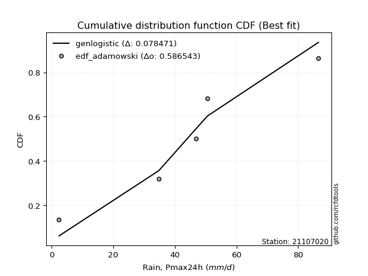</img>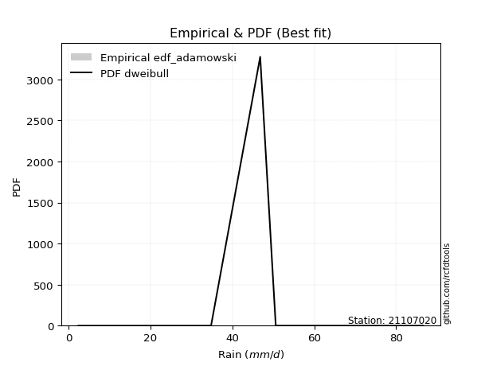</img>

</div>


## C. Best fit & Estimate extreme values for specific return periods - Tr


### 1. Best fit (ordered by delta Δ)

<div align="center">

|   id |   station | empirical_dist   | p_dist             |     delta |   deltao | eval   |   fit |   n |   best_fit |   best_fit_sort |
|-----:|----------:|:-----------------|:-------------------|----------:|---------:|:-------|------:|----:|-----------:|----------------:|
|    0 |  21107020 | edf_cunnane      | laplace            | 0.0624555 | 0.586543 | Δo > Δ |     1 |   5 |          1 |               1 |
|    1 |  21107020 | edf_gringorten   | laplace            | 0.0624555 | 0.586543 | Δo > Δ |     1 |   5 |          1 |               2 |
|    2 |  21107020 | edf_hazen        | laplace            | 0.0624555 | 0.586543 | Δo > Δ |     1 |   5 |          1 |               3 |
|    3 |  21107020 | edf_blom         | laplace            | 0.064079  | 0.586543 | Δo > Δ |     1 |   5 |          1 |               4 |
|    4 |  21107020 | edf_tukey        | laplace_asymmetric | 0.0697021 | 0.586543 | Δo > Δ |     1 |   5 |          1 |               5 |
|    5 |  21107020 | edf_filliben     | laplace_asymmetric | 0.0719155 | 0.586543 | Δo > Δ |     1 |   5 |          1 |               6 |
|    6 |  21107020 | edf_beard        | laplace_asymmetric | 0.0729548 | 0.586543 | Δo > Δ |     1 |   5 |          1 |               7 |
|    7 |  21107020 | edf_jenkinson    | laplace_asymmetric | 0.0729548 | 0.586543 | Δo > Δ |     1 |   5 |          1 |               8 |
|    8 |  21107020 | edf_chegodayev   | laplace_asymmetric | 0.0743317 | 0.586543 | Δo > Δ |     1 |   5 |          1 |               9 |
|    9 |  21107020 | edf_adamowski    | genlogistic        | 0.0784709 | 0.586543 | Δo > Δ |     1 |   5 |          1 |              10 |
|   10 |  21107020 | edf_weibull      | fisk               | 0.104008  | 0.586543 | Δo > Δ |     1 |   5 |          1 |              11 |
|   11 |  21107020 | edf_california   | kstwobign          | 0.154768  | 0.586543 | Δo > Δ |     1 |   5 |          1 |              12 |

</div>

:file_folder:Tables: [bestfit_21107020.csv](table/bestfit_21107020.csv) | [extreme_21107020.csv](table/extreme_21107020.csv)


### 2. Extreme values

In hydrology, a return period (or recurrence interval $Tr$) is the statistical average time between extreme events like floods or droughts of a specific magnitude, indicating how rare an event is, with a 100-year flood, for example, having a 1% chance of occurring in any given year, not that it happens exactly every century. It is a key tool for infrastructure design (like bridges or dams) and risk assessment, calculated from historical data to determine the probability of future events, although it is important to remember it is statistical average, and events can cluster or be missed.

> risk_rate: assuming the return period as the project useful life.

|   id |      tr |   prob_l |     prob_g |     alpha |   betaprime |     chi2 |   crystalball |   erlang |    expon |   exponnorm |        f |   fatiguelife |     fisk |    gamma |   genexpon |   genlogistic |   gibrat |   gompertz |   gumbel_l |   gumbel_r |   halflogistic |   halfnorm |   hypsecant |   invgamma |   invgauss |      invweibull |   johnsonsu |   kstwobign |   laplace |   laplace_asymmetric |   loggamma |   logistic |   lognorm |   maxwell |   mielke |    moyal |   nakagami |      ncf |              nct |     norm |          pareto |   pearson3 |   rayleigh |     rice |        t |   truncnorm |     wald |   weibull_min |   logalpha |   logbetaprime |   logchi2 |   logcrystalball |   logerlang |         logexpon |   logexponnorm |      logf |   logfatiguelife |   logfisk |   loggenexpon |   loggenlogistic |        loggibrat |   loggompertz |   loggumbel_l |   loggumbel_r |   loghalflogistic |   loghalfnorm |   loghypsecant |   loginvgamma |   loginvgauss |   loginvweibull |   logjohnsonsu |   logkstwobign |   loglaplace |   loglaplace_asymmetric |   logloggamma |   loglogistic |     loglognorm |   logmaxwell |   logmielke |   logmoyal |   lognakagami |    logncf |    lognct |       logpareto |   logpearson3 |   lograyleigh |   logrice |            logt |   logtruncnorm |     logwald |   logweibull_min |   station |   n |   risk_rate |
|-----:|--------:|---------:|-----------:|----------:|------------:|---------:|--------------:|---------:|---------:|------------:|---------:|--------------:|---------:|---------:|-----------:|--------------:|---------:|-----------:|-----------:|-----------:|---------------:|-----------:|------------:|-----------:|-----------:|----------------:|------------:|------------:|----------:|---------------------:|-----------:|-----------:|----------:|----------:|---------:|---------:|-----------:|---------:|-----------------:|---------:|----------------:|-----------:|-----------:|---------:|---------:|------------:|---------:|--------------:|-----------:|---------------:|----------:|-----------------:|------------:|-----------------:|---------------:|----------:|-----------------:|----------:|--------------:|-----------------:|-----------------:|--------------:|--------------:|--------------:|------------------:|--------------:|---------------:|--------------:|--------------:|----------------:|---------------:|---------------:|-------------:|------------------------:|--------------:|--------------:|---------------:|-------------:|------------:|-----------:|--------------:|----------:|----------:|----------------:|--------------:|--------------:|----------:|----------------:|---------------:|------------:|-----------------:|----------:|----:|------------:|
|    0 |    2    | 0.5      | 0.5        |   28.5085 |     43.8079 |  4.45044 |       44.24   |  44.1356 |  31.4013 |     44.2397 |  43.9252 |       2.4     |  44.1226 |  44.1338 |    31.3857 |       44.0079 |  36.0955 |    55.4686 |    48.6976 |    39.7824 |        37.5664 |    38.6858 |     44.24   |    42.1916 |    41.9759 | 26259           |     44.1638 |     38.7679 |   44.24   |              45.4798 |    26.6765 |    44.24   |   27.9731 |   41.9194 |   2.4    |  38.3434 |    32.4019 |  36.1078 |     15.5459      |  44.24   |     7.86404     |    44.1405 |    41.0963 |  42.8587 |  44.24   |  -41.5031   |  35.4445 |       42.9439 |    26.0259 |        27.8517 |   26.6339 |          27.9731 |     27.2305 |     13.1666      |        27.973  |   27.846  |          27.9045 |   36.5084 |       19.6801 |         inf      |     19.1485      |       34.4925 |       34.4215 |       22.7328 |           20.5055 |       21.6016 |        27.9731 |       26.6045 |       26.1126 |         23.6981 |        48.3835 |        20.1156 |      27.9731 |                 35.5407 |       39.4167 |       27.9731 |   2.40378      |      25.1097 |     39.7158 |    21.2603 |       35.2776 |   27.6152 |   27.9315 |      3.36334    |       36.4352 |       24.166  |   27.2699 |   48.0932       |        15.4357 |     18.5772 |      5.01951     |  21107020 |   5 |    0.75     |
|    1 |    2.33 | 0.570815 | 0.429185   |   33.6631 |     48.6646 |  5.09538 |       49.0819 |  48.9806 |  37.7911 |     49.0817 |  48.7834 |       3.50608 |  48.5686 |  48.9786 |    37.7721 |       48.4851 |  38.5482 |    58.6203 |    52.9101 |    44.269  |        42.1793 |    43.9116 |     48.115  |    47.0813 |    47.0067 |     4.98468e+06 |     49.0099 |     44.2521 |   47.1701 |              48.4084 |    33.7511 |    48.5061 |   35.0427 |   46.9498 |   2.4    |  42.5905 |    39.5979 |  41.3225 |     21.9046      |  49.0819 |    12.5356      |    48.9855 |    46.2012 |  47.8877 |  49.0819 |  -39.0929   |  38.6194 |       47.9763 |    33.1445 |        35.2749 |   33.7258 |          35.0427 |     34.5573 |     19.1582      |        35.0425 |   34.8892 |          34.9732 |   44.0503 |       26.4829 |         inf      |     21.4638      |       40.4324 |       41.8761 |       28.011  |           25.4154 |       27.5487 |        33.5009 |       33.8889 |       33.4314 |         32.2796 |        55.0996 |        27.4068 |      32.0597 |                 40.437  |       45.8151 |       34.1161 |   2.45696      |      31.7327 |     46.2539 |    25.9062 |       35.9624 |   34.8244 |   35.0075 |      4.49194    |       44.4209 |       30.6461 |   34.3756 |   49.7529       |        21.2735 |     21.5351 |      6.44135     |  21107020 |   5 |    0.729209 |
|    2 |    5    | 0.8      | 0.2        |   62.5456 |     66.9554 |  8.69963 |       67.0759 |  67.0436 |  69.7389 |     67.0758 |  66.9962 |      27.0027  |  65.8053 |  67.0411 |    69.7027 |       65.9408 |  52.6693 |    70.8289 |    66.5191 |    63.7609 |        63.052  |    66.0105 |     63.6586 |    66.3975 |    67.0609 |     3.94485e+16 |     67.0583 |     67.5479 |   61.8201 |              62.6397 |    82.1515 |    64.9781 |   80.9584 |   66.7493 |   2.4    |  62.2637 |    72.0104 |  65.0281 |    116.091       |  67.0759 |   198.449       |    67.0464 |    66.6382 |  67.0845 |  67.0759 |  -30.136    |  56.3927 |       67.0927 |    85.1082 |        85.8888 |   82.4075 |          80.9584 |     84.9814 |    124.947       |        80.9578 |   80.6476 |          80.9903 |   90.9594 |       88.9475 |         inf      |     41.4099      |       67.9828 |       78.8875 |       69.3848 |           67.1321 |       77.0424 |        69.0551 |       85.4172 |       87.2413 |        123.6    |        74.1207 |       101.964  |      63.3927 |                 57.6533 |       67.218  |       73.4283 |   1.74735e+234 |      79.7372 |     68.2037 |    64.715  |       47.6194 |   83.089  |   81.0633 | 482696          |       80.6728 |       79.326  |   81.8031 |   63.2632       |        82.6614 |     49.2437 |     30.1029      |  21107020 |   5 |    0.67232  |
|    3 |   10    | 0.9      | 0.1        |   98.4223 |     79.3007 | 12.28    |       79.0127 |  79.0763 |  98.7402 |     79.0129 |  79.2164 |      59.4455  |  78.5706 |  79.0736 |    98.6884 |       78.9088 |  68.7657 |    78.8427 |    74.096  |    79.6367 |        80.3858 |    82.3631 |     76.0705 |    80.285  |    81.6066 |     4.5512e+24  |     79.0655 |     85.2846 |   75.1189 |              75.5584 |   150.224  |    77.1091 |  141.094  |   80.6832 |  77.4585 |  79.3922 |    96.9457 |  85.2352 |    519.423       |  79.0127 |  2795.91        |    79.076  |    81.2103 |  80.1094 |  79.0126 |  -24.1942   |  75.2542 |       79.9398 |   165.872  |       156.606  |  151.172  |         141.094  |    156.311  |    685.467       |       141.092  |  140.633  |         141.45   |  155.152  |      213.822  |         inf      |     87.5842      |       91.0521 |      112.238  |      145.251  |          150.399  |      164.902  |       123.04   |      161.321  |      171.018  |        368.926  |        81.8275 |       277.253  |     117.71   |                 75.1184 |       76.838  |      129.132  | inf            |     152.499  |     78.1017 |   143.608  |       72.1841 |  148.927  |  141.556  |      2.9033e+76 |      107.439  |      156.287  |  145.989  |  122.11         |       225.802  |    118.454  |    171.657       |  21107020 |   5 |    0.651322 |
|    4 |   15    | 0.933333 | 0.0666667  |  126.984  |     85.5248 | 14.4524  |       84.9694 |  85.0958 | 115.705  |     84.9697 |  85.356  |      80.6637  |  85.5512 |  85.0932 |   115.644  |       85.9963 |  79.8683 |    82.7168 |    77.5274 |    88.5937 |        90.1953 |    90.873  |     83.154  |    87.5615 |    89.2546 |     1.6095e+29  |     85.0678 |     94.7007 |   82.8982 |              83.1153 |   203.845  |    83.7186 |  186.163  |   87.8324 |  80.6341 |  89.3329 |   110.041  |  96.9341 |   1246.46        |  84.9694 | 13204           |    85.0934 |    88.7184 |  86.6665 |  84.9693 |  -21.2291   |  87.3663 |       86.3574 |   234.548  |       212.002  |  205.495  |         186.163  |    212.664  |   1855.36        |       186.161  |  185.621  |         186.863  |  207.546  |      336.862  |         inf      |    146.831       |      103.981  |      131.67   |      220.365  |          237.406  |      245.027  |       171.082  |      223.112  |      242.013  |        683.729  |        84.5499 |       471.526  |     169.057  |                 87.6944 |       80.0779 |      175.637  | inf            |     212.695  |     81.4389 |   228.077  |       93.2272 |  199.672  |  186.983  |    inf          |      120.475  |      221.648  |  195.094  |  312.685        |       380.974  |    208.133  |    538.346       |  21107020 |   5 |    0.644736 |
|    5 |   20    | 0.95     | 0.05       |  152.344  |     89.6238 | 16.019   |       88.8703 |  89.0433 | 127.741  |     88.8708 |  89.3916 |      96.3732  |  90.3865 |  89.0407 |   127.674  |       90.9005 |  88.5774 |    85.1974 |    79.6632 |    94.8652 |        97.0681 |    96.5466 |     88.151  |    92.4578 |    94.4077 |     2.4631e+32  |     89.0024 |    101.044  |   88.4177 |              88.4771 |   249.314  |    88.2869 |  223.219  |   92.5772 |  82.228  |  96.373  |   118.794  | 105.254  |   2319.17        |  88.8703 | 39734.9         |    89.0394 |    93.7089 |  90.9772 |  88.8702 |  -19.2874   |  96.3922 |       90.5561 |   295.784  |       258.802  |  251.641  |         223.219  |    260.522  |   3760.53        |       223.217  |  222.625  |         224.252  |  253.774  |      456.024  |         inf      |    220.21        |      112.954  |      145.43   |      295.047  |          326.881  |      319.066  |       215.871  |      276.611  |      305.072  |       1053.16   |        86.0122 |       674.32   |     218.567  |                 97.8744 |       81.7038 |      217.241  | inf            |     265.247  |     83.1143 |   316.493  |      111.413  |  242.118  |  224.378  |    inf          |      128.658  |      279.591  |  235.954  | 1033.02         |       539.966  |    316.78   |   1273.7         |  21107020 |   5 |    0.641514 |
|    6 |   25    | 0.96     | 0.04       |  175.866  |     92.6529 | 17.246   |       91.7418 |  91.9519 | 137.078  |     91.7425 |  92.37   |     108.855   |  94.0913 |  91.9493 |   137.005  |       94.6546 |  95.8379 |    86.9928 |    81.1831 |    99.6959 |       102.363  |   100.768  |     92.0183 |    96.1304 |    98.2753 |     6.99206e+34 |     91.9006 |    105.795  |   92.6989 |              92.6359 |   289.362  |    91.7816 |  255.133  |   96.0997 |  83.1861 | 101.83   |   125.313  | 111.737  |   3753.84        |  91.7418 | 93394.8         |    91.9467 |    97.4167 |  94.1579 |  91.7418 |  -17.858    | 103.622  |       93.6434 |   351.792  |       299.907  |  292.338  |         255.133  |    302.715  |   6504.86        |       255.131  |  254.505  |         256.484  |  295.977  |      571.301  |         inf      |    308.727       |      119.812  |      156.089  |      369.42   |          418.218  |      388.326  |       258.437  |      324.456  |      362.539  |       1468.93   |        86.9492 |       881.528  |     266.754  |                106.578  |       82.6812 |      255.606  | inf            |     312.493  |     84.1217 |   407.989  |      127.519  |  279.133  |  256.612  |    inf          |      134.443  |      332.246  |  271.442  | 4316.43         |       699.961  |    443.475  |   2552.24        |  21107020 |   5 |    0.639603 |
|    7 |   50    | 0.98     | 0.02       |  280.852  |    101.382  | 21.1116  |       99.9649 | 100.294  | 166.079  |     99.9659 | 100.934  |     148.902   | 105.442  | 100.291  |   165.991  |      106.133  | 121.431  |    91.984  |    85.309  |   114.577  |       118.678  |   113.038  |    104.008  |   106.978  |   109.706  |     2.52068e+42 |    100.209  |    119.746  |  105.998  |             105.555  |   444.853  |   102.459  |  374.075  |  106.316  |  85.1066 | 118.77   |   144.277  | 132.141  |  16752.6         |  99.9649 |     1.32816e+06 |   100.285  |   108.18   | 103.297  |  99.9649 |  -13.7648   | 127.226  |      102.461  |   585.516  |       458.65   |  450.711  |         374.075  |    466.784  |  35686.2         |       374.07   |  373.387  |         376.826  |  473.567  |     1100.54   |         inf      |   1015.86        |      140.628  |      189.129  |      738.365  |          893.571  |      687.352  |       451.523  |      515.576  |      600.324  |       4094.12   |        89.0885 |      1936.23   |     495.317  |                138.864  |       84.6401 |      420.114  | inf            |     502.696  |     86.1437 |   897.463  |      189.934  |  420.238  |  376.935  |    inf          |      149.629  |      548.26   |  405.66   |    1.23372e+08  |      1488.34   |   1330.23   |  25455.7         |  21107020 |   5 |    0.63583  |
|    8 |   75    | 0.986667 | 0.0133333  |  377.005  |    106.099  | 23.4034  |      104.377  | 104.778  | 183.044  |    104.378  | 105.552  |     173.02    | 112.02   | 104.775  |   182.947  |      112.766  | 138.717  |    94.5681 |    87.3953 |   123.226  |       128.162  |   119.717  |    111.015  |   113.008  |   116.06   |     6.22132e+46 |    104.673  |    127.423  |  113.777  |             113.112  |   561.517  |   108.626  |  459.336  |  111.87   |  85.748  | 128.676  |   154.601  | 144.326  |  40185           | 104.377  |     6.27588e+06 |   104.766  |   114.035  | 108.217  | 104.377  |  -11.5685   | 141.751  |      107.174  |   775.884  |       577.024  |  569.84   |         459.336  |    590.061  |  96591.9         |       459.331  |  458.662  |         463.264  |  621.263  |     1573.45   |         inf      |   2270.86        |      152.507  |      208.412  |     1104.28   |         1389.31   |      937.932  |       625.595  |      663.6    |      791.828  |       7428.55   |        89.9641 |      2985.17   |     711.386  |                162.111  |       85.2942 |      559.76   | inf            |     650.964  |     86.8299 |  1423.07   |      236.236  |  523.965  |  463.34   |    inf          |      156.818  |      719.995  |  503.404  |    3.34901e+14  |      2244.22   |   2615.07   | 107222           |  21107020 |   5 |    0.634587 |
|    9 |  100    | 0.99     | 0.01       |  469.583  |    109.303  | 25.0405  |      107.361  | 107.814  | 195.08   |    107.363  | 108.683  |     190.374   | 116.673  | 107.811  |   194.977  |      117.45   | 152.107  |    96.2786 |    88.76   |   129.348  |       134.875  |   124.268  |    115.986  |   117.173  |   120.447  |     7.99154e+49 |    107.694  |    132.682  |  119.297  |             118.473  |   657.875  |   112.98   |  527.769  |  115.653  |  86.0689 | 135.705  |   161.632  | 153.107  |  74759           | 107.361  |     1.8888e+07  |   107.8    |   118.025  | 111.551  | 107.361  |  -10.083    | 152.341  |      110.354  |   941.761  |       674.405  |  668.388  |         527.769  |    691.958  | 195777           |       527.763  |  527.133  |         532.726  |  752.509  |     2007.88   |         inf      |   4234.71        |      160.82   |      222.077  |     1468.25   |         1898.7    |     1159.13   |       788.4    |      788.361  |      957.304  |      11324.9    |        90.4692 |      4015.95   |     919.72   |                180.93   |       85.6215 |      685.484  | inf            |     776.275  |     87.1871 |  1973.64   |      274.055  |  608.537  |  532.765  |    inf          |      161.273  |      866.869  |  582.607  |    5.14954e+22  |      2968.79   |   4280.71   | 309231           |  21107020 |   5 |    0.633968 |
|   10 |  200    | 0.995    | 0.005      |  827.033  |    116.611  | 29.0168  |      114.131  | 114.709  | 224.082  |    114.132  | 115.812  |     232.854   | 127.868  | 114.707  |   223.963  |      128.689  | 188.538  |   100.047  |    91.7262 |   144.065  |       151.013  |   134.674  |    127.96   |   126.885  |   130.669  |     2.37888e+57 |    114.554  |    144.795  |  132.595  |             131.392  |   944.634  |   123.424  |  723.19   |  124.308  |  86.5506 | 152.638  |   177.704  | 174.789  | 333610           | 114.131  |     2.6861e+08  |   114.691  |   127.152  | 119.129  | 114.131  |   -6.71343  | 178.72   |      117.539  |  1476.74   |       962.503  |  962.334  |         723.19   |    995.48   |      1.07405e+06 |       723.181  |  722.78   |         731.442  | 1191.74   |     3510.28   |         inf      |  23073.5         |      180.498  |      254.948  |     2912.33   |         4023.46   |     1881.3    |      1376.41   |     1170.85   |     1483.55   |      31210      |        91.3999 |      7952.2    |    1707.77   |                235.74   |       86.1128 |     1114.5    | inf            |    1161.3    |     87.7956 |  4339.99   |      384.389  |  855.563  |  731.334  |    inf          |      170.141  |     1325.66   |  811.801  |    4.83089e+70  |      5630.03   |  14609.9    |      4.49962e+06 |  21107020 |   5 |    0.633042 |
|   11 |  250    | 0.996    | 0.004      | 1002.69   |    118.855  | 30.305   |      116.199  | 116.819  | 233.418  |    116.201  | 117.998  |     246.698   | 131.471  | 116.817  |   233.294  |      132.297  | 201.609  |   101.169  |    92.599  |   148.797  |       156.201  |   137.876  |    131.815  |   129.928  |   133.868  |     6.01273e+59 |    116.653  |    148.544  |  136.877  |             135.551  |  1055.81   |   126.778  |  796.27   |  126.973  |  86.647  | 158.089  |   182.645  | 181.942  | 539953           | 116.199  |     6.31372e+08 |   116.8    |   129.962  | 121.448  | 116.199  |   -5.6837   | 187.447  |      119.727  |  1699.37   |      1073.62   | 1076.52   |         796.27   |   1113.24   |      1.85786e+06 |       796.26   |  795.983  |         805.87   | 1381.28   |     4169.7    |         inf      |  42393.3         |      186.737  |      265.516  |     3629.63   |         5122.13   |     2183.55   |      1646.84   |     1323.04   |     1699.67   |      43234.6    |        91.6339 |      9824.46   |    2084.27   |                256.702  |       86.2111 |     1302.71   | inf            |    1314.59   |     87.9462 |  5593.17   |      426.339  |  949.783  |  805.694  |    inf          |      172.513  |     1510.83   |  898.486  |    6.86434e+102 |      6855.16   |  21929.1    |      1.10472e+07 |  21107020 |   5 |    0.632858 |
|   12 |  500    | 0.998    | 0.002      | 1872.76   |    125.541  | 34.3279  |      122.334  | 123.083  | 262.419  |    122.336  | 124.5    |     290.126   | 142.678  | 123.081  |   262.28   |      143.489  | 246.784  |   104.413  |    95.1009 |   163.482  |       172.304  |   147.421  |    143.788  |   139.168  |   143.57   |     1.72408e+67 |    122.88   |    159.779  |  150.175  |             148.47   |  1471.4    |   137.177  | 1059.36   |  134.923  |  86.8398 | 175.021  |   197.366  | 204.758  |      2.40952e+06 | 122.334  |     8.97887e+09 |   123.059  |   138.346  | 128.337  | 122.334  |   -2.63006  | 215.196  |      126.192  |  2598.91   |      1486.65   | 1504.24   |        1059.36   |   1553.67   |      1.01924e+07 |      1059.34   | 1059.66   |        1074.25   | 2183.15   |     6972.51   |         inf      | 346982           |      205.851  |      298.301  |     7188.79   |        10836.4    |     3404.74   |      2874.98   |     1907.98   |     2559.07   |     118887      |        92.2155 |     18513      |    3870.14   |                334.466  |       86.4077 |     2113.57   | inf            |    1903.14   |     88.3421 | 12299.1    |      579.631  | 1296      | 1073.77   |    inf          |      178.656  |     2231.77   | 1214.12   |  inf            |     12330.2    |  79769.1    |      2.00069e+08 |  21107020 |   5 |    0.632489 |
|   13 |  750    | 0.998667 | 0.00133333 | 2738.52   |    129.274  | 36.6941  |      125.742  | 126.567  | 279.384  |    125.744  | 128.125  |     315.786   | 149.246  | 126.565  |   279.235  |      150.029  | 276.659  |   106.164  |    96.438  |   172.067  |       181.717  |   152.754  |    150.792  |   144.444  |   149.098  |     3.94632e+71 |    126.343  |    166.09   |  157.955  |             156.027  |  1771.55   |   143.252  | 1241.41   |  139.37   |  86.904  | 184.926  |   205.583  | 218.55   |      5.77972e+06 | 125.742  |     4.24274e+10 |   126.541  |   143.034  | 132.17   | 125.742  |   -0.933717 | 231.834  |      129.769  |  3309.15   |      1783.05   | 1813.86   |        1241.41   |   1871.94   |      2.75877e+07 |      1241.4    | 1242.23   |        1260.3    | 2852.52   |     9297.77   |         inf      |      1.39353e+06 |      216.861  |      317.452  |    10719.2    |        16793.3    |     4363.75   |      3982.77   |     2343.99   |     3224.64   |     214758      |        92.4772 |     26427.8    |    5558.39   |                390.461  |       86.4733 |     2804.17   | inf            |    2340.68   |     88.5436 | 19500.8    |      687.348  | 1541.23   | 1259.58   |    inf          |      181.526  |     2775.85   | 1435.32   |  inf            |     17116.1    | 173016      |      1.17e+09    |  21107020 |   5 |    0.632366 |
|   14 | 1000    | 0.999    | 0.001      | 3603.04   |    131.853  | 38.3781  |      128.088  | 128.968  | 291.42   |    128.091  | 130.626  |     334.089   | 153.914  | 128.966  |   291.265  |      154.666  | 299.521  |   107.348  |    97.3379 |   178.157  |       188.395  |   156.437  |    155.761  |   148.138  |   152.963  |     4.8826e+74  |    128.728  |    170.462  |  163.474  |             161.388  |  2014.15   |   147.561  | 1384.64   |  142.443  |  86.9362 | 191.954  |   211.254  | 228.549  |      1.07524e+07 | 128.088  |     1.2769e+11  |   128.94   |   146.273  | 134.811  | 128.088  |    0.234214 | 243.801  |      132.224  |  3917.39   |      2021.62   | 2064.47   |        1384.64   |   2129.24   |      5.59162e+07 |      1384.62   | 1385.92   |        1406.85   | 3448.23   |    11345      |          86.5045 |      4.03812e+06 |      224.603  |      331.029  |    14231      |        22913.3    |     5179.54   |      5019      |     2703.59   |     3787.09   |     326678      |        92.6359 |     33818.5    |    7186.21   |                435.788  |       86.506  |     3426.74   | inf            |    2700.57   |     88.6789 | 27044.8    |      772.836  | 1737      | 1405.9    |    inf          |      183.292  |     3227.52   | 1610.69   |  inf            |     21467.1    | 301967      |      4.22466e+09 |  21107020 |   5 |    0.632305 |

<div align="center">

</img>

</div>


<div align="center">

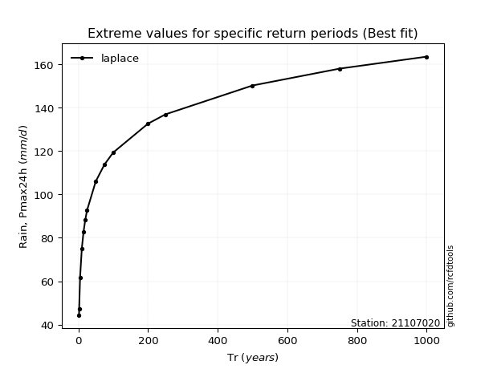</img>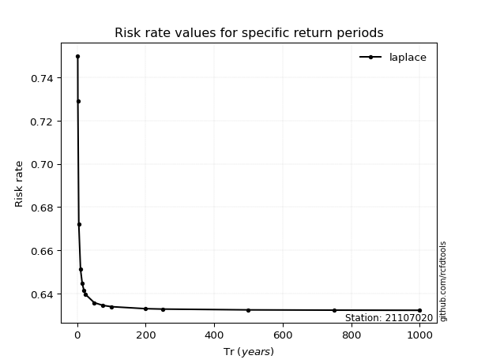</img>

</div>


<sub>**APP DISCLAIMER**: NO WARRANTY - This software is provided by [github.com/rcfdtools](https://github.com/rcfdtools) "as is", without any express or implied warranty, including warranties of merchantability, fitness for a particular purpose, or non-infringement. There is no guarantee that the software will be error-free or operate without interruption. LIMITATION OF LIABILITY - Neither the authors nor copyright holders will be liable for claims or damages arising from the software or its use. You are responsible for determining if the software is appropriate for your use and assume all associated risks, including errors, legal compliance, and data loss. NO PROFESSIONAL ADVICE - The software provides general information and does not offer professional advice. It should not replace consultation with professional advisors.</sub>