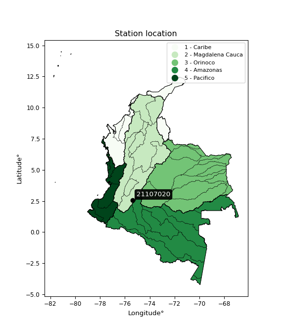

<div align="center">


</div>

# PMax24h Station (Rain): 21107020

Maximum Precipitation in 24 hours (PMax24h) is the greatest amount of rainfall for a specific duration that is meteorologically possible for a given location, acting as a "worst-case" scenario for extreme storms, crucial for designing safety-critical infrastructure like bridges, river deviations, dams, spillways, and nuclear plants to prevent catastrophic failure. The PMax24h is related with the Probable Maximum Precipitation (PMP) and it is calculated by hydrologists using meteorological data to determine the upper limit of extreme rainfall, often leading to the Probable Maximum Flood (PMF) for flood control design, and is increasingly being studied for climate change impacts. Probable Maximum Precipitation (PMP) is the theoretical upper limit of rainfall, a deterministic estimate for extreme events, while probability distributions (like GEV, Gumbel) describe the likelihood and frequency of various precipitation amounts, including rare ones, showing how often events occur, with PMP representing the extreme end of these distributions, used for critical infrastructure design to ensure safety against the worst conceivable weather, unlike standard statistical forecasts which cover typical probabilities.

The most common probability distributions in hydrology, used for analyzing floods, rainfall, and streamflow, include the Normal, Log-Normal, Gumbel, Gamma (including Log-Pearson Type III), and Generalized Extreme Value (GEV) distributions, often chosen based on the data´s skewness and whether modeling extremes or general conditions, with Gumbel and GEV popular for extreme events like floods, while the Normal distribution serves as a baseline, though often requiring transformations for skewed hydrological data. These distributions help in designing water infrastructure, managing water resources, and forecasting hydrologic events.

> Hydrological data often isn´t perfectly normal (it´s skewed), so different distributions are needed for different applications, such as: **Flood Frequency Analysis**: Using Gumbel, GEV, or Log-Pearson Type III for predicting extreme flood magnitudes and their return periods, **Rainfall Analysis**: Normal for annual totals, but Log-Normal, Weibull, or GEV for intensity or extreme daily rainfall, **Streamflow Modeling**: Gamma and Log-Normal for maximum flows, GEV for minimum flows, and Kappa for daily flows.

<div align="center">

</img>

</div>


## A. General information


### 1. General running parameters

• app_version: _v20260225_. • runtime: _2026-02-28 16:54:07.457399_. • Python version: _3.14.0_. • SciPy version: _1.16.3_. • Pandas version: _2.3.3_. • NumPy version: _2.3.5_. • Stations dataset (station_dataset_file): _dataset/pmax24h_in/automatic_colombia_2003_2025.csv_. • Stations catalog (station_catalog_file): _dataset/CNE.xls_. • Minimum year to eval til year_max (date_min): _1900_. • Maximum year to eval since year_min (date_max): _2025_. • Creates, save and include plots into reports (create_plot): _False_. • Plot only fit distributions with Δo > Δ (plot_only_fit): _True_. • Plot only simple graphs avoiding multiple CDFs and multiple Extreme values plots (plot_only_simple): _False_. • Eval low extreme values, if False, evaluates high extreme values (low_extreme): _False_. • Eval every SciPy distribution as logarithmic (pdist_logarithmic_on): _True_. • Standard deviation normalized (ddof): _1.0_. • Return periods to eval in years (Tr): _[2, 2.33, 5, 10, 15, 20, 25, 50, 75, 100, 200, 250, 500, 750, 1000]_. • Minimum data sample per station, 0 means any (minimum_sample): _5_. • Z-Score maximum threshold to adjust a value, 0 means disable (zscore_max): _3.5_. • Z-Score minimum threshold to adjust a value, 0 means disable (zscore_min): _-2.5_. • Avoid zeros, e.g. rain = 0 (avoid_zeros): _True_. • Avoid null values (avoid_nans): _True_. 

:file_folder:Table: [dataset.csv](../../dataset/pmax24h_in/automatic_colombia_2003_2025.csv)

> Delta Degrees of Freedom (DDOF): is a parameter used in the formulas for calculating variance and standard deviation. When ddof=0, the divisor is $N$ (the total number of observations) and this is used when your data set is the entire population. When ddof=1, the divisor is $N-1$ and this is used when your data set is a sample drawn from a larger population. Using $N-1$ provides an unbiased estimate of the population variance (known as Bessel´s correction).


### 2. Station info and location

|   id |   CODIGO | NOMBRE                  | CATEGORIA    | TECNOLOGIA   | ESTADO   | FECHA_INSTALACION   |   FECHA_SUSPENSION |   ALTITUD |   LATITUD |   LONGITUD | DEPARTAMENTO   | MUNICIPIO   | AREA_OPERATIVA                    | ENTIDAD                                                     | AREA_HIDROGRAFICA   | ZONA_HIDROGRAFICA   | SUBZONA_HIDROGRAFICA   | CORRIENTE   | Catalogo   |   Version |
|-----:|---------:|:------------------------|:-------------|:-------------|:---------|:--------------------|-------------------:|----------:|----------:|-----------:|:---------------|:------------|:----------------------------------|:------------------------------------------------------------|:--------------------|:--------------------|:-----------------------|:------------|:-----------|----------:|
|    0 | 21107020 | PUENTE MULAS [21107020] | Limnimétrica | Convencional | Activa   | 15/04/1967          |                nan |       740 |   2.56639 |   -75.3743 | Huila          | Campoalegre | Area Operativa 04 - Huila-Caquetá | INSTITUTO DE HIDROLOGIA METEOROLOGIA Y ESTUDIOS AMBIENTALES | Magdalena Cauca     | Alto Magdalena      | Rio Neiva              | Neiva       | CNE_IDEAM  |  20251226 |

<div align="center">

Dynamic map: [:earth_americas:Google](http://maps.google.com/maps?q=2.566388889,-75.37427778) [:earth_americas:OSM](https://www.openstreetmap.org/#map=18/2.566388889/-75.37427778&layers=P) [:earth_americas:Bing](https://www.bing.com/maps?cp=2.566388889~-75.37427778&lvl=18) [:earth_americas:Apple](https://maps.apple.com/frame?center=2.566388889%2C-75.37427778&span=0.003%2C0.006)

</div>


<div align="center">

```geojson
{
  "type": "Feature",
  "geometry": {
    "type": "Point", 
    "coordinates": [-75.37427778, 2.566388889]
  }, 
  "properties": {
    "Name": "21107020"
  }
}
```

</div>


### 3. Discrete values table and plot

<div align="center">

|               |          0 |            1 |           2 |           3 |          4 |
|:--------------|-----------:|-------------:|------------:|------------:|-----------:|
| Date          | 2019       | 2020         | 2021        | 2022        | 2024       |
| Value         |   86.6     |   46.8       |   34.8      |   50.6      |    2.4     |
| Value_initial |   86.6     |   46.8       |   34.8      |   50.6      |    2.4     |
| count         |    5       |    5         |    5        |    5        |    5       |
| mean          |   44.24    |   44.24      |   44.24     |   44.24     |   44.24    |
| std           |   30.3359  |   30.3359    |   30.3359   |   30.3359   |   30.3359  |
| zscore        |    1.39636 |    0.0843884 |   -0.311182 |    0.209652 |   -1.37922 |


</div>


> The initial value (value_initial) correspond to the initial obtained or null completed value, and value (value) is adjusted only when the initial value is outside the valid range (outlier) definite through the Z-Score value. If Z-Score is active, values out of range or outliers are replaced with the station mean value. A Z-Score (or standard score) measures how many standard deviations a data point is from the mean of a dataset, indicating its relative position; positive scores mean above the mean, negative mean below, and a score of zero is exactly at the mean, allowing for comparison of values from different distributions. It´s calculated using the formula $z=(x–μ)/σ$, where $x$ is the data point, $μ$ is the mean, and $σ$ is the standard deviation, helping identify outliers and understand probability.
>
> <sub>**Note**: In this study, "completing" (filling gaps in) and "extending" (forecasting or lengthening the historical record) rainfall data series are avoided for certain critical analyses because they introduce artificial bias and uncertainty, which can distort the statistics of rare events (extremes), alter day-to-day variability, and compromise the integrity and homogeneity of the original data. Some reasons against Completing/Extending rainfall data are: **Distortion of Extremes and Variability**: The primary issue is that most gap-filling or extension methods rely on averaging or regression with nearby stations, which inherently smooths the data. Rainfall is highly variable in space and time, with a large percentage of zero values and occasional large storms. Infilling methods often underestimate the highest values and overestimate the lowest (zero) values, which severely distorts analyses focused on flood frequency, drought severity, and intensity-duration-frequency (IDF) curves, **Loss of Data Homogeneity**: Infilled or extended data are synthetic estimates, not actual measurements. Combining these estimates with observed data can violate the assumption of data homogeneity, which requires that the data properties do not change over time. Inhomogeneity can lead to incorrect conclusions about long-term trends or changes in climate patterns, **Propagation of Errors**: Errors and biases from the original data (e.g., wind-induced undercatch, instrument errors, site changes) or the data used for imputation can propagate through the analysis, leading to unreliable hydrological models and inaccurate predictions, **Compromised Statistical Integrity**: For statistical analyses, especially those involving the frequency of events, using artificial data can introduce time bias or autocorrelation that doesn´t exist in reality, making it difficult to assess the true probability of events, **Difficulty in Validation**: It is difficult to accurately validate the quality of filled or extended data, especially for past periods where ground-truth measurements are unavailable. The reliability of imputation techniques heavily depends on the density of the surrounding station network and the complexity of the local topography.</sub>


### 4. Active continuous probability distributions from SciPy (80 of 104 available)

A Probability Density Function (PDF) describes the relative likelihood of a continuous random variable falling within a specific range, where the total area under its curve equals 1, and the area over any interval gives the actual probability for that range. Unlike discrete probabilities (like rolling a die), a PDF shows density, not direct probability for a single point (which is zero), with higher points indicating higher likelihood, often visualized as a bell curve for normal distributions.

A log of a probability density function (log-PDF) is simply the logarithm of the PDF´s value, denoted as $log(f(x))$, useful for converting multiplication of probabilities into addition, improving numerical stability with tiny numbers, and connecting to information theory concepts like entropy. Instead of dealing with very small probabilities (e.g., 0.000001), log-PDFs use negative numbers (e.g., $log(0.00001) ≈ -11.51$ that are easier for computers to handle, preventing underflow errors and simplifying complex calculations. In this study, each active probability distribution from SciPy is also evaluated in the $log$ form.

[scipy.stats](https://docs.scipy.org/doc/scipy/reference/stats.html) is a Python´s powerful submodule within the SciPy library for comprehensive statistical analysis, offering over 130 probability distributions (like Normal, Poisson, etc.), functions for descriptive stats (mean, variance), hypothesis testing (t-tests, chi-square), random variable generation, and statistical tests, making it essential for data science, modeling, and research. It provides tools to explore, model, and draw conclusions from data efficiently, working seamlessly with [NumPy](https://numpy.org/).

<div align="center">

|   id | p_dist           |   n_parameter | fit_method   | label                                                                       | active   | ref                                                                                                      |
|-----:|:-----------------|--------------:|:-------------|:----------------------------------------------------------------------------|:---------|:---------------------------------------------------------------------------------------------------------|
|    0 | alpha            |             3 | MLE          | Alpha                                                                       | True     | [:mortar_board:](https://docs.scipy.org/doc/scipy/reference/generated/scipy.stats.alpha.html)            |
|    1 | anglit           |             2 | MM           | Anglit                                                                      | True     | [:mortar_board:](https://docs.scipy.org/doc/scipy/reference/generated/scipy.stats.anglit.html)           |
|    2 | arcsine          |             2 | MM           | Arcsine                                                                     | True     | [:mortar_board:](https://docs.scipy.org/doc/scipy/reference/generated/scipy.stats.arcsine.html)          |
|    3 | argus            |             3 | MLE          | Argus                                                                       | True     | [:mortar_board:](https://docs.scipy.org/doc/scipy/reference/generated/scipy.stats.argus.html)            |
|    4 | beta             |             4 | MLE          | Beta                                                                        | True     | [:mortar_board:](https://docs.scipy.org/doc/scipy/reference/generated/scipy.stats.beta.html)             |
|    5 | betaprime        |             4 | MLE          | Beta prime                                                                  | True     | [:mortar_board:](https://docs.scipy.org/doc/scipy/reference/generated/scipy.stats.betaprime.html)        |
|    6 | bradford         |             3 | MLE          | Bradford                                                                    | True     | [:mortar_board:](https://docs.scipy.org/doc/scipy/reference/generated/scipy.stats.bradford.html)         |
|    7 | burr             |             4 | MLE          | Burr (Type III)                                                             | True     | [:mortar_board:](https://docs.scipy.org/doc/scipy/reference/generated/scipy.stats.burr.html)             |
|    8 | burr12           |             4 | MLE          | Burr (Type III) 12                                                          | True     | [:mortar_board:](https://docs.scipy.org/doc/scipy/reference/generated/scipy.stats.burr12.html)           |
|    9 | cosine           |             2 | MLE          | Cosine                                                                      | True     | [:mortar_board:](https://docs.scipy.org/doc/scipy/reference/generated/scipy.stats.cosine.html)           |
|   10 | crystalball      |             4 | MLE          | Crystalball                                                                 | True     | [:mortar_board:](https://docs.scipy.org/doc/scipy/reference/generated/scipy.stats.crystalball.html)      |
|   11 | dgamma           |             3 | MLE          | Double gamma                                                                | True     | [:mortar_board:](https://docs.scipy.org/doc/scipy/reference/generated/scipy.stats.dgamma.html)           |
|   12 | dweibull         |             3 | MLE          | Double Weibull                                                              | True     | [:mortar_board:](https://docs.scipy.org/doc/scipy/reference/generated/scipy.stats.dweibull.html)         |
|   13 | erlang           |             3 | MLE          | Erlang                                                                      | True     | [:mortar_board:](https://docs.scipy.org/doc/scipy/reference/generated/scipy.stats.erlang.html)           |
|   14 | exponnorm        |             3 | MLE          | Exponentially modified Normal                                               | True     | [:mortar_board:](https://docs.scipy.org/doc/scipy/reference/generated/scipy.stats.exponnorm.html)        |
|   15 | exponpow         |             3 | MLE          | Exponential power                                                           | True     | [:mortar_board:](https://docs.scipy.org/doc/scipy/reference/generated/scipy.stats.exponpow.html)         |
|   16 | exponweib        |             4 | MLE          | Exponentiated Weibull                                                       | True     | [:mortar_board:](https://docs.scipy.org/doc/scipy/reference/generated/scipy.stats.exponweib.html)        |
|   17 | f                |             4 | MLE          | F                                                                           | True     | [:mortar_board:](https://docs.scipy.org/doc/scipy/reference/generated/scipy.stats.f.html)                |
|   18 | fatiguelife      |             3 | MLE          | Fatigue-life (Birnbaum-Saunders)                                            | True     | [:mortar_board:](https://docs.scipy.org/doc/scipy/reference/generated/scipy.stats.fatiguelife.html)      |
|   19 | foldnorm         |             3 | MM           | Fold Normal                                                                 | True     | [:mortar_board:](https://docs.scipy.org/doc/scipy/reference/generated/scipy.stats.foldnorm.html)         |
|   20 | gamma            |             3 | MLE          | Gamma                                                                       | True     | [:mortar_board:](https://docs.scipy.org/doc/scipy/reference/generated/scipy.stats.gamma.html)            |
|   21 | gausshyper       |             6 | MLE          | Gauss hypergeometric                                                        | True     | [:mortar_board:](https://docs.scipy.org/doc/scipy/reference/generated/scipy.stats.gausshyper.html)       |
|   22 | genexpon         |             5 | MLE          | Generalized exponential                                                     | True     | [:mortar_board:](https://docs.scipy.org/doc/scipy/reference/generated/scipy.stats.genexpon.html)         |
|   23 | genextreme       |             3 | MLE          | Generalized exponential                                                     | True     | [:mortar_board:](https://docs.scipy.org/doc/scipy/reference/generated/scipy.stats.genextreme.html)       |
|   24 | gengamma         |             4 | MLE          | Generalized gamma                                                           | True     | [:mortar_board:](https://docs.scipy.org/doc/scipy/reference/generated/scipy.stats.gengamma.html)         |
|   25 | genhalflogistic  |             3 | MLE          | Generalized half-logistic                                                   | True     | [:mortar_board:](https://docs.scipy.org/doc/scipy/reference/generated/scipy.stats.genhalflogistic.html)  |
|   26 | genlogistic      |             3 | MLE          | Generalized logistic                                                        | True     | [:mortar_board:](https://docs.scipy.org/doc/scipy/reference/generated/scipy.stats.genlogistic.html)      |
|   27 | gennorm          |             3 | MLE          | Generalized Normal                                                          | True     | [:mortar_board:](https://docs.scipy.org/doc/scipy/reference/generated/scipy.stats.gennorm.html)          |
|   28 | genpareto        |             3 | MLE          | Generalized Pareto                                                          | True     | [:mortar_board:](https://docs.scipy.org/doc/scipy/reference/generated/scipy.stats.genpareto.html)        |
|   29 | gompertz         |             3 | MLE          | Gompertz (or truncated Gumbel)                                              | True     | [:mortar_board:](https://docs.scipy.org/doc/scipy/reference/generated/scipy.stats.gompertz.html)         |
|   30 | gumbel_l         |             2 | MM           | Gumbel Left Skew                                                            | True     | [:mortar_board:](https://docs.scipy.org/doc/scipy/reference/generated/scipy.stats.gumbel_l.html)         |
|   31 | gumbel_r         |             2 | MM           | Gumbel Right Skew                                                           | True     | [:mortar_board:](https://docs.scipy.org/doc/scipy/reference/generated/scipy.stats.gumbel_r.html)         |
|   32 | halfgennorm      |             3 | MLE          | Upper half of a generalized normal                                          | True     | [:mortar_board:](https://docs.scipy.org/doc/scipy/reference/generated/scipy.stats.halfgennorm.html)      |
|   33 | halflogistic     |             2 | MM           | Half-logistic                                                               | True     | [:mortar_board:](https://docs.scipy.org/doc/scipy/reference/generated/scipy.stats.halflogistic.html)     |
|   34 | halfnorm         |             2 | MM           | Half Normal                                                                 | True     | [:mortar_board:](https://docs.scipy.org/doc/scipy/reference/generated/scipy.stats.halfnorm.html)         |
|   35 | hypsecant        |             2 | MM           | hyperbolic secant                                                           | True     | [:mortar_board:](https://docs.scipy.org/doc/scipy/reference/generated/scipy.stats.hypsecant.html)        |
|   36 | invgamma         |             3 | MLE          | Inverted gamma                                                              | True     | [:mortar_board:](https://docs.scipy.org/doc/scipy/reference/generated/scipy.stats.invgamma.html)         |
|   37 | invgauss         |             3 | MLE          | Inverse Gaussian                                                            | True     | [:mortar_board:](https://docs.scipy.org/doc/scipy/reference/generated/scipy.stats.invgauss.html)         |
|   38 | invweibull       |             3 | MLE          | Inverted Weibull                                                            | True     | [:mortar_board:](https://docs.scipy.org/doc/scipy/reference/generated/scipy.stats.invweibull.html)       |
|   39 | johnsonsb        |             4 | MLE          | Johnson SB                                                                  | True     | [:mortar_board:](https://docs.scipy.org/doc/scipy/reference/generated/scipy.stats.johnsonsb.html)        |
|   40 | johnsonsu        |             4 | MLE          | Johnson Su                                                                  | True     | [:mortar_board:](https://docs.scipy.org/doc/scipy/reference/generated/scipy.stats.johnsonsu.html)        |
|   41 | kappa3           |             3 | MLE          | Kappa 3                                                                     | True     | [:mortar_board:](https://docs.scipy.org/doc/scipy/reference/generated/scipy.stats.kappa3.html)           |
|   42 | kappa4           |             4 | MLE          | Kappa 4                                                                     | True     | [:mortar_board:](https://docs.scipy.org/doc/scipy/reference/generated/scipy.stats.kappa4.html)           |
|   43 | ksone            |             3 | MLE          | Kolmogorov-Smirnov one-sided test statistic distribution                    | True     | [:mortar_board:](https://docs.scipy.org/doc/scipy/reference/generated/scipy.stats.ksone.html)            |
|   44 | kstwobign        |             2 | MLE          | Limiting distribution of scaled Kolmogorov-Smirnov two-sided test statistic | True     | [:mortar_board:](https://docs.scipy.org/doc/scipy/reference/generated/scipy.stats.kstwobign.html)        |
|   45 | laplace          |             2 | MM           | Laplace                                                                     | True     | [:mortar_board:](https://docs.scipy.org/doc/scipy/reference/generated/scipy.stats.laplace.html)          |
|   46 | levy_l           |             2 | MLE          | Left-skewed Levy                                                            | True     | [:mortar_board:](https://docs.scipy.org/doc/scipy/reference/generated/scipy.stats.levy_l.html)           |
|   47 | loggamma         |             3 | MLE          | Log gamma                                                                   | True     | [:mortar_board:](https://docs.scipy.org/doc/scipy/reference/generated/scipy.stats.loggamma.html)         |
|   48 | logistic         |             2 | MM           | Logistic (or Sech-squared)                                                  | True     | [:mortar_board:](https://docs.scipy.org/doc/scipy/reference/generated/scipy.stats.logistic.html)         |
|   49 | loglaplace       |             3 | MLE          | Log-Laplace                                                                 | True     | [:mortar_board:](https://docs.scipy.org/doc/scipy/reference/generated/scipy.stats.loglaplace.html)       |
|   50 | lomax            |             3 | MLE          | Lomax (Pareto of the second kind)                                           | True     | [:mortar_board:](https://docs.scipy.org/doc/scipy/reference/generated/scipy.stats.lomax.html)            |
|   51 | maxwell          |             2 | MM           | Maxwell                                                                     | True     | [:mortar_board:](https://docs.scipy.org/doc/scipy/reference/generated/scipy.stats.maxwell.html)          |
|   52 | mielke           |             4 | MLE          | Mielke Beta-Kappa / Dagum                                                   | True     | [:mortar_board:](https://docs.scipy.org/doc/scipy/reference/generated/scipy.stats.mielke.html)           |
|   53 | moyal            |             2 | MM           | Moyal                                                                       | True     | [:mortar_board:](https://docs.scipy.org/doc/scipy/reference/generated/scipy.stats.moyal.html)            |
|   54 | nakagami         |             3 | MLE          | Nakagami                                                                    | True     | [:mortar_board:](https://docs.scipy.org/doc/scipy/reference/generated/scipy.stats.nakagami.html)         |
|   55 | ncf              |             5 | MLE          | Non-central F distribution                                                  | True     | [:mortar_board:](https://docs.scipy.org/doc/scipy/reference/generated/scipy.stats.ncf.html)              |
|   56 | nct              |             4 | MLE          | Non-central Student’s t                                                     | True     | [:mortar_board:](https://docs.scipy.org/doc/scipy/reference/generated/scipy.stats.nct.html)              |
|   57 | norm             |             2 | MM           | Normal                                                                      | True     | [:mortar_board:](https://docs.scipy.org/doc/scipy/reference/generated/scipy.stats.norm.html)             |
|   58 | pearson3         |             3 | MM           | Pearson type III                                                            | True     | [:mortar_board:](https://docs.scipy.org/doc/scipy/reference/generated/scipy.stats.pearson3.html)         |
|   59 | powerlaw         |             3 | MLE          | Power-function                                                              | True     | [:mortar_board:](https://docs.scipy.org/doc/scipy/reference/generated/scipy.stats.powerlaw.html)         |
|   60 | rayleigh         |             2 | MM           | Rayleigh                                                                    | True     | [:mortar_board:](https://docs.scipy.org/doc/scipy/reference/generated/scipy.stats.rayleigh.html)         |
|   61 | rdist            |             3 | MLE          | R-distributed (symmetric beta)                                              | True     | [:mortar_board:](https://docs.scipy.org/doc/scipy/reference/generated/scipy.stats.rdist.html)            |
|   62 | rice             |             3 | MLE          | Rice                                                                        | True     | [:mortar_board:](https://docs.scipy.org/doc/scipy/reference/generated/scipy.stats.rice.html)             |
|   63 | semicircular     |             2 | MM           | Semicircular                                                                | True     | [:mortar_board:](https://docs.scipy.org/doc/scipy/reference/generated/scipy.stats.semicircular.html)     |
|   64 | skewnorm         |             3 | MLE          | Skew normal                                                                 | True     | [:mortar_board:](https://docs.scipy.org/doc/scipy/reference/generated/scipy.stats.skewnorm.html)         |
|   65 | t                |             3 | MLE          | Student’s t                                                                 | True     | [:mortar_board:](https://docs.scipy.org/doc/scipy/reference/generated/scipy.stats.t.html)                |
|   66 | trapezoid        |             4 | MLE          | Trapezoid                                                                   | True     | [:mortar_board:](https://docs.scipy.org/doc/scipy/reference/generated/scipy.stats.trapezoid.html)        |
|   67 | triang           |             3 | MLE          | Triangular                                                                  | True     | [:mortar_board:](https://docs.scipy.org/doc/scipy/reference/generated/scipy.stats.triang.html)           |
|   68 | truncexpon       |             3 | MLE          | Truncated exponential                                                       | True     | [:mortar_board:](https://docs.scipy.org/doc/scipy/reference/generated/scipy.stats.truncexpon.html)       |
|   69 | truncnorm        |             4 | MLE          | Truncated normal                                                            | True     | [:mortar_board:](https://docs.scipy.org/doc/scipy/reference/generated/scipy.stats.truncnorm.html)        |
|   70 | truncpareto      |             4 | MLE          | Upper truncated Pareto                                                      | True     | [:mortar_board:](https://docs.scipy.org/doc/scipy/reference/generated/scipy.stats.truncpareto.html)      |
|   71 | truncweibull_min |             5 | MLE          | Doubly truncated Weibull minimum                                            | True     | [:mortar_board:](https://docs.scipy.org/doc/scipy/reference/generated/scipy.stats.truncweibull_min.html) |
|   72 | tukeylambda      |             3 | MLE          | Tukey-Lamdba                                                                | True     | [:mortar_board:](https://docs.scipy.org/doc/scipy/reference/generated/scipy.stats.tukeylambda.html)      |
|   73 | uniform          |             2 | MLE          | Uniform                                                                     | True     | [:mortar_board:](https://docs.scipy.org/doc/scipy/reference/generated/scipy.stats.uniform.html)          |
|   74 | vonmises         |             3 | MLE          | Von Mises                                                                   | True     | [:mortar_board:](https://docs.scipy.org/doc/scipy/reference/generated/scipy.stats.vonmises.html)         |
|   75 | vonmises_line    |             3 | MLE          | Von Mises line                                                              | True     | [:mortar_board:](https://docs.scipy.org/doc/scipy/reference/generated/scipy.stats.vonmises_line.html)    |
|   76 | wald             |             2 | MM           | Wald                                                                        | True     | [:mortar_board:](https://docs.scipy.org/doc/scipy/reference/generated/scipy.stats.wald.html)             |
|   77 | weibull_max      |             3 | MLE          | Weibull maximum                                                             | True     | [:mortar_board:](https://docs.scipy.org/doc/scipy/reference/generated/scipy.stats.weibull_max.html)      |
|   78 | weibull_min      |             3 | MLE          | Weibull minimum                                                             | True     | [:mortar_board:](https://docs.scipy.org/doc/scipy/reference/generated/scipy.stats.weibull_min.html)      |
|   79 | wrapcauchy       |             3 | MLE          | Wrapped  Cauchy                                                             | True     | [:mortar_board:](https://docs.scipy.org/doc/scipy/reference/generated/scipy.stats.wrapcauchy.html)       |

</div>

> **n_parameter:** # arguments & localization & scale.
>
> **Fit methods:** (MLE) maximum likelihood, (MM) L-moments.
>
>**Inactive** (With the only purpose of prevent loops, zero divisions, infinite values, over high estimated values or horizontal trending for recurrence intervals estimations, the follow distributions were disabled.)**:** lognorm, norminvgauss, powernorm, powerlognorm, cauchy, halfcauchy, foldcauchy, skewcauchy, chi2, expon, fisk, genhyperbolic, geninvgauss, gibrat, kstwo, laplace_asymmetric, levy, levy_stable, ncx2, pareto, rel_breitwigner, recipinvgauss, studentized_range, loguniform, 


## B. Probability (PDF) vs. Empirical (EDF) distributions functions

A continuous probability distribution (CPD) describes probabilities for variables that can take any value within a range (like rain any time), unlike discrete variables with specific outcomes (like temperature). It uses a Probability Density Function (PDF), a curve where the total area under it equals 1, and the probability of the variable falling within an interval (a to b) is found by calculating the area under the curve between those points. A key feature is that the probability of hitting any single exact value is zero, so probabilities are always expressed for ranges, e.g., $P(a ≤ X ≤ b)$.

<div align="center">

Distributions parameters from station values
|     |   station | p_dist              |   n |             loc |           scale | shape                  | shape1                 | shape2                 | shape3             |
|----:|----------:|:--------------------|----:|----------------:|----------------:|:-----------------------|:-----------------------|:-----------------------|:-------------------|
|   0 |  21107020 | alpha               |   5 |   -37.0265      |   158.979       | 2.41603292372202       |                        |                        |                    |
|   1 |  21107020 | anglit              |   5 |    44.24        |    79.3756      |                        |                        |                        |                    |
|   2 |  21107020 | arcsine             |   5 |     5.86776     |    76.7445      |                        |                        |                        |                    |
|   3 |  21107020 | argus               |   5 |   -18.6825      |   111.303       | 2.211270992352613e-05  |                        |                        |                    |
|   4 |  21107020 | beta                |   5 |   -43.1308      |   129.731       | 1.5534111382293874     | 0.5947002559669259     |                        |                    |
|   5 |  21107020 | betaprime           |   5 |  -537.082       | 27157.6         | 468.2221595321889      | 21874.959592009443     |                        |                    |
|   6 |  21107020 | bradford            |   5 |     2.39996     |    84.2001      | 2.0124130727329574     |                        |                        |                    |
|   7 |  21107020 | burr                |   5 |    -1.58803     |    89.7973      | 187.5405396843165      | 0.005099543395536265   |                        |                    |
|   8 |  21107020 | burr12              |   5 |    -0.667024    |     3.0016      | 210.62876334712655     | 0.0020714791481620297  |                        |                    |
|   9 |  21107020 | cosine              |   5 |    44.335       |    22.8245      |                        |                        |                        |                    |
|  10 |  21107020 | crystalball         |   5 |    44.24        |    27.1333      | 1251.623506165241      | 7630.2641219701745     |                        |                    |
|  11 |  21107020 | dgamma              |   5 |    46.8         |    20.2851      | 0.9248788834854811     |                        |                        |                    |
|  12 |  21107020 | dweibull            |   5 |    46.8         |    23.2418      | 0.6540614058356441     |                        |                        |                    |
|  13 |  21107020 | erlang              |   5 | -2334.77        |     0.309449    | 7687.900221101299      |                        |                        |                    |
|  14 |  21107020 | exponnorm           |   5 |    43.3621      |    27.1191      | 0.03237188187464306    |                        |                        |                    |
|  15 |  21107020 | exponpow            |   5 |     2.4         |     3.45661     | 0.1366560159194839     |                        |                        |                    |
|  16 |  21107020 | exponweib           |   5 |     2.4         |     5.14064     | 0.36471325926222553    | 0.35411031439229906    |                        |                    |
|  17 |  21107020 | f                   |   5 |  -826.448       |   870.655       | 2056.6695392376278     | 994252.8533231695      |                        |                    |
|  18 |  21107020 | fatiguelife         |   5 |     2.4         |     3.47068e-06 | 3163.497453357246      |                        |                        |                    |
|  19 |  21107020 | foldnorm            |   5 |   -21.5684      |    27.2711      | 2.409693565721434      |                        |                        |                    |
|  20 |  21107020 | gamma               |   5 | -2324.45        |     0.310771    | 7621.960867883403      |                        |                        |                    |
|  21 |  21107020 | gausshyper          |   5 |    -5.80349     |    92.4035      | 1.3183030818288402     | 0.7087270772515311     | 0.9916067443201041     | 0.8851615616018464 |
|  22 |  21107020 | genexpon            |   5 |     2.39998     |     2.72436     | 0.06514862777586511    | 3.2612770605875535e-08 | 2.1667532701739303     |                    |
|  23 |  21107020 | genextreme          |   5 |     2.43631     |     0.243847    | -6.71602854020745      |                        |                        |                    |
|  24 |  21107020 | gengamma            |   5 |     2.4         |     5.45438     | 1.9847669249059305     | 0.4889990089759634     |                        |                    |
|  25 |  21107020 | genhalflogistic     |   5 |    -6.04619     |   116.542       | 1.2579278809769474     |                        |                        |                    |
|  26 |  21107020 | genlogistic         |   5 |    41.9331      |    16.1023      | 1.0988473698503909     |                        |                        |                    |
|  27 |  21107020 | gennorm             |   5 |    46.8         |     0.993414    | 0.394330471386515      |                        |                        |                    |
|  28 |  21107020 | genpareto           |   5 |    -0.393643    |   145.264       | -1.6698270472563463    |                        |                        |                    |
|  29 |  21107020 | gompertz            |   5 |    34.8         |    30.8332      | 0.7258897010901566     |                        |                        |                    |
|  30 |  21107020 | gumbel_l            |   5 |    56.4514      |    21.1557      |                        |                        |                        |                    |
|  31 |  21107020 | gumbel_r            |   5 |    32.0286      |    21.1557      |                        |                        |                        |                    |
|  32 |  21107020 | halfgennorm         |   5 |     2.4         |     0.0257118   | 0.22738029859936137    |                        |                        |                    |
|  33 |  21107020 | halflogistic        |   5 |    12.0807      |    23.198       |                        |                        |                        |                    |
|  34 |  21107020 | halfnorm            |   5 |     8.32622     |    45.0112      |                        |                        |                        |                    |
|  35 |  21107020 | hypsecant           |   5 |    44.24        |    17.2736      |                        |                        |                        |                    |
|  36 |  21107020 | invgamma            |   5 |  -210.405       | 22008           | 87.45993293547643      |                        |                        |                    |
|  37 |  21107020 | invgauss            |   5 |  -124.149       |  5985.05        | 0.028146281402947643   |                        |                        |                    |
|  38 |  21107020 | invweibull          |   5 |     2.4         |     3.03156     | 0.04042453366090277    |                        |                        |                    |
|  39 |  21107020 | johnsonsb           |   5 |    -1.85955     |    88.4596      | -0.5879164407951463    | 0.12600388483917652    |                        |                    |
|  40 |  21107020 | johnsonsu           |   5 |  -805.266       |  1948.2         | -33.14029125500582     | 78.29845647181597      |                        |                    |
|  41 |  21107020 | kappa3              |   5 |     2.39983     |    84.2003      | 413747.73053593765     |                        |                        |                    |
|  42 |  21107020 | kappa4              |   5 |    -2.45364     |    94.1514      | 1.054438717391313      | 1.0572433973641684     |                        |                    |
|  43 |  21107020 | ksone               |   5 |    -2.7562      |    93.9924      | 1.0                    |                        |                        |                    |
|  44 |  21107020 | kstwobign           |   5 |   -58.377       |   117.385       |                        |                        |                        |                    |
|  45 |  21107020 | laplace             |   5 |    44.24        |    19.1861      |                        |                        |                        |                    |
|  46 |  21107020 | levy_l              |   5 |    90.5844      |    15.2396      |                        |                        |                        |                    |
|  47 |  21107020 | loggamma            |   5 | -6791.12        |   959.317       | 1243.3945868027722     |                        |                        |                    |
|  48 |  21107020 | logistic            |   5 |    44.24        |    14.9594      |                        |                        |                        |                    |
|  49 |  21107020 | loglaplace          |   5 |    -0.0912615   |    46.8912      | 1.2715949162489397     |                        |                        |                    |
|  50 |  21107020 | lomax               |   5 |     2.37716     | 20648.2         | 493.87419131656543     |                        |                        |                    |
|  51 |  21107020 | maxwell             |   5 |   -20.0545      |    40.2906      |                        |                        |                        |                    |
|  52 |  21107020 | mielke              |   5 |     2.4         |    84.6326      | 0.8776237249905094     | 4774.417208775234      |                        |                    |
|  53 |  21107020 | moyal               |   5 |    28.7235      |    12.2143      |                        |                        |                        |                    |
|  54 |  21107020 | nakagami            |   5 |     2.4         |    55.4923      | 0.3380113218130668     |                        |                        |                    |
|  55 |  21107020 | ncf                 |   5 |    -0.0791414   |     5.56483     | 1.1883956906278241     | 26.4975189203507       | 7.382957327289816      |                    |
|  56 |  21107020 | nct                 |   5 |    -0.358829    |     0.112013    | 0.4634265984071861     | 54.73621077272456      |                        |                    |
|  57 |  21107020 | norm                |   5 |    44.24        |    27.1333      |                        |                        |                        |                    |
|  58 |  21107020 | pearson3            |   5 |    44.24        |    27.1332      | 0.02201482693131468    |                        |                        |                    |
|  59 |  21107020 | powerlaw            |   5 |     2.4         |    84.2         | 0.1192277978550365     |                        |                        |                    |
|  60 |  21107020 | rayleigh            |   5 |    -7.66753     |    41.4162      |                        |                        |                        |                    |
|  61 |  21107020 | rdist               |   5 |    -5.24285     |    52.0429      | 1.046856630577603      |                        |                        |                    |
|  62 |  21107020 | rice                |   5 |   -13.0668      |    31.295       | 1.4508418449053213     |                        |                        |                    |
|  63 |  21107020 | semicircular        |   5 |    44.24        |    54.2665      |                        |                        |                        |                    |
|  64 |  21107020 | skewnorm            |   5 |    40.2371      |    27.4269      | 0.18605548575854242    |                        |                        |                    |
|  65 |  21107020 | t                   |   5 |    44.24        |    27.1332      | 1509437673.7811627     |                        |                        |                    |
|  66 |  21107020 | trapezoid           |   5 |    -6.321       |   101.04        | 1.0                    | 1.0                    |                        |                    |
|  67 |  21107020 | triang              |   5 |    -6.59664     |    93.1967      | 0.9999999714016607     |                        |                        |                    |
|  68 |  21107020 | truncexpon          |   5 |    -4.96513     |   121.113       | 0.756029577245845      |                        |                        |                    |
|  69 |  21107020 | truncnorm           |   5 |   -41.5031      |    13.5062      | -5.57967976097969      | 9.484752892517708      |                        |                    |
|  70 |  21107020 | truncpareto         |   5 | -1668.72        |  1671.12        | 4.55751005902265e-06   | 1.050385270734252      |                        |                    |
|  71 |  21107020 | truncweibull_min    |   5 |    -3.08864     |   119.288       | 1.2804007141315097     | 0.0012944597734463998  | 0.751868142233914      |                    |
|  72 |  21107020 | tukeylambda         |   5 |    44.3494      |    45.489       | 1.0766486344539041     |                        |                        |                    |
|  73 |  21107020 | uniform             |   5 |     2.4         |    84.2         |                        |                        |                        |                    |
|  74 |  21107020 | vonmises            |   5 |     3.07327     |     1           | 0.6340006700586462     |                        |                        |                    |
|  75 |  21107020 | vonmises_line       |   5 |    44.5         |    13.4009      | 1.090397831960192      |                        |                        |                    |
|  76 |  21107020 | wald                |   5 |    17.1068      |    27.1332      |                        |                        |                        |                    |
|  77 |  21107020 | weibull_max         |   5 |    86.6         |     1.73164     | 0.25191028581690944    |                        |                        |                    |
|  78 |  21107020 | weibull_min         |   5 |   -21.204       |    73.7149      | 2.636523260844572      |                        |                        |                    |
|  79 |  21107020 | wrapcauchy          |   5 |     2.39999     |    13.4696      | 2.80119986250729e-05   |                        |                        |                    |
|  80 |  21107020 | logalpha            |   5 |   -20.6571      |   426.428       | 17.830046412657012     |                        |                        |                    |
|  81 |  21107020 | loganglit           |   5 |     3.33124     |     3.69382     |                        |                        |                        |                    |
|  82 |  21107020 | logarcsine          |   5 |     1.54558     |     3.57133     |                        |                        |                        |                    |
|  83 |  21107020 | logargus            |   5 |    -0.906741    |     5.47173     | 2.7296341250012106     |                        |                        |                    |
|  84 |  21107020 | logbeta             |   5 |     0.533595    |     3.92771     | 0.3106629779205255     | 0.09605726830691959    |                        |                    |
|  85 |  21107020 | logbetaprime        |   5 |   -26.3823      |   366.264       | 547.6856405972958      | 6748.272401424031      |                        |                    |
|  86 |  21107020 | logbradford         |   5 |     0.875449    |     3.58587     | 0.8593427808208913     |                        |                        |                    |
|  87 |  21107020 | logburr             |   5 |    -3.72213     |     8.2082      | 1224.6101184484446     | 0.004770464994750822   |                        |                    |
|  88 |  21107020 | logburr12           |   5 |   -48.7841      |    58.5335      | 80.05759717761731      | 4737.965769038021      |                        |                    |
|  89 |  21107020 | logcosine           |   5 |     3.10939     |     1.08052     |                        |                        |                        |                    |
|  90 |  21107020 | logcrystalball      |   5 |     3.33124     |     1.26267     | 82.95194309218371      | 17285.335104535196     |                        |                    |
|  91 |  21107020 | logdgamma           |   5 |     3.84588     |     0.935795    | 0.8791014383897489     |                        |                        |                    |
|  92 |  21107020 | logdweibull         |   5 |     3.92395     |     0.887165    | 0.8675741597029123     |                        |                        |                    |
|  93 |  21107020 | logerlang           |   5 |   -19.8567      |     0.0764718   | 303.2032142395103      |                        |                        |                    |
|  94 |  21107020 | logexponnorm        |   5 |     3.33057     |     1.26267     | 0.0005290818583634583  |                        |                        |                    |
|  95 |  21107020 | logexponpow         |   5 |     0.875469    |     1.39153     | 0.421421925227206      |                        |                        |                    |
|  96 |  21107020 | logexponweib        |   5 |    -1.78921e+08 |     1.78921e+08 | 0.9940062048439493     | 205091824.43077707     |                        |                    |
|  97 |  21107020 | logf                |   5 | -1970.59        |  1973.91        | 14659396.71245344      | 7326299.226642584      |                        |                    |
|  98 |  21107020 | logfatiguelife      |   5 |  -701.299       |   704.627       | 0.0017954190167930005  |                        |                        |                    |
|  99 |  21107020 | logfoldnorm         |   5 |    -5.24932     |     1.11506     | 7.722396869051576      |                        |                        |                    |
| 100 |  21107020 | loggamma            |   5 |   -17.696       |     0.0822259   | 255.48102023260677     |                        |                        |                    |
| 101 |  21107020 | loggausshyper       |   5 |     0.654027    |     3.80727     | 1.1765919686338346     | 0.41754953934024797    | 1.159524885710724      | 1.0572635257852676 |
| 102 |  21107020 | loggenexpon         |   5 |     0.874715    |     0.0402619   | 0.0067119838216025615  | 2.142514270428716      | 0.00011712751192016448 |                    |
| 103 |  21107020 | loggenextreme       |   5 |     3.59219     |     1.00172     | 1.1525760027286167     |                        |                        |                    |
| 104 |  21107020 | loggengamma         |   5 |    -6.52654e+07 |     6.52654e+07 | 1.8228923545017868     | 49559896.798828684     |                        |                    |
| 105 |  21107020 | loggenhalflogistic  |   5 |     0.530268    |     4.28409     | 1.089812399029229      |                        |                        |                    |
| 106 |  21107020 | loggenlogistic      |   5 |     4.46133     |     2.01676e-06 | 1.7839292736160036e-06 |                        |                        |                    |
| 107 |  21107020 | loggennorm          |   5 |     3.92395     |     0.0464785   | 0.41783626902776894    |                        |                        |                    |
| 108 |  21107020 | loggenpareto        |   5 |    -0.00508451  |    11.6705      | -2.612969658841324     |                        |                        |                    |
| 109 |  21107020 | loggompertz         |   5 |     0.875468    |     0.828109    | 0.02889223838405628    |                        |                        |                    |
| 110 |  21107020 | loggumbel_l         |   5 |     3.89951     |     0.984501    |                        |                        |                        |                    |
| 111 |  21107020 | loggumbel_r         |   5 |     2.76297     |     0.984501    |                        |                        |                        |                    |
| 112 |  21107020 | loghalfgennorm      |   5 |     0.875469    |     1.17585     | 0.6750566257007129     |                        |                        |                    |
| 113 |  21107020 | loghalflogistic     |   5 |     1.83473     |     1.07951     |                        |                        |                        |                    |
| 114 |  21107020 | loghalfnorm         |   5 |     1.65994     |     2.09466     |                        |                        |                        |                    |
| 115 |  21107020 | loghypsecant        |   5 |     3.33124     |     0.803842    |                        |                        |                        |                    |
| 116 |  21107020 | loginvgamma         |   5 |   -24.4031      | 11669.9         | 421.86929525179494     |                        |                        |                    |
| 117 |  21107020 | loginvgauss         |   5 |    -9.91673     |  1219.8         | 0.010862944623098482   |                        |                        |                    |
| 118 |  21107020 | loginvweibull       |   5 |    -1.14619e+08 |     1.14619e+08 | 78655854.15820411      |                        |                        |                    |
| 119 |  21107020 | logjohnsonsb        |   5 |     0.743212    |     3.71809     | -0.46633613096578563   | 0.14102363750089833    |                        |                    |
| 120 |  21107020 | logjohnsonsu        |   5 |     4.54398     |     0.00198458  | 5.337667425183378      | 0.8202635447733333     |                        |                    |
| 121 |  21107020 | logkappa3           |   5 |     0.875466    |     3.58583     | 4168440.691821182      |                        |                        |                    |
| 122 |  21107020 | logkappa4           |   5 |     0.439399    |     4.31927     | 1.1127721350471431     | 1.0724664095727139     |                        |                    |
| 123 |  21107020 | logksone            |   5 |     0.516886    |     4.303       | 1.0                    |                        |                        |                    |
| 124 |  21107020 | logkstwobign        |   5 |    -2.47725     |     6.62025     |                        |                        |                        |                    |
| 125 |  21107020 | loglaplace          |   5 |     3.33124     |     0.892844    |                        |                        |                        |                    |
| 126 |  21107020 | loglevy_l           |   5 |     4.53182     |     0.269206    |                        |                        |                        |                    |
| 127 |  21107020 | logloggamma         |   5 |     4.46135     |     2.87883e-06 | 2.5349957454467764e-06 |                        |                        |                    |
| 128 |  21107020 | loglogistic         |   5 |     3.33124     |     0.696147    |                        |                        |                        |                    |
| 129 |  21107020 | logloglaplace       |   5 |    -0.00846915  |     3.85435     | 2.916377381824619      |                        |                        |                    |
| 130 |  21107020 | loglomax            |   5 |     0.875427    |  4070.05        | 1632.1200605724277     |                        |                        |                    |
| 131 |  21107020 | logmaxwell          |   5 |     0.339242    |     1.87496     |                        |                        |                        |                    |
| 132 |  21107020 | logmielke           |   5 |    -4.64255e+07 |     4.64255e+07 | 40351687.62211488      | 10087176227.587753     |                        |                    |
| 133 |  21107020 | logmoyal            |   5 |     2.60917     |     0.568402    |                        |                        |                        |                    |
| 134 |  21107020 | lognakagami         |   5 |     3.54962     |     0.483446    | 0.07529285840966718    |                        |                        |                    |
| 135 |  21107020 | logncf              |   5 |   -64.0395      |    67.3558      | 14246.643210659102     | 8673.381679726961      | 1.8143639788870524e-08 |                    |
| 136 |  21107020 | lognct              |   5 |   -89.6523      |     1.23093     | 50539.63344599215      | 75.53739937063612      |                        |                    |
| 137 |  21107020 | lognorm             |   5 |     3.33124     |     1.26267     |                        |                        |                        |                    |
| 138 |  21107020 | logpearson3         |   5 |     3.33124     |     1.26267     | -1.2927868367122537    |                        |                        |                    |
| 139 |  21107020 | logpowerlaw         |   5 |     0.875469    |     3.58583     | 0.12934005386856634    |                        |                        |                    |
| 140 |  21107020 | lograyleigh         |   5 |     0.915667    |     1.92735     |                        |                        |                        |                    |
| 141 |  21107020 | logrdist            |   5 |     1.50696     |     2.04266     | 1.0872092265103945     |                        |                        |                    |
| 142 |  21107020 | logrice             |   5 |    -0.176679    |     1.35209     | 2.3671180307628417     |                        |                        |                    |
| 143 |  21107020 | logsemicircular     |   5 |     3.33124     |     2.52534     |                        |                        |                        |                    |
| 144 |  21107020 | logskewnorm         |   5 |     4.4613      |     1.69457     | -12395620.081752934    |                        |                        |                    |
| 145 |  21107020 | logt                |   5 |     3.87314     |     0.13095     | 0.5833597704544247     |                        |                        |                    |
| 146 |  21107020 | logtrapezoid        |   5 |    -0.252138    |     5.35706     | 1.0                    | 1.0                    |                        |                    |
| 147 |  21107020 | logtriang           |   5 |    -0.242749    |     4.70406     | 0.9999983939447583     |                        |                        |                    |
| 148 |  21107020 | logtruncexpon       |   5 |     0.875463    |     5.78223     | 0.6201473086995226     |                        |                        |                    |
| 149 |  21107020 | logtruncnorm        |   5 |     0.857333    |     2.76942     | 0.006548518229214125   | 457.2284116110686      |                        |                    |
| 150 |  21107020 | logtruncpareto      |   5 |     0.85013     |     0.0253387   | 0.2604315991614931     | 142.51593405945866     |                        |                    |
| 151 |  21107020 | logtruncweibull_min |   5 |     0.588755    |     6.57023     | 1.1976799322214526     | 3.151801794433163e-05  | 0.5894074938487639     |                    |
| 152 |  21107020 | logtukeylambda      |   5 |     2.2212      |     1.47869     | 1.0988019639469897     |                        |                        |                    |
| 153 |  21107020 | loguniform          |   5 |     0.875469    |     3.58583     |                        |                        |                        |                    |
| 154 |  21107020 | logvonmises         |   5 |    -2.3681      |     1           | 1.3551871211232807     |                        |                        |                    |
| 155 |  21107020 | logvonmises_line    |   5 |     3.65371     |     0.884343    | 1.2520348436348128     |                        |                        |                    |
| 156 |  21107020 | logwald             |   5 |     2.06856     |     1.26268     |                        |                        |                        |                    |
| 157 |  21107020 | logweibull_max      |   5 |     4.4613      |     1.89506     | 0.6269015482526785     |                        |                        |                    |
| 158 |  21107020 | logweibull_min      |   5 |     0.875469    |     1.26109     | 0.6838303944616295     |                        |                        |                    |
| 159 |  21107020 | logwrapcauchy       |   5 |     0.875463    |     0.570704    | 0.5542673860887138     |                        |                        |                    |

</div>

> **loc** (Location parameter): This shifts the distribution along the x-axis. For many common distributions, like the normal (Gaussian) distribution, loc represents the mean $μ$. For others, like the uniform distribution, it might represent the minimum value, or for the beta distribution, the left end of the support interval.
>
> **scale** (Scale parameter): This determines the width or spread of the distribution. For the normal distribution, scale represents the standard deviation $σ$. For a uniform distribution, it defines the length of the interval (from $loc$ to $loc + scale$).
>
> **shape** (Shape parameters): Refers to parameters that define the specific form of a probability distribution, distinct from its location (loc) and scale (scale). These parameters are required arguments for most distribution functions. For example, a normal (Gaussian) distribution is fully defined by its location (mean) and scale (standard deviation), so it has no specific shape parameters beyond loc and scale. However, other distributions have intrinsic properties that need specification, as Gamma distribution that takes a shape parameter, often named $a$ or $alpha$.


### 0. Cumulative distribution values - CDF (160 evaluated)

Cumulative Distribution Function (CDF), denoted as $F$<sub>$X$</sub>$(x)$, is a function that gives the probability that a random variable $X$ will take a value less than or equal to a specific value, $x$ (i.e., $(P(X≥x)$. It essentially "accumulates" probabilities from a given point up to the far right (positive infinity), providing a complete picture of the distribution´s probabilities for both discrete (like rain) and continuous (like temperature) variables, helping to find probabilities over ranges or above certain values. Each station is evaluated separately ordering the $x$ values ascending, calculating the CDF and PDF values for the activated distributions and their logarithmic forms.

<div align="center">

CDF ordered by x ascending and calculating $log(f(x))$ separately
|   id |   Station |   date |    x |   count |   mean |     std |     zscore |   Value_initial |   station |   m |     alpha |   alpha_pdf |    anglit |   anglit_pdf |   arcsine |   arcsine_pdf |     argus |   argus_pdf |     beta |       beta_pdf |   betaprime |   betaprime_pdf |    bradford |   bradford_pdf |      burr |   burr_pdf |     burr12 |   burr12_pdf |    cosine |   cosine_pdf |   crystalball |   crystalball_pdf |    dgamma |   dgamma_pdf |   dweibull |   dweibull_pdf |    erlang |   erlang_pdf |   exponnorm |   exponnorm_pdf |   exponpow |   exponpow_pdf |   exponweib |   exponweib_pdf |        f |      f_pdf |   fatiguelife |   fatiguelife_pdf |   foldnorm |   foldnorm_pdf |     gamma |   gamma_pdf |   gausshyper |   gausshyper_pdf |    genexpon |   genexpon_pdf |   genextreme |   genextreme_pdf |   gengamma |   gengamma_pdf |   genhalflogistic |   genhalflogistic_pdf |   genlogistic |   genlogistic_pdf |   gennorm |   gennorm_pdf |   genpareto |   genpareto_pdf |    gompertz |   gompertz_pdf |   gumbel_l |   gumbel_l_pdf |   gumbel_r |   gumbel_r_pdf |   halfgennorm |   halfgennorm_pdf |   halflogistic |   halflogistic_pdf |   halfnorm |   halfnorm_pdf |   hypsecant |   hypsecant_pdf |   invgamma |   invgamma_pdf |   invgauss |   invgauss_pdf |   invweibull |   invweibull_pdf |   johnsonsb |   johnsonsb_pdf |   johnsonsu |   johnsonsu_pdf |      kappa3 |   kappa3_pdf |      kappa4 |   kappa4_pdf |     ksone |   ksone_pdf |   kstwobign |   kstwobign_pdf |   laplace |   laplace_pdf |   levy_l |   levy_l_pdf |   loggamma |   loggamma_pdf |   logistic |   logistic_pdf |   loglaplace |   loglaplace_pdf |       lomax |   lomax_pdf |   maxwell |   maxwell_pdf |     mielke |   mielke_pdf |      moyal |   moyal_pdf |    nakagami |   nakagami_pdf |       ncf |    ncf_pdf |       nct |    nct_pdf |      norm |   norm_pdf |   pearson3 |   pearson3_pdf |   powerlaw |   powerlaw_pdf |   rayleigh |   rayleigh_pdf |    rdist |       rdist_pdf |      rice |   rice_pdf |   semicircular |   semicircular_pdf |   skewnorm |   skewnorm_pdf |         t |      t_pdf |   trapezoid |   trapezoid_pdf |    triang |   triang_pdf |   truncexpon |   truncexpon_pdf |   truncnorm |   truncnorm_pdf |   truncpareto |   truncpareto_pdf |   truncweibull_min |   truncweibull_min_pdf |   tukeylambda |   tukeylambda_pdf |   uniform |   uniform_pdf |   vonmises |   vonmises_pdf |   vonmises_line |   vonmises_line_pdf |     wald |   wald_pdf |   weibull_max |   weibull_max_pdf |   weibull_min |   weibull_min_pdf |   wrapcauchy |   wrapcauchy_pdf |   logalpha |   logalpha_pdf |   loganglit |   loganglit_pdf |   logarcsine |   logarcsine_pdf |   logargus |   logargus_pdf |   logbeta |   logbeta_pdf |   logbetaprime |   logbetaprime_pdf |   logbradford |   logbradford_pdf |   logburr |   logburr_pdf |   logburr12 |   logburr12_pdf |   logcosine |   logcosine_pdf |   logcrystalball |   logcrystalball_pdf |   logdgamma |   logdgamma_pdf |   logdweibull |   logdweibull_pdf |   logerlang |   logerlang_pdf |   logexponnorm |   logexponnorm_pdf |   logexponpow |   logexponpow_pdf |   logexponweib |   logexponweib_pdf |      logf |   logf_pdf |   logfatiguelife |   logfatiguelife_pdf |   logfoldnorm |   logfoldnorm_pdf |   loggausshyper |   loggausshyper_pdf |   loggenexpon |   loggenexpon_pdf |   loggenextreme |   loggenextreme_pdf |   loggengamma |   loggengamma_pdf |   loggenhalflogistic |   loggenhalflogistic_pdf |   loggenlogistic |   loggenlogistic_pdf |   loggennorm |   loggennorm_pdf |   loggenpareto |   loggenpareto_pdf |   loggompertz |   loggompertz_pdf |   loggumbel_l |   loggumbel_l_pdf |   loggumbel_r |   loggumbel_r_pdf |   loghalfgennorm |   loghalfgennorm_pdf |   loghalflogistic |   loghalflogistic_pdf |   loghalfnorm |   loghalfnorm_pdf |   loghypsecant |   loghypsecant_pdf |   loginvgamma |   loginvgamma_pdf |   loginvgauss |   loginvgauss_pdf |   loginvweibull |   loginvweibull_pdf |   logjohnsonsb |   logjohnsonsb_pdf |   logjohnsonsu |   logjohnsonsu_pdf |   logkappa3 |   logkappa3_pdf |   logkappa4 |   logkappa4_pdf |   logksone |   logksone_pdf |   logkstwobign |   logkstwobign_pdf |   loglevy_l |   loglevy_l_pdf |   logloggamma |   logloggamma_pdf |   loglogistic |   loglogistic_pdf |   logloglaplace |   logloglaplace_pdf |    loglomax |   loglomax_pdf |   logmaxwell |   logmaxwell_pdf |   logmielke |   logmielke_pdf |    logmoyal |   logmoyal_pdf |   lognakagami |   lognakagami_pdf |    logncf |   logncf_pdf |    lognct |   lognct_pdf |   lognorm |   lognorm_pdf |   logpearson3 |   logpearson3_pdf |   logpowerlaw |   logpowerlaw_pdf |   lograyleigh |   lograyleigh_pdf |   logrdist |   logrdist_pdf |   logrice |   logrice_pdf |   logsemicircular |   logsemicircular_pdf |   logskewnorm |   logskewnorm_pdf |      logt |   logt_pdf |   logtrapezoid |   logtrapezoid_pdf |   logtriang |   logtriang_pdf |   logtruncexpon |   logtruncexpon_pdf |   logtruncnorm |   logtruncnorm_pdf |   logtruncpareto |   logtruncpareto_pdf |   logtruncweibull_min |   logtruncweibull_min_pdf |   logtukeylambda |   logtukeylambda_pdf |   loguniform |   loguniform_pdf |   logvonmises |   logvonmises_pdf |   logvonmises_line |   logvonmises_line_pdf |   logwald |   logwald_pdf |   logweibull_max |   logweibull_max_pdf |   logweibull_min |   logweibull_min_pdf |   logwrapcauchy |   logwrapcauchy_pdf |
|-----:|----------:|-------:|-----:|--------:|-------:|--------:|-----------:|----------------:|----------:|----:|----------:|------------:|----------:|-------------:|----------:|--------------:|----------:|------------:|---------:|---------------:|------------:|----------------:|------------:|---------------:|----------:|-----------:|-----------:|-------------:|----------:|-------------:|--------------:|------------------:|----------:|-------------:|-----------:|---------------:|----------:|-------------:|------------:|----------------:|-----------:|---------------:|------------:|----------------:|---------:|-----------:|--------------:|------------------:|-----------:|---------------:|----------:|------------:|-------------:|-----------------:|------------:|---------------:|-------------:|-----------------:|-----------:|---------------:|------------------:|----------------------:|--------------:|------------------:|----------:|--------------:|------------:|----------------:|------------:|---------------:|-----------:|---------------:|-----------:|---------------:|--------------:|------------------:|---------------:|-------------------:|-----------:|---------------:|------------:|----------------:|-----------:|---------------:|-----------:|---------------:|-------------:|-----------------:|------------:|----------------:|------------:|----------------:|------------:|-------------:|------------:|-------------:|----------:|------------:|------------:|----------------:|----------:|--------------:|---------:|-------------:|-----------:|---------------:|-----------:|---------------:|-------------:|-----------------:|------------:|------------:|----------:|--------------:|-----------:|-------------:|-----------:|------------:|------------:|---------------:|----------:|-----------:|----------:|-----------:|----------:|-----------:|-----------:|---------------:|-----------:|---------------:|-----------:|---------------:|---------:|----------------:|----------:|-----------:|---------------:|-------------------:|-----------:|---------------:|----------:|-----------:|------------:|----------------:|----------:|-------------:|-------------:|-----------------:|------------:|----------------:|--------------:|------------------:|-------------------:|-----------------------:|--------------:|------------------:|----------:|--------------:|-----------:|---------------:|----------------:|--------------------:|---------:|-----------:|--------------:|------------------:|--------------:|------------------:|-------------:|-----------------:|-----------:|---------------:|------------:|----------------:|-------------:|-----------------:|-----------:|---------------:|----------:|--------------:|---------------:|-------------------:|--------------:|------------------:|----------:|--------------:|------------:|----------------:|------------:|----------------:|-----------------:|---------------------:|------------:|----------------:|--------------:|------------------:|------------:|----------------:|---------------:|-------------------:|--------------:|------------------:|---------------:|-------------------:|----------:|-----------:|-----------------:|---------------------:|--------------:|------------------:|----------------:|--------------------:|--------------:|------------------:|----------------:|--------------------:|--------------:|------------------:|---------------------:|-------------------------:|-----------------:|---------------------:|-------------:|-----------------:|---------------:|-------------------:|--------------:|------------------:|--------------:|------------------:|--------------:|------------------:|-----------------:|---------------------:|------------------:|----------------------:|--------------:|------------------:|---------------:|-------------------:|--------------:|------------------:|--------------:|------------------:|----------------:|--------------------:|---------------:|-------------------:|---------------:|-------------------:|------------:|----------------:|------------:|----------------:|-----------:|---------------:|---------------:|-------------------:|------------:|----------------:|--------------:|------------------:|--------------:|------------------:|----------------:|--------------------:|------------:|---------------:|-------------:|-----------------:|------------:|----------------:|------------:|---------------:|--------------:|------------------:|----------:|-------------:|----------:|-------------:|----------:|--------------:|--------------:|------------------:|--------------:|------------------:|--------------:|------------------:|-----------:|---------------:|----------:|--------------:|------------------:|----------------------:|--------------:|------------------:|----------:|-----------:|---------------:|-------------------:|------------:|----------------:|----------------:|--------------------:|---------------:|-------------------:|-----------------:|---------------------:|----------------------:|--------------------------:|-----------------:|---------------------:|-------------:|-----------------:|--------------:|------------------:|-------------------:|-----------------------:|----------:|--------------:|-----------------:|---------------------:|-----------------:|---------------------:|----------------:|--------------------:|
|    0 |  21107020 |   2024 |  2.4 |       5 |  44.24 | 30.3359 | -1.37922   |             2.4 |  21107020 |   1 | 0.0534384 |  0.0111389  | 0.0652405 |   0.0062223  |  0        |    0          | 0.0533316 |  0.00501298 | 0.112438 |     0.00413127 |   0.0588615 |      0.00454769 | 7.93086e-07 |     0.0216736  | 0.0508749 |  0.0122003 | 0.00938583 |   0.139439   | 0.0540504 |   0.00513671 |     0.0615346 |        0.00447786 | 0.0490908 |   0.00248159 |   0.108583 |     0.00244266 | 0.0608916 |   0.00449422 |   0.0615327 |      0.0044779  | 0.00673552 |    2.07264e+12 |  0.00842196 |     2.44925e+12 | 0.060187 | 0.00454067 |      0.121109 |        4.6428e+11 |   0.062406 |     0.00459828 | 0.0608868 |  0.00449438 |    0.0407663 |       0.00642105 | 5.75217e-07 |      0.0239134 |  0.000408063 |  12846.8         | 1.2292e-16 |     0.26864    |         0.0379779 |            0.00471385 |     0.0615247 |        0.0038666  | 0.0576352 |    0.00165843 |   0.0193572 |      0.00697473 | 0           |      0         |  0.0747558 |     0.0033981  |  0.0172969 |     0.00331719 |   1.16476e-15 |        0.874114   |       0        |         0          |   0        |     0          |   0.0563375 |      0.00324448 |  0.0497195 |     0.00477357 |  0.0511662 |     0.00501706 |    0.0127011 |      5.04787e+12 |    0.167544 |     0.00779119  |   0.0612222 |      0.00449289 | 2.03566e-06 |    0.0118761 | 1.97254e-06 |    0.0217802 | 0.0548577 |   0.0106392 |   0.0485612 |      0.00655524 | 0.0564788 |    0.00294373 | 0.322378 |   0.00172498 |  0.0281243 |      0.0532854 |  0.0574913 |     0.00362222 |    0.0319476 |        0.0357819 | 0.000546201 |  0.0239054  | 0.0419768 |    0.0052661  | 2.3566e-11 |    0.314561  | 0.00330835 |  0.00128304 | 2.14979e-12 |  3272.56       | 0.0196191 | 0.00765407 | 0.0502501 | 0.0606234  | 0.0615346 | 0.00447786 |  0.0609124 |     0.00449347 | 0.00870966 |    2.33834e+12 |  0.0291122 |     0.00569838 | 0.548414 |      0.00637863 | 0.0427128 | 0.00552655 |       0.063463 |         0.00747081 |  0.0614955 |     0.00447871 | 0.0615343 | 0.00447785 |  0.00744982 |      0.00170848 | 0.0093188 |   0.00207162 |     0.111221 |       0.0146465  |    0.999424 |     0.000149944 |      0        |         0.0121732 |          0.0380164 |             0.00887539 |    0.00411271 |         0.0132748 |  0        |     0.0118765 |   0.325097 |       0.236857 |     3.15475e-07 |          0.00302367 | 0        | 0          |     0.069925  |       0.000556547 |     0.0484524 |        0.00527876 |   1.1007e-07 |        0.0118165 |  0.0242048 |      0.0523142 |   0.0144655 |       0.0646483 |     0        |         0        |  0.0262564 |      0.0347253 |  0.11717  |   0.113388    |      0.0277849 |          0.0514319 |   7.74632e-06 |          0.386387 | 0.0338441 |    nan        |  0.00906551 |       0.0145483 |   0.0310295 |       0.0771116 |        0.0258933 |             0.047668 |   0.0162522 |       0.0178951 |     0.0270203 |         0.0224389 |   0.0291631 |       0.0537918 |      0.0258933 |          0.0476682 |   1.64405e-07 |       6.24053e+08 |      0.0341334 |          0.0382337 | 0.0260588 |  0.0479755 |        0.0260315 |            0.0479559 |     0.0128861 |         0.0297933 |       0.0249961 |         0.130799    |    0.00012561 |          0.166804 |       0.0327105 |           0.0270683 |     0.0296179 |         0.0380154 |            0.0421436 |                 0.127719 |         0        |            0.0370846 |    0.0186144 |        0.0116491 |      0.0806037 |        0.0981247   |   1.77407e-08 |         0.0348894 |      0.045287 |         0.0449423 |    0.00111152 |        0.00767962 |      6.46099e-10 |            0.648141  |          0        |              0        |      0        |          0        |      0.0299756 |          0.0372354 |     0.0290319 |          0.05545  |     0.0272244 |         0.0561724 |        0.035562 |           0.0814231 |       0.175742 |        0.285766    |      0.0806026 |          0.0334302 | 8.27359e-07 |        0.278874 | 4.59518e-15 |        9.65706  |  0.0833333 |       0.232396 |       0.04032  |           0.10367  |    0.213873 |       0.0285359 |     0.0425275 |         0.0374483 |     0.0285352 |         0.0398205 |      0.00682119 |           0.0225052 | 1.68615e-05 |      0.401     |   0.00607095 |        0.0334118 |    0.043618 |       0.0379115 | 4.31845e-06 |    8.37256e-05 |    0          |       0           | 0.0273817 |    0.0505863 | 0.0260376 |    0.0479257 | 0.0258933 |      0.047668 |     0.0487308 |         0.0468267 |    0.00732322 |       8.53148e+12 |      0        |          0        |   0.394187 |    0.172799    |  0.023191 |     0.0528146 |        0.00273299 |             0.0587636 |     0.0343384 |         0.0501817 | 0.0506719 | 0.00985424 |      0.0443059 |           0.078584 |   0.0565077 |        0.101067 |     2.03904e-06 |            0.374227 |    9.12492e-13 |           0.289612 |      1.53099e-16 |           14.1733    |             0.0563639 |                  0.232733 |      7.10543e-15 |             0.65026  |     0        |         0.278875 |       1.00277 |         0.0272916 |        2.68451e-10 |              0.0359337 |  0        |     0         |         0.225029 |            0.0586785 |      1.04924e-11 |        64626.8       |     5.48736e-06 |            0.972436 |
|    1 |  21107020 |   2021 | 34.8 |       5 |  44.24 | 30.3359 | -0.311182  |            34.8 |  21107020 |   2 | 0.584886  |  0.012139   | 0.38219   |   0.0122436  |  0.42088  |    0.00855834 | 0.325502  |  0.0113583  | 0.28646  |     0.00677271 |   0.369309  |      0.0140528  | 0.52002     |     0.0122148  | 0.421513  |  0.0110784 | 0.65954    |   0.00418832 | 0.368942  |   0.0133463  |     0.363953  |        0.0138396  | 0.257848  |   0.0135232  |   0.261291 |     0.00924248 | 0.365223  |   0.0138928  |   0.363957  |      0.0138398  | 0.944278   |    0.00124046  |  0.943773   |     0.00124149  | 0.36806  | 0.0139689  |      0.832934 |        0.00372971 |   0.365898 |     0.013795   | 0.365242  |  0.0138938  |    0.310458  |       0.009577   | 0.539202    |      0.0110193 |  0.695141    |      0.00116168  | 0.693315   |     0.00784512 |         0.227066  |            0.00727771 |     0.356369  |        0.0148097  | 0.192297  |    0.0100674  |   0.266904  |      0.00847539 | 8.38021e-08 |      0.0235425 |  0.301877  |     0.0118586  |  0.415939  |     0.0172468  |   0.678364    |        0.00549905 |       0.453963 |         0.0171118  |   0.443575 |     0.0149108  |   0.334108  |      0.0159811  |  0.390244  |     0.0147583  |  0.395823  |     0.0145047  |    0.403058  |      0.000456958 |    0.263864 |     0.00191836  |   0.364945  |      0.0138711  | 0.384787    |    0.0118761 | 0.387893    |    0.0115161 | 0.399566  |   0.0106392 |   0.445691  |      0.0139483  | 0.305694  |    0.0159331  | 0.398799 |   0.00326066 |  0.579874  |      0.295179  |  0.347274  |     0.0151527  |    0.608484  |        0.438504  | 0.539249    |  0.0110032  | 0.39666   |    0.0145294  | 0.430564   |    0.0116627 | 0.435522   |  0.0187921  | 0.524572    |     0.0100367  | 0.481145  | 0.0145746  | 0.652033  | 0.00456034 | 0.363953  | 0.0138396  |  0.365164  |     0.0138905  | 0.892377   |    0.00328383  |  0.408862  |     0.0146354  | 0.786546 |      0.0096776  | 0.384914  | 0.0141208  |       0.389817 |         0.0115525  |  0.364027  |     0.013843   | 0.363953  | 0.0138396  |  0.165631   |      0.00805577 | 0.197301  |   0.00953223 |     0.527595 |       0.0112086  |    1        |     3.46548e-09 |      0.390638 |         0.0119417 |          0.410751  |             0.012356   |    0.389243   |         0.0116121 |  0.384798 |     0.0118765 |   5.58369  |       0.263863 |     0.262552    |          0.0203662  | 0.483911 | 0.0254473  |     0.0949983 |       0.00108748  |     0.384045  |        0.0140517  |   0.38284    |        0.0118154 |  0.584724  |      0.283751  |   0.558981  |       0.268832  |     0.539024 |         0.179606 |  0.440821  |      0.424795  |  0.299546 |   0.0871705   |      0.566803  |          0.296325  |   0.798452    |          0.23548  | 0.492789  |      0.395896 |  0.45483    |       0.505904  |   0.627908  |       0.282532  |        0.568653  |             0.311261 |   0.334991  |       0.411927  |     0.311558  |         0.34156   |   0.572865  |       0.292716  |      0.568655  |          0.311261  |   0.934901    |       0.0504177   |      0.519826  |          0.402321  | 0.570019  |  0.310945  |        0.569274  |            0.310481  |     0.566934  |         0.352728  |       0.498345  |         0.247224    |    0.631505   |          0.213431 |       0.352621  |           0.349795  |     0.530365  |         0.384927  |            0.585287  |                 0.330849 |         0        |            0.394898  |    0.207312  |        0.332725  |      0.455636  |        0.228513    |   0.503875    |         0.437239  |      0.503856 |         0.353216  |    0.637777   |        0.291367   |      0.682824    |            0.113609  |          0.660831 |              0.260905 |      0.633017 |          0.253571 |      0.585428  |          0.38181   |     0.578434  |          0.286439 |     0.582041  |         0.278592  |        0.587138 |           0.21455   |       0.379127 |        0.0779755   |      0.370615  |          0.31163   | 0.745752    |        0.278874 | 0.744311    |        0.264527 |  0.704795  |       0.232396 |       0.621425 |           0.203882 |    0.399394 |       0.18541   |     0.448054  |         0.394541  |     0.577785  |         0.350428  |      0.395977   |           0.324562  | 0.657683    |      0.137182  |   0.597733   |        0.28804   |    0.445752 |       0.387435  | 0.661938    |    0.278907    |    0.00465596 |       1.57878e+12 | 0.570604  |    0.301548  | 0.568971  |    0.310516  | 0.568653  |      0.311261 |     0.484326  |         0.338098  |    0.962768   |       0.046566    |      0.606952 |          0.278697 |   1        |    1.67669e+06 |  0.574518 |     0.301439  |        0.554982   |             0.251148  |     0.590575  |         0.407407  | 0.182705  | 0.311559   |      0.503634  |           0.264948 |   0.649943  |        0.342764 |     0.801235    |            0.235659 |    0.667284    |           0.180554 |      0.970165    |            0.0394411 |             0.775643  |                  0.257229 |      0.992499    |             0.418504 |     0.745754 |         0.278875 |       1.35544 |         0.372566  |        0.454377    |              0.435756  |  0.729015 |     0.245563  |         0.531476 |            0.231006  |      0.812125    |            0.0803272 |     0.586674    |            0.144527 |
|    2 |  21107020 |   2020 | 46.8 |       5 |  44.24 | 30.3359 |  0.0843884 |            46.8 |  21107020 |   3 | 0.703818  |  0.00794883 | 0.532229  |   0.0125721  |  0.521252 |    0.00831384 | 0.471264  |  0.0128227  | 0.37566  |     0.00815773 |   0.543819  |      0.0145603  | 0.65589     |     0.0105152  | 0.553592  |  0.0109415 | 0.700192   |   0.00275581 | 0.534344  |   0.0139054  |     0.537584  |        0.0146378  | 0.5       |   0.340336   |   0.5      |  3276.77       | 0.539099  |   0.0146222  |   0.537589  |      0.0146377  | 0.956137   |    0.000789698 |  0.95564    |     0.000790181 | 0.542081 | 0.0145674  |      0.870893 |        0.00268061 |   0.538755 |     0.0145598  | 0.539128  |  0.0146227  |    0.430072  |       0.010378   | 0.654152    |      0.0082704 |  0.706824    |      0.000822456 | 0.770209   |     0.00522002 |         0.323757  |            0.0089401  |     0.544384  |        0.0157889  | 0.5       |    0.145525   |   0.37393   |      0.00942038 | 0.29204     |      0.0245971 |  0.469366  |     0.0158942  |  0.608068  |     0.0142985  |   0.732934    |        0.00377366 |       0.634148 |         0.0128859  |   0.607316 |     0.0123018  |   0.547003  |      0.018227   |  0.566829  |     0.0141932  |  0.567975  |     0.0137557  |    0.40772   |      0.000333044 |    0.286856 |     0.00196001  |   0.538674  |      0.0146209  | 0.527299    |    0.0118761 | 0.525826    |    0.0114897 | 0.527236  |   0.0106392 |   0.601721  |      0.0118629  | 0.562456  |    0.0228053  | 0.444787 |   0.00451687 |  0.664307  |      0.272786  |  0.542678  |     0.0165902  |    0.719042  |        0.314677  | 0.654024    |  0.00825746 | 0.568755  |    0.0137632  | 0.567714   |    0.0112216 | 0.633273   |  0.0139073  | 0.633557    |     0.00819077 | 0.637154  | 0.0113407  | 0.696127  | 0.00297666 | 0.537584  | 0.0146378  |  0.539028  |     0.0146225  | 0.926538   |    0.00248804  |  0.578855  |     0.013373   | 1        | 130857          | 0.555699  | 0.013959   |       0.530021 |         0.0117183  |  0.537675  |     0.0146371  | 0.537584  | 0.0146378  |  0.276405   |      0.0104066  | 0.328267  |   0.0122954  |     0.65565  |       0.0101513  |    1        |     1.54322e-11 |      0.533436 |         0.0118582 |          0.557894  |             0.0121101  |    0.528406   |         0.0115928 |  0.527316 |     0.0118765 |   7.43096  |       0.266457 |     0.561243    |          0.0263442  | 0.703225 | 0.0127911  |     0.110503  |       0.00154062  |     0.554463  |        0.0139652  |   0.524622   |        0.0118152 |  0.665306  |      0.258658  |   0.637528  |       0.26028   |     0.593058 |         0.186157 |  0.584012  |      0.5433    |  0.329156 |   0.116573    |      0.651972  |          0.27651   |   0.86675     |          0.225713 | 0.62227   |      0.480347 |  0.614508   |       0.558908  |   0.708757  |       0.261677  |        0.658209  |             0.290768 |   0.5       |      35.0381    |     0.442836  |         0.597481  |   0.656829  |       0.272097  |      0.658211  |          0.290768  |   0.948239    |       0.0400412   |      0.642661  |          0.420158  | 0.659441  |  0.290202  |        0.658579  |            0.289878  |     0.667953  |         0.325581  |       0.578585  |         0.300272    |    0.691694   |          0.192595 |       0.47654   |           0.497964  |     0.645698  |         0.387799  |            0.691471  |                 0.389054 |         0        |            0.513212  |    0.377172  |        1.04971   |      0.531649  |        0.291251    |   0.63754     |         0.456838  |      0.61209  |         0.373127  |    0.716852   |        0.242386   |      0.714406    |            0.09996   |          0.731297 |              0.215469 |      0.70332  |          0.220974 |      0.691144  |          0.32671   |     0.660304  |          0.26445  |     0.661374  |         0.255432  |        0.647569 |           0.193099  |       0.405863 |        0.106487    |      0.484022  |          0.46838   | 0.828373    |        0.278874 | 0.823198    |        0.268524 |  0.773646  |       0.232396 |       0.67876  |           0.183041 |    0.468992 |       0.299434  |     0.581608  |         0.512144  |     0.676836  |         0.314199  |      0.5        |           0.378322  | 0.696004    |      0.121816  |   0.678957   |        0.258942  |    0.576669 |       0.501224  | 0.736172    |    0.223429    |    0.793357   |       0.392776    | 0.657219  |    0.280917  | 0.658297  |    0.289986  | 0.658209  |      0.290768 |     0.590215  |         0.374441  |    0.975941   |       0.0424952   |      0.685166 |          0.248348 |   1        |    0           |  0.661021 |     0.280316  |        0.628833   |             0.246802  |     0.716477  |         0.440799  | 0.442538  | 2.0302     |      0.585187  |           0.285595 |   0.755458  |        0.369541 |     0.869294    |            0.223889 |    0.717994    |           0.161792 |      0.981103    |            0.0345897 |             0.850821  |                  0.250195 |      1           |             0        |     0.828375 |         0.278875 |       1.47184 |         0.406129  |        0.583645    |              0.426794  |  0.791157 |     0.178353  |         0.610139 |            0.307076  |      0.834126    |            0.068603  |     0.642274    |            0.246709 |
|    3 |  21107020 |   2022 | 50.6 |       5 |  44.24 | 30.3359 |  0.209652  |            50.6 |  21107020 |   4 | 0.732073  |  0.00694656 | 0.579783  |   0.0124369  |  0.553003 |    0.00841166 | 0.520603  |  0.013131   | 0.407658 |     0.0086932  |   0.598429  |      0.014138   | 0.694993    |     0.0100714  | 0.595101  |  0.0109055 | 0.710099   |   0.00246723 | 0.586826  |   0.013685   |     0.592662  |        0.0143047  | 0.600177  |   0.0220879  |   0.631773 |     0.0193884  | 0.594076  |   0.0142672  |   0.592666  |      0.0143046  | 0.958961   |    0.000699389 |  0.958466   |     0.00069978  | 0.596776 | 0.0141747  |      0.880604 |        0.00243582 |   0.593532 |     0.0142249  | 0.594105  |  0.0142674  |    0.470054  |       0.0106697  | 0.684194    |      0.007552  |  0.70981     |      0.00075157  | 0.788924   |     0.00464526 |         0.358989  |            0.00961819 |     0.603347  |        0.0151764  | 0.675551  |    0.0266578  |   0.410445  |      0.00980732 | 0.384841    |      0.0241761 |  0.531569  |     0.0167918  |  0.659892  |     0.0129659  |   0.746556    |        0.00340553 |       0.680598 |         0.0115697  |   0.652363 |     0.0114046  |   0.614638  |      0.0172454  |  0.619472  |     0.0134794  |  0.618953  |     0.0130452  |    0.408935  |      0.000306681 |    0.294435 |     0.00203461  |   0.59366   |      0.014273   | 0.572428    |    0.0118761 | 0.569508    |    0.0115022 | 0.567665  |   0.0106392 |   0.645232  |      0.0110309  | 0.641073  |    0.0187076  | 0.463006 |   0.00509094 |  0.685305  |      0.265026  |  0.604715  |     0.0159789  |    0.742565  |        0.288331  | 0.684019    |  0.00754018 | 0.619823  |    0.013087   | 0.61014    |    0.0111094 | 0.682987   |  0.0122716  | 0.663691    |     0.00767355 | 0.678233  | 0.0102846  | 0.706815  | 0.00265901 | 0.592662  | 0.0143047  |  0.594007  |     0.0142684  | 0.935654   |    0.00231444  |  0.628294  |     0.0126266  | 1        |      0          | 0.607836  | 0.0134478  |       0.57444  |         0.0116505  |  0.592748  |     0.0143026  | 0.592662  | 0.0143047  |  0.317365   |      0.0111511  | 0.376652  |   0.0131704  |     0.693626 |       0.00983777 |    1        |     2.35705e-12 |      0.578447 |         0.011832  |          0.603652  |             0.0119693  |    0.572471   |         0.0116001 |  0.572447 |     0.0118765 |   8.03137  |       0.080524 |     0.657407    |          0.0239565  | 0.74727  | 0.0104848  |     0.11675   |       0.0017546   |     0.606666  |        0.0134763  |   0.56952    |        0.0118152 |  0.685189  |      0.25064   |   0.657719  |       0.256901  |     0.607698 |         0.188972 |  0.627651  |      0.574437  |  0.338745 |   0.129681    |      0.673283  |          0.269321  |   0.884275    |          0.223273 | 0.660719  |      0.50482  |  0.658129   |       0.557273  |   0.728916  |       0.25468   |        0.680611  |             0.282991 |   0.556749  |       0.611096  |     0.5       |        51.9348    |   0.677792  |       0.264807  |      0.680613  |          0.282991  |   0.951272    |       0.0376991   |      0.675376  |          0.417352  | 0.681797  |  0.282374  |        0.680911  |            0.282098  |     0.692968  |         0.315058  |       0.602845  |         0.322053    |    0.706506   |          0.186858 |       0.517417  |           0.550477  |     0.67578   |         0.382406  |            0.722572  |                 0.408028 |         0        |            0.549905  |    0.5       |        3.63344   |      0.555343  |        0.31669     |   0.673075    |         0.452786  |      0.641251 |         0.373555  |    0.735277   |        0.229663   |      0.722082    |            0.0967127 |          0.747678 |              0.204248 |      0.720236 |          0.212397 |      0.715937  |          0.308309  |     0.680663  |          0.257017 |     0.681026  |         0.247957  |        0.662414 |           0.187222  |       0.414664 |        0.119577    |      0.522813  |          0.526914  | 0.850144    |        0.278874 | 0.844225    |        0.270204 |  0.791789  |       0.232396 |       0.692832 |           0.177473 |    0.494258 |       0.349999  |     0.622996  |         0.548589  |     0.700863  |         0.301163  |      0.528402   |           0.349749  | 0.705366    |      0.118062  |   0.69883    |        0.25011   |    0.617156 |       0.536415  | 0.753091    |    0.210126    |    0.820844   |       0.316621    | 0.678861  |    0.273388  | 0.680638  |    0.282222  | 0.680611  |      0.282991 |     0.619722  |         0.381211  |    0.979221   |       0.0415461   |      0.704212 |          0.239541 |   1        |    0           |  0.682613 |     0.272696  |        0.648034   |             0.245051  |     0.751167  |         0.447761  | 0.602624  | 1.79155    |      0.607696  |           0.291036 |   0.784583  |        0.376597 |     0.886655    |            0.220886 |    0.730433    |           0.156882 |      0.98376     |            0.0334861 |             0.870278  |                  0.248267 |      1           |             0        |     0.850147 |         0.278875 |       1.50361 |         0.407426  |        0.616518    |              0.414778  |  0.804534 |     0.164567  |         0.635216 |            0.336295  |      0.839375    |            0.0658894 |     0.663336    |            0.295052 |
|    4 |  21107020 |   2019 | 86.6 |       5 |  44.24 | 30.3359 |  1.39636   |            86.6 |  21107020 |   5 | 0.877662  |  0.00220871 | 0.937958  |   0.00607825 |  1        |    0          | 0.965852  |  0.00827155 | 1        | 13678.4        |   0.938081  |      0.00428674 | 1           |     0.00719476 | 0.982688  |  0.0103099 | 0.770144   |   0.00114922 | 0.947629  |   0.00503963 |     0.94076   |        0.00434667 | 0.938042  |   0.00313893 |   0.879344 |     0.00281891 | 0.940133  |   0.00433154 |   0.940758  |      0.00434662 | 0.975213   |    0.000292344 |  0.974727   |     0.000292572 | 0.938881 | 0.00430792 |      0.940262 |        0.00109761 |   0.940232 |     0.00435489 | 0.940144  |  0.00433087 |    1         |     344.574      | 0.866481    |      0.0031929 |  0.729469    |      0.000406908 | 0.895559   |     0.001839   |         1         |           32.0557     |     0.935636  |        0.00375104 | 0.933977  |    0.00200321 |   1         |  17290          | 0.957952    |      0.0053115 |  0.984364  |     0.00307325 |  0.926991  |     0.00332185 |   0.830509    |        0.00160802 |       0.92259  |         0.00320777 |   0.917962 |     0.00390798 |   0.945325  |      0.00314971 |  0.929555  |     0.00402186 |  0.923029  |     0.00412213 |    0.41717   |      0.0001751   |    0.999973 |     1.45574e+09 |   0.940275  |      0.00433748 | 0.999967    |    0.0118761 | 1           |    0.0776281 | 0.950675  |   0.0106392 |   0.90536   |      0.00398171 | 0.945031  |    0.00286502 | 0.949501 |   0.028927   |  0.810672  |      0.198826  |  0.944364  |     0.00351225 |    0.858976  |        0.157949  | 0.866063    |  0.00319056 | 0.928335  |    0.00417514 | 0.995513   |    0.0103763 | 0.925464   |  0.00304231 | 0.865041    |     0.00379569 | 0.904618  | 0.00330474 | 0.771038  | 0.00121906 | 0.94076   | 0.00434667 |  0.940145  |     0.0043325  | 1          |    0.00141601  |  0.925004  |     0.00412154 | 1        |      0          | 0.933046  | 0.00433341 |       0.940386 |         0.00733258 |  0.940721  |     0.00434565 | 0.94076   | 0.00434666 |  0.845748   |      0.0182036  | 1         |   0.02146    |     1        |       0.00730812 |    1        |     8.6237e-22  |      1        |         0.0115893 |          1         |             0.00989422 |    1          |         0.0203112 |  1        |     0.0118765 |  13.882    |       0.121503 |     1           |          0.00302367 | 0.931649 | 0.00222897 |     0.999717  |       5.01344e+09 |     0.9344    |        0.00437055 |   0.994894   |        0.0118165 |  0.803274  |      0.187341  |   0.787197  |       0.221608  |     0.718114 |         0.230225 |  0.961535  |      0.520792  |  0.97672  |   5.12824e+12 |      0.801698  |          0.205369  |   0.999997    |          0.20781  | 0.982388  |      0.684389 |  0.910839   |       0.323979  |   0.850224  |       0.193577  |        0.814599  |             0.211685 |   0.771317  |       0.268115  |     0.738264  |         0.273527  |   0.803821  |       0.20131   |      0.814601  |          0.211684  |   0.967871    |       0.0249724   |      0.875011  |          0.297253  | 0.815399  |  0.210923  |        0.814466  |            0.211033  |     0.837978  |         0.22      |       1         |         1.90171e+08 |    0.796105   |          0.146611 |       1         |         129.21      |     0.857705  |         0.276357  |            1         |                 9.10323  |         0.999975 |            0.88453   |    0.837299  |        0.22531   |      0.999999  |        6.04752e+08 |   0.885322    |         0.303901  |      0.829562 |         0.306318  |    0.836807   |        0.151434   |      0.768678    |            0.0775875 |          0.838634 |              0.137419 |      0.818902 |          0.155754 |      0.846941  |          0.183156  |     0.802691  |          0.194811 |     0.798616  |         0.187999  |        0.752131 |           0.14702   |       0.999999 |        2.03333e+09 |      0.956346  |          0.917398  | 0.999997    |        0.278874 | 0.99786     |        0.361543 |  0.916667  |       0.232396 |       0.77802  |           0.13999  |    0.949273 |       1.63888   |     0.999955  |         0.880526  |     0.83525   |         0.19767   |      0.6754     |           0.211791  | 0.762438    |      0.0951801 |   0.815582   |        0.183507  |    0.984457 |       0.838618  | 0.844549    |    0.135       |    0.925031   |       0.118984    | 0.808657  |    0.206279  | 0.814279  |    0.211212  | 0.814599  |      0.211685 |     0.826316  |         0.365675  |    1          |       0.0360698   |      0.815875 |          0.175746 |   1        |    0           |  0.81192  |     0.20521   |        0.775063   |             0.225444  |     1         |         0.470848  | 0.869612  | 0.127086   |      0.774144  |           0.328484 |   0.999995  |        0.425164 |     1           |            0.201284 |    0.805844    |           0.124191 |      1           |            0.0273321 |             1         |                  0.234407 |      1           |             0        |     1        |         0.278875 |       1.70862 |         0.33453   |        0.803552    |              0.270148  |  0.873223 |     0.0980461 |         1        |       173320         |      0.870412    |            0.0504981 |     1           |            0.972436 |


</div>

An Empirical Distribution Function (EDF) is a step-function estimate of a true cumulative distribution function (CDF) based on observed sample data, representing the proportion of data points less than or equal to a given value. It is calculated by ordering your data and jumping up by $1/n$ (where $n$ is sample size) at each unique data point, allowing analysis without assuming an underlying population distribution, and it gets closer to the true CDF as the sample size grows. For the empirical probability calculations, the parameter $m$ correspond to the order number which means the position of the $x$ values in an ascending order list.

The Kolmogorov-Smirnov (K-S) test is a non-parametric statistical test used to determine if a sample data set comes from a specific theoretical distribution (one-sample) or if two different samples come from the same underlying distribution (two-sample), by comparing their cumulative distribution functions (CDFs). It calculates the maximum vertical difference (D statistic) between these functions, with a small p-value indicating a significant difference and rejection of the null hypothesis (that the data/samples match).


### 1. EDF California (1923)

California´s estimates the true probability distribution of water-related data (like rainfall, streamflow) using observed samples, crucial for risk assessment.

<div align="center">


$P=m/n$


</div>


**1.1. Empirical values**

<div align="center">

|                | 0              | 1                  | 2              | 3                 | 4              |
|:---------------|:---------------|:-------------------|:---------------|:------------------|:---------------|
| date           | 2024           | 2021               | 2020           | 2022              | 2019           |
| x              | 2.4            | 34.8               | 46.8           | 50.6              | 86.6           |
| m              | 1              | 2                  | 3              | 4                 | 5              |
| empirical_dist | edf_california | edf_california     | edf_california | edf_california    | edf_california |
| empirical      | 0.2            | 0.4                | 0.6            | 0.8               | 1.0            |
| empirical_tr   | 1.25           | 1.6666666666666667 | 2.5            | 5.000000000000001 | inf            |

</div>


**1.2. Kolmogorov-Smirnov fit test (sorted by Δ)**


<div align="center">

|                | 0                  | 1                   | 2                   | 3                   | 4                   | 5                  | 6                   | 7                   | 8                   | 9                  | 10                  | 11                  | 12                 | 13                  | 14                  | 15                  | 16                  | 17                  | 18                  | 19                  | 20                  | 21                 | 22                 | 23                  | 24                 | 25                  | 26                  | 27                  | 28                  | 29                  | 30                 | 31                  | 32                  | 33                  | 34                  | 35                  | 36                  | 37                  | 38                  | 39                  | 40                  | 41                  | 42                  | 43                 | 44                  | 45                 | 46                  | 47                  | 48                  | 49                 | 50                  | 51                 | 52                  | 53                  | 54                 | 55                  | 56                 | 57                 | 58                  | 59                 | 60                 | 61                 | 62                  | 63                  | 64                  | 65                  | 66                  | 67                  | 68                  | 69                  | 70                 | 71                  | 72                  | 73                  | 74                  | 75                 | 76                  | 77                  | 78                  | 79                  | 80                  | 81                  | 82                  | 83                  | 84                  | 85                  | 86                  | 87                  | 88                  | 89                  | 90                  | 91                  | 92                  | 93                  | 94                  | 95                  | 96                  | 97                  | 98                  | 99                  | 100                 | 101                | 102                 | 103                 | 104                 | 105                | 106                | 107                | 108                | 109                | 110                 | 111                | 112                | 113                 | 114                | 115                | 116                | 117                | 118                | 119                 | 120                | 121                 | 122                 | 123                | 124                 | 125                | 126                 | 127                | 128                 | 129                | 130                 | 131                | 132                 | 133                | 134                | 135                | 136                 | 137                | 138                 | 139                | 140                | 141                 | 142                | 143                | 144                 | 145                 | 146                | 147                | 148                | 149                | 150                | 151                | 152                | 153                | 154                | 155                | 156                | 157                | 158                | 159                |
|:---------------|:-------------------|:--------------------|:--------------------|:--------------------|:--------------------|:-------------------|:--------------------|:--------------------|:--------------------|:-------------------|:--------------------|:--------------------|:-------------------|:--------------------|:--------------------|:--------------------|:--------------------|:--------------------|:--------------------|:--------------------|:--------------------|:-------------------|:-------------------|:--------------------|:-------------------|:--------------------|:--------------------|:--------------------|:--------------------|:--------------------|:-------------------|:--------------------|:--------------------|:--------------------|:--------------------|:--------------------|:--------------------|:--------------------|:--------------------|:--------------------|:--------------------|:--------------------|:--------------------|:-------------------|:--------------------|:-------------------|:--------------------|:--------------------|:--------------------|:-------------------|:--------------------|:-------------------|:--------------------|:--------------------|:-------------------|:--------------------|:-------------------|:-------------------|:--------------------|:-------------------|:-------------------|:-------------------|:--------------------|:--------------------|:--------------------|:--------------------|:--------------------|:--------------------|:--------------------|:--------------------|:-------------------|:--------------------|:--------------------|:--------------------|:--------------------|:-------------------|:--------------------|:--------------------|:--------------------|:--------------------|:--------------------|:--------------------|:--------------------|:--------------------|:--------------------|:--------------------|:--------------------|:--------------------|:--------------------|:--------------------|:--------------------|:--------------------|:--------------------|:--------------------|:--------------------|:--------------------|:--------------------|:--------------------|:--------------------|:--------------------|:--------------------|:-------------------|:--------------------|:--------------------|:--------------------|:-------------------|:-------------------|:-------------------|:-------------------|:-------------------|:--------------------|:-------------------|:-------------------|:--------------------|:-------------------|:-------------------|:-------------------|:-------------------|:-------------------|:--------------------|:-------------------|:--------------------|:--------------------|:-------------------|:--------------------|:-------------------|:--------------------|:-------------------|:--------------------|:-------------------|:--------------------|:-------------------|:--------------------|:-------------------|:-------------------|:-------------------|:--------------------|:-------------------|:--------------------|:-------------------|:-------------------|:--------------------|:-------------------|:-------------------|:--------------------|:--------------------|:-------------------|:-------------------|:-------------------|:-------------------|:-------------------|:-------------------|:-------------------|:-------------------|:-------------------|:-------------------|:-------------------|:-------------------|:-------------------|:-------------------|
| station        | 21107020           | 21107020            | 21107020            | 21107020            | 21107020            | 21107020           | 21107020            | 21107020            | 21107020            | 21107020           | 21107020            | 21107020            | 21107020           | 21107020            | 21107020            | 21107020            | 21107020            | 21107020            | 21107020            | 21107020            | 21107020            | 21107020           | 21107020           | 21107020            | 21107020           | 21107020            | 21107020            | 21107020            | 21107020            | 21107020            | 21107020           | 21107020            | 21107020            | 21107020            | 21107020            | 21107020            | 21107020            | 21107020            | 21107020            | 21107020            | 21107020            | 21107020            | 21107020            | 21107020           | 21107020            | 21107020           | 21107020            | 21107020            | 21107020            | 21107020           | 21107020            | 21107020           | 21107020            | 21107020            | 21107020           | 21107020            | 21107020           | 21107020           | 21107020            | 21107020           | 21107020           | 21107020           | 21107020            | 21107020            | 21107020            | 21107020            | 21107020            | 21107020            | 21107020            | 21107020            | 21107020           | 21107020            | 21107020            | 21107020            | 21107020            | 21107020           | 21107020            | 21107020            | 21107020            | 21107020            | 21107020            | 21107020            | 21107020            | 21107020            | 21107020            | 21107020            | 21107020            | 21107020            | 21107020            | 21107020            | 21107020            | 21107020            | 21107020            | 21107020            | 21107020            | 21107020            | 21107020            | 21107020            | 21107020            | 21107020            | 21107020            | 21107020           | 21107020            | 21107020            | 21107020            | 21107020           | 21107020           | 21107020           | 21107020           | 21107020           | 21107020            | 21107020           | 21107020           | 21107020            | 21107020           | 21107020           | 21107020           | 21107020           | 21107020           | 21107020            | 21107020           | 21107020            | 21107020            | 21107020           | 21107020            | 21107020           | 21107020            | 21107020           | 21107020            | 21107020           | 21107020            | 21107020           | 21107020            | 21107020           | 21107020           | 21107020           | 21107020            | 21107020           | 21107020            | 21107020           | 21107020           | 21107020            | 21107020           | 21107020           | 21107020            | 21107020            | 21107020           | 21107020           | 21107020           | 21107020           | 21107020           | 21107020           | 21107020           | 21107020           | 21107020           | 21107020           | 21107020           | 21107020           | 21107020           | 21107020           |
| empirical_dist | edf_california     | edf_california      | edf_california      | edf_california      | edf_california      | edf_california     | edf_california      | edf_california      | edf_california      | edf_california     | edf_california      | edf_california      | edf_california     | edf_california      | edf_california      | edf_california      | edf_california      | edf_california      | edf_california      | edf_california      | edf_california      | edf_california     | edf_california     | edf_california      | edf_california     | edf_california      | edf_california      | edf_california      | edf_california      | edf_california      | edf_california     | edf_california      | edf_california      | edf_california      | edf_california      | edf_california      | edf_california      | edf_california      | edf_california      | edf_california      | edf_california      | edf_california      | edf_california      | edf_california     | edf_california      | edf_california     | edf_california      | edf_california      | edf_california      | edf_california     | edf_california      | edf_california     | edf_california      | edf_california      | edf_california     | edf_california      | edf_california     | edf_california     | edf_california      | edf_california     | edf_california     | edf_california     | edf_california      | edf_california      | edf_california      | edf_california      | edf_california      | edf_california      | edf_california      | edf_california      | edf_california     | edf_california      | edf_california      | edf_california      | edf_california      | edf_california     | edf_california      | edf_california      | edf_california      | edf_california      | edf_california      | edf_california      | edf_california      | edf_california      | edf_california      | edf_california      | edf_california      | edf_california      | edf_california      | edf_california      | edf_california      | edf_california      | edf_california      | edf_california      | edf_california      | edf_california      | edf_california      | edf_california      | edf_california      | edf_california      | edf_california      | edf_california     | edf_california      | edf_california      | edf_california      | edf_california     | edf_california     | edf_california     | edf_california     | edf_california     | edf_california      | edf_california     | edf_california     | edf_california      | edf_california     | edf_california     | edf_california     | edf_california     | edf_california     | edf_california      | edf_california     | edf_california      | edf_california      | edf_california     | edf_california      | edf_california     | edf_california      | edf_california     | edf_california      | edf_california     | edf_california      | edf_california     | edf_california      | edf_california     | edf_california     | edf_california     | edf_california      | edf_california     | edf_california      | edf_california     | edf_california     | edf_california      | edf_california     | edf_california     | edf_california      | edf_california      | edf_california     | edf_california     | edf_california     | edf_california     | edf_california     | edf_california     | edf_california     | edf_california     | edf_california     | edf_california     | edf_california     | edf_california     | edf_california     | edf_california     |
| p_dist         | truncexpon         | kstwobign           | laplace             | logweibull_max      | logexponweib        | logburr            | dweibull            | loggengamma         | loggumbel_l         | rayleigh           | logargus            | logloggamma         | loglogistic        | maxwell             | logpearson3         | ncf                 | invgamma            | invgauss            | gumbel_r            | logmielke           | logf                | alpha              | loggenhalflogistic | hypsecant           | logexponnorm       | lognorm             | logcrystalball      | loghypsecant        | logfatiguelife      | lognct              | logfoldnorm        | logrice             | loggamma            | loggamma            | logskewnorm         | logburr12           | logncf              | rice                | weibull_min         | logistic            | logerlang           | truncweibull_min    | genlogistic         | moyal              | logalpha            | loggausshyper      | loginvgamma         | logmaxwell          | logbetaprime        | lomax              | dgamma              | logwrapcauchy      | bradford            | genexpon            | vonmises_line      | loggompertz         | logvonmises_line   | mielke             | nakagami            | wald               | halfnorm           | halflogistic       | loginvgauss         | betaprime           | f                   | burr                | gamma               | erlang              | pearson3            | johnsonsu           | foldnorm           | lograyleigh         | skewnorm            | exponnorm           | t                   | crystalball        | norm                | gennorm             | loglaplace          | loglaplace          | loganglit           | cosine              | logt                | anglit              | truncpareto         | logkstwobign        | logsemicircular     | semicircular        | logtrapezoid        | tukeylambda         | uniform             | kappa3              | logcosine           | wrapcauchy          | kappa4              | loggenexpon         | ksone               | loghalfnorm         | loggumbel_r         | logdgamma           | loggenpareto        | arcsine            | loginvweibull       | logtriang           | nct                 | loglomax           | burr12             | loghalflogistic    | logmoyal           | logtruncnorm       | gumbel_l            | logjohnsonsu       | halfgennorm        | argus               | logarcsine         | loggenextreme      | loghalfgennorm     | gengamma           | genextreme         | loggennorm          | logdweibull        | logksone            | loglevy_l           | logloglaplace      | logwald             | gausshyper         | levy_l              | logkappa4          | logkappa3           | loguniform         | logtruncweibull_min | logjohnsonsb       | genpareto           | beta               | lognakagami        | logbradford        | rdist               | logtruncexpon      | logweibull_min      | gompertz           | triang             | fatiguelife         | genhalflogistic    | logbeta            | trapezoid           | powerlaw            | johnsonsb          | logexponpow        | exponweib          | exponpow           | logpowerlaw        | logtruncpareto     | invweibull         | logtukeylambda     | logrdist           | weibull_max        | truncnorm          | loggenlogistic     | logvonmises        | vonmises           |
| delta          | 0.1275949882588615 | 0.15476804750199413 | 0.15892679668565024 | 0.16478379427270995 | 0.16586662221541773 | 0.1661559258066641 | 0.16822742086784226 | 0.17038207250298917 | 0.17043831575680002 | 0.1717061396792704 | 0.17374356841542876 | 0.17700385232157168 | 0.1777852506603428 | 0.18017678525237002 | 0.18027840815973495 | 0.18038085908958726 | 0.18052808161218492 | 0.18104687591968938 | 0.18270307470386732 | 0.18284350271902017 | 0.18460138766195744 | 0.1848864014349676 | 0.1852866908864289 | 0.18536239082824457 | 0.1853993839566046 | 0.18540108705928593 | 0.18540109075051203 | 0.18542827775107418 | 0.18553371480247982 | 0.18572092995887424 | 0.1871139489902991 | 0.18807968815780296 | 0.18932827618240988 | 0.18932827618240988 | 0.19057465402062912 | 0.19093449117910355 | 0.19134335271598157 | 0.19216421120967686 | 0.19333431190377304 | 0.19528458596072673 | 0.19617855866509903 | 0.19634780493463888 | 0.19665272687042978 | 0.196691654782193  | 0.19672602328857192 | 0.1971545727737395 | 0.19730896044383783 | 0.19773295324094597 | 0.19830191650081086 | 0.1994537994239417 | 0.19982316778958342 | 0.1999945126434492 | 0.19999920691393142 | 0.19999942478346527 | 0.1999996845254091 | 0.19999998225928853 | 0.1999999997315486 | 0.199999999976434  | 0.19999999999785023 | 0.2                | 0.2                | 0.2                | 0.20138385694707184 | 0.20157079080697582 | 0.20322449449245827 | 0.20489915147070537 | 0.20589462062045338 | 0.20592436701924732 | 0.20599285588099037 | 0.20634034878697316 | 0.206467811928716  | 0.20695190840006883 | 0.20725186099290704 | 0.20733360104437648 | 0.20733769642592548 | 0.2073377832662745 | 0.20733778353219146 | 0.20770348619489573 | 0.20848398601430118 | 0.20848398601430118 | 0.21280325701608271 | 0.21317445152661718 | 0.21729506690299596 | 0.22021716998363483 | 0.22155263604869857 | 0.22197985017136557 | 0.22493739275467217 | 0.22555977710369668 | 0.22585553865898744 | 0.22752908698407315 | 0.22755344418052248 | 0.22757156761732766 | 0.22790832459395227 | 0.23047983958961926 | 0.23049245954584485 | 0.23150453466185572 | 0.23233496064712178 | 0.23301735121075196 | 0.23777705307108776 | 0.24325115259095997 | 0.24465675927713249 | 0.246997175888504  | 0.24786930149513609 | 0.24994253355276608 | 0.25203347414496724 | 0.2576826325363578 | 0.2595398409737918 | 0.2608313785384281 | 0.2619380611248223 | 0.2672837177562565 | 0.26843074109265175 | 0.2771870738057668 | 0.27836410073228   | 0.27939698262706414 | 0.2818863996338732 | 0.2825830113940212 | 0.2828238126261552 | 0.2933147190654467 | 0.2951413189480231 | 0.29999999942691247 | 0.2999999999999734 | 0.30479518115831983 | 0.30574219279057147 | 0.3245999708729028 | 0.32901510114481414 | 0.3299464657747496 | 0.33699422427264714 | 0.3443113303053206 | 0.34575205059772607 | 0.3457542173899839 | 0.37564261276660205 | 0.385336466042222  | 0.38955473040347927 | 0.3923424210360412 | 0.3953440443039446 | 0.3984523174855159 | 0.39999999711104883 | 0.4012349445350373 | 0.41212462933076954 | 0.4151590582597151 | 0.423347926427033  | 0.43293378138729544 | 0.4410112329109353 | 0.4612548286950415 | 0.48263548397928363 | 0.49237672458607895 | 0.5055645694429413 | 0.5349010246531519 | 0.5437728426963817 | 0.5442780339683756 | 0.5627677258428759 | 0.5701649149296499 | 0.5828299602889797 | 0.5924990937465665 | 0.5999999986010368 | 0.6832504809403509 | 0.7994241649884335 | 0.8                | 0.9554370466540288 | 12.882003367691038 |
| deltao         | 0.5865427407550001 | 0.5865427407550001  | 0.5865427407550001  | 0.5865427407550001  | 0.5865427407550001  | 0.5865427407550001 | 0.5865427407550001  | 0.5865427407550001  | 0.5865427407550001  | 0.5865427407550001 | 0.5865427407550001  | 0.5865427407550001  | 0.5865427407550001 | 0.5865427407550001  | 0.5865427407550001  | 0.5865427407550001  | 0.5865427407550001  | 0.5865427407550001  | 0.5865427407550001  | 0.5865427407550001  | 0.5865427407550001  | 0.5865427407550001 | 0.5865427407550001 | 0.5865427407550001  | 0.5865427407550001 | 0.5865427407550001  | 0.5865427407550001  | 0.5865427407550001  | 0.5865427407550001  | 0.5865427407550001  | 0.5865427407550001 | 0.5865427407550001  | 0.5865427407550001  | 0.5865427407550001  | 0.5865427407550001  | 0.5865427407550001  | 0.5865427407550001  | 0.5865427407550001  | 0.5865427407550001  | 0.5865427407550001  | 0.5865427407550001  | 0.5865427407550001  | 0.5865427407550001  | 0.5865427407550001 | 0.5865427407550001  | 0.5865427407550001 | 0.5865427407550001  | 0.5865427407550001  | 0.5865427407550001  | 0.5865427407550001 | 0.5865427407550001  | 0.5865427407550001 | 0.5865427407550001  | 0.5865427407550001  | 0.5865427407550001 | 0.5865427407550001  | 0.5865427407550001 | 0.5865427407550001 | 0.5865427407550001  | 0.5865427407550001 | 0.5865427407550001 | 0.5865427407550001 | 0.5865427407550001  | 0.5865427407550001  | 0.5865427407550001  | 0.5865427407550001  | 0.5865427407550001  | 0.5865427407550001  | 0.5865427407550001  | 0.5865427407550001  | 0.5865427407550001 | 0.5865427407550001  | 0.5865427407550001  | 0.5865427407550001  | 0.5865427407550001  | 0.5865427407550001 | 0.5865427407550001  | 0.5865427407550001  | 0.5865427407550001  | 0.5865427407550001  | 0.5865427407550001  | 0.5865427407550001  | 0.5865427407550001  | 0.5865427407550001  | 0.5865427407550001  | 0.5865427407550001  | 0.5865427407550001  | 0.5865427407550001  | 0.5865427407550001  | 0.5865427407550001  | 0.5865427407550001  | 0.5865427407550001  | 0.5865427407550001  | 0.5865427407550001  | 0.5865427407550001  | 0.5865427407550001  | 0.5865427407550001  | 0.5865427407550001  | 0.5865427407550001  | 0.5865427407550001  | 0.5865427407550001  | 0.5865427407550001 | 0.5865427407550001  | 0.5865427407550001  | 0.5865427407550001  | 0.5865427407550001 | 0.5865427407550001 | 0.5865427407550001 | 0.5865427407550001 | 0.5865427407550001 | 0.5865427407550001  | 0.5865427407550001 | 0.5865427407550001 | 0.5865427407550001  | 0.5865427407550001 | 0.5865427407550001 | 0.5865427407550001 | 0.5865427407550001 | 0.5865427407550001 | 0.5865427407550001  | 0.5865427407550001 | 0.5865427407550001  | 0.5865427407550001  | 0.5865427407550001 | 0.5865427407550001  | 0.5865427407550001 | 0.5865427407550001  | 0.5865427407550001 | 0.5865427407550001  | 0.5865427407550001 | 0.5865427407550001  | 0.5865427407550001 | 0.5865427407550001  | 0.5865427407550001 | 0.5865427407550001 | 0.5865427407550001 | 0.5865427407550001  | 0.5865427407550001 | 0.5865427407550001  | 0.5865427407550001 | 0.5865427407550001 | 0.5865427407550001  | 0.5865427407550001 | 0.5865427407550001 | 0.5865427407550001  | 0.5865427407550001  | 0.5865427407550001 | 0.5865427407550001 | 0.5865427407550001 | 0.5865427407550001 | 0.5865427407550001 | 0.5865427407550001 | 0.5865427407550001 | 0.5865427407550001 | 0.5865427407550001 | 0.5865427407550001 | 0.5865427407550001 | 0.5865427407550001 | 0.5865427407550001 | 0.5865427407550001 |
| eval           | Δo > Δ             | Δo > Δ              | Δo > Δ              | Δo > Δ              | Δo > Δ              | Δo > Δ             | Δo > Δ              | Δo > Δ              | Δo > Δ              | Δo > Δ             | Δo > Δ              | Δo > Δ              | Δo > Δ             | Δo > Δ              | Δo > Δ              | Δo > Δ              | Δo > Δ              | Δo > Δ              | Δo > Δ              | Δo > Δ              | Δo > Δ              | Δo > Δ             | Δo > Δ             | Δo > Δ              | Δo > Δ             | Δo > Δ              | Δo > Δ              | Δo > Δ              | Δo > Δ              | Δo > Δ              | Δo > Δ             | Δo > Δ              | Δo > Δ              | Δo > Δ              | Δo > Δ              | Δo > Δ              | Δo > Δ              | Δo > Δ              | Δo > Δ              | Δo > Δ              | Δo > Δ              | Δo > Δ              | Δo > Δ              | Δo > Δ             | Δo > Δ              | Δo > Δ             | Δo > Δ              | Δo > Δ              | Δo > Δ              | Δo > Δ             | Δo > Δ              | Δo > Δ             | Δo > Δ              | Δo > Δ              | Δo > Δ             | Δo > Δ              | Δo > Δ             | Δo > Δ             | Δo > Δ              | Δo > Δ             | Δo > Δ             | Δo > Δ             | Δo > Δ              | Δo > Δ              | Δo > Δ              | Δo > Δ              | Δo > Δ              | Δo > Δ              | Δo > Δ              | Δo > Δ              | Δo > Δ             | Δo > Δ              | Δo > Δ              | Δo > Δ              | Δo > Δ              | Δo > Δ             | Δo > Δ              | Δo > Δ              | Δo > Δ              | Δo > Δ              | Δo > Δ              | Δo > Δ              | Δo > Δ              | Δo > Δ              | Δo > Δ              | Δo > Δ              | Δo > Δ              | Δo > Δ              | Δo > Δ              | Δo > Δ              | Δo > Δ              | Δo > Δ              | Δo > Δ              | Δo > Δ              | Δo > Δ              | Δo > Δ              | Δo > Δ              | Δo > Δ              | Δo > Δ              | Δo > Δ              | Δo > Δ              | Δo > Δ             | Δo > Δ              | Δo > Δ              | Δo > Δ              | Δo > Δ             | Δo > Δ             | Δo > Δ             | Δo > Δ             | Δo > Δ             | Δo > Δ              | Δo > Δ             | Δo > Δ             | Δo > Δ              | Δo > Δ             | Δo > Δ             | Δo > Δ             | Δo > Δ             | Δo > Δ             | Δo > Δ              | Δo > Δ             | Δo > Δ              | Δo > Δ              | Δo > Δ             | Δo > Δ              | Δo > Δ             | Δo > Δ              | Δo > Δ             | Δo > Δ              | Δo > Δ             | Δo > Δ              | Δo > Δ             | Δo > Δ              | Δo > Δ             | Δo > Δ             | Δo > Δ             | Δo > Δ              | Δo > Δ             | Δo > Δ              | Δo > Δ             | Δo > Δ             | Δo > Δ              | Δo > Δ             | Δo > Δ             | Δo > Δ              | Δo > Δ              | Δo > Δ             | Δo > Δ             | Δo > Δ             | Δo > Δ             | Δo > Δ             | Δo > Δ             | Δo > Δ             | Δo <= Δ            | Δo <= Δ            | Δo <= Δ            | Δo <= Δ            | Δo <= Δ            | Δo <= Δ            | Δo <= Δ            |
| fit            | 1                  | 1                   | 1                   | 1                   | 1                   | 1                  | 1                   | 1                   | 1                   | 1                  | 1                   | 1                   | 1                  | 1                   | 1                   | 1                   | 1                   | 1                   | 1                   | 1                   | 1                   | 1                  | 1                  | 1                   | 1                  | 1                   | 1                   | 1                   | 1                   | 1                   | 1                  | 1                   | 1                   | 1                   | 1                   | 1                   | 1                   | 1                   | 1                   | 1                   | 1                   | 1                   | 1                   | 1                  | 1                   | 1                  | 1                   | 1                   | 1                   | 1                  | 1                   | 1                  | 1                   | 1                   | 1                  | 1                   | 1                  | 1                  | 1                   | 1                  | 1                  | 1                  | 1                   | 1                   | 1                   | 1                   | 1                   | 1                   | 1                   | 1                   | 1                  | 1                   | 1                   | 1                   | 1                   | 1                  | 1                   | 1                   | 1                   | 1                   | 1                   | 1                   | 1                   | 1                   | 1                   | 1                   | 1                   | 1                   | 1                   | 1                   | 1                   | 1                   | 1                   | 1                   | 1                   | 1                   | 1                   | 1                   | 1                   | 1                   | 1                   | 1                  | 1                   | 1                   | 1                   | 1                  | 1                  | 1                  | 1                  | 1                  | 1                   | 1                  | 1                  | 1                   | 1                  | 1                  | 1                  | 1                  | 1                  | 1                   | 1                  | 1                   | 1                   | 1                  | 1                   | 1                  | 1                   | 1                  | 1                   | 1                  | 1                   | 1                  | 1                   | 1                  | 1                  | 1                  | 1                   | 1                  | 1                   | 1                  | 1                  | 1                   | 1                  | 1                  | 1                   | 1                   | 1                  | 1                  | 1                  | 1                  | 1                  | 1                  | 1                  | 0                  | 0                  | 0                  | 0                  | 0                  | 0                  | 0                  |
| n              | 5                  | 5                   | 5                   | 5                   | 5                   | 5                  | 5                   | 5                   | 5                   | 5                  | 5                   | 5                   | 5                  | 5                   | 5                   | 5                   | 5                   | 5                   | 5                   | 5                   | 5                   | 5                  | 5                  | 5                   | 5                  | 5                   | 5                   | 5                   | 5                   | 5                   | 5                  | 5                   | 5                   | 5                   | 5                   | 5                   | 5                   | 5                   | 5                   | 5                   | 5                   | 5                   | 5                   | 5                  | 5                   | 5                  | 5                   | 5                   | 5                   | 5                  | 5                   | 5                  | 5                   | 5                   | 5                  | 5                   | 5                  | 5                  | 5                   | 5                  | 5                  | 5                  | 5                   | 5                   | 5                   | 5                   | 5                   | 5                   | 5                   | 5                   | 5                  | 5                   | 5                   | 5                   | 5                   | 5                  | 5                   | 5                   | 5                   | 5                   | 5                   | 5                   | 5                   | 5                   | 5                   | 5                   | 5                   | 5                   | 5                   | 5                   | 5                   | 5                   | 5                   | 5                   | 5                   | 5                   | 5                   | 5                   | 5                   | 5                   | 5                   | 5                  | 5                   | 5                   | 5                   | 5                  | 5                  | 5                  | 5                  | 5                  | 5                   | 5                  | 5                  | 5                   | 5                  | 5                  | 5                  | 5                  | 5                  | 5                   | 5                  | 5                   | 5                   | 5                  | 5                   | 5                  | 5                   | 5                  | 5                   | 5                  | 5                   | 5                  | 5                   | 5                  | 5                  | 5                  | 5                   | 5                  | 5                   | 5                  | 5                  | 5                   | 5                  | 5                  | 5                   | 5                   | 5                  | 5                  | 5                  | 5                  | 5                  | 5                  | 5                  | 5                  | 5                  | 5                  | 5                  | 5                  | 5                  | 5                  |
| best_fit       | 1                  | 0                   | 0                   | 0                   | 0                   | 0                  | 0                   | 0                   | 0                   | 0                  | 0                   | 0                   | 0                  | 0                   | 0                   | 0                   | 0                   | 0                   | 0                   | 0                   | 0                   | 0                  | 0                  | 0                   | 0                  | 0                   | 0                   | 0                   | 0                   | 0                   | 0                  | 0                   | 0                   | 0                   | 0                   | 0                   | 0                   | 0                   | 0                   | 0                   | 0                   | 0                   | 0                   | 0                  | 0                   | 0                  | 0                   | 0                   | 0                   | 0                  | 0                   | 0                  | 0                   | 0                   | 0                  | 0                   | 0                  | 0                  | 0                   | 0                  | 0                  | 0                  | 0                   | 0                   | 0                   | 0                   | 0                   | 0                   | 0                   | 0                   | 0                  | 0                   | 0                   | 0                   | 0                   | 0                  | 0                   | 0                   | 0                   | 0                   | 0                   | 0                   | 0                   | 0                   | 0                   | 0                   | 0                   | 0                   | 0                   | 0                   | 0                   | 0                   | 0                   | 0                   | 0                   | 0                   | 0                   | 0                   | 0                   | 0                   | 0                   | 0                  | 0                   | 0                   | 0                   | 0                  | 0                  | 0                  | 0                  | 0                  | 0                   | 0                  | 0                  | 0                   | 0                  | 0                  | 0                  | 0                  | 0                  | 0                   | 0                  | 0                   | 0                   | 0                  | 0                   | 0                  | 0                   | 0                  | 0                   | 0                  | 0                   | 0                  | 0                   | 0                  | 0                  | 0                  | 0                   | 0                  | 0                   | 0                  | 0                  | 0                   | 0                  | 0                  | 0                   | 0                   | 0                  | 0                  | 0                  | 0                  | 0                  | 0                  | 0                  | 0                  | 0                  | 0                  | 0                  | 0                  | 0                  | 0                  |
| best_fit_sort  | 1                  | 2                   | 3                   | 4                   | 5                   | 6                  | 7                   | 8                   | 9                   | 10                 | 11                  | 12                  | 13                 | 14                  | 15                  | 16                  | 17                  | 18                  | 19                  | 20                  | 21                  | 22                 | 23                 | 24                  | 25                 | 26                  | 27                  | 28                  | 29                  | 30                  | 31                 | 32                  | 33                  | 34                  | 35                  | 36                  | 37                  | 38                  | 39                  | 40                  | 41                  | 42                  | 43                  | 44                 | 45                  | 46                 | 47                  | 48                  | 49                  | 50                 | 51                  | 52                 | 53                  | 54                  | 55                 | 56                  | 57                 | 58                 | 59                  | 60                 | 61                 | 62                 | 63                  | 64                  | 65                  | 66                  | 67                  | 68                  | 69                  | 70                  | 71                 | 72                  | 73                  | 74                  | 75                  | 76                 | 77                  | 78                  | 79                  | 80                  | 81                  | 82                  | 83                  | 84                  | 85                  | 86                  | 87                  | 88                  | 89                  | 90                  | 91                  | 92                  | 93                  | 94                  | 95                  | 96                  | 97                  | 98                  | 99                  | 100                 | 101                 | 102                | 103                 | 104                 | 105                 | 106                | 107                | 108                | 109                | 110                | 111                 | 112                | 113                | 114                 | 115                | 116                | 117                | 118                | 119                | 120                 | 121                | 122                 | 123                 | 124                | 125                 | 126                | 127                 | 128                | 129                 | 130                | 131                 | 132                | 133                 | 134                | 135                | 136                | 137                 | 138                | 139                 | 140                | 141                | 142                 | 143                | 144                | 145                 | 146                 | 147                | 148                | 149                | 150                | 151                | 152                | 153                | 154                | 155                | 156                | 157                | 158                | 159                | 160                |

</div>


**1.3. Best fit**

<div align="center">

|   id |   station | empirical_dist   | p_dist     |    delta |   deltao | eval   |   fit |   n |   best_fit |   best_fit_sort |
|-----:|----------:|:-----------------|:-----------|---------:|---------:|:-------|------:|----:|-----------:|----------------:|
|    0 |  21107020 | edf_california   | truncexpon | 0.127595 | 0.586543 | Δo > Δ |     1 |   5 |          1 |               1 |

</div>


### 2. EDF Hazen (1930)

Hazen method for plotting positions is a formula used to estimate the empirical cumulative probability distribution of flood events or other hydrological data. This formula often results in biased estimations, particularly when extrapolating to extreme events (high return periods).

<div align="center">


$P=(m-0.5)/n$


</div>


**2.1. Empirical values**

<div align="center">

|                | 0                  | 1                  | 2         | 3                 | 4                  |
|:---------------|:-------------------|:-------------------|:----------|:------------------|:-------------------|
| date           | 2024               | 2021               | 2020      | 2022              | 2019               |
| x              | 2.4                | 34.8               | 46.8      | 50.6              | 86.6               |
| m              | 1                  | 2                  | 3         | 4                 | 5                  |
| empirical_dist | edf_hazen          | edf_hazen          | edf_hazen | edf_hazen         | edf_hazen          |
| empirical      | 0.1                | 0.3                | 0.5       | 0.7               | 0.9                |
| empirical_tr   | 1.1111111111111112 | 1.4285714285714286 | 2.0       | 3.333333333333333 | 10.000000000000002 |

</div>


**2.2. Kolmogorov-Smirnov fit test (sorted by Δ)**


<div align="center">

|                | 0                  | 1                   | 2                   | 3                   | 4                   | 5                   | 6                   | 7                   | 8                  | 9                   | 10                  | 11                  | 12                  | 13                  | 14                 | 15                  | 16                  | 17                  | 18                 | 19                  | 20                  | 21                  | 22                  | 23                  | 24                 | 25                  | 26                  | 27                  | 28                  | 29                  | 30                  | 31                  | 32                  | 33                 | 34                  | 35                 | 36                  | 37                  | 38                  | 39                 | 40                 | 41                  | 42                  | 43                  | 44                  | 45                 | 46                 | 47                  | 48                  | 49                 | 50                  | 51                 | 52                 | 53                  | 54                 | 55                  | 56                  | 57                 | 58                  | 59                  | 60                  | 61                  | 62                 | 63                  | 64                  | 65                  | 66                  | 67                  | 68                 | 69                  | 70                  | 71                  | 72                  | 73                  | 74                 | 75                  | 76                  | 77                  | 78                  | 79                  | 80                 | 81                 | 82                 | 83                  | 84                  | 85                  | 86                 | 87                 | 88                  | 89                  | 90                 | 91                  | 92                 | 93                 | 94                  | 95                 | 96                 | 97                 | 98                  | 99                  | 100                 | 101                | 102                | 103                | 104                | 105                | 106                 | 107                 | 108                 | 109                | 110                 | 111                | 112                | 113                | 114                | 115                | 116                | 117                 | 118                | 119                | 120                | 121                | 122                | 123                 | 124                | 125                | 126                | 127                 | 128                | 129                 | 130                 | 131                | 132                 | 133                | 134                 | 135                 | 136                 | 137                | 138                | 139                 | 140                 | 141                | 142                 | 143                | 144                | 145                | 146                | 147                | 148                | 149                | 150                | 151                | 152                | 153                | 154                | 155                | 156                | 157                | 158                | 159                |
|:---------------|:-------------------|:--------------------|:--------------------|:--------------------|:--------------------|:--------------------|:--------------------|:--------------------|:-------------------|:--------------------|:--------------------|:--------------------|:--------------------|:--------------------|:-------------------|:--------------------|:--------------------|:--------------------|:-------------------|:--------------------|:--------------------|:--------------------|:--------------------|:--------------------|:-------------------|:--------------------|:--------------------|:--------------------|:--------------------|:--------------------|:--------------------|:--------------------|:--------------------|:-------------------|:--------------------|:-------------------|:--------------------|:--------------------|:--------------------|:-------------------|:-------------------|:--------------------|:--------------------|:--------------------|:--------------------|:-------------------|:-------------------|:--------------------|:--------------------|:-------------------|:--------------------|:-------------------|:-------------------|:--------------------|:-------------------|:--------------------|:--------------------|:-------------------|:--------------------|:--------------------|:--------------------|:--------------------|:-------------------|:--------------------|:--------------------|:--------------------|:--------------------|:--------------------|:-------------------|:--------------------|:--------------------|:--------------------|:--------------------|:--------------------|:-------------------|:--------------------|:--------------------|:--------------------|:--------------------|:--------------------|:-------------------|:-------------------|:-------------------|:--------------------|:--------------------|:--------------------|:-------------------|:-------------------|:--------------------|:--------------------|:-------------------|:--------------------|:-------------------|:-------------------|:--------------------|:-------------------|:-------------------|:-------------------|:--------------------|:--------------------|:--------------------|:-------------------|:-------------------|:-------------------|:-------------------|:-------------------|:--------------------|:--------------------|:--------------------|:-------------------|:--------------------|:-------------------|:-------------------|:-------------------|:-------------------|:-------------------|:-------------------|:--------------------|:-------------------|:-------------------|:-------------------|:-------------------|:-------------------|:--------------------|:-------------------|:-------------------|:-------------------|:--------------------|:-------------------|:--------------------|:--------------------|:-------------------|:--------------------|:-------------------|:--------------------|:--------------------|:--------------------|:-------------------|:-------------------|:--------------------|:--------------------|:-------------------|:--------------------|:-------------------|:-------------------|:-------------------|:-------------------|:-------------------|:-------------------|:-------------------|:-------------------|:-------------------|:-------------------|:-------------------|:-------------------|:-------------------|:-------------------|:-------------------|:-------------------|:-------------------|
| station        | 21107020           | 21107020            | 21107020            | 21107020            | 21107020            | 21107020            | 21107020            | 21107020            | 21107020           | 21107020            | 21107020            | 21107020            | 21107020            | 21107020            | 21107020           | 21107020            | 21107020            | 21107020            | 21107020           | 21107020            | 21107020            | 21107020            | 21107020            | 21107020            | 21107020           | 21107020            | 21107020            | 21107020            | 21107020            | 21107020            | 21107020            | 21107020            | 21107020            | 21107020           | 21107020            | 21107020           | 21107020            | 21107020            | 21107020            | 21107020           | 21107020           | 21107020            | 21107020            | 21107020            | 21107020            | 21107020           | 21107020           | 21107020            | 21107020            | 21107020           | 21107020            | 21107020           | 21107020           | 21107020            | 21107020           | 21107020            | 21107020            | 21107020           | 21107020            | 21107020            | 21107020            | 21107020            | 21107020           | 21107020            | 21107020            | 21107020            | 21107020            | 21107020            | 21107020           | 21107020            | 21107020            | 21107020            | 21107020            | 21107020            | 21107020           | 21107020            | 21107020            | 21107020            | 21107020            | 21107020            | 21107020           | 21107020           | 21107020           | 21107020            | 21107020            | 21107020            | 21107020           | 21107020           | 21107020            | 21107020            | 21107020           | 21107020            | 21107020           | 21107020           | 21107020            | 21107020           | 21107020           | 21107020           | 21107020            | 21107020            | 21107020            | 21107020           | 21107020           | 21107020           | 21107020           | 21107020           | 21107020            | 21107020            | 21107020            | 21107020           | 21107020            | 21107020           | 21107020           | 21107020           | 21107020           | 21107020           | 21107020           | 21107020            | 21107020           | 21107020           | 21107020           | 21107020           | 21107020           | 21107020            | 21107020           | 21107020           | 21107020           | 21107020            | 21107020           | 21107020            | 21107020            | 21107020           | 21107020            | 21107020           | 21107020            | 21107020            | 21107020            | 21107020           | 21107020           | 21107020            | 21107020            | 21107020           | 21107020            | 21107020           | 21107020           | 21107020           | 21107020           | 21107020           | 21107020           | 21107020           | 21107020           | 21107020           | 21107020           | 21107020           | 21107020           | 21107020           | 21107020           | 21107020           | 21107020           | 21107020           |
| empirical_dist | edf_hazen          | edf_hazen           | edf_hazen           | edf_hazen           | edf_hazen           | edf_hazen           | edf_hazen           | edf_hazen           | edf_hazen          | edf_hazen           | edf_hazen           | edf_hazen           | edf_hazen           | edf_hazen           | edf_hazen          | edf_hazen           | edf_hazen           | edf_hazen           | edf_hazen          | edf_hazen           | edf_hazen           | edf_hazen           | edf_hazen           | edf_hazen           | edf_hazen          | edf_hazen           | edf_hazen           | edf_hazen           | edf_hazen           | edf_hazen           | edf_hazen           | edf_hazen           | edf_hazen           | edf_hazen          | edf_hazen           | edf_hazen          | edf_hazen           | edf_hazen           | edf_hazen           | edf_hazen          | edf_hazen          | edf_hazen           | edf_hazen           | edf_hazen           | edf_hazen           | edf_hazen          | edf_hazen          | edf_hazen           | edf_hazen           | edf_hazen          | edf_hazen           | edf_hazen          | edf_hazen          | edf_hazen           | edf_hazen          | edf_hazen           | edf_hazen           | edf_hazen          | edf_hazen           | edf_hazen           | edf_hazen           | edf_hazen           | edf_hazen          | edf_hazen           | edf_hazen           | edf_hazen           | edf_hazen           | edf_hazen           | edf_hazen          | edf_hazen           | edf_hazen           | edf_hazen           | edf_hazen           | edf_hazen           | edf_hazen          | edf_hazen           | edf_hazen           | edf_hazen           | edf_hazen           | edf_hazen           | edf_hazen          | edf_hazen          | edf_hazen          | edf_hazen           | edf_hazen           | edf_hazen           | edf_hazen          | edf_hazen          | edf_hazen           | edf_hazen           | edf_hazen          | edf_hazen           | edf_hazen          | edf_hazen          | edf_hazen           | edf_hazen          | edf_hazen          | edf_hazen          | edf_hazen           | edf_hazen           | edf_hazen           | edf_hazen          | edf_hazen          | edf_hazen          | edf_hazen          | edf_hazen          | edf_hazen           | edf_hazen           | edf_hazen           | edf_hazen          | edf_hazen           | edf_hazen          | edf_hazen          | edf_hazen          | edf_hazen          | edf_hazen          | edf_hazen          | edf_hazen           | edf_hazen          | edf_hazen          | edf_hazen          | edf_hazen          | edf_hazen          | edf_hazen           | edf_hazen          | edf_hazen          | edf_hazen          | edf_hazen           | edf_hazen          | edf_hazen           | edf_hazen           | edf_hazen          | edf_hazen           | edf_hazen          | edf_hazen           | edf_hazen           | edf_hazen           | edf_hazen          | edf_hazen          | edf_hazen           | edf_hazen           | edf_hazen          | edf_hazen           | edf_hazen          | edf_hazen          | edf_hazen          | edf_hazen          | edf_hazen          | edf_hazen          | edf_hazen          | edf_hazen          | edf_hazen          | edf_hazen          | edf_hazen          | edf_hazen          | edf_hazen          | edf_hazen          | edf_hazen          | edf_hazen          | edf_hazen          |
| p_dist         | laplace            | dweibull            | hypsecant           | invgamma            | rice                | weibull_min         | logistic            | invgauss            | genlogistic        | maxwell             | dgamma              | vonmises_line       | betaprime           | f                   | gamma              | erlang              | pearson3            | johnsonsu           | foldnorm           | skewnorm            | exponnorm           | t                   | crystalball         | norm                | gennorm            | rayleigh            | truncweibull_min    | cosine              | gumbel_r            | logt                | anglit              | burr                | truncpareto         | semicircular       | tukeylambda         | uniform            | kappa3              | wrapcauchy          | kappa4              | mielke             | ksone              | moyal               | logargus            | logdgamma           | halfnorm            | kstwobign          | logmielke          | arcsine             | logloggamma         | halflogistic       | logvonmises_line    | logburr12          | loggenpareto       | gumbel_l            | logjohnsonsu       | argus               | ncf                 | loggenextreme      | logpearson3         | logburr             | loggausshyper       | loggennorm          | logdweibull        | wald                | logtrapezoid        | loggumbel_l         | loggompertz         | loglevy_l           | logexponweib       | bradford            | nakagami            | logloglaplace       | truncexpon          | gausshyper          | loggengamma        | logweibull_max      | levy_l              | logarcsine          | genexpon            | lomax               | logsemicircular    | loganglit          | logbetaprime       | logfoldnorm         | logcrystalball      | lognorm             | logexponnorm       | lognct             | logfatiguelife      | logf                | logncf             | logerlang           | logrice            | loglogistic        | loginvgamma         | loggamma           | loggamma           | loginvgauss        | logalpha            | alpha               | loggenhalflogistic  | logjohnsonsb       | loghypsecant       | logwrapcauchy      | loginvweibull      | genpareto          | logskewnorm         | beta                | lognakagami         | logmaxwell         | lograyleigh         | loglaplace         | loglaplace         | gompertz           | logkstwobign       | triang             | logcosine          | loggenexpon         | loghalfnorm        | loggumbel_r        | genhalflogistic    | logtriang          | nct                | loglomax            | burr12             | loghalflogistic    | logbeta            | logmoyal            | logtruncnorm       | halfgennorm         | trapezoid           | loghalfgennorm     | gengamma            | genextreme         | logksone            | johnsonsb           | logwald             | logkappa4          | logkappa3          | loguniform          | logtruncweibull_min | invweibull         | logbradford         | rdist              | logtruncexpon      | logweibull_min     | fatiguelife        | weibull_max        | powerlaw           | logexponpow        | exponweib          | exponpow           | logpowerlaw        | logtruncpareto     | logtukeylambda     | logrdist           | loggenlogistic     | truncnorm          | logvonmises        | vonmises           |
| delta          | 0.0624555475002716 | 0.06822742086784217 | 0.08536239082824448 | 0.09024401816394884 | 0.09216421120967677 | 0.09333431190377295 | 0.09528458596072664 | 0.09582305259155793 | 0.0966527268704297 | 0.09665979697165017 | 0.09982316778958333 | 0.09999968452540907 | 0.10157079080697573 | 0.10322449449245819 | 0.1058946206204533 | 0.10592436701924723 | 0.10599285588099028 | 0.10634034878697307 | 0.1064678119287159 | 0.10725186099290696 | 0.10733360104437639 | 0.10733769642592539 | 0.10733778326627441 | 0.10733778353219137 | 0.1077034861948957 | 0.10886229159882527 | 0.11075113105409945 | 0.11317445152661709 | 0.11593880986129873 | 0.11729506690299593 | 0.12021716998363474 | 0.12151305390712491 | 0.12155263604869848 | 0.1255597771036966 | 0.12752908698407306 | 0.1275534441805224 | 0.12757156761732757 | 0.13047983958961917 | 0.13049245954584476 | 0.1305636429287121 | 0.1323349606471217 | 0.13552245355429288 | 0.14082143184763823 | 0.14325115259095988 | 0.14357454691519217 | 0.1456910453698218 | 0.1457517330997949 | 0.14699717588850392 | 0.14805436273134975 | 0.1539634331504372 | 0.15437665086507063 | 0.1548295381308306 | 0.1556357665768316 | 0.16843074109265166 | 0.1771870738057667 | 0.17939698262706405 | 0.18114526157330085 | 0.1825830113940211 | 0.18432632272849564 | 0.19278924705989275 | 0.19834467940076417 | 0.19999999942691238 | 0.1999999999999733 | 0.20322470956570815 | 0.20363369125712244 | 0.20385635812995978 | 0.20387517577208242 | 0.20574219279057138 | 0.2198263645124054 | 0.22001954362404724 | 0.22457223827558875 | 0.22459997087290284 | 0.22759498825886154 | 0.22994646577474953 | 0.2303646186863419 | 0.23147614663747834 | 0.23699422427264705 | 0.23902396891783068 | 0.23920190411528935 | 0.23924883127070956 | 0.2549815354853367 | 0.2589809027917164 | 0.2668032458284109 | 0.26693438605955383 | 0.26865280603169445 | 0.26865281331591345 | 0.2686547466097841 | 0.2689705749665619 | 0.26927433695678477 | 0.27001944774979575 | 0.2706043032894521 | 0.27286541388181834 | 0.2745177087801916 | 0.2777852506603428 | 0.27843391656222066 | 0.2798739508050235 | 0.2798739508050235 | 0.2820414996509641 | 0.28472384907978326 | 0.28488640143496763 | 0.28528669088642894 | 0.2853364660422219 | 0.2854282777510742 | 0.2866741631141137 | 0.2871378435623921 | 0.2895547304034792 | 0.29057465402062915 | 0.29234242103604113 | 0.29534404430394456 | 0.297732953240946  | 0.30695190840006886 | 0.3084839860143012 | 0.3084839860143012 | 0.315159058259715  | 0.3214253636935785 | 0.3233479264270329 | 0.3279083245939523 | 0.33150453466185575 | 0.333017351210752  | 0.3377770530710878 | 0.3410112329109352 | 0.3499425335527661 | 0.3520334741449673 | 0.35768263253635785 | 0.3595398409737918 | 0.3608313785384281 | 0.3612548286950414 | 0.36193806112482235 | 0.3672837177562565 | 0.37836410073228005 | 0.38263548397928354 | 0.3828238126261552 | 0.39331471906544674 | 0.3951413189480231 | 0.40479518115831986 | 0.40556456944294117 | 0.42901510114481417 | 0.4443113303053206 | 0.4457520505977261 | 0.44575421738998394 | 0.4756426127666021  | 0.4828299602889798 | 0.49845231748551594 | 0.4999999971110488 | 0.5012349445350373 | 0.5121246293307695 | 0.5329337813872954 | 0.5832504809403508 | 0.5923767245860789 | 0.6349010246531519 | 0.6437728426963818 | 0.6442780339683756 | 0.6627677258428759 | 0.67016491492965   | 0.6924990937465665 | 0.6999999986010368 | 0.7                | 0.8994241649884336 | 1.0554370466540288 | 12.982003367691037 |
| deltao         | 0.5865427407550001 | 0.5865427407550001  | 0.5865427407550001  | 0.5865427407550001  | 0.5865427407550001  | 0.5865427407550001  | 0.5865427407550001  | 0.5865427407550001  | 0.5865427407550001 | 0.5865427407550001  | 0.5865427407550001  | 0.5865427407550001  | 0.5865427407550001  | 0.5865427407550001  | 0.5865427407550001 | 0.5865427407550001  | 0.5865427407550001  | 0.5865427407550001  | 0.5865427407550001 | 0.5865427407550001  | 0.5865427407550001  | 0.5865427407550001  | 0.5865427407550001  | 0.5865427407550001  | 0.5865427407550001 | 0.5865427407550001  | 0.5865427407550001  | 0.5865427407550001  | 0.5865427407550001  | 0.5865427407550001  | 0.5865427407550001  | 0.5865427407550001  | 0.5865427407550001  | 0.5865427407550001 | 0.5865427407550001  | 0.5865427407550001 | 0.5865427407550001  | 0.5865427407550001  | 0.5865427407550001  | 0.5865427407550001 | 0.5865427407550001 | 0.5865427407550001  | 0.5865427407550001  | 0.5865427407550001  | 0.5865427407550001  | 0.5865427407550001 | 0.5865427407550001 | 0.5865427407550001  | 0.5865427407550001  | 0.5865427407550001 | 0.5865427407550001  | 0.5865427407550001 | 0.5865427407550001 | 0.5865427407550001  | 0.5865427407550001 | 0.5865427407550001  | 0.5865427407550001  | 0.5865427407550001 | 0.5865427407550001  | 0.5865427407550001  | 0.5865427407550001  | 0.5865427407550001  | 0.5865427407550001 | 0.5865427407550001  | 0.5865427407550001  | 0.5865427407550001  | 0.5865427407550001  | 0.5865427407550001  | 0.5865427407550001 | 0.5865427407550001  | 0.5865427407550001  | 0.5865427407550001  | 0.5865427407550001  | 0.5865427407550001  | 0.5865427407550001 | 0.5865427407550001  | 0.5865427407550001  | 0.5865427407550001  | 0.5865427407550001  | 0.5865427407550001  | 0.5865427407550001 | 0.5865427407550001 | 0.5865427407550001 | 0.5865427407550001  | 0.5865427407550001  | 0.5865427407550001  | 0.5865427407550001 | 0.5865427407550001 | 0.5865427407550001  | 0.5865427407550001  | 0.5865427407550001 | 0.5865427407550001  | 0.5865427407550001 | 0.5865427407550001 | 0.5865427407550001  | 0.5865427407550001 | 0.5865427407550001 | 0.5865427407550001 | 0.5865427407550001  | 0.5865427407550001  | 0.5865427407550001  | 0.5865427407550001 | 0.5865427407550001 | 0.5865427407550001 | 0.5865427407550001 | 0.5865427407550001 | 0.5865427407550001  | 0.5865427407550001  | 0.5865427407550001  | 0.5865427407550001 | 0.5865427407550001  | 0.5865427407550001 | 0.5865427407550001 | 0.5865427407550001 | 0.5865427407550001 | 0.5865427407550001 | 0.5865427407550001 | 0.5865427407550001  | 0.5865427407550001 | 0.5865427407550001 | 0.5865427407550001 | 0.5865427407550001 | 0.5865427407550001 | 0.5865427407550001  | 0.5865427407550001 | 0.5865427407550001 | 0.5865427407550001 | 0.5865427407550001  | 0.5865427407550001 | 0.5865427407550001  | 0.5865427407550001  | 0.5865427407550001 | 0.5865427407550001  | 0.5865427407550001 | 0.5865427407550001  | 0.5865427407550001  | 0.5865427407550001  | 0.5865427407550001 | 0.5865427407550001 | 0.5865427407550001  | 0.5865427407550001  | 0.5865427407550001 | 0.5865427407550001  | 0.5865427407550001 | 0.5865427407550001 | 0.5865427407550001 | 0.5865427407550001 | 0.5865427407550001 | 0.5865427407550001 | 0.5865427407550001 | 0.5865427407550001 | 0.5865427407550001 | 0.5865427407550001 | 0.5865427407550001 | 0.5865427407550001 | 0.5865427407550001 | 0.5865427407550001 | 0.5865427407550001 | 0.5865427407550001 | 0.5865427407550001 |
| eval           | Δo > Δ             | Δo > Δ              | Δo > Δ              | Δo > Δ              | Δo > Δ              | Δo > Δ              | Δo > Δ              | Δo > Δ              | Δo > Δ             | Δo > Δ              | Δo > Δ              | Δo > Δ              | Δo > Δ              | Δo > Δ              | Δo > Δ             | Δo > Δ              | Δo > Δ              | Δo > Δ              | Δo > Δ             | Δo > Δ              | Δo > Δ              | Δo > Δ              | Δo > Δ              | Δo > Δ              | Δo > Δ             | Δo > Δ              | Δo > Δ              | Δo > Δ              | Δo > Δ              | Δo > Δ              | Δo > Δ              | Δo > Δ              | Δo > Δ              | Δo > Δ             | Δo > Δ              | Δo > Δ             | Δo > Δ              | Δo > Δ              | Δo > Δ              | Δo > Δ             | Δo > Δ             | Δo > Δ              | Δo > Δ              | Δo > Δ              | Δo > Δ              | Δo > Δ             | Δo > Δ             | Δo > Δ              | Δo > Δ              | Δo > Δ             | Δo > Δ              | Δo > Δ             | Δo > Δ             | Δo > Δ              | Δo > Δ             | Δo > Δ              | Δo > Δ              | Δo > Δ             | Δo > Δ              | Δo > Δ              | Δo > Δ              | Δo > Δ              | Δo > Δ             | Δo > Δ              | Δo > Δ              | Δo > Δ              | Δo > Δ              | Δo > Δ              | Δo > Δ             | Δo > Δ              | Δo > Δ              | Δo > Δ              | Δo > Δ              | Δo > Δ              | Δo > Δ             | Δo > Δ              | Δo > Δ              | Δo > Δ              | Δo > Δ              | Δo > Δ              | Δo > Δ             | Δo > Δ             | Δo > Δ             | Δo > Δ              | Δo > Δ              | Δo > Δ              | Δo > Δ             | Δo > Δ             | Δo > Δ              | Δo > Δ              | Δo > Δ             | Δo > Δ              | Δo > Δ             | Δo > Δ             | Δo > Δ              | Δo > Δ             | Δo > Δ             | Δo > Δ             | Δo > Δ              | Δo > Δ              | Δo > Δ              | Δo > Δ             | Δo > Δ             | Δo > Δ             | Δo > Δ             | Δo > Δ             | Δo > Δ              | Δo > Δ              | Δo > Δ              | Δo > Δ             | Δo > Δ              | Δo > Δ             | Δo > Δ             | Δo > Δ             | Δo > Δ             | Δo > Δ             | Δo > Δ             | Δo > Δ              | Δo > Δ             | Δo > Δ             | Δo > Δ             | Δo > Δ             | Δo > Δ             | Δo > Δ              | Δo > Δ             | Δo > Δ             | Δo > Δ             | Δo > Δ              | Δo > Δ             | Δo > Δ              | Δo > Δ              | Δo > Δ             | Δo > Δ              | Δo > Δ             | Δo > Δ              | Δo > Δ              | Δo > Δ              | Δo > Δ             | Δo > Δ             | Δo > Δ              | Δo > Δ              | Δo > Δ             | Δo > Δ              | Δo > Δ             | Δo > Δ             | Δo > Δ             | Δo > Δ             | Δo > Δ             | Δo <= Δ            | Δo <= Δ            | Δo <= Δ            | Δo <= Δ            | Δo <= Δ            | Δo <= Δ            | Δo <= Δ            | Δo <= Δ            | Δo <= Δ            | Δo <= Δ            | Δo <= Δ            | Δo <= Δ            |
| fit            | 1                  | 1                   | 1                   | 1                   | 1                   | 1                   | 1                   | 1                   | 1                  | 1                   | 1                   | 1                   | 1                   | 1                   | 1                  | 1                   | 1                   | 1                   | 1                  | 1                   | 1                   | 1                   | 1                   | 1                   | 1                  | 1                   | 1                   | 1                   | 1                   | 1                   | 1                   | 1                   | 1                   | 1                  | 1                   | 1                  | 1                   | 1                   | 1                   | 1                  | 1                  | 1                   | 1                   | 1                   | 1                   | 1                  | 1                  | 1                   | 1                   | 1                  | 1                   | 1                  | 1                  | 1                   | 1                  | 1                   | 1                   | 1                  | 1                   | 1                   | 1                   | 1                   | 1                  | 1                   | 1                   | 1                   | 1                   | 1                   | 1                  | 1                   | 1                   | 1                   | 1                   | 1                   | 1                  | 1                   | 1                   | 1                   | 1                   | 1                   | 1                  | 1                  | 1                  | 1                   | 1                   | 1                   | 1                  | 1                  | 1                   | 1                   | 1                  | 1                   | 1                  | 1                  | 1                   | 1                  | 1                  | 1                  | 1                   | 1                   | 1                   | 1                  | 1                  | 1                  | 1                  | 1                  | 1                   | 1                   | 1                   | 1                  | 1                   | 1                  | 1                  | 1                  | 1                  | 1                  | 1                  | 1                   | 1                  | 1                  | 1                  | 1                  | 1                  | 1                   | 1                  | 1                  | 1                  | 1                   | 1                  | 1                   | 1                   | 1                  | 1                   | 1                  | 1                   | 1                   | 1                   | 1                  | 1                  | 1                   | 1                   | 1                  | 1                   | 1                  | 1                  | 1                  | 1                  | 1                  | 0                  | 0                  | 0                  | 0                  | 0                  | 0                  | 0                  | 0                  | 0                  | 0                  | 0                  | 0                  |
| n              | 5                  | 5                   | 5                   | 5                   | 5                   | 5                   | 5                   | 5                   | 5                  | 5                   | 5                   | 5                   | 5                   | 5                   | 5                  | 5                   | 5                   | 5                   | 5                  | 5                   | 5                   | 5                   | 5                   | 5                   | 5                  | 5                   | 5                   | 5                   | 5                   | 5                   | 5                   | 5                   | 5                   | 5                  | 5                   | 5                  | 5                   | 5                   | 5                   | 5                  | 5                  | 5                   | 5                   | 5                   | 5                   | 5                  | 5                  | 5                   | 5                   | 5                  | 5                   | 5                  | 5                  | 5                   | 5                  | 5                   | 5                   | 5                  | 5                   | 5                   | 5                   | 5                   | 5                  | 5                   | 5                   | 5                   | 5                   | 5                   | 5                  | 5                   | 5                   | 5                   | 5                   | 5                   | 5                  | 5                   | 5                   | 5                   | 5                   | 5                   | 5                  | 5                  | 5                  | 5                   | 5                   | 5                   | 5                  | 5                  | 5                   | 5                   | 5                  | 5                   | 5                  | 5                  | 5                   | 5                  | 5                  | 5                  | 5                   | 5                   | 5                   | 5                  | 5                  | 5                  | 5                  | 5                  | 5                   | 5                   | 5                   | 5                  | 5                   | 5                  | 5                  | 5                  | 5                  | 5                  | 5                  | 5                   | 5                  | 5                  | 5                  | 5                  | 5                  | 5                   | 5                  | 5                  | 5                  | 5                   | 5                  | 5                   | 5                   | 5                  | 5                   | 5                  | 5                   | 5                   | 5                   | 5                  | 5                  | 5                   | 5                   | 5                  | 5                   | 5                  | 5                  | 5                  | 5                  | 5                  | 5                  | 5                  | 5                  | 5                  | 5                  | 5                  | 5                  | 5                  | 5                  | 5                  | 5                  | 5                  |
| best_fit       | 1                  | 0                   | 0                   | 0                   | 0                   | 0                   | 0                   | 0                   | 0                  | 0                   | 0                   | 0                   | 0                   | 0                   | 0                  | 0                   | 0                   | 0                   | 0                  | 0                   | 0                   | 0                   | 0                   | 0                   | 0                  | 0                   | 0                   | 0                   | 0                   | 0                   | 0                   | 0                   | 0                   | 0                  | 0                   | 0                  | 0                   | 0                   | 0                   | 0                  | 0                  | 0                   | 0                   | 0                   | 0                   | 0                  | 0                  | 0                   | 0                   | 0                  | 0                   | 0                  | 0                  | 0                   | 0                  | 0                   | 0                   | 0                  | 0                   | 0                   | 0                   | 0                   | 0                  | 0                   | 0                   | 0                   | 0                   | 0                   | 0                  | 0                   | 0                   | 0                   | 0                   | 0                   | 0                  | 0                   | 0                   | 0                   | 0                   | 0                   | 0                  | 0                  | 0                  | 0                   | 0                   | 0                   | 0                  | 0                  | 0                   | 0                   | 0                  | 0                   | 0                  | 0                  | 0                   | 0                  | 0                  | 0                  | 0                   | 0                   | 0                   | 0                  | 0                  | 0                  | 0                  | 0                  | 0                   | 0                   | 0                   | 0                  | 0                   | 0                  | 0                  | 0                  | 0                  | 0                  | 0                  | 0                   | 0                  | 0                  | 0                  | 0                  | 0                  | 0                   | 0                  | 0                  | 0                  | 0                   | 0                  | 0                   | 0                   | 0                  | 0                   | 0                  | 0                   | 0                   | 0                   | 0                  | 0                  | 0                   | 0                   | 0                  | 0                   | 0                  | 0                  | 0                  | 0                  | 0                  | 0                  | 0                  | 0                  | 0                  | 0                  | 0                  | 0                  | 0                  | 0                  | 0                  | 0                  | 0                  |
| best_fit_sort  | 1                  | 2                   | 3                   | 4                   | 5                   | 6                   | 7                   | 8                   | 9                  | 10                  | 11                  | 12                  | 13                  | 14                  | 15                 | 16                  | 17                  | 18                  | 19                 | 20                  | 21                  | 22                  | 23                  | 24                  | 25                 | 26                  | 27                  | 28                  | 29                  | 30                  | 31                  | 32                  | 33                  | 34                 | 35                  | 36                 | 37                  | 38                  | 39                  | 40                 | 41                 | 42                  | 43                  | 44                  | 45                  | 46                 | 47                 | 48                  | 49                  | 50                 | 51                  | 52                 | 53                 | 54                  | 55                 | 56                  | 57                  | 58                 | 59                  | 60                  | 61                  | 62                  | 63                 | 64                  | 65                  | 66                  | 67                  | 68                  | 69                 | 70                  | 71                  | 72                  | 73                  | 74                  | 75                 | 76                  | 77                  | 78                  | 79                  | 80                  | 81                 | 82                 | 83                 | 84                  | 85                  | 86                  | 87                 | 88                 | 89                  | 90                  | 91                 | 92                  | 93                 | 94                 | 95                  | 96                 | 97                 | 98                 | 99                  | 100                 | 101                 | 102                | 103                | 104                | 105                | 106                | 107                 | 108                 | 109                 | 110                | 111                 | 112                | 113                | 114                | 115                | 116                | 117                | 118                 | 119                | 120                | 121                | 122                | 123                | 124                 | 125                | 126                | 127                | 128                 | 129                | 130                 | 131                 | 132                | 133                 | 134                | 135                 | 136                 | 137                 | 138                | 139                | 140                 | 141                 | 142                | 143                 | 144                | 145                | 146                | 147                | 148                | 149                | 150                | 151                | 152                | 153                | 154                | 155                | 156                | 157                | 158                | 159                | 160                |

</div>


**2.3. Best fit**

<div align="center">

|   id |   station | empirical_dist   | p_dist   |     delta |   deltao | eval   |   fit |   n |   best_fit |   best_fit_sort |
|-----:|----------:|:-----------------|:---------|----------:|---------:|:-------|------:|----:|-----------:|----------------:|
|    0 |  21107020 | edf_hazen        | laplace  | 0.0624555 | 0.586543 | Δo > Δ |     1 |   5 |          1 |               1 |

</div>


### 3. EDF Weibull (1939)

Weibull plotting position formula is an empirical method used to estimate the non-exceedance probability or plotting position for a set of observed data, is often recommended or widely used in practice, particularly in flood frequency analysis.

<div align="center">


$P=m/(n+1)$


</div>


**3.1. Empirical values**

<div align="center">

|                | 0                   | 1                  | 2           | 3                  | 4                  |
|:---------------|:--------------------|:-------------------|:------------|:-------------------|:-------------------|
| date           | 2024                | 2021               | 2020        | 2022               | 2019               |
| x              | 2.4                 | 34.8               | 46.8        | 50.6               | 86.6               |
| m              | 1                   | 2                  | 3           | 4                  | 5                  |
| empirical_dist | edf_weibull         | edf_weibull        | edf_weibull | edf_weibull        | edf_weibull        |
| empirical      | 0.16666666666666666 | 0.3333333333333333 | 0.5         | 0.6666666666666666 | 0.8333333333333334 |
| empirical_tr   | 1.2                 | 1.4999999999999998 | 2.0         | 2.9999999999999996 | 6.000000000000002  |

</div>


**3.2. Kolmogorov-Smirnov fit test (sorted by Δ)**


<div align="center">

|                | 0                   | 1                   | 2                   | 3                   | 4                   | 5                  | 6                   | 7                   | 8                   | 9                   | 10                  | 11                  | 12                  | 13                  | 14                  | 15                  | 16                  | 17                  | 18                  | 19                  | 20                  | 21                  | 22                 | 23                  | 24                 | 25                  | 26                  | 27                  | 28                  | 29                 | 30                  | 31                  | 32                  | 33                  | 34                  | 35                  | 36                 | 37                  | 38                 | 39                  | 40                 | 41                 | 42                  | 43                  | 44                  | 45                  | 46                  | 47                  | 48                  | 49                 | 50                  | 51                  | 52                  | 53                  | 54                  | 55                 | 56                  | 57                  | 58                  | 59                  | 60                  | 61                  | 62                  | 63                 | 64                  | 65                  | 66                 | 67                  | 68                  | 69                  | 70                  | 71                  | 72                 | 73                  | 74                  | 75                  | 76                  | 77                  | 78                  | 79                  | 80                  | 81                 | 82                 | 83                 | 84                  | 85                  | 86                  | 87                  | 88                  | 89                  | 90                 | 91                  | 92                  | 93                 | 94                  | 95                  | 96                  | 97                  | 98                  | 99                 | 100                | 101                | 102                | 103                | 104                 | 105                 | 106                | 107                | 108                | 109                 | 110                | 111                | 112                 | 113                | 114                | 115                 | 116                 | 117                 | 118                | 119                | 120                 | 121                | 122                | 123                | 124                 | 125                | 126                | 127                | 128                | 129                | 130                | 131                | 132                | 133                | 134                 | 135                 | 136                 | 137                | 138                | 139                | 140                 | 141                 | 142                | 143                | 144                 | 145                 | 146                | 147                | 148                | 149                | 150                | 151                | 152                | 153                | 154                | 155                | 156                | 157                | 158                | 159                |
|:---------------|:--------------------|:--------------------|:--------------------|:--------------------|:--------------------|:-------------------|:--------------------|:--------------------|:--------------------|:--------------------|:--------------------|:--------------------|:--------------------|:--------------------|:--------------------|:--------------------|:--------------------|:--------------------|:--------------------|:--------------------|:--------------------|:--------------------|:-------------------|:--------------------|:-------------------|:--------------------|:--------------------|:--------------------|:--------------------|:-------------------|:--------------------|:--------------------|:--------------------|:--------------------|:--------------------|:--------------------|:-------------------|:--------------------|:-------------------|:--------------------|:-------------------|:-------------------|:--------------------|:--------------------|:--------------------|:--------------------|:--------------------|:--------------------|:--------------------|:-------------------|:--------------------|:--------------------|:--------------------|:--------------------|:--------------------|:-------------------|:--------------------|:--------------------|:--------------------|:--------------------|:--------------------|:--------------------|:--------------------|:-------------------|:--------------------|:--------------------|:-------------------|:--------------------|:--------------------|:--------------------|:--------------------|:--------------------|:-------------------|:--------------------|:--------------------|:--------------------|:--------------------|:--------------------|:--------------------|:--------------------|:--------------------|:-------------------|:-------------------|:-------------------|:--------------------|:--------------------|:--------------------|:--------------------|:--------------------|:--------------------|:-------------------|:--------------------|:--------------------|:-------------------|:--------------------|:--------------------|:--------------------|:--------------------|:--------------------|:-------------------|:-------------------|:-------------------|:-------------------|:-------------------|:--------------------|:--------------------|:-------------------|:-------------------|:-------------------|:--------------------|:-------------------|:-------------------|:--------------------|:-------------------|:-------------------|:--------------------|:--------------------|:--------------------|:-------------------|:-------------------|:--------------------|:-------------------|:-------------------|:-------------------|:--------------------|:-------------------|:-------------------|:-------------------|:-------------------|:-------------------|:-------------------|:-------------------|:-------------------|:-------------------|:--------------------|:--------------------|:--------------------|:-------------------|:-------------------|:-------------------|:--------------------|:--------------------|:-------------------|:-------------------|:--------------------|:--------------------|:-------------------|:-------------------|:-------------------|:-------------------|:-------------------|:-------------------|:-------------------|:-------------------|:-------------------|:-------------------|:-------------------|:-------------------|:-------------------|:-------------------|
| station        | 21107020            | 21107020            | 21107020            | 21107020            | 21107020            | 21107020           | 21107020            | 21107020            | 21107020            | 21107020            | 21107020            | 21107020            | 21107020            | 21107020            | 21107020            | 21107020            | 21107020            | 21107020            | 21107020            | 21107020            | 21107020            | 21107020            | 21107020           | 21107020            | 21107020           | 21107020            | 21107020            | 21107020            | 21107020            | 21107020           | 21107020            | 21107020            | 21107020            | 21107020            | 21107020            | 21107020            | 21107020           | 21107020            | 21107020           | 21107020            | 21107020           | 21107020           | 21107020            | 21107020            | 21107020            | 21107020            | 21107020            | 21107020            | 21107020            | 21107020           | 21107020            | 21107020            | 21107020            | 21107020            | 21107020            | 21107020           | 21107020            | 21107020            | 21107020            | 21107020            | 21107020            | 21107020            | 21107020            | 21107020           | 21107020            | 21107020            | 21107020           | 21107020            | 21107020            | 21107020            | 21107020            | 21107020            | 21107020           | 21107020            | 21107020            | 21107020            | 21107020            | 21107020            | 21107020            | 21107020            | 21107020            | 21107020           | 21107020           | 21107020           | 21107020            | 21107020            | 21107020            | 21107020            | 21107020            | 21107020            | 21107020           | 21107020            | 21107020            | 21107020           | 21107020            | 21107020            | 21107020            | 21107020            | 21107020            | 21107020           | 21107020           | 21107020           | 21107020           | 21107020           | 21107020            | 21107020            | 21107020           | 21107020           | 21107020           | 21107020            | 21107020           | 21107020           | 21107020            | 21107020           | 21107020           | 21107020            | 21107020            | 21107020            | 21107020           | 21107020           | 21107020            | 21107020           | 21107020           | 21107020           | 21107020            | 21107020           | 21107020           | 21107020           | 21107020           | 21107020           | 21107020           | 21107020           | 21107020           | 21107020           | 21107020            | 21107020            | 21107020            | 21107020           | 21107020           | 21107020           | 21107020            | 21107020            | 21107020           | 21107020           | 21107020            | 21107020            | 21107020           | 21107020           | 21107020           | 21107020           | 21107020           | 21107020           | 21107020           | 21107020           | 21107020           | 21107020           | 21107020           | 21107020           | 21107020           | 21107020           |
| empirical_dist | edf_weibull         | edf_weibull         | edf_weibull         | edf_weibull         | edf_weibull         | edf_weibull        | edf_weibull         | edf_weibull         | edf_weibull         | edf_weibull         | edf_weibull         | edf_weibull         | edf_weibull         | edf_weibull         | edf_weibull         | edf_weibull         | edf_weibull         | edf_weibull         | edf_weibull         | edf_weibull         | edf_weibull         | edf_weibull         | edf_weibull        | edf_weibull         | edf_weibull        | edf_weibull         | edf_weibull         | edf_weibull         | edf_weibull         | edf_weibull        | edf_weibull         | edf_weibull         | edf_weibull         | edf_weibull         | edf_weibull         | edf_weibull         | edf_weibull        | edf_weibull         | edf_weibull        | edf_weibull         | edf_weibull        | edf_weibull        | edf_weibull         | edf_weibull         | edf_weibull         | edf_weibull         | edf_weibull         | edf_weibull         | edf_weibull         | edf_weibull        | edf_weibull         | edf_weibull         | edf_weibull         | edf_weibull         | edf_weibull         | edf_weibull        | edf_weibull         | edf_weibull         | edf_weibull         | edf_weibull         | edf_weibull         | edf_weibull         | edf_weibull         | edf_weibull        | edf_weibull         | edf_weibull         | edf_weibull        | edf_weibull         | edf_weibull         | edf_weibull         | edf_weibull         | edf_weibull         | edf_weibull        | edf_weibull         | edf_weibull         | edf_weibull         | edf_weibull         | edf_weibull         | edf_weibull         | edf_weibull         | edf_weibull         | edf_weibull        | edf_weibull        | edf_weibull        | edf_weibull         | edf_weibull         | edf_weibull         | edf_weibull         | edf_weibull         | edf_weibull         | edf_weibull        | edf_weibull         | edf_weibull         | edf_weibull        | edf_weibull         | edf_weibull         | edf_weibull         | edf_weibull         | edf_weibull         | edf_weibull        | edf_weibull        | edf_weibull        | edf_weibull        | edf_weibull        | edf_weibull         | edf_weibull         | edf_weibull        | edf_weibull        | edf_weibull        | edf_weibull         | edf_weibull        | edf_weibull        | edf_weibull         | edf_weibull        | edf_weibull        | edf_weibull         | edf_weibull         | edf_weibull         | edf_weibull        | edf_weibull        | edf_weibull         | edf_weibull        | edf_weibull        | edf_weibull        | edf_weibull         | edf_weibull        | edf_weibull        | edf_weibull        | edf_weibull        | edf_weibull        | edf_weibull        | edf_weibull        | edf_weibull        | edf_weibull        | edf_weibull         | edf_weibull         | edf_weibull         | edf_weibull        | edf_weibull        | edf_weibull        | edf_weibull         | edf_weibull         | edf_weibull        | edf_weibull        | edf_weibull         | edf_weibull         | edf_weibull        | edf_weibull        | edf_weibull        | edf_weibull        | edf_weibull        | edf_weibull        | edf_weibull        | edf_weibull        | edf_weibull        | edf_weibull        | edf_weibull        | edf_weibull        | edf_weibull        | edf_weibull        |
| p_dist         | dweibull            | anglit              | genlogistic         | f                   | erlang              | gamma              | pearson3            | foldnorm            | johnsonsu           | semicircular        | skewnorm            | exponnorm           | crystalball         | norm                | t                   | betaprime           | logistic            | laplace             | hypsecant           | cosine              | invgauss            | invgamma            | ksone              | dgamma              | kstwobign          | weibull_min         | rice                | maxwell             | rayleigh            | logargus           | gennorm             | logjohnsonsu        | argus               | ncf                 | burr                | gumbel_r            | logdgamma          | logt                | logpearson3        | gumbel_l            | logmielke          | logburr12          | logburr             | logloglaplace       | moyal               | logloggamma         | kappa3              | loggenpareto        | vonmises_line       | wrapcauchy         | loggennorm          | logvonmises_line    | mielke              | truncweibull_min    | logdweibull         | loggenextreme      | tukeylambda         | kappa4              | arcsine             | truncpareto         | uniform             | halfnorm            | halflogistic        | loggausshyper      | logtrapezoid        | loggumbel_l         | loggompertz        | loglevy_l           | logexponweib        | bradford            | nakagami            | truncexpon          | gausshyper         | loggengamma         | logweibull_max      | wald                | levy_l              | logarcsine          | genexpon            | lomax               | logsemicircular     | loganglit          | logbetaprime       | logfoldnorm        | logcrystalball      | lognorm             | logexponnorm        | lognct              | logfatiguelife      | logf                | logncf             | logerlang           | logrice             | loglogistic        | loginvgamma         | loggamma            | loggamma            | loginvgauss         | logalpha            | alpha              | loggenhalflogistic | logjohnsonsb       | loghypsecant       | logwrapcauchy      | loginvweibull       | genpareto           | logskewnorm        | beta               | logmaxwell         | lograyleigh         | loglaplace         | loglaplace         | logkstwobign        | triang             | logcosine          | loggenexpon         | loghalfnorm         | loggumbel_r         | genhalflogistic    | logtriang          | nct                 | loglomax           | burr12             | loghalflogistic    | logbeta             | logmoyal           | lognakagami        | gompertz           | logtruncnorm       | halfgennorm        | trapezoid          | loghalfgennorm     | gengamma           | genextreme         | logksone            | johnsonsb           | logwald             | logkappa4          | logkappa3          | loguniform         | invweibull          | logtruncweibull_min | logbradford        | logtruncexpon      | logweibull_min      | fatiguelife         | rdist              | weibull_max        | powerlaw           | logexponpow        | exponweib          | exponpow           | logpowerlaw        | logtruncpareto     | logtukeylambda     | logrdist           | loggenlogistic     | truncnorm          | logvonmises        | vonmises           |
| delta          | 0.07204224670027704 | 0.10462435845752682 | 0.10514200807055828 | 0.10647968642980425 | 0.10679921492481026 | 0.1068105287548261 | 0.10681194958950413 | 0.10689835889343668 | 0.10694148769208922 | 0.10705274325163494 | 0.10738806673118573 | 0.10742448086850498 | 0.10742637002979083 | 0.10742637044220082 | 0.10742661346336846 | 0.10780519744947765 | 0.11103021572698712 | 0.11169807245959795 | 0.11199152037751914 | 0.11429567542870267 | 0.11550047315252678 | 0.11694721630659227 | 0.1173413627339498 | 0.11757586154356892 | 0.1181054608177122 | 0.11821427418982848 | 0.12395390810597084 | 0.12468983801721609 | 0.13755443867334033 | 0.1404102350820954 | 0.14103681952822902 | 0.14385374047243338 | 0.14606364929373072 | 0.14781192823996753 | 0.14935464098177076 | 0.14936974137053396 | 0.1504144680713932 | 0.15062840023632926 | 0.1509929893951623 | 0.15103079249091356 | 0.1511232086772496 | 0.1576011578457702 | 0.15945591372655943 | 0.15984547191350917 | 0.16335832144885964 | 0.16662203356276384 | 0.16666463100569637 | 0.16666588309688946 | 0.16666635119207573 | 0.1666665565963683 | 0.16666666609357905 | 0.16666666639821526 | 0.16666666664310065 | 0.16666666666601238 | 0.16666666666663998 | 0.1666666666666523 | 0.16666666666665952 | 0.16666666666666585 | 0.16666666666666666 | 0.16666666666666666 | 0.16666666666666666 | 0.16666666666666666 | 0.16666666666666666 | 0.1666666666847748 | 0.17030035792378911 | 0.17052302479662645 | 0.1705418424387491 | 0.17240885945723805 | 0.18649303117907207 | 0.18668621029071392 | 0.19123890494225543 | 0.19426165492552822 | 0.1966131324414162 | 0.19703128535300857 | 0.19814281330414502 | 0.20322470956570815 | 0.20366089093931372 | 0.20569063558449735 | 0.20586857078195603 | 0.20591549793737624 | 0.22164820215200337 | 0.2256475694583831 | 0.2334699124950776 | 0.2336010527262205 | 0.23531947269836112 | 0.23531947998258013 | 0.23532141327645079 | 0.23563724163322858 | 0.23594100362345144 | 0.23668611441646242 | 0.2372709699561188 | 0.23953208054848502 | 0.24118437544685828 | 0.2444519173270095 | 0.24510058322888734 | 0.24654061747169015 | 0.24654061747169015 | 0.24870816631763076 | 0.25139051574644994 | 0.2515530681016343 | 0.2519533575530956 | 0.2520031327088886 | 0.2520949444177409 | 0.2533408297807804 | 0.25380451022905876 | 0.25622139707014585 | 0.2572413206872958 | 0.2590090877027078 | 0.2643996199076127 | 0.27361857506673554 | 0.2751506526809679 | 0.2751506526809679 | 0.28809203036024517 | 0.2900145930936996 | 0.294574991260619  | 0.29817120132852243 | 0.29968401787741866 | 0.30444371973775447 | 0.3076778995776019 | 0.3166092002194328 | 0.31870014081163395 | 0.3243492992030245 | 0.3262065076404585 | 0.3274980452050948 | 0.32792149536170806 | 0.328604727791489  | 0.3286773776372779 | 0.3333332495312138 | 0.3339503844229232 | 0.3450307673989467 | 0.3493021506459502 | 0.3494904792928219 | 0.3599813857321134 | 0.3618079856146898 | 0.37146184782498654 | 0.37223123610960784 | 0.39568176781148084 | 0.4109779969719873 | 0.4124187172643928 | 0.4124208840566506 | 0.41616329362231314 | 0.44230927943326875 | 0.4651189841521826 | 0.467901611201704  | 0.47879129599743625 | 0.49960044805396214 | 0.4999999971110488 | 0.5499171476070175 | 0.5590433912527457 | 0.6015676913198187 | 0.6104395093630484 | 0.6109447006350424 | 0.6294343925095427 | 0.6368315815963166 | 0.6591657604132333 | 0.6666666652677036 | 0.6666666666666666 | 0.8327574983217669 | 1.0221037133206956 | 13.048670034357704 |
| deltao         | 0.5865427407550001  | 0.5865427407550001  | 0.5865427407550001  | 0.5865427407550001  | 0.5865427407550001  | 0.5865427407550001 | 0.5865427407550001  | 0.5865427407550001  | 0.5865427407550001  | 0.5865427407550001  | 0.5865427407550001  | 0.5865427407550001  | 0.5865427407550001  | 0.5865427407550001  | 0.5865427407550001  | 0.5865427407550001  | 0.5865427407550001  | 0.5865427407550001  | 0.5865427407550001  | 0.5865427407550001  | 0.5865427407550001  | 0.5865427407550001  | 0.5865427407550001 | 0.5865427407550001  | 0.5865427407550001 | 0.5865427407550001  | 0.5865427407550001  | 0.5865427407550001  | 0.5865427407550001  | 0.5865427407550001 | 0.5865427407550001  | 0.5865427407550001  | 0.5865427407550001  | 0.5865427407550001  | 0.5865427407550001  | 0.5865427407550001  | 0.5865427407550001 | 0.5865427407550001  | 0.5865427407550001 | 0.5865427407550001  | 0.5865427407550001 | 0.5865427407550001 | 0.5865427407550001  | 0.5865427407550001  | 0.5865427407550001  | 0.5865427407550001  | 0.5865427407550001  | 0.5865427407550001  | 0.5865427407550001  | 0.5865427407550001 | 0.5865427407550001  | 0.5865427407550001  | 0.5865427407550001  | 0.5865427407550001  | 0.5865427407550001  | 0.5865427407550001 | 0.5865427407550001  | 0.5865427407550001  | 0.5865427407550001  | 0.5865427407550001  | 0.5865427407550001  | 0.5865427407550001  | 0.5865427407550001  | 0.5865427407550001 | 0.5865427407550001  | 0.5865427407550001  | 0.5865427407550001 | 0.5865427407550001  | 0.5865427407550001  | 0.5865427407550001  | 0.5865427407550001  | 0.5865427407550001  | 0.5865427407550001 | 0.5865427407550001  | 0.5865427407550001  | 0.5865427407550001  | 0.5865427407550001  | 0.5865427407550001  | 0.5865427407550001  | 0.5865427407550001  | 0.5865427407550001  | 0.5865427407550001 | 0.5865427407550001 | 0.5865427407550001 | 0.5865427407550001  | 0.5865427407550001  | 0.5865427407550001  | 0.5865427407550001  | 0.5865427407550001  | 0.5865427407550001  | 0.5865427407550001 | 0.5865427407550001  | 0.5865427407550001  | 0.5865427407550001 | 0.5865427407550001  | 0.5865427407550001  | 0.5865427407550001  | 0.5865427407550001  | 0.5865427407550001  | 0.5865427407550001 | 0.5865427407550001 | 0.5865427407550001 | 0.5865427407550001 | 0.5865427407550001 | 0.5865427407550001  | 0.5865427407550001  | 0.5865427407550001 | 0.5865427407550001 | 0.5865427407550001 | 0.5865427407550001  | 0.5865427407550001 | 0.5865427407550001 | 0.5865427407550001  | 0.5865427407550001 | 0.5865427407550001 | 0.5865427407550001  | 0.5865427407550001  | 0.5865427407550001  | 0.5865427407550001 | 0.5865427407550001 | 0.5865427407550001  | 0.5865427407550001 | 0.5865427407550001 | 0.5865427407550001 | 0.5865427407550001  | 0.5865427407550001 | 0.5865427407550001 | 0.5865427407550001 | 0.5865427407550001 | 0.5865427407550001 | 0.5865427407550001 | 0.5865427407550001 | 0.5865427407550001 | 0.5865427407550001 | 0.5865427407550001  | 0.5865427407550001  | 0.5865427407550001  | 0.5865427407550001 | 0.5865427407550001 | 0.5865427407550001 | 0.5865427407550001  | 0.5865427407550001  | 0.5865427407550001 | 0.5865427407550001 | 0.5865427407550001  | 0.5865427407550001  | 0.5865427407550001 | 0.5865427407550001 | 0.5865427407550001 | 0.5865427407550001 | 0.5865427407550001 | 0.5865427407550001 | 0.5865427407550001 | 0.5865427407550001 | 0.5865427407550001 | 0.5865427407550001 | 0.5865427407550001 | 0.5865427407550001 | 0.5865427407550001 | 0.5865427407550001 |
| eval           | Δo > Δ              | Δo > Δ              | Δo > Δ              | Δo > Δ              | Δo > Δ              | Δo > Δ             | Δo > Δ              | Δo > Δ              | Δo > Δ              | Δo > Δ              | Δo > Δ              | Δo > Δ              | Δo > Δ              | Δo > Δ              | Δo > Δ              | Δo > Δ              | Δo > Δ              | Δo > Δ              | Δo > Δ              | Δo > Δ              | Δo > Δ              | Δo > Δ              | Δo > Δ             | Δo > Δ              | Δo > Δ             | Δo > Δ              | Δo > Δ              | Δo > Δ              | Δo > Δ              | Δo > Δ             | Δo > Δ              | Δo > Δ              | Δo > Δ              | Δo > Δ              | Δo > Δ              | Δo > Δ              | Δo > Δ             | Δo > Δ              | Δo > Δ             | Δo > Δ              | Δo > Δ             | Δo > Δ             | Δo > Δ              | Δo > Δ              | Δo > Δ              | Δo > Δ              | Δo > Δ              | Δo > Δ              | Δo > Δ              | Δo > Δ             | Δo > Δ              | Δo > Δ              | Δo > Δ              | Δo > Δ              | Δo > Δ              | Δo > Δ             | Δo > Δ              | Δo > Δ              | Δo > Δ              | Δo > Δ              | Δo > Δ              | Δo > Δ              | Δo > Δ              | Δo > Δ             | Δo > Δ              | Δo > Δ              | Δo > Δ             | Δo > Δ              | Δo > Δ              | Δo > Δ              | Δo > Δ              | Δo > Δ              | Δo > Δ             | Δo > Δ              | Δo > Δ              | Δo > Δ              | Δo > Δ              | Δo > Δ              | Δo > Δ              | Δo > Δ              | Δo > Δ              | Δo > Δ             | Δo > Δ             | Δo > Δ             | Δo > Δ              | Δo > Δ              | Δo > Δ              | Δo > Δ              | Δo > Δ              | Δo > Δ              | Δo > Δ             | Δo > Δ              | Δo > Δ              | Δo > Δ             | Δo > Δ              | Δo > Δ              | Δo > Δ              | Δo > Δ              | Δo > Δ              | Δo > Δ             | Δo > Δ             | Δo > Δ             | Δo > Δ             | Δo > Δ             | Δo > Δ              | Δo > Δ              | Δo > Δ             | Δo > Δ             | Δo > Δ             | Δo > Δ              | Δo > Δ             | Δo > Δ             | Δo > Δ              | Δo > Δ             | Δo > Δ             | Δo > Δ              | Δo > Δ              | Δo > Δ              | Δo > Δ             | Δo > Δ             | Δo > Δ              | Δo > Δ             | Δo > Δ             | Δo > Δ             | Δo > Δ              | Δo > Δ             | Δo > Δ             | Δo > Δ             | Δo > Δ             | Δo > Δ             | Δo > Δ             | Δo > Δ             | Δo > Δ             | Δo > Δ             | Δo > Δ              | Δo > Δ              | Δo > Δ              | Δo > Δ             | Δo > Δ             | Δo > Δ             | Δo > Δ              | Δo > Δ              | Δo > Δ             | Δo > Δ             | Δo > Δ              | Δo > Δ              | Δo > Δ             | Δo > Δ             | Δo > Δ             | Δo <= Δ            | Δo <= Δ            | Δo <= Δ            | Δo <= Δ            | Δo <= Δ            | Δo <= Δ            | Δo <= Δ            | Δo <= Δ            | Δo <= Δ            | Δo <= Δ            | Δo <= Δ            |
| fit            | 1                   | 1                   | 1                   | 1                   | 1                   | 1                  | 1                   | 1                   | 1                   | 1                   | 1                   | 1                   | 1                   | 1                   | 1                   | 1                   | 1                   | 1                   | 1                   | 1                   | 1                   | 1                   | 1                  | 1                   | 1                  | 1                   | 1                   | 1                   | 1                   | 1                  | 1                   | 1                   | 1                   | 1                   | 1                   | 1                   | 1                  | 1                   | 1                  | 1                   | 1                  | 1                  | 1                   | 1                   | 1                   | 1                   | 1                   | 1                   | 1                   | 1                  | 1                   | 1                   | 1                   | 1                   | 1                   | 1                  | 1                   | 1                   | 1                   | 1                   | 1                   | 1                   | 1                   | 1                  | 1                   | 1                   | 1                  | 1                   | 1                   | 1                   | 1                   | 1                   | 1                  | 1                   | 1                   | 1                   | 1                   | 1                   | 1                   | 1                   | 1                   | 1                  | 1                  | 1                  | 1                   | 1                   | 1                   | 1                   | 1                   | 1                   | 1                  | 1                   | 1                   | 1                  | 1                   | 1                   | 1                   | 1                   | 1                   | 1                  | 1                  | 1                  | 1                  | 1                  | 1                   | 1                   | 1                  | 1                  | 1                  | 1                   | 1                  | 1                  | 1                   | 1                  | 1                  | 1                   | 1                   | 1                   | 1                  | 1                  | 1                   | 1                  | 1                  | 1                  | 1                   | 1                  | 1                  | 1                  | 1                  | 1                  | 1                  | 1                  | 1                  | 1                  | 1                   | 1                   | 1                   | 1                  | 1                  | 1                  | 1                   | 1                   | 1                  | 1                  | 1                   | 1                   | 1                  | 1                  | 1                  | 0                  | 0                  | 0                  | 0                  | 0                  | 0                  | 0                  | 0                  | 0                  | 0                  | 0                  |
| n              | 5                   | 5                   | 5                   | 5                   | 5                   | 5                  | 5                   | 5                   | 5                   | 5                   | 5                   | 5                   | 5                   | 5                   | 5                   | 5                   | 5                   | 5                   | 5                   | 5                   | 5                   | 5                   | 5                  | 5                   | 5                  | 5                   | 5                   | 5                   | 5                   | 5                  | 5                   | 5                   | 5                   | 5                   | 5                   | 5                   | 5                  | 5                   | 5                  | 5                   | 5                  | 5                  | 5                   | 5                   | 5                   | 5                   | 5                   | 5                   | 5                   | 5                  | 5                   | 5                   | 5                   | 5                   | 5                   | 5                  | 5                   | 5                   | 5                   | 5                   | 5                   | 5                   | 5                   | 5                  | 5                   | 5                   | 5                  | 5                   | 5                   | 5                   | 5                   | 5                   | 5                  | 5                   | 5                   | 5                   | 5                   | 5                   | 5                   | 5                   | 5                   | 5                  | 5                  | 5                  | 5                   | 5                   | 5                   | 5                   | 5                   | 5                   | 5                  | 5                   | 5                   | 5                  | 5                   | 5                   | 5                   | 5                   | 5                   | 5                  | 5                  | 5                  | 5                  | 5                  | 5                   | 5                   | 5                  | 5                  | 5                  | 5                   | 5                  | 5                  | 5                   | 5                  | 5                  | 5                   | 5                   | 5                   | 5                  | 5                  | 5                   | 5                  | 5                  | 5                  | 5                   | 5                  | 5                  | 5                  | 5                  | 5                  | 5                  | 5                  | 5                  | 5                  | 5                   | 5                   | 5                   | 5                  | 5                  | 5                  | 5                   | 5                   | 5                  | 5                  | 5                   | 5                   | 5                  | 5                  | 5                  | 5                  | 5                  | 5                  | 5                  | 5                  | 5                  | 5                  | 5                  | 5                  | 5                  | 5                  |
| best_fit       | 1                   | 0                   | 0                   | 0                   | 0                   | 0                  | 0                   | 0                   | 0                   | 0                   | 0                   | 0                   | 0                   | 0                   | 0                   | 0                   | 0                   | 0                   | 0                   | 0                   | 0                   | 0                   | 0                  | 0                   | 0                  | 0                   | 0                   | 0                   | 0                   | 0                  | 0                   | 0                   | 0                   | 0                   | 0                   | 0                   | 0                  | 0                   | 0                  | 0                   | 0                  | 0                  | 0                   | 0                   | 0                   | 0                   | 0                   | 0                   | 0                   | 0                  | 0                   | 0                   | 0                   | 0                   | 0                   | 0                  | 0                   | 0                   | 0                   | 0                   | 0                   | 0                   | 0                   | 0                  | 0                   | 0                   | 0                  | 0                   | 0                   | 0                   | 0                   | 0                   | 0                  | 0                   | 0                   | 0                   | 0                   | 0                   | 0                   | 0                   | 0                   | 0                  | 0                  | 0                  | 0                   | 0                   | 0                   | 0                   | 0                   | 0                   | 0                  | 0                   | 0                   | 0                  | 0                   | 0                   | 0                   | 0                   | 0                   | 0                  | 0                  | 0                  | 0                  | 0                  | 0                   | 0                   | 0                  | 0                  | 0                  | 0                   | 0                  | 0                  | 0                   | 0                  | 0                  | 0                   | 0                   | 0                   | 0                  | 0                  | 0                   | 0                  | 0                  | 0                  | 0                   | 0                  | 0                  | 0                  | 0                  | 0                  | 0                  | 0                  | 0                  | 0                  | 0                   | 0                   | 0                   | 0                  | 0                  | 0                  | 0                   | 0                   | 0                  | 0                  | 0                   | 0                   | 0                  | 0                  | 0                  | 0                  | 0                  | 0                  | 0                  | 0                  | 0                  | 0                  | 0                  | 0                  | 0                  | 0                  |
| best_fit_sort  | 1                   | 2                   | 3                   | 4                   | 5                   | 6                  | 7                   | 8                   | 9                   | 10                  | 11                  | 12                  | 13                  | 14                  | 15                  | 16                  | 17                  | 18                  | 19                  | 20                  | 21                  | 22                  | 23                 | 24                  | 25                 | 26                  | 27                  | 28                  | 29                  | 30                 | 31                  | 32                  | 33                  | 34                  | 35                  | 36                  | 37                 | 38                  | 39                 | 40                  | 41                 | 42                 | 43                  | 44                  | 45                  | 46                  | 47                  | 48                  | 49                  | 50                 | 51                  | 52                  | 53                  | 54                  | 55                  | 56                 | 57                  | 58                  | 59                  | 60                  | 61                  | 62                  | 63                  | 64                 | 65                  | 66                  | 67                 | 68                  | 69                  | 70                  | 71                  | 72                  | 73                 | 74                  | 75                  | 76                  | 77                  | 78                  | 79                  | 80                  | 81                  | 82                 | 83                 | 84                 | 85                  | 86                  | 87                  | 88                  | 89                  | 90                  | 91                 | 92                  | 93                  | 94                 | 95                  | 96                  | 97                  | 98                  | 99                  | 100                | 101                | 102                | 103                | 104                | 105                 | 106                 | 107                | 108                | 109                | 110                 | 111                | 112                | 113                 | 114                | 115                | 116                 | 117                 | 118                 | 119                | 120                | 121                 | 122                | 123                | 124                | 125                 | 126                | 127                | 128                | 129                | 130                | 131                | 132                | 133                | 134                | 135                 | 136                 | 137                 | 138                | 139                | 140                | 141                 | 142                 | 143                | 144                | 145                 | 146                 | 147                | 148                | 149                | 150                | 151                | 152                | 153                | 154                | 155                | 156                | 157                | 158                | 159                | 160                |

</div>


**3.3. Best fit**

<div align="center">

|   id |   station | empirical_dist   | p_dist   |     delta |   deltao | eval   |   fit |   n |   best_fit |   best_fit_sort |
|-----:|----------:|:-----------------|:---------|----------:|---------:|:-------|------:|----:|-----------:|----------------:|
|    0 |  21107020 | edf_weibull      | dweibull | 0.0720422 | 0.586543 | Δo > Δ |     1 |   5 |          1 |               1 |

</div>


### 4. EDF Beard (1943)

The Beard formula (or Beard´s plotting position formula) in hydrology is used to estimate the empirical non-exceedance probability _(P)_ of a flood event (or other extreme hydrological data point) within a given dataset.

<div align="center">


$P=(m-0.31)/(n+0.38)$


</div>


**4.1. Empirical values**

<div align="center">

|                | 0                   | 1                  | 2         | 3                  | 4                  |
|:---------------|:--------------------|:-------------------|:----------|:-------------------|:-------------------|
| date           | 2024                | 2021               | 2020      | 2022               | 2019               |
| x              | 2.4                 | 34.8               | 46.8      | 50.6               | 86.6               |
| m              | 1                   | 2                  | 3         | 4                  | 5                  |
| empirical_dist | edf_beard           | edf_beard          | edf_beard | edf_beard          | edf_beard          |
| empirical      | 0.12825278810408922 | 0.3141263940520446 | 0.5       | 0.6858736059479554 | 0.8717472118959109 |
| empirical_tr   | 1.1471215351812367  | 1.4579945799457996 | 2.0       | 3.183431952662722  | 7.797101449275368  |

</div>


**4.2. Kolmogorov-Smirnov fit test (sorted by Δ)**


<div align="center">

|                | 0                   | 1                   | 2                   | 3                   | 4                   | 5                   | 6                  | 7                   | 8                  | 9                   | 10                  | 11                  | 12                  | 13                  | 14                  | 15                  | 16                  | 17                  | 18                  | 19                  | 20                  | 21                  | 22                  | 23                  | 24                 | 25                  | 26                  | 27                  | 28                  | 29                  | 30                  | 31                 | 32                  | 33                 | 34                  | 35                 | 36                  | 37                  | 38                  | 39                  | 40                  | 41                  | 42                  | 43                  | 44                  | 45                  | 46                 | 47                  | 48                  | 49                  | 50                 | 51                  | 52                  | 53                  | 54                  | 55                  | 56                  | 57                 | 58                 | 59                  | 60                  | 61                  | 62                 | 63                 | 64                  | 65                  | 66                  | 67                 | 68                  | 69                  | 70                 | 71                  | 72                 | 73                 | 74                  | 75                 | 76                  | 77                  | 78                  | 79                  | 80                  | 81                 | 82                 | 83                 | 84                 | 85                 | 86                 | 87                  | 88                  | 89                 | 90                 | 91                 | 92                  | 93                 | 94                  | 95                  | 96                  | 97                  | 98                  | 99                 | 100                | 101                | 102                | 103                 | 104                 | 105                 | 106                | 107                | 108                | 109                 | 110                | 111                | 112                 | 113                | 114                | 115                 | 116                | 117                | 118                 | 119                 | 120                | 121                | 122                 | 123                | 124                | 125                | 126                 | 127                | 128                | 129                | 130                | 131                | 132                | 133                | 134                 | 135                 | 136                 | 137                | 138                 | 139                | 140                 | 141                 | 142                | 143                | 144                 | 145                | 146                | 147                | 148                | 149                | 150                | 151                | 152                | 153                | 154                | 155                | 156                | 157                | 158                | 159                |
|:---------------|:--------------------|:--------------------|:--------------------|:--------------------|:--------------------|:--------------------|:-------------------|:--------------------|:-------------------|:--------------------|:--------------------|:--------------------|:--------------------|:--------------------|:--------------------|:--------------------|:--------------------|:--------------------|:--------------------|:--------------------|:--------------------|:--------------------|:--------------------|:--------------------|:-------------------|:--------------------|:--------------------|:--------------------|:--------------------|:--------------------|:--------------------|:-------------------|:--------------------|:-------------------|:--------------------|:-------------------|:--------------------|:--------------------|:--------------------|:--------------------|:--------------------|:--------------------|:--------------------|:--------------------|:--------------------|:--------------------|:-------------------|:--------------------|:--------------------|:--------------------|:-------------------|:--------------------|:--------------------|:--------------------|:--------------------|:--------------------|:--------------------|:-------------------|:-------------------|:--------------------|:--------------------|:--------------------|:-------------------|:-------------------|:--------------------|:--------------------|:--------------------|:-------------------|:--------------------|:--------------------|:-------------------|:--------------------|:-------------------|:-------------------|:--------------------|:-------------------|:--------------------|:--------------------|:--------------------|:--------------------|:--------------------|:-------------------|:-------------------|:-------------------|:-------------------|:-------------------|:-------------------|:--------------------|:--------------------|:-------------------|:-------------------|:-------------------|:--------------------|:-------------------|:--------------------|:--------------------|:--------------------|:--------------------|:--------------------|:-------------------|:-------------------|:-------------------|:-------------------|:--------------------|:--------------------|:--------------------|:-------------------|:-------------------|:-------------------|:--------------------|:-------------------|:-------------------|:--------------------|:-------------------|:-------------------|:--------------------|:-------------------|:-------------------|:--------------------|:--------------------|:-------------------|:-------------------|:--------------------|:-------------------|:-------------------|:-------------------|:--------------------|:-------------------|:-------------------|:-------------------|:-------------------|:-------------------|:-------------------|:-------------------|:--------------------|:--------------------|:--------------------|:-------------------|:--------------------|:-------------------|:--------------------|:--------------------|:-------------------|:-------------------|:--------------------|:-------------------|:-------------------|:-------------------|:-------------------|:-------------------|:-------------------|:-------------------|:-------------------|:-------------------|:-------------------|:-------------------|:-------------------|:-------------------|:-------------------|:-------------------|
| station        | 21107020            | 21107020            | 21107020            | 21107020            | 21107020            | 21107020            | 21107020           | 21107020            | 21107020           | 21107020            | 21107020            | 21107020            | 21107020            | 21107020            | 21107020            | 21107020            | 21107020            | 21107020            | 21107020            | 21107020            | 21107020            | 21107020            | 21107020            | 21107020            | 21107020           | 21107020            | 21107020            | 21107020            | 21107020            | 21107020            | 21107020            | 21107020           | 21107020            | 21107020           | 21107020            | 21107020           | 21107020            | 21107020            | 21107020            | 21107020            | 21107020            | 21107020            | 21107020            | 21107020            | 21107020            | 21107020            | 21107020           | 21107020            | 21107020            | 21107020            | 21107020           | 21107020            | 21107020            | 21107020            | 21107020            | 21107020            | 21107020            | 21107020           | 21107020           | 21107020            | 21107020            | 21107020            | 21107020           | 21107020           | 21107020            | 21107020            | 21107020            | 21107020           | 21107020            | 21107020            | 21107020           | 21107020            | 21107020           | 21107020           | 21107020            | 21107020           | 21107020            | 21107020            | 21107020            | 21107020            | 21107020            | 21107020           | 21107020           | 21107020           | 21107020           | 21107020           | 21107020           | 21107020            | 21107020            | 21107020           | 21107020           | 21107020           | 21107020            | 21107020           | 21107020            | 21107020            | 21107020            | 21107020            | 21107020            | 21107020           | 21107020           | 21107020           | 21107020           | 21107020            | 21107020            | 21107020            | 21107020           | 21107020           | 21107020           | 21107020            | 21107020           | 21107020           | 21107020            | 21107020           | 21107020           | 21107020            | 21107020           | 21107020           | 21107020            | 21107020            | 21107020           | 21107020           | 21107020            | 21107020           | 21107020           | 21107020           | 21107020            | 21107020           | 21107020           | 21107020           | 21107020           | 21107020           | 21107020           | 21107020           | 21107020            | 21107020            | 21107020            | 21107020           | 21107020            | 21107020           | 21107020            | 21107020            | 21107020           | 21107020           | 21107020            | 21107020           | 21107020           | 21107020           | 21107020           | 21107020           | 21107020           | 21107020           | 21107020           | 21107020           | 21107020           | 21107020           | 21107020           | 21107020           | 21107020           | 21107020           |
| empirical_dist | edf_beard           | edf_beard           | edf_beard           | edf_beard           | edf_beard           | edf_beard           | edf_beard          | edf_beard           | edf_beard          | edf_beard           | edf_beard           | edf_beard           | edf_beard           | edf_beard           | edf_beard           | edf_beard           | edf_beard           | edf_beard           | edf_beard           | edf_beard           | edf_beard           | edf_beard           | edf_beard           | edf_beard           | edf_beard          | edf_beard           | edf_beard           | edf_beard           | edf_beard           | edf_beard           | edf_beard           | edf_beard          | edf_beard           | edf_beard          | edf_beard           | edf_beard          | edf_beard           | edf_beard           | edf_beard           | edf_beard           | edf_beard           | edf_beard           | edf_beard           | edf_beard           | edf_beard           | edf_beard           | edf_beard          | edf_beard           | edf_beard           | edf_beard           | edf_beard          | edf_beard           | edf_beard           | edf_beard           | edf_beard           | edf_beard           | edf_beard           | edf_beard          | edf_beard          | edf_beard           | edf_beard           | edf_beard           | edf_beard          | edf_beard          | edf_beard           | edf_beard           | edf_beard           | edf_beard          | edf_beard           | edf_beard           | edf_beard          | edf_beard           | edf_beard          | edf_beard          | edf_beard           | edf_beard          | edf_beard           | edf_beard           | edf_beard           | edf_beard           | edf_beard           | edf_beard          | edf_beard          | edf_beard          | edf_beard          | edf_beard          | edf_beard          | edf_beard           | edf_beard           | edf_beard          | edf_beard          | edf_beard          | edf_beard           | edf_beard          | edf_beard           | edf_beard           | edf_beard           | edf_beard           | edf_beard           | edf_beard          | edf_beard          | edf_beard          | edf_beard          | edf_beard           | edf_beard           | edf_beard           | edf_beard          | edf_beard          | edf_beard          | edf_beard           | edf_beard          | edf_beard          | edf_beard           | edf_beard          | edf_beard          | edf_beard           | edf_beard          | edf_beard          | edf_beard           | edf_beard           | edf_beard          | edf_beard          | edf_beard           | edf_beard          | edf_beard          | edf_beard          | edf_beard           | edf_beard          | edf_beard          | edf_beard          | edf_beard          | edf_beard          | edf_beard          | edf_beard          | edf_beard           | edf_beard           | edf_beard           | edf_beard          | edf_beard           | edf_beard          | edf_beard           | edf_beard           | edf_beard          | edf_beard          | edf_beard           | edf_beard          | edf_beard          | edf_beard          | edf_beard          | edf_beard          | edf_beard          | edf_beard          | edf_beard          | edf_beard          | edf_beard          | edf_beard          | edf_beard          | edf_beard          | edf_beard          | edf_beard          |
| p_dist         | dweibull            | laplace             | hypsecant           | invgamma            | weibull_min         | logistic            | invgauss           | genlogistic         | rice               | dgamma              | maxwell             | betaprime           | f                   | gamma               | erlang              | pearson3            | johnsonsu           | foldnorm            | skewnorm            | exponnorm           | t                   | crystalball         | norm                | cosine              | rayleigh           | anglit              | burr                | gumbel_r            | semicircular        | ksone               | gennorm             | logargus           | kappa3              | vonmises_line      | wrapcauchy          | mielke             | truncweibull_min    | tukeylambda         | kappa4              | uniform             | truncpareto         | logdgamma           | halfnorm            | logt                | kstwobign           | logmielke           | arcsine            | moyal               | logloggamma         | halflogistic        | logvonmises_line   | logburr12           | loggenpareto        | gumbel_l            | logjohnsonsu        | argus               | ncf                 | loggenextreme      | logpearson3        | logburr             | loggausshyper       | loggennorm          | logdweibull        | logtrapezoid       | loggumbel_l         | loggompertz         | loglevy_l           | logloglaplace      | wald                | logexponweib        | bradford           | nakagami            | truncexpon         | gausshyper         | loggengamma         | logweibull_max     | levy_l              | logarcsine          | genexpon            | lomax               | logsemicircular     | loganglit          | logbetaprime       | logfoldnorm        | logcrystalball     | lognorm            | logexponnorm       | lognct              | logfatiguelife      | logf               | logncf             | logerlang          | logrice             | loglogistic        | loginvgamma         | loggamma            | loggamma            | loginvgauss         | logalpha            | alpha              | loggenhalflogistic | logjohnsonsb       | loghypsecant       | logwrapcauchy       | loginvweibull       | genpareto           | logskewnorm        | beta               | logmaxwell         | lograyleigh         | loglaplace         | loglaplace         | logkstwobign        | triang             | lognakagami        | logcosine           | gompertz           | loggenexpon        | loghalfnorm         | loggumbel_r         | genhalflogistic    | logtriang          | nct                 | loglomax           | burr12             | loghalflogistic    | logbeta             | logmoyal           | logtruncnorm       | halfgennorm        | trapezoid          | loghalfgennorm     | gengamma           | genextreme         | logksone            | johnsonsb           | logwald             | logkappa4          | logkappa3           | loguniform         | invweibull          | logtruncweibull_min | logbradford        | logtruncexpon      | logweibull_min      | rdist              | fatiguelife        | weibull_max        | powerlaw           | logexponpow        | exponweib          | exponpow           | logpowerlaw        | logtruncpareto     | logtukeylambda     | logrdist           | loggenlogistic     | truncnorm          | logvonmises        | vonmises           |
| delta          | 0.05410102681579765 | 0.07328419389702046 | 0.07357764181494164 | 0.07853333774401483 | 0.07980039562725104 | 0.08115819190868212 | 0.0816966585395133 | 0.08252633281838517 | 0.0855400295433934 | 0.08569677373753881 | 0.08627595945463865 | 0.08744439675493121 | 0.08909810044041366 | 0.09176822656840877 | 0.09179797296720271 | 0.09186646182894576 | 0.09221395473492855 | 0.09234141787667138 | 0.09312546694086243 | 0.09320720699233187 | 0.09321130237388087 | 0.09321138921422989 | 0.09321138948014684 | 0.09904805747457257 | 0.0991405601107629 | 0.10609077593159022 | 0.11094076241919326 | 0.11095586280795652 | 0.11143338305165207 | 0.11820856659507717 | 0.12182988024694033 | 0.1266950377955936 | 0.12825075244311893 | 0.1282524726294983 | 0.12825267803379087 | 0.1282527880805232 | 0.12825278810343488 | 0.12825278810408203 | 0.12825278810408836 | 0.12825278810408922 | 0.12825278810408922 | 0.12912475853891536 | 0.12944815286314754 | 0.13142146095504056 | 0.13156465131777717 | 0.13162533904775026 | 0.1328707818364594 | 0.13327317070482358 | 0.13392796867930512 | 0.13983703909839257 | 0.140250256813026  | 0.14070314407878598 | 0.14150937252478696 | 0.15430434704060714 | 0.16306067975372218 | 0.16527058857501953 | 0.16701886752125622 | 0.1684566173419766 | 0.170199928676451  | 0.17866285300784812 | 0.18421828534871953 | 0.18587360537486786 | 0.1858736059479288 | 0.1895072972050778 | 0.18972996407791515 | 0.18974878172003778 | 0.19161579873852685 | 0.1963471827688137 | 0.20322470956570815 | 0.20569997046036076 | 0.2058931495720026 | 0.21044584422354412 | 0.2134685942068169 | 0.215820071722705  | 0.21623822463429726 | 0.2173497525854337 | 0.22286783022060253 | 0.22489757486578604 | 0.22507551006324472 | 0.22512243721866493 | 0.24085514143329206 | 0.2448545087396718 | 0.2526768517763663 | 0.2528079920075092 | 0.2545264119796498 | 0.2545264192638688 | 0.2545283525577395 | 0.25484418091451727 | 0.25514794290474013 | 0.2558930536977511 | 0.2564779092374075 | 0.2587390198297737 | 0.26039131472814697 | 0.2636588566082982 | 0.26430752251017603 | 0.26574755675297884 | 0.26574755675297884 | 0.26791510559891946 | 0.27059745502773863 | 0.270760007382923  | 0.2711602968343843 | 0.2712100719901774 | 0.2713018836990296 | 0.27254776906206907 | 0.27301144951034745 | 0.27542833635143465 | 0.2764482599685845 | 0.2782160269839966 | 0.2836065591889014 | 0.29282551434802423 | 0.2943575919622566 | 0.2943575919622566 | 0.30729896964153386 | 0.3092215323749884 | 0.3094704383559892 | 0.31378193054190767 | 0.3141263102499251 | 0.3173781406098111 | 0.31889095715870736 | 0.32365065901904316 | 0.3268848388588907 | 0.3358161395007215 | 0.33790708009292264 | 0.3435562384843132 | 0.3454134469217472 | 0.3467049844863835 | 0.34712843464299686 | 0.3478116670727777 | 0.3531573237042119 | 0.3642377066802354 | 0.368509089927239  | 0.3686974185741106 | 0.3791883250134021 | 0.3810149248959785 | 0.39066878710627523 | 0.39143817539089665 | 0.41488870709276954 | 0.430184936253276  | 0.43162565654568147 | 0.4316278233379393 | 0.45457717218489063 | 0.46151621871455745 | 0.4843259234334713 | 0.4871085504829927 | 0.49799823527872494 | 0.4999999971110488 | 0.5188073873352508 | 0.5691240868883063 | 0.5782503305340343 | 0.6207746306011073 | 0.6296464486443372 | 0.6301516399163309 | 0.6486413317908313 | 0.6560385208776054 | 0.6783726996945219 | 0.6858736045489922 | 0.6858736059479554 | 0.8711713768843443 | 1.0413106526019842 | 13.010256155795126 |
| deltao         | 0.5865427407550001  | 0.5865427407550001  | 0.5865427407550001  | 0.5865427407550001  | 0.5865427407550001  | 0.5865427407550001  | 0.5865427407550001 | 0.5865427407550001  | 0.5865427407550001 | 0.5865427407550001  | 0.5865427407550001  | 0.5865427407550001  | 0.5865427407550001  | 0.5865427407550001  | 0.5865427407550001  | 0.5865427407550001  | 0.5865427407550001  | 0.5865427407550001  | 0.5865427407550001  | 0.5865427407550001  | 0.5865427407550001  | 0.5865427407550001  | 0.5865427407550001  | 0.5865427407550001  | 0.5865427407550001 | 0.5865427407550001  | 0.5865427407550001  | 0.5865427407550001  | 0.5865427407550001  | 0.5865427407550001  | 0.5865427407550001  | 0.5865427407550001 | 0.5865427407550001  | 0.5865427407550001 | 0.5865427407550001  | 0.5865427407550001 | 0.5865427407550001  | 0.5865427407550001  | 0.5865427407550001  | 0.5865427407550001  | 0.5865427407550001  | 0.5865427407550001  | 0.5865427407550001  | 0.5865427407550001  | 0.5865427407550001  | 0.5865427407550001  | 0.5865427407550001 | 0.5865427407550001  | 0.5865427407550001  | 0.5865427407550001  | 0.5865427407550001 | 0.5865427407550001  | 0.5865427407550001  | 0.5865427407550001  | 0.5865427407550001  | 0.5865427407550001  | 0.5865427407550001  | 0.5865427407550001 | 0.5865427407550001 | 0.5865427407550001  | 0.5865427407550001  | 0.5865427407550001  | 0.5865427407550001 | 0.5865427407550001 | 0.5865427407550001  | 0.5865427407550001  | 0.5865427407550001  | 0.5865427407550001 | 0.5865427407550001  | 0.5865427407550001  | 0.5865427407550001 | 0.5865427407550001  | 0.5865427407550001 | 0.5865427407550001 | 0.5865427407550001  | 0.5865427407550001 | 0.5865427407550001  | 0.5865427407550001  | 0.5865427407550001  | 0.5865427407550001  | 0.5865427407550001  | 0.5865427407550001 | 0.5865427407550001 | 0.5865427407550001 | 0.5865427407550001 | 0.5865427407550001 | 0.5865427407550001 | 0.5865427407550001  | 0.5865427407550001  | 0.5865427407550001 | 0.5865427407550001 | 0.5865427407550001 | 0.5865427407550001  | 0.5865427407550001 | 0.5865427407550001  | 0.5865427407550001  | 0.5865427407550001  | 0.5865427407550001  | 0.5865427407550001  | 0.5865427407550001 | 0.5865427407550001 | 0.5865427407550001 | 0.5865427407550001 | 0.5865427407550001  | 0.5865427407550001  | 0.5865427407550001  | 0.5865427407550001 | 0.5865427407550001 | 0.5865427407550001 | 0.5865427407550001  | 0.5865427407550001 | 0.5865427407550001 | 0.5865427407550001  | 0.5865427407550001 | 0.5865427407550001 | 0.5865427407550001  | 0.5865427407550001 | 0.5865427407550001 | 0.5865427407550001  | 0.5865427407550001  | 0.5865427407550001 | 0.5865427407550001 | 0.5865427407550001  | 0.5865427407550001 | 0.5865427407550001 | 0.5865427407550001 | 0.5865427407550001  | 0.5865427407550001 | 0.5865427407550001 | 0.5865427407550001 | 0.5865427407550001 | 0.5865427407550001 | 0.5865427407550001 | 0.5865427407550001 | 0.5865427407550001  | 0.5865427407550001  | 0.5865427407550001  | 0.5865427407550001 | 0.5865427407550001  | 0.5865427407550001 | 0.5865427407550001  | 0.5865427407550001  | 0.5865427407550001 | 0.5865427407550001 | 0.5865427407550001  | 0.5865427407550001 | 0.5865427407550001 | 0.5865427407550001 | 0.5865427407550001 | 0.5865427407550001 | 0.5865427407550001 | 0.5865427407550001 | 0.5865427407550001 | 0.5865427407550001 | 0.5865427407550001 | 0.5865427407550001 | 0.5865427407550001 | 0.5865427407550001 | 0.5865427407550001 | 0.5865427407550001 |
| eval           | Δo > Δ              | Δo > Δ              | Δo > Δ              | Δo > Δ              | Δo > Δ              | Δo > Δ              | Δo > Δ             | Δo > Δ              | Δo > Δ             | Δo > Δ              | Δo > Δ              | Δo > Δ              | Δo > Δ              | Δo > Δ              | Δo > Δ              | Δo > Δ              | Δo > Δ              | Δo > Δ              | Δo > Δ              | Δo > Δ              | Δo > Δ              | Δo > Δ              | Δo > Δ              | Δo > Δ              | Δo > Δ             | Δo > Δ              | Δo > Δ              | Δo > Δ              | Δo > Δ              | Δo > Δ              | Δo > Δ              | Δo > Δ             | Δo > Δ              | Δo > Δ             | Δo > Δ              | Δo > Δ             | Δo > Δ              | Δo > Δ              | Δo > Δ              | Δo > Δ              | Δo > Δ              | Δo > Δ              | Δo > Δ              | Δo > Δ              | Δo > Δ              | Δo > Δ              | Δo > Δ             | Δo > Δ              | Δo > Δ              | Δo > Δ              | Δo > Δ             | Δo > Δ              | Δo > Δ              | Δo > Δ              | Δo > Δ              | Δo > Δ              | Δo > Δ              | Δo > Δ             | Δo > Δ             | Δo > Δ              | Δo > Δ              | Δo > Δ              | Δo > Δ             | Δo > Δ             | Δo > Δ              | Δo > Δ              | Δo > Δ              | Δo > Δ             | Δo > Δ              | Δo > Δ              | Δo > Δ             | Δo > Δ              | Δo > Δ             | Δo > Δ             | Δo > Δ              | Δo > Δ             | Δo > Δ              | Δo > Δ              | Δo > Δ              | Δo > Δ              | Δo > Δ              | Δo > Δ             | Δo > Δ             | Δo > Δ             | Δo > Δ             | Δo > Δ             | Δo > Δ             | Δo > Δ              | Δo > Δ              | Δo > Δ             | Δo > Δ             | Δo > Δ             | Δo > Δ              | Δo > Δ             | Δo > Δ              | Δo > Δ              | Δo > Δ              | Δo > Δ              | Δo > Δ              | Δo > Δ             | Δo > Δ             | Δo > Δ             | Δo > Δ             | Δo > Δ              | Δo > Δ              | Δo > Δ              | Δo > Δ             | Δo > Δ             | Δo > Δ             | Δo > Δ              | Δo > Δ             | Δo > Δ             | Δo > Δ              | Δo > Δ             | Δo > Δ             | Δo > Δ              | Δo > Δ             | Δo > Δ             | Δo > Δ              | Δo > Δ              | Δo > Δ             | Δo > Δ             | Δo > Δ              | Δo > Δ             | Δo > Δ             | Δo > Δ             | Δo > Δ              | Δo > Δ             | Δo > Δ             | Δo > Δ             | Δo > Δ             | Δo > Δ             | Δo > Δ             | Δo > Δ             | Δo > Δ              | Δo > Δ              | Δo > Δ              | Δo > Δ             | Δo > Δ              | Δo > Δ             | Δo > Δ              | Δo > Δ              | Δo > Δ             | Δo > Δ             | Δo > Δ              | Δo > Δ             | Δo > Δ             | Δo > Δ             | Δo > Δ             | Δo <= Δ            | Δo <= Δ            | Δo <= Δ            | Δo <= Δ            | Δo <= Δ            | Δo <= Δ            | Δo <= Δ            | Δo <= Δ            | Δo <= Δ            | Δo <= Δ            | Δo <= Δ            |
| fit            | 1                   | 1                   | 1                   | 1                   | 1                   | 1                   | 1                  | 1                   | 1                  | 1                   | 1                   | 1                   | 1                   | 1                   | 1                   | 1                   | 1                   | 1                   | 1                   | 1                   | 1                   | 1                   | 1                   | 1                   | 1                  | 1                   | 1                   | 1                   | 1                   | 1                   | 1                   | 1                  | 1                   | 1                  | 1                   | 1                  | 1                   | 1                   | 1                   | 1                   | 1                   | 1                   | 1                   | 1                   | 1                   | 1                   | 1                  | 1                   | 1                   | 1                   | 1                  | 1                   | 1                   | 1                   | 1                   | 1                   | 1                   | 1                  | 1                  | 1                   | 1                   | 1                   | 1                  | 1                  | 1                   | 1                   | 1                   | 1                  | 1                   | 1                   | 1                  | 1                   | 1                  | 1                  | 1                   | 1                  | 1                   | 1                   | 1                   | 1                   | 1                   | 1                  | 1                  | 1                  | 1                  | 1                  | 1                  | 1                   | 1                   | 1                  | 1                  | 1                  | 1                   | 1                  | 1                   | 1                   | 1                   | 1                   | 1                   | 1                  | 1                  | 1                  | 1                  | 1                   | 1                   | 1                   | 1                  | 1                  | 1                  | 1                   | 1                  | 1                  | 1                   | 1                  | 1                  | 1                   | 1                  | 1                  | 1                   | 1                   | 1                  | 1                  | 1                   | 1                  | 1                  | 1                  | 1                   | 1                  | 1                  | 1                  | 1                  | 1                  | 1                  | 1                  | 1                   | 1                   | 1                   | 1                  | 1                   | 1                  | 1                   | 1                   | 1                  | 1                  | 1                   | 1                  | 1                  | 1                  | 1                  | 0                  | 0                  | 0                  | 0                  | 0                  | 0                  | 0                  | 0                  | 0                  | 0                  | 0                  |
| n              | 5                   | 5                   | 5                   | 5                   | 5                   | 5                   | 5                  | 5                   | 5                  | 5                   | 5                   | 5                   | 5                   | 5                   | 5                   | 5                   | 5                   | 5                   | 5                   | 5                   | 5                   | 5                   | 5                   | 5                   | 5                  | 5                   | 5                   | 5                   | 5                   | 5                   | 5                   | 5                  | 5                   | 5                  | 5                   | 5                  | 5                   | 5                   | 5                   | 5                   | 5                   | 5                   | 5                   | 5                   | 5                   | 5                   | 5                  | 5                   | 5                   | 5                   | 5                  | 5                   | 5                   | 5                   | 5                   | 5                   | 5                   | 5                  | 5                  | 5                   | 5                   | 5                   | 5                  | 5                  | 5                   | 5                   | 5                   | 5                  | 5                   | 5                   | 5                  | 5                   | 5                  | 5                  | 5                   | 5                  | 5                   | 5                   | 5                   | 5                   | 5                   | 5                  | 5                  | 5                  | 5                  | 5                  | 5                  | 5                   | 5                   | 5                  | 5                  | 5                  | 5                   | 5                  | 5                   | 5                   | 5                   | 5                   | 5                   | 5                  | 5                  | 5                  | 5                  | 5                   | 5                   | 5                   | 5                  | 5                  | 5                  | 5                   | 5                  | 5                  | 5                   | 5                  | 5                  | 5                   | 5                  | 5                  | 5                   | 5                   | 5                  | 5                  | 5                   | 5                  | 5                  | 5                  | 5                   | 5                  | 5                  | 5                  | 5                  | 5                  | 5                  | 5                  | 5                   | 5                   | 5                   | 5                  | 5                   | 5                  | 5                   | 5                   | 5                  | 5                  | 5                   | 5                  | 5                  | 5                  | 5                  | 5                  | 5                  | 5                  | 5                  | 5                  | 5                  | 5                  | 5                  | 5                  | 5                  | 5                  |
| best_fit       | 1                   | 0                   | 0                   | 0                   | 0                   | 0                   | 0                  | 0                   | 0                  | 0                   | 0                   | 0                   | 0                   | 0                   | 0                   | 0                   | 0                   | 0                   | 0                   | 0                   | 0                   | 0                   | 0                   | 0                   | 0                  | 0                   | 0                   | 0                   | 0                   | 0                   | 0                   | 0                  | 0                   | 0                  | 0                   | 0                  | 0                   | 0                   | 0                   | 0                   | 0                   | 0                   | 0                   | 0                   | 0                   | 0                   | 0                  | 0                   | 0                   | 0                   | 0                  | 0                   | 0                   | 0                   | 0                   | 0                   | 0                   | 0                  | 0                  | 0                   | 0                   | 0                   | 0                  | 0                  | 0                   | 0                   | 0                   | 0                  | 0                   | 0                   | 0                  | 0                   | 0                  | 0                  | 0                   | 0                  | 0                   | 0                   | 0                   | 0                   | 0                   | 0                  | 0                  | 0                  | 0                  | 0                  | 0                  | 0                   | 0                   | 0                  | 0                  | 0                  | 0                   | 0                  | 0                   | 0                   | 0                   | 0                   | 0                   | 0                  | 0                  | 0                  | 0                  | 0                   | 0                   | 0                   | 0                  | 0                  | 0                  | 0                   | 0                  | 0                  | 0                   | 0                  | 0                  | 0                   | 0                  | 0                  | 0                   | 0                   | 0                  | 0                  | 0                   | 0                  | 0                  | 0                  | 0                   | 0                  | 0                  | 0                  | 0                  | 0                  | 0                  | 0                  | 0                   | 0                   | 0                   | 0                  | 0                   | 0                  | 0                   | 0                   | 0                  | 0                  | 0                   | 0                  | 0                  | 0                  | 0                  | 0                  | 0                  | 0                  | 0                  | 0                  | 0                  | 0                  | 0                  | 0                  | 0                  | 0                  |
| best_fit_sort  | 1                   | 2                   | 3                   | 4                   | 5                   | 6                   | 7                  | 8                   | 9                  | 10                  | 11                  | 12                  | 13                  | 14                  | 15                  | 16                  | 17                  | 18                  | 19                  | 20                  | 21                  | 22                  | 23                  | 24                  | 25                 | 26                  | 27                  | 28                  | 29                  | 30                  | 31                  | 32                 | 33                  | 34                 | 35                  | 36                 | 37                  | 38                  | 39                  | 40                  | 41                  | 42                  | 43                  | 44                  | 45                  | 46                  | 47                 | 48                  | 49                  | 50                  | 51                 | 52                  | 53                  | 54                  | 55                  | 56                  | 57                  | 58                 | 59                 | 60                  | 61                  | 62                  | 63                 | 64                 | 65                  | 66                  | 67                  | 68                 | 69                  | 70                  | 71                 | 72                  | 73                 | 74                 | 75                  | 76                 | 77                  | 78                  | 79                  | 80                  | 81                  | 82                 | 83                 | 84                 | 85                 | 86                 | 87                 | 88                  | 89                  | 90                 | 91                 | 92                 | 93                  | 94                 | 95                  | 96                  | 97                  | 98                  | 99                  | 100                | 101                | 102                | 103                | 104                 | 105                 | 106                 | 107                | 108                | 109                | 110                 | 111                | 112                | 113                 | 114                | 115                | 116                 | 117                | 118                | 119                 | 120                 | 121                | 122                | 123                 | 124                | 125                | 126                | 127                 | 128                | 129                | 130                | 131                | 132                | 133                | 134                | 135                 | 136                 | 137                 | 138                | 139                 | 140                | 141                 | 142                 | 143                | 144                | 145                 | 146                | 147                | 148                | 149                | 150                | 151                | 152                | 153                | 154                | 155                | 156                | 157                | 158                | 159                | 160                |

</div>


**4.3. Best fit**

<div align="center">

|   id |   station | empirical_dist   | p_dist   |    delta |   deltao | eval   |   fit |   n |   best_fit |   best_fit_sort |
|-----:|----------:|:-----------------|:---------|---------:|---------:|:-------|------:|----:|-----------:|----------------:|
|    0 |  21107020 | edf_beard        | dweibull | 0.054101 | 0.586543 | Δo > Δ |     1 |   5 |          1 |               1 |

</div>


### 5. EDF Chegodayev (1955)

The Chegodayev formula is an empirical plotting position formula used in hydrological frequency analysis to estimate the exceedance probability or return period of a specific event from a set of observed data. It is primarily used for plotting observed data points on probability paper to fit a theoretical distribution, particularly for analyzing extreme events like maximum flood flows or rainfall intensities. The constant _b_ value in the generalized plotting position formula is 0.3.

<div align="center">


$P=(m-b)/(n+1-2b)$


</div>


**5.1. Empirical values**

<div align="center">

|                | 0                   | 1                   | 2              | 3                  | 4                  |
|:---------------|:--------------------|:--------------------|:---------------|:-------------------|:-------------------|
| date           | 2024                | 2021                | 2020           | 2022               | 2019               |
| x              | 2.4                 | 34.8                | 46.8           | 50.6               | 86.6               |
| m              | 1                   | 2                   | 3              | 4                  | 5                  |
| empirical_dist | edf_chegodayev      | edf_chegodayev      | edf_chegodayev | edf_chegodayev     | edf_chegodayev     |
| empirical      | 0.12962962962962962 | 0.31481481481481477 | 0.5            | 0.6851851851851851 | 0.8703703703703703 |
| empirical_tr   | 1.148936170212766   | 1.4594594594594594  | 2.0            | 3.1764705882352935 | 7.714285714285713  |

</div>


**5.2. Kolmogorov-Smirnov fit test (sorted by Δ)**


<div align="center">

|                | 0                   | 1                   | 2                   | 3                   | 4                  | 5                   | 6                   | 7                   | 8                  | 9                  | 10                  | 11                  | 12                  | 13                  | 14                 | 15                  | 16                  | 17                  | 18                  | 19                  | 20                  | 21                  | 22                  | 23                  | 24                  | 25                 | 26                  | 27                  | 28                  | 29                  | 30                  | 31                  | 32                  | 33                  | 34                 | 35                  | 36                 | 37                 | 38                  | 39                  | 40                  | 41                  | 42                  | 43                  | 44                 | 45                 | 46                  | 47                  | 48                  | 49                  | 50                  | 51                  | 52                 | 53                  | 54                  | 55                 | 56                  | 57                  | 58                  | 59                  | 60                 | 61                  | 62                  | 63                  | 64                 | 65                  | 66                  | 67                  | 68                  | 69                 | 70                  | 71                  | 72                  | 73                 | 74                 | 75                  | 76                 | 77                 | 78                  | 79                  | 80                  | 81                  | 82                  | 83                  | 84                  | 85                  | 86                  | 87                 | 88                 | 89                  | 90                  | 91                  | 92                 | 93                  | 94                 | 95                 | 96                 | 97                 | 98                 | 99                  | 100                 | 101                 | 102                 | 103                | 104                | 105                 | 106                 | 107                | 108                | 109                | 110                 | 111                 | 112                | 113                | 114                 | 115                | 116                 | 117                | 118                | 119                | 120                | 121                 | 122                | 123                 | 124                 | 125                 | 126                 | 127                 | 128                 | 129                 | 130                | 131                 | 132                 | 133                 | 134                | 135                 | 136                | 137                | 138                | 139                 | 140                | 141                 | 142                 | 143                | 144                | 145                | 146                | 147                | 148                | 149                | 150                | 151                | 152                | 153                | 154                | 155                | 156                | 157                | 158                | 159                |
|:---------------|:--------------------|:--------------------|:--------------------|:--------------------|:-------------------|:--------------------|:--------------------|:--------------------|:-------------------|:-------------------|:--------------------|:--------------------|:--------------------|:--------------------|:-------------------|:--------------------|:--------------------|:--------------------|:--------------------|:--------------------|:--------------------|:--------------------|:--------------------|:--------------------|:--------------------|:-------------------|:--------------------|:--------------------|:--------------------|:--------------------|:--------------------|:--------------------|:--------------------|:--------------------|:-------------------|:--------------------|:-------------------|:-------------------|:--------------------|:--------------------|:--------------------|:--------------------|:--------------------|:--------------------|:-------------------|:-------------------|:--------------------|:--------------------|:--------------------|:--------------------|:--------------------|:--------------------|:-------------------|:--------------------|:--------------------|:-------------------|:--------------------|:--------------------|:--------------------|:--------------------|:-------------------|:--------------------|:--------------------|:--------------------|:-------------------|:--------------------|:--------------------|:--------------------|:--------------------|:-------------------|:--------------------|:--------------------|:--------------------|:-------------------|:-------------------|:--------------------|:-------------------|:-------------------|:--------------------|:--------------------|:--------------------|:--------------------|:--------------------|:--------------------|:--------------------|:--------------------|:--------------------|:-------------------|:-------------------|:--------------------|:--------------------|:--------------------|:-------------------|:--------------------|:-------------------|:-------------------|:-------------------|:-------------------|:-------------------|:--------------------|:--------------------|:--------------------|:--------------------|:-------------------|:-------------------|:--------------------|:--------------------|:-------------------|:-------------------|:-------------------|:--------------------|:--------------------|:-------------------|:-------------------|:--------------------|:-------------------|:--------------------|:-------------------|:-------------------|:-------------------|:-------------------|:--------------------|:-------------------|:--------------------|:--------------------|:--------------------|:--------------------|:--------------------|:--------------------|:--------------------|:-------------------|:--------------------|:--------------------|:--------------------|:-------------------|:--------------------|:-------------------|:-------------------|:-------------------|:--------------------|:-------------------|:--------------------|:--------------------|:-------------------|:-------------------|:-------------------|:-------------------|:-------------------|:-------------------|:-------------------|:-------------------|:-------------------|:-------------------|:-------------------|:-------------------|:-------------------|:-------------------|:-------------------|:-------------------|:-------------------|
| station        | 21107020            | 21107020            | 21107020            | 21107020            | 21107020           | 21107020            | 21107020            | 21107020            | 21107020           | 21107020           | 21107020            | 21107020            | 21107020            | 21107020            | 21107020           | 21107020            | 21107020            | 21107020            | 21107020            | 21107020            | 21107020            | 21107020            | 21107020            | 21107020            | 21107020            | 21107020           | 21107020            | 21107020            | 21107020            | 21107020            | 21107020            | 21107020            | 21107020            | 21107020            | 21107020           | 21107020            | 21107020           | 21107020           | 21107020            | 21107020            | 21107020            | 21107020            | 21107020            | 21107020            | 21107020           | 21107020           | 21107020            | 21107020            | 21107020            | 21107020            | 21107020            | 21107020            | 21107020           | 21107020            | 21107020            | 21107020           | 21107020            | 21107020            | 21107020            | 21107020            | 21107020           | 21107020            | 21107020            | 21107020            | 21107020           | 21107020            | 21107020            | 21107020            | 21107020            | 21107020           | 21107020            | 21107020            | 21107020            | 21107020           | 21107020           | 21107020            | 21107020           | 21107020           | 21107020            | 21107020            | 21107020            | 21107020            | 21107020            | 21107020            | 21107020            | 21107020            | 21107020            | 21107020           | 21107020           | 21107020            | 21107020            | 21107020            | 21107020           | 21107020            | 21107020           | 21107020           | 21107020           | 21107020           | 21107020           | 21107020            | 21107020            | 21107020            | 21107020            | 21107020           | 21107020           | 21107020            | 21107020            | 21107020           | 21107020           | 21107020           | 21107020            | 21107020            | 21107020           | 21107020           | 21107020            | 21107020           | 21107020            | 21107020           | 21107020           | 21107020           | 21107020           | 21107020            | 21107020           | 21107020            | 21107020            | 21107020            | 21107020            | 21107020            | 21107020            | 21107020            | 21107020           | 21107020            | 21107020            | 21107020            | 21107020           | 21107020            | 21107020           | 21107020           | 21107020           | 21107020            | 21107020           | 21107020            | 21107020            | 21107020           | 21107020           | 21107020           | 21107020           | 21107020           | 21107020           | 21107020           | 21107020           | 21107020           | 21107020           | 21107020           | 21107020           | 21107020           | 21107020           | 21107020           | 21107020           | 21107020           |
| empirical_dist | edf_chegodayev      | edf_chegodayev      | edf_chegodayev      | edf_chegodayev      | edf_chegodayev     | edf_chegodayev      | edf_chegodayev      | edf_chegodayev      | edf_chegodayev     | edf_chegodayev     | edf_chegodayev      | edf_chegodayev      | edf_chegodayev      | edf_chegodayev      | edf_chegodayev     | edf_chegodayev      | edf_chegodayev      | edf_chegodayev      | edf_chegodayev      | edf_chegodayev      | edf_chegodayev      | edf_chegodayev      | edf_chegodayev      | edf_chegodayev      | edf_chegodayev      | edf_chegodayev     | edf_chegodayev      | edf_chegodayev      | edf_chegodayev      | edf_chegodayev      | edf_chegodayev      | edf_chegodayev      | edf_chegodayev      | edf_chegodayev      | edf_chegodayev     | edf_chegodayev      | edf_chegodayev     | edf_chegodayev     | edf_chegodayev      | edf_chegodayev      | edf_chegodayev      | edf_chegodayev      | edf_chegodayev      | edf_chegodayev      | edf_chegodayev     | edf_chegodayev     | edf_chegodayev      | edf_chegodayev      | edf_chegodayev      | edf_chegodayev      | edf_chegodayev      | edf_chegodayev      | edf_chegodayev     | edf_chegodayev      | edf_chegodayev      | edf_chegodayev     | edf_chegodayev      | edf_chegodayev      | edf_chegodayev      | edf_chegodayev      | edf_chegodayev     | edf_chegodayev      | edf_chegodayev      | edf_chegodayev      | edf_chegodayev     | edf_chegodayev      | edf_chegodayev      | edf_chegodayev      | edf_chegodayev      | edf_chegodayev     | edf_chegodayev      | edf_chegodayev      | edf_chegodayev      | edf_chegodayev     | edf_chegodayev     | edf_chegodayev      | edf_chegodayev     | edf_chegodayev     | edf_chegodayev      | edf_chegodayev      | edf_chegodayev      | edf_chegodayev      | edf_chegodayev      | edf_chegodayev      | edf_chegodayev      | edf_chegodayev      | edf_chegodayev      | edf_chegodayev     | edf_chegodayev     | edf_chegodayev      | edf_chegodayev      | edf_chegodayev      | edf_chegodayev     | edf_chegodayev      | edf_chegodayev     | edf_chegodayev     | edf_chegodayev     | edf_chegodayev     | edf_chegodayev     | edf_chegodayev      | edf_chegodayev      | edf_chegodayev      | edf_chegodayev      | edf_chegodayev     | edf_chegodayev     | edf_chegodayev      | edf_chegodayev      | edf_chegodayev     | edf_chegodayev     | edf_chegodayev     | edf_chegodayev      | edf_chegodayev      | edf_chegodayev     | edf_chegodayev     | edf_chegodayev      | edf_chegodayev     | edf_chegodayev      | edf_chegodayev     | edf_chegodayev     | edf_chegodayev     | edf_chegodayev     | edf_chegodayev      | edf_chegodayev     | edf_chegodayev      | edf_chegodayev      | edf_chegodayev      | edf_chegodayev      | edf_chegodayev      | edf_chegodayev      | edf_chegodayev      | edf_chegodayev     | edf_chegodayev      | edf_chegodayev      | edf_chegodayev      | edf_chegodayev     | edf_chegodayev      | edf_chegodayev     | edf_chegodayev     | edf_chegodayev     | edf_chegodayev      | edf_chegodayev     | edf_chegodayev      | edf_chegodayev      | edf_chegodayev     | edf_chegodayev     | edf_chegodayev     | edf_chegodayev     | edf_chegodayev     | edf_chegodayev     | edf_chegodayev     | edf_chegodayev     | edf_chegodayev     | edf_chegodayev     | edf_chegodayev     | edf_chegodayev     | edf_chegodayev     | edf_chegodayev     | edf_chegodayev     | edf_chegodayev     | edf_chegodayev     |
| p_dist         | dweibull            | laplace             | hypsecant           | invgamma            | logistic           | invgauss            | weibull_min         | genlogistic         | dgamma             | betaprime          | rice                | maxwell             | f                   | gamma               | erlang             | pearson3            | johnsonsu           | foldnorm            | skewnorm            | exponnorm           | t                   | crystalball         | norm                | cosine              | rayleigh            | anglit             | semicircular        | burr                | gumbel_r            | ksone               | gennorm             | logargus            | logdgamma           | kappa3              | vonmises_line      | wrapcauchy          | mielke             | truncweibull_min   | tukeylambda         | kappa4              | halfnorm            | truncpareto         | uniform             | kstwobign           | logmielke          | logt               | arcsine             | logloggamma         | moyal               | halflogistic        | logvonmises_line    | logburr12           | loggenpareto       | gumbel_l            | logjohnsonsu        | argus              | ncf                 | loggenextreme       | logpearson3         | logburr             | loggausshyper      | loggennorm          | logdweibull         | logtrapezoid        | loggumbel_l        | loggompertz         | loglevy_l           | logloglaplace       | wald                | logexponweib       | bradford            | nakagami            | truncexpon          | gausshyper         | loggengamma        | logweibull_max      | levy_l             | logarcsine         | genexpon            | lomax               | logsemicircular     | loganglit           | logbetaprime        | logfoldnorm         | logcrystalball      | lognorm             | logexponnorm        | lognct             | logfatiguelife     | logf                | logncf              | logerlang           | logrice            | loglogistic         | loginvgamma        | loggamma           | loggamma           | loginvgauss        | logalpha           | alpha               | loggenhalflogistic  | logjohnsonsb        | loghypsecant        | logwrapcauchy      | loginvweibull      | genpareto           | logskewnorm         | beta               | logmaxwell         | lograyleigh        | loglaplace          | loglaplace          | logkstwobign       | triang             | lognakagami         | logcosine          | gompertz            | loggenexpon        | loghalfnorm        | loggumbel_r        | genhalflogistic    | logtriang           | nct                | loglomax            | burr12              | loghalflogistic     | logbeta             | logmoyal            | logtruncnorm        | halfgennorm         | trapezoid          | loghalfgennorm      | gengamma            | genextreme          | logksone           | johnsonsb           | logwald            | logkappa4          | logkappa3          | loguniform          | invweibull         | logtruncweibull_min | logbradford         | logtruncexpon      | logweibull_min     | rdist              | fatiguelife        | weibull_max        | powerlaw           | logexponpow        | exponweib          | exponpow           | logpowerlaw        | logtruncpareto     | logtukeylambda     | logrdist           | loggenlogistic     | truncnorm          | logvonmises        | vonmises           |
| delta          | 0.05352372818175849 | 0.07466103542256097 | 0.07495448334048216 | 0.07991017926955524 | 0.0804697711459118 | 0.08100823777674315 | 0.08117723715279145 | 0.08183791205561486 | 0.0850083529747685 | 0.0867559759921609 | 0.08691687106893381 | 0.08765280098017905 | 0.08840967967764335 | 0.09107980580563846 | 0.0911095522044324 | 0.09117804106617544 | 0.09152553397215824 | 0.09165299711390107 | 0.09243704617809212 | 0.09251878622956156 | 0.09252288161111055 | 0.09252296845145958 | 0.09252296871737653 | 0.09835963671180226 | 0.10051740163630331 | 0.1054023551688199 | 0.11074496228888175 | 0.11231760394473378 | 0.11233270433349693 | 0.11752014583230685 | 0.12251830100971048 | 0.12600661703282345 | 0.12843633777614505 | 0.12962759396865933 | 0.1296293141550387 | 0.12962951955933127 | 0.1296296296060636 | 0.1296296296289754 | 0.12962962962962254 | 0.12962962962962887 | 0.12962962962962962 | 0.12962962962962965 | 0.12962962962962965 | 0.13087623055500702 | 0.1309369182849801 | 0.1321098817178107 | 0.13218236107368908 | 0.13323954791653497 | 0.13327317070482358 | 0.13914861833562242 | 0.13956183605025585 | 0.14001472331601583 | 0.1408209517620168 | 0.15361592627783682 | 0.16237225899095187 | 0.1645821678122492 | 0.16633044675848607 | 0.16776819657920627 | 0.16951150791368086 | 0.17797443224507797 | 0.1835298645859494 | 0.18518518461209754 | 0.18518518518515847 | 0.18881887644230766 | 0.189041543315145  | 0.18906036095726764 | 0.19092737797575654 | 0.19497034124327317 | 0.20322470956570815 | 0.2050115496975906 | 0.20520472880923246 | 0.20975742346077397 | 0.21278017344404676 | 0.2151316509599347 | 0.2155498038715271 | 0.21666133182266356 | 0.2221794094578322 | 0.2242091541030159 | 0.22438708930047457 | 0.22443401645589478 | 0.24016672067052192 | 0.24416608797690165 | 0.25198843101359614 | 0.25211957124473905 | 0.25383799121687967 | 0.25383799850109867 | 0.25383993179496933 | 0.2541557601517471 | 0.25445952214197   | 0.25520463293498097 | 0.25578948847463734 | 0.25805059906700356 | 0.2597028939653768 | 0.26297043584552804 | 0.2636191017474059 | 0.2650591359902087 | 0.2650591359902087 | 0.2672266848361493 | 0.2699090342649685 | 0.27007158662015285 | 0.27047187607161416 | 0.27052165122740707 | 0.27061346293625943 | 0.2718593482992989 | 0.2723230287475773 | 0.27473991558866434 | 0.27575983920581437 | 0.2775276062212263 | 0.2829181384261312 | 0.2921370935852541 | 0.29366917119948643 | 0.29366917119948643 | 0.3066105488787637 | 0.3085331116122181 | 0.31015885911875934 | 0.3130935097791375 | 0.31481473101269525 | 0.316689719847041  | 0.3182025363959372 | 0.322962238256273  | 0.3261964180961204 | 0.33512771873795133 | 0.3372186593301525 | 0.34286781772154307 | 0.34472502615897704 | 0.34601656372361334 | 0.34644001388022655 | 0.34712324631000757 | 0.35246890294144173 | 0.36354928591746527 | 0.3678206691644687 | 0.36800899781134044 | 0.37849990425063196 | 0.38032650413320834 | 0.3899803663435051 | 0.39074975462812633 | 0.4142002863299994 | 0.4294965154905058 | 0.4309372357829113 | 0.43093940257516916 | 0.4532003306593501 | 0.4608277979517873  | 0.48363750267070116 | 0.4864201297202225 | 0.4973098145159548 | 0.4999999971110488 | 0.5181189665724807 | 0.568435666125536  | 0.5775619097712642 | 0.6200862098383372 | 0.628958027881567  | 0.6294632191535608 | 0.6479529110280612 | 0.6553501001148352 | 0.6776842789317518 | 0.6851851837862221 | 0.6851851851851851 | 0.8697945353588039 | 1.040622231839214  | 13.011632997320667 |
| deltao         | 0.5865427407550001  | 0.5865427407550001  | 0.5865427407550001  | 0.5865427407550001  | 0.5865427407550001 | 0.5865427407550001  | 0.5865427407550001  | 0.5865427407550001  | 0.5865427407550001 | 0.5865427407550001 | 0.5865427407550001  | 0.5865427407550001  | 0.5865427407550001  | 0.5865427407550001  | 0.5865427407550001 | 0.5865427407550001  | 0.5865427407550001  | 0.5865427407550001  | 0.5865427407550001  | 0.5865427407550001  | 0.5865427407550001  | 0.5865427407550001  | 0.5865427407550001  | 0.5865427407550001  | 0.5865427407550001  | 0.5865427407550001 | 0.5865427407550001  | 0.5865427407550001  | 0.5865427407550001  | 0.5865427407550001  | 0.5865427407550001  | 0.5865427407550001  | 0.5865427407550001  | 0.5865427407550001  | 0.5865427407550001 | 0.5865427407550001  | 0.5865427407550001 | 0.5865427407550001 | 0.5865427407550001  | 0.5865427407550001  | 0.5865427407550001  | 0.5865427407550001  | 0.5865427407550001  | 0.5865427407550001  | 0.5865427407550001 | 0.5865427407550001 | 0.5865427407550001  | 0.5865427407550001  | 0.5865427407550001  | 0.5865427407550001  | 0.5865427407550001  | 0.5865427407550001  | 0.5865427407550001 | 0.5865427407550001  | 0.5865427407550001  | 0.5865427407550001 | 0.5865427407550001  | 0.5865427407550001  | 0.5865427407550001  | 0.5865427407550001  | 0.5865427407550001 | 0.5865427407550001  | 0.5865427407550001  | 0.5865427407550001  | 0.5865427407550001 | 0.5865427407550001  | 0.5865427407550001  | 0.5865427407550001  | 0.5865427407550001  | 0.5865427407550001 | 0.5865427407550001  | 0.5865427407550001  | 0.5865427407550001  | 0.5865427407550001 | 0.5865427407550001 | 0.5865427407550001  | 0.5865427407550001 | 0.5865427407550001 | 0.5865427407550001  | 0.5865427407550001  | 0.5865427407550001  | 0.5865427407550001  | 0.5865427407550001  | 0.5865427407550001  | 0.5865427407550001  | 0.5865427407550001  | 0.5865427407550001  | 0.5865427407550001 | 0.5865427407550001 | 0.5865427407550001  | 0.5865427407550001  | 0.5865427407550001  | 0.5865427407550001 | 0.5865427407550001  | 0.5865427407550001 | 0.5865427407550001 | 0.5865427407550001 | 0.5865427407550001 | 0.5865427407550001 | 0.5865427407550001  | 0.5865427407550001  | 0.5865427407550001  | 0.5865427407550001  | 0.5865427407550001 | 0.5865427407550001 | 0.5865427407550001  | 0.5865427407550001  | 0.5865427407550001 | 0.5865427407550001 | 0.5865427407550001 | 0.5865427407550001  | 0.5865427407550001  | 0.5865427407550001 | 0.5865427407550001 | 0.5865427407550001  | 0.5865427407550001 | 0.5865427407550001  | 0.5865427407550001 | 0.5865427407550001 | 0.5865427407550001 | 0.5865427407550001 | 0.5865427407550001  | 0.5865427407550001 | 0.5865427407550001  | 0.5865427407550001  | 0.5865427407550001  | 0.5865427407550001  | 0.5865427407550001  | 0.5865427407550001  | 0.5865427407550001  | 0.5865427407550001 | 0.5865427407550001  | 0.5865427407550001  | 0.5865427407550001  | 0.5865427407550001 | 0.5865427407550001  | 0.5865427407550001 | 0.5865427407550001 | 0.5865427407550001 | 0.5865427407550001  | 0.5865427407550001 | 0.5865427407550001  | 0.5865427407550001  | 0.5865427407550001 | 0.5865427407550001 | 0.5865427407550001 | 0.5865427407550001 | 0.5865427407550001 | 0.5865427407550001 | 0.5865427407550001 | 0.5865427407550001 | 0.5865427407550001 | 0.5865427407550001 | 0.5865427407550001 | 0.5865427407550001 | 0.5865427407550001 | 0.5865427407550001 | 0.5865427407550001 | 0.5865427407550001 | 0.5865427407550001 |
| eval           | Δo > Δ              | Δo > Δ              | Δo > Δ              | Δo > Δ              | Δo > Δ             | Δo > Δ              | Δo > Δ              | Δo > Δ              | Δo > Δ             | Δo > Δ             | Δo > Δ              | Δo > Δ              | Δo > Δ              | Δo > Δ              | Δo > Δ             | Δo > Δ              | Δo > Δ              | Δo > Δ              | Δo > Δ              | Δo > Δ              | Δo > Δ              | Δo > Δ              | Δo > Δ              | Δo > Δ              | Δo > Δ              | Δo > Δ             | Δo > Δ              | Δo > Δ              | Δo > Δ              | Δo > Δ              | Δo > Δ              | Δo > Δ              | Δo > Δ              | Δo > Δ              | Δo > Δ             | Δo > Δ              | Δo > Δ             | Δo > Δ             | Δo > Δ              | Δo > Δ              | Δo > Δ              | Δo > Δ              | Δo > Δ              | Δo > Δ              | Δo > Δ             | Δo > Δ             | Δo > Δ              | Δo > Δ              | Δo > Δ              | Δo > Δ              | Δo > Δ              | Δo > Δ              | Δo > Δ             | Δo > Δ              | Δo > Δ              | Δo > Δ             | Δo > Δ              | Δo > Δ              | Δo > Δ              | Δo > Δ              | Δo > Δ             | Δo > Δ              | Δo > Δ              | Δo > Δ              | Δo > Δ             | Δo > Δ              | Δo > Δ              | Δo > Δ              | Δo > Δ              | Δo > Δ             | Δo > Δ              | Δo > Δ              | Δo > Δ              | Δo > Δ             | Δo > Δ             | Δo > Δ              | Δo > Δ             | Δo > Δ             | Δo > Δ              | Δo > Δ              | Δo > Δ              | Δo > Δ              | Δo > Δ              | Δo > Δ              | Δo > Δ              | Δo > Δ              | Δo > Δ              | Δo > Δ             | Δo > Δ             | Δo > Δ              | Δo > Δ              | Δo > Δ              | Δo > Δ             | Δo > Δ              | Δo > Δ             | Δo > Δ             | Δo > Δ             | Δo > Δ             | Δo > Δ             | Δo > Δ              | Δo > Δ              | Δo > Δ              | Δo > Δ              | Δo > Δ             | Δo > Δ             | Δo > Δ              | Δo > Δ              | Δo > Δ             | Δo > Δ             | Δo > Δ             | Δo > Δ              | Δo > Δ              | Δo > Δ             | Δo > Δ             | Δo > Δ              | Δo > Δ             | Δo > Δ              | Δo > Δ             | Δo > Δ             | Δo > Δ             | Δo > Δ             | Δo > Δ              | Δo > Δ             | Δo > Δ              | Δo > Δ              | Δo > Δ              | Δo > Δ              | Δo > Δ              | Δo > Δ              | Δo > Δ              | Δo > Δ             | Δo > Δ              | Δo > Δ              | Δo > Δ              | Δo > Δ             | Δo > Δ              | Δo > Δ             | Δo > Δ             | Δo > Δ             | Δo > Δ              | Δo > Δ             | Δo > Δ              | Δo > Δ              | Δo > Δ             | Δo > Δ             | Δo > Δ             | Δo > Δ             | Δo > Δ             | Δo > Δ             | Δo <= Δ            | Δo <= Δ            | Δo <= Δ            | Δo <= Δ            | Δo <= Δ            | Δo <= Δ            | Δo <= Δ            | Δo <= Δ            | Δo <= Δ            | Δo <= Δ            | Δo <= Δ            |
| fit            | 1                   | 1                   | 1                   | 1                   | 1                  | 1                   | 1                   | 1                   | 1                  | 1                  | 1                   | 1                   | 1                   | 1                   | 1                  | 1                   | 1                   | 1                   | 1                   | 1                   | 1                   | 1                   | 1                   | 1                   | 1                   | 1                  | 1                   | 1                   | 1                   | 1                   | 1                   | 1                   | 1                   | 1                   | 1                  | 1                   | 1                  | 1                  | 1                   | 1                   | 1                   | 1                   | 1                   | 1                   | 1                  | 1                  | 1                   | 1                   | 1                   | 1                   | 1                   | 1                   | 1                  | 1                   | 1                   | 1                  | 1                   | 1                   | 1                   | 1                   | 1                  | 1                   | 1                   | 1                   | 1                  | 1                   | 1                   | 1                   | 1                   | 1                  | 1                   | 1                   | 1                   | 1                  | 1                  | 1                   | 1                  | 1                  | 1                   | 1                   | 1                   | 1                   | 1                   | 1                   | 1                   | 1                   | 1                   | 1                  | 1                  | 1                   | 1                   | 1                   | 1                  | 1                   | 1                  | 1                  | 1                  | 1                  | 1                  | 1                   | 1                   | 1                   | 1                   | 1                  | 1                  | 1                   | 1                   | 1                  | 1                  | 1                  | 1                   | 1                   | 1                  | 1                  | 1                   | 1                  | 1                   | 1                  | 1                  | 1                  | 1                  | 1                   | 1                  | 1                   | 1                   | 1                   | 1                   | 1                   | 1                   | 1                   | 1                  | 1                   | 1                   | 1                   | 1                  | 1                   | 1                  | 1                  | 1                  | 1                   | 1                  | 1                   | 1                   | 1                  | 1                  | 1                  | 1                  | 1                  | 1                  | 0                  | 0                  | 0                  | 0                  | 0                  | 0                  | 0                  | 0                  | 0                  | 0                  | 0                  |
| n              | 5                   | 5                   | 5                   | 5                   | 5                  | 5                   | 5                   | 5                   | 5                  | 5                  | 5                   | 5                   | 5                   | 5                   | 5                  | 5                   | 5                   | 5                   | 5                   | 5                   | 5                   | 5                   | 5                   | 5                   | 5                   | 5                  | 5                   | 5                   | 5                   | 5                   | 5                   | 5                   | 5                   | 5                   | 5                  | 5                   | 5                  | 5                  | 5                   | 5                   | 5                   | 5                   | 5                   | 5                   | 5                  | 5                  | 5                   | 5                   | 5                   | 5                   | 5                   | 5                   | 5                  | 5                   | 5                   | 5                  | 5                   | 5                   | 5                   | 5                   | 5                  | 5                   | 5                   | 5                   | 5                  | 5                   | 5                   | 5                   | 5                   | 5                  | 5                   | 5                   | 5                   | 5                  | 5                  | 5                   | 5                  | 5                  | 5                   | 5                   | 5                   | 5                   | 5                   | 5                   | 5                   | 5                   | 5                   | 5                  | 5                  | 5                   | 5                   | 5                   | 5                  | 5                   | 5                  | 5                  | 5                  | 5                  | 5                  | 5                   | 5                   | 5                   | 5                   | 5                  | 5                  | 5                   | 5                   | 5                  | 5                  | 5                  | 5                   | 5                   | 5                  | 5                  | 5                   | 5                  | 5                   | 5                  | 5                  | 5                  | 5                  | 5                   | 5                  | 5                   | 5                   | 5                   | 5                   | 5                   | 5                   | 5                   | 5                  | 5                   | 5                   | 5                   | 5                  | 5                   | 5                  | 5                  | 5                  | 5                   | 5                  | 5                   | 5                   | 5                  | 5                  | 5                  | 5                  | 5                  | 5                  | 5                  | 5                  | 5                  | 5                  | 5                  | 5                  | 5                  | 5                  | 5                  | 5                  | 5                  |
| best_fit       | 1                   | 0                   | 0                   | 0                   | 0                  | 0                   | 0                   | 0                   | 0                  | 0                  | 0                   | 0                   | 0                   | 0                   | 0                  | 0                   | 0                   | 0                   | 0                   | 0                   | 0                   | 0                   | 0                   | 0                   | 0                   | 0                  | 0                   | 0                   | 0                   | 0                   | 0                   | 0                   | 0                   | 0                   | 0                  | 0                   | 0                  | 0                  | 0                   | 0                   | 0                   | 0                   | 0                   | 0                   | 0                  | 0                  | 0                   | 0                   | 0                   | 0                   | 0                   | 0                   | 0                  | 0                   | 0                   | 0                  | 0                   | 0                   | 0                   | 0                   | 0                  | 0                   | 0                   | 0                   | 0                  | 0                   | 0                   | 0                   | 0                   | 0                  | 0                   | 0                   | 0                   | 0                  | 0                  | 0                   | 0                  | 0                  | 0                   | 0                   | 0                   | 0                   | 0                   | 0                   | 0                   | 0                   | 0                   | 0                  | 0                  | 0                   | 0                   | 0                   | 0                  | 0                   | 0                  | 0                  | 0                  | 0                  | 0                  | 0                   | 0                   | 0                   | 0                   | 0                  | 0                  | 0                   | 0                   | 0                  | 0                  | 0                  | 0                   | 0                   | 0                  | 0                  | 0                   | 0                  | 0                   | 0                  | 0                  | 0                  | 0                  | 0                   | 0                  | 0                   | 0                   | 0                   | 0                   | 0                   | 0                   | 0                   | 0                  | 0                   | 0                   | 0                   | 0                  | 0                   | 0                  | 0                  | 0                  | 0                   | 0                  | 0                   | 0                   | 0                  | 0                  | 0                  | 0                  | 0                  | 0                  | 0                  | 0                  | 0                  | 0                  | 0                  | 0                  | 0                  | 0                  | 0                  | 0                  | 0                  |
| best_fit_sort  | 1                   | 2                   | 3                   | 4                   | 5                  | 6                   | 7                   | 8                   | 9                  | 10                 | 11                  | 12                  | 13                  | 14                  | 15                 | 16                  | 17                  | 18                  | 19                  | 20                  | 21                  | 22                  | 23                  | 24                  | 25                  | 26                 | 27                  | 28                  | 29                  | 30                  | 31                  | 32                  | 33                  | 34                  | 35                 | 36                  | 37                 | 38                 | 39                  | 40                  | 41                  | 42                  | 43                  | 44                  | 45                 | 46                 | 47                  | 48                  | 49                  | 50                  | 51                  | 52                  | 53                 | 54                  | 55                  | 56                 | 57                  | 58                  | 59                  | 60                  | 61                 | 62                  | 63                  | 64                  | 65                 | 66                  | 67                  | 68                  | 69                  | 70                 | 71                  | 72                  | 73                  | 74                 | 75                 | 76                  | 77                 | 78                 | 79                  | 80                  | 81                  | 82                  | 83                  | 84                  | 85                  | 86                  | 87                  | 88                 | 89                 | 90                  | 91                  | 92                  | 93                 | 94                  | 95                 | 96                 | 97                 | 98                 | 99                 | 100                 | 101                 | 102                 | 103                 | 104                | 105                | 106                 | 107                 | 108                | 109                | 110                | 111                 | 112                 | 113                | 114                | 115                 | 116                | 117                 | 118                | 119                | 120                | 121                | 122                 | 123                | 124                 | 125                 | 126                 | 127                 | 128                 | 129                 | 130                 | 131                | 132                 | 133                 | 134                 | 135                | 136                 | 137                | 138                | 139                | 140                 | 141                | 142                 | 143                 | 144                | 145                | 146                | 147                | 148                | 149                | 150                | 151                | 152                | 153                | 154                | 155                | 156                | 157                | 158                | 159                | 160                |

</div>


**5.3. Best fit**

<div align="center">

|   id |   station | empirical_dist   | p_dist   |     delta |   deltao | eval   |   fit |   n |   best_fit |   best_fit_sort |
|-----:|----------:|:-----------------|:---------|----------:|---------:|:-------|------:|----:|-----------:|----------------:|
|    0 |  21107020 | edf_chegodayev   | dweibull | 0.0535237 | 0.586543 | Δo > Δ |     1 |   5 |          1 |               1 |

</div>


### 6. EDF Blom (1958)

The Blom formula is a specific "plotting position" formula used in hydrology and statistical analysis to estimate the empirical cumulative probability (or non-exceedance probability) of a data series. It is particularly recommended for data that are approximately normally distributed. The constant _a_ is set to 0.375 (or 3/8).

<div align="center">


$P=(m-a)/(n+1-2a)$


</div>


**6.1. Empirical values**

<div align="center">

|                | 0                   | 1                   | 2        | 3                  | 4                  |
|:---------------|:--------------------|:--------------------|:---------|:-------------------|:-------------------|
| date           | 2024                | 2021                | 2020     | 2022               | 2019               |
| x              | 2.4                 | 34.8                | 46.8     | 50.6               | 86.6               |
| m              | 1                   | 2                   | 3        | 4                  | 5                  |
| empirical_dist | edf_blom            | edf_blom            | edf_blom | edf_blom           | edf_blom           |
| empirical      | 0.11904761904761904 | 0.30952380952380953 | 0.5      | 0.6904761904761905 | 0.8809523809523809 |
| empirical_tr   | 1.135135135135135   | 1.4482758620689655  | 2.0      | 3.230769230769231  | 8.399999999999999  |

</div>


**6.2. Kolmogorov-Smirnov fit test (sorted by Δ)**


<div align="center">

|                | 0                   | 1                   | 2                  | 3                   | 4                   | 5                   | 6                   | 7                   | 8                  | 9                   | 10                  | 11                  | 12                 | 13                 | 14                  | 15                  | 16                  | 17                  | 18                  | 19                 | 20                 | 21                  | 22                  | 23                  | 24                 | 25                  | 26                  | 27                  | 28                 | 29                  | 30                  | 31                 | 32                  | 33                  | 34                  | 35                  | 36                  | 37                  | 38                  | 39                 | 40                  | 41                 | 42                  | 43                 | 44                  | 45                  | 46                  | 47                  | 48                 | 49                  | 50                  | 51                  | 52                  | 53                  | 54                 | 55                  | 56                 | 57                  | 58                 | 59                 | 60                  | 61                 | 62                  | 63                 | 64                  | 65                  | 66                 | 67                  | 68                  | 69                  | 70                 | 71                 | 72                 | 73                  | 74                  | 75                 | 76                  | 77                  | 78                 | 79                  | 80                  | 81                  | 82                  | 83                 | 84                 | 85                 | 86                  | 87                  | 88                 | 89                 | 90                 | 91                 | 92                  | 93                 | 94                 | 95                  | 96                  | 97                  | 98                 | 99                 | 100                | 101                | 102                 | 103                 | 104                 | 105                | 106                | 107                 | 108                 | 109                | 110                 | 111                 | 112                | 113                | 114                 | 115                | 116                 | 117                | 118                 | 119                 | 120                | 121                 | 122                 | 123                | 124                | 125                 | 126                | 127                | 128                 | 129                | 130                 | 131                | 132                | 133                | 134                | 135                | 136                | 137                 | 138                 | 139                | 140                | 141                 | 142                | 143                 | 144                | 145                | 146                | 147                | 148                | 149                | 150                | 151                | 152                | 153                | 154                | 155                | 156                | 157                | 158                | 159                |
|:---------------|:--------------------|:--------------------|:-------------------|:--------------------|:--------------------|:--------------------|:--------------------|:--------------------|:-------------------|:--------------------|:--------------------|:--------------------|:-------------------|:-------------------|:--------------------|:--------------------|:--------------------|:--------------------|:--------------------|:-------------------|:-------------------|:--------------------|:--------------------|:--------------------|:-------------------|:--------------------|:--------------------|:--------------------|:-------------------|:--------------------|:--------------------|:-------------------|:--------------------|:--------------------|:--------------------|:--------------------|:--------------------|:--------------------|:--------------------|:-------------------|:--------------------|:-------------------|:--------------------|:-------------------|:--------------------|:--------------------|:--------------------|:--------------------|:-------------------|:--------------------|:--------------------|:--------------------|:--------------------|:--------------------|:-------------------|:--------------------|:-------------------|:--------------------|:-------------------|:-------------------|:--------------------|:-------------------|:--------------------|:-------------------|:--------------------|:--------------------|:-------------------|:--------------------|:--------------------|:--------------------|:-------------------|:-------------------|:-------------------|:--------------------|:--------------------|:-------------------|:--------------------|:--------------------|:-------------------|:--------------------|:--------------------|:--------------------|:--------------------|:-------------------|:-------------------|:-------------------|:--------------------|:--------------------|:-------------------|:-------------------|:-------------------|:-------------------|:--------------------|:-------------------|:-------------------|:--------------------|:--------------------|:--------------------|:-------------------|:-------------------|:-------------------|:-------------------|:--------------------|:--------------------|:--------------------|:-------------------|:-------------------|:--------------------|:--------------------|:-------------------|:--------------------|:--------------------|:-------------------|:-------------------|:--------------------|:-------------------|:--------------------|:-------------------|:--------------------|:--------------------|:-------------------|:--------------------|:--------------------|:-------------------|:-------------------|:--------------------|:-------------------|:-------------------|:--------------------|:-------------------|:--------------------|:-------------------|:-------------------|:-------------------|:-------------------|:-------------------|:-------------------|:--------------------|:--------------------|:-------------------|:-------------------|:--------------------|:-------------------|:--------------------|:-------------------|:-------------------|:-------------------|:-------------------|:-------------------|:-------------------|:-------------------|:-------------------|:-------------------|:-------------------|:-------------------|:-------------------|:-------------------|:-------------------|:-------------------|:-------------------|
| station        | 21107020            | 21107020            | 21107020           | 21107020            | 21107020            | 21107020            | 21107020            | 21107020            | 21107020           | 21107020            | 21107020            | 21107020            | 21107020           | 21107020           | 21107020            | 21107020            | 21107020            | 21107020            | 21107020            | 21107020           | 21107020           | 21107020            | 21107020            | 21107020            | 21107020           | 21107020            | 21107020            | 21107020            | 21107020           | 21107020            | 21107020            | 21107020           | 21107020            | 21107020            | 21107020            | 21107020            | 21107020            | 21107020            | 21107020            | 21107020           | 21107020            | 21107020           | 21107020            | 21107020           | 21107020            | 21107020            | 21107020            | 21107020            | 21107020           | 21107020            | 21107020            | 21107020            | 21107020            | 21107020            | 21107020           | 21107020            | 21107020           | 21107020            | 21107020           | 21107020           | 21107020            | 21107020           | 21107020            | 21107020           | 21107020            | 21107020            | 21107020           | 21107020            | 21107020            | 21107020            | 21107020           | 21107020           | 21107020           | 21107020            | 21107020            | 21107020           | 21107020            | 21107020            | 21107020           | 21107020            | 21107020            | 21107020            | 21107020            | 21107020           | 21107020           | 21107020           | 21107020            | 21107020            | 21107020           | 21107020           | 21107020           | 21107020           | 21107020            | 21107020           | 21107020           | 21107020            | 21107020            | 21107020            | 21107020           | 21107020           | 21107020           | 21107020           | 21107020            | 21107020            | 21107020            | 21107020           | 21107020           | 21107020            | 21107020            | 21107020           | 21107020            | 21107020            | 21107020           | 21107020           | 21107020            | 21107020           | 21107020            | 21107020           | 21107020            | 21107020            | 21107020           | 21107020            | 21107020            | 21107020           | 21107020           | 21107020            | 21107020           | 21107020           | 21107020            | 21107020           | 21107020            | 21107020           | 21107020           | 21107020           | 21107020           | 21107020           | 21107020           | 21107020            | 21107020            | 21107020           | 21107020           | 21107020            | 21107020           | 21107020            | 21107020           | 21107020           | 21107020           | 21107020           | 21107020           | 21107020           | 21107020           | 21107020           | 21107020           | 21107020           | 21107020           | 21107020           | 21107020           | 21107020           | 21107020           | 21107020           |
| empirical_dist | edf_blom            | edf_blom            | edf_blom           | edf_blom            | edf_blom            | edf_blom            | edf_blom            | edf_blom            | edf_blom           | edf_blom            | edf_blom            | edf_blom            | edf_blom           | edf_blom           | edf_blom            | edf_blom            | edf_blom            | edf_blom            | edf_blom            | edf_blom           | edf_blom           | edf_blom            | edf_blom            | edf_blom            | edf_blom           | edf_blom            | edf_blom            | edf_blom            | edf_blom           | edf_blom            | edf_blom            | edf_blom           | edf_blom            | edf_blom            | edf_blom            | edf_blom            | edf_blom            | edf_blom            | edf_blom            | edf_blom           | edf_blom            | edf_blom           | edf_blom            | edf_blom           | edf_blom            | edf_blom            | edf_blom            | edf_blom            | edf_blom           | edf_blom            | edf_blom            | edf_blom            | edf_blom            | edf_blom            | edf_blom           | edf_blom            | edf_blom           | edf_blom            | edf_blom           | edf_blom           | edf_blom            | edf_blom           | edf_blom            | edf_blom           | edf_blom            | edf_blom            | edf_blom           | edf_blom            | edf_blom            | edf_blom            | edf_blom           | edf_blom           | edf_blom           | edf_blom            | edf_blom            | edf_blom           | edf_blom            | edf_blom            | edf_blom           | edf_blom            | edf_blom            | edf_blom            | edf_blom            | edf_blom           | edf_blom           | edf_blom           | edf_blom            | edf_blom            | edf_blom           | edf_blom           | edf_blom           | edf_blom           | edf_blom            | edf_blom           | edf_blom           | edf_blom            | edf_blom            | edf_blom            | edf_blom           | edf_blom           | edf_blom           | edf_blom           | edf_blom            | edf_blom            | edf_blom            | edf_blom           | edf_blom           | edf_blom            | edf_blom            | edf_blom           | edf_blom            | edf_blom            | edf_blom           | edf_blom           | edf_blom            | edf_blom           | edf_blom            | edf_blom           | edf_blom            | edf_blom            | edf_blom           | edf_blom            | edf_blom            | edf_blom           | edf_blom           | edf_blom            | edf_blom           | edf_blom           | edf_blom            | edf_blom           | edf_blom            | edf_blom           | edf_blom           | edf_blom           | edf_blom           | edf_blom           | edf_blom           | edf_blom            | edf_blom            | edf_blom           | edf_blom           | edf_blom            | edf_blom           | edf_blom            | edf_blom           | edf_blom           | edf_blom           | edf_blom           | edf_blom           | edf_blom           | edf_blom           | edf_blom           | edf_blom           | edf_blom           | edf_blom           | edf_blom           | edf_blom           | edf_blom           | edf_blom           | edf_blom           |
| p_dist         | dweibull            | laplace             | hypsecant          | invgamma            | rice                | weibull_min         | logistic            | invgauss            | genlogistic        | maxwell             | dgamma              | betaprime           | f                  | gamma              | erlang              | pearson3            | johnsonsu           | foldnorm            | skewnorm            | exponnorm          | t                  | crystalball         | norm                | rayleigh            | cosine             | gumbel_r            | anglit              | burr                | semicircular       | gennorm             | kappa3              | vonmises_line      | truncweibull_min    | tukeylambda         | truncpareto         | uniform             | wrapcauchy          | kappa4              | mielke              | ksone              | logt                | logargus           | moyal               | logdgamma          | halfnorm            | kstwobign           | logmielke           | arcsine             | logloggamma        | halflogistic        | logvonmises_line    | logburr12           | loggenpareto        | gumbel_l            | logjohnsonsu       | argus               | ncf                | loggenextreme       | logpearson3        | logburr            | loggausshyper       | loggennorm         | logdweibull         | logtrapezoid       | loggumbel_l         | loggompertz         | loglevy_l          | wald                | logloglaplace       | logexponweib        | bradford           | nakagami           | truncexpon         | gausshyper          | loggengamma         | logweibull_max     | levy_l              | logarcsine          | genexpon           | lomax               | logsemicircular     | loganglit           | logbetaprime        | logfoldnorm        | logcrystalball     | lognorm            | logexponnorm        | lognct              | logfatiguelife     | logf               | logncf             | logerlang          | logrice             | loglogistic        | loginvgamma        | loggamma            | loggamma            | loginvgauss         | logalpha           | alpha              | loggenhalflogistic | logjohnsonsb       | loghypsecant        | logwrapcauchy       | loginvweibull       | genpareto          | logskewnorm        | beta                | logmaxwell          | lograyleigh        | loglaplace          | loglaplace          | lognakagami        | gompertz           | logkstwobign        | triang             | logcosine           | loggenexpon        | loghalfnorm         | loggumbel_r         | genhalflogistic    | logtriang           | nct                 | loglomax           | burr12             | loghalflogistic     | logbeta            | logmoyal           | logtruncnorm        | halfgennorm        | trapezoid           | loghalfgennorm     | gengamma           | genextreme         | logksone           | johnsonsb          | logwald            | logkappa4           | logkappa3           | loguniform         | invweibull         | logtruncweibull_min | logbradford        | logtruncexpon       | rdist              | logweibull_min     | fatiguelife        | weibull_max        | powerlaw           | logexponpow        | exponweib          | exponpow           | logpowerlaw        | logtruncpareto     | logtukeylambda     | logrdist           | loggenlogistic     | truncnorm          | logvonmises        | vonmises           |
| delta          | 0.05870361134403268 | 0.06407902484055039 | 0.075838581304435  | 0.08072020864013929 | 0.08264040168586728 | 0.08381050237996346 | 0.08576077643691715 | 0.08629924306774839 | 0.0871289173466202 | 0.08713598744784062 | 0.09029935826577384 | 0.09204698128316624 | 0.0937006849686487 | 0.0963708110966438 | 0.09640055749543774 | 0.09646904635718079 | 0.09681653926316358 | 0.09694400240490642 | 0.09772805146909747 | 0.0978097915205669 | 0.0978138869021159 | 0.09781397374246492 | 0.09781397400838188 | 0.09933848207501572 | 0.1036506420028076 | 0.10806805532554431 | 0.11069336045982525 | 0.11198924438331537 | 0.1160359675798871 | 0.11722729571870524 | 0.11904558338664875 | 0.1190473035730281 | 0.11904761904696481 | 0.11904761904761196 | 0.11904761904761907 | 0.11904761904761907 | 0.12095603006580968 | 0.12096865002203527 | 0.12103983340490254 | 0.1228111511233122 | 0.12681887642680548 | 0.1312976223238287 | 0.13327317070482358 | 0.1337273430671504 | 0.13405073739138262 | 0.13616723584601226 | 0.13622792357598534 | 0.13747336636469443 | 0.1385305532075402 | 0.14443962362662766 | 0.14485284134126108 | 0.14530572860702107 | 0.14611195705302205 | 0.15890693156884217 | 0.1676632642819572 | 0.16987317310325456 | 0.1716214520494913 | 0.17305920187021162 | 0.1748025132046861 | 0.1832654375360832 | 0.18882086987695462 | 0.1904761899031029 | 0.19047619047616382 | 0.1941098817333129 | 0.19433254860615023 | 0.19435136624827287 | 0.1962183832667619 | 0.20322470956570815 | 0.20555235182528375 | 0.21030255498859585 | 0.2104957341002377 | 0.2150484287517792 | 0.218071178735052  | 0.22042265625094004 | 0.22084080916253235 | 0.2219523371136688 | 0.22747041474883756 | 0.22950015939402113 | 0.2296780945914798 | 0.22972502174690002 | 0.24545772596152715 | 0.24945709326790688 | 0.25727943630460137 | 0.2574105765357443 | 0.2591289965078849 | 0.2591290037921039 | 0.25913093708597457 | 0.25944676544275236 | 0.2597505274329752 | 0.2604956382259862 | 0.2610804937656426 | 0.2633416043580088 | 0.26499389925638206 | 0.2682614411365333 | 0.2689101070384111 | 0.27035014128121393 | 0.27035014128121393 | 0.27251769012715454 | 0.2752000395559737 | 0.2753625919111581 | 0.2757628813626194 | 0.2758126565184124 | 0.27590446822726467 | 0.27715035359030415 | 0.27761403403858254 | 0.2800309208796697 | 0.2810508444968196 | 0.28281861151223164 | 0.28820914371713646 | 0.2974280988762593 | 0.29896017649049167 | 0.29896017649049167 | 0.3048678538277541 | 0.30952372572169   | 0.31190155416976895 | 0.3138241169032234 | 0.31838451507014276 | 0.3219807251380462 | 0.32349354168694244 | 0.32825324354727825 | 0.3314874233871257 | 0.34041872402895657 | 0.34250966462115773 | 0.3481588230125483 | 0.3500160314499823 | 0.35130756901461857 | 0.3517310191712319 | 0.3524142516010128 | 0.35775990823244697 | 0.3688402912084705 | 0.37311167445547405 | 0.3733000031023457 | 0.3837909095416372 | 0.3856175094242136 | 0.3952713716345103 | 0.3960407599191317 | 0.4194912916210046 | 0.43478752078151106 | 0.43622824107391656 | 0.4362304078661744 | 0.4637823412413607 | 0.46611880324279253 | 0.4889285079617064 | 0.49171113501122776 | 0.4999999971110488 | 0.50260081980696   | 0.5234099718634859 | 0.5737266714165413 | 0.5828529150622694 | 0.6253772151293424 | 0.6342490331725722 | 0.6347542244445661 | 0.6532439163190664 | 0.6606411054058404 | 0.682975284222757  | 0.6904761890772273 | 0.6904761904761905 | 0.8803765459408145 | 1.0459132371302193 | 13.001050986738656 |
| deltao         | 0.5865427407550001  | 0.5865427407550001  | 0.5865427407550001 | 0.5865427407550001  | 0.5865427407550001  | 0.5865427407550001  | 0.5865427407550001  | 0.5865427407550001  | 0.5865427407550001 | 0.5865427407550001  | 0.5865427407550001  | 0.5865427407550001  | 0.5865427407550001 | 0.5865427407550001 | 0.5865427407550001  | 0.5865427407550001  | 0.5865427407550001  | 0.5865427407550001  | 0.5865427407550001  | 0.5865427407550001 | 0.5865427407550001 | 0.5865427407550001  | 0.5865427407550001  | 0.5865427407550001  | 0.5865427407550001 | 0.5865427407550001  | 0.5865427407550001  | 0.5865427407550001  | 0.5865427407550001 | 0.5865427407550001  | 0.5865427407550001  | 0.5865427407550001 | 0.5865427407550001  | 0.5865427407550001  | 0.5865427407550001  | 0.5865427407550001  | 0.5865427407550001  | 0.5865427407550001  | 0.5865427407550001  | 0.5865427407550001 | 0.5865427407550001  | 0.5865427407550001 | 0.5865427407550001  | 0.5865427407550001 | 0.5865427407550001  | 0.5865427407550001  | 0.5865427407550001  | 0.5865427407550001  | 0.5865427407550001 | 0.5865427407550001  | 0.5865427407550001  | 0.5865427407550001  | 0.5865427407550001  | 0.5865427407550001  | 0.5865427407550001 | 0.5865427407550001  | 0.5865427407550001 | 0.5865427407550001  | 0.5865427407550001 | 0.5865427407550001 | 0.5865427407550001  | 0.5865427407550001 | 0.5865427407550001  | 0.5865427407550001 | 0.5865427407550001  | 0.5865427407550001  | 0.5865427407550001 | 0.5865427407550001  | 0.5865427407550001  | 0.5865427407550001  | 0.5865427407550001 | 0.5865427407550001 | 0.5865427407550001 | 0.5865427407550001  | 0.5865427407550001  | 0.5865427407550001 | 0.5865427407550001  | 0.5865427407550001  | 0.5865427407550001 | 0.5865427407550001  | 0.5865427407550001  | 0.5865427407550001  | 0.5865427407550001  | 0.5865427407550001 | 0.5865427407550001 | 0.5865427407550001 | 0.5865427407550001  | 0.5865427407550001  | 0.5865427407550001 | 0.5865427407550001 | 0.5865427407550001 | 0.5865427407550001 | 0.5865427407550001  | 0.5865427407550001 | 0.5865427407550001 | 0.5865427407550001  | 0.5865427407550001  | 0.5865427407550001  | 0.5865427407550001 | 0.5865427407550001 | 0.5865427407550001 | 0.5865427407550001 | 0.5865427407550001  | 0.5865427407550001  | 0.5865427407550001  | 0.5865427407550001 | 0.5865427407550001 | 0.5865427407550001  | 0.5865427407550001  | 0.5865427407550001 | 0.5865427407550001  | 0.5865427407550001  | 0.5865427407550001 | 0.5865427407550001 | 0.5865427407550001  | 0.5865427407550001 | 0.5865427407550001  | 0.5865427407550001 | 0.5865427407550001  | 0.5865427407550001  | 0.5865427407550001 | 0.5865427407550001  | 0.5865427407550001  | 0.5865427407550001 | 0.5865427407550001 | 0.5865427407550001  | 0.5865427407550001 | 0.5865427407550001 | 0.5865427407550001  | 0.5865427407550001 | 0.5865427407550001  | 0.5865427407550001 | 0.5865427407550001 | 0.5865427407550001 | 0.5865427407550001 | 0.5865427407550001 | 0.5865427407550001 | 0.5865427407550001  | 0.5865427407550001  | 0.5865427407550001 | 0.5865427407550001 | 0.5865427407550001  | 0.5865427407550001 | 0.5865427407550001  | 0.5865427407550001 | 0.5865427407550001 | 0.5865427407550001 | 0.5865427407550001 | 0.5865427407550001 | 0.5865427407550001 | 0.5865427407550001 | 0.5865427407550001 | 0.5865427407550001 | 0.5865427407550001 | 0.5865427407550001 | 0.5865427407550001 | 0.5865427407550001 | 0.5865427407550001 | 0.5865427407550001 | 0.5865427407550001 |
| eval           | Δo > Δ              | Δo > Δ              | Δo > Δ             | Δo > Δ              | Δo > Δ              | Δo > Δ              | Δo > Δ              | Δo > Δ              | Δo > Δ             | Δo > Δ              | Δo > Δ              | Δo > Δ              | Δo > Δ             | Δo > Δ             | Δo > Δ              | Δo > Δ              | Δo > Δ              | Δo > Δ              | Δo > Δ              | Δo > Δ             | Δo > Δ             | Δo > Δ              | Δo > Δ              | Δo > Δ              | Δo > Δ             | Δo > Δ              | Δo > Δ              | Δo > Δ              | Δo > Δ             | Δo > Δ              | Δo > Δ              | Δo > Δ             | Δo > Δ              | Δo > Δ              | Δo > Δ              | Δo > Δ              | Δo > Δ              | Δo > Δ              | Δo > Δ              | Δo > Δ             | Δo > Δ              | Δo > Δ             | Δo > Δ              | Δo > Δ             | Δo > Δ              | Δo > Δ              | Δo > Δ              | Δo > Δ              | Δo > Δ             | Δo > Δ              | Δo > Δ              | Δo > Δ              | Δo > Δ              | Δo > Δ              | Δo > Δ             | Δo > Δ              | Δo > Δ             | Δo > Δ              | Δo > Δ             | Δo > Δ             | Δo > Δ              | Δo > Δ             | Δo > Δ              | Δo > Δ             | Δo > Δ              | Δo > Δ              | Δo > Δ             | Δo > Δ              | Δo > Δ              | Δo > Δ              | Δo > Δ             | Δo > Δ             | Δo > Δ             | Δo > Δ              | Δo > Δ              | Δo > Δ             | Δo > Δ              | Δo > Δ              | Δo > Δ             | Δo > Δ              | Δo > Δ              | Δo > Δ              | Δo > Δ              | Δo > Δ             | Δo > Δ             | Δo > Δ             | Δo > Δ              | Δo > Δ              | Δo > Δ             | Δo > Δ             | Δo > Δ             | Δo > Δ             | Δo > Δ              | Δo > Δ             | Δo > Δ             | Δo > Δ              | Δo > Δ              | Δo > Δ              | Δo > Δ             | Δo > Δ             | Δo > Δ             | Δo > Δ             | Δo > Δ              | Δo > Δ              | Δo > Δ              | Δo > Δ             | Δo > Δ             | Δo > Δ              | Δo > Δ              | Δo > Δ             | Δo > Δ              | Δo > Δ              | Δo > Δ             | Δo > Δ             | Δo > Δ              | Δo > Δ             | Δo > Δ              | Δo > Δ             | Δo > Δ              | Δo > Δ              | Δo > Δ             | Δo > Δ              | Δo > Δ              | Δo > Δ             | Δo > Δ             | Δo > Δ              | Δo > Δ             | Δo > Δ             | Δo > Δ              | Δo > Δ             | Δo > Δ              | Δo > Δ             | Δo > Δ             | Δo > Δ             | Δo > Δ             | Δo > Δ             | Δo > Δ             | Δo > Δ              | Δo > Δ              | Δo > Δ             | Δo > Δ             | Δo > Δ              | Δo > Δ             | Δo > Δ              | Δo > Δ             | Δo > Δ             | Δo > Δ             | Δo > Δ             | Δo > Δ             | Δo <= Δ            | Δo <= Δ            | Δo <= Δ            | Δo <= Δ            | Δo <= Δ            | Δo <= Δ            | Δo <= Δ            | Δo <= Δ            | Δo <= Δ            | Δo <= Δ            | Δo <= Δ            |
| fit            | 1                   | 1                   | 1                  | 1                   | 1                   | 1                   | 1                   | 1                   | 1                  | 1                   | 1                   | 1                   | 1                  | 1                  | 1                   | 1                   | 1                   | 1                   | 1                   | 1                  | 1                  | 1                   | 1                   | 1                   | 1                  | 1                   | 1                   | 1                   | 1                  | 1                   | 1                   | 1                  | 1                   | 1                   | 1                   | 1                   | 1                   | 1                   | 1                   | 1                  | 1                   | 1                  | 1                   | 1                  | 1                   | 1                   | 1                   | 1                   | 1                  | 1                   | 1                   | 1                   | 1                   | 1                   | 1                  | 1                   | 1                  | 1                   | 1                  | 1                  | 1                   | 1                  | 1                   | 1                  | 1                   | 1                   | 1                  | 1                   | 1                   | 1                   | 1                  | 1                  | 1                  | 1                   | 1                   | 1                  | 1                   | 1                   | 1                  | 1                   | 1                   | 1                   | 1                   | 1                  | 1                  | 1                  | 1                   | 1                   | 1                  | 1                  | 1                  | 1                  | 1                   | 1                  | 1                  | 1                   | 1                   | 1                   | 1                  | 1                  | 1                  | 1                  | 1                   | 1                   | 1                   | 1                  | 1                  | 1                   | 1                   | 1                  | 1                   | 1                   | 1                  | 1                  | 1                   | 1                  | 1                   | 1                  | 1                   | 1                   | 1                  | 1                   | 1                   | 1                  | 1                  | 1                   | 1                  | 1                  | 1                   | 1                  | 1                   | 1                  | 1                  | 1                  | 1                  | 1                  | 1                  | 1                   | 1                   | 1                  | 1                  | 1                   | 1                  | 1                   | 1                  | 1                  | 1                  | 1                  | 1                  | 0                  | 0                  | 0                  | 0                  | 0                  | 0                  | 0                  | 0                  | 0                  | 0                  | 0                  |
| n              | 5                   | 5                   | 5                  | 5                   | 5                   | 5                   | 5                   | 5                   | 5                  | 5                   | 5                   | 5                   | 5                  | 5                  | 5                   | 5                   | 5                   | 5                   | 5                   | 5                  | 5                  | 5                   | 5                   | 5                   | 5                  | 5                   | 5                   | 5                   | 5                  | 5                   | 5                   | 5                  | 5                   | 5                   | 5                   | 5                   | 5                   | 5                   | 5                   | 5                  | 5                   | 5                  | 5                   | 5                  | 5                   | 5                   | 5                   | 5                   | 5                  | 5                   | 5                   | 5                   | 5                   | 5                   | 5                  | 5                   | 5                  | 5                   | 5                  | 5                  | 5                   | 5                  | 5                   | 5                  | 5                   | 5                   | 5                  | 5                   | 5                   | 5                   | 5                  | 5                  | 5                  | 5                   | 5                   | 5                  | 5                   | 5                   | 5                  | 5                   | 5                   | 5                   | 5                   | 5                  | 5                  | 5                  | 5                   | 5                   | 5                  | 5                  | 5                  | 5                  | 5                   | 5                  | 5                  | 5                   | 5                   | 5                   | 5                  | 5                  | 5                  | 5                  | 5                   | 5                   | 5                   | 5                  | 5                  | 5                   | 5                   | 5                  | 5                   | 5                   | 5                  | 5                  | 5                   | 5                  | 5                   | 5                  | 5                   | 5                   | 5                  | 5                   | 5                   | 5                  | 5                  | 5                   | 5                  | 5                  | 5                   | 5                  | 5                   | 5                  | 5                  | 5                  | 5                  | 5                  | 5                  | 5                   | 5                   | 5                  | 5                  | 5                   | 5                  | 5                   | 5                  | 5                  | 5                  | 5                  | 5                  | 5                  | 5                  | 5                  | 5                  | 5                  | 5                  | 5                  | 5                  | 5                  | 5                  | 5                  |
| best_fit       | 1                   | 0                   | 0                  | 0                   | 0                   | 0                   | 0                   | 0                   | 0                  | 0                   | 0                   | 0                   | 0                  | 0                  | 0                   | 0                   | 0                   | 0                   | 0                   | 0                  | 0                  | 0                   | 0                   | 0                   | 0                  | 0                   | 0                   | 0                   | 0                  | 0                   | 0                   | 0                  | 0                   | 0                   | 0                   | 0                   | 0                   | 0                   | 0                   | 0                  | 0                   | 0                  | 0                   | 0                  | 0                   | 0                   | 0                   | 0                   | 0                  | 0                   | 0                   | 0                   | 0                   | 0                   | 0                  | 0                   | 0                  | 0                   | 0                  | 0                  | 0                   | 0                  | 0                   | 0                  | 0                   | 0                   | 0                  | 0                   | 0                   | 0                   | 0                  | 0                  | 0                  | 0                   | 0                   | 0                  | 0                   | 0                   | 0                  | 0                   | 0                   | 0                   | 0                   | 0                  | 0                  | 0                  | 0                   | 0                   | 0                  | 0                  | 0                  | 0                  | 0                   | 0                  | 0                  | 0                   | 0                   | 0                   | 0                  | 0                  | 0                  | 0                  | 0                   | 0                   | 0                   | 0                  | 0                  | 0                   | 0                   | 0                  | 0                   | 0                   | 0                  | 0                  | 0                   | 0                  | 0                   | 0                  | 0                   | 0                   | 0                  | 0                   | 0                   | 0                  | 0                  | 0                   | 0                  | 0                  | 0                   | 0                  | 0                   | 0                  | 0                  | 0                  | 0                  | 0                  | 0                  | 0                   | 0                   | 0                  | 0                  | 0                   | 0                  | 0                   | 0                  | 0                  | 0                  | 0                  | 0                  | 0                  | 0                  | 0                  | 0                  | 0                  | 0                  | 0                  | 0                  | 0                  | 0                  | 0                  |
| best_fit_sort  | 1                   | 2                   | 3                  | 4                   | 5                   | 6                   | 7                   | 8                   | 9                  | 10                  | 11                  | 12                  | 13                 | 14                 | 15                  | 16                  | 17                  | 18                  | 19                  | 20                 | 21                 | 22                  | 23                  | 24                  | 25                 | 26                  | 27                  | 28                  | 29                 | 30                  | 31                  | 32                 | 33                  | 34                  | 35                  | 36                  | 37                  | 38                  | 39                  | 40                 | 41                  | 42                 | 43                  | 44                 | 45                  | 46                  | 47                  | 48                  | 49                 | 50                  | 51                  | 52                  | 53                  | 54                  | 55                 | 56                  | 57                 | 58                  | 59                 | 60                 | 61                  | 62                 | 63                  | 64                 | 65                  | 66                  | 67                 | 68                  | 69                  | 70                  | 71                 | 72                 | 73                 | 74                  | 75                  | 76                 | 77                  | 78                  | 79                 | 80                  | 81                  | 82                  | 83                  | 84                 | 85                 | 86                 | 87                  | 88                  | 89                 | 90                 | 91                 | 92                 | 93                  | 94                 | 95                 | 96                  | 97                  | 98                  | 99                 | 100                | 101                | 102                | 103                 | 104                 | 105                 | 106                | 107                | 108                 | 109                 | 110                | 111                 | 112                 | 113                | 114                | 115                 | 116                | 117                 | 118                | 119                 | 120                 | 121                | 122                 | 123                 | 124                | 125                | 126                 | 127                | 128                | 129                 | 130                | 131                 | 132                | 133                | 134                | 135                | 136                | 137                | 138                 | 139                 | 140                | 141                | 142                 | 143                | 144                 | 145                | 146                | 147                | 148                | 149                | 150                | 151                | 152                | 153                | 154                | 155                | 156                | 157                | 158                | 159                | 160                |

</div>


**6.3. Best fit**

<div align="center">

|   id |   station | empirical_dist   | p_dist   |     delta |   deltao | eval   |   fit |   n |   best_fit |   best_fit_sort |
|-----:|----------:|:-----------------|:---------|----------:|---------:|:-------|------:|----:|-----------:|----------------:|
|    0 |  21107020 | edf_blom         | dweibull | 0.0587036 | 0.586543 | Δo > Δ |     1 |   5 |          1 |               1 |

</div>


### 7. EDF Tukey (1962)

In hydrology, the Tukey formula is used as a plotting position formula to estimate the empirical probability or frequency of a flood event (or other hydrological data). The formula parameter is given as _c=0.333_ (or 1/3).

<div align="center">


$P=(m-c)/(n+1-2c)$


</div>


**7.1. Empirical values**

<div align="center">

|                | 0                  | 1                  | 2         | 3         | 4         |
|:---------------|:-------------------|:-------------------|:----------|:----------|:----------|
| date           | 2024               | 2021               | 2020      | 2022      | 2019      |
| x              | 2.4                | 34.8               | 46.8      | 50.6      | 86.6      |
| m              | 1                  | 2                  | 3         | 4         | 5         |
| empirical_dist | edf_tukey          | edf_tukey          | edf_tukey | edf_tukey | edf_tukey |
| empirical      | 0.125              | 0.3125             | 0.5       | 0.6875    | 0.875     |
| empirical_tr   | 1.1428571428571428 | 1.4545454545454546 | 2.0       | 3.2       | 8.0       |

</div>


**7.2. Kolmogorov-Smirnov fit test (sorted by Δ)**


<div align="center">

|                | 0                    | 1                   | 2                   | 3                   | 4                   | 5                   | 6                   | 7                   | 8                   | 9                   | 10                  | 11                  | 12                  | 13                  | 14                  | 15                  | 16                  | 17                  | 18                 | 19                  | 20                  | 21                  | 22                  | 23                  | 24                  | 25                  | 26                  | 27                 | 28                  | 29                  | 30                  | 31                  | 32                  | 33                  | 34                  | 35                  | 36                 | 37                  | 38                 | 39                 | 40                  | 41                  | 42                  | 43                  | 44                 | 45                  | 46                  | 47                  | 48                  | 49                 | 50                  | 51                 | 52                  | 53                 | 54                  | 55                 | 56                  | 57                  | 58                  | 59                  | 60                  | 61                  | 62                  | 63                  | 64                  | 65                 | 66                  | 67                  | 68                  | 69                  | 70                  | 71                  | 72                  | 73                  | 74                  | 75                  | 76                 | 77                  | 78                  | 79                  | 80                  | 81                  | 82                 | 83                 | 84                  | 85                  | 86                 | 87                 | 88                  | 89                  | 90                 | 91                  | 92                 | 93                 | 94                  | 95                  | 96                  | 97                 | 98                  | 99                 | 100                 | 101                 | 102                | 103                | 104                 | 105                | 106                 | 107                | 108                | 109                 | 110                | 111                | 112                | 113                | 114                 | 115                | 116                | 117                 | 118                | 119                | 120                 | 121                | 122                 | 123                 | 124                | 125                | 126                 | 127                 | 128                | 129                 | 130                | 131                | 132                | 133                | 134                 | 135                | 136                 | 137                | 138                | 139                 | 140                 | 141                 | 142                 | 143                | 144                 | 145                | 146                | 147                | 148                | 149                | 150                | 151                | 152                | 153                | 154                | 155                | 156                | 157                | 158                | 159                |
|:---------------|:---------------------|:--------------------|:--------------------|:--------------------|:--------------------|:--------------------|:--------------------|:--------------------|:--------------------|:--------------------|:--------------------|:--------------------|:--------------------|:--------------------|:--------------------|:--------------------|:--------------------|:--------------------|:-------------------|:--------------------|:--------------------|:--------------------|:--------------------|:--------------------|:--------------------|:--------------------|:--------------------|:-------------------|:--------------------|:--------------------|:--------------------|:--------------------|:--------------------|:--------------------|:--------------------|:--------------------|:-------------------|:--------------------|:-------------------|:-------------------|:--------------------|:--------------------|:--------------------|:--------------------|:-------------------|:--------------------|:--------------------|:--------------------|:--------------------|:-------------------|:--------------------|:-------------------|:--------------------|:-------------------|:--------------------|:-------------------|:--------------------|:--------------------|:--------------------|:--------------------|:--------------------|:--------------------|:--------------------|:--------------------|:--------------------|:-------------------|:--------------------|:--------------------|:--------------------|:--------------------|:--------------------|:--------------------|:--------------------|:--------------------|:--------------------|:--------------------|:-------------------|:--------------------|:--------------------|:--------------------|:--------------------|:--------------------|:-------------------|:-------------------|:--------------------|:--------------------|:-------------------|:-------------------|:--------------------|:--------------------|:-------------------|:--------------------|:-------------------|:-------------------|:--------------------|:--------------------|:--------------------|:-------------------|:--------------------|:-------------------|:--------------------|:--------------------|:-------------------|:-------------------|:--------------------|:-------------------|:--------------------|:-------------------|:-------------------|:--------------------|:-------------------|:-------------------|:-------------------|:-------------------|:--------------------|:-------------------|:-------------------|:--------------------|:-------------------|:-------------------|:--------------------|:-------------------|:--------------------|:--------------------|:-------------------|:-------------------|:--------------------|:--------------------|:-------------------|:--------------------|:-------------------|:-------------------|:-------------------|:-------------------|:--------------------|:-------------------|:--------------------|:-------------------|:-------------------|:--------------------|:--------------------|:--------------------|:--------------------|:-------------------|:--------------------|:-------------------|:-------------------|:-------------------|:-------------------|:-------------------|:-------------------|:-------------------|:-------------------|:-------------------|:-------------------|:-------------------|:-------------------|:-------------------|:-------------------|:-------------------|
| station        | 21107020             | 21107020            | 21107020            | 21107020            | 21107020            | 21107020            | 21107020            | 21107020            | 21107020            | 21107020            | 21107020            | 21107020            | 21107020            | 21107020            | 21107020            | 21107020            | 21107020            | 21107020            | 21107020           | 21107020            | 21107020            | 21107020            | 21107020            | 21107020            | 21107020            | 21107020            | 21107020            | 21107020           | 21107020            | 21107020            | 21107020            | 21107020            | 21107020            | 21107020            | 21107020            | 21107020            | 21107020           | 21107020            | 21107020           | 21107020           | 21107020            | 21107020            | 21107020            | 21107020            | 21107020           | 21107020            | 21107020            | 21107020            | 21107020            | 21107020           | 21107020            | 21107020           | 21107020            | 21107020           | 21107020            | 21107020           | 21107020            | 21107020            | 21107020            | 21107020            | 21107020            | 21107020            | 21107020            | 21107020            | 21107020            | 21107020           | 21107020            | 21107020            | 21107020            | 21107020            | 21107020            | 21107020            | 21107020            | 21107020            | 21107020            | 21107020            | 21107020           | 21107020            | 21107020            | 21107020            | 21107020            | 21107020            | 21107020           | 21107020           | 21107020            | 21107020            | 21107020           | 21107020           | 21107020            | 21107020            | 21107020           | 21107020            | 21107020           | 21107020           | 21107020            | 21107020            | 21107020            | 21107020           | 21107020            | 21107020           | 21107020            | 21107020            | 21107020           | 21107020           | 21107020            | 21107020           | 21107020            | 21107020           | 21107020           | 21107020            | 21107020           | 21107020           | 21107020           | 21107020           | 21107020            | 21107020           | 21107020           | 21107020            | 21107020           | 21107020           | 21107020            | 21107020           | 21107020            | 21107020            | 21107020           | 21107020           | 21107020            | 21107020            | 21107020           | 21107020            | 21107020           | 21107020           | 21107020           | 21107020           | 21107020            | 21107020           | 21107020            | 21107020           | 21107020           | 21107020            | 21107020            | 21107020            | 21107020            | 21107020           | 21107020            | 21107020           | 21107020           | 21107020           | 21107020           | 21107020           | 21107020           | 21107020           | 21107020           | 21107020           | 21107020           | 21107020           | 21107020           | 21107020           | 21107020           | 21107020           |
| empirical_dist | edf_tukey            | edf_tukey           | edf_tukey           | edf_tukey           | edf_tukey           | edf_tukey           | edf_tukey           | edf_tukey           | edf_tukey           | edf_tukey           | edf_tukey           | edf_tukey           | edf_tukey           | edf_tukey           | edf_tukey           | edf_tukey           | edf_tukey           | edf_tukey           | edf_tukey          | edf_tukey           | edf_tukey           | edf_tukey           | edf_tukey           | edf_tukey           | edf_tukey           | edf_tukey           | edf_tukey           | edf_tukey          | edf_tukey           | edf_tukey           | edf_tukey           | edf_tukey           | edf_tukey           | edf_tukey           | edf_tukey           | edf_tukey           | edf_tukey          | edf_tukey           | edf_tukey          | edf_tukey          | edf_tukey           | edf_tukey           | edf_tukey           | edf_tukey           | edf_tukey          | edf_tukey           | edf_tukey           | edf_tukey           | edf_tukey           | edf_tukey          | edf_tukey           | edf_tukey          | edf_tukey           | edf_tukey          | edf_tukey           | edf_tukey          | edf_tukey           | edf_tukey           | edf_tukey           | edf_tukey           | edf_tukey           | edf_tukey           | edf_tukey           | edf_tukey           | edf_tukey           | edf_tukey          | edf_tukey           | edf_tukey           | edf_tukey           | edf_tukey           | edf_tukey           | edf_tukey           | edf_tukey           | edf_tukey           | edf_tukey           | edf_tukey           | edf_tukey          | edf_tukey           | edf_tukey           | edf_tukey           | edf_tukey           | edf_tukey           | edf_tukey          | edf_tukey          | edf_tukey           | edf_tukey           | edf_tukey          | edf_tukey          | edf_tukey           | edf_tukey           | edf_tukey          | edf_tukey           | edf_tukey          | edf_tukey          | edf_tukey           | edf_tukey           | edf_tukey           | edf_tukey          | edf_tukey           | edf_tukey          | edf_tukey           | edf_tukey           | edf_tukey          | edf_tukey          | edf_tukey           | edf_tukey          | edf_tukey           | edf_tukey          | edf_tukey          | edf_tukey           | edf_tukey          | edf_tukey          | edf_tukey          | edf_tukey          | edf_tukey           | edf_tukey          | edf_tukey          | edf_tukey           | edf_tukey          | edf_tukey          | edf_tukey           | edf_tukey          | edf_tukey           | edf_tukey           | edf_tukey          | edf_tukey          | edf_tukey           | edf_tukey           | edf_tukey          | edf_tukey           | edf_tukey          | edf_tukey          | edf_tukey          | edf_tukey          | edf_tukey           | edf_tukey          | edf_tukey           | edf_tukey          | edf_tukey          | edf_tukey           | edf_tukey           | edf_tukey           | edf_tukey           | edf_tukey          | edf_tukey           | edf_tukey          | edf_tukey          | edf_tukey          | edf_tukey          | edf_tukey          | edf_tukey          | edf_tukey          | edf_tukey          | edf_tukey          | edf_tukey          | edf_tukey          | edf_tukey          | edf_tukey          | edf_tukey          | edf_tukey          |
| p_dist         | dweibull             | laplace             | hypsecant           | invgamma            | weibull_min         | rice                | logistic            | invgauss            | genlogistic         | maxwell             | dgamma              | betaprime           | f                   | gamma               | erlang              | pearson3            | johnsonsu           | foldnorm            | skewnorm           | exponnorm           | t                   | crystalball         | norm                | rayleigh            | cosine              | anglit              | gumbel_r            | burr               | semicircular        | ksone               | gennorm             | kappa3              | vonmises_line       | wrapcauchy          | mielke              | truncweibull_min    | tukeylambda        | kappa4              | truncpareto        | uniform            | logargus            | logt                | logdgamma           | halfnorm            | kstwobign          | logmielke           | moyal               | arcsine             | logloggamma         | halflogistic       | logvonmises_line    | logburr12          | loggenpareto        | gumbel_l           | logjohnsonsu        | argus              | ncf                 | loggenextreme       | logpearson3         | logburr             | loggausshyper       | loggennorm          | logdweibull         | logtrapezoid        | loggumbel_l         | loggompertz        | loglevy_l           | logloglaplace       | wald                | logexponweib        | bradford            | nakagami            | truncexpon          | gausshyper          | loggengamma         | logweibull_max      | levy_l             | logarcsine          | genexpon            | lomax               | logsemicircular     | loganglit           | logbetaprime       | logfoldnorm        | logcrystalball      | lognorm             | logexponnorm       | lognct             | logfatiguelife      | logf                | logncf             | logerlang           | logrice            | loglogistic        | loginvgamma         | loggamma            | loggamma            | loginvgauss        | logalpha            | alpha              | loggenhalflogistic  | logjohnsonsb        | loghypsecant       | logwrapcauchy      | loginvweibull       | genpareto          | logskewnorm         | beta               | logmaxwell         | lograyleigh         | loglaplace         | loglaplace         | lognakagami        | logkstwobign       | triang              | gompertz           | logcosine          | loggenexpon         | loghalfnorm        | loggumbel_r        | genhalflogistic     | logtriang          | nct                 | loglomax            | burr12             | loghalflogistic    | logbeta             | logmoyal            | logtruncnorm       | halfgennorm         | trapezoid          | loghalfgennorm     | gengamma           | genextreme         | logksone            | johnsonsb          | logwald             | logkappa4          | logkappa3          | loguniform          | invweibull          | logtruncweibull_min | logbradford         | logtruncexpon      | logweibull_min      | rdist              | fatiguelife        | weibull_max        | powerlaw           | logexponpow        | exponweib          | exponpow           | logpowerlaw        | logtruncpareto     | logtukeylambda     | logrdist           | loggenlogistic     | truncnorm          | logvonmises        | vonmises           |
| delta          | 0.055727420867842214 | 0.07003140579293132 | 0.07286239082824453 | 0.07774401816394882 | 0.08083431190377299 | 0.08228724143930419 | 0.08278458596072669 | 0.08332305259155792 | 0.08415272687042974 | 0.08415979697165016 | 0.08732316778958338 | 0.08907079080697577 | 0.09072449449245823 | 0.09339462062045334 | 0.09342436701924728 | 0.09349285588099032 | 0.09384034878697312 | 0.09396781192871595 | 0.094751860992907  | 0.09483360104437644 | 0.09483769642592543 | 0.09483778326627446 | 0.09483778353219141 | 0.09636229159882526 | 0.10067445152661714 | 0.10771716998363479 | 0.10806805532554431 | 0.1090130539071249 | 0.11305977710369663 | 0.11983496064712174 | 0.12020348619489571 | 0.12499796433902971 | 0.12499968452540906 | 0.12499988992970165 | 0.12499999997643398 | 0.12499999999934575 | 0.1249999999999929 | 0.12499999999999922 | 0.125              | 0.125              | 0.12832143184763822 | 0.12979506690299594 | 0.13075115259095993 | 0.13107454691519216 | 0.1331910453698218 | 0.13325173309979488 | 0.13327317070482358 | 0.13449717588850396 | 0.13555436273134974 | 0.1414634331504372 | 0.14187665086507062 | 0.1423295381308306 | 0.14313576657683158 | 0.1559307410926517 | 0.16468707380576675 | 0.1668969826270641 | 0.16864526157330084 | 0.17008301139402116 | 0.17182632272849563 | 0.18028924705989274 | 0.18584467940076416 | 0.18749999942691242 | 0.18749999999997335 | 0.19113369125712243 | 0.19135635812995977 | 0.1913751757720824 | 0.19324219279057142 | 0.19959997087290282 | 0.20322470956570815 | 0.20732636451240538 | 0.20751954362404723 | 0.21207223827558874 | 0.21509498825886153 | 0.21744646577474958 | 0.21786461868634188 | 0.21897614663747833 | 0.2244942242726471 | 0.22652396891783066 | 0.22670190411528934 | 0.22674883127070955 | 0.24248153548533669 | 0.24648090279171642 | 0.2543032458284109 | 0.2544343860595538 | 0.25615280603169444 | 0.25615281331591344 | 0.2561547466097841 | 0.2564705749665619 | 0.25677433695678475 | 0.25751944774979574 | 0.2581043032894521 | 0.26036541388181833 | 0.2620177087801916 | 0.2652852506603428 | 0.26593391656222065 | 0.26737395080502346 | 0.26737395080502346 | 0.2695414996509641 | 0.27222384907978325 | 0.2723864014349676 | 0.27278669088642893 | 0.27283646604222195 | 0.2729282777510742 | 0.2741741631141137 | 0.27463784356239207 | 0.2770547304034792 | 0.27807465402062914 | 0.2798424210360412 | 0.285232953240946  | 0.29445190840006885 | 0.2959839860143012 | 0.2959839860143012 | 0.3078440443039446 | 0.3089253636935785 | 0.31084792642703296 | 0.3124999161978805 | 0.3154083245939523 | 0.31900453466185574 | 0.320517351210752  | 0.3252770530710878 | 0.32851123291093526 | 0.3374425335527661 | 0.33953347414496726 | 0.34518263253635784 | 0.3470398409737918 | 0.3483313785384281 | 0.34875482869504143 | 0.34943806112482234 | 0.3547837177562565 | 0.36586410073228004 | 0.3701354839792836 | 0.3703238126261552 | 0.3808147190654467 | 0.3826413189480231 | 0.39229518115831985 | 0.3930645694429412 | 0.41651510114481416 | 0.4318113303053206 | 0.4332520505977261 | 0.43325421738998393 | 0.45782996028897976 | 0.46314261276660207 | 0.48595231748551593 | 0.4887349445350373 | 0.49962462933076957 | 0.4999999971110488 | 0.5204337813872955 | 0.5707504809403509 | 0.579876724586079  | 0.622401024653152  | 0.6312728426963817 | 0.6317780339683756 | 0.650267725842876  | 0.65766491492965   | 0.6799990937465665 | 0.6874999986010368 | 0.6875             | 0.8744241649884336 | 1.0429370466540289 | 13.007003367691038 |
| deltao         | 0.5865427407550001   | 0.5865427407550001  | 0.5865427407550001  | 0.5865427407550001  | 0.5865427407550001  | 0.5865427407550001  | 0.5865427407550001  | 0.5865427407550001  | 0.5865427407550001  | 0.5865427407550001  | 0.5865427407550001  | 0.5865427407550001  | 0.5865427407550001  | 0.5865427407550001  | 0.5865427407550001  | 0.5865427407550001  | 0.5865427407550001  | 0.5865427407550001  | 0.5865427407550001 | 0.5865427407550001  | 0.5865427407550001  | 0.5865427407550001  | 0.5865427407550001  | 0.5865427407550001  | 0.5865427407550001  | 0.5865427407550001  | 0.5865427407550001  | 0.5865427407550001 | 0.5865427407550001  | 0.5865427407550001  | 0.5865427407550001  | 0.5865427407550001  | 0.5865427407550001  | 0.5865427407550001  | 0.5865427407550001  | 0.5865427407550001  | 0.5865427407550001 | 0.5865427407550001  | 0.5865427407550001 | 0.5865427407550001 | 0.5865427407550001  | 0.5865427407550001  | 0.5865427407550001  | 0.5865427407550001  | 0.5865427407550001 | 0.5865427407550001  | 0.5865427407550001  | 0.5865427407550001  | 0.5865427407550001  | 0.5865427407550001 | 0.5865427407550001  | 0.5865427407550001 | 0.5865427407550001  | 0.5865427407550001 | 0.5865427407550001  | 0.5865427407550001 | 0.5865427407550001  | 0.5865427407550001  | 0.5865427407550001  | 0.5865427407550001  | 0.5865427407550001  | 0.5865427407550001  | 0.5865427407550001  | 0.5865427407550001  | 0.5865427407550001  | 0.5865427407550001 | 0.5865427407550001  | 0.5865427407550001  | 0.5865427407550001  | 0.5865427407550001  | 0.5865427407550001  | 0.5865427407550001  | 0.5865427407550001  | 0.5865427407550001  | 0.5865427407550001  | 0.5865427407550001  | 0.5865427407550001 | 0.5865427407550001  | 0.5865427407550001  | 0.5865427407550001  | 0.5865427407550001  | 0.5865427407550001  | 0.5865427407550001 | 0.5865427407550001 | 0.5865427407550001  | 0.5865427407550001  | 0.5865427407550001 | 0.5865427407550001 | 0.5865427407550001  | 0.5865427407550001  | 0.5865427407550001 | 0.5865427407550001  | 0.5865427407550001 | 0.5865427407550001 | 0.5865427407550001  | 0.5865427407550001  | 0.5865427407550001  | 0.5865427407550001 | 0.5865427407550001  | 0.5865427407550001 | 0.5865427407550001  | 0.5865427407550001  | 0.5865427407550001 | 0.5865427407550001 | 0.5865427407550001  | 0.5865427407550001 | 0.5865427407550001  | 0.5865427407550001 | 0.5865427407550001 | 0.5865427407550001  | 0.5865427407550001 | 0.5865427407550001 | 0.5865427407550001 | 0.5865427407550001 | 0.5865427407550001  | 0.5865427407550001 | 0.5865427407550001 | 0.5865427407550001  | 0.5865427407550001 | 0.5865427407550001 | 0.5865427407550001  | 0.5865427407550001 | 0.5865427407550001  | 0.5865427407550001  | 0.5865427407550001 | 0.5865427407550001 | 0.5865427407550001  | 0.5865427407550001  | 0.5865427407550001 | 0.5865427407550001  | 0.5865427407550001 | 0.5865427407550001 | 0.5865427407550001 | 0.5865427407550001 | 0.5865427407550001  | 0.5865427407550001 | 0.5865427407550001  | 0.5865427407550001 | 0.5865427407550001 | 0.5865427407550001  | 0.5865427407550001  | 0.5865427407550001  | 0.5865427407550001  | 0.5865427407550001 | 0.5865427407550001  | 0.5865427407550001 | 0.5865427407550001 | 0.5865427407550001 | 0.5865427407550001 | 0.5865427407550001 | 0.5865427407550001 | 0.5865427407550001 | 0.5865427407550001 | 0.5865427407550001 | 0.5865427407550001 | 0.5865427407550001 | 0.5865427407550001 | 0.5865427407550001 | 0.5865427407550001 | 0.5865427407550001 |
| eval           | Δo > Δ               | Δo > Δ              | Δo > Δ              | Δo > Δ              | Δo > Δ              | Δo > Δ              | Δo > Δ              | Δo > Δ              | Δo > Δ              | Δo > Δ              | Δo > Δ              | Δo > Δ              | Δo > Δ              | Δo > Δ              | Δo > Δ              | Δo > Δ              | Δo > Δ              | Δo > Δ              | Δo > Δ             | Δo > Δ              | Δo > Δ              | Δo > Δ              | Δo > Δ              | Δo > Δ              | Δo > Δ              | Δo > Δ              | Δo > Δ              | Δo > Δ             | Δo > Δ              | Δo > Δ              | Δo > Δ              | Δo > Δ              | Δo > Δ              | Δo > Δ              | Δo > Δ              | Δo > Δ              | Δo > Δ             | Δo > Δ              | Δo > Δ             | Δo > Δ             | Δo > Δ              | Δo > Δ              | Δo > Δ              | Δo > Δ              | Δo > Δ             | Δo > Δ              | Δo > Δ              | Δo > Δ              | Δo > Δ              | Δo > Δ             | Δo > Δ              | Δo > Δ             | Δo > Δ              | Δo > Δ             | Δo > Δ              | Δo > Δ             | Δo > Δ              | Δo > Δ              | Δo > Δ              | Δo > Δ              | Δo > Δ              | Δo > Δ              | Δo > Δ              | Δo > Δ              | Δo > Δ              | Δo > Δ             | Δo > Δ              | Δo > Δ              | Δo > Δ              | Δo > Δ              | Δo > Δ              | Δo > Δ              | Δo > Δ              | Δo > Δ              | Δo > Δ              | Δo > Δ              | Δo > Δ             | Δo > Δ              | Δo > Δ              | Δo > Δ              | Δo > Δ              | Δo > Δ              | Δo > Δ             | Δo > Δ             | Δo > Δ              | Δo > Δ              | Δo > Δ             | Δo > Δ             | Δo > Δ              | Δo > Δ              | Δo > Δ             | Δo > Δ              | Δo > Δ             | Δo > Δ             | Δo > Δ              | Δo > Δ              | Δo > Δ              | Δo > Δ             | Δo > Δ              | Δo > Δ             | Δo > Δ              | Δo > Δ              | Δo > Δ             | Δo > Δ             | Δo > Δ              | Δo > Δ             | Δo > Δ              | Δo > Δ             | Δo > Δ             | Δo > Δ              | Δo > Δ             | Δo > Δ             | Δo > Δ             | Δo > Δ             | Δo > Δ              | Δo > Δ             | Δo > Δ             | Δo > Δ              | Δo > Δ             | Δo > Δ             | Δo > Δ              | Δo > Δ             | Δo > Δ              | Δo > Δ              | Δo > Δ             | Δo > Δ             | Δo > Δ              | Δo > Δ              | Δo > Δ             | Δo > Δ              | Δo > Δ             | Δo > Δ             | Δo > Δ             | Δo > Δ             | Δo > Δ              | Δo > Δ             | Δo > Δ              | Δo > Δ             | Δo > Δ             | Δo > Δ              | Δo > Δ              | Δo > Δ              | Δo > Δ              | Δo > Δ             | Δo > Δ              | Δo > Δ             | Δo > Δ             | Δo > Δ             | Δo > Δ             | Δo <= Δ            | Δo <= Δ            | Δo <= Δ            | Δo <= Δ            | Δo <= Δ            | Δo <= Δ            | Δo <= Δ            | Δo <= Δ            | Δo <= Δ            | Δo <= Δ            | Δo <= Δ            |
| fit            | 1                    | 1                   | 1                   | 1                   | 1                   | 1                   | 1                   | 1                   | 1                   | 1                   | 1                   | 1                   | 1                   | 1                   | 1                   | 1                   | 1                   | 1                   | 1                  | 1                   | 1                   | 1                   | 1                   | 1                   | 1                   | 1                   | 1                   | 1                  | 1                   | 1                   | 1                   | 1                   | 1                   | 1                   | 1                   | 1                   | 1                  | 1                   | 1                  | 1                  | 1                   | 1                   | 1                   | 1                   | 1                  | 1                   | 1                   | 1                   | 1                   | 1                  | 1                   | 1                  | 1                   | 1                  | 1                   | 1                  | 1                   | 1                   | 1                   | 1                   | 1                   | 1                   | 1                   | 1                   | 1                   | 1                  | 1                   | 1                   | 1                   | 1                   | 1                   | 1                   | 1                   | 1                   | 1                   | 1                   | 1                  | 1                   | 1                   | 1                   | 1                   | 1                   | 1                  | 1                  | 1                   | 1                   | 1                  | 1                  | 1                   | 1                   | 1                  | 1                   | 1                  | 1                  | 1                   | 1                   | 1                   | 1                  | 1                   | 1                  | 1                   | 1                   | 1                  | 1                  | 1                   | 1                  | 1                   | 1                  | 1                  | 1                   | 1                  | 1                  | 1                  | 1                  | 1                   | 1                  | 1                  | 1                   | 1                  | 1                  | 1                   | 1                  | 1                   | 1                   | 1                  | 1                  | 1                   | 1                   | 1                  | 1                   | 1                  | 1                  | 1                  | 1                  | 1                   | 1                  | 1                   | 1                  | 1                  | 1                   | 1                   | 1                   | 1                   | 1                  | 1                   | 1                  | 1                  | 1                  | 1                  | 0                  | 0                  | 0                  | 0                  | 0                  | 0                  | 0                  | 0                  | 0                  | 0                  | 0                  |
| n              | 5                    | 5                   | 5                   | 5                   | 5                   | 5                   | 5                   | 5                   | 5                   | 5                   | 5                   | 5                   | 5                   | 5                   | 5                   | 5                   | 5                   | 5                   | 5                  | 5                   | 5                   | 5                   | 5                   | 5                   | 5                   | 5                   | 5                   | 5                  | 5                   | 5                   | 5                   | 5                   | 5                   | 5                   | 5                   | 5                   | 5                  | 5                   | 5                  | 5                  | 5                   | 5                   | 5                   | 5                   | 5                  | 5                   | 5                   | 5                   | 5                   | 5                  | 5                   | 5                  | 5                   | 5                  | 5                   | 5                  | 5                   | 5                   | 5                   | 5                   | 5                   | 5                   | 5                   | 5                   | 5                   | 5                  | 5                   | 5                   | 5                   | 5                   | 5                   | 5                   | 5                   | 5                   | 5                   | 5                   | 5                  | 5                   | 5                   | 5                   | 5                   | 5                   | 5                  | 5                  | 5                   | 5                   | 5                  | 5                  | 5                   | 5                   | 5                  | 5                   | 5                  | 5                  | 5                   | 5                   | 5                   | 5                  | 5                   | 5                  | 5                   | 5                   | 5                  | 5                  | 5                   | 5                  | 5                   | 5                  | 5                  | 5                   | 5                  | 5                  | 5                  | 5                  | 5                   | 5                  | 5                  | 5                   | 5                  | 5                  | 5                   | 5                  | 5                   | 5                   | 5                  | 5                  | 5                   | 5                   | 5                  | 5                   | 5                  | 5                  | 5                  | 5                  | 5                   | 5                  | 5                   | 5                  | 5                  | 5                   | 5                   | 5                   | 5                   | 5                  | 5                   | 5                  | 5                  | 5                  | 5                  | 5                  | 5                  | 5                  | 5                  | 5                  | 5                  | 5                  | 5                  | 5                  | 5                  | 5                  |
| best_fit       | 1                    | 0                   | 0                   | 0                   | 0                   | 0                   | 0                   | 0                   | 0                   | 0                   | 0                   | 0                   | 0                   | 0                   | 0                   | 0                   | 0                   | 0                   | 0                  | 0                   | 0                   | 0                   | 0                   | 0                   | 0                   | 0                   | 0                   | 0                  | 0                   | 0                   | 0                   | 0                   | 0                   | 0                   | 0                   | 0                   | 0                  | 0                   | 0                  | 0                  | 0                   | 0                   | 0                   | 0                   | 0                  | 0                   | 0                   | 0                   | 0                   | 0                  | 0                   | 0                  | 0                   | 0                  | 0                   | 0                  | 0                   | 0                   | 0                   | 0                   | 0                   | 0                   | 0                   | 0                   | 0                   | 0                  | 0                   | 0                   | 0                   | 0                   | 0                   | 0                   | 0                   | 0                   | 0                   | 0                   | 0                  | 0                   | 0                   | 0                   | 0                   | 0                   | 0                  | 0                  | 0                   | 0                   | 0                  | 0                  | 0                   | 0                   | 0                  | 0                   | 0                  | 0                  | 0                   | 0                   | 0                   | 0                  | 0                   | 0                  | 0                   | 0                   | 0                  | 0                  | 0                   | 0                  | 0                   | 0                  | 0                  | 0                   | 0                  | 0                  | 0                  | 0                  | 0                   | 0                  | 0                  | 0                   | 0                  | 0                  | 0                   | 0                  | 0                   | 0                   | 0                  | 0                  | 0                   | 0                   | 0                  | 0                   | 0                  | 0                  | 0                  | 0                  | 0                   | 0                  | 0                   | 0                  | 0                  | 0                   | 0                   | 0                   | 0                   | 0                  | 0                   | 0                  | 0                  | 0                  | 0                  | 0                  | 0                  | 0                  | 0                  | 0                  | 0                  | 0                  | 0                  | 0                  | 0                  | 0                  |
| best_fit_sort  | 1                    | 2                   | 3                   | 4                   | 5                   | 6                   | 7                   | 8                   | 9                   | 10                  | 11                  | 12                  | 13                  | 14                  | 15                  | 16                  | 17                  | 18                  | 19                 | 20                  | 21                  | 22                  | 23                  | 24                  | 25                  | 26                  | 27                  | 28                 | 29                  | 30                  | 31                  | 32                  | 33                  | 34                  | 35                  | 36                  | 37                 | 38                  | 39                 | 40                 | 41                  | 42                  | 43                  | 44                  | 45                 | 46                  | 47                  | 48                  | 49                  | 50                 | 51                  | 52                 | 53                  | 54                 | 55                  | 56                 | 57                  | 58                  | 59                  | 60                  | 61                  | 62                  | 63                  | 64                  | 65                  | 66                 | 67                  | 68                  | 69                  | 70                  | 71                  | 72                  | 73                  | 74                  | 75                  | 76                  | 77                 | 78                  | 79                  | 80                  | 81                  | 82                  | 83                 | 84                 | 85                  | 86                  | 87                 | 88                 | 89                  | 90                  | 91                 | 92                  | 93                 | 94                 | 95                  | 96                  | 97                  | 98                 | 99                  | 100                | 101                 | 102                 | 103                | 104                | 105                 | 106                | 107                 | 108                | 109                | 110                 | 111                | 112                | 113                | 114                | 115                 | 116                | 117                | 118                 | 119                | 120                | 121                 | 122                | 123                 | 124                 | 125                | 126                | 127                 | 128                 | 129                | 130                 | 131                | 132                | 133                | 134                | 135                 | 136                | 137                 | 138                | 139                | 140                 | 141                 | 142                 | 143                 | 144                | 145                 | 146                | 147                | 148                | 149                | 150                | 151                | 152                | 153                | 154                | 155                | 156                | 157                | 158                | 159                | 160                |

</div>


**7.3. Best fit**

<div align="center">

|   id |   station | empirical_dist   | p_dist   |     delta |   deltao | eval   |   fit |   n |   best_fit |   best_fit_sort |
|-----:|----------:|:-----------------|:---------|----------:|---------:|:-------|------:|----:|-----------:|----------------:|
|    0 |  21107020 | edf_tukey        | dweibull | 0.0557274 | 0.586543 | Δo > Δ |     1 |   5 |          1 |               1 |

</div>


### 8. EDF Gringorten (1963)

Gringorten plotting position formula is essential for estimating the probability and return periods of extreme events like floods and heavy rainfall. The constant _a=0.44_.

<div align="center">


$P=(m-a)/(n+1-2a)$


</div>


**8.1. Empirical values**

<div align="center">

|                | 0                   | 1                  | 2              | 3                 | 4                  |
|:---------------|:--------------------|:-------------------|:---------------|:------------------|:-------------------|
| date           | 2024                | 2021               | 2020           | 2022              | 2019               |
| x              | 2.4                 | 34.8               | 46.8           | 50.6              | 86.6               |
| m              | 1                   | 2                  | 3              | 4                 | 5                  |
| empirical_dist | edf_gringorten      | edf_gringorten     | edf_gringorten | edf_gringorten    | edf_gringorten     |
| empirical      | 0.10937500000000001 | 0.3046875          | 0.5            | 0.6953125         | 0.8906249999999999 |
| empirical_tr   | 1.1228070175438596  | 1.4382022471910112 | 2.0            | 3.282051282051282 | 9.142857142857133  |

</div>


**8.2. Kolmogorov-Smirnov fit test (sorted by Δ)**


<div align="center">

|                | 0                  | 1                   | 2                   | 3                   | 4                   | 5                   | 6                   | 7                   | 8                   | 9                   | 10                  | 11                  | 12                  | 13                  | 14                  | 15                  | 16                  | 17                  | 18                 | 19                  | 20                  | 21                  | 22                  | 23                  | 24                  | 25                  | 26                  | 27                  | 28                  | 29                  | 30                 | 31                  | 32                  | 33                  | 34                 | 35                  | 36                  | 37                  | 38                 | 39                  | 40                  | 41                  | 42                  | 43                  | 44                  | 45                 | 46                  | 47                  | 48                  | 49                 | 50                  | 51                 | 52                  | 53                 | 54                  | 55                 | 56                  | 57                  | 58                  | 59                  | 60                  | 61                  | 62                  | 63                  | 64                  | 65                 | 66                  | 67                  | 68                  | 69                 | 70                  | 71                  | 72                  | 73                  | 74                  | 75                  | 76                 | 77                  | 78                  | 79                  | 80                 | 81                 | 82                 | 83                 | 84                  | 85                  | 86                 | 87                 | 88                  | 89                  | 90                 | 91                  | 92                 | 93                 | 94                  | 95                  | 96                  | 97                 | 98                  | 99                 | 100                 | 101                 | 102                | 103                | 104                 | 105                | 106                 | 107                | 108                | 109                | 110                 | 111                | 112                | 113                 | 114                | 115                 | 116                | 117                 | 118                | 119                | 120                 | 121                | 122                 | 123                 | 124                | 125                | 126                 | 127                 | 128                | 129                 | 130                | 131                | 132                | 133                | 134                 | 135                | 136                 | 137                | 138                | 139                 | 140                 | 141                 | 142                 | 143                | 144                | 145                | 146                | 147                | 148                | 149                | 150                | 151                | 152                | 153                | 154                | 155                | 156                | 157                | 158                | 159                |
|:---------------|:-------------------|:--------------------|:--------------------|:--------------------|:--------------------|:--------------------|:--------------------|:--------------------|:--------------------|:--------------------|:--------------------|:--------------------|:--------------------|:--------------------|:--------------------|:--------------------|:--------------------|:--------------------|:-------------------|:--------------------|:--------------------|:--------------------|:--------------------|:--------------------|:--------------------|:--------------------|:--------------------|:--------------------|:--------------------|:--------------------|:-------------------|:--------------------|:--------------------|:--------------------|:-------------------|:--------------------|:--------------------|:--------------------|:-------------------|:--------------------|:--------------------|:--------------------|:--------------------|:--------------------|:--------------------|:-------------------|:--------------------|:--------------------|:--------------------|:-------------------|:--------------------|:-------------------|:--------------------|:-------------------|:--------------------|:-------------------|:--------------------|:--------------------|:--------------------|:--------------------|:--------------------|:--------------------|:--------------------|:--------------------|:--------------------|:-------------------|:--------------------|:--------------------|:--------------------|:-------------------|:--------------------|:--------------------|:--------------------|:--------------------|:--------------------|:--------------------|:-------------------|:--------------------|:--------------------|:--------------------|:-------------------|:-------------------|:-------------------|:-------------------|:--------------------|:--------------------|:-------------------|:-------------------|:--------------------|:--------------------|:-------------------|:--------------------|:-------------------|:-------------------|:--------------------|:--------------------|:--------------------|:-------------------|:--------------------|:-------------------|:--------------------|:--------------------|:-------------------|:-------------------|:--------------------|:-------------------|:--------------------|:-------------------|:-------------------|:-------------------|:--------------------|:-------------------|:-------------------|:--------------------|:-------------------|:--------------------|:-------------------|:--------------------|:-------------------|:-------------------|:--------------------|:-------------------|:--------------------|:--------------------|:-------------------|:-------------------|:--------------------|:--------------------|:-------------------|:--------------------|:-------------------|:-------------------|:-------------------|:-------------------|:--------------------|:-------------------|:--------------------|:-------------------|:-------------------|:--------------------|:--------------------|:--------------------|:--------------------|:-------------------|:-------------------|:-------------------|:-------------------|:-------------------|:-------------------|:-------------------|:-------------------|:-------------------|:-------------------|:-------------------|:-------------------|:-------------------|:-------------------|:-------------------|:-------------------|:-------------------|
| station        | 21107020           | 21107020            | 21107020            | 21107020            | 21107020            | 21107020            | 21107020            | 21107020            | 21107020            | 21107020            | 21107020            | 21107020            | 21107020            | 21107020            | 21107020            | 21107020            | 21107020            | 21107020            | 21107020           | 21107020            | 21107020            | 21107020            | 21107020            | 21107020            | 21107020            | 21107020            | 21107020            | 21107020            | 21107020            | 21107020            | 21107020           | 21107020            | 21107020            | 21107020            | 21107020           | 21107020            | 21107020            | 21107020            | 21107020           | 21107020            | 21107020            | 21107020            | 21107020            | 21107020            | 21107020            | 21107020           | 21107020            | 21107020            | 21107020            | 21107020           | 21107020            | 21107020           | 21107020            | 21107020           | 21107020            | 21107020           | 21107020            | 21107020            | 21107020            | 21107020            | 21107020            | 21107020            | 21107020            | 21107020            | 21107020            | 21107020           | 21107020            | 21107020            | 21107020            | 21107020           | 21107020            | 21107020            | 21107020            | 21107020            | 21107020            | 21107020            | 21107020           | 21107020            | 21107020            | 21107020            | 21107020           | 21107020           | 21107020           | 21107020           | 21107020            | 21107020            | 21107020           | 21107020           | 21107020            | 21107020            | 21107020           | 21107020            | 21107020           | 21107020           | 21107020            | 21107020            | 21107020            | 21107020           | 21107020            | 21107020           | 21107020            | 21107020            | 21107020           | 21107020           | 21107020            | 21107020           | 21107020            | 21107020           | 21107020           | 21107020           | 21107020            | 21107020           | 21107020           | 21107020            | 21107020           | 21107020            | 21107020           | 21107020            | 21107020           | 21107020           | 21107020            | 21107020           | 21107020            | 21107020            | 21107020           | 21107020           | 21107020            | 21107020            | 21107020           | 21107020            | 21107020           | 21107020           | 21107020           | 21107020           | 21107020            | 21107020           | 21107020            | 21107020           | 21107020           | 21107020            | 21107020            | 21107020            | 21107020            | 21107020           | 21107020           | 21107020           | 21107020           | 21107020           | 21107020           | 21107020           | 21107020           | 21107020           | 21107020           | 21107020           | 21107020           | 21107020           | 21107020           | 21107020           | 21107020           | 21107020           |
| empirical_dist | edf_gringorten     | edf_gringorten      | edf_gringorten      | edf_gringorten      | edf_gringorten      | edf_gringorten      | edf_gringorten      | edf_gringorten      | edf_gringorten      | edf_gringorten      | edf_gringorten      | edf_gringorten      | edf_gringorten      | edf_gringorten      | edf_gringorten      | edf_gringorten      | edf_gringorten      | edf_gringorten      | edf_gringorten     | edf_gringorten      | edf_gringorten      | edf_gringorten      | edf_gringorten      | edf_gringorten      | edf_gringorten      | edf_gringorten      | edf_gringorten      | edf_gringorten      | edf_gringorten      | edf_gringorten      | edf_gringorten     | edf_gringorten      | edf_gringorten      | edf_gringorten      | edf_gringorten     | edf_gringorten      | edf_gringorten      | edf_gringorten      | edf_gringorten     | edf_gringorten      | edf_gringorten      | edf_gringorten      | edf_gringorten      | edf_gringorten      | edf_gringorten      | edf_gringorten     | edf_gringorten      | edf_gringorten      | edf_gringorten      | edf_gringorten     | edf_gringorten      | edf_gringorten     | edf_gringorten      | edf_gringorten     | edf_gringorten      | edf_gringorten     | edf_gringorten      | edf_gringorten      | edf_gringorten      | edf_gringorten      | edf_gringorten      | edf_gringorten      | edf_gringorten      | edf_gringorten      | edf_gringorten      | edf_gringorten     | edf_gringorten      | edf_gringorten      | edf_gringorten      | edf_gringorten     | edf_gringorten      | edf_gringorten      | edf_gringorten      | edf_gringorten      | edf_gringorten      | edf_gringorten      | edf_gringorten     | edf_gringorten      | edf_gringorten      | edf_gringorten      | edf_gringorten     | edf_gringorten     | edf_gringorten     | edf_gringorten     | edf_gringorten      | edf_gringorten      | edf_gringorten     | edf_gringorten     | edf_gringorten      | edf_gringorten      | edf_gringorten     | edf_gringorten      | edf_gringorten     | edf_gringorten     | edf_gringorten      | edf_gringorten      | edf_gringorten      | edf_gringorten     | edf_gringorten      | edf_gringorten     | edf_gringorten      | edf_gringorten      | edf_gringorten     | edf_gringorten     | edf_gringorten      | edf_gringorten     | edf_gringorten      | edf_gringorten     | edf_gringorten     | edf_gringorten     | edf_gringorten      | edf_gringorten     | edf_gringorten     | edf_gringorten      | edf_gringorten     | edf_gringorten      | edf_gringorten     | edf_gringorten      | edf_gringorten     | edf_gringorten     | edf_gringorten      | edf_gringorten     | edf_gringorten      | edf_gringorten      | edf_gringorten     | edf_gringorten     | edf_gringorten      | edf_gringorten      | edf_gringorten     | edf_gringorten      | edf_gringorten     | edf_gringorten     | edf_gringorten     | edf_gringorten     | edf_gringorten      | edf_gringorten     | edf_gringorten      | edf_gringorten     | edf_gringorten     | edf_gringorten      | edf_gringorten      | edf_gringorten      | edf_gringorten      | edf_gringorten     | edf_gringorten     | edf_gringorten     | edf_gringorten     | edf_gringorten     | edf_gringorten     | edf_gringorten     | edf_gringorten     | edf_gringorten     | edf_gringorten     | edf_gringorten     | edf_gringorten     | edf_gringorten     | edf_gringorten     | edf_gringorten     | edf_gringorten     | edf_gringorten     |
| p_dist         | laplace            | dweibull            | hypsecant           | invgamma            | rice                | weibull_min         | logistic            | invgauss            | genlogistic         | maxwell             | dgamma              | betaprime           | f                   | gamma               | erlang              | pearson3            | johnsonsu           | foldnorm            | skewnorm           | exponnorm           | t                   | crystalball         | norm                | rayleigh            | cosine              | vonmises_line       | truncweibull_min    | gumbel_r            | gennorm             | anglit              | burr               | truncpareto         | semicircular        | logt                | tukeylambda        | uniform             | kappa3              | wrapcauchy          | kappa4             | mielke              | ksone               | moyal               | logargus            | logdgamma           | halfnorm            | kstwobign          | logmielke           | arcsine             | logloggamma         | halflogistic       | logvonmises_line    | logburr12          | loggenpareto        | gumbel_l           | logjohnsonsu        | argus              | ncf                 | loggenextreme       | logpearson3         | logburr             | loggausshyper       | loggennorm          | logdweibull         | logtrapezoid        | loggumbel_l         | loggompertz        | loglevy_l           | wald                | logexponweib        | logloglaplace      | bradford            | nakagami            | truncexpon          | gausshyper          | loggengamma         | logweibull_max      | levy_l             | logarcsine          | genexpon            | lomax               | logsemicircular    | loganglit          | logbetaprime       | logfoldnorm        | logcrystalball      | lognorm             | logexponnorm       | lognct             | logfatiguelife      | logf                | logncf             | logerlang           | logrice            | loglogistic        | loginvgamma         | loggamma            | loggamma            | loginvgauss        | logalpha            | alpha              | loggenhalflogistic  | logjohnsonsb        | loghypsecant       | logwrapcauchy      | loginvweibull       | genpareto          | logskewnorm         | beta               | logmaxwell         | lognakagami        | lograyleigh         | loglaplace         | loglaplace         | gompertz            | logkstwobign       | triang              | logcosine          | loggenexpon         | loghalfnorm        | loggumbel_r        | genhalflogistic     | logtriang          | nct                 | loglomax            | burr12             | loghalflogistic    | logbeta             | logmoyal            | logtruncnorm       | halfgennorm         | trapezoid          | loghalfgennorm     | gengamma           | genextreme         | logksone            | johnsonsb          | logwald             | logkappa4          | logkappa3          | loguniform          | logtruncweibull_min | invweibull          | logbradford         | logtruncexpon      | rdist              | logweibull_min     | fatiguelife        | weibull_max        | powerlaw           | logexponpow        | exponweib          | exponpow           | logpowerlaw        | logtruncpareto     | logtukeylambda     | logrdist           | loggenlogistic     | truncnorm          | logvonmises        | vonmises           |
| delta          | 0.0624555475002716 | 0.06353992086784221 | 0.08067489082824453 | 0.08555651816394882 | 0.08747671120967682 | 0.08864681190377299 | 0.09059708596072669 | 0.09113555259155792 | 0.09196522687042974 | 0.09197229697165016 | 0.09513566778958338 | 0.09688329080697577 | 0.09853699449245823 | 0.10120712062045334 | 0.10123686701924728 | 0.10130535588099032 | 0.10165284878697312 | 0.10178031192871595 | 0.102564360992907  | 0.10264610104437644 | 0.10265019642592543 | 0.10265028326627446 | 0.10265028353219141 | 0.10417479159882526 | 0.10848695152661714 | 0.10937468452540908 | 0.10937499999934586 | 0.11125130986129872 | 0.11239098619489571 | 0.11552966998363479 | 0.1168255539071249 | 0.11686513604869853 | 0.12087227710369663 | 0.12198256690299594 | 0.1228415869840731 | 0.12286594418052244 | 0.12288406761732762 | 0.12579233958961922 | 0.1258049595458448 | 0.12587614292871208 | 0.12764746064712174 | 0.13327317070482358 | 0.13613393184763822 | 0.13856365259095993 | 0.13888704691519216 | 0.1410035453698218 | 0.14106423309979488 | 0.14230967588850396 | 0.14336686273134974 | 0.1492759331504372 | 0.14968915086507062 | 0.1501420381308306 | 0.15094826657683158 | 0.1637432410926517 | 0.17249957380576675 | 0.1747094826270641 | 0.17645776157330084 | 0.17789551139402116 | 0.17963882272849563 | 0.18810174705989274 | 0.19365717940076416 | 0.19531249942691242 | 0.19531249999997335 | 0.19894619125712243 | 0.19916885812995977 | 0.1991876757720824 | 0.20105469279057142 | 0.20322470956570815 | 0.21513886451240538 | 0.2152249708729027 | 0.21533204362404723 | 0.21988473827558874 | 0.22290748825886153 | 0.22525896577474958 | 0.22567711868634188 | 0.22678864663747833 | 0.2323067242726471 | 0.23433646891783066 | 0.23451440411528934 | 0.23456133127070955 | 0.2502940354853367 | 0.2542934027917164 | 0.2621157458284109 | 0.2622468860595538 | 0.26396530603169444 | 0.26396531331591344 | 0.2639672466097841 | 0.2642830749665619 | 0.26458683695678475 | 0.26533194774979574 | 0.2659168032894521 | 0.26817791388181833 | 0.2698302087801916 | 0.2730977506603428 | 0.27374641656222065 | 0.27518645080502346 | 0.27518645080502346 | 0.2773539996509641 | 0.28003634907978325 | 0.2801989014349676 | 0.28059919088642893 | 0.28064896604222195 | 0.2807407777510742 | 0.2819866631141137 | 0.28245034356239207 | 0.2848672304034792 | 0.28588715402062914 | 0.2876549210360412 | 0.293045453240946  | 0.3000315443039446 | 0.30226440840006885 | 0.3037964860143012 | 0.3037964860143012 | 0.31047155825971506 | 0.3167378636935785 | 0.31866042642703296 | 0.3232208245939523 | 0.32681703466185574 | 0.328329851210752  | 0.3330895530710878 | 0.33632373291093526 | 0.3452550335527661 | 0.34734597414496726 | 0.35299513253635784 | 0.3548523409737918 | 0.3561438785384281 | 0.35656732869504143 | 0.35725056112482234 | 0.3625962177562565 | 0.37367660073228004 | 0.3779479839792836 | 0.3781363126261552 | 0.3886272190654467 | 0.3904538189480231 | 0.40010768115831985 | 0.4008770694429412 | 0.42432760114481416 | 0.4396238303053206 | 0.4410645505977261 | 0.44106671738998393 | 0.47095511276660207 | 0.47345496028897965 | 0.49376481748551593 | 0.4965474445350373 | 0.4999999971110488 | 0.5074371293307696 | 0.5282462813872955 | 0.5785629809403509 | 0.587689224586079  | 0.630213524653152  | 0.6390853426963817 | 0.6395905339683756 | 0.658080225842876  | 0.66547741492965   | 0.6878115937465665 | 0.6953124986010368 | 0.6953125          | 0.8900491649884336 | 1.0507495466540289 | 12.991378367691038 |
| deltao         | 0.5865427407550001 | 0.5865427407550001  | 0.5865427407550001  | 0.5865427407550001  | 0.5865427407550001  | 0.5865427407550001  | 0.5865427407550001  | 0.5865427407550001  | 0.5865427407550001  | 0.5865427407550001  | 0.5865427407550001  | 0.5865427407550001  | 0.5865427407550001  | 0.5865427407550001  | 0.5865427407550001  | 0.5865427407550001  | 0.5865427407550001  | 0.5865427407550001  | 0.5865427407550001 | 0.5865427407550001  | 0.5865427407550001  | 0.5865427407550001  | 0.5865427407550001  | 0.5865427407550001  | 0.5865427407550001  | 0.5865427407550001  | 0.5865427407550001  | 0.5865427407550001  | 0.5865427407550001  | 0.5865427407550001  | 0.5865427407550001 | 0.5865427407550001  | 0.5865427407550001  | 0.5865427407550001  | 0.5865427407550001 | 0.5865427407550001  | 0.5865427407550001  | 0.5865427407550001  | 0.5865427407550001 | 0.5865427407550001  | 0.5865427407550001  | 0.5865427407550001  | 0.5865427407550001  | 0.5865427407550001  | 0.5865427407550001  | 0.5865427407550001 | 0.5865427407550001  | 0.5865427407550001  | 0.5865427407550001  | 0.5865427407550001 | 0.5865427407550001  | 0.5865427407550001 | 0.5865427407550001  | 0.5865427407550001 | 0.5865427407550001  | 0.5865427407550001 | 0.5865427407550001  | 0.5865427407550001  | 0.5865427407550001  | 0.5865427407550001  | 0.5865427407550001  | 0.5865427407550001  | 0.5865427407550001  | 0.5865427407550001  | 0.5865427407550001  | 0.5865427407550001 | 0.5865427407550001  | 0.5865427407550001  | 0.5865427407550001  | 0.5865427407550001 | 0.5865427407550001  | 0.5865427407550001  | 0.5865427407550001  | 0.5865427407550001  | 0.5865427407550001  | 0.5865427407550001  | 0.5865427407550001 | 0.5865427407550001  | 0.5865427407550001  | 0.5865427407550001  | 0.5865427407550001 | 0.5865427407550001 | 0.5865427407550001 | 0.5865427407550001 | 0.5865427407550001  | 0.5865427407550001  | 0.5865427407550001 | 0.5865427407550001 | 0.5865427407550001  | 0.5865427407550001  | 0.5865427407550001 | 0.5865427407550001  | 0.5865427407550001 | 0.5865427407550001 | 0.5865427407550001  | 0.5865427407550001  | 0.5865427407550001  | 0.5865427407550001 | 0.5865427407550001  | 0.5865427407550001 | 0.5865427407550001  | 0.5865427407550001  | 0.5865427407550001 | 0.5865427407550001 | 0.5865427407550001  | 0.5865427407550001 | 0.5865427407550001  | 0.5865427407550001 | 0.5865427407550001 | 0.5865427407550001 | 0.5865427407550001  | 0.5865427407550001 | 0.5865427407550001 | 0.5865427407550001  | 0.5865427407550001 | 0.5865427407550001  | 0.5865427407550001 | 0.5865427407550001  | 0.5865427407550001 | 0.5865427407550001 | 0.5865427407550001  | 0.5865427407550001 | 0.5865427407550001  | 0.5865427407550001  | 0.5865427407550001 | 0.5865427407550001 | 0.5865427407550001  | 0.5865427407550001  | 0.5865427407550001 | 0.5865427407550001  | 0.5865427407550001 | 0.5865427407550001 | 0.5865427407550001 | 0.5865427407550001 | 0.5865427407550001  | 0.5865427407550001 | 0.5865427407550001  | 0.5865427407550001 | 0.5865427407550001 | 0.5865427407550001  | 0.5865427407550001  | 0.5865427407550001  | 0.5865427407550001  | 0.5865427407550001 | 0.5865427407550001 | 0.5865427407550001 | 0.5865427407550001 | 0.5865427407550001 | 0.5865427407550001 | 0.5865427407550001 | 0.5865427407550001 | 0.5865427407550001 | 0.5865427407550001 | 0.5865427407550001 | 0.5865427407550001 | 0.5865427407550001 | 0.5865427407550001 | 0.5865427407550001 | 0.5865427407550001 | 0.5865427407550001 |
| eval           | Δo > Δ             | Δo > Δ              | Δo > Δ              | Δo > Δ              | Δo > Δ              | Δo > Δ              | Δo > Δ              | Δo > Δ              | Δo > Δ              | Δo > Δ              | Δo > Δ              | Δo > Δ              | Δo > Δ              | Δo > Δ              | Δo > Δ              | Δo > Δ              | Δo > Δ              | Δo > Δ              | Δo > Δ             | Δo > Δ              | Δo > Δ              | Δo > Δ              | Δo > Δ              | Δo > Δ              | Δo > Δ              | Δo > Δ              | Δo > Δ              | Δo > Δ              | Δo > Δ              | Δo > Δ              | Δo > Δ             | Δo > Δ              | Δo > Δ              | Δo > Δ              | Δo > Δ             | Δo > Δ              | Δo > Δ              | Δo > Δ              | Δo > Δ             | Δo > Δ              | Δo > Δ              | Δo > Δ              | Δo > Δ              | Δo > Δ              | Δo > Δ              | Δo > Δ             | Δo > Δ              | Δo > Δ              | Δo > Δ              | Δo > Δ             | Δo > Δ              | Δo > Δ             | Δo > Δ              | Δo > Δ             | Δo > Δ              | Δo > Δ             | Δo > Δ              | Δo > Δ              | Δo > Δ              | Δo > Δ              | Δo > Δ              | Δo > Δ              | Δo > Δ              | Δo > Δ              | Δo > Δ              | Δo > Δ             | Δo > Δ              | Δo > Δ              | Δo > Δ              | Δo > Δ             | Δo > Δ              | Δo > Δ              | Δo > Δ              | Δo > Δ              | Δo > Δ              | Δo > Δ              | Δo > Δ             | Δo > Δ              | Δo > Δ              | Δo > Δ              | Δo > Δ             | Δo > Δ             | Δo > Δ             | Δo > Δ             | Δo > Δ              | Δo > Δ              | Δo > Δ             | Δo > Δ             | Δo > Δ              | Δo > Δ              | Δo > Δ             | Δo > Δ              | Δo > Δ             | Δo > Δ             | Δo > Δ              | Δo > Δ              | Δo > Δ              | Δo > Δ             | Δo > Δ              | Δo > Δ             | Δo > Δ              | Δo > Δ              | Δo > Δ             | Δo > Δ             | Δo > Δ              | Δo > Δ             | Δo > Δ              | Δo > Δ             | Δo > Δ             | Δo > Δ             | Δo > Δ              | Δo > Δ             | Δo > Δ             | Δo > Δ              | Δo > Δ             | Δo > Δ              | Δo > Δ             | Δo > Δ              | Δo > Δ             | Δo > Δ             | Δo > Δ              | Δo > Δ             | Δo > Δ              | Δo > Δ              | Δo > Δ             | Δo > Δ             | Δo > Δ              | Δo > Δ              | Δo > Δ             | Δo > Δ              | Δo > Δ             | Δo > Δ             | Δo > Δ             | Δo > Δ             | Δo > Δ              | Δo > Δ             | Δo > Δ              | Δo > Δ             | Δo > Δ             | Δo > Δ              | Δo > Δ              | Δo > Δ              | Δo > Δ              | Δo > Δ             | Δo > Δ             | Δo > Δ             | Δo > Δ             | Δo > Δ             | Δo <= Δ            | Δo <= Δ            | Δo <= Δ            | Δo <= Δ            | Δo <= Δ            | Δo <= Δ            | Δo <= Δ            | Δo <= Δ            | Δo <= Δ            | Δo <= Δ            | Δo <= Δ            | Δo <= Δ            |
| fit            | 1                  | 1                   | 1                   | 1                   | 1                   | 1                   | 1                   | 1                   | 1                   | 1                   | 1                   | 1                   | 1                   | 1                   | 1                   | 1                   | 1                   | 1                   | 1                  | 1                   | 1                   | 1                   | 1                   | 1                   | 1                   | 1                   | 1                   | 1                   | 1                   | 1                   | 1                  | 1                   | 1                   | 1                   | 1                  | 1                   | 1                   | 1                   | 1                  | 1                   | 1                   | 1                   | 1                   | 1                   | 1                   | 1                  | 1                   | 1                   | 1                   | 1                  | 1                   | 1                  | 1                   | 1                  | 1                   | 1                  | 1                   | 1                   | 1                   | 1                   | 1                   | 1                   | 1                   | 1                   | 1                   | 1                  | 1                   | 1                   | 1                   | 1                  | 1                   | 1                   | 1                   | 1                   | 1                   | 1                   | 1                  | 1                   | 1                   | 1                   | 1                  | 1                  | 1                  | 1                  | 1                   | 1                   | 1                  | 1                  | 1                   | 1                   | 1                  | 1                   | 1                  | 1                  | 1                   | 1                   | 1                   | 1                  | 1                   | 1                  | 1                   | 1                   | 1                  | 1                  | 1                   | 1                  | 1                   | 1                  | 1                  | 1                  | 1                   | 1                  | 1                  | 1                   | 1                  | 1                   | 1                  | 1                   | 1                  | 1                  | 1                   | 1                  | 1                   | 1                   | 1                  | 1                  | 1                   | 1                   | 1                  | 1                   | 1                  | 1                  | 1                  | 1                  | 1                   | 1                  | 1                   | 1                  | 1                  | 1                   | 1                   | 1                   | 1                   | 1                  | 1                  | 1                  | 1                  | 1                  | 0                  | 0                  | 0                  | 0                  | 0                  | 0                  | 0                  | 0                  | 0                  | 0                  | 0                  | 0                  |
| n              | 5                  | 5                   | 5                   | 5                   | 5                   | 5                   | 5                   | 5                   | 5                   | 5                   | 5                   | 5                   | 5                   | 5                   | 5                   | 5                   | 5                   | 5                   | 5                  | 5                   | 5                   | 5                   | 5                   | 5                   | 5                   | 5                   | 5                   | 5                   | 5                   | 5                   | 5                  | 5                   | 5                   | 5                   | 5                  | 5                   | 5                   | 5                   | 5                  | 5                   | 5                   | 5                   | 5                   | 5                   | 5                   | 5                  | 5                   | 5                   | 5                   | 5                  | 5                   | 5                  | 5                   | 5                  | 5                   | 5                  | 5                   | 5                   | 5                   | 5                   | 5                   | 5                   | 5                   | 5                   | 5                   | 5                  | 5                   | 5                   | 5                   | 5                  | 5                   | 5                   | 5                   | 5                   | 5                   | 5                   | 5                  | 5                   | 5                   | 5                   | 5                  | 5                  | 5                  | 5                  | 5                   | 5                   | 5                  | 5                  | 5                   | 5                   | 5                  | 5                   | 5                  | 5                  | 5                   | 5                   | 5                   | 5                  | 5                   | 5                  | 5                   | 5                   | 5                  | 5                  | 5                   | 5                  | 5                   | 5                  | 5                  | 5                  | 5                   | 5                  | 5                  | 5                   | 5                  | 5                   | 5                  | 5                   | 5                  | 5                  | 5                   | 5                  | 5                   | 5                   | 5                  | 5                  | 5                   | 5                   | 5                  | 5                   | 5                  | 5                  | 5                  | 5                  | 5                   | 5                  | 5                   | 5                  | 5                  | 5                   | 5                   | 5                   | 5                   | 5                  | 5                  | 5                  | 5                  | 5                  | 5                  | 5                  | 5                  | 5                  | 5                  | 5                  | 5                  | 5                  | 5                  | 5                  | 5                  | 5                  |
| best_fit       | 1                  | 0                   | 0                   | 0                   | 0                   | 0                   | 0                   | 0                   | 0                   | 0                   | 0                   | 0                   | 0                   | 0                   | 0                   | 0                   | 0                   | 0                   | 0                  | 0                   | 0                   | 0                   | 0                   | 0                   | 0                   | 0                   | 0                   | 0                   | 0                   | 0                   | 0                  | 0                   | 0                   | 0                   | 0                  | 0                   | 0                   | 0                   | 0                  | 0                   | 0                   | 0                   | 0                   | 0                   | 0                   | 0                  | 0                   | 0                   | 0                   | 0                  | 0                   | 0                  | 0                   | 0                  | 0                   | 0                  | 0                   | 0                   | 0                   | 0                   | 0                   | 0                   | 0                   | 0                   | 0                   | 0                  | 0                   | 0                   | 0                   | 0                  | 0                   | 0                   | 0                   | 0                   | 0                   | 0                   | 0                  | 0                   | 0                   | 0                   | 0                  | 0                  | 0                  | 0                  | 0                   | 0                   | 0                  | 0                  | 0                   | 0                   | 0                  | 0                   | 0                  | 0                  | 0                   | 0                   | 0                   | 0                  | 0                   | 0                  | 0                   | 0                   | 0                  | 0                  | 0                   | 0                  | 0                   | 0                  | 0                  | 0                  | 0                   | 0                  | 0                  | 0                   | 0                  | 0                   | 0                  | 0                   | 0                  | 0                  | 0                   | 0                  | 0                   | 0                   | 0                  | 0                  | 0                   | 0                   | 0                  | 0                   | 0                  | 0                  | 0                  | 0                  | 0                   | 0                  | 0                   | 0                  | 0                  | 0                   | 0                   | 0                   | 0                   | 0                  | 0                  | 0                  | 0                  | 0                  | 0                  | 0                  | 0                  | 0                  | 0                  | 0                  | 0                  | 0                  | 0                  | 0                  | 0                  | 0                  |
| best_fit_sort  | 1                  | 2                   | 3                   | 4                   | 5                   | 6                   | 7                   | 8                   | 9                   | 10                  | 11                  | 12                  | 13                  | 14                  | 15                  | 16                  | 17                  | 18                  | 19                 | 20                  | 21                  | 22                  | 23                  | 24                  | 25                  | 26                  | 27                  | 28                  | 29                  | 30                  | 31                 | 32                  | 33                  | 34                  | 35                 | 36                  | 37                  | 38                  | 39                 | 40                  | 41                  | 42                  | 43                  | 44                  | 45                  | 46                 | 47                  | 48                  | 49                  | 50                 | 51                  | 52                 | 53                  | 54                 | 55                  | 56                 | 57                  | 58                  | 59                  | 60                  | 61                  | 62                  | 63                  | 64                  | 65                  | 66                 | 67                  | 68                  | 69                  | 70                 | 71                  | 72                  | 73                  | 74                  | 75                  | 76                  | 77                 | 78                  | 79                  | 80                  | 81                 | 82                 | 83                 | 84                 | 85                  | 86                  | 87                 | 88                 | 89                  | 90                  | 91                 | 92                  | 93                 | 94                 | 95                  | 96                  | 97                  | 98                 | 99                  | 100                | 101                 | 102                 | 103                | 104                | 105                 | 106                | 107                 | 108                | 109                | 110                | 111                 | 112                | 113                | 114                 | 115                | 116                 | 117                | 118                 | 119                | 120                | 121                 | 122                | 123                 | 124                 | 125                | 126                | 127                 | 128                 | 129                | 130                 | 131                | 132                | 133                | 134                | 135                 | 136                | 137                 | 138                | 139                | 140                 | 141                 | 142                 | 143                 | 144                | 145                | 146                | 147                | 148                | 149                | 150                | 151                | 152                | 153                | 154                | 155                | 156                | 157                | 158                | 159                | 160                |

</div>


**8.3. Best fit**

<div align="center">

|   id |   station | empirical_dist   | p_dist   |     delta |   deltao | eval   |   fit |   n |   best_fit |   best_fit_sort |
|-----:|----------:|:-----------------|:---------|----------:|---------:|:-------|------:|----:|-----------:|----------------:|
|    0 |  21107020 | edf_gringorten   | laplace  | 0.0624555 | 0.586543 | Δo > Δ |     1 |   5 |          1 |               1 |

</div>


### 9. EDF Filliben (1975)

The specific values of the constants (0.3175) (often denoted as $alpha$) and (0.365) are derived from a method proposed by James J. Filliben in a 1975 paper. This particular formula is the mean value of the $i$-th order statistic of the normal distribution and is considered a robust and effective plotting position formula for the normal probability plot correlation coefficient test for normality.

<div align="center">


$P=(m-0.3175)/(n+0.365)$


</div>


**9.1. Empirical values**

<div align="center">

|                | 0                   | 1                  | 2            | 3                  | 4                  |
|:---------------|:--------------------|:-------------------|:-------------|:-------------------|:-------------------|
| date           | 2024                | 2021               | 2020         | 2022               | 2019               |
| x              | 2.4                 | 34.8               | 46.8         | 50.6               | 86.6               |
| m              | 1                   | 2                  | 3            | 4                  | 5                  |
| empirical_dist | edf_filliben        | edf_filliben       | edf_filliben | edf_filliben       | edf_filliben       |
| empirical      | 0.12721342031686858 | 0.3136067101584343 | 0.5          | 0.6863932898415657 | 0.8727865796831314 |
| empirical_tr   | 1.1457554725040042  | 1.456890699253225  | 2.0          | 3.188707280832095  | 7.860805860805863  |

</div>


**9.2. Kolmogorov-Smirnov fit test (sorted by Δ)**


<div align="center">

|                | 0                   | 1                   | 2                   | 3                  | 4                   | 5                   | 6                   | 7                   | 8                   | 9                   | 10                  | 11                  | 12                 | 13                  | 14                  | 15                  | 16                  | 17                  | 18                  | 19                 | 20                 | 21                  | 22                  | 23                  | 24                 | 25                  | 26                  | 27                  | 28                 | 29                 | 30                  | 31                 | 32                  | 33                  | 34                  | 35                 | 36                  | 37                  | 38                  | 39                  | 40                  | 41                 | 42                  | 43                  | 44                  | 45                 | 46                  | 47                  | 48                  | 49                 | 50                  | 51                  | 52                 | 53                  | 54                  | 55                  | 56                  | 57                  | 58                  | 59                  | 60                  | 61                 | 62                  | 63                  | 64                 | 65                  | 66                 | 67                  | 68                  | 69                 | 70                  | 71                  | 72                  | 73                  | 74                 | 75                  | 76                  | 77                 | 78                  | 79                  | 80                 | 81                  | 82                  | 83                  | 84                  | 85                  | 86                 | 87                 | 88                 | 89                  | 90                  | 91                  | 92                 | 93                  | 94                 | 95                 | 96                 | 97                 | 98                 | 99                  | 100                 | 101                | 102                | 103                | 104                | 105                | 106                 | 107                 | 108                | 109                | 110                | 111                | 112                | 113                 | 114                 | 115                 | 116                | 117                 | 118                | 119                | 120                | 121                | 122                | 123                 | 124                 | 125                 | 126                | 127                 | 128                | 129                 | 130                 | 131                 | 132                 | 133                 | 134                | 135                | 136                | 137                | 138                | 139                 | 140                | 141                 | 142                 | 143                | 144                | 145                | 146                | 147                | 148                | 149                | 150                | 151                | 152                | 153                | 154                | 155                | 156                | 157                | 158                | 159                |
|:---------------|:--------------------|:--------------------|:--------------------|:-------------------|:--------------------|:--------------------|:--------------------|:--------------------|:--------------------|:--------------------|:--------------------|:--------------------|:-------------------|:--------------------|:--------------------|:--------------------|:--------------------|:--------------------|:--------------------|:-------------------|:-------------------|:--------------------|:--------------------|:--------------------|:-------------------|:--------------------|:--------------------|:--------------------|:-------------------|:-------------------|:--------------------|:-------------------|:--------------------|:--------------------|:--------------------|:-------------------|:--------------------|:--------------------|:--------------------|:--------------------|:--------------------|:-------------------|:--------------------|:--------------------|:--------------------|:-------------------|:--------------------|:--------------------|:--------------------|:-------------------|:--------------------|:--------------------|:-------------------|:--------------------|:--------------------|:--------------------|:--------------------|:--------------------|:--------------------|:--------------------|:--------------------|:-------------------|:--------------------|:--------------------|:-------------------|:--------------------|:-------------------|:--------------------|:--------------------|:-------------------|:--------------------|:--------------------|:--------------------|:--------------------|:-------------------|:--------------------|:--------------------|:-------------------|:--------------------|:--------------------|:-------------------|:--------------------|:--------------------|:--------------------|:--------------------|:--------------------|:-------------------|:-------------------|:-------------------|:--------------------|:--------------------|:--------------------|:-------------------|:--------------------|:-------------------|:-------------------|:-------------------|:-------------------|:-------------------|:--------------------|:--------------------|:-------------------|:-------------------|:-------------------|:-------------------|:-------------------|:--------------------|:--------------------|:-------------------|:-------------------|:-------------------|:-------------------|:-------------------|:--------------------|:--------------------|:--------------------|:-------------------|:--------------------|:-------------------|:-------------------|:-------------------|:-------------------|:-------------------|:--------------------|:--------------------|:--------------------|:-------------------|:--------------------|:-------------------|:--------------------|:--------------------|:--------------------|:--------------------|:--------------------|:-------------------|:-------------------|:-------------------|:-------------------|:-------------------|:--------------------|:-------------------|:--------------------|:--------------------|:-------------------|:-------------------|:-------------------|:-------------------|:-------------------|:-------------------|:-------------------|:-------------------|:-------------------|:-------------------|:-------------------|:-------------------|:-------------------|:-------------------|:-------------------|:-------------------|:-------------------|
| station        | 21107020            | 21107020            | 21107020            | 21107020           | 21107020            | 21107020            | 21107020            | 21107020            | 21107020            | 21107020            | 21107020            | 21107020            | 21107020           | 21107020            | 21107020            | 21107020            | 21107020            | 21107020            | 21107020            | 21107020           | 21107020           | 21107020            | 21107020            | 21107020            | 21107020           | 21107020            | 21107020            | 21107020            | 21107020           | 21107020           | 21107020            | 21107020           | 21107020            | 21107020            | 21107020            | 21107020           | 21107020            | 21107020            | 21107020            | 21107020            | 21107020            | 21107020           | 21107020            | 21107020            | 21107020            | 21107020           | 21107020            | 21107020            | 21107020            | 21107020           | 21107020            | 21107020            | 21107020           | 21107020            | 21107020            | 21107020            | 21107020            | 21107020            | 21107020            | 21107020            | 21107020            | 21107020           | 21107020            | 21107020            | 21107020           | 21107020            | 21107020           | 21107020            | 21107020            | 21107020           | 21107020            | 21107020            | 21107020            | 21107020            | 21107020           | 21107020            | 21107020            | 21107020           | 21107020            | 21107020            | 21107020           | 21107020            | 21107020            | 21107020            | 21107020            | 21107020            | 21107020           | 21107020           | 21107020           | 21107020            | 21107020            | 21107020            | 21107020           | 21107020            | 21107020           | 21107020           | 21107020           | 21107020           | 21107020           | 21107020            | 21107020            | 21107020           | 21107020           | 21107020           | 21107020           | 21107020           | 21107020            | 21107020            | 21107020           | 21107020           | 21107020           | 21107020           | 21107020           | 21107020            | 21107020            | 21107020            | 21107020           | 21107020            | 21107020           | 21107020           | 21107020           | 21107020           | 21107020           | 21107020            | 21107020            | 21107020            | 21107020           | 21107020            | 21107020           | 21107020            | 21107020            | 21107020            | 21107020            | 21107020            | 21107020           | 21107020           | 21107020           | 21107020           | 21107020           | 21107020            | 21107020           | 21107020            | 21107020            | 21107020           | 21107020           | 21107020           | 21107020           | 21107020           | 21107020           | 21107020           | 21107020           | 21107020           | 21107020           | 21107020           | 21107020           | 21107020           | 21107020           | 21107020           | 21107020           | 21107020           |
| empirical_dist | edf_filliben        | edf_filliben        | edf_filliben        | edf_filliben       | edf_filliben        | edf_filliben        | edf_filliben        | edf_filliben        | edf_filliben        | edf_filliben        | edf_filliben        | edf_filliben        | edf_filliben       | edf_filliben        | edf_filliben        | edf_filliben        | edf_filliben        | edf_filliben        | edf_filliben        | edf_filliben       | edf_filliben       | edf_filliben        | edf_filliben        | edf_filliben        | edf_filliben       | edf_filliben        | edf_filliben        | edf_filliben        | edf_filliben       | edf_filliben       | edf_filliben        | edf_filliben       | edf_filliben        | edf_filliben        | edf_filliben        | edf_filliben       | edf_filliben        | edf_filliben        | edf_filliben        | edf_filliben        | edf_filliben        | edf_filliben       | edf_filliben        | edf_filliben        | edf_filliben        | edf_filliben       | edf_filliben        | edf_filliben        | edf_filliben        | edf_filliben       | edf_filliben        | edf_filliben        | edf_filliben       | edf_filliben        | edf_filliben        | edf_filliben        | edf_filliben        | edf_filliben        | edf_filliben        | edf_filliben        | edf_filliben        | edf_filliben       | edf_filliben        | edf_filliben        | edf_filliben       | edf_filliben        | edf_filliben       | edf_filliben        | edf_filliben        | edf_filliben       | edf_filliben        | edf_filliben        | edf_filliben        | edf_filliben        | edf_filliben       | edf_filliben        | edf_filliben        | edf_filliben       | edf_filliben        | edf_filliben        | edf_filliben       | edf_filliben        | edf_filliben        | edf_filliben        | edf_filliben        | edf_filliben        | edf_filliben       | edf_filliben       | edf_filliben       | edf_filliben        | edf_filliben        | edf_filliben        | edf_filliben       | edf_filliben        | edf_filliben       | edf_filliben       | edf_filliben       | edf_filliben       | edf_filliben       | edf_filliben        | edf_filliben        | edf_filliben       | edf_filliben       | edf_filliben       | edf_filliben       | edf_filliben       | edf_filliben        | edf_filliben        | edf_filliben       | edf_filliben       | edf_filliben       | edf_filliben       | edf_filliben       | edf_filliben        | edf_filliben        | edf_filliben        | edf_filliben       | edf_filliben        | edf_filliben       | edf_filliben       | edf_filliben       | edf_filliben       | edf_filliben       | edf_filliben        | edf_filliben        | edf_filliben        | edf_filliben       | edf_filliben        | edf_filliben       | edf_filliben        | edf_filliben        | edf_filliben        | edf_filliben        | edf_filliben        | edf_filliben       | edf_filliben       | edf_filliben       | edf_filliben       | edf_filliben       | edf_filliben        | edf_filliben       | edf_filliben        | edf_filliben        | edf_filliben       | edf_filliben       | edf_filliben       | edf_filliben       | edf_filliben       | edf_filliben       | edf_filliben       | edf_filliben       | edf_filliben       | edf_filliben       | edf_filliben       | edf_filliben       | edf_filliben       | edf_filliben       | edf_filliben       | edf_filliben       | edf_filliben       |
| p_dist         | dweibull            | laplace             | hypsecant           | invgamma           | weibull_min         | logistic            | invgauss            | genlogistic         | rice                | maxwell             | dgamma              | betaprime           | f                  | gamma               | erlang              | pearson3            | johnsonsu           | foldnorm            | skewnorm            | exponnorm          | t                  | crystalball         | norm                | rayleigh            | cosine             | anglit              | burr                | gumbel_r            | semicircular       | ksone              | gennorm             | kappa3             | vonmises_line       | wrapcauchy          | mielke              | truncweibull_min   | tukeylambda         | kappa4              | truncpareto         | uniform             | logargus            | logdgamma          | halfnorm            | logt                | kstwobign           | logmielke          | moyal               | arcsine             | logloggamma         | halflogistic       | logvonmises_line    | logburr12           | loggenpareto       | gumbel_l            | logjohnsonsu        | argus               | ncf                 | loggenextreme       | logpearson3         | logburr             | loggausshyper       | loggennorm         | logdweibull         | logtrapezoid        | loggumbel_l        | loggompertz         | loglevy_l          | logloglaplace       | wald                | logexponweib       | bradford            | nakagami            | truncexpon          | gausshyper          | loggengamma        | logweibull_max      | levy_l              | logarcsine         | genexpon            | lomax               | logsemicircular    | loganglit           | logbetaprime        | logfoldnorm         | logcrystalball      | lognorm             | logexponnorm       | lognct             | logfatiguelife     | logf                | logncf              | logerlang           | logrice            | loglogistic         | loginvgamma        | loggamma           | loggamma           | loginvgauss        | logalpha           | alpha               | loggenhalflogistic  | logjohnsonsb       | loghypsecant       | logwrapcauchy      | loginvweibull      | genpareto          | logskewnorm         | beta                | logmaxwell         | lograyleigh        | loglaplace         | loglaplace         | logkstwobign       | lognakagami         | triang              | gompertz            | logcosine          | loggenexpon         | loghalfnorm        | loggumbel_r        | genhalflogistic    | logtriang          | nct                | loglomax            | burr12              | loghalflogistic     | logbeta            | logmoyal            | logtruncnorm       | halfgennorm         | trapezoid           | loghalfgennorm      | gengamma            | genextreme          | logksone           | johnsonsb          | logwald            | logkappa4          | logkappa3          | loguniform          | invweibull         | logtruncweibull_min | logbradford         | logtruncexpon      | logweibull_min     | rdist              | fatiguelife        | weibull_max        | powerlaw           | logexponpow        | exponweib          | exponpow           | logpowerlaw        | logtruncpareto     | logtukeylambda     | logrdist           | loggenlogistic     | truncnorm          | logvonmises        | vonmises           |
| delta          | 0.05462071070940788 | 0.07224482610979988 | 0.07253827402772106 | 0.0774939699567942 | 0.07972760174533866 | 0.08167787580229235 | 0.08221634243312365 | 0.08304601671199541 | 0.08450066175617277 | 0.08523659166741801 | 0.08621645763114905 | 0.08796408064854144 | 0.0896177843340239 | 0.09228791046201901 | 0.09231765686081295 | 0.09238614572255599 | 0.09273363862853878 | 0.09286110177028162 | 0.09364515083447267 | 0.0937268908859421 | 0.0937309862674911 | 0.09373107310784012 | 0.09373107337375708 | 0.09810119232354227 | 0.0995677413681828 | 0.10661045982520045 | 0.10990139463197268 | 0.10991649502073589 | 0.1119530669452623 | 0.1187282504886874 | 0.12131019635332999 | 0.1272113846558983 | 0.12721310484227766 | 0.12721331024657023 | 0.12721342029330257 | 0.1272134203162143 | 0.12721342031686145 | 0.12721342031686778 | 0.12721342031686858 | 0.12721342031686858 | 0.12721472168920395 | 0.1296444424325256 | 0.12996783675675788 | 0.13090177706143022 | 0.13208433521138752 | 0.1321450229413606 | 0.13327317070482358 | 0.13339046573006963 | 0.13444765257291547 | 0.1403567229920029 | 0.14076994070663634 | 0.14122282797239633 | 0.1420290564183973 | 0.15482403093421737 | 0.16358036364733242 | 0.16579027246862976 | 0.16753855141486657 | 0.16897630123558682 | 0.17071961257006135 | 0.17918253690145847 | 0.18473796924232988 | 0.1863932892684781 | 0.18639328984153902 | 0.19002698109868815 | 0.1902496479715255 | 0.19026846561364813 | 0.1921354826321371 | 0.19738655055603427 | 0.20322470956570815 | 0.2062196543539711 | 0.20641283346561295 | 0.21096552811715447 | 0.21398827810042725 | 0.21633975561631524 | 0.2167579085279076 | 0.21786943647904405 | 0.22338751411421276 | 0.2254172587593964 | 0.22559519395685507 | 0.22564212111227527 | 0.2413748253269024 | 0.24537419263328214 | 0.25319653566997663 | 0.25332767590111954 | 0.25504609587326016 | 0.25504610315747916 | 0.2550480364513498 | 0.2553638648081276 | 0.2556676267983505 | 0.25641273759136146 | 0.25699759313101783 | 0.25925870372338405 | 0.2609109986217573 | 0.26417854050190853 | 0.2648272064037864 | 0.2662672406465892 | 0.2662672406465892 | 0.2684347894925298 | 0.271117138921349  | 0.27127969127653334 | 0.27167998072799465 | 0.2717297558837876 | 0.2718215675926399 | 0.2730674529556794 | 0.2735311334039578 | 0.2759480202450449 | 0.27696794386219487 | 0.27873571087760685 | 0.2841262430825117 | 0.2933451982416346 | 0.2948772758558669 | 0.2948772758558669 | 0.3078186535351442 | 0.30895075446237885 | 0.30974121626859863 | 0.31360662635631475 | 0.314301614435518  | 0.31789782450342147 | 0.3194106410523177 | 0.3241703429126535 | 0.3274045227525009 | 0.3363358233943318 | 0.338426763986533  | 0.34407592237792356 | 0.34593313081535754 | 0.34722466837999383 | 0.3476481185366071 | 0.34833135096638806 | 0.3536770075978222 | 0.36475739057384576 | 0.36902877382084925 | 0.36921710246772094 | 0.37970800890701245 | 0.38153460878958884 | 0.3911884709998856 | 0.3919578592845069 | 0.4154083909863799 | 0.4307046201468863 | 0.4321453404392918 | 0.43214750723154965 | 0.4556165399721112 | 0.4620359026081678  | 0.48484560732708165 | 0.487628234376603  | 0.4985179191723353 | 0.4999999971110488 | 0.5193270712288611 | 0.5696437707819165 | 0.5787700144276446 | 0.6212943144947176 | 0.6301661325379475 | 0.6306713238099413 | 0.6491610156844416 | 0.6565582047712157 | 0.6788923835881322 | 0.6863932884426025 | 0.6863932898415657 | 0.872210744671565  | 1.0418303364955945 | 13.009216788007906 |
| deltao         | 0.5865427407550001  | 0.5865427407550001  | 0.5865427407550001  | 0.5865427407550001 | 0.5865427407550001  | 0.5865427407550001  | 0.5865427407550001  | 0.5865427407550001  | 0.5865427407550001  | 0.5865427407550001  | 0.5865427407550001  | 0.5865427407550001  | 0.5865427407550001 | 0.5865427407550001  | 0.5865427407550001  | 0.5865427407550001  | 0.5865427407550001  | 0.5865427407550001  | 0.5865427407550001  | 0.5865427407550001 | 0.5865427407550001 | 0.5865427407550001  | 0.5865427407550001  | 0.5865427407550001  | 0.5865427407550001 | 0.5865427407550001  | 0.5865427407550001  | 0.5865427407550001  | 0.5865427407550001 | 0.5865427407550001 | 0.5865427407550001  | 0.5865427407550001 | 0.5865427407550001  | 0.5865427407550001  | 0.5865427407550001  | 0.5865427407550001 | 0.5865427407550001  | 0.5865427407550001  | 0.5865427407550001  | 0.5865427407550001  | 0.5865427407550001  | 0.5865427407550001 | 0.5865427407550001  | 0.5865427407550001  | 0.5865427407550001  | 0.5865427407550001 | 0.5865427407550001  | 0.5865427407550001  | 0.5865427407550001  | 0.5865427407550001 | 0.5865427407550001  | 0.5865427407550001  | 0.5865427407550001 | 0.5865427407550001  | 0.5865427407550001  | 0.5865427407550001  | 0.5865427407550001  | 0.5865427407550001  | 0.5865427407550001  | 0.5865427407550001  | 0.5865427407550001  | 0.5865427407550001 | 0.5865427407550001  | 0.5865427407550001  | 0.5865427407550001 | 0.5865427407550001  | 0.5865427407550001 | 0.5865427407550001  | 0.5865427407550001  | 0.5865427407550001 | 0.5865427407550001  | 0.5865427407550001  | 0.5865427407550001  | 0.5865427407550001  | 0.5865427407550001 | 0.5865427407550001  | 0.5865427407550001  | 0.5865427407550001 | 0.5865427407550001  | 0.5865427407550001  | 0.5865427407550001 | 0.5865427407550001  | 0.5865427407550001  | 0.5865427407550001  | 0.5865427407550001  | 0.5865427407550001  | 0.5865427407550001 | 0.5865427407550001 | 0.5865427407550001 | 0.5865427407550001  | 0.5865427407550001  | 0.5865427407550001  | 0.5865427407550001 | 0.5865427407550001  | 0.5865427407550001 | 0.5865427407550001 | 0.5865427407550001 | 0.5865427407550001 | 0.5865427407550001 | 0.5865427407550001  | 0.5865427407550001  | 0.5865427407550001 | 0.5865427407550001 | 0.5865427407550001 | 0.5865427407550001 | 0.5865427407550001 | 0.5865427407550001  | 0.5865427407550001  | 0.5865427407550001 | 0.5865427407550001 | 0.5865427407550001 | 0.5865427407550001 | 0.5865427407550001 | 0.5865427407550001  | 0.5865427407550001  | 0.5865427407550001  | 0.5865427407550001 | 0.5865427407550001  | 0.5865427407550001 | 0.5865427407550001 | 0.5865427407550001 | 0.5865427407550001 | 0.5865427407550001 | 0.5865427407550001  | 0.5865427407550001  | 0.5865427407550001  | 0.5865427407550001 | 0.5865427407550001  | 0.5865427407550001 | 0.5865427407550001  | 0.5865427407550001  | 0.5865427407550001  | 0.5865427407550001  | 0.5865427407550001  | 0.5865427407550001 | 0.5865427407550001 | 0.5865427407550001 | 0.5865427407550001 | 0.5865427407550001 | 0.5865427407550001  | 0.5865427407550001 | 0.5865427407550001  | 0.5865427407550001  | 0.5865427407550001 | 0.5865427407550001 | 0.5865427407550001 | 0.5865427407550001 | 0.5865427407550001 | 0.5865427407550001 | 0.5865427407550001 | 0.5865427407550001 | 0.5865427407550001 | 0.5865427407550001 | 0.5865427407550001 | 0.5865427407550001 | 0.5865427407550001 | 0.5865427407550001 | 0.5865427407550001 | 0.5865427407550001 | 0.5865427407550001 |
| eval           | Δo > Δ              | Δo > Δ              | Δo > Δ              | Δo > Δ             | Δo > Δ              | Δo > Δ              | Δo > Δ              | Δo > Δ              | Δo > Δ              | Δo > Δ              | Δo > Δ              | Δo > Δ              | Δo > Δ             | Δo > Δ              | Δo > Δ              | Δo > Δ              | Δo > Δ              | Δo > Δ              | Δo > Δ              | Δo > Δ             | Δo > Δ             | Δo > Δ              | Δo > Δ              | Δo > Δ              | Δo > Δ             | Δo > Δ              | Δo > Δ              | Δo > Δ              | Δo > Δ             | Δo > Δ             | Δo > Δ              | Δo > Δ             | Δo > Δ              | Δo > Δ              | Δo > Δ              | Δo > Δ             | Δo > Δ              | Δo > Δ              | Δo > Δ              | Δo > Δ              | Δo > Δ              | Δo > Δ             | Δo > Δ              | Δo > Δ              | Δo > Δ              | Δo > Δ             | Δo > Δ              | Δo > Δ              | Δo > Δ              | Δo > Δ             | Δo > Δ              | Δo > Δ              | Δo > Δ             | Δo > Δ              | Δo > Δ              | Δo > Δ              | Δo > Δ              | Δo > Δ              | Δo > Δ              | Δo > Δ              | Δo > Δ              | Δo > Δ             | Δo > Δ              | Δo > Δ              | Δo > Δ             | Δo > Δ              | Δo > Δ             | Δo > Δ              | Δo > Δ              | Δo > Δ             | Δo > Δ              | Δo > Δ              | Δo > Δ              | Δo > Δ              | Δo > Δ             | Δo > Δ              | Δo > Δ              | Δo > Δ             | Δo > Δ              | Δo > Δ              | Δo > Δ             | Δo > Δ              | Δo > Δ              | Δo > Δ              | Δo > Δ              | Δo > Δ              | Δo > Δ             | Δo > Δ             | Δo > Δ             | Δo > Δ              | Δo > Δ              | Δo > Δ              | Δo > Δ             | Δo > Δ              | Δo > Δ             | Δo > Δ             | Δo > Δ             | Δo > Δ             | Δo > Δ             | Δo > Δ              | Δo > Δ              | Δo > Δ             | Δo > Δ             | Δo > Δ             | Δo > Δ             | Δo > Δ             | Δo > Δ              | Δo > Δ              | Δo > Δ             | Δo > Δ             | Δo > Δ             | Δo > Δ             | Δo > Δ             | Δo > Δ              | Δo > Δ              | Δo > Δ              | Δo > Δ             | Δo > Δ              | Δo > Δ             | Δo > Δ             | Δo > Δ             | Δo > Δ             | Δo > Δ             | Δo > Δ              | Δo > Δ              | Δo > Δ              | Δo > Δ             | Δo > Δ              | Δo > Δ             | Δo > Δ              | Δo > Δ              | Δo > Δ              | Δo > Δ              | Δo > Δ              | Δo > Δ             | Δo > Δ             | Δo > Δ             | Δo > Δ             | Δo > Δ             | Δo > Δ              | Δo > Δ             | Δo > Δ              | Δo > Δ              | Δo > Δ             | Δo > Δ             | Δo > Δ             | Δo > Δ             | Δo > Δ             | Δo > Δ             | Δo <= Δ            | Δo <= Δ            | Δo <= Δ            | Δo <= Δ            | Δo <= Δ            | Δo <= Δ            | Δo <= Δ            | Δo <= Δ            | Δo <= Δ            | Δo <= Δ            | Δo <= Δ            |
| fit            | 1                   | 1                   | 1                   | 1                  | 1                   | 1                   | 1                   | 1                   | 1                   | 1                   | 1                   | 1                   | 1                  | 1                   | 1                   | 1                   | 1                   | 1                   | 1                   | 1                  | 1                  | 1                   | 1                   | 1                   | 1                  | 1                   | 1                   | 1                   | 1                  | 1                  | 1                   | 1                  | 1                   | 1                   | 1                   | 1                  | 1                   | 1                   | 1                   | 1                   | 1                   | 1                  | 1                   | 1                   | 1                   | 1                  | 1                   | 1                   | 1                   | 1                  | 1                   | 1                   | 1                  | 1                   | 1                   | 1                   | 1                   | 1                   | 1                   | 1                   | 1                   | 1                  | 1                   | 1                   | 1                  | 1                   | 1                  | 1                   | 1                   | 1                  | 1                   | 1                   | 1                   | 1                   | 1                  | 1                   | 1                   | 1                  | 1                   | 1                   | 1                  | 1                   | 1                   | 1                   | 1                   | 1                   | 1                  | 1                  | 1                  | 1                   | 1                   | 1                   | 1                  | 1                   | 1                  | 1                  | 1                  | 1                  | 1                  | 1                   | 1                   | 1                  | 1                  | 1                  | 1                  | 1                  | 1                   | 1                   | 1                  | 1                  | 1                  | 1                  | 1                  | 1                   | 1                   | 1                   | 1                  | 1                   | 1                  | 1                  | 1                  | 1                  | 1                  | 1                   | 1                   | 1                   | 1                  | 1                   | 1                  | 1                   | 1                   | 1                   | 1                   | 1                   | 1                  | 1                  | 1                  | 1                  | 1                  | 1                   | 1                  | 1                   | 1                   | 1                  | 1                  | 1                  | 1                  | 1                  | 1                  | 0                  | 0                  | 0                  | 0                  | 0                  | 0                  | 0                  | 0                  | 0                  | 0                  | 0                  |
| n              | 5                   | 5                   | 5                   | 5                  | 5                   | 5                   | 5                   | 5                   | 5                   | 5                   | 5                   | 5                   | 5                  | 5                   | 5                   | 5                   | 5                   | 5                   | 5                   | 5                  | 5                  | 5                   | 5                   | 5                   | 5                  | 5                   | 5                   | 5                   | 5                  | 5                  | 5                   | 5                  | 5                   | 5                   | 5                   | 5                  | 5                   | 5                   | 5                   | 5                   | 5                   | 5                  | 5                   | 5                   | 5                   | 5                  | 5                   | 5                   | 5                   | 5                  | 5                   | 5                   | 5                  | 5                   | 5                   | 5                   | 5                   | 5                   | 5                   | 5                   | 5                   | 5                  | 5                   | 5                   | 5                  | 5                   | 5                  | 5                   | 5                   | 5                  | 5                   | 5                   | 5                   | 5                   | 5                  | 5                   | 5                   | 5                  | 5                   | 5                   | 5                  | 5                   | 5                   | 5                   | 5                   | 5                   | 5                  | 5                  | 5                  | 5                   | 5                   | 5                   | 5                  | 5                   | 5                  | 5                  | 5                  | 5                  | 5                  | 5                   | 5                   | 5                  | 5                  | 5                  | 5                  | 5                  | 5                   | 5                   | 5                  | 5                  | 5                  | 5                  | 5                  | 5                   | 5                   | 5                   | 5                  | 5                   | 5                  | 5                  | 5                  | 5                  | 5                  | 5                   | 5                   | 5                   | 5                  | 5                   | 5                  | 5                   | 5                   | 5                   | 5                   | 5                   | 5                  | 5                  | 5                  | 5                  | 5                  | 5                   | 5                  | 5                   | 5                   | 5                  | 5                  | 5                  | 5                  | 5                  | 5                  | 5                  | 5                  | 5                  | 5                  | 5                  | 5                  | 5                  | 5                  | 5                  | 5                  | 5                  |
| best_fit       | 1                   | 0                   | 0                   | 0                  | 0                   | 0                   | 0                   | 0                   | 0                   | 0                   | 0                   | 0                   | 0                  | 0                   | 0                   | 0                   | 0                   | 0                   | 0                   | 0                  | 0                  | 0                   | 0                   | 0                   | 0                  | 0                   | 0                   | 0                   | 0                  | 0                  | 0                   | 0                  | 0                   | 0                   | 0                   | 0                  | 0                   | 0                   | 0                   | 0                   | 0                   | 0                  | 0                   | 0                   | 0                   | 0                  | 0                   | 0                   | 0                   | 0                  | 0                   | 0                   | 0                  | 0                   | 0                   | 0                   | 0                   | 0                   | 0                   | 0                   | 0                   | 0                  | 0                   | 0                   | 0                  | 0                   | 0                  | 0                   | 0                   | 0                  | 0                   | 0                   | 0                   | 0                   | 0                  | 0                   | 0                   | 0                  | 0                   | 0                   | 0                  | 0                   | 0                   | 0                   | 0                   | 0                   | 0                  | 0                  | 0                  | 0                   | 0                   | 0                   | 0                  | 0                   | 0                  | 0                  | 0                  | 0                  | 0                  | 0                   | 0                   | 0                  | 0                  | 0                  | 0                  | 0                  | 0                   | 0                   | 0                  | 0                  | 0                  | 0                  | 0                  | 0                   | 0                   | 0                   | 0                  | 0                   | 0                  | 0                  | 0                  | 0                  | 0                  | 0                   | 0                   | 0                   | 0                  | 0                   | 0                  | 0                   | 0                   | 0                   | 0                   | 0                   | 0                  | 0                  | 0                  | 0                  | 0                  | 0                   | 0                  | 0                   | 0                   | 0                  | 0                  | 0                  | 0                  | 0                  | 0                  | 0                  | 0                  | 0                  | 0                  | 0                  | 0                  | 0                  | 0                  | 0                  | 0                  | 0                  |
| best_fit_sort  | 1                   | 2                   | 3                   | 4                  | 5                   | 6                   | 7                   | 8                   | 9                   | 10                  | 11                  | 12                  | 13                 | 14                  | 15                  | 16                  | 17                  | 18                  | 19                  | 20                 | 21                 | 22                  | 23                  | 24                  | 25                 | 26                  | 27                  | 28                  | 29                 | 30                 | 31                  | 32                 | 33                  | 34                  | 35                  | 36                 | 37                  | 38                  | 39                  | 40                  | 41                  | 42                 | 43                  | 44                  | 45                  | 46                 | 47                  | 48                  | 49                  | 50                 | 51                  | 52                  | 53                 | 54                  | 55                  | 56                  | 57                  | 58                  | 59                  | 60                  | 61                  | 62                 | 63                  | 64                  | 65                 | 66                  | 67                 | 68                  | 69                  | 70                 | 71                  | 72                  | 73                  | 74                  | 75                 | 76                  | 77                  | 78                 | 79                  | 80                  | 81                 | 82                  | 83                  | 84                  | 85                  | 86                  | 87                 | 88                 | 89                 | 90                  | 91                  | 92                  | 93                 | 94                  | 95                 | 96                 | 97                 | 98                 | 99                 | 100                 | 101                 | 102                | 103                | 104                | 105                | 106                | 107                 | 108                 | 109                | 110                | 111                | 112                | 113                | 114                 | 115                 | 116                 | 117                | 118                 | 119                | 120                | 121                | 122                | 123                | 124                 | 125                 | 126                 | 127                | 128                 | 129                | 130                 | 131                 | 132                 | 133                 | 134                 | 135                | 136                | 137                | 138                | 139                | 140                 | 141                | 142                 | 143                 | 144                | 145                | 146                | 147                | 148                | 149                | 150                | 151                | 152                | 153                | 154                | 155                | 156                | 157                | 158                | 159                | 160                |

</div>


**9.3. Best fit**

<div align="center">

|   id |   station | empirical_dist   | p_dist   |     delta |   deltao | eval   |   fit |   n |   best_fit |   best_fit_sort |
|-----:|----------:|:-----------------|:---------|----------:|---------:|:-------|------:|----:|-----------:|----------------:|
|    0 |  21107020 | edf_filliben     | dweibull | 0.0546207 | 0.586543 | Δo > Δ |     1 |   5 |          1 |               1 |

</div>


### 10. EDF Jenkinson (1977)

The Jenkinson formula in hydrology is an empirical plotting position formula used to estimate the non-exceedance probability _(P)_ or return period _(T)_ of a given ordered observation within a sample. It is a widely used method in the frequency analysis of extreme events such as floods and rainfall, as it provides a distribution-free way to plot data. _a≈0.31_ and _b≈0.38_ are constants derived to approximate the median of the probability distribution for the given rank.

<div align="center">


$P=(m-a)/(n+b)$


</div>


**10.1. Empirical values**

<div align="center">

|                | 0                   | 1                  | 2             | 3                  | 4                  |
|:---------------|:--------------------|:-------------------|:--------------|:-------------------|:-------------------|
| date           | 2024                | 2021               | 2020          | 2022               | 2019               |
| x              | 2.4                 | 34.8               | 46.8          | 50.6               | 86.6               |
| m              | 1                   | 2                  | 3             | 4                  | 5                  |
| empirical_dist | edf_jenkinson       | edf_jenkinson      | edf_jenkinson | edf_jenkinson      | edf_jenkinson      |
| empirical      | 0.12825278810408922 | 0.3141263940520446 | 0.5           | 0.6858736059479554 | 0.8717472118959109 |
| empirical_tr   | 1.1471215351812367  | 1.4579945799457996 | 2.0           | 3.183431952662722  | 7.797101449275368  |

</div>


**10.2. Kolmogorov-Smirnov fit test (sorted by Δ)**


<div align="center">

|                | 0                   | 1                   | 2                   | 3                   | 4                   | 5                   | 6                  | 7                   | 8                  | 9                   | 10                  | 11                  | 12                  | 13                  | 14                  | 15                  | 16                  | 17                  | 18                  | 19                  | 20                  | 21                  | 22                  | 23                  | 24                 | 25                  | 26                  | 27                  | 28                  | 29                  | 30                  | 31                 | 32                  | 33                 | 34                  | 35                 | 36                  | 37                  | 38                  | 39                  | 40                  | 41                  | 42                  | 43                  | 44                  | 45                  | 46                 | 47                  | 48                  | 49                  | 50                 | 51                  | 52                  | 53                  | 54                  | 55                  | 56                  | 57                 | 58                 | 59                  | 60                  | 61                  | 62                 | 63                 | 64                  | 65                  | 66                  | 67                 | 68                  | 69                  | 70                 | 71                  | 72                 | 73                 | 74                  | 75                 | 76                  | 77                  | 78                  | 79                  | 80                  | 81                 | 82                 | 83                 | 84                 | 85                 | 86                 | 87                  | 88                  | 89                 | 90                 | 91                 | 92                  | 93                 | 94                  | 95                  | 96                  | 97                  | 98                  | 99                 | 100                | 101                | 102                | 103                 | 104                 | 105                 | 106                | 107                | 108                | 109                 | 110                | 111                | 112                 | 113                | 114                | 115                 | 116                | 117                | 118                 | 119                 | 120                | 121                | 122                 | 123                | 124                | 125                | 126                 | 127                | 128                | 129                | 130                | 131                | 132                | 133                | 134                 | 135                 | 136                 | 137                | 138                 | 139                | 140                 | 141                 | 142                | 143                | 144                 | 145                | 146                | 147                | 148                | 149                | 150                | 151                | 152                | 153                | 154                | 155                | 156                | 157                | 158                | 159                |
|:---------------|:--------------------|:--------------------|:--------------------|:--------------------|:--------------------|:--------------------|:-------------------|:--------------------|:-------------------|:--------------------|:--------------------|:--------------------|:--------------------|:--------------------|:--------------------|:--------------------|:--------------------|:--------------------|:--------------------|:--------------------|:--------------------|:--------------------|:--------------------|:--------------------|:-------------------|:--------------------|:--------------------|:--------------------|:--------------------|:--------------------|:--------------------|:-------------------|:--------------------|:-------------------|:--------------------|:-------------------|:--------------------|:--------------------|:--------------------|:--------------------|:--------------------|:--------------------|:--------------------|:--------------------|:--------------------|:--------------------|:-------------------|:--------------------|:--------------------|:--------------------|:-------------------|:--------------------|:--------------------|:--------------------|:--------------------|:--------------------|:--------------------|:-------------------|:-------------------|:--------------------|:--------------------|:--------------------|:-------------------|:-------------------|:--------------------|:--------------------|:--------------------|:-------------------|:--------------------|:--------------------|:-------------------|:--------------------|:-------------------|:-------------------|:--------------------|:-------------------|:--------------------|:--------------------|:--------------------|:--------------------|:--------------------|:-------------------|:-------------------|:-------------------|:-------------------|:-------------------|:-------------------|:--------------------|:--------------------|:-------------------|:-------------------|:-------------------|:--------------------|:-------------------|:--------------------|:--------------------|:--------------------|:--------------------|:--------------------|:-------------------|:-------------------|:-------------------|:-------------------|:--------------------|:--------------------|:--------------------|:-------------------|:-------------------|:-------------------|:--------------------|:-------------------|:-------------------|:--------------------|:-------------------|:-------------------|:--------------------|:-------------------|:-------------------|:--------------------|:--------------------|:-------------------|:-------------------|:--------------------|:-------------------|:-------------------|:-------------------|:--------------------|:-------------------|:-------------------|:-------------------|:-------------------|:-------------------|:-------------------|:-------------------|:--------------------|:--------------------|:--------------------|:-------------------|:--------------------|:-------------------|:--------------------|:--------------------|:-------------------|:-------------------|:--------------------|:-------------------|:-------------------|:-------------------|:-------------------|:-------------------|:-------------------|:-------------------|:-------------------|:-------------------|:-------------------|:-------------------|:-------------------|:-------------------|:-------------------|:-------------------|
| station        | 21107020            | 21107020            | 21107020            | 21107020            | 21107020            | 21107020            | 21107020           | 21107020            | 21107020           | 21107020            | 21107020            | 21107020            | 21107020            | 21107020            | 21107020            | 21107020            | 21107020            | 21107020            | 21107020            | 21107020            | 21107020            | 21107020            | 21107020            | 21107020            | 21107020           | 21107020            | 21107020            | 21107020            | 21107020            | 21107020            | 21107020            | 21107020           | 21107020            | 21107020           | 21107020            | 21107020           | 21107020            | 21107020            | 21107020            | 21107020            | 21107020            | 21107020            | 21107020            | 21107020            | 21107020            | 21107020            | 21107020           | 21107020            | 21107020            | 21107020            | 21107020           | 21107020            | 21107020            | 21107020            | 21107020            | 21107020            | 21107020            | 21107020           | 21107020           | 21107020            | 21107020            | 21107020            | 21107020           | 21107020           | 21107020            | 21107020            | 21107020            | 21107020           | 21107020            | 21107020            | 21107020           | 21107020            | 21107020           | 21107020           | 21107020            | 21107020           | 21107020            | 21107020            | 21107020            | 21107020            | 21107020            | 21107020           | 21107020           | 21107020           | 21107020           | 21107020           | 21107020           | 21107020            | 21107020            | 21107020           | 21107020           | 21107020           | 21107020            | 21107020           | 21107020            | 21107020            | 21107020            | 21107020            | 21107020            | 21107020           | 21107020           | 21107020           | 21107020           | 21107020            | 21107020            | 21107020            | 21107020           | 21107020           | 21107020           | 21107020            | 21107020           | 21107020           | 21107020            | 21107020           | 21107020           | 21107020            | 21107020           | 21107020           | 21107020            | 21107020            | 21107020           | 21107020           | 21107020            | 21107020           | 21107020           | 21107020           | 21107020            | 21107020           | 21107020           | 21107020           | 21107020           | 21107020           | 21107020           | 21107020           | 21107020            | 21107020            | 21107020            | 21107020           | 21107020            | 21107020           | 21107020            | 21107020            | 21107020           | 21107020           | 21107020            | 21107020           | 21107020           | 21107020           | 21107020           | 21107020           | 21107020           | 21107020           | 21107020           | 21107020           | 21107020           | 21107020           | 21107020           | 21107020           | 21107020           | 21107020           |
| empirical_dist | edf_jenkinson       | edf_jenkinson       | edf_jenkinson       | edf_jenkinson       | edf_jenkinson       | edf_jenkinson       | edf_jenkinson      | edf_jenkinson       | edf_jenkinson      | edf_jenkinson       | edf_jenkinson       | edf_jenkinson       | edf_jenkinson       | edf_jenkinson       | edf_jenkinson       | edf_jenkinson       | edf_jenkinson       | edf_jenkinson       | edf_jenkinson       | edf_jenkinson       | edf_jenkinson       | edf_jenkinson       | edf_jenkinson       | edf_jenkinson       | edf_jenkinson      | edf_jenkinson       | edf_jenkinson       | edf_jenkinson       | edf_jenkinson       | edf_jenkinson       | edf_jenkinson       | edf_jenkinson      | edf_jenkinson       | edf_jenkinson      | edf_jenkinson       | edf_jenkinson      | edf_jenkinson       | edf_jenkinson       | edf_jenkinson       | edf_jenkinson       | edf_jenkinson       | edf_jenkinson       | edf_jenkinson       | edf_jenkinson       | edf_jenkinson       | edf_jenkinson       | edf_jenkinson      | edf_jenkinson       | edf_jenkinson       | edf_jenkinson       | edf_jenkinson      | edf_jenkinson       | edf_jenkinson       | edf_jenkinson       | edf_jenkinson       | edf_jenkinson       | edf_jenkinson       | edf_jenkinson      | edf_jenkinson      | edf_jenkinson       | edf_jenkinson       | edf_jenkinson       | edf_jenkinson      | edf_jenkinson      | edf_jenkinson       | edf_jenkinson       | edf_jenkinson       | edf_jenkinson      | edf_jenkinson       | edf_jenkinson       | edf_jenkinson      | edf_jenkinson       | edf_jenkinson      | edf_jenkinson      | edf_jenkinson       | edf_jenkinson      | edf_jenkinson       | edf_jenkinson       | edf_jenkinson       | edf_jenkinson       | edf_jenkinson       | edf_jenkinson      | edf_jenkinson      | edf_jenkinson      | edf_jenkinson      | edf_jenkinson      | edf_jenkinson      | edf_jenkinson       | edf_jenkinson       | edf_jenkinson      | edf_jenkinson      | edf_jenkinson      | edf_jenkinson       | edf_jenkinson      | edf_jenkinson       | edf_jenkinson       | edf_jenkinson       | edf_jenkinson       | edf_jenkinson       | edf_jenkinson      | edf_jenkinson      | edf_jenkinson      | edf_jenkinson      | edf_jenkinson       | edf_jenkinson       | edf_jenkinson       | edf_jenkinson      | edf_jenkinson      | edf_jenkinson      | edf_jenkinson       | edf_jenkinson      | edf_jenkinson      | edf_jenkinson       | edf_jenkinson      | edf_jenkinson      | edf_jenkinson       | edf_jenkinson      | edf_jenkinson      | edf_jenkinson       | edf_jenkinson       | edf_jenkinson      | edf_jenkinson      | edf_jenkinson       | edf_jenkinson      | edf_jenkinson      | edf_jenkinson      | edf_jenkinson       | edf_jenkinson      | edf_jenkinson      | edf_jenkinson      | edf_jenkinson      | edf_jenkinson      | edf_jenkinson      | edf_jenkinson      | edf_jenkinson       | edf_jenkinson       | edf_jenkinson       | edf_jenkinson      | edf_jenkinson       | edf_jenkinson      | edf_jenkinson       | edf_jenkinson       | edf_jenkinson      | edf_jenkinson      | edf_jenkinson       | edf_jenkinson      | edf_jenkinson      | edf_jenkinson      | edf_jenkinson      | edf_jenkinson      | edf_jenkinson      | edf_jenkinson      | edf_jenkinson      | edf_jenkinson      | edf_jenkinson      | edf_jenkinson      | edf_jenkinson      | edf_jenkinson      | edf_jenkinson      | edf_jenkinson      |
| p_dist         | dweibull            | laplace             | hypsecant           | invgamma            | weibull_min         | logistic            | invgauss           | genlogistic         | rice               | dgamma              | maxwell             | betaprime           | f                   | gamma               | erlang              | pearson3            | johnsonsu           | foldnorm            | skewnorm            | exponnorm           | t                   | crystalball         | norm                | cosine              | rayleigh           | anglit              | burr                | gumbel_r            | semicircular        | ksone               | gennorm             | logargus           | kappa3              | vonmises_line      | wrapcauchy          | mielke             | truncweibull_min    | tukeylambda         | kappa4              | uniform             | truncpareto         | logdgamma           | halfnorm            | logt                | kstwobign           | logmielke           | arcsine            | moyal               | logloggamma         | halflogistic        | logvonmises_line   | logburr12           | loggenpareto        | gumbel_l            | logjohnsonsu        | argus               | ncf                 | loggenextreme      | logpearson3        | logburr             | loggausshyper       | loggennorm          | logdweibull        | logtrapezoid       | loggumbel_l         | loggompertz         | loglevy_l           | logloglaplace      | wald                | logexponweib        | bradford           | nakagami            | truncexpon         | gausshyper         | loggengamma         | logweibull_max     | levy_l              | logarcsine          | genexpon            | lomax               | logsemicircular     | loganglit          | logbetaprime       | logfoldnorm        | logcrystalball     | lognorm            | logexponnorm       | lognct              | logfatiguelife      | logf               | logncf             | logerlang          | logrice             | loglogistic        | loginvgamma         | loggamma            | loggamma            | loginvgauss         | logalpha            | alpha              | loggenhalflogistic | logjohnsonsb       | loghypsecant       | logwrapcauchy       | loginvweibull       | genpareto           | logskewnorm        | beta               | logmaxwell         | lograyleigh         | loglaplace         | loglaplace         | logkstwobign        | triang             | lognakagami        | logcosine           | gompertz           | loggenexpon        | loghalfnorm         | loggumbel_r         | genhalflogistic    | logtriang          | nct                 | loglomax           | burr12             | loghalflogistic    | logbeta             | logmoyal           | logtruncnorm       | halfgennorm        | trapezoid          | loghalfgennorm     | gengamma           | genextreme         | logksone            | johnsonsb           | logwald             | logkappa4          | logkappa3           | loguniform         | invweibull          | logtruncweibull_min | logbradford        | logtruncexpon      | logweibull_min      | rdist              | fatiguelife        | weibull_max        | powerlaw           | logexponpow        | exponweib          | exponpow           | logpowerlaw        | logtruncpareto     | logtukeylambda     | logrdist           | loggenlogistic     | truncnorm          | logvonmises        | vonmises           |
| delta          | 0.05410102681579765 | 0.07328419389702046 | 0.07357764181494164 | 0.07853333774401483 | 0.07980039562725104 | 0.08115819190868212 | 0.0816966585395133 | 0.08252633281838517 | 0.0855400295433934 | 0.08569677373753881 | 0.08627595945463865 | 0.08744439675493121 | 0.08909810044041366 | 0.09176822656840877 | 0.09179797296720271 | 0.09186646182894576 | 0.09221395473492855 | 0.09234141787667138 | 0.09312546694086243 | 0.09320720699233187 | 0.09321130237388087 | 0.09321138921422989 | 0.09321138948014684 | 0.09904805747457257 | 0.0991405601107629 | 0.10609077593159022 | 0.11094076241919326 | 0.11095586280795652 | 0.11143338305165207 | 0.11820856659507717 | 0.12182988024694033 | 0.1266950377955936 | 0.12825075244311893 | 0.1282524726294983 | 0.12825267803379087 | 0.1282527880805232 | 0.12825278810343488 | 0.12825278810408203 | 0.12825278810408836 | 0.12825278810408922 | 0.12825278810408922 | 0.12912475853891536 | 0.12944815286314754 | 0.13142146095504056 | 0.13156465131777717 | 0.13162533904775026 | 0.1328707818364594 | 0.13327317070482358 | 0.13392796867930512 | 0.13983703909839257 | 0.140250256813026  | 0.14070314407878598 | 0.14150937252478696 | 0.15430434704060714 | 0.16306067975372218 | 0.16527058857501953 | 0.16701886752125622 | 0.1684566173419766 | 0.170199928676451  | 0.17866285300784812 | 0.18421828534871953 | 0.18587360537486786 | 0.1858736059479288 | 0.1895072972050778 | 0.18972996407791515 | 0.18974878172003778 | 0.19161579873852685 | 0.1963471827688137 | 0.20322470956570815 | 0.20569997046036076 | 0.2058931495720026 | 0.21044584422354412 | 0.2134685942068169 | 0.215820071722705  | 0.21623822463429726 | 0.2173497525854337 | 0.22286783022060253 | 0.22489757486578604 | 0.22507551006324472 | 0.22512243721866493 | 0.24085514143329206 | 0.2448545087396718 | 0.2526768517763663 | 0.2528079920075092 | 0.2545264119796498 | 0.2545264192638688 | 0.2545283525577395 | 0.25484418091451727 | 0.25514794290474013 | 0.2558930536977511 | 0.2564779092374075 | 0.2587390198297737 | 0.26039131472814697 | 0.2636588566082982 | 0.26430752251017603 | 0.26574755675297884 | 0.26574755675297884 | 0.26791510559891946 | 0.27059745502773863 | 0.270760007382923  | 0.2711602968343843 | 0.2712100719901774 | 0.2713018836990296 | 0.27254776906206907 | 0.27301144951034745 | 0.27542833635143465 | 0.2764482599685845 | 0.2782160269839966 | 0.2836065591889014 | 0.29282551434802423 | 0.2943575919622566 | 0.2943575919622566 | 0.30729896964153386 | 0.3092215323749884 | 0.3094704383559892 | 0.31378193054190767 | 0.3141263102499251 | 0.3173781406098111 | 0.31889095715870736 | 0.32365065901904316 | 0.3268848388588907 | 0.3358161395007215 | 0.33790708009292264 | 0.3435562384843132 | 0.3454134469217472 | 0.3467049844863835 | 0.34712843464299686 | 0.3478116670727777 | 0.3531573237042119 | 0.3642377066802354 | 0.368509089927239  | 0.3686974185741106 | 0.3791883250134021 | 0.3810149248959785 | 0.39066878710627523 | 0.39143817539089665 | 0.41488870709276954 | 0.430184936253276  | 0.43162565654568147 | 0.4316278233379393 | 0.45457717218489063 | 0.46151621871455745 | 0.4843259234334713 | 0.4871085504829927 | 0.49799823527872494 | 0.4999999971110488 | 0.5188073873352508 | 0.5691240868883063 | 0.5782503305340343 | 0.6207746306011073 | 0.6296464486443372 | 0.6301516399163309 | 0.6486413317908313 | 0.6560385208776054 | 0.6783726996945219 | 0.6858736045489922 | 0.6858736059479554 | 0.8711713768843443 | 1.0413106526019842 | 13.010256155795126 |
| deltao         | 0.5865427407550001  | 0.5865427407550001  | 0.5865427407550001  | 0.5865427407550001  | 0.5865427407550001  | 0.5865427407550001  | 0.5865427407550001 | 0.5865427407550001  | 0.5865427407550001 | 0.5865427407550001  | 0.5865427407550001  | 0.5865427407550001  | 0.5865427407550001  | 0.5865427407550001  | 0.5865427407550001  | 0.5865427407550001  | 0.5865427407550001  | 0.5865427407550001  | 0.5865427407550001  | 0.5865427407550001  | 0.5865427407550001  | 0.5865427407550001  | 0.5865427407550001  | 0.5865427407550001  | 0.5865427407550001 | 0.5865427407550001  | 0.5865427407550001  | 0.5865427407550001  | 0.5865427407550001  | 0.5865427407550001  | 0.5865427407550001  | 0.5865427407550001 | 0.5865427407550001  | 0.5865427407550001 | 0.5865427407550001  | 0.5865427407550001 | 0.5865427407550001  | 0.5865427407550001  | 0.5865427407550001  | 0.5865427407550001  | 0.5865427407550001  | 0.5865427407550001  | 0.5865427407550001  | 0.5865427407550001  | 0.5865427407550001  | 0.5865427407550001  | 0.5865427407550001 | 0.5865427407550001  | 0.5865427407550001  | 0.5865427407550001  | 0.5865427407550001 | 0.5865427407550001  | 0.5865427407550001  | 0.5865427407550001  | 0.5865427407550001  | 0.5865427407550001  | 0.5865427407550001  | 0.5865427407550001 | 0.5865427407550001 | 0.5865427407550001  | 0.5865427407550001  | 0.5865427407550001  | 0.5865427407550001 | 0.5865427407550001 | 0.5865427407550001  | 0.5865427407550001  | 0.5865427407550001  | 0.5865427407550001 | 0.5865427407550001  | 0.5865427407550001  | 0.5865427407550001 | 0.5865427407550001  | 0.5865427407550001 | 0.5865427407550001 | 0.5865427407550001  | 0.5865427407550001 | 0.5865427407550001  | 0.5865427407550001  | 0.5865427407550001  | 0.5865427407550001  | 0.5865427407550001  | 0.5865427407550001 | 0.5865427407550001 | 0.5865427407550001 | 0.5865427407550001 | 0.5865427407550001 | 0.5865427407550001 | 0.5865427407550001  | 0.5865427407550001  | 0.5865427407550001 | 0.5865427407550001 | 0.5865427407550001 | 0.5865427407550001  | 0.5865427407550001 | 0.5865427407550001  | 0.5865427407550001  | 0.5865427407550001  | 0.5865427407550001  | 0.5865427407550001  | 0.5865427407550001 | 0.5865427407550001 | 0.5865427407550001 | 0.5865427407550001 | 0.5865427407550001  | 0.5865427407550001  | 0.5865427407550001  | 0.5865427407550001 | 0.5865427407550001 | 0.5865427407550001 | 0.5865427407550001  | 0.5865427407550001 | 0.5865427407550001 | 0.5865427407550001  | 0.5865427407550001 | 0.5865427407550001 | 0.5865427407550001  | 0.5865427407550001 | 0.5865427407550001 | 0.5865427407550001  | 0.5865427407550001  | 0.5865427407550001 | 0.5865427407550001 | 0.5865427407550001  | 0.5865427407550001 | 0.5865427407550001 | 0.5865427407550001 | 0.5865427407550001  | 0.5865427407550001 | 0.5865427407550001 | 0.5865427407550001 | 0.5865427407550001 | 0.5865427407550001 | 0.5865427407550001 | 0.5865427407550001 | 0.5865427407550001  | 0.5865427407550001  | 0.5865427407550001  | 0.5865427407550001 | 0.5865427407550001  | 0.5865427407550001 | 0.5865427407550001  | 0.5865427407550001  | 0.5865427407550001 | 0.5865427407550001 | 0.5865427407550001  | 0.5865427407550001 | 0.5865427407550001 | 0.5865427407550001 | 0.5865427407550001 | 0.5865427407550001 | 0.5865427407550001 | 0.5865427407550001 | 0.5865427407550001 | 0.5865427407550001 | 0.5865427407550001 | 0.5865427407550001 | 0.5865427407550001 | 0.5865427407550001 | 0.5865427407550001 | 0.5865427407550001 |
| eval           | Δo > Δ              | Δo > Δ              | Δo > Δ              | Δo > Δ              | Δo > Δ              | Δo > Δ              | Δo > Δ             | Δo > Δ              | Δo > Δ             | Δo > Δ              | Δo > Δ              | Δo > Δ              | Δo > Δ              | Δo > Δ              | Δo > Δ              | Δo > Δ              | Δo > Δ              | Δo > Δ              | Δo > Δ              | Δo > Δ              | Δo > Δ              | Δo > Δ              | Δo > Δ              | Δo > Δ              | Δo > Δ             | Δo > Δ              | Δo > Δ              | Δo > Δ              | Δo > Δ              | Δo > Δ              | Δo > Δ              | Δo > Δ             | Δo > Δ              | Δo > Δ             | Δo > Δ              | Δo > Δ             | Δo > Δ              | Δo > Δ              | Δo > Δ              | Δo > Δ              | Δo > Δ              | Δo > Δ              | Δo > Δ              | Δo > Δ              | Δo > Δ              | Δo > Δ              | Δo > Δ             | Δo > Δ              | Δo > Δ              | Δo > Δ              | Δo > Δ             | Δo > Δ              | Δo > Δ              | Δo > Δ              | Δo > Δ              | Δo > Δ              | Δo > Δ              | Δo > Δ             | Δo > Δ             | Δo > Δ              | Δo > Δ              | Δo > Δ              | Δo > Δ             | Δo > Δ             | Δo > Δ              | Δo > Δ              | Δo > Δ              | Δo > Δ             | Δo > Δ              | Δo > Δ              | Δo > Δ             | Δo > Δ              | Δo > Δ             | Δo > Δ             | Δo > Δ              | Δo > Δ             | Δo > Δ              | Δo > Δ              | Δo > Δ              | Δo > Δ              | Δo > Δ              | Δo > Δ             | Δo > Δ             | Δo > Δ             | Δo > Δ             | Δo > Δ             | Δo > Δ             | Δo > Δ              | Δo > Δ              | Δo > Δ             | Δo > Δ             | Δo > Δ             | Δo > Δ              | Δo > Δ             | Δo > Δ              | Δo > Δ              | Δo > Δ              | Δo > Δ              | Δo > Δ              | Δo > Δ             | Δo > Δ             | Δo > Δ             | Δo > Δ             | Δo > Δ              | Δo > Δ              | Δo > Δ              | Δo > Δ             | Δo > Δ             | Δo > Δ             | Δo > Δ              | Δo > Δ             | Δo > Δ             | Δo > Δ              | Δo > Δ             | Δo > Δ             | Δo > Δ              | Δo > Δ             | Δo > Δ             | Δo > Δ              | Δo > Δ              | Δo > Δ             | Δo > Δ             | Δo > Δ              | Δo > Δ             | Δo > Δ             | Δo > Δ             | Δo > Δ              | Δo > Δ             | Δo > Δ             | Δo > Δ             | Δo > Δ             | Δo > Δ             | Δo > Δ             | Δo > Δ             | Δo > Δ              | Δo > Δ              | Δo > Δ              | Δo > Δ             | Δo > Δ              | Δo > Δ             | Δo > Δ              | Δo > Δ              | Δo > Δ             | Δo > Δ             | Δo > Δ              | Δo > Δ             | Δo > Δ             | Δo > Δ             | Δo > Δ             | Δo <= Δ            | Δo <= Δ            | Δo <= Δ            | Δo <= Δ            | Δo <= Δ            | Δo <= Δ            | Δo <= Δ            | Δo <= Δ            | Δo <= Δ            | Δo <= Δ            | Δo <= Δ            |
| fit            | 1                   | 1                   | 1                   | 1                   | 1                   | 1                   | 1                  | 1                   | 1                  | 1                   | 1                   | 1                   | 1                   | 1                   | 1                   | 1                   | 1                   | 1                   | 1                   | 1                   | 1                   | 1                   | 1                   | 1                   | 1                  | 1                   | 1                   | 1                   | 1                   | 1                   | 1                   | 1                  | 1                   | 1                  | 1                   | 1                  | 1                   | 1                   | 1                   | 1                   | 1                   | 1                   | 1                   | 1                   | 1                   | 1                   | 1                  | 1                   | 1                   | 1                   | 1                  | 1                   | 1                   | 1                   | 1                   | 1                   | 1                   | 1                  | 1                  | 1                   | 1                   | 1                   | 1                  | 1                  | 1                   | 1                   | 1                   | 1                  | 1                   | 1                   | 1                  | 1                   | 1                  | 1                  | 1                   | 1                  | 1                   | 1                   | 1                   | 1                   | 1                   | 1                  | 1                  | 1                  | 1                  | 1                  | 1                  | 1                   | 1                   | 1                  | 1                  | 1                  | 1                   | 1                  | 1                   | 1                   | 1                   | 1                   | 1                   | 1                  | 1                  | 1                  | 1                  | 1                   | 1                   | 1                   | 1                  | 1                  | 1                  | 1                   | 1                  | 1                  | 1                   | 1                  | 1                  | 1                   | 1                  | 1                  | 1                   | 1                   | 1                  | 1                  | 1                   | 1                  | 1                  | 1                  | 1                   | 1                  | 1                  | 1                  | 1                  | 1                  | 1                  | 1                  | 1                   | 1                   | 1                   | 1                  | 1                   | 1                  | 1                   | 1                   | 1                  | 1                  | 1                   | 1                  | 1                  | 1                  | 1                  | 0                  | 0                  | 0                  | 0                  | 0                  | 0                  | 0                  | 0                  | 0                  | 0                  | 0                  |
| n              | 5                   | 5                   | 5                   | 5                   | 5                   | 5                   | 5                  | 5                   | 5                  | 5                   | 5                   | 5                   | 5                   | 5                   | 5                   | 5                   | 5                   | 5                   | 5                   | 5                   | 5                   | 5                   | 5                   | 5                   | 5                  | 5                   | 5                   | 5                   | 5                   | 5                   | 5                   | 5                  | 5                   | 5                  | 5                   | 5                  | 5                   | 5                   | 5                   | 5                   | 5                   | 5                   | 5                   | 5                   | 5                   | 5                   | 5                  | 5                   | 5                   | 5                   | 5                  | 5                   | 5                   | 5                   | 5                   | 5                   | 5                   | 5                  | 5                  | 5                   | 5                   | 5                   | 5                  | 5                  | 5                   | 5                   | 5                   | 5                  | 5                   | 5                   | 5                  | 5                   | 5                  | 5                  | 5                   | 5                  | 5                   | 5                   | 5                   | 5                   | 5                   | 5                  | 5                  | 5                  | 5                  | 5                  | 5                  | 5                   | 5                   | 5                  | 5                  | 5                  | 5                   | 5                  | 5                   | 5                   | 5                   | 5                   | 5                   | 5                  | 5                  | 5                  | 5                  | 5                   | 5                   | 5                   | 5                  | 5                  | 5                  | 5                   | 5                  | 5                  | 5                   | 5                  | 5                  | 5                   | 5                  | 5                  | 5                   | 5                   | 5                  | 5                  | 5                   | 5                  | 5                  | 5                  | 5                   | 5                  | 5                  | 5                  | 5                  | 5                  | 5                  | 5                  | 5                   | 5                   | 5                   | 5                  | 5                   | 5                  | 5                   | 5                   | 5                  | 5                  | 5                   | 5                  | 5                  | 5                  | 5                  | 5                  | 5                  | 5                  | 5                  | 5                  | 5                  | 5                  | 5                  | 5                  | 5                  | 5                  |
| best_fit       | 1                   | 0                   | 0                   | 0                   | 0                   | 0                   | 0                  | 0                   | 0                  | 0                   | 0                   | 0                   | 0                   | 0                   | 0                   | 0                   | 0                   | 0                   | 0                   | 0                   | 0                   | 0                   | 0                   | 0                   | 0                  | 0                   | 0                   | 0                   | 0                   | 0                   | 0                   | 0                  | 0                   | 0                  | 0                   | 0                  | 0                   | 0                   | 0                   | 0                   | 0                   | 0                   | 0                   | 0                   | 0                   | 0                   | 0                  | 0                   | 0                   | 0                   | 0                  | 0                   | 0                   | 0                   | 0                   | 0                   | 0                   | 0                  | 0                  | 0                   | 0                   | 0                   | 0                  | 0                  | 0                   | 0                   | 0                   | 0                  | 0                   | 0                   | 0                  | 0                   | 0                  | 0                  | 0                   | 0                  | 0                   | 0                   | 0                   | 0                   | 0                   | 0                  | 0                  | 0                  | 0                  | 0                  | 0                  | 0                   | 0                   | 0                  | 0                  | 0                  | 0                   | 0                  | 0                   | 0                   | 0                   | 0                   | 0                   | 0                  | 0                  | 0                  | 0                  | 0                   | 0                   | 0                   | 0                  | 0                  | 0                  | 0                   | 0                  | 0                  | 0                   | 0                  | 0                  | 0                   | 0                  | 0                  | 0                   | 0                   | 0                  | 0                  | 0                   | 0                  | 0                  | 0                  | 0                   | 0                  | 0                  | 0                  | 0                  | 0                  | 0                  | 0                  | 0                   | 0                   | 0                   | 0                  | 0                   | 0                  | 0                   | 0                   | 0                  | 0                  | 0                   | 0                  | 0                  | 0                  | 0                  | 0                  | 0                  | 0                  | 0                  | 0                  | 0                  | 0                  | 0                  | 0                  | 0                  | 0                  |
| best_fit_sort  | 1                   | 2                   | 3                   | 4                   | 5                   | 6                   | 7                  | 8                   | 9                  | 10                  | 11                  | 12                  | 13                  | 14                  | 15                  | 16                  | 17                  | 18                  | 19                  | 20                  | 21                  | 22                  | 23                  | 24                  | 25                 | 26                  | 27                  | 28                  | 29                  | 30                  | 31                  | 32                 | 33                  | 34                 | 35                  | 36                 | 37                  | 38                  | 39                  | 40                  | 41                  | 42                  | 43                  | 44                  | 45                  | 46                  | 47                 | 48                  | 49                  | 50                  | 51                 | 52                  | 53                  | 54                  | 55                  | 56                  | 57                  | 58                 | 59                 | 60                  | 61                  | 62                  | 63                 | 64                 | 65                  | 66                  | 67                  | 68                 | 69                  | 70                  | 71                 | 72                  | 73                 | 74                 | 75                  | 76                 | 77                  | 78                  | 79                  | 80                  | 81                  | 82                 | 83                 | 84                 | 85                 | 86                 | 87                 | 88                  | 89                  | 90                 | 91                 | 92                 | 93                  | 94                 | 95                  | 96                  | 97                  | 98                  | 99                  | 100                | 101                | 102                | 103                | 104                 | 105                 | 106                 | 107                | 108                | 109                | 110                 | 111                | 112                | 113                 | 114                | 115                | 116                 | 117                | 118                | 119                 | 120                 | 121                | 122                | 123                 | 124                | 125                | 126                | 127                 | 128                | 129                | 130                | 131                | 132                | 133                | 134                | 135                 | 136                 | 137                 | 138                | 139                 | 140                | 141                 | 142                 | 143                | 144                | 145                 | 146                | 147                | 148                | 149                | 150                | 151                | 152                | 153                | 154                | 155                | 156                | 157                | 158                | 159                | 160                |

</div>


**10.3. Best fit**

<div align="center">

|   id |   station | empirical_dist   | p_dist   |    delta |   deltao | eval   |   fit |   n |   best_fit |   best_fit_sort |
|-----:|----------:|:-----------------|:---------|---------:|---------:|:-------|------:|----:|-----------:|----------------:|
|    0 |  21107020 | edf_jenkinson    | dweibull | 0.054101 | 0.586543 | Δo > Δ |     1 |   5 |          1 |               1 |

</div>


### 11. EDF Cunnane (1978)

Cunnane´s work in statistical hydrology has focused on the performance and evaluation of different probability distributions (such as GEV, Gumbel, Lognormal) for flood frequency estimation. _b_ is a constant, typically set to 0.4.

<div align="center">


$P=(m-b)/(n+1-2b)$


</div>


**11.1. Empirical values**

<div align="center">

|                | 0                   | 1                  | 2           | 3                  | 4                  |
|:---------------|:--------------------|:-------------------|:------------|:-------------------|:-------------------|
| date           | 2024                | 2021               | 2020        | 2022               | 2019               |
| x              | 2.4                 | 34.8               | 46.8        | 50.6               | 86.6               |
| m              | 1                   | 2                  | 3           | 4                  | 5                  |
| empirical_dist | edf_cunnane         | edf_cunnane        | edf_cunnane | edf_cunnane        | edf_cunnane        |
| empirical      | 0.11538461538461538 | 0.3076923076923077 | 0.5         | 0.6923076923076923 | 0.8846153846153845 |
| empirical_tr   | 1.1304347826086958  | 1.4444444444444444 | 2.0         | 3.25               | 8.666666666666655  |

</div>


**11.2. Kolmogorov-Smirnov fit test (sorted by Δ)**


<div align="center">

|                | 0                    | 1                  | 2                   | 3                   | 4                  | 5                   | 6                   | 7                   | 8                   | 9                   | 10                  | 11                  | 12                  | 13                  | 14                  | 15                  | 16                 | 17                  | 18                  | 19                  | 20                  | 21                  | 22                 | 23                  | 24                  | 25                  | 26                  | 27                  | 28                  | 29                  | 30                  | 31                  | 32                  | 33                 | 34                  | 35                  | 36                  | 37                 | 38                  | 39                  | 40                  | 41                 | 42                  | 43                  | 44                  | 45                  | 46                  | 47                  | 48                  | 49                  | 50                 | 51                 | 52                  | 53                 | 54                  | 55                  | 56                  | 57                  | 58                  | 59                  | 60                  | 61                 | 62                  | 63                  | 64                  | 65                 | 66                 | 67                  | 68                 | 69                  | 70                  | 71                  | 72                  | 73                  | 74                  | 75                  | 76                  | 77                  | 78                  | 79                  | 80                  | 81                 | 82                 | 83                 | 84                 | 85                  | 86                 | 87                 | 88                  | 89                  | 90                 | 91                 | 92                 | 93                 | 94                  | 95                  | 96                  | 97                  | 98                  | 99                 | 100                | 101                 | 102                | 103                | 104                 | 105                | 106                 | 107                 | 108                | 109                 | 110                | 111                | 112                | 113                | 114                 | 115                 | 116                | 117                 | 118                 | 119                | 120                 | 121                | 122                 | 123                | 124                | 125                | 126                | 127                 | 128                | 129                 | 130                | 131                | 132                | 133                | 134                 | 135                | 136                 | 137                | 138                | 139                | 140                 | 141                 | 142                | 143                | 144                | 145                | 146                | 147                | 148                | 149                | 150                | 151                | 152                | 153                | 154                | 155                | 156                | 157                | 158                | 159                |
|:---------------|:---------------------|:-------------------|:--------------------|:--------------------|:-------------------|:--------------------|:--------------------|:--------------------|:--------------------|:--------------------|:--------------------|:--------------------|:--------------------|:--------------------|:--------------------|:--------------------|:-------------------|:--------------------|:--------------------|:--------------------|:--------------------|:--------------------|:-------------------|:--------------------|:--------------------|:--------------------|:--------------------|:--------------------|:--------------------|:--------------------|:--------------------|:--------------------|:--------------------|:-------------------|:--------------------|:--------------------|:--------------------|:-------------------|:--------------------|:--------------------|:--------------------|:-------------------|:--------------------|:--------------------|:--------------------|:--------------------|:--------------------|:--------------------|:--------------------|:--------------------|:-------------------|:-------------------|:--------------------|:-------------------|:--------------------|:--------------------|:--------------------|:--------------------|:--------------------|:--------------------|:--------------------|:-------------------|:--------------------|:--------------------|:--------------------|:-------------------|:-------------------|:--------------------|:-------------------|:--------------------|:--------------------|:--------------------|:--------------------|:--------------------|:--------------------|:--------------------|:--------------------|:--------------------|:--------------------|:--------------------|:--------------------|:-------------------|:-------------------|:-------------------|:-------------------|:--------------------|:-------------------|:-------------------|:--------------------|:--------------------|:-------------------|:-------------------|:-------------------|:-------------------|:--------------------|:--------------------|:--------------------|:--------------------|:--------------------|:-------------------|:-------------------|:--------------------|:-------------------|:-------------------|:--------------------|:-------------------|:--------------------|:--------------------|:-------------------|:--------------------|:-------------------|:-------------------|:-------------------|:-------------------|:--------------------|:--------------------|:-------------------|:--------------------|:--------------------|:-------------------|:--------------------|:-------------------|:--------------------|:-------------------|:-------------------|:-------------------|:-------------------|:--------------------|:-------------------|:--------------------|:-------------------|:-------------------|:-------------------|:-------------------|:--------------------|:-------------------|:--------------------|:-------------------|:-------------------|:-------------------|:--------------------|:--------------------|:-------------------|:-------------------|:-------------------|:-------------------|:-------------------|:-------------------|:-------------------|:-------------------|:-------------------|:-------------------|:-------------------|:-------------------|:-------------------|:-------------------|:-------------------|:-------------------|:-------------------|:-------------------|
| station        | 21107020             | 21107020           | 21107020            | 21107020            | 21107020           | 21107020            | 21107020            | 21107020            | 21107020            | 21107020            | 21107020            | 21107020            | 21107020            | 21107020            | 21107020            | 21107020            | 21107020           | 21107020            | 21107020            | 21107020            | 21107020            | 21107020            | 21107020           | 21107020            | 21107020            | 21107020            | 21107020            | 21107020            | 21107020            | 21107020            | 21107020            | 21107020            | 21107020            | 21107020           | 21107020            | 21107020            | 21107020            | 21107020           | 21107020            | 21107020            | 21107020            | 21107020           | 21107020            | 21107020            | 21107020            | 21107020            | 21107020            | 21107020            | 21107020            | 21107020            | 21107020           | 21107020           | 21107020            | 21107020           | 21107020            | 21107020            | 21107020            | 21107020            | 21107020            | 21107020            | 21107020            | 21107020           | 21107020            | 21107020            | 21107020            | 21107020           | 21107020           | 21107020            | 21107020           | 21107020            | 21107020            | 21107020            | 21107020            | 21107020            | 21107020            | 21107020            | 21107020            | 21107020            | 21107020            | 21107020            | 21107020            | 21107020           | 21107020           | 21107020           | 21107020           | 21107020            | 21107020           | 21107020           | 21107020            | 21107020            | 21107020           | 21107020           | 21107020           | 21107020           | 21107020            | 21107020            | 21107020            | 21107020            | 21107020            | 21107020           | 21107020           | 21107020            | 21107020           | 21107020           | 21107020            | 21107020           | 21107020            | 21107020            | 21107020           | 21107020            | 21107020           | 21107020           | 21107020           | 21107020           | 21107020            | 21107020            | 21107020           | 21107020            | 21107020            | 21107020           | 21107020            | 21107020           | 21107020            | 21107020           | 21107020           | 21107020           | 21107020           | 21107020            | 21107020           | 21107020            | 21107020           | 21107020           | 21107020           | 21107020           | 21107020            | 21107020           | 21107020            | 21107020           | 21107020           | 21107020           | 21107020            | 21107020            | 21107020           | 21107020           | 21107020           | 21107020           | 21107020           | 21107020           | 21107020           | 21107020           | 21107020           | 21107020           | 21107020           | 21107020           | 21107020           | 21107020           | 21107020           | 21107020           | 21107020           | 21107020           |
| empirical_dist | edf_cunnane          | edf_cunnane        | edf_cunnane         | edf_cunnane         | edf_cunnane        | edf_cunnane         | edf_cunnane         | edf_cunnane         | edf_cunnane         | edf_cunnane         | edf_cunnane         | edf_cunnane         | edf_cunnane         | edf_cunnane         | edf_cunnane         | edf_cunnane         | edf_cunnane        | edf_cunnane         | edf_cunnane         | edf_cunnane         | edf_cunnane         | edf_cunnane         | edf_cunnane        | edf_cunnane         | edf_cunnane         | edf_cunnane         | edf_cunnane         | edf_cunnane         | edf_cunnane         | edf_cunnane         | edf_cunnane         | edf_cunnane         | edf_cunnane         | edf_cunnane        | edf_cunnane         | edf_cunnane         | edf_cunnane         | edf_cunnane        | edf_cunnane         | edf_cunnane         | edf_cunnane         | edf_cunnane        | edf_cunnane         | edf_cunnane         | edf_cunnane         | edf_cunnane         | edf_cunnane         | edf_cunnane         | edf_cunnane         | edf_cunnane         | edf_cunnane        | edf_cunnane        | edf_cunnane         | edf_cunnane        | edf_cunnane         | edf_cunnane         | edf_cunnane         | edf_cunnane         | edf_cunnane         | edf_cunnane         | edf_cunnane         | edf_cunnane        | edf_cunnane         | edf_cunnane         | edf_cunnane         | edf_cunnane        | edf_cunnane        | edf_cunnane         | edf_cunnane        | edf_cunnane         | edf_cunnane         | edf_cunnane         | edf_cunnane         | edf_cunnane         | edf_cunnane         | edf_cunnane         | edf_cunnane         | edf_cunnane         | edf_cunnane         | edf_cunnane         | edf_cunnane         | edf_cunnane        | edf_cunnane        | edf_cunnane        | edf_cunnane        | edf_cunnane         | edf_cunnane        | edf_cunnane        | edf_cunnane         | edf_cunnane         | edf_cunnane        | edf_cunnane        | edf_cunnane        | edf_cunnane        | edf_cunnane         | edf_cunnane         | edf_cunnane         | edf_cunnane         | edf_cunnane         | edf_cunnane        | edf_cunnane        | edf_cunnane         | edf_cunnane        | edf_cunnane        | edf_cunnane         | edf_cunnane        | edf_cunnane         | edf_cunnane         | edf_cunnane        | edf_cunnane         | edf_cunnane        | edf_cunnane        | edf_cunnane        | edf_cunnane        | edf_cunnane         | edf_cunnane         | edf_cunnane        | edf_cunnane         | edf_cunnane         | edf_cunnane        | edf_cunnane         | edf_cunnane        | edf_cunnane         | edf_cunnane        | edf_cunnane        | edf_cunnane        | edf_cunnane        | edf_cunnane         | edf_cunnane        | edf_cunnane         | edf_cunnane        | edf_cunnane        | edf_cunnane        | edf_cunnane        | edf_cunnane         | edf_cunnane        | edf_cunnane         | edf_cunnane        | edf_cunnane        | edf_cunnane        | edf_cunnane         | edf_cunnane         | edf_cunnane        | edf_cunnane        | edf_cunnane        | edf_cunnane        | edf_cunnane        | edf_cunnane        | edf_cunnane        | edf_cunnane        | edf_cunnane        | edf_cunnane        | edf_cunnane        | edf_cunnane        | edf_cunnane        | edf_cunnane        | edf_cunnane        | edf_cunnane        | edf_cunnane        | edf_cunnane        |
| p_dist         | dweibull             | laplace            | hypsecant           | invgamma            | rice               | weibull_min         | logistic            | invgauss            | genlogistic         | maxwell             | dgamma              | betaprime           | f                   | gamma               | erlang              | pearson3            | johnsonsu          | foldnorm            | skewnorm            | exponnorm           | t                   | crystalball         | norm               | rayleigh            | cosine              | gumbel_r            | anglit              | burr                | vonmises_line       | truncweibull_min    | truncpareto         | gennorm             | semicircular        | tukeylambda        | uniform             | kappa3              | wrapcauchy          | kappa4             | mielke              | ksone               | logt                | logargus           | moyal               | logdgamma           | halfnorm            | kstwobign           | logmielke           | arcsine             | logloggamma         | halflogistic        | logvonmises_line   | logburr12          | loggenpareto        | gumbel_l           | logjohnsonsu        | argus               | ncf                 | loggenextreme       | logpearson3         | logburr             | loggausshyper       | loggennorm         | logdweibull         | logtrapezoid        | loggumbel_l         | loggompertz        | loglevy_l          | wald                | logloglaplace      | logexponweib        | bradford            | nakagami            | truncexpon          | gausshyper          | loggengamma         | logweibull_max      | levy_l              | logarcsine          | genexpon            | lomax               | logsemicircular     | loganglit          | logbetaprime       | logfoldnorm        | logcrystalball     | lognorm             | logexponnorm       | lognct             | logfatiguelife      | logf                | logncf             | logerlang          | logrice            | loglogistic        | loginvgamma         | loggamma            | loggamma            | loginvgauss         | logalpha            | alpha              | loggenhalflogistic | logjohnsonsb        | loghypsecant       | logwrapcauchy      | loginvweibull       | genpareto          | logskewnorm         | beta                | logmaxwell         | lograyleigh         | loglaplace         | loglaplace         | lognakagami        | gompertz           | logkstwobign        | triang              | logcosine          | loggenexpon         | loghalfnorm         | loggumbel_r        | genhalflogistic     | logtriang          | nct                 | loglomax           | burr12             | loghalflogistic    | logbeta            | logmoyal            | logtruncnorm       | halfgennorm         | trapezoid          | loghalfgennorm     | gengamma           | genextreme         | logksone            | johnsonsb          | logwald             | logkappa4          | logkappa3          | loguniform         | invweibull          | logtruncweibull_min | logbradford        | logtruncexpon      | rdist              | logweibull_min     | fatiguelife        | weibull_max        | powerlaw           | logexponpow        | exponweib          | exponpow           | logpowerlaw        | logtruncpareto     | logtukeylambda     | logrdist           | loggenlogistic     | truncnorm          | logvonmises        | vonmises           |
| delta          | 0.060535113175534505 | 0.0624555475002716 | 0.07767008313593682 | 0.08255171047164112 | 0.0844719035173691 | 0.08564200421146528 | 0.08759227826841898 | 0.08813074489925021 | 0.08896041917812203 | 0.08896748927934245 | 0.09213086009727567 | 0.09387848311466807 | 0.09553218680015052 | 0.09820231292814563 | 0.09823205932693957 | 0.09830054818868261 | 0.0986480410946654 | 0.09877550423640824 | 0.09955955330059929 | 0.09964129335206873 | 0.09964538873361772 | 0.09964547557396675 | 0.0996454758398837 | 0.10116998390651755 | 0.10548214383430943 | 0.10824650216899101 | 0.11252486229132708 | 0.11382074621481719 | 0.11538429991002444 | 0.11538461538396128 | 0.11538461538461553 | 0.11539579388720342 | 0.11786746941138893 | 0.1198367792917654 | 0.11986113648821473 | 0.11987925992501991 | 0.12278753189731151 | 0.1228001518535371 | 0.12287133523640437 | 0.12464265295481403 | 0.12498737459530365 | 0.1331291241553305 | 0.13327317070482358 | 0.13555884489865222 | 0.13588223922288445 | 0.13799873767751408 | 0.13805942540748717 | 0.13930486819619625 | 0.14036205503904203 | 0.14627112545812948 | 0.1466843431727629 | 0.1471372304385229 | 0.14794345888452387 | 0.160738433400344  | 0.16949476611345904 | 0.17170467493475638 | 0.17345295388099313 | 0.17489070370171345 | 0.17663401503618792 | 0.18509693936758503 | 0.19065237170845645 | 0.1923076917346047 | 0.19230769230766565 | 0.19594138356481472 | 0.19616405043765206 | 0.1961828680797747 | 0.1980498850982637 | 0.20322470956570815 | 0.2092153554882873 | 0.21213405682009767 | 0.21232723593173952 | 0.21687993058328103 | 0.21990268056655382 | 0.22225415808244187 | 0.22267231099403417 | 0.22378383894517062 | 0.22930191658033938 | 0.23133166122552296 | 0.23150959642298163 | 0.23155652357840184 | 0.24728922779302898 | 0.2512885950994087 | 0.2591109381361032 | 0.2592420783672461 | 0.2609604983393867 | 0.26096050562360573 | 0.2609624389174764 | 0.2612782672742542 | 0.26158202926447705 | 0.26232714005748803 | 0.2629119955971444 | 0.2651731061895106 | 0.2668254010878839 | 0.2700929429680351 | 0.27074160886991294 | 0.27218164311271575 | 0.27218164311271575 | 0.27434919195865637 | 0.27703154138747554 | 0.2771940937426599 | 0.2775943831941212 | 0.27764415834991424 | 0.2777359700587665 | 0.278981855421806  | 0.27944553587008436 | 0.2818624227111715 | 0.28288234632832143 | 0.28465011334373347 | 0.2900406455486383 | 0.29925960070776114 | 0.3007916783219935 | 0.3007916783219935 | 0.3030363519962523 | 0.3076922238901882 | 0.31373305600127077 | 0.31565561873472525 | 0.3202160169016446 | 0.32381222696954803 | 0.32532504351844427 | 0.3300847453787801 | 0.33331892521862755 | 0.3422502258604584 | 0.34434116645265955 | 0.3499903248440501 | 0.3518475332814841 | 0.3531390708461204 | 0.3535625210027337 | 0.35424575343251463 | 0.3595914100639488 | 0.37067179303997233 | 0.3749431762869759 | 0.3751315049338475 | 0.385622411373139  | 0.3874490112557154 | 0.39710287346601214 | 0.3978722617506335 | 0.42132279345250645 | 0.4366190226130129 | 0.4380597429054184 | 0.4380619096976762 | 0.46744534490436424 | 0.46795030507429436 | 0.4907600097932082 | 0.4935426368427296 | 0.4999999971110488 | 0.5044323216384619 | 0.5252414736949877 | 0.5755581732480431 | 0.5846844168937713 | 0.6272087169608442 | 0.636080535004074  | 0.6365857262760679 | 0.6550754181505682 | 0.6624726072373422 | 0.6848067860542588 | 0.6923076909087291 | 0.6923076923076923 | 0.8840395496038181 | 1.0477447389617212 | 12.997387983075653 |
| deltao         | 0.5865427407550001   | 0.5865427407550001 | 0.5865427407550001  | 0.5865427407550001  | 0.5865427407550001 | 0.5865427407550001  | 0.5865427407550001  | 0.5865427407550001  | 0.5865427407550001  | 0.5865427407550001  | 0.5865427407550001  | 0.5865427407550001  | 0.5865427407550001  | 0.5865427407550001  | 0.5865427407550001  | 0.5865427407550001  | 0.5865427407550001 | 0.5865427407550001  | 0.5865427407550001  | 0.5865427407550001  | 0.5865427407550001  | 0.5865427407550001  | 0.5865427407550001 | 0.5865427407550001  | 0.5865427407550001  | 0.5865427407550001  | 0.5865427407550001  | 0.5865427407550001  | 0.5865427407550001  | 0.5865427407550001  | 0.5865427407550001  | 0.5865427407550001  | 0.5865427407550001  | 0.5865427407550001 | 0.5865427407550001  | 0.5865427407550001  | 0.5865427407550001  | 0.5865427407550001 | 0.5865427407550001  | 0.5865427407550001  | 0.5865427407550001  | 0.5865427407550001 | 0.5865427407550001  | 0.5865427407550001  | 0.5865427407550001  | 0.5865427407550001  | 0.5865427407550001  | 0.5865427407550001  | 0.5865427407550001  | 0.5865427407550001  | 0.5865427407550001 | 0.5865427407550001 | 0.5865427407550001  | 0.5865427407550001 | 0.5865427407550001  | 0.5865427407550001  | 0.5865427407550001  | 0.5865427407550001  | 0.5865427407550001  | 0.5865427407550001  | 0.5865427407550001  | 0.5865427407550001 | 0.5865427407550001  | 0.5865427407550001  | 0.5865427407550001  | 0.5865427407550001 | 0.5865427407550001 | 0.5865427407550001  | 0.5865427407550001 | 0.5865427407550001  | 0.5865427407550001  | 0.5865427407550001  | 0.5865427407550001  | 0.5865427407550001  | 0.5865427407550001  | 0.5865427407550001  | 0.5865427407550001  | 0.5865427407550001  | 0.5865427407550001  | 0.5865427407550001  | 0.5865427407550001  | 0.5865427407550001 | 0.5865427407550001 | 0.5865427407550001 | 0.5865427407550001 | 0.5865427407550001  | 0.5865427407550001 | 0.5865427407550001 | 0.5865427407550001  | 0.5865427407550001  | 0.5865427407550001 | 0.5865427407550001 | 0.5865427407550001 | 0.5865427407550001 | 0.5865427407550001  | 0.5865427407550001  | 0.5865427407550001  | 0.5865427407550001  | 0.5865427407550001  | 0.5865427407550001 | 0.5865427407550001 | 0.5865427407550001  | 0.5865427407550001 | 0.5865427407550001 | 0.5865427407550001  | 0.5865427407550001 | 0.5865427407550001  | 0.5865427407550001  | 0.5865427407550001 | 0.5865427407550001  | 0.5865427407550001 | 0.5865427407550001 | 0.5865427407550001 | 0.5865427407550001 | 0.5865427407550001  | 0.5865427407550001  | 0.5865427407550001 | 0.5865427407550001  | 0.5865427407550001  | 0.5865427407550001 | 0.5865427407550001  | 0.5865427407550001 | 0.5865427407550001  | 0.5865427407550001 | 0.5865427407550001 | 0.5865427407550001 | 0.5865427407550001 | 0.5865427407550001  | 0.5865427407550001 | 0.5865427407550001  | 0.5865427407550001 | 0.5865427407550001 | 0.5865427407550001 | 0.5865427407550001 | 0.5865427407550001  | 0.5865427407550001 | 0.5865427407550001  | 0.5865427407550001 | 0.5865427407550001 | 0.5865427407550001 | 0.5865427407550001  | 0.5865427407550001  | 0.5865427407550001 | 0.5865427407550001 | 0.5865427407550001 | 0.5865427407550001 | 0.5865427407550001 | 0.5865427407550001 | 0.5865427407550001 | 0.5865427407550001 | 0.5865427407550001 | 0.5865427407550001 | 0.5865427407550001 | 0.5865427407550001 | 0.5865427407550001 | 0.5865427407550001 | 0.5865427407550001 | 0.5865427407550001 | 0.5865427407550001 | 0.5865427407550001 |
| eval           | Δo > Δ               | Δo > Δ             | Δo > Δ              | Δo > Δ              | Δo > Δ             | Δo > Δ              | Δo > Δ              | Δo > Δ              | Δo > Δ              | Δo > Δ              | Δo > Δ              | Δo > Δ              | Δo > Δ              | Δo > Δ              | Δo > Δ              | Δo > Δ              | Δo > Δ             | Δo > Δ              | Δo > Δ              | Δo > Δ              | Δo > Δ              | Δo > Δ              | Δo > Δ             | Δo > Δ              | Δo > Δ              | Δo > Δ              | Δo > Δ              | Δo > Δ              | Δo > Δ              | Δo > Δ              | Δo > Δ              | Δo > Δ              | Δo > Δ              | Δo > Δ             | Δo > Δ              | Δo > Δ              | Δo > Δ              | Δo > Δ             | Δo > Δ              | Δo > Δ              | Δo > Δ              | Δo > Δ             | Δo > Δ              | Δo > Δ              | Δo > Δ              | Δo > Δ              | Δo > Δ              | Δo > Δ              | Δo > Δ              | Δo > Δ              | Δo > Δ             | Δo > Δ             | Δo > Δ              | Δo > Δ             | Δo > Δ              | Δo > Δ              | Δo > Δ              | Δo > Δ              | Δo > Δ              | Δo > Δ              | Δo > Δ              | Δo > Δ             | Δo > Δ              | Δo > Δ              | Δo > Δ              | Δo > Δ             | Δo > Δ             | Δo > Δ              | Δo > Δ             | Δo > Δ              | Δo > Δ              | Δo > Δ              | Δo > Δ              | Δo > Δ              | Δo > Δ              | Δo > Δ              | Δo > Δ              | Δo > Δ              | Δo > Δ              | Δo > Δ              | Δo > Δ              | Δo > Δ             | Δo > Δ             | Δo > Δ             | Δo > Δ             | Δo > Δ              | Δo > Δ             | Δo > Δ             | Δo > Δ              | Δo > Δ              | Δo > Δ             | Δo > Δ             | Δo > Δ             | Δo > Δ             | Δo > Δ              | Δo > Δ              | Δo > Δ              | Δo > Δ              | Δo > Δ              | Δo > Δ             | Δo > Δ             | Δo > Δ              | Δo > Δ             | Δo > Δ             | Δo > Δ              | Δo > Δ             | Δo > Δ              | Δo > Δ              | Δo > Δ             | Δo > Δ              | Δo > Δ             | Δo > Δ             | Δo > Δ             | Δo > Δ             | Δo > Δ              | Δo > Δ              | Δo > Δ             | Δo > Δ              | Δo > Δ              | Δo > Δ             | Δo > Δ              | Δo > Δ             | Δo > Δ              | Δo > Δ             | Δo > Δ             | Δo > Δ             | Δo > Δ             | Δo > Δ              | Δo > Δ             | Δo > Δ              | Δo > Δ             | Δo > Δ             | Δo > Δ             | Δo > Δ             | Δo > Δ              | Δo > Δ             | Δo > Δ              | Δo > Δ             | Δo > Δ             | Δo > Δ             | Δo > Δ              | Δo > Δ              | Δo > Δ             | Δo > Δ             | Δo > Δ             | Δo > Δ             | Δo > Δ             | Δo > Δ             | Δo > Δ             | Δo <= Δ            | Δo <= Δ            | Δo <= Δ            | Δo <= Δ            | Δo <= Δ            | Δo <= Δ            | Δo <= Δ            | Δo <= Δ            | Δo <= Δ            | Δo <= Δ            | Δo <= Δ            |
| fit            | 1                    | 1                  | 1                   | 1                   | 1                  | 1                   | 1                   | 1                   | 1                   | 1                   | 1                   | 1                   | 1                   | 1                   | 1                   | 1                   | 1                  | 1                   | 1                   | 1                   | 1                   | 1                   | 1                  | 1                   | 1                   | 1                   | 1                   | 1                   | 1                   | 1                   | 1                   | 1                   | 1                   | 1                  | 1                   | 1                   | 1                   | 1                  | 1                   | 1                   | 1                   | 1                  | 1                   | 1                   | 1                   | 1                   | 1                   | 1                   | 1                   | 1                   | 1                  | 1                  | 1                   | 1                  | 1                   | 1                   | 1                   | 1                   | 1                   | 1                   | 1                   | 1                  | 1                   | 1                   | 1                   | 1                  | 1                  | 1                   | 1                  | 1                   | 1                   | 1                   | 1                   | 1                   | 1                   | 1                   | 1                   | 1                   | 1                   | 1                   | 1                   | 1                  | 1                  | 1                  | 1                  | 1                   | 1                  | 1                  | 1                   | 1                   | 1                  | 1                  | 1                  | 1                  | 1                   | 1                   | 1                   | 1                   | 1                   | 1                  | 1                  | 1                   | 1                  | 1                  | 1                   | 1                  | 1                   | 1                   | 1                  | 1                   | 1                  | 1                  | 1                  | 1                  | 1                   | 1                   | 1                  | 1                   | 1                   | 1                  | 1                   | 1                  | 1                   | 1                  | 1                  | 1                  | 1                  | 1                   | 1                  | 1                   | 1                  | 1                  | 1                  | 1                  | 1                   | 1                  | 1                   | 1                  | 1                  | 1                  | 1                   | 1                   | 1                  | 1                  | 1                  | 1                  | 1                  | 1                  | 1                  | 0                  | 0                  | 0                  | 0                  | 0                  | 0                  | 0                  | 0                  | 0                  | 0                  | 0                  |
| n              | 5                    | 5                  | 5                   | 5                   | 5                  | 5                   | 5                   | 5                   | 5                   | 5                   | 5                   | 5                   | 5                   | 5                   | 5                   | 5                   | 5                  | 5                   | 5                   | 5                   | 5                   | 5                   | 5                  | 5                   | 5                   | 5                   | 5                   | 5                   | 5                   | 5                   | 5                   | 5                   | 5                   | 5                  | 5                   | 5                   | 5                   | 5                  | 5                   | 5                   | 5                   | 5                  | 5                   | 5                   | 5                   | 5                   | 5                   | 5                   | 5                   | 5                   | 5                  | 5                  | 5                   | 5                  | 5                   | 5                   | 5                   | 5                   | 5                   | 5                   | 5                   | 5                  | 5                   | 5                   | 5                   | 5                  | 5                  | 5                   | 5                  | 5                   | 5                   | 5                   | 5                   | 5                   | 5                   | 5                   | 5                   | 5                   | 5                   | 5                   | 5                   | 5                  | 5                  | 5                  | 5                  | 5                   | 5                  | 5                  | 5                   | 5                   | 5                  | 5                  | 5                  | 5                  | 5                   | 5                   | 5                   | 5                   | 5                   | 5                  | 5                  | 5                   | 5                  | 5                  | 5                   | 5                  | 5                   | 5                   | 5                  | 5                   | 5                  | 5                  | 5                  | 5                  | 5                   | 5                   | 5                  | 5                   | 5                   | 5                  | 5                   | 5                  | 5                   | 5                  | 5                  | 5                  | 5                  | 5                   | 5                  | 5                   | 5                  | 5                  | 5                  | 5                  | 5                   | 5                  | 5                   | 5                  | 5                  | 5                  | 5                   | 5                   | 5                  | 5                  | 5                  | 5                  | 5                  | 5                  | 5                  | 5                  | 5                  | 5                  | 5                  | 5                  | 5                  | 5                  | 5                  | 5                  | 5                  | 5                  |
| best_fit       | 1                    | 0                  | 0                   | 0                   | 0                  | 0                   | 0                   | 0                   | 0                   | 0                   | 0                   | 0                   | 0                   | 0                   | 0                   | 0                   | 0                  | 0                   | 0                   | 0                   | 0                   | 0                   | 0                  | 0                   | 0                   | 0                   | 0                   | 0                   | 0                   | 0                   | 0                   | 0                   | 0                   | 0                  | 0                   | 0                   | 0                   | 0                  | 0                   | 0                   | 0                   | 0                  | 0                   | 0                   | 0                   | 0                   | 0                   | 0                   | 0                   | 0                   | 0                  | 0                  | 0                   | 0                  | 0                   | 0                   | 0                   | 0                   | 0                   | 0                   | 0                   | 0                  | 0                   | 0                   | 0                   | 0                  | 0                  | 0                   | 0                  | 0                   | 0                   | 0                   | 0                   | 0                   | 0                   | 0                   | 0                   | 0                   | 0                   | 0                   | 0                   | 0                  | 0                  | 0                  | 0                  | 0                   | 0                  | 0                  | 0                   | 0                   | 0                  | 0                  | 0                  | 0                  | 0                   | 0                   | 0                   | 0                   | 0                   | 0                  | 0                  | 0                   | 0                  | 0                  | 0                   | 0                  | 0                   | 0                   | 0                  | 0                   | 0                  | 0                  | 0                  | 0                  | 0                   | 0                   | 0                  | 0                   | 0                   | 0                  | 0                   | 0                  | 0                   | 0                  | 0                  | 0                  | 0                  | 0                   | 0                  | 0                   | 0                  | 0                  | 0                  | 0                  | 0                   | 0                  | 0                   | 0                  | 0                  | 0                  | 0                   | 0                   | 0                  | 0                  | 0                  | 0                  | 0                  | 0                  | 0                  | 0                  | 0                  | 0                  | 0                  | 0                  | 0                  | 0                  | 0                  | 0                  | 0                  | 0                  |
| best_fit_sort  | 1                    | 2                  | 3                   | 4                   | 5                  | 6                   | 7                   | 8                   | 9                   | 10                  | 11                  | 12                  | 13                  | 14                  | 15                  | 16                  | 17                 | 18                  | 19                  | 20                  | 21                  | 22                  | 23                 | 24                  | 25                  | 26                  | 27                  | 28                  | 29                  | 30                  | 31                  | 32                  | 33                  | 34                 | 35                  | 36                  | 37                  | 38                 | 39                  | 40                  | 41                  | 42                 | 43                  | 44                  | 45                  | 46                  | 47                  | 48                  | 49                  | 50                  | 51                 | 52                 | 53                  | 54                 | 55                  | 56                  | 57                  | 58                  | 59                  | 60                  | 61                  | 62                 | 63                  | 64                  | 65                  | 66                 | 67                 | 68                  | 69                 | 70                  | 71                  | 72                  | 73                  | 74                  | 75                  | 76                  | 77                  | 78                  | 79                  | 80                  | 81                  | 82                 | 83                 | 84                 | 85                 | 86                  | 87                 | 88                 | 89                  | 90                  | 91                 | 92                 | 93                 | 94                 | 95                  | 96                  | 97                  | 98                  | 99                  | 100                | 101                | 102                 | 103                | 104                | 105                 | 106                | 107                 | 108                 | 109                | 110                 | 111                | 112                | 113                | 114                | 115                 | 116                 | 117                | 118                 | 119                 | 120                | 121                 | 122                | 123                 | 124                | 125                | 126                | 127                | 128                 | 129                | 130                 | 131                | 132                | 133                | 134                | 135                 | 136                | 137                 | 138                | 139                | 140                | 141                 | 142                 | 143                | 144                | 145                | 146                | 147                | 148                | 149                | 150                | 151                | 152                | 153                | 154                | 155                | 156                | 157                | 158                | 159                | 160                |

</div>


**11.3. Best fit**

<div align="center">

|   id |   station | empirical_dist   | p_dist   |     delta |   deltao | eval   |   fit |   n |   best_fit |   best_fit_sort |
|-----:|----------:|:-----------------|:---------|----------:|---------:|:-------|------:|----:|-----------:|----------------:|
|    0 |  21107020 | edf_cunnane      | dweibull | 0.0605351 | 0.586543 | Δo > Δ |     1 |   5 |          1 |               1 |

</div>


### 12. EDF Adamowski (1981)

The Adamowski formula in hydrology refers to a specific plotting position formula used for estimating the non-parametric empirical distribution of hydrological events (like flood peaks) to calculate their return periods. This formula provides an alternative to traditional parametric methods (like the Gumbel or Log Pearson Type III distributions). 

<div align="center">


$P=(m-0.25)/(n+0.5)$


</div>


**12.1. Empirical values**

<div align="center">

|                | 0                   | 1                  | 2             | 3                  | 4                  |
|:---------------|:--------------------|:-------------------|:--------------|:-------------------|:-------------------|
| date           | 2024                | 2021               | 2020          | 2022               | 2019               |
| x              | 2.4                 | 34.8               | 46.8          | 50.6               | 86.6               |
| m              | 1                   | 2                  | 3             | 4                  | 5                  |
| empirical_dist | edf_adamowski       | edf_adamowski      | edf_adamowski | edf_adamowski      | edf_adamowski      |
| empirical      | 0.13636363636363635 | 0.3181818181818182 | 0.5           | 0.6818181818181818 | 0.8636363636363636 |
| empirical_tr   | 1.1578947368421053  | 1.4666666666666666 | 2.0           | 3.1428571428571423 | 7.333333333333334  |

</div>


**12.2. Kolmogorov-Smirnov fit test (sorted by Δ)**


<div align="center">

|                | 0                  | 1                   | 2                   | 3                   | 4                   | 5                   | 6                  | 7                   | 8                   | 9                   | 10                 | 11                  | 12                  | 13                  | 14                  | 15                  | 16                  | 17                 | 18                 | 19                  | 20                  | 21                  | 22                  | 23                 | 24                  | 25                  | 26                 | 27                 | 28                  | 29                  | 30                  | 31                 | 32                  | 33                  | 34                 | 35                  | 36                  | 37                  | 38                  | 39                  | 40                 | 41                  | 42                  | 43                 | 44                  | 45                  | 46                  | 47                  | 48                  | 49                  | 50                  | 51                  | 52                 | 53                  | 54                  | 55                  | 56                  | 57                  | 58                  | 59                  | 60                  | 61                 | 62                  | 63                  | 64                 | 65                  | 66                 | 67                  | 68                 | 69                  | 70                  | 71                  | 72                  | 73                  | 74                 | 75                  | 76                  | 77                 | 78                  | 79                  | 80                 | 81                  | 82                  | 83                  | 84                  | 85                  | 86                 | 87                 | 88                 | 89                  | 90                  | 91                  | 92                 | 93                  | 94                 | 95                 | 96                 | 97                 | 98                 | 99                  | 100                 | 101                | 102                | 103                | 104                | 105                | 106                 | 107                 | 108                | 109                | 110                | 111                | 112                | 113                 | 114                | 115                 | 116                 | 117                | 118                 | 119                | 120                | 121                | 122                | 123                 | 124                 | 125                 | 126                | 127                 | 128                | 129                 | 130                 | 131                 | 132                 | 133                 | 134                | 135                | 136                | 137                | 138                | 139                 | 140                | 141                 | 142                 | 143                | 144                | 145                | 146                | 147                | 148                | 149                | 150                | 151                | 152                | 153                | 154                | 155                | 156                | 157                | 158                | 159                |
|:---------------|:-------------------|:--------------------|:--------------------|:--------------------|:--------------------|:--------------------|:-------------------|:--------------------|:--------------------|:--------------------|:-------------------|:--------------------|:--------------------|:--------------------|:--------------------|:--------------------|:--------------------|:-------------------|:-------------------|:--------------------|:--------------------|:--------------------|:--------------------|:-------------------|:--------------------|:--------------------|:-------------------|:-------------------|:--------------------|:--------------------|:--------------------|:-------------------|:--------------------|:--------------------|:-------------------|:--------------------|:--------------------|:--------------------|:--------------------|:--------------------|:-------------------|:--------------------|:--------------------|:-------------------|:--------------------|:--------------------|:--------------------|:--------------------|:--------------------|:--------------------|:--------------------|:--------------------|:-------------------|:--------------------|:--------------------|:--------------------|:--------------------|:--------------------|:--------------------|:--------------------|:--------------------|:-------------------|:--------------------|:--------------------|:-------------------|:--------------------|:-------------------|:--------------------|:-------------------|:--------------------|:--------------------|:--------------------|:--------------------|:--------------------|:-------------------|:--------------------|:--------------------|:-------------------|:--------------------|:--------------------|:-------------------|:--------------------|:--------------------|:--------------------|:--------------------|:--------------------|:-------------------|:-------------------|:-------------------|:--------------------|:--------------------|:--------------------|:-------------------|:--------------------|:-------------------|:-------------------|:-------------------|:-------------------|:-------------------|:--------------------|:--------------------|:-------------------|:-------------------|:-------------------|:-------------------|:-------------------|:--------------------|:--------------------|:-------------------|:-------------------|:-------------------|:-------------------|:-------------------|:--------------------|:-------------------|:--------------------|:--------------------|:-------------------|:--------------------|:-------------------|:-------------------|:-------------------|:-------------------|:--------------------|:--------------------|:--------------------|:-------------------|:--------------------|:-------------------|:--------------------|:--------------------|:--------------------|:--------------------|:--------------------|:-------------------|:-------------------|:-------------------|:-------------------|:-------------------|:--------------------|:-------------------|:--------------------|:--------------------|:-------------------|:-------------------|:-------------------|:-------------------|:-------------------|:-------------------|:-------------------|:-------------------|:-------------------|:-------------------|:-------------------|:-------------------|:-------------------|:-------------------|:-------------------|:-------------------|:-------------------|
| station        | 21107020           | 21107020            | 21107020            | 21107020            | 21107020            | 21107020            | 21107020           | 21107020            | 21107020            | 21107020            | 21107020           | 21107020            | 21107020            | 21107020            | 21107020            | 21107020            | 21107020            | 21107020           | 21107020           | 21107020            | 21107020            | 21107020            | 21107020            | 21107020           | 21107020            | 21107020            | 21107020           | 21107020           | 21107020            | 21107020            | 21107020            | 21107020           | 21107020            | 21107020            | 21107020           | 21107020            | 21107020            | 21107020            | 21107020            | 21107020            | 21107020           | 21107020            | 21107020            | 21107020           | 21107020            | 21107020            | 21107020            | 21107020            | 21107020            | 21107020            | 21107020            | 21107020            | 21107020           | 21107020            | 21107020            | 21107020            | 21107020            | 21107020            | 21107020            | 21107020            | 21107020            | 21107020           | 21107020            | 21107020            | 21107020           | 21107020            | 21107020           | 21107020            | 21107020           | 21107020            | 21107020            | 21107020            | 21107020            | 21107020            | 21107020           | 21107020            | 21107020            | 21107020           | 21107020            | 21107020            | 21107020           | 21107020            | 21107020            | 21107020            | 21107020            | 21107020            | 21107020           | 21107020           | 21107020           | 21107020            | 21107020            | 21107020            | 21107020           | 21107020            | 21107020           | 21107020           | 21107020           | 21107020           | 21107020           | 21107020            | 21107020            | 21107020           | 21107020           | 21107020           | 21107020           | 21107020           | 21107020            | 21107020            | 21107020           | 21107020           | 21107020           | 21107020           | 21107020           | 21107020            | 21107020           | 21107020            | 21107020            | 21107020           | 21107020            | 21107020           | 21107020           | 21107020           | 21107020           | 21107020            | 21107020            | 21107020            | 21107020           | 21107020            | 21107020           | 21107020            | 21107020            | 21107020            | 21107020            | 21107020            | 21107020           | 21107020           | 21107020           | 21107020           | 21107020           | 21107020            | 21107020           | 21107020            | 21107020            | 21107020           | 21107020           | 21107020           | 21107020           | 21107020           | 21107020           | 21107020           | 21107020           | 21107020           | 21107020           | 21107020           | 21107020           | 21107020           | 21107020           | 21107020           | 21107020           | 21107020           |
| empirical_dist | edf_adamowski      | edf_adamowski       | edf_adamowski       | edf_adamowski       | edf_adamowski       | edf_adamowski       | edf_adamowski      | edf_adamowski       | edf_adamowski       | edf_adamowski       | edf_adamowski      | edf_adamowski       | edf_adamowski       | edf_adamowski       | edf_adamowski       | edf_adamowski       | edf_adamowski       | edf_adamowski      | edf_adamowski      | edf_adamowski       | edf_adamowski       | edf_adamowski       | edf_adamowski       | edf_adamowski      | edf_adamowski       | edf_adamowski       | edf_adamowski      | edf_adamowski      | edf_adamowski       | edf_adamowski       | edf_adamowski       | edf_adamowski      | edf_adamowski       | edf_adamowski       | edf_adamowski      | edf_adamowski       | edf_adamowski       | edf_adamowski       | edf_adamowski       | edf_adamowski       | edf_adamowski      | edf_adamowski       | edf_adamowski       | edf_adamowski      | edf_adamowski       | edf_adamowski       | edf_adamowski       | edf_adamowski       | edf_adamowski       | edf_adamowski       | edf_adamowski       | edf_adamowski       | edf_adamowski      | edf_adamowski       | edf_adamowski       | edf_adamowski       | edf_adamowski       | edf_adamowski       | edf_adamowski       | edf_adamowski       | edf_adamowski       | edf_adamowski      | edf_adamowski       | edf_adamowski       | edf_adamowski      | edf_adamowski       | edf_adamowski      | edf_adamowski       | edf_adamowski      | edf_adamowski       | edf_adamowski       | edf_adamowski       | edf_adamowski       | edf_adamowski       | edf_adamowski      | edf_adamowski       | edf_adamowski       | edf_adamowski      | edf_adamowski       | edf_adamowski       | edf_adamowski      | edf_adamowski       | edf_adamowski       | edf_adamowski       | edf_adamowski       | edf_adamowski       | edf_adamowski      | edf_adamowski      | edf_adamowski      | edf_adamowski       | edf_adamowski       | edf_adamowski       | edf_adamowski      | edf_adamowski       | edf_adamowski      | edf_adamowski      | edf_adamowski      | edf_adamowski      | edf_adamowski      | edf_adamowski       | edf_adamowski       | edf_adamowski      | edf_adamowski      | edf_adamowski      | edf_adamowski      | edf_adamowski      | edf_adamowski       | edf_adamowski       | edf_adamowski      | edf_adamowski      | edf_adamowski      | edf_adamowski      | edf_adamowski      | edf_adamowski       | edf_adamowski      | edf_adamowski       | edf_adamowski       | edf_adamowski      | edf_adamowski       | edf_adamowski      | edf_adamowski      | edf_adamowski      | edf_adamowski      | edf_adamowski       | edf_adamowski       | edf_adamowski       | edf_adamowski      | edf_adamowski       | edf_adamowski      | edf_adamowski       | edf_adamowski       | edf_adamowski       | edf_adamowski       | edf_adamowski       | edf_adamowski      | edf_adamowski      | edf_adamowski      | edf_adamowski      | edf_adamowski      | edf_adamowski       | edf_adamowski      | edf_adamowski       | edf_adamowski       | edf_adamowski      | edf_adamowski      | edf_adamowski      | edf_adamowski      | edf_adamowski      | edf_adamowski      | edf_adamowski      | edf_adamowski      | edf_adamowski      | edf_adamowski      | edf_adamowski      | edf_adamowski      | edf_adamowski      | edf_adamowski      | edf_adamowski      | edf_adamowski      | edf_adamowski      |
| p_dist         | dweibull           | genlogistic         | logistic            | laplace             | hypsecant           | betaprime           | f                  | invgauss            | invgamma            | dgamma              | gamma              | erlang              | pearson3            | weibull_min         | johnsonsu           | foldnorm            | skewnorm            | exponnorm          | t                  | crystalball         | norm                | rice                | maxwell             | cosine             | anglit              | rayleigh            | semicircular       | ksone              | burr                | gumbel_r            | logargus            | logdgamma          | gennorm             | kstwobign           | logmielke          | moyal               | logt                | logloggamma         | kappa3              | vonmises_line       | wrapcauchy         | logvonmises_line    | mielke              | truncweibull_min   | tukeylambda         | kappa4              | truncpareto         | arcsine             | halflogistic        | uniform             | halfnorm            | logburr12           | loggenpareto       | gumbel_l            | logjohnsonsu        | argus               | ncf                 | loggenextreme       | logpearson3         | logburr             | loggausshyper       | loggennorm         | logdweibull         | logtrapezoid        | loggumbel_l        | loggompertz         | loglevy_l          | logloglaplace       | logexponweib       | bradford            | wald                | nakagami            | truncexpon          | gausshyper          | loggengamma        | logweibull_max      | levy_l              | logarcsine         | genexpon            | lomax               | logsemicircular    | loganglit           | logbetaprime        | logfoldnorm         | logcrystalball      | lognorm             | logexponnorm       | lognct             | logfatiguelife     | logf                | logncf              | logerlang           | logrice            | loglogistic         | loginvgamma        | loggamma           | loggamma           | loginvgauss        | logalpha           | alpha               | loggenhalflogistic  | logjohnsonsb       | loghypsecant       | logwrapcauchy      | loginvweibull      | genpareto          | logskewnorm         | beta                | logmaxwell         | lograyleigh        | loglaplace         | loglaplace         | logkstwobign       | triang              | logcosine          | loggenexpon         | lognakagami         | loghalfnorm        | gompertz            | loggumbel_r        | genhalflogistic    | logtriang          | nct                | loglomax            | burr12              | loghalflogistic     | logbeta            | logmoyal            | logtruncnorm       | halfgennorm         | trapezoid           | loghalfgennorm      | gengamma            | genextreme          | logksone           | johnsonsb          | logwald            | logkappa4          | logkappa3          | loguniform          | invweibull         | logtruncweibull_min | logbradford         | logtruncexpon      | logweibull_min     | rdist              | fatiguelife        | weibull_max        | powerlaw           | logexponpow        | exponweib          | exponpow           | logpowerlaw        | logtruncpareto     | logtukeylambda     | logrdist           | loggenlogistic     | truncnorm          | logvonmises        | vonmises           |
| delta          | 0.0568907315487619 | 0.07847090868861151 | 0.08072718542395685 | 0.08139504215656768 | 0.08168849007448886 | 0.08338897262515754 | 0.08504267631064   | 0.08519744284949647 | 0.08664418600356197 | 0.08727283124053861 | 0.0877128024386351 | 0.08774254883742905 | 0.08781103769917209 | 0.08791124388679818 | 0.08815853060515488 | 0.08828599374689772 | 0.08907004281108877 | 0.0891517828625582 | 0.0891558782441072 | 0.08915596508445622 | 0.08915596535037318 | 0.09365087780294054 | 0.09438680771418578 | 0.0949926333447989 | 0.10203535180181655 | 0.10725140837031004 | 0.1073779589218784 | 0.1141531424653035 | 0.11905161067874048 | 0.11906671106750366 | 0.12263961366582005 | 0.1250693344091417 | 0.12588530437671389 | 0.12750922718800362 | 0.1275699149179767 | 0.13327317070482358 | 0.13547688508481412 | 0.13631900325973356 | 0.13636160070266606 | 0.13636332088904543 | 0.136363526293338  | 0.13636363609518495 | 0.13636363634007034 | 0.1363636363629821 | 0.13636363636362925 | 0.13636363636363558 | 0.13636363636363635 | 0.13636363636363635 | 0.13636363636363635 | 0.13636363636363635 | 0.13636363636363635 | 0.13664771994901243 | 0.1374539483950134 | 0.15024892291083347 | 0.15900525562394852 | 0.16121516444524586 | 0.16296344339148267 | 0.16440119321220292 | 0.16614450454667745 | 0.17460742887807457 | 0.18016286121894598 | 0.1818181812450942 | 0.18181818181815512 | 0.18545187307530425 | 0.1856745399481416 | 0.18569335759026423 | 0.1875603746087532 | 0.18823633450926647 | 0.2016445463305872 | 0.20183772544222905 | 0.20322470956570815 | 0.20639042009377057 | 0.20941317007704335 | 0.21176464759293134 | 0.2121828005045237 | 0.21329432845566015 | 0.21881240609082886 | 0.2208421507360125 | 0.22102008593347117 | 0.22106701308889137 | 0.2367997173035185 | 0.24079908460989824 | 0.24862142764659273 | 0.24875256787773564 | 0.25047098784987626 | 0.25047099513409526 | 0.2504729284279659 | 0.2507887567847437 | 0.2510925187749666 | 0.25183762956797756 | 0.25242248510763393 | 0.25468359570000015 | 0.2563358905983734 | 0.25960343247852463 | 0.2602520983804025 | 0.2616921326232053 | 0.2616921326232053 | 0.2638596814691459 | 0.2665420308979651 | 0.26670458325314944 | 0.26710487270461075 | 0.2671546478604037 | 0.267246459569256  | 0.2684923449322955 | 0.2689560253805739 | 0.271372912221661  | 0.27239283583881096 | 0.27416060285422295 | 0.2795511350591278 | 0.2887700902182507 | 0.290302167832483  | 0.290302167832483  | 0.3032435455117603 | 0.30516610824521473 | 0.3097265064121341 | 0.31332271648003757 | 0.31352586248576275 | 0.3148355330289338 | 0.31818173437969866 | 0.3195952348892696 | 0.322829414729117  | 0.3317607153709479 | 0.3338516559631491 | 0.33950081435453966 | 0.34135802279197364 | 0.34264956035660993 | 0.3430730105132232 | 0.34375624294300416 | 0.3491018995744383 | 0.36018228255046186 | 0.36445366579746535 | 0.36464199444433704 | 0.37513290088362855 | 0.37695950076620494 | 0.3866133629765017 | 0.387382751261123  | 0.410833282962996  | 0.4261295121235024 | 0.4275702324159079 | 0.42757239920816575 | 0.4464663239253434 | 0.4574607945847839  | 0.48027049930369775 | 0.4830531263532191 | 0.4939428111489514 | 0.4999999971110488 | 0.5147519632054773 | 0.5650686627585326 | 0.5741949064042609 | 0.6167192064713338 | 0.6255910245145635 | 0.6260962157865575 | 0.6445859076610578 | 0.6519830967478317 | 0.6743172755647484 | 0.6818181804192187 | 0.6818181818181818 | 0.8630605286247972 | 1.0372552284722107 | 13.018367004054674 |
| deltao         | 0.5865427407550001 | 0.5865427407550001  | 0.5865427407550001  | 0.5865427407550001  | 0.5865427407550001  | 0.5865427407550001  | 0.5865427407550001 | 0.5865427407550001  | 0.5865427407550001  | 0.5865427407550001  | 0.5865427407550001 | 0.5865427407550001  | 0.5865427407550001  | 0.5865427407550001  | 0.5865427407550001  | 0.5865427407550001  | 0.5865427407550001  | 0.5865427407550001 | 0.5865427407550001 | 0.5865427407550001  | 0.5865427407550001  | 0.5865427407550001  | 0.5865427407550001  | 0.5865427407550001 | 0.5865427407550001  | 0.5865427407550001  | 0.5865427407550001 | 0.5865427407550001 | 0.5865427407550001  | 0.5865427407550001  | 0.5865427407550001  | 0.5865427407550001 | 0.5865427407550001  | 0.5865427407550001  | 0.5865427407550001 | 0.5865427407550001  | 0.5865427407550001  | 0.5865427407550001  | 0.5865427407550001  | 0.5865427407550001  | 0.5865427407550001 | 0.5865427407550001  | 0.5865427407550001  | 0.5865427407550001 | 0.5865427407550001  | 0.5865427407550001  | 0.5865427407550001  | 0.5865427407550001  | 0.5865427407550001  | 0.5865427407550001  | 0.5865427407550001  | 0.5865427407550001  | 0.5865427407550001 | 0.5865427407550001  | 0.5865427407550001  | 0.5865427407550001  | 0.5865427407550001  | 0.5865427407550001  | 0.5865427407550001  | 0.5865427407550001  | 0.5865427407550001  | 0.5865427407550001 | 0.5865427407550001  | 0.5865427407550001  | 0.5865427407550001 | 0.5865427407550001  | 0.5865427407550001 | 0.5865427407550001  | 0.5865427407550001 | 0.5865427407550001  | 0.5865427407550001  | 0.5865427407550001  | 0.5865427407550001  | 0.5865427407550001  | 0.5865427407550001 | 0.5865427407550001  | 0.5865427407550001  | 0.5865427407550001 | 0.5865427407550001  | 0.5865427407550001  | 0.5865427407550001 | 0.5865427407550001  | 0.5865427407550001  | 0.5865427407550001  | 0.5865427407550001  | 0.5865427407550001  | 0.5865427407550001 | 0.5865427407550001 | 0.5865427407550001 | 0.5865427407550001  | 0.5865427407550001  | 0.5865427407550001  | 0.5865427407550001 | 0.5865427407550001  | 0.5865427407550001 | 0.5865427407550001 | 0.5865427407550001 | 0.5865427407550001 | 0.5865427407550001 | 0.5865427407550001  | 0.5865427407550001  | 0.5865427407550001 | 0.5865427407550001 | 0.5865427407550001 | 0.5865427407550001 | 0.5865427407550001 | 0.5865427407550001  | 0.5865427407550001  | 0.5865427407550001 | 0.5865427407550001 | 0.5865427407550001 | 0.5865427407550001 | 0.5865427407550001 | 0.5865427407550001  | 0.5865427407550001 | 0.5865427407550001  | 0.5865427407550001  | 0.5865427407550001 | 0.5865427407550001  | 0.5865427407550001 | 0.5865427407550001 | 0.5865427407550001 | 0.5865427407550001 | 0.5865427407550001  | 0.5865427407550001  | 0.5865427407550001  | 0.5865427407550001 | 0.5865427407550001  | 0.5865427407550001 | 0.5865427407550001  | 0.5865427407550001  | 0.5865427407550001  | 0.5865427407550001  | 0.5865427407550001  | 0.5865427407550001 | 0.5865427407550001 | 0.5865427407550001 | 0.5865427407550001 | 0.5865427407550001 | 0.5865427407550001  | 0.5865427407550001 | 0.5865427407550001  | 0.5865427407550001  | 0.5865427407550001 | 0.5865427407550001 | 0.5865427407550001 | 0.5865427407550001 | 0.5865427407550001 | 0.5865427407550001 | 0.5865427407550001 | 0.5865427407550001 | 0.5865427407550001 | 0.5865427407550001 | 0.5865427407550001 | 0.5865427407550001 | 0.5865427407550001 | 0.5865427407550001 | 0.5865427407550001 | 0.5865427407550001 | 0.5865427407550001 |
| eval           | Δo > Δ             | Δo > Δ              | Δo > Δ              | Δo > Δ              | Δo > Δ              | Δo > Δ              | Δo > Δ             | Δo > Δ              | Δo > Δ              | Δo > Δ              | Δo > Δ             | Δo > Δ              | Δo > Δ              | Δo > Δ              | Δo > Δ              | Δo > Δ              | Δo > Δ              | Δo > Δ             | Δo > Δ             | Δo > Δ              | Δo > Δ              | Δo > Δ              | Δo > Δ              | Δo > Δ             | Δo > Δ              | Δo > Δ              | Δo > Δ             | Δo > Δ             | Δo > Δ              | Δo > Δ              | Δo > Δ              | Δo > Δ             | Δo > Δ              | Δo > Δ              | Δo > Δ             | Δo > Δ              | Δo > Δ              | Δo > Δ              | Δo > Δ              | Δo > Δ              | Δo > Δ             | Δo > Δ              | Δo > Δ              | Δo > Δ             | Δo > Δ              | Δo > Δ              | Δo > Δ              | Δo > Δ              | Δo > Δ              | Δo > Δ              | Δo > Δ              | Δo > Δ              | Δo > Δ             | Δo > Δ              | Δo > Δ              | Δo > Δ              | Δo > Δ              | Δo > Δ              | Δo > Δ              | Δo > Δ              | Δo > Δ              | Δo > Δ             | Δo > Δ              | Δo > Δ              | Δo > Δ             | Δo > Δ              | Δo > Δ             | Δo > Δ              | Δo > Δ             | Δo > Δ              | Δo > Δ              | Δo > Δ              | Δo > Δ              | Δo > Δ              | Δo > Δ             | Δo > Δ              | Δo > Δ              | Δo > Δ             | Δo > Δ              | Δo > Δ              | Δo > Δ             | Δo > Δ              | Δo > Δ              | Δo > Δ              | Δo > Δ              | Δo > Δ              | Δo > Δ             | Δo > Δ             | Δo > Δ             | Δo > Δ              | Δo > Δ              | Δo > Δ              | Δo > Δ             | Δo > Δ              | Δo > Δ             | Δo > Δ             | Δo > Δ             | Δo > Δ             | Δo > Δ             | Δo > Δ              | Δo > Δ              | Δo > Δ             | Δo > Δ             | Δo > Δ             | Δo > Δ             | Δo > Δ             | Δo > Δ              | Δo > Δ              | Δo > Δ             | Δo > Δ             | Δo > Δ             | Δo > Δ             | Δo > Δ             | Δo > Δ              | Δo > Δ             | Δo > Δ              | Δo > Δ              | Δo > Δ             | Δo > Δ              | Δo > Δ             | Δo > Δ             | Δo > Δ             | Δo > Δ             | Δo > Δ              | Δo > Δ              | Δo > Δ              | Δo > Δ             | Δo > Δ              | Δo > Δ             | Δo > Δ              | Δo > Δ              | Δo > Δ              | Δo > Δ              | Δo > Δ              | Δo > Δ             | Δo > Δ             | Δo > Δ             | Δo > Δ             | Δo > Δ             | Δo > Δ              | Δo > Δ             | Δo > Δ              | Δo > Δ              | Δo > Δ             | Δo > Δ             | Δo > Δ             | Δo > Δ             | Δo > Δ             | Δo > Δ             | Δo <= Δ            | Δo <= Δ            | Δo <= Δ            | Δo <= Δ            | Δo <= Δ            | Δo <= Δ            | Δo <= Δ            | Δo <= Δ            | Δo <= Δ            | Δo <= Δ            | Δo <= Δ            |
| fit            | 1                  | 1                   | 1                   | 1                   | 1                   | 1                   | 1                  | 1                   | 1                   | 1                   | 1                  | 1                   | 1                   | 1                   | 1                   | 1                   | 1                   | 1                  | 1                  | 1                   | 1                   | 1                   | 1                   | 1                  | 1                   | 1                   | 1                  | 1                  | 1                   | 1                   | 1                   | 1                  | 1                   | 1                   | 1                  | 1                   | 1                   | 1                   | 1                   | 1                   | 1                  | 1                   | 1                   | 1                  | 1                   | 1                   | 1                   | 1                   | 1                   | 1                   | 1                   | 1                   | 1                  | 1                   | 1                   | 1                   | 1                   | 1                   | 1                   | 1                   | 1                   | 1                  | 1                   | 1                   | 1                  | 1                   | 1                  | 1                   | 1                  | 1                   | 1                   | 1                   | 1                   | 1                   | 1                  | 1                   | 1                   | 1                  | 1                   | 1                   | 1                  | 1                   | 1                   | 1                   | 1                   | 1                   | 1                  | 1                  | 1                  | 1                   | 1                   | 1                   | 1                  | 1                   | 1                  | 1                  | 1                  | 1                  | 1                  | 1                   | 1                   | 1                  | 1                  | 1                  | 1                  | 1                  | 1                   | 1                   | 1                  | 1                  | 1                  | 1                  | 1                  | 1                   | 1                  | 1                   | 1                   | 1                  | 1                   | 1                  | 1                  | 1                  | 1                  | 1                   | 1                   | 1                   | 1                  | 1                   | 1                  | 1                   | 1                   | 1                   | 1                   | 1                   | 1                  | 1                  | 1                  | 1                  | 1                  | 1                   | 1                  | 1                   | 1                   | 1                  | 1                  | 1                  | 1                  | 1                  | 1                  | 0                  | 0                  | 0                  | 0                  | 0                  | 0                  | 0                  | 0                  | 0                  | 0                  | 0                  |
| n              | 5                  | 5                   | 5                   | 5                   | 5                   | 5                   | 5                  | 5                   | 5                   | 5                   | 5                  | 5                   | 5                   | 5                   | 5                   | 5                   | 5                   | 5                  | 5                  | 5                   | 5                   | 5                   | 5                   | 5                  | 5                   | 5                   | 5                  | 5                  | 5                   | 5                   | 5                   | 5                  | 5                   | 5                   | 5                  | 5                   | 5                   | 5                   | 5                   | 5                   | 5                  | 5                   | 5                   | 5                  | 5                   | 5                   | 5                   | 5                   | 5                   | 5                   | 5                   | 5                   | 5                  | 5                   | 5                   | 5                   | 5                   | 5                   | 5                   | 5                   | 5                   | 5                  | 5                   | 5                   | 5                  | 5                   | 5                  | 5                   | 5                  | 5                   | 5                   | 5                   | 5                   | 5                   | 5                  | 5                   | 5                   | 5                  | 5                   | 5                   | 5                  | 5                   | 5                   | 5                   | 5                   | 5                   | 5                  | 5                  | 5                  | 5                   | 5                   | 5                   | 5                  | 5                   | 5                  | 5                  | 5                  | 5                  | 5                  | 5                   | 5                   | 5                  | 5                  | 5                  | 5                  | 5                  | 5                   | 5                   | 5                  | 5                  | 5                  | 5                  | 5                  | 5                   | 5                  | 5                   | 5                   | 5                  | 5                   | 5                  | 5                  | 5                  | 5                  | 5                   | 5                   | 5                   | 5                  | 5                   | 5                  | 5                   | 5                   | 5                   | 5                   | 5                   | 5                  | 5                  | 5                  | 5                  | 5                  | 5                   | 5                  | 5                   | 5                   | 5                  | 5                  | 5                  | 5                  | 5                  | 5                  | 5                  | 5                  | 5                  | 5                  | 5                  | 5                  | 5                  | 5                  | 5                  | 5                  | 5                  |
| best_fit       | 1                  | 0                   | 0                   | 0                   | 0                   | 0                   | 0                  | 0                   | 0                   | 0                   | 0                  | 0                   | 0                   | 0                   | 0                   | 0                   | 0                   | 0                  | 0                  | 0                   | 0                   | 0                   | 0                   | 0                  | 0                   | 0                   | 0                  | 0                  | 0                   | 0                   | 0                   | 0                  | 0                   | 0                   | 0                  | 0                   | 0                   | 0                   | 0                   | 0                   | 0                  | 0                   | 0                   | 0                  | 0                   | 0                   | 0                   | 0                   | 0                   | 0                   | 0                   | 0                   | 0                  | 0                   | 0                   | 0                   | 0                   | 0                   | 0                   | 0                   | 0                   | 0                  | 0                   | 0                   | 0                  | 0                   | 0                  | 0                   | 0                  | 0                   | 0                   | 0                   | 0                   | 0                   | 0                  | 0                   | 0                   | 0                  | 0                   | 0                   | 0                  | 0                   | 0                   | 0                   | 0                   | 0                   | 0                  | 0                  | 0                  | 0                   | 0                   | 0                   | 0                  | 0                   | 0                  | 0                  | 0                  | 0                  | 0                  | 0                   | 0                   | 0                  | 0                  | 0                  | 0                  | 0                  | 0                   | 0                   | 0                  | 0                  | 0                  | 0                  | 0                  | 0                   | 0                  | 0                   | 0                   | 0                  | 0                   | 0                  | 0                  | 0                  | 0                  | 0                   | 0                   | 0                   | 0                  | 0                   | 0                  | 0                   | 0                   | 0                   | 0                   | 0                   | 0                  | 0                  | 0                  | 0                  | 0                  | 0                   | 0                  | 0                   | 0                   | 0                  | 0                  | 0                  | 0                  | 0                  | 0                  | 0                  | 0                  | 0                  | 0                  | 0                  | 0                  | 0                  | 0                  | 0                  | 0                  | 0                  |
| best_fit_sort  | 1                  | 2                   | 3                   | 4                   | 5                   | 6                   | 7                  | 8                   | 9                   | 10                  | 11                 | 12                  | 13                  | 14                  | 15                  | 16                  | 17                  | 18                 | 19                 | 20                  | 21                  | 22                  | 23                  | 24                 | 25                  | 26                  | 27                 | 28                 | 29                  | 30                  | 31                  | 32                 | 33                  | 34                  | 35                 | 36                  | 37                  | 38                  | 39                  | 40                  | 41                 | 42                  | 43                  | 44                 | 45                  | 46                  | 47                  | 48                  | 49                  | 50                  | 51                  | 52                  | 53                 | 54                  | 55                  | 56                  | 57                  | 58                  | 59                  | 60                  | 61                  | 62                 | 63                  | 64                  | 65                 | 66                  | 67                 | 68                  | 69                 | 70                  | 71                  | 72                  | 73                  | 74                  | 75                 | 76                  | 77                  | 78                 | 79                  | 80                  | 81                 | 82                  | 83                  | 84                  | 85                  | 86                  | 87                 | 88                 | 89                 | 90                  | 91                  | 92                  | 93                 | 94                  | 95                 | 96                 | 97                 | 98                 | 99                 | 100                 | 101                 | 102                | 103                | 104                | 105                | 106                | 107                 | 108                 | 109                | 110                | 111                | 112                | 113                | 114                 | 115                | 116                 | 117                 | 118                | 119                 | 120                | 121                | 122                | 123                | 124                 | 125                 | 126                 | 127                | 128                 | 129                | 130                 | 131                 | 132                 | 133                 | 134                 | 135                | 136                | 137                | 138                | 139                | 140                 | 141                | 142                 | 143                 | 144                | 145                | 146                | 147                | 148                | 149                | 150                | 151                | 152                | 153                | 154                | 155                | 156                | 157                | 158                | 159                | 160                |

</div>


**12.3. Best fit**

<div align="center">

|   id |   station | empirical_dist   | p_dist   |     delta |   deltao | eval   |   fit |   n |   best_fit |   best_fit_sort |
|-----:|----------:|:-----------------|:---------|----------:|---------:|:-------|------:|----:|-----------:|----------------:|
|    0 |  21107020 | edf_adamowski    | dweibull | 0.0568907 | 0.586543 | Δo > Δ |     1 |   5 |          1 |               1 |

</div>


## C. Best fit & Estimate extreme values for specific return periods - Tr

Best fit in probability distribution analysis means finding the theoretical distribution (like Normal, Poisson, Exponential, etc.) that most accurately mirrors your real-world data´s patterns (shape, center, spread) for better predictions, using methods like visual checks (Q-Q plots), goodness-of-fit tests (Kolmogorov-Smirnov, Chi-Squared), and information criteria (AIC) to score and select the simplest, most representative model.


### 1. Best fit (ordered by delta Δ)

:file_folder:Table: [bestfit_21107020.csv](table/bestfit_21107020.csv)

<div align="center">

|   id |   station | empirical_dist   | p_dist     |     delta |   deltao | eval   |   fit |   n |   best_fit |   best_fit_sort |
|-----:|----------:|:-----------------|:-----------|----------:|---------:|:-------|------:|----:|-----------:|----------------:|
|    0 |  21107020 | edf_chegodayev   | dweibull   | 0.0535237 | 0.586543 | Δo > Δ |     1 |   5 |          1 |               1 |
|    1 |  21107020 | edf_jenkinson    | dweibull   | 0.054101  | 0.586543 | Δo > Δ |     1 |   5 |          1 |               2 |
|    2 |  21107020 | edf_beard        | dweibull   | 0.054101  | 0.586543 | Δo > Δ |     1 |   5 |          1 |               3 |
|    3 |  21107020 | edf_filliben     | dweibull   | 0.0546207 | 0.586543 | Δo > Δ |     1 |   5 |          1 |               4 |
|    4 |  21107020 | edf_tukey        | dweibull   | 0.0557274 | 0.586543 | Δo > Δ |     1 |   5 |          1 |               5 |
|    5 |  21107020 | edf_adamowski    | dweibull   | 0.0568907 | 0.586543 | Δo > Δ |     1 |   5 |          1 |               6 |
|    6 |  21107020 | edf_blom         | dweibull   | 0.0587036 | 0.586543 | Δo > Δ |     1 |   5 |          1 |               7 |
|    7 |  21107020 | edf_cunnane      | dweibull   | 0.0605351 | 0.586543 | Δo > Δ |     1 |   5 |          1 |               8 |
|    8 |  21107020 | edf_gringorten   | laplace    | 0.0624555 | 0.586543 | Δo > Δ |     1 |   5 |          1 |               9 |
|    9 |  21107020 | edf_hazen        | laplace    | 0.0624555 | 0.586543 | Δo > Δ |     1 |   5 |          1 |              10 |
|   10 |  21107020 | edf_weibull      | dweibull   | 0.0720422 | 0.586543 | Δo > Δ |     1 |   5 |          1 |              11 |
|   11 |  21107020 | edf_california   | truncexpon | 0.127595  | 0.586543 | Δo > Δ |     1 |   5 |          1 |              12 |

</div>


### 2. Extreme values and % difference analysis

In hydrology, a return period (or recurrence interval $Tr$) is the statistical average time between extreme events like floods or droughts of a specific magnitude, indicating how rare an event is, with a 100-year flood, for example, having a 1% chance of occurring in any given year, not that it happens exactly every century. It is a key tool for infrastructure design (like bridges or dams) and risk assessment, calculated from historical data to determine the probability of future events, although it is important to remember it is statistical average, and events can cluster or be missed.

The extreme value porcentage difference is evaluated as $pdiff = 1 - (ETrBf / ETr) * 100$, where _ETrBf_ correspond to the bestfit extreme value for a specific recurrence interval and _ETr_ correspond to the extreme value for one of the most used PDFsused in hydrology.

> risk_rate: assuming the return period as the project useful life.

:file_folder:Table: [extreme_21107020.csv](table/extreme_21107020.csv), all PDFs.  
:file_folder:Table: [extremepdiff_21107020.csv](table/extremepdiff_21107020.csv), % difference between bestfit and most used PDFs in Hydrology.

<div align="center">

Extreme values table for only best fit PDFs
|   id |      tr |   prob_l |     prob_g |     alpha |   anglit |   arcsine |   argus |    beta |   betaprime |   bradford |    burr |   burr12 |   cosine |   crystalball |   dgamma |   dweibull |   erlang |   exponnorm |   exponpow |   exponweib |        f |   fatiguelife |   foldnorm |    gamma |   gausshyper |   genexpon |       genextreme |   gengamma |   genhalflogistic |   genlogistic |   gennorm |   genpareto |   gompertz |   gumbel_l |   gumbel_r |   halfgennorm |   halflogistic |   halfnorm |   hypsecant |   invgamma |   invgauss |      invweibull |   johnsonsb |   johnsonsu |   kappa3 |   kappa4 |   ksone |   kstwobign |   laplace |   levy_l |   loggamma |   logistic |   loglaplace |    lomax |   maxwell |   mielke |    moyal |   nakagami |      ncf |              nct |     norm |   pearson3 |   powerlaw |   rayleigh |    rdist |     rice |   semicircular |   skewnorm |        t |   trapezoid |   triang |   truncexpon |   truncnorm |   truncpareto |   truncweibull_min |   tukeylambda |   uniform |   vonmises |   vonmises_line |     wald |   weibull_max |   weibull_min |   wrapcauchy |   logalpha |   loganglit |   logarcsine |   logargus |   logbeta |   logbetaprime |   logbradford |   logburr |   logburr12 |   logcosine |   logcrystalball |   logdgamma |   logdweibull |   logerlang |   logexponnorm |   logexponpow |   logexponweib |      logf |   logfatiguelife |   logfoldnorm |   loggausshyper |   loggenexpon |   loggenextreme |   loggengamma |   loggenhalflogistic |   loggenlogistic |   loggennorm |   loggenpareto |   loggompertz |   loggumbel_l |   loggumbel_r |   loghalfgennorm |   loghalflogistic |   loghalfnorm |   loghypsecant |   loginvgamma |   loginvgauss |   loginvweibull |   logjohnsonsb |   logjohnsonsu |   logkappa3 |   logkappa4 |   logksone |   logkstwobign |   loglevy_l |   logloggamma |   loglogistic |    logloglaplace |         loglomax |   logmaxwell |   logmielke |   logmoyal |   lognakagami |    logncf |    lognct |   lognorm |   logpearson3 |   logpowerlaw |   lograyleigh |   logrdist |   logrice |   logsemicircular |   logskewnorm |            logt |   logtrapezoid |   logtriang |   logtruncexpon |   logtruncnorm |   logtruncpareto |   logtruncweibull_min |   logtukeylambda |   loguniform |   logvonmises |   logvonmises_line |     logwald |   logweibull_max |   logweibull_min |   logwrapcauchy |   station |   n |   risk_rate |
|-----:|--------:|---------:|-----------:|----------:|---------:|----------:|--------:|--------:|------------:|-----------:|--------:|---------:|---------:|--------------:|---------:|-----------:|---------:|------------:|-----------:|------------:|---------:|--------------:|-----------:|---------:|-------------:|-----------:|-----------------:|-----------:|------------------:|--------------:|----------:|------------:|-----------:|-----------:|-----------:|--------------:|---------------:|-----------:|------------:|-----------:|-----------:|----------------:|------------:|------------:|---------:|---------:|--------:|------------:|----------:|---------:|-----------:|-----------:|-------------:|---------:|----------:|---------:|---------:|-----------:|---------:|-----------------:|---------:|-----------:|-----------:|-----------:|---------:|---------:|---------------:|-----------:|---------:|------------:|---------:|-------------:|------------:|--------------:|-------------------:|--------------:|----------:|-----------:|----------------:|---------:|--------------:|--------------:|-------------:|-----------:|------------:|-------------:|-----------:|----------:|---------------:|--------------:|----------:|------------:|------------:|-----------------:|------------:|--------------:|------------:|---------------:|--------------:|---------------:|----------:|-----------------:|--------------:|----------------:|--------------:|----------------:|--------------:|---------------------:|-----------------:|-------------:|---------------:|--------------:|--------------:|--------------:|-----------------:|------------------:|--------------:|---------------:|--------------:|--------------:|----------------:|---------------:|---------------:|------------:|------------:|-----------:|---------------:|------------:|--------------:|--------------:|-----------------:|-----------------:|-------------:|------------:|-----------:|--------------:|----------:|----------:|----------:|--------------:|--------------:|--------------:|-----------:|----------:|------------------:|--------------:|----------------:|---------------:|------------:|----------------:|---------------:|-----------------:|----------------------:|-----------------:|-------------:|--------------:|-------------------:|------------:|-----------------:|-----------------:|----------------:|----------:|----:|------------:|
|    0 |    2    | 0.5      | 0.5        |   28.5085 |  44.24   |   44.24   | 49.0241 | 60.313  |     43.8079 |    33.179  | 41.9131 |  14.0321 |  44.335  |       44.24   |  46.8    |    46.8    |  44.1356 |     44.2397 |    2.43166 |     2.43007 |  43.9252 |       2.4     |    44.1466 |  44.1338 |      53.3767 |    31.3857 |      2.82562     |    17.8378 |           63.3382 |       44.0079 |   46.8    |     59.2587 |    55.4686 |    48.6976 |    39.7824 |       14.726  |        37.5664 |    38.6858 |     44.24   |    42.1916 |    41.9759 | 26259           |     85.7753 |     44.1638 |  2.39983 |  44.5519 | 44.24   |     38.7679 |   44.24   |  57.0861 |    26.6765 |    44.24   |      27.9731 |  31.3771 |   41.9194 |   2.4    |  38.3434 |    32.4019 |  36.1078 |     15.5459      |  44.24   |    44.1405 |    2.65147 |    41.0963 | -5.24285 |  42.8587 |        44.24   |    44.2338 |  44.24   |     65.1251 |  59.3033 |      32.3628 |  -41.5031   |       43.9826 |            42.048  |       44.3494 |   44.5    |    3.07327 |         44.5    |  35.4445 |       86.1958 |       42.9439 |      44.716  |    26.0259 |     27.9731 |      27.9732 |    39.6882 |   83.8806 |        27.8517 |       10.9417 |   35.4358 |     37.9709 |     22.4073 |          27.9731 |     46.8    |        50.6   |     27.2305 |        27.973  |       3.25195 |        33.1136 |   27.846  |          27.9045 |       28.8366 |         35.0334 |       19.6801 |         48.9912 |       32.1405 |              26.4187 |         inf      |      50.6    |        41.7297 |       34.4925 |       34.4215 |       22.7328 |     10.4756      |           20.5055 |       21.6016 |        27.9731 |       26.6045 |       26.1126 |         23.6981 |        75.9372 |        48.3835 |     2.39999 |     13.75   |    14.4167 |        20.1156 |     51.4227 |       39.4167 |       27.9731 |     46.8         |     13.5219      |      25.1097 |     39.7158 |    21.2603 |       35.2776 |   27.6152 |   27.9315 |   27.9731 |       36.4352 |       2.44084 |       24.166  |    4.51298 |   27.2699 |           27.9731 |       27.6143 |   48.0932       |        34.3251 |     21.8352 |         10.9655 |        15.4357 |          2.69916 |               12.4186 |          9.21838 |      14.4167 |     0.0936582 |            38.6178 |     18.5772 |          30.1195 |      5.01951     |         14.4166 |  21107020 |   5 |    0.75     |
|    1 |    2.33 | 0.570815 | 0.429185   |   33.6631 |  49.88   |   52.7066 | 54.3904 | 66.64   |     48.6646 |    39.0772 | 48.3752 |  20.1926 |  49.434  |       49.0819 |  49.3303 |    48.1138 |  48.9806 |     49.0817 |    2.49618 |     2.49354 |  48.7834 |       3.50608 |    49.0131 |  48.9786 |      59.6965 |    37.7721 |      4.16845     |    22.6657 |           68.4862 |       48.4851 |   47.7668 |     65.4131 |    58.6203 |    52.9101 |    44.269  |       20.4393 |        42.1793 |    43.9116 |     48.115  |    47.0813 |    47.0067 |     4.98468e+06 |     86.3985 |     49.0099 |  2.39983 |  50.7137 | 50.8961 |     44.2521 |   47.1701 |  66.2022 |    33.7511 |    48.5061 |      32.0597 |  37.7721 |   46.9498 |   2.4    |  42.5905 |    39.5979 |  41.3225 |     21.9046      |  49.0819 |    48.9855 |    3.16378 |    46.2012 |  5.89241 |  47.8877 |        50.289  |    49.0758 |  49.0819 |     70.0171 |  63.8156 |      38.7187 |  -39.0929   |       49.9551 |            47.8686 |       50.4573 |   50.4627 |    3.33551 |         47.1643 |  38.6194 |       86.4258 |       47.9763 |      50.7096 |    33.1445 |     36.3686 |      41.4812 |    45.6666 |   86.036  |        35.2749 |       14.1267 |   41.8837 |     43.2664 |     28.5248 |          35.0427 |     51.8137 |        56.017 |     34.5573 |        35.0425 |       3.71007 |        39.4202 |   34.8892 |          34.9732 |       35.1853 |         45.5919 |       26.4829 |         55.4329 |       38.6266 |              33.2944 |         inf      |      52.4549 |        53.0612 |       40.4324 |       41.8761 |       28.011  |     15.4178      |           25.4154 |       27.5487 |        33.5009 |       33.8889 |       33.4314 |         32.2796 |        83.3681 |        55.0996 |     2.39999 |     17.9941 |    19.5525 |        27.4068 |     60.4075 |       45.8151 |       34.1161 |     57.5757      |     19.7931      |      31.7327 |     46.2539 |    25.9062 |       35.9624 |   34.8244 |   35.0075 |   35.0427 |       44.4209 |       2.51545 |       30.6461 |    6.91105 |   34.3756 |           37.0674 |       33.1397 |   49.7529       |        44.4893 |     27.4201 |         14.101  |        21.2735 |          2.84993 |               16.0785 |         11.2089  |      18.5843 |     0.11157   |            45.4201 |     21.5351 |          40.7842 |      6.44135     |         30.8986 |  21107020 |   5 |    0.729209 |
|    2 |    5    | 0.8      | 0.2        |   62.5456 |  69.7792 |   75.2838 | 71.6037 | 81.2952 |     66.9554 |    61.654  | 69.5222 | inf      |  67.8089 |       67.0759 |  63.6752 |    67.134  |  67.0436 |     67.0758 |    4.94714 |     4.96394 |  66.9962 |      27.0027  |    67.0985 |  67.0411 |      77.3056 |    69.7027 |    863.256       |    53.0732 |           80.7594 |       65.9408 |   58.0597 |     80.6799 |    70.8289 |    66.5191 |    63.7609 |       70.2738 |        63.052  |    66.0105 |     63.6586 |    66.3975 |    67.0609 |     3.94485e+16 |     86.599  |     67.0583 |  2.39983 |  70.4569 | 72.4377 |     67.5479 |   61.8201 |  81.3054 |    82.1515 |    64.9781 |      63.3927 |  69.7754 |   66.7493 |   2.4    |  62.2637 |    72.0104 |  65.0281 |    116.091       |  67.0759 |    67.0464 |   15.3568  |    66.6382 | 36.1564  |  67.0845 |        70.9316 |    67.0738 |  67.0759 |     84.0519 |  76.761  |      61.9263 |  -30.136    |       69.4273 |            67.5779 |       70.1073 |   69.76   |    4.35566 |         57.5864 |  56.3927 |       86.5955 |       67.0927 |      70.1064 |    85.1082 |     91.811  |     118.615  |    66.7998 |   86.5998 |        85.8888 |       35.0296 |   65.2647 |     66.1147 |     68.0779 |          80.9584 |     97.1417 |       112.852 |     84.9814 |        80.9578 |       8.46409 |        69.2131 |   80.6476 |          80.9903 |       73.7077 |         77.7695 |       88.9475 |         74.22   |       71.5473 |              60.5059 |         inf      |      75.2582 |        81.0191 |       67.9828 |       78.8875 |       69.3848 |    134.428       |           67.1321 |       77.0424 |        69.0551 |       85.4172 |       87.2413 |        123.6    |        86.5698 |        74.1207 |     2.39999 |     42.9158 |    52.4198 |       101.964  |     78.8787 |       67.218  |       73.4283 |    194.164       |    133.073       |      79.7372 |     68.2037 |    64.715  |       47.6194 |   83.089  |   81.0633 |   80.9584 |       80.6728 |       4.54583 |       79.326  |   22.3926  |   81.8031 |           96.8695 |       56.3728 |   63.2632       |        93.6313 |     52.7039 |         34.6182 |        82.6614 |          4.75713 |               38.2718 |         21.0044  |      42.2724 |     0.22027   |            85.4768 |     49.2437 |          72.8288 |     30.1029      |         68.5    |  21107020 |   5 |    0.67232  |
|    3 |   10    | 0.9      | 0.1        |   98.4223 |  81.0423 |   80.7342 | 79.9043 | 84.9626 |     79.3007 |    73.44   | 78.842  | inf      |  78.9104 |       79.0127 |  77.1775 |    94.9122 |  79.0763 |     79.0129 |   15.1063  |    15.2358  |  79.2164 |      59.4455  |    79.0958 |  79.0736 |      83.0865 |    98.6884 | 132964           |    89.0827 |           84.3184 |       78.9088 |   74.0452 |     84.7394 |    78.8427 |    74.096  |    79.6367 |      154.681  |        80.3858 |    82.3631 |     76.0705 |    80.285  |    81.6066 |     4.5512e+24  |     86.6    |     79.0655 |  2.39983 |  78.8176 | 81.837  |     85.2846 |   75.1189 |  84.9517 |   150.224  |    77.1091 |     117.71   |  98.8699 |   80.6832 |  77.4585 |  79.3922 |    96.9457 |  85.2352 |    519.423       |  79.0127 |    79.076  |   37.1961  |    81.2103 | 43.8987  |  80.1094 |        81.5238 |    79.0164 |  79.0126 |     89.534  |  81.8175 |      73.6359 |  -24.1942   |       77.9925 |            76.8139 |       78.5276 |   78.18   |    5.07371 |         65.5859 |  75.2542 |       86.5998 |       79.9398 |      78.5693 |   165.872  |    155.07   |     152.859  |    77.9411 |   86.6    |       156.606  |       54.3109 |   76.6581 |     83.8444 |    115.146  |         141.094  |    178.15   |       234.948 |    156.311  |       141.092  |      20.0428  |        94.6691 |  140.633  |         141.45   |      120.38   |         84.8353 |      213.822  |         81.1534 |      102.465  |              73.8828 |         inf      |     129.092  |        85.6621 |       91.0521 |      112.238  |      145.251  |   1271.87        |          150.399  |      164.902  |       123.04   |      161.321  |      171.018  |        368.926  |        86.5987 |        81.8275 |     2.39999 |     62.0596 |    80.6068 |       277.253  |     84.1265 |       76.838  |      129.132  |    799.949       |    751.061       |     152.499  |     78.1017 |   143.608  |       72.1841 |  148.927  |  141.556  |  141.094  |      107.439  |      11.7439  |      156.287  |   30.6747  |  145.989  |          158.583  |       69.9905 |  122.11         |       125.213  |     68.0276 |         53.7683 |       225.802  |         10.1711  |               57.077  |         27.4571  |      60.5044 |     0.37008   |           138.771  |    118.454  |          82.1857 |    171.657       |         77.8862 |  21107020 |   5 |    0.651322 |
|    4 |   15    | 0.933333 | 0.0666667  |  126.984  |  85.8519 |   81.7737 | 83.06   | 85.7737 |     85.5248 |    77.6664 | 81.9594 | inf      |  83.9672 |       84.9694 |  85.1547 |   114.634  |  85.0958 |     84.9697 |   27.4051  |    27.698   |  85.356  |      80.6637  |    85.0828 |  85.0932 |      84.6144 |   115.644  |      2.28365e+06 |   113.67   |           85.2596 |       85.9963 |   86.281  |     85.6546 |    82.7168 |    77.5274 |    88.5937 |      226.008  |        90.1953 |    90.873  |     83.154  |    87.5615 |    89.2546 |     1.6095e+29  |     86.6    |     85.0678 |  2.39983 |  81.5256 | 84.97   |     94.7007 |   82.8982 |  86.0532 |   203.845  |    83.7186 |     169.057  | 115.908  |   87.8324 |  80.6341 |  89.3329 |   110.041  |  96.9341 |   1246.46        |  84.9694 |    85.0934 |   49.6065  |    88.7184 | 45.4565  |  86.6665 |        85.6543 |    84.977  |  84.9693 |     91.2929 |  83.4399 |      77.8049 |  -21.2291   |       80.857  |            80.0083 |       81.2866 |   80.9867 |    5.40218 |         70.0028 |  87.3663 |       86.6    |       86.3574 |      81.3903 |   234.548  |    193.968  |     160.436  |    82.3234 |   86.6    |       212.002  |       63.2472 |   80.616  |     93.4018 |    146.291  |         186.163  |    255.532  |       369.906 |    212.664  |       186.161  |      33.7472  |       109.09   |  185.621  |         186.863  |      153.769  |         85.9268 |      336.862  |         83.2147 |      121.038  |              78.3451 |         inf      |     193.562  |        86.2737 |      103.981  |      131.67   |      220.365  |   5266.99        |          237.406  |      245.027  |       171.082  |      223.112  |      242.013  |        683.729  |        86.5997 |        84.5499 |     2.39999 |     69.9006 |    93.0388 |       471.526  |     85.7795 |       80.0779 |      175.637  |   2170.85        |   2067.63        |     212.695  |     81.4389 |   228.077  |       93.2272 |  199.672  |  186.983  |  186.163  |      120.475  |      19.6661  |      221.648  |   32.7688  |  195.094  |          192.193  |       75.1546 |  312.685        |       137.452  |     73.8329 |         62.7546 |       380.974  |         16.2563  |               65.4505 |         29.9649  |      68.1864 |     0.496986  |           182.471  |    208.133  |          84.3244 |    538.346       |         80.7864 |  21107020 |   5 |    0.644736 |
|    5 |   20    | 0.95     | 0.05       |  152.344  |  88.6812 |   82.1398 | 84.7921 | 86.0911 |     89.6238 |    79.8386 | 83.5201 | inf      |  87.0771 |       88.8703 |  90.837  |   129.989  |  89.0433 |     88.8708 |   39.9189  |    40.42    |  89.3916 |      96.3732  |    89.0035 |  89.0407 |      85.276  |   127.674  |      1.67215e+07 |   132.654  |           85.6766 |       90.9005 |   96.2727 |     86.0152 |    85.1974 |    79.6632 |    94.8652 |      288.117  |        97.0681 |    96.5466 |     88.151  |    92.4578 |    94.4077 |     2.4631e+32  |     86.6    |     89.0024 |  2.39983 |  82.8545 | 86.5366 |    101.044  |   88.4177 |  86.6173 |   249.314  |    88.2869 |     218.567  | 128.005  |   92.5772 |  82.228  |  96.373  |   118.794  | 105.254  |   2319.17        |  88.8703 |    89.0394 |   57.1612  |    93.7089 | 46.0232  |  90.9772 |        87.9454 |    88.8808 |  88.8702 |     92.1606 |  84.2402 |      79.9446 |  -19.2874   |       82.291  |            81.6299 |       82.6509 |   82.39   |    5.58808 |         72.9481 |  96.3922 |       86.6    |       90.5561 |      82.8007 |   295.784  |    221.264  |     163.192  |    84.7617 |   86.6    |       258.802  |       68.3337 |   82.6249 |     99.9046 |    169.494  |         223.219  |    330.624  |       514.946 |    260.522  |       223.217  |      48.9421  |       119.154  |  222.625  |         224.252  |      180.506  |         86.2612 |      456.024  |         84.1806 |      134.429  |              80.5409 |         inf      |     268.534  |        86.446  |      112.954  |      145.43   |      295.047  |  15079.2         |          326.881  |      319.066  |       215.871  |      276.611  |      305.072  |       1053.16   |        86.5999 |        86.0122 |     2.39999 |     74.0871 |    99.9563 |       674.32   |     86.6385 |       81.7038 |      217.241  |   4818.68        |   4242.09        |     265.247  |     83.1143 |   316.493  |      111.413  |  242.118  |  224.378  |  223.219  |      128.658  |      26.7722  |      279.591  |   33.5866  |  235.954  |          213.816  |       77.8699 | 1033.02         |       143.923  |     76.8766 |         67.9031 |       539.966  |         22.0646  |               70.1401 |         31.2848  |      72.3857 |     0.611499  |           220.563  |    316.78   |          85.1747 |   1273.7         |         82.2276 |  21107020 |   5 |    0.641514 |
|    6 |   25    | 0.96     | 0.04       |  175.866  |  90.5986 |   82.3097 | 85.9091 | 86.2504 |     92.6529 |    81.1613 | 84.4572 | inf      |  89.2579 |       91.7418 |  95.2546 |   142.626  |  91.9519 |     91.7425 |   52.1209  |    52.8692  |  92.37   |     108.855   |    91.8896 |  91.9493 |      85.6333 |   137.005  |      7.74958e+07 |   148.249  |           85.9071 |       94.6546 |  104.782  |     86.1971 |    86.9928 |    81.1831 |    99.6959 |      343.535  |       102.363  |   100.768  |     92.0183 |    96.1304 |    98.2753 |     6.99206e+34 |     86.6    |     91.9006 |  2.39983 |  83.6407 | 87.4765 |    105.795  |   92.6989 |  86.9713 |   289.362  |    91.7816 |     266.754  | 137.394  |   96.0997 |  83.1861 | 101.83   |   125.313  | 111.737  |   3753.84        |  91.7418 |    91.9467 |   62.1882  |    97.4167 | 46.2924  |  94.1579 |        89.4317 |    91.7547 |  91.7418 |     92.6776 |  84.7171 |      81.2467 |  -17.858    |       83.1519 |            82.611  |       83.4628 |   83.232  |    5.70632 |         75.0596 | 103.622  |       86.6    |       93.6434 |      83.647  |   351.792  |    241.914  |     164.487  |    86.3463 |   86.6    |       299.907  |       71.6075 |   83.8399 |    104.811  |    187.929  |         255.133  |    404.068  |       668.536 |    302.715  |       255.131  |      65.2947  |       126.875  |  254.505  |         256.484  |      203.115  |         86.4013 |      571.301  |         84.7344 |      144.936  |              81.8378 |         inf      |     354.196  |        86.514  |      119.812  |      156.089  |      369.42   |  34916.8         |          418.218  |      388.326  |       258.437  |      324.456  |      362.539  |       1468.93   |        86.6    |        86.9492 |     2.39999 |     76.6731 |   104.351  |       881.528  |     87.182  |       82.6812 |      255.606  |   9464.05        |   7408.1         |     312.493  |     84.1217 |   407.989  |      127.519  |  279.133  |  256.612  |  255.133  |      134.443  |      32.8106  |      332.246  |   33.9896  |  271.442  |          229.128  |       79.5441 | 4316.43         |       147.923  |     78.7493 |         71.23   |       699.961  |         27.2944  |               73.132  |         32.0961  |      75.0284 |     0.716058  |           254.091  |    443.475  |          85.6073 |   2552.24        |         83.0935 |  21107020 |   5 |    0.639603 |
|    7 |   50    | 0.98     | 0.02       |  280.852  |  95.3183 |   82.5365 | 88.4416 | 86.4911 |    101.382  |    83.8507 | 86.3413 | inf      |  94.9686 |       99.9649 | 109.02   |   185.636  | 100.294  |     99.9659 |  106.098   |   108.475   | 100.934  |     148.902   |   100.154  | 100.291  |      86.2363 |   165.991  |      8.72814e+09 |   201.475  |           86.3139 |      106.133  |  135.523  |     86.4734 |    91.984  |    85.309  |   114.577  |      561.158  |       118.678  |   113.038  |    104.008  |   106.978  |   109.706  |     2.52068e+42 |     86.6    |    100.209  |  2.39983 |  85.1771 | 89.3564 |    119.746  |  105.998  |  87.7685 |   444.853  |   102.459  |     495.317  | 166.583  |  106.316  |  85.1066 | 118.77   |   144.277  | 132.141  |  16752.6         |  99.9649 |   100.285  |   73.4759  |   108.18   | 46.6648  | 103.297  |        92.8271 |    99.9853 |  99.9649 |     93.7035 |  85.6633 |      83.8938 |  -13.7648   |       84.8751 |            84.5923 |       85.0648 |   84.916  |    5.95541 |         80.2512 | 127.226  |       86.6    |      102.461  |      85.3395 |   585.516  |    301.334  |     166.233  |    89.9734 |   86.6    |       458.65   |       78.702  |   86.2997 |    119.408  |    246.265  |         374.075  |    755.965  |      1536.84  |    466.784  |       374.07   |     158.87    |       150.447  |  373.387  |         376.826  |      284.777  |         86.5622 |     1100.54   |         85.7656 |      178.223  |              84.3537 |         inf      |     952.194  |        86.5859 |      140.628  |      189.129  |      738.365  | 537151           |          893.571  |      687.352  |       451.523  |      515.576  |      600.324  |       4094.12   |        86.6    |        89.0885 |     2.39999 |     81.9597 |   113.73   |      1936.23   |     88.4184 |       84.6401 |      420.114  | 110619           |  41882.6         |     502.696  |     86.1437 |   897.463  |      189.934  |  420.238  |  376.935  |  374.075  |      149.629  |      51.5602  |      548.26   |   34.5714  |  405.66   |          268.349  |       82.9983 |    1.23372e+08  |       156.192  |     82.6019 |         78.4751 |      1488.34   |         45.3407  |               79.55   |         33.754   |      80.6068 |     1.11296   |           370.255  |   1330.23   |          86.2755 |  25455.7         |         84.835  |  21107020 |   5 |    0.63583  |
|    8 |   75    | 0.986667 | 0.0133333  |  377.005  |  97.3955 |   82.5786 | 89.446  | 86.5449 |    106.099  |    84.7604 | 86.993  | inf      |  97.6958 |      104.377  | 117.097  |   213.248  | 104.778  |    104.378  |  150.418   |   154.763   | 105.552  |     173.02    |   104.589  | 104.775  |      86.3947 |   182.947  |      1.35961e+11 |   235.929  |           86.429  |      112.766  |  156.593  |     86.5357 |    94.5681 |    87.3953 |   123.226  |      724.497  |       128.162  |   119.717  |    111.015  |   113.008  |   116.06   |     6.22132e+46 |     86.6    |    104.673  |  2.39983 |  85.673  | 89.983  |    127.423  |  113.777  |  88.0961 |   561.517  |   108.626  |     711.386  | 183.677  |  111.87   |  85.748  | 128.676  |   154.601  | 144.326  |  40185           | 104.377  |   104.766  |   77.6347  |   114.035  | 46.7377  | 108.217  |        94.1834 |   104.402  | 104.377  |     94.0431 |  85.9766 |      84.7892 |  -11.5685   |       85.4499 |            85.2585 |       85.5892 |   85.4773 |    6.04122 |         82.2734 | 141.751  |       86.6    |      107.174  |      85.9037 |   775.884  |    331.917  |     166.559  |    91.4251 |   86.6    |       577.024  |       81.2409 |   87.1508 |    127.562  |    280.202  |         459.336  |   1092.49   |      2534.39  |    590.061  |       459.331  |     265.311   |       163.984  |  458.662  |         463.264  |      341.392  |         86.5857 |     1573.45   |         86.0782 |      198.133  |              85.1545 |         inf      |    1860.52   |        86.5951 |      152.507  |      208.412  |     1104.28   |      2.88759e+06 |         1389.31   |      937.932  |       625.595  |      663.6    |      791.828  |       7428.55   |        86.6    |        89.9641 |     2.39999 |     83.7284 |   117.039  |      2985.17   |     88.9315 |       85.2942 |      559.76   | 626195           | 115416           |     650.964  |     86.8299 |  1423.07   |      236.236  |  523.965  |  463.34   |  459.336  |      156.818  |      60.8139  |      719.995  |   34.6913  |  503.404  |          285.833  |       84.182  |    3.34901e+14  |       159.03   |     83.9184 |         81.0799 |      2244.22   |         55.275   |               81.8264 |         34.3127  |      82.557  |     1.35722   |           434.188  |   2615.07   |          86.4308 | 107222           |         85.4201 |  21107020 |   5 |    0.634587 |
|    9 |  100    | 0.99     | 0.01       |  469.583  |  98.6306 |   82.5933 | 90.0067 | 86.5661 |    109.303  |    85.2178 | 87.3417 | inf      |  99.4051 |      107.361  | 122.835  |   233.867  | 107.814  |    107.363  |  188.169   |   194.617   | 108.683  |     190.374   |   107.589  | 107.811  |      86.4632 |   194.977  |      9.49328e+11 |   261.846  |           86.4811 |      117.45   |  172.956  |     86.5602 |    96.2786 |    88.76   |   129.348  |      858.554  |       134.875  |   124.268  |    115.986  |   117.173  |   120.447  |     7.99154e+49 |     86.6    |    107.694  |  2.39983 |  85.916  | 90.2963 |    132.682  |  119.297  |  88.2875 |   657.875  |   112.98   |     919.72   | 195.814  |  115.653  |  86.0689 | 135.705  |   161.632  | 153.107  |  74759           | 107.361  |   107.8    |   79.7933  |   118.025  | 46.764   | 111.551  |        94.943  |   107.39   | 107.361  |     94.2125 |  86.1329 |      85.2393 |  -10.083    |       85.7373 |            85.5927 |       85.8484 |   85.758  |    6.08445 |         83.3285 | 152.341  |       86.6    |      110.354  |      86.1858 |   941.761  |    351.554  |     166.673  |    92.2387 |   86.6    |       674.405  |       82.545  |   87.6037 |    133.2    |    303.819  |         527.769  |   1419.55   |      3633.33  |    691.958  |       527.763  |     380.169   |       173.489  |  527.133  |         532.726  |      385.936  |         86.5928 |     2007.88   |         86.2259 |      212.448  |              85.5431 |         inf      |    3119.04   |        86.5977 |      160.82   |      222.077  |     1468.25   |      9.86498e+06 |         1898.7    |     1159.13   |       788.4    |      788.361  |      957.304  |      11324.9    |        86.6    |        90.4692 |     2.39999 |     84.6047 |   118.73   |      4015.95   |     89.2328 |       85.6215 |      685.484  |      2.50065e+06 | 236963           |     776.275  |     87.1871 |  1973.64   |      274.055  |  608.537  |  532.765  |  527.769  |      161.273  |      66.2354  |      866.869  |   34.7359  |  582.607  |          296.117  |       84.7802 |    5.14954e+22  |       160.464  |     84.5828 |         82.4202 |      2968.79   |         61.4143  |               82.9918 |         34.5916  |      83.5497 |     1.51451   |           473.029  |   4280.71   |          86.4933 | 309231           |         85.7137 |  21107020 |   5 |    0.633968 |
|   10 |  200    | 0.995    | 0.005      |  827.033  | 100.964  |   82.6075 | 90.9811 | 86.5894 |    116.611  |    85.907  | 87.9634 | inf      | 102.881  |      114.131  | 136.684  |   286.855  | 114.709  |    114.132  |  302.303   |   317.331   | 115.812  |     232.854   |   114.392  | 114.707  |      86.5485 |   223.963  |      1.01503e+14 |   329.268  |           86.5505 |      128.689  |  217.311  |     86.5875 |   100.047  |    91.7262 |   144.065  |     1250.83   |       151.013  |   134.674  |    127.96   |   126.885  |   130.669  |     2.37888e+57 |     86.6    |    114.554  |  2.39983 |  86.2713 | 90.7662 |    144.795  |  132.595  |  88.6503 |   944.634  |   123.424  |    1707.77   | 225.085  |  124.308  |  86.5506 | 152.638  |   177.704  | 174.789  | 333610           | 114.131  |   114.691  |   83.1335  |   127.152  | 46.7904  | 119.129  |        96.2672 |   114.167  | 114.131  |     94.4661 |  86.3667 |      85.9178 |   -6.71343  |       86.1686 |            86.0955 |       86.2319 |   86.179  |    6.14957 |         84.951  | 178.72   |       86.6    |      117.539  |      86.609  |  1476.74   |    391.879  |     166.783  |    93.6581 |   86.6    |       962.503  |       84.5457 |   88.4031 |    146.348  |    358.154  |         723.19   |   2672.64   |      8795.76  |    995.48   |       723.181  |     890.405   |       196.091  |  722.78   |         731.442  |      509.719  |         86.5986 |     3510.28   |         86.432  |      247.561  |              86.1032 |         inf      |   12496.2    |        86.5996 |      180.498  |      254.948  |     2912.33   |      2.13534e+08 |         4023.46   |     1881.3    |      1376.41   |     1170.85   |     1483.55   |      31210      |        86.6    |        91.3999 |     2.39999 |     85.8933 |   121.312  |      7952.2    |     89.8065 |       86.1128 |     1114.5    |      1.305e+08   |      1.34167e+06 |    1161.3    |     87.7956 |  4339.99   |      384.389  |  855.563  |  731.334  |  723.19   |      170.141  |      75.5648  |     1325.66   |   34.7821  |  811.801  |          314.939  |       85.6853 |    4.83089e+70  |       162.636  |     85.5872 |         84.4798 |      5630.03   |         72.5342  |               84.7745 |         35.0071  |      85.0612 |     1.80468   |           541.056  |  14609.9    |          86.5648 |      4.49962e+06 |         86.1558 |  21107020 |   5 |    0.633042 |
|   11 |  250    | 0.996    | 0.004      | 1002.69   | 101.558  |   82.6092 | 91.2092 | 86.5927 |    118.855  |    86.0453 | 88.1242 | inf      | 103.833  |      116.199  | 141.148  |   304.866  | 116.819  |    116.201  |  346.388   |   365.571   | 117.998  |     246.698   |   116.471  | 116.817  |      86.5624 |   233.294  |      4.55821e+14 |   352.462  |           86.5626 |      132.297  |  233.1    |     86.5914 |   101.169  |    92.599  |   148.797  |     1399.94   |       156.201  |   137.876  |    131.815  |   129.928  |   133.868  |     6.01273e+59 |     86.6    |    116.653  |  2.39983 |  86.3403 | 90.8602 |    148.544  |  136.877  |  88.7447 |  1055.81   |   126.778  |    2084.27   | 234.517  |  126.973  |  86.647  | 158.089  |   182.645  | 181.942  | 539953           | 116.199  |   116.8    |   83.8165  |   129.962  | 46.7938  | 121.448  |        96.5779 |   116.239  | 116.199  |     94.5167 |  86.4134 |      86.0539 |   -5.6837   |       86.2549 |            86.1963 |       86.3074 |   86.2632 |    6.16262 |         85.2795 | 187.447  |       86.6    |      119.727  |      86.6936 |  1699.37   |    402.86   |     166.796  |    93.9913 |   86.6    |      1073.62   |       84.9524 |   88.6079 |    150.463  |    374.679  |         796.27   |   3277.89   |     11744.7   |   1113.24   |       796.26   |    1165.29    |       203.285  |  795.983  |         805.87   |      554.947  |         86.5992 |     4169.7    |         86.4701 |      259.045  |              86.2104 |         inf      |   20404.2    |        86.5998 |      186.737  |      265.516  |     3629.63   |      5.93997e+08 |         5122.13   |     2183.55   |      1646.84   |     1323.04   |     1699.67   |      43234.6    |        86.6    |        91.6339 |     2.39999 |     86.1443 |   121.835  |      9824.46   |     89.9564 |       86.2111 |     1302.71   |      5.77076e+08 |      2.34485e+06 |    1314.59   |     87.9462 |  5593.17   |      426.339  |  949.783  |  805.694  |  796.27   |      172.513  |      77.6247  |     1510.83   |   34.7881  |  898.486  |          319.525  |       85.8675 |    6.86434e+102 |       163.073  |     85.7892 |         84.8989 |      6855.16   |         75.0845  |               85.1362 |         35.0893  |      85.3667 |     1.87125   |           556.133  |  21929.1    |          86.5754 |      1.10472e+07 |         86.2445 |  21107020 |   5 |    0.632858 |
|   12 |  500    | 0.998    | 0.002      | 1872.76   | 103.031  |   82.6115 | 91.7335 | 86.5977 |    125.541  |    86.3224 | 88.5606 | inf      | 106.369  |      122.334  | 155.03   |   363.612  | 123.083  |    122.336  |  507.395   |   545.415   | 124.5    |     290.126   |   122.637  | 123.081  |      86.5859 |   262.28   |      4.82441e+16 |   429.106  |           86.5844 |      143.489  |  286.956  |     86.5973 |   104.413  |    95.1009 |   163.482  |     1942.75   |       172.304  |   147.421  |    143.788  |   139.168  |   143.57   |     1.72408e+67 |     86.6    |    122.88   |  2.39983 |  86.4752 | 91.0482 |    159.779  |  150.175  |  88.9886 |  1471.4    |   137.177  |    3870.14   | 263.843  |  134.923  |  86.8398 | 175.021  |   197.366  | 204.758  |      2.40952e+06 | 122.334  |   123.059  |   85.198   |   138.346  | 46.7983  | 128.337  |        97.2932 |   122.382  | 122.334  |     94.6179 |  86.5068 |      86.3266 |   -2.63006  |       86.4274 |            86.398  |       86.4565 |   86.4316 |    6.18874 |         85.939  | 215.196  |       86.6    |      126.192  |      86.8628 |  2598.91   |    431.434  |     166.814  |    94.7587 |   86.6    |      1486.65   |       85.7724 |   89.1598 |    162.926  |    422.461  |        1059.36   |   6186.86   |     29202.8   |   1553.67   |      1059.34   |    2645.99    |       225.401  | 1059.66   |        1074.25   |      714.068  |         86.5998 |     6972.51   |         86.5416 |      295.26   |              86.4169 |         inf      |  107345      |        86.6    |      205.851  |      298.301  |     7188.79   |      1.57308e+10 |        10836.4    |     3404.74   |      2874.98   |     1907.98   |     2559.07   |     118887      |        86.6    |        92.2155 |     2.39999 |     86.6334 |   122.888  |     18513      |     90.3447 |       86.4077 |     2113.57   |      1.29664e+11 |      1.32894e+07 |    1903.14   |     88.3421 | 12299.1    |      579.631  | 1296      | 1073.77   | 1059.36   |      178.656  |      81.9594  |     2231.77   |   34.7967  | 1214.12   |          330.34   |       86.233  |  inf            |       163.951  |     86.1943 |         85.7445 |     12330.2    |         80.5639  |               85.8646 |         35.2518  |      85.9812 |     2.01331   |           587.776  |  79769.1    |          86.5919 |      2.00069e+08 |         86.4221 |  21107020 |   5 |    0.632489 |
|   13 |  750    | 0.998667 | 0.00133333 | 2738.52   | 103.682  |   82.6119 | 91.9442 | 86.5989 |    129.274  |    86.4148 | 88.7891 | inf      | 107.597  |      125.742  | 163.16   |   399.865  | 126.567  |    125.744  |  619.034   |   673.271   | 128.125  |     315.786   |   126.062  | 126.565  |      86.592  |   279.235  |      7.36295e+17 |   477.15   |           86.5906 |      150.029  |  321.899  |     86.5986 |   106.164  |    96.438  |   172.067  |     2321.37   |       181.717  |   152.754  |    150.792  |   144.444  |   149.098  |     3.94632e+71 |     86.6    |    126.343  | 86.4905  |  86.5187 | 91.1109 |    166.09   |  157.955  |  89.1042 |  1771.55   |   143.252  |    5558.39   | 281.017  |  139.37   |  86.904  | 184.926  |   205.583  | 218.55   |      5.77972e+06 | 125.742  |   126.541  |   85.663   |   143.034  | 46.7992  | 132.17   |        97.5811 |   125.794  | 125.742  |     94.6516 |  86.5379 |      86.4177 |   -0.933717 |       86.485  |            86.4653 |       86.5054 |   86.4877 |    6.19745 |         86.1592 | 231.834  |       86.6    |      129.769  |      86.9193 |  3309.15   |    444.724  |     166.817  |    95.0677 |   86.6    |      1783.05   |       86.0478 |   89.4472 |    170.013  |    447.763  |        1241.41   |   8977.22   |     50168.5   |   1871.94   |      1241.4    |    4228.15    |       238.191  | 1242.23   |        1260.3    |      821.414  |         86.5999 |     9297.77   |         86.5634 |      316.811  |              86.4823 |         inf      |  312537      |        86.6    |      216.861  |      317.452  |    10719.2    |      1.14319e+11 |        16793.3    |     4363.75   |      3982.77   |     2343.99   |     3224.64   |     214758      |        86.6    |        92.4772 |     2.39999 |     86.7903 |   123.241  |     26427.8    |     90.5295 |       86.4733 |     2804.17   |      5.90129e+12 |      3.66739e+07 |    2340.68   |     88.5436 | 19500.8    |      687.348  | 1541.23   | 1259.58   | 1241.41   |      181.526  |      83.4711  |     2775.85   |   34.7984  | 1435.32   |          334.796  |       86.3552 |  inf            |       164.244  |     86.3297 |         86.0286 |     17116.1    |         82.5108  |               86.109  |         35.305   |      86.1869 |     2.06332   |           598.763  | 173016      |          86.5957 |      1.17e+09    |         86.4813 |  21107020 |   5 |    0.632366 |
|   14 | 1000    | 0.999    | 0.001      | 3603.04   | 104.071  |   82.612  | 92.0625 | 86.5993 |    131.853  |    86.4611 | 88.9444 | inf      | 108.373  |      128.088  | 168.931  |   426.4    | 128.968  |    128.091  |  706.278   |   774.873   | 130.626  |     334.089   |   128.42   | 128.966  |      86.5947 |   291.265  |      5.08898e+18 |   512.669  |           86.5935 |      154.666  |  348.261  |     86.5991 |   107.348  |    97.3379 |   178.157  |     2619.91   |       188.395  |   156.437  |    155.761  |   148.138  |   152.963  |     4.8826e+74  |     86.6    |    128.728  | 86.5186  |  86.54   | 91.1422 |    170.462  |  163.474  |  89.1769 |  2014.15   |   147.561  |    7186.21   | 293.21   |  142.443  |  86.9362 | 191.954  |   211.254  | 228.549  |      1.07524e+07 | 128.088  |   128.94   |   85.8964  |   146.273  | 46.7996  | 134.811  |        97.7428 |   128.144  | 128.088  |     94.6685 |  86.5534 |      86.4632 |    0.234214 |       86.5137 |            86.499  |       86.5296 |   86.5158 |    6.2018  |         86.2694 | 243.801  |       86.6    |      132.224  |      86.9475 |  3917.39   |    452.838  |     166.818  |    95.2413 |   86.6    |      2021.62   |       86.1858 |   89.6421 |    174.96   |    464.497  |        1384.64   |  11694      |     73905.4   |   2129.24   |      1384.62   |    5867.7     |       247.205  | 1385.92   |        1406.85   |      904.562  |         86.6    |    11345      |         86.5738 |      332.26   |              86.514  |          86.5045 |  697257      |        86.6    |      224.603  |      331.029  |    14231      |      4.80631e+11 |        22913.3    |     5179.54   |      5019      |     2703.59   |     3787.09   |     326678      |        86.6    |        92.6359 |     2.39999 |     86.8669 |   123.418  |     33818.5    |     90.6459 |       86.506  |     3426.74   |      1.24546e+14 |      7.53726e+07 |    2700.57   |     88.6789 | 27044.8    |      772.836  | 1737      | 1405.9    | 1384.64   |      183.292  |      84.2399  |     3227.52   |   34.7991  | 1610.69   |          337.325  |       86.4163 |  inf            |       164.391  |     86.3974 |         86.171  |     21467.1    |         83.5082  |               86.2314 |         35.3314  |      86.29   |     2.08882   |           604.339  | 301967      |          86.5973 |      4.22466e+09 |         86.511  |  21107020 |   5 |    0.632305 |


</div>


<sub>**APP DISCLAIMER**: NO WARRANTY - This software is provided by [github.com/rcfdtools](https://github.com/rcfdtools) "as is", without any express or implied warranty, including warranties of merchantability, fitness for a particular purpose, or non-infringement. There is no guarantee that the software will be error-free or operate without interruption. LIMITATION OF LIABILITY - Neither the authors nor copyright holders will be liable for claims or damages arising from the software or its use. You are responsible for determining if the software is appropriate for your use and assume all associated risks, including errors, legal compliance, and data loss. NO PROFESSIONAL ADVICE - The software provides general information and does not offer professional advice. It should not replace consultation with professional advisors.</sub>