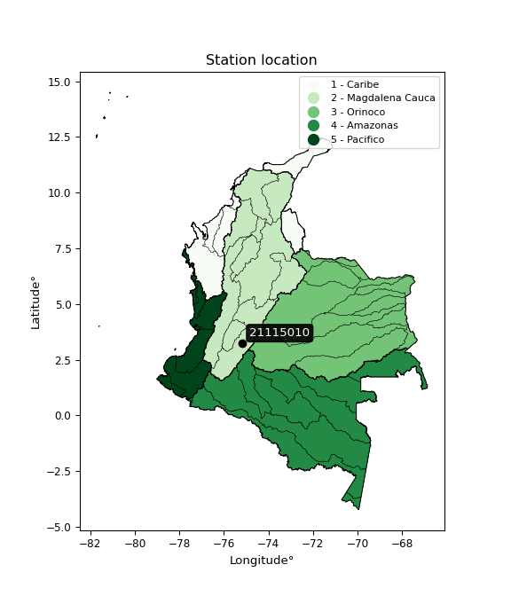

<div align="center">


</div>

# PMP Station (Rain, Pmax24h): 21115010

Probable Maximum Precipitation (PMP) is the greatest amount of rainfall for a specific duration that is meteorologically possible for a given location, acting as a "worst-case" scenario for extreme storms, crucial for designing safety-critical infrastructure like bridges, river deviations, dams, spillways, and nuclear plants to prevent catastrophic failure. PMP is calculated by hydrologists using meteorological data to determine the upper limit of extreme rainfall, often leading to the Probable Maximum Flood (PMF) for flood control design, and is increasingly being studied for climate change impacts. Probable Maximum Precipitation (PMP) is the theoretical upper limit of rainfall, a deterministic estimate for extreme events, while probability distributions (like GEV, Gumbel) describe the likelihood and frequency of various precipitation amounts, including rare ones, showing how often events occur, with PMP representing the extreme end of these distributions, used for critical infrastructure design to ensure safety against the worst conceivable weather, unlike standard statistical forecasts which cover typical probabilities.

The most common probability distributions in hydrology, used for analyzing floods, rainfall, and streamflow, include the Normal, Log-Normal, Gumbel, Gamma (including Log-Pearson Type III), and Generalized Extreme Value (GEV) distributions, often chosen based on the data´s skewness and whether modeling extremes or general conditions, with Gumbel and GEV popular for extreme events like floods, while the Normal distribution serves as a baseline, though often requiring transformations for skewed hydrological data. These distributions help in designing water infrastructure, managing water resources, and forecasting hydrologic events.

> Hydrological data often isn´t perfectly normal (it´s skewed), so different distributions are needed for different applications, such as: **Flood Frequency Analysis**: Using Gumbel, GEV, or Log-Pearson Type III for predicting extreme flood magnitudes and their return periods, **Rainfall Analysis**: Normal for annual totals, but Log-Normal, Weibull, or GEV for intensity or extreme daily rainfall, **Streamflow Modeling**: Gamma and Log-Normal for maximum flows, GEV for minimum flows, and Kappa for daily flows.

<div align="center">

</img>

</div>


## A. General information


### 1. General running parameters

• app_version: _v20260113_. • runtime: _2026-01-17 18:24:04.630693_. • Python version: _3.14.0_. • SciPy version: _1.16.3_. • Pandas version: _2.3.3_. • NumPy version: _2.3.5_. • Stations dataset (station_dataset_file): _dataset/pmax24h_in/automatic_colombia_2003_2025.csv_. • Stations catalog (station_catalog_file): _dataset/CNE.xls_. • Minimum year to eval til year_max (date_min): _1900_. • Maximum year to eval since year_min (date_max): _2025_. • Creates, save and include plots into reports (create_plot): _False_. • Plot only fit distributions with Δo > Δ (plot_only_fit): _True_. • Plot only simple graphs avoiding multiple CDFs and multiple Extreme values plots (plot_only_simple): _True_. • Eval low extreme values, if False, evaluates high extreme values (low_extreme): _False_. • Eval every SciPy distribution as logarithmic (pdist_logarithmic_on): _True_. • Standard deviation normalized (ddof): _1.0_. • Return periods to eval in years (Tr): _[2, 2.33, 5, 10, 15, 20, 25, 50, 75, 100, 200, 250, 500, 750, 1000]_. • Minimum data sample per station, 0 means any (minimum_sample): _5_. • Z-Score maximum threshold to adjust a value, 0 means disable (zscore_max): _3.5_. • Z-Score minimum threshold to adjust a value, 0 means disable (zscore_min): _-2.5_. • Avoid zeros, e.g. rain = 0 (avoid_zeros): _True_. • Avoid null values (avoid_nans): _True_. 

:file_folder:Table: [dataset.csv](../../dataset/pmax24h_in/automatic_colombia_2003_2025.csv)

> Delta Degrees of Freedom (DDOF): is a parameter used in the formulas for calculating variance and standard deviation. When ddof=0, the divisor is $N$ (the total number of observations) and this is used when your data set is the entire population. When ddof=1, the divisor is $N-1$ and this is used when your data set is a sample drawn from a larger population. Using $N-1$ provides an unbiased estimate of the population variance (known as Bessel´s correction).


### 2. Station info and location

|   id |   CODIGO | NOMBRE                         | CATEGORIA               | TECNOLOGIA                | ESTADO     | FECHA_INSTALACION   | FECHA_SUSPENSION   |   ALTITUD |   LATITUD |   LONGITUD | DEPARTAMENTO   | MUNICIPIO   | AREA_OPERATIVA                    | ENTIDAD                                                     | AREA_HIDROGRAFICA   | ZONA_HIDROGRAFICA   | SUBZONA_HIDROGRAFICA      |   CORRIENTE | Catalogo   |   Version |
|-----:|---------:|:-------------------------------|:------------------------|:--------------------------|:-----------|:--------------------|:-------------------|----------:|----------:|-----------:|:---------------|:------------|:----------------------------------|:------------------------------------------------------------|:--------------------|:--------------------|:--------------------------|------------:|:-----------|----------:|
|    0 | 21115010 | DESIERTO LA TATACOA [21115010] | Climatológica Principal | Automática con Telemetría | Suspendida | 14/07/2005          | 29/04/2019         |       459 |   3.23447 |   -75.1682 | Huila          | Villavieja  | Area Operativa 04 - Huila-Caquetá | INSTITUTO DE HIDROLOGIA METEOROLOGIA Y ESTUDIOS AMBIENTALES | Magdalena Cauca     | Alto Magdalena      | Rio Fortalecillas y otros |         nan | CNE_IDEAM  |  20251226 |

<div align="center">

Dynamic map: [:earth_americas:Google](http://maps.google.com/maps?q=3.234472222,-75.16819444) [:earth_americas:OSM](https://www.openstreetmap.org/#map=18/3.234472222/-75.16819444&layers=P) [:earth_americas:Bing](https://www.bing.com/maps?cp=3.234472222~-75.16819444&lvl=18) [:earth_americas:Apple](https://maps.apple.com/frame?center=3.234472222%2C-75.16819444&span=0.003%2C0.006)

</div>


<div align="center">

```geojson
{
  "type": "Feature",
  "geometry": {
    "type": "Point", 
    "coordinates": [-75.16819444, 3.234472222]
  }, 
  "properties": {
    "Name": "21115010"
  }
}
```

</div>


### 3. Discrete values table and plot

<div align="center">

|               |           0 |          1 |          2 |           3 |           4 |
|:--------------|------------:|-----------:|-----------:|------------:|------------:|
| Date          | 2005        | 2006       | 2007       | 2008        | 2009        |
| Value         |   85.7      |   54.9     |   53       |   87.3      |   82        |
| Value_initial |   85.7      |   54.9     |   53       |   87.3      |   82        |
| count         |    5        |    5       |    5       |    5        |    5        |
| mean          |   72.58     |   72.58    |   72.58    |   72.58     |   72.58     |
| std           |   17.1283   |   17.1283  |   17.1283  |   17.1283   |   17.1283   |
| zscore        |    0.765986 |   -1.03221 |   -1.14314 |    0.859399 |    0.549969 |


</div>


> The initial value (value_initial) correspond to the initial obtained or null completed value, and value (value) is adjusted only when the initial value is outside the valid range (outlier) definite through the Z-Score value. If Z-Score is active, values out of range or outliers are replaced with the station mean value. A Z-Score (or standard score) measures how many standard deviations a data point is from the mean of a dataset, indicating its relative position; positive scores mean above the mean, negative mean below, and a score of zero is exactly at the mean, allowing for comparison of values from different distributions. It´s calculated using the formula $z=(x–μ)/σ$, where $x$ is the data point, $μ$ is the mean, and $σ$ is the standard deviation, helping identify outliers and understand probability.
>
> <sub>**Note**: In this study, "completing" (filling gaps in) and "extending" (forecasting or lengthening the historical record) rainfall data series are avoided for certain critical analyses because they introduce artificial bias and uncertainty, which can distort the statistics of rare events (extremes), alter day-to-day variability, and compromise the integrity and homogeneity of the original data. Some reasons against Completing/Extending rainfall data are: **Distortion of Extremes and Variability**: The primary issue is that most gap-filling or extension methods rely on averaging or regression with nearby stations, which inherently smooths the data. Rainfall is highly variable in space and time, with a large percentage of zero values and occasional large storms. Infilling methods often underestimate the highest values and overestimate the lowest (zero) values, which severely distorts analyses focused on flood frequency, drought severity, and intensity-duration-frequency (IDF) curves, **Loss of Data Homogeneity**: Infilled or extended data are synthetic estimates, not actual measurements. Combining these estimates with observed data can violate the assumption of data homogeneity, which requires that the data properties do not change over time. Inhomogeneity can lead to incorrect conclusions about long-term trends or changes in climate patterns, **Propagation of Errors**: Errors and biases from the original data (e.g., wind-induced undercatch, instrument errors, site changes) or the data used for imputation can propagate through the analysis, leading to unreliable hydrological models and inaccurate predictions, **Compromised Statistical Integrity**: For statistical analyses, especially those involving the frequency of events, using artificial data can introduce time bias or autocorrelation that doesn´t exist in reality, making it difficult to assess the true probability of events, **Difficulty in Validation**: It is difficult to accurately validate the quality of filled or extended data, especially for past periods where ground-truth measurements are unavailable. The reliability of imputation techniques heavily depends on the density of the surrounding station network and the complexity of the local topography.</sub>


### 4. Active continuous probability distributions from SciPy (80 of 104 available)

A Probability Density Function (PDF) describes the relative likelihood of a continuous random variable falling within a specific range, where the total area under its curve equals 1, and the area over any interval gives the actual probability for that range. Unlike discrete probabilities (like rolling a die), a PDF shows density, not direct probability for a single point (which is zero), with higher points indicating higher likelihood, often visualized as a bell curve for normal distributions.

A log of a probability density function (log-PDF) is simply the logarithm of the PDF´s value, denoted as $log(f(x))$, useful for converting multiplication of probabilities into addition, improving numerical stability with tiny numbers, and connecting to information theory concepts like entropy. Instead of dealing with very small probabilities (e.g., 0.000001), log-PDFs use negative numbers (e.g., $log(0.00001) ≈ -11.51$ that are easier for computers to handle, preventing underflow errors and simplifying complex calculations. In this study, each active probability distribution from SciPy is also evaluated in the $log$ form.

[scipy.stats](https://docs.scipy.org/doc/scipy/reference/stats.html) is a Python´s powerful submodule within the SciPy library for comprehensive statistical analysis, offering over 130 probability distributions (like Normal, Poisson), functions for descriptive stats (mean, variance), hypothesis testing (t-tests, chi-square), random variable generation, and statistical tests, making it essential for data science, modeling, and research. It provides tools to explore, model, and draw conclusions from data efficiently, working seamlessly with NumPy.

<div align="center">

|   id | p_dist           |   n_parameter | fit_method   | label                                                                       | active   | ref                                                                                                      |
|-----:|:-----------------|--------------:|:-------------|:----------------------------------------------------------------------------|:---------|:---------------------------------------------------------------------------------------------------------|
|    0 | alpha            |             3 | MLE          | Alpha                                                                       | True     | [:mortar_board:](https://docs.scipy.org/doc/scipy/reference/generated/scipy.stats.alpha.html)            |
|    1 | anglit           |             2 | MM           | Anglit                                                                      | True     | [:mortar_board:](https://docs.scipy.org/doc/scipy/reference/generated/scipy.stats.anglit.html)           |
|    2 | arcsine          |             2 | MM           | Arcsine                                                                     | True     | [:mortar_board:](https://docs.scipy.org/doc/scipy/reference/generated/scipy.stats.arcsine.html)          |
|    3 | argus            |             3 | MLE          | Argus                                                                       | True     | [:mortar_board:](https://docs.scipy.org/doc/scipy/reference/generated/scipy.stats.argus.html)            |
|    4 | beta             |             4 | MLE          | Beta                                                                        | True     | [:mortar_board:](https://docs.scipy.org/doc/scipy/reference/generated/scipy.stats.beta.html)             |
|    5 | betaprime        |             4 | MLE          | Beta prime                                                                  | True     | [:mortar_board:](https://docs.scipy.org/doc/scipy/reference/generated/scipy.stats.betaprime.html)        |
|    6 | bradford         |             3 | MLE          | Bradford                                                                    | True     | [:mortar_board:](https://docs.scipy.org/doc/scipy/reference/generated/scipy.stats.bradford.html)         |
|    7 | burr             |             4 | MLE          | Burr (Type III)                                                             | True     | [:mortar_board:](https://docs.scipy.org/doc/scipy/reference/generated/scipy.stats.burr.html)             |
|    8 | burr12           |             4 | MLE          | Burr (Type III) 12                                                          | True     | [:mortar_board:](https://docs.scipy.org/doc/scipy/reference/generated/scipy.stats.burr12.html)           |
|    9 | cosine           |             2 | MLE          | Cosine                                                                      | True     | [:mortar_board:](https://docs.scipy.org/doc/scipy/reference/generated/scipy.stats.cosine.html)           |
|   10 | crystalball      |             4 | MLE          | Crystalball                                                                 | True     | [:mortar_board:](https://docs.scipy.org/doc/scipy/reference/generated/scipy.stats.crystalball.html)      |
|   11 | dgamma           |             3 | MLE          | Double gamma                                                                | True     | [:mortar_board:](https://docs.scipy.org/doc/scipy/reference/generated/scipy.stats.dgamma.html)           |
|   12 | dweibull         |             3 | MLE          | Double Weibull                                                              | True     | [:mortar_board:](https://docs.scipy.org/doc/scipy/reference/generated/scipy.stats.dweibull.html)         |
|   13 | erlang           |             3 | MLE          | Erlang                                                                      | True     | [:mortar_board:](https://docs.scipy.org/doc/scipy/reference/generated/scipy.stats.erlang.html)           |
|   14 | exponnorm        |             3 | MLE          | Exponentially modified Normal                                               | True     | [:mortar_board:](https://docs.scipy.org/doc/scipy/reference/generated/scipy.stats.exponnorm.html)        |
|   15 | exponpow         |             3 | MLE          | Exponential power                                                           | True     | [:mortar_board:](https://docs.scipy.org/doc/scipy/reference/generated/scipy.stats.exponpow.html)         |
|   16 | exponweib        |             4 | MLE          | Exponentiated Weibull                                                       | True     | [:mortar_board:](https://docs.scipy.org/doc/scipy/reference/generated/scipy.stats.exponweib.html)        |
|   17 | f                |             4 | MLE          | F                                                                           | True     | [:mortar_board:](https://docs.scipy.org/doc/scipy/reference/generated/scipy.stats.f.html)                |
|   18 | fatiguelife      |             3 | MLE          | Fatigue-life (Birnbaum-Saunders)                                            | True     | [:mortar_board:](https://docs.scipy.org/doc/scipy/reference/generated/scipy.stats.fatiguelife.html)      |
|   19 | foldnorm         |             3 | MM           | Fold Normal                                                                 | True     | [:mortar_board:](https://docs.scipy.org/doc/scipy/reference/generated/scipy.stats.foldnorm.html)         |
|   20 | gamma            |             3 | MLE          | Gamma                                                                       | True     | [:mortar_board:](https://docs.scipy.org/doc/scipy/reference/generated/scipy.stats.gamma.html)            |
|   21 | gausshyper       |             6 | MLE          | Gauss hypergeometric                                                        | True     | [:mortar_board:](https://docs.scipy.org/doc/scipy/reference/generated/scipy.stats.gausshyper.html)       |
|   22 | genexpon         |             5 | MLE          | Generalized exponential                                                     | True     | [:mortar_board:](https://docs.scipy.org/doc/scipy/reference/generated/scipy.stats.genexpon.html)         |
|   23 | genextreme       |             3 | MLE          | Generalized exponential                                                     | True     | [:mortar_board:](https://docs.scipy.org/doc/scipy/reference/generated/scipy.stats.genextreme.html)       |
|   24 | gengamma         |             4 | MLE          | Generalized gamma                                                           | True     | [:mortar_board:](https://docs.scipy.org/doc/scipy/reference/generated/scipy.stats.gengamma.html)         |
|   25 | genhalflogistic  |             3 | MLE          | Generalized half-logistic                                                   | True     | [:mortar_board:](https://docs.scipy.org/doc/scipy/reference/generated/scipy.stats.genhalflogistic.html)  |
|   26 | genlogistic      |             3 | MLE          | Generalized logistic                                                        | True     | [:mortar_board:](https://docs.scipy.org/doc/scipy/reference/generated/scipy.stats.genlogistic.html)      |
|   27 | gennorm          |             3 | MLE          | Generalized Normal                                                          | True     | [:mortar_board:](https://docs.scipy.org/doc/scipy/reference/generated/scipy.stats.gennorm.html)          |
|   28 | genpareto        |             3 | MLE          | Generalized Pareto                                                          | True     | [:mortar_board:](https://docs.scipy.org/doc/scipy/reference/generated/scipy.stats.genpareto.html)        |
|   29 | gompertz         |             3 | MLE          | Gompertz (or truncated Gumbel)                                              | True     | [:mortar_board:](https://docs.scipy.org/doc/scipy/reference/generated/scipy.stats.gompertz.html)         |
|   30 | gumbel_l         |             2 | MM           | Gumbel Left Skew                                                            | True     | [:mortar_board:](https://docs.scipy.org/doc/scipy/reference/generated/scipy.stats.gumbel_l.html)         |
|   31 | gumbel_r         |             2 | MM           | Gumbel Right Skew                                                           | True     | [:mortar_board:](https://docs.scipy.org/doc/scipy/reference/generated/scipy.stats.gumbel_r.html)         |
|   32 | halfgennorm      |             3 | MLE          | Upper half of a generalized normal                                          | True     | [:mortar_board:](https://docs.scipy.org/doc/scipy/reference/generated/scipy.stats.halfgennorm.html)      |
|   33 | halflogistic     |             2 | MM           | Half-logistic                                                               | True     | [:mortar_board:](https://docs.scipy.org/doc/scipy/reference/generated/scipy.stats.halflogistic.html)     |
|   34 | halfnorm         |             2 | MM           | Half Normal                                                                 | True     | [:mortar_board:](https://docs.scipy.org/doc/scipy/reference/generated/scipy.stats.halfnorm.html)         |
|   35 | hypsecant        |             2 | MM           | hyperbolic secant                                                           | True     | [:mortar_board:](https://docs.scipy.org/doc/scipy/reference/generated/scipy.stats.hypsecant.html)        |
|   36 | invgamma         |             3 | MLE          | Inverted gamma                                                              | True     | [:mortar_board:](https://docs.scipy.org/doc/scipy/reference/generated/scipy.stats.invgamma.html)         |
|   37 | invgauss         |             3 | MLE          | Inverse Gaussian                                                            | True     | [:mortar_board:](https://docs.scipy.org/doc/scipy/reference/generated/scipy.stats.invgauss.html)         |
|   38 | invweibull       |             3 | MLE          | Inverted Weibull                                                            | True     | [:mortar_board:](https://docs.scipy.org/doc/scipy/reference/generated/scipy.stats.invweibull.html)       |
|   39 | johnsonsb        |             4 | MLE          | Johnson SB                                                                  | True     | [:mortar_board:](https://docs.scipy.org/doc/scipy/reference/generated/scipy.stats.johnsonsb.html)        |
|   40 | johnsonsu        |             4 | MLE          | Johnson Su                                                                  | True     | [:mortar_board:](https://docs.scipy.org/doc/scipy/reference/generated/scipy.stats.johnsonsu.html)        |
|   41 | kappa3           |             3 | MLE          | Kappa 3                                                                     | True     | [:mortar_board:](https://docs.scipy.org/doc/scipy/reference/generated/scipy.stats.kappa3.html)           |
|   42 | kappa4           |             4 | MLE          | Kappa 4                                                                     | True     | [:mortar_board:](https://docs.scipy.org/doc/scipy/reference/generated/scipy.stats.kappa4.html)           |
|   43 | ksone            |             3 | MLE          | Kolmogorov-Smirnov one-sided test statistic distribution                    | True     | [:mortar_board:](https://docs.scipy.org/doc/scipy/reference/generated/scipy.stats.ksone.html)            |
|   44 | kstwobign        |             2 | MLE          | Limiting distribution of scaled Kolmogorov-Smirnov two-sided test statistic | True     | [:mortar_board:](https://docs.scipy.org/doc/scipy/reference/generated/scipy.stats.kstwobign.html)        |
|   45 | laplace          |             2 | MM           | Laplace                                                                     | True     | [:mortar_board:](https://docs.scipy.org/doc/scipy/reference/generated/scipy.stats.laplace.html)          |
|   46 | levy_l           |             2 | MLE          | Left-skewed Levy                                                            | True     | [:mortar_board:](https://docs.scipy.org/doc/scipy/reference/generated/scipy.stats.levy_l.html)           |
|   47 | loggamma         |             3 | MLE          | Log gamma                                                                   | True     | [:mortar_board:](https://docs.scipy.org/doc/scipy/reference/generated/scipy.stats.loggamma.html)         |
|   48 | logistic         |             2 | MM           | Logistic (or Sech-squared)                                                  | True     | [:mortar_board:](https://docs.scipy.org/doc/scipy/reference/generated/scipy.stats.logistic.html)         |
|   49 | loglaplace       |             3 | MLE          | Log-Laplace                                                                 | True     | [:mortar_board:](https://docs.scipy.org/doc/scipy/reference/generated/scipy.stats.loglaplace.html)       |
|   50 | lomax            |             3 | MLE          | Lomax (Pareto of the second kind)                                           | True     | [:mortar_board:](https://docs.scipy.org/doc/scipy/reference/generated/scipy.stats.lomax.html)            |
|   51 | maxwell          |             2 | MM           | Maxwell                                                                     | True     | [:mortar_board:](https://docs.scipy.org/doc/scipy/reference/generated/scipy.stats.maxwell.html)          |
|   52 | mielke           |             4 | MLE          | Mielke Beta-Kappa / Dagum                                                   | True     | [:mortar_board:](https://docs.scipy.org/doc/scipy/reference/generated/scipy.stats.mielke.html)           |
|   53 | moyal            |             2 | MM           | Moyal                                                                       | True     | [:mortar_board:](https://docs.scipy.org/doc/scipy/reference/generated/scipy.stats.moyal.html)            |
|   54 | nakagami         |             3 | MLE          | Nakagami                                                                    | True     | [:mortar_board:](https://docs.scipy.org/doc/scipy/reference/generated/scipy.stats.nakagami.html)         |
|   55 | ncf              |             5 | MLE          | Non-central F distribution                                                  | True     | [:mortar_board:](https://docs.scipy.org/doc/scipy/reference/generated/scipy.stats.ncf.html)              |
|   56 | nct              |             4 | MLE          | Non-central Student’s t                                                     | True     | [:mortar_board:](https://docs.scipy.org/doc/scipy/reference/generated/scipy.stats.nct.html)              |
|   57 | norm             |             2 | MM           | Normal                                                                      | True     | [:mortar_board:](https://docs.scipy.org/doc/scipy/reference/generated/scipy.stats.norm.html)             |
|   58 | pearson3         |             3 | MM           | Pearson type III                                                            | True     | [:mortar_board:](https://docs.scipy.org/doc/scipy/reference/generated/scipy.stats.pearson3.html)         |
|   59 | powerlaw         |             3 | MLE          | Power-function                                                              | True     | [:mortar_board:](https://docs.scipy.org/doc/scipy/reference/generated/scipy.stats.powerlaw.html)         |
|   60 | rayleigh         |             2 | MM           | Rayleigh                                                                    | True     | [:mortar_board:](https://docs.scipy.org/doc/scipy/reference/generated/scipy.stats.rayleigh.html)         |
|   61 | rdist            |             3 | MLE          | R-distributed (symmetric beta)                                              | True     | [:mortar_board:](https://docs.scipy.org/doc/scipy/reference/generated/scipy.stats.rdist.html)            |
|   62 | rice             |             3 | MLE          | Rice                                                                        | True     | [:mortar_board:](https://docs.scipy.org/doc/scipy/reference/generated/scipy.stats.rice.html)             |
|   63 | semicircular     |             2 | MM           | Semicircular                                                                | True     | [:mortar_board:](https://docs.scipy.org/doc/scipy/reference/generated/scipy.stats.semicircular.html)     |
|   64 | skewnorm         |             3 | MLE          | Skew normal                                                                 | True     | [:mortar_board:](https://docs.scipy.org/doc/scipy/reference/generated/scipy.stats.skewnorm.html)         |
|   65 | t                |             3 | MLE          | Student’s t                                                                 | True     | [:mortar_board:](https://docs.scipy.org/doc/scipy/reference/generated/scipy.stats.t.html)                |
|   66 | trapezoid        |             4 | MLE          | Trapezoid                                                                   | True     | [:mortar_board:](https://docs.scipy.org/doc/scipy/reference/generated/scipy.stats.trapezoid.html)        |
|   67 | triang           |             3 | MLE          | Triangular                                                                  | True     | [:mortar_board:](https://docs.scipy.org/doc/scipy/reference/generated/scipy.stats.triang.html)           |
|   68 | truncexpon       |             3 | MLE          | Truncated exponential                                                       | True     | [:mortar_board:](https://docs.scipy.org/doc/scipy/reference/generated/scipy.stats.truncexpon.html)       |
|   69 | truncnorm        |             4 | MLE          | Truncated normal                                                            | True     | [:mortar_board:](https://docs.scipy.org/doc/scipy/reference/generated/scipy.stats.truncnorm.html)        |
|   70 | truncpareto      |             4 | MLE          | Upper truncated Pareto                                                      | True     | [:mortar_board:](https://docs.scipy.org/doc/scipy/reference/generated/scipy.stats.truncpareto.html)      |
|   71 | truncweibull_min |             5 | MLE          | Doubly truncated Weibull minimum                                            | True     | [:mortar_board:](https://docs.scipy.org/doc/scipy/reference/generated/scipy.stats.truncweibull_min.html) |
|   72 | tukeylambda      |             3 | MLE          | Tukey-Lamdba                                                                | True     | [:mortar_board:](https://docs.scipy.org/doc/scipy/reference/generated/scipy.stats.tukeylambda.html)      |
|   73 | uniform          |             2 | MLE          | Uniform                                                                     | True     | [:mortar_board:](https://docs.scipy.org/doc/scipy/reference/generated/scipy.stats.uniform.html)          |
|   74 | vonmises         |             3 | MLE          | Von Mises                                                                   | True     | [:mortar_board:](https://docs.scipy.org/doc/scipy/reference/generated/scipy.stats.vonmises.html)         |
|   75 | vonmises_line    |             3 | MLE          | Von Mises line                                                              | True     | [:mortar_board:](https://docs.scipy.org/doc/scipy/reference/generated/scipy.stats.vonmises_line.html)    |
|   76 | wald             |             2 | MM           | Wald                                                                        | True     | [:mortar_board:](https://docs.scipy.org/doc/scipy/reference/generated/scipy.stats.wald.html)             |
|   77 | weibull_max      |             3 | MLE          | Weibull maximum                                                             | True     | [:mortar_board:](https://docs.scipy.org/doc/scipy/reference/generated/scipy.stats.weibull_max.html)      |
|   78 | weibull_min      |             3 | MLE          | Weibull minimum                                                             | True     | [:mortar_board:](https://docs.scipy.org/doc/scipy/reference/generated/scipy.stats.weibull_min.html)      |
|   79 | wrapcauchy       |             3 | MLE          | Wrapped  Cauchy                                                             | True     | [:mortar_board:](https://docs.scipy.org/doc/scipy/reference/generated/scipy.stats.wrapcauchy.html)       |

</div>

> **n_parameter:** # arguments & localization & scale.
>
> **Fit methods:** (MLE) maximum likelihood, (MM) L-moments.
>
>**Inactive** (With the only purpose of prevent loops, zero divisions, infinite values, over high estimated values or horizontal trending for recurrence intervals estimations, the follow distributions were disabled.)**:** lognorm, norminvgauss, powernorm, powerlognorm, cauchy, halfcauchy, foldcauchy, skewcauchy, chi2, expon, fisk, genhyperbolic, geninvgauss, gibrat, kstwo, laplace_asymmetric, levy, levy_stable, ncx2, pareto, rel_breitwigner, recipinvgauss, studentized_range, loguniform, 


## B. Probability (PDF) vs. Empirical (EDF) distributions functions

A continuous probability distribution (CPD) describes probabilities for variables that can take any value within a range (like rain any time), unlike discrete variables with specific outcomes (like temperature). It uses a Probability Density Function (PDF), a curve where the total area under it equals 1, and the probability of the variable falling within an interval (a to b) is found by calculating the area under the curve between those points. A key feature is that the probability of hitting any single exact value is zero, so probabilities are always expressed for ranges, e.g., $P(a ≤ X ≤ b)$.

<div align="center">

Distributions parameters from station values
|     |   station | p_dist              |   n |              loc |            scale | shape                  | shape1                | shape2             | shape3             |
|----:|----------:|:--------------------|----:|-----------------:|-----------------:|:-----------------------|:----------------------|:-------------------|:-------------------|
|   0 |  21115010 | alpha               |   5 |   -146.261       |   3016.38        | 13.870224079758266     |                       |                    |                    |
|   1 |  21115010 | anglit              |   5 |     72.58        |     44.817       |                        |                       |                    |                    |
|   2 |  21115010 | arcsine             |   5 |     50.9143      |     43.3314      |                        |                       |                    |                    |
|   3 |  21115010 | argus               |   5 |     34.6834      |     54.6796      | 2.1146961273679397     |                       |                    |                    |
|   4 |  21115010 | beta                |   5 |     51.848       |     35.452       | 0.04980969674477503    | 0.03564267222009619   |                    |                    |
|   5 |  21115010 | betaprime           |   5 |     -0.471439    |     24.1406      | 78.81818184968645      | 27.018890398166874    |                    |                    |
|   6 |  21115010 | bradford            |   5 |     53           |     34.3         | 1.2498428176119547     |                       |                    |                    |
|   7 |  21115010 | burr                |   5 |     -5.35369     |     15.0362      | 5.220379277813159      | 2737.541398040368     |                    |                    |
|   8 |  21115010 | burr12              |   5 |     -6.49594     |     59.3273      | 1549.568477658563      | 0.0024153778487795625 |                    |                    |
|   9 |  21115010 | cosine              |   5 |     71.8305      |     11.873       |                        |                       |                    |                    |
|  10 |  21115010 | crystalball         |   5 |     72.58        |     15.32        | 4125.273344689764      | 8514.479083202135     |                    |                    |
|  11 |  21115010 | dgamma              |   5 |     82           |     12.908       | 0.7877759935293254     |                       |                    |                    |
|  12 |  21115010 | dweibull            |   5 |     82           |     13.3014      | 0.9546412408160095     |                       |                    |                    |
|  13 |  21115010 | erlang              |   5 |   -159.722       |      1.02827     | 225.80837882770726     |                       |                    |                    |
|  14 |  21115010 | exponnorm           |   5 |     72.5664      |     15.32        | 0.0008994334641508764  |                       |                    |                    |
|  15 |  21115010 | exponpow            |   5 |     53           |     35.905       | 0.20560242220017882    |                       |                    |                    |
|  16 |  21115010 | exponweib           |   5 |     53           |      1.33641     | 1.1241518583153876     | 0.262200128834425     |                    |                    |
|  17 |  21115010 | f                   |   5 |  -2927.55        |   3000.04        | 92544.16764682444      | 432613.192995626      |                    |                    |
|  18 |  21115010 | fatiguelife         |   5 |     53           |      1.05704e-06 | 3991.759001940228      |                       |                    |                    |
|  19 |  21115010 | foldnorm            |   5 |      9.16269     |     15.0351      | 4.220473052333933      |                       |                    |                    |
|  20 |  21115010 | gamma               |   5 |   -156.019       |      1.05192     | 217.36527047997572     |                       |                    |                    |
|  21 |  21115010 | gausshyper          |   5 |     52.9267      |     34.3733      | 1.0402530551115086     | 0.9258115518989704    | 0.9840737681633753 | 1.3080429465549552 |
|  22 |  21115010 | genexpon            |   5 |     53           |      2.1883      | 0.1115958384227367     | 2.079080985622991e-07 | 1.131119024806416  |                    |
|  23 |  21115010 | genextreme          |   5 |     77.7791      |     11.6575      | 1.2244043507328017     |                       |                    |                    |
|  24 |  21115010 | gengamma            |   5 |     53           |      1.33641     | 1.1241518583153876     | 0.262200128834425     |                    |                    |
|  25 |  21115010 | genhalflogistic     |   5 |     44.1125      |     55.0337      | 1.274298140681807      |                       |                    |                    |
|  26 |  21115010 | genlogistic         |   5 |     87.3002      |      1.09048e-05 | 7.422040387026108e-07  |                       |                    |                    |
|  27 |  21115010 | gennorm             |   5 |     82           |     11.744       | 0.920741495980266      |                       |                    |                    |
|  28 |  21115010 | genpareto           |   5 |     -1.42989     |    225.955       | -2.546543690139978     |                       |                    |                    |
|  29 |  21115010 | gompertz            |   5 |     53           |     35.1363      | 1.1040595724672193     |                       |                    |                    |
|  30 |  21115010 | gumbel_l            |   5 |     79.4748      |     11.9449      |                        |                       |                    |                    |
|  31 |  21115010 | gumbel_r            |   5 |     65.6852      |     11.9449      |                        |                       |                    |                    |
|  32 |  21115010 | halfgennorm         |   5 |     53           |      1.47512     | 0.40807053799687576    |                       |                    |                    |
|  33 |  21115010 | halflogistic        |   5 |     54.4223      |     13.098       |                        |                       |                    |                    |
|  34 |  21115010 | halfnorm            |   5 |     52.3024      |     25.4143      |                        |                       |                    |                    |
|  35 |  21115010 | hypsecant           |   5 |     72.58        |      9.753       |                        |                       |                    |                    |
|  36 |  21115010 | invgamma            |   5 |   -102.223       |  21159.1         | 122.19882043786058     |                       |                    |                    |
|  37 |  21115010 | invgauss            |   5 |     51.2252      |      7.23941     | 2.949803052893623      |                       |                    |                    |
|  38 |  21115010 | invweibull          |   5 |     53           |      2.38511     | 0.049820414556797914   |                       |                    |                    |
|  39 |  21115010 | johnsonsb           |   5 |     53           |    100.893       | 0.5536038945792728     | 0.12000675550132273   |                    |                    |
|  40 |  21115010 | johnsonsu           |   5 |     87.3         |      1.54023e-14 | 3.4044362565434128     | 0.13472476710117792   |                    |                    |
|  41 |  21115010 | kappa3              |   5 |     52.9298      |     32.1234      | 41.504809315505995     |                       |                    |                    |
|  42 |  21115010 | kappa4              |   5 |     47.6289      |     43.3713      | 1.135196530641918      | 1.0932728540296244    |                    |                    |
|  43 |  21115010 | ksone               |   5 |     46.045       |     53.0699      | 1.0                    |                       |                    |                    |
|  44 |  21115010 | kstwobign           |   5 |     17.2722      |     62.7484      |                        |                       |                    |                    |
|  45 |  21115010 | laplace             |   5 |     72.58        |     10.8329      |                        |                       |                    |                    |
|  46 |  21115010 | levy_l              |   5 |     87.7529      |      1.70757     |                        |                       |                    |                    |
|  47 |  21115010 | loggamma            |   5 |     87.3002      |      1.06437e-05 | 7.25110607639629e-07   |                       |                    |                    |
|  48 |  21115010 | logistic            |   5 |     72.58        |      8.44634     |                        |                       |                    |                    |
|  49 |  21115010 | loglaplace          |   5 |     -0.196343    |     82.1963      | 5.3094944049423525     |                       |                    |                    |
|  50 |  21115010 | lomax               |   5 |     53           | 371244           | 18841.082366633214     |                       |                    |                    |
|  51 |  21115010 | maxwell             |   5 |     36.2781      |     22.7488      |                        |                       |                    |                    |
|  52 |  21115010 | mielke              |   5 |      1.48453     |     23.6328      | 434.4030977204591      | 4.716801032670787     |                    |                    |
|  53 |  21115010 | moyal               |   5 |     63.8191      |      6.89641     |                        |                       |                    |                    |
|  54 |  21115010 | nakagami            |   5 |     53           |     26.4631      | 0.41502342132843534    |                       |                    |                    |
|  55 |  21115010 | ncf                 |   5 |   -378.49        |    329.995       | 1660.1604549992007     | 49046.8394526325      | 609.8013219206225  |                    |
|  56 |  21115010 | nct                 |   5 |   -964.666       |     15.2668      | 269548.07776793005     | 67.94118695232208     |                    |                    |
|  57 |  21115010 | norm                |   5 |     72.58        |     15.32        |                        |                       |                    |                    |
|  58 |  21115010 | pearson3            |   5 |     72.58        |     15.3199      | -0.375408872507001     |                       |                    |                    |
|  59 |  21115010 | powerlaw            |   5 |     53           |     34.3         | 0.12747955995565147    |                       |                    |                    |
|  60 |  21115010 | rayleigh            |   5 |     43.272       |     23.3844      |                        |                       |                    |                    |
|  61 |  21115010 | rdist               |   5 |     70.1455      |     17.1545      | 1.2686938326015418     |                       |                    |                    |
|  62 |  21115010 | rice                |   5 |     42.8328      |     18.0438      | 1.199501420276489      |                       |                    |                    |
|  63 |  21115010 | semicircular        |   5 |     72.58        |     30.6399      |                        |                       |                    |                    |
|  64 |  21115010 | skewnorm            |   5 |     87.3         |     21.2459      | -145791915.27169776    |                       |                    |                    |
|  65 |  21115010 | t                   |   5 |     72.5807      |     15.3198      | 9669.424019744805      |                       |                    |                    |
|  66 |  21115010 | trapezoid           |   5 |     29.2486      |     64.9971      | 0.9999999999999999     | 1.0                   |                    |                    |
|  67 |  21115010 | triang              |   5 |     40.198       |     47.1024      | 0.9999909249945362     |                       |                    |                    |
|  68 |  21115010 | truncexpon          |   5 |     53           |     46.7294      | 0.7340129800759729     |                       |                    |                    |
|  69 |  21115010 | truncnorm           |   5 |    -25.3615      |      5.52085     | 19.435201981599953     | 1984.2227522651992    |                    |                    |
|  70 |  21115010 | truncpareto         |   5 |     52.7822      |      0.217781    | 0.0013994995945097906  | 161.99101447616144    |                    |                    |
|  71 |  21115010 | truncweibull_min    |   5 |     52.9064      |     32.0038      | 0.49590252448489464    | 0.0029242939622358055 | 1.074672614544214  |                    |
|  72 |  21115010 | tukeylambda         |   5 |     70.1577      |     21.2788      | 1.240193007916437      |                       |                    |                    |
|  73 |  21115010 | uniform             |   5 |     53           |     34.3         |                        |                       |                    |                    |
|  74 |  21115010 | vonmises            |   5 |     -1.51033     |      1           | 0.7122257887527208     |                       |                    |                    |
|  75 |  21115010 | vonmises_line       |   5 |     70.1499      |      5.45905     | 0.011921583135613024   |                       |                    |                    |
|  76 |  21115010 | wald                |   5 |     57.26        |     15.32        |                        |                       |                    |                    |
|  77 |  21115010 | weibull_max         |   5 |     87.3         |     19.261       | 0.5565313012357591     |                       |                    |                    |
|  78 |  21115010 | weibull_min         |   5 |     -9.51519e+08 |      9.51519e+08 | 83216597.14251742      |                       |                    |                    |
|  79 |  21115010 | wrapcauchy          |   5 |     52.991       |      5.46045     | 0.8297562153235085     |                       |                    |                    |
|  80 |  21115010 | logalpha            |   5 |     -3.97307     |    297.688       | 36.18476830112306      |                       |                    |                    |
|  81 |  21115010 | loganglit           |   5 |      4.26055     |      0.654756    |                        |                       |                    |                    |
|  82 |  21115010 | logarcsine          |   5 |      3.94402     |      0.633052    |                        |                       |                    |                    |
|  83 |  21115010 | logargus            |   5 |      3.70278     |      0.797156    | 2.1797232382001135     |                       |                    |                    |
|  84 |  21115010 | logbeta             |   5 |      3.89898     |      0.570372    | 0.03894057785747266    | 0.02639071596579376   |                    |                    |
|  85 |  21115010 | logbetaprime        |   5 |      2.21733     |      7.14094     | 100.52914293252923     | 352.0774520249902     |                    |                    |
|  86 |  21115010 | logbradford         |   5 |      3.97029     |      0.499069    | 1.2068837492790787     |                       |                    |                    |
|  87 |  21115010 | logburr             |   5 |    -13.1636      |     15.7908      | 83.34205840836393      | 2092.3582005819644    |                    |                    |
|  88 |  21115010 | logburr12           |   5 |    -56.1978      |     62.2129      | 362.8819439016553      | 17067.608167447033    |                    |                    |
|  89 |  21115010 | logcosine           |   5 |      4.24904     |      0.173415    |                        |                       |                    |                    |
|  90 |  21115010 | logcrystalball      |   5 |      4.26055     |      0.223817    | 212.4488104646286      | 453.94774838137994    |                    |                    |
|  91 |  21115010 | logdgamma           |   5 |      4.40672     |      0.190012    | 0.581431362408021      |                       |                    |                    |
|  92 |  21115010 | logdweibull         |   5 |      4.40672     |      0.12828     | 0.6704150248662919     |                       |                    |                    |
|  93 |  21115010 | logerlang           |   5 |      1.04541     |      0.0160392   | 200.3179564169655      |                       |                    |                    |
|  94 |  21115010 | logexponnorm        |   5 |      4.26035     |      0.223817    | 0.0008572894929497472  |                       |                    |                    |
|  95 |  21115010 | logexponpow         |   5 |      3.97029     |      0.348616    | 0.6642439321308127     |                       |                    |                    |
|  96 |  21115010 | logexponweib        |   5 |      3.97029     |      1.19129     | 0.159771749659199      | 1.3312599794485358    |                    |                    |
|  97 |  21115010 | logf                |   5 |   -152.28        |    156.54        | 4132395.248161733      | 1282267.09466969      |                    |                    |
|  98 |  21115010 | logfatiguelife      |   5 |      3.97029     |      1.13723e-07 | 1718.3928443479958     |                       |                    |                    |
|  99 |  21115010 | logfoldnorm         |   5 |      3.84247     |      0.236151    | 1.7373016365129328     |                       |                    |                    |
| 100 |  21115010 | loggamma            |   5 |      1.03384     |      0.0158309   | 203.7688723536579      |                       |                    |                    |
| 101 |  21115010 | loggausshyper       |   5 |      3.97029     |      0.538972    | 0.9527651380182336     | 1.0480562669443863    | 0.9073591724510027 | 1.088577808300123  |
| 102 |  21115010 | loggenexpon         |   5 |      3.97029     |      0.561225    | 1.6899022247414157     | 1.1895932261846283    | 0.5676330188597318 |                    |
| 103 |  21115010 | loggenextreme       |   5 |      4.31465     |      0.196876    | 1.2726091882384238     |                       |                    |                    |
| 104 |  21115010 | loggengamma         |   5 |      3.97029     |      0.883751    | 0.3418208455769628     | 1.2594086909061648    |                    |                    |
| 105 |  21115010 | loggenhalflogistic  |   5 |      3.95986     |      0.581485    | 1.1413172592109269     |                       |                    |                    |
| 106 |  21115010 | loggenlogistic      |   5 |      4.46937     |      1.52818e-06 | 7.3581009936137436e-06 |                       |                    |                    |
| 107 |  21115010 | loggennorm          |   5 |      4.40672     |      0.168641    | 0.8951029922149031     |                       |                    |                    |
| 108 |  21115010 | loggenpareto        |   5 |     -0.0145488   |     16.1764      | -3.607674009277626     |                       |                    |                    |
| 109 |  21115010 | loggompertz         |   5 |      3.97029     |      0.515784    | 1.1069150698853143     |                       |                    |                    |
| 110 |  21115010 | loggumbel_l         |   5 |      4.36128     |      0.17451     |                        |                       |                    |                    |
| 111 |  21115010 | loggumbel_r         |   5 |      4.15982     |      0.17451     |                        |                       |                    |                    |
| 112 |  21115010 | loghalfgennorm      |   5 |      3.97029     |      0.502582    | 684.2013037933611      |                       |                    |                    |
| 113 |  21115010 | loghalflogistic     |   5 |      3.99523     |      0.191385    |                        |                       |                    |                    |
| 114 |  21115010 | loghalfnorm         |   5 |      3.9643      |      0.37129     |                        |                       |                    |                    |
| 115 |  21115010 | loghypsecant        |   5 |      4.26055     |      0.142487    |                        |                       |                    |                    |
| 116 |  21115010 | loginvgamma         |   5 |      1.89093     |    250.787       | 106.81167304388896     |                       |                    |                    |
| 117 |  21115010 | loginvgauss         |   5 |      3.93168     |      0.165966    | 1.9815524180143902     |                       |                    |                    |
| 118 |  21115010 | loginvweibull       |   5 |     -9.71136e+06 |      9.71137e+06 | 46614188.64090356      |                       |                    |                    |
| 119 |  21115010 | logjohnsonsb        |   5 |      3.97029     |      1.00568     | 1.128903347124342      | 0.08341035127566555   |                    |                    |
| 120 |  21115010 | logjohnsonsu        |   5 |      4.46935     |      7.59185e-16 | 2.7728339746820763     | 0.12350721047799414   |                    |                    |
| 121 |  21115010 | logkappa3           |   5 |      3.97029     |      0.498732    | 2469.331935325631      |                       |                    |                    |
| 122 |  21115010 | logkappa4           |   5 |      3.8997      |      0.596721    | 1.1345933549842442     | 1.044512455270138     |                    |                    |
| 123 |  21115010 | logksone            |   5 |      3.87288     |      0.775327    | 1.0                    |                       |                    |                    |
| 124 |  21115010 | logkstwobign        |   5 |      3.44985     |      0.919707    |                        |                       |                    |                    |
| 125 |  21115010 | loglaplace          |   5 |      4.26055     |      0.158263    |                        |                       |                    |                    |
| 126 |  21115010 | loglevy_l           |   5 |      4.47475     |      0.0203651   |                        |                       |                    |                    |
| 127 |  21115010 | logloggamma         |   5 |      4.46958     |      2.0612e-06  | 9.917967924841528e-06  |                       |                    |                    |
| 128 |  21115010 | loglogistic         |   5 |      4.26055     |      0.123397    |                        |                       |                    |                    |
| 129 |  21115010 | logloglaplace       |   5 |     -0.0273221   |      4.43404     | 22.4641900657693       |                       |                    |                    |
| 130 |  21115010 | loglomax            |   5 |      3.97029     |      5.16151e+11 | 161105044606.4633      |                       |                    |                    |
| 131 |  21115010 | logmaxwell          |   5 |      3.73019     |      0.33235     |                        |                       |                    |                    |
| 132 |  21115010 | logmielke           |   5 |     -1.57436e+07 |      1.57436e+07 | 73920228.43772455      | 15025631689.338612    |                    |                    |
| 133 |  21115010 | logmoyal            |   5 |      4.13255     |      0.100753    |                        |                       |                    |                    |
| 134 |  21115010 | lognakagami         |   5 |      3.97029     |      0.556629    | 0.24645828046187257    |                       |                    |                    |
| 135 |  21115010 | logncf              |   5 |    -27.5         |     15.5767      | 81800.51138391357      | 61425.457589602825    | 84977.94071093865  |                    |
| 136 |  21115010 | lognct              |   5 |     30.7261      |      0.223717    | 7097402.39073343       | -118.2991198810737    |                    |                    |
| 137 |  21115010 | lognorm             |   5 |      4.26055     |      0.223818    |                        |                       |                    |                    |
| 138 |  21115010 | logpearson3         |   5 |      4.26055     |      0.223818    | -0.39099700995405334   |                       |                    |                    |
| 139 |  21115010 | logpowerlaw         |   5 |      3.97029     |      0.499059    | 0.13341012812355682    |                       |                    |                    |
| 140 |  21115010 | lograyleigh         |   5 |      3.83237     |      0.341635    |                        |                       |                    |                    |
| 141 |  21115010 | logrdist            |   5 |      4.15472     |      0.314626    | 1.0475778110714806     |                       |                    |                    |
| 142 |  21115010 | logrice             |   5 |      3.82413     |      0.263218    | 1.2132512442933465     |                       |                    |                    |
| 143 |  21115010 | logsemicircular     |   5 |      4.26055     |      0.447635    |                        |                       |                    |                    |
| 144 |  21115010 | logskewnorm         |   5 |      4.46935     |      0.306099    | -13683282.715782262    |                       |                    |                    |
| 145 |  21115010 | logt                |   5 |      4.26055     |      0.223818    | 7522902850.888093      |                       |                    |                    |
| 146 |  21115010 | logtrapezoid        |   5 |      3.62749     |      0.949578    | 1.0                    | 1.0                   |                    |                    |
| 147 |  21115010 | logtriang           |   5 |      3.78343     |      0.685924    | 0.9999968527461913     |                       |                    |                    |
| 148 |  21115010 | logtruncexpon       |   5 |      3.96992     |      0.631662    | 0.7906581251575631     |                       |                    |                    |
| 149 |  21115010 | logtruncnorm        |   5 |     -2.88919     |      1.72729     | 3.9712352695024657     | 4.2601661292635224    |                    |                    |
| 150 |  21115010 | logtruncpareto      |   5 |      3.96736     |      0.00293435  | 0.2805729455507047     | 171.07437146067414    |                    |                    |
| 151 |  21115010 | logtruncweibull_min |   5 |      3.96908     |      0.44386     | 0.513563393717587      | 0.002731938606461414  | 1.1270914489399322 |                    |
| 152 |  21115010 | logtukeylambda      |   5 |      4.21983     |      0.310701    | 1.2450971971066056     |                       |                    |                    |
| 153 |  21115010 | loguniform          |   5 |      3.97029     |      0.499059    |                        |                       |                    |                    |
| 154 |  21115010 | logvonmises         |   5 |     -2.02189     |      1           | 20.322420439391795     |                       |                    |                    |
| 155 |  21115010 | logvonmises_line    |   5 |      4.42096     |      0.143452    | 0.5099932768612032     |                       |                    |                    |
| 156 |  21115010 | logwald             |   5 |      4.03675     |      0.223791    |                        |                       |                    |                    |
| 157 |  21115010 | logweibull_max      |   5 |      4.46935     |      0.32722     | 0.14462619057907888    |                       |                    |                    |
| 158 |  21115010 | logweibull_min      |   5 | -23437           |  23441.4         | 140352.35379392363     |                       |                    |                    |
| 159 |  21115010 | logwrapcauchy       |   5 |      3.97029     |      0.0794315   | 0.8451487136426439     |                       |                    |                    |

</div>

> **loc** (Location parameter): This shifts the distribution along the x-axis. For many common distributions, like the normal (Gaussian) distribution, loc represents the mean $μ$. For others, like the uniform distribution, it might represent the minimum value, or for the beta distribution, the left end of the support interval.
>
> **scale** (Scale parameter): This determines the width or spread of the distribution. For the normal distribution, scale represents the standard deviation $σ$. For a uniform distribution, it defines the length of the interval (from $loc$ to $loc + scale$).
>
> **shape** (Shape parameters): Refers to parameters that define the specific form of a probability distribution, distinct from its location (loc) and scale (scale). These parameters are required arguments for most distribution functions. For example, a normal (Gaussian) distribution is fully defined by its location (mean) and scale (standard deviation), so it has no specific shape parameters beyond loc and scale. However, other distributions have intrinsic properties that need specification, as Gamma distribution that takes a shape parameter, often named $a$ or $alpha$.


### 0. Cumulative distribution values - CDF (160 evaluated)

Cumulative Distribution Function (CDF), denoted as $F$<sub>$X$</sub>$(x)$, is a function that gives the probability that a random variable $X$ will take a value less than or equal to a specific value, $x$ (i.e., $(P(X≥x)$. It essentially "accumulates" probabilities from a given point up to the far right (positive infinity), providing a complete picture of the distribution´s probabilities for both discrete (like rain) and continuous (like temperature) variables, helping to find probabilities over ranges or above certain values. Each station is evaluated separately ordering the $x$ values ascending, calculating the CDF and PDF values for the activated distributions and their logarithmic forms.

<div align="center">

CDF ordered by x ascending and calculating $log(f(x))$ separately
|   id |   Station |   date |    x |   count |   mean |     std |    zscore |   Value_initial |   station |   m |    alpha |   alpha_pdf |   anglit |   anglit_pdf |   arcsine |   arcsine_pdf |     argus |   argus_pdf |     beta |    beta_pdf |   betaprime |   betaprime_pdf |    bradford |   bradford_pdf |      burr |   burr_pdf |    burr12 |   burr12_pdf |    cosine |   cosine_pdf |   crystalball |   crystalball_pdf |    dgamma |   dgamma_pdf |   dweibull |   dweibull_pdf |   erlang |   erlang_pdf |   exponnorm |   exponnorm_pdf |    exponpow |   exponpow_pdf |   exponweib |   exponweib_pdf |        f |     f_pdf |   fatiguelife |   fatiguelife_pdf |   foldnorm |   foldnorm_pdf |    gamma |   gamma_pdf |   gausshyper |   gausshyper_pdf |   genexpon |   genexpon_pdf |   genextreme |   genextreme_pdf |    gengamma |   gengamma_pdf |   genhalflogistic |   genhalflogistic_pdf |   genlogistic |   genlogistic_pdf |   gennorm |   gennorm_pdf |   genpareto |   genpareto_pdf |    gompertz |   gompertz_pdf |   gumbel_l |   gumbel_l_pdf |   gumbel_r |   gumbel_r_pdf |   halfgennorm |   halfgennorm_pdf |   halflogistic |   halflogistic_pdf |   halfnorm |   halfnorm_pdf |   hypsecant |   hypsecant_pdf |   invgamma |   invgamma_pdf |   invgauss |   invgauss_pdf |   invweibull |   invweibull_pdf |   johnsonsb |   johnsonsb_pdf |   johnsonsu |   johnsonsu_pdf |     kappa3 |   kappa3_pdf |    kappa4 |   kappa4_pdf |    ksone |   ksone_pdf |   kstwobign |   kstwobign_pdf |   laplace |   laplace_pdf |   levy_l |   levy_l_pdf |   loggamma |   loggamma_pdf |   logistic |   logistic_pdf |   loglaplace |   loglaplace_pdf |       lomax |   lomax_pdf |   maxwell |   maxwell_pdf |    mielke |   mielke_pdf |     moyal |   moyal_pdf |   nakagami |   nakagami_pdf |       ncf |   ncf_pdf |      nct |   nct_pdf |     norm |   norm_pdf |   pearson3 |   pearson3_pdf |   powerlaw |   powerlaw_pdf |   rayleigh |   rayleigh_pdf |      rdist |    rdist_pdf |      rice |   rice_pdf |   semicircular |   semicircular_pdf |   skewnorm |   skewnorm_pdf |        t |     t_pdf |   trapezoid |   trapezoid_pdf |    triang |   triang_pdf |   truncexpon |   truncexpon_pdf |   truncnorm |   truncnorm_pdf |   truncpareto |   truncpareto_pdf |   truncweibull_min |   truncweibull_min_pdf |   tukeylambda |   tukeylambda_pdf |   uniform |   uniform_pdf |   vonmises |   vonmises_pdf |   vonmises_line |   vonmises_line_pdf |     wald |   wald_pdf |   weibull_max |   weibull_max_pdf |   weibull_min |   weibull_min_pdf |   wrapcauchy |   wrapcauchy_pdf |   logalpha |   logalpha_pdf |   loganglit |   loganglit_pdf |   logarcsine |   logarcsine_pdf |   logargus |   logargus_pdf |   logbeta |   logbeta_pdf |   logbetaprime |   logbetaprime_pdf |   logbradford |   logbradford_pdf |   logburr |   logburr_pdf |   logburr12 |   logburr12_pdf |   logcosine |   logcosine_pdf |   logcrystalball |   logcrystalball_pdf |   logdgamma |   logdgamma_pdf |   logdweibull |   logdweibull_pdf |   logerlang |   logerlang_pdf |   logexponnorm |   logexponnorm_pdf |   logexponpow |   logexponpow_pdf |   logexponweib |   logexponweib_pdf |      logf |   logf_pdf |   logfatiguelife |   logfatiguelife_pdf |   logfoldnorm |   logfoldnorm_pdf |   loggausshyper |   loggausshyper_pdf |   loggenexpon |   loggenexpon_pdf |   loggenextreme |   loggenextreme_pdf |   loggengamma |   loggengamma_pdf |   loggenhalflogistic |   loggenhalflogistic_pdf |   loggenlogistic |   loggenlogistic_pdf |   loggennorm |   loggennorm_pdf |   loggenpareto |   loggenpareto_pdf |   loggompertz |   loggompertz_pdf |   loggumbel_l |   loggumbel_l_pdf |   loggumbel_r |   loggumbel_r_pdf |   loghalfgennorm |   loghalfgennorm_pdf |   loghalflogistic |   loghalflogistic_pdf |   loghalfnorm |   loghalfnorm_pdf |   loghypsecant |   loghypsecant_pdf |   loginvgamma |   loginvgamma_pdf |   loginvgauss |   loginvgauss_pdf |   loginvweibull |   loginvweibull_pdf |   logjohnsonsb |   logjohnsonsb_pdf |   logjohnsonsu |   logjohnsonsu_pdf |   logkappa3 |   logkappa3_pdf |   logkappa4 |   logkappa4_pdf |   logksone |   logksone_pdf |   logkstwobign |   logkstwobign_pdf |   loglevy_l |   loglevy_l_pdf |   logloggamma |   logloggamma_pdf |   loglogistic |   loglogistic_pdf |   logloglaplace |   logloglaplace_pdf |    loglomax |   loglomax_pdf |   logmaxwell |   logmaxwell_pdf |   logmielke |   logmielke_pdf |   logmoyal |   logmoyal_pdf |   lognakagami |   lognakagami_pdf |    logncf |   logncf_pdf |    lognct |   lognct_pdf |   lognorm |   lognorm_pdf |   logpearson3 |   logpearson3_pdf |   logpowerlaw |   logpowerlaw_pdf |   lograyleigh |   lograyleigh_pdf |   logrdist |   logrdist_pdf |   logrice |   logrice_pdf |   logsemicircular |   logsemicircular_pdf |   logskewnorm |   logskewnorm_pdf |      logt |   logt_pdf |   logtrapezoid |   logtrapezoid_pdf |   logtriang |   logtriang_pdf |   logtruncexpon |   logtruncexpon_pdf |   logtruncnorm |   logtruncnorm_pdf |   logtruncpareto |   logtruncpareto_pdf |   logtruncweibull_min |   logtruncweibull_min_pdf |   logtukeylambda |   logtukeylambda_pdf |   loguniform |   loguniform_pdf |   logvonmises |   logvonmises_pdf |   logvonmises_line |   logvonmises_line_pdf |   logwald |   logwald_pdf |   logweibull_max |   logweibull_max_pdf |   logweibull_min |   logweibull_min_pdf |   logwrapcauchy |   logwrapcauchy_pdf |
|-----:|----------:|-------:|-----:|--------:|-------:|--------:|----------:|----------------:|----------:|----:|---------:|------------:|---------:|-------------:|----------:|--------------:|----------:|------------:|---------:|------------:|------------:|----------------:|------------:|---------------:|----------:|-----------:|----------:|-------------:|----------:|-------------:|--------------:|------------------:|----------:|-------------:|-----------:|---------------:|---------:|-------------:|------------:|----------------:|------------:|---------------:|------------:|----------------:|---------:|----------:|--------------:|------------------:|-----------:|---------------:|---------:|------------:|-------------:|-----------------:|-----------:|---------------:|-------------:|-----------------:|------------:|---------------:|------------------:|----------------------:|--------------:|------------------:|----------:|--------------:|------------:|----------------:|------------:|---------------:|-----------:|---------------:|-----------:|---------------:|--------------:|------------------:|---------------:|-------------------:|-----------:|---------------:|------------:|----------------:|-----------:|---------------:|-----------:|---------------:|-------------:|-----------------:|------------:|----------------:|------------:|----------------:|-----------:|-------------:|----------:|-------------:|---------:|------------:|------------:|----------------:|----------:|--------------:|---------:|-------------:|-----------:|---------------:|-----------:|---------------:|-------------:|-----------------:|------------:|------------:|----------:|--------------:|----------:|-------------:|----------:|------------:|-----------:|---------------:|----------:|----------:|---------:|----------:|---------:|-----------:|-----------:|---------------:|-----------:|---------------:|-----------:|---------------:|-----------:|-------------:|----------:|-----------:|---------------:|-------------------:|-----------:|---------------:|---------:|----------:|------------:|----------------:|----------:|-------------:|-------------:|-----------------:|------------:|----------------:|--------------:|------------------:|-------------------:|-----------------------:|--------------:|------------------:|----------:|--------------:|-----------:|---------------:|----------------:|--------------------:|---------:|-----------:|--------------:|------------------:|--------------:|------------------:|-------------:|-----------------:|-----------:|---------------:|------------:|----------------:|-------------:|-----------------:|-----------:|---------------:|----------:|--------------:|---------------:|-------------------:|--------------:|------------------:|----------:|--------------:|------------:|----------------:|------------:|----------------:|-----------------:|---------------------:|------------:|----------------:|--------------:|------------------:|------------:|----------------:|---------------:|-------------------:|--------------:|------------------:|---------------:|-------------------:|----------:|-----------:|-----------------:|---------------------:|--------------:|------------------:|----------------:|--------------------:|--------------:|------------------:|----------------:|--------------------:|--------------:|------------------:|---------------------:|-------------------------:|-----------------:|---------------------:|-------------:|-----------------:|---------------:|-------------------:|--------------:|------------------:|--------------:|------------------:|--------------:|------------------:|-----------------:|---------------------:|------------------:|----------------------:|--------------:|------------------:|---------------:|-------------------:|--------------:|------------------:|--------------:|------------------:|----------------:|--------------------:|---------------:|-------------------:|---------------:|-------------------:|------------:|----------------:|------------:|----------------:|-----------:|---------------:|---------------:|-------------------:|------------:|----------------:|--------------:|------------------:|--------------:|------------------:|----------------:|--------------------:|------------:|---------------:|-------------:|-----------------:|------------:|----------------:|-----------:|---------------:|--------------:|------------------:|----------:|-------------:|----------:|-------------:|----------:|--------------:|--------------:|------------------:|--------------:|------------------:|--------------:|------------------:|-----------:|---------------:|----------:|--------------:|------------------:|----------------------:|--------------:|------------------:|----------:|-----------:|---------------:|-------------------:|------------:|----------------:|----------------:|--------------------:|---------------:|-------------------:|-----------------:|---------------------:|----------------------:|--------------------------:|-----------------:|---------------------:|-------------:|-----------------:|--------------:|------------------:|-------------------:|-----------------------:|----------:|--------------:|-----------------:|---------------------:|-----------------:|---------------------:|----------------:|--------------------:|
|    0 |  21115010 |   2007 | 53   |       5 |  72.58 | 17.1283 | -1.14314  |            53   |  21115010 |   1 | 0.102465 |   0.0135713 | 0.116621 |    0.0143235 |  0.140816 |     0.0343189 | 0.0635515 |  0.00761995 | 0.353159 | 0.0157403   |   0.0976699 |       0.0150439 | 8.48397e-07 |      0.0449381 | 0.0997236 | 0.0205583  | 0.0105963 |   0.0614856  | 0.0884454 |    0.0132011 |      0.100612 |         0.0115067 | 0.035289  |   0.00292787 |  0.0609544 |     0.00422272 | 0.101203 |    0.0121474 |    0.100612 |       0.0115066 | 0.000681085 |    9.85393e+09 | 6.20228e-05 |     2.57264e+09 | 0.101913 | 0.0116394 |     0.0153636 |       2.93872e+12 |  0.0959776 |      0.0113266 | 0.100071 |   0.0120213 |   0.00244257 |        0.0346214 | 5.3034e-07 |     0.0509965  |    0.0579372 |       0.00392951 | 5.85671e-05 |    2.42932e+09 |         0.0901592 |             0.0113465 |      0        |        0.00659216 | 0.0579531 |    0.00411198 |    0.311494 |     0.00788247  | 3.38216e-10 |      0.0314222 |   0.10327  |     0.00818287 |  0.0554612 |      0.0134281 |   3.06005e-15 |        0.215332   |       0        |          0         |  0.0218998 |      0.0313833 |   0.0849972 |      0.00861178 |   0.103713 |      0.013312  |  0.0602983 |     0.0817333  |   0.00601701 |      1.07859e+11 | 4.62082e-05 |     3.23066e+09 |   0.0735235 |     0.000547628 | 0.00199784 |    0.0284572 | 0.0114237 |    0.0427332 | 0.131053 |   0.0188431 |   0.0979528 |       0.0181245 | 0.0820348 |    0.00757278 | 0.175424 |   0.00248281 |   0.097236 |       0.81012  |  0.0896299 |     0.00966055 |    0.0798869 |         0.504773 | 7.82723e-07 |  0.0507512  | 0.0900524 |     0.0144645 | 0.0998334 |   0.0208015  | 0.0284455 |   0.0114935 | 1.6556e-13 |      9.67027   | 0.0980493 | 0.0116018 | 0.100773 | 0.0115147 | 0.100612 |  0.0115067 |   0.105721 |      0.0103382 |  0.0100149 |     1.7968e+11 |  0.0828916 |      0.0163152 | 0.00378644 |    0.268426  | 0.0755443 |  0.0145018 |       0.122875 |          0.0159815 |   0.106435 |      0.0102023 | 0.100617 | 0.0115054 |    0.133534 |       0.0112443 | 0.073871  |    0.0115405 |  3.87761e-08 |        0.0411518 |    0        |     0           |   9.17581e-08 |        0.905768   |        4.32532e-07 |             0.469513   |   7.10543e-15 |         0.0469763 | 0         |     0.0291545 |    9.08788 |       0.102092 |     5.80153e-06 |           0.0288078 | 0        | 0          |      0.251901 |        0.0056351  |     0.0910851 |        0.00759166 |   0.00282537 |        0.313242  |  0.0982608 |       0.817434 |    0.112536 |        0.965321 |     0.130605 |          2.52107 |  0.0594558 |       0.491996 |  0.374956 |   0.232047    |      0.0975239 |           0.844047 |    1.9651e-05 |           3.05494 | 0.0980268 |      1.10681  |   0.0881781 |        0.507644 |    0.085122 |         0.88416 |        0.0973442 |             0.768817 |   0.0203294 |       0.121864  |     0.0515295 |          0.17988  |   0.0993533 |        0.819246 |      0.0973448 |           0.76882  |   1.27693e-10 |     190997        |    0.000522857 |        2.50424e+11 | 0.0969538 |   0.768328 |        0.0312662 |          5.90611e+12 |      0.104499 |           0.95221 |     6.25185e-15 |            13.4133  |   2.05208e-09 |          3.0111   |       0.0812586 |            0.321157 |   2.90796e-07 |       2.81893e+08 |            0.0090588 |                 0.877761 |         0        |             0.435486 |     0.05838  |         0.270019 |       0.455872 |        0.302219    |   2.94509e-08 |          2.14608  |      0.100943 |          0.548208 |     0.0516894 |          0.877485 |         0        |              1.9914  |         0         |              0        |     0.0128785 |          2.14867  |      0.0825569 |           0.572926 |     0.0945423 |           0.8718  |     0.0618104 |          4.0161   |        0.098602 |            1.09644  |      0.0343667 |        1.42971e+13 |      0.0634118 |        0.0307814   | 8.43103e-10 |         1.99875 | 8.67071e-15 |       131.618   |   0.125637 |        1.28978 |      0.0940059 |           1.21119  |    0.159241 |        0.155721 |      0.090498 |          0.435454 |     0.0868918 |          0.642978 |       0.0487648 |            0.274029 | 4.66778e-12 |       0.312128 |    0.0859473 |         0.965178 |   0.0942946 |        0.442736 |  0.0252717 |       0.725273 |   2.82043e-08 |       3.13053e+07 | 0.0999632 |     0.783879 | 0.0973312 |     0.768691 | 0.0973447 |      0.768819 |      0.102936 |          0.689067 |    0.00981944 |       2.94989e+12 |      0.07826  |          1.08923  |   0.294791 |    1.27662     | 0.0722939 |      0.967277 |          0.118305 |               1.08269 |      0.10302  |          0.69003  | 0.0973444 |   0.768817 |       0.130321 |           0.760339 |    0.074216 |        0.794334 |      0.00107309 |             2.89539 |    7.36393e-06 |            3.4026  |      1.45371e-16 |           125.199    |           3.73075e-09 |                 32.0453   |      7.10543e-15 |              3.21743 |    0         |          2.00377 |       1.09699 |          0.760494 |          2.369e-10 |               0.624931 |  0        |      0        |         0.345436 |          0.106408    |        0.0897141 |             0.51231  |     2.77292e-08 |            23.875   |
|    1 |  21115010 |   2006 | 54.9 |       5 |  72.58 | 17.1283 | -1.03221  |            54.9 |  21115010 |   2 | 0.130368 |   0.0157998 | 0.145181 |    0.0157209 |  0.196167 |     0.0254184 | 0.0790955 |  0.00876033 | 0.371686 | 0.00658904  |   0.12871   |       0.0176076 | 0.0825573   |      0.0420283 | 0.142218  | 0.0240237  | 0.120393  |   0.0536222  | 0.115562  |    0.0153395 |      0.12424  |         0.0133798 | 0.0413261 |   0.00344131 |  0.0695434 |     0.00483257 | 0.126158 |    0.0141312 |    0.124239 |       0.0133797 | 0.516716    |    0.0493601   | 0.633237    |     0.0540242   | 0.1258   | 0.0135186 |     0.631514  |       0.0333271   |  0.119309  |      0.0132508 | 0.124771 |   0.01399   |   0.0726378  |        0.0370675 | 0.0923478  |     0.0462872  |    0.0659498 |       0.00451992 | 0.615086    |    0.0542722   |         0.112289  |             0.0119576 |      0        |        0.00750222 | 0.0663345 |    0.00472532 |    0.326731 |     0.00816005  | 0.059502    |      0.0311945 |   0.119965 |     0.00941509 |  0.0848585 |      0.0175243 |   0.191821    |        0.071049   |       0.018233 |          0.0381611 |  0.0814116 |      0.0312316 |   0.102989  |      0.0103764  |   0.131045 |      0.0154589 |  0.221053  |     0.0775695  |   0.363712   |      0.00964565  | 0.531561    |     0.025601    |   0.0745999 |     0.000586214 | 0.0560666  |    0.0284572 | 0.0798209 |    0.0330163 | 0.166855 |   0.0188431 |   0.13527   |       0.0210722 | 0.097762  |    0.00902459 | 0.18034  |   0.00269744 |   0.128781 |       0.982377 |  0.109758  |     0.0115685  |    0.0997994 |         0.630592 | 0.0919246   |  0.0460857  | 0.119783  |     0.0168114 | 0.142817  |   0.0242865  | 0.0562461 |   0.0178514 | 0.0879096  |      0.0383468 | 0.121907  | 0.0135264 | 0.124415 | 0.0133863 | 0.12424  |  0.0133798 |   0.126841 |      0.0119123 |  0.691539  |     0.0463985  |  0.116294  |      0.0187914 | 0.114586   |    0.0385705 | 0.105358  |  0.0168517 |       0.154203 |          0.0169695 |   0.12726  |      0.0117399 | 0.124242 | 0.0133783 |    0.155752 |       0.0121438 | 0.0974251 |    0.0132533 |  0.0766202   |        0.0395121 |    0        |     0           |   0.447979    |        0.0928482  |        0.286141    |             0.0824937  |   0.0634173   |         0.0313307 | 0.0553936 |     0.0291545 |    9.4604  |       0.284944 |     0.0547537   |           0.0288284 | 0        | 0          |      0.26298  |        0.00603349 |     0.106642  |        0.00881058 |   0.345658   |        0.0701804 |  0.130064  |       0.989604 |    0.148711 |        1.08683  |     0.201777 |          1.69787 |  0.0784624 |       0.589403 |  0.381876 |   0.16943     |      0.130371  |           1.02179  |    0.103281   |           2.81516 | 0.141233  |      1.34127  |   0.107877  |        0.613829 |    0.119541 |         1.06985 |        0.127254  |             0.93127  |   0.0251307 |       0.151941  |     0.05837   |          0.209489 |   0.131206  |        0.990567 |      0.127255  |           0.931273 |   0.216317    |          4.00971  |    0.472521    |        2.84037     | 0.126853  |   0.93113  |        0.626977  |          1.74043     |      0.139983 |           1.06535 |     0.105891    |             2.77021 |   0.101806    |          2.77118  |       0.0934966 |            0.375364 |   0.278765    |       3.36357     |            0.0410997 |                 0.942896 |         0        |             0.515971 |     0.068745 |         0.320035 |       0.4668   |        0.318638    |   0.0752471   |          2.12485  |      0.122086 |          0.655034 |     0.0888277 |          1.23235  |         0        |              1.9914  |         0.0268618 |              2.61065  |     0.0883867 |          2.13575  |      0.105333  |           0.725827 |     0.128604  |           1.0627  |     0.213555  |          4.12081  |        0.141377 |            1.32757  |      0.802978  |        0.680871    |      0.0645439 |        0.0335777   | 0.0703989   |         1.99875 | 0.0928748   |         2.32774 |   0.171065 |        1.28978 |      0.14129   |           1.4645   |    0.165027 |        0.173315 |      0.107212 |          0.515876 |     0.11237   |          0.808308 |       0.0593864 |            0.330801 | 0.0109334   |       0.308719 |    0.123569  |         1.169    |   0.111252  |        0.522355 |  0.0603201 |       1.27418  |   0.20019     |       2.7994      | 0.130402  |     0.946011 | 0.127236  |     0.93112  | 0.127255  |      0.931272 |      0.129557 |          0.824666 |    0.7021     |       2.65938     |      0.120523 |          1.30469  |   0.337914 |    1.17945     | 0.109981  |      1.16956  |          0.158007 |               1.16879 |      0.129692 |          0.826927 | 0.127254  |   0.93127  |       0.158478 |           0.838462 |    0.10483  |        0.944056 |      0.100262   |             2.73836 |    0.11512     |            3.13727 |      0.671861    |             4.68792  |           0.320614    |                  4.87067  |      0.0797133   |              2.12048 |    0.0705758 |          2.00377 |       1.1266  |          0.92262  |          0.0221239 |               0.634563 |  0        |      0        |         0.349324 |          0.114558    |        0.109582  |             0.618779 |     0.386552    |             3.05418 |
|    2 |  21115010 |   2009 | 82   |       5 |  72.58 | 17.1283 |  0.549969 |            82   |  21115010 |   3 | 0.743958 |   0.0186295 | 0.704052 |    0.0203703 |  0.643177 |     0.0163146 | 0.708937  |  0.043466   | 0.450892 | 0.00428432  |   0.74567   |       0.016936  | 0.889317    |      0.0218494 | 0.755266  | 0.0126683  | 0.776131  |   0.00946818 | 0.756573  |    0.0221858 |      0.730684 |         0.0215552 | 0.5       |  42.4118     |  0.5       |     0.171392   | 0.73587  |    0.0206009 |    0.73068  |       0.0215553 | 0.798904    |    0.00355304  | 0.881245    |     0.00238898  | 0.732051 | 0.0213826 |     0.905268  |       0.00381585  |  0.733685  |      0.0218399 | 0.731916 |   0.020681  |   0.86641    |        0.0243735 | 0.772112   |     0.0116215  |    0.538074  |       0.0513883  | 0.869893    |    0.0025286   |         0.676774  |             0.040124  |      0        |        0.0474502  | 0.5       |    0.0409572  |    0.669304 |     0.024502    | 0.757359    |      0.017404  |   0.709285 |     0.0300674  |  0.774787  |      0.016551  |   0.769294    |        0.0073915  |       0.782871 |          0.0147776 |  0.757412  |      0.0158617 |   0.768448  |      0.0217024  |   0.741425 |      0.0190093 |  0.817577  |     0.00614512 |   0.413549   |      0.000627317 | 0.671714    |     0.00209874  |   0.115371  |     0.00494534  | 0.82725    |    0.0284461 | 0.839543  |    0.0280317 | 0.677502 |   0.0188431 |   0.762293  |       0.0155518 | 0.790436  |    0.0193453  | 0.414116 |   0.0325698  |   0.746756 |       1.37425  |  0.753111  |     0.0220136  |    0.801459  |         1.2545   | 0.770471    |  0.0116479  | 0.742772  |     0.0187992 | 0.753159  |   0.0124884  | 0.788983  |   0.0149372 | 0.737467   |      0.0146905 | 0.729205  | 0.0212711 | 0.730546 | 0.0215405 | 0.730684 |  0.0215552 |   0.718041 |      0.0239122 |  0.97883   |     0.00430279 |  0.746251  |      0.0179712 | 0.777648   |    0.0276472 | 0.739474  |  0.0197951 |       0.692595 |          0.0197711 |   0.803005 |      0.0364041 | 0.730663 | 0.0215551 |    0.658688 |       0.0249733 | 0.787611  |    0.0376829 |  0.889147    |        0.0221242 |    0.198221 |     2.8316      |   0.963076    |        0.00670521 |        0.948389    |             0.0105916  |   0.833813    |         0.0292421 | 0.845481  |     0.0291545 |   13.8892  |       0.117338 |     0.847044    |           0.0289577 | 0.832132 | 0.0112876  |      0.614061 |        0.0314444  |     0.700732  |        0.0315755  |   0.555585   |        0.0120862 |  0.745461  |       1.35999  |    0.715905 |        1.37756  |     0.652798 |          1.13377 |  0.74053   |       3.14662  |  0.435181 |   0.265383    |      0.74349   |           1.31714  |    0.910175   |           1.48631 | 0.751558  |      1.01809  |   0.719526  |        2.13489  |    0.770289 |         1.4816  |        0.743152  |             1.44011  |   0.5       |       1.709e+06 |     0.5       |     121329        |   0.747689  |        1.36485  |      0.743152  |           1.44011  |   0.888408    |          0.629566 |    0.791275    |        0.337202    | 0.742843  |   1.43962  |        0.872859  |          0.272062    |      0.742804 |           1.36615 |     0.873015    |             1.3667  |   0.774919    |          0.848001 |       0.611782  |            3.77162  |   0.750028    |       0.540968    |            0.725091  |                 3.31721  |         0        |             3.56112  |     0.500006 |         2.80927  |       0.693905 |        1.35468     |   0.770742    |          1.14669  |      0.726775 |          2.03139  |     0.784299  |          1.09195  |         0.869108 |              1.9914  |         0.79135   |              0.976475 |     0.766572  |          1.0566   |      0.780868  |           1.41928  |     0.749554  |           1.27678 |     0.807329  |          0.479548 |        0.751894 |            1.02916  |      0.865797  |        0.0730119   |      0.101969  |        0.351032    | 0.872309    |         1.99875 | 0.875436    |         1.87258 |   0.688532 |        1.28978 |      0.77082   |           1.03231  |    0.415703 |        2.76228  |      0.739008 |          3.55593  |     0.76577   |          1.45357  |       0.5       |            2.53315  | 0.12735     |       0.272378 |    0.753632  |         1.25299  |   0.731837  |        3.43616  |  0.797557  |       0.982807 |   0.672469    |       0.672047    | 0.743308  |     1.41826  | 0.743096  |     1.44023  | 0.743152  |      1.44011  |      0.731454 |          1.61291  |    0.982269   |       0.300267    |      0.756632 |          1.19761  |   0.803012 |    1.70272     | 0.750725  |      1.32083  |          0.70413  |               1.34422 |      0.837876 |          2.55263  | 0.743151  |   1.44011  |       0.673388 |           1.72835  |    0.825715 |        2.64953  |      0.913487   |             1.45092 |    0.92984     |            1.20831 |      0.988213    |             0.205096 |           0.958434    |                  0.710473 |      0.863357    |              2.03887 |    0.874501  |          2.00377 |       1.74244 |          1.44208  |          0.475339  |               1.72868  |  0.838599 |      0.737143 |         0.455063 |          0.82733     |        0.722572  |             2.1298   |     0.563335    |             1.09438 |
|    3 |  21115010 |   2005 | 85.7 |       5 |  72.58 | 17.1283 |  0.765986 |            85.7 |  21115010 |   4 | 0.80686  |   0.0153664 | 0.776305 |    0.0185965 |  0.707053 |     0.0184619 | 0.874175  |  0.0441718  | 0.475819 | 0.0121824   |   0.802712  |       0.013927  | 0.96762     |      0.0205053 | 0.797691  | 0.010337   | 0.807949  |   0.0077965  | 0.832346  |    0.0186574 |      0.804111 |         0.0180465 | 0.678054  |   0.0321775  |  0.627655  |     0.02832    | 0.805819 |    0.0171515 |    0.804108 |       0.0180466 | 0.81119     |    0.00310586  | 0.889405    |     0.00203728  | 0.804858 | 0.0178889 |     0.918245  |       0.00321969  |  0.807874  |      0.0181723 | 0.802249 |   0.0172763 |   0.957142   |        0.0251159 | 0.811299   |     0.00962313 |    0.792135  |       0.0942222  | 0.878542    |    0.00216259  |         0.859932  |             0.0638874 |      0        |        0.0610388  | 0.627222  |    0.0289992  |    0.793381 |     0.0507106   | 0.816591    |      0.0146163 |   0.814366 |     0.0261704  |  0.82928   |      0.0129963 |   0.794427    |        0.00624008 |       0.831811 |          0.011761  |  0.811198  |      0.0132392 |   0.837778  |      0.0159223  |   0.80575  |      0.0157441 |  0.838286  |     0.0050968  |   0.415733   |      0.000555938 | 0.679178    |     0.00194381  |   0.149847  |     0.0196193   | 0.931345   |    0.026936  | 0.946765  |    0.030547  | 0.747221 |   0.0188431 |   0.814756  |       0.0128467 | 0.85107   |    0.013748   | 0.638242 |   0.11693    |   0.803188 |       1.18066  |  0.825395  |     0.0170628  |    0.849775  |         0.94921  | 0.809764    |  0.00965384 | 0.806494  |     0.0156321 | 0.795003  |   0.0102022  | 0.837837  |   0.0115938 | 0.787859   |      0.0125724 | 0.801631  | 0.0178011 | 0.803931 | 0.0180385 | 0.804111 |  0.0180465 |   0.800565 |      0.020502  |  0.993929  |     0.00387479 |  0.807175  |      0.0149611 | 0.89769    |    0.041     | 0.806681  |  0.0164979 |       0.764024 |          0.0187763 |   0.939969 |      0.0374483 | 0.80409  | 0.0180464 |    0.75433  |       0.0267249 | 0.933208  |    0.0410183 |  0.967849    |        0.02044   |    0.999999 |     4.94795e-06 |   0.986433    |        0.00595054 |        0.985309    |             0.00940626 |   0.945548    |         0.0316745 | 0.953353  |     0.0291545 |   14.297   |       0.236494 |     0.953898    |           0.0288224 | 0.86834  | 0.00844998 |      0.778489 |        0.0678043  |     0.811255  |        0.0275231  |   0.679066   |        0.0910521 |  0.801333  |       1.16972  |    0.774559 |        1.27642  |     0.705325 |          1.25851 |  0.881255  |       3.12827  |  0.454193 |   0.80312     |      0.797618  |           1.13426  |    0.974125   |           1.41294 | 0.793164  |      0.869578 |   0.809025  |        1.89173  |    0.831365 |         1.28112 |        0.802415  |             1.24172  |   0.720872  |       2.50635   |     0.69339   |          2.27771  |   0.803739  |        1.17284  |      0.802415  |           1.24172  |   0.913489    |          0.510209 |    0.805447    |        0.30591     | 0.802087  |   1.24136  |        0.884203  |          0.242779    |      0.799245 |           1.18833 |     0.931228    |             1.26973 |   0.80965     |          0.728477 |       0.828239  |            6.63055  |   0.772653    |       0.485634    |            0.896206  |                 4.66127  |         0        |             4.40428  |     0.606157 |         2.07869  |       0.781708 |        3.2711      |   0.817931    |          0.992014 |      0.811905 |          1.80087  |     0.828057  |          0.895262 |         0.956996 |              1.9914  |         0.830682  |              0.8098   |     0.809953  |          0.910603 |      0.836279  |           1.09903  |     0.801838  |           1.09202 |     0.826946  |          0.411815 |        0.793961 |            0.879274 |      0.868964  |        0.0707065   |      0.131403  |        1.42299     | 0.960521    |         1.99875 | 0.959236    |         1.94346 |   0.745454 |        1.28978 |      0.81304   |           0.882824 |    0.64404  |       10.063    |      0.913852 |          4.39723  |     0.823789  |          1.17637  |       0.599738  |            2.00786  | 0.139289    |       0.268653 |    0.805025  |         1.07552  |   0.900343  |        4.22733  |  0.836746  |       0.798763 |   0.700956    |       0.619733    | 0.801694  |     1.22412  | 0.802365  |     1.24187  | 0.802415  |      1.24172  |      0.798533 |          1.41805  |    0.994974   |       0.276218    |      0.805769 |          1.02925  |   0.897253 |    2.93675     | 0.804968  |      1.13587  |          0.762262 |               1.28726 |      0.951813 |          2.60187  | 0.802415  |   1.24172  |       0.751826 |           1.82624  |    0.946788 |        2.83714  |      0.975335   |             1.35301 |    0.980385    |            1.08434 |      0.996724    |             0.181436 |           0.988301    |                  0.644826 |      0.956407    |              2.21487 |    0.962935  |          2.00377 |       1.80175 |          1.24182  |          0.551613  |               1.71402  |  0.867558 |      0.582522 |         0.516849 |          2.66711     |        0.811751  |             1.88227  |     0.69791     |             8.21094 |
|    4 |  21115010 |   2008 | 87.3 |       5 |  72.58 | 17.1283 |  0.859399 |            87.3 |  21115010 |   5 | 0.830329 |   0.0139753 | 0.80533  |    0.0176695 |  0.737766 |     0.0200229 | 0.941519  |  0.0389946  | 0.838248 | 7.32383e+11 |   0.824004  |       0.0126976 | 1           |      0.0199739 | 0.813519  | 0.00945957 | 0.819927  |   0.00718555 | 0.860844  |    0.0169528 |      0.831683 |         0.0164127 | 0.724604  |   0.0263388  |  0.669974  |     0.0246954  | 0.832017 |    0.0155946 |    0.83168  |       0.0164128 | 0.816026    |    0.00294196  | 0.892562    |     0.00191097  | 0.832189 | 0.0162689 |     0.923216  |       0.00299788  |  0.835593  |      0.0164717 | 0.828658 |   0.0157329 |   1          |        0.283037  | 0.826084   |     0.00886911 |    1         |      72.0269     | 0.881895    |    0.00203088  |         1         |            98.7859    |      0.999989 |        0.0680613  | 0.670603  |    0.0253266  |    0.999999 |     2.16459e+07 | 0.839023    |      0.0134263 |   0.854175 |     0.0235049  |  0.848971  |      0.0116369 |   0.804069    |        0.00581991 |       0.849698 |          0.0106128 |  0.831515  |      0.0121639 |   0.861491  |      0.0137578  |   0.829808 |      0.0143324 |  0.846137  |     0.00472336 |   0.416601   |      0.000529849 | 0.682244    |     0.00189003  |   0.999505  |     1.13248e+10 | 0.970207   |    0.0201836 | 1         |    0.529623  | 0.77737  |   0.0188431 |   0.834433  |       0.0117587 | 0.871519  |    0.0118603  | 0.947829 |   0.259649   |   0.824252 |       1.09673  |  0.851038  |     0.0150091  |    0.866346  |         0.844505 | 0.8246      |  0.00890094 | 0.830409  |     0.0142645 | 0.810629  |   0.00934359 | 0.85539   |   0.0103688 | 0.807276   |      0.0117031 | 0.828838  | 0.0162035 | 0.831492 | 0.0164078 | 0.831683 |  0.0164127 |   0.831962 |      0.0187223 |  1         |     0.00371661 |  0.830085  |      0.0136807 | 1          | 8958.92      | 0.831909  |  0.0150389 |       0.793634 |          0.0182226 |   1        |      0.0375547 | 0.831661 | 0.0164126 |    0.797696 |       0.0274824 | 0.999991  |    0.0424606 |  1           |        0.019752  |    1        |     1.39391e-08 |   0.99573     |        0.00567434 |        1           |             0.00896355 |   0.999366    |         0.0401519 | 1         |     0.0291545 |   14.7241  |       0.225699 |     0.999999    |           0.0288078 | 0.881077 | 0.00749466 |      1        |   148390          |     0.853068  |        0.0246438  |   1          |        0.313266  |  0.822209  |       1.08746  |    0.797719 |        1.22702  |     0.729307 |          1.33808 |  0.936789  |       2.82666  |  0.769393 |   4.80536e+13 |      0.817876  |           1.05619  |    0.999995   |           1.38431 | 0.808708  |      0.811513 |   0.842658  |        1.74039  |    0.854219 |         1.18933 |        0.82457   |             1.15351  |   0.761838  |       1.96396   |     0.730591  |          1.78328  |   0.824666  |        1.08967  |      0.824571  |           1.15351  |   0.92251     |          0.465662 |    0.810996    |        0.29421     | 0.824236  |   1.15325  |        0.888591  |          0.231765    |      0.820498 |           1.10931 |     0.954297    |             1.22345 |   0.822699    |          0.682823 |       1         |        13288.8      |   0.78144     |       0.464669    |            1         |               325.072    |         0.999919 |             4.81447  |     0.642541 |         1.86061  |       0.999962 |        2.10525e+10 |   0.835688    |          0.927958 |      0.843959 |          1.66104  |     0.84392   |          0.820648 |         0.993821 |              1.97523 |         0.845073  |              0.746799 |     0.826253  |          0.851994 |      0.855489  |           0.979722 |     0.821321  |           1.01472 |     0.834334  |          0.387365 |        0.809678 |            0.820497 |      0.870266  |        0.0700859   |      0.997221  |        1.38898e+12 | 0.997493    |         1.99469 | 0.996314    |         2.15164 |   0.769312 |        1.28978 |      0.82882   |           0.82372  |    0.94781  |       21.7723   |      0.99892  |          4.80656  |     0.844505  |          1.06418  |       0.635138  |            1.82275  | 0.144244    |       0.26711  |    0.824231  |         1.00125  |   0.981915  |        4.49745  |  0.850889  |       0.731303 |   0.712229    |       0.599276    | 0.823544  |     1.13815  | 0.824524  |     1.15368  | 0.82457   |      1.15351  |      0.82389  |          1.32259  |    1          |       0.267324    |      0.824162 |          0.959652 |   1        |    2.13812e+07 | 0.825249  |      1.05687  |          0.785808 |               1.25798 |      1        |          2.60662  | 0.82457   |   1.15351  |       0.785987 |           1.86727  |    0.999996 |        2.91577  |      1          |             1.31396 |    0.999992    |            1.03604 |      1           |             0.172919 |           1           |                  0.620345 |      0.999936    |              2.94273 |    1         |          2.00377 |       1.8239  |          1.15296  |          0.583061  |               1.68393  |  0.877834 |      0.529558 |         0.992208 |          1.26379e+12 |        0.845193  |             1.72917  |     0.999425    |            23.875   |


</div>

An Empirical Distribution Function (EDF) is a step-function estimate of a true cumulative distribution function (CDF) based on observed sample data, representing the proportion of data points less than or equal to a given value. It is calculated by ordering your data and jumping up by $1/n$ (where $n$ is sample size) at each unique data point, allowing analysis without assuming an underlying population distribution, and it gets closer to the true CDF as the sample size grows. For the empirical probability calculations, the parameter $m$ correspond to the order number which means the position of the $x$ values in an ascending order list.

The Kolmogorov-Smirnov (K-S) test is a non-parametric statistical test used to determine if a sample data set comes from a specific theoretical distribution (one-sample) or if two different samples come from the same underlying distribution (two-sample), by comparing their cumulative distribution functions (CDFs). It calculates the maximum vertical difference (D statistic) between these functions, with a small p-value indicating a significant difference and rejection of the null hypothesis (that the data/samples match).


### 1. EDF California (1923)

California´s estimates the true probability distribution of water-related data (like rainfall, streamflow) using observed samples, crucial for risk assessment.

<div align="center">


$P=m/n$


</div>


**1.1. Empirical values**

<div align="center">

|                | 0              | 1                  | 2              | 3                 | 4              |
|:---------------|:---------------|:-------------------|:---------------|:------------------|:---------------|
| date           | 2007           | 2006               | 2009           | 2005              | 2008           |
| x              | 53.0           | 54.9               | 82.0           | 85.7              | 87.3           |
| m              | 1              | 2                  | 3              | 4                 | 5              |
| empirical_dist | edf_california | edf_california     | edf_california | edf_california    | edf_california |
| empirical      | 0.2            | 0.4                | 0.6            | 0.8               | 1.0            |
| empirical_tr   | 1.25           | 1.6666666666666667 | 2.5            | 5.000000000000001 | inf            |

</div>


**1.2. Kolmogorov-Smirnov fit test (sorted by Δ)**


<div align="center">

|                | 0                   | 1                  | 2                   | 3                  | 4                   | 5                   | 6                  | 7                   | 8                   | 9                   | 10                  | 11                  | 12                 | 13                  | 14                  | 15                 | 16                 | 17                 | 18                 | 19                  | 20                 | 21                 | 22                 | 23                  | 24                 | 25                 | 26                 | 27                 | 28                  | 29                  | 30                 | 31                 | 32                 | 33                 | 34                  | 35                 | 36                  | 37                  | 38                 | 39                 | 40                  | 41                  | 42                 | 43                  | 44                  | 45                 | 46                 | 47                  | 48                  | 49                 | 50                 | 51                 | 52                 | 53                 | 54                 | 55                  | 56                 | 57                  | 58                  | 59                 | 60                 | 61                  | 62                  | 63                 | 64                  | 65                  | 66                 | 67                  | 68                 | 69                 | 70                 | 71                  | 72                 | 73                  | 74                 | 75                 | 76                 | 77                 | 78                  | 79                  | 80                 | 81                 | 82                 | 83                 | 84                 | 85                 | 86                  | 87                  | 88                  | 89                  | 90                 | 91                  | 92                 | 93                 | 94                  | 95                 | 96                  | 97                 | 98                 | 99                  | 100                 | 101                 | 102                 | 103                | 104                | 105                 | 106                | 107                | 108                 | 109                | 110                | 111                | 112                | 113                 | 114                | 115                 | 116                | 117                 | 118                | 119                 | 120                | 121                | 122                 | 123                | 124                 | 125                | 126                | 127                | 128                | 129                | 130                 | 131                 | 132                | 133                 | 134                 | 135                 | 136                 | 137                 | 138                 | 139                | 140                 | 141                 | 142                 | 143                | 144                 | 145                | 146                | 147                | 148                | 149                 | 150                | 151                | 152                | 153                | 154                | 155                | 156                | 157                | 158                | 159                |
|:---------------|:--------------------|:-------------------|:--------------------|:-------------------|:--------------------|:--------------------|:-------------------|:--------------------|:--------------------|:--------------------|:--------------------|:--------------------|:-------------------|:--------------------|:--------------------|:-------------------|:-------------------|:-------------------|:-------------------|:--------------------|:-------------------|:-------------------|:-------------------|:--------------------|:-------------------|:-------------------|:-------------------|:-------------------|:--------------------|:--------------------|:-------------------|:-------------------|:-------------------|:-------------------|:--------------------|:-------------------|:--------------------|:--------------------|:-------------------|:-------------------|:--------------------|:--------------------|:-------------------|:--------------------|:--------------------|:-------------------|:-------------------|:--------------------|:--------------------|:-------------------|:-------------------|:-------------------|:-------------------|:-------------------|:-------------------|:--------------------|:-------------------|:--------------------|:--------------------|:-------------------|:-------------------|:--------------------|:--------------------|:-------------------|:--------------------|:--------------------|:-------------------|:--------------------|:-------------------|:-------------------|:-------------------|:--------------------|:-------------------|:--------------------|:-------------------|:-------------------|:-------------------|:-------------------|:--------------------|:--------------------|:-------------------|:-------------------|:-------------------|:-------------------|:-------------------|:-------------------|:--------------------|:--------------------|:--------------------|:--------------------|:-------------------|:--------------------|:-------------------|:-------------------|:--------------------|:-------------------|:--------------------|:-------------------|:-------------------|:--------------------|:--------------------|:--------------------|:--------------------|:-------------------|:-------------------|:--------------------|:-------------------|:-------------------|:--------------------|:-------------------|:-------------------|:-------------------|:-------------------|:--------------------|:-------------------|:--------------------|:-------------------|:--------------------|:-------------------|:--------------------|:-------------------|:-------------------|:--------------------|:-------------------|:--------------------|:-------------------|:-------------------|:-------------------|:-------------------|:-------------------|:--------------------|:--------------------|:-------------------|:--------------------|:--------------------|:--------------------|:--------------------|:--------------------|:--------------------|:-------------------|:--------------------|:--------------------|:--------------------|:-------------------|:--------------------|:-------------------|:-------------------|:-------------------|:-------------------|:--------------------|:-------------------|:-------------------|:-------------------|:-------------------|:-------------------|:-------------------|:-------------------|:-------------------|:-------------------|:-------------------|
| station        | 21115010            | 21115010           | 21115010            | 21115010           | 21115010            | 21115010            | 21115010           | 21115010            | 21115010            | 21115010            | 21115010            | 21115010            | 21115010           | 21115010            | 21115010            | 21115010           | 21115010           | 21115010           | 21115010           | 21115010            | 21115010           | 21115010           | 21115010           | 21115010            | 21115010           | 21115010           | 21115010           | 21115010           | 21115010            | 21115010            | 21115010           | 21115010           | 21115010           | 21115010           | 21115010            | 21115010           | 21115010            | 21115010            | 21115010           | 21115010           | 21115010            | 21115010            | 21115010           | 21115010            | 21115010            | 21115010           | 21115010           | 21115010            | 21115010            | 21115010           | 21115010           | 21115010           | 21115010           | 21115010           | 21115010           | 21115010            | 21115010           | 21115010            | 21115010            | 21115010           | 21115010           | 21115010            | 21115010            | 21115010           | 21115010            | 21115010            | 21115010           | 21115010            | 21115010           | 21115010           | 21115010           | 21115010            | 21115010           | 21115010            | 21115010           | 21115010           | 21115010           | 21115010           | 21115010            | 21115010            | 21115010           | 21115010           | 21115010           | 21115010           | 21115010           | 21115010           | 21115010            | 21115010            | 21115010            | 21115010            | 21115010           | 21115010            | 21115010           | 21115010           | 21115010            | 21115010           | 21115010            | 21115010           | 21115010           | 21115010            | 21115010            | 21115010            | 21115010            | 21115010           | 21115010           | 21115010            | 21115010           | 21115010           | 21115010            | 21115010           | 21115010           | 21115010           | 21115010           | 21115010            | 21115010           | 21115010            | 21115010           | 21115010            | 21115010           | 21115010            | 21115010           | 21115010           | 21115010            | 21115010           | 21115010            | 21115010           | 21115010           | 21115010           | 21115010           | 21115010           | 21115010            | 21115010            | 21115010           | 21115010            | 21115010            | 21115010            | 21115010            | 21115010            | 21115010            | 21115010           | 21115010            | 21115010            | 21115010            | 21115010           | 21115010            | 21115010           | 21115010           | 21115010           | 21115010           | 21115010            | 21115010           | 21115010           | 21115010           | 21115010           | 21115010           | 21115010           | 21115010           | 21115010           | 21115010           | 21115010           |
| empirical_dist | edf_california      | edf_california     | edf_california      | edf_california     | edf_california      | edf_california      | edf_california     | edf_california      | edf_california      | edf_california      | edf_california      | edf_california      | edf_california     | edf_california      | edf_california      | edf_california     | edf_california     | edf_california     | edf_california     | edf_california      | edf_california     | edf_california     | edf_california     | edf_california      | edf_california     | edf_california     | edf_california     | edf_california     | edf_california      | edf_california      | edf_california     | edf_california     | edf_california     | edf_california     | edf_california      | edf_california     | edf_california      | edf_california      | edf_california     | edf_california     | edf_california      | edf_california      | edf_california     | edf_california      | edf_california      | edf_california     | edf_california     | edf_california      | edf_california      | edf_california     | edf_california     | edf_california     | edf_california     | edf_california     | edf_california     | edf_california      | edf_california     | edf_california      | edf_california      | edf_california     | edf_california     | edf_california      | edf_california      | edf_california     | edf_california      | edf_california      | edf_california     | edf_california      | edf_california     | edf_california     | edf_california     | edf_california      | edf_california     | edf_california      | edf_california     | edf_california     | edf_california     | edf_california     | edf_california      | edf_california      | edf_california     | edf_california     | edf_california     | edf_california     | edf_california     | edf_california     | edf_california      | edf_california      | edf_california      | edf_california      | edf_california     | edf_california      | edf_california     | edf_california     | edf_california      | edf_california     | edf_california      | edf_california     | edf_california     | edf_california      | edf_california      | edf_california      | edf_california      | edf_california     | edf_california     | edf_california      | edf_california     | edf_california     | edf_california      | edf_california     | edf_california     | edf_california     | edf_california     | edf_california      | edf_california     | edf_california      | edf_california     | edf_california      | edf_california     | edf_california      | edf_california     | edf_california     | edf_california      | edf_california     | edf_california      | edf_california     | edf_california     | edf_california     | edf_california     | edf_california     | edf_california      | edf_california      | edf_california     | edf_california      | edf_california      | edf_california      | edf_california      | edf_california      | edf_california      | edf_california     | edf_california      | edf_california      | edf_california      | edf_california     | edf_california      | edf_california     | edf_california     | edf_california     | edf_california     | edf_california      | edf_california     | edf_california     | edf_california     | edf_california     | edf_california     | edf_california     | edf_california     | edf_california     | edf_california     | edf_california     |
| p_dist         | genpareto           | weibull_max        | wrapcauchy          | exponpow           | logexponweib        | logwrapcauchy       | logrdist           | loginvgauss         | halfgennorm         | invgauss            | loggengamma         | levy_l              | logksone           | ksone               | loglevy_l           | logtrapezoid       | logsemicircular    | trapezoid          | semicircular       | loganglit           | anglit             | loggenpareto       | mielke             | burr                | loginvweibull      | logkstwobign       | logburr            | logfoldnorm        | arcsine             | kstwobign           | logerlang          | invgamma           | logncf             | logbetaprime       | alpha               | gengamma           | logalpha            | logskewnorm         | logpearson3        | logarcsine         | loggamma            | loggamma            | betaprime          | loginvgamma         | skewnorm            | logexponnorm       | lognorm            | logt                | logcrystalball      | lognct             | logfatiguelife     | logf               | pearson3           | erlang             | f                  | gamma               | nct                | t                   | crystalball         | norm               | exponnorm          | logmaxwell          | loggumbel_l         | ncf                | lograyleigh         | burr12              | gumbel_l           | maxwell             | logcosine          | foldnorm           | exponweib          | logweibull_max      | rayleigh           | cosine              | rdist              | loglogistic        | genhalflogistic    | lognakagami        | logexponpow         | logmielke           | logrice            | logistic           | logweibull_min     | logburr12          | logloggamma        | weibull_min        | loggausshyper       | rice                | loghypsecant        | logtriang           | hypsecant          | loggenexpon         | loglaplace         | loglaplace         | laplace             | triang             | fatiguelife         | loggenextreme      | logkappa4          | genexpon            | lomax               | logbradford         | loggumbel_r         | loghalfnorm        | nakagami           | logtruncexpon       | gumbel_r           | bradford           | johnsonsb           | halfnorm           | kappa4             | logtukeylambda     | argus              | logargus            | truncexpon         | beta                | loggompertz        | gausshyper          | loguniform         | logkappa3           | logtruncnorm       | dweibull           | gennorm             | genextreme         | tukeylambda         | logmoyal           | gompertz           | logdweibull        | moyal              | kappa3             | uniform             | vonmises_line       | logbeta            | truncweibull_min    | loggennorm          | logtruncweibull_min | dgamma              | loggenhalflogistic  | truncpareto         | logloglaplace      | loghalflogistic     | logdgamma           | powerlaw            | halflogistic       | logpowerlaw         | logtruncpareto     | loghalfgennorm     | wald               | logwald            | truncnorm           | logjohnsonsb       | logvonmises_line   | invweibull         | johnsonsu          | logjohnsonsu       | genlogistic        | loggenlogistic     | loglomax           | logvonmises        | vonmises           |
| delta          | 0.11149449431086544 | 0.1370200569944766 | 0.19717463434126084 | 0.1993189145031641 | 0.19947714308165526 | 0.19999997227075866 | 0.2030115357031691 | 0.20732903950961112 | 0.20817932346974038 | 0.21757735657459898 | 0.21855990554971272 | 0.21965961955249902 | 0.2306879770390281 | 0.23314524007525128 | 0.23497347928859924 | 0.2415224692838944 | 0.2419931263627907 | 0.2442476541974098 | 0.2457966280630815 | 0.25128925684287706 | 0.2548194784768572 | 0.255871995208709  | 0.2571827519649037 | 0.25778199928901385 | 0.2586226105677581 | 0.2587101283338406 | 0.2587674144751891 | 0.2600166498898868 | 0.26223386683702965 | 0.26472988046834633 | 0.268794328500647  | 0.2689554619797826 | 0.2695983540405452 | 0.2696287560509758 | 0.26963156607761724 | 0.2698928122917339 | 0.26993554229685535 | 0.27030827940371427 | 0.2704428285751622 | 0.2706930749255875 | 0.27121861387426927 | 0.27121861387426927 | 0.2712898579930889 | 0.27139563904111697 | 0.27274007610168904 | 0.2727450692913038 | 0.272745216886689  | 0.27274556598490773 | 0.27274571846646034 | 0.272763663639485  | 0.2728591233612728 | 0.2731473207121913 | 0.2731589807476308 | 0.2738424739208799 | 0.2742003027786991 | 0.27522932536261246 | 0.2755850397720271 | 0.27575818766756327 | 0.27575994944196347 | 0.2757599524040154 | 0.2757609713181409 | 0.27643063010846086 | 0.27791432102357944 | 0.2780926673266132 | 0.27947687373024027 | 0.27960666988259464 | 0.2800352415793354 | 0.28021680506633906 | 0.2804592881082538 | 0.2806906266919171 | 0.2812453634757154 | 0.28315071753612064 | 0.2837057726847724 | 0.28443753152947554 | 0.2854143658176274 | 0.2876301557772493 | 0.287710686443724  | 0.287771330535458  | 0.28840816343078546 | 0.28874810796622724 | 0.2900194553380117 | 0.2902417932387834 | 0.2904179033659895 | 0.2921233200599694 | 0.2927883884223944 | 0.2933577643643908 | 0.29410940194563573 | 0.29464182064012967 | 0.29466746654109294 | 0.29516974631483484 | 0.2970112877077493 | 0.29819393176051956 | 0.3002005885759398 | 0.3002005885759398 | 0.30223795619280863 | 0.3025749159032791 | 0.30526777309140285 | 0.3065033977359098 | 0.307125212806482  | 0.30765218802126976 | 0.30807544838886275 | 0.31017549663251787 | 0.31117228189251844 | 0.3116133366503752 | 0.3120904000000114 | 0.31348675853585084 | 0.3151414976479596 | 0.3174427468233469 | 0.31775556717345677 | 0.3185884130762675 | 0.3201790672341749 | 0.3202866921954396 | 0.3209045325419746 | 0.32153755933837636 | 0.3233798105370998 | 0.32418089519118426 | 0.324752895085083  | 0.32736224416611015 | 0.3294242428804617 | 0.32960114484433967 | 0.3298395673484976 | 0.3304565530710225 | 0.33366545859201296 | 0.3340502409608169 | 0.33658273537422334 | 0.3396799043637709 | 0.3404979514959536 | 0.3416300182413141 | 0.3437539499883589 | 0.3439334380535094 | 0.34460641399416914 | 0.34524630949943647 | 0.3458065039945777 | 0.34838945696978185 | 0.35745921591791996 | 0.3584344833287192  | 0.35867390876231736 | 0.35890029429170056 | 0.36307581782353926 | 0.3648621152307516 | 0.37313818418441025 | 0.37486934044774034 | 0.37882991643352526 | 0.3817670416600381 | 0.38226858188948687 | 0.3882132256281634 | 0.4                | 0.4                | 0.4                | 0.40177881376236896 | 0.4029775288691866 | 0.4169391761525213 | 0.5833988487758854 | 0.650153243460985  | 0.668596759789145  | 0.8                | 0.8                | 0.8557558927450196 | 1.142440541321018  | 13.72412197406218  |
| deltao         | 0.5865427407550001  | 0.5865427407550001 | 0.5865427407550001  | 0.5865427407550001 | 0.5865427407550001  | 0.5865427407550001  | 0.5865427407550001 | 0.5865427407550001  | 0.5865427407550001  | 0.5865427407550001  | 0.5865427407550001  | 0.5865427407550001  | 0.5865427407550001 | 0.5865427407550001  | 0.5865427407550001  | 0.5865427407550001 | 0.5865427407550001 | 0.5865427407550001 | 0.5865427407550001 | 0.5865427407550001  | 0.5865427407550001 | 0.5865427407550001 | 0.5865427407550001 | 0.5865427407550001  | 0.5865427407550001 | 0.5865427407550001 | 0.5865427407550001 | 0.5865427407550001 | 0.5865427407550001  | 0.5865427407550001  | 0.5865427407550001 | 0.5865427407550001 | 0.5865427407550001 | 0.5865427407550001 | 0.5865427407550001  | 0.5865427407550001 | 0.5865427407550001  | 0.5865427407550001  | 0.5865427407550001 | 0.5865427407550001 | 0.5865427407550001  | 0.5865427407550001  | 0.5865427407550001 | 0.5865427407550001  | 0.5865427407550001  | 0.5865427407550001 | 0.5865427407550001 | 0.5865427407550001  | 0.5865427407550001  | 0.5865427407550001 | 0.5865427407550001 | 0.5865427407550001 | 0.5865427407550001 | 0.5865427407550001 | 0.5865427407550001 | 0.5865427407550001  | 0.5865427407550001 | 0.5865427407550001  | 0.5865427407550001  | 0.5865427407550001 | 0.5865427407550001 | 0.5865427407550001  | 0.5865427407550001  | 0.5865427407550001 | 0.5865427407550001  | 0.5865427407550001  | 0.5865427407550001 | 0.5865427407550001  | 0.5865427407550001 | 0.5865427407550001 | 0.5865427407550001 | 0.5865427407550001  | 0.5865427407550001 | 0.5865427407550001  | 0.5865427407550001 | 0.5865427407550001 | 0.5865427407550001 | 0.5865427407550001 | 0.5865427407550001  | 0.5865427407550001  | 0.5865427407550001 | 0.5865427407550001 | 0.5865427407550001 | 0.5865427407550001 | 0.5865427407550001 | 0.5865427407550001 | 0.5865427407550001  | 0.5865427407550001  | 0.5865427407550001  | 0.5865427407550001  | 0.5865427407550001 | 0.5865427407550001  | 0.5865427407550001 | 0.5865427407550001 | 0.5865427407550001  | 0.5865427407550001 | 0.5865427407550001  | 0.5865427407550001 | 0.5865427407550001 | 0.5865427407550001  | 0.5865427407550001  | 0.5865427407550001  | 0.5865427407550001  | 0.5865427407550001 | 0.5865427407550001 | 0.5865427407550001  | 0.5865427407550001 | 0.5865427407550001 | 0.5865427407550001  | 0.5865427407550001 | 0.5865427407550001 | 0.5865427407550001 | 0.5865427407550001 | 0.5865427407550001  | 0.5865427407550001 | 0.5865427407550001  | 0.5865427407550001 | 0.5865427407550001  | 0.5865427407550001 | 0.5865427407550001  | 0.5865427407550001 | 0.5865427407550001 | 0.5865427407550001  | 0.5865427407550001 | 0.5865427407550001  | 0.5865427407550001 | 0.5865427407550001 | 0.5865427407550001 | 0.5865427407550001 | 0.5865427407550001 | 0.5865427407550001  | 0.5865427407550001  | 0.5865427407550001 | 0.5865427407550001  | 0.5865427407550001  | 0.5865427407550001  | 0.5865427407550001  | 0.5865427407550001  | 0.5865427407550001  | 0.5865427407550001 | 0.5865427407550001  | 0.5865427407550001  | 0.5865427407550001  | 0.5865427407550001 | 0.5865427407550001  | 0.5865427407550001 | 0.5865427407550001 | 0.5865427407550001 | 0.5865427407550001 | 0.5865427407550001  | 0.5865427407550001 | 0.5865427407550001 | 0.5865427407550001 | 0.5865427407550001 | 0.5865427407550001 | 0.5865427407550001 | 0.5865427407550001 | 0.5865427407550001 | 0.5865427407550001 | 0.5865427407550001 |
| eval           | Δo > Δ              | Δo > Δ             | Δo > Δ              | Δo > Δ             | Δo > Δ              | Δo > Δ              | Δo > Δ             | Δo > Δ              | Δo > Δ              | Δo > Δ              | Δo > Δ              | Δo > Δ              | Δo > Δ             | Δo > Δ              | Δo > Δ              | Δo > Δ             | Δo > Δ             | Δo > Δ             | Δo > Δ             | Δo > Δ              | Δo > Δ             | Δo > Δ             | Δo > Δ             | Δo > Δ              | Δo > Δ             | Δo > Δ             | Δo > Δ             | Δo > Δ             | Δo > Δ              | Δo > Δ              | Δo > Δ             | Δo > Δ             | Δo > Δ             | Δo > Δ             | Δo > Δ              | Δo > Δ             | Δo > Δ              | Δo > Δ              | Δo > Δ             | Δo > Δ             | Δo > Δ              | Δo > Δ              | Δo > Δ             | Δo > Δ              | Δo > Δ              | Δo > Δ             | Δo > Δ             | Δo > Δ              | Δo > Δ              | Δo > Δ             | Δo > Δ             | Δo > Δ             | Δo > Δ             | Δo > Δ             | Δo > Δ             | Δo > Δ              | Δo > Δ             | Δo > Δ              | Δo > Δ              | Δo > Δ             | Δo > Δ             | Δo > Δ              | Δo > Δ              | Δo > Δ             | Δo > Δ              | Δo > Δ              | Δo > Δ             | Δo > Δ              | Δo > Δ             | Δo > Δ             | Δo > Δ             | Δo > Δ              | Δo > Δ             | Δo > Δ              | Δo > Δ             | Δo > Δ             | Δo > Δ             | Δo > Δ             | Δo > Δ              | Δo > Δ              | Δo > Δ             | Δo > Δ             | Δo > Δ             | Δo > Δ             | Δo > Δ             | Δo > Δ             | Δo > Δ              | Δo > Δ              | Δo > Δ              | Δo > Δ              | Δo > Δ             | Δo > Δ              | Δo > Δ             | Δo > Δ             | Δo > Δ              | Δo > Δ             | Δo > Δ              | Δo > Δ             | Δo > Δ             | Δo > Δ              | Δo > Δ              | Δo > Δ              | Δo > Δ              | Δo > Δ             | Δo > Δ             | Δo > Δ              | Δo > Δ             | Δo > Δ             | Δo > Δ              | Δo > Δ             | Δo > Δ             | Δo > Δ             | Δo > Δ             | Δo > Δ              | Δo > Δ             | Δo > Δ              | Δo > Δ             | Δo > Δ              | Δo > Δ             | Δo > Δ              | Δo > Δ             | Δo > Δ             | Δo > Δ              | Δo > Δ             | Δo > Δ              | Δo > Δ             | Δo > Δ             | Δo > Δ             | Δo > Δ             | Δo > Δ             | Δo > Δ              | Δo > Δ              | Δo > Δ             | Δo > Δ              | Δo > Δ              | Δo > Δ              | Δo > Δ              | Δo > Δ              | Δo > Δ              | Δo > Δ             | Δo > Δ              | Δo > Δ              | Δo > Δ              | Δo > Δ             | Δo > Δ              | Δo > Δ             | Δo > Δ             | Δo > Δ             | Δo > Δ             | Δo > Δ              | Δo > Δ             | Δo > Δ             | Δo > Δ             | Δo <= Δ            | Δo <= Δ            | Δo <= Δ            | Δo <= Δ            | Δo <= Δ            | Δo <= Δ            | Δo <= Δ            |
| fit            | 1                   | 1                  | 1                   | 1                  | 1                   | 1                   | 1                  | 1                   | 1                   | 1                   | 1                   | 1                   | 1                  | 1                   | 1                   | 1                  | 1                  | 1                  | 1                  | 1                   | 1                  | 1                  | 1                  | 1                   | 1                  | 1                  | 1                  | 1                  | 1                   | 1                   | 1                  | 1                  | 1                  | 1                  | 1                   | 1                  | 1                   | 1                   | 1                  | 1                  | 1                   | 1                   | 1                  | 1                   | 1                   | 1                  | 1                  | 1                   | 1                   | 1                  | 1                  | 1                  | 1                  | 1                  | 1                  | 1                   | 1                  | 1                   | 1                   | 1                  | 1                  | 1                   | 1                   | 1                  | 1                   | 1                   | 1                  | 1                   | 1                  | 1                  | 1                  | 1                   | 1                  | 1                   | 1                  | 1                  | 1                  | 1                  | 1                   | 1                   | 1                  | 1                  | 1                  | 1                  | 1                  | 1                  | 1                   | 1                   | 1                   | 1                   | 1                  | 1                   | 1                  | 1                  | 1                   | 1                  | 1                   | 1                  | 1                  | 1                   | 1                   | 1                   | 1                   | 1                  | 1                  | 1                   | 1                  | 1                  | 1                   | 1                  | 1                  | 1                  | 1                  | 1                   | 1                  | 1                   | 1                  | 1                   | 1                  | 1                   | 1                  | 1                  | 1                   | 1                  | 1                   | 1                  | 1                  | 1                  | 1                  | 1                  | 1                   | 1                   | 1                  | 1                   | 1                   | 1                   | 1                   | 1                   | 1                   | 1                  | 1                   | 1                   | 1                   | 1                  | 1                   | 1                  | 1                  | 1                  | 1                  | 1                   | 1                  | 1                  | 1                  | 0                  | 0                  | 0                  | 0                  | 0                  | 0                  | 0                  |
| n              | 5                   | 5                  | 5                   | 5                  | 5                   | 5                   | 5                  | 5                   | 5                   | 5                   | 5                   | 5                   | 5                  | 5                   | 5                   | 5                  | 5                  | 5                  | 5                  | 5                   | 5                  | 5                  | 5                  | 5                   | 5                  | 5                  | 5                  | 5                  | 5                   | 5                   | 5                  | 5                  | 5                  | 5                  | 5                   | 5                  | 5                   | 5                   | 5                  | 5                  | 5                   | 5                   | 5                  | 5                   | 5                   | 5                  | 5                  | 5                   | 5                   | 5                  | 5                  | 5                  | 5                  | 5                  | 5                  | 5                   | 5                  | 5                   | 5                   | 5                  | 5                  | 5                   | 5                   | 5                  | 5                   | 5                   | 5                  | 5                   | 5                  | 5                  | 5                  | 5                   | 5                  | 5                   | 5                  | 5                  | 5                  | 5                  | 5                   | 5                   | 5                  | 5                  | 5                  | 5                  | 5                  | 5                  | 5                   | 5                   | 5                   | 5                   | 5                  | 5                   | 5                  | 5                  | 5                   | 5                  | 5                   | 5                  | 5                  | 5                   | 5                   | 5                   | 5                   | 5                  | 5                  | 5                   | 5                  | 5                  | 5                   | 5                  | 5                  | 5                  | 5                  | 5                   | 5                  | 5                   | 5                  | 5                   | 5                  | 5                   | 5                  | 5                  | 5                   | 5                  | 5                   | 5                  | 5                  | 5                  | 5                  | 5                  | 5                   | 5                   | 5                  | 5                   | 5                   | 5                   | 5                   | 5                   | 5                   | 5                  | 5                   | 5                   | 5                   | 5                  | 5                   | 5                  | 5                  | 5                  | 5                  | 5                   | 5                  | 5                  | 5                  | 5                  | 5                  | 5                  | 5                  | 5                  | 5                  | 5                  |
| best_fit       | 1                   | 0                  | 0                   | 0                  | 0                   | 0                   | 0                  | 0                   | 0                   | 0                   | 0                   | 0                   | 0                  | 0                   | 0                   | 0                  | 0                  | 0                  | 0                  | 0                   | 0                  | 0                  | 0                  | 0                   | 0                  | 0                  | 0                  | 0                  | 0                   | 0                   | 0                  | 0                  | 0                  | 0                  | 0                   | 0                  | 0                   | 0                   | 0                  | 0                  | 0                   | 0                   | 0                  | 0                   | 0                   | 0                  | 0                  | 0                   | 0                   | 0                  | 0                  | 0                  | 0                  | 0                  | 0                  | 0                   | 0                  | 0                   | 0                   | 0                  | 0                  | 0                   | 0                   | 0                  | 0                   | 0                   | 0                  | 0                   | 0                  | 0                  | 0                  | 0                   | 0                  | 0                   | 0                  | 0                  | 0                  | 0                  | 0                   | 0                   | 0                  | 0                  | 0                  | 0                  | 0                  | 0                  | 0                   | 0                   | 0                   | 0                   | 0                  | 0                   | 0                  | 0                  | 0                   | 0                  | 0                   | 0                  | 0                  | 0                   | 0                   | 0                   | 0                   | 0                  | 0                  | 0                   | 0                  | 0                  | 0                   | 0                  | 0                  | 0                  | 0                  | 0                   | 0                  | 0                   | 0                  | 0                   | 0                  | 0                   | 0                  | 0                  | 0                   | 0                  | 0                   | 0                  | 0                  | 0                  | 0                  | 0                  | 0                   | 0                   | 0                  | 0                   | 0                   | 0                   | 0                   | 0                   | 0                   | 0                  | 0                   | 0                   | 0                   | 0                  | 0                   | 0                  | 0                  | 0                  | 0                  | 0                   | 0                  | 0                  | 0                  | 0                  | 0                  | 0                  | 0                  | 0                  | 0                  | 0                  |
| best_fit_sort  | 1                   | 2                  | 3                   | 4                  | 5                   | 6                   | 7                  | 8                   | 9                   | 10                  | 11                  | 12                  | 13                 | 14                  | 15                  | 16                 | 17                 | 18                 | 19                 | 20                  | 21                 | 22                 | 23                 | 24                  | 25                 | 26                 | 27                 | 28                 | 29                  | 30                  | 31                 | 32                 | 33                 | 34                 | 35                  | 36                 | 37                  | 38                  | 39                 | 40                 | 41                  | 42                  | 43                 | 44                  | 45                  | 46                 | 47                 | 48                  | 49                  | 50                 | 51                 | 52                 | 53                 | 54                 | 55                 | 56                  | 57                 | 58                  | 59                  | 60                 | 61                 | 62                  | 63                  | 64                 | 65                  | 66                  | 67                 | 68                  | 69                 | 70                 | 71                 | 72                  | 73                 | 74                  | 75                 | 76                 | 77                 | 78                 | 79                  | 80                  | 81                 | 82                 | 83                 | 84                 | 85                 | 86                 | 87                  | 88                  | 89                  | 90                  | 91                 | 92                  | 93                 | 94                 | 95                  | 96                 | 97                  | 98                 | 99                 | 100                 | 101                 | 102                 | 103                 | 104                | 105                | 106                 | 107                | 108                | 109                 | 110                | 111                | 112                | 113                | 114                 | 115                | 116                 | 117                | 118                 | 119                | 120                 | 121                | 122                | 123                 | 124                | 125                 | 126                | 127                | 128                | 129                | 130                | 131                 | 132                 | 133                | 134                 | 135                 | 136                 | 137                 | 138                 | 139                 | 140                | 141                 | 142                 | 143                 | 144                | 145                 | 146                | 147                | 148                | 149                | 150                 | 151                | 152                | 153                | 154                | 155                | 156                | 157                | 158                | 159                | 160                |

</div>


**1.3. Best fit**

<div align="center">

|   id |   station | empirical_dist   | p_dist    |    delta |   deltao | eval   |   fit |   n |   best_fit |   best_fit_sort |
|-----:|----------:|:-----------------|:----------|---------:|---------:|:-------|------:|----:|-----------:|----------------:|
|    0 |  21115010 | edf_california   | genpareto | 0.111494 | 0.586543 | Δo > Δ |     1 |   5 |          1 |               1 |

</div>


### 2. EDF Hazen (1930)

Hazen method for plotting positions is a formula used to estimate the empirical cumulative probability distribution of flood events or other hydrological data. This formula often results in biased estimations, particularly when extrapolating to extreme events (high return periods).

<div align="center">


$P=(m-0.5)/n$


</div>


**2.1. Empirical values**

<div align="center">

|                | 0                  | 1                  | 2         | 3                 | 4                  |
|:---------------|:-------------------|:-------------------|:----------|:------------------|:-------------------|
| date           | 2007               | 2006               | 2009      | 2005              | 2008               |
| x              | 53.0               | 54.9               | 82.0      | 85.7              | 87.3               |
| m              | 1                  | 2                  | 3         | 4                 | 5                  |
| empirical_dist | edf_hazen          | edf_hazen          | edf_hazen | edf_hazen         | edf_hazen          |
| empirical      | 0.1                | 0.3                | 0.5       | 0.7               | 0.9                |
| empirical_tr   | 1.1111111111111112 | 1.4285714285714286 | 2.0       | 3.333333333333333 | 10.000000000000002 |

</div>


**2.2. Kolmogorov-Smirnov fit test (sorted by Δ)**


<div align="center">

|                | 0                   | 1                   | 2                   | 3                  | 4                   | 5                  | 6                   | 7                  | 8                   | 9                  | 10                  | 11                  | 12                 | 13                  | 14                  | 15                  | 16                  | 17                  | 18                  | 19                  | 20                  | 21                  | 22                  | 23                  | 24                  | 25                 | 26                  | 27                  | 28                  | 29                 | 30                 | 31                 | 32                  | 33                  | 34                  | 35                  | 36                 | 37                  | 38                  | 39                  | 40                  | 41                  | 42                  | 43                 | 44                  | 45                  | 46                  | 47                  | 48                  | 49                  | 50                  | 51                  | 52                  | 53                 | 54                  | 55                  | 56                  | 57                  | 58                  | 59                  | 60                  | 61                 | 62                  | 63                 | 64                 | 65                  | 66                  | 67                  | 68                 | 69                 | 70                 | 71                 | 72                 | 73                  | 74                 | 75                  | 76                  | 77                  | 78                 | 79                 | 80                 | 81                  | 82                  | 83                 | 84                  | 85                 | 86                 | 87                 | 88                 | 89                 | 90                  | 91                  | 92                  | 93                  | 94                  | 95                 | 96                 | 97                  | 98                 | 99                  | 100                | 101                 | 102                 | 103                 | 104                | 105                 | 106                 | 107                 | 108                | 109                | 110                | 111                | 112                | 113                 | 114                | 115                | 116                | 117                 | 118                | 119                 | 120                | 121                | 122                 | 123                 | 124                | 125                 | 126                 | 127                 | 128                | 129                 | 130                | 131                | 132                 | 133                | 134                | 135                | 136                | 137                 | 138                 | 139                | 140                | 141                | 142                 | 143                | 144                | 145                 | 146                 | 147                 | 148                 | 149                 | 150                | 151                | 152                | 153                | 154                | 155                | 156                | 157                | 158                | 159                |
|:---------------|:--------------------|:--------------------|:--------------------|:-------------------|:--------------------|:-------------------|:--------------------|:-------------------|:--------------------|:-------------------|:--------------------|:--------------------|:-------------------|:--------------------|:--------------------|:--------------------|:--------------------|:--------------------|:--------------------|:--------------------|:--------------------|:--------------------|:--------------------|:--------------------|:--------------------|:-------------------|:--------------------|:--------------------|:--------------------|:-------------------|:-------------------|:-------------------|:--------------------|:--------------------|:--------------------|:--------------------|:-------------------|:--------------------|:--------------------|:--------------------|:--------------------|:--------------------|:--------------------|:-------------------|:--------------------|:--------------------|:--------------------|:--------------------|:--------------------|:--------------------|:--------------------|:--------------------|:--------------------|:-------------------|:--------------------|:--------------------|:--------------------|:--------------------|:--------------------|:--------------------|:--------------------|:-------------------|:--------------------|:-------------------|:-------------------|:--------------------|:--------------------|:--------------------|:-------------------|:-------------------|:-------------------|:-------------------|:-------------------|:--------------------|:-------------------|:--------------------|:--------------------|:--------------------|:-------------------|:-------------------|:-------------------|:--------------------|:--------------------|:-------------------|:--------------------|:-------------------|:-------------------|:-------------------|:-------------------|:-------------------|:--------------------|:--------------------|:--------------------|:--------------------|:--------------------|:-------------------|:-------------------|:--------------------|:-------------------|:--------------------|:-------------------|:--------------------|:--------------------|:--------------------|:-------------------|:--------------------|:--------------------|:--------------------|:-------------------|:-------------------|:-------------------|:-------------------|:-------------------|:--------------------|:-------------------|:-------------------|:-------------------|:--------------------|:-------------------|:--------------------|:-------------------|:-------------------|:--------------------|:--------------------|:-------------------|:--------------------|:--------------------|:--------------------|:-------------------|:--------------------|:-------------------|:-------------------|:--------------------|:-------------------|:-------------------|:-------------------|:-------------------|:--------------------|:--------------------|:-------------------|:-------------------|:-------------------|:--------------------|:-------------------|:-------------------|:--------------------|:--------------------|:--------------------|:--------------------|:--------------------|:-------------------|:-------------------|:-------------------|:-------------------|:-------------------|:-------------------|:-------------------|:-------------------|:-------------------|:-------------------|
| station        | 21115010            | 21115010            | 21115010            | 21115010           | 21115010            | 21115010           | 21115010            | 21115010           | 21115010            | 21115010           | 21115010            | 21115010            | 21115010           | 21115010            | 21115010            | 21115010            | 21115010            | 21115010            | 21115010            | 21115010            | 21115010            | 21115010            | 21115010            | 21115010            | 21115010            | 21115010           | 21115010            | 21115010            | 21115010            | 21115010           | 21115010           | 21115010           | 21115010            | 21115010            | 21115010            | 21115010            | 21115010           | 21115010            | 21115010            | 21115010            | 21115010            | 21115010            | 21115010            | 21115010           | 21115010            | 21115010            | 21115010            | 21115010            | 21115010            | 21115010            | 21115010            | 21115010            | 21115010            | 21115010           | 21115010            | 21115010            | 21115010            | 21115010            | 21115010            | 21115010            | 21115010            | 21115010           | 21115010            | 21115010           | 21115010           | 21115010            | 21115010            | 21115010            | 21115010           | 21115010           | 21115010           | 21115010           | 21115010           | 21115010            | 21115010           | 21115010            | 21115010            | 21115010            | 21115010           | 21115010           | 21115010           | 21115010            | 21115010            | 21115010           | 21115010            | 21115010           | 21115010           | 21115010           | 21115010           | 21115010           | 21115010            | 21115010            | 21115010            | 21115010            | 21115010            | 21115010           | 21115010           | 21115010            | 21115010           | 21115010            | 21115010           | 21115010            | 21115010            | 21115010            | 21115010           | 21115010            | 21115010            | 21115010            | 21115010           | 21115010           | 21115010           | 21115010           | 21115010           | 21115010            | 21115010           | 21115010           | 21115010           | 21115010            | 21115010           | 21115010            | 21115010           | 21115010           | 21115010            | 21115010            | 21115010           | 21115010            | 21115010            | 21115010            | 21115010           | 21115010            | 21115010           | 21115010           | 21115010            | 21115010           | 21115010           | 21115010           | 21115010           | 21115010            | 21115010            | 21115010           | 21115010           | 21115010           | 21115010            | 21115010           | 21115010           | 21115010            | 21115010            | 21115010            | 21115010            | 21115010            | 21115010           | 21115010           | 21115010           | 21115010           | 21115010           | 21115010           | 21115010           | 21115010           | 21115010           | 21115010           |
| empirical_dist | edf_hazen           | edf_hazen           | edf_hazen           | edf_hazen          | edf_hazen           | edf_hazen          | edf_hazen           | edf_hazen          | edf_hazen           | edf_hazen          | edf_hazen           | edf_hazen           | edf_hazen          | edf_hazen           | edf_hazen           | edf_hazen           | edf_hazen           | edf_hazen           | edf_hazen           | edf_hazen           | edf_hazen           | edf_hazen           | edf_hazen           | edf_hazen           | edf_hazen           | edf_hazen          | edf_hazen           | edf_hazen           | edf_hazen           | edf_hazen          | edf_hazen          | edf_hazen          | edf_hazen           | edf_hazen           | edf_hazen           | edf_hazen           | edf_hazen          | edf_hazen           | edf_hazen           | edf_hazen           | edf_hazen           | edf_hazen           | edf_hazen           | edf_hazen          | edf_hazen           | edf_hazen           | edf_hazen           | edf_hazen           | edf_hazen           | edf_hazen           | edf_hazen           | edf_hazen           | edf_hazen           | edf_hazen          | edf_hazen           | edf_hazen           | edf_hazen           | edf_hazen           | edf_hazen           | edf_hazen           | edf_hazen           | edf_hazen          | edf_hazen           | edf_hazen          | edf_hazen          | edf_hazen           | edf_hazen           | edf_hazen           | edf_hazen          | edf_hazen          | edf_hazen          | edf_hazen          | edf_hazen          | edf_hazen           | edf_hazen          | edf_hazen           | edf_hazen           | edf_hazen           | edf_hazen          | edf_hazen          | edf_hazen          | edf_hazen           | edf_hazen           | edf_hazen          | edf_hazen           | edf_hazen          | edf_hazen          | edf_hazen          | edf_hazen          | edf_hazen          | edf_hazen           | edf_hazen           | edf_hazen           | edf_hazen           | edf_hazen           | edf_hazen          | edf_hazen          | edf_hazen           | edf_hazen          | edf_hazen           | edf_hazen          | edf_hazen           | edf_hazen           | edf_hazen           | edf_hazen          | edf_hazen           | edf_hazen           | edf_hazen           | edf_hazen          | edf_hazen          | edf_hazen          | edf_hazen          | edf_hazen          | edf_hazen           | edf_hazen          | edf_hazen          | edf_hazen          | edf_hazen           | edf_hazen          | edf_hazen           | edf_hazen          | edf_hazen          | edf_hazen           | edf_hazen           | edf_hazen          | edf_hazen           | edf_hazen           | edf_hazen           | edf_hazen          | edf_hazen           | edf_hazen          | edf_hazen          | edf_hazen           | edf_hazen          | edf_hazen          | edf_hazen          | edf_hazen          | edf_hazen           | edf_hazen           | edf_hazen          | edf_hazen          | edf_hazen          | edf_hazen           | edf_hazen          | edf_hazen          | edf_hazen           | edf_hazen           | edf_hazen           | edf_hazen           | edf_hazen           | edf_hazen          | edf_hazen          | edf_hazen          | edf_hazen          | edf_hazen          | edf_hazen          | edf_hazen          | edf_hazen          | edf_hazen          | edf_hazen          |
| p_dist         | logwrapcauchy       | wrapcauchy          | levy_l              | loglevy_l          | weibull_max         | trapezoid          | arcsine             | logarcsine         | logtrapezoid        | ksone              | genhalflogistic     | lognakagami         | logksone           | semicircular        | weibull_min         | anglit              | logsemicircular     | loggenextreme       | gumbel_l            | genpareto           | loganglit           | pearson3            | logburr12           | argus               | logweibull_min      | loggumbel_l        | ncf                 | dweibull            | nct                 | t                  | exponnorm          | norm               | crystalball         | logpearson3         | johnsonsb           | logmielke           | gamma              | f                   | gennorm             | foldnorm            | genextreme          | erlang              | nakagami            | logloggamma        | rice                | logargus            | invgamma            | logdweibull         | maxwell             | logfoldnorm         | logf                | lognct              | logt                | logcrystalball     | lognorm             | logexponnorm        | logncf              | logbetaprime        | alpha               | logweibull_max      | logalpha            | betaprime          | rayleigh            | loggamma           | loggamma           | logerlang           | loginvgamma         | loggengamma         | logrice            | logburr            | loginvweibull      | logistic           | mielke             | beta                | logmaxwell         | burr                | cosine              | lograyleigh         | gompertz           | halfnorm           | loggennorm         | dgamma              | loggenhalflogistic  | kstwobign          | logloglaplace       | loglogistic        | loghalfnorm        | hypsecant          | halfgennorm        | logcosine          | lomax               | loggompertz         | logkstwobign        | genexpon            | gumbel_r            | logdgamma          | loggenexpon        | logbeta             | burr12             | rdist               | loghypsecant       | halflogistic        | loggumbel_r         | triang              | moyal              | laplace             | logexponweib        | loghalflogistic     | logmoyal           | exponpow           | loglaplace         | loglaplace         | truncnorm          | skewnorm            | logrdist           | loginvgauss        | logvonmises_line   | invgauss            | logtriang          | kappa3              | wald               | tukeylambda        | logskewnorm         | logwald             | kappa4             | uniform             | vonmises_line       | loggenpareto        | logtukeylambda     | gausshyper          | loghalfgennorm     | gengamma           | logkappa3           | logfatiguelife     | loggausshyper      | loguniform         | logkappa4          | exponweib           | logexponpow         | truncexpon         | bradford           | fatiguelife        | logbradford         | logtruncexpon      | logtruncnorm       | truncweibull_min    | logtruncweibull_min | truncpareto         | powerlaw            | logpowerlaw         | invweibull         | logtruncpareto     | logjohnsonsb       | johnsonsu          | logjohnsonsu       | genlogistic        | loggenlogistic     | loglomax           | logvonmises        | vonmises           |
| delta          | 0.09999997227075867 | 0.09999997646439251 | 0.11965961955249899 | 0.1349734792885992 | 0.15190142530234527 | 0.1586882463097039 | 0.16223386683702967 | 0.1706930749255875 | 0.17338782095822336 | 0.1775015928455238 | 0.18771068644372396 | 0.18777133053545803 | 0.1885316432716424 | 0.19259493908175818 | 0.20073160263041834 | 0.20405179746758728 | 0.20412984961735892 | 0.20650339773590976 | 0.20928453972099148 | 0.21149449431086545 | 0.21590485731110687 | 0.21804057021952483 | 0.21952614049315966 | 0.22090453254197456 | 0.22257242403785993 | 0.22677504288492   | 0.22920546730386737 | 0.23045655307102247 | 0.23054605584351284 | 0.2306629402729372 | 0.2306804203019175 | 0.2306841878752598 | 0.23068419472706447 | 0.23145447245740747 | 0.23156056800683017 | 0.23183695400218685 | 0.2319159087807402 | 0.23205053912035378 | 0.23366545859201293 | 0.23368543067923497 | 0.23405024096081692 | 0.23587020390853808 | 0.23746694668466173 | 0.2390080806708169 | 0.23947393263687167 | 0.24053036009540918 | 0.24142546587715363 | 0.24163001824131405 | 0.24277196436134985 | 0.24280365619686928 | 0.24284295341938433 | 0.24309603212129405 | 0.24315149298981775 | 0.2431516926037519 | 0.24315176346539502 | 0.24315245891387327 | 0.24330789468492753 | 0.24349038710458726 | 0.24395806022000566 | 0.24543621242360422 | 0.24546132374238172 | 0.2456699536561726 | 0.24625132798596083 | 0.2467564323087722 | 0.2467564323087722 | 0.24768925462033287 | 0.24955386539703128 | 0.25002838872004685 | 0.2507245369873514 | 0.2515575738537761 | 0.2518943547280932 | 0.2531113004299421 | 0.2531586177667565 | 0.25315872413954044 | 0.2536321466502218 | 0.25526576317407623 | 0.25657349899182713 | 0.25663219097901013 | 0.2573587362830938 | 0.2574120682203188 | 0.25745921591792   | 0.25867390876231733 | 0.25890029429170053 | 0.2622926035303712 | 0.26486211523075165 | 0.2657701660915499 | 0.2665723001732839 | 0.2684480839478015 | 0.2692937209329571 | 0.2702891739958897 | 0.27047148835837975 | 0.27074179707564483 | 0.27082031254441996 | 0.27211241816292875 | 0.27478658705786085 | 0.2748693404477403 | 0.2749188882236929 | 0.27495590706486406 | 0.2761310069151165 | 0.27764832992993826 | 0.2808681891713156 | 0.28287077865063226 | 0.28429930812181714 | 0.28761052384566355 | 0.2889832065248743 | 0.29043552754861457 | 0.29127451368911317 | 0.29134983877355025 | 0.2975565597760449 | 0.2989037038095045 | 0.3014590361866747 | 0.3014590361866747 | 0.301778813762369  | 0.30300546480670576 | 0.3030115357031691 | 0.3073290395096111 | 0.3169391761525213 | 0.31757735657459896 | 0.3257149744013845 | 0.32724974283786334 | 0.332132059576954  | 0.3338132278188297 | 0.33787566075865383 | 0.33859947616553854 | 0.3395428661291816 | 0.34548104956268233 | 0.34704421049194256 | 0.35587199520870905 | 0.3633573121338216 | 0.36640993658793986 | 0.3691084019458182 | 0.3698928122917339 | 0.37230927262539537 | 0.3728591233612728 | 0.3730151414992178 | 0.3745012670958616 | 0.3754360501568401 | 0.38124536347571536 | 0.38840816343078544 | 0.3891466904592338 | 0.3893165307110117 | 0.4052677730914028 | 0.41017549663251784 | 0.4134867585358508 | 0.4298395673484976 | 0.44838945696978183 | 0.45843448332871917 | 0.46307581782353924 | 0.47882991643352524 | 0.48226858188948685 | 0.4833988487758854 | 0.4882132256281634 | 0.5029775288691867 | 0.5501532434609849 | 0.5685967597891449 | 0.7                | 0.7                | 0.7557558927450196 | 1.242440541321018  | 13.82412197406218  |
| deltao         | 0.5865427407550001  | 0.5865427407550001  | 0.5865427407550001  | 0.5865427407550001 | 0.5865427407550001  | 0.5865427407550001 | 0.5865427407550001  | 0.5865427407550001 | 0.5865427407550001  | 0.5865427407550001 | 0.5865427407550001  | 0.5865427407550001  | 0.5865427407550001 | 0.5865427407550001  | 0.5865427407550001  | 0.5865427407550001  | 0.5865427407550001  | 0.5865427407550001  | 0.5865427407550001  | 0.5865427407550001  | 0.5865427407550001  | 0.5865427407550001  | 0.5865427407550001  | 0.5865427407550001  | 0.5865427407550001  | 0.5865427407550001 | 0.5865427407550001  | 0.5865427407550001  | 0.5865427407550001  | 0.5865427407550001 | 0.5865427407550001 | 0.5865427407550001 | 0.5865427407550001  | 0.5865427407550001  | 0.5865427407550001  | 0.5865427407550001  | 0.5865427407550001 | 0.5865427407550001  | 0.5865427407550001  | 0.5865427407550001  | 0.5865427407550001  | 0.5865427407550001  | 0.5865427407550001  | 0.5865427407550001 | 0.5865427407550001  | 0.5865427407550001  | 0.5865427407550001  | 0.5865427407550001  | 0.5865427407550001  | 0.5865427407550001  | 0.5865427407550001  | 0.5865427407550001  | 0.5865427407550001  | 0.5865427407550001 | 0.5865427407550001  | 0.5865427407550001  | 0.5865427407550001  | 0.5865427407550001  | 0.5865427407550001  | 0.5865427407550001  | 0.5865427407550001  | 0.5865427407550001 | 0.5865427407550001  | 0.5865427407550001 | 0.5865427407550001 | 0.5865427407550001  | 0.5865427407550001  | 0.5865427407550001  | 0.5865427407550001 | 0.5865427407550001 | 0.5865427407550001 | 0.5865427407550001 | 0.5865427407550001 | 0.5865427407550001  | 0.5865427407550001 | 0.5865427407550001  | 0.5865427407550001  | 0.5865427407550001  | 0.5865427407550001 | 0.5865427407550001 | 0.5865427407550001 | 0.5865427407550001  | 0.5865427407550001  | 0.5865427407550001 | 0.5865427407550001  | 0.5865427407550001 | 0.5865427407550001 | 0.5865427407550001 | 0.5865427407550001 | 0.5865427407550001 | 0.5865427407550001  | 0.5865427407550001  | 0.5865427407550001  | 0.5865427407550001  | 0.5865427407550001  | 0.5865427407550001 | 0.5865427407550001 | 0.5865427407550001  | 0.5865427407550001 | 0.5865427407550001  | 0.5865427407550001 | 0.5865427407550001  | 0.5865427407550001  | 0.5865427407550001  | 0.5865427407550001 | 0.5865427407550001  | 0.5865427407550001  | 0.5865427407550001  | 0.5865427407550001 | 0.5865427407550001 | 0.5865427407550001 | 0.5865427407550001 | 0.5865427407550001 | 0.5865427407550001  | 0.5865427407550001 | 0.5865427407550001 | 0.5865427407550001 | 0.5865427407550001  | 0.5865427407550001 | 0.5865427407550001  | 0.5865427407550001 | 0.5865427407550001 | 0.5865427407550001  | 0.5865427407550001  | 0.5865427407550001 | 0.5865427407550001  | 0.5865427407550001  | 0.5865427407550001  | 0.5865427407550001 | 0.5865427407550001  | 0.5865427407550001 | 0.5865427407550001 | 0.5865427407550001  | 0.5865427407550001 | 0.5865427407550001 | 0.5865427407550001 | 0.5865427407550001 | 0.5865427407550001  | 0.5865427407550001  | 0.5865427407550001 | 0.5865427407550001 | 0.5865427407550001 | 0.5865427407550001  | 0.5865427407550001 | 0.5865427407550001 | 0.5865427407550001  | 0.5865427407550001  | 0.5865427407550001  | 0.5865427407550001  | 0.5865427407550001  | 0.5865427407550001 | 0.5865427407550001 | 0.5865427407550001 | 0.5865427407550001 | 0.5865427407550001 | 0.5865427407550001 | 0.5865427407550001 | 0.5865427407550001 | 0.5865427407550001 | 0.5865427407550001 |
| eval           | Δo > Δ              | Δo > Δ              | Δo > Δ              | Δo > Δ             | Δo > Δ              | Δo > Δ             | Δo > Δ              | Δo > Δ             | Δo > Δ              | Δo > Δ             | Δo > Δ              | Δo > Δ              | Δo > Δ             | Δo > Δ              | Δo > Δ              | Δo > Δ              | Δo > Δ              | Δo > Δ              | Δo > Δ              | Δo > Δ              | Δo > Δ              | Δo > Δ              | Δo > Δ              | Δo > Δ              | Δo > Δ              | Δo > Δ             | Δo > Δ              | Δo > Δ              | Δo > Δ              | Δo > Δ             | Δo > Δ             | Δo > Δ             | Δo > Δ              | Δo > Δ              | Δo > Δ              | Δo > Δ              | Δo > Δ             | Δo > Δ              | Δo > Δ              | Δo > Δ              | Δo > Δ              | Δo > Δ              | Δo > Δ              | Δo > Δ             | Δo > Δ              | Δo > Δ              | Δo > Δ              | Δo > Δ              | Δo > Δ              | Δo > Δ              | Δo > Δ              | Δo > Δ              | Δo > Δ              | Δo > Δ             | Δo > Δ              | Δo > Δ              | Δo > Δ              | Δo > Δ              | Δo > Δ              | Δo > Δ              | Δo > Δ              | Δo > Δ             | Δo > Δ              | Δo > Δ             | Δo > Δ             | Δo > Δ              | Δo > Δ              | Δo > Δ              | Δo > Δ             | Δo > Δ             | Δo > Δ             | Δo > Δ             | Δo > Δ             | Δo > Δ              | Δo > Δ             | Δo > Δ              | Δo > Δ              | Δo > Δ              | Δo > Δ             | Δo > Δ             | Δo > Δ             | Δo > Δ              | Δo > Δ              | Δo > Δ             | Δo > Δ              | Δo > Δ             | Δo > Δ             | Δo > Δ             | Δo > Δ             | Δo > Δ             | Δo > Δ              | Δo > Δ              | Δo > Δ              | Δo > Δ              | Δo > Δ              | Δo > Δ             | Δo > Δ             | Δo > Δ              | Δo > Δ             | Δo > Δ              | Δo > Δ             | Δo > Δ              | Δo > Δ              | Δo > Δ              | Δo > Δ             | Δo > Δ              | Δo > Δ              | Δo > Δ              | Δo > Δ             | Δo > Δ             | Δo > Δ             | Δo > Δ             | Δo > Δ             | Δo > Δ              | Δo > Δ             | Δo > Δ             | Δo > Δ             | Δo > Δ              | Δo > Δ             | Δo > Δ              | Δo > Δ             | Δo > Δ             | Δo > Δ              | Δo > Δ              | Δo > Δ             | Δo > Δ              | Δo > Δ              | Δo > Δ              | Δo > Δ             | Δo > Δ              | Δo > Δ             | Δo > Δ             | Δo > Δ              | Δo > Δ             | Δo > Δ             | Δo > Δ             | Δo > Δ             | Δo > Δ              | Δo > Δ              | Δo > Δ             | Δo > Δ             | Δo > Δ             | Δo > Δ              | Δo > Δ             | Δo > Δ             | Δo > Δ              | Δo > Δ              | Δo > Δ              | Δo > Δ              | Δo > Δ              | Δo > Δ             | Δo > Δ             | Δo > Δ             | Δo > Δ             | Δo > Δ             | Δo <= Δ            | Δo <= Δ            | Δo <= Δ            | Δo <= Δ            | Δo <= Δ            |
| fit            | 1                   | 1                   | 1                   | 1                  | 1                   | 1                  | 1                   | 1                  | 1                   | 1                  | 1                   | 1                   | 1                  | 1                   | 1                   | 1                   | 1                   | 1                   | 1                   | 1                   | 1                   | 1                   | 1                   | 1                   | 1                   | 1                  | 1                   | 1                   | 1                   | 1                  | 1                  | 1                  | 1                   | 1                   | 1                   | 1                   | 1                  | 1                   | 1                   | 1                   | 1                   | 1                   | 1                   | 1                  | 1                   | 1                   | 1                   | 1                   | 1                   | 1                   | 1                   | 1                   | 1                   | 1                  | 1                   | 1                   | 1                   | 1                   | 1                   | 1                   | 1                   | 1                  | 1                   | 1                  | 1                  | 1                   | 1                   | 1                   | 1                  | 1                  | 1                  | 1                  | 1                  | 1                   | 1                  | 1                   | 1                   | 1                   | 1                  | 1                  | 1                  | 1                   | 1                   | 1                  | 1                   | 1                  | 1                  | 1                  | 1                  | 1                  | 1                   | 1                   | 1                   | 1                   | 1                   | 1                  | 1                  | 1                   | 1                  | 1                   | 1                  | 1                   | 1                   | 1                   | 1                  | 1                   | 1                   | 1                   | 1                  | 1                  | 1                  | 1                  | 1                  | 1                   | 1                  | 1                  | 1                  | 1                   | 1                  | 1                   | 1                  | 1                  | 1                   | 1                   | 1                  | 1                   | 1                   | 1                   | 1                  | 1                   | 1                  | 1                  | 1                   | 1                  | 1                  | 1                  | 1                  | 1                   | 1                   | 1                  | 1                  | 1                  | 1                   | 1                  | 1                  | 1                   | 1                   | 1                   | 1                   | 1                   | 1                  | 1                  | 1                  | 1                  | 1                  | 0                  | 0                  | 0                  | 0                  | 0                  |
| n              | 5                   | 5                   | 5                   | 5                  | 5                   | 5                  | 5                   | 5                  | 5                   | 5                  | 5                   | 5                   | 5                  | 5                   | 5                   | 5                   | 5                   | 5                   | 5                   | 5                   | 5                   | 5                   | 5                   | 5                   | 5                   | 5                  | 5                   | 5                   | 5                   | 5                  | 5                  | 5                  | 5                   | 5                   | 5                   | 5                   | 5                  | 5                   | 5                   | 5                   | 5                   | 5                   | 5                   | 5                  | 5                   | 5                   | 5                   | 5                   | 5                   | 5                   | 5                   | 5                   | 5                   | 5                  | 5                   | 5                   | 5                   | 5                   | 5                   | 5                   | 5                   | 5                  | 5                   | 5                  | 5                  | 5                   | 5                   | 5                   | 5                  | 5                  | 5                  | 5                  | 5                  | 5                   | 5                  | 5                   | 5                   | 5                   | 5                  | 5                  | 5                  | 5                   | 5                   | 5                  | 5                   | 5                  | 5                  | 5                  | 5                  | 5                  | 5                   | 5                   | 5                   | 5                   | 5                   | 5                  | 5                  | 5                   | 5                  | 5                   | 5                  | 5                   | 5                   | 5                   | 5                  | 5                   | 5                   | 5                   | 5                  | 5                  | 5                  | 5                  | 5                  | 5                   | 5                  | 5                  | 5                  | 5                   | 5                  | 5                   | 5                  | 5                  | 5                   | 5                   | 5                  | 5                   | 5                   | 5                   | 5                  | 5                   | 5                  | 5                  | 5                   | 5                  | 5                  | 5                  | 5                  | 5                   | 5                   | 5                  | 5                  | 5                  | 5                   | 5                  | 5                  | 5                   | 5                   | 5                   | 5                   | 5                   | 5                  | 5                  | 5                  | 5                  | 5                  | 5                  | 5                  | 5                  | 5                  | 5                  |
| best_fit       | 1                   | 0                   | 0                   | 0                  | 0                   | 0                  | 0                   | 0                  | 0                   | 0                  | 0                   | 0                   | 0                  | 0                   | 0                   | 0                   | 0                   | 0                   | 0                   | 0                   | 0                   | 0                   | 0                   | 0                   | 0                   | 0                  | 0                   | 0                   | 0                   | 0                  | 0                  | 0                  | 0                   | 0                   | 0                   | 0                   | 0                  | 0                   | 0                   | 0                   | 0                   | 0                   | 0                   | 0                  | 0                   | 0                   | 0                   | 0                   | 0                   | 0                   | 0                   | 0                   | 0                   | 0                  | 0                   | 0                   | 0                   | 0                   | 0                   | 0                   | 0                   | 0                  | 0                   | 0                  | 0                  | 0                   | 0                   | 0                   | 0                  | 0                  | 0                  | 0                  | 0                  | 0                   | 0                  | 0                   | 0                   | 0                   | 0                  | 0                  | 0                  | 0                   | 0                   | 0                  | 0                   | 0                  | 0                  | 0                  | 0                  | 0                  | 0                   | 0                   | 0                   | 0                   | 0                   | 0                  | 0                  | 0                   | 0                  | 0                   | 0                  | 0                   | 0                   | 0                   | 0                  | 0                   | 0                   | 0                   | 0                  | 0                  | 0                  | 0                  | 0                  | 0                   | 0                  | 0                  | 0                  | 0                   | 0                  | 0                   | 0                  | 0                  | 0                   | 0                   | 0                  | 0                   | 0                   | 0                   | 0                  | 0                   | 0                  | 0                  | 0                   | 0                  | 0                  | 0                  | 0                  | 0                   | 0                   | 0                  | 0                  | 0                  | 0                   | 0                  | 0                  | 0                   | 0                   | 0                   | 0                   | 0                   | 0                  | 0                  | 0                  | 0                  | 0                  | 0                  | 0                  | 0                  | 0                  | 0                  |
| best_fit_sort  | 1                   | 2                   | 3                   | 4                  | 5                   | 6                  | 7                   | 8                  | 9                   | 10                 | 11                  | 12                  | 13                 | 14                  | 15                  | 16                  | 17                  | 18                  | 19                  | 20                  | 21                  | 22                  | 23                  | 24                  | 25                  | 26                 | 27                  | 28                  | 29                  | 30                 | 31                 | 32                 | 33                  | 34                  | 35                  | 36                  | 37                 | 38                  | 39                  | 40                  | 41                  | 42                  | 43                  | 44                 | 45                  | 46                  | 47                  | 48                  | 49                  | 50                  | 51                  | 52                  | 53                  | 54                 | 55                  | 56                  | 57                  | 58                  | 59                  | 60                  | 61                  | 62                 | 63                  | 64                 | 65                 | 66                  | 67                  | 68                  | 69                 | 70                 | 71                 | 72                 | 73                 | 74                  | 75                 | 76                  | 77                  | 78                  | 79                 | 80                 | 81                 | 82                  | 83                  | 84                 | 85                  | 86                 | 87                 | 88                 | 89                 | 90                 | 91                  | 92                  | 93                  | 94                  | 95                  | 96                 | 97                 | 98                  | 99                 | 100                 | 101                | 102                 | 103                 | 104                 | 105                | 106                 | 107                 | 108                 | 109                | 110                | 111                | 112                | 113                | 114                 | 115                | 116                | 117                | 118                 | 119                | 120                 | 121                | 122                | 123                 | 124                 | 125                | 126                 | 127                 | 128                 | 129                | 130                 | 131                | 132                | 133                 | 134                | 135                | 136                | 137                | 138                 | 139                 | 140                | 141                | 142                | 143                 | 144                | 145                | 146                 | 147                 | 148                 | 149                 | 150                 | 151                | 152                | 153                | 154                | 155                | 156                | 157                | 158                | 159                | 160                |

</div>


**2.3. Best fit**

<div align="center">

|   id |   station | empirical_dist   | p_dist        |   delta |   deltao | eval   |   fit |   n |   best_fit |   best_fit_sort |
|-----:|----------:|:-----------------|:--------------|--------:|---------:|:-------|------:|----:|-----------:|----------------:|
|    0 |  21115010 | edf_hazen        | logwrapcauchy |     0.1 | 0.586543 | Δo > Δ |     1 |   5 |          1 |               1 |

</div>


### 3. EDF Weibull (1939)

Weibull plotting position formula is an empirical method used to estimate the non-exceedance probability or plotting position for a set of observed data, is often recommended or widely used in practice, particularly in flood frequency analysis.

<div align="center">


$P=m/(n+1)$


</div>


**3.1. Empirical values**

<div align="center">

|                | 0                   | 1                  | 2           | 3                  | 4                  |
|:---------------|:--------------------|:-------------------|:------------|:-------------------|:-------------------|
| date           | 2007                | 2006               | 2009        | 2005               | 2008               |
| x              | 53.0                | 54.9               | 82.0        | 85.7               | 87.3               |
| m              | 1                   | 2                  | 3           | 4                  | 5                  |
| empirical_dist | edf_weibull         | edf_weibull        | edf_weibull | edf_weibull        | edf_weibull        |
| empirical      | 0.16666666666666666 | 0.3333333333333333 | 0.5         | 0.6666666666666666 | 0.8333333333333334 |
| empirical_tr   | 1.2                 | 1.4999999999999998 | 2.0         | 2.9999999999999996 | 6.000000000000002  |

</div>


**3.2. Kolmogorov-Smirnov fit test (sorted by Δ)**


<div align="center">

|                | 0                   | 1                   | 2                  | 3                  | 4                   | 5                   | 6                   | 7                  | 8                   | 9                  | 10                 | 11                  | 12                  | 13                 | 14                  | 15                  | 16                  | 17                  | 18                  | 19                  | 20                 | 21                  | 22                  | 23                 | 24                 | 25                  | 26                 | 27                 | 28                  | 29                  | 30                 | 31                 | 32                 | 33                  | 34                  | 35                 | 36                  | 37                 | 38                  | 39                  | 40                  | 41                  | 42                  | 43                  | 44                  | 45                  | 46                  | 47                  | 48                 | 49                  | 50                  | 51                  | 52                  | 53                  | 54                  | 55                  | 56                 | 57                  | 58                 | 59                 | 60                  | 61                  | 62                  | 63                  | 64                 | 65                 | 66                 | 67                 | 68                 | 69                 | 70                 | 71                  | 72                  | 73                  | 74                  | 75                 | 76                 | 77                 | 78                  | 79                 | 80                 | 81                  | 82                 | 83                 | 84                 | 85                 | 86                  | 87                  | 88                  | 89                  | 90                  | 91                  | 92                  | 93                 | 94                 | 95                 | 96                  | 97                 | 98                  | 99                  | 100                | 101                | 102                 | 103                 | 104                 | 105                 | 106                | 107                | 108                | 109                | 110                 | 111                | 112                 | 113                | 114                 | 115                 | 116                | 117                 | 118                | 119                 | 120                | 121                | 122                | 123                 | 124                 | 125                | 126                 | 127                 | 128                | 129                 | 130                | 131                | 132                 | 133                | 134                | 135                | 136                | 137                 | 138                 | 139                | 140                | 141                | 142                 | 143                | 144                 | 145                | 146                 | 147                 | 148                 | 149                | 150                 | 151                 | 152                | 153                | 154                | 155                | 156                | 157                | 158                | 159                |
|:---------------|:--------------------|:--------------------|:-------------------|:-------------------|:--------------------|:--------------------|:--------------------|:-------------------|:--------------------|:-------------------|:-------------------|:--------------------|:--------------------|:-------------------|:--------------------|:--------------------|:--------------------|:--------------------|:--------------------|:--------------------|:-------------------|:--------------------|:--------------------|:-------------------|:-------------------|:--------------------|:-------------------|:-------------------|:--------------------|:--------------------|:-------------------|:-------------------|:-------------------|:--------------------|:--------------------|:-------------------|:--------------------|:-------------------|:--------------------|:--------------------|:--------------------|:--------------------|:--------------------|:--------------------|:--------------------|:--------------------|:--------------------|:--------------------|:-------------------|:--------------------|:--------------------|:--------------------|:--------------------|:--------------------|:--------------------|:--------------------|:-------------------|:--------------------|:-------------------|:-------------------|:--------------------|:--------------------|:--------------------|:--------------------|:-------------------|:-------------------|:-------------------|:-------------------|:-------------------|:-------------------|:-------------------|:--------------------|:--------------------|:--------------------|:--------------------|:-------------------|:-------------------|:-------------------|:--------------------|:-------------------|:-------------------|:--------------------|:-------------------|:-------------------|:-------------------|:-------------------|:--------------------|:--------------------|:--------------------|:--------------------|:--------------------|:--------------------|:--------------------|:-------------------|:-------------------|:-------------------|:--------------------|:-------------------|:--------------------|:--------------------|:-------------------|:-------------------|:--------------------|:--------------------|:--------------------|:--------------------|:-------------------|:-------------------|:-------------------|:-------------------|:--------------------|:-------------------|:--------------------|:-------------------|:--------------------|:--------------------|:-------------------|:--------------------|:-------------------|:--------------------|:-------------------|:-------------------|:-------------------|:--------------------|:--------------------|:-------------------|:--------------------|:--------------------|:-------------------|:--------------------|:-------------------|:-------------------|:--------------------|:-------------------|:-------------------|:-------------------|:-------------------|:--------------------|:--------------------|:-------------------|:-------------------|:-------------------|:--------------------|:-------------------|:--------------------|:-------------------|:--------------------|:--------------------|:--------------------|:-------------------|:--------------------|:--------------------|:-------------------|:-------------------|:-------------------|:-------------------|:-------------------|:-------------------|:-------------------|:-------------------|
| station        | 21115010            | 21115010            | 21115010           | 21115010           | 21115010            | 21115010            | 21115010            | 21115010           | 21115010            | 21115010           | 21115010           | 21115010            | 21115010            | 21115010           | 21115010            | 21115010            | 21115010            | 21115010            | 21115010            | 21115010            | 21115010           | 21115010            | 21115010            | 21115010           | 21115010           | 21115010            | 21115010           | 21115010           | 21115010            | 21115010            | 21115010           | 21115010           | 21115010           | 21115010            | 21115010            | 21115010           | 21115010            | 21115010           | 21115010            | 21115010            | 21115010            | 21115010            | 21115010            | 21115010            | 21115010            | 21115010            | 21115010            | 21115010            | 21115010           | 21115010            | 21115010            | 21115010            | 21115010            | 21115010            | 21115010            | 21115010            | 21115010           | 21115010            | 21115010           | 21115010           | 21115010            | 21115010            | 21115010            | 21115010            | 21115010           | 21115010           | 21115010           | 21115010           | 21115010           | 21115010           | 21115010           | 21115010            | 21115010            | 21115010            | 21115010            | 21115010           | 21115010           | 21115010           | 21115010            | 21115010           | 21115010           | 21115010            | 21115010           | 21115010           | 21115010           | 21115010           | 21115010            | 21115010            | 21115010            | 21115010            | 21115010            | 21115010            | 21115010            | 21115010           | 21115010           | 21115010           | 21115010            | 21115010           | 21115010            | 21115010            | 21115010           | 21115010           | 21115010            | 21115010            | 21115010            | 21115010            | 21115010           | 21115010           | 21115010           | 21115010           | 21115010            | 21115010           | 21115010            | 21115010           | 21115010            | 21115010            | 21115010           | 21115010            | 21115010           | 21115010            | 21115010           | 21115010           | 21115010           | 21115010            | 21115010            | 21115010           | 21115010            | 21115010            | 21115010           | 21115010            | 21115010           | 21115010           | 21115010            | 21115010           | 21115010           | 21115010           | 21115010           | 21115010            | 21115010            | 21115010           | 21115010           | 21115010           | 21115010            | 21115010           | 21115010            | 21115010           | 21115010            | 21115010            | 21115010            | 21115010           | 21115010            | 21115010            | 21115010           | 21115010           | 21115010           | 21115010           | 21115010           | 21115010           | 21115010           | 21115010           |
| empirical_dist | edf_weibull         | edf_weibull         | edf_weibull        | edf_weibull        | edf_weibull         | edf_weibull         | edf_weibull         | edf_weibull        | edf_weibull         | edf_weibull        | edf_weibull        | edf_weibull         | edf_weibull         | edf_weibull        | edf_weibull         | edf_weibull         | edf_weibull         | edf_weibull         | edf_weibull         | edf_weibull         | edf_weibull        | edf_weibull         | edf_weibull         | edf_weibull        | edf_weibull        | edf_weibull         | edf_weibull        | edf_weibull        | edf_weibull         | edf_weibull         | edf_weibull        | edf_weibull        | edf_weibull        | edf_weibull         | edf_weibull         | edf_weibull        | edf_weibull         | edf_weibull        | edf_weibull         | edf_weibull         | edf_weibull         | edf_weibull         | edf_weibull         | edf_weibull         | edf_weibull         | edf_weibull         | edf_weibull         | edf_weibull         | edf_weibull        | edf_weibull         | edf_weibull         | edf_weibull         | edf_weibull         | edf_weibull         | edf_weibull         | edf_weibull         | edf_weibull        | edf_weibull         | edf_weibull        | edf_weibull        | edf_weibull         | edf_weibull         | edf_weibull         | edf_weibull         | edf_weibull        | edf_weibull        | edf_weibull        | edf_weibull        | edf_weibull        | edf_weibull        | edf_weibull        | edf_weibull         | edf_weibull         | edf_weibull         | edf_weibull         | edf_weibull        | edf_weibull        | edf_weibull        | edf_weibull         | edf_weibull        | edf_weibull        | edf_weibull         | edf_weibull        | edf_weibull        | edf_weibull        | edf_weibull        | edf_weibull         | edf_weibull         | edf_weibull         | edf_weibull         | edf_weibull         | edf_weibull         | edf_weibull         | edf_weibull        | edf_weibull        | edf_weibull        | edf_weibull         | edf_weibull        | edf_weibull         | edf_weibull         | edf_weibull        | edf_weibull        | edf_weibull         | edf_weibull         | edf_weibull         | edf_weibull         | edf_weibull        | edf_weibull        | edf_weibull        | edf_weibull        | edf_weibull         | edf_weibull        | edf_weibull         | edf_weibull        | edf_weibull         | edf_weibull         | edf_weibull        | edf_weibull         | edf_weibull        | edf_weibull         | edf_weibull        | edf_weibull        | edf_weibull        | edf_weibull         | edf_weibull         | edf_weibull        | edf_weibull         | edf_weibull         | edf_weibull        | edf_weibull         | edf_weibull        | edf_weibull        | edf_weibull         | edf_weibull        | edf_weibull        | edf_weibull        | edf_weibull        | edf_weibull         | edf_weibull         | edf_weibull        | edf_weibull        | edf_weibull        | edf_weibull         | edf_weibull        | edf_weibull         | edf_weibull        | edf_weibull         | edf_weibull         | edf_weibull         | edf_weibull        | edf_weibull         | edf_weibull         | edf_weibull        | edf_weibull        | edf_weibull        | edf_weibull        | edf_weibull        | edf_weibull        | edf_weibull        | edf_weibull        |
| p_dist         | arcsine             | logarcsine          | levy_l             | logwrapcauchy      | wrapcauchy          | weibull_max         | loglevy_l           | genpareto          | lognakagami         | logtrapezoid       | ksone              | trapezoid           | logweibull_max      | logksone           | beta                | semicircular        | johnsonsb           | anglit              | logsemicircular     | logbeta             | gumbel_l           | loganglit           | pearson3            | genhalflogistic    | logweibull_min     | logburr12           | weibull_min        | loggumbel_l        | ncf                 | nct                 | t                  | exponnorm          | norm               | crystalball         | logpearson3         | gamma              | f                   | logmielke          | foldnorm            | erlang              | rice                | loggenextreme       | invgamma            | maxwell             | logfoldnorm         | logf                | lognct              | logt                | logcrystalball     | lognorm             | logexponnorm        | logncf              | logbetaprime        | alpha               | nakagami            | logalpha            | betaprime          | rayleigh            | loggamma           | loggamma           | logloggamma         | logerlang           | loginvgamma         | loggengamma         | logrice            | logburr            | loginvweibull      | logistic           | mielke             | logmaxwell         | argus              | logargus            | burr                | cosine              | lograyleigh         | halfnorm           | kstwobign          | dweibull           | loggennorm          | loglogistic        | loghalfnorm        | gennorm             | genextreme         | hypsecant          | halfgennorm        | logcosine          | lomax               | loggompertz         | logkstwobign        | genexpon            | gompertz            | logloglaplace       | gumbel_r            | loggenexpon        | logdweibull        | burr12             | rdist               | loghypsecant       | loggumbel_r         | triang              | moyal              | loggenpareto       | laplace             | logexponweib        | dgamma              | loggenhalflogistic  | logmoyal           | exponpow           | loglaplace         | loglaplace         | skewnorm            | logrdist           | loghalflogistic     | loginvgauss        | logdgamma           | logvonmises_line    | halflogistic       | invgauss            | logtriang          | kappa3              | wald               | truncnorm          | tukeylambda        | logskewnorm         | logwald             | kappa4             | uniform             | vonmises_line       | logtukeylambda     | gausshyper          | loghalfgennorm     | gengamma           | logkappa3           | logfatiguelife     | loggausshyper      | loguniform         | logkappa4          | exponweib           | logexponpow         | truncexpon         | bradford           | fatiguelife        | logbradford         | logtruncexpon      | invweibull          | logtruncnorm       | truncweibull_min    | logtruncweibull_min | truncpareto         | logjohnsonsb       | powerlaw            | logpowerlaw         | logtruncpareto     | johnsonsu          | logjohnsonsu       | genlogistic        | loggenlogistic     | loglomax           | logvonmises        | vonmises           |
| delta          | 0.14317681009940686 | 0.15279848888559044 | 0.1529929528858323 | 0.1666666389374253 | 0.16666664313105917 | 0.16666666287756948 | 0.16830681262193253 | 0.1693036704508013 | 0.17246947688423442 | 0.1748558026172277 | 0.1775015928455238 | 0.17758098753074308 | 0.17876954575693757 | 0.1885316432716424 | 0.19084756185785084 | 0.19259493908175818 | 0.19822723467349684 | 0.20405179746758728 | 0.20412984961735892 | 0.21247317066124427 | 0.2133685749126687 | 0.21590485731110687 | 0.21804057021952483 | 0.2210440197770573 | 0.2237512366993228 | 0.22545665339330268 | 0.2266910976977241 | 0.22677504288492   | 0.22920546730386737 | 0.23054605584351284 | 0.2306629402729372 | 0.2306804203019175 | 0.2306841878752598 | 0.23068419472706447 | 0.23145447245740747 | 0.2319159087807402 | 0.23205053912035378 | 0.2336763396925695 | 0.23368543067923497 | 0.23587020390853808 | 0.23947393263687167 | 0.23983673106924308 | 0.24142546587715363 | 0.24277196436134985 | 0.24280365619686928 | 0.24284295341938433 | 0.24309603212129405 | 0.24315149298981775 | 0.2431516926037519 | 0.24315176346539502 | 0.24315245891387327 | 0.24330789468492753 | 0.24349038710458726 | 0.24395806022000566 | 0.24542373333334472 | 0.24546132374238172 | 0.2456699536561726 | 0.24625132798596083 | 0.2467564323087722 | 0.2467564323087722 | 0.24718548658548534 | 0.24768925462033287 | 0.24955386539703128 | 0.25002838872004685 | 0.2507245369873514 | 0.2515575738537761 | 0.2518943547280932 | 0.2531113004299421 | 0.2531586177667565 | 0.2536321466502218 | 0.2542378658753079 | 0.25487089267170965 | 0.25526576317407623 | 0.25657349899182713 | 0.25663219097901013 | 0.2574120682203188 | 0.2622926035303712 | 0.2637898864043558 | 0.26458830492942687 | 0.2657701660915499 | 0.2665723001732839 | 0.26699879192534626 | 0.2673835742941503 | 0.2684480839478015 | 0.2692937209329571 | 0.2702891739958897 | 0.27047148835837975 | 0.27074179707564483 | 0.27082031254441996 | 0.27211241816292875 | 0.27383128482928687 | 0.27394690641965064 | 0.27478658705786085 | 0.2749188882236929 | 0.2749633515746474 | 0.2761310069151165 | 0.27764832992993826 | 0.2808681891713156 | 0.28429930812181714 | 0.28761052384566355 | 0.2889832065248743 | 0.2892053285420424 | 0.29043552754861457 | 0.29127451368911317 | 0.29200724209565065 | 0.29223362762503385 | 0.2975565597760449 | 0.2989037038095045 | 0.3014590361866747 | 0.3014590361866747 | 0.30300546480670576 | 0.3030115357031691 | 0.30647151751774354 | 0.3073290395096111 | 0.30820267378107363 | 0.31120941241520683 | 0.3151003749933714 | 0.31757735657459896 | 0.3257149744013845 | 0.32724974283786334 | 0.3333333333333333 | 0.3333333333333333 | 0.3338132278188297 | 0.33787566075865383 | 0.33859947616553854 | 0.3395428661291816 | 0.34548104956268233 | 0.34704421049194256 | 0.3633573121338216 | 0.36640993658793986 | 0.3691084019458182 | 0.3698928122917339 | 0.37230927262539537 | 0.3728591233612728 | 0.3730151414992178 | 0.3745012670958616 | 0.3754360501568401 | 0.38124536347571536 | 0.38840816343078544 | 0.3891466904592338 | 0.3893165307110117 | 0.4052677730914028 | 0.41017549663251784 | 0.4134867585358508 | 0.41673218210921875 | 0.4298395673484976 | 0.44838945696978183 | 0.45843448332871917 | 0.46307581782353924 | 0.4696441955358533 | 0.47882991643352524 | 0.48226858188948685 | 0.4882132256281634 | 0.5168199101276516 | 0.5352634264558116 | 0.6666666666666666 | 0.6666666666666666 | 0.689089226078353  | 1.242440541321018  | 13.890788640728847 |
| deltao         | 0.5865427407550001  | 0.5865427407550001  | 0.5865427407550001 | 0.5865427407550001 | 0.5865427407550001  | 0.5865427407550001  | 0.5865427407550001  | 0.5865427407550001 | 0.5865427407550001  | 0.5865427407550001 | 0.5865427407550001 | 0.5865427407550001  | 0.5865427407550001  | 0.5865427407550001 | 0.5865427407550001  | 0.5865427407550001  | 0.5865427407550001  | 0.5865427407550001  | 0.5865427407550001  | 0.5865427407550001  | 0.5865427407550001 | 0.5865427407550001  | 0.5865427407550001  | 0.5865427407550001 | 0.5865427407550001 | 0.5865427407550001  | 0.5865427407550001 | 0.5865427407550001 | 0.5865427407550001  | 0.5865427407550001  | 0.5865427407550001 | 0.5865427407550001 | 0.5865427407550001 | 0.5865427407550001  | 0.5865427407550001  | 0.5865427407550001 | 0.5865427407550001  | 0.5865427407550001 | 0.5865427407550001  | 0.5865427407550001  | 0.5865427407550001  | 0.5865427407550001  | 0.5865427407550001  | 0.5865427407550001  | 0.5865427407550001  | 0.5865427407550001  | 0.5865427407550001  | 0.5865427407550001  | 0.5865427407550001 | 0.5865427407550001  | 0.5865427407550001  | 0.5865427407550001  | 0.5865427407550001  | 0.5865427407550001  | 0.5865427407550001  | 0.5865427407550001  | 0.5865427407550001 | 0.5865427407550001  | 0.5865427407550001 | 0.5865427407550001 | 0.5865427407550001  | 0.5865427407550001  | 0.5865427407550001  | 0.5865427407550001  | 0.5865427407550001 | 0.5865427407550001 | 0.5865427407550001 | 0.5865427407550001 | 0.5865427407550001 | 0.5865427407550001 | 0.5865427407550001 | 0.5865427407550001  | 0.5865427407550001  | 0.5865427407550001  | 0.5865427407550001  | 0.5865427407550001 | 0.5865427407550001 | 0.5865427407550001 | 0.5865427407550001  | 0.5865427407550001 | 0.5865427407550001 | 0.5865427407550001  | 0.5865427407550001 | 0.5865427407550001 | 0.5865427407550001 | 0.5865427407550001 | 0.5865427407550001  | 0.5865427407550001  | 0.5865427407550001  | 0.5865427407550001  | 0.5865427407550001  | 0.5865427407550001  | 0.5865427407550001  | 0.5865427407550001 | 0.5865427407550001 | 0.5865427407550001 | 0.5865427407550001  | 0.5865427407550001 | 0.5865427407550001  | 0.5865427407550001  | 0.5865427407550001 | 0.5865427407550001 | 0.5865427407550001  | 0.5865427407550001  | 0.5865427407550001  | 0.5865427407550001  | 0.5865427407550001 | 0.5865427407550001 | 0.5865427407550001 | 0.5865427407550001 | 0.5865427407550001  | 0.5865427407550001 | 0.5865427407550001  | 0.5865427407550001 | 0.5865427407550001  | 0.5865427407550001  | 0.5865427407550001 | 0.5865427407550001  | 0.5865427407550001 | 0.5865427407550001  | 0.5865427407550001 | 0.5865427407550001 | 0.5865427407550001 | 0.5865427407550001  | 0.5865427407550001  | 0.5865427407550001 | 0.5865427407550001  | 0.5865427407550001  | 0.5865427407550001 | 0.5865427407550001  | 0.5865427407550001 | 0.5865427407550001 | 0.5865427407550001  | 0.5865427407550001 | 0.5865427407550001 | 0.5865427407550001 | 0.5865427407550001 | 0.5865427407550001  | 0.5865427407550001  | 0.5865427407550001 | 0.5865427407550001 | 0.5865427407550001 | 0.5865427407550001  | 0.5865427407550001 | 0.5865427407550001  | 0.5865427407550001 | 0.5865427407550001  | 0.5865427407550001  | 0.5865427407550001  | 0.5865427407550001 | 0.5865427407550001  | 0.5865427407550001  | 0.5865427407550001 | 0.5865427407550001 | 0.5865427407550001 | 0.5865427407550001 | 0.5865427407550001 | 0.5865427407550001 | 0.5865427407550001 | 0.5865427407550001 |
| eval           | Δo > Δ              | Δo > Δ              | Δo > Δ             | Δo > Δ             | Δo > Δ              | Δo > Δ              | Δo > Δ              | Δo > Δ             | Δo > Δ              | Δo > Δ             | Δo > Δ             | Δo > Δ              | Δo > Δ              | Δo > Δ             | Δo > Δ              | Δo > Δ              | Δo > Δ              | Δo > Δ              | Δo > Δ              | Δo > Δ              | Δo > Δ             | Δo > Δ              | Δo > Δ              | Δo > Δ             | Δo > Δ             | Δo > Δ              | Δo > Δ             | Δo > Δ             | Δo > Δ              | Δo > Δ              | Δo > Δ             | Δo > Δ             | Δo > Δ             | Δo > Δ              | Δo > Δ              | Δo > Δ             | Δo > Δ              | Δo > Δ             | Δo > Δ              | Δo > Δ              | Δo > Δ              | Δo > Δ              | Δo > Δ              | Δo > Δ              | Δo > Δ              | Δo > Δ              | Δo > Δ              | Δo > Δ              | Δo > Δ             | Δo > Δ              | Δo > Δ              | Δo > Δ              | Δo > Δ              | Δo > Δ              | Δo > Δ              | Δo > Δ              | Δo > Δ             | Δo > Δ              | Δo > Δ             | Δo > Δ             | Δo > Δ              | Δo > Δ              | Δo > Δ              | Δo > Δ              | Δo > Δ             | Δo > Δ             | Δo > Δ             | Δo > Δ             | Δo > Δ             | Δo > Δ             | Δo > Δ             | Δo > Δ              | Δo > Δ              | Δo > Δ              | Δo > Δ              | Δo > Δ             | Δo > Δ             | Δo > Δ             | Δo > Δ              | Δo > Δ             | Δo > Δ             | Δo > Δ              | Δo > Δ             | Δo > Δ             | Δo > Δ             | Δo > Δ             | Δo > Δ              | Δo > Δ              | Δo > Δ              | Δo > Δ              | Δo > Δ              | Δo > Δ              | Δo > Δ              | Δo > Δ             | Δo > Δ             | Δo > Δ             | Δo > Δ              | Δo > Δ             | Δo > Δ              | Δo > Δ              | Δo > Δ             | Δo > Δ             | Δo > Δ              | Δo > Δ              | Δo > Δ              | Δo > Δ              | Δo > Δ             | Δo > Δ             | Δo > Δ             | Δo > Δ             | Δo > Δ              | Δo > Δ             | Δo > Δ              | Δo > Δ             | Δo > Δ              | Δo > Δ              | Δo > Δ             | Δo > Δ              | Δo > Δ             | Δo > Δ              | Δo > Δ             | Δo > Δ             | Δo > Δ             | Δo > Δ              | Δo > Δ              | Δo > Δ             | Δo > Δ              | Δo > Δ              | Δo > Δ             | Δo > Δ              | Δo > Δ             | Δo > Δ             | Δo > Δ              | Δo > Δ             | Δo > Δ             | Δo > Δ             | Δo > Δ             | Δo > Δ              | Δo > Δ              | Δo > Δ             | Δo > Δ             | Δo > Δ             | Δo > Δ              | Δo > Δ             | Δo > Δ              | Δo > Δ             | Δo > Δ              | Δo > Δ              | Δo > Δ              | Δo > Δ             | Δo > Δ              | Δo > Δ              | Δo > Δ             | Δo > Δ             | Δo > Δ             | Δo <= Δ            | Δo <= Δ            | Δo <= Δ            | Δo <= Δ            | Δo <= Δ            |
| fit            | 1                   | 1                   | 1                  | 1                  | 1                   | 1                   | 1                   | 1                  | 1                   | 1                  | 1                  | 1                   | 1                   | 1                  | 1                   | 1                   | 1                   | 1                   | 1                   | 1                   | 1                  | 1                   | 1                   | 1                  | 1                  | 1                   | 1                  | 1                  | 1                   | 1                   | 1                  | 1                  | 1                  | 1                   | 1                   | 1                  | 1                   | 1                  | 1                   | 1                   | 1                   | 1                   | 1                   | 1                   | 1                   | 1                   | 1                   | 1                   | 1                  | 1                   | 1                   | 1                   | 1                   | 1                   | 1                   | 1                   | 1                  | 1                   | 1                  | 1                  | 1                   | 1                   | 1                   | 1                   | 1                  | 1                  | 1                  | 1                  | 1                  | 1                  | 1                  | 1                   | 1                   | 1                   | 1                   | 1                  | 1                  | 1                  | 1                   | 1                  | 1                  | 1                   | 1                  | 1                  | 1                  | 1                  | 1                   | 1                   | 1                   | 1                   | 1                   | 1                   | 1                   | 1                  | 1                  | 1                  | 1                   | 1                  | 1                   | 1                   | 1                  | 1                  | 1                   | 1                   | 1                   | 1                   | 1                  | 1                  | 1                  | 1                  | 1                   | 1                  | 1                   | 1                  | 1                   | 1                   | 1                  | 1                   | 1                  | 1                   | 1                  | 1                  | 1                  | 1                   | 1                   | 1                  | 1                   | 1                   | 1                  | 1                   | 1                  | 1                  | 1                   | 1                  | 1                  | 1                  | 1                  | 1                   | 1                   | 1                  | 1                  | 1                  | 1                   | 1                  | 1                   | 1                  | 1                   | 1                   | 1                   | 1                  | 1                   | 1                   | 1                  | 1                  | 1                  | 0                  | 0                  | 0                  | 0                  | 0                  |
| n              | 5                   | 5                   | 5                  | 5                  | 5                   | 5                   | 5                   | 5                  | 5                   | 5                  | 5                  | 5                   | 5                   | 5                  | 5                   | 5                   | 5                   | 5                   | 5                   | 5                   | 5                  | 5                   | 5                   | 5                  | 5                  | 5                   | 5                  | 5                  | 5                   | 5                   | 5                  | 5                  | 5                  | 5                   | 5                   | 5                  | 5                   | 5                  | 5                   | 5                   | 5                   | 5                   | 5                   | 5                   | 5                   | 5                   | 5                   | 5                   | 5                  | 5                   | 5                   | 5                   | 5                   | 5                   | 5                   | 5                   | 5                  | 5                   | 5                  | 5                  | 5                   | 5                   | 5                   | 5                   | 5                  | 5                  | 5                  | 5                  | 5                  | 5                  | 5                  | 5                   | 5                   | 5                   | 5                   | 5                  | 5                  | 5                  | 5                   | 5                  | 5                  | 5                   | 5                  | 5                  | 5                  | 5                  | 5                   | 5                   | 5                   | 5                   | 5                   | 5                   | 5                   | 5                  | 5                  | 5                  | 5                   | 5                  | 5                   | 5                   | 5                  | 5                  | 5                   | 5                   | 5                   | 5                   | 5                  | 5                  | 5                  | 5                  | 5                   | 5                  | 5                   | 5                  | 5                   | 5                   | 5                  | 5                   | 5                  | 5                   | 5                  | 5                  | 5                  | 5                   | 5                   | 5                  | 5                   | 5                   | 5                  | 5                   | 5                  | 5                  | 5                   | 5                  | 5                  | 5                  | 5                  | 5                   | 5                   | 5                  | 5                  | 5                  | 5                   | 5                  | 5                   | 5                  | 5                   | 5                   | 5                   | 5                  | 5                   | 5                   | 5                  | 5                  | 5                  | 5                  | 5                  | 5                  | 5                  | 5                  |
| best_fit       | 1                   | 0                   | 0                  | 0                  | 0                   | 0                   | 0                   | 0                  | 0                   | 0                  | 0                  | 0                   | 0                   | 0                  | 0                   | 0                   | 0                   | 0                   | 0                   | 0                   | 0                  | 0                   | 0                   | 0                  | 0                  | 0                   | 0                  | 0                  | 0                   | 0                   | 0                  | 0                  | 0                  | 0                   | 0                   | 0                  | 0                   | 0                  | 0                   | 0                   | 0                   | 0                   | 0                   | 0                   | 0                   | 0                   | 0                   | 0                   | 0                  | 0                   | 0                   | 0                   | 0                   | 0                   | 0                   | 0                   | 0                  | 0                   | 0                  | 0                  | 0                   | 0                   | 0                   | 0                   | 0                  | 0                  | 0                  | 0                  | 0                  | 0                  | 0                  | 0                   | 0                   | 0                   | 0                   | 0                  | 0                  | 0                  | 0                   | 0                  | 0                  | 0                   | 0                  | 0                  | 0                  | 0                  | 0                   | 0                   | 0                   | 0                   | 0                   | 0                   | 0                   | 0                  | 0                  | 0                  | 0                   | 0                  | 0                   | 0                   | 0                  | 0                  | 0                   | 0                   | 0                   | 0                   | 0                  | 0                  | 0                  | 0                  | 0                   | 0                  | 0                   | 0                  | 0                   | 0                   | 0                  | 0                   | 0                  | 0                   | 0                  | 0                  | 0                  | 0                   | 0                   | 0                  | 0                   | 0                   | 0                  | 0                   | 0                  | 0                  | 0                   | 0                  | 0                  | 0                  | 0                  | 0                   | 0                   | 0                  | 0                  | 0                  | 0                   | 0                  | 0                   | 0                  | 0                   | 0                   | 0                   | 0                  | 0                   | 0                   | 0                  | 0                  | 0                  | 0                  | 0                  | 0                  | 0                  | 0                  |
| best_fit_sort  | 1                   | 2                   | 3                  | 4                  | 5                   | 6                   | 7                   | 8                  | 9                   | 10                 | 11                 | 12                  | 13                  | 14                 | 15                  | 16                  | 17                  | 18                  | 19                  | 20                  | 21                 | 22                  | 23                  | 24                 | 25                 | 26                  | 27                 | 28                 | 29                  | 30                  | 31                 | 32                 | 33                 | 34                  | 35                  | 36                 | 37                  | 38                 | 39                  | 40                  | 41                  | 42                  | 43                  | 44                  | 45                  | 46                  | 47                  | 48                  | 49                 | 50                  | 51                  | 52                  | 53                  | 54                  | 55                  | 56                  | 57                 | 58                  | 59                 | 60                 | 61                  | 62                  | 63                  | 64                  | 65                 | 66                 | 67                 | 68                 | 69                 | 70                 | 71                 | 72                  | 73                  | 74                  | 75                  | 76                 | 77                 | 78                 | 79                  | 80                 | 81                 | 82                  | 83                 | 84                 | 85                 | 86                 | 87                  | 88                  | 89                  | 90                  | 91                  | 92                  | 93                  | 94                 | 95                 | 96                 | 97                  | 98                 | 99                  | 100                 | 101                | 102                | 103                 | 104                 | 105                 | 106                 | 107                | 108                | 109                | 110                | 111                 | 112                | 113                 | 114                | 115                 | 116                 | 117                | 118                 | 119                | 120                 | 121                | 122                | 123                | 124                 | 125                 | 126                | 127                 | 128                 | 129                | 130                 | 131                | 132                | 133                 | 134                | 135                | 136                | 137                | 138                 | 139                 | 140                | 141                | 142                | 143                 | 144                | 145                 | 146                | 147                 | 148                 | 149                 | 150                | 151                 | 152                 | 153                | 154                | 155                | 156                | 157                | 158                | 159                | 160                |

</div>


**3.3. Best fit**

<div align="center">

|   id |   station | empirical_dist   | p_dist   |    delta |   deltao | eval   |   fit |   n |   best_fit |   best_fit_sort |
|-----:|----------:|:-----------------|:---------|---------:|---------:|:-------|------:|----:|-----------:|----------------:|
|    0 |  21115010 | edf_weibull      | arcsine  | 0.143177 | 0.586543 | Δo > Δ |     1 |   5 |          1 |               1 |

</div>


### 4. EDF Beard (1943)

The Beard formula (or Beard´s plotting position formula) in hydrology is used to estimate the empirical non-exceedance probability _(P)_ of a flood event (or other extreme hydrological data point) within a given dataset.

<div align="center">


$P=(m-0.31)/(n+0.38)$


</div>


**4.1. Empirical values**

<div align="center">

|                | 0                   | 1                  | 2         | 3                  | 4                  |
|:---------------|:--------------------|:-------------------|:----------|:-------------------|:-------------------|
| date           | 2007                | 2006               | 2009      | 2005               | 2008               |
| x              | 53.0                | 54.9               | 82.0      | 85.7               | 87.3               |
| m              | 1                   | 2                  | 3         | 4                  | 5                  |
| empirical_dist | edf_beard           | edf_beard          | edf_beard | edf_beard          | edf_beard          |
| empirical      | 0.12825278810408922 | 0.3141263940520446 | 0.5       | 0.6858736059479554 | 0.8717472118959109 |
| empirical_tr   | 1.1471215351812367  | 1.4579945799457996 | 2.0       | 3.183431952662722  | 7.797101449275368  |

</div>


**4.2. Kolmogorov-Smirnov fit test (sorted by Δ)**


<div align="center">

|                | 0                   | 1                   | 2                   | 3                   | 4                   | 5                   | 6                   | 7                  | 8                   | 9                   | 10                 | 11                  | 12                 | 13                  | 14                 | 15                  | 16                  | 17                  | 18                  | 19                  | 20                 | 21                  | 22                  | 23                  | 24                 | 25                  | 26                 | 27                 | 28                  | 29                  | 30                 | 31                 | 32                 | 33                  | 34                  | 35                  | 36                 | 37                  | 38                  | 39                 | 40                  | 41                  | 42                 | 43                  | 44                  | 45                  | 46                  | 47                  | 48                  | 49                  | 50                  | 51                 | 52                  | 53                  | 54                  | 55                  | 56                  | 57                 | 58                  | 59                  | 60                 | 61                  | 62                  | 63                 | 64                 | 65                  | 66                  | 67                  | 68                  | 69                  | 70                 | 71                 | 72                 | 73                 | 74                 | 75                 | 76                  | 77                  | 78                 | 79                  | 80                  | 81                 | 82                 | 83                 | 84                 | 85                 | 86                 | 87                 | 88                 | 89                  | 90                  | 91                  | 92                  | 93                  | 94                  | 95                  | 96                 | 97                 | 98                  | 99                 | 100                 | 101                 | 102                | 103                 | 104                 | 105                 | 106                 | 107                 | 108                | 109                | 110                | 111                | 112                | 113                 | 114                | 115                | 116                | 117                 | 118                | 119                 | 120                | 121                | 122                | 123                 | 124                 | 125                | 126                 | 127                 | 128                | 129                 | 130                | 131                | 132                 | 133                | 134                | 135                | 136                | 137                 | 138                 | 139                | 140                | 141                | 142                 | 143                | 144                | 145                 | 146                 | 147                 | 148                 | 149                 | 150                 | 151                | 152                | 153                | 154                | 155                | 156                | 157                | 158                | 159                |
|:---------------|:--------------------|:--------------------|:--------------------|:--------------------|:--------------------|:--------------------|:--------------------|:-------------------|:--------------------|:--------------------|:-------------------|:--------------------|:-------------------|:--------------------|:-------------------|:--------------------|:--------------------|:--------------------|:--------------------|:--------------------|:-------------------|:--------------------|:--------------------|:--------------------|:-------------------|:--------------------|:-------------------|:-------------------|:--------------------|:--------------------|:-------------------|:-------------------|:-------------------|:--------------------|:--------------------|:--------------------|:-------------------|:--------------------|:--------------------|:-------------------|:--------------------|:--------------------|:-------------------|:--------------------|:--------------------|:--------------------|:--------------------|:--------------------|:--------------------|:--------------------|:--------------------|:-------------------|:--------------------|:--------------------|:--------------------|:--------------------|:--------------------|:-------------------|:--------------------|:--------------------|:-------------------|:--------------------|:--------------------|:-------------------|:-------------------|:--------------------|:--------------------|:--------------------|:--------------------|:--------------------|:-------------------|:-------------------|:-------------------|:-------------------|:-------------------|:-------------------|:--------------------|:--------------------|:-------------------|:--------------------|:--------------------|:-------------------|:-------------------|:-------------------|:-------------------|:-------------------|:-------------------|:-------------------|:-------------------|:--------------------|:--------------------|:--------------------|:--------------------|:--------------------|:--------------------|:--------------------|:-------------------|:-------------------|:--------------------|:-------------------|:--------------------|:--------------------|:-------------------|:--------------------|:--------------------|:--------------------|:--------------------|:--------------------|:-------------------|:-------------------|:-------------------|:-------------------|:-------------------|:--------------------|:-------------------|:-------------------|:-------------------|:--------------------|:-------------------|:--------------------|:-------------------|:-------------------|:-------------------|:--------------------|:--------------------|:-------------------|:--------------------|:--------------------|:-------------------|:--------------------|:-------------------|:-------------------|:--------------------|:-------------------|:-------------------|:-------------------|:-------------------|:--------------------|:--------------------|:-------------------|:-------------------|:-------------------|:--------------------|:-------------------|:-------------------|:--------------------|:--------------------|:--------------------|:--------------------|:--------------------|:--------------------|:-------------------|:-------------------|:-------------------|:-------------------|:-------------------|:-------------------|:-------------------|:-------------------|:-------------------|
| station        | 21115010            | 21115010            | 21115010            | 21115010            | 21115010            | 21115010            | 21115010            | 21115010           | 21115010            | 21115010            | 21115010           | 21115010            | 21115010           | 21115010            | 21115010           | 21115010            | 21115010            | 21115010            | 21115010            | 21115010            | 21115010           | 21115010            | 21115010            | 21115010            | 21115010           | 21115010            | 21115010           | 21115010           | 21115010            | 21115010            | 21115010           | 21115010           | 21115010           | 21115010            | 21115010            | 21115010            | 21115010           | 21115010            | 21115010            | 21115010           | 21115010            | 21115010            | 21115010           | 21115010            | 21115010            | 21115010            | 21115010            | 21115010            | 21115010            | 21115010            | 21115010            | 21115010           | 21115010            | 21115010            | 21115010            | 21115010            | 21115010            | 21115010           | 21115010            | 21115010            | 21115010           | 21115010            | 21115010            | 21115010           | 21115010           | 21115010            | 21115010            | 21115010            | 21115010            | 21115010            | 21115010           | 21115010           | 21115010           | 21115010           | 21115010           | 21115010           | 21115010            | 21115010            | 21115010           | 21115010            | 21115010            | 21115010           | 21115010           | 21115010           | 21115010           | 21115010           | 21115010           | 21115010           | 21115010           | 21115010            | 21115010            | 21115010            | 21115010            | 21115010            | 21115010            | 21115010            | 21115010           | 21115010           | 21115010            | 21115010           | 21115010            | 21115010            | 21115010           | 21115010            | 21115010            | 21115010            | 21115010            | 21115010            | 21115010           | 21115010           | 21115010           | 21115010           | 21115010           | 21115010            | 21115010           | 21115010           | 21115010           | 21115010            | 21115010           | 21115010            | 21115010           | 21115010           | 21115010           | 21115010            | 21115010            | 21115010           | 21115010            | 21115010            | 21115010           | 21115010            | 21115010           | 21115010           | 21115010            | 21115010           | 21115010           | 21115010           | 21115010           | 21115010            | 21115010            | 21115010           | 21115010           | 21115010           | 21115010            | 21115010           | 21115010           | 21115010            | 21115010            | 21115010            | 21115010            | 21115010            | 21115010            | 21115010           | 21115010           | 21115010           | 21115010           | 21115010           | 21115010           | 21115010           | 21115010           | 21115010           |
| empirical_dist | edf_beard           | edf_beard           | edf_beard           | edf_beard           | edf_beard           | edf_beard           | edf_beard           | edf_beard          | edf_beard           | edf_beard           | edf_beard          | edf_beard           | edf_beard          | edf_beard           | edf_beard          | edf_beard           | edf_beard           | edf_beard           | edf_beard           | edf_beard           | edf_beard          | edf_beard           | edf_beard           | edf_beard           | edf_beard          | edf_beard           | edf_beard          | edf_beard          | edf_beard           | edf_beard           | edf_beard          | edf_beard          | edf_beard          | edf_beard           | edf_beard           | edf_beard           | edf_beard          | edf_beard           | edf_beard           | edf_beard          | edf_beard           | edf_beard           | edf_beard          | edf_beard           | edf_beard           | edf_beard           | edf_beard           | edf_beard           | edf_beard           | edf_beard           | edf_beard           | edf_beard          | edf_beard           | edf_beard           | edf_beard           | edf_beard           | edf_beard           | edf_beard          | edf_beard           | edf_beard           | edf_beard          | edf_beard           | edf_beard           | edf_beard          | edf_beard          | edf_beard           | edf_beard           | edf_beard           | edf_beard           | edf_beard           | edf_beard          | edf_beard          | edf_beard          | edf_beard          | edf_beard          | edf_beard          | edf_beard           | edf_beard           | edf_beard          | edf_beard           | edf_beard           | edf_beard          | edf_beard          | edf_beard          | edf_beard          | edf_beard          | edf_beard          | edf_beard          | edf_beard          | edf_beard           | edf_beard           | edf_beard           | edf_beard           | edf_beard           | edf_beard           | edf_beard           | edf_beard          | edf_beard          | edf_beard           | edf_beard          | edf_beard           | edf_beard           | edf_beard          | edf_beard           | edf_beard           | edf_beard           | edf_beard           | edf_beard           | edf_beard          | edf_beard          | edf_beard          | edf_beard          | edf_beard          | edf_beard           | edf_beard          | edf_beard          | edf_beard          | edf_beard           | edf_beard          | edf_beard           | edf_beard          | edf_beard          | edf_beard          | edf_beard           | edf_beard           | edf_beard          | edf_beard           | edf_beard           | edf_beard          | edf_beard           | edf_beard          | edf_beard          | edf_beard           | edf_beard          | edf_beard          | edf_beard          | edf_beard          | edf_beard           | edf_beard           | edf_beard          | edf_beard          | edf_beard          | edf_beard           | edf_beard          | edf_beard          | edf_beard           | edf_beard           | edf_beard           | edf_beard           | edf_beard           | edf_beard           | edf_beard          | edf_beard          | edf_beard          | edf_beard          | edf_beard          | edf_beard          | edf_beard          | edf_beard          | edf_beard          |
| p_dist         | logwrapcauchy       | wrapcauchy          | weibull_max         | levy_l              | arcsine             | loglevy_l           | logarcsine          | trapezoid          | lognakagami         | logtrapezoid        | ksone              | genpareto           | logksone           | semicircular        | genhalflogistic    | anglit              | logsemicircular     | weibull_min         | gumbel_l            | loganglit           | logweibull_max     | johnsonsb           | pearson3            | logburr12           | loggenextreme      | logweibull_min      | beta               | loggumbel_l        | ncf                 | nct                 | t                  | exponnorm          | norm               | crystalball         | logpearson3         | logmielke           | gamma              | f                   | foldnorm            | argus              | erlang              | nakagami            | logloggamma        | rice                | logargus            | invgamma            | maxwell             | logfoldnorm         | logf                | lognct              | logt                | logcrystalball     | lognorm             | logexponnorm        | logncf              | logbetaprime        | alpha               | dweibull           | loggennorm          | logalpha            | betaprime          | rayleigh            | logbeta             | loggamma           | loggamma           | logerlang           | gennorm             | genextreme          | loginvgamma         | loggengamma         | logrice            | logburr            | loginvweibull      | logistic           | mielke             | logmaxwell         | logloglaplace       | burr                | logdweibull        | cosine              | lograyleigh         | gompertz           | halfnorm           | kstwobign          | loglogistic        | loghalfnorm        | hypsecant          | halfgennorm        | logcosine          | lomax               | loggompertz         | logkstwobign        | genexpon            | dgamma              | loggenhalflogistic  | gumbel_r            | loggenexpon        | burr12             | rdist               | loghypsecant       | loggumbel_r         | triang              | moyal              | logdgamma           | laplace             | logexponweib        | loghalflogistic     | logvonmises_line    | halflogistic       | logmoyal           | exponpow           | loglaplace         | loglaplace         | skewnorm            | logrdist           | loginvgauss        | truncnorm          | invgauss            | logtriang          | kappa3              | loggenpareto       | wald               | tukeylambda        | logskewnorm         | logwald             | kappa4             | uniform             | vonmises_line       | logtukeylambda     | gausshyper          | loghalfgennorm     | gengamma           | logkappa3           | logfatiguelife     | loggausshyper      | loguniform         | logkappa4          | exponweib           | logexponpow         | truncexpon         | bradford           | fatiguelife        | logbradford         | logtruncexpon      | logtruncnorm       | truncweibull_min    | invweibull          | logtruncweibull_min | truncpareto         | powerlaw            | logpowerlaw         | logtruncpareto     | logjohnsonsb       | johnsonsu          | logjohnsonsu       | genlogistic        | loggenlogistic     | loglomax           | logvonmises        | vonmises           |
| delta          | 0.12825276037484787 | 0.12825276456848167 | 0.12825278431499199 | 0.13378601360454362 | 0.14317681009940686 | 0.14909987334064384 | 0.15279848888559044 | 0.1586882463097039 | 0.17246947688423442 | 0.17338782095822336 | 0.1775015928455238 | 0.18324170620677624 | 0.1885316432716424 | 0.19259493908175818 | 0.2018370804957686 | 0.20405179746758728 | 0.20412984961735892 | 0.20748415841643542 | 0.20928453972099148 | 0.21590485731110687 | 0.217183424319515  | 0.21743417395478554 | 0.21804057021952483 | 0.21952614049315966 | 0.2206297917879544 | 0.22257242403785993 | 0.2249059360354512 | 0.22677504288492   | 0.22920546730386737 | 0.23054605584351284 | 0.2306629402729372 | 0.2306804203019175 | 0.2306841878752598 | 0.23068419472706447 | 0.23145447245740747 | 0.23183695400218685 | 0.2319159087807402 | 0.23205053912035378 | 0.23368543067923497 | 0.2350309265940192 | 0.23587020390853808 | 0.23746694668466173 | 0.2390080806708169 | 0.23947393263687167 | 0.24053036009540918 | 0.24142546587715363 | 0.24277196436134985 | 0.24280365619686928 | 0.24284295341938433 | 0.24309603212129405 | 0.24315149298981775 | 0.2431516926037519 | 0.24315176346539502 | 0.24315245891387327 | 0.24330789468492753 | 0.24349038710458726 | 0.24395806022000566 | 0.2445829471230671 | 0.24538136564813817 | 0.24546132374238172 | 0.2456699536561726 | 0.24625132798596083 | 0.24670311896077482 | 0.2467564323087722 | 0.2467564323087722 | 0.24768925462033287 | 0.24779185264405756 | 0.24817663501286155 | 0.24955386539703128 | 0.25002838872004685 | 0.2507245369873514 | 0.2515575738537761 | 0.2518943547280932 | 0.2531113004299421 | 0.2531586177667565 | 0.2536321466502218 | 0.25473996713836194 | 0.25526576317407623 | 0.2557564122933587 | 0.25657349899182713 | 0.25663219097901013 | 0.2573587362830938 | 0.2574120682203188 | 0.2622926035303712 | 0.2657701660915499 | 0.2665723001732839 | 0.2684480839478015 | 0.2692937209329571 | 0.2702891739958897 | 0.27047148835837975 | 0.27074179707564483 | 0.27082031254441996 | 0.27211241816292875 | 0.27280030281436196 | 0.27302668834374516 | 0.27478658705786085 | 0.2749188882236929 | 0.2761310069151165 | 0.27764832992993826 | 0.2808681891713156 | 0.28429930812181714 | 0.28761052384566355 | 0.2889832065248743 | 0.28899573449978494 | 0.29043552754861457 | 0.29127451368911317 | 0.29134983877355025 | 0.29200247313391814 | 0.2958934357120827 | 0.2975565597760449 | 0.2989037038095045 | 0.3014590361866747 | 0.3014590361866747 | 0.30300546480670576 | 0.3030115357031691 | 0.3073290395096111 | 0.3141263940520446 | 0.31757735657459896 | 0.3257149744013845 | 0.32724974283786334 | 0.3276192071046198 | 0.332132059576954  | 0.3338132278188297 | 0.33787566075865383 | 0.33859947616553854 | 0.3395428661291816 | 0.34548104956268233 | 0.34704421049194256 | 0.3633573121338216 | 0.36640993658793986 | 0.3691084019458182 | 0.3698928122917339 | 0.37230927262539537 | 0.3728591233612728 | 0.3730151414992178 | 0.3745012670958616 | 0.3754360501568401 | 0.38124536347571536 | 0.38840816343078544 | 0.3891466904592338 | 0.3893165307110117 | 0.4052677730914028 | 0.41017549663251784 | 0.4134867585358508 | 0.4298395673484976 | 0.44838945696978183 | 0.45514606067179625 | 0.45843448332871917 | 0.46307581782353924 | 0.47882991643352524 | 0.48226858188948685 | 0.4882132256281634 | 0.488851134817142  | 0.5360268494089404 | 0.5544703657371004 | 0.6858736059479554 | 0.6858736059479554 | 0.7275031046409305 | 1.242440541321018  | 13.852374762166269 |
| deltao         | 0.5865427407550001  | 0.5865427407550001  | 0.5865427407550001  | 0.5865427407550001  | 0.5865427407550001  | 0.5865427407550001  | 0.5865427407550001  | 0.5865427407550001 | 0.5865427407550001  | 0.5865427407550001  | 0.5865427407550001 | 0.5865427407550001  | 0.5865427407550001 | 0.5865427407550001  | 0.5865427407550001 | 0.5865427407550001  | 0.5865427407550001  | 0.5865427407550001  | 0.5865427407550001  | 0.5865427407550001  | 0.5865427407550001 | 0.5865427407550001  | 0.5865427407550001  | 0.5865427407550001  | 0.5865427407550001 | 0.5865427407550001  | 0.5865427407550001 | 0.5865427407550001 | 0.5865427407550001  | 0.5865427407550001  | 0.5865427407550001 | 0.5865427407550001 | 0.5865427407550001 | 0.5865427407550001  | 0.5865427407550001  | 0.5865427407550001  | 0.5865427407550001 | 0.5865427407550001  | 0.5865427407550001  | 0.5865427407550001 | 0.5865427407550001  | 0.5865427407550001  | 0.5865427407550001 | 0.5865427407550001  | 0.5865427407550001  | 0.5865427407550001  | 0.5865427407550001  | 0.5865427407550001  | 0.5865427407550001  | 0.5865427407550001  | 0.5865427407550001  | 0.5865427407550001 | 0.5865427407550001  | 0.5865427407550001  | 0.5865427407550001  | 0.5865427407550001  | 0.5865427407550001  | 0.5865427407550001 | 0.5865427407550001  | 0.5865427407550001  | 0.5865427407550001 | 0.5865427407550001  | 0.5865427407550001  | 0.5865427407550001 | 0.5865427407550001 | 0.5865427407550001  | 0.5865427407550001  | 0.5865427407550001  | 0.5865427407550001  | 0.5865427407550001  | 0.5865427407550001 | 0.5865427407550001 | 0.5865427407550001 | 0.5865427407550001 | 0.5865427407550001 | 0.5865427407550001 | 0.5865427407550001  | 0.5865427407550001  | 0.5865427407550001 | 0.5865427407550001  | 0.5865427407550001  | 0.5865427407550001 | 0.5865427407550001 | 0.5865427407550001 | 0.5865427407550001 | 0.5865427407550001 | 0.5865427407550001 | 0.5865427407550001 | 0.5865427407550001 | 0.5865427407550001  | 0.5865427407550001  | 0.5865427407550001  | 0.5865427407550001  | 0.5865427407550001  | 0.5865427407550001  | 0.5865427407550001  | 0.5865427407550001 | 0.5865427407550001 | 0.5865427407550001  | 0.5865427407550001 | 0.5865427407550001  | 0.5865427407550001  | 0.5865427407550001 | 0.5865427407550001  | 0.5865427407550001  | 0.5865427407550001  | 0.5865427407550001  | 0.5865427407550001  | 0.5865427407550001 | 0.5865427407550001 | 0.5865427407550001 | 0.5865427407550001 | 0.5865427407550001 | 0.5865427407550001  | 0.5865427407550001 | 0.5865427407550001 | 0.5865427407550001 | 0.5865427407550001  | 0.5865427407550001 | 0.5865427407550001  | 0.5865427407550001 | 0.5865427407550001 | 0.5865427407550001 | 0.5865427407550001  | 0.5865427407550001  | 0.5865427407550001 | 0.5865427407550001  | 0.5865427407550001  | 0.5865427407550001 | 0.5865427407550001  | 0.5865427407550001 | 0.5865427407550001 | 0.5865427407550001  | 0.5865427407550001 | 0.5865427407550001 | 0.5865427407550001 | 0.5865427407550001 | 0.5865427407550001  | 0.5865427407550001  | 0.5865427407550001 | 0.5865427407550001 | 0.5865427407550001 | 0.5865427407550001  | 0.5865427407550001 | 0.5865427407550001 | 0.5865427407550001  | 0.5865427407550001  | 0.5865427407550001  | 0.5865427407550001  | 0.5865427407550001  | 0.5865427407550001  | 0.5865427407550001 | 0.5865427407550001 | 0.5865427407550001 | 0.5865427407550001 | 0.5865427407550001 | 0.5865427407550001 | 0.5865427407550001 | 0.5865427407550001 | 0.5865427407550001 |
| eval           | Δo > Δ              | Δo > Δ              | Δo > Δ              | Δo > Δ              | Δo > Δ              | Δo > Δ              | Δo > Δ              | Δo > Δ             | Δo > Δ              | Δo > Δ              | Δo > Δ             | Δo > Δ              | Δo > Δ             | Δo > Δ              | Δo > Δ             | Δo > Δ              | Δo > Δ              | Δo > Δ              | Δo > Δ              | Δo > Δ              | Δo > Δ             | Δo > Δ              | Δo > Δ              | Δo > Δ              | Δo > Δ             | Δo > Δ              | Δo > Δ             | Δo > Δ             | Δo > Δ              | Δo > Δ              | Δo > Δ             | Δo > Δ             | Δo > Δ             | Δo > Δ              | Δo > Δ              | Δo > Δ              | Δo > Δ             | Δo > Δ              | Δo > Δ              | Δo > Δ             | Δo > Δ              | Δo > Δ              | Δo > Δ             | Δo > Δ              | Δo > Δ              | Δo > Δ              | Δo > Δ              | Δo > Δ              | Δo > Δ              | Δo > Δ              | Δo > Δ              | Δo > Δ             | Δo > Δ              | Δo > Δ              | Δo > Δ              | Δo > Δ              | Δo > Δ              | Δo > Δ             | Δo > Δ              | Δo > Δ              | Δo > Δ             | Δo > Δ              | Δo > Δ              | Δo > Δ             | Δo > Δ             | Δo > Δ              | Δo > Δ              | Δo > Δ              | Δo > Δ              | Δo > Δ              | Δo > Δ             | Δo > Δ             | Δo > Δ             | Δo > Δ             | Δo > Δ             | Δo > Δ             | Δo > Δ              | Δo > Δ              | Δo > Δ             | Δo > Δ              | Δo > Δ              | Δo > Δ             | Δo > Δ             | Δo > Δ             | Δo > Δ             | Δo > Δ             | Δo > Δ             | Δo > Δ             | Δo > Δ             | Δo > Δ              | Δo > Δ              | Δo > Δ              | Δo > Δ              | Δo > Δ              | Δo > Δ              | Δo > Δ              | Δo > Δ             | Δo > Δ             | Δo > Δ              | Δo > Δ             | Δo > Δ              | Δo > Δ              | Δo > Δ             | Δo > Δ              | Δo > Δ              | Δo > Δ              | Δo > Δ              | Δo > Δ              | Δo > Δ             | Δo > Δ             | Δo > Δ             | Δo > Δ             | Δo > Δ             | Δo > Δ              | Δo > Δ             | Δo > Δ             | Δo > Δ             | Δo > Δ              | Δo > Δ             | Δo > Δ              | Δo > Δ             | Δo > Δ             | Δo > Δ             | Δo > Δ              | Δo > Δ              | Δo > Δ             | Δo > Δ              | Δo > Δ              | Δo > Δ             | Δo > Δ              | Δo > Δ             | Δo > Δ             | Δo > Δ              | Δo > Δ             | Δo > Δ             | Δo > Δ             | Δo > Δ             | Δo > Δ              | Δo > Δ              | Δo > Δ             | Δo > Δ             | Δo > Δ             | Δo > Δ              | Δo > Δ             | Δo > Δ             | Δo > Δ              | Δo > Δ              | Δo > Δ              | Δo > Δ              | Δo > Δ              | Δo > Δ              | Δo > Δ             | Δo > Δ             | Δo > Δ             | Δo > Δ             | Δo <= Δ            | Δo <= Δ            | Δo <= Δ            | Δo <= Δ            | Δo <= Δ            |
| fit            | 1                   | 1                   | 1                   | 1                   | 1                   | 1                   | 1                   | 1                  | 1                   | 1                   | 1                  | 1                   | 1                  | 1                   | 1                  | 1                   | 1                   | 1                   | 1                   | 1                   | 1                  | 1                   | 1                   | 1                   | 1                  | 1                   | 1                  | 1                  | 1                   | 1                   | 1                  | 1                  | 1                  | 1                   | 1                   | 1                   | 1                  | 1                   | 1                   | 1                  | 1                   | 1                   | 1                  | 1                   | 1                   | 1                   | 1                   | 1                   | 1                   | 1                   | 1                   | 1                  | 1                   | 1                   | 1                   | 1                   | 1                   | 1                  | 1                   | 1                   | 1                  | 1                   | 1                   | 1                  | 1                  | 1                   | 1                   | 1                   | 1                   | 1                   | 1                  | 1                  | 1                  | 1                  | 1                  | 1                  | 1                   | 1                   | 1                  | 1                   | 1                   | 1                  | 1                  | 1                  | 1                  | 1                  | 1                  | 1                  | 1                  | 1                   | 1                   | 1                   | 1                   | 1                   | 1                   | 1                   | 1                  | 1                  | 1                   | 1                  | 1                   | 1                   | 1                  | 1                   | 1                   | 1                   | 1                   | 1                   | 1                  | 1                  | 1                  | 1                  | 1                  | 1                   | 1                  | 1                  | 1                  | 1                   | 1                  | 1                   | 1                  | 1                  | 1                  | 1                   | 1                   | 1                  | 1                   | 1                   | 1                  | 1                   | 1                  | 1                  | 1                   | 1                  | 1                  | 1                  | 1                  | 1                   | 1                   | 1                  | 1                  | 1                  | 1                   | 1                  | 1                  | 1                   | 1                   | 1                   | 1                   | 1                   | 1                   | 1                  | 1                  | 1                  | 1                  | 0                  | 0                  | 0                  | 0                  | 0                  |
| n              | 5                   | 5                   | 5                   | 5                   | 5                   | 5                   | 5                   | 5                  | 5                   | 5                   | 5                  | 5                   | 5                  | 5                   | 5                  | 5                   | 5                   | 5                   | 5                   | 5                   | 5                  | 5                   | 5                   | 5                   | 5                  | 5                   | 5                  | 5                  | 5                   | 5                   | 5                  | 5                  | 5                  | 5                   | 5                   | 5                   | 5                  | 5                   | 5                   | 5                  | 5                   | 5                   | 5                  | 5                   | 5                   | 5                   | 5                   | 5                   | 5                   | 5                   | 5                   | 5                  | 5                   | 5                   | 5                   | 5                   | 5                   | 5                  | 5                   | 5                   | 5                  | 5                   | 5                   | 5                  | 5                  | 5                   | 5                   | 5                   | 5                   | 5                   | 5                  | 5                  | 5                  | 5                  | 5                  | 5                  | 5                   | 5                   | 5                  | 5                   | 5                   | 5                  | 5                  | 5                  | 5                  | 5                  | 5                  | 5                  | 5                  | 5                   | 5                   | 5                   | 5                   | 5                   | 5                   | 5                   | 5                  | 5                  | 5                   | 5                  | 5                   | 5                   | 5                  | 5                   | 5                   | 5                   | 5                   | 5                   | 5                  | 5                  | 5                  | 5                  | 5                  | 5                   | 5                  | 5                  | 5                  | 5                   | 5                  | 5                   | 5                  | 5                  | 5                  | 5                   | 5                   | 5                  | 5                   | 5                   | 5                  | 5                   | 5                  | 5                  | 5                   | 5                  | 5                  | 5                  | 5                  | 5                   | 5                   | 5                  | 5                  | 5                  | 5                   | 5                  | 5                  | 5                   | 5                   | 5                   | 5                   | 5                   | 5                   | 5                  | 5                  | 5                  | 5                  | 5                  | 5                  | 5                  | 5                  | 5                  |
| best_fit       | 1                   | 0                   | 0                   | 0                   | 0                   | 0                   | 0                   | 0                  | 0                   | 0                   | 0                  | 0                   | 0                  | 0                   | 0                  | 0                   | 0                   | 0                   | 0                   | 0                   | 0                  | 0                   | 0                   | 0                   | 0                  | 0                   | 0                  | 0                  | 0                   | 0                   | 0                  | 0                  | 0                  | 0                   | 0                   | 0                   | 0                  | 0                   | 0                   | 0                  | 0                   | 0                   | 0                  | 0                   | 0                   | 0                   | 0                   | 0                   | 0                   | 0                   | 0                   | 0                  | 0                   | 0                   | 0                   | 0                   | 0                   | 0                  | 0                   | 0                   | 0                  | 0                   | 0                   | 0                  | 0                  | 0                   | 0                   | 0                   | 0                   | 0                   | 0                  | 0                  | 0                  | 0                  | 0                  | 0                  | 0                   | 0                   | 0                  | 0                   | 0                   | 0                  | 0                  | 0                  | 0                  | 0                  | 0                  | 0                  | 0                  | 0                   | 0                   | 0                   | 0                   | 0                   | 0                   | 0                   | 0                  | 0                  | 0                   | 0                  | 0                   | 0                   | 0                  | 0                   | 0                   | 0                   | 0                   | 0                   | 0                  | 0                  | 0                  | 0                  | 0                  | 0                   | 0                  | 0                  | 0                  | 0                   | 0                  | 0                   | 0                  | 0                  | 0                  | 0                   | 0                   | 0                  | 0                   | 0                   | 0                  | 0                   | 0                  | 0                  | 0                   | 0                  | 0                  | 0                  | 0                  | 0                   | 0                   | 0                  | 0                  | 0                  | 0                   | 0                  | 0                  | 0                   | 0                   | 0                   | 0                   | 0                   | 0                   | 0                  | 0                  | 0                  | 0                  | 0                  | 0                  | 0                  | 0                  | 0                  |
| best_fit_sort  | 1                   | 2                   | 3                   | 4                   | 5                   | 6                   | 7                   | 8                  | 9                   | 10                  | 11                 | 12                  | 13                 | 14                  | 15                 | 16                  | 17                  | 18                  | 19                  | 20                  | 21                 | 22                  | 23                  | 24                  | 25                 | 26                  | 27                 | 28                 | 29                  | 30                  | 31                 | 32                 | 33                 | 34                  | 35                  | 36                  | 37                 | 38                  | 39                  | 40                 | 41                  | 42                  | 43                 | 44                  | 45                  | 46                  | 47                  | 48                  | 49                  | 50                  | 51                  | 52                 | 53                  | 54                  | 55                  | 56                  | 57                  | 58                 | 59                  | 60                  | 61                 | 62                  | 63                  | 64                 | 65                 | 66                  | 67                  | 68                  | 69                  | 70                  | 71                 | 72                 | 73                 | 74                 | 75                 | 76                 | 77                  | 78                  | 79                 | 80                  | 81                  | 82                 | 83                 | 84                 | 85                 | 86                 | 87                 | 88                 | 89                 | 90                  | 91                  | 92                  | 93                  | 94                  | 95                  | 96                  | 97                 | 98                 | 99                  | 100                | 101                 | 102                 | 103                | 104                 | 105                 | 106                 | 107                 | 108                 | 109                | 110                | 111                | 112                | 113                | 114                 | 115                | 116                | 117                | 118                 | 119                | 120                 | 121                | 122                | 123                | 124                 | 125                 | 126                | 127                 | 128                 | 129                | 130                 | 131                | 132                | 133                 | 134                | 135                | 136                | 137                | 138                 | 139                 | 140                | 141                | 142                | 143                 | 144                | 145                | 146                 | 147                 | 148                 | 149                 | 150                 | 151                 | 152                | 153                | 154                | 155                | 156                | 157                | 158                | 159                | 160                |

</div>


**4.3. Best fit**

<div align="center">

|   id |   station | empirical_dist   | p_dist        |    delta |   deltao | eval   |   fit |   n |   best_fit |   best_fit_sort |
|-----:|----------:|:-----------------|:--------------|---------:|---------:|:-------|------:|----:|-----------:|----------------:|
|    0 |  21115010 | edf_beard        | logwrapcauchy | 0.128253 | 0.586543 | Δo > Δ |     1 |   5 |          1 |               1 |

</div>


### 5. EDF Chegodayev (1955)

The Chegodayev formula is an empirical plotting position formula used in hydrological frequency analysis to estimate the exceedance probability or return period of a specific event from a set of observed data. It is primarily used for plotting observed data points on probability paper to fit a theoretical distribution, particularly for analyzing extreme events like maximum flood flows or rainfall intensities. The constant _b_ value in the generalized plotting position formula is 0.3.

<div align="center">


$P=(m-b)/(n+1-2b)$


</div>


**5.1. Empirical values**

<div align="center">

|                | 0                   | 1                   | 2              | 3                  | 4                  |
|:---------------|:--------------------|:--------------------|:---------------|:-------------------|:-------------------|
| date           | 2007                | 2006                | 2009           | 2005               | 2008               |
| x              | 53.0                | 54.9                | 82.0           | 85.7               | 87.3               |
| m              | 1                   | 2                   | 3              | 4                  | 5                  |
| empirical_dist | edf_chegodayev      | edf_chegodayev      | edf_chegodayev | edf_chegodayev     | edf_chegodayev     |
| empirical      | 0.12962962962962962 | 0.31481481481481477 | 0.5            | 0.6851851851851851 | 0.8703703703703703 |
| empirical_tr   | 1.148936170212766   | 1.4594594594594594  | 2.0            | 3.1764705882352935 | 7.714285714285713  |

</div>


**5.2. Kolmogorov-Smirnov fit test (sorted by Δ)**


<div align="center">

|                | 0                   | 1                  | 2                  | 3                   | 4                   | 5                  | 6                   | 7                   | 8                   | 9                   | 10                 | 11                  | 12                 | 13                  | 14                  | 15                  | 16                  | 17                  | 18                  | 19                 | 20                  | 21                 | 22                  | 23                  | 24                  | 25                  | 26                 | 27                 | 28                  | 29                  | 30                 | 31                 | 32                 | 33                  | 34                  | 35                  | 36                 | 37                  | 38                  | 39                  | 40                  | 41                  | 42                 | 43                  | 44                  | 45                  | 46                  | 47                  | 48                  | 49                  | 50                  | 51                 | 52                  | 53                  | 54                  | 55                  | 56                  | 57                  | 58                 | 59                  | 60                 | 61                  | 62                  | 63                 | 64                 | 65                  | 66                 | 67                 | 68                  | 69                  | 70                 | 71                 | 72                 | 73                 | 74                 | 75                 | 76                  | 77                 | 78                  | 79                  | 80                  | 81                 | 82                 | 83                 | 84                 | 85                 | 86                 | 87                 | 88                 | 89                  | 90                  | 91                  | 92                  | 93                 | 94                 | 95                  | 96                 | 97                 | 98                  | 99                 | 100                 | 101                 | 102                | 103                | 104                 | 105                 | 106                 | 107                | 108                 | 109                | 110                | 111                | 112                | 113                 | 114                | 115                | 116                 | 117                 | 118                | 119                | 120                 | 121                | 122                | 123                 | 124                 | 125                | 126                 | 127                 | 128                | 129                 | 130                | 131                | 132                 | 133                | 134                | 135                | 136                | 137                 | 138                 | 139                | 140                | 141                | 142                 | 143                | 144                | 145                 | 146                 | 147                 | 148                 | 149                 | 150                 | 151                 | 152                | 153                | 154                | 155                | 156                | 157                | 158                | 159                |
|:---------------|:--------------------|:-------------------|:-------------------|:--------------------|:--------------------|:-------------------|:--------------------|:--------------------|:--------------------|:--------------------|:-------------------|:--------------------|:-------------------|:--------------------|:--------------------|:--------------------|:--------------------|:--------------------|:--------------------|:-------------------|:--------------------|:-------------------|:--------------------|:--------------------|:--------------------|:--------------------|:-------------------|:-------------------|:--------------------|:--------------------|:-------------------|:-------------------|:-------------------|:--------------------|:--------------------|:--------------------|:-------------------|:--------------------|:--------------------|:--------------------|:--------------------|:--------------------|:-------------------|:--------------------|:--------------------|:--------------------|:--------------------|:--------------------|:--------------------|:--------------------|:--------------------|:-------------------|:--------------------|:--------------------|:--------------------|:--------------------|:--------------------|:--------------------|:-------------------|:--------------------|:-------------------|:--------------------|:--------------------|:-------------------|:-------------------|:--------------------|:-------------------|:-------------------|:--------------------|:--------------------|:-------------------|:-------------------|:-------------------|:-------------------|:-------------------|:-------------------|:--------------------|:-------------------|:--------------------|:--------------------|:--------------------|:-------------------|:-------------------|:-------------------|:-------------------|:-------------------|:-------------------|:-------------------|:-------------------|:--------------------|:--------------------|:--------------------|:--------------------|:-------------------|:-------------------|:--------------------|:-------------------|:-------------------|:--------------------|:-------------------|:--------------------|:--------------------|:-------------------|:-------------------|:--------------------|:--------------------|:--------------------|:-------------------|:--------------------|:-------------------|:-------------------|:-------------------|:-------------------|:--------------------|:-------------------|:-------------------|:--------------------|:--------------------|:-------------------|:-------------------|:--------------------|:-------------------|:-------------------|:--------------------|:--------------------|:-------------------|:--------------------|:--------------------|:-------------------|:--------------------|:-------------------|:-------------------|:--------------------|:-------------------|:-------------------|:-------------------|:-------------------|:--------------------|:--------------------|:-------------------|:-------------------|:-------------------|:--------------------|:-------------------|:-------------------|:--------------------|:--------------------|:--------------------|:--------------------|:--------------------|:--------------------|:--------------------|:-------------------|:-------------------|:-------------------|:-------------------|:-------------------|:-------------------|:-------------------|:-------------------|
| station        | 21115010            | 21115010           | 21115010           | 21115010            | 21115010            | 21115010           | 21115010            | 21115010            | 21115010            | 21115010            | 21115010           | 21115010            | 21115010           | 21115010            | 21115010            | 21115010            | 21115010            | 21115010            | 21115010            | 21115010           | 21115010            | 21115010           | 21115010            | 21115010            | 21115010            | 21115010            | 21115010           | 21115010           | 21115010            | 21115010            | 21115010           | 21115010           | 21115010           | 21115010            | 21115010            | 21115010            | 21115010           | 21115010            | 21115010            | 21115010            | 21115010            | 21115010            | 21115010           | 21115010            | 21115010            | 21115010            | 21115010            | 21115010            | 21115010            | 21115010            | 21115010            | 21115010           | 21115010            | 21115010            | 21115010            | 21115010            | 21115010            | 21115010            | 21115010           | 21115010            | 21115010           | 21115010            | 21115010            | 21115010           | 21115010           | 21115010            | 21115010           | 21115010           | 21115010            | 21115010            | 21115010           | 21115010           | 21115010           | 21115010           | 21115010           | 21115010           | 21115010            | 21115010           | 21115010            | 21115010            | 21115010            | 21115010           | 21115010           | 21115010           | 21115010           | 21115010           | 21115010           | 21115010           | 21115010           | 21115010            | 21115010            | 21115010            | 21115010            | 21115010           | 21115010           | 21115010            | 21115010           | 21115010           | 21115010            | 21115010           | 21115010            | 21115010            | 21115010           | 21115010           | 21115010            | 21115010            | 21115010            | 21115010           | 21115010            | 21115010           | 21115010           | 21115010           | 21115010           | 21115010            | 21115010           | 21115010           | 21115010            | 21115010            | 21115010           | 21115010           | 21115010            | 21115010           | 21115010           | 21115010            | 21115010            | 21115010           | 21115010            | 21115010            | 21115010           | 21115010            | 21115010           | 21115010           | 21115010            | 21115010           | 21115010           | 21115010           | 21115010           | 21115010            | 21115010            | 21115010           | 21115010           | 21115010           | 21115010            | 21115010           | 21115010           | 21115010            | 21115010            | 21115010            | 21115010            | 21115010            | 21115010            | 21115010            | 21115010           | 21115010           | 21115010           | 21115010           | 21115010           | 21115010           | 21115010           | 21115010           |
| empirical_dist | edf_chegodayev      | edf_chegodayev     | edf_chegodayev     | edf_chegodayev      | edf_chegodayev      | edf_chegodayev     | edf_chegodayev      | edf_chegodayev      | edf_chegodayev      | edf_chegodayev      | edf_chegodayev     | edf_chegodayev      | edf_chegodayev     | edf_chegodayev      | edf_chegodayev      | edf_chegodayev      | edf_chegodayev      | edf_chegodayev      | edf_chegodayev      | edf_chegodayev     | edf_chegodayev      | edf_chegodayev     | edf_chegodayev      | edf_chegodayev      | edf_chegodayev      | edf_chegodayev      | edf_chegodayev     | edf_chegodayev     | edf_chegodayev      | edf_chegodayev      | edf_chegodayev     | edf_chegodayev     | edf_chegodayev     | edf_chegodayev      | edf_chegodayev      | edf_chegodayev      | edf_chegodayev     | edf_chegodayev      | edf_chegodayev      | edf_chegodayev      | edf_chegodayev      | edf_chegodayev      | edf_chegodayev     | edf_chegodayev      | edf_chegodayev      | edf_chegodayev      | edf_chegodayev      | edf_chegodayev      | edf_chegodayev      | edf_chegodayev      | edf_chegodayev      | edf_chegodayev     | edf_chegodayev      | edf_chegodayev      | edf_chegodayev      | edf_chegodayev      | edf_chegodayev      | edf_chegodayev      | edf_chegodayev     | edf_chegodayev      | edf_chegodayev     | edf_chegodayev      | edf_chegodayev      | edf_chegodayev     | edf_chegodayev     | edf_chegodayev      | edf_chegodayev     | edf_chegodayev     | edf_chegodayev      | edf_chegodayev      | edf_chegodayev     | edf_chegodayev     | edf_chegodayev     | edf_chegodayev     | edf_chegodayev     | edf_chegodayev     | edf_chegodayev      | edf_chegodayev     | edf_chegodayev      | edf_chegodayev      | edf_chegodayev      | edf_chegodayev     | edf_chegodayev     | edf_chegodayev     | edf_chegodayev     | edf_chegodayev     | edf_chegodayev     | edf_chegodayev     | edf_chegodayev     | edf_chegodayev      | edf_chegodayev      | edf_chegodayev      | edf_chegodayev      | edf_chegodayev     | edf_chegodayev     | edf_chegodayev      | edf_chegodayev     | edf_chegodayev     | edf_chegodayev      | edf_chegodayev     | edf_chegodayev      | edf_chegodayev      | edf_chegodayev     | edf_chegodayev     | edf_chegodayev      | edf_chegodayev      | edf_chegodayev      | edf_chegodayev     | edf_chegodayev      | edf_chegodayev     | edf_chegodayev     | edf_chegodayev     | edf_chegodayev     | edf_chegodayev      | edf_chegodayev     | edf_chegodayev     | edf_chegodayev      | edf_chegodayev      | edf_chegodayev     | edf_chegodayev     | edf_chegodayev      | edf_chegodayev     | edf_chegodayev     | edf_chegodayev      | edf_chegodayev      | edf_chegodayev     | edf_chegodayev      | edf_chegodayev      | edf_chegodayev     | edf_chegodayev      | edf_chegodayev     | edf_chegodayev     | edf_chegodayev      | edf_chegodayev     | edf_chegodayev     | edf_chegodayev     | edf_chegodayev     | edf_chegodayev      | edf_chegodayev      | edf_chegodayev     | edf_chegodayev     | edf_chegodayev     | edf_chegodayev      | edf_chegodayev     | edf_chegodayev     | edf_chegodayev      | edf_chegodayev      | edf_chegodayev      | edf_chegodayev      | edf_chegodayev      | edf_chegodayev      | edf_chegodayev      | edf_chegodayev     | edf_chegodayev     | edf_chegodayev     | edf_chegodayev     | edf_chegodayev     | edf_chegodayev     | edf_chegodayev     | edf_chegodayev     |
| p_dist         | logwrapcauchy       | wrapcauchy         | weibull_max        | levy_l              | arcsine             | loglevy_l          | logarcsine          | trapezoid           | lognakagami         | logtrapezoid        | ksone              | genpareto           | logksone           | semicircular        | genhalflogistic     | anglit              | logsemicircular     | weibull_min         | gumbel_l            | logweibull_max     | loganglit           | johnsonsb          | pearson3            | logburr12           | loggenextreme       | logweibull_min      | beta               | loggumbel_l        | ncf                 | nct                 | t                  | exponnorm          | norm               | crystalball         | logpearson3         | logmielke           | gamma              | f                   | foldnorm            | argus               | erlang              | nakagami            | logloggamma        | rice                | logargus            | invgamma            | maxwell             | logfoldnorm         | logf                | lognct              | logt                | logcrystalball     | lognorm             | logexponnorm        | logncf              | logbetaprime        | alpha               | dweibull            | logbeta            | logalpha            | betaprime          | loggennorm          | rayleigh            | loggamma           | loggamma           | logerlang           | gennorm            | genextreme         | loginvgamma         | loggengamma         | logrice            | logburr            | loginvweibull      | logistic           | mielke             | logmaxwell         | burr                | logloglaplace      | logdweibull         | cosine              | lograyleigh         | gompertz           | halfnorm           | kstwobign          | loglogistic        | loghalfnorm        | hypsecant          | halfgennorm        | logcosine          | lomax               | loggompertz         | logkstwobign        | genexpon            | dgamma             | loggenhalflogistic | gumbel_r            | loggenexpon        | burr12             | rdist               | loghypsecant       | loggumbel_r         | triang              | moyal              | logdgamma          | laplace             | logexponweib        | loghalflogistic     | logvonmises_line   | halflogistic        | logmoyal           | exponpow           | loglaplace         | loglaplace         | skewnorm            | logrdist           | loginvgauss        | truncnorm           | invgauss            | logtriang          | loggenpareto       | kappa3              | wald               | tukeylambda        | logskewnorm         | logwald             | kappa4             | uniform             | vonmises_line       | logtukeylambda     | gausshyper          | loghalfgennorm     | gengamma           | logkappa3           | logfatiguelife     | loggausshyper      | loguniform         | logkappa4          | exponweib           | logexponpow         | truncexpon         | bradford           | fatiguelife        | logbradford         | logtruncexpon      | logtruncnorm       | truncweibull_min    | invweibull          | logtruncweibull_min | truncpareto         | powerlaw            | logpowerlaw         | logjohnsonsb        | logtruncpareto     | johnsonsu          | logjohnsonsu       | genlogistic        | loggenlogistic     | loglomax           | logvonmises        | vonmises           |
| delta          | 0.12962960190038827 | 0.1296296060940222 | 0.1296296258405325 | 0.13447443436731377 | 0.14317681009940686 | 0.149788294103414  | 0.15279848888559044 | 0.15906246901222454 | 0.17246947688423442 | 0.17338782095822336 | 0.1775015928455238 | 0.18186486468123583 | 0.1885316432716424 | 0.19259493908175818 | 0.20252550125853874 | 0.20405179746758728 | 0.20412984961735892 | 0.20817257917920556 | 0.20928453972099148 | 0.2158065827939746 | 0.21590485731110687 | 0.2167457531920154 | 0.21804057021952483 | 0.21952614049315966 | 0.22131821255072454 | 0.22257242403785993 | 0.2235290945099108 | 0.22677504288492   | 0.22920546730386737 | 0.23054605584351284 | 0.2306629402729372 | 0.2306804203019175 | 0.2306841878752598 | 0.23068419472706447 | 0.23145447245740747 | 0.23183695400218685 | 0.2319159087807402 | 0.23205053912035378 | 0.23368543067923497 | 0.23571934735678934 | 0.23587020390853808 | 0.23746694668466173 | 0.2390080806708169 | 0.23947393263687167 | 0.24053036009540918 | 0.24142546587715363 | 0.24277196436134985 | 0.24280365619686928 | 0.24284295341938433 | 0.24309603212129405 | 0.24315149298981775 | 0.2431516926037519 | 0.24315176346539502 | 0.24315245891387327 | 0.24330789468492753 | 0.24349038710458726 | 0.24395806022000566 | 0.24527136788583725 | 0.2453262774352344 | 0.24546132374238172 | 0.2456699536561726 | 0.24606978641090832 | 0.24625132798596083 | 0.2467564323087722 | 0.2467564323087722 | 0.24768925462033287 | 0.2484802734068277 | 0.2488650557756317 | 0.24955386539703128 | 0.25002838872004685 | 0.2507245369873514 | 0.2515575738537761 | 0.2518943547280932 | 0.2531113004299421 | 0.2531586177667565 | 0.2536321466502218 | 0.25526576317407623 | 0.2554283879011321 | 0.25644483305612886 | 0.25657349899182713 | 0.25663219097901013 | 0.2573587362830938 | 0.2574120682203188 | 0.2622926035303712 | 0.2657701660915499 | 0.2665723001732839 | 0.2684480839478015 | 0.2692937209329571 | 0.2702891739958897 | 0.27047148835837975 | 0.27074179707564483 | 0.27082031254441996 | 0.27211241816292875 | 0.2734887235771321 | 0.2737151091065153 | 0.27478658705786085 | 0.2749188882236929 | 0.2761310069151165 | 0.27764832992993826 | 0.2808681891713156 | 0.28429930812181714 | 0.28761052384566355 | 0.2889832065248743 | 0.2896841552625551 | 0.29043552754861457 | 0.29127451368911317 | 0.29134983877355025 | 0.2926908938966883 | 0.29658185647485286 | 0.2975565597760449 | 0.2989037038095045 | 0.3014590361866747 | 0.3014590361866747 | 0.30300546480670576 | 0.3030115357031691 | 0.3073290395096111 | 0.31481481481481477 | 0.31757735657459896 | 0.3257149744013845 | 0.3262423655790794 | 0.32724974283786334 | 0.332132059576954  | 0.3338132278188297 | 0.33787566075865383 | 0.33859947616553854 | 0.3395428661291816 | 0.34548104956268233 | 0.34704421049194256 | 0.3633573121338216 | 0.36640993658793986 | 0.3691084019458182 | 0.3698928122917339 | 0.37230927262539537 | 0.3728591233612728 | 0.3730151414992178 | 0.3745012670958616 | 0.3754360501568401 | 0.38124536347571536 | 0.38840816343078544 | 0.3891466904592338 | 0.3893165307110117 | 0.4052677730914028 | 0.41017549663251784 | 0.4134867585358508 | 0.4298395673484976 | 0.44838945696978183 | 0.45376921914625573 | 0.45843448332871917 | 0.46307581782353924 | 0.47882991643352524 | 0.48226858188948685 | 0.48816271405437184 | 0.4882132256281634 | 0.5353384286461701 | 0.5537819449743301 | 0.6851851851851851 | 0.6851851851851851 | 0.72612626311539   | 1.242440541321018  | 13.85375160369181  |
| deltao         | 0.5865427407550001  | 0.5865427407550001 | 0.5865427407550001 | 0.5865427407550001  | 0.5865427407550001  | 0.5865427407550001 | 0.5865427407550001  | 0.5865427407550001  | 0.5865427407550001  | 0.5865427407550001  | 0.5865427407550001 | 0.5865427407550001  | 0.5865427407550001 | 0.5865427407550001  | 0.5865427407550001  | 0.5865427407550001  | 0.5865427407550001  | 0.5865427407550001  | 0.5865427407550001  | 0.5865427407550001 | 0.5865427407550001  | 0.5865427407550001 | 0.5865427407550001  | 0.5865427407550001  | 0.5865427407550001  | 0.5865427407550001  | 0.5865427407550001 | 0.5865427407550001 | 0.5865427407550001  | 0.5865427407550001  | 0.5865427407550001 | 0.5865427407550001 | 0.5865427407550001 | 0.5865427407550001  | 0.5865427407550001  | 0.5865427407550001  | 0.5865427407550001 | 0.5865427407550001  | 0.5865427407550001  | 0.5865427407550001  | 0.5865427407550001  | 0.5865427407550001  | 0.5865427407550001 | 0.5865427407550001  | 0.5865427407550001  | 0.5865427407550001  | 0.5865427407550001  | 0.5865427407550001  | 0.5865427407550001  | 0.5865427407550001  | 0.5865427407550001  | 0.5865427407550001 | 0.5865427407550001  | 0.5865427407550001  | 0.5865427407550001  | 0.5865427407550001  | 0.5865427407550001  | 0.5865427407550001  | 0.5865427407550001 | 0.5865427407550001  | 0.5865427407550001 | 0.5865427407550001  | 0.5865427407550001  | 0.5865427407550001 | 0.5865427407550001 | 0.5865427407550001  | 0.5865427407550001 | 0.5865427407550001 | 0.5865427407550001  | 0.5865427407550001  | 0.5865427407550001 | 0.5865427407550001 | 0.5865427407550001 | 0.5865427407550001 | 0.5865427407550001 | 0.5865427407550001 | 0.5865427407550001  | 0.5865427407550001 | 0.5865427407550001  | 0.5865427407550001  | 0.5865427407550001  | 0.5865427407550001 | 0.5865427407550001 | 0.5865427407550001 | 0.5865427407550001 | 0.5865427407550001 | 0.5865427407550001 | 0.5865427407550001 | 0.5865427407550001 | 0.5865427407550001  | 0.5865427407550001  | 0.5865427407550001  | 0.5865427407550001  | 0.5865427407550001 | 0.5865427407550001 | 0.5865427407550001  | 0.5865427407550001 | 0.5865427407550001 | 0.5865427407550001  | 0.5865427407550001 | 0.5865427407550001  | 0.5865427407550001  | 0.5865427407550001 | 0.5865427407550001 | 0.5865427407550001  | 0.5865427407550001  | 0.5865427407550001  | 0.5865427407550001 | 0.5865427407550001  | 0.5865427407550001 | 0.5865427407550001 | 0.5865427407550001 | 0.5865427407550001 | 0.5865427407550001  | 0.5865427407550001 | 0.5865427407550001 | 0.5865427407550001  | 0.5865427407550001  | 0.5865427407550001 | 0.5865427407550001 | 0.5865427407550001  | 0.5865427407550001 | 0.5865427407550001 | 0.5865427407550001  | 0.5865427407550001  | 0.5865427407550001 | 0.5865427407550001  | 0.5865427407550001  | 0.5865427407550001 | 0.5865427407550001  | 0.5865427407550001 | 0.5865427407550001 | 0.5865427407550001  | 0.5865427407550001 | 0.5865427407550001 | 0.5865427407550001 | 0.5865427407550001 | 0.5865427407550001  | 0.5865427407550001  | 0.5865427407550001 | 0.5865427407550001 | 0.5865427407550001 | 0.5865427407550001  | 0.5865427407550001 | 0.5865427407550001 | 0.5865427407550001  | 0.5865427407550001  | 0.5865427407550001  | 0.5865427407550001  | 0.5865427407550001  | 0.5865427407550001  | 0.5865427407550001  | 0.5865427407550001 | 0.5865427407550001 | 0.5865427407550001 | 0.5865427407550001 | 0.5865427407550001 | 0.5865427407550001 | 0.5865427407550001 | 0.5865427407550001 |
| eval           | Δo > Δ              | Δo > Δ             | Δo > Δ             | Δo > Δ              | Δo > Δ              | Δo > Δ             | Δo > Δ              | Δo > Δ              | Δo > Δ              | Δo > Δ              | Δo > Δ             | Δo > Δ              | Δo > Δ             | Δo > Δ              | Δo > Δ              | Δo > Δ              | Δo > Δ              | Δo > Δ              | Δo > Δ              | Δo > Δ             | Δo > Δ              | Δo > Δ             | Δo > Δ              | Δo > Δ              | Δo > Δ              | Δo > Δ              | Δo > Δ             | Δo > Δ             | Δo > Δ              | Δo > Δ              | Δo > Δ             | Δo > Δ             | Δo > Δ             | Δo > Δ              | Δo > Δ              | Δo > Δ              | Δo > Δ             | Δo > Δ              | Δo > Δ              | Δo > Δ              | Δo > Δ              | Δo > Δ              | Δo > Δ             | Δo > Δ              | Δo > Δ              | Δo > Δ              | Δo > Δ              | Δo > Δ              | Δo > Δ              | Δo > Δ              | Δo > Δ              | Δo > Δ             | Δo > Δ              | Δo > Δ              | Δo > Δ              | Δo > Δ              | Δo > Δ              | Δo > Δ              | Δo > Δ             | Δo > Δ              | Δo > Δ             | Δo > Δ              | Δo > Δ              | Δo > Δ             | Δo > Δ             | Δo > Δ              | Δo > Δ             | Δo > Δ             | Δo > Δ              | Δo > Δ              | Δo > Δ             | Δo > Δ             | Δo > Δ             | Δo > Δ             | Δo > Δ             | Δo > Δ             | Δo > Δ              | Δo > Δ             | Δo > Δ              | Δo > Δ              | Δo > Δ              | Δo > Δ             | Δo > Δ             | Δo > Δ             | Δo > Δ             | Δo > Δ             | Δo > Δ             | Δo > Δ             | Δo > Δ             | Δo > Δ              | Δo > Δ              | Δo > Δ              | Δo > Δ              | Δo > Δ             | Δo > Δ             | Δo > Δ              | Δo > Δ             | Δo > Δ             | Δo > Δ              | Δo > Δ             | Δo > Δ              | Δo > Δ              | Δo > Δ             | Δo > Δ             | Δo > Δ              | Δo > Δ              | Δo > Δ              | Δo > Δ             | Δo > Δ              | Δo > Δ             | Δo > Δ             | Δo > Δ             | Δo > Δ             | Δo > Δ              | Δo > Δ             | Δo > Δ             | Δo > Δ              | Δo > Δ              | Δo > Δ             | Δo > Δ             | Δo > Δ              | Δo > Δ             | Δo > Δ             | Δo > Δ              | Δo > Δ              | Δo > Δ             | Δo > Δ              | Δo > Δ              | Δo > Δ             | Δo > Δ              | Δo > Δ             | Δo > Δ             | Δo > Δ              | Δo > Δ             | Δo > Δ             | Δo > Δ             | Δo > Δ             | Δo > Δ              | Δo > Δ              | Δo > Δ             | Δo > Δ             | Δo > Δ             | Δo > Δ              | Δo > Δ             | Δo > Δ             | Δo > Δ              | Δo > Δ              | Δo > Δ              | Δo > Δ              | Δo > Δ              | Δo > Δ              | Δo > Δ              | Δo > Δ             | Δo > Δ             | Δo > Δ             | Δo <= Δ            | Δo <= Δ            | Δo <= Δ            | Δo <= Δ            | Δo <= Δ            |
| fit            | 1                   | 1                  | 1                  | 1                   | 1                   | 1                  | 1                   | 1                   | 1                   | 1                   | 1                  | 1                   | 1                  | 1                   | 1                   | 1                   | 1                   | 1                   | 1                   | 1                  | 1                   | 1                  | 1                   | 1                   | 1                   | 1                   | 1                  | 1                  | 1                   | 1                   | 1                  | 1                  | 1                  | 1                   | 1                   | 1                   | 1                  | 1                   | 1                   | 1                   | 1                   | 1                   | 1                  | 1                   | 1                   | 1                   | 1                   | 1                   | 1                   | 1                   | 1                   | 1                  | 1                   | 1                   | 1                   | 1                   | 1                   | 1                   | 1                  | 1                   | 1                  | 1                   | 1                   | 1                  | 1                  | 1                   | 1                  | 1                  | 1                   | 1                   | 1                  | 1                  | 1                  | 1                  | 1                  | 1                  | 1                   | 1                  | 1                   | 1                   | 1                   | 1                  | 1                  | 1                  | 1                  | 1                  | 1                  | 1                  | 1                  | 1                   | 1                   | 1                   | 1                   | 1                  | 1                  | 1                   | 1                  | 1                  | 1                   | 1                  | 1                   | 1                   | 1                  | 1                  | 1                   | 1                   | 1                   | 1                  | 1                   | 1                  | 1                  | 1                  | 1                  | 1                   | 1                  | 1                  | 1                   | 1                   | 1                  | 1                  | 1                   | 1                  | 1                  | 1                   | 1                   | 1                  | 1                   | 1                   | 1                  | 1                   | 1                  | 1                  | 1                   | 1                  | 1                  | 1                  | 1                  | 1                   | 1                   | 1                  | 1                  | 1                  | 1                   | 1                  | 1                  | 1                   | 1                   | 1                   | 1                   | 1                   | 1                   | 1                   | 1                  | 1                  | 1                  | 0                  | 0                  | 0                  | 0                  | 0                  |
| n              | 5                   | 5                  | 5                  | 5                   | 5                   | 5                  | 5                   | 5                   | 5                   | 5                   | 5                  | 5                   | 5                  | 5                   | 5                   | 5                   | 5                   | 5                   | 5                   | 5                  | 5                   | 5                  | 5                   | 5                   | 5                   | 5                   | 5                  | 5                  | 5                   | 5                   | 5                  | 5                  | 5                  | 5                   | 5                   | 5                   | 5                  | 5                   | 5                   | 5                   | 5                   | 5                   | 5                  | 5                   | 5                   | 5                   | 5                   | 5                   | 5                   | 5                   | 5                   | 5                  | 5                   | 5                   | 5                   | 5                   | 5                   | 5                   | 5                  | 5                   | 5                  | 5                   | 5                   | 5                  | 5                  | 5                   | 5                  | 5                  | 5                   | 5                   | 5                  | 5                  | 5                  | 5                  | 5                  | 5                  | 5                   | 5                  | 5                   | 5                   | 5                   | 5                  | 5                  | 5                  | 5                  | 5                  | 5                  | 5                  | 5                  | 5                   | 5                   | 5                   | 5                   | 5                  | 5                  | 5                   | 5                  | 5                  | 5                   | 5                  | 5                   | 5                   | 5                  | 5                  | 5                   | 5                   | 5                   | 5                  | 5                   | 5                  | 5                  | 5                  | 5                  | 5                   | 5                  | 5                  | 5                   | 5                   | 5                  | 5                  | 5                   | 5                  | 5                  | 5                   | 5                   | 5                  | 5                   | 5                   | 5                  | 5                   | 5                  | 5                  | 5                   | 5                  | 5                  | 5                  | 5                  | 5                   | 5                   | 5                  | 5                  | 5                  | 5                   | 5                  | 5                  | 5                   | 5                   | 5                   | 5                   | 5                   | 5                   | 5                   | 5                  | 5                  | 5                  | 5                  | 5                  | 5                  | 5                  | 5                  |
| best_fit       | 1                   | 0                  | 0                  | 0                   | 0                   | 0                  | 0                   | 0                   | 0                   | 0                   | 0                  | 0                   | 0                  | 0                   | 0                   | 0                   | 0                   | 0                   | 0                   | 0                  | 0                   | 0                  | 0                   | 0                   | 0                   | 0                   | 0                  | 0                  | 0                   | 0                   | 0                  | 0                  | 0                  | 0                   | 0                   | 0                   | 0                  | 0                   | 0                   | 0                   | 0                   | 0                   | 0                  | 0                   | 0                   | 0                   | 0                   | 0                   | 0                   | 0                   | 0                   | 0                  | 0                   | 0                   | 0                   | 0                   | 0                   | 0                   | 0                  | 0                   | 0                  | 0                   | 0                   | 0                  | 0                  | 0                   | 0                  | 0                  | 0                   | 0                   | 0                  | 0                  | 0                  | 0                  | 0                  | 0                  | 0                   | 0                  | 0                   | 0                   | 0                   | 0                  | 0                  | 0                  | 0                  | 0                  | 0                  | 0                  | 0                  | 0                   | 0                   | 0                   | 0                   | 0                  | 0                  | 0                   | 0                  | 0                  | 0                   | 0                  | 0                   | 0                   | 0                  | 0                  | 0                   | 0                   | 0                   | 0                  | 0                   | 0                  | 0                  | 0                  | 0                  | 0                   | 0                  | 0                  | 0                   | 0                   | 0                  | 0                  | 0                   | 0                  | 0                  | 0                   | 0                   | 0                  | 0                   | 0                   | 0                  | 0                   | 0                  | 0                  | 0                   | 0                  | 0                  | 0                  | 0                  | 0                   | 0                   | 0                  | 0                  | 0                  | 0                   | 0                  | 0                  | 0                   | 0                   | 0                   | 0                   | 0                   | 0                   | 0                   | 0                  | 0                  | 0                  | 0                  | 0                  | 0                  | 0                  | 0                  |
| best_fit_sort  | 1                   | 2                  | 3                  | 4                   | 5                   | 6                  | 7                   | 8                   | 9                   | 10                  | 11                 | 12                  | 13                 | 14                  | 15                  | 16                  | 17                  | 18                  | 19                  | 20                 | 21                  | 22                 | 23                  | 24                  | 25                  | 26                  | 27                 | 28                 | 29                  | 30                  | 31                 | 32                 | 33                 | 34                  | 35                  | 36                  | 37                 | 38                  | 39                  | 40                  | 41                  | 42                  | 43                 | 44                  | 45                  | 46                  | 47                  | 48                  | 49                  | 50                  | 51                  | 52                 | 53                  | 54                  | 55                  | 56                  | 57                  | 58                  | 59                 | 60                  | 61                 | 62                  | 63                  | 64                 | 65                 | 66                  | 67                 | 68                 | 69                  | 70                  | 71                 | 72                 | 73                 | 74                 | 75                 | 76                 | 77                  | 78                 | 79                  | 80                  | 81                  | 82                 | 83                 | 84                 | 85                 | 86                 | 87                 | 88                 | 89                 | 90                  | 91                  | 92                  | 93                  | 94                 | 95                 | 96                  | 97                 | 98                 | 99                  | 100                | 101                 | 102                 | 103                | 104                | 105                 | 106                 | 107                 | 108                | 109                 | 110                | 111                | 112                | 113                | 114                 | 115                | 116                | 117                 | 118                 | 119                | 120                | 121                 | 122                | 123                | 124                 | 125                 | 126                | 127                 | 128                 | 129                | 130                 | 131                | 132                | 133                 | 134                | 135                | 136                | 137                | 138                 | 139                 | 140                | 141                | 142                | 143                 | 144                | 145                | 146                 | 147                 | 148                 | 149                 | 150                 | 151                 | 152                 | 153                | 154                | 155                | 156                | 157                | 158                | 159                | 160                |

</div>


**5.3. Best fit**

<div align="center">

|   id |   station | empirical_dist   | p_dist        |   delta |   deltao | eval   |   fit |   n |   best_fit |   best_fit_sort |
|-----:|----------:|:-----------------|:--------------|--------:|---------:|:-------|------:|----:|-----------:|----------------:|
|    0 |  21115010 | edf_chegodayev   | logwrapcauchy | 0.12963 | 0.586543 | Δo > Δ |     1 |   5 |          1 |               1 |

</div>


### 6. EDF Blom (1958)

The Blom formula is a specific "plotting position" formula used in hydrology and statistical analysis to estimate the empirical cumulative probability (or non-exceedance probability) of a data series. It is particularly recommended for data that are approximately normally distributed. The constant _a_ is set to 0.375 (or 3/8).

<div align="center">


$P=(m-a)/(n+1-2a)$


</div>


**6.1. Empirical values**

<div align="center">

|                | 0                   | 1                   | 2        | 3                  | 4                  |
|:---------------|:--------------------|:--------------------|:---------|:-------------------|:-------------------|
| date           | 2007                | 2006                | 2009     | 2005               | 2008               |
| x              | 53.0                | 54.9                | 82.0     | 85.7               | 87.3               |
| m              | 1                   | 2                   | 3        | 4                  | 5                  |
| empirical_dist | edf_blom            | edf_blom            | edf_blom | edf_blom           | edf_blom           |
| empirical      | 0.11904761904761904 | 0.30952380952380953 | 0.5      | 0.6904761904761905 | 0.8809523809523809 |
| empirical_tr   | 1.135135135135135   | 1.4482758620689655  | 2.0      | 3.230769230769231  | 8.399999999999999  |

</div>


**6.2. Kolmogorov-Smirnov fit test (sorted by Δ)**


<div align="center">

|                | 0                   | 1                  | 2                   | 3                   | 4                   | 5                   | 6                   | 7                  | 8                   | 9                   | 10                 | 11                 | 12                  | 13                  | 14                 | 15                  | 16                  | 17                  | 18                  | 19                  | 20                 | 21                  | 22                  | 23                  | 24                  | 25                 | 26                 | 27                  | 28                 | 29                  | 30                 | 31                 | 32                 | 33                  | 34                  | 35                  | 36                 | 37                  | 38                  | 39                  | 40                  | 41                  | 42                 | 43                  | 44                  | 45                  | 46                  | 47                  | 48                  | 49                  | 50                  | 51                  | 52                  | 53                 | 54                  | 55                  | 56                  | 57                  | 58                  | 59                  | 60                  | 61                  | 62                 | 63                  | 64                 | 65                 | 66                  | 67                  | 68                  | 69                  | 70                 | 71                 | 72                 | 73                 | 74                 | 75                 | 76                 | 77                  | 78                  | 79                  | 80                  | 81                 | 82                 | 83                 | 84                 | 85                 | 86                 | 87                 | 88                 | 89                 | 90                 | 91                  | 92                  | 93                  | 94                  | 95                  | 96                 | 97                 | 98                  | 99                 | 100                 | 101                 | 102                 | 103                | 104                 | 105                 | 106                | 107                 | 108                | 109                | 110                | 111                | 112                | 113                 | 114                | 115                | 116                 | 117                 | 118                | 119                 | 120                | 121                | 122                 | 123                 | 124                 | 125                | 126                 | 127                 | 128                | 129                 | 130                | 131                | 132                 | 133                | 134                | 135                | 136                | 137                 | 138                 | 139                | 140                | 141                | 142                 | 143                | 144                | 145                 | 146                 | 147                 | 148                | 149                 | 150                 | 151                | 152                | 153                | 154                | 155                | 156                | 157                | 158                | 159                |
|:---------------|:--------------------|:-------------------|:--------------------|:--------------------|:--------------------|:--------------------|:--------------------|:-------------------|:--------------------|:--------------------|:-------------------|:-------------------|:--------------------|:--------------------|:-------------------|:--------------------|:--------------------|:--------------------|:--------------------|:--------------------|:-------------------|:--------------------|:--------------------|:--------------------|:--------------------|:-------------------|:-------------------|:--------------------|:-------------------|:--------------------|:-------------------|:-------------------|:-------------------|:--------------------|:--------------------|:--------------------|:-------------------|:--------------------|:--------------------|:--------------------|:--------------------|:--------------------|:-------------------|:--------------------|:--------------------|:--------------------|:--------------------|:--------------------|:--------------------|:--------------------|:--------------------|:--------------------|:--------------------|:-------------------|:--------------------|:--------------------|:--------------------|:--------------------|:--------------------|:--------------------|:--------------------|:--------------------|:-------------------|:--------------------|:-------------------|:-------------------|:--------------------|:--------------------|:--------------------|:--------------------|:-------------------|:-------------------|:-------------------|:-------------------|:-------------------|:-------------------|:-------------------|:--------------------|:--------------------|:--------------------|:--------------------|:-------------------|:-------------------|:-------------------|:-------------------|:-------------------|:-------------------|:-------------------|:-------------------|:-------------------|:-------------------|:--------------------|:--------------------|:--------------------|:--------------------|:--------------------|:-------------------|:-------------------|:--------------------|:-------------------|:--------------------|:--------------------|:--------------------|:-------------------|:--------------------|:--------------------|:-------------------|:--------------------|:-------------------|:-------------------|:-------------------|:-------------------|:-------------------|:--------------------|:-------------------|:-------------------|:--------------------|:--------------------|:-------------------|:--------------------|:-------------------|:-------------------|:--------------------|:--------------------|:--------------------|:-------------------|:--------------------|:--------------------|:-------------------|:--------------------|:-------------------|:-------------------|:--------------------|:-------------------|:-------------------|:-------------------|:-------------------|:--------------------|:--------------------|:-------------------|:-------------------|:-------------------|:--------------------|:-------------------|:-------------------|:--------------------|:--------------------|:--------------------|:-------------------|:--------------------|:--------------------|:-------------------|:-------------------|:-------------------|:-------------------|:-------------------|:-------------------|:-------------------|:-------------------|:-------------------|
| station        | 21115010            | 21115010           | 21115010            | 21115010            | 21115010            | 21115010            | 21115010            | 21115010           | 21115010            | 21115010            | 21115010           | 21115010           | 21115010            | 21115010            | 21115010           | 21115010            | 21115010            | 21115010            | 21115010            | 21115010            | 21115010           | 21115010            | 21115010            | 21115010            | 21115010            | 21115010           | 21115010           | 21115010            | 21115010           | 21115010            | 21115010           | 21115010           | 21115010           | 21115010            | 21115010            | 21115010            | 21115010           | 21115010            | 21115010            | 21115010            | 21115010            | 21115010            | 21115010           | 21115010            | 21115010            | 21115010            | 21115010            | 21115010            | 21115010            | 21115010            | 21115010            | 21115010            | 21115010            | 21115010           | 21115010            | 21115010            | 21115010            | 21115010            | 21115010            | 21115010            | 21115010            | 21115010            | 21115010           | 21115010            | 21115010           | 21115010           | 21115010            | 21115010            | 21115010            | 21115010            | 21115010           | 21115010           | 21115010           | 21115010           | 21115010           | 21115010           | 21115010           | 21115010            | 21115010            | 21115010            | 21115010            | 21115010           | 21115010           | 21115010           | 21115010           | 21115010           | 21115010           | 21115010           | 21115010           | 21115010           | 21115010           | 21115010            | 21115010            | 21115010            | 21115010            | 21115010            | 21115010           | 21115010           | 21115010            | 21115010           | 21115010            | 21115010            | 21115010            | 21115010           | 21115010            | 21115010            | 21115010           | 21115010            | 21115010           | 21115010           | 21115010           | 21115010           | 21115010           | 21115010            | 21115010           | 21115010           | 21115010            | 21115010            | 21115010           | 21115010            | 21115010           | 21115010           | 21115010            | 21115010            | 21115010            | 21115010           | 21115010            | 21115010            | 21115010           | 21115010            | 21115010           | 21115010           | 21115010            | 21115010           | 21115010           | 21115010           | 21115010           | 21115010            | 21115010            | 21115010           | 21115010           | 21115010           | 21115010            | 21115010           | 21115010           | 21115010            | 21115010            | 21115010            | 21115010           | 21115010            | 21115010            | 21115010           | 21115010           | 21115010           | 21115010           | 21115010           | 21115010           | 21115010           | 21115010           | 21115010           |
| empirical_dist | edf_blom            | edf_blom           | edf_blom            | edf_blom            | edf_blom            | edf_blom            | edf_blom            | edf_blom           | edf_blom            | edf_blom            | edf_blom           | edf_blom           | edf_blom            | edf_blom            | edf_blom           | edf_blom            | edf_blom            | edf_blom            | edf_blom            | edf_blom            | edf_blom           | edf_blom            | edf_blom            | edf_blom            | edf_blom            | edf_blom           | edf_blom           | edf_blom            | edf_blom           | edf_blom            | edf_blom           | edf_blom           | edf_blom           | edf_blom            | edf_blom            | edf_blom            | edf_blom           | edf_blom            | edf_blom            | edf_blom            | edf_blom            | edf_blom            | edf_blom           | edf_blom            | edf_blom            | edf_blom            | edf_blom            | edf_blom            | edf_blom            | edf_blom            | edf_blom            | edf_blom            | edf_blom            | edf_blom           | edf_blom            | edf_blom            | edf_blom            | edf_blom            | edf_blom            | edf_blom            | edf_blom            | edf_blom            | edf_blom           | edf_blom            | edf_blom           | edf_blom           | edf_blom            | edf_blom            | edf_blom            | edf_blom            | edf_blom           | edf_blom           | edf_blom           | edf_blom           | edf_blom           | edf_blom           | edf_blom           | edf_blom            | edf_blom            | edf_blom            | edf_blom            | edf_blom           | edf_blom           | edf_blom           | edf_blom           | edf_blom           | edf_blom           | edf_blom           | edf_blom           | edf_blom           | edf_blom           | edf_blom            | edf_blom            | edf_blom            | edf_blom            | edf_blom            | edf_blom           | edf_blom           | edf_blom            | edf_blom           | edf_blom            | edf_blom            | edf_blom            | edf_blom           | edf_blom            | edf_blom            | edf_blom           | edf_blom            | edf_blom           | edf_blom           | edf_blom           | edf_blom           | edf_blom           | edf_blom            | edf_blom           | edf_blom           | edf_blom            | edf_blom            | edf_blom           | edf_blom            | edf_blom           | edf_blom           | edf_blom            | edf_blom            | edf_blom            | edf_blom           | edf_blom            | edf_blom            | edf_blom           | edf_blom            | edf_blom           | edf_blom           | edf_blom            | edf_blom           | edf_blom           | edf_blom           | edf_blom           | edf_blom            | edf_blom            | edf_blom           | edf_blom           | edf_blom           | edf_blom            | edf_blom           | edf_blom           | edf_blom            | edf_blom            | edf_blom            | edf_blom           | edf_blom            | edf_blom            | edf_blom           | edf_blom           | edf_blom           | edf_blom           | edf_blom           | edf_blom           | edf_blom           | edf_blom           | edf_blom           |
| p_dist         | logwrapcauchy       | wrapcauchy         | levy_l              | weibull_max         | arcsine             | loglevy_l           | logarcsine          | trapezoid          | lognakagami         | logtrapezoid        | ksone              | logksone           | genpareto           | semicircular        | genhalflogistic    | weibull_min         | anglit              | logsemicircular     | gumbel_l            | loganglit           | loggenextreme      | pearson3            | logburr12           | johnsonsb           | logweibull_min      | logweibull_max     | loggumbel_l        | ncf                 | argus              | nct                 | t                  | exponnorm          | norm               | crystalball         | logpearson3         | logmielke           | gamma              | f                   | foldnorm            | beta                | erlang              | nakagami            | logloggamma        | rice                | dweibull            | logargus            | loggennorm          | invgamma            | maxwell             | logfoldnorm         | logf                | lognct              | logt                | logcrystalball     | lognorm             | logexponnorm        | gennorm             | logncf              | logbetaprime        | genextreme          | alpha               | logalpha            | betaprime          | rayleigh            | loggamma           | loggamma           | logerlang           | loginvgamma         | loggengamma         | logloglaplace       | logrice            | logdweibull        | logburr            | loginvweibull      | logistic           | mielke             | logmaxwell         | burr                | logbeta             | cosine              | lograyleigh         | gompertz           | halfnorm           | kstwobign          | loglogistic        | loghalfnorm        | dgamma             | loggenhalflogistic | hypsecant          | halfgennorm        | logcosine          | lomax               | loggompertz         | logkstwobign        | genexpon            | gumbel_r            | loggenexpon        | burr12             | rdist               | loghypsecant       | loggumbel_r         | logdgamma           | triang              | moyal              | laplace             | logexponweib        | halflogistic       | loghalflogistic     | logmoyal           | logvonmises_line   | exponpow           | loglaplace         | loglaplace         | skewnorm            | logrdist           | loginvgauss        | truncnorm           | invgauss            | logtriang          | kappa3              | wald               | tukeylambda        | loggenpareto        | logskewnorm         | logwald             | kappa4             | uniform             | vonmises_line       | logtukeylambda     | gausshyper          | loghalfgennorm     | gengamma           | logkappa3           | logfatiguelife     | loggausshyper      | loguniform         | logkappa4          | exponweib           | logexponpow         | truncexpon         | bradford           | fatiguelife        | logbradford         | logtruncexpon      | logtruncnorm       | truncweibull_min    | logtruncweibull_min | truncpareto         | invweibull         | powerlaw            | logpowerlaw         | logtruncpareto     | logjohnsonsb       | johnsonsu          | logjohnsonsu       | genlogistic        | loggenlogistic     | loglomax           | logvonmises        | vonmises           |
| delta          | 0.11904759131837771 | 0.1190475955120116 | 0.12918342907630853 | 0.13285380625472623 | 0.14318624778941058 | 0.14449728881240875 | 0.15279848888559044 | 0.1586882463097039 | 0.17246947688423442 | 0.17338782095822336 | 0.1775015928455238 | 0.1885316432716424 | 0.19244687526324641 | 0.19259493908175818 | 0.1972344959675335 | 0.20288157388820033 | 0.20405179746758728 | 0.20412984961735892 | 0.20928453972099148 | 0.21590485731110687 | 0.2160272072597193 | 0.21804057021952483 | 0.21952614049315966 | 0.22203675848302062 | 0.22257242403785993 | 0.2263885933759852 | 0.22677504288492   | 0.22920546730386737 | 0.2304283420657841 | 0.23054605584351284 | 0.2306629402729372 | 0.2306804203019175 | 0.2306841878752598 | 0.23068419472706447 | 0.23145447245740747 | 0.23183695400218685 | 0.2319159087807402 | 0.23205053912035378 | 0.23368543067923497 | 0.23411110509192137 | 0.23587020390853808 | 0.23746694668466173 | 0.2390080806708169 | 0.23947393263687167 | 0.23998036259483202 | 0.24053036009540918 | 0.24077878111990308 | 0.24142546587715363 | 0.24277196436134985 | 0.24280365619686928 | 0.24284295341938433 | 0.24309603212129405 | 0.24315149298981775 | 0.2431516926037519 | 0.24315176346539502 | 0.24315245891387327 | 0.24318926811582248 | 0.24330789468492753 | 0.24349038710458726 | 0.24357405048462646 | 0.24395806022000566 | 0.24546132374238172 | 0.2456699536561726 | 0.24625132798596083 | 0.2467564323087722 | 0.2467564323087722 | 0.24768925462033287 | 0.24955386539703128 | 0.25002838872004685 | 0.25013738261012686 | 0.2507245369873514 | 0.2511538277651236 | 0.2515575738537761 | 0.2518943547280932 | 0.2531113004299421 | 0.2531586177667565 | 0.2536321466502218 | 0.25526576317407623 | 0.25590828801724497 | 0.25657349899182713 | 0.25663219097901013 | 0.2573587362830938 | 0.2574120682203188 | 0.2622926035303712 | 0.2657701660915499 | 0.2665723001732839 | 0.2681977182861269 | 0.2684241038155101 | 0.2684480839478015 | 0.2692937209329571 | 0.2702891739958897 | 0.27047148835837975 | 0.27074179707564483 | 0.27082031254441996 | 0.27211241816292875 | 0.27478658705786085 | 0.2749188882236929 | 0.2761310069151165 | 0.27764832992993826 | 0.2808681891713156 | 0.28429930812181714 | 0.28439314997154985 | 0.28761052384566355 | 0.2889832065248743 | 0.29043552754861457 | 0.29127451368911317 | 0.2912908511838476 | 0.29134983877355025 | 0.2975565597760449 | 0.2978915571049022 | 0.2989037038095045 | 0.3014590361866747 | 0.3014590361866747 | 0.30300546480670576 | 0.3030115357031691 | 0.3073290395096111 | 0.30952380952380953 | 0.31757735657459896 | 0.3257149744013845 | 0.32724974283786334 | 0.332132059576954  | 0.3338132278188297 | 0.33682437616108996 | 0.33787566075865383 | 0.33859947616553854 | 0.3395428661291816 | 0.34548104956268233 | 0.34704421049194256 | 0.3633573121338216 | 0.36640993658793986 | 0.3691084019458182 | 0.3698928122917339 | 0.37230927262539537 | 0.3728591233612728 | 0.3730151414992178 | 0.3745012670958616 | 0.3754360501568401 | 0.38124536347571536 | 0.38840816343078544 | 0.3891466904592338 | 0.3893165307110117 | 0.4052677730914028 | 0.41017549663251784 | 0.4134867585358508 | 0.4298395673484976 | 0.44838945696978183 | 0.45843448332871917 | 0.46307581782353924 | 0.4643512297282663 | 0.47882991643352524 | 0.48226858188948685 | 0.4882132256281634 | 0.4934537193453771 | 0.5406294339371754 | 0.5590729502653354 | 0.6904761904761905 | 0.6904761904761905 | 0.7367082736974006 | 1.242440541321018  | 13.843169593109799 |
| deltao         | 0.5865427407550001  | 0.5865427407550001 | 0.5865427407550001  | 0.5865427407550001  | 0.5865427407550001  | 0.5865427407550001  | 0.5865427407550001  | 0.5865427407550001 | 0.5865427407550001  | 0.5865427407550001  | 0.5865427407550001 | 0.5865427407550001 | 0.5865427407550001  | 0.5865427407550001  | 0.5865427407550001 | 0.5865427407550001  | 0.5865427407550001  | 0.5865427407550001  | 0.5865427407550001  | 0.5865427407550001  | 0.5865427407550001 | 0.5865427407550001  | 0.5865427407550001  | 0.5865427407550001  | 0.5865427407550001  | 0.5865427407550001 | 0.5865427407550001 | 0.5865427407550001  | 0.5865427407550001 | 0.5865427407550001  | 0.5865427407550001 | 0.5865427407550001 | 0.5865427407550001 | 0.5865427407550001  | 0.5865427407550001  | 0.5865427407550001  | 0.5865427407550001 | 0.5865427407550001  | 0.5865427407550001  | 0.5865427407550001  | 0.5865427407550001  | 0.5865427407550001  | 0.5865427407550001 | 0.5865427407550001  | 0.5865427407550001  | 0.5865427407550001  | 0.5865427407550001  | 0.5865427407550001  | 0.5865427407550001  | 0.5865427407550001  | 0.5865427407550001  | 0.5865427407550001  | 0.5865427407550001  | 0.5865427407550001 | 0.5865427407550001  | 0.5865427407550001  | 0.5865427407550001  | 0.5865427407550001  | 0.5865427407550001  | 0.5865427407550001  | 0.5865427407550001  | 0.5865427407550001  | 0.5865427407550001 | 0.5865427407550001  | 0.5865427407550001 | 0.5865427407550001 | 0.5865427407550001  | 0.5865427407550001  | 0.5865427407550001  | 0.5865427407550001  | 0.5865427407550001 | 0.5865427407550001 | 0.5865427407550001 | 0.5865427407550001 | 0.5865427407550001 | 0.5865427407550001 | 0.5865427407550001 | 0.5865427407550001  | 0.5865427407550001  | 0.5865427407550001  | 0.5865427407550001  | 0.5865427407550001 | 0.5865427407550001 | 0.5865427407550001 | 0.5865427407550001 | 0.5865427407550001 | 0.5865427407550001 | 0.5865427407550001 | 0.5865427407550001 | 0.5865427407550001 | 0.5865427407550001 | 0.5865427407550001  | 0.5865427407550001  | 0.5865427407550001  | 0.5865427407550001  | 0.5865427407550001  | 0.5865427407550001 | 0.5865427407550001 | 0.5865427407550001  | 0.5865427407550001 | 0.5865427407550001  | 0.5865427407550001  | 0.5865427407550001  | 0.5865427407550001 | 0.5865427407550001  | 0.5865427407550001  | 0.5865427407550001 | 0.5865427407550001  | 0.5865427407550001 | 0.5865427407550001 | 0.5865427407550001 | 0.5865427407550001 | 0.5865427407550001 | 0.5865427407550001  | 0.5865427407550001 | 0.5865427407550001 | 0.5865427407550001  | 0.5865427407550001  | 0.5865427407550001 | 0.5865427407550001  | 0.5865427407550001 | 0.5865427407550001 | 0.5865427407550001  | 0.5865427407550001  | 0.5865427407550001  | 0.5865427407550001 | 0.5865427407550001  | 0.5865427407550001  | 0.5865427407550001 | 0.5865427407550001  | 0.5865427407550001 | 0.5865427407550001 | 0.5865427407550001  | 0.5865427407550001 | 0.5865427407550001 | 0.5865427407550001 | 0.5865427407550001 | 0.5865427407550001  | 0.5865427407550001  | 0.5865427407550001 | 0.5865427407550001 | 0.5865427407550001 | 0.5865427407550001  | 0.5865427407550001 | 0.5865427407550001 | 0.5865427407550001  | 0.5865427407550001  | 0.5865427407550001  | 0.5865427407550001 | 0.5865427407550001  | 0.5865427407550001  | 0.5865427407550001 | 0.5865427407550001 | 0.5865427407550001 | 0.5865427407550001 | 0.5865427407550001 | 0.5865427407550001 | 0.5865427407550001 | 0.5865427407550001 | 0.5865427407550001 |
| eval           | Δo > Δ              | Δo > Δ             | Δo > Δ              | Δo > Δ              | Δo > Δ              | Δo > Δ              | Δo > Δ              | Δo > Δ             | Δo > Δ              | Δo > Δ              | Δo > Δ             | Δo > Δ             | Δo > Δ              | Δo > Δ              | Δo > Δ             | Δo > Δ              | Δo > Δ              | Δo > Δ              | Δo > Δ              | Δo > Δ              | Δo > Δ             | Δo > Δ              | Δo > Δ              | Δo > Δ              | Δo > Δ              | Δo > Δ             | Δo > Δ             | Δo > Δ              | Δo > Δ             | Δo > Δ              | Δo > Δ             | Δo > Δ             | Δo > Δ             | Δo > Δ              | Δo > Δ              | Δo > Δ              | Δo > Δ             | Δo > Δ              | Δo > Δ              | Δo > Δ              | Δo > Δ              | Δo > Δ              | Δo > Δ             | Δo > Δ              | Δo > Δ              | Δo > Δ              | Δo > Δ              | Δo > Δ              | Δo > Δ              | Δo > Δ              | Δo > Δ              | Δo > Δ              | Δo > Δ              | Δo > Δ             | Δo > Δ              | Δo > Δ              | Δo > Δ              | Δo > Δ              | Δo > Δ              | Δo > Δ              | Δo > Δ              | Δo > Δ              | Δo > Δ             | Δo > Δ              | Δo > Δ             | Δo > Δ             | Δo > Δ              | Δo > Δ              | Δo > Δ              | Δo > Δ              | Δo > Δ             | Δo > Δ             | Δo > Δ             | Δo > Δ             | Δo > Δ             | Δo > Δ             | Δo > Δ             | Δo > Δ              | Δo > Δ              | Δo > Δ              | Δo > Δ              | Δo > Δ             | Δo > Δ             | Δo > Δ             | Δo > Δ             | Δo > Δ             | Δo > Δ             | Δo > Δ             | Δo > Δ             | Δo > Δ             | Δo > Δ             | Δo > Δ              | Δo > Δ              | Δo > Δ              | Δo > Δ              | Δo > Δ              | Δo > Δ             | Δo > Δ             | Δo > Δ              | Δo > Δ             | Δo > Δ              | Δo > Δ              | Δo > Δ              | Δo > Δ             | Δo > Δ              | Δo > Δ              | Δo > Δ             | Δo > Δ              | Δo > Δ             | Δo > Δ             | Δo > Δ             | Δo > Δ             | Δo > Δ             | Δo > Δ              | Δo > Δ             | Δo > Δ             | Δo > Δ              | Δo > Δ              | Δo > Δ             | Δo > Δ              | Δo > Δ             | Δo > Δ             | Δo > Δ              | Δo > Δ              | Δo > Δ              | Δo > Δ             | Δo > Δ              | Δo > Δ              | Δo > Δ             | Δo > Δ              | Δo > Δ             | Δo > Δ             | Δo > Δ              | Δo > Δ             | Δo > Δ             | Δo > Δ             | Δo > Δ             | Δo > Δ              | Δo > Δ              | Δo > Δ             | Δo > Δ             | Δo > Δ             | Δo > Δ              | Δo > Δ             | Δo > Δ             | Δo > Δ              | Δo > Δ              | Δo > Δ              | Δo > Δ             | Δo > Δ              | Δo > Δ              | Δo > Δ             | Δo > Δ             | Δo > Δ             | Δo > Δ             | Δo <= Δ            | Δo <= Δ            | Δo <= Δ            | Δo <= Δ            | Δo <= Δ            |
| fit            | 1                   | 1                  | 1                   | 1                   | 1                   | 1                   | 1                   | 1                  | 1                   | 1                   | 1                  | 1                  | 1                   | 1                   | 1                  | 1                   | 1                   | 1                   | 1                   | 1                   | 1                  | 1                   | 1                   | 1                   | 1                   | 1                  | 1                  | 1                   | 1                  | 1                   | 1                  | 1                  | 1                  | 1                   | 1                   | 1                   | 1                  | 1                   | 1                   | 1                   | 1                   | 1                   | 1                  | 1                   | 1                   | 1                   | 1                   | 1                   | 1                   | 1                   | 1                   | 1                   | 1                   | 1                  | 1                   | 1                   | 1                   | 1                   | 1                   | 1                   | 1                   | 1                   | 1                  | 1                   | 1                  | 1                  | 1                   | 1                   | 1                   | 1                   | 1                  | 1                  | 1                  | 1                  | 1                  | 1                  | 1                  | 1                   | 1                   | 1                   | 1                   | 1                  | 1                  | 1                  | 1                  | 1                  | 1                  | 1                  | 1                  | 1                  | 1                  | 1                   | 1                   | 1                   | 1                   | 1                   | 1                  | 1                  | 1                   | 1                  | 1                   | 1                   | 1                   | 1                  | 1                   | 1                   | 1                  | 1                   | 1                  | 1                  | 1                  | 1                  | 1                  | 1                   | 1                  | 1                  | 1                   | 1                   | 1                  | 1                   | 1                  | 1                  | 1                   | 1                   | 1                   | 1                  | 1                   | 1                   | 1                  | 1                   | 1                  | 1                  | 1                   | 1                  | 1                  | 1                  | 1                  | 1                   | 1                   | 1                  | 1                  | 1                  | 1                   | 1                  | 1                  | 1                   | 1                   | 1                   | 1                  | 1                   | 1                   | 1                  | 1                  | 1                  | 1                  | 0                  | 0                  | 0                  | 0                  | 0                  |
| n              | 5                   | 5                  | 5                   | 5                   | 5                   | 5                   | 5                   | 5                  | 5                   | 5                   | 5                  | 5                  | 5                   | 5                   | 5                  | 5                   | 5                   | 5                   | 5                   | 5                   | 5                  | 5                   | 5                   | 5                   | 5                   | 5                  | 5                  | 5                   | 5                  | 5                   | 5                  | 5                  | 5                  | 5                   | 5                   | 5                   | 5                  | 5                   | 5                   | 5                   | 5                   | 5                   | 5                  | 5                   | 5                   | 5                   | 5                   | 5                   | 5                   | 5                   | 5                   | 5                   | 5                   | 5                  | 5                   | 5                   | 5                   | 5                   | 5                   | 5                   | 5                   | 5                   | 5                  | 5                   | 5                  | 5                  | 5                   | 5                   | 5                   | 5                   | 5                  | 5                  | 5                  | 5                  | 5                  | 5                  | 5                  | 5                   | 5                   | 5                   | 5                   | 5                  | 5                  | 5                  | 5                  | 5                  | 5                  | 5                  | 5                  | 5                  | 5                  | 5                   | 5                   | 5                   | 5                   | 5                   | 5                  | 5                  | 5                   | 5                  | 5                   | 5                   | 5                   | 5                  | 5                   | 5                   | 5                  | 5                   | 5                  | 5                  | 5                  | 5                  | 5                  | 5                   | 5                  | 5                  | 5                   | 5                   | 5                  | 5                   | 5                  | 5                  | 5                   | 5                   | 5                   | 5                  | 5                   | 5                   | 5                  | 5                   | 5                  | 5                  | 5                   | 5                  | 5                  | 5                  | 5                  | 5                   | 5                   | 5                  | 5                  | 5                  | 5                   | 5                  | 5                  | 5                   | 5                   | 5                   | 5                  | 5                   | 5                   | 5                  | 5                  | 5                  | 5                  | 5                  | 5                  | 5                  | 5                  | 5                  |
| best_fit       | 1                   | 0                  | 0                   | 0                   | 0                   | 0                   | 0                   | 0                  | 0                   | 0                   | 0                  | 0                  | 0                   | 0                   | 0                  | 0                   | 0                   | 0                   | 0                   | 0                   | 0                  | 0                   | 0                   | 0                   | 0                   | 0                  | 0                  | 0                   | 0                  | 0                   | 0                  | 0                  | 0                  | 0                   | 0                   | 0                   | 0                  | 0                   | 0                   | 0                   | 0                   | 0                   | 0                  | 0                   | 0                   | 0                   | 0                   | 0                   | 0                   | 0                   | 0                   | 0                   | 0                   | 0                  | 0                   | 0                   | 0                   | 0                   | 0                   | 0                   | 0                   | 0                   | 0                  | 0                   | 0                  | 0                  | 0                   | 0                   | 0                   | 0                   | 0                  | 0                  | 0                  | 0                  | 0                  | 0                  | 0                  | 0                   | 0                   | 0                   | 0                   | 0                  | 0                  | 0                  | 0                  | 0                  | 0                  | 0                  | 0                  | 0                  | 0                  | 0                   | 0                   | 0                   | 0                   | 0                   | 0                  | 0                  | 0                   | 0                  | 0                   | 0                   | 0                   | 0                  | 0                   | 0                   | 0                  | 0                   | 0                  | 0                  | 0                  | 0                  | 0                  | 0                   | 0                  | 0                  | 0                   | 0                   | 0                  | 0                   | 0                  | 0                  | 0                   | 0                   | 0                   | 0                  | 0                   | 0                   | 0                  | 0                   | 0                  | 0                  | 0                   | 0                  | 0                  | 0                  | 0                  | 0                   | 0                   | 0                  | 0                  | 0                  | 0                   | 0                  | 0                  | 0                   | 0                   | 0                   | 0                  | 0                   | 0                   | 0                  | 0                  | 0                  | 0                  | 0                  | 0                  | 0                  | 0                  | 0                  |
| best_fit_sort  | 1                   | 2                  | 3                   | 4                   | 5                   | 6                   | 7                   | 8                  | 9                   | 10                  | 11                 | 12                 | 13                  | 14                  | 15                 | 16                  | 17                  | 18                  | 19                  | 20                  | 21                 | 22                  | 23                  | 24                  | 25                  | 26                 | 27                 | 28                  | 29                 | 30                  | 31                 | 32                 | 33                 | 34                  | 35                  | 36                  | 37                 | 38                  | 39                  | 40                  | 41                  | 42                  | 43                 | 44                  | 45                  | 46                  | 47                  | 48                  | 49                  | 50                  | 51                  | 52                  | 53                  | 54                 | 55                  | 56                  | 57                  | 58                  | 59                  | 60                  | 61                  | 62                  | 63                 | 64                  | 65                 | 66                 | 67                  | 68                  | 69                  | 70                  | 71                 | 72                 | 73                 | 74                 | 75                 | 76                 | 77                 | 78                  | 79                  | 80                  | 81                  | 82                 | 83                 | 84                 | 85                 | 86                 | 87                 | 88                 | 89                 | 90                 | 91                 | 92                  | 93                  | 94                  | 95                  | 96                  | 97                 | 98                 | 99                  | 100                | 101                 | 102                 | 103                 | 104                | 105                 | 106                 | 107                | 108                 | 109                | 110                | 111                | 112                | 113                | 114                 | 115                | 116                | 117                 | 118                 | 119                | 120                 | 121                | 122                | 123                 | 124                 | 125                 | 126                | 127                 | 128                 | 129                | 130                 | 131                | 132                | 133                 | 134                | 135                | 136                | 137                | 138                 | 139                 | 140                | 141                | 142                | 143                 | 144                | 145                | 146                 | 147                 | 148                 | 149                | 150                 | 151                 | 152                | 153                | 154                | 155                | 156                | 157                | 158                | 159                | 160                |

</div>


**6.3. Best fit**

<div align="center">

|   id |   station | empirical_dist   | p_dist        |    delta |   deltao | eval   |   fit |   n |   best_fit |   best_fit_sort |
|-----:|----------:|:-----------------|:--------------|---------:|---------:|:-------|------:|----:|-----------:|----------------:|
|    0 |  21115010 | edf_blom         | logwrapcauchy | 0.119048 | 0.586543 | Δo > Δ |     1 |   5 |          1 |               1 |

</div>


### 7. EDF Tukey (1962)

In hydrology, the Tukey formula is used as a plotting position formula to estimate the empirical probability or frequency of a flood event (or other hydrological data). The formula parameter is given as _c=0.333_ (or 1/3).

<div align="center">


$P=(m-c)/(n+1-2c)$


</div>


**7.1. Empirical values**

<div align="center">

|                | 0                  | 1                  | 2         | 3         | 4         |
|:---------------|:-------------------|:-------------------|:----------|:----------|:----------|
| date           | 2007               | 2006               | 2009      | 2005      | 2008      |
| x              | 53.0               | 54.9               | 82.0      | 85.7      | 87.3      |
| m              | 1                  | 2                  | 3         | 4         | 5         |
| empirical_dist | edf_tukey          | edf_tukey          | edf_tukey | edf_tukey | edf_tukey |
| empirical      | 0.125              | 0.3125             | 0.5       | 0.6875    | 0.875     |
| empirical_tr   | 1.1428571428571428 | 1.4545454545454546 | 2.0       | 3.2       | 8.0       |

</div>


**7.2. Kolmogorov-Smirnov fit test (sorted by Δ)**


<div align="center">

|                | 0                   | 1                   | 2                   | 3                  | 4                   | 5                   | 6                   | 7                  | 8                   | 9                   | 10                 | 11                  | 12                 | 13                  | 14                  | 15                  | 16                  | 17                 | 18                  | 19                  | 20                  | 21                  | 22                  | 23                  | 24                  | 25                  | 26                 | 27                  | 28                  | 29                  | 30                 | 31                 | 32                 | 33                  | 34                  | 35                  | 36                 | 37                  | 38                  | 39                  | 40                  | 41                  | 42                 | 43                  | 44                  | 45                  | 46                  | 47                  | 48                  | 49                  | 50                  | 51                  | 52                 | 53                  | 54                  | 55                  | 56                  | 57                  | 58                  | 59                  | 60                 | 61                  | 62                  | 63                  | 64                 | 65                 | 66                  | 67                  | 68                  | 69                  | 70                 | 71                 | 72                 | 73                 | 74                 | 75                 | 76                 | 77                 | 78                  | 79                  | 80                  | 81                 | 82                 | 83                 | 84                 | 85                 | 86                 | 87                 | 88                 | 89                  | 90                  | 91                  | 92                  | 93                  | 94                  | 95                  | 96                 | 97                 | 98                  | 99                 | 100                 | 101                | 102                 | 103                | 104                 | 105                 | 106                 | 107                | 108                | 109                | 110                | 111                | 112                | 113                 | 114                | 115                | 116                | 117                 | 118                | 119                 | 120                | 121                | 122                | 123                 | 124                 | 125                | 126                 | 127                 | 128                | 129                 | 130                | 131                | 132                 | 133                | 134                | 135                | 136                | 137                 | 138                 | 139                | 140                | 141                | 142                 | 143                | 144                | 145                 | 146                | 147                 | 148                 | 149                 | 150                 | 151                | 152                | 153                | 154                | 155                | 156                | 157                | 158                | 159                |
|:---------------|:--------------------|:--------------------|:--------------------|:-------------------|:--------------------|:--------------------|:--------------------|:-------------------|:--------------------|:--------------------|:-------------------|:--------------------|:-------------------|:--------------------|:--------------------|:--------------------|:--------------------|:-------------------|:--------------------|:--------------------|:--------------------|:--------------------|:--------------------|:--------------------|:--------------------|:--------------------|:-------------------|:--------------------|:--------------------|:--------------------|:-------------------|:-------------------|:-------------------|:--------------------|:--------------------|:--------------------|:-------------------|:--------------------|:--------------------|:--------------------|:--------------------|:--------------------|:-------------------|:--------------------|:--------------------|:--------------------|:--------------------|:--------------------|:--------------------|:--------------------|:--------------------|:--------------------|:-------------------|:--------------------|:--------------------|:--------------------|:--------------------|:--------------------|:--------------------|:--------------------|:-------------------|:--------------------|:--------------------|:--------------------|:-------------------|:-------------------|:--------------------|:--------------------|:--------------------|:--------------------|:-------------------|:-------------------|:-------------------|:-------------------|:-------------------|:-------------------|:-------------------|:-------------------|:--------------------|:--------------------|:--------------------|:-------------------|:-------------------|:-------------------|:-------------------|:-------------------|:-------------------|:-------------------|:-------------------|:--------------------|:--------------------|:--------------------|:--------------------|:--------------------|:--------------------|:--------------------|:-------------------|:-------------------|:--------------------|:-------------------|:--------------------|:-------------------|:--------------------|:-------------------|:--------------------|:--------------------|:--------------------|:-------------------|:-------------------|:-------------------|:-------------------|:-------------------|:-------------------|:--------------------|:-------------------|:-------------------|:-------------------|:--------------------|:-------------------|:--------------------|:-------------------|:-------------------|:-------------------|:--------------------|:--------------------|:-------------------|:--------------------|:--------------------|:-------------------|:--------------------|:-------------------|:-------------------|:--------------------|:-------------------|:-------------------|:-------------------|:-------------------|:--------------------|:--------------------|:-------------------|:-------------------|:-------------------|:--------------------|:-------------------|:-------------------|:--------------------|:-------------------|:--------------------|:--------------------|:--------------------|:--------------------|:-------------------|:-------------------|:-------------------|:-------------------|:-------------------|:-------------------|:-------------------|:-------------------|:-------------------|
| station        | 21115010            | 21115010            | 21115010            | 21115010           | 21115010            | 21115010            | 21115010            | 21115010           | 21115010            | 21115010            | 21115010           | 21115010            | 21115010           | 21115010            | 21115010            | 21115010            | 21115010            | 21115010           | 21115010            | 21115010            | 21115010            | 21115010            | 21115010            | 21115010            | 21115010            | 21115010            | 21115010           | 21115010            | 21115010            | 21115010            | 21115010           | 21115010           | 21115010           | 21115010            | 21115010            | 21115010            | 21115010           | 21115010            | 21115010            | 21115010            | 21115010            | 21115010            | 21115010           | 21115010            | 21115010            | 21115010            | 21115010            | 21115010            | 21115010            | 21115010            | 21115010            | 21115010            | 21115010           | 21115010            | 21115010            | 21115010            | 21115010            | 21115010            | 21115010            | 21115010            | 21115010           | 21115010            | 21115010            | 21115010            | 21115010           | 21115010           | 21115010            | 21115010            | 21115010            | 21115010            | 21115010           | 21115010           | 21115010           | 21115010           | 21115010           | 21115010           | 21115010           | 21115010           | 21115010            | 21115010            | 21115010            | 21115010           | 21115010           | 21115010           | 21115010           | 21115010           | 21115010           | 21115010           | 21115010           | 21115010            | 21115010            | 21115010            | 21115010            | 21115010            | 21115010            | 21115010            | 21115010           | 21115010           | 21115010            | 21115010           | 21115010            | 21115010           | 21115010            | 21115010           | 21115010            | 21115010            | 21115010            | 21115010           | 21115010           | 21115010           | 21115010           | 21115010           | 21115010           | 21115010            | 21115010           | 21115010           | 21115010           | 21115010            | 21115010           | 21115010            | 21115010           | 21115010           | 21115010           | 21115010            | 21115010            | 21115010           | 21115010            | 21115010            | 21115010           | 21115010            | 21115010           | 21115010           | 21115010            | 21115010           | 21115010           | 21115010           | 21115010           | 21115010            | 21115010            | 21115010           | 21115010           | 21115010           | 21115010            | 21115010           | 21115010           | 21115010            | 21115010           | 21115010            | 21115010            | 21115010            | 21115010            | 21115010           | 21115010           | 21115010           | 21115010           | 21115010           | 21115010           | 21115010           | 21115010           | 21115010           |
| empirical_dist | edf_tukey           | edf_tukey           | edf_tukey           | edf_tukey          | edf_tukey           | edf_tukey           | edf_tukey           | edf_tukey          | edf_tukey           | edf_tukey           | edf_tukey          | edf_tukey           | edf_tukey          | edf_tukey           | edf_tukey           | edf_tukey           | edf_tukey           | edf_tukey          | edf_tukey           | edf_tukey           | edf_tukey           | edf_tukey           | edf_tukey           | edf_tukey           | edf_tukey           | edf_tukey           | edf_tukey          | edf_tukey           | edf_tukey           | edf_tukey           | edf_tukey          | edf_tukey          | edf_tukey          | edf_tukey           | edf_tukey           | edf_tukey           | edf_tukey          | edf_tukey           | edf_tukey           | edf_tukey           | edf_tukey           | edf_tukey           | edf_tukey          | edf_tukey           | edf_tukey           | edf_tukey           | edf_tukey           | edf_tukey           | edf_tukey           | edf_tukey           | edf_tukey           | edf_tukey           | edf_tukey          | edf_tukey           | edf_tukey           | edf_tukey           | edf_tukey           | edf_tukey           | edf_tukey           | edf_tukey           | edf_tukey          | edf_tukey           | edf_tukey           | edf_tukey           | edf_tukey          | edf_tukey          | edf_tukey           | edf_tukey           | edf_tukey           | edf_tukey           | edf_tukey          | edf_tukey          | edf_tukey          | edf_tukey          | edf_tukey          | edf_tukey          | edf_tukey          | edf_tukey          | edf_tukey           | edf_tukey           | edf_tukey           | edf_tukey          | edf_tukey          | edf_tukey          | edf_tukey          | edf_tukey          | edf_tukey          | edf_tukey          | edf_tukey          | edf_tukey           | edf_tukey           | edf_tukey           | edf_tukey           | edf_tukey           | edf_tukey           | edf_tukey           | edf_tukey          | edf_tukey          | edf_tukey           | edf_tukey          | edf_tukey           | edf_tukey          | edf_tukey           | edf_tukey          | edf_tukey           | edf_tukey           | edf_tukey           | edf_tukey          | edf_tukey          | edf_tukey          | edf_tukey          | edf_tukey          | edf_tukey          | edf_tukey           | edf_tukey          | edf_tukey          | edf_tukey          | edf_tukey           | edf_tukey          | edf_tukey           | edf_tukey          | edf_tukey          | edf_tukey          | edf_tukey           | edf_tukey           | edf_tukey          | edf_tukey           | edf_tukey           | edf_tukey          | edf_tukey           | edf_tukey          | edf_tukey          | edf_tukey           | edf_tukey          | edf_tukey          | edf_tukey          | edf_tukey          | edf_tukey           | edf_tukey           | edf_tukey          | edf_tukey          | edf_tukey          | edf_tukey           | edf_tukey          | edf_tukey          | edf_tukey           | edf_tukey          | edf_tukey           | edf_tukey           | edf_tukey           | edf_tukey           | edf_tukey          | edf_tukey          | edf_tukey          | edf_tukey          | edf_tukey          | edf_tukey          | edf_tukey          | edf_tukey          | edf_tukey          |
| p_dist         | logwrapcauchy       | wrapcauchy          | weibull_max         | levy_l             | arcsine             | loglevy_l           | logarcsine          | trapezoid          | lognakagami         | logtrapezoid        | ksone              | genpareto           | logksone           | semicircular        | genhalflogistic     | anglit              | logsemicircular     | weibull_min        | gumbel_l            | loganglit           | pearson3            | loggenextreme       | johnsonsb           | logburr12           | logweibull_max      | logweibull_min      | loggumbel_l        | beta                | ncf                 | nct                 | t                  | exponnorm          | norm               | crystalball         | logpearson3         | logmielke           | gamma              | f                   | argus               | foldnorm            | erlang              | nakagami            | logloggamma        | rice                | logargus            | invgamma            | maxwell             | logfoldnorm         | logf                | dweibull            | lognct              | logt                | logcrystalball     | lognorm             | logexponnorm        | logncf              | logbetaprime        | loggennorm          | alpha               | logalpha            | betaprime          | gennorm             | rayleigh            | genextreme          | loggamma           | loggamma           | logerlang           | loginvgamma         | logbeta             | loggengamma         | logrice            | logburr            | loginvweibull      | logistic           | logloglaplace      | mielke             | logmaxwell         | logdweibull        | burr                | cosine              | lograyleigh         | gompertz           | halfnorm           | kstwobign          | loglogistic        | loghalfnorm        | hypsecant          | halfgennorm        | logcosine          | lomax               | loggompertz         | logkstwobign        | dgamma              | loggenhalflogistic  | genexpon            | gumbel_r            | loggenexpon        | burr12             | rdist               | loghypsecant       | loggumbel_r         | logdgamma          | triang              | moyal              | laplace             | logexponweib        | loghalflogistic     | logvonmises_line   | halflogistic       | logmoyal           | exponpow           | loglaplace         | loglaplace         | skewnorm            | logrdist           | loginvgauss        | truncnorm          | invgauss            | logtriang          | kappa3              | loggenpareto       | wald               | tukeylambda        | logskewnorm         | logwald             | kappa4             | uniform             | vonmises_line       | logtukeylambda     | gausshyper          | loghalfgennorm     | gengamma           | logkappa3           | logfatiguelife     | loggausshyper      | loguniform         | logkappa4          | exponweib           | logexponpow         | truncexpon         | bradford           | fatiguelife        | logbradford         | logtruncexpon      | logtruncnorm       | truncweibull_min    | invweibull         | logtruncweibull_min | truncpareto         | powerlaw            | logpowerlaw         | logtruncpareto     | logjohnsonsb       | johnsonsu          | logjohnsonsu       | genlogistic        | loggenlogistic     | loglomax           | logvonmises        | vonmises           |
| delta          | 0.12499997227075867 | 0.12499997646439254 | 0.12690142530234527 | 0.132159619552499  | 0.14317681009940686 | 0.14747347928859922 | 0.15279848888559044 | 0.1586882463097039 | 0.17246947688423442 | 0.17338782095822336 | 0.1775015928455238 | 0.18649449431086546 | 0.1885316432716424 | 0.19259493908175818 | 0.20021068644372397 | 0.20405179746758728 | 0.20412984961735892 | 0.2058577643643908 | 0.20928453972099148 | 0.21590485731110687 | 0.21804057021952483 | 0.21900339773590977 | 0.21906056800683016 | 0.21952614049315966 | 0.22043621242360423 | 0.22257242403785993 | 0.22677504288492   | 0.22815872413954041 | 0.22920546730386737 | 0.23054605584351284 | 0.2306629402729372 | 0.2306804203019175 | 0.2306841878752598 | 0.23068419472706447 | 0.23145447245740747 | 0.23183695400218685 | 0.2319159087807402 | 0.23205053912035378 | 0.23340453254197457 | 0.23368543067923497 | 0.23587020390853808 | 0.23746694668466173 | 0.2390080806708169 | 0.23947393263687167 | 0.24053036009540918 | 0.24142546587715363 | 0.24277196436134985 | 0.24280365619686928 | 0.24284295341938433 | 0.24295655307102249 | 0.24309603212129405 | 0.24315149298981775 | 0.2431516926037519 | 0.24315176346539502 | 0.24315245891387327 | 0.24330789468492753 | 0.24349038710458726 | 0.24375497159609355 | 0.24395806022000566 | 0.24546132374238172 | 0.2456699536561726 | 0.24616545859201294 | 0.24625132798596083 | 0.24655024096081693 | 0.2467564323087722 | 0.2467564323087722 | 0.24768925462033287 | 0.24955386539703128 | 0.24995590706486404 | 0.25002838872004685 | 0.2507245369873514 | 0.2515575738537761 | 0.2518943547280932 | 0.2531113004299421 | 0.2531135730863173 | 0.2531586177667565 | 0.2536321466502218 | 0.2541300182413141 | 0.25526576317407623 | 0.25657349899182713 | 0.25663219097901013 | 0.2573587362830938 | 0.2574120682203188 | 0.2622926035303712 | 0.2657701660915499 | 0.2665723001732839 | 0.2684480839478015 | 0.2692937209329571 | 0.2702891739958897 | 0.27047148835837975 | 0.27074179707564483 | 0.27082031254441996 | 0.27117390876231734 | 0.27140029429170054 | 0.27211241816292875 | 0.27478658705786085 | 0.2749188882236929 | 0.2761310069151165 | 0.27764832992993826 | 0.2808681891713156 | 0.28429930812181714 | 0.2873693404477403 | 0.28761052384566355 | 0.2889832065248743 | 0.29043552754861457 | 0.29127451368911317 | 0.29134983877355025 | 0.2919391761525213 | 0.2942670416600381 | 0.2975565597760449 | 0.2989037038095045 | 0.3014590361866747 | 0.3014590361866747 | 0.30300546480670576 | 0.3030115357031691 | 0.3073290395096111 | 0.3125             | 0.31757735657459896 | 0.3257149744013845 | 0.32724974283786334 | 0.330871995208709  | 0.332132059576954  | 0.3338132278188297 | 0.33787566075865383 | 0.33859947616553854 | 0.3395428661291816 | 0.34548104956268233 | 0.34704421049194256 | 0.3633573121338216 | 0.36640993658793986 | 0.3691084019458182 | 0.3698928122917339 | 0.37230927262539537 | 0.3728591233612728 | 0.3730151414992178 | 0.3745012670958616 | 0.3754360501568401 | 0.38124536347571536 | 0.38840816343078544 | 0.3891466904592338 | 0.3893165307110117 | 0.4052677730914028 | 0.41017549663251784 | 0.4134867585358508 | 0.4298395673484976 | 0.44838945696978183 | 0.4583988487758854 | 0.45843448332871917 | 0.46307581782353924 | 0.47882991643352524 | 0.48226858188948685 | 0.4882132256281634 | 0.4904775288691866 | 0.537653243460985  | 0.556096759789145  | 0.6875             | 0.6875             | 0.7307558927450196 | 1.242440541321018  | 13.84912197406218  |
| deltao         | 0.5865427407550001  | 0.5865427407550001  | 0.5865427407550001  | 0.5865427407550001 | 0.5865427407550001  | 0.5865427407550001  | 0.5865427407550001  | 0.5865427407550001 | 0.5865427407550001  | 0.5865427407550001  | 0.5865427407550001 | 0.5865427407550001  | 0.5865427407550001 | 0.5865427407550001  | 0.5865427407550001  | 0.5865427407550001  | 0.5865427407550001  | 0.5865427407550001 | 0.5865427407550001  | 0.5865427407550001  | 0.5865427407550001  | 0.5865427407550001  | 0.5865427407550001  | 0.5865427407550001  | 0.5865427407550001  | 0.5865427407550001  | 0.5865427407550001 | 0.5865427407550001  | 0.5865427407550001  | 0.5865427407550001  | 0.5865427407550001 | 0.5865427407550001 | 0.5865427407550001 | 0.5865427407550001  | 0.5865427407550001  | 0.5865427407550001  | 0.5865427407550001 | 0.5865427407550001  | 0.5865427407550001  | 0.5865427407550001  | 0.5865427407550001  | 0.5865427407550001  | 0.5865427407550001 | 0.5865427407550001  | 0.5865427407550001  | 0.5865427407550001  | 0.5865427407550001  | 0.5865427407550001  | 0.5865427407550001  | 0.5865427407550001  | 0.5865427407550001  | 0.5865427407550001  | 0.5865427407550001 | 0.5865427407550001  | 0.5865427407550001  | 0.5865427407550001  | 0.5865427407550001  | 0.5865427407550001  | 0.5865427407550001  | 0.5865427407550001  | 0.5865427407550001 | 0.5865427407550001  | 0.5865427407550001  | 0.5865427407550001  | 0.5865427407550001 | 0.5865427407550001 | 0.5865427407550001  | 0.5865427407550001  | 0.5865427407550001  | 0.5865427407550001  | 0.5865427407550001 | 0.5865427407550001 | 0.5865427407550001 | 0.5865427407550001 | 0.5865427407550001 | 0.5865427407550001 | 0.5865427407550001 | 0.5865427407550001 | 0.5865427407550001  | 0.5865427407550001  | 0.5865427407550001  | 0.5865427407550001 | 0.5865427407550001 | 0.5865427407550001 | 0.5865427407550001 | 0.5865427407550001 | 0.5865427407550001 | 0.5865427407550001 | 0.5865427407550001 | 0.5865427407550001  | 0.5865427407550001  | 0.5865427407550001  | 0.5865427407550001  | 0.5865427407550001  | 0.5865427407550001  | 0.5865427407550001  | 0.5865427407550001 | 0.5865427407550001 | 0.5865427407550001  | 0.5865427407550001 | 0.5865427407550001  | 0.5865427407550001 | 0.5865427407550001  | 0.5865427407550001 | 0.5865427407550001  | 0.5865427407550001  | 0.5865427407550001  | 0.5865427407550001 | 0.5865427407550001 | 0.5865427407550001 | 0.5865427407550001 | 0.5865427407550001 | 0.5865427407550001 | 0.5865427407550001  | 0.5865427407550001 | 0.5865427407550001 | 0.5865427407550001 | 0.5865427407550001  | 0.5865427407550001 | 0.5865427407550001  | 0.5865427407550001 | 0.5865427407550001 | 0.5865427407550001 | 0.5865427407550001  | 0.5865427407550001  | 0.5865427407550001 | 0.5865427407550001  | 0.5865427407550001  | 0.5865427407550001 | 0.5865427407550001  | 0.5865427407550001 | 0.5865427407550001 | 0.5865427407550001  | 0.5865427407550001 | 0.5865427407550001 | 0.5865427407550001 | 0.5865427407550001 | 0.5865427407550001  | 0.5865427407550001  | 0.5865427407550001 | 0.5865427407550001 | 0.5865427407550001 | 0.5865427407550001  | 0.5865427407550001 | 0.5865427407550001 | 0.5865427407550001  | 0.5865427407550001 | 0.5865427407550001  | 0.5865427407550001  | 0.5865427407550001  | 0.5865427407550001  | 0.5865427407550001 | 0.5865427407550001 | 0.5865427407550001 | 0.5865427407550001 | 0.5865427407550001 | 0.5865427407550001 | 0.5865427407550001 | 0.5865427407550001 | 0.5865427407550001 |
| eval           | Δo > Δ              | Δo > Δ              | Δo > Δ              | Δo > Δ             | Δo > Δ              | Δo > Δ              | Δo > Δ              | Δo > Δ             | Δo > Δ              | Δo > Δ              | Δo > Δ             | Δo > Δ              | Δo > Δ             | Δo > Δ              | Δo > Δ              | Δo > Δ              | Δo > Δ              | Δo > Δ             | Δo > Δ              | Δo > Δ              | Δo > Δ              | Δo > Δ              | Δo > Δ              | Δo > Δ              | Δo > Δ              | Δo > Δ              | Δo > Δ             | Δo > Δ              | Δo > Δ              | Δo > Δ              | Δo > Δ             | Δo > Δ             | Δo > Δ             | Δo > Δ              | Δo > Δ              | Δo > Δ              | Δo > Δ             | Δo > Δ              | Δo > Δ              | Δo > Δ              | Δo > Δ              | Δo > Δ              | Δo > Δ             | Δo > Δ              | Δo > Δ              | Δo > Δ              | Δo > Δ              | Δo > Δ              | Δo > Δ              | Δo > Δ              | Δo > Δ              | Δo > Δ              | Δo > Δ             | Δo > Δ              | Δo > Δ              | Δo > Δ              | Δo > Δ              | Δo > Δ              | Δo > Δ              | Δo > Δ              | Δo > Δ             | Δo > Δ              | Δo > Δ              | Δo > Δ              | Δo > Δ             | Δo > Δ             | Δo > Δ              | Δo > Δ              | Δo > Δ              | Δo > Δ              | Δo > Δ             | Δo > Δ             | Δo > Δ             | Δo > Δ             | Δo > Δ             | Δo > Δ             | Δo > Δ             | Δo > Δ             | Δo > Δ              | Δo > Δ              | Δo > Δ              | Δo > Δ             | Δo > Δ             | Δo > Δ             | Δo > Δ             | Δo > Δ             | Δo > Δ             | Δo > Δ             | Δo > Δ             | Δo > Δ              | Δo > Δ              | Δo > Δ              | Δo > Δ              | Δo > Δ              | Δo > Δ              | Δo > Δ              | Δo > Δ             | Δo > Δ             | Δo > Δ              | Δo > Δ             | Δo > Δ              | Δo > Δ             | Δo > Δ              | Δo > Δ             | Δo > Δ              | Δo > Δ              | Δo > Δ              | Δo > Δ             | Δo > Δ             | Δo > Δ             | Δo > Δ             | Δo > Δ             | Δo > Δ             | Δo > Δ              | Δo > Δ             | Δo > Δ             | Δo > Δ             | Δo > Δ              | Δo > Δ             | Δo > Δ              | Δo > Δ             | Δo > Δ             | Δo > Δ             | Δo > Δ              | Δo > Δ              | Δo > Δ             | Δo > Δ              | Δo > Δ              | Δo > Δ             | Δo > Δ              | Δo > Δ             | Δo > Δ             | Δo > Δ              | Δo > Δ             | Δo > Δ             | Δo > Δ             | Δo > Δ             | Δo > Δ              | Δo > Δ              | Δo > Δ             | Δo > Δ             | Δo > Δ             | Δo > Δ              | Δo > Δ             | Δo > Δ             | Δo > Δ              | Δo > Δ             | Δo > Δ              | Δo > Δ              | Δo > Δ              | Δo > Δ              | Δo > Δ             | Δo > Δ             | Δo > Δ             | Δo > Δ             | Δo <= Δ            | Δo <= Δ            | Δo <= Δ            | Δo <= Δ            | Δo <= Δ            |
| fit            | 1                   | 1                   | 1                   | 1                  | 1                   | 1                   | 1                   | 1                  | 1                   | 1                   | 1                  | 1                   | 1                  | 1                   | 1                   | 1                   | 1                   | 1                  | 1                   | 1                   | 1                   | 1                   | 1                   | 1                   | 1                   | 1                   | 1                  | 1                   | 1                   | 1                   | 1                  | 1                  | 1                  | 1                   | 1                   | 1                   | 1                  | 1                   | 1                   | 1                   | 1                   | 1                   | 1                  | 1                   | 1                   | 1                   | 1                   | 1                   | 1                   | 1                   | 1                   | 1                   | 1                  | 1                   | 1                   | 1                   | 1                   | 1                   | 1                   | 1                   | 1                  | 1                   | 1                   | 1                   | 1                  | 1                  | 1                   | 1                   | 1                   | 1                   | 1                  | 1                  | 1                  | 1                  | 1                  | 1                  | 1                  | 1                  | 1                   | 1                   | 1                   | 1                  | 1                  | 1                  | 1                  | 1                  | 1                  | 1                  | 1                  | 1                   | 1                   | 1                   | 1                   | 1                   | 1                   | 1                   | 1                  | 1                  | 1                   | 1                  | 1                   | 1                  | 1                   | 1                  | 1                   | 1                   | 1                   | 1                  | 1                  | 1                  | 1                  | 1                  | 1                  | 1                   | 1                  | 1                  | 1                  | 1                   | 1                  | 1                   | 1                  | 1                  | 1                  | 1                   | 1                   | 1                  | 1                   | 1                   | 1                  | 1                   | 1                  | 1                  | 1                   | 1                  | 1                  | 1                  | 1                  | 1                   | 1                   | 1                  | 1                  | 1                  | 1                   | 1                  | 1                  | 1                   | 1                  | 1                   | 1                   | 1                   | 1                   | 1                  | 1                  | 1                  | 1                  | 0                  | 0                  | 0                  | 0                  | 0                  |
| n              | 5                   | 5                   | 5                   | 5                  | 5                   | 5                   | 5                   | 5                  | 5                   | 5                   | 5                  | 5                   | 5                  | 5                   | 5                   | 5                   | 5                   | 5                  | 5                   | 5                   | 5                   | 5                   | 5                   | 5                   | 5                   | 5                   | 5                  | 5                   | 5                   | 5                   | 5                  | 5                  | 5                  | 5                   | 5                   | 5                   | 5                  | 5                   | 5                   | 5                   | 5                   | 5                   | 5                  | 5                   | 5                   | 5                   | 5                   | 5                   | 5                   | 5                   | 5                   | 5                   | 5                  | 5                   | 5                   | 5                   | 5                   | 5                   | 5                   | 5                   | 5                  | 5                   | 5                   | 5                   | 5                  | 5                  | 5                   | 5                   | 5                   | 5                   | 5                  | 5                  | 5                  | 5                  | 5                  | 5                  | 5                  | 5                  | 5                   | 5                   | 5                   | 5                  | 5                  | 5                  | 5                  | 5                  | 5                  | 5                  | 5                  | 5                   | 5                   | 5                   | 5                   | 5                   | 5                   | 5                   | 5                  | 5                  | 5                   | 5                  | 5                   | 5                  | 5                   | 5                  | 5                   | 5                   | 5                   | 5                  | 5                  | 5                  | 5                  | 5                  | 5                  | 5                   | 5                  | 5                  | 5                  | 5                   | 5                  | 5                   | 5                  | 5                  | 5                  | 5                   | 5                   | 5                  | 5                   | 5                   | 5                  | 5                   | 5                  | 5                  | 5                   | 5                  | 5                  | 5                  | 5                  | 5                   | 5                   | 5                  | 5                  | 5                  | 5                   | 5                  | 5                  | 5                   | 5                  | 5                   | 5                   | 5                   | 5                   | 5                  | 5                  | 5                  | 5                  | 5                  | 5                  | 5                  | 5                  | 5                  |
| best_fit       | 1                   | 0                   | 0                   | 0                  | 0                   | 0                   | 0                   | 0                  | 0                   | 0                   | 0                  | 0                   | 0                  | 0                   | 0                   | 0                   | 0                   | 0                  | 0                   | 0                   | 0                   | 0                   | 0                   | 0                   | 0                   | 0                   | 0                  | 0                   | 0                   | 0                   | 0                  | 0                  | 0                  | 0                   | 0                   | 0                   | 0                  | 0                   | 0                   | 0                   | 0                   | 0                   | 0                  | 0                   | 0                   | 0                   | 0                   | 0                   | 0                   | 0                   | 0                   | 0                   | 0                  | 0                   | 0                   | 0                   | 0                   | 0                   | 0                   | 0                   | 0                  | 0                   | 0                   | 0                   | 0                  | 0                  | 0                   | 0                   | 0                   | 0                   | 0                  | 0                  | 0                  | 0                  | 0                  | 0                  | 0                  | 0                  | 0                   | 0                   | 0                   | 0                  | 0                  | 0                  | 0                  | 0                  | 0                  | 0                  | 0                  | 0                   | 0                   | 0                   | 0                   | 0                   | 0                   | 0                   | 0                  | 0                  | 0                   | 0                  | 0                   | 0                  | 0                   | 0                  | 0                   | 0                   | 0                   | 0                  | 0                  | 0                  | 0                  | 0                  | 0                  | 0                   | 0                  | 0                  | 0                  | 0                   | 0                  | 0                   | 0                  | 0                  | 0                  | 0                   | 0                   | 0                  | 0                   | 0                   | 0                  | 0                   | 0                  | 0                  | 0                   | 0                  | 0                  | 0                  | 0                  | 0                   | 0                   | 0                  | 0                  | 0                  | 0                   | 0                  | 0                  | 0                   | 0                  | 0                   | 0                   | 0                   | 0                   | 0                  | 0                  | 0                  | 0                  | 0                  | 0                  | 0                  | 0                  | 0                  |
| best_fit_sort  | 1                   | 2                   | 3                   | 4                  | 5                   | 6                   | 7                   | 8                  | 9                   | 10                  | 11                 | 12                  | 13                 | 14                  | 15                  | 16                  | 17                  | 18                 | 19                  | 20                  | 21                  | 22                  | 23                  | 24                  | 25                  | 26                  | 27                 | 28                  | 29                  | 30                  | 31                 | 32                 | 33                 | 34                  | 35                  | 36                  | 37                 | 38                  | 39                  | 40                  | 41                  | 42                  | 43                 | 44                  | 45                  | 46                  | 47                  | 48                  | 49                  | 50                  | 51                  | 52                  | 53                 | 54                  | 55                  | 56                  | 57                  | 58                  | 59                  | 60                  | 61                 | 62                  | 63                  | 64                  | 65                 | 66                 | 67                  | 68                  | 69                  | 70                  | 71                 | 72                 | 73                 | 74                 | 75                 | 76                 | 77                 | 78                 | 79                  | 80                  | 81                  | 82                 | 83                 | 84                 | 85                 | 86                 | 87                 | 88                 | 89                 | 90                  | 91                  | 92                  | 93                  | 94                  | 95                  | 96                  | 97                 | 98                 | 99                  | 100                | 101                 | 102                | 103                 | 104                | 105                 | 106                 | 107                 | 108                | 109                | 110                | 111                | 112                | 113                | 114                 | 115                | 116                | 117                | 118                 | 119                | 120                 | 121                | 122                | 123                | 124                 | 125                 | 126                | 127                 | 128                 | 129                | 130                 | 131                | 132                | 133                 | 134                | 135                | 136                | 137                | 138                 | 139                 | 140                | 141                | 142                | 143                 | 144                | 145                | 146                 | 147                | 148                 | 149                 | 150                 | 151                 | 152                | 153                | 154                | 155                | 156                | 157                | 158                | 159                | 160                |

</div>


**7.3. Best fit**

<div align="center">

|   id |   station | empirical_dist   | p_dist        |   delta |   deltao | eval   |   fit |   n |   best_fit |   best_fit_sort |
|-----:|----------:|:-----------------|:--------------|--------:|---------:|:-------|------:|----:|-----------:|----------------:|
|    0 |  21115010 | edf_tukey        | logwrapcauchy |   0.125 | 0.586543 | Δo > Δ |     1 |   5 |          1 |               1 |

</div>


### 8. EDF Gringorten (1963)

Gringorten plotting position formula is essential for estimating the probability and return periods of extreme events like floods and heavy rainfall. The constant _a=0.44_.

<div align="center">


$P=(m-a)/(n+1-2a)$


</div>


**8.1. Empirical values**

<div align="center">

|                | 0                   | 1                  | 2              | 3                 | 4                  |
|:---------------|:--------------------|:-------------------|:---------------|:------------------|:-------------------|
| date           | 2007                | 2006               | 2009           | 2005              | 2008               |
| x              | 53.0                | 54.9               | 82.0           | 85.7              | 87.3               |
| m              | 1                   | 2                  | 3              | 4                 | 5                  |
| empirical_dist | edf_gringorten      | edf_gringorten     | edf_gringorten | edf_gringorten    | edf_gringorten     |
| empirical      | 0.10937500000000001 | 0.3046875          | 0.5            | 0.6953125         | 0.8906249999999999 |
| empirical_tr   | 1.1228070175438596  | 1.4382022471910112 | 2.0            | 3.282051282051282 | 9.142857142857133  |

</div>


**8.2. Kolmogorov-Smirnov fit test (sorted by Δ)**


<div align="center">

|                | 0                   | 1                   | 2                  | 3                   | 4                   | 5                   | 6                  | 7                   | 8                   | 9                  | 10                 | 11                 | 12                  | 13                  | 14                  | 15                  | 16                  | 17                  | 18                  | 19                  | 20                  | 21                  | 22                  | 23                  | 24                  | 25                 | 26                  | 27                  | 28                  | 29                 | 30                 | 31                 | 32                  | 33                  | 34                  | 35                 | 36                  | 37                  | 38                  | 39                  | 40                  | 41                  | 42                  | 43                  | 44                 | 45                  | 46                  | 47                  | 48                  | 49                  | 50                  | 51                  | 52                  | 53                 | 54                  | 55                  | 56                  | 57                  | 58                  | 59                  | 60                  | 61                 | 62                  | 63                  | 64                 | 65                 | 66                  | 67                  | 68                  | 69                  | 70                 | 71                 | 72                 | 73                 | 74                 | 75                 | 76                  | 77                 | 78                  | 79                  | 80                 | 81                 | 82                 | 83                  | 84                  | 85                  | 86                 | 87                 | 88                 | 89                 | 90                 | 91                  | 92                  | 93                  | 94                  | 95                  | 96                 | 97                 | 98                  | 99                 | 100                | 101                 | 102                | 103                 | 104                | 105                 | 106                 | 107                 | 108                | 109                | 110                | 111                | 112                 | 113                | 114                | 115                | 116                | 117                 | 118                | 119                 | 120                | 121                | 122                 | 123                 | 124                | 125                 | 126                | 127                 | 128                | 129                 | 130                | 131                | 132                 | 133                | 134                | 135                | 136                | 137                 | 138                 | 139                | 140                | 141                | 142                 | 143                | 144                | 145                 | 146                 | 147                 | 148                 | 149                 | 150                 | 151                | 152                | 153                | 154                | 155                | 156                | 157                | 158                | 159                |
|:---------------|:--------------------|:--------------------|:-------------------|:--------------------|:--------------------|:--------------------|:-------------------|:--------------------|:--------------------|:-------------------|:-------------------|:-------------------|:--------------------|:--------------------|:--------------------|:--------------------|:--------------------|:--------------------|:--------------------|:--------------------|:--------------------|:--------------------|:--------------------|:--------------------|:--------------------|:-------------------|:--------------------|:--------------------|:--------------------|:-------------------|:-------------------|:-------------------|:--------------------|:--------------------|:--------------------|:-------------------|:--------------------|:--------------------|:--------------------|:--------------------|:--------------------|:--------------------|:--------------------|:--------------------|:-------------------|:--------------------|:--------------------|:--------------------|:--------------------|:--------------------|:--------------------|:--------------------|:--------------------|:-------------------|:--------------------|:--------------------|:--------------------|:--------------------|:--------------------|:--------------------|:--------------------|:-------------------|:--------------------|:--------------------|:-------------------|:-------------------|:--------------------|:--------------------|:--------------------|:--------------------|:-------------------|:-------------------|:-------------------|:-------------------|:-------------------|:-------------------|:--------------------|:-------------------|:--------------------|:--------------------|:-------------------|:-------------------|:-------------------|:--------------------|:--------------------|:--------------------|:-------------------|:-------------------|:-------------------|:-------------------|:-------------------|:--------------------|:--------------------|:--------------------|:--------------------|:--------------------|:-------------------|:-------------------|:--------------------|:-------------------|:-------------------|:--------------------|:-------------------|:--------------------|:-------------------|:--------------------|:--------------------|:--------------------|:-------------------|:-------------------|:-------------------|:-------------------|:--------------------|:-------------------|:-------------------|:-------------------|:-------------------|:--------------------|:-------------------|:--------------------|:-------------------|:-------------------|:--------------------|:--------------------|:-------------------|:--------------------|:-------------------|:--------------------|:-------------------|:--------------------|:-------------------|:-------------------|:--------------------|:-------------------|:-------------------|:-------------------|:-------------------|:--------------------|:--------------------|:-------------------|:-------------------|:-------------------|:--------------------|:-------------------|:-------------------|:--------------------|:--------------------|:--------------------|:--------------------|:--------------------|:--------------------|:-------------------|:-------------------|:-------------------|:-------------------|:-------------------|:-------------------|:-------------------|:-------------------|:-------------------|
| station        | 21115010            | 21115010            | 21115010           | 21115010            | 21115010            | 21115010            | 21115010           | 21115010            | 21115010            | 21115010           | 21115010           | 21115010           | 21115010            | 21115010            | 21115010            | 21115010            | 21115010            | 21115010            | 21115010            | 21115010            | 21115010            | 21115010            | 21115010            | 21115010            | 21115010            | 21115010           | 21115010            | 21115010            | 21115010            | 21115010           | 21115010           | 21115010           | 21115010            | 21115010            | 21115010            | 21115010           | 21115010            | 21115010            | 21115010            | 21115010            | 21115010            | 21115010            | 21115010            | 21115010            | 21115010           | 21115010            | 21115010            | 21115010            | 21115010            | 21115010            | 21115010            | 21115010            | 21115010            | 21115010           | 21115010            | 21115010            | 21115010            | 21115010            | 21115010            | 21115010            | 21115010            | 21115010           | 21115010            | 21115010            | 21115010           | 21115010           | 21115010            | 21115010            | 21115010            | 21115010            | 21115010           | 21115010           | 21115010           | 21115010           | 21115010           | 21115010           | 21115010            | 21115010           | 21115010            | 21115010            | 21115010           | 21115010           | 21115010           | 21115010            | 21115010            | 21115010            | 21115010           | 21115010           | 21115010           | 21115010           | 21115010           | 21115010            | 21115010            | 21115010            | 21115010            | 21115010            | 21115010           | 21115010           | 21115010            | 21115010           | 21115010           | 21115010            | 21115010           | 21115010            | 21115010           | 21115010            | 21115010            | 21115010            | 21115010           | 21115010           | 21115010           | 21115010           | 21115010            | 21115010           | 21115010           | 21115010           | 21115010           | 21115010            | 21115010           | 21115010            | 21115010           | 21115010           | 21115010            | 21115010            | 21115010           | 21115010            | 21115010           | 21115010            | 21115010           | 21115010            | 21115010           | 21115010           | 21115010            | 21115010           | 21115010           | 21115010           | 21115010           | 21115010            | 21115010            | 21115010           | 21115010           | 21115010           | 21115010            | 21115010           | 21115010           | 21115010            | 21115010            | 21115010            | 21115010            | 21115010            | 21115010            | 21115010           | 21115010           | 21115010           | 21115010           | 21115010           | 21115010           | 21115010           | 21115010           | 21115010           |
| empirical_dist | edf_gringorten      | edf_gringorten      | edf_gringorten     | edf_gringorten      | edf_gringorten      | edf_gringorten      | edf_gringorten     | edf_gringorten      | edf_gringorten      | edf_gringorten     | edf_gringorten     | edf_gringorten     | edf_gringorten      | edf_gringorten      | edf_gringorten      | edf_gringorten      | edf_gringorten      | edf_gringorten      | edf_gringorten      | edf_gringorten      | edf_gringorten      | edf_gringorten      | edf_gringorten      | edf_gringorten      | edf_gringorten      | edf_gringorten     | edf_gringorten      | edf_gringorten      | edf_gringorten      | edf_gringorten     | edf_gringorten     | edf_gringorten     | edf_gringorten      | edf_gringorten      | edf_gringorten      | edf_gringorten     | edf_gringorten      | edf_gringorten      | edf_gringorten      | edf_gringorten      | edf_gringorten      | edf_gringorten      | edf_gringorten      | edf_gringorten      | edf_gringorten     | edf_gringorten      | edf_gringorten      | edf_gringorten      | edf_gringorten      | edf_gringorten      | edf_gringorten      | edf_gringorten      | edf_gringorten      | edf_gringorten     | edf_gringorten      | edf_gringorten      | edf_gringorten      | edf_gringorten      | edf_gringorten      | edf_gringorten      | edf_gringorten      | edf_gringorten     | edf_gringorten      | edf_gringorten      | edf_gringorten     | edf_gringorten     | edf_gringorten      | edf_gringorten      | edf_gringorten      | edf_gringorten      | edf_gringorten     | edf_gringorten     | edf_gringorten     | edf_gringorten     | edf_gringorten     | edf_gringorten     | edf_gringorten      | edf_gringorten     | edf_gringorten      | edf_gringorten      | edf_gringorten     | edf_gringorten     | edf_gringorten     | edf_gringorten      | edf_gringorten      | edf_gringorten      | edf_gringorten     | edf_gringorten     | edf_gringorten     | edf_gringorten     | edf_gringorten     | edf_gringorten      | edf_gringorten      | edf_gringorten      | edf_gringorten      | edf_gringorten      | edf_gringorten     | edf_gringorten     | edf_gringorten      | edf_gringorten     | edf_gringorten     | edf_gringorten      | edf_gringorten     | edf_gringorten      | edf_gringorten     | edf_gringorten      | edf_gringorten      | edf_gringorten      | edf_gringorten     | edf_gringorten     | edf_gringorten     | edf_gringorten     | edf_gringorten      | edf_gringorten     | edf_gringorten     | edf_gringorten     | edf_gringorten     | edf_gringorten      | edf_gringorten     | edf_gringorten      | edf_gringorten     | edf_gringorten     | edf_gringorten      | edf_gringorten      | edf_gringorten     | edf_gringorten      | edf_gringorten     | edf_gringorten      | edf_gringorten     | edf_gringorten      | edf_gringorten     | edf_gringorten     | edf_gringorten      | edf_gringorten     | edf_gringorten     | edf_gringorten     | edf_gringorten     | edf_gringorten      | edf_gringorten      | edf_gringorten     | edf_gringorten     | edf_gringorten     | edf_gringorten      | edf_gringorten     | edf_gringorten     | edf_gringorten      | edf_gringorten      | edf_gringorten      | edf_gringorten      | edf_gringorten      | edf_gringorten      | edf_gringorten     | edf_gringorten     | edf_gringorten     | edf_gringorten     | edf_gringorten     | edf_gringorten     | edf_gringorten     | edf_gringorten     | edf_gringorten     |
| p_dist         | logwrapcauchy       | wrapcauchy          | levy_l             | loglevy_l           | weibull_max         | arcsine             | trapezoid          | logarcsine          | logtrapezoid        | ksone              | lognakagami        | logksone           | genhalflogistic     | semicircular        | weibull_min         | genpareto           | anglit              | logsemicircular     | gumbel_l            | loggenextreme       | loganglit           | pearson3            | logburr12           | logweibull_min      | argus               | loggumbel_l        | johnsonsb           | ncf                 | nct                 | t                  | exponnorm          | norm               | crystalball         | logpearson3         | logmielke           | gamma              | f                   | foldnorm            | dweibull            | erlang              | logweibull_max      | nakagami            | gennorm             | genextreme          | logloggamma        | rice                | logargus            | invgamma            | maxwell             | logfoldnorm         | logf                | lognct              | logt                | logcrystalball     | lognorm             | logexponnorm        | logncf              | logbetaprime        | beta                | alpha               | logalpha            | betaprime          | rayleigh            | logdweibull         | loggamma           | loggamma           | logerlang           | loggennorm          | loginvgamma         | loggengamma         | logrice            | logburr            | loginvweibull      | logistic           | mielke             | logmaxwell         | burr                | logloglaplace      | cosine              | lograyleigh         | gompertz           | halfnorm           | kstwobign          | dgamma              | loggenhalflogistic  | logbeta             | loglogistic        | loghalfnorm        | hypsecant          | halfgennorm        | logcosine          | lomax               | loggompertz         | logkstwobign        | genexpon            | gumbel_r            | loggenexpon        | burr12             | rdist               | logdgamma          | loghypsecant       | loggumbel_r         | halflogistic       | triang              | moyal              | laplace             | logexponweib        | loghalflogistic     | logmoyal           | exponpow           | loglaplace         | loglaplace         | skewnorm            | logrdist           | truncnorm          | loginvgauss        | logvonmises_line   | invgauss            | logtriang          | kappa3              | wald               | tukeylambda        | logskewnorm         | logwald             | kappa4             | uniform             | loggenpareto       | vonmises_line       | logtukeylambda     | gausshyper          | loghalfgennorm     | gengamma           | logkappa3           | logfatiguelife     | loggausshyper      | loguniform         | logkappa4          | exponweib           | logexponpow         | truncexpon         | bradford           | fatiguelife        | logbradford         | logtruncexpon      | logtruncnorm       | truncweibull_min    | logtruncweibull_min | truncpareto         | invweibull          | powerlaw            | logpowerlaw         | logtruncpareto     | logjohnsonsb       | johnsonsu          | logjohnsonsu       | genlogistic        | loggenlogistic     | loglomax           | logvonmises        | vonmises           |
| delta          | 0.10937497227075868 | 0.10937497646439265 | 0.124347119552499  | 0.13966097928859922 | 0.14252642530234527 | 0.15285886683702954 | 0.1586882463097039 | 0.16131807492558736 | 0.17338782095822336 | 0.1775015928455238 | 0.1783963305354579 | 0.1885316432716424 | 0.19239818644372397 | 0.19259493908175818 | 0.20073160263041834 | 0.20211949431086546 | 0.20405179746758728 | 0.20412984961735892 | 0.20928453972099148 | 0.21119089773590977 | 0.21590485731110687 | 0.21804057021952483 | 0.21952614049315966 | 0.22257242403785993 | 0.22559203254197457 | 0.22677504288492   | 0.22687306800683016 | 0.22920546730386737 | 0.23054605584351284 | 0.2306629402729372 | 0.2306804203019175 | 0.2306841878752598 | 0.23068419472706447 | 0.23145447245740747 | 0.23183695400218685 | 0.2319159087807402 | 0.23205053912035378 | 0.23368543067923497 | 0.23514405307102249 | 0.23587020390853808 | 0.23606121242360423 | 0.23746694668466173 | 0.23835295859201294 | 0.23873774096081693 | 0.2390080806708169 | 0.23947393263687167 | 0.24053036009540918 | 0.24142546587715363 | 0.24277196436134985 | 0.24280365619686928 | 0.24284295341938433 | 0.24309603212129405 | 0.24315149298981775 | 0.2431516926037519 | 0.24315176346539502 | 0.24315245891387327 | 0.24330789468492753 | 0.24349038710458726 | 0.24378372413954041 | 0.24395806022000566 | 0.24546132374238172 | 0.2456699536561726 | 0.24625132798596083 | 0.24631751824131407 | 0.2467564323087722 | 0.2467564323087722 | 0.24768925462033287 | 0.24808421591791985 | 0.24955386539703128 | 0.25002838872004685 | 0.2507245369873514 | 0.2515575738537761 | 0.2518943547280932 | 0.2531113004299421 | 0.2531586177667565 | 0.2536321466502218 | 0.25526576317407623 | 0.2554871152307515 | 0.25657349899182713 | 0.25663219097901013 | 0.2573587362830938 | 0.2574120682203188 | 0.2622926035303712 | 0.26336140876231734 | 0.26358779429170054 | 0.26558090706486404 | 0.2657701660915499 | 0.2665723001732839 | 0.2684480839478015 | 0.2692937209329571 | 0.2702891739958897 | 0.27047148835837975 | 0.27074179707564483 | 0.27082031254441996 | 0.27211241816292875 | 0.27478658705786085 | 0.2749188882236929 | 0.2761310069151165 | 0.27764832992993826 | 0.2795568404477403 | 0.2808681891713156 | 0.28429930812181714 | 0.2864545416600381 | 0.28761052384566355 | 0.2889832065248743 | 0.29043552754861457 | 0.29127451368911317 | 0.29134983877355025 | 0.2975565597760449 | 0.2989037038095045 | 0.3014590361866747 | 0.3014590361866747 | 0.30300546480670576 | 0.3030115357031691 | 0.3046875          | 0.3073290395096111 | 0.3075641761525212 | 0.31757735657459896 | 0.3257149744013845 | 0.32724974283786334 | 0.332132059576954  | 0.3338132278188297 | 0.33787566075865383 | 0.33859947616553854 | 0.3395428661291816 | 0.34548104956268233 | 0.346496995208709  | 0.34704421049194256 | 0.3633573121338216 | 0.36640993658793986 | 0.3691084019458182 | 0.3698928122917339 | 0.37230927262539537 | 0.3728591233612728 | 0.3730151414992178 | 0.3745012670958616 | 0.3754360501568401 | 0.38124536347571536 | 0.38840816343078544 | 0.3891466904592338 | 0.3893165307110117 | 0.4052677730914028 | 0.41017549663251784 | 0.4134867585358508 | 0.4298395673484976 | 0.44838945696978183 | 0.45843448332871917 | 0.46307581782353924 | 0.47402384877588527 | 0.47882991643352524 | 0.48226858188948685 | 0.4882132256281634 | 0.4982900288691866 | 0.545465743460985  | 0.563909259789145  | 0.6953125          | 0.6953125          | 0.7463808927450195 | 1.242440541321018  | 13.83349697406218  |
| deltao         | 0.5865427407550001  | 0.5865427407550001  | 0.5865427407550001 | 0.5865427407550001  | 0.5865427407550001  | 0.5865427407550001  | 0.5865427407550001 | 0.5865427407550001  | 0.5865427407550001  | 0.5865427407550001 | 0.5865427407550001 | 0.5865427407550001 | 0.5865427407550001  | 0.5865427407550001  | 0.5865427407550001  | 0.5865427407550001  | 0.5865427407550001  | 0.5865427407550001  | 0.5865427407550001  | 0.5865427407550001  | 0.5865427407550001  | 0.5865427407550001  | 0.5865427407550001  | 0.5865427407550001  | 0.5865427407550001  | 0.5865427407550001 | 0.5865427407550001  | 0.5865427407550001  | 0.5865427407550001  | 0.5865427407550001 | 0.5865427407550001 | 0.5865427407550001 | 0.5865427407550001  | 0.5865427407550001  | 0.5865427407550001  | 0.5865427407550001 | 0.5865427407550001  | 0.5865427407550001  | 0.5865427407550001  | 0.5865427407550001  | 0.5865427407550001  | 0.5865427407550001  | 0.5865427407550001  | 0.5865427407550001  | 0.5865427407550001 | 0.5865427407550001  | 0.5865427407550001  | 0.5865427407550001  | 0.5865427407550001  | 0.5865427407550001  | 0.5865427407550001  | 0.5865427407550001  | 0.5865427407550001  | 0.5865427407550001 | 0.5865427407550001  | 0.5865427407550001  | 0.5865427407550001  | 0.5865427407550001  | 0.5865427407550001  | 0.5865427407550001  | 0.5865427407550001  | 0.5865427407550001 | 0.5865427407550001  | 0.5865427407550001  | 0.5865427407550001 | 0.5865427407550001 | 0.5865427407550001  | 0.5865427407550001  | 0.5865427407550001  | 0.5865427407550001  | 0.5865427407550001 | 0.5865427407550001 | 0.5865427407550001 | 0.5865427407550001 | 0.5865427407550001 | 0.5865427407550001 | 0.5865427407550001  | 0.5865427407550001 | 0.5865427407550001  | 0.5865427407550001  | 0.5865427407550001 | 0.5865427407550001 | 0.5865427407550001 | 0.5865427407550001  | 0.5865427407550001  | 0.5865427407550001  | 0.5865427407550001 | 0.5865427407550001 | 0.5865427407550001 | 0.5865427407550001 | 0.5865427407550001 | 0.5865427407550001  | 0.5865427407550001  | 0.5865427407550001  | 0.5865427407550001  | 0.5865427407550001  | 0.5865427407550001 | 0.5865427407550001 | 0.5865427407550001  | 0.5865427407550001 | 0.5865427407550001 | 0.5865427407550001  | 0.5865427407550001 | 0.5865427407550001  | 0.5865427407550001 | 0.5865427407550001  | 0.5865427407550001  | 0.5865427407550001  | 0.5865427407550001 | 0.5865427407550001 | 0.5865427407550001 | 0.5865427407550001 | 0.5865427407550001  | 0.5865427407550001 | 0.5865427407550001 | 0.5865427407550001 | 0.5865427407550001 | 0.5865427407550001  | 0.5865427407550001 | 0.5865427407550001  | 0.5865427407550001 | 0.5865427407550001 | 0.5865427407550001  | 0.5865427407550001  | 0.5865427407550001 | 0.5865427407550001  | 0.5865427407550001 | 0.5865427407550001  | 0.5865427407550001 | 0.5865427407550001  | 0.5865427407550001 | 0.5865427407550001 | 0.5865427407550001  | 0.5865427407550001 | 0.5865427407550001 | 0.5865427407550001 | 0.5865427407550001 | 0.5865427407550001  | 0.5865427407550001  | 0.5865427407550001 | 0.5865427407550001 | 0.5865427407550001 | 0.5865427407550001  | 0.5865427407550001 | 0.5865427407550001 | 0.5865427407550001  | 0.5865427407550001  | 0.5865427407550001  | 0.5865427407550001  | 0.5865427407550001  | 0.5865427407550001  | 0.5865427407550001 | 0.5865427407550001 | 0.5865427407550001 | 0.5865427407550001 | 0.5865427407550001 | 0.5865427407550001 | 0.5865427407550001 | 0.5865427407550001 | 0.5865427407550001 |
| eval           | Δo > Δ              | Δo > Δ              | Δo > Δ             | Δo > Δ              | Δo > Δ              | Δo > Δ              | Δo > Δ             | Δo > Δ              | Δo > Δ              | Δo > Δ             | Δo > Δ             | Δo > Δ             | Δo > Δ              | Δo > Δ              | Δo > Δ              | Δo > Δ              | Δo > Δ              | Δo > Δ              | Δo > Δ              | Δo > Δ              | Δo > Δ              | Δo > Δ              | Δo > Δ              | Δo > Δ              | Δo > Δ              | Δo > Δ             | Δo > Δ              | Δo > Δ              | Δo > Δ              | Δo > Δ             | Δo > Δ             | Δo > Δ             | Δo > Δ              | Δo > Δ              | Δo > Δ              | Δo > Δ             | Δo > Δ              | Δo > Δ              | Δo > Δ              | Δo > Δ              | Δo > Δ              | Δo > Δ              | Δo > Δ              | Δo > Δ              | Δo > Δ             | Δo > Δ              | Δo > Δ              | Δo > Δ              | Δo > Δ              | Δo > Δ              | Δo > Δ              | Δo > Δ              | Δo > Δ              | Δo > Δ             | Δo > Δ              | Δo > Δ              | Δo > Δ              | Δo > Δ              | Δo > Δ              | Δo > Δ              | Δo > Δ              | Δo > Δ             | Δo > Δ              | Δo > Δ              | Δo > Δ             | Δo > Δ             | Δo > Δ              | Δo > Δ              | Δo > Δ              | Δo > Δ              | Δo > Δ             | Δo > Δ             | Δo > Δ             | Δo > Δ             | Δo > Δ             | Δo > Δ             | Δo > Δ              | Δo > Δ             | Δo > Δ              | Δo > Δ              | Δo > Δ             | Δo > Δ             | Δo > Δ             | Δo > Δ              | Δo > Δ              | Δo > Δ              | Δo > Δ             | Δo > Δ             | Δo > Δ             | Δo > Δ             | Δo > Δ             | Δo > Δ              | Δo > Δ              | Δo > Δ              | Δo > Δ              | Δo > Δ              | Δo > Δ             | Δo > Δ             | Δo > Δ              | Δo > Δ             | Δo > Δ             | Δo > Δ              | Δo > Δ             | Δo > Δ              | Δo > Δ             | Δo > Δ              | Δo > Δ              | Δo > Δ              | Δo > Δ             | Δo > Δ             | Δo > Δ             | Δo > Δ             | Δo > Δ              | Δo > Δ             | Δo > Δ             | Δo > Δ             | Δo > Δ             | Δo > Δ              | Δo > Δ             | Δo > Δ              | Δo > Δ             | Δo > Δ             | Δo > Δ              | Δo > Δ              | Δo > Δ             | Δo > Δ              | Δo > Δ             | Δo > Δ              | Δo > Δ             | Δo > Δ              | Δo > Δ             | Δo > Δ             | Δo > Δ              | Δo > Δ             | Δo > Δ             | Δo > Δ             | Δo > Δ             | Δo > Δ              | Δo > Δ              | Δo > Δ             | Δo > Δ             | Δo > Δ             | Δo > Δ              | Δo > Δ             | Δo > Δ             | Δo > Δ              | Δo > Δ              | Δo > Δ              | Δo > Δ              | Δo > Δ              | Δo > Δ              | Δo > Δ             | Δo > Δ             | Δo > Δ             | Δo > Δ             | Δo <= Δ            | Δo <= Δ            | Δo <= Δ            | Δo <= Δ            | Δo <= Δ            |
| fit            | 1                   | 1                   | 1                  | 1                   | 1                   | 1                   | 1                  | 1                   | 1                   | 1                  | 1                  | 1                  | 1                   | 1                   | 1                   | 1                   | 1                   | 1                   | 1                   | 1                   | 1                   | 1                   | 1                   | 1                   | 1                   | 1                  | 1                   | 1                   | 1                   | 1                  | 1                  | 1                  | 1                   | 1                   | 1                   | 1                  | 1                   | 1                   | 1                   | 1                   | 1                   | 1                   | 1                   | 1                   | 1                  | 1                   | 1                   | 1                   | 1                   | 1                   | 1                   | 1                   | 1                   | 1                  | 1                   | 1                   | 1                   | 1                   | 1                   | 1                   | 1                   | 1                  | 1                   | 1                   | 1                  | 1                  | 1                   | 1                   | 1                   | 1                   | 1                  | 1                  | 1                  | 1                  | 1                  | 1                  | 1                   | 1                  | 1                   | 1                   | 1                  | 1                  | 1                  | 1                   | 1                   | 1                   | 1                  | 1                  | 1                  | 1                  | 1                  | 1                   | 1                   | 1                   | 1                   | 1                   | 1                  | 1                  | 1                   | 1                  | 1                  | 1                   | 1                  | 1                   | 1                  | 1                   | 1                   | 1                   | 1                  | 1                  | 1                  | 1                  | 1                   | 1                  | 1                  | 1                  | 1                  | 1                   | 1                  | 1                   | 1                  | 1                  | 1                   | 1                   | 1                  | 1                   | 1                  | 1                   | 1                  | 1                   | 1                  | 1                  | 1                   | 1                  | 1                  | 1                  | 1                  | 1                   | 1                   | 1                  | 1                  | 1                  | 1                   | 1                  | 1                  | 1                   | 1                   | 1                   | 1                   | 1                   | 1                   | 1                  | 1                  | 1                  | 1                  | 0                  | 0                  | 0                  | 0                  | 0                  |
| n              | 5                   | 5                   | 5                  | 5                   | 5                   | 5                   | 5                  | 5                   | 5                   | 5                  | 5                  | 5                  | 5                   | 5                   | 5                   | 5                   | 5                   | 5                   | 5                   | 5                   | 5                   | 5                   | 5                   | 5                   | 5                   | 5                  | 5                   | 5                   | 5                   | 5                  | 5                  | 5                  | 5                   | 5                   | 5                   | 5                  | 5                   | 5                   | 5                   | 5                   | 5                   | 5                   | 5                   | 5                   | 5                  | 5                   | 5                   | 5                   | 5                   | 5                   | 5                   | 5                   | 5                   | 5                  | 5                   | 5                   | 5                   | 5                   | 5                   | 5                   | 5                   | 5                  | 5                   | 5                   | 5                  | 5                  | 5                   | 5                   | 5                   | 5                   | 5                  | 5                  | 5                  | 5                  | 5                  | 5                  | 5                   | 5                  | 5                   | 5                   | 5                  | 5                  | 5                  | 5                   | 5                   | 5                   | 5                  | 5                  | 5                  | 5                  | 5                  | 5                   | 5                   | 5                   | 5                   | 5                   | 5                  | 5                  | 5                   | 5                  | 5                  | 5                   | 5                  | 5                   | 5                  | 5                   | 5                   | 5                   | 5                  | 5                  | 5                  | 5                  | 5                   | 5                  | 5                  | 5                  | 5                  | 5                   | 5                  | 5                   | 5                  | 5                  | 5                   | 5                   | 5                  | 5                   | 5                  | 5                   | 5                  | 5                   | 5                  | 5                  | 5                   | 5                  | 5                  | 5                  | 5                  | 5                   | 5                   | 5                  | 5                  | 5                  | 5                   | 5                  | 5                  | 5                   | 5                   | 5                   | 5                   | 5                   | 5                   | 5                  | 5                  | 5                  | 5                  | 5                  | 5                  | 5                  | 5                  | 5                  |
| best_fit       | 1                   | 0                   | 0                  | 0                   | 0                   | 0                   | 0                  | 0                   | 0                   | 0                  | 0                  | 0                  | 0                   | 0                   | 0                   | 0                   | 0                   | 0                   | 0                   | 0                   | 0                   | 0                   | 0                   | 0                   | 0                   | 0                  | 0                   | 0                   | 0                   | 0                  | 0                  | 0                  | 0                   | 0                   | 0                   | 0                  | 0                   | 0                   | 0                   | 0                   | 0                   | 0                   | 0                   | 0                   | 0                  | 0                   | 0                   | 0                   | 0                   | 0                   | 0                   | 0                   | 0                   | 0                  | 0                   | 0                   | 0                   | 0                   | 0                   | 0                   | 0                   | 0                  | 0                   | 0                   | 0                  | 0                  | 0                   | 0                   | 0                   | 0                   | 0                  | 0                  | 0                  | 0                  | 0                  | 0                  | 0                   | 0                  | 0                   | 0                   | 0                  | 0                  | 0                  | 0                   | 0                   | 0                   | 0                  | 0                  | 0                  | 0                  | 0                  | 0                   | 0                   | 0                   | 0                   | 0                   | 0                  | 0                  | 0                   | 0                  | 0                  | 0                   | 0                  | 0                   | 0                  | 0                   | 0                   | 0                   | 0                  | 0                  | 0                  | 0                  | 0                   | 0                  | 0                  | 0                  | 0                  | 0                   | 0                  | 0                   | 0                  | 0                  | 0                   | 0                   | 0                  | 0                   | 0                  | 0                   | 0                  | 0                   | 0                  | 0                  | 0                   | 0                  | 0                  | 0                  | 0                  | 0                   | 0                   | 0                  | 0                  | 0                  | 0                   | 0                  | 0                  | 0                   | 0                   | 0                   | 0                   | 0                   | 0                   | 0                  | 0                  | 0                  | 0                  | 0                  | 0                  | 0                  | 0                  | 0                  |
| best_fit_sort  | 1                   | 2                   | 3                  | 4                   | 5                   | 6                   | 7                  | 8                   | 9                   | 10                 | 11                 | 12                 | 13                  | 14                  | 15                  | 16                  | 17                  | 18                  | 19                  | 20                  | 21                  | 22                  | 23                  | 24                  | 25                  | 26                 | 27                  | 28                  | 29                  | 30                 | 31                 | 32                 | 33                  | 34                  | 35                  | 36                 | 37                  | 38                  | 39                  | 40                  | 41                  | 42                  | 43                  | 44                  | 45                 | 46                  | 47                  | 48                  | 49                  | 50                  | 51                  | 52                  | 53                  | 54                 | 55                  | 56                  | 57                  | 58                  | 59                  | 60                  | 61                  | 62                 | 63                  | 64                  | 65                 | 66                 | 67                  | 68                  | 69                  | 70                  | 71                 | 72                 | 73                 | 74                 | 75                 | 76                 | 77                  | 78                 | 79                  | 80                  | 81                 | 82                 | 83                 | 84                  | 85                  | 86                  | 87                 | 88                 | 89                 | 90                 | 91                 | 92                  | 93                  | 94                  | 95                  | 96                  | 97                 | 98                 | 99                  | 100                | 101                | 102                 | 103                | 104                 | 105                | 106                 | 107                 | 108                 | 109                | 110                | 111                | 112                | 113                 | 114                | 115                | 116                | 117                | 118                 | 119                | 120                 | 121                | 122                | 123                 | 124                 | 125                | 126                 | 127                | 128                 | 129                | 130                 | 131                | 132                | 133                 | 134                | 135                | 136                | 137                | 138                 | 139                 | 140                | 141                | 142                | 143                 | 144                | 145                | 146                 | 147                 | 148                 | 149                 | 150                 | 151                 | 152                | 153                | 154                | 155                | 156                | 157                | 158                | 159                | 160                |

</div>


**8.3. Best fit**

<div align="center">

|   id |   station | empirical_dist   | p_dist        |    delta |   deltao | eval   |   fit |   n |   best_fit |   best_fit_sort |
|-----:|----------:|:-----------------|:--------------|---------:|---------:|:-------|------:|----:|-----------:|----------------:|
|    0 |  21115010 | edf_gringorten   | logwrapcauchy | 0.109375 | 0.586543 | Δo > Δ |     1 |   5 |          1 |               1 |

</div>


### 9. EDF Filliben (1975)

The specific values of the constants (0.3175) (often denoted as $alpha$) and (0.365) are derived from a method proposed by James J. Filliben in a 1975 paper. This particular formula is the mean value of the $i$-th order statistic of the normal distribution and is considered a robust and effective plotting position formula for the normal probability plot correlation coefficient test for normality.

<div align="center">


$P=(m-0.3175)/(n+0.365)$


</div>


**9.1. Empirical values**

<div align="center">

|                | 0                   | 1                  | 2            | 3                  | 4                  |
|:---------------|:--------------------|:-------------------|:-------------|:-------------------|:-------------------|
| date           | 2007                | 2006               | 2009         | 2005               | 2008               |
| x              | 53.0                | 54.9               | 82.0         | 85.7               | 87.3               |
| m              | 1                   | 2                  | 3            | 4                  | 5                  |
| empirical_dist | edf_filliben        | edf_filliben       | edf_filliben | edf_filliben       | edf_filliben       |
| empirical      | 0.12721342031686858 | 0.3136067101584343 | 0.5          | 0.6863932898415657 | 0.8727865796831314 |
| empirical_tr   | 1.1457554725040042  | 1.456890699253225  | 2.0          | 3.188707280832095  | 7.860805860805863  |

</div>


**9.2. Kolmogorov-Smirnov fit test (sorted by Δ)**


<div align="center">

|                | 0                   | 1                  | 2                  | 3                   | 4                   | 5                  | 6                   | 7                  | 8                   | 9                   | 10                 | 11                  | 12                 | 13                  | 14                  | 15                  | 16                  | 17                  | 18                  | 19                  | 20                  | 21                  | 22                  | 23                  | 24                  | 25                  | 26                  | 27                 | 28                  | 29                  | 30                 | 31                 | 32                 | 33                  | 34                  | 35                  | 36                 | 37                  | 38                  | 39                  | 40                  | 41                  | 42                 | 43                  | 44                  | 45                  | 46                  | 47                  | 48                  | 49                  | 50                  | 51                 | 52                  | 53                  | 54                  | 55                  | 56                  | 57                  | 58                  | 59                  | 60                 | 61                  | 62                 | 63                 | 64                  | 65                 | 66                  | 67                  | 68                  | 69                  | 70                 | 71                 | 72                 | 73                 | 74                 | 75                 | 76                 | 77                  | 78                  | 79                  | 80                  | 81                 | 82                 | 83                 | 84                 | 85                 | 86                 | 87                 | 88                 | 89                  | 90                  | 91                  | 92                  | 93                 | 94                 | 95                  | 96                 | 97                 | 98                  | 99                 | 100                 | 101                 | 102                | 103                | 104                 | 105                 | 106                 | 107                | 108                 | 109                | 110                | 111                | 112                | 113                 | 114                | 115                | 116                | 117                 | 118                | 119                 | 120                 | 121                | 122                | 123                 | 124                 | 125                | 126                 | 127                 | 128                | 129                 | 130                | 131                | 132                 | 133                | 134                | 135                | 136                | 137                 | 138                 | 139                | 140                | 141                | 142                 | 143                | 144                | 145                 | 146                 | 147                 | 148                 | 149                 | 150                 | 151                | 152                 | 153                | 154                | 155                | 156                | 157                | 158                | 159                |
|:---------------|:--------------------|:-------------------|:-------------------|:--------------------|:--------------------|:-------------------|:--------------------|:-------------------|:--------------------|:--------------------|:-------------------|:--------------------|:-------------------|:--------------------|:--------------------|:--------------------|:--------------------|:--------------------|:--------------------|:--------------------|:--------------------|:--------------------|:--------------------|:--------------------|:--------------------|:--------------------|:--------------------|:-------------------|:--------------------|:--------------------|:-------------------|:-------------------|:-------------------|:--------------------|:--------------------|:--------------------|:-------------------|:--------------------|:--------------------|:--------------------|:--------------------|:--------------------|:-------------------|:--------------------|:--------------------|:--------------------|:--------------------|:--------------------|:--------------------|:--------------------|:--------------------|:-------------------|:--------------------|:--------------------|:--------------------|:--------------------|:--------------------|:--------------------|:--------------------|:--------------------|:-------------------|:--------------------|:-------------------|:-------------------|:--------------------|:-------------------|:--------------------|:--------------------|:--------------------|:--------------------|:-------------------|:-------------------|:-------------------|:-------------------|:-------------------|:-------------------|:-------------------|:--------------------|:--------------------|:--------------------|:--------------------|:-------------------|:-------------------|:-------------------|:-------------------|:-------------------|:-------------------|:-------------------|:-------------------|:--------------------|:--------------------|:--------------------|:--------------------|:-------------------|:-------------------|:--------------------|:-------------------|:-------------------|:--------------------|:-------------------|:--------------------|:--------------------|:-------------------|:-------------------|:--------------------|:--------------------|:--------------------|:-------------------|:--------------------|:-------------------|:-------------------|:-------------------|:-------------------|:--------------------|:-------------------|:-------------------|:-------------------|:--------------------|:-------------------|:--------------------|:--------------------|:-------------------|:-------------------|:--------------------|:--------------------|:-------------------|:--------------------|:--------------------|:-------------------|:--------------------|:-------------------|:-------------------|:--------------------|:-------------------|:-------------------|:-------------------|:-------------------|:--------------------|:--------------------|:-------------------|:-------------------|:-------------------|:--------------------|:-------------------|:-------------------|:--------------------|:--------------------|:--------------------|:--------------------|:--------------------|:--------------------|:-------------------|:--------------------|:-------------------|:-------------------|:-------------------|:-------------------|:-------------------|:-------------------|:-------------------|
| station        | 21115010            | 21115010           | 21115010           | 21115010            | 21115010            | 21115010           | 21115010            | 21115010           | 21115010            | 21115010            | 21115010           | 21115010            | 21115010           | 21115010            | 21115010            | 21115010            | 21115010            | 21115010            | 21115010            | 21115010            | 21115010            | 21115010            | 21115010            | 21115010            | 21115010            | 21115010            | 21115010            | 21115010           | 21115010            | 21115010            | 21115010           | 21115010           | 21115010           | 21115010            | 21115010            | 21115010            | 21115010           | 21115010            | 21115010            | 21115010            | 21115010            | 21115010            | 21115010           | 21115010            | 21115010            | 21115010            | 21115010            | 21115010            | 21115010            | 21115010            | 21115010            | 21115010           | 21115010            | 21115010            | 21115010            | 21115010            | 21115010            | 21115010            | 21115010            | 21115010            | 21115010           | 21115010            | 21115010           | 21115010           | 21115010            | 21115010           | 21115010            | 21115010            | 21115010            | 21115010            | 21115010           | 21115010           | 21115010           | 21115010           | 21115010           | 21115010           | 21115010           | 21115010            | 21115010            | 21115010            | 21115010            | 21115010           | 21115010           | 21115010           | 21115010           | 21115010           | 21115010           | 21115010           | 21115010           | 21115010            | 21115010            | 21115010            | 21115010            | 21115010           | 21115010           | 21115010            | 21115010           | 21115010           | 21115010            | 21115010           | 21115010            | 21115010            | 21115010           | 21115010           | 21115010            | 21115010            | 21115010            | 21115010           | 21115010            | 21115010           | 21115010           | 21115010           | 21115010           | 21115010            | 21115010           | 21115010           | 21115010           | 21115010            | 21115010           | 21115010            | 21115010            | 21115010           | 21115010           | 21115010            | 21115010            | 21115010           | 21115010            | 21115010            | 21115010           | 21115010            | 21115010           | 21115010           | 21115010            | 21115010           | 21115010           | 21115010           | 21115010           | 21115010            | 21115010            | 21115010           | 21115010           | 21115010           | 21115010            | 21115010           | 21115010           | 21115010            | 21115010            | 21115010            | 21115010            | 21115010            | 21115010            | 21115010           | 21115010            | 21115010           | 21115010           | 21115010           | 21115010           | 21115010           | 21115010           | 21115010           |
| empirical_dist | edf_filliben        | edf_filliben       | edf_filliben       | edf_filliben        | edf_filliben        | edf_filliben       | edf_filliben        | edf_filliben       | edf_filliben        | edf_filliben        | edf_filliben       | edf_filliben        | edf_filliben       | edf_filliben        | edf_filliben        | edf_filliben        | edf_filliben        | edf_filliben        | edf_filliben        | edf_filliben        | edf_filliben        | edf_filliben        | edf_filliben        | edf_filliben        | edf_filliben        | edf_filliben        | edf_filliben        | edf_filliben       | edf_filliben        | edf_filliben        | edf_filliben       | edf_filliben       | edf_filliben       | edf_filliben        | edf_filliben        | edf_filliben        | edf_filliben       | edf_filliben        | edf_filliben        | edf_filliben        | edf_filliben        | edf_filliben        | edf_filliben       | edf_filliben        | edf_filliben        | edf_filliben        | edf_filliben        | edf_filliben        | edf_filliben        | edf_filliben        | edf_filliben        | edf_filliben       | edf_filliben        | edf_filliben        | edf_filliben        | edf_filliben        | edf_filliben        | edf_filliben        | edf_filliben        | edf_filliben        | edf_filliben       | edf_filliben        | edf_filliben       | edf_filliben       | edf_filliben        | edf_filliben       | edf_filliben        | edf_filliben        | edf_filliben        | edf_filliben        | edf_filliben       | edf_filliben       | edf_filliben       | edf_filliben       | edf_filliben       | edf_filliben       | edf_filliben       | edf_filliben        | edf_filliben        | edf_filliben        | edf_filliben        | edf_filliben       | edf_filliben       | edf_filliben       | edf_filliben       | edf_filliben       | edf_filliben       | edf_filliben       | edf_filliben       | edf_filliben        | edf_filliben        | edf_filliben        | edf_filliben        | edf_filliben       | edf_filliben       | edf_filliben        | edf_filliben       | edf_filliben       | edf_filliben        | edf_filliben       | edf_filliben        | edf_filliben        | edf_filliben       | edf_filliben       | edf_filliben        | edf_filliben        | edf_filliben        | edf_filliben       | edf_filliben        | edf_filliben       | edf_filliben       | edf_filliben       | edf_filliben       | edf_filliben        | edf_filliben       | edf_filliben       | edf_filliben       | edf_filliben        | edf_filliben       | edf_filliben        | edf_filliben        | edf_filliben       | edf_filliben       | edf_filliben        | edf_filliben        | edf_filliben       | edf_filliben        | edf_filliben        | edf_filliben       | edf_filliben        | edf_filliben       | edf_filliben       | edf_filliben        | edf_filliben       | edf_filliben       | edf_filliben       | edf_filliben       | edf_filliben        | edf_filliben        | edf_filliben       | edf_filliben       | edf_filliben       | edf_filliben        | edf_filliben       | edf_filliben       | edf_filliben        | edf_filliben        | edf_filliben        | edf_filliben        | edf_filliben        | edf_filliben        | edf_filliben       | edf_filliben        | edf_filliben       | edf_filliben       | edf_filliben       | edf_filliben       | edf_filliben       | edf_filliben       | edf_filliben       |
| p_dist         | logwrapcauchy       | wrapcauchy         | weibull_max        | levy_l              | arcsine             | loglevy_l          | logarcsine          | trapezoid          | lognakagami         | logtrapezoid        | ksone              | genpareto           | logksone           | semicircular        | genhalflogistic     | anglit              | logsemicircular     | weibull_min         | gumbel_l            | loganglit           | johnsonsb           | pearson3            | logweibull_max      | logburr12           | loggenextreme       | logweibull_min      | beta                | loggumbel_l        | ncf                 | nct                 | t                  | exponnorm          | norm               | crystalball         | logpearson3         | logmielke           | gamma              | f                   | foldnorm            | argus               | erlang              | nakagami            | logloggamma        | rice                | logargus            | invgamma            | maxwell             | logfoldnorm         | logf                | lognct              | logt                | logcrystalball     | lognorm             | logexponnorm        | logncf              | logbetaprime        | alpha               | dweibull            | loggennorm          | logalpha            | betaprime          | rayleigh            | loggamma           | loggamma           | gennorm             | genextreme         | logerlang           | logbeta             | loginvgamma         | loggengamma         | logrice            | logburr            | loginvweibull      | logistic           | mielke             | logmaxwell         | logloglaplace      | logdweibull         | burr                | cosine              | lograyleigh         | gompertz           | halfnorm           | kstwobign          | loglogistic        | loghalfnorm        | hypsecant          | halfgennorm        | logcosine          | lomax               | loggompertz         | logkstwobign        | genexpon            | dgamma             | loggenhalflogistic | gumbel_r            | loggenexpon        | burr12             | rdist               | loghypsecant       | loggumbel_r         | triang              | logdgamma          | moyal              | laplace             | logexponweib        | loghalflogistic     | logvonmises_line   | halflogistic        | logmoyal           | exponpow           | loglaplace         | loglaplace         | skewnorm            | logrdist           | loginvgauss        | truncnorm          | invgauss            | logtriang          | kappa3              | loggenpareto        | wald               | tukeylambda        | logskewnorm         | logwald             | kappa4             | uniform             | vonmises_line       | logtukeylambda     | gausshyper          | loghalfgennorm     | gengamma           | logkappa3           | logfatiguelife     | loggausshyper      | loguniform         | logkappa4          | exponweib           | logexponpow         | truncexpon         | bradford           | fatiguelife        | logbradford         | logtruncexpon      | logtruncnorm       | truncweibull_min    | invweibull          | logtruncweibull_min | truncpareto         | powerlaw            | logpowerlaw         | logtruncpareto     | logjohnsonsb        | johnsonsu          | logjohnsonsu       | genlogistic        | loggenlogistic     | loglomax           | logvonmises        | vonmises           |
| delta          | 0.12721339258762723 | 0.1272133967812611 | 0.1272134165277714 | 0.13326632971093327 | 0.14317681009940686 | 0.1485801894470335 | 0.15279848888559044 | 0.1586882463097039 | 0.17246947688423442 | 0.17338782095822336 | 0.1775015928455238 | 0.18428107399399687 | 0.1885316432716424 | 0.19259493908175818 | 0.20131739660215825 | 0.20405179746758728 | 0.20412984961735892 | 0.20696447452282507 | 0.20928453972099148 | 0.21590485731110687 | 0.21795385784839588 | 0.21804057021952483 | 0.21822279210673565 | 0.21952614049315966 | 0.22011010789434404 | 0.22257242403785993 | 0.22594530382267183 | 0.22677504288492   | 0.22920546730386737 | 0.23054605584351284 | 0.2306629402729372 | 0.2306804203019175 | 0.2306841878752598 | 0.23068419472706447 | 0.23145447245740747 | 0.23183695400218685 | 0.2319159087807402 | 0.23205053912035378 | 0.23368543067923497 | 0.23451124270040885 | 0.23587020390853808 | 0.23746694668466173 | 0.2390080806708169 | 0.23947393263687167 | 0.24053036009540918 | 0.24142546587715363 | 0.24277196436134985 | 0.24280365619686928 | 0.24284295341938433 | 0.24309603212129405 | 0.24315149298981775 | 0.2431516926037519 | 0.24315176346539502 | 0.24315245891387327 | 0.24330789468492753 | 0.24349038710458726 | 0.24395806022000566 | 0.24406326322945676 | 0.24486168175452783 | 0.24546132374238172 | 0.2456699536561726 | 0.24625132798596083 | 0.2467564323087722 | 0.2467564323087722 | 0.24727216875044722 | 0.2476569511192512 | 0.24768925462033287 | 0.24774248674799546 | 0.24955386539703128 | 0.25002838872004685 | 0.2507245369873514 | 0.2515575738537761 | 0.2518943547280932 | 0.2531113004299421 | 0.2531586177667565 | 0.2536321466502218 | 0.2542202832447516 | 0.25523672839974837 | 0.25526576317407623 | 0.25657349899182713 | 0.25663219097901013 | 0.2573587362830938 | 0.2574120682203188 | 0.2622926035303712 | 0.2657701660915499 | 0.2665723001732839 | 0.2684480839478015 | 0.2692937209329571 | 0.2702891739958897 | 0.27047148835837975 | 0.27074179707564483 | 0.27082031254441996 | 0.27211241816292875 | 0.2722806189207516 | 0.2725070044501348 | 0.27478658705786085 | 0.2749188882236929 | 0.2761310069151165 | 0.27764832992993826 | 0.2808681891713156 | 0.28429930812181714 | 0.28761052384566355 | 0.2884760506061746 | 0.2889832065248743 | 0.29043552754861457 | 0.29127451368911317 | 0.29134983877355025 | 0.2914827892403078 | 0.29537375181847236 | 0.2975565597760449 | 0.2989037038095045 | 0.3014590361866747 | 0.3014590361866747 | 0.30300546480670576 | 0.3030115357031691 | 0.3073290395096111 | 0.3136067101584343 | 0.31757735657459896 | 0.3257149744013845 | 0.32724974283786334 | 0.32865857489184047 | 0.332132059576954  | 0.3338132278188297 | 0.33787566075865383 | 0.33859947616553854 | 0.3395428661291816 | 0.34548104956268233 | 0.34704421049194256 | 0.3633573121338216 | 0.36640993658793986 | 0.3691084019458182 | 0.3698928122917339 | 0.37230927262539537 | 0.3728591233612728 | 0.3730151414992178 | 0.3745012670958616 | 0.3754360501568401 | 0.38124536347571536 | 0.38840816343078544 | 0.3891466904592338 | 0.3893165307110117 | 0.4052677730914028 | 0.41017549663251784 | 0.4134867585358508 | 0.4298395673484976 | 0.44838945696978183 | 0.45618542845901683 | 0.45843448332871917 | 0.46307581782353924 | 0.47882991643352524 | 0.48226858188948685 | 0.4882132256281634 | 0.48937081871075233 | 0.5365465333025506 | 0.5549900496307106 | 0.6863932898415657 | 0.6863932898415657 | 0.7285424724281511 | 1.242440541321018  | 13.85133539437905  |
| deltao         | 0.5865427407550001  | 0.5865427407550001 | 0.5865427407550001 | 0.5865427407550001  | 0.5865427407550001  | 0.5865427407550001 | 0.5865427407550001  | 0.5865427407550001 | 0.5865427407550001  | 0.5865427407550001  | 0.5865427407550001 | 0.5865427407550001  | 0.5865427407550001 | 0.5865427407550001  | 0.5865427407550001  | 0.5865427407550001  | 0.5865427407550001  | 0.5865427407550001  | 0.5865427407550001  | 0.5865427407550001  | 0.5865427407550001  | 0.5865427407550001  | 0.5865427407550001  | 0.5865427407550001  | 0.5865427407550001  | 0.5865427407550001  | 0.5865427407550001  | 0.5865427407550001 | 0.5865427407550001  | 0.5865427407550001  | 0.5865427407550001 | 0.5865427407550001 | 0.5865427407550001 | 0.5865427407550001  | 0.5865427407550001  | 0.5865427407550001  | 0.5865427407550001 | 0.5865427407550001  | 0.5865427407550001  | 0.5865427407550001  | 0.5865427407550001  | 0.5865427407550001  | 0.5865427407550001 | 0.5865427407550001  | 0.5865427407550001  | 0.5865427407550001  | 0.5865427407550001  | 0.5865427407550001  | 0.5865427407550001  | 0.5865427407550001  | 0.5865427407550001  | 0.5865427407550001 | 0.5865427407550001  | 0.5865427407550001  | 0.5865427407550001  | 0.5865427407550001  | 0.5865427407550001  | 0.5865427407550001  | 0.5865427407550001  | 0.5865427407550001  | 0.5865427407550001 | 0.5865427407550001  | 0.5865427407550001 | 0.5865427407550001 | 0.5865427407550001  | 0.5865427407550001 | 0.5865427407550001  | 0.5865427407550001  | 0.5865427407550001  | 0.5865427407550001  | 0.5865427407550001 | 0.5865427407550001 | 0.5865427407550001 | 0.5865427407550001 | 0.5865427407550001 | 0.5865427407550001 | 0.5865427407550001 | 0.5865427407550001  | 0.5865427407550001  | 0.5865427407550001  | 0.5865427407550001  | 0.5865427407550001 | 0.5865427407550001 | 0.5865427407550001 | 0.5865427407550001 | 0.5865427407550001 | 0.5865427407550001 | 0.5865427407550001 | 0.5865427407550001 | 0.5865427407550001  | 0.5865427407550001  | 0.5865427407550001  | 0.5865427407550001  | 0.5865427407550001 | 0.5865427407550001 | 0.5865427407550001  | 0.5865427407550001 | 0.5865427407550001 | 0.5865427407550001  | 0.5865427407550001 | 0.5865427407550001  | 0.5865427407550001  | 0.5865427407550001 | 0.5865427407550001 | 0.5865427407550001  | 0.5865427407550001  | 0.5865427407550001  | 0.5865427407550001 | 0.5865427407550001  | 0.5865427407550001 | 0.5865427407550001 | 0.5865427407550001 | 0.5865427407550001 | 0.5865427407550001  | 0.5865427407550001 | 0.5865427407550001 | 0.5865427407550001 | 0.5865427407550001  | 0.5865427407550001 | 0.5865427407550001  | 0.5865427407550001  | 0.5865427407550001 | 0.5865427407550001 | 0.5865427407550001  | 0.5865427407550001  | 0.5865427407550001 | 0.5865427407550001  | 0.5865427407550001  | 0.5865427407550001 | 0.5865427407550001  | 0.5865427407550001 | 0.5865427407550001 | 0.5865427407550001  | 0.5865427407550001 | 0.5865427407550001 | 0.5865427407550001 | 0.5865427407550001 | 0.5865427407550001  | 0.5865427407550001  | 0.5865427407550001 | 0.5865427407550001 | 0.5865427407550001 | 0.5865427407550001  | 0.5865427407550001 | 0.5865427407550001 | 0.5865427407550001  | 0.5865427407550001  | 0.5865427407550001  | 0.5865427407550001  | 0.5865427407550001  | 0.5865427407550001  | 0.5865427407550001 | 0.5865427407550001  | 0.5865427407550001 | 0.5865427407550001 | 0.5865427407550001 | 0.5865427407550001 | 0.5865427407550001 | 0.5865427407550001 | 0.5865427407550001 |
| eval           | Δo > Δ              | Δo > Δ             | Δo > Δ             | Δo > Δ              | Δo > Δ              | Δo > Δ             | Δo > Δ              | Δo > Δ             | Δo > Δ              | Δo > Δ              | Δo > Δ             | Δo > Δ              | Δo > Δ             | Δo > Δ              | Δo > Δ              | Δo > Δ              | Δo > Δ              | Δo > Δ              | Δo > Δ              | Δo > Δ              | Δo > Δ              | Δo > Δ              | Δo > Δ              | Δo > Δ              | Δo > Δ              | Δo > Δ              | Δo > Δ              | Δo > Δ             | Δo > Δ              | Δo > Δ              | Δo > Δ             | Δo > Δ             | Δo > Δ             | Δo > Δ              | Δo > Δ              | Δo > Δ              | Δo > Δ             | Δo > Δ              | Δo > Δ              | Δo > Δ              | Δo > Δ              | Δo > Δ              | Δo > Δ             | Δo > Δ              | Δo > Δ              | Δo > Δ              | Δo > Δ              | Δo > Δ              | Δo > Δ              | Δo > Δ              | Δo > Δ              | Δo > Δ             | Δo > Δ              | Δo > Δ              | Δo > Δ              | Δo > Δ              | Δo > Δ              | Δo > Δ              | Δo > Δ              | Δo > Δ              | Δo > Δ             | Δo > Δ              | Δo > Δ             | Δo > Δ             | Δo > Δ              | Δo > Δ             | Δo > Δ              | Δo > Δ              | Δo > Δ              | Δo > Δ              | Δo > Δ             | Δo > Δ             | Δo > Δ             | Δo > Δ             | Δo > Δ             | Δo > Δ             | Δo > Δ             | Δo > Δ              | Δo > Δ              | Δo > Δ              | Δo > Δ              | Δo > Δ             | Δo > Δ             | Δo > Δ             | Δo > Δ             | Δo > Δ             | Δo > Δ             | Δo > Δ             | Δo > Δ             | Δo > Δ              | Δo > Δ              | Δo > Δ              | Δo > Δ              | Δo > Δ             | Δo > Δ             | Δo > Δ              | Δo > Δ             | Δo > Δ             | Δo > Δ              | Δo > Δ             | Δo > Δ              | Δo > Δ              | Δo > Δ             | Δo > Δ             | Δo > Δ              | Δo > Δ              | Δo > Δ              | Δo > Δ             | Δo > Δ              | Δo > Δ             | Δo > Δ             | Δo > Δ             | Δo > Δ             | Δo > Δ              | Δo > Δ             | Δo > Δ             | Δo > Δ             | Δo > Δ              | Δo > Δ             | Δo > Δ              | Δo > Δ              | Δo > Δ             | Δo > Δ             | Δo > Δ              | Δo > Δ              | Δo > Δ             | Δo > Δ              | Δo > Δ              | Δo > Δ             | Δo > Δ              | Δo > Δ             | Δo > Δ             | Δo > Δ              | Δo > Δ             | Δo > Δ             | Δo > Δ             | Δo > Δ             | Δo > Δ              | Δo > Δ              | Δo > Δ             | Δo > Δ             | Δo > Δ             | Δo > Δ              | Δo > Δ             | Δo > Δ             | Δo > Δ              | Δo > Δ              | Δo > Δ              | Δo > Δ              | Δo > Δ              | Δo > Δ              | Δo > Δ             | Δo > Δ              | Δo > Δ             | Δo > Δ             | Δo <= Δ            | Δo <= Δ            | Δo <= Δ            | Δo <= Δ            | Δo <= Δ            |
| fit            | 1                   | 1                  | 1                  | 1                   | 1                   | 1                  | 1                   | 1                  | 1                   | 1                   | 1                  | 1                   | 1                  | 1                   | 1                   | 1                   | 1                   | 1                   | 1                   | 1                   | 1                   | 1                   | 1                   | 1                   | 1                   | 1                   | 1                   | 1                  | 1                   | 1                   | 1                  | 1                  | 1                  | 1                   | 1                   | 1                   | 1                  | 1                   | 1                   | 1                   | 1                   | 1                   | 1                  | 1                   | 1                   | 1                   | 1                   | 1                   | 1                   | 1                   | 1                   | 1                  | 1                   | 1                   | 1                   | 1                   | 1                   | 1                   | 1                   | 1                   | 1                  | 1                   | 1                  | 1                  | 1                   | 1                  | 1                   | 1                   | 1                   | 1                   | 1                  | 1                  | 1                  | 1                  | 1                  | 1                  | 1                  | 1                   | 1                   | 1                   | 1                   | 1                  | 1                  | 1                  | 1                  | 1                  | 1                  | 1                  | 1                  | 1                   | 1                   | 1                   | 1                   | 1                  | 1                  | 1                   | 1                  | 1                  | 1                   | 1                  | 1                   | 1                   | 1                  | 1                  | 1                   | 1                   | 1                   | 1                  | 1                   | 1                  | 1                  | 1                  | 1                  | 1                   | 1                  | 1                  | 1                  | 1                   | 1                  | 1                   | 1                   | 1                  | 1                  | 1                   | 1                   | 1                  | 1                   | 1                   | 1                  | 1                   | 1                  | 1                  | 1                   | 1                  | 1                  | 1                  | 1                  | 1                   | 1                   | 1                  | 1                  | 1                  | 1                   | 1                  | 1                  | 1                   | 1                   | 1                   | 1                   | 1                   | 1                   | 1                  | 1                   | 1                  | 1                  | 0                  | 0                  | 0                  | 0                  | 0                  |
| n              | 5                   | 5                  | 5                  | 5                   | 5                   | 5                  | 5                   | 5                  | 5                   | 5                   | 5                  | 5                   | 5                  | 5                   | 5                   | 5                   | 5                   | 5                   | 5                   | 5                   | 5                   | 5                   | 5                   | 5                   | 5                   | 5                   | 5                   | 5                  | 5                   | 5                   | 5                  | 5                  | 5                  | 5                   | 5                   | 5                   | 5                  | 5                   | 5                   | 5                   | 5                   | 5                   | 5                  | 5                   | 5                   | 5                   | 5                   | 5                   | 5                   | 5                   | 5                   | 5                  | 5                   | 5                   | 5                   | 5                   | 5                   | 5                   | 5                   | 5                   | 5                  | 5                   | 5                  | 5                  | 5                   | 5                  | 5                   | 5                   | 5                   | 5                   | 5                  | 5                  | 5                  | 5                  | 5                  | 5                  | 5                  | 5                   | 5                   | 5                   | 5                   | 5                  | 5                  | 5                  | 5                  | 5                  | 5                  | 5                  | 5                  | 5                   | 5                   | 5                   | 5                   | 5                  | 5                  | 5                   | 5                  | 5                  | 5                   | 5                  | 5                   | 5                   | 5                  | 5                  | 5                   | 5                   | 5                   | 5                  | 5                   | 5                  | 5                  | 5                  | 5                  | 5                   | 5                  | 5                  | 5                  | 5                   | 5                  | 5                   | 5                   | 5                  | 5                  | 5                   | 5                   | 5                  | 5                   | 5                   | 5                  | 5                   | 5                  | 5                  | 5                   | 5                  | 5                  | 5                  | 5                  | 5                   | 5                   | 5                  | 5                  | 5                  | 5                   | 5                  | 5                  | 5                   | 5                   | 5                   | 5                   | 5                   | 5                   | 5                  | 5                   | 5                  | 5                  | 5                  | 5                  | 5                  | 5                  | 5                  |
| best_fit       | 1                   | 0                  | 0                  | 0                   | 0                   | 0                  | 0                   | 0                  | 0                   | 0                   | 0                  | 0                   | 0                  | 0                   | 0                   | 0                   | 0                   | 0                   | 0                   | 0                   | 0                   | 0                   | 0                   | 0                   | 0                   | 0                   | 0                   | 0                  | 0                   | 0                   | 0                  | 0                  | 0                  | 0                   | 0                   | 0                   | 0                  | 0                   | 0                   | 0                   | 0                   | 0                   | 0                  | 0                   | 0                   | 0                   | 0                   | 0                   | 0                   | 0                   | 0                   | 0                  | 0                   | 0                   | 0                   | 0                   | 0                   | 0                   | 0                   | 0                   | 0                  | 0                   | 0                  | 0                  | 0                   | 0                  | 0                   | 0                   | 0                   | 0                   | 0                  | 0                  | 0                  | 0                  | 0                  | 0                  | 0                  | 0                   | 0                   | 0                   | 0                   | 0                  | 0                  | 0                  | 0                  | 0                  | 0                  | 0                  | 0                  | 0                   | 0                   | 0                   | 0                   | 0                  | 0                  | 0                   | 0                  | 0                  | 0                   | 0                  | 0                   | 0                   | 0                  | 0                  | 0                   | 0                   | 0                   | 0                  | 0                   | 0                  | 0                  | 0                  | 0                  | 0                   | 0                  | 0                  | 0                  | 0                   | 0                  | 0                   | 0                   | 0                  | 0                  | 0                   | 0                   | 0                  | 0                   | 0                   | 0                  | 0                   | 0                  | 0                  | 0                   | 0                  | 0                  | 0                  | 0                  | 0                   | 0                   | 0                  | 0                  | 0                  | 0                   | 0                  | 0                  | 0                   | 0                   | 0                   | 0                   | 0                   | 0                   | 0                  | 0                   | 0                  | 0                  | 0                  | 0                  | 0                  | 0                  | 0                  |
| best_fit_sort  | 1                   | 2                  | 3                  | 4                   | 5                   | 6                  | 7                   | 8                  | 9                   | 10                  | 11                 | 12                  | 13                 | 14                  | 15                  | 16                  | 17                  | 18                  | 19                  | 20                  | 21                  | 22                  | 23                  | 24                  | 25                  | 26                  | 27                  | 28                 | 29                  | 30                  | 31                 | 32                 | 33                 | 34                  | 35                  | 36                  | 37                 | 38                  | 39                  | 40                  | 41                  | 42                  | 43                 | 44                  | 45                  | 46                  | 47                  | 48                  | 49                  | 50                  | 51                  | 52                 | 53                  | 54                  | 55                  | 56                  | 57                  | 58                  | 59                  | 60                  | 61                 | 62                  | 63                 | 64                 | 65                  | 66                 | 67                  | 68                  | 69                  | 70                  | 71                 | 72                 | 73                 | 74                 | 75                 | 76                 | 77                 | 78                  | 79                  | 80                  | 81                  | 82                 | 83                 | 84                 | 85                 | 86                 | 87                 | 88                 | 89                 | 90                  | 91                  | 92                  | 93                  | 94                 | 95                 | 96                  | 97                 | 98                 | 99                  | 100                | 101                 | 102                 | 103                | 104                | 105                 | 106                 | 107                 | 108                | 109                 | 110                | 111                | 112                | 113                | 114                 | 115                | 116                | 117                | 118                 | 119                | 120                 | 121                 | 122                | 123                | 124                 | 125                 | 126                | 127                 | 128                 | 129                | 130                 | 131                | 132                | 133                 | 134                | 135                | 136                | 137                | 138                 | 139                 | 140                | 141                | 142                | 143                 | 144                | 145                | 146                 | 147                 | 148                 | 149                 | 150                 | 151                 | 152                | 153                 | 154                | 155                | 156                | 157                | 158                | 159                | 160                |

</div>


**9.3. Best fit**

<div align="center">

|   id |   station | empirical_dist   | p_dist        |    delta |   deltao | eval   |   fit |   n |   best_fit |   best_fit_sort |
|-----:|----------:|:-----------------|:--------------|---------:|---------:|:-------|------:|----:|-----------:|----------------:|
|    0 |  21115010 | edf_filliben     | logwrapcauchy | 0.127213 | 0.586543 | Δo > Δ |     1 |   5 |          1 |               1 |

</div>


### 10. EDF Jenkinson (1977)

The Jenkinson formula in hydrology is an empirical plotting position formula used to estimate the non-exceedance probability _(P)_ or return period _(T)_ of a given ordered observation within a sample. It is a widely used method in the frequency analysis of extreme events such as floods and rainfall, as it provides a distribution-free way to plot data. _a≈0.31_ and _b≈0.38_ are constants derived to approximate the median of the probability distribution for the given rank.

<div align="center">


$P=(m-a)/(n+b)$


</div>


**10.1. Empirical values**

<div align="center">

|                | 0                   | 1                  | 2             | 3                  | 4                  |
|:---------------|:--------------------|:-------------------|:--------------|:-------------------|:-------------------|
| date           | 2007                | 2006               | 2009          | 2005               | 2008               |
| x              | 53.0                | 54.9               | 82.0          | 85.7               | 87.3               |
| m              | 1                   | 2                  | 3             | 4                  | 5                  |
| empirical_dist | edf_jenkinson       | edf_jenkinson      | edf_jenkinson | edf_jenkinson      | edf_jenkinson      |
| empirical      | 0.12825278810408922 | 0.3141263940520446 | 0.5           | 0.6858736059479554 | 0.8717472118959109 |
| empirical_tr   | 1.1471215351812367  | 1.4579945799457996 | 2.0           | 3.183431952662722  | 7.797101449275368  |

</div>


**10.2. Kolmogorov-Smirnov fit test (sorted by Δ)**


<div align="center">

|                | 0                   | 1                   | 2                   | 3                   | 4                   | 5                   | 6                   | 7                  | 8                   | 9                   | 10                 | 11                  | 12                 | 13                  | 14                 | 15                  | 16                  | 17                  | 18                  | 19                  | 20                 | 21                  | 22                  | 23                  | 24                 | 25                  | 26                 | 27                 | 28                  | 29                  | 30                 | 31                 | 32                 | 33                  | 34                  | 35                  | 36                 | 37                  | 38                  | 39                 | 40                  | 41                  | 42                 | 43                  | 44                  | 45                  | 46                  | 47                  | 48                  | 49                  | 50                  | 51                 | 52                  | 53                  | 54                  | 55                  | 56                  | 57                 | 58                  | 59                  | 60                 | 61                  | 62                  | 63                 | 64                 | 65                  | 66                  | 67                  | 68                  | 69                  | 70                 | 71                 | 72                 | 73                 | 74                 | 75                 | 76                  | 77                  | 78                 | 79                  | 80                  | 81                 | 82                 | 83                 | 84                 | 85                 | 86                 | 87                 | 88                 | 89                  | 90                  | 91                  | 92                  | 93                  | 94                  | 95                  | 96                 | 97                 | 98                  | 99                 | 100                 | 101                 | 102                | 103                 | 104                 | 105                 | 106                 | 107                 | 108                | 109                | 110                | 111                | 112                | 113                 | 114                | 115                | 116                | 117                 | 118                | 119                 | 120                | 121                | 122                | 123                 | 124                 | 125                | 126                 | 127                 | 128                | 129                 | 130                | 131                | 132                 | 133                | 134                | 135                | 136                | 137                 | 138                 | 139                | 140                | 141                | 142                 | 143                | 144                | 145                 | 146                 | 147                 | 148                 | 149                 | 150                 | 151                | 152                | 153                | 154                | 155                | 156                | 157                | 158                | 159                |
|:---------------|:--------------------|:--------------------|:--------------------|:--------------------|:--------------------|:--------------------|:--------------------|:-------------------|:--------------------|:--------------------|:-------------------|:--------------------|:-------------------|:--------------------|:-------------------|:--------------------|:--------------------|:--------------------|:--------------------|:--------------------|:-------------------|:--------------------|:--------------------|:--------------------|:-------------------|:--------------------|:-------------------|:-------------------|:--------------------|:--------------------|:-------------------|:-------------------|:-------------------|:--------------------|:--------------------|:--------------------|:-------------------|:--------------------|:--------------------|:-------------------|:--------------------|:--------------------|:-------------------|:--------------------|:--------------------|:--------------------|:--------------------|:--------------------|:--------------------|:--------------------|:--------------------|:-------------------|:--------------------|:--------------------|:--------------------|:--------------------|:--------------------|:-------------------|:--------------------|:--------------------|:-------------------|:--------------------|:--------------------|:-------------------|:-------------------|:--------------------|:--------------------|:--------------------|:--------------------|:--------------------|:-------------------|:-------------------|:-------------------|:-------------------|:-------------------|:-------------------|:--------------------|:--------------------|:-------------------|:--------------------|:--------------------|:-------------------|:-------------------|:-------------------|:-------------------|:-------------------|:-------------------|:-------------------|:-------------------|:--------------------|:--------------------|:--------------------|:--------------------|:--------------------|:--------------------|:--------------------|:-------------------|:-------------------|:--------------------|:-------------------|:--------------------|:--------------------|:-------------------|:--------------------|:--------------------|:--------------------|:--------------------|:--------------------|:-------------------|:-------------------|:-------------------|:-------------------|:-------------------|:--------------------|:-------------------|:-------------------|:-------------------|:--------------------|:-------------------|:--------------------|:-------------------|:-------------------|:-------------------|:--------------------|:--------------------|:-------------------|:--------------------|:--------------------|:-------------------|:--------------------|:-------------------|:-------------------|:--------------------|:-------------------|:-------------------|:-------------------|:-------------------|:--------------------|:--------------------|:-------------------|:-------------------|:-------------------|:--------------------|:-------------------|:-------------------|:--------------------|:--------------------|:--------------------|:--------------------|:--------------------|:--------------------|:-------------------|:-------------------|:-------------------|:-------------------|:-------------------|:-------------------|:-------------------|:-------------------|:-------------------|
| station        | 21115010            | 21115010            | 21115010            | 21115010            | 21115010            | 21115010            | 21115010            | 21115010           | 21115010            | 21115010            | 21115010           | 21115010            | 21115010           | 21115010            | 21115010           | 21115010            | 21115010            | 21115010            | 21115010            | 21115010            | 21115010           | 21115010            | 21115010            | 21115010            | 21115010           | 21115010            | 21115010           | 21115010           | 21115010            | 21115010            | 21115010           | 21115010           | 21115010           | 21115010            | 21115010            | 21115010            | 21115010           | 21115010            | 21115010            | 21115010           | 21115010            | 21115010            | 21115010           | 21115010            | 21115010            | 21115010            | 21115010            | 21115010            | 21115010            | 21115010            | 21115010            | 21115010           | 21115010            | 21115010            | 21115010            | 21115010            | 21115010            | 21115010           | 21115010            | 21115010            | 21115010           | 21115010            | 21115010            | 21115010           | 21115010           | 21115010            | 21115010            | 21115010            | 21115010            | 21115010            | 21115010           | 21115010           | 21115010           | 21115010           | 21115010           | 21115010           | 21115010            | 21115010            | 21115010           | 21115010            | 21115010            | 21115010           | 21115010           | 21115010           | 21115010           | 21115010           | 21115010           | 21115010           | 21115010           | 21115010            | 21115010            | 21115010            | 21115010            | 21115010            | 21115010            | 21115010            | 21115010           | 21115010           | 21115010            | 21115010           | 21115010            | 21115010            | 21115010           | 21115010            | 21115010            | 21115010            | 21115010            | 21115010            | 21115010           | 21115010           | 21115010           | 21115010           | 21115010           | 21115010            | 21115010           | 21115010           | 21115010           | 21115010            | 21115010           | 21115010            | 21115010           | 21115010           | 21115010           | 21115010            | 21115010            | 21115010           | 21115010            | 21115010            | 21115010           | 21115010            | 21115010           | 21115010           | 21115010            | 21115010           | 21115010           | 21115010           | 21115010           | 21115010            | 21115010            | 21115010           | 21115010           | 21115010           | 21115010            | 21115010           | 21115010           | 21115010            | 21115010            | 21115010            | 21115010            | 21115010            | 21115010            | 21115010           | 21115010           | 21115010           | 21115010           | 21115010           | 21115010           | 21115010           | 21115010           | 21115010           |
| empirical_dist | edf_jenkinson       | edf_jenkinson       | edf_jenkinson       | edf_jenkinson       | edf_jenkinson       | edf_jenkinson       | edf_jenkinson       | edf_jenkinson      | edf_jenkinson       | edf_jenkinson       | edf_jenkinson      | edf_jenkinson       | edf_jenkinson      | edf_jenkinson       | edf_jenkinson      | edf_jenkinson       | edf_jenkinson       | edf_jenkinson       | edf_jenkinson       | edf_jenkinson       | edf_jenkinson      | edf_jenkinson       | edf_jenkinson       | edf_jenkinson       | edf_jenkinson      | edf_jenkinson       | edf_jenkinson      | edf_jenkinson      | edf_jenkinson       | edf_jenkinson       | edf_jenkinson      | edf_jenkinson      | edf_jenkinson      | edf_jenkinson       | edf_jenkinson       | edf_jenkinson       | edf_jenkinson      | edf_jenkinson       | edf_jenkinson       | edf_jenkinson      | edf_jenkinson       | edf_jenkinson       | edf_jenkinson      | edf_jenkinson       | edf_jenkinson       | edf_jenkinson       | edf_jenkinson       | edf_jenkinson       | edf_jenkinson       | edf_jenkinson       | edf_jenkinson       | edf_jenkinson      | edf_jenkinson       | edf_jenkinson       | edf_jenkinson       | edf_jenkinson       | edf_jenkinson       | edf_jenkinson      | edf_jenkinson       | edf_jenkinson       | edf_jenkinson      | edf_jenkinson       | edf_jenkinson       | edf_jenkinson      | edf_jenkinson      | edf_jenkinson       | edf_jenkinson       | edf_jenkinson       | edf_jenkinson       | edf_jenkinson       | edf_jenkinson      | edf_jenkinson      | edf_jenkinson      | edf_jenkinson      | edf_jenkinson      | edf_jenkinson      | edf_jenkinson       | edf_jenkinson       | edf_jenkinson      | edf_jenkinson       | edf_jenkinson       | edf_jenkinson      | edf_jenkinson      | edf_jenkinson      | edf_jenkinson      | edf_jenkinson      | edf_jenkinson      | edf_jenkinson      | edf_jenkinson      | edf_jenkinson       | edf_jenkinson       | edf_jenkinson       | edf_jenkinson       | edf_jenkinson       | edf_jenkinson       | edf_jenkinson       | edf_jenkinson      | edf_jenkinson      | edf_jenkinson       | edf_jenkinson      | edf_jenkinson       | edf_jenkinson       | edf_jenkinson      | edf_jenkinson       | edf_jenkinson       | edf_jenkinson       | edf_jenkinson       | edf_jenkinson       | edf_jenkinson      | edf_jenkinson      | edf_jenkinson      | edf_jenkinson      | edf_jenkinson      | edf_jenkinson       | edf_jenkinson      | edf_jenkinson      | edf_jenkinson      | edf_jenkinson       | edf_jenkinson      | edf_jenkinson       | edf_jenkinson      | edf_jenkinson      | edf_jenkinson      | edf_jenkinson       | edf_jenkinson       | edf_jenkinson      | edf_jenkinson       | edf_jenkinson       | edf_jenkinson      | edf_jenkinson       | edf_jenkinson      | edf_jenkinson      | edf_jenkinson       | edf_jenkinson      | edf_jenkinson      | edf_jenkinson      | edf_jenkinson      | edf_jenkinson       | edf_jenkinson       | edf_jenkinson      | edf_jenkinson      | edf_jenkinson      | edf_jenkinson       | edf_jenkinson      | edf_jenkinson      | edf_jenkinson       | edf_jenkinson       | edf_jenkinson       | edf_jenkinson       | edf_jenkinson       | edf_jenkinson       | edf_jenkinson      | edf_jenkinson      | edf_jenkinson      | edf_jenkinson      | edf_jenkinson      | edf_jenkinson      | edf_jenkinson      | edf_jenkinson      | edf_jenkinson      |
| p_dist         | logwrapcauchy       | wrapcauchy          | weibull_max         | levy_l              | arcsine             | loglevy_l           | logarcsine          | trapezoid          | lognakagami         | logtrapezoid        | ksone              | genpareto           | logksone           | semicircular        | genhalflogistic    | anglit              | logsemicircular     | weibull_min         | gumbel_l            | loganglit           | logweibull_max     | johnsonsb           | pearson3            | logburr12           | loggenextreme      | logweibull_min      | beta               | loggumbel_l        | ncf                 | nct                 | t                  | exponnorm          | norm               | crystalball         | logpearson3         | logmielke           | gamma              | f                   | foldnorm            | argus              | erlang              | nakagami            | logloggamma        | rice                | logargus            | invgamma            | maxwell             | logfoldnorm         | logf                | lognct              | logt                | logcrystalball     | lognorm             | logexponnorm        | logncf              | logbetaprime        | alpha               | dweibull           | loggennorm          | logalpha            | betaprime          | rayleigh            | logbeta             | loggamma           | loggamma           | logerlang           | gennorm             | genextreme          | loginvgamma         | loggengamma         | logrice            | logburr            | loginvweibull      | logistic           | mielke             | logmaxwell         | logloglaplace       | burr                | logdweibull        | cosine              | lograyleigh         | gompertz           | halfnorm           | kstwobign          | loglogistic        | loghalfnorm        | hypsecant          | halfgennorm        | logcosine          | lomax               | loggompertz         | logkstwobign        | genexpon            | dgamma              | loggenhalflogistic  | gumbel_r            | loggenexpon        | burr12             | rdist               | loghypsecant       | loggumbel_r         | triang              | moyal              | logdgamma           | laplace             | logexponweib        | loghalflogistic     | logvonmises_line    | halflogistic       | logmoyal           | exponpow           | loglaplace         | loglaplace         | skewnorm            | logrdist           | loginvgauss        | truncnorm          | invgauss            | logtriang          | kappa3              | loggenpareto       | wald               | tukeylambda        | logskewnorm         | logwald             | kappa4             | uniform             | vonmises_line       | logtukeylambda     | gausshyper          | loghalfgennorm     | gengamma           | logkappa3           | logfatiguelife     | loggausshyper      | loguniform         | logkappa4          | exponweib           | logexponpow         | truncexpon         | bradford           | fatiguelife        | logbradford         | logtruncexpon      | logtruncnorm       | truncweibull_min    | invweibull          | logtruncweibull_min | truncpareto         | powerlaw            | logpowerlaw         | logtruncpareto     | logjohnsonsb       | johnsonsu          | logjohnsonsu       | genlogistic        | loggenlogistic     | loglomax           | logvonmises        | vonmises           |
| delta          | 0.12825276037484787 | 0.12825276456848167 | 0.12825278431499199 | 0.13378601360454362 | 0.14317681009940686 | 0.14909987334064384 | 0.15279848888559044 | 0.1586882463097039 | 0.17246947688423442 | 0.17338782095822336 | 0.1775015928455238 | 0.18324170620677624 | 0.1885316432716424 | 0.19259493908175818 | 0.2018370804957686 | 0.20405179746758728 | 0.20412984961735892 | 0.20748415841643542 | 0.20928453972099148 | 0.21590485731110687 | 0.217183424319515  | 0.21743417395478554 | 0.21804057021952483 | 0.21952614049315966 | 0.2206297917879544 | 0.22257242403785993 | 0.2249059360354512 | 0.22677504288492   | 0.22920546730386737 | 0.23054605584351284 | 0.2306629402729372 | 0.2306804203019175 | 0.2306841878752598 | 0.23068419472706447 | 0.23145447245740747 | 0.23183695400218685 | 0.2319159087807402 | 0.23205053912035378 | 0.23368543067923497 | 0.2350309265940192 | 0.23587020390853808 | 0.23746694668466173 | 0.2390080806708169 | 0.23947393263687167 | 0.24053036009540918 | 0.24142546587715363 | 0.24277196436134985 | 0.24280365619686928 | 0.24284295341938433 | 0.24309603212129405 | 0.24315149298981775 | 0.2431516926037519 | 0.24315176346539502 | 0.24315245891387327 | 0.24330789468492753 | 0.24349038710458726 | 0.24395806022000566 | 0.2445829471230671 | 0.24538136564813817 | 0.24546132374238172 | 0.2456699536561726 | 0.24625132798596083 | 0.24670311896077482 | 0.2467564323087722 | 0.2467564323087722 | 0.24768925462033287 | 0.24779185264405756 | 0.24817663501286155 | 0.24955386539703128 | 0.25002838872004685 | 0.2507245369873514 | 0.2515575738537761 | 0.2518943547280932 | 0.2531113004299421 | 0.2531586177667565 | 0.2536321466502218 | 0.25473996713836194 | 0.25526576317407623 | 0.2557564122933587 | 0.25657349899182713 | 0.25663219097901013 | 0.2573587362830938 | 0.2574120682203188 | 0.2622926035303712 | 0.2657701660915499 | 0.2665723001732839 | 0.2684480839478015 | 0.2692937209329571 | 0.2702891739958897 | 0.27047148835837975 | 0.27074179707564483 | 0.27082031254441996 | 0.27211241816292875 | 0.27280030281436196 | 0.27302668834374516 | 0.27478658705786085 | 0.2749188882236929 | 0.2761310069151165 | 0.27764832992993826 | 0.2808681891713156 | 0.28429930812181714 | 0.28761052384566355 | 0.2889832065248743 | 0.28899573449978494 | 0.29043552754861457 | 0.29127451368911317 | 0.29134983877355025 | 0.29200247313391814 | 0.2958934357120827 | 0.2975565597760449 | 0.2989037038095045 | 0.3014590361866747 | 0.3014590361866747 | 0.30300546480670576 | 0.3030115357031691 | 0.3073290395096111 | 0.3141263940520446 | 0.31757735657459896 | 0.3257149744013845 | 0.32724974283786334 | 0.3276192071046198 | 0.332132059576954  | 0.3338132278188297 | 0.33787566075865383 | 0.33859947616553854 | 0.3395428661291816 | 0.34548104956268233 | 0.34704421049194256 | 0.3633573121338216 | 0.36640993658793986 | 0.3691084019458182 | 0.3698928122917339 | 0.37230927262539537 | 0.3728591233612728 | 0.3730151414992178 | 0.3745012670958616 | 0.3754360501568401 | 0.38124536347571536 | 0.38840816343078544 | 0.3891466904592338 | 0.3893165307110117 | 0.4052677730914028 | 0.41017549663251784 | 0.4134867585358508 | 0.4298395673484976 | 0.44838945696978183 | 0.45514606067179625 | 0.45843448332871917 | 0.46307581782353924 | 0.47882991643352524 | 0.48226858188948685 | 0.4882132256281634 | 0.488851134817142  | 0.5360268494089404 | 0.5544703657371004 | 0.6858736059479554 | 0.6858736059479554 | 0.7275031046409305 | 1.242440541321018  | 13.852374762166269 |
| deltao         | 0.5865427407550001  | 0.5865427407550001  | 0.5865427407550001  | 0.5865427407550001  | 0.5865427407550001  | 0.5865427407550001  | 0.5865427407550001  | 0.5865427407550001 | 0.5865427407550001  | 0.5865427407550001  | 0.5865427407550001 | 0.5865427407550001  | 0.5865427407550001 | 0.5865427407550001  | 0.5865427407550001 | 0.5865427407550001  | 0.5865427407550001  | 0.5865427407550001  | 0.5865427407550001  | 0.5865427407550001  | 0.5865427407550001 | 0.5865427407550001  | 0.5865427407550001  | 0.5865427407550001  | 0.5865427407550001 | 0.5865427407550001  | 0.5865427407550001 | 0.5865427407550001 | 0.5865427407550001  | 0.5865427407550001  | 0.5865427407550001 | 0.5865427407550001 | 0.5865427407550001 | 0.5865427407550001  | 0.5865427407550001  | 0.5865427407550001  | 0.5865427407550001 | 0.5865427407550001  | 0.5865427407550001  | 0.5865427407550001 | 0.5865427407550001  | 0.5865427407550001  | 0.5865427407550001 | 0.5865427407550001  | 0.5865427407550001  | 0.5865427407550001  | 0.5865427407550001  | 0.5865427407550001  | 0.5865427407550001  | 0.5865427407550001  | 0.5865427407550001  | 0.5865427407550001 | 0.5865427407550001  | 0.5865427407550001  | 0.5865427407550001  | 0.5865427407550001  | 0.5865427407550001  | 0.5865427407550001 | 0.5865427407550001  | 0.5865427407550001  | 0.5865427407550001 | 0.5865427407550001  | 0.5865427407550001  | 0.5865427407550001 | 0.5865427407550001 | 0.5865427407550001  | 0.5865427407550001  | 0.5865427407550001  | 0.5865427407550001  | 0.5865427407550001  | 0.5865427407550001 | 0.5865427407550001 | 0.5865427407550001 | 0.5865427407550001 | 0.5865427407550001 | 0.5865427407550001 | 0.5865427407550001  | 0.5865427407550001  | 0.5865427407550001 | 0.5865427407550001  | 0.5865427407550001  | 0.5865427407550001 | 0.5865427407550001 | 0.5865427407550001 | 0.5865427407550001 | 0.5865427407550001 | 0.5865427407550001 | 0.5865427407550001 | 0.5865427407550001 | 0.5865427407550001  | 0.5865427407550001  | 0.5865427407550001  | 0.5865427407550001  | 0.5865427407550001  | 0.5865427407550001  | 0.5865427407550001  | 0.5865427407550001 | 0.5865427407550001 | 0.5865427407550001  | 0.5865427407550001 | 0.5865427407550001  | 0.5865427407550001  | 0.5865427407550001 | 0.5865427407550001  | 0.5865427407550001  | 0.5865427407550001  | 0.5865427407550001  | 0.5865427407550001  | 0.5865427407550001 | 0.5865427407550001 | 0.5865427407550001 | 0.5865427407550001 | 0.5865427407550001 | 0.5865427407550001  | 0.5865427407550001 | 0.5865427407550001 | 0.5865427407550001 | 0.5865427407550001  | 0.5865427407550001 | 0.5865427407550001  | 0.5865427407550001 | 0.5865427407550001 | 0.5865427407550001 | 0.5865427407550001  | 0.5865427407550001  | 0.5865427407550001 | 0.5865427407550001  | 0.5865427407550001  | 0.5865427407550001 | 0.5865427407550001  | 0.5865427407550001 | 0.5865427407550001 | 0.5865427407550001  | 0.5865427407550001 | 0.5865427407550001 | 0.5865427407550001 | 0.5865427407550001 | 0.5865427407550001  | 0.5865427407550001  | 0.5865427407550001 | 0.5865427407550001 | 0.5865427407550001 | 0.5865427407550001  | 0.5865427407550001 | 0.5865427407550001 | 0.5865427407550001  | 0.5865427407550001  | 0.5865427407550001  | 0.5865427407550001  | 0.5865427407550001  | 0.5865427407550001  | 0.5865427407550001 | 0.5865427407550001 | 0.5865427407550001 | 0.5865427407550001 | 0.5865427407550001 | 0.5865427407550001 | 0.5865427407550001 | 0.5865427407550001 | 0.5865427407550001 |
| eval           | Δo > Δ              | Δo > Δ              | Δo > Δ              | Δo > Δ              | Δo > Δ              | Δo > Δ              | Δo > Δ              | Δo > Δ             | Δo > Δ              | Δo > Δ              | Δo > Δ             | Δo > Δ              | Δo > Δ             | Δo > Δ              | Δo > Δ             | Δo > Δ              | Δo > Δ              | Δo > Δ              | Δo > Δ              | Δo > Δ              | Δo > Δ             | Δo > Δ              | Δo > Δ              | Δo > Δ              | Δo > Δ             | Δo > Δ              | Δo > Δ             | Δo > Δ             | Δo > Δ              | Δo > Δ              | Δo > Δ             | Δo > Δ             | Δo > Δ             | Δo > Δ              | Δo > Δ              | Δo > Δ              | Δo > Δ             | Δo > Δ              | Δo > Δ              | Δo > Δ             | Δo > Δ              | Δo > Δ              | Δo > Δ             | Δo > Δ              | Δo > Δ              | Δo > Δ              | Δo > Δ              | Δo > Δ              | Δo > Δ              | Δo > Δ              | Δo > Δ              | Δo > Δ             | Δo > Δ              | Δo > Δ              | Δo > Δ              | Δo > Δ              | Δo > Δ              | Δo > Δ             | Δo > Δ              | Δo > Δ              | Δo > Δ             | Δo > Δ              | Δo > Δ              | Δo > Δ             | Δo > Δ             | Δo > Δ              | Δo > Δ              | Δo > Δ              | Δo > Δ              | Δo > Δ              | Δo > Δ             | Δo > Δ             | Δo > Δ             | Δo > Δ             | Δo > Δ             | Δo > Δ             | Δo > Δ              | Δo > Δ              | Δo > Δ             | Δo > Δ              | Δo > Δ              | Δo > Δ             | Δo > Δ             | Δo > Δ             | Δo > Δ             | Δo > Δ             | Δo > Δ             | Δo > Δ             | Δo > Δ             | Δo > Δ              | Δo > Δ              | Δo > Δ              | Δo > Δ              | Δo > Δ              | Δo > Δ              | Δo > Δ              | Δo > Δ             | Δo > Δ             | Δo > Δ              | Δo > Δ             | Δo > Δ              | Δo > Δ              | Δo > Δ             | Δo > Δ              | Δo > Δ              | Δo > Δ              | Δo > Δ              | Δo > Δ              | Δo > Δ             | Δo > Δ             | Δo > Δ             | Δo > Δ             | Δo > Δ             | Δo > Δ              | Δo > Δ             | Δo > Δ             | Δo > Δ             | Δo > Δ              | Δo > Δ             | Δo > Δ              | Δo > Δ             | Δo > Δ             | Δo > Δ             | Δo > Δ              | Δo > Δ              | Δo > Δ             | Δo > Δ              | Δo > Δ              | Δo > Δ             | Δo > Δ              | Δo > Δ             | Δo > Δ             | Δo > Δ              | Δo > Δ             | Δo > Δ             | Δo > Δ             | Δo > Δ             | Δo > Δ              | Δo > Δ              | Δo > Δ             | Δo > Δ             | Δo > Δ             | Δo > Δ              | Δo > Δ             | Δo > Δ             | Δo > Δ              | Δo > Δ              | Δo > Δ              | Δo > Δ              | Δo > Δ              | Δo > Δ              | Δo > Δ             | Δo > Δ             | Δo > Δ             | Δo > Δ             | Δo <= Δ            | Δo <= Δ            | Δo <= Δ            | Δo <= Δ            | Δo <= Δ            |
| fit            | 1                   | 1                   | 1                   | 1                   | 1                   | 1                   | 1                   | 1                  | 1                   | 1                   | 1                  | 1                   | 1                  | 1                   | 1                  | 1                   | 1                   | 1                   | 1                   | 1                   | 1                  | 1                   | 1                   | 1                   | 1                  | 1                   | 1                  | 1                  | 1                   | 1                   | 1                  | 1                  | 1                  | 1                   | 1                   | 1                   | 1                  | 1                   | 1                   | 1                  | 1                   | 1                   | 1                  | 1                   | 1                   | 1                   | 1                   | 1                   | 1                   | 1                   | 1                   | 1                  | 1                   | 1                   | 1                   | 1                   | 1                   | 1                  | 1                   | 1                   | 1                  | 1                   | 1                   | 1                  | 1                  | 1                   | 1                   | 1                   | 1                   | 1                   | 1                  | 1                  | 1                  | 1                  | 1                  | 1                  | 1                   | 1                   | 1                  | 1                   | 1                   | 1                  | 1                  | 1                  | 1                  | 1                  | 1                  | 1                  | 1                  | 1                   | 1                   | 1                   | 1                   | 1                   | 1                   | 1                   | 1                  | 1                  | 1                   | 1                  | 1                   | 1                   | 1                  | 1                   | 1                   | 1                   | 1                   | 1                   | 1                  | 1                  | 1                  | 1                  | 1                  | 1                   | 1                  | 1                  | 1                  | 1                   | 1                  | 1                   | 1                  | 1                  | 1                  | 1                   | 1                   | 1                  | 1                   | 1                   | 1                  | 1                   | 1                  | 1                  | 1                   | 1                  | 1                  | 1                  | 1                  | 1                   | 1                   | 1                  | 1                  | 1                  | 1                   | 1                  | 1                  | 1                   | 1                   | 1                   | 1                   | 1                   | 1                   | 1                  | 1                  | 1                  | 1                  | 0                  | 0                  | 0                  | 0                  | 0                  |
| n              | 5                   | 5                   | 5                   | 5                   | 5                   | 5                   | 5                   | 5                  | 5                   | 5                   | 5                  | 5                   | 5                  | 5                   | 5                  | 5                   | 5                   | 5                   | 5                   | 5                   | 5                  | 5                   | 5                   | 5                   | 5                  | 5                   | 5                  | 5                  | 5                   | 5                   | 5                  | 5                  | 5                  | 5                   | 5                   | 5                   | 5                  | 5                   | 5                   | 5                  | 5                   | 5                   | 5                  | 5                   | 5                   | 5                   | 5                   | 5                   | 5                   | 5                   | 5                   | 5                  | 5                   | 5                   | 5                   | 5                   | 5                   | 5                  | 5                   | 5                   | 5                  | 5                   | 5                   | 5                  | 5                  | 5                   | 5                   | 5                   | 5                   | 5                   | 5                  | 5                  | 5                  | 5                  | 5                  | 5                  | 5                   | 5                   | 5                  | 5                   | 5                   | 5                  | 5                  | 5                  | 5                  | 5                  | 5                  | 5                  | 5                  | 5                   | 5                   | 5                   | 5                   | 5                   | 5                   | 5                   | 5                  | 5                  | 5                   | 5                  | 5                   | 5                   | 5                  | 5                   | 5                   | 5                   | 5                   | 5                   | 5                  | 5                  | 5                  | 5                  | 5                  | 5                   | 5                  | 5                  | 5                  | 5                   | 5                  | 5                   | 5                  | 5                  | 5                  | 5                   | 5                   | 5                  | 5                   | 5                   | 5                  | 5                   | 5                  | 5                  | 5                   | 5                  | 5                  | 5                  | 5                  | 5                   | 5                   | 5                  | 5                  | 5                  | 5                   | 5                  | 5                  | 5                   | 5                   | 5                   | 5                   | 5                   | 5                   | 5                  | 5                  | 5                  | 5                  | 5                  | 5                  | 5                  | 5                  | 5                  |
| best_fit       | 1                   | 0                   | 0                   | 0                   | 0                   | 0                   | 0                   | 0                  | 0                   | 0                   | 0                  | 0                   | 0                  | 0                   | 0                  | 0                   | 0                   | 0                   | 0                   | 0                   | 0                  | 0                   | 0                   | 0                   | 0                  | 0                   | 0                  | 0                  | 0                   | 0                   | 0                  | 0                  | 0                  | 0                   | 0                   | 0                   | 0                  | 0                   | 0                   | 0                  | 0                   | 0                   | 0                  | 0                   | 0                   | 0                   | 0                   | 0                   | 0                   | 0                   | 0                   | 0                  | 0                   | 0                   | 0                   | 0                   | 0                   | 0                  | 0                   | 0                   | 0                  | 0                   | 0                   | 0                  | 0                  | 0                   | 0                   | 0                   | 0                   | 0                   | 0                  | 0                  | 0                  | 0                  | 0                  | 0                  | 0                   | 0                   | 0                  | 0                   | 0                   | 0                  | 0                  | 0                  | 0                  | 0                  | 0                  | 0                  | 0                  | 0                   | 0                   | 0                   | 0                   | 0                   | 0                   | 0                   | 0                  | 0                  | 0                   | 0                  | 0                   | 0                   | 0                  | 0                   | 0                   | 0                   | 0                   | 0                   | 0                  | 0                  | 0                  | 0                  | 0                  | 0                   | 0                  | 0                  | 0                  | 0                   | 0                  | 0                   | 0                  | 0                  | 0                  | 0                   | 0                   | 0                  | 0                   | 0                   | 0                  | 0                   | 0                  | 0                  | 0                   | 0                  | 0                  | 0                  | 0                  | 0                   | 0                   | 0                  | 0                  | 0                  | 0                   | 0                  | 0                  | 0                   | 0                   | 0                   | 0                   | 0                   | 0                   | 0                  | 0                  | 0                  | 0                  | 0                  | 0                  | 0                  | 0                  | 0                  |
| best_fit_sort  | 1                   | 2                   | 3                   | 4                   | 5                   | 6                   | 7                   | 8                  | 9                   | 10                  | 11                 | 12                  | 13                 | 14                  | 15                 | 16                  | 17                  | 18                  | 19                  | 20                  | 21                 | 22                  | 23                  | 24                  | 25                 | 26                  | 27                 | 28                 | 29                  | 30                  | 31                 | 32                 | 33                 | 34                  | 35                  | 36                  | 37                 | 38                  | 39                  | 40                 | 41                  | 42                  | 43                 | 44                  | 45                  | 46                  | 47                  | 48                  | 49                  | 50                  | 51                  | 52                 | 53                  | 54                  | 55                  | 56                  | 57                  | 58                 | 59                  | 60                  | 61                 | 62                  | 63                  | 64                 | 65                 | 66                  | 67                  | 68                  | 69                  | 70                  | 71                 | 72                 | 73                 | 74                 | 75                 | 76                 | 77                  | 78                  | 79                 | 80                  | 81                  | 82                 | 83                 | 84                 | 85                 | 86                 | 87                 | 88                 | 89                 | 90                  | 91                  | 92                  | 93                  | 94                  | 95                  | 96                  | 97                 | 98                 | 99                  | 100                | 101                 | 102                 | 103                | 104                 | 105                 | 106                 | 107                 | 108                 | 109                | 110                | 111                | 112                | 113                | 114                 | 115                | 116                | 117                | 118                 | 119                | 120                 | 121                | 122                | 123                | 124                 | 125                 | 126                | 127                 | 128                 | 129                | 130                 | 131                | 132                | 133                 | 134                | 135                | 136                | 137                | 138                 | 139                 | 140                | 141                | 142                | 143                 | 144                | 145                | 146                 | 147                 | 148                 | 149                 | 150                 | 151                 | 152                | 153                | 154                | 155                | 156                | 157                | 158                | 159                | 160                |

</div>


**10.3. Best fit**

<div align="center">

|   id |   station | empirical_dist   | p_dist        |    delta |   deltao | eval   |   fit |   n |   best_fit |   best_fit_sort |
|-----:|----------:|:-----------------|:--------------|---------:|---------:|:-------|------:|----:|-----------:|----------------:|
|    0 |  21115010 | edf_jenkinson    | logwrapcauchy | 0.128253 | 0.586543 | Δo > Δ |     1 |   5 |          1 |               1 |

</div>


### 11. EDF Cunnane (1978)

Cunnane´s work in statistical hydrology has focused on the performance and evaluation of different probability distributions (such as GEV, Gumbel, Lognormal) for flood frequency estimation. _b_ is a constant, typically set to 0.4.

<div align="center">


$P=(m-b)/(n+1-2b)$


</div>


**11.1. Empirical values**

<div align="center">

|                | 0                   | 1                  | 2           | 3                  | 4                  |
|:---------------|:--------------------|:-------------------|:------------|:-------------------|:-------------------|
| date           | 2007                | 2006               | 2009        | 2005               | 2008               |
| x              | 53.0                | 54.9               | 82.0        | 85.7               | 87.3               |
| m              | 1                   | 2                  | 3           | 4                  | 5                  |
| empirical_dist | edf_cunnane         | edf_cunnane        | edf_cunnane | edf_cunnane        | edf_cunnane        |
| empirical      | 0.11538461538461538 | 0.3076923076923077 | 0.5         | 0.6923076923076923 | 0.8846153846153845 |
| empirical_tr   | 1.1304347826086958  | 1.4444444444444444 | 2.0         | 3.25               | 8.666666666666655  |

</div>


**11.2. Kolmogorov-Smirnov fit test (sorted by Δ)**


<div align="center">

|                | 0                   | 1                   | 2                  | 3                  | 4                   | 5                   | 6                   | 7                  | 8                   | 9                   | 10                 | 11                 | 12                  | 13                  | 14                 | 15                 | 16                  | 17                  | 18                  | 19                  | 20                  | 21                  | 22                  | 23                  | 24                  | 25                 | 26                  | 27                  | 28                  | 29                  | 30                 | 31                 | 32                 | 33                  | 34                  | 35                  | 36                 | 37                  | 38                  | 39                  | 40                  | 41                  | 42                 | 43                 | 44                  | 45                  | 46                  | 47                  | 48                  | 49                  | 50                  | 51                  | 52                  | 53                  | 54                  | 55                 | 56                  | 57                  | 58                  | 59                  | 60                  | 61                  | 62                 | 63                  | 64                 | 65                 | 66                  | 67                  | 68                 | 69                  | 70                  | 71                 | 72                 | 73                 | 74                 | 75                 | 76                 | 77                  | 78                  | 79                  | 80                 | 81                 | 82                 | 83                 | 84                 | 85                  | 86                 | 87                  | 88                 | 89                 | 90                 | 91                  | 92                  | 93                  | 94                  | 95                  | 96                 | 97                 | 98                  | 99                 | 100                | 101                 | 102                 | 103                | 104                | 105                 | 106                 | 107                 | 108                | 109                | 110                | 111                | 112                 | 113                 | 114                | 115                | 116                | 117                 | 118                | 119                 | 120                | 121                | 122                 | 123                 | 124                | 125                 | 126                 | 127                 | 128                | 129                 | 130                | 131                | 132                 | 133                | 134                | 135                | 136                | 137                 | 138                 | 139                | 140                | 141                | 142                 | 143                | 144                | 145                 | 146                 | 147                 | 148                 | 149                 | 150                 | 151                | 152                | 153                | 154                | 155                | 156                | 157                | 158                | 159                |
|:---------------|:--------------------|:--------------------|:-------------------|:-------------------|:--------------------|:--------------------|:--------------------|:-------------------|:--------------------|:--------------------|:-------------------|:-------------------|:--------------------|:--------------------|:-------------------|:-------------------|:--------------------|:--------------------|:--------------------|:--------------------|:--------------------|:--------------------|:--------------------|:--------------------|:--------------------|:-------------------|:--------------------|:--------------------|:--------------------|:--------------------|:-------------------|:-------------------|:-------------------|:--------------------|:--------------------|:--------------------|:-------------------|:--------------------|:--------------------|:--------------------|:--------------------|:--------------------|:-------------------|:-------------------|:--------------------|:--------------------|:--------------------|:--------------------|:--------------------|:--------------------|:--------------------|:--------------------|:--------------------|:--------------------|:--------------------|:-------------------|:--------------------|:--------------------|:--------------------|:--------------------|:--------------------|:--------------------|:-------------------|:--------------------|:-------------------|:-------------------|:--------------------|:--------------------|:-------------------|:--------------------|:--------------------|:-------------------|:-------------------|:-------------------|:-------------------|:-------------------|:-------------------|:--------------------|:--------------------|:--------------------|:-------------------|:-------------------|:-------------------|:-------------------|:-------------------|:--------------------|:-------------------|:--------------------|:-------------------|:-------------------|:-------------------|:--------------------|:--------------------|:--------------------|:--------------------|:--------------------|:-------------------|:-------------------|:--------------------|:-------------------|:-------------------|:--------------------|:--------------------|:-------------------|:-------------------|:--------------------|:--------------------|:--------------------|:-------------------|:-------------------|:-------------------|:-------------------|:--------------------|:--------------------|:-------------------|:-------------------|:-------------------|:--------------------|:-------------------|:--------------------|:-------------------|:-------------------|:--------------------|:--------------------|:-------------------|:--------------------|:--------------------|:--------------------|:-------------------|:--------------------|:-------------------|:-------------------|:--------------------|:-------------------|:-------------------|:-------------------|:-------------------|:--------------------|:--------------------|:-------------------|:-------------------|:-------------------|:--------------------|:-------------------|:-------------------|:--------------------|:--------------------|:--------------------|:--------------------|:--------------------|:--------------------|:-------------------|:-------------------|:-------------------|:-------------------|:-------------------|:-------------------|:-------------------|:-------------------|:-------------------|
| station        | 21115010            | 21115010            | 21115010           | 21115010           | 21115010            | 21115010            | 21115010            | 21115010           | 21115010            | 21115010            | 21115010           | 21115010           | 21115010            | 21115010            | 21115010           | 21115010           | 21115010            | 21115010            | 21115010            | 21115010            | 21115010            | 21115010            | 21115010            | 21115010            | 21115010            | 21115010           | 21115010            | 21115010            | 21115010            | 21115010            | 21115010           | 21115010           | 21115010           | 21115010            | 21115010            | 21115010            | 21115010           | 21115010            | 21115010            | 21115010            | 21115010            | 21115010            | 21115010           | 21115010           | 21115010            | 21115010            | 21115010            | 21115010            | 21115010            | 21115010            | 21115010            | 21115010            | 21115010            | 21115010            | 21115010            | 21115010           | 21115010            | 21115010            | 21115010            | 21115010            | 21115010            | 21115010            | 21115010           | 21115010            | 21115010           | 21115010           | 21115010            | 21115010            | 21115010           | 21115010            | 21115010            | 21115010           | 21115010           | 21115010           | 21115010           | 21115010           | 21115010           | 21115010            | 21115010            | 21115010            | 21115010           | 21115010           | 21115010           | 21115010           | 21115010           | 21115010            | 21115010           | 21115010            | 21115010           | 21115010           | 21115010           | 21115010            | 21115010            | 21115010            | 21115010            | 21115010            | 21115010           | 21115010           | 21115010            | 21115010           | 21115010           | 21115010            | 21115010            | 21115010           | 21115010           | 21115010            | 21115010            | 21115010            | 21115010           | 21115010           | 21115010           | 21115010           | 21115010            | 21115010            | 21115010           | 21115010           | 21115010           | 21115010            | 21115010           | 21115010            | 21115010           | 21115010           | 21115010            | 21115010            | 21115010           | 21115010            | 21115010            | 21115010            | 21115010           | 21115010            | 21115010           | 21115010           | 21115010            | 21115010           | 21115010           | 21115010           | 21115010           | 21115010            | 21115010            | 21115010           | 21115010           | 21115010           | 21115010            | 21115010           | 21115010           | 21115010            | 21115010            | 21115010            | 21115010            | 21115010            | 21115010            | 21115010           | 21115010           | 21115010           | 21115010           | 21115010           | 21115010           | 21115010           | 21115010           | 21115010           |
| empirical_dist | edf_cunnane         | edf_cunnane         | edf_cunnane        | edf_cunnane        | edf_cunnane         | edf_cunnane         | edf_cunnane         | edf_cunnane        | edf_cunnane         | edf_cunnane         | edf_cunnane        | edf_cunnane        | edf_cunnane         | edf_cunnane         | edf_cunnane        | edf_cunnane        | edf_cunnane         | edf_cunnane         | edf_cunnane         | edf_cunnane         | edf_cunnane         | edf_cunnane         | edf_cunnane         | edf_cunnane         | edf_cunnane         | edf_cunnane        | edf_cunnane         | edf_cunnane         | edf_cunnane         | edf_cunnane         | edf_cunnane        | edf_cunnane        | edf_cunnane        | edf_cunnane         | edf_cunnane         | edf_cunnane         | edf_cunnane        | edf_cunnane         | edf_cunnane         | edf_cunnane         | edf_cunnane         | edf_cunnane         | edf_cunnane        | edf_cunnane        | edf_cunnane         | edf_cunnane         | edf_cunnane         | edf_cunnane         | edf_cunnane         | edf_cunnane         | edf_cunnane         | edf_cunnane         | edf_cunnane         | edf_cunnane         | edf_cunnane         | edf_cunnane        | edf_cunnane         | edf_cunnane         | edf_cunnane         | edf_cunnane         | edf_cunnane         | edf_cunnane         | edf_cunnane        | edf_cunnane         | edf_cunnane        | edf_cunnane        | edf_cunnane         | edf_cunnane         | edf_cunnane        | edf_cunnane         | edf_cunnane         | edf_cunnane        | edf_cunnane        | edf_cunnane        | edf_cunnane        | edf_cunnane        | edf_cunnane        | edf_cunnane         | edf_cunnane         | edf_cunnane         | edf_cunnane        | edf_cunnane        | edf_cunnane        | edf_cunnane        | edf_cunnane        | edf_cunnane         | edf_cunnane        | edf_cunnane         | edf_cunnane        | edf_cunnane        | edf_cunnane        | edf_cunnane         | edf_cunnane         | edf_cunnane         | edf_cunnane         | edf_cunnane         | edf_cunnane        | edf_cunnane        | edf_cunnane         | edf_cunnane        | edf_cunnane        | edf_cunnane         | edf_cunnane         | edf_cunnane        | edf_cunnane        | edf_cunnane         | edf_cunnane         | edf_cunnane         | edf_cunnane        | edf_cunnane        | edf_cunnane        | edf_cunnane        | edf_cunnane         | edf_cunnane         | edf_cunnane        | edf_cunnane        | edf_cunnane        | edf_cunnane         | edf_cunnane        | edf_cunnane         | edf_cunnane        | edf_cunnane        | edf_cunnane         | edf_cunnane         | edf_cunnane        | edf_cunnane         | edf_cunnane         | edf_cunnane         | edf_cunnane        | edf_cunnane         | edf_cunnane        | edf_cunnane        | edf_cunnane         | edf_cunnane        | edf_cunnane        | edf_cunnane        | edf_cunnane        | edf_cunnane         | edf_cunnane         | edf_cunnane        | edf_cunnane        | edf_cunnane        | edf_cunnane         | edf_cunnane        | edf_cunnane        | edf_cunnane         | edf_cunnane         | edf_cunnane         | edf_cunnane         | edf_cunnane         | edf_cunnane         | edf_cunnane        | edf_cunnane        | edf_cunnane        | edf_cunnane        | edf_cunnane        | edf_cunnane        | edf_cunnane        | edf_cunnane        | edf_cunnane        |
| p_dist         | logwrapcauchy       | wrapcauchy          | levy_l             | weibull_max        | loglevy_l           | arcsine             | logarcsine          | trapezoid          | lognakagami         | logtrapezoid        | ksone              | logksone           | semicircular        | genhalflogistic     | genpareto          | weibull_min        | anglit              | logsemicircular     | gumbel_l            | loggenextreme       | loganglit           | pearson3            | logburr12           | logweibull_min      | johnsonsb           | loggumbel_l        | argus               | ncf                 | logweibull_max      | nct                 | t                  | exponnorm          | norm               | crystalball         | logpearson3         | logmielke           | gamma              | f                   | foldnorm            | erlang              | nakagami            | beta                | dweibull           | logloggamma        | rice                | logargus            | gennorm             | invgamma            | genextreme          | loggennorm          | maxwell             | logfoldnorm         | logf                | lognct              | logt                | logcrystalball     | lognorm             | logexponnorm        | logncf              | logbetaprime        | alpha               | logalpha            | betaprime          | rayleigh            | loggamma           | loggamma           | logerlang           | logdweibull         | logloglaplace      | loginvgamma         | loggengamma         | logrice            | logburr            | loginvweibull      | logistic           | mielke             | logmaxwell         | burr                | cosine              | lograyleigh         | gompertz           | halfnorm           | logbeta            | kstwobign          | loglogistic        | dgamma              | loghalfnorm        | loggenhalflogistic  | hypsecant          | halfgennorm        | logcosine          | lomax               | loggompertz         | logkstwobign        | genexpon            | gumbel_r            | loggenexpon        | burr12             | rdist               | loghypsecant       | logdgamma          | loggumbel_r         | triang              | moyal              | halflogistic       | laplace             | logexponweib        | loghalflogistic     | logmoyal           | exponpow           | loglaplace         | loglaplace         | logvonmises_line    | skewnorm            | logrdist           | loginvgauss        | truncnorm          | invgauss            | logtriang          | kappa3              | wald               | tukeylambda        | logskewnorm         | logwald             | kappa4             | loggenpareto        | uniform             | vonmises_line       | logtukeylambda     | gausshyper          | loghalfgennorm     | gengamma           | logkappa3           | logfatiguelife     | loggausshyper      | loguniform         | logkappa4          | exponweib           | logexponpow         | truncexpon         | bradford           | fatiguelife        | logbradford         | logtruncexpon      | logtruncnorm       | truncweibull_min    | logtruncweibull_min | truncpareto         | invweibull          | powerlaw            | logpowerlaw         | logtruncpareto     | logjohnsonsb       | johnsonsu          | logjohnsonsu       | genlogistic        | loggenlogistic     | loglomax           | logvonmises        | vonmises           |
| delta          | 0.11538458765537404 | 0.11538459184900807 | 0.1273519272448067 | 0.1365168099177299 | 0.14266578698090693 | 0.14684925145241412 | 0.15530845954097194 | 0.1586882463097039 | 0.17246947688423442 | 0.17338782095822336 | 0.1775015928455238 | 0.1885316432716424 | 0.19259493908175818 | 0.19540299413603168 | 0.1961098789262501 | 0.2010500720566985 | 0.20405179746758728 | 0.20412984961735892 | 0.20928453972099148 | 0.21419570542821748 | 0.21590485731110687 | 0.21804057021952483 | 0.21952614049315966 | 0.22257242403785993 | 0.22386826031452245 | 0.22677504288492   | 0.22859684023428228 | 0.22920546730386737 | 0.23005159703898886 | 0.23054605584351284 | 0.2306629402729372 | 0.2306804203019175 | 0.2306841878752598 | 0.23068419472706447 | 0.23145447245740747 | 0.23183695400218685 | 0.2319159087807402 | 0.23205053912035378 | 0.23368543067923497 | 0.23587020390853808 | 0.23746694668466173 | 0.23777410875492505 | 0.2381488607633302 | 0.2390080806708169 | 0.23947393263687167 | 0.24053036009540918 | 0.24135776628432065 | 0.24142546587715363 | 0.24174254865312464 | 0.24207460053330443 | 0.24277196436134985 | 0.24280365619686928 | 0.24284295341938433 | 0.24309603212129405 | 0.24315149298981775 | 0.2431516926037519 | 0.24315176346539502 | 0.24315245891387327 | 0.24330789468492753 | 0.24349038710458726 | 0.24395806022000566 | 0.24546132374238172 | 0.2456699536561726 | 0.24625132798596083 | 0.2467564323087722 | 0.2467564323087722 | 0.24768925462033287 | 0.24932232593362177 | 0.2494774998461361 | 0.24955386539703128 | 0.25002838872004685 | 0.2507245369873514 | 0.2515575738537761 | 0.2518943547280932 | 0.2531113004299421 | 0.2531586177667565 | 0.2536321466502218 | 0.25526576317407623 | 0.25657349899182713 | 0.25663219097901013 | 0.2573587362830938 | 0.2574120682203188 | 0.2595712916802487 | 0.2622926035303712 | 0.2657701660915499 | 0.26636621645462505 | 0.2665723001732839 | 0.26659260198400825 | 0.2684480839478015 | 0.2692937209329571 | 0.2702891739958897 | 0.27047148835837975 | 0.27074179707564483 | 0.27082031254441996 | 0.27211241816292875 | 0.27478658705786085 | 0.2749188882236929 | 0.2761310069151165 | 0.27764832992993826 | 0.2808681891713156 | 0.282561648140048  | 0.28429930812181714 | 0.28761052384566355 | 0.2889832065248743 | 0.2894593493523458 | 0.29043552754861457 | 0.29127451368911317 | 0.29134983877355025 | 0.2975565597760449 | 0.2989037038095045 | 0.3014590361866747 | 0.3014590361866747 | 0.30155456076790577 | 0.30300546480670576 | 0.3030115357031691 | 0.3073290395096111 | 0.3076923076923077 | 0.31757735657459896 | 0.3257149744013845 | 0.32724974283786334 | 0.332132059576954  | 0.3338132278188297 | 0.33787566075865383 | 0.33859947616553854 | 0.3395428661291816 | 0.34048737982409366 | 0.34548104956268233 | 0.34704421049194256 | 0.3633573121338216 | 0.36640993658793986 | 0.3691084019458182 | 0.3698928122917339 | 0.37230927262539537 | 0.3728591233612728 | 0.3730151414992178 | 0.3745012670958616 | 0.3754360501568401 | 0.38124536347571536 | 0.38840816343078544 | 0.3891466904592338 | 0.3893165307110117 | 0.4052677730914028 | 0.41017549663251784 | 0.4134867585358508 | 0.4298395673484976 | 0.44838945696978183 | 0.45843448332871917 | 0.46307581782353924 | 0.46801423339126985 | 0.47882991643352524 | 0.48226858188948685 | 0.4882132256281634 | 0.4952852211768789 | 0.5424609357686773 | 0.5609044520968373 | 0.6923076923076923 | 0.6923076923076923 | 0.7403712773604041 | 1.242440541321018  | 13.839506589446795 |
| deltao         | 0.5865427407550001  | 0.5865427407550001  | 0.5865427407550001 | 0.5865427407550001 | 0.5865427407550001  | 0.5865427407550001  | 0.5865427407550001  | 0.5865427407550001 | 0.5865427407550001  | 0.5865427407550001  | 0.5865427407550001 | 0.5865427407550001 | 0.5865427407550001  | 0.5865427407550001  | 0.5865427407550001 | 0.5865427407550001 | 0.5865427407550001  | 0.5865427407550001  | 0.5865427407550001  | 0.5865427407550001  | 0.5865427407550001  | 0.5865427407550001  | 0.5865427407550001  | 0.5865427407550001  | 0.5865427407550001  | 0.5865427407550001 | 0.5865427407550001  | 0.5865427407550001  | 0.5865427407550001  | 0.5865427407550001  | 0.5865427407550001 | 0.5865427407550001 | 0.5865427407550001 | 0.5865427407550001  | 0.5865427407550001  | 0.5865427407550001  | 0.5865427407550001 | 0.5865427407550001  | 0.5865427407550001  | 0.5865427407550001  | 0.5865427407550001  | 0.5865427407550001  | 0.5865427407550001 | 0.5865427407550001 | 0.5865427407550001  | 0.5865427407550001  | 0.5865427407550001  | 0.5865427407550001  | 0.5865427407550001  | 0.5865427407550001  | 0.5865427407550001  | 0.5865427407550001  | 0.5865427407550001  | 0.5865427407550001  | 0.5865427407550001  | 0.5865427407550001 | 0.5865427407550001  | 0.5865427407550001  | 0.5865427407550001  | 0.5865427407550001  | 0.5865427407550001  | 0.5865427407550001  | 0.5865427407550001 | 0.5865427407550001  | 0.5865427407550001 | 0.5865427407550001 | 0.5865427407550001  | 0.5865427407550001  | 0.5865427407550001 | 0.5865427407550001  | 0.5865427407550001  | 0.5865427407550001 | 0.5865427407550001 | 0.5865427407550001 | 0.5865427407550001 | 0.5865427407550001 | 0.5865427407550001 | 0.5865427407550001  | 0.5865427407550001  | 0.5865427407550001  | 0.5865427407550001 | 0.5865427407550001 | 0.5865427407550001 | 0.5865427407550001 | 0.5865427407550001 | 0.5865427407550001  | 0.5865427407550001 | 0.5865427407550001  | 0.5865427407550001 | 0.5865427407550001 | 0.5865427407550001 | 0.5865427407550001  | 0.5865427407550001  | 0.5865427407550001  | 0.5865427407550001  | 0.5865427407550001  | 0.5865427407550001 | 0.5865427407550001 | 0.5865427407550001  | 0.5865427407550001 | 0.5865427407550001 | 0.5865427407550001  | 0.5865427407550001  | 0.5865427407550001 | 0.5865427407550001 | 0.5865427407550001  | 0.5865427407550001  | 0.5865427407550001  | 0.5865427407550001 | 0.5865427407550001 | 0.5865427407550001 | 0.5865427407550001 | 0.5865427407550001  | 0.5865427407550001  | 0.5865427407550001 | 0.5865427407550001 | 0.5865427407550001 | 0.5865427407550001  | 0.5865427407550001 | 0.5865427407550001  | 0.5865427407550001 | 0.5865427407550001 | 0.5865427407550001  | 0.5865427407550001  | 0.5865427407550001 | 0.5865427407550001  | 0.5865427407550001  | 0.5865427407550001  | 0.5865427407550001 | 0.5865427407550001  | 0.5865427407550001 | 0.5865427407550001 | 0.5865427407550001  | 0.5865427407550001 | 0.5865427407550001 | 0.5865427407550001 | 0.5865427407550001 | 0.5865427407550001  | 0.5865427407550001  | 0.5865427407550001 | 0.5865427407550001 | 0.5865427407550001 | 0.5865427407550001  | 0.5865427407550001 | 0.5865427407550001 | 0.5865427407550001  | 0.5865427407550001  | 0.5865427407550001  | 0.5865427407550001  | 0.5865427407550001  | 0.5865427407550001  | 0.5865427407550001 | 0.5865427407550001 | 0.5865427407550001 | 0.5865427407550001 | 0.5865427407550001 | 0.5865427407550001 | 0.5865427407550001 | 0.5865427407550001 | 0.5865427407550001 |
| eval           | Δo > Δ              | Δo > Δ              | Δo > Δ             | Δo > Δ             | Δo > Δ              | Δo > Δ              | Δo > Δ              | Δo > Δ             | Δo > Δ              | Δo > Δ              | Δo > Δ             | Δo > Δ             | Δo > Δ              | Δo > Δ              | Δo > Δ             | Δo > Δ             | Δo > Δ              | Δo > Δ              | Δo > Δ              | Δo > Δ              | Δo > Δ              | Δo > Δ              | Δo > Δ              | Δo > Δ              | Δo > Δ              | Δo > Δ             | Δo > Δ              | Δo > Δ              | Δo > Δ              | Δo > Δ              | Δo > Δ             | Δo > Δ             | Δo > Δ             | Δo > Δ              | Δo > Δ              | Δo > Δ              | Δo > Δ             | Δo > Δ              | Δo > Δ              | Δo > Δ              | Δo > Δ              | Δo > Δ              | Δo > Δ             | Δo > Δ             | Δo > Δ              | Δo > Δ              | Δo > Δ              | Δo > Δ              | Δo > Δ              | Δo > Δ              | Δo > Δ              | Δo > Δ              | Δo > Δ              | Δo > Δ              | Δo > Δ              | Δo > Δ             | Δo > Δ              | Δo > Δ              | Δo > Δ              | Δo > Δ              | Δo > Δ              | Δo > Δ              | Δo > Δ             | Δo > Δ              | Δo > Δ             | Δo > Δ             | Δo > Δ              | Δo > Δ              | Δo > Δ             | Δo > Δ              | Δo > Δ              | Δo > Δ             | Δo > Δ             | Δo > Δ             | Δo > Δ             | Δo > Δ             | Δo > Δ             | Δo > Δ              | Δo > Δ              | Δo > Δ              | Δo > Δ             | Δo > Δ             | Δo > Δ             | Δo > Δ             | Δo > Δ             | Δo > Δ              | Δo > Δ             | Δo > Δ              | Δo > Δ             | Δo > Δ             | Δo > Δ             | Δo > Δ              | Δo > Δ              | Δo > Δ              | Δo > Δ              | Δo > Δ              | Δo > Δ             | Δo > Δ             | Δo > Δ              | Δo > Δ             | Δo > Δ             | Δo > Δ              | Δo > Δ              | Δo > Δ             | Δo > Δ             | Δo > Δ              | Δo > Δ              | Δo > Δ              | Δo > Δ             | Δo > Δ             | Δo > Δ             | Δo > Δ             | Δo > Δ              | Δo > Δ              | Δo > Δ             | Δo > Δ             | Δo > Δ             | Δo > Δ              | Δo > Δ             | Δo > Δ              | Δo > Δ             | Δo > Δ             | Δo > Δ              | Δo > Δ              | Δo > Δ             | Δo > Δ              | Δo > Δ              | Δo > Δ              | Δo > Δ             | Δo > Δ              | Δo > Δ             | Δo > Δ             | Δo > Δ              | Δo > Δ             | Δo > Δ             | Δo > Δ             | Δo > Δ             | Δo > Δ              | Δo > Δ              | Δo > Δ             | Δo > Δ             | Δo > Δ             | Δo > Δ              | Δo > Δ             | Δo > Δ             | Δo > Δ              | Δo > Δ              | Δo > Δ              | Δo > Δ              | Δo > Δ              | Δo > Δ              | Δo > Δ             | Δo > Δ             | Δo > Δ             | Δo > Δ             | Δo <= Δ            | Δo <= Δ            | Δo <= Δ            | Δo <= Δ            | Δo <= Δ            |
| fit            | 1                   | 1                   | 1                  | 1                  | 1                   | 1                   | 1                   | 1                  | 1                   | 1                   | 1                  | 1                  | 1                   | 1                   | 1                  | 1                  | 1                   | 1                   | 1                   | 1                   | 1                   | 1                   | 1                   | 1                   | 1                   | 1                  | 1                   | 1                   | 1                   | 1                   | 1                  | 1                  | 1                  | 1                   | 1                   | 1                   | 1                  | 1                   | 1                   | 1                   | 1                   | 1                   | 1                  | 1                  | 1                   | 1                   | 1                   | 1                   | 1                   | 1                   | 1                   | 1                   | 1                   | 1                   | 1                   | 1                  | 1                   | 1                   | 1                   | 1                   | 1                   | 1                   | 1                  | 1                   | 1                  | 1                  | 1                   | 1                   | 1                  | 1                   | 1                   | 1                  | 1                  | 1                  | 1                  | 1                  | 1                  | 1                   | 1                   | 1                   | 1                  | 1                  | 1                  | 1                  | 1                  | 1                   | 1                  | 1                   | 1                  | 1                  | 1                  | 1                   | 1                   | 1                   | 1                   | 1                   | 1                  | 1                  | 1                   | 1                  | 1                  | 1                   | 1                   | 1                  | 1                  | 1                   | 1                   | 1                   | 1                  | 1                  | 1                  | 1                  | 1                   | 1                   | 1                  | 1                  | 1                  | 1                   | 1                  | 1                   | 1                  | 1                  | 1                   | 1                   | 1                  | 1                   | 1                   | 1                   | 1                  | 1                   | 1                  | 1                  | 1                   | 1                  | 1                  | 1                  | 1                  | 1                   | 1                   | 1                  | 1                  | 1                  | 1                   | 1                  | 1                  | 1                   | 1                   | 1                   | 1                   | 1                   | 1                   | 1                  | 1                  | 1                  | 1                  | 0                  | 0                  | 0                  | 0                  | 0                  |
| n              | 5                   | 5                   | 5                  | 5                  | 5                   | 5                   | 5                   | 5                  | 5                   | 5                   | 5                  | 5                  | 5                   | 5                   | 5                  | 5                  | 5                   | 5                   | 5                   | 5                   | 5                   | 5                   | 5                   | 5                   | 5                   | 5                  | 5                   | 5                   | 5                   | 5                   | 5                  | 5                  | 5                  | 5                   | 5                   | 5                   | 5                  | 5                   | 5                   | 5                   | 5                   | 5                   | 5                  | 5                  | 5                   | 5                   | 5                   | 5                   | 5                   | 5                   | 5                   | 5                   | 5                   | 5                   | 5                   | 5                  | 5                   | 5                   | 5                   | 5                   | 5                   | 5                   | 5                  | 5                   | 5                  | 5                  | 5                   | 5                   | 5                  | 5                   | 5                   | 5                  | 5                  | 5                  | 5                  | 5                  | 5                  | 5                   | 5                   | 5                   | 5                  | 5                  | 5                  | 5                  | 5                  | 5                   | 5                  | 5                   | 5                  | 5                  | 5                  | 5                   | 5                   | 5                   | 5                   | 5                   | 5                  | 5                  | 5                   | 5                  | 5                  | 5                   | 5                   | 5                  | 5                  | 5                   | 5                   | 5                   | 5                  | 5                  | 5                  | 5                  | 5                   | 5                   | 5                  | 5                  | 5                  | 5                   | 5                  | 5                   | 5                  | 5                  | 5                   | 5                   | 5                  | 5                   | 5                   | 5                   | 5                  | 5                   | 5                  | 5                  | 5                   | 5                  | 5                  | 5                  | 5                  | 5                   | 5                   | 5                  | 5                  | 5                  | 5                   | 5                  | 5                  | 5                   | 5                   | 5                   | 5                   | 5                   | 5                   | 5                  | 5                  | 5                  | 5                  | 5                  | 5                  | 5                  | 5                  | 5                  |
| best_fit       | 1                   | 0                   | 0                  | 0                  | 0                   | 0                   | 0                   | 0                  | 0                   | 0                   | 0                  | 0                  | 0                   | 0                   | 0                  | 0                  | 0                   | 0                   | 0                   | 0                   | 0                   | 0                   | 0                   | 0                   | 0                   | 0                  | 0                   | 0                   | 0                   | 0                   | 0                  | 0                  | 0                  | 0                   | 0                   | 0                   | 0                  | 0                   | 0                   | 0                   | 0                   | 0                   | 0                  | 0                  | 0                   | 0                   | 0                   | 0                   | 0                   | 0                   | 0                   | 0                   | 0                   | 0                   | 0                   | 0                  | 0                   | 0                   | 0                   | 0                   | 0                   | 0                   | 0                  | 0                   | 0                  | 0                  | 0                   | 0                   | 0                  | 0                   | 0                   | 0                  | 0                  | 0                  | 0                  | 0                  | 0                  | 0                   | 0                   | 0                   | 0                  | 0                  | 0                  | 0                  | 0                  | 0                   | 0                  | 0                   | 0                  | 0                  | 0                  | 0                   | 0                   | 0                   | 0                   | 0                   | 0                  | 0                  | 0                   | 0                  | 0                  | 0                   | 0                   | 0                  | 0                  | 0                   | 0                   | 0                   | 0                  | 0                  | 0                  | 0                  | 0                   | 0                   | 0                  | 0                  | 0                  | 0                   | 0                  | 0                   | 0                  | 0                  | 0                   | 0                   | 0                  | 0                   | 0                   | 0                   | 0                  | 0                   | 0                  | 0                  | 0                   | 0                  | 0                  | 0                  | 0                  | 0                   | 0                   | 0                  | 0                  | 0                  | 0                   | 0                  | 0                  | 0                   | 0                   | 0                   | 0                   | 0                   | 0                   | 0                  | 0                  | 0                  | 0                  | 0                  | 0                  | 0                  | 0                  | 0                  |
| best_fit_sort  | 1                   | 2                   | 3                  | 4                  | 5                   | 6                   | 7                   | 8                  | 9                   | 10                  | 11                 | 12                 | 13                  | 14                  | 15                 | 16                 | 17                  | 18                  | 19                  | 20                  | 21                  | 22                  | 23                  | 24                  | 25                  | 26                 | 27                  | 28                  | 29                  | 30                  | 31                 | 32                 | 33                 | 34                  | 35                  | 36                  | 37                 | 38                  | 39                  | 40                  | 41                  | 42                  | 43                 | 44                 | 45                  | 46                  | 47                  | 48                  | 49                  | 50                  | 51                  | 52                  | 53                  | 54                  | 55                  | 56                 | 57                  | 58                  | 59                  | 60                  | 61                  | 62                  | 63                 | 64                  | 65                 | 66                 | 67                  | 68                  | 69                 | 70                  | 71                  | 72                 | 73                 | 74                 | 75                 | 76                 | 77                 | 78                  | 79                  | 80                  | 81                 | 82                 | 83                 | 84                 | 85                 | 86                  | 87                 | 88                  | 89                 | 90                 | 91                 | 92                  | 93                  | 94                  | 95                  | 96                  | 97                 | 98                 | 99                  | 100                | 101                | 102                 | 103                 | 104                | 105                | 106                 | 107                 | 108                 | 109                | 110                | 111                | 112                | 113                 | 114                 | 115                | 116                | 117                | 118                 | 119                | 120                 | 121                | 122                | 123                 | 124                 | 125                | 126                 | 127                 | 128                 | 129                | 130                 | 131                | 132                | 133                 | 134                | 135                | 136                | 137                | 138                 | 139                 | 140                | 141                | 142                | 143                 | 144                | 145                | 146                 | 147                 | 148                 | 149                 | 150                 | 151                 | 152                | 153                | 154                | 155                | 156                | 157                | 158                | 159                | 160                |

</div>


**11.3. Best fit**

<div align="center">

|   id |   station | empirical_dist   | p_dist        |    delta |   deltao | eval   |   fit |   n |   best_fit |   best_fit_sort |
|-----:|----------:|:-----------------|:--------------|---------:|---------:|:-------|------:|----:|-----------:|----------------:|
|    0 |  21115010 | edf_cunnane      | logwrapcauchy | 0.115385 | 0.586543 | Δo > Δ |     1 |   5 |          1 |               1 |

</div>


### 12. EDF Adamowski (1981)

The Adamowski formula in hydrology refers to a specific plotting position formula used for estimating the non-parametric empirical distribution of hydrological events (like flood peaks) to calculate their return periods. This formula provides an alternative to traditional parametric methods (like the Gumbel or Log Pearson Type III distributions). 

<div align="center">


$P=(m-0.25)/(n+0.5)$


</div>


**12.1. Empirical values**

<div align="center">

|                | 0                   | 1                  | 2             | 3                  | 4                  |
|:---------------|:--------------------|:-------------------|:--------------|:-------------------|:-------------------|
| date           | 2007                | 2006               | 2009          | 2005               | 2008               |
| x              | 53.0                | 54.9               | 82.0          | 85.7               | 87.3               |
| m              | 1                   | 2                  | 3             | 4                  | 5                  |
| empirical_dist | edf_adamowski       | edf_adamowski      | edf_adamowski | edf_adamowski      | edf_adamowski      |
| empirical      | 0.13636363636363635 | 0.3181818181818182 | 0.5           | 0.6818181818181818 | 0.8636363636363636 |
| empirical_tr   | 1.1578947368421053  | 1.4666666666666666 | 2.0           | 3.1428571428571423 | 7.333333333333334  |

</div>


**12.2. Kolmogorov-Smirnov fit test (sorted by Δ)**


<div align="center">

|                | 0                  | 1                  | 2                  | 3                   | 4                   | 5                   | 6                  | 7                   | 8                   | 9                   | 10                 | 11                 | 12                 | 13                  | 14                  | 15                  | 16                  | 17                  | 18                  | 19                  | 20                  | 21                  | 22                  | 23                  | 24                  | 25                  | 26                  | 27                 | 28                  | 29                  | 30                 | 31                 | 32                 | 33                  | 34                  | 35                  | 36                 | 37                  | 38                  | 39                  | 40                  | 41                  | 42                 | 43                  | 44                  | 45                  | 46                  | 47                  | 48                  | 49                  | 50                  | 51                  | 52                 | 53                  | 54                  | 55                  | 56                  | 57                  | 58                  | 59                 | 60                  | 61                 | 62                 | 63                  | 64                  | 65                  | 66                  | 67                  | 68                 | 69                 | 70                 | 71                 | 72                  | 73                 | 74                 | 75                 | 76                  | 77                  | 78                  | 79                 | 80                  | 81                 | 82                  | 83                 | 84                 | 85                 | 86                 | 87                 | 88                 | 89                  | 90                  | 91                  | 92                  | 93                  | 94                 | 95                 | 96                 | 97                 | 98                  | 99                 | 100                 | 101                 | 102                | 103                 | 104                 | 105                 | 106                | 107                | 108                | 109                | 110                 | 111                | 112                | 113                 | 114                | 115                | 116                 | 117                | 118                 | 119                | 120                 | 121                | 122                | 123                 | 124                 | 125                | 126                 | 127                 | 128                | 129                 | 130                | 131                | 132                 | 133                | 134                | 135                | 136                | 137                 | 138                 | 139                | 140                | 141                | 142                 | 143                | 144                | 145                 | 146                 | 147                 | 148                 | 149                 | 150                 | 151                 | 152                | 153                | 154                | 155                | 156                | 157                | 158                | 159                |
|:---------------|:-------------------|:-------------------|:-------------------|:--------------------|:--------------------|:--------------------|:-------------------|:--------------------|:--------------------|:--------------------|:-------------------|:-------------------|:-------------------|:--------------------|:--------------------|:--------------------|:--------------------|:--------------------|:--------------------|:--------------------|:--------------------|:--------------------|:--------------------|:--------------------|:--------------------|:--------------------|:--------------------|:-------------------|:--------------------|:--------------------|:-------------------|:-------------------|:-------------------|:--------------------|:--------------------|:--------------------|:-------------------|:--------------------|:--------------------|:--------------------|:--------------------|:--------------------|:-------------------|:--------------------|:--------------------|:--------------------|:--------------------|:--------------------|:--------------------|:--------------------|:--------------------|:--------------------|:-------------------|:--------------------|:--------------------|:--------------------|:--------------------|:--------------------|:--------------------|:-------------------|:--------------------|:-------------------|:-------------------|:--------------------|:--------------------|:--------------------|:--------------------|:--------------------|:-------------------|:-------------------|:-------------------|:-------------------|:--------------------|:-------------------|:-------------------|:-------------------|:--------------------|:--------------------|:--------------------|:-------------------|:--------------------|:-------------------|:--------------------|:-------------------|:-------------------|:-------------------|:-------------------|:-------------------|:-------------------|:--------------------|:--------------------|:--------------------|:--------------------|:--------------------|:-------------------|:-------------------|:-------------------|:-------------------|:--------------------|:-------------------|:--------------------|:--------------------|:-------------------|:--------------------|:--------------------|:--------------------|:-------------------|:-------------------|:-------------------|:-------------------|:--------------------|:-------------------|:-------------------|:--------------------|:-------------------|:-------------------|:--------------------|:-------------------|:--------------------|:-------------------|:--------------------|:-------------------|:-------------------|:--------------------|:--------------------|:-------------------|:--------------------|:--------------------|:-------------------|:--------------------|:-------------------|:-------------------|:--------------------|:-------------------|:-------------------|:-------------------|:-------------------|:--------------------|:--------------------|:-------------------|:-------------------|:-------------------|:--------------------|:-------------------|:-------------------|:--------------------|:--------------------|:--------------------|:--------------------|:--------------------|:--------------------|:--------------------|:-------------------|:-------------------|:-------------------|:-------------------|:-------------------|:-------------------|:-------------------|:-------------------|
| station        | 21115010           | 21115010           | 21115010           | 21115010            | 21115010            | 21115010            | 21115010           | 21115010            | 21115010            | 21115010            | 21115010           | 21115010           | 21115010           | 21115010            | 21115010            | 21115010            | 21115010            | 21115010            | 21115010            | 21115010            | 21115010            | 21115010            | 21115010            | 21115010            | 21115010            | 21115010            | 21115010            | 21115010           | 21115010            | 21115010            | 21115010           | 21115010           | 21115010           | 21115010            | 21115010            | 21115010            | 21115010           | 21115010            | 21115010            | 21115010            | 21115010            | 21115010            | 21115010           | 21115010            | 21115010            | 21115010            | 21115010            | 21115010            | 21115010            | 21115010            | 21115010            | 21115010            | 21115010           | 21115010            | 21115010            | 21115010            | 21115010            | 21115010            | 21115010            | 21115010           | 21115010            | 21115010           | 21115010           | 21115010            | 21115010            | 21115010            | 21115010            | 21115010            | 21115010           | 21115010           | 21115010           | 21115010           | 21115010            | 21115010           | 21115010           | 21115010           | 21115010            | 21115010            | 21115010            | 21115010           | 21115010            | 21115010           | 21115010            | 21115010           | 21115010           | 21115010           | 21115010           | 21115010           | 21115010           | 21115010            | 21115010            | 21115010            | 21115010            | 21115010            | 21115010           | 21115010           | 21115010           | 21115010           | 21115010            | 21115010           | 21115010            | 21115010            | 21115010           | 21115010            | 21115010            | 21115010            | 21115010           | 21115010           | 21115010           | 21115010           | 21115010            | 21115010           | 21115010           | 21115010            | 21115010           | 21115010           | 21115010            | 21115010           | 21115010            | 21115010           | 21115010            | 21115010           | 21115010           | 21115010            | 21115010            | 21115010           | 21115010            | 21115010            | 21115010           | 21115010            | 21115010           | 21115010           | 21115010            | 21115010           | 21115010           | 21115010           | 21115010           | 21115010            | 21115010            | 21115010           | 21115010           | 21115010           | 21115010            | 21115010           | 21115010           | 21115010            | 21115010            | 21115010            | 21115010            | 21115010            | 21115010            | 21115010            | 21115010           | 21115010           | 21115010           | 21115010           | 21115010           | 21115010           | 21115010           | 21115010           |
| empirical_dist | edf_adamowski      | edf_adamowski      | edf_adamowski      | edf_adamowski       | edf_adamowski       | edf_adamowski       | edf_adamowski      | edf_adamowski       | edf_adamowski       | edf_adamowski       | edf_adamowski      | edf_adamowski      | edf_adamowski      | edf_adamowski       | edf_adamowski       | edf_adamowski       | edf_adamowski       | edf_adamowski       | edf_adamowski       | edf_adamowski       | edf_adamowski       | edf_adamowski       | edf_adamowski       | edf_adamowski       | edf_adamowski       | edf_adamowski       | edf_adamowski       | edf_adamowski      | edf_adamowski       | edf_adamowski       | edf_adamowski      | edf_adamowski      | edf_adamowski      | edf_adamowski       | edf_adamowski       | edf_adamowski       | edf_adamowski      | edf_adamowski       | edf_adamowski       | edf_adamowski       | edf_adamowski       | edf_adamowski       | edf_adamowski      | edf_adamowski       | edf_adamowski       | edf_adamowski       | edf_adamowski       | edf_adamowski       | edf_adamowski       | edf_adamowski       | edf_adamowski       | edf_adamowski       | edf_adamowski      | edf_adamowski       | edf_adamowski       | edf_adamowski       | edf_adamowski       | edf_adamowski       | edf_adamowski       | edf_adamowski      | edf_adamowski       | edf_adamowski      | edf_adamowski      | edf_adamowski       | edf_adamowski       | edf_adamowski       | edf_adamowski       | edf_adamowski       | edf_adamowski      | edf_adamowski      | edf_adamowski      | edf_adamowski      | edf_adamowski       | edf_adamowski      | edf_adamowski      | edf_adamowski      | edf_adamowski       | edf_adamowski       | edf_adamowski       | edf_adamowski      | edf_adamowski       | edf_adamowski      | edf_adamowski       | edf_adamowski      | edf_adamowski      | edf_adamowski      | edf_adamowski      | edf_adamowski      | edf_adamowski      | edf_adamowski       | edf_adamowski       | edf_adamowski       | edf_adamowski       | edf_adamowski       | edf_adamowski      | edf_adamowski      | edf_adamowski      | edf_adamowski      | edf_adamowski       | edf_adamowski      | edf_adamowski       | edf_adamowski       | edf_adamowski      | edf_adamowski       | edf_adamowski       | edf_adamowski       | edf_adamowski      | edf_adamowski      | edf_adamowski      | edf_adamowski      | edf_adamowski       | edf_adamowski      | edf_adamowski      | edf_adamowski       | edf_adamowski      | edf_adamowski      | edf_adamowski       | edf_adamowski      | edf_adamowski       | edf_adamowski      | edf_adamowski       | edf_adamowski      | edf_adamowski      | edf_adamowski       | edf_adamowski       | edf_adamowski      | edf_adamowski       | edf_adamowski       | edf_adamowski      | edf_adamowski       | edf_adamowski      | edf_adamowski      | edf_adamowski       | edf_adamowski      | edf_adamowski      | edf_adamowski      | edf_adamowski      | edf_adamowski       | edf_adamowski       | edf_adamowski      | edf_adamowski      | edf_adamowski      | edf_adamowski       | edf_adamowski      | edf_adamowski      | edf_adamowski       | edf_adamowski       | edf_adamowski       | edf_adamowski       | edf_adamowski       | edf_adamowski       | edf_adamowski       | edf_adamowski      | edf_adamowski      | edf_adamowski      | edf_adamowski      | edf_adamowski      | edf_adamowski      | edf_adamowski      | edf_adamowski      |
| p_dist         | logwrapcauchy      | wrapcauchy         | weibull_max        | levy_l              | arcsine             | logarcsine          | loglevy_l          | trapezoid           | lognakagami         | logtrapezoid        | genpareto          | ksone              | logksone           | semicircular        | anglit              | logsemicircular     | genhalflogistic     | logweibull_max      | gumbel_l            | weibull_min         | johnsonsb           | loganglit           | beta                | pearson3            | logburr12           | logweibull_min      | loggenextreme       | loggumbel_l        | ncf                 | nct                 | t                  | exponnorm          | norm               | crystalball         | logpearson3         | logmielke           | gamma              | f                   | foldnorm            | erlang              | nakagami            | logbeta             | logloggamma        | argus               | rice                | logargus            | invgamma            | maxwell             | logfoldnorm         | logf                | lognct              | logt                | logcrystalball     | lognorm             | logexponnorm        | logncf              | logbetaprime        | alpha               | logalpha            | betaprime          | rayleigh            | loggamma           | loggamma           | logerlang           | dweibull            | loggennorm          | loginvgamma         | loggengamma         | logrice            | logburr            | gennorm            | loginvweibull      | genextreme          | logistic           | mielke             | logmaxwell         | burr                | cosine              | lograyleigh         | halfnorm           | gompertz            | logloglaplace      | logdweibull         | kstwobign          | loglogistic        | loghalfnorm        | hypsecant          | halfgennorm        | logcosine          | lomax               | loggompertz         | logkstwobign        | genexpon            | gumbel_r            | loggenexpon        | burr12             | dgamma             | loggenhalflogistic | rdist               | loghypsecant       | loggumbel_r         | triang              | moyal              | laplace             | logexponweib        | loghalflogistic     | logdgamma          | logvonmises_line   | logmoyal           | exponpow           | halflogistic        | loglaplace         | loglaplace         | skewnorm            | logrdist           | loginvgauss        | invgauss            | truncnorm          | loggenpareto        | logtriang          | kappa3              | wald               | tukeylambda        | logskewnorm         | logwald             | kappa4             | uniform             | vonmises_line       | logtukeylambda     | gausshyper          | loghalfgennorm     | gengamma           | logkappa3           | logfatiguelife     | loggausshyper      | loguniform         | logkappa4          | exponweib           | logexponpow         | truncexpon         | bradford           | fatiguelife        | logbradford         | logtruncexpon      | logtruncnorm       | invweibull          | truncweibull_min    | logtruncweibull_min | truncpareto         | powerlaw            | logpowerlaw         | logjohnsonsb        | logtruncpareto     | johnsonsu          | logjohnsonsu       | genlogistic        | loggenlogistic     | loglomax           | logvonmises        | vonmises           |
| delta          | 0.136363608634395  | 0.1363636128280289 | 0.1363636325745392 | 0.13784143773431717 | 0.14317681009940686 | 0.15279848888559044 | 0.1531552974704174 | 0.16242947237922795 | 0.17246947688423442 | 0.17338782095822336 | 0.1751308579472291 | 0.1775015928455238 | 0.1885316432716424 | 0.19259493908175818 | 0.20405179746758728 | 0.20412984961735892 | 0.20589250462554215 | 0.20907257605996787 | 0.20928453972099148 | 0.21153958254620897 | 0.21337874982501198 | 0.21590485731110687 | 0.21679508777590406 | 0.21804057021952483 | 0.21952614049315966 | 0.22257242403785993 | 0.22468521591772794 | 0.22677504288492   | 0.22920546730386737 | 0.23054605584351284 | 0.2306629402729372 | 0.2306804203019175 | 0.2306841878752598 | 0.23068419472706447 | 0.23145447245740747 | 0.23183695400218685 | 0.2319159087807402 | 0.23205053912035378 | 0.23368543067923497 | 0.23587020390853808 | 0.23746694668466173 | 0.23859227070122768 | 0.2390080806708169 | 0.23908635072379275 | 0.23947393263687167 | 0.24053036009540918 | 0.24142546587715363 | 0.24277196436134985 | 0.24280365619686928 | 0.24284295341938433 | 0.24309603212129405 | 0.24315149298981775 | 0.2431516926037519 | 0.24315176346539502 | 0.24315245891387327 | 0.24330789468492753 | 0.24349038710458726 | 0.24395806022000566 | 0.24546132374238172 | 0.2456699536561726 | 0.24625132798596083 | 0.2467564323087722 | 0.2467564323087722 | 0.24768925462033287 | 0.24863837125284066 | 0.24943678977791173 | 0.24955386539703128 | 0.25002838872004685 | 0.2507245369873514 | 0.2515575738537761 | 0.2518472767738311 | 0.2518943547280932 | 0.25223205914263513 | 0.2531113004299421 | 0.2531586177667565 | 0.2536321466502218 | 0.25526576317407623 | 0.25657349899182713 | 0.25663219097901013 | 0.2574120682203188 | 0.25867976967777173 | 0.2587953912681355 | 0.25981183642313227 | 0.2622926035303712 | 0.2657701660915499 | 0.2665723001732839 | 0.2684480839478015 | 0.2692937209329571 | 0.2702891739958897 | 0.27047148835837975 | 0.27074179707564483 | 0.27082031254441996 | 0.27211241816292875 | 0.27478658705786085 | 0.2749188882236929 | 0.2761310069151165 | 0.2768557269441355 | 0.2770821124735187 | 0.27764832992993826 | 0.2808681891713156 | 0.28429930812181714 | 0.28761052384566355 | 0.2889832065248743 | 0.29043552754861457 | 0.29127451368911317 | 0.29134983877355025 | 0.2930511586295585 | 0.2960578972636917 | 0.2975565597760449 | 0.2989037038095045 | 0.29994885984185626 | 0.3014590361866747 | 0.3014590361866747 | 0.30300546480670576 | 0.3030115357031691 | 0.3073290395096111 | 0.31757735657459896 | 0.3181818181818182 | 0.31950835884507267 | 0.3257149744013845 | 0.32724974283786334 | 0.332132059576954  | 0.3338132278188297 | 0.33787566075865383 | 0.33859947616553854 | 0.3395428661291816 | 0.34548104956268233 | 0.34704421049194256 | 0.3633573121338216 | 0.36640993658793986 | 0.3691084019458182 | 0.3698928122917339 | 0.37230927262539537 | 0.3728591233612728 | 0.3730151414992178 | 0.3745012670958616 | 0.3754360501568401 | 0.38124536347571536 | 0.38840816343078544 | 0.3891466904592338 | 0.3893165307110117 | 0.4052677730914028 | 0.41017549663251784 | 0.4134867585358508 | 0.4298395673484976 | 0.44703521241224903 | 0.44838945696978183 | 0.45843448332871917 | 0.46307581782353924 | 0.47882991643352524 | 0.48226858188948685 | 0.48479571068736843 | 0.4882132256281634 | 0.5319714252791667 | 0.5504149416073267 | 0.6818181818181818 | 0.6818181818181818 | 0.7193922563813833 | 1.242440541321018  | 13.860485610425817 |
| deltao         | 0.5865427407550001 | 0.5865427407550001 | 0.5865427407550001 | 0.5865427407550001  | 0.5865427407550001  | 0.5865427407550001  | 0.5865427407550001 | 0.5865427407550001  | 0.5865427407550001  | 0.5865427407550001  | 0.5865427407550001 | 0.5865427407550001 | 0.5865427407550001 | 0.5865427407550001  | 0.5865427407550001  | 0.5865427407550001  | 0.5865427407550001  | 0.5865427407550001  | 0.5865427407550001  | 0.5865427407550001  | 0.5865427407550001  | 0.5865427407550001  | 0.5865427407550001  | 0.5865427407550001  | 0.5865427407550001  | 0.5865427407550001  | 0.5865427407550001  | 0.5865427407550001 | 0.5865427407550001  | 0.5865427407550001  | 0.5865427407550001 | 0.5865427407550001 | 0.5865427407550001 | 0.5865427407550001  | 0.5865427407550001  | 0.5865427407550001  | 0.5865427407550001 | 0.5865427407550001  | 0.5865427407550001  | 0.5865427407550001  | 0.5865427407550001  | 0.5865427407550001  | 0.5865427407550001 | 0.5865427407550001  | 0.5865427407550001  | 0.5865427407550001  | 0.5865427407550001  | 0.5865427407550001  | 0.5865427407550001  | 0.5865427407550001  | 0.5865427407550001  | 0.5865427407550001  | 0.5865427407550001 | 0.5865427407550001  | 0.5865427407550001  | 0.5865427407550001  | 0.5865427407550001  | 0.5865427407550001  | 0.5865427407550001  | 0.5865427407550001 | 0.5865427407550001  | 0.5865427407550001 | 0.5865427407550001 | 0.5865427407550001  | 0.5865427407550001  | 0.5865427407550001  | 0.5865427407550001  | 0.5865427407550001  | 0.5865427407550001 | 0.5865427407550001 | 0.5865427407550001 | 0.5865427407550001 | 0.5865427407550001  | 0.5865427407550001 | 0.5865427407550001 | 0.5865427407550001 | 0.5865427407550001  | 0.5865427407550001  | 0.5865427407550001  | 0.5865427407550001 | 0.5865427407550001  | 0.5865427407550001 | 0.5865427407550001  | 0.5865427407550001 | 0.5865427407550001 | 0.5865427407550001 | 0.5865427407550001 | 0.5865427407550001 | 0.5865427407550001 | 0.5865427407550001  | 0.5865427407550001  | 0.5865427407550001  | 0.5865427407550001  | 0.5865427407550001  | 0.5865427407550001 | 0.5865427407550001 | 0.5865427407550001 | 0.5865427407550001 | 0.5865427407550001  | 0.5865427407550001 | 0.5865427407550001  | 0.5865427407550001  | 0.5865427407550001 | 0.5865427407550001  | 0.5865427407550001  | 0.5865427407550001  | 0.5865427407550001 | 0.5865427407550001 | 0.5865427407550001 | 0.5865427407550001 | 0.5865427407550001  | 0.5865427407550001 | 0.5865427407550001 | 0.5865427407550001  | 0.5865427407550001 | 0.5865427407550001 | 0.5865427407550001  | 0.5865427407550001 | 0.5865427407550001  | 0.5865427407550001 | 0.5865427407550001  | 0.5865427407550001 | 0.5865427407550001 | 0.5865427407550001  | 0.5865427407550001  | 0.5865427407550001 | 0.5865427407550001  | 0.5865427407550001  | 0.5865427407550001 | 0.5865427407550001  | 0.5865427407550001 | 0.5865427407550001 | 0.5865427407550001  | 0.5865427407550001 | 0.5865427407550001 | 0.5865427407550001 | 0.5865427407550001 | 0.5865427407550001  | 0.5865427407550001  | 0.5865427407550001 | 0.5865427407550001 | 0.5865427407550001 | 0.5865427407550001  | 0.5865427407550001 | 0.5865427407550001 | 0.5865427407550001  | 0.5865427407550001  | 0.5865427407550001  | 0.5865427407550001  | 0.5865427407550001  | 0.5865427407550001  | 0.5865427407550001  | 0.5865427407550001 | 0.5865427407550001 | 0.5865427407550001 | 0.5865427407550001 | 0.5865427407550001 | 0.5865427407550001 | 0.5865427407550001 | 0.5865427407550001 |
| eval           | Δo > Δ             | Δo > Δ             | Δo > Δ             | Δo > Δ              | Δo > Δ              | Δo > Δ              | Δo > Δ             | Δo > Δ              | Δo > Δ              | Δo > Δ              | Δo > Δ             | Δo > Δ             | Δo > Δ             | Δo > Δ              | Δo > Δ              | Δo > Δ              | Δo > Δ              | Δo > Δ              | Δo > Δ              | Δo > Δ              | Δo > Δ              | Δo > Δ              | Δo > Δ              | Δo > Δ              | Δo > Δ              | Δo > Δ              | Δo > Δ              | Δo > Δ             | Δo > Δ              | Δo > Δ              | Δo > Δ             | Δo > Δ             | Δo > Δ             | Δo > Δ              | Δo > Δ              | Δo > Δ              | Δo > Δ             | Δo > Δ              | Δo > Δ              | Δo > Δ              | Δo > Δ              | Δo > Δ              | Δo > Δ             | Δo > Δ              | Δo > Δ              | Δo > Δ              | Δo > Δ              | Δo > Δ              | Δo > Δ              | Δo > Δ              | Δo > Δ              | Δo > Δ              | Δo > Δ             | Δo > Δ              | Δo > Δ              | Δo > Δ              | Δo > Δ              | Δo > Δ              | Δo > Δ              | Δo > Δ             | Δo > Δ              | Δo > Δ             | Δo > Δ             | Δo > Δ              | Δo > Δ              | Δo > Δ              | Δo > Δ              | Δo > Δ              | Δo > Δ             | Δo > Δ             | Δo > Δ             | Δo > Δ             | Δo > Δ              | Δo > Δ             | Δo > Δ             | Δo > Δ             | Δo > Δ              | Δo > Δ              | Δo > Δ              | Δo > Δ             | Δo > Δ              | Δo > Δ             | Δo > Δ              | Δo > Δ             | Δo > Δ             | Δo > Δ             | Δo > Δ             | Δo > Δ             | Δo > Δ             | Δo > Δ              | Δo > Δ              | Δo > Δ              | Δo > Δ              | Δo > Δ              | Δo > Δ             | Δo > Δ             | Δo > Δ             | Δo > Δ             | Δo > Δ              | Δo > Δ             | Δo > Δ              | Δo > Δ              | Δo > Δ             | Δo > Δ              | Δo > Δ              | Δo > Δ              | Δo > Δ             | Δo > Δ             | Δo > Δ             | Δo > Δ             | Δo > Δ              | Δo > Δ             | Δo > Δ             | Δo > Δ              | Δo > Δ             | Δo > Δ             | Δo > Δ              | Δo > Δ             | Δo > Δ              | Δo > Δ             | Δo > Δ              | Δo > Δ             | Δo > Δ             | Δo > Δ              | Δo > Δ              | Δo > Δ             | Δo > Δ              | Δo > Δ              | Δo > Δ             | Δo > Δ              | Δo > Δ             | Δo > Δ             | Δo > Δ              | Δo > Δ             | Δo > Δ             | Δo > Δ             | Δo > Δ             | Δo > Δ              | Δo > Δ              | Δo > Δ             | Δo > Δ             | Δo > Δ             | Δo > Δ              | Δo > Δ             | Δo > Δ             | Δo > Δ              | Δo > Δ              | Δo > Δ              | Δo > Δ              | Δo > Δ              | Δo > Δ              | Δo > Δ              | Δo > Δ             | Δo > Δ             | Δo > Δ             | Δo <= Δ            | Δo <= Δ            | Δo <= Δ            | Δo <= Δ            | Δo <= Δ            |
| fit            | 1                  | 1                  | 1                  | 1                   | 1                   | 1                   | 1                  | 1                   | 1                   | 1                   | 1                  | 1                  | 1                  | 1                   | 1                   | 1                   | 1                   | 1                   | 1                   | 1                   | 1                   | 1                   | 1                   | 1                   | 1                   | 1                   | 1                   | 1                  | 1                   | 1                   | 1                  | 1                  | 1                  | 1                   | 1                   | 1                   | 1                  | 1                   | 1                   | 1                   | 1                   | 1                   | 1                  | 1                   | 1                   | 1                   | 1                   | 1                   | 1                   | 1                   | 1                   | 1                   | 1                  | 1                   | 1                   | 1                   | 1                   | 1                   | 1                   | 1                  | 1                   | 1                  | 1                  | 1                   | 1                   | 1                   | 1                   | 1                   | 1                  | 1                  | 1                  | 1                  | 1                   | 1                  | 1                  | 1                  | 1                   | 1                   | 1                   | 1                  | 1                   | 1                  | 1                   | 1                  | 1                  | 1                  | 1                  | 1                  | 1                  | 1                   | 1                   | 1                   | 1                   | 1                   | 1                  | 1                  | 1                  | 1                  | 1                   | 1                  | 1                   | 1                   | 1                  | 1                   | 1                   | 1                   | 1                  | 1                  | 1                  | 1                  | 1                   | 1                  | 1                  | 1                   | 1                  | 1                  | 1                   | 1                  | 1                   | 1                  | 1                   | 1                  | 1                  | 1                   | 1                   | 1                  | 1                   | 1                   | 1                  | 1                   | 1                  | 1                  | 1                   | 1                  | 1                  | 1                  | 1                  | 1                   | 1                   | 1                  | 1                  | 1                  | 1                   | 1                  | 1                  | 1                   | 1                   | 1                   | 1                   | 1                   | 1                   | 1                   | 1                  | 1                  | 1                  | 0                  | 0                  | 0                  | 0                  | 0                  |
| n              | 5                  | 5                  | 5                  | 5                   | 5                   | 5                   | 5                  | 5                   | 5                   | 5                   | 5                  | 5                  | 5                  | 5                   | 5                   | 5                   | 5                   | 5                   | 5                   | 5                   | 5                   | 5                   | 5                   | 5                   | 5                   | 5                   | 5                   | 5                  | 5                   | 5                   | 5                  | 5                  | 5                  | 5                   | 5                   | 5                   | 5                  | 5                   | 5                   | 5                   | 5                   | 5                   | 5                  | 5                   | 5                   | 5                   | 5                   | 5                   | 5                   | 5                   | 5                   | 5                   | 5                  | 5                   | 5                   | 5                   | 5                   | 5                   | 5                   | 5                  | 5                   | 5                  | 5                  | 5                   | 5                   | 5                   | 5                   | 5                   | 5                  | 5                  | 5                  | 5                  | 5                   | 5                  | 5                  | 5                  | 5                   | 5                   | 5                   | 5                  | 5                   | 5                  | 5                   | 5                  | 5                  | 5                  | 5                  | 5                  | 5                  | 5                   | 5                   | 5                   | 5                   | 5                   | 5                  | 5                  | 5                  | 5                  | 5                   | 5                  | 5                   | 5                   | 5                  | 5                   | 5                   | 5                   | 5                  | 5                  | 5                  | 5                  | 5                   | 5                  | 5                  | 5                   | 5                  | 5                  | 5                   | 5                  | 5                   | 5                  | 5                   | 5                  | 5                  | 5                   | 5                   | 5                  | 5                   | 5                   | 5                  | 5                   | 5                  | 5                  | 5                   | 5                  | 5                  | 5                  | 5                  | 5                   | 5                   | 5                  | 5                  | 5                  | 5                   | 5                  | 5                  | 5                   | 5                   | 5                   | 5                   | 5                   | 5                   | 5                   | 5                  | 5                  | 5                  | 5                  | 5                  | 5                  | 5                  | 5                  |
| best_fit       | 1                  | 0                  | 0                  | 0                   | 0                   | 0                   | 0                  | 0                   | 0                   | 0                   | 0                  | 0                  | 0                  | 0                   | 0                   | 0                   | 0                   | 0                   | 0                   | 0                   | 0                   | 0                   | 0                   | 0                   | 0                   | 0                   | 0                   | 0                  | 0                   | 0                   | 0                  | 0                  | 0                  | 0                   | 0                   | 0                   | 0                  | 0                   | 0                   | 0                   | 0                   | 0                   | 0                  | 0                   | 0                   | 0                   | 0                   | 0                   | 0                   | 0                   | 0                   | 0                   | 0                  | 0                   | 0                   | 0                   | 0                   | 0                   | 0                   | 0                  | 0                   | 0                  | 0                  | 0                   | 0                   | 0                   | 0                   | 0                   | 0                  | 0                  | 0                  | 0                  | 0                   | 0                  | 0                  | 0                  | 0                   | 0                   | 0                   | 0                  | 0                   | 0                  | 0                   | 0                  | 0                  | 0                  | 0                  | 0                  | 0                  | 0                   | 0                   | 0                   | 0                   | 0                   | 0                  | 0                  | 0                  | 0                  | 0                   | 0                  | 0                   | 0                   | 0                  | 0                   | 0                   | 0                   | 0                  | 0                  | 0                  | 0                  | 0                   | 0                  | 0                  | 0                   | 0                  | 0                  | 0                   | 0                  | 0                   | 0                  | 0                   | 0                  | 0                  | 0                   | 0                   | 0                  | 0                   | 0                   | 0                  | 0                   | 0                  | 0                  | 0                   | 0                  | 0                  | 0                  | 0                  | 0                   | 0                   | 0                  | 0                  | 0                  | 0                   | 0                  | 0                  | 0                   | 0                   | 0                   | 0                   | 0                   | 0                   | 0                   | 0                  | 0                  | 0                  | 0                  | 0                  | 0                  | 0                  | 0                  |
| best_fit_sort  | 1                  | 2                  | 3                  | 4                   | 5                   | 6                   | 7                  | 8                   | 9                   | 10                  | 11                 | 12                 | 13                 | 14                  | 15                  | 16                  | 17                  | 18                  | 19                  | 20                  | 21                  | 22                  | 23                  | 24                  | 25                  | 26                  | 27                  | 28                 | 29                  | 30                  | 31                 | 32                 | 33                 | 34                  | 35                  | 36                  | 37                 | 38                  | 39                  | 40                  | 41                  | 42                  | 43                 | 44                  | 45                  | 46                  | 47                  | 48                  | 49                  | 50                  | 51                  | 52                  | 53                 | 54                  | 55                  | 56                  | 57                  | 58                  | 59                  | 60                 | 61                  | 62                 | 63                 | 64                  | 65                  | 66                  | 67                  | 68                  | 69                 | 70                 | 71                 | 72                 | 73                  | 74                 | 75                 | 76                 | 77                  | 78                  | 79                  | 80                 | 81                  | 82                 | 83                  | 84                 | 85                 | 86                 | 87                 | 88                 | 89                 | 90                  | 91                  | 92                  | 93                  | 94                  | 95                 | 96                 | 97                 | 98                 | 99                  | 100                | 101                 | 102                 | 103                | 104                 | 105                 | 106                 | 107                | 108                | 109                | 110                | 111                 | 112                | 113                | 114                 | 115                | 116                | 117                 | 118                | 119                 | 120                | 121                 | 122                | 123                | 124                 | 125                 | 126                | 127                 | 128                 | 129                | 130                 | 131                | 132                | 133                 | 134                | 135                | 136                | 137                | 138                 | 139                 | 140                | 141                | 142                | 143                 | 144                | 145                | 146                 | 147                 | 148                 | 149                 | 150                 | 151                 | 152                 | 153                | 154                | 155                | 156                | 157                | 158                | 159                | 160                |

</div>


**12.3. Best fit**

<div align="center">

|   id |   station | empirical_dist   | p_dist        |    delta |   deltao | eval   |   fit |   n |   best_fit |   best_fit_sort |
|-----:|----------:|:-----------------|:--------------|---------:|---------:|:-------|------:|----:|-----------:|----------------:|
|    0 |  21115010 | edf_adamowski    | logwrapcauchy | 0.136364 | 0.586543 | Δo > Δ |     1 |   5 |          1 |               1 |

</div>


## C. Best fit & Estimate extreme values for specific return periods - Tr

Best fit in probability distribution analysis means finding the theoretical distribution (like Normal, Poisson, Exponential) that most accurately mirrors your real-world data´s patterns (shape, center, spread) for better predictions, using methods like visual checks (Q-Q plots), goodness-of-fit tests (Kolmogorov-Smirnov, Chi-Squared), and information criteria (AIC) to score and select the simplest, most representative model.


### 1. Best fit (ordered by delta Δ)

:file_folder:Table: [bestfit_21115010.csv](table/bestfit_21115010.csv)

<div align="center">

|   id |   station | empirical_dist   | p_dist        |    delta |   deltao | eval   |   fit |   n |   best_fit |   best_fit_sort |
|-----:|----------:|:-----------------|:--------------|---------:|---------:|:-------|------:|----:|-----------:|----------------:|
|    0 |  21115010 | edf_hazen        | logwrapcauchy | 0.1      | 0.586543 | Δo > Δ |     1 |   5 |          1 |               1 |
|    1 |  21115010 | edf_gringorten   | logwrapcauchy | 0.109375 | 0.586543 | Δo > Δ |     1 |   5 |          1 |               2 |
|    2 |  21115010 | edf_california   | genpareto     | 0.111494 | 0.586543 | Δo > Δ |     1 |   5 |          1 |               3 |
|    3 |  21115010 | edf_cunnane      | logwrapcauchy | 0.115385 | 0.586543 | Δo > Δ |     1 |   5 |          1 |               4 |
|    4 |  21115010 | edf_blom         | logwrapcauchy | 0.119048 | 0.586543 | Δo > Δ |     1 |   5 |          1 |               5 |
|    5 |  21115010 | edf_tukey        | logwrapcauchy | 0.125    | 0.586543 | Δo > Δ |     1 |   5 |          1 |               6 |
|    6 |  21115010 | edf_filliben     | logwrapcauchy | 0.127213 | 0.586543 | Δo > Δ |     1 |   5 |          1 |               7 |
|    7 |  21115010 | edf_jenkinson    | logwrapcauchy | 0.128253 | 0.586543 | Δo > Δ |     1 |   5 |          1 |               8 |
|    8 |  21115010 | edf_beard        | logwrapcauchy | 0.128253 | 0.586543 | Δo > Δ |     1 |   5 |          1 |               9 |
|    9 |  21115010 | edf_chegodayev   | logwrapcauchy | 0.12963  | 0.586543 | Δo > Δ |     1 |   5 |          1 |              10 |
|   10 |  21115010 | edf_adamowski    | logwrapcauchy | 0.136364 | 0.586543 | Δo > Δ |     1 |   5 |          1 |              11 |
|   11 |  21115010 | edf_weibull      | arcsine       | 0.143177 | 0.586543 | Δo > Δ |     1 |   5 |          1 |              12 |

</div>


### 2. Extreme values and % difference analysis

In hydrology, a return period (or recurrence interval $Tr$) is the statistical average time between extreme events like floods or droughts of a specific magnitude, indicating how rare an event is, with a 100-year flood, for example, having a 1% chance of occurring in any given year, not that it happens exactly every century. It is a key tool for infrastructure design (like bridges or dams) and risk assessment, calculated from historical data to determine the probability of future events, although it is important to remember it is statistical average, and events can cluster or be missed.

The extreme value porcentage difference is evaluated as $pdiff = 1 - (ETrBf / ETr) * 100$, where _ETrBf_ correspond to the bestfit extreme value for a specific recurrence interval and _ETr_ correspond to the extreme value for one of the most used PDFsused in hydrology.

> risk_rate: assuming the return period as the project useful life.

:file_folder:Table: [extreme_21115010.csv](table/extreme_21115010.csv), all PDFs.  
:file_folder:Table: [extremepdiff_21115010.csv](table/extremepdiff_21115010.csv), % difference between bestfit and most used PDFs in Hydrology.

<div align="center">

Extreme values table for only best fit PDFs
|   id |      tr |   prob_l |     prob_g |    alpha |   anglit |   arcsine |   argus |    beta |   betaprime |   bradford |     burr |   burr12 |   cosine |   crystalball |   dgamma |   dweibull |   erlang |   exponnorm |   exponpow |   exponweib |        f |   fatiguelife |   foldnorm |    gamma |   gausshyper |   genexpon |   genextreme |   gengamma |   genhalflogistic |   genlogistic |   gennorm |   genpareto |   gompertz |   gumbel_l |   gumbel_r |   halfgennorm |   halflogistic |   halfnorm |   hypsecant |   invgamma |   invgauss |       invweibull |   johnsonsb |   johnsonsu |   kappa3 |   kappa4 |   ksone |   kstwobign |   laplace |   levy_l |   loggamma |   logistic |   loglaplace |    lomax |   maxwell |   mielke |    moyal |   nakagami |      ncf |      nct |     norm |   pearson3 |   powerlaw |   rayleigh |   rdist |     rice |   semicircular |   skewnorm |        t |   trapezoid |   triang |   truncexpon |   truncnorm |   truncpareto |   truncweibull_min |   tukeylambda |   uniform |   vonmises |   vonmises_line |     wald |   weibull_max |   weibull_min |   wrapcauchy |   logalpha |   loganglit |   logarcsine |   logargus |   logbeta |   logbetaprime |   logbradford |   logburr |   logburr12 |   logcosine |   logcrystalball |   logdgamma |   logdweibull |   logerlang |   logexponnorm |   logexponpow |   logexponweib |     logf |   logfatiguelife |   logfoldnorm |   loggausshyper |   loggenexpon |   loggenextreme |   loggengamma |   loggenhalflogistic |   loggenlogistic |   loggennorm |   loggenpareto |   loggompertz |   loggumbel_l |   loggumbel_r |   loghalfgennorm |   loghalflogistic |   loghalfnorm |   loghypsecant |   loginvgamma |   loginvgauss |   loginvweibull |   logjohnsonsb |   logjohnsonsu |   logkappa3 |   logkappa4 |   logksone |   logkstwobign |   loglevy_l |   logloggamma |   loglogistic |   logloglaplace |         loglomax |   logmaxwell |   logmielke |   logmoyal |   lognakagami |   logncf |   lognct |   lognorm |   logpearson3 |   logpowerlaw |   lograyleigh |   logrdist |   logrice |   logsemicircular |   logskewnorm |     logt |   logtrapezoid |   logtriang |   logtruncexpon |   logtruncnorm |   logtruncpareto |   logtruncweibull_min |   logtukeylambda |   loguniform |   logvonmises |   logvonmises_line |   logwald |   logweibull_max |   logweibull_min |   logwrapcauchy |   station |   n |   risk_rate |
|-----:|--------:|---------:|-----------:|---------:|---------:|----------:|--------:|--------:|------------:|-----------:|---------:|---------:|---------:|--------------:|---------:|-----------:|---------:|------------:|-----------:|------------:|---------:|--------------:|-----------:|---------:|-------------:|-----------:|-------------:|-----------:|------------------:|--------------:|----------:|------------:|-----------:|-----------:|-----------:|--------------:|---------------:|-----------:|------------:|-----------:|-----------:|-----------------:|------------:|------------:|---------:|---------:|--------:|------------:|----------:|---------:|-----------:|-----------:|-------------:|---------:|----------:|---------:|---------:|-----------:|---------:|---------:|---------:|-----------:|-----------:|-----------:|--------:|---------:|---------------:|-----------:|---------:|------------:|---------:|-------------:|------------:|--------------:|-------------------:|--------------:|----------:|-----------:|----------------:|---------:|--------------:|--------------:|-------------:|-----------:|------------:|-------------:|-----------:|----------:|---------------:|--------------:|----------:|------------:|------------:|-----------------:|------------:|--------------:|------------:|---------------:|--------------:|---------------:|---------:|-----------------:|--------------:|----------------:|--------------:|----------------:|--------------:|---------------------:|-----------------:|-------------:|---------------:|--------------:|--------------:|--------------:|-----------------:|------------------:|--------------:|---------------:|--------------:|--------------:|----------------:|---------------:|---------------:|------------:|------------:|-----------:|---------------:|------------:|--------------:|--------------:|----------------:|-----------------:|-------------:|------------:|-----------:|--------------:|---------:|---------:|----------:|--------------:|--------------:|--------------:|-----------:|----------:|------------------:|--------------:|---------:|---------------:|------------:|----------------:|---------------:|-----------------:|----------------------:|-----------------:|-------------:|--------------:|-------------------:|----------:|-----------------:|-----------------:|----------------:|----------:|----:|------------:|
|    0 |    2    | 0.5      | 0.5        |  71.2109 |  72.58   |   72.58   | 76.6737 | 86.8614 |     70.5267 |    66.7203 |  68.1093 |  64.9017 |  71.8305 |       72.58   |  82      |    82      |  72.1268 |     72.5801 |    54.5866 |     53.5081 |  72.4762 |       53      |    72.6181 |  72.28   |      67.9588 |    66.592  |      81.2217 |    53.6091 |           76.6497 |           inf |   82      |     72.1126 |    70.1198 |    75.0968 |    70.0632 |       62.371  |        68.8119 |    69.444  |     72.58   |    71.4032 |    60.1896 |   3789.58        |     53.9911 |     87.2993 |  70.5    |  69.5238 | 72.58   |     69.2011 |   72.58   |  83.9995 |    70.4146 |    72.58   |      70.8486 |  66.658  |   71.2697 |  68.0656 |  69.2507 |    69.2731 |  72.5623 |  72.5783 |  72.58   |    73.5365 |    53.1492 |    70.805  | 70.1455 |  71.756  |        72.58   |    72.9698 |  72.5807 |     75.2085 |  73.5043 |      67.0711 |     82.1336 |       55.5415 |            58.7452 |       70.1577 |   70.15   |  -1.51033  |         70.1499 |  67.6139 |       77.3306 |       75.6635 |      70.1455 |    70.3731 |     70.8486 |      70.8486 |    75.2902 |   87.24   |        70.2078 |       64.7849 |   68.0859 |     74.1066 |     70.0384 |          70.8486 |     82      |       82      |     70.3166 |        70.8486 |       60.5241 |        55.4956 |  70.8595 |          53      |       70.3078 |         65.2221 |       65.7053 |         79.2268 |       61.1903 |              75.4857 |         inf      |      81.9998 |        60.4326 |       68.1076 |       73.5022 |       68.2909 |          68.1266 |           67.0532 |       67.6759 |        70.8486 |       69.84   |       60.433  |         68.1477 |        53.0001 |        87.2998 |     53      |     67.0621 |    70.8486 |        67.4224 |     83.9304 |       75.605  |       70.8486 |         82      |    488.338       |      69.5053 |     75.6097 |    67.485  |       66.657  |  70.7112 |  70.851  |   70.8486 |       71.8871 |       53.1468 |       69.035  |    63.7344 |   70.0036 |           70.8486 |       71.0149 |  70.8486 |        73.6222 |     71.4108 |         64.8133 |        63.4315 |          53.713  |               57.7278 |          68.022  |      68.0213 |      0.132404 |            83.1762 |   65.891  |          85.0632 |          73.9943 |         68.0221 |  21115010 |   5 |    0.75     |
|    1 |    2.33 | 0.570815 | 0.429185   |  74.0453 |  75.7644 |   77.3604 | 78.624  | 87.2939 |     73.4297 |    69.1531 |  71.1555 |  67.8753 |  74.4829 |       75.3139 |  83.0267 |    83.8579 |  74.8927 |     75.314  |    56.3208 |     54.0328 |  75.2193 |       53.5364 |    75.3011 |  75.0562 |      70.4738 |    69.5867 |      82.6117 |    54.2348 |           79.0336 |           inf |   83.9033 |     77.006  |    72.9855 |    77.4753 |    72.5964 |       65.5257 |        71.4165 |    72.3946 |     74.7679 |    74.2398 |    62.5263 | 263794           |     57.2419 |     87.2998 |  72.9885 |  72.142  | 76.3382 |     72.1327 |   74.2344 |  85.0209 |    73.3218 |    74.9887 |      72.5819 |  69.6673 |   74.11   |  71.1382 |  71.6487 |    72.5351 |  75.308  |  75.3144 |  75.3139 |    76.2212 |    53.4218 |    73.6873 | 73.379  |  74.5387 |        75.9954 |    75.2567 |  75.3147 |     78.3554 |  75.7848 |      69.4565 |     82.1768 |       56.7387 |            60.7104 |       72.7076 |   72.579  |  -1.26168  |         72.5511 |  69.4065 |       80.4896 |       77.9403 |      83.0386 |    73.3017 |     74.2226 |      75.9735 |    77.3977 |   87.2998 |        73.1778 |       67.1207 |   71.1699 |     76.609  |     72.805  |          73.7356 |     82.453  |       82.6403 |     73.2332 |        73.7356 |       62.6235 |        57.7783 |  73.747  |          53.5698 |       73.3287 |         67.7313 |       68.6681 |         81.0663 |       64.8346 |              77.7475 |         inf      |      84.3259 |        70.6219 |       71.0292 |       76.1012 |       70.8656 |          70.5928 |           69.6543 |       70.6569 |        73.1498 |       72.7771 |       62.8156 |         71.2262 |        53.0006 |        87.3    |     53      |     69.6232 |    74.8473 |        70.3826 |     84.9591 |       77.7151 |       73.3862 |         84.5182 |    796.556       |      72.4501 |     77.7731 |    69.8912 |       71.8072 |  73.624  |  73.7382 |   73.7356 |       74.7596 |       53.397  |       72.0041 |    68.1705 |   72.9115 |           74.4734 |       73.3937 |  73.7356 |        77.086  |     73.8222 |         67.0925 |        65.5512 |          54.0518 |               59.4138 |          70.5935 |      70.4682 |      0.137786 |            86.67   |   67.6392 |          86.7787 |          76.4965 |         82.5116 |  21115010 |   5 |    0.729209 |
|    2 |    5    | 0.8      | 0.2        |  85.2592 |  86.9999 |   90.1079 | 84.0477 | 87.3    |     85.5063 |    78.0567 |  85.9247 |  84.7063 |  84.0413 |       85.4736 |  90.745  |    94.1375 |  85.3639 |     85.4738 |    82.3104 |     63.4469 |  85.4304 |       64.9304 |    85.272  |  85.5703 |      79.2921 |    84.5597 |      85.7827 |    65.3369 |           84.6736 |           inf |   93.9068 |     85.8273 |    84.5961 |    85.1592 |    83.6019 |       86.6111 |        83.2016 |    84.872  |     83.5441 |    85.3385 |    79.3405 |      2.83651e+13 |    145.502  |     87.3    |  81.0422 |  80.579  | 88.501  |     84.5855 |   82.506  |  86.7132 |    85.4701 |    84.2891 |      81.905  |  84.7137 |   85.2892 |  86.1965 |  82.7565 |    86.6869 |  85.6086 |  85.4834 |  85.4736 |    85.6725 |    58.9579 |    85.2265 | 82.7894 |  85.2995 |        87.6506 |    81.9174 |  85.4748 |     87.3838 |  82.3275 |      78.135  |     82.3925 |       65.4983 |            70.7567 |       80.8362 |   80.44   |  -0.290289 |         80.3779 |  79.4416 |       85.9993 |       85.2957 |      86.5629 |    85.6026 |     87.4628 |      91.5258 |    83.5456 |   87.3    |        85.8809 |       76.3809 |   86.3865 |     85.2958 |     83.7129 |          85.5341 |     89.2363 |       91.7728 |     85.4288 |        85.5341 |       73.5293 |        84.2156 |  85.5565 |          67.2324 |       85.7545 |         77.8934 |       84.5972 |         85.3206 |       91.0393 |              83.7513 |         inf      |      97.9389 |        86.1303 |       84.2104 |       85.1421 |       83.2269 |          79.2031 |           82.7434 |       84.7857 |        83.1566 |       85.5564 |       80.7889 |         86.2983 |        54.6752 |        87.3    |     79.0865 |     78.7455 |    89.4021 |        84.4759 |     86.6913 |       83.3626 |       84.0667 |         98.6244 |   9197           |      85.304  |     83.5701 |    82.2053 |      103.481  |  85.5818 |  85.5375 |   85.5341 |       85.7889 |       58.2063 |       85.2258 |    81.8542 |   85.329  |           88.2982 |       80.7858 |  85.5341 |        87.9547 |     81.2018 |         76.1709 |        74.5348 |          57.527  |               68.7459 |          79.4556 |      79.0072 |      0.159815 |           101.523  |   78.3181 |          87.2991 |          85.173  |         86.4616 |  21115010 |   5 |    0.67232  |
|    3 |   10    | 0.9      | 0.1        |  93.35   |  93.3593 |   93.1853 | 86.2922 | 87.3    |     94.8045 |    82.4911 | 100.036  | inf      |  89.8161 |       92.2133 |  98.6312 |   103.897  |  92.4787 |     92.2135 |   138.297  |     91.5107 |  92.2193 |       80.6626 |    91.8864 |  92.7174 |      83.379  |    98.1517 |      86.6946 |    98.0168 |           86.2865 |           inf |  103.375  |     87.0479 |    92.5893 |    89.4373 |    92.5657 |      113.354  |        92.9886 |    94.1051 |     90.5521 |    93.2176 |   102.913  |      9.87209e+19 |    153.66   |     87.3    |  84.5659 |  84.124  | 93.808  |     94.0667 |   90.0148 |  87.1218 |    94.8657 |    91.1385 |      91.4013 |  98.3728 |   93.1565 | 100.819  |  92.4276 |    97.3282 |  92.5263 |  92.2302 |  92.2133 |    91.4951 |    68.0091 |    93.4541 | 85.756  |  92.68   |        93.6311 |    84.6302 |  92.2152 |     90.9103 |  84.8831 |      82.4932 |     82.5878 |       73.9587 |            77.7612 |       84.2268 |   83.87   |   0.413663 |         83.8315 |  90.0913 |       86.9623 |       89.3909 |      86.9699 |    95.1904 |     95.9782 |      95.7346 |    86.2203 |   87.3    |        96.0273 |       81.4428 |  101.314  |     90.5598 |     91.0801 |          94.3847 |     98.3779 |      106.442  |     94.8688 |        94.3847 |       83.5941 |       135.485  |  94.4248 |          92.0027 |       95.1423 |         83.6614 |      100.955  |         86.5329 |      127.414  |              85.7694 |         inf      |     113.077  |        87.2034 |       94.6838 |       90.6334 |       94.8719 |          83.2819 |           95.4641 |       97.0297 |        92.1217 |       96.022  |      110.667  |        100.902  |       126.086  |        87.3    |     83.1439 |     83.0797 |    96.6094 |        97.0701 |     87.1147 |       85.4284 |       92.9142 |        113.983  |  84740.4         |      95.6943 |     85.693  |    94.6807 |      139.091  |  94.6077 |  94.3888 |   94.3847 |       93.3528 |       66.4762 |       96.1113 |    85.7793 |   95.0405 |           96.3602 |       84.0058 |  94.3848 |        92.6049 |     84.2807 |         81.2468 |        80.0571 |          63.5839 |               76.0668 |          83.4711 |      83.0501 |      0.176434 |           112.726  |   91.5006 |          87.3    |          90.4233 |         86.9248 |  21115010 |   5 |    0.651322 |
|    4 |   15    | 0.933333 | 0.0666667  |  97.6027 |  96.0749 |   93.7723 | 87.0929 | 87.3    |     99.8874 |    84.0509 | 108.94   | inf      |  92.4467 |       95.5766 | 103.395  |   109.708  |  96.0797 |     95.5768 |   186.767  |    122.808  |  95.6115 |       90.9518 |    95.1871 |  96.3357 |      84.7413 |   106.103  |      86.9395 |   134.151  |           86.7087 |           inf |  109.03   |     87.2102 |    96.5405 |    91.3747 |    97.623  |      132.383  |        98.5272 |    98.9099 |     94.5516 |    97.3142 |   120.436  |      4.84327e+23 |    153.856  |     87.3    |  85.774  |  85.2559 | 95.577  |     99.1    |   94.4072 |  87.2452 |   100.012  |    94.8704 |      97.4588 | 106.363  |   97.1931 | 110.152  |  98.0403 |   102.887  |  96.0038 |  95.5973 |  95.5766 |    94.2705 |    72.9641 |    97.6934 | 86.4812 |  96.4103 |        95.9633 |    85.5227 |  95.579  |     92.0418 |  85.7031 |      84.0411 |     82.702  |       77.885  |            80.6118 |       85.3115 |   85.0133 |   0.750224 |         84.9867 |  96.93   |       87.1422 |       91.2455 |      87.084  |   100.471  |     99.8626 |      96.559  |    87.1939 |   87.3    |       101.703  |       83.2996 |  110.918  |     93.0514 |     94.6475 |          99.1382 |    104.662  |      118.092  |    100.042  |        99.1382 |       89.485  |       182.034  |  99.1911 |         112.952  |      100.205  |         85.8424 |      111.503  |         86.8516 |      155.547  |              86.3522 |         inf      |     123.288  |        87.2776 |      100.334  |       93.2354 |      102.147  |          84.6877 |          103.511  |      104.086  |        97.6647 |      101.978  |      137.89   |        110.207  |       143.237  |        87.3    |     84.5422 |     84.5541 |    99.1388 |       104.502  |     87.243  |       86.0765 |       98.1206 |        124.314  | 310638           |     101.507  |     86.3594 |   102.772  |      162.751  |  99.4745 |  99.1425 |   99.1382 |       97.1811 |       71.3673 |      102.252  |    86.5921 |  100.36   |           99.6999 |       85.093  |  99.1382 |        94.1485 |     85.2931 |         83.1418 |        82.2383 |          67.8813 |               79.2624 |          84.7973 |      84.4433 |      0.18541  |           117.851  |  101.114  |          87.3    |          92.9063 |         87.0551 |  21115010 |   5 |    0.644736 |
|    5 |   20    | 0.95     | 0.05       | 100.471  |  97.6724 |   93.979  | 87.5211 | 87.3    |    103.391  |    84.8468 | 115.618  | inf      |  94.0644 |       97.7791 | 106.818  |   113.866  |  98.4562 |     97.7793 |   228.177  |    154.215  |  97.8347 |       98.5696 |    97.3487 |  98.724  |      85.4145 |   111.744  |      87.0492 |   170.222  |           86.8946 |           inf |  113.085  |     87.2569 |    99.0968 |    92.5807 |   101.164  |      147.422  |       102.408  |   102.113  |     97.373  |   100.059  |   134.462  |      1.85906e+26 |    153.882  |     87.3    |  86.4153 |  85.8056 | 96.4615 |    102.491  |   97.5236 |  87.3084 |   103.561  |    97.4497 |     101.999  | 112.032  |   99.8721 | 117.203  | 102.015  |   106.598  |  98.2902 |  97.8025 |  97.7791 |    96.0418 |    75.9377 |   100.511  | 86.7787 |  98.8666 |        97.2569 |    85.9677 |  97.782  |     92.6    |  86.1076 |      84.8348 |     82.7829 |       80.1136 |            82.1524 |       85.8401 |   85.585  |   0.946179 |         85.5648 | 102.026  |       87.2073 |       92.3999 |      87.1391 |   104.125  |    102.221  |      96.8511 |    87.7188 |   87.3    |       105.666  |       84.2628 |  118.212  |     94.6373 |     96.9105 |         102.38   |    109.517  |      127.971  |    103.611  |       102.38   |       93.6601 |       224.692  | 102.443  |         131.478  |      103.665  |         86.9951 |      119.476  |         86.9923 |      179.208  |              86.6231 |         inf      |     131.203  |        87.2921 |      104.167  |       94.8926 |      107.57   |          85.3995 |          109.55   |      109.073  |       101.775  |      106.18   |      163.566  |        117.227  |       144.591  |        87.3    |     85.2501 |     85.2921 |   100.428  |       109.827  |     87.3088 |       86.3937 |      101.889  |        132.333  | 780791           |     105.559  |     86.6855 |   108.917  |      180.825  | 102.801  | 102.385  |  102.38   |       99.7029 |       74.4445 |      106.549  |    86.8899 |  104.025  |          101.602  |       85.6403 | 102.38   |        94.9194 |     85.797  |         84.1331 |        83.4088 |          70.9284 |               81.0451 |          85.4512 |      85.1486 |      0.191556 |           120.735  |  108.928  |          87.3    |          94.4862 |         87.118  |  21115010 |   5 |    0.641514 |
|    6 |   25    | 0.96     | 0.04       | 102.625  |  98.755  |   94.0749 | 87.7931 | 87.3    |    106.063  |    85.3295 | 121.027  | inf      |  95.1988 |       99.4005 | 109.492  |   117.108  | 100.215  |     99.4007 |   264.231  |    184.918  |  99.472  |      104.622  |    98.9399 | 100.492  |      85.8136 |   116.119  |      87.1104 |   205.353  |           86.9969 |           inf |  116.252  |     87.2756 |   100.959  |    93.4388 |   103.891  |      159.975  |       105.397  |   104.497  |     99.5566 |   102.111  |   146.205  |      1.81873e+28 |    153.889  |     87.3    |  86.83   |  86.1282 | 96.9922 |    105.03   |   99.9409 |  87.3481 |   106.27   |    99.4229 |     105.665  | 116.43   |  101.861  | 122.944  | 105.096  |   109.359  |  99.978  |  99.4258 |  99.4005 |    97.3225 |    77.9013 |   102.605  | 86.9329 | 100.681  |        98.0961 |    86.2344 |  99.4038 |     92.9325 |  86.3486 |      85.3175 |     82.8456 |       81.5449 |            83.1167 |       86.1516 |   85.928  |   1.07289  |         85.9117 | 106.108  |       87.2385 |       93.2213 |      87.1716 |   106.92   |    103.85   |      96.9869 |    88.0538 |   87.3    |       108.717  |       84.8522 |  124.174  |     95.7826 |     98.5297 |         104.834  |    113.51   |      136.681  |    106.335  |       104.834  |       96.8953 |       264.352  | 104.905  |         148.341  |      106.289  |         87.7101 |      125.957  |         87.0698 |      199.969  |              86.7779 |         inf      |     137.753  |        87.2965 |      107.052  |       96.0898 |      111.943  |          85.8294 |          114.442  |      112.938  |       105.074  |      109.439  |      188.201  |        122.939  |       144.806  |        87.3    |     85.6777 |     85.7337 |   101.21   |       113.992  |     87.3501 |       86.5819 |      104.869  |        138.984  |      1.59594e+06 |     108.671  |     86.8791 |   113.931  |      195.598  | 105.324  | 104.839  |  104.834  |      101.565  |       76.5387 |      109.858  |    87.0317 |  106.816  |          102.855  |       85.97   | 104.834  |        95.3816 |     86.0986 |         84.7427 |        84.1394 |          73.172  |               82.1813 |          85.8387 |      85.5746 |      0.196222 |           122.567  |  115.621  |          87.3    |          95.6268 |         87.1552 |  21115010 |   5 |    0.639603 |
|    7 |   50    | 0.98     | 0.02       | 109.008  | 101.42   |   94.203  | 88.3981 | 87.3    |    114.18   |    86.3068 | 139.256  | inf      |  98.1694 |      104.043  | 117.882  |   127.261  | 105.295  |    104.044  |   397.302  |    324.429  | 104.165  |      124.042  |   103.497  | 105.598  |      86.5926 |   129.711  |      87.2199 |   363.939  |           87.1763 |           inf |  126.2    |     87.2958 |   106.184  |    95.7683 |   112.294  |      203.983  |       114.609  |   111.425  |    106.326  |   108.143  |   187.103  |      2.46312e+34 |    153.893  |     87.3    |  87.8405 |  86.75   | 98.0536 |    112.488  |  107.45   |  87.4374 |   114.501  |   105.452  |     117.916  | 130.09   |  107.629  | 142.481  | 114.661  |   117.39   | 104.833  | 104.075  | 104.043  |   100.882  |    82.2731 |   108.682  | 87.1767 | 105.9    |       100.013  |    86.7674 | 104.048  |     93.5925 |  86.8268 |      86.2983 |     83.0401 |       84.6364 |            85.1404 |       86.7567 |   86.614  |   1.34438  |         86.6058 | 119.436  |       87.2826 |       95.4513 |      87.2361 |   115.451  |    107.973  |      97.1685 |    88.8033 |   87.3    |       118.13   |       86.0579 |  144.622  |     98.9631 |    102.899  |         112.192  |    127.214  |      170.77   |    114.616  |       112.192  |      106.925  |       433.942  | 112.291  |         218.481  |      114.174  |         89.2046 |      147.903  |         87.2059 |      280.456  |              87.0656 |         inf      |     160.627  |        87.2997 |      115.581  |       99.4163 |      126.563  |          86.6957 |          130.93   |      124.967  |       115.997  |      119.629  |      302.75   |        142.342  |       144.888  |        87.3    |     86.5393 |     86.6091 |   102.791  |       127.159  |     87.4432 |       86.9538 |      114.524  |        162.364  |      1.47048e+07 |     118.226  |     87.263  |   131.018  |      245.846  | 112.907  | 112.197  |  112.192  |      106.919  |       81.3874 |      120.058  |    87.2284 |  115.273  |          105.777  |       86.6327 | 112.192  |        96.3057 |     86.7004 |         85.9968 |        85.6696 |          78.9571 |               84.6185 |          86.5965 |      86.433  |      0.210296 |           126.439  |  140.471  |          87.3    |          98.7929 |         87.2289 |  21115010 |   5 |    0.63583  |
|    8 |   75    | 0.986667 | 0.0133333  | 112.57   | 102.593  |   94.2267 | 88.6338 | 87.3    |    118.84   |    86.6361 | 151.037  | inf      |  99.5881 |      106.535  | 122.836  |   133.251  | 108.048  |    106.535  |   489.173  |    444.435  | 106.685  |      135.738  |   105.941  | 108.366  |      86.8426 |   137.662  |      87.2514 |   499.454  |           87.2265 |           inf |  132.088  |     87.2985 |   108.916  |    96.9463 |   117.177  |      233.301  |       119.964  |   115.196  |    110.283  |   111.477  |   213.818  |      9.02553e+37 |    153.893  |     87.3    |  88.3196 |  86.9467 | 98.4074 |    116.592  |  111.842  |  87.4741 |   119.227  |   108.934  |     125.731  | 138.081  |  110.765  | 155.249  | 120.254  |   121.762  | 107.451  | 106.569  | 106.535  |   102.728  |    83.872  |   111.988  | 87.2349 | 108.714  |       100.779  |    86.9449 | 106.54   |     93.8109 |  86.9851 |      86.6298 |     83.1538 |       85.7392 |            85.8446 |       86.951  |   86.8427 |   1.43898  |         86.8372 | 127.637  |       87.2917 |       96.5789 |      87.2574 |   120.373  |    109.839  |      97.2023 |    89.0969 |   87.3    |       123.629  |       86.4679 |  158.115  |    100.612  |    105.053  |         116.35   |    136.188  |      196.828  |    119.373  |       116.35   |      112.78   |       575.066  | 116.468  |         275.856  |      118.644  |         89.7277 |      162.133  |         87.244  |      341.132  |              87.1529 |         inf      |     175.982  |        87.2999 |      120.307  |      101.142  |      135.923  |          86.9864 |          141.586  |      132.045  |       122.899  |      125.676  |      409.833  |        154.997  |       144.89   |        87.3    |     86.8284 |     86.8959 |   103.324  |       135.042  |     87.4815 |       87.0764 |      120.501  |        178.224  |      5.39044e+07 |     123.768  |     87.3937 |   142.173  |      278.438  | 117.206  | 116.356  |  116.35   |      109.799  |       83.2278 |      125.999  |    87.267  |  120.105  |          106.967  |       86.8546 | 116.35   |        96.6136 |     86.9005 |         86.4256 |        86.2015 |          81.3907 |               85.4836 |          86.8412 |      86.721  |      0.21831  |           127.783  |  158.349  |          87.3    |         100.434  |         87.2533 |  21115010 |   5 |    0.634587 |
|    9 |  100    | 0.99     | 0.01       | 115.036  | 103.29   |   94.235  | 88.7643 | 87.3    |    122.12   |    86.8014 | 159.951  | inf      | 100.477  |      108.22   | 126.366  |   137.52   | 109.92   |    108.22   |   560.263  |    550.568  | 108.39   |      144.153  |   107.595  | 110.248  |      86.9644 |   143.303  |      87.2659 |   618.833  |           87.2492 |           inf |  136.293  |     87.2993 |   110.732  |    97.7169 |   120.634  |      255.73   |       123.754  |   117.765  |    113.089  |   113.771  |   233.88   |      3.00556e+40 |    153.893  |     87.3    |  88.6323 |  87.042  | 98.5843 |    119.403  |  114.958  |  87.4955 |   122.553  |   111.392  |     131.588  | 143.751  |  112.901  | 164.978  | 124.223  |   124.739  | 109.228  | 108.256  | 108.22   |   103.95   |    84.6997 |   114.24   | 87.2586 | 110.622  |       101.208  |    87.0337 | 108.226  |     93.9199 |  87.0641 |      86.7965 |     83.2344 |       86.3049 |            86.2025 |       87.0461 |   86.957  |   1.48677  |         86.9529 | 133.616  |       87.295  |       97.3165 |      87.2681 |   123.849  |    110.964  |      97.2141 |    89.2599 |   87.3    |       127.542  |       86.6744 |  168.463  |    101.706  |    106.426  |         119.25   |    143.011  |      218.765  |    122.721  |       119.25   |      116.929  |       699.403  | 119.382  |         326.249  |      121.766  |         89.9957 |      172.915  |         87.2613 |      391.592  |              87.1943 |         inf      |     187.867  |        87.3    |      123.556  |      102.287  |      142.963  |          87.1322 |          149.648  |      137.096  |       128.043  |      130.02   |      513.059  |        164.629  |       144.89   |        87.3    |     86.9733 |     87.0376 |   103.592  |       140.722  |     87.5039 |       87.1374 |      124.907  |        190.604  |      1.35489e+08 |     127.692  |     87.4631 |   150.659  |      303.068  | 120.209  | 119.256  |  119.25   |      111.748  |       84.195  |      130.214  |    87.2809 |  123.496  |          107.639  |       86.9657 | 119.25   |        96.7675 |     87.0005 |         86.6421 |        86.4718 |          82.7267 |               85.9267 |          86.9612 |      86.8654 |      0.223926 |           128.464  |  172.802  |          87.3    |         101.522  |         87.2655 |  21115010 |   5 |    0.633968 |
|   10 |  200    | 0.995    | 0.005      | 120.808  | 104.608  |   94.243  | 88.9893 | 87.3    |    129.969  |    87.0502 | 183.514  | inf      | 102.285  |      112.042  | 134.916  |   147.865  | 114.199  |    112.042  |   750.41   |    892.111  | 112.262  |      164.752  |   111.346  | 114.551  |      87.1411 |   156.895  |      87.2855 |  1000.95   |           87.2791 |           inf |  146.51   |     87.2999 |   114.758  |    99.3917 |   128.943  |      315.412  |       132.866  |   123.641  |    119.85   |   119.098  |   285.553  |      3.48464e+46 |    153.893  |     87.3    |  89.332  |  87.179  | 98.8496 |    125.878  |  122.467  |  87.5362 |   130.511  |   117.289  |     146.844  | 157.413  |  117.788  | 190.961  | 133.783  |   131.548  | 113.273  | 112.084  | 112.042  |   106.649  |    85.9775 |   119.394  | 87.2861 | 114.961  |       101.956  |    87.1669 | 112.05   |     94.083  |  87.1823 |      87.0476 |     83.4282 |       87.1716 |            86.7468 |       87.185  |   87.1285 |   1.55888  |         87.1265 | 148.51   |       87.2986 |       98.9197 |      87.284  |   132.202  |    113.12   |      97.2254 |    89.5416 |   87.3    |       137.04   |       86.9862 |  196.375  |    104.125  |    109.274  |         126.098  |    161.118  |      286.666  |    130.735  |       126.098  |      126.914  |      1105.82   | 126.266  |         491.94   |      129.155  |         90.4095 |      201.458  |         87.284  |      544.044  |              87.2522 |          87.2106 |     220.304  |        87.3    |      131.075  |      104.821  |      161.416  |          87.3524 |          170.959  |      149.384  |       141.336  |      140.712  |      907.832  |        190.304  |       144.89   |        87.3    |     87.1912 |     87.2463 |   103.994  |       154.733  |     87.5463 |       87.2287 |      136.146  |        224.882  |      1.24839e+09 |     137.142  |     87.5853 |   173.244  |      367.813  | 127.321  | 126.104  |  126.098  |      116.167  |       85.7081 |      140.397  |    87.2949 |  131.569  |          108.822  |       87.1327 | 126.098  |        96.9984 |     87.1504 |         86.9694 |        86.8828 |          84.8997 |               86.605  |          87.1368 |      87.0824 |      0.237286 |           129.494  |  214.802  |          87.3    |         103.927  |         87.2838 |  21115010 |   5 |    0.633042 |
|   11 |  250    | 0.996    | 0.004      | 122.623  | 104.943  |   94.244  | 89.0417 | 87.3    |    132.487  |    87.1001 | 191.781  | inf      | 102.781  |      113.21   | 137.68   |   151.212  | 115.516  |    113.21   |   816.971  |   1031.86   | 113.446  |      171.465  |   112.492  | 115.875  |      87.1751 |   161.271  |      87.2889 |  1156.64   |           87.2843 |           inf |  149.824  |     87.2999 |   115.962  |    99.8844 |   131.615  |      336.346  |       135.795  |   125.449  |    122.026  |   120.76   |   303.088  |      3.10256e+48 |    153.893  |     87.3    |  89.5477 |  87.2052 | 98.9027 |    127.882  |  124.884  |  87.5468 |   133.063  |   119.182  |     152.123  | 161.811  |  119.292  | 200.161  | 136.861  |   133.643  | 114.513  | 113.254  | 113.21   |   107.453  |    86.2384 |   120.98   | 87.2902 | 116.29   |       102.131  |    87.1935 | 113.218  |     94.1156 |  87.2059 |      87.0979 |     83.4906 |       87.3476 |            86.8567 |       87.2121 |   87.1628 |   1.57335  |         87.1612 | 153.438  |       87.2991 |       99.3914 |      87.2872 |   134.891  |    113.676  |      97.2268 |    89.6073 |   87.3    |       140.127  |       87.0488 |  206.352  |    104.848  |    110.068  |         128.268  |    167.483  |      314.143  |    133.305  |       128.268  |      130.126  |      1276.59   | 128.448  |         562.394  |      131.502  |         90.4946 |      211.484  |         87.288  |      604.139  |              87.263  |          87.2288 |     232.012  |        87.3    |      133.411  |      105.578  |      167.841  |          87.3975 |          178.436  |      153.382  |       145.902  |      144.231  |     1099.61   |        199.381  |       144.89   |        87.3    |     87.2348 |     87.2872 |   104.075  |       159.345  |     87.5574 |       87.2469 |      139.964  |        237.44   |      2.55171e+09 |     140.189  |     87.6166 |   181.211  |      390.355  | 129.58   | 128.274  |  128.268  |      117.515  |       86.02   |      143.689  |    87.2967 |  134.146  |          109.101  |       87.1661 | 128.268  |        97.0446 |     87.1803 |         87.0353 |        86.9658 |          85.3606 |               86.7426 |          87.171  |      87.1259 |      0.24155  |           129.701  |  230.834  |          87.3    |         104.646  |         87.2875 |  21115010 |   5 |    0.632858 |
|   12 |  500    | 0.998    | 0.002      | 128.154  | 105.774  |   94.2453 | 89.1616 | 87.3    |    140.304  |    87.2    | 219.817  | inf      | 104.1    |      116.673  | 146.293  |   161.655  | 119.444  |    116.674  |  1039.06   |   1576.35   | 116.958  |      192.525  |   115.892  | 119.827  |      87.2409 |   174.863  |      87.2953 |  1760.66   |           87.2935 |           inf |  160.184  |     87.3    |   119.458  |   101.297  |   139.906  |      406.816  |       144.887  |   130.838  |    128.787  |   125.788  |   359.974  |      3.48948e+54 |    153.893  |     87.3    |  90.2034 |  87.2556 | 99.0088 |    133.888  |  132.393  |  87.5741 |   140.98   |   125.054  |     169.76   | 175.473  |  123.781  | 231.661  | 146.422  |   139.884  | 118.204  | 116.723  | 116.673  |   109.781  |    86.7655 |   125.714  | 87.2967 | 120.238  |       102.535  |    87.2467 | 116.684  |     94.1807 |  87.2531 |      87.1989 |     83.684  |       87.7024 |            87.0776 |       87.2651 |   87.2314 |   1.6023   |         87.2306 | 169.105  |       87.2997 |      100.744  |      87.2936 |   143.27   |    115.065  |      97.2286 |    89.7578 |   87.3    |       149.833  |       87.1744 |  240.87   |    106.949  |    112.209  |         134.926  |    189.077  |      423      |    141.282  |       134.926  |      140.096  |      1972.31   | 135.146  |         855.837  |      138.714  |         90.6686 |      245.515  |         87.295  |      833.773  |              87.2832 |          87.2652 |     272.892  |        87.3    |      140.433  |      107.78   |      189.455  |          87.4932 |          203.788  |      165.948  |       161.048  |      155.436  |     2037.44   |        230.403  |       144.89   |        87.3    |     87.3223 |     87.3676 |   104.236  |       174.006  |     87.5859 |       87.2833 |      152.5    |        282.076  |      2.35112e+10 |     149.691  |     87.701  |   208.375  |      465.978  | 136.525  | 134.932  |  134.926  |      121.503  |       86.6535 |      153.978  |    87.2991 |  142.103  |          109.746  |       87.2331 | 134.926  |        97.1369 |     87.2402 |         87.1674 |        87.1327 |          86.3106 |               87.0199 |          87.2382 |      87.2129 |      0.254728 |           130.116  |  290.198  |          87.3    |         106.733  |         87.2948 |  21115010 |   5 |    0.632489 |
|   13 |  750    | 0.998667 | 0.00133333 | 131.326  | 106.142  |   94.2455 | 89.2096 | 87.3    |    144.886  |    87.2333 | 238.018  | inf      | 104.739  |      118.598  | 151.349  |   167.792  | 121.642  |    118.598  |  1179.05   |   1983.28   | 118.911  |      204.968  |   117.78   | 122.038  |      87.2618 |   182.814  |      87.2971 |  2210.11   |           87.2961 |           inf |  166.29   |     87.3    |   121.353  |   102.052  |   144.754  |      451.913  |       150.202  |   133.849  |    132.741  |   128.645  |   394.759  |      1.20279e+58 |    153.893  |     87.3    |  90.5823 |  87.2715 | 99.0442 |    137.261  |  136.786  |  87.587  |   145.615  |   128.484  |     181.011  | 183.465  |  126.292  | 252.341  | 152.014  |   143.37   | 120.262  | 118.65   | 118.598  |   111.039  |    86.9429 |   128.361  | 87.2983 | 122.436  |       102.697  |    87.2645 | 118.61   |     94.2024 |  87.2688 |      87.2326 |     83.797  |       87.8215 |            87.1516 |       87.2823 |   87.2543 |   1.61195  |         87.2538 | 178.499  |       87.2999 |      101.466  |      87.2957 |   148.2    |    115.686  |      97.229  |    89.8182 |   87.3    |       155.604  |       87.2163 |  263.822  |    108.089  |    113.261  |         138.773  |    203.09   |      507.901  |    145.954  |       138.773  |      145.926  |      2525.69   | 139.018  |        1096.81   |      142.89   |         90.7283 |      267.635  |         87.297  |     1004.41   |              87.2894 |          87.2773 |     300.353  |        87.3    |      144.392  |      108.975  |      203.358  |          87.5299 |          220.245  |      173.41   |       170.626  |      162.2    |     2962.02   |        250.729  |       144.89   |        87.3    |     87.3519 |     87.3937 |   104.29   |       182.827  |     87.5995 |       87.2954 |      160.337  |        312.761  |      8.61864e+10 |     155.284  |     87.7449 |   226.115  |      514.34   | 140.549  | 138.779  |  138.773  |      123.71   |       86.8675 |      160.049  |    87.2996 |  146.735  |          110.007  |       87.2554 | 138.773  |        97.1677 |     87.2602 |         87.2115 |        87.1885 |          86.636  |               87.113  |          87.26   |      87.2419 |      0.262412 |           130.255  |  332.882  |          87.3    |         107.866  |         87.2972 |  21115010 |   5 |    0.632366 |
|   14 | 1000    | 0.999    | 0.001      | 133.552  | 106.362  |   94.2456 | 89.2365 | 87.3    |    148.144  |    87.25   | 251.815  | inf      | 105.142  |      119.922  | 154.942  |   172.159  | 123.162  |    119.923  |  1282.58   |   2317.05   | 120.256  |      213.843  |   119.08   | 123.568  |      87.272  |   188.455  |      87.298  |  2577.79   |           87.2973 |           inf |  170.64   |     87.3    |   122.638  |   102.56   |   148.192  |      485.671  |       153.972  |   135.929  |    135.547  |   130.64   |   420.038  |      3.88533e+60 |    153.893  |     87.3    |  90.8507 |  87.2792 | 99.0619 |    139.599  |  139.902  |  87.5952 |   148.91   |   130.917  |     189.443  | 189.135  |  128.027  | 268.127  | 155.982  |   145.776  | 121.683  | 119.977  | 119.922  |   111.89   |    87.0319 |   130.19   | 87.2989 | 123.951  |       102.789  |    87.2734 | 119.935  |     94.2132 |  87.2767 |      87.2494 |     83.8771 |       87.8811 |            87.1886 |       87.2908 |   87.2657 |   1.61678  |         87.2653 | 185.257  |       87.2999 |      101.953  |      87.2968 |   151.715  |    116.057  |      97.2291 |    89.852  |   87.3    |       159.746  |       87.2373 |  281.493  |    108.863  |    113.93   |         141.485  |    213.703  |      580.492  |    149.275  |       141.485  |      150.062  |      3001.34   | 141.749  |        1309.14   |      145.838  |         90.7587 |      284.414  |         87.2979 |     1145.14   |              87.2924 |          87.2833 |     321.625  |        87.3    |      147.141  |      109.787  |      213.834  |          87.5507 |          232.719  |      178.759  |       177.765  |      167.101  |     3883.35   |        266.225  |       144.89   |        87.3    |     87.3674 |     87.4066 |   104.317  |       189.199  |     87.608  |       87.3014 |      166.138  |        336.918  |      2.1663e+11  |     159.271  |     87.7746 |   239.61   |      550.596  | 143.39   | 141.491  |  141.485  |      125.226  |       86.9751 |      164.383  |    87.2998 |  150.015  |          110.154  |       87.2665 | 141.485  |        97.1831 |     87.2702 |         87.2336 |        87.2165 |          86.8003 |               87.1596 |          87.2707 |      87.2564 |      0.267862 |           130.325  |  367.417  |          87.3    |         108.635  |         87.2984 |  21115010 |   5 |    0.632305 |


</div>


<sub>**APP DISCLAIMER**: NO WARRANTY - This software is provided by [github.com/rcfdtools](https://github.com/rcfdtools) "as is", without any express or implied warranty, including warranties of merchantability, fitness for a particular purpose, or non-infringement. There is no guarantee that the software will be error-free or operate without interruption. LIMITATION OF LIABILITY - Neither the authors nor copyright holders will be liable for claims or damages arising from the software or its use. You are responsible for determining if the software is appropriate for your use and assume all associated risks, including errors, legal compliance, and data loss. NO PROFESSIONAL ADVICE - The software provides general information and does not offer professional advice. It should not replace consultation with professional advisors.</sub>