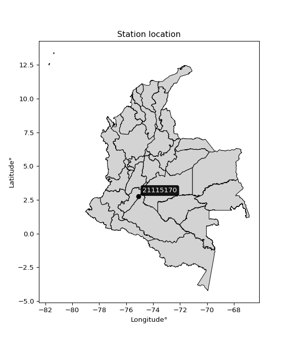

<div align="center">


</div>

# PMP Station (Rain, Pmax24h): 21115170

Probable Maximum Precipitation (PMP) is the greatest amount of rainfall for a specific duration that is meteorologically possible for a given location, acting as a "worst-case" scenario for extreme storms, crucial for designing safety-critical infrastructure like bridges, river deviations, dams, spillways, and nuclear plants to prevent catastrophic failure. PMP is calculated by hydrologists using meteorological data to determine the upper limit of extreme rainfall, often leading to the Probable Maximum Flood (PMF) for flood control design, and is increasingly being studied for climate change impacts. Probable Maximum Precipitation (PMP) is the theoretical upper limit of rainfall, a deterministic estimate for extreme events, while probability distributions (like GEV, Gumbel) describe the likelihood and frequency of various precipitation amounts, including rare ones, showing how often events occur, with PMP representing the extreme end of these distributions, used for critical infrastructure design to ensure safety against the worst conceivable weather, unlike standard statistical forecasts which cover typical probabilities.

The most common probability distributions in hydrology, used for analyzing floods, rainfall, and streamflow, include the Normal, Log-Normal, Gumbel, Gamma (including Log-Pearson Type III), and Generalized Extreme Value (GEV) distributions, often chosen based on the data´s skewness and whether modeling extremes or general conditions, with Gumbel and GEV popular for extreme events like floods, while the Normal distribution serves as a baseline, though often requiring transformations for skewed hydrological data. These distributions help in designing water infrastructure, managing water resources, and forecasting hydrologic events.

> Hydrological data often isn´t perfectly normal (it´s skewed), so different distributions are needed for different applications, such as: **Flood Frequency Analysis**: Using Gumbel, GEV, or Log-Pearson Type III for predicting extreme flood magnitudes and their return periods, **Rainfall Analysis**: Normal for annual totals, but Log-Normal, Weibull, or GEV for intensity or extreme daily rainfall, **Streamflow Modeling**: Gamma and Log-Normal for maximum flows, GEV for minimum flows, and Kappa for daily flows.

<div align="center">

</img>

</div>


## A. General information


### 1. General running parameters

• app_version: _v20260108_. • runtime: _2026-01-08 18:05:13.093906_. • Python version: _3.14.0_. • SciPy version: _1.16.3_. • Pandas version: _2.3.3_. • NumPy version: _2.3.5_. • Stations dataset (station_dataset_file): _dataset/pmax24h_in/automatic_colombia_2003_2024.csv_. • Stations catalog (station_catalog_file): _dataset/CNE.xls_. • Minimum year to eval til year_max (date_min): _1900_. • Maximum year to eval since year_min (date_max): _2024_. • Creates, save and include plots into reports (create_plot): _False_. • Plot only fit distributions with Δo > Δ (plot_only_fit): _True_. • Plot only simple graphs avoiding multiple CDFs and multiple Extreme values plots (plot_only_simple): _False_. • Eval low extreme values, if False, evaluates high extreme values (low_extreme): _False_. • Eval every SciPy distribution as logarithmic (pdist_logarithmic_on): _True_. • Standard deviation normalized (ddof): _1.0_. • Return periods to eval in years (Tr): _[2, 2.33, 5, 10, 15, 20, 25, 50, 75, 100, 200, 250, 500, 750, 1000]_. • Minimum data sample per station, 0 means any (minimum_sample): _5_. • Z-Score maximum threshold to adjust a value, 0 means disable (zscore_max): _3.5_. • Z-Score minimum threshold to adjust a value, 0 means disable (zscore_min): _-2.5_. • Avoid zeros, e.g. rain = 0 (avoid_zeros): _True_. • Avoid null values (avoid_nans): _True_. 

:file_folder:Table: [dataset.csv](../../dataset/pmax24h_in/automatic_colombia_2003_2024.csv)

> Delta Degrees of Freedom (DDOF): is a parameter used in the formulas for calculating variance and standard deviation. When ddof=0, the divisor is $N$ (the total number of observations) and this is used when your data set is the entire population. When ddof=1, the divisor is $N-1$ and this is used when your data set is a sample drawn from a larger population. Using $N-1$ provides an unbiased estimate of the population variance (known as Bessel´s correction).


### 2. Station info and location

|   id |   CODIGO | NOMBRE                    | CATEGORIA               | TECNOLOGIA                              | ESTADO           | FECHA_INSTALACION   |   FECHA_SUSPENSION |   ALTITUD |   LATITUD |   LONGITUD | DEPARTAMENTO   | MUNICIPIO   | AREA_OPERATIVA                    | ENTIDAD                                                     | AREA_HIDROGRAFICA   | ZONA_HIDROGRAFICA   | SUBZONA_HIDROGRAFICA      |   CORRIENTE | Catalogo   |   Version |
|-----:|---------:|:--------------------------|:------------------------|:----------------------------------------|:-----------------|:--------------------|-------------------:|----------:|----------:|-----------:|:---------------|:------------|:----------------------------------|:------------------------------------------------------------|:--------------------|:--------------------|:--------------------------|------------:|:-----------|----------:|
|    0 | 21115170 | LA PLATA - AUT [21115170] | Climatológica Principal | Automática con Telemetría, Convencional | En Mantenimiento | 20/07/2005          |                nan |      2101 |   2.75914 |   -75.0746 | Huila          | Neiva       | Area Operativa 04 - Huila-Caquetá | INSTITUTO DE HIDROLOGIA METEOROLOGIA Y ESTUDIOS AMBIENTALES | Magdalena Cauca     | Alto Magdalena      | Rio Fortalecillas y otros |         nan | CNE_IDEAM  |  20251226 |

<div align="center">

Dynamic map: [:earth_americas:Google](http://maps.google.com/maps?q=2.759138889,-75.07455556) [:earth_americas:OSM](https://www.openstreetmap.org/#map=18/2.759138889/-75.07455556&layers=P) [:earth_americas:Bing](https://www.bing.com/maps?cp=2.759138889~-75.07455556&lvl=18) [:earth_americas:Apple](https://maps.apple.com/frame?center=2.759138889%2C-75.07455556&span=0.003%2C0.006)

</div>


<div align="center">

```geojson
{
  "type": "Feature",
  "geometry": {
    "type": "Point", 
    "coordinates": [-75.07455556, 2.759138889]
  }, 
  "properties": {
    "Name": "21115170"
  }
}
```

</div>


### 3. Discrete values table and plot

<div align="center">

|               |          0 |           1 |          2 |           3 |           4 |           5 |           6 |           7 |          8 |         9 |          10 |          11 |          12 |           13 |          14 |         15 |         16 |          17 |         18 |
|:--------------|-----------:|------------:|-----------:|------------:|------------:|------------:|------------:|------------:|-----------:|----------:|------------:|------------:|------------:|-------------:|------------:|-----------:|-----------:|------------:|-----------:|
| Date          | 2005       | 2006        | 2007       | 2008        | 2009        | 2010        | 2011        | 2012        | 2013       | 2014      | 2015        | 2016        | 2017        | 2018         | 2019        | 2020       | 2021       | 2022        | 2023       |
| Value         |   68.1     |   54.3      |    4.5     |   46.4      |   31.6      |   21.1      |   58.4      |   47.5      |   68.7     |   55      |   54.9      |   44.6      |   53.9      |   36.3       |   31.5      |    0.4     |    2.6     |   20.6      |    5.4     |
| Value_initial |   68.1     |   54.3      |    4.5     |   46.4      |   31.6      |   21.1      |   58.4      |   47.5      |   68.7     |   55      |   54.9      |   44.6      |   53.9      |   36.3       |   31.5      |    0.4     |    2.6     |   20.6      |    5.4     |
| count         |   19       |   19        |   19       |   19        |   19        |   19        |   19        |   19        |   19       |   19      |   19        |   19        |   19        |   19         |   19        |   19       |   19       |   19        |   19       |
| mean          |   37.1474  |   37.1474   |   37.1474  |   37.1474   |   37.1474   |   37.1474   |   37.1474   |   37.1474   |   37.1474  |   37.1474 |   37.1474   |   37.1474   |   37.1474   |   37.1474    |   37.1474   |   37.1474  |   37.1474  |   37.1474   |   37.1474  |
| std           |   22.4533  |   22.4533   |   22.4533  |   22.4533   |   22.4533   |   22.4533   |   22.4533   |   22.4533   |   22.4533  |   22.4533 |   22.4533   |   22.4533   |   22.4533   |   22.4533    |   22.4533   |   22.4533  |   22.4533  |   22.4533   |   22.4533  |
| zscore        |    1.37853 |    0.763924 |   -1.45401 |    0.412083 |   -0.247062 |   -0.714699 |    0.946525 |    0.461074 |    1.40525 |    0.7951 |    0.790646 |    0.331917 |    0.746109 |   -0.0377391 |   -0.251516 |   -1.63661 |   -1.53863 |   -0.736968 |   -1.41393 |


</div>


> The initial value (value_initial) correspond to the initial obtained or null completed value, and value (value) is adjusted only when the initial value is outside the valid range (outlier) definite through the Z-Score value. If Z-Score is active, values out of range or outliers are replaced with the station mean value. A Z-Score (or standard score) measures how many standard deviations a data point is from the mean of a dataset, indicating its relative position; positive scores mean above the mean, negative mean below, and a score of zero is exactly at the mean, allowing for comparison of values from different distributions. It´s calculated using the formula $z=(x–μ)/σ$, where $x$ is the data point, $μ$ is the mean, and $σ$ is the standard deviation, helping identify outliers and understand probability.
>
> <sub>**Note**: In this study, "completing" (filling gaps in) and "extending" (forecasting or lengthening the historical record) rainfall data series are avoided for certain critical analyses because they introduce artificial bias and uncertainty, which can distort the statistics of rare events (extremes), alter day-to-day variability, and compromise the integrity and homogeneity of the original data. Some reasons against Completing/Extending rainfall data are: **Distortion of Extremes and Variability**: The primary issue is that most gap-filling or extension methods rely on averaging or regression with nearby stations, which inherently smooths the data. Rainfall is highly variable in space and time, with a large percentage of zero values and occasional large storms. Infilling methods often underestimate the highest values and overestimate the lowest (zero) values, which severely distorts analyses focused on flood frequency, drought severity, and intensity-duration-frequency (IDF) curves, **Loss of Data Homogeneity**: Infilled or extended data are synthetic estimates, not actual measurements. Combining these estimates with observed data can violate the assumption of data homogeneity, which requires that the data properties do not change over time. Inhomogeneity can lead to incorrect conclusions about long-term trends or changes in climate patterns, **Propagation of Errors**: Errors and biases from the original data (e.g., wind-induced undercatch, instrument errors, site changes) or the data used for imputation can propagate through the analysis, leading to unreliable hydrological models and inaccurate predictions, **Compromised Statistical Integrity**: For statistical analyses, especially those involving the frequency of events, using artificial data can introduce time bias or autocorrelation that doesn´t exist in reality, making it difficult to assess the true probability of events, **Difficulty in Validation**: It is difficult to accurately validate the quality of filled or extended data, especially for past periods where ground-truth measurements are unavailable. The reliability of imputation techniques heavily depends on the density of the surrounding station network and the complexity of the local topography.</sub>


### 4. Active continuous probability distributions from SciPy (43 of 104 available)

A Probability Density Function (PDF) describes the relative likelihood of a continuous random variable falling within a specific range, where the total area under its curve equals 1, and the area over any interval gives the actual probability for that range. Unlike discrete probabilities (like rolling a die), a PDF shows density, not direct probability for a single point (which is zero), with higher points indicating higher likelihood, often visualized as a bell curve for normal distributions.

A log of a probability density function (log-PDF) is simply the logarithm of the PDF´s value, denoted as $log(f(x))$, useful for converting multiplication of probabilities into addition, improving numerical stability with tiny numbers, and connecting to information theory concepts like entropy. Instead of dealing with very small probabilities (e.g., 0.000001), log-PDFs use negative numbers (e.g., $log(0.00001) ≈ -11.51$ that are easier for computers to handle, preventing underflow errors and simplifying complex calculations. In this study, each active probability distribution from SciPy is also evaluated in the $log$ form.

[scipy.stats](https://docs.scipy.org/doc/scipy/reference/stats.html) is a Python´s powerful submodule within the SciPy library for comprehensive statistical analysis, offering over 130 probability distributions (like Normal, Poisson), functions for descriptive stats (mean, variance), hypothesis testing (t-tests, chi-square), random variable generation, and statistical tests, making it essential for data science, modeling, and research. It provides tools to explore, model, and draw conclusions from data efficiently, working seamlessly with NumPy.

<div align="center">

|   id | p_dist             |   n_parameter | fit_method   | label                                                                       | active   | ref                                                                                                        |
|-----:|:-------------------|--------------:|:-------------|:----------------------------------------------------------------------------|:---------|:-----------------------------------------------------------------------------------------------------------|
|    0 | alpha              |             3 | MLE          | Alpha                                                                       | True     | [:mortar_board:](https://docs.scipy.org/doc/scipy/reference/generated/scipy.stats.alpha.html)              |
|    1 | betaprime          |             4 | MLE          | Beta prime                                                                  | True     | [:mortar_board:](https://docs.scipy.org/doc/scipy/reference/generated/scipy.stats.betaprime.html)          |
|    2 | chi2               |             3 | MLE          | Chi²                                                                        | True     | [:mortar_board:](https://docs.scipy.org/doc/scipy/reference/generated/scipy.stats.chi2.html)               |
|    3 | crystalball        |             4 | MLE          | Crystalball                                                                 | True     | [:mortar_board:](https://docs.scipy.org/doc/scipy/reference/generated/scipy.stats.crystalball.html)        |
|    4 | erlang             |             3 | MLE          | Erlang                                                                      | True     | [:mortar_board:](https://docs.scipy.org/doc/scipy/reference/generated/scipy.stats.erlang.html)             |
|    5 | expon              |             2 | MLE          | Exponential                                                                 | True     | [:mortar_board:](https://docs.scipy.org/doc/scipy/reference/generated/scipy.stats.expon.html)              |
|    6 | exponnorm          |             3 | MLE          | Exponentially modified Normal                                               | True     | [:mortar_board:](https://docs.scipy.org/doc/scipy/reference/generated/scipy.stats.exponnorm.html)          |
|    7 | f                  |             4 | MLE          | F                                                                           | True     | [:mortar_board:](https://docs.scipy.org/doc/scipy/reference/generated/scipy.stats.f.html)                  |
|    8 | fatiguelife        |             3 | MLE          | Fatigue-life (Birnbaum-Saunders)                                            | True     | [:mortar_board:](https://docs.scipy.org/doc/scipy/reference/generated/scipy.stats.fatiguelife.html)        |
|    9 | fisk               |             3 | MLE          | Fisk                                                                        | True     | [:mortar_board:](https://docs.scipy.org/doc/scipy/reference/generated/scipy.stats.fisk.html)               |
|   10 | gamma              |             3 | MLE          | Gamma                                                                       | True     | [:mortar_board:](https://docs.scipy.org/doc/scipy/reference/generated/scipy.stats.gamma.html)              |
|   11 | genexpon           |             5 | MLE          | Generalized exponential                                                     | True     | [:mortar_board:](https://docs.scipy.org/doc/scipy/reference/generated/scipy.stats.genexpon.html)           |
|   12 | genlogistic        |             3 | MLE          | Generalized logistic                                                        | True     | [:mortar_board:](https://docs.scipy.org/doc/scipy/reference/generated/scipy.stats.genlogistic.html)        |
|   13 | gibrat             |             2 | MM           | Gibrat                                                                      | True     | [:mortar_board:](https://docs.scipy.org/doc/scipy/reference/generated/scipy.stats.gibrat.html)             |
|   14 | gompertz           |             3 | MLE          | Gompertz (or truncated Gumbel)                                              | True     | [:mortar_board:](https://docs.scipy.org/doc/scipy/reference/generated/scipy.stats.gompertz.html)           |
|   15 | gumbel_l           |             2 | MM           | Gumbel Left Skew                                                            | True     | [:mortar_board:](https://docs.scipy.org/doc/scipy/reference/generated/scipy.stats.gumbel_l.html)           |
|   16 | gumbel_r           |             2 | MM           | Gumbel Right Skew                                                           | True     | [:mortar_board:](https://docs.scipy.org/doc/scipy/reference/generated/scipy.stats.gumbel_r.html)           |
|   17 | halflogistic       |             2 | MM           | Half-logistic                                                               | True     | [:mortar_board:](https://docs.scipy.org/doc/scipy/reference/generated/scipy.stats.halflogistic.html)       |
|   18 | halfnorm           |             2 | MM           | Half Normal                                                                 | True     | [:mortar_board:](https://docs.scipy.org/doc/scipy/reference/generated/scipy.stats.halfnorm.html)           |
|   19 | hypsecant          |             2 | MM           | hyperbolic secant                                                           | True     | [:mortar_board:](https://docs.scipy.org/doc/scipy/reference/generated/scipy.stats.hypsecant.html)          |
|   20 | invgamma           |             3 | MLE          | Inverted gamma                                                              | True     | [:mortar_board:](https://docs.scipy.org/doc/scipy/reference/generated/scipy.stats.invgamma.html)           |
|   21 | invgauss           |             3 | MLE          | Inverse Gaussian                                                            | True     | [:mortar_board:](https://docs.scipy.org/doc/scipy/reference/generated/scipy.stats.invgauss.html)           |
|   22 | invweibull         |             3 | MLE          | Inverted Weibull                                                            | True     | [:mortar_board:](https://docs.scipy.org/doc/scipy/reference/generated/scipy.stats.invweibull.html)         |
|   23 | kstwobign          |             2 | MLE          | Limiting distribution of scaled Kolmogorov-Smirnov two-sided test statistic | True     | [:mortar_board:](https://docs.scipy.org/doc/scipy/reference/generated/scipy.stats.kstwobign.html)          |
|   24 | laplace            |             2 | MM           | Laplace                                                                     | True     | [:mortar_board:](https://docs.scipy.org/doc/scipy/reference/generated/scipy.stats.laplace.html)            |
|   25 | laplace_asymmetric |             3 | MLE          | Asymmetric Laplace                                                          | True     | [:mortar_board:](https://docs.scipy.org/doc/scipy/reference/generated/scipy.stats.laplace_asymmetric.html) |
|   26 | loggamma           |             3 | MLE          | Log gamma                                                                   | True     | [:mortar_board:](https://docs.scipy.org/doc/scipy/reference/generated/scipy.stats.loggamma.html)           |
|   27 | logistic           |             2 | MM           | Logistic (or Sech-squared)                                                  | True     | [:mortar_board:](https://docs.scipy.org/doc/scipy/reference/generated/scipy.stats.logistic.html)           |
|   28 | lognorm            |             3 | MLE          | Log Normal                                                                  | True     | [:mortar_board:](https://docs.scipy.org/doc/scipy/reference/generated/scipy.stats.lognorm.html)            |
|   29 | maxwell            |             2 | MM           | Maxwell                                                                     | True     | [:mortar_board:](https://docs.scipy.org/doc/scipy/reference/generated/scipy.stats.maxwell.html)            |
|   30 | mielke             |             4 | MLE          | Mielke Beta-Kappa / Dagum                                                   | True     | [:mortar_board:](https://docs.scipy.org/doc/scipy/reference/generated/scipy.stats.mielke.html)             |
|   31 | moyal              |             2 | MM           | Moyal                                                                       | True     | [:mortar_board:](https://docs.scipy.org/doc/scipy/reference/generated/scipy.stats.moyal.html)              |
|   32 | nakagami           |             3 | MLE          | Nakagami                                                                    | True     | [:mortar_board:](https://docs.scipy.org/doc/scipy/reference/generated/scipy.stats.nakagami.html)           |
|   33 | ncf                |             5 | MLE          | Non-central F distribution                                                  | True     | [:mortar_board:](https://docs.scipy.org/doc/scipy/reference/generated/scipy.stats.ncf.html)                |
|   34 | nct                |             4 | MLE          | Non-central Student’s t                                                     | True     | [:mortar_board:](https://docs.scipy.org/doc/scipy/reference/generated/scipy.stats.nct.html)                |
|   35 | norm               |             2 | MM           | Normal                                                                      | True     | [:mortar_board:](https://docs.scipy.org/doc/scipy/reference/generated/scipy.stats.norm.html)               |
|   36 | pearson3           |             3 | MM           | Pearson type III                                                            | True     | [:mortar_board:](https://docs.scipy.org/doc/scipy/reference/generated/scipy.stats.pearson3.html)           |
|   37 | rayleigh           |             2 | MM           | Rayleigh                                                                    | True     | [:mortar_board:](https://docs.scipy.org/doc/scipy/reference/generated/scipy.stats.rayleigh.html)           |
|   38 | rice               |             3 | MLE          | Rice                                                                        | True     | [:mortar_board:](https://docs.scipy.org/doc/scipy/reference/generated/scipy.stats.rice.html)               |
|   39 | t                  |             3 | MLE          | Student’s t                                                                 | True     | [:mortar_board:](https://docs.scipy.org/doc/scipy/reference/generated/scipy.stats.t.html)                  |
|   40 | truncnorm          |             4 | MLE          | Truncated normal                                                            | True     | [:mortar_board:](https://docs.scipy.org/doc/scipy/reference/generated/scipy.stats.truncnorm.html)          |
|   41 | wald               |             2 | MM           | Wald                                                                        | True     | [:mortar_board:](https://docs.scipy.org/doc/scipy/reference/generated/scipy.stats.wald.html)               |
|   42 | weibull_min        |             3 | MLE          | Weibull minimum                                                             | True     | [:mortar_board:](https://docs.scipy.org/doc/scipy/reference/generated/scipy.stats.weibull_min.html)        |

</div>

> **n_parameter:** # arguments & localization & scale.
>
> **Fit methods:** (MLE) maximum likelihood, (MM) L-moments.
>
>**Inactive** (With the only purpose of prevent loops, zero divisions, infinite values, over high estimated values or horizontal trending for recurrence intervals estimations, the follow distributions were disabled.)**:** foldnorm, gennorm, norminvgauss, powernorm, powerlognorm, skewnorm, genextreme, anglit, arcsine, argus, beta, bradford, burr, burr12, cauchy, cosine, halfcauchy, foldcauchy, skewcauchy, wrapcauchy, dgamma, gengamma, exponweib, exponpow, truncexpon, gausshyper, genhalflogistic, genhyperbolic, geninvgauss, halfgennorm, johnsonsb, johnsonsu, kappa4, kappa3, ksone, kstwo, loglaplace, levy, levy_l, levy_stable, ncx2, pareto, genpareto, truncpareto, lomax, powerlaw, rdist, rel_breitwigner, recipinvgauss, semicircular, studentized_range, trapezoid, triang, truncweibull_min, tukeylambda, uniform, loguniform, vonmises, vonmises_line, weibull_max, dweibull, 


## B. Probability (PDF) vs. Empirical (EDF) distributions functions

A continuous probability distribution (CPD) describes probabilities for variables that can take any value within a range (like rain any time), unlike discrete variables with specific outcomes (like temperature). It uses a Probability Density Function (PDF), a curve where the total area under it equals 1, and the probability of the variable falling within an interval (a to b) is found by calculating the area under the curve between those points. A key feature is that the probability of hitting any single exact value is zero, so probabilities are always expressed for ranges, e.g., $P(a ≤ X ≤ b)$.

<div align="center">

Distributions parameters from station values
|    |   station | p_dist                |   n |             loc |           scale | shape                  | shape1                 | shape2             | shape3   |
|---:|----------:|:----------------------|----:|----------------:|----------------:|:-----------------------|:-----------------------|:-------------------|:---------|
|  0 |  21115170 | alpha                 |  19 |     0.000715091 |     1.71593     | 2.7995454372656208e-09 |                        |                    |          |
|  1 |  21115170 | betaprime             |  19 |  -618.003       | 35968.2         | 900.8831703720095      | 49467.97268942713      |                    |          |
|  2 |  21115170 | chi2                  |  19 |  -169.368       |     1.23134     | 167.5229220066734      |                        |                    |          |
|  3 |  21115170 | crystalball           |  19 |    37.1474      |    21.8545      | 2343.760530168999      | 4105.763649137571      |                    |          |
|  4 |  21115170 | erlang                |  19 |  -318.499       |     1.38509     | 256.5514598482708      |                        |                    |          |
|  5 |  21115170 | expon                 |  19 |     0.4         |    36.7474      |                        |                        |                    |          |
|  6 |  21115170 | exponnorm             |  19 |    37.1302      |    21.8544      | 0.0007851039104759953  |                        |                    |          |
|  7 |  21115170 | f                     |  19 |     0.4         |    36.7657      | 1.7855370766735748     | 264.01283642460976     |                    |          |
|  8 |  21115170 | fatiguelife           |  19 | -2234.79        |  2272.1         | 0.009660131821654771   |                        |                    |          |
|  9 |  21115170 | fisk                  |  19 |    -7.22066e+08 |     7.22066e+08 | 54844598.491008505     |                        |                    |          |
| 10 |  21115170 | gamma                 |  19 |  -324.117       |     1.3612      | 265.2839039999774      |                        |                    |          |
| 11 |  21115170 | genexpon              |  19 |     0.399964    |     2.41659     | 0.06570117903320324    | 1.9353427086270384e-06 | 1.6207146318862158 |          |
| 12 |  21115170 | genlogistic           |  19 |    60.4832      |     4.91725     | 0.198997289102976      |                        |                    |          |
| 13 |  21115170 | gibrat                |  19 |    20.4751      |    10.1122      |                        |                        |                    |          |
| 14 |  21115170 | gompertz              |  19 |    20.5999      |     7.06159     | 0.00587310084723917    |                        |                    |          |
| 15 |  21115170 | gumbel_l              |  19 |    46.983       |    17.0398      |                        |                        |                    |          |
| 16 |  21115170 | gumbel_r              |  19 |    27.3117      |    17.0398      |                        |                        |                    |          |
| 17 |  21115170 | halflogistic          |  19 |    11.2447      |    18.6848      |                        |                        |                    |          |
| 18 |  21115170 | halfnorm              |  19 |     8.22058     |    36.2543      |                        |                        |                    |          |
| 19 |  21115170 | hypsecant             |  19 |    37.1474      |    13.913       |                        |                        |                    |          |
| 20 |  21115170 | invgamma              |  19 |  -211.808       | 29793.1         | 120.76034848408085     |                        |                    |          |
| 21 |  21115170 | invgauss              |  19 |  -108.142       |  5492.87        | 0.02635612731858389    |                        |                    |          |
| 22 |  21115170 | invweibull            |  19 |    -1.78748e+09 |     1.78748e+09 | 83090984.12309644      |                        |                    |          |
| 23 |  21115170 | kstwobign             |  19 |   -47.8456      |    96.8758      |                        |                        |                    |          |
| 24 |  21115170 | laplace               |  19 |    37.1474      |    15.4534      |                        |                        |                    |          |
| 25 |  21115170 | laplace_asymmetric    |  19 |    54.9         |    13.3975      | 1.8620879220016113     |                        |                    |          |
| 26 |  21115170 | loggamma              |  19 |    54.2342      |    14.3694      | 0.7110438472022156     |                        |                    |          |
| 27 |  21115170 | logistic              |  19 |    37.1474      |    12.049       |                        |                        |                    |          |
| 28 |  21115170 | lognorm               |  19 |    -2.09715e+06 |     2.09719e+06 | 1.0420853797994834e-05 |                        |                    |          |
| 29 |  21115170 | maxwell               |  19 |   -14.6385      |    32.452       |                        |                        |                    |          |
| 30 |  21115170 | mielke                |  19 |     0.4         |    69.1514      | 0.9196984046949075     | 337.45375044485274     |                    |          |
| 31 |  21115170 | moyal                 |  19 |    24.6496      |     9.83796     |                        |                        |                    |          |
| 32 |  21115170 | nakagami              |  19 |     2.6         |    41.8354      | 0.4758156225155469     |                        |                    |          |
| 33 |  21115170 | ncf                   |  19 |     0.00377294  |     6.64464e-09 | 1.4901488641133398e-09 | 1.7837138232606162     | 5.256214199453016  |          |
| 34 |  21115170 | nct                   |  19 | -1345.98        |    21.8134      | 453259.2004760448      | 63.40707672827186      |                    |          |
| 35 |  21115170 | norm                  |  19 |    37.1474      |    21.8545      |                        |                        |                    |          |
| 36 |  21115170 | pearson3              |  19 |    37.1474      |    21.8544      | -0.3663284075859802    |                        |                    |          |
| 37 |  21115170 | rayleigh              |  19 |    -4.66148     |    33.3586      |                        |                        |                    |          |
| 38 |  21115170 | rice                  |  19 |   -10.5432      |    24.8196      | 1.5708207081051864     |                        |                    |          |
| 39 |  21115170 | t                     |  19 |    37.1459      |    21.8546      | 16532203.090837307     |                        |                    |          |
| 40 |  21115170 | truncnorm             |  19 |     1.14606     |    12.3729      | -2.126814981355063     | 5.459823687798314      |                    |          |
| 41 |  21115170 | wald                  |  19 |    15.2929      |    21.8545      |                        |                        |                    |          |
| 42 |  21115170 | weibull_min           |  19 |  -216.889       |   263.799       | 14.252654601118472     |                        |                    |          |
| 43 |  21115170 | logalpha              |  19 |   -17.2966      |   263.453       | 13.004362180740479     |                        |                    |          |
| 44 |  21115170 | logbetaprime          |  19 | -2623.82        |  2933.75        | 7278325.268427834      | 8128295.3395824935     |                    |          |
| 45 |  21115170 | logchi2               |  19 |    -0.916291    |     2.99199     | 1.5328001872017967     |                        |                    |          |
| 46 |  21115170 | logcrystalball        |  19 |     3.14776     |     1.33843     | 361.4531124548091      | 30.805240123648765     |                    |          |
| 47 |  21115170 | logerlang             |  19 |   -24.1936      |     0.073353    | 372.5780806617049      |                        |                    |          |
| 48 |  21115170 | logexpon              |  19 |    -0.916291    |     4.06406     |                        |                        |                    |          |
| 49 |  21115170 | logexponnorm          |  19 |     3.14687     |     1.33844     | 0.000668333270154809   |                        |                    |          |
| 50 |  21115170 | logf                  |  19 |    -0.916291    |     1.1498      | 1.071458203222329      | 1.1472452838256437     |                    |          |
| 51 |  21115170 | logfatiguelife        |  19 | -1071.21        |  1074.36        | 0.0012458531495975825  |                        |                    |          |
| 52 |  21115170 | logfisk               |  19 |    -2.3006e+08  |     2.3006e+08  | 332013419.3525965      |                        |                    |          |
| 53 |  21115170 | loggamma              |  19 |   -20.587       |     0.0826671   | 286.7316065606782      |                        |                    |          |
| 54 |  21115170 | loggenexpon           |  19 |    -1.08581     | 59607.7         | 7.691110124586308e-07  | 31090.577000358597     | 16494.2757940772   |          |
| 55 |  21115170 | loggenlogistic        |  19 |     4.22976     |     5.60977e-07 | 5.167951496680661e-07  |                        |                    |          |
| 56 |  21115170 | loggibrat             |  19 |     2.12667     |     0.619318    |                        |                        |                    |          |
| 57 |  21115170 | loggompertz           |  19 |    -1.37513     |     0.754962    | 0.001241755243090249   |                        |                    |          |
| 58 |  21115170 | loggumbel_l           |  19 |     3.75013     |     1.04357     |                        |                        |                    |          |
| 59 |  21115170 | loggumbel_r           |  19 |     2.5454      |     1.04357     |                        |                        |                    |          |
| 60 |  21115170 | loghalflogistic       |  19 |     1.56144     |     1.14429     |                        |                        |                    |          |
| 61 |  21115170 | loghalfnorm           |  19 |     1.37618     |     2.22035     |                        |                        |                    |          |
| 62 |  21115170 | loghypsecant          |  19 |     3.14776     |     0.852074    |                        |                        |                    |          |
| 63 |  21115170 | loginvgamma           |  19 |   -35.2756      | 28674           | 747.568684373972       |                        |                    |          |
| 64 |  21115170 | loginvgauss           |  19 |   -10.7149      |  1115.64        | 0.012428529401965899   |                        |                    |          |
| 65 |  21115170 | loginvweibull         |  19 |    -2.38268e+08 |     2.38268e+08 | 137576916.6296106      |                        |                    |          |
| 66 |  21115170 | logkstwobign          |  19 |    -4.24244     |     8.51295     |                        |                        |                    |          |
| 67 |  21115170 | loglaplace            |  19 |     3.14776     |     0.946416    |                        |                        |                    |          |
| 68 |  21115170 | loglaplace_asymmetric |  19 |     4.22976     |     0.00765829  | 141.18526249600308     |                        |                    |          |
| 69 |  21115170 | logloggamma           |  19 |     4.22975     |     3.80225e-07 | 3.510511426038768e-07  |                        |                    |          |
| 70 |  21115170 | loglogistic           |  19 |     3.14776     |     0.737917    |                        |                        |                    |          |
| 71 |  21115170 | loglognorm            |  19 | -1178.35        |  1181.49        | 0.0011288640100191108  |                        |                    |          |
| 72 |  21115170 | logmaxwell            |  19 |    -0.0237858   |     1.98747     |                        |                        |                    |          |
| 73 |  21115170 | logmielke             |  19 |    -1.53125e+08 |     1.53125e+08 | 588452021.1623456      | 134724192.86097312     |                    |          |
| 74 |  21115170 | logmoyal              |  19 |     2.38236     |     0.602507    |                        |                        |                    |          |
| 75 |  21115170 | lognakagami           |  19 | -1841.04        |  1844.19        | 473259.5382693773      |                        |                    |          |
| 76 |  21115170 | logncf                |  19 |    -0.916291    |     1.02747     | 1.0189618019355624     | 1.1943743737522436     | 1.0801221764887723 |          |
| 77 |  21115170 | lognct                |  19 |   -80.5129      |     1.26896     | 16902.44016090234      | 65.92661216681347      |                    |          |
| 78 |  21115170 | lognorm               |  19 |     3.14776     |     1.33843     |                        |                        |                    |          |
| 79 |  21115170 | logpearson3           |  19 |     3.14776     |     1.33843     | -1.7202734692698742    |                        |                    |          |
| 80 |  21115170 | lograyleigh           |  19 |     0.587278    |     2.04298     |                        |                        |                    |          |
| 81 |  21115170 | logrice               |  19 |  -860.404       |     1.33906     | 644.8934671567554      |                        |                    |          |
| 82 |  21115170 | logt                  |  19 |     3.88309     |     0.285108    | 0.8861963912300264     |                        |                    |          |
| 83 |  21115170 | logtruncnorm          |  19 |     3.26531     |     8.84729     | -0.4726428969529414    | 0.10901392173753277    |                    |          |
| 84 |  21115170 | logwald               |  19 |     1.80936     |     1.33841     |                        |                        |                    |          |
| 85 |  21115170 | logweibull_min        |  19 |    -0.916291    |     1.56728     | 0.6942844355808995     |                        |                    |          |

</div>

> **loc** (Location parameter): This shifts the distribution along the x-axis. For many common distributions, like the normal (Gaussian) distribution, loc represents the mean $μ$. For others, like the uniform distribution, it might represent the minimum value, or for the beta distribution, the left end of the support interval.
>
> **scale** (Scale parameter): This determines the width or spread of the distribution. For the normal distribution, scale represents the standard deviation $σ$. For a uniform distribution, it defines the length of the interval (from $loc$ to $loc + scale$).
>
> **shape** (Shape parameters): Refers to parameters that define the specific form of a probability distribution, distinct from its location (loc) and scale (scale). These parameters are required arguments for most distribution functions. For example, a normal (Gaussian) distribution is fully defined by its location (mean) and scale (standard deviation), so it has no specific shape parameters beyond loc and scale. However, other distributions have intrinsic properties that need specification, as Gamma distribution that takes a shape parameter, often named $a$ or $alpha$.


### 0. Cumulative distribution values - CDF (86 evaluated)

Cumulative Distribution Function (CDF), denoted as $F$<sub>$X$</sub>$(x)$, is a function that gives the probability that a random variable $X$ will take a value less than or equal to a specific value, $x$ (i.e., $(P(X≥x)$. It essentially "accumulates" probabilities from a given point up to the far right (positive infinity), providing a complete picture of the distribution´s probabilities for both discrete (like rain) and continuous (like temperature) variables, helping to find probabilities over ranges or above certain values. Each station is evaluated separately ordering the $x$ values ascending, calculating the CDF and PDF values for the activated distributions and their logarithmic forms.

<div align="center">

CDF ordered by x ascending and calculating $log(f(x))$ separately
|   id |   Station |   date |    x |   count |    mean |     std |     zscore |   Value_initial |   station |   m |       alpha |   alpha_pdf |   betaprime |   betaprime_pdf |      chi2 |   chi2_pdf |   crystalball |   crystalball_pdf |    erlang |   erlang_pdf |     expon |   expon_pdf |   exponnorm |   exponnorm_pdf |          f |      f_pdf |   fatiguelife |   fatiguelife_pdf |      fisk |   fisk_pdf |     gamma |   gamma_pdf |    genexpon |   genexpon_pdf |   genlogistic |   genlogistic_pdf |      gibrat |   gibrat_pdf |    gompertz |   gompertz_pdf |   gumbel_l |   gumbel_l_pdf |   gumbel_r |   gumbel_r_pdf |   halflogistic |   halflogistic_pdf |   halfnorm |   halfnorm_pdf |   hypsecant |   hypsecant_pdf |   invgamma |   invgamma_pdf |   invgauss |   invgauss_pdf |   invweibull |   invweibull_pdf |   kstwobign |   kstwobign_pdf |   laplace |   laplace_pdf |   laplace_asymmetric |   laplace_asymmetric_pdf |   loggamma |   loggamma_pdf |   logistic |   logistic_pdf |    lognorm |   lognorm_pdf |   maxwell |   maxwell_pdf |      mielke |   mielke_pdf |       moyal |   moyal_pdf |    nakagami |   nakagami_pdf |       ncf |    ncf_pdf |       nct |    nct_pdf |      norm |   norm_pdf |   pearson3 |   pearson3_pdf |   rayleigh |   rayleigh_pdf |      rice |   rice_pdf |         t |      t_pdf |   truncnorm |   truncnorm_pdf |     wald |   wald_pdf |   weibull_min |   weibull_min_pdf |   logalpha |   logalpha_pdf |   logbetaprime |   logbetaprime_pdf |     logchi2 |   logchi2_pdf |   logcrystalball |   logcrystalball_pdf |   logerlang |   logerlang_pdf |   logexpon |   logexpon_pdf |   logexponnorm |   logexponnorm_pdf |        logf |    logf_pdf |   logfatiguelife |   logfatiguelife_pdf |    logfisk |   logfisk_pdf |   loggenexpon |   loggenexpon_pdf |   loggenlogistic |   loggenlogistic_pdf |   loggibrat |   loggibrat_pdf |   loggompertz |   loggompertz_pdf |   loggumbel_l |   loggumbel_l_pdf |   loggumbel_r |   loggumbel_r_pdf |   loghalflogistic |   loghalflogistic_pdf |   loghalfnorm |   loghalfnorm_pdf |   loghypsecant |   loghypsecant_pdf |   loginvgamma |   loginvgamma_pdf |   loginvgauss |   loginvgauss_pdf |   loginvweibull |   loginvweibull_pdf |   logkstwobign |   logkstwobign_pdf |   loglaplace |   loglaplace_pdf |   loglaplace_asymmetric |   loglaplace_asymmetric_pdf |   logloggamma |   logloggamma_pdf |   loglogistic |   loglogistic_pdf |   loglognorm |   loglognorm_pdf |   logmaxwell |   logmaxwell_pdf |   logmielke |   logmielke_pdf |    logmoyal |   logmoyal_pdf |   lognakagami |   lognakagami_pdf |      logncf |   logncf_pdf |     lognct |   lognct_pdf |   logpearson3 |   logpearson3_pdf |   lograyleigh |   lograyleigh_pdf |    logrice |   logrice_pdf |      logt |   logt_pdf |   logtruncnorm |   logtruncnorm_pdf |   logwald |   logwald_pdf |   logweibull_min |   logweibull_min_pdf |
|-----:|----------:|-------:|-----:|--------:|--------:|--------:|-----------:|----------------:|----------:|----:|------------:|------------:|------------:|----------------:|----------:|-----------:|--------------:|------------------:|----------:|-------------:|----------:|------------:|------------:|----------------:|-----------:|-----------:|--------------:|------------------:|----------:|-----------:|----------:|------------:|------------:|---------------:|--------------:|------------------:|------------:|-------------:|------------:|---------------:|-----------:|---------------:|-----------:|---------------:|---------------:|-------------------:|-----------:|---------------:|------------:|----------------:|-----------:|---------------:|-----------:|---------------:|-------------:|-----------------:|------------:|----------------:|----------:|--------------:|---------------------:|-------------------------:|-----------:|---------------:|-----------:|---------------:|-----------:|--------------:|----------:|--------------:|------------:|-------------:|------------:|------------:|------------:|---------------:|----------:|-----------:|----------:|-----------:|----------:|-----------:|-----------:|---------------:|-----------:|---------------:|----------:|-----------:|----------:|-----------:|------------:|----------------:|---------:|-----------:|--------------:|------------------:|-----------:|---------------:|---------------:|-------------------:|------------:|--------------:|-----------------:|---------------------:|------------:|----------------:|-----------:|---------------:|---------------:|-------------------:|------------:|------------:|-----------------:|---------------------:|-----------:|--------------:|--------------:|------------------:|-----------------:|---------------------:|------------:|----------------:|--------------:|------------------:|--------------:|------------------:|--------------:|------------------:|------------------:|----------------------:|--------------:|------------------:|---------------:|-------------------:|--------------:|------------------:|--------------:|------------------:|----------------:|--------------------:|---------------:|-------------------:|-------------:|-----------------:|------------------------:|----------------------------:|--------------:|------------------:|--------------:|------------------:|-------------:|-----------------:|-------------:|-----------------:|------------:|----------------:|------------:|---------------:|--------------:|------------------:|------------:|-------------:|-----------:|-------------:|--------------:|------------------:|--------------:|------------------:|-----------:|--------------:|----------:|-----------:|---------------:|-------------------:|----------:|--------------:|-----------------:|---------------------:|
|    0 |  21115170 |   2020 |  0.4 |      19 | 37.1474 | 22.4533 | -1.63661   |             0.4 |  21115170 |   1 | 1.72724e-05 | 0.000838422 |   0.0459845 |      0.00455443 | 0.0455414 | 0.0048385  |     0.0463369 |        0.00444047 | 0.0463156 |   0.00470079 | 0         |  0.0272128  |   0.0463366 |      0.00444046 | 1.1583e-16 | 1.86286    |     0.0449556 |        0.00438653 | 0.052184  | 0.0037568  | 0.0456259 |  0.00464322 | 9.65897e-07 |     0.0271875  |     0.0879033 |        0.00355736 | 0           |   0          | 0           |    0           |  0.062908  |     0.00357318 |  0.0078147 |     0.00222508 |       0        |         0          |   0        |     0          |   0.0452976 |      0.0032448  |  0.0419769 |     0.00488148 |  0.0440498 |     0.00536085 |    0.0375078 |       0.00572445 |   0.034799  |      0.00645443 | 0.0463706 |    0.00300067 |            0.0873353 |               0.00350078 | 0.00117264 |     0.00315474 |  0.0452249 |     0.00358367 | 0.00119701 |    0.00296648 | 0.0248258 |    0.00474236 | 9.74117e-13 |    0.148797  | 0.000604424 |  0.00038824 | 0           |     0          | 0.0807632 | 0.0218446  | 0.0463772 | 0.0044431  | 0.0463369 | 0.00444047 |  0.055453  |     0.00428811 |  0.0114449 |     0.00449637 | 0.0285961 | 0.00527394 | 0.0463446 | 0.00444103 |    0.467049 |     0.0327318   | 0        | 0          |     0.0610683 |        0.00388077 | 0.00103796 |     0.00342106 |     0.00121191 |         0.00300001 | 1.62841e-13 |  1124.11      |       0.00119701 |           0.00296649 |  0.00135104 |      0.00348852 |   0        |      0.24606   |     0.00119705 |         0.00296656 | 1.74341e-09 | 8.41269e+06 |       0.00116248 |           0.00289888 | 0.00194269 |    0.00279817 |     0.0020396 |         0.0238527 |         0        |           0.00804433 |    0        |       0         |    0.00103797 |        0.00301723 |     0.0113642 |         0.0108275 |    1.0506e-12 |       2.77675e-11 |         0         |              0        |     0         |          0        |     0.00540078 |         0.00633809 |    0.00104501 |        0.00289492 |     0.0010373 |        0.00324116 |      0.00122587 |          0.00474533 |     0.00198389 |         0.00904391 |   0.00682406 |       0.00721042 |              0.00857029 |                  0.00792637 |    0.00864133 |         0.0079783 |    0.00403999 |        0.00545273 |   0.00116014 |       0.00290281 |    0         |        0         | 0.000214633 |     0.000705558 | 7.85818e-54 |    1.56257e-51 |    0.00120243 |        0.00297666 | 2.82052e-09 |  1.29433e+07 | 0.00122357 |    0.0030369 |     0.0158245 |         0.012911  |     0         |         0         | 0.00120263 |    0.00297784 | 0.0256013 |  0.0047176 |    2.36888e-06 |           0.179094 |  0        |      0        |      6.13041e-12 |        38336.9       |
|    1 |  21115170 |   2021 |  2.6 |      19 | 37.1474 | 22.4533 | -1.53863   |             2.6 |  21115170 |   2 | 0.509154    | 0.162967    |   0.0568999 |      0.00538244 | 0.0571713 | 0.00574813 |     0.0569627 |        0.00523286 | 0.0575915 |   0.00556398 | 0.0581114 |  0.0256315  |   0.0569624 |      0.00523286 | 0.0743138  | 0.0293086  |     0.0554653 |        0.00518139 | 0.061095  | 0.00435697 | 0.0567683 |  0.00550026 | 0.0580606   |     0.0256096  |     0.0960884 |        0.00388859 | 0           |   0          | 0           |    0           |  0.0712616 |     0.00402937 |  0.0140646 |     0.00351956 |       0        |         0          |   0        |     0          |   0.0530244 |      0.00379355 |  0.0537888 |     0.0058721  |  0.0570214 |     0.00644563 |    0.05161   |       0.00711101 |   0.0508766 |      0.00816886 | 0.0534651 |    0.00345976 |            0.0953868 |               0.00382352 | 0.0578172  |     0.0881131  |  0.0537969 |     0.00422465 | 0.0507188  |    0.0779384  | 0.0366546 |    0.0060248  | 0.0419627   |    0.0175423 | 0.00216356  |  0.00112811 | 5.57417e-17 |     0.119448   | 0.130671  | 0.0230679  | 0.0570089 | 0.00523559 | 0.0569627 | 0.00523286 |  0.0655872 |     0.00493554 |  0.0234137 |     0.00637264 | 0.041408  | 0.00637561 | 0.0569716 | 0.00523348 |    0.539066 |     0.0325658   | 0        | 0          |     0.0701589 |        0.00439211 | 0.0763955  |     0.113528   |     0.0510455  |         0.0782764  | 0.389899    |     0.133159  |       0.0507188  |           0.0779384  |  0.0587092  |      0.087436   |   0.369079 |      0.155244  |     0.0507194  |         0.077939   | 0.590975    | 0.08829     |       0.0502212  |           0.0774835  | 0.0281836  |    0.0395272  |     0.222181  |         0.175084  |         0        |           0.0451211  |    0        |       0         |    0.025635   |        0.035119   |     0.0663979 |         0.0614649 |    0.0101704  |       0.0447163   |         0         |              0        |     0         |          0        |     0.0484916  |         0.0566903  |    0.0564173  |        0.0872983  |     0.0674692 |        0.100845   |      0.102808   |          0.135041   |     0.150047   |         0.162177   |   0.0493153  |       0.0521074  |              0.0483984  |                  0.0447621  |    0.0486543  |         0.0449211 |    0.0487596  |        0.0628554  |   0.050637   |       0.0782568  |    0.0295969 |        0.0863266 | 0.0360641   |     0.0738206   | 0.00108415  |    0.0103869   |    0.0507322  |        0.0778729  | 0.472086    |  0.0957153   | 0.0515596  |    0.0788529 |     0.0716098 |         0.0569146 |     0.0161126 |         0.0868043 | 0.0507981  |    0.077999   | 0.0396139 |  0.011926  |    0.349886    |           0.193548 |  0        |      0        |      0.677354    |            0.135376  |
|    2 |  21115170 |   2007 |  4.5 |      19 | 37.1474 | 22.4533 | -1.45401   |             4.5 |  21115170 |   3 | 0.702922    | 0.0628882   |   0.0678582 |      0.0061623  | 0.0688911 | 0.00659783 |     0.0676069 |        0.00598114 | 0.0689237 |   0.00637414 | 0.105574  |  0.0243399  |   0.0676066 |      0.00598114 | 0.126783   | 0.0261723  |     0.0660142 |        0.00593243 | 0.0699167 | 0.00493923 | 0.0679748 |  0.00630558 | 0.105484    |     0.0243204  |     0.103768  |        0.00419937 | 0           |   0          | 0           |    0           |  0.0793253 |     0.00446556 |  0.0220557 |     0.00493693 |       0        |         0          |   0        |     0          |   0.0607393 |      0.00433921 |  0.0658154 |     0.0067973  |  0.0702077 |     0.00744266 |    0.0663058 |       0.00836356 |   0.0678113 |      0.0096525  | 0.0604598 |    0.00391239 |            0.102935  |               0.00412609 | 0.123197   |     0.152576   |  0.0624121 |     0.00485657 | 0.109711   |    0.140224   | 0.0491991 |    0.00718634 | 0.07439     |    0.0166869 | 0.0053608   |  0.00233937 | 0.0418081   |     0.020926   | 0.174138  | 0.0225255  | 0.0676583 | 0.00598388 | 0.0676069 | 0.00598114 |  0.0755375 |     0.00554652 |  0.0370102 |     0.00792813 | 0.0544338 | 0.00733703 | 0.067617  | 0.0059818  |    0.600147 |     0.0316085   | 0        | 0          |     0.078958  |        0.004877   | 0.156587   |     0.178803   |     0.11023    |         0.14056    | 0.457587    |     0.114415  |       0.109711   |           0.140224   |  0.123209   |      0.149964   |   0.448743 |      0.135642  |     0.109712   |         0.140225   | 0.632611    | 0.0654123   |       0.108948   |           0.139731   | 0.0601569  |    0.0815934  |     0.320559  |         0.181311  |         0        |           0.0747921  |    0        |       0         |    0.0535457  |        0.070548   |     0.10972   |         0.0991478 |    0.0663759  |       0.172522    |         0         |              0        |     0.0459361 |          0.358756 |     0.09185    |         0.106306   |    0.121431   |        0.152069   |     0.139835  |        0.163851   |      0.190653   |          0.182442   |     0.247705   |         0.190305   |   0.0880459  |       0.0930309  |              0.0803842  |                  0.0743446  |    0.0807384  |         0.0745436 |    0.0973109  |        0.11904    |   0.109959   |       0.141141   |    0.101504  |        0.176554  | 0.0976536   |     0.154962    | 0.038199    |    0.160174    |    0.10965    |        0.140007   | 0.518359    |  0.0744772   | 0.111056   |    0.141052  |     0.110457  |         0.0866962 |     0.0957877 |         0.198617  | 0.109818   |    0.140256   | 0.0475517 |  0.0175676 |    0.456855    |           0.196328 |  0        |      0        |      0.741326    |            0.100333  |
|    3 |  21115170 |   2023 |  5.4 |      19 | 37.1474 | 22.4533 | -1.41393   |             5.4 |  21115170 |   4 | 0.750631    | 0.0446515   |   0.0735784 |      0.00655128 | 0.0750178 | 0.00701873 |     0.0731573 |        0.00635526 | 0.0748409 |   0.00677708 | 0.127213  |  0.023751   |   0.0731571 |      0.00635526 | 0.149828   | 0.0250642  |     0.0715215 |        0.006308   | 0.0744948 | 0.00523675 | 0.0738293 |  0.00670644 | 0.127106    |     0.0237325  |     0.107617  |        0.00435513 | 0           |   0          | 0           |    0           |  0.0834431 |     0.0046867  |  0.0268375 |     0.00569822 |       0        |         0          |   0        |     0          |   0.0647712 |      0.00462339 |  0.072138  |     0.00725483 |  0.0771247 |     0.00792974 |    0.0741031 |       0.00896411 |   0.0768089 |      0.0103398  | 0.0640855 |    0.00414701 |            0.106717  |               0.00427766 | 0.153151   |     0.176037   |  0.0669285 |     0.00518293 | 0.13745    |    0.164227   | 0.0559189 |    0.00774734 | 0.0892852   |    0.0164231 | 0.00781369  |  0.00313634 | 0.0604447   |     0.0205136  | 0.194185  | 0.0220044  | 0.0732112 | 0.00635798 | 0.0731573 | 0.00635526 |  0.0806664 |     0.00585262 |  0.044467  |     0.00863955 | 0.061243  | 0.00779463 | 0.0731681 | 0.00635594 |    0.628291 |     0.0309095   | 0        | 0          |     0.0834565 |        0.00512126 | 0.19106    |     0.199072   |     0.138027   |         0.164523   | 0.477958    |     0.109114  |       0.13745    |           0.164227   |  0.152625   |      0.172751   |   0.472927 |      0.129691  |     0.137451   |         0.164228   | 0.644024    | 0.0599158   |       0.136599   |           0.163747   | 0.0768711  |    0.102409   |     0.353569  |         0.180603  |         0        |           0.088471   |    0        |       0         |    0.0679829  |        0.0884485  |     0.129255  |         0.115484  |    0.102528   |       0.223769    |         0.0545468 |              0.43565  |     0.111117  |          0.355861 |     0.113347   |         0.130232   |    0.151301   |        0.175623   |     0.171626  |        0.184735   |      0.22499    |          0.193787   |     0.282862   |         0.194988   |   0.106751   |       0.112795   |              0.0951487  |                  0.0879997  |    0.0955402  |         0.0882096 |    0.121277   |        0.144419   |   0.137886   |       0.165365   |    0.136344  |        0.205277  | 0.128671    |     0.185259    | 0.0748017   |    0.241251    |    0.137344   |        0.163946   | 0.531438    |  0.0691082   | 0.138931   |    0.164883  |     0.127406  |         0.0994993 |     0.134737  |         0.227859  | 0.137561   |    0.164241   | 0.0510011 |  0.0203769 |    0.49272     |           0.197094 |  0        |      0        |      0.758796    |            0.0915025 |
|    4 |  21115170 |   2022 | 20.6 |      19 | 37.1474 | 22.4533 | -0.736968  |            20.6 |  21115170 |   5 | 0.933613    | 0.00321536  |   0.229145  |      0.0139989  | 0.239794  | 0.0145625  |     0.224476  |        0.0137051  | 0.234856  |   0.014285   | 0.422877  |  0.0157052  |   0.224476  |      0.0137051  | 0.441757   | 0.0148944  |     0.222277  |        0.0136706  | 0.203414  | 0.0123075  | 0.232689  |  0.0142179  | 0.422591    |     0.0156988  |     0.19907   |        0.00805378 | 5.55644e-06 |   0.00020483 | 8.20183e-08 |    0.000831708 |  0.191525  |     0.0100873  |  0.227018  |     0.019754   |       0.245243 |         0.0251503  |   0.267243 |     0.0207616  |   0.188125  |      0.012748   |  0.244098  |     0.0151312  |  0.259506  |     0.0155832  |    0.276984  |       0.0165297  |   0.299659  |      0.0172622  | 0.171369  |    0.0110894  |            0.196264  |               0.0078671  | 0.481888   |     0.285407   |  0.202081  |     0.0133824  | 0.463546   |    0.296821   | 0.24198   |    0.0160773  | 0.322454    |    0.0146812 | 0.21925     |  0.0234236  | 0.34554     |     0.0172038  | 0.444387  | 0.0116712  | 0.224555  | 0.0137046  | 0.224476  | 0.0137051  |  0.216175  |     0.012294   |  0.249285  |     0.0170419  | 0.236656  | 0.0149687  | 0.224498  | 0.0137057  |    0.941074 |     0.00952674  | 0.105313 | 0.0468546  |     0.200443  |        0.010734   | 0.5161     |     0.254291   |     0.464067   |         0.296394   | 0.602522    |     0.079178  |       0.463546   |           0.296821   |  0.475637   |      0.281979   |   0.620865 |      0.0932897 |     0.463546   |         0.29682    | 0.705511    | 0.0354442   |       0.46228    |           0.296754   | 0.365075   |    0.334518   |     0.578379  |         0.149411  |         0        |           0.303724   |    0.645143 |       0.414234  |    0.343503   |        0.36703    |     0.393036  |         0.290395  |    0.53186    |       0.321782    |         0.564648  |              0.297639 |     0.542354  |          0.272729 |     0.454404   |         0.369745   |    0.479371   |        0.284537   |     0.489566  |        0.260757   |      0.502303   |          0.199702   |     0.540324   |         0.177342   |   0.439308   |       0.46418    |              0.328237   |                  0.303575   |    0.328885   |         0.303651  |    0.458602   |        0.336469   |   0.465996   |       0.298057   |    0.497671  |        0.291268  | 0.477383    |     0.28571     | 0.557525    |    0.326988    |    0.462836   |        0.296349   | 0.604772    |  0.0436372   | 0.464196   |    0.294834  |     0.352901  |         0.259023  |     0.509366  |         0.286594  | 0.463561   |    0.296684   | 0.114691  |  0.111492  |    0.759179    |           0.200184 |  0.62894  |      0.342643 |      0.849989    |            0.0501266 |
|    5 |  21115170 |   2010 | 21.1 |      19 | 37.1474 | 22.4533 | -0.714699  |            21.1 |  21115170 |   6 | 0.935182    | 0.00306527  |   0.236202  |      0.0142294  | 0.247128  | 0.0147754  |     0.231388  |        0.0139409  | 0.242054  |   0.0145088  | 0.430676  |  0.0154929  |   0.231388  |      0.0139409  | 0.449149   | 0.0146756  |     0.229171  |        0.0139057  | 0.209637  | 0.0125849  | 0.239855  |  0.0144434  | 0.430387    |     0.0154868  |     0.203138  |        0.00821809 | 0.00268489  |   0.0132473  | 0.000430919 |    0.000892348 |  0.196628  |     0.0103222  |  0.236963  |     0.0200232  |       0.257776 |         0.0249816  |   0.277599 |     0.0206621  |   0.194595  |      0.0131315  |  0.251716  |     0.0153373  |  0.267342  |     0.0157586  |    0.285275  |       0.0166333  |   0.308303  |      0.0173119  | 0.177004  |    0.011454   |            0.200237  |               0.00802636 | 0.488733   |     0.285394   |  0.208855  |     0.0137135  | 0.470669   |    0.29726    | 0.250065  |    0.0162604  | 0.329787    |    0.0146524 | 0.231034    |  0.023706   | 0.354115    |     0.017096   | 0.450163  | 0.0114327  | 0.231466  | 0.0139403  | 0.231388  | 0.0139409  |  0.222381  |     0.0125261  |  0.257841  |     0.0171811  | 0.244187  | 0.0151564  | 0.23141   | 0.0139415  |    0.945688 |     0.00893296  | 0.129144 | 0.0483196  |     0.205867  |        0.0109625  | 0.522189   |     0.253506   |     0.471181   |         0.296823   | 0.604416    |     0.0787496 |       0.470669   |           0.29726    |  0.4824     |      0.282065   |   0.623096 |      0.0927408 |     0.47067    |         0.29726    | 0.706357    | 0.0351636   |       0.469402   |           0.297204   | 0.373135   |    0.337563   |     0.581952  |         0.148607  |         0        |           0.310509   |    0.654898 |       0.399392  |    0.352386   |        0.37375    |     0.40004   |         0.293717  |    0.539544   |       0.319015    |         0.571743  |              0.294115 |     0.548868  |          0.270534 |     0.463288   |         0.371089   |    0.486194   |        0.28451    |     0.495815  |        0.260376   |      0.507082   |          0.198829   |     0.544567   |         0.176487   |   0.450582   |       0.476093   |              0.335599   |                  0.310384   |    0.336249   |         0.310449  |    0.466681   |        0.337287   |   0.473149   |       0.29846    |    0.504646  |        0.29042   | 0.484222    |     0.284678    | 0.565315    |    0.322703    |    0.469948   |        0.296795   | 0.605815    |  0.043328    | 0.471272   |    0.295241  |     0.359162  |         0.26314   |     0.516225  |         0.285367  | 0.470681   |    0.297122   | 0.117431  |  0.117044  |    0.76398     |           0.200198 |  0.637045 |      0.333311 |      0.851185    |            0.0496347 |
|    6 |  21115170 |   2019 | 31.5 |      19 | 37.1474 | 22.4533 | -0.251516  |            31.5 |  21115170 |   7 | 0.956556    | 0.00137783  |   0.40478   |      0.0176985  | 0.418532  | 0.0176342  |     0.398046  |        0.0176551  | 0.412376  |   0.0177232  | 0.571009  |  0.0116741  |   0.398046  |      0.0176552  | 0.581015   | 0.0109079  |     0.395335  |        0.0175919  | 0.368843  | 0.0176822  | 0.409742  |  0.0177099  | 0.570682    |     0.0116724  |     0.309291  |        0.0124824  | 0.534429    |   0.0360509  | 0.0213886   |    0.00381014  |  0.331737  |     0.0158076  |  0.457452  |     0.0209958  |       0.49452  |         0.0202156  |   0.479201 |     0.017908   |   0.374204  |      0.0211151  |  0.42725   |     0.0177962  |  0.443467  |     0.017481   |    0.461408  |       0.0165899  |   0.486508  |      0.016421   | 0.346944  |    0.0224509  |            0.303803  |               0.0121777  | 0.601382   |     0.273161   |  0.384924  |     0.0196496  | 0.589323   |    0.290564   | 0.432016  |    0.0180888  | 0.479543    |    0.0141812 | 0.480198    |  0.0223137  | 0.519448    |     0.0146326  | 0.547853  | 0.00770075 | 0.398096  | 0.0176504  | 0.398046  | 0.0176551  |  0.376264  |     0.0168273  |  0.444314  |     0.0180576  | 0.417275  | 0.0176367  | 0.398073  | 0.0176553  |    0.992801 |     0.00161758  | 0.541431 | 0.0273256  |     0.345616  |        0.015923   | 0.620103   |     0.233035   |     0.589631   |         0.290013   | 0.634596    |     0.0720112 |       0.589323   |           0.290564   |  0.594092   |      0.271793   |   0.658485 |      0.084033  |     0.589323   |         0.290563   | 0.719578    | 0.0309668   |       0.588067   |           0.29068    | 0.514871   |    0.360471   |     0.638742  |         0.134717  |         0        |           0.449154   |    0.776156 |       0.225975  |    0.522676   |        0.468371   |     0.527658  |         0.339489  |    0.656859   |       0.264542    |         0.677891  |              0.236156 |     0.649698  |          0.232321 |     0.610606   |         0.351244   |    0.598457   |        0.272166   |     0.59767   |        0.245412   |      0.58344    |          0.181516   |     0.612241   |         0.16093    |   0.636684   |       0.383887   |              0.486153   |                  0.449626   |    0.486783   |         0.449434  |    0.600983   |        0.324972   |   0.592142   |       0.291024   |    0.616766  |        0.266239  | 0.593318    |     0.256853    | 0.680114    |    0.250758    |    0.588447   |        0.290274   | 0.622211    |  0.0386494   | 0.589046   |    0.288295  |     0.479262  |         0.338066  |     0.625342  |         0.256972  | 0.58928    |    0.290435   | 0.196139  |  0.325237  |    0.844219    |           0.200214 |  0.744808 |      0.215109 |      0.869545    |            0.0422493 |
|    7 |  21115170 |   2009 | 31.6 |      19 | 37.1474 | 22.4533 | -0.247062  |            31.6 |  21115170 |   8 | 0.956694    | 0.00136913  |   0.406551  |      0.0177159  | 0.420296  | 0.0176445  |     0.399813  |        0.0176758  | 0.414149  |   0.0177375  | 0.572175  |  0.0116423  |   0.399813  |      0.0176759  | 0.582104   | 0.0108777  |     0.397096  |        0.0176123  | 0.370613  | 0.0177172  | 0.411514  |  0.0177248  | 0.571848    |     0.0116408  |     0.310542  |        0.0125321  | 0.538017    |   0.0356975  | 0.0217722   |    0.00386297  |  0.33332   |     0.015863   |  0.45955   |     0.0209687  |       0.496539 |         0.0201621  |   0.48099  |     0.0178763  |   0.376319  |      0.0211732  |  0.42903   |     0.0178011  |  0.445215  |     0.0174791  |    0.463066  |       0.0165723  |   0.488149  |      0.0163988  | 0.349197  |    0.0225967  |            0.305023  |               0.0122266  | 0.602247   |     0.272979   |  0.386891  |     0.0196868  | 0.590243   |    0.290408   | 0.433824  |    0.0180878  | 0.480961    |    0.0141775 | 0.482426    |  0.0222566  | 0.52091     |     0.0146072  | 0.548621  | 0.00767391 | 0.399862  | 0.0176711  | 0.399813  | 0.0176758  |  0.377948  |     0.0168596  |  0.446119  |     0.0180487  | 0.419039  | 0.0176454  | 0.39984   | 0.017676   |    0.992961 |     0.00158577  | 0.544154 | 0.0271246  |     0.347211  |        0.0159691  | 0.620841   |     0.232825   |     0.59055    |         0.289857   | 0.634825    |     0.0719609 |       0.590243   |           0.290407   |  0.594954   |      0.271627   |   0.658752 |      0.0839674 |     0.590244   |         0.290407   | 0.719676    | 0.030937    |       0.588989   |           0.290525   | 0.516014   |    0.36042    |     0.639169  |         0.134605  |         0        |           0.450468   |    0.776871 |       0.225026  |    0.524162   |        0.468878   |     0.528735  |         0.339745  |    0.657697   |       0.264076    |         0.678639  |              0.235713 |     0.650434  |          0.232011 |     0.611719   |         0.350797   |    0.599319   |        0.271984   |     0.598448  |        0.245235   |      0.584015   |          0.181362   |     0.612751   |         0.1608     |   0.637898   |       0.382603   |              0.48758    |                  0.450946   |    0.48821    |         0.450751  |    0.602012   |        0.324689   |   0.593065   |       0.290862   |    0.617609  |        0.265982  | 0.594132    |     0.256569    | 0.680908    |    0.250211    |    0.589367   |        0.29012    | 0.622333    |  0.0386158   | 0.589959   |    0.288139  |     0.480335  |         0.338696  |     0.626156  |         0.256697  | 0.5902     |    0.290279   | 0.197176  |  0.328503  |    0.844854    |           0.200212 |  0.745489 |      0.214402 |      0.869679    |            0.0421966 |
|    8 |  21115170 |   2018 | 36.3 |      19 | 37.1474 | 22.4533 | -0.0377391 |            36.3 |  21115170 |   9 | 0.962297    | 0.00103791  |   0.491096  |      0.0181246  | 0.50373   | 0.0177286  |     0.484536  |        0.0182408  | 0.498446  |   0.0179987  | 0.623539  |  0.0102446  |   0.484536  |      0.0182408  | 0.630055   | 0.00955892 |     0.481488  |        0.0181646  | 0.456957  | 0.018848   | 0.495818  |  0.0180142  | 0.623208    |     0.0102444  |     0.375265  |        0.0150764  | 0.672865    |   0.0228044  | 0.04723     |    0.00732021  |  0.413875  |     0.0183758  |  0.55428   |     0.0191946  |       0.58529  |         0.0175928  |   0.561372 |     0.016305   |   0.480625  |      0.0228363  |  0.512584  |     0.0176238  |  0.526584  |     0.0170305  |    0.538597  |       0.0154924  |   0.562477  |      0.0151774  | 0.473321  |    0.0306289  |            0.368258  |               0.0147614  | 0.639491   |     0.263852   |  0.482426  |     0.020723   | 0.629969   |    0.282105   | 0.518136  |    0.0176724  | 0.547212    |    0.0140187 | 0.580157    |  0.0192491  | 0.586709    |     0.0133849  | 0.581951  | 0.00655237 | 0.48456   | 0.0182348  | 0.484536  | 0.0182408  |  0.460271  |     0.0180617  |  0.529465  |     0.0173201  | 0.502362  | 0.0176947  | 0.484563  | 0.0182407  |    0.997715 |     0.000579236 | 0.652173 | 0.0193549  |     0.42711   |        0.0179649  | 0.652461   |     0.223069   |     0.630199   |         0.281549   | 0.644652    |     0.0698013 |       0.629969   |           0.282105   |  0.632062   |      0.263244   |   0.670198 |      0.0811509 |     0.629969   |         0.282104   | 0.723877    | 0.0296753   |       0.628734   |           0.282281   | 0.565665   |    0.354567   |     0.657492  |         0.129685  |         0        |           0.511847   |    0.805406 |       0.18794   |    0.590436   |        0.48494    |     0.576517  |         0.348681  |    0.692895   |       0.243593    |         0.709995  |              0.216687 |     0.681663  |          0.218419 |     0.658849   |         0.328011   |    0.636428   |        0.262895   |     0.631879  |        0.236723   |      0.60869    |          0.174481   |     0.634648   |         0.155022   |   0.687247   |       0.33046    |              0.554295   |                  0.512648   |    0.554889   |         0.512313  |    0.64606    |        0.309881   |   0.632833   |       0.282269   |    0.653674  |        0.253954  | 0.628816    |     0.243503    | 0.713973    |    0.226924    |    0.629057   |        0.281899   | 0.627588    |  0.0371886   | 0.629373   |    0.279897  |     0.529226  |         0.366583  |     0.66089   |         0.244113  | 0.629909   |    0.281989   | 0.254935  |  0.523028  |    0.872609    |           0.200121 |  0.773198 |      0.186093 |      0.875374    |            0.0399691 |
|    9 |  21115170 |   2016 | 44.6 |      19 | 37.1474 | 22.4533 |  0.331917  |            44.6 |  21115170 |  10 | 0.969309    | 0.000687801 |   0.638047  |      0.0168876  | 0.64556   | 0.0161059  |     0.633453  |        0.0172234  | 0.643448  |   0.0165652  | 0.69965   |  0.00817337 |   0.633454  |      0.0172234  | 0.701116   | 0.00764267 |     0.629758  |        0.017151   | 0.612499  | 0.0180275  | 0.641132  |  0.0166218  | 0.699325    |     0.00817486 |     0.521786  |        0.0203128  | 0.807713    |   0.0113312  | 0.156232    |    0.0209999   |  0.580834  |     0.0213887  |  0.695896  |     0.0148065  |       0.712665 |         0.0131687  |   0.684356 |     0.0133025  |   0.662892  |      0.0199477  |  0.65189   |     0.0156379  |  0.659828  |     0.0148319  |    0.656583  |       0.0128405  |   0.677727  |      0.0125361  | 0.691308  |    0.0199756  |            0.51362   |               0.0205881  | 0.692112   |     0.246555   |  0.649884  |     0.0188841  | 0.686381   |    0.264914   | 0.656808  |    0.015483   | 0.662568    |    0.0137865 | 0.716767    |  0.0137744  | 0.688605    |     0.0111637  | 0.629881  | 0.0050885  | 0.633425  | 0.0172172  | 0.633453  | 0.0172234  |  0.612927  |     0.0182731  |  0.663903  |     0.0148784  | 0.644197  | 0.0161623  | 0.633478  | 0.0172229  |    0.999774 |     6.87706e-05 | 0.775487 | 0.0112562  |     0.586125  |        0.0199009  | 0.696755   |     0.206856   |     0.686499   |         0.264382   | 0.658707    |     0.0667403 |       0.686381   |           0.264913   |  0.684669   |      0.247022   |   0.686492 |      0.0771416 |     0.686381   |         0.264913   | 0.729807    | 0.0279516   |       0.685192   |           0.265172   | 0.636766   |    0.333796   |     0.683443  |         0.122366  |         0        |           0.618765   |    0.839546 |       0.145873  |    0.690552   |        0.481291   |     0.648895  |         0.352147  |    0.739944   |       0.213552    |         0.751829  |              0.189965 |     0.724561  |          0.198259 |     0.722198   |         0.28619    |    0.688864   |        0.245733   |     0.679119  |        0.22168    |      0.643525   |          0.163788   |     0.66567    |         0.14625    |   0.7484     |       0.265845   |              0.670579   |                  0.620196   |    0.671077   |         0.619587  |    0.706991   |        0.280729   |   0.689235   |       0.26465    |    0.703924  |        0.23371   | 0.676808    |     0.22237     | 0.757358    |    0.195035    |    0.685441   |        0.264839   | 0.63504     |  0.0352228   | 0.685351   |    0.262926  |     0.60899   |         0.407924  |     0.70909   |         0.223768  | 0.686299   |    0.26482    | 0.409788  |  0.995028  |    0.913796    |           0.199895 |  0.807868 |      0.152051 |      0.883285    |            0.0369241 |
|   10 |  21115170 |   2008 | 46.4 |      19 | 37.1474 | 22.4533 |  0.412083  |            46.4 |  21115170 |  11 | 0.970499    | 0.000635508 |   0.667953  |      0.0163272  | 0.674026  | 0.0155116  |     0.663989  |        0.0166896  | 0.672752  |   0.0159822  | 0.714008  |  0.00778266 |   0.66399   |      0.0166897  | 0.714548   | 0.00728505 |     0.66017   |        0.0166242  | 0.644408  | 0.0174048  | 0.670544  |  0.0160448  | 0.713685    |     0.00778442 |     0.559354  |        0.0214151  | 0.826765    |   0.00987931 | 0.198206    |    0.0257489   |  0.619536  |     0.0215769  |  0.721654  |     0.0138153  |       0.735565 |         0.0122812  |   0.707705 |     0.0126404  |   0.697614  |      0.0186095  |  0.67947   |     0.0149981  |  0.685956  |     0.0141932  |    0.679134  |       0.0122154  |   0.699752  |      0.0119365  | 0.725249  |    0.0177793  |            0.552048  |               0.0221285  | 0.701793   |     0.242793   |  0.68307   |     0.0179671  | 0.696786   |    0.261024   | 0.684099  |    0.0148325  | 0.687344    |    0.0137424 | 0.740593    |  0.0127093  | 0.708267    |     0.010683   | 0.63881   | 0.00483582 | 0.663951  | 0.0166838  | 0.663989  | 0.0166896  |  0.645551  |     0.0179536  |  0.690097  |     0.0142201  | 0.672792  | 0.0155979  | 0.664013  | 0.0166891  |    0.999871 |     4.08239e-05 | 0.794678 | 0.0100936  |     0.621978  |        0.0199069  | 0.704875   |     0.20356    |     0.696883   |         0.260501   | 0.661336    |     0.0661711 |       0.696786   |           0.261024   |  0.694373   |      0.243458   |   0.68953  |      0.0763942 |     0.696786   |         0.261023   | 0.730907    | 0.0276392   |       0.695607   |           0.261297   | 0.649867   |    0.328376   |     0.688256  |         0.120963  |         0        |           0.641735   |    0.845184 |       0.139189  |    0.709497   |        0.476135   |     0.662813  |         0.351257  |    0.748282   |       0.207923    |         0.759248  |              0.185067 |     0.732329  |          0.194412 |     0.733351   |         0.277603   |    0.698513   |        0.242008   |     0.687828  |        0.218516   |      0.649964   |          0.16169    |     0.671422   |         0.144549   |   0.758702   |       0.25496    |              0.695572   |                  0.643311   |    0.696045   |         0.642638  |    0.717974   |        0.274404   |   0.699628   |       0.260682   |    0.71309   |        0.22957   | 0.685523    |     0.218166    | 0.764961    |    0.189308    |    0.695844   |        0.260975   | 0.636426    |  0.0348645   | 0.695679   |    0.259095  |     0.625282  |         0.41561   |     0.717863  |         0.219694  | 0.696701   |    0.260935   | 0.450556  |  1.06058   |    0.921704    |           0.199839 |  0.813772 |      0.146415 |      0.884735    |            0.0363724 |
|   11 |  21115170 |   2012 | 47.5 |      19 | 37.1474 | 22.4533 |  0.461074  |            47.5 |  21115170 |  12 | 0.971182    | 0.000606433 |   0.685705  |      0.015943   | 0.690873  | 0.0151163  |     0.682146  |        0.0163171  | 0.690119  |   0.0155881  | 0.722442  |  0.00755315 |   0.682147  |      0.0163171  | 0.722446   | 0.00707542 |     0.678258  |        0.0162571  | 0.663314  | 0.0169629  | 0.687981  |  0.0156539  | 0.722121    |     0.00755506 |     0.583255  |        0.0220321  | 0.8372      |   0.00910571 | 0.228276    |    0.0289606   |  0.64328   |     0.0215793  |  0.736522  |     0.0132185  |       0.748784 |         0.0117562  |   0.721387 |     0.0122372  |   0.717608  |      0.0177374  |  0.695741  |     0.0145819  |  0.701346  |     0.013785   |    0.69236   |       0.0118326  |   0.712681  |      0.0115709  | 0.744126  |    0.0165577  |            0.576934  |               0.023126   | 0.707455   |     0.240508   |  0.702496  |     0.0173455  | 0.702874   |    0.258641   | 0.700186  |    0.0144142  | 0.702446    |    0.0137163 | 0.75423     |  0.0120881  | 0.719857    |     0.0103908  | 0.644049  | 0.00469054 | 0.682101  | 0.0163115  | 0.682146  | 0.0163171  |  0.665161  |     0.0176942  |  0.705511  |     0.0138039  | 0.689744  | 0.0152205  | 0.682169  | 0.0163165  |    0.999909 |     2.93752e-05 | 0.805426 | 0.00945557 |     0.643835  |        0.0198214  | 0.709621   |     0.201586   |     0.702959   |         0.258124   | 0.662883    |     0.0658369 |       0.702874   |           0.258641   |  0.700052   |      0.241287   |   0.691314 |      0.0759551 |     0.702874   |         0.25864    | 0.731553    | 0.0274569   |       0.701702   |           0.258923   | 0.657522   |    0.324981   |     0.691081  |         0.120134  |         0        |           0.655737   |    0.848401 |       0.135411  |    0.72061    |        0.472355   |     0.671034  |         0.350474  |    0.753115   |       0.20462     |         0.763551  |              0.182204 |     0.736857  |          0.192141 |     0.739796   |         0.272486   |    0.704157   |        0.239747   |     0.692925  |        0.216607   |      0.653738   |          0.160444   |     0.674797   |         0.14354    |   0.764602   |       0.248725   |              0.71081    |                  0.657403   |    0.711266   |         0.656692  |    0.724358   |        0.270577   |   0.705707   |       0.258253   |    0.718439  |        0.227087  | 0.690605    |     0.215663    | 0.769357    |    0.18598     |    0.701931   |        0.258607   | 0.637241    |  0.0346551   | 0.701722   |    0.256749  |     0.635073  |         0.420086  |     0.722982  |         0.217263  | 0.702787   |    0.258555   | 0.475691  |  1.08258   |    0.926386    |           0.199804 |  0.817164 |      0.143199 |      0.885584    |            0.0360504 |
|   12 |  21115170 |   2017 | 53.9 |      19 | 37.1474 | 22.4533 |  0.746109  |            53.9 |  21115170 |  13 | 0.974603    | 0.000471036 |   0.779435  |      0.0132348  | 0.779423  | 0.0124786  |     0.778327  |        0.0136073  | 0.781535  |   0.0128832  | 0.766806  |  0.00634586 |   0.778328  |      0.0136073  | 0.764109   | 0.00597712 |     0.774189  |        0.0135929  | 0.762097  | 0.013771   | 0.779856  |  0.0129581  | 0.766501    |     0.00634846 |     0.731435  |        0.0234523  | 0.884065    |   0.00584064 | 0.477982    |    0.0484884   |  0.777025  |     0.0196374  |  0.810535  |     0.00999195 |       0.814899 |         0.00898963 |   0.79232  |     0.00995068 |   0.814475  |      0.0125924  |  0.780715  |     0.0119235  |  0.781582  |     0.0112617  |    0.761061  |       0.00965966 |   0.780041  |      0.00950037 | 0.830892  |    0.0109431  |            0.745658  |               0.0298892  | 0.737045   |     0.227516   |  0.800652  |     0.0132466  | 0.734711   |    0.244857   | 0.784162  |    0.0117894  | 0.789773    |    0.0135767 | 0.821094    |  0.00893869 | 0.781009    |     0.00873291 | 0.671639  | 0.00396206 | 0.778253  | 0.0136039  | 0.778327  | 0.0136073  |  0.771514  |     0.0153075  |  0.785814  |     0.0112716  | 0.779245  | 0.0126627  | 0.778346  | 0.0136066  |    0.99999  |     3.70066e-06 | 0.856075 | 0.00658339 |     0.765833  |        0.0178926  | 0.734417   |     0.190704   |     0.734733   |         0.244378   | 0.671092    |     0.0640687 |       0.734711   |           0.244857   |  0.729778   |      0.228884   |   0.700767 |      0.0736291 |     0.734711   |         0.244856   | 0.734963    | 0.0265067   |       0.733577   |           0.245185   | 0.697345   |    0.304586   |     0.705984  |         0.115679  |         0        |           0.736718   |    0.864325 |       0.117101  |    0.778599   |        0.442537   |     0.714913  |         0.342835  |    0.777872   |       0.187237    |         0.785628  |              0.16726  |     0.760374  |          0.179991 |     0.772489   |         0.244848   |    0.73366    |        0.2269     |     0.719635  |        0.205908   |      0.673591   |          0.15368    |     0.692597   |         0.138089   |   0.794032   |       0.217629   |              0.798958   |                  0.738929   |    0.79931    |         0.73798   |    0.757217   |        0.249133   |   0.73748    |       0.244232   |    0.746282  |        0.213375  | 0.717007    |     0.20207     | 0.791767    |    0.168828    |    0.733769   |        0.244905   | 0.641551    |  0.0335602   | 0.733334   |    0.243192  |     0.689638  |         0.442809  |     0.749607  |         0.203965  | 0.734614   |    0.244788   | 0.608442  |  0.954886  |    0.951628    |           0.199592 |  0.834233 |      0.127263 |      0.890033    |            0.0343728 |
|   13 |  21115170 |   2006 | 54.3 |      19 | 37.1474 | 22.4533 |  0.763924  |            54.3 |  21115170 |  14 | 0.97479     | 0.000464125 |   0.784691  |      0.0130467  | 0.784379  | 0.0123016  |     0.783731  |        0.0134155  | 0.786652  |   0.0126984  | 0.769331  |  0.00627716 |   0.783733  |      0.0134155  | 0.766487   | 0.0059148  |     0.779589  |        0.0134045  | 0.767561  | 0.0135512  | 0.785002  |  0.0127735  | 0.769026    |     0.00627979 |     0.740795  |        0.0233415  | 0.886371    |   0.00568966 | 0.49756     |    0.0493897   |  0.784833  |     0.0193998  |  0.814495  |     0.00980781 |       0.818464 |         0.00883382 |   0.796273 |     0.00981271 |   0.819452  |      0.0122922  |  0.78545   |     0.0117505  |  0.786054  |     0.0111009  |    0.764899  |       0.00952952 |   0.783816  |      0.00937594 | 0.835213  |    0.0106634  |            0.75771   |               0.0303723  | 0.738725   |     0.226724   |  0.805898  |     0.0129825  | 0.736519   |    0.244006   | 0.788844  |    0.0116201  | 0.795202    |    0.0135686 | 0.824635    |  0.00876774 | 0.784482    |     0.0086324  | 0.673216  | 0.00392229 | 0.783656  | 0.0134123  | 0.783731  | 0.0134155  |  0.777599  |     0.0151152  |  0.790291  |     0.0111114  | 0.784275  | 0.0124887  | 0.78375   | 0.0134148  |    0.999991 |     3.22248e-06 | 0.85868  | 0.00644201 |     0.77295   |        0.0176915  | 0.735825   |     0.190058   |     0.736536   |         0.24353    | 0.671566    |     0.0639671 |       0.736519   |           0.244006   |  0.731468   |      0.228125   |   0.701311 |      0.0734952 |     0.736519   |         0.244006   | 0.735158    | 0.0264528   |       0.735387   |           0.244337   | 0.699592   |    0.303299   |     0.706838  |         0.11542   |         0        |           0.741753   |    0.865187 |       0.116129  |    0.781863   |        0.440305   |     0.717445  |         0.342205  |    0.779253   |       0.186246    |         0.786862  |              0.166412 |     0.761702  |          0.179286 |     0.774293   |         0.243245   |    0.735335   |        0.226118   |     0.721155  |        0.205264   |      0.674726   |          0.153283   |     0.693616   |         0.13777    |   0.795635   |       0.215936   |              0.80444    |                  0.743999   |    0.804785   |         0.743035  |    0.759054   |        0.247848   |   0.739283   |       0.243369   |    0.747857  |        0.212559  | 0.718499    |     0.201273    | 0.793012    |    0.167866    |    0.735576   |        0.244059   | 0.641799    |  0.0334979   | 0.735129   |    0.242356  |     0.692916  |         0.444039  |     0.751112  |         0.20318   | 0.736421   |    0.243939   | 0.61544   |  0.937888  |    0.953104    |           0.199578 |  0.835171 |      0.1264   |      0.890287    |            0.0342777 |
|   14 |  21115170 |   2015 | 54.9 |      19 | 37.1474 | 22.4533 |  0.790646  |            54.9 |  21115170 |  15 | 0.975065    | 0.000454041 |   0.792434  |      0.0127622  | 0.79168   | 0.0120349  |     0.791694  |        0.0131246  | 0.794187  |   0.0124194  | 0.773067  |  0.0061755  |   0.791695  |      0.0131246  | 0.770008   | 0.0058226  |     0.787546  |        0.0131189  | 0.775593  | 0.0132199  | 0.792583  |  0.0124944  | 0.772764    |     0.00617818 |     0.754736  |        0.0231165  | 0.889719    |   0.00547221 | 0.527557    |    0.0505595   |  0.79636   |     0.0190185  |  0.820298  |     0.00953593 |       0.823695 |         0.00860395 |   0.802099 |     0.00960715 |   0.826694  |      0.0118501  |  0.792422  |     0.0114907  |  0.792642  |     0.0108601  |    0.770559  |       0.00933597 |   0.789386  |      0.00919069 | 0.841489  |    0.0102574  |            0.776155  |               0.0311117  | 0.74121    |     0.225543   |  0.813569  |     0.0125881  | 0.739193   |    0.242734   | 0.79574   |    0.0113659  | 0.80334     |    0.0135565 | 0.82982     |  0.00851677 | 0.789616    |     0.00848246 | 0.675551  | 0.00386376 | 0.791616  | 0.0131216  | 0.791694  | 0.0131246  |  0.78658   |     0.014819   |  0.796886  |     0.0108715  | 0.79169   | 0.0122258  | 0.791712  | 0.0131238  |    0.999993 |     2.61339e-06 | 0.862483 | 0.00623675 |     0.783471  |        0.0173732  | 0.737908   |     0.189095   |     0.739206   |         0.242261   | 0.672268    |     0.0638164 |       0.739193   |           0.242734   |  0.733968   |      0.226992   |   0.702118 |      0.0732968 |     0.739193   |         0.242733   | 0.735449    | 0.026373    |       0.738065   |           0.243068   | 0.702914   |    0.301369   |     0.708105  |         0.115035  |         0        |           0.749301   |    0.866456 |       0.114703  |    0.786683   |        0.436889   |     0.7212    |         0.341232  |    0.781292   |       0.184777    |         0.788683  |              0.165158 |     0.763667  |          0.178241 |     0.776953   |         0.240867   |    0.737813   |        0.224951   |     0.723406  |        0.204303   |      0.676407   |          0.152693   |     0.695128   |         0.137296   |   0.797994   |       0.213443   |              0.812658   |                  0.751599   |    0.812992   |         0.750613  |    0.761767   |        0.245933   |   0.74195    |       0.242077   |    0.750186  |        0.211344  | 0.720704    |     0.200089    | 0.794849    |    0.166446    |    0.738251   |        0.242794   | 0.642167    |  0.0334057   | 0.737785   |    0.241105  |     0.697806  |         0.445844  |     0.753338  |         0.202012  | 0.739094   |    0.242668   | 0.625604  |  0.911745  |    0.955297    |           0.199558 |  0.836553 |      0.12513  |      0.890663    |            0.0341369 |
|   15 |  21115170 |   2014 | 55   |      19 | 37.1474 | 22.4533 |  0.7951    |            55   |  21115170 |  16 | 0.975111    | 0.000452392 |   0.793708  |      0.0127145  | 0.792881  | 0.0119903  |     0.793004  |        0.0130757  | 0.795427  |   0.0123727  | 0.773683  |  0.00615871 |   0.793005  |      0.0130757  | 0.77059    | 0.00580738 |     0.788855  |        0.0130709  | 0.776912  | 0.0131645  | 0.79383   |  0.0124477  | 0.773381    |     0.00616141 |     0.757045  |        0.023072   | 0.890264    |   0.00543698 | 0.532621    |    0.0507308   |  0.798258  |     0.0189521  |  0.821249  |     0.00949113 |       0.824554 |         0.00856608 |   0.803058 |     0.00957305 |   0.827876  |      0.0117773  |  0.793569  |     0.0114474  |  0.793726  |     0.01082    |    0.771491  |       0.00930392 |   0.790304  |      0.00915998 | 0.842511  |    0.0101912  |            0.779244  |               0.0306822  | 0.74162    |     0.225347   |  0.814825  |     0.0125227  | 0.739635   |    0.242522   | 0.796874  |    0.0113236  | 0.804695    |    0.0135545 | 0.83067     |  0.00847558 | 0.790463    |     0.00845756 | 0.675937  | 0.00385413 | 0.792926  | 0.0130728  | 0.793004  | 0.0130757  |  0.788059  |     0.0147688  |  0.797971  |     0.0108316  | 0.79291   | 0.0121818  | 0.793022  | 0.013075   |    0.999993 |     2.52314e-06 | 0.863105 | 0.00620332 |     0.785205  |        0.0173183  | 0.738252   |     0.188936   |     0.739646   |         0.24205    | 0.672384    |     0.0637915 |       0.739635   |           0.242522   |  0.734381   |      0.226804   |   0.702251 |      0.073264  |     0.739635   |         0.242522   | 0.735497    | 0.0263598   |       0.738507   |           0.242857   | 0.703463   |    0.301047   |     0.708314  |         0.114971  |         0        |           0.750558   |    0.866664 |       0.114469  |    0.787477   |        0.436312   |     0.721821  |         0.341066  |    0.781628   |       0.184534    |         0.788984  |              0.164951 |     0.763991  |          0.178068 |     0.777391   |         0.240474   |    0.738222   |        0.224757   |     0.723777  |        0.204143   |      0.676685   |          0.152596   |     0.695378   |         0.137218   |   0.798382   |       0.213033   |              0.814027   |                  0.752865   |    0.814359   |         0.751875  |    0.762214   |        0.245615   |   0.74239    |       0.241862   |    0.75057   |        0.211143  | 0.721068    |     0.199892    | 0.795151    |    0.166212    |    0.738693   |        0.242584   | 0.642228    |  0.0333905   | 0.738224   |    0.240897  |     0.698617  |         0.446139  |     0.753706  |         0.201818  | 0.739536   |    0.242456   | 0.627259  |  0.907331  |    0.95566     |           0.199554 |  0.836781 |      0.124921 |      0.890725    |            0.0341137 |
|   16 |  21115170 |   2011 | 58.4 |      19 | 37.1474 | 22.4533 |  0.946525  |            58.4 |  21115170 |  17 | 0.976559    | 0.000401271 |   0.834145  |      0.0110662  | 0.831059  | 0.010467   |     0.83459   |        0.0113767  | 0.834771  |   0.0107679  | 0.793684  |  0.00561445 |   0.834591  |      0.0113767  | 0.789483   | 0.00531421 |     0.830477  |        0.0114028  | 0.818469  | 0.0112852  | 0.833427  |  0.0108408  | 0.79339     |     0.00561738 |     0.831505  |        0.0203367  | 0.906893    |   0.00439097 | 0.709067    |    0.0511093   |  0.858332  |     0.0162477  |  0.851031  |     0.00805624 |       0.851577 |         0.00735403 |   0.83367  |     0.00844476 |   0.863921  |      0.00948553 |  0.829995  |     0.00998428 |  0.828215  |     0.00947447 |    0.801313  |       0.00825082 |   0.819707  |      0.0081463  | 0.873614  |    0.00817849 |            0.86238   |               0.0191275  | 0.754941   |     0.21878    |  0.853691  |     0.0103662  | 0.75397    |    0.235405   | 0.832936  |    0.00989381 | 0.850668    |    0.0134889 | 0.857226    |  0.00717835 | 0.817801    |     0.00762939 | 0.688509  | 0.00354717 | 0.834504  | 0.0113752  | 0.83459   | 0.0113767  |  0.83522   |     0.0129362  |  0.832509  |     0.00949161 | 0.83176   | 0.010667   | 0.834605  | 0.011376   |    0.999998 |     7.34688e-07 | 0.882403 | 0.00518498 |     0.840565  |        0.0151562  | 0.749427   |     0.18365    |     0.753954   |         0.234955   | 0.676186    |     0.0629768 |       0.75397    |           0.235405   |  0.747797   |      0.220491   |   0.706613 |      0.0721906 |     0.75397    |         0.235404   | 0.737065    | 0.0259315   |       0.752863   |           0.23576    | 0.721197   |    0.290179   |     0.715147  |         0.112875  |         0        |           0.7932     |    0.873305 |       0.107076  |    0.813043   |        0.415565   |     0.742101  |         0.334908  |    0.792459   |       0.176641    |         0.798675  |              0.158227 |     0.774501  |          0.172394 |     0.791429   |         0.227636   |    0.75151    |        0.218271   |     0.735864  |        0.198827   |      0.685741   |          0.149374   |     0.703531   |         0.134632   |   0.810764   |       0.19995    |              0.860462   |                  0.795812   |    0.86073    |         0.794688  |    0.776632   |        0.235087   |   0.756683   |       0.234643   |    0.763035  |        0.204467  | 0.732864    |     0.193436    | 0.804893    |    0.158646    |    0.753033   |        0.235504   | 0.644216    |  0.0328946   | 0.752465   |    0.233903  |     0.72566   |         0.45535   |     0.76562   |         0.195424  | 0.753867   |    0.235348   | 0.677192  |  0.757135  |    0.967627    |           0.199436 |  0.844072 |      0.118271 |      0.892749    |            0.0333583 |
|   17 |  21115170 |   2005 | 68.1 |      19 | 37.1474 | 22.4533 |  1.37853   |            68.1 |  21115170 |  18 | 0.979897    | 0.000295133 |   0.919181  |      0.00659258 | 0.912395  | 0.00643031 |     0.921657  |        0.00669559 | 0.917743  |   0.00646992 | 0.841549  |  0.00431191 |   0.921658  |      0.00669555 | 0.835059   | 0.00413455 |     0.918192  |        0.00679664 | 0.904025  | 0.00659013 | 0.917025  |  0.00652384 | 0.841286    |     0.00431518 |     0.962388  |        0.00682471 | 0.939383    |   0.0025214  | 0.992507    |    0.0051989   |  0.968352  |     0.00641334 |  0.912752  |     0.00489008 |       0.908947 |         0.00465126 |   0.901394 |     0.0056262  |   0.93145   |      0.00488907 |  0.907908  |     0.00621914 |  0.902883  |     0.00605095 |    0.868394  |       0.00569622 |   0.886042  |      0.00562843 | 0.932532  |    0.00436586 |            0.964258  |               0.00496766 | 0.787224   |     0.201262   |  0.928833  |     0.00548613 | 0.788678   |    0.216122   | 0.910349  |    0.006196   | 0.980679    |    0.0133121 | 0.912499    |  0.00442924 | 0.881168    |     0.00549796 | 0.719344  | 0.00284918 | 0.921574  | 0.00669737 | 0.921657  | 0.00669558 |  0.933057  |     0.00726313 |  0.907338  |     0.00605883 | 0.914764  | 0.00655399 | 0.921666  | 0.00669498 |    1        |     1.43597e-08 | 0.922208 | 0.00320903 |     0.9506    |        0.00743092 | 0.776597   |     0.169963   |     0.788597   |         0.215737   | 0.685706    |     0.0609464 |       0.788678   |           0.216122   |  0.780389   |      0.203552   |   0.717499 |      0.069512  |     0.788678   |         0.216121   | 0.740968    | 0.024885    |       0.787629   |           0.216523   | 0.763536   |    0.260561   |     0.732083  |         0.107562  |         0        |           0.913821   |    0.888456 |       0.0906854 |    0.871994   |        0.348757   |     0.791991  |         0.312973  |    0.818104   |       0.157389    |         0.821718  |              0.141912 |     0.799891  |          0.158145 |     0.823964   |         0.196226   |    0.783732   |        0.200986   |     0.765345  |        0.184809   |      0.708061   |          0.141141   |     0.723711   |         0.128034   |   0.839124   |       0.169984   |              0.991863   |                  0.91734    |    0.99193    |         0.915821  |    0.810672   |        0.207995   |   0.791255   |       0.215127   |    0.793127  |        0.187169  | 0.761326    |     0.177075    | 0.827861    |    0.140615    |    0.787763   |        0.216313   | 0.649176    |  0.0316779   | 0.786968   |    0.214964  |     0.797075  |         0.47219   |     0.794387  |         0.179008  | 0.788568   |    0.216086   | 0.767573  |  0.444956  |    0.998247    |           0.199092 |  0.861048 |      0.1031   |      0.897731    |            0.0315146 |
|   18 |  21115170 |   2013 | 68.7 |      19 | 37.1474 | 22.4533 |  1.40525   |            68.7 |  21115170 |  19 | 0.980073    | 0.000290002 |   0.923062  |      0.00634752 | 0.916187  | 0.00621045 |     0.925597  |        0.00643781 | 0.921554  |   0.00623567 | 0.844115  |  0.00424207 |   0.925598  |      0.00643777 | 0.837521   | 0.00407123 |     0.922193  |        0.00654197 | 0.907907  | 0.00635073 | 0.920868  |  0.00628809 | 0.843854    |     0.00424535 |     0.966291  |        0.00618985 | 0.940871    |   0.002442   | 0.995148    |    0.00366528  |  0.972036  |     0.0058699  |  0.915639  |     0.00473582 |       0.911697 |         0.00451726 |   0.904724 |     0.00547374 |   0.934322  |      0.00468719 |  0.911578  |     0.00601695 |  0.906458  |     0.00586712 |    0.871771  |       0.00556108 |   0.889378  |      0.0054922  | 0.935102  |    0.0041996  |            0.967118  |               0.0045702  | 0.788985   |     0.200238   |  0.932055  |     0.00525591 | 0.790569   |    0.214984   | 0.914006  |    0.00599572 | 0.98863     |    0.013112  | 0.915117    |  0.00429774 | 0.884431    |     0.00537883 | 0.721043  | 0.00281301 | 0.925515  | 0.00643973 | 0.925597  | 0.0064378  |  0.937316  |     0.00693394 |  0.910917  |     0.00587282 | 0.918628  | 0.00632623 | 0.925605  | 0.00643721 |    1        |     1.10324e-08 | 0.924107 | 0.00311934 |     0.954921  |        0.00697267 | 0.778084   |     0.169179   |     0.790485   |         0.214603   | 0.68624     |     0.0608328 |       0.790569   |           0.214984   |  0.78217    |      0.202559   |   0.718108 |      0.0693621 |     0.790568   |         0.214984   | 0.741186    | 0.0248274   |       0.789524   |           0.215388   | 0.765814   |    0.258821   |     0.733025  |         0.107262  |         0.999993 |           0.921234   |    0.889248 |       0.0898477 |    0.875034   |        0.344453   |     0.79473   |         0.311459  |    0.81948    |       0.156334    |         0.822959  |              0.14102  |     0.801275  |          0.157345 |     0.825677   |         0.194512   |    0.785491   |        0.199977   |     0.766962  |        0.183996   |      0.709297   |          0.140673   |     0.724832   |         0.127659   |   0.840608   |       0.168416   |              0.999943   |                  0.924813   |    0.999996   |         0.923256  |    0.812489   |        0.20646    |   0.793137   |       0.213977   |    0.794765  |        0.186178  | 0.762876    |     0.176154    | 0.82909     |    0.139643    |    0.789656   |        0.21518    | 0.649453    |  0.0316107   | 0.788849   |    0.213847  |     0.801219  |         0.472744  |     0.795953  |         0.178073  | 0.790459   |    0.21495    | 0.771419  |  0.431834  |    0.999993    |           0.199071 |  0.861949 |      0.102307 |      0.898007    |            0.0314132 |


</div>

An Empirical Distribution Function (EDF) is a step-function estimate of a true cumulative distribution function (CDF) based on observed sample data, representing the proportion of data points less than or equal to a given value. It is calculated by ordering your data and jumping up by $1/n$ (where $n$ is sample size) at each unique data point, allowing analysis without assuming an underlying population distribution, and it gets closer to the true CDF as the sample size grows. For the empirical probability calculations, the parameter $m$ correspond to the order number which means the position of the $x$ values in an ascending order list.

The Kolmogorov-Smirnov (K-S) test is a non-parametric statistical test used to determine if a sample data set comes from a specific theoretical distribution (one-sample) or if two different samples come from the same underlying distribution (two-sample), by comparing their cumulative distribution functions (CDFs). It calculates the maximum vertical difference (D statistic) between these functions, with a small p-value indicating a significant difference and rejection of the null hypothesis (that the data/samples match).


### 1. EDF California (1923)

California´s estimates the true probability distribution of water-related data (like rainfall, streamflow) using observed samples, crucial for risk assessment.

<div align="center">


$P=m/n$


</div>


**1.1. Empirical values**

<div align="center">

|                | 0                   | 1                   | 2                   | 3                   | 4                  | 5                  | 6                  | 7                   | 8                   | 9                  | 10                 | 11                | 12                 | 13                 | 14                 | 15                 | 16                 | 17                 | 18             |
|:---------------|:--------------------|:--------------------|:--------------------|:--------------------|:-------------------|:-------------------|:-------------------|:--------------------|:--------------------|:-------------------|:-------------------|:------------------|:-------------------|:-------------------|:-------------------|:-------------------|:-------------------|:-------------------|:---------------|
| date           | 2020                | 2021                | 2007                | 2023                | 2022               | 2010               | 2019               | 2009                | 2018                | 2016               | 2008               | 2012              | 2017               | 2006               | 2015               | 2014               | 2011               | 2005               | 2013           |
| x              | 0.4                 | 2.6                 | 4.5                 | 5.4                 | 20.6               | 21.1               | 31.5               | 31.6                | 36.3                | 44.6               | 46.4               | 47.5              | 53.9               | 54.3               | 54.9               | 55.0               | 58.4               | 68.1               | 68.7           |
| m              | 1                   | 2                   | 3                   | 4                   | 5                  | 6                  | 7                  | 8                   | 9                   | 10                 | 11                 | 12                | 13                 | 14                 | 15                 | 16                 | 17                 | 18                 | 19             |
| empirical_dist | edf_california      | edf_california      | edf_california      | edf_california      | edf_california     | edf_california     | edf_california     | edf_california      | edf_california      | edf_california     | edf_california     | edf_california    | edf_california     | edf_california     | edf_california     | edf_california     | edf_california     | edf_california     | edf_california |
| empirical      | 0.05263157894736842 | 0.10526315789473684 | 0.15789473684210525 | 0.21052631578947367 | 0.2631578947368421 | 0.3157894736842105 | 0.3684210526315789 | 0.42105263157894735 | 0.47368421052631576 | 0.5263157894736842 | 0.5789473684210527 | 0.631578947368421 | 0.6842105263157895 | 0.7368421052631579 | 0.7894736842105263 | 0.8421052631578947 | 0.8947368421052632 | 0.9473684210526315 | 1.0            |
| empirical_tr   | 1.0555555555555556  | 1.1176470588235294  | 1.1875              | 1.2666666666666666  | 1.357142857142857  | 1.4615384615384615 | 1.5833333333333335 | 1.7272727272727273  | 1.8999999999999997  | 2.111111111111111  | 2.375              | 2.714285714285714 | 3.166666666666667  | 3.7999999999999994 | 4.75               | 6.333333333333331  | 9.5                | 18.999999999999982 | inf            |

</div>


**1.2. Kolmogorov-Smirnov fit test (sorted by Δ)**


<div align="center">

|                | 0                   | 1                   | 2                   | 3                   | 4                   | 5                   | 6                   | 7                   | 8                   | 9                   | 10                  | 11                  | 12                  | 13                  | 14                  | 15                  | 16                  | 17                  | 18                  | 19                  | 20                  | 21                    | 22                  | 23                  | 24                  | 25                  | 26                  | 27                  | 28                  | 29                  | 30                  | 31                  | 32                  | 33                  | 34                  | 35                  | 36                  | 37                  | 38                  | 39                  | 40                  | 41                  | 42                  | 43                  | 44                  | 45                  | 46                  | 47                  | 48                  | 49                  | 50                  | 51                  | 52                  | 53                  | 54                  | 55                  | 56                  | 57                  | 58                  | 59                  | 60                  | 61                  | 62                  | 63                  | 64                  | 65                  | 66                  | 67                  | 68                  | 69                  | 70                  | 71                  | 72                  | 73                  | 74                  | 75                  | 76                  | 77                  | 78                  | 79                  | 80                  | 81                  | 82                  | 83                  | 84                  | 85                  |
|:---------------|:--------------------|:--------------------|:--------------------|:--------------------|:--------------------|:--------------------|:--------------------|:--------------------|:--------------------|:--------------------|:--------------------|:--------------------|:--------------------|:--------------------|:--------------------|:--------------------|:--------------------|:--------------------|:--------------------|:--------------------|:--------------------|:----------------------|:--------------------|:--------------------|:--------------------|:--------------------|:--------------------|:--------------------|:--------------------|:--------------------|:--------------------|:--------------------|:--------------------|:--------------------|:--------------------|:--------------------|:--------------------|:--------------------|:--------------------|:--------------------|:--------------------|:--------------------|:--------------------|:--------------------|:--------------------|:--------------------|:--------------------|:--------------------|:--------------------|:--------------------|:--------------------|:--------------------|:--------------------|:--------------------|:--------------------|:--------------------|:--------------------|:--------------------|:--------------------|:--------------------|:--------------------|:--------------------|:--------------------|:--------------------|:--------------------|:--------------------|:--------------------|:--------------------|:--------------------|:--------------------|:--------------------|:--------------------|:--------------------|:--------------------|:--------------------|:--------------------|:--------------------|:--------------------|:--------------------|:--------------------|:--------------------|:--------------------|:--------------------|:--------------------|:--------------------|:--------------------|
| station        | 21115170            | 21115170            | 21115170            | 21115170            | 21115170            | 21115170            | 21115170            | 21115170            | 21115170            | 21115170            | 21115170            | 21115170            | 21115170            | 21115170            | 21115170            | 21115170            | 21115170            | 21115170            | 21115170            | 21115170            | 21115170            | 21115170              | 21115170            | 21115170            | 21115170            | 21115170            | 21115170            | 21115170            | 21115170            | 21115170            | 21115170            | 21115170            | 21115170            | 21115170            | 21115170            | 21115170            | 21115170            | 21115170            | 21115170            | 21115170            | 21115170            | 21115170            | 21115170            | 21115170            | 21115170            | 21115170            | 21115170            | 21115170            | 21115170            | 21115170            | 21115170            | 21115170            | 21115170            | 21115170            | 21115170            | 21115170            | 21115170            | 21115170            | 21115170            | 21115170            | 21115170            | 21115170            | 21115170            | 21115170            | 21115170            | 21115170            | 21115170            | 21115170            | 21115170            | 21115170            | 21115170            | 21115170            | 21115170            | 21115170            | 21115170            | 21115170            | 21115170            | 21115170            | 21115170            | 21115170            | 21115170            | 21115170            | 21115170            | 21115170            | 21115170            | 21115170            |
| empirical_dist | edf_california      | edf_california      | edf_california      | edf_california      | edf_california      | edf_california      | edf_california      | edf_california      | edf_california      | edf_california      | edf_california      | edf_california      | edf_california      | edf_california      | edf_california      | edf_california      | edf_california      | edf_california      | edf_california      | edf_california      | edf_california      | edf_california        | edf_california      | edf_california      | edf_california      | edf_california      | edf_california      | edf_california      | edf_california      | edf_california      | edf_california      | edf_california      | edf_california      | edf_california      | edf_california      | edf_california      | edf_california      | edf_california      | edf_california      | edf_california      | edf_california      | edf_california      | edf_california      | edf_california      | edf_california      | edf_california      | edf_california      | edf_california      | edf_california      | edf_california      | edf_california      | edf_california      | edf_california      | edf_california      | edf_california      | edf_california      | edf_california      | edf_california      | edf_california      | edf_california      | edf_california      | edf_california      | edf_california      | edf_california      | edf_california      | edf_california      | edf_california      | edf_california      | edf_california      | edf_california      | edf_california      | edf_california      | edf_california      | edf_california      | edf_california      | edf_california      | edf_california      | edf_california      | edf_california      | edf_california      | edf_california      | edf_california      | edf_california      | edf_california      | edf_california      | edf_california      |
| p_dist         | genlogistic         | laplace_asymmetric  | weibull_min         | gumbel_l            | pearson3            | invgauss            | chi2                | erlang              | fisk                | mielke              | invweibull          | gamma               | betaprime           | nct                 | t                   | norm                | crystalball         | exponnorm           | invgamma            | fatiguelife         | logistic            | loglaplace_asymmetric | logloggamma         | hypsecant           | rice                | kstwobign           | maxwell             | nakagami            | loggompertz         | laplace             | rayleigh            | gumbel_r            | logpearson3         | genexpon            | expon               | moyal               | loggumbel_l         | halfnorm            | halflogistic        | f                   | logfatiguelife      | lognakagami         | lognct              | logrice             | logcrystalball      | lognorm             | lognorm             | logexponnorm        | logbetaprime        | loglognorm          | logerlang           | logt                | loginvgamma         | loglogistic         | loggamma            | loggamma            | loginvgauss         | logfisk             | logmielke           | loghypsecant        | logmaxwell          | wald                | logalpha            | lograyleigh         | loglaplace          | logkstwobign        | ncf                 | loghalfnorm         | loggumbel_r         | loginvweibull       | loghalflogistic     | logmoyal            | gibrat              | loggenexpon         | logchi2             | logexpon            | logncf              | logwald             | loggibrat           | gompertz            | logf                | logtruncnorm        | logweibull_min      | alpha               | truncnorm           | loggenlogistic      |
| delta          | 0.11265170798374427 | 0.11602984476580652 | 0.12706978669168148 | 0.12708318209190245 | 0.12985995661875877 | 0.1335119912568703  | 0.135508543560234   | 0.13568542419350882 | 0.13603148368780707 | 0.13625205283205066 | 0.13642319975937617 | 0.13669702758568475 | 0.13694790182552652 | 0.13731513385626368 | 0.13735823672872596 | 0.13736897403393095 | 0.13736898056692726 | 0.13736925780584677 | 0.138388304603033   | 0.1390048265708998  | 0.1435977942898849  | 0.14426345644040228   | 0.14476119279394806 | 0.1457551222911022  | 0.1492833553023643  | 0.15141104404813566 | 0.15460740520274047 | 0.1622895443955107  | 0.1642360434299489  | 0.1649921211822828  | 0.1660593430670103  | 0.1836888473731916  | 0.19878067193417048 | 0.20226079572987726 | 0.20258784740411678 | 0.2027126215275873  | 0.2052702471472969  | 0.21052631578947367 | 0.21052631578947367 | 0.21259415319726832 | 0.21964641532075763 | 0.22002574068055508 | 0.2206246529248555  | 0.22085894617731022 | 0.22090169931417464 | 0.22090172031649297 | 0.22090172031649297 | 0.2209020546504798  | 0.22121029171555878 | 0.22372139915397155 | 0.2256714095175973  | 0.228581422338358   | 0.23003605924873577 | 0.23256174460669227 | 0.23296047460470176 | 0.23296047460470176 | 0.2330375554588502  | 0.23418610926950578 | 0.23712435444721114 | 0.24218512945249265 | 0.24834455961056517 | 0.249171166461846   | 0.25294245861949444 | 0.25692097076570924 | 0.26826254418793766 | 0.2771664536190774  | 0.27895714547184913 | 0.2812768895867271  | 0.28843780404773106 | 0.2907029338727476  | 0.30946998801782427 | 0.311692974922303   | 0.3131045821212773  | 0.31522106183310045 | 0.3393642941108999  | 0.3577075742711732  | 0.3668229112312307  | 0.37638740445801405 | 0.4077353669456614  | 0.42645425535084097 | 0.4857120985352503  | 0.4960211613668752  | 0.5868310883573857  | 0.6704546344190823  | 0.6779165397729419  | 0.9473684210526315  |
| deltao         | 0.31564497164100014 | 0.31564497164100014 | 0.31564497164100014 | 0.31564497164100014 | 0.31564497164100014 | 0.31564497164100014 | 0.31564497164100014 | 0.31564497164100014 | 0.31564497164100014 | 0.31564497164100014 | 0.31564497164100014 | 0.31564497164100014 | 0.31564497164100014 | 0.31564497164100014 | 0.31564497164100014 | 0.31564497164100014 | 0.31564497164100014 | 0.31564497164100014 | 0.31564497164100014 | 0.31564497164100014 | 0.31564497164100014 | 0.31564497164100014   | 0.31564497164100014 | 0.31564497164100014 | 0.31564497164100014 | 0.31564497164100014 | 0.31564497164100014 | 0.31564497164100014 | 0.31564497164100014 | 0.31564497164100014 | 0.31564497164100014 | 0.31564497164100014 | 0.31564497164100014 | 0.31564497164100014 | 0.31564497164100014 | 0.31564497164100014 | 0.31564497164100014 | 0.31564497164100014 | 0.31564497164100014 | 0.31564497164100014 | 0.31564497164100014 | 0.31564497164100014 | 0.31564497164100014 | 0.31564497164100014 | 0.31564497164100014 | 0.31564497164100014 | 0.31564497164100014 | 0.31564497164100014 | 0.31564497164100014 | 0.31564497164100014 | 0.31564497164100014 | 0.31564497164100014 | 0.31564497164100014 | 0.31564497164100014 | 0.31564497164100014 | 0.31564497164100014 | 0.31564497164100014 | 0.31564497164100014 | 0.31564497164100014 | 0.31564497164100014 | 0.31564497164100014 | 0.31564497164100014 | 0.31564497164100014 | 0.31564497164100014 | 0.31564497164100014 | 0.31564497164100014 | 0.31564497164100014 | 0.31564497164100014 | 0.31564497164100014 | 0.31564497164100014 | 0.31564497164100014 | 0.31564497164100014 | 0.31564497164100014 | 0.31564497164100014 | 0.31564497164100014 | 0.31564497164100014 | 0.31564497164100014 | 0.31564497164100014 | 0.31564497164100014 | 0.31564497164100014 | 0.31564497164100014 | 0.31564497164100014 | 0.31564497164100014 | 0.31564497164100014 | 0.31564497164100014 | 0.31564497164100014 |
| eval           | Δo > Δ              | Δo > Δ              | Δo > Δ              | Δo > Δ              | Δo > Δ              | Δo > Δ              | Δo > Δ              | Δo > Δ              | Δo > Δ              | Δo > Δ              | Δo > Δ              | Δo > Δ              | Δo > Δ              | Δo > Δ              | Δo > Δ              | Δo > Δ              | Δo > Δ              | Δo > Δ              | Δo > Δ              | Δo > Δ              | Δo > Δ              | Δo > Δ                | Δo > Δ              | Δo > Δ              | Δo > Δ              | Δo > Δ              | Δo > Δ              | Δo > Δ              | Δo > Δ              | Δo > Δ              | Δo > Δ              | Δo > Δ              | Δo > Δ              | Δo > Δ              | Δo > Δ              | Δo > Δ              | Δo > Δ              | Δo > Δ              | Δo > Δ              | Δo > Δ              | Δo > Δ              | Δo > Δ              | Δo > Δ              | Δo > Δ              | Δo > Δ              | Δo > Δ              | Δo > Δ              | Δo > Δ              | Δo > Δ              | Δo > Δ              | Δo > Δ              | Δo > Δ              | Δo > Δ              | Δo > Δ              | Δo > Δ              | Δo > Δ              | Δo > Δ              | Δo > Δ              | Δo > Δ              | Δo > Δ              | Δo > Δ              | Δo > Δ              | Δo > Δ              | Δo > Δ              | Δo > Δ              | Δo > Δ              | Δo > Δ              | Δo > Δ              | Δo > Δ              | Δo > Δ              | Δo > Δ              | Δo > Δ              | Δo > Δ              | Δo > Δ              | Δo <= Δ             | Δo <= Δ             | Δo <= Δ             | Δo <= Δ             | Δo <= Δ             | Δo <= Δ             | Δo <= Δ             | Δo <= Δ             | Δo <= Δ             | Δo <= Δ             | Δo <= Δ             | Δo <= Δ             |
| fit            | 1                   | 1                   | 1                   | 1                   | 1                   | 1                   | 1                   | 1                   | 1                   | 1                   | 1                   | 1                   | 1                   | 1                   | 1                   | 1                   | 1                   | 1                   | 1                   | 1                   | 1                   | 1                     | 1                   | 1                   | 1                   | 1                   | 1                   | 1                   | 1                   | 1                   | 1                   | 1                   | 1                   | 1                   | 1                   | 1                   | 1                   | 1                   | 1                   | 1                   | 1                   | 1                   | 1                   | 1                   | 1                   | 1                   | 1                   | 1                   | 1                   | 1                   | 1                   | 1                   | 1                   | 1                   | 1                   | 1                   | 1                   | 1                   | 1                   | 1                   | 1                   | 1                   | 1                   | 1                   | 1                   | 1                   | 1                   | 1                   | 1                   | 1                   | 1                   | 1                   | 1                   | 1                   | 0                   | 0                   | 0                   | 0                   | 0                   | 0                   | 0                   | 0                   | 0                   | 0                   | 0                   | 0                   |
| n              | 19                  | 19                  | 19                  | 19                  | 19                  | 19                  | 19                  | 19                  | 19                  | 19                  | 19                  | 19                  | 19                  | 19                  | 19                  | 19                  | 19                  | 19                  | 19                  | 19                  | 19                  | 19                    | 19                  | 19                  | 19                  | 19                  | 19                  | 19                  | 19                  | 19                  | 19                  | 19                  | 19                  | 19                  | 19                  | 19                  | 19                  | 19                  | 19                  | 19                  | 19                  | 19                  | 19                  | 19                  | 19                  | 19                  | 19                  | 19                  | 19                  | 19                  | 19                  | 19                  | 19                  | 19                  | 19                  | 19                  | 19                  | 19                  | 19                  | 19                  | 19                  | 19                  | 19                  | 19                  | 19                  | 19                  | 19                  | 19                  | 19                  | 19                  | 19                  | 19                  | 19                  | 19                  | 19                  | 19                  | 19                  | 19                  | 19                  | 19                  | 19                  | 19                  | 19                  | 19                  | 19                  | 19                  |
| best_fit       | 1                   | 0                   | 0                   | 0                   | 0                   | 0                   | 0                   | 0                   | 0                   | 0                   | 0                   | 0                   | 0                   | 0                   | 0                   | 0                   | 0                   | 0                   | 0                   | 0                   | 0                   | 0                     | 0                   | 0                   | 0                   | 0                   | 0                   | 0                   | 0                   | 0                   | 0                   | 0                   | 0                   | 0                   | 0                   | 0                   | 0                   | 0                   | 0                   | 0                   | 0                   | 0                   | 0                   | 0                   | 0                   | 0                   | 0                   | 0                   | 0                   | 0                   | 0                   | 0                   | 0                   | 0                   | 0                   | 0                   | 0                   | 0                   | 0                   | 0                   | 0                   | 0                   | 0                   | 0                   | 0                   | 0                   | 0                   | 0                   | 0                   | 0                   | 0                   | 0                   | 0                   | 0                   | 0                   | 0                   | 0                   | 0                   | 0                   | 0                   | 0                   | 0                   | 0                   | 0                   | 0                   | 0                   |
| best_fit_sort  | 1                   | 2                   | 3                   | 4                   | 5                   | 6                   | 7                   | 8                   | 9                   | 10                  | 11                  | 12                  | 13                  | 14                  | 15                  | 16                  | 17                  | 18                  | 19                  | 20                  | 21                  | 22                    | 23                  | 24                  | 25                  | 26                  | 27                  | 28                  | 29                  | 30                  | 31                  | 32                  | 33                  | 34                  | 35                  | 36                  | 37                  | 38                  | 39                  | 40                  | 41                  | 42                  | 43                  | 44                  | 45                  | 46                  | 47                  | 48                  | 49                  | 50                  | 51                  | 52                  | 53                  | 54                  | 55                  | 56                  | 57                  | 58                  | 59                  | 60                  | 61                  | 62                  | 63                  | 64                  | 65                  | 66                  | 67                  | 68                  | 69                  | 70                  | 71                  | 72                  | 73                  | 74                  | 75                  | 76                  | 77                  | 78                  | 79                  | 80                  | 81                  | 82                  | 83                  | 84                  | 85                  | 86                  |

</div>


**1.3. Best fit**

<div align="center">

|   id |   station | empirical_dist   | p_dist      |    delta |   deltao | eval   |   fit |   n |   best_fit |   best_fit_sort |
|-----:|----------:|:-----------------|:------------|---------:|---------:|:-------|------:|----:|-----------:|----------------:|
|    0 |  21115170 | edf_california   | genlogistic | 0.112652 | 0.315645 | Δo > Δ |     1 |  19 |          1 |               1 |

</div>


### 2. EDF Hazen (1930)

Hazen method for plotting positions is a formula used to estimate the empirical cumulative probability distribution of flood events or other hydrological data. This formula often results in biased estimations, particularly when extrapolating to extreme events (high return periods).

<div align="center">


$P=(m-0.5)/n$


</div>


**2.1. Empirical values**

<div align="center">

|                | 0                   | 1                   | 2                   | 3                   | 4                   | 5                  | 6                   | 7                   | 8                  | 9         | 10                 | 11                 | 12                 | 13                 | 14                 | 15                 | 16                | 17                 | 18                 |
|:---------------|:--------------------|:--------------------|:--------------------|:--------------------|:--------------------|:-------------------|:--------------------|:--------------------|:-------------------|:----------|:-------------------|:-------------------|:-------------------|:-------------------|:-------------------|:-------------------|:------------------|:-------------------|:-------------------|
| date           | 2020                | 2021                | 2007                | 2023                | 2022                | 2010               | 2019                | 2009                | 2018               | 2016      | 2008               | 2012               | 2017               | 2006               | 2015               | 2014               | 2011              | 2005               | 2013               |
| x              | 0.4                 | 2.6                 | 4.5                 | 5.4                 | 20.6                | 21.1               | 31.5                | 31.6                | 36.3               | 44.6      | 46.4               | 47.5               | 53.9               | 54.3               | 54.9               | 55.0               | 58.4              | 68.1               | 68.7               |
| m              | 1                   | 2                   | 3                   | 4                   | 5                   | 6                  | 7                   | 8                   | 9                  | 10        | 11                 | 12                 | 13                 | 14                 | 15                 | 16                 | 17                | 18                 | 19                 |
| empirical_dist | edf_hazen           | edf_hazen           | edf_hazen           | edf_hazen           | edf_hazen           | edf_hazen          | edf_hazen           | edf_hazen           | edf_hazen          | edf_hazen | edf_hazen          | edf_hazen          | edf_hazen          | edf_hazen          | edf_hazen          | edf_hazen          | edf_hazen         | edf_hazen          | edf_hazen          |
| empirical      | 0.02631578947368421 | 0.07894736842105263 | 0.13157894736842105 | 0.18421052631578946 | 0.23684210526315788 | 0.2894736842105263 | 0.34210526315789475 | 0.39473684210526316 | 0.4473684210526316 | 0.5       | 0.5526315789473685 | 0.6052631578947368 | 0.6578947368421053 | 0.7105263157894737 | 0.7631578947368421 | 0.8157894736842105 | 0.868421052631579 | 0.9210526315789473 | 0.9736842105263158 |
| empirical_tr   | 1.027027027027027   | 1.0857142857142856  | 1.1515151515151514  | 1.2258064516129032  | 1.3103448275862069  | 1.4074074074074074 | 1.5199999999999998  | 1.6521739130434783  | 1.8095238095238098 | 2.0       | 2.235294117647059  | 2.533333333333333  | 2.9230769230769234 | 3.4545454545454546 | 4.222222222222223  | 5.428571428571428  | 7.600000000000002 | 12.666666666666663 | 38.00000000000004  |

</div>


**2.2. Kolmogorov-Smirnov fit test (sorted by Δ)**


<div align="center">

|                | 0                   | 1                   | 2                   | 3                   | 4                   | 5                   | 6                   | 7                   | 8                   | 9                   | 10                  | 11                  | 12                  | 13                  | 14                  | 15                  | 16                  | 17                  | 18                  | 19                  | 20                  | 21                  | 22                  | 23                  | 24                  | 25                    | 26                  | 27                  | 28                  | 29                  | 30                  | 31                  | 32                  | 33                  | 34                  | 35                  | 36                  | 37                  | 38                  | 39                  | 40                  | 41                  | 42                  | 43                  | 44                  | 45                  | 46                  | 47                  | 48                  | 49                  | 50                  | 51                  | 52                  | 53                  | 54                  | 55                  | 56                  | 57                  | 58                  | 59                  | 60                  | 61                  | 62                  | 63                  | 64                  | 65                  | 66                  | 67                  | 68                  | 69                  | 70                  | 71                  | 72                  | 73                  | 74                  | 75                  | 76                  | 77                  | 78                  | 79                  | 80                  | 81                  | 82                  | 83                  | 84                  | 85                  |
|:---------------|:--------------------|:--------------------|:--------------------|:--------------------|:--------------------|:--------------------|:--------------------|:--------------------|:--------------------|:--------------------|:--------------------|:--------------------|:--------------------|:--------------------|:--------------------|:--------------------|:--------------------|:--------------------|:--------------------|:--------------------|:--------------------|:--------------------|:--------------------|:--------------------|:--------------------|:----------------------|:--------------------|:--------------------|:--------------------|:--------------------|:--------------------|:--------------------|:--------------------|:--------------------|:--------------------|:--------------------|:--------------------|:--------------------|:--------------------|:--------------------|:--------------------|:--------------------|:--------------------|:--------------------|:--------------------|:--------------------|:--------------------|:--------------------|:--------------------|:--------------------|:--------------------|:--------------------|:--------------------|:--------------------|:--------------------|:--------------------|:--------------------|:--------------------|:--------------------|:--------------------|:--------------------|:--------------------|:--------------------|:--------------------|:--------------------|:--------------------|:--------------------|:--------------------|:--------------------|:--------------------|:--------------------|:--------------------|:--------------------|:--------------------|:--------------------|:--------------------|:--------------------|:--------------------|:--------------------|:--------------------|:--------------------|:--------------------|:--------------------|:--------------------|:--------------------|:--------------------|
| station        | 21115170            | 21115170            | 21115170            | 21115170            | 21115170            | 21115170            | 21115170            | 21115170            | 21115170            | 21115170            | 21115170            | 21115170            | 21115170            | 21115170            | 21115170            | 21115170            | 21115170            | 21115170            | 21115170            | 21115170            | 21115170            | 21115170            | 21115170            | 21115170            | 21115170            | 21115170              | 21115170            | 21115170            | 21115170            | 21115170            | 21115170            | 21115170            | 21115170            | 21115170            | 21115170            | 21115170            | 21115170            | 21115170            | 21115170            | 21115170            | 21115170            | 21115170            | 21115170            | 21115170            | 21115170            | 21115170            | 21115170            | 21115170            | 21115170            | 21115170            | 21115170            | 21115170            | 21115170            | 21115170            | 21115170            | 21115170            | 21115170            | 21115170            | 21115170            | 21115170            | 21115170            | 21115170            | 21115170            | 21115170            | 21115170            | 21115170            | 21115170            | 21115170            | 21115170            | 21115170            | 21115170            | 21115170            | 21115170            | 21115170            | 21115170            | 21115170            | 21115170            | 21115170            | 21115170            | 21115170            | 21115170            | 21115170            | 21115170            | 21115170            | 21115170            | 21115170            |
| empirical_dist | edf_hazen           | edf_hazen           | edf_hazen           | edf_hazen           | edf_hazen           | edf_hazen           | edf_hazen           | edf_hazen           | edf_hazen           | edf_hazen           | edf_hazen           | edf_hazen           | edf_hazen           | edf_hazen           | edf_hazen           | edf_hazen           | edf_hazen           | edf_hazen           | edf_hazen           | edf_hazen           | edf_hazen           | edf_hazen           | edf_hazen           | edf_hazen           | edf_hazen           | edf_hazen             | edf_hazen           | edf_hazen           | edf_hazen           | edf_hazen           | edf_hazen           | edf_hazen           | edf_hazen           | edf_hazen           | edf_hazen           | edf_hazen           | edf_hazen           | edf_hazen           | edf_hazen           | edf_hazen           | edf_hazen           | edf_hazen           | edf_hazen           | edf_hazen           | edf_hazen           | edf_hazen           | edf_hazen           | edf_hazen           | edf_hazen           | edf_hazen           | edf_hazen           | edf_hazen           | edf_hazen           | edf_hazen           | edf_hazen           | edf_hazen           | edf_hazen           | edf_hazen           | edf_hazen           | edf_hazen           | edf_hazen           | edf_hazen           | edf_hazen           | edf_hazen           | edf_hazen           | edf_hazen           | edf_hazen           | edf_hazen           | edf_hazen           | edf_hazen           | edf_hazen           | edf_hazen           | edf_hazen           | edf_hazen           | edf_hazen           | edf_hazen           | edf_hazen           | edf_hazen           | edf_hazen           | edf_hazen           | edf_hazen           | edf_hazen           | edf_hazen           | edf_hazen           | edf_hazen           | edf_hazen           |
| p_dist         | genlogistic         | laplace_asymmetric  | weibull_min         | fisk                | pearson3            | gumbel_l            | fatiguelife         | nct                 | crystalball         | norm                | exponnorm           | t                   | betaprime           | gamma               | erlang              | rice                | chi2                | logistic            | invgamma            | invweibull          | maxwell             | invgauss            | mielke              | hypsecant           | rayleigh            | loglaplace_asymmetric | logloggamma         | logpearson3         | kstwobign           | halfnorm            | loggumbel_l         | nakagami            | loggompertz         | laplace             | gumbel_r            | logt                | logfisk             | halflogistic        | moyal               | genexpon            | expon               | f                   | logfatiguelife      | lognakagami         | lognct              | logrice             | logcrystalball      | lognorm             | lognorm             | logexponnorm        | logbetaprime        | loglognorm          | logmielke           | logerlang           | ncf                 | loginvgauss         | loginvgamma         | loglogistic         | loggamma            | loggamma            | loginvweibull       | loghypsecant        | logmaxwell          | wald                | logalpha            | lograyleigh         | loglaplace          | logkstwobign        | loghalfnorm         | gibrat              | loggumbel_r         | loghalflogistic     | logmoyal            | loggenexpon         | logchi2             | logexpon            | logncf              | gompertz            | logwald             | loggibrat           | logf                | logtruncnorm        | logweibull_min      | alpha               | truncnorm           | loggenlogistic      |
| delta          | 0.08633591851006009 | 0.08971405529212234 | 0.10793834834892979 | 0.11249884287576584 | 0.1136193694003913  | 0.11913024560230956 | 0.12975814177899525 | 0.1334249151675525  | 0.1334527103439409  | 0.13345272539553477 | 0.1334538551989377  | 0.1334776465192118  | 0.13804671904026056 | 0.14113151432936977 | 0.14344768456031087 | 0.14419711763132548 | 0.1455597054610317  | 0.14988354230474243 | 0.15188964380415815 | 0.1565828768198868  | 0.15680820861674516 | 0.15982778073055448 | 0.16256784230573484 | 0.1628922449732373  | 0.1639032290015563  | 0.17057924591408646   | 0.17107698226763224 | 0.1724648824604863  | 0.17772683352181984 | 0.18435627773701013 | 0.18555309673356363 | 0.18860533386919487 | 0.1905518329036331  | 0.19130791065596697 | 0.1958964050289408  | 0.2022656328646738  | 0.2078703197958216  | 0.21266463925316847 | 0.21676701922446484 | 0.22857658520356144 | 0.22890363687780096 | 0.2389099426709525  | 0.2459622047944418  | 0.24634153015423926 | 0.24694044239853968 | 0.2471747356509944  | 0.24721748878785882 | 0.24721750979017715 | 0.24721750979017715 | 0.24721784412416398 | 0.24752608118924296 | 0.2500371886276557  | 0.25121304977204323 | 0.25198719899128147 | 0.25264135599816495 | 0.2555651090101269  | 0.25635184872241995 | 0.25887753408037645 | 0.25927626407838594 | 0.25927626407838594 | 0.2654610138556349  | 0.26850091892617683 | 0.27466034908424936 | 0.2754869559355302  | 0.2792582480931787  | 0.2832367602393934  | 0.29457833366162184 | 0.3034822430927616  | 0.30759267906041127 | 0.3077128302513845  | 0.31475359352141524 | 0.33578577749150845 | 0.3380087643959872  | 0.3415368513067847  | 0.36568008358458415 | 0.38402336374485746 | 0.39313870070491486 | 0.4001384658771568  | 0.40270319393169823 | 0.4340511564193456  | 0.5120278880089345  | 0.5223369508405594  | 0.6131468778310699  | 0.6967704238927666  | 0.7042323292466262  | 0.9210526315789473  |
| deltao         | 0.31564497164100014 | 0.31564497164100014 | 0.31564497164100014 | 0.31564497164100014 | 0.31564497164100014 | 0.31564497164100014 | 0.31564497164100014 | 0.31564497164100014 | 0.31564497164100014 | 0.31564497164100014 | 0.31564497164100014 | 0.31564497164100014 | 0.31564497164100014 | 0.31564497164100014 | 0.31564497164100014 | 0.31564497164100014 | 0.31564497164100014 | 0.31564497164100014 | 0.31564497164100014 | 0.31564497164100014 | 0.31564497164100014 | 0.31564497164100014 | 0.31564497164100014 | 0.31564497164100014 | 0.31564497164100014 | 0.31564497164100014   | 0.31564497164100014 | 0.31564497164100014 | 0.31564497164100014 | 0.31564497164100014 | 0.31564497164100014 | 0.31564497164100014 | 0.31564497164100014 | 0.31564497164100014 | 0.31564497164100014 | 0.31564497164100014 | 0.31564497164100014 | 0.31564497164100014 | 0.31564497164100014 | 0.31564497164100014 | 0.31564497164100014 | 0.31564497164100014 | 0.31564497164100014 | 0.31564497164100014 | 0.31564497164100014 | 0.31564497164100014 | 0.31564497164100014 | 0.31564497164100014 | 0.31564497164100014 | 0.31564497164100014 | 0.31564497164100014 | 0.31564497164100014 | 0.31564497164100014 | 0.31564497164100014 | 0.31564497164100014 | 0.31564497164100014 | 0.31564497164100014 | 0.31564497164100014 | 0.31564497164100014 | 0.31564497164100014 | 0.31564497164100014 | 0.31564497164100014 | 0.31564497164100014 | 0.31564497164100014 | 0.31564497164100014 | 0.31564497164100014 | 0.31564497164100014 | 0.31564497164100014 | 0.31564497164100014 | 0.31564497164100014 | 0.31564497164100014 | 0.31564497164100014 | 0.31564497164100014 | 0.31564497164100014 | 0.31564497164100014 | 0.31564497164100014 | 0.31564497164100014 | 0.31564497164100014 | 0.31564497164100014 | 0.31564497164100014 | 0.31564497164100014 | 0.31564497164100014 | 0.31564497164100014 | 0.31564497164100014 | 0.31564497164100014 | 0.31564497164100014 |
| eval           | Δo > Δ              | Δo > Δ              | Δo > Δ              | Δo > Δ              | Δo > Δ              | Δo > Δ              | Δo > Δ              | Δo > Δ              | Δo > Δ              | Δo > Δ              | Δo > Δ              | Δo > Δ              | Δo > Δ              | Δo > Δ              | Δo > Δ              | Δo > Δ              | Δo > Δ              | Δo > Δ              | Δo > Δ              | Δo > Δ              | Δo > Δ              | Δo > Δ              | Δo > Δ              | Δo > Δ              | Δo > Δ              | Δo > Δ                | Δo > Δ              | Δo > Δ              | Δo > Δ              | Δo > Δ              | Δo > Δ              | Δo > Δ              | Δo > Δ              | Δo > Δ              | Δo > Δ              | Δo > Δ              | Δo > Δ              | Δo > Δ              | Δo > Δ              | Δo > Δ              | Δo > Δ              | Δo > Δ              | Δo > Δ              | Δo > Δ              | Δo > Δ              | Δo > Δ              | Δo > Δ              | Δo > Δ              | Δo > Δ              | Δo > Δ              | Δo > Δ              | Δo > Δ              | Δo > Δ              | Δo > Δ              | Δo > Δ              | Δo > Δ              | Δo > Δ              | Δo > Δ              | Δo > Δ              | Δo > Δ              | Δo > Δ              | Δo > Δ              | Δo > Δ              | Δo > Δ              | Δo > Δ              | Δo > Δ              | Δo > Δ              | Δo > Δ              | Δo > Δ              | Δo > Δ              | Δo > Δ              | Δo <= Δ             | Δo <= Δ             | Δo <= Δ             | Δo <= Δ             | Δo <= Δ             | Δo <= Δ             | Δo <= Δ             | Δo <= Δ             | Δo <= Δ             | Δo <= Δ             | Δo <= Δ             | Δo <= Δ             | Δo <= Δ             | Δo <= Δ             | Δo <= Δ             |
| fit            | 1                   | 1                   | 1                   | 1                   | 1                   | 1                   | 1                   | 1                   | 1                   | 1                   | 1                   | 1                   | 1                   | 1                   | 1                   | 1                   | 1                   | 1                   | 1                   | 1                   | 1                   | 1                   | 1                   | 1                   | 1                   | 1                     | 1                   | 1                   | 1                   | 1                   | 1                   | 1                   | 1                   | 1                   | 1                   | 1                   | 1                   | 1                   | 1                   | 1                   | 1                   | 1                   | 1                   | 1                   | 1                   | 1                   | 1                   | 1                   | 1                   | 1                   | 1                   | 1                   | 1                   | 1                   | 1                   | 1                   | 1                   | 1                   | 1                   | 1                   | 1                   | 1                   | 1                   | 1                   | 1                   | 1                   | 1                   | 1                   | 1                   | 1                   | 1                   | 0                   | 0                   | 0                   | 0                   | 0                   | 0                   | 0                   | 0                   | 0                   | 0                   | 0                   | 0                   | 0                   | 0                   | 0                   |
| n              | 19                  | 19                  | 19                  | 19                  | 19                  | 19                  | 19                  | 19                  | 19                  | 19                  | 19                  | 19                  | 19                  | 19                  | 19                  | 19                  | 19                  | 19                  | 19                  | 19                  | 19                  | 19                  | 19                  | 19                  | 19                  | 19                    | 19                  | 19                  | 19                  | 19                  | 19                  | 19                  | 19                  | 19                  | 19                  | 19                  | 19                  | 19                  | 19                  | 19                  | 19                  | 19                  | 19                  | 19                  | 19                  | 19                  | 19                  | 19                  | 19                  | 19                  | 19                  | 19                  | 19                  | 19                  | 19                  | 19                  | 19                  | 19                  | 19                  | 19                  | 19                  | 19                  | 19                  | 19                  | 19                  | 19                  | 19                  | 19                  | 19                  | 19                  | 19                  | 19                  | 19                  | 19                  | 19                  | 19                  | 19                  | 19                  | 19                  | 19                  | 19                  | 19                  | 19                  | 19                  | 19                  | 19                  |
| best_fit       | 1                   | 0                   | 0                   | 0                   | 0                   | 0                   | 0                   | 0                   | 0                   | 0                   | 0                   | 0                   | 0                   | 0                   | 0                   | 0                   | 0                   | 0                   | 0                   | 0                   | 0                   | 0                   | 0                   | 0                   | 0                   | 0                     | 0                   | 0                   | 0                   | 0                   | 0                   | 0                   | 0                   | 0                   | 0                   | 0                   | 0                   | 0                   | 0                   | 0                   | 0                   | 0                   | 0                   | 0                   | 0                   | 0                   | 0                   | 0                   | 0                   | 0                   | 0                   | 0                   | 0                   | 0                   | 0                   | 0                   | 0                   | 0                   | 0                   | 0                   | 0                   | 0                   | 0                   | 0                   | 0                   | 0                   | 0                   | 0                   | 0                   | 0                   | 0                   | 0                   | 0                   | 0                   | 0                   | 0                   | 0                   | 0                   | 0                   | 0                   | 0                   | 0                   | 0                   | 0                   | 0                   | 0                   |
| best_fit_sort  | 1                   | 2                   | 3                   | 4                   | 5                   | 6                   | 7                   | 8                   | 9                   | 10                  | 11                  | 12                  | 13                  | 14                  | 15                  | 16                  | 17                  | 18                  | 19                  | 20                  | 21                  | 22                  | 23                  | 24                  | 25                  | 26                    | 27                  | 28                  | 29                  | 30                  | 31                  | 32                  | 33                  | 34                  | 35                  | 36                  | 37                  | 38                  | 39                  | 40                  | 41                  | 42                  | 43                  | 44                  | 45                  | 46                  | 47                  | 48                  | 49                  | 50                  | 51                  | 52                  | 53                  | 54                  | 55                  | 56                  | 57                  | 58                  | 59                  | 60                  | 61                  | 62                  | 63                  | 64                  | 65                  | 66                  | 67                  | 68                  | 69                  | 70                  | 71                  | 72                  | 73                  | 74                  | 75                  | 76                  | 77                  | 78                  | 79                  | 80                  | 81                  | 82                  | 83                  | 84                  | 85                  | 86                  |

</div>


**2.3. Best fit**

<div align="center">

|   id |   station | empirical_dist   | p_dist      |     delta |   deltao | eval   |   fit |   n |   best_fit |   best_fit_sort |
|-----:|----------:|:-----------------|:------------|----------:|---------:|:-------|------:|----:|-----------:|----------------:|
|    0 |  21115170 | edf_hazen        | genlogistic | 0.0863359 | 0.315645 | Δo > Δ |     1 |  19 |          1 |               1 |

</div>


### 3. EDF Weibull (1939)

Weibull plotting position formula is an empirical method used to estimate the non-exceedance probability or plotting position for a set of observed data, is often recommended or widely used in practice, particularly in flood frequency analysis.

<div align="center">


$P=m/(n+1)$


</div>


**3.1. Empirical values**

<div align="center">

|                | 0                  | 1                  | 2                  | 3           | 4                  | 5                  | 6                  | 7                  | 8                  | 9           | 10                 | 11          | 12                | 13                | 14          | 15                | 16                | 17                 | 18                 |
|:---------------|:-------------------|:-------------------|:-------------------|:------------|:-------------------|:-------------------|:-------------------|:-------------------|:-------------------|:------------|:-------------------|:------------|:------------------|:------------------|:------------|:------------------|:------------------|:-------------------|:-------------------|
| date           | 2020               | 2021               | 2007               | 2023        | 2022               | 2010               | 2019               | 2009               | 2018               | 2016        | 2008               | 2012        | 2017              | 2006              | 2015        | 2014              | 2011              | 2005               | 2013               |
| x              | 0.4                | 2.6                | 4.5                | 5.4         | 20.6               | 21.1               | 31.5               | 31.6               | 36.3               | 44.6        | 46.4               | 47.5        | 53.9              | 54.3              | 54.9        | 55.0              | 58.4              | 68.1               | 68.7               |
| m              | 1                  | 2                  | 3                  | 4           | 5                  | 6                  | 7                  | 8                  | 9                  | 10          | 11                 | 12          | 13                | 14                | 15          | 16                | 17                | 18                 | 19                 |
| empirical_dist | edf_weibull        | edf_weibull        | edf_weibull        | edf_weibull | edf_weibull        | edf_weibull        | edf_weibull        | edf_weibull        | edf_weibull        | edf_weibull | edf_weibull        | edf_weibull | edf_weibull       | edf_weibull       | edf_weibull | edf_weibull       | edf_weibull       | edf_weibull        | edf_weibull        |
| empirical      | 0.05               | 0.1                | 0.15               | 0.2         | 0.25               | 0.3                | 0.35               | 0.4                | 0.45               | 0.5         | 0.55               | 0.6         | 0.65              | 0.7               | 0.75        | 0.8               | 0.85              | 0.9                | 0.95               |
| empirical_tr   | 1.0526315789473684 | 1.1111111111111112 | 1.1764705882352942 | 1.25        | 1.3333333333333333 | 1.4285714285714286 | 1.5384615384615383 | 1.6666666666666667 | 1.8181818181818181 | 2.0         | 2.2222222222222223 | 2.5         | 2.857142857142857 | 3.333333333333333 | 4.0         | 5.000000000000001 | 6.666666666666666 | 10.000000000000002 | 19.999999999999982 |

</div>


**3.2. Kolmogorov-Smirnov fit test (sorted by Δ)**


<div align="center">

|                | 0                   | 1                   | 2                   | 3                   | 4                   | 5                   | 6                   | 7                   | 8                   | 9                   | 10                  | 11                  | 12                  | 13                  | 14                  | 15                  | 16                  | 17                  | 18                  | 19                  | 20                  | 21                  | 22                  | 23                  | 24                  | 25                  | 26                    | 27                  | 28                  | 29                  | 30                  | 31                  | 32                  | 33                  | 34                  | 35                  | 36                  | 37                  | 38                  | 39                  | 40                  | 41                  | 42                  | 43                  | 44                  | 45                  | 46                  | 47                  | 48                  | 49                  | 50                  | 51                  | 52                  | 53                  | 54                  | 55                  | 56                  | 57                  | 58                  | 59                  | 60                  | 61                  | 62                  | 63                  | 64                  | 65                  | 66                  | 67                  | 68                  | 69                  | 70                  | 71                  | 72                  | 73                  | 74                  | 75                  | 76                  | 77                  | 78                  | 79                  | 80                  | 81                  | 82                  | 83                  | 84                  | 85                  |
|:---------------|:--------------------|:--------------------|:--------------------|:--------------------|:--------------------|:--------------------|:--------------------|:--------------------|:--------------------|:--------------------|:--------------------|:--------------------|:--------------------|:--------------------|:--------------------|:--------------------|:--------------------|:--------------------|:--------------------|:--------------------|:--------------------|:--------------------|:--------------------|:--------------------|:--------------------|:--------------------|:----------------------|:--------------------|:--------------------|:--------------------|:--------------------|:--------------------|:--------------------|:--------------------|:--------------------|:--------------------|:--------------------|:--------------------|:--------------------|:--------------------|:--------------------|:--------------------|:--------------------|:--------------------|:--------------------|:--------------------|:--------------------|:--------------------|:--------------------|:--------------------|:--------------------|:--------------------|:--------------------|:--------------------|:--------------------|:--------------------|:--------------------|:--------------------|:--------------------|:--------------------|:--------------------|:--------------------|:--------------------|:--------------------|:--------------------|:--------------------|:--------------------|:--------------------|:--------------------|:--------------------|:--------------------|:--------------------|:--------------------|:--------------------|:--------------------|:--------------------|:--------------------|:--------------------|:--------------------|:--------------------|:--------------------|:--------------------|:--------------------|:--------------------|:--------------------|:--------------------|
| station        | 21115170            | 21115170            | 21115170            | 21115170            | 21115170            | 21115170            | 21115170            | 21115170            | 21115170            | 21115170            | 21115170            | 21115170            | 21115170            | 21115170            | 21115170            | 21115170            | 21115170            | 21115170            | 21115170            | 21115170            | 21115170            | 21115170            | 21115170            | 21115170            | 21115170            | 21115170            | 21115170              | 21115170            | 21115170            | 21115170            | 21115170            | 21115170            | 21115170            | 21115170            | 21115170            | 21115170            | 21115170            | 21115170            | 21115170            | 21115170            | 21115170            | 21115170            | 21115170            | 21115170            | 21115170            | 21115170            | 21115170            | 21115170            | 21115170            | 21115170            | 21115170            | 21115170            | 21115170            | 21115170            | 21115170            | 21115170            | 21115170            | 21115170            | 21115170            | 21115170            | 21115170            | 21115170            | 21115170            | 21115170            | 21115170            | 21115170            | 21115170            | 21115170            | 21115170            | 21115170            | 21115170            | 21115170            | 21115170            | 21115170            | 21115170            | 21115170            | 21115170            | 21115170            | 21115170            | 21115170            | 21115170            | 21115170            | 21115170            | 21115170            | 21115170            | 21115170            |
| empirical_dist | edf_weibull         | edf_weibull         | edf_weibull         | edf_weibull         | edf_weibull         | edf_weibull         | edf_weibull         | edf_weibull         | edf_weibull         | edf_weibull         | edf_weibull         | edf_weibull         | edf_weibull         | edf_weibull         | edf_weibull         | edf_weibull         | edf_weibull         | edf_weibull         | edf_weibull         | edf_weibull         | edf_weibull         | edf_weibull         | edf_weibull         | edf_weibull         | edf_weibull         | edf_weibull         | edf_weibull           | edf_weibull         | edf_weibull         | edf_weibull         | edf_weibull         | edf_weibull         | edf_weibull         | edf_weibull         | edf_weibull         | edf_weibull         | edf_weibull         | edf_weibull         | edf_weibull         | edf_weibull         | edf_weibull         | edf_weibull         | edf_weibull         | edf_weibull         | edf_weibull         | edf_weibull         | edf_weibull         | edf_weibull         | edf_weibull         | edf_weibull         | edf_weibull         | edf_weibull         | edf_weibull         | edf_weibull         | edf_weibull         | edf_weibull         | edf_weibull         | edf_weibull         | edf_weibull         | edf_weibull         | edf_weibull         | edf_weibull         | edf_weibull         | edf_weibull         | edf_weibull         | edf_weibull         | edf_weibull         | edf_weibull         | edf_weibull         | edf_weibull         | edf_weibull         | edf_weibull         | edf_weibull         | edf_weibull         | edf_weibull         | edf_weibull         | edf_weibull         | edf_weibull         | edf_weibull         | edf_weibull         | edf_weibull         | edf_weibull         | edf_weibull         | edf_weibull         | edf_weibull         | edf_weibull         |
| p_dist         | genlogistic         | laplace_asymmetric  | weibull_min         | pearson3            | fisk                | gumbel_l            | fatiguelife         | nct                 | crystalball         | norm                | exponnorm           | t                   | betaprime           | gamma               | erlang              | rice                | chi2                | logpearson3         | logistic            | invgamma            | invweibull          | maxwell             | invgauss            | mielke              | rayleigh            | hypsecant           | loglaplace_asymmetric | logloggamma         | loggumbel_l         | kstwobign           | logfisk             | nakagami            | loggompertz         | laplace             | gumbel_r            | halfnorm            | logt                | halflogistic        | moyal               | genexpon            | expon               | ncf                 | f                   | logfatiguelife      | lognakagami         | lognct              | logrice             | logcrystalball      | lognorm             | lognorm             | logexponnorm        | logbetaprime        | loglognorm          | logmielke           | logerlang           | loginvgauss         | loginvgamma         | loglogistic         | loggamma            | loggamma            | loginvweibull       | loghypsecant        | logmaxwell          | logalpha            | lograyleigh         | wald                | loglaplace          | logkstwobign        | loghalfnorm         | loggumbel_r         | gibrat              | loghalflogistic     | loggenexpon         | logmoyal            | logchi2             | logexpon            | logncf              | logwald             | gompertz            | loggibrat           | logf                | logtruncnorm        | logweibull_min      | alpha               | truncnorm           | loggenlogistic      |
| delta          | 0.09686223429953375 | 0.0997631753020401  | 0.11654347090220782 | 0.12151410624249659 | 0.1255051678983334  | 0.12702498244441485 | 0.12975814177899525 | 0.1334249151675525  | 0.1334527103439409  | 0.13345272539553477 | 0.1334538551989377  | 0.1334776465192118  | 0.13804671904026056 | 0.14113151432936977 | 0.14344768456031087 | 0.14419711763132548 | 0.1455597054610317  | 0.14878067193417044 | 0.15065227677061255 | 0.15188964380415815 | 0.1565828768198868  | 0.15680820861674516 | 0.15982778073055448 | 0.16256784230573484 | 0.1639032290015563  | 0.16447530501011864 | 0.17057924591408646   | 0.17107698226763224 | 0.1776583598914584  | 0.17772683352181984 | 0.18418610926950574 | 0.18860533386919487 | 0.1905518329036331  | 0.19130791065596697 | 0.1958964050289408  | 0.2                 | 0.20282447426302166 | 0.21266463925316847 | 0.21676701922446484 | 0.2206818483614562  | 0.22100890003569573 | 0.2289571454718491  | 0.23101520582884727 | 0.23806746795233658 | 0.23844679331213403 | 0.23904570555643445 | 0.23927999880888917 | 0.2393227519457536  | 0.23932277294807192 | 0.23932277294807192 | 0.23932310728205874 | 0.23963134434713773 | 0.2421424517855505  | 0.243318312929938   | 0.24409246214917624 | 0.24767037216802168 | 0.24845711188031472 | 0.2509827972382712  | 0.2513815272362807  | 0.2513815272362807  | 0.2523031191187928  | 0.2606061820840716  | 0.2667656122421441  | 0.2701026191458673  | 0.2753420233972882  | 0.2754869559355302  | 0.2866835968195166  | 0.29032434835591947 | 0.29969794221830603 | 0.30685885667931    | 0.3077128302513845  | 0.3278910406494032  | 0.32837895656994254 | 0.330114027553882   | 0.352522188847742   | 0.3708654690080153  | 0.37208606912596753 | 0.394808457089593   | 0.4027700448245252  | 0.4261564195772404  | 0.4909752564299872  | 0.5091790561037173  | 0.5999889830942278  | 0.6836125291559244  | 0.691074434509784   | 0.9                 |
| deltao         | 0.31564497164100014 | 0.31564497164100014 | 0.31564497164100014 | 0.31564497164100014 | 0.31564497164100014 | 0.31564497164100014 | 0.31564497164100014 | 0.31564497164100014 | 0.31564497164100014 | 0.31564497164100014 | 0.31564497164100014 | 0.31564497164100014 | 0.31564497164100014 | 0.31564497164100014 | 0.31564497164100014 | 0.31564497164100014 | 0.31564497164100014 | 0.31564497164100014 | 0.31564497164100014 | 0.31564497164100014 | 0.31564497164100014 | 0.31564497164100014 | 0.31564497164100014 | 0.31564497164100014 | 0.31564497164100014 | 0.31564497164100014 | 0.31564497164100014   | 0.31564497164100014 | 0.31564497164100014 | 0.31564497164100014 | 0.31564497164100014 | 0.31564497164100014 | 0.31564497164100014 | 0.31564497164100014 | 0.31564497164100014 | 0.31564497164100014 | 0.31564497164100014 | 0.31564497164100014 | 0.31564497164100014 | 0.31564497164100014 | 0.31564497164100014 | 0.31564497164100014 | 0.31564497164100014 | 0.31564497164100014 | 0.31564497164100014 | 0.31564497164100014 | 0.31564497164100014 | 0.31564497164100014 | 0.31564497164100014 | 0.31564497164100014 | 0.31564497164100014 | 0.31564497164100014 | 0.31564497164100014 | 0.31564497164100014 | 0.31564497164100014 | 0.31564497164100014 | 0.31564497164100014 | 0.31564497164100014 | 0.31564497164100014 | 0.31564497164100014 | 0.31564497164100014 | 0.31564497164100014 | 0.31564497164100014 | 0.31564497164100014 | 0.31564497164100014 | 0.31564497164100014 | 0.31564497164100014 | 0.31564497164100014 | 0.31564497164100014 | 0.31564497164100014 | 0.31564497164100014 | 0.31564497164100014 | 0.31564497164100014 | 0.31564497164100014 | 0.31564497164100014 | 0.31564497164100014 | 0.31564497164100014 | 0.31564497164100014 | 0.31564497164100014 | 0.31564497164100014 | 0.31564497164100014 | 0.31564497164100014 | 0.31564497164100014 | 0.31564497164100014 | 0.31564497164100014 | 0.31564497164100014 |
| eval           | Δo > Δ              | Δo > Δ              | Δo > Δ              | Δo > Δ              | Δo > Δ              | Δo > Δ              | Δo > Δ              | Δo > Δ              | Δo > Δ              | Δo > Δ              | Δo > Δ              | Δo > Δ              | Δo > Δ              | Δo > Δ              | Δo > Δ              | Δo > Δ              | Δo > Δ              | Δo > Δ              | Δo > Δ              | Δo > Δ              | Δo > Δ              | Δo > Δ              | Δo > Δ              | Δo > Δ              | Δo > Δ              | Δo > Δ              | Δo > Δ                | Δo > Δ              | Δo > Δ              | Δo > Δ              | Δo > Δ              | Δo > Δ              | Δo > Δ              | Δo > Δ              | Δo > Δ              | Δo > Δ              | Δo > Δ              | Δo > Δ              | Δo > Δ              | Δo > Δ              | Δo > Δ              | Δo > Δ              | Δo > Δ              | Δo > Δ              | Δo > Δ              | Δo > Δ              | Δo > Δ              | Δo > Δ              | Δo > Δ              | Δo > Δ              | Δo > Δ              | Δo > Δ              | Δo > Δ              | Δo > Δ              | Δo > Δ              | Δo > Δ              | Δo > Δ              | Δo > Δ              | Δo > Δ              | Δo > Δ              | Δo > Δ              | Δo > Δ              | Δo > Δ              | Δo > Δ              | Δo > Δ              | Δo > Δ              | Δo > Δ              | Δo > Δ              | Δo > Δ              | Δo > Δ              | Δo > Δ              | Δo <= Δ             | Δo <= Δ             | Δo <= Δ             | Δo <= Δ             | Δo <= Δ             | Δo <= Δ             | Δo <= Δ             | Δo <= Δ             | Δo <= Δ             | Δo <= Δ             | Δo <= Δ             | Δo <= Δ             | Δo <= Δ             | Δo <= Δ             | Δo <= Δ             |
| fit            | 1                   | 1                   | 1                   | 1                   | 1                   | 1                   | 1                   | 1                   | 1                   | 1                   | 1                   | 1                   | 1                   | 1                   | 1                   | 1                   | 1                   | 1                   | 1                   | 1                   | 1                   | 1                   | 1                   | 1                   | 1                   | 1                   | 1                     | 1                   | 1                   | 1                   | 1                   | 1                   | 1                   | 1                   | 1                   | 1                   | 1                   | 1                   | 1                   | 1                   | 1                   | 1                   | 1                   | 1                   | 1                   | 1                   | 1                   | 1                   | 1                   | 1                   | 1                   | 1                   | 1                   | 1                   | 1                   | 1                   | 1                   | 1                   | 1                   | 1                   | 1                   | 1                   | 1                   | 1                   | 1                   | 1                   | 1                   | 1                   | 1                   | 1                   | 1                   | 0                   | 0                   | 0                   | 0                   | 0                   | 0                   | 0                   | 0                   | 0                   | 0                   | 0                   | 0                   | 0                   | 0                   | 0                   |
| n              | 19                  | 19                  | 19                  | 19                  | 19                  | 19                  | 19                  | 19                  | 19                  | 19                  | 19                  | 19                  | 19                  | 19                  | 19                  | 19                  | 19                  | 19                  | 19                  | 19                  | 19                  | 19                  | 19                  | 19                  | 19                  | 19                  | 19                    | 19                  | 19                  | 19                  | 19                  | 19                  | 19                  | 19                  | 19                  | 19                  | 19                  | 19                  | 19                  | 19                  | 19                  | 19                  | 19                  | 19                  | 19                  | 19                  | 19                  | 19                  | 19                  | 19                  | 19                  | 19                  | 19                  | 19                  | 19                  | 19                  | 19                  | 19                  | 19                  | 19                  | 19                  | 19                  | 19                  | 19                  | 19                  | 19                  | 19                  | 19                  | 19                  | 19                  | 19                  | 19                  | 19                  | 19                  | 19                  | 19                  | 19                  | 19                  | 19                  | 19                  | 19                  | 19                  | 19                  | 19                  | 19                  | 19                  |
| best_fit       | 1                   | 0                   | 0                   | 0                   | 0                   | 0                   | 0                   | 0                   | 0                   | 0                   | 0                   | 0                   | 0                   | 0                   | 0                   | 0                   | 0                   | 0                   | 0                   | 0                   | 0                   | 0                   | 0                   | 0                   | 0                   | 0                   | 0                     | 0                   | 0                   | 0                   | 0                   | 0                   | 0                   | 0                   | 0                   | 0                   | 0                   | 0                   | 0                   | 0                   | 0                   | 0                   | 0                   | 0                   | 0                   | 0                   | 0                   | 0                   | 0                   | 0                   | 0                   | 0                   | 0                   | 0                   | 0                   | 0                   | 0                   | 0                   | 0                   | 0                   | 0                   | 0                   | 0                   | 0                   | 0                   | 0                   | 0                   | 0                   | 0                   | 0                   | 0                   | 0                   | 0                   | 0                   | 0                   | 0                   | 0                   | 0                   | 0                   | 0                   | 0                   | 0                   | 0                   | 0                   | 0                   | 0                   |
| best_fit_sort  | 1                   | 2                   | 3                   | 4                   | 5                   | 6                   | 7                   | 8                   | 9                   | 10                  | 11                  | 12                  | 13                  | 14                  | 15                  | 16                  | 17                  | 18                  | 19                  | 20                  | 21                  | 22                  | 23                  | 24                  | 25                  | 26                  | 27                    | 28                  | 29                  | 30                  | 31                  | 32                  | 33                  | 34                  | 35                  | 36                  | 37                  | 38                  | 39                  | 40                  | 41                  | 42                  | 43                  | 44                  | 45                  | 46                  | 47                  | 48                  | 49                  | 50                  | 51                  | 52                  | 53                  | 54                  | 55                  | 56                  | 57                  | 58                  | 59                  | 60                  | 61                  | 62                  | 63                  | 64                  | 65                  | 66                  | 67                  | 68                  | 69                  | 70                  | 71                  | 72                  | 73                  | 74                  | 75                  | 76                  | 77                  | 78                  | 79                  | 80                  | 81                  | 82                  | 83                  | 84                  | 85                  | 86                  |

</div>


**3.3. Best fit**

<div align="center">

|   id |   station | empirical_dist   | p_dist      |     delta |   deltao | eval   |   fit |   n |   best_fit |   best_fit_sort |
|-----:|----------:|:-----------------|:------------|----------:|---------:|:-------|------:|----:|-----------:|----------------:|
|    0 |  21115170 | edf_weibull      | genlogistic | 0.0968622 | 0.315645 | Δo > Δ |     1 |  19 |          1 |               1 |

</div>


### 4. EDF Beard (1943)

The Beard formula (or Beard´s plotting position formula) in hydrology is used to estimate the empirical non-exceedance probability _(P)_ of a flood event (or other extreme hydrological data point) within a given dataset.

<div align="center">


$P=(m-0.31)/(n+0.38)$


</div>


**4.1. Empirical values**

<div align="center">

|                | 0                   | 1                   | 2                  | 3                   | 4                   | 5                   | 6                  | 7                  | 8                  | 9         | 10                 | 11                 | 12                 | 13                 | 14                 | 15                 | 16                 | 17                 | 18                 |
|:---------------|:--------------------|:--------------------|:-------------------|:--------------------|:--------------------|:--------------------|:-------------------|:-------------------|:-------------------|:----------|:-------------------|:-------------------|:-------------------|:-------------------|:-------------------|:-------------------|:-------------------|:-------------------|:-------------------|
| date           | 2020                | 2021                | 2007               | 2023                | 2022                | 2010                | 2019               | 2009               | 2018               | 2016      | 2008               | 2012               | 2017               | 2006               | 2015               | 2014               | 2011               | 2005               | 2013               |
| x              | 0.4                 | 2.6                 | 4.5                | 5.4                 | 20.6                | 21.1                | 31.5               | 31.6               | 36.3               | 44.6      | 46.4               | 47.5               | 53.9               | 54.3               | 54.9               | 55.0               | 58.4               | 68.1               | 68.7               |
| m              | 1                   | 2                   | 3                  | 4                   | 5                   | 6                   | 7                  | 8                  | 9                  | 10        | 11                 | 12                 | 13                 | 14                 | 15                 | 16                 | 17                 | 18                 | 19                 |
| empirical_dist | edf_beard           | edf_beard           | edf_beard          | edf_beard           | edf_beard           | edf_beard           | edf_beard          | edf_beard          | edf_beard          | edf_beard | edf_beard          | edf_beard          | edf_beard          | edf_beard          | edf_beard          | edf_beard          | edf_beard          | edf_beard          | edf_beard          |
| empirical      | 0.03560371517027864 | 0.08720330237358101 | 0.1388028895768834 | 0.19040247678018576 | 0.24200206398348817 | 0.29360165118679055 | 0.3452012383900929 | 0.3968008255933953 | 0.4484004127966976 | 0.5       | 0.5515995872033024 | 0.6031991744066048 | 0.6547987616099071 | 0.7063983488132095 | 0.7579979360165119 | 0.8095975232198143 | 0.8611971104231168 | 0.9127966976264191 | 0.9643962848297215 |
| empirical_tr   | 1.0369181380417336  | 1.0955342001130581  | 1.1611743559017376 | 1.2351816443594645  | 1.3192648059904697  | 1.4156318480642804  | 1.5271867612293144 | 1.6578272027373824 | 1.812909260991581  | 2.0       | 2.230149597238205  | 2.5201560468140443 | 2.896860986547085  | 3.40597539543058   | 4.132196162046909  | 5.252032520325204  | 7.204460966542758  | 11.467455621301793 | 28.086956521739243 |

</div>


**4.2. Kolmogorov-Smirnov fit test (sorted by Δ)**


<div align="center">

|                | 0                   | 1                   | 2                   | 3                   | 4                   | 5                   | 6                   | 7                   | 8                   | 9                   | 10                  | 11                  | 12                  | 13                  | 14                  | 15                  | 16                  | 17                  | 18                  | 19                  | 20                  | 21                  | 22                  | 23                  | 24                  | 25                  | 26                    | 27                  | 28                  | 29                  | 30                  | 31                  | 32                  | 33                  | 34                  | 35                  | 36                  | 37                  | 38                  | 39                  | 40                  | 41                  | 42                  | 43                  | 44                  | 45                  | 46                  | 47                  | 48                  | 49                  | 50                  | 51                  | 52                  | 53                  | 54                  | 55                  | 56                  | 57                  | 58                  | 59                  | 60                  | 61                  | 62                  | 63                  | 64                  | 65                  | 66                  | 67                  | 68                  | 69                  | 70                  | 71                  | 72                  | 73                  | 74                  | 75                  | 76                  | 77                  | 78                  | 79                  | 80                  | 81                  | 82                  | 83                  | 84                  | 85                  |
|:---------------|:--------------------|:--------------------|:--------------------|:--------------------|:--------------------|:--------------------|:--------------------|:--------------------|:--------------------|:--------------------|:--------------------|:--------------------|:--------------------|:--------------------|:--------------------|:--------------------|:--------------------|:--------------------|:--------------------|:--------------------|:--------------------|:--------------------|:--------------------|:--------------------|:--------------------|:--------------------|:----------------------|:--------------------|:--------------------|:--------------------|:--------------------|:--------------------|:--------------------|:--------------------|:--------------------|:--------------------|:--------------------|:--------------------|:--------------------|:--------------------|:--------------------|:--------------------|:--------------------|:--------------------|:--------------------|:--------------------|:--------------------|:--------------------|:--------------------|:--------------------|:--------------------|:--------------------|:--------------------|:--------------------|:--------------------|:--------------------|:--------------------|:--------------------|:--------------------|:--------------------|:--------------------|:--------------------|:--------------------|:--------------------|:--------------------|:--------------------|:--------------------|:--------------------|:--------------------|:--------------------|:--------------------|:--------------------|:--------------------|:--------------------|:--------------------|:--------------------|:--------------------|:--------------------|:--------------------|:--------------------|:--------------------|:--------------------|:--------------------|:--------------------|:--------------------|:--------------------|
| station        | 21115170            | 21115170            | 21115170            | 21115170            | 21115170            | 21115170            | 21115170            | 21115170            | 21115170            | 21115170            | 21115170            | 21115170            | 21115170            | 21115170            | 21115170            | 21115170            | 21115170            | 21115170            | 21115170            | 21115170            | 21115170            | 21115170            | 21115170            | 21115170            | 21115170            | 21115170            | 21115170              | 21115170            | 21115170            | 21115170            | 21115170            | 21115170            | 21115170            | 21115170            | 21115170            | 21115170            | 21115170            | 21115170            | 21115170            | 21115170            | 21115170            | 21115170            | 21115170            | 21115170            | 21115170            | 21115170            | 21115170            | 21115170            | 21115170            | 21115170            | 21115170            | 21115170            | 21115170            | 21115170            | 21115170            | 21115170            | 21115170            | 21115170            | 21115170            | 21115170            | 21115170            | 21115170            | 21115170            | 21115170            | 21115170            | 21115170            | 21115170            | 21115170            | 21115170            | 21115170            | 21115170            | 21115170            | 21115170            | 21115170            | 21115170            | 21115170            | 21115170            | 21115170            | 21115170            | 21115170            | 21115170            | 21115170            | 21115170            | 21115170            | 21115170            | 21115170            |
| empirical_dist | edf_beard           | edf_beard           | edf_beard           | edf_beard           | edf_beard           | edf_beard           | edf_beard           | edf_beard           | edf_beard           | edf_beard           | edf_beard           | edf_beard           | edf_beard           | edf_beard           | edf_beard           | edf_beard           | edf_beard           | edf_beard           | edf_beard           | edf_beard           | edf_beard           | edf_beard           | edf_beard           | edf_beard           | edf_beard           | edf_beard           | edf_beard             | edf_beard           | edf_beard           | edf_beard           | edf_beard           | edf_beard           | edf_beard           | edf_beard           | edf_beard           | edf_beard           | edf_beard           | edf_beard           | edf_beard           | edf_beard           | edf_beard           | edf_beard           | edf_beard           | edf_beard           | edf_beard           | edf_beard           | edf_beard           | edf_beard           | edf_beard           | edf_beard           | edf_beard           | edf_beard           | edf_beard           | edf_beard           | edf_beard           | edf_beard           | edf_beard           | edf_beard           | edf_beard           | edf_beard           | edf_beard           | edf_beard           | edf_beard           | edf_beard           | edf_beard           | edf_beard           | edf_beard           | edf_beard           | edf_beard           | edf_beard           | edf_beard           | edf_beard           | edf_beard           | edf_beard           | edf_beard           | edf_beard           | edf_beard           | edf_beard           | edf_beard           | edf_beard           | edf_beard           | edf_beard           | edf_beard           | edf_beard           | edf_beard           | edf_beard           |
| p_dist         | genlogistic         | laplace_asymmetric  | weibull_min         | fisk                | pearson3            | gumbel_l            | fatiguelife         | nct                 | crystalball         | norm                | exponnorm           | t                   | betaprime           | gamma               | erlang              | rice                | chi2                | logistic            | invgamma            | invweibull          | maxwell             | invgauss            | mielke              | hypsecant           | logpearson3         | rayleigh            | loglaplace_asymmetric | logloggamma         | kstwobign           | loggumbel_l         | nakagami            | halfnorm            | loggompertz         | laplace             | gumbel_r            | logfisk             | logt                | halflogistic        | moyal               | genexpon            | expon               | f                   | logfatiguelife      | lognakagami         | ncf                 | lognct              | logrice             | logcrystalball      | lognorm             | lognorm             | logexponnorm        | logbetaprime        | loglognorm          | logmielke           | logerlang           | loginvgauss         | loginvgamma         | loglogistic         | loggamma            | loggamma            | loginvweibull       | loghypsecant        | logmaxwell          | logalpha            | wald                | lograyleigh         | loglaplace          | logkstwobign        | loghalfnorm         | gibrat              | loggumbel_r         | loghalflogistic     | logmoyal            | loggenexpon         | logchi2             | logexpon            | logncf              | logwald             | gompertz            | loggibrat           | logf                | logtruncnorm        | logweibull_min      | alpha               | truncnorm           | loggenlogistic      |
| delta          | 0.09046388548632431 | 0.09336482648883065 | 0.11103432358112797 | 0.11590764467851916 | 0.11671534463258948 | 0.12222622083450774 | 0.12975814177899525 | 0.1334249151675525  | 0.1334527103439409  | 0.13345272539553477 | 0.1334538551989377  | 0.1334776465192118  | 0.13804671904026056 | 0.14113151432936977 | 0.14344768456031087 | 0.14419711763132548 | 0.1455597054610317  | 0.14988354230474243 | 0.15188964380415815 | 0.1565828768198868  | 0.15680820861674516 | 0.15982778073055448 | 0.16256784230573484 | 0.1628922449732373  | 0.163176956763892   | 0.1639032290015563  | 0.17057924591408646   | 0.17107698226763224 | 0.17772683352181984 | 0.18245712150136545 | 0.18860533386919487 | 0.19040247678018576 | 0.1905518329036331  | 0.19130791065596697 | 0.1958964050289408  | 0.1985823940992273  | 0.19962529985641694 | 0.21266463925316847 | 0.21676701922446484 | 0.22548060997136327 | 0.2258076616456028  | 0.23581396743875432 | 0.24286622956224363 | 0.24324555492204109 | 0.24335343030157064 | 0.2438444671663415  | 0.24407876041879623 | 0.24412151355566064 | 0.24412153455797897 | 0.24412153455797897 | 0.2441218688919658  | 0.24443010595704479 | 0.24694121339545755 | 0.24811707453984505 | 0.2488912237590833  | 0.25246913377792873 | 0.2532558734902218  | 0.25578155884817827 | 0.25618028884618776 | 0.25618028884618776 | 0.2603010551353046  | 0.26540494369397866 | 0.2715643738520512  | 0.27490138075577436 | 0.2754869559355302  | 0.28014078500719525 | 0.29148235842942366 | 0.2983222843724313  | 0.3044967038282131  | 0.3077128302513845  | 0.31165761828921706 | 0.3326898022593103  | 0.334912789163789   | 0.33637689258645437 | 0.36052012486425383 | 0.37886340502452714 | 0.38488276675238653 | 0.39960721869950006 | 0.40117045762122283 | 0.43095518118714743 | 0.5037719540564062  | 0.5171769921202292  | 0.6079869191107397  | 0.6916104651724362  | 0.6990723705262958  | 0.9127966976264191  |
| deltao         | 0.31564497164100014 | 0.31564497164100014 | 0.31564497164100014 | 0.31564497164100014 | 0.31564497164100014 | 0.31564497164100014 | 0.31564497164100014 | 0.31564497164100014 | 0.31564497164100014 | 0.31564497164100014 | 0.31564497164100014 | 0.31564497164100014 | 0.31564497164100014 | 0.31564497164100014 | 0.31564497164100014 | 0.31564497164100014 | 0.31564497164100014 | 0.31564497164100014 | 0.31564497164100014 | 0.31564497164100014 | 0.31564497164100014 | 0.31564497164100014 | 0.31564497164100014 | 0.31564497164100014 | 0.31564497164100014 | 0.31564497164100014 | 0.31564497164100014   | 0.31564497164100014 | 0.31564497164100014 | 0.31564497164100014 | 0.31564497164100014 | 0.31564497164100014 | 0.31564497164100014 | 0.31564497164100014 | 0.31564497164100014 | 0.31564497164100014 | 0.31564497164100014 | 0.31564497164100014 | 0.31564497164100014 | 0.31564497164100014 | 0.31564497164100014 | 0.31564497164100014 | 0.31564497164100014 | 0.31564497164100014 | 0.31564497164100014 | 0.31564497164100014 | 0.31564497164100014 | 0.31564497164100014 | 0.31564497164100014 | 0.31564497164100014 | 0.31564497164100014 | 0.31564497164100014 | 0.31564497164100014 | 0.31564497164100014 | 0.31564497164100014 | 0.31564497164100014 | 0.31564497164100014 | 0.31564497164100014 | 0.31564497164100014 | 0.31564497164100014 | 0.31564497164100014 | 0.31564497164100014 | 0.31564497164100014 | 0.31564497164100014 | 0.31564497164100014 | 0.31564497164100014 | 0.31564497164100014 | 0.31564497164100014 | 0.31564497164100014 | 0.31564497164100014 | 0.31564497164100014 | 0.31564497164100014 | 0.31564497164100014 | 0.31564497164100014 | 0.31564497164100014 | 0.31564497164100014 | 0.31564497164100014 | 0.31564497164100014 | 0.31564497164100014 | 0.31564497164100014 | 0.31564497164100014 | 0.31564497164100014 | 0.31564497164100014 | 0.31564497164100014 | 0.31564497164100014 | 0.31564497164100014 |
| eval           | Δo > Δ              | Δo > Δ              | Δo > Δ              | Δo > Δ              | Δo > Δ              | Δo > Δ              | Δo > Δ              | Δo > Δ              | Δo > Δ              | Δo > Δ              | Δo > Δ              | Δo > Δ              | Δo > Δ              | Δo > Δ              | Δo > Δ              | Δo > Δ              | Δo > Δ              | Δo > Δ              | Δo > Δ              | Δo > Δ              | Δo > Δ              | Δo > Δ              | Δo > Δ              | Δo > Δ              | Δo > Δ              | Δo > Δ              | Δo > Δ                | Δo > Δ              | Δo > Δ              | Δo > Δ              | Δo > Δ              | Δo > Δ              | Δo > Δ              | Δo > Δ              | Δo > Δ              | Δo > Δ              | Δo > Δ              | Δo > Δ              | Δo > Δ              | Δo > Δ              | Δo > Δ              | Δo > Δ              | Δo > Δ              | Δo > Δ              | Δo > Δ              | Δo > Δ              | Δo > Δ              | Δo > Δ              | Δo > Δ              | Δo > Δ              | Δo > Δ              | Δo > Δ              | Δo > Δ              | Δo > Δ              | Δo > Δ              | Δo > Δ              | Δo > Δ              | Δo > Δ              | Δo > Δ              | Δo > Δ              | Δo > Δ              | Δo > Δ              | Δo > Δ              | Δo > Δ              | Δo > Δ              | Δo > Δ              | Δo > Δ              | Δo > Δ              | Δo > Δ              | Δo > Δ              | Δo > Δ              | Δo <= Δ             | Δo <= Δ             | Δo <= Δ             | Δo <= Δ             | Δo <= Δ             | Δo <= Δ             | Δo <= Δ             | Δo <= Δ             | Δo <= Δ             | Δo <= Δ             | Δo <= Δ             | Δo <= Δ             | Δo <= Δ             | Δo <= Δ             | Δo <= Δ             |
| fit            | 1                   | 1                   | 1                   | 1                   | 1                   | 1                   | 1                   | 1                   | 1                   | 1                   | 1                   | 1                   | 1                   | 1                   | 1                   | 1                   | 1                   | 1                   | 1                   | 1                   | 1                   | 1                   | 1                   | 1                   | 1                   | 1                   | 1                     | 1                   | 1                   | 1                   | 1                   | 1                   | 1                   | 1                   | 1                   | 1                   | 1                   | 1                   | 1                   | 1                   | 1                   | 1                   | 1                   | 1                   | 1                   | 1                   | 1                   | 1                   | 1                   | 1                   | 1                   | 1                   | 1                   | 1                   | 1                   | 1                   | 1                   | 1                   | 1                   | 1                   | 1                   | 1                   | 1                   | 1                   | 1                   | 1                   | 1                   | 1                   | 1                   | 1                   | 1                   | 0                   | 0                   | 0                   | 0                   | 0                   | 0                   | 0                   | 0                   | 0                   | 0                   | 0                   | 0                   | 0                   | 0                   | 0                   |
| n              | 19                  | 19                  | 19                  | 19                  | 19                  | 19                  | 19                  | 19                  | 19                  | 19                  | 19                  | 19                  | 19                  | 19                  | 19                  | 19                  | 19                  | 19                  | 19                  | 19                  | 19                  | 19                  | 19                  | 19                  | 19                  | 19                  | 19                    | 19                  | 19                  | 19                  | 19                  | 19                  | 19                  | 19                  | 19                  | 19                  | 19                  | 19                  | 19                  | 19                  | 19                  | 19                  | 19                  | 19                  | 19                  | 19                  | 19                  | 19                  | 19                  | 19                  | 19                  | 19                  | 19                  | 19                  | 19                  | 19                  | 19                  | 19                  | 19                  | 19                  | 19                  | 19                  | 19                  | 19                  | 19                  | 19                  | 19                  | 19                  | 19                  | 19                  | 19                  | 19                  | 19                  | 19                  | 19                  | 19                  | 19                  | 19                  | 19                  | 19                  | 19                  | 19                  | 19                  | 19                  | 19                  | 19                  |
| best_fit       | 1                   | 0                   | 0                   | 0                   | 0                   | 0                   | 0                   | 0                   | 0                   | 0                   | 0                   | 0                   | 0                   | 0                   | 0                   | 0                   | 0                   | 0                   | 0                   | 0                   | 0                   | 0                   | 0                   | 0                   | 0                   | 0                   | 0                     | 0                   | 0                   | 0                   | 0                   | 0                   | 0                   | 0                   | 0                   | 0                   | 0                   | 0                   | 0                   | 0                   | 0                   | 0                   | 0                   | 0                   | 0                   | 0                   | 0                   | 0                   | 0                   | 0                   | 0                   | 0                   | 0                   | 0                   | 0                   | 0                   | 0                   | 0                   | 0                   | 0                   | 0                   | 0                   | 0                   | 0                   | 0                   | 0                   | 0                   | 0                   | 0                   | 0                   | 0                   | 0                   | 0                   | 0                   | 0                   | 0                   | 0                   | 0                   | 0                   | 0                   | 0                   | 0                   | 0                   | 0                   | 0                   | 0                   |
| best_fit_sort  | 1                   | 2                   | 3                   | 4                   | 5                   | 6                   | 7                   | 8                   | 9                   | 10                  | 11                  | 12                  | 13                  | 14                  | 15                  | 16                  | 17                  | 18                  | 19                  | 20                  | 21                  | 22                  | 23                  | 24                  | 25                  | 26                  | 27                    | 28                  | 29                  | 30                  | 31                  | 32                  | 33                  | 34                  | 35                  | 36                  | 37                  | 38                  | 39                  | 40                  | 41                  | 42                  | 43                  | 44                  | 45                  | 46                  | 47                  | 48                  | 49                  | 50                  | 51                  | 52                  | 53                  | 54                  | 55                  | 56                  | 57                  | 58                  | 59                  | 60                  | 61                  | 62                  | 63                  | 64                  | 65                  | 66                  | 67                  | 68                  | 69                  | 70                  | 71                  | 72                  | 73                  | 74                  | 75                  | 76                  | 77                  | 78                  | 79                  | 80                  | 81                  | 82                  | 83                  | 84                  | 85                  | 86                  |

</div>


**4.3. Best fit**

<div align="center">

|   id |   station | empirical_dist   | p_dist      |     delta |   deltao | eval   |   fit |   n |   best_fit |   best_fit_sort |
|-----:|----------:|:-----------------|:------------|----------:|---------:|:-------|------:|----:|-----------:|----------------:|
|    0 |  21115170 | edf_beard        | genlogistic | 0.0904639 | 0.315645 | Δo > Δ |     1 |  19 |          1 |               1 |

</div>


### 5. EDF Chegodayev (1955)

The Chegodayev formula is an empirical plotting position formula used in hydrological frequency analysis to estimate the exceedance probability or return period of a specific event from a set of observed data. It is primarily used for plotting observed data points on probability paper to fit a theoretical distribution, particularly for analyzing extreme events like maximum flood flows or rainfall intensities. The constant _b_ value in the generalized plotting position formula is 0.3.

<div align="center">


$P=(m-b)/(n+1-2b)$


</div>


**5.1. Empirical values**

<div align="center">

|                | 0                   | 1                   | 2                  | 3                  | 4                   | 5                   | 6                  | 7                  | 8                  | 9              | 10                 | 11                 | 12                 | 13                 | 14                 | 15                 | 16                 | 17                 | 18                 |
|:---------------|:--------------------|:--------------------|:-------------------|:-------------------|:--------------------|:--------------------|:-------------------|:-------------------|:-------------------|:---------------|:-------------------|:-------------------|:-------------------|:-------------------|:-------------------|:-------------------|:-------------------|:-------------------|:-------------------|
| date           | 2020                | 2021                | 2007               | 2023               | 2022                | 2010                | 2019               | 2009               | 2018               | 2016           | 2008               | 2012               | 2017               | 2006               | 2015               | 2014               | 2011               | 2005               | 2013               |
| x              | 0.4                 | 2.6                 | 4.5                | 5.4                | 20.6                | 21.1                | 31.5               | 31.6               | 36.3               | 44.6           | 46.4               | 47.5               | 53.9               | 54.3               | 54.9               | 55.0               | 58.4               | 68.1               | 68.7               |
| m              | 1                   | 2                   | 3                  | 4                  | 5                   | 6                   | 7                  | 8                  | 9                  | 10             | 11                 | 12                 | 13                 | 14                 | 15                 | 16                 | 17                 | 18                 | 19                 |
| empirical_dist | edf_chegodayev      | edf_chegodayev      | edf_chegodayev     | edf_chegodayev     | edf_chegodayev      | edf_chegodayev      | edf_chegodayev     | edf_chegodayev     | edf_chegodayev     | edf_chegodayev | edf_chegodayev     | edf_chegodayev     | edf_chegodayev     | edf_chegodayev     | edf_chegodayev     | edf_chegodayev     | edf_chegodayev     | edf_chegodayev     | edf_chegodayev     |
| empirical      | 0.03608247422680413 | 0.08762886597938145 | 0.1391752577319588 | 0.1907216494845361 | 0.24226804123711343 | 0.29381443298969073 | 0.3453608247422681 | 0.3969072164948454 | 0.4484536082474227 | 0.5            | 0.5515463917525774 | 0.6030927835051546 | 0.654639175257732  | 0.7061855670103093 | 0.7577319587628866 | 0.8092783505154639 | 0.8608247422680413 | 0.9123711340206185 | 0.9639175257731959 |
| empirical_tr   | 1.0374331550802138  | 1.096045197740113   | 1.1616766467065869 | 1.2356687898089171 | 1.3197278911564627  | 1.416058394160584   | 1.5275590551181104 | 1.6581196581196582 | 1.8130841121495327 | 2.0            | 2.2298850574712645 | 2.519480519480519  | 2.8955223880597014 | 3.403508771929825  | 4.127659574468085  | 5.243243243243244  | 7.185185185185188  | 11.41176470588235  | 27.714285714285726 |

</div>


**5.2. Kolmogorov-Smirnov fit test (sorted by Δ)**


<div align="center">

|                | 0                   | 1                   | 2                   | 3                   | 4                   | 5                   | 6                   | 7                   | 8                   | 9                   | 10                  | 11                  | 12                  | 13                  | 14                  | 15                  | 16                  | 17                  | 18                  | 19                  | 20                  | 21                  | 22                  | 23                  | 24                  | 25                  | 26                    | 27                  | 28                  | 29                  | 30                  | 31                  | 32                  | 33                  | 34                  | 35                  | 36                  | 37                  | 38                  | 39                  | 40                  | 41                  | 42                  | 43                  | 44                  | 45                  | 46                  | 47                  | 48                  | 49                  | 50                  | 51                  | 52                  | 53                  | 54                  | 55                  | 56                  | 57                  | 58                  | 59                  | 60                  | 61                  | 62                  | 63                  | 64                  | 65                  | 66                  | 67                  | 68                  | 69                  | 70                  | 71                  | 72                  | 73                  | 74                  | 75                  | 76                  | 77                  | 78                  | 79                  | 80                  | 81                  | 82                  | 83                  | 84                  | 85                  |
|:---------------|:--------------------|:--------------------|:--------------------|:--------------------|:--------------------|:--------------------|:--------------------|:--------------------|:--------------------|:--------------------|:--------------------|:--------------------|:--------------------|:--------------------|:--------------------|:--------------------|:--------------------|:--------------------|:--------------------|:--------------------|:--------------------|:--------------------|:--------------------|:--------------------|:--------------------|:--------------------|:----------------------|:--------------------|:--------------------|:--------------------|:--------------------|:--------------------|:--------------------|:--------------------|:--------------------|:--------------------|:--------------------|:--------------------|:--------------------|:--------------------|:--------------------|:--------------------|:--------------------|:--------------------|:--------------------|:--------------------|:--------------------|:--------------------|:--------------------|:--------------------|:--------------------|:--------------------|:--------------------|:--------------------|:--------------------|:--------------------|:--------------------|:--------------------|:--------------------|:--------------------|:--------------------|:--------------------|:--------------------|:--------------------|:--------------------|:--------------------|:--------------------|:--------------------|:--------------------|:--------------------|:--------------------|:--------------------|:--------------------|:--------------------|:--------------------|:--------------------|:--------------------|:--------------------|:--------------------|:--------------------|:--------------------|:--------------------|:--------------------|:--------------------|:--------------------|:--------------------|
| station        | 21115170            | 21115170            | 21115170            | 21115170            | 21115170            | 21115170            | 21115170            | 21115170            | 21115170            | 21115170            | 21115170            | 21115170            | 21115170            | 21115170            | 21115170            | 21115170            | 21115170            | 21115170            | 21115170            | 21115170            | 21115170            | 21115170            | 21115170            | 21115170            | 21115170            | 21115170            | 21115170              | 21115170            | 21115170            | 21115170            | 21115170            | 21115170            | 21115170            | 21115170            | 21115170            | 21115170            | 21115170            | 21115170            | 21115170            | 21115170            | 21115170            | 21115170            | 21115170            | 21115170            | 21115170            | 21115170            | 21115170            | 21115170            | 21115170            | 21115170            | 21115170            | 21115170            | 21115170            | 21115170            | 21115170            | 21115170            | 21115170            | 21115170            | 21115170            | 21115170            | 21115170            | 21115170            | 21115170            | 21115170            | 21115170            | 21115170            | 21115170            | 21115170            | 21115170            | 21115170            | 21115170            | 21115170            | 21115170            | 21115170            | 21115170            | 21115170            | 21115170            | 21115170            | 21115170            | 21115170            | 21115170            | 21115170            | 21115170            | 21115170            | 21115170            | 21115170            |
| empirical_dist | edf_chegodayev      | edf_chegodayev      | edf_chegodayev      | edf_chegodayev      | edf_chegodayev      | edf_chegodayev      | edf_chegodayev      | edf_chegodayev      | edf_chegodayev      | edf_chegodayev      | edf_chegodayev      | edf_chegodayev      | edf_chegodayev      | edf_chegodayev      | edf_chegodayev      | edf_chegodayev      | edf_chegodayev      | edf_chegodayev      | edf_chegodayev      | edf_chegodayev      | edf_chegodayev      | edf_chegodayev      | edf_chegodayev      | edf_chegodayev      | edf_chegodayev      | edf_chegodayev      | edf_chegodayev        | edf_chegodayev      | edf_chegodayev      | edf_chegodayev      | edf_chegodayev      | edf_chegodayev      | edf_chegodayev      | edf_chegodayev      | edf_chegodayev      | edf_chegodayev      | edf_chegodayev      | edf_chegodayev      | edf_chegodayev      | edf_chegodayev      | edf_chegodayev      | edf_chegodayev      | edf_chegodayev      | edf_chegodayev      | edf_chegodayev      | edf_chegodayev      | edf_chegodayev      | edf_chegodayev      | edf_chegodayev      | edf_chegodayev      | edf_chegodayev      | edf_chegodayev      | edf_chegodayev      | edf_chegodayev      | edf_chegodayev      | edf_chegodayev      | edf_chegodayev      | edf_chegodayev      | edf_chegodayev      | edf_chegodayev      | edf_chegodayev      | edf_chegodayev      | edf_chegodayev      | edf_chegodayev      | edf_chegodayev      | edf_chegodayev      | edf_chegodayev      | edf_chegodayev      | edf_chegodayev      | edf_chegodayev      | edf_chegodayev      | edf_chegodayev      | edf_chegodayev      | edf_chegodayev      | edf_chegodayev      | edf_chegodayev      | edf_chegodayev      | edf_chegodayev      | edf_chegodayev      | edf_chegodayev      | edf_chegodayev      | edf_chegodayev      | edf_chegodayev      | edf_chegodayev      | edf_chegodayev      | edf_chegodayev      |
| p_dist         | genlogistic         | laplace_asymmetric  | weibull_min         | fisk                | pearson3            | gumbel_l            | fatiguelife         | nct                 | crystalball         | norm                | exponnorm           | t                   | betaprime           | gamma               | erlang              | rice                | chi2                | logistic            | invgamma            | invweibull          | maxwell             | invgauss            | mielke              | logpearson3         | hypsecant           | rayleigh            | loglaplace_asymmetric | logloggamma         | kstwobign           | loggumbel_l         | nakagami            | loggompertz         | halfnorm            | laplace             | gumbel_r            | logfisk             | logt                | halflogistic        | moyal               | genexpon            | expon               | f                   | logfatiguelife      | ncf                 | lognakagami         | lognct              | logrice             | logcrystalball      | lognorm             | lognorm             | logexponnorm        | logbetaprime        | loglognorm          | logmielke           | logerlang           | loginvgauss         | loginvgamma         | loglogistic         | loggamma            | loggamma            | loginvweibull       | loghypsecant        | logmaxwell          | logalpha            | wald                | lograyleigh         | loglaplace          | logkstwobign        | loghalfnorm         | gibrat              | loggumbel_r         | loghalflogistic     | logmoyal            | loggenexpon         | logchi2             | logexpon            | logncf              | logwald             | gompertz            | loggibrat           | logf                | logtruncnorm        | logweibull_min      | alpha               | truncnorm           | loggenlogistic      |
| delta          | 0.0906766672892245  | 0.09357760829173084 | 0.11119390993330314 | 0.1162268173828695  | 0.11687493098476465 | 0.1223858071866829  | 0.12975814177899525 | 0.1334249151675525  | 0.1334527103439409  | 0.13345272539553477 | 0.1334538551989377  | 0.1334776465192118  | 0.13804671904026056 | 0.14113151432936977 | 0.14344768456031087 | 0.14419711763132548 | 0.1455597054610317  | 0.14988354230474243 | 0.15188964380415815 | 0.1565828768198868  | 0.15680820861674516 | 0.15982778073055448 | 0.16256784230573484 | 0.16269819770736638 | 0.1628922449732373  | 0.1639032290015563  | 0.17057924591408646   | 0.17107698226763224 | 0.17772683352181984 | 0.18229753514919028 | 0.18860533386919487 | 0.1905518329036331  | 0.1907216494845361  | 0.19130791065596697 | 0.1958964050289408  | 0.19810363504270168 | 0.19973169075786704 | 0.21266463925316847 | 0.21676701922446484 | 0.2253210236191881  | 0.22564807529342762 | 0.23565438108657916 | 0.24270664321006846 | 0.24287467124504503 | 0.24308596856986592 | 0.24368488081416634 | 0.24391917406662106 | 0.24396192720348547 | 0.2439619482058038  | 0.2439619482058038  | 0.24396228253979063 | 0.24427051960486962 | 0.24678162704328238 | 0.24795748818766988 | 0.24873163740690812 | 0.25230954742575357 | 0.2530962871380466  | 0.2556219724960031  | 0.2560207024940126  | 0.2560207024940126  | 0.26003507788167934 | 0.2652453573418035  | 0.271404787499876   | 0.2747417944035992  | 0.2754869559355302  | 0.2799811986550201  | 0.2913227720772485  | 0.29805630711880604 | 0.3043371174760379  | 0.3077128302513845  | 0.3114980319370419  | 0.3325302159071351  | 0.33475320281161386 | 0.3361109153328291  | 0.3602541476106286  | 0.3785974277709019  | 0.38445720314658605 | 0.3994476323473249  | 0.4012236530719479  | 0.43079559483497226 | 0.5033463904506057  | 0.5169110148666038  | 0.6077209418571143  | 0.691344487918811   | 0.6988063932726706  | 0.9123711340206185  |
| deltao         | 0.31564497164100014 | 0.31564497164100014 | 0.31564497164100014 | 0.31564497164100014 | 0.31564497164100014 | 0.31564497164100014 | 0.31564497164100014 | 0.31564497164100014 | 0.31564497164100014 | 0.31564497164100014 | 0.31564497164100014 | 0.31564497164100014 | 0.31564497164100014 | 0.31564497164100014 | 0.31564497164100014 | 0.31564497164100014 | 0.31564497164100014 | 0.31564497164100014 | 0.31564497164100014 | 0.31564497164100014 | 0.31564497164100014 | 0.31564497164100014 | 0.31564497164100014 | 0.31564497164100014 | 0.31564497164100014 | 0.31564497164100014 | 0.31564497164100014   | 0.31564497164100014 | 0.31564497164100014 | 0.31564497164100014 | 0.31564497164100014 | 0.31564497164100014 | 0.31564497164100014 | 0.31564497164100014 | 0.31564497164100014 | 0.31564497164100014 | 0.31564497164100014 | 0.31564497164100014 | 0.31564497164100014 | 0.31564497164100014 | 0.31564497164100014 | 0.31564497164100014 | 0.31564497164100014 | 0.31564497164100014 | 0.31564497164100014 | 0.31564497164100014 | 0.31564497164100014 | 0.31564497164100014 | 0.31564497164100014 | 0.31564497164100014 | 0.31564497164100014 | 0.31564497164100014 | 0.31564497164100014 | 0.31564497164100014 | 0.31564497164100014 | 0.31564497164100014 | 0.31564497164100014 | 0.31564497164100014 | 0.31564497164100014 | 0.31564497164100014 | 0.31564497164100014 | 0.31564497164100014 | 0.31564497164100014 | 0.31564497164100014 | 0.31564497164100014 | 0.31564497164100014 | 0.31564497164100014 | 0.31564497164100014 | 0.31564497164100014 | 0.31564497164100014 | 0.31564497164100014 | 0.31564497164100014 | 0.31564497164100014 | 0.31564497164100014 | 0.31564497164100014 | 0.31564497164100014 | 0.31564497164100014 | 0.31564497164100014 | 0.31564497164100014 | 0.31564497164100014 | 0.31564497164100014 | 0.31564497164100014 | 0.31564497164100014 | 0.31564497164100014 | 0.31564497164100014 | 0.31564497164100014 |
| eval           | Δo > Δ              | Δo > Δ              | Δo > Δ              | Δo > Δ              | Δo > Δ              | Δo > Δ              | Δo > Δ              | Δo > Δ              | Δo > Δ              | Δo > Δ              | Δo > Δ              | Δo > Δ              | Δo > Δ              | Δo > Δ              | Δo > Δ              | Δo > Δ              | Δo > Δ              | Δo > Δ              | Δo > Δ              | Δo > Δ              | Δo > Δ              | Δo > Δ              | Δo > Δ              | Δo > Δ              | Δo > Δ              | Δo > Δ              | Δo > Δ                | Δo > Δ              | Δo > Δ              | Δo > Δ              | Δo > Δ              | Δo > Δ              | Δo > Δ              | Δo > Δ              | Δo > Δ              | Δo > Δ              | Δo > Δ              | Δo > Δ              | Δo > Δ              | Δo > Δ              | Δo > Δ              | Δo > Δ              | Δo > Δ              | Δo > Δ              | Δo > Δ              | Δo > Δ              | Δo > Δ              | Δo > Δ              | Δo > Δ              | Δo > Δ              | Δo > Δ              | Δo > Δ              | Δo > Δ              | Δo > Δ              | Δo > Δ              | Δo > Δ              | Δo > Δ              | Δo > Δ              | Δo > Δ              | Δo > Δ              | Δo > Δ              | Δo > Δ              | Δo > Δ              | Δo > Δ              | Δo > Δ              | Δo > Δ              | Δo > Δ              | Δo > Δ              | Δo > Δ              | Δo > Δ              | Δo > Δ              | Δo <= Δ             | Δo <= Δ             | Δo <= Δ             | Δo <= Δ             | Δo <= Δ             | Δo <= Δ             | Δo <= Δ             | Δo <= Δ             | Δo <= Δ             | Δo <= Δ             | Δo <= Δ             | Δo <= Δ             | Δo <= Δ             | Δo <= Δ             | Δo <= Δ             |
| fit            | 1                   | 1                   | 1                   | 1                   | 1                   | 1                   | 1                   | 1                   | 1                   | 1                   | 1                   | 1                   | 1                   | 1                   | 1                   | 1                   | 1                   | 1                   | 1                   | 1                   | 1                   | 1                   | 1                   | 1                   | 1                   | 1                   | 1                     | 1                   | 1                   | 1                   | 1                   | 1                   | 1                   | 1                   | 1                   | 1                   | 1                   | 1                   | 1                   | 1                   | 1                   | 1                   | 1                   | 1                   | 1                   | 1                   | 1                   | 1                   | 1                   | 1                   | 1                   | 1                   | 1                   | 1                   | 1                   | 1                   | 1                   | 1                   | 1                   | 1                   | 1                   | 1                   | 1                   | 1                   | 1                   | 1                   | 1                   | 1                   | 1                   | 1                   | 1                   | 0                   | 0                   | 0                   | 0                   | 0                   | 0                   | 0                   | 0                   | 0                   | 0                   | 0                   | 0                   | 0                   | 0                   | 0                   |
| n              | 19                  | 19                  | 19                  | 19                  | 19                  | 19                  | 19                  | 19                  | 19                  | 19                  | 19                  | 19                  | 19                  | 19                  | 19                  | 19                  | 19                  | 19                  | 19                  | 19                  | 19                  | 19                  | 19                  | 19                  | 19                  | 19                  | 19                    | 19                  | 19                  | 19                  | 19                  | 19                  | 19                  | 19                  | 19                  | 19                  | 19                  | 19                  | 19                  | 19                  | 19                  | 19                  | 19                  | 19                  | 19                  | 19                  | 19                  | 19                  | 19                  | 19                  | 19                  | 19                  | 19                  | 19                  | 19                  | 19                  | 19                  | 19                  | 19                  | 19                  | 19                  | 19                  | 19                  | 19                  | 19                  | 19                  | 19                  | 19                  | 19                  | 19                  | 19                  | 19                  | 19                  | 19                  | 19                  | 19                  | 19                  | 19                  | 19                  | 19                  | 19                  | 19                  | 19                  | 19                  | 19                  | 19                  |
| best_fit       | 1                   | 0                   | 0                   | 0                   | 0                   | 0                   | 0                   | 0                   | 0                   | 0                   | 0                   | 0                   | 0                   | 0                   | 0                   | 0                   | 0                   | 0                   | 0                   | 0                   | 0                   | 0                   | 0                   | 0                   | 0                   | 0                   | 0                     | 0                   | 0                   | 0                   | 0                   | 0                   | 0                   | 0                   | 0                   | 0                   | 0                   | 0                   | 0                   | 0                   | 0                   | 0                   | 0                   | 0                   | 0                   | 0                   | 0                   | 0                   | 0                   | 0                   | 0                   | 0                   | 0                   | 0                   | 0                   | 0                   | 0                   | 0                   | 0                   | 0                   | 0                   | 0                   | 0                   | 0                   | 0                   | 0                   | 0                   | 0                   | 0                   | 0                   | 0                   | 0                   | 0                   | 0                   | 0                   | 0                   | 0                   | 0                   | 0                   | 0                   | 0                   | 0                   | 0                   | 0                   | 0                   | 0                   |
| best_fit_sort  | 1                   | 2                   | 3                   | 4                   | 5                   | 6                   | 7                   | 8                   | 9                   | 10                  | 11                  | 12                  | 13                  | 14                  | 15                  | 16                  | 17                  | 18                  | 19                  | 20                  | 21                  | 22                  | 23                  | 24                  | 25                  | 26                  | 27                    | 28                  | 29                  | 30                  | 31                  | 32                  | 33                  | 34                  | 35                  | 36                  | 37                  | 38                  | 39                  | 40                  | 41                  | 42                  | 43                  | 44                  | 45                  | 46                  | 47                  | 48                  | 49                  | 50                  | 51                  | 52                  | 53                  | 54                  | 55                  | 56                  | 57                  | 58                  | 59                  | 60                  | 61                  | 62                  | 63                  | 64                  | 65                  | 66                  | 67                  | 68                  | 69                  | 70                  | 71                  | 72                  | 73                  | 74                  | 75                  | 76                  | 77                  | 78                  | 79                  | 80                  | 81                  | 82                  | 83                  | 84                  | 85                  | 86                  |

</div>


**5.3. Best fit**

<div align="center">

|   id |   station | empirical_dist   | p_dist      |     delta |   deltao | eval   |   fit |   n |   best_fit |   best_fit_sort |
|-----:|----------:|:-----------------|:------------|----------:|---------:|:-------|------:|----:|-----------:|----------------:|
|    0 |  21115170 | edf_chegodayev   | genlogistic | 0.0906767 | 0.315645 | Δo > Δ |     1 |  19 |          1 |               1 |

</div>


### 6. EDF Blom (1958)

The Blom formula is a specific "plotting position" formula used in hydrology and statistical analysis to estimate the empirical cumulative probability (or non-exceedance probability) of a data series. It is particularly recommended for data that are approximately normally distributed. The constant _a_ is set to 0.375 (or 3/8).

<div align="center">


$P=(m-a)/(n+1-2a)$


</div>


**6.1. Empirical values**

<div align="center">

|                | 0                    | 1                   | 2                   | 3                   | 4                   | 5                  | 6                   | 7                  | 8                   | 9        | 10                 | 11                 | 12                 | 13                 | 14                 | 15                 | 16                 | 17                 | 18                 |
|:---------------|:---------------------|:--------------------|:--------------------|:--------------------|:--------------------|:-------------------|:--------------------|:-------------------|:--------------------|:---------|:-------------------|:-------------------|:-------------------|:-------------------|:-------------------|:-------------------|:-------------------|:-------------------|:-------------------|
| date           | 2020                 | 2021                | 2007                | 2023                | 2022                | 2010               | 2019                | 2009               | 2018                | 2016     | 2008               | 2012               | 2017               | 2006               | 2015               | 2014               | 2011               | 2005               | 2013               |
| x              | 0.4                  | 2.6                 | 4.5                 | 5.4                 | 20.6                | 21.1               | 31.5                | 31.6               | 36.3                | 44.6     | 46.4               | 47.5               | 53.9               | 54.3               | 54.9               | 55.0               | 58.4               | 68.1               | 68.7               |
| m              | 1                    | 2                   | 3                   | 4                   | 5                   | 6                  | 7                   | 8                  | 9                   | 10       | 11                 | 12                 | 13                 | 14                 | 15                 | 16                 | 17                 | 18                 | 19                 |
| empirical_dist | edf_blom             | edf_blom            | edf_blom            | edf_blom            | edf_blom            | edf_blom           | edf_blom            | edf_blom           | edf_blom            | edf_blom | edf_blom           | edf_blom           | edf_blom           | edf_blom           | edf_blom           | edf_blom           | edf_blom           | edf_blom           | edf_blom           |
| empirical      | 0.032467532467532464 | 0.08441558441558442 | 0.13636363636363635 | 0.18831168831168832 | 0.24025974025974026 | 0.2922077922077922 | 0.34415584415584416 | 0.3961038961038961 | 0.44805194805194803 | 0.5      | 0.551948051948052  | 0.6038961038961039 | 0.6558441558441559 | 0.7077922077922078 | 0.7597402597402597 | 0.8116883116883117 | 0.8636363636363636 | 0.9155844155844156 | 0.9675324675324676 |
| empirical_tr   | 1.0335570469798658   | 1.0921985815602837  | 1.1578947368421053  | 1.232               | 1.3162393162393162  | 1.4128440366972477 | 1.5247524752475246  | 1.6559139784946235 | 1.811764705882353   | 2.0      | 2.2318840579710146 | 2.5245901639344264 | 2.905660377358491  | 3.4222222222222216 | 4.162162162162161  | 5.310344827586206  | 7.333333333333334  | 11.84615384615385  | 30.800000000000043 |

</div>


**6.2. Kolmogorov-Smirnov fit test (sorted by Δ)**


<div align="center">

|                | 0                   | 1                   | 2                   | 3                   | 4                   | 5                   | 6                   | 7                   | 8                   | 9                   | 10                  | 11                  | 12                  | 13                  | 14                  | 15                  | 16                  | 17                  | 18                  | 19                  | 20                  | 21                  | 22                  | 23                  | 24                  | 25                  | 26                    | 27                  | 28                  | 29                  | 30                  | 31                  | 32                  | 33                  | 34                  | 35                  | 36                  | 37                  | 38                  | 39                  | 40                  | 41                  | 42                  | 43                  | 44                  | 45                  | 46                  | 47                  | 48                  | 49                  | 50                  | 51                  | 52                  | 53                  | 54                  | 55                  | 56                  | 57                  | 58                  | 59                  | 60                  | 61                  | 62                  | 63                  | 64                  | 65                  | 66                  | 67                  | 68                  | 69                  | 70                  | 71                  | 72                  | 73                  | 74                  | 75                  | 76                  | 77                  | 78                  | 79                  | 80                  | 81                  | 82                  | 83                  | 84                  | 85                  |
|:---------------|:--------------------|:--------------------|:--------------------|:--------------------|:--------------------|:--------------------|:--------------------|:--------------------|:--------------------|:--------------------|:--------------------|:--------------------|:--------------------|:--------------------|:--------------------|:--------------------|:--------------------|:--------------------|:--------------------|:--------------------|:--------------------|:--------------------|:--------------------|:--------------------|:--------------------|:--------------------|:----------------------|:--------------------|:--------------------|:--------------------|:--------------------|:--------------------|:--------------------|:--------------------|:--------------------|:--------------------|:--------------------|:--------------------|:--------------------|:--------------------|:--------------------|:--------------------|:--------------------|:--------------------|:--------------------|:--------------------|:--------------------|:--------------------|:--------------------|:--------------------|:--------------------|:--------------------|:--------------------|:--------------------|:--------------------|:--------------------|:--------------------|:--------------------|:--------------------|:--------------------|:--------------------|:--------------------|:--------------------|:--------------------|:--------------------|:--------------------|:--------------------|:--------------------|:--------------------|:--------------------|:--------------------|:--------------------|:--------------------|:--------------------|:--------------------|:--------------------|:--------------------|:--------------------|:--------------------|:--------------------|:--------------------|:--------------------|:--------------------|:--------------------|:--------------------|:--------------------|
| station        | 21115170            | 21115170            | 21115170            | 21115170            | 21115170            | 21115170            | 21115170            | 21115170            | 21115170            | 21115170            | 21115170            | 21115170            | 21115170            | 21115170            | 21115170            | 21115170            | 21115170            | 21115170            | 21115170            | 21115170            | 21115170            | 21115170            | 21115170            | 21115170            | 21115170            | 21115170            | 21115170              | 21115170            | 21115170            | 21115170            | 21115170            | 21115170            | 21115170            | 21115170            | 21115170            | 21115170            | 21115170            | 21115170            | 21115170            | 21115170            | 21115170            | 21115170            | 21115170            | 21115170            | 21115170            | 21115170            | 21115170            | 21115170            | 21115170            | 21115170            | 21115170            | 21115170            | 21115170            | 21115170            | 21115170            | 21115170            | 21115170            | 21115170            | 21115170            | 21115170            | 21115170            | 21115170            | 21115170            | 21115170            | 21115170            | 21115170            | 21115170            | 21115170            | 21115170            | 21115170            | 21115170            | 21115170            | 21115170            | 21115170            | 21115170            | 21115170            | 21115170            | 21115170            | 21115170            | 21115170            | 21115170            | 21115170            | 21115170            | 21115170            | 21115170            | 21115170            |
| empirical_dist | edf_blom            | edf_blom            | edf_blom            | edf_blom            | edf_blom            | edf_blom            | edf_blom            | edf_blom            | edf_blom            | edf_blom            | edf_blom            | edf_blom            | edf_blom            | edf_blom            | edf_blom            | edf_blom            | edf_blom            | edf_blom            | edf_blom            | edf_blom            | edf_blom            | edf_blom            | edf_blom            | edf_blom            | edf_blom            | edf_blom            | edf_blom              | edf_blom            | edf_blom            | edf_blom            | edf_blom            | edf_blom            | edf_blom            | edf_blom            | edf_blom            | edf_blom            | edf_blom            | edf_blom            | edf_blom            | edf_blom            | edf_blom            | edf_blom            | edf_blom            | edf_blom            | edf_blom            | edf_blom            | edf_blom            | edf_blom            | edf_blom            | edf_blom            | edf_blom            | edf_blom            | edf_blom            | edf_blom            | edf_blom            | edf_blom            | edf_blom            | edf_blom            | edf_blom            | edf_blom            | edf_blom            | edf_blom            | edf_blom            | edf_blom            | edf_blom            | edf_blom            | edf_blom            | edf_blom            | edf_blom            | edf_blom            | edf_blom            | edf_blom            | edf_blom            | edf_blom            | edf_blom            | edf_blom            | edf_blom            | edf_blom            | edf_blom            | edf_blom            | edf_blom            | edf_blom            | edf_blom            | edf_blom            | edf_blom            | edf_blom            |
| p_dist         | genlogistic         | laplace_asymmetric  | weibull_min         | fisk                | pearson3            | gumbel_l            | fatiguelife         | nct                 | crystalball         | norm                | exponnorm           | t                   | betaprime           | gamma               | erlang              | rice                | chi2                | logistic            | invgamma            | invweibull          | maxwell             | invgauss            | mielke              | hypsecant           | rayleigh            | logpearson3         | loglaplace_asymmetric | logloggamma         | kstwobign           | loggumbel_l         | halfnorm            | nakagami            | loggompertz         | laplace             | gumbel_r            | logt                | logfisk             | halflogistic        | moyal               | genexpon            | expon               | f                   | logfatiguelife      | lognakagami         | lognct              | logrice             | logcrystalball      | lognorm             | lognorm             | logexponnorm        | logbetaprime        | ncf                 | loglognorm          | logmielke           | logerlang           | loginvgauss         | loginvgamma         | loglogistic         | loggamma            | loggamma            | loginvweibull       | loghypsecant        | logmaxwell          | wald                | logalpha            | lograyleigh         | loglaplace          | logkstwobign        | loghalfnorm         | gibrat              | loggumbel_r         | loghalflogistic     | logmoyal            | loggenexpon         | logchi2             | logexpon            | logncf              | logwald             | gompertz            | loggibrat           | logf                | logtruncnorm        | logweibull_min      | alpha               | truncnorm           | loggenlogistic      |
| delta          | 0.08907002650732596 | 0.0919709675098323  | 0.1099889293468792  | 0.11381685621002172 | 0.11566995039834072 | 0.12118082660025897 | 0.12975814177899525 | 0.1334249151675525  | 0.1334527103439409  | 0.13345272539553477 | 0.1334538551989377  | 0.1334776465192118  | 0.13804671904026056 | 0.14113151432936977 | 0.14344768456031087 | 0.14419711763132548 | 0.1455597054610317  | 0.14988354230474243 | 0.15188964380415815 | 0.1565828768198868  | 0.15680820861674516 | 0.15982778073055448 | 0.16256784230573484 | 0.1628922449732373  | 0.1639032290015563  | 0.16631313946663806 | 0.17057924591408646   | 0.17107698226763224 | 0.17772683352181984 | 0.1835025157356142  | 0.18831168831168832 | 0.18860533386919487 | 0.1905518329036331  | 0.19130791065596697 | 0.1958964050289408  | 0.19892837036691777 | 0.20171857680197336 | 0.21266463925316847 | 0.21676701922446484 | 0.22652600420561203 | 0.22685305587985155 | 0.2368593616730031  | 0.2439116237964924  | 0.24429094915628985 | 0.24488986140059027 | 0.245124154653045   | 0.2451669077899094  | 0.24516692879222773 | 0.24516692879222773 | 0.24516726312621456 | 0.24547550019129355 | 0.2464896130043167  | 0.2479866076297063  | 0.24916246877409381 | 0.24993661799333206 | 0.2535145280121775  | 0.25430126772447054 | 0.25682695308242703 | 0.25722568308043653 | 0.25722568308043653 | 0.2620433788590525  | 0.2664503379282274  | 0.27260976808629994 | 0.2754869559355302  | 0.2759467749900231  | 0.281186179241444   | 0.2925277526636724  | 0.3000646080961792  | 0.30554209806246185 | 0.3077128302513845  | 0.31270301252346583 | 0.33373519649355904 | 0.3359581833980378  | 0.33811921631020225 | 0.3622624485880017  | 0.38060572874827503 | 0.3876704847103831  | 0.4006526129337488  | 0.40082199287647324 | 0.4320005754213962  | 0.5065596720144028  | 0.518919315843977   | 0.6097292428344875  | 0.6933527888961841  | 0.7008146942500437  | 0.9155844155844156  |
| deltao         | 0.31564497164100014 | 0.31564497164100014 | 0.31564497164100014 | 0.31564497164100014 | 0.31564497164100014 | 0.31564497164100014 | 0.31564497164100014 | 0.31564497164100014 | 0.31564497164100014 | 0.31564497164100014 | 0.31564497164100014 | 0.31564497164100014 | 0.31564497164100014 | 0.31564497164100014 | 0.31564497164100014 | 0.31564497164100014 | 0.31564497164100014 | 0.31564497164100014 | 0.31564497164100014 | 0.31564497164100014 | 0.31564497164100014 | 0.31564497164100014 | 0.31564497164100014 | 0.31564497164100014 | 0.31564497164100014 | 0.31564497164100014 | 0.31564497164100014   | 0.31564497164100014 | 0.31564497164100014 | 0.31564497164100014 | 0.31564497164100014 | 0.31564497164100014 | 0.31564497164100014 | 0.31564497164100014 | 0.31564497164100014 | 0.31564497164100014 | 0.31564497164100014 | 0.31564497164100014 | 0.31564497164100014 | 0.31564497164100014 | 0.31564497164100014 | 0.31564497164100014 | 0.31564497164100014 | 0.31564497164100014 | 0.31564497164100014 | 0.31564497164100014 | 0.31564497164100014 | 0.31564497164100014 | 0.31564497164100014 | 0.31564497164100014 | 0.31564497164100014 | 0.31564497164100014 | 0.31564497164100014 | 0.31564497164100014 | 0.31564497164100014 | 0.31564497164100014 | 0.31564497164100014 | 0.31564497164100014 | 0.31564497164100014 | 0.31564497164100014 | 0.31564497164100014 | 0.31564497164100014 | 0.31564497164100014 | 0.31564497164100014 | 0.31564497164100014 | 0.31564497164100014 | 0.31564497164100014 | 0.31564497164100014 | 0.31564497164100014 | 0.31564497164100014 | 0.31564497164100014 | 0.31564497164100014 | 0.31564497164100014 | 0.31564497164100014 | 0.31564497164100014 | 0.31564497164100014 | 0.31564497164100014 | 0.31564497164100014 | 0.31564497164100014 | 0.31564497164100014 | 0.31564497164100014 | 0.31564497164100014 | 0.31564497164100014 | 0.31564497164100014 | 0.31564497164100014 | 0.31564497164100014 |
| eval           | Δo > Δ              | Δo > Δ              | Δo > Δ              | Δo > Δ              | Δo > Δ              | Δo > Δ              | Δo > Δ              | Δo > Δ              | Δo > Δ              | Δo > Δ              | Δo > Δ              | Δo > Δ              | Δo > Δ              | Δo > Δ              | Δo > Δ              | Δo > Δ              | Δo > Δ              | Δo > Δ              | Δo > Δ              | Δo > Δ              | Δo > Δ              | Δo > Δ              | Δo > Δ              | Δo > Δ              | Δo > Δ              | Δo > Δ              | Δo > Δ                | Δo > Δ              | Δo > Δ              | Δo > Δ              | Δo > Δ              | Δo > Δ              | Δo > Δ              | Δo > Δ              | Δo > Δ              | Δo > Δ              | Δo > Δ              | Δo > Δ              | Δo > Δ              | Δo > Δ              | Δo > Δ              | Δo > Δ              | Δo > Δ              | Δo > Δ              | Δo > Δ              | Δo > Δ              | Δo > Δ              | Δo > Δ              | Δo > Δ              | Δo > Δ              | Δo > Δ              | Δo > Δ              | Δo > Δ              | Δo > Δ              | Δo > Δ              | Δo > Δ              | Δo > Δ              | Δo > Δ              | Δo > Δ              | Δo > Δ              | Δo > Δ              | Δo > Δ              | Δo > Δ              | Δo > Δ              | Δo > Δ              | Δo > Δ              | Δo > Δ              | Δo > Δ              | Δo > Δ              | Δo > Δ              | Δo > Δ              | Δo <= Δ             | Δo <= Δ             | Δo <= Δ             | Δo <= Δ             | Δo <= Δ             | Δo <= Δ             | Δo <= Δ             | Δo <= Δ             | Δo <= Δ             | Δo <= Δ             | Δo <= Δ             | Δo <= Δ             | Δo <= Δ             | Δo <= Δ             | Δo <= Δ             |
| fit            | 1                   | 1                   | 1                   | 1                   | 1                   | 1                   | 1                   | 1                   | 1                   | 1                   | 1                   | 1                   | 1                   | 1                   | 1                   | 1                   | 1                   | 1                   | 1                   | 1                   | 1                   | 1                   | 1                   | 1                   | 1                   | 1                   | 1                     | 1                   | 1                   | 1                   | 1                   | 1                   | 1                   | 1                   | 1                   | 1                   | 1                   | 1                   | 1                   | 1                   | 1                   | 1                   | 1                   | 1                   | 1                   | 1                   | 1                   | 1                   | 1                   | 1                   | 1                   | 1                   | 1                   | 1                   | 1                   | 1                   | 1                   | 1                   | 1                   | 1                   | 1                   | 1                   | 1                   | 1                   | 1                   | 1                   | 1                   | 1                   | 1                   | 1                   | 1                   | 0                   | 0                   | 0                   | 0                   | 0                   | 0                   | 0                   | 0                   | 0                   | 0                   | 0                   | 0                   | 0                   | 0                   | 0                   |
| n              | 19                  | 19                  | 19                  | 19                  | 19                  | 19                  | 19                  | 19                  | 19                  | 19                  | 19                  | 19                  | 19                  | 19                  | 19                  | 19                  | 19                  | 19                  | 19                  | 19                  | 19                  | 19                  | 19                  | 19                  | 19                  | 19                  | 19                    | 19                  | 19                  | 19                  | 19                  | 19                  | 19                  | 19                  | 19                  | 19                  | 19                  | 19                  | 19                  | 19                  | 19                  | 19                  | 19                  | 19                  | 19                  | 19                  | 19                  | 19                  | 19                  | 19                  | 19                  | 19                  | 19                  | 19                  | 19                  | 19                  | 19                  | 19                  | 19                  | 19                  | 19                  | 19                  | 19                  | 19                  | 19                  | 19                  | 19                  | 19                  | 19                  | 19                  | 19                  | 19                  | 19                  | 19                  | 19                  | 19                  | 19                  | 19                  | 19                  | 19                  | 19                  | 19                  | 19                  | 19                  | 19                  | 19                  |
| best_fit       | 1                   | 0                   | 0                   | 0                   | 0                   | 0                   | 0                   | 0                   | 0                   | 0                   | 0                   | 0                   | 0                   | 0                   | 0                   | 0                   | 0                   | 0                   | 0                   | 0                   | 0                   | 0                   | 0                   | 0                   | 0                   | 0                   | 0                     | 0                   | 0                   | 0                   | 0                   | 0                   | 0                   | 0                   | 0                   | 0                   | 0                   | 0                   | 0                   | 0                   | 0                   | 0                   | 0                   | 0                   | 0                   | 0                   | 0                   | 0                   | 0                   | 0                   | 0                   | 0                   | 0                   | 0                   | 0                   | 0                   | 0                   | 0                   | 0                   | 0                   | 0                   | 0                   | 0                   | 0                   | 0                   | 0                   | 0                   | 0                   | 0                   | 0                   | 0                   | 0                   | 0                   | 0                   | 0                   | 0                   | 0                   | 0                   | 0                   | 0                   | 0                   | 0                   | 0                   | 0                   | 0                   | 0                   |
| best_fit_sort  | 1                   | 2                   | 3                   | 4                   | 5                   | 6                   | 7                   | 8                   | 9                   | 10                  | 11                  | 12                  | 13                  | 14                  | 15                  | 16                  | 17                  | 18                  | 19                  | 20                  | 21                  | 22                  | 23                  | 24                  | 25                  | 26                  | 27                    | 28                  | 29                  | 30                  | 31                  | 32                  | 33                  | 34                  | 35                  | 36                  | 37                  | 38                  | 39                  | 40                  | 41                  | 42                  | 43                  | 44                  | 45                  | 46                  | 47                  | 48                  | 49                  | 50                  | 51                  | 52                  | 53                  | 54                  | 55                  | 56                  | 57                  | 58                  | 59                  | 60                  | 61                  | 62                  | 63                  | 64                  | 65                  | 66                  | 67                  | 68                  | 69                  | 70                  | 71                  | 72                  | 73                  | 74                  | 75                  | 76                  | 77                  | 78                  | 79                  | 80                  | 81                  | 82                  | 83                  | 84                  | 85                  | 86                  |

</div>


**6.3. Best fit**

<div align="center">

|   id |   station | empirical_dist   | p_dist      |   delta |   deltao | eval   |   fit |   n |   best_fit |   best_fit_sort |
|-----:|----------:|:-----------------|:------------|--------:|---------:|:-------|------:|----:|-----------:|----------------:|
|    0 |  21115170 | edf_blom         | genlogistic | 0.08907 | 0.315645 | Δo > Δ |     1 |  19 |          1 |               1 |

</div>


### 7. EDF Tukey (1962)

In hydrology, the Tukey formula is used as a plotting position formula to estimate the empirical probability or frequency of a flood event (or other hydrological data). The formula parameter is given as _c=0.333_ (or 1/3).

<div align="center">


$P=(m-c)/(n+1-2c)$


</div>


**7.1. Empirical values**

<div align="center">

|                | 0                    | 1                   | 2                   | 3                  | 4                  | 5                   | 6                  | 7                   | 8                  | 9         | 10                 | 11                 | 12                 | 13                 | 14                 | 15                 | 16                 | 17                 | 18                 |
|:---------------|:---------------------|:--------------------|:--------------------|:-------------------|:-------------------|:--------------------|:-------------------|:--------------------|:-------------------|:----------|:-------------------|:-------------------|:-------------------|:-------------------|:-------------------|:-------------------|:-------------------|:-------------------|:-------------------|
| date           | 2020                 | 2021                | 2007                | 2023               | 2022               | 2010                | 2019               | 2009                | 2018               | 2016      | 2008               | 2012               | 2017               | 2006               | 2015               | 2014               | 2011               | 2005               | 2013               |
| x              | 0.4                  | 2.6                 | 4.5                 | 5.4                | 20.6               | 21.1                | 31.5               | 31.6                | 36.3               | 44.6      | 46.4               | 47.5               | 53.9               | 54.3               | 54.9               | 55.0               | 58.4               | 68.1               | 68.7               |
| m              | 1                    | 2                   | 3                   | 4                  | 5                  | 6                   | 7                  | 8                   | 9                  | 10        | 11                 | 12                 | 13                 | 14                 | 15                 | 16                 | 17                 | 18                 | 19                 |
| empirical_dist | edf_tukey            | edf_tukey           | edf_tukey           | edf_tukey          | edf_tukey          | edf_tukey           | edf_tukey          | edf_tukey           | edf_tukey          | edf_tukey | edf_tukey          | edf_tukey          | edf_tukey          | edf_tukey          | edf_tukey          | edf_tukey          | edf_tukey          | edf_tukey          | edf_tukey          |
| empirical      | 0.034482758620689655 | 0.08620689655172414 | 0.13793103448275862 | 0.1896551724137931 | 0.2413793103448276 | 0.29310344827586204 | 0.3448275862068966 | 0.39655172413793105 | 0.4482758620689655 | 0.5       | 0.5517241379310345 | 0.603448275862069  | 0.6551724137931034 | 0.7068965517241379 | 0.7586206896551724 | 0.8103448275862069 | 0.8620689655172413 | 0.9137931034482759 | 0.9655172413793104 |
| empirical_tr   | 1.0357142857142856   | 1.0943396226415094  | 1.1600000000000001  | 1.2340425531914894 | 1.3181818181818183 | 1.4146341463414636  | 1.5263157894736843 | 1.6571428571428573  | 1.8125             | 2.0       | 2.230769230769231  | 2.5217391304347827 | 2.9                | 3.4117647058823524 | 4.142857142857142  | 5.272727272727272  | 7.249999999999997  | 11.600000000000007 | 29.000000000000036 |

</div>


**7.2. Kolmogorov-Smirnov fit test (sorted by Δ)**


<div align="center">

|                | 0                   | 1                   | 2                   | 3                   | 4                   | 5                   | 6                   | 7                   | 8                   | 9                   | 10                  | 11                  | 12                  | 13                  | 14                  | 15                  | 16                  | 17                  | 18                  | 19                  | 20                  | 21                  | 22                  | 23                  | 24                  | 25                  | 26                    | 27                  | 28                  | 29                  | 30                  | 31                  | 32                  | 33                  | 34                  | 35                  | 36                  | 37                  | 38                  | 39                  | 40                  | 41                  | 42                  | 43                  | 44                  | 45                  | 46                  | 47                  | 48                  | 49                  | 50                  | 51                  | 52                  | 53                  | 54                  | 55                  | 56                  | 57                  | 58                  | 59                  | 60                  | 61                  | 62                  | 63                  | 64                  | 65                  | 66                  | 67                  | 68                  | 69                  | 70                  | 71                  | 72                  | 73                  | 74                  | 75                  | 76                  | 77                  | 78                  | 79                  | 80                  | 81                  | 82                  | 83                  | 84                  | 85                  |
|:---------------|:--------------------|:--------------------|:--------------------|:--------------------|:--------------------|:--------------------|:--------------------|:--------------------|:--------------------|:--------------------|:--------------------|:--------------------|:--------------------|:--------------------|:--------------------|:--------------------|:--------------------|:--------------------|:--------------------|:--------------------|:--------------------|:--------------------|:--------------------|:--------------------|:--------------------|:--------------------|:----------------------|:--------------------|:--------------------|:--------------------|:--------------------|:--------------------|:--------------------|:--------------------|:--------------------|:--------------------|:--------------------|:--------------------|:--------------------|:--------------------|:--------------------|:--------------------|:--------------------|:--------------------|:--------------------|:--------------------|:--------------------|:--------------------|:--------------------|:--------------------|:--------------------|:--------------------|:--------------------|:--------------------|:--------------------|:--------------------|:--------------------|:--------------------|:--------------------|:--------------------|:--------------------|:--------------------|:--------------------|:--------------------|:--------------------|:--------------------|:--------------------|:--------------------|:--------------------|:--------------------|:--------------------|:--------------------|:--------------------|:--------------------|:--------------------|:--------------------|:--------------------|:--------------------|:--------------------|:--------------------|:--------------------|:--------------------|:--------------------|:--------------------|:--------------------|:--------------------|
| station        | 21115170            | 21115170            | 21115170            | 21115170            | 21115170            | 21115170            | 21115170            | 21115170            | 21115170            | 21115170            | 21115170            | 21115170            | 21115170            | 21115170            | 21115170            | 21115170            | 21115170            | 21115170            | 21115170            | 21115170            | 21115170            | 21115170            | 21115170            | 21115170            | 21115170            | 21115170            | 21115170              | 21115170            | 21115170            | 21115170            | 21115170            | 21115170            | 21115170            | 21115170            | 21115170            | 21115170            | 21115170            | 21115170            | 21115170            | 21115170            | 21115170            | 21115170            | 21115170            | 21115170            | 21115170            | 21115170            | 21115170            | 21115170            | 21115170            | 21115170            | 21115170            | 21115170            | 21115170            | 21115170            | 21115170            | 21115170            | 21115170            | 21115170            | 21115170            | 21115170            | 21115170            | 21115170            | 21115170            | 21115170            | 21115170            | 21115170            | 21115170            | 21115170            | 21115170            | 21115170            | 21115170            | 21115170            | 21115170            | 21115170            | 21115170            | 21115170            | 21115170            | 21115170            | 21115170            | 21115170            | 21115170            | 21115170            | 21115170            | 21115170            | 21115170            | 21115170            |
| empirical_dist | edf_tukey           | edf_tukey           | edf_tukey           | edf_tukey           | edf_tukey           | edf_tukey           | edf_tukey           | edf_tukey           | edf_tukey           | edf_tukey           | edf_tukey           | edf_tukey           | edf_tukey           | edf_tukey           | edf_tukey           | edf_tukey           | edf_tukey           | edf_tukey           | edf_tukey           | edf_tukey           | edf_tukey           | edf_tukey           | edf_tukey           | edf_tukey           | edf_tukey           | edf_tukey           | edf_tukey             | edf_tukey           | edf_tukey           | edf_tukey           | edf_tukey           | edf_tukey           | edf_tukey           | edf_tukey           | edf_tukey           | edf_tukey           | edf_tukey           | edf_tukey           | edf_tukey           | edf_tukey           | edf_tukey           | edf_tukey           | edf_tukey           | edf_tukey           | edf_tukey           | edf_tukey           | edf_tukey           | edf_tukey           | edf_tukey           | edf_tukey           | edf_tukey           | edf_tukey           | edf_tukey           | edf_tukey           | edf_tukey           | edf_tukey           | edf_tukey           | edf_tukey           | edf_tukey           | edf_tukey           | edf_tukey           | edf_tukey           | edf_tukey           | edf_tukey           | edf_tukey           | edf_tukey           | edf_tukey           | edf_tukey           | edf_tukey           | edf_tukey           | edf_tukey           | edf_tukey           | edf_tukey           | edf_tukey           | edf_tukey           | edf_tukey           | edf_tukey           | edf_tukey           | edf_tukey           | edf_tukey           | edf_tukey           | edf_tukey           | edf_tukey           | edf_tukey           | edf_tukey           | edf_tukey           |
| p_dist         | genlogistic         | laplace_asymmetric  | weibull_min         | fisk                | pearson3            | gumbel_l            | fatiguelife         | nct                 | crystalball         | norm                | exponnorm           | t                   | betaprime           | gamma               | erlang              | rice                | chi2                | logistic            | invgamma            | invweibull          | maxwell             | invgauss            | mielke              | hypsecant           | rayleigh            | logpearson3         | loglaplace_asymmetric | logloggamma         | kstwobign           | loggumbel_l         | nakagami            | halfnorm            | loggompertz         | laplace             | gumbel_r            | logt                | logfisk             | halflogistic        | moyal               | genexpon            | expon               | f                   | logfatiguelife      | lognakagami         | lognct              | logrice             | ncf                 | logcrystalball      | lognorm             | lognorm             | logexponnorm        | logbetaprime        | loglognorm          | logmielke           | logerlang           | loginvgauss         | loginvgamma         | loglogistic         | loggamma            | loggamma            | loginvweibull       | loghypsecant        | logmaxwell          | logalpha            | wald                | lograyleigh         | loglaplace          | logkstwobign        | loghalfnorm         | gibrat              | loggumbel_r         | loghalflogistic     | logmoyal            | loggenexpon         | logchi2             | logexpon            | logncf              | logwald             | gompertz            | loggibrat           | logf                | logtruncnorm        | logweibull_min      | alpha               | truncnorm           | loggenlogistic      |
| delta          | 0.0899656825753958  | 0.09286662357790215 | 0.11066067139793168 | 0.11516034031212649 | 0.11634169244939319 | 0.12185256865131144 | 0.12975814177899525 | 0.1334249151675525  | 0.1334527103439409  | 0.13345272539553477 | 0.1334538551989377  | 0.1334776465192118  | 0.13804671904026056 | 0.14113151432936977 | 0.14344768456031087 | 0.14419711763132548 | 0.1455597054610317  | 0.14988354230474243 | 0.15188964380415815 | 0.1565828768198868  | 0.15680820861674516 | 0.15982778073055448 | 0.16256784230573484 | 0.1628922449732373  | 0.1639032290015563  | 0.16429791331348087 | 0.17057924591408646   | 0.17107698226763224 | 0.17772683352181984 | 0.1828307736845618  | 0.18860533386919487 | 0.1896551724137931  | 0.1905518329036331  | 0.19130791065596697 | 0.1958964050289408  | 0.1993761984009527  | 0.19970335064881617 | 0.21266463925316847 | 0.21676701922446484 | 0.22585426215455962 | 0.22618131382879914 | 0.23618761962195067 | 0.24323988174543998 | 0.24361920710523743 | 0.24421811934953785 | 0.24445241260199257 | 0.24447438685115952 | 0.244495165738857   | 0.24449518674117532 | 0.24449518674117532 | 0.24449552107516215 | 0.24480375814024113 | 0.2473148655786539  | 0.2484907267230414  | 0.24926487594227964 | 0.2528427859611251  | 0.2536295256734181  | 0.2561552110313746  | 0.2565539410293841  | 0.2565539410293841  | 0.26092380877396515 | 0.265778595877175   | 0.2719380260352475  | 0.2752750329389707  | 0.2754869559355302  | 0.2805144371903916  | 0.29185601061262    | 0.29894503801109185 | 0.30487035601140944 | 0.3077128302513845  | 0.3120312704724134  | 0.3330634544425066  | 0.3352864413469854  | 0.3369996462251149  | 0.3611428785029144  | 0.3794861586631877  | 0.38587917257424337 | 0.3999808708826964  | 0.40104590689349073 | 0.4313288333703438  | 0.5047683598782631  | 0.5177997457588897  | 0.6086096727494001  | 0.6922332188110968  | 0.6996951241649564  | 0.9137931034482759  |
| deltao         | 0.31564497164100014 | 0.31564497164100014 | 0.31564497164100014 | 0.31564497164100014 | 0.31564497164100014 | 0.31564497164100014 | 0.31564497164100014 | 0.31564497164100014 | 0.31564497164100014 | 0.31564497164100014 | 0.31564497164100014 | 0.31564497164100014 | 0.31564497164100014 | 0.31564497164100014 | 0.31564497164100014 | 0.31564497164100014 | 0.31564497164100014 | 0.31564497164100014 | 0.31564497164100014 | 0.31564497164100014 | 0.31564497164100014 | 0.31564497164100014 | 0.31564497164100014 | 0.31564497164100014 | 0.31564497164100014 | 0.31564497164100014 | 0.31564497164100014   | 0.31564497164100014 | 0.31564497164100014 | 0.31564497164100014 | 0.31564497164100014 | 0.31564497164100014 | 0.31564497164100014 | 0.31564497164100014 | 0.31564497164100014 | 0.31564497164100014 | 0.31564497164100014 | 0.31564497164100014 | 0.31564497164100014 | 0.31564497164100014 | 0.31564497164100014 | 0.31564497164100014 | 0.31564497164100014 | 0.31564497164100014 | 0.31564497164100014 | 0.31564497164100014 | 0.31564497164100014 | 0.31564497164100014 | 0.31564497164100014 | 0.31564497164100014 | 0.31564497164100014 | 0.31564497164100014 | 0.31564497164100014 | 0.31564497164100014 | 0.31564497164100014 | 0.31564497164100014 | 0.31564497164100014 | 0.31564497164100014 | 0.31564497164100014 | 0.31564497164100014 | 0.31564497164100014 | 0.31564497164100014 | 0.31564497164100014 | 0.31564497164100014 | 0.31564497164100014 | 0.31564497164100014 | 0.31564497164100014 | 0.31564497164100014 | 0.31564497164100014 | 0.31564497164100014 | 0.31564497164100014 | 0.31564497164100014 | 0.31564497164100014 | 0.31564497164100014 | 0.31564497164100014 | 0.31564497164100014 | 0.31564497164100014 | 0.31564497164100014 | 0.31564497164100014 | 0.31564497164100014 | 0.31564497164100014 | 0.31564497164100014 | 0.31564497164100014 | 0.31564497164100014 | 0.31564497164100014 | 0.31564497164100014 |
| eval           | Δo > Δ              | Δo > Δ              | Δo > Δ              | Δo > Δ              | Δo > Δ              | Δo > Δ              | Δo > Δ              | Δo > Δ              | Δo > Δ              | Δo > Δ              | Δo > Δ              | Δo > Δ              | Δo > Δ              | Δo > Δ              | Δo > Δ              | Δo > Δ              | Δo > Δ              | Δo > Δ              | Δo > Δ              | Δo > Δ              | Δo > Δ              | Δo > Δ              | Δo > Δ              | Δo > Δ              | Δo > Δ              | Δo > Δ              | Δo > Δ                | Δo > Δ              | Δo > Δ              | Δo > Δ              | Δo > Δ              | Δo > Δ              | Δo > Δ              | Δo > Δ              | Δo > Δ              | Δo > Δ              | Δo > Δ              | Δo > Δ              | Δo > Δ              | Δo > Δ              | Δo > Δ              | Δo > Δ              | Δo > Δ              | Δo > Δ              | Δo > Δ              | Δo > Δ              | Δo > Δ              | Δo > Δ              | Δo > Δ              | Δo > Δ              | Δo > Δ              | Δo > Δ              | Δo > Δ              | Δo > Δ              | Δo > Δ              | Δo > Δ              | Δo > Δ              | Δo > Δ              | Δo > Δ              | Δo > Δ              | Δo > Δ              | Δo > Δ              | Δo > Δ              | Δo > Δ              | Δo > Δ              | Δo > Δ              | Δo > Δ              | Δo > Δ              | Δo > Δ              | Δo > Δ              | Δo > Δ              | Δo <= Δ             | Δo <= Δ             | Δo <= Δ             | Δo <= Δ             | Δo <= Δ             | Δo <= Δ             | Δo <= Δ             | Δo <= Δ             | Δo <= Δ             | Δo <= Δ             | Δo <= Δ             | Δo <= Δ             | Δo <= Δ             | Δo <= Δ             | Δo <= Δ             |
| fit            | 1                   | 1                   | 1                   | 1                   | 1                   | 1                   | 1                   | 1                   | 1                   | 1                   | 1                   | 1                   | 1                   | 1                   | 1                   | 1                   | 1                   | 1                   | 1                   | 1                   | 1                   | 1                   | 1                   | 1                   | 1                   | 1                   | 1                     | 1                   | 1                   | 1                   | 1                   | 1                   | 1                   | 1                   | 1                   | 1                   | 1                   | 1                   | 1                   | 1                   | 1                   | 1                   | 1                   | 1                   | 1                   | 1                   | 1                   | 1                   | 1                   | 1                   | 1                   | 1                   | 1                   | 1                   | 1                   | 1                   | 1                   | 1                   | 1                   | 1                   | 1                   | 1                   | 1                   | 1                   | 1                   | 1                   | 1                   | 1                   | 1                   | 1                   | 1                   | 0                   | 0                   | 0                   | 0                   | 0                   | 0                   | 0                   | 0                   | 0                   | 0                   | 0                   | 0                   | 0                   | 0                   | 0                   |
| n              | 19                  | 19                  | 19                  | 19                  | 19                  | 19                  | 19                  | 19                  | 19                  | 19                  | 19                  | 19                  | 19                  | 19                  | 19                  | 19                  | 19                  | 19                  | 19                  | 19                  | 19                  | 19                  | 19                  | 19                  | 19                  | 19                  | 19                    | 19                  | 19                  | 19                  | 19                  | 19                  | 19                  | 19                  | 19                  | 19                  | 19                  | 19                  | 19                  | 19                  | 19                  | 19                  | 19                  | 19                  | 19                  | 19                  | 19                  | 19                  | 19                  | 19                  | 19                  | 19                  | 19                  | 19                  | 19                  | 19                  | 19                  | 19                  | 19                  | 19                  | 19                  | 19                  | 19                  | 19                  | 19                  | 19                  | 19                  | 19                  | 19                  | 19                  | 19                  | 19                  | 19                  | 19                  | 19                  | 19                  | 19                  | 19                  | 19                  | 19                  | 19                  | 19                  | 19                  | 19                  | 19                  | 19                  |
| best_fit       | 1                   | 0                   | 0                   | 0                   | 0                   | 0                   | 0                   | 0                   | 0                   | 0                   | 0                   | 0                   | 0                   | 0                   | 0                   | 0                   | 0                   | 0                   | 0                   | 0                   | 0                   | 0                   | 0                   | 0                   | 0                   | 0                   | 0                     | 0                   | 0                   | 0                   | 0                   | 0                   | 0                   | 0                   | 0                   | 0                   | 0                   | 0                   | 0                   | 0                   | 0                   | 0                   | 0                   | 0                   | 0                   | 0                   | 0                   | 0                   | 0                   | 0                   | 0                   | 0                   | 0                   | 0                   | 0                   | 0                   | 0                   | 0                   | 0                   | 0                   | 0                   | 0                   | 0                   | 0                   | 0                   | 0                   | 0                   | 0                   | 0                   | 0                   | 0                   | 0                   | 0                   | 0                   | 0                   | 0                   | 0                   | 0                   | 0                   | 0                   | 0                   | 0                   | 0                   | 0                   | 0                   | 0                   |
| best_fit_sort  | 1                   | 2                   | 3                   | 4                   | 5                   | 6                   | 7                   | 8                   | 9                   | 10                  | 11                  | 12                  | 13                  | 14                  | 15                  | 16                  | 17                  | 18                  | 19                  | 20                  | 21                  | 22                  | 23                  | 24                  | 25                  | 26                  | 27                    | 28                  | 29                  | 30                  | 31                  | 32                  | 33                  | 34                  | 35                  | 36                  | 37                  | 38                  | 39                  | 40                  | 41                  | 42                  | 43                  | 44                  | 45                  | 46                  | 47                  | 48                  | 49                  | 50                  | 51                  | 52                  | 53                  | 54                  | 55                  | 56                  | 57                  | 58                  | 59                  | 60                  | 61                  | 62                  | 63                  | 64                  | 65                  | 66                  | 67                  | 68                  | 69                  | 70                  | 71                  | 72                  | 73                  | 74                  | 75                  | 76                  | 77                  | 78                  | 79                  | 80                  | 81                  | 82                  | 83                  | 84                  | 85                  | 86                  |

</div>


**7.3. Best fit**

<div align="center">

|   id |   station | empirical_dist   | p_dist      |     delta |   deltao | eval   |   fit |   n |   best_fit |   best_fit_sort |
|-----:|----------:|:-----------------|:------------|----------:|---------:|:-------|------:|----:|-----------:|----------------:|
|    0 |  21115170 | edf_tukey        | genlogistic | 0.0899657 | 0.315645 | Δo > Δ |     1 |  19 |          1 |               1 |

</div>


### 8. EDF Gringorten (1963)

Gringorten plotting position formula is essential for estimating the probability and return periods of extreme events like floods and heavy rainfall. The constant _a=0.44_.

<div align="center">


$P=(m-a)/(n+1-2a)$


</div>


**8.1. Empirical values**

<div align="center">

|                | 0                    | 1                   | 2                   | 3                   | 4                   | 5                   | 6                  | 7                  | 8                  | 9              | 10                 | 11                | 12                 | 13                 | 14                 | 15                 | 16                 | 17                 | 18                 |
|:---------------|:---------------------|:--------------------|:--------------------|:--------------------|:--------------------|:--------------------|:-------------------|:-------------------|:-------------------|:---------------|:-------------------|:------------------|:-------------------|:-------------------|:-------------------|:-------------------|:-------------------|:-------------------|:-------------------|
| date           | 2020                 | 2021                | 2007                | 2023                | 2022                | 2010                | 2019               | 2009               | 2018               | 2016           | 2008               | 2012              | 2017               | 2006               | 2015               | 2014               | 2011               | 2005               | 2013               |
| x              | 0.4                  | 2.6                 | 4.5                 | 5.4                 | 20.6                | 21.1                | 31.5               | 31.6               | 36.3               | 44.6           | 46.4               | 47.5              | 53.9               | 54.3               | 54.9               | 55.0               | 58.4               | 68.1               | 68.7               |
| m              | 1                    | 2                   | 3                   | 4                   | 5                   | 6                   | 7                  | 8                  | 9                  | 10             | 11                 | 12                | 13                 | 14                 | 15                 | 16                 | 17                 | 18                 | 19                 |
| empirical_dist | edf_gringorten       | edf_gringorten      | edf_gringorten      | edf_gringorten      | edf_gringorten      | edf_gringorten      | edf_gringorten     | edf_gringorten     | edf_gringorten     | edf_gringorten | edf_gringorten     | edf_gringorten    | edf_gringorten     | edf_gringorten     | edf_gringorten     | edf_gringorten     | edf_gringorten     | edf_gringorten     | edf_gringorten     |
| empirical      | 0.029288702928870293 | 0.08158995815899582 | 0.13389121338912133 | 0.18619246861924685 | 0.23849372384937234 | 0.29079497907949786 | 0.3430962343096234 | 0.3953974895397489 | 0.4476987447698745 | 0.5            | 0.5523012552301255 | 0.604602510460251 | 0.6569037656903766 | 0.7092050209205021 | 0.7615062761506276 | 0.8138075313807531 | 0.8661087866108785 | 0.918410041841004  | 0.9707112970711296 |
| empirical_tr   | 1.0301724137931034   | 1.0888382687927107  | 1.1545893719806763  | 1.2287917737789202  | 1.313186813186813   | 1.4100294985250739  | 1.522292993630573  | 1.6539792387543253 | 1.8106060606060606 | 2.0            | 2.2336448598130842 | 2.529100529100529 | 2.9146341463414633 | 3.4388489208633093 | 4.192982456140351  | 5.370786516853932  | 7.468749999999993  | 12.256410256410238 | 34.14285714285699  |

</div>


**8.2. Kolmogorov-Smirnov fit test (sorted by Δ)**


<div align="center">

|                | 0                   | 1                   | 2                   | 3                   | 4                   | 5                   | 6                   | 7                   | 8                   | 9                   | 10                  | 11                  | 12                  | 13                  | 14                  | 15                  | 16                  | 17                  | 18                  | 19                  | 20                  | 21                  | 22                  | 23                  | 24                  | 25                  | 26                    | 27                  | 28                  | 29                  | 30                  | 31                  | 32                  | 33                  | 34                  | 35                  | 36                  | 37                  | 38                  | 39                  | 40                  | 41                  | 42                  | 43                  | 44                  | 45                  | 46                  | 47                  | 48                  | 49                  | 50                  | 51                  | 52                  | 53                  | 54                  | 55                  | 56                  | 57                  | 58                  | 59                  | 60                  | 61                  | 62                  | 63                  | 64                  | 65                  | 66                  | 67                  | 68                  | 69                  | 70                  | 71                  | 72                  | 73                  | 74                  | 75                  | 76                  | 77                  | 78                  | 79                  | 80                  | 81                  | 82                  | 83                  | 84                  | 85                  |
|:---------------|:--------------------|:--------------------|:--------------------|:--------------------|:--------------------|:--------------------|:--------------------|:--------------------|:--------------------|:--------------------|:--------------------|:--------------------|:--------------------|:--------------------|:--------------------|:--------------------|:--------------------|:--------------------|:--------------------|:--------------------|:--------------------|:--------------------|:--------------------|:--------------------|:--------------------|:--------------------|:----------------------|:--------------------|:--------------------|:--------------------|:--------------------|:--------------------|:--------------------|:--------------------|:--------------------|:--------------------|:--------------------|:--------------------|:--------------------|:--------------------|:--------------------|:--------------------|:--------------------|:--------------------|:--------------------|:--------------------|:--------------------|:--------------------|:--------------------|:--------------------|:--------------------|:--------------------|:--------------------|:--------------------|:--------------------|:--------------------|:--------------------|:--------------------|:--------------------|:--------------------|:--------------------|:--------------------|:--------------------|:--------------------|:--------------------|:--------------------|:--------------------|:--------------------|:--------------------|:--------------------|:--------------------|:--------------------|:--------------------|:--------------------|:--------------------|:--------------------|:--------------------|:--------------------|:--------------------|:--------------------|:--------------------|:--------------------|:--------------------|:--------------------|:--------------------|:--------------------|
| station        | 21115170            | 21115170            | 21115170            | 21115170            | 21115170            | 21115170            | 21115170            | 21115170            | 21115170            | 21115170            | 21115170            | 21115170            | 21115170            | 21115170            | 21115170            | 21115170            | 21115170            | 21115170            | 21115170            | 21115170            | 21115170            | 21115170            | 21115170            | 21115170            | 21115170            | 21115170            | 21115170              | 21115170            | 21115170            | 21115170            | 21115170            | 21115170            | 21115170            | 21115170            | 21115170            | 21115170            | 21115170            | 21115170            | 21115170            | 21115170            | 21115170            | 21115170            | 21115170            | 21115170            | 21115170            | 21115170            | 21115170            | 21115170            | 21115170            | 21115170            | 21115170            | 21115170            | 21115170            | 21115170            | 21115170            | 21115170            | 21115170            | 21115170            | 21115170            | 21115170            | 21115170            | 21115170            | 21115170            | 21115170            | 21115170            | 21115170            | 21115170            | 21115170            | 21115170            | 21115170            | 21115170            | 21115170            | 21115170            | 21115170            | 21115170            | 21115170            | 21115170            | 21115170            | 21115170            | 21115170            | 21115170            | 21115170            | 21115170            | 21115170            | 21115170            | 21115170            |
| empirical_dist | edf_gringorten      | edf_gringorten      | edf_gringorten      | edf_gringorten      | edf_gringorten      | edf_gringorten      | edf_gringorten      | edf_gringorten      | edf_gringorten      | edf_gringorten      | edf_gringorten      | edf_gringorten      | edf_gringorten      | edf_gringorten      | edf_gringorten      | edf_gringorten      | edf_gringorten      | edf_gringorten      | edf_gringorten      | edf_gringorten      | edf_gringorten      | edf_gringorten      | edf_gringorten      | edf_gringorten      | edf_gringorten      | edf_gringorten      | edf_gringorten        | edf_gringorten      | edf_gringorten      | edf_gringorten      | edf_gringorten      | edf_gringorten      | edf_gringorten      | edf_gringorten      | edf_gringorten      | edf_gringorten      | edf_gringorten      | edf_gringorten      | edf_gringorten      | edf_gringorten      | edf_gringorten      | edf_gringorten      | edf_gringorten      | edf_gringorten      | edf_gringorten      | edf_gringorten      | edf_gringorten      | edf_gringorten      | edf_gringorten      | edf_gringorten      | edf_gringorten      | edf_gringorten      | edf_gringorten      | edf_gringorten      | edf_gringorten      | edf_gringorten      | edf_gringorten      | edf_gringorten      | edf_gringorten      | edf_gringorten      | edf_gringorten      | edf_gringorten      | edf_gringorten      | edf_gringorten      | edf_gringorten      | edf_gringorten      | edf_gringorten      | edf_gringorten      | edf_gringorten      | edf_gringorten      | edf_gringorten      | edf_gringorten      | edf_gringorten      | edf_gringorten      | edf_gringorten      | edf_gringorten      | edf_gringorten      | edf_gringorten      | edf_gringorten      | edf_gringorten      | edf_gringorten      | edf_gringorten      | edf_gringorten      | edf_gringorten      | edf_gringorten      | edf_gringorten      |
| p_dist         | genlogistic         | laplace_asymmetric  | weibull_min         | fisk                | pearson3            | gumbel_l            | fatiguelife         | nct                 | crystalball         | norm                | exponnorm           | t                   | betaprime           | gamma               | erlang              | rice                | chi2                | logistic            | invgamma            | invweibull          | maxwell             | invgauss            | mielke              | hypsecant           | rayleigh            | logpearson3         | loglaplace_asymmetric | logloggamma         | kstwobign           | loggumbel_l         | halfnorm            | nakagami            | loggompertz         | laplace             | gumbel_r            | logt                | logfisk             | halflogistic        | moyal               | genexpon            | expon               | f                   | logfatiguelife      | lognakagami         | lognct              | logrice             | logcrystalball      | lognorm             | lognorm             | logexponnorm        | logbetaprime        | loglognorm          | ncf                 | logmielke           | logerlang           | loginvgauss         | loginvgamma         | loglogistic         | loggamma            | loggamma            | loginvweibull       | loghypsecant        | logmaxwell          | wald                | logalpha            | lograyleigh         | loglaplace          | logkstwobign        | loghalfnorm         | gibrat              | loggumbel_r         | loghalflogistic     | logmoyal            | loggenexpon         | logchi2             | logexpon            | logncf              | gompertz            | logwald             | loggibrat           | logf                | logtruncnorm        | logweibull_min      | alpha               | truncnorm           | loggenlogistic      |
| delta          | 0.08765721337903162 | 0.09055815438153797 | 0.10892931950065854 | 0.11249884287576584 | 0.11461034055212005 | 0.1201212167540383  | 0.12975814177899525 | 0.1334249151675525  | 0.1334527103439409  | 0.13345272539553477 | 0.1334538551989377  | 0.1334776465192118  | 0.13804671904026056 | 0.14113151432936977 | 0.14344768456031087 | 0.14419711763132548 | 0.1455597054610317  | 0.14988354230474243 | 0.15188964380415815 | 0.1565828768198868  | 0.15680820861674516 | 0.15982778073055448 | 0.16256784230573484 | 0.1628922449732373  | 0.1639032290015563  | 0.16949196900530006 | 0.17057924591408646   | 0.17107698226763224 | 0.17772683352181984 | 0.184562125581835   | 0.18619246861924685 | 0.18860533386919487 | 0.1905518329036331  | 0.19130791065596697 | 0.1958964050289408  | 0.19929271940948756 | 0.20489740634063536 | 0.21266463925316847 | 0.21676701922446484 | 0.2275856140518328  | 0.22791266572607233 | 0.23791897151922387 | 0.24497123364271317 | 0.24535055900251063 | 0.24594947124681105 | 0.24618376449926577 | 0.24622651763613018 | 0.2462265386384485  | 0.2462265386384485  | 0.24622687297243534 | 0.24653511003751433 | 0.2490462174759271  | 0.2496684425429787  | 0.2502220786203146  | 0.25099622783955283 | 0.2545741378583983  | 0.2553608775706913  | 0.2578865629286478  | 0.2582852929266573  | 0.2582852929266573  | 0.26380939526942043 | 0.2675099477744482  | 0.2736693779325207  | 0.2754869559355302  | 0.2776066295069642  | 0.2822457890876648  | 0.2935873625098932  | 0.30183062450654713 | 0.30660170790868263 | 0.3077128302513845  | 0.3137626223696866  | 0.3347948063397798  | 0.33701779324425857 | 0.3398852327205702  | 0.36402846499836966 | 0.382371745158643   | 0.3904961109669717  | 0.4004687895943997  | 0.4017122227799696  | 0.43306018526761697 | 0.5093852982709913  | 0.520685332254345   | 0.6114952592448555  | 0.695118805306552   | 0.7025807106604116  | 0.918410041841004   |
| deltao         | 0.31564497164100014 | 0.31564497164100014 | 0.31564497164100014 | 0.31564497164100014 | 0.31564497164100014 | 0.31564497164100014 | 0.31564497164100014 | 0.31564497164100014 | 0.31564497164100014 | 0.31564497164100014 | 0.31564497164100014 | 0.31564497164100014 | 0.31564497164100014 | 0.31564497164100014 | 0.31564497164100014 | 0.31564497164100014 | 0.31564497164100014 | 0.31564497164100014 | 0.31564497164100014 | 0.31564497164100014 | 0.31564497164100014 | 0.31564497164100014 | 0.31564497164100014 | 0.31564497164100014 | 0.31564497164100014 | 0.31564497164100014 | 0.31564497164100014   | 0.31564497164100014 | 0.31564497164100014 | 0.31564497164100014 | 0.31564497164100014 | 0.31564497164100014 | 0.31564497164100014 | 0.31564497164100014 | 0.31564497164100014 | 0.31564497164100014 | 0.31564497164100014 | 0.31564497164100014 | 0.31564497164100014 | 0.31564497164100014 | 0.31564497164100014 | 0.31564497164100014 | 0.31564497164100014 | 0.31564497164100014 | 0.31564497164100014 | 0.31564497164100014 | 0.31564497164100014 | 0.31564497164100014 | 0.31564497164100014 | 0.31564497164100014 | 0.31564497164100014 | 0.31564497164100014 | 0.31564497164100014 | 0.31564497164100014 | 0.31564497164100014 | 0.31564497164100014 | 0.31564497164100014 | 0.31564497164100014 | 0.31564497164100014 | 0.31564497164100014 | 0.31564497164100014 | 0.31564497164100014 | 0.31564497164100014 | 0.31564497164100014 | 0.31564497164100014 | 0.31564497164100014 | 0.31564497164100014 | 0.31564497164100014 | 0.31564497164100014 | 0.31564497164100014 | 0.31564497164100014 | 0.31564497164100014 | 0.31564497164100014 | 0.31564497164100014 | 0.31564497164100014 | 0.31564497164100014 | 0.31564497164100014 | 0.31564497164100014 | 0.31564497164100014 | 0.31564497164100014 | 0.31564497164100014 | 0.31564497164100014 | 0.31564497164100014 | 0.31564497164100014 | 0.31564497164100014 | 0.31564497164100014 |
| eval           | Δo > Δ              | Δo > Δ              | Δo > Δ              | Δo > Δ              | Δo > Δ              | Δo > Δ              | Δo > Δ              | Δo > Δ              | Δo > Δ              | Δo > Δ              | Δo > Δ              | Δo > Δ              | Δo > Δ              | Δo > Δ              | Δo > Δ              | Δo > Δ              | Δo > Δ              | Δo > Δ              | Δo > Δ              | Δo > Δ              | Δo > Δ              | Δo > Δ              | Δo > Δ              | Δo > Δ              | Δo > Δ              | Δo > Δ              | Δo > Δ                | Δo > Δ              | Δo > Δ              | Δo > Δ              | Δo > Δ              | Δo > Δ              | Δo > Δ              | Δo > Δ              | Δo > Δ              | Δo > Δ              | Δo > Δ              | Δo > Δ              | Δo > Δ              | Δo > Δ              | Δo > Δ              | Δo > Δ              | Δo > Δ              | Δo > Δ              | Δo > Δ              | Δo > Δ              | Δo > Δ              | Δo > Δ              | Δo > Δ              | Δo > Δ              | Δo > Δ              | Δo > Δ              | Δo > Δ              | Δo > Δ              | Δo > Δ              | Δo > Δ              | Δo > Δ              | Δo > Δ              | Δo > Δ              | Δo > Δ              | Δo > Δ              | Δo > Δ              | Δo > Δ              | Δo > Δ              | Δo > Δ              | Δo > Δ              | Δo > Δ              | Δo > Δ              | Δo > Δ              | Δo > Δ              | Δo > Δ              | Δo <= Δ             | Δo <= Δ             | Δo <= Δ             | Δo <= Δ             | Δo <= Δ             | Δo <= Δ             | Δo <= Δ             | Δo <= Δ             | Δo <= Δ             | Δo <= Δ             | Δo <= Δ             | Δo <= Δ             | Δo <= Δ             | Δo <= Δ             | Δo <= Δ             |
| fit            | 1                   | 1                   | 1                   | 1                   | 1                   | 1                   | 1                   | 1                   | 1                   | 1                   | 1                   | 1                   | 1                   | 1                   | 1                   | 1                   | 1                   | 1                   | 1                   | 1                   | 1                   | 1                   | 1                   | 1                   | 1                   | 1                   | 1                     | 1                   | 1                   | 1                   | 1                   | 1                   | 1                   | 1                   | 1                   | 1                   | 1                   | 1                   | 1                   | 1                   | 1                   | 1                   | 1                   | 1                   | 1                   | 1                   | 1                   | 1                   | 1                   | 1                   | 1                   | 1                   | 1                   | 1                   | 1                   | 1                   | 1                   | 1                   | 1                   | 1                   | 1                   | 1                   | 1                   | 1                   | 1                   | 1                   | 1                   | 1                   | 1                   | 1                   | 1                   | 0                   | 0                   | 0                   | 0                   | 0                   | 0                   | 0                   | 0                   | 0                   | 0                   | 0                   | 0                   | 0                   | 0                   | 0                   |
| n              | 19                  | 19                  | 19                  | 19                  | 19                  | 19                  | 19                  | 19                  | 19                  | 19                  | 19                  | 19                  | 19                  | 19                  | 19                  | 19                  | 19                  | 19                  | 19                  | 19                  | 19                  | 19                  | 19                  | 19                  | 19                  | 19                  | 19                    | 19                  | 19                  | 19                  | 19                  | 19                  | 19                  | 19                  | 19                  | 19                  | 19                  | 19                  | 19                  | 19                  | 19                  | 19                  | 19                  | 19                  | 19                  | 19                  | 19                  | 19                  | 19                  | 19                  | 19                  | 19                  | 19                  | 19                  | 19                  | 19                  | 19                  | 19                  | 19                  | 19                  | 19                  | 19                  | 19                  | 19                  | 19                  | 19                  | 19                  | 19                  | 19                  | 19                  | 19                  | 19                  | 19                  | 19                  | 19                  | 19                  | 19                  | 19                  | 19                  | 19                  | 19                  | 19                  | 19                  | 19                  | 19                  | 19                  |
| best_fit       | 1                   | 0                   | 0                   | 0                   | 0                   | 0                   | 0                   | 0                   | 0                   | 0                   | 0                   | 0                   | 0                   | 0                   | 0                   | 0                   | 0                   | 0                   | 0                   | 0                   | 0                   | 0                   | 0                   | 0                   | 0                   | 0                   | 0                     | 0                   | 0                   | 0                   | 0                   | 0                   | 0                   | 0                   | 0                   | 0                   | 0                   | 0                   | 0                   | 0                   | 0                   | 0                   | 0                   | 0                   | 0                   | 0                   | 0                   | 0                   | 0                   | 0                   | 0                   | 0                   | 0                   | 0                   | 0                   | 0                   | 0                   | 0                   | 0                   | 0                   | 0                   | 0                   | 0                   | 0                   | 0                   | 0                   | 0                   | 0                   | 0                   | 0                   | 0                   | 0                   | 0                   | 0                   | 0                   | 0                   | 0                   | 0                   | 0                   | 0                   | 0                   | 0                   | 0                   | 0                   | 0                   | 0                   |
| best_fit_sort  | 1                   | 2                   | 3                   | 4                   | 5                   | 6                   | 7                   | 8                   | 9                   | 10                  | 11                  | 12                  | 13                  | 14                  | 15                  | 16                  | 17                  | 18                  | 19                  | 20                  | 21                  | 22                  | 23                  | 24                  | 25                  | 26                  | 27                    | 28                  | 29                  | 30                  | 31                  | 32                  | 33                  | 34                  | 35                  | 36                  | 37                  | 38                  | 39                  | 40                  | 41                  | 42                  | 43                  | 44                  | 45                  | 46                  | 47                  | 48                  | 49                  | 50                  | 51                  | 52                  | 53                  | 54                  | 55                  | 56                  | 57                  | 58                  | 59                  | 60                  | 61                  | 62                  | 63                  | 64                  | 65                  | 66                  | 67                  | 68                  | 69                  | 70                  | 71                  | 72                  | 73                  | 74                  | 75                  | 76                  | 77                  | 78                  | 79                  | 80                  | 81                  | 82                  | 83                  | 84                  | 85                  | 86                  |

</div>


**8.3. Best fit**

<div align="center">

|   id |   station | empirical_dist   | p_dist      |     delta |   deltao | eval   |   fit |   n |   best_fit |   best_fit_sort |
|-----:|----------:|:-----------------|:------------|----------:|---------:|:-------|------:|----:|-----------:|----------------:|
|    0 |  21115170 | edf_gringorten   | genlogistic | 0.0876572 | 0.315645 | Δo > Δ |     1 |  19 |          1 |               1 |

</div>


### 9. EDF Filliben (1975)

The specific values of the constants (0.3175) (often denoted as $alpha$) and (0.365) are derived from a method proposed by James J. Filliben in a 1975 paper. This particular formula is the mean value of the $i$-th order statistic of the normal distribution and is considered a robust and effective plotting position formula for the normal probability plot correlation coefficient test for normality.

<div align="center">


$P=(m-0.3175)/(n+0.365)$


</div>


**9.1. Empirical values**

<div align="center">

|                | 0                   | 1                   | 2                  | 3                   | 4                   | 5                  | 6                  | 7                  | 8                  | 9            | 10                 | 11                 | 12                 | 13                 | 14                 | 15                 | 16                | 17                 | 18                 |
|:---------------|:--------------------|:--------------------|:-------------------|:--------------------|:--------------------|:-------------------|:-------------------|:-------------------|:-------------------|:-------------|:-------------------|:-------------------|:-------------------|:-------------------|:-------------------|:-------------------|:------------------|:-------------------|:-------------------|
| date           | 2020                | 2021                | 2007               | 2023                | 2022                | 2010               | 2019               | 2009               | 2018               | 2016         | 2008               | 2012               | 2017               | 2006               | 2015               | 2014               | 2011              | 2005               | 2013               |
| x              | 0.4                 | 2.6                 | 4.5                | 5.4                 | 20.6                | 21.1               | 31.5               | 31.6               | 36.3               | 44.6         | 46.4               | 47.5               | 53.9               | 54.3               | 54.9               | 55.0               | 58.4              | 68.1               | 68.7               |
| m              | 1                   | 2                   | 3                  | 4                   | 5                   | 6                  | 7                  | 8                  | 9                  | 10           | 11                 | 12                 | 13                 | 14                 | 15                 | 16                 | 17                | 18                 | 19                 |
| empirical_dist | edf_filliben        | edf_filliben        | edf_filliben       | edf_filliben        | edf_filliben        | edf_filliben       | edf_filliben       | edf_filliben       | edf_filliben       | edf_filliben | edf_filliben       | edf_filliben       | edf_filliben       | edf_filliben       | edf_filliben       | edf_filliben       | edf_filliben      | edf_filliben       | edf_filliben       |
| empirical      | 0.03524399690162665 | 0.08688355280144593 | 0.1385231087012652 | 0.19016266460108444 | 0.24180222050090372 | 0.293441776400723  | 0.3450813323005423 | 0.3967208882003615 | 0.4483604441001807 | 0.5          | 0.5516395558998193 | 0.6032791117996386 | 0.6549186676994578 | 0.7065582235992771 | 0.7581977794990963 | 0.8098373353989156 | 0.861476891298735 | 0.9131164471985542 | 0.9647560030983735 |
| empirical_tr   | 1.0365315134484143  | 1.0951505726000283  | 1.1607972426195114 | 1.2348158775705405  | 1.3189170781542654  | 1.4153115293257812 | 1.5269071555292728 | 1.6576075326342818 | 1.8127779077931194 | 2.0          | 2.2303484019579614 | 2.5206638464041657 | 2.8978675645342316 | 3.407831060272768  | 4.135611318739989  | 5.258655804480651  | 7.219012115563846 | 11.509658246656779 | 28.373626373626497 |

</div>


**9.2. Kolmogorov-Smirnov fit test (sorted by Δ)**


<div align="center">

|                | 0                   | 1                   | 2                   | 3                   | 4                   | 5                   | 6                   | 7                   | 8                   | 9                   | 10                  | 11                  | 12                  | 13                  | 14                  | 15                  | 16                  | 17                  | 18                  | 19                  | 20                  | 21                  | 22                  | 23                  | 24                  | 25                  | 26                    | 27                  | 28                  | 29                  | 30                  | 31                  | 32                  | 33                  | 34                  | 35                  | 36                  | 37                  | 38                  | 39                  | 40                  | 41                  | 42                  | 43                  | 44                  | 45                  | 46                  | 47                  | 48                  | 49                  | 50                  | 51                  | 52                  | 53                  | 54                  | 55                  | 56                  | 57                  | 58                  | 59                  | 60                  | 61                  | 62                  | 63                  | 64                  | 65                  | 66                  | 67                  | 68                  | 69                  | 70                  | 71                  | 72                  | 73                  | 74                  | 75                  | 76                  | 77                  | 78                  | 79                  | 80                  | 81                  | 82                  | 83                  | 84                  | 85                  |
|:---------------|:--------------------|:--------------------|:--------------------|:--------------------|:--------------------|:--------------------|:--------------------|:--------------------|:--------------------|:--------------------|:--------------------|:--------------------|:--------------------|:--------------------|:--------------------|:--------------------|:--------------------|:--------------------|:--------------------|:--------------------|:--------------------|:--------------------|:--------------------|:--------------------|:--------------------|:--------------------|:----------------------|:--------------------|:--------------------|:--------------------|:--------------------|:--------------------|:--------------------|:--------------------|:--------------------|:--------------------|:--------------------|:--------------------|:--------------------|:--------------------|:--------------------|:--------------------|:--------------------|:--------------------|:--------------------|:--------------------|:--------------------|:--------------------|:--------------------|:--------------------|:--------------------|:--------------------|:--------------------|:--------------------|:--------------------|:--------------------|:--------------------|:--------------------|:--------------------|:--------------------|:--------------------|:--------------------|:--------------------|:--------------------|:--------------------|:--------------------|:--------------------|:--------------------|:--------------------|:--------------------|:--------------------|:--------------------|:--------------------|:--------------------|:--------------------|:--------------------|:--------------------|:--------------------|:--------------------|:--------------------|:--------------------|:--------------------|:--------------------|:--------------------|:--------------------|:--------------------|
| station        | 21115170            | 21115170            | 21115170            | 21115170            | 21115170            | 21115170            | 21115170            | 21115170            | 21115170            | 21115170            | 21115170            | 21115170            | 21115170            | 21115170            | 21115170            | 21115170            | 21115170            | 21115170            | 21115170            | 21115170            | 21115170            | 21115170            | 21115170            | 21115170            | 21115170            | 21115170            | 21115170              | 21115170            | 21115170            | 21115170            | 21115170            | 21115170            | 21115170            | 21115170            | 21115170            | 21115170            | 21115170            | 21115170            | 21115170            | 21115170            | 21115170            | 21115170            | 21115170            | 21115170            | 21115170            | 21115170            | 21115170            | 21115170            | 21115170            | 21115170            | 21115170            | 21115170            | 21115170            | 21115170            | 21115170            | 21115170            | 21115170            | 21115170            | 21115170            | 21115170            | 21115170            | 21115170            | 21115170            | 21115170            | 21115170            | 21115170            | 21115170            | 21115170            | 21115170            | 21115170            | 21115170            | 21115170            | 21115170            | 21115170            | 21115170            | 21115170            | 21115170            | 21115170            | 21115170            | 21115170            | 21115170            | 21115170            | 21115170            | 21115170            | 21115170            | 21115170            |
| empirical_dist | edf_filliben        | edf_filliben        | edf_filliben        | edf_filliben        | edf_filliben        | edf_filliben        | edf_filliben        | edf_filliben        | edf_filliben        | edf_filliben        | edf_filliben        | edf_filliben        | edf_filliben        | edf_filliben        | edf_filliben        | edf_filliben        | edf_filliben        | edf_filliben        | edf_filliben        | edf_filliben        | edf_filliben        | edf_filliben        | edf_filliben        | edf_filliben        | edf_filliben        | edf_filliben        | edf_filliben          | edf_filliben        | edf_filliben        | edf_filliben        | edf_filliben        | edf_filliben        | edf_filliben        | edf_filliben        | edf_filliben        | edf_filliben        | edf_filliben        | edf_filliben        | edf_filliben        | edf_filliben        | edf_filliben        | edf_filliben        | edf_filliben        | edf_filliben        | edf_filliben        | edf_filliben        | edf_filliben        | edf_filliben        | edf_filliben        | edf_filliben        | edf_filliben        | edf_filliben        | edf_filliben        | edf_filliben        | edf_filliben        | edf_filliben        | edf_filliben        | edf_filliben        | edf_filliben        | edf_filliben        | edf_filliben        | edf_filliben        | edf_filliben        | edf_filliben        | edf_filliben        | edf_filliben        | edf_filliben        | edf_filliben        | edf_filliben        | edf_filliben        | edf_filliben        | edf_filliben        | edf_filliben        | edf_filliben        | edf_filliben        | edf_filliben        | edf_filliben        | edf_filliben        | edf_filliben        | edf_filliben        | edf_filliben        | edf_filliben        | edf_filliben        | edf_filliben        | edf_filliben        | edf_filliben        |
| p_dist         | genlogistic         | laplace_asymmetric  | weibull_min         | fisk                | pearson3            | gumbel_l            | fatiguelife         | nct                 | crystalball         | norm                | exponnorm           | t                   | betaprime           | gamma               | erlang              | rice                | chi2                | logistic            | invgamma            | invweibull          | maxwell             | invgauss            | mielke              | hypsecant           | logpearson3         | rayleigh            | loglaplace_asymmetric | logloggamma         | kstwobign           | loggumbel_l         | nakagami            | halfnorm            | loggompertz         | laplace             | gumbel_r            | logfisk             | logt                | halflogistic        | moyal               | genexpon            | expon               | f                   | logfatiguelife      | lognakagami         | ncf                 | lognct              | logrice             | logcrystalball      | lognorm             | lognorm             | logexponnorm        | logbetaprime        | loglognorm          | logmielke           | logerlang           | loginvgauss         | loginvgamma         | loglogistic         | loggamma            | loggamma            | loginvweibull       | loghypsecant        | logmaxwell          | logalpha            | wald                | lograyleigh         | loglaplace          | logkstwobign        | loghalfnorm         | gibrat              | loggumbel_r         | loghalflogistic     | logmoyal            | loggenexpon         | logchi2             | logexpon            | logncf              | logwald             | gompertz            | loggibrat           | logf                | logtruncnorm        | logweibull_min      | alpha               | truncnorm           | loggenlogistic      |
| delta          | 0.09030401070025676 | 0.0932049517027631  | 0.11091441749157727 | 0.11566783249941784 | 0.11659543854303878 | 0.12210631474495703 | 0.12975814177899525 | 0.1334249151675525  | 0.1334527103439409  | 0.13345272539553477 | 0.1334538551989377  | 0.1334776465192118  | 0.13804671904026056 | 0.14113151432936977 | 0.14344768456031087 | 0.14419711763132548 | 0.1455597054610317  | 0.14988354230474243 | 0.15188964380415815 | 0.1565828768198868  | 0.15680820861674516 | 0.15982778073055448 | 0.16256784230573484 | 0.1628922449732373  | 0.163536675032544   | 0.1639032290015563  | 0.17057924591408646   | 0.17107698226763224 | 0.17772683352181984 | 0.1825770275909161  | 0.18860533386919487 | 0.19016266460108444 | 0.1905518329036331  | 0.19130791065596697 | 0.1958964050289408  | 0.1989421123678793  | 0.19954536246338314 | 0.21266463925316847 | 0.21676701922446484 | 0.2256005160609139  | 0.22592756773515343 | 0.23593387352830497 | 0.24298613565179428 | 0.24336546101159173 | 0.24371314857022264 | 0.24396437325589215 | 0.24419866650834687 | 0.2442414196452113  | 0.24424144064752962 | 0.24424144064752962 | 0.24424177498151645 | 0.24455001204659543 | 0.2470611194850082  | 0.2482369806293957  | 0.24901112984863394 | 0.2525890398674794  | 0.2533757795797724  | 0.2559014649377289  | 0.2563001949357384  | 0.2563001949357384  | 0.26050089861788905 | 0.2655248497835293  | 0.2716842799416018  | 0.275021286845325   | 0.2754869559355302  | 0.2802606910967459  | 0.2916022645189743  | 0.29852212785501575 | 0.30461660991776374 | 0.3077128302513845  | 0.3117775243787677  | 0.3328097083488609  | 0.3350326952533397  | 0.3365767360690388  | 0.3607199683468383  | 0.3790632485071116  | 0.38520251632452157 | 0.3997271247890507  | 0.40113048892470593 | 0.4310750872766981  | 0.5040917036285413  | 0.5173768356028136  | 0.608186762593324   | 0.6918103086550207  | 0.6992722140088803  | 0.9131164471985542  |
| deltao         | 0.31564497164100014 | 0.31564497164100014 | 0.31564497164100014 | 0.31564497164100014 | 0.31564497164100014 | 0.31564497164100014 | 0.31564497164100014 | 0.31564497164100014 | 0.31564497164100014 | 0.31564497164100014 | 0.31564497164100014 | 0.31564497164100014 | 0.31564497164100014 | 0.31564497164100014 | 0.31564497164100014 | 0.31564497164100014 | 0.31564497164100014 | 0.31564497164100014 | 0.31564497164100014 | 0.31564497164100014 | 0.31564497164100014 | 0.31564497164100014 | 0.31564497164100014 | 0.31564497164100014 | 0.31564497164100014 | 0.31564497164100014 | 0.31564497164100014   | 0.31564497164100014 | 0.31564497164100014 | 0.31564497164100014 | 0.31564497164100014 | 0.31564497164100014 | 0.31564497164100014 | 0.31564497164100014 | 0.31564497164100014 | 0.31564497164100014 | 0.31564497164100014 | 0.31564497164100014 | 0.31564497164100014 | 0.31564497164100014 | 0.31564497164100014 | 0.31564497164100014 | 0.31564497164100014 | 0.31564497164100014 | 0.31564497164100014 | 0.31564497164100014 | 0.31564497164100014 | 0.31564497164100014 | 0.31564497164100014 | 0.31564497164100014 | 0.31564497164100014 | 0.31564497164100014 | 0.31564497164100014 | 0.31564497164100014 | 0.31564497164100014 | 0.31564497164100014 | 0.31564497164100014 | 0.31564497164100014 | 0.31564497164100014 | 0.31564497164100014 | 0.31564497164100014 | 0.31564497164100014 | 0.31564497164100014 | 0.31564497164100014 | 0.31564497164100014 | 0.31564497164100014 | 0.31564497164100014 | 0.31564497164100014 | 0.31564497164100014 | 0.31564497164100014 | 0.31564497164100014 | 0.31564497164100014 | 0.31564497164100014 | 0.31564497164100014 | 0.31564497164100014 | 0.31564497164100014 | 0.31564497164100014 | 0.31564497164100014 | 0.31564497164100014 | 0.31564497164100014 | 0.31564497164100014 | 0.31564497164100014 | 0.31564497164100014 | 0.31564497164100014 | 0.31564497164100014 | 0.31564497164100014 |
| eval           | Δo > Δ              | Δo > Δ              | Δo > Δ              | Δo > Δ              | Δo > Δ              | Δo > Δ              | Δo > Δ              | Δo > Δ              | Δo > Δ              | Δo > Δ              | Δo > Δ              | Δo > Δ              | Δo > Δ              | Δo > Δ              | Δo > Δ              | Δo > Δ              | Δo > Δ              | Δo > Δ              | Δo > Δ              | Δo > Δ              | Δo > Δ              | Δo > Δ              | Δo > Δ              | Δo > Δ              | Δo > Δ              | Δo > Δ              | Δo > Δ                | Δo > Δ              | Δo > Δ              | Δo > Δ              | Δo > Δ              | Δo > Δ              | Δo > Δ              | Δo > Δ              | Δo > Δ              | Δo > Δ              | Δo > Δ              | Δo > Δ              | Δo > Δ              | Δo > Δ              | Δo > Δ              | Δo > Δ              | Δo > Δ              | Δo > Δ              | Δo > Δ              | Δo > Δ              | Δo > Δ              | Δo > Δ              | Δo > Δ              | Δo > Δ              | Δo > Δ              | Δo > Δ              | Δo > Δ              | Δo > Δ              | Δo > Δ              | Δo > Δ              | Δo > Δ              | Δo > Δ              | Δo > Δ              | Δo > Δ              | Δo > Δ              | Δo > Δ              | Δo > Δ              | Δo > Δ              | Δo > Δ              | Δo > Δ              | Δo > Δ              | Δo > Δ              | Δo > Δ              | Δo > Δ              | Δo > Δ              | Δo <= Δ             | Δo <= Δ             | Δo <= Δ             | Δo <= Δ             | Δo <= Δ             | Δo <= Δ             | Δo <= Δ             | Δo <= Δ             | Δo <= Δ             | Δo <= Δ             | Δo <= Δ             | Δo <= Δ             | Δo <= Δ             | Δo <= Δ             | Δo <= Δ             |
| fit            | 1                   | 1                   | 1                   | 1                   | 1                   | 1                   | 1                   | 1                   | 1                   | 1                   | 1                   | 1                   | 1                   | 1                   | 1                   | 1                   | 1                   | 1                   | 1                   | 1                   | 1                   | 1                   | 1                   | 1                   | 1                   | 1                   | 1                     | 1                   | 1                   | 1                   | 1                   | 1                   | 1                   | 1                   | 1                   | 1                   | 1                   | 1                   | 1                   | 1                   | 1                   | 1                   | 1                   | 1                   | 1                   | 1                   | 1                   | 1                   | 1                   | 1                   | 1                   | 1                   | 1                   | 1                   | 1                   | 1                   | 1                   | 1                   | 1                   | 1                   | 1                   | 1                   | 1                   | 1                   | 1                   | 1                   | 1                   | 1                   | 1                   | 1                   | 1                   | 0                   | 0                   | 0                   | 0                   | 0                   | 0                   | 0                   | 0                   | 0                   | 0                   | 0                   | 0                   | 0                   | 0                   | 0                   |
| n              | 19                  | 19                  | 19                  | 19                  | 19                  | 19                  | 19                  | 19                  | 19                  | 19                  | 19                  | 19                  | 19                  | 19                  | 19                  | 19                  | 19                  | 19                  | 19                  | 19                  | 19                  | 19                  | 19                  | 19                  | 19                  | 19                  | 19                    | 19                  | 19                  | 19                  | 19                  | 19                  | 19                  | 19                  | 19                  | 19                  | 19                  | 19                  | 19                  | 19                  | 19                  | 19                  | 19                  | 19                  | 19                  | 19                  | 19                  | 19                  | 19                  | 19                  | 19                  | 19                  | 19                  | 19                  | 19                  | 19                  | 19                  | 19                  | 19                  | 19                  | 19                  | 19                  | 19                  | 19                  | 19                  | 19                  | 19                  | 19                  | 19                  | 19                  | 19                  | 19                  | 19                  | 19                  | 19                  | 19                  | 19                  | 19                  | 19                  | 19                  | 19                  | 19                  | 19                  | 19                  | 19                  | 19                  |
| best_fit       | 1                   | 0                   | 0                   | 0                   | 0                   | 0                   | 0                   | 0                   | 0                   | 0                   | 0                   | 0                   | 0                   | 0                   | 0                   | 0                   | 0                   | 0                   | 0                   | 0                   | 0                   | 0                   | 0                   | 0                   | 0                   | 0                   | 0                     | 0                   | 0                   | 0                   | 0                   | 0                   | 0                   | 0                   | 0                   | 0                   | 0                   | 0                   | 0                   | 0                   | 0                   | 0                   | 0                   | 0                   | 0                   | 0                   | 0                   | 0                   | 0                   | 0                   | 0                   | 0                   | 0                   | 0                   | 0                   | 0                   | 0                   | 0                   | 0                   | 0                   | 0                   | 0                   | 0                   | 0                   | 0                   | 0                   | 0                   | 0                   | 0                   | 0                   | 0                   | 0                   | 0                   | 0                   | 0                   | 0                   | 0                   | 0                   | 0                   | 0                   | 0                   | 0                   | 0                   | 0                   | 0                   | 0                   |
| best_fit_sort  | 1                   | 2                   | 3                   | 4                   | 5                   | 6                   | 7                   | 8                   | 9                   | 10                  | 11                  | 12                  | 13                  | 14                  | 15                  | 16                  | 17                  | 18                  | 19                  | 20                  | 21                  | 22                  | 23                  | 24                  | 25                  | 26                  | 27                    | 28                  | 29                  | 30                  | 31                  | 32                  | 33                  | 34                  | 35                  | 36                  | 37                  | 38                  | 39                  | 40                  | 41                  | 42                  | 43                  | 44                  | 45                  | 46                  | 47                  | 48                  | 49                  | 50                  | 51                  | 52                  | 53                  | 54                  | 55                  | 56                  | 57                  | 58                  | 59                  | 60                  | 61                  | 62                  | 63                  | 64                  | 65                  | 66                  | 67                  | 68                  | 69                  | 70                  | 71                  | 72                  | 73                  | 74                  | 75                  | 76                  | 77                  | 78                  | 79                  | 80                  | 81                  | 82                  | 83                  | 84                  | 85                  | 86                  |

</div>


**9.3. Best fit**

<div align="center">

|   id |   station | empirical_dist   | p_dist      |    delta |   deltao | eval   |   fit |   n |   best_fit |   best_fit_sort |
|-----:|----------:|:-----------------|:------------|---------:|---------:|:-------|------:|----:|-----------:|----------------:|
|    0 |  21115170 | edf_filliben     | genlogistic | 0.090304 | 0.315645 | Δo > Δ |     1 |  19 |          1 |               1 |

</div>


### 10. EDF Jenkinson (1977)

The Jenkinson formula in hydrology is an empirical plotting position formula used to estimate the non-exceedance probability _(P)_ or return period _(T)_ of a given ordered observation within a sample. It is a widely used method in the frequency analysis of extreme events such as floods and rainfall, as it provides a distribution-free way to plot data. _a≈0.31_ and _b≈0.38_ are constants derived to approximate the median of the probability distribution for the given rank.

<div align="center">


$P=(m-a)/(n+b)$


</div>


**10.1. Empirical values**

<div align="center">

|                | 0                   | 1                   | 2                  | 3                   | 4                   | 5                   | 6                  | 7                  | 8                  | 9             | 10                 | 11                 | 12                 | 13                 | 14                 | 15                 | 16                 | 17                 | 18                 |
|:---------------|:--------------------|:--------------------|:-------------------|:--------------------|:--------------------|:--------------------|:-------------------|:-------------------|:-------------------|:--------------|:-------------------|:-------------------|:-------------------|:-------------------|:-------------------|:-------------------|:-------------------|:-------------------|:-------------------|
| date           | 2020                | 2021                | 2007               | 2023                | 2022                | 2010                | 2019               | 2009               | 2018               | 2016          | 2008               | 2012               | 2017               | 2006               | 2015               | 2014               | 2011               | 2005               | 2013               |
| x              | 0.4                 | 2.6                 | 4.5                | 5.4                 | 20.6                | 21.1                | 31.5               | 31.6               | 36.3               | 44.6          | 46.4               | 47.5               | 53.9               | 54.3               | 54.9               | 55.0               | 58.4               | 68.1               | 68.7               |
| m              | 1                   | 2                   | 3                  | 4                   | 5                   | 6                   | 7                  | 8                  | 9                  | 10            | 11                 | 12                 | 13                 | 14                 | 15                 | 16                 | 17                 | 18                 | 19                 |
| empirical_dist | edf_jenkinson       | edf_jenkinson       | edf_jenkinson      | edf_jenkinson       | edf_jenkinson       | edf_jenkinson       | edf_jenkinson      | edf_jenkinson      | edf_jenkinson      | edf_jenkinson | edf_jenkinson      | edf_jenkinson      | edf_jenkinson      | edf_jenkinson      | edf_jenkinson      | edf_jenkinson      | edf_jenkinson      | edf_jenkinson      | edf_jenkinson      |
| empirical      | 0.03560371517027864 | 0.08720330237358101 | 0.1388028895768834 | 0.19040247678018576 | 0.24200206398348817 | 0.29360165118679055 | 0.3452012383900929 | 0.3968008255933953 | 0.4484004127966976 | 0.5           | 0.5515995872033024 | 0.6031991744066048 | 0.6547987616099071 | 0.7063983488132095 | 0.7579979360165119 | 0.8095975232198143 | 0.8611971104231168 | 0.9127966976264191 | 0.9643962848297215 |
| empirical_tr   | 1.0369181380417336  | 1.0955342001130581  | 1.1611743559017376 | 1.2351816443594645  | 1.3192648059904697  | 1.4156318480642804  | 1.5271867612293144 | 1.6578272027373824 | 1.812909260991581  | 2.0           | 2.230149597238205  | 2.5201560468140443 | 2.896860986547085  | 3.40597539543058   | 4.132196162046909  | 5.252032520325204  | 7.204460966542758  | 11.467455621301793 | 28.086956521739243 |

</div>


**10.2. Kolmogorov-Smirnov fit test (sorted by Δ)**


<div align="center">

|                | 0                   | 1                   | 2                   | 3                   | 4                   | 5                   | 6                   | 7                   | 8                   | 9                   | 10                  | 11                  | 12                  | 13                  | 14                  | 15                  | 16                  | 17                  | 18                  | 19                  | 20                  | 21                  | 22                  | 23                  | 24                  | 25                  | 26                    | 27                  | 28                  | 29                  | 30                  | 31                  | 32                  | 33                  | 34                  | 35                  | 36                  | 37                  | 38                  | 39                  | 40                  | 41                  | 42                  | 43                  | 44                  | 45                  | 46                  | 47                  | 48                  | 49                  | 50                  | 51                  | 52                  | 53                  | 54                  | 55                  | 56                  | 57                  | 58                  | 59                  | 60                  | 61                  | 62                  | 63                  | 64                  | 65                  | 66                  | 67                  | 68                  | 69                  | 70                  | 71                  | 72                  | 73                  | 74                  | 75                  | 76                  | 77                  | 78                  | 79                  | 80                  | 81                  | 82                  | 83                  | 84                  | 85                  |
|:---------------|:--------------------|:--------------------|:--------------------|:--------------------|:--------------------|:--------------------|:--------------------|:--------------------|:--------------------|:--------------------|:--------------------|:--------------------|:--------------------|:--------------------|:--------------------|:--------------------|:--------------------|:--------------------|:--------------------|:--------------------|:--------------------|:--------------------|:--------------------|:--------------------|:--------------------|:--------------------|:----------------------|:--------------------|:--------------------|:--------------------|:--------------------|:--------------------|:--------------------|:--------------------|:--------------------|:--------------------|:--------------------|:--------------------|:--------------------|:--------------------|:--------------------|:--------------------|:--------------------|:--------------------|:--------------------|:--------------------|:--------------------|:--------------------|:--------------------|:--------------------|:--------------------|:--------------------|:--------------------|:--------------------|:--------------------|:--------------------|:--------------------|:--------------------|:--------------------|:--------------------|:--------------------|:--------------------|:--------------------|:--------------------|:--------------------|:--------------------|:--------------------|:--------------------|:--------------------|:--------------------|:--------------------|:--------------------|:--------------------|:--------------------|:--------------------|:--------------------|:--------------------|:--------------------|:--------------------|:--------------------|:--------------------|:--------------------|:--------------------|:--------------------|:--------------------|:--------------------|
| station        | 21115170            | 21115170            | 21115170            | 21115170            | 21115170            | 21115170            | 21115170            | 21115170            | 21115170            | 21115170            | 21115170            | 21115170            | 21115170            | 21115170            | 21115170            | 21115170            | 21115170            | 21115170            | 21115170            | 21115170            | 21115170            | 21115170            | 21115170            | 21115170            | 21115170            | 21115170            | 21115170              | 21115170            | 21115170            | 21115170            | 21115170            | 21115170            | 21115170            | 21115170            | 21115170            | 21115170            | 21115170            | 21115170            | 21115170            | 21115170            | 21115170            | 21115170            | 21115170            | 21115170            | 21115170            | 21115170            | 21115170            | 21115170            | 21115170            | 21115170            | 21115170            | 21115170            | 21115170            | 21115170            | 21115170            | 21115170            | 21115170            | 21115170            | 21115170            | 21115170            | 21115170            | 21115170            | 21115170            | 21115170            | 21115170            | 21115170            | 21115170            | 21115170            | 21115170            | 21115170            | 21115170            | 21115170            | 21115170            | 21115170            | 21115170            | 21115170            | 21115170            | 21115170            | 21115170            | 21115170            | 21115170            | 21115170            | 21115170            | 21115170            | 21115170            | 21115170            |
| empirical_dist | edf_jenkinson       | edf_jenkinson       | edf_jenkinson       | edf_jenkinson       | edf_jenkinson       | edf_jenkinson       | edf_jenkinson       | edf_jenkinson       | edf_jenkinson       | edf_jenkinson       | edf_jenkinson       | edf_jenkinson       | edf_jenkinson       | edf_jenkinson       | edf_jenkinson       | edf_jenkinson       | edf_jenkinson       | edf_jenkinson       | edf_jenkinson       | edf_jenkinson       | edf_jenkinson       | edf_jenkinson       | edf_jenkinson       | edf_jenkinson       | edf_jenkinson       | edf_jenkinson       | edf_jenkinson         | edf_jenkinson       | edf_jenkinson       | edf_jenkinson       | edf_jenkinson       | edf_jenkinson       | edf_jenkinson       | edf_jenkinson       | edf_jenkinson       | edf_jenkinson       | edf_jenkinson       | edf_jenkinson       | edf_jenkinson       | edf_jenkinson       | edf_jenkinson       | edf_jenkinson       | edf_jenkinson       | edf_jenkinson       | edf_jenkinson       | edf_jenkinson       | edf_jenkinson       | edf_jenkinson       | edf_jenkinson       | edf_jenkinson       | edf_jenkinson       | edf_jenkinson       | edf_jenkinson       | edf_jenkinson       | edf_jenkinson       | edf_jenkinson       | edf_jenkinson       | edf_jenkinson       | edf_jenkinson       | edf_jenkinson       | edf_jenkinson       | edf_jenkinson       | edf_jenkinson       | edf_jenkinson       | edf_jenkinson       | edf_jenkinson       | edf_jenkinson       | edf_jenkinson       | edf_jenkinson       | edf_jenkinson       | edf_jenkinson       | edf_jenkinson       | edf_jenkinson       | edf_jenkinson       | edf_jenkinson       | edf_jenkinson       | edf_jenkinson       | edf_jenkinson       | edf_jenkinson       | edf_jenkinson       | edf_jenkinson       | edf_jenkinson       | edf_jenkinson       | edf_jenkinson       | edf_jenkinson       | edf_jenkinson       |
| p_dist         | genlogistic         | laplace_asymmetric  | weibull_min         | fisk                | pearson3            | gumbel_l            | fatiguelife         | nct                 | crystalball         | norm                | exponnorm           | t                   | betaprime           | gamma               | erlang              | rice                | chi2                | logistic            | invgamma            | invweibull          | maxwell             | invgauss            | mielke              | hypsecant           | logpearson3         | rayleigh            | loglaplace_asymmetric | logloggamma         | kstwobign           | loggumbel_l         | nakagami            | halfnorm            | loggompertz         | laplace             | gumbel_r            | logfisk             | logt                | halflogistic        | moyal               | genexpon            | expon               | f                   | logfatiguelife      | lognakagami         | ncf                 | lognct              | logrice             | logcrystalball      | lognorm             | lognorm             | logexponnorm        | logbetaprime        | loglognorm          | logmielke           | logerlang           | loginvgauss         | loginvgamma         | loglogistic         | loggamma            | loggamma            | loginvweibull       | loghypsecant        | logmaxwell          | logalpha            | wald                | lograyleigh         | loglaplace          | logkstwobign        | loghalfnorm         | gibrat              | loggumbel_r         | loghalflogistic     | logmoyal            | loggenexpon         | logchi2             | logexpon            | logncf              | logwald             | gompertz            | loggibrat           | logf                | logtruncnorm        | logweibull_min      | alpha               | truncnorm           | loggenlogistic      |
| delta          | 0.09046388548632431 | 0.09336482648883065 | 0.11103432358112797 | 0.11590764467851916 | 0.11671534463258948 | 0.12222622083450774 | 0.12975814177899525 | 0.1334249151675525  | 0.1334527103439409  | 0.13345272539553477 | 0.1334538551989377  | 0.1334776465192118  | 0.13804671904026056 | 0.14113151432936977 | 0.14344768456031087 | 0.14419711763132548 | 0.1455597054610317  | 0.14988354230474243 | 0.15188964380415815 | 0.1565828768198868  | 0.15680820861674516 | 0.15982778073055448 | 0.16256784230573484 | 0.1628922449732373  | 0.163176956763892   | 0.1639032290015563  | 0.17057924591408646   | 0.17107698226763224 | 0.17772683352181984 | 0.18245712150136545 | 0.18860533386919487 | 0.19040247678018576 | 0.1905518329036331  | 0.19130791065596697 | 0.1958964050289408  | 0.1985823940992273  | 0.19962529985641694 | 0.21266463925316847 | 0.21676701922446484 | 0.22548060997136327 | 0.2258076616456028  | 0.23581396743875432 | 0.24286622956224363 | 0.24324555492204109 | 0.24335343030157064 | 0.2438444671663415  | 0.24407876041879623 | 0.24412151355566064 | 0.24412153455797897 | 0.24412153455797897 | 0.2441218688919658  | 0.24443010595704479 | 0.24694121339545755 | 0.24811707453984505 | 0.2488912237590833  | 0.25246913377792873 | 0.2532558734902218  | 0.25578155884817827 | 0.25618028884618776 | 0.25618028884618776 | 0.2603010551353046  | 0.26540494369397866 | 0.2715643738520512  | 0.27490138075577436 | 0.2754869559355302  | 0.28014078500719525 | 0.29148235842942366 | 0.2983222843724313  | 0.3044967038282131  | 0.3077128302513845  | 0.31165761828921706 | 0.3326898022593103  | 0.334912789163789   | 0.33637689258645437 | 0.36052012486425383 | 0.37886340502452714 | 0.38488276675238653 | 0.39960721869950006 | 0.40117045762122283 | 0.43095518118714743 | 0.5037719540564062  | 0.5171769921202292  | 0.6079869191107397  | 0.6916104651724362  | 0.6990723705262958  | 0.9127966976264191  |
| deltao         | 0.31564497164100014 | 0.31564497164100014 | 0.31564497164100014 | 0.31564497164100014 | 0.31564497164100014 | 0.31564497164100014 | 0.31564497164100014 | 0.31564497164100014 | 0.31564497164100014 | 0.31564497164100014 | 0.31564497164100014 | 0.31564497164100014 | 0.31564497164100014 | 0.31564497164100014 | 0.31564497164100014 | 0.31564497164100014 | 0.31564497164100014 | 0.31564497164100014 | 0.31564497164100014 | 0.31564497164100014 | 0.31564497164100014 | 0.31564497164100014 | 0.31564497164100014 | 0.31564497164100014 | 0.31564497164100014 | 0.31564497164100014 | 0.31564497164100014   | 0.31564497164100014 | 0.31564497164100014 | 0.31564497164100014 | 0.31564497164100014 | 0.31564497164100014 | 0.31564497164100014 | 0.31564497164100014 | 0.31564497164100014 | 0.31564497164100014 | 0.31564497164100014 | 0.31564497164100014 | 0.31564497164100014 | 0.31564497164100014 | 0.31564497164100014 | 0.31564497164100014 | 0.31564497164100014 | 0.31564497164100014 | 0.31564497164100014 | 0.31564497164100014 | 0.31564497164100014 | 0.31564497164100014 | 0.31564497164100014 | 0.31564497164100014 | 0.31564497164100014 | 0.31564497164100014 | 0.31564497164100014 | 0.31564497164100014 | 0.31564497164100014 | 0.31564497164100014 | 0.31564497164100014 | 0.31564497164100014 | 0.31564497164100014 | 0.31564497164100014 | 0.31564497164100014 | 0.31564497164100014 | 0.31564497164100014 | 0.31564497164100014 | 0.31564497164100014 | 0.31564497164100014 | 0.31564497164100014 | 0.31564497164100014 | 0.31564497164100014 | 0.31564497164100014 | 0.31564497164100014 | 0.31564497164100014 | 0.31564497164100014 | 0.31564497164100014 | 0.31564497164100014 | 0.31564497164100014 | 0.31564497164100014 | 0.31564497164100014 | 0.31564497164100014 | 0.31564497164100014 | 0.31564497164100014 | 0.31564497164100014 | 0.31564497164100014 | 0.31564497164100014 | 0.31564497164100014 | 0.31564497164100014 |
| eval           | Δo > Δ              | Δo > Δ              | Δo > Δ              | Δo > Δ              | Δo > Δ              | Δo > Δ              | Δo > Δ              | Δo > Δ              | Δo > Δ              | Δo > Δ              | Δo > Δ              | Δo > Δ              | Δo > Δ              | Δo > Δ              | Δo > Δ              | Δo > Δ              | Δo > Δ              | Δo > Δ              | Δo > Δ              | Δo > Δ              | Δo > Δ              | Δo > Δ              | Δo > Δ              | Δo > Δ              | Δo > Δ              | Δo > Δ              | Δo > Δ                | Δo > Δ              | Δo > Δ              | Δo > Δ              | Δo > Δ              | Δo > Δ              | Δo > Δ              | Δo > Δ              | Δo > Δ              | Δo > Δ              | Δo > Δ              | Δo > Δ              | Δo > Δ              | Δo > Δ              | Δo > Δ              | Δo > Δ              | Δo > Δ              | Δo > Δ              | Δo > Δ              | Δo > Δ              | Δo > Δ              | Δo > Δ              | Δo > Δ              | Δo > Δ              | Δo > Δ              | Δo > Δ              | Δo > Δ              | Δo > Δ              | Δo > Δ              | Δo > Δ              | Δo > Δ              | Δo > Δ              | Δo > Δ              | Δo > Δ              | Δo > Δ              | Δo > Δ              | Δo > Δ              | Δo > Δ              | Δo > Δ              | Δo > Δ              | Δo > Δ              | Δo > Δ              | Δo > Δ              | Δo > Δ              | Δo > Δ              | Δo <= Δ             | Δo <= Δ             | Δo <= Δ             | Δo <= Δ             | Δo <= Δ             | Δo <= Δ             | Δo <= Δ             | Δo <= Δ             | Δo <= Δ             | Δo <= Δ             | Δo <= Δ             | Δo <= Δ             | Δo <= Δ             | Δo <= Δ             | Δo <= Δ             |
| fit            | 1                   | 1                   | 1                   | 1                   | 1                   | 1                   | 1                   | 1                   | 1                   | 1                   | 1                   | 1                   | 1                   | 1                   | 1                   | 1                   | 1                   | 1                   | 1                   | 1                   | 1                   | 1                   | 1                   | 1                   | 1                   | 1                   | 1                     | 1                   | 1                   | 1                   | 1                   | 1                   | 1                   | 1                   | 1                   | 1                   | 1                   | 1                   | 1                   | 1                   | 1                   | 1                   | 1                   | 1                   | 1                   | 1                   | 1                   | 1                   | 1                   | 1                   | 1                   | 1                   | 1                   | 1                   | 1                   | 1                   | 1                   | 1                   | 1                   | 1                   | 1                   | 1                   | 1                   | 1                   | 1                   | 1                   | 1                   | 1                   | 1                   | 1                   | 1                   | 0                   | 0                   | 0                   | 0                   | 0                   | 0                   | 0                   | 0                   | 0                   | 0                   | 0                   | 0                   | 0                   | 0                   | 0                   |
| n              | 19                  | 19                  | 19                  | 19                  | 19                  | 19                  | 19                  | 19                  | 19                  | 19                  | 19                  | 19                  | 19                  | 19                  | 19                  | 19                  | 19                  | 19                  | 19                  | 19                  | 19                  | 19                  | 19                  | 19                  | 19                  | 19                  | 19                    | 19                  | 19                  | 19                  | 19                  | 19                  | 19                  | 19                  | 19                  | 19                  | 19                  | 19                  | 19                  | 19                  | 19                  | 19                  | 19                  | 19                  | 19                  | 19                  | 19                  | 19                  | 19                  | 19                  | 19                  | 19                  | 19                  | 19                  | 19                  | 19                  | 19                  | 19                  | 19                  | 19                  | 19                  | 19                  | 19                  | 19                  | 19                  | 19                  | 19                  | 19                  | 19                  | 19                  | 19                  | 19                  | 19                  | 19                  | 19                  | 19                  | 19                  | 19                  | 19                  | 19                  | 19                  | 19                  | 19                  | 19                  | 19                  | 19                  |
| best_fit       | 1                   | 0                   | 0                   | 0                   | 0                   | 0                   | 0                   | 0                   | 0                   | 0                   | 0                   | 0                   | 0                   | 0                   | 0                   | 0                   | 0                   | 0                   | 0                   | 0                   | 0                   | 0                   | 0                   | 0                   | 0                   | 0                   | 0                     | 0                   | 0                   | 0                   | 0                   | 0                   | 0                   | 0                   | 0                   | 0                   | 0                   | 0                   | 0                   | 0                   | 0                   | 0                   | 0                   | 0                   | 0                   | 0                   | 0                   | 0                   | 0                   | 0                   | 0                   | 0                   | 0                   | 0                   | 0                   | 0                   | 0                   | 0                   | 0                   | 0                   | 0                   | 0                   | 0                   | 0                   | 0                   | 0                   | 0                   | 0                   | 0                   | 0                   | 0                   | 0                   | 0                   | 0                   | 0                   | 0                   | 0                   | 0                   | 0                   | 0                   | 0                   | 0                   | 0                   | 0                   | 0                   | 0                   |
| best_fit_sort  | 1                   | 2                   | 3                   | 4                   | 5                   | 6                   | 7                   | 8                   | 9                   | 10                  | 11                  | 12                  | 13                  | 14                  | 15                  | 16                  | 17                  | 18                  | 19                  | 20                  | 21                  | 22                  | 23                  | 24                  | 25                  | 26                  | 27                    | 28                  | 29                  | 30                  | 31                  | 32                  | 33                  | 34                  | 35                  | 36                  | 37                  | 38                  | 39                  | 40                  | 41                  | 42                  | 43                  | 44                  | 45                  | 46                  | 47                  | 48                  | 49                  | 50                  | 51                  | 52                  | 53                  | 54                  | 55                  | 56                  | 57                  | 58                  | 59                  | 60                  | 61                  | 62                  | 63                  | 64                  | 65                  | 66                  | 67                  | 68                  | 69                  | 70                  | 71                  | 72                  | 73                  | 74                  | 75                  | 76                  | 77                  | 78                  | 79                  | 80                  | 81                  | 82                  | 83                  | 84                  | 85                  | 86                  |

</div>


**10.3. Best fit**

<div align="center">

|   id |   station | empirical_dist   | p_dist      |     delta |   deltao | eval   |   fit |   n |   best_fit |   best_fit_sort |
|-----:|----------:|:-----------------|:------------|----------:|---------:|:-------|------:|----:|-----------:|----------------:|
|    0 |  21115170 | edf_jenkinson    | genlogistic | 0.0904639 | 0.315645 | Δo > Δ |     1 |  19 |          1 |               1 |

</div>


### 11. EDF Cunnane (1978)

Cunnane´s work in statistical hydrology has focused on the performance and evaluation of different probability distributions (such as GEV, Gumbel, Lognormal) for flood frequency estimation. _b_ is a constant, typically set to 0.4.

<div align="center">


$P=(m-b)/(n+1-2b)$


</div>


**11.1. Empirical values**

<div align="center">

|                | 0                 | 1                   | 2                   | 3                  | 4                   | 5                  | 6                  | 7                  | 8                  | 9           | 10                 | 11                 | 12                | 13                 | 14                 | 15                | 16                 | 17                 | 18                 |
|:---------------|:------------------|:--------------------|:--------------------|:-------------------|:--------------------|:-------------------|:-------------------|:-------------------|:-------------------|:------------|:-------------------|:-------------------|:------------------|:-------------------|:-------------------|:------------------|:-------------------|:-------------------|:-------------------|
| date           | 2020              | 2021                | 2007                | 2023               | 2022                | 2010               | 2019               | 2009               | 2018               | 2016        | 2008               | 2012               | 2017              | 2006               | 2015               | 2014              | 2011               | 2005               | 2013               |
| x              | 0.4               | 2.6                 | 4.5                 | 5.4                | 20.6                | 21.1               | 31.5               | 31.6               | 36.3               | 44.6        | 46.4               | 47.5               | 53.9              | 54.3               | 54.9               | 55.0              | 58.4               | 68.1               | 68.7               |
| m              | 1                 | 2                   | 3                   | 4                  | 5                   | 6                  | 7                  | 8                  | 9                  | 10          | 11                 | 12                 | 13                | 14                 | 15                 | 16                | 17                 | 18                 | 19                 |
| empirical_dist | edf_cunnane       | edf_cunnane         | edf_cunnane         | edf_cunnane        | edf_cunnane         | edf_cunnane        | edf_cunnane        | edf_cunnane        | edf_cunnane        | edf_cunnane | edf_cunnane        | edf_cunnane        | edf_cunnane       | edf_cunnane        | edf_cunnane        | edf_cunnane       | edf_cunnane        | edf_cunnane        | edf_cunnane        |
| empirical      | 0.03125           | 0.08333333333333334 | 0.13541666666666669 | 0.1875             | 0.23958333333333331 | 0.2916666666666667 | 0.34375            | 0.3958333333333333 | 0.4479166666666667 | 0.5         | 0.5520833333333334 | 0.6041666666666666 | 0.65625           | 0.7083333333333334 | 0.7604166666666666 | 0.8125            | 0.8645833333333335 | 0.9166666666666667 | 0.9687500000000001 |
| empirical_tr   | 1.032258064516129 | 1.090909090909091   | 1.1566265060240966  | 1.2307692307692308 | 1.3150684931506849  | 1.411764705882353  | 1.5238095238095237 | 1.6551724137931032 | 1.8113207547169814 | 2.0         | 2.2325581395348837 | 2.526315789473684  | 2.909090909090909 | 3.428571428571429  | 4.17391304347826   | 5.333333333333333 | 7.384615384615393  | 12.00000000000001  | 32.000000000000114 |

</div>


**11.2. Kolmogorov-Smirnov fit test (sorted by Δ)**


<div align="center">

|                | 0                   | 1                   | 2                   | 3                   | 4                   | 5                   | 6                   | 7                   | 8                   | 9                   | 10                  | 11                  | 12                  | 13                  | 14                  | 15                  | 16                  | 17                  | 18                  | 19                  | 20                  | 21                  | 22                  | 23                  | 24                  | 25                  | 26                    | 27                  | 28                  | 29                  | 30                  | 31                  | 32                  | 33                  | 34                  | 35                  | 36                  | 37                  | 38                  | 39                  | 40                  | 41                  | 42                  | 43                  | 44                  | 45                  | 46                  | 47                  | 48                  | 49                  | 50                  | 51                  | 52                  | 53                  | 54                  | 55                  | 56                  | 57                  | 58                  | 59                  | 60                  | 61                  | 62                  | 63                  | 64                  | 65                  | 66                  | 67                  | 68                  | 69                  | 70                  | 71                  | 72                  | 73                  | 74                  | 75                  | 76                  | 77                  | 78                  | 79                  | 80                  | 81                  | 82                  | 83                  | 84                  | 85                  |
|:---------------|:--------------------|:--------------------|:--------------------|:--------------------|:--------------------|:--------------------|:--------------------|:--------------------|:--------------------|:--------------------|:--------------------|:--------------------|:--------------------|:--------------------|:--------------------|:--------------------|:--------------------|:--------------------|:--------------------|:--------------------|:--------------------|:--------------------|:--------------------|:--------------------|:--------------------|:--------------------|:----------------------|:--------------------|:--------------------|:--------------------|:--------------------|:--------------------|:--------------------|:--------------------|:--------------------|:--------------------|:--------------------|:--------------------|:--------------------|:--------------------|:--------------------|:--------------------|:--------------------|:--------------------|:--------------------|:--------------------|:--------------------|:--------------------|:--------------------|:--------------------|:--------------------|:--------------------|:--------------------|:--------------------|:--------------------|:--------------------|:--------------------|:--------------------|:--------------------|:--------------------|:--------------------|:--------------------|:--------------------|:--------------------|:--------------------|:--------------------|:--------------------|:--------------------|:--------------------|:--------------------|:--------------------|:--------------------|:--------------------|:--------------------|:--------------------|:--------------------|:--------------------|:--------------------|:--------------------|:--------------------|:--------------------|:--------------------|:--------------------|:--------------------|:--------------------|:--------------------|
| station        | 21115170            | 21115170            | 21115170            | 21115170            | 21115170            | 21115170            | 21115170            | 21115170            | 21115170            | 21115170            | 21115170            | 21115170            | 21115170            | 21115170            | 21115170            | 21115170            | 21115170            | 21115170            | 21115170            | 21115170            | 21115170            | 21115170            | 21115170            | 21115170            | 21115170            | 21115170            | 21115170              | 21115170            | 21115170            | 21115170            | 21115170            | 21115170            | 21115170            | 21115170            | 21115170            | 21115170            | 21115170            | 21115170            | 21115170            | 21115170            | 21115170            | 21115170            | 21115170            | 21115170            | 21115170            | 21115170            | 21115170            | 21115170            | 21115170            | 21115170            | 21115170            | 21115170            | 21115170            | 21115170            | 21115170            | 21115170            | 21115170            | 21115170            | 21115170            | 21115170            | 21115170            | 21115170            | 21115170            | 21115170            | 21115170            | 21115170            | 21115170            | 21115170            | 21115170            | 21115170            | 21115170            | 21115170            | 21115170            | 21115170            | 21115170            | 21115170            | 21115170            | 21115170            | 21115170            | 21115170            | 21115170            | 21115170            | 21115170            | 21115170            | 21115170            | 21115170            |
| empirical_dist | edf_cunnane         | edf_cunnane         | edf_cunnane         | edf_cunnane         | edf_cunnane         | edf_cunnane         | edf_cunnane         | edf_cunnane         | edf_cunnane         | edf_cunnane         | edf_cunnane         | edf_cunnane         | edf_cunnane         | edf_cunnane         | edf_cunnane         | edf_cunnane         | edf_cunnane         | edf_cunnane         | edf_cunnane         | edf_cunnane         | edf_cunnane         | edf_cunnane         | edf_cunnane         | edf_cunnane         | edf_cunnane         | edf_cunnane         | edf_cunnane           | edf_cunnane         | edf_cunnane         | edf_cunnane         | edf_cunnane         | edf_cunnane         | edf_cunnane         | edf_cunnane         | edf_cunnane         | edf_cunnane         | edf_cunnane         | edf_cunnane         | edf_cunnane         | edf_cunnane         | edf_cunnane         | edf_cunnane         | edf_cunnane         | edf_cunnane         | edf_cunnane         | edf_cunnane         | edf_cunnane         | edf_cunnane         | edf_cunnane         | edf_cunnane         | edf_cunnane         | edf_cunnane         | edf_cunnane         | edf_cunnane         | edf_cunnane         | edf_cunnane         | edf_cunnane         | edf_cunnane         | edf_cunnane         | edf_cunnane         | edf_cunnane         | edf_cunnane         | edf_cunnane         | edf_cunnane         | edf_cunnane         | edf_cunnane         | edf_cunnane         | edf_cunnane         | edf_cunnane         | edf_cunnane         | edf_cunnane         | edf_cunnane         | edf_cunnane         | edf_cunnane         | edf_cunnane         | edf_cunnane         | edf_cunnane         | edf_cunnane         | edf_cunnane         | edf_cunnane         | edf_cunnane         | edf_cunnane         | edf_cunnane         | edf_cunnane         | edf_cunnane         | edf_cunnane         |
| p_dist         | genlogistic         | laplace_asymmetric  | weibull_min         | fisk                | pearson3            | gumbel_l            | fatiguelife         | nct                 | crystalball         | norm                | exponnorm           | t                   | betaprime           | gamma               | erlang              | rice                | chi2                | logistic            | invgamma            | invweibull          | maxwell             | invgauss            | mielke              | hypsecant           | rayleigh            | logpearson3         | loglaplace_asymmetric | logloggamma         | kstwobign           | loggumbel_l         | halfnorm            | nakagami            | loggompertz         | laplace             | gumbel_r            | logt                | logfisk             | halflogistic        | moyal               | genexpon            | expon               | f                   | logfatiguelife      | lognakagami         | lognct              | logrice             | logcrystalball      | lognorm             | lognorm             | logexponnorm        | logbetaprime        | ncf                 | loglognorm          | logmielke           | logerlang           | loginvgauss         | loginvgamma         | loglogistic         | loggamma            | loggamma            | loginvweibull       | loghypsecant        | logmaxwell          | wald                | logalpha            | lograyleigh         | loglaplace          | logkstwobign        | loghalfnorm         | gibrat              | loggumbel_r         | loghalflogistic     | logmoyal            | loggenexpon         | logchi2             | logexpon            | logncf              | gompertz            | logwald             | loggibrat           | logf                | logtruncnorm        | logweibull_min      | alpha               | truncnorm           | loggenlogistic      |
| delta          | 0.08852890096620045 | 0.0914298419687068  | 0.1095830851910351  | 0.1130051678983334  | 0.11526410624249661 | 0.12077498244441487 | 0.12975814177899525 | 0.1334249151675525  | 0.1334527103439409  | 0.13345272539553477 | 0.1334538551989377  | 0.1334776465192118  | 0.13804671904026056 | 0.14113151432936977 | 0.14344768456031087 | 0.14419711763132548 | 0.1455597054610317  | 0.14988354230474243 | 0.15188964380415815 | 0.1565828768198868  | 0.15680820861674516 | 0.15982778073055448 | 0.16256784230573484 | 0.1628922449732373  | 0.1639032290015563  | 0.1675306719341706  | 0.17057924591408646   | 0.17107698226763224 | 0.17772683352181984 | 0.18390835989145837 | 0.1875              | 0.18860533386919487 | 0.1905518329036331  | 0.19130791065596697 | 0.1958964050289408  | 0.19865780759635496 | 0.2029361092695059  | 0.21266463925316847 | 0.21676701922446484 | 0.2269318483614562  | 0.2272589000356957  | 0.23726520582884725 | 0.24431746795233655 | 0.244696793312134   | 0.24529570555643443 | 0.24552999880888915 | 0.24557275194575356 | 0.2455727729480719  | 0.2455727729480719  | 0.24557310728205872 | 0.2458813443471377  | 0.24770714547184924 | 0.24839245178555047 | 0.24956831292993797 | 0.2503424621491762  | 0.25392037216802166 | 0.2547071118803147  | 0.2572327972382712  | 0.2576315272362807  | 0.2576315272362807  | 0.26271978578545946 | 0.2668561820840716  | 0.2730156122421441  | 0.2754869559355302  | 0.2765170200230032  | 0.28159202339728817 | 0.2929335968195166  | 0.30074101502258616 | 0.305947942218306   | 0.3077128302513845  | 0.31310885667931    | 0.3341410406494032  | 0.33636402755388195 | 0.3387956232366092  | 0.3629388555144087  | 0.381282135674682   | 0.38875273579263414 | 0.4006867114911919  | 0.401058457089593   | 0.43240641957724035 | 0.5076419230966538  | 0.519595722770384   | 0.6104056497608945  | 0.694029195822591   | 0.7014911011764506  | 0.9166666666666667  |
| deltao         | 0.31564497164100014 | 0.31564497164100014 | 0.31564497164100014 | 0.31564497164100014 | 0.31564497164100014 | 0.31564497164100014 | 0.31564497164100014 | 0.31564497164100014 | 0.31564497164100014 | 0.31564497164100014 | 0.31564497164100014 | 0.31564497164100014 | 0.31564497164100014 | 0.31564497164100014 | 0.31564497164100014 | 0.31564497164100014 | 0.31564497164100014 | 0.31564497164100014 | 0.31564497164100014 | 0.31564497164100014 | 0.31564497164100014 | 0.31564497164100014 | 0.31564497164100014 | 0.31564497164100014 | 0.31564497164100014 | 0.31564497164100014 | 0.31564497164100014   | 0.31564497164100014 | 0.31564497164100014 | 0.31564497164100014 | 0.31564497164100014 | 0.31564497164100014 | 0.31564497164100014 | 0.31564497164100014 | 0.31564497164100014 | 0.31564497164100014 | 0.31564497164100014 | 0.31564497164100014 | 0.31564497164100014 | 0.31564497164100014 | 0.31564497164100014 | 0.31564497164100014 | 0.31564497164100014 | 0.31564497164100014 | 0.31564497164100014 | 0.31564497164100014 | 0.31564497164100014 | 0.31564497164100014 | 0.31564497164100014 | 0.31564497164100014 | 0.31564497164100014 | 0.31564497164100014 | 0.31564497164100014 | 0.31564497164100014 | 0.31564497164100014 | 0.31564497164100014 | 0.31564497164100014 | 0.31564497164100014 | 0.31564497164100014 | 0.31564497164100014 | 0.31564497164100014 | 0.31564497164100014 | 0.31564497164100014 | 0.31564497164100014 | 0.31564497164100014 | 0.31564497164100014 | 0.31564497164100014 | 0.31564497164100014 | 0.31564497164100014 | 0.31564497164100014 | 0.31564497164100014 | 0.31564497164100014 | 0.31564497164100014 | 0.31564497164100014 | 0.31564497164100014 | 0.31564497164100014 | 0.31564497164100014 | 0.31564497164100014 | 0.31564497164100014 | 0.31564497164100014 | 0.31564497164100014 | 0.31564497164100014 | 0.31564497164100014 | 0.31564497164100014 | 0.31564497164100014 | 0.31564497164100014 |
| eval           | Δo > Δ              | Δo > Δ              | Δo > Δ              | Δo > Δ              | Δo > Δ              | Δo > Δ              | Δo > Δ              | Δo > Δ              | Δo > Δ              | Δo > Δ              | Δo > Δ              | Δo > Δ              | Δo > Δ              | Δo > Δ              | Δo > Δ              | Δo > Δ              | Δo > Δ              | Δo > Δ              | Δo > Δ              | Δo > Δ              | Δo > Δ              | Δo > Δ              | Δo > Δ              | Δo > Δ              | Δo > Δ              | Δo > Δ              | Δo > Δ                | Δo > Δ              | Δo > Δ              | Δo > Δ              | Δo > Δ              | Δo > Δ              | Δo > Δ              | Δo > Δ              | Δo > Δ              | Δo > Δ              | Δo > Δ              | Δo > Δ              | Δo > Δ              | Δo > Δ              | Δo > Δ              | Δo > Δ              | Δo > Δ              | Δo > Δ              | Δo > Δ              | Δo > Δ              | Δo > Δ              | Δo > Δ              | Δo > Δ              | Δo > Δ              | Δo > Δ              | Δo > Δ              | Δo > Δ              | Δo > Δ              | Δo > Δ              | Δo > Δ              | Δo > Δ              | Δo > Δ              | Δo > Δ              | Δo > Δ              | Δo > Δ              | Δo > Δ              | Δo > Δ              | Δo > Δ              | Δo > Δ              | Δo > Δ              | Δo > Δ              | Δo > Δ              | Δo > Δ              | Δo > Δ              | Δo > Δ              | Δo <= Δ             | Δo <= Δ             | Δo <= Δ             | Δo <= Δ             | Δo <= Δ             | Δo <= Δ             | Δo <= Δ             | Δo <= Δ             | Δo <= Δ             | Δo <= Δ             | Δo <= Δ             | Δo <= Δ             | Δo <= Δ             | Δo <= Δ             | Δo <= Δ             |
| fit            | 1                   | 1                   | 1                   | 1                   | 1                   | 1                   | 1                   | 1                   | 1                   | 1                   | 1                   | 1                   | 1                   | 1                   | 1                   | 1                   | 1                   | 1                   | 1                   | 1                   | 1                   | 1                   | 1                   | 1                   | 1                   | 1                   | 1                     | 1                   | 1                   | 1                   | 1                   | 1                   | 1                   | 1                   | 1                   | 1                   | 1                   | 1                   | 1                   | 1                   | 1                   | 1                   | 1                   | 1                   | 1                   | 1                   | 1                   | 1                   | 1                   | 1                   | 1                   | 1                   | 1                   | 1                   | 1                   | 1                   | 1                   | 1                   | 1                   | 1                   | 1                   | 1                   | 1                   | 1                   | 1                   | 1                   | 1                   | 1                   | 1                   | 1                   | 1                   | 0                   | 0                   | 0                   | 0                   | 0                   | 0                   | 0                   | 0                   | 0                   | 0                   | 0                   | 0                   | 0                   | 0                   | 0                   |
| n              | 19                  | 19                  | 19                  | 19                  | 19                  | 19                  | 19                  | 19                  | 19                  | 19                  | 19                  | 19                  | 19                  | 19                  | 19                  | 19                  | 19                  | 19                  | 19                  | 19                  | 19                  | 19                  | 19                  | 19                  | 19                  | 19                  | 19                    | 19                  | 19                  | 19                  | 19                  | 19                  | 19                  | 19                  | 19                  | 19                  | 19                  | 19                  | 19                  | 19                  | 19                  | 19                  | 19                  | 19                  | 19                  | 19                  | 19                  | 19                  | 19                  | 19                  | 19                  | 19                  | 19                  | 19                  | 19                  | 19                  | 19                  | 19                  | 19                  | 19                  | 19                  | 19                  | 19                  | 19                  | 19                  | 19                  | 19                  | 19                  | 19                  | 19                  | 19                  | 19                  | 19                  | 19                  | 19                  | 19                  | 19                  | 19                  | 19                  | 19                  | 19                  | 19                  | 19                  | 19                  | 19                  | 19                  |
| best_fit       | 1                   | 0                   | 0                   | 0                   | 0                   | 0                   | 0                   | 0                   | 0                   | 0                   | 0                   | 0                   | 0                   | 0                   | 0                   | 0                   | 0                   | 0                   | 0                   | 0                   | 0                   | 0                   | 0                   | 0                   | 0                   | 0                   | 0                     | 0                   | 0                   | 0                   | 0                   | 0                   | 0                   | 0                   | 0                   | 0                   | 0                   | 0                   | 0                   | 0                   | 0                   | 0                   | 0                   | 0                   | 0                   | 0                   | 0                   | 0                   | 0                   | 0                   | 0                   | 0                   | 0                   | 0                   | 0                   | 0                   | 0                   | 0                   | 0                   | 0                   | 0                   | 0                   | 0                   | 0                   | 0                   | 0                   | 0                   | 0                   | 0                   | 0                   | 0                   | 0                   | 0                   | 0                   | 0                   | 0                   | 0                   | 0                   | 0                   | 0                   | 0                   | 0                   | 0                   | 0                   | 0                   | 0                   |
| best_fit_sort  | 1                   | 2                   | 3                   | 4                   | 5                   | 6                   | 7                   | 8                   | 9                   | 10                  | 11                  | 12                  | 13                  | 14                  | 15                  | 16                  | 17                  | 18                  | 19                  | 20                  | 21                  | 22                  | 23                  | 24                  | 25                  | 26                  | 27                    | 28                  | 29                  | 30                  | 31                  | 32                  | 33                  | 34                  | 35                  | 36                  | 37                  | 38                  | 39                  | 40                  | 41                  | 42                  | 43                  | 44                  | 45                  | 46                  | 47                  | 48                  | 49                  | 50                  | 51                  | 52                  | 53                  | 54                  | 55                  | 56                  | 57                  | 58                  | 59                  | 60                  | 61                  | 62                  | 63                  | 64                  | 65                  | 66                  | 67                  | 68                  | 69                  | 70                  | 71                  | 72                  | 73                  | 74                  | 75                  | 76                  | 77                  | 78                  | 79                  | 80                  | 81                  | 82                  | 83                  | 84                  | 85                  | 86                  |

</div>


**11.3. Best fit**

<div align="center">

|   id |   station | empirical_dist   | p_dist      |     delta |   deltao | eval   |   fit |   n |   best_fit |   best_fit_sort |
|-----:|----------:|:-----------------|:------------|----------:|---------:|:-------|------:|----:|-----------:|----------------:|
|    0 |  21115170 | edf_cunnane      | genlogistic | 0.0885289 | 0.315645 | Δo > Δ |     1 |  19 |          1 |               1 |

</div>


### 12. EDF Adamowski (1981)

The Adamowski formula in hydrology refers to a specific plotting position formula used for estimating the non-parametric empirical distribution of hydrological events (like flood peaks) to calculate their return periods. This formula provides an alternative to traditional parametric methods (like the Gumbel or Log Pearson Type III distributions). 

<div align="center">


$P=(m-0.25)/(n+0.5)$


</div>


**12.1. Empirical values**

<div align="center">

|                | 0                    | 1                   | 2                   | 3                   | 4                   | 5                  | 6                   | 7                  | 8                   | 9             | 10                 | 11                 | 12                 | 13                 | 14                 | 15                 | 16                 | 17                 | 18                 |
|:---------------|:---------------------|:--------------------|:--------------------|:--------------------|:--------------------|:-------------------|:--------------------|:-------------------|:--------------------|:--------------|:-------------------|:-------------------|:-------------------|:-------------------|:-------------------|:-------------------|:-------------------|:-------------------|:-------------------|
| date           | 2020                 | 2021                | 2007                | 2023                | 2022                | 2010               | 2019                | 2009               | 2018                | 2016          | 2008               | 2012               | 2017               | 2006               | 2015               | 2014               | 2011               | 2005               | 2013               |
| x              | 0.4                  | 2.6                 | 4.5                 | 5.4                 | 20.6                | 21.1               | 31.5                | 31.6               | 36.3                | 44.6          | 46.4               | 47.5               | 53.9               | 54.3               | 54.9               | 55.0               | 58.4               | 68.1               | 68.7               |
| m              | 1                    | 2                   | 3                   | 4                   | 5                   | 6                  | 7                   | 8                  | 9                   | 10            | 11                 | 12                 | 13                 | 14                 | 15                 | 16                 | 17                 | 18                 | 19                 |
| empirical_dist | edf_adamowski        | edf_adamowski       | edf_adamowski       | edf_adamowski       | edf_adamowski       | edf_adamowski      | edf_adamowski       | edf_adamowski      | edf_adamowski       | edf_adamowski | edf_adamowski      | edf_adamowski      | edf_adamowski      | edf_adamowski      | edf_adamowski      | edf_adamowski      | edf_adamowski      | edf_adamowski      | edf_adamowski      |
| empirical      | 0.038461538461538464 | 0.08974358974358974 | 0.14102564102564102 | 0.19230769230769232 | 0.24358974358974358 | 0.2948717948717949 | 0.34615384615384615 | 0.3974358974358974 | 0.44871794871794873 | 0.5           | 0.5512820512820513 | 0.6025641025641025 | 0.6538461538461539 | 0.7051282051282052 | 0.7564102564102564 | 0.8076923076923077 | 0.8589743589743589 | 0.9102564102564102 | 0.9615384615384616 |
| empirical_tr   | 1.04                 | 1.0985915492957747  | 1.164179104477612   | 1.2380952380952381  | 1.3220338983050848  | 1.4181818181818182 | 1.5294117647058822  | 1.6595744680851061 | 1.813953488372093   | 2.0           | 2.2285714285714286 | 2.5161290322580645 | 2.888888888888889  | 3.3913043478260874 | 4.105263157894736  | 5.2                | 7.090909090909088  | 11.14285714285714  | 26.000000000000018 |

</div>


**12.2. Kolmogorov-Smirnov fit test (sorted by Δ)**


<div align="center">

|                | 0                   | 1                   | 2                   | 3                   | 4                   | 5                   | 6                   | 7                   | 8                   | 9                   | 10                  | 11                  | 12                  | 13                  | 14                  | 15                  | 16                  | 17                  | 18                  | 19                  | 20                  | 21                  | 22                  | 23                  | 24                  | 25                  | 26                    | 27                  | 28                  | 29                  | 30                  | 31                  | 32                  | 33                  | 34                  | 35                  | 36                  | 37                  | 38                  | 39                  | 40                  | 41                  | 42                  | 43                  | 44                  | 45                  | 46                  | 47                  | 48                  | 49                  | 50                  | 51                  | 52                  | 53                  | 54                  | 55                  | 56                  | 57                  | 58                  | 59                  | 60                  | 61                  | 62                  | 63                  | 64                  | 65                  | 66                  | 67                  | 68                  | 69                  | 70                  | 71                  | 72                  | 73                  | 74                  | 75                  | 76                  | 77                  | 78                  | 79                  | 80                  | 81                  | 82                  | 83                  | 84                  | 85                  |
|:---------------|:--------------------|:--------------------|:--------------------|:--------------------|:--------------------|:--------------------|:--------------------|:--------------------|:--------------------|:--------------------|:--------------------|:--------------------|:--------------------|:--------------------|:--------------------|:--------------------|:--------------------|:--------------------|:--------------------|:--------------------|:--------------------|:--------------------|:--------------------|:--------------------|:--------------------|:--------------------|:----------------------|:--------------------|:--------------------|:--------------------|:--------------------|:--------------------|:--------------------|:--------------------|:--------------------|:--------------------|:--------------------|:--------------------|:--------------------|:--------------------|:--------------------|:--------------------|:--------------------|:--------------------|:--------------------|:--------------------|:--------------------|:--------------------|:--------------------|:--------------------|:--------------------|:--------------------|:--------------------|:--------------------|:--------------------|:--------------------|:--------------------|:--------------------|:--------------------|:--------------------|:--------------------|:--------------------|:--------------------|:--------------------|:--------------------|:--------------------|:--------------------|:--------------------|:--------------------|:--------------------|:--------------------|:--------------------|:--------------------|:--------------------|:--------------------|:--------------------|:--------------------|:--------------------|:--------------------|:--------------------|:--------------------|:--------------------|:--------------------|:--------------------|:--------------------|:--------------------|
| station        | 21115170            | 21115170            | 21115170            | 21115170            | 21115170            | 21115170            | 21115170            | 21115170            | 21115170            | 21115170            | 21115170            | 21115170            | 21115170            | 21115170            | 21115170            | 21115170            | 21115170            | 21115170            | 21115170            | 21115170            | 21115170            | 21115170            | 21115170            | 21115170            | 21115170            | 21115170            | 21115170              | 21115170            | 21115170            | 21115170            | 21115170            | 21115170            | 21115170            | 21115170            | 21115170            | 21115170            | 21115170            | 21115170            | 21115170            | 21115170            | 21115170            | 21115170            | 21115170            | 21115170            | 21115170            | 21115170            | 21115170            | 21115170            | 21115170            | 21115170            | 21115170            | 21115170            | 21115170            | 21115170            | 21115170            | 21115170            | 21115170            | 21115170            | 21115170            | 21115170            | 21115170            | 21115170            | 21115170            | 21115170            | 21115170            | 21115170            | 21115170            | 21115170            | 21115170            | 21115170            | 21115170            | 21115170            | 21115170            | 21115170            | 21115170            | 21115170            | 21115170            | 21115170            | 21115170            | 21115170            | 21115170            | 21115170            | 21115170            | 21115170            | 21115170            | 21115170            |
| empirical_dist | edf_adamowski       | edf_adamowski       | edf_adamowski       | edf_adamowski       | edf_adamowski       | edf_adamowski       | edf_adamowski       | edf_adamowski       | edf_adamowski       | edf_adamowski       | edf_adamowski       | edf_adamowski       | edf_adamowski       | edf_adamowski       | edf_adamowski       | edf_adamowski       | edf_adamowski       | edf_adamowski       | edf_adamowski       | edf_adamowski       | edf_adamowski       | edf_adamowski       | edf_adamowski       | edf_adamowski       | edf_adamowski       | edf_adamowski       | edf_adamowski         | edf_adamowski       | edf_adamowski       | edf_adamowski       | edf_adamowski       | edf_adamowski       | edf_adamowski       | edf_adamowski       | edf_adamowski       | edf_adamowski       | edf_adamowski       | edf_adamowski       | edf_adamowski       | edf_adamowski       | edf_adamowski       | edf_adamowski       | edf_adamowski       | edf_adamowski       | edf_adamowski       | edf_adamowski       | edf_adamowski       | edf_adamowski       | edf_adamowski       | edf_adamowski       | edf_adamowski       | edf_adamowski       | edf_adamowski       | edf_adamowski       | edf_adamowski       | edf_adamowski       | edf_adamowski       | edf_adamowski       | edf_adamowski       | edf_adamowski       | edf_adamowski       | edf_adamowski       | edf_adamowski       | edf_adamowski       | edf_adamowski       | edf_adamowski       | edf_adamowski       | edf_adamowski       | edf_adamowski       | edf_adamowski       | edf_adamowski       | edf_adamowski       | edf_adamowski       | edf_adamowski       | edf_adamowski       | edf_adamowski       | edf_adamowski       | edf_adamowski       | edf_adamowski       | edf_adamowski       | edf_adamowski       | edf_adamowski       | edf_adamowski       | edf_adamowski       | edf_adamowski       | edf_adamowski       |
| p_dist         | genlogistic         | laplace_asymmetric  | weibull_min         | pearson3            | fisk                | gumbel_l            | fatiguelife         | nct                 | crystalball         | norm                | exponnorm           | t                   | betaprime           | gamma               | erlang              | rice                | chi2                | logistic            | invgamma            | invweibull          | maxwell             | invgauss            | logpearson3         | mielke              | hypsecant           | rayleigh            | loglaplace_asymmetric | logloggamma         | kstwobign           | loggumbel_l         | nakagami            | loggompertz         | laplace             | halfnorm            | logfisk             | gumbel_r            | logt                | halflogistic        | moyal               | genexpon            | expon               | f                   | ncf                 | logfatiguelife      | lognakagami         | lognct              | logrice             | logcrystalball      | lognorm             | lognorm             | logexponnorm        | logbetaprime        | loglognorm          | logmielke           | logerlang           | loginvgauss         | loginvgamma         | loglogistic         | loggamma            | loggamma            | loginvweibull       | loghypsecant        | logmaxwell          | logalpha            | wald                | lograyleigh         | loglaplace          | logkstwobign        | loghalfnorm         | gibrat              | loggumbel_r         | loghalflogistic     | logmoyal            | loggenexpon         | logchi2             | logexpon            | logncf              | logwald             | gompertz            | loggibrat           | logf                | logtruncnorm        | logweibull_min      | alpha               | truncnorm           | loggenlogistic      |
| delta          | 0.09173402917132864 | 0.09463497017383499 | 0.11198693134488125 | 0.11766795239634276 | 0.11781286020602572 | 0.12317882859826101 | 0.12975814177899525 | 0.1334249151675525  | 0.1334527103439409  | 0.13345272539553477 | 0.1334538551989377  | 0.1334776465192118  | 0.13804671904026056 | 0.14113151432936977 | 0.14344768456031087 | 0.14419711763132548 | 0.1455597054610317  | 0.14988354230474243 | 0.15188964380415815 | 0.1565828768198868  | 0.15680820861674516 | 0.15982778073055448 | 0.16031913347263205 | 0.16256784230573484 | 0.1628922449732373  | 0.1639032290015563  | 0.17057924591408646   | 0.17107698226763224 | 0.17772683352181984 | 0.18150451373761223 | 0.18860533386919487 | 0.1905518329036331  | 0.19130791065596697 | 0.19230769230769232 | 0.19572457080796735 | 0.1958964050289408  | 0.20026037169891905 | 0.21266463925316847 | 0.21676701922446484 | 0.22452800220761004 | 0.22485505388184956 | 0.2348613596750011  | 0.2404956070103107  | 0.2419136217984904  | 0.24229294715828786 | 0.24289185940258828 | 0.243126152655043   | 0.24316890579190742 | 0.24316892679422575 | 0.24316892679422575 | 0.24316926112821258 | 0.24347749819329156 | 0.24598860563170433 | 0.24716446677609183 | 0.24793861599533007 | 0.2515165260141755  | 0.25230326572646855 | 0.25482895108442505 | 0.25522768108243454 | 0.25522768108243454 | 0.25871337552904916 | 0.26445233593022544 | 0.27061176608829796 | 0.27394877299202114 | 0.2754869559355302  | 0.279188177243442   | 0.29052975066567044 | 0.29673460476617586 | 0.30354409606445987 | 0.3077128302513845  | 0.31070501052546384 | 0.33173719449555705 | 0.3339601814000358  | 0.3347892129801989  | 0.3589324452579984  | 0.3772757254182717  | 0.38234247938237775 | 0.39865461093574683 | 0.40148799354247394 | 0.4300025734233942  | 0.5012316666863974  | 0.5155893125139737  | 0.6063992395044842  | 0.6900227855661808  | 0.6974846909200404  | 0.9102564102564102  |
| deltao         | 0.31564497164100014 | 0.31564497164100014 | 0.31564497164100014 | 0.31564497164100014 | 0.31564497164100014 | 0.31564497164100014 | 0.31564497164100014 | 0.31564497164100014 | 0.31564497164100014 | 0.31564497164100014 | 0.31564497164100014 | 0.31564497164100014 | 0.31564497164100014 | 0.31564497164100014 | 0.31564497164100014 | 0.31564497164100014 | 0.31564497164100014 | 0.31564497164100014 | 0.31564497164100014 | 0.31564497164100014 | 0.31564497164100014 | 0.31564497164100014 | 0.31564497164100014 | 0.31564497164100014 | 0.31564497164100014 | 0.31564497164100014 | 0.31564497164100014   | 0.31564497164100014 | 0.31564497164100014 | 0.31564497164100014 | 0.31564497164100014 | 0.31564497164100014 | 0.31564497164100014 | 0.31564497164100014 | 0.31564497164100014 | 0.31564497164100014 | 0.31564497164100014 | 0.31564497164100014 | 0.31564497164100014 | 0.31564497164100014 | 0.31564497164100014 | 0.31564497164100014 | 0.31564497164100014 | 0.31564497164100014 | 0.31564497164100014 | 0.31564497164100014 | 0.31564497164100014 | 0.31564497164100014 | 0.31564497164100014 | 0.31564497164100014 | 0.31564497164100014 | 0.31564497164100014 | 0.31564497164100014 | 0.31564497164100014 | 0.31564497164100014 | 0.31564497164100014 | 0.31564497164100014 | 0.31564497164100014 | 0.31564497164100014 | 0.31564497164100014 | 0.31564497164100014 | 0.31564497164100014 | 0.31564497164100014 | 0.31564497164100014 | 0.31564497164100014 | 0.31564497164100014 | 0.31564497164100014 | 0.31564497164100014 | 0.31564497164100014 | 0.31564497164100014 | 0.31564497164100014 | 0.31564497164100014 | 0.31564497164100014 | 0.31564497164100014 | 0.31564497164100014 | 0.31564497164100014 | 0.31564497164100014 | 0.31564497164100014 | 0.31564497164100014 | 0.31564497164100014 | 0.31564497164100014 | 0.31564497164100014 | 0.31564497164100014 | 0.31564497164100014 | 0.31564497164100014 | 0.31564497164100014 |
| eval           | Δo > Δ              | Δo > Δ              | Δo > Δ              | Δo > Δ              | Δo > Δ              | Δo > Δ              | Δo > Δ              | Δo > Δ              | Δo > Δ              | Δo > Δ              | Δo > Δ              | Δo > Δ              | Δo > Δ              | Δo > Δ              | Δo > Δ              | Δo > Δ              | Δo > Δ              | Δo > Δ              | Δo > Δ              | Δo > Δ              | Δo > Δ              | Δo > Δ              | Δo > Δ              | Δo > Δ              | Δo > Δ              | Δo > Δ              | Δo > Δ                | Δo > Δ              | Δo > Δ              | Δo > Δ              | Δo > Δ              | Δo > Δ              | Δo > Δ              | Δo > Δ              | Δo > Δ              | Δo > Δ              | Δo > Δ              | Δo > Δ              | Δo > Δ              | Δo > Δ              | Δo > Δ              | Δo > Δ              | Δo > Δ              | Δo > Δ              | Δo > Δ              | Δo > Δ              | Δo > Δ              | Δo > Δ              | Δo > Δ              | Δo > Δ              | Δo > Δ              | Δo > Δ              | Δo > Δ              | Δo > Δ              | Δo > Δ              | Δo > Δ              | Δo > Δ              | Δo > Δ              | Δo > Δ              | Δo > Δ              | Δo > Δ              | Δo > Δ              | Δo > Δ              | Δo > Δ              | Δo > Δ              | Δo > Δ              | Δo > Δ              | Δo > Δ              | Δo > Δ              | Δo > Δ              | Δo > Δ              | Δo <= Δ             | Δo <= Δ             | Δo <= Δ             | Δo <= Δ             | Δo <= Δ             | Δo <= Δ             | Δo <= Δ             | Δo <= Δ             | Δo <= Δ             | Δo <= Δ             | Δo <= Δ             | Δo <= Δ             | Δo <= Δ             | Δo <= Δ             | Δo <= Δ             |
| fit            | 1                   | 1                   | 1                   | 1                   | 1                   | 1                   | 1                   | 1                   | 1                   | 1                   | 1                   | 1                   | 1                   | 1                   | 1                   | 1                   | 1                   | 1                   | 1                   | 1                   | 1                   | 1                   | 1                   | 1                   | 1                   | 1                   | 1                     | 1                   | 1                   | 1                   | 1                   | 1                   | 1                   | 1                   | 1                   | 1                   | 1                   | 1                   | 1                   | 1                   | 1                   | 1                   | 1                   | 1                   | 1                   | 1                   | 1                   | 1                   | 1                   | 1                   | 1                   | 1                   | 1                   | 1                   | 1                   | 1                   | 1                   | 1                   | 1                   | 1                   | 1                   | 1                   | 1                   | 1                   | 1                   | 1                   | 1                   | 1                   | 1                   | 1                   | 1                   | 0                   | 0                   | 0                   | 0                   | 0                   | 0                   | 0                   | 0                   | 0                   | 0                   | 0                   | 0                   | 0                   | 0                   | 0                   |
| n              | 19                  | 19                  | 19                  | 19                  | 19                  | 19                  | 19                  | 19                  | 19                  | 19                  | 19                  | 19                  | 19                  | 19                  | 19                  | 19                  | 19                  | 19                  | 19                  | 19                  | 19                  | 19                  | 19                  | 19                  | 19                  | 19                  | 19                    | 19                  | 19                  | 19                  | 19                  | 19                  | 19                  | 19                  | 19                  | 19                  | 19                  | 19                  | 19                  | 19                  | 19                  | 19                  | 19                  | 19                  | 19                  | 19                  | 19                  | 19                  | 19                  | 19                  | 19                  | 19                  | 19                  | 19                  | 19                  | 19                  | 19                  | 19                  | 19                  | 19                  | 19                  | 19                  | 19                  | 19                  | 19                  | 19                  | 19                  | 19                  | 19                  | 19                  | 19                  | 19                  | 19                  | 19                  | 19                  | 19                  | 19                  | 19                  | 19                  | 19                  | 19                  | 19                  | 19                  | 19                  | 19                  | 19                  |
| best_fit       | 1                   | 0                   | 0                   | 0                   | 0                   | 0                   | 0                   | 0                   | 0                   | 0                   | 0                   | 0                   | 0                   | 0                   | 0                   | 0                   | 0                   | 0                   | 0                   | 0                   | 0                   | 0                   | 0                   | 0                   | 0                   | 0                   | 0                     | 0                   | 0                   | 0                   | 0                   | 0                   | 0                   | 0                   | 0                   | 0                   | 0                   | 0                   | 0                   | 0                   | 0                   | 0                   | 0                   | 0                   | 0                   | 0                   | 0                   | 0                   | 0                   | 0                   | 0                   | 0                   | 0                   | 0                   | 0                   | 0                   | 0                   | 0                   | 0                   | 0                   | 0                   | 0                   | 0                   | 0                   | 0                   | 0                   | 0                   | 0                   | 0                   | 0                   | 0                   | 0                   | 0                   | 0                   | 0                   | 0                   | 0                   | 0                   | 0                   | 0                   | 0                   | 0                   | 0                   | 0                   | 0                   | 0                   |
| best_fit_sort  | 1                   | 2                   | 3                   | 4                   | 5                   | 6                   | 7                   | 8                   | 9                   | 10                  | 11                  | 12                  | 13                  | 14                  | 15                  | 16                  | 17                  | 18                  | 19                  | 20                  | 21                  | 22                  | 23                  | 24                  | 25                  | 26                  | 27                    | 28                  | 29                  | 30                  | 31                  | 32                  | 33                  | 34                  | 35                  | 36                  | 37                  | 38                  | 39                  | 40                  | 41                  | 42                  | 43                  | 44                  | 45                  | 46                  | 47                  | 48                  | 49                  | 50                  | 51                  | 52                  | 53                  | 54                  | 55                  | 56                  | 57                  | 58                  | 59                  | 60                  | 61                  | 62                  | 63                  | 64                  | 65                  | 66                  | 67                  | 68                  | 69                  | 70                  | 71                  | 72                  | 73                  | 74                  | 75                  | 76                  | 77                  | 78                  | 79                  | 80                  | 81                  | 82                  | 83                  | 84                  | 85                  | 86                  |

</div>


**12.3. Best fit**

<div align="center">

|   id |   station | empirical_dist   | p_dist      |    delta |   deltao | eval   |   fit |   n |   best_fit |   best_fit_sort |
|-----:|----------:|:-----------------|:------------|---------:|---------:|:-------|------:|----:|-----------:|----------------:|
|    0 |  21115170 | edf_adamowski    | genlogistic | 0.091734 | 0.315645 | Δo > Δ |     1 |  19 |          1 |               1 |

</div>


## C. Best fit & Estimate extreme values for specific return periods - Tr

Best fit in probability distribution analysis means finding the theoretical distribution (like Normal, Poisson, Exponential) that most accurately mirrors your real-world data´s patterns (shape, center, spread) for better predictions, using methods like visual checks (Q-Q plots), goodness-of-fit tests (Kolmogorov-Smirnov, Chi-Squared), and information criteria (AIC) to score and select the simplest, most representative model.


### 1. Best fit (ordered by delta Δ)

:file_folder:Table: [bestfit_21115170.csv](table/bestfit_21115170.csv)

<div align="center">

|   id |   station | empirical_dist   | p_dist      |     delta |   deltao | eval   |   fit |   n |   best_fit |   best_fit_sort |
|-----:|----------:|:-----------------|:------------|----------:|---------:|:-------|------:|----:|-----------:|----------------:|
|    0 |  21115170 | edf_hazen        | genlogistic | 0.0863359 | 0.315645 | Δo > Δ |     1 |  19 |          1 |               1 |
|    1 |  21115170 | edf_gringorten   | genlogistic | 0.0876572 | 0.315645 | Δo > Δ |     1 |  19 |          1 |               2 |
|    2 |  21115170 | edf_cunnane      | genlogistic | 0.0885289 | 0.315645 | Δo > Δ |     1 |  19 |          1 |               3 |
|    3 |  21115170 | edf_blom         | genlogistic | 0.08907   | 0.315645 | Δo > Δ |     1 |  19 |          1 |               4 |
|    4 |  21115170 | edf_tukey        | genlogistic | 0.0899657 | 0.315645 | Δo > Δ |     1 |  19 |          1 |               5 |
|    5 |  21115170 | edf_filliben     | genlogistic | 0.090304  | 0.315645 | Δo > Δ |     1 |  19 |          1 |               6 |
|    6 |  21115170 | edf_beard        | genlogistic | 0.0904639 | 0.315645 | Δo > Δ |     1 |  19 |          1 |               7 |
|    7 |  21115170 | edf_jenkinson    | genlogistic | 0.0904639 | 0.315645 | Δo > Δ |     1 |  19 |          1 |               8 |
|    8 |  21115170 | edf_chegodayev   | genlogistic | 0.0906767 | 0.315645 | Δo > Δ |     1 |  19 |          1 |               9 |
|    9 |  21115170 | edf_adamowski    | genlogistic | 0.091734  | 0.315645 | Δo > Δ |     1 |  19 |          1 |              10 |
|   10 |  21115170 | edf_weibull      | genlogistic | 0.0968622 | 0.315645 | Δo > Δ |     1 |  19 |          1 |              11 |
|   11 |  21115170 | edf_california   | genlogistic | 0.112652  | 0.315645 | Δo > Δ |     1 |  19 |          1 |              12 |

</div>


### 2. Extreme values and % difference analysis

In hydrology, a return period (or recurrence interval $Tr$) is the statistical average time between extreme events like floods or droughts of a specific magnitude, indicating how rare an event is, with a 100-year flood, for example, having a 1% chance of occurring in any given year, not that it happens exactly every century. It is a key tool for infrastructure design (like bridges or dams) and risk assessment, calculated from historical data to determine the probability of future events, although it is important to remember it is statistical average, and events can cluster or be missed.

> risk_rate: assuming the return period as the project useful life.

:file_folder:Table: [extreme_21115170.csv](table/extreme_21115170.csv), all PDFs.  
:file_folder:Table: [extremepdiff_21115170.csv](table/extremepdiff_21115170.csv), % difference between bestfit and most used PDFs in Hydrology.

<div align="center">

Extreme values table for only best fit PDFs
|   id |      tr |   prob_l |     prob_g |      alpha |   betaprime |     chi2 |   crystalball |   erlang |    expon |   exponnorm |        f |   fatiguelife |     fisk |    gamma |   genexpon |   genlogistic |   gibrat |   gompertz |   gumbel_l |   gumbel_r |   halflogistic |   halfnorm |   hypsecant |   invgamma |   invgauss |   invweibull |   kstwobign |   laplace |   laplace_asymmetric |   loggamma |   logistic |   lognorm |   maxwell |   mielke |    moyal |   nakagami |        ncf |      nct |     norm |   pearson3 |   rayleigh |     rice |        t |   truncnorm |     wald |   weibull_min |   logalpha |   logbetaprime |          logchi2 |   logcrystalball |   logerlang |         logexpon |   logexponnorm |            logf |   logfatiguelife |   logfisk |      loggenexpon |   loggenlogistic |        loggibrat |   loggompertz |   loggumbel_l |   loggumbel_r |   loghalflogistic |   loghalfnorm |   loghypsecant |   loginvgamma |   loginvgauss |    loginvweibull |   logkstwobign |   loglaplace |   loglaplace_asymmetric |   logloggamma |   loglogistic |   loglognorm |   logmaxwell |   logmielke |   logmoyal |   lognakagami |         logncf |    lognct |   logpearson3 |   lograyleigh |   logrice |            logt |   logtruncnorm |     logwald |   logweibull_min |   station |   n |   risk_rate |
|-----:|--------:|---------:|-----------:|-----------:|------------:|---------:|--------------:|---------:|---------:|------------:|---------:|--------------:|---------:|---------:|-----------:|--------------:|---------:|-----------:|-----------:|-----------:|---------------:|-----------:|------------:|-----------:|-----------:|-------------:|------------:|----------:|---------------------:|-----------:|-----------:|----------:|----------:|---------:|---------:|-----------:|-----------:|---------:|---------:|-----------:|-----------:|---------:|---------:|------------:|---------:|--------------:|-----------:|---------------:|-----------------:|-----------------:|------------:|-----------------:|---------------:|----------------:|-----------------:|----------:|-----------------:|-----------------:|-----------------:|--------------:|--------------:|--------------:|------------------:|--------------:|---------------:|--------------:|--------------:|-----------------:|---------------:|-------------:|------------------------:|--------------:|--------------:|-------------:|-------------:|------------:|-----------:|--------------:|---------------:|----------:|--------------:|--------------:|----------:|----------------:|---------------:|------------:|-----------------:|----------:|----:|------------:|
|    0 |    2    | 0.5      | 0.5        |    2.54476 |     36.7913 |  36.0897 |       37.1474 |  36.3863 |  25.8713 |     37.1473 |  24.7535 |       37.3186 |  38.5724 |  36.5322 |    25.8943 |       43.5088 |  30.5874 |    54.3493 |    40.7377 |    33.557  |        31.7721 |    32.6738 |     37.1474 |    35.5875 |    34.7498 |      33.8588 |     32.3263 |   37.1474 |              43.9295 |    21.9499 |    37.1474 |   23.284  |   35.2782 |  32.9452 |  32.3979 |    30.1859 |    25.8925 |  37.1463 |  37.1474 |    38.479  |    34.6153 |  36.1666 |  37.1459 |     1.40533 |  30.063  |       40.2126 |    19.3406 |        23.2475 |      6.64447     |          23.284  |     22.4587 |      6.69056     |        23.2839 |    1.1932       |          23.3834 |   30.2276 |     12.5182      |              inf |     15.58        |       29.9983 |       29.0102 |       18.688  |           16.753  |       17.7038 |        23.284  |       22.1496 |       21.4421 |     20.364       |        16.4883 |      23.284  |                 32.4712 |       32.4274 |       23.284  |      23.0832 |      20.7655 |     22.3082 |    17.4074 |       23.3439 |   3.56013      |   23.2527 |       33.4569 |       19.9395 |   23.2841 |    48.5739      |        5.6031  |     15.0883 |      1.00819     |  21115170 |  19 |    0.75     |
|    1 |    2.33 | 0.570815 | 0.429185   |    3.02785 |     40.7283 |  40.1286 |       41.0473 |  40.357  |  31.4834 |     41.0473 |  30.5769 |       41.2388 |  42.327  |  40.5001 |    31.5114 |       46.9314 |  32.5629 |    55.7447 |    44.1307 |    37.1708 |        35.4876 |    36.8828 |     40.2685 |    39.6536 |    38.9361 |      38.421  |     36.8523 |   39.5074 |              47.234  |    28.1985 |    40.5835 |   29.5655 |   39.33   |  37.9868 |  35.8188 |    35.1261 |    34.646  |  41.0476 |  41.0473 |    42.3111 |    38.727  |  40.2134 |  41.0458 |     3.5805  |  32.6203 |       43.8298 |    25.638  |        29.5309 |     14.0428      |          29.5655 |     28.9332 |     12.4456      |        29.5655 |    2.10024      |          29.693  |   36.8319 |     19.5887      |              inf |     17.5839      |       34.856  |       35.7105 |       23.3173 |           21.0336 |       22.9096 |        28.1884 |       28.4859 |       28.2704 |     29.402       |        24.5418 |      26.9047 |                 37.4712 |       37.4298 |       28.7375 |      29.2868 |      26.6139 |     28.8942 |    21.4645 |       29.6521 |  10.2629       |   29.5791 |       40.5251 |       25.6492 |   29.569  |    51.8989      |        8.01398 |     17.6463 |      1.37056     |  21115170 |  19 |    0.729209 |
|    2 |    5    | 0.8      | 0.2        |    6.77377 |     55.4996 |  55.6004 |       55.5405 |  55.3722 |  59.5426 |     55.5404 |  60.4318 |       55.8665 |  56.8239 |  55.5004 |    59.5959 |       56.9081 |  43.9367 |    60.2642 |    55.092  |    52.8705 |        52.2994 |    54.6824 |     52.788  |    55.5679 |    55.5862 |      58.2414 |     56.0779 |   51.3072 |              55.7104 |    72.6516 |    53.8508 |   71.8241 |   55.2775 |  54.6537 |  51.6645 |    56.1469 |   108.608  |  55.5467 |  55.5405 |    55.8202 |    55.188  |  55.5883 |  55.5392 |    11.7079  |  46.9357 |       55.8666 |    78.5746 |        71.8585 |    731.287       |          71.8241 |     75.1939 |    277.149       |        71.8241 | 2051.35         |          72.1774 |   78.9925 |    138.338       |              inf |     35.2889      |       56.6193 |       69.8781 |       60.9891 |           58.8924 |       68.1468 |        60.682  |       73.9872 |       82.9575 |    145.001       |       132.93   |      55.4209 |                 53.976  |       53.9504 |       64.7631 |      70.962  |      70.6766 |     86.0911 |    56.6471 |       72.1351 |   2.1299e+06   |   72.4382 |       68.523  |       70.2901 |   71.8623 |    74.0346      |       25.2585  |     42.4037 |      8.9726      |  21115170 |  19 |    0.67232  |
|    3 |   10    | 0.9      | 0.1        |   13.6559  |     65.4213 |  66.2705 |       65.155  |  65.5596 |  85.0139 |     65.1549 |  88.1838 |       65.6218 |  67.5003 |  65.674  |    85.0902 |       62.251  |  56.9016 |    62.7855 |    61.1948 |    65.6576 |        66.261  |    67.8537 |     62.7852 |    66.8704 |    67.6292 |      74.3848 |     70.7157 |   62.0187 |              60.6975 |   137.967  |    63.6217 |  129.417  |   66.5005 |  62.0663 |  65.4607 |    71.7627 |   258.797  |  65.1658 |  65.155  |    64.1586 |    66.925  |  65.9811 |  65.1537 |    17.1212  |  62.1278 |       62.8074 |   177.137  |       129.642  |  31281.9         |         129.417  |    143.399  |   4635.7         |       129.417  |    7.83796e+12  |         130.158  |  138.555  |    664.899       |              inf |     78.0691      |       74.185  |      101.545  |      133.462  |          138.483  |      152.676  |       111.934  |      141.807  |      177.088  |    531.87        |       481.119  |     106.8    |                 61.3068 |       61.2912 |      117.817  |     127.689  |     140.534  |    205.151  |   131.863  |      130.108  |   3.16298e+22  |  131.38   |       84.6931 |      144.234  |  129.521  |   133.316       |       41.6263  |    107.515  |     73.2544      |  21115170 |  19 |    0.651322 |
|    4 |   15    | 0.933333 | 0.0666667  |   20.5135  |     70.4093 |  71.7177 |       69.9528 |  70.7114 |  99.9137 |     69.9526 | 104.61   |       70.5054 |  73.3174 |  70.8177 |   100.003  |       64.8149 |  65.8442 |    63.9282 |    63.9586 |    72.872  |        74.162  |    74.7079 |     68.4906 |    72.7483 |    73.9513 |      83.4927 |     78.4866 |   68.2845 |              63.6148 |   190.779  |    68.9454 |  173.62   |   72.2588 |  64.5537 |  73.4674 |    79.8968 |   418.655  |  69.9662 |  69.9528 |    68.1381 |    72.9725 |  71.2062 |  69.9515 |    19.8262  |  71.8834 |       66.0085 |   272.004  |       174.04   | 293580           |         173.62   |    198.615  |  24085.7         |       173.621  |    8.6776e+26   |         174.706  |  188.184  |   1590.83        |              inf |    135.001       |       83.8436 |      120.274  |      207.608  |          224.667  |      232.317  |       158.748  |      197.244  |      262.095  |   1107.27        |       952.397  |     156.758  |                 63.7656 |       63.7537 |      163.232  |     171.205  |     199.959  |    333.521  |   215.318  |      174.639  |   2.43781e+45  |  176.895  |       91.177  |      208.889  |  173.784  |   244.742       |       49.1809  |    195.407  |    288.606       |  21115170 |  19 |    0.644736 |
|    5 |   20    | 0.95     | 0.05       |   27.3651  |     73.6891 |  75.3294 |       73.0947 |  74.1099 | 110.485  |     73.0946 | 116.335  |       73.7092 |  77.3379 |  74.2104 |   110.584  |       66.5023 |  72.859  |    64.6397 |    65.679  |    77.9234 |        79.6976 |    79.2778 |     72.5154 |    76.6868 |    78.2073 |      89.8699 |     83.7214 |   72.7302 |              65.6847 |   236.237  |    72.6249 |  210.459  |   76.0805 |  65.8003 |  79.1378 |    85.3214 |   585.198  |  73.1099 |  73.0947 |    70.6797 |    76.992  |  74.6394 |  73.0935 |    21.5987  |  79.1533 |       68.0196 |   363.462  |       211.066  |      1.45734e+06 |         210.46   |    246.162  |  77538.6         |       210.46   |    9.66735e+44  |         211.858  |  232.532  |   2913.82        |              inf |    207.451       |       90.4811 |      133.637  |      282.877  |          315.335  |      307.346  |       203.123  |      245.301  |      340.521  |   1850.22        |      1508.67   |     205.813  |                 64.9976 |       64.9876 |      204.49   |     207.463  |     252.69   |    468.223  |   304.719  |      211.769  |   1.33645e+74  |  214.968  |       94.782  |      267.193  |  210.677  |   459.411       |       53.4621  |    304.999  |    808.497       |  21115170 |  19 |    0.641514 |
|    6 |   25    | 0.96     | 0.04       |   34.2143  |     76.1102 |  78.0108 |       75.4077 |  76.6241 | 118.685  |     75.4075 | 125.466  |       76.0704 |  80.4136 |  76.7201 |   118.792  |       67.7595 |  78.7069 |    65.146  |    66.9032 |    81.8142 |        83.9626 |    82.6779 |     75.6303 |    79.6324 |    81.3998 |      94.782  |     87.6424 |   76.1785 |              67.2902 |   276.691  |    75.4397 |  242.486  |   78.9177 |  66.5491 |  83.533  |    89.358  |   756.909  |  75.4241 |  75.4077 |    72.5182 |    79.9785 |  77.1718 |  75.4064 |    22.9038  |  84.9763 |       69.4593 |   452.045  |       243.269  |      5.08264e+06 |         242.486  |    288.484  | 192029           |       242.487  |    5.55485e+66  |         244.172  |  273.392  |   4630.62        |              inf |    296.797       |       95.5222 |      144.042  |      358.993  |          409.456  |      378.498  |       245.815  |      288.298  |      413.948  |   2747.7         |      2129.29   |     254.208  |                 65.7377 |       65.7289 |      242.962  |     238.979  |     300.642  |    607.794  |   398.842  |      244.059  |   1.52776e+108 |  248.155  |       97.114  |      320.816  |  242.753  |   878.855       |       56.2093  |    435.686  |   1853.8         |  21115170 |  19 |    0.639603 |
|    7 |   50    | 0.98     | 0.02       |   68.4494  |     83.075  |  85.7956 |       82.0309 |  83.8826 | 144.157  |     82.0308 | 154.015  |       82.8454 |  89.8108 |  83.9649 |   144.286  |       71.4795 |  99.3209 |    66.5209 |    70.2263 |    93.8001 |        97.1036 |    92.5608 |     85.2878 |    88.2906 |    90.8262 |     109.914  |     99.1564 |   86.8901 |              72.2773 |   436.616  |    84.0399 |  363.789  |   87.146  |  68.049  |  97.1775 |   101.092  |  1668.61   |  82.0514 |  82.0309 |    77.6331 |    88.6476 |  84.445  |  82.0297 |    26.643   | 103.989  |       73.4044 |   864.086  |       365.342  |      2.53487e+08 |         363.789  |    455.798  |      3.21195e+06 |       363.791  |    1.90897e+225 |         366.678  |  448.313  |  19018           |              inf |   1048.95        |      110.669  |      176.553  |      747.965  |          915.63   |      693.308  |       444.093  |      459.999  |      732.978  |   9290.42        |      5856.68   |     489.88   |                 67.2198 |       67.2133 |      411.417  |     358.33   |     497.629  |   1355.6    |   919.838  |      366.433  | inf            |  374.456  |      102.379  |      545.549  |  364.258  | 27647.6         |       62.1392  |   1395.87   |  28642.5         |  21115170 |  19 |    0.63583  |
|    8 |   75    | 0.986667 | 0.0133333  |  102.68    |     86.8315 |  90.038  |       85.5848 |  87.8132 | 159.056  |     85.5846 | 170.834  |       86.4887 |  95.2383 |  87.8875 |   159.199  |       73.5749 | 113.244  |    67.2163 |    71.9068 |   100.767  |       104.742  |    97.9406 |     90.9316 |    93.0769 |    96.061  |     118.709  |    105.491  |   93.1559 |              75.1946 |   558.892  |    89.007  |  452.243  |   91.6196 |  68.5509 | 105.157  |   107.479  |  2639.84   |  85.6075 |  85.5848 |    80.287  |    93.364  |  88.359  |  85.5836 |    28.6501  | 115.688  |       75.4201 |  1241.8    |       454.44   |      2.53695e+09 |         452.244  |    583.695  |      1.66883e+07 |       452.246  |  inf            |         456.104  |  596.54   |  42863.6         |              inf |   2460.78        |      119.22   |      195.691  |     1145.98   |         1461.81   |      963.869  |       627.458  |      592.794  |     1003.51   |  18860.3         |     10219.2    |     719.027  |                 67.7143 |       67.7087 |      557.694  |     445.351  |     654.475  |   2159.36   |  1499.46   |      455.727  | inf            |  467.043  |      104.435  |      728.244  |  452.873  |     1.10079e+06 |       64.2533  |   2857.65   | 157765           |  21115170 |  19 |    0.634587 |
|    9 |  100    | 0.99     | 0.01       |  136.909   |     89.3799 |  92.9334 |       87.9884 |  90.4861 | 169.628  |     87.9882 | 182.816  |       88.9562 |  99.0703 |  90.5547 |   169.78   |       75.0398 | 124.029  |    67.6712 |    73.0059 |   105.698  |       110.149  |   101.606  |     94.935  |    96.3714 |    99.673  |     124.934  |    109.832  |   97.6016 |              77.2644 |   661.032  |    92.5139 |  523.967  |   94.6667 |  68.805  | 110.817  |   111.831  |  3651.86   |  88.0128 |  87.9884 |    82.0465 |    96.5771 |  91.0104 |  87.9873 |    30.0079  | 124.218  |       76.746  |  1596.96   |       526.725  |      1.30825e+10 |         523.967  |    690.499  |      5.37243e+07 |       523.97   |  inf            |         528.664  |  729.84   |  75948.2         |              inf |   4763.71        |      125.168  |      209.318  |     1549.97   |         2035.59   |     1206.42   |       801.799  |      704.55   |     1244.85   |  31131.1         |     14964.5    |     944.037  |                 67.9617 |       67.9565 |      691.307  |     515.909  |     788.751  |   3001.57   |  2120.79   |      528.158  | inf            |  542.365  |      105.566  |      886.621  |  524.732  |     5.16052e+07 |       65.3375  |   4818.14   | 553158           |  21115170 |  19 |    0.633968 |
|   10 |  200    | 0.995    | 0.005      |  273.822   |     95.1836 |  99.5792 |       93.4407 |  96.5919 | 195.099  |     93.4405 | 211.845  |       94.5628 | 108.262  |  96.6468 |   195.275  |       78.5232 | 153.372  |    68.6602 |    75.3951 |   117.552  |       123.147  |   109.988  |    104.58   |   104.021  |   108.083  |     139.899  |    119.829  |  108.313  |              82.2515 |   969.796  |   100.926  |  731.68   |  101.638  |  69.2108 | 124.456  |   121.782  |  7966.11   |  93.4688 |  93.4407 |    85.9327 |   103.929  |  97.0354 |  93.4396 |    33.0886  | 145.465  |       79.6489 |  2881.58   |       736.227  |      6.9271e+11  |         731.68   |   1013.16   |      8.98615e+08 |       731.685  |  inf            |         739.005  | 1183.95   | 297843           |              inf |  28735.3         |      139.141  |      242.299  |     3203.39   |         4512.37   |     2015.78   |      1447.4    |     1046.14   |     2048.35   | 103857           |     36023.5    |    1819.23   |                 68.3329 |       68.3283 |     1157.23   |     720.249  |    1208.83   |   6622.47   |  4889.38   |      738.036  | inf            |  761.525  |      107.486  |     1390.86   |  732.863  |     7.28258e+14 |       66.9986  |  17700.5    |      1.30938e+07 |  21115170 |  19 |    0.633042 |
|   11 |  250    | 0.996    | 0.004      |  342.278   |     96.9636 | 101.632  |       95.1069 |  98.4697 | 203.299  |     95.1067 | 221.235  |       96.2789 | 111.213  |  98.5202 |   203.482  |       79.6354 | 163.9    |    68.9512 |    76.098  |   121.362  |       127.326  |   112.566  |    107.684  |   106.408  |   110.713  |     144.71   |    122.923  |  111.761  |              83.857  |  1091.08   |   103.627  |  810.285  |  103.784  |  69.304  | 128.847  |   124.843  | 10236.1    |  95.1362 |  95.1069 |    87.0915 |   106.192  |  98.8794 |  95.1058 |    34.0302  | 152.494  |       80.5084 |  3470.81   |       815.564  |      2.49716e+12 |         810.285  |   1139.82   |      2.22547e+09 |       810.291  |  inf            |         818.673  | 1382.89   | 461140           |              inf |  54758.4         |      143.541  |      252.958  |     4045.48   |         5828.38   |     2360.65   |      1750.51   |     1181.64   |     2391.21   | 152986           |     47278      |    2247.01   |                 68.4072 |       68.4027 |     1365.38   |     797.58   |    1378.61   |   8540.25   |  6397.83   |      817.498  | inf            |  844.801  |      107.924  |     1597.63   |  811.634  |     4.31727e+18 |       67.3359  |  27223.2    |      3.77682e+07 |  21115170 |  19 |    0.632858 |
|   12 |  500    | 0.998    | 0.002      |  684.558   |    102.26   | 107.779  |      100.048  | 104.071  | 228.77   |    100.048  | 250.542  |      101.375  | 120.366  | 104.108  |   228.976  |       83.0736 | 200.286  |    69.7854 |    78.1132 |   133.191  |       140.296  |   120.255  |    117.328  |   113.63   |   118.685  |     159.643  |    132.194  |  122.473  |              88.8442 |  1550.5    |   112.003  | 1096.63   |  110.188  |  69.5347 | 142.485  |   133.97   | 22289.1    | 100.081  | 100.048  |    90.4499 |   112.945  | 104.355  | 100.047  |    36.823   | 174.844  |       82.9863 |  6126.31   |      1104.77   |      1.35624e+14 |        1096.63   |   1619.2    |      3.72241e+10 |      1096.64   |  inf            |        1109.15   | 2238.63   |      1.78155e+06 |              inf | 508444           |      156.943  |      286.185  |     8347.78   |        12897.7    |     3780.31   |      3159.86   |     1700.36   |     3811.04   | 509046           |    106782      |    4330.18   |                 68.5557 |       68.5515 |     2280.51   |    1079.31   |    2040.64   |  18802.9    | 14749.6    |     1107.1    | inf            | 1149.44   |      108.903  |     2415.87   | 1098.61   |     5.49726e+38 |       68.0157  | 107002      |      1.14315e+09 |  21115170 |  19 |    0.632489 |
|   13 |  750    | 0.998667 | 0.00133333 | 1026.84    |    105.213  | 111.232  |      102.793  | 107.204  | 243.67   |    102.793  | 267.778  |      104.211  | 125.713  | 107.233  |   243.889  |       85.0772 | 224.349  |    70.2314 |    79.1902 |   140.105  |       147.878  |   124.55   |    122.969  |   117.735  |   123.224  |     168.373  |    137.403  |  128.739  |              91.7614 |  1887.12   |   116.897  | 1297.38   |  113.77   |  69.6456 | 150.463  |   139.068  | 35129.3    | 102.828  | 102.793  |    92.2655 |   116.721  | 107.401  | 102.792  |    38.3747  | 188.245  |       84.3191 |  8493.81   |      1307.69   |      1.41339e+15 |        1297.38   |   1970.06   |      1.93405e+11 |      1297.39   |  inf            |        1313.01   | 2966.21   |      3.91421e+06 |              inf |      2.21963e+06 |      164.612  |      305.697  |    12749.3    |        20520.1    |     4917.8    |      4463.87   |     2085.07   |     4960.45   |      1.02797e+06 |    168762      |    6355.67   |                 68.6052 |       68.6011 |     3077.42   |    1276.84   |    2541.15   |  29824.2    | 24042.1    |     1310.24   | inf            | 1364.04   |      109.283  |     3044.41   | 1299.82   |     1.72914e+60 |       68.2438  | 243114      |      9.10596e+09 |  21115170 |  19 |    0.632366 |
|   14 | 1000    | 0.999    | 0.001      | 1369.12    |    107.251  | 113.626  |      104.683  | 109.37   | 254.242  |    104.682  | 280.047  |      106.166  | 129.505  | 109.393  |   254.471  |       86.4968 | 242.764  |    70.5315 |    79.915  |   145.01   |       153.257  |   127.516  |    126.972  |   120.601  |   126.396  |     174.565  |    141.011  |  133.184  |              93.8313 |  2161.61   |   120.367  | 1456.57   |  116.245  |  69.7182 | 156.123  |   142.588  | 48509      | 104.719  | 104.683  |    93.495  |   119.33   | 109.499  | 104.682  |    39.4431  | 197.884  |       85.2194 | 10687.9    |      1468.68   |      7.47639e+15 |        1456.57   |   2255.95   |      6.22625e+11 |      1456.58   |  inf            |        1474.78   | 3621.39   |      6.83391e+06 |              inf |      6.856e+06   |      169.983  |      319.573  |    17216.5    |        28525.2    |     5897.51   |      5703.86   |     2401.23   |     5959.2    |      1.69233e+06 |    231732      |    8344.59   |                 68.63   |       68.6259 |     3806.17   |    1433.5    |    2957.14   |  41368.8    | 34003.7    |     1471.38   | inf            | 1534.73   |      109.491  |     3571.95   | 1459.39   |     4.93278e+82 |       68.3582  | 438724      |      4.10914e+10 |  21115170 |  19 |    0.632305 |


</div>


<sub>**APP DISCLAIMER**: NO WARRANTY - This software is provided by [github.com/rcfdtools](https://github.com/rcfdtools) "as is", without any express or implied warranty, including warranties of merchantability, fitness for a particular purpose, or non-infringement. There is no guarantee that the software will be error-free or operate without interruption. LIMITATION OF LIABILITY - Neither the authors nor copyright holders will be liable for claims or damages arising from the software or its use. You are responsible for determining if the software is appropriate for your use and assume all associated risks, including errors, legal compliance, and data loss. NO PROFESSIONAL ADVICE - The software provides general information and does not offer professional advice. It should not replace consultation with professional advisors.</sub>