<div align="center">


</div>

# PMax24h Station (Rain): 21115180

Maximum Precipitation in 24 hours (PMax24h) is the greatest amount of rainfall for a specific duration that is meteorologically possible for a given location, acting as a "worst-case" scenario for extreme storms, crucial for designing safety-critical infrastructure like bridges, river deviations, dams, spillways, and nuclear plants to prevent catastrophic failure. The PMax24h is related with the Probable Maximum Precipitation (PMP) and it is calculated by hydrologists using meteorological data to determine the upper limit of extreme rainfall, often leading to the Probable Maximum Flood (PMF) for flood control design, and is increasingly being studied for climate change impacts. Probable Maximum Precipitation (PMP) is the theoretical upper limit of rainfall, a deterministic estimate for extreme events, while probability distributions (like GEV, Gumbel) describe the likelihood and frequency of various precipitation amounts, including rare ones, showing how often events occur, with PMP representing the extreme end of these distributions, used for critical infrastructure design to ensure safety against the worst conceivable weather, unlike standard statistical forecasts which cover typical probabilities.

The most common probability distributions in hydrology, used for analyzing floods, rainfall, and streamflow, include the Normal, Log-Normal, Gumbel, Gamma (including Log-Pearson Type III), and Generalized Extreme Value (GEV) distributions, often chosen based on the data´s skewness and whether modeling extremes or general conditions, with Gumbel and GEV popular for extreme events like floods, while the Normal distribution serves as a baseline, though often requiring transformations for skewed hydrological data. These distributions help in designing water infrastructure, managing water resources, and forecasting hydrologic events.

> Hydrological data often isn´t perfectly normal (it´s skewed), so different distributions are needed for different applications, such as: **Flood Frequency Analysis**: Using Gumbel, GEV, or Log-Pearson Type III for predicting extreme flood magnitudes and their return periods, **Rainfall Analysis**: Normal for annual totals, but Log-Normal, Weibull, or GEV for intensity or extreme daily rainfall, **Streamflow Modeling**: Gamma and Log-Normal for maximum flows, GEV for minimum flows, and Kappa for daily flows.

<div align="center">

</img>

</div>


## A. General information


### 1. General running parameters

• app_version: _v20260312_. • runtime: _2026-03-12 07:15:23.203550_. • Python version: _3.14.0_. • SciPy version: _1.16.3_. • Pandas version: _2.3.3_. • NumPy version: _2.3.5_. • Stations dataset (station_dataset_file): _dataset/pmax24h_in/automatic_colombia_2003_2025.csv_. • Stations catalog (station_catalog_file): _dataset/CNE.xls_. • Minimum year to eval til year_max (date_min): _1900_. • Maximum year to eval since year_min (date_max): _2025_. • Creates, save and include plots into reports (create_plot): _True_. • Plot only fit distributions with Δo > Δ (plot_only_fit): _True_. • Plot only simple graphs avoiding multiple CDFs and multiple Extreme values plots (plot_only_simple): _True_. • Eval low extreme values, if False, evaluates high extreme values (low_extreme): _False_. • Eval every SciPy distribution as logarithmic (pdist_logarithmic_on): _True_. • Standard deviation normalized (ddof): _1.0_. • Return periods to eval in years (Tr): _[2, 2.33, 5, 10, 15, 20, 25, 50, 75, 100, 200, 250, 500, 750, 1000]_. • Minimum data sample per station, 0 means any (minimum_sample): _5_. • Z-Score maximum threshold to adjust a value, 0 means disable (zscore_max): _3.5_. • Z-Score minimum threshold to adjust a value, 0 means disable (zscore_min): _-2.5_. • Avoid zeros, e.g. rain = 0 (avoid_zeros): _True_. • Avoid null values (avoid_nans): _True_. 

:file_folder:Table: [dataset.csv](../../dataset/pmax24h_in/automatic_colombia_2003_2025.csv)

> Delta Degrees of Freedom (DDOF): is a parameter used in the formulas for calculating variance and standard deviation. When ddof=0, the divisor is $N$ (the total number of observations) and this is used when your data set is the entire population. When ddof=1, the divisor is $N-1$ and this is used when your data set is a sample drawn from a larger population. Using $N-1$ provides an unbiased estimate of the population variance (known as Bessel´s correction).


### 2. Station info and location

|   id |   CODIGO | NOMBRE                           | CATEGORIA         | TECNOLOGIA                              | ESTADO     | FECHA_INSTALACION   | FECHA_SUSPENSION   |   ALTITUD |   LATITUD |   LONGITUD | DEPARTAMENTO   | MUNICIPIO   | AREA_OPERATIVA                    | ENTIDAD                                                     | AREA_HIDROGRAFICA   | ZONA_HIDROGRAFICA   | SUBZONA_HIDROGRAFICA      |   CORRIENTE | Catalogo   |   Version |
|-----:|---------:|:---------------------------------|:------------------|:----------------------------------------|:-----------|:--------------------|:-------------------|----------:|----------:|-----------:|:---------------|:------------|:----------------------------------|:------------------------------------------------------------|:--------------------|:--------------------|:--------------------------|------------:|:-----------|----------:|
|    0 | 21115180 | HACIENDA MANILA - AUT [21115180] | Agrometeorológica | Automática con Telemetría, Convencional | Suspendida | 15/06/2005          | 11/12/2025         |       600 |   3.13306 |   -75.0815 | Huila          | Baraya      | Area Operativa 04 - Huila-Caquetá | INSTITUTO DE HIDROLOGIA METEOROLOGIA Y ESTUDIOS AMBIENTALES | Magdalena Cauca     | Alto Magdalena      | Rio Fortalecillas y otros |         nan | CNE_IDEAM  |  20251226 |

<div align="center">

Dynamic map: [:earth_americas:Google](http://maps.google.com/maps?q=3.133055556,-75.08152778) [:earth_americas:OSM](https://www.openstreetmap.org/#map=18/3.133055556/-75.08152778&layers=P) [:earth_americas:Bing](https://www.bing.com/maps?cp=3.133055556~-75.08152778&lvl=18) [:earth_americas:Apple](https://maps.apple.com/frame?center=3.133055556%2C-75.08152778&span=0.003%2C0.006)

</div>


<div align="center">

```geojson
{
  "type": "Feature",
  "geometry": {
    "type": "Point", 
    "coordinates": [-75.08152778, 3.133055556]
  }, 
  "properties": {
    "Name": "21115180"
  }
}
```

</div>


### 3. Discrete values table and plot

<div align="center">

|               |           0 |           1 |           2 |          3 |            4 |          5 |           6 |           7 |           8 |            9 |           10 |          11 |          12 |         13 |         14 |         15 |         16 |          17 |
|:--------------|------------:|------------:|------------:|-----------:|-------------:|-----------:|------------:|------------:|------------:|-------------:|-------------:|------------:|------------:|-----------:|-----------:|-----------:|-----------:|------------:|
| Date          | 2005        | 2006        | 2007        | 2008       | 2009         | 2013       | 2014        | 2015        | 2016        | 2017         | 2018         | 2019        | 2020        | 2021       | 2022       | 2023       | 2024       | 2025        |
| Value         |   71.8      |   51.4      |   68.7      |  119.4     |   58.2       |   10.4     |   50.8      |   54.3      |   66.7      |   62.2       |   63         |   51.5      |   44.5      |   76.1     |    1.1     |    1.4     |  218.4     |   17.7      |
| Value_initial |   71.8      |   51.4      |   68.7      |  119.4     |   58.2       |   10.4     |   50.8      |   54.3      |   66.7      |   62.2       |   63         |   51.5      |   44.5      |   76.1     |    1.1     |    1.4     |  218.4     |   17.7      |
| count         |   18        |   18        |   18        |   18       |   18         |   18       |   18        |   18        |   18        |   18         |   18         |   18        |   18        |   18       |   18       |   18       |   18       |   18        |
| mean          |   60.4222   |   60.4222   |   60.4222   |   60.4222  |   60.4222    |   60.4222  |   60.4222   |   60.4222   |   60.4222   |   60.4222    |   60.4222    |   60.4222   |   60.4222   |   60.4222  |   60.4222  |   60.4222  |   60.4222  |   60.4222   |
| std           |   48.9946   |   48.9946   |   48.9946   |   48.9946  |   48.9946    |   48.9946  |   48.9946   |   48.9946   |   48.9946   |   48.9946    |   48.9946    |   48.9946   |   48.9946   |   48.9946  |   48.9946  |   48.9946  |   48.9946  |   48.9946   |
| zscore        |    0.232225 |   -0.184147 |    0.168953 |    1.20376 |   -0.0453565 |   -1.02097 |   -0.196393 |   -0.124957 |    0.128132 |    0.0362852 |    0.0526135 |   -0.182106 |   -0.324979 |    0.31999 |   -1.21079 |   -1.20467 |    3.22439 |   -0.871978 |


</div>


<div align="center">

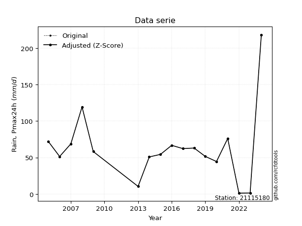</img>

</div>


> The initial value (value_initial) correspond to the initial obtained or null completed value, and value (value) is adjusted only when the initial value is outside the valid range (outlier) definite through the Z-Score value. If Z-Score is active, values out of range or outliers are replaced with the station mean value. A Z-Score (or standard score) measures how many standard deviations a data point is from the mean of a dataset, indicating its relative position; positive scores mean above the mean, negative mean below, and a score of zero is exactly at the mean, allowing for comparison of values from different distributions. It´s calculated using the formula $z=(x–μ)/σ$, where $x$ is the data point, $μ$ is the mean, and $σ$ is the standard deviation, helping identify outliers and understand probability.
>
> <sub>**Note**: In this study, "completing" (filling gaps in) and "extending" (forecasting or lengthening the historical record) rainfall data series are avoided for certain critical analyses because they introduce artificial bias and uncertainty, which can distort the statistics of rare events (extremes), alter day-to-day variability, and compromise the integrity and homogeneity of the original data. Some reasons against Completing/Extending rainfall data are: **Distortion of Extremes and Variability**: The primary issue is that most gap-filling or extension methods rely on averaging or regression with nearby stations, which inherently smooths the data. Rainfall is highly variable in space and time, with a large percentage of zero values and occasional large storms. Infilling methods often underestimate the highest values and overestimate the lowest (zero) values, which severely distorts analyses focused on flood frequency, drought severity, and intensity-duration-frequency (IDF) curves, **Loss of Data Homogeneity**: Infilled or extended data are synthetic estimates, not actual measurements. Combining these estimates with observed data can violate the assumption of data homogeneity, which requires that the data properties do not change over time. Inhomogeneity can lead to incorrect conclusions about long-term trends or changes in climate patterns, **Propagation of Errors**: Errors and biases from the original data (e.g., wind-induced undercatch, instrument errors, site changes) or the data used for imputation can propagate through the analysis, leading to unreliable hydrological models and inaccurate predictions, **Compromised Statistical Integrity**: For statistical analyses, especially those involving the frequency of events, using artificial data can introduce time bias or autocorrelation that doesn´t exist in reality, making it difficult to assess the true probability of events, **Difficulty in Validation**: It is difficult to accurately validate the quality of filled or extended data, especially for past periods where ground-truth measurements are unavailable. The reliability of imputation techniques heavily depends on the density of the surrounding station network and the complexity of the local topography.</sub>


### 4. Active continuous probability distributions from SciPy (80 of 104 available)

A Probability Density Function (PDF) describes the relative likelihood of a continuous random variable falling within a specific range, where the total area under its curve equals 1, and the area over any interval gives the actual probability for that range. Unlike discrete probabilities (like rolling a die), a PDF shows density, not direct probability for a single point (which is zero), with higher points indicating higher likelihood, often visualized as a bell curve for normal distributions.

A log of a probability density function (log-PDF) is simply the logarithm of the PDF´s value, denoted as $log(f(x))$, useful for converting multiplication of probabilities into addition, improving numerical stability with tiny numbers, and connecting to information theory concepts like entropy. Instead of dealing with very small probabilities (e.g., 0.000001), log-PDFs use negative numbers (e.g., $log(0.00001) ≈ -11.51$ that are easier for computers to handle, preventing underflow errors and simplifying complex calculations. In this study, each active probability distribution from SciPy is also evaluated in the $log$ form.

[scipy.stats](https://docs.scipy.org/doc/scipy/reference/stats.html) is a Python´s powerful submodule within the SciPy library for comprehensive statistical analysis, offering over 130 probability distributions (like Normal, Poisson, etc.), functions for descriptive stats (mean, variance), hypothesis testing (t-tests, chi-square), random variable generation, and statistical tests, making it essential for data science, modeling, and research. It provides tools to explore, model, and draw conclusions from data efficiently, working seamlessly with [NumPy](https://numpy.org/).

<div align="center">

|   id | p_dist           |   n_parameter | fit_method   | label                                                                       | active   | ref                                                                                                      |
|-----:|:-----------------|--------------:|:-------------|:----------------------------------------------------------------------------|:---------|:---------------------------------------------------------------------------------------------------------|
|    0 | alpha            |             3 | MLE          | Alpha                                                                       | True     | [:mortar_board:](https://docs.scipy.org/doc/scipy/reference/generated/scipy.stats.alpha.html)            |
|    1 | anglit           |             2 | MM           | Anglit                                                                      | True     | [:mortar_board:](https://docs.scipy.org/doc/scipy/reference/generated/scipy.stats.anglit.html)           |
|    2 | arcsine          |             2 | MM           | Arcsine                                                                     | True     | [:mortar_board:](https://docs.scipy.org/doc/scipy/reference/generated/scipy.stats.arcsine.html)          |
|    3 | argus            |             3 | MLE          | Argus                                                                       | True     | [:mortar_board:](https://docs.scipy.org/doc/scipy/reference/generated/scipy.stats.argus.html)            |
|    4 | beta             |             4 | MLE          | Beta                                                                        | True     | [:mortar_board:](https://docs.scipy.org/doc/scipy/reference/generated/scipy.stats.beta.html)             |
|    5 | betaprime        |             4 | MLE          | Beta prime                                                                  | True     | [:mortar_board:](https://docs.scipy.org/doc/scipy/reference/generated/scipy.stats.betaprime.html)        |
|    6 | bradford         |             3 | MLE          | Bradford                                                                    | True     | [:mortar_board:](https://docs.scipy.org/doc/scipy/reference/generated/scipy.stats.bradford.html)         |
|    7 | burr             |             4 | MLE          | Burr (Type III)                                                             | True     | [:mortar_board:](https://docs.scipy.org/doc/scipy/reference/generated/scipy.stats.burr.html)             |
|    8 | burr12           |             4 | MLE          | Burr (Type III) 12                                                          | True     | [:mortar_board:](https://docs.scipy.org/doc/scipy/reference/generated/scipy.stats.burr12.html)           |
|    9 | cosine           |             2 | MLE          | Cosine                                                                      | True     | [:mortar_board:](https://docs.scipy.org/doc/scipy/reference/generated/scipy.stats.cosine.html)           |
|   10 | crystalball      |             4 | MLE          | Crystalball                                                                 | True     | [:mortar_board:](https://docs.scipy.org/doc/scipy/reference/generated/scipy.stats.crystalball.html)      |
|   11 | dgamma           |             3 | MLE          | Double gamma                                                                | True     | [:mortar_board:](https://docs.scipy.org/doc/scipy/reference/generated/scipy.stats.dgamma.html)           |
|   12 | dweibull         |             3 | MLE          | Double Weibull                                                              | True     | [:mortar_board:](https://docs.scipy.org/doc/scipy/reference/generated/scipy.stats.dweibull.html)         |
|   13 | erlang           |             3 | MLE          | Erlang                                                                      | True     | [:mortar_board:](https://docs.scipy.org/doc/scipy/reference/generated/scipy.stats.erlang.html)           |
|   14 | exponnorm        |             3 | MLE          | Exponentially modified Normal                                               | True     | [:mortar_board:](https://docs.scipy.org/doc/scipy/reference/generated/scipy.stats.exponnorm.html)        |
|   15 | exponpow         |             3 | MLE          | Exponential power                                                           | True     | [:mortar_board:](https://docs.scipy.org/doc/scipy/reference/generated/scipy.stats.exponpow.html)         |
|   16 | exponweib        |             4 | MLE          | Exponentiated Weibull                                                       | True     | [:mortar_board:](https://docs.scipy.org/doc/scipy/reference/generated/scipy.stats.exponweib.html)        |
|   17 | f                |             4 | MLE          | F                                                                           | True     | [:mortar_board:](https://docs.scipy.org/doc/scipy/reference/generated/scipy.stats.f.html)                |
|   18 | fatiguelife      |             3 | MLE          | Fatigue-life (Birnbaum-Saunders)                                            | True     | [:mortar_board:](https://docs.scipy.org/doc/scipy/reference/generated/scipy.stats.fatiguelife.html)      |
|   19 | foldnorm         |             3 | MM           | Fold Normal                                                                 | True     | [:mortar_board:](https://docs.scipy.org/doc/scipy/reference/generated/scipy.stats.foldnorm.html)         |
|   20 | gamma            |             3 | MLE          | Gamma                                                                       | True     | [:mortar_board:](https://docs.scipy.org/doc/scipy/reference/generated/scipy.stats.gamma.html)            |
|   21 | gausshyper       |             6 | MLE          | Gauss hypergeometric                                                        | True     | [:mortar_board:](https://docs.scipy.org/doc/scipy/reference/generated/scipy.stats.gausshyper.html)       |
|   22 | genexpon         |             5 | MLE          | Generalized exponential                                                     | True     | [:mortar_board:](https://docs.scipy.org/doc/scipy/reference/generated/scipy.stats.genexpon.html)         |
|   23 | genextreme       |             3 | MLE          | Generalized exponential                                                     | True     | [:mortar_board:](https://docs.scipy.org/doc/scipy/reference/generated/scipy.stats.genextreme.html)       |
|   24 | gengamma         |             4 | MLE          | Generalized gamma                                                           | True     | [:mortar_board:](https://docs.scipy.org/doc/scipy/reference/generated/scipy.stats.gengamma.html)         |
|   25 | genhalflogistic  |             3 | MLE          | Generalized half-logistic                                                   | True     | [:mortar_board:](https://docs.scipy.org/doc/scipy/reference/generated/scipy.stats.genhalflogistic.html)  |
|   26 | genlogistic      |             3 | MLE          | Generalized logistic                                                        | True     | [:mortar_board:](https://docs.scipy.org/doc/scipy/reference/generated/scipy.stats.genlogistic.html)      |
|   27 | gennorm          |             3 | MLE          | Generalized Normal                                                          | True     | [:mortar_board:](https://docs.scipy.org/doc/scipy/reference/generated/scipy.stats.gennorm.html)          |
|   28 | genpareto        |             3 | MLE          | Generalized Pareto                                                          | True     | [:mortar_board:](https://docs.scipy.org/doc/scipy/reference/generated/scipy.stats.genpareto.html)        |
|   29 | gompertz         |             3 | MLE          | Gompertz (or truncated Gumbel)                                              | True     | [:mortar_board:](https://docs.scipy.org/doc/scipy/reference/generated/scipy.stats.gompertz.html)         |
|   30 | gumbel_l         |             2 | MM           | Gumbel Left Skew                                                            | True     | [:mortar_board:](https://docs.scipy.org/doc/scipy/reference/generated/scipy.stats.gumbel_l.html)         |
|   31 | gumbel_r         |             2 | MM           | Gumbel Right Skew                                                           | True     | [:mortar_board:](https://docs.scipy.org/doc/scipy/reference/generated/scipy.stats.gumbel_r.html)         |
|   32 | halfgennorm      |             3 | MLE          | Upper half of a generalized normal                                          | True     | [:mortar_board:](https://docs.scipy.org/doc/scipy/reference/generated/scipy.stats.halfgennorm.html)      |
|   33 | halflogistic     |             2 | MM           | Half-logistic                                                               | True     | [:mortar_board:](https://docs.scipy.org/doc/scipy/reference/generated/scipy.stats.halflogistic.html)     |
|   34 | halfnorm         |             2 | MM           | Half Normal                                                                 | True     | [:mortar_board:](https://docs.scipy.org/doc/scipy/reference/generated/scipy.stats.halfnorm.html)         |
|   35 | hypsecant        |             2 | MM           | hyperbolic secant                                                           | True     | [:mortar_board:](https://docs.scipy.org/doc/scipy/reference/generated/scipy.stats.hypsecant.html)        |
|   36 | invgamma         |             3 | MLE          | Inverted gamma                                                              | True     | [:mortar_board:](https://docs.scipy.org/doc/scipy/reference/generated/scipy.stats.invgamma.html)         |
|   37 | invgauss         |             3 | MLE          | Inverse Gaussian                                                            | True     | [:mortar_board:](https://docs.scipy.org/doc/scipy/reference/generated/scipy.stats.invgauss.html)         |
|   38 | invweibull       |             3 | MLE          | Inverted Weibull                                                            | True     | [:mortar_board:](https://docs.scipy.org/doc/scipy/reference/generated/scipy.stats.invweibull.html)       |
|   39 | johnsonsb        |             4 | MLE          | Johnson SB                                                                  | True     | [:mortar_board:](https://docs.scipy.org/doc/scipy/reference/generated/scipy.stats.johnsonsb.html)        |
|   40 | johnsonsu        |             4 | MLE          | Johnson Su                                                                  | True     | [:mortar_board:](https://docs.scipy.org/doc/scipy/reference/generated/scipy.stats.johnsonsu.html)        |
|   41 | kappa3           |             3 | MLE          | Kappa 3                                                                     | True     | [:mortar_board:](https://docs.scipy.org/doc/scipy/reference/generated/scipy.stats.kappa3.html)           |
|   42 | kappa4           |             4 | MLE          | Kappa 4                                                                     | True     | [:mortar_board:](https://docs.scipy.org/doc/scipy/reference/generated/scipy.stats.kappa4.html)           |
|   43 | ksone            |             3 | MLE          | Kolmogorov-Smirnov one-sided test statistic distribution                    | True     | [:mortar_board:](https://docs.scipy.org/doc/scipy/reference/generated/scipy.stats.ksone.html)            |
|   44 | kstwobign        |             2 | MLE          | Limiting distribution of scaled Kolmogorov-Smirnov two-sided test statistic | True     | [:mortar_board:](https://docs.scipy.org/doc/scipy/reference/generated/scipy.stats.kstwobign.html)        |
|   45 | laplace          |             2 | MM           | Laplace                                                                     | True     | [:mortar_board:](https://docs.scipy.org/doc/scipy/reference/generated/scipy.stats.laplace.html)          |
|   46 | levy_l           |             2 | MLE          | Left-skewed Levy                                                            | True     | [:mortar_board:](https://docs.scipy.org/doc/scipy/reference/generated/scipy.stats.levy_l.html)           |
|   47 | loggamma         |             3 | MLE          | Log gamma                                                                   | True     | [:mortar_board:](https://docs.scipy.org/doc/scipy/reference/generated/scipy.stats.loggamma.html)         |
|   48 | logistic         |             2 | MM           | Logistic (or Sech-squared)                                                  | True     | [:mortar_board:](https://docs.scipy.org/doc/scipy/reference/generated/scipy.stats.logistic.html)         |
|   49 | loglaplace       |             3 | MLE          | Log-Laplace                                                                 | True     | [:mortar_board:](https://docs.scipy.org/doc/scipy/reference/generated/scipy.stats.loglaplace.html)       |
|   50 | lomax            |             3 | MLE          | Lomax (Pareto of the second kind)                                           | True     | [:mortar_board:](https://docs.scipy.org/doc/scipy/reference/generated/scipy.stats.lomax.html)            |
|   51 | maxwell          |             2 | MM           | Maxwell                                                                     | True     | [:mortar_board:](https://docs.scipy.org/doc/scipy/reference/generated/scipy.stats.maxwell.html)          |
|   52 | mielke           |             4 | MLE          | Mielke Beta-Kappa / Dagum                                                   | True     | [:mortar_board:](https://docs.scipy.org/doc/scipy/reference/generated/scipy.stats.mielke.html)           |
|   53 | moyal            |             2 | MM           | Moyal                                                                       | True     | [:mortar_board:](https://docs.scipy.org/doc/scipy/reference/generated/scipy.stats.moyal.html)            |
|   54 | nakagami         |             3 | MLE          | Nakagami                                                                    | True     | [:mortar_board:](https://docs.scipy.org/doc/scipy/reference/generated/scipy.stats.nakagami.html)         |
|   55 | ncf              |             5 | MLE          | Non-central F distribution                                                  | True     | [:mortar_board:](https://docs.scipy.org/doc/scipy/reference/generated/scipy.stats.ncf.html)              |
|   56 | nct              |             4 | MLE          | Non-central Student’s t                                                     | True     | [:mortar_board:](https://docs.scipy.org/doc/scipy/reference/generated/scipy.stats.nct.html)              |
|   57 | norm             |             2 | MM           | Normal                                                                      | True     | [:mortar_board:](https://docs.scipy.org/doc/scipy/reference/generated/scipy.stats.norm.html)             |
|   58 | pearson3         |             3 | MM           | Pearson type III                                                            | True     | [:mortar_board:](https://docs.scipy.org/doc/scipy/reference/generated/scipy.stats.pearson3.html)         |
|   59 | powerlaw         |             3 | MLE          | Power-function                                                              | True     | [:mortar_board:](https://docs.scipy.org/doc/scipy/reference/generated/scipy.stats.powerlaw.html)         |
|   60 | rayleigh         |             2 | MM           | Rayleigh                                                                    | True     | [:mortar_board:](https://docs.scipy.org/doc/scipy/reference/generated/scipy.stats.rayleigh.html)         |
|   61 | rdist            |             3 | MLE          | R-distributed (symmetric beta)                                              | True     | [:mortar_board:](https://docs.scipy.org/doc/scipy/reference/generated/scipy.stats.rdist.html)            |
|   62 | rice             |             3 | MLE          | Rice                                                                        | True     | [:mortar_board:](https://docs.scipy.org/doc/scipy/reference/generated/scipy.stats.rice.html)             |
|   63 | semicircular     |             2 | MM           | Semicircular                                                                | True     | [:mortar_board:](https://docs.scipy.org/doc/scipy/reference/generated/scipy.stats.semicircular.html)     |
|   64 | skewnorm         |             3 | MLE          | Skew normal                                                                 | True     | [:mortar_board:](https://docs.scipy.org/doc/scipy/reference/generated/scipy.stats.skewnorm.html)         |
|   65 | t                |             3 | MLE          | Student’s t                                                                 | True     | [:mortar_board:](https://docs.scipy.org/doc/scipy/reference/generated/scipy.stats.t.html)                |
|   66 | trapezoid        |             4 | MLE          | Trapezoid                                                                   | True     | [:mortar_board:](https://docs.scipy.org/doc/scipy/reference/generated/scipy.stats.trapezoid.html)        |
|   67 | triang           |             3 | MLE          | Triangular                                                                  | True     | [:mortar_board:](https://docs.scipy.org/doc/scipy/reference/generated/scipy.stats.triang.html)           |
|   68 | truncexpon       |             3 | MLE          | Truncated exponential                                                       | True     | [:mortar_board:](https://docs.scipy.org/doc/scipy/reference/generated/scipy.stats.truncexpon.html)       |
|   69 | truncnorm        |             4 | MLE          | Truncated normal                                                            | True     | [:mortar_board:](https://docs.scipy.org/doc/scipy/reference/generated/scipy.stats.truncnorm.html)        |
|   70 | truncpareto      |             4 | MLE          | Upper truncated Pareto                                                      | True     | [:mortar_board:](https://docs.scipy.org/doc/scipy/reference/generated/scipy.stats.truncpareto.html)      |
|   71 | truncweibull_min |             5 | MLE          | Doubly truncated Weibull minimum                                            | True     | [:mortar_board:](https://docs.scipy.org/doc/scipy/reference/generated/scipy.stats.truncweibull_min.html) |
|   72 | tukeylambda      |             3 | MLE          | Tukey-Lamdba                                                                | True     | [:mortar_board:](https://docs.scipy.org/doc/scipy/reference/generated/scipy.stats.tukeylambda.html)      |
|   73 | uniform          |             2 | MLE          | Uniform                                                                     | True     | [:mortar_board:](https://docs.scipy.org/doc/scipy/reference/generated/scipy.stats.uniform.html)          |
|   74 | vonmises         |             3 | MLE          | Von Mises                                                                   | True     | [:mortar_board:](https://docs.scipy.org/doc/scipy/reference/generated/scipy.stats.vonmises.html)         |
|   75 | vonmises_line    |             3 | MLE          | Von Mises line                                                              | True     | [:mortar_board:](https://docs.scipy.org/doc/scipy/reference/generated/scipy.stats.vonmises_line.html)    |
|   76 | wald             |             2 | MM           | Wald                                                                        | True     | [:mortar_board:](https://docs.scipy.org/doc/scipy/reference/generated/scipy.stats.wald.html)             |
|   77 | weibull_max      |             3 | MLE          | Weibull maximum                                                             | True     | [:mortar_board:](https://docs.scipy.org/doc/scipy/reference/generated/scipy.stats.weibull_max.html)      |
|   78 | weibull_min      |             3 | MLE          | Weibull minimum                                                             | True     | [:mortar_board:](https://docs.scipy.org/doc/scipy/reference/generated/scipy.stats.weibull_min.html)      |
|   79 | wrapcauchy       |             3 | MLE          | Wrapped  Cauchy                                                             | True     | [:mortar_board:](https://docs.scipy.org/doc/scipy/reference/generated/scipy.stats.wrapcauchy.html)       |

</div>

> **n_parameter:** # arguments & localization & scale.
>
> **Fit methods:** (MLE) maximum likelihood, (MM) L-moments.
>
>**Inactive** (With the only purpose of prevent loops, zero divisions, infinite values, over high estimated values or horizontal trending for recurrence intervals estimations, the follow distributions were disabled.)**:** lognorm, norminvgauss, powernorm, powerlognorm, cauchy, halfcauchy, foldcauchy, skewcauchy, chi2, expon, fisk, genhyperbolic, geninvgauss, gibrat, kstwo, laplace_asymmetric, levy, levy_stable, ncx2, pareto, rel_breitwigner, recipinvgauss, studentized_range, loguniform, 


## B. Probability (PDF) vs. Empirical (EDF) distributions functions

A continuous probability distribution (CPD) describes probabilities for variables that can take any value within a range (like rain any time), unlike discrete variables with specific outcomes (like temperature). It uses a Probability Density Function (PDF), a curve where the total area under it equals 1, and the probability of the variable falling within an interval (a to b) is found by calculating the area under the curve between those points. A key feature is that the probability of hitting any single exact value is zero, so probabilities are always expressed for ranges, e.g., $P(a ≤ X ≤ b)$.

<div align="center">

Distributions parameters from station values
|     |   station | p_dist              |   n |              loc |           scale | shape                 | shape1                 | shape2                | shape3              |
|----:|----------:|:--------------------|----:|-----------------:|----------------:|:----------------------|:-----------------------|:----------------------|:--------------------|
|   0 |  21115180 | alpha               |  18 |     -0.00490857  |     3.6751      | 4.075425619913644e-10 |                        |                       |                     |
|   1 |  21115180 | anglit              |  18 |     60.4222      |   139.291       |                       |                        |                       |                     |
|   2 |  21115180 | arcsine             |  18 |     -6.91445     |   134.673       |                       |                        |                       |                     |
|   3 |  21115180 | argus               |  18 |    -84.3989      |   307.584       | 4.441500011777538e-07 |                        |                       |                     |
|   4 |  21115180 | beta                |  18 |      1.1         |  4382.2         | 0.9034909319609121    | 79.23197883479784      |                       |                     |
|   5 |  21115180 | betaprime           |  18 |     -5.4105      | 22665.4         | 1.8267091237554243    | 631.4758356983268      |                       |                     |
|   6 |  21115180 | bradford            |  18 |      1.09999     |   217.3         | 2.3314211139609515    |                        |                       |                     |
|   7 |  21115180 | burr                |  18 |      1.1         |    95.5514      | 3.4799853117025465    | 0.23180987714566065    |                       |                     |
|   8 |  21115180 | burr12              |  18 |     -0.515216    |  7281.78        | 1.2076882672301785    | 302.22397600431157     |                       |                     |
|   9 |  21115180 | cosine              |  18 |     76.6117      |    52.1728      |                       |                        |                       |                     |
|  10 |  21115180 | crystalball         |  18 |     60.4222      |    47.6142      | 4659.636754729517     | 614.5985602952097      |                       |                     |
|  11 |  21115180 | dgamma              |  18 |     51.5         |    40.7397      | 0.6792312355917529    |                        |                       |                     |
|  12 |  21115180 | dweibull            |  18 |     62.2         |    25.5017      | 0.7917348166002027    |                        |                       |                     |
|  13 |  21115180 | erlang              |  18 |     -4.3995      |    37.9632      | 1.7074885324460864    |                        |                       |                     |
|  14 |  21115180 | exponnorm           |  18 |     24.3874      |    22.9325      | 1.571342716469636     |                        |                       |                     |
|  15 |  21115180 | exponpow            |  18 |      1.1         |   105.078       | 0.6065811509379133    |                        |                       |                     |
|  16 |  21115180 | exponweib           |  18 |    -86.1509      |    14.8804      | 148.44412555603196    | 0.7551764538966761     |                       |                     |
|  17 |  21115180 | f                   |  18 |     -4.84983     |    65.1846      | 3.5173692810949158    | 1392.276526413205      |                       |                     |
|  18 |  21115180 | fatiguelife         |  18 |    -40.7371      |    92.1097      | 0.4433528201568683    |                        |                       |                     |
|  19 |  21115180 | foldnorm            |  18 |     -8.50476     |    85.012       | 0.003535656122652062  |                        |                       |                     |
|  20 |  21115180 | gamma               |  18 |     -4.39952     |    37.9632      | 1.7074888318390087    |                        |                       |                     |
|  21 |  21115180 | gausshyper          |  18 |      1.1         |   275.788       | 0.8056786442955585    | 3.1058694290059914     | 1.5170102962801817    | 0.05114789924270815 |
|  22 |  21115180 | genexpon            |  18 |      1.1         |     2.36965     | 0.03985939162786233   | 1.0655354688794406e-05 | 4.191711588677592     |                     |
|  23 |  21115180 | genextreme          |  18 |     39.423       |    32.8606      | -0.0623305174204125   |                        |                       |                     |
|  24 |  21115180 | gengamma            |  18 |    -20.3812      |     2.35276     | 8.359043133858691     | 0.6108196645441264     |                       |                     |
|  25 |  21115180 | genhalflogistic     |  18 |      1.1         |    44.9258      | 0.050505848293749156  |                        |                       |                     |
|  26 |  21115180 | genlogistic         |  18 |   -151.105       |    33.4996      | 306.0078057246849     |                        |                       |                     |
|  27 |  21115180 | gennorm             |  18 |     54.3         |     5.67212     | 0.5172561292588445    |                        |                       |                     |
|  28 |  21115180 | genpareto           |  18 |      1.1         |    69.7092      | -0.18024075687988012  |                        |                       |                     |
|  29 |  21115180 | gompertz            |  18 |      1.1         |   242.302       | 3.271719974733802     |                        |                       |                     |
|  30 |  21115180 | gumbel_l            |  18 |     81.8511      |    37.1246      |                       |                        |                       |                     |
|  31 |  21115180 | gumbel_r            |  18 |     38.9933      |    37.1246      |                       |                        |                       |                     |
|  32 |  21115180 | halfgennorm         |  18 |      1.1         |     3.05488     | 0.3758581306207581    |                        |                       |                     |
|  33 |  21115180 | halflogistic        |  18 |      3.9883      |    40.7085      |                       |                        |                       |                     |
|  34 |  21115180 | halfnorm            |  18 |     -2.60033     |    78.9871      |                       |                        |                       |                     |
|  35 |  21115180 | hypsecant           |  18 |     60.4222      |    30.3121      |                       |                        |                       |                     |
|  36 |  21115180 | invgamma            |  18 |    -72.8431      |  1262.73        | 10.488287810113224    |                        |                       |                     |
|  37 |  21115180 | invgauss            |  18 |    -42.9956      |   531.245       | 0.19467064125616507   |                        |                       |                     |
|  38 |  21115180 | invweibull          |  18 |   -487.772       |   527.195       | 16.04338492958768     |                        |                       |                     |
|  39 |  21115180 | johnsonsb           |  18 |    -40.0917      | 10531.3         | 10.795401298587713    | 2.2784794429323343     |                       |                     |
|  40 |  21115180 | johnsonsu           |  18 |     58.363       |    10.4766      | 0.06463687111523268   | 0.6305339920286257     |                       |                     |
|  41 |  21115180 | kappa3              |  18 |      1.1         |    64.7828      | 4.072308385946515     |                        |                       |                     |
|  42 |  21115180 | kappa4              |  18 |    -22.0182      |   236.649       | 1.1081106878553404    | 0.9742899001520406     |                       |                     |
|  43 |  21115180 | ksone               |  18 |    -20.63        |   260.76        | 1.0                   |                        |                       |                     |
|  44 |  21115180 | kstwobign           |  18 |    -84.6744      |   168.627       |                       |                        |                       |                     |
|  45 |  21115180 | laplace             |  18 |     60.4222      |    33.6683      |                       |                        |                       |                     |
|  46 |  21115180 | levy_l              |  18 |    235.761       |   118.275       |                       |                        |                       |                     |
|  47 |  21115180 | loggamma            |  18 | -17010.8         |  2247.55        | 1989.3647184548881    |                        |                       |                     |
|  48 |  21115180 | logistic            |  18 |     60.4222      |    26.2511      |                       |                        |                       |                     |
|  49 |  21115180 | loglaplace          |  18 |     -0.13271     |    58.3327      | 1.2789609306320155    |                        |                       |                     |
|  50 |  21115180 | lomax               |  18 |      1.1         |     3.61476e+10 | 615230674.1620188     |                        |                       |                     |
|  51 |  21115180 | maxwell             |  18 |    -52.4035      |    70.703       |                       |                        |                       |                     |
|  52 |  21115180 | mielke              |  18 |      1.1         |    90.9231      | 0.9053188177665092    | 2.9948841635396617     |                       |                     |
|  53 |  21115180 | moyal               |  18 |     33.1934      |    21.4339      |                       |                        |                       |                     |
|  54 |  21115180 | nakagami            |  18 |      1.1         |   101.478       | 0.3353248629661122    |                        |                       |                     |
|  55 |  21115180 | ncf                 |  18 |      1.1         |     3.58156     | 0.42132636692611025   | 42.68507179219947      | 6.900441664694654     |                     |
|  56 |  21115180 | nct                 |  18 |     60.4967      |    14.0318      | 1.1606231578582238    | -0.2063992644167959    |                       |                     |
|  57 |  21115180 | norm                |  18 |     60.4222      |    47.6142      |                       |                        |                       |                     |
|  58 |  21115180 | pearson3            |  18 |     60.4222      |    47.6142      | 1.8166532756605323    |                        |                       |                     |
|  59 |  21115180 | powerlaw            |  18 |      1.1         |   217.3         | 0.25651164113940406   |                        |                       |                     |
|  60 |  21115180 | rayleigh            |  18 |    -30.6665      |    72.6783      |                       |                        |                       |                     |
|  61 |  21115180 | rdist               |  18 |    -20.6299      |    96.7299      | 1.1630745199425818    |                        |                       |                     |
|  62 |  21115180 | rice                |  18 |    -17.9248      |    64.8281      | 0.0002570801722743019 |                        |                       |                     |
|  63 |  21115180 | semicircular        |  18 |     60.4222      |    95.2284      |                       |                        |                       |                     |
|  64 |  21115180 | skewnorm            |  18 |      1.1         |    76.0675      | 238907969.68385643    |                        |                       |                     |
|  65 |  21115180 | t                   |  18 |     57.4736      |    14.368       | 1.178534761245857     |                        |                       |                     |
|  66 |  21115180 | trapezoid           |  18 |    -21.6615      |   260.76        | 1.0                   | 1.0                    |                       |                     |
|  67 |  21115180 | triang              |  18 |    -27.1623      |   260.387       | 0.29940911997722136   |                        |                       |                     |
|  68 |  21115180 | truncexpon          |  18 |      1.1         |   183.085       | 1.186878618263545     |                        |                       |                     |
|  69 |  21115180 | truncnorm           |  18 |     60.4222      |    47.6142      | -9.490614169729707    | 2038.0991470398676     |                       |                     |
|  70 |  21115180 | truncpareto         |  18 |      1.1         |     6.10067e-07 | 0.05882367027305635   | 356190294.9727541      |                       |                     |
|  71 |  21115180 | truncweibull_min    |  18 |      0.573761    |   147.16        | 0.6833796510443876    | 0.003575973362965158   | 1.4802031720179027    |                     |
|  72 |  21115180 | tukeylambda         |  18 |     60.25        |   213.931       | 3.6167527197010054    |                        |                       |                     |
|  73 |  21115180 | uniform             |  18 |      1.1         |   217.3         |                       |                        |                       |                     |
|  74 |  21115180 | vonmises            |  18 |      0.341803    |     1           | 0.6352109325201533    |                        |                       |                     |
|  75 |  21115180 | vonmises_line       |  18 |     54.6289      |    52.1299      | 2.383954580394354     |                        |                       |                     |
|  76 |  21115180 | wald                |  18 |     12.808       |    47.6142      |                       |                        |                       |                     |
|  77 |  21115180 | weibull_max         |  18 |    218.4         |     1.82756     | 0.1926315218771873    |                        |                       |                     |
|  78 |  21115180 | weibull_min         |  18 |      9.07129     |    58.7485      | 1.2934710269392333    |                        |                       |                     |
|  79 |  21115180 | wrapcauchy          |  18 |      0.99557     |    34.601       | 0.10978404172249476   |                        |                       |                     |
|  80 |  21115180 | logalpha            |  18 |     -0.00212695  |     0.396391    | 3.727771615376623e-08 |                        |                       |                     |
|  81 |  21115180 | loganglit           |  18 |      3.59935     |     3.94333     |                       |                        |                       |                     |
|  82 |  21115180 | logarcsine          |  18 |      1.69306     |     3.81259     |                       |                        |                       |                     |
|  83 |  21115180 | logargus            |  18 |     -1.19945     |     6.64418     | 2.1418195201928834    |                        |                       |                     |
|  84 |  21115180 | logbeta             |  18 |     -0.449603    |     5.83593     | 1.25855416773186      | 0.28859480717579644    |                       |                     |
|  85 |  21115180 | logbetaprime        |  18 |    -26.011       |   104.776       | 552.9149354534618     | 1957.5531323088396     |                       |                     |
|  86 |  21115180 | logbradford         |  18 |     -0.587928    |     5.97426     | 1.163983421149318e-05 |                        |                       |                     |
|  87 |  21115180 | logburr             |  18 |     -1.27196e+06 |     1.27196e+06 | 5293341.212806167     | 0.2306285333012753     |                       |                     |
|  88 |  21115180 | logburr12           |  18 |  -6223.28        |  6239.26        | 8199.09863613938      | 5441360.442664966      |                       |                     |
|  89 |  21115180 | logcosine           |  18 |      3.2712      |     1.27664     |                       |                        |                       |                     |
|  90 |  21115180 | logcrystalball      |  18 |      3.59935     |     1.34794     | 8.486043369723134     | 6.370026948573141      |                       |                     |
|  91 |  21115180 | logdgamma           |  18 |      3.99452     |     0.879246    | 0.7183481211498671    |                        |                       |                     |
|  92 |  21115180 | logdweibull         |  18 |      3.99452     |     0.87856     | 0.7155964135673798    |                        |                       |                     |
|  93 |  21115180 | logerlang           |  18 |    -16.8522      |     0.100473    | 203.3042360028516     |                        |                       |                     |
|  94 |  21115180 | logexponnorm        |  18 |      3.59837     |     1.34795     | 0.0007225648891359838 |                        |                       |                     |
|  95 |  21115180 | logexponpow         |  18 |      0.0953102   |     3.92662     | 0.7198301906696274    |                        |                       |                     |
|  96 |  21115180 | logexponweib        |  18 |     -4.79954e+07 |     4.79954e+07 | 0.5367365885118518    | 81543121.0942661       |                       |                     |
|  97 |  21115180 | logf                |  18 |  -3457.72        |  3461.31        | 88950811.04382655     | 15352173.688623019     |                       |                     |
|  98 |  21115180 | logfatiguelife      |  18 |   -546.893       |   550.48        | 0.002434519118229855  |                        |                       |                     |
|  99 |  21115180 | logfoldnorm         |  18 |      0.440609    |     1.15112     | 2.7781202068826882    |                        |                       |                     |
| 100 |  21115180 | loggamma            |  18 |    -21.0794      |     0.0804067   | 306.94991911035777    |                        |                       |                     |
| 101 |  21115180 | loggausshyper       |  18 |     -0.483724    |     5.87005     | 1.2398684443932337    | 0.6966678628680567     | 1.0966614405723574    | 0.8917341289149485  |
| 102 |  21115180 | loggenexpon         |  18 |      0.0953101   |     0.304326    | 0.017125079430600654  | 7.02705282270126       | 0.0015113639854582768 |                     |
| 103 |  21115180 | loggenextreme       |  18 |      3.40483     |     1.41158     | 0.6872829542456909    |                        |                       |                     |
| 104 |  21115180 | loggengamma         |  18 |     -2.27287e+07 |     2.27287e+07 | 0.47017820255485027   | 43035936.58139929      |                       |                     |
| 105 |  21115180 | loggenhalflogistic  |  18 |     -0.446558    |     6.20073     | 1.0630643726321947    |                        |                       |                     |
| 106 |  21115180 | loggenlogistic      |  18 |      4.5514      |     0.24283     | 0.23312196137858562   |                        |                       |                     |
| 107 |  21115180 | loggennorm          |  18 |      4.13036     |     0.0520248   | 0.4093172602448856    |                        |                       |                     |
| 108 |  21115180 | loggenpareto        |  18 |      0.00630154  |     8.07426     | -1.5007843563344845   |                        |                       |                     |
| 109 |  21115180 | loggompertz         |  18 |      0.0953101   |     0.888308    | 0.010681636169894218  |                        |                       |                     |
| 110 |  21115180 | loggumbel_l         |  18 |      4.206       |     1.05099     |                       |                        |                       |                     |
| 111 |  21115180 | loggumbel_r         |  18 |      2.99271     |     1.05099     |                       |                        |                       |                     |
| 112 |  21115180 | loghalfgennorm      |  18 |      0.0950832   |     5.29541     | 11314.877263499275    |                        |                       |                     |
| 113 |  21115180 | loghalflogistic     |  18 |      2.00172     |     1.15245     |                       |                        |                       |                     |
| 114 |  21115180 | loghalfnorm         |  18 |      1.81519     |     2.23612     |                       |                        |                       |                     |
| 115 |  21115180 | loghypsecant        |  18 |      3.59935     |     0.858128    |                       |                        |                       |                     |
| 116 |  21115180 | loginvgamma         |  18 |    -32.5593      | 23902.6         | 662.438801551896      |                        |                       |                     |
| 117 |  21115180 | loginvgauss         |  18 |    -12.1851      |  1685.13        | 0.009361244274757995  |                        |                       |                     |
| 118 |  21115180 | loginvweibull       |  18 |     -2.56398e+08 |     2.56398e+08 | 150956974.19319648    |                        |                       |                     |
| 119 |  21115180 | logjohnsonsb        |  18 |   -202.415       |   208.474       | -9.290870710270212    | 2.0415552549891887     |                       |                     |
| 120 |  21115180 | logjohnsonsu        |  18 |      4.16876     |     0.118247    | 0.43151695582703      | 0.5002406640954267     |                       |                     |
| 121 |  21115180 | logkappa3           |  18 |      0.0953089   |     5.29102     | 780780.3671468495     |                        |                       |                     |
| 122 |  21115180 | logkappa4           |  18 |     -0.403828    |     6.00615     | 1.0907887391439623    | 1.035863586101974      |                       |                     |
| 123 |  21115180 | logksone            |  18 |     -0.433792    |     6.34922     | 1.0                   |                        |                       |                     |
| 124 |  21115180 | logkstwobign        |  18 |     -3.4109      |     8.0408      |                       |                        |                       |                     |
| 125 |  21115180 | loglaplace          |  18 |      3.59935     |     0.95314     |                       |                        |                       |                     |
| 126 |  21115180 | loglevy_l           |  18 |      5.54323     |     1.05554     |                       |                        |                       |                     |
| 127 |  21115180 | logloggamma         |  18 |      4.68868     |     0.54943     | 0.49612966814070814   |                        |                       |                     |
| 128 |  21115180 | loglogistic         |  18 |      3.59935     |     0.743161    |                       |                        |                       |                     |
| 129 |  21115180 | logloglaplace       |  18 |     -3.77704e+08 |     3.77704e+08 | 460198462.8471025     |                        |                       |                     |
| 130 |  21115180 | loglomax            |  18 |      0.0953102   |     3.9179e+13  | 11922576112442.266    |                        |                       |                     |
| 131 |  21115180 | logmaxwell          |  18 |      0.405339    |     2.00156     |                       |                        |                       |                     |
| 132 |  21115180 | logmielke           |  18 |     -4.39464e+07 |     4.39464e+07 | 42060941.2738173      | 180619993.91629094     |                       |                     |
| 133 |  21115180 | logmoyal            |  18 |      2.82851     |     0.606788    |                       |                        |                       |                     |
| 134 |  21115180 | lognakagami         |  18 |  -1293.38        |  1296.98        | 229973.4917061297     |                        |                       |                     |
| 135 |  21115180 | logncf              |  18 |    -99.2773      |    81.0269      | 11677.962587370443    | 151991.1196185227      | 3148.866017760749     |                     |
| 136 |  21115180 | lognct              |  18 |   -101.021       |     1.32192     | 72269.75360873298     | 79.14128845427089      |                       |                     |
| 137 |  21115180 | lognorm             |  18 |      3.59935     |     1.34794     |                       |                        |                       |                     |
| 138 |  21115180 | logpearson3         |  18 |      3.59936     |     1.34793     | -1.610713929803957    |                        |                       |                     |
| 139 |  21115180 | logpowerlaw         |  18 |      0.0953102   |     5.29102     | 0.3703597938467898    |                        |                       |                     |
| 140 |  21115180 | lograyleigh         |  18 |      1.02063     |     2.05752     |                       |                        |                       |                     |
| 141 |  21115180 | logrdist            |  18 |      0.346455    |     5.03987     | 0.7859176498932272    |                        |                       |                     |
| 142 |  21115180 | logrice             |  18 |   -439.424       |     1.34798     | 328.65496922273326    |                        |                       |                     |
| 143 |  21115180 | logsemicircular     |  18 |      3.59935     |     2.6959      |                       |                        |                       |                     |
| 144 |  21115180 | logskewnorm         |  18 |      5.38633     |     2.23846     | -22035482.02786523    |                        |                       |                     |
| 145 |  21115180 | logt                |  18 |      4.08765     |     0.200532    | 0.7770886193897606    |                        |                       |                     |
| 146 |  21115180 | logtrapezoid        |  18 |     -0.223869    |     5.71884     | 1.0                   | 1.0                    |                       |                     |
| 147 |  21115180 | logtriang           |  18 |     -0.227929    |     5.6143      | 0.9999941247495783    |                        |                       |                     |
| 148 |  21115180 | logtruncexpon       |  18 |     -0.3857      |     8.55058     | 0.675045443136499     |                        |                       |                     |
| 149 |  21115180 | logtruncnorm        |  18 |     -0.169003    |     3.95886     | 0.052524224858466945  | 1.4032645613541315     |                       |                     |
| 150 |  21115180 | logtruncpareto      |  18 |      0.0953101   |     4.99833e-08 | 0.05882355616395123   | 105855761.09165192     |                       |                     |
| 151 |  21115180 | logtruncweibull_min |  18 |     -0.693758    |    10.9092      | 2.4552535182031825    | 2.166201191904758e-10  | 0.5573370233904378    |                     |
| 152 |  21115180 | logtukeylambda      |  18 |      0.56636     |     4.73774     | 1.258133541712174     |                        |                       |                     |
| 153 |  21115180 | loguniform          |  18 |      0.0953102   |     5.29102     |                       |                        |                       |                     |
| 154 |  21115180 | logvonmises         |  18 |     -2.11558     |     1           | 1.7185361504071954    |                        |                       |                     |
| 155 |  21115180 | logvonmises_line    |  18 |      3.87473     |     1.20303     | 1.7515280956649701    |                        |                       |                     |
| 156 |  21115180 | logwald             |  18 |      2.25136     |     1.34797     |                       |                        |                       |                     |
| 157 |  21115180 | logweibull_max      |  18 |      5.45867     |     2.05385     | 1.454953734069224     |                        |                       |                     |
| 158 |  21115180 | logweibull_min      |  18 |     -1.14526e+08 |     1.14526e+08 | 134038020.30098855    |                        |                       |                     |
| 159 |  21115180 | logwrapcauchy       |  18 |      0.0953073   |     0.842092    | 0.08427996335546228   |                        |                       |                     |

</div>

> **loc** (Location parameter): This shifts the distribution along the x-axis. For many common distributions, like the normal (Gaussian) distribution, loc represents the mean $μ$. For others, like the uniform distribution, it might represent the minimum value, or for the beta distribution, the left end of the support interval.
>
> **scale** (Scale parameter): This determines the width or spread of the distribution. For the normal distribution, scale represents the standard deviation $σ$. For a uniform distribution, it defines the length of the interval (from $loc$ to $loc + scale$).
>
> **shape** (Shape parameters): Refers to parameters that define the specific form of a probability distribution, distinct from its location (loc) and scale (scale). These parameters are required arguments for most distribution functions. For example, a normal (Gaussian) distribution is fully defined by its location (mean) and scale (standard deviation), so it has no specific shape parameters beyond loc and scale. However, other distributions have intrinsic properties that need specification, as Gamma distribution that takes a shape parameter, often named $a$ or $alpha$.


### 0. Cumulative distribution values - CDF (160 evaluated)

Cumulative Distribution Function (CDF), denoted as $F$<sub>$X$</sub>$(x)$, is a function that gives the probability that a random variable $X$ will take a value less than or equal to a specific value, $x$ (i.e., $(P(X≥x)$. It essentially "accumulates" probabilities from a given point up to the far right (positive infinity), providing a complete picture of the distribution´s probabilities for both discrete (like rain) and continuous (like temperature) variables, helping to find probabilities over ranges or above certain values. Each station is evaluated separately ordering the $x$ values ascending, calculating the CDF and PDF values for the activated distributions and their logarithmic forms.

<div align="center">

CDF ordered by x ascending and calculating $log(f(x))$ separately
|   id |   Station |   date |     x |   count |    mean |     std |     zscore |   Value_initial |   station |   m |       alpha |   alpha_pdf |   anglit |   anglit_pdf |   arcsine |   arcsine_pdf |    argus |   argus_pdf |        beta |    beta_pdf |   betaprime |   betaprime_pdf |    bradford |   bradford_pdf |       burr |    burr_pdf |    burr12 |   burr12_pdf |   cosine |   cosine_pdf |   crystalball |   crystalball_pdf |    dgamma |     dgamma_pdf |   dweibull |   dweibull_pdf |    erlang |   erlang_pdf |   exponnorm |   exponnorm_pdf |    exponpow |    exponpow_pdf |   exponweib |   exponweib_pdf |         f |       f_pdf |   fatiguelife |   fatiguelife_pdf |   foldnorm |   foldnorm_pdf |     gamma |   gamma_pdf |   gausshyper |   gausshyper_pdf |    genexpon |   genexpon_pdf |   genextreme |   genextreme_pdf |   gengamma |   gengamma_pdf |   genhalflogistic |   genhalflogistic_pdf |   genlogistic |   genlogistic_pdf |   gennorm |   gennorm_pdf |   genpareto |   genpareto_pdf |    gompertz |   gompertz_pdf |   gumbel_l |   gumbel_l_pdf |   gumbel_r |   gumbel_r_pdf |   halfgennorm |   halfgennorm_pdf |   halflogistic |   halflogistic_pdf |   halfnorm |   halfnorm_pdf |   hypsecant |   hypsecant_pdf |   invgamma |   invgamma_pdf |   invgauss |   invgauss_pdf |   invweibull |   invweibull_pdf |   johnsonsb |   johnsonsb_pdf |   johnsonsu |   johnsonsu_pdf |      kappa3 |   kappa3_pdf |      kappa4 |   kappa4_pdf |     ksone |   ksone_pdf |   kstwobign |   kstwobign_pdf |   laplace |   laplace_pdf |   levy_l |   levy_l_pdf |   loggamma |   loggamma_pdf |   logistic |   logistic_pdf |   loglaplace |   loglaplace_pdf |       lomax |   lomax_pdf |   maxwell |   maxwell_pdf |      mielke |   mielke_pdf |     moyal |   moyal_pdf |    nakagami |   nakagami_pdf |         ncf |          ncf_pdf |       nct |     nct_pdf |     norm |    norm_pdf |   pearson3 |   pearson3_pdf |    powerlaw |   powerlaw_pdf |   rayleigh |   rayleigh_pdf |    rdist |     rdist_pdf |      rice |    rice_pdf |   semicircular |   semicircular_pdf |   skewnorm |   skewnorm_pdf |         t |       t_pdf |   trapezoid |   trapezoid_pdf |    triang |   triang_pdf |   truncexpon |   truncexpon_pdf |   truncnorm |   truncnorm_pdf |   truncpareto |   truncpareto_pdf |   truncweibull_min |   truncweibull_min_pdf |   tukeylambda |   tukeylambda_pdf |    uniform |   uniform_pdf |   vonmises |   vonmises_pdf |   vonmises_line |   vonmises_line_pdf |      wald |    wald_pdf |   weibull_max |   weibull_max_pdf |   weibull_min |   weibull_min_pdf |   wrapcauchy |   wrapcauchy_pdf |    logalpha |   logalpha_pdf |   loganglit |   loganglit_pdf |   logarcsine |   logarcsine_pdf |   logargus |   logargus_pdf |   logbeta |   logbeta_pdf |   logbetaprime |   logbetaprime_pdf |   logbradford |   logbradford_pdf |   logburr |   logburr_pdf |   logburr12 |   logburr12_pdf |   logcosine |   logcosine_pdf |   logcrystalball |   logcrystalball_pdf |   logdgamma |   logdgamma_pdf |   logdweibull |   logdweibull_pdf |   logerlang |   logerlang_pdf |   logexponnorm |   logexponnorm_pdf |   logexponpow |   logexponpow_pdf |   logexponweib |   logexponweib_pdf |       logf |   logf_pdf |   logfatiguelife |   logfatiguelife_pdf |   logfoldnorm |   logfoldnorm_pdf |   loggausshyper |   loggausshyper_pdf |   loggenexpon |   loggenexpon_pdf |   loggenextreme |   loggenextreme_pdf |   loggengamma |   loggengamma_pdf |   loggenhalflogistic |   loggenhalflogistic_pdf |   loggenlogistic |   loggenlogistic_pdf |   loggennorm |   loggennorm_pdf |   loggenpareto |   loggenpareto_pdf |   loggompertz |   loggompertz_pdf |   loggumbel_l |   loggumbel_l_pdf |   loggumbel_r |   loggumbel_r_pdf |   loghalfgennorm |   loghalfgennorm_pdf |   loghalflogistic |   loghalflogistic_pdf |   loghalfnorm |   loghalfnorm_pdf |   loghypsecant |   loghypsecant_pdf |   loginvgamma |   loginvgamma_pdf |   loginvgauss |   loginvgauss_pdf |   loginvweibull |   loginvweibull_pdf |   logjohnsonsb |   logjohnsonsb_pdf |   logjohnsonsu |   logjohnsonsu_pdf |   logkappa3 |   logkappa3_pdf |   logkappa4 |   logkappa4_pdf |   logksone |   logksone_pdf |   logkstwobign |   logkstwobign_pdf |   loglevy_l |   loglevy_l_pdf |   logloggamma |   logloggamma_pdf |   loglogistic |   loglogistic_pdf |   logloglaplace |   logloglaplace_pdf |    loglomax |   loglomax_pdf |   logmaxwell |   logmaxwell_pdf |   logmielke |   logmielke_pdf |    logmoyal |   logmoyal_pdf |   lognakagami |   lognakagami_pdf |     logncf |   logncf_pdf |     lognct |   lognct_pdf |    lognorm |   lognorm_pdf |   logpearson3 |   logpearson3_pdf |   logpowerlaw |   logpowerlaw_pdf |   lograyleigh |   lograyleigh_pdf |   logrdist |   logrdist_pdf |    logrice |   logrice_pdf |   logsemicircular |   logsemicircular_pdf |   logskewnorm |   logskewnorm_pdf |      logt |   logt_pdf |   logtrapezoid |   logtrapezoid_pdf |   logtriang |   logtriang_pdf |   logtruncexpon |   logtruncexpon_pdf |   logtruncnorm |   logtruncnorm_pdf |   logtruncpareto |   logtruncpareto_pdf |   logtruncweibull_min |   logtruncweibull_min_pdf |   logtukeylambda |   logtukeylambda_pdf |   loguniform |   loguniform_pdf |   logvonmises |   logvonmises_pdf |   logvonmises_line |   logvonmises_line_pdf |    logwald |   logwald_pdf |   logweibull_max |   logweibull_max_pdf |   logweibull_min |   logweibull_min_pdf |   logwrapcauchy |   logwrapcauchy_pdf |
|-----:|----------:|-------:|------:|--------:|--------:|--------:|-----------:|----------------:|----------:|----:|------------:|------------:|---------:|-------------:|----------:|--------------:|---------:|------------:|------------:|------------:|------------:|----------------:|------------:|---------------:|-----------:|------------:|----------:|-------------:|---------:|-------------:|--------------:|------------------:|----------:|---------------:|-----------:|---------------:|----------:|-------------:|------------:|----------------:|------------:|----------------:|------------:|----------------:|----------:|------------:|--------------:|------------------:|-----------:|---------------:|----------:|------------:|-------------:|-----------------:|------------:|---------------:|-------------:|-----------------:|-----------:|---------------:|------------------:|----------------------:|--------------:|------------------:|----------:|--------------:|------------:|----------------:|------------:|---------------:|-----------:|---------------:|-----------:|---------------:|--------------:|------------------:|---------------:|-------------------:|-----------:|---------------:|------------:|----------------:|-----------:|---------------:|-----------:|---------------:|-------------:|-----------------:|------------:|----------------:|------------:|----------------:|------------:|-------------:|------------:|-------------:|----------:|------------:|------------:|----------------:|----------:|--------------:|---------:|-------------:|-----------:|---------------:|-----------:|---------------:|-------------:|-----------------:|------------:|------------:|----------:|--------------:|------------:|-------------:|----------:|------------:|------------:|---------------:|------------:|-----------------:|----------:|------------:|---------:|------------:|-----------:|---------------:|------------:|---------------:|-----------:|---------------:|---------:|--------------:|----------:|------------:|---------------:|-------------------:|-----------:|---------------:|----------:|------------:|------------:|----------------:|----------:|-------------:|-------------:|-----------------:|------------:|----------------:|--------------:|------------------:|-------------------:|-----------------------:|--------------:|------------------:|-----------:|--------------:|-----------:|---------------:|----------------:|--------------------:|----------:|------------:|--------------:|------------------:|--------------:|------------------:|-------------:|-----------------:|------------:|---------------:|------------:|----------------:|-------------:|-----------------:|-----------:|---------------:|----------:|--------------:|---------------:|-------------------:|--------------:|------------------:|----------:|--------------:|------------:|----------------:|------------:|----------------:|-----------------:|---------------------:|------------:|----------------:|--------------:|------------------:|------------:|----------------:|---------------:|-------------------:|--------------:|------------------:|---------------:|-------------------:|-----------:|-----------:|-----------------:|---------------------:|--------------:|------------------:|----------------:|--------------------:|--------------:|------------------:|----------------:|--------------------:|--------------:|------------------:|---------------------:|-------------------------:|-----------------:|---------------------:|-------------:|-----------------:|---------------:|-------------------:|--------------:|------------------:|--------------:|------------------:|--------------:|------------------:|-----------------:|---------------------:|------------------:|----------------------:|--------------:|------------------:|---------------:|-------------------:|--------------:|------------------:|--------------:|------------------:|----------------:|--------------------:|---------------:|-------------------:|---------------:|-------------------:|------------:|----------------:|------------:|----------------:|-----------:|---------------:|---------------:|-------------------:|------------:|----------------:|--------------:|------------------:|--------------:|------------------:|----------------:|--------------------:|------------:|---------------:|-------------:|-----------------:|------------:|----------------:|------------:|---------------:|--------------:|------------------:|-----------:|-------------:|-----------:|-------------:|-----------:|--------------:|--------------:|------------------:|--------------:|------------------:|--------------:|------------------:|-----------:|---------------:|-----------:|--------------:|------------------:|----------------------:|--------------:|------------------:|----------:|-----------:|---------------:|-------------------:|------------:|----------------:|----------------:|--------------------:|---------------:|-------------------:|-----------------:|---------------------:|----------------------:|--------------------------:|-----------------:|---------------------:|-------------:|-----------------:|--------------:|------------------:|-------------------:|-----------------------:|-----------:|--------------:|-----------------:|---------------------:|-----------------:|---------------------:|----------------:|--------------------:|
|    0 |  21115180 |   2022 |   1.1 |      18 | 60.4222 | 48.9946 | -1.21079   |             1.1 |  21115180 |   1 | 0.000880526 | 0.00951017  | 0.123774 |   0.00472859 |  0.156885 |    0.00999069 | 0.113632 |  0.00260431 | 1.98932e-16 | 0.809447    |   0.0229814 |     0.00604027  | 4.67835e-08 |     0.00891561 | 1.2609e-12 | 5.99594     | 0.0116114 |  0.00863103  | 0.111706 |   0.00342619 |      0.106402 |       0.00385573  | 0.0868596 |    0.00249728  |  0.0678514 |    0.00175605  | 0.0217032 |  0.00638313  |   0.0397855 |     0.00319562  | 1.89948e-11 | 51890.1         |   0.0351075 |      0.00391416 | 0.0223635 | 0.00623082  |     0.0338786 |       0.0043757   |  0.089954  |    0.00932579  | 0.0217033 | 0.00638314  |  6.99428e-15 |     25.3887      | 7.37399e-08 |    0.0168208   |    0.0348697 |      0.0038405   |  0.031621  |    0.00457941  |        2.5197e-11 |           0.0111295   |     0.0392578 |       0.00377412  | 0.080818  |   0.00194142  | 3.49268e-13 |     0.0143453   | 1.62688e-08 |     0.0135027  |   0.107379 |    0.00273121  |  0.0623402 |    0.00466007  |   4.01244e-12 |       0.0821564   |       0        |        0           |  0.0373651 |    0.0100904   |   0.0893474 |     0.00290902  |  0.0346267 |     0.00396187 |  0.0339366 |    0.00432686  |    0.0348697 |      0.0038405   |   0.0338296 |      0.00417264 |   0.0737255 |     0.00151331  | 3.61754e-14 |  0.0109342   | 3.99935e-15 |   0.15182    | 0.0833333 |  0.00383494 |   0.0418673 |     0.00416666  | 0.0858541 |   0.00254999  | 0.522263 |  0.000938096 | 0.00468398 |      0.0107316 |  0.0945074 |    0.00325989  |    0.0126581 |        0.0132804 | 3.49852e-11 | 0.0170199   | 0.0973356 |   0.00485334  | 7.82392e-11 |  0.113529    | 0.0345015 | 0.00421084  | 1.11307e-12 | 3361.83        | 0.000127711 | 554680           | 0.0781597 | 0.00145498  | 0.106402 | 0.00385573  |  0         |    0           | 2.42771e-05 |    2.80455e+10 |   0.091101 |    0.00546608  | 0.579855 |    0.00372858 | 0.0421471 | 0.00433603  |       0.13082  |         0.00522958 | 0          |    0.0104892   | 0.0645035 | 0.00128218  |  0.00761938 |     0.000669497 | 0.0393469 |   0.00278441 |  1.49937e-09 |       0.00786085 |    0.106402 |     0.00385573  |      0        |  140561           |        5.01134e-11 |             0.0381937  |   8.57842e-08 |        0.0046744  | 0          |    0.00460193 |   0.694816 |      0.228755  |       0.0818052 |         0.00348017  | 0         | 0           |     0.0812339 |       0.000180781 |    0          |       0           |  0.000598825 |       0.00573422 | 4.73824e-05 |     0.00848819 |    0        |        0        |     0        |         0        |  0.0195373 |      0.0312108 | 0.0131654 |   0.0313733   |     0.00517647 |          0.0115799 |      0.114364 |          0.167385 | 0.0138724 |     0.0133144 |  0.00454073 |      0.00596867 |  0.00725951 |       0.0257164 |       0.00466738 |            0.0100887 |  0.00291312 |      0.00349073 |     0.0273759 |         0.0145948 |  0.0052592  |       0.0119674 |     0.00466754 |          0.010089  |   4.51265e-13 |     11703.4       |      0.0174436 |          0.0159026 | 0.00484108 |  0.0103982 |       0.0044791  |           0.00984368 |      0        |          0        |       0.0576324 |            0.12019  |   1.70867e-09 |         0.0562722 |       0.0175706 |           0.0192646 |     0.0184206 |         0.0163975 |            0.0458265 |                0.0887071 |        0.0138711 |            0.0133165 |    0.0170253 |       0.00813643 |      0.0110544 |           0.124542 |   4.72575e-10 |         0.0120247 |     0.0198162 |         0.0186668 |   1.44518e-07 |       2.16572e-06 |         0        |             0.188852 |          0        |             0         |      0        |         0         |      0.0107265 |          0.0124976 |    0.00432406 |         0.0103528 |    0.00538978 |         0.0131287 |      0.00664401 |           0.0196136 |      0.0181193 |          0.0156883 |      0.0459061 |          0.0118235 |  2.4526e-07 |        0.188996 | 2.36236e-15 |        3.5538   |  0.0833333 |         0.1575 |     0.00874382 |          0.0298676 |    0.340187 |       0.0292569 |     0.0178291 |         0.016097  |    0.00887982 |         0.0118426 |      0.00398801 |          0.00485903 | 7.75371e-15 |      0.30431   |     0        |         0        |   0.0140387 |       0.0134364 | 1.93397e-21 |    1.45642e-19 |    0.00474025 |         0.0102056 | 0.00481786 |    0.0104806 | 0.00468739 |    0.0101372 | 0.00466736 |     0.0100887 |     0.0246014 |         0.0205094 |   3.08052e-07 |       8.22104e+09 |      0        |          0        |   0.486622 |    0.0533228   | 0.0046677  |     0.0100891 |          0        |              0        |     0.0180941 |         0.0218165 | 0.0303672 | 0.00590342 |     0.00311497 |          0.0195186 |  0.00331481 |        0.02051  |        0.111439 |            0.225222 |      0.0142209 |          0.252134  |         0        |          1.77574e+06 |            0.00746475 |                 0.0232088 |         0.44052  |             0.126385 |    0         |            0.189 |      0.981734 |         0.0302293 |        8.09198e-11 |              0.0119109 | 0          |     0         |        0.0175742 |            0.0192669 |       0.00866876 |            0.0101016 |     6.42294e-07 |            0.223789 |
|    1 |  21115180 |   2023 |   1.4 |      18 | 60.4222 | 48.9946 | -1.20467   |             1.4 |  21115180 |   2 | 0.0088993   | 0.0485278   | 0.125196 |   0.00475181 |  0.159856 |    0.00982043 | 0.114415 |  0.00261268 | 0.0092904   | 0.0279007   |   0.0248202 |     0.00621715  | 0.00267044  |     0.00888701 | 0.00956641 | 0.0257239   | 0.0142449 |  0.00891798  | 0.112736 |   0.0034436  |      0.107563 |       0.00388604  | 0.0876123 |    0.00252056  |  0.0683806 |    0.00177156  | 0.0236472 |  0.00657539  |   0.0407532 |     0.00325583  | 0.0286129   |     0.0578375   |   0.036295  |      0.00400255 | 0.0242606 | 0.00641549  |     0.0352066 |       0.00447799  |  0.0927512 |    0.00932201  | 0.0236473 | 0.0065754   |  0.0108374   |      0.0290666   | 0.00503391  |    0.016738    |    0.0360349 |      0.00392755  |  0.0330116 |    0.0046911   |        0.00333939 |           0.0111331   |     0.0404013 |       0.00384979  | 0.0814031 |   0.00195955  | 0.00429601  |     0.0142948   | 0.00404512  |     0.0134647  |   0.108201 |    0.00275084  |  0.0637482 |    0.00472697  |   0.0182603   |       0.0540931   |       0        |        0           |  0.0403919 |    0.0100885   |   0.0902242 |     0.00293681  |  0.0358287 |     0.00405197 |  0.0352498 |    0.0044279   |    0.0360348 |      0.00392756  |   0.0350959 |      0.00426958 |   0.0741817 |     0.00152821  | 0.00328026  |  0.0109342   | 0.00265979  |   0.00800083 | 0.0844838 |  0.00383494 |   0.0431289 |     0.00424401  | 0.0866225 |   0.00257282  | 0.522545 |  0.000939595 | 0.0079907  |      0.0170942 |  0.09549   |    0.00329021  |    0.0163024 |        0.0171039 | 0.00509297  | 0.0169333   | 0.0987974 |   0.00489215  | 0.00566766  |  0.0171035   | 0.0357801 | 0.00431339  | 0.0156281   |    0.0349366   | 0.0154608   |      0.0132248   | 0.0785984 | 0.00146988  | 0.107563 | 0.00388604  |  0         |    0           | 0.184668    |    0.157899    |   0.092747 |    0.00550771  | 0.580974 |    0.00373088 | 0.0434573 | 0.00439838  |       0.132391 |         0.00524629 | 0.00314676 |    0.0104891   | 0.0648902 | 0.0012961   |  0.00782156 |     0.000678322 | 0.0401866 |   0.00281397 |  0.00235633  |       0.00784798 |    0.107563 |     0.00388604  |      0.783429 |       0.132224    |        0.0105796   |             0.0328565  |   0.00140499  |        0.00469163 | 0.00138058 |    0.00460193 |   0.75874  |      0.196955  |       0.0828554 |         0.0035212   | 0         | 0           |     0.0812882 |       0.000181103 |    0          |       0           |  0.00231908  |       0.00573412 | 0.241727    |     1.39025    |    0        |        0        |     0        |         0        |  0.0278788 |      0.0380514 | 0.0212589 |   0.0356549   |     0.00872118 |          0.0182246 |      0.154731 |          0.167385 | 0.0174853 |     0.016782  |  0.00623361 |      0.00818661 |  0.0153252  |       0.0417168 |       0.00774674 |            0.0158078 |  0.00389079 |      0.00467568 |     0.0311681 |         0.0169209 |  0.00893255 |       0.0189238 |     0.00774698 |          0.0158082 |   0.133791    |         0.396829  |      0.0217326 |          0.0198102 | 0.00800913 |  0.0162379 |       0.00749575 |           0.015537   |      0        |          0        |       0.087593  |            0.127795 |   0.016762    |         0.0825041 |       0.0228263 |           0.0245085 |     0.0228315 |         0.0203226 |            0.0676967 |                0.0927121 |        0.0174847 |            0.0167857 |    0.019139  |       0.00943291 |      0.0413223 |           0.126496 |   0.00332618  |         0.0157229 |     0.0248633 |         0.0233605 |   3.65095e-06 |       4.34941e-05 |         0        |             0.188852 |          0        |             0         |      0        |         0         |      0.0142063 |          0.0165494 |    0.007548   |         0.0168078 |    0.00946121 |         0.0211258 |      0.0129024  |           0.0330469 |      0.0223461 |          0.0195078 |      0.0489217 |          0.0132241 |  0.045579   |        0.188996 | 0.0570279   |        0.216966 |  0.121316  |         0.1575 |     0.0183581  |          0.0507539 |    0.347469 |       0.0311727 |     0.0221659 |         0.0200107 |    0.0122422  |         0.0162715 |      0.00535016 |          0.00651868 | 0.0707599   |      0.282569  |     0        |         0        |   0.0176835 |       0.0169248 | 6.44666e-15 |    3.27916e-13 |    0.00785186 |         0.0159585 | 0.00801759 |    0.0164256 | 0.00778149 |    0.0158828 | 0.00774672 |     0.0158077 |     0.0300669 |         0.024958  |   0.318612    |       0.489302    |      0        |          0        |   0.499469 |    0.0532425   | 0.00774715 |     0.0158081 |          0        |              0        |     0.0240737 |         0.0279808 | 0.0318717 | 0.00659313 |     0.0096004  |          0.0342663 |  0.0101062  |        0.035812 |        0.164995 |            0.218958 |      0.0748651 |          0.250645  |         0.898626 |          0.14885     |            0.014357   |                 0.0341637 |         0.470982 |             0.126254 |    0.0455795 |            0.189 |      0.987998 |         0.0224059 |        0.00290645  |              0.0123361 | 0          |     0         |        0.0228305 |            0.024511  |       0.0114794  |            0.0133579 |     0.0538231   |            0.221972 |
|    2 |  21115180 |   2013 |  10.4 |      18 | 60.4222 | 48.9946 | -1.02097   |            10.4 |  21115180 |   3 | 0.723932    | 0.0254473   | 0.170969 |   0.0054057  |  0.233465 |    0.00706135 | 0.139046 |  0.00285973 | 0.191794    | 0.0170541   |   0.0987422 |     0.00970098  | 0.0790347   |     0.00810672 | 0.152684   | 0.01324     | 0.110727  |  0.0115441   | 0.146053 |   0.00395702 |      0.146727 |       0.00482511  | 0.113825  |    0.00334983  |  0.0866679 |    0.00232152  | 0.101235  |  0.0100649   |   0.0790228 |     0.0053262   | 0.227624    |     0.0145635   |   0.0847268 |      0.00677081 | 0.100174  | 0.0098961   |     0.0890625 |       0.00741698  |  0.175979  |    0.00915628  | 0.101235  | 0.0100649   |  0.166967    |      0.0138712   | 0.144845    |    0.0143882   |    0.0837017 |      0.00668635  |  0.0896055 |    0.00776638  |        0.103675   |           0.0111262   |     0.085785  |       0.00626388  | 0.101838  |   0.00262366  | 0.12632     |     0.012842    | 0.12016     |     0.012345   |   0.135782 |    0.00339708  |  0.115303  |    0.0067092   |   0.26702     |       0.0179777   |       0.078589 |        0.0122066   |  0.130732  |    0.00996556  |   0.120764  |     0.00388913  |  0.0848589 |     0.00684539 |  0.0885785 |    0.0073595   |    0.0837018 |      0.00668636  |   0.0866914 |      0.00716063 |   0.090281  |     0.00209049  | 0.101686    |  0.010933    | 0.0589511   |   0.00571711 | 0.118998  |  0.00383494 |   0.0917225 |     0.00652352  | 0.113168  |   0.00336126  | 0.531209 |  0.000986448 | 0.186531   |      0.197221  |  0.129484  |    0.00429383  |    0.133652  |        0.140222  | 0.146394    | 0.0145283   | 0.14791   |   0.00600148  | 0.126888    |  0.0123387   | 0.0887846 | 0.00744407  | 0.156236    |    0.0112429   | 0.0810847   |      0.00777544  | 0.0941958 | 0.00204045  | 0.146727 | 0.00482511  |  0.0262606 |    0.0129458   | 0.445599    |    0.0122905   |   0.147548 |    0.00662748  | 0.614918 |    0.00381828 | 0.0910365 | 0.00612614  |       0.18168  |         0.0056886  | 0.0973068  |    0.0104111   | 0.0787897 | 0.00183714  |  0.0151177  |     0.000943044 | 0.0695024 |   0.00370065 |  0.0712802   |       0.00747152 |    0.146727 |     0.00482511  |      0.906769 |       0.00348515  |        0.175749    |             0.0131956  |   0.0461904   |        0.00528826 | 0.042798   |    0.00460193 |   2.0505   |      0.0864404 |       0.120547  |         0.00490123  | 0         | 0           |     0.0829631 |       0.000191266 |    0.00741127 |       0.00718792  |  0.0537449   |       0.00567649 | 0.865707    |     0.0567497  |    0.202283 |        0.203738 |     0.270691 |         0.22218  |  0.182577  |      0.129498  | 0.125901  |   0.0709178   |     0.190225   |          0.197258  |      0.490394 |          0.167385 | 0.119822  |     0.114991  |  0.084012   |      0.10586    |  0.278237   |       0.217732  |       0.175426   |            0.191531  |  0.0453696  |      0.0572194  |     0.103842  |         0.070668  |  0.196302   |       0.201414  |     0.175429   |          0.191532  |   0.614148    |         0.161482  |      0.134458  |          0.121142  | 0.177487   |  0.19234   |       0.17616    |           0.193592   |      0.129971 |          0.183769 |       0.374535  |            0.154119 |   0.339466    |         0.206387  |       0.159655  |           0.136742  |     0.135633  |         0.119839  |            0.29661   |                0.140895  |        0.119877  |            0.115072  |    0.0615516 |       0.0437105  |      0.315706  |           0.149763 |   0.115976    |         0.133307  |     0.156078  |         0.136262  |   0.156036    |       0.275801    |         0        |             0.188852 |          0.146488 |             0.424547  |      0.186183 |         0.347058  |      0.144508  |          0.162674  |    0.190885   |         0.202928  |    0.210473   |         0.205739  |      0.262925   |           0.206795  |      0.134219  |          0.120923  |      0.0993578 |          0.0477278 |  0.42458    |        0.188996 | 0.444382    |        0.183244 |  0.437156  |         0.1575 |     0.314596   |          0.208932  |    0.434169 |       0.0606787 |     0.134943  |         0.120719  |    0.155492   |         0.176697  |      0.0615866  |          0.0750377  | 0.49522     |      0.153705  |     0.183272 |         0.23367  |   0.12053   |       0.115346  | 0.135334    |    0.321929    |    0.175685   |         0.191158  | 0.179117   |    0.192939  | 0.17586    |    0.191689  | 0.175426   |     0.191531  |     0.152497  |         0.11935   |   0.728138    |       0.120042    |      0.186297 |          0.253944 |   0.609889 |    0.0590478   | 0.175422   |     0.191523  |          0.214191 |              0.208878 |     0.173799  |         0.141351  | 0.0576318 | 0.0254855  |     0.201274   |          0.156897  |  0.209502   |        0.163053 |        0.55639  |            0.173184 |      0.541865  |          0.206659  |         0.9737   |          0.0140133   |            0.199816   |                 0.158147  |         0.725629 |             0.12896  |    0.424587  |            0.189 |      1.03401  |         0.054693  |        0.0816436   |              0.114533  | 0.00029837 |     0.0259732 |        0.159663  |            0.136741  |       0.113701   |            0.125204  |     0.435969    |            0.16218  |
|    3 |  21115180 |   2025 |  17.7 |      18 | 60.4222 | 48.9946 | -0.871978  |            17.7 |  21115180 |   4 | 0.835561    | 0.00915515  | 0.212164 |   0.00587032 |  0.281224 |    0.00611565 | 0.160635 |  0.00305398 | 0.30506     | 0.0141508   |   0.174347  |     0.0108293   | 0.136202    |     0.00756778 | 0.243546   | 0.0118086   | 0.195692  |  0.0116089   | 0.176403 |   0.00435438 |      0.184791 |       0.00560215  | 0.141462  |    0.00426662  |  0.105707  |    0.00292251  | 0.178901  |  0.011028    |   0.124807  |     0.00722869  | 0.320304    |     0.0112403   |   0.141802  |      0.00879367 | 0.176866  | 0.010931    |     0.150285  |       0.00924501  |  0.242105  |    0.00895004  | 0.178901  | 0.011028    |  0.259456    |      0.0116661   | 0.243685    |    0.0127252   |    0.140272  |      0.00874477  |  0.153254  |    0.00954421  |        0.184362   |           0.0109556   |     0.138542  |       0.00814809  | 0.123655  |   0.00339847  | 0.216037    |     0.0117505   | 0.207054    |     0.0114661  |   0.162757 |    0.00400619  |  0.169555  |    0.00810482  |   0.37552     |       0.0124214   |       0.166839 |        0.0119406   |  0.202828  |    0.00977329  |   0.152531  |     0.00484163  |  0.142441  |     0.00885405 |  0.149469  |    0.00921458  |    0.140272  |      0.00874478  |   0.146366  |      0.00909271 |   0.107906  |     0.00278479  | 0.181465    |  0.0109211   | 0.0994006   |   0.00539811 | 0.146993  |  0.00383494 |   0.145262  |     0.00807996  | 0.140568  |   0.00417509  | 0.538558 |  0.00102733  | 0.307553   |      0.254582  |  0.164181  |    0.00522741  |    0.23349   |        0.244969  | 0.246127    | 0.0128309   | 0.194662  |   0.00678618  | 0.214071    |  0.0116036   | 0.151182  | 0.00953646  | 0.230072    |    0.00923277  | 0.142448    |      0.00895466  | 0.111542  | 0.00276322  | 0.184791 | 0.00560215  |  0.130473  |    0.0147066   | 0.516998    |    0.00798892  |   0.198634 |    0.00733781  | 0.643141 |    0.003919   | 0.140144  | 0.00728873  |       0.224287 |         0.00597467 | 0.172748   |    0.0102424   | 0.0945792 | 0.00254202  |  0.0227856  |     0.00115776  | 0.0991422 |   0.00441985 |  0.124749    |       0.00717948 |    0.184791 |     0.00560215  |      0.925232 |       0.0018871   |        0.260259    |             0.0102917  |   0.0869998   |        0.00591889 | 0.0763921  |    0.00460193 |   3.16596  |      0.151691  |       0.160975  |         0.00619474  | 0.0047075 | 0.00505841  |     0.0843917 |       0.000200253 |    0.0802481  |       0.0115333   |  0.094787    |       0.00555822 | 0.890365    |     0.0378838  |    0.320076 |        0.236605 |     0.375672 |         0.180579 |  0.262178  |      0.17164   | 0.167191  |   0.0850439   |     0.310755   |          0.252695  |      0.579402 |          0.167385 | 0.199575  |     0.19137   |  0.162021   |      0.19506    |  0.401654   |       0.243336  |       0.295136   |            0.256025  |  0.0896271  |      0.116866   |     0.152037  |         0.115545  |  0.318628   |       0.255017  |     0.295139   |          0.256026  |   0.692877    |         0.135262  |      0.216316  |          0.191455  | 0.297441   |  0.256078  |       0.297154   |           0.258655   |      0.253166 |          0.277904 |       0.458069  |            0.160296 |   0.449471    |         0.20517   |       0.247199  |           0.194447  |     0.21642   |         0.188719  |            0.376595  |                0.160633  |        0.199689  |            0.191514  |    0.0926073 |       0.077456   |      0.397866  |           0.15967  |   0.207894    |         0.217345  |     0.245313  |         0.202103  |   0.326268    |       0.347703    |         0        |             0.188852 |          0.361193 |             0.377256  |      0.364007 |         0.319007  |      0.258112  |          0.268889  |    0.314866   |         0.259551  |    0.332664   |         0.249721  |      0.376518   |           0.216534  |      0.215872  |          0.190609  |      0.132713  |          0.0825348 |  0.52508    |        0.188996 | 0.541237    |        0.18119  |  0.520907  |         0.1575 |     0.425604   |          0.205829  |    0.470516 |       0.0771089 |     0.216484  |         0.190728  |    0.273562   |         0.267406  |      0.117724   |          0.143436   | 0.570636    |      0.130784  |     0.322492 |         0.283399 |   0.200465  |       0.191671  | 0.335268    |    0.398237    |    0.295081   |         0.255231  | 0.299012   |    0.25513   | 0.295587   |    0.25591   | 0.295136   |     0.256025  |     0.229903  |         0.174768  |   0.787745    |       0.105012    |      0.333364 |          0.291783 |   0.642382 |    0.0634748   | 0.295127   |     0.256015  |          0.330705 |              0.227425 |     0.261632  |         0.189829  | 0.076223  | 0.0481372  |     0.293351   |          0.189416  |  0.305178   |        0.196794 |        0.645677 |            0.162742 |      0.646898  |          0.188078  |         0.980347 |          0.0111904   |            0.293917   |                 0.19586   |         0.794791 |             0.131355 |    0.525089  |            0.189 |      1.0813   |         0.134936  |        0.169485    |              0.223229  | 0.330244   |     0.689409  |        0.247205  |            0.194443  |       0.201408   |            0.210208  |     0.521201    |            0.159902 |
|    4 |  21115180 |   2020 |  44.5 |      18 | 60.4222 | 48.9946 | -0.324979  |            44.5 |  21115180 |   5 | 0.934188    | 0.00147541  | 0.386684 |   0.00699244 |  0.424014 |    0.00486511 | 0.2515   |  0.00371114 | 0.591486    | 0.00796677  |   0.460423  |     0.00969058  | 0.317677    |     0.00608308 | 0.521492   | 0.0091088   | 0.477417  |  0.00908888  | 0.310153 |   0.00554127 |      0.369039 |       0.00792303  | 0.343967  |    0.0136498   |  0.236439  |    0.00792063  | 0.464544  |  0.00954852  |   0.392779  |     0.0115718   | 0.54831     |     0.00662683  |   0.42476   |      0.010875   | 0.462427  | 0.00960153  |     0.430561  |       0.0104043   |  0.46704   |    0.00772756  | 0.464544  | 0.00954852  |  0.511029    |      0.00763382  | 0.518195    |    0.00810652  |    0.424231  |      0.0109645   |  0.436346  |    0.0103472   |        0.458334   |           0.00924244  |     0.410777  |       0.0108939   | 0.298206  |   0.0124246   | 0.483342    |     0.00834845  | 0.473643    |     0.00850135 |   0.306249 |    0.00683278  |  0.422255  |    0.00980603  |   0.593456    |       0.00545989  |       0.460214 |        0.00968107  |  0.449028  |    0.00845612  |   0.339997  |     0.00920211  |  0.426052  |     0.0108853  |  0.430343  |    0.0104551   |    0.424231  |      0.0109645   |   0.429271  |      0.0106618  |   0.266233  |     0.0119135   | 0.469107    |  0.0103133   | 0.236241    |   0.0048975  | 0.24977   |  0.00383494 |   0.399747  |     0.00991762  | 0.311592  |   0.00925475  | 0.568356 |  0.00120402  | 0.562137   |      0.278271  |  0.35285   |    0.00869857  |    0.592994  |        0.427016  | 0.522249    | 0.0081313   | 0.401989  |   0.00828708  | 0.496162    |  0.00933123  | 0.442391  | 0.0106446   | 0.432648    |    0.0063845   | 0.401067    |      0.00951644  | 0.275212  | 0.0124057   | 0.369039 | 0.00792303  |  0.475214  |    0.010482    | 0.661534    |    0.00390993  |   0.414227 |    0.00833575  | 0.756663 |    0.00469778 | 0.370994  | 0.00934297  |       0.394055 |         0.00659108 | 0.431693   |    0.00891363  | 0.256624  | 0.0128751   |  0.0643767  |     0.00194605  | 0.252975  |   0.00706019 |  0.303739    |       0.00620184 |    0.369039 |     0.00792303  |      0.954503 |       0.000682121 |        0.470669    |             0.00620502 |   0.297565    |        0.0106537  | 0.199724   |    0.00460193 |   7.54773  |      0.269576  |       0.390296  |         0.0105109   | 0.493139  | 0.0141864   |     0.0902691 |       0.000240478 |    0.405406   |       0.0112855   |  0.234382    |       0.0048121  | 0.916869    |     0.021811   |    0.549659 |        0.252339 |     0.532809 |         0.167869 |  0.463771  |      0.271251  | 0.261948  |   0.125421    |     0.562592   |          0.274818  |      0.733718 |          0.167384 | 0.478935  |     0.440784  |  0.448509   |      0.432148   |  0.628902   |       0.238968  |       0.557845   |            0.292847  |  0.328096   |      0.542611   |     0.353904  |         0.439721  |  0.570271   |       0.272147  |     0.557847   |          0.292846  |   0.799483    |         0.0974331 |      0.472833  |          0.372721  | 0.559562   |  0.291584  |       0.56184    |           0.293989   |      0.554223 |          0.343364 |       0.612713  |            0.177082 |   0.627847    |         0.17741   |       0.479185  |           0.308395  |     0.470247  |         0.371364  |            0.544892  |                0.207872  |        0.479103  |            0.440367  |    0.246703  |       0.361053   |      0.55597   |           0.185981 |   0.492079    |         0.393452  |     0.491685  |         0.327267  |   0.627585    |       0.278192    |         0        |             0.188852 |          0.651696 |             0.249595  |      0.624165 |         0.241069  |      0.572129  |          0.361453  |    0.571484   |         0.277184  |    0.572344   |         0.254064  |      0.566865   |           0.189447  |      0.468292  |          0.362597  |      0.307704  |          0.449258  |  0.699321   |        0.188996 | 0.707376    |        0.179649 |  0.66611   |         0.1575 |     0.602039   |          0.173099  |    0.562922 |       0.131155  |     0.472754  |         0.373645  |    0.5656     |         0.33061   |      0.361993   |          0.441056   | 0.675673    |      0.0987831 |     0.587703 |         0.272471 |   0.479668  |       0.43951   | 0.652156    |    0.267735    |    0.556935   |         0.291991  | 0.55888    |    0.28816   | 0.557951   |    0.292286  | 0.557845   |     0.292847  |     0.451391  |         0.314199  |   0.875945    |       0.0876755   |      0.597242 |          0.263996 |   0.706696 |    0.0781278   | 0.557827   |     0.292841  |          0.546277 |              0.235518 |     0.47728   |         0.276895  | 0.214097  | 0.467251   |     0.493966   |          0.245794  |  0.513572   |        0.255292 |        0.787908 |            0.146108 |      0.8043    |          0.15305   |         0.989181 |          0.00826182  |            0.504552   |                 0.260647  |         0.919356 |             0.140656 |    0.699332  |            0.189 |      1.33158  |         0.418282  |        0.46869     |              0.394143  | 0.720343   |     0.239173  |        0.479184  |            0.308386  |       0.483979   |            0.39957   |     0.674558    |            0.177058 |
|    5 |  21115180 |   2014 |  50.8 |      18 | 60.4222 | 48.9946 | -0.196393  |            50.8 |  21115180 |   6 | 0.942333    | 0.00113308  | 0.431139 |   0.00711083 |  0.454358 |    0.00477616 | 0.275323 |  0.00385078 | 0.63862     | 0.0070183   |   0.51923   |     0.00896929  | 0.355143    |     0.00581491 | 0.576954   | 0.00849157  | 0.532362  |  0.0083545   | 0.345694 |   0.00573529 |      0.419924 |       0.00820929  | 0.46528   |    0.0333468   |  0.294704  |    0.0108198   | 0.522401  |  0.00881253  |   0.465315  |     0.0113772   | 0.588113    |     0.00602354  |   0.491633  |      0.0103131  | 0.520645  | 0.00887304  |     0.494389  |       0.0098293   |  0.514573  |    0.0073584   | 0.522401  | 0.00881252  |  0.557105    |      0.00700493  | 0.566653    |    0.00729121  |    0.49166   |      0.0103981   |  0.499681  |    0.009733    |        0.514762   |           0.00866448  |     0.478375  |       0.0105169   | 0.400138  |   0.0214896   | 0.533789    |     0.00767409  | 0.525201    |     0.00787063 |   0.351612 |    0.00756706  |  0.483076  |    0.00946749  |   0.625495    |       0.0047385   |       0.518995 |        0.00897411  |  0.501     |    0.00803774  |   0.400612  |     0.00999333  |  0.493005  |     0.0103286  |  0.494485  |    0.00987727  |    0.491661  |      0.0103981   |   0.494739  |      0.0100869  |   0.360118  |     0.0182583   | 0.532839    |  0.00989534  | 0.266874    |   0.00482874 | 0.27393   |  0.00383494 |   0.461371  |     0.00961334  | 0.375709  |   0.0111591   | 0.576093 |  0.00125279  | 0.598597   |      0.272083  |  0.409376  |    0.00921056  |    0.645782  |        0.371632  | 0.570825    | 0.00730453  | 0.454264  |   0.00828609  | 0.552842    |  0.00865282  | 0.50722   | 0.00990682  | 0.471604    |    0.00599025  | 0.459726    |      0.00908408  | 0.37118   | 0.0182578   | 0.419924 | 0.00820929  |  0.537718  |    0.00937228  | 0.684939    |    0.00353511  |   0.466465 |    0.00822873  | 0.787375 |    0.00507415 | 0.429884  | 0.00932288  |       0.435783 |         0.00665098 | 0.486481   |    0.00847312  | 0.356751  | 0.0190092   |  0.0772205  |     0.00213135  | 0.299409  |   0.00768087 |  0.342146    |       0.00599207 |    0.419924 |     0.00820929  |      0.9585   |       0.000590925 |        0.508133    |             0.00570271 |   0.37063     |        0.0125594  | 0.228716   |    0.00460193 |   8.55226  |      0.269049  |       0.457998  |         0.0109227   | 0.573587  | 0.0114585   |     0.09182   |       0.000252006 |    0.473998   |       0.0104749   |  0.264094    |       0.00462154 | 0.91966     |     0.0203735  |    0.582933 |        0.25008  |     0.555135 |         0.169515 |  0.500786  |      0.287913  | 0.27914   |   0.134483    |     0.598601   |          0.268736  |      0.755881 |          0.167384 | 0.540117  |     0.48252   |  0.507606   |      0.459315   |  0.660174   |       0.233201  |       0.596283   |            0.287301  |  0.416759   |      0.858523   |     0.426957  |         0.724179  |  0.60589    |       0.265519  |     0.596285   |          0.2873    |   0.812067    |         0.0926716 |      0.523869  |          0.397627  | 0.597791   |  0.285956  |       0.600402   |           0.288028   |      0.599234 |          0.335792 |       0.636396  |            0.180728 |   0.650956    |         0.171595  |       0.520992  |           0.322881  |     0.521188  |         0.397587  |            0.572988  |                0.216616  |        0.540202  |            0.481656  |    0.304873  |       0.538022   |      0.58095   |           0.191452 |   0.545263    |         0.408875  |     0.53583   |         0.338969  |   0.663166    |       0.259168    |         0        |             0.188852 |          0.683518 |             0.231161  |      0.655244 |         0.228352  |      0.618996  |          0.345316  |    0.607738   |         0.270071  |    0.605546   |         0.247188  |      0.591517   |           0.18286   |      0.517865  |          0.385709  |      0.382525  |          0.711268  |  0.724345   |        0.188996 | 0.731162    |        0.179647 |  0.686964  |         0.1575 |     0.624556   |          0.16699   |    0.581117 |       0.143998  |     0.523949  |         0.399113  |    0.608757   |         0.320485  |      0.425367   |          0.518271   | 0.688481    |      0.0946863 |     0.623132 |         0.262414 |   0.540637  |       0.480553  | 0.686083    |    0.24489     |    0.595266   |         0.286539  | 0.596687   |    0.282487  | 0.596314   |    0.286727  | 0.596283   |     0.287302  |     0.494525  |         0.337354  |   0.887426    |       0.0857559   |      0.631486 |          0.253075 |   0.717264 |    0.0815896   | 0.596264   |     0.287297  |          0.577392 |              0.234383 |     0.514702  |         0.288279  | 0.300177  | 0.885752   |     0.527047   |          0.253891  |  0.547931   |        0.263693 |        0.807104 |            0.143863 |      0.824226  |          0.147926  |         0.990255 |          0.00795991  |            0.53966    |                 0.269645  |         0.938157 |             0.143471 |    0.724357  |            0.189 |      1.38904  |         0.44793   |        0.521024    |              0.394967  | 0.749911   |     0.208334  |        0.52099   |            0.322873  |       0.538146   |            0.417573  |     0.698289    |            0.181461 |
|    6 |  21115180 |   2006 |  51.4 |      18 | 60.4222 | 48.9946 | -0.184147  |            51.4 |  21115180 |   7 | 0.943005    | 0.00110685  | 0.435408 |   0.00711908 |  0.457222 |    0.00477015 | 0.277637 |  0.00386375 | 0.642805    | 0.00693463  |   0.52459   |     0.00889831  | 0.358625    |     0.0057906  | 0.582031   | 0.00843058  | 0.537353  |  0.00828501  | 0.34914  |   0.00575177 |      0.424856 |       0.00822956  | 0.490686  |    0.0631729   |  0.301305  |    0.0111874   | 0.527667  |  0.00874094  |   0.472129  |     0.0113351   | 0.591711    |     0.00597043  |   0.497801  |      0.0102477  | 0.525947  | 0.00880183  |     0.500268  |       0.00976621  |  0.518977  |    0.00732208  | 0.527667  | 0.00874094  |  0.561291    |      0.00694845  | 0.571005    |    0.00721797  |    0.497879  |      0.0103317   |  0.505501  |    0.00966712  |        0.519944   |           0.00860743  |     0.48467   |       0.0104666   | 0.413501  |   0.0230987   | 0.538375    |     0.00761216  | 0.529906    |     0.00781196 |   0.356173 |    0.00763626  |  0.488744  |    0.00942501  |   0.62832     |       0.00467778  |       0.524358 |        0.00890537  |  0.50581   |    0.00799634  |   0.406626  |     0.0100525   |  0.499183  |     0.0102638  |  0.500392  |    0.00981361  |    0.49788   |      0.0103317   |   0.500772  |      0.0100222  |   0.37128   |     0.0189464   | 0.538762    |  0.009848    | 0.269769    |   0.00482266 | 0.276231  |  0.00383494 |   0.467128  |     0.0095749   | 0.382464  |   0.0113598   | 0.576847 |  0.0012576   | 0.601788   |      0.271428  |  0.414914  |    0.00924763  |    0.650119  |        0.367082  | 0.575186    | 0.00723031  | 0.459233  |   0.00827922  | 0.558014    |  0.00858536  | 0.51314   | 0.00982861  | 0.475187    |    0.00595497  | 0.465162    |      0.00903673  | 0.382311  | 0.0188441   | 0.424856 | 0.00822956  |  0.54331   |    0.00927048  | 0.687051    |    0.00350371  |   0.471397 |    0.0082127   | 0.790433 |    0.00511773 | 0.435474  | 0.00931206  |       0.439775 |         0.00665512 | 0.491551   |    0.0084293   | 0.368327  | 0.0195751   |  0.0785046  |     0.002149    | 0.30401   |   0.00765561 |  0.345736    |       0.00597246 |    0.424856 |     0.00822956  |      0.958852 |       0.000583464 |        0.511541    |             0.00565914 |   0.37822     |        0.012739   | 0.231477   |    0.00460193 |   8.70265  |      0.225271  |       0.464558  |         0.010943    | 0.580394  | 0.0112309   |     0.0919715 |       0.000253154 |    0.480259   |       0.0103937   |  0.266862    |       0.00460385 | 0.919898    |     0.0202529  |    0.585868 |        0.249825 |     0.557127 |         0.169704 |  0.504175  |      0.289403  | 0.280724  |   0.135352    |     0.601752   |          0.268094  |      0.757846 |          0.167384 | 0.545802  |     0.485916  |  0.513012   |      0.46135    |  0.662909   |       0.232632  |       0.599652   |            0.286681  |  0.427181   |      0.918893   |     0.435781  |         0.781043  |  0.609003   |       0.264833  |     0.599655   |          0.28668   |   0.813153    |         0.0922569 |      0.52855   |          0.399656  | 0.601145   |  0.28533   |       0.60378    |           0.28737    |      0.603172 |          0.334915 |       0.63852   |            0.181075 |   0.652967    |         0.171064  |       0.524791  |           0.324097  |     0.525869  |         0.399748  |            0.575536  |                0.217422  |        0.545877  |            0.485004  |    0.311324  |       0.561175   |      0.583202  |           0.19197  |   0.55007     |         0.409935  |     0.539815  |         0.339834  |   0.666199    |       0.25746     |         0        |             0.188852 |          0.686222 |             0.229553  |      0.657919 |         0.227219  |      0.62304   |          0.343567  |    0.610905   |         0.269338  |    0.608444   |         0.246504  |      0.59366    |           0.182258  |      0.522405  |          0.387601  |      0.391072  |          0.744972  |  0.726564   |        0.188996 | 0.733272    |        0.17965  |  0.688814  |         0.1575 |     0.626513   |          0.16644   |    0.582815 |       0.145235  |     0.528648  |         0.401191  |    0.612513   |         0.319367  |      0.431496   |          0.525739   | 0.689592    |      0.094436  |     0.626208 |         0.261448 |   0.546299  |       0.48388   | 0.688947    |    0.242912    |    0.598627   |         0.285929  | 0.600001   |    0.281862  | 0.599677   |    0.286107  | 0.599652   |     0.286681  |     0.498498  |         0.339407  |   0.888432    |       0.0855909   |      0.634452 |          0.252053 |   0.718224 |    0.0819233   | 0.599633   |     0.286677  |          0.580143 |              0.234255 |     0.518093  |         0.289262  | 0.310888  | 0.939059   |     0.530032   |          0.254609  |  0.551031   |        0.264438 |        0.808792 |            0.143665 |      0.82596   |          0.147472  |         0.990348 |          0.00793417  |            0.542831   |                 0.270437  |         0.939844 |             0.143765 |    0.726576  |            0.189 |      1.39431  |         0.450029  |        0.52566     |              0.394636  | 0.752343   |     0.205843  |        0.524788  |            0.324089  |       0.543056   |            0.418849  |     0.700422    |            0.18187  |
|    7 |  21115180 |   2019 |  51.5 |      18 | 60.4222 | 48.9946 | -0.182106  |            51.5 |  21115180 |   8 | 0.943116    | 0.00110257  | 0.43612  |   0.0071204  |  0.457699 |    0.00476919 | 0.278024 |  0.00386591 | 0.643498    | 0.00692079  |   0.525479  |     0.00888646  | 0.359204    |     0.00578657 | 0.582874   | 0.00842038  | 0.538181  |  0.00827344  | 0.349716 |   0.00575448 |      0.425679 |       0.00823282  | 0.5       | 1045.19        |  0.302427  |    0.0112508   | 0.52854   |  0.008729    |   0.473262  |     0.0113277   | 0.592307    |     0.00596164  |   0.498826  |      0.0102366  | 0.526827  | 0.00878994  |     0.501244  |       0.00975557  |  0.519709  |    0.00731601  | 0.52854   | 0.008729    |  0.561985    |      0.00693909  | 0.571727    |    0.00720584  |    0.498912  |      0.0103205   |  0.506467  |    0.00965604  |        0.520804   |           0.00859789  |     0.485716  |       0.010458    | 0.415826  |   0.0233943   | 0.539136    |     0.00760187  | 0.530687    |     0.00780221 |   0.356937 |    0.00764777  |  0.489686  |    0.00941777  |   0.628787    |       0.00466778  |       0.525248 |        0.0088939   |  0.50661   |    0.00798942  |   0.407631  |     0.010062    |  0.500209  |     0.0102529  |  0.501373  |    0.00980289  |    0.498912  |      0.0103205   |   0.501773  |      0.0100113  |   0.37318   |     0.0190609   | 0.539746    |  0.00983998  | 0.270251    |   0.00482165 | 0.276615  |  0.00383494 |   0.468085  |     0.00956835  | 0.383602  |   0.0113935   | 0.576972 |  0.00125841  | 0.602316   |      0.271318  |  0.415839  |    0.00925359  |    0.650832  |        0.366335  | 0.575908    | 0.00721802  | 0.460061  |   0.00827796  | 0.558872    |  0.00857407  | 0.514122  | 0.00981547  | 0.475783    |    0.00594913  | 0.466065    |      0.00902875  | 0.3842    | 0.0189409   | 0.425679 | 0.00823282  |  0.544237  |    0.00925359  | 0.687401    |    0.00349854  |   0.472218 |    0.00820993  | 0.790945 |    0.00512516 | 0.436405  | 0.00931011  |       0.440441 |         0.00665578 | 0.492394   |    0.00842197  | 0.370289  | 0.0196672   |  0.0787197  |     0.00215194  | 0.304775  |   0.0076514  |  0.346333    |       0.0059692  |    0.425679 |     0.00823282  |      0.95891  |       0.000582238 |        0.512107    |             0.00565195 |   0.379495    |        0.0127686  | 0.231937   |    0.00460193 |   8.72466  |      0.214843  |       0.465652  |         0.0109461   | 0.581515  | 0.0111935   |     0.0919968 |       0.000253346 |    0.481297   |       0.0103801   |  0.267322    |       0.00460091 | 0.919938    |     0.020233   |    0.586354 |        0.249782 |     0.557457 |         0.169736 |  0.504738  |      0.28965   | 0.280988  |   0.135497    |     0.602273   |          0.267987  |      0.758172 |          0.167384 | 0.546747  |     0.486471  |  0.513909   |      0.46168    |  0.663361   |       0.232537  |       0.600209   |            0.286577  |  0.428978   |      0.930326   |     0.43731   |         0.791861  |  0.609518   |       0.264718  |     0.600212   |          0.286576  |   0.813332    |         0.0921884 |      0.529327  |          0.399988  | 0.601699   |  0.285224  |       0.604338   |           0.287259   |      0.603822 |          0.334767 |       0.638872  |            0.181133 |   0.6533      |         0.170976  |       0.525421  |           0.324298  |     0.526646  |         0.400102  |            0.575959  |                0.217556  |        0.54682   |            0.485552  |    0.312419  |       0.565185   |      0.583575  |           0.192056 |   0.550867    |         0.410105  |     0.540476  |         0.339975  |   0.666699    |       0.257178    |         0        |             0.188852 |          0.686668 |             0.229288  |      0.65836  |         0.227031  |      0.623708  |          0.343273  |    0.611429   |         0.269215  |    0.608923   |         0.24639   |      0.594015   |           0.182159  |      0.523159  |          0.387911  |      0.392526  |          0.750771  |  0.726931   |        0.188996 | 0.733621    |        0.17965  |  0.68912   |         0.1575 |     0.626837   |          0.166349  |    0.583097 |       0.145441  |     0.529428  |         0.401532  |    0.613134   |         0.319178  |      0.432519   |          0.526985   | 0.689776    |      0.094436  |     0.626716 |         0.261288 |   0.54724   |       0.484424  | 0.689419    |    0.242585    |    0.599182   |         0.285826  | 0.600548   |    0.281757  | 0.600233   |    0.286002  | 0.60021    |     0.286577  |     0.499158  |         0.339746  |   0.888598    |       0.0855637   |      0.634942 |          0.251882 |   0.718384 |    0.081979    | 0.600191   |     0.286573  |          0.580599 |              0.234233 |     0.518655  |         0.289424  | 0.312722  | 0.948123   |     0.530527   |          0.254727  |  0.551546   |        0.264561 |        0.809071 |            0.143633 |      0.826247  |          0.147397  |         0.990364 |          0.00792993  |            0.543357   |                 0.270568  |         0.940123 |             0.143815 |    0.726944  |            0.189 |      1.39519  |         0.450367  |        0.526427    |              0.394575  | 0.752743   |     0.205434  |        0.525418  |            0.324289  |       0.543871   |            0.419055  |     0.700776    |            0.181937 |
|    8 |  21115180 |   2015 |  54.3 |      18 | 60.4222 | 48.9946 | -0.124957  |            54.3 |  21115180 |   9 | 0.946044    | 0.000992056 | 0.456104 |   0.00715152 |  0.471019 |    0.0047468  | 0.288932 |  0.00392558 | 0.662345    | 0.00654518  |   0.549894  |     0.00855228  | 0.37525     |     0.0056759  | 0.606047   | 0.00813035  | 0.560895  |  0.00795133  | 0.365931 |   0.00582635 |      0.448845 |       0.00830966  | 0.587207  |    0.0203023   |  0.336701  |    0.0133429   | 0.552512  |  0.00839364  |   0.504652  |     0.0110809   | 0.608663    |     0.00572294  |   0.527037  |      0.00990922 | 0.550971  | 0.00845564  |     0.528131  |       0.0094458   |  0.539954  |    0.00714401  | 0.552512  | 0.00839364  |  0.581053    |      0.00668295  | 0.591435    |    0.00687423  |    0.52735   |      0.00998719  |  0.533059  |    0.00933533  |        0.544502   |           0.00832784  |     0.514639  |       0.0101941   | 0.5       |   0.0468327   | 0.560022    |     0.00731828  | 0.552153    |     0.00753187 |   0.378799 |    0.00796652  |  0.515756  |    0.00919856  |   0.641478    |       0.00440088  |       0.5497   |        0.00857107  |  0.528706  |    0.00779287  |   0.436143  |     0.0102905   |  0.52847   |     0.00992813 |  0.528389  |    0.00948993  |    0.527351  |      0.00998719  |   0.529362  |      0.00969065 |   0.430875  |     0.0220489   | 0.566969    |  0.00960034  | 0.283713    |   0.00479427 | 0.287352  |  0.00383494 |   0.494605  |     0.00936964  | 0.416868  |   0.0123816   | 0.580528 |  0.00128129  | 0.616598   |      0.268149  |  0.441958  |    0.00939508  |    0.669698  |        0.346541  | 0.595645    | 0.00688211  | 0.483178  |   0.00823009  | 0.582432    |  0.00825356  | 0.541081  | 0.00943765  | 0.492215    |    0.00578919  | 0.491024    |      0.00879568  | 0.440833  | 0.0214162   | 0.448845 | 0.00830966  |  0.569492  |    0.00878897  | 0.697001    |    0.00336069  |   0.495088 |    0.00812184  | 0.805606 |    0.005354   | 0.462382  | 0.00923919  |       0.4591   |         0.00667136 | 0.515685   |    0.00821349  | 0.428613  | 0.0218422   |  0.0848604  |     0.0022343   | 0.326034  |   0.00753351 |  0.36292     |       0.00587861 |    0.448845 |     0.00830966  |      0.960494 |       0.000549842 |        0.527657    |             0.00545763 |   0.416353    |        0.0135348  | 0.244823   |    0.00460193 |   9.04349  |      0.0839549 |       0.496384  |         0.0109926   | 0.611444  | 0.0102026   |     0.0927138 |       0.000258832 |    0.509824   |       0.0099949   |  0.280091    |       0.00451982 | 0.920995    |     0.0197032  |    0.599545 |        0.248516 |     0.566467 |         0.170686 |  0.520251  |      0.296385  | 0.288268  |   0.139576    |     0.616381   |          0.264885  |      0.767033 |          0.167384 | 0.572887  |     0.500726  |  0.538575   |      0.469887   |  0.675602   |       0.229854  |       0.615302   |            0.283514  |  0.5        |   9107.75       |     0.5       |      9124.09      |  0.623447   |       0.261429  |     0.615305   |          0.283513  |   0.818164    |         0.0903348 |      0.550736  |          0.408636  | 0.616719   |  0.282141  |       0.619463   |           0.284025   |      0.621433 |          0.330388 |       0.648505  |            0.182755 |   0.662288    |         0.168555  |       0.542732  |           0.329612  |     0.548077  |         0.409372  |            0.587574  |                0.221265  |        0.572906  |            0.499578  |    0.345662  |       0.699777   |      0.593806  |           0.194463 |   0.572691    |         0.414139  |     0.55857   |         0.343461  |   0.680111    |       0.249463    |         0        |             0.188852 |          0.698617 |             0.222107  |      0.670244 |         0.221915  |      0.641661  |          0.334804  |    0.62559    |         0.265701  |    0.621883   |         0.243156  |      0.603586   |           0.179413  |      0.543913  |          0.396011  |      0.436932  |          0.935866  |  0.736937   |        0.188996 | 0.743133    |        0.179671 |  0.697458  |         0.1575 |     0.635578   |          0.163857  |    0.59095  |       0.151249  |     0.550924  |         0.410397  |    0.62989    |         0.313699  |      0.461338   |          0.562099   | 0.694734    |      0.0929478 |     0.640431 |         0.256791 |   0.573263  |       0.498362  | 0.702028    |    0.233785    |    0.614236   |         0.282808  | 0.615386   |    0.278691  | 0.615295   |    0.28294   | 0.615302   |     0.283514  |     0.517389  |         0.34897   |   0.893109    |       0.0848303   |      0.648153 |          0.247167 |   0.722765 |    0.0835475   | 0.615283   |     0.283511  |          0.592983 |              0.233593 |     0.534094  |         0.293794  | 0.369793  | 1.21111    |     0.544099   |          0.257965  |  0.565641   |        0.267921 |        0.816652 |            0.142746 |      0.833996  |          0.145351  |         0.990781 |          0.00781597  |            0.557776   |                 0.274127  |         0.947775 |             0.14527  |    0.73695   |            0.189 |      1.41926  |         0.458563  |        0.54726     |              0.392225  | 0.763331   |     0.194676  |        0.542729  |            0.329604  |       0.566194   |            0.424023  |     0.710457    |            0.183814 |
|    9 |  21115180 |   2009 |  58.2 |      18 | 60.4222 | 48.9946 | -0.0453565 |            58.2 |  21115180 |  10 | 0.949654    | 0.000863822 | 0.484049 |   0.00717558 |  0.489493 |    0.00472972 | 0.304401 |  0.00400649 | 0.686908    | 0.00605806  |   0.582334  |     0.00808353  | 0.397096    |     0.00552862 | 0.636946   | 0.00771304  | 0.591042  |  0.00751013  | 0.388828 |   0.00591308 |      0.481388 |       0.00836952  | 0.651894  |    0.0139452   |  0.39699   |    0.0181276   | 0.584336  |  0.00792683  |   0.547014  |     0.0106232   | 0.630368    |     0.00541192  |   0.564719  |      0.0094074  | 0.583037  | 0.00798878  |     0.564078  |       0.00898314  |  0.567339  |    0.00689868  | 0.584336  | 0.00792683  |  0.606449    |      0.00634395  | 0.617384    |    0.00643764  |    0.565317  |      0.00947487  |  0.568553  |    0.00886222  |        0.576234   |           0.00794391  |     0.553576  |       0.00976265  | 0.608266  |   0.0205472   | 0.587815    |     0.0069371   | 0.580807    |     0.00716436 |   0.41071  |    0.00839438  |  0.55096   |    0.00884651  |   0.657977    |       0.00406711  |       0.582245 |        0.00811859  |  0.558552  |    0.0075114   |   0.476685  |     0.0104729   |  0.566232  |     0.00942958 |  0.564496  |    0.00902171  |    0.565317  |      0.00947487  |   0.566223  |      0.00920601 |   0.521862  |     0.0239713   | 0.603684    |  0.00921857  | 0.30234     |   0.00475845 | 0.302309  |  0.00383494 |   0.530537  |     0.00904968  | 0.468064  |   0.0139022   | 0.585589 |  0.00131429  | 0.635039   |      0.263508  |  0.478849  |    0.00950637  |    0.69288   |        0.322219  | 0.621613    | 0.00644012  | 0.515083  |   0.00812401  | 0.613732    |  0.00779536  | 0.576824  | 0.00888888  | 0.514375    |    0.00557718  | 0.524652    |      0.00844501  | 0.528694  | 0.0231973   | 0.481388 | 0.00836952  |  0.602551  |    0.00817003  | 0.709765    |    0.00318849  |   0.526472 |    0.00796662  | 0.827238 |    0.00575994 | 0.498142  | 0.00909033  |       0.485145 |         0.00668337 | 0.547136   |    0.00791378  | 0.516571  | 0.0227751   |  0.0937979  |     0.00234901  | 0.355095  |   0.0073693  |  0.385604    |       0.00575471 |    0.481388 |     0.00836952  |      0.962559 |       0.00051016  |        0.548447    |             0.00520795 |   0.470683    |        0.0142321  | 0.26277    |    0.00460193 |   9.80482  |      0.169952  |       0.539184  |         0.0109319   | 0.648812  | 0.00899112  |     0.0937387 |       0.000266825 |    0.547741   |       0.00944834  |  0.297505    |       0.00441133 | 0.922338    |     0.0190398  |    0.616717 |        0.246587 |     0.578356 |         0.172169 |  0.541115  |      0.305219  | 0.298146  |   0.145326    |     0.634599   |          0.260351  |      0.778643 |          0.167384 | 0.608178  |     0.516142  |  0.57147    |      0.478112   |  0.691415   |       0.226065  |       0.634811   |            0.2789    |  0.58557    |      0.846221   |     0.575006  |         0.712653  |  0.641418   |       0.256675  |     0.634813   |          0.278899  |   0.824346    |         0.087944  |      0.579435  |          0.418594  | 0.636132   |  0.277508  |       0.638999   |           0.279185   |      0.644123 |          0.323701 |       0.661258  |            0.185024 |   0.673867    |         0.16532   |       0.565823  |           0.336131  |     0.576857  |         0.420199  |            0.603095  |                0.226297  |        0.608105  |            0.514673  |    0.403805  |       1.01883    |      0.607409  |           0.197809 |   0.601547    |         0.417534  |     0.582522  |         0.346985  |   0.697063    |       0.239352    |         0        |             0.188852 |          0.713701 |             0.212864  |      0.685404 |         0.215203  |      0.664464  |          0.322515  |    0.643847   |         0.260634  |    0.638592   |         0.238586  |      0.615904   |           0.175749  |      0.571717  |          0.405462  |      0.512671  |          1.26201   |  0.750046   |        0.188996 | 0.755596    |        0.179716 |  0.708382  |         0.1575 |     0.646829   |          0.160564  |    0.601721 |       0.159442  |     0.579754  |         0.420615  |    0.651372   |         0.305568  |      0.502013   |          0.606752   | 0.70111     |      0.091     |     0.658029 |         0.250586 |   0.608375  |       0.51336   | 0.717852    |    0.22255     |    0.633698   |         0.278256  | 0.634561   |    0.274107  | 0.634764   |    0.27833   | 0.634811   |     0.2789    |     0.54201   |         0.360922  |   0.89896     |       0.0838937   |      0.665076 |          0.240766 |   0.728636 |    0.0857658   | 0.634792   |     0.278898  |          0.609152 |              0.232611 |     0.554666  |         0.299365  | 0.464411  | 1.48178    |     0.562139   |          0.262207  |  0.584377   |        0.272322 |        0.826513 |            0.141593 |      0.843985  |          0.142676  |         0.991318 |          0.00767141  |            0.57695    |                 0.278759  |         0.957927 |             0.147567 |    0.750059  |            0.189 |      1.45135  |         0.466165  |        0.574303    |              0.387186  | 0.776374   |     0.181612  |        0.56582   |            0.336123  |       0.595774   |            0.428522  |     0.723294    |            0.186345 |
|   10 |  21115180 |   2017 |  62.2 |      18 | 60.4222 | 48.9946 |  0.0362852 |            62.2 |  21115180 |  11 | 0.952888    | 0.000756487 | 0.512762 |   0.0071769  |  0.508405 |    0.00472879 | 0.320588 |  0.00408667 | 0.710208    | 0.00559834  |   0.61371   |     0.00760498  | 0.418922    |     0.00538531 | 0.666919   | 0.00727128  | 0.620196  |  0.00706913  | 0.41263  |   0.00598542 |      0.514892 |       0.0083728   | 0.701     |    0.0108785   |  0.5       |   23.3263      | 0.615094  |  0.00745369  |   0.588384  |     0.0100467   | 0.651416    |     0.00511562  |   0.601255  |      0.00885584 | 0.614041  | 0.00751413  |     0.599018  |       0.00848398  |  0.594421  |    0.00664128  | 0.615095  | 0.00745369  |  0.631162    |      0.0060156   | 0.642287    |    0.00601863  |    0.602098  |      0.00891081  |  0.602996  |    0.00835728  |        0.607211   |           0.00754416  |     0.591641  |       0.0092616   | 0.676486  |   0.0142914   | 0.614809    |     0.00656243  | 0.608729    |     0.00679846 |   0.445118 |    0.00880346  |  0.585548  |    0.00844154  |   0.673627    |       0.00376391  |       0.613792 |        0.00765516  |  0.588007  |    0.00721497  |   0.518658  |     0.010483    |  0.602862  |     0.00888039 |  0.599578  |    0.00851603  |    0.602098  |      0.00891081  |   0.601999  |      0.00867842 |   0.614356  |     0.021613    | 0.639683    |  0.00877217  | 0.321305    |   0.00472415 | 0.317648  |  0.00383494 |   0.566009  |     0.00868028  | 0.525716  |   0.0140869   | 0.590916 |  0.00134959  | 0.652393   |      0.258571  |  0.516924  |    0.0095125   |    0.713568  |        0.300514  | 0.646516    | 0.00601627  | 0.547287  |   0.00797072  | 0.643958    |  0.00731668  | 0.611232  | 0.00831447  | 0.536268    |    0.00537086  | 0.557673    |      0.00806214  | 0.619876  | 0.0218429   | 0.514892 | 0.0083728   |  0.63402   |    0.00757037  | 0.7222      |    0.00303196  |   0.55796  |    0.00777162  | 0.851371 |    0.00634289 | 0.534105  | 0.00888235  |       0.511884 |         0.00668402 | 0.578161   |    0.00759698  | 0.604496  | 0.0207457   |  0.103429   |     0.00246667  | 0.384235  |   0.00720088 |  0.408373    |       0.00563034 |    0.514892 |     0.0083728   |      0.964528 |       0.000474867 |        0.568804    |             0.00497393 |   0.527893    |        0.0142419  | 0.281178   |    0.00460193 |  10.2583   |      0.206151  |       0.582538  |         0.0107207   | 0.68259   | 0.00792505  |     0.0948232 |       0.000275479 |    0.584406   |       0.00888412  |  0.314938    |       0.00430633 | 0.923583    |     0.0184351  |    0.633038 |        0.244451 |     0.589855 |         0.17386  |  0.561684  |      0.313651  | 0.308002  |   0.151327    |     0.651747   |          0.255534  |      0.789769 |          0.167384 | 0.642848  |     0.526157  |  0.603427   |      0.482919   |  0.706313   |       0.222153  |       0.653185   |            0.273867  |  0.634466   |      0.649296   |     0.615596  |         0.532441  |  0.658315   |       0.251674  |     0.653187   |          0.273866  |   0.830117    |         0.0856923 |      0.607527  |          0.426358  | 0.654413   |  0.272467  |       0.657385   |           0.273936   |      0.665399 |          0.316339 |       0.673634  |            0.187369 |   0.684751    |         0.162158  |       0.588358  |           0.341838  |     0.605084  |         0.428828  |            0.618302  |                0.231318  |        0.642668  |            0.524376  |    0.5       |       3.07629    |      0.62067   |           0.201242 |   0.629347    |         0.41858   |     0.605665  |         0.349148  |   0.712652    |       0.229707    |         0        |             0.188852 |          0.727561 |             0.204197  |      0.699494 |         0.208773  |      0.685481  |          0.309722  |    0.660996   |         0.255316  |    0.654296   |         0.233878  |      0.627467   |           0.172177  |      0.598929  |          0.413033  |      0.6071    |          1.54697   |  0.762609   |        0.188996 | 0.767544    |        0.179779 |  0.718851  |         0.1575 |     0.657396   |          0.157385  |    0.612598 |       0.167982  |     0.607988  |         0.428587  |    0.671399   |         0.29687   |      0.540754   |          0.55955    | 0.707095    |      0.089093  |     0.674479 |         0.24434  |   0.642848  |       0.523003  | 0.732296    |    0.21212     |    0.652032   |         0.273288  | 0.652619   |    0.26914   | 0.653101   |    0.273306  | 0.653185   |     0.273867  |     0.566375  |         0.372136  |   0.904507    |       0.0830209   |      0.68087  |          0.234423 |   0.734413 |    0.0880879   | 0.653166   |     0.273866  |          0.624578 |              0.231517 |     0.574737  |         0.304529  | 0.563219  | 1.43156    |     0.579703   |          0.266271  |  0.602618   |        0.276539 |        0.835888 |            0.140496 |      0.853384  |          0.140118  |         0.991823 |          0.00753767  |            0.595626   |                 0.283163  |         0.967826 |             0.150395 |    0.762622  |            0.189 |      1.48248  |         0.46993   |        0.599823    |              0.380361  | 0.788058   |     0.170094  |        0.588355  |            0.341831  |       0.624336   |            0.430461  |     0.735763    |            0.188837 |
|   11 |  21115180 |   2018 |  63   |      18 | 60.4222 | 48.9946 |  0.0526135 |            63   |  21115180 |  12 | 0.953485    | 0.000737431 | 0.518502 |   0.00717432 |  0.512189 |    0.00473061 | 0.323864 |  0.00410236 | 0.714652    | 0.00551091  |   0.619756  |     0.00751004  | 0.423219    |     0.00535753 | 0.6727     | 0.00718159  | 0.625817  |  0.00698253  | 0.417424 |   0.00599784 |      0.521588 |       0.00836637  | 0.709518  |    0.0104231   |  0.531238  |    0.0299285   | 0.62102   |  0.00736018  |   0.596371  |     0.00992137  | 0.655486    |     0.00505885  |   0.608295  |      0.00874267 | 0.620014  | 0.00742017  |     0.605765  |       0.00838228  |  0.599713  |    0.00658921  | 0.62102   | 0.00736018  |  0.635949    |      0.0059521   | 0.64707     |    0.00593816  |    0.60918   |      0.00879502  |  0.609641  |    0.00825494  |        0.613215   |           0.00746382  |     0.599008  |       0.00915602  | 0.687576  |   0.0134494   | 0.620029    |     0.00648942  | 0.614139    |     0.00672663 |   0.452192 |    0.00888056  |  0.592268  |    0.00835639  |   0.676615    |       0.00370746  |       0.619879 |        0.00756292  |  0.593755  |    0.00715491  |   0.527037  |     0.0104632   |  0.609921  |     0.00876754 |  0.60635   |    0.00841298  |    0.609181  |      0.00879502  |   0.608899  |      0.00857054 |   0.631309  |     0.0207555   | 0.646663    |  0.00867675  | 0.325081    |   0.00471755 | 0.320716  |  0.00383494 |   0.572922  |     0.00860239  | 0.536853  |   0.0137562   | 0.591998 |  0.00135683  | 0.655691   |      0.257569  |  0.52453   |    0.00950049  |    0.717383  |        0.296511  | 0.651297    | 0.00593491  | 0.553649  |   0.007935    | 0.649772    |  0.00722045  | 0.617838  | 0.00819946  | 0.540549    |    0.00533079  | 0.564091    |      0.00798349  | 0.637104  | 0.02121     | 0.521588 | 0.00836637  |  0.64003   |    0.00745475  | 0.724614    |    0.00300278  |   0.56416  |    0.00772862  | 0.856503 |    0.0064901  | 0.541192  | 0.00883457  |       0.517231 |         0.00668274 | 0.584213   |    0.00753266  | 0.620827  | 0.0200698   |  0.105412   |     0.0024902   | 0.389982  |   0.0071672  |  0.412867    |       0.00560579 |    0.521588 |     0.00836637  |      0.964905 |       0.000468371 |        0.572766    |             0.00492953 |   0.539252    |        0.0141512  | 0.28486    |    0.00460193 |  10.4529   |      0.269643  |       0.591091  |         0.0106611   | 0.688852  | 0.00773078  |     0.0950443 |       0.000277268 |    0.591468   |       0.00877154  |  0.318375    |       0.00428616 | 0.923818    |     0.0183221  |    0.636159 |        0.244009 |     0.592079 |         0.174217 |  0.565702  |      0.315264  | 0.309944  |   0.152542    |     0.655006   |          0.254557  |      0.791908 |          0.167384 | 0.649581  |     0.527426  |  0.609603   |      0.483465   |  0.709147   |       0.22137   |       0.656679   |            0.272834  |  0.642599   |      0.623924   |     0.622254  |         0.510007  |  0.661525   |       0.250665  |     0.656681   |          0.272833  |   0.831209    |         0.0852638 |      0.612984  |          0.427622  | 0.657889   |  0.271433  |       0.660879   |           0.272862   |      0.669433 |          0.314823 |       0.676031  |            0.18784  |   0.686819    |         0.161544  |       0.592734  |           0.342869  |     0.610574  |         0.430259  |            0.621265  |                0.232306  |        0.649377  |            0.525588  |    0.52658   |       1.75284    |      0.623246  |           0.20193  |   0.634696    |         0.418518  |     0.610129  |         0.349419  |   0.715576    |       0.227862    |         0        |             0.188852 |          0.73016  |             0.202554  |      0.702155 |         0.207538  |      0.689423  |          0.307171  |    0.664252   |         0.254245  |    0.657279   |         0.232939  |      0.629663   |           0.171484  |      0.604215  |          0.414299  |      0.627007  |          1.56511   |  0.765024   |        0.188996 | 0.769841    |        0.179793 |  0.720864  |         0.1575 |     0.659404   |          0.156771  |    0.614756 |       0.169708  |     0.613474  |         0.429884  |    0.675182   |         0.295106  |      0.547849   |          0.550905   | 0.708232    |      0.0888574 |     0.677594 |         0.243108 |   0.64954   |       0.524208  | 0.734995    |    0.210154    |    0.655518   |         0.272267  | 0.656052   |    0.268124  | 0.656587   |    0.272275  | 0.656679   |     0.272834  |     0.571144  |         0.374255  |   0.905567    |       0.0828558   |      0.683858 |          0.233183 |   0.735541 |    0.0885586   | 0.656659   |     0.272833  |          0.627535 |              0.23129  |     0.578635  |         0.305501  | 0.581225  | 1.38496    |     0.583111   |          0.267053  |  0.606157   |        0.27735  |        0.837683 |            0.140286 |      0.855171  |          0.139626  |         0.991919 |          0.00751247  |            0.59925    |                 0.284005  |         0.969752 |             0.151041 |    0.765037  |            0.189 |      1.48849  |         0.470248  |        0.604674    |              0.378834  | 0.790218   |     0.167983  |        0.59273   |            0.342861  |       0.629838   |            0.430549  |     0.738179    |            0.189323 |
|   12 |  21115180 |   2016 |  66.7 |      18 | 60.4222 | 48.9946 |  0.128132  |            66.7 |  21115180 |  13 | 0.956063    | 0.000658013 | 0.545009 |   0.00715009 |  0.529719 |    0.00474782 | 0.339175 |  0.00417335 | 0.734319    | 0.00512484  |   0.646737  |     0.0070761   | 0.442809    |     0.00523271 | 0.698499   | 0.00676264  | 0.650921  |  0.0065896   | 0.43971  |   0.00604618 |      0.552447 |       0.00830613  | 0.744734  |    0.00870351  |  0.611861  |    0.017294    | 0.647461  |  0.00693396  |   0.631965  |     0.0093111   | 0.673731    |     0.0048061   |   0.639665  |      0.00821272 | 0.646673  | 0.00699137  |     0.635903  |       0.00790797  |  0.623645  |    0.00634634  | 0.647461  | 0.00693396  |  0.657441    |      0.00566715  | 0.668371    |    0.00557976  |    0.640721  |      0.00825282  |  0.639305  |    0.00777954  |        0.640143   |           0.00709181  |     0.631959  |       0.0086511   | 0.731428  |   0.0104639   | 0.643427    |     0.00615999  | 0.638421    |     0.00640032 |   0.485676 |    0.00921154  |  0.622439  |    0.00794902  |   0.689872    |       0.00346252  |       0.647077 |        0.00713969  |  0.619711  |    0.00687435  |   0.565457  |     0.0102798   |  0.641385  |     0.00823839 |  0.63659   |    0.00793229  |    0.640722  |      0.00825281  |   0.639679  |      0.00806632 |   0.700043  |     0.016373    | 0.677918    |  0.00821197  | 0.342481    |   0.0046881  | 0.334906  |  0.00383494 |   0.604066  |     0.00822857  | 0.585054  |   0.0123245   | 0.597082 |  0.00139115  | 0.670259   |      0.252902  |  0.559503  |    0.00938854  |    0.733808  |        0.279278  | 0.672579    | 0.00557269  | 0.582675  |   0.00774938  | 0.675665    |  0.00677561  | 0.647196  | 0.00767132  | 0.559936    |    0.00515011  | 0.592948    |      0.00761349  | 0.708883  | 0.0174266   | 0.552447 | 0.00830613  |  0.666649  |    0.00693864  | 0.735485    |    0.00287592  |   0.592367 |    0.00751398  | 0.882054 |    0.00739401 | 0.573438  | 0.0085892   |       0.541938 |         0.00667065 | 0.611528   |    0.00723176  | 0.688555  | 0.0164647   |  0.114827   |     0.00259903  | 0.416213  |   0.00701141 |  0.433401    |       0.00549364 |    0.552447 |     0.00830613  |      0.966585 |       0.000440447 |        0.590638    |             0.00473355 |   0.590383    |        0.0134094  | 0.301887   |    0.00460193 |  11.0299   |      0.0800514 |       0.629933  |         0.0103155   | 0.715892  | 0.0069049   |     0.0960859 |       0.000285814 |    0.622964   |       0.00825448  |  0.334066    |       0.00419674 | 0.92485     |     0.01783    |    0.650026 |        0.241908 |     0.60207  |         0.175947 |  0.583899  |      0.322417  | 0.31881   |   0.158232    |     0.669406   |          0.250008  |      0.801461 |          0.167384 | 0.679781  |     0.530061  |  0.637231   |      0.484303   |  0.721679   |       0.217757  |       0.672113   |            0.267973  |  0.675479   |      0.533567   |     0.648993  |         0.432067  |  0.675698   |       0.245984  |     0.672115   |          0.267972  |   0.836021    |         0.0833676 |      0.637529  |          0.432248  | 0.673243   |  0.266574  |       0.676309   |           0.267819   |      0.687199 |          0.307677 |       0.686813  |            0.190037 |   0.69596     |         0.158779  |       0.612427  |           0.347183  |     0.63529   |         0.435629  |            0.634651  |                0.236818  |        0.679466  |            0.52799   |    0.5996    |       0.995992   |      0.63486   |           0.205121 |   0.658551    |         0.417146  |     0.630092  |         0.350027  |   0.728346    |       0.21967     |         0        |             0.188852 |          0.741512 |             0.195305  |      0.713842 |         0.20203   |      0.706622  |          0.295492  |    0.678622   |         0.249281  |    0.670451   |         0.228615  |      0.639361   |           0.168372  |      0.628004  |          0.419115  |      0.713289  |          1.39197   |  0.77581    |        0.188996 | 0.780104    |        0.179868 |  0.729853  |         0.1575 |     0.668272   |          0.154026  |    0.624669 |       0.177768  |     0.638152  |         0.434631  |    0.691792   |         0.286904  |      0.578221   |          0.513899   | 0.713255    |      0.0872259 |     0.691309 |         0.237498 |   0.679549  |       0.526602  | 0.746741    |    0.201534    |    0.670921   |         0.267465  | 0.671219   |    0.263354  | 0.671989   |    0.267426  | 0.672113   |     0.267973  |     0.592769  |         0.383535  |   0.910275    |       0.0821286   |      0.697006 |          0.22757  |   0.740657 |    0.0907659   | 0.672093   |     0.267973  |          0.640705 |              0.230203 |     0.596192  |         0.309757  | 0.652783  | 1.11267    |     0.598451   |          0.270543  |  0.622089   |        0.280971 |        0.845662 |            0.139353 |      0.863077  |          0.137437  |         0.992345 |          0.00740193  |            0.615565   |                 0.287751  |         0.978466 |             0.154552 |    0.775823  |            0.189 |      1.51533  |         0.470061  |        0.626083    |              0.371222  | 0.799544   |     0.158943  |        0.612422  |            0.347176  |       0.654396   |            0.429751  |     0.749046    |            0.191511 |
|   13 |  21115180 |   2007 |  68.7 |      18 | 60.4222 | 48.9946 |  0.168953  |            68.7 |  21115180 |  14 | 0.957341    | 0.000620315 | 0.559288 |   0.00712859 |  0.539229 |    0.00476327 | 0.347559 |  0.00421063 | 0.744371    | 0.00492806  |   0.660658  |     0.00684581  | 0.453209    |     0.00516762 | 0.711796   | 0.00653438  | 0.663893  |  0.00638269  | 0.451823 |   0.00606606 |      0.569009 |       0.00825297  | 0.761384  |    0.00796441  |  0.643698  |    0.014705    | 0.661103  |  0.0067085   |   0.650243  |     0.00896622  | 0.683212    |     0.00467578  |   0.655802  |      0.00792448 | 0.660428  | 0.00676423  |     0.651462  |       0.00765072  |  0.636205  |    0.00621391  | 0.661103  | 0.0067085   |  0.668626    |      0.0055188   | 0.679345    |    0.00539512  |    0.656932  |      0.00795798  |  0.654608  |    0.00752285  |        0.654125   |           0.00689108  |     0.648981  |       0.00836997  | 0.75113   |   0.00927588  | 0.655573    |     0.00598743  | 0.651049    |     0.00622799 |   0.50426  |    0.00937013  |  0.63811   |    0.00772175  |   0.696674    |       0.00334026  |       0.66113  |        0.00691388  |  0.633306  |    0.00672116  |   0.585865  |     0.0101213   |  0.657573  |     0.00795007 |  0.652194  |    0.00767161  |    0.656932  |      0.00795798  |   0.655538  |      0.00779239 |   0.730528  |     0.0141515   | 0.694078    |  0.00794668  | 0.351842    |   0.00467284 | 0.342576  |  0.00383494 |   0.620314  |     0.00801902  | 0.608985  |   0.0116137   | 0.599883 |  0.00141029  | 0.677693   |      0.250365  |  0.578186  |    0.00929055  |    0.741933  |        0.270754  | 0.683537    | 0.00538619  | 0.598062  |   0.00763595  | 0.688977    |  0.00653653  | 0.662257  | 0.00739027  | 0.570141    |    0.00505538  | 0.607972    |      0.00741054  | 0.741506  | 0.0152055   | 0.569009 | 0.00825297  |  0.680258  |    0.00667232  | 0.741173    |    0.00281242  |   0.60727  |    0.00738797  | 0.897541 |    0.00813565 | 0.59047   | 0.00844113  |       0.555269 |         0.00665989 | 0.625827   |    0.00706719  | 0.719492  | 0.0144885   |  0.120084   |     0.00265786  | 0.430151  |   0.0069272  |  0.444328    |       0.00543396 |    0.569009 |     0.00825297  |      0.967452 |       0.000426662 |        0.600004    |             0.0046336  |   0.616661    |        0.0128567  | 0.311091   |    0.00460193 |  11.3055   |      0.228891  |       0.650337  |         0.010084    | 0.729296  | 0.00650374  |     0.0966623 |       0.000290626 |    0.639197   |       0.00797859  |  0.342414    |       0.00415116 | 0.925373    |     0.017583   |    0.657156 |        0.240741 |     0.607283 |         0.176933 |  0.593479  |      0.326078  | 0.32353   |   0.161361    |     0.676756   |          0.247537  |      0.806406 |          0.167384 | 0.695434  |     0.529278  |  0.651531   |      0.483661   |  0.728084   |       0.215813  |       0.67999    |            0.265304  |  0.690687   |      0.496796   |     0.661292  |         0.401313  |  0.682929   |       0.243454  |     0.679993   |          0.265303  |   0.83847     |         0.0823969 |      0.650325  |          0.433937  | 0.681079   |  0.263908  |       0.684181   |           0.265056   |      0.696231 |          0.303748 |       0.692446  |            0.191236 |   0.70063     |         0.157334  |       0.622714  |           0.34922   |     0.648193  |         0.437694  |            0.641683  |                0.239217  |        0.695055  |            0.527108  |    0.62651   |       0.835895   |      0.640946  |           0.206855 |   0.670855    |         0.415712  |     0.640433  |         0.349942  |   0.734773    |       0.215466    |         0        |             0.188852 |          0.747227 |             0.191614  |      0.719768 |         0.199186  |      0.715261  |          0.289299  |    0.685947   |         0.2466    |    0.677171   |         0.226298  |      0.644312   |           0.16675   |      0.640415  |          0.421029  |      0.751517  |          1.19093   |  0.781394   |        0.188996 | 0.785419    |        0.179913 |  0.734506  |         0.1575 |     0.672802   |          0.152601  |    0.629985 |       0.182182  |     0.651019  |         0.43636   |    0.700203   |         0.282468  |      0.593134   |          0.49573    | 0.715821    |      0.0865359 |     0.698282 |         0.234528 |   0.695098  |       0.525732  | 0.752631    |    0.197175    |    0.678784   |         0.264827  | 0.678961   |    0.260742  | 0.679851   |    0.264764  | 0.679991   |     0.265304  |     0.60417   |         0.388199  |   0.912696    |       0.0817586   |      0.703686 |          0.224621 |   0.743357 |    0.091981    | 0.679971   |     0.265304  |          0.647497 |              0.229596 |     0.605376  |         0.311904  | 0.683478  | 0.966829   |     0.606471   |          0.27235   |  0.630418   |        0.282846 |        0.849772 |            0.138873 |      0.867121  |          0.136306  |         0.992563 |          0.00734593  |            0.624095   |                 0.28968   |         0.983067 |             0.156981 |    0.781407  |            0.189 |      1.5292   |         0.468932  |        0.636986    |              0.366792  | 0.804174   |     0.154498  |        0.62271   |            0.349213  |       0.667076   |            0.428549  |     0.754721    |            0.192655 |
|   14 |  21115180 |   2005 |  71.8 |      18 | 60.4222 | 48.9946 |  0.232225  |            71.8 |  21115180 |  15 | 0.959181    | 0.000567979 | 0.581321 |   0.00708365 |  0.554044 |    0.0047961  | 0.360699 |  0.00426685 | 0.759194    | 0.00463849  |   0.681336  |     0.00649598  | 0.469076    |     0.00506989 | 0.731503   | 0.00618007  | 0.683192  |  0.00607001  | 0.470665 |   0.0060881  |      0.594431 |       0.00814281  | 0.784527  |    0.00699877  |  0.684797  |    0.0119941   | 0.681367  |  0.00636683  |   0.677196  |     0.0084213   | 0.697404    |     0.00448178  |   0.679677  |      0.00747958 | 0.68086   | 0.00641965  |     0.674563  |       0.00725383  |  0.655149  |    0.0060075   | 0.681367  | 0.00636683  |  0.685387    |      0.00529622  | 0.695641    |    0.00512094  |    0.680896  |      0.00750314  |  0.677315  |    0.00712812  |        0.675007   |           0.0065816   |     0.674244  |       0.00792819  | 0.777515  |   0.00781157  | 0.673729    |     0.00572745  | 0.669949    |     0.00596652 |   0.533648 |    0.00958232  |  0.661494  |    0.00736345  |   0.70675     |       0.00316331  |       0.682027 |        0.00656914  |  0.653772  |    0.00648222  |   0.616768  |     0.00980239  |  0.681527  |     0.00750437 |  0.675352  |    0.00726953  |    0.680896  |      0.00750314  |   0.679038  |      0.00736956 |   0.769714  |     0.0112447   | 0.718056    |  0.00752022  | 0.366292    |   0.00465003 | 0.354464  |  0.00383494 |   0.64466   |     0.00768693  | 0.64338   |   0.0105922   | 0.604302 |  0.0014408   | 0.688657   |      0.246432  |  0.60669   |    0.0090898   |    0.75361   |        0.258503  | 0.699801    | 0.00510937  | 0.621441  |   0.00744362  | 0.70867     |  0.00617001  | 0.684502  | 0.00696358  | 0.58559     |    0.00491221  | 0.630455    |      0.0070941   | 0.78362   | 0.0120475   | 0.594431 | 0.00814281  |  0.700324  |    0.00627674  | 0.749747    |    0.00272021  |   0.629854 |    0.00718034  | 0.925467 |    0.0101402  | 0.616258  | 0.00819265  |       0.575881 |         0.0066373  | 0.647338   |    0.00681016  | 0.760006  | 0.0117247   |  0.128465   |     0.00274904  | 0.451423  |   0.00679668 |  0.461031    |       0.00534272 |    0.594431 |     0.00814281  |      0.968744 |       0.000406879 |        0.614138    |             0.00448619 |   0.655071    |        0.0119158  | 0.325357   |    0.00460193 |  11.9348   |      0.0925891 |       0.680973  |         0.00967081  | 0.748563  | 0.00593719  |     0.0975751 |       0.000298369 |    0.663276   |       0.0075577   |  0.355178    |       0.00408449 | 0.926141    |     0.0172235  |    0.667741 |        0.238896 |     0.615126 |         0.178529 |  0.60799   |      0.331477  | 0.33076   |   0.166293    |     0.687597   |          0.243706  |      0.813794 |          0.167384 | 0.718714  |     0.525079  |  0.672831   |      0.481262   |  0.737543   |       0.212819  |       0.691608   |            0.261133  |  0.711552   |      0.450136   |     0.678132  |         0.363158  |  0.693588   |       0.239544  |     0.69161    |          0.261131  |   0.842074    |         0.0809609 |      0.669516  |          0.435473  | 0.692636   |  0.259745  |       0.695785   |           0.260747   |      0.709503 |          0.297606 |       0.700927  |            0.193111 |   0.707526    |         0.15516   |       0.63819   |           0.351992  |     0.667561  |         0.439771  |            0.652321  |                0.242887  |        0.718238  |            0.5228    |    0.659635  |       0.676517   |      0.650135  |           0.209558 |   0.689138    |         0.41262   |     0.655866  |         0.349287  |   0.744145    |       0.20924     |         0        |             0.188852 |          0.755564 |             0.186178  |      0.728466 |         0.194948  |      0.727823  |          0.279914  |    0.69674    |         0.242464  |    0.687081   |         0.222746  |      0.651617   |           0.164315  |      0.659046  |          0.42308   |      0.797309  |          0.892274  |  0.789735   |        0.188996 | 0.793361    |        0.179989 |  0.741457  |         0.1575 |     0.67949    |          0.15047   |    0.638177 |       0.189106  |     0.670317  |         0.437922  |    0.71252    |         0.275627  |      0.614435   |          0.469776   | 0.719613    |      0.085398  |     0.708533 |         0.230016 |   0.718221  |       0.521467  | 0.761192    |    0.190796    |    0.690382   |         0.260703  | 0.69038    |    0.256668  | 0.691445   |    0.260604  | 0.691609   |     0.261133  |     0.621453  |         0.394949  |   0.916292    |       0.0812138   |      0.713502 |          0.220167 |   0.747458 |    0.0938976   | 0.691589   |     0.261133  |          0.657609 |              0.228632 |     0.619211  |         0.315036  | 0.721787  | 0.77549    |     0.61855    |          0.275049  |  0.642963   |        0.285646 |        0.855885 |            0.138158 |      0.8731    |          0.134619  |         0.992885 |          0.00726381  |            0.636944   |                 0.292546  |         0.990101 |             0.162208 |    0.789749  |            0.189 |      1.54984  |         0.465951  |        0.653018    |              0.359597  | 0.810851   |     0.148139  |        0.638185  |            0.351986  |       0.685932   |            0.425708  |     0.763262    |            0.194374 |
|   15 |  21115180 |   2021 |  76.1 |      18 | 60.4222 | 48.9946 |  0.31999   |            76.1 |  21115180 |  16 | 0.961485    | 0.000505682 | 0.611606 |   0.0069981  |  0.574798 |    0.00486072 | 0.379209 |  0.00434159 | 0.778327    | 0.00426579  |   0.708253  |     0.00602706  | 0.490596    |     0.00494028 | 0.757026   | 0.00569201  | 0.708389  |  0.00565311  | 0.496878 |   0.00610092 |      0.629023 |       0.00793654  | 0.812214  |    0.00592132  |  0.730622  |    0.0094899   | 0.707755  |  0.00591016  |   0.711776  |     0.00766364  | 0.716123    |     0.00422748  |   0.71053   |      0.00687376 | 0.707466  | 0.00595851  |     0.704585  |       0.00671237  |  0.680363  |    0.00571989  | 0.707755  | 0.00591016  |  0.707521    |      0.00500133  | 0.716883    |    0.00476353  |    0.711822  |      0.0068845   |  0.706807  |    0.00659175  |        0.702394   |           0.00615785  |     0.707012  |       0.00731316  | 0.807674  |   0.00629687  | 0.697607    |     0.0053815   | 0.694845    |     0.00561523 |   0.575349 |    0.00979695  |  0.692078  |    0.00686132  |   0.719865    |       0.00294035  |       0.709268 |        0.00610363  |  0.68093   |    0.00614909  |   0.657749  |     0.0092377   |  0.712482  |     0.00689621 |  0.705427  |    0.00672131  |    0.711823  |      0.0068845   |   0.709482  |      0.00679303 |   0.811276  |     0.00827168  | 0.749083    |  0.00690802  | 0.386222    |   0.0046199  | 0.370954  |  0.00383494 |   0.676707  |     0.00721745  | 0.686138  |   0.00932218  | 0.610592 |  0.0014849   | 0.702834   |      0.241002  |  0.645021  |    0.00872226  |    0.768196  |        0.2432    | 0.720987    | 0.00474879  | 0.652823  |   0.00714733  | 0.734129    |  0.00567394  | 0.713211  | 0.0063942   | 0.606297    |    0.00472033  | 0.660015    |      0.00665553  | 0.827641  | 0.00862017  | 0.629023 | 0.00793654  |  0.726193  |    0.00576185  | 0.761188    |    0.00260338  |   0.660072 |    0.00687087  | 1        | 7254.78       | 0.650687  | 0.00781502  |       0.604333 |         0.00659397 | 0.675851   |    0.00645128  | 0.803569  | 0.00869428  |  0.140557   |     0.00287552  | 0.48026   |   0.00661563 |  0.483738    |       0.00521871 |    0.629023 |     0.00793654  |      0.970439 |       0.000382222 |        0.633013    |             0.00429543 |   0.703498    |        0.0106251  | 0.345145   |    0.00460193 |  12.5967   |      0.26137   |       0.721162  |         0.00900614  | 0.772575  | 0.00524861  |     0.0988822 |       0.000309722 |    0.694547   |       0.00699053  |  0.372556    |       0.00400028 | 0.927129    |     0.0167662  |    0.681561 |        0.236283 |     0.625577 |         0.180872 |  0.627473  |      0.338426  | 0.340633  |   0.173317    |     0.701619   |          0.238419  |      0.823529 |          0.167384 | 0.748955  |     0.513585  |  0.700667   |      0.475355   |  0.749803   |       0.208713  |       0.706629   |            0.255317  |  0.73621    |      0.399466   |     0.698037  |         0.322857  |  0.707365   |       0.234172  |     0.706631   |          0.255315  |   0.846729    |         0.0790939 |      0.694857  |          0.435521  | 0.707576   |  0.253946  |       0.710779   |           0.254754   |      0.726566 |          0.289052 |       0.712235  |            0.195754 |   0.716467    |         0.152269  |       0.658756  |           0.355108  |     0.693172  |         0.440472  |            0.666593  |                0.24789   |        0.748344  |            0.511257  |    0.694715  |       0.539478   |      0.662432  |           0.213347 |   0.712978    |         0.406757  |     0.676133  |         0.347421  |   0.75608     |       0.20115     |         0        |             0.188852 |          0.766188 |             0.179164  |      0.739643 |         0.189387  |      0.74374   |          0.267398  |    0.710679   |         0.236789  |    0.699897   |         0.217908  |      0.661081   |           0.161089  |      0.683695  |          0.424166  |      0.840181  |          0.603277  |  0.800728   |        0.188996 | 0.803833    |        0.180107 |  0.750618  |         0.1575 |     0.68816    |          0.147658  |    0.649457 |       0.198879  |     0.695801  |         0.437936  |    0.728281   |         0.266279  |      0.640813   |          0.437636   | 0.724532    |      0.08383   |     0.721736 |         0.223947 |   0.748251  |       0.510023  | 0.77205     |    0.182637    |    0.70538    |         0.254951  | 0.705146   |    0.251002  | 0.706436   |    0.254807  | 0.70663    |     0.255317  |     0.644672  |         0.403365  |   0.920995    |       0.08051     |      0.726135 |          0.214221 |   0.752998 |    0.096629    | 0.70661    |     0.255318  |          0.670868 |              0.227255 |     0.637652  |         0.319023  | 0.760966  | 0.582529   |     0.634652   |          0.278605  |  0.659685   |        0.289337 |        0.863894 |            0.137221 |      0.880865  |          0.132404  |         0.993305 |          0.00715826  |            0.654068   |                 0.296296  |         1        |             0.211024 |    0.800742  |            0.189 |      1.57677  |         0.459709  |        0.673635    |              0.34914   | 0.819235   |     0.140241  |        0.658751  |            0.355103  |       0.710538   |            0.419995  |     0.774634    |            0.19665  |
|   16 |  21115180 |   2008 | 119.4 |      18 | 60.4222 | 48.9946 |  1.20376   |           119.4 |  21115180 |  17 | 0.975446    | 0.00020557  | 0.874593 |   0.00475524 |  0.839708 |    0.00979601 | 0.579825 |  0.00484031 | 0.903463    | 0.00185188  |   0.886062  |     0.00257053  | 0.680944    |     0.00392889 | 0.913759   | 0.00200829  | 0.879221  |  0.00256222  | 0.746907 |   0.00513139 |      0.892264 |       0.00389054  | 0.947057  |    0.00147704  |  0.924891  |    0.00197078  | 0.883082  |  0.00256153  |   0.912334  |     0.00243234  | 0.854656    |     0.00234527  |   0.901162  |      0.00250346 | 0.883908  | 0.00256855  |     0.896775  |       0.00262704  |  0.867558  |    0.00302631  | 0.883082  | 0.00256153  |  0.870604    |      0.00271192  | 0.863364    |    0.00229895  |    0.901471  |      0.00247075  |  0.895603  |    0.00259067  |        0.888086   |           0.00271242  |     0.90916   |       0.0025842   | 0.938617  |   0.00136762  | 0.868094    |     0.00272609  | 0.872461    |     0.00280606 |   0.936041 |    0.00473689  |  0.891677  |    0.00275375  |   0.813272    |       0.00157827  |       0.889084 |        0.00257353  |  0.877548  |    0.00306438  |   0.909645  |     0.00294094  |  0.903079  |     0.0024812  |  0.897185  |    0.00261018  |    0.901471  |      0.00247075  |   0.900267  |      0.00254074 |   0.947114  |     0.001098    | 0.928852    |  0.00203827  | 0.580734    |   0.00437934 | 0.537007  |  0.00383494 |   0.893138  |     0.00306631  | 0.913263  |   0.00257622  | 0.686637 |  0.00207934  | 0.80075    |      0.192196  |  0.904364  |    0.00329472  |    0.855495  |        0.15161   | 0.866474    | 0.0022726   | 0.883653  |   0.0034796   | 0.892899    |  0.00213561  | 0.893516  | 0.00246921  | 0.773731    |    0.00309328  | 0.862904    |      0.00301842  | 0.953872  | 0.000874596 | 0.892264 | 0.00389054  |  0.891625  |    0.00235006  | 0.855582    |    0.00185517  |   0.881366 |    0.00337042  | 1        |    0          | 0.893922  | 0.00346616  |       0.867375 |         0.00524875 | 0.880101   |    0.00312997  | 0.941968  | 0.00105892  |  0.292641   |     0.00414913  | 0.727246  |   0.00479252 |  0.684974    |       0.00411957 |    0.892264 |     0.00389054  |      0.98333  |       0.000235911 |        0.786952    |             0.00295632 |   1           |        0.00467441 | 0.544409   |    0.00460193 |  19.4132   |      0.26347   |       0.949604  |         0.00218583  | 0.908516  | 0.0017757   |     0.115598  |       0.000485312 |    0.895597   |       0.00276562  |  0.535882    |       0.00371555 | 0.933973    |     0.0137683  |    0.782349 |        0.209289 |     0.713129 |         0.212958 |  0.789938  |      0.376443  | 0.435889  |   0.263711    |     0.798657   |          0.190913  |      0.898924 |          0.167384 | 0.9278    |     0.247041  |  0.887242   |      0.323979   |  0.835792   |       0.171718  |       0.809954   |            0.201348  |  0.860622   |      0.188491   |     0.801748  |         0.166555  |  0.80245    |       0.186678  |     0.809955   |          0.201347  |   0.879252    |         0.0655955 |      0.876249  |          0.339484  | 0.810342   |  0.200283  |       0.813582   |           0.19969    |      0.83983  |          0.211517 |       0.806529  |            0.226977 |   0.779907    |         0.129318  |       0.819881  |           0.350356  |     0.877159  |         0.344085  |            0.788215  |                0.294983  |        0.926707  |            0.247828  |    0.834892  |       0.184362   |      0.767141  |           0.256949 |   0.875016    |         0.294096  |     0.822835  |         0.291739  |   0.833479    |       0.14445     |         0        |             0.188852 |          0.835612 |             0.130917  |      0.815485 |         0.147936  |      0.842905  |          0.175726  |    0.806422   |         0.187035  |    0.788904   |         0.176407  |      0.72799    |           0.136071  |      0.86421   |          0.350735  |      0.94593   |          0.0878424 |  0.885858   |        0.188996 | 0.885303    |        0.181978 |  0.821561  |         0.1575 |     0.749787   |          0.126082  |    0.76117  |       0.308668  |     0.877736  |         0.338717  |    0.8309     |         0.189064  |      0.79252    |          0.252795   | 0.759817    |      0.0730489 |     0.811558 |         0.174475 |   0.926405  |       0.248114  | 0.841583    |    0.128809    |    0.808654   |         0.201483  | 0.806895   |    0.198822  | 0.809576   |    0.201058  | 0.809954   |     0.201348  |     0.835725  |         0.429178  |   0.956111    |       0.0755478   |      0.812019 |          0.167042 |   0.803191 |    0.13158     | 0.809936   |     0.201354  |          0.770141 |              0.212188 |     0.787344  |         0.343707  | 0.883616  | 0.125051   |     0.766348   |          0.30615   |  0.796448   |        0.317917 |        0.924103 |            0.13018  |      0.936691  |          0.115587  |         0.99636  |          0.00643202  |            0.793889   |                 0.324174  |         1        |             0        |    0.885873  |            0.189 |      1.76126  |         0.343443  |        0.808606    |              0.245944  | 0.871066   |     0.0936895 |        0.819875  |            0.350359  |       0.877577   |            0.300929  |     0.867068    |            0.213233 |
|   17 |  21115180 |   2024 | 218.4 |      18 | 60.4222 | 48.9946 |  3.22439   |           218.4 |  21115180 |  18 | 0.986575    | 6.14643e-05 | 1        |   0          |  1        |    0          | 0.994576 |  0.00168703 | 0.985665    | 0.000277953 |   0.989046  |     0.000267622 | 1           |     0.00267622 | 0.987164   | 0.000198654 | 0.987177  |  0.000305971 | 0.997997 |   0.00027003 |      0.999546 |       3.41004e-05 | 0.996274  |    9.74411e-05 |  0.992497  |    0.000159695 | 0.987885  |  0.000286088 |   0.994381  |     0.000155943 | 0.975997    |     0.000492398 |   0.991587  |      0.00020305 | 0.988248  | 0.000280288 |     0.992626  |       0.000201878 |  0.992394  |    0.000266384 | 0.987885  | 0.000286088 |  0.994601    |      0.000291287 | 0.974168    |    0.000434633 |    0.990849  |      0.000206947 |  0.99165   |    0.000214605 |        0.992223   |           0.000228174 |     0.995053  |       0.000147301 | 0.989869  |   0.000156651 | 0.989728    |     0.000336317 | 0.991347    |     0.00028647 |   1        |    6.94829e-18 |  0.992065  |    0.000212877 |   0.908362    |       0.000572058 |       0.989735 |        0.000250867 |  0.994857  |    0.000201588 |   0.996529  |     0.000114509 |  0.991476  |     0.00019579 |  0.992429  |    0.000203147 |    0.990849  |      0.000206947 |   0.991917  |      0.00019988 |   0.986837  |     0.000133035 | 0.992892    |  0.000130817 | 0.990965    |   0.00374768 | 0.916667  |  0.00383494 |   0.996872  |     0.000133347 | 0.995417  |   0.000136132 | 0.990949 |  0.00198904  | 0.895553   |      0.122743  |  0.997571  |    9.22948e-05 |    0.923309  |        0.080461  | 0.975238    | 0.000421453 | 0.997879  |   0.000107986 | 0.978766    |  0.000279488 | 0.989393  | 0.000247423 | 0.953697    |    0.000858205 | 0.985692    |      0.000329289 | 0.985027  | 0.000109447 | 0.999546 | 3.41004e-05 |  0.98776   |    0.000272591 | 1           |    0.00118045  |   0.997183 |    0.000132831 | 1        |    0          | 0.998699  | 7.31673e-05 |       1        |         0          | 0.995719   |    0.000177293 | 0.980767  | 0.000139955 |  0.847546   |     0.00706107  | 0.995373  |   0.00062419 |  1           |       0.00239891 |    0.999546 |     3.41004e-05 |      1        |       0.00012392  |        1           |             0.00156634 |   1           |        0          | 1          |    0.00460193 |  35.1169   |      0.120829  |       1         |         9.34213e-05 | 0.983596  | 0.000261011 |     0.997814  |       1.47989e+10 |    0.994335   |       0.000181098 |  1           |       0.00573422 | 0.941358    |     0.0108633  |    0.893624 |        0.156375 |     0.886783 |         0.479509 |  0.992572  |      0.186884  | 0.999973  |   1.20978e+10 |     0.893198   |          0.123061  |      0.999999 |          0.167384 | 0.992959  |     0.0287539 |  0.992034   |      0.0506721  |  0.922254   |       0.113959  |       0.907531   |            0.122915  |  0.936813   |      0.0808046  |     0.875449  |         0.0890059 |  0.89478    |       0.120125  |     0.907532   |          0.122914  |   0.91403     |         0.0500684 |      0.992296  |          0.055774  | 0.907461   |  0.122461  |       0.909964   |           0.120814   |      0.935535 |          0.109444 |       1         |         7648.07     |   0.848763    |         0.0990768 |       0.992343  |           0.153386  |     0.993002  |         0.0527192 |            1         |                2.85144   |        0.992657  |            0.029656  |    0.907329  |       0.0775319  |      1         |       26100.7      |   0.983663    |         0.0758651 |     0.953776  |         0.135209  |   0.902542    |       0.0880572   |         0.999264 |             0.188827 |          0.899279 |             0.0829957 |      0.88974  |         0.0996812 |      0.921066  |          0.0910447 |    0.898293   |         0.118514  |    0.877958   |         0.119376  |      0.800528   |           0.104861  |      0.99209   |          0.0660664 |      0.974167  |          0.0245649 |  0.999983   |        0.188996 | 0.998256    |        0.209123 |  0.916667  |         0.1575 |     0.817609   |          0.0990415 |    0.990505 |       0.228241  |     0.992479  |         0.0544109 |    0.917174   |         0.102219  |      0.900586   |          0.121127   | 0.800135    |      0.0608531 |     0.897408 |         0.111607 |   0.992584  |       0.0298854 | 0.903278    |    0.0793081   |    0.906469   |         0.123503  | 0.903828   |    0.123223  | 0.907085   |    0.122966  | 0.907531   |     0.122915  |     1         |         0         |   1           |       0.0699978   |      0.894713 |          0.108577 |   1        |    1.11141e+08 | 0.907518   |     0.122924  |          0.888634 |              0.176813 |     1         |         0.356443  | 0.927617  | 0.0428063  |     0.962365   |          0.343077  |  0.99999    |        0.356232 |        1        |            0.121303 |      1         |          0.0944068 |         1        |          0.00565748  |            1          |                 0.357661  |         1        |             0        |    1         |            0.189 |      1.90788  |         0.152608  |        0.915878    |              0.117974  | 0.915544   |     0.0571887 |        0.992343  |            0.153397  |       0.985849   |            0.0705193 |     1           |            0.223789 |


</div>

An Empirical Distribution Function (EDF) is a step-function estimate of a true cumulative distribution function (CDF) based on observed sample data, representing the proportion of data points less than or equal to a given value. It is calculated by ordering your data and jumping up by $1/n$ (where $n$ is sample size) at each unique data point, allowing analysis without assuming an underlying population distribution, and it gets closer to the true CDF as the sample size grows. For the empirical probability calculations, the parameter $m$ correspond to the order number which means the position of the $x$ values in an ascending order list.

The Kolmogorov-Smirnov (K-S) test is a non-parametric statistical test used to determine if a sample data set comes from a specific theoretical distribution (one-sample) or if two different samples come from the same underlying distribution (two-sample), by comparing their cumulative distribution functions (CDFs). It calculates the maximum vertical difference (D statistic) between these functions, with a small p-value indicating a significant difference and rejection of the null hypothesis (that the data/samples match).


### 1. EDF California (1923)

California´s estimates the true probability distribution of water-related data (like rainfall, streamflow) using observed samples, crucial for risk assessment.

<div align="center">


$P=m/n$


</div>


**1.1. Empirical values**

<div align="center">

|                | 0                   | 1                  | 2                   | 3                  | 4                  | 5                  | 6                  | 7                  | 8              | 9                  | 10                 | 11                 | 12                 | 13                 | 14                 | 15                 | 16                 | 17             |
|:---------------|:--------------------|:-------------------|:--------------------|:-------------------|:-------------------|:-------------------|:-------------------|:-------------------|:---------------|:-------------------|:-------------------|:-------------------|:-------------------|:-------------------|:-------------------|:-------------------|:-------------------|:---------------|
| date           | 2022                | 2023               | 2013                | 2025               | 2020               | 2014               | 2006               | 2019               | 2015           | 2009               | 2017               | 2018               | 2016               | 2007               | 2005               | 2021               | 2008               | 2024           |
| x              | 1.1                 | 1.4                | 10.4                | 17.7               | 44.5               | 50.8               | 51.4               | 51.5               | 54.3           | 58.2               | 62.2               | 63.0               | 66.7               | 68.7               | 71.8               | 76.1               | 119.4              | 218.4          |
| m              | 1                   | 2                  | 3                   | 4                  | 5                  | 6                  | 7                  | 8                  | 9              | 10                 | 11                 | 12                 | 13                 | 14                 | 15                 | 16                 | 17                 | 18             |
| empirical_dist | edf_california      | edf_california     | edf_california      | edf_california     | edf_california     | edf_california     | edf_california     | edf_california     | edf_california | edf_california     | edf_california     | edf_california     | edf_california     | edf_california     | edf_california     | edf_california     | edf_california     | edf_california |
| empirical      | 0.05555555555555555 | 0.1111111111111111 | 0.16666666666666666 | 0.2222222222222222 | 0.2777777777777778 | 0.3333333333333333 | 0.3888888888888889 | 0.4444444444444444 | 0.5            | 0.5555555555555556 | 0.6111111111111112 | 0.6666666666666666 | 0.7222222222222222 | 0.7777777777777778 | 0.8333333333333334 | 0.8888888888888888 | 0.9444444444444444 | 1.0            |
| empirical_tr   | 1.0588235294117647  | 1.125              | 1.2                 | 1.2857142857142856 | 1.3846153846153846 | 1.4999999999999998 | 1.6363636363636362 | 1.7999999999999998 | 2.0            | 2.25               | 2.5714285714285716 | 2.9999999999999996 | 3.5999999999999996 | 4.5                | 6.000000000000002  | 8.999999999999996  | 17.999999999999993 | inf            |

</div>


**1.2. Kolmogorov-Smirnov fit test (sorted by Δ)**


<div align="center">

|                | 0                   | 1                   | 2                   | 3                   | 4                   | 5                   | 6                   | 7                   | 8                   | 9                   | 10                  | 11                  | 12                  | 13                  | 14                  | 15                  | 16                  | 17                  | 18                  | 19                  | 20                  | 21                  | 22                  | 23                  | 24                  | 25                  | 26                  | 27                  | 28                  | 29                  | 30                  | 31                  | 32                  | 33                  | 34                  | 35                  | 36                  | 37                  | 38                  | 39                  | 40                  | 41                  | 42                  | 43                  | 44                  | 45                  | 46                  | 47                  | 48                  | 49                  | 50                  | 51                  | 52                  | 53                  | 54                  | 55                  | 56                  | 57                  | 58                  | 59                  | 60                  | 61                  | 62                  | 63                  | 64                  | 65                  | 66                  | 67                  | 68                  | 69                  | 70                  | 71                  | 72                  | 73                  | 74                  | 75                  | 76                  | 77                  | 78                  | 79                  | 80                  | 81                  | 82                  | 83                  | 84                  | 85                  | 86                  | 87                  | 88                  | 89                  | 90                  | 91                  | 92                  | 93                  | 94                  | 95                  | 96                  | 97                  | 98                  | 99                  | 100                 | 101                 | 102                 | 103                 | 104                 | 105                 | 106                 | 107                 | 108                 | 109                 | 110                 | 111                 | 112                 | 113                 | 114                 | 115                 | 116                 | 117                 | 118                 | 119                 | 120                 | 121                 | 122                 | 123                 | 124                 | 125                 | 126                 | 127                 | 128                 | 129                 | 130                 | 131                 | 132                 | 133                 | 134                 | 135                 | 136                 | 137                 | 138                 | 139                 | 140                 | 141                 | 142                 | 143                 | 144                 | 145                 | 146                 | 147                 | 148                 | 149                 | 150                 | 151                 | 152                 | 153                 | 154                 | 155                 | 156                 | 157                 | 158                 | 159                 |
|:---------------|:--------------------|:--------------------|:--------------------|:--------------------|:--------------------|:--------------------|:--------------------|:--------------------|:--------------------|:--------------------|:--------------------|:--------------------|:--------------------|:--------------------|:--------------------|:--------------------|:--------------------|:--------------------|:--------------------|:--------------------|:--------------------|:--------------------|:--------------------|:--------------------|:--------------------|:--------------------|:--------------------|:--------------------|:--------------------|:--------------------|:--------------------|:--------------------|:--------------------|:--------------------|:--------------------|:--------------------|:--------------------|:--------------------|:--------------------|:--------------------|:--------------------|:--------------------|:--------------------|:--------------------|:--------------------|:--------------------|:--------------------|:--------------------|:--------------------|:--------------------|:--------------------|:--------------------|:--------------------|:--------------------|:--------------------|:--------------------|:--------------------|:--------------------|:--------------------|:--------------------|:--------------------|:--------------------|:--------------------|:--------------------|:--------------------|:--------------------|:--------------------|:--------------------|:--------------------|:--------------------|:--------------------|:--------------------|:--------------------|:--------------------|:--------------------|:--------------------|:--------------------|:--------------------|:--------------------|:--------------------|:--------------------|:--------------------|:--------------------|:--------------------|:--------------------|:--------------------|:--------------------|:--------------------|:--------------------|:--------------------|:--------------------|:--------------------|:--------------------|:--------------------|:--------------------|:--------------------|:--------------------|:--------------------|:--------------------|:--------------------|:--------------------|:--------------------|:--------------------|:--------------------|:--------------------|:--------------------|:--------------------|:--------------------|:--------------------|:--------------------|:--------------------|:--------------------|:--------------------|:--------------------|:--------------------|:--------------------|:--------------------|:--------------------|:--------------------|:--------------------|:--------------------|:--------------------|:--------------------|:--------------------|:--------------------|:--------------------|:--------------------|:--------------------|:--------------------|:--------------------|:--------------------|:--------------------|:--------------------|:--------------------|:--------------------|:--------------------|:--------------------|:--------------------|:--------------------|:--------------------|:--------------------|:--------------------|:--------------------|:--------------------|:--------------------|:--------------------|:--------------------|:--------------------|:--------------------|:--------------------|:--------------------|:--------------------|:--------------------|:--------------------|:--------------------|:--------------------|:--------------------|:--------------------|:--------------------|:--------------------|
| station        | 21115180            | 21115180            | 21115180            | 21115180            | 21115180            | 21115180            | 21115180            | 21115180            | 21115180            | 21115180            | 21115180            | 21115180            | 21115180            | 21115180            | 21115180            | 21115180            | 21115180            | 21115180            | 21115180            | 21115180            | 21115180            | 21115180            | 21115180            | 21115180            | 21115180            | 21115180            | 21115180            | 21115180            | 21115180            | 21115180            | 21115180            | 21115180            | 21115180            | 21115180            | 21115180            | 21115180            | 21115180            | 21115180            | 21115180            | 21115180            | 21115180            | 21115180            | 21115180            | 21115180            | 21115180            | 21115180            | 21115180            | 21115180            | 21115180            | 21115180            | 21115180            | 21115180            | 21115180            | 21115180            | 21115180            | 21115180            | 21115180            | 21115180            | 21115180            | 21115180            | 21115180            | 21115180            | 21115180            | 21115180            | 21115180            | 21115180            | 21115180            | 21115180            | 21115180            | 21115180            | 21115180            | 21115180            | 21115180            | 21115180            | 21115180            | 21115180            | 21115180            | 21115180            | 21115180            | 21115180            | 21115180            | 21115180            | 21115180            | 21115180            | 21115180            | 21115180            | 21115180            | 21115180            | 21115180            | 21115180            | 21115180            | 21115180            | 21115180            | 21115180            | 21115180            | 21115180            | 21115180            | 21115180            | 21115180            | 21115180            | 21115180            | 21115180            | 21115180            | 21115180            | 21115180            | 21115180            | 21115180            | 21115180            | 21115180            | 21115180            | 21115180            | 21115180            | 21115180            | 21115180            | 21115180            | 21115180            | 21115180            | 21115180            | 21115180            | 21115180            | 21115180            | 21115180            | 21115180            | 21115180            | 21115180            | 21115180            | 21115180            | 21115180            | 21115180            | 21115180            | 21115180            | 21115180            | 21115180            | 21115180            | 21115180            | 21115180            | 21115180            | 21115180            | 21115180            | 21115180            | 21115180            | 21115180            | 21115180            | 21115180            | 21115180            | 21115180            | 21115180            | 21115180            | 21115180            | 21115180            | 21115180            | 21115180            | 21115180            | 21115180            | 21115180            | 21115180            | 21115180            | 21115180            | 21115180            | 21115180            |
| empirical_dist | edf_california      | edf_california      | edf_california      | edf_california      | edf_california      | edf_california      | edf_california      | edf_california      | edf_california      | edf_california      | edf_california      | edf_california      | edf_california      | edf_california      | edf_california      | edf_california      | edf_california      | edf_california      | edf_california      | edf_california      | edf_california      | edf_california      | edf_california      | edf_california      | edf_california      | edf_california      | edf_california      | edf_california      | edf_california      | edf_california      | edf_california      | edf_california      | edf_california      | edf_california      | edf_california      | edf_california      | edf_california      | edf_california      | edf_california      | edf_california      | edf_california      | edf_california      | edf_california      | edf_california      | edf_california      | edf_california      | edf_california      | edf_california      | edf_california      | edf_california      | edf_california      | edf_california      | edf_california      | edf_california      | edf_california      | edf_california      | edf_california      | edf_california      | edf_california      | edf_california      | edf_california      | edf_california      | edf_california      | edf_california      | edf_california      | edf_california      | edf_california      | edf_california      | edf_california      | edf_california      | edf_california      | edf_california      | edf_california      | edf_california      | edf_california      | edf_california      | edf_california      | edf_california      | edf_california      | edf_california      | edf_california      | edf_california      | edf_california      | edf_california      | edf_california      | edf_california      | edf_california      | edf_california      | edf_california      | edf_california      | edf_california      | edf_california      | edf_california      | edf_california      | edf_california      | edf_california      | edf_california      | edf_california      | edf_california      | edf_california      | edf_california      | edf_california      | edf_california      | edf_california      | edf_california      | edf_california      | edf_california      | edf_california      | edf_california      | edf_california      | edf_california      | edf_california      | edf_california      | edf_california      | edf_california      | edf_california      | edf_california      | edf_california      | edf_california      | edf_california      | edf_california      | edf_california      | edf_california      | edf_california      | edf_california      | edf_california      | edf_california      | edf_california      | edf_california      | edf_california      | edf_california      | edf_california      | edf_california      | edf_california      | edf_california      | edf_california      | edf_california      | edf_california      | edf_california      | edf_california      | edf_california      | edf_california      | edf_california      | edf_california      | edf_california      | edf_california      | edf_california      | edf_california      | edf_california      | edf_california      | edf_california      | edf_california      | edf_california      | edf_california      | edf_california      | edf_california      | edf_california      | edf_california      | edf_california      | edf_california      |
| p_dist         | logjohnsonsu        | gennorm             | nct                 | johnsonsu           | t                   | dgamma              | logt                | logdgamma           | dweibull            | vonmises_line       | moyal               | invgamma            | invweibull          | genextreme          | exponnorm           | exponweib           | johnsonsb           | genlogistic         | gengamma            | invgauss            | fatiguelife         | tukeylambda         | halflogistic        | betaprime           | genhalflogistic     | f                   | logburr12           | erlang              | gamma               | logdweibull         | loggennorm          | weibull_min         | logloggamma         | logexponweib        | loggengamma         | gompertz            | gumbel_r            | kappa3              | burr12              | laplace             | pearson3            | logjohnsonsb        | genpareto           | logweibull_min      | logburr             | loggenlogistic      | logmielke           | halfnorm            | foldnorm            | kstwobign           | skewnorm            | loggumbel_l         | loggompertz         | logvonmises_line    | mielke              | rayleigh            | ncf                 | loggenextreme       | logweibull_max      | hypsecant           | gausshyper          | logtruncweibull_min | logtriang           | maxwell             | rice                | wald                | genexpon            | burr                | logistic            | logpearson3         | lomax               | logloglaplace       | logskewnorm         | logtrapezoid        | truncweibull_min    | crystalball         | truncnorm           | norm                | logargus            | logarcsine          | loggenhalflogistic  | logsemicircular     | exponpow            | loganglit           | logfoldnorm         | anglit              | loggenpareto        | lognakagami         | logrice             | logcrystalball      | lognorm             | logexponnorm        | lognct              | logncf              | logf                | nakagami            | logfatiguelife      | loggamma            | loggamma            | semicircular        | logbetaprime        | loglevy_l           | loglogistic         | loginvweibull       | logerlang           | loginvgamma         | loghypsecant        | loginvgauss         | logmaxwell          | gumbel_l            | beta                | arcsine             | loglaplace          | loglaplace          | halfgennorm         | lograyleigh         | logkstwobign        | loggausshyper       | loghalfnorm         | loggumbel_r         | loggenexpon         | logcosine           | loghalflogistic     | logmoyal            | powerlaw            | logksone            | cosine              | logwrapcauchy       | loglomax            | bradford            | truncexpon          | triang              | logkappa3           | loguniform          | logkappa4           | logwald             | logrdist            | logbradford         | levy_l              | kappa4              | argus               | logtruncexpon       | wrapcauchy          | ksone               | logexponpow         | rdist               | logtruncnorm        | uniform             | logbeta             | logpowerlaw         | logtukeylambda      | alpha               | logalpha            | truncpareto         | trapezoid           | logtruncpareto      | weibull_max         | loghalfgennorm      | logvonmises         | vonmises            |
| delta          | 0.0895093928185246  | 0.09856693703011117 | 0.11068014935710685 | 0.11431614199665507 | 0.12764305105831947 | 0.13194634289507184 | 0.14599924559177851 | 0.15267859277837847 | 0.16329947141806694 | 0.16772667786763873 | 0.17567762888911087 | 0.17640672272754954 | 0.17706624303222118 | 0.17706665259066212 | 0.1771132522105585  | 0.1783584813442083  | 0.17940683506178445 | 0.18187682365461    | 0.18208143151433354 | 0.1834619239959806  | 0.18430372657311533 | 0.18539041470399864 | 0.1856612541006552  | 0.18589622363859065 | 0.18649450456199312 | 0.18731122715394416 | 0.18822174484526744 | 0.18906730704873093 | 0.18906740530290794 | 0.19085142505104202 | 0.19417415254172543 | 0.19434205400590165 | 0.19497576619364299 | 0.19505509465224508 | 0.19571725437691456 | 0.19586557946600558 | 0.1968113414060062  | 0.19950529462351047 | 0.1996395744363808  | 0.20275124442448045 | 0.2043842076649593  | 0.20519362328394586 | 0.20556384363299685 | 0.20620151195981085 | 0.2067833286352097  | 0.20686839404999696 | 0.2073032675514081  | 0.2079593082214266  | 0.20852604888276927 | 0.2121816558326075  | 0.21303830550910918 | 0.21390741021649562 | 0.2143014970746382  | 0.2152542927876423  | 0.21950907859183405 | 0.22881643064151203 | 0.2288734451969282  | 0.23013241101273085 | 0.23013744844971873 | 0.23113990189414757 | 0.23325092962907945 | 0.23482053469036723 | 0.23579443230541897 | 0.23606636255672075 | 0.23820161863056077 | 0.2402536717141543  | 0.24041745283561233 | 0.2437138836409689  | 0.24386796642031472 | 0.2442165966830937  | 0.24447114646478818 | 0.24807548143693503 | 0.25123724695984084 | 0.25423722883798205 | 0.25587626662636054 | 0.2598659018836723  | 0.2598659066446857  | 0.2598659088738495  | 0.26141606775462445 | 0.2633120077567296  | 0.267114297305464   | 0.26849872976557887 | 0.27053252283211693 | 0.2718808350839891  | 0.2764457143433624  | 0.27728260583956243 | 0.27819229198230333 | 0.279157574416797   | 0.2800489338623092  | 0.2800671538793801  | 0.2800672158653925  | 0.28006968683419    | 0.28017351864286655 | 0.2811026461257752  | 0.2817838116489487  | 0.28259180709236287 | 0.2840624849279415  | 0.28435967286005326 | 0.28435967286005326 | 0.28455544255333654 | 0.2848140374226308  | 0.2851444217475413  | 0.2878223408857796  | 0.2890867552108016  | 0.2924936905873814  | 0.29370659066196614 | 0.2943507806589374  | 0.2945661022815138  | 0.3099255042274538  | 0.3135395914615825  | 0.31370822816577204 | 0.3140913649664949  | 0.31521574794569795 | 0.31521574794569795 | 0.3156783032274456  | 0.31946381474097063 | 0.32426111073797814 | 0.33493549959950153 | 0.34638736299906536 | 0.3498075574058501  | 0.35006887008001597 | 0.35112390572096364 | 0.3739179660566071  | 0.3743781416383335  | 0.38375619489962187 | 0.38833234264456795 | 0.3920104813837366  | 0.39678040463957076 | 0.3978950571310481  | 0.39829326083806743 | 0.4051513629515458  | 0.40862899066358066 | 0.42154275132613095 | 0.42155436672903723 | 0.42959860516519177 | 0.44256511180614877 | 0.4432225310386042  | 0.45594023114438154 | 0.4667076773287755  | 0.5026669489546931  | 0.5096801656164617  | 0.5101297517041362  | 0.5163324843844961  | 0.5179347548192463  | 0.5217054730695168  | 0.5242996415590222  | 0.5265225047345289  | 0.5437439280053178  | 0.5482556453628201  | 0.5981675685911246  | 0.6415785041781     | 0.6564098199284742  | 0.6990404258801366  | 0.7401026689843461  | 0.7483314716552341  | 0.8070337850060577  | 0.8288461082134844  | 0.9444444444444444  | 1.0557083308598962  | 34.11688658408202   |
| deltao         | 0.32102346734599996 | 0.32102346734599996 | 0.32102346734599996 | 0.32102346734599996 | 0.32102346734599996 | 0.32102346734599996 | 0.32102346734599996 | 0.32102346734599996 | 0.32102346734599996 | 0.32102346734599996 | 0.32102346734599996 | 0.32102346734599996 | 0.32102346734599996 | 0.32102346734599996 | 0.32102346734599996 | 0.32102346734599996 | 0.32102346734599996 | 0.32102346734599996 | 0.32102346734599996 | 0.32102346734599996 | 0.32102346734599996 | 0.32102346734599996 | 0.32102346734599996 | 0.32102346734599996 | 0.32102346734599996 | 0.32102346734599996 | 0.32102346734599996 | 0.32102346734599996 | 0.32102346734599996 | 0.32102346734599996 | 0.32102346734599996 | 0.32102346734599996 | 0.32102346734599996 | 0.32102346734599996 | 0.32102346734599996 | 0.32102346734599996 | 0.32102346734599996 | 0.32102346734599996 | 0.32102346734599996 | 0.32102346734599996 | 0.32102346734599996 | 0.32102346734599996 | 0.32102346734599996 | 0.32102346734599996 | 0.32102346734599996 | 0.32102346734599996 | 0.32102346734599996 | 0.32102346734599996 | 0.32102346734599996 | 0.32102346734599996 | 0.32102346734599996 | 0.32102346734599996 | 0.32102346734599996 | 0.32102346734599996 | 0.32102346734599996 | 0.32102346734599996 | 0.32102346734599996 | 0.32102346734599996 | 0.32102346734599996 | 0.32102346734599996 | 0.32102346734599996 | 0.32102346734599996 | 0.32102346734599996 | 0.32102346734599996 | 0.32102346734599996 | 0.32102346734599996 | 0.32102346734599996 | 0.32102346734599996 | 0.32102346734599996 | 0.32102346734599996 | 0.32102346734599996 | 0.32102346734599996 | 0.32102346734599996 | 0.32102346734599996 | 0.32102346734599996 | 0.32102346734599996 | 0.32102346734599996 | 0.32102346734599996 | 0.32102346734599996 | 0.32102346734599996 | 0.32102346734599996 | 0.32102346734599996 | 0.32102346734599996 | 0.32102346734599996 | 0.32102346734599996 | 0.32102346734599996 | 0.32102346734599996 | 0.32102346734599996 | 0.32102346734599996 | 0.32102346734599996 | 0.32102346734599996 | 0.32102346734599996 | 0.32102346734599996 | 0.32102346734599996 | 0.32102346734599996 | 0.32102346734599996 | 0.32102346734599996 | 0.32102346734599996 | 0.32102346734599996 | 0.32102346734599996 | 0.32102346734599996 | 0.32102346734599996 | 0.32102346734599996 | 0.32102346734599996 | 0.32102346734599996 | 0.32102346734599996 | 0.32102346734599996 | 0.32102346734599996 | 0.32102346734599996 | 0.32102346734599996 | 0.32102346734599996 | 0.32102346734599996 | 0.32102346734599996 | 0.32102346734599996 | 0.32102346734599996 | 0.32102346734599996 | 0.32102346734599996 | 0.32102346734599996 | 0.32102346734599996 | 0.32102346734599996 | 0.32102346734599996 | 0.32102346734599996 | 0.32102346734599996 | 0.32102346734599996 | 0.32102346734599996 | 0.32102346734599996 | 0.32102346734599996 | 0.32102346734599996 | 0.32102346734599996 | 0.32102346734599996 | 0.32102346734599996 | 0.32102346734599996 | 0.32102346734599996 | 0.32102346734599996 | 0.32102346734599996 | 0.32102346734599996 | 0.32102346734599996 | 0.32102346734599996 | 0.32102346734599996 | 0.32102346734599996 | 0.32102346734599996 | 0.32102346734599996 | 0.32102346734599996 | 0.32102346734599996 | 0.32102346734599996 | 0.32102346734599996 | 0.32102346734599996 | 0.32102346734599996 | 0.32102346734599996 | 0.32102346734599996 | 0.32102346734599996 | 0.32102346734599996 | 0.32102346734599996 | 0.32102346734599996 | 0.32102346734599996 | 0.32102346734599996 | 0.32102346734599996 | 0.32102346734599996 | 0.32102346734599996 | 0.32102346734599996 |
| eval           | Δo > Δ              | Δo > Δ              | Δo > Δ              | Δo > Δ              | Δo > Δ              | Δo > Δ              | Δo > Δ              | Δo > Δ              | Δo > Δ              | Δo > Δ              | Δo > Δ              | Δo > Δ              | Δo > Δ              | Δo > Δ              | Δo > Δ              | Δo > Δ              | Δo > Δ              | Δo > Δ              | Δo > Δ              | Δo > Δ              | Δo > Δ              | Δo > Δ              | Δo > Δ              | Δo > Δ              | Δo > Δ              | Δo > Δ              | Δo > Δ              | Δo > Δ              | Δo > Δ              | Δo > Δ              | Δo > Δ              | Δo > Δ              | Δo > Δ              | Δo > Δ              | Δo > Δ              | Δo > Δ              | Δo > Δ              | Δo > Δ              | Δo > Δ              | Δo > Δ              | Δo > Δ              | Δo > Δ              | Δo > Δ              | Δo > Δ              | Δo > Δ              | Δo > Δ              | Δo > Δ              | Δo > Δ              | Δo > Δ              | Δo > Δ              | Δo > Δ              | Δo > Δ              | Δo > Δ              | Δo > Δ              | Δo > Δ              | Δo > Δ              | Δo > Δ              | Δo > Δ              | Δo > Δ              | Δo > Δ              | Δo > Δ              | Δo > Δ              | Δo > Δ              | Δo > Δ              | Δo > Δ              | Δo > Δ              | Δo > Δ              | Δo > Δ              | Δo > Δ              | Δo > Δ              | Δo > Δ              | Δo > Δ              | Δo > Δ              | Δo > Δ              | Δo > Δ              | Δo > Δ              | Δo > Δ              | Δo > Δ              | Δo > Δ              | Δo > Δ              | Δo > Δ              | Δo > Δ              | Δo > Δ              | Δo > Δ              | Δo > Δ              | Δo > Δ              | Δo > Δ              | Δo > Δ              | Δo > Δ              | Δo > Δ              | Δo > Δ              | Δo > Δ              | Δo > Δ              | Δo > Δ              | Δo > Δ              | Δo > Δ              | Δo > Δ              | Δo > Δ              | Δo > Δ              | Δo > Δ              | Δo > Δ              | Δo > Δ              | Δo > Δ              | Δo > Δ              | Δo > Δ              | Δo > Δ              | Δo > Δ              | Δo > Δ              | Δo > Δ              | Δo > Δ              | Δo > Δ              | Δo > Δ              | Δo > Δ              | Δo > Δ              | Δo > Δ              | Δo > Δ              | Δo <= Δ             | Δo <= Δ             | Δo <= Δ             | Δo <= Δ             | Δo <= Δ             | Δo <= Δ             | Δo <= Δ             | Δo <= Δ             | Δo <= Δ             | Δo <= Δ             | Δo <= Δ             | Δo <= Δ             | Δo <= Δ             | Δo <= Δ             | Δo <= Δ             | Δo <= Δ             | Δo <= Δ             | Δo <= Δ             | Δo <= Δ             | Δo <= Δ             | Δo <= Δ             | Δo <= Δ             | Δo <= Δ             | Δo <= Δ             | Δo <= Δ             | Δo <= Δ             | Δo <= Δ             | Δo <= Δ             | Δo <= Δ             | Δo <= Δ             | Δo <= Δ             | Δo <= Δ             | Δo <= Δ             | Δo <= Δ             | Δo <= Δ             | Δo <= Δ             | Δo <= Δ             | Δo <= Δ             | Δo <= Δ             | Δo <= Δ             | Δo <= Δ             | Δo <= Δ             | Δo <= Δ             | Δo <= Δ             |
| fit            | 1                   | 1                   | 1                   | 1                   | 1                   | 1                   | 1                   | 1                   | 1                   | 1                   | 1                   | 1                   | 1                   | 1                   | 1                   | 1                   | 1                   | 1                   | 1                   | 1                   | 1                   | 1                   | 1                   | 1                   | 1                   | 1                   | 1                   | 1                   | 1                   | 1                   | 1                   | 1                   | 1                   | 1                   | 1                   | 1                   | 1                   | 1                   | 1                   | 1                   | 1                   | 1                   | 1                   | 1                   | 1                   | 1                   | 1                   | 1                   | 1                   | 1                   | 1                   | 1                   | 1                   | 1                   | 1                   | 1                   | 1                   | 1                   | 1                   | 1                   | 1                   | 1                   | 1                   | 1                   | 1                   | 1                   | 1                   | 1                   | 1                   | 1                   | 1                   | 1                   | 1                   | 1                   | 1                   | 1                   | 1                   | 1                   | 1                   | 1                   | 1                   | 1                   | 1                   | 1                   | 1                   | 1                   | 1                   | 1                   | 1                   | 1                   | 1                   | 1                   | 1                   | 1                   | 1                   | 1                   | 1                   | 1                   | 1                   | 1                   | 1                   | 1                   | 1                   | 1                   | 1                   | 1                   | 1                   | 1                   | 1                   | 1                   | 1                   | 1                   | 1                   | 1                   | 1                   | 1                   | 0                   | 0                   | 0                   | 0                   | 0                   | 0                   | 0                   | 0                   | 0                   | 0                   | 0                   | 0                   | 0                   | 0                   | 0                   | 0                   | 0                   | 0                   | 0                   | 0                   | 0                   | 0                   | 0                   | 0                   | 0                   | 0                   | 0                   | 0                   | 0                   | 0                   | 0                   | 0                   | 0                   | 0                   | 0                   | 0                   | 0                   | 0                   | 0                   | 0                   | 0                   | 0                   | 0                   | 0                   |
| n              | 18                  | 18                  | 18                  | 18                  | 18                  | 18                  | 18                  | 18                  | 18                  | 18                  | 18                  | 18                  | 18                  | 18                  | 18                  | 18                  | 18                  | 18                  | 18                  | 18                  | 18                  | 18                  | 18                  | 18                  | 18                  | 18                  | 18                  | 18                  | 18                  | 18                  | 18                  | 18                  | 18                  | 18                  | 18                  | 18                  | 18                  | 18                  | 18                  | 18                  | 18                  | 18                  | 18                  | 18                  | 18                  | 18                  | 18                  | 18                  | 18                  | 18                  | 18                  | 18                  | 18                  | 18                  | 18                  | 18                  | 18                  | 18                  | 18                  | 18                  | 18                  | 18                  | 18                  | 18                  | 18                  | 18                  | 18                  | 18                  | 18                  | 18                  | 18                  | 18                  | 18                  | 18                  | 18                  | 18                  | 18                  | 18                  | 18                  | 18                  | 18                  | 18                  | 18                  | 18                  | 18                  | 18                  | 18                  | 18                  | 18                  | 18                  | 18                  | 18                  | 18                  | 18                  | 18                  | 18                  | 18                  | 18                  | 18                  | 18                  | 18                  | 18                  | 18                  | 18                  | 18                  | 18                  | 18                  | 18                  | 18                  | 18                  | 18                  | 18                  | 18                  | 18                  | 18                  | 18                  | 18                  | 18                  | 18                  | 18                  | 18                  | 18                  | 18                  | 18                  | 18                  | 18                  | 18                  | 18                  | 18                  | 18                  | 18                  | 18                  | 18                  | 18                  | 18                  | 18                  | 18                  | 18                  | 18                  | 18                  | 18                  | 18                  | 18                  | 18                  | 18                  | 18                  | 18                  | 18                  | 18                  | 18                  | 18                  | 18                  | 18                  | 18                  | 18                  | 18                  | 18                  | 18                  | 18                  | 18                  |
| best_fit       | 1                   | 0                   | 0                   | 0                   | 0                   | 0                   | 0                   | 0                   | 0                   | 0                   | 0                   | 0                   | 0                   | 0                   | 0                   | 0                   | 0                   | 0                   | 0                   | 0                   | 0                   | 0                   | 0                   | 0                   | 0                   | 0                   | 0                   | 0                   | 0                   | 0                   | 0                   | 0                   | 0                   | 0                   | 0                   | 0                   | 0                   | 0                   | 0                   | 0                   | 0                   | 0                   | 0                   | 0                   | 0                   | 0                   | 0                   | 0                   | 0                   | 0                   | 0                   | 0                   | 0                   | 0                   | 0                   | 0                   | 0                   | 0                   | 0                   | 0                   | 0                   | 0                   | 0                   | 0                   | 0                   | 0                   | 0                   | 0                   | 0                   | 0                   | 0                   | 0                   | 0                   | 0                   | 0                   | 0                   | 0                   | 0                   | 0                   | 0                   | 0                   | 0                   | 0                   | 0                   | 0                   | 0                   | 0                   | 0                   | 0                   | 0                   | 0                   | 0                   | 0                   | 0                   | 0                   | 0                   | 0                   | 0                   | 0                   | 0                   | 0                   | 0                   | 0                   | 0                   | 0                   | 0                   | 0                   | 0                   | 0                   | 0                   | 0                   | 0                   | 0                   | 0                   | 0                   | 0                   | 0                   | 0                   | 0                   | 0                   | 0                   | 0                   | 0                   | 0                   | 0                   | 0                   | 0                   | 0                   | 0                   | 0                   | 0                   | 0                   | 0                   | 0                   | 0                   | 0                   | 0                   | 0                   | 0                   | 0                   | 0                   | 0                   | 0                   | 0                   | 0                   | 0                   | 0                   | 0                   | 0                   | 0                   | 0                   | 0                   | 0                   | 0                   | 0                   | 0                   | 0                   | 0                   | 0                   | 0                   |
| best_fit_sort  | 1                   | 2                   | 3                   | 4                   | 5                   | 6                   | 7                   | 8                   | 9                   | 10                  | 11                  | 12                  | 13                  | 14                  | 15                  | 16                  | 17                  | 18                  | 19                  | 20                  | 21                  | 22                  | 23                  | 24                  | 25                  | 26                  | 27                  | 28                  | 29                  | 30                  | 31                  | 32                  | 33                  | 34                  | 35                  | 36                  | 37                  | 38                  | 39                  | 40                  | 41                  | 42                  | 43                  | 44                  | 45                  | 46                  | 47                  | 48                  | 49                  | 50                  | 51                  | 52                  | 53                  | 54                  | 55                  | 56                  | 57                  | 58                  | 59                  | 60                  | 61                  | 62                  | 63                  | 64                  | 65                  | 66                  | 67                  | 68                  | 69                  | 70                  | 71                  | 72                  | 73                  | 74                  | 75                  | 76                  | 77                  | 78                  | 79                  | 80                  | 81                  | 82                  | 83                  | 84                  | 85                  | 86                  | 87                  | 88                  | 89                  | 90                  | 91                  | 92                  | 93                  | 94                  | 95                  | 96                  | 97                  | 98                  | 99                  | 100                 | 101                 | 102                 | 103                 | 104                 | 105                 | 106                 | 107                 | 108                 | 109                 | 110                 | 111                 | 112                 | 113                 | 114                 | 115                 | 116                 | 117                 | 118                 | 119                 | 120                 | 121                 | 122                 | 123                 | 124                 | 125                 | 126                 | 127                 | 128                 | 129                 | 130                 | 131                 | 132                 | 133                 | 134                 | 135                 | 136                 | 137                 | 138                 | 139                 | 140                 | 141                 | 142                 | 143                 | 144                 | 145                 | 146                 | 147                 | 148                 | 149                 | 150                 | 151                 | 152                 | 153                 | 154                 | 155                 | 156                 | 157                 | 158                 | 159                 | 160                 |

</div>


**1.3. Best fit**

<div align="center">

|   id |   station | empirical_dist   | p_dist       |     delta |   deltao | eval   |   fit |   n |   best_fit |   best_fit_sort |
|-----:|----------:|:-----------------|:-------------|----------:|---------:|:-------|------:|----:|-----------:|----------------:|
|    0 |  21115180 | edf_california   | logjohnsonsu | 0.0895094 | 0.321023 | Δo > Δ |     1 |  18 |          1 |               1 |

</div>


<div align="center">

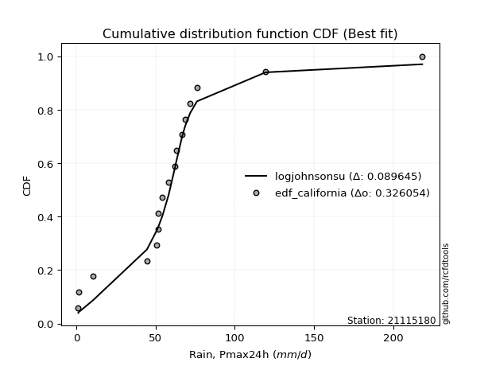</img></img>

</div>


### 2. EDF Hazen (1930)

Hazen method for plotting positions is a formula used to estimate the empirical cumulative probability distribution of flood events or other hydrological data. This formula often results in biased estimations, particularly when extrapolating to extreme events (high return periods).

<div align="center">


$P=(m-0.5)/n$


</div>


**2.1. Empirical values**

<div align="center">

|                | 0                    | 1                   | 2                  | 3                   | 4                  | 5                  | 6                  | 7                  | 8                  | 9                  | 10                 | 11                 | 12                 | 13        | 14                 | 15                 | 16                 | 17                 |
|:---------------|:---------------------|:--------------------|:-------------------|:--------------------|:-------------------|:-------------------|:-------------------|:-------------------|:-------------------|:-------------------|:-------------------|:-------------------|:-------------------|:----------|:-------------------|:-------------------|:-------------------|:-------------------|
| date           | 2022                 | 2023                | 2013               | 2025                | 2020               | 2014               | 2006               | 2019               | 2015               | 2009               | 2017               | 2018               | 2016               | 2007      | 2005               | 2021               | 2008               | 2024               |
| x              | 1.1                  | 1.4                 | 10.4               | 17.7                | 44.5               | 50.8               | 51.4               | 51.5               | 54.3               | 58.2               | 62.2               | 63.0               | 66.7               | 68.7      | 71.8               | 76.1               | 119.4              | 218.4              |
| m              | 1                    | 2                   | 3                  | 4                   | 5                  | 6                  | 7                  | 8                  | 9                  | 10                 | 11                 | 12                 | 13                 | 14        | 15                 | 16                 | 17                 | 18                 |
| empirical_dist | edf_hazen            | edf_hazen           | edf_hazen          | edf_hazen           | edf_hazen          | edf_hazen          | edf_hazen          | edf_hazen          | edf_hazen          | edf_hazen          | edf_hazen          | edf_hazen          | edf_hazen          | edf_hazen | edf_hazen          | edf_hazen          | edf_hazen          | edf_hazen          |
| empirical      | 0.027777777777777776 | 0.08333333333333333 | 0.1388888888888889 | 0.19444444444444445 | 0.25               | 0.3055555555555556 | 0.3611111111111111 | 0.4166666666666667 | 0.4722222222222222 | 0.5277777777777778 | 0.5833333333333334 | 0.6388888888888888 | 0.6944444444444444 | 0.75      | 0.8055555555555556 | 0.8611111111111112 | 0.9166666666666666 | 0.9722222222222222 |
| empirical_tr   | 1.0285714285714287   | 1.090909090909091   | 1.161290322580645  | 1.2413793103448276  | 1.3333333333333333 | 1.44               | 1.565217391304348  | 1.7142857142857144 | 1.894736842105263  | 2.1176470588235294 | 2.4000000000000004 | 2.7692307692307687 | 3.2727272727272725 | 4.0       | 5.142857142857143  | 7.200000000000003  | 11.999999999999995 | 35.999999999999986 |

</div>


**2.2. Kolmogorov-Smirnov fit test (sorted by Δ)**


<div align="center">

|                | 0                   | 1                   | 2                   | 3                   | 4                   | 5                   | 6                   | 7                   | 8                   | 9                   | 10                  | 11                  | 12                  | 13                  | 14                  | 15                  | 16                  | 17                  | 18                  | 19                  | 20                  | 21                  | 22                  | 23                  | 24                  | 25                  | 26                  | 27                  | 28                  | 29                  | 30                  | 31                  | 32                  | 33                  | 34                  | 35                  | 36                  | 37                  | 38                  | 39                  | 40                  | 41                  | 42                  | 43                  | 44                  | 45                  | 46                  | 47                  | 48                  | 49                  | 50                  | 51                  | 52                  | 53                  | 54                  | 55                  | 56                  | 57                  | 58                  | 59                  | 60                  | 61                  | 62                  | 63                  | 64                  | 65                  | 66                  | 67                  | 68                  | 69                  | 70                  | 71                  | 72                  | 73                  | 74                  | 75                  | 76                  | 77                  | 78                  | 79                  | 80                  | 81                  | 82                  | 83                  | 84                  | 85                  | 86                  | 87                  | 88                  | 89                  | 90                  | 91                  | 92                  | 93                  | 94                  | 95                  | 96                  | 97                  | 98                  | 99                  | 100                 | 101                 | 102                 | 103                 | 104                 | 105                 | 106                 | 107                 | 108                 | 109                 | 110                 | 111                 | 112                 | 113                 | 114                 | 115                 | 116                 | 117                 | 118                 | 119                 | 120                 | 121                 | 122                 | 123                 | 124                 | 125                 | 126                 | 127                 | 128                 | 129                 | 130                 | 131                 | 132                 | 133                 | 134                 | 135                 | 136                 | 137                 | 138                 | 139                 | 140                 | 141                 | 142                 | 143                 | 144                 | 145                 | 146                 | 147                 | 148                 | 149                 | 150                 | 151                 | 152                 | 153                 | 154                 | 155                 | 156                 | 157                 | 158                 | 159                 |
|:---------------|:--------------------|:--------------------|:--------------------|:--------------------|:--------------------|:--------------------|:--------------------|:--------------------|:--------------------|:--------------------|:--------------------|:--------------------|:--------------------|:--------------------|:--------------------|:--------------------|:--------------------|:--------------------|:--------------------|:--------------------|:--------------------|:--------------------|:--------------------|:--------------------|:--------------------|:--------------------|:--------------------|:--------------------|:--------------------|:--------------------|:--------------------|:--------------------|:--------------------|:--------------------|:--------------------|:--------------------|:--------------------|:--------------------|:--------------------|:--------------------|:--------------------|:--------------------|:--------------------|:--------------------|:--------------------|:--------------------|:--------------------|:--------------------|:--------------------|:--------------------|:--------------------|:--------------------|:--------------------|:--------------------|:--------------------|:--------------------|:--------------------|:--------------------|:--------------------|:--------------------|:--------------------|:--------------------|:--------------------|:--------------------|:--------------------|:--------------------|:--------------------|:--------------------|:--------------------|:--------------------|:--------------------|:--------------------|:--------------------|:--------------------|:--------------------|:--------------------|:--------------------|:--------------------|:--------------------|:--------------------|:--------------------|:--------------------|:--------------------|:--------------------|:--------------------|:--------------------|:--------------------|:--------------------|:--------------------|:--------------------|:--------------------|:--------------------|:--------------------|:--------------------|:--------------------|:--------------------|:--------------------|:--------------------|:--------------------|:--------------------|:--------------------|:--------------------|:--------------------|:--------------------|:--------------------|:--------------------|:--------------------|:--------------------|:--------------------|:--------------------|:--------------------|:--------------------|:--------------------|:--------------------|:--------------------|:--------------------|:--------------------|:--------------------|:--------------------|:--------------------|:--------------------|:--------------------|:--------------------|:--------------------|:--------------------|:--------------------|:--------------------|:--------------------|:--------------------|:--------------------|:--------------------|:--------------------|:--------------------|:--------------------|:--------------------|:--------------------|:--------------------|:--------------------|:--------------------|:--------------------|:--------------------|:--------------------|:--------------------|:--------------------|:--------------------|:--------------------|:--------------------|:--------------------|:--------------------|:--------------------|:--------------------|:--------------------|:--------------------|:--------------------|:--------------------|:--------------------|:--------------------|:--------------------|:--------------------|:--------------------|
| station        | 21115180            | 21115180            | 21115180            | 21115180            | 21115180            | 21115180            | 21115180            | 21115180            | 21115180            | 21115180            | 21115180            | 21115180            | 21115180            | 21115180            | 21115180            | 21115180            | 21115180            | 21115180            | 21115180            | 21115180            | 21115180            | 21115180            | 21115180            | 21115180            | 21115180            | 21115180            | 21115180            | 21115180            | 21115180            | 21115180            | 21115180            | 21115180            | 21115180            | 21115180            | 21115180            | 21115180            | 21115180            | 21115180            | 21115180            | 21115180            | 21115180            | 21115180            | 21115180            | 21115180            | 21115180            | 21115180            | 21115180            | 21115180            | 21115180            | 21115180            | 21115180            | 21115180            | 21115180            | 21115180            | 21115180            | 21115180            | 21115180            | 21115180            | 21115180            | 21115180            | 21115180            | 21115180            | 21115180            | 21115180            | 21115180            | 21115180            | 21115180            | 21115180            | 21115180            | 21115180            | 21115180            | 21115180            | 21115180            | 21115180            | 21115180            | 21115180            | 21115180            | 21115180            | 21115180            | 21115180            | 21115180            | 21115180            | 21115180            | 21115180            | 21115180            | 21115180            | 21115180            | 21115180            | 21115180            | 21115180            | 21115180            | 21115180            | 21115180            | 21115180            | 21115180            | 21115180            | 21115180            | 21115180            | 21115180            | 21115180            | 21115180            | 21115180            | 21115180            | 21115180            | 21115180            | 21115180            | 21115180            | 21115180            | 21115180            | 21115180            | 21115180            | 21115180            | 21115180            | 21115180            | 21115180            | 21115180            | 21115180            | 21115180            | 21115180            | 21115180            | 21115180            | 21115180            | 21115180            | 21115180            | 21115180            | 21115180            | 21115180            | 21115180            | 21115180            | 21115180            | 21115180            | 21115180            | 21115180            | 21115180            | 21115180            | 21115180            | 21115180            | 21115180            | 21115180            | 21115180            | 21115180            | 21115180            | 21115180            | 21115180            | 21115180            | 21115180            | 21115180            | 21115180            | 21115180            | 21115180            | 21115180            | 21115180            | 21115180            | 21115180            | 21115180            | 21115180            | 21115180            | 21115180            | 21115180            | 21115180            |
| empirical_dist | edf_hazen           | edf_hazen           | edf_hazen           | edf_hazen           | edf_hazen           | edf_hazen           | edf_hazen           | edf_hazen           | edf_hazen           | edf_hazen           | edf_hazen           | edf_hazen           | edf_hazen           | edf_hazen           | edf_hazen           | edf_hazen           | edf_hazen           | edf_hazen           | edf_hazen           | edf_hazen           | edf_hazen           | edf_hazen           | edf_hazen           | edf_hazen           | edf_hazen           | edf_hazen           | edf_hazen           | edf_hazen           | edf_hazen           | edf_hazen           | edf_hazen           | edf_hazen           | edf_hazen           | edf_hazen           | edf_hazen           | edf_hazen           | edf_hazen           | edf_hazen           | edf_hazen           | edf_hazen           | edf_hazen           | edf_hazen           | edf_hazen           | edf_hazen           | edf_hazen           | edf_hazen           | edf_hazen           | edf_hazen           | edf_hazen           | edf_hazen           | edf_hazen           | edf_hazen           | edf_hazen           | edf_hazen           | edf_hazen           | edf_hazen           | edf_hazen           | edf_hazen           | edf_hazen           | edf_hazen           | edf_hazen           | edf_hazen           | edf_hazen           | edf_hazen           | edf_hazen           | edf_hazen           | edf_hazen           | edf_hazen           | edf_hazen           | edf_hazen           | edf_hazen           | edf_hazen           | edf_hazen           | edf_hazen           | edf_hazen           | edf_hazen           | edf_hazen           | edf_hazen           | edf_hazen           | edf_hazen           | edf_hazen           | edf_hazen           | edf_hazen           | edf_hazen           | edf_hazen           | edf_hazen           | edf_hazen           | edf_hazen           | edf_hazen           | edf_hazen           | edf_hazen           | edf_hazen           | edf_hazen           | edf_hazen           | edf_hazen           | edf_hazen           | edf_hazen           | edf_hazen           | edf_hazen           | edf_hazen           | edf_hazen           | edf_hazen           | edf_hazen           | edf_hazen           | edf_hazen           | edf_hazen           | edf_hazen           | edf_hazen           | edf_hazen           | edf_hazen           | edf_hazen           | edf_hazen           | edf_hazen           | edf_hazen           | edf_hazen           | edf_hazen           | edf_hazen           | edf_hazen           | edf_hazen           | edf_hazen           | edf_hazen           | edf_hazen           | edf_hazen           | edf_hazen           | edf_hazen           | edf_hazen           | edf_hazen           | edf_hazen           | edf_hazen           | edf_hazen           | edf_hazen           | edf_hazen           | edf_hazen           | edf_hazen           | edf_hazen           | edf_hazen           | edf_hazen           | edf_hazen           | edf_hazen           | edf_hazen           | edf_hazen           | edf_hazen           | edf_hazen           | edf_hazen           | edf_hazen           | edf_hazen           | edf_hazen           | edf_hazen           | edf_hazen           | edf_hazen           | edf_hazen           | edf_hazen           | edf_hazen           | edf_hazen           | edf_hazen           | edf_hazen           | edf_hazen           | edf_hazen           | edf_hazen           | edf_hazen           |
| p_dist         | logjohnsonsu        | nct                 | johnsonsu           | gennorm             | t                   | logt                | logdgamma           | dweibull            | vonmises_line       | tukeylambda         | dgamma              | exponnorm           | logdweibull         | loggennorm          | weibull_min         | genlogistic         | laplace             | gumbel_r            | kstwobign           | skewnorm            | exponweib           | genextreme          | invweibull          | invgamma            | fatiguelife         | invgauss            | johnsonsb           | gengamma            | halfnorm            | rayleigh            | ncf                 | moyal               | logburr12           | hypsecant           | maxwell             | genhalflogistic     | rice                | halflogistic        | betaprime           | f                   | logistic            | logpearson3         | erlang              | gamma               | foldnorm            | logjohnsonsb        | logvonmises_line    | loggengamma         | logloglaplace       | logloggamma         | logexponweib        | gompertz            | logskewnorm         | kappa3              | burr12              | truncweibull_min    | logweibull_max      | loggenextreme       | crystalball         | truncnorm           | norm                | pearson3            | genpareto           | logargus            | logweibull_min      | logburr             | loggenlogistic      | logmielke           | loggumbel_l         | loggompertz         | logtrapezoid        | mielke              | anglit              | logtruncweibull_min | nakagami            | semicircular        | gausshyper          | logtriang           | wald                | genexpon            | burr                | lomax               | logarcsine          | gumbel_l            | arcsine             | loggenhalflogistic  | logsemicircular     | exponpow            | loganglit           | logfoldnorm         | loggenpareto        | lognakagami         | logrice             | logcrystalball      | lognorm             | logexponnorm        | lognct              | logncf              | logf                | logfatiguelife      | loggamma            | loggamma            | logbetaprime        | loglevy_l           | loglogistic         | loginvweibull       | logerlang           | loginvgamma         | loghypsecant        | loginvgauss         | logmaxwell          | beta                | loglaplace          | loglaplace          | halfgennorm         | lograyleigh         | logkstwobign        | loggausshyper       | cosine              | bradford            | loghalfnorm         | truncexpon          | loggumbel_r         | loggenexpon         | logcosine           | triang              | loghalflogistic     | logmoyal            | powerlaw            | logksone            | logwrapcauchy       | loglomax            | logkappa3           | loguniform          | logkappa4           | logwald             | logrdist            | kappa4              | argus               | logbradford         | wrapcauchy          | ksone               | levy_l              | uniform             | logbeta             | logtruncexpon       | logexponpow         | rdist               | logtruncnorm        | logpowerlaw         | logtukeylambda      | alpha               | trapezoid           | logalpha            | truncpareto         | weibull_max         | logtruncpareto      | loghalfgennorm      | logvonmises         | vonmises            |
| delta          | 0.07696937018636862 | 0.08290237157932909 | 0.08653836421887731 | 0.09458253309170161 | 0.09986527328054169 | 0.11822146781400077 | 0.1249008150006008  | 0.13552169364028915 | 0.15244229564484096 | 0.15761263692622096 | 0.15972412067284958 | 0.15975958452212985 | 0.16307364727326434 | 0.16639637476394775 | 0.16844263893389466 | 0.17281928293854776 | 0.17497346664670277 | 0.17752016533907622 | 0.18440387805482983 | 0.1852605277313315  | 0.18607753532019305 | 0.18610449393088951 | 0.18610497211414823 | 0.18744941883731725 | 0.18883386261782814 | 0.18892951939096186 | 0.18918326595061985 | 0.19412501860388742 | 0.1990281165806489  | 0.20103865286373435 | 0.20109566741915053 | 0.20166403105686326 | 0.20205084141773066 | 0.2033621241163699  | 0.20828858477894308 | 0.209206780267443   | 0.2104238408527831  | 0.21343903187843294 | 0.2136740014163684  | 0.2150890049317219  | 0.21609018864253704 | 0.21643881890531602 | 0.21684508482650866 | 0.21684518308068568 | 0.2170398701196936  | 0.21829216751405012 | 0.21868958511103836 | 0.22024714080334756 | 0.22029770365915735 | 0.22275354397142078 | 0.22283287243002287 | 0.22364335724378337 | 0.22727956935470106 | 0.2272830724012882  | 0.2274173522141586  | 0.22809848884858286 | 0.22918391720915215 | 0.22918496478692513 | 0.23208812410589463 | 0.232088128866908   | 0.23208813109607185 | 0.23216198544273703 | 0.23334162141077464 | 0.23363828997684677 | 0.23397928973758864 | 0.23456110641298744 | 0.2346461718277747  | 0.23508104532918583 | 0.2416851879942734  | 0.24207927485241598 | 0.24396615701000174 | 0.24728685636961178 | 0.24950482806178476 | 0.2545518318252341  | 0.2548140293145852  | 0.25677766477555886 | 0.26102870740685724 | 0.26357221008319676 | 0.26803144949193203 | 0.2681952306133901  | 0.2714916614187467  | 0.27224892424256597 | 0.2828089143390683  | 0.2857618136838048  | 0.28631358718871724 | 0.2948920750832418  | 0.29627650754335666 | 0.2983103006098947  | 0.29965861286176687 | 0.3042234921211402  | 0.3059700697600811  | 0.3069353521945748  | 0.307826711640087   | 0.30784493165715787 | 0.3078449936431703  | 0.30784746461196777 | 0.30795129642064434 | 0.30888042390355297 | 0.3095615894267265  | 0.3118402627057193  | 0.31213745063783105 | 0.31213745063783105 | 0.3125918152004086  | 0.3129221995253191  | 0.3156001186635574  | 0.3168645329885794  | 0.3202714683651592  | 0.32148436843974393 | 0.3221285584367152  | 0.3223438800592916  | 0.3377032820052316  | 0.34148600594354983 | 0.34299352572347575 | 0.34299352572347575 | 0.3434560810052234  | 0.3472415925187484  | 0.35203888851575593 | 0.3627132773772793  | 0.36423270360595894 | 0.37051548306028975 | 0.37416514077684315 | 0.3773735851737681  | 0.3775853351836279  | 0.37784664785779376 | 0.3789016834987414  | 0.380851212885803   | 0.4016957438343849  | 0.4021559194161113  | 0.41153397267739966 | 0.41611012042234574 | 0.42455818241734855 | 0.4256728349088259  | 0.44932052910390874 | 0.449332144506815   | 0.45737638294296956 | 0.47034288958392656 | 0.47100030881638194 | 0.47488917117691537 | 0.481902387838684   | 0.4837180089221593  | 0.4885547066067184  | 0.4901569770414686  | 0.4944854551065533  | 0.5159661502275401  | 0.5204778675850424  | 0.537907529481914   | 0.5494832508472945  | 0.5520774193368     | 0.5543002825123067  | 0.6259453463689024  | 0.6693562819558778  | 0.684187597706252   | 0.7205536938774564  | 0.7268182036579143  | 0.7678804467621239  | 0.8010683304357066  | 0.8348115627838355  | 0.9166666666666666  | 1.083486108637674   | 34.144664361859796  |
| deltao         | 0.32102346734599996 | 0.32102346734599996 | 0.32102346734599996 | 0.32102346734599996 | 0.32102346734599996 | 0.32102346734599996 | 0.32102346734599996 | 0.32102346734599996 | 0.32102346734599996 | 0.32102346734599996 | 0.32102346734599996 | 0.32102346734599996 | 0.32102346734599996 | 0.32102346734599996 | 0.32102346734599996 | 0.32102346734599996 | 0.32102346734599996 | 0.32102346734599996 | 0.32102346734599996 | 0.32102346734599996 | 0.32102346734599996 | 0.32102346734599996 | 0.32102346734599996 | 0.32102346734599996 | 0.32102346734599996 | 0.32102346734599996 | 0.32102346734599996 | 0.32102346734599996 | 0.32102346734599996 | 0.32102346734599996 | 0.32102346734599996 | 0.32102346734599996 | 0.32102346734599996 | 0.32102346734599996 | 0.32102346734599996 | 0.32102346734599996 | 0.32102346734599996 | 0.32102346734599996 | 0.32102346734599996 | 0.32102346734599996 | 0.32102346734599996 | 0.32102346734599996 | 0.32102346734599996 | 0.32102346734599996 | 0.32102346734599996 | 0.32102346734599996 | 0.32102346734599996 | 0.32102346734599996 | 0.32102346734599996 | 0.32102346734599996 | 0.32102346734599996 | 0.32102346734599996 | 0.32102346734599996 | 0.32102346734599996 | 0.32102346734599996 | 0.32102346734599996 | 0.32102346734599996 | 0.32102346734599996 | 0.32102346734599996 | 0.32102346734599996 | 0.32102346734599996 | 0.32102346734599996 | 0.32102346734599996 | 0.32102346734599996 | 0.32102346734599996 | 0.32102346734599996 | 0.32102346734599996 | 0.32102346734599996 | 0.32102346734599996 | 0.32102346734599996 | 0.32102346734599996 | 0.32102346734599996 | 0.32102346734599996 | 0.32102346734599996 | 0.32102346734599996 | 0.32102346734599996 | 0.32102346734599996 | 0.32102346734599996 | 0.32102346734599996 | 0.32102346734599996 | 0.32102346734599996 | 0.32102346734599996 | 0.32102346734599996 | 0.32102346734599996 | 0.32102346734599996 | 0.32102346734599996 | 0.32102346734599996 | 0.32102346734599996 | 0.32102346734599996 | 0.32102346734599996 | 0.32102346734599996 | 0.32102346734599996 | 0.32102346734599996 | 0.32102346734599996 | 0.32102346734599996 | 0.32102346734599996 | 0.32102346734599996 | 0.32102346734599996 | 0.32102346734599996 | 0.32102346734599996 | 0.32102346734599996 | 0.32102346734599996 | 0.32102346734599996 | 0.32102346734599996 | 0.32102346734599996 | 0.32102346734599996 | 0.32102346734599996 | 0.32102346734599996 | 0.32102346734599996 | 0.32102346734599996 | 0.32102346734599996 | 0.32102346734599996 | 0.32102346734599996 | 0.32102346734599996 | 0.32102346734599996 | 0.32102346734599996 | 0.32102346734599996 | 0.32102346734599996 | 0.32102346734599996 | 0.32102346734599996 | 0.32102346734599996 | 0.32102346734599996 | 0.32102346734599996 | 0.32102346734599996 | 0.32102346734599996 | 0.32102346734599996 | 0.32102346734599996 | 0.32102346734599996 | 0.32102346734599996 | 0.32102346734599996 | 0.32102346734599996 | 0.32102346734599996 | 0.32102346734599996 | 0.32102346734599996 | 0.32102346734599996 | 0.32102346734599996 | 0.32102346734599996 | 0.32102346734599996 | 0.32102346734599996 | 0.32102346734599996 | 0.32102346734599996 | 0.32102346734599996 | 0.32102346734599996 | 0.32102346734599996 | 0.32102346734599996 | 0.32102346734599996 | 0.32102346734599996 | 0.32102346734599996 | 0.32102346734599996 | 0.32102346734599996 | 0.32102346734599996 | 0.32102346734599996 | 0.32102346734599996 | 0.32102346734599996 | 0.32102346734599996 | 0.32102346734599996 | 0.32102346734599996 | 0.32102346734599996 | 0.32102346734599996 | 0.32102346734599996 |
| eval           | Δo > Δ              | Δo > Δ              | Δo > Δ              | Δo > Δ              | Δo > Δ              | Δo > Δ              | Δo > Δ              | Δo > Δ              | Δo > Δ              | Δo > Δ              | Δo > Δ              | Δo > Δ              | Δo > Δ              | Δo > Δ              | Δo > Δ              | Δo > Δ              | Δo > Δ              | Δo > Δ              | Δo > Δ              | Δo > Δ              | Δo > Δ              | Δo > Δ              | Δo > Δ              | Δo > Δ              | Δo > Δ              | Δo > Δ              | Δo > Δ              | Δo > Δ              | Δo > Δ              | Δo > Δ              | Δo > Δ              | Δo > Δ              | Δo > Δ              | Δo > Δ              | Δo > Δ              | Δo > Δ              | Δo > Δ              | Δo > Δ              | Δo > Δ              | Δo > Δ              | Δo > Δ              | Δo > Δ              | Δo > Δ              | Δo > Δ              | Δo > Δ              | Δo > Δ              | Δo > Δ              | Δo > Δ              | Δo > Δ              | Δo > Δ              | Δo > Δ              | Δo > Δ              | Δo > Δ              | Δo > Δ              | Δo > Δ              | Δo > Δ              | Δo > Δ              | Δo > Δ              | Δo > Δ              | Δo > Δ              | Δo > Δ              | Δo > Δ              | Δo > Δ              | Δo > Δ              | Δo > Δ              | Δo > Δ              | Δo > Δ              | Δo > Δ              | Δo > Δ              | Δo > Δ              | Δo > Δ              | Δo > Δ              | Δo > Δ              | Δo > Δ              | Δo > Δ              | Δo > Δ              | Δo > Δ              | Δo > Δ              | Δo > Δ              | Δo > Δ              | Δo > Δ              | Δo > Δ              | Δo > Δ              | Δo > Δ              | Δo > Δ              | Δo > Δ              | Δo > Δ              | Δo > Δ              | Δo > Δ              | Δo > Δ              | Δo > Δ              | Δo > Δ              | Δo > Δ              | Δo > Δ              | Δo > Δ              | Δo > Δ              | Δo > Δ              | Δo > Δ              | Δo > Δ              | Δo > Δ              | Δo > Δ              | Δo > Δ              | Δo > Δ              | Δo > Δ              | Δo > Δ              | Δo > Δ              | Δo > Δ              | Δo <= Δ             | Δo <= Δ             | Δo <= Δ             | Δo <= Δ             | Δo <= Δ             | Δo <= Δ             | Δo <= Δ             | Δo <= Δ             | Δo <= Δ             | Δo <= Δ             | Δo <= Δ             | Δo <= Δ             | Δo <= Δ             | Δo <= Δ             | Δo <= Δ             | Δo <= Δ             | Δo <= Δ             | Δo <= Δ             | Δo <= Δ             | Δo <= Δ             | Δo <= Δ             | Δo <= Δ             | Δo <= Δ             | Δo <= Δ             | Δo <= Δ             | Δo <= Δ             | Δo <= Δ             | Δo <= Δ             | Δo <= Δ             | Δo <= Δ             | Δo <= Δ             | Δo <= Δ             | Δo <= Δ             | Δo <= Δ             | Δo <= Δ             | Δo <= Δ             | Δo <= Δ             | Δo <= Δ             | Δo <= Δ             | Δo <= Δ             | Δo <= Δ             | Δo <= Δ             | Δo <= Δ             | Δo <= Δ             | Δo <= Δ             | Δo <= Δ             | Δo <= Δ             | Δo <= Δ             | Δo <= Δ             | Δo <= Δ             | Δo <= Δ             | Δo <= Δ             | Δo <= Δ             |
| fit            | 1                   | 1                   | 1                   | 1                   | 1                   | 1                   | 1                   | 1                   | 1                   | 1                   | 1                   | 1                   | 1                   | 1                   | 1                   | 1                   | 1                   | 1                   | 1                   | 1                   | 1                   | 1                   | 1                   | 1                   | 1                   | 1                   | 1                   | 1                   | 1                   | 1                   | 1                   | 1                   | 1                   | 1                   | 1                   | 1                   | 1                   | 1                   | 1                   | 1                   | 1                   | 1                   | 1                   | 1                   | 1                   | 1                   | 1                   | 1                   | 1                   | 1                   | 1                   | 1                   | 1                   | 1                   | 1                   | 1                   | 1                   | 1                   | 1                   | 1                   | 1                   | 1                   | 1                   | 1                   | 1                   | 1                   | 1                   | 1                   | 1                   | 1                   | 1                   | 1                   | 1                   | 1                   | 1                   | 1                   | 1                   | 1                   | 1                   | 1                   | 1                   | 1                   | 1                   | 1                   | 1                   | 1                   | 1                   | 1                   | 1                   | 1                   | 1                   | 1                   | 1                   | 1                   | 1                   | 1                   | 1                   | 1                   | 1                   | 1                   | 1                   | 1                   | 1                   | 1                   | 1                   | 1                   | 1                   | 0                   | 0                   | 0                   | 0                   | 0                   | 0                   | 0                   | 0                   | 0                   | 0                   | 0                   | 0                   | 0                   | 0                   | 0                   | 0                   | 0                   | 0                   | 0                   | 0                   | 0                   | 0                   | 0                   | 0                   | 0                   | 0                   | 0                   | 0                   | 0                   | 0                   | 0                   | 0                   | 0                   | 0                   | 0                   | 0                   | 0                   | 0                   | 0                   | 0                   | 0                   | 0                   | 0                   | 0                   | 0                   | 0                   | 0                   | 0                   | 0                   | 0                   | 0                   | 0                   | 0                   |
| n              | 18                  | 18                  | 18                  | 18                  | 18                  | 18                  | 18                  | 18                  | 18                  | 18                  | 18                  | 18                  | 18                  | 18                  | 18                  | 18                  | 18                  | 18                  | 18                  | 18                  | 18                  | 18                  | 18                  | 18                  | 18                  | 18                  | 18                  | 18                  | 18                  | 18                  | 18                  | 18                  | 18                  | 18                  | 18                  | 18                  | 18                  | 18                  | 18                  | 18                  | 18                  | 18                  | 18                  | 18                  | 18                  | 18                  | 18                  | 18                  | 18                  | 18                  | 18                  | 18                  | 18                  | 18                  | 18                  | 18                  | 18                  | 18                  | 18                  | 18                  | 18                  | 18                  | 18                  | 18                  | 18                  | 18                  | 18                  | 18                  | 18                  | 18                  | 18                  | 18                  | 18                  | 18                  | 18                  | 18                  | 18                  | 18                  | 18                  | 18                  | 18                  | 18                  | 18                  | 18                  | 18                  | 18                  | 18                  | 18                  | 18                  | 18                  | 18                  | 18                  | 18                  | 18                  | 18                  | 18                  | 18                  | 18                  | 18                  | 18                  | 18                  | 18                  | 18                  | 18                  | 18                  | 18                  | 18                  | 18                  | 18                  | 18                  | 18                  | 18                  | 18                  | 18                  | 18                  | 18                  | 18                  | 18                  | 18                  | 18                  | 18                  | 18                  | 18                  | 18                  | 18                  | 18                  | 18                  | 18                  | 18                  | 18                  | 18                  | 18                  | 18                  | 18                  | 18                  | 18                  | 18                  | 18                  | 18                  | 18                  | 18                  | 18                  | 18                  | 18                  | 18                  | 18                  | 18                  | 18                  | 18                  | 18                  | 18                  | 18                  | 18                  | 18                  | 18                  | 18                  | 18                  | 18                  | 18                  | 18                  |
| best_fit       | 1                   | 0                   | 0                   | 0                   | 0                   | 0                   | 0                   | 0                   | 0                   | 0                   | 0                   | 0                   | 0                   | 0                   | 0                   | 0                   | 0                   | 0                   | 0                   | 0                   | 0                   | 0                   | 0                   | 0                   | 0                   | 0                   | 0                   | 0                   | 0                   | 0                   | 0                   | 0                   | 0                   | 0                   | 0                   | 0                   | 0                   | 0                   | 0                   | 0                   | 0                   | 0                   | 0                   | 0                   | 0                   | 0                   | 0                   | 0                   | 0                   | 0                   | 0                   | 0                   | 0                   | 0                   | 0                   | 0                   | 0                   | 0                   | 0                   | 0                   | 0                   | 0                   | 0                   | 0                   | 0                   | 0                   | 0                   | 0                   | 0                   | 0                   | 0                   | 0                   | 0                   | 0                   | 0                   | 0                   | 0                   | 0                   | 0                   | 0                   | 0                   | 0                   | 0                   | 0                   | 0                   | 0                   | 0                   | 0                   | 0                   | 0                   | 0                   | 0                   | 0                   | 0                   | 0                   | 0                   | 0                   | 0                   | 0                   | 0                   | 0                   | 0                   | 0                   | 0                   | 0                   | 0                   | 0                   | 0                   | 0                   | 0                   | 0                   | 0                   | 0                   | 0                   | 0                   | 0                   | 0                   | 0                   | 0                   | 0                   | 0                   | 0                   | 0                   | 0                   | 0                   | 0                   | 0                   | 0                   | 0                   | 0                   | 0                   | 0                   | 0                   | 0                   | 0                   | 0                   | 0                   | 0                   | 0                   | 0                   | 0                   | 0                   | 0                   | 0                   | 0                   | 0                   | 0                   | 0                   | 0                   | 0                   | 0                   | 0                   | 0                   | 0                   | 0                   | 0                   | 0                   | 0                   | 0                   | 0                   |
| best_fit_sort  | 1                   | 2                   | 3                   | 4                   | 5                   | 6                   | 7                   | 8                   | 9                   | 10                  | 11                  | 12                  | 13                  | 14                  | 15                  | 16                  | 17                  | 18                  | 19                  | 20                  | 21                  | 22                  | 23                  | 24                  | 25                  | 26                  | 27                  | 28                  | 29                  | 30                  | 31                  | 32                  | 33                  | 34                  | 35                  | 36                  | 37                  | 38                  | 39                  | 40                  | 41                  | 42                  | 43                  | 44                  | 45                  | 46                  | 47                  | 48                  | 49                  | 50                  | 51                  | 52                  | 53                  | 54                  | 55                  | 56                  | 57                  | 58                  | 59                  | 60                  | 61                  | 62                  | 63                  | 64                  | 65                  | 66                  | 67                  | 68                  | 69                  | 70                  | 71                  | 72                  | 73                  | 74                  | 75                  | 76                  | 77                  | 78                  | 79                  | 80                  | 81                  | 82                  | 83                  | 84                  | 85                  | 86                  | 87                  | 88                  | 89                  | 90                  | 91                  | 92                  | 93                  | 94                  | 95                  | 96                  | 97                  | 98                  | 99                  | 100                 | 101                 | 102                 | 103                 | 104                 | 105                 | 106                 | 107                 | 108                 | 109                 | 110                 | 111                 | 112                 | 113                 | 114                 | 115                 | 116                 | 117                 | 118                 | 119                 | 120                 | 121                 | 122                 | 123                 | 124                 | 125                 | 126                 | 127                 | 128                 | 129                 | 130                 | 131                 | 132                 | 133                 | 134                 | 135                 | 136                 | 137                 | 138                 | 139                 | 140                 | 141                 | 142                 | 143                 | 144                 | 145                 | 146                 | 147                 | 148                 | 149                 | 150                 | 151                 | 152                 | 153                 | 154                 | 155                 | 156                 | 157                 | 158                 | 159                 | 160                 |

</div>


**2.3. Best fit**

<div align="center">

|   id |   station | empirical_dist   | p_dist       |     delta |   deltao | eval   |   fit |   n |   best_fit |   best_fit_sort |
|-----:|----------:|:-----------------|:-------------|----------:|---------:|:-------|------:|----:|-----------:|----------------:|
|    0 |  21115180 | edf_hazen        | logjohnsonsu | 0.0769694 | 0.321023 | Δo > Δ |     1 |  18 |          1 |               1 |

</div>


<div align="center">

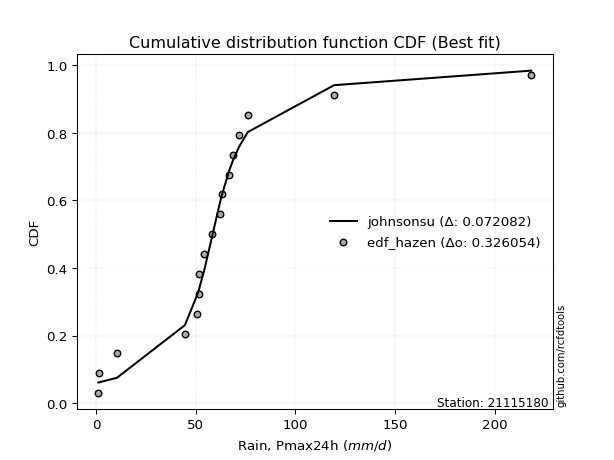</img></img>

</div>


### 3. EDF Weibull (1939)

Weibull plotting position formula is an empirical method used to estimate the non-exceedance probability or plotting position for a set of observed data, is often recommended or widely used in practice, particularly in flood frequency analysis.

<div align="center">


$P=m/(n+1)$


</div>


**3.1. Empirical values**

<div align="center">

|                | 0                   | 1                   | 2                   | 3                   | 4                  | 5                  | 6                  | 7                   | 8                   | 9                  | 10                 | 11                | 12                 | 13                 | 14                 | 15                 | 16                 | 17                 |
|:---------------|:--------------------|:--------------------|:--------------------|:--------------------|:-------------------|:-------------------|:-------------------|:--------------------|:--------------------|:-------------------|:-------------------|:------------------|:-------------------|:-------------------|:-------------------|:-------------------|:-------------------|:-------------------|
| date           | 2022                | 2023                | 2013                | 2025                | 2020               | 2014               | 2006               | 2019                | 2015                | 2009               | 2017               | 2018              | 2016               | 2007               | 2005               | 2021               | 2008               | 2024               |
| x              | 1.1                 | 1.4                 | 10.4                | 17.7                | 44.5               | 50.8               | 51.4               | 51.5                | 54.3                | 58.2               | 62.2               | 63.0              | 66.7               | 68.7               | 71.8               | 76.1               | 119.4              | 218.4              |
| m              | 1                   | 2                   | 3                   | 4                   | 5                  | 6                  | 7                  | 8                   | 9                   | 10                 | 11                 | 12                | 13                 | 14                 | 15                 | 16                 | 17                 | 18                 |
| empirical_dist | edf_weibull         | edf_weibull         | edf_weibull         | edf_weibull         | edf_weibull        | edf_weibull        | edf_weibull        | edf_weibull         | edf_weibull         | edf_weibull        | edf_weibull        | edf_weibull       | edf_weibull        | edf_weibull        | edf_weibull        | edf_weibull        | edf_weibull        | edf_weibull        |
| empirical      | 0.05263157894736842 | 0.10526315789473684 | 0.15789473684210525 | 0.21052631578947367 | 0.2631578947368421 | 0.3157894736842105 | 0.3684210526315789 | 0.42105263157894735 | 0.47368421052631576 | 0.5263157894736842 | 0.5789473684210527 | 0.631578947368421 | 0.6842105263157895 | 0.7368421052631579 | 0.7894736842105263 | 0.8421052631578947 | 0.8947368421052632 | 0.9473684210526315 |
| empirical_tr   | 1.0555555555555556  | 1.1176470588235294  | 1.1875              | 1.2666666666666666  | 1.357142857142857  | 1.4615384615384615 | 1.5833333333333335 | 1.7272727272727273  | 1.8999999999999997  | 2.111111111111111  | 2.375              | 2.714285714285714 | 3.166666666666667  | 3.7999999999999994 | 4.75               | 6.333333333333331  | 9.5                | 18.999999999999982 |

</div>


**3.2. Kolmogorov-Smirnov fit test (sorted by Δ)**


<div align="center">

|                | 0                   | 1                   | 2                   | 3                   | 4                   | 5                   | 6                   | 7                   | 8                   | 9                   | 10                  | 11                  | 12                  | 13                  | 14                  | 15                  | 16                  | 17                  | 18                  | 19                  | 20                  | 21                  | 22                  | 23                  | 24                  | 25                  | 26                  | 27                  | 28                  | 29                  | 30                  | 31                  | 32                  | 33                  | 34                  | 35                  | 36                  | 37                  | 38                  | 39                  | 40                  | 41                  | 42                  | 43                  | 44                  | 45                  | 46                  | 47                  | 48                  | 49                  | 50                  | 51                  | 52                  | 53                  | 54                  | 55                  | 56                  | 57                  | 58                  | 59                  | 60                  | 61                  | 62                  | 63                  | 64                  | 65                  | 66                  | 67                  | 68                  | 69                  | 70                  | 71                  | 72                  | 73                  | 74                  | 75                  | 76                  | 77                  | 78                  | 79                  | 80                  | 81                  | 82                  | 83                  | 84                  | 85                  | 86                  | 87                  | 88                  | 89                  | 90                  | 91                  | 92                  | 93                  | 94                  | 95                  | 96                  | 97                  | 98                  | 99                  | 100                 | 101                 | 102                 | 103                 | 104                 | 105                 | 106                 | 107                 | 108                 | 109                 | 110                 | 111                 | 112                 | 113                 | 114                 | 115                 | 116                 | 117                 | 118                 | 119                 | 120                 | 121                 | 122                 | 123                 | 124                 | 125                 | 126                 | 127                 | 128                 | 129                 | 130                 | 131                 | 132                 | 133                 | 134                 | 135                 | 136                 | 137                 | 138                 | 139                 | 140                 | 141                 | 142                 | 143                 | 144                 | 145                 | 146                 | 147                 | 148                 | 149                 | 150                 | 151                 | 152                 | 153                 | 154                 | 155                 | 156                 | 157                 | 158                 | 159                 |
|:---------------|:--------------------|:--------------------|:--------------------|:--------------------|:--------------------|:--------------------|:--------------------|:--------------------|:--------------------|:--------------------|:--------------------|:--------------------|:--------------------|:--------------------|:--------------------|:--------------------|:--------------------|:--------------------|:--------------------|:--------------------|:--------------------|:--------------------|:--------------------|:--------------------|:--------------------|:--------------------|:--------------------|:--------------------|:--------------------|:--------------------|:--------------------|:--------------------|:--------------------|:--------------------|:--------------------|:--------------------|:--------------------|:--------------------|:--------------------|:--------------------|:--------------------|:--------------------|:--------------------|:--------------------|:--------------------|:--------------------|:--------------------|:--------------------|:--------------------|:--------------------|:--------------------|:--------------------|:--------------------|:--------------------|:--------------------|:--------------------|:--------------------|:--------------------|:--------------------|:--------------------|:--------------------|:--------------------|:--------------------|:--------------------|:--------------------|:--------------------|:--------------------|:--------------------|:--------------------|:--------------------|:--------------------|:--------------------|:--------------------|:--------------------|:--------------------|:--------------------|:--------------------|:--------------------|:--------------------|:--------------------|:--------------------|:--------------------|:--------------------|:--------------------|:--------------------|:--------------------|:--------------------|:--------------------|:--------------------|:--------------------|:--------------------|:--------------------|:--------------------|:--------------------|:--------------------|:--------------------|:--------------------|:--------------------|:--------------------|:--------------------|:--------------------|:--------------------|:--------------------|:--------------------|:--------------------|:--------------------|:--------------------|:--------------------|:--------------------|:--------------------|:--------------------|:--------------------|:--------------------|:--------------------|:--------------------|:--------------------|:--------------------|:--------------------|:--------------------|:--------------------|:--------------------|:--------------------|:--------------------|:--------------------|:--------------------|:--------------------|:--------------------|:--------------------|:--------------------|:--------------------|:--------------------|:--------------------|:--------------------|:--------------------|:--------------------|:--------------------|:--------------------|:--------------------|:--------------------|:--------------------|:--------------------|:--------------------|:--------------------|:--------------------|:--------------------|:--------------------|:--------------------|:--------------------|:--------------------|:--------------------|:--------------------|:--------------------|:--------------------|:--------------------|:--------------------|:--------------------|:--------------------|:--------------------|:--------------------|:--------------------|
| station        | 21115180            | 21115180            | 21115180            | 21115180            | 21115180            | 21115180            | 21115180            | 21115180            | 21115180            | 21115180            | 21115180            | 21115180            | 21115180            | 21115180            | 21115180            | 21115180            | 21115180            | 21115180            | 21115180            | 21115180            | 21115180            | 21115180            | 21115180            | 21115180            | 21115180            | 21115180            | 21115180            | 21115180            | 21115180            | 21115180            | 21115180            | 21115180            | 21115180            | 21115180            | 21115180            | 21115180            | 21115180            | 21115180            | 21115180            | 21115180            | 21115180            | 21115180            | 21115180            | 21115180            | 21115180            | 21115180            | 21115180            | 21115180            | 21115180            | 21115180            | 21115180            | 21115180            | 21115180            | 21115180            | 21115180            | 21115180            | 21115180            | 21115180            | 21115180            | 21115180            | 21115180            | 21115180            | 21115180            | 21115180            | 21115180            | 21115180            | 21115180            | 21115180            | 21115180            | 21115180            | 21115180            | 21115180            | 21115180            | 21115180            | 21115180            | 21115180            | 21115180            | 21115180            | 21115180            | 21115180            | 21115180            | 21115180            | 21115180            | 21115180            | 21115180            | 21115180            | 21115180            | 21115180            | 21115180            | 21115180            | 21115180            | 21115180            | 21115180            | 21115180            | 21115180            | 21115180            | 21115180            | 21115180            | 21115180            | 21115180            | 21115180            | 21115180            | 21115180            | 21115180            | 21115180            | 21115180            | 21115180            | 21115180            | 21115180            | 21115180            | 21115180            | 21115180            | 21115180            | 21115180            | 21115180            | 21115180            | 21115180            | 21115180            | 21115180            | 21115180            | 21115180            | 21115180            | 21115180            | 21115180            | 21115180            | 21115180            | 21115180            | 21115180            | 21115180            | 21115180            | 21115180            | 21115180            | 21115180            | 21115180            | 21115180            | 21115180            | 21115180            | 21115180            | 21115180            | 21115180            | 21115180            | 21115180            | 21115180            | 21115180            | 21115180            | 21115180            | 21115180            | 21115180            | 21115180            | 21115180            | 21115180            | 21115180            | 21115180            | 21115180            | 21115180            | 21115180            | 21115180            | 21115180            | 21115180            | 21115180            |
| empirical_dist | edf_weibull         | edf_weibull         | edf_weibull         | edf_weibull         | edf_weibull         | edf_weibull         | edf_weibull         | edf_weibull         | edf_weibull         | edf_weibull         | edf_weibull         | edf_weibull         | edf_weibull         | edf_weibull         | edf_weibull         | edf_weibull         | edf_weibull         | edf_weibull         | edf_weibull         | edf_weibull         | edf_weibull         | edf_weibull         | edf_weibull         | edf_weibull         | edf_weibull         | edf_weibull         | edf_weibull         | edf_weibull         | edf_weibull         | edf_weibull         | edf_weibull         | edf_weibull         | edf_weibull         | edf_weibull         | edf_weibull         | edf_weibull         | edf_weibull         | edf_weibull         | edf_weibull         | edf_weibull         | edf_weibull         | edf_weibull         | edf_weibull         | edf_weibull         | edf_weibull         | edf_weibull         | edf_weibull         | edf_weibull         | edf_weibull         | edf_weibull         | edf_weibull         | edf_weibull         | edf_weibull         | edf_weibull         | edf_weibull         | edf_weibull         | edf_weibull         | edf_weibull         | edf_weibull         | edf_weibull         | edf_weibull         | edf_weibull         | edf_weibull         | edf_weibull         | edf_weibull         | edf_weibull         | edf_weibull         | edf_weibull         | edf_weibull         | edf_weibull         | edf_weibull         | edf_weibull         | edf_weibull         | edf_weibull         | edf_weibull         | edf_weibull         | edf_weibull         | edf_weibull         | edf_weibull         | edf_weibull         | edf_weibull         | edf_weibull         | edf_weibull         | edf_weibull         | edf_weibull         | edf_weibull         | edf_weibull         | edf_weibull         | edf_weibull         | edf_weibull         | edf_weibull         | edf_weibull         | edf_weibull         | edf_weibull         | edf_weibull         | edf_weibull         | edf_weibull         | edf_weibull         | edf_weibull         | edf_weibull         | edf_weibull         | edf_weibull         | edf_weibull         | edf_weibull         | edf_weibull         | edf_weibull         | edf_weibull         | edf_weibull         | edf_weibull         | edf_weibull         | edf_weibull         | edf_weibull         | edf_weibull         | edf_weibull         | edf_weibull         | edf_weibull         | edf_weibull         | edf_weibull         | edf_weibull         | edf_weibull         | edf_weibull         | edf_weibull         | edf_weibull         | edf_weibull         | edf_weibull         | edf_weibull         | edf_weibull         | edf_weibull         | edf_weibull         | edf_weibull         | edf_weibull         | edf_weibull         | edf_weibull         | edf_weibull         | edf_weibull         | edf_weibull         | edf_weibull         | edf_weibull         | edf_weibull         | edf_weibull         | edf_weibull         | edf_weibull         | edf_weibull         | edf_weibull         | edf_weibull         | edf_weibull         | edf_weibull         | edf_weibull         | edf_weibull         | edf_weibull         | edf_weibull         | edf_weibull         | edf_weibull         | edf_weibull         | edf_weibull         | edf_weibull         | edf_weibull         | edf_weibull         | edf_weibull         | edf_weibull         |
| p_dist         | logjohnsonsu        | gennorm             | nct                 | johnsonsu           | t                   | logdgamma           | logt                | dweibull            | tukeylambda         | vonmises_line       | logdweibull         | loggennorm          | dgamma              | exponnorm           | laplace             | weibull_min         | genlogistic         | kstwobign           | gumbel_r            | skewnorm            | exponweib           | genextreme          | invweibull          | invgamma            | fatiguelife         | invgauss            | johnsonsb           | rayleigh            | ncf                 | gengamma            | hypsecant           | halfnorm            | maxwell             | rice                | moyal               | logburr12           | logistic            | logpearson3         | genhalflogistic     | logloglaplace       | halflogistic        | betaprime           | foldnorm            | f                   | logjohnsonsb        | logvonmises_line    | erlang              | gamma               | loggengamma         | truncweibull_min    | logloggamma         | logexponweib        | gompertz            | crystalball         | truncnorm           | norm                | logskewnorm         | logargus            | logweibull_max      | loggenextreme       | burr12              | kappa3              | genpareto           | pearson3            | logweibull_min      | logburr             | loggenlogistic      | logmielke           | loggumbel_l         | loggompertz         | anglit              | logtrapezoid        | nakagami            | mielke              | semicircular        | logtruncweibull_min | gausshyper          | logtriang           | genexpon            | wald                | lomax               | burr                | gumbel_l            | arcsine             | logarcsine          | loggenhalflogistic  | logsemicircular     | exponpow            | loganglit           | logfoldnorm         | loggenpareto        | lognakagami         | logrice             | logcrystalball      | lognorm             | logexponnorm        | lognct              | logncf              | logf                | logfatiguelife      | loggamma            | loggamma            | logbetaprime        | loglevy_l           | loglogistic         | loginvweibull       | logerlang           | loginvgamma         | loghypsecant        | loginvgauss         | logmaxwell          | beta                | loglaplace          | loglaplace          | halfgennorm         | lograyleigh         | logkstwobign        | cosine              | loggausshyper       | bradford            | truncexpon          | loghalfnorm         | triang              | loggumbel_r         | loggenexpon         | logcosine           | loghalflogistic     | logmoyal            | powerlaw            | logksone            | logwrapcauchy       | loglomax            | logkappa3           | loguniform          | logkappa4           | logrdist            | kappa4              | logwald             | argus               | wrapcauchy          | levy_l              | logbradford         | ksone               | uniform             | logbeta             | logtruncexpon       | rdist               | logexponpow         | logtruncnorm        | logpowerlaw         | logtukeylambda      | alpha               | trapezoid           | logalpha            | truncpareto         | weibull_max         | logtruncpareto      | loghalfgennorm      | logvonmises         | vonmises            |
| delta          | 0.07781348638577607 | 0.09753872847661427 | 0.09898424292435831 | 0.10262023556390654 | 0.11594714462557092 | 0.12089919887524271 | 0.13430333915902998 | 0.1369836819443827  | 0.1386067889730045  | 0.14220837751618604 | 0.14406779932004787 | 0.14739052681073128 | 0.14949020254419465 | 0.14952566639347492 | 0.1559676186934863  | 0.15820872080523973 | 0.16258536480989283 | 0.16539803010161336 | 0.1672862472104213  | 0.17069102744297532 | 0.17584361719153813 | 0.17587057580223459 | 0.1758710539854933  | 0.17721550070866232 | 0.1785999444891732  | 0.17869560126230694 | 0.17894934782196492 | 0.18203280491051788 | 0.18208981946593406 | 0.1838911004752325  | 0.18435627616315342 | 0.1858702218438068  | 0.1892827368257266  | 0.19141799289956662 | 0.19143011292820833 | 0.19181692328907574 | 0.19708434068932057 | 0.19743297095209955 | 0.19897286213878806 | 0.20129185570594088 | 0.203205113749778   | 0.20344008328771346 | 0.20388197538285152 | 0.20485508680306697 | 0.20513427277720803 | 0.20553169037419627 | 0.20661116669785373 | 0.20661126495203075 | 0.20708924606650547 | 0.2090926408953664  | 0.20959564923457868 | 0.20967497769318078 | 0.21048546250694128 | 0.21308227615267816 | 0.21308228091369152 | 0.21308228314285538 | 0.21412167461785897 | 0.2146324420236303  | 0.21602602247231006 | 0.21602707005008304 | 0.2165720530425258  | 0.21704915427263327 | 0.22018372667393254 | 0.2219280673140821  | 0.22235635301806334 | 0.2243271882843325  | 0.22441225369911977 | 0.2248471272005309  | 0.22852729325743132 | 0.22947312900983952 | 0.23049898010856829 | 0.23080826227315965 | 0.23580818136136872 | 0.23705293824095686 | 0.23777181682234239 | 0.24139393708839202 | 0.24787081267001515 | 0.25041431534635467 | 0.25503733587654803 | 0.2577975313632771  | 0.2590910295057239  | 0.26116497974084274 | 0.26675596573058835 | 0.2673077392355008  | 0.2696510196022262  | 0.2817341803463997  | 0.28311861280651457 | 0.28515240587305263 | 0.2865007181249248  | 0.2910655973842981  | 0.29281217502323903 | 0.2937774574577327  | 0.2946688169032449  | 0.2946870369203158  | 0.2946870989063282  | 0.2946895698751257  | 0.29479340168380225 | 0.2957225291667109  | 0.2964036946898844  | 0.2986823679688772  | 0.29897955590098896 | 0.29897955590098896 | 0.2994339204635665  | 0.299764304788477   | 0.3024422239267153  | 0.3037066382517373  | 0.3071135736283171  | 0.30832647370290184 | 0.3089706636998731  | 0.3091859853224495  | 0.3245453872683895  | 0.32832811120670774 | 0.32999259308744977 | 0.32999259308744977 | 0.3302981862683813  | 0.33408369778190633 | 0.33888099377891384 | 0.34522685565274247 | 0.34955538264043723 | 0.3515096351070733  | 0.35836773722055165 | 0.36100724604000106 | 0.3618453649325865  | 0.3644274404467858  | 0.36468875312095167 | 0.36574378876189934 | 0.3885378490975428  | 0.3889980246792692  | 0.39837607794055757 | 0.40295222568550365 | 0.41140028768050646 | 0.4125149401719838  | 0.43616263436706665 | 0.43617424976997293 | 0.44421848820612747 | 0.4519944608631656  | 0.4558833232236989  | 0.45718499484708447 | 0.46289653988546753 | 0.46954885865350193 | 0.46963165393696266 | 0.47056011418531724 | 0.47115112908825213 | 0.4969603022743236  | 0.501472019631826   | 0.524749634745072   | 0.5272236181672094  | 0.5363253561104524  | 0.5411423877754646  | 0.6127874516320604  | 0.6561983872190358  | 0.6710297029694099  | 0.7015478459242399  | 0.707812355704698   | 0.7488745988089074  | 0.7791385058743031  | 0.815805714830619   | 0.8947368421052632  | 1.0732521905090189  | 34.16951816302939   |
| deltao         | 0.32102346734599996 | 0.32102346734599996 | 0.32102346734599996 | 0.32102346734599996 | 0.32102346734599996 | 0.32102346734599996 | 0.32102346734599996 | 0.32102346734599996 | 0.32102346734599996 | 0.32102346734599996 | 0.32102346734599996 | 0.32102346734599996 | 0.32102346734599996 | 0.32102346734599996 | 0.32102346734599996 | 0.32102346734599996 | 0.32102346734599996 | 0.32102346734599996 | 0.32102346734599996 | 0.32102346734599996 | 0.32102346734599996 | 0.32102346734599996 | 0.32102346734599996 | 0.32102346734599996 | 0.32102346734599996 | 0.32102346734599996 | 0.32102346734599996 | 0.32102346734599996 | 0.32102346734599996 | 0.32102346734599996 | 0.32102346734599996 | 0.32102346734599996 | 0.32102346734599996 | 0.32102346734599996 | 0.32102346734599996 | 0.32102346734599996 | 0.32102346734599996 | 0.32102346734599996 | 0.32102346734599996 | 0.32102346734599996 | 0.32102346734599996 | 0.32102346734599996 | 0.32102346734599996 | 0.32102346734599996 | 0.32102346734599996 | 0.32102346734599996 | 0.32102346734599996 | 0.32102346734599996 | 0.32102346734599996 | 0.32102346734599996 | 0.32102346734599996 | 0.32102346734599996 | 0.32102346734599996 | 0.32102346734599996 | 0.32102346734599996 | 0.32102346734599996 | 0.32102346734599996 | 0.32102346734599996 | 0.32102346734599996 | 0.32102346734599996 | 0.32102346734599996 | 0.32102346734599996 | 0.32102346734599996 | 0.32102346734599996 | 0.32102346734599996 | 0.32102346734599996 | 0.32102346734599996 | 0.32102346734599996 | 0.32102346734599996 | 0.32102346734599996 | 0.32102346734599996 | 0.32102346734599996 | 0.32102346734599996 | 0.32102346734599996 | 0.32102346734599996 | 0.32102346734599996 | 0.32102346734599996 | 0.32102346734599996 | 0.32102346734599996 | 0.32102346734599996 | 0.32102346734599996 | 0.32102346734599996 | 0.32102346734599996 | 0.32102346734599996 | 0.32102346734599996 | 0.32102346734599996 | 0.32102346734599996 | 0.32102346734599996 | 0.32102346734599996 | 0.32102346734599996 | 0.32102346734599996 | 0.32102346734599996 | 0.32102346734599996 | 0.32102346734599996 | 0.32102346734599996 | 0.32102346734599996 | 0.32102346734599996 | 0.32102346734599996 | 0.32102346734599996 | 0.32102346734599996 | 0.32102346734599996 | 0.32102346734599996 | 0.32102346734599996 | 0.32102346734599996 | 0.32102346734599996 | 0.32102346734599996 | 0.32102346734599996 | 0.32102346734599996 | 0.32102346734599996 | 0.32102346734599996 | 0.32102346734599996 | 0.32102346734599996 | 0.32102346734599996 | 0.32102346734599996 | 0.32102346734599996 | 0.32102346734599996 | 0.32102346734599996 | 0.32102346734599996 | 0.32102346734599996 | 0.32102346734599996 | 0.32102346734599996 | 0.32102346734599996 | 0.32102346734599996 | 0.32102346734599996 | 0.32102346734599996 | 0.32102346734599996 | 0.32102346734599996 | 0.32102346734599996 | 0.32102346734599996 | 0.32102346734599996 | 0.32102346734599996 | 0.32102346734599996 | 0.32102346734599996 | 0.32102346734599996 | 0.32102346734599996 | 0.32102346734599996 | 0.32102346734599996 | 0.32102346734599996 | 0.32102346734599996 | 0.32102346734599996 | 0.32102346734599996 | 0.32102346734599996 | 0.32102346734599996 | 0.32102346734599996 | 0.32102346734599996 | 0.32102346734599996 | 0.32102346734599996 | 0.32102346734599996 | 0.32102346734599996 | 0.32102346734599996 | 0.32102346734599996 | 0.32102346734599996 | 0.32102346734599996 | 0.32102346734599996 | 0.32102346734599996 | 0.32102346734599996 | 0.32102346734599996 | 0.32102346734599996 | 0.32102346734599996 | 0.32102346734599996 |
| eval           | Δo > Δ              | Δo > Δ              | Δo > Δ              | Δo > Δ              | Δo > Δ              | Δo > Δ              | Δo > Δ              | Δo > Δ              | Δo > Δ              | Δo > Δ              | Δo > Δ              | Δo > Δ              | Δo > Δ              | Δo > Δ              | Δo > Δ              | Δo > Δ              | Δo > Δ              | Δo > Δ              | Δo > Δ              | Δo > Δ              | Δo > Δ              | Δo > Δ              | Δo > Δ              | Δo > Δ              | Δo > Δ              | Δo > Δ              | Δo > Δ              | Δo > Δ              | Δo > Δ              | Δo > Δ              | Δo > Δ              | Δo > Δ              | Δo > Δ              | Δo > Δ              | Δo > Δ              | Δo > Δ              | Δo > Δ              | Δo > Δ              | Δo > Δ              | Δo > Δ              | Δo > Δ              | Δo > Δ              | Δo > Δ              | Δo > Δ              | Δo > Δ              | Δo > Δ              | Δo > Δ              | Δo > Δ              | Δo > Δ              | Δo > Δ              | Δo > Δ              | Δo > Δ              | Δo > Δ              | Δo > Δ              | Δo > Δ              | Δo > Δ              | Δo > Δ              | Δo > Δ              | Δo > Δ              | Δo > Δ              | Δo > Δ              | Δo > Δ              | Δo > Δ              | Δo > Δ              | Δo > Δ              | Δo > Δ              | Δo > Δ              | Δo > Δ              | Δo > Δ              | Δo > Δ              | Δo > Δ              | Δo > Δ              | Δo > Δ              | Δo > Δ              | Δo > Δ              | Δo > Δ              | Δo > Δ              | Δo > Δ              | Δo > Δ              | Δo > Δ              | Δo > Δ              | Δo > Δ              | Δo > Δ              | Δo > Δ              | Δo > Δ              | Δo > Δ              | Δo > Δ              | Δo > Δ              | Δo > Δ              | Δo > Δ              | Δo > Δ              | Δo > Δ              | Δo > Δ              | Δo > Δ              | Δo > Δ              | Δo > Δ              | Δo > Δ              | Δo > Δ              | Δo > Δ              | Δo > Δ              | Δo > Δ              | Δo > Δ              | Δo > Δ              | Δo > Δ              | Δo > Δ              | Δo > Δ              | Δo > Δ              | Δo > Δ              | Δo > Δ              | Δo > Δ              | Δo <= Δ             | Δo <= Δ             | Δo <= Δ             | Δo <= Δ             | Δo <= Δ             | Δo <= Δ             | Δo <= Δ             | Δo <= Δ             | Δo <= Δ             | Δo <= Δ             | Δo <= Δ             | Δo <= Δ             | Δo <= Δ             | Δo <= Δ             | Δo <= Δ             | Δo <= Δ             | Δo <= Δ             | Δo <= Δ             | Δo <= Δ             | Δo <= Δ             | Δo <= Δ             | Δo <= Δ             | Δo <= Δ             | Δo <= Δ             | Δo <= Δ             | Δo <= Δ             | Δo <= Δ             | Δo <= Δ             | Δo <= Δ             | Δo <= Δ             | Δo <= Δ             | Δo <= Δ             | Δo <= Δ             | Δo <= Δ             | Δo <= Δ             | Δo <= Δ             | Δo <= Δ             | Δo <= Δ             | Δo <= Δ             | Δo <= Δ             | Δo <= Δ             | Δo <= Δ             | Δo <= Δ             | Δo <= Δ             | Δo <= Δ             | Δo <= Δ             | Δo <= Δ             | Δo <= Δ             | Δo <= Δ             | Δo <= Δ             |
| fit            | 1                   | 1                   | 1                   | 1                   | 1                   | 1                   | 1                   | 1                   | 1                   | 1                   | 1                   | 1                   | 1                   | 1                   | 1                   | 1                   | 1                   | 1                   | 1                   | 1                   | 1                   | 1                   | 1                   | 1                   | 1                   | 1                   | 1                   | 1                   | 1                   | 1                   | 1                   | 1                   | 1                   | 1                   | 1                   | 1                   | 1                   | 1                   | 1                   | 1                   | 1                   | 1                   | 1                   | 1                   | 1                   | 1                   | 1                   | 1                   | 1                   | 1                   | 1                   | 1                   | 1                   | 1                   | 1                   | 1                   | 1                   | 1                   | 1                   | 1                   | 1                   | 1                   | 1                   | 1                   | 1                   | 1                   | 1                   | 1                   | 1                   | 1                   | 1                   | 1                   | 1                   | 1                   | 1                   | 1                   | 1                   | 1                   | 1                   | 1                   | 1                   | 1                   | 1                   | 1                   | 1                   | 1                   | 1                   | 1                   | 1                   | 1                   | 1                   | 1                   | 1                   | 1                   | 1                   | 1                   | 1                   | 1                   | 1                   | 1                   | 1                   | 1                   | 1                   | 1                   | 1                   | 1                   | 1                   | 1                   | 1                   | 1                   | 0                   | 0                   | 0                   | 0                   | 0                   | 0                   | 0                   | 0                   | 0                   | 0                   | 0                   | 0                   | 0                   | 0                   | 0                   | 0                   | 0                   | 0                   | 0                   | 0                   | 0                   | 0                   | 0                   | 0                   | 0                   | 0                   | 0                   | 0                   | 0                   | 0                   | 0                   | 0                   | 0                   | 0                   | 0                   | 0                   | 0                   | 0                   | 0                   | 0                   | 0                   | 0                   | 0                   | 0                   | 0                   | 0                   | 0                   | 0                   | 0                   | 0                   |
| n              | 18                  | 18                  | 18                  | 18                  | 18                  | 18                  | 18                  | 18                  | 18                  | 18                  | 18                  | 18                  | 18                  | 18                  | 18                  | 18                  | 18                  | 18                  | 18                  | 18                  | 18                  | 18                  | 18                  | 18                  | 18                  | 18                  | 18                  | 18                  | 18                  | 18                  | 18                  | 18                  | 18                  | 18                  | 18                  | 18                  | 18                  | 18                  | 18                  | 18                  | 18                  | 18                  | 18                  | 18                  | 18                  | 18                  | 18                  | 18                  | 18                  | 18                  | 18                  | 18                  | 18                  | 18                  | 18                  | 18                  | 18                  | 18                  | 18                  | 18                  | 18                  | 18                  | 18                  | 18                  | 18                  | 18                  | 18                  | 18                  | 18                  | 18                  | 18                  | 18                  | 18                  | 18                  | 18                  | 18                  | 18                  | 18                  | 18                  | 18                  | 18                  | 18                  | 18                  | 18                  | 18                  | 18                  | 18                  | 18                  | 18                  | 18                  | 18                  | 18                  | 18                  | 18                  | 18                  | 18                  | 18                  | 18                  | 18                  | 18                  | 18                  | 18                  | 18                  | 18                  | 18                  | 18                  | 18                  | 18                  | 18                  | 18                  | 18                  | 18                  | 18                  | 18                  | 18                  | 18                  | 18                  | 18                  | 18                  | 18                  | 18                  | 18                  | 18                  | 18                  | 18                  | 18                  | 18                  | 18                  | 18                  | 18                  | 18                  | 18                  | 18                  | 18                  | 18                  | 18                  | 18                  | 18                  | 18                  | 18                  | 18                  | 18                  | 18                  | 18                  | 18                  | 18                  | 18                  | 18                  | 18                  | 18                  | 18                  | 18                  | 18                  | 18                  | 18                  | 18                  | 18                  | 18                  | 18                  | 18                  |
| best_fit       | 1                   | 0                   | 0                   | 0                   | 0                   | 0                   | 0                   | 0                   | 0                   | 0                   | 0                   | 0                   | 0                   | 0                   | 0                   | 0                   | 0                   | 0                   | 0                   | 0                   | 0                   | 0                   | 0                   | 0                   | 0                   | 0                   | 0                   | 0                   | 0                   | 0                   | 0                   | 0                   | 0                   | 0                   | 0                   | 0                   | 0                   | 0                   | 0                   | 0                   | 0                   | 0                   | 0                   | 0                   | 0                   | 0                   | 0                   | 0                   | 0                   | 0                   | 0                   | 0                   | 0                   | 0                   | 0                   | 0                   | 0                   | 0                   | 0                   | 0                   | 0                   | 0                   | 0                   | 0                   | 0                   | 0                   | 0                   | 0                   | 0                   | 0                   | 0                   | 0                   | 0                   | 0                   | 0                   | 0                   | 0                   | 0                   | 0                   | 0                   | 0                   | 0                   | 0                   | 0                   | 0                   | 0                   | 0                   | 0                   | 0                   | 0                   | 0                   | 0                   | 0                   | 0                   | 0                   | 0                   | 0                   | 0                   | 0                   | 0                   | 0                   | 0                   | 0                   | 0                   | 0                   | 0                   | 0                   | 0                   | 0                   | 0                   | 0                   | 0                   | 0                   | 0                   | 0                   | 0                   | 0                   | 0                   | 0                   | 0                   | 0                   | 0                   | 0                   | 0                   | 0                   | 0                   | 0                   | 0                   | 0                   | 0                   | 0                   | 0                   | 0                   | 0                   | 0                   | 0                   | 0                   | 0                   | 0                   | 0                   | 0                   | 0                   | 0                   | 0                   | 0                   | 0                   | 0                   | 0                   | 0                   | 0                   | 0                   | 0                   | 0                   | 0                   | 0                   | 0                   | 0                   | 0                   | 0                   | 0                   |
| best_fit_sort  | 1                   | 2                   | 3                   | 4                   | 5                   | 6                   | 7                   | 8                   | 9                   | 10                  | 11                  | 12                  | 13                  | 14                  | 15                  | 16                  | 17                  | 18                  | 19                  | 20                  | 21                  | 22                  | 23                  | 24                  | 25                  | 26                  | 27                  | 28                  | 29                  | 30                  | 31                  | 32                  | 33                  | 34                  | 35                  | 36                  | 37                  | 38                  | 39                  | 40                  | 41                  | 42                  | 43                  | 44                  | 45                  | 46                  | 47                  | 48                  | 49                  | 50                  | 51                  | 52                  | 53                  | 54                  | 55                  | 56                  | 57                  | 58                  | 59                  | 60                  | 61                  | 62                  | 63                  | 64                  | 65                  | 66                  | 67                  | 68                  | 69                  | 70                  | 71                  | 72                  | 73                  | 74                  | 75                  | 76                  | 77                  | 78                  | 79                  | 80                  | 81                  | 82                  | 83                  | 84                  | 85                  | 86                  | 87                  | 88                  | 89                  | 90                  | 91                  | 92                  | 93                  | 94                  | 95                  | 96                  | 97                  | 98                  | 99                  | 100                 | 101                 | 102                 | 103                 | 104                 | 105                 | 106                 | 107                 | 108                 | 109                 | 110                 | 111                 | 112                 | 113                 | 114                 | 115                 | 116                 | 117                 | 118                 | 119                 | 120                 | 121                 | 122                 | 123                 | 124                 | 125                 | 126                 | 127                 | 128                 | 129                 | 130                 | 131                 | 132                 | 133                 | 134                 | 135                 | 136                 | 137                 | 138                 | 139                 | 140                 | 141                 | 142                 | 143                 | 144                 | 145                 | 146                 | 147                 | 148                 | 149                 | 150                 | 151                 | 152                 | 153                 | 154                 | 155                 | 156                 | 157                 | 158                 | 159                 | 160                 |

</div>


**3.3. Best fit**

<div align="center">

|   id |   station | empirical_dist   | p_dist       |     delta |   deltao | eval   |   fit |   n |   best_fit |   best_fit_sort |
|-----:|----------:|:-----------------|:-------------|----------:|---------:|:-------|------:|----:|-----------:|----------------:|
|    0 |  21115180 | edf_weibull      | logjohnsonsu | 0.0778135 | 0.321023 | Δo > Δ |     1 |  18 |          1 |               1 |

</div>


<div align="center">

</img></img>

</div>


### 4. EDF Beard (1943)

The Beard formula (or Beard´s plotting position formula) in hydrology is used to estimate the empirical non-exceedance probability _(P)_ of a flood event (or other extreme hydrological data point) within a given dataset.

<div align="center">


$P=(m-0.31)/(n+0.38)$


</div>


**4.1. Empirical values**

<div align="center">

|                | 0                   | 1                   | 2                   | 3                   | 4                  | 5                   | 6                  | 7                  | 8                   | 9                  | 10                 | 11                 | 12                | 13                 | 14                 | 15                 | 16                 | 17                 |
|:---------------|:--------------------|:--------------------|:--------------------|:--------------------|:-------------------|:--------------------|:-------------------|:-------------------|:--------------------|:-------------------|:-------------------|:-------------------|:------------------|:-------------------|:-------------------|:-------------------|:-------------------|:-------------------|
| date           | 2022                | 2023                | 2013                | 2025                | 2020               | 2014                | 2006               | 2019               | 2015                | 2009               | 2017               | 2018               | 2016              | 2007               | 2005               | 2021               | 2008               | 2024               |
| x              | 1.1                 | 1.4                 | 10.4                | 17.7                | 44.5               | 50.8                | 51.4               | 51.5               | 54.3                | 58.2               | 62.2               | 63.0               | 66.7              | 68.7               | 71.8               | 76.1               | 119.4              | 218.4              |
| m              | 1                   | 2                   | 3                   | 4                   | 5                  | 6                   | 7                  | 8                  | 9                   | 10                 | 11                 | 12                 | 13                | 14                 | 15                 | 16                 | 17                 | 18                 |
| empirical_dist | edf_beard           | edf_beard           | edf_beard           | edf_beard           | edf_beard          | edf_beard           | edf_beard          | edf_beard          | edf_beard           | edf_beard          | edf_beard          | edf_beard          | edf_beard         | edf_beard          | edf_beard          | edf_beard          | edf_beard          | edf_beard          |
| empirical      | 0.03754080522306855 | 0.09194776931447225 | 0.14635473340587596 | 0.20076169749727965 | 0.2551686615886834 | 0.30957562568008706 | 0.3639825897714908 | 0.4183895538628945 | 0.47279651795429817 | 0.5272034820457019 | 0.5816104461371056 | 0.6360174102285092 | 0.690424374319913 | 0.7448313384113167 | 0.7992383025027203 | 0.8536452665941241 | 0.9080522306855279 | 0.9624591947769315 |
| empirical_tr   | 1.0390050876201244  | 1.1012582384661473  | 1.17144678138942    | 1.2511912865895167  | 1.3425858290723158 | 1.4483845547675334  | 1.572284003421728  | 1.7193638914873717 | 1.896800825593395   | 2.1150747986191027 | 2.390117035110533  | 2.747384155455904  | 3.230228471001758 | 3.9189765458422174 | 4.981029810298102  | 6.832713754646843  | 10.875739644970428 | 26.637681159420353 |

</div>


**4.2. Kolmogorov-Smirnov fit test (sorted by Δ)**


<div align="center">

|                | 0                   | 1                   | 2                   | 3                   | 4                   | 5                   | 6                   | 7                   | 8                   | 9                   | 10                  | 11                  | 12                  | 13                  | 14                  | 15                  | 16                  | 17                  | 18                  | 19                  | 20                  | 21                  | 22                  | 23                  | 24                  | 25                  | 26                  | 27                  | 28                  | 29                  | 30                  | 31                  | 32                  | 33                  | 34                  | 35                  | 36                  | 37                  | 38                  | 39                  | 40                  | 41                  | 42                  | 43                  | 44                  | 45                  | 46                  | 47                  | 48                  | 49                  | 50                  | 51                  | 52                  | 53                  | 54                  | 55                  | 56                  | 57                  | 58                  | 59                  | 60                  | 61                  | 62                  | 63                  | 64                  | 65                  | 66                  | 67                  | 68                  | 69                  | 70                  | 71                  | 72                  | 73                  | 74                  | 75                  | 76                  | 77                  | 78                  | 79                  | 80                  | 81                  | 82                  | 83                  | 84                  | 85                  | 86                  | 87                  | 88                  | 89                  | 90                  | 91                  | 92                  | 93                  | 94                  | 95                  | 96                  | 97                  | 98                  | 99                  | 100                 | 101                 | 102                 | 103                 | 104                 | 105                 | 106                 | 107                 | 108                 | 109                 | 110                 | 111                 | 112                 | 113                 | 114                 | 115                 | 116                 | 117                 | 118                 | 119                 | 120                 | 121                 | 122                 | 123                 | 124                 | 125                 | 126                 | 127                 | 128                 | 129                 | 130                 | 131                 | 132                 | 133                 | 134                 | 135                 | 136                 | 137                 | 138                 | 139                 | 140                 | 141                 | 142                 | 143                 | 144                 | 145                 | 146                 | 147                 | 148                 | 149                 | 150                 | 151                 | 152                 | 153                 | 154                 | 155                 | 156                 | 157                 | 158                 | 159                 |
|:---------------|:--------------------|:--------------------|:--------------------|:--------------------|:--------------------|:--------------------|:--------------------|:--------------------|:--------------------|:--------------------|:--------------------|:--------------------|:--------------------|:--------------------|:--------------------|:--------------------|:--------------------|:--------------------|:--------------------|:--------------------|:--------------------|:--------------------|:--------------------|:--------------------|:--------------------|:--------------------|:--------------------|:--------------------|:--------------------|:--------------------|:--------------------|:--------------------|:--------------------|:--------------------|:--------------------|:--------------------|:--------------------|:--------------------|:--------------------|:--------------------|:--------------------|:--------------------|:--------------------|:--------------------|:--------------------|:--------------------|:--------------------|:--------------------|:--------------------|:--------------------|:--------------------|:--------------------|:--------------------|:--------------------|:--------------------|:--------------------|:--------------------|:--------------------|:--------------------|:--------------------|:--------------------|:--------------------|:--------------------|:--------------------|:--------------------|:--------------------|:--------------------|:--------------------|:--------------------|:--------------------|:--------------------|:--------------------|:--------------------|:--------------------|:--------------------|:--------------------|:--------------------|:--------------------|:--------------------|:--------------------|:--------------------|:--------------------|:--------------------|:--------------------|:--------------------|:--------------------|:--------------------|:--------------------|:--------------------|:--------------------|:--------------------|:--------------------|:--------------------|:--------------------|:--------------------|:--------------------|:--------------------|:--------------------|:--------------------|:--------------------|:--------------------|:--------------------|:--------------------|:--------------------|:--------------------|:--------------------|:--------------------|:--------------------|:--------------------|:--------------------|:--------------------|:--------------------|:--------------------|:--------------------|:--------------------|:--------------------|:--------------------|:--------------------|:--------------------|:--------------------|:--------------------|:--------------------|:--------------------|:--------------------|:--------------------|:--------------------|:--------------------|:--------------------|:--------------------|:--------------------|:--------------------|:--------------------|:--------------------|:--------------------|:--------------------|:--------------------|:--------------------|:--------------------|:--------------------|:--------------------|:--------------------|:--------------------|:--------------------|:--------------------|:--------------------|:--------------------|:--------------------|:--------------------|:--------------------|:--------------------|:--------------------|:--------------------|:--------------------|:--------------------|:--------------------|:--------------------|:--------------------|:--------------------|:--------------------|:--------------------|
| station        | 21115180            | 21115180            | 21115180            | 21115180            | 21115180            | 21115180            | 21115180            | 21115180            | 21115180            | 21115180            | 21115180            | 21115180            | 21115180            | 21115180            | 21115180            | 21115180            | 21115180            | 21115180            | 21115180            | 21115180            | 21115180            | 21115180            | 21115180            | 21115180            | 21115180            | 21115180            | 21115180            | 21115180            | 21115180            | 21115180            | 21115180            | 21115180            | 21115180            | 21115180            | 21115180            | 21115180            | 21115180            | 21115180            | 21115180            | 21115180            | 21115180            | 21115180            | 21115180            | 21115180            | 21115180            | 21115180            | 21115180            | 21115180            | 21115180            | 21115180            | 21115180            | 21115180            | 21115180            | 21115180            | 21115180            | 21115180            | 21115180            | 21115180            | 21115180            | 21115180            | 21115180            | 21115180            | 21115180            | 21115180            | 21115180            | 21115180            | 21115180            | 21115180            | 21115180            | 21115180            | 21115180            | 21115180            | 21115180            | 21115180            | 21115180            | 21115180            | 21115180            | 21115180            | 21115180            | 21115180            | 21115180            | 21115180            | 21115180            | 21115180            | 21115180            | 21115180            | 21115180            | 21115180            | 21115180            | 21115180            | 21115180            | 21115180            | 21115180            | 21115180            | 21115180            | 21115180            | 21115180            | 21115180            | 21115180            | 21115180            | 21115180            | 21115180            | 21115180            | 21115180            | 21115180            | 21115180            | 21115180            | 21115180            | 21115180            | 21115180            | 21115180            | 21115180            | 21115180            | 21115180            | 21115180            | 21115180            | 21115180            | 21115180            | 21115180            | 21115180            | 21115180            | 21115180            | 21115180            | 21115180            | 21115180            | 21115180            | 21115180            | 21115180            | 21115180            | 21115180            | 21115180            | 21115180            | 21115180            | 21115180            | 21115180            | 21115180            | 21115180            | 21115180            | 21115180            | 21115180            | 21115180            | 21115180            | 21115180            | 21115180            | 21115180            | 21115180            | 21115180            | 21115180            | 21115180            | 21115180            | 21115180            | 21115180            | 21115180            | 21115180            | 21115180            | 21115180            | 21115180            | 21115180            | 21115180            | 21115180            |
| empirical_dist | edf_beard           | edf_beard           | edf_beard           | edf_beard           | edf_beard           | edf_beard           | edf_beard           | edf_beard           | edf_beard           | edf_beard           | edf_beard           | edf_beard           | edf_beard           | edf_beard           | edf_beard           | edf_beard           | edf_beard           | edf_beard           | edf_beard           | edf_beard           | edf_beard           | edf_beard           | edf_beard           | edf_beard           | edf_beard           | edf_beard           | edf_beard           | edf_beard           | edf_beard           | edf_beard           | edf_beard           | edf_beard           | edf_beard           | edf_beard           | edf_beard           | edf_beard           | edf_beard           | edf_beard           | edf_beard           | edf_beard           | edf_beard           | edf_beard           | edf_beard           | edf_beard           | edf_beard           | edf_beard           | edf_beard           | edf_beard           | edf_beard           | edf_beard           | edf_beard           | edf_beard           | edf_beard           | edf_beard           | edf_beard           | edf_beard           | edf_beard           | edf_beard           | edf_beard           | edf_beard           | edf_beard           | edf_beard           | edf_beard           | edf_beard           | edf_beard           | edf_beard           | edf_beard           | edf_beard           | edf_beard           | edf_beard           | edf_beard           | edf_beard           | edf_beard           | edf_beard           | edf_beard           | edf_beard           | edf_beard           | edf_beard           | edf_beard           | edf_beard           | edf_beard           | edf_beard           | edf_beard           | edf_beard           | edf_beard           | edf_beard           | edf_beard           | edf_beard           | edf_beard           | edf_beard           | edf_beard           | edf_beard           | edf_beard           | edf_beard           | edf_beard           | edf_beard           | edf_beard           | edf_beard           | edf_beard           | edf_beard           | edf_beard           | edf_beard           | edf_beard           | edf_beard           | edf_beard           | edf_beard           | edf_beard           | edf_beard           | edf_beard           | edf_beard           | edf_beard           | edf_beard           | edf_beard           | edf_beard           | edf_beard           | edf_beard           | edf_beard           | edf_beard           | edf_beard           | edf_beard           | edf_beard           | edf_beard           | edf_beard           | edf_beard           | edf_beard           | edf_beard           | edf_beard           | edf_beard           | edf_beard           | edf_beard           | edf_beard           | edf_beard           | edf_beard           | edf_beard           | edf_beard           | edf_beard           | edf_beard           | edf_beard           | edf_beard           | edf_beard           | edf_beard           | edf_beard           | edf_beard           | edf_beard           | edf_beard           | edf_beard           | edf_beard           | edf_beard           | edf_beard           | edf_beard           | edf_beard           | edf_beard           | edf_beard           | edf_beard           | edf_beard           | edf_beard           | edf_beard           | edf_beard           | edf_beard           | edf_beard           |
| p_dist         | logjohnsonsu        | nct                 | johnsonsu           | gennorm             | t                   | logdgamma           | logt                | dweibull            | vonmises_line       | tukeylambda         | logdweibull         | dgamma              | exponnorm           | loggennorm          | weibull_min         | laplace             | genlogistic         | gumbel_r            | kstwobign           | skewnorm            | exponweib           | genextreme          | invweibull          | invgamma            | fatiguelife         | invgauss            | johnsonsb           | gengamma            | rayleigh            | ncf                 | halfnorm            | hypsecant           | moyal               | logburr12           | maxwell             | rice                | genhalflogistic     | logistic            | logpearson3         | halflogistic        | betaprime           | f                   | foldnorm            | erlang              | gamma               | logloglaplace       | logjohnsonsb        | logvonmises_line    | loggengamma         | logloggamma         | logexponweib        | gompertz            | truncweibull_min    | logskewnorm         | burr12              | kappa3              | logweibull_max      | loggenextreme       | crystalball         | truncnorm           | norm                | logargus            | pearson3            | genpareto           | logweibull_min      | logburr             | loggenlogistic      | logmielke           | loggumbel_l         | loggompertz         | logtrapezoid        | anglit              | mielke              | nakagami            | semicircular        | logtruncweibull_min | gausshyper          | logtriang           | genexpon            | wald                | lomax               | burr                | logarcsine          | gumbel_l            | arcsine             | loggenhalflogistic  | logsemicircular     | exponpow            | loganglit           | logfoldnorm         | loggenpareto        | lognakagami         | logrice             | logcrystalball      | lognorm             | logexponnorm        | lognct              | logncf              | logf                | logfatiguelife      | loggamma            | loggamma            | logbetaprime        | loglevy_l           | loglogistic         | loginvweibull       | logerlang           | loginvgamma         | loghypsecant        | loginvgauss         | logmaxwell          | beta                | loglaplace          | loglaplace          | halfgennorm         | lograyleigh         | logkstwobign        | cosine              | loggausshyper       | bradford            | loghalfnorm         | truncexpon          | loggumbel_r         | loggenexpon         | triang              | logcosine           | loghalflogistic     | logmoyal            | powerlaw            | logksone            | logwrapcauchy       | loglomax            | logkappa3           | loguniform          | logkappa4           | logrdist            | logwald             | kappa4              | argus               | logbradford         | wrapcauchy          | ksone               | levy_l              | uniform             | logbeta             | logtruncexpon       | rdist               | logexponpow         | logtruncnorm        | logpowerlaw         | logtukeylambda      | alpha               | trapezoid           | logalpha            | truncpareto         | weibull_max         | logtruncpareto      | loghalfgennorm      | logvonmises         | vonmises            |
| delta          | 0.07294930006183714 | 0.08921962463216429 | 0.09285561727171252 | 0.09487565076056137 | 0.1061825263333769  | 0.11743497048361373 | 0.12453872086683597 | 0.1360959893723651  | 0.14842222552030948 | 0.1501467924092339  | 0.15560780275627728 | 0.1557040505483181  | 0.15573951439759837 | 0.1589305302469607  | 0.16442256880936318 | 0.1675076221297157  | 0.16879921281401628 | 0.17350009521454474 | 0.17693803353784276 | 0.17779468321434444 | 0.18205746519566157 | 0.18208442380635803 | 0.18208490198961674 | 0.18342934871278577 | 0.18481379249329666 | 0.18490944926643038 | 0.18516319582608837 | 0.19010494847935594 | 0.19357280834674728 | 0.19362982290216346 | 0.1938594549919655  | 0.19589627959938283 | 0.19764396093233177 | 0.19803077129319918 | 0.200822740261956   | 0.20295799633579603 | 0.2051867101429115  | 0.20862434412554998 | 0.20897297438832896 | 0.20941896175390146 | 0.2096539312918369  | 0.2110689348071904  | 0.2118712085310102  | 0.21282501470197718 | 0.2128251129561542  | 0.2128318591421703  | 0.21312350592536672 | 0.21352092352235497 | 0.21507847921466416 | 0.21758488238273738 | 0.21766421084133947 | 0.21847469565509997 | 0.2206326443315958  | 0.22211090776601766 | 0.22278590104664925 | 0.22326300227675672 | 0.22401525562046876 | 0.22401630319824173 | 0.22462227958890757 | 0.22462228434992093 | 0.22462228657908478 | 0.2261724454598597  | 0.22814191531820555 | 0.22817295982209124 | 0.22881062814890524 | 0.23054103628845596 | 0.2306261017032432  | 0.23106097520465435 | 0.23651652640559    | 0.23691061326373258 | 0.23879749542131834 | 0.2420389835447977  | 0.2432667862450803  | 0.24734818479759813 | 0.2493118202585718  | 0.2493831702365507  | 0.25586004581817384 | 0.25840354849451336 | 0.2630265690247067  | 0.26401137936740054 | 0.26708026265388257 | 0.2673788277449662  | 0.2776402527503849  | 0.27829596916681776 | 0.2788477426717302  | 0.2897234134945584  | 0.29110784595467326 | 0.2931416390212113  | 0.2944899512730835  | 0.2990548305324568  | 0.3008014081713977  | 0.3017666906058914  | 0.3026580500514036  | 0.3026762700684745  | 0.3026763320544869  | 0.30267880302328437 | 0.30278263483196094 | 0.30371176231486957 | 0.3043929278380431  | 0.3066716011170359  | 0.30696878904914765 | 0.30696878904914765 | 0.3074231536117252  | 0.3077535379366357  | 0.310431457074874   | 0.311695871399896   | 0.3151028067764758  | 0.31631570685106053 | 0.3169598968480318  | 0.3171752184706082  | 0.3325346204165482  | 0.33631734435486643 | 0.33782486413479235 | 0.33782486413479235 | 0.33828741941654    | 0.342072930930065   | 0.34687022692707253 | 0.3567668590889719  | 0.3575446157885959  | 0.3630496385433027  | 0.36899647918815975 | 0.36990774065678106 | 0.3724166735949445  | 0.37267798626911036 | 0.3733853683688159  | 0.373733021910058   | 0.3965270822457015  | 0.3969872578274279  | 0.40636531108871626 | 0.41094145883366234 | 0.41938952082866515 | 0.4205041733201425  | 0.44415186751522534 | 0.4441634829181316  | 0.45220772135428616 | 0.4635344642993949  | 0.46517422799524316 | 0.4674233266599283  | 0.47443654332169694 | 0.4785493473334759  | 0.48108886208973134 | 0.48269113252448154 | 0.4847224276612625  | 0.508500305710553   | 0.5130120230680554  | 0.5327388678932305  | 0.5423143918915092  | 0.5443145892586112  | 0.5491316209236232  | 0.620776684780219   | 0.6641876203671944  | 0.6790189361175687  | 0.7130878493604693  | 0.7193523591409272  | 0.7604146022451368  | 0.7924538944545678  | 0.8273457182668484  | 0.9080522306855279  | 1.0794660385131425  | 34.154427389305084  |
| deltao         | 0.32102346734599996 | 0.32102346734599996 | 0.32102346734599996 | 0.32102346734599996 | 0.32102346734599996 | 0.32102346734599996 | 0.32102346734599996 | 0.32102346734599996 | 0.32102346734599996 | 0.32102346734599996 | 0.32102346734599996 | 0.32102346734599996 | 0.32102346734599996 | 0.32102346734599996 | 0.32102346734599996 | 0.32102346734599996 | 0.32102346734599996 | 0.32102346734599996 | 0.32102346734599996 | 0.32102346734599996 | 0.32102346734599996 | 0.32102346734599996 | 0.32102346734599996 | 0.32102346734599996 | 0.32102346734599996 | 0.32102346734599996 | 0.32102346734599996 | 0.32102346734599996 | 0.32102346734599996 | 0.32102346734599996 | 0.32102346734599996 | 0.32102346734599996 | 0.32102346734599996 | 0.32102346734599996 | 0.32102346734599996 | 0.32102346734599996 | 0.32102346734599996 | 0.32102346734599996 | 0.32102346734599996 | 0.32102346734599996 | 0.32102346734599996 | 0.32102346734599996 | 0.32102346734599996 | 0.32102346734599996 | 0.32102346734599996 | 0.32102346734599996 | 0.32102346734599996 | 0.32102346734599996 | 0.32102346734599996 | 0.32102346734599996 | 0.32102346734599996 | 0.32102346734599996 | 0.32102346734599996 | 0.32102346734599996 | 0.32102346734599996 | 0.32102346734599996 | 0.32102346734599996 | 0.32102346734599996 | 0.32102346734599996 | 0.32102346734599996 | 0.32102346734599996 | 0.32102346734599996 | 0.32102346734599996 | 0.32102346734599996 | 0.32102346734599996 | 0.32102346734599996 | 0.32102346734599996 | 0.32102346734599996 | 0.32102346734599996 | 0.32102346734599996 | 0.32102346734599996 | 0.32102346734599996 | 0.32102346734599996 | 0.32102346734599996 | 0.32102346734599996 | 0.32102346734599996 | 0.32102346734599996 | 0.32102346734599996 | 0.32102346734599996 | 0.32102346734599996 | 0.32102346734599996 | 0.32102346734599996 | 0.32102346734599996 | 0.32102346734599996 | 0.32102346734599996 | 0.32102346734599996 | 0.32102346734599996 | 0.32102346734599996 | 0.32102346734599996 | 0.32102346734599996 | 0.32102346734599996 | 0.32102346734599996 | 0.32102346734599996 | 0.32102346734599996 | 0.32102346734599996 | 0.32102346734599996 | 0.32102346734599996 | 0.32102346734599996 | 0.32102346734599996 | 0.32102346734599996 | 0.32102346734599996 | 0.32102346734599996 | 0.32102346734599996 | 0.32102346734599996 | 0.32102346734599996 | 0.32102346734599996 | 0.32102346734599996 | 0.32102346734599996 | 0.32102346734599996 | 0.32102346734599996 | 0.32102346734599996 | 0.32102346734599996 | 0.32102346734599996 | 0.32102346734599996 | 0.32102346734599996 | 0.32102346734599996 | 0.32102346734599996 | 0.32102346734599996 | 0.32102346734599996 | 0.32102346734599996 | 0.32102346734599996 | 0.32102346734599996 | 0.32102346734599996 | 0.32102346734599996 | 0.32102346734599996 | 0.32102346734599996 | 0.32102346734599996 | 0.32102346734599996 | 0.32102346734599996 | 0.32102346734599996 | 0.32102346734599996 | 0.32102346734599996 | 0.32102346734599996 | 0.32102346734599996 | 0.32102346734599996 | 0.32102346734599996 | 0.32102346734599996 | 0.32102346734599996 | 0.32102346734599996 | 0.32102346734599996 | 0.32102346734599996 | 0.32102346734599996 | 0.32102346734599996 | 0.32102346734599996 | 0.32102346734599996 | 0.32102346734599996 | 0.32102346734599996 | 0.32102346734599996 | 0.32102346734599996 | 0.32102346734599996 | 0.32102346734599996 | 0.32102346734599996 | 0.32102346734599996 | 0.32102346734599996 | 0.32102346734599996 | 0.32102346734599996 | 0.32102346734599996 | 0.32102346734599996 | 0.32102346734599996 | 0.32102346734599996 |
| eval           | Δo > Δ              | Δo > Δ              | Δo > Δ              | Δo > Δ              | Δo > Δ              | Δo > Δ              | Δo > Δ              | Δo > Δ              | Δo > Δ              | Δo > Δ              | Δo > Δ              | Δo > Δ              | Δo > Δ              | Δo > Δ              | Δo > Δ              | Δo > Δ              | Δo > Δ              | Δo > Δ              | Δo > Δ              | Δo > Δ              | Δo > Δ              | Δo > Δ              | Δo > Δ              | Δo > Δ              | Δo > Δ              | Δo > Δ              | Δo > Δ              | Δo > Δ              | Δo > Δ              | Δo > Δ              | Δo > Δ              | Δo > Δ              | Δo > Δ              | Δo > Δ              | Δo > Δ              | Δo > Δ              | Δo > Δ              | Δo > Δ              | Δo > Δ              | Δo > Δ              | Δo > Δ              | Δo > Δ              | Δo > Δ              | Δo > Δ              | Δo > Δ              | Δo > Δ              | Δo > Δ              | Δo > Δ              | Δo > Δ              | Δo > Δ              | Δo > Δ              | Δo > Δ              | Δo > Δ              | Δo > Δ              | Δo > Δ              | Δo > Δ              | Δo > Δ              | Δo > Δ              | Δo > Δ              | Δo > Δ              | Δo > Δ              | Δo > Δ              | Δo > Δ              | Δo > Δ              | Δo > Δ              | Δo > Δ              | Δo > Δ              | Δo > Δ              | Δo > Δ              | Δo > Δ              | Δo > Δ              | Δo > Δ              | Δo > Δ              | Δo > Δ              | Δo > Δ              | Δo > Δ              | Δo > Δ              | Δo > Δ              | Δo > Δ              | Δo > Δ              | Δo > Δ              | Δo > Δ              | Δo > Δ              | Δo > Δ              | Δo > Δ              | Δo > Δ              | Δo > Δ              | Δo > Δ              | Δo > Δ              | Δo > Δ              | Δo > Δ              | Δo > Δ              | Δo > Δ              | Δo > Δ              | Δo > Δ              | Δo > Δ              | Δo > Δ              | Δo > Δ              | Δo > Δ              | Δo > Δ              | Δo > Δ              | Δo > Δ              | Δo > Δ              | Δo > Δ              | Δo > Δ              | Δo > Δ              | Δo > Δ              | Δo > Δ              | Δo > Δ              | Δo > Δ              | Δo <= Δ             | Δo <= Δ             | Δo <= Δ             | Δo <= Δ             | Δo <= Δ             | Δo <= Δ             | Δo <= Δ             | Δo <= Δ             | Δo <= Δ             | Δo <= Δ             | Δo <= Δ             | Δo <= Δ             | Δo <= Δ             | Δo <= Δ             | Δo <= Δ             | Δo <= Δ             | Δo <= Δ             | Δo <= Δ             | Δo <= Δ             | Δo <= Δ             | Δo <= Δ             | Δo <= Δ             | Δo <= Δ             | Δo <= Δ             | Δo <= Δ             | Δo <= Δ             | Δo <= Δ             | Δo <= Δ             | Δo <= Δ             | Δo <= Δ             | Δo <= Δ             | Δo <= Δ             | Δo <= Δ             | Δo <= Δ             | Δo <= Δ             | Δo <= Δ             | Δo <= Δ             | Δo <= Δ             | Δo <= Δ             | Δo <= Δ             | Δo <= Δ             | Δo <= Δ             | Δo <= Δ             | Δo <= Δ             | Δo <= Δ             | Δo <= Δ             | Δo <= Δ             | Δo <= Δ             | Δo <= Δ             | Δo <= Δ             |
| fit            | 1                   | 1                   | 1                   | 1                   | 1                   | 1                   | 1                   | 1                   | 1                   | 1                   | 1                   | 1                   | 1                   | 1                   | 1                   | 1                   | 1                   | 1                   | 1                   | 1                   | 1                   | 1                   | 1                   | 1                   | 1                   | 1                   | 1                   | 1                   | 1                   | 1                   | 1                   | 1                   | 1                   | 1                   | 1                   | 1                   | 1                   | 1                   | 1                   | 1                   | 1                   | 1                   | 1                   | 1                   | 1                   | 1                   | 1                   | 1                   | 1                   | 1                   | 1                   | 1                   | 1                   | 1                   | 1                   | 1                   | 1                   | 1                   | 1                   | 1                   | 1                   | 1                   | 1                   | 1                   | 1                   | 1                   | 1                   | 1                   | 1                   | 1                   | 1                   | 1                   | 1                   | 1                   | 1                   | 1                   | 1                   | 1                   | 1                   | 1                   | 1                   | 1                   | 1                   | 1                   | 1                   | 1                   | 1                   | 1                   | 1                   | 1                   | 1                   | 1                   | 1                   | 1                   | 1                   | 1                   | 1                   | 1                   | 1                   | 1                   | 1                   | 1                   | 1                   | 1                   | 1                   | 1                   | 1                   | 1                   | 1                   | 1                   | 0                   | 0                   | 0                   | 0                   | 0                   | 0                   | 0                   | 0                   | 0                   | 0                   | 0                   | 0                   | 0                   | 0                   | 0                   | 0                   | 0                   | 0                   | 0                   | 0                   | 0                   | 0                   | 0                   | 0                   | 0                   | 0                   | 0                   | 0                   | 0                   | 0                   | 0                   | 0                   | 0                   | 0                   | 0                   | 0                   | 0                   | 0                   | 0                   | 0                   | 0                   | 0                   | 0                   | 0                   | 0                   | 0                   | 0                   | 0                   | 0                   | 0                   |
| n              | 18                  | 18                  | 18                  | 18                  | 18                  | 18                  | 18                  | 18                  | 18                  | 18                  | 18                  | 18                  | 18                  | 18                  | 18                  | 18                  | 18                  | 18                  | 18                  | 18                  | 18                  | 18                  | 18                  | 18                  | 18                  | 18                  | 18                  | 18                  | 18                  | 18                  | 18                  | 18                  | 18                  | 18                  | 18                  | 18                  | 18                  | 18                  | 18                  | 18                  | 18                  | 18                  | 18                  | 18                  | 18                  | 18                  | 18                  | 18                  | 18                  | 18                  | 18                  | 18                  | 18                  | 18                  | 18                  | 18                  | 18                  | 18                  | 18                  | 18                  | 18                  | 18                  | 18                  | 18                  | 18                  | 18                  | 18                  | 18                  | 18                  | 18                  | 18                  | 18                  | 18                  | 18                  | 18                  | 18                  | 18                  | 18                  | 18                  | 18                  | 18                  | 18                  | 18                  | 18                  | 18                  | 18                  | 18                  | 18                  | 18                  | 18                  | 18                  | 18                  | 18                  | 18                  | 18                  | 18                  | 18                  | 18                  | 18                  | 18                  | 18                  | 18                  | 18                  | 18                  | 18                  | 18                  | 18                  | 18                  | 18                  | 18                  | 18                  | 18                  | 18                  | 18                  | 18                  | 18                  | 18                  | 18                  | 18                  | 18                  | 18                  | 18                  | 18                  | 18                  | 18                  | 18                  | 18                  | 18                  | 18                  | 18                  | 18                  | 18                  | 18                  | 18                  | 18                  | 18                  | 18                  | 18                  | 18                  | 18                  | 18                  | 18                  | 18                  | 18                  | 18                  | 18                  | 18                  | 18                  | 18                  | 18                  | 18                  | 18                  | 18                  | 18                  | 18                  | 18                  | 18                  | 18                  | 18                  | 18                  |
| best_fit       | 1                   | 0                   | 0                   | 0                   | 0                   | 0                   | 0                   | 0                   | 0                   | 0                   | 0                   | 0                   | 0                   | 0                   | 0                   | 0                   | 0                   | 0                   | 0                   | 0                   | 0                   | 0                   | 0                   | 0                   | 0                   | 0                   | 0                   | 0                   | 0                   | 0                   | 0                   | 0                   | 0                   | 0                   | 0                   | 0                   | 0                   | 0                   | 0                   | 0                   | 0                   | 0                   | 0                   | 0                   | 0                   | 0                   | 0                   | 0                   | 0                   | 0                   | 0                   | 0                   | 0                   | 0                   | 0                   | 0                   | 0                   | 0                   | 0                   | 0                   | 0                   | 0                   | 0                   | 0                   | 0                   | 0                   | 0                   | 0                   | 0                   | 0                   | 0                   | 0                   | 0                   | 0                   | 0                   | 0                   | 0                   | 0                   | 0                   | 0                   | 0                   | 0                   | 0                   | 0                   | 0                   | 0                   | 0                   | 0                   | 0                   | 0                   | 0                   | 0                   | 0                   | 0                   | 0                   | 0                   | 0                   | 0                   | 0                   | 0                   | 0                   | 0                   | 0                   | 0                   | 0                   | 0                   | 0                   | 0                   | 0                   | 0                   | 0                   | 0                   | 0                   | 0                   | 0                   | 0                   | 0                   | 0                   | 0                   | 0                   | 0                   | 0                   | 0                   | 0                   | 0                   | 0                   | 0                   | 0                   | 0                   | 0                   | 0                   | 0                   | 0                   | 0                   | 0                   | 0                   | 0                   | 0                   | 0                   | 0                   | 0                   | 0                   | 0                   | 0                   | 0                   | 0                   | 0                   | 0                   | 0                   | 0                   | 0                   | 0                   | 0                   | 0                   | 0                   | 0                   | 0                   | 0                   | 0                   | 0                   |
| best_fit_sort  | 1                   | 2                   | 3                   | 4                   | 5                   | 6                   | 7                   | 8                   | 9                   | 10                  | 11                  | 12                  | 13                  | 14                  | 15                  | 16                  | 17                  | 18                  | 19                  | 20                  | 21                  | 22                  | 23                  | 24                  | 25                  | 26                  | 27                  | 28                  | 29                  | 30                  | 31                  | 32                  | 33                  | 34                  | 35                  | 36                  | 37                  | 38                  | 39                  | 40                  | 41                  | 42                  | 43                  | 44                  | 45                  | 46                  | 47                  | 48                  | 49                  | 50                  | 51                  | 52                  | 53                  | 54                  | 55                  | 56                  | 57                  | 58                  | 59                  | 60                  | 61                  | 62                  | 63                  | 64                  | 65                  | 66                  | 67                  | 68                  | 69                  | 70                  | 71                  | 72                  | 73                  | 74                  | 75                  | 76                  | 77                  | 78                  | 79                  | 80                  | 81                  | 82                  | 83                  | 84                  | 85                  | 86                  | 87                  | 88                  | 89                  | 90                  | 91                  | 92                  | 93                  | 94                  | 95                  | 96                  | 97                  | 98                  | 99                  | 100                 | 101                 | 102                 | 103                 | 104                 | 105                 | 106                 | 107                 | 108                 | 109                 | 110                 | 111                 | 112                 | 113                 | 114                 | 115                 | 116                 | 117                 | 118                 | 119                 | 120                 | 121                 | 122                 | 123                 | 124                 | 125                 | 126                 | 127                 | 128                 | 129                 | 130                 | 131                 | 132                 | 133                 | 134                 | 135                 | 136                 | 137                 | 138                 | 139                 | 140                 | 141                 | 142                 | 143                 | 144                 | 145                 | 146                 | 147                 | 148                 | 149                 | 150                 | 151                 | 152                 | 153                 | 154                 | 155                 | 156                 | 157                 | 158                 | 159                 | 160                 |

</div>


**4.3. Best fit**

<div align="center">

|   id |   station | empirical_dist   | p_dist       |     delta |   deltao | eval   |   fit |   n |   best_fit |   best_fit_sort |
|-----:|----------:|:-----------------|:-------------|----------:|---------:|:-------|------:|----:|-----------:|----------------:|
|    0 |  21115180 | edf_beard        | logjohnsonsu | 0.0729493 | 0.321023 | Δo > Δ |     1 |  18 |          1 |               1 |

</div>


<div align="center">

</img></img>

</div>


### 5. EDF Chegodayev (1955)

The Chegodayev formula is an empirical plotting position formula used in hydrological frequency analysis to estimate the exceedance probability or return period of a specific event from a set of observed data. It is primarily used for plotting observed data points on probability paper to fit a theoretical distribution, particularly for analyzing extreme events like maximum flood flows or rainfall intensities. The constant _b_ value in the generalized plotting position formula is 0.3.

<div align="center">


$P=(m-b)/(n+1-2b)$


</div>


**5.1. Empirical values**

<div align="center">

|                | 0                   | 1                  | 2                   | 3                   | 4                  | 5                  | 6                   | 7                   | 8                   | 9                  | 10                 | 11                 | 12                 | 13                 | 14                 | 15                 | 16                | 17                 |
|:---------------|:--------------------|:-------------------|:--------------------|:--------------------|:-------------------|:-------------------|:--------------------|:--------------------|:--------------------|:-------------------|:-------------------|:-------------------|:-------------------|:-------------------|:-------------------|:-------------------|:------------------|:-------------------|
| date           | 2022                | 2023               | 2013                | 2025                | 2020               | 2014               | 2006                | 2019                | 2015                | 2009               | 2017               | 2018               | 2016               | 2007               | 2005               | 2021               | 2008              | 2024               |
| x              | 1.1                 | 1.4                | 10.4                | 17.7                | 44.5               | 50.8               | 51.4                | 51.5                | 54.3                | 58.2               | 62.2               | 63.0               | 66.7               | 68.7               | 71.8               | 76.1               | 119.4             | 218.4              |
| m              | 1                   | 2                  | 3                   | 4                   | 5                  | 6                  | 7                   | 8                   | 9                   | 10                 | 11                 | 12                 | 13                 | 14                 | 15                 | 16                 | 17                | 18                 |
| empirical_dist | edf_chegodayev      | edf_chegodayev     | edf_chegodayev      | edf_chegodayev      | edf_chegodayev     | edf_chegodayev     | edf_chegodayev      | edf_chegodayev      | edf_chegodayev      | edf_chegodayev     | edf_chegodayev     | edf_chegodayev     | edf_chegodayev     | edf_chegodayev     | edf_chegodayev     | edf_chegodayev     | edf_chegodayev    | edf_chegodayev     |
| empirical      | 0.03804347826086957 | 0.0923913043478261 | 0.14673913043478262 | 0.20108695652173916 | 0.2554347826086957 | 0.3097826086956522 | 0.36413043478260876 | 0.41847826086956524 | 0.47282608695652173 | 0.5271739130434783 | 0.5815217391304348 | 0.6358695652173914 | 0.6902173913043479 | 0.7445652173913043 | 0.7989130434782609 | 0.8532608695652174 | 0.907608695652174 | 0.9619565217391305 |
| empirical_tr   | 1.03954802259887    | 1.1017964071856288 | 1.1719745222929936  | 1.251700680272109   | 1.343065693430657  | 1.4488188976377954 | 1.5726495726495728  | 1.719626168224299   | 1.8969072164948453  | 2.1149425287356323 | 2.38961038961039   | 2.7462686567164183 | 3.228070175438597  | 3.914893617021276  | 4.972972972972973  | 6.814814814814816  | 10.82352941176471 | 26.285714285714324 |

</div>


**5.2. Kolmogorov-Smirnov fit test (sorted by Δ)**


<div align="center">

|                | 0                   | 1                   | 2                   | 3                   | 4                   | 5                   | 6                   | 7                   | 8                   | 9                   | 10                  | 11                  | 12                  | 13                  | 14                  | 15                  | 16                  | 17                  | 18                  | 19                  | 20                  | 21                  | 22                  | 23                  | 24                  | 25                  | 26                  | 27                  | 28                  | 29                  | 30                  | 31                  | 32                  | 33                  | 34                  | 35                  | 36                  | 37                  | 38                  | 39                  | 40                  | 41                  | 42                  | 43                  | 44                  | 45                  | 46                  | 47                  | 48                  | 49                  | 50                  | 51                  | 52                  | 53                  | 54                  | 55                  | 56                  | 57                  | 58                  | 59                  | 60                  | 61                  | 62                  | 63                  | 64                  | 65                  | 66                  | 67                  | 68                  | 69                  | 70                  | 71                  | 72                  | 73                  | 74                  | 75                  | 76                  | 77                  | 78                  | 79                  | 80                  | 81                  | 82                  | 83                  | 84                  | 85                  | 86                  | 87                  | 88                  | 89                  | 90                  | 91                  | 92                  | 93                  | 94                  | 95                  | 96                  | 97                  | 98                  | 99                  | 100                 | 101                 | 102                 | 103                 | 104                 | 105                 | 106                 | 107                 | 108                 | 109                 | 110                 | 111                 | 112                 | 113                 | 114                 | 115                 | 116                 | 117                 | 118                 | 119                 | 120                 | 121                 | 122                 | 123                 | 124                 | 125                 | 126                 | 127                 | 128                 | 129                 | 130                 | 131                 | 132                 | 133                 | 134                 | 135                 | 136                 | 137                 | 138                 | 139                 | 140                 | 141                 | 142                 | 143                 | 144                 | 145                 | 146                 | 147                 | 148                 | 149                 | 150                 | 151                 | 152                 | 153                 | 154                 | 155                 | 156                 | 157                 | 158                 | 159                 |
|:---------------|:--------------------|:--------------------|:--------------------|:--------------------|:--------------------|:--------------------|:--------------------|:--------------------|:--------------------|:--------------------|:--------------------|:--------------------|:--------------------|:--------------------|:--------------------|:--------------------|:--------------------|:--------------------|:--------------------|:--------------------|:--------------------|:--------------------|:--------------------|:--------------------|:--------------------|:--------------------|:--------------------|:--------------------|:--------------------|:--------------------|:--------------------|:--------------------|:--------------------|:--------------------|:--------------------|:--------------------|:--------------------|:--------------------|:--------------------|:--------------------|:--------------------|:--------------------|:--------------------|:--------------------|:--------------------|:--------------------|:--------------------|:--------------------|:--------------------|:--------------------|:--------------------|:--------------------|:--------------------|:--------------------|:--------------------|:--------------------|:--------------------|:--------------------|:--------------------|:--------------------|:--------------------|:--------------------|:--------------------|:--------------------|:--------------------|:--------------------|:--------------------|:--------------------|:--------------------|:--------------------|:--------------------|:--------------------|:--------------------|:--------------------|:--------------------|:--------------------|:--------------------|:--------------------|:--------------------|:--------------------|:--------------------|:--------------------|:--------------------|:--------------------|:--------------------|:--------------------|:--------------------|:--------------------|:--------------------|:--------------------|:--------------------|:--------------------|:--------------------|:--------------------|:--------------------|:--------------------|:--------------------|:--------------------|:--------------------|:--------------------|:--------------------|:--------------------|:--------------------|:--------------------|:--------------------|:--------------------|:--------------------|:--------------------|:--------------------|:--------------------|:--------------------|:--------------------|:--------------------|:--------------------|:--------------------|:--------------------|:--------------------|:--------------------|:--------------------|:--------------------|:--------------------|:--------------------|:--------------------|:--------------------|:--------------------|:--------------------|:--------------------|:--------------------|:--------------------|:--------------------|:--------------------|:--------------------|:--------------------|:--------------------|:--------------------|:--------------------|:--------------------|:--------------------|:--------------------|:--------------------|:--------------------|:--------------------|:--------------------|:--------------------|:--------------------|:--------------------|:--------------------|:--------------------|:--------------------|:--------------------|:--------------------|:--------------------|:--------------------|:--------------------|:--------------------|:--------------------|:--------------------|:--------------------|:--------------------|:--------------------|
| station        | 21115180            | 21115180            | 21115180            | 21115180            | 21115180            | 21115180            | 21115180            | 21115180            | 21115180            | 21115180            | 21115180            | 21115180            | 21115180            | 21115180            | 21115180            | 21115180            | 21115180            | 21115180            | 21115180            | 21115180            | 21115180            | 21115180            | 21115180            | 21115180            | 21115180            | 21115180            | 21115180            | 21115180            | 21115180            | 21115180            | 21115180            | 21115180            | 21115180            | 21115180            | 21115180            | 21115180            | 21115180            | 21115180            | 21115180            | 21115180            | 21115180            | 21115180            | 21115180            | 21115180            | 21115180            | 21115180            | 21115180            | 21115180            | 21115180            | 21115180            | 21115180            | 21115180            | 21115180            | 21115180            | 21115180            | 21115180            | 21115180            | 21115180            | 21115180            | 21115180            | 21115180            | 21115180            | 21115180            | 21115180            | 21115180            | 21115180            | 21115180            | 21115180            | 21115180            | 21115180            | 21115180            | 21115180            | 21115180            | 21115180            | 21115180            | 21115180            | 21115180            | 21115180            | 21115180            | 21115180            | 21115180            | 21115180            | 21115180            | 21115180            | 21115180            | 21115180            | 21115180            | 21115180            | 21115180            | 21115180            | 21115180            | 21115180            | 21115180            | 21115180            | 21115180            | 21115180            | 21115180            | 21115180            | 21115180            | 21115180            | 21115180            | 21115180            | 21115180            | 21115180            | 21115180            | 21115180            | 21115180            | 21115180            | 21115180            | 21115180            | 21115180            | 21115180            | 21115180            | 21115180            | 21115180            | 21115180            | 21115180            | 21115180            | 21115180            | 21115180            | 21115180            | 21115180            | 21115180            | 21115180            | 21115180            | 21115180            | 21115180            | 21115180            | 21115180            | 21115180            | 21115180            | 21115180            | 21115180            | 21115180            | 21115180            | 21115180            | 21115180            | 21115180            | 21115180            | 21115180            | 21115180            | 21115180            | 21115180            | 21115180            | 21115180            | 21115180            | 21115180            | 21115180            | 21115180            | 21115180            | 21115180            | 21115180            | 21115180            | 21115180            | 21115180            | 21115180            | 21115180            | 21115180            | 21115180            | 21115180            |
| empirical_dist | edf_chegodayev      | edf_chegodayev      | edf_chegodayev      | edf_chegodayev      | edf_chegodayev      | edf_chegodayev      | edf_chegodayev      | edf_chegodayev      | edf_chegodayev      | edf_chegodayev      | edf_chegodayev      | edf_chegodayev      | edf_chegodayev      | edf_chegodayev      | edf_chegodayev      | edf_chegodayev      | edf_chegodayev      | edf_chegodayev      | edf_chegodayev      | edf_chegodayev      | edf_chegodayev      | edf_chegodayev      | edf_chegodayev      | edf_chegodayev      | edf_chegodayev      | edf_chegodayev      | edf_chegodayev      | edf_chegodayev      | edf_chegodayev      | edf_chegodayev      | edf_chegodayev      | edf_chegodayev      | edf_chegodayev      | edf_chegodayev      | edf_chegodayev      | edf_chegodayev      | edf_chegodayev      | edf_chegodayev      | edf_chegodayev      | edf_chegodayev      | edf_chegodayev      | edf_chegodayev      | edf_chegodayev      | edf_chegodayev      | edf_chegodayev      | edf_chegodayev      | edf_chegodayev      | edf_chegodayev      | edf_chegodayev      | edf_chegodayev      | edf_chegodayev      | edf_chegodayev      | edf_chegodayev      | edf_chegodayev      | edf_chegodayev      | edf_chegodayev      | edf_chegodayev      | edf_chegodayev      | edf_chegodayev      | edf_chegodayev      | edf_chegodayev      | edf_chegodayev      | edf_chegodayev      | edf_chegodayev      | edf_chegodayev      | edf_chegodayev      | edf_chegodayev      | edf_chegodayev      | edf_chegodayev      | edf_chegodayev      | edf_chegodayev      | edf_chegodayev      | edf_chegodayev      | edf_chegodayev      | edf_chegodayev      | edf_chegodayev      | edf_chegodayev      | edf_chegodayev      | edf_chegodayev      | edf_chegodayev      | edf_chegodayev      | edf_chegodayev      | edf_chegodayev      | edf_chegodayev      | edf_chegodayev      | edf_chegodayev      | edf_chegodayev      | edf_chegodayev      | edf_chegodayev      | edf_chegodayev      | edf_chegodayev      | edf_chegodayev      | edf_chegodayev      | edf_chegodayev      | edf_chegodayev      | edf_chegodayev      | edf_chegodayev      | edf_chegodayev      | edf_chegodayev      | edf_chegodayev      | edf_chegodayev      | edf_chegodayev      | edf_chegodayev      | edf_chegodayev      | edf_chegodayev      | edf_chegodayev      | edf_chegodayev      | edf_chegodayev      | edf_chegodayev      | edf_chegodayev      | edf_chegodayev      | edf_chegodayev      | edf_chegodayev      | edf_chegodayev      | edf_chegodayev      | edf_chegodayev      | edf_chegodayev      | edf_chegodayev      | edf_chegodayev      | edf_chegodayev      | edf_chegodayev      | edf_chegodayev      | edf_chegodayev      | edf_chegodayev      | edf_chegodayev      | edf_chegodayev      | edf_chegodayev      | edf_chegodayev      | edf_chegodayev      | edf_chegodayev      | edf_chegodayev      | edf_chegodayev      | edf_chegodayev      | edf_chegodayev      | edf_chegodayev      | edf_chegodayev      | edf_chegodayev      | edf_chegodayev      | edf_chegodayev      | edf_chegodayev      | edf_chegodayev      | edf_chegodayev      | edf_chegodayev      | edf_chegodayev      | edf_chegodayev      | edf_chegodayev      | edf_chegodayev      | edf_chegodayev      | edf_chegodayev      | edf_chegodayev      | edf_chegodayev      | edf_chegodayev      | edf_chegodayev      | edf_chegodayev      | edf_chegodayev      | edf_chegodayev      | edf_chegodayev      | edf_chegodayev      | edf_chegodayev      | edf_chegodayev      |
| p_dist         | logjohnsonsu        | nct                 | johnsonsu           | gennorm             | t                   | logdgamma           | logt                | dweibull            | vonmises_line       | tukeylambda         | logdweibull         | dgamma              | exponnorm           | loggennorm          | weibull_min         | laplace             | genlogistic         | gumbel_r            | kstwobign           | skewnorm            | exponweib           | genextreme          | invweibull          | invgamma            | fatiguelife         | invgauss            | johnsonsb           | gengamma            | rayleigh            | ncf                 | halfnorm            | hypsecant           | moyal               | logburr12           | maxwell             | rice                | genhalflogistic     | logistic            | logpearson3         | halflogistic        | betaprime           | f                   | foldnorm            | logloglaplace       | erlang              | gamma               | logjohnsonsb        | logvonmises_line    | loggengamma         | logloggamma         | logexponweib        | gompertz            | truncweibull_min    | logskewnorm         | burr12              | kappa3              | logweibull_max      | loggenextreme       | crystalball         | truncnorm           | norm                | logargus            | genpareto           | pearson3            | logweibull_min      | logburr             | loggenlogistic      | logmielke           | loggumbel_l         | loggompertz         | logtrapezoid        | anglit              | mielke              | nakagami            | semicircular        | logtruncweibull_min | gausshyper          | logtriang           | genexpon            | wald                | lomax               | burr                | logarcsine          | gumbel_l            | arcsine             | loggenhalflogistic  | logsemicircular     | exponpow            | loganglit           | logfoldnorm         | loggenpareto        | lognakagami         | logrice             | logcrystalball      | lognorm             | logexponnorm        | lognct              | logncf              | logf                | logfatiguelife      | loggamma            | loggamma            | logbetaprime        | loglevy_l           | loglogistic         | loginvweibull       | logerlang           | loginvgamma         | loghypsecant        | loginvgauss         | logmaxwell          | beta                | loglaplace          | loglaplace          | halfgennorm         | lograyleigh         | logkstwobign        | cosine              | loggausshyper       | bradford            | loghalfnorm         | truncexpon          | loggumbel_r         | loggenexpon         | triang              | logcosine           | loghalflogistic     | logmoyal            | powerlaw            | logksone            | logwrapcauchy       | loglomax            | logkappa3           | loguniform          | logkappa4           | logrdist            | logwald             | kappa4              | argus               | logbradford         | wrapcauchy          | ksone               | levy_l              | uniform             | logbeta             | logtruncexpon       | rdist               | logexponpow         | logtruncnorm        | logpowerlaw         | logtukeylambda      | alpha               | trapezoid           | logalpha            | truncpareto         | weibull_max         | logtruncpareto      | loghalfgennorm      | logvonmises         | vonmises            |
| delta          | 0.07274231704627199 | 0.0895448836566238  | 0.09318087629617203 | 0.09496435776723211 | 0.10650778535783641 | 0.11705057345470704 | 0.12486397989129548 | 0.13612555837458867 | 0.14821524250474433 | 0.1497623953803272  | 0.1552234057273706  | 0.15549706753275294 | 0.1555325313820332  | 0.158546133218054   | 0.16421558579379802 | 0.16712322510080901 | 0.16859222979845112 | 0.17329311219897958 | 0.17655363650893607 | 0.17741028618543775 | 0.18185048218009642 | 0.18187744079079288 | 0.1818779189740516  | 0.1832223656972206  | 0.1846068094777315  | 0.18470246625086523 | 0.1849562128105232  | 0.18989796546379079 | 0.1931884113178406  | 0.19324542587325677 | 0.19359333397195322 | 0.19551188257047614 | 0.19743697791676662 | 0.19782378827763403 | 0.20043834323304932 | 0.20257359930688934 | 0.20497972712734636 | 0.20823994709664329 | 0.20858857735942227 | 0.2092119787383363  | 0.20944694827627175 | 0.21086195179162526 | 0.21160508751099794 | 0.2124474621132636  | 0.21261803168641202 | 0.21261812994058904 | 0.21285738490535444 | 0.2132548025023427  | 0.2148123581946519  | 0.2173187613627251  | 0.2173980898213272  | 0.2182085746350877  | 0.2202482473026891  | 0.22184478674600538 | 0.2225789180310841  | 0.22305601926119156 | 0.22374913460045648 | 0.22375018217822945 | 0.22423788256000088 | 0.22423788732101424 | 0.2242378895501781  | 0.22578804843095301 | 0.22790683880207896 | 0.2279349323026404  | 0.22854450712889296 | 0.2303340532728908  | 0.23041911868767806 | 0.2308539921890892  | 0.23625040538557773 | 0.2366444922437203  | 0.23853137440130606 | 0.241654586515891   | 0.24305980322951515 | 0.24696378776869143 | 0.2489274232296651  | 0.24911704921653843 | 0.25559392479816156 | 0.2581374274745011  | 0.26276044800469445 | 0.2638043963518354  | 0.2668141416338703  | 0.26717184472940103 | 0.2773741317303726  | 0.27791157213791107 | 0.2784633456428235  | 0.2894572924745461  | 0.290841724934661   | 0.29287551800119904 | 0.2942238302530712  | 0.2987887095124445  | 0.30053528715138544 | 0.3015005695858791  | 0.30239192903139134 | 0.3024101490484622  | 0.30241021103447463 | 0.3024126820032721  | 0.30251651381194866 | 0.3034456412948573  | 0.30412680681803084 | 0.3064054800970236  | 0.3067026680291354  | 0.3067026680291354  | 0.3071570325917129  | 0.3074874169166234  | 0.31016533605486174 | 0.31142975037988374 | 0.3148366857564635  | 0.31604958583104825 | 0.3166937758280195  | 0.3169090974505959  | 0.3322684993965359  | 0.33605122333485415 | 0.33755874311478007 | 0.33755874311478007 | 0.3380212983965277  | 0.34180680991005274 | 0.34660410590706026 | 0.3563824620600652  | 0.35727849476858364 | 0.362665241514396   | 0.3687303581681475  | 0.36952334362787437 | 0.37215055257493224 | 0.3724118652490981  | 0.3730009713399092  | 0.37346690089004575 | 0.3962609612256892  | 0.3967211368074156  | 0.406099190068704   | 0.41067533781365007 | 0.4191233998086529  | 0.4202380523001302  | 0.44388574649521306 | 0.44389736189811935 | 0.4519416003342739  | 0.46315006727048824 | 0.4649081069752309  | 0.4670389296310216  | 0.47405214629279024 | 0.47828322631346365 | 0.48070446506082465 | 0.48230673549557485 | 0.4842197546234615  | 0.5081159086816462  | 0.5126276260391487  | 0.5324727468732183  | 0.5418117188537082  | 0.5440484682385989  | 0.548865499903611   | 0.6205105637602067  | 0.6639214993471821  | 0.6787528150975564  | 0.7127034523315625  | 0.7189679621120206  | 0.7600302052162301  | 0.7920103594212139  | 0.8269613212379417  | 0.907608695652174   | 1.0792590554975772  | 34.154930062342885  |
| deltao         | 0.32102346734599996 | 0.32102346734599996 | 0.32102346734599996 | 0.32102346734599996 | 0.32102346734599996 | 0.32102346734599996 | 0.32102346734599996 | 0.32102346734599996 | 0.32102346734599996 | 0.32102346734599996 | 0.32102346734599996 | 0.32102346734599996 | 0.32102346734599996 | 0.32102346734599996 | 0.32102346734599996 | 0.32102346734599996 | 0.32102346734599996 | 0.32102346734599996 | 0.32102346734599996 | 0.32102346734599996 | 0.32102346734599996 | 0.32102346734599996 | 0.32102346734599996 | 0.32102346734599996 | 0.32102346734599996 | 0.32102346734599996 | 0.32102346734599996 | 0.32102346734599996 | 0.32102346734599996 | 0.32102346734599996 | 0.32102346734599996 | 0.32102346734599996 | 0.32102346734599996 | 0.32102346734599996 | 0.32102346734599996 | 0.32102346734599996 | 0.32102346734599996 | 0.32102346734599996 | 0.32102346734599996 | 0.32102346734599996 | 0.32102346734599996 | 0.32102346734599996 | 0.32102346734599996 | 0.32102346734599996 | 0.32102346734599996 | 0.32102346734599996 | 0.32102346734599996 | 0.32102346734599996 | 0.32102346734599996 | 0.32102346734599996 | 0.32102346734599996 | 0.32102346734599996 | 0.32102346734599996 | 0.32102346734599996 | 0.32102346734599996 | 0.32102346734599996 | 0.32102346734599996 | 0.32102346734599996 | 0.32102346734599996 | 0.32102346734599996 | 0.32102346734599996 | 0.32102346734599996 | 0.32102346734599996 | 0.32102346734599996 | 0.32102346734599996 | 0.32102346734599996 | 0.32102346734599996 | 0.32102346734599996 | 0.32102346734599996 | 0.32102346734599996 | 0.32102346734599996 | 0.32102346734599996 | 0.32102346734599996 | 0.32102346734599996 | 0.32102346734599996 | 0.32102346734599996 | 0.32102346734599996 | 0.32102346734599996 | 0.32102346734599996 | 0.32102346734599996 | 0.32102346734599996 | 0.32102346734599996 | 0.32102346734599996 | 0.32102346734599996 | 0.32102346734599996 | 0.32102346734599996 | 0.32102346734599996 | 0.32102346734599996 | 0.32102346734599996 | 0.32102346734599996 | 0.32102346734599996 | 0.32102346734599996 | 0.32102346734599996 | 0.32102346734599996 | 0.32102346734599996 | 0.32102346734599996 | 0.32102346734599996 | 0.32102346734599996 | 0.32102346734599996 | 0.32102346734599996 | 0.32102346734599996 | 0.32102346734599996 | 0.32102346734599996 | 0.32102346734599996 | 0.32102346734599996 | 0.32102346734599996 | 0.32102346734599996 | 0.32102346734599996 | 0.32102346734599996 | 0.32102346734599996 | 0.32102346734599996 | 0.32102346734599996 | 0.32102346734599996 | 0.32102346734599996 | 0.32102346734599996 | 0.32102346734599996 | 0.32102346734599996 | 0.32102346734599996 | 0.32102346734599996 | 0.32102346734599996 | 0.32102346734599996 | 0.32102346734599996 | 0.32102346734599996 | 0.32102346734599996 | 0.32102346734599996 | 0.32102346734599996 | 0.32102346734599996 | 0.32102346734599996 | 0.32102346734599996 | 0.32102346734599996 | 0.32102346734599996 | 0.32102346734599996 | 0.32102346734599996 | 0.32102346734599996 | 0.32102346734599996 | 0.32102346734599996 | 0.32102346734599996 | 0.32102346734599996 | 0.32102346734599996 | 0.32102346734599996 | 0.32102346734599996 | 0.32102346734599996 | 0.32102346734599996 | 0.32102346734599996 | 0.32102346734599996 | 0.32102346734599996 | 0.32102346734599996 | 0.32102346734599996 | 0.32102346734599996 | 0.32102346734599996 | 0.32102346734599996 | 0.32102346734599996 | 0.32102346734599996 | 0.32102346734599996 | 0.32102346734599996 | 0.32102346734599996 | 0.32102346734599996 | 0.32102346734599996 | 0.32102346734599996 | 0.32102346734599996 |
| eval           | Δo > Δ              | Δo > Δ              | Δo > Δ              | Δo > Δ              | Δo > Δ              | Δo > Δ              | Δo > Δ              | Δo > Δ              | Δo > Δ              | Δo > Δ              | Δo > Δ              | Δo > Δ              | Δo > Δ              | Δo > Δ              | Δo > Δ              | Δo > Δ              | Δo > Δ              | Δo > Δ              | Δo > Δ              | Δo > Δ              | Δo > Δ              | Δo > Δ              | Δo > Δ              | Δo > Δ              | Δo > Δ              | Δo > Δ              | Δo > Δ              | Δo > Δ              | Δo > Δ              | Δo > Δ              | Δo > Δ              | Δo > Δ              | Δo > Δ              | Δo > Δ              | Δo > Δ              | Δo > Δ              | Δo > Δ              | Δo > Δ              | Δo > Δ              | Δo > Δ              | Δo > Δ              | Δo > Δ              | Δo > Δ              | Δo > Δ              | Δo > Δ              | Δo > Δ              | Δo > Δ              | Δo > Δ              | Δo > Δ              | Δo > Δ              | Δo > Δ              | Δo > Δ              | Δo > Δ              | Δo > Δ              | Δo > Δ              | Δo > Δ              | Δo > Δ              | Δo > Δ              | Δo > Δ              | Δo > Δ              | Δo > Δ              | Δo > Δ              | Δo > Δ              | Δo > Δ              | Δo > Δ              | Δo > Δ              | Δo > Δ              | Δo > Δ              | Δo > Δ              | Δo > Δ              | Δo > Δ              | Δo > Δ              | Δo > Δ              | Δo > Δ              | Δo > Δ              | Δo > Δ              | Δo > Δ              | Δo > Δ              | Δo > Δ              | Δo > Δ              | Δo > Δ              | Δo > Δ              | Δo > Δ              | Δo > Δ              | Δo > Δ              | Δo > Δ              | Δo > Δ              | Δo > Δ              | Δo > Δ              | Δo > Δ              | Δo > Δ              | Δo > Δ              | Δo > Δ              | Δo > Δ              | Δo > Δ              | Δo > Δ              | Δo > Δ              | Δo > Δ              | Δo > Δ              | Δo > Δ              | Δo > Δ              | Δo > Δ              | Δo > Δ              | Δo > Δ              | Δo > Δ              | Δo > Δ              | Δo > Δ              | Δo > Δ              | Δo > Δ              | Δo > Δ              | Δo <= Δ             | Δo <= Δ             | Δo <= Δ             | Δo <= Δ             | Δo <= Δ             | Δo <= Δ             | Δo <= Δ             | Δo <= Δ             | Δo <= Δ             | Δo <= Δ             | Δo <= Δ             | Δo <= Δ             | Δo <= Δ             | Δo <= Δ             | Δo <= Δ             | Δo <= Δ             | Δo <= Δ             | Δo <= Δ             | Δo <= Δ             | Δo <= Δ             | Δo <= Δ             | Δo <= Δ             | Δo <= Δ             | Δo <= Δ             | Δo <= Δ             | Δo <= Δ             | Δo <= Δ             | Δo <= Δ             | Δo <= Δ             | Δo <= Δ             | Δo <= Δ             | Δo <= Δ             | Δo <= Δ             | Δo <= Δ             | Δo <= Δ             | Δo <= Δ             | Δo <= Δ             | Δo <= Δ             | Δo <= Δ             | Δo <= Δ             | Δo <= Δ             | Δo <= Δ             | Δo <= Δ             | Δo <= Δ             | Δo <= Δ             | Δo <= Δ             | Δo <= Δ             | Δo <= Δ             | Δo <= Δ             | Δo <= Δ             |
| fit            | 1                   | 1                   | 1                   | 1                   | 1                   | 1                   | 1                   | 1                   | 1                   | 1                   | 1                   | 1                   | 1                   | 1                   | 1                   | 1                   | 1                   | 1                   | 1                   | 1                   | 1                   | 1                   | 1                   | 1                   | 1                   | 1                   | 1                   | 1                   | 1                   | 1                   | 1                   | 1                   | 1                   | 1                   | 1                   | 1                   | 1                   | 1                   | 1                   | 1                   | 1                   | 1                   | 1                   | 1                   | 1                   | 1                   | 1                   | 1                   | 1                   | 1                   | 1                   | 1                   | 1                   | 1                   | 1                   | 1                   | 1                   | 1                   | 1                   | 1                   | 1                   | 1                   | 1                   | 1                   | 1                   | 1                   | 1                   | 1                   | 1                   | 1                   | 1                   | 1                   | 1                   | 1                   | 1                   | 1                   | 1                   | 1                   | 1                   | 1                   | 1                   | 1                   | 1                   | 1                   | 1                   | 1                   | 1                   | 1                   | 1                   | 1                   | 1                   | 1                   | 1                   | 1                   | 1                   | 1                   | 1                   | 1                   | 1                   | 1                   | 1                   | 1                   | 1                   | 1                   | 1                   | 1                   | 1                   | 1                   | 1                   | 1                   | 0                   | 0                   | 0                   | 0                   | 0                   | 0                   | 0                   | 0                   | 0                   | 0                   | 0                   | 0                   | 0                   | 0                   | 0                   | 0                   | 0                   | 0                   | 0                   | 0                   | 0                   | 0                   | 0                   | 0                   | 0                   | 0                   | 0                   | 0                   | 0                   | 0                   | 0                   | 0                   | 0                   | 0                   | 0                   | 0                   | 0                   | 0                   | 0                   | 0                   | 0                   | 0                   | 0                   | 0                   | 0                   | 0                   | 0                   | 0                   | 0                   | 0                   |
| n              | 18                  | 18                  | 18                  | 18                  | 18                  | 18                  | 18                  | 18                  | 18                  | 18                  | 18                  | 18                  | 18                  | 18                  | 18                  | 18                  | 18                  | 18                  | 18                  | 18                  | 18                  | 18                  | 18                  | 18                  | 18                  | 18                  | 18                  | 18                  | 18                  | 18                  | 18                  | 18                  | 18                  | 18                  | 18                  | 18                  | 18                  | 18                  | 18                  | 18                  | 18                  | 18                  | 18                  | 18                  | 18                  | 18                  | 18                  | 18                  | 18                  | 18                  | 18                  | 18                  | 18                  | 18                  | 18                  | 18                  | 18                  | 18                  | 18                  | 18                  | 18                  | 18                  | 18                  | 18                  | 18                  | 18                  | 18                  | 18                  | 18                  | 18                  | 18                  | 18                  | 18                  | 18                  | 18                  | 18                  | 18                  | 18                  | 18                  | 18                  | 18                  | 18                  | 18                  | 18                  | 18                  | 18                  | 18                  | 18                  | 18                  | 18                  | 18                  | 18                  | 18                  | 18                  | 18                  | 18                  | 18                  | 18                  | 18                  | 18                  | 18                  | 18                  | 18                  | 18                  | 18                  | 18                  | 18                  | 18                  | 18                  | 18                  | 18                  | 18                  | 18                  | 18                  | 18                  | 18                  | 18                  | 18                  | 18                  | 18                  | 18                  | 18                  | 18                  | 18                  | 18                  | 18                  | 18                  | 18                  | 18                  | 18                  | 18                  | 18                  | 18                  | 18                  | 18                  | 18                  | 18                  | 18                  | 18                  | 18                  | 18                  | 18                  | 18                  | 18                  | 18                  | 18                  | 18                  | 18                  | 18                  | 18                  | 18                  | 18                  | 18                  | 18                  | 18                  | 18                  | 18                  | 18                  | 18                  | 18                  |
| best_fit       | 1                   | 0                   | 0                   | 0                   | 0                   | 0                   | 0                   | 0                   | 0                   | 0                   | 0                   | 0                   | 0                   | 0                   | 0                   | 0                   | 0                   | 0                   | 0                   | 0                   | 0                   | 0                   | 0                   | 0                   | 0                   | 0                   | 0                   | 0                   | 0                   | 0                   | 0                   | 0                   | 0                   | 0                   | 0                   | 0                   | 0                   | 0                   | 0                   | 0                   | 0                   | 0                   | 0                   | 0                   | 0                   | 0                   | 0                   | 0                   | 0                   | 0                   | 0                   | 0                   | 0                   | 0                   | 0                   | 0                   | 0                   | 0                   | 0                   | 0                   | 0                   | 0                   | 0                   | 0                   | 0                   | 0                   | 0                   | 0                   | 0                   | 0                   | 0                   | 0                   | 0                   | 0                   | 0                   | 0                   | 0                   | 0                   | 0                   | 0                   | 0                   | 0                   | 0                   | 0                   | 0                   | 0                   | 0                   | 0                   | 0                   | 0                   | 0                   | 0                   | 0                   | 0                   | 0                   | 0                   | 0                   | 0                   | 0                   | 0                   | 0                   | 0                   | 0                   | 0                   | 0                   | 0                   | 0                   | 0                   | 0                   | 0                   | 0                   | 0                   | 0                   | 0                   | 0                   | 0                   | 0                   | 0                   | 0                   | 0                   | 0                   | 0                   | 0                   | 0                   | 0                   | 0                   | 0                   | 0                   | 0                   | 0                   | 0                   | 0                   | 0                   | 0                   | 0                   | 0                   | 0                   | 0                   | 0                   | 0                   | 0                   | 0                   | 0                   | 0                   | 0                   | 0                   | 0                   | 0                   | 0                   | 0                   | 0                   | 0                   | 0                   | 0                   | 0                   | 0                   | 0                   | 0                   | 0                   | 0                   |
| best_fit_sort  | 1                   | 2                   | 3                   | 4                   | 5                   | 6                   | 7                   | 8                   | 9                   | 10                  | 11                  | 12                  | 13                  | 14                  | 15                  | 16                  | 17                  | 18                  | 19                  | 20                  | 21                  | 22                  | 23                  | 24                  | 25                  | 26                  | 27                  | 28                  | 29                  | 30                  | 31                  | 32                  | 33                  | 34                  | 35                  | 36                  | 37                  | 38                  | 39                  | 40                  | 41                  | 42                  | 43                  | 44                  | 45                  | 46                  | 47                  | 48                  | 49                  | 50                  | 51                  | 52                  | 53                  | 54                  | 55                  | 56                  | 57                  | 58                  | 59                  | 60                  | 61                  | 62                  | 63                  | 64                  | 65                  | 66                  | 67                  | 68                  | 69                  | 70                  | 71                  | 72                  | 73                  | 74                  | 75                  | 76                  | 77                  | 78                  | 79                  | 80                  | 81                  | 82                  | 83                  | 84                  | 85                  | 86                  | 87                  | 88                  | 89                  | 90                  | 91                  | 92                  | 93                  | 94                  | 95                  | 96                  | 97                  | 98                  | 99                  | 100                 | 101                 | 102                 | 103                 | 104                 | 105                 | 106                 | 107                 | 108                 | 109                 | 110                 | 111                 | 112                 | 113                 | 114                 | 115                 | 116                 | 117                 | 118                 | 119                 | 120                 | 121                 | 122                 | 123                 | 124                 | 125                 | 126                 | 127                 | 128                 | 129                 | 130                 | 131                 | 132                 | 133                 | 134                 | 135                 | 136                 | 137                 | 138                 | 139                 | 140                 | 141                 | 142                 | 143                 | 144                 | 145                 | 146                 | 147                 | 148                 | 149                 | 150                 | 151                 | 152                 | 153                 | 154                 | 155                 | 156                 | 157                 | 158                 | 159                 | 160                 |

</div>


**5.3. Best fit**

<div align="center">

|   id |   station | empirical_dist   | p_dist       |     delta |   deltao | eval   |   fit |   n |   best_fit |   best_fit_sort |
|-----:|----------:|:-----------------|:-------------|----------:|---------:|:-------|------:|----:|-----------:|----------------:|
|    0 |  21115180 | edf_chegodayev   | logjohnsonsu | 0.0727423 | 0.321023 | Δo > Δ |     1 |  18 |          1 |               1 |

</div>


<div align="center">

</img>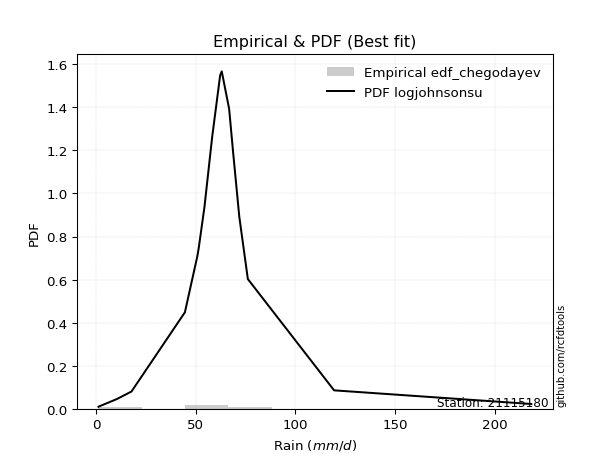</img>

</div>


### 6. EDF Blom (1958)

The Blom formula is a specific "plotting position" formula used in hydrology and statistical analysis to estimate the empirical cumulative probability (or non-exceedance probability) of a data series. It is particularly recommended for data that are approximately normally distributed. The constant _a_ is set to 0.375 (or 3/8).

<div align="center">


$P=(m-a)/(n+1-2a)$


</div>


**6.1. Empirical values**

<div align="center">

|                | 0                   | 1                   | 2                   | 3                   | 4                  | 5                  | 6                  | 7                  | 8                  | 9                  | 10                 | 11                 | 12                 | 13                 | 14                 | 15                 | 16                 | 17                 |
|:---------------|:--------------------|:--------------------|:--------------------|:--------------------|:-------------------|:-------------------|:-------------------|:-------------------|:-------------------|:-------------------|:-------------------|:-------------------|:-------------------|:-------------------|:-------------------|:-------------------|:-------------------|:-------------------|
| date           | 2022                | 2023                | 2013                | 2025                | 2020               | 2014               | 2006               | 2019               | 2015               | 2009               | 2017               | 2018               | 2016               | 2007               | 2005               | 2021               | 2008               | 2024               |
| x              | 1.1                 | 1.4                 | 10.4                | 17.7                | 44.5               | 50.8               | 51.4               | 51.5               | 54.3               | 58.2               | 62.2               | 63.0               | 66.7               | 68.7               | 71.8               | 76.1               | 119.4              | 218.4              |
| m              | 1                   | 2                   | 3                   | 4                   | 5                  | 6                  | 7                  | 8                  | 9                  | 10                 | 11                 | 12                 | 13                 | 14                 | 15                 | 16                 | 17                 | 18                 |
| empirical_dist | edf_blom            | edf_blom            | edf_blom            | edf_blom            | edf_blom           | edf_blom           | edf_blom           | edf_blom           | edf_blom           | edf_blom           | edf_blom           | edf_blom           | edf_blom           | edf_blom           | edf_blom           | edf_blom           | edf_blom           | edf_blom           |
| empirical      | 0.03424657534246575 | 0.08904109589041095 | 0.14383561643835616 | 0.19863013698630136 | 0.2534246575342466 | 0.3082191780821918 | 0.363013698630137  | 0.4178082191780822 | 0.4726027397260274 | 0.5273972602739726 | 0.5821917808219178 | 0.636986301369863  | 0.6917808219178082 | 0.7465753424657534 | 0.8013698630136986 | 0.8561643835616438 | 0.910958904109589  | 0.9657534246575342 |
| empirical_tr   | 1.0354609929078014  | 1.0977443609022557  | 1.168               | 1.2478632478632479  | 1.3394495412844036 | 1.4455445544554455 | 1.5698924731182795 | 1.7176470588235295 | 1.896103896103896  | 2.1159420289855073 | 2.3934426229508197 | 2.7547169811320753 | 3.2444444444444445 | 3.9459459459459456 | 5.0344827586206895 | 6.952380952380952  | 11.230769230769228 | 29.199999999999978 |

</div>


**6.2. Kolmogorov-Smirnov fit test (sorted by Δ)**


<div align="center">

|                | 0                   | 1                   | 2                   | 3                   | 4                   | 5                   | 6                   | 7                   | 8                   | 9                   | 10                  | 11                  | 12                  | 13                  | 14                  | 15                  | 16                  | 17                  | 18                  | 19                  | 20                  | 21                  | 22                  | 23                  | 24                  | 25                  | 26                  | 27                  | 28                  | 29                  | 30                  | 31                  | 32                  | 33                  | 34                  | 35                  | 36                  | 37                  | 38                  | 39                  | 40                  | 41                  | 42                  | 43                  | 44                  | 45                  | 46                  | 47                  | 48                  | 49                  | 50                  | 51                  | 52                  | 53                  | 54                  | 55                  | 56                  | 57                  | 58                  | 59                  | 60                  | 61                  | 62                  | 63                  | 64                  | 65                  | 66                  | 67                  | 68                  | 69                  | 70                  | 71                  | 72                  | 73                  | 74                  | 75                  | 76                  | 77                  | 78                  | 79                  | 80                  | 81                  | 82                  | 83                  | 84                  | 85                  | 86                  | 87                  | 88                  | 89                  | 90                  | 91                  | 92                  | 93                  | 94                  | 95                  | 96                  | 97                  | 98                  | 99                  | 100                 | 101                 | 102                 | 103                 | 104                 | 105                 | 106                 | 107                 | 108                 | 109                 | 110                 | 111                 | 112                 | 113                 | 114                 | 115                 | 116                 | 117                 | 118                 | 119                 | 120                 | 121                 | 122                 | 123                 | 124                 | 125                 | 126                 | 127                 | 128                 | 129                 | 130                 | 131                 | 132                 | 133                 | 134                 | 135                 | 136                 | 137                 | 138                 | 139                 | 140                 | 141                 | 142                 | 143                 | 144                 | 145                 | 146                 | 147                 | 148                 | 149                 | 150                 | 151                 | 152                 | 153                 | 154                 | 155                 | 156                 | 157                 | 158                 | 159                 |
|:---------------|:--------------------|:--------------------|:--------------------|:--------------------|:--------------------|:--------------------|:--------------------|:--------------------|:--------------------|:--------------------|:--------------------|:--------------------|:--------------------|:--------------------|:--------------------|:--------------------|:--------------------|:--------------------|:--------------------|:--------------------|:--------------------|:--------------------|:--------------------|:--------------------|:--------------------|:--------------------|:--------------------|:--------------------|:--------------------|:--------------------|:--------------------|:--------------------|:--------------------|:--------------------|:--------------------|:--------------------|:--------------------|:--------------------|:--------------------|:--------------------|:--------------------|:--------------------|:--------------------|:--------------------|:--------------------|:--------------------|:--------------------|:--------------------|:--------------------|:--------------------|:--------------------|:--------------------|:--------------------|:--------------------|:--------------------|:--------------------|:--------------------|:--------------------|:--------------------|:--------------------|:--------------------|:--------------------|:--------------------|:--------------------|:--------------------|:--------------------|:--------------------|:--------------------|:--------------------|:--------------------|:--------------------|:--------------------|:--------------------|:--------------------|:--------------------|:--------------------|:--------------------|:--------------------|:--------------------|:--------------------|:--------------------|:--------------------|:--------------------|:--------------------|:--------------------|:--------------------|:--------------------|:--------------------|:--------------------|:--------------------|:--------------------|:--------------------|:--------------------|:--------------------|:--------------------|:--------------------|:--------------------|:--------------------|:--------------------|:--------------------|:--------------------|:--------------------|:--------------------|:--------------------|:--------------------|:--------------------|:--------------------|:--------------------|:--------------------|:--------------------|:--------------------|:--------------------|:--------------------|:--------------------|:--------------------|:--------------------|:--------------------|:--------------------|:--------------------|:--------------------|:--------------------|:--------------------|:--------------------|:--------------------|:--------------------|:--------------------|:--------------------|:--------------------|:--------------------|:--------------------|:--------------------|:--------------------|:--------------------|:--------------------|:--------------------|:--------------------|:--------------------|:--------------------|:--------------------|:--------------------|:--------------------|:--------------------|:--------------------|:--------------------|:--------------------|:--------------------|:--------------------|:--------------------|:--------------------|:--------------------|:--------------------|:--------------------|:--------------------|:--------------------|:--------------------|:--------------------|:--------------------|:--------------------|:--------------------|:--------------------|
| station        | 21115180            | 21115180            | 21115180            | 21115180            | 21115180            | 21115180            | 21115180            | 21115180            | 21115180            | 21115180            | 21115180            | 21115180            | 21115180            | 21115180            | 21115180            | 21115180            | 21115180            | 21115180            | 21115180            | 21115180            | 21115180            | 21115180            | 21115180            | 21115180            | 21115180            | 21115180            | 21115180            | 21115180            | 21115180            | 21115180            | 21115180            | 21115180            | 21115180            | 21115180            | 21115180            | 21115180            | 21115180            | 21115180            | 21115180            | 21115180            | 21115180            | 21115180            | 21115180            | 21115180            | 21115180            | 21115180            | 21115180            | 21115180            | 21115180            | 21115180            | 21115180            | 21115180            | 21115180            | 21115180            | 21115180            | 21115180            | 21115180            | 21115180            | 21115180            | 21115180            | 21115180            | 21115180            | 21115180            | 21115180            | 21115180            | 21115180            | 21115180            | 21115180            | 21115180            | 21115180            | 21115180            | 21115180            | 21115180            | 21115180            | 21115180            | 21115180            | 21115180            | 21115180            | 21115180            | 21115180            | 21115180            | 21115180            | 21115180            | 21115180            | 21115180            | 21115180            | 21115180            | 21115180            | 21115180            | 21115180            | 21115180            | 21115180            | 21115180            | 21115180            | 21115180            | 21115180            | 21115180            | 21115180            | 21115180            | 21115180            | 21115180            | 21115180            | 21115180            | 21115180            | 21115180            | 21115180            | 21115180            | 21115180            | 21115180            | 21115180            | 21115180            | 21115180            | 21115180            | 21115180            | 21115180            | 21115180            | 21115180            | 21115180            | 21115180            | 21115180            | 21115180            | 21115180            | 21115180            | 21115180            | 21115180            | 21115180            | 21115180            | 21115180            | 21115180            | 21115180            | 21115180            | 21115180            | 21115180            | 21115180            | 21115180            | 21115180            | 21115180            | 21115180            | 21115180            | 21115180            | 21115180            | 21115180            | 21115180            | 21115180            | 21115180            | 21115180            | 21115180            | 21115180            | 21115180            | 21115180            | 21115180            | 21115180            | 21115180            | 21115180            | 21115180            | 21115180            | 21115180            | 21115180            | 21115180            | 21115180            |
| empirical_dist | edf_blom            | edf_blom            | edf_blom            | edf_blom            | edf_blom            | edf_blom            | edf_blom            | edf_blom            | edf_blom            | edf_blom            | edf_blom            | edf_blom            | edf_blom            | edf_blom            | edf_blom            | edf_blom            | edf_blom            | edf_blom            | edf_blom            | edf_blom            | edf_blom            | edf_blom            | edf_blom            | edf_blom            | edf_blom            | edf_blom            | edf_blom            | edf_blom            | edf_blom            | edf_blom            | edf_blom            | edf_blom            | edf_blom            | edf_blom            | edf_blom            | edf_blom            | edf_blom            | edf_blom            | edf_blom            | edf_blom            | edf_blom            | edf_blom            | edf_blom            | edf_blom            | edf_blom            | edf_blom            | edf_blom            | edf_blom            | edf_blom            | edf_blom            | edf_blom            | edf_blom            | edf_blom            | edf_blom            | edf_blom            | edf_blom            | edf_blom            | edf_blom            | edf_blom            | edf_blom            | edf_blom            | edf_blom            | edf_blom            | edf_blom            | edf_blom            | edf_blom            | edf_blom            | edf_blom            | edf_blom            | edf_blom            | edf_blom            | edf_blom            | edf_blom            | edf_blom            | edf_blom            | edf_blom            | edf_blom            | edf_blom            | edf_blom            | edf_blom            | edf_blom            | edf_blom            | edf_blom            | edf_blom            | edf_blom            | edf_blom            | edf_blom            | edf_blom            | edf_blom            | edf_blom            | edf_blom            | edf_blom            | edf_blom            | edf_blom            | edf_blom            | edf_blom            | edf_blom            | edf_blom            | edf_blom            | edf_blom            | edf_blom            | edf_blom            | edf_blom            | edf_blom            | edf_blom            | edf_blom            | edf_blom            | edf_blom            | edf_blom            | edf_blom            | edf_blom            | edf_blom            | edf_blom            | edf_blom            | edf_blom            | edf_blom            | edf_blom            | edf_blom            | edf_blom            | edf_blom            | edf_blom            | edf_blom            | edf_blom            | edf_blom            | edf_blom            | edf_blom            | edf_blom            | edf_blom            | edf_blom            | edf_blom            | edf_blom            | edf_blom            | edf_blom            | edf_blom            | edf_blom            | edf_blom            | edf_blom            | edf_blom            | edf_blom            | edf_blom            | edf_blom            | edf_blom            | edf_blom            | edf_blom            | edf_blom            | edf_blom            | edf_blom            | edf_blom            | edf_blom            | edf_blom            | edf_blom            | edf_blom            | edf_blom            | edf_blom            | edf_blom            | edf_blom            | edf_blom            | edf_blom            | edf_blom            | edf_blom            |
| p_dist         | logjohnsonsu        | nct                 | johnsonsu           | gennorm             | t                   | logdgamma           | logt                | dweibull            | vonmises_line       | tukeylambda         | dgamma              | exponnorm           | logdweibull         | loggennorm          | weibull_min         | laplace             | genlogistic         | gumbel_r            | kstwobign           | skewnorm            | exponweib           | genextreme          | invweibull          | invgamma            | fatiguelife         | invgauss            | johnsonsb           | gengamma            | halfnorm            | rayleigh            | ncf                 | hypsecant           | moyal               | logburr12           | maxwell             | rice                | genhalflogistic     | halflogistic        | betaprime           | logistic            | logpearson3         | f                   | foldnorm            | erlang              | gamma               | logjohnsonsb        | logvonmises_line    | logloglaplace       | loggengamma         | logloggamma         | logexponweib        | gompertz            | truncweibull_min    | logskewnorm         | burr12              | kappa3              | logweibull_max      | loggenextreme       | crystalball         | truncnorm           | norm                | logargus            | pearson3            | genpareto           | logweibull_min      | logburr             | loggenlogistic      | logmielke           | loggumbel_l         | loggompertz         | logtrapezoid        | anglit              | mielke              | nakagami            | logtruncweibull_min | semicircular        | gausshyper          | logtriang           | genexpon            | wald                | burr                | lomax               | logarcsine          | gumbel_l            | arcsine             | loggenhalflogistic  | logsemicircular     | exponpow            | loganglit           | logfoldnorm         | loggenpareto        | lognakagami         | logrice             | logcrystalball      | lognorm             | logexponnorm        | lognct              | logncf              | logf                | logfatiguelife      | loggamma            | loggamma            | logbetaprime        | loglevy_l           | loglogistic         | loginvweibull       | logerlang           | loginvgamma         | loghypsecant        | loginvgauss         | logmaxwell          | beta                | loglaplace          | loglaplace          | halfgennorm         | lograyleigh         | logkstwobign        | cosine              | loggausshyper       | bradford            | loghalfnorm         | truncexpon          | loggumbel_r         | loggenexpon         | logcosine           | triang              | loghalflogistic     | logmoyal            | powerlaw            | logksone            | logwrapcauchy       | loglomax            | logkappa3           | loguniform          | logkappa4           | logrdist            | logwald             | kappa4              | argus               | logbradford         | wrapcauchy          | ksone               | levy_l              | uniform             | logbeta             | logtruncexpon       | rdist               | logexponpow         | logtruncnorm        | logpowerlaw         | logtukeylambda      | alpha               | trapezoid           | logalpha            | truncpareto         | weibull_max         | logtruncpareto      | loghalfgennorm      | logvonmises         | vonmises            |
| delta          | 0.07430574765973241 | 0.087088064121186   | 0.09072405676073422 | 0.09429431607574912 | 0.1040509658223986  | 0.11995408745113345 | 0.12240716035585768 | 0.13590221114409434 | 0.14977867311820475 | 0.15266590937675362 | 0.15706049814621337 | 0.15709596199549364 | 0.158126919723797   | 0.1614496472144804  | 0.16577901640725845 | 0.17002673909723542 | 0.17015566041191155 | 0.17485654281244    | 0.17945715050536248 | 0.18031380018186416 | 0.18341391279355684 | 0.1834408714042533  | 0.18344134958751201 | 0.18478579631068104 | 0.18617024009119193 | 0.18626589686432565 | 0.18651964342398364 | 0.1914613960772512  | 0.1956034590464023  | 0.196091925314267   | 0.19614893986968318 | 0.19841539656690255 | 0.19900040853022705 | 0.19938721889109445 | 0.20334185722947573 | 0.20547711330331575 | 0.20654315774080678 | 0.21077540935179673 | 0.21101037888973218 | 0.2111434610930697  | 0.21149209135584868 | 0.21242538240508568 | 0.21361521258544702 | 0.21418146229987245 | 0.21418156055404947 | 0.21486750997980353 | 0.21526492757679178 | 0.21535097610969    | 0.21682248326910097 | 0.2193288864371742  | 0.21940821489577628 | 0.22021869970953678 | 0.22315176129911551 | 0.22385491182045447 | 0.22414234864454452 | 0.224619449874652   | 0.22575925967490557 | 0.22576030725267854 | 0.2271413965564273  | 0.22714140131744065 | 0.2271414035466045  | 0.22869156242737942 | 0.22949836291610082 | 0.22991696387652805 | 0.23055463220334205 | 0.23189748388635123 | 0.23198254930113849 | 0.23241742280254962 | 0.23826053046002682 | 0.2386546173181694  | 0.24054149947575515 | 0.2445581005123174  | 0.24462323384297557 | 0.24986730176511784 | 0.2511271742909875  | 0.2518309372260915  | 0.25760404987261065 | 0.26014755254895017 | 0.26477057307914353 | 0.2653678269652958  | 0.26873527534286146 | 0.2688242667083194  | 0.2793842568048217  | 0.2808150861343375  | 0.2813668596392499  | 0.2914674175489952  | 0.29285185000911007 | 0.29488564307564813 | 0.2962339553275203  | 0.3007988345868936  | 0.30254541222583453 | 0.3035106946603282  | 0.3044020541058404  | 0.3044202741229113  | 0.3044203361089237  | 0.3044228070777212  | 0.30452663888639775 | 0.3054557663693064  | 0.3061369318924799  | 0.3084156051714727  | 0.30871279310358446 | 0.30871279310358446 | 0.309167157666162   | 0.3094975419910725  | 0.3121754611293108  | 0.31343987545433283 | 0.3168468108309126  | 0.31805971090549734 | 0.3187039009024686  | 0.318919222525045   | 0.334278624470985   | 0.33806134840930324 | 0.33956886818922916 | 0.33956886818922916 | 0.3400314234709768  | 0.34381693498450183 | 0.34861423098150934 | 0.3592859760564916  | 0.35928861984303273 | 0.3655687555108224  | 0.37074048324259656 | 0.3724268576243008  | 0.3741606776493813  | 0.37442199032354717 | 0.37547702596449484 | 0.37590448533633564 | 0.3982710863001383  | 0.3987312618818647  | 0.4081093151431531  | 0.41268546288809915 | 0.42113352488310196 | 0.4222481773745793  | 0.44589587156966215 | 0.44590748697256843 | 0.453951725408723   | 0.46605358126691465 | 0.46691823204967997 | 0.469942443627448   | 0.47695566028921665 | 0.48029335138791274 | 0.48360797905725106 | 0.48521024949200126 | 0.4880166575418653  | 0.5110194226780727  | 0.5155311400355751  | 0.5344828719476674  | 0.545608621772112   | 0.546058593313048   | 0.5508756249780601  | 0.6225206888346558  | 0.6659316244216312  | 0.6807629401720054  | 0.7156069663279889  | 0.721871476108447   | 0.7629337192126565  | 0.795360567878629   | 0.8298648352343682  | 0.910958904109589   | 1.0808224861110376  | 34.15113315942448   |
| deltao         | 0.32102346734599996 | 0.32102346734599996 | 0.32102346734599996 | 0.32102346734599996 | 0.32102346734599996 | 0.32102346734599996 | 0.32102346734599996 | 0.32102346734599996 | 0.32102346734599996 | 0.32102346734599996 | 0.32102346734599996 | 0.32102346734599996 | 0.32102346734599996 | 0.32102346734599996 | 0.32102346734599996 | 0.32102346734599996 | 0.32102346734599996 | 0.32102346734599996 | 0.32102346734599996 | 0.32102346734599996 | 0.32102346734599996 | 0.32102346734599996 | 0.32102346734599996 | 0.32102346734599996 | 0.32102346734599996 | 0.32102346734599996 | 0.32102346734599996 | 0.32102346734599996 | 0.32102346734599996 | 0.32102346734599996 | 0.32102346734599996 | 0.32102346734599996 | 0.32102346734599996 | 0.32102346734599996 | 0.32102346734599996 | 0.32102346734599996 | 0.32102346734599996 | 0.32102346734599996 | 0.32102346734599996 | 0.32102346734599996 | 0.32102346734599996 | 0.32102346734599996 | 0.32102346734599996 | 0.32102346734599996 | 0.32102346734599996 | 0.32102346734599996 | 0.32102346734599996 | 0.32102346734599996 | 0.32102346734599996 | 0.32102346734599996 | 0.32102346734599996 | 0.32102346734599996 | 0.32102346734599996 | 0.32102346734599996 | 0.32102346734599996 | 0.32102346734599996 | 0.32102346734599996 | 0.32102346734599996 | 0.32102346734599996 | 0.32102346734599996 | 0.32102346734599996 | 0.32102346734599996 | 0.32102346734599996 | 0.32102346734599996 | 0.32102346734599996 | 0.32102346734599996 | 0.32102346734599996 | 0.32102346734599996 | 0.32102346734599996 | 0.32102346734599996 | 0.32102346734599996 | 0.32102346734599996 | 0.32102346734599996 | 0.32102346734599996 | 0.32102346734599996 | 0.32102346734599996 | 0.32102346734599996 | 0.32102346734599996 | 0.32102346734599996 | 0.32102346734599996 | 0.32102346734599996 | 0.32102346734599996 | 0.32102346734599996 | 0.32102346734599996 | 0.32102346734599996 | 0.32102346734599996 | 0.32102346734599996 | 0.32102346734599996 | 0.32102346734599996 | 0.32102346734599996 | 0.32102346734599996 | 0.32102346734599996 | 0.32102346734599996 | 0.32102346734599996 | 0.32102346734599996 | 0.32102346734599996 | 0.32102346734599996 | 0.32102346734599996 | 0.32102346734599996 | 0.32102346734599996 | 0.32102346734599996 | 0.32102346734599996 | 0.32102346734599996 | 0.32102346734599996 | 0.32102346734599996 | 0.32102346734599996 | 0.32102346734599996 | 0.32102346734599996 | 0.32102346734599996 | 0.32102346734599996 | 0.32102346734599996 | 0.32102346734599996 | 0.32102346734599996 | 0.32102346734599996 | 0.32102346734599996 | 0.32102346734599996 | 0.32102346734599996 | 0.32102346734599996 | 0.32102346734599996 | 0.32102346734599996 | 0.32102346734599996 | 0.32102346734599996 | 0.32102346734599996 | 0.32102346734599996 | 0.32102346734599996 | 0.32102346734599996 | 0.32102346734599996 | 0.32102346734599996 | 0.32102346734599996 | 0.32102346734599996 | 0.32102346734599996 | 0.32102346734599996 | 0.32102346734599996 | 0.32102346734599996 | 0.32102346734599996 | 0.32102346734599996 | 0.32102346734599996 | 0.32102346734599996 | 0.32102346734599996 | 0.32102346734599996 | 0.32102346734599996 | 0.32102346734599996 | 0.32102346734599996 | 0.32102346734599996 | 0.32102346734599996 | 0.32102346734599996 | 0.32102346734599996 | 0.32102346734599996 | 0.32102346734599996 | 0.32102346734599996 | 0.32102346734599996 | 0.32102346734599996 | 0.32102346734599996 | 0.32102346734599996 | 0.32102346734599996 | 0.32102346734599996 | 0.32102346734599996 | 0.32102346734599996 | 0.32102346734599996 | 0.32102346734599996 |
| eval           | Δo > Δ              | Δo > Δ              | Δo > Δ              | Δo > Δ              | Δo > Δ              | Δo > Δ              | Δo > Δ              | Δo > Δ              | Δo > Δ              | Δo > Δ              | Δo > Δ              | Δo > Δ              | Δo > Δ              | Δo > Δ              | Δo > Δ              | Δo > Δ              | Δo > Δ              | Δo > Δ              | Δo > Δ              | Δo > Δ              | Δo > Δ              | Δo > Δ              | Δo > Δ              | Δo > Δ              | Δo > Δ              | Δo > Δ              | Δo > Δ              | Δo > Δ              | Δo > Δ              | Δo > Δ              | Δo > Δ              | Δo > Δ              | Δo > Δ              | Δo > Δ              | Δo > Δ              | Δo > Δ              | Δo > Δ              | Δo > Δ              | Δo > Δ              | Δo > Δ              | Δo > Δ              | Δo > Δ              | Δo > Δ              | Δo > Δ              | Δo > Δ              | Δo > Δ              | Δo > Δ              | Δo > Δ              | Δo > Δ              | Δo > Δ              | Δo > Δ              | Δo > Δ              | Δo > Δ              | Δo > Δ              | Δo > Δ              | Δo > Δ              | Δo > Δ              | Δo > Δ              | Δo > Δ              | Δo > Δ              | Δo > Δ              | Δo > Δ              | Δo > Δ              | Δo > Δ              | Δo > Δ              | Δo > Δ              | Δo > Δ              | Δo > Δ              | Δo > Δ              | Δo > Δ              | Δo > Δ              | Δo > Δ              | Δo > Δ              | Δo > Δ              | Δo > Δ              | Δo > Δ              | Δo > Δ              | Δo > Δ              | Δo > Δ              | Δo > Δ              | Δo > Δ              | Δo > Δ              | Δo > Δ              | Δo > Δ              | Δo > Δ              | Δo > Δ              | Δo > Δ              | Δo > Δ              | Δo > Δ              | Δo > Δ              | Δo > Δ              | Δo > Δ              | Δo > Δ              | Δo > Δ              | Δo > Δ              | Δo > Δ              | Δo > Δ              | Δo > Δ              | Δo > Δ              | Δo > Δ              | Δo > Δ              | Δo > Δ              | Δo > Δ              | Δo > Δ              | Δo > Δ              | Δo > Δ              | Δo > Δ              | Δo > Δ              | Δo > Δ              | Δo > Δ              | Δo <= Δ             | Δo <= Δ             | Δo <= Δ             | Δo <= Δ             | Δo <= Δ             | Δo <= Δ             | Δo <= Δ             | Δo <= Δ             | Δo <= Δ             | Δo <= Δ             | Δo <= Δ             | Δo <= Δ             | Δo <= Δ             | Δo <= Δ             | Δo <= Δ             | Δo <= Δ             | Δo <= Δ             | Δo <= Δ             | Δo <= Δ             | Δo <= Δ             | Δo <= Δ             | Δo <= Δ             | Δo <= Δ             | Δo <= Δ             | Δo <= Δ             | Δo <= Δ             | Δo <= Δ             | Δo <= Δ             | Δo <= Δ             | Δo <= Δ             | Δo <= Δ             | Δo <= Δ             | Δo <= Δ             | Δo <= Δ             | Δo <= Δ             | Δo <= Δ             | Δo <= Δ             | Δo <= Δ             | Δo <= Δ             | Δo <= Δ             | Δo <= Δ             | Δo <= Δ             | Δo <= Δ             | Δo <= Δ             | Δo <= Δ             | Δo <= Δ             | Δo <= Δ             | Δo <= Δ             | Δo <= Δ             | Δo <= Δ             |
| fit            | 1                   | 1                   | 1                   | 1                   | 1                   | 1                   | 1                   | 1                   | 1                   | 1                   | 1                   | 1                   | 1                   | 1                   | 1                   | 1                   | 1                   | 1                   | 1                   | 1                   | 1                   | 1                   | 1                   | 1                   | 1                   | 1                   | 1                   | 1                   | 1                   | 1                   | 1                   | 1                   | 1                   | 1                   | 1                   | 1                   | 1                   | 1                   | 1                   | 1                   | 1                   | 1                   | 1                   | 1                   | 1                   | 1                   | 1                   | 1                   | 1                   | 1                   | 1                   | 1                   | 1                   | 1                   | 1                   | 1                   | 1                   | 1                   | 1                   | 1                   | 1                   | 1                   | 1                   | 1                   | 1                   | 1                   | 1                   | 1                   | 1                   | 1                   | 1                   | 1                   | 1                   | 1                   | 1                   | 1                   | 1                   | 1                   | 1                   | 1                   | 1                   | 1                   | 1                   | 1                   | 1                   | 1                   | 1                   | 1                   | 1                   | 1                   | 1                   | 1                   | 1                   | 1                   | 1                   | 1                   | 1                   | 1                   | 1                   | 1                   | 1                   | 1                   | 1                   | 1                   | 1                   | 1                   | 1                   | 1                   | 1                   | 1                   | 0                   | 0                   | 0                   | 0                   | 0                   | 0                   | 0                   | 0                   | 0                   | 0                   | 0                   | 0                   | 0                   | 0                   | 0                   | 0                   | 0                   | 0                   | 0                   | 0                   | 0                   | 0                   | 0                   | 0                   | 0                   | 0                   | 0                   | 0                   | 0                   | 0                   | 0                   | 0                   | 0                   | 0                   | 0                   | 0                   | 0                   | 0                   | 0                   | 0                   | 0                   | 0                   | 0                   | 0                   | 0                   | 0                   | 0                   | 0                   | 0                   | 0                   |
| n              | 18                  | 18                  | 18                  | 18                  | 18                  | 18                  | 18                  | 18                  | 18                  | 18                  | 18                  | 18                  | 18                  | 18                  | 18                  | 18                  | 18                  | 18                  | 18                  | 18                  | 18                  | 18                  | 18                  | 18                  | 18                  | 18                  | 18                  | 18                  | 18                  | 18                  | 18                  | 18                  | 18                  | 18                  | 18                  | 18                  | 18                  | 18                  | 18                  | 18                  | 18                  | 18                  | 18                  | 18                  | 18                  | 18                  | 18                  | 18                  | 18                  | 18                  | 18                  | 18                  | 18                  | 18                  | 18                  | 18                  | 18                  | 18                  | 18                  | 18                  | 18                  | 18                  | 18                  | 18                  | 18                  | 18                  | 18                  | 18                  | 18                  | 18                  | 18                  | 18                  | 18                  | 18                  | 18                  | 18                  | 18                  | 18                  | 18                  | 18                  | 18                  | 18                  | 18                  | 18                  | 18                  | 18                  | 18                  | 18                  | 18                  | 18                  | 18                  | 18                  | 18                  | 18                  | 18                  | 18                  | 18                  | 18                  | 18                  | 18                  | 18                  | 18                  | 18                  | 18                  | 18                  | 18                  | 18                  | 18                  | 18                  | 18                  | 18                  | 18                  | 18                  | 18                  | 18                  | 18                  | 18                  | 18                  | 18                  | 18                  | 18                  | 18                  | 18                  | 18                  | 18                  | 18                  | 18                  | 18                  | 18                  | 18                  | 18                  | 18                  | 18                  | 18                  | 18                  | 18                  | 18                  | 18                  | 18                  | 18                  | 18                  | 18                  | 18                  | 18                  | 18                  | 18                  | 18                  | 18                  | 18                  | 18                  | 18                  | 18                  | 18                  | 18                  | 18                  | 18                  | 18                  | 18                  | 18                  | 18                  |
| best_fit       | 1                   | 0                   | 0                   | 0                   | 0                   | 0                   | 0                   | 0                   | 0                   | 0                   | 0                   | 0                   | 0                   | 0                   | 0                   | 0                   | 0                   | 0                   | 0                   | 0                   | 0                   | 0                   | 0                   | 0                   | 0                   | 0                   | 0                   | 0                   | 0                   | 0                   | 0                   | 0                   | 0                   | 0                   | 0                   | 0                   | 0                   | 0                   | 0                   | 0                   | 0                   | 0                   | 0                   | 0                   | 0                   | 0                   | 0                   | 0                   | 0                   | 0                   | 0                   | 0                   | 0                   | 0                   | 0                   | 0                   | 0                   | 0                   | 0                   | 0                   | 0                   | 0                   | 0                   | 0                   | 0                   | 0                   | 0                   | 0                   | 0                   | 0                   | 0                   | 0                   | 0                   | 0                   | 0                   | 0                   | 0                   | 0                   | 0                   | 0                   | 0                   | 0                   | 0                   | 0                   | 0                   | 0                   | 0                   | 0                   | 0                   | 0                   | 0                   | 0                   | 0                   | 0                   | 0                   | 0                   | 0                   | 0                   | 0                   | 0                   | 0                   | 0                   | 0                   | 0                   | 0                   | 0                   | 0                   | 0                   | 0                   | 0                   | 0                   | 0                   | 0                   | 0                   | 0                   | 0                   | 0                   | 0                   | 0                   | 0                   | 0                   | 0                   | 0                   | 0                   | 0                   | 0                   | 0                   | 0                   | 0                   | 0                   | 0                   | 0                   | 0                   | 0                   | 0                   | 0                   | 0                   | 0                   | 0                   | 0                   | 0                   | 0                   | 0                   | 0                   | 0                   | 0                   | 0                   | 0                   | 0                   | 0                   | 0                   | 0                   | 0                   | 0                   | 0                   | 0                   | 0                   | 0                   | 0                   | 0                   |
| best_fit_sort  | 1                   | 2                   | 3                   | 4                   | 5                   | 6                   | 7                   | 8                   | 9                   | 10                  | 11                  | 12                  | 13                  | 14                  | 15                  | 16                  | 17                  | 18                  | 19                  | 20                  | 21                  | 22                  | 23                  | 24                  | 25                  | 26                  | 27                  | 28                  | 29                  | 30                  | 31                  | 32                  | 33                  | 34                  | 35                  | 36                  | 37                  | 38                  | 39                  | 40                  | 41                  | 42                  | 43                  | 44                  | 45                  | 46                  | 47                  | 48                  | 49                  | 50                  | 51                  | 52                  | 53                  | 54                  | 55                  | 56                  | 57                  | 58                  | 59                  | 60                  | 61                  | 62                  | 63                  | 64                  | 65                  | 66                  | 67                  | 68                  | 69                  | 70                  | 71                  | 72                  | 73                  | 74                  | 75                  | 76                  | 77                  | 78                  | 79                  | 80                  | 81                  | 82                  | 83                  | 84                  | 85                  | 86                  | 87                  | 88                  | 89                  | 90                  | 91                  | 92                  | 93                  | 94                  | 95                  | 96                  | 97                  | 98                  | 99                  | 100                 | 101                 | 102                 | 103                 | 104                 | 105                 | 106                 | 107                 | 108                 | 109                 | 110                 | 111                 | 112                 | 113                 | 114                 | 115                 | 116                 | 117                 | 118                 | 119                 | 120                 | 121                 | 122                 | 123                 | 124                 | 125                 | 126                 | 127                 | 128                 | 129                 | 130                 | 131                 | 132                 | 133                 | 134                 | 135                 | 136                 | 137                 | 138                 | 139                 | 140                 | 141                 | 142                 | 143                 | 144                 | 145                 | 146                 | 147                 | 148                 | 149                 | 150                 | 151                 | 152                 | 153                 | 154                 | 155                 | 156                 | 157                 | 158                 | 159                 | 160                 |

</div>


**6.3. Best fit**

<div align="center">

|   id |   station | empirical_dist   | p_dist       |     delta |   deltao | eval   |   fit |   n |   best_fit |   best_fit_sort |
|-----:|----------:|:-----------------|:-------------|----------:|---------:|:-------|------:|----:|-----------:|----------------:|
|    0 |  21115180 | edf_blom         | logjohnsonsu | 0.0743057 | 0.321023 | Δo > Δ |     1 |  18 |          1 |               1 |

</div>


<div align="center">

</img></img>

</div>


### 7. EDF Tukey (1962)

In hydrology, the Tukey formula is used as a plotting position formula to estimate the empirical probability or frequency of a flood event (or other hydrological data). The formula parameter is given as _c=0.333_ (or 1/3).

<div align="center">


$P=(m-c)/(n+1-2c)$


</div>


**7.1. Empirical values**

<div align="center">

|                | 0                   | 1                   | 2                   | 3         | 4                  | 5                  | 6                   | 7                   | 8                  | 9                  | 10                 | 11                 | 12                 | 13                 | 14                | 15                 | 16                 | 17                 |
|:---------------|:--------------------|:--------------------|:--------------------|:----------|:-------------------|:-------------------|:--------------------|:--------------------|:-------------------|:-------------------|:-------------------|:-------------------|:-------------------|:-------------------|:------------------|:-------------------|:-------------------|:-------------------|
| date           | 2022                | 2023                | 2013                | 2025      | 2020               | 2014               | 2006                | 2019                | 2015               | 2009               | 2017               | 2018               | 2016               | 2007               | 2005              | 2021               | 2008               | 2024               |
| x              | 1.1                 | 1.4                 | 10.4                | 17.7      | 44.5               | 50.8               | 51.4                | 51.5                | 54.3               | 58.2               | 62.2               | 63.0               | 66.7               | 68.7               | 71.8              | 76.1               | 119.4              | 218.4              |
| m              | 1                   | 2                   | 3                   | 4         | 5                  | 6                  | 7                   | 8                   | 9                  | 10                 | 11                 | 12                 | 13                 | 14                 | 15                | 16                 | 17                 | 18                 |
| empirical_dist | edf_tukey           | edf_tukey           | edf_tukey           | edf_tukey | edf_tukey          | edf_tukey          | edf_tukey           | edf_tukey           | edf_tukey          | edf_tukey          | edf_tukey          | edf_tukey          | edf_tukey          | edf_tukey          | edf_tukey         | edf_tukey          | edf_tukey          | edf_tukey          |
| empirical      | 0.03636363636363636 | 0.09090909090909091 | 0.14545454545454545 | 0.2       | 0.2545454545454545 | 0.3090909090909091 | 0.36363636363636365 | 0.41818181818181815 | 0.4727272727272727 | 0.5272727272727272 | 0.5818181818181818 | 0.6363636363636364 | 0.6909090909090909 | 0.7454545454545455 | 0.8               | 0.8545454545454545 | 0.9090909090909091 | 0.9636363636363636 |
| empirical_tr   | 1.0377358490566038  | 1.1                 | 1.1702127659574468  | 1.25      | 1.3414634146341462 | 1.4473684210526316 | 1.5714285714285714  | 1.71875             | 1.8965517241379308 | 2.115384615384615  | 2.391304347826087  | 2.75               | 3.235294117647059  | 3.928571428571429  | 5.000000000000001 | 6.874999999999997  | 10.999999999999996 | 27.49999999999999  |

</div>


**7.2. Kolmogorov-Smirnov fit test (sorted by Δ)**


<div align="center">

|                | 0                   | 1                   | 2                   | 3                   | 4                   | 5                   | 6                   | 7                   | 8                   | 9                   | 10                  | 11                  | 12                  | 13                  | 14                  | 15                  | 16                  | 17                  | 18                  | 19                  | 20                  | 21                  | 22                  | 23                  | 24                  | 25                  | 26                  | 27                  | 28                  | 29                  | 30                  | 31                  | 32                  | 33                  | 34                  | 35                  | 36                  | 37                  | 38                  | 39                  | 40                  | 41                  | 42                  | 43                  | 44                  | 45                  | 46                  | 47                  | 48                  | 49                  | 50                  | 51                  | 52                  | 53                  | 54                  | 55                  | 56                  | 57                  | 58                  | 59                  | 60                  | 61                  | 62                  | 63                  | 64                  | 65                  | 66                  | 67                  | 68                  | 69                  | 70                  | 71                  | 72                  | 73                  | 74                  | 75                  | 76                  | 77                  | 78                  | 79                  | 80                  | 81                  | 82                  | 83                  | 84                  | 85                  | 86                  | 87                  | 88                  | 89                  | 90                  | 91                  | 92                  | 93                  | 94                  | 95                  | 96                  | 97                  | 98                  | 99                  | 100                 | 101                 | 102                 | 103                 | 104                 | 105                 | 106                 | 107                 | 108                 | 109                 | 110                 | 111                 | 112                 | 113                 | 114                 | 115                 | 116                 | 117                 | 118                 | 119                 | 120                 | 121                 | 122                 | 123                 | 124                 | 125                 | 126                 | 127                 | 128                 | 129                 | 130                 | 131                 | 132                 | 133                 | 134                 | 135                 | 136                 | 137                 | 138                 | 139                 | 140                 | 141                 | 142                 | 143                 | 144                 | 145                 | 146                 | 147                 | 148                 | 149                 | 150                 | 151                 | 152                 | 153                 | 154                 | 155                 | 156                 | 157                 | 158                 | 159                 |
|:---------------|:--------------------|:--------------------|:--------------------|:--------------------|:--------------------|:--------------------|:--------------------|:--------------------|:--------------------|:--------------------|:--------------------|:--------------------|:--------------------|:--------------------|:--------------------|:--------------------|:--------------------|:--------------------|:--------------------|:--------------------|:--------------------|:--------------------|:--------------------|:--------------------|:--------------------|:--------------------|:--------------------|:--------------------|:--------------------|:--------------------|:--------------------|:--------------------|:--------------------|:--------------------|:--------------------|:--------------------|:--------------------|:--------------------|:--------------------|:--------------------|:--------------------|:--------------------|:--------------------|:--------------------|:--------------------|:--------------------|:--------------------|:--------------------|:--------------------|:--------------------|:--------------------|:--------------------|:--------------------|:--------------------|:--------------------|:--------------------|:--------------------|:--------------------|:--------------------|:--------------------|:--------------------|:--------------------|:--------------------|:--------------------|:--------------------|:--------------------|:--------------------|:--------------------|:--------------------|:--------------------|:--------------------|:--------------------|:--------------------|:--------------------|:--------------------|:--------------------|:--------------------|:--------------------|:--------------------|:--------------------|:--------------------|:--------------------|:--------------------|:--------------------|:--------------------|:--------------------|:--------------------|:--------------------|:--------------------|:--------------------|:--------------------|:--------------------|:--------------------|:--------------------|:--------------------|:--------------------|:--------------------|:--------------------|:--------------------|:--------------------|:--------------------|:--------------------|:--------------------|:--------------------|:--------------------|:--------------------|:--------------------|:--------------------|:--------------------|:--------------------|:--------------------|:--------------------|:--------------------|:--------------------|:--------------------|:--------------------|:--------------------|:--------------------|:--------------------|:--------------------|:--------------------|:--------------------|:--------------------|:--------------------|:--------------------|:--------------------|:--------------------|:--------------------|:--------------------|:--------------------|:--------------------|:--------------------|:--------------------|:--------------------|:--------------------|:--------------------|:--------------------|:--------------------|:--------------------|:--------------------|:--------------------|:--------------------|:--------------------|:--------------------|:--------------------|:--------------------|:--------------------|:--------------------|:--------------------|:--------------------|:--------------------|:--------------------|:--------------------|:--------------------|:--------------------|:--------------------|:--------------------|:--------------------|:--------------------|:--------------------|
| station        | 21115180            | 21115180            | 21115180            | 21115180            | 21115180            | 21115180            | 21115180            | 21115180            | 21115180            | 21115180            | 21115180            | 21115180            | 21115180            | 21115180            | 21115180            | 21115180            | 21115180            | 21115180            | 21115180            | 21115180            | 21115180            | 21115180            | 21115180            | 21115180            | 21115180            | 21115180            | 21115180            | 21115180            | 21115180            | 21115180            | 21115180            | 21115180            | 21115180            | 21115180            | 21115180            | 21115180            | 21115180            | 21115180            | 21115180            | 21115180            | 21115180            | 21115180            | 21115180            | 21115180            | 21115180            | 21115180            | 21115180            | 21115180            | 21115180            | 21115180            | 21115180            | 21115180            | 21115180            | 21115180            | 21115180            | 21115180            | 21115180            | 21115180            | 21115180            | 21115180            | 21115180            | 21115180            | 21115180            | 21115180            | 21115180            | 21115180            | 21115180            | 21115180            | 21115180            | 21115180            | 21115180            | 21115180            | 21115180            | 21115180            | 21115180            | 21115180            | 21115180            | 21115180            | 21115180            | 21115180            | 21115180            | 21115180            | 21115180            | 21115180            | 21115180            | 21115180            | 21115180            | 21115180            | 21115180            | 21115180            | 21115180            | 21115180            | 21115180            | 21115180            | 21115180            | 21115180            | 21115180            | 21115180            | 21115180            | 21115180            | 21115180            | 21115180            | 21115180            | 21115180            | 21115180            | 21115180            | 21115180            | 21115180            | 21115180            | 21115180            | 21115180            | 21115180            | 21115180            | 21115180            | 21115180            | 21115180            | 21115180            | 21115180            | 21115180            | 21115180            | 21115180            | 21115180            | 21115180            | 21115180            | 21115180            | 21115180            | 21115180            | 21115180            | 21115180            | 21115180            | 21115180            | 21115180            | 21115180            | 21115180            | 21115180            | 21115180            | 21115180            | 21115180            | 21115180            | 21115180            | 21115180            | 21115180            | 21115180            | 21115180            | 21115180            | 21115180            | 21115180            | 21115180            | 21115180            | 21115180            | 21115180            | 21115180            | 21115180            | 21115180            | 21115180            | 21115180            | 21115180            | 21115180            | 21115180            | 21115180            |
| empirical_dist | edf_tukey           | edf_tukey           | edf_tukey           | edf_tukey           | edf_tukey           | edf_tukey           | edf_tukey           | edf_tukey           | edf_tukey           | edf_tukey           | edf_tukey           | edf_tukey           | edf_tukey           | edf_tukey           | edf_tukey           | edf_tukey           | edf_tukey           | edf_tukey           | edf_tukey           | edf_tukey           | edf_tukey           | edf_tukey           | edf_tukey           | edf_tukey           | edf_tukey           | edf_tukey           | edf_tukey           | edf_tukey           | edf_tukey           | edf_tukey           | edf_tukey           | edf_tukey           | edf_tukey           | edf_tukey           | edf_tukey           | edf_tukey           | edf_tukey           | edf_tukey           | edf_tukey           | edf_tukey           | edf_tukey           | edf_tukey           | edf_tukey           | edf_tukey           | edf_tukey           | edf_tukey           | edf_tukey           | edf_tukey           | edf_tukey           | edf_tukey           | edf_tukey           | edf_tukey           | edf_tukey           | edf_tukey           | edf_tukey           | edf_tukey           | edf_tukey           | edf_tukey           | edf_tukey           | edf_tukey           | edf_tukey           | edf_tukey           | edf_tukey           | edf_tukey           | edf_tukey           | edf_tukey           | edf_tukey           | edf_tukey           | edf_tukey           | edf_tukey           | edf_tukey           | edf_tukey           | edf_tukey           | edf_tukey           | edf_tukey           | edf_tukey           | edf_tukey           | edf_tukey           | edf_tukey           | edf_tukey           | edf_tukey           | edf_tukey           | edf_tukey           | edf_tukey           | edf_tukey           | edf_tukey           | edf_tukey           | edf_tukey           | edf_tukey           | edf_tukey           | edf_tukey           | edf_tukey           | edf_tukey           | edf_tukey           | edf_tukey           | edf_tukey           | edf_tukey           | edf_tukey           | edf_tukey           | edf_tukey           | edf_tukey           | edf_tukey           | edf_tukey           | edf_tukey           | edf_tukey           | edf_tukey           | edf_tukey           | edf_tukey           | edf_tukey           | edf_tukey           | edf_tukey           | edf_tukey           | edf_tukey           | edf_tukey           | edf_tukey           | edf_tukey           | edf_tukey           | edf_tukey           | edf_tukey           | edf_tukey           | edf_tukey           | edf_tukey           | edf_tukey           | edf_tukey           | edf_tukey           | edf_tukey           | edf_tukey           | edf_tukey           | edf_tukey           | edf_tukey           | edf_tukey           | edf_tukey           | edf_tukey           | edf_tukey           | edf_tukey           | edf_tukey           | edf_tukey           | edf_tukey           | edf_tukey           | edf_tukey           | edf_tukey           | edf_tukey           | edf_tukey           | edf_tukey           | edf_tukey           | edf_tukey           | edf_tukey           | edf_tukey           | edf_tukey           | edf_tukey           | edf_tukey           | edf_tukey           | edf_tukey           | edf_tukey           | edf_tukey           | edf_tukey           | edf_tukey           | edf_tukey           | edf_tukey           | edf_tukey           |
| p_dist         | logjohnsonsu        | nct                 | johnsonsu           | gennorm             | t                   | logdgamma           | logt                | dweibull            | vonmises_line       | tukeylambda         | dgamma              | exponnorm           | logdweibull         | loggennorm          | weibull_min         | laplace             | genlogistic         | gumbel_r            | kstwobign           | skewnorm            | exponweib           | genextreme          | invweibull          | invgamma            | fatiguelife         | invgauss            | johnsonsb           | gengamma            | rayleigh            | halfnorm            | ncf                 | hypsecant           | moyal               | logburr12           | maxwell             | rice                | genhalflogistic     | logistic            | logpearson3         | halflogistic        | betaprime           | f                   | foldnorm            | erlang              | gamma               | logloglaplace       | logjohnsonsb        | logvonmises_line    | loggengamma         | logloggamma         | logexponweib        | gompertz            | truncweibull_min    | logskewnorm         | burr12              | kappa3              | logweibull_max      | loggenextreme       | crystalball         | truncnorm           | norm                | logargus            | pearson3            | genpareto           | logweibull_min      | logburr             | loggenlogistic      | logmielke           | loggumbel_l         | loggompertz         | logtrapezoid        | anglit              | mielke              | nakagami            | logtruncweibull_min | semicircular        | gausshyper          | logtriang           | genexpon            | wald                | lomax               | burr                | logarcsine          | gumbel_l            | arcsine             | loggenhalflogistic  | logsemicircular     | exponpow            | loganglit           | logfoldnorm         | loggenpareto        | lognakagami         | logrice             | logcrystalball      | lognorm             | logexponnorm        | lognct              | logncf              | logf                | logfatiguelife      | loggamma            | loggamma            | logbetaprime        | loglevy_l           | loglogistic         | loginvweibull       | logerlang           | loginvgamma         | loghypsecant        | loginvgauss         | logmaxwell          | beta                | loglaplace          | loglaplace          | halfgennorm         | lograyleigh         | logkstwobign        | cosine              | loggausshyper       | bradford            | loghalfnorm         | truncexpon          | loggumbel_r         | loggenexpon         | triang              | logcosine           | loghalflogistic     | logmoyal            | powerlaw            | logksone            | logwrapcauchy       | loglomax            | logkappa3           | loguniform          | logkappa4           | logrdist            | logwald             | kappa4              | argus               | logbradford         | wrapcauchy          | ksone               | levy_l              | uniform             | logbeta             | logtruncexpon       | rdist               | logexponpow         | logtruncnorm        | logpowerlaw         | logtukeylambda      | alpha               | trapezoid           | logalpha            | truncpareto         | weibull_max         | logtruncpareto      | loghalfgennorm      | logvonmises         | vonmises            |
| delta          | 0.07343401665101512 | 0.08845792713488465 | 0.09209391977443288 | 0.09466791507948513 | 0.10542082883609726 | 0.11833515843494413 | 0.12377702336955633 | 0.13602674414533966 | 0.14890694210948746 | 0.1510469803605643  | 0.15618876713749608 | 0.15622423098677635 | 0.15650799070760768 | 0.1598307181982911  | 0.16490728539854116 | 0.1684078100810461  | 0.16928392940319426 | 0.17398481180372272 | 0.17783822148917316 | 0.17869487116567484 | 0.18254218178483955 | 0.182569140395536   | 0.18256961857879472 | 0.18391406530196375 | 0.18529850908247464 | 0.18539416585560836 | 0.18564791241526635 | 0.19058966506853392 | 0.19447299629807768 | 0.19448266203519438 | 0.19453001085349386 | 0.19679646755071323 | 0.19812867752150976 | 0.19851548788237716 | 0.2017229282132864  | 0.20385818428712643 | 0.2056714267320895  | 0.20952453207688038 | 0.20987316233965936 | 0.20990367834307944 | 0.21013864788101488 | 0.2115536513963684  | 0.2124944155742391  | 0.21330973129115516 | 0.21330982954533217 | 0.2137320470935007  | 0.2137467129685956  | 0.21414413056558385 | 0.21570168625789304 | 0.21820808942596626 | 0.21828741788456835 | 0.21909790269832885 | 0.2215328322829262  | 0.22273411480924654 | 0.22327061763582723 | 0.2237477188659347  | 0.22463846266369764 | 0.2246395102414706  | 0.22552246754023797 | 0.22552247230125133 | 0.22552247453041518 | 0.2270726334111901  | 0.22862663190738353 | 0.22879616686532012 | 0.22943383519213412 | 0.23102575287763394 | 0.2311108182924212  | 0.23154569179383233 | 0.2371397334488189  | 0.23753382030696146 | 0.23942070246454722 | 0.2429391714961281  | 0.24375150283425828 | 0.24824837274892853 | 0.2500063772797796  | 0.2502120082099022  | 0.2564832528614027  | 0.25902675553774224 | 0.2636497760679356  | 0.2644960959565785  | 0.26770346969711145 | 0.26786354433414417 | 0.2782634597936138  | 0.27919615711814816 | 0.2797479306230606  | 0.29034662053778726 | 0.29173105299790214 | 0.2937648460644402  | 0.29511315831631235 | 0.2996780375756857  | 0.3014246152146266  | 0.3023898976491203  | 0.3032812570946325  | 0.30329947711170335 | 0.3032995390977158  | 0.30330201006651325 | 0.3034058418751898  | 0.30433496935809845 | 0.305016134881272   | 0.3072948081602648  | 0.30759199609237653 | 0.30759199609237653 | 0.30804636065495405 | 0.30837674497986456 | 0.3110546641181029  | 0.3123190784431249  | 0.31572601381970467 | 0.3169389138942894  | 0.31758310389126065 | 0.3177984255138371  | 0.33315782745977707 | 0.3369405513980953  | 0.3384480711780212  | 0.3384480711780212  | 0.3389106264597689  | 0.3426961379732939  | 0.3474934339703014  | 0.3576670470403023  | 0.3581678228318248  | 0.3639498264946331  | 0.36961968623138863 | 0.37080792860811146 | 0.3730398806381734  | 0.37330119331233924 | 0.3742855563201463  | 0.3743562289532869  | 0.39715028928893037 | 0.39761046487065677 | 0.40698851813194514 | 0.4115646658768912  | 0.42001272787189403 | 0.4211273803633714  | 0.4447750745584542  | 0.4447866899613605  | 0.45283092839751504 | 0.4644346522507254  | 0.46579743503847204 | 0.4683235146112587  | 0.47533673127302734 | 0.4791725543767048  | 0.48198905004106174 | 0.48359132047581194 | 0.4858995965206947  | 0.5094004936618834  | 0.5139122110193858  | 0.5333620749364595  | 0.5434915607509414  | 0.54493779630184    | 0.5497548279668522  | 0.6213998918234479  | 0.6648108274104233  | 0.6796421431607975  | 0.7139880373117997  | 0.7202525470922578  | 0.7613147901964672  | 0.793492572859949   | 0.8282459062181788  | 0.9090909090909091  | 1.0799507551023204  | 34.153250220445656  |
| deltao         | 0.32102346734599996 | 0.32102346734599996 | 0.32102346734599996 | 0.32102346734599996 | 0.32102346734599996 | 0.32102346734599996 | 0.32102346734599996 | 0.32102346734599996 | 0.32102346734599996 | 0.32102346734599996 | 0.32102346734599996 | 0.32102346734599996 | 0.32102346734599996 | 0.32102346734599996 | 0.32102346734599996 | 0.32102346734599996 | 0.32102346734599996 | 0.32102346734599996 | 0.32102346734599996 | 0.32102346734599996 | 0.32102346734599996 | 0.32102346734599996 | 0.32102346734599996 | 0.32102346734599996 | 0.32102346734599996 | 0.32102346734599996 | 0.32102346734599996 | 0.32102346734599996 | 0.32102346734599996 | 0.32102346734599996 | 0.32102346734599996 | 0.32102346734599996 | 0.32102346734599996 | 0.32102346734599996 | 0.32102346734599996 | 0.32102346734599996 | 0.32102346734599996 | 0.32102346734599996 | 0.32102346734599996 | 0.32102346734599996 | 0.32102346734599996 | 0.32102346734599996 | 0.32102346734599996 | 0.32102346734599996 | 0.32102346734599996 | 0.32102346734599996 | 0.32102346734599996 | 0.32102346734599996 | 0.32102346734599996 | 0.32102346734599996 | 0.32102346734599996 | 0.32102346734599996 | 0.32102346734599996 | 0.32102346734599996 | 0.32102346734599996 | 0.32102346734599996 | 0.32102346734599996 | 0.32102346734599996 | 0.32102346734599996 | 0.32102346734599996 | 0.32102346734599996 | 0.32102346734599996 | 0.32102346734599996 | 0.32102346734599996 | 0.32102346734599996 | 0.32102346734599996 | 0.32102346734599996 | 0.32102346734599996 | 0.32102346734599996 | 0.32102346734599996 | 0.32102346734599996 | 0.32102346734599996 | 0.32102346734599996 | 0.32102346734599996 | 0.32102346734599996 | 0.32102346734599996 | 0.32102346734599996 | 0.32102346734599996 | 0.32102346734599996 | 0.32102346734599996 | 0.32102346734599996 | 0.32102346734599996 | 0.32102346734599996 | 0.32102346734599996 | 0.32102346734599996 | 0.32102346734599996 | 0.32102346734599996 | 0.32102346734599996 | 0.32102346734599996 | 0.32102346734599996 | 0.32102346734599996 | 0.32102346734599996 | 0.32102346734599996 | 0.32102346734599996 | 0.32102346734599996 | 0.32102346734599996 | 0.32102346734599996 | 0.32102346734599996 | 0.32102346734599996 | 0.32102346734599996 | 0.32102346734599996 | 0.32102346734599996 | 0.32102346734599996 | 0.32102346734599996 | 0.32102346734599996 | 0.32102346734599996 | 0.32102346734599996 | 0.32102346734599996 | 0.32102346734599996 | 0.32102346734599996 | 0.32102346734599996 | 0.32102346734599996 | 0.32102346734599996 | 0.32102346734599996 | 0.32102346734599996 | 0.32102346734599996 | 0.32102346734599996 | 0.32102346734599996 | 0.32102346734599996 | 0.32102346734599996 | 0.32102346734599996 | 0.32102346734599996 | 0.32102346734599996 | 0.32102346734599996 | 0.32102346734599996 | 0.32102346734599996 | 0.32102346734599996 | 0.32102346734599996 | 0.32102346734599996 | 0.32102346734599996 | 0.32102346734599996 | 0.32102346734599996 | 0.32102346734599996 | 0.32102346734599996 | 0.32102346734599996 | 0.32102346734599996 | 0.32102346734599996 | 0.32102346734599996 | 0.32102346734599996 | 0.32102346734599996 | 0.32102346734599996 | 0.32102346734599996 | 0.32102346734599996 | 0.32102346734599996 | 0.32102346734599996 | 0.32102346734599996 | 0.32102346734599996 | 0.32102346734599996 | 0.32102346734599996 | 0.32102346734599996 | 0.32102346734599996 | 0.32102346734599996 | 0.32102346734599996 | 0.32102346734599996 | 0.32102346734599996 | 0.32102346734599996 | 0.32102346734599996 | 0.32102346734599996 | 0.32102346734599996 | 0.32102346734599996 |
| eval           | Δo > Δ              | Δo > Δ              | Δo > Δ              | Δo > Δ              | Δo > Δ              | Δo > Δ              | Δo > Δ              | Δo > Δ              | Δo > Δ              | Δo > Δ              | Δo > Δ              | Δo > Δ              | Δo > Δ              | Δo > Δ              | Δo > Δ              | Δo > Δ              | Δo > Δ              | Δo > Δ              | Δo > Δ              | Δo > Δ              | Δo > Δ              | Δo > Δ              | Δo > Δ              | Δo > Δ              | Δo > Δ              | Δo > Δ              | Δo > Δ              | Δo > Δ              | Δo > Δ              | Δo > Δ              | Δo > Δ              | Δo > Δ              | Δo > Δ              | Δo > Δ              | Δo > Δ              | Δo > Δ              | Δo > Δ              | Δo > Δ              | Δo > Δ              | Δo > Δ              | Δo > Δ              | Δo > Δ              | Δo > Δ              | Δo > Δ              | Δo > Δ              | Δo > Δ              | Δo > Δ              | Δo > Δ              | Δo > Δ              | Δo > Δ              | Δo > Δ              | Δo > Δ              | Δo > Δ              | Δo > Δ              | Δo > Δ              | Δo > Δ              | Δo > Δ              | Δo > Δ              | Δo > Δ              | Δo > Δ              | Δo > Δ              | Δo > Δ              | Δo > Δ              | Δo > Δ              | Δo > Δ              | Δo > Δ              | Δo > Δ              | Δo > Δ              | Δo > Δ              | Δo > Δ              | Δo > Δ              | Δo > Δ              | Δo > Δ              | Δo > Δ              | Δo > Δ              | Δo > Δ              | Δo > Δ              | Δo > Δ              | Δo > Δ              | Δo > Δ              | Δo > Δ              | Δo > Δ              | Δo > Δ              | Δo > Δ              | Δo > Δ              | Δo > Δ              | Δo > Δ              | Δo > Δ              | Δo > Δ              | Δo > Δ              | Δo > Δ              | Δo > Δ              | Δo > Δ              | Δo > Δ              | Δo > Δ              | Δo > Δ              | Δo > Δ              | Δo > Δ              | Δo > Δ              | Δo > Δ              | Δo > Δ              | Δo > Δ              | Δo > Δ              | Δo > Δ              | Δo > Δ              | Δo > Δ              | Δo > Δ              | Δo > Δ              | Δo > Δ              | Δo > Δ              | Δo <= Δ             | Δo <= Δ             | Δo <= Δ             | Δo <= Δ             | Δo <= Δ             | Δo <= Δ             | Δo <= Δ             | Δo <= Δ             | Δo <= Δ             | Δo <= Δ             | Δo <= Δ             | Δo <= Δ             | Δo <= Δ             | Δo <= Δ             | Δo <= Δ             | Δo <= Δ             | Δo <= Δ             | Δo <= Δ             | Δo <= Δ             | Δo <= Δ             | Δo <= Δ             | Δo <= Δ             | Δo <= Δ             | Δo <= Δ             | Δo <= Δ             | Δo <= Δ             | Δo <= Δ             | Δo <= Δ             | Δo <= Δ             | Δo <= Δ             | Δo <= Δ             | Δo <= Δ             | Δo <= Δ             | Δo <= Δ             | Δo <= Δ             | Δo <= Δ             | Δo <= Δ             | Δo <= Δ             | Δo <= Δ             | Δo <= Δ             | Δo <= Δ             | Δo <= Δ             | Δo <= Δ             | Δo <= Δ             | Δo <= Δ             | Δo <= Δ             | Δo <= Δ             | Δo <= Δ             | Δo <= Δ             | Δo <= Δ             |
| fit            | 1                   | 1                   | 1                   | 1                   | 1                   | 1                   | 1                   | 1                   | 1                   | 1                   | 1                   | 1                   | 1                   | 1                   | 1                   | 1                   | 1                   | 1                   | 1                   | 1                   | 1                   | 1                   | 1                   | 1                   | 1                   | 1                   | 1                   | 1                   | 1                   | 1                   | 1                   | 1                   | 1                   | 1                   | 1                   | 1                   | 1                   | 1                   | 1                   | 1                   | 1                   | 1                   | 1                   | 1                   | 1                   | 1                   | 1                   | 1                   | 1                   | 1                   | 1                   | 1                   | 1                   | 1                   | 1                   | 1                   | 1                   | 1                   | 1                   | 1                   | 1                   | 1                   | 1                   | 1                   | 1                   | 1                   | 1                   | 1                   | 1                   | 1                   | 1                   | 1                   | 1                   | 1                   | 1                   | 1                   | 1                   | 1                   | 1                   | 1                   | 1                   | 1                   | 1                   | 1                   | 1                   | 1                   | 1                   | 1                   | 1                   | 1                   | 1                   | 1                   | 1                   | 1                   | 1                   | 1                   | 1                   | 1                   | 1                   | 1                   | 1                   | 1                   | 1                   | 1                   | 1                   | 1                   | 1                   | 1                   | 1                   | 1                   | 0                   | 0                   | 0                   | 0                   | 0                   | 0                   | 0                   | 0                   | 0                   | 0                   | 0                   | 0                   | 0                   | 0                   | 0                   | 0                   | 0                   | 0                   | 0                   | 0                   | 0                   | 0                   | 0                   | 0                   | 0                   | 0                   | 0                   | 0                   | 0                   | 0                   | 0                   | 0                   | 0                   | 0                   | 0                   | 0                   | 0                   | 0                   | 0                   | 0                   | 0                   | 0                   | 0                   | 0                   | 0                   | 0                   | 0                   | 0                   | 0                   | 0                   |
| n              | 18                  | 18                  | 18                  | 18                  | 18                  | 18                  | 18                  | 18                  | 18                  | 18                  | 18                  | 18                  | 18                  | 18                  | 18                  | 18                  | 18                  | 18                  | 18                  | 18                  | 18                  | 18                  | 18                  | 18                  | 18                  | 18                  | 18                  | 18                  | 18                  | 18                  | 18                  | 18                  | 18                  | 18                  | 18                  | 18                  | 18                  | 18                  | 18                  | 18                  | 18                  | 18                  | 18                  | 18                  | 18                  | 18                  | 18                  | 18                  | 18                  | 18                  | 18                  | 18                  | 18                  | 18                  | 18                  | 18                  | 18                  | 18                  | 18                  | 18                  | 18                  | 18                  | 18                  | 18                  | 18                  | 18                  | 18                  | 18                  | 18                  | 18                  | 18                  | 18                  | 18                  | 18                  | 18                  | 18                  | 18                  | 18                  | 18                  | 18                  | 18                  | 18                  | 18                  | 18                  | 18                  | 18                  | 18                  | 18                  | 18                  | 18                  | 18                  | 18                  | 18                  | 18                  | 18                  | 18                  | 18                  | 18                  | 18                  | 18                  | 18                  | 18                  | 18                  | 18                  | 18                  | 18                  | 18                  | 18                  | 18                  | 18                  | 18                  | 18                  | 18                  | 18                  | 18                  | 18                  | 18                  | 18                  | 18                  | 18                  | 18                  | 18                  | 18                  | 18                  | 18                  | 18                  | 18                  | 18                  | 18                  | 18                  | 18                  | 18                  | 18                  | 18                  | 18                  | 18                  | 18                  | 18                  | 18                  | 18                  | 18                  | 18                  | 18                  | 18                  | 18                  | 18                  | 18                  | 18                  | 18                  | 18                  | 18                  | 18                  | 18                  | 18                  | 18                  | 18                  | 18                  | 18                  | 18                  | 18                  |
| best_fit       | 1                   | 0                   | 0                   | 0                   | 0                   | 0                   | 0                   | 0                   | 0                   | 0                   | 0                   | 0                   | 0                   | 0                   | 0                   | 0                   | 0                   | 0                   | 0                   | 0                   | 0                   | 0                   | 0                   | 0                   | 0                   | 0                   | 0                   | 0                   | 0                   | 0                   | 0                   | 0                   | 0                   | 0                   | 0                   | 0                   | 0                   | 0                   | 0                   | 0                   | 0                   | 0                   | 0                   | 0                   | 0                   | 0                   | 0                   | 0                   | 0                   | 0                   | 0                   | 0                   | 0                   | 0                   | 0                   | 0                   | 0                   | 0                   | 0                   | 0                   | 0                   | 0                   | 0                   | 0                   | 0                   | 0                   | 0                   | 0                   | 0                   | 0                   | 0                   | 0                   | 0                   | 0                   | 0                   | 0                   | 0                   | 0                   | 0                   | 0                   | 0                   | 0                   | 0                   | 0                   | 0                   | 0                   | 0                   | 0                   | 0                   | 0                   | 0                   | 0                   | 0                   | 0                   | 0                   | 0                   | 0                   | 0                   | 0                   | 0                   | 0                   | 0                   | 0                   | 0                   | 0                   | 0                   | 0                   | 0                   | 0                   | 0                   | 0                   | 0                   | 0                   | 0                   | 0                   | 0                   | 0                   | 0                   | 0                   | 0                   | 0                   | 0                   | 0                   | 0                   | 0                   | 0                   | 0                   | 0                   | 0                   | 0                   | 0                   | 0                   | 0                   | 0                   | 0                   | 0                   | 0                   | 0                   | 0                   | 0                   | 0                   | 0                   | 0                   | 0                   | 0                   | 0                   | 0                   | 0                   | 0                   | 0                   | 0                   | 0                   | 0                   | 0                   | 0                   | 0                   | 0                   | 0                   | 0                   | 0                   |
| best_fit_sort  | 1                   | 2                   | 3                   | 4                   | 5                   | 6                   | 7                   | 8                   | 9                   | 10                  | 11                  | 12                  | 13                  | 14                  | 15                  | 16                  | 17                  | 18                  | 19                  | 20                  | 21                  | 22                  | 23                  | 24                  | 25                  | 26                  | 27                  | 28                  | 29                  | 30                  | 31                  | 32                  | 33                  | 34                  | 35                  | 36                  | 37                  | 38                  | 39                  | 40                  | 41                  | 42                  | 43                  | 44                  | 45                  | 46                  | 47                  | 48                  | 49                  | 50                  | 51                  | 52                  | 53                  | 54                  | 55                  | 56                  | 57                  | 58                  | 59                  | 60                  | 61                  | 62                  | 63                  | 64                  | 65                  | 66                  | 67                  | 68                  | 69                  | 70                  | 71                  | 72                  | 73                  | 74                  | 75                  | 76                  | 77                  | 78                  | 79                  | 80                  | 81                  | 82                  | 83                  | 84                  | 85                  | 86                  | 87                  | 88                  | 89                  | 90                  | 91                  | 92                  | 93                  | 94                  | 95                  | 96                  | 97                  | 98                  | 99                  | 100                 | 101                 | 102                 | 103                 | 104                 | 105                 | 106                 | 107                 | 108                 | 109                 | 110                 | 111                 | 112                 | 113                 | 114                 | 115                 | 116                 | 117                 | 118                 | 119                 | 120                 | 121                 | 122                 | 123                 | 124                 | 125                 | 126                 | 127                 | 128                 | 129                 | 130                 | 131                 | 132                 | 133                 | 134                 | 135                 | 136                 | 137                 | 138                 | 139                 | 140                 | 141                 | 142                 | 143                 | 144                 | 145                 | 146                 | 147                 | 148                 | 149                 | 150                 | 151                 | 152                 | 153                 | 154                 | 155                 | 156                 | 157                 | 158                 | 159                 | 160                 |

</div>


**7.3. Best fit**

<div align="center">

|   id |   station | empirical_dist   | p_dist       |    delta |   deltao | eval   |   fit |   n |   best_fit |   best_fit_sort |
|-----:|----------:|:-----------------|:-------------|---------:|---------:|:-------|------:|----:|-----------:|----------------:|
|    0 |  21115180 | edf_tukey        | logjohnsonsu | 0.073434 | 0.321023 | Δo > Δ |     1 |  18 |          1 |               1 |

</div>


<div align="center">

</img>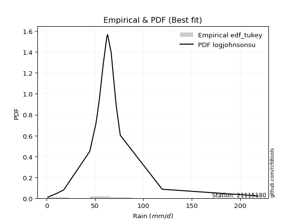</img>

</div>


### 8. EDF Gringorten (1963)

Gringorten plotting position formula is essential for estimating the probability and return periods of extreme events like floods and heavy rainfall. The constant _a=0.44_.

<div align="center">


$P=(m-a)/(n+1-2a)$


</div>


**8.1. Empirical values**

<div align="center">

|                | 0                   | 1                   | 2                  | 3                   | 4                  | 5                  | 6                   | 7                  | 8                   | 9                  | 10                 | 11                 | 12                 | 13                 | 14                 | 15                 | 16                 | 17                 |
|:---------------|:--------------------|:--------------------|:-------------------|:--------------------|:-------------------|:-------------------|:--------------------|:-------------------|:--------------------|:-------------------|:-------------------|:-------------------|:-------------------|:-------------------|:-------------------|:-------------------|:-------------------|:-------------------|
| date           | 2022                | 2023                | 2013               | 2025                | 2020               | 2014               | 2006                | 2019               | 2015                | 2009               | 2017               | 2018               | 2016               | 2007               | 2005               | 2021               | 2008               | 2024               |
| x              | 1.1                 | 1.4                 | 10.4               | 17.7                | 44.5               | 50.8               | 51.4                | 51.5               | 54.3                | 58.2               | 62.2               | 63.0               | 66.7               | 68.7               | 71.8               | 76.1               | 119.4              | 218.4              |
| m              | 1                   | 2                   | 3                  | 4                   | 5                  | 6                  | 7                   | 8                  | 9                   | 10                 | 11                 | 12                 | 13                 | 14                 | 15                 | 16                 | 17                 | 18                 |
| empirical_dist | edf_gringorten      | edf_gringorten      | edf_gringorten     | edf_gringorten      | edf_gringorten     | edf_gringorten     | edf_gringorten      | edf_gringorten     | edf_gringorten      | edf_gringorten     | edf_gringorten     | edf_gringorten     | edf_gringorten     | edf_gringorten     | edf_gringorten     | edf_gringorten     | edf_gringorten     | edf_gringorten     |
| empirical      | 0.03090507726269316 | 0.08609271523178808 | 0.141280353200883  | 0.19646799116997793 | 0.2516556291390728 | 0.3068432671081677 | 0.36203090507726265 | 0.4172185430463576 | 0.47240618101545256 | 0.5275938189845475 | 0.5827814569536424 | 0.6379690949227373 | 0.6931567328918322 | 0.7483443708609271 | 0.8035320088300221 | 0.8587196467991169 | 0.9139072847682118 | 0.9690949227373067 |
| empirical_tr   | 1.031890660592255   | 1.0942028985507246  | 1.1645244215938304 | 1.2445054945054945  | 1.3362831858407078 | 1.4426751592356688 | 1.5674740484429064  | 1.7159090909090906 | 1.8953974895397487  | 2.1168224299065423 | 2.3968253968253967 | 2.76219512195122   | 3.2589928057553954 | 3.9736842105263146 | 5.089887640449438  | 7.078124999999997  | 11.6153846153846   | 32.35714285714269  |

</div>


**8.2. Kolmogorov-Smirnov fit test (sorted by Δ)**


<div align="center">

|                | 0                   | 1                   | 2                   | 3                   | 4                   | 5                   | 6                   | 7                   | 8                   | 9                   | 10                  | 11                  | 12                  | 13                  | 14                  | 15                  | 16                  | 17                  | 18                  | 19                  | 20                  | 21                  | 22                  | 23                  | 24                  | 25                  | 26                  | 27                  | 28                  | 29                  | 30                  | 31                  | 32                  | 33                  | 34                  | 35                  | 36                  | 37                  | 38                  | 39                  | 40                  | 41                  | 42                  | 43                  | 44                  | 45                  | 46                  | 47                  | 48                  | 49                  | 50                  | 51                  | 52                  | 53                  | 54                  | 55                  | 56                  | 57                  | 58                  | 59                  | 60                  | 61                  | 62                  | 63                  | 64                  | 65                  | 66                  | 67                  | 68                  | 69                  | 70                  | 71                  | 72                  | 73                  | 74                  | 75                  | 76                  | 77                  | 78                  | 79                  | 80                  | 81                  | 82                  | 83                  | 84                  | 85                  | 86                  | 87                  | 88                  | 89                  | 90                  | 91                  | 92                  | 93                  | 94                  | 95                  | 96                  | 97                  | 98                  | 99                  | 100                 | 101                 | 102                 | 103                 | 104                 | 105                 | 106                 | 107                 | 108                 | 109                 | 110                 | 111                 | 112                 | 113                 | 114                 | 115                 | 116                 | 117                 | 118                 | 119                 | 120                 | 121                 | 122                 | 123                 | 124                 | 125                 | 126                 | 127                 | 128                 | 129                 | 130                 | 131                 | 132                 | 133                 | 134                 | 135                 | 136                 | 137                 | 138                 | 139                 | 140                 | 141                 | 142                 | 143                 | 144                 | 145                 | 146                 | 147                 | 148                 | 149                 | 150                 | 151                 | 152                 | 153                 | 154                 | 155                 | 156                 | 157                 | 158                 | 159                 |
|:---------------|:--------------------|:--------------------|:--------------------|:--------------------|:--------------------|:--------------------|:--------------------|:--------------------|:--------------------|:--------------------|:--------------------|:--------------------|:--------------------|:--------------------|:--------------------|:--------------------|:--------------------|:--------------------|:--------------------|:--------------------|:--------------------|:--------------------|:--------------------|:--------------------|:--------------------|:--------------------|:--------------------|:--------------------|:--------------------|:--------------------|:--------------------|:--------------------|:--------------------|:--------------------|:--------------------|:--------------------|:--------------------|:--------------------|:--------------------|:--------------------|:--------------------|:--------------------|:--------------------|:--------------------|:--------------------|:--------------------|:--------------------|:--------------------|:--------------------|:--------------------|:--------------------|:--------------------|:--------------------|:--------------------|:--------------------|:--------------------|:--------------------|:--------------------|:--------------------|:--------------------|:--------------------|:--------------------|:--------------------|:--------------------|:--------------------|:--------------------|:--------------------|:--------------------|:--------------------|:--------------------|:--------------------|:--------------------|:--------------------|:--------------------|:--------------------|:--------------------|:--------------------|:--------------------|:--------------------|:--------------------|:--------------------|:--------------------|:--------------------|:--------------------|:--------------------|:--------------------|:--------------------|:--------------------|:--------------------|:--------------------|:--------------------|:--------------------|:--------------------|:--------------------|:--------------------|:--------------------|:--------------------|:--------------------|:--------------------|:--------------------|:--------------------|:--------------------|:--------------------|:--------------------|:--------------------|:--------------------|:--------------------|:--------------------|:--------------------|:--------------------|:--------------------|:--------------------|:--------------------|:--------------------|:--------------------|:--------------------|:--------------------|:--------------------|:--------------------|:--------------------|:--------------------|:--------------------|:--------------------|:--------------------|:--------------------|:--------------------|:--------------------|:--------------------|:--------------------|:--------------------|:--------------------|:--------------------|:--------------------|:--------------------|:--------------------|:--------------------|:--------------------|:--------------------|:--------------------|:--------------------|:--------------------|:--------------------|:--------------------|:--------------------|:--------------------|:--------------------|:--------------------|:--------------------|:--------------------|:--------------------|:--------------------|:--------------------|:--------------------|:--------------------|:--------------------|:--------------------|:--------------------|:--------------------|:--------------------|:--------------------|
| station        | 21115180            | 21115180            | 21115180            | 21115180            | 21115180            | 21115180            | 21115180            | 21115180            | 21115180            | 21115180            | 21115180            | 21115180            | 21115180            | 21115180            | 21115180            | 21115180            | 21115180            | 21115180            | 21115180            | 21115180            | 21115180            | 21115180            | 21115180            | 21115180            | 21115180            | 21115180            | 21115180            | 21115180            | 21115180            | 21115180            | 21115180            | 21115180            | 21115180            | 21115180            | 21115180            | 21115180            | 21115180            | 21115180            | 21115180            | 21115180            | 21115180            | 21115180            | 21115180            | 21115180            | 21115180            | 21115180            | 21115180            | 21115180            | 21115180            | 21115180            | 21115180            | 21115180            | 21115180            | 21115180            | 21115180            | 21115180            | 21115180            | 21115180            | 21115180            | 21115180            | 21115180            | 21115180            | 21115180            | 21115180            | 21115180            | 21115180            | 21115180            | 21115180            | 21115180            | 21115180            | 21115180            | 21115180            | 21115180            | 21115180            | 21115180            | 21115180            | 21115180            | 21115180            | 21115180            | 21115180            | 21115180            | 21115180            | 21115180            | 21115180            | 21115180            | 21115180            | 21115180            | 21115180            | 21115180            | 21115180            | 21115180            | 21115180            | 21115180            | 21115180            | 21115180            | 21115180            | 21115180            | 21115180            | 21115180            | 21115180            | 21115180            | 21115180            | 21115180            | 21115180            | 21115180            | 21115180            | 21115180            | 21115180            | 21115180            | 21115180            | 21115180            | 21115180            | 21115180            | 21115180            | 21115180            | 21115180            | 21115180            | 21115180            | 21115180            | 21115180            | 21115180            | 21115180            | 21115180            | 21115180            | 21115180            | 21115180            | 21115180            | 21115180            | 21115180            | 21115180            | 21115180            | 21115180            | 21115180            | 21115180            | 21115180            | 21115180            | 21115180            | 21115180            | 21115180            | 21115180            | 21115180            | 21115180            | 21115180            | 21115180            | 21115180            | 21115180            | 21115180            | 21115180            | 21115180            | 21115180            | 21115180            | 21115180            | 21115180            | 21115180            | 21115180            | 21115180            | 21115180            | 21115180            | 21115180            | 21115180            |
| empirical_dist | edf_gringorten      | edf_gringorten      | edf_gringorten      | edf_gringorten      | edf_gringorten      | edf_gringorten      | edf_gringorten      | edf_gringorten      | edf_gringorten      | edf_gringorten      | edf_gringorten      | edf_gringorten      | edf_gringorten      | edf_gringorten      | edf_gringorten      | edf_gringorten      | edf_gringorten      | edf_gringorten      | edf_gringorten      | edf_gringorten      | edf_gringorten      | edf_gringorten      | edf_gringorten      | edf_gringorten      | edf_gringorten      | edf_gringorten      | edf_gringorten      | edf_gringorten      | edf_gringorten      | edf_gringorten      | edf_gringorten      | edf_gringorten      | edf_gringorten      | edf_gringorten      | edf_gringorten      | edf_gringorten      | edf_gringorten      | edf_gringorten      | edf_gringorten      | edf_gringorten      | edf_gringorten      | edf_gringorten      | edf_gringorten      | edf_gringorten      | edf_gringorten      | edf_gringorten      | edf_gringorten      | edf_gringorten      | edf_gringorten      | edf_gringorten      | edf_gringorten      | edf_gringorten      | edf_gringorten      | edf_gringorten      | edf_gringorten      | edf_gringorten      | edf_gringorten      | edf_gringorten      | edf_gringorten      | edf_gringorten      | edf_gringorten      | edf_gringorten      | edf_gringorten      | edf_gringorten      | edf_gringorten      | edf_gringorten      | edf_gringorten      | edf_gringorten      | edf_gringorten      | edf_gringorten      | edf_gringorten      | edf_gringorten      | edf_gringorten      | edf_gringorten      | edf_gringorten      | edf_gringorten      | edf_gringorten      | edf_gringorten      | edf_gringorten      | edf_gringorten      | edf_gringorten      | edf_gringorten      | edf_gringorten      | edf_gringorten      | edf_gringorten      | edf_gringorten      | edf_gringorten      | edf_gringorten      | edf_gringorten      | edf_gringorten      | edf_gringorten      | edf_gringorten      | edf_gringorten      | edf_gringorten      | edf_gringorten      | edf_gringorten      | edf_gringorten      | edf_gringorten      | edf_gringorten      | edf_gringorten      | edf_gringorten      | edf_gringorten      | edf_gringorten      | edf_gringorten      | edf_gringorten      | edf_gringorten      | edf_gringorten      | edf_gringorten      | edf_gringorten      | edf_gringorten      | edf_gringorten      | edf_gringorten      | edf_gringorten      | edf_gringorten      | edf_gringorten      | edf_gringorten      | edf_gringorten      | edf_gringorten      | edf_gringorten      | edf_gringorten      | edf_gringorten      | edf_gringorten      | edf_gringorten      | edf_gringorten      | edf_gringorten      | edf_gringorten      | edf_gringorten      | edf_gringorten      | edf_gringorten      | edf_gringorten      | edf_gringorten      | edf_gringorten      | edf_gringorten      | edf_gringorten      | edf_gringorten      | edf_gringorten      | edf_gringorten      | edf_gringorten      | edf_gringorten      | edf_gringorten      | edf_gringorten      | edf_gringorten      | edf_gringorten      | edf_gringorten      | edf_gringorten      | edf_gringorten      | edf_gringorten      | edf_gringorten      | edf_gringorten      | edf_gringorten      | edf_gringorten      | edf_gringorten      | edf_gringorten      | edf_gringorten      | edf_gringorten      | edf_gringorten      | edf_gringorten      | edf_gringorten      | edf_gringorten      | edf_gringorten      |
| p_dist         | logjohnsonsu        | nct                 | johnsonsu           | gennorm             | t                   | logt                | logdgamma           | dweibull            | vonmises_line       | tukeylambda         | dgamma              | exponnorm           | logdweibull         | loggennorm          | weibull_min         | genlogistic         | laplace             | gumbel_r            | kstwobign           | skewnorm            | exponweib           | genextreme          | invweibull          | invgamma            | fatiguelife         | invgauss            | johnsonsb           | gengamma            | halfnorm            | rayleigh            | ncf                 | moyal               | logburr12           | hypsecant           | maxwell             | genhalflogistic     | rice                | halflogistic        | betaprime           | logistic            | f                   | logpearson3         | foldnorm            | erlang              | gamma               | logjohnsonsb        | logvonmises_line    | logloglaplace       | loggengamma         | logloggamma         | logexponweib        | gompertz            | logskewnorm         | truncweibull_min    | burr12              | kappa3              | logweibull_max      | loggenextreme       | crystalball         | truncnorm           | norm                | pearson3            | logargus            | genpareto           | logweibull_min      | logburr             | loggenlogistic      | logmielke           | loggumbel_l         | loggompertz         | logtrapezoid        | mielke              | anglit              | nakagami            | logtruncweibull_min | semicircular        | gausshyper          | logtriang           | genexpon            | wald                | burr                | lomax               | logarcsine          | gumbel_l            | arcsine             | loggenhalflogistic  | logsemicircular     | exponpow            | loganglit           | logfoldnorm         | loggenpareto        | lognakagami         | logrice             | logcrystalball      | lognorm             | logexponnorm        | lognct              | logncf              | logf                | logfatiguelife      | loggamma            | loggamma            | logbetaprime        | loglevy_l           | loglogistic         | loginvweibull       | logerlang           | loginvgamma         | loghypsecant        | loginvgauss         | logmaxwell          | beta                | loglaplace          | loglaplace          | halfgennorm         | lograyleigh         | logkstwobign        | loggausshyper       | cosine              | bradford            | loghalfnorm         | truncexpon          | loggumbel_r         | loggenexpon         | logcosine           | triang              | loghalflogistic     | logmoyal            | powerlaw            | logksone            | logwrapcauchy       | loglomax            | logkappa3           | loguniform          | logkappa4           | logrdist            | logwald             | kappa4              | argus               | logbradford         | wrapcauchy          | ksone               | levy_l              | uniform             | logbeta             | logtruncexpon       | logexponpow         | rdist               | logtruncnorm        | logpowerlaw         | logtukeylambda      | alpha               | trapezoid           | logalpha            | truncpareto         | weibull_max         | logtruncpareto      | loghalfgennorm      | logvonmises         | vonmises            |
| delta          | 0.07568165863375648 | 0.08492591830486257 | 0.0885619109444108  | 0.09370463994402456 | 0.10188882000607517 | 0.12024501453953425 | 0.12250935068860658 | 0.1357056524335195  | 0.15115458409222882 | 0.15522117261422674 | 0.15843640912023743 | 0.1584718729695177  | 0.16068218296127013 | 0.16400491045195353 | 0.16715492738128251 | 0.1715315713859356  | 0.17258200233470855 | 0.17623245378646407 | 0.1820124137428356  | 0.18286906341933729 | 0.1847898237675809  | 0.18481678237827737 | 0.18481726056153608 | 0.1861617072847051  | 0.187546151065216   | 0.18764180783834972 | 0.1878955543980077  | 0.19283730705127528 | 0.1973724874415761  | 0.19864718855174013 | 0.1987042031071563  | 0.2003763195042511  | 0.20076312986511852 | 0.20097065980437567 | 0.20589712046694886 | 0.20791906871483085 | 0.20803237654078888 | 0.2121513203258208  | 0.21238628986375624 | 0.21369872433054282 | 0.21380129337910975 | 0.2140473545933218  | 0.2153842409806208  | 0.2155573732738965  | 0.21555747152807353 | 0.21663653837497732 | 0.21703395597196556 | 0.21790623934716313 | 0.21859151166427476 | 0.22109791483234797 | 0.22117724329095007 | 0.22198772810471057 | 0.22562394021562826 | 0.22570702453658864 | 0.2257617230750858  | 0.22599536084867605 | 0.22752828807007935 | 0.22752933564785233 | 0.22969665979390042 | 0.22969666455491378 | 0.22969666678407763 | 0.23087427389012488 | 0.23124682566485255 | 0.23168599227170183 | 0.23232366059851584 | 0.2332733948603753  | 0.23335846027516255 | 0.2337933337765737  | 0.2400295588552006  | 0.24042364571334318 | 0.24231052787092894 | 0.24599914481699964 | 0.24711336374979054 | 0.25242256500259097 | 0.2528962026861613  | 0.25438620046356464 | 0.25937307826778444 | 0.26191658094412396 | 0.2665396014743173  | 0.2667437379393199  | 0.2701111863168855  | 0.27059329510349317 | 0.2811532851999955  | 0.2833703493718106  | 0.283922122876723   | 0.293236445944169   | 0.29462087840428386 | 0.2966546714708219  | 0.29800298372269407 | 0.3025678629820674  | 0.3043144406210083  | 0.305279723055502   | 0.3061710825010142  | 0.30618930251808507 | 0.3061893645040975  | 0.30619183547289497 | 0.30629566728157154 | 0.30722479476448017 | 0.3079059602876537  | 0.3101846335666465  | 0.31048182149875825 | 0.31048182149875825 | 0.3109361860613358  | 0.3112665703862463  | 0.3139444895244846  | 0.3152089038495066  | 0.3186158392260864  | 0.3198287393006711  | 0.3204729292976424  | 0.3206882509202188  | 0.3360476528661588  | 0.33983037680447703 | 0.34133789658440294 | 0.34133789658440294 | 0.3418004518661506  | 0.3455859633796756  | 0.35038325937668313 | 0.3610576482382065  | 0.3618412392939647  | 0.36812401874829553 | 0.37250951163777035 | 0.3749821208617739  | 0.3759297060445551  | 0.37619101871872096 | 0.3772460543596686  | 0.37845974857380876 | 0.4000401146953121  | 0.4005002902770385  | 0.40987834353832686 | 0.41445449128327294 | 0.42290255327827575 | 0.4240172057697531  | 0.44766489996483594 | 0.4476765153677422  | 0.45572075380389676 | 0.46860884450438783 | 0.46868726044485376 | 0.47249770686492115 | 0.4795109235266898  | 0.4820623797830865  | 0.4861632422947242  | 0.4877655127294744  | 0.4913581556216379  | 0.5135746859155459  | 0.5180864032730482  | 0.5362519003428412  | 0.5478276217082217  | 0.5489501198518846  | 0.5526446533732339  | 0.6242897172298296  | 0.667700652816805   | 0.6825319685671792  | 0.7181622295654622  | 0.7244267393459203  | 0.7654889824501296  | 0.7983089485372518  | 0.8324200984718413  | 0.9139072847682118  | 1.0821983970850617  | 34.14779166134471   |
| deltao         | 0.32102346734599996 | 0.32102346734599996 | 0.32102346734599996 | 0.32102346734599996 | 0.32102346734599996 | 0.32102346734599996 | 0.32102346734599996 | 0.32102346734599996 | 0.32102346734599996 | 0.32102346734599996 | 0.32102346734599996 | 0.32102346734599996 | 0.32102346734599996 | 0.32102346734599996 | 0.32102346734599996 | 0.32102346734599996 | 0.32102346734599996 | 0.32102346734599996 | 0.32102346734599996 | 0.32102346734599996 | 0.32102346734599996 | 0.32102346734599996 | 0.32102346734599996 | 0.32102346734599996 | 0.32102346734599996 | 0.32102346734599996 | 0.32102346734599996 | 0.32102346734599996 | 0.32102346734599996 | 0.32102346734599996 | 0.32102346734599996 | 0.32102346734599996 | 0.32102346734599996 | 0.32102346734599996 | 0.32102346734599996 | 0.32102346734599996 | 0.32102346734599996 | 0.32102346734599996 | 0.32102346734599996 | 0.32102346734599996 | 0.32102346734599996 | 0.32102346734599996 | 0.32102346734599996 | 0.32102346734599996 | 0.32102346734599996 | 0.32102346734599996 | 0.32102346734599996 | 0.32102346734599996 | 0.32102346734599996 | 0.32102346734599996 | 0.32102346734599996 | 0.32102346734599996 | 0.32102346734599996 | 0.32102346734599996 | 0.32102346734599996 | 0.32102346734599996 | 0.32102346734599996 | 0.32102346734599996 | 0.32102346734599996 | 0.32102346734599996 | 0.32102346734599996 | 0.32102346734599996 | 0.32102346734599996 | 0.32102346734599996 | 0.32102346734599996 | 0.32102346734599996 | 0.32102346734599996 | 0.32102346734599996 | 0.32102346734599996 | 0.32102346734599996 | 0.32102346734599996 | 0.32102346734599996 | 0.32102346734599996 | 0.32102346734599996 | 0.32102346734599996 | 0.32102346734599996 | 0.32102346734599996 | 0.32102346734599996 | 0.32102346734599996 | 0.32102346734599996 | 0.32102346734599996 | 0.32102346734599996 | 0.32102346734599996 | 0.32102346734599996 | 0.32102346734599996 | 0.32102346734599996 | 0.32102346734599996 | 0.32102346734599996 | 0.32102346734599996 | 0.32102346734599996 | 0.32102346734599996 | 0.32102346734599996 | 0.32102346734599996 | 0.32102346734599996 | 0.32102346734599996 | 0.32102346734599996 | 0.32102346734599996 | 0.32102346734599996 | 0.32102346734599996 | 0.32102346734599996 | 0.32102346734599996 | 0.32102346734599996 | 0.32102346734599996 | 0.32102346734599996 | 0.32102346734599996 | 0.32102346734599996 | 0.32102346734599996 | 0.32102346734599996 | 0.32102346734599996 | 0.32102346734599996 | 0.32102346734599996 | 0.32102346734599996 | 0.32102346734599996 | 0.32102346734599996 | 0.32102346734599996 | 0.32102346734599996 | 0.32102346734599996 | 0.32102346734599996 | 0.32102346734599996 | 0.32102346734599996 | 0.32102346734599996 | 0.32102346734599996 | 0.32102346734599996 | 0.32102346734599996 | 0.32102346734599996 | 0.32102346734599996 | 0.32102346734599996 | 0.32102346734599996 | 0.32102346734599996 | 0.32102346734599996 | 0.32102346734599996 | 0.32102346734599996 | 0.32102346734599996 | 0.32102346734599996 | 0.32102346734599996 | 0.32102346734599996 | 0.32102346734599996 | 0.32102346734599996 | 0.32102346734599996 | 0.32102346734599996 | 0.32102346734599996 | 0.32102346734599996 | 0.32102346734599996 | 0.32102346734599996 | 0.32102346734599996 | 0.32102346734599996 | 0.32102346734599996 | 0.32102346734599996 | 0.32102346734599996 | 0.32102346734599996 | 0.32102346734599996 | 0.32102346734599996 | 0.32102346734599996 | 0.32102346734599996 | 0.32102346734599996 | 0.32102346734599996 | 0.32102346734599996 | 0.32102346734599996 | 0.32102346734599996 | 0.32102346734599996 |
| eval           | Δo > Δ              | Δo > Δ              | Δo > Δ              | Δo > Δ              | Δo > Δ              | Δo > Δ              | Δo > Δ              | Δo > Δ              | Δo > Δ              | Δo > Δ              | Δo > Δ              | Δo > Δ              | Δo > Δ              | Δo > Δ              | Δo > Δ              | Δo > Δ              | Δo > Δ              | Δo > Δ              | Δo > Δ              | Δo > Δ              | Δo > Δ              | Δo > Δ              | Δo > Δ              | Δo > Δ              | Δo > Δ              | Δo > Δ              | Δo > Δ              | Δo > Δ              | Δo > Δ              | Δo > Δ              | Δo > Δ              | Δo > Δ              | Δo > Δ              | Δo > Δ              | Δo > Δ              | Δo > Δ              | Δo > Δ              | Δo > Δ              | Δo > Δ              | Δo > Δ              | Δo > Δ              | Δo > Δ              | Δo > Δ              | Δo > Δ              | Δo > Δ              | Δo > Δ              | Δo > Δ              | Δo > Δ              | Δo > Δ              | Δo > Δ              | Δo > Δ              | Δo > Δ              | Δo > Δ              | Δo > Δ              | Δo > Δ              | Δo > Δ              | Δo > Δ              | Δo > Δ              | Δo > Δ              | Δo > Δ              | Δo > Δ              | Δo > Δ              | Δo > Δ              | Δo > Δ              | Δo > Δ              | Δo > Δ              | Δo > Δ              | Δo > Δ              | Δo > Δ              | Δo > Δ              | Δo > Δ              | Δo > Δ              | Δo > Δ              | Δo > Δ              | Δo > Δ              | Δo > Δ              | Δo > Δ              | Δo > Δ              | Δo > Δ              | Δo > Δ              | Δo > Δ              | Δo > Δ              | Δo > Δ              | Δo > Δ              | Δo > Δ              | Δo > Δ              | Δo > Δ              | Δo > Δ              | Δo > Δ              | Δo > Δ              | Δo > Δ              | Δo > Δ              | Δo > Δ              | Δo > Δ              | Δo > Δ              | Δo > Δ              | Δo > Δ              | Δo > Δ              | Δo > Δ              | Δo > Δ              | Δo > Δ              | Δo > Δ              | Δo > Δ              | Δo > Δ              | Δo > Δ              | Δo > Δ              | Δo > Δ              | Δo > Δ              | Δo > Δ              | Δo > Δ              | Δo <= Δ             | Δo <= Δ             | Δo <= Δ             | Δo <= Δ             | Δo <= Δ             | Δo <= Δ             | Δo <= Δ             | Δo <= Δ             | Δo <= Δ             | Δo <= Δ             | Δo <= Δ             | Δo <= Δ             | Δo <= Δ             | Δo <= Δ             | Δo <= Δ             | Δo <= Δ             | Δo <= Δ             | Δo <= Δ             | Δo <= Δ             | Δo <= Δ             | Δo <= Δ             | Δo <= Δ             | Δo <= Δ             | Δo <= Δ             | Δo <= Δ             | Δo <= Δ             | Δo <= Δ             | Δo <= Δ             | Δo <= Δ             | Δo <= Δ             | Δo <= Δ             | Δo <= Δ             | Δo <= Δ             | Δo <= Δ             | Δo <= Δ             | Δo <= Δ             | Δo <= Δ             | Δo <= Δ             | Δo <= Δ             | Δo <= Δ             | Δo <= Δ             | Δo <= Δ             | Δo <= Δ             | Δo <= Δ             | Δo <= Δ             | Δo <= Δ             | Δo <= Δ             | Δo <= Δ             | Δo <= Δ             | Δo <= Δ             |
| fit            | 1                   | 1                   | 1                   | 1                   | 1                   | 1                   | 1                   | 1                   | 1                   | 1                   | 1                   | 1                   | 1                   | 1                   | 1                   | 1                   | 1                   | 1                   | 1                   | 1                   | 1                   | 1                   | 1                   | 1                   | 1                   | 1                   | 1                   | 1                   | 1                   | 1                   | 1                   | 1                   | 1                   | 1                   | 1                   | 1                   | 1                   | 1                   | 1                   | 1                   | 1                   | 1                   | 1                   | 1                   | 1                   | 1                   | 1                   | 1                   | 1                   | 1                   | 1                   | 1                   | 1                   | 1                   | 1                   | 1                   | 1                   | 1                   | 1                   | 1                   | 1                   | 1                   | 1                   | 1                   | 1                   | 1                   | 1                   | 1                   | 1                   | 1                   | 1                   | 1                   | 1                   | 1                   | 1                   | 1                   | 1                   | 1                   | 1                   | 1                   | 1                   | 1                   | 1                   | 1                   | 1                   | 1                   | 1                   | 1                   | 1                   | 1                   | 1                   | 1                   | 1                   | 1                   | 1                   | 1                   | 1                   | 1                   | 1                   | 1                   | 1                   | 1                   | 1                   | 1                   | 1                   | 1                   | 1                   | 1                   | 1                   | 1                   | 0                   | 0                   | 0                   | 0                   | 0                   | 0                   | 0                   | 0                   | 0                   | 0                   | 0                   | 0                   | 0                   | 0                   | 0                   | 0                   | 0                   | 0                   | 0                   | 0                   | 0                   | 0                   | 0                   | 0                   | 0                   | 0                   | 0                   | 0                   | 0                   | 0                   | 0                   | 0                   | 0                   | 0                   | 0                   | 0                   | 0                   | 0                   | 0                   | 0                   | 0                   | 0                   | 0                   | 0                   | 0                   | 0                   | 0                   | 0                   | 0                   | 0                   |
| n              | 18                  | 18                  | 18                  | 18                  | 18                  | 18                  | 18                  | 18                  | 18                  | 18                  | 18                  | 18                  | 18                  | 18                  | 18                  | 18                  | 18                  | 18                  | 18                  | 18                  | 18                  | 18                  | 18                  | 18                  | 18                  | 18                  | 18                  | 18                  | 18                  | 18                  | 18                  | 18                  | 18                  | 18                  | 18                  | 18                  | 18                  | 18                  | 18                  | 18                  | 18                  | 18                  | 18                  | 18                  | 18                  | 18                  | 18                  | 18                  | 18                  | 18                  | 18                  | 18                  | 18                  | 18                  | 18                  | 18                  | 18                  | 18                  | 18                  | 18                  | 18                  | 18                  | 18                  | 18                  | 18                  | 18                  | 18                  | 18                  | 18                  | 18                  | 18                  | 18                  | 18                  | 18                  | 18                  | 18                  | 18                  | 18                  | 18                  | 18                  | 18                  | 18                  | 18                  | 18                  | 18                  | 18                  | 18                  | 18                  | 18                  | 18                  | 18                  | 18                  | 18                  | 18                  | 18                  | 18                  | 18                  | 18                  | 18                  | 18                  | 18                  | 18                  | 18                  | 18                  | 18                  | 18                  | 18                  | 18                  | 18                  | 18                  | 18                  | 18                  | 18                  | 18                  | 18                  | 18                  | 18                  | 18                  | 18                  | 18                  | 18                  | 18                  | 18                  | 18                  | 18                  | 18                  | 18                  | 18                  | 18                  | 18                  | 18                  | 18                  | 18                  | 18                  | 18                  | 18                  | 18                  | 18                  | 18                  | 18                  | 18                  | 18                  | 18                  | 18                  | 18                  | 18                  | 18                  | 18                  | 18                  | 18                  | 18                  | 18                  | 18                  | 18                  | 18                  | 18                  | 18                  | 18                  | 18                  | 18                  |
| best_fit       | 1                   | 0                   | 0                   | 0                   | 0                   | 0                   | 0                   | 0                   | 0                   | 0                   | 0                   | 0                   | 0                   | 0                   | 0                   | 0                   | 0                   | 0                   | 0                   | 0                   | 0                   | 0                   | 0                   | 0                   | 0                   | 0                   | 0                   | 0                   | 0                   | 0                   | 0                   | 0                   | 0                   | 0                   | 0                   | 0                   | 0                   | 0                   | 0                   | 0                   | 0                   | 0                   | 0                   | 0                   | 0                   | 0                   | 0                   | 0                   | 0                   | 0                   | 0                   | 0                   | 0                   | 0                   | 0                   | 0                   | 0                   | 0                   | 0                   | 0                   | 0                   | 0                   | 0                   | 0                   | 0                   | 0                   | 0                   | 0                   | 0                   | 0                   | 0                   | 0                   | 0                   | 0                   | 0                   | 0                   | 0                   | 0                   | 0                   | 0                   | 0                   | 0                   | 0                   | 0                   | 0                   | 0                   | 0                   | 0                   | 0                   | 0                   | 0                   | 0                   | 0                   | 0                   | 0                   | 0                   | 0                   | 0                   | 0                   | 0                   | 0                   | 0                   | 0                   | 0                   | 0                   | 0                   | 0                   | 0                   | 0                   | 0                   | 0                   | 0                   | 0                   | 0                   | 0                   | 0                   | 0                   | 0                   | 0                   | 0                   | 0                   | 0                   | 0                   | 0                   | 0                   | 0                   | 0                   | 0                   | 0                   | 0                   | 0                   | 0                   | 0                   | 0                   | 0                   | 0                   | 0                   | 0                   | 0                   | 0                   | 0                   | 0                   | 0                   | 0                   | 0                   | 0                   | 0                   | 0                   | 0                   | 0                   | 0                   | 0                   | 0                   | 0                   | 0                   | 0                   | 0                   | 0                   | 0                   | 0                   |
| best_fit_sort  | 1                   | 2                   | 3                   | 4                   | 5                   | 6                   | 7                   | 8                   | 9                   | 10                  | 11                  | 12                  | 13                  | 14                  | 15                  | 16                  | 17                  | 18                  | 19                  | 20                  | 21                  | 22                  | 23                  | 24                  | 25                  | 26                  | 27                  | 28                  | 29                  | 30                  | 31                  | 32                  | 33                  | 34                  | 35                  | 36                  | 37                  | 38                  | 39                  | 40                  | 41                  | 42                  | 43                  | 44                  | 45                  | 46                  | 47                  | 48                  | 49                  | 50                  | 51                  | 52                  | 53                  | 54                  | 55                  | 56                  | 57                  | 58                  | 59                  | 60                  | 61                  | 62                  | 63                  | 64                  | 65                  | 66                  | 67                  | 68                  | 69                  | 70                  | 71                  | 72                  | 73                  | 74                  | 75                  | 76                  | 77                  | 78                  | 79                  | 80                  | 81                  | 82                  | 83                  | 84                  | 85                  | 86                  | 87                  | 88                  | 89                  | 90                  | 91                  | 92                  | 93                  | 94                  | 95                  | 96                  | 97                  | 98                  | 99                  | 100                 | 101                 | 102                 | 103                 | 104                 | 105                 | 106                 | 107                 | 108                 | 109                 | 110                 | 111                 | 112                 | 113                 | 114                 | 115                 | 116                 | 117                 | 118                 | 119                 | 120                 | 121                 | 122                 | 123                 | 124                 | 125                 | 126                 | 127                 | 128                 | 129                 | 130                 | 131                 | 132                 | 133                 | 134                 | 135                 | 136                 | 137                 | 138                 | 139                 | 140                 | 141                 | 142                 | 143                 | 144                 | 145                 | 146                 | 147                 | 148                 | 149                 | 150                 | 151                 | 152                 | 153                 | 154                 | 155                 | 156                 | 157                 | 158                 | 159                 | 160                 |

</div>


**8.3. Best fit**

<div align="center">

|   id |   station | empirical_dist   | p_dist       |     delta |   deltao | eval   |   fit |   n |   best_fit |   best_fit_sort |
|-----:|----------:|:-----------------|:-------------|----------:|---------:|:-------|------:|----:|-----------:|----------------:|
|    0 |  21115180 | edf_gringorten   | logjohnsonsu | 0.0756817 | 0.321023 | Δo > Δ |     1 |  18 |          1 |               1 |

</div>


<div align="center">

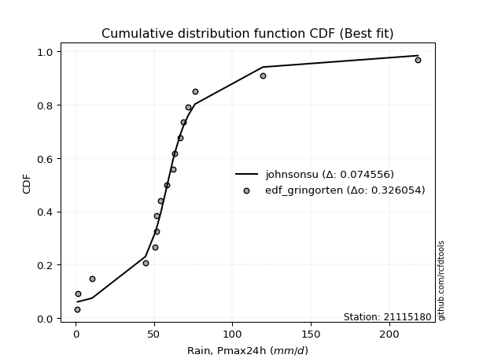</img>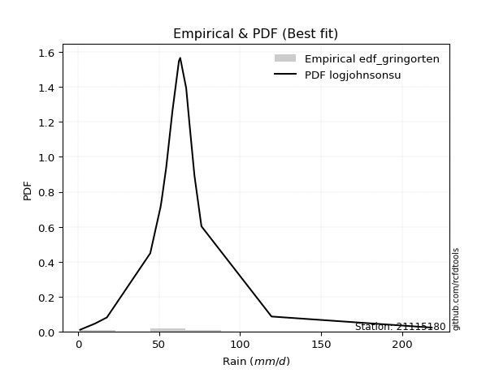</img>

</div>


### 9. EDF Filliben (1975)

The specific values of the constants (0.3175) (often denoted as $alpha$) and (0.365) are derived from a method proposed by James J. Filliben in a 1975 paper. This particular formula is the mean value of the $i$-th order statistic of the normal distribution and is considered a robust and effective plotting position formula for the normal probability plot correlation coefficient test for normality.

<div align="center">


$P=(m-0.3175)/(n+0.365)$


</div>


**9.1. Empirical values**

<div align="center">

|                | 0                  | 1                  | 2                   | 3                   | 4                   | 5                  | 6                   | 7                  | 8                   | 9                  | 10                | 11                 | 12                 | 13                 | 14                 | 15                 | 16                 | 17                 |
|:---------------|:-------------------|:-------------------|:--------------------|:--------------------|:--------------------|:-------------------|:--------------------|:-------------------|:--------------------|:-------------------|:------------------|:-------------------|:-------------------|:-------------------|:-------------------|:-------------------|:-------------------|:-------------------|
| date           | 2022               | 2023               | 2013                | 2025                | 2020                | 2014               | 2006                | 2019               | 2015                | 2009               | 2017              | 2018               | 2016               | 2007               | 2005               | 2021               | 2008               | 2024               |
| x              | 1.1                | 1.4                | 10.4                | 17.7                | 44.5                | 50.8               | 51.4                | 51.5               | 54.3                | 58.2               | 62.2              | 63.0               | 66.7               | 68.7               | 71.8               | 76.1               | 119.4              | 218.4              |
| m              | 1                  | 2                  | 3                   | 4                   | 5                   | 6                  | 7                   | 8                  | 9                   | 10                 | 11                | 12                 | 13                 | 14                 | 15                 | 16                 | 17                 | 18                 |
| empirical_dist | edf_filliben       | edf_filliben       | edf_filliben        | edf_filliben        | edf_filliben        | edf_filliben       | edf_filliben        | edf_filliben       | edf_filliben        | edf_filliben       | edf_filliben      | edf_filliben       | edf_filliben       | edf_filliben       | edf_filliben       | edf_filliben       | edf_filliben       | edf_filliben       |
| empirical      | 0.0371630819493602 | 0.0916144840729649 | 0.14606588619656957 | 0.20051728832017426 | 0.25496869044377896 | 0.3094200925673836 | 0.36387149469098834 | 0.418322896814593  | 0.47277429893819767 | 0.5272257010618023 | 0.581677103185407 | 0.6361285053090118 | 0.6905799074326164 | 0.7450313095562211 | 0.7994827116798258 | 0.8539341138034304 | 0.9083855159270352 | 0.96283691805064   |
| empirical_tr   | 1.03859748338753   | 1.100854188520905  | 1.1710505340347521  | 1.2508087859696917  | 1.3422254704915038  | 1.4480583481174847 | 1.5720094157928526  | 1.7191668616896794 | 1.8967208882003614  | 2.1151742009789807 | 2.390497884803124 | 2.7482229704451933 | 3.2318521777386717 | 3.9220501868659907 | 4.987101154107265  | 6.846225535880707  | 10.915304606240722 | 26.908424908425033 |

</div>


**9.2. Kolmogorov-Smirnov fit test (sorted by Δ)**


<div align="center">

|                | 0                   | 1                   | 2                   | 3                   | 4                   | 5                   | 6                   | 7                   | 8                   | 9                   | 10                  | 11                  | 12                  | 13                  | 14                  | 15                  | 16                  | 17                  | 18                  | 19                  | 20                  | 21                  | 22                  | 23                  | 24                  | 25                  | 26                  | 27                  | 28                  | 29                  | 30                  | 31                  | 32                  | 33                  | 34                  | 35                  | 36                  | 37                  | 38                  | 39                  | 40                  | 41                  | 42                  | 43                  | 44                  | 45                  | 46                  | 47                  | 48                  | 49                  | 50                  | 51                  | 52                  | 53                  | 54                  | 55                  | 56                  | 57                  | 58                  | 59                  | 60                  | 61                  | 62                  | 63                  | 64                  | 65                  | 66                  | 67                  | 68                  | 69                  | 70                  | 71                  | 72                  | 73                  | 74                  | 75                  | 76                  | 77                  | 78                  | 79                  | 80                  | 81                  | 82                  | 83                  | 84                  | 85                  | 86                  | 87                  | 88                  | 89                  | 90                  | 91                  | 92                  | 93                  | 94                  | 95                  | 96                  | 97                  | 98                  | 99                  | 100                 | 101                 | 102                 | 103                 | 104                 | 105                 | 106                 | 107                 | 108                 | 109                 | 110                 | 111                 | 112                 | 113                 | 114                 | 115                 | 116                 | 117                 | 118                 | 119                 | 120                 | 121                 | 122                 | 123                 | 124                 | 125                 | 126                 | 127                 | 128                 | 129                 | 130                 | 131                 | 132                 | 133                 | 134                 | 135                 | 136                 | 137                 | 138                 | 139                 | 140                 | 141                 | 142                 | 143                 | 144                 | 145                 | 146                 | 147                 | 148                 | 149                 | 150                 | 151                 | 152                 | 153                 | 154                 | 155                 | 156                 | 157                 | 158                 | 159                 |
|:---------------|:--------------------|:--------------------|:--------------------|:--------------------|:--------------------|:--------------------|:--------------------|:--------------------|:--------------------|:--------------------|:--------------------|:--------------------|:--------------------|:--------------------|:--------------------|:--------------------|:--------------------|:--------------------|:--------------------|:--------------------|:--------------------|:--------------------|:--------------------|:--------------------|:--------------------|:--------------------|:--------------------|:--------------------|:--------------------|:--------------------|:--------------------|:--------------------|:--------------------|:--------------------|:--------------------|:--------------------|:--------------------|:--------------------|:--------------------|:--------------------|:--------------------|:--------------------|:--------------------|:--------------------|:--------------------|:--------------------|:--------------------|:--------------------|:--------------------|:--------------------|:--------------------|:--------------------|:--------------------|:--------------------|:--------------------|:--------------------|:--------------------|:--------------------|:--------------------|:--------------------|:--------------------|:--------------------|:--------------------|:--------------------|:--------------------|:--------------------|:--------------------|:--------------------|:--------------------|:--------------------|:--------------------|:--------------------|:--------------------|:--------------------|:--------------------|:--------------------|:--------------------|:--------------------|:--------------------|:--------------------|:--------------------|:--------------------|:--------------------|:--------------------|:--------------------|:--------------------|:--------------------|:--------------------|:--------------------|:--------------------|:--------------------|:--------------------|:--------------------|:--------------------|:--------------------|:--------------------|:--------------------|:--------------------|:--------------------|:--------------------|:--------------------|:--------------------|:--------------------|:--------------------|:--------------------|:--------------------|:--------------------|:--------------------|:--------------------|:--------------------|:--------------------|:--------------------|:--------------------|:--------------------|:--------------------|:--------------------|:--------------------|:--------------------|:--------------------|:--------------------|:--------------------|:--------------------|:--------------------|:--------------------|:--------------------|:--------------------|:--------------------|:--------------------|:--------------------|:--------------------|:--------------------|:--------------------|:--------------------|:--------------------|:--------------------|:--------------------|:--------------------|:--------------------|:--------------------|:--------------------|:--------------------|:--------------------|:--------------------|:--------------------|:--------------------|:--------------------|:--------------------|:--------------------|:--------------------|:--------------------|:--------------------|:--------------------|:--------------------|:--------------------|:--------------------|:--------------------|:--------------------|:--------------------|:--------------------|:--------------------|
| station        | 21115180            | 21115180            | 21115180            | 21115180            | 21115180            | 21115180            | 21115180            | 21115180            | 21115180            | 21115180            | 21115180            | 21115180            | 21115180            | 21115180            | 21115180            | 21115180            | 21115180            | 21115180            | 21115180            | 21115180            | 21115180            | 21115180            | 21115180            | 21115180            | 21115180            | 21115180            | 21115180            | 21115180            | 21115180            | 21115180            | 21115180            | 21115180            | 21115180            | 21115180            | 21115180            | 21115180            | 21115180            | 21115180            | 21115180            | 21115180            | 21115180            | 21115180            | 21115180            | 21115180            | 21115180            | 21115180            | 21115180            | 21115180            | 21115180            | 21115180            | 21115180            | 21115180            | 21115180            | 21115180            | 21115180            | 21115180            | 21115180            | 21115180            | 21115180            | 21115180            | 21115180            | 21115180            | 21115180            | 21115180            | 21115180            | 21115180            | 21115180            | 21115180            | 21115180            | 21115180            | 21115180            | 21115180            | 21115180            | 21115180            | 21115180            | 21115180            | 21115180            | 21115180            | 21115180            | 21115180            | 21115180            | 21115180            | 21115180            | 21115180            | 21115180            | 21115180            | 21115180            | 21115180            | 21115180            | 21115180            | 21115180            | 21115180            | 21115180            | 21115180            | 21115180            | 21115180            | 21115180            | 21115180            | 21115180            | 21115180            | 21115180            | 21115180            | 21115180            | 21115180            | 21115180            | 21115180            | 21115180            | 21115180            | 21115180            | 21115180            | 21115180            | 21115180            | 21115180            | 21115180            | 21115180            | 21115180            | 21115180            | 21115180            | 21115180            | 21115180            | 21115180            | 21115180            | 21115180            | 21115180            | 21115180            | 21115180            | 21115180            | 21115180            | 21115180            | 21115180            | 21115180            | 21115180            | 21115180            | 21115180            | 21115180            | 21115180            | 21115180            | 21115180            | 21115180            | 21115180            | 21115180            | 21115180            | 21115180            | 21115180            | 21115180            | 21115180            | 21115180            | 21115180            | 21115180            | 21115180            | 21115180            | 21115180            | 21115180            | 21115180            | 21115180            | 21115180            | 21115180            | 21115180            | 21115180            | 21115180            |
| empirical_dist | edf_filliben        | edf_filliben        | edf_filliben        | edf_filliben        | edf_filliben        | edf_filliben        | edf_filliben        | edf_filliben        | edf_filliben        | edf_filliben        | edf_filliben        | edf_filliben        | edf_filliben        | edf_filliben        | edf_filliben        | edf_filliben        | edf_filliben        | edf_filliben        | edf_filliben        | edf_filliben        | edf_filliben        | edf_filliben        | edf_filliben        | edf_filliben        | edf_filliben        | edf_filliben        | edf_filliben        | edf_filliben        | edf_filliben        | edf_filliben        | edf_filliben        | edf_filliben        | edf_filliben        | edf_filliben        | edf_filliben        | edf_filliben        | edf_filliben        | edf_filliben        | edf_filliben        | edf_filliben        | edf_filliben        | edf_filliben        | edf_filliben        | edf_filliben        | edf_filliben        | edf_filliben        | edf_filliben        | edf_filliben        | edf_filliben        | edf_filliben        | edf_filliben        | edf_filliben        | edf_filliben        | edf_filliben        | edf_filliben        | edf_filliben        | edf_filliben        | edf_filliben        | edf_filliben        | edf_filliben        | edf_filliben        | edf_filliben        | edf_filliben        | edf_filliben        | edf_filliben        | edf_filliben        | edf_filliben        | edf_filliben        | edf_filliben        | edf_filliben        | edf_filliben        | edf_filliben        | edf_filliben        | edf_filliben        | edf_filliben        | edf_filliben        | edf_filliben        | edf_filliben        | edf_filliben        | edf_filliben        | edf_filliben        | edf_filliben        | edf_filliben        | edf_filliben        | edf_filliben        | edf_filliben        | edf_filliben        | edf_filliben        | edf_filliben        | edf_filliben        | edf_filliben        | edf_filliben        | edf_filliben        | edf_filliben        | edf_filliben        | edf_filliben        | edf_filliben        | edf_filliben        | edf_filliben        | edf_filliben        | edf_filliben        | edf_filliben        | edf_filliben        | edf_filliben        | edf_filliben        | edf_filliben        | edf_filliben        | edf_filliben        | edf_filliben        | edf_filliben        | edf_filliben        | edf_filliben        | edf_filliben        | edf_filliben        | edf_filliben        | edf_filliben        | edf_filliben        | edf_filliben        | edf_filliben        | edf_filliben        | edf_filliben        | edf_filliben        | edf_filliben        | edf_filliben        | edf_filliben        | edf_filliben        | edf_filliben        | edf_filliben        | edf_filliben        | edf_filliben        | edf_filliben        | edf_filliben        | edf_filliben        | edf_filliben        | edf_filliben        | edf_filliben        | edf_filliben        | edf_filliben        | edf_filliben        | edf_filliben        | edf_filliben        | edf_filliben        | edf_filliben        | edf_filliben        | edf_filliben        | edf_filliben        | edf_filliben        | edf_filliben        | edf_filliben        | edf_filliben        | edf_filliben        | edf_filliben        | edf_filliben        | edf_filliben        | edf_filliben        | edf_filliben        | edf_filliben        | edf_filliben        | edf_filliben        | edf_filliben        |
| p_dist         | logjohnsonsu        | nct                 | johnsonsu           | gennorm             | t                   | logdgamma           | logt                | dweibull            | vonmises_line       | tukeylambda         | dgamma              | exponnorm           | logdweibull         | loggennorm          | weibull_min         | laplace             | genlogistic         | gumbel_r            | kstwobign           | skewnorm            | exponweib           | genextreme          | invweibull          | invgamma            | fatiguelife         | invgauss            | johnsonsb           | gengamma            | rayleigh            | ncf                 | halfnorm            | hypsecant           | moyal               | logburr12           | maxwell             | rice                | genhalflogistic     | logistic            | logpearson3         | halflogistic        | betaprime           | f                   | foldnorm            | erlang              | gamma               | logloglaplace       | logjohnsonsb        | logvonmises_line    | loggengamma         | logloggamma         | logexponweib        | gompertz            | truncweibull_min    | logskewnorm         | burr12              | kappa3              | logweibull_max      | loggenextreme       | crystalball         | truncnorm           | norm                | logargus            | pearson3            | genpareto           | logweibull_min      | logburr             | loggenlogistic      | logmielke           | loggumbel_l         | loggompertz         | logtrapezoid        | anglit              | mielke              | nakagami            | logtruncweibull_min | semicircular        | gausshyper          | logtriang           | genexpon            | wald                | lomax               | burr                | logarcsine          | gumbel_l            | arcsine             | loggenhalflogistic  | logsemicircular     | exponpow            | loganglit           | logfoldnorm         | loggenpareto        | lognakagami         | logrice             | logcrystalball      | lognorm             | logexponnorm        | lognct              | logncf              | logf                | logfatiguelife      | loggamma            | loggamma            | logbetaprime        | loglevy_l           | loglogistic         | loginvweibull       | logerlang           | loginvgamma         | loghypsecant        | loginvgauss         | logmaxwell          | beta                | loglaplace          | loglaplace          | halfgennorm         | lograyleigh         | logkstwobign        | cosine              | loggausshyper       | bradford            | loghalfnorm         | truncexpon          | loggumbel_r         | loggenexpon         | triang              | logcosine           | loghalflogistic     | logmoyal            | powerlaw            | logksone            | logwrapcauchy       | loglomax            | logkappa3           | loguniform          | logkappa4           | logrdist            | logwald             | kappa4              | argus               | logbradford         | wrapcauchy          | ksone               | levy_l              | uniform             | logbeta             | logtruncexpon       | rdist               | logexponpow         | logtruncnorm        | logpowerlaw         | logtukeylambda      | alpha               | trapezoid           | logalpha            | truncpareto         | weibull_max         | logtruncpareto      | loghalfgennorm      | logvonmises         | vonmises            |
| delta          | 0.07310483317454058 | 0.0889752154550589  | 0.09261120809460713 | 0.09480899371225993 | 0.10593811715627151 | 0.11772381769292006 | 0.12429431168973058 | 0.1360737703562646  | 0.14857775863301292 | 0.15043563961854023 | 0.15585958366102154 | 0.1558950475103018  | 0.1558966499655836  | 0.15921937745626702 | 0.16457810192206662 | 0.16779646933902204 | 0.16895474592671972 | 0.17365562832724818 | 0.1772268807471491  | 0.17808353042365077 | 0.18221299830836502 | 0.18223995691906147 | 0.1822404351023202  | 0.1835848818254892  | 0.1849693256060001  | 0.18506498237913382 | 0.1853187289387918  | 0.19026048159205938 | 0.1938616555560536  | 0.1939186701114698  | 0.19405942613686994 | 0.19618512680868916 | 0.19779949404503522 | 0.19818630440590262 | 0.20111158747126234 | 0.20324684354510236 | 0.20534224325561495 | 0.2089131913348563  | 0.2092618215976353  | 0.2095744948666049  | 0.20980946440454035 | 0.21122446791989385 | 0.21207117967591466 | 0.21298054781468062 | 0.21298064606885764 | 0.21312070635147662 | 0.21332347707027116 | 0.2137208946672594  | 0.2152784503595686  | 0.21778485352764182 | 0.2178641819862439  | 0.2186746668000044  | 0.22092149154090213 | 0.2223108789109221  | 0.2229414341593527  | 0.22341853538946016 | 0.2242152267653732  | 0.22421627434314617 | 0.2249111267982139  | 0.22491113155922726 | 0.22491113378839112 | 0.22646129266916604 | 0.228297448430909   | 0.22837293096699568 | 0.22901059929380968 | 0.2306965694011594  | 0.23078163481594666 | 0.2312165083173578  | 0.23671649755049445 | 0.23711058440863703 | 0.23899746656622278 | 0.24232783075410402 | 0.24342231935778375 | 0.24763703200690446 | 0.24958314138145515 | 0.24960066746787812 | 0.2560600169630783  | 0.2586035196394178  | 0.26322654016961117 | 0.264166912480104   | 0.267280233798787   | 0.26753436085766963 | 0.27784022389528934 | 0.2785848163761241  | 0.2791365898810365  | 0.2899233846394628  | 0.2913078170995777  | 0.29334161016611576 | 0.2946899224179879  | 0.29925480167736124 | 0.30100137931630216 | 0.30196666175079584 | 0.30285802119630806 | 0.3028762412133789  | 0.30287630319939135 | 0.3028787741681888  | 0.3029826059768654  | 0.303911733459774   | 0.30459289898294756 | 0.30687157226194034 | 0.3071687601940521  | 0.3071687601940521  | 0.3076231247566296  | 0.3079535090815401  | 0.31063142821977846 | 0.31189584254480046 | 0.31530277792138023 | 0.316515677995965   | 0.3171598679929362  | 0.31737518961551264 | 0.33273459156145263 | 0.3365173154997709  | 0.3380248352796968  | 0.3380248352796968  | 0.33848739056144445 | 0.34227290207496947 | 0.347070198071977   | 0.3570557062982782  | 0.35774458693350036 | 0.363338485752609   | 0.3691964503330642  | 0.3701965878660874  | 0.37261664473984896 | 0.3728779574140148  | 0.37367421557812225 | 0.37393299305496247 | 0.39672705339060593 | 0.39718722897233233 | 0.4065652822336207  | 0.4111414299785668  | 0.4195894919735696  | 0.42070414446504695 | 0.4443518386601298  | 0.44436345406303607 | 0.4524076924991906  | 0.46382331150870126 | 0.4653741991401476  | 0.46771217386923464 | 0.47472539053100327 | 0.47874931847838037 | 0.48137770929903767 | 0.48297997973378787 | 0.4851001509349709  | 0.5087891529198594  | 0.5133008702773617  | 0.5329388390381351  | 0.5426921151652175  | 0.5445145604035155  | 0.5493315920685278  | 0.6209766559251235  | 0.6643875915120989  | 0.679218907262473   | 0.7133766965697756  | 0.7196412063502337  | 0.7607034494544431  | 0.7927871796960752  | 0.8276345654761548  | 0.9083855159270352  | 1.079621571625846   | 34.154049666031376  |
| deltao         | 0.32102346734599996 | 0.32102346734599996 | 0.32102346734599996 | 0.32102346734599996 | 0.32102346734599996 | 0.32102346734599996 | 0.32102346734599996 | 0.32102346734599996 | 0.32102346734599996 | 0.32102346734599996 | 0.32102346734599996 | 0.32102346734599996 | 0.32102346734599996 | 0.32102346734599996 | 0.32102346734599996 | 0.32102346734599996 | 0.32102346734599996 | 0.32102346734599996 | 0.32102346734599996 | 0.32102346734599996 | 0.32102346734599996 | 0.32102346734599996 | 0.32102346734599996 | 0.32102346734599996 | 0.32102346734599996 | 0.32102346734599996 | 0.32102346734599996 | 0.32102346734599996 | 0.32102346734599996 | 0.32102346734599996 | 0.32102346734599996 | 0.32102346734599996 | 0.32102346734599996 | 0.32102346734599996 | 0.32102346734599996 | 0.32102346734599996 | 0.32102346734599996 | 0.32102346734599996 | 0.32102346734599996 | 0.32102346734599996 | 0.32102346734599996 | 0.32102346734599996 | 0.32102346734599996 | 0.32102346734599996 | 0.32102346734599996 | 0.32102346734599996 | 0.32102346734599996 | 0.32102346734599996 | 0.32102346734599996 | 0.32102346734599996 | 0.32102346734599996 | 0.32102346734599996 | 0.32102346734599996 | 0.32102346734599996 | 0.32102346734599996 | 0.32102346734599996 | 0.32102346734599996 | 0.32102346734599996 | 0.32102346734599996 | 0.32102346734599996 | 0.32102346734599996 | 0.32102346734599996 | 0.32102346734599996 | 0.32102346734599996 | 0.32102346734599996 | 0.32102346734599996 | 0.32102346734599996 | 0.32102346734599996 | 0.32102346734599996 | 0.32102346734599996 | 0.32102346734599996 | 0.32102346734599996 | 0.32102346734599996 | 0.32102346734599996 | 0.32102346734599996 | 0.32102346734599996 | 0.32102346734599996 | 0.32102346734599996 | 0.32102346734599996 | 0.32102346734599996 | 0.32102346734599996 | 0.32102346734599996 | 0.32102346734599996 | 0.32102346734599996 | 0.32102346734599996 | 0.32102346734599996 | 0.32102346734599996 | 0.32102346734599996 | 0.32102346734599996 | 0.32102346734599996 | 0.32102346734599996 | 0.32102346734599996 | 0.32102346734599996 | 0.32102346734599996 | 0.32102346734599996 | 0.32102346734599996 | 0.32102346734599996 | 0.32102346734599996 | 0.32102346734599996 | 0.32102346734599996 | 0.32102346734599996 | 0.32102346734599996 | 0.32102346734599996 | 0.32102346734599996 | 0.32102346734599996 | 0.32102346734599996 | 0.32102346734599996 | 0.32102346734599996 | 0.32102346734599996 | 0.32102346734599996 | 0.32102346734599996 | 0.32102346734599996 | 0.32102346734599996 | 0.32102346734599996 | 0.32102346734599996 | 0.32102346734599996 | 0.32102346734599996 | 0.32102346734599996 | 0.32102346734599996 | 0.32102346734599996 | 0.32102346734599996 | 0.32102346734599996 | 0.32102346734599996 | 0.32102346734599996 | 0.32102346734599996 | 0.32102346734599996 | 0.32102346734599996 | 0.32102346734599996 | 0.32102346734599996 | 0.32102346734599996 | 0.32102346734599996 | 0.32102346734599996 | 0.32102346734599996 | 0.32102346734599996 | 0.32102346734599996 | 0.32102346734599996 | 0.32102346734599996 | 0.32102346734599996 | 0.32102346734599996 | 0.32102346734599996 | 0.32102346734599996 | 0.32102346734599996 | 0.32102346734599996 | 0.32102346734599996 | 0.32102346734599996 | 0.32102346734599996 | 0.32102346734599996 | 0.32102346734599996 | 0.32102346734599996 | 0.32102346734599996 | 0.32102346734599996 | 0.32102346734599996 | 0.32102346734599996 | 0.32102346734599996 | 0.32102346734599996 | 0.32102346734599996 | 0.32102346734599996 | 0.32102346734599996 | 0.32102346734599996 | 0.32102346734599996 |
| eval           | Δo > Δ              | Δo > Δ              | Δo > Δ              | Δo > Δ              | Δo > Δ              | Δo > Δ              | Δo > Δ              | Δo > Δ              | Δo > Δ              | Δo > Δ              | Δo > Δ              | Δo > Δ              | Δo > Δ              | Δo > Δ              | Δo > Δ              | Δo > Δ              | Δo > Δ              | Δo > Δ              | Δo > Δ              | Δo > Δ              | Δo > Δ              | Δo > Δ              | Δo > Δ              | Δo > Δ              | Δo > Δ              | Δo > Δ              | Δo > Δ              | Δo > Δ              | Δo > Δ              | Δo > Δ              | Δo > Δ              | Δo > Δ              | Δo > Δ              | Δo > Δ              | Δo > Δ              | Δo > Δ              | Δo > Δ              | Δo > Δ              | Δo > Δ              | Δo > Δ              | Δo > Δ              | Δo > Δ              | Δo > Δ              | Δo > Δ              | Δo > Δ              | Δo > Δ              | Δo > Δ              | Δo > Δ              | Δo > Δ              | Δo > Δ              | Δo > Δ              | Δo > Δ              | Δo > Δ              | Δo > Δ              | Δo > Δ              | Δo > Δ              | Δo > Δ              | Δo > Δ              | Δo > Δ              | Δo > Δ              | Δo > Δ              | Δo > Δ              | Δo > Δ              | Δo > Δ              | Δo > Δ              | Δo > Δ              | Δo > Δ              | Δo > Δ              | Δo > Δ              | Δo > Δ              | Δo > Δ              | Δo > Δ              | Δo > Δ              | Δo > Δ              | Δo > Δ              | Δo > Δ              | Δo > Δ              | Δo > Δ              | Δo > Δ              | Δo > Δ              | Δo > Δ              | Δo > Δ              | Δo > Δ              | Δo > Δ              | Δo > Δ              | Δo > Δ              | Δo > Δ              | Δo > Δ              | Δo > Δ              | Δo > Δ              | Δo > Δ              | Δo > Δ              | Δo > Δ              | Δo > Δ              | Δo > Δ              | Δo > Δ              | Δo > Δ              | Δo > Δ              | Δo > Δ              | Δo > Δ              | Δo > Δ              | Δo > Δ              | Δo > Δ              | Δo > Δ              | Δo > Δ              | Δo > Δ              | Δo > Δ              | Δo > Δ              | Δo > Δ              | Δo > Δ              | Δo <= Δ             | Δo <= Δ             | Δo <= Δ             | Δo <= Δ             | Δo <= Δ             | Δo <= Δ             | Δo <= Δ             | Δo <= Δ             | Δo <= Δ             | Δo <= Δ             | Δo <= Δ             | Δo <= Δ             | Δo <= Δ             | Δo <= Δ             | Δo <= Δ             | Δo <= Δ             | Δo <= Δ             | Δo <= Δ             | Δo <= Δ             | Δo <= Δ             | Δo <= Δ             | Δo <= Δ             | Δo <= Δ             | Δo <= Δ             | Δo <= Δ             | Δo <= Δ             | Δo <= Δ             | Δo <= Δ             | Δo <= Δ             | Δo <= Δ             | Δo <= Δ             | Δo <= Δ             | Δo <= Δ             | Δo <= Δ             | Δo <= Δ             | Δo <= Δ             | Δo <= Δ             | Δo <= Δ             | Δo <= Δ             | Δo <= Δ             | Δo <= Δ             | Δo <= Δ             | Δo <= Δ             | Δo <= Δ             | Δo <= Δ             | Δo <= Δ             | Δo <= Δ             | Δo <= Δ             | Δo <= Δ             | Δo <= Δ             |
| fit            | 1                   | 1                   | 1                   | 1                   | 1                   | 1                   | 1                   | 1                   | 1                   | 1                   | 1                   | 1                   | 1                   | 1                   | 1                   | 1                   | 1                   | 1                   | 1                   | 1                   | 1                   | 1                   | 1                   | 1                   | 1                   | 1                   | 1                   | 1                   | 1                   | 1                   | 1                   | 1                   | 1                   | 1                   | 1                   | 1                   | 1                   | 1                   | 1                   | 1                   | 1                   | 1                   | 1                   | 1                   | 1                   | 1                   | 1                   | 1                   | 1                   | 1                   | 1                   | 1                   | 1                   | 1                   | 1                   | 1                   | 1                   | 1                   | 1                   | 1                   | 1                   | 1                   | 1                   | 1                   | 1                   | 1                   | 1                   | 1                   | 1                   | 1                   | 1                   | 1                   | 1                   | 1                   | 1                   | 1                   | 1                   | 1                   | 1                   | 1                   | 1                   | 1                   | 1                   | 1                   | 1                   | 1                   | 1                   | 1                   | 1                   | 1                   | 1                   | 1                   | 1                   | 1                   | 1                   | 1                   | 1                   | 1                   | 1                   | 1                   | 1                   | 1                   | 1                   | 1                   | 1                   | 1                   | 1                   | 1                   | 1                   | 1                   | 0                   | 0                   | 0                   | 0                   | 0                   | 0                   | 0                   | 0                   | 0                   | 0                   | 0                   | 0                   | 0                   | 0                   | 0                   | 0                   | 0                   | 0                   | 0                   | 0                   | 0                   | 0                   | 0                   | 0                   | 0                   | 0                   | 0                   | 0                   | 0                   | 0                   | 0                   | 0                   | 0                   | 0                   | 0                   | 0                   | 0                   | 0                   | 0                   | 0                   | 0                   | 0                   | 0                   | 0                   | 0                   | 0                   | 0                   | 0                   | 0                   | 0                   |
| n              | 18                  | 18                  | 18                  | 18                  | 18                  | 18                  | 18                  | 18                  | 18                  | 18                  | 18                  | 18                  | 18                  | 18                  | 18                  | 18                  | 18                  | 18                  | 18                  | 18                  | 18                  | 18                  | 18                  | 18                  | 18                  | 18                  | 18                  | 18                  | 18                  | 18                  | 18                  | 18                  | 18                  | 18                  | 18                  | 18                  | 18                  | 18                  | 18                  | 18                  | 18                  | 18                  | 18                  | 18                  | 18                  | 18                  | 18                  | 18                  | 18                  | 18                  | 18                  | 18                  | 18                  | 18                  | 18                  | 18                  | 18                  | 18                  | 18                  | 18                  | 18                  | 18                  | 18                  | 18                  | 18                  | 18                  | 18                  | 18                  | 18                  | 18                  | 18                  | 18                  | 18                  | 18                  | 18                  | 18                  | 18                  | 18                  | 18                  | 18                  | 18                  | 18                  | 18                  | 18                  | 18                  | 18                  | 18                  | 18                  | 18                  | 18                  | 18                  | 18                  | 18                  | 18                  | 18                  | 18                  | 18                  | 18                  | 18                  | 18                  | 18                  | 18                  | 18                  | 18                  | 18                  | 18                  | 18                  | 18                  | 18                  | 18                  | 18                  | 18                  | 18                  | 18                  | 18                  | 18                  | 18                  | 18                  | 18                  | 18                  | 18                  | 18                  | 18                  | 18                  | 18                  | 18                  | 18                  | 18                  | 18                  | 18                  | 18                  | 18                  | 18                  | 18                  | 18                  | 18                  | 18                  | 18                  | 18                  | 18                  | 18                  | 18                  | 18                  | 18                  | 18                  | 18                  | 18                  | 18                  | 18                  | 18                  | 18                  | 18                  | 18                  | 18                  | 18                  | 18                  | 18                  | 18                  | 18                  | 18                  |
| best_fit       | 1                   | 0                   | 0                   | 0                   | 0                   | 0                   | 0                   | 0                   | 0                   | 0                   | 0                   | 0                   | 0                   | 0                   | 0                   | 0                   | 0                   | 0                   | 0                   | 0                   | 0                   | 0                   | 0                   | 0                   | 0                   | 0                   | 0                   | 0                   | 0                   | 0                   | 0                   | 0                   | 0                   | 0                   | 0                   | 0                   | 0                   | 0                   | 0                   | 0                   | 0                   | 0                   | 0                   | 0                   | 0                   | 0                   | 0                   | 0                   | 0                   | 0                   | 0                   | 0                   | 0                   | 0                   | 0                   | 0                   | 0                   | 0                   | 0                   | 0                   | 0                   | 0                   | 0                   | 0                   | 0                   | 0                   | 0                   | 0                   | 0                   | 0                   | 0                   | 0                   | 0                   | 0                   | 0                   | 0                   | 0                   | 0                   | 0                   | 0                   | 0                   | 0                   | 0                   | 0                   | 0                   | 0                   | 0                   | 0                   | 0                   | 0                   | 0                   | 0                   | 0                   | 0                   | 0                   | 0                   | 0                   | 0                   | 0                   | 0                   | 0                   | 0                   | 0                   | 0                   | 0                   | 0                   | 0                   | 0                   | 0                   | 0                   | 0                   | 0                   | 0                   | 0                   | 0                   | 0                   | 0                   | 0                   | 0                   | 0                   | 0                   | 0                   | 0                   | 0                   | 0                   | 0                   | 0                   | 0                   | 0                   | 0                   | 0                   | 0                   | 0                   | 0                   | 0                   | 0                   | 0                   | 0                   | 0                   | 0                   | 0                   | 0                   | 0                   | 0                   | 0                   | 0                   | 0                   | 0                   | 0                   | 0                   | 0                   | 0                   | 0                   | 0                   | 0                   | 0                   | 0                   | 0                   | 0                   | 0                   |
| best_fit_sort  | 1                   | 2                   | 3                   | 4                   | 5                   | 6                   | 7                   | 8                   | 9                   | 10                  | 11                  | 12                  | 13                  | 14                  | 15                  | 16                  | 17                  | 18                  | 19                  | 20                  | 21                  | 22                  | 23                  | 24                  | 25                  | 26                  | 27                  | 28                  | 29                  | 30                  | 31                  | 32                  | 33                  | 34                  | 35                  | 36                  | 37                  | 38                  | 39                  | 40                  | 41                  | 42                  | 43                  | 44                  | 45                  | 46                  | 47                  | 48                  | 49                  | 50                  | 51                  | 52                  | 53                  | 54                  | 55                  | 56                  | 57                  | 58                  | 59                  | 60                  | 61                  | 62                  | 63                  | 64                  | 65                  | 66                  | 67                  | 68                  | 69                  | 70                  | 71                  | 72                  | 73                  | 74                  | 75                  | 76                  | 77                  | 78                  | 79                  | 80                  | 81                  | 82                  | 83                  | 84                  | 85                  | 86                  | 87                  | 88                  | 89                  | 90                  | 91                  | 92                  | 93                  | 94                  | 95                  | 96                  | 97                  | 98                  | 99                  | 100                 | 101                 | 102                 | 103                 | 104                 | 105                 | 106                 | 107                 | 108                 | 109                 | 110                 | 111                 | 112                 | 113                 | 114                 | 115                 | 116                 | 117                 | 118                 | 119                 | 120                 | 121                 | 122                 | 123                 | 124                 | 125                 | 126                 | 127                 | 128                 | 129                 | 130                 | 131                 | 132                 | 133                 | 134                 | 135                 | 136                 | 137                 | 138                 | 139                 | 140                 | 141                 | 142                 | 143                 | 144                 | 145                 | 146                 | 147                 | 148                 | 149                 | 150                 | 151                 | 152                 | 153                 | 154                 | 155                 | 156                 | 157                 | 158                 | 159                 | 160                 |

</div>


**9.3. Best fit**

<div align="center">

|   id |   station | empirical_dist   | p_dist       |     delta |   deltao | eval   |   fit |   n |   best_fit |   best_fit_sort |
|-----:|----------:|:-----------------|:-------------|----------:|---------:|:-------|------:|----:|-----------:|----------------:|
|    0 |  21115180 | edf_filliben     | logjohnsonsu | 0.0731048 | 0.321023 | Δo > Δ |     1 |  18 |          1 |               1 |

</div>


<div align="center">

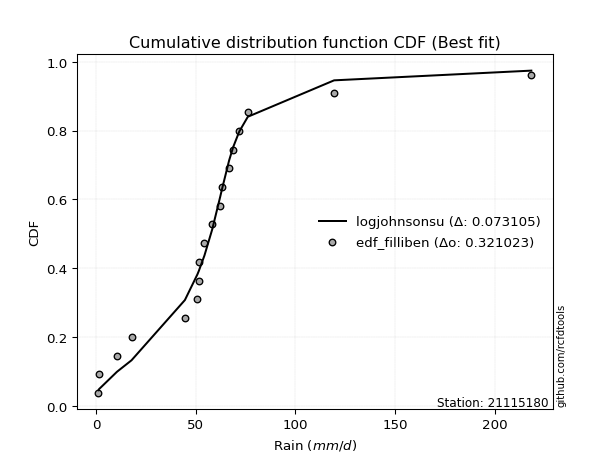</img></img>

</div>


### 10. EDF Jenkinson (1977)

The Jenkinson formula in hydrology is an empirical plotting position formula used to estimate the non-exceedance probability _(P)_ or return period _(T)_ of a given ordered observation within a sample. It is a widely used method in the frequency analysis of extreme events such as floods and rainfall, as it provides a distribution-free way to plot data. _a≈0.31_ and _b≈0.38_ are constants derived to approximate the median of the probability distribution for the given rank.

<div align="center">


$P=(m-a)/(n+b)$


</div>


**10.1. Empirical values**

<div align="center">

|                | 0                   | 1                   | 2                   | 3                   | 4                  | 5                   | 6                  | 7                  | 8                   | 9                  | 10                 | 11                 | 12                | 13                 | 14                 | 15                 | 16                 | 17                 |
|:---------------|:--------------------|:--------------------|:--------------------|:--------------------|:-------------------|:--------------------|:-------------------|:-------------------|:--------------------|:-------------------|:-------------------|:-------------------|:------------------|:-------------------|:-------------------|:-------------------|:-------------------|:-------------------|
| date           | 2022                | 2023                | 2013                | 2025                | 2020               | 2014                | 2006               | 2019               | 2015                | 2009               | 2017               | 2018               | 2016              | 2007               | 2005               | 2021               | 2008               | 2024               |
| x              | 1.1                 | 1.4                 | 10.4                | 17.7                | 44.5               | 50.8                | 51.4               | 51.5               | 54.3                | 58.2               | 62.2               | 63.0               | 66.7              | 68.7               | 71.8               | 76.1               | 119.4              | 218.4              |
| m              | 1                   | 2                   | 3                   | 4                   | 5                  | 6                   | 7                  | 8                  | 9                   | 10                 | 11                 | 12                 | 13                | 14                 | 15                 | 16                 | 17                 | 18                 |
| empirical_dist | edf_jenkinson       | edf_jenkinson       | edf_jenkinson       | edf_jenkinson       | edf_jenkinson      | edf_jenkinson       | edf_jenkinson      | edf_jenkinson      | edf_jenkinson       | edf_jenkinson      | edf_jenkinson      | edf_jenkinson      | edf_jenkinson     | edf_jenkinson      | edf_jenkinson      | edf_jenkinson      | edf_jenkinson      | edf_jenkinson      |
| empirical      | 0.03754080522306855 | 0.09194776931447225 | 0.14635473340587596 | 0.20076169749727965 | 0.2551686615886834 | 0.30957562568008706 | 0.3639825897714908 | 0.4183895538628945 | 0.47279651795429817 | 0.5272034820457019 | 0.5816104461371056 | 0.6360174102285092 | 0.690424374319913 | 0.7448313384113167 | 0.7992383025027203 | 0.8536452665941241 | 0.9080522306855279 | 0.9624591947769315 |
| empirical_tr   | 1.0390050876201244  | 1.1012582384661473  | 1.17144678138942    | 1.2511912865895167  | 1.3425858290723158 | 1.4483845547675334  | 1.572284003421728  | 1.7193638914873717 | 1.896800825593395   | 2.1150747986191027 | 2.390117035110533  | 2.747384155455904  | 3.230228471001758 | 3.9189765458422174 | 4.981029810298102  | 6.832713754646843  | 10.875739644970428 | 26.637681159420353 |

</div>


**10.2. Kolmogorov-Smirnov fit test (sorted by Δ)**


<div align="center">

|                | 0                   | 1                   | 2                   | 3                   | 4                   | 5                   | 6                   | 7                   | 8                   | 9                   | 10                  | 11                  | 12                  | 13                  | 14                  | 15                  | 16                  | 17                  | 18                  | 19                  | 20                  | 21                  | 22                  | 23                  | 24                  | 25                  | 26                  | 27                  | 28                  | 29                  | 30                  | 31                  | 32                  | 33                  | 34                  | 35                  | 36                  | 37                  | 38                  | 39                  | 40                  | 41                  | 42                  | 43                  | 44                  | 45                  | 46                  | 47                  | 48                  | 49                  | 50                  | 51                  | 52                  | 53                  | 54                  | 55                  | 56                  | 57                  | 58                  | 59                  | 60                  | 61                  | 62                  | 63                  | 64                  | 65                  | 66                  | 67                  | 68                  | 69                  | 70                  | 71                  | 72                  | 73                  | 74                  | 75                  | 76                  | 77                  | 78                  | 79                  | 80                  | 81                  | 82                  | 83                  | 84                  | 85                  | 86                  | 87                  | 88                  | 89                  | 90                  | 91                  | 92                  | 93                  | 94                  | 95                  | 96                  | 97                  | 98                  | 99                  | 100                 | 101                 | 102                 | 103                 | 104                 | 105                 | 106                 | 107                 | 108                 | 109                 | 110                 | 111                 | 112                 | 113                 | 114                 | 115                 | 116                 | 117                 | 118                 | 119                 | 120                 | 121                 | 122                 | 123                 | 124                 | 125                 | 126                 | 127                 | 128                 | 129                 | 130                 | 131                 | 132                 | 133                 | 134                 | 135                 | 136                 | 137                 | 138                 | 139                 | 140                 | 141                 | 142                 | 143                 | 144                 | 145                 | 146                 | 147                 | 148                 | 149                 | 150                 | 151                 | 152                 | 153                 | 154                 | 155                 | 156                 | 157                 | 158                 | 159                 |
|:---------------|:--------------------|:--------------------|:--------------------|:--------------------|:--------------------|:--------------------|:--------------------|:--------------------|:--------------------|:--------------------|:--------------------|:--------------------|:--------------------|:--------------------|:--------------------|:--------------------|:--------------------|:--------------------|:--------------------|:--------------------|:--------------------|:--------------------|:--------------------|:--------------------|:--------------------|:--------------------|:--------------------|:--------------------|:--------------------|:--------------------|:--------------------|:--------------------|:--------------------|:--------------------|:--------------------|:--------------------|:--------------------|:--------------------|:--------------------|:--------------------|:--------------------|:--------------------|:--------------------|:--------------------|:--------------------|:--------------------|:--------------------|:--------------------|:--------------------|:--------------------|:--------------------|:--------------------|:--------------------|:--------------------|:--------------------|:--------------------|:--------------------|:--------------------|:--------------------|:--------------------|:--------------------|:--------------------|:--------------------|:--------------------|:--------------------|:--------------------|:--------------------|:--------------------|:--------------------|:--------------------|:--------------------|:--------------------|:--------------------|:--------------------|:--------------------|:--------------------|:--------------------|:--------------------|:--------------------|:--------------------|:--------------------|:--------------------|:--------------------|:--------------------|:--------------------|:--------------------|:--------------------|:--------------------|:--------------------|:--------------------|:--------------------|:--------------------|:--------------------|:--------------------|:--------------------|:--------------------|:--------------------|:--------------------|:--------------------|:--------------------|:--------------------|:--------------------|:--------------------|:--------------------|:--------------------|:--------------------|:--------------------|:--------------------|:--------------------|:--------------------|:--------------------|:--------------------|:--------------------|:--------------------|:--------------------|:--------------------|:--------------------|:--------------------|:--------------------|:--------------------|:--------------------|:--------------------|:--------------------|:--------------------|:--------------------|:--------------------|:--------------------|:--------------------|:--------------------|:--------------------|:--------------------|:--------------------|:--------------------|:--------------------|:--------------------|:--------------------|:--------------------|:--------------------|:--------------------|:--------------------|:--------------------|:--------------------|:--------------------|:--------------------|:--------------------|:--------------------|:--------------------|:--------------------|:--------------------|:--------------------|:--------------------|:--------------------|:--------------------|:--------------------|:--------------------|:--------------------|:--------------------|:--------------------|:--------------------|:--------------------|
| station        | 21115180            | 21115180            | 21115180            | 21115180            | 21115180            | 21115180            | 21115180            | 21115180            | 21115180            | 21115180            | 21115180            | 21115180            | 21115180            | 21115180            | 21115180            | 21115180            | 21115180            | 21115180            | 21115180            | 21115180            | 21115180            | 21115180            | 21115180            | 21115180            | 21115180            | 21115180            | 21115180            | 21115180            | 21115180            | 21115180            | 21115180            | 21115180            | 21115180            | 21115180            | 21115180            | 21115180            | 21115180            | 21115180            | 21115180            | 21115180            | 21115180            | 21115180            | 21115180            | 21115180            | 21115180            | 21115180            | 21115180            | 21115180            | 21115180            | 21115180            | 21115180            | 21115180            | 21115180            | 21115180            | 21115180            | 21115180            | 21115180            | 21115180            | 21115180            | 21115180            | 21115180            | 21115180            | 21115180            | 21115180            | 21115180            | 21115180            | 21115180            | 21115180            | 21115180            | 21115180            | 21115180            | 21115180            | 21115180            | 21115180            | 21115180            | 21115180            | 21115180            | 21115180            | 21115180            | 21115180            | 21115180            | 21115180            | 21115180            | 21115180            | 21115180            | 21115180            | 21115180            | 21115180            | 21115180            | 21115180            | 21115180            | 21115180            | 21115180            | 21115180            | 21115180            | 21115180            | 21115180            | 21115180            | 21115180            | 21115180            | 21115180            | 21115180            | 21115180            | 21115180            | 21115180            | 21115180            | 21115180            | 21115180            | 21115180            | 21115180            | 21115180            | 21115180            | 21115180            | 21115180            | 21115180            | 21115180            | 21115180            | 21115180            | 21115180            | 21115180            | 21115180            | 21115180            | 21115180            | 21115180            | 21115180            | 21115180            | 21115180            | 21115180            | 21115180            | 21115180            | 21115180            | 21115180            | 21115180            | 21115180            | 21115180            | 21115180            | 21115180            | 21115180            | 21115180            | 21115180            | 21115180            | 21115180            | 21115180            | 21115180            | 21115180            | 21115180            | 21115180            | 21115180            | 21115180            | 21115180            | 21115180            | 21115180            | 21115180            | 21115180            | 21115180            | 21115180            | 21115180            | 21115180            | 21115180            | 21115180            |
| empirical_dist | edf_jenkinson       | edf_jenkinson       | edf_jenkinson       | edf_jenkinson       | edf_jenkinson       | edf_jenkinson       | edf_jenkinson       | edf_jenkinson       | edf_jenkinson       | edf_jenkinson       | edf_jenkinson       | edf_jenkinson       | edf_jenkinson       | edf_jenkinson       | edf_jenkinson       | edf_jenkinson       | edf_jenkinson       | edf_jenkinson       | edf_jenkinson       | edf_jenkinson       | edf_jenkinson       | edf_jenkinson       | edf_jenkinson       | edf_jenkinson       | edf_jenkinson       | edf_jenkinson       | edf_jenkinson       | edf_jenkinson       | edf_jenkinson       | edf_jenkinson       | edf_jenkinson       | edf_jenkinson       | edf_jenkinson       | edf_jenkinson       | edf_jenkinson       | edf_jenkinson       | edf_jenkinson       | edf_jenkinson       | edf_jenkinson       | edf_jenkinson       | edf_jenkinson       | edf_jenkinson       | edf_jenkinson       | edf_jenkinson       | edf_jenkinson       | edf_jenkinson       | edf_jenkinson       | edf_jenkinson       | edf_jenkinson       | edf_jenkinson       | edf_jenkinson       | edf_jenkinson       | edf_jenkinson       | edf_jenkinson       | edf_jenkinson       | edf_jenkinson       | edf_jenkinson       | edf_jenkinson       | edf_jenkinson       | edf_jenkinson       | edf_jenkinson       | edf_jenkinson       | edf_jenkinson       | edf_jenkinson       | edf_jenkinson       | edf_jenkinson       | edf_jenkinson       | edf_jenkinson       | edf_jenkinson       | edf_jenkinson       | edf_jenkinson       | edf_jenkinson       | edf_jenkinson       | edf_jenkinson       | edf_jenkinson       | edf_jenkinson       | edf_jenkinson       | edf_jenkinson       | edf_jenkinson       | edf_jenkinson       | edf_jenkinson       | edf_jenkinson       | edf_jenkinson       | edf_jenkinson       | edf_jenkinson       | edf_jenkinson       | edf_jenkinson       | edf_jenkinson       | edf_jenkinson       | edf_jenkinson       | edf_jenkinson       | edf_jenkinson       | edf_jenkinson       | edf_jenkinson       | edf_jenkinson       | edf_jenkinson       | edf_jenkinson       | edf_jenkinson       | edf_jenkinson       | edf_jenkinson       | edf_jenkinson       | edf_jenkinson       | edf_jenkinson       | edf_jenkinson       | edf_jenkinson       | edf_jenkinson       | edf_jenkinson       | edf_jenkinson       | edf_jenkinson       | edf_jenkinson       | edf_jenkinson       | edf_jenkinson       | edf_jenkinson       | edf_jenkinson       | edf_jenkinson       | edf_jenkinson       | edf_jenkinson       | edf_jenkinson       | edf_jenkinson       | edf_jenkinson       | edf_jenkinson       | edf_jenkinson       | edf_jenkinson       | edf_jenkinson       | edf_jenkinson       | edf_jenkinson       | edf_jenkinson       | edf_jenkinson       | edf_jenkinson       | edf_jenkinson       | edf_jenkinson       | edf_jenkinson       | edf_jenkinson       | edf_jenkinson       | edf_jenkinson       | edf_jenkinson       | edf_jenkinson       | edf_jenkinson       | edf_jenkinson       | edf_jenkinson       | edf_jenkinson       | edf_jenkinson       | edf_jenkinson       | edf_jenkinson       | edf_jenkinson       | edf_jenkinson       | edf_jenkinson       | edf_jenkinson       | edf_jenkinson       | edf_jenkinson       | edf_jenkinson       | edf_jenkinson       | edf_jenkinson       | edf_jenkinson       | edf_jenkinson       | edf_jenkinson       | edf_jenkinson       | edf_jenkinson       | edf_jenkinson       | edf_jenkinson       |
| p_dist         | logjohnsonsu        | nct                 | johnsonsu           | gennorm             | t                   | logdgamma           | logt                | dweibull            | vonmises_line       | tukeylambda         | logdweibull         | dgamma              | exponnorm           | loggennorm          | weibull_min         | laplace             | genlogistic         | gumbel_r            | kstwobign           | skewnorm            | exponweib           | genextreme          | invweibull          | invgamma            | fatiguelife         | invgauss            | johnsonsb           | gengamma            | rayleigh            | ncf                 | halfnorm            | hypsecant           | moyal               | logburr12           | maxwell             | rice                | genhalflogistic     | logistic            | logpearson3         | halflogistic        | betaprime           | f                   | foldnorm            | erlang              | gamma               | logloglaplace       | logjohnsonsb        | logvonmises_line    | loggengamma         | logloggamma         | logexponweib        | gompertz            | truncweibull_min    | logskewnorm         | burr12              | kappa3              | logweibull_max      | loggenextreme       | crystalball         | truncnorm           | norm                | logargus            | pearson3            | genpareto           | logweibull_min      | logburr             | loggenlogistic      | logmielke           | loggumbel_l         | loggompertz         | logtrapezoid        | anglit              | mielke              | nakagami            | semicircular        | logtruncweibull_min | gausshyper          | logtriang           | genexpon            | wald                | lomax               | burr                | logarcsine          | gumbel_l            | arcsine             | loggenhalflogistic  | logsemicircular     | exponpow            | loganglit           | logfoldnorm         | loggenpareto        | lognakagami         | logrice             | logcrystalball      | lognorm             | logexponnorm        | lognct              | logncf              | logf                | logfatiguelife      | loggamma            | loggamma            | logbetaprime        | loglevy_l           | loglogistic         | loginvweibull       | logerlang           | loginvgamma         | loghypsecant        | loginvgauss         | logmaxwell          | beta                | loglaplace          | loglaplace          | halfgennorm         | lograyleigh         | logkstwobign        | cosine              | loggausshyper       | bradford            | loghalfnorm         | truncexpon          | loggumbel_r         | loggenexpon         | triang              | logcosine           | loghalflogistic     | logmoyal            | powerlaw            | logksone            | logwrapcauchy       | loglomax            | logkappa3           | loguniform          | logkappa4           | logrdist            | logwald             | kappa4              | argus               | logbradford         | wrapcauchy          | ksone               | levy_l              | uniform             | logbeta             | logtruncexpon       | rdist               | logexponpow         | logtruncnorm        | logpowerlaw         | logtukeylambda      | alpha               | trapezoid           | logalpha            | truncpareto         | weibull_max         | logtruncpareto      | loghalfgennorm      | logvonmises         | vonmises            |
| delta          | 0.07294930006183714 | 0.08921962463216429 | 0.09285561727171252 | 0.09487565076056137 | 0.1061825263333769  | 0.11743497048361373 | 0.12453872086683597 | 0.1360959893723651  | 0.14842222552030948 | 0.1501467924092339  | 0.15560780275627728 | 0.1557040505483181  | 0.15573951439759837 | 0.1589305302469607  | 0.16442256880936318 | 0.1675076221297157  | 0.16879921281401628 | 0.17350009521454474 | 0.17693803353784276 | 0.17779468321434444 | 0.18205746519566157 | 0.18208442380635803 | 0.18208490198961674 | 0.18342934871278577 | 0.18481379249329666 | 0.18490944926643038 | 0.18516319582608837 | 0.19010494847935594 | 0.19357280834674728 | 0.19362982290216346 | 0.1938594549919655  | 0.19589627959938283 | 0.19764396093233177 | 0.19803077129319918 | 0.200822740261956   | 0.20295799633579603 | 0.2051867101429115  | 0.20862434412554998 | 0.20897297438832896 | 0.20941896175390146 | 0.2096539312918369  | 0.2110689348071904  | 0.2118712085310102  | 0.21282501470197718 | 0.2128251129561542  | 0.2128318591421703  | 0.21312350592536672 | 0.21352092352235497 | 0.21507847921466416 | 0.21758488238273738 | 0.21766421084133947 | 0.21847469565509997 | 0.2206326443315958  | 0.22211090776601766 | 0.22278590104664925 | 0.22326300227675672 | 0.22401525562046876 | 0.22401630319824173 | 0.22462227958890757 | 0.22462228434992093 | 0.22462228657908478 | 0.2261724454598597  | 0.22814191531820555 | 0.22817295982209124 | 0.22881062814890524 | 0.23054103628845596 | 0.2306261017032432  | 0.23106097520465435 | 0.23651652640559    | 0.23691061326373258 | 0.23879749542131834 | 0.2420389835447977  | 0.2432667862450803  | 0.24734818479759813 | 0.2493118202585718  | 0.2493831702365507  | 0.25586004581817384 | 0.25840354849451336 | 0.2630265690247067  | 0.26401137936740054 | 0.26708026265388257 | 0.2673788277449662  | 0.2776402527503849  | 0.27829596916681776 | 0.2788477426717302  | 0.2897234134945584  | 0.29110784595467326 | 0.2931416390212113  | 0.2944899512730835  | 0.2990548305324568  | 0.3008014081713977  | 0.3017666906058914  | 0.3026580500514036  | 0.3026762700684745  | 0.3026763320544869  | 0.30267880302328437 | 0.30278263483196094 | 0.30371176231486957 | 0.3043929278380431  | 0.3066716011170359  | 0.30696878904914765 | 0.30696878904914765 | 0.3074231536117252  | 0.3077535379366357  | 0.310431457074874   | 0.311695871399896   | 0.3151028067764758  | 0.31631570685106053 | 0.3169598968480318  | 0.3171752184706082  | 0.3325346204165482  | 0.33631734435486643 | 0.33782486413479235 | 0.33782486413479235 | 0.33828741941654    | 0.342072930930065   | 0.34687022692707253 | 0.3567668590889719  | 0.3575446157885959  | 0.3630496385433027  | 0.36899647918815975 | 0.36990774065678106 | 0.3724166735949445  | 0.37267798626911036 | 0.3733853683688159  | 0.373733021910058   | 0.3965270822457015  | 0.3969872578274279  | 0.40636531108871626 | 0.41094145883366234 | 0.41938952082866515 | 0.4205041733201425  | 0.44415186751522534 | 0.4441634829181316  | 0.45220772135428616 | 0.4635344642993949  | 0.46517422799524316 | 0.4674233266599283  | 0.47443654332169694 | 0.4785493473334759  | 0.48108886208973134 | 0.48269113252448154 | 0.4847224276612625  | 0.508500305710553   | 0.5130120230680554  | 0.5327388678932305  | 0.5423143918915092  | 0.5443145892586112  | 0.5491316209236232  | 0.620776684780219   | 0.6641876203671944  | 0.6790189361175687  | 0.7130878493604693  | 0.7193523591409272  | 0.7604146022451368  | 0.7924538944545678  | 0.8273457182668484  | 0.9080522306855279  | 1.0794660385131425  | 34.154427389305084  |
| deltao         | 0.32102346734599996 | 0.32102346734599996 | 0.32102346734599996 | 0.32102346734599996 | 0.32102346734599996 | 0.32102346734599996 | 0.32102346734599996 | 0.32102346734599996 | 0.32102346734599996 | 0.32102346734599996 | 0.32102346734599996 | 0.32102346734599996 | 0.32102346734599996 | 0.32102346734599996 | 0.32102346734599996 | 0.32102346734599996 | 0.32102346734599996 | 0.32102346734599996 | 0.32102346734599996 | 0.32102346734599996 | 0.32102346734599996 | 0.32102346734599996 | 0.32102346734599996 | 0.32102346734599996 | 0.32102346734599996 | 0.32102346734599996 | 0.32102346734599996 | 0.32102346734599996 | 0.32102346734599996 | 0.32102346734599996 | 0.32102346734599996 | 0.32102346734599996 | 0.32102346734599996 | 0.32102346734599996 | 0.32102346734599996 | 0.32102346734599996 | 0.32102346734599996 | 0.32102346734599996 | 0.32102346734599996 | 0.32102346734599996 | 0.32102346734599996 | 0.32102346734599996 | 0.32102346734599996 | 0.32102346734599996 | 0.32102346734599996 | 0.32102346734599996 | 0.32102346734599996 | 0.32102346734599996 | 0.32102346734599996 | 0.32102346734599996 | 0.32102346734599996 | 0.32102346734599996 | 0.32102346734599996 | 0.32102346734599996 | 0.32102346734599996 | 0.32102346734599996 | 0.32102346734599996 | 0.32102346734599996 | 0.32102346734599996 | 0.32102346734599996 | 0.32102346734599996 | 0.32102346734599996 | 0.32102346734599996 | 0.32102346734599996 | 0.32102346734599996 | 0.32102346734599996 | 0.32102346734599996 | 0.32102346734599996 | 0.32102346734599996 | 0.32102346734599996 | 0.32102346734599996 | 0.32102346734599996 | 0.32102346734599996 | 0.32102346734599996 | 0.32102346734599996 | 0.32102346734599996 | 0.32102346734599996 | 0.32102346734599996 | 0.32102346734599996 | 0.32102346734599996 | 0.32102346734599996 | 0.32102346734599996 | 0.32102346734599996 | 0.32102346734599996 | 0.32102346734599996 | 0.32102346734599996 | 0.32102346734599996 | 0.32102346734599996 | 0.32102346734599996 | 0.32102346734599996 | 0.32102346734599996 | 0.32102346734599996 | 0.32102346734599996 | 0.32102346734599996 | 0.32102346734599996 | 0.32102346734599996 | 0.32102346734599996 | 0.32102346734599996 | 0.32102346734599996 | 0.32102346734599996 | 0.32102346734599996 | 0.32102346734599996 | 0.32102346734599996 | 0.32102346734599996 | 0.32102346734599996 | 0.32102346734599996 | 0.32102346734599996 | 0.32102346734599996 | 0.32102346734599996 | 0.32102346734599996 | 0.32102346734599996 | 0.32102346734599996 | 0.32102346734599996 | 0.32102346734599996 | 0.32102346734599996 | 0.32102346734599996 | 0.32102346734599996 | 0.32102346734599996 | 0.32102346734599996 | 0.32102346734599996 | 0.32102346734599996 | 0.32102346734599996 | 0.32102346734599996 | 0.32102346734599996 | 0.32102346734599996 | 0.32102346734599996 | 0.32102346734599996 | 0.32102346734599996 | 0.32102346734599996 | 0.32102346734599996 | 0.32102346734599996 | 0.32102346734599996 | 0.32102346734599996 | 0.32102346734599996 | 0.32102346734599996 | 0.32102346734599996 | 0.32102346734599996 | 0.32102346734599996 | 0.32102346734599996 | 0.32102346734599996 | 0.32102346734599996 | 0.32102346734599996 | 0.32102346734599996 | 0.32102346734599996 | 0.32102346734599996 | 0.32102346734599996 | 0.32102346734599996 | 0.32102346734599996 | 0.32102346734599996 | 0.32102346734599996 | 0.32102346734599996 | 0.32102346734599996 | 0.32102346734599996 | 0.32102346734599996 | 0.32102346734599996 | 0.32102346734599996 | 0.32102346734599996 | 0.32102346734599996 | 0.32102346734599996 | 0.32102346734599996 |
| eval           | Δo > Δ              | Δo > Δ              | Δo > Δ              | Δo > Δ              | Δo > Δ              | Δo > Δ              | Δo > Δ              | Δo > Δ              | Δo > Δ              | Δo > Δ              | Δo > Δ              | Δo > Δ              | Δo > Δ              | Δo > Δ              | Δo > Δ              | Δo > Δ              | Δo > Δ              | Δo > Δ              | Δo > Δ              | Δo > Δ              | Δo > Δ              | Δo > Δ              | Δo > Δ              | Δo > Δ              | Δo > Δ              | Δo > Δ              | Δo > Δ              | Δo > Δ              | Δo > Δ              | Δo > Δ              | Δo > Δ              | Δo > Δ              | Δo > Δ              | Δo > Δ              | Δo > Δ              | Δo > Δ              | Δo > Δ              | Δo > Δ              | Δo > Δ              | Δo > Δ              | Δo > Δ              | Δo > Δ              | Δo > Δ              | Δo > Δ              | Δo > Δ              | Δo > Δ              | Δo > Δ              | Δo > Δ              | Δo > Δ              | Δo > Δ              | Δo > Δ              | Δo > Δ              | Δo > Δ              | Δo > Δ              | Δo > Δ              | Δo > Δ              | Δo > Δ              | Δo > Δ              | Δo > Δ              | Δo > Δ              | Δo > Δ              | Δo > Δ              | Δo > Δ              | Δo > Δ              | Δo > Δ              | Δo > Δ              | Δo > Δ              | Δo > Δ              | Δo > Δ              | Δo > Δ              | Δo > Δ              | Δo > Δ              | Δo > Δ              | Δo > Δ              | Δo > Δ              | Δo > Δ              | Δo > Δ              | Δo > Δ              | Δo > Δ              | Δo > Δ              | Δo > Δ              | Δo > Δ              | Δo > Δ              | Δo > Δ              | Δo > Δ              | Δo > Δ              | Δo > Δ              | Δo > Δ              | Δo > Δ              | Δo > Δ              | Δo > Δ              | Δo > Δ              | Δo > Δ              | Δo > Δ              | Δo > Δ              | Δo > Δ              | Δo > Δ              | Δo > Δ              | Δo > Δ              | Δo > Δ              | Δo > Δ              | Δo > Δ              | Δo > Δ              | Δo > Δ              | Δo > Δ              | Δo > Δ              | Δo > Δ              | Δo > Δ              | Δo > Δ              | Δo > Δ              | Δo <= Δ             | Δo <= Δ             | Δo <= Δ             | Δo <= Δ             | Δo <= Δ             | Δo <= Δ             | Δo <= Δ             | Δo <= Δ             | Δo <= Δ             | Δo <= Δ             | Δo <= Δ             | Δo <= Δ             | Δo <= Δ             | Δo <= Δ             | Δo <= Δ             | Δo <= Δ             | Δo <= Δ             | Δo <= Δ             | Δo <= Δ             | Δo <= Δ             | Δo <= Δ             | Δo <= Δ             | Δo <= Δ             | Δo <= Δ             | Δo <= Δ             | Δo <= Δ             | Δo <= Δ             | Δo <= Δ             | Δo <= Δ             | Δo <= Δ             | Δo <= Δ             | Δo <= Δ             | Δo <= Δ             | Δo <= Δ             | Δo <= Δ             | Δo <= Δ             | Δo <= Δ             | Δo <= Δ             | Δo <= Δ             | Δo <= Δ             | Δo <= Δ             | Δo <= Δ             | Δo <= Δ             | Δo <= Δ             | Δo <= Δ             | Δo <= Δ             | Δo <= Δ             | Δo <= Δ             | Δo <= Δ             | Δo <= Δ             |
| fit            | 1                   | 1                   | 1                   | 1                   | 1                   | 1                   | 1                   | 1                   | 1                   | 1                   | 1                   | 1                   | 1                   | 1                   | 1                   | 1                   | 1                   | 1                   | 1                   | 1                   | 1                   | 1                   | 1                   | 1                   | 1                   | 1                   | 1                   | 1                   | 1                   | 1                   | 1                   | 1                   | 1                   | 1                   | 1                   | 1                   | 1                   | 1                   | 1                   | 1                   | 1                   | 1                   | 1                   | 1                   | 1                   | 1                   | 1                   | 1                   | 1                   | 1                   | 1                   | 1                   | 1                   | 1                   | 1                   | 1                   | 1                   | 1                   | 1                   | 1                   | 1                   | 1                   | 1                   | 1                   | 1                   | 1                   | 1                   | 1                   | 1                   | 1                   | 1                   | 1                   | 1                   | 1                   | 1                   | 1                   | 1                   | 1                   | 1                   | 1                   | 1                   | 1                   | 1                   | 1                   | 1                   | 1                   | 1                   | 1                   | 1                   | 1                   | 1                   | 1                   | 1                   | 1                   | 1                   | 1                   | 1                   | 1                   | 1                   | 1                   | 1                   | 1                   | 1                   | 1                   | 1                   | 1                   | 1                   | 1                   | 1                   | 1                   | 0                   | 0                   | 0                   | 0                   | 0                   | 0                   | 0                   | 0                   | 0                   | 0                   | 0                   | 0                   | 0                   | 0                   | 0                   | 0                   | 0                   | 0                   | 0                   | 0                   | 0                   | 0                   | 0                   | 0                   | 0                   | 0                   | 0                   | 0                   | 0                   | 0                   | 0                   | 0                   | 0                   | 0                   | 0                   | 0                   | 0                   | 0                   | 0                   | 0                   | 0                   | 0                   | 0                   | 0                   | 0                   | 0                   | 0                   | 0                   | 0                   | 0                   |
| n              | 18                  | 18                  | 18                  | 18                  | 18                  | 18                  | 18                  | 18                  | 18                  | 18                  | 18                  | 18                  | 18                  | 18                  | 18                  | 18                  | 18                  | 18                  | 18                  | 18                  | 18                  | 18                  | 18                  | 18                  | 18                  | 18                  | 18                  | 18                  | 18                  | 18                  | 18                  | 18                  | 18                  | 18                  | 18                  | 18                  | 18                  | 18                  | 18                  | 18                  | 18                  | 18                  | 18                  | 18                  | 18                  | 18                  | 18                  | 18                  | 18                  | 18                  | 18                  | 18                  | 18                  | 18                  | 18                  | 18                  | 18                  | 18                  | 18                  | 18                  | 18                  | 18                  | 18                  | 18                  | 18                  | 18                  | 18                  | 18                  | 18                  | 18                  | 18                  | 18                  | 18                  | 18                  | 18                  | 18                  | 18                  | 18                  | 18                  | 18                  | 18                  | 18                  | 18                  | 18                  | 18                  | 18                  | 18                  | 18                  | 18                  | 18                  | 18                  | 18                  | 18                  | 18                  | 18                  | 18                  | 18                  | 18                  | 18                  | 18                  | 18                  | 18                  | 18                  | 18                  | 18                  | 18                  | 18                  | 18                  | 18                  | 18                  | 18                  | 18                  | 18                  | 18                  | 18                  | 18                  | 18                  | 18                  | 18                  | 18                  | 18                  | 18                  | 18                  | 18                  | 18                  | 18                  | 18                  | 18                  | 18                  | 18                  | 18                  | 18                  | 18                  | 18                  | 18                  | 18                  | 18                  | 18                  | 18                  | 18                  | 18                  | 18                  | 18                  | 18                  | 18                  | 18                  | 18                  | 18                  | 18                  | 18                  | 18                  | 18                  | 18                  | 18                  | 18                  | 18                  | 18                  | 18                  | 18                  | 18                  |
| best_fit       | 1                   | 0                   | 0                   | 0                   | 0                   | 0                   | 0                   | 0                   | 0                   | 0                   | 0                   | 0                   | 0                   | 0                   | 0                   | 0                   | 0                   | 0                   | 0                   | 0                   | 0                   | 0                   | 0                   | 0                   | 0                   | 0                   | 0                   | 0                   | 0                   | 0                   | 0                   | 0                   | 0                   | 0                   | 0                   | 0                   | 0                   | 0                   | 0                   | 0                   | 0                   | 0                   | 0                   | 0                   | 0                   | 0                   | 0                   | 0                   | 0                   | 0                   | 0                   | 0                   | 0                   | 0                   | 0                   | 0                   | 0                   | 0                   | 0                   | 0                   | 0                   | 0                   | 0                   | 0                   | 0                   | 0                   | 0                   | 0                   | 0                   | 0                   | 0                   | 0                   | 0                   | 0                   | 0                   | 0                   | 0                   | 0                   | 0                   | 0                   | 0                   | 0                   | 0                   | 0                   | 0                   | 0                   | 0                   | 0                   | 0                   | 0                   | 0                   | 0                   | 0                   | 0                   | 0                   | 0                   | 0                   | 0                   | 0                   | 0                   | 0                   | 0                   | 0                   | 0                   | 0                   | 0                   | 0                   | 0                   | 0                   | 0                   | 0                   | 0                   | 0                   | 0                   | 0                   | 0                   | 0                   | 0                   | 0                   | 0                   | 0                   | 0                   | 0                   | 0                   | 0                   | 0                   | 0                   | 0                   | 0                   | 0                   | 0                   | 0                   | 0                   | 0                   | 0                   | 0                   | 0                   | 0                   | 0                   | 0                   | 0                   | 0                   | 0                   | 0                   | 0                   | 0                   | 0                   | 0                   | 0                   | 0                   | 0                   | 0                   | 0                   | 0                   | 0                   | 0                   | 0                   | 0                   | 0                   | 0                   |
| best_fit_sort  | 1                   | 2                   | 3                   | 4                   | 5                   | 6                   | 7                   | 8                   | 9                   | 10                  | 11                  | 12                  | 13                  | 14                  | 15                  | 16                  | 17                  | 18                  | 19                  | 20                  | 21                  | 22                  | 23                  | 24                  | 25                  | 26                  | 27                  | 28                  | 29                  | 30                  | 31                  | 32                  | 33                  | 34                  | 35                  | 36                  | 37                  | 38                  | 39                  | 40                  | 41                  | 42                  | 43                  | 44                  | 45                  | 46                  | 47                  | 48                  | 49                  | 50                  | 51                  | 52                  | 53                  | 54                  | 55                  | 56                  | 57                  | 58                  | 59                  | 60                  | 61                  | 62                  | 63                  | 64                  | 65                  | 66                  | 67                  | 68                  | 69                  | 70                  | 71                  | 72                  | 73                  | 74                  | 75                  | 76                  | 77                  | 78                  | 79                  | 80                  | 81                  | 82                  | 83                  | 84                  | 85                  | 86                  | 87                  | 88                  | 89                  | 90                  | 91                  | 92                  | 93                  | 94                  | 95                  | 96                  | 97                  | 98                  | 99                  | 100                 | 101                 | 102                 | 103                 | 104                 | 105                 | 106                 | 107                 | 108                 | 109                 | 110                 | 111                 | 112                 | 113                 | 114                 | 115                 | 116                 | 117                 | 118                 | 119                 | 120                 | 121                 | 122                 | 123                 | 124                 | 125                 | 126                 | 127                 | 128                 | 129                 | 130                 | 131                 | 132                 | 133                 | 134                 | 135                 | 136                 | 137                 | 138                 | 139                 | 140                 | 141                 | 142                 | 143                 | 144                 | 145                 | 146                 | 147                 | 148                 | 149                 | 150                 | 151                 | 152                 | 153                 | 154                 | 155                 | 156                 | 157                 | 158                 | 159                 | 160                 |

</div>


**10.3. Best fit**

<div align="center">

|   id |   station | empirical_dist   | p_dist       |     delta |   deltao | eval   |   fit |   n |   best_fit |   best_fit_sort |
|-----:|----------:|:-----------------|:-------------|----------:|---------:|:-------|------:|----:|-----------:|----------------:|
|    0 |  21115180 | edf_jenkinson    | logjohnsonsu | 0.0729493 | 0.321023 | Δo > Δ |     1 |  18 |          1 |               1 |

</div>


<div align="center">

</img></img>

</div>


### 11. EDF Cunnane (1978)

Cunnane´s work in statistical hydrology has focused on the performance and evaluation of different probability distributions (such as GEV, Gumbel, Lognormal) for flood frequency estimation. _b_ is a constant, typically set to 0.4.

<div align="center">


$P=(m-b)/(n+1-2b)$


</div>


**11.1. Empirical values**

<div align="center">

|                | 0                   | 1                   | 2                   | 3                   | 4                   | 5                  | 6                  | 7                  | 8                  | 9                  | 10                 | 11                 | 12                 | 13                 | 14                 | 15                 | 16                 | 17                 |
|:---------------|:--------------------|:--------------------|:--------------------|:--------------------|:--------------------|:-------------------|:-------------------|:-------------------|:-------------------|:-------------------|:-------------------|:-------------------|:-------------------|:-------------------|:-------------------|:-------------------|:-------------------|:-------------------|
| date           | 2022                | 2023                | 2013                | 2025                | 2020                | 2014               | 2006               | 2019               | 2015               | 2009               | 2017               | 2018               | 2016               | 2007               | 2005               | 2021               | 2008               | 2024               |
| x              | 1.1                 | 1.4                 | 10.4                | 17.7                | 44.5                | 50.8               | 51.4               | 51.5               | 54.3               | 58.2               | 62.2               | 63.0               | 66.7               | 68.7               | 71.8               | 76.1               | 119.4              | 218.4              |
| m              | 1                   | 2                   | 3                   | 4                   | 5                   | 6                  | 7                  | 8                  | 9                  | 10                 | 11                 | 12                 | 13                 | 14                 | 15                 | 16                 | 17                 | 18                 |
| empirical_dist | edf_cunnane         | edf_cunnane         | edf_cunnane         | edf_cunnane         | edf_cunnane         | edf_cunnane        | edf_cunnane        | edf_cunnane        | edf_cunnane        | edf_cunnane        | edf_cunnane        | edf_cunnane        | edf_cunnane        | edf_cunnane        | edf_cunnane        | edf_cunnane        | edf_cunnane        | edf_cunnane        |
| empirical      | 0.03296703296703297 | 0.08791208791208792 | 0.14285714285714288 | 0.19780219780219782 | 0.25274725274725274 | 0.3076923076923077 | 0.3626373626373626 | 0.4175824175824176 | 0.4725274725274725 | 0.5274725274725275 | 0.5824175824175825 | 0.6373626373626373 | 0.6923076923076923 | 0.7472527472527473 | 0.8021978021978022 | 0.8571428571428572 | 0.9120879120879122 | 0.9670329670329672 |
| empirical_tr   | 1.0340909090909092  | 1.0963855421686748  | 1.1666666666666667  | 1.2465753424657533  | 1.338235294117647   | 1.4444444444444444 | 1.5689655172413794 | 1.716981132075472  | 1.8958333333333333 | 2.116279069767442  | 2.3947368421052633 | 2.7575757575757573 | 3.25               | 3.956521739130435  | 5.055555555555556  | 7.0000000000000036 | 11.375000000000012 | 30.333333333333442 |

</div>


**11.2. Kolmogorov-Smirnov fit test (sorted by Δ)**


<div align="center">

|                | 0                   | 1                   | 2                   | 3                   | 4                   | 5                   | 6                   | 7                   | 8                   | 9                   | 10                  | 11                  | 12                  | 13                  | 14                  | 15                  | 16                  | 17                  | 18                  | 19                  | 20                  | 21                  | 22                  | 23                  | 24                  | 25                  | 26                  | 27                  | 28                  | 29                  | 30                  | 31                  | 32                  | 33                  | 34                  | 35                  | 36                  | 37                  | 38                  | 39                  | 40                  | 41                  | 42                  | 43                  | 44                  | 45                  | 46                  | 47                  | 48                  | 49                  | 50                  | 51                  | 52                  | 53                  | 54                  | 55                  | 56                  | 57                  | 58                  | 59                  | 60                  | 61                  | 62                  | 63                  | 64                  | 65                  | 66                  | 67                  | 68                  | 69                  | 70                  | 71                  | 72                  | 73                  | 74                  | 75                  | 76                  | 77                  | 78                  | 79                  | 80                  | 81                  | 82                  | 83                  | 84                  | 85                  | 86                  | 87                  | 88                  | 89                  | 90                  | 91                  | 92                  | 93                  | 94                  | 95                  | 96                  | 97                  | 98                  | 99                  | 100                 | 101                 | 102                 | 103                 | 104                 | 105                 | 106                 | 107                 | 108                 | 109                 | 110                 | 111                 | 112                 | 113                 | 114                 | 115                 | 116                 | 117                 | 118                 | 119                 | 120                 | 121                 | 122                 | 123                 | 124                 | 125                 | 126                 | 127                 | 128                 | 129                 | 130                 | 131                 | 132                 | 133                 | 134                 | 135                 | 136                 | 137                 | 138                 | 139                 | 140                 | 141                 | 142                 | 143                 | 144                 | 145                 | 146                 | 147                 | 148                 | 149                 | 150                 | 151                 | 152                 | 153                 | 154                 | 155                 | 156                 | 157                 | 158                 | 159                 |
|:---------------|:--------------------|:--------------------|:--------------------|:--------------------|:--------------------|:--------------------|:--------------------|:--------------------|:--------------------|:--------------------|:--------------------|:--------------------|:--------------------|:--------------------|:--------------------|:--------------------|:--------------------|:--------------------|:--------------------|:--------------------|:--------------------|:--------------------|:--------------------|:--------------------|:--------------------|:--------------------|:--------------------|:--------------------|:--------------------|:--------------------|:--------------------|:--------------------|:--------------------|:--------------------|:--------------------|:--------------------|:--------------------|:--------------------|:--------------------|:--------------------|:--------------------|:--------------------|:--------------------|:--------------------|:--------------------|:--------------------|:--------------------|:--------------------|:--------------------|:--------------------|:--------------------|:--------------------|:--------------------|:--------------------|:--------------------|:--------------------|:--------------------|:--------------------|:--------------------|:--------------------|:--------------------|:--------------------|:--------------------|:--------------------|:--------------------|:--------------------|:--------------------|:--------------------|:--------------------|:--------------------|:--------------------|:--------------------|:--------------------|:--------------------|:--------------------|:--------------------|:--------------------|:--------------------|:--------------------|:--------------------|:--------------------|:--------------------|:--------------------|:--------------------|:--------------------|:--------------------|:--------------------|:--------------------|:--------------------|:--------------------|:--------------------|:--------------------|:--------------------|:--------------------|:--------------------|:--------------------|:--------------------|:--------------------|:--------------------|:--------------------|:--------------------|:--------------------|:--------------------|:--------------------|:--------------------|:--------------------|:--------------------|:--------------------|:--------------------|:--------------------|:--------------------|:--------------------|:--------------------|:--------------------|:--------------------|:--------------------|:--------------------|:--------------------|:--------------------|:--------------------|:--------------------|:--------------------|:--------------------|:--------------------|:--------------------|:--------------------|:--------------------|:--------------------|:--------------------|:--------------------|:--------------------|:--------------------|:--------------------|:--------------------|:--------------------|:--------------------|:--------------------|:--------------------|:--------------------|:--------------------|:--------------------|:--------------------|:--------------------|:--------------------|:--------------------|:--------------------|:--------------------|:--------------------|:--------------------|:--------------------|:--------------------|:--------------------|:--------------------|:--------------------|:--------------------|:--------------------|:--------------------|:--------------------|:--------------------|:--------------------|
| station        | 21115180            | 21115180            | 21115180            | 21115180            | 21115180            | 21115180            | 21115180            | 21115180            | 21115180            | 21115180            | 21115180            | 21115180            | 21115180            | 21115180            | 21115180            | 21115180            | 21115180            | 21115180            | 21115180            | 21115180            | 21115180            | 21115180            | 21115180            | 21115180            | 21115180            | 21115180            | 21115180            | 21115180            | 21115180            | 21115180            | 21115180            | 21115180            | 21115180            | 21115180            | 21115180            | 21115180            | 21115180            | 21115180            | 21115180            | 21115180            | 21115180            | 21115180            | 21115180            | 21115180            | 21115180            | 21115180            | 21115180            | 21115180            | 21115180            | 21115180            | 21115180            | 21115180            | 21115180            | 21115180            | 21115180            | 21115180            | 21115180            | 21115180            | 21115180            | 21115180            | 21115180            | 21115180            | 21115180            | 21115180            | 21115180            | 21115180            | 21115180            | 21115180            | 21115180            | 21115180            | 21115180            | 21115180            | 21115180            | 21115180            | 21115180            | 21115180            | 21115180            | 21115180            | 21115180            | 21115180            | 21115180            | 21115180            | 21115180            | 21115180            | 21115180            | 21115180            | 21115180            | 21115180            | 21115180            | 21115180            | 21115180            | 21115180            | 21115180            | 21115180            | 21115180            | 21115180            | 21115180            | 21115180            | 21115180            | 21115180            | 21115180            | 21115180            | 21115180            | 21115180            | 21115180            | 21115180            | 21115180            | 21115180            | 21115180            | 21115180            | 21115180            | 21115180            | 21115180            | 21115180            | 21115180            | 21115180            | 21115180            | 21115180            | 21115180            | 21115180            | 21115180            | 21115180            | 21115180            | 21115180            | 21115180            | 21115180            | 21115180            | 21115180            | 21115180            | 21115180            | 21115180            | 21115180            | 21115180            | 21115180            | 21115180            | 21115180            | 21115180            | 21115180            | 21115180            | 21115180            | 21115180            | 21115180            | 21115180            | 21115180            | 21115180            | 21115180            | 21115180            | 21115180            | 21115180            | 21115180            | 21115180            | 21115180            | 21115180            | 21115180            | 21115180            | 21115180            | 21115180            | 21115180            | 21115180            | 21115180            |
| empirical_dist | edf_cunnane         | edf_cunnane         | edf_cunnane         | edf_cunnane         | edf_cunnane         | edf_cunnane         | edf_cunnane         | edf_cunnane         | edf_cunnane         | edf_cunnane         | edf_cunnane         | edf_cunnane         | edf_cunnane         | edf_cunnane         | edf_cunnane         | edf_cunnane         | edf_cunnane         | edf_cunnane         | edf_cunnane         | edf_cunnane         | edf_cunnane         | edf_cunnane         | edf_cunnane         | edf_cunnane         | edf_cunnane         | edf_cunnane         | edf_cunnane         | edf_cunnane         | edf_cunnane         | edf_cunnane         | edf_cunnane         | edf_cunnane         | edf_cunnane         | edf_cunnane         | edf_cunnane         | edf_cunnane         | edf_cunnane         | edf_cunnane         | edf_cunnane         | edf_cunnane         | edf_cunnane         | edf_cunnane         | edf_cunnane         | edf_cunnane         | edf_cunnane         | edf_cunnane         | edf_cunnane         | edf_cunnane         | edf_cunnane         | edf_cunnane         | edf_cunnane         | edf_cunnane         | edf_cunnane         | edf_cunnane         | edf_cunnane         | edf_cunnane         | edf_cunnane         | edf_cunnane         | edf_cunnane         | edf_cunnane         | edf_cunnane         | edf_cunnane         | edf_cunnane         | edf_cunnane         | edf_cunnane         | edf_cunnane         | edf_cunnane         | edf_cunnane         | edf_cunnane         | edf_cunnane         | edf_cunnane         | edf_cunnane         | edf_cunnane         | edf_cunnane         | edf_cunnane         | edf_cunnane         | edf_cunnane         | edf_cunnane         | edf_cunnane         | edf_cunnane         | edf_cunnane         | edf_cunnane         | edf_cunnane         | edf_cunnane         | edf_cunnane         | edf_cunnane         | edf_cunnane         | edf_cunnane         | edf_cunnane         | edf_cunnane         | edf_cunnane         | edf_cunnane         | edf_cunnane         | edf_cunnane         | edf_cunnane         | edf_cunnane         | edf_cunnane         | edf_cunnane         | edf_cunnane         | edf_cunnane         | edf_cunnane         | edf_cunnane         | edf_cunnane         | edf_cunnane         | edf_cunnane         | edf_cunnane         | edf_cunnane         | edf_cunnane         | edf_cunnane         | edf_cunnane         | edf_cunnane         | edf_cunnane         | edf_cunnane         | edf_cunnane         | edf_cunnane         | edf_cunnane         | edf_cunnane         | edf_cunnane         | edf_cunnane         | edf_cunnane         | edf_cunnane         | edf_cunnane         | edf_cunnane         | edf_cunnane         | edf_cunnane         | edf_cunnane         | edf_cunnane         | edf_cunnane         | edf_cunnane         | edf_cunnane         | edf_cunnane         | edf_cunnane         | edf_cunnane         | edf_cunnane         | edf_cunnane         | edf_cunnane         | edf_cunnane         | edf_cunnane         | edf_cunnane         | edf_cunnane         | edf_cunnane         | edf_cunnane         | edf_cunnane         | edf_cunnane         | edf_cunnane         | edf_cunnane         | edf_cunnane         | edf_cunnane         | edf_cunnane         | edf_cunnane         | edf_cunnane         | edf_cunnane         | edf_cunnane         | edf_cunnane         | edf_cunnane         | edf_cunnane         | edf_cunnane         | edf_cunnane         | edf_cunnane         | edf_cunnane         |
| p_dist         | logjohnsonsu        | nct                 | johnsonsu           | gennorm             | t                   | logdgamma           | logt                | dweibull            | vonmises_line       | tukeylambda         | dgamma              | exponnorm           | logdweibull         | loggennorm          | weibull_min         | genlogistic         | laplace             | gumbel_r            | kstwobign           | skewnorm            | exponweib           | genextreme          | invweibull          | invgamma            | fatiguelife         | invgauss            | johnsonsb           | gengamma            | halfnorm            | rayleigh            | ncf                 | hypsecant           | moyal               | logburr12           | maxwell             | rice                | genhalflogistic     | halflogistic        | betaprime           | logistic            | logpearson3         | f                   | foldnorm            | erlang              | gamma               | logjohnsonsb        | logvonmises_line    | logloglaplace       | loggengamma         | logloggamma         | logexponweib        | gompertz            | truncweibull_min    | logskewnorm         | burr12              | kappa3              | logweibull_max      | loggenextreme       | crystalball         | truncnorm           | norm                | logargus            | pearson3            | genpareto           | logweibull_min      | logburr             | loggenlogistic      | logmielke           | loggumbel_l         | loggompertz         | logtrapezoid        | mielke              | anglit              | nakagami            | logtruncweibull_min | semicircular        | gausshyper          | logtriang           | genexpon            | wald                | burr                | lomax               | logarcsine          | gumbel_l            | arcsine             | loggenhalflogistic  | logsemicircular     | exponpow            | loganglit           | logfoldnorm         | loggenpareto        | lognakagami         | logrice             | logcrystalball      | lognorm             | logexponnorm        | lognct              | logncf              | logf                | logfatiguelife      | loggamma            | loggamma            | logbetaprime        | loglevy_l           | loglogistic         | loginvweibull       | logerlang           | loginvgamma         | loghypsecant        | loginvgauss         | logmaxwell          | beta                | loglaplace          | loglaplace          | halfgennorm         | lograyleigh         | logkstwobign        | loggausshyper       | cosine              | bradford            | loghalfnorm         | truncexpon          | loggumbel_r         | loggenexpon         | logcosine           | triang              | loghalflogistic     | logmoyal            | powerlaw            | logksone            | logwrapcauchy       | loglomax            | logkappa3           | loguniform          | logkappa4           | logrdist            | logwald             | kappa4              | argus               | logbradford         | wrapcauchy          | ksone               | levy_l              | uniform             | logbeta             | logtruncexpon       | logexponpow         | rdist               | logtruncnorm        | logpowerlaw         | logtukeylambda      | alpha               | trapezoid           | logalpha            | truncpareto         | weibull_max         | logtruncpareto      | loghalfgennorm      | logvonmises         | vonmises            |
| delta          | 0.0748326180496165  | 0.08626012493708246 | 0.08989611757663069 | 0.09406851448008446 | 0.10322302663829507 | 0.12093256103234684 | 0.12157922117175414 | 0.13582694394553946 | 0.15030554350808883 | 0.153644382957967   | 0.15758736853609745 | 0.15762283238537772 | 0.1591053933050104  | 0.1624281207956938  | 0.16630588679714253 | 0.17068253080179563 | 0.17100521267844881 | 0.1753834132023241  | 0.18043562408657587 | 0.18129227376307755 | 0.18394078318344093 | 0.18396774179413738 | 0.1839682199773961  | 0.18531266670056512 | 0.186697110481076   | 0.18679276725420974 | 0.18704651381386772 | 0.1919882664671353  | 0.19628086383339616 | 0.1970703988954804  | 0.19712741345089657 | 0.19939387014811594 | 0.19952727892011113 | 0.19991408928097854 | 0.20432033081068912 | 0.20645558688452914 | 0.20707002813069086 | 0.2113022797416808  | 0.21153724927961626 | 0.21212193467428309 | 0.21247056493706207 | 0.21295225279496977 | 0.21429261737244087 | 0.21470833268975653 | 0.21470843094393355 | 0.21554491476679738 | 0.21594233236378563 | 0.2163294496909034  | 0.21749988805609483 | 0.22000629122416804 | 0.22008561968277013 | 0.22089610449653063 | 0.2241302348803289  | 0.22453231660744832 | 0.22467009946690586 | 0.22514632026453607 | 0.22643666446189942 | 0.2264377120396724  | 0.22811987013764068 | 0.22811987489865404 | 0.2281198771278179  | 0.22967003600859281 | 0.2300252333059849  | 0.2305943686635219  | 0.2312320369903359  | 0.2324243542762353  | 0.23250941969102257 | 0.2329442931924337  | 0.23893793524702067 | 0.23933202210516324 | 0.241218904262749   | 0.24515010423285966 | 0.2455365740935308  | 0.25084577534633123 | 0.25180457907798137 | 0.2528094108073049  | 0.2582814546596045  | 0.260824957335944   | 0.2654479778661374  | 0.2658946973551799  | 0.26926214573274554 | 0.26950167149531323 | 0.28006166159181556 | 0.28179355971555087 | 0.2823453332204633  | 0.29214482233598904 | 0.2935292547961039  | 0.295563047862642   | 0.29691136011451413 | 0.30147623937388746 | 0.3032228170128284  | 0.30418809944732206 | 0.3050794588928343  | 0.30509767890990513 | 0.30509774089591757 | 0.30510021186471503 | 0.3052040436733916  | 0.30613317115630023 | 0.3068143366794738  | 0.30909300995846656 | 0.3093901978905783  | 0.3093901978905783  | 0.30984456245315584 | 0.31017494677806634 | 0.3128528659163047  | 0.3141172802413267  | 0.31752421561790645 | 0.3187371156924912  | 0.31938130568946244 | 0.31959662731203886 | 0.33495602925797885 | 0.3387387531962971  | 0.340246272976223   | 0.340246272976223   | 0.34070882825797066 | 0.3444943397714957  | 0.3492916357685032  | 0.3599660246300266  | 0.360264449637705   | 0.3665472290920358  | 0.3714178880295904  | 0.37340533120551417 | 0.3748380824363752  | 0.375099395110541   | 0.3761544307514887  | 0.376882958917549   | 0.39894849108713215 | 0.39940866666885855 | 0.4087867199301469  | 0.413362867675093   | 0.4218109296700958  | 0.42292558216157317 | 0.446573276356656   | 0.4465848917595623  | 0.4546291301957168  | 0.46703205484812793 | 0.4675956368366738  | 0.4709209172086614  | 0.47793413387043004 | 0.4809707561749066  | 0.48458645263846445 | 0.48618872307321465 | 0.4892961999172981  | 0.5119978962592862  | 0.5165096136167885  | 0.5351602767346613  | 0.5467359981000418  | 0.5468881641475448  | 0.5515530297650539  | 0.6231980936216497  | 0.6666090292086251  | 0.6814403449589993  | 0.7165854399092024  | 0.7228499496896603  | 0.7639121927938698  | 0.7964895758569521  | 0.8308433088155814  | 0.9120879120879122  | 1.0813493565009218  | 34.14985361704905   |
| deltao         | 0.32102346734599996 | 0.32102346734599996 | 0.32102346734599996 | 0.32102346734599996 | 0.32102346734599996 | 0.32102346734599996 | 0.32102346734599996 | 0.32102346734599996 | 0.32102346734599996 | 0.32102346734599996 | 0.32102346734599996 | 0.32102346734599996 | 0.32102346734599996 | 0.32102346734599996 | 0.32102346734599996 | 0.32102346734599996 | 0.32102346734599996 | 0.32102346734599996 | 0.32102346734599996 | 0.32102346734599996 | 0.32102346734599996 | 0.32102346734599996 | 0.32102346734599996 | 0.32102346734599996 | 0.32102346734599996 | 0.32102346734599996 | 0.32102346734599996 | 0.32102346734599996 | 0.32102346734599996 | 0.32102346734599996 | 0.32102346734599996 | 0.32102346734599996 | 0.32102346734599996 | 0.32102346734599996 | 0.32102346734599996 | 0.32102346734599996 | 0.32102346734599996 | 0.32102346734599996 | 0.32102346734599996 | 0.32102346734599996 | 0.32102346734599996 | 0.32102346734599996 | 0.32102346734599996 | 0.32102346734599996 | 0.32102346734599996 | 0.32102346734599996 | 0.32102346734599996 | 0.32102346734599996 | 0.32102346734599996 | 0.32102346734599996 | 0.32102346734599996 | 0.32102346734599996 | 0.32102346734599996 | 0.32102346734599996 | 0.32102346734599996 | 0.32102346734599996 | 0.32102346734599996 | 0.32102346734599996 | 0.32102346734599996 | 0.32102346734599996 | 0.32102346734599996 | 0.32102346734599996 | 0.32102346734599996 | 0.32102346734599996 | 0.32102346734599996 | 0.32102346734599996 | 0.32102346734599996 | 0.32102346734599996 | 0.32102346734599996 | 0.32102346734599996 | 0.32102346734599996 | 0.32102346734599996 | 0.32102346734599996 | 0.32102346734599996 | 0.32102346734599996 | 0.32102346734599996 | 0.32102346734599996 | 0.32102346734599996 | 0.32102346734599996 | 0.32102346734599996 | 0.32102346734599996 | 0.32102346734599996 | 0.32102346734599996 | 0.32102346734599996 | 0.32102346734599996 | 0.32102346734599996 | 0.32102346734599996 | 0.32102346734599996 | 0.32102346734599996 | 0.32102346734599996 | 0.32102346734599996 | 0.32102346734599996 | 0.32102346734599996 | 0.32102346734599996 | 0.32102346734599996 | 0.32102346734599996 | 0.32102346734599996 | 0.32102346734599996 | 0.32102346734599996 | 0.32102346734599996 | 0.32102346734599996 | 0.32102346734599996 | 0.32102346734599996 | 0.32102346734599996 | 0.32102346734599996 | 0.32102346734599996 | 0.32102346734599996 | 0.32102346734599996 | 0.32102346734599996 | 0.32102346734599996 | 0.32102346734599996 | 0.32102346734599996 | 0.32102346734599996 | 0.32102346734599996 | 0.32102346734599996 | 0.32102346734599996 | 0.32102346734599996 | 0.32102346734599996 | 0.32102346734599996 | 0.32102346734599996 | 0.32102346734599996 | 0.32102346734599996 | 0.32102346734599996 | 0.32102346734599996 | 0.32102346734599996 | 0.32102346734599996 | 0.32102346734599996 | 0.32102346734599996 | 0.32102346734599996 | 0.32102346734599996 | 0.32102346734599996 | 0.32102346734599996 | 0.32102346734599996 | 0.32102346734599996 | 0.32102346734599996 | 0.32102346734599996 | 0.32102346734599996 | 0.32102346734599996 | 0.32102346734599996 | 0.32102346734599996 | 0.32102346734599996 | 0.32102346734599996 | 0.32102346734599996 | 0.32102346734599996 | 0.32102346734599996 | 0.32102346734599996 | 0.32102346734599996 | 0.32102346734599996 | 0.32102346734599996 | 0.32102346734599996 | 0.32102346734599996 | 0.32102346734599996 | 0.32102346734599996 | 0.32102346734599996 | 0.32102346734599996 | 0.32102346734599996 | 0.32102346734599996 | 0.32102346734599996 | 0.32102346734599996 | 0.32102346734599996 |
| eval           | Δo > Δ              | Δo > Δ              | Δo > Δ              | Δo > Δ              | Δo > Δ              | Δo > Δ              | Δo > Δ              | Δo > Δ              | Δo > Δ              | Δo > Δ              | Δo > Δ              | Δo > Δ              | Δo > Δ              | Δo > Δ              | Δo > Δ              | Δo > Δ              | Δo > Δ              | Δo > Δ              | Δo > Δ              | Δo > Δ              | Δo > Δ              | Δo > Δ              | Δo > Δ              | Δo > Δ              | Δo > Δ              | Δo > Δ              | Δo > Δ              | Δo > Δ              | Δo > Δ              | Δo > Δ              | Δo > Δ              | Δo > Δ              | Δo > Δ              | Δo > Δ              | Δo > Δ              | Δo > Δ              | Δo > Δ              | Δo > Δ              | Δo > Δ              | Δo > Δ              | Δo > Δ              | Δo > Δ              | Δo > Δ              | Δo > Δ              | Δo > Δ              | Δo > Δ              | Δo > Δ              | Δo > Δ              | Δo > Δ              | Δo > Δ              | Δo > Δ              | Δo > Δ              | Δo > Δ              | Δo > Δ              | Δo > Δ              | Δo > Δ              | Δo > Δ              | Δo > Δ              | Δo > Δ              | Δo > Δ              | Δo > Δ              | Δo > Δ              | Δo > Δ              | Δo > Δ              | Δo > Δ              | Δo > Δ              | Δo > Δ              | Δo > Δ              | Δo > Δ              | Δo > Δ              | Δo > Δ              | Δo > Δ              | Δo > Δ              | Δo > Δ              | Δo > Δ              | Δo > Δ              | Δo > Δ              | Δo > Δ              | Δo > Δ              | Δo > Δ              | Δo > Δ              | Δo > Δ              | Δo > Δ              | Δo > Δ              | Δo > Δ              | Δo > Δ              | Δo > Δ              | Δo > Δ              | Δo > Δ              | Δo > Δ              | Δo > Δ              | Δo > Δ              | Δo > Δ              | Δo > Δ              | Δo > Δ              | Δo > Δ              | Δo > Δ              | Δo > Δ              | Δo > Δ              | Δo > Δ              | Δo > Δ              | Δo > Δ              | Δo > Δ              | Δo > Δ              | Δo > Δ              | Δo > Δ              | Δo > Δ              | Δo > Δ              | Δo > Δ              | Δo > Δ              | Δo <= Δ             | Δo <= Δ             | Δo <= Δ             | Δo <= Δ             | Δo <= Δ             | Δo <= Δ             | Δo <= Δ             | Δo <= Δ             | Δo <= Δ             | Δo <= Δ             | Δo <= Δ             | Δo <= Δ             | Δo <= Δ             | Δo <= Δ             | Δo <= Δ             | Δo <= Δ             | Δo <= Δ             | Δo <= Δ             | Δo <= Δ             | Δo <= Δ             | Δo <= Δ             | Δo <= Δ             | Δo <= Δ             | Δo <= Δ             | Δo <= Δ             | Δo <= Δ             | Δo <= Δ             | Δo <= Δ             | Δo <= Δ             | Δo <= Δ             | Δo <= Δ             | Δo <= Δ             | Δo <= Δ             | Δo <= Δ             | Δo <= Δ             | Δo <= Δ             | Δo <= Δ             | Δo <= Δ             | Δo <= Δ             | Δo <= Δ             | Δo <= Δ             | Δo <= Δ             | Δo <= Δ             | Δo <= Δ             | Δo <= Δ             | Δo <= Δ             | Δo <= Δ             | Δo <= Δ             | Δo <= Δ             | Δo <= Δ             |
| fit            | 1                   | 1                   | 1                   | 1                   | 1                   | 1                   | 1                   | 1                   | 1                   | 1                   | 1                   | 1                   | 1                   | 1                   | 1                   | 1                   | 1                   | 1                   | 1                   | 1                   | 1                   | 1                   | 1                   | 1                   | 1                   | 1                   | 1                   | 1                   | 1                   | 1                   | 1                   | 1                   | 1                   | 1                   | 1                   | 1                   | 1                   | 1                   | 1                   | 1                   | 1                   | 1                   | 1                   | 1                   | 1                   | 1                   | 1                   | 1                   | 1                   | 1                   | 1                   | 1                   | 1                   | 1                   | 1                   | 1                   | 1                   | 1                   | 1                   | 1                   | 1                   | 1                   | 1                   | 1                   | 1                   | 1                   | 1                   | 1                   | 1                   | 1                   | 1                   | 1                   | 1                   | 1                   | 1                   | 1                   | 1                   | 1                   | 1                   | 1                   | 1                   | 1                   | 1                   | 1                   | 1                   | 1                   | 1                   | 1                   | 1                   | 1                   | 1                   | 1                   | 1                   | 1                   | 1                   | 1                   | 1                   | 1                   | 1                   | 1                   | 1                   | 1                   | 1                   | 1                   | 1                   | 1                   | 1                   | 1                   | 1                   | 1                   | 0                   | 0                   | 0                   | 0                   | 0                   | 0                   | 0                   | 0                   | 0                   | 0                   | 0                   | 0                   | 0                   | 0                   | 0                   | 0                   | 0                   | 0                   | 0                   | 0                   | 0                   | 0                   | 0                   | 0                   | 0                   | 0                   | 0                   | 0                   | 0                   | 0                   | 0                   | 0                   | 0                   | 0                   | 0                   | 0                   | 0                   | 0                   | 0                   | 0                   | 0                   | 0                   | 0                   | 0                   | 0                   | 0                   | 0                   | 0                   | 0                   | 0                   |
| n              | 18                  | 18                  | 18                  | 18                  | 18                  | 18                  | 18                  | 18                  | 18                  | 18                  | 18                  | 18                  | 18                  | 18                  | 18                  | 18                  | 18                  | 18                  | 18                  | 18                  | 18                  | 18                  | 18                  | 18                  | 18                  | 18                  | 18                  | 18                  | 18                  | 18                  | 18                  | 18                  | 18                  | 18                  | 18                  | 18                  | 18                  | 18                  | 18                  | 18                  | 18                  | 18                  | 18                  | 18                  | 18                  | 18                  | 18                  | 18                  | 18                  | 18                  | 18                  | 18                  | 18                  | 18                  | 18                  | 18                  | 18                  | 18                  | 18                  | 18                  | 18                  | 18                  | 18                  | 18                  | 18                  | 18                  | 18                  | 18                  | 18                  | 18                  | 18                  | 18                  | 18                  | 18                  | 18                  | 18                  | 18                  | 18                  | 18                  | 18                  | 18                  | 18                  | 18                  | 18                  | 18                  | 18                  | 18                  | 18                  | 18                  | 18                  | 18                  | 18                  | 18                  | 18                  | 18                  | 18                  | 18                  | 18                  | 18                  | 18                  | 18                  | 18                  | 18                  | 18                  | 18                  | 18                  | 18                  | 18                  | 18                  | 18                  | 18                  | 18                  | 18                  | 18                  | 18                  | 18                  | 18                  | 18                  | 18                  | 18                  | 18                  | 18                  | 18                  | 18                  | 18                  | 18                  | 18                  | 18                  | 18                  | 18                  | 18                  | 18                  | 18                  | 18                  | 18                  | 18                  | 18                  | 18                  | 18                  | 18                  | 18                  | 18                  | 18                  | 18                  | 18                  | 18                  | 18                  | 18                  | 18                  | 18                  | 18                  | 18                  | 18                  | 18                  | 18                  | 18                  | 18                  | 18                  | 18                  | 18                  |
| best_fit       | 1                   | 0                   | 0                   | 0                   | 0                   | 0                   | 0                   | 0                   | 0                   | 0                   | 0                   | 0                   | 0                   | 0                   | 0                   | 0                   | 0                   | 0                   | 0                   | 0                   | 0                   | 0                   | 0                   | 0                   | 0                   | 0                   | 0                   | 0                   | 0                   | 0                   | 0                   | 0                   | 0                   | 0                   | 0                   | 0                   | 0                   | 0                   | 0                   | 0                   | 0                   | 0                   | 0                   | 0                   | 0                   | 0                   | 0                   | 0                   | 0                   | 0                   | 0                   | 0                   | 0                   | 0                   | 0                   | 0                   | 0                   | 0                   | 0                   | 0                   | 0                   | 0                   | 0                   | 0                   | 0                   | 0                   | 0                   | 0                   | 0                   | 0                   | 0                   | 0                   | 0                   | 0                   | 0                   | 0                   | 0                   | 0                   | 0                   | 0                   | 0                   | 0                   | 0                   | 0                   | 0                   | 0                   | 0                   | 0                   | 0                   | 0                   | 0                   | 0                   | 0                   | 0                   | 0                   | 0                   | 0                   | 0                   | 0                   | 0                   | 0                   | 0                   | 0                   | 0                   | 0                   | 0                   | 0                   | 0                   | 0                   | 0                   | 0                   | 0                   | 0                   | 0                   | 0                   | 0                   | 0                   | 0                   | 0                   | 0                   | 0                   | 0                   | 0                   | 0                   | 0                   | 0                   | 0                   | 0                   | 0                   | 0                   | 0                   | 0                   | 0                   | 0                   | 0                   | 0                   | 0                   | 0                   | 0                   | 0                   | 0                   | 0                   | 0                   | 0                   | 0                   | 0                   | 0                   | 0                   | 0                   | 0                   | 0                   | 0                   | 0                   | 0                   | 0                   | 0                   | 0                   | 0                   | 0                   | 0                   |
| best_fit_sort  | 1                   | 2                   | 3                   | 4                   | 5                   | 6                   | 7                   | 8                   | 9                   | 10                  | 11                  | 12                  | 13                  | 14                  | 15                  | 16                  | 17                  | 18                  | 19                  | 20                  | 21                  | 22                  | 23                  | 24                  | 25                  | 26                  | 27                  | 28                  | 29                  | 30                  | 31                  | 32                  | 33                  | 34                  | 35                  | 36                  | 37                  | 38                  | 39                  | 40                  | 41                  | 42                  | 43                  | 44                  | 45                  | 46                  | 47                  | 48                  | 49                  | 50                  | 51                  | 52                  | 53                  | 54                  | 55                  | 56                  | 57                  | 58                  | 59                  | 60                  | 61                  | 62                  | 63                  | 64                  | 65                  | 66                  | 67                  | 68                  | 69                  | 70                  | 71                  | 72                  | 73                  | 74                  | 75                  | 76                  | 77                  | 78                  | 79                  | 80                  | 81                  | 82                  | 83                  | 84                  | 85                  | 86                  | 87                  | 88                  | 89                  | 90                  | 91                  | 92                  | 93                  | 94                  | 95                  | 96                  | 97                  | 98                  | 99                  | 100                 | 101                 | 102                 | 103                 | 104                 | 105                 | 106                 | 107                 | 108                 | 109                 | 110                 | 111                 | 112                 | 113                 | 114                 | 115                 | 116                 | 117                 | 118                 | 119                 | 120                 | 121                 | 122                 | 123                 | 124                 | 125                 | 126                 | 127                 | 128                 | 129                 | 130                 | 131                 | 132                 | 133                 | 134                 | 135                 | 136                 | 137                 | 138                 | 139                 | 140                 | 141                 | 142                 | 143                 | 144                 | 145                 | 146                 | 147                 | 148                 | 149                 | 150                 | 151                 | 152                 | 153                 | 154                 | 155                 | 156                 | 157                 | 158                 | 159                 | 160                 |

</div>


**11.3. Best fit**

<div align="center">

|   id |   station | empirical_dist   | p_dist       |     delta |   deltao | eval   |   fit |   n |   best_fit |   best_fit_sort |
|-----:|----------:|:-----------------|:-------------|----------:|---------:|:-------|------:|----:|-----------:|----------------:|
|    0 |  21115180 | edf_cunnane      | logjohnsonsu | 0.0748326 | 0.321023 | Δo > Δ |     1 |  18 |          1 |               1 |

</div>


<div align="center">

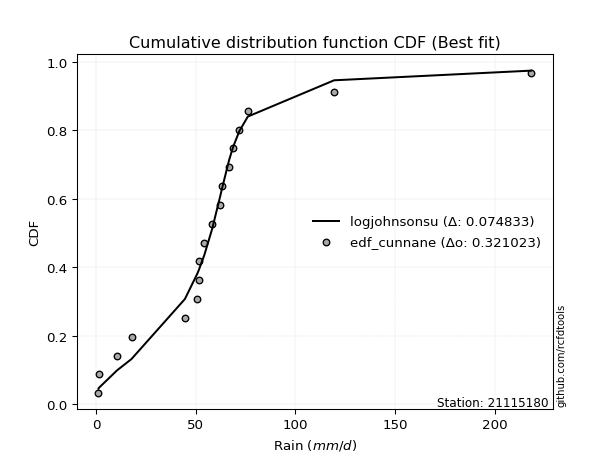</img>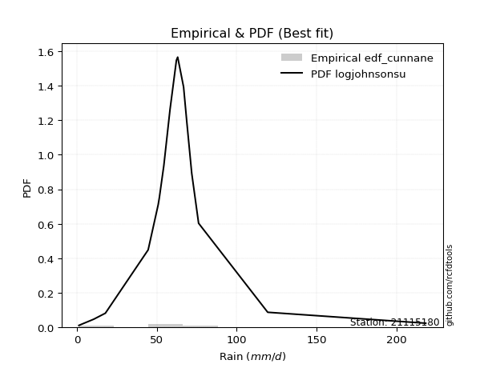</img>

</div>


### 12. EDF Adamowski (1981)

The Adamowski formula in hydrology refers to a specific plotting position formula used for estimating the non-parametric empirical distribution of hydrological events (like flood peaks) to calculate their return periods. This formula provides an alternative to traditional parametric methods (like the Gumbel or Log Pearson Type III distributions). 

<div align="center">


$P=(m-0.25)/(n+0.5)$


</div>


**12.1. Empirical values**

<div align="center">

|                | 0                   | 1                  | 2                   | 3                   | 4                   | 5                  | 6                   | 7                  | 8                   | 9                 | 10                | 11                 | 12                 | 13                 | 14                 | 15                 | 16                 | 17                 |
|:---------------|:--------------------|:-------------------|:--------------------|:--------------------|:--------------------|:-------------------|:--------------------|:-------------------|:--------------------|:------------------|:------------------|:-------------------|:-------------------|:-------------------|:-------------------|:-------------------|:-------------------|:-------------------|
| date           | 2022                | 2023               | 2013                | 2025                | 2020                | 2014               | 2006                | 2019               | 2015                | 2009              | 2017              | 2018               | 2016               | 2007               | 2005               | 2021               | 2008               | 2024               |
| x              | 1.1                 | 1.4                | 10.4                | 17.7                | 44.5                | 50.8               | 51.4                | 51.5               | 54.3                | 58.2              | 62.2              | 63.0               | 66.7               | 68.7               | 71.8               | 76.1               | 119.4              | 218.4              |
| m              | 1                   | 2                  | 3                   | 4                   | 5                   | 6                  | 7                   | 8                  | 9                   | 10                | 11                | 12                 | 13                 | 14                 | 15                 | 16                 | 17                 | 18                 |
| empirical_dist | edf_adamowski       | edf_adamowski      | edf_adamowski       | edf_adamowski       | edf_adamowski       | edf_adamowski      | edf_adamowski       | edf_adamowski      | edf_adamowski       | edf_adamowski     | edf_adamowski     | edf_adamowski      | edf_adamowski      | edf_adamowski      | edf_adamowski      | edf_adamowski      | edf_adamowski      | edf_adamowski      |
| empirical      | 0.04054054054054054 | 0.0945945945945946 | 0.14864864864864866 | 0.20270270270270271 | 0.25675675675675674 | 0.3108108108108108 | 0.36486486486486486 | 0.4189189189189189 | 0.47297297297297297 | 0.527027027027027 | 0.581081081081081 | 0.6351351351351351 | 0.6891891891891891 | 0.7432432432432432 | 0.7972972972972973 | 0.8513513513513513 | 0.9054054054054054 | 0.9594594594594594 |
| empirical_tr   | 1.0422535211267605  | 1.1044776119402986 | 1.1746031746031746  | 1.2542372881355932  | 1.3454545454545455  | 1.4509803921568627 | 1.574468085106383   | 1.7209302325581393 | 1.8974358974358976  | 2.114285714285714 | 2.387096774193548 | 2.7407407407407405 | 3.2173913043478257 | 3.8947368421052624 | 4.933333333333333  | 6.727272727272726  | 10.571428571428568 | 24.66666666666665  |

</div>


**12.2. Kolmogorov-Smirnov fit test (sorted by Δ)**


<div align="center">

|                | 0                   | 1                   | 2                   | 3                   | 4                   | 5                   | 6                   | 7                   | 8                   | 9                   | 10                  | 11                  | 12                  | 13                  | 14                  | 15                  | 16                  | 17                  | 18                  | 19                  | 20                  | 21                  | 22                  | 23                  | 24                  | 25                  | 26                  | 27                  | 28                  | 29                  | 30                  | 31                  | 32                  | 33                  | 34                  | 35                  | 36                  | 37                  | 38                  | 39                  | 40                  | 41                  | 42                  | 43                  | 44                  | 45                  | 46                  | 47                  | 48                  | 49                  | 50                  | 51                  | 52                  | 53                  | 54                  | 55                  | 56                  | 57                  | 58                  | 59                  | 60                  | 61                  | 62                  | 63                  | 64                  | 65                  | 66                  | 67                  | 68                  | 69                  | 70                  | 71                  | 72                  | 73                  | 74                  | 75                  | 76                  | 77                  | 78                  | 79                  | 80                  | 81                  | 82                  | 83                  | 84                  | 85                  | 86                  | 87                  | 88                  | 89                  | 90                  | 91                  | 92                  | 93                  | 94                  | 95                  | 96                  | 97                  | 98                  | 99                  | 100                 | 101                 | 102                 | 103                 | 104                 | 105                 | 106                 | 107                 | 108                 | 109                 | 110                 | 111                 | 112                 | 113                 | 114                 | 115                 | 116                 | 117                 | 118                 | 119                 | 120                 | 121                 | 122                 | 123                 | 124                 | 125                 | 126                 | 127                 | 128                 | 129                 | 130                 | 131                 | 132                 | 133                 | 134                 | 135                 | 136                 | 137                 | 138                 | 139                 | 140                 | 141                 | 142                 | 143                 | 144                 | 145                 | 146                 | 147                 | 148                 | 149                 | 150                 | 151                 | 152                 | 153                 | 154                 | 155                 | 156                 | 157                 | 158                 | 159                 |
|:---------------|:--------------------|:--------------------|:--------------------|:--------------------|:--------------------|:--------------------|:--------------------|:--------------------|:--------------------|:--------------------|:--------------------|:--------------------|:--------------------|:--------------------|:--------------------|:--------------------|:--------------------|:--------------------|:--------------------|:--------------------|:--------------------|:--------------------|:--------------------|:--------------------|:--------------------|:--------------------|:--------------------|:--------------------|:--------------------|:--------------------|:--------------------|:--------------------|:--------------------|:--------------------|:--------------------|:--------------------|:--------------------|:--------------------|:--------------------|:--------------------|:--------------------|:--------------------|:--------------------|:--------------------|:--------------------|:--------------------|:--------------------|:--------------------|:--------------------|:--------------------|:--------------------|:--------------------|:--------------------|:--------------------|:--------------------|:--------------------|:--------------------|:--------------------|:--------------------|:--------------------|:--------------------|:--------------------|:--------------------|:--------------------|:--------------------|:--------------------|:--------------------|:--------------------|:--------------------|:--------------------|:--------------------|:--------------------|:--------------------|:--------------------|:--------------------|:--------------------|:--------------------|:--------------------|:--------------------|:--------------------|:--------------------|:--------------------|:--------------------|:--------------------|:--------------------|:--------------------|:--------------------|:--------------------|:--------------------|:--------------------|:--------------------|:--------------------|:--------------------|:--------------------|:--------------------|:--------------------|:--------------------|:--------------------|:--------------------|:--------------------|:--------------------|:--------------------|:--------------------|:--------------------|:--------------------|:--------------------|:--------------------|:--------------------|:--------------------|:--------------------|:--------------------|:--------------------|:--------------------|:--------------------|:--------------------|:--------------------|:--------------------|:--------------------|:--------------------|:--------------------|:--------------------|:--------------------|:--------------------|:--------------------|:--------------------|:--------------------|:--------------------|:--------------------|:--------------------|:--------------------|:--------------------|:--------------------|:--------------------|:--------------------|:--------------------|:--------------------|:--------------------|:--------------------|:--------------------|:--------------------|:--------------------|:--------------------|:--------------------|:--------------------|:--------------------|:--------------------|:--------------------|:--------------------|:--------------------|:--------------------|:--------------------|:--------------------|:--------------------|:--------------------|:--------------------|:--------------------|:--------------------|:--------------------|:--------------------|:--------------------|
| station        | 21115180            | 21115180            | 21115180            | 21115180            | 21115180            | 21115180            | 21115180            | 21115180            | 21115180            | 21115180            | 21115180            | 21115180            | 21115180            | 21115180            | 21115180            | 21115180            | 21115180            | 21115180            | 21115180            | 21115180            | 21115180            | 21115180            | 21115180            | 21115180            | 21115180            | 21115180            | 21115180            | 21115180            | 21115180            | 21115180            | 21115180            | 21115180            | 21115180            | 21115180            | 21115180            | 21115180            | 21115180            | 21115180            | 21115180            | 21115180            | 21115180            | 21115180            | 21115180            | 21115180            | 21115180            | 21115180            | 21115180            | 21115180            | 21115180            | 21115180            | 21115180            | 21115180            | 21115180            | 21115180            | 21115180            | 21115180            | 21115180            | 21115180            | 21115180            | 21115180            | 21115180            | 21115180            | 21115180            | 21115180            | 21115180            | 21115180            | 21115180            | 21115180            | 21115180            | 21115180            | 21115180            | 21115180            | 21115180            | 21115180            | 21115180            | 21115180            | 21115180            | 21115180            | 21115180            | 21115180            | 21115180            | 21115180            | 21115180            | 21115180            | 21115180            | 21115180            | 21115180            | 21115180            | 21115180            | 21115180            | 21115180            | 21115180            | 21115180            | 21115180            | 21115180            | 21115180            | 21115180            | 21115180            | 21115180            | 21115180            | 21115180            | 21115180            | 21115180            | 21115180            | 21115180            | 21115180            | 21115180            | 21115180            | 21115180            | 21115180            | 21115180            | 21115180            | 21115180            | 21115180            | 21115180            | 21115180            | 21115180            | 21115180            | 21115180            | 21115180            | 21115180            | 21115180            | 21115180            | 21115180            | 21115180            | 21115180            | 21115180            | 21115180            | 21115180            | 21115180            | 21115180            | 21115180            | 21115180            | 21115180            | 21115180            | 21115180            | 21115180            | 21115180            | 21115180            | 21115180            | 21115180            | 21115180            | 21115180            | 21115180            | 21115180            | 21115180            | 21115180            | 21115180            | 21115180            | 21115180            | 21115180            | 21115180            | 21115180            | 21115180            | 21115180            | 21115180            | 21115180            | 21115180            | 21115180            | 21115180            |
| empirical_dist | edf_adamowski       | edf_adamowski       | edf_adamowski       | edf_adamowski       | edf_adamowski       | edf_adamowski       | edf_adamowski       | edf_adamowski       | edf_adamowski       | edf_adamowski       | edf_adamowski       | edf_adamowski       | edf_adamowski       | edf_adamowski       | edf_adamowski       | edf_adamowski       | edf_adamowski       | edf_adamowski       | edf_adamowski       | edf_adamowski       | edf_adamowski       | edf_adamowski       | edf_adamowski       | edf_adamowski       | edf_adamowski       | edf_adamowski       | edf_adamowski       | edf_adamowski       | edf_adamowski       | edf_adamowski       | edf_adamowski       | edf_adamowski       | edf_adamowski       | edf_adamowski       | edf_adamowski       | edf_adamowski       | edf_adamowski       | edf_adamowski       | edf_adamowski       | edf_adamowski       | edf_adamowski       | edf_adamowski       | edf_adamowski       | edf_adamowski       | edf_adamowski       | edf_adamowski       | edf_adamowski       | edf_adamowski       | edf_adamowski       | edf_adamowski       | edf_adamowski       | edf_adamowski       | edf_adamowski       | edf_adamowski       | edf_adamowski       | edf_adamowski       | edf_adamowski       | edf_adamowski       | edf_adamowski       | edf_adamowski       | edf_adamowski       | edf_adamowski       | edf_adamowski       | edf_adamowski       | edf_adamowski       | edf_adamowski       | edf_adamowski       | edf_adamowski       | edf_adamowski       | edf_adamowski       | edf_adamowski       | edf_adamowski       | edf_adamowski       | edf_adamowski       | edf_adamowski       | edf_adamowski       | edf_adamowski       | edf_adamowski       | edf_adamowski       | edf_adamowski       | edf_adamowski       | edf_adamowski       | edf_adamowski       | edf_adamowski       | edf_adamowski       | edf_adamowski       | edf_adamowski       | edf_adamowski       | edf_adamowski       | edf_adamowski       | edf_adamowski       | edf_adamowski       | edf_adamowski       | edf_adamowski       | edf_adamowski       | edf_adamowski       | edf_adamowski       | edf_adamowski       | edf_adamowski       | edf_adamowski       | edf_adamowski       | edf_adamowski       | edf_adamowski       | edf_adamowski       | edf_adamowski       | edf_adamowski       | edf_adamowski       | edf_adamowski       | edf_adamowski       | edf_adamowski       | edf_adamowski       | edf_adamowski       | edf_adamowski       | edf_adamowski       | edf_adamowski       | edf_adamowski       | edf_adamowski       | edf_adamowski       | edf_adamowski       | edf_adamowski       | edf_adamowski       | edf_adamowski       | edf_adamowski       | edf_adamowski       | edf_adamowski       | edf_adamowski       | edf_adamowski       | edf_adamowski       | edf_adamowski       | edf_adamowski       | edf_adamowski       | edf_adamowski       | edf_adamowski       | edf_adamowski       | edf_adamowski       | edf_adamowski       | edf_adamowski       | edf_adamowski       | edf_adamowski       | edf_adamowski       | edf_adamowski       | edf_adamowski       | edf_adamowski       | edf_adamowski       | edf_adamowski       | edf_adamowski       | edf_adamowski       | edf_adamowski       | edf_adamowski       | edf_adamowski       | edf_adamowski       | edf_adamowski       | edf_adamowski       | edf_adamowski       | edf_adamowski       | edf_adamowski       | edf_adamowski       | edf_adamowski       | edf_adamowski       | edf_adamowski       |
| p_dist         | logjohnsonsu        | nct                 | johnsonsu           | gennorm             | t                   | logdgamma           | logt                | dweibull            | vonmises_line       | tukeylambda         | logdweibull         | dgamma              | exponnorm           | loggennorm          | weibull_min         | laplace             | genlogistic         | gumbel_r            | kstwobign           | skewnorm            | exponweib           | genextreme          | invweibull          | invgamma            | fatiguelife         | invgauss            | johnsonsb           | gengamma            | rayleigh            | ncf                 | halfnorm            | hypsecant           | moyal               | logburr12           | maxwell             | rice                | genhalflogistic     | logistic            | logpearson3         | halflogistic        | betaprime           | f                   | foldnorm            | logloglaplace       | logjohnsonsb        | erlang              | gamma               | logvonmises_line    | loggengamma         | logloggamma         | logexponweib        | gompertz            | truncweibull_min    | logskewnorm         | burr12              | kappa3              | crystalball         | truncnorm           | norm                | logweibull_max      | loggenextreme       | logargus            | genpareto           | pearson3            | logweibull_min      | logburr             | loggenlogistic      | logmielke           | loggumbel_l         | loggompertz         | logtrapezoid        | anglit              | mielke              | nakagami            | semicircular        | logtruncweibull_min | gausshyper          | logtriang           | genexpon            | wald                | lomax               | burr                | gumbel_l            | logarcsine          | arcsine             | loggenhalflogistic  | logsemicircular     | exponpow            | loganglit           | logfoldnorm         | loggenpareto        | lognakagami         | logrice             | logcrystalball      | lognorm             | logexponnorm        | lognct              | logncf              | logf                | logfatiguelife      | loggamma            | loggamma            | logbetaprime        | loglevy_l           | loglogistic         | loginvweibull       | logerlang           | loginvgamma         | loghypsecant        | loginvgauss         | logmaxwell          | beta                | loglaplace          | loglaplace          | halfgennorm         | lograyleigh         | logkstwobign        | cosine              | loggausshyper       | bradford            | loghalfnorm         | truncexpon          | loggumbel_r         | loggenexpon         | triang              | logcosine           | loghalflogistic     | logmoyal            | powerlaw            | logksone            | logwrapcauchy       | loglomax            | logkappa3           | loguniform          | logkappa4           | logrdist            | logwald             | kappa4              | argus               | logbradford         | wrapcauchy          | ksone               | levy_l              | uniform             | logbeta             | logtruncexpon       | rdist               | logexponpow         | logtruncnorm        | logpowerlaw         | logtukeylambda      | alpha               | trapezoid           | logalpha            | truncpareto         | weibull_max         | logtruncpareto      | loghalfgennorm      | logvonmises         | vonmises            |
| delta          | 0.0717141149311134  | 0.09116062983758735 | 0.09479662247713558 | 0.09540501581658589 | 0.10812353153879996 | 0.11514105524084095 | 0.12647972607225905 | 0.13627244439103992 | 0.14718704038958574 | 0.14785287716646112 | 0.1533138875135045  | 0.15446886541759436 | 0.15450432926687463 | 0.1566366150041879  | 0.16318738367863944 | 0.16521370688694292 | 0.16756402768329254 | 0.172264910083821   | 0.17464411829506998 | 0.17566969031637503 | 0.18082228006493783 | 0.1808492386756343  | 0.180849716858893   | 0.18219416358206203 | 0.18357860736257292 | 0.18367426413570664 | 0.18392801069536463 | 0.1888697633486322  | 0.1912788931039745  | 0.19133590765939068 | 0.19227135982389215 | 0.19360236435661005 | 0.19640877580160804 | 0.19679558616247544 | 0.19852882501918323 | 0.20066408109302325 | 0.20395152501218777 | 0.2063304288827772  | 0.20667905914555618 | 0.20818377662317772 | 0.20841874616111317 | 0.20983374967646667 | 0.21028311336293687 | 0.2105379438993975  | 0.21153541075729337 | 0.21158982957125344 | 0.21158992782543046 | 0.21193282835428162 | 0.21349038404659082 | 0.21599678721466403 | 0.21607611567326612 | 0.21688660048702663 | 0.218338729088823   | 0.22052281259794432 | 0.2215507159159255  | 0.22202781714603298 | 0.2223283643461348  | 0.22232836910714815 | 0.222328371336312   | 0.2224271604523954  | 0.22242820803016838 | 0.22387853021708692 | 0.2265848646540179  | 0.2269067301874818  | 0.22733501589146304 | 0.22930585115773222 | 0.22939091657251948 | 0.2298257900739306  | 0.23492843123751667 | 0.23532251809565924 | 0.237209400253245   | 0.2397450683020249  | 0.24203160111435656 | 0.24505426955482534 | 0.247017905015799   | 0.24779507506847737 | 0.2542719506501005  | 0.25681545332644    | 0.2614384738566334  | 0.2627761942366768  | 0.2654921674858092  | 0.26614364261424245 | 0.276002053924045   | 0.27605215758231155 | 0.2765538274289574  | 0.28813531832648503 | 0.2895197507865999  | 0.291553543853138   | 0.2929018561050101  | 0.29746673536438345 | 0.2992133130033244  | 0.30017859543781805 | 0.30106995488333027 | 0.30108817490040113 | 0.30108823688641356 | 0.301090707855211   | 0.3011945396638876  | 0.3021236671467962  | 0.30280483266996977 | 0.30508350594896255 | 0.3053806938810743  | 0.3053806938810743  | 0.30583505844365183 | 0.30616544276856233 | 0.3088433619068007  | 0.3101077762318227  | 0.31351471160840244 | 0.3147276116829872  | 0.31537180167995843 | 0.31558712330253486 | 0.33094652524847484 | 0.3347292491867931  | 0.336236768966719   | 0.336236768966719   | 0.33669932424846666 | 0.3404848357619917  | 0.3452821317589992  | 0.3544729438461991  | 0.3559565206205226  | 0.3607557233005299  | 0.3674083840200864  | 0.3676138254140083  | 0.37082857842687117 | 0.371089891101037   | 0.37109145312604314 | 0.3721449267419847  | 0.39493898707762815 | 0.39539916265935454 | 0.4047772159206429  | 0.409353363665589   | 0.4178014256605918  | 0.41891607815206916 | 0.442563772347152   | 0.4425753877500583  | 0.4506196261862128  | 0.46124054905662215 | 0.4635861328271698  | 0.4651294114171555  | 0.47214262807892415 | 0.4769612521654026  | 0.47879494684695856 | 0.48039721728170875 | 0.4817226923437905  | 0.5062063904677803  | 0.5107181078252826  | 0.5311507727251572  | 0.5393146565740372  | 0.5427264940905379  | 0.5475435257555499  | 0.6191885896121456  | 0.662599525199121   | 0.6774308409494953  | 0.7107939341176965  | 0.7170584438981545  | 0.758120687002364   | 0.7898070691744453  | 0.8250518030240757  | 0.9054054054054054  | 1.0782308533824188  | 34.15742712462256   |
| deltao         | 0.32102346734599996 | 0.32102346734599996 | 0.32102346734599996 | 0.32102346734599996 | 0.32102346734599996 | 0.32102346734599996 | 0.32102346734599996 | 0.32102346734599996 | 0.32102346734599996 | 0.32102346734599996 | 0.32102346734599996 | 0.32102346734599996 | 0.32102346734599996 | 0.32102346734599996 | 0.32102346734599996 | 0.32102346734599996 | 0.32102346734599996 | 0.32102346734599996 | 0.32102346734599996 | 0.32102346734599996 | 0.32102346734599996 | 0.32102346734599996 | 0.32102346734599996 | 0.32102346734599996 | 0.32102346734599996 | 0.32102346734599996 | 0.32102346734599996 | 0.32102346734599996 | 0.32102346734599996 | 0.32102346734599996 | 0.32102346734599996 | 0.32102346734599996 | 0.32102346734599996 | 0.32102346734599996 | 0.32102346734599996 | 0.32102346734599996 | 0.32102346734599996 | 0.32102346734599996 | 0.32102346734599996 | 0.32102346734599996 | 0.32102346734599996 | 0.32102346734599996 | 0.32102346734599996 | 0.32102346734599996 | 0.32102346734599996 | 0.32102346734599996 | 0.32102346734599996 | 0.32102346734599996 | 0.32102346734599996 | 0.32102346734599996 | 0.32102346734599996 | 0.32102346734599996 | 0.32102346734599996 | 0.32102346734599996 | 0.32102346734599996 | 0.32102346734599996 | 0.32102346734599996 | 0.32102346734599996 | 0.32102346734599996 | 0.32102346734599996 | 0.32102346734599996 | 0.32102346734599996 | 0.32102346734599996 | 0.32102346734599996 | 0.32102346734599996 | 0.32102346734599996 | 0.32102346734599996 | 0.32102346734599996 | 0.32102346734599996 | 0.32102346734599996 | 0.32102346734599996 | 0.32102346734599996 | 0.32102346734599996 | 0.32102346734599996 | 0.32102346734599996 | 0.32102346734599996 | 0.32102346734599996 | 0.32102346734599996 | 0.32102346734599996 | 0.32102346734599996 | 0.32102346734599996 | 0.32102346734599996 | 0.32102346734599996 | 0.32102346734599996 | 0.32102346734599996 | 0.32102346734599996 | 0.32102346734599996 | 0.32102346734599996 | 0.32102346734599996 | 0.32102346734599996 | 0.32102346734599996 | 0.32102346734599996 | 0.32102346734599996 | 0.32102346734599996 | 0.32102346734599996 | 0.32102346734599996 | 0.32102346734599996 | 0.32102346734599996 | 0.32102346734599996 | 0.32102346734599996 | 0.32102346734599996 | 0.32102346734599996 | 0.32102346734599996 | 0.32102346734599996 | 0.32102346734599996 | 0.32102346734599996 | 0.32102346734599996 | 0.32102346734599996 | 0.32102346734599996 | 0.32102346734599996 | 0.32102346734599996 | 0.32102346734599996 | 0.32102346734599996 | 0.32102346734599996 | 0.32102346734599996 | 0.32102346734599996 | 0.32102346734599996 | 0.32102346734599996 | 0.32102346734599996 | 0.32102346734599996 | 0.32102346734599996 | 0.32102346734599996 | 0.32102346734599996 | 0.32102346734599996 | 0.32102346734599996 | 0.32102346734599996 | 0.32102346734599996 | 0.32102346734599996 | 0.32102346734599996 | 0.32102346734599996 | 0.32102346734599996 | 0.32102346734599996 | 0.32102346734599996 | 0.32102346734599996 | 0.32102346734599996 | 0.32102346734599996 | 0.32102346734599996 | 0.32102346734599996 | 0.32102346734599996 | 0.32102346734599996 | 0.32102346734599996 | 0.32102346734599996 | 0.32102346734599996 | 0.32102346734599996 | 0.32102346734599996 | 0.32102346734599996 | 0.32102346734599996 | 0.32102346734599996 | 0.32102346734599996 | 0.32102346734599996 | 0.32102346734599996 | 0.32102346734599996 | 0.32102346734599996 | 0.32102346734599996 | 0.32102346734599996 | 0.32102346734599996 | 0.32102346734599996 | 0.32102346734599996 | 0.32102346734599996 | 0.32102346734599996 |
| eval           | Δo > Δ              | Δo > Δ              | Δo > Δ              | Δo > Δ              | Δo > Δ              | Δo > Δ              | Δo > Δ              | Δo > Δ              | Δo > Δ              | Δo > Δ              | Δo > Δ              | Δo > Δ              | Δo > Δ              | Δo > Δ              | Δo > Δ              | Δo > Δ              | Δo > Δ              | Δo > Δ              | Δo > Δ              | Δo > Δ              | Δo > Δ              | Δo > Δ              | Δo > Δ              | Δo > Δ              | Δo > Δ              | Δo > Δ              | Δo > Δ              | Δo > Δ              | Δo > Δ              | Δo > Δ              | Δo > Δ              | Δo > Δ              | Δo > Δ              | Δo > Δ              | Δo > Δ              | Δo > Δ              | Δo > Δ              | Δo > Δ              | Δo > Δ              | Δo > Δ              | Δo > Δ              | Δo > Δ              | Δo > Δ              | Δo > Δ              | Δo > Δ              | Δo > Δ              | Δo > Δ              | Δo > Δ              | Δo > Δ              | Δo > Δ              | Δo > Δ              | Δo > Δ              | Δo > Δ              | Δo > Δ              | Δo > Δ              | Δo > Δ              | Δo > Δ              | Δo > Δ              | Δo > Δ              | Δo > Δ              | Δo > Δ              | Δo > Δ              | Δo > Δ              | Δo > Δ              | Δo > Δ              | Δo > Δ              | Δo > Δ              | Δo > Δ              | Δo > Δ              | Δo > Δ              | Δo > Δ              | Δo > Δ              | Δo > Δ              | Δo > Δ              | Δo > Δ              | Δo > Δ              | Δo > Δ              | Δo > Δ              | Δo > Δ              | Δo > Δ              | Δo > Δ              | Δo > Δ              | Δo > Δ              | Δo > Δ              | Δo > Δ              | Δo > Δ              | Δo > Δ              | Δo > Δ              | Δo > Δ              | Δo > Δ              | Δo > Δ              | Δo > Δ              | Δo > Δ              | Δo > Δ              | Δo > Δ              | Δo > Δ              | Δo > Δ              | Δo > Δ              | Δo > Δ              | Δo > Δ              | Δo > Δ              | Δo > Δ              | Δo > Δ              | Δo > Δ              | Δo > Δ              | Δo > Δ              | Δo > Δ              | Δo > Δ              | Δo > Δ              | Δo > Δ              | Δo <= Δ             | Δo <= Δ             | Δo <= Δ             | Δo <= Δ             | Δo <= Δ             | Δo <= Δ             | Δo <= Δ             | Δo <= Δ             | Δo <= Δ             | Δo <= Δ             | Δo <= Δ             | Δo <= Δ             | Δo <= Δ             | Δo <= Δ             | Δo <= Δ             | Δo <= Δ             | Δo <= Δ             | Δo <= Δ             | Δo <= Δ             | Δo <= Δ             | Δo <= Δ             | Δo <= Δ             | Δo <= Δ             | Δo <= Δ             | Δo <= Δ             | Δo <= Δ             | Δo <= Δ             | Δo <= Δ             | Δo <= Δ             | Δo <= Δ             | Δo <= Δ             | Δo <= Δ             | Δo <= Δ             | Δo <= Δ             | Δo <= Δ             | Δo <= Δ             | Δo <= Δ             | Δo <= Δ             | Δo <= Δ             | Δo <= Δ             | Δo <= Δ             | Δo <= Δ             | Δo <= Δ             | Δo <= Δ             | Δo <= Δ             | Δo <= Δ             | Δo <= Δ             | Δo <= Δ             | Δo <= Δ             | Δo <= Δ             |
| fit            | 1                   | 1                   | 1                   | 1                   | 1                   | 1                   | 1                   | 1                   | 1                   | 1                   | 1                   | 1                   | 1                   | 1                   | 1                   | 1                   | 1                   | 1                   | 1                   | 1                   | 1                   | 1                   | 1                   | 1                   | 1                   | 1                   | 1                   | 1                   | 1                   | 1                   | 1                   | 1                   | 1                   | 1                   | 1                   | 1                   | 1                   | 1                   | 1                   | 1                   | 1                   | 1                   | 1                   | 1                   | 1                   | 1                   | 1                   | 1                   | 1                   | 1                   | 1                   | 1                   | 1                   | 1                   | 1                   | 1                   | 1                   | 1                   | 1                   | 1                   | 1                   | 1                   | 1                   | 1                   | 1                   | 1                   | 1                   | 1                   | 1                   | 1                   | 1                   | 1                   | 1                   | 1                   | 1                   | 1                   | 1                   | 1                   | 1                   | 1                   | 1                   | 1                   | 1                   | 1                   | 1                   | 1                   | 1                   | 1                   | 1                   | 1                   | 1                   | 1                   | 1                   | 1                   | 1                   | 1                   | 1                   | 1                   | 1                   | 1                   | 1                   | 1                   | 1                   | 1                   | 1                   | 1                   | 1                   | 1                   | 1                   | 1                   | 0                   | 0                   | 0                   | 0                   | 0                   | 0                   | 0                   | 0                   | 0                   | 0                   | 0                   | 0                   | 0                   | 0                   | 0                   | 0                   | 0                   | 0                   | 0                   | 0                   | 0                   | 0                   | 0                   | 0                   | 0                   | 0                   | 0                   | 0                   | 0                   | 0                   | 0                   | 0                   | 0                   | 0                   | 0                   | 0                   | 0                   | 0                   | 0                   | 0                   | 0                   | 0                   | 0                   | 0                   | 0                   | 0                   | 0                   | 0                   | 0                   | 0                   |
| n              | 18                  | 18                  | 18                  | 18                  | 18                  | 18                  | 18                  | 18                  | 18                  | 18                  | 18                  | 18                  | 18                  | 18                  | 18                  | 18                  | 18                  | 18                  | 18                  | 18                  | 18                  | 18                  | 18                  | 18                  | 18                  | 18                  | 18                  | 18                  | 18                  | 18                  | 18                  | 18                  | 18                  | 18                  | 18                  | 18                  | 18                  | 18                  | 18                  | 18                  | 18                  | 18                  | 18                  | 18                  | 18                  | 18                  | 18                  | 18                  | 18                  | 18                  | 18                  | 18                  | 18                  | 18                  | 18                  | 18                  | 18                  | 18                  | 18                  | 18                  | 18                  | 18                  | 18                  | 18                  | 18                  | 18                  | 18                  | 18                  | 18                  | 18                  | 18                  | 18                  | 18                  | 18                  | 18                  | 18                  | 18                  | 18                  | 18                  | 18                  | 18                  | 18                  | 18                  | 18                  | 18                  | 18                  | 18                  | 18                  | 18                  | 18                  | 18                  | 18                  | 18                  | 18                  | 18                  | 18                  | 18                  | 18                  | 18                  | 18                  | 18                  | 18                  | 18                  | 18                  | 18                  | 18                  | 18                  | 18                  | 18                  | 18                  | 18                  | 18                  | 18                  | 18                  | 18                  | 18                  | 18                  | 18                  | 18                  | 18                  | 18                  | 18                  | 18                  | 18                  | 18                  | 18                  | 18                  | 18                  | 18                  | 18                  | 18                  | 18                  | 18                  | 18                  | 18                  | 18                  | 18                  | 18                  | 18                  | 18                  | 18                  | 18                  | 18                  | 18                  | 18                  | 18                  | 18                  | 18                  | 18                  | 18                  | 18                  | 18                  | 18                  | 18                  | 18                  | 18                  | 18                  | 18                  | 18                  | 18                  |
| best_fit       | 1                   | 0                   | 0                   | 0                   | 0                   | 0                   | 0                   | 0                   | 0                   | 0                   | 0                   | 0                   | 0                   | 0                   | 0                   | 0                   | 0                   | 0                   | 0                   | 0                   | 0                   | 0                   | 0                   | 0                   | 0                   | 0                   | 0                   | 0                   | 0                   | 0                   | 0                   | 0                   | 0                   | 0                   | 0                   | 0                   | 0                   | 0                   | 0                   | 0                   | 0                   | 0                   | 0                   | 0                   | 0                   | 0                   | 0                   | 0                   | 0                   | 0                   | 0                   | 0                   | 0                   | 0                   | 0                   | 0                   | 0                   | 0                   | 0                   | 0                   | 0                   | 0                   | 0                   | 0                   | 0                   | 0                   | 0                   | 0                   | 0                   | 0                   | 0                   | 0                   | 0                   | 0                   | 0                   | 0                   | 0                   | 0                   | 0                   | 0                   | 0                   | 0                   | 0                   | 0                   | 0                   | 0                   | 0                   | 0                   | 0                   | 0                   | 0                   | 0                   | 0                   | 0                   | 0                   | 0                   | 0                   | 0                   | 0                   | 0                   | 0                   | 0                   | 0                   | 0                   | 0                   | 0                   | 0                   | 0                   | 0                   | 0                   | 0                   | 0                   | 0                   | 0                   | 0                   | 0                   | 0                   | 0                   | 0                   | 0                   | 0                   | 0                   | 0                   | 0                   | 0                   | 0                   | 0                   | 0                   | 0                   | 0                   | 0                   | 0                   | 0                   | 0                   | 0                   | 0                   | 0                   | 0                   | 0                   | 0                   | 0                   | 0                   | 0                   | 0                   | 0                   | 0                   | 0                   | 0                   | 0                   | 0                   | 0                   | 0                   | 0                   | 0                   | 0                   | 0                   | 0                   | 0                   | 0                   | 0                   |
| best_fit_sort  | 1                   | 2                   | 3                   | 4                   | 5                   | 6                   | 7                   | 8                   | 9                   | 10                  | 11                  | 12                  | 13                  | 14                  | 15                  | 16                  | 17                  | 18                  | 19                  | 20                  | 21                  | 22                  | 23                  | 24                  | 25                  | 26                  | 27                  | 28                  | 29                  | 30                  | 31                  | 32                  | 33                  | 34                  | 35                  | 36                  | 37                  | 38                  | 39                  | 40                  | 41                  | 42                  | 43                  | 44                  | 45                  | 46                  | 47                  | 48                  | 49                  | 50                  | 51                  | 52                  | 53                  | 54                  | 55                  | 56                  | 57                  | 58                  | 59                  | 60                  | 61                  | 62                  | 63                  | 64                  | 65                  | 66                  | 67                  | 68                  | 69                  | 70                  | 71                  | 72                  | 73                  | 74                  | 75                  | 76                  | 77                  | 78                  | 79                  | 80                  | 81                  | 82                  | 83                  | 84                  | 85                  | 86                  | 87                  | 88                  | 89                  | 90                  | 91                  | 92                  | 93                  | 94                  | 95                  | 96                  | 97                  | 98                  | 99                  | 100                 | 101                 | 102                 | 103                 | 104                 | 105                 | 106                 | 107                 | 108                 | 109                 | 110                 | 111                 | 112                 | 113                 | 114                 | 115                 | 116                 | 117                 | 118                 | 119                 | 120                 | 121                 | 122                 | 123                 | 124                 | 125                 | 126                 | 127                 | 128                 | 129                 | 130                 | 131                 | 132                 | 133                 | 134                 | 135                 | 136                 | 137                 | 138                 | 139                 | 140                 | 141                 | 142                 | 143                 | 144                 | 145                 | 146                 | 147                 | 148                 | 149                 | 150                 | 151                 | 152                 | 153                 | 154                 | 155                 | 156                 | 157                 | 158                 | 159                 | 160                 |

</div>


**12.3. Best fit**

<div align="center">

|   id |   station | empirical_dist   | p_dist       |     delta |   deltao | eval   |   fit |   n |   best_fit |   best_fit_sort |
|-----:|----------:|:-----------------|:-------------|----------:|---------:|:-------|------:|----:|-----------:|----------------:|
|    0 |  21115180 | edf_adamowski    | logjohnsonsu | 0.0717141 | 0.321023 | Δo > Δ |     1 |  18 |          1 |               1 |

</div>


<div align="center">

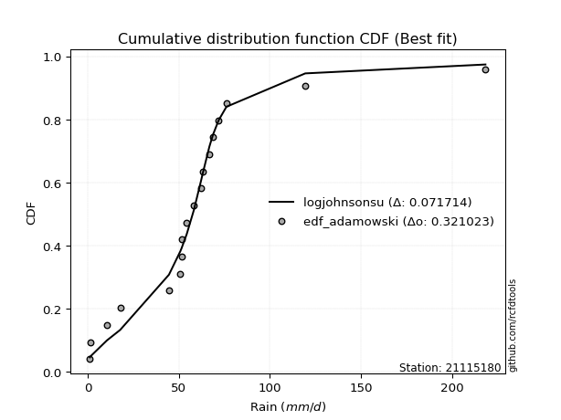</img>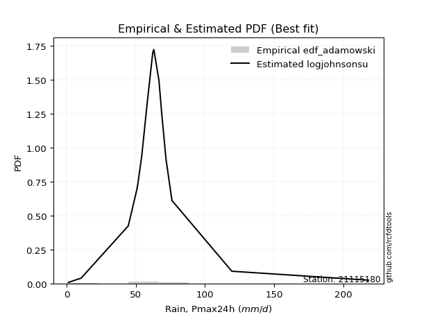</img>

</div>


## C. Best fit & Estimate extreme values for specific return periods - Tr

Best fit in probability distribution analysis means finding the theoretical distribution (like Normal, Poisson, Exponential, etc.) that most accurately mirrors your real-world data´s patterns (shape, center, spread) for better predictions, using methods like visual checks (Q-Q plots), goodness-of-fit tests (Kolmogorov-Smirnov, Chi-Squared), and information criteria (AIC) to score and select the simplest, most representative model.


### 1. Best fit (ordered by delta Δ)

:file_folder:Table: [bestfit_21115180.csv](table/bestfit_21115180.csv)

<div align="center">

|   id |   station | empirical_dist   | p_dist       |     delta |   deltao | eval   |   fit |   n |   best_fit |   best_fit_sort |
|-----:|----------:|:-----------------|:-------------|----------:|---------:|:-------|------:|----:|-----------:|----------------:|
|    0 |  21115180 | edf_adamowski    | logjohnsonsu | 0.0717141 | 0.321023 | Δo > Δ |     1 |  18 |          1 |               1 |
|    1 |  21115180 | edf_chegodayev   | logjohnsonsu | 0.0727423 | 0.321023 | Δo > Δ |     1 |  18 |          1 |               2 |
|    2 |  21115180 | edf_jenkinson    | logjohnsonsu | 0.0729493 | 0.321023 | Δo > Δ |     1 |  18 |          1 |               3 |
|    3 |  21115180 | edf_beard        | logjohnsonsu | 0.0729493 | 0.321023 | Δo > Δ |     1 |  18 |          1 |               4 |
|    4 |  21115180 | edf_filliben     | logjohnsonsu | 0.0731048 | 0.321023 | Δo > Δ |     1 |  18 |          1 |               5 |
|    5 |  21115180 | edf_tukey        | logjohnsonsu | 0.073434  | 0.321023 | Δo > Δ |     1 |  18 |          1 |               6 |
|    6 |  21115180 | edf_blom         | logjohnsonsu | 0.0743057 | 0.321023 | Δo > Δ |     1 |  18 |          1 |               7 |
|    7 |  21115180 | edf_cunnane      | logjohnsonsu | 0.0748326 | 0.321023 | Δo > Δ |     1 |  18 |          1 |               8 |
|    8 |  21115180 | edf_gringorten   | logjohnsonsu | 0.0756817 | 0.321023 | Δo > Δ |     1 |  18 |          1 |               9 |
|    9 |  21115180 | edf_hazen        | logjohnsonsu | 0.0769694 | 0.321023 | Δo > Δ |     1 |  18 |          1 |              10 |
|   10 |  21115180 | edf_weibull      | logjohnsonsu | 0.0778135 | 0.321023 | Δo > Δ |     1 |  18 |          1 |              11 |
|   11 |  21115180 | edf_california   | logjohnsonsu | 0.0895094 | 0.321023 | Δo > Δ |     1 |  18 |          1 |              12 |

</div>


### 2. Extreme values and % difference analysis

In hydrology, a return period (or recurrence interval $Tr$) is the statistical average time between extreme events like floods or droughts of a specific magnitude, indicating how rare an event is, with a 100-year flood, for example, having a 1% chance of occurring in any given year, not that it happens exactly every century. It is a key tool for infrastructure design (like bridges or dams) and risk assessment, calculated from historical data to determine the probability of future events, although it is important to remember it is statistical average, and events can cluster or be missed.

The extreme value porcentage difference is evaluated as $pdiff = 1 - (ETrBf / ETr) * 100$, where _ETrBf_ correspond to the bestfit extreme value for a specific recurrence interval and _ETr_ correspond to the extreme value for one of the most used PDFsused in hydrology.

> risk_rate: assuming the return period as the project useful life.

:file_folder:Table: [extreme_21115180.csv](table/extreme_21115180.csv), all PDFs.  
:file_folder:Table: [extremepdiff_21115180.csv](table/extremepdiff_21115180.csv), % difference between bestfit and most used PDFs in Hydrology.

<div align="center">

Extreme values table for only best fit PDFs
|   id |      tr |   prob_l |     prob_g |      alpha |   anglit |   arcsine |   argus |     beta |   betaprime |   bradford |     burr |   burr12 |   cosine |   crystalball |   dgamma |   dweibull |   erlang |   exponnorm |   exponpow |   exponweib |        f |   fatiguelife |   foldnorm |    gamma |   gausshyper |   genexpon |   genextreme |   gengamma |   genhalflogistic |   genlogistic |   gennorm |   genpareto |   gompertz |   gumbel_l |   gumbel_r |   halfgennorm |   halflogistic |   halfnorm |   hypsecant |   invgamma |   invgauss |   invweibull |   johnsonsb |   johnsonsu |   kappa3 |   kappa4 |   ksone |   kstwobign |   laplace |   levy_l |   loggamma |   logistic |   loglaplace |    lomax |   maxwell |   mielke |    moyal |   nakagami |      ncf |       nct |     norm |   pearson3 |   powerlaw |   rayleigh |     rdist |     rice |   semicircular |   skewnorm |         t |   trapezoid |   triang |   truncexpon |   truncnorm |   truncpareto |   truncweibull_min |   tukeylambda |   uniform |   vonmises |   vonmises_line |     wald |   weibull_max |   weibull_min |   wrapcauchy |       logalpha |   loganglit |   logarcsine |   logargus |   logbeta |   logbetaprime |   logbradford |   logburr |   logburr12 |   logcosine |   logcrystalball |   logdgamma |      logdweibull |   logerlang |   logexponnorm |   logexponpow |   logexponweib |      logf |   logfatiguelife |   logfoldnorm |   loggausshyper |   loggenexpon |   loggenextreme |   loggengamma |   loggenhalflogistic |   loggenlogistic |       loggennorm |   loggenpareto |   loggompertz |   loggumbel_l |   loggumbel_r |   loghalfgennorm |   loghalflogistic |   loghalfnorm |   loghypsecant |   loginvgamma |   loginvgauss |    loginvweibull |   logjohnsonsb |     logjohnsonsu |   logkappa3 |   logkappa4 |   logksone |   logkstwobign |   loglevy_l |   logloggamma |   loglogistic |   logloglaplace |         loglomax |   logmaxwell |   logmielke |   logmoyal |   lognakagami |    logncf |    lognct |   lognorm |   logpearson3 |   logpowerlaw |   lograyleigh |   logrdist |   logrice |   logsemicircular |   logskewnorm |             logt |   logtrapezoid |   logtriang |   logtruncexpon |   logtruncnorm |   logtruncpareto |   logtruncweibull_min |   logtukeylambda |   loguniform |   logvonmises |   logvonmises_line |     logwald |   logweibull_max |   logweibull_min |   logwrapcauchy |   station |   n |   risk_rate |
|-----:|--------:|---------:|-----------:|-----------:|---------:|----------:|--------:|---------:|------------:|-----------:|---------:|---------:|---------:|--------------:|---------:|-----------:|---------:|------------:|-----------:|------------:|---------:|--------------:|-----------:|---------:|-------------:|-----------:|-------------:|-----------:|------------------:|--------------:|----------:|------------:|-----------:|-----------:|-----------:|--------------:|---------------:|-----------:|------------:|-----------:|-----------:|-------------:|------------:|------------:|---------:|---------:|--------:|------------:|----------:|---------:|-----------:|-----------:|-------------:|---------:|----------:|---------:|---------:|-----------:|---------:|----------:|---------:|-----------:|-----------:|-----------:|----------:|---------:|---------------:|-----------:|----------:|------------:|---------:|-------------:|------------:|--------------:|-------------------:|--------------:|----------:|-----------:|----------------:|---------:|--------------:|--------------:|-------------:|---------------:|------------:|-------------:|-----------:|----------:|---------------:|--------------:|----------:|------------:|------------:|-----------------:|------------:|-----------------:|------------:|---------------:|--------------:|---------------:|----------:|-----------------:|--------------:|----------------:|--------------:|----------------:|--------------:|---------------------:|-----------------:|-----------------:|---------------:|--------------:|--------------:|--------------:|-----------------:|------------------:|--------------:|---------------:|--------------:|--------------:|-----------------:|---------------:|-----------------:|------------:|------------:|-----------:|---------------:|------------:|--------------:|--------------:|----------------:|-----------------:|-------------:|------------:|-----------:|--------------:|----------:|----------:|----------:|--------------:|--------------:|--------------:|-----------:|----------:|------------------:|--------------:|-----------------:|---------------:|------------:|----------------:|---------------:|-----------------:|----------------------:|-----------------:|-------------:|--------------:|-------------------:|------------:|-----------------:|-----------------:|----------------:|----------:|----:|------------:|
|    0 |    2    | 0.5      | 0.5        |    5.4438  |  60.4222 |   60.4222 | 102.707 |  34.1849 |     48.6854 |    78.0144 |  42.1686 |  47.0256 |  76.6117 |       60.4222 |  51.5    |    62.2    |  48.3002 |     53.881  |    37.6034 |     51.6148 |  48.5083 |       51.3725 |    48.8353 |  48.3002 |      43.0695 |    42.2968 |      51.6055 |    50.8328 |           49.1117 |       52.8739 |   54.3    |     46.5223 |    47.6599 |    68.2445 |    52.6    |       30.2874 |        48.7111 |    50.6756 |     60.4222 |    51.4797 |    51.36   |      51.6055 |     51.323  |     57.2872 |  47.5215 |  101.15  | 109.75  |     54.8772 |   60.4222 | -24.2206 |    35.6825 |    60.4222 |      36.5746 |  41.8256 |   56.35   |  44.9122 |  50.0747 |    55.6536 |  55.3257 |   56.9573 |  60.4222 |    46.9148 |    15.6716 |    54.9056 | -20.6299  |  58.4045 |        60.4222 |    52.4067 |   57.4736 |     162.724 |  79.1127 |      79.243  |     60.4222 |       1.10077 |            49.3869 |       60.25   |   109.75  |   0.341803 |         54.6289 |  44.9877 |       218.127 |       53.3237 |      109.698 |    1.796       |     36.5743 |      36.5745 |    50.6614 |   147.196 |        35.5274 |       11.0143 |   46.6399 |     49.963  |     26.3429 |          36.5746 |     54.3    |     54.3         |     34.502  |        36.5742 |       5.50833 |        47.8004 |   36.3338 |          36.1209 |       38.0365 |         22.9259 |       22.7028 |         47.5686 |       48.1303 |              35.5941 |          46.6251 |     62.2         |        32.6301 |       45.4018 |       45.6407 |       29.3094 |          1.09975 |           26.254  |       27.7554 |        36.5746 |       34.5208 |       33.6612 |     31.6961      |        48.4779 |     57.6062      |         1.1 |     14.1037 |    15.4997 |        25.6222 |     25.1045 |       47.8007 |       36.5746 |         58.0076 |     10.7303      |      32.5923 |     46.5715 |    27.2872 |       36.6654 |   36.3352 |   36.5483 |   36.5746 |       51.6277 |       2.48312 |       31.2861 |    1.41405 |   36.5767 |           36.5744 |       48.2555 |    59.5997       |        45.6025 |     42.181  |         7.55525 |        8.51952 |          1.10005 |               43.7279 |          1.76184 |      15.4997 |      0.120564 |            48.1696 |     23.6267 |          47.5688 |          46.3063 |         15.4997 |  21115180 |  18 |    0.75     |
|    1 |    2.33 | 0.570815 | 0.429185   |    6.47845 |  70.3194 |   75.2796 | 117.537 |  41.9714 |     56.7898 |    93.1475 |  50.0801 |  55.559  |  88.2671 |       68.919  |  53.5383 |    64.5757 |  56.5157 |     60.4739 |    47.9881 |     58.851  |  56.6873 |       58.9539 |    58.7051 |  56.5157 |      52.7836 |    51.3737 |      58.7828 |    58.4558 |           57.5208 |       59.9855 |   56.5496 |     55.7899 |    56.8178 |    75.6368 |    60.4732 |       40.5465 |        56.806  |    59.8459 |     67.2222 |    58.6878 |    58.9038 |      58.7828 |     58.7006 |     60.2644 |  54.7014 |  117.138 | 128.216 |     62.7554 |   65.5641 |  46.5297 |    45.9128 |    67.9085 |      42.3055 |  50.7987 |   65.1775 |  52.9061 |  57.5277 |    68.8335 |  63.8468 |   60.0191 |  68.919  |    54.4508 |    25.5213 |    63.8638 |  -1.33024 |  66.395  |        71.0371 |    61.238  |   60.6209 |     175.349 |  90.4427 |      93.5957 |     68.919  |       1.10284 |            62.6053 |       65.2597 |   125.138 |   0.603819 |         61.1103 |  50.5591 |       218.309 |       60.6884 |      128.72  |    2.00804     |     48.4018 |      55.6989 |    64.0268 |   173.336 |        45.8547 |       16.8149 |   54.0755 |     58.1204 |     35.0368 |          46.5206 |     57.2395 |     57.8645      |     44.5891 |        46.5202 |       8.04165 |        57.01   |   46.2588 |          45.8821 |       46.7103 |         34.9865 |       32.6227 |         59.0691 |       57.3672 |              50.2923 |          54.073  |     64.9716      |        48.1653 |       54.0546 |       56.265  |       36.6274 |          1.09975 |           33.0157 |       35.9827 |        44.3387 |       44.3928 |       44.2332 |     45.4403      |        58.0706 |     60.7251      |         1.1 |     20.8431 |    24.2992 |        37.3049 |     47.2028 |       56.9719 |       45.2086 |         65.7539 |     17.7243      |      41.8453 |     54.0336 |    33.697  |       46.6725 |   46.3867 |   46.5076 |   46.5206 |       62.9447 |       3.52399 |       40.3173 |    5.24844 |   46.5235 |           49.3953 |       61.4028 |    62.5331       |        60.1505 |     55.3565 |        11.308   |       11.9834  |          1.10018 |               56.9298 |          3.08662 |      22.5448 |      0.140286 |            57.6786 |     27.6633 |          59.0697 |          54.8945 |         24.0851 |  21115180 |  18 |    0.729209 |
|    2 |    5    | 0.8      | 0.2        |   14.5013  | 105.239  |  114.899  | 165.105 |  81.4493 |     93.9503 |   151.981  |  84.304  |  95.104  | 130.269  |      100.495  |  74.1141 |    85.0358 |  94.4488 |     89.5891 |    99.1929 |     91.3291 |  94.3521 |       92.7472 |   100.443  |  94.4488 |      97.3797 |    96.7559 |      91.0896 |    92.6493 |           94.532  |       90.8689 |   74.9157 |     98.4855 |    98.0369 |    99.5182 |    94.678  |      111.411  |        93.4339 |    98.6257 |     94.4984 |    90.8902 |    92.5775 |      91.0895 |     91.6593 |     74.7975 |  84.1468 |  170.813 | 187.978 |     96.2205 |   91.2722 | 163.746  |   118.935  |    96.814  |      87.5935 |  95.6619 |   99.9222 |  89.3866 |  92.0507 |   128.3    | 101.977  |   73.2369 | 100.495  |    90.9238 |    92.1458 |    99.7273 |  53.2439  |  98.3848 |       107.261  |    98.5844 |   75.6952 |     211.569 | 135.756  |     149.696  |    100.495  |       1.55795 |           123.889  |       86.4656 |   174.94  |   1.6232   |         85.7627 |  81.748  |       218.399 |       93.9462 |      181.884 |    4.77069     |    130.075  |     170.985  |   122.632  |   214.875 |       120.245  |       66.1203 |   84.3379 |     94.7379 |     97.9212 |         113.728  |     91.9606 |    118.161       |    117.849  |       113.727  |      44.7369  |        97.4649 |  113.486  |         111.713  |      100.218  |        115.993  |      140.184  |        112.853  |       97.5212 |             124.224  |          84.488  |    101.535       |       135.062  |       95.2163 |      110.625  |       96.4597 |          1.09975 |           93.1225 |      107.866  |        95.9705 |      115.411  |      127.294  |    217.305       |       100.668  |     72.0191      |         1.1 |     74.4972 |   104.124  |       183.988  |    134.363  |       97.123  |      102.472  |        123.053  |    217.917       |     111.897  |     84.525  |    89.5454 |      114.446  |  115.373  |  113.927  |  113.728  |      109.911  |      19.9219  |      111.283  |  116.507   |  113.738  |          137.739  |      123.869  |    82.448        |       133.116  |    120.74   |        48.3592  |       43.2714  |          1.12098 |              121.668  |         18.4154  |      75.802  |      0.251405 |           115.362  |     66.8918 |         112.855  |          95.1111 |         86.4379 |  21115180 |  18 |    0.67232  |
|    3 |   10    | 0.9      | 0.1        |   29.2411  | 125.004  |  124.463  | 188.044 | 117.563  |    125.161  |   183.195  | 113.098  | 128.236  | 155.645  |      121.442  |  97.0271 |   108.717  | 126.503  |    114.655  |   141.99   |    118.938  | 126.115  |      120.646  |   131.328  | 126.503  |     131.273  |   137.953  |     118.809  |   121.132  |          124.015  |      116.014  |   98.9089 |    132.47   |   130.211  |   112.814  |   122.537  |      204.641  |       123.852  |   127.322  |    116.279  |   118.178  |   120.493  |     118.809  |    119.295  |     93.6912 | 107.7    |  195.245 | 214.054 |    121.7    |  114.609  | 192.045  |   226.592  |   118.102  |     169.588  | 136.387  |  124.374  | 122.862  | 122.108  |   174.095  | 133.589  |   89.0673 | 121.442  |   123.106  |   145.204  |   125.299  |  68.9998  | 121.194  |       125.849  |   126.22   |   95.217  |     225.717 | 164.304  |     180.844  |    121.442  |       8.65669 |           164.111  |      100.643  |   196.67  |   2.34106  |        103.393  | 114.847  |       218.4   |      121.023  |      200.756 |   23.3902      |    227.616  |     224.156  |   160.404  |   218.079 |       231.127  |      120.17   |  108.173  |    124.357  |    182.199  |         205.781  |    153.209  |    299.738       |    228.29   |       205.78   |     167.803   |       128.494  |  205.847  |         201.75   |      166.295  |        172.389  |      398.239  |        151.606  |      127.998  |             169.247  |         108.561  |    199.707       |       184.289  |      130.651  |      161.186  |      212.261  |          1.09975 |          220.312  |      243.052  |       177.799  |      221.59   |      266.489  |    777.349       |       133.063  |     88.3538      |         1.1 |    129.426  |   196.47   |       620.065  |    172.966  |      127.907  |      187.212  |        217.35   |   2125.75        |     223.583  |    108.672  |   209.698  |      207.521  |  211.814  |  206.492  |  205.781  |      139.205  |      58.9267  |      229.522  |  195.611   |  205.802  |          233.123  |      164.851  |   139.473        |       181.545  |    163.735  |        99.4152  |       88.2071  |          1.41325 |              164.142  |         38.7339  |     128.667  |      0.388099 |           193.019  |    170.735  |         151.608  |         129.161  |        139.112  |  21115180 |  18 |    0.651322 |
|    4 |   15    | 0.933333 | 0.0666667  |   43.9284  | 133.444  |  126.287  | 196.765 | 138.692  |    142.809  |   194.462  | 130.654  | 146.824  | 167.204  |      131.895  | 111.188  |   123.981  | 144.671  |    129.268  |   165.204  |    134.939  | 144.108  |      136.375  |   147.401  | 144.671  |     148.305  |   162.051  |     135.03   |   137.304  |          140.214  |      130.2    |  115.734  |    150.469  |   147.224  |   118.836  |   138.255  |      272.437  |       141.066  |   142.255  |    128.71   |   134.037  |   136.289  |     135.03   |    135.148  |    108.945  | 121.679  |  203.577 | 222.746 |    135.226  |  128.261  | 200.594  |   313.798  |   129.7    |     249.595  | 160.21   |  136.919  | 144.335  | 139.552  |   198.151  | 151.512  |  102.637  | 131.895  |   141.702  |   167.154  |   138.474  |  72.5468  | 132.947  |       133.097  |   140.601  |  112.21   |     230.257 | 176.951  |     192.527  |    131.895  |      22.642   |           180.315  |      106.334  |   203.913 |   2.66968  |        112.935  | 136.101  |       218.4   |      135.979  |      206.713 |  114.03        |    289.05   |     236.037  |   176.52   |   218.321 |       321.584  |      146.65   |  122.193  |    140.663  |    241.76   |         276.645  |    209.445  |    562.886       |    319.105  |       276.643  |     334.384   |       144.892  |  277.086  |         271.033  |      214.106  |        191.282  |      682.77   |        169.308  |      144.038  |             185.615  |         122.762  |    333.004       |       199.122  |      150.806  |      191.143  |      331.221  |          1.09975 |          358.657  |      370.94   |       252.787  |      308.596  |      389.783  |   1595.59        |       149.806  |    105.992       |         1.1 |    155.203  |   242.778  |      1181.83   |    186.679  |      144.21   |      259.978  |        303.169  |   8056.93        |     318.922  |    122.919  |   343.61   |      279.289  |  287.093  |  277.866  |  276.644  |      151.652  |      88.8586  |      333.285  |  209.964   |  276.675  |          286.222  |      181.105  |   252.898        |       200.549  |    180.546  |       128.212   |      115.997   |          2.1125  |              180.788  |         49.1156  |     153.484  |      0.495631 |           257.795  |    311.637  |         169.31   |         148.36   |        161.933  |  21115180 |  18 |    0.644736 |
|    5 |   20    | 0.95     | 0.05       |   58.6028  | 138.409  |  126.93   | 201.551 | 153.667  |    155.136  |   200.268  | 143.797  | 159.734  | 174.313  |      138.741  | 121.453  |   135.325  | 157.374  |    139.635  |   180.912  |    146.316  | 156.687  |      147.362  |   158.117  | 157.374  |     159.243  |   179.149  |     146.645  |   148.653  |          151.359  |      140.131  |  128.851  |    162.464  |   158.609  |   122.584  |   149.261  |      326.668  |       153.126  |   152.211  |    137.478  |   145.361  |   147.349  |     146.645  |    146.36   |    122.146  | 131.984  |  207.794 | 227.092 |    144.338  |  137.946  | 204.972  |   388.933  |   137.717  |     328.337  | 177.113  |  145.246  | 160.843  | 151.907  |   214.23   | 164.093  |  115.287  | 138.741  |   154.823  |   179.016  |   147.232  |  73.9293  | 140.758  |       137.118  |   150.19   |  128.081  |     232.496 | 184.49   |     198.661  |    138.741  |      38.4016  |           189.067  |      109.383  |   207.535 |   2.85574  |        119.582  | 151.94   |       218.4   |      146.282  |      209.655 |  555.141       |    332.671  |     240.369  |   185.79   |   218.371 |       399.851  |      162.004  |  132.484  |    151.875  |    287.692  |         335.803  |    262.52   |    909.185       |    398.073  |       335.801  |     528.526   |       155.903  |  336.625  |         328.865  |      252.64   |        200.035  |      977.378  |        179.825  |      154.79   |             193.954  |         133.199  |    504.164       |       205.679  |      164.901  |      212.54   |      452.3    |        168.253   |          504.617  |      491.716  |       324.016  |      384.144  |      502.13   |   2639.93        |       160.837  |    125.474       |         1.1 |    169.8    |   269.878  |      1824.95   |    194.117  |      155.174  |      326.211  |        383.908  |  20736.4         |     403.693  |    133.393  |   487.481  |      339.259  |  350.474  |  337.509  |  335.803  |      158.821  |     110.17    |      427.058  |  214.298   |  335.841  |          320.725  |      189.798  |   485.784        |       210.644  |    189.464  |       146.023   |      134.261   |          3.22435 |              189.632  |         55.1369  |     167.633  |      0.590173 |           316.912  |    487.964  |         179.827  |         161.726  |        174.579  |  21115180 |  18 |    0.641514 |
|    6 |   25    | 0.96     | 0.04       |   73.272   | 141.774  |  127.228  | 204.638 | 165.268  |    164.605  |   203.808  | 154.499  | 169.609  | 179.298  |      143.78   | 129.513  |   144.387  | 167.138  |    147.676  |   192.689  |    155.174  | 166.356  |      155.806  |   166.09   | 167.138  |     167.116  |   192.412  |     155.739  |   157.407  |          159.832  |      147.781  |  139.68   |    171.349  |   167.086  |   125.251  |   157.738  |      372.31   |       162.418  |   159.619  |    144.265  |   154.216  |   155.864  |     155.739  |    155.06   |    133.946  | 140.282  |  210.344 | 229.7   |    151.163  |  145.459  | 207.72   |   455.842  |   143.85   |     406.152  | 190.224  |  151.427  | 174.524  | 161.482  |   226.207  | 173.805  |  127.381  | 143.78   |   164.965  |   186.43   |   153.738  |  74.6196  | 146.562  |       139.726  |   157.323  |  143.244  |     233.83  | 189.635  |     202.442  |    143.78   |      53.4092  |           194.548  |      111.281  |   209.708 |   2.97411  |        124.732  | 164.627  |       218.4   |      154.119  |      211.411 | 2701.13        |    365.918  |     242.405  |   191.929  |   218.387 |       469.763  |      171.977  |  140.747  |    160.394  |    325.015  |         387.293  |    313.358  |   1341.3         |    468.865  |       387.291  |     741.857   |       164.131  |  388.487  |         379.202  |      285.371  |        204.9    |     1276.12   |        186.928  |      162.817  |             198.979  |         141.589  |    716.604       |       209.222  |      175.729  |      229.21   |      574.975  |        177.402   |          656.457  |      606.446  |       392.648  |      451.82   |      606.356  |   3890.67        |       168.953  |    147.027       |         1.1 |    179.134  |   287.569  |      2526.92   |    198.936  |      163.377  |      388.059  |        461.068  |  43170.9         |     480.893  |    141.812  |   639.278  |      391.492  |  405.978  |  389.459  |  387.292  |      163.578  |     125.729   |      513.434  |  216.065   |  387.338  |          345.303  |      195.207  |   978.896        |       216.898  |    194.985  |       158.029   |      147.076   |          4.74496 |              195.111  |         59.0217  |     176.741  |      0.676851 |           372.697  |    698.826  |         186.929  |         171.965  |        182.604  |  21115180 |  18 |    0.639603 |
|    7 |   50    | 0.98     | 0.02       |  146.595   | 150.056  |  127.626  | 211.637 | 201.201  |    193.608  |   211.016  | 191.33   | 199.614  | 192.351  |      158.21   | 154.973  |   173.841  | 197.065  |    172.653  |   227.194  |    182.962  | 195.99   |      181.707  |   189.264  | 197.065  |     188.487  |   233.608  |     184.58   |   184.439  |          185.335  |      171.346  |  176.863  |    196.777  |   191.672  |   132.491  |   183.851  |      534.583  |       191.049  |   181.151  |    165.306  |   182.291  |   182.064  |     184.58   |    182.237  |    180.951  | 168.274  |  215.509 | 234.915 |    171.205  |  168.796  | 213.906  |   720.626  |   162.587  |     786.343  | 230.949  |  169.354  | 222.992  | 191.21   |   261.046  | 203.866  |  183.32   | 158.21   |   196.312  |   201.942  |   172.626  |  75.6499  | 163.409  |       145.684  |   178.059  |  213.116  |     236.478 | 202.402  |     210.247  |    158.21   |     106.138   |           206.068  |      115.232  |   214.054 |   3.22354  |        141.109  | 206.049  |       218.4   |      177.723  |      214.911 |    7.34808e+06 |    462.609  |     245.153  |   206.323  |   218.399 |       747.953  |      193.804  |  168.505  |    186.007  |    447.325  |         582.712  |    547.318  |   4890.11        |    752.43   |       582.71   |    1967.71    |       188.206  |  585.596  |         570.266  |      404.499  |        213.302  |     2770.18   |        203.997  |      186.268  |             208.979  |         169.814  |   2528.76        |       215.112  |      208.86   |      281.351  |     1204.23   |        197.22    |         1476.42   |     1115.64   |       712.351  |      722.712  |     1051.39   |  12849.5         |       191.974  |    293.092       |         1.1 |    199.077  |   326.505  |      6571.09   |    210.228  |      187.428  |      659.578  |        814.392  | 421125           |     798.83   |    170.146  |  1483.13   |      589.963  |  618.987  |  586.878  |  582.711  |      174.786  |     164.917   |      876.401  |  217.998   |  582.787  |          408.749  |      206.482  | 55480.2          |       229.866  |    206.423  |       185.494   |      178.033   |         17.1627  |              206.476  |         67.3635  |     196.47   |      1.04094  |           621.908  |   2257.62   |         203.998  |         203.145  |        199.722  |  21115180 |  18 |    0.63583  |
|    8 |   75    | 0.986667 | 0.0133333  |  219.908   | 153.701  |  127.7    | 214.412 | 222.135  |    210.34   |   213.458  | 215.956  | 216.763  | 198.585  |      165.953  | 170.096  |   191.889  | 214.34   |    187.264  |   246.066  |    199.448  | 213.101  |      196.685  |   201.879  | 214.34   |     199.063  |   257.707  |     201.934  |   200.202  |          199.748  |      185.042  |  201.035  |    210.243  |   204.976  |   136.152  |   199.03   |      644.304  |       207.691  |   192.872  |    177.602  |   199.215  |   197.268  |     201.934  |    198.312  |    217.133  | 186.564  |  217.259 | 236.653 |    182.232  |  182.448  | 216.449  |   923.287  |   173.409  |    1157.32   | 254.772  |  179.101  | 256.411  | 208.594  |   280.014  | 221.467  |  235.077  | 165.953  |   214.558  |   207.321  |   182.901  |  75.8758  | 172.575  |       148.064  |   189.347  |  277.404  |     237.354 | 208.058  |     212.925  |    165.953  |     134.48    |           210.084  |      116.597  |   215.503 |   3.30948  |        151.216  | 231.538  |       218.4   |      191.084  |      216.074 |    1.99674e+10 |    512.897  |     245.666  |   212.216  |   218.4   |       962.151  |      201.679  |  186.566  |    200.477  |    521.038  |         725.519  |    761.665  |  11009.6         |    972.357  |       725.517  |    3321.12    |       201.404  |  729.855  |         709.929  |      487.767  |        215.536  |     4225.41   |        211.145  |      199.102  |             212.252  |         188.21   |   5962.03        |       216.605  |      227.931  |      312.078  |     1850.64   |        204.306   |         2364.99   |     1554.64   |      1008.95   |      932.789  |     1421.64   |  25731.6         |       204.084  |    524.641       |         1.1 |    206.067  |   340.622  |     11117.1    |    215.053  |      200.64   |      896.021  |       1135.95   |      1.59613e+06 |    1052.65   |    188.616  |  2426.1    |      735.185  |  776.569  |  731.355  |  725.518  |      179.409  |     180.91    |     1172.3    |  218.257   |  725.616  |          437.241  |      210.381  |     6.00577e+06  |       234.328  |    210.356  |       195.803   |      190.279   |         33.2472  |              210.387  |         70.2819  |     203.523  |      1.32172  |           829.683  |   4645.57   |         211.145  |         221.005  |        205.766  |  21115180 |  18 |    0.634587 |
|    9 |  100    | 0.99     | 0.01       |  293.218   | 155.868  |  127.726  | 215.962 | 236.944  |    222.127  |   214.686  | 235.079  | 228.775  | 202.492  |      171.189  | 180.906  |   205.024  | 226.512  |    197.631  |   258.93   |    211.259  | 225.159  |      207.254  |   210.473  | 226.512  |     205.81   |   274.805  |     214.487  |   211.385  |          209.771  |      194.736  |  219.245  |    219.218  |   213.991  |   138.547  |   209.772  |      728.976  |       219.471  |   200.857  |    186.324  |   211.487  |   208.02   |     214.487  |    209.822  |    247.451  | 200.56   |  218.143 | 237.522 |    189.788  |  192.134  | 217.935  |  1092.67   |   181.049  |    1522.43   | 271.675  |  185.739  | 282.838  | 220.927  |   292.931  | 233.996  |  284.383  | 171.189  |   227.471  |   210.051  |   189.902  |  75.9633  | 178.819  |       149.397  |   197.037  |  338.395  |     237.791 | 211.43   |     214.278  |    171.189  |     151.592   |           212.127  |      117.289  |   216.227 |   3.35277  |        158.689  | 250.122  |       218.4   |      200.392  |      216.656 |    5.42438e+13 |    545.354  |     245.845  |   215.551  |   218.4   |      1141.85   |      205.736  |  200.355  |    210.546  |    573.312  |         841.463  |    964.369  |  20028.1         |   1157.7    |       841.46   |    4727.65    |       210.432  |  847.084  |         823.348  |      553.6    |        216.5    |     5634.79   |        215.225  |      207.87   |             213.863  |         202.269  |  11571.7         |       217.232  |      241.34   |      333.968  |     2508.42   |        207.945   |         3301.07   |     1948.96   |      1291.54   |     1109.89   |     1747.91   |  42064.4         |       212.139  |    878.637       |         1.1 |    209.61   |   347.908  |     15938.7    |    217.924  |      209.686  |     1112.39   |       1438.47   |      4.10802e+06 |    1270.3    |    202.735  |  3439.87   |      853.179  |  905.491  |  848.759  |  841.461  |      182.04   |     189.555   |     1429.25   |  218.331   |  841.578  |          454.056  |      212.358  |     1.04834e+09  |       236.585  |    212.345  |       201.197   |      196.828   |         49.2048  |              212.366  |         71.7553  |     207.145  |      1.5377   |           998.467  |   7861.93   |         215.225  |         233.528  |        208.855  |  21115180 |  18 |    0.633968 |
|   10 |  200    | 0.995    | 0.005      |  586.452   | 159.963  |  127.751  | 218.655 | 272.468  |    250.289  |   216.537  | 287.753  | 257.247  | 210.437  |      183.068  | 207.175  |   237.702  | 255.598  |    222.608  |   288.307  |    240.126  | 253.983  |      232.565  |   230.128  | 255.598  |     219.806  |   316.002  |     245.608  |   238.377  |          233.277  |      218.041  |  266.665  |    239.024  |   234.426  |   143.752  |   235.598  |      956.919  |       247.79   |   219.119  |    207.337  |   242.073  |   233.845  |     245.608  |    237.977  |    339.347  | 238.317  |  219.484 | 238.826 |    207.189  |  215.471  | 220.751  |  1605.11   |   199.377  |    2947.54   | 312.401  |  200.928  | 357.501  | 250.641  |   322.458  | 264.41   |  467.701  | 183.068  |   258.489  |   214.195  |   205.919  |  76.0585  | 193.107  |       151.721  |   214.624  |  563.683  |     238.446 | 217.814  |     216.328  |    183.068  |     181.758   |           215.236  |      118.337  |   217.314 |   3.418    |        177.261  | 296.412  |       218.4   |      222.296  |      217.528 |    2.95232e+27 |    612.384  |     246.019  |   221.426  |   218.4   |      1688.38   |      211.974  |  237.435  |    234.21   |    696.331  |        1177.83   |   1709.81   |  90955.7         |   1725.14   |      1177.83   |   10483.1     |       231.187  | 1187.62   |        1152.54   |      737.764  |        217.696  |    10893.7    |        222.46   |      227.995  |             216.222  |         240.126  |  69104.7         |       217.987  |      273.277  |      386.992  |     5211.07   |        213.524   |         7359.25   |     3268.38   |      2341.28   |     1652.65   |     2814.5    | 137109           |       229.923  |   4756.09        |         1.1 |    214.951  |   359.13   |     36544.1    |    223.469  |      230.507  |     1868.94   |       2540.79   |      4.00731e+07 |    1952.74   |    240.761  |  7977.66   |     1195.86   | 1283.63   | 1189.8    | 1177.83   |      186.709  |     203.405   |     2249.29   |  218.388   | 1178      |          484.931  |      215.358  |     2.84363e+19  |       240.005  |    215.358  |       209.602   |      207.235   |         97.1311  |              215.365  |         73.9641  |     212.698  |      2.02428  |          1405.56   |  29152.3    |         222.459  |         263.249  |        213.574  |  21115180 |  18 |    0.633042 |
|   11 |  250    | 0.996    | 0.004      |  733.068   | 161.005  |  127.754  | 219.285 | 283.854  |    259.293  |   216.909  | 306.971  | 266.285  | 212.615  |      186.698  | 215.688  |   248.51   | 264.898  |    230.649  |   297.319  |    249.544  | 263.203  |      240.676  |   236.175  | 264.898  |     223.707  |   329.264  |     255.903  |   247.091  |          240.66   |      225.533  |  282.981  |    244.891  |   240.654  |   145.284  |   243.901  |     1037.67   |       256.894  |   224.737  |    214.101  |   252.253  |   242.142  |     255.903  |    247.181  |    375.485  | 251.835  |  219.756 | 239.087 |    212.574  |  222.983  | 221.483  |  1806.52   |   205.261  |    3646.1    | 325.511  |  205.604  | 385.348  | 260.207  |   331.535  | 274.287  |  554.089  | 186.698  |   268.449  |   215.031  |   210.85   |  76.0717  | 197.505  |       152.266  |   220.034  |  669.265  |     238.576 | 219.441  |     216.74   |    186.698  |     188.525   |           215.864  |      118.549  |   217.531 |   3.43107  |        183.045  | 311.726  |       218.4   |      229.206  |      217.702 |    2.17779e+34 |    630.721  |     246.04   |   222.815  |   218.4   |      1904.18   |      213.244  |  250.675  |    241.666  |    734.445  |        1305.31   |   2058.11   | 151085           |   1950.47   |      1305.31   |   13349.2     |       237.603  | 1316.82   |        1277.36   |      805.438  |        217.888  |    13346.9    |        224.176  |      234.205  |             216.681  |         253.66   | 130146           |       218.104  |      283.457  |      404.14   |     6591.85   |        214.657   |         9522.89   |     3831.84   |      2835.42   |     1868.44   |     3262.57   | 200463           |       235.205  |   9653.74        |         1.1 |    216.017  |   361.417  |     47243.4    |    224.935  |      236.947  |     2207.7    |       3051.46   |      8.34278e+07 |    2229.09   |    254.359  | 10458.9    |     1325.86   | 1428.32   | 1319.2    | 1305.31   |      187.822  |     206.31    |     2586.23   |  218.393   | 1305.51   |          492.472  |      215.963  |     2.15949e+25  |       240.693  |    215.965  |       211.329   |      209.406   |        112.947   |              215.969  |         74.4022  |     213.826  |      2.15267  |          1518.67   |  44973.9    |         224.175  |         272.693  |        214.531  |  21115180 |  18 |    0.632858 |
|   12 |  500    | 0.998    | 0.002      | 1466.15    | 163.589  |  127.758  | 220.734 | 319.061  |    287.105  |   217.654  | 374.959  | 294.014  | 218.41   |      197.464  | 242.275  |   282.909  | 293.621  |    255.626  |   324.083  |    279.185  | 291.689  |      265.784  |   254.204  | 293.621  |     234.225  |   370.461  |     288.785  |   274.269  |          263.052  |      248.787  |  336.874  |    261.681  |   259.039  |   149.674  |   269.671  |     1312.11   |       285.152  |   241.488  |    235.112  |   285.018  |   267.89   |     288.786  |    276.249  |    512.318  | 298.732  |  220.306 | 239.608 |    228.713  |  246.321  | 223.376  |  2569.87   |   223.51   |    7059.16   | 366.237  |  219.555  | 486.113  | 289.921  |   358.578  | 305.301  |  957.56   | 197.464  |   299.326  |   216.711  |   225.562  |  76.0914  | 210.627  |       153.521  |   236.166  | 1159.26   |     238.838 | 223.478  |     217.568  |    197.464  |     202.878   |           217.128  |      118.973  |   217.965 |   3.45723  |        198.245  | 360.421  |       218.4   |      250.281  |      218.051 |    4.75523e+68 |    678.591  |     246.068  |   226.031  |   218.4   |      2726.02   |      215.807  |  296.488  |    264.383  |    846.348  |        1770.39   |   3670.64   | 775166           |   2813.74   |      1770.39   |   27180.5     |       256.819  | 1788.71   |        1732.97   |     1044.87   |        218.211  |    24476.5    |        228.145  |      252.771  |             217.577  |         300.547  |      1.11623e+06 |       218.295  |      314.794  |      457.626  |    13672.4    |        216.943   |        21193      |     6156.82   |      5139.77   |     2696.6    |     5086.58   | 651732           |       250.4    | 168783           |         1.1 |    218.132  |   366.036  |    101989      |    228.766  |      256.24   |     3700.85   |       5389.83   |      8.13825e+08 |    3308.7    |    301.475  | 24255.4    |     1800.55   | 1961.42   | 1791.82   | 1770.39   |      190.417  |     212.258   |     3922.33   |  218.399   | 1770.67   |          510.287  |      217.178  |     1.8137e+59   |       242.076  |    217.183  |       214.832   |      213.839   |        155.246   |              217.182  |         75.2684  |     216.101  |      2.44608  |          1785      | 178508      |         228.143  |         301.687  |        216.457  |  21115180 |  18 |    0.632489 |
|   13 |  750    | 0.998667 | 0.00133333 | 2199.22    | 164.733  |  127.758  | 221.316 | 339.538  |    303.279  |   217.902  | 421.372  | 310.011  | 221.219  |      203.444  | 257.914  |   303.575  | 310.321  |    270.237  |   338.947  |    296.793  | 308.26   |      280.42   |   264.275  | 310.321  |     239.396  |   394.559  |     308.678  |   290.256  |          275.783  |      262.381  |  370.623  |    270.573  |   269.18   |   152.021  |   284.736  |     1489.61   |       301.671  |   250.846  |    247.402  |   305.043  |   282.943  |     308.678  |    293.608  |    612.401  | 330.029  |  220.492 | 239.782 |    237.779  |  259.972  | 224.273  |  3129.51   |   234.171  |   10389.4    | 390.06   |  227.359  | 556.696  | 307.302  |   373.673  | 323.708  | 1332.72   | 203.444  |   317.349  |   217.273  |   233.788  |  76.0957  | 217.965  |       154.027  |   245.178  | 1611.75   |     238.925 | 225.267  |     217.845  |    203.444  |     207.917   |           217.551  |      119.115  |   218.11  |   3.46595  |        204.527  | 389.617  |       218.4   |      262.361  |      218.167 |    1.0382e+103 |    700.929  |     246.073  |   227.331  |   218.4   |      3331.81   |      216.669  |  326.969  |    277.387  |    906.556  |        2096.98   |   5157.28   |      2.09832e+06 |   3454.32   |      2096.98   |   40180.8     |       267.611  | 2120.49   |        2053.13   |     1207.4    |        218.294  |    34367.9    |        229.744  |      263.173  |             217.865  |         331.786  |      4.46878e+06 |       218.343  |      332.943  |      489.057  |    20944.3    |        217.71    |        33829.6    |     8024.37   |      7278.69   |     3312.59   |     6535.25   |      1.29839e+06 |       258.519  |      1.59446e+06 |         1.1 |    218.827  |   367.589  |    157148      |    230.606  |      267.076  |     5004.73   |       7517.97   |      3.08452e+09 |    4126.64   |    332.877  | 39674.3    |     2134.23   | 2339.98   | 2124.15   | 2096.98   |      191.477  |     214.284   |     4950.95   |  218.4     | 2097.32   |          517.638  |      217.585  |     4.32068e+98  |       242.538  |    217.59   |       216.014   |      215.345   |        173.49    |              217.587  |         75.5522  |     216.865  |      2.55509  |          1886.51   | 407964      |         229.742  |         318.427  |        217.103  |  21115180 |  18 |    0.632366 |
|   14 | 1000    | 0.999    | 0.001      | 2932.3     | 165.415  |  127.759  | 221.643 | 354.014  |    314.717  |   218.027  | 457.708  | 321.271  | 222.99   |      207.561  | 269.043  |   318.466  | 322.129  |    280.604  |   349.171  |    309.405  | 319.981  |      290.787  |   271.231  | 322.129  |     242.683  |   411.657  |     323.097  |   301.646  |          284.657  |      272.024  |  395.553  |    276.5    |   276.127  |   153.6    |   295.423  |     1623.32   |       313.389  |   257.309  |    256.123  |   319.662  |   293.624  |     323.097  |    306.092  |    693.854  | 354.179  |  220.586 | 239.869 |    244.06   |  269.658  | 224.838  |  3585.99   |   241.732  |   13667.1    | 406.962  |  232.752  | 612.86   | 319.635  |   384.091  | 336.898  | 1690.61   | 207.561  |   330.12   |   217.554  |   239.473  |  76.0974  | 223.036  |       154.31   |   251.402  | 2041.49   |     238.968 | 226.333  |     217.984  |    207.561  |     210.487   |           217.763  |      119.186  |   218.183 |   3.47031  |        207.869  | 410.618  |       218.4   |      270.829  |      218.226 |    2.2666e+137 |    714.59   |     246.074  |   228.063  |   218.4   |      3827.63   |      217.1    |  350.447  |    286.498  |    946.721  |        2356.22   |   6568.52   |      4.32493e+06 |   3980.83   |      2356.22   |   52492       |       275.089  | 2384.06   |        2307.38   |     1333.77   |        218.33   |    43458.1    |        230.641  |      270.37   |             218.006  |         355.869  |      1.26852e+07 |       218.363  |      345.744  |      511.417  |    28343.3    |        218.094   |        47137.4    |     9635.38   |      9316.8    |     3819.76   |     7778.7    |      2.11706e+06 |       263.969  |      1.07518e+07 |         1.1 |    219.171  |   368.367  |    212022      |    231.77   |      274.582  |     6199.23   |       9520.14   |      7.93874e+09 |    4807.34   |    357.088  | 56251.2    |     2399.28   | 2642.61   | 2388.16   | 2356.22   |      192.078  |     215.305   |     5815.47   |  218.4     | 2356.61   |          521.814  |      217.788  |     1.07653e+142 |       242.77   |    217.794  |       216.608   |      216.103   |        183.581   |              217.79   |         75.6924  |     217.247  |      2.61171  |          1939.74   | 739325      |         230.639  |         330.214  |        217.426  |  21115180 |  18 |    0.632305 |


</div>


<div align="center">

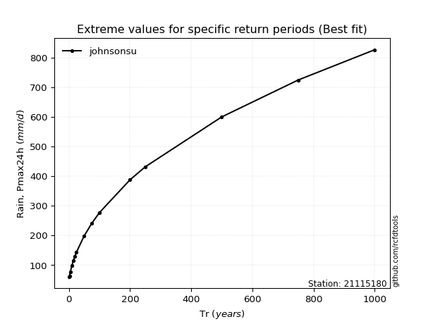</img>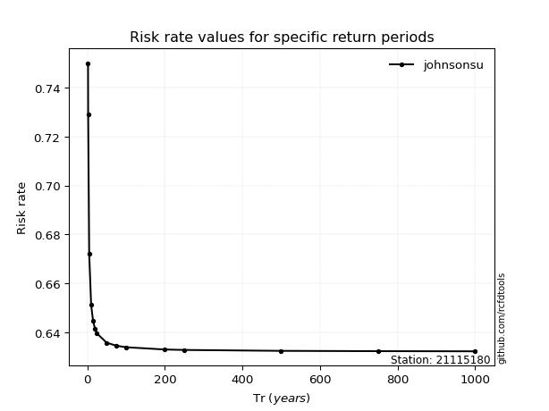</img>

</div>


<sub>**APP DISCLAIMER**: NO WARRANTY - This software is provided by [github.com/rcfdtools](https://github.com/rcfdtools) "as is", without any express or implied warranty, including warranties of merchantability, fitness for a particular purpose, or non-infringement. There is no guarantee that the software will be error-free or operate without interruption. LIMITATION OF LIABILITY - Neither the authors nor copyright holders will be liable for claims or damages arising from the software or its use. You are responsible for determining if the software is appropriate for your use and assume all associated risks, including errors, legal compliance, and data loss. NO PROFESSIONAL ADVICE - The software provides general information and does not offer professional advice. It should not replace consultation with professional advisors.</sub>