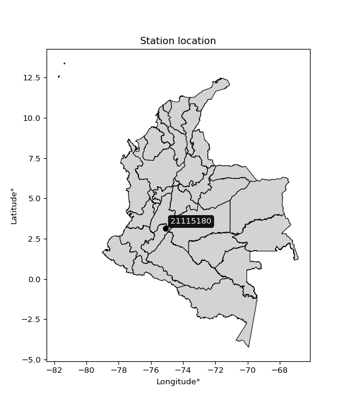

<div align="center">


</div>

# PMP Station (rain, Pmax24h): 21115180

Probable Maximum Precipitation (PMP) is the greatest amount of rainfall for a specific duration that is meteorologically possible for a given location, acting as a "worst-case" scenario for extreme storms, crucial for designing safety-critical infrastructure like bridges, river deviations, dams, spillways, and nuclear plants to prevent catastrophic failure. PMP is calculated by hydrologists using meteorological data to determine the upper limit of extreme rainfall, often leading to the Probable Maximum Flood (PMF) for flood control design, and is increasingly being studied for climate change impacts.

<div align="center">

</img>

</div>


## A. General information


### 1. General running parameters

• app_version: _v20251227_. • runtime: _2025-12-27 09:02:11.367833_. • Python version: _3.14.0_. • SciPy version: _1.16.3_. • Pandas version: _2.3.3_. • NumPy version: _2.3.5_. • Stations dataset (station_dataset_file): _dataset/pmax24h_in/automatic_colombia_2003_2024_filter.csv_. • Stations catalog (station_catalog_file): _dataset/CNE_IDEAM.xls_. • Minimum year to eval til year_max (date_min): _2003_. • Maximum year to eval since year_min (date_max): _2024_. • Creates, save and include plots into reports (create_plot): _False_. • Plot only fit distributions with Δo > Δ (plot_only_fit): _True_. • Eval low extreme values, if False, evaluates high extreme values (low_extreme): _False_. • Eval every SciPy distribution as logarithmic (pdist_logarithmic_on): _True_. • Standard deviation normalized (ddof): _1.0_. • Return periods to eval in years (Tr): _[2, 2.33, 5, 10, 15, 20, 25, 50, 75, 100, 200, 250, 500, 750, 1000]_. • Minimum data sample per station, 0 means any (minimum_sample): _5_. • Z-Score threshold to adjust a value, 0 means disable (zscore): _3.5_. • Avoid zeros, e.g. rain = 0 (avoid_zeros): _True_. • Avoid null values (avoid_nans): _True_. [:file_folder:Dataset file.](../../dataset/pmax24h_in/automatic_colombia_2003_2024_filter.csv)

> Delta Degrees of Freedom (DDOF): is a parameter used in the formulas for calculating variance and standard deviation. When ddof=0, the divisor is $N$ (the total number of observations) and this is used when your data set is the entire population. When ddof=1, the divisor is $N-1$ and this is used when your data set is a sample drawn from a larger population. Using $N-1$ provides an unbiased estimate of the population variance (known as Bessel´s correction).


### 2. Station info and location

|   id |   CODIGO | NOMBRE                           | CATEGORIA         | TECNOLOGIA                              | ESTADO     | FECHA_INSTALACION   | FECHA_SUSPENSION   |   ALTITUD |   LATITUD |   LONGITUD | DEPARTAMENTO   | MUNICIPIO   | AREA_OPERATIVA                    | ENTIDAD                                                     | AREA_HIDROGRAFICA   | ZONA_HIDROGRAFICA   | SUBZONA_HIDROGRAFICA      |   CORRIENTE | Catalogo   |
|-----:|---------:|:---------------------------------|:------------------|:----------------------------------------|:-----------|:--------------------|:-------------------|----------:|----------:|-----------:|:---------------|:------------|:----------------------------------|:------------------------------------------------------------|:--------------------|:--------------------|:--------------------------|------------:|:-----------|
|    0 | 21115180 | HACIENDA MANILA - AUT [21115180] | Agrometeorológica | Automática con Telemetría, Convencional | Suspendida | 15/06/2005          | 11/12/2025         |       600 |   3.13306 |   -75.0815 | Huila          | Baraya      | Area Operativa 04 - Huila-Caquetá | INSTITUTO DE HIDROLOGIA METEOROLOGIA Y ESTUDIOS AMBIENTALES | Magdalena Cauca     | Alto Magdalena      | Rio Fortalecillas y otros |         nan | CNE_IDEAM  |

<div align="center">

Map location in: [:earth_americas:Google](http://maps.google.com/maps?q=3.133055556,-75.08152778) [:earth_americas:OSM](https://www.openstreetmap.org/#map=18/3.133055556/-75.08152778&layers=P) [:earth_americas:Bing](https://www.bing.com/maps?cp=3.133055556~-75.08152778&lvl=18) [:earth_americas:Apple](https://maps.apple.com/frame?center=3.133055556%2C-75.08152778&span=0.003%2C0.006)

</div>


<div align="center">

```geojson
{
  "type": "Feature",
  "geometry": {
    "type": "Point", 
    "coordinates": [-75.08152778, 3.133055556]
  }, 
  "properties": {
    "Name": "21115180"
  }
}
```

</div>


### 3. Discrete values table and plot

|               |           0 |           1 |          2 |          3 |           4 |           5 |           6 |           7 |           8 |           9 |
|:--------------|------------:|------------:|-----------:|-----------:|------------:|------------:|------------:|------------:|------------:|------------:|
| Date          | 2006        | 2007        | 2008       | 2014       | 2015        | 2016        | 2017        | 2018        | 2019        | 2021        |
| Value         |   51.4      |   68.7      |  119.4     |   50.8     |   54.3      |   66.7      |   62.2      |   63        |   51.5      |   76.1      |
| Value_initial |   51.4      |   68.7      |  119.4     |   50.8     |   54.3      |   66.7      |   62.2      |   63        |   51.5      |   76.1      |
| count         |   10        |   10        |   10       |   10       |   10        |   10        |   10        |   10        |   10        |   10        |
| mean          |   66.41     |   66.41     |   66.41    |   66.41    |   66.41     |   66.41     |   66.41     |   66.41     |   66.41     |   66.41     |
| std           |   20.4788   |   20.4788   |   20.4788  |   20.4788  |   20.4788   |   20.4788   |   20.4788   |   20.4788   |   20.4788   |   20.4788   |
| zscore        |   -0.732951 |    0.111823 |    2.58755 |   -0.76225 |   -0.591342 |    0.014161 |   -0.205578 |   -0.166513 |   -0.728068 |    0.473171 |

> The initial value (value_initial) correspond to the initial obtained or null completed value, and value (value) is adjusted only when the initial value is outside the valid range definite through the Z-Score value. If Z-Score is active, values out of range or outliers are replaced with the station mean value


### 4. Active continuous probability distributions from SciPy (45 of 104 available)

[scipy.stats](https://docs.scipy.org/doc/scipy/reference/stats.html) is a Python´s powerful submodule within the SciPy library for comprehensive statistical analysis, offering over 130 probability distributions (like Normal, Poisson), functions for descriptive stats (mean, variance), hypothesis testing (t-tests, chi-square), random variable generation, and statistical tests, making it essential for data science, modeling, and research. It provides tools to explore, model, and draw conclusions from data efficiently, working seamlessly with NumPy.

<div align="center">

|   id | p_dist             |   n_parameter | fit_method   | label                                                                       | active   | ref                                                                                                        |
|-----:|:-------------------|--------------:|:-------------|:----------------------------------------------------------------------------|:---------|:-----------------------------------------------------------------------------------------------------------|
|    0 | alpha              |             3 | MLE          | Alpha                                                                       | True     | [:mortar_board:](https://docs.scipy.org/doc/scipy/reference/generated/scipy.stats.alpha.html)              |
|    1 | betaprime          |             4 | MLE          | Beta prime                                                                  | True     | [:mortar_board:](https://docs.scipy.org/doc/scipy/reference/generated/scipy.stats.betaprime.html)          |
|    2 | chi2               |             3 | MLE          | Chi²                                                                        | True     | [:mortar_board:](https://docs.scipy.org/doc/scipy/reference/generated/scipy.stats.chi2.html)               |
|    3 | crystalball        |             4 | MLE          | Crystalball                                                                 | True     | [:mortar_board:](https://docs.scipy.org/doc/scipy/reference/generated/scipy.stats.crystalball.html)        |
|    4 | erlang             |             3 | MLE          | Erlang                                                                      | True     | [:mortar_board:](https://docs.scipy.org/doc/scipy/reference/generated/scipy.stats.erlang.html)             |
|    5 | expon              |             2 | MLE          | Exponential                                                                 | True     | [:mortar_board:](https://docs.scipy.org/doc/scipy/reference/generated/scipy.stats.expon.html)              |
|    6 | exponnorm          |             3 | MLE          | Exponentially modified Normal                                               | True     | [:mortar_board:](https://docs.scipy.org/doc/scipy/reference/generated/scipy.stats.exponnorm.html)          |
|    7 | f                  |             4 | MLE          | F                                                                           | True     | [:mortar_board:](https://docs.scipy.org/doc/scipy/reference/generated/scipy.stats.f.html)                  |
|    8 | fatiguelife        |             3 | MLE          | Fatigue-life (Birnbaum-Saunders)                                            | True     | [:mortar_board:](https://docs.scipy.org/doc/scipy/reference/generated/scipy.stats.fatiguelife.html)        |
|    9 | fisk               |             3 | MLE          | Fisk                                                                        | True     | [:mortar_board:](https://docs.scipy.org/doc/scipy/reference/generated/scipy.stats.fisk.html)               |
|   10 | gamma              |             3 | MLE          | Gamma                                                                       | True     | [:mortar_board:](https://docs.scipy.org/doc/scipy/reference/generated/scipy.stats.gamma.html)              |
|   11 | genexpon           |             5 | MLE          | Generalized exponential                                                     | True     | [:mortar_board:](https://docs.scipy.org/doc/scipy/reference/generated/scipy.stats.genexpon.html)           |
|   12 | genlogistic        |             3 | MLE          | Generalized logistic                                                        | True     | [:mortar_board:](https://docs.scipy.org/doc/scipy/reference/generated/scipy.stats.genlogistic.html)        |
|   13 | gibrat             |             2 | MM           | Gibrat                                                                      | True     | [:mortar_board:](https://docs.scipy.org/doc/scipy/reference/generated/scipy.stats.gibrat.html)             |
|   14 | gompertz           |             3 | MLE          | Gompertz (or truncated Gumbel)                                              | True     | [:mortar_board:](https://docs.scipy.org/doc/scipy/reference/generated/scipy.stats.gompertz.html)           |
|   15 | gumbel_l           |             2 | MM           | Gumbel Left Skew                                                            | True     | [:mortar_board:](https://docs.scipy.org/doc/scipy/reference/generated/scipy.stats.gumbel_l.html)           |
|   16 | gumbel_r           |             2 | MM           | Gumbel Right Skew                                                           | True     | [:mortar_board:](https://docs.scipy.org/doc/scipy/reference/generated/scipy.stats.gumbel_r.html)           |
|   17 | halflogistic       |             2 | MM           | Half-logistic                                                               | True     | [:mortar_board:](https://docs.scipy.org/doc/scipy/reference/generated/scipy.stats.halflogistic.html)       |
|   18 | halfnorm           |             2 | MM           | Half Normal                                                                 | True     | [:mortar_board:](https://docs.scipy.org/doc/scipy/reference/generated/scipy.stats.halfnorm.html)           |
|   19 | hypsecant          |             2 | MM           | hyperbolic secant                                                           | True     | [:mortar_board:](https://docs.scipy.org/doc/scipy/reference/generated/scipy.stats.hypsecant.html)          |
|   20 | invgamma           |             3 | MLE          | Inverted gamma                                                              | True     | [:mortar_board:](https://docs.scipy.org/doc/scipy/reference/generated/scipy.stats.invgamma.html)           |
|   21 | invgauss           |             3 | MLE          | Inverse Gaussian                                                            | True     | [:mortar_board:](https://docs.scipy.org/doc/scipy/reference/generated/scipy.stats.invgauss.html)           |
|   22 | invweibull         |             3 | MLE          | Inverted Weibull                                                            | True     | [:mortar_board:](https://docs.scipy.org/doc/scipy/reference/generated/scipy.stats.invweibull.html)         |
|   23 | johnsonsu          |             4 | MLE          | Johnson Su                                                                  | True     | [:mortar_board:](https://docs.scipy.org/doc/scipy/reference/generated/scipy.stats.johnsonsu.html)          |
|   24 | kstwobign          |             2 | MLE          | Limiting distribution of scaled Kolmogorov-Smirnov two-sided test statistic | True     | [:mortar_board:](https://docs.scipy.org/doc/scipy/reference/generated/scipy.stats.kstwobign.html)          |
|   25 | laplace            |             2 | MM           | Laplace                                                                     | True     | [:mortar_board:](https://docs.scipy.org/doc/scipy/reference/generated/scipy.stats.laplace.html)            |
|   26 | laplace_asymmetric |             3 | MLE          | Asymmetric Laplace                                                          | True     | [:mortar_board:](https://docs.scipy.org/doc/scipy/reference/generated/scipy.stats.laplace_asymmetric.html) |
|   27 | loggamma           |             3 | MLE          | Log gamma                                                                   | True     | [:mortar_board:](https://docs.scipy.org/doc/scipy/reference/generated/scipy.stats.loggamma.html)           |
|   28 | logistic           |             2 | MM           | Logistic (or Sech-squared)                                                  | True     | [:mortar_board:](https://docs.scipy.org/doc/scipy/reference/generated/scipy.stats.logistic.html)           |
|   29 | lognorm            |             3 | MLE          | Log Normal                                                                  | True     | [:mortar_board:](https://docs.scipy.org/doc/scipy/reference/generated/scipy.stats.lognorm.html)            |
|   30 | maxwell            |             2 | MM           | Maxwell                                                                     | True     | [:mortar_board:](https://docs.scipy.org/doc/scipy/reference/generated/scipy.stats.maxwell.html)            |
|   31 | mielke             |             4 | MLE          | Mielke Beta-Kappa / Dagum                                                   | True     | [:mortar_board:](https://docs.scipy.org/doc/scipy/reference/generated/scipy.stats.mielke.html)             |
|   32 | moyal              |             2 | MM           | Moyal                                                                       | True     | [:mortar_board:](https://docs.scipy.org/doc/scipy/reference/generated/scipy.stats.moyal.html)              |
|   33 | nakagami           |             3 | MLE          | Nakagami                                                                    | True     | [:mortar_board:](https://docs.scipy.org/doc/scipy/reference/generated/scipy.stats.nakagami.html)           |
|   34 | ncf                |             5 | MLE          | Non-central F distribution                                                  | True     | [:mortar_board:](https://docs.scipy.org/doc/scipy/reference/generated/scipy.stats.ncf.html)                |
|   35 | nct                |             4 | MLE          | Non-central Student’s t                                                     | True     | [:mortar_board:](https://docs.scipy.org/doc/scipy/reference/generated/scipy.stats.nct.html)                |
|   36 | norm               |             2 | MM           | Normal                                                                      | True     | [:mortar_board:](https://docs.scipy.org/doc/scipy/reference/generated/scipy.stats.norm.html)               |
|   37 | pareto             |             3 | MLE          | Pareto                                                                      | True     | [:mortar_board:](https://docs.scipy.org/doc/scipy/reference/generated/scipy.stats.pareto.html)             |
|   38 | pearson3           |             3 | MM           | Pearson type III                                                            | True     | [:mortar_board:](https://docs.scipy.org/doc/scipy/reference/generated/scipy.stats.pearson3.html)           |
|   39 | rayleigh           |             2 | MM           | Rayleigh                                                                    | True     | [:mortar_board:](https://docs.scipy.org/doc/scipy/reference/generated/scipy.stats.rayleigh.html)           |
|   40 | rice               |             3 | MLE          | Rice                                                                        | True     | [:mortar_board:](https://docs.scipy.org/doc/scipy/reference/generated/scipy.stats.rice.html)               |
|   41 | t                  |             3 | MLE          | Student’s t                                                                 | True     | [:mortar_board:](https://docs.scipy.org/doc/scipy/reference/generated/scipy.stats.t.html)                  |
|   42 | truncnorm          |             4 | MLE          | Truncated normal                                                            | True     | [:mortar_board:](https://docs.scipy.org/doc/scipy/reference/generated/scipy.stats.truncnorm.html)          |
|   43 | wald               |             2 | MM           | Wald                                                                        | True     | [:mortar_board:](https://docs.scipy.org/doc/scipy/reference/generated/scipy.stats.wald.html)               |
|   44 | weibull_min        |             3 | MLE          | Weibull minimum                                                             | True     | [:mortar_board:](https://docs.scipy.org/doc/scipy/reference/generated/scipy.stats.weibull_min.html)        |

</div>

> **n_parameter:** # arguments & localization & scale.
>
> **Fit methods:** (MLE) maximum likelihood, (MM) L-moments.
>
>**Inactive:** foldnorm, gennorm, norminvgauss, powernorm, powerlognorm, skewnorm, genextreme, anglit, arcsine, argus, beta, bradford, burr, burr12, cauchy, cosine, halfcauchy, foldcauchy, skewcauchy, wrapcauchy, dgamma, gengamma, exponweib, exponpow, truncexpon, gausshyper, genhalflogistic, genhyperbolic, geninvgauss, halfgennorm, johnsonsb, kappa4, kappa3, ksone, kstwo, loglaplace, levy, levy_l, levy_stable, ncx2, genpareto, truncpareto, lomax, powerlaw, rdist, rel_breitwigner, recipinvgauss, semicircular, studentized_range, trapezoid, triang, truncweibull_min, tukeylambda, uniform, loguniform, vonmises, vonmises_line, weibull_max, dweibull, 


## B. Probability distributions vs. Empirical distributions

A continuous probability distribution (CPD) describes probabilities for variables that can take any value within a range (like rain any time), unlike discrete variables with specific outcomes (like temperature). It uses a Probability Density Function (PDF), a curve where the total area under it equals 1, and the probability of the variable falling within an interval (a to b) is found by calculating the area under the curve between those points. A key feature is that the probability of hitting any single exact value is zero, so probabilities are always expressed for ranges, e.g., $P(a ≤ X ≤ b)$.

<div align="center">

Distributions parameters from station values
|    |   station | p_dist                |   n |            loc |         scale | shape                  | shape1                 | shape2                | shape3   |
|---:|----------:|:----------------------|----:|---------------:|--------------:|:-----------------------|:-----------------------|:----------------------|:---------|
|  0 |  21115180 | alpha                 |  10 |     47.3631    |   6.45839     | 1.8348596181068117e-05 |                        |                       |          |
|  1 |  21115180 | betaprime             |  10 |     28.6019    |   1.80241     | 125.02792228281328     | 6.634341938230268      |                       |          |
|  2 |  21115180 | chi2                  |  10 |     50.8       |  20.594       | 0.6740297483522499     |                        |                       |          |
|  3 |  21115180 | crystalball           |  10 |     66.41      |  19.4279      | 5236.909782022032      | 162.06258189861538     |                       |          |
|  4 |  21115180 | erlang                |  10 |     50.8       |  17.7034      | 0.6662911191794789     |                        |                       |          |
|  5 |  21115180 | expon                 |  10 |     50.8       |  15.61        |                        |                        |                       |          |
|  6 |  21115180 | exponnorm             |  10 |     50.7818    |   0.00593938  | 2632.0499910731914     |                        |                       |          |
|  7 |  21115180 | f                     |  10 |     49.4171    |   4.50452     | 790.9202200203599      | 1.7308634250441894     |                       |          |
|  8 |  21115180 | fatiguelife           |  10 |     50.6402    |   3.56916     | 2.3989789995971478     |                        |                       |          |
|  9 |  21115180 | fisk                  |  10 |     50.8       |  13.161       | 0.5224138965350167     |                        |                       |          |
| 10 |  21115180 | gamma                 |  10 |     50.8       |  17.4786      | 0.45310186278242714    |                        |                       |          |
| 11 |  21115180 | genexpon              |  10 |     50.8       |  28.4012      | 1.819422778486961      | 1.107293365219046e-09  | 1.300557767409598     |          |
| 12 |  21115180 | genlogistic           |  10 |    -19.6326    |  11.0544      | 1208.4710571639353     |                        |                       |          |
| 13 |  21115180 | gibrat                |  10 |     51.5889    |   8.98945     |                        |                        |                       |          |
| 14 |  21115180 | gompertz              |  10 |     50.8       |   1.51907e+13 | 1104108785274.9148     |                        |                       |          |
| 15 |  21115180 | gumbel_l              |  10 |     75.1536    |  15.1479      |                        |                        |                       |          |
| 16 |  21115180 | gumbel_r              |  10 |     57.6664    |  15.1479      |                        |                        |                       |          |
| 17 |  21115180 | halflogistic          |  10 |     43.3834    |  16.6102      |                        |                        |                       |          |
| 18 |  21115180 | halfnorm              |  10 |     40.695     |  32.2289      |                        |                        |                       |          |
| 19 |  21115180 | hypsecant             |  10 |     66.41      |  12.3682      |                        |                        |                       |          |
| 20 |  21115180 | invgamma              |  10 |     49.4123    |   3.89733     | 0.8654055800985732     |                        |                       |          |
| 21 |  21115180 | invgauss              |  10 |     49.8365    |   4.50283     | 3.680718868337136      |                        |                       |          |
| 22 |  21115180 | invweibull            |  10 |     50.3566    |   2.98332     | 0.6577104051895257     |                        |                       |          |
| 23 |  21115180 | johnsonsu             |  10 |     50.8       |   1.73495e-05 | -2.4236001963164737    | 0.22093720956987817    |                       |          |
| 24 |  21115180 | kstwobign             |  10 |     15.9052    |  59.1017      |                        |                        |                       |          |
| 25 |  21115180 | laplace               |  10 |     66.41      |  13.7376      |                        |                        |                       |          |
| 26 |  21115180 | laplace_asymmetric    |  10 |     50.8       |   0.0129214   | 0.0008279075803645352  |                        |                       |          |
| 27 |  21115180 | loggamma              |  10 |  -7118.24      | 934.849       | 2176.9518702254945     |                        |                       |          |
| 28 |  21115180 | logistic              |  10 |     66.41      |  10.7112      |                        |                        |                       |          |
| 29 |  21115180 | lognorm               |  10 |     50.8       |   0.242989    | 10.486821387642237     |                        |                       |          |
| 30 |  21115180 | maxwell               |  10 |     20.3739    |  28.8488      |                        |                        |                       |          |
| 31 |  21115180 | mielke                |  10 |     13.2085    |  17.4361      | 429.1960025072831      | 4.80824535997432       |                       |          |
| 32 |  21115180 | moyal                 |  10 |     55.2999    |   8.74565     |                        |                        |                       |          |
| 33 |  21115180 | nakagami              |  10 |     50.8       |  25.3824      | 0.2029625150446811     |                        |                       |          |
| 34 |  21115180 | ncf                   |  10 |     -0.0128551 |   1.59471e-05 | 1.8914566590765343e-06 | 3.4656960101260923     | 6.962182098453534     |          |
| 35 |  21115180 | nct                   |  10 |     -0.115791  |   0.819906    | 10.74477666313043      | 74.75438510238922      |                       |          |
| 36 |  21115180 | norm                  |  10 |     66.41      |  19.4279      |                        |                        |                       |          |
| 37 |  21115180 | pareto                |  10 |     27.3325    |  23.4675      | 2.386194460313277      |                        |                       |          |
| 38 |  21115180 | pearson3              |  10 |     66.41      |  19.4279      | 1.8727530763087743     |                        |                       |          |
| 39 |  21115180 | rayleigh              |  10 |     29.2432    |  29.6548      |                        |                        |                       |          |
| 40 |  21115180 | rice                  |  10 |     38.1955    |  24.223       | 0.0006327847064836281  |                        |                       |          |
| 41 |  21115180 | t                     |  10 |     66.3365    |  19.4424      | 7.320948571006049      |                        |                       |          |
| 42 |  21115180 | truncnorm             |  10 | -50145.1       | 988.115       | 50.799665006915795     | 125.07315690925353     |                       |          |
| 43 |  21115180 | wald                  |  10 |     46.9821    |  19.4279      |                        |                        |                       |          |
| 44 |  21115180 | weibull_min           |  10 |     50.8       |  21.9041      | 0.5189642773105414     |                        |                       |          |
| 45 |  21115180 | logalpha              |  10 |      2.82716   |   8.04071     | 6.215636948162339      |                        |                       |          |
| 46 |  21115180 | logbetaprime          |  10 |      1.3501    |  21.7877      | 168.2790567996201      | 1307.6456822814198     |                       |          |
| 47 |  21115180 | logchi2               |  10 |      3.9279    |   0.966459    | 0.9330415418953135     |                        |                       |          |
| 48 |  21115180 | logcrystalball        |  10 |      4.16216   |   0.245397    | 6.719292367002131      | 278.28108997607245     |                       |          |
| 49 |  21115180 | logerlang             |  10 |      3.9279    |   0.308484    | 0.617863677588292      |                        |                       |          |
| 50 |  21115180 | logexpon              |  10 |      3.9279    |   0.234265    |                        |                        |                       |          |
| 51 |  21115180 | logexponnorm          |  10 |      3.9277    |   6.326e-05   | 3676.8538828371948     |                        |                       |          |
| 52 |  21115180 | logf                  |  10 |      3.9254    |   0.0878706   | 1.2114040864497992     | 2.29453641808749       |                       |          |
| 53 |  21115180 | logfatiguelife        |  10 |      3.92398   |   0.0674616   | 2.073184860788545      |                        |                       |          |
| 54 |  21115180 | logfisk               |  10 |      3.9279    |   0.229548    | 0.694518332250432      |                        |                       |          |
| 55 |  21115180 | loggamma              |  10 |      3.9279    |   0.208672    | 0.2531250511384377     |                        |                       |          |
| 56 |  21115180 | loggenexpon           |  10 |      3.9279    |   0.216483    | 0.9228479208122221     | 3.4604343906500584e-07 | 1.7189465297898296    |          |
| 57 |  21115180 | loggenlogistic        |  10 |      2.8923    |   0.162898    | 1281.03449075965       |                        |                       |          |
| 58 |  21115180 | loggibrat             |  10 |      3.97493   |   0.113563    |                        |                        |                       |          |
| 59 |  21115180 | loggompertz           |  10 |      3.9279    |   3.39343e+10 | 147398463829.5313      |                        |                       |          |
| 60 |  21115180 | loggumbel_l           |  10 |      4.2726    |   0.191336    |                        |                        |                       |          |
| 61 |  21115180 | loggumbel_r           |  10 |      4.05172   |   0.191336    |                        |                        |                       |          |
| 62 |  21115180 | loghalflogistic       |  10 |      3.87131   |   0.209806    |                        |                        |                       |          |
| 63 |  21115180 | loghalfnorm           |  10 |      3.83735   |   0.407089    |                        |                        |                       |          |
| 64 |  21115180 | loghypsecant          |  10 |      4.16216   |   0.156225    |                        |                        |                       |          |
| 65 |  21115180 | loginvgamma           |  10 |      3.8709    |   0.213044    | 1.5112991779357792     |                        |                       |          |
| 66 |  21115180 | loginvgauss           |  10 |      3.90512   |   0.109684    | 2.3434814204042107     |                        |                       |          |
| 67 |  21115180 | loginvweibull         |  10 |      3.91071   |   0.0716562   | 0.8278359413269984     |                        |                       |          |
| 68 |  21115180 | logjohnsonsu          |  10 |      3.92651   |   6.08656e-05 | -4.209439130798351     | 0.5293767611866045     |                       |          |
| 69 |  21115180 | logkstwobign          |  10 |      3.46242   |   0.810555    |                        |                        |                       |          |
| 70 |  21115180 | loglaplace            |  10 |      4.16216   |   0.173522    |                        |                        |                       |          |
| 71 |  21115180 | loglaplace_asymmetric |  10 |      4.13036   |   0.173176    | 0.9126524339390885     |                        |                       |          |
| 72 |  21115180 | logloggamma           |  10 |    -89.091     |  12.0378      | 2314.3999758795107     |                        |                       |          |
| 73 |  21115180 | loglogistic           |  10 |      4.16216   |   0.135295    |                        |                        |                       |          |
| 74 |  21115180 | loglognorm            |  10 |      3.9279    |   0.00475284  | 10.089247442311525     |                        |                       |          |
| 75 |  21115180 | logmaxwell            |  10 |      3.58067   |   0.364394    |                        |                        |                       |          |
| 76 |  21115180 | logmielke             |  10 |      3.41921   |   0.230962    | 286.443883676053       | 4.223847010572385      |                       |          |
| 77 |  21115180 | logmoyal              |  10 |      4.02183   |   0.110468    |                        |                        |                       |          |
| 78 |  21115180 | lognakagami           |  10 |      3.9279    |   0.452704    | 0.232840436339663      |                        |                       |          |
| 79 |  21115180 | logncf                |  10 |     -3.52026   |   7.68004     | 1554.8002101828083     | 2292.7880544501363     | 4.131942181148559e-08 |          |
| 80 |  21115180 | lognct                |  10 |     -1.08034   |   0.0797809   | 276.87440732931964     | 65.52231260890787      |                       |          |
| 81 |  21115180 | lognorm               |  10 |      4.16216   |   0.245397    |                        |                        |                       |          |
| 82 |  21115180 | logpareto             |  10 |      1.65356   |   2.27433     | 10.683756327495528     |                        |                       |          |
| 83 |  21115180 | logpearson3           |  10 |      4.16216   |   0.245398    | 1.384499864962042      |                        |                       |          |
| 84 |  21115180 | lograyleigh           |  10 |      3.6927    |   0.374575    |                        |                        |                       |          |
| 85 |  21115180 | logrice               |  10 |      3.78116   |   0.320452    | 0.00043874711424512445 |                        |                       |          |
| 86 |  21115180 | logt                  |  10 |      4.10946   |   0.161221    | 3.0495415946484257     |                        |                       |          |
| 87 |  21115180 | logtruncnorm          |  10 |     -1.37168   |   1.29854     | 4.081170744303974      | 4.7416371205688534     |                       |          |
| 88 |  21115180 | logwald               |  10 |      3.91676   |   0.245397    |                        |                        |                       |          |
| 89 |  21115180 | logweibull_min        |  10 |      3.9279    |   0.374978    | 0.7245021922107366     |                        |                       |          |

</div>

> **loc** (Location parameter): This shifts the distribution along the x-axis. For many common distributions, like the normal (Gaussian) distribution, loc represents the mean $μ$. For others, like the uniform distribution, it might represent the minimum value, or for the beta distribution, the left end of the support interval.
>
> **scale** (Scale parameter): This determines the width or spread of the distribution. For the normal distribution, scale represents the standard deviation $σ$. For a uniform distribution, it defines the length of the interval (from $loc$ to $loc + scale$).
>
> **shape** (Shape parameters): Refers to parameters that define the specific form of a probability distribution, distinct from its location (loc) and scale (scale). These parameters are required arguments for most distribution functions. For example, a normal (Gaussian) distribution is fully defined by its location (mean) and scale (standard deviation), so it has no specific shape parameters beyond loc and scale. However, other distributions have intrinsic properties that need specification, as Gamma distribution that takes a shape parameter, often named $a$ or $alpha$.


### 0. Cumulative distribution values - CDF (90 evaluated)

Cumulative Distribution Function (CDF), denoted as $F$<sub>$X$</sub>$(x)$, is a function that gives the probability that a random variable $X$ will take a value less than or equal to a specific value, $x$ (i.e., $(P(X≥x)$. It essentially "accumulates" probabilities from a given point up to the far right (positive infinity), providing a complete picture of the distribution´s probabilities for both discrete (like rain) and continuous (like temperature) variables, helping to find probabilities over ranges or above certain values.

<div align="center">

CDF ordered by x ascending and calculating $log(f(x))$ separately
|   id |   Station |   date |     x |   count |   mean |     std |    zscore |   Value_initial |   station |   m |     alpha |   alpha_pdf |   betaprime |   betaprime_pdf |        chi2 |    chi2_pdf |   crystalball |   crystalball_pdf |      erlang |     erlang_pdf |     expon |   expon_pdf |   exponnorm |   exponnorm_pdf |         f |      f_pdf |   fatiguelife |   fatiguelife_pdf |        fisk |        fisk_pdf |       gamma |   gamma_pdf |   genexpon |   genexpon_pdf |   genlogistic |   genlogistic_pdf |   gibrat |   gibrat_pdf |    gompertz |   gompertz_pdf |   gumbel_l |   gumbel_l_pdf |   gumbel_r |   gumbel_r_pdf |   halflogistic |   halflogistic_pdf |   halfnorm |   halfnorm_pdf |   hypsecant |   hypsecant_pdf |   invgamma |   invgamma_pdf |   invgauss |   invgauss_pdf |   invweibull |   invweibull_pdf |   johnsonsu |   johnsonsu_pdf |   kstwobign |   kstwobign_pdf |   laplace |   laplace_pdf |   laplace_asymmetric |   laplace_asymmetric_pdf |    loggamma |   loggamma_pdf |   logistic |   logistic_pdf |   lognorm |   lognorm_pdf |   maxwell |   maxwell_pdf |     mielke |   mielke_pdf |    moyal |   moyal_pdf |   nakagami |   nakagami_pdf |      ncf |    ncf_pdf |      nct |     nct_pdf |     norm |    norm_pdf |      pareto |   pareto_pdf |   pearson3 |   pearson3_pdf |   rayleigh |   rayleigh_pdf |     rice |    rice_pdf |        t |      t_pdf |   truncnorm |   truncnorm_pdf |      wald |   wald_pdf |   weibull_min |   weibull_min_pdf |   logalpha |   logalpha_pdf |   logbetaprime |   logbetaprime_pdf |     logchi2 |   logchi2_pdf |   logcrystalball |   logcrystalball_pdf |   logerlang |   logerlang_pdf |   logexpon |   logexpon_pdf |   logexponnorm |   logexponnorm_pdf |      logf |   logf_pdf |   logfatiguelife |   logfatiguelife_pdf |     logfisk |   logfisk_pdf |   loggenexpon |   loggenexpon_pdf |   loggenlogistic |   loggenlogistic_pdf |   loggibrat |   loggibrat_pdf |   loggompertz |   loggompertz_pdf |   loggumbel_l |   loggumbel_l_pdf |   loggumbel_r |   loggumbel_r_pdf |   loghalflogistic |   loghalflogistic_pdf |   loghalfnorm |   loghalfnorm_pdf |   loghypsecant |   loghypsecant_pdf |   loginvgamma |   loginvgamma_pdf |   loginvgauss |   loginvgauss_pdf |   loginvweibull |   loginvweibull_pdf |   logjohnsonsu |   logjohnsonsu_pdf |   logkstwobign |   logkstwobign_pdf |   loglaplace |   loglaplace_pdf |   loglaplace_asymmetric |   loglaplace_asymmetric_pdf |   logloggamma |   logloggamma_pdf |   loglogistic |   loglogistic_pdf |   loglognorm |   loglognorm_pdf |   logmaxwell |   logmaxwell_pdf |   logmielke |   logmielke_pdf |   logmoyal |   logmoyal_pdf |   lognakagami |   lognakagami_pdf |   logncf |   logncf_pdf |   lognct |   lognct_pdf |   logpareto |   logpareto_pdf |   logpearson3 |   logpearson3_pdf |   lograyleigh |   lograyleigh_pdf |   logrice |   logrice_pdf |     logt |   logt_pdf |   logtruncnorm |   logtruncnorm_pdf |     logwald |   logwald_pdf |   logweibull_min |   logweibull_min_pdf |
|-----:|----------:|-------:|------:|--------:|-------:|--------:|----------:|----------------:|----------:|----:|----------:|------------:|------------:|----------------:|------------:|------------:|--------------:|------------------:|------------:|---------------:|----------:|------------:|------------:|----------------:|----------:|-----------:|--------------:|------------------:|------------:|----------------:|------------:|------------:|-----------:|---------------:|--------------:|------------------:|---------:|-------------:|------------:|---------------:|-----------:|---------------:|-----------:|---------------:|---------------:|-------------------:|-----------:|---------------:|------------:|----------------:|-----------:|---------------:|-----------:|---------------:|-------------:|-----------------:|------------:|----------------:|------------:|----------------:|----------:|--------------:|---------------------:|-------------------------:|------------:|---------------:|-----------:|---------------:|----------:|--------------:|----------:|--------------:|-----------:|-------------:|---------:|------------:|-----------:|---------------:|---------:|-----------:|---------:|------------:|---------:|------------:|------------:|-------------:|-----------:|---------------:|-----------:|---------------:|---------:|------------:|---------:|-----------:|------------:|----------------:|----------:|-----------:|--------------:|------------------:|-----------:|---------------:|---------------:|-------------------:|------------:|--------------:|-----------------:|---------------------:|------------:|----------------:|-----------:|---------------:|---------------:|-------------------:|----------:|-----------:|-----------------:|---------------------:|------------:|--------------:|--------------:|------------------:|-----------------:|---------------------:|------------:|----------------:|--------------:|------------------:|--------------:|------------------:|--------------:|------------------:|------------------:|----------------------:|--------------:|------------------:|---------------:|-------------------:|--------------:|------------------:|--------------:|------------------:|----------------:|--------------------:|---------------:|-------------------:|---------------:|-------------------:|-------------:|-----------------:|------------------------:|----------------------------:|--------------:|------------------:|--------------:|------------------:|-------------:|-----------------:|-------------:|-----------------:|------------:|----------------:|-----------:|---------------:|--------------:|------------------:|---------:|-------------:|---------:|-------------:|------------:|----------------:|--------------:|------------------:|--------------:|------------------:|----------:|--------------:|---------:|-----------:|---------------:|-------------------:|------------:|--------------:|-----------------:|---------------------:|
|    0 |  21115180 |   2014 |  50.8 |      10 |  66.41 | 20.4788 | -0.76225  |            50.8 |  21115180 |   1 | 0.0602246 | 0.0746369   |    0.105088 |      0.0232751  | 5.45683e-06 | 2.58821e+08 |      0.210848 |       0.0148695   | 6.10852e-11 | 5728.09        | 0         | 0.0640615   |  0.00116327 |     0.0638239   | 0.0460592 | 0.0966965  |     0.0299329 |        0.437359   | 7.80891e-08 | 124812          | 1.19976e-07 | 7.65065e+06 | 2.7411e-10 |    0.0640615   |      0.126906 |       0.0236784   | 0        |  0           | 3.51182e-14 |    0.0726831   |   0.181551 |    0.0108247   |   0.207322 |     0.0215355  |       0.219618 |         0.0286501  |   0.246128 |     0.0235693  |    0.175606 |     0.0134888   |  0.0460602 |     0.096703   |  0.0399567 |     0.112625   |    0.0300845 |       0.156362   |   0.0113867 |   309.568       |    0.123291 |     0.0214754   |  0.160503 |   0.0116835   |          6.85694e-07 |              0.0640725   | 0.000213371 |    1.21619e+11 |   0.188872 |    0.0143028   |  0.169881 |     1.03074   |  0.225903 |   0.0176403   |   0.111548 |    0.0309124 | 0.195878 |  0.0255619  | 3.8331e-07 |    2.18981e+07 | 0.451127 | 0.00643824 | 0.146079 | 0.0234947   | 0.210848 | 0.0148695   | 5.55112e-16 |  0.101681    |   0.191115 |     0.0370618  |   0.232187 |     0.0188213  | 0.12662  | 0.0187618   | 0.224687 | 0.0140046  | 1.06866e-11 |       0.0514306 | 0.060643  |  0.0456066 |    9.1579e-09 |   668873          |   0.138031 |      1.46292   |       0.16014  |          1.12811   | 5.71423e-08 |   6.00286e+07 |         0.169881 |            1.03074   | 7.54527e-10 |     1.04978e+06 |  0         |       4.26867  |    0.000845855 |           4.29163  | 0.0856548 | 20.4582    |        0.0296375 |            18.2263   | 2.99082e-10 |  46773.9      |   1.03232e-07 |          4.26291  |         0.108686 |            1.47944   |   0         |       0         |   1.15738e-14 |          4.34365  |      0.152138 |       0.731328    |      0.148067 |          1.47814  |          0.134047 |              2.34033  |      0.176014 |          1.91209  |       0.139822 |          0.866502  |     0.0591986 |          3.45542  |     0.0425891 |          5.20195  |       0.0383864 |            6.02631  |      0.0142882 |          13.9006   |       0.103592 |          1.44251   |     0.129613 |        0.746952  |                0.126223 |                    0.79863  |      0.174743 |         1.0225    |      0.150394 |         0.944424  |   0.00147159 |      1.07025e+12 |     0.176499 |         1.26264  |   0.0931906 |        1.80456  |   0.126061 |       1.71441  |   8.02479e-08 |       8.41496e+07 | 0.255865 |     0.927577 | 0.162382 |    1.10995   | 2.33147e-15 |        4.69753  |      0.140766 |          1.91593  |      0.178915 |          1.37638  | 0.0995249 |     1.28669   | 0.170422 |  1.12891   |    3.07425e-08 |           3.47831  | 7.09634e-06 |    0.00730789 |      1.53353e-11 |         25018.5      |
|    1 |  21115180 |   2006 |  51.4 |      10 |  66.41 | 20.4788 | -0.732951 |            51.4 |  21115180 |   2 | 0.109633  | 0.0879401   |    0.119467 |      0.0246371  | 0.268415    | 0.149132    |      0.21988  |       0.0152358   | 0.114608    |    0.124702    | 0.0377076 | 0.0616459   |  0.0387731  |     0.0614881   | 0.111508  | 0.115471   |     0.238503  |        0.223404   | 0.166137    |      0.120621   | 0.242447    | 0.178805    | 0.0377076  |    0.0616459   |      0.141517 |       0.0250117   | 0        |  0           | 0.0426726   |    0.0695815   |   0.188149 |    0.0111712   |   0.220386 |     0.0220035  |       0.236739 |         0.0284149  |   0.260227 |     0.0234281  |    0.183868 |     0.0140531   |  0.111513  |     0.115478   |  0.116645  |     0.132909   |    0.135925  |       0.170992   |   0.51539   |     0.14679     |    0.136474 |     0.0224576   |  0.167668 |   0.0122051   |          0.0377146   |              0.061656    | 0.526939    |   10.8595      |   0.197604 |    0.0148029   |  0.18226  |     1.07768   |  0.236578 |   0.0179411   |   0.130769 |    0.0331135 | 0.211383 |  0.0261084  | 0.172457   |    0.116664    | 0.454972 | 0.00637891 | 0.160485 | 0.024513    | 0.21988  | 0.0152358   | 0.058463    |  0.0933496   |   0.213162 |     0.0364202  |   0.243552 |     0.0190588  | 0.138069 | 0.0193973   | 0.233198 | 0.0143643  | 0.0303873   |       0.0498684 | 0.0897521 |  0.0509684 |    0.143234   |        0.11456    |   0.155744 |      1.55305   |       0.17372  |          1.18493   | 0.104204    |   4.12307     |         0.18226  |            1.07768   | 0.146056    |     7.5064      |  0.0488866 |       4.05999  |    0.0500324   |           4.08416  | 0.235286  |  9.15147   |        0.220983  |            11.6948   | 0.112568    |      5.9088   |   0.0488223   |          4.05478  |         0.126809 |            1.60628   |   0         |       0         |   0.0497235   |          4.12767  |      0.160948 |       0.769534    |      0.165896 |          1.55755  |          0.161417 |              2.32106  |      0.19839  |          1.89907  |       0.150349 |          0.927     |     0.103938  |          4.08776  |     0.112085  |          6.26308  |       0.120195  |            7.2862   |      0.159165  |           9.781    |       0.121191 |          1.55371   |     0.138687 |        0.799246  |                0.135957 |                    0.860222 |      0.187012 |         1.06728   |      0.161823 |         1.00252   |   0.535714   |      3.35406     |     0.191593 |         1.308    |   0.115501  |        1.99154  |   0.14688  |       1.82928  |   0.142861    |       5.66514     | 0.266868 |     0.946465 | 0.175731 |    1.16362   | 0.0535297   |        4.42324  |      0.163646 |          1.97852  |      0.195313 |          1.41624  | 0.115101  |     1.36561   | 0.184196 |  1.21786   |    0.0400968   |           3.35215  | 0.00275486  |    0.693924   |      0.0780936   |             4.62534  |
|    2 |  21115180 |   2019 |  51.5 |      10 |  66.41 | 20.4788 | -0.728068 |            51.5 |  21115180 |   3 | 0.118483  | 0.0890181   |    0.121941 |      0.0248529  | 0.282556    | 0.134317    |      0.221407 |       0.0152963   | 0.126721    |    0.117782    | 0.0438525 | 0.0612522   |  0.0449023  |     0.061096    | 0.123073  | 0.115744   |     0.259561  |        0.198618   | 0.177595    |      0.109002   | 0.259528    | 0.163411    | 0.0438525  |    0.0612522   |      0.144029 |       0.0252268   | 0        |  0           | 0.0496056   |    0.0690776   |   0.189269 |    0.0112297   |   0.22259  |     0.0220773  |       0.239578 |         0.0283742  |   0.262569 |     0.0234038  |    0.185278 |     0.0141485   |  0.123079  |     0.11575    |  0.129893  |     0.131949   |    0.152733  |       0.165089   |   0.528956  |     0.125582    |    0.138727 |     0.0226147   |  0.168893 |   0.0122942   |          0.0438605   |              0.0612623   | 0.546763    |    9.59577     |   0.199088 |    0.0148865   |  0.184362 |     1.08541   |  0.238374 |   0.0179896   |   0.134098 |    0.0334539 | 0.213998 |  0.0261911  | 0.183592   |    0.10645     | 0.45561  | 0.00636906 | 0.162944 | 0.0246758   | 0.221407 | 0.0152963   | 0.0677327   |  0.0920481   |   0.216799 |     0.0363086  |   0.24546  |     0.0190965  | 0.140014 | 0.0195001   | 0.234637 | 0.0144239  | 0.0353613   |       0.0496126 | 0.0948816 |  0.0516105 |    0.154195   |        0.105011   |   0.158776 |      1.56738   |       0.176032 |          1.19425   | 0.111887    |   3.79572     |         0.184362 |            1.08541   | 0.160173    |     7.03516     |  0.0567451 |       4.02645  |    0.0579374   |           4.05018  | 0.252462  |  8.53946   |        0.242597  |            10.5775   | 0.123642    |      5.49884  |   0.0566708   |          4.02132  |         0.12995  |            1.62658   |   0         |       0         |   0.0577124   |          4.09296  |      0.16245  |       0.775999    |      0.168935 |          1.57005  |          0.165924 |              2.31754  |      0.202079 |          1.89677  |       0.152161 |          0.937312  |     0.111946  |          4.15037  |     0.124269  |          6.26876  |       0.134308  |            7.22942  |      0.17754   |           9.13962  |       0.124228 |          1.57124   |     0.140249 |        0.808249  |                0.13764  |                    0.870866 |      0.189093 |         1.07465   |      0.163781 |         1.01228   |   0.541742   |      2.87347     |     0.194143 |         1.31525  |   0.1194    |        2.02004  |   0.150453 |       1.84684  |   0.153422    |       5.21965     | 0.26871  |     0.949521 | 0.178001 |    1.17241   | 0.0620843   |        4.37954  |      0.1675   |          1.98734  |      0.198072 |          1.42249  | 0.117768  |     1.37819   | 0.186577 |  1.23297   |    0.0465922   |           3.33169  | 0.00433029  |    0.930907   |      0.0868499   |             4.39209  |
|    3 |  21115180 |   2015 |  54.3 |      10 |  66.41 | 20.4788 | -0.591342 |            54.3 |  21115180 |   4 | 0.351845  | 0.0694249   |    0.198646 |      0.0294662  | 0.477911    | 0.0431718   |      0.266534 |       0.0169088   | 0.3482      |    0.0587676   | 0.200857  | 0.0511943   |  0.201526   |     0.051077    | 0.386023  | 0.0689948  |     0.504171  |        0.0454398  | 0.333603    |      0.0331826  | 0.512761    | 0.0577357   | 0.200857   |    0.0511943   |      0.222145 |       0.0302136   | 0.115323 |  0.0717383   | 0.224611    |    0.0563577   |   0.223081 |    0.0129463   |   0.28683  |     0.0236476  |       0.317273 |         0.0270719  |   0.327074 |     0.0226464  |    0.228758 |     0.0169441   |  0.386036  |     0.0689947  |  0.405709  |     0.0685771  |    0.435026  |       0.060393   |   0.665757  |     0.0229768   |    0.207427 |     0.0261832   |  0.207076 |   0.0150737   |          0.200888    |              0.0512011   | 0.77803     |    2.28294     |   0.244052 |    0.0172241   |  0.247264 |     1.28738   |  0.290467 |   0.0191565   |   0.23796  |    0.0396552 | 0.289678 |  0.0275738  | 0.352624   |    0.0407658   | 0.473062 | 0.00609842 | 0.23758  | 0.0283342   | 0.266534 | 0.0169088   | 0.282311    |  0.0635041   |   0.313773 |     0.0328907  |   0.300206 |     0.0199391  | 0.198291 | 0.0220044   | 0.277314 | 0.0160389  | 0.164741    |       0.0429609 | 0.24686   |  0.0530336 |    0.320278   |        0.0389106  |   0.250703 |      1.8778    |       0.245709 |          1.43163   | 0.232115    |   1.5874      |         0.247264 |            1.28738   | 0.399675    |     3.23639     |  0.247544  |       3.21199  |    0.249711    |           3.22569  | 0.514776  |  3.08296   |        0.508594  |             2.7279   | 0.297525    |      2.17862  |   0.247255    |          3.20888  |         0.228845 |            2.07054   |   0.0394678 |       4.34928   |   0.251293    |          3.25212  |      0.208467 |       0.967138    |      0.259653 |          1.82987  |          0.285484 |              2.18892  |      0.30057  |          1.8192   |       0.209765 |          1.24762   |     0.331331  |          3.70621  |     0.394057  |          3.80741  |       0.415495  |            3.60417  |      0.449491  |           3.08038  |       0.21808  |          1.93667   |     0.190285 |        1.0966    |                0.192407 |                    1.21739  |      0.251171 |         1.26714   |      0.224601 |         1.28723   |   0.603225   |      0.573487    |     0.268461 |         1.48192  |   0.241472  |        2.49301  |   0.257828 |       2.15434  |   0.320331    |       2.22974     | 0.321031 |     1.02403  | 0.246146 |    1.39583   | 0.265445    |        3.35239  |      0.276499 |          2.09006  |      0.27721  |          1.55485  | 0.198806  |     1.66466   | 0.263294 |  1.67076   |    0.209009    |           2.81743  | 0.183824    |    4.36432    |      0.248739    |             2.33638  |
|    4 |  21115180 |   2017 |  62.2 |      10 |  66.41 | 20.4788 | -0.205578 |            62.2 |  21115180 |   5 | 0.663353  | 0.0212928   |    0.441474 |      0.0294197  | 0.679772    | 0.0162891   |      0.414222 |       0.0200579   | 0.650374    |    0.0253629   | 0.518236  | 0.0308625   |  0.518285   |     0.0308145   | 0.671998  | 0.0187762  |     0.697966  |        0.0148103  | 0.481249    |      0.0114403  | 0.772694    | 0.0192611   | 0.518236   |    0.0308625   |      0.478813 |       0.0318889   | 0.565862 |  0.0370832   | 0.563334    |    0.0317382   |   0.346376 |    0.0183481   |   0.476473 |     0.0233188  |       0.512724 |         0.0221886  |   0.495392 |     0.0198159  |    0.393685 |     0.0243139   |  0.672005  |     0.0187756  |  0.690488  |     0.0192458  |    0.66777   |       0.0149749  |   0.754626  |     0.00609752  |    0.428474 |     0.027964    |  0.368025 |   0.0267895   |          0.518297    |              0.0308639   | 0.927936    |    0.519156    |   0.402984 |    0.0224614   |  0.448437 |     1.6121    |  0.448497 |   0.0203236   |   0.538368 |    0.0326046 | 0.500296 |  0.0244986  | 0.565967   |    0.0194773   | 0.518389 | 0.00539085 | 0.472846 | 0.0290813   | 0.414222 | 0.0200579   | 0.611238    |  0.0266054   |   0.534821 |     0.0233404  |   0.460734 |     0.0202096  | 0.388    | 0.0250374   | 0.41866  | 0.0193303  | 0.44366     |       0.0286194 | 0.565522  |  0.0287456 |    0.509605   |        0.0159071  |   0.518202 |      1.88683   |       0.467376 |          1.74194   | 0.381382    |   0.81784     |         0.448437 |            1.6121    | 0.682605    |     1.36265     |  0.578624  |       1.79872  |    0.58158     |           1.7989   | 0.740107  |  0.904132  |        0.714937  |             0.92087  | 0.47821     |      0.855976 |   0.578132    |          1.79838  |         0.526876 |            2.07205   |   0.623176  |       2.44337   |   0.584972    |          1.80274  |      0.378408 |       1.54466     |      0.515304 |          1.78558  |          0.549279 |              1.66414  |      0.528323 |          1.51272  |       0.435638 |          1.996     |     0.653955  |          1.41977  |     0.689125  |          1.23142  |       0.673263  |            1.00387  |      0.675137  |           0.934542 |       0.494445 |          1.94952   |     0.41626  |        2.39889   |                0.454426 |                    2.87521  |      0.448478 |         1.57952   |      0.441497 |         1.82252   |   0.645002   |      0.182258    |     0.482774 |         1.59708  |   0.557626  |        1.92614  |   0.540617 |       1.83249  |   0.533334    |       1.18118     | 0.468267 |     1.11836  | 0.461386 |    1.68996   | 0.597911    |        1.73443  |      0.540118 |          1.70124  |      0.494689 |          1.5762   | 0.447723  |     1.878     | 0.547524 |  2.2575    |    0.519219    |           1.81864  | 0.610943    |    1.9828     |      0.472624    |             1.20753  |
|    5 |  21115180 |   2018 |  63   |      10 |  66.41 | 20.4788 | -0.166513 |            63   |  21115180 |   6 | 0.679593  | 0.0193517   |    0.464739 |      0.028732   | 0.69239     | 0.0152733   |      0.430335 |       0.0202206   | 0.669989    |    0.0236998   | 0.542304  | 0.0293207   |  0.542316   |     0.0292772   | 0.68632   | 0.0170703  |     0.709424  |        0.0138563  | 0.490099    |      0.010701   | 0.787479    | 0.0177294   | 0.542304   |    0.0293207   |      0.504067 |       0.0312284   | 0.594267 |  0.0339803   | 0.588001    |    0.0299454   |   0.361276 |    0.0189022   |   0.494995 |     0.022979   |       0.530255 |         0.0216382  |   0.511112 |     0.0194844  |    0.413331 |     0.024788    |  0.686327  |     0.0170698  |  0.70521   |     0.0175974  |    0.679214  |       0.0136674  |   0.759316  |     0.00563852  |    0.450712 |     0.0276193   |  0.390093 |   0.0283959   |          0.542366    |              0.0293218   | 0.934226    |    0.466494    |   0.421076 |    0.0227585   |  0.4691   |     1.62082   |  0.464736 |   0.0202689   |   0.563851 |    0.0310979 | 0.519647 |  0.0238727  | 0.581191   |    0.0185972   | 0.522675 | 0.00532393 | 0.495899 | 0.0285381   | 0.430335 | 0.0202206   | 0.631722    |  0.0246382   |   0.55315  |     0.022485   |   0.476852 |     0.0200815  | 0.408029 | 0.0250252   | 0.434196 | 0.0195039  | 0.466091    |       0.0274659 | 0.587779  |  0.0269215 |    0.521964   |        0.0150084  |   0.542034 |      1.842     |       0.489639 |          1.74126   | 0.391629    |   0.786349    |         0.4691   |            1.62082   | 0.699465    |     1.27713     |  0.600995  |       1.70322  |    0.603949    |           1.70273  | 0.751191  |  0.831989  |        0.726332  |             0.863494 | 0.488826    |      0.806282 |   0.6005      |          1.70303  |         0.55297  |            2.01066   |   0.652784  |       2.19557   |   0.607383    |          1.70539  |      0.398491 |       1.59801     |      0.537858 |          1.74332  |          0.57019  |              1.60835  |      0.547436 |          1.47819  |       0.461329 |          2.02249   |     0.67137   |          1.30773  |     0.704243  |          1.13638  |       0.685556  |            0.921812 |      0.686635  |           0.866196 |       0.519081 |          1.90518   |     0.448074 |        2.58223   |                0.48996  |                    2.68796  |      0.468726 |         1.58849   |      0.4649   |         1.83871   |   0.647258   |      0.171047    |     0.503111 |         1.58506  |   0.581638  |        1.83172  |   0.563608 |       1.76523  |   0.548139    |       1.13626     | 0.482566 |     1.11909  | 0.48299  |    1.69011   | 0.619422    |        1.63321  |      0.561508 |          1.64599  |      0.514719 |          1.55793  | 0.471629  |     1.86246   | 0.576141 |  2.21803   |    0.541982    |           1.74428  | 0.635283    |    1.82894    |      0.487705    |             1.15338  |
|    6 |  21115180 |   2016 |  66.7 |      10 |  66.41 | 20.4788 |  0.014161 |            66.7 |  21115180 |   7 | 0.738387  | 0.0130336   |    0.564251 |      0.0249346  | 0.74183     | 0.0117126   |      0.505955 |       0.0205322   | 0.745693    |    0.0176031   | 0.638892  | 0.0231331   |  0.638777   |     0.0231068   | 0.738332  | 0.0115824  |     0.754182  |        0.0105964  | 0.524672    |      0.00819405 | 0.842481    | 0.0124121   | 0.638892   |    0.0231331   |      0.61249  |       0.0271562   | 0.698251 |  0.0230695   | 0.685151    |    0.0228842   |   0.435781 |    0.0213171   |   0.576481 |     0.0209622  |       0.605558 |         0.0190636  |   0.580266 |     0.017878   |    0.507463 |     0.0257291   |  0.738337  |     0.011582   |  0.759445  |     0.012224   |    0.72128   |       0.00948382 |   0.777157  |     0.00414466  |    0.548917 |     0.0252925   |  0.510444 |   0.0356361   |          0.638955    |              0.023133    | 0.9556      |    0.297702    |   0.506768 |    0.0233358   |  0.561601 |     1.60628   |  0.538757 |   0.0196452   |   0.666105 |    0.0242724 | 0.602278 |  0.0207535  | 0.643683   |    0.0153773   | 0.541816 | 0.00502569 | 0.595701 | 0.0252305   | 0.505955 | 0.0205322   | 0.709001    |  0.0176384   |   0.62946  |     0.0188524  |   0.549637 |     0.0191824  | 0.499615 | 0.0243088   | 0.507209 | 0.0198285  | 0.558632    |       0.022707  | 0.673991  |  0.0200809 |    0.571229   |        0.0118512  |   0.640398 |      1.59502   |       0.587584 |          1.67435   | 0.4331      |   0.673445    |         0.561601 |            1.60628   | 0.763079    |     0.970189    |  0.687264  |       1.33497  |    0.690121    |           1.33225  | 0.791361  |  0.595403  |        0.769638  |             0.668076 | 0.529625    |      0.635382 |   0.686773    |          1.33526  |         0.658772 |            1.68764   |   0.753322  |       1.40056   |   0.693584    |          1.33096  |      0.495894 |       1.80467     |      0.631144 |          1.5181   |          0.654889 |              1.36107  |      0.627252 |          1.31744  |       0.57676  |          1.97855   |     0.734363  |          0.928643 |     0.759377  |          0.820901 |       0.72995   |            0.657045 |      0.729112  |           0.640591 |       0.621232 |          1.66575   |     0.598437 |        2.31419   |                0.622442 |                    1.98976  |      0.559478 |         1.57814   |      0.569838 |         1.81177   |   0.655878   |      0.133977    |     0.591196 |         1.49167  |   0.674533  |        1.43221  |   0.655578 |       1.45827  |   0.608032    |       0.970893    | 0.546163 |     1.10495  | 0.57823  |    1.63202   | 0.701269    |        1.25325  |      0.648289 |          1.39533  |      0.600623 |          1.44459  | 0.57471   |     1.73547   | 0.693871 |  1.86872   |    0.632763    |           1.44589  | 0.723389    |    1.29608    |      0.547565    |             0.954704 |
|    7 |  21115180 |   2007 |  68.7 |      10 |  66.41 | 20.4788 |  0.111823 |            68.7 |  21115180 |   8 | 0.762131  | 0.010812    |    0.611895 |      0.0227061  | 0.763811    | 0.0103145   |      0.546915 |       0.0203923   | 0.778333    |    0.0151131   | 0.682317  | 0.0203513   |  0.682157   |     0.0203319   | 0.759493  | 0.00966637 |     0.774081  |        0.00934596 | 0.54008     |      0.0072494  | 0.865194    | 0.0103755   | 0.682317   |    0.0203513   |      0.664245 |       0.0245784   | 0.740107 |  0.0189524   | 0.727748    |    0.0197881   |   0.479565 |    0.0224382   |   0.617124 |     0.0196645  |       0.642301 |         0.0176834  |   0.615119 |     0.0169721  |    0.558602 |     0.0253012   |  0.759497  |     0.00966605 |  0.781894  |     0.0103093  |    0.738718  |       0.00802131 |   0.784887  |     0.00360757  |    0.597933 |     0.0236959   |  0.576771 |   0.030808    |          0.68238     |              0.0203507   | 0.963495    |    0.239267    |   0.553246 |    0.0230754   |  0.608504 |     1.56519   |  0.577507 |   0.0190799   |   0.711277 |    0.0209572 | 0.64206  |  0.0190321  | 0.673055   |    0.0140302   | 0.551713 | 0.00487207 | 0.644075 | 0.0231232   | 0.546915 | 0.0203923   | 0.741455    |  0.0149136   |   0.665394 |     0.0171065  |   0.587353 |     0.0185144  | 0.547491 | 0.0235254   | 0.546743 | 0.0196667  | 0.601788    |       0.0204876 | 0.711251  |  0.0172662 |    0.593648   |        0.0106093  |   0.685408 |      1.45115   |       0.63605  |          1.60277   | 0.452304    |   0.627768    |         0.608504 |            1.56519   | 0.789881    |     0.847556    |  0.724319  |       1.17679  |    0.727084    |           1.17334  | 0.80765   |  0.510486  |        0.788242  |             0.593623 | 0.547402    |      0.570043 |   0.723839    |          1.17725  |         0.705988 |            1.50868   |   0.790516  |       1.12935   |   0.730488    |          1.17067  |      0.550373 |       1.87839     |      0.674103 |          1.38943  |          0.693268 |              1.23776  |      0.66491  |          1.23167  |       0.633606 |          1.86065   |     0.759666  |          0.78936  |     0.781871  |          0.706033 |       0.747928  |            0.563667 |      0.746781  |           0.558525 |       0.668415 |          1.52751   |     0.661304 |        1.95189   |                0.67688  |                    1.70287  |      0.605605 |         1.54092   |      0.622356 |         1.73716   |   0.659628   |      0.120364    |     0.634265 |         1.42181  |   0.714106  |        1.24995  |   0.69639  |       1.30587  |   0.635668    |       0.901362    | 0.578558 |     1.08687  | 0.625549 |    1.56774   | 0.735904    |        1.09524  |      0.687633 |          1.26881  |      0.642216 |          1.36949  | 0.624611  |     1.63984   | 0.745533 |  1.62561   |    0.673458    |           1.31107  | 0.758616    |    1.09558    |      0.574531    |             0.872683 |
|    8 |  21115180 |   2021 |  76.1 |      10 |  66.41 | 20.4788 |  0.473171 |            76.1 |  21115180 |   9 | 0.822182  | 0.00608434  |    0.750757 |      0.0151049  | 0.826042    | 0.00685168  |      0.691028 |       0.0181328   | 0.864718    |    0.00886489  | 0.802251  | 0.0126681   |  0.802015   |     0.0126648   | 0.813791  | 0.00557849 |     0.830778  |        0.00628992 | 0.584536    |      0.00501463 | 0.922292    | 0.0056229   | 0.802251   |    0.0126681   |      0.811005 |       0.0153672   | 0.842088 |  0.00984153  | 0.841005    |    0.0115562   |   0.655089 |    0.0242375   |   0.74368  |     0.0145391  |       0.755152 |         0.0129362  |   0.728034 |     0.0135407  |    0.7272   |     0.0194539   |  0.813794  |     0.00557831 |  0.840591  |     0.00610797 |    0.784798  |       0.00485884 |   0.806549  |     0.00239602  |    0.7493   |     0.0171783   |  0.753035 |   0.0179773   |          0.802306    |              0.0126667   | 0.980942    |    0.117845    |   0.711907 |    0.0191478   |  0.755624 |     1.27929   |  0.708021 |   0.0159746   |   0.829624 |    0.0118347 | 0.760767 |  0.0132598  | 0.762213   |    0.010329    | 0.585785 | 0.00434805 | 0.785768 | 0.0153278   | 0.691028 | 0.0181328   | 0.825421    |  0.00854217  |   0.771417 |     0.011844   |   0.713013 |     0.0152913  | 0.706045 | 0.0189897   | 0.684853 | 0.0172259  | 0.727883    |       0.0140022 | 0.810521  |  0.0103001 |    0.659611   |        0.00752448 |   0.808553 |      0.967969  |       0.781982 |          1.22502   | 0.510049    |   0.509561    |         0.755624 |            1.27929   | 0.859734    |     0.544143    |  0.821861  |       0.760416 |    0.824199    |           0.755815 | 0.849179  |  0.322602  |        0.83896   |             0.41389  | 0.596974    |      0.413454 |   0.821446    |          0.761161 |         0.830432 |            0.947163  |   0.874044  |       0.579495  |   0.827178    |          0.750678 |      0.744456 |       1.82221     |      0.793699 |          0.958447 |          0.799785 |              0.858757 |      0.775713 |          0.936664 |       0.793026 |          1.23344   |     0.822781  |          0.479646 |     0.839455  |          0.447793 |       0.793965  |            0.359905 |      0.793402  |           0.372605 |       0.800115 |          1.05512   |     0.812166 |        1.08248   |                0.811538 |                    0.993213 |      0.751124 |         1.27282   |      0.778282 |         1.27543   |   0.670167   |      0.0887964   |     0.764472 |         1.1109   |   0.81545   |        0.768639 |   0.806006 |       0.860547 |   0.717576    |       0.710458    | 0.684633 |     0.975423 | 0.769488 |    1.22177   | 0.825788    |        0.694884 |      0.796775 |          0.879615 |      0.766993 |          1.06177  | 0.771822  |     1.22408   | 0.870055 |  0.854062  |    0.787058    |           0.930448 | 0.844902    |    0.640957   |      0.65208     |             0.65849  |
|    9 |  21115180 |   2008 | 119.4 |      10 |  66.41 | 20.4788 |  2.58755  |           119.4 |  21115180 |  10 | 0.928563  | 0.000989017 |    0.97809  |      0.00108773 | 0.960528    | 0.00123602  |      0.996809 |       0.000497796 | 0.990901    |    0.000550662 | 0.987656  | 0.000790749 |  0.987592   |     0.000793738 | 0.915764  | 0.00101085 |     0.958598  |        0.0012402  | 0.703188    |      0.00158944 | 0.995716    | 0.000273626 | 0.987656   |    0.000790748 |      0.995839 |       0.000375583 | 0.978343 |  0.000763783 | 0.993167    |    0.000496609 |   1        |    1.06686e-08 |   0.983158 |     0.00110243 |       0.979628 |         0.00121398 |   0.985396 |     0.00125517 |    0.991226 |     0.000709271 |  0.915763  |     0.00101083 |  0.952209  |     0.00104808 |    0.881042  |       0.00106295 |   0.861179  |     0.000712732 |    0.995659 |     0.000514423 |  0.989437 |   0.000768881 |          0.987666    |              0.000790287 | 0.998593    |    0.00777979  |   0.992947 |    0.000653865 |  0.994261 |     0.0666052 |  0.991834 |   0.000900505 | nan        |  nan         | 0.979567 |  0.00116794 | 0.973523   |    0.00158645  | 0.725351 | 0.00235289 | 0.991302 | 0.000613905 | 0.996809 | 0.000497796 | 0.961677    |  0.000993253 |   0.976759 |     0.00124105 |   0.990161 |     0.00100866 | 0.996373 | 0.000502032 | 0.985935 | 0.00106961 | 0.970711    |       0.0015084 | 0.974111  |  0.0010519 |    0.836089   |        0.00224245 |   0.982285 |      0.0918403 |       0.994693 |          0.0570944 | 0.675968    |   0.270707    |         0.994261 |            0.0666051 | 0.973591    |     0.0949088   |  0.973955  |       0.111177 |    0.974649    |           0.108992 | 0.924948  |  0.0869883 |        0.943571  |             0.1227   | 0.713602    |      0.166095 |   0.973827    |          0.111575 |         0.988367 |            0.0709943 |   0.975098  |       0.0721343 |   0.975572    |          0.106109 |      0.999999 |       4.33199e-05 |      0.978295 |          0.1122   |          0.974337 |              0.12075  |      0.97975  |          0.13237  |       0.987994 |          0.0768305 |     0.927804  |          0.108852 |     0.942534  |          0.111715 |       0.881281  |            0.105762 |      0.887577  |           0.11812  |       0.990063 |          0.0798649 |     0.98599  |        0.0807369 |                0.982449 |                    0.092493 |      0.993753 |         0.0716422 |      0.989899 |         0.0739072 |   0.696582   |      0.0405317   |     0.987593 |         0.103488 |   0.963159  |        0.111985 |   0.974494 |       0.115407 |   0.918733    |       0.250045    | 0.953978 |     0.251321 | 0.992669 |    0.0722632 | 0.966896    |        0.113033 |      0.975353 |          0.121728 |      0.98548  |          0.112779 | 0.992417  |     0.0739396 | 0.98788  |  0.0482997 |    0.999419    |           0.190928 | 0.969653    |    0.0991904  |      0.837375    |             0.250416 |


</div>

An Empirical Distribution Function (EDF) is a step-function estimate of a true cumulative distribution function (CDF) based on observed sample data, representing the proportion of data points less than or equal to a given value. It is calculated by ordering your data and jumping up by $1/n$ (where $n$ is sample size) at each unique data point, allowing analysis without assuming an underlying population distribution, and it gets closer to the true CDF as the sample size grows.


### 1. Empirical - EDF California (1923)

California´s estimates the true probability distribution of water-related data (like rainfall, streamflow) using observed samples, crucial for risk assessment.

<div align="center">


$P=m/n$


</div>


**1.1. Empirical values**

<div align="center">

|                | 0                  | 1              | 2                  | 3                  | 4              | 5              | 6                 | 7                 | 8                  | 9              |
|:---------------|:-------------------|:---------------|:-------------------|:-------------------|:---------------|:---------------|:------------------|:------------------|:-------------------|:---------------|
| date           | 2014               | 2006           | 2019               | 2015               | 2017           | 2018           | 2016              | 2007              | 2021               | 2008           |
| x              | 50.8               | 51.4           | 51.5               | 54.3               | 62.2           | 63.0           | 66.7              | 68.7              | 76.1               | 119.4          |
| m              | 1                  | 2              | 3                  | 4                  | 5              | 6              | 7                 | 8                 | 9                  | 10             |
| empirical_dist | edf_california     | edf_california | edf_california     | edf_california     | edf_california | edf_california | edf_california    | edf_california    | edf_california     | edf_california |
| empirical      | 0.1                | 0.2            | 0.3                | 0.4                | 0.5            | 0.6            | 0.7               | 0.8               | 0.9                | 1.0            |
| empirical_tr   | 1.1111111111111112 | 1.25           | 1.4285714285714286 | 1.6666666666666667 | 2.0            | 2.5            | 3.333333333333333 | 5.000000000000001 | 10.000000000000002 | inf            |

</div>


**1.2. Kolmogorov-Smirnov fit test (sorted by Δ)**


<div align="center">

|                | 0                  | 1                   | 2                  | 3                   | 4                   | 5                   | 6                   | 7                   | 8                   | 9                   | 10                  | 11                 | 12                  | 13                  | 14                  | 15                  | 16                  | 17                  | 18                  | 19                  | 20                  | 21                 | 22                  | 23                 | 24                 | 25                  | 26                  | 27                 | 28                  | 29                  | 30                  | 31                 | 32                  | 33                  | 34                  | 35                  | 36                  | 37                  | 38                  | 39                  | 40                  | 41                  | 42                 | 43                  | 44                  | 45                 | 46                  | 47                    | 48                 | 49                  | 50                  | 51                  | 52                 | 53                  | 54                  | 55                 | 56                  | 57                  | 58                 | 59                  | 60                  | 61                 | 62                 | 63                  | 64                 | 65                  | 66                 | 67                 | 68                  | 69                 | 70                 | 71                 | 72                 | 73                 | 74                 | 75                 | 76                  | 77                 | 78                  | 79                 | 80                  | 81                 | 82                  | 83                  | 84                 | 85                  | 86                  | 87                 | 88                 | 89                 |
|:---------------|:-------------------|:--------------------|:-------------------|:--------------------|:--------------------|:--------------------|:--------------------|:--------------------|:--------------------|:--------------------|:--------------------|:-------------------|:--------------------|:--------------------|:--------------------|:--------------------|:--------------------|:--------------------|:--------------------|:--------------------|:--------------------|:-------------------|:--------------------|:-------------------|:-------------------|:--------------------|:--------------------|:-------------------|:--------------------|:--------------------|:--------------------|:-------------------|:--------------------|:--------------------|:--------------------|:--------------------|:--------------------|:--------------------|:--------------------|:--------------------|:--------------------|:--------------------|:-------------------|:--------------------|:--------------------|:-------------------|:--------------------|:----------------------|:-------------------|:--------------------|:--------------------|:--------------------|:-------------------|:--------------------|:--------------------|:-------------------|:--------------------|:--------------------|:-------------------|:--------------------|:--------------------|:-------------------|:-------------------|:--------------------|:-------------------|:--------------------|:-------------------|:-------------------|:--------------------|:-------------------|:-------------------|:-------------------|:-------------------|:-------------------|:-------------------|:-------------------|:--------------------|:-------------------|:--------------------|:-------------------|:--------------------|:-------------------|:--------------------|:--------------------|:-------------------|:--------------------|:--------------------|:-------------------|:-------------------|:-------------------|
| station        | 21115180           | 21115180            | 21115180           | 21115180            | 21115180            | 21115180            | 21115180            | 21115180            | 21115180            | 21115180            | 21115180            | 21115180           | 21115180            | 21115180            | 21115180            | 21115180            | 21115180            | 21115180            | 21115180            | 21115180            | 21115180            | 21115180           | 21115180            | 21115180           | 21115180           | 21115180            | 21115180            | 21115180           | 21115180            | 21115180            | 21115180            | 21115180           | 21115180            | 21115180            | 21115180            | 21115180            | 21115180            | 21115180            | 21115180            | 21115180            | 21115180            | 21115180            | 21115180           | 21115180            | 21115180            | 21115180           | 21115180            | 21115180              | 21115180           | 21115180            | 21115180            | 21115180            | 21115180           | 21115180            | 21115180            | 21115180           | 21115180            | 21115180            | 21115180           | 21115180            | 21115180            | 21115180           | 21115180           | 21115180            | 21115180           | 21115180            | 21115180           | 21115180           | 21115180            | 21115180           | 21115180           | 21115180           | 21115180           | 21115180           | 21115180           | 21115180           | 21115180            | 21115180           | 21115180            | 21115180           | 21115180            | 21115180           | 21115180            | 21115180            | 21115180           | 21115180            | 21115180            | 21115180           | 21115180           | 21115180           |
| empirical_dist | edf_california     | edf_california      | edf_california     | edf_california      | edf_california      | edf_california      | edf_california      | edf_california      | edf_california      | edf_california      | edf_california      | edf_california     | edf_california      | edf_california      | edf_california      | edf_california      | edf_california      | edf_california      | edf_california      | edf_california      | edf_california      | edf_california     | edf_california      | edf_california     | edf_california     | edf_california      | edf_california      | edf_california     | edf_california      | edf_california      | edf_california      | edf_california     | edf_california      | edf_california      | edf_california      | edf_california      | edf_california      | edf_california      | edf_california      | edf_california      | edf_california      | edf_california      | edf_california     | edf_california      | edf_california      | edf_california     | edf_california      | edf_california        | edf_california     | edf_california      | edf_california      | edf_california      | edf_california     | edf_california      | edf_california      | edf_california     | edf_california      | edf_california      | edf_california     | edf_california      | edf_california      | edf_california     | edf_california     | edf_california      | edf_california     | edf_california      | edf_california     | edf_california     | edf_california      | edf_california     | edf_california     | edf_california     | edf_california     | edf_california     | edf_california     | edf_california     | edf_california      | edf_california     | edf_california      | edf_california     | edf_california      | edf_california     | edf_california      | edf_california      | edf_california     | edf_california      | edf_california      | edf_california     | edf_california     | edf_california     |
| p_dist         | logpearson3        | loghalflogistic     | pearson3           | loghalfnorm         | logt                | nakagami            | loggumbel_r         | logalpha            | logmoyal            | halflogistic        | lograyleigh         | moyal              | nct                 | logbetaprime        | logmaxwell          | mielke              | invweibull          | loggenlogistic      | loginvweibull       | erlang              | lognct              | logjohnsonsu       | invgamma            | f                  | loglogistic        | genlogistic         | chi2                | logmielke          | alpha               | logkstwobign        | lognakagami         | logerlang          | gumbel_r            | halfnorm            | loginvgamma         | loginvgauss         | loghypsecant        | invgauss            | logcrystalball      | lognorm             | lognorm             | logloggamma         | fatiguelife        | logrice             | betaprime           | kstwobign          | wald                | loglaplace_asymmetric | loglaplace         | rayleigh            | logfatiguelife      | logncf              | maxwell            | laplace             | pareto              | logpareto          | logf                | weibull_min         | hypsecant          | logexponnorm        | loggompertz         | logexpon           | loggenexpon        | logistic            | logweibull_min     | loggumbel_l         | gompertz           | rice               | norm                | crystalball        | t                  | logtruncnorm       | exponnorm          | laplace_asymmetric | genexpon           | expon              | truncnorm           | gamma              | logwald             | gibrat             | logfisk             | johnsonsu          | fisk                | gumbel_l            | loglognorm         | ncf                 | loggibrat           | logchi2            | loggamma           | loggamma           |
| delta          | 0.1325000826264266 | 0.13407556107372567 | 0.134605905061582  | 0.13508997354397245 | 0.13670639551808006 | 0.13778650554344507 | 0.14034693383827535 | 0.14929697844990708 | 0.14954727355632585 | 0.15769907959409757 | 0.15778444906739175 | 0.1579400807199891 | 0.16242034834903177 | 0.16395013993473007 | 0.16573514611864937 | 0.16590219563883177 | 0.16777011212086324 | 0.17115513658617432 | 0.17326294195448022 | 0.17327864898091058 | 0.17445087196812248 | 0.1751372465078005 | 0.17692088625296698 | 0.1769268027483327 | 0.1776437529427951 | 0.17785472383184417 | 0.17977215456547835 | 0.1806003855647294 | 0.18151699860763926 | 0.18191986396157334 | 0.18242380053778984 | 0.1826049668974764 | 0.18287560837433914 | 0.18488066366614053 | 0.18805407005608266 | 0.18912518081269292 | 0.19023496981286897 | 0.19048820535627453 | 0.19149565545718072 | 0.19149578348652596 | 0.19149578348652596 | 0.19439518222433005 | 0.1979656217020067 | 0.20119404619311626 | 0.20135371577356304 | 0.2020670207191131 | 0.20511835986766663 | 0.20759282098748086   | 0.2097147175970866 | 0.21264688258768039 | 0.21493692373452777 | 0.22144180758607834 | 0.2224930701213338 | 0.22322868787965666 | 0.23226731240892134 | 0.2379156770136321 | 0.24010653592528586 | 0.24038854461130776 | 0.2413981394560738 | 0.24206258654765295 | 0.24228756495109272 | 0.2432549001079564 | 0.2433292461908646 | 0.24675386235788044 | 0.247920400801399  | 0.24962689051822962 | 0.250394439914111  | 0.2525094095613024 | 0.25308474944176096 | 0.2530847587842572 | 0.2532568735090954 | 0.2534077721677618 | 0.255097691959064  | 0.2561395147134153 | 0.2561475347567489 | 0.2561475380563256 | 0.26463868691864484 | 0.2726942973156903 | 0.29566970984498403 | 0.3                | 0.30302573442625946 | 0.3153904574391188 | 0.31546376763908757 | 0.32043490596125535 | 0.3357139078494031 | 0.35112702576609167 | 0.36053224098181946 | 0.3899508276969791 | 0.4279357280730458 | 0.4279357280730458 |
| deltao         | 0.3942745923300002 | 0.3942745923300002  | 0.3942745923300002 | 0.3942745923300002  | 0.3942745923300002  | 0.3942745923300002  | 0.3942745923300002  | 0.3942745923300002  | 0.3942745923300002  | 0.3942745923300002  | 0.3942745923300002  | 0.3942745923300002 | 0.3942745923300002  | 0.3942745923300002  | 0.3942745923300002  | 0.3942745923300002  | 0.3942745923300002  | 0.3942745923300002  | 0.3942745923300002  | 0.3942745923300002  | 0.3942745923300002  | 0.3942745923300002 | 0.3942745923300002  | 0.3942745923300002 | 0.3942745923300002 | 0.3942745923300002  | 0.3942745923300002  | 0.3942745923300002 | 0.3942745923300002  | 0.3942745923300002  | 0.3942745923300002  | 0.3942745923300002 | 0.3942745923300002  | 0.3942745923300002  | 0.3942745923300002  | 0.3942745923300002  | 0.3942745923300002  | 0.3942745923300002  | 0.3942745923300002  | 0.3942745923300002  | 0.3942745923300002  | 0.3942745923300002  | 0.3942745923300002 | 0.3942745923300002  | 0.3942745923300002  | 0.3942745923300002 | 0.3942745923300002  | 0.3942745923300002    | 0.3942745923300002 | 0.3942745923300002  | 0.3942745923300002  | 0.3942745923300002  | 0.3942745923300002 | 0.3942745923300002  | 0.3942745923300002  | 0.3942745923300002 | 0.3942745923300002  | 0.3942745923300002  | 0.3942745923300002 | 0.3942745923300002  | 0.3942745923300002  | 0.3942745923300002 | 0.3942745923300002 | 0.3942745923300002  | 0.3942745923300002 | 0.3942745923300002  | 0.3942745923300002 | 0.3942745923300002 | 0.3942745923300002  | 0.3942745923300002 | 0.3942745923300002 | 0.3942745923300002 | 0.3942745923300002 | 0.3942745923300002 | 0.3942745923300002 | 0.3942745923300002 | 0.3942745923300002  | 0.3942745923300002 | 0.3942745923300002  | 0.3942745923300002 | 0.3942745923300002  | 0.3942745923300002 | 0.3942745923300002  | 0.3942745923300002  | 0.3942745923300002 | 0.3942745923300002  | 0.3942745923300002  | 0.3942745923300002 | 0.3942745923300002 | 0.3942745923300002 |
| eval           | Δo > Δ             | Δo > Δ              | Δo > Δ             | Δo > Δ              | Δo > Δ              | Δo > Δ              | Δo > Δ              | Δo > Δ              | Δo > Δ              | Δo > Δ              | Δo > Δ              | Δo > Δ             | Δo > Δ              | Δo > Δ              | Δo > Δ              | Δo > Δ              | Δo > Δ              | Δo > Δ              | Δo > Δ              | Δo > Δ              | Δo > Δ              | Δo > Δ             | Δo > Δ              | Δo > Δ             | Δo > Δ             | Δo > Δ              | Δo > Δ              | Δo > Δ             | Δo > Δ              | Δo > Δ              | Δo > Δ              | Δo > Δ             | Δo > Δ              | Δo > Δ              | Δo > Δ              | Δo > Δ              | Δo > Δ              | Δo > Δ              | Δo > Δ              | Δo > Δ              | Δo > Δ              | Δo > Δ              | Δo > Δ             | Δo > Δ              | Δo > Δ              | Δo > Δ             | Δo > Δ              | Δo > Δ                | Δo > Δ             | Δo > Δ              | Δo > Δ              | Δo > Δ              | Δo > Δ             | Δo > Δ              | Δo > Δ              | Δo > Δ             | Δo > Δ              | Δo > Δ              | Δo > Δ             | Δo > Δ              | Δo > Δ              | Δo > Δ             | Δo > Δ             | Δo > Δ              | Δo > Δ             | Δo > Δ              | Δo > Δ             | Δo > Δ             | Δo > Δ              | Δo > Δ             | Δo > Δ             | Δo > Δ             | Δo > Δ             | Δo > Δ             | Δo > Δ             | Δo > Δ             | Δo > Δ              | Δo > Δ             | Δo > Δ              | Δo > Δ             | Δo > Δ              | Δo > Δ             | Δo > Δ              | Δo > Δ              | Δo > Δ             | Δo > Δ              | Δo > Δ              | Δo > Δ             | Δo <= Δ            | Δo <= Δ            |
| fit            | 1                  | 1                   | 1                  | 1                   | 1                   | 1                   | 1                   | 1                   | 1                   | 1                   | 1                   | 1                  | 1                   | 1                   | 1                   | 1                   | 1                   | 1                   | 1                   | 1                   | 1                   | 1                  | 1                   | 1                  | 1                  | 1                   | 1                   | 1                  | 1                   | 1                   | 1                   | 1                  | 1                   | 1                   | 1                   | 1                   | 1                   | 1                   | 1                   | 1                   | 1                   | 1                   | 1                  | 1                   | 1                   | 1                  | 1                   | 1                     | 1                  | 1                   | 1                   | 1                   | 1                  | 1                   | 1                   | 1                  | 1                   | 1                   | 1                  | 1                   | 1                   | 1                  | 1                  | 1                   | 1                  | 1                   | 1                  | 1                  | 1                   | 1                  | 1                  | 1                  | 1                  | 1                  | 1                  | 1                  | 1                   | 1                  | 1                   | 1                  | 1                   | 1                  | 1                   | 1                   | 1                  | 1                   | 1                   | 1                  | 0                  | 0                  |
| n              | 10                 | 10                  | 10                 | 10                  | 10                  | 10                  | 10                  | 10                  | 10                  | 10                  | 10                  | 10                 | 10                  | 10                  | 10                  | 10                  | 10                  | 10                  | 10                  | 10                  | 10                  | 10                 | 10                  | 10                 | 10                 | 10                  | 10                  | 10                 | 10                  | 10                  | 10                  | 10                 | 10                  | 10                  | 10                  | 10                  | 10                  | 10                  | 10                  | 10                  | 10                  | 10                  | 10                 | 10                  | 10                  | 10                 | 10                  | 10                    | 10                 | 10                  | 10                  | 10                  | 10                 | 10                  | 10                  | 10                 | 10                  | 10                  | 10                 | 10                  | 10                  | 10                 | 10                 | 10                  | 10                 | 10                  | 10                 | 10                 | 10                  | 10                 | 10                 | 10                 | 10                 | 10                 | 10                 | 10                 | 10                  | 10                 | 10                  | 10                 | 10                  | 10                 | 10                  | 10                  | 10                 | 10                  | 10                  | 10                 | 10                 | 10                 |
| best_fit       | 1                  | 0                   | 0                  | 0                   | 0                   | 0                   | 0                   | 0                   | 0                   | 0                   | 0                   | 0                  | 0                   | 0                   | 0                   | 0                   | 0                   | 0                   | 0                   | 0                   | 0                   | 0                  | 0                   | 0                  | 0                  | 0                   | 0                   | 0                  | 0                   | 0                   | 0                   | 0                  | 0                   | 0                   | 0                   | 0                   | 0                   | 0                   | 0                   | 0                   | 0                   | 0                   | 0                  | 0                   | 0                   | 0                  | 0                   | 0                     | 0                  | 0                   | 0                   | 0                   | 0                  | 0                   | 0                   | 0                  | 0                   | 0                   | 0                  | 0                   | 0                   | 0                  | 0                  | 0                   | 0                  | 0                   | 0                  | 0                  | 0                   | 0                  | 0                  | 0                  | 0                  | 0                  | 0                  | 0                  | 0                   | 0                  | 0                   | 0                  | 0                   | 0                  | 0                   | 0                   | 0                  | 0                   | 0                   | 0                  | 0                  | 0                  |
| best_fit_sort  | 1                  | 2                   | 3                  | 4                   | 5                   | 6                   | 7                   | 8                   | 9                   | 10                  | 11                  | 12                 | 13                  | 14                  | 15                  | 16                  | 17                  | 18                  | 19                  | 20                  | 21                  | 22                 | 23                  | 24                 | 25                 | 26                  | 27                  | 28                 | 29                  | 30                  | 31                  | 32                 | 33                  | 34                  | 35                  | 36                  | 37                  | 38                  | 39                  | 40                  | 41                  | 42                  | 43                 | 44                  | 45                  | 46                 | 47                  | 48                    | 49                 | 50                  | 51                  | 52                  | 53                 | 54                  | 55                  | 56                 | 57                  | 58                  | 59                 | 60                  | 61                  | 62                 | 63                 | 64                  | 65                 | 66                  | 67                 | 68                 | 69                  | 70                 | 71                 | 72                 | 73                 | 74                 | 75                 | 76                 | 77                  | 78                 | 79                  | 80                 | 81                  | 82                 | 83                  | 84                  | 85                 | 86                  | 87                  | 88                 | 89                 | 90                 |

</div>


**1.3. Best fit**

<div align="center">

|   id |   station | empirical_dist   | p_dist      |   delta |   deltao | eval   |   fit |   n |   best_fit |   best_fit_sort |
|-----:|----------:|:-----------------|:------------|--------:|---------:|:-------|------:|----:|-----------:|----------------:|
|    0 |  21115180 | edf_california   | logpearson3 |  0.1325 | 0.394275 | Δo > Δ |     1 |  10 |          1 |               1 |

</div>


### 2. Empirical - EDF Hazen (1930)

Hazen method for plotting positions is a formula used to estimate the empirical cumulative probability distribution of flood events or other hydrological data. This formula often results in biased estimations, particularly when extrapolating to extreme events (high return periods).

<div align="center">


$P=(m-0.5)/n$


</div>


**2.1. Empirical values**

<div align="center">

|                | 0                  | 1                  | 2                  | 3                  | 4                  | 5                  | 6                 | 7         | 8                 | 9                  |
|:---------------|:-------------------|:-------------------|:-------------------|:-------------------|:-------------------|:-------------------|:------------------|:----------|:------------------|:-------------------|
| date           | 2014               | 2006               | 2019               | 2015               | 2017               | 2018               | 2016              | 2007      | 2021              | 2008               |
| x              | 50.8               | 51.4               | 51.5               | 54.3               | 62.2               | 63.0               | 66.7              | 68.7      | 76.1              | 119.4              |
| m              | 1                  | 2                  | 3                  | 4                  | 5                  | 6                  | 7                 | 8         | 9                 | 10                 |
| empirical_dist | edf_hazen          | edf_hazen          | edf_hazen          | edf_hazen          | edf_hazen          | edf_hazen          | edf_hazen         | edf_hazen | edf_hazen         | edf_hazen          |
| empirical      | 0.05               | 0.15               | 0.25               | 0.35               | 0.45               | 0.55               | 0.65              | 0.75      | 0.85              | 0.95               |
| empirical_tr   | 1.0526315789473684 | 1.1764705882352942 | 1.3333333333333333 | 1.5384615384615383 | 1.8181818181818181 | 2.2222222222222223 | 2.857142857142857 | 4.0       | 6.666666666666666 | 19.999999999999982 |

</div>


**2.2. Kolmogorov-Smirnov fit test (sorted by Δ)**


<div align="center">

|                | 0                   | 1                  | 2                   | 3                   | 4                   | 5                   | 6                   | 7                   | 8                  | 9                   | 10                  | 11                  | 12                  | 13                 | 14                  | 15                  | 16                  | 17                  | 18                 | 19                 | 20                  | 21                 | 22                  | 23                  | 24                  | 25                 | 26                 | 27                  | 28                 | 29                  | 30                  | 31                  | 32                    | 33                  | 34                  | 35                  | 36                 | 37                  | 38                  | 39                 | 40                  | 41                  | 42                  | 43                  | 44                 | 45                 | 46                 | 47                 | 48                  | 49                  | 50                 | 51                 | 52                  | 53                  | 54                  | 55                  | 56                  | 57                  | 58                  | 59                 | 60                 | 61                 | 62                  | 63                  | 64                  | 65                  | 66                  | 67                  | 68                 | 69                  | 70                  | 71                 | 72                 | 73                  | 74                  | 75                 | 76                 | 77                 | 78                  | 79                 | 80                 | 81                  | 82                 | 83                  | 84                  | 85                 | 86                  | 87                  | 88                 | 89                 |
|:---------------|:--------------------|:-------------------|:--------------------|:--------------------|:--------------------|:--------------------|:--------------------|:--------------------|:-------------------|:--------------------|:--------------------|:--------------------|:--------------------|:-------------------|:--------------------|:--------------------|:--------------------|:--------------------|:-------------------|:-------------------|:--------------------|:-------------------|:--------------------|:--------------------|:--------------------|:-------------------|:-------------------|:--------------------|:-------------------|:--------------------|:--------------------|:--------------------|:----------------------|:--------------------|:--------------------|:--------------------|:-------------------|:--------------------|:--------------------|:-------------------|:--------------------|:--------------------|:--------------------|:--------------------|:-------------------|:-------------------|:-------------------|:-------------------|:--------------------|:--------------------|:-------------------|:-------------------|:--------------------|:--------------------|:--------------------|:--------------------|:--------------------|:--------------------|:--------------------|:-------------------|:-------------------|:-------------------|:--------------------|:--------------------|:--------------------|:--------------------|:--------------------|:--------------------|:-------------------|:--------------------|:--------------------|:-------------------|:-------------------|:--------------------|:--------------------|:-------------------|:-------------------|:-------------------|:--------------------|:-------------------|:-------------------|:--------------------|:-------------------|:--------------------|:--------------------|:-------------------|:--------------------|:--------------------|:-------------------|:-------------------|
| station        | 21115180            | 21115180           | 21115180            | 21115180            | 21115180            | 21115180            | 21115180            | 21115180            | 21115180           | 21115180            | 21115180            | 21115180            | 21115180            | 21115180           | 21115180            | 21115180            | 21115180            | 21115180            | 21115180           | 21115180           | 21115180            | 21115180           | 21115180            | 21115180            | 21115180            | 21115180           | 21115180           | 21115180            | 21115180           | 21115180            | 21115180            | 21115180            | 21115180              | 21115180            | 21115180            | 21115180            | 21115180           | 21115180            | 21115180            | 21115180           | 21115180            | 21115180            | 21115180            | 21115180            | 21115180           | 21115180           | 21115180           | 21115180           | 21115180            | 21115180            | 21115180           | 21115180           | 21115180            | 21115180            | 21115180            | 21115180            | 21115180            | 21115180            | 21115180            | 21115180           | 21115180           | 21115180           | 21115180            | 21115180            | 21115180            | 21115180            | 21115180            | 21115180            | 21115180           | 21115180            | 21115180            | 21115180           | 21115180           | 21115180            | 21115180            | 21115180           | 21115180           | 21115180           | 21115180            | 21115180           | 21115180           | 21115180            | 21115180           | 21115180            | 21115180            | 21115180           | 21115180            | 21115180            | 21115180           | 21115180           |
| empirical_dist | edf_hazen           | edf_hazen          | edf_hazen           | edf_hazen           | edf_hazen           | edf_hazen           | edf_hazen           | edf_hazen           | edf_hazen          | edf_hazen           | edf_hazen           | edf_hazen           | edf_hazen           | edf_hazen          | edf_hazen           | edf_hazen           | edf_hazen           | edf_hazen           | edf_hazen          | edf_hazen          | edf_hazen           | edf_hazen          | edf_hazen           | edf_hazen           | edf_hazen           | edf_hazen          | edf_hazen          | edf_hazen           | edf_hazen          | edf_hazen           | edf_hazen           | edf_hazen           | edf_hazen             | edf_hazen           | edf_hazen           | edf_hazen           | edf_hazen          | edf_hazen           | edf_hazen           | edf_hazen          | edf_hazen           | edf_hazen           | edf_hazen           | edf_hazen           | edf_hazen          | edf_hazen          | edf_hazen          | edf_hazen          | edf_hazen           | edf_hazen           | edf_hazen          | edf_hazen          | edf_hazen           | edf_hazen           | edf_hazen           | edf_hazen           | edf_hazen           | edf_hazen           | edf_hazen           | edf_hazen          | edf_hazen          | edf_hazen          | edf_hazen           | edf_hazen           | edf_hazen           | edf_hazen           | edf_hazen           | edf_hazen           | edf_hazen          | edf_hazen           | edf_hazen           | edf_hazen          | edf_hazen          | edf_hazen           | edf_hazen           | edf_hazen          | edf_hazen          | edf_hazen          | edf_hazen           | edf_hazen          | edf_hazen          | edf_hazen           | edf_hazen          | edf_hazen           | edf_hazen           | edf_hazen          | edf_hazen           | edf_hazen           | edf_hazen          | edf_hazen          |
| p_dist         | logpearson3         | loggumbel_r        | loghalflogistic     | logalpha            | logmoyal            | nct                 | logbetaprime        | mielke              | nakagami           | logt                | loggenlogistic      | lognct              | loghalfnorm         | logmaxwell         | loglogistic         | genlogistic         | lograyleigh         | logmielke           | logkstwobign       | lognakagami        | loghypsecant        | pearson3           | logcrystalball      | lognorm             | lognorm             | logloggamma        | moyal              | logrice             | betaprime          | kstwobign           | wald                | gumbel_r            | loglaplace_asymmetric | loglaplace          | halflogistic        | laplace             | maxwell            | rayleigh            | pareto              | logpareto          | weibull_min         | hypsecant           | logexponnorm        | loggompertz         | logexpon           | loggenexpon        | halfnorm           | logistic           | logweibull_min      | loggumbel_l         | erlang             | gompertz           | rice                | norm                | crystalball         | t                   | logtruncnorm        | loginvgamma         | exponnorm           | logncf             | laplace_asymmetric | genexpon           | expon               | alpha               | truncnorm           | invweibull          | f                   | invgamma            | loginvweibull      | logjohnsonsu        | chi2                | logerlang          | loginvgauss        | invgauss            | logwald             | fatiguelife        | gibrat             | logfisk            | logfatiguelife      | fisk               | gumbel_l           | logf                | loggibrat          | gamma               | logchi2             | johnsonsu          | loglognorm          | ncf                 | loggamma           | loggamma           |
| delta          | 0.09076579494543906 | 0.0980670303829105 | 0.09927896881438031 | 0.09929697844990704 | 0.09954727355632587 | 0.11242034834903172 | 0.11395013993473002 | 0.11590219563883178 | 0.1159667195072775 | 0.12042207043056018 | 0.12115513658617427 | 0.12445087196812243 | 0.12601396074571558 | 0.1264986790198636 | 0.12764375294279506 | 0.12785472383184412 | 0.12891465934611168 | 0.13060038556472942 | 0.1319198639615733 | 0.1324238005377898 | 0.14023496981286893 | 0.1411149423456134 | 0.14149565545718068 | 0.14149578348652592 | 0.14149578348652592 | 0.14439518222433   | 0.1458780154994635 | 0.15119404619311622 | 0.151353715773563  | 0.15206702071911304 | 0.15511835986766664 | 0.15732236498903207 | 0.15759282098748081   | 0.15971471759708655 | 0.16961841666359256 | 0.17322868787965662 | 0.1759025742771248 | 0.18218707924784916 | 0.18226731240892136 | 0.1879156770136321 | 0.19038854461130772 | 0.19139813945607376 | 0.19206258654765296 | 0.19228756495109273 | 0.1932549001079564 | 0.1933292461908646 | 0.1961275803392391 | 0.1967538623578804 | 0.19792040080139894 | 0.19962689051822957 | 0.2003735572475424 | 0.200394439914111  | 0.20250940956130237 | 0.20308474944176091 | 0.20308475878425714 | 0.20325687350909538 | 0.20340777216776176 | 0.20395459855101655 | 0.20509769195906402 | 0.2058647290208318 | 0.2061395147134153 | 0.2061475347567489 | 0.20614753805632563 | 0.21335293280088102 | 0.21463868691864485 | 0.21777011212086322 | 0.22199829598255855 | 0.22200535766690238 | 0.2232629419544802 | 0.22513724650780048 | 0.22977215456547834 | 0.2326049668974764 | 0.2391251808126929 | 0.24048820535627452 | 0.24566970984498404 | 0.2479656217020067 | 0.25               | 0.2530257344262594 | 0.26493692373452776 | 0.2654637676390875 | 0.2704349059612553 | 0.29010653592528585 | 0.3105322409818194 | 0.32269429731569027 | 0.33995082769697904 | 0.3653904574391188 | 0.38571390784940307 | 0.40112702576609166 | 0.4779357280730458 | 0.4779357280730458 |
| deltao         | 0.3942745923300002  | 0.3942745923300002 | 0.3942745923300002  | 0.3942745923300002  | 0.3942745923300002  | 0.3942745923300002  | 0.3942745923300002  | 0.3942745923300002  | 0.3942745923300002 | 0.3942745923300002  | 0.3942745923300002  | 0.3942745923300002  | 0.3942745923300002  | 0.3942745923300002 | 0.3942745923300002  | 0.3942745923300002  | 0.3942745923300002  | 0.3942745923300002  | 0.3942745923300002 | 0.3942745923300002 | 0.3942745923300002  | 0.3942745923300002 | 0.3942745923300002  | 0.3942745923300002  | 0.3942745923300002  | 0.3942745923300002 | 0.3942745923300002 | 0.3942745923300002  | 0.3942745923300002 | 0.3942745923300002  | 0.3942745923300002  | 0.3942745923300002  | 0.3942745923300002    | 0.3942745923300002  | 0.3942745923300002  | 0.3942745923300002  | 0.3942745923300002 | 0.3942745923300002  | 0.3942745923300002  | 0.3942745923300002 | 0.3942745923300002  | 0.3942745923300002  | 0.3942745923300002  | 0.3942745923300002  | 0.3942745923300002 | 0.3942745923300002 | 0.3942745923300002 | 0.3942745923300002 | 0.3942745923300002  | 0.3942745923300002  | 0.3942745923300002 | 0.3942745923300002 | 0.3942745923300002  | 0.3942745923300002  | 0.3942745923300002  | 0.3942745923300002  | 0.3942745923300002  | 0.3942745923300002  | 0.3942745923300002  | 0.3942745923300002 | 0.3942745923300002 | 0.3942745923300002 | 0.3942745923300002  | 0.3942745923300002  | 0.3942745923300002  | 0.3942745923300002  | 0.3942745923300002  | 0.3942745923300002  | 0.3942745923300002 | 0.3942745923300002  | 0.3942745923300002  | 0.3942745923300002 | 0.3942745923300002 | 0.3942745923300002  | 0.3942745923300002  | 0.3942745923300002 | 0.3942745923300002 | 0.3942745923300002 | 0.3942745923300002  | 0.3942745923300002 | 0.3942745923300002 | 0.3942745923300002  | 0.3942745923300002 | 0.3942745923300002  | 0.3942745923300002  | 0.3942745923300002 | 0.3942745923300002  | 0.3942745923300002  | 0.3942745923300002 | 0.3942745923300002 |
| eval           | Δo > Δ              | Δo > Δ             | Δo > Δ              | Δo > Δ              | Δo > Δ              | Δo > Δ              | Δo > Δ              | Δo > Δ              | Δo > Δ             | Δo > Δ              | Δo > Δ              | Δo > Δ              | Δo > Δ              | Δo > Δ             | Δo > Δ              | Δo > Δ              | Δo > Δ              | Δo > Δ              | Δo > Δ             | Δo > Δ             | Δo > Δ              | Δo > Δ             | Δo > Δ              | Δo > Δ              | Δo > Δ              | Δo > Δ             | Δo > Δ             | Δo > Δ              | Δo > Δ             | Δo > Δ              | Δo > Δ              | Δo > Δ              | Δo > Δ                | Δo > Δ              | Δo > Δ              | Δo > Δ              | Δo > Δ             | Δo > Δ              | Δo > Δ              | Δo > Δ             | Δo > Δ              | Δo > Δ              | Δo > Δ              | Δo > Δ              | Δo > Δ             | Δo > Δ             | Δo > Δ             | Δo > Δ             | Δo > Δ              | Δo > Δ              | Δo > Δ             | Δo > Δ             | Δo > Δ              | Δo > Δ              | Δo > Δ              | Δo > Δ              | Δo > Δ              | Δo > Δ              | Δo > Δ              | Δo > Δ             | Δo > Δ             | Δo > Δ             | Δo > Δ              | Δo > Δ              | Δo > Δ              | Δo > Δ              | Δo > Δ              | Δo > Δ              | Δo > Δ             | Δo > Δ              | Δo > Δ              | Δo > Δ             | Δo > Δ             | Δo > Δ              | Δo > Δ              | Δo > Δ             | Δo > Δ             | Δo > Δ             | Δo > Δ              | Δo > Δ             | Δo > Δ             | Δo > Δ              | Δo > Δ             | Δo > Δ              | Δo > Δ              | Δo > Δ             | Δo > Δ              | Δo <= Δ             | Δo <= Δ            | Δo <= Δ            |
| fit            | 1                   | 1                  | 1                   | 1                   | 1                   | 1                   | 1                   | 1                   | 1                  | 1                   | 1                   | 1                   | 1                   | 1                  | 1                   | 1                   | 1                   | 1                   | 1                  | 1                  | 1                   | 1                  | 1                   | 1                   | 1                   | 1                  | 1                  | 1                   | 1                  | 1                   | 1                   | 1                   | 1                     | 1                   | 1                   | 1                   | 1                  | 1                   | 1                   | 1                  | 1                   | 1                   | 1                   | 1                   | 1                  | 1                  | 1                  | 1                  | 1                   | 1                   | 1                  | 1                  | 1                   | 1                   | 1                   | 1                   | 1                   | 1                   | 1                   | 1                  | 1                  | 1                  | 1                   | 1                   | 1                   | 1                   | 1                   | 1                   | 1                  | 1                   | 1                   | 1                  | 1                  | 1                   | 1                   | 1                  | 1                  | 1                  | 1                   | 1                  | 1                  | 1                   | 1                  | 1                   | 1                   | 1                  | 1                   | 0                   | 0                  | 0                  |
| n              | 10                  | 10                 | 10                  | 10                  | 10                  | 10                  | 10                  | 10                  | 10                 | 10                  | 10                  | 10                  | 10                  | 10                 | 10                  | 10                  | 10                  | 10                  | 10                 | 10                 | 10                  | 10                 | 10                  | 10                  | 10                  | 10                 | 10                 | 10                  | 10                 | 10                  | 10                  | 10                  | 10                    | 10                  | 10                  | 10                  | 10                 | 10                  | 10                  | 10                 | 10                  | 10                  | 10                  | 10                  | 10                 | 10                 | 10                 | 10                 | 10                  | 10                  | 10                 | 10                 | 10                  | 10                  | 10                  | 10                  | 10                  | 10                  | 10                  | 10                 | 10                 | 10                 | 10                  | 10                  | 10                  | 10                  | 10                  | 10                  | 10                 | 10                  | 10                  | 10                 | 10                 | 10                  | 10                  | 10                 | 10                 | 10                 | 10                  | 10                 | 10                 | 10                  | 10                 | 10                  | 10                  | 10                 | 10                  | 10                  | 10                 | 10                 |
| best_fit       | 1                   | 0                  | 0                   | 0                   | 0                   | 0                   | 0                   | 0                   | 0                  | 0                   | 0                   | 0                   | 0                   | 0                  | 0                   | 0                   | 0                   | 0                   | 0                  | 0                  | 0                   | 0                  | 0                   | 0                   | 0                   | 0                  | 0                  | 0                   | 0                  | 0                   | 0                   | 0                   | 0                     | 0                   | 0                   | 0                   | 0                  | 0                   | 0                   | 0                  | 0                   | 0                   | 0                   | 0                   | 0                  | 0                  | 0                  | 0                  | 0                   | 0                   | 0                  | 0                  | 0                   | 0                   | 0                   | 0                   | 0                   | 0                   | 0                   | 0                  | 0                  | 0                  | 0                   | 0                   | 0                   | 0                   | 0                   | 0                   | 0                  | 0                   | 0                   | 0                  | 0                  | 0                   | 0                   | 0                  | 0                  | 0                  | 0                   | 0                  | 0                  | 0                   | 0                  | 0                   | 0                   | 0                  | 0                   | 0                   | 0                  | 0                  |
| best_fit_sort  | 1                   | 2                  | 3                   | 4                   | 5                   | 6                   | 7                   | 8                   | 9                  | 10                  | 11                  | 12                  | 13                  | 14                 | 15                  | 16                  | 17                  | 18                  | 19                 | 20                 | 21                  | 22                 | 23                  | 24                  | 25                  | 26                 | 27                 | 28                  | 29                 | 30                  | 31                  | 32                  | 33                    | 34                  | 35                  | 36                  | 37                 | 38                  | 39                  | 40                 | 41                  | 42                  | 43                  | 44                  | 45                 | 46                 | 47                 | 48                 | 49                  | 50                  | 51                 | 52                 | 53                  | 54                  | 55                  | 56                  | 57                  | 58                  | 59                  | 60                 | 61                 | 62                 | 63                  | 64                  | 65                  | 66                  | 67                  | 68                  | 69                 | 70                  | 71                  | 72                 | 73                 | 74                  | 75                  | 76                 | 77                 | 78                 | 79                  | 80                 | 81                 | 82                  | 83                 | 84                  | 85                  | 86                 | 87                  | 88                  | 89                 | 90                 |

</div>


**2.3. Best fit**

<div align="center">

|   id |   station | empirical_dist   | p_dist      |     delta |   deltao | eval   |   fit |   n |   best_fit |   best_fit_sort |
|-----:|----------:|:-----------------|:------------|----------:|---------:|:-------|------:|----:|-----------:|----------------:|
|    0 |  21115180 | edf_hazen        | logpearson3 | 0.0907658 | 0.394275 | Δo > Δ |     1 |  10 |          1 |               1 |

</div>


### 3. Empirical - EDF Weibull (1939)

Weibull plotting position formula is an empirical method used to estimate the non-exceedance probability or plotting position for a set of observed data, is often recommended or widely used in practice, particularly in flood frequency analysis.

<div align="center">


$P=m/(n+1)$


</div>


**3.1. Empirical values**

<div align="center">

|                | 0                   | 1                   | 2                  | 3                   | 4                   | 5                  | 6                  | 7                  | 8                  | 9                  |
|:---------------|:--------------------|:--------------------|:-------------------|:--------------------|:--------------------|:-------------------|:-------------------|:-------------------|:-------------------|:-------------------|
| date           | 2014                | 2006                | 2019               | 2015                | 2017                | 2018               | 2016               | 2007               | 2021               | 2008               |
| x              | 50.8                | 51.4                | 51.5               | 54.3                | 62.2                | 63.0               | 66.7               | 68.7               | 76.1               | 119.4              |
| m              | 1                   | 2                   | 3                  | 4                   | 5                   | 6                  | 7                  | 8                  | 9                  | 10                 |
| empirical_dist | edf_weibull         | edf_weibull         | edf_weibull        | edf_weibull         | edf_weibull         | edf_weibull        | edf_weibull        | edf_weibull        | edf_weibull        | edf_weibull        |
| empirical      | 0.09090909090909091 | 0.18181818181818182 | 0.2727272727272727 | 0.36363636363636365 | 0.45454545454545453 | 0.5454545454545454 | 0.6363636363636364 | 0.7272727272727273 | 0.8181818181818182 | 0.9090909090909091 |
| empirical_tr   | 1.1                 | 1.2222222222222223  | 1.375              | 1.5714285714285714  | 1.8333333333333335  | 2.1999999999999997 | 2.75               | 3.666666666666667  | 5.500000000000002  | 10.999999999999996 |

</div>


**3.2. Kolmogorov-Smirnov fit test (sorted by Δ)**


<div align="center">

|                | 0                   | 1                   | 2                   | 3                   | 4                   | 5                   | 6                   | 7                   | 8                   | 9                   | 10                  | 11                  | 12                 | 13                  | 14                  | 15                  | 16                  | 17                  | 18                 | 19                  | 20                 | 21                  | 22                  | 23                 | 24                  | 25                 | 26                  | 27                  | 28                  | 29                  | 30                 | 31                 | 32                 | 33                  | 34                  | 35                  | 36                  | 37                  | 38                  | 39                    | 40                  | 41                 | 42                  | 43                  | 44                  | 45                 | 46                  | 47                  | 48                  | 49                 | 50                  | 51                  | 52                 | 53                 | 54                 | 55                  | 56                  | 57                 | 58                  | 59                  | 60                  | 61                 | 62                  | 63                  | 64                 | 65                  | 66                  | 67                  | 68                  | 69                 | 70                  | 71                  | 72                  | 73                 | 74                 | 75                  | 76                  | 77                 | 78                  | 79                  | 80                 | 81                 | 82                 | 83                  | 84                 | 85                 | 86                  | 87                 | 88                 | 89                 |
|:---------------|:--------------------|:--------------------|:--------------------|:--------------------|:--------------------|:--------------------|:--------------------|:--------------------|:--------------------|:--------------------|:--------------------|:--------------------|:-------------------|:--------------------|:--------------------|:--------------------|:--------------------|:--------------------|:-------------------|:--------------------|:-------------------|:--------------------|:--------------------|:-------------------|:--------------------|:-------------------|:--------------------|:--------------------|:--------------------|:--------------------|:-------------------|:-------------------|:-------------------|:--------------------|:--------------------|:--------------------|:--------------------|:--------------------|:--------------------|:----------------------|:--------------------|:-------------------|:--------------------|:--------------------|:--------------------|:-------------------|:--------------------|:--------------------|:--------------------|:-------------------|:--------------------|:--------------------|:-------------------|:-------------------|:-------------------|:--------------------|:--------------------|:-------------------|:--------------------|:--------------------|:--------------------|:-------------------|:--------------------|:--------------------|:-------------------|:--------------------|:--------------------|:--------------------|:--------------------|:-------------------|:--------------------|:--------------------|:--------------------|:-------------------|:-------------------|:--------------------|:--------------------|:-------------------|:--------------------|:--------------------|:-------------------|:-------------------|:-------------------|:--------------------|:-------------------|:-------------------|:--------------------|:-------------------|:-------------------|:-------------------|
| station        | 21115180            | 21115180            | 21115180            | 21115180            | 21115180            | 21115180            | 21115180            | 21115180            | 21115180            | 21115180            | 21115180            | 21115180            | 21115180           | 21115180            | 21115180            | 21115180            | 21115180            | 21115180            | 21115180           | 21115180            | 21115180           | 21115180            | 21115180            | 21115180           | 21115180            | 21115180           | 21115180            | 21115180            | 21115180            | 21115180            | 21115180           | 21115180           | 21115180           | 21115180            | 21115180            | 21115180            | 21115180            | 21115180            | 21115180            | 21115180              | 21115180            | 21115180           | 21115180            | 21115180            | 21115180            | 21115180           | 21115180            | 21115180            | 21115180            | 21115180           | 21115180            | 21115180            | 21115180           | 21115180           | 21115180           | 21115180            | 21115180            | 21115180           | 21115180            | 21115180            | 21115180            | 21115180           | 21115180            | 21115180            | 21115180           | 21115180            | 21115180            | 21115180            | 21115180            | 21115180           | 21115180            | 21115180            | 21115180            | 21115180           | 21115180           | 21115180            | 21115180            | 21115180           | 21115180            | 21115180            | 21115180           | 21115180           | 21115180           | 21115180            | 21115180           | 21115180           | 21115180            | 21115180           | 21115180           | 21115180           |
| empirical_dist | edf_weibull         | edf_weibull         | edf_weibull         | edf_weibull         | edf_weibull         | edf_weibull         | edf_weibull         | edf_weibull         | edf_weibull         | edf_weibull         | edf_weibull         | edf_weibull         | edf_weibull        | edf_weibull         | edf_weibull         | edf_weibull         | edf_weibull         | edf_weibull         | edf_weibull        | edf_weibull         | edf_weibull        | edf_weibull         | edf_weibull         | edf_weibull        | edf_weibull         | edf_weibull        | edf_weibull         | edf_weibull         | edf_weibull         | edf_weibull         | edf_weibull        | edf_weibull        | edf_weibull        | edf_weibull         | edf_weibull         | edf_weibull         | edf_weibull         | edf_weibull         | edf_weibull         | edf_weibull           | edf_weibull         | edf_weibull        | edf_weibull         | edf_weibull         | edf_weibull         | edf_weibull        | edf_weibull         | edf_weibull         | edf_weibull         | edf_weibull        | edf_weibull         | edf_weibull         | edf_weibull        | edf_weibull        | edf_weibull        | edf_weibull         | edf_weibull         | edf_weibull        | edf_weibull         | edf_weibull         | edf_weibull         | edf_weibull        | edf_weibull         | edf_weibull         | edf_weibull        | edf_weibull         | edf_weibull         | edf_weibull         | edf_weibull         | edf_weibull        | edf_weibull         | edf_weibull         | edf_weibull         | edf_weibull        | edf_weibull        | edf_weibull         | edf_weibull         | edf_weibull        | edf_weibull         | edf_weibull         | edf_weibull        | edf_weibull        | edf_weibull        | edf_weibull         | edf_weibull        | edf_weibull        | edf_weibull         | edf_weibull        | edf_weibull        | edf_weibull        |
| p_dist         | loghalfnorm         | lograyleigh         | logmaxwell          | pearson3            | logt                | loggumbel_r         | moyal               | logpearson3         | loghalflogistic     | nakagami            | logalpha            | gumbel_r            | lognct             | logbetaprime        | logcrystalball      | lognorm             | lognorm             | lognakagami         | logloggamma        | logmoyal            | nct                | halflogistic        | mielke              | loglogistic        | rayleigh            | genlogistic        | loggenlogistic      | logkstwobign        | maxwell             | logmielke           | loghypsecant       | halfnorm           | kstwobign          | laplace             | weibull_min         | logrice             | logncf              | betaprime           | hypsecant           | loglaplace_asymmetric | loglaplace          | logistic           | loggumbel_l         | wald                | rice                | norm               | crystalball         | t                   | logweibull_min      | erlang             | loginvgamma         | pareto              | alpha              | logpareto          | invweibull         | logexponnorm        | loggompertz         | logexpon           | loggenexpon         | f                   | invgamma            | loginvweibull      | logjohnsonsu        | logfisk             | gompertz           | chi2                | logtruncnorm        | exponnorm           | logerlang           | laplace_asymmetric | genexpon            | expon               | fisk                | loginvgauss        | invgauss           | truncnorm           | fatiguelife         | gumbel_l           | logfatiguelife      | logwald             | gibrat             | logf               | logchi2            | gamma               | loggibrat          | johnsonsu          | loglognorm          | ncf                | loggamma           | loggamma           |
| delta          | 0.08510486983662469 | 0.08800556843702079 | 0.09517537850541208 | 0.10020585143652247 | 0.10034275915444368 | 0.10398329747463897 | 0.10496892459037258 | 0.10522735535369931 | 0.10680283380099839 | 0.11142126496182297 | 0.11395113514194877 | 0.11641327407994118 | 0.1174899902515463 | 0.11792744618765025 | 0.11876838272990797 | 0.11876851075925321 | 0.11876851075925321 | 0.11930542749316281 | 0.1216679094970573 | 0.12227454628359857 | 0.1260567119853954 | 0.12870932575450164 | 0.13862946836610449 | 0.1390350503079032 | 0.14127798833875824 | 0.1414910874682078 | 0.14277691096456518 | 0.14849896619441966 | 0.14976579739406104 | 0.15332765829200212 | 0.1538713334492326 | 0.1552184894301482 | 0.156208926479268  | 0.15655998326117415 | 0.15857036279312597 | 0.16483040982947988 | 0.16495563811174088 | 0.16499007940992666 | 0.16867086672880105 | 0.17122918462384448   | 0.17335108123345022 | 0.1740265896306077 | 0.17689961779095686 | 0.17784563259493935 | 0.17978213683402966 | 0.1803574767144882 | 0.18035748605698443 | 0.18052960078182267 | 0.18587734194105365 | 0.1958281027020879 | 0.19940914400556203 | 0.20499458513619406 | 0.2088074782554265 | 0.2106429497409048 | 0.2132246575754087 | 0.21478985927492567 | 0.21501483767836543 | 0.2159821728352291 | 0.21605651891813732 | 0.21745284143710403 | 0.21745990312144786 | 0.2187174874090257 | 0.22059179196234596 | 0.22120755260807767 | 0.2231217126413837 | 0.22522670002002382 | 0.22613504489503447 | 0.22782496468633673 | 0.22805951235202188 | 0.228866787440688  | 0.22887480748402161 | 0.22887481078359834 | 0.23364558582090578 | 0.2345797262672384 | 0.23594275081082   | 0.23736595964591756 | 0.24342016715655218 | 0.2477076332339826 | 0.26039146918907324 | 0.26839698257225675 | 0.2727272727272727 | 0.2855610813798313 | 0.3081326458787973 | 0.31814884277023575 | 0.3241686046181831 | 0.333572275620937  | 0.35389572603122127 | 0.3602179348570007 | 0.4733902735275913 | 0.4733902735275913 |
| deltao         | 0.3942745923300002  | 0.3942745923300002  | 0.3942745923300002  | 0.3942745923300002  | 0.3942745923300002  | 0.3942745923300002  | 0.3942745923300002  | 0.3942745923300002  | 0.3942745923300002  | 0.3942745923300002  | 0.3942745923300002  | 0.3942745923300002  | 0.3942745923300002 | 0.3942745923300002  | 0.3942745923300002  | 0.3942745923300002  | 0.3942745923300002  | 0.3942745923300002  | 0.3942745923300002 | 0.3942745923300002  | 0.3942745923300002 | 0.3942745923300002  | 0.3942745923300002  | 0.3942745923300002 | 0.3942745923300002  | 0.3942745923300002 | 0.3942745923300002  | 0.3942745923300002  | 0.3942745923300002  | 0.3942745923300002  | 0.3942745923300002 | 0.3942745923300002 | 0.3942745923300002 | 0.3942745923300002  | 0.3942745923300002  | 0.3942745923300002  | 0.3942745923300002  | 0.3942745923300002  | 0.3942745923300002  | 0.3942745923300002    | 0.3942745923300002  | 0.3942745923300002 | 0.3942745923300002  | 0.3942745923300002  | 0.3942745923300002  | 0.3942745923300002 | 0.3942745923300002  | 0.3942745923300002  | 0.3942745923300002  | 0.3942745923300002 | 0.3942745923300002  | 0.3942745923300002  | 0.3942745923300002 | 0.3942745923300002 | 0.3942745923300002 | 0.3942745923300002  | 0.3942745923300002  | 0.3942745923300002 | 0.3942745923300002  | 0.3942745923300002  | 0.3942745923300002  | 0.3942745923300002 | 0.3942745923300002  | 0.3942745923300002  | 0.3942745923300002 | 0.3942745923300002  | 0.3942745923300002  | 0.3942745923300002  | 0.3942745923300002  | 0.3942745923300002 | 0.3942745923300002  | 0.3942745923300002  | 0.3942745923300002  | 0.3942745923300002 | 0.3942745923300002 | 0.3942745923300002  | 0.3942745923300002  | 0.3942745923300002 | 0.3942745923300002  | 0.3942745923300002  | 0.3942745923300002 | 0.3942745923300002 | 0.3942745923300002 | 0.3942745923300002  | 0.3942745923300002 | 0.3942745923300002 | 0.3942745923300002  | 0.3942745923300002 | 0.3942745923300002 | 0.3942745923300002 |
| eval           | Δo > Δ              | Δo > Δ              | Δo > Δ              | Δo > Δ              | Δo > Δ              | Δo > Δ              | Δo > Δ              | Δo > Δ              | Δo > Δ              | Δo > Δ              | Δo > Δ              | Δo > Δ              | Δo > Δ             | Δo > Δ              | Δo > Δ              | Δo > Δ              | Δo > Δ              | Δo > Δ              | Δo > Δ             | Δo > Δ              | Δo > Δ             | Δo > Δ              | Δo > Δ              | Δo > Δ             | Δo > Δ              | Δo > Δ             | Δo > Δ              | Δo > Δ              | Δo > Δ              | Δo > Δ              | Δo > Δ             | Δo > Δ             | Δo > Δ             | Δo > Δ              | Δo > Δ              | Δo > Δ              | Δo > Δ              | Δo > Δ              | Δo > Δ              | Δo > Δ                | Δo > Δ              | Δo > Δ             | Δo > Δ              | Δo > Δ              | Δo > Δ              | Δo > Δ             | Δo > Δ              | Δo > Δ              | Δo > Δ              | Δo > Δ             | Δo > Δ              | Δo > Δ              | Δo > Δ             | Δo > Δ             | Δo > Δ             | Δo > Δ              | Δo > Δ              | Δo > Δ             | Δo > Δ              | Δo > Δ              | Δo > Δ              | Δo > Δ             | Δo > Δ              | Δo > Δ              | Δo > Δ             | Δo > Δ              | Δo > Δ              | Δo > Δ              | Δo > Δ              | Δo > Δ             | Δo > Δ              | Δo > Δ              | Δo > Δ              | Δo > Δ             | Δo > Δ             | Δo > Δ              | Δo > Δ              | Δo > Δ             | Δo > Δ              | Δo > Δ              | Δo > Δ             | Δo > Δ             | Δo > Δ             | Δo > Δ              | Δo > Δ             | Δo > Δ             | Δo > Δ              | Δo > Δ             | Δo <= Δ            | Δo <= Δ            |
| fit            | 1                   | 1                   | 1                   | 1                   | 1                   | 1                   | 1                   | 1                   | 1                   | 1                   | 1                   | 1                   | 1                  | 1                   | 1                   | 1                   | 1                   | 1                   | 1                  | 1                   | 1                  | 1                   | 1                   | 1                  | 1                   | 1                  | 1                   | 1                   | 1                   | 1                   | 1                  | 1                  | 1                  | 1                   | 1                   | 1                   | 1                   | 1                   | 1                   | 1                     | 1                   | 1                  | 1                   | 1                   | 1                   | 1                  | 1                   | 1                   | 1                   | 1                  | 1                   | 1                   | 1                  | 1                  | 1                  | 1                   | 1                   | 1                  | 1                   | 1                   | 1                   | 1                  | 1                   | 1                   | 1                  | 1                   | 1                   | 1                   | 1                   | 1                  | 1                   | 1                   | 1                   | 1                  | 1                  | 1                   | 1                   | 1                  | 1                   | 1                   | 1                  | 1                  | 1                  | 1                   | 1                  | 1                  | 1                   | 1                  | 0                  | 0                  |
| n              | 10                  | 10                  | 10                  | 10                  | 10                  | 10                  | 10                  | 10                  | 10                  | 10                  | 10                  | 10                  | 10                 | 10                  | 10                  | 10                  | 10                  | 10                  | 10                 | 10                  | 10                 | 10                  | 10                  | 10                 | 10                  | 10                 | 10                  | 10                  | 10                  | 10                  | 10                 | 10                 | 10                 | 10                  | 10                  | 10                  | 10                  | 10                  | 10                  | 10                    | 10                  | 10                 | 10                  | 10                  | 10                  | 10                 | 10                  | 10                  | 10                  | 10                 | 10                  | 10                  | 10                 | 10                 | 10                 | 10                  | 10                  | 10                 | 10                  | 10                  | 10                  | 10                 | 10                  | 10                  | 10                 | 10                  | 10                  | 10                  | 10                  | 10                 | 10                  | 10                  | 10                  | 10                 | 10                 | 10                  | 10                  | 10                 | 10                  | 10                  | 10                 | 10                 | 10                 | 10                  | 10                 | 10                 | 10                  | 10                 | 10                 | 10                 |
| best_fit       | 1                   | 0                   | 0                   | 0                   | 0                   | 0                   | 0                   | 0                   | 0                   | 0                   | 0                   | 0                   | 0                  | 0                   | 0                   | 0                   | 0                   | 0                   | 0                  | 0                   | 0                  | 0                   | 0                   | 0                  | 0                   | 0                  | 0                   | 0                   | 0                   | 0                   | 0                  | 0                  | 0                  | 0                   | 0                   | 0                   | 0                   | 0                   | 0                   | 0                     | 0                   | 0                  | 0                   | 0                   | 0                   | 0                  | 0                   | 0                   | 0                   | 0                  | 0                   | 0                   | 0                  | 0                  | 0                  | 0                   | 0                   | 0                  | 0                   | 0                   | 0                   | 0                  | 0                   | 0                   | 0                  | 0                   | 0                   | 0                   | 0                   | 0                  | 0                   | 0                   | 0                   | 0                  | 0                  | 0                   | 0                   | 0                  | 0                   | 0                   | 0                  | 0                  | 0                  | 0                   | 0                  | 0                  | 0                   | 0                  | 0                  | 0                  |
| best_fit_sort  | 1                   | 2                   | 3                   | 4                   | 5                   | 6                   | 7                   | 8                   | 9                   | 10                  | 11                  | 12                  | 13                 | 14                  | 15                  | 16                  | 17                  | 18                  | 19                 | 20                  | 21                 | 22                  | 23                  | 24                 | 25                  | 26                 | 27                  | 28                  | 29                  | 30                  | 31                 | 32                 | 33                 | 34                  | 35                  | 36                  | 37                  | 38                  | 39                  | 40                    | 41                  | 42                 | 43                  | 44                  | 45                  | 46                 | 47                  | 48                  | 49                  | 50                 | 51                  | 52                  | 53                 | 54                 | 55                 | 56                  | 57                  | 58                 | 59                  | 60                  | 61                  | 62                 | 63                  | 64                  | 65                 | 66                  | 67                  | 68                  | 69                  | 70                 | 71                  | 72                  | 73                  | 74                 | 75                 | 76                  | 77                  | 78                 | 79                  | 80                  | 81                 | 82                 | 83                 | 84                  | 85                 | 86                 | 87                  | 88                 | 89                 | 90                 |

</div>


**3.3. Best fit**

<div align="center">

|   id |   station | empirical_dist   | p_dist      |     delta |   deltao | eval   |   fit |   n |   best_fit |   best_fit_sort |
|-----:|----------:|:-----------------|:------------|----------:|---------:|:-------|------:|----:|-----------:|----------------:|
|    0 |  21115180 | edf_weibull      | loghalfnorm | 0.0851049 | 0.394275 | Δo > Δ |     1 |  10 |          1 |               1 |

</div>


### 4. Empirical - EDF Beard (1943)

The Beard formula (or Beard´s plotting position formula) in hydrology is used to estimate the empirical non-exceedance probability _(P)_ of a flood event (or other extreme hydrological data point) within a given dataset.

<div align="center">


$P=(m-0.31)/(n+0.38)$


</div>


**4.1. Empirical values**

<div align="center">

|                | 0                   | 1                   | 2                  | 3                   | 4                   | 5                  | 6                  | 7                  | 8                  | 9                  |
|:---------------|:--------------------|:--------------------|:-------------------|:--------------------|:--------------------|:-------------------|:-------------------|:-------------------|:-------------------|:-------------------|
| date           | 2014                | 2006                | 2019               | 2015                | 2017                | 2018               | 2016               | 2007               | 2021               | 2008               |
| x              | 50.8                | 51.4                | 51.5               | 54.3                | 62.2                | 63.0               | 66.7               | 68.7               | 76.1               | 119.4              |
| m              | 1                   | 2                   | 3                  | 4                   | 5                   | 6                  | 7                  | 8                  | 9                  | 10                 |
| empirical_dist | edf_beard           | edf_beard           | edf_beard          | edf_beard           | edf_beard           | edf_beard          | edf_beard          | edf_beard          | edf_beard          | edf_beard          |
| empirical      | 0.06647398843930635 | 0.16281310211946048 | 0.2591522157996146 | 0.35549132947976875 | 0.45183044315992293 | 0.5481695568400771 | 0.6445086705202312 | 0.7408477842003853 | 0.8371868978805393 | 0.9335260115606935 |
| empirical_tr   | 1.0712074303405574  | 1.1944764096662832  | 1.3498049414824447 | 1.5515695067264574  | 1.8242530755711774  | 2.213219616204691  | 2.813008130081301  | 3.8587360594795537 | 6.142011834319521  | 15.043478260869529 |

</div>


**4.2. Kolmogorov-Smirnov fit test (sorted by Δ)**


<div align="center">

|                | 0                   | 1                   | 2                   | 3                   | 4                  | 5                   | 6                   | 7                   | 8                   | 9                   | 10                  | 11                  | 12                  | 13                  | 14                  | 15                 | 16                 | 17                  | 18                 | 19                 | 20                  | 21                  | 22                 | 23                  | 24                  | 25                  | 26                  | 27                 | 28                 | 29                 | 30                  | 31                  | 32                    | 33                  | 34                  | 35                  | 36                  | 37                 | 38                 | 39                  | 40                  | 41                  | 42                  | 43                  | 44                 | 45                  | 46                 | 47                  | 48                  | 49                 | 50                  | 51                 | 52                  | 53                  | 54                  | 55                  | 56                  | 57                 | 58                 | 59                  | 60                  | 61                 | 62                  | 63                  | 64                 | 65                  | 66                  | 67                 | 68                  | 69                  | 70                  | 71                  | 72                  | 73                 | 74                 | 75                  | 76                 | 77                  | 78                 | 79                  | 80                  | 81                 | 82                 | 83                  | 84                 | 85                  | 86                 | 87                 | 88                 | 89                 |
|:---------------|:--------------------|:--------------------|:--------------------|:--------------------|:-------------------|:--------------------|:--------------------|:--------------------|:--------------------|:--------------------|:--------------------|:--------------------|:--------------------|:--------------------|:--------------------|:-------------------|:-------------------|:--------------------|:-------------------|:-------------------|:--------------------|:--------------------|:-------------------|:--------------------|:--------------------|:--------------------|:--------------------|:-------------------|:-------------------|:-------------------|:--------------------|:--------------------|:----------------------|:--------------------|:--------------------|:--------------------|:--------------------|:-------------------|:-------------------|:--------------------|:--------------------|:--------------------|:--------------------|:--------------------|:-------------------|:--------------------|:-------------------|:--------------------|:--------------------|:-------------------|:--------------------|:-------------------|:--------------------|:--------------------|:--------------------|:--------------------|:--------------------|:-------------------|:-------------------|:--------------------|:--------------------|:-------------------|:--------------------|:--------------------|:-------------------|:--------------------|:--------------------|:-------------------|:--------------------|:--------------------|:--------------------|:--------------------|:--------------------|:-------------------|:-------------------|:--------------------|:-------------------|:--------------------|:-------------------|:--------------------|:--------------------|:-------------------|:-------------------|:--------------------|:-------------------|:--------------------|:-------------------|:-------------------|:-------------------|:-------------------|
| station        | 21115180            | 21115180            | 21115180            | 21115180            | 21115180           | 21115180            | 21115180            | 21115180            | 21115180            | 21115180            | 21115180            | 21115180            | 21115180            | 21115180            | 21115180            | 21115180           | 21115180           | 21115180            | 21115180           | 21115180           | 21115180            | 21115180            | 21115180           | 21115180            | 21115180            | 21115180            | 21115180            | 21115180           | 21115180           | 21115180           | 21115180            | 21115180            | 21115180              | 21115180            | 21115180            | 21115180            | 21115180            | 21115180           | 21115180           | 21115180            | 21115180            | 21115180            | 21115180            | 21115180            | 21115180           | 21115180            | 21115180           | 21115180            | 21115180            | 21115180           | 21115180            | 21115180           | 21115180            | 21115180            | 21115180            | 21115180            | 21115180            | 21115180           | 21115180           | 21115180            | 21115180            | 21115180           | 21115180            | 21115180            | 21115180           | 21115180            | 21115180            | 21115180           | 21115180            | 21115180            | 21115180            | 21115180            | 21115180            | 21115180           | 21115180           | 21115180            | 21115180           | 21115180            | 21115180           | 21115180            | 21115180            | 21115180           | 21115180           | 21115180            | 21115180           | 21115180            | 21115180           | 21115180           | 21115180           | 21115180           |
| empirical_dist | edf_beard           | edf_beard           | edf_beard           | edf_beard           | edf_beard          | edf_beard           | edf_beard           | edf_beard           | edf_beard           | edf_beard           | edf_beard           | edf_beard           | edf_beard           | edf_beard           | edf_beard           | edf_beard          | edf_beard          | edf_beard           | edf_beard          | edf_beard          | edf_beard           | edf_beard           | edf_beard          | edf_beard           | edf_beard           | edf_beard           | edf_beard           | edf_beard          | edf_beard          | edf_beard          | edf_beard           | edf_beard           | edf_beard             | edf_beard           | edf_beard           | edf_beard           | edf_beard           | edf_beard          | edf_beard          | edf_beard           | edf_beard           | edf_beard           | edf_beard           | edf_beard           | edf_beard          | edf_beard           | edf_beard          | edf_beard           | edf_beard           | edf_beard          | edf_beard           | edf_beard          | edf_beard           | edf_beard           | edf_beard           | edf_beard           | edf_beard           | edf_beard          | edf_beard          | edf_beard           | edf_beard           | edf_beard          | edf_beard           | edf_beard           | edf_beard          | edf_beard           | edf_beard           | edf_beard          | edf_beard           | edf_beard           | edf_beard           | edf_beard           | edf_beard           | edf_beard          | edf_beard          | edf_beard           | edf_beard          | edf_beard           | edf_beard          | edf_beard           | edf_beard           | edf_beard          | edf_beard          | edf_beard           | edf_beard          | edf_beard           | edf_beard          | edf_beard          | edf_beard          | edf_beard          |
| p_dist         | logpearson3         | loggumbel_r         | loghalflogistic     | logt                | logalpha           | logmoyal            | loghalfnorm         | logbetaprime        | logmaxwell          | lograyleigh         | nakagami            | lognct              | nct                 | lognakagami         | pearson3            | mielke             | loggenlogistic     | moyal               | loglogistic        | logcrystalball     | lognorm             | lognorm             | genlogistic        | logloggamma         | logkstwobign        | logmielke           | gumbel_r            | loghypsecant       | kstwobign          | halflogistic       | logrice             | betaprime           | loglaplace_asymmetric | maxwell             | laplace             | wald                | loglaplace          | rayleigh           | weibull_min        | halfnorm            | hypsecant           | logweibull_min      | logistic            | logncf              | loggumbel_l        | pareto              | rice               | norm                | crystalball         | t                  | logpareto           | erlang             | logexponnorm        | loggompertz         | loginvgamma         | logexpon            | loggenexpon         | gompertz           | alpha              | logtruncnorm        | exponnorm           | laplace_asymmetric | genexpon            | expon               | invweibull         | f                   | invgamma            | loginvweibull      | logjohnsonsu        | truncnorm           | chi2                | logerlang           | loginvgauss         | invgauss           | logfisk            | fatiguelife         | fisk               | logwald             | gibrat             | gumbel_l            | logfatiguelife      | logf               | loggibrat          | gamma               | logchi2            | johnsonsu           | loglognorm         | ncf                | loggamma           | loggamma           |
| delta          | 0.09165229842604122 | 0.09583826331804407 | 0.09744852565445739 | 0.10394808199125383 | 0.1047883079296758 | 0.10869948935594048 | 0.10953997230640924 | 0.10978241203105535 | 0.11002469058055728 | 0.11244067090680535 | 0.11413627634735457 | 0.11529865616850776 | 0.11791167782880049 | 0.11961069841832916 | 0.12464095390630703 | 0.1250544114384464 | 0.1292018540369071 | 0.12940402706015713 | 0.1308900161513083 | 0.132343439657566  | 0.13234356768691125 | 0.13234356768691125 | 0.1333460533116129 | 0.13524296642471534 | 0.13741119344134206 | 0.13975260136434403 | 0.14084837654972573 | 0.1457262992926377 | 0.1480638923226731 | 0.1531444282242862 | 0.15668537567288499 | 0.15684504525333176 | 0.16308415046724958   | 0.16334085432171908 | 0.16407647208004195 | 0.16427057566728126 | 0.16520604707685532 | 0.1657130908085428 | 0.1775754424918471 | 0.17965359189993277 | 0.18224592365645909 | 0.18510729868193831 | 0.18760164655826572 | 0.18939074058152544 | 0.1904746747186149 | 0.19141952820853597 | 0.1933571937616877 | 0.19393253364214624 | 0.19393254298464246 | 0.1941046577094807 | 0.19706789281324671 | 0.1985431140876195 | 0.20121480234726757 | 0.20143978075070734 | 0.20212415539109363 | 0.20240711590757102 | 0.20248146199047923 | 0.2095466557137256 | 0.2115224896409581 | 0.21255998796737638 | 0.21424990775867864 | 0.2152917305130299 | 0.21529975055636352 | 0.21529975385594025 | 0.2159396689609403 | 0.22016785282263562 | 0.22017491450697946 | 0.2214324987945573 | 0.22330680334787756 | 0.22379090271825947 | 0.22794171140555541 | 0.23077452373755347 | 0.23729473765276998 | 0.2386577621963516 | 0.2402126323067988 | 0.24613517854208378 | 0.2526506655196269 | 0.25482192564459866 | 0.2591522157996146 | 0.26128269016164063 | 0.26310648057460484 | 0.2882760927653629 | 0.3160235704615882 | 0.32086385415576735 | 0.3271377255775184 | 0.35257735531965834 | 0.3729008057299426 | 0.3846530373267853 | 0.4761052849131229 | 0.4761052849131229 |
| deltao         | 0.3942745923300002  | 0.3942745923300002  | 0.3942745923300002  | 0.3942745923300002  | 0.3942745923300002 | 0.3942745923300002  | 0.3942745923300002  | 0.3942745923300002  | 0.3942745923300002  | 0.3942745923300002  | 0.3942745923300002  | 0.3942745923300002  | 0.3942745923300002  | 0.3942745923300002  | 0.3942745923300002  | 0.3942745923300002 | 0.3942745923300002 | 0.3942745923300002  | 0.3942745923300002 | 0.3942745923300002 | 0.3942745923300002  | 0.3942745923300002  | 0.3942745923300002 | 0.3942745923300002  | 0.3942745923300002  | 0.3942745923300002  | 0.3942745923300002  | 0.3942745923300002 | 0.3942745923300002 | 0.3942745923300002 | 0.3942745923300002  | 0.3942745923300002  | 0.3942745923300002    | 0.3942745923300002  | 0.3942745923300002  | 0.3942745923300002  | 0.3942745923300002  | 0.3942745923300002 | 0.3942745923300002 | 0.3942745923300002  | 0.3942745923300002  | 0.3942745923300002  | 0.3942745923300002  | 0.3942745923300002  | 0.3942745923300002 | 0.3942745923300002  | 0.3942745923300002 | 0.3942745923300002  | 0.3942745923300002  | 0.3942745923300002 | 0.3942745923300002  | 0.3942745923300002 | 0.3942745923300002  | 0.3942745923300002  | 0.3942745923300002  | 0.3942745923300002  | 0.3942745923300002  | 0.3942745923300002 | 0.3942745923300002 | 0.3942745923300002  | 0.3942745923300002  | 0.3942745923300002 | 0.3942745923300002  | 0.3942745923300002  | 0.3942745923300002 | 0.3942745923300002  | 0.3942745923300002  | 0.3942745923300002 | 0.3942745923300002  | 0.3942745923300002  | 0.3942745923300002  | 0.3942745923300002  | 0.3942745923300002  | 0.3942745923300002 | 0.3942745923300002 | 0.3942745923300002  | 0.3942745923300002 | 0.3942745923300002  | 0.3942745923300002 | 0.3942745923300002  | 0.3942745923300002  | 0.3942745923300002 | 0.3942745923300002 | 0.3942745923300002  | 0.3942745923300002 | 0.3942745923300002  | 0.3942745923300002 | 0.3942745923300002 | 0.3942745923300002 | 0.3942745923300002 |
| eval           | Δo > Δ              | Δo > Δ              | Δo > Δ              | Δo > Δ              | Δo > Δ             | Δo > Δ              | Δo > Δ              | Δo > Δ              | Δo > Δ              | Δo > Δ              | Δo > Δ              | Δo > Δ              | Δo > Δ              | Δo > Δ              | Δo > Δ              | Δo > Δ             | Δo > Δ             | Δo > Δ              | Δo > Δ             | Δo > Δ             | Δo > Δ              | Δo > Δ              | Δo > Δ             | Δo > Δ              | Δo > Δ              | Δo > Δ              | Δo > Δ              | Δo > Δ             | Δo > Δ             | Δo > Δ             | Δo > Δ              | Δo > Δ              | Δo > Δ                | Δo > Δ              | Δo > Δ              | Δo > Δ              | Δo > Δ              | Δo > Δ             | Δo > Δ             | Δo > Δ              | Δo > Δ              | Δo > Δ              | Δo > Δ              | Δo > Δ              | Δo > Δ             | Δo > Δ              | Δo > Δ             | Δo > Δ              | Δo > Δ              | Δo > Δ             | Δo > Δ              | Δo > Δ             | Δo > Δ              | Δo > Δ              | Δo > Δ              | Δo > Δ              | Δo > Δ              | Δo > Δ             | Δo > Δ             | Δo > Δ              | Δo > Δ              | Δo > Δ             | Δo > Δ              | Δo > Δ              | Δo > Δ             | Δo > Δ              | Δo > Δ              | Δo > Δ             | Δo > Δ              | Δo > Δ              | Δo > Δ              | Δo > Δ              | Δo > Δ              | Δo > Δ             | Δo > Δ             | Δo > Δ              | Δo > Δ             | Δo > Δ              | Δo > Δ             | Δo > Δ              | Δo > Δ              | Δo > Δ             | Δo > Δ             | Δo > Δ              | Δo > Δ             | Δo > Δ              | Δo > Δ             | Δo > Δ             | Δo <= Δ            | Δo <= Δ            |
| fit            | 1                   | 1                   | 1                   | 1                   | 1                  | 1                   | 1                   | 1                   | 1                   | 1                   | 1                   | 1                   | 1                   | 1                   | 1                   | 1                  | 1                  | 1                   | 1                  | 1                  | 1                   | 1                   | 1                  | 1                   | 1                   | 1                   | 1                   | 1                  | 1                  | 1                  | 1                   | 1                   | 1                     | 1                   | 1                   | 1                   | 1                   | 1                  | 1                  | 1                   | 1                   | 1                   | 1                   | 1                   | 1                  | 1                   | 1                  | 1                   | 1                   | 1                  | 1                   | 1                  | 1                   | 1                   | 1                   | 1                   | 1                   | 1                  | 1                  | 1                   | 1                   | 1                  | 1                   | 1                   | 1                  | 1                   | 1                   | 1                  | 1                   | 1                   | 1                   | 1                   | 1                   | 1                  | 1                  | 1                   | 1                  | 1                   | 1                  | 1                   | 1                   | 1                  | 1                  | 1                   | 1                  | 1                   | 1                  | 1                  | 0                  | 0                  |
| n              | 10                  | 10                  | 10                  | 10                  | 10                 | 10                  | 10                  | 10                  | 10                  | 10                  | 10                  | 10                  | 10                  | 10                  | 10                  | 10                 | 10                 | 10                  | 10                 | 10                 | 10                  | 10                  | 10                 | 10                  | 10                  | 10                  | 10                  | 10                 | 10                 | 10                 | 10                  | 10                  | 10                    | 10                  | 10                  | 10                  | 10                  | 10                 | 10                 | 10                  | 10                  | 10                  | 10                  | 10                  | 10                 | 10                  | 10                 | 10                  | 10                  | 10                 | 10                  | 10                 | 10                  | 10                  | 10                  | 10                  | 10                  | 10                 | 10                 | 10                  | 10                  | 10                 | 10                  | 10                  | 10                 | 10                  | 10                  | 10                 | 10                  | 10                  | 10                  | 10                  | 10                  | 10                 | 10                 | 10                  | 10                 | 10                  | 10                 | 10                  | 10                  | 10                 | 10                 | 10                  | 10                 | 10                  | 10                 | 10                 | 10                 | 10                 |
| best_fit       | 1                   | 0                   | 0                   | 0                   | 0                  | 0                   | 0                   | 0                   | 0                   | 0                   | 0                   | 0                   | 0                   | 0                   | 0                   | 0                  | 0                  | 0                   | 0                  | 0                  | 0                   | 0                   | 0                  | 0                   | 0                   | 0                   | 0                   | 0                  | 0                  | 0                  | 0                   | 0                   | 0                     | 0                   | 0                   | 0                   | 0                   | 0                  | 0                  | 0                   | 0                   | 0                   | 0                   | 0                   | 0                  | 0                   | 0                  | 0                   | 0                   | 0                  | 0                   | 0                  | 0                   | 0                   | 0                   | 0                   | 0                   | 0                  | 0                  | 0                   | 0                   | 0                  | 0                   | 0                   | 0                  | 0                   | 0                   | 0                  | 0                   | 0                   | 0                   | 0                   | 0                   | 0                  | 0                  | 0                   | 0                  | 0                   | 0                  | 0                   | 0                   | 0                  | 0                  | 0                   | 0                  | 0                   | 0                  | 0                  | 0                  | 0                  |
| best_fit_sort  | 1                   | 2                   | 3                   | 4                   | 5                  | 6                   | 7                   | 8                   | 9                   | 10                  | 11                  | 12                  | 13                  | 14                  | 15                  | 16                 | 17                 | 18                  | 19                 | 20                 | 21                  | 22                  | 23                 | 24                  | 25                  | 26                  | 27                  | 28                 | 29                 | 30                 | 31                  | 32                  | 33                    | 34                  | 35                  | 36                  | 37                  | 38                 | 39                 | 40                  | 41                  | 42                  | 43                  | 44                  | 45                 | 46                  | 47                 | 48                  | 49                  | 50                 | 51                  | 52                 | 53                  | 54                  | 55                  | 56                  | 57                  | 58                 | 59                 | 60                  | 61                  | 62                 | 63                  | 64                  | 65                 | 66                  | 67                  | 68                 | 69                  | 70                  | 71                  | 72                  | 73                  | 74                 | 75                 | 76                  | 77                 | 78                  | 79                 | 80                  | 81                  | 82                 | 83                 | 84                  | 85                 | 86                  | 87                 | 88                 | 89                 | 90                 |

</div>


**4.3. Best fit**

<div align="center">

|   id |   station | empirical_dist   | p_dist      |     delta |   deltao | eval   |   fit |   n |   best_fit |   best_fit_sort |
|-----:|----------:|:-----------------|:------------|----------:|---------:|:-------|------:|----:|-----------:|----------------:|
|    0 |  21115180 | edf_beard        | logpearson3 | 0.0916523 | 0.394275 | Δo > Δ |     1 |  10 |          1 |               1 |

</div>


### 5. Empirical - EDF Chegodayev (1955)

The Chegodayev formula is an empirical plotting position formula used in hydrological frequency analysis to estimate the exceedance probability or return period of a specific event from a set of observed data. It is primarily used for plotting observed data points on probability paper to fit a theoretical distribution, particularly for analyzing extreme events like maximum flood flows or rainfall intensities. The constant _b_ value in the generalized plotting position formula is 0.3.

<div align="center">


$P=(m-b)/(n+1-2b)$


</div>


**5.1. Empirical values**

<div align="center">

|                | 0                  | 1                   | 2                   | 3                  | 4                  | 5                  | 6                  | 7                  | 8                  | 9                  |
|:---------------|:-------------------|:--------------------|:--------------------|:-------------------|:-------------------|:-------------------|:-------------------|:-------------------|:-------------------|:-------------------|
| date           | 2014               | 2006                | 2019                | 2015               | 2017               | 2018               | 2016               | 2007               | 2021               | 2008               |
| x              | 50.8               | 51.4                | 51.5                | 54.3               | 62.2               | 63.0               | 66.7               | 68.7               | 76.1               | 119.4              |
| m              | 1                  | 2                   | 3                   | 4                  | 5                  | 6                  | 7                  | 8                  | 9                  | 10                 |
| empirical_dist | edf_chegodayev     | edf_chegodayev      | edf_chegodayev      | edf_chegodayev     | edf_chegodayev     | edf_chegodayev     | edf_chegodayev     | edf_chegodayev     | edf_chegodayev     | edf_chegodayev     |
| empirical      | 0.0673076923076923 | 0.16346153846153846 | 0.25961538461538464 | 0.3557692307692308 | 0.4519230769230769 | 0.5480769230769231 | 0.6442307692307693 | 0.7403846153846154 | 0.8365384615384615 | 0.9326923076923076 |
| empirical_tr   | 1.0721649484536082 | 1.1954022988505746  | 1.3506493506493507  | 1.5522388059701495 | 1.8245614035087718 | 2.2127659574468086 | 2.810810810810811  | 3.8518518518518525 | 6.117647058823526  | 14.857142857142836 |

</div>


**5.2. Kolmogorov-Smirnov fit test (sorted by Δ)**


<div align="center">

|                | 0                   | 1                  | 2                   | 3                   | 4                   | 5                   | 6                  | 7                   | 8                   | 9                  | 10                  | 11                  | 12                  | 13                  | 14                  | 15                  | 16                 | 17                  | 18                  | 19                 | 20                  | 21                  | 22                  | 23                  | 24                 | 25                  | 26                  | 27                  | 28                  | 29                  | 30                  | 31                 | 32                  | 33                    | 34                  | 35                  | 36                  | 37                  | 38                 | 39                 | 40                  | 41                  | 42                 | 43                 | 44                 | 45                 | 46                  | 47                  | 48                  | 49                 | 50                  | 51                 | 52                 | 53                  | 54                  | 55                  | 56                  | 57                  | 58                 | 59                 | 60                  | 61                  | 62                  | 63                  | 64                 | 65                  | 66                  | 67                 | 68                  | 69                 | 70                  | 71                  | 72                 | 73                 | 74                 | 75                  | 76                 | 77                 | 78                  | 79                 | 80                  | 81                  | 82                 | 83                  | 84                 | 85                 | 86                  | 87                  | 88                 | 89                 |
|:---------------|:--------------------|:-------------------|:--------------------|:--------------------|:--------------------|:--------------------|:-------------------|:--------------------|:--------------------|:-------------------|:--------------------|:--------------------|:--------------------|:--------------------|:--------------------|:--------------------|:-------------------|:--------------------|:--------------------|:-------------------|:--------------------|:--------------------|:--------------------|:--------------------|:-------------------|:--------------------|:--------------------|:--------------------|:--------------------|:--------------------|:--------------------|:-------------------|:--------------------|:----------------------|:--------------------|:--------------------|:--------------------|:--------------------|:-------------------|:-------------------|:--------------------|:--------------------|:-------------------|:-------------------|:-------------------|:-------------------|:--------------------|:--------------------|:--------------------|:-------------------|:--------------------|:-------------------|:-------------------|:--------------------|:--------------------|:--------------------|:--------------------|:--------------------|:-------------------|:-------------------|:--------------------|:--------------------|:--------------------|:--------------------|:-------------------|:--------------------|:--------------------|:-------------------|:--------------------|:-------------------|:--------------------|:--------------------|:-------------------|:-------------------|:-------------------|:--------------------|:-------------------|:-------------------|:--------------------|:-------------------|:--------------------|:--------------------|:-------------------|:--------------------|:-------------------|:-------------------|:--------------------|:--------------------|:-------------------|:-------------------|
| station        | 21115180            | 21115180           | 21115180            | 21115180            | 21115180            | 21115180            | 21115180           | 21115180            | 21115180            | 21115180           | 21115180            | 21115180            | 21115180            | 21115180            | 21115180            | 21115180            | 21115180           | 21115180            | 21115180            | 21115180           | 21115180            | 21115180            | 21115180            | 21115180            | 21115180           | 21115180            | 21115180            | 21115180            | 21115180            | 21115180            | 21115180            | 21115180           | 21115180            | 21115180              | 21115180            | 21115180            | 21115180            | 21115180            | 21115180           | 21115180           | 21115180            | 21115180            | 21115180           | 21115180           | 21115180           | 21115180           | 21115180            | 21115180            | 21115180            | 21115180           | 21115180            | 21115180           | 21115180           | 21115180            | 21115180            | 21115180            | 21115180            | 21115180            | 21115180           | 21115180           | 21115180            | 21115180            | 21115180            | 21115180            | 21115180           | 21115180            | 21115180            | 21115180           | 21115180            | 21115180           | 21115180            | 21115180            | 21115180           | 21115180           | 21115180           | 21115180            | 21115180           | 21115180           | 21115180            | 21115180           | 21115180            | 21115180            | 21115180           | 21115180            | 21115180           | 21115180           | 21115180            | 21115180            | 21115180           | 21115180           |
| empirical_dist | edf_chegodayev      | edf_chegodayev     | edf_chegodayev      | edf_chegodayev      | edf_chegodayev      | edf_chegodayev      | edf_chegodayev     | edf_chegodayev      | edf_chegodayev      | edf_chegodayev     | edf_chegodayev      | edf_chegodayev      | edf_chegodayev      | edf_chegodayev      | edf_chegodayev      | edf_chegodayev      | edf_chegodayev     | edf_chegodayev      | edf_chegodayev      | edf_chegodayev     | edf_chegodayev      | edf_chegodayev      | edf_chegodayev      | edf_chegodayev      | edf_chegodayev     | edf_chegodayev      | edf_chegodayev      | edf_chegodayev      | edf_chegodayev      | edf_chegodayev      | edf_chegodayev      | edf_chegodayev     | edf_chegodayev      | edf_chegodayev        | edf_chegodayev      | edf_chegodayev      | edf_chegodayev      | edf_chegodayev      | edf_chegodayev     | edf_chegodayev     | edf_chegodayev      | edf_chegodayev      | edf_chegodayev     | edf_chegodayev     | edf_chegodayev     | edf_chegodayev     | edf_chegodayev      | edf_chegodayev      | edf_chegodayev      | edf_chegodayev     | edf_chegodayev      | edf_chegodayev     | edf_chegodayev     | edf_chegodayev      | edf_chegodayev      | edf_chegodayev      | edf_chegodayev      | edf_chegodayev      | edf_chegodayev     | edf_chegodayev     | edf_chegodayev      | edf_chegodayev      | edf_chegodayev      | edf_chegodayev      | edf_chegodayev     | edf_chegodayev      | edf_chegodayev      | edf_chegodayev     | edf_chegodayev      | edf_chegodayev     | edf_chegodayev      | edf_chegodayev      | edf_chegodayev     | edf_chegodayev     | edf_chegodayev     | edf_chegodayev      | edf_chegodayev     | edf_chegodayev     | edf_chegodayev      | edf_chegodayev     | edf_chegodayev      | edf_chegodayev      | edf_chegodayev     | edf_chegodayev      | edf_chegodayev     | edf_chegodayev     | edf_chegodayev      | edf_chegodayev      | edf_chegodayev     | edf_chegodayev     |
| p_dist         | logpearson3         | loggumbel_r        | loghalflogistic     | logt                | logalpha            | loghalfnorm         | logmoyal           | logmaxwell          | logbetaprime        | lograyleigh        | nakagami            | lognct              | nct                 | lognakagami         | pearson3            | mielke              | moyal              | loggenlogistic      | loglogistic         | logcrystalball     | lognorm             | lognorm             | genlogistic         | logloggamma         | logkstwobign       | gumbel_r            | logmielke           | loghypsecant        | kstwobign           | halflogistic        | logrice             | betaprime          | maxwell             | loglaplace_asymmetric | laplace             | wald                | rayleigh            | loglaplace          | weibull_min        | halfnorm           | hypsecant           | logweibull_min      | logistic           | logncf             | loggumbel_l        | pareto             | rice                | norm                | crystalball         | t                  | logpareto           | erlang             | logexponnorm       | loggompertz         | loginvgamma         | logexpon            | loggenexpon         | gompertz            | alpha              | logtruncnorm       | exponnorm           | laplace_asymmetric  | genexpon            | expon               | invweibull         | f                   | invgamma            | loginvweibull      | logjohnsonsu        | truncnorm          | chi2                | logerlang           | loginvgauss        | invgauss           | logfisk            | fatiguelife         | fisk               | logwald            | gibrat              | gumbel_l           | logfatiguelife      | logf                | loggibrat          | gamma               | logchi2            | johnsonsu          | loglognorm          | ncf                 | loggamma           | loggamma           |
| delta          | 0.09211546724181124 | 0.0961161646075061 | 0.09735589189130339 | 0.10311437812286788 | 0.10506620921913784 | 0.10870626843802329 | 0.1091626581717105 | 0.10919098671217133 | 0.11006031332051738 | 0.1116069670384194 | 0.11404364258420058 | 0.11483548735273785 | 0.11818957911826253 | 0.11896226207625127 | 0.12380725003792108 | 0.12551758025421642 | 0.1285703231917712 | 0.12966502285267711 | 0.13116791744077033 | 0.1318802708417961 | 0.13188039887114134 | 0.13188039887114134 | 0.13362395460107493 | 0.13477979760894543 | 0.1376890947308041 | 0.14001467268133977 | 0.14021577018011405 | 0.14600420058209973 | 0.14834179361213515 | 0.15231072435590026 | 0.15696327696234702 | 0.1571229465427938 | 0.16287768550594917 | 0.16336205175671162   | 0.16361330326427204 | 0.16473374448305128 | 0.16487938694015686 | 0.16548394836631736 | 0.1769270061497692 | 0.1788198880315468 | 0.18178275484068918 | 0.18445886233986042 | 0.1871384777424958 | 0.1885570367131395 | 0.190011505902845  | 0.191882697024306  | 0.19289402494591779 | 0.19346936482637633 | 0.19346937416887255 | 0.1936414888937108 | 0.19753106162901674 | 0.1984504803244655 | 0.2016779711630376 | 0.20190294956647736 | 0.20203152162793964 | 0.20287028472334104 | 0.20294463080624925 | 0.21000982452949563 | 0.2114298558778041 | 0.2130231567831464 | 0.21471307657444866 | 0.21575489932879993 | 0.21576291937213354 | 0.21576292267171027 | 0.2158470351977863 | 0.22007521905948163 | 0.22008228074382546 | 0.2213398650314033 | 0.22321416958472357 | 0.2242540715340295 | 0.22784907764240142 | 0.23068188997439948 | 0.237202103889616  | 0.2385651284331976 | 0.2395641959647209 | 0.24604254477892978 | 0.252002229177549  | 0.2552850944603687 | 0.25961538461538464 | 0.2608195213458707 | 0.26301384681145085 | 0.28818345900220893 | 0.3163014717510502 | 0.32077122039261335 | 0.3264892892354405 | 0.3519289189775804 | 0.37225236938786466 | 0.38381933345839936 | 0.4760126511499689 | 0.4760126511499689 |
| deltao         | 0.3942745923300002  | 0.3942745923300002 | 0.3942745923300002  | 0.3942745923300002  | 0.3942745923300002  | 0.3942745923300002  | 0.3942745923300002 | 0.3942745923300002  | 0.3942745923300002  | 0.3942745923300002 | 0.3942745923300002  | 0.3942745923300002  | 0.3942745923300002  | 0.3942745923300002  | 0.3942745923300002  | 0.3942745923300002  | 0.3942745923300002 | 0.3942745923300002  | 0.3942745923300002  | 0.3942745923300002 | 0.3942745923300002  | 0.3942745923300002  | 0.3942745923300002  | 0.3942745923300002  | 0.3942745923300002 | 0.3942745923300002  | 0.3942745923300002  | 0.3942745923300002  | 0.3942745923300002  | 0.3942745923300002  | 0.3942745923300002  | 0.3942745923300002 | 0.3942745923300002  | 0.3942745923300002    | 0.3942745923300002  | 0.3942745923300002  | 0.3942745923300002  | 0.3942745923300002  | 0.3942745923300002 | 0.3942745923300002 | 0.3942745923300002  | 0.3942745923300002  | 0.3942745923300002 | 0.3942745923300002 | 0.3942745923300002 | 0.3942745923300002 | 0.3942745923300002  | 0.3942745923300002  | 0.3942745923300002  | 0.3942745923300002 | 0.3942745923300002  | 0.3942745923300002 | 0.3942745923300002 | 0.3942745923300002  | 0.3942745923300002  | 0.3942745923300002  | 0.3942745923300002  | 0.3942745923300002  | 0.3942745923300002 | 0.3942745923300002 | 0.3942745923300002  | 0.3942745923300002  | 0.3942745923300002  | 0.3942745923300002  | 0.3942745923300002 | 0.3942745923300002  | 0.3942745923300002  | 0.3942745923300002 | 0.3942745923300002  | 0.3942745923300002 | 0.3942745923300002  | 0.3942745923300002  | 0.3942745923300002 | 0.3942745923300002 | 0.3942745923300002 | 0.3942745923300002  | 0.3942745923300002 | 0.3942745923300002 | 0.3942745923300002  | 0.3942745923300002 | 0.3942745923300002  | 0.3942745923300002  | 0.3942745923300002 | 0.3942745923300002  | 0.3942745923300002 | 0.3942745923300002 | 0.3942745923300002  | 0.3942745923300002  | 0.3942745923300002 | 0.3942745923300002 |
| eval           | Δo > Δ              | Δo > Δ             | Δo > Δ              | Δo > Δ              | Δo > Δ              | Δo > Δ              | Δo > Δ             | Δo > Δ              | Δo > Δ              | Δo > Δ             | Δo > Δ              | Δo > Δ              | Δo > Δ              | Δo > Δ              | Δo > Δ              | Δo > Δ              | Δo > Δ             | Δo > Δ              | Δo > Δ              | Δo > Δ             | Δo > Δ              | Δo > Δ              | Δo > Δ              | Δo > Δ              | Δo > Δ             | Δo > Δ              | Δo > Δ              | Δo > Δ              | Δo > Δ              | Δo > Δ              | Δo > Δ              | Δo > Δ             | Δo > Δ              | Δo > Δ                | Δo > Δ              | Δo > Δ              | Δo > Δ              | Δo > Δ              | Δo > Δ             | Δo > Δ             | Δo > Δ              | Δo > Δ              | Δo > Δ             | Δo > Δ             | Δo > Δ             | Δo > Δ             | Δo > Δ              | Δo > Δ              | Δo > Δ              | Δo > Δ             | Δo > Δ              | Δo > Δ             | Δo > Δ             | Δo > Δ              | Δo > Δ              | Δo > Δ              | Δo > Δ              | Δo > Δ              | Δo > Δ             | Δo > Δ             | Δo > Δ              | Δo > Δ              | Δo > Δ              | Δo > Δ              | Δo > Δ             | Δo > Δ              | Δo > Δ              | Δo > Δ             | Δo > Δ              | Δo > Δ             | Δo > Δ              | Δo > Δ              | Δo > Δ             | Δo > Δ             | Δo > Δ             | Δo > Δ              | Δo > Δ             | Δo > Δ             | Δo > Δ              | Δo > Δ             | Δo > Δ              | Δo > Δ              | Δo > Δ             | Δo > Δ              | Δo > Δ             | Δo > Δ             | Δo > Δ              | Δo > Δ              | Δo <= Δ            | Δo <= Δ            |
| fit            | 1                   | 1                  | 1                   | 1                   | 1                   | 1                   | 1                  | 1                   | 1                   | 1                  | 1                   | 1                   | 1                   | 1                   | 1                   | 1                   | 1                  | 1                   | 1                   | 1                  | 1                   | 1                   | 1                   | 1                   | 1                  | 1                   | 1                   | 1                   | 1                   | 1                   | 1                   | 1                  | 1                   | 1                     | 1                   | 1                   | 1                   | 1                   | 1                  | 1                  | 1                   | 1                   | 1                  | 1                  | 1                  | 1                  | 1                   | 1                   | 1                   | 1                  | 1                   | 1                  | 1                  | 1                   | 1                   | 1                   | 1                   | 1                   | 1                  | 1                  | 1                   | 1                   | 1                   | 1                   | 1                  | 1                   | 1                   | 1                  | 1                   | 1                  | 1                   | 1                   | 1                  | 1                  | 1                  | 1                   | 1                  | 1                  | 1                   | 1                  | 1                   | 1                   | 1                  | 1                   | 1                  | 1                  | 1                   | 1                   | 0                  | 0                  |
| n              | 10                  | 10                 | 10                  | 10                  | 10                  | 10                  | 10                 | 10                  | 10                  | 10                 | 10                  | 10                  | 10                  | 10                  | 10                  | 10                  | 10                 | 10                  | 10                  | 10                 | 10                  | 10                  | 10                  | 10                  | 10                 | 10                  | 10                  | 10                  | 10                  | 10                  | 10                  | 10                 | 10                  | 10                    | 10                  | 10                  | 10                  | 10                  | 10                 | 10                 | 10                  | 10                  | 10                 | 10                 | 10                 | 10                 | 10                  | 10                  | 10                  | 10                 | 10                  | 10                 | 10                 | 10                  | 10                  | 10                  | 10                  | 10                  | 10                 | 10                 | 10                  | 10                  | 10                  | 10                  | 10                 | 10                  | 10                  | 10                 | 10                  | 10                 | 10                  | 10                  | 10                 | 10                 | 10                 | 10                  | 10                 | 10                 | 10                  | 10                 | 10                  | 10                  | 10                 | 10                  | 10                 | 10                 | 10                  | 10                  | 10                 | 10                 |
| best_fit       | 1                   | 0                  | 0                   | 0                   | 0                   | 0                   | 0                  | 0                   | 0                   | 0                  | 0                   | 0                   | 0                   | 0                   | 0                   | 0                   | 0                  | 0                   | 0                   | 0                  | 0                   | 0                   | 0                   | 0                   | 0                  | 0                   | 0                   | 0                   | 0                   | 0                   | 0                   | 0                  | 0                   | 0                     | 0                   | 0                   | 0                   | 0                   | 0                  | 0                  | 0                   | 0                   | 0                  | 0                  | 0                  | 0                  | 0                   | 0                   | 0                   | 0                  | 0                   | 0                  | 0                  | 0                   | 0                   | 0                   | 0                   | 0                   | 0                  | 0                  | 0                   | 0                   | 0                   | 0                   | 0                  | 0                   | 0                   | 0                  | 0                   | 0                  | 0                   | 0                   | 0                  | 0                  | 0                  | 0                   | 0                  | 0                  | 0                   | 0                  | 0                   | 0                   | 0                  | 0                   | 0                  | 0                  | 0                   | 0                   | 0                  | 0                  |
| best_fit_sort  | 1                   | 2                  | 3                   | 4                   | 5                   | 6                   | 7                  | 8                   | 9                   | 10                 | 11                  | 12                  | 13                  | 14                  | 15                  | 16                  | 17                 | 18                  | 19                  | 20                 | 21                  | 22                  | 23                  | 24                  | 25                 | 26                  | 27                  | 28                  | 29                  | 30                  | 31                  | 32                 | 33                  | 34                    | 35                  | 36                  | 37                  | 38                  | 39                 | 40                 | 41                  | 42                  | 43                 | 44                 | 45                 | 46                 | 47                  | 48                  | 49                  | 50                 | 51                  | 52                 | 53                 | 54                  | 55                  | 56                  | 57                  | 58                  | 59                 | 60                 | 61                  | 62                  | 63                  | 64                  | 65                 | 66                  | 67                  | 68                 | 69                  | 70                 | 71                  | 72                  | 73                 | 74                 | 75                 | 76                  | 77                 | 78                 | 79                  | 80                 | 81                  | 82                  | 83                 | 84                  | 85                 | 86                 | 87                  | 88                  | 89                 | 90                 |

</div>


**5.3. Best fit**

<div align="center">

|   id |   station | empirical_dist   | p_dist      |     delta |   deltao | eval   |   fit |   n |   best_fit |   best_fit_sort |
|-----:|----------:|:-----------------|:------------|----------:|---------:|:-------|------:|----:|-----------:|----------------:|
|    0 |  21115180 | edf_chegodayev   | logpearson3 | 0.0921155 | 0.394275 | Δo > Δ |     1 |  10 |          1 |               1 |

</div>


### 6. Empirical - EDF Blom (1958)

The Blom formula is a specific "plotting position" formula used in hydrology and statistical analysis to estimate the empirical cumulative probability (or non-exceedance probability) of a data series. It is particularly recommended for data that are approximately normally distributed. The constant _a_ is set to 0.375 (or 3/8).

<div align="center">


$P=(m-a)/(n+1-2a)$


</div>


**6.1. Empirical values**

<div align="center">

|                | 0                   | 1                   | 2                   | 3                   | 4                   | 5                  | 6                  | 7                  | 8                  | 9                  |
|:---------------|:--------------------|:--------------------|:--------------------|:--------------------|:--------------------|:-------------------|:-------------------|:-------------------|:-------------------|:-------------------|
| date           | 2014                | 2006                | 2019                | 2015                | 2017                | 2018               | 2016               | 2007               | 2021               | 2008               |
| x              | 50.8                | 51.4                | 51.5                | 54.3                | 62.2                | 63.0               | 66.7               | 68.7               | 76.1               | 119.4              |
| m              | 1                   | 2                   | 3                   | 4                   | 5                   | 6                  | 7                  | 8                  | 9                  | 10                 |
| empirical_dist | edf_blom            | edf_blom            | edf_blom            | edf_blom            | edf_blom            | edf_blom           | edf_blom           | edf_blom           | edf_blom           | edf_blom           |
| empirical      | 0.06097560975609756 | 0.15853658536585366 | 0.25609756097560976 | 0.35365853658536583 | 0.45121951219512196 | 0.5487804878048781 | 0.6463414634146342 | 0.7439024390243902 | 0.8414634146341463 | 0.9390243902439024 |
| empirical_tr   | 1.064935064935065   | 1.1884057971014492  | 1.3442622950819672  | 1.5471698113207546  | 1.8222222222222222  | 2.2162162162162162 | 2.827586206896552  | 3.9047619047619047 | 6.307692307692307  | 16.399999999999984 |

</div>


**6.2. Kolmogorov-Smirnov fit test (sorted by Δ)**


<div align="center">

|                | 0                   | 1                   | 2                   | 3                  | 4                   | 5                   | 6                   | 7                   | 8                   | 9                   | 10                  | 11                  | 12                  | 13                  | 14                  | 15                  | 16                  | 17                  | 18                  | 19                  | 20                  | 21                  | 22                  | 23                  | 24                  | 25                  | 26                  | 27                 | 28                  | 29                  | 30                  | 31                 | 32                 | 33                    | 34                 | 35                  | 36                  | 37                 | 38                  | 39                  | 40                 | 41                  | 42                  | 43                  | 44                 | 45                  | 46                  | 47                 | 48                  | 49                  | 50                  | 51                  | 52                 | 53                  | 54                  | 55                  | 56                 | 57                  | 58                  | 59                  | 60                  | 61                  | 62                  | 63                 | 64                  | 65                 | 66                 | 67                  | 68                  | 69                  | 70                  | 71                  | 72                  | 73                  | 74                  | 75                  | 76                 | 77                  | 78                  | 79                 | 80                  | 81                 | 82                 | 83                 | 84                 | 85                  | 86                 | 87                 | 88                  | 89                  |
|:---------------|:--------------------|:--------------------|:--------------------|:-------------------|:--------------------|:--------------------|:--------------------|:--------------------|:--------------------|:--------------------|:--------------------|:--------------------|:--------------------|:--------------------|:--------------------|:--------------------|:--------------------|:--------------------|:--------------------|:--------------------|:--------------------|:--------------------|:--------------------|:--------------------|:--------------------|:--------------------|:--------------------|:-------------------|:--------------------|:--------------------|:--------------------|:-------------------|:-------------------|:----------------------|:-------------------|:--------------------|:--------------------|:-------------------|:--------------------|:--------------------|:-------------------|:--------------------|:--------------------|:--------------------|:-------------------|:--------------------|:--------------------|:-------------------|:--------------------|:--------------------|:--------------------|:--------------------|:-------------------|:--------------------|:--------------------|:--------------------|:-------------------|:--------------------|:--------------------|:--------------------|:--------------------|:--------------------|:--------------------|:-------------------|:--------------------|:-------------------|:-------------------|:--------------------|:--------------------|:--------------------|:--------------------|:--------------------|:--------------------|:--------------------|:--------------------|:--------------------|:-------------------|:--------------------|:--------------------|:-------------------|:--------------------|:-------------------|:-------------------|:-------------------|:-------------------|:--------------------|:-------------------|:-------------------|:--------------------|:--------------------|
| station        | 21115180            | 21115180            | 21115180            | 21115180           | 21115180            | 21115180            | 21115180            | 21115180            | 21115180            | 21115180            | 21115180            | 21115180            | 21115180            | 21115180            | 21115180            | 21115180            | 21115180            | 21115180            | 21115180            | 21115180            | 21115180            | 21115180            | 21115180            | 21115180            | 21115180            | 21115180            | 21115180            | 21115180           | 21115180            | 21115180            | 21115180            | 21115180           | 21115180           | 21115180              | 21115180           | 21115180            | 21115180            | 21115180           | 21115180            | 21115180            | 21115180           | 21115180            | 21115180            | 21115180            | 21115180           | 21115180            | 21115180            | 21115180           | 21115180            | 21115180            | 21115180            | 21115180            | 21115180           | 21115180            | 21115180            | 21115180            | 21115180           | 21115180            | 21115180            | 21115180            | 21115180            | 21115180            | 21115180            | 21115180           | 21115180            | 21115180           | 21115180           | 21115180            | 21115180            | 21115180            | 21115180            | 21115180            | 21115180            | 21115180            | 21115180            | 21115180            | 21115180           | 21115180            | 21115180            | 21115180           | 21115180            | 21115180           | 21115180           | 21115180           | 21115180           | 21115180            | 21115180           | 21115180           | 21115180            | 21115180            |
| empirical_dist | edf_blom            | edf_blom            | edf_blom            | edf_blom           | edf_blom            | edf_blom            | edf_blom            | edf_blom            | edf_blom            | edf_blom            | edf_blom            | edf_blom            | edf_blom            | edf_blom            | edf_blom            | edf_blom            | edf_blom            | edf_blom            | edf_blom            | edf_blom            | edf_blom            | edf_blom            | edf_blom            | edf_blom            | edf_blom            | edf_blom            | edf_blom            | edf_blom           | edf_blom            | edf_blom            | edf_blom            | edf_blom           | edf_blom           | edf_blom              | edf_blom           | edf_blom            | edf_blom            | edf_blom           | edf_blom            | edf_blom            | edf_blom           | edf_blom            | edf_blom            | edf_blom            | edf_blom           | edf_blom            | edf_blom            | edf_blom           | edf_blom            | edf_blom            | edf_blom            | edf_blom            | edf_blom           | edf_blom            | edf_blom            | edf_blom            | edf_blom           | edf_blom            | edf_blom            | edf_blom            | edf_blom            | edf_blom            | edf_blom            | edf_blom           | edf_blom            | edf_blom           | edf_blom           | edf_blom            | edf_blom            | edf_blom            | edf_blom            | edf_blom            | edf_blom            | edf_blom            | edf_blom            | edf_blom            | edf_blom           | edf_blom            | edf_blom            | edf_blom           | edf_blom            | edf_blom           | edf_blom           | edf_blom           | edf_blom           | edf_blom            | edf_blom           | edf_blom           | edf_blom            | edf_blom            |
| p_dist         | logpearson3         | loggumbel_r         | loghalflogistic     | logalpha           | logmoyal            | logbetaprime        | logt                | nakagami            | loghalfnorm         | logmaxwell          | nct                 | lograyleigh         | lognct              | mielke              | lognakagami         | loggenlogistic      | loglogistic         | pearson3            | genlogistic         | moyal               | logcrystalball      | lognorm             | lognorm             | logkstwobign        | logmielke           | logloggamma         | loghypsecant        | kstwobign          | gumbel_r            | logrice             | betaprime           | halflogistic       | wald               | loglaplace_asymmetric | loglaplace         | maxwell             | laplace             | rayleigh           | weibull_min         | halfnorm            | hypsecant          | pareto              | logweibull_min      | logistic            | loggumbel_l        | logpareto           | logncf              | rice               | norm                | crystalball         | t                   | logexponnorm        | loggompertz        | erlang              | logexpon            | loggenexpon         | loginvgamma        | gompertz            | logtruncnorm        | exponnorm           | alpha               | laplace_asymmetric  | genexpon            | expon              | invweibull          | truncnorm          | f                  | invgamma            | loginvweibull       | logjohnsonsu        | chi2                | logerlang           | loginvgauss         | invgauss            | logfisk             | fatiguelife         | logwald            | gibrat              | fisk                | logfatiguelife     | gumbel_l            | logf               | loggibrat          | gamma              | logchi2            | johnsonsu           | loglognorm         | ncf                | loggamma            | loggamma            |
| delta          | 0.08889872982908448 | 0.09400547042364116 | 0.09805945661925836 | 0.1029555150352729 | 0.10564483453193563 | 0.10794961913665244 | 0.10944646067446262 | 0.11474720731215554 | 0.11503835098961804 | 0.11552306926376607 | 0.11607888493439758 | 0.11793904959001414 | 0.11835331099251267 | 0.12199975661444154 | 0.12388721517193613 | 0.12614719921290224 | 0.12905722325690538 | 0.13013933258951582 | 0.13151326041720998 | 0.13490240574336593 | 0.13539809448157092 | 0.13539822251091616 | 0.13539822251091616 | 0.13557840054693915 | 0.13669794654033918 | 0.13829762124872025 | 0.14389350639823478 | 0.1462310994282702 | 0.14634675523293453 | 0.15485258277848207 | 0.15501225235892885 | 0.158642806907495  | 0.1612159208432764 | 0.16125135757284667   | 0.1633732541824524 | 0.16639550914572399 | 0.16713112690404686 | 0.1712114694917516 | 0.18185195924545405 | 0.18515197058314156 | 0.185300578480464  | 0.18836487338453112 | 0.18938381543554528 | 0.19065630138227063 | 0.1935293295426198 | 0.19401323798924186 | 0.19488911926473423 | 0.1964118485856926 | 0.19698718846615115 | 0.19698719780864737 | 0.19715931253348562 | 0.19816014752326272 | 0.1983851259267025 | 0.19915404505242046 | 0.19935246108356616 | 0.19942680716647437 | 0.2027350863558946 | 0.20649200088972075 | 0.20950533314337152 | 0.21119525293467378 | 0.21213342060575907 | 0.21223707568902506 | 0.21224509573235867 | 0.2122450990319354 | 0.21655059992574127 | 0.2207362478942546 | 0.2207787837874366 | 0.22078584547178043 | 0.22204342975935826 | 0.22391773431267853 | 0.22855264237035638 | 0.23138545470235444 | 0.23790566861757095 | 0.23926869316115257 | 0.24448914906040575 | 0.24674610950688475 | 0.2517672708205938 | 0.25609756097560976 | 0.25692718227323386 | 0.2637174115394058 | 0.26433734498564554 | 0.2888870237301639 | 0.3141907775671853 | 0.3214747851205683 | 0.3314142423311254 | 0.35685387207326513 | 0.3771773224835494 | 0.3901514160099941 | 0.47671621587792384 | 0.47671621587792384 |
| deltao         | 0.3942745923300002  | 0.3942745923300002  | 0.3942745923300002  | 0.3942745923300002 | 0.3942745923300002  | 0.3942745923300002  | 0.3942745923300002  | 0.3942745923300002  | 0.3942745923300002  | 0.3942745923300002  | 0.3942745923300002  | 0.3942745923300002  | 0.3942745923300002  | 0.3942745923300002  | 0.3942745923300002  | 0.3942745923300002  | 0.3942745923300002  | 0.3942745923300002  | 0.3942745923300002  | 0.3942745923300002  | 0.3942745923300002  | 0.3942745923300002  | 0.3942745923300002  | 0.3942745923300002  | 0.3942745923300002  | 0.3942745923300002  | 0.3942745923300002  | 0.3942745923300002 | 0.3942745923300002  | 0.3942745923300002  | 0.3942745923300002  | 0.3942745923300002 | 0.3942745923300002 | 0.3942745923300002    | 0.3942745923300002 | 0.3942745923300002  | 0.3942745923300002  | 0.3942745923300002 | 0.3942745923300002  | 0.3942745923300002  | 0.3942745923300002 | 0.3942745923300002  | 0.3942745923300002  | 0.3942745923300002  | 0.3942745923300002 | 0.3942745923300002  | 0.3942745923300002  | 0.3942745923300002 | 0.3942745923300002  | 0.3942745923300002  | 0.3942745923300002  | 0.3942745923300002  | 0.3942745923300002 | 0.3942745923300002  | 0.3942745923300002  | 0.3942745923300002  | 0.3942745923300002 | 0.3942745923300002  | 0.3942745923300002  | 0.3942745923300002  | 0.3942745923300002  | 0.3942745923300002  | 0.3942745923300002  | 0.3942745923300002 | 0.3942745923300002  | 0.3942745923300002 | 0.3942745923300002 | 0.3942745923300002  | 0.3942745923300002  | 0.3942745923300002  | 0.3942745923300002  | 0.3942745923300002  | 0.3942745923300002  | 0.3942745923300002  | 0.3942745923300002  | 0.3942745923300002  | 0.3942745923300002 | 0.3942745923300002  | 0.3942745923300002  | 0.3942745923300002 | 0.3942745923300002  | 0.3942745923300002 | 0.3942745923300002 | 0.3942745923300002 | 0.3942745923300002 | 0.3942745923300002  | 0.3942745923300002 | 0.3942745923300002 | 0.3942745923300002  | 0.3942745923300002  |
| eval           | Δo > Δ              | Δo > Δ              | Δo > Δ              | Δo > Δ             | Δo > Δ              | Δo > Δ              | Δo > Δ              | Δo > Δ              | Δo > Δ              | Δo > Δ              | Δo > Δ              | Δo > Δ              | Δo > Δ              | Δo > Δ              | Δo > Δ              | Δo > Δ              | Δo > Δ              | Δo > Δ              | Δo > Δ              | Δo > Δ              | Δo > Δ              | Δo > Δ              | Δo > Δ              | Δo > Δ              | Δo > Δ              | Δo > Δ              | Δo > Δ              | Δo > Δ             | Δo > Δ              | Δo > Δ              | Δo > Δ              | Δo > Δ             | Δo > Δ             | Δo > Δ                | Δo > Δ             | Δo > Δ              | Δo > Δ              | Δo > Δ             | Δo > Δ              | Δo > Δ              | Δo > Δ             | Δo > Δ              | Δo > Δ              | Δo > Δ              | Δo > Δ             | Δo > Δ              | Δo > Δ              | Δo > Δ             | Δo > Δ              | Δo > Δ              | Δo > Δ              | Δo > Δ              | Δo > Δ             | Δo > Δ              | Δo > Δ              | Δo > Δ              | Δo > Δ             | Δo > Δ              | Δo > Δ              | Δo > Δ              | Δo > Δ              | Δo > Δ              | Δo > Δ              | Δo > Δ             | Δo > Δ              | Δo > Δ             | Δo > Δ             | Δo > Δ              | Δo > Δ              | Δo > Δ              | Δo > Δ              | Δo > Δ              | Δo > Δ              | Δo > Δ              | Δo > Δ              | Δo > Δ              | Δo > Δ             | Δo > Δ              | Δo > Δ              | Δo > Δ             | Δo > Δ              | Δo > Δ             | Δo > Δ             | Δo > Δ             | Δo > Δ             | Δo > Δ              | Δo > Δ             | Δo > Δ             | Δo <= Δ             | Δo <= Δ             |
| fit            | 1                   | 1                   | 1                   | 1                  | 1                   | 1                   | 1                   | 1                   | 1                   | 1                   | 1                   | 1                   | 1                   | 1                   | 1                   | 1                   | 1                   | 1                   | 1                   | 1                   | 1                   | 1                   | 1                   | 1                   | 1                   | 1                   | 1                   | 1                  | 1                   | 1                   | 1                   | 1                  | 1                  | 1                     | 1                  | 1                   | 1                   | 1                  | 1                   | 1                   | 1                  | 1                   | 1                   | 1                   | 1                  | 1                   | 1                   | 1                  | 1                   | 1                   | 1                   | 1                   | 1                  | 1                   | 1                   | 1                   | 1                  | 1                   | 1                   | 1                   | 1                   | 1                   | 1                   | 1                  | 1                   | 1                  | 1                  | 1                   | 1                   | 1                   | 1                   | 1                   | 1                   | 1                   | 1                   | 1                   | 1                  | 1                   | 1                   | 1                  | 1                   | 1                  | 1                  | 1                  | 1                  | 1                   | 1                  | 1                  | 0                   | 0                   |
| n              | 10                  | 10                  | 10                  | 10                 | 10                  | 10                  | 10                  | 10                  | 10                  | 10                  | 10                  | 10                  | 10                  | 10                  | 10                  | 10                  | 10                  | 10                  | 10                  | 10                  | 10                  | 10                  | 10                  | 10                  | 10                  | 10                  | 10                  | 10                 | 10                  | 10                  | 10                  | 10                 | 10                 | 10                    | 10                 | 10                  | 10                  | 10                 | 10                  | 10                  | 10                 | 10                  | 10                  | 10                  | 10                 | 10                  | 10                  | 10                 | 10                  | 10                  | 10                  | 10                  | 10                 | 10                  | 10                  | 10                  | 10                 | 10                  | 10                  | 10                  | 10                  | 10                  | 10                  | 10                 | 10                  | 10                 | 10                 | 10                  | 10                  | 10                  | 10                  | 10                  | 10                  | 10                  | 10                  | 10                  | 10                 | 10                  | 10                  | 10                 | 10                  | 10                 | 10                 | 10                 | 10                 | 10                  | 10                 | 10                 | 10                  | 10                  |
| best_fit       | 1                   | 0                   | 0                   | 0                  | 0                   | 0                   | 0                   | 0                   | 0                   | 0                   | 0                   | 0                   | 0                   | 0                   | 0                   | 0                   | 0                   | 0                   | 0                   | 0                   | 0                   | 0                   | 0                   | 0                   | 0                   | 0                   | 0                   | 0                  | 0                   | 0                   | 0                   | 0                  | 0                  | 0                     | 0                  | 0                   | 0                   | 0                  | 0                   | 0                   | 0                  | 0                   | 0                   | 0                   | 0                  | 0                   | 0                   | 0                  | 0                   | 0                   | 0                   | 0                   | 0                  | 0                   | 0                   | 0                   | 0                  | 0                   | 0                   | 0                   | 0                   | 0                   | 0                   | 0                  | 0                   | 0                  | 0                  | 0                   | 0                   | 0                   | 0                   | 0                   | 0                   | 0                   | 0                   | 0                   | 0                  | 0                   | 0                   | 0                  | 0                   | 0                  | 0                  | 0                  | 0                  | 0                   | 0                  | 0                  | 0                   | 0                   |
| best_fit_sort  | 1                   | 2                   | 3                   | 4                  | 5                   | 6                   | 7                   | 8                   | 9                   | 10                  | 11                  | 12                  | 13                  | 14                  | 15                  | 16                  | 17                  | 18                  | 19                  | 20                  | 21                  | 22                  | 23                  | 24                  | 25                  | 26                  | 27                  | 28                 | 29                  | 30                  | 31                  | 32                 | 33                 | 34                    | 35                 | 36                  | 37                  | 38                 | 39                  | 40                  | 41                 | 42                  | 43                  | 44                  | 45                 | 46                  | 47                  | 48                 | 49                  | 50                  | 51                  | 52                  | 53                 | 54                  | 55                  | 56                  | 57                 | 58                  | 59                  | 60                  | 61                  | 62                  | 63                  | 64                 | 65                  | 66                 | 67                 | 68                  | 69                  | 70                  | 71                  | 72                  | 73                  | 74                  | 75                  | 76                  | 77                 | 78                  | 79                  | 80                 | 81                  | 82                 | 83                 | 84                 | 85                 | 86                  | 87                 | 88                 | 89                  | 90                  |

</div>


**6.3. Best fit**

<div align="center">

|   id |   station | empirical_dist   | p_dist      |     delta |   deltao | eval   |   fit |   n |   best_fit |   best_fit_sort |
|-----:|----------:|:-----------------|:------------|----------:|---------:|:-------|------:|----:|-----------:|----------------:|
|    0 |  21115180 | edf_blom         | logpearson3 | 0.0888987 | 0.394275 | Δo > Δ |     1 |  10 |          1 |               1 |

</div>


### 7. Empirical - EDF Tukey (1962)

In hydrology, the Tukey formula is used as a plotting position formula to estimate the empirical probability or frequency of a flood event (or other hydrological data). The formula parameter is given as _c=0.333_ (or 1/3).

<div align="center">


$P=(m-c)/(n+1-2c)$


</div>


**7.1. Empirical values**

<div align="center">

|                | 0                   | 1                   | 2                   | 3                  | 4                   | 5                  | 6                  | 7                  | 8                  | 9                  |
|:---------------|:--------------------|:--------------------|:--------------------|:-------------------|:--------------------|:-------------------|:-------------------|:-------------------|:-------------------|:-------------------|
| date           | 2014                | 2006                | 2019                | 2015               | 2017                | 2018               | 2016               | 2007               | 2021               | 2008               |
| x              | 50.8                | 51.4                | 51.5                | 54.3               | 62.2                | 63.0               | 66.7               | 68.7               | 76.1               | 119.4              |
| m              | 1                   | 2                   | 3                   | 4                  | 5                   | 6                  | 7                  | 8                  | 9                  | 10                 |
| empirical_dist | edf_tukey           | edf_tukey           | edf_tukey           | edf_tukey          | edf_tukey           | edf_tukey          | edf_tukey          | edf_tukey          | edf_tukey          | edf_tukey          |
| empirical      | 0.06451612903225806 | 0.16129032258064516 | 0.25806451612903225 | 0.3548387096774194 | 0.45161290322580644 | 0.5483870967741935 | 0.6451612903225806 | 0.7419354838709677 | 0.8387096774193549 | 0.9354838709677419 |
| empirical_tr   | 1.0689655172413792  | 1.1923076923076923  | 1.3478260869565217  | 1.55               | 1.823529411764706   | 2.214285714285714  | 2.818181818181818  | 3.875              | 6.200000000000001  | 15.499999999999988 |

</div>


**7.2. Kolmogorov-Smirnov fit test (sorted by Δ)**


<div align="center">

|                | 0                   | 1                  | 2                   | 3                   | 4                   | 5                   | 6                   | 7                   | 8                   | 9                   | 10                  | 11                  | 12                  | 13                  | 14                  | 15                  | 16                  | 17                  | 18                  | 19                  | 20                  | 21                  | 22                  | 23                  | 24                 | 25                  | 26                  | 27                  | 28                  | 29                 | 30                 | 31                 | 32                    | 33                 | 34                 | 35                  | 36                  | 37                  | 38                 | 39                  | 40                 | 41                  | 42                  | 43                 | 44                  | 45                  | 46                  | 47                  | 48                  | 49                  | 50                  | 51                  | 52                 | 53                  | 54                  | 55                  | 56                  | 57                  | 58                  | 59                 | 60                  | 61                  | 62                  | 63                  | 64                 | 65                  | 66                  | 67                  | 68                 | 69                  | 70                 | 71                  | 72                  | 73                 | 74                 | 75                  | 76                 | 77                 | 78                  | 79                  | 80                  | 81                 | 82                 | 83                  | 84                  | 85                 | 86                  | 87                 | 88                  | 89                  |
|:---------------|:--------------------|:-------------------|:--------------------|:--------------------|:--------------------|:--------------------|:--------------------|:--------------------|:--------------------|:--------------------|:--------------------|:--------------------|:--------------------|:--------------------|:--------------------|:--------------------|:--------------------|:--------------------|:--------------------|:--------------------|:--------------------|:--------------------|:--------------------|:--------------------|:-------------------|:--------------------|:--------------------|:--------------------|:--------------------|:-------------------|:-------------------|:-------------------|:----------------------|:-------------------|:-------------------|:--------------------|:--------------------|:--------------------|:-------------------|:--------------------|:-------------------|:--------------------|:--------------------|:-------------------|:--------------------|:--------------------|:--------------------|:--------------------|:--------------------|:--------------------|:--------------------|:--------------------|:-------------------|:--------------------|:--------------------|:--------------------|:--------------------|:--------------------|:--------------------|:-------------------|:--------------------|:--------------------|:--------------------|:--------------------|:-------------------|:--------------------|:--------------------|:--------------------|:-------------------|:--------------------|:-------------------|:--------------------|:--------------------|:-------------------|:-------------------|:--------------------|:-------------------|:-------------------|:--------------------|:--------------------|:--------------------|:-------------------|:-------------------|:--------------------|:--------------------|:-------------------|:--------------------|:-------------------|:--------------------|:--------------------|
| station        | 21115180            | 21115180           | 21115180            | 21115180            | 21115180            | 21115180            | 21115180            | 21115180            | 21115180            | 21115180            | 21115180            | 21115180            | 21115180            | 21115180            | 21115180            | 21115180            | 21115180            | 21115180            | 21115180            | 21115180            | 21115180            | 21115180            | 21115180            | 21115180            | 21115180           | 21115180            | 21115180            | 21115180            | 21115180            | 21115180           | 21115180           | 21115180           | 21115180              | 21115180           | 21115180           | 21115180            | 21115180            | 21115180            | 21115180           | 21115180            | 21115180           | 21115180            | 21115180            | 21115180           | 21115180            | 21115180            | 21115180            | 21115180            | 21115180            | 21115180            | 21115180            | 21115180            | 21115180           | 21115180            | 21115180            | 21115180            | 21115180            | 21115180            | 21115180            | 21115180           | 21115180            | 21115180            | 21115180            | 21115180            | 21115180           | 21115180            | 21115180            | 21115180            | 21115180           | 21115180            | 21115180           | 21115180            | 21115180            | 21115180           | 21115180           | 21115180            | 21115180           | 21115180           | 21115180            | 21115180            | 21115180            | 21115180           | 21115180           | 21115180            | 21115180            | 21115180           | 21115180            | 21115180           | 21115180            | 21115180            |
| empirical_dist | edf_tukey           | edf_tukey          | edf_tukey           | edf_tukey           | edf_tukey           | edf_tukey           | edf_tukey           | edf_tukey           | edf_tukey           | edf_tukey           | edf_tukey           | edf_tukey           | edf_tukey           | edf_tukey           | edf_tukey           | edf_tukey           | edf_tukey           | edf_tukey           | edf_tukey           | edf_tukey           | edf_tukey           | edf_tukey           | edf_tukey           | edf_tukey           | edf_tukey          | edf_tukey           | edf_tukey           | edf_tukey           | edf_tukey           | edf_tukey          | edf_tukey          | edf_tukey          | edf_tukey             | edf_tukey          | edf_tukey          | edf_tukey           | edf_tukey           | edf_tukey           | edf_tukey          | edf_tukey           | edf_tukey          | edf_tukey           | edf_tukey           | edf_tukey          | edf_tukey           | edf_tukey           | edf_tukey           | edf_tukey           | edf_tukey           | edf_tukey           | edf_tukey           | edf_tukey           | edf_tukey          | edf_tukey           | edf_tukey           | edf_tukey           | edf_tukey           | edf_tukey           | edf_tukey           | edf_tukey          | edf_tukey           | edf_tukey           | edf_tukey           | edf_tukey           | edf_tukey          | edf_tukey           | edf_tukey           | edf_tukey           | edf_tukey          | edf_tukey           | edf_tukey          | edf_tukey           | edf_tukey           | edf_tukey          | edf_tukey          | edf_tukey           | edf_tukey          | edf_tukey          | edf_tukey           | edf_tukey           | edf_tukey           | edf_tukey          | edf_tukey          | edf_tukey           | edf_tukey           | edf_tukey          | edf_tukey           | edf_tukey          | edf_tukey           | edf_tukey           |
| p_dist         | logpearson3         | loggumbel_r        | loghalflogistic     | logalpha            | logt                | logmoyal            | logbetaprime        | loghalfnorm         | logmaxwell          | nakagami            | lograyleigh         | lognct              | nct                 | lognakagami         | mielke              | pearson3            | loggenlogistic      | loglogistic         | moyal               | genlogistic         | logcrystalball      | lognorm             | lognorm             | logloggamma         | logkstwobign       | logmielke           | gumbel_r            | loghypsecant        | kstwobign           | halflogistic       | logrice            | betaprime          | loglaplace_asymmetric | wald               | maxwell            | loglaplace          | laplace             | rayleigh            | weibull_min        | halfnorm            | hypsecant          | logweibull_min      | logistic            | pareto             | logncf              | loggumbel_l         | rice                | norm                | crystalball         | t                   | logpareto           | erlang              | logexponnorm       | loggompertz         | logexpon            | loggenexpon         | loginvgamma         | gompertz            | logtruncnorm        | alpha              | exponnorm           | laplace_asymmetric  | genexpon            | expon               | invweibull         | f                   | invgamma            | loginvweibull       | truncnorm          | logjohnsonsu        | chi2               | logerlang           | loginvgauss         | invgauss           | logfisk            | fatiguelife         | logwald            | fisk               | gibrat              | gumbel_l            | logfatiguelife      | logf               | loggibrat          | gamma               | logchi2             | johnsonsu          | loglognorm          | ncf                | loggamma            | loggamma            |
| delta          | 0.09056459875545886 | 0.0951856435156947 | 0.09766606558857388 | 0.10413568812732643 | 0.10590594139830212 | 0.10761178968535812 | 0.10912979222870597 | 0.11149783171345753 | 0.11198254998760557 | 0.11435381628147107 | 0.11439853031385364 | 0.11638635583909018 | 0.11725905802645112 | 0.12113347795714469 | 0.12396671176786403 | 0.12659881331335532 | 0.12811415436632473 | 0.13023739634895892 | 0.13136188646720542 | 0.13269343350926352 | 0.13343113932814843 | 0.13343126735749367 | 0.13343126735749367 | 0.13633066609529776 | 0.1367585736389927 | 0.13866490169376167 | 0.14280623595677402 | 0.14507367949028832 | 0.14741127252032374 | 0.1551022876313345 | 0.1560327558705356 | 0.1561924254509824 | 0.1624315306649002    | 0.1631828759966989 | 0.1644285539923015 | 0.16455342727450595 | 0.16516417175062437 | 0.16767095021559109 | 0.1790982220306626 | 0.18161145130698106 | 0.1833336233270415 | 0.18663007822075384 | 0.18868934622884814 | 0.1903318285379536 | 0.19134859998857373 | 0.19156237438919732 | 0.19444489343227012 | 0.19502023331272866 | 0.19502024265522488 | 0.19519235738006313 | 0.19598019314266435 | 0.19876065402173598 | 0.2001271026766852 | 0.20035208108012498 | 0.20131941623698865 | 0.20139376231989686 | 0.20234169532521012 | 0.20845895604314324 | 0.21147228829679401 | 0.2117400295750746 | 0.21316220808809627 | 0.21420403084244755 | 0.21421205088578116 | 0.21421205418535788 | 0.2161572088950568 | 0.22038539275675212 | 0.22039245444109595 | 0.22165003872867378 | 0.2227032030476771 | 0.22352434328199405 | 0.2281592513396719 | 0.23099206367166997 | 0.23751227758688648 | 0.2388753021304681 | 0.2417354118456143 | 0.24635271847620027 | 0.2537342259740163 | 0.2541734450584424 | 0.25806451612903225 | 0.26237038983222305 | 0.26332402050872133 | 0.2884936326994794 | 0.3153709506592388 | 0.32108139408988384 | 0.32866050511633393 | 0.3541001348584737 | 0.37442358526875796 | 0.3866108967338336 | 0.47632282484723937 | 0.47632282484723937 |
| deltao         | 0.3942745923300002  | 0.3942745923300002 | 0.3942745923300002  | 0.3942745923300002  | 0.3942745923300002  | 0.3942745923300002  | 0.3942745923300002  | 0.3942745923300002  | 0.3942745923300002  | 0.3942745923300002  | 0.3942745923300002  | 0.3942745923300002  | 0.3942745923300002  | 0.3942745923300002  | 0.3942745923300002  | 0.3942745923300002  | 0.3942745923300002  | 0.3942745923300002  | 0.3942745923300002  | 0.3942745923300002  | 0.3942745923300002  | 0.3942745923300002  | 0.3942745923300002  | 0.3942745923300002  | 0.3942745923300002 | 0.3942745923300002  | 0.3942745923300002  | 0.3942745923300002  | 0.3942745923300002  | 0.3942745923300002 | 0.3942745923300002 | 0.3942745923300002 | 0.3942745923300002    | 0.3942745923300002 | 0.3942745923300002 | 0.3942745923300002  | 0.3942745923300002  | 0.3942745923300002  | 0.3942745923300002 | 0.3942745923300002  | 0.3942745923300002 | 0.3942745923300002  | 0.3942745923300002  | 0.3942745923300002 | 0.3942745923300002  | 0.3942745923300002  | 0.3942745923300002  | 0.3942745923300002  | 0.3942745923300002  | 0.3942745923300002  | 0.3942745923300002  | 0.3942745923300002  | 0.3942745923300002 | 0.3942745923300002  | 0.3942745923300002  | 0.3942745923300002  | 0.3942745923300002  | 0.3942745923300002  | 0.3942745923300002  | 0.3942745923300002 | 0.3942745923300002  | 0.3942745923300002  | 0.3942745923300002  | 0.3942745923300002  | 0.3942745923300002 | 0.3942745923300002  | 0.3942745923300002  | 0.3942745923300002  | 0.3942745923300002 | 0.3942745923300002  | 0.3942745923300002 | 0.3942745923300002  | 0.3942745923300002  | 0.3942745923300002 | 0.3942745923300002 | 0.3942745923300002  | 0.3942745923300002 | 0.3942745923300002 | 0.3942745923300002  | 0.3942745923300002  | 0.3942745923300002  | 0.3942745923300002 | 0.3942745923300002 | 0.3942745923300002  | 0.3942745923300002  | 0.3942745923300002 | 0.3942745923300002  | 0.3942745923300002 | 0.3942745923300002  | 0.3942745923300002  |
| eval           | Δo > Δ              | Δo > Δ             | Δo > Δ              | Δo > Δ              | Δo > Δ              | Δo > Δ              | Δo > Δ              | Δo > Δ              | Δo > Δ              | Δo > Δ              | Δo > Δ              | Δo > Δ              | Δo > Δ              | Δo > Δ              | Δo > Δ              | Δo > Δ              | Δo > Δ              | Δo > Δ              | Δo > Δ              | Δo > Δ              | Δo > Δ              | Δo > Δ              | Δo > Δ              | Δo > Δ              | Δo > Δ             | Δo > Δ              | Δo > Δ              | Δo > Δ              | Δo > Δ              | Δo > Δ             | Δo > Δ             | Δo > Δ             | Δo > Δ                | Δo > Δ             | Δo > Δ             | Δo > Δ              | Δo > Δ              | Δo > Δ              | Δo > Δ             | Δo > Δ              | Δo > Δ             | Δo > Δ              | Δo > Δ              | Δo > Δ             | Δo > Δ              | Δo > Δ              | Δo > Δ              | Δo > Δ              | Δo > Δ              | Δo > Δ              | Δo > Δ              | Δo > Δ              | Δo > Δ             | Δo > Δ              | Δo > Δ              | Δo > Δ              | Δo > Δ              | Δo > Δ              | Δo > Δ              | Δo > Δ             | Δo > Δ              | Δo > Δ              | Δo > Δ              | Δo > Δ              | Δo > Δ             | Δo > Δ              | Δo > Δ              | Δo > Δ              | Δo > Δ             | Δo > Δ              | Δo > Δ             | Δo > Δ              | Δo > Δ              | Δo > Δ             | Δo > Δ             | Δo > Δ              | Δo > Δ             | Δo > Δ             | Δo > Δ              | Δo > Δ              | Δo > Δ              | Δo > Δ             | Δo > Δ             | Δo > Δ              | Δo > Δ              | Δo > Δ             | Δo > Δ              | Δo > Δ             | Δo <= Δ             | Δo <= Δ             |
| fit            | 1                   | 1                  | 1                   | 1                   | 1                   | 1                   | 1                   | 1                   | 1                   | 1                   | 1                   | 1                   | 1                   | 1                   | 1                   | 1                   | 1                   | 1                   | 1                   | 1                   | 1                   | 1                   | 1                   | 1                   | 1                  | 1                   | 1                   | 1                   | 1                   | 1                  | 1                  | 1                  | 1                     | 1                  | 1                  | 1                   | 1                   | 1                   | 1                  | 1                   | 1                  | 1                   | 1                   | 1                  | 1                   | 1                   | 1                   | 1                   | 1                   | 1                   | 1                   | 1                   | 1                  | 1                   | 1                   | 1                   | 1                   | 1                   | 1                   | 1                  | 1                   | 1                   | 1                   | 1                   | 1                  | 1                   | 1                   | 1                   | 1                  | 1                   | 1                  | 1                   | 1                   | 1                  | 1                  | 1                   | 1                  | 1                  | 1                   | 1                   | 1                   | 1                  | 1                  | 1                   | 1                   | 1                  | 1                   | 1                  | 0                   | 0                   |
| n              | 10                  | 10                 | 10                  | 10                  | 10                  | 10                  | 10                  | 10                  | 10                  | 10                  | 10                  | 10                  | 10                  | 10                  | 10                  | 10                  | 10                  | 10                  | 10                  | 10                  | 10                  | 10                  | 10                  | 10                  | 10                 | 10                  | 10                  | 10                  | 10                  | 10                 | 10                 | 10                 | 10                    | 10                 | 10                 | 10                  | 10                  | 10                  | 10                 | 10                  | 10                 | 10                  | 10                  | 10                 | 10                  | 10                  | 10                  | 10                  | 10                  | 10                  | 10                  | 10                  | 10                 | 10                  | 10                  | 10                  | 10                  | 10                  | 10                  | 10                 | 10                  | 10                  | 10                  | 10                  | 10                 | 10                  | 10                  | 10                  | 10                 | 10                  | 10                 | 10                  | 10                  | 10                 | 10                 | 10                  | 10                 | 10                 | 10                  | 10                  | 10                  | 10                 | 10                 | 10                  | 10                  | 10                 | 10                  | 10                 | 10                  | 10                  |
| best_fit       | 1                   | 0                  | 0                   | 0                   | 0                   | 0                   | 0                   | 0                   | 0                   | 0                   | 0                   | 0                   | 0                   | 0                   | 0                   | 0                   | 0                   | 0                   | 0                   | 0                   | 0                   | 0                   | 0                   | 0                   | 0                  | 0                   | 0                   | 0                   | 0                   | 0                  | 0                  | 0                  | 0                     | 0                  | 0                  | 0                   | 0                   | 0                   | 0                  | 0                   | 0                  | 0                   | 0                   | 0                  | 0                   | 0                   | 0                   | 0                   | 0                   | 0                   | 0                   | 0                   | 0                  | 0                   | 0                   | 0                   | 0                   | 0                   | 0                   | 0                  | 0                   | 0                   | 0                   | 0                   | 0                  | 0                   | 0                   | 0                   | 0                  | 0                   | 0                  | 0                   | 0                   | 0                  | 0                  | 0                   | 0                  | 0                  | 0                   | 0                   | 0                   | 0                  | 0                  | 0                   | 0                   | 0                  | 0                   | 0                  | 0                   | 0                   |
| best_fit_sort  | 1                   | 2                  | 3                   | 4                   | 5                   | 6                   | 7                   | 8                   | 9                   | 10                  | 11                  | 12                  | 13                  | 14                  | 15                  | 16                  | 17                  | 18                  | 19                  | 20                  | 21                  | 22                  | 23                  | 24                  | 25                 | 26                  | 27                  | 28                  | 29                  | 30                 | 31                 | 32                 | 33                    | 34                 | 35                 | 36                  | 37                  | 38                  | 39                 | 40                  | 41                 | 42                  | 43                  | 44                 | 45                  | 46                  | 47                  | 48                  | 49                  | 50                  | 51                  | 52                  | 53                 | 54                  | 55                  | 56                  | 57                  | 58                  | 59                  | 60                 | 61                  | 62                  | 63                  | 64                  | 65                 | 66                  | 67                  | 68                  | 69                 | 70                  | 71                 | 72                  | 73                  | 74                 | 75                 | 76                  | 77                 | 78                 | 79                  | 80                  | 81                  | 82                 | 83                 | 84                  | 85                  | 86                 | 87                  | 88                 | 89                  | 90                  |

</div>


**7.3. Best fit**

<div align="center">

|   id |   station | empirical_dist   | p_dist      |     delta |   deltao | eval   |   fit |   n |   best_fit |   best_fit_sort |
|-----:|----------:|:-----------------|:------------|----------:|---------:|:-------|------:|----:|-----------:|----------------:|
|    0 |  21115180 | edf_tukey        | logpearson3 | 0.0905646 | 0.394275 | Δo > Δ |     1 |  10 |          1 |               1 |

</div>


### 8. Empirical - EDF Gringorten (1963)

Gringorten plotting position formula is essential for estimating the probability and return periods of extreme events like floods and heavy rainfall. The constant _a=0.44_.

<div align="center">


$P=(m-a)/(n+1-2a)$


</div>


**8.1. Empirical values**

<div align="center">

|                | 0                   | 1                   | 2                  | 3                   | 4                  | 5                 | 6                  | 7                  | 8                  | 9                  |
|:---------------|:--------------------|:--------------------|:-------------------|:--------------------|:-------------------|:------------------|:-------------------|:-------------------|:-------------------|:-------------------|
| date           | 2014                | 2006                | 2019               | 2015                | 2017               | 2018              | 2016               | 2007               | 2021               | 2008               |
| x              | 50.8                | 51.4                | 51.5               | 54.3                | 62.2               | 63.0              | 66.7               | 68.7               | 76.1               | 119.4              |
| m              | 1                   | 2                   | 3                  | 4                   | 5                  | 6                 | 7                  | 8                  | 9                  | 10                 |
| empirical_dist | edf_gringorten      | edf_gringorten      | edf_gringorten     | edf_gringorten      | edf_gringorten     | edf_gringorten    | edf_gringorten     | edf_gringorten     | edf_gringorten     | edf_gringorten     |
| empirical      | 0.05533596837944665 | 0.15415019762845852 | 0.2529644268774704 | 0.35177865612648224 | 0.4505928853754941 | 0.549407114624506 | 0.6482213438735178 | 0.7470355731225297 | 0.8458498023715416 | 0.9446640316205535 |
| empirical_tr   | 1.0585774058577406  | 1.1822429906542056  | 1.3386243386243388 | 1.542682926829268   | 1.8201438848920866 | 2.219298245614035 | 2.842696629213483  | 3.9531250000000004 | 6.487179487179492  | 18.071428571428605 |

</div>


**8.2. Kolmogorov-Smirnov fit test (sorted by Δ)**


<div align="center">

|                | 0                   | 1                   | 2                   | 3                  | 4                   | 5                   | 6                   | 7                   | 8                   | 9                   | 10                  | 11                  | 12                 | 13                  | 14                  | 15                 | 16                  | 17                  | 18                 | 19                  | 20                  | 21                  | 22                  | 23                  | 24                  | 25                  | 26                  | 27                 | 28                  | 29                  | 30                  | 31                  | 32                    | 33                 | 34                 | 35                  | 36                  | 37                 | 38                  | 39                  | 40                  | 41                  | 42                 | 43                  | 44                  | 45                  | 46                  | 47                 | 48                 | 49                  | 50                  | 51                  | 52                  | 53                 | 54                  | 55                  | 56                  | 57                  | 58                  | 59                  | 60                 | 61                 | 62                  | 63                  | 64                  | 65                  | 66                  | 67                 | 68                  | 69                 | 70                  | 71                  | 72                  | 73                  | 74                  | 75                  | 76                  | 77                 | 78                  | 79                 | 80                  | 81                 | 82                 | 83                 | 84                 | 85                 | 86                 | 87                 | 88                  | 89                  |
|:---------------|:--------------------|:--------------------|:--------------------|:-------------------|:--------------------|:--------------------|:--------------------|:--------------------|:--------------------|:--------------------|:--------------------|:--------------------|:-------------------|:--------------------|:--------------------|:-------------------|:--------------------|:--------------------|:-------------------|:--------------------|:--------------------|:--------------------|:--------------------|:--------------------|:--------------------|:--------------------|:--------------------|:-------------------|:--------------------|:--------------------|:--------------------|:--------------------|:----------------------|:-------------------|:-------------------|:--------------------|:--------------------|:-------------------|:--------------------|:--------------------|:--------------------|:--------------------|:-------------------|:--------------------|:--------------------|:--------------------|:--------------------|:-------------------|:-------------------|:--------------------|:--------------------|:--------------------|:--------------------|:-------------------|:--------------------|:--------------------|:--------------------|:--------------------|:--------------------|:--------------------|:-------------------|:-------------------|:--------------------|:--------------------|:--------------------|:--------------------|:--------------------|:-------------------|:--------------------|:-------------------|:--------------------|:--------------------|:--------------------|:--------------------|:--------------------|:--------------------|:--------------------|:-------------------|:--------------------|:-------------------|:--------------------|:-------------------|:-------------------|:-------------------|:-------------------|:-------------------|:-------------------|:-------------------|:--------------------|:--------------------|
| station        | 21115180            | 21115180            | 21115180            | 21115180           | 21115180            | 21115180            | 21115180            | 21115180            | 21115180            | 21115180            | 21115180            | 21115180            | 21115180           | 21115180            | 21115180            | 21115180           | 21115180            | 21115180            | 21115180           | 21115180            | 21115180            | 21115180            | 21115180            | 21115180            | 21115180            | 21115180            | 21115180            | 21115180           | 21115180            | 21115180            | 21115180            | 21115180            | 21115180              | 21115180           | 21115180           | 21115180            | 21115180            | 21115180           | 21115180            | 21115180            | 21115180            | 21115180            | 21115180           | 21115180            | 21115180            | 21115180            | 21115180            | 21115180           | 21115180           | 21115180            | 21115180            | 21115180            | 21115180            | 21115180           | 21115180            | 21115180            | 21115180            | 21115180            | 21115180            | 21115180            | 21115180           | 21115180           | 21115180            | 21115180            | 21115180            | 21115180            | 21115180            | 21115180           | 21115180            | 21115180           | 21115180            | 21115180            | 21115180            | 21115180            | 21115180            | 21115180            | 21115180            | 21115180           | 21115180            | 21115180           | 21115180            | 21115180           | 21115180           | 21115180           | 21115180           | 21115180           | 21115180           | 21115180           | 21115180            | 21115180            |
| empirical_dist | edf_gringorten      | edf_gringorten      | edf_gringorten      | edf_gringorten     | edf_gringorten      | edf_gringorten      | edf_gringorten      | edf_gringorten      | edf_gringorten      | edf_gringorten      | edf_gringorten      | edf_gringorten      | edf_gringorten     | edf_gringorten      | edf_gringorten      | edf_gringorten     | edf_gringorten      | edf_gringorten      | edf_gringorten     | edf_gringorten      | edf_gringorten      | edf_gringorten      | edf_gringorten      | edf_gringorten      | edf_gringorten      | edf_gringorten      | edf_gringorten      | edf_gringorten     | edf_gringorten      | edf_gringorten      | edf_gringorten      | edf_gringorten      | edf_gringorten        | edf_gringorten     | edf_gringorten     | edf_gringorten      | edf_gringorten      | edf_gringorten     | edf_gringorten      | edf_gringorten      | edf_gringorten      | edf_gringorten      | edf_gringorten     | edf_gringorten      | edf_gringorten      | edf_gringorten      | edf_gringorten      | edf_gringorten     | edf_gringorten     | edf_gringorten      | edf_gringorten      | edf_gringorten      | edf_gringorten      | edf_gringorten     | edf_gringorten      | edf_gringorten      | edf_gringorten      | edf_gringorten      | edf_gringorten      | edf_gringorten      | edf_gringorten     | edf_gringorten     | edf_gringorten      | edf_gringorten      | edf_gringorten      | edf_gringorten      | edf_gringorten      | edf_gringorten     | edf_gringorten      | edf_gringorten     | edf_gringorten      | edf_gringorten      | edf_gringorten      | edf_gringorten      | edf_gringorten      | edf_gringorten      | edf_gringorten      | edf_gringorten     | edf_gringorten      | edf_gringorten     | edf_gringorten      | edf_gringorten     | edf_gringorten     | edf_gringorten     | edf_gringorten     | edf_gringorten     | edf_gringorten     | edf_gringorten     | edf_gringorten      | edf_gringorten      |
| p_dist         | logpearson3         | loggumbel_r         | loghalflogistic     | logalpha           | logmoyal            | logbetaprime        | nct                 | logt                | nakagami            | mielke              | loghalfnorm         | logmaxwell          | lognct             | loggenlogistic      | lograyleigh         | loglogistic        | lognakagami         | genlogistic         | logmielke          | logkstwobign        | pearson3            | logcrystalball      | lognorm             | lognorm             | moyal               | logloggamma         | loghypsecant        | kstwobign          | gumbel_r            | logrice             | betaprime           | wald                | loglaplace_asymmetric | loglaplace         | halflogistic       | laplace             | maxwell             | rayleigh           | pareto              | weibull_min         | hypsecant           | halfnorm            | logpareto          | logweibull_min      | logistic            | logexponnorm        | loggompertz         | logexpon           | loggenexpon        | loggumbel_l         | rice                | erlang              | norm                | crystalball        | t                   | logncf              | gompertz            | loginvgamma         | logtruncnorm        | exponnorm           | laplace_asymmetric | genexpon           | expon               | alpha               | invweibull          | truncnorm           | f                   | invgamma           | loginvweibull       | logjohnsonsu       | chi2                | logerlang           | loginvgauss         | invgauss            | fatiguelife         | logwald             | logfisk             | gibrat             | fisk                | logfatiguelife     | gumbel_l            | logf               | loggibrat          | gamma              | logchi2            | johnsonsu          | loglognorm         | ncf                | loggamma            | loggamma            |
| delta          | 0.08952535664871236 | 0.09273106200346384 | 0.09868608343888624 | 0.1010756345763893 | 0.10251170043379626 | 0.11098571305725968 | 0.11419900447551398 | 0.11508610205111353 | 0.11537383413178343 | 0.11886662251630217 | 0.12067799236626894 | 0.12116271064041698 | 0.1214864450906521 | 0.12301406511476287 | 0.12357869096666504 | 0.1271773427980218 | 0.12827360290933143 | 0.12963337995832638 | 0.1335648124421998 | 0.13369852008805555 | 0.13577897396616673 | 0.13853122857971034 | 0.13853135660905558 | 0.13853135660905558 | 0.14054204712001683 | 0.14143075534685967 | 0.14201362593935118 | 0.1491025938416427 | 0.15198639660958543 | 0.15297270231959847 | 0.15313237190004525 | 0.15808278674513704 | 0.15937147711396307   | 0.1614933737235688 | 0.1642824482841459 | 0.17026426100218628 | 0.17056660589767816 | 0.1768511108684025 | 0.18523173928639175 | 0.18623834698284936 | 0.18843371257860342 | 0.19079161195979247 | 0.1908801038911025 | 0.19377020317294058 | 0.19378943548041005 | 0.19502701342512335 | 0.19525199182856312 | 0.1962193269854268 | 0.196293673068335  | 0.19666246364075923 | 0.19954498268383203 | 0.19978067187204834 | 0.20012032256429058 | 0.2001203319067868 | 0.20029244663162504 | 0.20052876064138514 | 0.20335886679158138 | 0.20336171317552248 | 0.20637219904523216 | 0.20806211883653442 | 0.2091039415908857 | 0.2091119616342193 | 0.20911196493379602 | 0.21276004742538696 | 0.21717722674536916 | 0.21760311379611524 | 0.22140541060706448 | 0.2214124722914083 | 0.22267005657898614 | 0.2245443611323064 | 0.22917926918998427 | 0.23201208152198233 | 0.23853229543719884 | 0.23989531998078045 | 0.24737273632651263 | 0.24863413672245444 | 0.24887553679780106 | 0.2529644268774704 | 0.26131357001062916 | 0.2643440383590337 | 0.26747047908378496 | 0.2895136505497918 | 0.3123108971083017 | 0.3221014119401962 | 0.3358006300685207 | 0.3612402598106603 | 0.3815637102209446 | 0.395791057386645  | 0.47734284269755173 | 0.47734284269755173 |
| deltao         | 0.3942745923300002  | 0.3942745923300002  | 0.3942745923300002  | 0.3942745923300002 | 0.3942745923300002  | 0.3942745923300002  | 0.3942745923300002  | 0.3942745923300002  | 0.3942745923300002  | 0.3942745923300002  | 0.3942745923300002  | 0.3942745923300002  | 0.3942745923300002 | 0.3942745923300002  | 0.3942745923300002  | 0.3942745923300002 | 0.3942745923300002  | 0.3942745923300002  | 0.3942745923300002 | 0.3942745923300002  | 0.3942745923300002  | 0.3942745923300002  | 0.3942745923300002  | 0.3942745923300002  | 0.3942745923300002  | 0.3942745923300002  | 0.3942745923300002  | 0.3942745923300002 | 0.3942745923300002  | 0.3942745923300002  | 0.3942745923300002  | 0.3942745923300002  | 0.3942745923300002    | 0.3942745923300002 | 0.3942745923300002 | 0.3942745923300002  | 0.3942745923300002  | 0.3942745923300002 | 0.3942745923300002  | 0.3942745923300002  | 0.3942745923300002  | 0.3942745923300002  | 0.3942745923300002 | 0.3942745923300002  | 0.3942745923300002  | 0.3942745923300002  | 0.3942745923300002  | 0.3942745923300002 | 0.3942745923300002 | 0.3942745923300002  | 0.3942745923300002  | 0.3942745923300002  | 0.3942745923300002  | 0.3942745923300002 | 0.3942745923300002  | 0.3942745923300002  | 0.3942745923300002  | 0.3942745923300002  | 0.3942745923300002  | 0.3942745923300002  | 0.3942745923300002 | 0.3942745923300002 | 0.3942745923300002  | 0.3942745923300002  | 0.3942745923300002  | 0.3942745923300002  | 0.3942745923300002  | 0.3942745923300002 | 0.3942745923300002  | 0.3942745923300002 | 0.3942745923300002  | 0.3942745923300002  | 0.3942745923300002  | 0.3942745923300002  | 0.3942745923300002  | 0.3942745923300002  | 0.3942745923300002  | 0.3942745923300002 | 0.3942745923300002  | 0.3942745923300002 | 0.3942745923300002  | 0.3942745923300002 | 0.3942745923300002 | 0.3942745923300002 | 0.3942745923300002 | 0.3942745923300002 | 0.3942745923300002 | 0.3942745923300002 | 0.3942745923300002  | 0.3942745923300002  |
| eval           | Δo > Δ              | Δo > Δ              | Δo > Δ              | Δo > Δ             | Δo > Δ              | Δo > Δ              | Δo > Δ              | Δo > Δ              | Δo > Δ              | Δo > Δ              | Δo > Δ              | Δo > Δ              | Δo > Δ             | Δo > Δ              | Δo > Δ              | Δo > Δ             | Δo > Δ              | Δo > Δ              | Δo > Δ             | Δo > Δ              | Δo > Δ              | Δo > Δ              | Δo > Δ              | Δo > Δ              | Δo > Δ              | Δo > Δ              | Δo > Δ              | Δo > Δ             | Δo > Δ              | Δo > Δ              | Δo > Δ              | Δo > Δ              | Δo > Δ                | Δo > Δ             | Δo > Δ             | Δo > Δ              | Δo > Δ              | Δo > Δ             | Δo > Δ              | Δo > Δ              | Δo > Δ              | Δo > Δ              | Δo > Δ             | Δo > Δ              | Δo > Δ              | Δo > Δ              | Δo > Δ              | Δo > Δ             | Δo > Δ             | Δo > Δ              | Δo > Δ              | Δo > Δ              | Δo > Δ              | Δo > Δ             | Δo > Δ              | Δo > Δ              | Δo > Δ              | Δo > Δ              | Δo > Δ              | Δo > Δ              | Δo > Δ             | Δo > Δ             | Δo > Δ              | Δo > Δ              | Δo > Δ              | Δo > Δ              | Δo > Δ              | Δo > Δ             | Δo > Δ              | Δo > Δ             | Δo > Δ              | Δo > Δ              | Δo > Δ              | Δo > Δ              | Δo > Δ              | Δo > Δ              | Δo > Δ              | Δo > Δ             | Δo > Δ              | Δo > Δ             | Δo > Δ              | Δo > Δ             | Δo > Δ             | Δo > Δ             | Δo > Δ             | Δo > Δ             | Δo > Δ             | Δo <= Δ            | Δo <= Δ             | Δo <= Δ             |
| fit            | 1                   | 1                   | 1                   | 1                  | 1                   | 1                   | 1                   | 1                   | 1                   | 1                   | 1                   | 1                   | 1                  | 1                   | 1                   | 1                  | 1                   | 1                   | 1                  | 1                   | 1                   | 1                   | 1                   | 1                   | 1                   | 1                   | 1                   | 1                  | 1                   | 1                   | 1                   | 1                   | 1                     | 1                  | 1                  | 1                   | 1                   | 1                  | 1                   | 1                   | 1                   | 1                   | 1                  | 1                   | 1                   | 1                   | 1                   | 1                  | 1                  | 1                   | 1                   | 1                   | 1                   | 1                  | 1                   | 1                   | 1                   | 1                   | 1                   | 1                   | 1                  | 1                  | 1                   | 1                   | 1                   | 1                   | 1                   | 1                  | 1                   | 1                  | 1                   | 1                   | 1                   | 1                   | 1                   | 1                   | 1                   | 1                  | 1                   | 1                  | 1                   | 1                  | 1                  | 1                  | 1                  | 1                  | 1                  | 0                  | 0                   | 0                   |
| n              | 10                  | 10                  | 10                  | 10                 | 10                  | 10                  | 10                  | 10                  | 10                  | 10                  | 10                  | 10                  | 10                 | 10                  | 10                  | 10                 | 10                  | 10                  | 10                 | 10                  | 10                  | 10                  | 10                  | 10                  | 10                  | 10                  | 10                  | 10                 | 10                  | 10                  | 10                  | 10                  | 10                    | 10                 | 10                 | 10                  | 10                  | 10                 | 10                  | 10                  | 10                  | 10                  | 10                 | 10                  | 10                  | 10                  | 10                  | 10                 | 10                 | 10                  | 10                  | 10                  | 10                  | 10                 | 10                  | 10                  | 10                  | 10                  | 10                  | 10                  | 10                 | 10                 | 10                  | 10                  | 10                  | 10                  | 10                  | 10                 | 10                  | 10                 | 10                  | 10                  | 10                  | 10                  | 10                  | 10                  | 10                  | 10                 | 10                  | 10                 | 10                  | 10                 | 10                 | 10                 | 10                 | 10                 | 10                 | 10                 | 10                  | 10                  |
| best_fit       | 1                   | 0                   | 0                   | 0                  | 0                   | 0                   | 0                   | 0                   | 0                   | 0                   | 0                   | 0                   | 0                  | 0                   | 0                   | 0                  | 0                   | 0                   | 0                  | 0                   | 0                   | 0                   | 0                   | 0                   | 0                   | 0                   | 0                   | 0                  | 0                   | 0                   | 0                   | 0                   | 0                     | 0                  | 0                  | 0                   | 0                   | 0                  | 0                   | 0                   | 0                   | 0                   | 0                  | 0                   | 0                   | 0                   | 0                   | 0                  | 0                  | 0                   | 0                   | 0                   | 0                   | 0                  | 0                   | 0                   | 0                   | 0                   | 0                   | 0                   | 0                  | 0                  | 0                   | 0                   | 0                   | 0                   | 0                   | 0                  | 0                   | 0                  | 0                   | 0                   | 0                   | 0                   | 0                   | 0                   | 0                   | 0                  | 0                   | 0                  | 0                   | 0                  | 0                  | 0                  | 0                  | 0                  | 0                  | 0                  | 0                   | 0                   |
| best_fit_sort  | 1                   | 2                   | 3                   | 4                  | 5                   | 6                   | 7                   | 8                   | 9                   | 10                  | 11                  | 12                  | 13                 | 14                  | 15                  | 16                 | 17                  | 18                  | 19                 | 20                  | 21                  | 22                  | 23                  | 24                  | 25                  | 26                  | 27                  | 28                 | 29                  | 30                  | 31                  | 32                  | 33                    | 34                 | 35                 | 36                  | 37                  | 38                 | 39                  | 40                  | 41                  | 42                  | 43                 | 44                  | 45                  | 46                  | 47                  | 48                 | 49                 | 50                  | 51                  | 52                  | 53                  | 54                 | 55                  | 56                  | 57                  | 58                  | 59                  | 60                  | 61                 | 62                 | 63                  | 64                  | 65                  | 66                  | 67                  | 68                 | 69                  | 70                 | 71                  | 72                  | 73                  | 74                  | 75                  | 76                  | 77                  | 78                 | 79                  | 80                 | 81                  | 82                 | 83                 | 84                 | 85                 | 86                 | 87                 | 88                 | 89                  | 90                  |

</div>


**8.3. Best fit**

<div align="center">

|   id |   station | empirical_dist   | p_dist      |     delta |   deltao | eval   |   fit |   n |   best_fit |   best_fit_sort |
|-----:|----------:|:-----------------|:------------|----------:|---------:|:-------|------:|----:|-----------:|----------------:|
|    0 |  21115180 | edf_gringorten   | logpearson3 | 0.0895254 | 0.394275 | Δo > Δ |     1 |  10 |          1 |               1 |

</div>


### 9. Empirical - EDF Filliben (1975)

The specific values of the constants (0.3175) (often denoted as $alpha$) and (0.365) are derived from a method proposed by James J. Filliben in a 1975 paper. This particular formula is the mean value of the $i$-th order statistic of the normal distribution and is considered a robust and effective plotting position formula for the normal probability plot correlation coefficient test for normality.

<div align="center">


$P=(m-0.3175)/(n+0.365)$


</div>


**9.1. Empirical values**

<div align="center">

|                | 0                   | 1                  | 2                   | 3                  | 4                  | 5                  | 6                  | 7                  | 8                  | 9                  |
|:---------------|:--------------------|:-------------------|:--------------------|:-------------------|:-------------------|:-------------------|:-------------------|:-------------------|:-------------------|:-------------------|
| date           | 2014                | 2006               | 2019                | 2015               | 2017               | 2018               | 2016               | 2007               | 2021               | 2008               |
| x              | 50.8                | 51.4               | 51.5                | 54.3               | 62.2               | 63.0               | 66.7               | 68.7               | 76.1               | 119.4              |
| m              | 1                   | 2                  | 3                   | 4                  | 5                  | 6                  | 7                  | 8                  | 9                  | 10                 |
| empirical_dist | edf_filliben        | edf_filliben       | edf_filliben        | edf_filliben       | edf_filliben       | edf_filliben       | edf_filliben       | edf_filliben       | edf_filliben       | edf_filliben       |
| empirical      | 0.06584659913169319 | 0.1623251326579836 | 0.25880366618427403 | 0.3552821997105644 | 0.4517607332368548 | 0.5482392667631452 | 0.6447178002894356 | 0.741196333815726  | 0.8376748673420163 | 0.9341534008683067 |
| empirical_tr   | 1.0704879938032532  | 1.193780593147135  | 1.3491701919947936  | 1.5510662177328844 | 1.8240211174659038 | 2.2135611318739987 | 2.814663951120163  | 3.8639328984156576 | 6.1604754829123305 | 15.186813186813156 |

</div>


**9.2. Kolmogorov-Smirnov fit test (sorted by Δ)**


<div align="center">

|                | 0                   | 1                   | 2                   | 3                   | 4                   | 5                  | 6                   | 7                   | 8                   | 9                   | 10                  | 11                  | 12                  | 13                  | 14                 | 15                 | 16                 | 17                 | 18                  | 19                 | 20                  | 21                  | 22                  | 23                  | 24                  | 25                  | 26                 | 27                  | 28                  | 29                  | 30                  | 31                  | 32                    | 33                  | 34                  | 35                  | 36                  | 37                  | 38                 | 39                  | 40                  | 41                  | 42                  | 43                 | 44                 | 45                  | 46                 | 47                  | 48                  | 49                 | 50                  | 51                  | 52                 | 53                  | 54                  | 55                  | 56                  | 57                  | 58                  | 59                 | 60                  | 61                  | 62                  | 63                  | 64                  | 65                  | 66                 | 67                  | 68                 | 69                  | 70                  | 71                  | 72                  | 73                  | 74                 | 75                  | 76                 | 77                  | 78                  | 79                  | 80                 | 81                 | 82                  | 83                 | 84                 | 85                 | 86                 | 87                  | 88                 | 89                 |
|:---------------|:--------------------|:--------------------|:--------------------|:--------------------|:--------------------|:-------------------|:--------------------|:--------------------|:--------------------|:--------------------|:--------------------|:--------------------|:--------------------|:--------------------|:-------------------|:-------------------|:-------------------|:-------------------|:--------------------|:-------------------|:--------------------|:--------------------|:--------------------|:--------------------|:--------------------|:--------------------|:-------------------|:--------------------|:--------------------|:--------------------|:--------------------|:--------------------|:----------------------|:--------------------|:--------------------|:--------------------|:--------------------|:--------------------|:-------------------|:--------------------|:--------------------|:--------------------|:--------------------|:-------------------|:-------------------|:--------------------|:-------------------|:--------------------|:--------------------|:-------------------|:--------------------|:--------------------|:-------------------|:--------------------|:--------------------|:--------------------|:--------------------|:--------------------|:--------------------|:-------------------|:--------------------|:--------------------|:--------------------|:--------------------|:--------------------|:--------------------|:-------------------|:--------------------|:-------------------|:--------------------|:--------------------|:--------------------|:--------------------|:--------------------|:-------------------|:--------------------|:-------------------|:--------------------|:--------------------|:--------------------|:-------------------|:-------------------|:--------------------|:-------------------|:-------------------|:-------------------|:-------------------|:--------------------|:-------------------|:-------------------|
| station        | 21115180            | 21115180            | 21115180            | 21115180            | 21115180            | 21115180           | 21115180            | 21115180            | 21115180            | 21115180            | 21115180            | 21115180            | 21115180            | 21115180            | 21115180           | 21115180           | 21115180           | 21115180           | 21115180            | 21115180           | 21115180            | 21115180            | 21115180            | 21115180            | 21115180            | 21115180            | 21115180           | 21115180            | 21115180            | 21115180            | 21115180            | 21115180            | 21115180              | 21115180            | 21115180            | 21115180            | 21115180            | 21115180            | 21115180           | 21115180            | 21115180            | 21115180            | 21115180            | 21115180           | 21115180           | 21115180            | 21115180           | 21115180            | 21115180            | 21115180           | 21115180            | 21115180            | 21115180           | 21115180            | 21115180            | 21115180            | 21115180            | 21115180            | 21115180            | 21115180           | 21115180            | 21115180            | 21115180            | 21115180            | 21115180            | 21115180            | 21115180           | 21115180            | 21115180           | 21115180            | 21115180            | 21115180            | 21115180            | 21115180            | 21115180           | 21115180            | 21115180           | 21115180            | 21115180            | 21115180            | 21115180           | 21115180           | 21115180            | 21115180           | 21115180           | 21115180           | 21115180           | 21115180            | 21115180           | 21115180           |
| empirical_dist | edf_filliben        | edf_filliben        | edf_filliben        | edf_filliben        | edf_filliben        | edf_filliben       | edf_filliben        | edf_filliben        | edf_filliben        | edf_filliben        | edf_filliben        | edf_filliben        | edf_filliben        | edf_filliben        | edf_filliben       | edf_filliben       | edf_filliben       | edf_filliben       | edf_filliben        | edf_filliben       | edf_filliben        | edf_filliben        | edf_filliben        | edf_filliben        | edf_filliben        | edf_filliben        | edf_filliben       | edf_filliben        | edf_filliben        | edf_filliben        | edf_filliben        | edf_filliben        | edf_filliben          | edf_filliben        | edf_filliben        | edf_filliben        | edf_filliben        | edf_filliben        | edf_filliben       | edf_filliben        | edf_filliben        | edf_filliben        | edf_filliben        | edf_filliben       | edf_filliben       | edf_filliben        | edf_filliben       | edf_filliben        | edf_filliben        | edf_filliben       | edf_filliben        | edf_filliben        | edf_filliben       | edf_filliben        | edf_filliben        | edf_filliben        | edf_filliben        | edf_filliben        | edf_filliben        | edf_filliben       | edf_filliben        | edf_filliben        | edf_filliben        | edf_filliben        | edf_filliben        | edf_filliben        | edf_filliben       | edf_filliben        | edf_filliben       | edf_filliben        | edf_filliben        | edf_filliben        | edf_filliben        | edf_filliben        | edf_filliben       | edf_filliben        | edf_filliben       | edf_filliben        | edf_filliben        | edf_filliben        | edf_filliben       | edf_filliben       | edf_filliben        | edf_filliben       | edf_filliben       | edf_filliben       | edf_filliben       | edf_filliben        | edf_filliben       | edf_filliben       |
| p_dist         | logpearson3         | loggumbel_r         | loghalflogistic     | logt                | logalpha            | logmoyal           | logbetaprime        | loghalfnorm         | logmaxwell          | lograyleigh         | nakagami            | lognct              | nct                 | lognakagami         | mielke             | pearson3           | loggenlogistic     | moyal              | loglogistic         | logcrystalball     | lognorm             | lognorm             | genlogistic         | logloggamma         | logkstwobign        | logmielke           | gumbel_r           | loghypsecant        | kstwobign           | halflogistic        | logrice             | betaprime           | loglaplace_asymmetric | maxwell             | wald                | laplace             | loglaplace          | rayleigh            | weibull_min        | halfnorm            | hypsecant           | logweibull_min      | logistic            | logncf             | loggumbel_l        | pareto              | rice               | norm                | crystalball         | t                  | logpareto           | erlang              | logexponnorm       | loggompertz         | logexpon            | loggenexpon         | loginvgamma         | gompertz            | alpha               | logtruncnorm       | exponnorm           | laplace_asymmetric  | genexpon            | expon               | invweibull          | f                   | invgamma           | loginvweibull       | logjohnsonsu       | truncnorm           | chi2                | logerlang           | loginvgauss         | invgauss            | logfisk            | fatiguelife         | fisk               | logwald             | gibrat              | gumbel_l            | logfatiguelife     | logf               | loggibrat           | gamma              | logchi2            | johnsonsu          | loglognorm         | ncf                 | loggamma           | loggamma           |
| delta          | 0.09130374881070064 | 0.09562913354883973 | 0.09751823557752554 | 0.10457547129886699 | 0.10457917816047146 | 0.1083509397405999 | 0.10957328226185101 | 0.11016736161402241 | 0.11065207988817044 | 0.11306806021441851 | 0.11420598627042272 | 0.11564720578384846 | 0.11770254805959615 | 0.12009866787980616 | 0.1247058618231058 | 0.1252683432139202 | 0.1288533044215665 | 0.1300314163677703 | 0.13068088638210396 | 0.1326919892729067 | 0.13269211730225194 | 0.13269211730225194 | 0.13313692354240855 | 0.13559151604005604 | 0.13720206367213772 | 0.13940405174900344 | 0.1414757658573389 | 0.14551716952343335 | 0.14785476255346877 | 0.15377181753189936 | 0.15647624590368064 | 0.15663591548412742 | 0.16287502069804524   | 0.16368940393705977 | 0.16392202605194067 | 0.16442502169538264 | 0.16499691730765098 | 0.16634048011615596 | 0.1780634119533241 | 0.18028098120754593 | 0.18259447327179978 | 0.18559526814341532 | 0.18795019617360642 | 0.1900181298891386 | 0.1908232243339556 | 0.19107097859319538 | 0.1937057433770284 | 0.19428108325748694 | 0.19428109259998316 | 0.1944532073248214 | 0.19671934319790613 | 0.19861282401068764 | 0.200866252731927  | 0.20109123113536675 | 0.20205856629223043 | 0.20213291237513864 | 0.20219386531416178 | 0.20919810609838502 | 0.21159219956402625 | 0.2122114383520358 | 0.21390135814333805 | 0.21494318089768932 | 0.21495120094102294 | 0.21495120424059966 | 0.21600937888400845 | 0.22023756274570377 | 0.2202446244300476 | 0.22150220871762544 | 0.2233765132709457 | 0.22344235310291888 | 0.22801142132862356 | 0.23084423366062162 | 0.23736444757583813 | 0.23872747211941975 | 0.2407006017682758 | 0.24620488846515193 | 0.2531386349811039 | 0.25447337602925807 | 0.25880366618427403 | 0.26163123977698133 | 0.263176190497673  | 0.2883458026884311 | 0.31581444069238385 | 0.3209335640788355 | 0.3276256950389954 | 0.3530653247811352 | 0.3733887751914195 | 0.38528042663439843 | 0.476174994836191  | 0.476174994836191  |
| deltao         | 0.3942745923300002  | 0.3942745923300002  | 0.3942745923300002  | 0.3942745923300002  | 0.3942745923300002  | 0.3942745923300002 | 0.3942745923300002  | 0.3942745923300002  | 0.3942745923300002  | 0.3942745923300002  | 0.3942745923300002  | 0.3942745923300002  | 0.3942745923300002  | 0.3942745923300002  | 0.3942745923300002 | 0.3942745923300002 | 0.3942745923300002 | 0.3942745923300002 | 0.3942745923300002  | 0.3942745923300002 | 0.3942745923300002  | 0.3942745923300002  | 0.3942745923300002  | 0.3942745923300002  | 0.3942745923300002  | 0.3942745923300002  | 0.3942745923300002 | 0.3942745923300002  | 0.3942745923300002  | 0.3942745923300002  | 0.3942745923300002  | 0.3942745923300002  | 0.3942745923300002    | 0.3942745923300002  | 0.3942745923300002  | 0.3942745923300002  | 0.3942745923300002  | 0.3942745923300002  | 0.3942745923300002 | 0.3942745923300002  | 0.3942745923300002  | 0.3942745923300002  | 0.3942745923300002  | 0.3942745923300002 | 0.3942745923300002 | 0.3942745923300002  | 0.3942745923300002 | 0.3942745923300002  | 0.3942745923300002  | 0.3942745923300002 | 0.3942745923300002  | 0.3942745923300002  | 0.3942745923300002 | 0.3942745923300002  | 0.3942745923300002  | 0.3942745923300002  | 0.3942745923300002  | 0.3942745923300002  | 0.3942745923300002  | 0.3942745923300002 | 0.3942745923300002  | 0.3942745923300002  | 0.3942745923300002  | 0.3942745923300002  | 0.3942745923300002  | 0.3942745923300002  | 0.3942745923300002 | 0.3942745923300002  | 0.3942745923300002 | 0.3942745923300002  | 0.3942745923300002  | 0.3942745923300002  | 0.3942745923300002  | 0.3942745923300002  | 0.3942745923300002 | 0.3942745923300002  | 0.3942745923300002 | 0.3942745923300002  | 0.3942745923300002  | 0.3942745923300002  | 0.3942745923300002 | 0.3942745923300002 | 0.3942745923300002  | 0.3942745923300002 | 0.3942745923300002 | 0.3942745923300002 | 0.3942745923300002 | 0.3942745923300002  | 0.3942745923300002 | 0.3942745923300002 |
| eval           | Δo > Δ              | Δo > Δ              | Δo > Δ              | Δo > Δ              | Δo > Δ              | Δo > Δ             | Δo > Δ              | Δo > Δ              | Δo > Δ              | Δo > Δ              | Δo > Δ              | Δo > Δ              | Δo > Δ              | Δo > Δ              | Δo > Δ             | Δo > Δ             | Δo > Δ             | Δo > Δ             | Δo > Δ              | Δo > Δ             | Δo > Δ              | Δo > Δ              | Δo > Δ              | Δo > Δ              | Δo > Δ              | Δo > Δ              | Δo > Δ             | Δo > Δ              | Δo > Δ              | Δo > Δ              | Δo > Δ              | Δo > Δ              | Δo > Δ                | Δo > Δ              | Δo > Δ              | Δo > Δ              | Δo > Δ              | Δo > Δ              | Δo > Δ             | Δo > Δ              | Δo > Δ              | Δo > Δ              | Δo > Δ              | Δo > Δ             | Δo > Δ             | Δo > Δ              | Δo > Δ             | Δo > Δ              | Δo > Δ              | Δo > Δ             | Δo > Δ              | Δo > Δ              | Δo > Δ             | Δo > Δ              | Δo > Δ              | Δo > Δ              | Δo > Δ              | Δo > Δ              | Δo > Δ              | Δo > Δ             | Δo > Δ              | Δo > Δ              | Δo > Δ              | Δo > Δ              | Δo > Δ              | Δo > Δ              | Δo > Δ             | Δo > Δ              | Δo > Δ             | Δo > Δ              | Δo > Δ              | Δo > Δ              | Δo > Δ              | Δo > Δ              | Δo > Δ             | Δo > Δ              | Δo > Δ             | Δo > Δ              | Δo > Δ              | Δo > Δ              | Δo > Δ             | Δo > Δ             | Δo > Δ              | Δo > Δ             | Δo > Δ             | Δo > Δ             | Δo > Δ             | Δo > Δ              | Δo <= Δ            | Δo <= Δ            |
| fit            | 1                   | 1                   | 1                   | 1                   | 1                   | 1                  | 1                   | 1                   | 1                   | 1                   | 1                   | 1                   | 1                   | 1                   | 1                  | 1                  | 1                  | 1                  | 1                   | 1                  | 1                   | 1                   | 1                   | 1                   | 1                   | 1                   | 1                  | 1                   | 1                   | 1                   | 1                   | 1                   | 1                     | 1                   | 1                   | 1                   | 1                   | 1                   | 1                  | 1                   | 1                   | 1                   | 1                   | 1                  | 1                  | 1                   | 1                  | 1                   | 1                   | 1                  | 1                   | 1                   | 1                  | 1                   | 1                   | 1                   | 1                   | 1                   | 1                   | 1                  | 1                   | 1                   | 1                   | 1                   | 1                   | 1                   | 1                  | 1                   | 1                  | 1                   | 1                   | 1                   | 1                   | 1                   | 1                  | 1                   | 1                  | 1                   | 1                   | 1                   | 1                  | 1                  | 1                   | 1                  | 1                  | 1                  | 1                  | 1                   | 0                  | 0                  |
| n              | 10                  | 10                  | 10                  | 10                  | 10                  | 10                 | 10                  | 10                  | 10                  | 10                  | 10                  | 10                  | 10                  | 10                  | 10                 | 10                 | 10                 | 10                 | 10                  | 10                 | 10                  | 10                  | 10                  | 10                  | 10                  | 10                  | 10                 | 10                  | 10                  | 10                  | 10                  | 10                  | 10                    | 10                  | 10                  | 10                  | 10                  | 10                  | 10                 | 10                  | 10                  | 10                  | 10                  | 10                 | 10                 | 10                  | 10                 | 10                  | 10                  | 10                 | 10                  | 10                  | 10                 | 10                  | 10                  | 10                  | 10                  | 10                  | 10                  | 10                 | 10                  | 10                  | 10                  | 10                  | 10                  | 10                  | 10                 | 10                  | 10                 | 10                  | 10                  | 10                  | 10                  | 10                  | 10                 | 10                  | 10                 | 10                  | 10                  | 10                  | 10                 | 10                 | 10                  | 10                 | 10                 | 10                 | 10                 | 10                  | 10                 | 10                 |
| best_fit       | 1                   | 0                   | 0                   | 0                   | 0                   | 0                  | 0                   | 0                   | 0                   | 0                   | 0                   | 0                   | 0                   | 0                   | 0                  | 0                  | 0                  | 0                  | 0                   | 0                  | 0                   | 0                   | 0                   | 0                   | 0                   | 0                   | 0                  | 0                   | 0                   | 0                   | 0                   | 0                   | 0                     | 0                   | 0                   | 0                   | 0                   | 0                   | 0                  | 0                   | 0                   | 0                   | 0                   | 0                  | 0                  | 0                   | 0                  | 0                   | 0                   | 0                  | 0                   | 0                   | 0                  | 0                   | 0                   | 0                   | 0                   | 0                   | 0                   | 0                  | 0                   | 0                   | 0                   | 0                   | 0                   | 0                   | 0                  | 0                   | 0                  | 0                   | 0                   | 0                   | 0                   | 0                   | 0                  | 0                   | 0                  | 0                   | 0                   | 0                   | 0                  | 0                  | 0                   | 0                  | 0                  | 0                  | 0                  | 0                   | 0                  | 0                  |
| best_fit_sort  | 1                   | 2                   | 3                   | 4                   | 5                   | 6                  | 7                   | 8                   | 9                   | 10                  | 11                  | 12                  | 13                  | 14                  | 15                 | 16                 | 17                 | 18                 | 19                  | 20                 | 21                  | 22                  | 23                  | 24                  | 25                  | 26                  | 27                 | 28                  | 29                  | 30                  | 31                  | 32                  | 33                    | 34                  | 35                  | 36                  | 37                  | 38                  | 39                 | 40                  | 41                  | 42                  | 43                  | 44                 | 45                 | 46                  | 47                 | 48                  | 49                  | 50                 | 51                  | 52                  | 53                 | 54                  | 55                  | 56                  | 57                  | 58                  | 59                  | 60                 | 61                  | 62                  | 63                  | 64                  | 65                  | 66                  | 67                 | 68                  | 69                 | 70                  | 71                  | 72                  | 73                  | 74                  | 75                 | 76                  | 77                 | 78                  | 79                  | 80                  | 81                 | 82                 | 83                  | 84                 | 85                 | 86                 | 87                 | 88                  | 89                 | 90                 |

</div>


**9.3. Best fit**

<div align="center">

|   id |   station | empirical_dist   | p_dist      |     delta |   deltao | eval   |   fit |   n |   best_fit |   best_fit_sort |
|-----:|----------:|:-----------------|:------------|----------:|---------:|:-------|------:|----:|-----------:|----------------:|
|    0 |  21115180 | edf_filliben     | logpearson3 | 0.0913037 | 0.394275 | Δo > Δ |     1 |  10 |          1 |               1 |

</div>


### 10. Empirical - EDF Jenkinson (1977)

The Jenkinson formula in hydrology is an empirical plotting position formula used to estimate the non-exceedance probability _(P)_ or return period _(T)_ of a given ordered observation within a sample. It is a widely used method in the frequency analysis of extreme events such as floods and rainfall, as it provides a distribution-free way to plot data. _a≈0.31_ and _b≈0.38_ are constants derived to approximate the median of the probability distribution for the given rank.

<div align="center">


$P=(m-a)/(n+b)$


</div>


**10.1. Empirical values**

<div align="center">

|                | 0                   | 1                   | 2                  | 3                   | 4                   | 5                  | 6                  | 7                  | 8                  | 9                  |
|:---------------|:--------------------|:--------------------|:-------------------|:--------------------|:--------------------|:-------------------|:-------------------|:-------------------|:-------------------|:-------------------|
| date           | 2014                | 2006                | 2019               | 2015                | 2017                | 2018               | 2016               | 2007               | 2021               | 2008               |
| x              | 50.8                | 51.4                | 51.5               | 54.3                | 62.2                | 63.0               | 66.7               | 68.7               | 76.1               | 119.4              |
| m              | 1                   | 2                   | 3                  | 4                   | 5                   | 6                  | 7                  | 8                  | 9                  | 10                 |
| empirical_dist | edf_jenkinson       | edf_jenkinson       | edf_jenkinson      | edf_jenkinson       | edf_jenkinson       | edf_jenkinson      | edf_jenkinson      | edf_jenkinson      | edf_jenkinson      | edf_jenkinson      |
| empirical      | 0.06647398843930635 | 0.16281310211946048 | 0.2591522157996146 | 0.35549132947976875 | 0.45183044315992293 | 0.5481695568400771 | 0.6445086705202312 | 0.7408477842003853 | 0.8371868978805393 | 0.9335260115606935 |
| empirical_tr   | 1.0712074303405574  | 1.1944764096662832  | 1.3498049414824447 | 1.5515695067264574  | 1.8242530755711774  | 2.213219616204691  | 2.813008130081301  | 3.8587360594795537 | 6.142011834319521  | 15.043478260869529 |

</div>


**10.2. Kolmogorov-Smirnov fit test (sorted by Δ)**


<div align="center">

|                | 0                   | 1                   | 2                   | 3                   | 4                  | 5                   | 6                   | 7                   | 8                   | 9                   | 10                  | 11                  | 12                  | 13                  | 14                  | 15                 | 16                 | 17                  | 18                 | 19                 | 20                  | 21                  | 22                 | 23                  | 24                  | 25                  | 26                  | 27                 | 28                 | 29                 | 30                  | 31                  | 32                    | 33                  | 34                  | 35                  | 36                  | 37                 | 38                 | 39                  | 40                  | 41                  | 42                  | 43                  | 44                 | 45                  | 46                 | 47                  | 48                  | 49                 | 50                  | 51                 | 52                  | 53                  | 54                  | 55                  | 56                  | 57                 | 58                 | 59                  | 60                  | 61                 | 62                  | 63                  | 64                 | 65                  | 66                  | 67                 | 68                  | 69                  | 70                  | 71                  | 72                  | 73                 | 74                 | 75                  | 76                 | 77                  | 78                 | 79                  | 80                  | 81                 | 82                 | 83                  | 84                 | 85                  | 86                 | 87                 | 88                 | 89                 |
|:---------------|:--------------------|:--------------------|:--------------------|:--------------------|:-------------------|:--------------------|:--------------------|:--------------------|:--------------------|:--------------------|:--------------------|:--------------------|:--------------------|:--------------------|:--------------------|:-------------------|:-------------------|:--------------------|:-------------------|:-------------------|:--------------------|:--------------------|:-------------------|:--------------------|:--------------------|:--------------------|:--------------------|:-------------------|:-------------------|:-------------------|:--------------------|:--------------------|:----------------------|:--------------------|:--------------------|:--------------------|:--------------------|:-------------------|:-------------------|:--------------------|:--------------------|:--------------------|:--------------------|:--------------------|:-------------------|:--------------------|:-------------------|:--------------------|:--------------------|:-------------------|:--------------------|:-------------------|:--------------------|:--------------------|:--------------------|:--------------------|:--------------------|:-------------------|:-------------------|:--------------------|:--------------------|:-------------------|:--------------------|:--------------------|:-------------------|:--------------------|:--------------------|:-------------------|:--------------------|:--------------------|:--------------------|:--------------------|:--------------------|:-------------------|:-------------------|:--------------------|:-------------------|:--------------------|:-------------------|:--------------------|:--------------------|:-------------------|:-------------------|:--------------------|:-------------------|:--------------------|:-------------------|:-------------------|:-------------------|:-------------------|
| station        | 21115180            | 21115180            | 21115180            | 21115180            | 21115180           | 21115180            | 21115180            | 21115180            | 21115180            | 21115180            | 21115180            | 21115180            | 21115180            | 21115180            | 21115180            | 21115180           | 21115180           | 21115180            | 21115180           | 21115180           | 21115180            | 21115180            | 21115180           | 21115180            | 21115180            | 21115180            | 21115180            | 21115180           | 21115180           | 21115180           | 21115180            | 21115180            | 21115180              | 21115180            | 21115180            | 21115180            | 21115180            | 21115180           | 21115180           | 21115180            | 21115180            | 21115180            | 21115180            | 21115180            | 21115180           | 21115180            | 21115180           | 21115180            | 21115180            | 21115180           | 21115180            | 21115180           | 21115180            | 21115180            | 21115180            | 21115180            | 21115180            | 21115180           | 21115180           | 21115180            | 21115180            | 21115180           | 21115180            | 21115180            | 21115180           | 21115180            | 21115180            | 21115180           | 21115180            | 21115180            | 21115180            | 21115180            | 21115180            | 21115180           | 21115180           | 21115180            | 21115180           | 21115180            | 21115180           | 21115180            | 21115180            | 21115180           | 21115180           | 21115180            | 21115180           | 21115180            | 21115180           | 21115180           | 21115180           | 21115180           |
| empirical_dist | edf_jenkinson       | edf_jenkinson       | edf_jenkinson       | edf_jenkinson       | edf_jenkinson      | edf_jenkinson       | edf_jenkinson       | edf_jenkinson       | edf_jenkinson       | edf_jenkinson       | edf_jenkinson       | edf_jenkinson       | edf_jenkinson       | edf_jenkinson       | edf_jenkinson       | edf_jenkinson      | edf_jenkinson      | edf_jenkinson       | edf_jenkinson      | edf_jenkinson      | edf_jenkinson       | edf_jenkinson       | edf_jenkinson      | edf_jenkinson       | edf_jenkinson       | edf_jenkinson       | edf_jenkinson       | edf_jenkinson      | edf_jenkinson      | edf_jenkinson      | edf_jenkinson       | edf_jenkinson       | edf_jenkinson         | edf_jenkinson       | edf_jenkinson       | edf_jenkinson       | edf_jenkinson       | edf_jenkinson      | edf_jenkinson      | edf_jenkinson       | edf_jenkinson       | edf_jenkinson       | edf_jenkinson       | edf_jenkinson       | edf_jenkinson      | edf_jenkinson       | edf_jenkinson      | edf_jenkinson       | edf_jenkinson       | edf_jenkinson      | edf_jenkinson       | edf_jenkinson      | edf_jenkinson       | edf_jenkinson       | edf_jenkinson       | edf_jenkinson       | edf_jenkinson       | edf_jenkinson      | edf_jenkinson      | edf_jenkinson       | edf_jenkinson       | edf_jenkinson      | edf_jenkinson       | edf_jenkinson       | edf_jenkinson      | edf_jenkinson       | edf_jenkinson       | edf_jenkinson      | edf_jenkinson       | edf_jenkinson       | edf_jenkinson       | edf_jenkinson       | edf_jenkinson       | edf_jenkinson      | edf_jenkinson      | edf_jenkinson       | edf_jenkinson      | edf_jenkinson       | edf_jenkinson      | edf_jenkinson       | edf_jenkinson       | edf_jenkinson      | edf_jenkinson      | edf_jenkinson       | edf_jenkinson      | edf_jenkinson       | edf_jenkinson      | edf_jenkinson      | edf_jenkinson      | edf_jenkinson      |
| p_dist         | logpearson3         | loggumbel_r         | loghalflogistic     | logt                | logalpha           | logmoyal            | loghalfnorm         | logbetaprime        | logmaxwell          | lograyleigh         | nakagami            | lognct              | nct                 | lognakagami         | pearson3            | mielke             | loggenlogistic     | moyal               | loglogistic        | logcrystalball     | lognorm             | lognorm             | genlogistic        | logloggamma         | logkstwobign        | logmielke           | gumbel_r            | loghypsecant       | kstwobign          | halflogistic       | logrice             | betaprime           | loglaplace_asymmetric | maxwell             | laplace             | wald                | loglaplace          | rayleigh           | weibull_min        | halfnorm            | hypsecant           | logweibull_min      | logistic            | logncf              | loggumbel_l        | pareto              | rice               | norm                | crystalball         | t                  | logpareto           | erlang             | logexponnorm        | loggompertz         | loginvgamma         | logexpon            | loggenexpon         | gompertz           | alpha              | logtruncnorm        | exponnorm           | laplace_asymmetric | genexpon            | expon               | invweibull         | f                   | invgamma            | loginvweibull      | logjohnsonsu        | truncnorm           | chi2                | logerlang           | loginvgauss         | invgauss           | logfisk            | fatiguelife         | fisk               | logwald             | gibrat             | gumbel_l            | logfatiguelife      | logf               | loggibrat          | gamma               | logchi2            | johnsonsu           | loglognorm         | ncf                | loggamma           | loggamma           |
| delta          | 0.09165229842604122 | 0.09583826331804407 | 0.09744852565445739 | 0.10394808199125383 | 0.1047883079296758 | 0.10869948935594048 | 0.10953997230640924 | 0.10978241203105535 | 0.11002469058055728 | 0.11244067090680535 | 0.11413627634735457 | 0.11529865616850776 | 0.11791167782880049 | 0.11961069841832916 | 0.12464095390630703 | 0.1250544114384464 | 0.1292018540369071 | 0.12940402706015713 | 0.1308900161513083 | 0.132343439657566  | 0.13234356768691125 | 0.13234356768691125 | 0.1333460533116129 | 0.13524296642471534 | 0.13741119344134206 | 0.13975260136434403 | 0.14084837654972573 | 0.1457262992926377 | 0.1480638923226731 | 0.1531444282242862 | 0.15668537567288499 | 0.15684504525333176 | 0.16308415046724958   | 0.16334085432171908 | 0.16407647208004195 | 0.16427057566728126 | 0.16520604707685532 | 0.1657130908085428 | 0.1775754424918471 | 0.17965359189993277 | 0.18224592365645909 | 0.18510729868193831 | 0.18760164655826572 | 0.18939074058152544 | 0.1904746747186149 | 0.19141952820853597 | 0.1933571937616877 | 0.19393253364214624 | 0.19393254298464246 | 0.1941046577094807 | 0.19706789281324671 | 0.1985431140876195 | 0.20121480234726757 | 0.20143978075070734 | 0.20212415539109363 | 0.20240711590757102 | 0.20248146199047923 | 0.2095466557137256 | 0.2115224896409581 | 0.21255998796737638 | 0.21424990775867864 | 0.2152917305130299 | 0.21529975055636352 | 0.21529975385594025 | 0.2159396689609403 | 0.22016785282263562 | 0.22017491450697946 | 0.2214324987945573 | 0.22330680334787756 | 0.22379090271825947 | 0.22794171140555541 | 0.23077452373755347 | 0.23729473765276998 | 0.2386577621963516 | 0.2402126323067988 | 0.24613517854208378 | 0.2526506655196269 | 0.25482192564459866 | 0.2591522157996146 | 0.26128269016164063 | 0.26310648057460484 | 0.2882760927653629 | 0.3160235704615882 | 0.32086385415576735 | 0.3271377255775184 | 0.35257735531965834 | 0.3729008057299426 | 0.3846530373267853 | 0.4761052849131229 | 0.4761052849131229 |
| deltao         | 0.3942745923300002  | 0.3942745923300002  | 0.3942745923300002  | 0.3942745923300002  | 0.3942745923300002 | 0.3942745923300002  | 0.3942745923300002  | 0.3942745923300002  | 0.3942745923300002  | 0.3942745923300002  | 0.3942745923300002  | 0.3942745923300002  | 0.3942745923300002  | 0.3942745923300002  | 0.3942745923300002  | 0.3942745923300002 | 0.3942745923300002 | 0.3942745923300002  | 0.3942745923300002 | 0.3942745923300002 | 0.3942745923300002  | 0.3942745923300002  | 0.3942745923300002 | 0.3942745923300002  | 0.3942745923300002  | 0.3942745923300002  | 0.3942745923300002  | 0.3942745923300002 | 0.3942745923300002 | 0.3942745923300002 | 0.3942745923300002  | 0.3942745923300002  | 0.3942745923300002    | 0.3942745923300002  | 0.3942745923300002  | 0.3942745923300002  | 0.3942745923300002  | 0.3942745923300002 | 0.3942745923300002 | 0.3942745923300002  | 0.3942745923300002  | 0.3942745923300002  | 0.3942745923300002  | 0.3942745923300002  | 0.3942745923300002 | 0.3942745923300002  | 0.3942745923300002 | 0.3942745923300002  | 0.3942745923300002  | 0.3942745923300002 | 0.3942745923300002  | 0.3942745923300002 | 0.3942745923300002  | 0.3942745923300002  | 0.3942745923300002  | 0.3942745923300002  | 0.3942745923300002  | 0.3942745923300002 | 0.3942745923300002 | 0.3942745923300002  | 0.3942745923300002  | 0.3942745923300002 | 0.3942745923300002  | 0.3942745923300002  | 0.3942745923300002 | 0.3942745923300002  | 0.3942745923300002  | 0.3942745923300002 | 0.3942745923300002  | 0.3942745923300002  | 0.3942745923300002  | 0.3942745923300002  | 0.3942745923300002  | 0.3942745923300002 | 0.3942745923300002 | 0.3942745923300002  | 0.3942745923300002 | 0.3942745923300002  | 0.3942745923300002 | 0.3942745923300002  | 0.3942745923300002  | 0.3942745923300002 | 0.3942745923300002 | 0.3942745923300002  | 0.3942745923300002 | 0.3942745923300002  | 0.3942745923300002 | 0.3942745923300002 | 0.3942745923300002 | 0.3942745923300002 |
| eval           | Δo > Δ              | Δo > Δ              | Δo > Δ              | Δo > Δ              | Δo > Δ             | Δo > Δ              | Δo > Δ              | Δo > Δ              | Δo > Δ              | Δo > Δ              | Δo > Δ              | Δo > Δ              | Δo > Δ              | Δo > Δ              | Δo > Δ              | Δo > Δ             | Δo > Δ             | Δo > Δ              | Δo > Δ             | Δo > Δ             | Δo > Δ              | Δo > Δ              | Δo > Δ             | Δo > Δ              | Δo > Δ              | Δo > Δ              | Δo > Δ              | Δo > Δ             | Δo > Δ             | Δo > Δ             | Δo > Δ              | Δo > Δ              | Δo > Δ                | Δo > Δ              | Δo > Δ              | Δo > Δ              | Δo > Δ              | Δo > Δ             | Δo > Δ             | Δo > Δ              | Δo > Δ              | Δo > Δ              | Δo > Δ              | Δo > Δ              | Δo > Δ             | Δo > Δ              | Δo > Δ             | Δo > Δ              | Δo > Δ              | Δo > Δ             | Δo > Δ              | Δo > Δ             | Δo > Δ              | Δo > Δ              | Δo > Δ              | Δo > Δ              | Δo > Δ              | Δo > Δ             | Δo > Δ             | Δo > Δ              | Δo > Δ              | Δo > Δ             | Δo > Δ              | Δo > Δ              | Δo > Δ             | Δo > Δ              | Δo > Δ              | Δo > Δ             | Δo > Δ              | Δo > Δ              | Δo > Δ              | Δo > Δ              | Δo > Δ              | Δo > Δ             | Δo > Δ             | Δo > Δ              | Δo > Δ             | Δo > Δ              | Δo > Δ             | Δo > Δ              | Δo > Δ              | Δo > Δ             | Δo > Δ             | Δo > Δ              | Δo > Δ             | Δo > Δ              | Δo > Δ             | Δo > Δ             | Δo <= Δ            | Δo <= Δ            |
| fit            | 1                   | 1                   | 1                   | 1                   | 1                  | 1                   | 1                   | 1                   | 1                   | 1                   | 1                   | 1                   | 1                   | 1                   | 1                   | 1                  | 1                  | 1                   | 1                  | 1                  | 1                   | 1                   | 1                  | 1                   | 1                   | 1                   | 1                   | 1                  | 1                  | 1                  | 1                   | 1                   | 1                     | 1                   | 1                   | 1                   | 1                   | 1                  | 1                  | 1                   | 1                   | 1                   | 1                   | 1                   | 1                  | 1                   | 1                  | 1                   | 1                   | 1                  | 1                   | 1                  | 1                   | 1                   | 1                   | 1                   | 1                   | 1                  | 1                  | 1                   | 1                   | 1                  | 1                   | 1                   | 1                  | 1                   | 1                   | 1                  | 1                   | 1                   | 1                   | 1                   | 1                   | 1                  | 1                  | 1                   | 1                  | 1                   | 1                  | 1                   | 1                   | 1                  | 1                  | 1                   | 1                  | 1                   | 1                  | 1                  | 0                  | 0                  |
| n              | 10                  | 10                  | 10                  | 10                  | 10                 | 10                  | 10                  | 10                  | 10                  | 10                  | 10                  | 10                  | 10                  | 10                  | 10                  | 10                 | 10                 | 10                  | 10                 | 10                 | 10                  | 10                  | 10                 | 10                  | 10                  | 10                  | 10                  | 10                 | 10                 | 10                 | 10                  | 10                  | 10                    | 10                  | 10                  | 10                  | 10                  | 10                 | 10                 | 10                  | 10                  | 10                  | 10                  | 10                  | 10                 | 10                  | 10                 | 10                  | 10                  | 10                 | 10                  | 10                 | 10                  | 10                  | 10                  | 10                  | 10                  | 10                 | 10                 | 10                  | 10                  | 10                 | 10                  | 10                  | 10                 | 10                  | 10                  | 10                 | 10                  | 10                  | 10                  | 10                  | 10                  | 10                 | 10                 | 10                  | 10                 | 10                  | 10                 | 10                  | 10                  | 10                 | 10                 | 10                  | 10                 | 10                  | 10                 | 10                 | 10                 | 10                 |
| best_fit       | 1                   | 0                   | 0                   | 0                   | 0                  | 0                   | 0                   | 0                   | 0                   | 0                   | 0                   | 0                   | 0                   | 0                   | 0                   | 0                  | 0                  | 0                   | 0                  | 0                  | 0                   | 0                   | 0                  | 0                   | 0                   | 0                   | 0                   | 0                  | 0                  | 0                  | 0                   | 0                   | 0                     | 0                   | 0                   | 0                   | 0                   | 0                  | 0                  | 0                   | 0                   | 0                   | 0                   | 0                   | 0                  | 0                   | 0                  | 0                   | 0                   | 0                  | 0                   | 0                  | 0                   | 0                   | 0                   | 0                   | 0                   | 0                  | 0                  | 0                   | 0                   | 0                  | 0                   | 0                   | 0                  | 0                   | 0                   | 0                  | 0                   | 0                   | 0                   | 0                   | 0                   | 0                  | 0                  | 0                   | 0                  | 0                   | 0                  | 0                   | 0                   | 0                  | 0                  | 0                   | 0                  | 0                   | 0                  | 0                  | 0                  | 0                  |
| best_fit_sort  | 1                   | 2                   | 3                   | 4                   | 5                  | 6                   | 7                   | 8                   | 9                   | 10                  | 11                  | 12                  | 13                  | 14                  | 15                  | 16                 | 17                 | 18                  | 19                 | 20                 | 21                  | 22                  | 23                 | 24                  | 25                  | 26                  | 27                  | 28                 | 29                 | 30                 | 31                  | 32                  | 33                    | 34                  | 35                  | 36                  | 37                  | 38                 | 39                 | 40                  | 41                  | 42                  | 43                  | 44                  | 45                 | 46                  | 47                 | 48                  | 49                  | 50                 | 51                  | 52                 | 53                  | 54                  | 55                  | 56                  | 57                  | 58                 | 59                 | 60                  | 61                  | 62                 | 63                  | 64                  | 65                 | 66                  | 67                  | 68                 | 69                  | 70                  | 71                  | 72                  | 73                  | 74                 | 75                 | 76                  | 77                 | 78                  | 79                 | 80                  | 81                  | 82                 | 83                 | 84                  | 85                 | 86                  | 87                 | 88                 | 89                 | 90                 |

</div>


**10.3. Best fit**

<div align="center">

|   id |   station | empirical_dist   | p_dist      |     delta |   deltao | eval   |   fit |   n |   best_fit |   best_fit_sort |
|-----:|----------:|:-----------------|:------------|----------:|---------:|:-------|------:|----:|-----------:|----------------:|
|    0 |  21115180 | edf_jenkinson    | logpearson3 | 0.0916523 | 0.394275 | Δo > Δ |     1 |  10 |          1 |               1 |

</div>


### 11. Empirical - EDF Cunnane (1978)

Cunnane´s work in statistical hydrology has focused on the performance and evaluation of different probability distributions (such as GEV, Gumbel, Lognormal) for flood frequency estimation. _b_ is a constant, typically set to 0.4.

<div align="center">


$P=(m-b)/(n+1-2b)$


</div>


**11.1. Empirical values**

<div align="center">

|                | 0                    | 1                   | 2                   | 3                   | 4                   | 5                  | 6                  | 7                  | 8                  | 9                  |
|:---------------|:---------------------|:--------------------|:--------------------|:--------------------|:--------------------|:-------------------|:-------------------|:-------------------|:-------------------|:-------------------|
| date           | 2014                 | 2006                | 2019                | 2015                | 2017                | 2018               | 2016               | 2007               | 2021               | 2008               |
| x              | 50.8                 | 51.4                | 51.5                | 54.3                | 62.2                | 63.0               | 66.7               | 68.7               | 76.1               | 119.4              |
| m              | 1                    | 2                   | 3                   | 4                   | 5                   | 6                  | 7                  | 8                  | 9                  | 10                 |
| empirical_dist | edf_cunnane          | edf_cunnane         | edf_cunnane         | edf_cunnane         | edf_cunnane         | edf_cunnane        | edf_cunnane        | edf_cunnane        | edf_cunnane        | edf_cunnane        |
| empirical      | 0.058823529411764705 | 0.15686274509803924 | 0.25490196078431376 | 0.35294117647058826 | 0.45098039215686275 | 0.5490196078431373 | 0.6470588235294118 | 0.7450980392156863 | 0.8431372549019608 | 0.9411764705882353 |
| empirical_tr   | 1.0625               | 1.1860465116279069  | 1.3421052631578947  | 1.5454545454545456  | 1.8214285714285712  | 2.217391304347826  | 2.8333333333333335 | 3.9230769230769234 | 6.375              | 16.999999999999996 |

</div>


**11.2. Kolmogorov-Smirnov fit test (sorted by Δ)**


<div align="center">

|                | 0                   | 1                   | 2                   | 3                   | 4                   | 5                   | 6                   | 7                   | 8                  | 9                   | 10                  | 11                  | 12                 | 13                  | 14                  | 15                 | 16                 | 17                 | 18                  | 19                  | 20                  | 21                  | 22                 | 23                 | 24                  | 25                 | 26                 | 27                  | 28                 | 29                 | 30                  | 31                 | 32                    | 33                  | 34                  | 35                  | 36                 | 37                  | 38                  | 39                  | 40                  | 41                  | 42                  | 43                  | 44                  | 45                  | 46                  | 47                  | 48                 | 49                  | 50                  | 51                 | 52                  | 53                  | 54                  | 55                  | 56                 | 57                  | 58                  | 59                  | 60                  | 61                  | 62                 | 63                  | 64                  | 65                 | 66                 | 67                  | 68                  | 69                  | 70                 | 71                  | 72                  | 73                  | 74                  | 75                  | 76                 | 77                  | 78                  | 79                 | 80                 | 81                 | 82                 | 83                  | 84                  | 85                 | 86                 | 87                  | 88                  | 89                  |
|:---------------|:--------------------|:--------------------|:--------------------|:--------------------|:--------------------|:--------------------|:--------------------|:--------------------|:-------------------|:--------------------|:--------------------|:--------------------|:-------------------|:--------------------|:--------------------|:-------------------|:-------------------|:-------------------|:--------------------|:--------------------|:--------------------|:--------------------|:-------------------|:-------------------|:--------------------|:-------------------|:-------------------|:--------------------|:-------------------|:-------------------|:--------------------|:-------------------|:----------------------|:--------------------|:--------------------|:--------------------|:-------------------|:--------------------|:--------------------|:--------------------|:--------------------|:--------------------|:--------------------|:--------------------|:--------------------|:--------------------|:--------------------|:--------------------|:-------------------|:--------------------|:--------------------|:-------------------|:--------------------|:--------------------|:--------------------|:--------------------|:-------------------|:--------------------|:--------------------|:--------------------|:--------------------|:--------------------|:-------------------|:--------------------|:--------------------|:-------------------|:-------------------|:--------------------|:--------------------|:--------------------|:-------------------|:--------------------|:--------------------|:--------------------|:--------------------|:--------------------|:-------------------|:--------------------|:--------------------|:-------------------|:-------------------|:-------------------|:-------------------|:--------------------|:--------------------|:-------------------|:-------------------|:--------------------|:--------------------|:--------------------|
| station        | 21115180            | 21115180            | 21115180            | 21115180            | 21115180            | 21115180            | 21115180            | 21115180            | 21115180           | 21115180            | 21115180            | 21115180            | 21115180           | 21115180            | 21115180            | 21115180           | 21115180           | 21115180           | 21115180            | 21115180            | 21115180            | 21115180            | 21115180           | 21115180           | 21115180            | 21115180           | 21115180           | 21115180            | 21115180           | 21115180           | 21115180            | 21115180           | 21115180              | 21115180            | 21115180            | 21115180            | 21115180           | 21115180            | 21115180            | 21115180            | 21115180            | 21115180            | 21115180            | 21115180            | 21115180            | 21115180            | 21115180            | 21115180            | 21115180           | 21115180            | 21115180            | 21115180           | 21115180            | 21115180            | 21115180            | 21115180            | 21115180           | 21115180            | 21115180            | 21115180            | 21115180            | 21115180            | 21115180           | 21115180            | 21115180            | 21115180           | 21115180           | 21115180            | 21115180            | 21115180            | 21115180           | 21115180            | 21115180            | 21115180            | 21115180            | 21115180            | 21115180           | 21115180            | 21115180            | 21115180           | 21115180           | 21115180           | 21115180           | 21115180            | 21115180            | 21115180           | 21115180           | 21115180            | 21115180            | 21115180            |
| empirical_dist | edf_cunnane         | edf_cunnane         | edf_cunnane         | edf_cunnane         | edf_cunnane         | edf_cunnane         | edf_cunnane         | edf_cunnane         | edf_cunnane        | edf_cunnane         | edf_cunnane         | edf_cunnane         | edf_cunnane        | edf_cunnane         | edf_cunnane         | edf_cunnane        | edf_cunnane        | edf_cunnane        | edf_cunnane         | edf_cunnane         | edf_cunnane         | edf_cunnane         | edf_cunnane        | edf_cunnane        | edf_cunnane         | edf_cunnane        | edf_cunnane        | edf_cunnane         | edf_cunnane        | edf_cunnane        | edf_cunnane         | edf_cunnane        | edf_cunnane           | edf_cunnane         | edf_cunnane         | edf_cunnane         | edf_cunnane        | edf_cunnane         | edf_cunnane         | edf_cunnane         | edf_cunnane         | edf_cunnane         | edf_cunnane         | edf_cunnane         | edf_cunnane         | edf_cunnane         | edf_cunnane         | edf_cunnane         | edf_cunnane        | edf_cunnane         | edf_cunnane         | edf_cunnane        | edf_cunnane         | edf_cunnane         | edf_cunnane         | edf_cunnane         | edf_cunnane        | edf_cunnane         | edf_cunnane         | edf_cunnane         | edf_cunnane         | edf_cunnane         | edf_cunnane        | edf_cunnane         | edf_cunnane         | edf_cunnane        | edf_cunnane        | edf_cunnane         | edf_cunnane         | edf_cunnane         | edf_cunnane        | edf_cunnane         | edf_cunnane         | edf_cunnane         | edf_cunnane         | edf_cunnane         | edf_cunnane        | edf_cunnane         | edf_cunnane         | edf_cunnane        | edf_cunnane        | edf_cunnane        | edf_cunnane        | edf_cunnane         | edf_cunnane         | edf_cunnane        | edf_cunnane        | edf_cunnane         | edf_cunnane         | edf_cunnane         |
| p_dist         | logpearson3         | loggumbel_r         | loghalflogistic     | logalpha            | logmoyal            | logbetaprime        | logt                | nakagami            | nct                | loghalfnorm         | logmaxwell          | lognct              | lograyleigh        | mielke              | loggenlogistic      | lognakagami        | loglogistic        | genlogistic        | pearson3            | logkstwobign        | logmielke           | logcrystalball      | lognorm            | lognorm            | moyal               | logloggamma        | loghypsecant       | kstwobign           | gumbel_r           | logrice            | betaprime           | wald               | loglaplace_asymmetric | halflogistic        | loglaplace          | maxwell             | laplace            | rayleigh            | weibull_min         | hypsecant           | pareto              | halfnorm            | logweibull_min      | logistic            | logpareto           | loggumbel_l         | logexponnorm        | logncf              | loggompertz        | rice                | logexpon            | norm               | crystalball         | loggenexpon         | t                   | erlang              | loginvgamma        | gompertz            | logtruncnorm        | exponnorm           | laplace_asymmetric  | genexpon            | expon              | alpha               | invweibull          | truncnorm          | f                  | invgamma            | loginvweibull       | logjohnsonsu        | chi2               | logerlang           | loginvgauss         | invgauss            | logfisk             | fatiguelife         | logwald            | gibrat              | fisk                | logfatiguelife     | gumbel_l           | logf               | loggibrat          | gamma               | logchi2             | johnsonsu          | loglognorm         | ncf                 | loggamma            | loggamma            |
| delta          | 0.08913784986734369 | 0.09328811030886358 | 0.09829857665751757 | 0.10223815492049532 | 0.10444923434063963 | 0.10904817915041631 | 0.11159854101879547 | 0.11498632735041475 | 0.11536152481962   | 0.11719043133395089 | 0.11767514960809893 | 0.11954891118380873 | 0.120091129934347  | 0.12080415642314554 | 0.12495159902160624 | 0.1255610554397506 | 0.1283398631421278 | 0.1307959003024324 | 0.13229141293384866 | 0.13486104043216157 | 0.13550234634904318 | 0.13659369467286697 | 0.1365938227022122 | 0.1365938227022122 | 0.13705448608769877 | 0.1394932214400163 | 0.1431761462834572 | 0.14716505993479934 | 0.1484988355772674 | 0.1541352226637045 | 0.15429489224415127 | 0.1600203206519804 | 0.1605339974580691    | 0.16079488725182783 | 0.16265589406767483 | 0.16759110933702004 | 0.1683267270953429 | 0.17336354983608443 | 0.18352579951326853 | 0.18649617867176005 | 0.18716927319323512 | 0.18730405092747443 | 0.19105765570335975 | 0.19185190157356669 | 0.19281763779794586 | 0.19472492973391586 | 0.19696454733196672 | 0.19704119960906707 | 0.1971895257354065 | 0.19760744877698866 | 0.19815686089227016 | 0.1981827886574472 | 0.19818279799994343 | 0.19823120697517838 | 0.19835491272478167 | 0.19939316509067967 | 0.2029742063941538 | 0.20529640069842475 | 0.20830973295207553 | 0.20999965274337778 | 0.21104147549772906 | 0.21104949554106267 | 0.2110494988406394 | 0.21237254064401828 | 0.21678971996400048 | 0.2195406477029586 | 0.2210179038256958 | 0.22102496551003964 | 0.22228254979761747 | 0.22415685435093774 | 0.2287917624086156 | 0.23162457474061365 | 0.23814478865583016 | 0.23950781319941178 | 0.24616298932822023 | 0.24698522954514396 | 0.2505716706292978 | 0.25490196078431376 | 0.25860102254104833 | 0.263956531577665  | 0.2655329451769416 | 0.2891261437684231 | 0.3134734174524077 | 0.32171390515882753 | 0.33308808259893985 | 0.3585277123410796 | 0.3788511627513639 | 0.39230349635432693 | 0.47695533591618305 | 0.47695533591618305 |
| deltao         | 0.3942745923300002  | 0.3942745923300002  | 0.3942745923300002  | 0.3942745923300002  | 0.3942745923300002  | 0.3942745923300002  | 0.3942745923300002  | 0.3942745923300002  | 0.3942745923300002 | 0.3942745923300002  | 0.3942745923300002  | 0.3942745923300002  | 0.3942745923300002 | 0.3942745923300002  | 0.3942745923300002  | 0.3942745923300002 | 0.3942745923300002 | 0.3942745923300002 | 0.3942745923300002  | 0.3942745923300002  | 0.3942745923300002  | 0.3942745923300002  | 0.3942745923300002 | 0.3942745923300002 | 0.3942745923300002  | 0.3942745923300002 | 0.3942745923300002 | 0.3942745923300002  | 0.3942745923300002 | 0.3942745923300002 | 0.3942745923300002  | 0.3942745923300002 | 0.3942745923300002    | 0.3942745923300002  | 0.3942745923300002  | 0.3942745923300002  | 0.3942745923300002 | 0.3942745923300002  | 0.3942745923300002  | 0.3942745923300002  | 0.3942745923300002  | 0.3942745923300002  | 0.3942745923300002  | 0.3942745923300002  | 0.3942745923300002  | 0.3942745923300002  | 0.3942745923300002  | 0.3942745923300002  | 0.3942745923300002 | 0.3942745923300002  | 0.3942745923300002  | 0.3942745923300002 | 0.3942745923300002  | 0.3942745923300002  | 0.3942745923300002  | 0.3942745923300002  | 0.3942745923300002 | 0.3942745923300002  | 0.3942745923300002  | 0.3942745923300002  | 0.3942745923300002  | 0.3942745923300002  | 0.3942745923300002 | 0.3942745923300002  | 0.3942745923300002  | 0.3942745923300002 | 0.3942745923300002 | 0.3942745923300002  | 0.3942745923300002  | 0.3942745923300002  | 0.3942745923300002 | 0.3942745923300002  | 0.3942745923300002  | 0.3942745923300002  | 0.3942745923300002  | 0.3942745923300002  | 0.3942745923300002 | 0.3942745923300002  | 0.3942745923300002  | 0.3942745923300002 | 0.3942745923300002 | 0.3942745923300002 | 0.3942745923300002 | 0.3942745923300002  | 0.3942745923300002  | 0.3942745923300002 | 0.3942745923300002 | 0.3942745923300002  | 0.3942745923300002  | 0.3942745923300002  |
| eval           | Δo > Δ              | Δo > Δ              | Δo > Δ              | Δo > Δ              | Δo > Δ              | Δo > Δ              | Δo > Δ              | Δo > Δ              | Δo > Δ             | Δo > Δ              | Δo > Δ              | Δo > Δ              | Δo > Δ             | Δo > Δ              | Δo > Δ              | Δo > Δ             | Δo > Δ             | Δo > Δ             | Δo > Δ              | Δo > Δ              | Δo > Δ              | Δo > Δ              | Δo > Δ             | Δo > Δ             | Δo > Δ              | Δo > Δ             | Δo > Δ             | Δo > Δ              | Δo > Δ             | Δo > Δ             | Δo > Δ              | Δo > Δ             | Δo > Δ                | Δo > Δ              | Δo > Δ              | Δo > Δ              | Δo > Δ             | Δo > Δ              | Δo > Δ              | Δo > Δ              | Δo > Δ              | Δo > Δ              | Δo > Δ              | Δo > Δ              | Δo > Δ              | Δo > Δ              | Δo > Δ              | Δo > Δ              | Δo > Δ             | Δo > Δ              | Δo > Δ              | Δo > Δ             | Δo > Δ              | Δo > Δ              | Δo > Δ              | Δo > Δ              | Δo > Δ             | Δo > Δ              | Δo > Δ              | Δo > Δ              | Δo > Δ              | Δo > Δ              | Δo > Δ             | Δo > Δ              | Δo > Δ              | Δo > Δ             | Δo > Δ             | Δo > Δ              | Δo > Δ              | Δo > Δ              | Δo > Δ             | Δo > Δ              | Δo > Δ              | Δo > Δ              | Δo > Δ              | Δo > Δ              | Δo > Δ             | Δo > Δ              | Δo > Δ              | Δo > Δ             | Δo > Δ             | Δo > Δ             | Δo > Δ             | Δo > Δ              | Δo > Δ              | Δo > Δ             | Δo > Δ             | Δo > Δ              | Δo <= Δ             | Δo <= Δ             |
| fit            | 1                   | 1                   | 1                   | 1                   | 1                   | 1                   | 1                   | 1                   | 1                  | 1                   | 1                   | 1                   | 1                  | 1                   | 1                   | 1                  | 1                  | 1                  | 1                   | 1                   | 1                   | 1                   | 1                  | 1                  | 1                   | 1                  | 1                  | 1                   | 1                  | 1                  | 1                   | 1                  | 1                     | 1                   | 1                   | 1                   | 1                  | 1                   | 1                   | 1                   | 1                   | 1                   | 1                   | 1                   | 1                   | 1                   | 1                   | 1                   | 1                  | 1                   | 1                   | 1                  | 1                   | 1                   | 1                   | 1                   | 1                  | 1                   | 1                   | 1                   | 1                   | 1                   | 1                  | 1                   | 1                   | 1                  | 1                  | 1                   | 1                   | 1                   | 1                  | 1                   | 1                   | 1                   | 1                   | 1                   | 1                  | 1                   | 1                   | 1                  | 1                  | 1                  | 1                  | 1                   | 1                   | 1                  | 1                  | 1                   | 0                   | 0                   |
| n              | 10                  | 10                  | 10                  | 10                  | 10                  | 10                  | 10                  | 10                  | 10                 | 10                  | 10                  | 10                  | 10                 | 10                  | 10                  | 10                 | 10                 | 10                 | 10                  | 10                  | 10                  | 10                  | 10                 | 10                 | 10                  | 10                 | 10                 | 10                  | 10                 | 10                 | 10                  | 10                 | 10                    | 10                  | 10                  | 10                  | 10                 | 10                  | 10                  | 10                  | 10                  | 10                  | 10                  | 10                  | 10                  | 10                  | 10                  | 10                  | 10                 | 10                  | 10                  | 10                 | 10                  | 10                  | 10                  | 10                  | 10                 | 10                  | 10                  | 10                  | 10                  | 10                  | 10                 | 10                  | 10                  | 10                 | 10                 | 10                  | 10                  | 10                  | 10                 | 10                  | 10                  | 10                  | 10                  | 10                  | 10                 | 10                  | 10                  | 10                 | 10                 | 10                 | 10                 | 10                  | 10                  | 10                 | 10                 | 10                  | 10                  | 10                  |
| best_fit       | 1                   | 0                   | 0                   | 0                   | 0                   | 0                   | 0                   | 0                   | 0                  | 0                   | 0                   | 0                   | 0                  | 0                   | 0                   | 0                  | 0                  | 0                  | 0                   | 0                   | 0                   | 0                   | 0                  | 0                  | 0                   | 0                  | 0                  | 0                   | 0                  | 0                  | 0                   | 0                  | 0                     | 0                   | 0                   | 0                   | 0                  | 0                   | 0                   | 0                   | 0                   | 0                   | 0                   | 0                   | 0                   | 0                   | 0                   | 0                   | 0                  | 0                   | 0                   | 0                  | 0                   | 0                   | 0                   | 0                   | 0                  | 0                   | 0                   | 0                   | 0                   | 0                   | 0                  | 0                   | 0                   | 0                  | 0                  | 0                   | 0                   | 0                   | 0                  | 0                   | 0                   | 0                   | 0                   | 0                   | 0                  | 0                   | 0                   | 0                  | 0                  | 0                  | 0                  | 0                   | 0                   | 0                  | 0                  | 0                   | 0                   | 0                   |
| best_fit_sort  | 1                   | 2                   | 3                   | 4                   | 5                   | 6                   | 7                   | 8                   | 9                  | 10                  | 11                  | 12                  | 13                 | 14                  | 15                  | 16                 | 17                 | 18                 | 19                  | 20                  | 21                  | 22                  | 23                 | 24                 | 25                  | 26                 | 27                 | 28                  | 29                 | 30                 | 31                  | 32                 | 33                    | 34                  | 35                  | 36                  | 37                 | 38                  | 39                  | 40                  | 41                  | 42                  | 43                  | 44                  | 45                  | 46                  | 47                  | 48                  | 49                 | 50                  | 51                  | 52                 | 53                  | 54                  | 55                  | 56                  | 57                 | 58                  | 59                  | 60                  | 61                  | 62                  | 63                 | 64                  | 65                  | 66                 | 67                 | 68                  | 69                  | 70                  | 71                 | 72                  | 73                  | 74                  | 75                  | 76                  | 77                 | 78                  | 79                  | 80                 | 81                 | 82                 | 83                 | 84                  | 85                  | 86                 | 87                 | 88                  | 89                  | 90                  |

</div>


**11.3. Best fit**

<div align="center">

|   id |   station | empirical_dist   | p_dist      |     delta |   deltao | eval   |   fit |   n |   best_fit |   best_fit_sort |
|-----:|----------:|:-----------------|:------------|----------:|---------:|:-------|------:|----:|-----------:|----------------:|
|    0 |  21115180 | edf_cunnane      | logpearson3 | 0.0891378 | 0.394275 | Δo > Δ |     1 |  10 |          1 |               1 |

</div>


### 12. Empirical - EDF Adamowski (1981)

The Adamowski formula in hydrology refers to a specific plotting position formula used for estimating the non-parametric empirical distribution of hydrological events (like flood peaks) to calculate their return periods. This formula provides an alternative to traditional parametric methods (like the Gumbel or Log Pearson Type III distributions). 

<div align="center">


$P=(m-0.25)/(n+0.5)$


</div>


**12.1. Empirical values**

<div align="center">

|                | 0                   | 1                   | 2                  | 3                   | 4                  | 5                  | 6                  | 7                  | 8                  | 9                  |
|:---------------|:--------------------|:--------------------|:-------------------|:--------------------|:-------------------|:-------------------|:-------------------|:-------------------|:-------------------|:-------------------|
| date           | 2014                | 2006                | 2019               | 2015                | 2017               | 2018               | 2016               | 2007               | 2021               | 2008               |
| x              | 50.8                | 51.4                | 51.5               | 54.3                | 62.2               | 63.0               | 66.7               | 68.7               | 76.1               | 119.4              |
| m              | 1                   | 2                   | 3                  | 4                   | 5                  | 6                  | 7                  | 8                  | 9                  | 10                 |
| empirical_dist | edf_adamowski       | edf_adamowski       | edf_adamowski      | edf_adamowski       | edf_adamowski      | edf_adamowski      | edf_adamowski      | edf_adamowski      | edf_adamowski      | edf_adamowski      |
| empirical      | 0.07142857142857142 | 0.16666666666666666 | 0.2619047619047619 | 0.35714285714285715 | 0.4523809523809524 | 0.5476190476190477 | 0.6428571428571429 | 0.7380952380952381 | 0.8333333333333334 | 0.9285714285714286 |
| empirical_tr   | 1.0769230769230769  | 1.2                 | 1.3548387096774193 | 1.5555555555555558  | 1.826086956521739  | 2.210526315789474  | 2.8000000000000003 | 3.818181818181819  | 6.000000000000002  | 14.000000000000007 |

</div>


**12.2. Kolmogorov-Smirnov fit test (sorted by Δ)**


<div align="center">

|                | 0                   | 1                   | 2                   | 3                   | 4                   | 5                  | 6                   | 7                   | 8                   | 9                   | 10                  | 11                  | 12                  | 13                 | 14                  | 15                  | 16                 | 17                  | 18                  | 19                  | 20                 | 21                  | 22                 | 23                 | 24                  | 25                  | 26                  | 27                 | 28                  | 29                  | 30                 | 31                  | 32                  | 33                  | 34                  | 35                    | 36                  | 37                  | 38                 | 39                 | 40                 | 41                  | 42                  | 43                  | 44                 | 45                 | 46                  | 47                  | 48                  | 49                  | 50                  | 51                  | 52                  | 53                  | 54                  | 55                  | 56                  | 57                  | 58                 | 59                  | 60                  | 61                  | 62                 | 63                  | 64                  | 65                  | 66                 | 67                  | 68                 | 69                  | 70                  | 71                  | 72                 | 73                  | 74                  | 75                  | 76                  | 77                  | 78                  | 79                 | 80                 | 81                 | 82                 | 83                 | 84                  | 85                 | 86                  | 87                  | 88                 | 89                 |
|:---------------|:--------------------|:--------------------|:--------------------|:--------------------|:--------------------|:-------------------|:--------------------|:--------------------|:--------------------|:--------------------|:--------------------|:--------------------|:--------------------|:-------------------|:--------------------|:--------------------|:-------------------|:--------------------|:--------------------|:--------------------|:-------------------|:--------------------|:-------------------|:-------------------|:--------------------|:--------------------|:--------------------|:-------------------|:--------------------|:--------------------|:-------------------|:--------------------|:--------------------|:--------------------|:--------------------|:----------------------|:--------------------|:--------------------|:-------------------|:-------------------|:-------------------|:--------------------|:--------------------|:--------------------|:-------------------|:-------------------|:--------------------|:--------------------|:--------------------|:--------------------|:--------------------|:--------------------|:--------------------|:--------------------|:--------------------|:--------------------|:--------------------|:--------------------|:-------------------|:--------------------|:--------------------|:--------------------|:-------------------|:--------------------|:--------------------|:--------------------|:-------------------|:--------------------|:-------------------|:--------------------|:--------------------|:--------------------|:-------------------|:--------------------|:--------------------|:--------------------|:--------------------|:--------------------|:--------------------|:-------------------|:-------------------|:-------------------|:-------------------|:-------------------|:--------------------|:-------------------|:--------------------|:--------------------|:-------------------|:-------------------|
| station        | 21115180            | 21115180            | 21115180            | 21115180            | 21115180            | 21115180           | 21115180            | 21115180            | 21115180            | 21115180            | 21115180            | 21115180            | 21115180            | 21115180           | 21115180            | 21115180            | 21115180           | 21115180            | 21115180            | 21115180            | 21115180           | 21115180            | 21115180           | 21115180           | 21115180            | 21115180            | 21115180            | 21115180           | 21115180            | 21115180            | 21115180           | 21115180            | 21115180            | 21115180            | 21115180            | 21115180              | 21115180            | 21115180            | 21115180           | 21115180           | 21115180           | 21115180            | 21115180            | 21115180            | 21115180           | 21115180           | 21115180            | 21115180            | 21115180            | 21115180            | 21115180            | 21115180            | 21115180            | 21115180            | 21115180            | 21115180            | 21115180            | 21115180            | 21115180           | 21115180            | 21115180            | 21115180            | 21115180           | 21115180            | 21115180            | 21115180            | 21115180           | 21115180            | 21115180           | 21115180            | 21115180            | 21115180            | 21115180           | 21115180            | 21115180            | 21115180            | 21115180            | 21115180            | 21115180            | 21115180           | 21115180           | 21115180           | 21115180           | 21115180           | 21115180            | 21115180           | 21115180            | 21115180            | 21115180           | 21115180           |
| empirical_dist | edf_adamowski       | edf_adamowski       | edf_adamowski       | edf_adamowski       | edf_adamowski       | edf_adamowski      | edf_adamowski       | edf_adamowski       | edf_adamowski       | edf_adamowski       | edf_adamowski       | edf_adamowski       | edf_adamowski       | edf_adamowski      | edf_adamowski       | edf_adamowski       | edf_adamowski      | edf_adamowski       | edf_adamowski       | edf_adamowski       | edf_adamowski      | edf_adamowski       | edf_adamowski      | edf_adamowski      | edf_adamowski       | edf_adamowski       | edf_adamowski       | edf_adamowski      | edf_adamowski       | edf_adamowski       | edf_adamowski      | edf_adamowski       | edf_adamowski       | edf_adamowski       | edf_adamowski       | edf_adamowski         | edf_adamowski       | edf_adamowski       | edf_adamowski      | edf_adamowski      | edf_adamowski      | edf_adamowski       | edf_adamowski       | edf_adamowski       | edf_adamowski      | edf_adamowski      | edf_adamowski       | edf_adamowski       | edf_adamowski       | edf_adamowski       | edf_adamowski       | edf_adamowski       | edf_adamowski       | edf_adamowski       | edf_adamowski       | edf_adamowski       | edf_adamowski       | edf_adamowski       | edf_adamowski      | edf_adamowski       | edf_adamowski       | edf_adamowski       | edf_adamowski      | edf_adamowski       | edf_adamowski       | edf_adamowski       | edf_adamowski      | edf_adamowski       | edf_adamowski      | edf_adamowski       | edf_adamowski       | edf_adamowski       | edf_adamowski      | edf_adamowski       | edf_adamowski       | edf_adamowski       | edf_adamowski       | edf_adamowski       | edf_adamowski       | edf_adamowski      | edf_adamowski      | edf_adamowski      | edf_adamowski      | edf_adamowski      | edf_adamowski       | edf_adamowski      | edf_adamowski       | edf_adamowski       | edf_adamowski      | edf_adamowski      |
| p_dist         | logpearson3         | loghalflogistic     | loggumbel_r         | logt                | loghalfnorm         | logmaxwell         | logalpha            | lograyleigh         | logbetaprime        | logmoyal            | lognct              | nakagami            | lognakagami         | nct                | pearson3            | moyal               | mielke             | logcrystalball      | lognorm             | lognorm             | loggenlogistic     | logloggamma         | loglogistic        | genlogistic        | gumbel_r            | logkstwobign        | logmielke           | loghypsecant       | halflogistic        | kstwobign           | logrice            | betaprime           | maxwell             | rayleigh            | laplace             | loglaplace_asymmetric | loglaplace          | wald                | weibull_min        | halfnorm           | hypsecant          | logweibull_min      | logncf              | logistic            | loggumbel_l        | rice               | norm                | crystalball         | t                   | pareto              | erlang              | logpareto           | loginvgamma         | logexponnorm        | loggompertz         | logexpon            | loggenexpon         | alpha               | gompertz           | logtruncnorm        | invweibull          | exponnorm           | laplace_asymmetric | genexpon            | expon               | f                   | invgamma           | loginvweibull       | logjohnsonsu       | truncnorm           | chi2                | logerlang           | logfisk            | loginvgauss         | invgauss            | fatiguelife         | fisk                | logwald             | gumbel_l            | gibrat             | logfatiguelife     | logf               | loggibrat          | gamma              | logchi2             | johnsonsu          | loglognorm          | ncf                 | loggamma           | loggamma           |
| delta          | 0.09440484453118853 | 0.09689801643342794 | 0.09748979098113247 | 0.09899349900198876 | 0.10458538931714417 | 0.1050701075912922 | 0.10643983559276421 | 0.10748608791754027 | 0.11143393969414375 | 0.11145203546108778 | 0.11254611006336057 | 0.11358576712632512 | 0.11575713387112319 | 0.1195632054918889 | 0.11968637091704196 | 0.12444944407089206 | 0.1278069575435937 | 0.12959089355241882 | 0.12959102158176405 | 0.12959102158176405 | 0.1319544001420544 | 0.13249042031956815 | 0.1325415438143967 | 0.1349975809747013 | 0.13589379356046066 | 0.13906272110443046 | 0.14250514746949133 | 0.1473778269557261 | 0.14818984523502113 | 0.14971541998576152 | 0.1583369033359734 | 0.15849657291642016 | 0.16058830821657188 | 0.16075850781927772 | 0.16132392597489476 | 0.164735678130338     | 0.16685757473994373 | 0.16702312177242856 | 0.1737218779446411 | 0.1746990089106677 | 0.1794933775513119 | 0.18125373413473234 | 0.18443615759226037 | 0.18484910045311853 | 0.1877221286134677 | 0.1906046476565405 | 0.19117998753699905 | 0.19117999687949527 | 0.19135211160433352 | 0.19417207431368327 | 0.19799260486659004 | 0.19982043891839402 | 0.20157364617006418 | 0.20396734845241488 | 0.20419232685585464 | 0.20515966201271832 | 0.20523400809562653 | 0.21097198041992865 | 0.2122992018188729 | 0.21531253407252368 | 0.21538915973991085 | 0.21700245386382594 | 0.2180442766181772 | 0.21805229666151082 | 0.21805229996108755 | 0.21961734360160617 | 0.21962440528595   | 0.22088198957352784 | 0.2227562941268481 | 0.22654344882340677 | 0.22739120218452596 | 0.23022401451652402 | 0.2363590677595928 | 0.23674422843174053 | 0.23810725297532215 | 0.24558466932105433 | 0.24879710097242091 | 0.25757447174974596 | 0.25853014405649344 | 0.2619047619047619 | 0.2625559713535754 | 0.2877255835443335 | 0.3176750981246766 | 0.3203133449347379 | 0.32328416103031243 | 0.3487237907724522 | 0.36904724118273646 | 0.37969845433752025 | 0.4755547756920934 | 0.4755547756920934 |
| deltao         | 0.3942745923300002  | 0.3942745923300002  | 0.3942745923300002  | 0.3942745923300002  | 0.3942745923300002  | 0.3942745923300002 | 0.3942745923300002  | 0.3942745923300002  | 0.3942745923300002  | 0.3942745923300002  | 0.3942745923300002  | 0.3942745923300002  | 0.3942745923300002  | 0.3942745923300002 | 0.3942745923300002  | 0.3942745923300002  | 0.3942745923300002 | 0.3942745923300002  | 0.3942745923300002  | 0.3942745923300002  | 0.3942745923300002 | 0.3942745923300002  | 0.3942745923300002 | 0.3942745923300002 | 0.3942745923300002  | 0.3942745923300002  | 0.3942745923300002  | 0.3942745923300002 | 0.3942745923300002  | 0.3942745923300002  | 0.3942745923300002 | 0.3942745923300002  | 0.3942745923300002  | 0.3942745923300002  | 0.3942745923300002  | 0.3942745923300002    | 0.3942745923300002  | 0.3942745923300002  | 0.3942745923300002 | 0.3942745923300002 | 0.3942745923300002 | 0.3942745923300002  | 0.3942745923300002  | 0.3942745923300002  | 0.3942745923300002 | 0.3942745923300002 | 0.3942745923300002  | 0.3942745923300002  | 0.3942745923300002  | 0.3942745923300002  | 0.3942745923300002  | 0.3942745923300002  | 0.3942745923300002  | 0.3942745923300002  | 0.3942745923300002  | 0.3942745923300002  | 0.3942745923300002  | 0.3942745923300002  | 0.3942745923300002 | 0.3942745923300002  | 0.3942745923300002  | 0.3942745923300002  | 0.3942745923300002 | 0.3942745923300002  | 0.3942745923300002  | 0.3942745923300002  | 0.3942745923300002 | 0.3942745923300002  | 0.3942745923300002 | 0.3942745923300002  | 0.3942745923300002  | 0.3942745923300002  | 0.3942745923300002 | 0.3942745923300002  | 0.3942745923300002  | 0.3942745923300002  | 0.3942745923300002  | 0.3942745923300002  | 0.3942745923300002  | 0.3942745923300002 | 0.3942745923300002 | 0.3942745923300002 | 0.3942745923300002 | 0.3942745923300002 | 0.3942745923300002  | 0.3942745923300002 | 0.3942745923300002  | 0.3942745923300002  | 0.3942745923300002 | 0.3942745923300002 |
| eval           | Δo > Δ              | Δo > Δ              | Δo > Δ              | Δo > Δ              | Δo > Δ              | Δo > Δ             | Δo > Δ              | Δo > Δ              | Δo > Δ              | Δo > Δ              | Δo > Δ              | Δo > Δ              | Δo > Δ              | Δo > Δ             | Δo > Δ              | Δo > Δ              | Δo > Δ             | Δo > Δ              | Δo > Δ              | Δo > Δ              | Δo > Δ             | Δo > Δ              | Δo > Δ             | Δo > Δ             | Δo > Δ              | Δo > Δ              | Δo > Δ              | Δo > Δ             | Δo > Δ              | Δo > Δ              | Δo > Δ             | Δo > Δ              | Δo > Δ              | Δo > Δ              | Δo > Δ              | Δo > Δ                | Δo > Δ              | Δo > Δ              | Δo > Δ             | Δo > Δ             | Δo > Δ             | Δo > Δ              | Δo > Δ              | Δo > Δ              | Δo > Δ             | Δo > Δ             | Δo > Δ              | Δo > Δ              | Δo > Δ              | Δo > Δ              | Δo > Δ              | Δo > Δ              | Δo > Δ              | Δo > Δ              | Δo > Δ              | Δo > Δ              | Δo > Δ              | Δo > Δ              | Δo > Δ             | Δo > Δ              | Δo > Δ              | Δo > Δ              | Δo > Δ             | Δo > Δ              | Δo > Δ              | Δo > Δ              | Δo > Δ             | Δo > Δ              | Δo > Δ             | Δo > Δ              | Δo > Δ              | Δo > Δ              | Δo > Δ             | Δo > Δ              | Δo > Δ              | Δo > Δ              | Δo > Δ              | Δo > Δ              | Δo > Δ              | Δo > Δ             | Δo > Δ             | Δo > Δ             | Δo > Δ             | Δo > Δ             | Δo > Δ              | Δo > Δ             | Δo > Δ              | Δo > Δ              | Δo <= Δ            | Δo <= Δ            |
| fit            | 1                   | 1                   | 1                   | 1                   | 1                   | 1                  | 1                   | 1                   | 1                   | 1                   | 1                   | 1                   | 1                   | 1                  | 1                   | 1                   | 1                  | 1                   | 1                   | 1                   | 1                  | 1                   | 1                  | 1                  | 1                   | 1                   | 1                   | 1                  | 1                   | 1                   | 1                  | 1                   | 1                   | 1                   | 1                   | 1                     | 1                   | 1                   | 1                  | 1                  | 1                  | 1                   | 1                   | 1                   | 1                  | 1                  | 1                   | 1                   | 1                   | 1                   | 1                   | 1                   | 1                   | 1                   | 1                   | 1                   | 1                   | 1                   | 1                  | 1                   | 1                   | 1                   | 1                  | 1                   | 1                   | 1                   | 1                  | 1                   | 1                  | 1                   | 1                   | 1                   | 1                  | 1                   | 1                   | 1                   | 1                   | 1                   | 1                   | 1                  | 1                  | 1                  | 1                  | 1                  | 1                   | 1                  | 1                   | 1                   | 0                  | 0                  |
| n              | 10                  | 10                  | 10                  | 10                  | 10                  | 10                 | 10                  | 10                  | 10                  | 10                  | 10                  | 10                  | 10                  | 10                 | 10                  | 10                  | 10                 | 10                  | 10                  | 10                  | 10                 | 10                  | 10                 | 10                 | 10                  | 10                  | 10                  | 10                 | 10                  | 10                  | 10                 | 10                  | 10                  | 10                  | 10                  | 10                    | 10                  | 10                  | 10                 | 10                 | 10                 | 10                  | 10                  | 10                  | 10                 | 10                 | 10                  | 10                  | 10                  | 10                  | 10                  | 10                  | 10                  | 10                  | 10                  | 10                  | 10                  | 10                  | 10                 | 10                  | 10                  | 10                  | 10                 | 10                  | 10                  | 10                  | 10                 | 10                  | 10                 | 10                  | 10                  | 10                  | 10                 | 10                  | 10                  | 10                  | 10                  | 10                  | 10                  | 10                 | 10                 | 10                 | 10                 | 10                 | 10                  | 10                 | 10                  | 10                  | 10                 | 10                 |
| best_fit       | 1                   | 0                   | 0                   | 0                   | 0                   | 0                  | 0                   | 0                   | 0                   | 0                   | 0                   | 0                   | 0                   | 0                  | 0                   | 0                   | 0                  | 0                   | 0                   | 0                   | 0                  | 0                   | 0                  | 0                  | 0                   | 0                   | 0                   | 0                  | 0                   | 0                   | 0                  | 0                   | 0                   | 0                   | 0                   | 0                     | 0                   | 0                   | 0                  | 0                  | 0                  | 0                   | 0                   | 0                   | 0                  | 0                  | 0                   | 0                   | 0                   | 0                   | 0                   | 0                   | 0                   | 0                   | 0                   | 0                   | 0                   | 0                   | 0                  | 0                   | 0                   | 0                   | 0                  | 0                   | 0                   | 0                   | 0                  | 0                   | 0                  | 0                   | 0                   | 0                   | 0                  | 0                   | 0                   | 0                   | 0                   | 0                   | 0                   | 0                  | 0                  | 0                  | 0                  | 0                  | 0                   | 0                  | 0                   | 0                   | 0                  | 0                  |
| best_fit_sort  | 1                   | 2                   | 3                   | 4                   | 5                   | 6                  | 7                   | 8                   | 9                   | 10                  | 11                  | 12                  | 13                  | 14                 | 15                  | 16                  | 17                 | 18                  | 19                  | 20                  | 21                 | 22                  | 23                 | 24                 | 25                  | 26                  | 27                  | 28                 | 29                  | 30                  | 31                 | 32                  | 33                  | 34                  | 35                  | 36                    | 37                  | 38                  | 39                 | 40                 | 41                 | 42                  | 43                  | 44                  | 45                 | 46                 | 47                  | 48                  | 49                  | 50                  | 51                  | 52                  | 53                  | 54                  | 55                  | 56                  | 57                  | 58                  | 59                 | 60                  | 61                  | 62                  | 63                 | 64                  | 65                  | 66                  | 67                 | 68                  | 69                 | 70                  | 71                  | 72                  | 73                 | 74                  | 75                  | 76                  | 77                  | 78                  | 79                  | 80                 | 81                 | 82                 | 83                 | 84                 | 85                  | 86                 | 87                  | 88                  | 89                 | 90                 |

</div>


**12.3. Best fit**

<div align="center">

|   id |   station | empirical_dist   | p_dist      |     delta |   deltao | eval   |   fit |   n |   best_fit |   best_fit_sort |
|-----:|----------:|:-----------------|:------------|----------:|---------:|:-------|------:|----:|-----------:|----------------:|
|    0 |  21115180 | edf_adamowski    | logpearson3 | 0.0944048 | 0.394275 | Δo > Δ |     1 |  10 |          1 |               1 |

</div>


## C. Best fit & Estimate extreme values for specific return periods - Tr


### 1. Best fit (ordered by delta Δ)

<div align="center">

|   id |   station | empirical_dist   | p_dist      |     delta |   deltao | eval   |   fit |   n |   best_fit |   best_fit_sort |
|-----:|----------:|:-----------------|:------------|----------:|---------:|:-------|------:|----:|-----------:|----------------:|
|    0 |  21115180 | edf_weibull      | loghalfnorm | 0.0851049 | 0.394275 | Δo > Δ |     1 |  10 |          1 |               1 |
|    1 |  21115180 | edf_blom         | logpearson3 | 0.0888987 | 0.394275 | Δo > Δ |     1 |  10 |          1 |               2 |
|    2 |  21115180 | edf_cunnane      | logpearson3 | 0.0891378 | 0.394275 | Δo > Δ |     1 |  10 |          1 |               3 |
|    3 |  21115180 | edf_gringorten   | logpearson3 | 0.0895254 | 0.394275 | Δo > Δ |     1 |  10 |          1 |               4 |
|    4 |  21115180 | edf_tukey        | logpearson3 | 0.0905646 | 0.394275 | Δo > Δ |     1 |  10 |          1 |               5 |
|    5 |  21115180 | edf_hazen        | logpearson3 | 0.0907658 | 0.394275 | Δo > Δ |     1 |  10 |          1 |               6 |
|    6 |  21115180 | edf_filliben     | logpearson3 | 0.0913037 | 0.394275 | Δo > Δ |     1 |  10 |          1 |               7 |
|    7 |  21115180 | edf_jenkinson    | logpearson3 | 0.0916523 | 0.394275 | Δo > Δ |     1 |  10 |          1 |               8 |
|    8 |  21115180 | edf_beard        | logpearson3 | 0.0916523 | 0.394275 | Δo > Δ |     1 |  10 |          1 |               9 |
|    9 |  21115180 | edf_chegodayev   | logpearson3 | 0.0921155 | 0.394275 | Δo > Δ |     1 |  10 |          1 |              10 |
|   10 |  21115180 | edf_adamowski    | logpearson3 | 0.0944048 | 0.394275 | Δo > Δ |     1 |  10 |          1 |              11 |
|   11 |  21115180 | edf_california   | logpearson3 | 0.1325    | 0.394275 | Δo > Δ |     1 |  10 |          1 |              12 |

</div>

:file_folder:Tables: [bestfit_21115180.csv](table/bestfit_21115180.csv) | [extreme_21115180.csv](table/extreme_21115180.csv)


### 2. Extreme values

In hydrology, a return period (or recurrence interval $Tr$) is the statistical average time between extreme events like floods or droughts of a specific magnitude, indicating how rare an event is, with a 100-year flood, for example, having a 1% chance of occurring in any given year, not that it happens exactly every century. It is a key tool for infrastructure design (like bridges or dams) and risk assessment, calculated from historical data to determine the probability of future events, although it is important to remember it is statistical average, and events can cluster or be missed.

> risk_rate: assuming the return period as the project useful life.

|   id |      tr |   prob_l |     prob_g |     alpha |   betaprime |     chi2 |   crystalball |   erlang |    expon |   exponnorm |          f |   fatiguelife |             fisk |    gamma |   genexpon |   genlogistic |   gibrat |   gompertz |   gumbel_l |   gumbel_r |   halflogistic |   halfnorm |   hypsecant |   invgamma |   invgauss |   invweibull |   johnsonsu |   kstwobign |   laplace |   laplace_asymmetric |   loggamma |   logistic |   lognorm |   maxwell |   mielke |    moyal |   nakagami |       ncf |      nct |     norm |   pareto |   pearson3 |   rayleigh |     rice |        t |   truncnorm |     wald |   weibull_min |   logalpha |   logbetaprime |          logchi2 |   logcrystalball |   logerlang |   logexpon |   logexponnorm |            logf |   logfatiguelife |          logfisk |   loggenexpon |   loggenlogistic |   loggibrat |   loggompertz |   loggumbel_l |   loggumbel_r |   loghalflogistic |   loghalfnorm |   loghypsecant |     loginvgamma |   loginvgauss |     loginvweibull |    logjohnsonsu |   logkstwobign |   loglaplace |   loglaplace_asymmetric |   logloggamma |   loglogistic |    loglognorm |   logmaxwell |   logmielke |   logmoyal |   lognakagami |   logncf |   lognct |   logpareto |   logpearson3 |   lograyleigh |   logrice |     logt |   logtruncnorm |   logwald |   logweibull_min |   station |   n |   risk_rate |
|-----:|--------:|---------:|-----------:|----------:|------------:|---------:|--------------:|---------:|---------:|------------:|-----------:|--------------:|-----------------:|---------:|-----------:|--------------:|---------:|-----------:|-----------:|-----------:|---------------:|-----------:|------------:|-----------:|-----------:|-------------:|------------:|------------:|----------:|---------------------:|-----------:|-----------:|----------:|----------:|---------:|---------:|-----------:|----------:|---------:|---------:|---------:|-----------:|-----------:|---------:|---------:|------------:|---------:|--------------:|-----------:|---------------:|-----------------:|-----------------:|------------:|-----------:|---------------:|----------------:|-----------------:|-----------------:|--------------:|-----------------:|------------:|--------------:|--------------:|--------------:|------------------:|--------------:|---------------:|----------------:|--------------:|------------------:|----------------:|---------------:|-------------:|------------------------:|--------------:|--------------:|--------------:|-------------:|------------:|-----------:|--------------:|---------:|---------:|------------:|--------------:|--------------:|----------:|---------:|---------------:|----------:|-----------------:|----------:|----:|------------:|
|    0 |    2    | 0.5      | 0.5        |   56.9383 |     64.2529 |  54.8405 |       66.41   |  57.4602 |  61.62   |     61.6176 |    56.3274 |       54.2094 |     63.961       |  54.0841 |    61.62   |       62.87   |  60.5783 |    60.3366 |    69.6017 |    63.2183 |        61.6315 |    62.4331 |     66.41   |    56.3272 |    55.9352 |      55.5651 |     51.3038 |     64.8163 |   66.41   |              61.6182 |    51.2829 |    66.41   |   64.2101 |   64.7484 |  61.06   |  62.1879 |    59.1352 |   58.8767 |  63.144  |  66.41   |  58.7102 |    60.7573 |    64.1591 |  66.7158 |  66.3365 |     64.2755 |  60.1123 |       61.6096 |    61.6076 |        63.3762 |     74.6403      |          64.2101 |     56.2764 |    59.7564 |        59.6756 |    54.0483      |          54.133  |    63.908        |       59.7695 |          61.4091 |     59.6497 |       59.5892 |       66.8517 |       61.673  |           60.4492 |       61.0644 |        64.2101 |    57.3576      |       56.1112 |     55.8278       |    55.3101      |        62.3779 |      64.2101 |                 63.2381 |       64.2497 |       64.2101 |  51.042       |      62.8765 |     60.4594 |    60.8755 |       60.542  |  63.9895 |  63.6378 |     59.1658 |       60.79   |       62.4102 |   63.9734 |  60.9138 |        61.5571 |   59.3002 |          63.6881 |  21115180 |  10 |    0.75     |
|    1 |    2.33 | 0.570815 | 0.429185   |   58.7565 |     66.9648 |  57.0176 |       69.8769 |  59.4319 |  64.004  |     64.005  |    58.1466 |       56.099  |     73.5176      |  55.4221 |    64.004  |       65.215  |  62.3346 |    62.4378 |    72.618  |    66.4308 |        64.9345 |    66.1748 |     69.1846 |    58.1463 |    57.6341 |      57.5469 |     51.93   |     67.5775 |   68.508  |              64.0017 |    51.6393 |    69.4646 |   67.0845 |   68.3503 |  63.2255 |  65.2289 |    62.4508 |   72.7447 |  65.7323 |  69.8769 |  60.7841 |    63.8005 |    67.8143 |  69.7015 |  69.9303 |     67.2441 |  62.3856 |       66.6651 |    64.009  |        66.0391 |     86.9607      |          67.0845 |     58.1153 |    61.933  |        61.8336 |    55.4308      |          55.7815 |    71.808        |       61.9496 |          63.5682 |     60.9879 |       61.7216 |       69.4478 |       64.227  |           63.0245 |       64.0197 |        66.5004 |    59.2039      |       57.7927 |     57.6764       |    57.2602      |        64.7854 |      65.9345 |                 65.0975 |       67.182  |       66.736  |  52.2825      |      65.8033 |     62.6332 |    63.2594 |       64.3087 |  68.2135 |  66.3984 |     61.2695 |       63.36   |       65.3592 |   66.5508 |  62.8492 |        64.0798 |   61.0277 |          68.41   |  21115180 |  10 |    0.729209 |
|    2 |    5    | 0.8      | 0.2        |   72.8551 |     79.7293 |  72.6304 |       82.761  |  70.2163 |  75.9233 |     75.9417 |    73.8104 |       71.7239 |    237.759       |  63.7327 |    75.9233 |       75.4015 |  72.4455 |    72.9432 |    82.3623 |    80.3873 |        79.8797 |    81.9981 |     80.3141 |    73.81   |    70.5912 |      79.5395 |     73.534  |     79.3066 |   78.9977 |              75.919  |    54.8688 |    81.2589 |   78.9404 |   82.5271 |  73.8134 |  79.3153 |    80.0481 |  159.738  |  77.0569 |  82.761  |  73.3994 |    78.6734 |    82.4476 |  81.6544 |  83.7085 |     82.0837 |  75.1115 |      105.599  |    75.4432 |        77.2585 |    222.162       |          78.9404 |     69.5482 |    74.0641 |        73.8511 |    67.7149      |          70.1295 |   275.161        |       74.1019 |          73.8636 |     69.2973 |       73.5837 |       78.5438 |       76.6087 |           76.1191 |       78.1834 |        76.5379 |    72.8974      |       70.6096 |     77.4305       |    77.5037      |        76.0917 |      75.2757 |                 75.2468 |       79.2629 |       77.4567 |   5.79389e+11 |      78.7075 |     74.6533 |    75.5784 |       87.0218 |  86.8862 |  78.1114 |     73.5277 |       76.3815 |       78.6285 |   77.9521 |  71.2935 |        77.192  |   71.67   |         104.702  |  21115180 |  10 |    0.67232  |
|    3 |   10    | 0.9      | 0.1        |   98.7576 |     91.3359 |  91.1112 |       91.3079 |  80.7524 |  86.7434 |     86.7775 |   106.431  |       91.2002 |    933.656       |  72.656  |    86.7434 |       83.6976 |  83.9709 |    82.4798 |    87.7875 |    91.7547 |        92.2911 |    93.7069 |     89.2013 |   106.432  |    90.0494 |     141.693  |    217.311  |     88.2368 |   88.5199 |              86.7372 |    59.5191 |    89.9449 |   87.9396 |   92.504  |  84.0599 |  91.5797 |    94.9438 |  276.773  |  86.4189 |  91.3079 |  88.9273 |    91.91   |    92.8814 |  90.1771 |  93.7215 |     95.5508 |  88.6168 |      160.066  |    86.2099 |        86.0342 |    603.178       |          87.9396 |     83.125  |    87.1221 |        86.7713 |    95.9205      |          92.5346 | 11595.4          |       87.1857 |          83.4686 |     80.1585 |       86.3147 |       84.1149 |       88.4374 |           89.0386 |       90.6452 |        85.6305 |    98.2915      |       91.7998 |    147.925        |   134.217       |        86.0057 |      84.8966 |                 85.8239 |       88.4159 |       86.4386 | inf           |      89.2783 |     88.8385 |    88.242  |      111.484  | 102.413  |  87.3675 |     87.7854 |       89.1463 |       89.7049 |   87.2557 |  79.2291 |        89.0115 |   85.0006 |         166.259  |  21115180 |  10 |    0.651322 |
|    4 |   15    | 0.933333 | 0.0666667  |  124.568  |     98.3979 | 103.07   |       95.573  |  87.1036 |  93.0727 |     93.1161 |   141.78   |      103.823  |   2107.62        |  78.232  |    93.0727 |       88.378  |  91.9206 |    88.0583 |    90.2444 |    98.1681 |        99.3148 |    99.8002 |     94.2731 |   141.782  |   105.084  |     224.221  |    500.56   |     92.9776 |   94.09   |              93.0654 |    62.8804 |    94.6774 |   92.8072 |   97.623  |  90.5848 |  98.6974 |   102.935  |  369.748  |  91.7847 |  95.573  | 100.335  |    99.5877 |    98.2574 |  94.5684 |  99.1603 |    103.427  |  97.2893 |      200.154  |    93.0064 |        90.8761 |   1123.77        |          92.8072 |     92.6221 |    95.8033 |        95.353  |   132.978       |         110.657  |     1.45035e+06  |       95.8855 |          89.4287 |     88.6268 |       94.76   |       86.7662 |       95.8997 |           97.2989 |       97.8972 |        91.2958 |   126.057       |      110.789  |    305.455        |   221.289       |        91.7835 |      91.0849 |                 92.6876 |       93.3599 |       91.7632 | inf           |      95.2417 |     99.4302 |    96.543  |      127.206  | 111.302  |  92.5102 |     97.9078 |       97.2215 |       96.0079 |   92.4748 |  84.5539 |        95.3692 |   94.841  |         223.865  |  21115180 |  10 |    0.644736 |
|    5 |   20    | 0.95     | 0.05       |  150.355  |    103.579  | 111.928  |       98.3661 |  91.6705 |  97.5634 |     97.6133 |   179.038  |      113.149  |   3741.14        |  82.3035 |    97.5634 |       91.6551 |  98.1565 |    92.0163 |    91.7737 |   102.659  |       104.236  |   103.863  |     97.8511 |   179.041  |   117.355  |     323.227  |    912.952  |     96.1712 |   98.0421 |              97.5553 |    65.5375 |    97.9484 |   96.1399 |  101.02   |  95.5071 | 103.738  |   108.306  |  450.059  |  95.5879 |  98.3661 | 109.689  |   105.014  |   101.831  |  97.4872 | 102.93   |    109.014  | 103.752  |      232.229  |    98.132  |        94.2301 |   1769.06        |          96.1399 |    100.136  |   102.482  |       101.952  |   181.847       |         126.269  |     4.18854e+08  |      102.58   |          93.8532 |     95.891  |      101.248  |       88.4586 |      101.496  |          103.539  |      103.052  |        95.5165 |   157.29        |      128.432  |    666.249        |   350.403       |        95.8928 |      95.7471 |                 97.8879 |       96.7422 |       95.634  | inf           |      99.4177 |    108.343  |   102.89   |      138.977  | 117.588  |  96.0876 |    106.06   |      103.268  |      100.44   |   96.1154 |  88.7986 |        99.4578 |  102.908  |         279.447  |  21115180 |  10 |    0.641514 |
|    6 |   25    | 0.96     | 0.04       |  176.134  |    107.709  | 118.976  |      100.422  |  95.2417 | 101.047  |    101.102  |   217.786  |      120.552  |   5822.13        |  85.5163 |   101.047  |       94.1793 | 103.355  |    95.0864 |    92.862  |   106.117  |       108.027  |   106.885  |    100.62   |   217.791  |   127.754  |     436.485  |   1442.73   |     98.5633 |  101.108  |             101.038  |    67.753  |   100.451  |   98.6694 |  103.543  |  99.5107 | 107.645  |   112.315  |  522.14   |  98.5473 | 100.422  | 117.762  |   109.213  |   104.486  |  99.6558 | 105.827  |    113.348  | 108.928  |      259.167  |   102.31   |        96.7971 |   2530.07        |          98.6694 |    106.445  |   107.982  |       107.383  |   246.229       |         140.208  |     2.44089e+11  |      108.092  |          97.41   |    102.4    |      106.586  |       89.6829 |      106.029  |          108.618  |      107.062  |        98.9164 |   192.702       |      145.144  |   1517.17         |   537.414       |        99.091  |      99.5272 |                102.122  |       99.3078 |       98.7049 | inf           |     102.636  |    116.24   |   108.095  |      148.461  | 122.468  |  98.8337 |    113.018  |      108.155  |      103.866  |   98.9127 |  92.4262 |       102.338  |  109.861  |         333.801  |  21115180 |  10 |    0.639603 |
|    7 |   50    | 0.98     | 0.02       |  304.985  |    121.248  | 141.664  |      106.31   | 106.465  | 111.867  |    111.937  |   427.062  |      144.281  |  22678.8         |  95.7423 |   111.867  |      101.955  | 121.68   |   104.623  |    95.8162 |   116.773  |       119.709  |   115.671  |    109.205  |   427.082  |   164.622  |    1175.48   |   5537.94   |    105.588  |  110.63   |             111.856  |    75.5096 |   108.096  |  106.287  |  110.857  | 113.109  | 119.775  |   123.997  |  815.21   | 107.854  | 106.31   | 148.244  |   122.211  |   112.192  | 105.951  | 114.799  |    126.807  | 125.83   |      354.212  |   116.646  |       104.639  |   7892.31        |         106.287  |    129.037  |   127.02   |       126.17   |  1022.09        |         196.085  |     5.79412e+28  |      127.178  |         109.236  |    129.074  |      125.027  |       93.0927 |      121.304  |          125.888  |      119.627  |       110.246  |   455.468       |      220.697  | 146612            |  3329.17        |       109.112  |     112.248  |                116.476  |      107.026  |      108.712  | inf           |     112.571  |    148.099  |   125.993  |      179.929  | 137.737  | 107.267  |    138.878  |      124.541  |      114.485  |  107.503  | 106.187  |       109.5    |  136.006  |         597.098  |  21115180 |  10 |    0.63583  |
|    8 |   75    | 0.986667 | 0.0133333  |  433.818  |    129.728  | 155.384  |      109.469  | 113.104  | 118.196  |    118.276  |   654.003  |      158.563  |  49865.1         | 101.863  |   118.196  |      106.475  | 134.057  |   110.202  |    97.31   |   122.966  |       126.5    |   120.453  |    114.223  |   654.044  |   189.093  |    2145.26   |  11505.8    |    109.453  |  116.2    |             118.184  |    80.6839 |   112.512  |  110.614  |  114.834  | 121.976  | 126.868  |   130.358  | 1049.39   | 113.417  | 109.469  | 170.638  |   129.788  |   116.385  | 109.375  | 120.103  |    134.678  | 136.23   |      417.712  |   126.179  |       109.168  |  15583.3         |         110.614  |    144.633  |   139.677  |       138.648  |  3867.74        |         239.924  |     4.91061e+50  |      139.868  |         116.759  |    150.919  |      137.26   |       94.8659 |      131.174  |          137.163  |      127.077  |       117.459  |   935.027       |      289.003  |      2.40359e+07  | 14987.5         |       115.051  |     120.43   |                125.792  |      111.405  |      114.948  | inf           |     118.37   |    173.877  |   137.802  |      199.784  | 146.795  | 112.168  |    157.664  |      135.057  |      120.711  |  112.485  | 116.613  |       112.47   |  155.1    |         855.26   |  21115180 |  10 |    0.634587 |
|    9 |  100    | 0.99     | 0.01       |  562.647  |    136.023  | 165.279  |      111.606  | 117.841  | 122.687  |    122.773  |   893.237  |      168.836  |  87009.8         | 106.256  |   122.687  |      109.673  | 143.645  |   114.16   |    98.2872 |   127.349  |       131.306  |   123.711  |    117.781  |   893.303  |   207.614  |    3303      |  18895.6    |    112.101  |  120.152  |             122.674  |    84.6562 |   115.629  |  113.641  |  117.543  | 128.723  | 131.9    |   134.689  | 1252.05   | 117.431  | 111.606  | 189      |   135.155  |   119.241  | 111.709  | 123.919  |    140.262  | 143.813  |      466.273  |   133.561  |       112.368  |  25387.7         |         113.641  |    156.915  |   149.415  |       148.243  | 13827.9         |         277.396  |     1.55088e+76  |      149.633  |         122.395  |    170.352  |      146.658  |       96.044  |      138.642  |          145.748  |      132.415  |       122.86   |  1774.68        |      353.345  |      5.73483e+09  | 55745.9         |       119.307  |     126.594  |                132.849  |      114.464  |      119.565  | inf           |     122.49   |    196.699  |   146.845  |      214.541  | 153.297  | 115.644  |    173.028  |      142.975  |      125.146  |  116.011  | 125.473  |       114.104  |  170.69   |        1112.46   |  21115180 |  10 |    0.633968 |
|   10 |  200    | 0.995    | 0.005      | 1077.95   |    152.234  | 189.578  |      116.453  | 129.331  | 133.507  |    133.609  |  1931.69   |      193.976  | 330977           | 116.984  |   133.507  |      117.364  | 169.73   |   123.696  |   100.411  |   137.887  |       142.861  |   131.163  |    126.355  |  1931.88   |   255.741  |    9417.15   |  58341      |    118.2    |  129.674  |             133.493  |    95.3251 |   123.108  |  120.815  |  123.74   | 146.706  | 144.025  |   144.576  | 1903.5    | 127.372  | 116.453  | 243.493  |   148.059  |   125.777  | 117.047  | 133.371  |    153.713  | 162.701  |      595.149  |   153.894  |       120.061  |  83549.6         |         120.815  |    191.264  |   175.758  |       174.178  |     1.62479e+06 |         395.648  |     1.77036e+205 |      176.053  |         137.081  |    236.843  |      172.032  |       98.6555 |      158.38   |          168.651  |      145.484  |       136.912  | 15251.9         |      590.477  |      2.371e+20    |     3.77543e+06 |       129.715  |     142.774  |                151.523  |      121.711  |      131.409  | inf           |     132.464  |    274.554  |   171.148  |      252.464  | 169.263  | 124.045  |    218.776  |      163.76   |      135.916  |  124.501  | 153.873  |       116.776  |  216.68   |        2150.26   |  21115180 |  10 |    0.633042 |
|   11 |  250    | 0.996    | 0.004      | 1335.6    |    157.792  | 197.518  |      117.934  | 133.05   | 136.99   |    137.097  |  2485.94   |      202.168  | 508293           | 120.475  |   136.99   |      119.836  | 179.09   |   126.766  |   101.036  |   141.275  |       146.576  |   133.455  |    129.115  |  2486.21   |   272.178  |   13210.7    |  82362.3    |    120.087  |  132.74   |             136.975  |    99.1118 |   125.508  |  123.097  |  125.648  | 153.062  | 147.928  |   147.612  | 2175.03   | 130.663  | 117.934  | 264.682  |   152.207  |   127.789  | 118.691  | 136.509  |    158.043  | 168.949  |      640.186  |   161.342  |       122.539  | 123082           |         123.097  |    203.932  |   185.19   |       183.457  |     1.55203e+07 |         444.172  |     6.00133e+282 |      185.514  |         142.167  |    266.57   |      181.101  |       99.4373 |      165.304  |          176.753  |      149.758  |       141.769  | 38669           |      702.12   |      1.47173e+26  |     2.14597e+07 |       133.117  |     148.41   |                158.077  |      124.013  |      135.456  | inf           |     135.695  |    309.376  |   179.797  |      265.407  | 174.504  | 126.765  |    236.717  |      171.006  |      139.414  |  127.237  | 165.907  |       117.347  |  234.475  |        2677.92   |  21115180 |  10 |    0.632858 |
|   12 |  500    | 0.998    | 0.002      | 2623.85   |    176.212  | 222.482  |      122.327  | 144.653  | 147.81   |    147.933  |  5479.6    |      227.863  |      1.923e+06   | 131.412  |   147.81   |      127.509  | 211.435  |   136.303  |   102.827  |   151.79   |       158.106  |   140.29   |    137.688  |  5480.33   |   325.773  |   37861.7    | 229078      |    125.744  |  142.262  |             147.793  |   112.073  |   132.954  |  130.12   |  131.341  | 174.783  | 160.052  |   156.646  | 3280.24   | 141.202  | 122.327  | 344.686  |   165.071  |   133.792  | 123.594  | 146.62   |    171.49   | 188.818  |      791.029  |   187.988  |       130.261  | 414227           |         130.12   |    249.149  |   217.84   |       215.552  |     6.19204e+11 |         638.458  |   inf            |      218.269  |         159.187  |    401.119  |      212.434  |      101.713  |      188.784  |          204.463  |      163.261  |       157.983  |     1.99612e+06 |     1228.07   |      1.96903e+58  |     2.13454e+10 |       143.855  |     167.378  |                180.297  |      131.091  |      148.814  | inf           |     145.811  |    467.839  |   209.551  |      307.996  | 191.135  | 135.282  |    305.659  |      195.415  |      150.395  |  135.764  | 217.341  |       118.528  |  301.363  |        5408.9    |  21115180 |  10 |    0.632489 |
|   13 |  750    | 0.998667 | 0.00133333 | 3912.09   |    187.862  | 237.268  |      124.767  | 151.472  | 154.139  |    154.272  |  8726.01   |      243.043  |      4.18408e+06 | 137.868  |   154.139  |      131.995  | 232.827  |   141.881  |   103.785  |   157.937  |       164.846  |   144.108  |    142.703  |  8727.3    |   358.704  |   70127.5    | 404415      |    128.921  |  147.832  |             154.122  |   120.566  |   137.305  |  134.193  |  134.525  | 189.011  | 167.144  |   161.68   | 4163.98   | 147.609  | 124.767  | 403.464  |   172.584  |   137.148  | 126.336  | 152.826  |    179.354  | 200.731  |      886.899  |   206.56   |       134.807  | 847672           |         134.193  |    280.295  |   239.546  |       236.871  |     1.23878e+16 |         791.082  |   inf            |      240.049  |         170.065  |    525.576  |      233.219  |      102.95   |      204.026  |          222.633  |      171.328  |       168.314  |     5.4074e+07  |     1725.89   |      1.2546e+94   |     4.35019e+12 |       150.262  |     179.579  |                194.716  |      135.191  |      157.219  | inf           |     151.795  |    616.039  |   229.19   |      334.642  | 201.129  | 140.324  |    357.759  |      211.14   |      156.909  |  140.779  | 262.161  |       118.934  |  350.299  |        8277.6    |  21115180 |  10 |    0.632366 |
|   14 | 1000    | 0.999    | 0.001      | 5200.33   |    196.551  | 247.83   |      126.447  | 156.322  | 158.63   |    158.769  | 12148.3    |      253.871  |      7.26159e+06 | 142.472  |   158.63   |      135.177  | 249.197  |   145.839  |   104.429  |   162.297  |       169.628  |   146.745  |    146.261  | 12150.2    |   382.694  |  108605      | 598122      |    131.123  |  151.784  |             158.612  |   127.036  |   140.39   |  137.071  |  136.725  | 199.857  | 172.176  |   165.151  | 4928.94   | 152.271  | 126.447  | 451.658  |   177.911  |   139.468  | 128.23   | 157.376  |    184.933  | 209.3    |      958.319  |   221.374  |       138.048  |      1.41229e+06 |         137.071  |    304.804  |   256.247  |       253.263  |     1.62315e+20 |         921.762  |   inf            |      256.808  |         178.23   |    646.32   |      249.188  |      103.792  |      215.578  |          236.493  |      177.131  |       176.051  |     1.02256e+09 |     2208.8    |      3.31737e+132 |     3.78961e+14 |       154.868  |     188.771  |                205.64   |      138.086  |      163.467  | inf           |     156.073  |    761.411  |   244.23   |      354.352  | 208.345  | 143.933  |    401.5    |      223.002  |      161.574  |  144.353  | 304.124  |       119.139  |  390.343  |       11263.4    |  21115180 |  10 |    0.632305 |

<sub>**APP DISCLAIMER**: NO WARRANTY - This software is provided by [github.com/rcfdtools](https://github.com/rcfdtools) "as is", without any express or implied warranty, including warranties of merchantability, fitness for a particular purpose, or non-infringement. There is no guarantee that the software will be error-free or operate without interruption. LIMITATION OF LIABILITY - Neither the authors nor copyright holders will be liable for claims or damages arising from the software or its use. You are responsible for determining if the software is appropriate for your use and assume all associated risks, including errors, legal compliance, and data loss. NO PROFESSIONAL ADVICE - The software provides general information and does not offer professional advice. It should not replace consultation with professional advisors.</sub>