<div align="center">


</div>

# PMax24h Station (Rain): 21115501

Maximum Precipitation in 24 hours (PMax24h) is the greatest amount of rainfall for a specific duration that is meteorologically possible for a given location, acting as a "worst-case" scenario for extreme storms, crucial for designing safety-critical infrastructure like bridges, river deviations, dams, spillways, and nuclear plants to prevent catastrophic failure. The PMax24h is related with the Probable Maximum Precipitation (PMP) and it is calculated by hydrologists using meteorological data to determine the upper limit of extreme rainfall, often leading to the Probable Maximum Flood (PMF) for flood control design, and is increasingly being studied for climate change impacts. Probable Maximum Precipitation (PMP) is the theoretical upper limit of rainfall, a deterministic estimate for extreme events, while probability distributions (like GEV, Gumbel) describe the likelihood and frequency of various precipitation amounts, including rare ones, showing how often events occur, with PMP representing the extreme end of these distributions, used for critical infrastructure design to ensure safety against the worst conceivable weather, unlike standard statistical forecasts which cover typical probabilities.

The most common probability distributions in hydrology, used for analyzing floods, rainfall, and streamflow, include the Normal, Log-Normal, Gumbel, Gamma (including Log-Pearson Type III), and Generalized Extreme Value (GEV) distributions, often chosen based on the data´s skewness and whether modeling extremes or general conditions, with Gumbel and GEV popular for extreme events like floods, while the Normal distribution serves as a baseline, though often requiring transformations for skewed hydrological data. These distributions help in designing water infrastructure, managing water resources, and forecasting hydrologic events.

> Hydrological data often isn´t perfectly normal (it´s skewed), so different distributions are needed for different applications, such as: **Flood Frequency Analysis**: Using Gumbel, GEV, or Log-Pearson Type III for predicting extreme flood magnitudes and their return periods, **Rainfall Analysis**: Normal for annual totals, but Log-Normal, Weibull, or GEV for intensity or extreme daily rainfall, **Streamflow Modeling**: Gamma and Log-Normal for maximum flows, GEV for minimum flows, and Kappa for daily flows.

<div align="center">

</img>

</div>


## A. General information


### 1. General running parameters

• app_version: _v20260312_. • runtime: _2026-03-12 07:15:23.203550_. • Python version: _3.14.0_. • SciPy version: _1.16.3_. • Pandas version: _2.3.3_. • NumPy version: _2.3.5_. • Stations dataset (station_dataset_file): _dataset/pmax24h_in/automatic_colombia_2003_2025.csv_. • Stations catalog (station_catalog_file): _dataset/CNE.xls_. • Minimum year to eval til year_max (date_min): _1900_. • Maximum year to eval since year_min (date_max): _2025_. • Creates, save and include plots into reports (create_plot): _True_. • Plot only fit distributions with Δo > Δ (plot_only_fit): _True_. • Plot only simple graphs avoiding multiple CDFs and multiple Extreme values plots (plot_only_simple): _True_. • Eval low extreme values, if False, evaluates high extreme values (low_extreme): _False_. • Eval every SciPy distribution as logarithmic (pdist_logarithmic_on): _True_. • Standard deviation normalized (ddof): _1.0_. • Return periods to eval in years (Tr): _[2, 2.33, 5, 10, 15, 20, 25, 50, 75, 100, 200, 250, 500, 750, 1000]_. • Minimum data sample per station, 0 means any (minimum_sample): _5_. • Z-Score maximum threshold to adjust a value, 0 means disable (zscore_max): _3.5_. • Z-Score minimum threshold to adjust a value, 0 means disable (zscore_min): _-2.5_. • Avoid zeros, e.g. rain = 0 (avoid_zeros): _True_. • Avoid null values (avoid_nans): _True_. 

:file_folder:Table: [dataset.csv](../../dataset/pmax24h_in/automatic_colombia_2003_2025.csv)

> Delta Degrees of Freedom (DDOF): is a parameter used in the formulas for calculating variance and standard deviation. When ddof=0, the divisor is $N$ (the total number of observations) and this is used when your data set is the entire population. When ddof=1, the divisor is $N-1$ and this is used when your data set is a sample drawn from a larger population. Using $N-1$ provides an unbiased estimate of the population variance (known as Bessel´s correction).


### 2. Station info and location

|   id |   CODIGO | NOMBRE                   | CATEGORIA               | TECNOLOGIA                | ESTADO   | FECHA_INSTALACION   |   FECHA_SUSPENSION |   ALTITUD |   LATITUD |   LONGITUD | DEPARTAMENTO   | MUNICIPIO   | AREA_OPERATIVA                    | ENTIDAD                                    | AREA_HIDROGRAFICA   | ZONA_HIDROGRAFICA   | SUBZONA_HIDROGRAFICA      |   CORRIENTE | Catalogo   |   Version |
|-----:|---------:|:-------------------------|:------------------------|:--------------------------|:---------|:--------------------|-------------------:|----------:|----------:|-----------:|:---------------|:------------|:----------------------------------|:-------------------------------------------|:--------------------|:--------------------|:--------------------------|------------:|:-----------|----------:|
|    0 | 21115501 | TELLO  - AUT  [21115501] | Climatológica Principal | Automática con Telemetría | Activa   | 25/07/2013          |                nan |      1492 |   2.96067 |   -75.0285 | Huila          | Tello       | Area Operativa 04 - Huila-Caquetá | CENTRO NACIONAL DE INVESTIGACIONES DE CAFE | Magdalena Cauca     | Alto Magdalena      | Rio Fortalecillas y otros |         nan | CNE_OE     |  20251226 |

<div align="center">

Dynamic map: [:earth_americas:Google](http://maps.google.com/maps?q=2.960666667,-75.02849722) [:earth_americas:OSM](https://www.openstreetmap.org/#map=18/2.960666667/-75.02849722&layers=P) [:earth_americas:Bing](https://www.bing.com/maps?cp=2.960666667~-75.02849722&lvl=18) [:earth_americas:Apple](https://maps.apple.com/frame?center=2.960666667%2C-75.02849722&span=0.003%2C0.006)

</div>


<div align="center">

```geojson
{
  "type": "Feature",
  "geometry": {
    "type": "Point", 
    "coordinates": [-75.02849722, 2.960666667]
  }, 
  "properties": {
    "Name": "21115501"
  }
}
```

</div>


### 3. Discrete values table and plot

<div align="center">

|               |          0 |          1 |          2 |           3 |          4 |            5 |         6 |           7 |
|:--------------|-----------:|-----------:|-----------:|------------:|-----------:|-------------:|----------:|------------:|
| Date          | 2016       | 2017       | 2018       | 2019        | 2020       | 2021         | 2022      | 2023        |
| Value         |   31.7     |   55.8     |   72       |   62.4      |  101.8     |   65.9       |   88.5    |   54.3      |
| Value_initial |   31.7     |   55.8     |   72       |   62.4      |  101.8     |   65.9       |   88.5    |   54.3      |
| count         |    8       |    8       |    8       |    8        |    8       |    8         |    8      |    8        |
| mean          |   66.55    |   66.55    |   66.55    |   66.55     |   66.55    |   66.55      |   66.55   |   66.55     |
| std           |   21.5535  |   21.5535  |   21.5535  |   21.5535   |   21.5535  |   21.5535    |   21.5535 |   21.5535   |
| zscore        |   -1.61691 |   -0.49876 |    0.25286 |   -0.192545 |    1.63547 |   -0.0301576 |    1.0184 |   -0.568354 |


</div>


<div align="center">

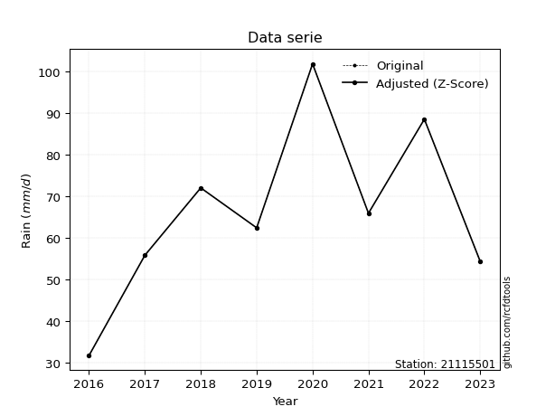</img>

</div>


> The initial value (value_initial) correspond to the initial obtained or null completed value, and value (value) is adjusted only when the initial value is outside the valid range (outlier) definite through the Z-Score value. If Z-Score is active, values out of range or outliers are replaced with the station mean value. A Z-Score (or standard score) measures how many standard deviations a data point is from the mean of a dataset, indicating its relative position; positive scores mean above the mean, negative mean below, and a score of zero is exactly at the mean, allowing for comparison of values from different distributions. It´s calculated using the formula $z=(x–μ)/σ$, where $x$ is the data point, $μ$ is the mean, and $σ$ is the standard deviation, helping identify outliers and understand probability.
>
> <sub>**Note**: In this study, "completing" (filling gaps in) and "extending" (forecasting or lengthening the historical record) rainfall data series are avoided for certain critical analyses because they introduce artificial bias and uncertainty, which can distort the statistics of rare events (extremes), alter day-to-day variability, and compromise the integrity and homogeneity of the original data. Some reasons against Completing/Extending rainfall data are: **Distortion of Extremes and Variability**: The primary issue is that most gap-filling or extension methods rely on averaging or regression with nearby stations, which inherently smooths the data. Rainfall is highly variable in space and time, with a large percentage of zero values and occasional large storms. Infilling methods often underestimate the highest values and overestimate the lowest (zero) values, which severely distorts analyses focused on flood frequency, drought severity, and intensity-duration-frequency (IDF) curves, **Loss of Data Homogeneity**: Infilled or extended data are synthetic estimates, not actual measurements. Combining these estimates with observed data can violate the assumption of data homogeneity, which requires that the data properties do not change over time. Inhomogeneity can lead to incorrect conclusions about long-term trends or changes in climate patterns, **Propagation of Errors**: Errors and biases from the original data (e.g., wind-induced undercatch, instrument errors, site changes) or the data used for imputation can propagate through the analysis, leading to unreliable hydrological models and inaccurate predictions, **Compromised Statistical Integrity**: For statistical analyses, especially those involving the frequency of events, using artificial data can introduce time bias or autocorrelation that doesn´t exist in reality, making it difficult to assess the true probability of events, **Difficulty in Validation**: It is difficult to accurately validate the quality of filled or extended data, especially for past periods where ground-truth measurements are unavailable. The reliability of imputation techniques heavily depends on the density of the surrounding station network and the complexity of the local topography.</sub>


### 4. Active continuous probability distributions from SciPy (80 of 104 available)

A Probability Density Function (PDF) describes the relative likelihood of a continuous random variable falling within a specific range, where the total area under its curve equals 1, and the area over any interval gives the actual probability for that range. Unlike discrete probabilities (like rolling a die), a PDF shows density, not direct probability for a single point (which is zero), with higher points indicating higher likelihood, often visualized as a bell curve for normal distributions.

A log of a probability density function (log-PDF) is simply the logarithm of the PDF´s value, denoted as $log(f(x))$, useful for converting multiplication of probabilities into addition, improving numerical stability with tiny numbers, and connecting to information theory concepts like entropy. Instead of dealing with very small probabilities (e.g., 0.000001), log-PDFs use negative numbers (e.g., $log(0.00001) ≈ -11.51$ that are easier for computers to handle, preventing underflow errors and simplifying complex calculations. In this study, each active probability distribution from SciPy is also evaluated in the $log$ form.

[scipy.stats](https://docs.scipy.org/doc/scipy/reference/stats.html) is a Python´s powerful submodule within the SciPy library for comprehensive statistical analysis, offering over 130 probability distributions (like Normal, Poisson, etc.), functions for descriptive stats (mean, variance), hypothesis testing (t-tests, chi-square), random variable generation, and statistical tests, making it essential for data science, modeling, and research. It provides tools to explore, model, and draw conclusions from data efficiently, working seamlessly with [NumPy](https://numpy.org/).

<div align="center">

|   id | p_dist           |   n_parameter | fit_method   | label                                                                       | active   | ref                                                                                                      |
|-----:|:-----------------|--------------:|:-------------|:----------------------------------------------------------------------------|:---------|:---------------------------------------------------------------------------------------------------------|
|    0 | alpha            |             3 | MLE          | Alpha                                                                       | True     | [:mortar_board:](https://docs.scipy.org/doc/scipy/reference/generated/scipy.stats.alpha.html)            |
|    1 | anglit           |             2 | MM           | Anglit                                                                      | True     | [:mortar_board:](https://docs.scipy.org/doc/scipy/reference/generated/scipy.stats.anglit.html)           |
|    2 | arcsine          |             2 | MM           | Arcsine                                                                     | True     | [:mortar_board:](https://docs.scipy.org/doc/scipy/reference/generated/scipy.stats.arcsine.html)          |
|    3 | argus            |             3 | MLE          | Argus                                                                       | True     | [:mortar_board:](https://docs.scipy.org/doc/scipy/reference/generated/scipy.stats.argus.html)            |
|    4 | beta             |             4 | MLE          | Beta                                                                        | True     | [:mortar_board:](https://docs.scipy.org/doc/scipy/reference/generated/scipy.stats.beta.html)             |
|    5 | betaprime        |             4 | MLE          | Beta prime                                                                  | True     | [:mortar_board:](https://docs.scipy.org/doc/scipy/reference/generated/scipy.stats.betaprime.html)        |
|    6 | bradford         |             3 | MLE          | Bradford                                                                    | True     | [:mortar_board:](https://docs.scipy.org/doc/scipy/reference/generated/scipy.stats.bradford.html)         |
|    7 | burr             |             4 | MLE          | Burr (Type III)                                                             | True     | [:mortar_board:](https://docs.scipy.org/doc/scipy/reference/generated/scipy.stats.burr.html)             |
|    8 | burr12           |             4 | MLE          | Burr (Type III) 12                                                          | True     | [:mortar_board:](https://docs.scipy.org/doc/scipy/reference/generated/scipy.stats.burr12.html)           |
|    9 | cosine           |             2 | MLE          | Cosine                                                                      | True     | [:mortar_board:](https://docs.scipy.org/doc/scipy/reference/generated/scipy.stats.cosine.html)           |
|   10 | crystalball      |             4 | MLE          | Crystalball                                                                 | True     | [:mortar_board:](https://docs.scipy.org/doc/scipy/reference/generated/scipy.stats.crystalball.html)      |
|   11 | dgamma           |             3 | MLE          | Double gamma                                                                | True     | [:mortar_board:](https://docs.scipy.org/doc/scipy/reference/generated/scipy.stats.dgamma.html)           |
|   12 | dweibull         |             3 | MLE          | Double Weibull                                                              | True     | [:mortar_board:](https://docs.scipy.org/doc/scipy/reference/generated/scipy.stats.dweibull.html)         |
|   13 | erlang           |             3 | MLE          | Erlang                                                                      | True     | [:mortar_board:](https://docs.scipy.org/doc/scipy/reference/generated/scipy.stats.erlang.html)           |
|   14 | exponnorm        |             3 | MLE          | Exponentially modified Normal                                               | True     | [:mortar_board:](https://docs.scipy.org/doc/scipy/reference/generated/scipy.stats.exponnorm.html)        |
|   15 | exponpow         |             3 | MLE          | Exponential power                                                           | True     | [:mortar_board:](https://docs.scipy.org/doc/scipy/reference/generated/scipy.stats.exponpow.html)         |
|   16 | exponweib        |             4 | MLE          | Exponentiated Weibull                                                       | True     | [:mortar_board:](https://docs.scipy.org/doc/scipy/reference/generated/scipy.stats.exponweib.html)        |
|   17 | f                |             4 | MLE          | F                                                                           | True     | [:mortar_board:](https://docs.scipy.org/doc/scipy/reference/generated/scipy.stats.f.html)                |
|   18 | fatiguelife      |             3 | MLE          | Fatigue-life (Birnbaum-Saunders)                                            | True     | [:mortar_board:](https://docs.scipy.org/doc/scipy/reference/generated/scipy.stats.fatiguelife.html)      |
|   19 | foldnorm         |             3 | MM           | Fold Normal                                                                 | True     | [:mortar_board:](https://docs.scipy.org/doc/scipy/reference/generated/scipy.stats.foldnorm.html)         |
|   20 | gamma            |             3 | MLE          | Gamma                                                                       | True     | [:mortar_board:](https://docs.scipy.org/doc/scipy/reference/generated/scipy.stats.gamma.html)            |
|   21 | gausshyper       |             6 | MLE          | Gauss hypergeometric                                                        | True     | [:mortar_board:](https://docs.scipy.org/doc/scipy/reference/generated/scipy.stats.gausshyper.html)       |
|   22 | genexpon         |             5 | MLE          | Generalized exponential                                                     | True     | [:mortar_board:](https://docs.scipy.org/doc/scipy/reference/generated/scipy.stats.genexpon.html)         |
|   23 | genextreme       |             3 | MLE          | Generalized exponential                                                     | True     | [:mortar_board:](https://docs.scipy.org/doc/scipy/reference/generated/scipy.stats.genextreme.html)       |
|   24 | gengamma         |             4 | MLE          | Generalized gamma                                                           | True     | [:mortar_board:](https://docs.scipy.org/doc/scipy/reference/generated/scipy.stats.gengamma.html)         |
|   25 | genhalflogistic  |             3 | MLE          | Generalized half-logistic                                                   | True     | [:mortar_board:](https://docs.scipy.org/doc/scipy/reference/generated/scipy.stats.genhalflogistic.html)  |
|   26 | genlogistic      |             3 | MLE          | Generalized logistic                                                        | True     | [:mortar_board:](https://docs.scipy.org/doc/scipy/reference/generated/scipy.stats.genlogistic.html)      |
|   27 | gennorm          |             3 | MLE          | Generalized Normal                                                          | True     | [:mortar_board:](https://docs.scipy.org/doc/scipy/reference/generated/scipy.stats.gennorm.html)          |
|   28 | genpareto        |             3 | MLE          | Generalized Pareto                                                          | True     | [:mortar_board:](https://docs.scipy.org/doc/scipy/reference/generated/scipy.stats.genpareto.html)        |
|   29 | gompertz         |             3 | MLE          | Gompertz (or truncated Gumbel)                                              | True     | [:mortar_board:](https://docs.scipy.org/doc/scipy/reference/generated/scipy.stats.gompertz.html)         |
|   30 | gumbel_l         |             2 | MM           | Gumbel Left Skew                                                            | True     | [:mortar_board:](https://docs.scipy.org/doc/scipy/reference/generated/scipy.stats.gumbel_l.html)         |
|   31 | gumbel_r         |             2 | MM           | Gumbel Right Skew                                                           | True     | [:mortar_board:](https://docs.scipy.org/doc/scipy/reference/generated/scipy.stats.gumbel_r.html)         |
|   32 | halfgennorm      |             3 | MLE          | Upper half of a generalized normal                                          | True     | [:mortar_board:](https://docs.scipy.org/doc/scipy/reference/generated/scipy.stats.halfgennorm.html)      |
|   33 | halflogistic     |             2 | MM           | Half-logistic                                                               | True     | [:mortar_board:](https://docs.scipy.org/doc/scipy/reference/generated/scipy.stats.halflogistic.html)     |
|   34 | halfnorm         |             2 | MM           | Half Normal                                                                 | True     | [:mortar_board:](https://docs.scipy.org/doc/scipy/reference/generated/scipy.stats.halfnorm.html)         |
|   35 | hypsecant        |             2 | MM           | hyperbolic secant                                                           | True     | [:mortar_board:](https://docs.scipy.org/doc/scipy/reference/generated/scipy.stats.hypsecant.html)        |
|   36 | invgamma         |             3 | MLE          | Inverted gamma                                                              | True     | [:mortar_board:](https://docs.scipy.org/doc/scipy/reference/generated/scipy.stats.invgamma.html)         |
|   37 | invgauss         |             3 | MLE          | Inverse Gaussian                                                            | True     | [:mortar_board:](https://docs.scipy.org/doc/scipy/reference/generated/scipy.stats.invgauss.html)         |
|   38 | invweibull       |             3 | MLE          | Inverted Weibull                                                            | True     | [:mortar_board:](https://docs.scipy.org/doc/scipy/reference/generated/scipy.stats.invweibull.html)       |
|   39 | johnsonsb        |             4 | MLE          | Johnson SB                                                                  | True     | [:mortar_board:](https://docs.scipy.org/doc/scipy/reference/generated/scipy.stats.johnsonsb.html)        |
|   40 | johnsonsu        |             4 | MLE          | Johnson Su                                                                  | True     | [:mortar_board:](https://docs.scipy.org/doc/scipy/reference/generated/scipy.stats.johnsonsu.html)        |
|   41 | kappa3           |             3 | MLE          | Kappa 3                                                                     | True     | [:mortar_board:](https://docs.scipy.org/doc/scipy/reference/generated/scipy.stats.kappa3.html)           |
|   42 | kappa4           |             4 | MLE          | Kappa 4                                                                     | True     | [:mortar_board:](https://docs.scipy.org/doc/scipy/reference/generated/scipy.stats.kappa4.html)           |
|   43 | ksone            |             3 | MLE          | Kolmogorov-Smirnov one-sided test statistic distribution                    | True     | [:mortar_board:](https://docs.scipy.org/doc/scipy/reference/generated/scipy.stats.ksone.html)            |
|   44 | kstwobign        |             2 | MLE          | Limiting distribution of scaled Kolmogorov-Smirnov two-sided test statistic | True     | [:mortar_board:](https://docs.scipy.org/doc/scipy/reference/generated/scipy.stats.kstwobign.html)        |
|   45 | laplace          |             2 | MM           | Laplace                                                                     | True     | [:mortar_board:](https://docs.scipy.org/doc/scipy/reference/generated/scipy.stats.laplace.html)          |
|   46 | levy_l           |             2 | MLE          | Left-skewed Levy                                                            | True     | [:mortar_board:](https://docs.scipy.org/doc/scipy/reference/generated/scipy.stats.levy_l.html)           |
|   47 | loggamma         |             3 | MLE          | Log gamma                                                                   | True     | [:mortar_board:](https://docs.scipy.org/doc/scipy/reference/generated/scipy.stats.loggamma.html)         |
|   48 | logistic         |             2 | MM           | Logistic (or Sech-squared)                                                  | True     | [:mortar_board:](https://docs.scipy.org/doc/scipy/reference/generated/scipy.stats.logistic.html)         |
|   49 | loglaplace       |             3 | MLE          | Log-Laplace                                                                 | True     | [:mortar_board:](https://docs.scipy.org/doc/scipy/reference/generated/scipy.stats.loglaplace.html)       |
|   50 | lomax            |             3 | MLE          | Lomax (Pareto of the second kind)                                           | True     | [:mortar_board:](https://docs.scipy.org/doc/scipy/reference/generated/scipy.stats.lomax.html)            |
|   51 | maxwell          |             2 | MM           | Maxwell                                                                     | True     | [:mortar_board:](https://docs.scipy.org/doc/scipy/reference/generated/scipy.stats.maxwell.html)          |
|   52 | mielke           |             4 | MLE          | Mielke Beta-Kappa / Dagum                                                   | True     | [:mortar_board:](https://docs.scipy.org/doc/scipy/reference/generated/scipy.stats.mielke.html)           |
|   53 | moyal            |             2 | MM           | Moyal                                                                       | True     | [:mortar_board:](https://docs.scipy.org/doc/scipy/reference/generated/scipy.stats.moyal.html)            |
|   54 | nakagami         |             3 | MLE          | Nakagami                                                                    | True     | [:mortar_board:](https://docs.scipy.org/doc/scipy/reference/generated/scipy.stats.nakagami.html)         |
|   55 | ncf              |             5 | MLE          | Non-central F distribution                                                  | True     | [:mortar_board:](https://docs.scipy.org/doc/scipy/reference/generated/scipy.stats.ncf.html)              |
|   56 | nct              |             4 | MLE          | Non-central Student’s t                                                     | True     | [:mortar_board:](https://docs.scipy.org/doc/scipy/reference/generated/scipy.stats.nct.html)              |
|   57 | norm             |             2 | MM           | Normal                                                                      | True     | [:mortar_board:](https://docs.scipy.org/doc/scipy/reference/generated/scipy.stats.norm.html)             |
|   58 | pearson3         |             3 | MM           | Pearson type III                                                            | True     | [:mortar_board:](https://docs.scipy.org/doc/scipy/reference/generated/scipy.stats.pearson3.html)         |
|   59 | powerlaw         |             3 | MLE          | Power-function                                                              | True     | [:mortar_board:](https://docs.scipy.org/doc/scipy/reference/generated/scipy.stats.powerlaw.html)         |
|   60 | rayleigh         |             2 | MM           | Rayleigh                                                                    | True     | [:mortar_board:](https://docs.scipy.org/doc/scipy/reference/generated/scipy.stats.rayleigh.html)         |
|   61 | rdist            |             3 | MLE          | R-distributed (symmetric beta)                                              | True     | [:mortar_board:](https://docs.scipy.org/doc/scipy/reference/generated/scipy.stats.rdist.html)            |
|   62 | rice             |             3 | MLE          | Rice                                                                        | True     | [:mortar_board:](https://docs.scipy.org/doc/scipy/reference/generated/scipy.stats.rice.html)             |
|   63 | semicircular     |             2 | MM           | Semicircular                                                                | True     | [:mortar_board:](https://docs.scipy.org/doc/scipy/reference/generated/scipy.stats.semicircular.html)     |
|   64 | skewnorm         |             3 | MLE          | Skew normal                                                                 | True     | [:mortar_board:](https://docs.scipy.org/doc/scipy/reference/generated/scipy.stats.skewnorm.html)         |
|   65 | t                |             3 | MLE          | Student’s t                                                                 | True     | [:mortar_board:](https://docs.scipy.org/doc/scipy/reference/generated/scipy.stats.t.html)                |
|   66 | trapezoid        |             4 | MLE          | Trapezoid                                                                   | True     | [:mortar_board:](https://docs.scipy.org/doc/scipy/reference/generated/scipy.stats.trapezoid.html)        |
|   67 | triang           |             3 | MLE          | Triangular                                                                  | True     | [:mortar_board:](https://docs.scipy.org/doc/scipy/reference/generated/scipy.stats.triang.html)           |
|   68 | truncexpon       |             3 | MLE          | Truncated exponential                                                       | True     | [:mortar_board:](https://docs.scipy.org/doc/scipy/reference/generated/scipy.stats.truncexpon.html)       |
|   69 | truncnorm        |             4 | MLE          | Truncated normal                                                            | True     | [:mortar_board:](https://docs.scipy.org/doc/scipy/reference/generated/scipy.stats.truncnorm.html)        |
|   70 | truncpareto      |             4 | MLE          | Upper truncated Pareto                                                      | True     | [:mortar_board:](https://docs.scipy.org/doc/scipy/reference/generated/scipy.stats.truncpareto.html)      |
|   71 | truncweibull_min |             5 | MLE          | Doubly truncated Weibull minimum                                            | True     | [:mortar_board:](https://docs.scipy.org/doc/scipy/reference/generated/scipy.stats.truncweibull_min.html) |
|   72 | tukeylambda      |             3 | MLE          | Tukey-Lamdba                                                                | True     | [:mortar_board:](https://docs.scipy.org/doc/scipy/reference/generated/scipy.stats.tukeylambda.html)      |
|   73 | uniform          |             2 | MLE          | Uniform                                                                     | True     | [:mortar_board:](https://docs.scipy.org/doc/scipy/reference/generated/scipy.stats.uniform.html)          |
|   74 | vonmises         |             3 | MLE          | Von Mises                                                                   | True     | [:mortar_board:](https://docs.scipy.org/doc/scipy/reference/generated/scipy.stats.vonmises.html)         |
|   75 | vonmises_line    |             3 | MLE          | Von Mises line                                                              | True     | [:mortar_board:](https://docs.scipy.org/doc/scipy/reference/generated/scipy.stats.vonmises_line.html)    |
|   76 | wald             |             2 | MM           | Wald                                                                        | True     | [:mortar_board:](https://docs.scipy.org/doc/scipy/reference/generated/scipy.stats.wald.html)             |
|   77 | weibull_max      |             3 | MLE          | Weibull maximum                                                             | True     | [:mortar_board:](https://docs.scipy.org/doc/scipy/reference/generated/scipy.stats.weibull_max.html)      |
|   78 | weibull_min      |             3 | MLE          | Weibull minimum                                                             | True     | [:mortar_board:](https://docs.scipy.org/doc/scipy/reference/generated/scipy.stats.weibull_min.html)      |
|   79 | wrapcauchy       |             3 | MLE          | Wrapped  Cauchy                                                             | True     | [:mortar_board:](https://docs.scipy.org/doc/scipy/reference/generated/scipy.stats.wrapcauchy.html)       |

</div>

> **n_parameter:** # arguments & localization & scale.
>
> **Fit methods:** (MLE) maximum likelihood, (MM) L-moments.
>
>**Inactive** (With the only purpose of prevent loops, zero divisions, infinite values, over high estimated values or horizontal trending for recurrence intervals estimations, the follow distributions were disabled.)**:** lognorm, norminvgauss, powernorm, powerlognorm, cauchy, halfcauchy, foldcauchy, skewcauchy, chi2, expon, fisk, genhyperbolic, geninvgauss, gibrat, kstwo, laplace_asymmetric, levy, levy_stable, ncx2, pareto, rel_breitwigner, recipinvgauss, studentized_range, loguniform, 


## B. Probability (PDF) vs. Empirical (EDF) distributions functions

A continuous probability distribution (CPD) describes probabilities for variables that can take any value within a range (like rain any time), unlike discrete variables with specific outcomes (like temperature). It uses a Probability Density Function (PDF), a curve where the total area under it equals 1, and the probability of the variable falling within an interval (a to b) is found by calculating the area under the curve between those points. A key feature is that the probability of hitting any single exact value is zero, so probabilities are always expressed for ranges, e.g., $P(a ≤ X ≤ b)$.

<div align="center">

Distributions parameters from station values
|     |   station | p_dist              |   n |             loc |           scale | shape                  | shape1                 | shape2                 | shape3             |
|----:|----------:|:--------------------|----:|----------------:|----------------:|:-----------------------|:-----------------------|:-----------------------|:-------------------|
|   0 |  21115501 | alpha               |   8 |  -288.001       |  6251.63        | 17.695543105201793     |                        |                        |                    |
|   1 |  21115501 | anglit              |   8 |    66.55        |    58.9802      |                        |                        |                        |                    |
|   2 |  21115501 | arcsine             |   8 |    38.0375      |    57.0251      |                        |                        |                        |                    |
|   3 |  21115501 | argus               |   8 |    18.0054      |    87.1518      | 4.357028289465794e-06  |                        |                        |                    |
|   4 |  21115501 | beta                |   8 |    24.8581      |    76.9419      | 0.957075678281861      | 0.7510992834388562     |                        |                    |
|   5 |  21115501 | betaprime           |   8 |  -125.927       | 14973.2         | 92.09172486191326      | 7165.000965986096      |                        |                    |
|   6 |  21115501 | bradford            |   8 |    31.7         |    70.1001      | 0.9227038419392077     |                        |                        |                    |
|   7 |  21115501 | burr                |   8 |    -0.187802    |    74.6609      | 7.133826515701731      | 0.5516801678598964     |                        |                    |
|   8 |  21115501 | burr12              |   8 |    -2.91626     |    34.4037      | 637.6687743789191      | 0.0023885954923550732  |                        |                    |
|   9 |  21115501 | cosine              |   8 |    66.8131      |    17.2758      |                        |                        |                        |                    |
|  10 |  21115501 | crystalball         |   8 |    66.55        |    20.1614      | 5254.167758644642      | 87.64590176101632      |                        |                    |
|  11 |  21115501 | dgamma              |   8 |    64.2317      |    13.7291      | 1.128989898838769      |                        |                        |                    |
|  12 |  21115501 | dweibull            |   8 |    64.3078      |    16.0196      | 1.0923958702848355     |                        |                        |                    |
|  13 |  21115501 | erlang              |   8 |  -136.507       |     2.00455     | 101.29863158321928     |                        |                        |                    |
|  14 |  21115501 | exponnorm           |   8 |    62.1696      |    19.6812      | 0.2225669958294273     |                        |                        |                    |
|  15 |  21115501 | exponpow            |   8 |    31.7         |     1.47091     | 0.0790412792726301     |                        |                        |                    |
|  16 |  21115501 | exponweib           |   8 |    31.7         |     1.20541     | 1.2240987879979541     | 0.22323877702844827    |                        |                    |
|  17 |  21115501 | f                   |   8 |  -123.056       |   189.6         | 176.9202583365592      | 64034.91850634171      |                        |                    |
|  18 |  21115501 | fatiguelife         |   8 |    31.7         |     4.59858e-06 | 2400.2083192928085     |                        |                        |                    |
|  19 |  21115501 | foldnorm            |   8 |    69.8945      |     1.27304     | 1.4046993671392507e-08 |                        |                        |                    |
|  20 |  21115501 | gamma               |   8 |  -135.62        |     2.01299     | 100.42489341469434     |                        |                        |                    |
|  21 |  21115501 | gausshyper          |   8 |    30.3697      |    71.4303      | 1.2583725049027505     | 0.8880214408586814     | 0.9071409066698838     | 0.7823003439951032 |
|  22 |  21115501 | genexpon            |   8 |    31.7         |     1.40706     | 0.040376175488074095   | 1.8693461086419356e-08 | 0.8354598516442571     |                    |
|  23 |  21115501 | genextreme          |   8 |    32.4196      |     4.39324     | -6.105286173917069     |                        |                        |                    |
|  24 |  21115501 | gengamma            |   8 |    31.7         |     1.14626     | 1.2675103042736433     | 0.24079411028547493    |                        |                    |
|  25 |  21115501 | genhalflogistic     |   8 |    25.2007      |    79.5211      | 1.0381437191206087     |                        |                        |                    |
|  26 |  21115501 | genlogistic         |   8 |    57.1487      |    13.2063      | 1.616592912969601      |                        |                        |                    |
|  27 |  21115501 | gennorm             |   8 |    67.0723      |    30.4698      | 2.304699566545991      |                        |                        |                    |
|  28 |  21115501 | genpareto           |   8 |    -0.959819    |   138.951       | -1.3521958963776022    |                        |                        |                    |
|  29 |  21115501 | gompertz            |   8 |  -121.79        |    19.6191      | 4.023001832327267e-05  |                        |                        |                    |
|  30 |  21115501 | gumbel_l            |   8 |    75.6237      |    15.7198      |                        |                        |                        |                    |
|  31 |  21115501 | gumbel_r            |   8 |    57.4763      |    15.7198      |                        |                        |                        |                    |
|  32 |  21115501 | halfgennorm         |   8 |    31.7         |     1.31199     | 0.3524444534492562     |                        |                        |                    |
|  33 |  21115501 | halflogistic        |   8 |    42.6541      |    17.2373      |                        |                        |                        |                    |
|  34 |  21115501 | halfnorm            |   8 |    39.8642      |    33.4457      |                        |                        |                        |                    |
|  35 |  21115501 | hypsecant           |   8 |    66.55        |    12.8352      |                        |                        |                        |                    |
|  36 |  21115501 | invgamma            |   8 |  -146.989       | 23821.6         | 112.6253950786978      |                        |                        |                    |
|  37 |  21115501 | invgauss            |   8 |   -47.497       |  3313.24        | 0.03436746343642208    |                        |                        |                    |
|  38 |  21115501 | invweibull          |   8 |    31.7         |     1.3827      | 0.06124856637586795    |                        |                        |                    |
|  39 |  21115501 | johnsonsb           |   8 |    31.6964      |    70.1036      | -0.3224029873128679    | 0.1284736256245811     |                        |                    |
|  40 |  21115501 | johnsonsu           |   8 |  -140.618       |   153.232       | -14.163128085128507    | 12.790774564644074     |                        |                    |
|  41 |  21115501 | kappa3              |   8 |    31.7         |    48.5845      | 7.557988323597925      |                        |                        |                    |
|  42 |  21115501 | kappa4              |   8 |    24.9971      |    78.5636      | 1.0933719725058468     | 1.0213219744464124     |                        |                    |
|  43 |  21115501 | ksone               |   8 |    24.69        |    84.12        | 1.0                    |                        |                        |                    |
|  44 |  21115501 | kstwobign           |   8 |   -10.7828      |    88.7129      |                        |                        |                        |                    |
|  45 |  21115501 | laplace             |   8 |    66.55        |    14.2563      |                        |                        |                        |                    |
|  46 |  21115501 | levy_l              |   8 |   105.499       |    17.3652      |                        |                        |                        |                    |
|  47 |  21115501 | loggamma            |   8 | -4091.36        |   610.476       | 908.1551791461518      |                        |                        |                    |
|  48 |  21115501 | logistic            |   8 |    66.55        |    11.1156      |                        |                        |                        |                    |
|  49 |  21115501 | loglaplace          |   8 |    -0.175526    |    66.0755      | 4.084266349594097      |                        |                        |                    |
|  50 |  21115501 | lomax               |   8 |    31.7         |     7.28299e+07 | 2005578.387502708      |                        |                        |                    |
|  51 |  21115501 | maxwell             |   8 |    18.7759      |    29.938       |                        |                        |                        |                    |
|  52 |  21115501 | mielke              |   8 |    -0.743522    |    75.0884      | 3.9887234670200256     | 7.169510493499692      |                        |                    |
|  53 |  21115501 | moyal               |   8 |    55.0204      |     9.07582     |                        |                        |                        |                    |
|  54 |  21115501 | nakagami            |   8 |    54.3         |    26.5155      | 0.27929455892640803    |                        |                        |                    |
|  55 |  21115501 | ncf                 |   8 |    -3.36717     |    78.4027      | 6.3140814414577955     | 4843.280145884432      | 1.4173767878619564e-09 |                    |
|  56 |  21115501 | nct                 |   8 |   -91.0378      |    17.5683      | 136.00902924644583     | 8.91499778424356       |                        |                    |
|  57 |  21115501 | norm                |   8 |    66.55        |    20.1614      |                        |                        |                        |                    |
|  58 |  21115501 | pearson3            |   8 |    66.55        |    20.1614      | 0.13816929205950312    |                        |                        |                    |
|  59 |  21115501 | powerlaw            |   8 |    31.7         |    70.1         | 0.1903493526124939     |                        |                        |                    |
|  60 |  21115501 | rayleigh            |   8 |    27.98        |    30.7744      |                        |                        |                        |                    |
|  61 |  21115501 | rdist               |   8 |    27.0424      |    38.8576      | 1.0570776020780883     |                        |                        |                    |
|  62 |  21115501 | rice                |   8 |    21.6527      |    22.7925      | 1.6317698999311667     |                        |                        |                    |
|  63 |  21115501 | semicircular        |   8 |    66.55        |    40.3228      |                        |                        |                        |                    |
|  64 |  21115501 | skewnorm            |   8 |    49.821       |    26.1981      | 1.3250117346364        |                        |                        |                    |
|  65 |  21115501 | t                   |   8 |    66.5507      |    20.1636      | 1228926.9606831528     |                        |                        |                    |
|  66 |  21115501 | trapezoid           |   8 |    24.69        |    84.12        | 1.0                    | 1.0                    |                        |                    |
|  67 |  21115501 | triang              |   8 |    12.5444      |    89.2556      | 0.9999999999946791     |                        |                        |                    |
|  68 |  21115501 | truncexpon          |   8 |    31.7         |    86.8819      | 0.8068427258638871     |                        |                        |                    |
|  69 |  21115501 | truncnorm           |   8 |    66.55        |    20.1614      | -650.0574253866059     | 602.6099522037232      |                        |                    |
|  70 |  21115501 | truncpareto         |   8 |    31.6873      |     0.0126511   | 0.1432789762065107     | 5542.0252467482915     |                        |                    |
|  71 |  21115501 | truncweibull_min    |   8 |    31.5665      |    98.1138      | 0.8867076573956647     | 0.0013608203008922653  | 0.7158373578800259     |                    |
|  72 |  21115501 | tukeylambda         |   8 |    51.777       |    21.6313      | 1.0696361206741636     |                        |                        |                    |
|  73 |  21115501 | uniform             |   8 |    31.7         |    70.1         |                        |                        |                        |                    |
|  74 |  21115501 | vonmises            |   8 |     0.165122    |     1           | 0.2988795995180765     |                        |                        |                    |
|  75 |  21115501 | vonmises_line       |   8 |    66.7461      |    11.158       | 0.3671287613204943     |                        |                        |                    |
|  76 |  21115501 | wald                |   8 |    46.3887      |    20.1614      |                        |                        |                        |                    |
|  77 |  21115501 | weibull_max         |   8 |   101.8         |     1.52243     | 0.22023259381031057    |                        |                        |                    |
|  78 |  21115501 | weibull_min         |   8 |    16.1428      |    56.6774      | 2.7153349141210374     |                        |                        |                    |
|  79 |  21115501 | wrapcauchy          |   8 |    30.2437      |    11.3885      | 7.120138024922066e-05  |                        |                        |                    |
|  80 |  21115501 | logalpha            |   8 |    -5.30286     |   261.978       | 27.783526511812767     |                        |                        |                    |
|  81 |  21115501 | loganglit           |   8 |     4.14712     |     0.967011    |                        |                        |                        |                    |
|  82 |  21115501 | logarcsine          |   8 |     3.67965     |     0.934943    |                        |                        |                        |                    |
|  83 |  21115501 | logargus            |   8 |     3.22349     |     1.44304     | 1.3266654849875827     |                        |                        |                    |
|  84 |  21115501 | logbeta             |   8 |     2.36464     |     2.25837     | 3.980674182775334      | 0.9597733851315667     |                        |                    |
|  85 |  21115501 | logbetaprime        |   8 |    -4.80203     |    57.805       | 822.2783560600881      | 5312.794172418184      |                        |                    |
|  86 |  21115501 | logbradford         |   8 |     3.45631     |     1.1667      | 1.032115839862917      |                        |                        |                    |
|  87 |  21115501 | logburr             |   8 |    -0.157284    |     4.50874     | 33.997206601858245     | 0.44777035306627244    |                        |                    |
|  88 |  21115501 | logburr12           |   8 |    -0.331601    |     6.49569     | 16.56829632876591      | 278.98281937256127     |                        |                    |
|  89 |  21115501 | logcosine           |   8 |     4.11014     |     0.292156    |                        |                        |                        |                    |
|  90 |  21115501 | logcrystalball      |   8 |     4.21123     |     0.25493     | 0.9756839180762615     | 70.95737464948995      |                        |                    |
|  91 |  21115501 | logdgamma           |   8 |     4.1611      |     0.222982    | 1.1013685479975235     |                        |                        |                    |
|  92 |  21115501 | logdweibull         |   8 |     4.16112     |     0.251345    | 1.0601295448137624     |                        |                        |                    |
|  93 |  21115501 | logerlang           |   8 |    -1.85315     |     0.0186776   | 321.0264328187593      |                        |                        |                    |
|  94 |  21115501 | logexponnorm        |   8 |     4.14688     |     0.330556    | 0.0007391969266159607  |                        |                        |                    |
|  95 |  21115501 | logexponpow         |   8 |     2.90996     |     1.54365     | 3.3912482550154524     |                        |                        |                    |
|  96 |  21115501 | logexponweib        |   8 |     3.39669     |     1.23432     | 0.051079604771442744   | 26.035219151086693     |                        |                    |
|  97 |  21115501 | logf                |   8 |  -167.843       |   171.99        | 1257825.6919412422     | 950310.4140185593      |                        |                    |
|  98 |  21115501 | logfatiguelife      |   8 |  -131.264       |   135.41        | 0.0024362229589791297  |                        |                        |                    |
|  99 |  21115501 | logfoldnorm         |   8 |     3.64298     |     0.378788    | 1.225525131711665      |                        |                        |                    |
| 100 |  21115501 | loggamma            |   8 |    -1.32117     |     0.0207198   | 264.0252742857832      |                        |                        |                    |
| 101 |  21115501 | loggausshyper       |   8 |     3.44242     |     1.18059     | 1.3887713228874676     | 0.7160575970135199     | 1.2776227242053353     | 0.9293262476406094 |
| 102 |  21115501 | loggenexpon         |   8 |     3.45563     |     0.00554972  | 0.0023289558048176628  | 3.365602393580798      | 2.2054103236595883e-05 |                    |
| 103 |  21115501 | loggenextreme       |   8 |     4.08913     |     0.372943    | 0.6307475872243168     |                        |                        |                    |
| 104 |  21115501 | loggengamma         |   8 |    -1.21712     |     0.058346    | 186.14336099805973     | 1.1561374939398554     |                        |                    |
| 105 |  21115501 | loggenhalflogistic  |   8 |     3.41409     |     1.32602     | 1.0968636827000926     |                        |                        |                    |
| 106 |  21115501 | loggenlogistic      |   8 |     4.31103     |     0.140409    | 0.5500740339116934     |                        |                        |                    |
| 107 |  21115501 | loggennorm          |   8 |     4.16099     |     0.292829    | 1.148094531265619      |                        |                        |                    |
| 108 |  21115501 | loggenpareto        |   8 |    -0.00968727  |    11.4189      | -2.464855181594395     |                        |                        |                    |
| 109 |  21115501 | loggompertz         |   8 |     3.45632     |     1.00107     | 0.9890667739079801     |                        |                        |                    |
| 110 |  21115501 | loggumbel_l         |   8 |     4.29589     |     0.257734    |                        |                        |                        |                    |
| 111 |  21115501 | loggumbel_r         |   8 |     3.99836     |     0.257734    |                        |                        |                        |                    |
| 112 |  21115501 | loghalfgennorm      |   8 |     3.45631     |     1.16714     | 22454.35718071516      |                        |                        |                    |
| 113 |  21115501 | loghalflogistic     |   8 |     3.75529     |     0.282646    |                        |                        |                        |                    |
| 114 |  21115501 | loghalfnorm         |   8 |     3.70958     |     0.548381    |                        |                        |                        |                    |
| 115 |  21115501 | loghypsecant        |   8 |     4.14712     |     0.210439    |                        |                        |                        |                    |
| 116 |  21115501 | loginvgamma         |   8 |    -2.49756     |  2522.62        | 380.5319577687959      |                        |                        |                    |
| 117 |  21115501 | loginvgauss         |   8 |     0.672088    |   338.705       | 0.010245719433825302   |                        |                        |                    |
| 118 |  21115501 | loginvweibull       |   8 |    -2.98637e+07 |     2.98637e+07 | 83076772.45013495      |                        |                        |                    |
| 119 |  21115501 | logjohnsonsb        |   8 |     3.45624     |     1.16677     | 0.5503376199136207     | 0.09889940981567376    |                        |                    |
| 120 |  21115501 | logjohnsonsu        |   8 |     5.29959     |     0.129752    | 10.01868395719644      | 3.527016432536147      |                        |                    |
| 121 |  21115501 | logkappa3           |   8 |     3.45632     |     1.16634     | 6883.06999822787       |                        |                        |                    |
| 122 |  21115501 | logkappa4           |   8 |     3.42143     |     1.30103     | 1.0174539318461768     | 1.082763061548102      |                        |                    |
| 123 |  21115501 | logksone            |   8 |     3.33965     |     1.40003     | 1.0                    |                        |                        |                    |
| 124 |  21115501 | logkstwobign        |   8 |     2.66325     |     1.70044     |                        |                        |                        |                    |
| 125 |  21115501 | loglaplace          |   8 |     4.14712     |     0.233739    |                        |                        |                        |                    |
| 126 |  21115501 | loglevy_l           |   8 |     4.6682      |     0.211107    |                        |                        |                        |                    |
| 127 |  21115501 | logloggamma         |   8 |     4.09631     |     0.363807    | 1.6159725640103213     |                        |                        |                    |
| 128 |  21115501 | loglogistic         |   8 |     4.14712     |     0.182246    |                        |                        |                        |                    |
| 129 |  21115501 | logloglaplace       |   8 |    -0.0231367   |     4.1567      | 16.73567445481285      |                        |                        |                    |
| 130 |  21115501 | loglomax            |   8 |     3.45632     |   386.743       | 560.4127581686785      |                        |                        |                    |
| 131 |  21115501 | logmaxwell          |   8 |     3.36384     |     0.490849    |                        |                        |                        |                    |
| 132 |  21115501 | logmielke           |   8 |    -0.0228816   |     4.37565     | 14.699561805220814     | 33.04955772496316      |                        |                    |
| 133 |  21115501 | logmoyal            |   8 |     3.95809     |     0.148803    |                        |                        |                        |                    |
| 134 |  21115501 | lognakagami         |   8 |     3.99452     |     0.43853     | 0.07794904383576126    |                        |                        |                    |
| 135 |  21115501 | logncf              |   8 |    -3.46565     |     7.61014     | 664.0679567140885      | 597.5106257561033      | 1.5310790876778476e-05 |                    |
| 136 |  21115501 | lognct              |   8 |   -13.1627      |     0.275586    | 4178.270910359877      | 62.796501182068994     |                        |                    |
| 137 |  21115501 | lognorm             |   8 |     4.14712     |     0.330557    |                        |                        |                        |                    |
| 138 |  21115501 | logpearson3         |   8 |     4.14712     |     0.330557    | -0.6481204054438173    |                        |                        |                    |
| 139 |  21115501 | logpowerlaw         |   8 |     3.45632     |     1.16669     | 0.20783011788051484    |                        |                        |                    |
| 140 |  21115501 | lograyleigh         |   8 |     3.51476     |     0.504557    |                        |                        |                        |                    |
| 141 |  21115501 | logrdist            |   8 |     4.30665     |     0.316356    | 1.33301584059498       |                        |                        |                    |
| 142 |  21115501 | logrice             |   8 |     3.21008     |     0.350863    | 2.45361247756545       |                        |                        |                    |
| 143 |  21115501 | logsemicircular     |   8 |     4.14713     |     0.661116    |                        |                        |                        |                    |
| 144 |  21115501 | logskewnorm         |   8 |     4.5138      |     0.493675    | -2.620847484105885     |                        |                        |                    |
| 145 |  21115501 | logt                |   8 |     4.17256     |     0.276401    | 5.887061429095263      |                        |                        |                    |
| 146 |  21115501 | logtrapezoid        |   8 |     3.33965     |     1.40003     | 1.0                    | 1.0                    |                        |                    |
| 147 |  21115501 | logtriang           |   8 |     3.22358     |     1.39944     | 0.9999999924257517     |                        |                        |                    |
| 148 |  21115501 | logtruncexpon       |   8 |     3.45631     |     1.43709     | 0.8118548309566855     |                        |                        |                    |
| 149 |  21115501 | logtruncnorm        |   8 |    -0.112705    |     1.03956     | 3.9509127981570353     | 4.55548089592508       |                        |                    |
| 150 |  21115501 | logtruncpareto      |   8 |     3.45606     |     0.00026134  | 0.14326331450603955    | 4465.279733377977      |                        |                    |
| 151 |  21115501 | logtruncweibull_min |   8 |     3.39787     |     1.5064      | 1.5232649180259752     | 3.2221540553155746e-05 | 0.8132914854074753     |                    |
| 152 |  21115501 | logtukeylambda      |   8 |     4.30877     |     0.463573    | 1.4752044770505082     |                        |                        |                    |
| 153 |  21115501 | loguniform          |   8 |     3.45632     |     1.16669     |                        |                        |                        |                    |
| 154 |  21115501 | logvonmises         |   8 |    -2.13208     |     1           | 9.685543274171648      |                        |                        |                    |
| 155 |  21115501 | logvonmises_line    |   8 |     4.03832     |     0.186113    | 0.38739924754083865    |                        |                        |                    |
| 156 |  21115501 | logwald             |   8 |     3.81655     |     0.330575    |                        |                        |                        |                    |
| 157 |  21115501 | logweibull_max      |   8 |     4.6804      |     0.591239    | 1.5853701508910407     |                        |                        |                    |
| 158 |  21115501 | logweibull_min      |   8 |     0.633982    |     3.65656     | 13.01991653353884      |                        |                        |                    |
| 159 |  21115501 | logwrapcauchy       |   8 |     3.45632     |     0.185685    | 0.5                    |                        |                        |                    |

</div>

> **loc** (Location parameter): This shifts the distribution along the x-axis. For many common distributions, like the normal (Gaussian) distribution, loc represents the mean $μ$. For others, like the uniform distribution, it might represent the minimum value, or for the beta distribution, the left end of the support interval.
>
> **scale** (Scale parameter): This determines the width or spread of the distribution. For the normal distribution, scale represents the standard deviation $σ$. For a uniform distribution, it defines the length of the interval (from $loc$ to $loc + scale$).
>
> **shape** (Shape parameters): Refers to parameters that define the specific form of a probability distribution, distinct from its location (loc) and scale (scale). These parameters are required arguments for most distribution functions. For example, a normal (Gaussian) distribution is fully defined by its location (mean) and scale (standard deviation), so it has no specific shape parameters beyond loc and scale. However, other distributions have intrinsic properties that need specification, as Gamma distribution that takes a shape parameter, often named $a$ or $alpha$.


### 0. Cumulative distribution values - CDF (160 evaluated)

Cumulative Distribution Function (CDF), denoted as $F$<sub>$X$</sub>$(x)$, is a function that gives the probability that a random variable $X$ will take a value less than or equal to a specific value, $x$ (i.e., $(P(X≥x)$. It essentially "accumulates" probabilities from a given point up to the far right (positive infinity), providing a complete picture of the distribution´s probabilities for both discrete (like rain) and continuous (like temperature) variables, helping to find probabilities over ranges or above certain values. Each station is evaluated separately ordering the $x$ values ascending, calculating the CDF and PDF values for the activated distributions and their logarithmic forms.

<div align="center">

CDF ordered by x ascending and calculating $log(f(x))$ separately
|   id |   Station |   date |     x |   count |   mean |     std |     zscore |   Value_initial |   station |   m |     alpha |   alpha_pdf |    anglit |   anglit_pdf |   arcsine |   arcsine_pdf |     argus |   argus_pdf |      beta |   beta_pdf |   betaprime |   betaprime_pdf |    bradford |   bradford_pdf |     burr |   burr_pdf |     burr12 |   burr12_pdf |    cosine |   cosine_pdf |   crystalball |   crystalball_pdf |    dgamma |   dgamma_pdf |   dweibull |   dweibull_pdf |    erlang |   erlang_pdf |   exponnorm |   exponnorm_pdf |   exponpow |   exponpow_pdf |   exponweib |   exponweib_pdf |         f |      f_pdf |   fatiguelife |   fatiguelife_pdf |   foldnorm |   foldnorm_pdf |    gamma |   gamma_pdf |   gausshyper |   gausshyper_pdf |    genexpon |   genexpon_pdf |   genextreme |   genextreme_pdf |    gengamma |   gengamma_pdf |   genhalflogistic |   genhalflogistic_pdf |   genlogistic |   genlogistic_pdf |   gennorm |   gennorm_pdf |   genpareto |   genpareto_pdf |   gompertz |   gompertz_pdf |   gumbel_l |   gumbel_l_pdf |   gumbel_r |   gumbel_r_pdf |   halfgennorm |   halfgennorm_pdf |   halflogistic |   halflogistic_pdf |   halfnorm |   halfnorm_pdf |   hypsecant |   hypsecant_pdf |   invgamma |   invgamma_pdf |   invgauss |   invgauss_pdf |   invweibull |   invweibull_pdf |   johnsonsb |   johnsonsb_pdf |   johnsonsu |   johnsonsu_pdf |      kappa3 |   kappa3_pdf |      kappa4 |   kappa4_pdf |     ksone |   ksone_pdf |   kstwobign |   kstwobign_pdf |   laplace |   laplace_pdf |   levy_l |   levy_l_pdf |   loggamma |   loggamma_pdf |   logistic |   logistic_pdf |   loglaplace |   loglaplace_pdf |       lomax |   lomax_pdf |   maxwell |   maxwell_pdf |    mielke |   mielke_pdf |       moyal |   moyal_pdf |    nakagami |    nakagami_pdf |      ncf |    ncf_pdf |       nct |    nct_pdf |      norm |   norm_pdf |   pearson3 |   pearson3_pdf |    powerlaw |   powerlaw_pdf |   rayleigh |   rayleigh_pdf |    rdist |       rdist_pdf |      rice |   rice_pdf |   semicircular |   semicircular_pdf |   skewnorm |   skewnorm_pdf |         t |      t_pdf |   trapezoid |   trapezoid_pdf |    triang |   triang_pdf |   truncexpon |   truncexpon_pdf |   truncnorm |   truncnorm_pdf |   truncpareto |   truncpareto_pdf |   truncweibull_min |   truncweibull_min_pdf |   tukeylambda |   tukeylambda_pdf |   uniform |   uniform_pdf |   vonmises |   vonmises_pdf |   vonmises_line |   vonmises_line_pdf |     wald |   wald_pdf |   weibull_max |   weibull_max_pdf |   weibull_min |   weibull_min_pdf |   wrapcauchy |   wrapcauchy_pdf |   logalpha |   logalpha_pdf |   loganglit |   loganglit_pdf |   logarcsine |   logarcsine_pdf |   logargus |   logargus_pdf |   logbeta |   logbeta_pdf |   logbetaprime |   logbetaprime_pdf |   logbradford |   logbradford_pdf |   logburr |   logburr_pdf |   logburr12 |   logburr12_pdf |   logcosine |   logcosine_pdf |   logcrystalball |   logcrystalball_pdf |   logdgamma |   logdgamma_pdf |   logdweibull |   logdweibull_pdf |   logerlang |   logerlang_pdf |   logexponnorm |   logexponnorm_pdf |   logexponpow |   logexponpow_pdf |   logexponweib |   logexponweib_pdf |      logf |   logf_pdf |   logfatiguelife |   logfatiguelife_pdf |   logfoldnorm |   logfoldnorm_pdf |   loggausshyper |   loggausshyper_pdf |   loggenexpon |   loggenexpon_pdf |   loggenextreme |   loggenextreme_pdf |   loggengamma |   loggengamma_pdf |   loggenhalflogistic |   loggenhalflogistic_pdf |   loggenlogistic |   loggenlogistic_pdf |   loggennorm |   loggennorm_pdf |   loggenpareto |   loggenpareto_pdf |   loggompertz |   loggompertz_pdf |   loggumbel_l |   loggumbel_l_pdf |   loggumbel_r |   loggumbel_r_pdf |   loghalfgennorm |   loghalfgennorm_pdf |   loghalflogistic |   loghalflogistic_pdf |   loghalfnorm |   loghalfnorm_pdf |   loghypsecant |   loghypsecant_pdf |   loginvgamma |   loginvgamma_pdf |   loginvgauss |   loginvgauss_pdf |   loginvweibull |   loginvweibull_pdf |   logjohnsonsb |   logjohnsonsb_pdf |   logjohnsonsu |   logjohnsonsu_pdf |   logkappa3 |   logkappa3_pdf |   logkappa4 |   logkappa4_pdf |   logksone |   logksone_pdf |   logkstwobign |   logkstwobign_pdf |   loglevy_l |   loglevy_l_pdf |   logloggamma |   logloggamma_pdf |   loglogistic |   loglogistic_pdf |   logloglaplace |   logloglaplace_pdf |    loglomax |   loglomax_pdf |   logmaxwell |   logmaxwell_pdf |   logmielke |   logmielke_pdf |    logmoyal |   logmoyal_pdf |   lognakagami |   lognakagami_pdf |   logncf |   logncf_pdf |    lognct |   lognct_pdf |   lognorm |   lognorm_pdf |   logpearson3 |   logpearson3_pdf |   logpowerlaw |   logpowerlaw_pdf |   lograyleigh |   lograyleigh_pdf |   logrdist |   logrdist_pdf |   logrice |   logrice_pdf |   logsemicircular |   logsemicircular_pdf |   logskewnorm |   logskewnorm_pdf |      logt |   logt_pdf |   logtrapezoid |   logtrapezoid_pdf |   logtriang |   logtriang_pdf |   logtruncexpon |   logtruncexpon_pdf |   logtruncnorm |   logtruncnorm_pdf |   logtruncpareto |   logtruncpareto_pdf |   logtruncweibull_min |   logtruncweibull_min_pdf |   logtukeylambda |   logtukeylambda_pdf |   loguniform |   loguniform_pdf |   logvonmises |   logvonmises_pdf |   logvonmises_line |   logvonmises_line_pdf |   logwald |   logwald_pdf |   logweibull_max |   logweibull_max_pdf |   logweibull_min |   logweibull_min_pdf |   logwrapcauchy |   logwrapcauchy_pdf |
|-----:|----------:|-------:|------:|--------:|-------:|--------:|-----------:|----------------:|----------:|----:|----------:|------------:|----------:|-------------:|----------:|--------------:|----------:|------------:|----------:|-----------:|------------:|----------------:|------------:|---------------:|---------:|-----------:|-----------:|-------------:|----------:|-------------:|--------------:|------------------:|----------:|-------------:|-----------:|---------------:|----------:|-------------:|------------:|----------------:|-----------:|---------------:|------------:|----------------:|----------:|-----------:|--------------:|------------------:|-----------:|---------------:|---------:|------------:|-------------:|-----------------:|------------:|---------------:|-------------:|-----------------:|------------:|---------------:|------------------:|----------------------:|--------------:|------------------:|----------:|--------------:|------------:|----------------:|-----------:|---------------:|-----------:|---------------:|-----------:|---------------:|--------------:|------------------:|---------------:|-------------------:|-----------:|---------------:|------------:|----------------:|-----------:|---------------:|-----------:|---------------:|-------------:|-----------------:|------------:|----------------:|------------:|----------------:|------------:|-------------:|------------:|-------------:|----------:|------------:|------------:|----------------:|----------:|--------------:|---------:|-------------:|-----------:|---------------:|-----------:|---------------:|-------------:|-----------------:|------------:|------------:|----------:|--------------:|----------:|-------------:|------------:|------------:|------------:|----------------:|---------:|-----------:|----------:|-----------:|----------:|-----------:|-----------:|---------------:|------------:|---------------:|-----------:|---------------:|---------:|----------------:|----------:|-----------:|---------------:|-------------------:|-----------:|---------------:|----------:|-----------:|------------:|----------------:|----------:|-------------:|-------------:|-----------------:|------------:|----------------:|--------------:|------------------:|-------------------:|-----------------------:|--------------:|------------------:|----------:|--------------:|-----------:|---------------:|----------------:|--------------------:|---------:|-----------:|--------------:|------------------:|--------------:|------------------:|-------------:|-----------------:|-----------:|---------------:|------------:|----------------:|-------------:|-----------------:|-----------:|---------------:|----------:|--------------:|---------------:|-------------------:|--------------:|------------------:|----------:|--------------:|------------:|----------------:|------------:|----------------:|-----------------:|---------------------:|------------:|----------------:|--------------:|------------------:|------------:|----------------:|---------------:|-------------------:|--------------:|------------------:|---------------:|-------------------:|----------:|-----------:|-----------------:|---------------------:|--------------:|------------------:|----------------:|--------------------:|--------------:|------------------:|----------------:|--------------------:|--------------:|------------------:|---------------------:|-------------------------:|-----------------:|---------------------:|-------------:|-----------------:|---------------:|-------------------:|--------------:|------------------:|--------------:|------------------:|--------------:|------------------:|-----------------:|---------------------:|------------------:|----------------------:|--------------:|------------------:|---------------:|-------------------:|--------------:|------------------:|--------------:|------------------:|----------------:|--------------------:|---------------:|-------------------:|---------------:|-------------------:|------------:|----------------:|------------:|----------------:|-----------:|---------------:|---------------:|-------------------:|------------:|----------------:|--------------:|------------------:|--------------:|------------------:|----------------:|--------------------:|------------:|---------------:|-------------:|-----------------:|------------:|----------------:|------------:|---------------:|--------------:|------------------:|---------:|-------------:|----------:|-------------:|----------:|--------------:|--------------:|------------------:|--------------:|------------------:|--------------:|------------------:|-----------:|---------------:|----------:|--------------:|------------------:|----------------------:|--------------:|------------------:|----------:|-----------:|---------------:|-------------------:|------------:|----------------:|----------------:|--------------------:|---------------:|-------------------:|-----------------:|---------------------:|----------------------:|--------------------------:|-----------------:|---------------------:|-------------:|-----------------:|--------------:|------------------:|-------------------:|-----------------------:|----------:|--------------:|-----------------:|---------------------:|-----------------:|---------------------:|----------------:|--------------------:|
|    0 |  21115501 |   2016 |  31.7 |       8 |  66.55 | 21.5535 | -1.61691   |            31.7 |  21115501 |   1 | 0.0315082 |  0.0043343  | 0.0373638 |   0.00643103 |  0        |     0         | 0.0368075 |  0.00534181 | 0.0755061 |  0.0106896 |   0.0352406 |      0.00440826 | 4.04282e-08 |      0.0201346 | 0.035105 | 0.00432265 | 0.00938327 |   0.0427458  | 0.0340263 |   0.00510857 |     0.0419449 |         0.004442  | 0.0579333 |   0.00404865 |  0.0568808 |     0.00414204 | 0.0356241 |   0.00440878 |   0.0413764 |      0.00443242 |  0.0698701 |    1.55188e+12 | 0.000106938 |     8.22307e+09 | 0.0352035 | 0.00440874 |     0.0235507 |       2.72488e+11 |   0        |   0            | 0.035648 |  0.00441424 |    0.0079585 |       0.00749144 | 4.43105e-08 |     0.0286954  |  0.000956923 |    209.618       | 3.25917e-05 |    2.79952e+09 |         0.0426776 |            0.00685808 |     0.0356176 |        0.0038059  | 0.0384287 |    0.00452051 |    0.246369 |      0.00795062 |  0.0955975 |     0.00463383 |  0.0593328 |     0.00366014 | 0.00577738 |     0.00189414 |   1.35608e-12 |        0.155222   |       0        |         0          |   0        |     0          |   0.0420776 |      0.00326877 |  0.0305791 |     0.00434536 |  0.0296426 |     0.00468554 |  0.000398593 |      5.37889e+10 |   0.0558018 |     4.00707     |   0.0361353 |      0.00439972 | 2.25228e-11 |   0.01575    | 2.55802e-15 |    0.293831  | 0.0833333 |   0.0118878 |   0.0241266 |      0.00554248 | 0.0433831 |    0.00304309 | 0.372382 |   0.0023312  |   0.016511 |       0.133735 |  0.0416767 |     0.00359314 |    0.0260272 |         0.111351 | 1.80594e-08 |  0.0275378  | 0.0202395 |    0.00452486 | 0.0351352 |   0.00430914 | 0.000301764 | 0.000231831 | 0           |      0          | 0.144126 | 0.00888971 | 0.0369971 | 0.00440276 | 0.0419449 |  0.004442  |   0.037594 |     0.00442452 | 0.000791092 |    4.23856e+10 | 0.00727917 |     0.0038993  | 0.539733 |      0.00856959 | 0.0260444 | 0.00525454 |      0.0293934 |         0.00794172 |  0.0345202 |     0.00430859 | 0.0419586 | 0.00444269 |  0.00694444 |      0.0019813  | 0.0460598 |    0.004809  |  1.21833e-08 |       0.0207859  |   0.0419449 |       0.004442  |      0        |      15.9695      |        7.27212e-13 |             0.036486   |    0.00412371 |         0.0274855 |  0        |     0.0142653 |    5.52495 |       0.20944  |     7.39986e-05 |          0.00955608 | 0        | 0          |     0.0978548 |       0.00071455  |     0.0294391 |        0.00506188 |    0.0203541 |        0.013977  |  0.0167764 |       0.142337 |   0.0050359 |        0.1464   |     0        |         0        |  0.0268583 |       0.231829 | 0.0518967 |      0.190488 |      0.0175939 |           0.137549 |    2.3989e-06 |          1.2476   | 0.0344142 |      0.144898 |    0.036049 |        0.154791 |   0.0187903 |        0.207696 |        0.0358125 |             0.131541 |   0.0257044 |        0.112353 |      0.025308 |          0.113572 |   0.0171437 |        0.137651 |      0.0183164 |           0.135924 |     0.0295277 |          0.183226 |      0.0177796 |           0.396535 | 0.0181375 |   0.135347 |        0.0179807 |             0.134755 |      0        |          0        |      0.00245789 |            0.244616 |   0.000288491 |          0.421185 |       0.0420126 |            0.172482 |      0.018451 |          0.144807 |            0.0162043 |                 0.390613 |        0.0350943 |             0.137176 |    0.0250004 |         0.115717 |       0.428477 |        0.19874     |   4.29733e-09 |          0.988014 |     0.0377524 |          0.143677 |   0.000277001 |        0.00880383 |         0        |             0.856814 |          0        |              0        |      0        |          0        |      0.0238791 |           0.113367 |     0.0157375 |          0.134046 |     0.0164696 |          0.146675 |       0.0152419 |            0.177393 |       0.342137 |      496.147       |      0.0367286 |           0.153429 | 9.14702e-09 |        0.856284 |   0.0106756 |        0.833879 |  0.0833333 |       0.714269 |      0.0184987 |           0.241268 |    0.323592 |        0.125934 |     0.0362393 |          0.150568 |     0.0220848 |          0.118505 |       0.0254884 |            0.122595 | 3.41061e-14 |       1.44906  |   0.00175956 |         0.056679 |   0.0343844 |        0.145199 | 6.73718e-08 |    6.80942e-06 |    0          |       0           | 0.116968 |     0.356162 | 0.0186543 |     0.139783 | 0.0183165 |      0.135924 |     0.0322062 |          0.155319 |   0.000624261 |       2.92149e+11 |      0        |          0        |  0         |        0       | 0.0150745 |      0.145692 |          0        |              0        |     0.0321892 |          0.162983 | 0.0209292 |   0.100644 |     0.00694444 |           0.119045 |   0.0276576 |        0.237674 |     7.79315e-06 |            1.2516   |    0           |           0        |         0        |          783.118     |             0.0136307 |                  0.353975 |        0         |              0       |     0        |         0.857123 |       1.01838 |          0.129705 |          0.0015036 |               0.559335 |  0        |      0        |        0.0420065 |             0.17246  |        0.0337508 |             0.153041 |        0        |            2.57137  |
|    1 |  21115501 |   2023 |  54.3 |       8 |  66.55 | 21.5535 | -0.568354  |            54.3 |  21115501 |   2 | 0.285015  |  0.0181146  | 0.298225  |   0.015513   |  0.358642 |     0.012363  | 0.24852   |  0.0130332  | 0.318712  |  0.0110618 |   0.279332  |      0.0174102  | 0.39836     |      0.0155183 | 0.273878 | 0.0178906  | 0.539194   |   0.012267   | 0.279262  |   0.0161124  |     0.271728  |         0.0164522 | 0.272631  |   0.01802    |  0.274914  |     0.0179493  | 0.27873   |   0.0173505  |   0.272176  |      0.0165411  |  0.914496  |    0.00128378  | 0.824277    |     0.00327915  | 0.279391  | 0.0174147  |     0.822158  |       0.00532136  |   0        |   0            | 0.279024 |  0.017364   |    0.275825  |       0.0135439  | 0.477179    |     0.0150026  |  0.566324    |      0.00233372  | 0.809546    |    0.00377302  |         0.226171  |            0.00962088 |     0.271368  |        0.0183937  | 0.272706  |    0.0161863  |    0.434856 |      0.00879885 |  0.272427  |     0.011796   |  0.227068  |     0.0126642  | 0.294076   |     0.0228963  |   0.55311     |        0.0101551  |       0.325523 |         0.0259332  |   0.333982 |     0.0217343  |   0.233985  |      0.016632   |  0.287259  |     0.0182626  |  0.30316   |     0.0186214  |  0.430539    |      0.000983291 |   0.338043  |     0.00306681  |   0.278149  |      0.01731    | 0.35593     |   0.0157427  | 0.348994    |    0.0141845 | 0.351997  |   0.0118878 |   0.345243  |      0.019014   | 0.211735  |    0.0148521  | 0.439692 |   0.00383009 |   0.328588 |       1.09448  |  0.249355  |     0.0168392  |    0.260276  |         1.11353  | 0.463321    |  0.014779   | 0.296338  |    0.0185599  | 0.273713  |   0.0179026  | 0.298114    | 0.0266179   | 1.55719e-09 | 122417          | 0.372158 | 0.0104577  | 0.278145  | 0.0172941  | 0.271728  |  0.0164522 |   0.276524 |     0.0170749  | 0.806162    |    0.00678993  | 0.306311   |     0.0192784  | 0.75556  |      0.0117138  | 0.287909  | 0.0173112  |      0.309614  |         0.0150419  |  0.279759  |     0.0176964  | 0.271738  | 0.0164508  |  0.123902   |      0.00836893 | 0.218856  |    0.0104827 |  0.413634    |       0.016025   |   0.271728  |       0.0164522 |      0.927822 |       0.00305558  |        0.453128    |             0.0155541  |    0.561213   |         0.0242696 |  0.322397 |     0.0142653 |    9.08623 |       0.124526 |     0.268813    |          0.0162121  | 0.26294  | 0.0502921  |     0.11844   |       0.00117152  |     0.28931   |        0.017272   |    0.336206  |        0.013974  |  0.346777  |       1.11876  |   0.344801  |        0.983036 |     0.394152 |         0.720382 |  0.307083  |       0.826229 | 0.260026  |      0.644907 |      0.329462  |           1.09328  |    0.549194   |          0.845188 | 0.277528  |      0.959459 |    0.282206 |        0.910959 |   0.375664  |        1.04742  |        0.265952  |             0.997565 |   0.260572  |        1.08476  |      0.261902 |          1.07768  |   0.334225  |        1.10589  |      0.322167  |           1.08489  |     0.297203  |          0.897994 |      0.381326  |           0.848248 | 0.322177  |   1.08581  |        0.322473  |             1.08873  |      0.367428 |          1.11124  |      0.341795   |            0.780355 |   0.437763    |          0.965346 |       0.282156  |            0.825243 |      0.3368   |          1.09279  |            0.289663  |                 0.66445  |        0.273938  |             0.971251 |    0.263213  |         1.0631   |       0.555331 |        0.287045    |   0.505481    |          0.836447 |     0.266981  |          0.883329 |   0.36241     |        1.4272     |         0        |             0.856814 |          0.399626 |              1.48649  |      0.396666 |          1.27124  |      0.287096  |           1.18668  |     0.334989  |          1.10225  |     0.351903  |          1.10525  |       0.392151  |            1.02121  |       0.70368  |        0.117931    |      0.282151  |           0.908633 | 0.460858    |        0.856284 |   0.447034  |        0.819085 |  0.467758  |       0.714269 |      0.4278    |           0.972262 |    0.424378 |        0.283426 |     0.280978  |          0.917163 |     0.302097  |          1.15687  |       0.282937  |            1.17858  | 0.541297    |       0.663764 |   0.352098   |         1.17551  |   0.277677  |        0.959024 | 0.376278    |    1.60377     |    0.00392146 |       1.37663e+12 | 0.400935 |     0.649777 | 0.326687  |     1.08433  | 0.322167  |      1.08489  |     0.292034  |          0.944479 |   0.851467    |       0.328796    |      0.363694 |          1.19916  |  0.0259524 |        4.09763 | 0.330468  |      1.08726  |          0.354369 |              0.936944 |     0.292732  |          0.926789 | 0.271882  |   1.09438  |     0.218798   |           0.668211 |   0.303482  |        0.787302 |     0.561865    |            0.860631 |    2.04844e-06 |           4.30907  |         0.949784 |            0.127381  |             0.417871  |                  0.941978 |        2.325e-09 |              2.15699 |     0.46131  |         0.857123 |       1.31555 |          1.08788  |          0.447031  |               1.2009   |  0.397742 |      2.50643  |        0.28213   |             0.825204 |        0.283337  |             0.925024 |        0.487047 |            0.289491 |
|    2 |  21115501 |   2017 |  55.8 |       8 |  66.55 | 21.5535 | -0.49876   |            55.8 |  21115501 |   3 | 0.31266   |  0.0187287  | 0.321745  |   0.0158408  |  0.376946 |     0.0120534 | 0.268385  |  0.0134511  | 0.335353  |  0.0111268 |   0.305946  |      0.0180606  | 0.421463    |      0.0152857 | 0.301389 | 0.0187765  | 0.557004   |   0.0114916  | 0.303815  |   0.0166158  |     0.296949  |         0.0171654 | 0.300896  |   0.0196803  |  0.302985  |     0.0194875  | 0.305258  |   0.0180064  |   0.29753   |      0.0172533  |  0.916351  |    0.00119126  | 0.82901     |     0.00303714  | 0.306011  | 0.0180644  |     0.829902  |       0.00500926  |   0        |   0            | 0.305572 |  0.0180188  |    0.296219  |       0.0136468  | 0.499205    |     0.0143705  |  0.569706    |      0.00217848  | 0.814992    |    0.00349473  |         0.240783  |            0.00986317 |     0.299634  |        0.0192749  | 0.29741   |    0.0167415  |    0.44811  |      0.00887269 |  0.290584  |     0.0124155  |  0.246745  |     0.0135775  | 0.328727   |     0.0232648  |   0.567873    |        0.00954018 |       0.363856 |         0.0251667  |   0.366259 |     0.0212962  |   0.260018  |      0.0180793  |  0.315109  |     0.0188525  |  0.331427  |     0.0190494  |  0.431966    |      0.000921513 |   0.34258   |     0.00298491  |   0.304623  |      0.0179749  | 0.379541    |   0.0157382  | 0.370218    |    0.014116  | 0.369829  |   0.0118878 |   0.373746  |      0.0189736  | 0.235228  |    0.0164999  | 0.445552 |   0.00398435 |   0.358878 |       1.12752  |  0.275457  |     0.017955   |    0.292459  |         1.25122  | 0.485038    |  0.0141809  | 0.324501  |    0.0189729  | 0.301243  |   0.0187915  | 0.338083    | 0.0266133   | 0.156231    |      0.0581385  | 0.387807 | 0.0104052  | 0.304605  | 0.0179725  | 0.296949  |  0.0171654 |   0.302653 |     0.017751   | 0.816084    |    0.00644569  | 0.335424   |     0.0195219  | 0.773606 |      0.0123725  | 0.314271  | 0.017826   |      0.332311  |         0.0152167  |  0.306815  |     0.0183623  | 0.296957  | 0.0171638  |  0.136773   |      0.00879289 | 0.234863  |    0.0108593 |  0.437465    |       0.0157507  |   0.296949  |       0.0171654 |      0.932239 |       0.00283925  |        0.47619     |             0.0151977  |    0.59763    |         0.0242883 |  0.343795 |     0.0142653 |    9.3156  |       0.186832 |     0.293665    |          0.01692    | 0.335074 | 0.0457553  |     0.120233  |       0.00121938  |     0.315601  |        0.0177703  |    0.357166  |        0.0139738 |  0.377637  |       1.14502  |   0.37182   |        0.999556 |     0.413589 |         0.706803 |  0.330037  |       0.85842  | 0.278058  |      0.678789 |      0.359731  |           1.12722  |    0.572039   |          0.831607 | 0.304656  |      1.0317   |    0.307814 |        0.968544 |   0.404452  |        1.06479  |        0.294353  |             1.08623  |   0.291733  |        1.20376  |      0.292808 |          1.19198  |   0.364817  |        1.13829  |      0.352265  |           1.12315  |     0.322295  |          0.943567 |      0.404612  |           0.860812 | 0.352299  |   1.12393  |        0.352676  |             1.12693  |      0.397771 |          1.11527  |      0.363191   |            0.790055 |   0.463942    |          0.955525 |       0.305279  |            0.871932 |      0.367012 |          1.12356  |            0.308063  |                 0.686226 |        0.301441  |             1.04745  |    0.29364   |         1.1714   |       0.563256 |        0.294707    |   0.528055    |          0.820291 |     0.291936  |          0.948412 |   0.40126     |        1.42165    |         0        |             0.856814 |          0.439336 |              1.42755  |      0.43085  |          1.23731  |      0.320705  |           1.27892  |     0.365438  |          1.13137  |     0.382328  |          1.12668  |       0.419887  |            1.01362  |       0.706876 |        0.11675     |      0.307689  |           0.965626 | 0.484192    |        0.856284 |   0.469382  |        0.821166 |  0.487222  |       0.714269 |      0.454105  |           0.957907 |    0.432318 |        0.29955  |     0.306774  |          0.976064 |     0.33452   |          1.22152  |       0.316826  |            1.31085  | 0.559032    |       0.638056 |   0.384337   |         1.18937  |   0.304791  |        1.0311   | 0.419458    |    1.56251     |    0.553279   |       3.16448     | 0.418704 |     0.654161 | 0.356736  |     1.12011  | 0.352266  |      1.12315  |     0.318489  |          0.996887 |   0.860252    |       0.31618     |      0.396426 |          1.20208  |  0.0995148 |        2.12893 | 0.360561  |      1.12038  |          0.38002  |              0.94548  |     0.318702  |          0.979141 | 0.302713  |   1.16751  |     0.237385   |           0.696016 |   0.325315  |        0.815129 |     0.585096    |            0.844466 |    0.111534    |           3.8838   |         0.953158 |            0.120391  |             0.443623  |                  0.947832 |        0.0510002 |              1.77026 |     0.484666 |         0.857123 |       1.34578 |          1.12956  |          0.479928  |               1.21194  |  0.461763 |      2.19737  |        0.305252  |             0.871895 |        0.309326  |             0.982356 |        0.494885 |            0.286298 |
|    3 |  21115501 |   2019 |  62.4 |       8 |  66.55 | 21.5535 | -0.192545  |            62.4 |  21115501 |   4 | 0.442032  |  0.0200981  | 0.429869  |   0.0167872  |  0.453505 |     0.011284  | 0.36276   |  0.0150892  | 0.409865  |  0.0114685 |   0.43186   |      0.0197581  | 0.519161    |      0.01434   | 0.435112 | 0.0213065  | 0.623352   |   0.00878318 | 0.419128  |   0.0181263  |     0.418458  |         0.0193726 | 0.454816  |   0.0261387  |  0.453399  |     0.0253994  | 0.43093   |   0.0197416  |   0.419547  |      0.0194326  |  0.923159  |    0.000896997 | 0.846295    |     0.00226669  | 0.431939  | 0.0197582  |     0.859145  |       0.00391846  |   0        |   0            | 0.431306 |  0.0197476  |    0.387582  |       0.0140213  | 0.58561     |     0.0118911  |  0.582303    |      0.00168001  | 0.834878    |    0.00260679  |         0.309685  |            0.0110517  |     0.435669  |        0.0214325  | 0.413804  |    0.0182781  |    0.507835 |      0.00923793 |  0.381603  |     0.0151506  |  0.350262  |     0.017822   | 0.481383   |     0.022388   |   0.623447    |        0.00744171 |       0.517389 |         0.021242   |   0.499564 |     0.0190113  |   0.398828  |      0.0235577  |  0.444871  |     0.0200889  |  0.460077  |     0.0195703  |  0.437335    |      0.000721617 |   0.361504  |     0.00278932  |   0.430231  |      0.0197541  | 0.483261    |   0.0156768  | 0.462528    |    0.0138702 | 0.448288  |   0.0118878 |   0.495851  |      0.0177907  | 0.37372   |    0.0262145  | 0.474413 |   0.00480352 |   0.489427 |       1.1867   |  0.407732  |     0.0217251  |    0.47182   |         2.01858  | 0.570619    |  0.0118242  | 0.452783  |    0.0195731  | 0.43509   |   0.0213261  | 0.505448    | 0.0234509   | 0.398564    |      0.0269306  | 0.455338 | 0.0100201  | 0.430407  | 0.0198139  | 0.418458  |  0.0193726 |   0.427099 |     0.0196403  | 0.854564    |    0.00529856  | 0.464995   |     0.0194442  | 0.872598 |      0.0195154  | 0.437143  | 0.0191331  |      0.434595  |         0.0157042  |  0.43469   |     0.0200205  | 0.418454  | 0.0193705  |  0.200962   |      0.0106583  | 0.312002  |    0.0125162 |  0.537569    |       0.0145985  |   0.418458  |       0.0193726 |      0.948519 |       0.00215316  |        0.571754    |             0.0138039  |    0.758502   |         0.0245024 |  0.437946 |     0.0142653 |   10.3769  |       0.199309 |     0.414241    |          0.0193741  | 0.571533 | 0.0272235  |     0.129084  |       0.00147719  |     0.437859  |        0.019007   |    0.449391  |        0.0139731 |  0.508435  |       1.17344  |   0.48598   |        1.03371  |     0.490766 |         0.681205 |  0.433313  |       0.988307 | 0.362262  |      0.83145  |      0.49048   |           1.1906   |    0.66207    |          0.780178 | 0.435923  |      1.30442  |    0.428671 |        1.18554  |   0.525507  |        1.08777  |        0.433072  |             1.36677  |   0.455261  |        1.68616  |      0.454236 |          1.67742  |   0.496355  |        1.1932   |      0.48364   |           1.20587  |     0.437754  |          1.11672  |      0.503576  |           0.908822 | 0.483719  |   1.20585  |        0.484421  |             1.20851  |      0.521897 |          1.09459  |      0.453818   |            0.832252 |   0.56734     |          0.887493 |       0.413337  |            1.05876  |      0.496652 |          1.17491  |            0.390321  |                 0.789459 |        0.435125  |             1.32913  |    0.4523    |         1.67882  |       0.598227 |        0.333032    |   0.615751    |          0.746773 |     0.412973  |          1.21327  |   0.553337    |        1.27053    |         0        |             0.856814 |          0.584431 |              1.16478  |      0.560573 |          1.07908  |      0.479504  |           1.50946  |     0.495449  |          1.17332  |     0.510129  |          1.1397   |       0.529493  |            0.936571 |       0.719874 |        0.117197    |      0.428059  |           1.17977  | 0.579917    |        0.856284 |   0.561733  |        0.831569 |  0.567071  |       0.714269 |      0.556684  |           0.870919 |    0.470246 |        0.384887 |     0.428695  |          1.19632  |     0.481408  |          1.36988  |       0.5       |            2.0131   | 0.624882    |       0.542618 |   0.517268   |         1.16891  |   0.43596   |        1.30336  | 0.579211    |    1.27484     |    0.712934   |       0.793578    | 0.492258 |     0.657968 | 0.487202  |     1.19293  | 0.48364   |      1.20586  |     0.440776  |          1.17969  |   0.893118    |       0.274075    |      0.528613 |          1.14581  |  0.280496  |        1.37551 | 0.490501  |      1.18387  |          0.486943 |              0.962745 |     0.439539  |          1.17524  | 0.446257  |   1.36762  |     0.32157    |           0.810083 |   0.422821  |        0.929293 |     0.675922    |            0.781265 |    0.46419     |           2.5177   |         0.965282 |            0.0979619 |             0.550389  |                  0.959005 |        0.23399   |              1.56035 |     0.580485 |         0.857123 |       1.47853 |          1.22291  |          0.613708  |               1.15502  |  0.651225 |      1.28392  |        0.413307  |             1.05874  |        0.431516  |             1.19451  |        0.527348 |            0.302538 |
|    4 |  21115501 |   2021 |  65.9 |       8 |  66.55 | 21.5535 | -0.0301576 |            65.9 |  21115501 |   5 | 0.512216  |  0.0199038  | 0.48898   |   0.0169507  |  0.492743 |     0.0111668 | 0.416858  |  0.0158045  | 0.450387  |  0.0116923 |   0.501269  |      0.0198033  | 0.568545    |      0.0138844 | 0.510147 | 0.0214108  | 0.652138   |   0.00769933 | 0.48318   |   0.0184124  |     0.48714   |         0.0197771 | 0.540911  |   0.0261347  |  0.538579  |     0.0254205  | 0.500323  |   0.0198108  |   0.488393  |      0.0198094  |  0.926103  |    0.000789539 | 0.853717    |     0.00198537  | 0.501344  | 0.0198012  |     0.872062  |       0.00347523  |   0        |   0            | 0.500712 |  0.0198124  |    0.436952  |       0.0141881  | 0.625208    |     0.0107548  |  0.587848    |      0.00149576  | 0.843411    |    0.00228183  |         0.349613  |            0.011776   |     0.510651  |        0.0212621  | 0.478289  |    0.0185123  |    0.540557 |      0.0094645  |  0.437013  |     0.0164869  |  0.416504  |     0.0199964  | 0.557016   |     0.0207347  |   0.648       |        0.0066146  |       0.587796 |         0.0189849  |   0.563696 |     0.0176202  |   0.483887  |      0.0247681  |  0.5149    |     0.0198256  |  0.527747  |     0.0190119  |  0.439726    |      0.000647015 |   0.371221  |     0.00277235  |   0.499704  |      0.019843   | 0.537989    |   0.0155855  | 0.510891    |    0.0137687 | 0.489895  |   0.0118878 |   0.556279  |      0.0167019  | 0.477715  |    0.0335091  | 0.492166 |   0.00535798 |   0.553831 |       1.16852  |  0.485385  |     0.0224718  |    0.580468  |         1.79487  | 0.610072    |  0.0107378  | 0.520658  |    0.0191312  | 0.510188  |   0.0214267  | 0.582898    | 0.0207603   | 0.48424     |      0.0223616  | 0.48992  | 0.00973252 | 0.500135  | 0.0199275  | 0.48714   |  0.0197771 |   0.496318 |     0.0198134  | 0.872308    |    0.00485506  | 0.531936   |     0.0187411  | 1        | 147272          | 0.504247  | 0.0191291  |      0.489738  |         0.015786   |  0.504875  |     0.019979   | 0.487128  | 0.019775   |  0.239997   |      0.0116475  | 0.357346  |    0.0133949 |  0.587649    |       0.0140221  |   0.48714   |       0.0197771 |      0.955601 |       0.00190323  |        0.618919    |             0.0131567  |    0.844672   |         0.0247654 |  0.487874 |     0.0142653 |   10.9724  |       0.116426 |     0.483156    |          0.0198932  | 0.654922 | 0.0207733  |     0.134556  |       0.00165567  |     0.504486  |        0.0189871  |    0.498296  |        0.013973  |  0.57173   |       1.14144  |   0.542362  |        1.0304   |     0.527963 |         0.683554 |  0.488901  |       1.04829  | 0.409879  |      0.914606 |      0.555146  |           1.17413  |    0.704016   |          0.757314 | 0.509651  |      1.38914  |    0.49563  |        1.26392  |   0.584477  |        1.07022  |        0.509553  |             1.42583  |   0.543891  |        1.68682  |      0.544857 |          1.67877  |   0.561037  |        1.17214  |      0.549372  |           1.19763  |     0.500604  |          1.1838   |      0.55377   |           0.930492 | 0.549439  |   1.19718  |        0.550273  |             1.19934  |      0.580756 |          1.05967  |      0.499869   |            0.85593  |   0.614543    |          0.841222 |       0.473386  |            1.14019  |      0.560341 |          1.15427  |            0.435018  |                 0.849862 |        0.51014   |             1.41064  |    0.54724   |         1.68009  |       0.617042 |        0.357271    |   0.655434    |          0.707171 |     0.482273  |          1.32238  |   0.619489    |        1.15099    |         0        |             0.856814 |          0.644426 |              1.03436  |      0.617161 |          0.994228 |      0.561648  |           1.48432  |     0.55892   |          1.14796  |     0.571475  |          1.10433  |       0.579103  |            0.880042 |       0.726354 |        0.120678    |      0.494677  |           1.25733  | 0.626647    |        0.856284 |   0.607284  |        0.837976 |  0.606051  |       0.714269 |      0.60278   |           0.817606 |    0.492757 |        0.44231  |     0.496237  |          1.27426  |     0.556025  |          1.35455  |       0.598055  |            1.59734  | 0.653354    |       0.501362 |   0.579804   |         1.11912  |   0.509631  |        1.38816  | 0.644347    |    1.11254     |    0.750303   |       0.595686    | 0.528018 |     0.651704 | 0.552124  |     1.18108  | 0.549372  |      1.19763  |     0.506836  |          1.23666  |   0.907619    |       0.257755    |      0.589582 |          1.0856   |  0.352821  |        1.28482 | 0.554845  |      1.16923  |          0.539468 |              0.961093 |     0.505711  |          1.24569  | 0.521543  |   1.38104  |     0.367298   |           0.865768 |   0.475056  |        0.985024 |     0.717759    |            0.752153 |    0.587803    |           2.02899  |         0.970396 |            0.0896587 |             0.602711  |                  0.957843 |        0.318108  |              1.52568 |     0.627261 |         0.857123 |       1.54526 |          1.21662  |          0.674742  |               1.07774  |  0.713323 |      1.00571  |        0.473355  |             1.14018  |        0.498845  |             1.2683   |        0.544542 |            0.330173 |
|    5 |  21115501 |   2018 |  72   |       8 |  66.55 | 21.5535 |  0.25286   |            72   |  21115501 |   6 | 0.62928   |  0.0182245  | 0.591879  |   0.0166661  |  0.56122  |     0.0113736 | 0.516337  |  0.0167404  | 0.523113  |  0.0121744 |   0.618975  |      0.0185208  | 0.650978    |      0.013156  | 0.635937 | 0.0194082  | 0.694349   |   0.00621423 | 0.594855  |   0.0180131  |     0.606542  |         0.0190775 | 0.685796  |   0.0204375  |  0.680773  |     0.0203419  | 0.618192  |   0.0185641  |   0.607819  |      0.0190532  |  0.930467  |    0.000649478 | 0.864645    |     0.00161913  | 0.61903   | 0.0185162  |     0.89128   |       0.00285328  |   0.901857 |   0.159624     | 0.618568 |  0.0185586  |    0.524339  |       0.0144629  | 0.685391    |     0.00902783 |  0.596191    |      0.00125322  | 0.855963    |    0.00185824  |         0.425751  |            0.0132324  |     0.634651  |        0.0190465  | 0.59086   |    0.0182464  |    0.599669 |      0.0099349  |  0.543434  |     0.0182463  |  0.548022  |     0.0228327  | 0.672359   |     0.0169787  |   0.684723    |        0.00548137 |       0.691714 |         0.015128   |   0.663365 |     0.0150358  |   0.631272  |      0.0227206  |  0.631205  |     0.0180638  |  0.638128  |     0.0169936  |  0.443354    |      0.000548073 |   0.388354  |     0.00287368  |   0.617837  |      0.0186146  | 0.632068    |   0.0151947  | 0.59443     |    0.013628  | 0.562411  |   0.0118878 |   0.65139   |      0.0144298  | 0.658851  |    0.0239298  | 0.528467 |   0.00661668 |   0.653817 |       1.07898  |  0.620178  |     0.0211917  |    0.712738  |         1.22899  | 0.670367    |  0.00907738 | 0.632482  |    0.0173448  | 0.636041  |   0.0194126  | 0.69475     | 0.015971    | 0.604005    |      0.0172847  | 0.547513 | 0.00913282 | 0.618844  | 0.0187123  | 0.606542  |  0.0190775 |   0.614722 |     0.0187287  | 0.89999     |    0.00425093  | 0.640498   |     0.0167098  | 1        |      0          | 0.618139  | 0.017984   |      0.585782  |         0.0156432  |  0.623052  |     0.0184954  | 0.606518  | 0.0190758  |  0.316306   |      0.0133716  | 0.443726  |    0.0149263 |  0.67025     |       0.0130714  |   0.606542  |       0.0190775 |      0.96616  |       0.00157771  |        0.696021    |             0.0121447  |    1          |         0.041895  |  0.574893 |     0.0142653 |   11.9509  |       0.118508 |     0.60324     |          0.0191343  | 0.757239 | 0.0134286  |     0.14585   |       0.00207512  |     0.617563  |        0.0178696  |    0.583532  |        0.0139733 |  0.668533  |       1.0357   |   0.632364  |        0.99722  |     0.589377 |         0.708672 |  0.585652  |       1.1345   | 0.497289  |      1.06311  |      0.655703  |           1.08591  |    0.769515   |          0.722946 | 0.634097  |      1.38994  |    0.610712 |        1.31822  |   0.676599  |        1.0034   |        0.635234  |             1.38529  |   0.678358  |        1.31401  |      0.677567 |          1.29787  |   0.661118  |        1.07747  |      0.65243   |           1.11767  |     0.608656  |          1.24545  |      0.637626  |           0.963542 | 0.652431  |   1.11668  |        0.653407  |             1.11769  |      0.670835 |          0.968682 |      0.577621   |            0.902824 |   0.685239    |          0.75388  |       0.57918   |            1.24214  |      0.658969 |          1.06303  |            0.515233  |                 0.966768 |        0.635911  |             1.3973   |    0.677628  |         1.27096  |       0.650823 |        0.409022    |   0.715048    |          0.638895 |     0.604702  |          1.42349  |   0.712018    |        0.938326   |         0        |             0.856814 |          0.726989 |              0.834059 |      0.698916 |          0.852399 |      0.684626  |           1.26522  |     0.656724  |          1.0513   |     0.664992  |          0.999951 |       0.652445  |            0.775063 |       0.73749  |        0.132376    |      0.609209  |           1.31315  | 0.702452    |        0.856284 |   0.682016  |        0.850958 |  0.669284  |       0.714269 |      0.671065  |           0.72419  |    0.537228 |        0.571383 |     0.612081  |          1.32444  |     0.670579  |          1.21212  |       0.716233  |            1.10448  | 0.69501     |       0.441013 |   0.673805   |         0.997433 |   0.634012  |        1.38951  | 0.731711    |    0.86672     |    0.794695   |       0.426154    | 0.584889 |     0.631031 | 0.653567  |     1.09845  | 0.65243   |      1.11767  |     0.618053  |          1.26002  |   0.929417    |       0.235462    |      0.680224 |          0.957037 |  0.46333   |        1.22531 | 0.655149  |      1.08521  |          0.623938 |              0.944281 |     0.618731  |          1.29029  | 0.640184  |   1.27468  |     0.447941   |           0.956098 |   0.56626   |        1.07543  |     0.782336    |            0.707217 |    0.739026    |           1.42134  |         0.977828 |            0.0786888 |             0.687145  |                  0.948168 |        0.451851  |              1.50109 |     0.703141 |         0.857123 |       1.64996 |          1.13482  |          0.763334  |               0.920517 |  0.787584 |      0.695476 |        0.57915   |             1.24216  |        0.613911  |             1.31331  |        0.577152 |            0.417378 |
|    6 |  21115501 |   2022 |  88.5 |       8 |  66.55 | 21.5535 |  1.0184    |            88.5 |  21115501 |   7 | 0.862361  |  0.0097031  | 0.838735  |   0.0124711  |  0.779662 |     0.0174916 | 0.796717  |  0.0163716  | 0.741094  |  0.0146913 |   0.860649  |      0.0102188  | 0.853967    |      0.011521  | 0.867894 | 0.00872318 | 0.774288   |   0.0037607  | 0.851094  |   0.0120709  |     0.86186   |         0.0109397 | 0.897077  |   0.00711695 |  0.895851  |     0.00737773 | 0.860781  |   0.0102636  |   0.861965  |      0.0108577  |  0.939146  |    0.000429453 | 0.886051    |     0.00104655  | 0.860628  | 0.0102159  |     0.928436  |       0.00176027  |   1        |   2.59964e-47  | 0.860981 |  0.0102514  |    0.770436  |       0.0155187  | 0.804051    |     0.00562285 |  0.613286    |      0.000864669 | 0.880475    |    0.00119504  |         0.687525  |            0.0190953  |     0.865956  |        0.00902925 | 0.849847  |    0.0118786  |    0.779549 |      0.012258   |  0.837648  |     0.0150446  |  0.896532  |     0.0149313  | 0.87026    |     0.00769312 |   0.757654    |        0.00356605 |       0.869212 |         0.00709132 |   0.854101 |     0.00828736 |   0.886105  |      0.00868553 |  0.861674  |     0.00959976 |  0.85434   |     0.00913975 |  0.450919    |      0.00038727  |   0.445958  |     0.00471224  |   0.861045  |      0.0102761  | 0.853175    |   0.0104972  | 0.817406    |    0.0134519 | 0.758559  |   0.0118878 |   0.836735  |      0.00822514 | 0.892774  |    0.00752129 | 0.687849 |   0.0142329  |   0.839374 |       0.696498 |  0.878116  |     0.00962869 |    0.881178  |         0.508355 | 0.790734    |  0.00576273 | 0.856745  |    0.00959906 | 0.867944  |   0.00871863 | 0.874367    | 0.00686382  | 0.815924    |      0.0091972  | 0.682605 | 0.00720345 | 0.862902  | 0.010264   | 0.86186   |  0.0109397 |   0.861138 |     0.0104606  | 0.960744    |    0.00321967  | 0.855388   |     0.00924114 | 1        |      0          | 0.857137  | 0.0103704  |      0.828578  |         0.0132439  |  0.861507  |     0.00998267 | 0.861827  | 0.0109403  |  0.575412   |      0.0180352  | 0.724184  |    0.0190686 |  0.866685    |       0.0108105  |   0.86186   |       0.0109397 |      0.987453 |       0.0010658   |        0.877319    |             0.00994017 |    1          |         0         |  0.810271 |     0.0142653 |   14.5772  |       0.205674 |     0.861842    |          0.0120436  | 0.894753 | 0.00493566 |     0.19953   |       0.00532534  |     0.856436  |        0.010457   |    0.81411   |        0.0139758 |  0.844349  |       0.653685 |   0.820067  |        0.794472 |     0.755171 |         0.978996 |  0.83059   |       1.18502  | 0.758776  |      1.49644  |      0.842361  |           0.698727 |    0.911312   |          0.653792 | 0.866773  |      0.777284 |    0.857133 |        0.953328 |   0.855421  |        0.702913 |        0.868996  |             0.811067 |   0.864901  |        0.577859 |      0.863709 |          0.583463 |   0.845272  |        0.685534 |      0.845209  |           0.720227 |     0.851012  |          0.994327 |      0.843007  |           1.01357  | 0.844984  |   0.719374 |        0.845882  |             0.717822 |      0.839147 |          0.646631 |      0.782534   |            1.12905  |   0.817546    |          0.527388 |       0.838919  |            1.18346  |      0.84155  |          0.684981 |            0.754234  |                 1.4037   |        0.867886  |             0.772123 |    0.862158  |         0.587894 |       0.758198 |        0.700675    |   0.82953     |          0.469702 |     0.873404  |          1.01517  |   0.858535    |        0.508082   |         0        |             0.856814 |          0.858423 |              0.465441 |      0.841572 |          0.538166 |      0.872689  |           0.588978 |     0.83688   |          0.676799 |     0.83573   |          0.643165 |       0.78621   |            0.526074 |       0.772586 |        0.242198    |      0.856311  |           0.966312 | 0.879134    |        0.856284 |   0.862499  |        0.908229 |  0.816664  |       0.714269 |      0.797779  |           0.507482 |    0.714328 |        1.30072  |     0.858223  |          0.945977 |     0.863303  |          0.647539 |       0.870494  |            0.480981 | 0.773669    |       0.327099 |   0.842183   |         0.628079 |   0.866716  |        0.777614 | 0.863913    |    0.452813    |    0.86178    |       0.251398    | 0.706751 |     0.542157 | 0.843023  |     0.710096 | 0.845208  |      0.720227 |     0.851773  |          0.914806 |   0.973781    |       0.197121    |      0.841386 |          0.603262 |  0.724001  |        1.38305 | 0.842479  |      0.704232 |          0.808923 |              0.829416 |     0.857489  |          0.911269 | 0.847463  |   0.709014 |     0.666939   |           1.16664  |   0.809899  |        1.28614  |     0.918268    |            0.612628 |    0.936566    |           0.602806 |         0.992081 |            0.0608901 |             0.878037  |                  0.896214 |        0.764503  |              1.55955 |     0.879996 |         0.857123 |       1.84472 |          0.721906 |          0.91882   |               0.620951 |  0.887223 |      0.326358 |        0.838901  |             1.18356  |        0.857732  |             0.938446 |        0.72274  |            1.23375  |
|    7 |  21115501 |   2020 | 101.8 |       8 |  66.55 | 21.5535 |  1.63547   |           101.8 |  21115501 |   8 | 0.951294  |  0.00415549 | 0.965166  |   0.00621766 |  1        |     0         | 0.97923   |  0.00909761 | 1         | 74.1248    |   0.95386   |      0.00427849 | 0.999999    |      0.010472  | 0.944961 | 0.0035563  | 0.816471   |   0.00266949 | 0.965325  |   0.00516894 |     0.959802  |         0.0042914 | 0.959289  |   0.00285794 |  0.960238  |     0.00293307 | 0.954279  |   0.00427883 |   0.959239  |      0.00427724 |  0.94416   |    0.000332002 | 0.89817     |     0.000795264 | 0.953827  | 0.0042791  |     0.948096  |       0.00123276  |   1        |   2.52257e-137 | 0.954349 |  0.00427205 |    1         |       0.710397   | 0.866219    |     0.00383891 |  0.623527    |      0.000688188 | 0.894283    |    0.000903931 |         1         |            0.0969963  |     0.947367  |        0.0038145  | 0.95857   |    0.00479301 |    1        |    102.968      |  0.972153  |     0.0050829  |  0.994941  |     0.00170129 | 0.942114   |     0.00357367 |   0.798681    |        0.00266717 |       0.937336 |         0.00352148 |   0.93595  |     0.00429478 |   0.95921   |      0.00316931 |  0.950063  |     0.00416559 |  0.941056  |     0.0042996  |  0.455541    |      0.000312951 |   0.999992  |     3.06944e+08 |   0.954494  |      0.00426571 | 0.950032    |   0.00435299 | 0.998207    |    0.0145683 | 0.916667  |   0.0118878 |   0.920181  |      0.00456651 | 0.957817  |    0.00295889 | 0.969745 |   0.0223458  |   0.917507 |       0.427619 |  0.959737  |     0.00347637 |    0.934723  |         0.279273 | 0.85491     |  0.00399546 | 0.947143  |    0.00438203 | 0.944977  |   0.00355531 | 0.939427    | 0.00333063  | 0.9096      |      0.00516673 | 0.767909 | 0.00564537 | 0.95573   | 0.00420122 | 0.959802  |  0.0042914 |   0.955938 |     0.00428488 | 1           |    0.0027154   | 0.943696   |     0.00438866 | 1        |      0          | 0.953042  | 0.0044574  |      0.973729  |         0.0076663  |  0.952828  |     0.00423638 | 0.959782  | 0.0042926  |  0.840278   |      0.0217943  | 1         |    0.0224076 |  1           |       0.00927601 |   0.959802  |       0.0042914 |      1        |       0.000837983 |        1           |             0.008555   |    1          |         0         |  1        |     0.0142653 |   16.7191  |       0.178074 |     1           |          0.00955607 | 0.941976 | 0.0024903  |     0.999187  |       1.25911e+10 |     0.953535  |        0.00452052 |    0.999999  |        0.013977  |  0.917752  |       0.403665 |   0.916426  |        0.572378 |     1        |         0        |  0.976844  |       0.769622 | 1         |      6.90268  |      0.920421  |           0.424553 |    0.999999   |          0.613944 | 0.944157  |      0.36212  |    0.955937 |        0.457477 |   0.93584   |        0.444732 |        0.951397  |             0.388405 |   0.926047  |        0.319913 |      0.925674 |          0.325177 |   0.921715  |        0.415167 |      0.925017  |           0.428161 |     0.957216  |          0.500543 |      0.971707  |           0.670785 | 0.924729  |   0.428129 |        0.925358  |             0.426035 |      0.913294 |          0.41745  |      1          |        16718        |   0.8811      |          0.383627 |       0.975529  |            0.667704 |      0.918431 |          0.42116  |            1         |                38.6746   |        0.944962  |             0.362043 |    0.924978  |         0.331548 |       1        |        2.65542e+08 |   0.887324    |          0.357062 |     0.971505  |          0.393376 |   0.915213    |        0.314614   |         0.999646 |             0.856643 |          0.911275 |              0.299983 |      0.904224 |          0.363395 |      0.933899  |           0.311855 |     0.913281  |          0.422572 |     0.90898   |          0.410832 |       0.849644  |            0.385119 |       0.999981 |        3.20344e+10 |      0.95704   |           0.467456 | 0.999021    |        0.855276 |   1         |       12.7418   |  0.916667  |       0.714269 |      0.859664  |           0.380066 |    0.969335 |        1.84578  |     0.956062  |          0.452765 |     0.931581  |          0.349736 |       0.922393  |            0.279544 | 0.815123    |       0.267093 |   0.913466   |         0.398369 |   0.94413   |        0.362217 | 0.91473     |    0.285428    |    0.892439   |       0.190742    | 0.777135 |     0.461672 | 0.92215   |     0.428236 | 0.925016  |      0.428162 |     0.949742  |          0.480312 |   1           |       0.178136    |      0.910389 |          0.390103 |  1         |   161023       | 0.921222  |      0.428152 |          0.914826 |              0.66844  |     0.951894  |          0.443214 | 0.922383  |   0.383845 |     0.840278   |           1.30949  |   0.999978  |        1.42912  |     0.999995    |            0.555759 |    1           |           0.329355 |         1        |            0.0526125 |             1         |                  0.844281 |        1         |              2.1568  |     1        |         0.857123 |       1.92432 |          0.424913 |          1         |               0.559312 |  0.923821 |      0.207112 |        0.975526  |             0.667801 |        0.955179  |             0.45425  |        1        |            2.57137  |


</div>

An Empirical Distribution Function (EDF) is a step-function estimate of a true cumulative distribution function (CDF) based on observed sample data, representing the proportion of data points less than or equal to a given value. It is calculated by ordering your data and jumping up by $1/n$ (where $n$ is sample size) at each unique data point, allowing analysis without assuming an underlying population distribution, and it gets closer to the true CDF as the sample size grows. For the empirical probability calculations, the parameter $m$ correspond to the order number which means the position of the $x$ values in an ascending order list.

The Kolmogorov-Smirnov (K-S) test is a non-parametric statistical test used to determine if a sample data set comes from a specific theoretical distribution (one-sample) or if two different samples come from the same underlying distribution (two-sample), by comparing their cumulative distribution functions (CDFs). It calculates the maximum vertical difference (D statistic) between these functions, with a small p-value indicating a significant difference and rejection of the null hypothesis (that the data/samples match).


### 1. EDF California (1923)

California´s estimates the true probability distribution of water-related data (like rainfall, streamflow) using observed samples, crucial for risk assessment.

<div align="center">


$P=m/n$


</div>


**1.1. Empirical values**

<div align="center">

|                | 0                  | 1                  | 2              | 3              | 4                  | 5              | 6              | 7              |
|:---------------|:-------------------|:-------------------|:---------------|:---------------|:-------------------|:---------------|:---------------|:---------------|
| date           | 2016               | 2023               | 2017           | 2019           | 2021               | 2018           | 2022           | 2020           |
| x              | 31.7               | 54.3               | 55.8           | 62.4           | 65.9               | 72.0           | 88.5           | 101.8          |
| m              | 1                  | 2                  | 3              | 4              | 5                  | 6              | 7              | 8              |
| empirical_dist | edf_california     | edf_california     | edf_california | edf_california | edf_california     | edf_california | edf_california | edf_california |
| empirical      | 0.125              | 0.25               | 0.375          | 0.5            | 0.625              | 0.75           | 0.875          | 1.0            |
| empirical_tr   | 1.1428571428571428 | 1.3333333333333333 | 1.6            | 2.0            | 2.6666666666666665 | 4.0            | 8.0            | inf            |

</div>


**1.2. Kolmogorov-Smirnov fit test (sorted by Δ)**


<div align="center">

|                | 0                   | 1                   | 2                   | 3                   | 4                   | 5                   | 6                   | 7                   | 8                  | 9                   | 10                  | 11                  | 12                  | 13                 | 14                  | 15                  | 16                  | 17                 | 18                  | 19                  | 20                  | 21                  | 22                  | 23                  | 24                  | 25                  | 26                  | 27                  | 28                  | 29                  | 30                 | 31                  | 32                 | 33                  | 34                  | 35                  | 36                  | 37                  | 38                  | 39                 | 40                 | 41                 | 42                  | 43                  | 44                 | 45                 | 46                 | 47                 | 48                 | 49                 | 50                 | 51                  | 52                  | 53                  | 54                  | 55                  | 56                 | 57                  | 58                  | 59                  | 60                  | 61                  | 62                  | 63                  | 64                  | 65                  | 66                 | 67                  | 68                  | 69                  | 70                  | 71                  | 72                  | 73                  | 74                  | 75                 | 76                 | 77                  | 78                 | 79                 | 80                  | 81                  | 82                  | 83                  | 84                  | 85                 | 86                  | 87                  | 88                 | 89                  | 90                 | 91                  | 92                  | 93                  | 94                  | 95                 | 96                  | 97                 | 98                  | 99                 | 100                 | 101                 | 102                 | 103                 | 104                | 105                 | 106                | 107                 | 108                 | 109                 | 110                 | 111                | 112                 | 113                 | 114                 | 115                | 116                | 117                 | 118                 | 119                 | 120                 | 121                | 122                 | 123                 | 124                 | 125                 | 126                | 127                 | 128                 | 129                | 130                | 131                | 132                | 133                | 134                | 135                | 136                 | 137                 | 138                 | 139                 | 140                | 141                 | 142                | 143                 | 144                | 145                | 146                | 147                | 148                | 149                | 150                | 151                | 152                | 153                | 154                | 155                | 156                | 157                | 158                | 159                |
|:---------------|:--------------------|:--------------------|:--------------------|:--------------------|:--------------------|:--------------------|:--------------------|:--------------------|:-------------------|:--------------------|:--------------------|:--------------------|:--------------------|:-------------------|:--------------------|:--------------------|:--------------------|:-------------------|:--------------------|:--------------------|:--------------------|:--------------------|:--------------------|:--------------------|:--------------------|:--------------------|:--------------------|:--------------------|:--------------------|:--------------------|:-------------------|:--------------------|:-------------------|:--------------------|:--------------------|:--------------------|:--------------------|:--------------------|:--------------------|:-------------------|:-------------------|:-------------------|:--------------------|:--------------------|:-------------------|:-------------------|:-------------------|:-------------------|:-------------------|:-------------------|:-------------------|:--------------------|:--------------------|:--------------------|:--------------------|:--------------------|:-------------------|:--------------------|:--------------------|:--------------------|:--------------------|:--------------------|:--------------------|:--------------------|:--------------------|:--------------------|:-------------------|:--------------------|:--------------------|:--------------------|:--------------------|:--------------------|:--------------------|:--------------------|:--------------------|:-------------------|:-------------------|:--------------------|:-------------------|:-------------------|:--------------------|:--------------------|:--------------------|:--------------------|:--------------------|:-------------------|:--------------------|:--------------------|:-------------------|:--------------------|:-------------------|:--------------------|:--------------------|:--------------------|:--------------------|:-------------------|:--------------------|:-------------------|:--------------------|:-------------------|:--------------------|:--------------------|:--------------------|:--------------------|:-------------------|:--------------------|:-------------------|:--------------------|:--------------------|:--------------------|:--------------------|:-------------------|:--------------------|:--------------------|:--------------------|:-------------------|:-------------------|:--------------------|:--------------------|:--------------------|:--------------------|:-------------------|:--------------------|:--------------------|:--------------------|:--------------------|:-------------------|:--------------------|:--------------------|:-------------------|:-------------------|:-------------------|:-------------------|:-------------------|:-------------------|:-------------------|:--------------------|:--------------------|:--------------------|:--------------------|:-------------------|:--------------------|:-------------------|:--------------------|:-------------------|:-------------------|:-------------------|:-------------------|:-------------------|:-------------------|:-------------------|:-------------------|:-------------------|:-------------------|:-------------------|:-------------------|:-------------------|:-------------------|:-------------------|:-------------------|
| station        | 21115501            | 21115501            | 21115501            | 21115501            | 21115501            | 21115501            | 21115501            | 21115501            | 21115501           | 21115501            | 21115501            | 21115501            | 21115501            | 21115501           | 21115501            | 21115501            | 21115501            | 21115501           | 21115501            | 21115501            | 21115501            | 21115501            | 21115501            | 21115501            | 21115501            | 21115501            | 21115501            | 21115501            | 21115501            | 21115501            | 21115501           | 21115501            | 21115501           | 21115501            | 21115501            | 21115501            | 21115501            | 21115501            | 21115501            | 21115501           | 21115501           | 21115501           | 21115501            | 21115501            | 21115501           | 21115501           | 21115501           | 21115501           | 21115501           | 21115501           | 21115501           | 21115501            | 21115501            | 21115501            | 21115501            | 21115501            | 21115501           | 21115501            | 21115501            | 21115501            | 21115501            | 21115501            | 21115501            | 21115501            | 21115501            | 21115501            | 21115501           | 21115501            | 21115501            | 21115501            | 21115501            | 21115501            | 21115501            | 21115501            | 21115501            | 21115501           | 21115501           | 21115501            | 21115501           | 21115501           | 21115501            | 21115501            | 21115501            | 21115501            | 21115501            | 21115501           | 21115501            | 21115501            | 21115501           | 21115501            | 21115501           | 21115501            | 21115501            | 21115501            | 21115501            | 21115501           | 21115501            | 21115501           | 21115501            | 21115501           | 21115501            | 21115501            | 21115501            | 21115501            | 21115501           | 21115501            | 21115501           | 21115501            | 21115501            | 21115501            | 21115501            | 21115501           | 21115501            | 21115501            | 21115501            | 21115501           | 21115501           | 21115501            | 21115501            | 21115501            | 21115501            | 21115501           | 21115501            | 21115501            | 21115501            | 21115501            | 21115501           | 21115501            | 21115501            | 21115501           | 21115501           | 21115501           | 21115501           | 21115501           | 21115501           | 21115501           | 21115501            | 21115501            | 21115501            | 21115501            | 21115501           | 21115501            | 21115501           | 21115501            | 21115501           | 21115501           | 21115501           | 21115501           | 21115501           | 21115501           | 21115501           | 21115501           | 21115501           | 21115501           | 21115501           | 21115501           | 21115501           | 21115501           | 21115501           | 21115501           |
| empirical_dist | edf_california      | edf_california      | edf_california      | edf_california      | edf_california      | edf_california      | edf_california      | edf_california      | edf_california     | edf_california      | edf_california      | edf_california      | edf_california      | edf_california     | edf_california      | edf_california      | edf_california      | edf_california     | edf_california      | edf_california      | edf_california      | edf_california      | edf_california      | edf_california      | edf_california      | edf_california      | edf_california      | edf_california      | edf_california      | edf_california      | edf_california     | edf_california      | edf_california     | edf_california      | edf_california      | edf_california      | edf_california      | edf_california      | edf_california      | edf_california     | edf_california     | edf_california     | edf_california      | edf_california      | edf_california     | edf_california     | edf_california     | edf_california     | edf_california     | edf_california     | edf_california     | edf_california      | edf_california      | edf_california      | edf_california      | edf_california      | edf_california     | edf_california      | edf_california      | edf_california      | edf_california      | edf_california      | edf_california      | edf_california      | edf_california      | edf_california      | edf_california     | edf_california      | edf_california      | edf_california      | edf_california      | edf_california      | edf_california      | edf_california      | edf_california      | edf_california     | edf_california     | edf_california      | edf_california     | edf_california     | edf_california      | edf_california      | edf_california      | edf_california      | edf_california      | edf_california     | edf_california      | edf_california      | edf_california     | edf_california      | edf_california     | edf_california      | edf_california      | edf_california      | edf_california      | edf_california     | edf_california      | edf_california     | edf_california      | edf_california     | edf_california      | edf_california      | edf_california      | edf_california      | edf_california     | edf_california      | edf_california     | edf_california      | edf_california      | edf_california      | edf_california      | edf_california     | edf_california      | edf_california      | edf_california      | edf_california     | edf_california     | edf_california      | edf_california      | edf_california      | edf_california      | edf_california     | edf_california      | edf_california      | edf_california      | edf_california      | edf_california     | edf_california      | edf_california      | edf_california     | edf_california     | edf_california     | edf_california     | edf_california     | edf_california     | edf_california     | edf_california      | edf_california      | edf_california      | edf_california      | edf_california     | edf_california      | edf_california     | edf_california      | edf_california     | edf_california     | edf_california     | edf_california     | edf_california     | edf_california     | edf_california     | edf_california     | edf_california     | edf_california     | edf_california     | edf_california     | edf_california     | edf_california     | edf_california     | edf_california     |
| p_dist         | dgamma              | dweibull            | loglaplace          | loglaplace          | logdgamma           | logloglaplace       | logdweibull         | loggennorm          | kstwobign          | loghypsecant        | loglogistic         | lognct              | loggengamma         | lognorm            | logexponnorm        | logf                | logfatiguelife      | logbetaprime       | logerlang           | logalpha            | loggamma            | loggamma            | loginvgauss         | loginvgamma         | logt                | logrice             | invgauss            | mielke              | burr                | loggenlogistic      | genlogistic        | logcrystalball      | logburr            | logmielke           | maxwell             | rayleigh            | invgamma            | gumbel_r            | loganglit           | alpha              | logmaxwell         | moyal              | loggumbel_r         | kappa3              | halflogistic       | halfnorm           | wald               | logfoldnorm        | lograyleigh        | logcosine          | logsemicircular    | logmoyal            | skewnorm            | f                   | betaprime           | nct                 | logskewnorm        | logexponweib        | gamma               | erlang              | rice                | logpearson3         | johnsonsu           | weibull_min         | pearson3            | logweibull_min      | logloggamma        | logburr12           | logistic            | logjohnsonsu        | hypsecant           | logexponpow         | exponnorm           | norm                | crystalball         | truncnorm          | t                  | loggumbel_l         | loghalfnorm        | vonmises_line      | laplace             | bradford            | loghalflogistic     | loginvweibull       | logwald             | cosine             | kappa4              | anglit              | gennorm            | logarcsine          | truncexpon         | semicircular        | logargus            | wrapcauchy          | logtruncweibull_min | loggenextreme      | logweibull_max      | loggausshyper      | uniform             | logkstwobign       | logtriang           | genpareto           | ksone               | loggenexpon         | arcsine            | logvonmises_line    | logkappa4          | truncweibull_min    | gompertz            | gumbel_l            | logkappa3           | loguniform         | loglevy_l           | lomax               | logksone            | logncf             | gausshyper         | beta                | genexpon            | ncf                 | argus               | loggenhalflogistic | logwrapcauchy       | lognakagami         | levy_l              | nakagami            | logbeta            | loggompertz         | logtruncnorm        | logrdist           | burr12             | loglomax           | logbradford        | logtrapezoid       | halfgennorm        | loggenpareto       | triang              | tukeylambda         | logtruncexpon       | logtukeylambda      | genhalflogistic    | genextreme          | johnsonsb          | trapezoid           | logjohnsonsb       | rdist              | invweibull         | powerlaw           | gengamma           | fatiguelife        | exponweib          | logpowerlaw        | foldnorm           | exponpow           | weibull_max        | truncpareto        | logtruncpareto     | loghalfgennorm     | logvonmises        | vonmises           |
| delta          | 0.08408947530953115 | 0.08642073217692348 | 0.09897281175266823 | 0.09897281175266823 | 0.09929564568728973 | 0.09951162027671157 | 0.09969200257275868 | 0.09999963820057715 | 0.1008734409866712 | 0.10112085171398386 | 0.10291519062882026 | 0.10634571099366025 | 0.10654897615791993 | 0.1066834783999293 | 0.10668359685061411 | 0.10686249563311644 | 0.10701926503021185 | 0.1074061303724598 | 0.10785627335311873 | 0.10822363218342841 | 0.10848896785419919 | 0.10848896785419919 | 0.10853044736623141 | 0.10926252380704778 | 0.10981641042678181 | 0.10992549825946035 | 0.11187187357605999 | 0.11481153283935575 | 0.11485281419698523 | 0.11486036796636911 | 0.1153488463921789 | 0.11544665733438575 | 0.1159030735015697 | 0.11598774616825192 | 0.11751807476620857 | 0.11772083010242813 | 0.11879525380042777 | 0.11922262321241742 | 0.11996410490942465 | 0.1207196487722999 | 0.1232404381869797 | 0.1246982356461842 | 0.12472299930838816 | 0.12499999997747721 | 0.125              | 0.125              | 0.125              | 0.125              | 0.125              | 0.1256636341614466 | 0.1260620617622059 | 0.12627766043705058 | 0.12694841967517412 | 0.13097048384655263 | 0.13102464635792255 | 0.13115582895157207 | 0.1312693633030576 | 0.13132560993740922 | 0.13143222024501078 | 0.13180830047948155 | 0.13186056284266534 | 0.13194671615331988 | 0.13216340005024418 | 0.13243734510707306 | 0.13527754697157113 | 0.13608899612926284 | 0.1379190289398835 | 0.13928836111884213 | 0.13961497082722085 | 0.14079104559209565 | 0.14111301753550165 | 0.14134365796402792 | 0.14218053082272952 | 0.14345766323710551 | 0.14345767241949203 | 0.1434576730049022 | 0.1434818347559771 | 0.14529798308315178 | 0.1466662579577801 | 0.1467601907750341 | 0.14728509263895095 | 0.14836037944430458 | 0.14962560167988675 | 0.15035592904201722 | 0.15122525296800526 | 0.1551450762208031 | 0.15557032767345036 | 0.15812116501516416 | 0.1591403297082472 | 0.16062296414918553 | 0.163633660446111  | 0.16421768836092143 | 0.16434781249426456 | 0.16646762814282767 | 0.16787141273514106 | 0.1708195388569893 | 0.17084981317411108 | 0.1723788650986332 | 0.17510699001426533 | 0.1777995392065616 | 0.18374032819951214 | 0.18485628918925617 | 0.18758915834522105 | 0.18776329254055213 | 0.1887802812032755 | 0.19703078864945572 | 0.1970343890884056 | 0.20312833198322533 | 0.20656582629992237 | 0.20849637660574383 | 0.21085841491476304 | 0.2113101739831127 | 0.21277236975289293 | 0.21332100330727122 | 0.21775847831926043 | 0.2228647021504887 | 0.2256609487863671 | 0.22688725268549326 | 0.22717900170787209 | 0.23209131167478714 | 0.23366259984430704 | 0.2347669888457845 | 0.23704665798808072 | 0.24607854156769418 | 0.24738193082270254 | 0.24999999844281345 | 0.2527108977711548 | 0.25548071367024394 | 0.26346553229720315 | 0.286670474073527  | 0.2891937046183921 | 0.2912968460580805 | 0.2991940340570587 | 0.3020592226196407 | 0.3031098598392409 | 0.3053310926995949 | 0.30627415555191945 | 0.31121319335759523 | 0.31186548810291836 | 0.32399981575596115 | 0.3242486850564923 | 0.37647288425949943 | 0.4290420759755058 | 0.43369404518916316 | 0.4536801922407723 | 0.505559737095328  | 0.5444593486721703 | 0.5561622077927365 | 0.5595456650896946 | 0.5721579677185197 | 0.5742765865591245 | 0.6014666305974149 | 0.625              | 0.6644961882255442 | 0.675469626174811  | 0.677822051762368  | 0.6997839121008979 | 0.875              | 1.0655487222272715 | 15.71909929530976  |
| deltao         | 0.4472608134160001  | 0.4472608134160001  | 0.4472608134160001  | 0.4472608134160001  | 0.4472608134160001  | 0.4472608134160001  | 0.4472608134160001  | 0.4472608134160001  | 0.4472608134160001 | 0.4472608134160001  | 0.4472608134160001  | 0.4472608134160001  | 0.4472608134160001  | 0.4472608134160001 | 0.4472608134160001  | 0.4472608134160001  | 0.4472608134160001  | 0.4472608134160001 | 0.4472608134160001  | 0.4472608134160001  | 0.4472608134160001  | 0.4472608134160001  | 0.4472608134160001  | 0.4472608134160001  | 0.4472608134160001  | 0.4472608134160001  | 0.4472608134160001  | 0.4472608134160001  | 0.4472608134160001  | 0.4472608134160001  | 0.4472608134160001 | 0.4472608134160001  | 0.4472608134160001 | 0.4472608134160001  | 0.4472608134160001  | 0.4472608134160001  | 0.4472608134160001  | 0.4472608134160001  | 0.4472608134160001  | 0.4472608134160001 | 0.4472608134160001 | 0.4472608134160001 | 0.4472608134160001  | 0.4472608134160001  | 0.4472608134160001 | 0.4472608134160001 | 0.4472608134160001 | 0.4472608134160001 | 0.4472608134160001 | 0.4472608134160001 | 0.4472608134160001 | 0.4472608134160001  | 0.4472608134160001  | 0.4472608134160001  | 0.4472608134160001  | 0.4472608134160001  | 0.4472608134160001 | 0.4472608134160001  | 0.4472608134160001  | 0.4472608134160001  | 0.4472608134160001  | 0.4472608134160001  | 0.4472608134160001  | 0.4472608134160001  | 0.4472608134160001  | 0.4472608134160001  | 0.4472608134160001 | 0.4472608134160001  | 0.4472608134160001  | 0.4472608134160001  | 0.4472608134160001  | 0.4472608134160001  | 0.4472608134160001  | 0.4472608134160001  | 0.4472608134160001  | 0.4472608134160001 | 0.4472608134160001 | 0.4472608134160001  | 0.4472608134160001 | 0.4472608134160001 | 0.4472608134160001  | 0.4472608134160001  | 0.4472608134160001  | 0.4472608134160001  | 0.4472608134160001  | 0.4472608134160001 | 0.4472608134160001  | 0.4472608134160001  | 0.4472608134160001 | 0.4472608134160001  | 0.4472608134160001 | 0.4472608134160001  | 0.4472608134160001  | 0.4472608134160001  | 0.4472608134160001  | 0.4472608134160001 | 0.4472608134160001  | 0.4472608134160001 | 0.4472608134160001  | 0.4472608134160001 | 0.4472608134160001  | 0.4472608134160001  | 0.4472608134160001  | 0.4472608134160001  | 0.4472608134160001 | 0.4472608134160001  | 0.4472608134160001 | 0.4472608134160001  | 0.4472608134160001  | 0.4472608134160001  | 0.4472608134160001  | 0.4472608134160001 | 0.4472608134160001  | 0.4472608134160001  | 0.4472608134160001  | 0.4472608134160001 | 0.4472608134160001 | 0.4472608134160001  | 0.4472608134160001  | 0.4472608134160001  | 0.4472608134160001  | 0.4472608134160001 | 0.4472608134160001  | 0.4472608134160001  | 0.4472608134160001  | 0.4472608134160001  | 0.4472608134160001 | 0.4472608134160001  | 0.4472608134160001  | 0.4472608134160001 | 0.4472608134160001 | 0.4472608134160001 | 0.4472608134160001 | 0.4472608134160001 | 0.4472608134160001 | 0.4472608134160001 | 0.4472608134160001  | 0.4472608134160001  | 0.4472608134160001  | 0.4472608134160001  | 0.4472608134160001 | 0.4472608134160001  | 0.4472608134160001 | 0.4472608134160001  | 0.4472608134160001 | 0.4472608134160001 | 0.4472608134160001 | 0.4472608134160001 | 0.4472608134160001 | 0.4472608134160001 | 0.4472608134160001 | 0.4472608134160001 | 0.4472608134160001 | 0.4472608134160001 | 0.4472608134160001 | 0.4472608134160001 | 0.4472608134160001 | 0.4472608134160001 | 0.4472608134160001 | 0.4472608134160001 |
| eval           | Δo > Δ              | Δo > Δ              | Δo > Δ              | Δo > Δ              | Δo > Δ              | Δo > Δ              | Δo > Δ              | Δo > Δ              | Δo > Δ             | Δo > Δ              | Δo > Δ              | Δo > Δ              | Δo > Δ              | Δo > Δ             | Δo > Δ              | Δo > Δ              | Δo > Δ              | Δo > Δ             | Δo > Δ              | Δo > Δ              | Δo > Δ              | Δo > Δ              | Δo > Δ              | Δo > Δ              | Δo > Δ              | Δo > Δ              | Δo > Δ              | Δo > Δ              | Δo > Δ              | Δo > Δ              | Δo > Δ             | Δo > Δ              | Δo > Δ             | Δo > Δ              | Δo > Δ              | Δo > Δ              | Δo > Δ              | Δo > Δ              | Δo > Δ              | Δo > Δ             | Δo > Δ             | Δo > Δ             | Δo > Δ              | Δo > Δ              | Δo > Δ             | Δo > Δ             | Δo > Δ             | Δo > Δ             | Δo > Δ             | Δo > Δ             | Δo > Δ             | Δo > Δ              | Δo > Δ              | Δo > Δ              | Δo > Δ              | Δo > Δ              | Δo > Δ             | Δo > Δ              | Δo > Δ              | Δo > Δ              | Δo > Δ              | Δo > Δ              | Δo > Δ              | Δo > Δ              | Δo > Δ              | Δo > Δ              | Δo > Δ             | Δo > Δ              | Δo > Δ              | Δo > Δ              | Δo > Δ              | Δo > Δ              | Δo > Δ              | Δo > Δ              | Δo > Δ              | Δo > Δ             | Δo > Δ             | Δo > Δ              | Δo > Δ             | Δo > Δ             | Δo > Δ              | Δo > Δ              | Δo > Δ              | Δo > Δ              | Δo > Δ              | Δo > Δ             | Δo > Δ              | Δo > Δ              | Δo > Δ             | Δo > Δ              | Δo > Δ             | Δo > Δ              | Δo > Δ              | Δo > Δ              | Δo > Δ              | Δo > Δ             | Δo > Δ              | Δo > Δ             | Δo > Δ              | Δo > Δ             | Δo > Δ              | Δo > Δ              | Δo > Δ              | Δo > Δ              | Δo > Δ             | Δo > Δ              | Δo > Δ             | Δo > Δ              | Δo > Δ              | Δo > Δ              | Δo > Δ              | Δo > Δ             | Δo > Δ              | Δo > Δ              | Δo > Δ              | Δo > Δ             | Δo > Δ             | Δo > Δ              | Δo > Δ              | Δo > Δ              | Δo > Δ              | Δo > Δ             | Δo > Δ              | Δo > Δ              | Δo > Δ              | Δo > Δ              | Δo > Δ             | Δo > Δ              | Δo > Δ              | Δo > Δ             | Δo > Δ             | Δo > Δ             | Δo > Δ             | Δo > Δ             | Δo > Δ             | Δo > Δ             | Δo > Δ              | Δo > Δ              | Δo > Δ              | Δo > Δ              | Δo > Δ             | Δo > Δ              | Δo > Δ             | Δo > Δ              | Δo <= Δ            | Δo <= Δ            | Δo <= Δ            | Δo <= Δ            | Δo <= Δ            | Δo <= Δ            | Δo <= Δ            | Δo <= Δ            | Δo <= Δ            | Δo <= Δ            | Δo <= Δ            | Δo <= Δ            | Δo <= Δ            | Δo <= Δ            | Δo <= Δ            | Δo <= Δ            |
| fit            | 1                   | 1                   | 1                   | 1                   | 1                   | 1                   | 1                   | 1                   | 1                  | 1                   | 1                   | 1                   | 1                   | 1                  | 1                   | 1                   | 1                   | 1                  | 1                   | 1                   | 1                   | 1                   | 1                   | 1                   | 1                   | 1                   | 1                   | 1                   | 1                   | 1                   | 1                  | 1                   | 1                  | 1                   | 1                   | 1                   | 1                   | 1                   | 1                   | 1                  | 1                  | 1                  | 1                   | 1                   | 1                  | 1                  | 1                  | 1                  | 1                  | 1                  | 1                  | 1                   | 1                   | 1                   | 1                   | 1                   | 1                  | 1                   | 1                   | 1                   | 1                   | 1                   | 1                   | 1                   | 1                   | 1                   | 1                  | 1                   | 1                   | 1                   | 1                   | 1                   | 1                   | 1                   | 1                   | 1                  | 1                  | 1                   | 1                  | 1                  | 1                   | 1                   | 1                   | 1                   | 1                   | 1                  | 1                   | 1                   | 1                  | 1                   | 1                  | 1                   | 1                   | 1                   | 1                   | 1                  | 1                   | 1                  | 1                   | 1                  | 1                   | 1                   | 1                   | 1                   | 1                  | 1                   | 1                  | 1                   | 1                   | 1                   | 1                   | 1                  | 1                   | 1                   | 1                   | 1                  | 1                  | 1                   | 1                   | 1                   | 1                   | 1                  | 1                   | 1                   | 1                   | 1                   | 1                  | 1                   | 1                   | 1                  | 1                  | 1                  | 1                  | 1                  | 1                  | 1                  | 1                   | 1                   | 1                   | 1                   | 1                  | 1                   | 1                  | 1                   | 0                  | 0                  | 0                  | 0                  | 0                  | 0                  | 0                  | 0                  | 0                  | 0                  | 0                  | 0                  | 0                  | 0                  | 0                  | 0                  |
| n              | 8                   | 8                   | 8                   | 8                   | 8                   | 8                   | 8                   | 8                   | 8                  | 8                   | 8                   | 8                   | 8                   | 8                  | 8                   | 8                   | 8                   | 8                  | 8                   | 8                   | 8                   | 8                   | 8                   | 8                   | 8                   | 8                   | 8                   | 8                   | 8                   | 8                   | 8                  | 8                   | 8                  | 8                   | 8                   | 8                   | 8                   | 8                   | 8                   | 8                  | 8                  | 8                  | 8                   | 8                   | 8                  | 8                  | 8                  | 8                  | 8                  | 8                  | 8                  | 8                   | 8                   | 8                   | 8                   | 8                   | 8                  | 8                   | 8                   | 8                   | 8                   | 8                   | 8                   | 8                   | 8                   | 8                   | 8                  | 8                   | 8                   | 8                   | 8                   | 8                   | 8                   | 8                   | 8                   | 8                  | 8                  | 8                   | 8                  | 8                  | 8                   | 8                   | 8                   | 8                   | 8                   | 8                  | 8                   | 8                   | 8                  | 8                   | 8                  | 8                   | 8                   | 8                   | 8                   | 8                  | 8                   | 8                  | 8                   | 8                  | 8                   | 8                   | 8                   | 8                   | 8                  | 8                   | 8                  | 8                   | 8                   | 8                   | 8                   | 8                  | 8                   | 8                   | 8                   | 8                  | 8                  | 8                   | 8                   | 8                   | 8                   | 8                  | 8                   | 8                   | 8                   | 8                   | 8                  | 8                   | 8                   | 8                  | 8                  | 8                  | 8                  | 8                  | 8                  | 8                  | 8                   | 8                   | 8                   | 8                   | 8                  | 8                   | 8                  | 8                   | 8                  | 8                  | 8                  | 8                  | 8                  | 8                  | 8                  | 8                  | 8                  | 8                  | 8                  | 8                  | 8                  | 8                  | 8                  | 8                  |
| best_fit       | 1                   | 0                   | 0                   | 0                   | 0                   | 0                   | 0                   | 0                   | 0                  | 0                   | 0                   | 0                   | 0                   | 0                  | 0                   | 0                   | 0                   | 0                  | 0                   | 0                   | 0                   | 0                   | 0                   | 0                   | 0                   | 0                   | 0                   | 0                   | 0                   | 0                   | 0                  | 0                   | 0                  | 0                   | 0                   | 0                   | 0                   | 0                   | 0                   | 0                  | 0                  | 0                  | 0                   | 0                   | 0                  | 0                  | 0                  | 0                  | 0                  | 0                  | 0                  | 0                   | 0                   | 0                   | 0                   | 0                   | 0                  | 0                   | 0                   | 0                   | 0                   | 0                   | 0                   | 0                   | 0                   | 0                   | 0                  | 0                   | 0                   | 0                   | 0                   | 0                   | 0                   | 0                   | 0                   | 0                  | 0                  | 0                   | 0                  | 0                  | 0                   | 0                   | 0                   | 0                   | 0                   | 0                  | 0                   | 0                   | 0                  | 0                   | 0                  | 0                   | 0                   | 0                   | 0                   | 0                  | 0                   | 0                  | 0                   | 0                  | 0                   | 0                   | 0                   | 0                   | 0                  | 0                   | 0                  | 0                   | 0                   | 0                   | 0                   | 0                  | 0                   | 0                   | 0                   | 0                  | 0                  | 0                   | 0                   | 0                   | 0                   | 0                  | 0                   | 0                   | 0                   | 0                   | 0                  | 0                   | 0                   | 0                  | 0                  | 0                  | 0                  | 0                  | 0                  | 0                  | 0                   | 0                   | 0                   | 0                   | 0                  | 0                   | 0                  | 0                   | 0                  | 0                  | 0                  | 0                  | 0                  | 0                  | 0                  | 0                  | 0                  | 0                  | 0                  | 0                  | 0                  | 0                  | 0                  | 0                  |
| best_fit_sort  | 1                   | 2                   | 3                   | 4                   | 5                   | 6                   | 7                   | 8                   | 9                  | 10                  | 11                  | 12                  | 13                  | 14                 | 15                  | 16                  | 17                  | 18                 | 19                  | 20                  | 21                  | 22                  | 23                  | 24                  | 25                  | 26                  | 27                  | 28                  | 29                  | 30                  | 31                 | 32                  | 33                 | 34                  | 35                  | 36                  | 37                  | 38                  | 39                  | 40                 | 41                 | 42                 | 43                  | 44                  | 45                 | 46                 | 47                 | 48                 | 49                 | 50                 | 51                 | 52                  | 53                  | 54                  | 55                  | 56                  | 57                 | 58                  | 59                  | 60                  | 61                  | 62                  | 63                  | 64                  | 65                  | 66                  | 67                 | 68                  | 69                  | 70                  | 71                  | 72                  | 73                  | 74                  | 75                  | 76                 | 77                 | 78                  | 79                 | 80                 | 81                  | 82                  | 83                  | 84                  | 85                  | 86                 | 87                  | 88                  | 89                 | 90                  | 91                 | 92                  | 93                  | 94                  | 95                  | 96                 | 97                  | 98                 | 99                  | 100                | 101                 | 102                 | 103                 | 104                 | 105                | 106                 | 107                | 108                 | 109                 | 110                 | 111                 | 112                | 113                 | 114                 | 115                 | 116                | 117                | 118                 | 119                 | 120                 | 121                 | 122                | 123                 | 124                 | 125                 | 126                 | 127                | 128                 | 129                 | 130                | 131                | 132                | 133                | 134                | 135                | 136                | 137                 | 138                 | 139                 | 140                 | 141                | 142                 | 143                | 144                 | 145                | 146                | 147                | 148                | 149                | 150                | 151                | 152                | 153                | 154                | 155                | 156                | 157                | 158                | 159                | 160                |

</div>


**1.3. Best fit**

<div align="center">

|   id |   station | empirical_dist   | p_dist   |     delta |   deltao | eval   |   fit |   n |   best_fit |   best_fit_sort |
|-----:|----------:|:-----------------|:---------|----------:|---------:|:-------|------:|----:|-----------:|----------------:|
|    0 |  21115501 | edf_california   | dgamma   | 0.0840895 | 0.447261 | Δo > Δ |     1 |   8 |          1 |               1 |

</div>


<div align="center">

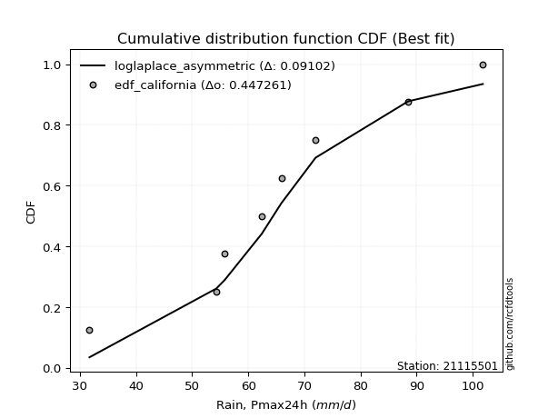</img>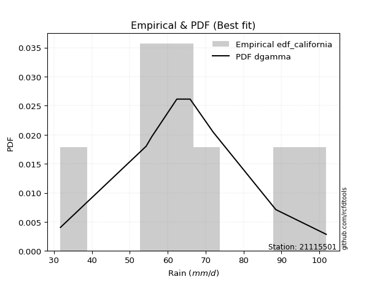</img>

</div>


### 2. EDF Hazen (1930)

Hazen method for plotting positions is a formula used to estimate the empirical cumulative probability distribution of flood events or other hydrological data. This formula often results in biased estimations, particularly when extrapolating to extreme events (high return periods).

<div align="center">


$P=(m-0.5)/n$


</div>


**2.1. Empirical values**

<div align="center">

|                | 0                  | 1                  | 2                  | 3                  | 4                  | 5         | 6                 | 7         |
|:---------------|:-------------------|:-------------------|:-------------------|:-------------------|:-------------------|:----------|:------------------|:----------|
| date           | 2016               | 2023               | 2017               | 2019               | 2021               | 2018      | 2022              | 2020      |
| x              | 31.7               | 54.3               | 55.8               | 62.4               | 65.9               | 72.0      | 88.5              | 101.8     |
| m              | 1                  | 2                  | 3                  | 4                  | 5                  | 6         | 7                 | 8         |
| empirical_dist | edf_hazen          | edf_hazen          | edf_hazen          | edf_hazen          | edf_hazen          | edf_hazen | edf_hazen         | edf_hazen |
| empirical      | 0.0625             | 0.1875             | 0.3125             | 0.4375             | 0.5625             | 0.6875    | 0.8125            | 0.9375    |
| empirical_tr   | 1.0666666666666667 | 1.2307692307692308 | 1.4545454545454546 | 1.7777777777777777 | 2.2857142857142856 | 3.2       | 5.333333333333333 | 16.0      |

</div>


**2.2. Kolmogorov-Smirnov fit test (sorted by Δ)**


<div align="center">

|                | 0                   | 1                   | 2                   | 3                   | 4                   | 5                   | 6                   | 7                   | 8                   | 9                   | 10                  | 11                  | 12                  | 13                  | 14                 | 15                  | 16                  | 17                  | 18                  | 19                  | 20                  | 21                  | 22                  | 23                  | 24                  | 25                  | 26                  | 27                 | 28                 | 29                 | 30                  | 31                  | 32                  | 33                  | 34                  | 35                  | 36                  | 37                  | 38                  | 39                  | 40                  | 41                 | 42                  | 43                  | 44                  | 45                  | 46                  | 47                  | 48                 | 49                  | 50                  | 51                 | 52                  | 53                  | 54                  | 55                  | 56                  | 57                  | 58                  | 59                  | 60                  | 61                 | 62                  | 63                  | 64                 | 65                 | 66                  | 67                 | 68                 | 69                 | 70                  | 71                 | 72                  | 73                  | 74                  | 75                  | 76                  | 77                  | 78                  | 79                  | 80                  | 81                 | 82                  | 83                  | 84                 | 85                  | 86                  | 87                  | 88                  | 89                  | 90                 | 91                  | 92                  | 93                 | 94                 | 95                  | 96                  | 97                  | 98                  | 99                 | 100                 | 101                | 102                 | 103                 | 104                 | 105                 | 106                | 107                 | 108                 | 109                | 110                 | 111                 | 112                | 113                 | 114                | 115                | 116                 | 117                 | 118                 | 119                | 120                | 121                | 122                 | 123                | 124                 | 125                 | 126                | 127                | 128                | 129                 | 130                | 131                | 132                 | 133                 | 134                | 135                | 136                | 137                | 138                | 139                | 140                 | 141                 | 142                 | 143                | 144                | 145                | 146                | 147                | 148                | 149                | 150                | 151                | 152                | 153                | 154                | 155                | 156                | 157                | 158                | 159                |
|:---------------|:--------------------|:--------------------|:--------------------|:--------------------|:--------------------|:--------------------|:--------------------|:--------------------|:--------------------|:--------------------|:--------------------|:--------------------|:--------------------|:--------------------|:-------------------|:--------------------|:--------------------|:--------------------|:--------------------|:--------------------|:--------------------|:--------------------|:--------------------|:--------------------|:--------------------|:--------------------|:--------------------|:-------------------|:-------------------|:-------------------|:--------------------|:--------------------|:--------------------|:--------------------|:--------------------|:--------------------|:--------------------|:--------------------|:--------------------|:--------------------|:--------------------|:-------------------|:--------------------|:--------------------|:--------------------|:--------------------|:--------------------|:--------------------|:-------------------|:--------------------|:--------------------|:-------------------|:--------------------|:--------------------|:--------------------|:--------------------|:--------------------|:--------------------|:--------------------|:--------------------|:--------------------|:-------------------|:--------------------|:--------------------|:-------------------|:-------------------|:--------------------|:-------------------|:-------------------|:-------------------|:--------------------|:-------------------|:--------------------|:--------------------|:--------------------|:--------------------|:--------------------|:--------------------|:--------------------|:--------------------|:--------------------|:-------------------|:--------------------|:--------------------|:-------------------|:--------------------|:--------------------|:--------------------|:--------------------|:--------------------|:-------------------|:--------------------|:--------------------|:-------------------|:-------------------|:--------------------|:--------------------|:--------------------|:--------------------|:-------------------|:--------------------|:-------------------|:--------------------|:--------------------|:--------------------|:--------------------|:-------------------|:--------------------|:--------------------|:-------------------|:--------------------|:--------------------|:-------------------|:--------------------|:-------------------|:-------------------|:--------------------|:--------------------|:--------------------|:-------------------|:-------------------|:-------------------|:--------------------|:-------------------|:--------------------|:--------------------|:-------------------|:-------------------|:-------------------|:--------------------|:-------------------|:-------------------|:--------------------|:--------------------|:-------------------|:-------------------|:-------------------|:-------------------|:-------------------|:-------------------|:--------------------|:--------------------|:--------------------|:-------------------|:-------------------|:-------------------|:-------------------|:-------------------|:-------------------|:-------------------|:-------------------|:-------------------|:-------------------|:-------------------|:-------------------|:-------------------|:-------------------|:-------------------|:-------------------|:-------------------|
| station        | 21115501            | 21115501            | 21115501            | 21115501            | 21115501            | 21115501            | 21115501            | 21115501            | 21115501            | 21115501            | 21115501            | 21115501            | 21115501            | 21115501            | 21115501           | 21115501            | 21115501            | 21115501            | 21115501            | 21115501            | 21115501            | 21115501            | 21115501            | 21115501            | 21115501            | 21115501            | 21115501            | 21115501           | 21115501           | 21115501           | 21115501            | 21115501            | 21115501            | 21115501            | 21115501            | 21115501            | 21115501            | 21115501            | 21115501            | 21115501            | 21115501            | 21115501           | 21115501            | 21115501            | 21115501            | 21115501            | 21115501            | 21115501            | 21115501           | 21115501            | 21115501            | 21115501           | 21115501            | 21115501            | 21115501            | 21115501            | 21115501            | 21115501            | 21115501            | 21115501            | 21115501            | 21115501           | 21115501            | 21115501            | 21115501           | 21115501           | 21115501            | 21115501           | 21115501           | 21115501           | 21115501            | 21115501           | 21115501            | 21115501            | 21115501            | 21115501            | 21115501            | 21115501            | 21115501            | 21115501            | 21115501            | 21115501           | 21115501            | 21115501            | 21115501           | 21115501            | 21115501            | 21115501            | 21115501            | 21115501            | 21115501           | 21115501            | 21115501            | 21115501           | 21115501           | 21115501            | 21115501            | 21115501            | 21115501            | 21115501           | 21115501            | 21115501           | 21115501            | 21115501            | 21115501            | 21115501            | 21115501           | 21115501            | 21115501            | 21115501           | 21115501            | 21115501            | 21115501           | 21115501            | 21115501           | 21115501           | 21115501            | 21115501            | 21115501            | 21115501           | 21115501           | 21115501           | 21115501            | 21115501           | 21115501            | 21115501            | 21115501           | 21115501           | 21115501           | 21115501            | 21115501           | 21115501           | 21115501            | 21115501            | 21115501           | 21115501           | 21115501           | 21115501           | 21115501           | 21115501           | 21115501            | 21115501            | 21115501            | 21115501           | 21115501           | 21115501           | 21115501           | 21115501           | 21115501           | 21115501           | 21115501           | 21115501           | 21115501           | 21115501           | 21115501           | 21115501           | 21115501           | 21115501           | 21115501           | 21115501           |
| empirical_dist | edf_hazen           | edf_hazen           | edf_hazen           | edf_hazen           | edf_hazen           | edf_hazen           | edf_hazen           | edf_hazen           | edf_hazen           | edf_hazen           | edf_hazen           | edf_hazen           | edf_hazen           | edf_hazen           | edf_hazen          | edf_hazen           | edf_hazen           | edf_hazen           | edf_hazen           | edf_hazen           | edf_hazen           | edf_hazen           | edf_hazen           | edf_hazen           | edf_hazen           | edf_hazen           | edf_hazen           | edf_hazen          | edf_hazen          | edf_hazen          | edf_hazen           | edf_hazen           | edf_hazen           | edf_hazen           | edf_hazen           | edf_hazen           | edf_hazen           | edf_hazen           | edf_hazen           | edf_hazen           | edf_hazen           | edf_hazen          | edf_hazen           | edf_hazen           | edf_hazen           | edf_hazen           | edf_hazen           | edf_hazen           | edf_hazen          | edf_hazen           | edf_hazen           | edf_hazen          | edf_hazen           | edf_hazen           | edf_hazen           | edf_hazen           | edf_hazen           | edf_hazen           | edf_hazen           | edf_hazen           | edf_hazen           | edf_hazen          | edf_hazen           | edf_hazen           | edf_hazen          | edf_hazen          | edf_hazen           | edf_hazen          | edf_hazen          | edf_hazen          | edf_hazen           | edf_hazen          | edf_hazen           | edf_hazen           | edf_hazen           | edf_hazen           | edf_hazen           | edf_hazen           | edf_hazen           | edf_hazen           | edf_hazen           | edf_hazen          | edf_hazen           | edf_hazen           | edf_hazen          | edf_hazen           | edf_hazen           | edf_hazen           | edf_hazen           | edf_hazen           | edf_hazen          | edf_hazen           | edf_hazen           | edf_hazen          | edf_hazen          | edf_hazen           | edf_hazen           | edf_hazen           | edf_hazen           | edf_hazen          | edf_hazen           | edf_hazen          | edf_hazen           | edf_hazen           | edf_hazen           | edf_hazen           | edf_hazen          | edf_hazen           | edf_hazen           | edf_hazen          | edf_hazen           | edf_hazen           | edf_hazen          | edf_hazen           | edf_hazen          | edf_hazen          | edf_hazen           | edf_hazen           | edf_hazen           | edf_hazen          | edf_hazen          | edf_hazen          | edf_hazen           | edf_hazen          | edf_hazen           | edf_hazen           | edf_hazen          | edf_hazen          | edf_hazen          | edf_hazen           | edf_hazen          | edf_hazen          | edf_hazen           | edf_hazen           | edf_hazen          | edf_hazen          | edf_hazen          | edf_hazen          | edf_hazen          | edf_hazen          | edf_hazen           | edf_hazen           | edf_hazen           | edf_hazen          | edf_hazen          | edf_hazen          | edf_hazen          | edf_hazen          | edf_hazen          | edf_hazen          | edf_hazen          | edf_hazen          | edf_hazen          | edf_hazen          | edf_hazen          | edf_hazen          | edf_hazen          | edf_hazen          | edf_hazen          | edf_hazen          |
| p_dist         | loglaplace          | loglaplace          | logdgamma           | logdweibull         | loggennorm          | logistic            | logcrystalball      | hypsecant           | loggumbel_l         | genlogistic         | truncnorm           | crystalball         | norm                | t                   | vonmises_line      | logt                | exponnorm           | laplace             | dgamma              | mielke              | burr                | loggenlogistic      | dweibull            | pearson3            | logburr             | logmielke           | nct                 | johnsonsu          | erlang             | gamma              | betaprime           | f                   | skewnorm            | cosine              | logloggamma         | logjohnsonsu        | logburr12           | logloglaplace       | logweibull_min      | gennorm             | alpha               | loghypsecant       | invgamma            | rice                | weibull_min         | logpearson3         | logskewnorm         | gumbel_r            | loggenextreme      | logweibull_max      | maxwell             | logexponpow        | moyal               | anglit              | loglogistic         | invgauss            | rayleigh            | logargus            | logtriang           | semicircular        | wald                | logexponnorm       | lognorm             | logf                | uniform            | logfatiguelife     | halflogistic        | lognct             | loggamma           | loggamma           | logbetaprime        | logrice            | gompertz            | gumbel_l            | halfnorm            | logerlang           | loginvgamma         | wrapcauchy          | loggengamma         | loggausshyper       | loganglit           | kstwobign          | logalpha            | kappa4              | gausshyper         | beta                | loginvgauss         | ksone               | logmaxwell          | logsemicircular     | kappa3             | arcsine             | argus               | loggenhalflogistic | loggumbel_r        | lograyleigh         | logfoldnorm         | ncf                 | nakagami            | logcosine          | logmoyal            | logbeta            | logexponweib        | logtruncnorm        | loginvweibull       | logarcsine          | loghalfnorm        | bradford            | loghalflogistic     | logncf             | logwald             | logrdist            | truncexpon         | logtruncweibull_min | logtrapezoid       | logkstwobign       | triang              | genpareto           | loggenexpon         | logvonmises_line   | logkappa4          | loglevy_l          | logtukeylambda      | genhalflogistic    | truncweibull_min    | logkappa3           | loguniform         | lognakagami        | lomax              | logksone            | genexpon           | logwrapcauchy      | levy_l              | loggompertz         | burr12             | loglomax           | logbradford        | halfgennorm        | johnsonsb          | loggenpareto       | trapezoid           | tukeylambda         | logtruncexpon       | genextreme         | invweibull         | logjohnsonsb       | foldnorm           | rdist              | weibull_max        | powerlaw           | gengamma           | fatiguelife        | exponweib          | logpowerlaw        | exponpow           | truncpareto        | logtruncpareto     | loghalfgennorm     | logvonmises        | vonmises           |
| delta          | 0.07277571401498645 | 0.07277571401498645 | 0.07307183199139722 | 0.07440249686243211 | 0.07571275651633358 | 0.07711497082722085 | 0.07845204749999085 | 0.07861301753550165 | 0.08279798308315178 | 0.08386798030665249 | 0.08422759002663494 | 0.08422760148284525 | 0.08422760835593235 | 0.08423808058802185 | 0.0842601907750341 | 0.08438154315743135 | 0.08467567608055526 | 0.08478509263895095 | 0.08513097816559478 | 0.08621254330784256 | 0.08637823079462387 | 0.08643752784850867 | 0.08741427290718573 | 0.08902392466295439 | 0.09002759725692294 | 0.09017729502733957 | 0.09064489563677203 | 0.0906486576428881 | 0.0912301485344848 | 0.0915239629973702 | 0.09183182731568895 | 0.09189081396707299 | 0.09225880154370225 | 0.09264507622080309 | 0.09347797641610656 | 0.09465145599359676 | 0.09470570338024759 | 0.09543733845471442 | 0.09583682489429207 | 0.09664032970824721 | 0.09751504694485297 | 0.0995957824239444 | 0.09975937388918732 | 0.10040862106790654 | 0.10180959555409386 | 0.10453389512815348 | 0.10523245996069863 | 0.10657580711337794 | 0.1083195388569893 | 0.10834981317411108 | 0.10883827482830494 | 0.1097025761320668 | 0.11061390461396092 | 0.11072485648152453 | 0.11459658500970132 | 0.11565970612942417 | 0.11881070612238531 | 0.11958339729718848 | 0.12124032819951214 | 0.12211366208024421 | 0.13403318586812696 | 0.1346672175066994 | 0.13466745955319592 | 0.13467713177165763 | 0.1348965763195435 | 0.134973313237991  | 0.13802286751791676 | 0.1391870379760003 | 0.1410880712428163 | 0.1410880712428163 | 0.14196198363809515 | 0.1429678548829713 | 0.14406582629992237 | 0.14599637660574383 | 0.14648226019017135 | 0.14672469331452576 | 0.14748934275944142 | 0.14870563673344978 | 0.14929971617575483 | 0.15429451260167926 | 0.15730057166464467 | 0.1577425533960392 | 0.15927704324038627 | 0.16149382641110488 | 0.1631609487863671 | 0.16438725268549326 | 0.16440255762027184 | 0.16449714693295298 | 0.16459822982999667 | 0.16686851267745617 | 0.1684303124310722 | 0.17114209089992788 | 0.17116259984430704 | 0.1722669888457845 | 0.1749097033884478 | 0.17619367232521072 | 0.17992807145182138 | 0.18465846102208983 | 0.18749999844281345 | 0.1881636341614466 | 0.18877766043705058 | 0.1902108977711548 | 0.19382560993740922 | 0.20096553229720315 | 0.20465074038041425 | 0.20665160405308902 | 0.2091662579577801 | 0.21086037944430458 | 0.21212560167988675 | 0.2134349727091202 | 0.21372525296800526 | 0.22417047407352703 | 0.226133660446111  | 0.23037141273514106 | 0.2395592226196407 | 0.2402995392065616 | 0.24377415555191945 | 0.24735628918925617 | 0.25026329254055213 | 0.2595307886494557 | 0.2595343890884056 | 0.2610922753416387 | 0.26149981575596115 | 0.2617486850564923 | 0.26562833198322533 | 0.27335841491476304 | 0.2738101739831127 | 0.2754344920591332 | 0.2758210033072712 | 0.28025847831926043 | 0.2896790017078721 | 0.2995466579880807 | 0.30988193082270254 | 0.31798071367024394 | 0.3516937046183921 | 0.3537968460580805 | 0.3616940340570587 | 0.3656098598392409 | 0.3665420759755058 | 0.3678310926995949 | 0.37119404518916316 | 0.37371319335759523 | 0.37436548810291836 | 0.3788244136979958 | 0.4819593486721702 | 0.5161801922407723 | 0.5625             | 0.568059737095328  | 0.612969626174811  | 0.6186622077927365 | 0.6220456650896946 | 0.6346579677185197 | 0.6367765865591245 | 0.6639666305974149 | 0.7269961882255442 | 0.740322051762368  | 0.7622839121008979 | 0.8125             | 1.1280487222272715 | 15.78159929530976  |
| deltao         | 0.4472608134160001  | 0.4472608134160001  | 0.4472608134160001  | 0.4472608134160001  | 0.4472608134160001  | 0.4472608134160001  | 0.4472608134160001  | 0.4472608134160001  | 0.4472608134160001  | 0.4472608134160001  | 0.4472608134160001  | 0.4472608134160001  | 0.4472608134160001  | 0.4472608134160001  | 0.4472608134160001 | 0.4472608134160001  | 0.4472608134160001  | 0.4472608134160001  | 0.4472608134160001  | 0.4472608134160001  | 0.4472608134160001  | 0.4472608134160001  | 0.4472608134160001  | 0.4472608134160001  | 0.4472608134160001  | 0.4472608134160001  | 0.4472608134160001  | 0.4472608134160001 | 0.4472608134160001 | 0.4472608134160001 | 0.4472608134160001  | 0.4472608134160001  | 0.4472608134160001  | 0.4472608134160001  | 0.4472608134160001  | 0.4472608134160001  | 0.4472608134160001  | 0.4472608134160001  | 0.4472608134160001  | 0.4472608134160001  | 0.4472608134160001  | 0.4472608134160001 | 0.4472608134160001  | 0.4472608134160001  | 0.4472608134160001  | 0.4472608134160001  | 0.4472608134160001  | 0.4472608134160001  | 0.4472608134160001 | 0.4472608134160001  | 0.4472608134160001  | 0.4472608134160001 | 0.4472608134160001  | 0.4472608134160001  | 0.4472608134160001  | 0.4472608134160001  | 0.4472608134160001  | 0.4472608134160001  | 0.4472608134160001  | 0.4472608134160001  | 0.4472608134160001  | 0.4472608134160001 | 0.4472608134160001  | 0.4472608134160001  | 0.4472608134160001 | 0.4472608134160001 | 0.4472608134160001  | 0.4472608134160001 | 0.4472608134160001 | 0.4472608134160001 | 0.4472608134160001  | 0.4472608134160001 | 0.4472608134160001  | 0.4472608134160001  | 0.4472608134160001  | 0.4472608134160001  | 0.4472608134160001  | 0.4472608134160001  | 0.4472608134160001  | 0.4472608134160001  | 0.4472608134160001  | 0.4472608134160001 | 0.4472608134160001  | 0.4472608134160001  | 0.4472608134160001 | 0.4472608134160001  | 0.4472608134160001  | 0.4472608134160001  | 0.4472608134160001  | 0.4472608134160001  | 0.4472608134160001 | 0.4472608134160001  | 0.4472608134160001  | 0.4472608134160001 | 0.4472608134160001 | 0.4472608134160001  | 0.4472608134160001  | 0.4472608134160001  | 0.4472608134160001  | 0.4472608134160001 | 0.4472608134160001  | 0.4472608134160001 | 0.4472608134160001  | 0.4472608134160001  | 0.4472608134160001  | 0.4472608134160001  | 0.4472608134160001 | 0.4472608134160001  | 0.4472608134160001  | 0.4472608134160001 | 0.4472608134160001  | 0.4472608134160001  | 0.4472608134160001 | 0.4472608134160001  | 0.4472608134160001 | 0.4472608134160001 | 0.4472608134160001  | 0.4472608134160001  | 0.4472608134160001  | 0.4472608134160001 | 0.4472608134160001 | 0.4472608134160001 | 0.4472608134160001  | 0.4472608134160001 | 0.4472608134160001  | 0.4472608134160001  | 0.4472608134160001 | 0.4472608134160001 | 0.4472608134160001 | 0.4472608134160001  | 0.4472608134160001 | 0.4472608134160001 | 0.4472608134160001  | 0.4472608134160001  | 0.4472608134160001 | 0.4472608134160001 | 0.4472608134160001 | 0.4472608134160001 | 0.4472608134160001 | 0.4472608134160001 | 0.4472608134160001  | 0.4472608134160001  | 0.4472608134160001  | 0.4472608134160001 | 0.4472608134160001 | 0.4472608134160001 | 0.4472608134160001 | 0.4472608134160001 | 0.4472608134160001 | 0.4472608134160001 | 0.4472608134160001 | 0.4472608134160001 | 0.4472608134160001 | 0.4472608134160001 | 0.4472608134160001 | 0.4472608134160001 | 0.4472608134160001 | 0.4472608134160001 | 0.4472608134160001 | 0.4472608134160001 |
| eval           | Δo > Δ              | Δo > Δ              | Δo > Δ              | Δo > Δ              | Δo > Δ              | Δo > Δ              | Δo > Δ              | Δo > Δ              | Δo > Δ              | Δo > Δ              | Δo > Δ              | Δo > Δ              | Δo > Δ              | Δo > Δ              | Δo > Δ             | Δo > Δ              | Δo > Δ              | Δo > Δ              | Δo > Δ              | Δo > Δ              | Δo > Δ              | Δo > Δ              | Δo > Δ              | Δo > Δ              | Δo > Δ              | Δo > Δ              | Δo > Δ              | Δo > Δ             | Δo > Δ             | Δo > Δ             | Δo > Δ              | Δo > Δ              | Δo > Δ              | Δo > Δ              | Δo > Δ              | Δo > Δ              | Δo > Δ              | Δo > Δ              | Δo > Δ              | Δo > Δ              | Δo > Δ              | Δo > Δ             | Δo > Δ              | Δo > Δ              | Δo > Δ              | Δo > Δ              | Δo > Δ              | Δo > Δ              | Δo > Δ             | Δo > Δ              | Δo > Δ              | Δo > Δ             | Δo > Δ              | Δo > Δ              | Δo > Δ              | Δo > Δ              | Δo > Δ              | Δo > Δ              | Δo > Δ              | Δo > Δ              | Δo > Δ              | Δo > Δ             | Δo > Δ              | Δo > Δ              | Δo > Δ             | Δo > Δ             | Δo > Δ              | Δo > Δ             | Δo > Δ             | Δo > Δ             | Δo > Δ              | Δo > Δ             | Δo > Δ              | Δo > Δ              | Δo > Δ              | Δo > Δ              | Δo > Δ              | Δo > Δ              | Δo > Δ              | Δo > Δ              | Δo > Δ              | Δo > Δ             | Δo > Δ              | Δo > Δ              | Δo > Δ             | Δo > Δ              | Δo > Δ              | Δo > Δ              | Δo > Δ              | Δo > Δ              | Δo > Δ             | Δo > Δ              | Δo > Δ              | Δo > Δ             | Δo > Δ             | Δo > Δ              | Δo > Δ              | Δo > Δ              | Δo > Δ              | Δo > Δ             | Δo > Δ              | Δo > Δ             | Δo > Δ              | Δo > Δ              | Δo > Δ              | Δo > Δ              | Δo > Δ             | Δo > Δ              | Δo > Δ              | Δo > Δ             | Δo > Δ              | Δo > Δ              | Δo > Δ             | Δo > Δ              | Δo > Δ             | Δo > Δ             | Δo > Δ              | Δo > Δ              | Δo > Δ              | Δo > Δ             | Δo > Δ             | Δo > Δ             | Δo > Δ              | Δo > Δ             | Δo > Δ              | Δo > Δ              | Δo > Δ             | Δo > Δ             | Δo > Δ             | Δo > Δ              | Δo > Δ             | Δo > Δ             | Δo > Δ              | Δo > Δ              | Δo > Δ             | Δo > Δ             | Δo > Δ             | Δo > Δ             | Δo > Δ             | Δo > Δ             | Δo > Δ              | Δo > Δ              | Δo > Δ              | Δo > Δ             | Δo <= Δ            | Δo <= Δ            | Δo <= Δ            | Δo <= Δ            | Δo <= Δ            | Δo <= Δ            | Δo <= Δ            | Δo <= Δ            | Δo <= Δ            | Δo <= Δ            | Δo <= Δ            | Δo <= Δ            | Δo <= Δ            | Δo <= Δ            | Δo <= Δ            | Δo <= Δ            |
| fit            | 1                   | 1                   | 1                   | 1                   | 1                   | 1                   | 1                   | 1                   | 1                   | 1                   | 1                   | 1                   | 1                   | 1                   | 1                  | 1                   | 1                   | 1                   | 1                   | 1                   | 1                   | 1                   | 1                   | 1                   | 1                   | 1                   | 1                   | 1                  | 1                  | 1                  | 1                   | 1                   | 1                   | 1                   | 1                   | 1                   | 1                   | 1                   | 1                   | 1                   | 1                   | 1                  | 1                   | 1                   | 1                   | 1                   | 1                   | 1                   | 1                  | 1                   | 1                   | 1                  | 1                   | 1                   | 1                   | 1                   | 1                   | 1                   | 1                   | 1                   | 1                   | 1                  | 1                   | 1                   | 1                  | 1                  | 1                   | 1                  | 1                  | 1                  | 1                   | 1                  | 1                   | 1                   | 1                   | 1                   | 1                   | 1                   | 1                   | 1                   | 1                   | 1                  | 1                   | 1                   | 1                  | 1                   | 1                   | 1                   | 1                   | 1                   | 1                  | 1                   | 1                   | 1                  | 1                  | 1                   | 1                   | 1                   | 1                   | 1                  | 1                   | 1                  | 1                   | 1                   | 1                   | 1                   | 1                  | 1                   | 1                   | 1                  | 1                   | 1                   | 1                  | 1                   | 1                  | 1                  | 1                   | 1                   | 1                   | 1                  | 1                  | 1                  | 1                   | 1                  | 1                   | 1                   | 1                  | 1                  | 1                  | 1                   | 1                  | 1                  | 1                   | 1                   | 1                  | 1                  | 1                  | 1                  | 1                  | 1                  | 1                   | 1                   | 1                   | 1                  | 0                  | 0                  | 0                  | 0                  | 0                  | 0                  | 0                  | 0                  | 0                  | 0                  | 0                  | 0                  | 0                  | 0                  | 0                  | 0                  |
| n              | 8                   | 8                   | 8                   | 8                   | 8                   | 8                   | 8                   | 8                   | 8                   | 8                   | 8                   | 8                   | 8                   | 8                   | 8                  | 8                   | 8                   | 8                   | 8                   | 8                   | 8                   | 8                   | 8                   | 8                   | 8                   | 8                   | 8                   | 8                  | 8                  | 8                  | 8                   | 8                   | 8                   | 8                   | 8                   | 8                   | 8                   | 8                   | 8                   | 8                   | 8                   | 8                  | 8                   | 8                   | 8                   | 8                   | 8                   | 8                   | 8                  | 8                   | 8                   | 8                  | 8                   | 8                   | 8                   | 8                   | 8                   | 8                   | 8                   | 8                   | 8                   | 8                  | 8                   | 8                   | 8                  | 8                  | 8                   | 8                  | 8                  | 8                  | 8                   | 8                  | 8                   | 8                   | 8                   | 8                   | 8                   | 8                   | 8                   | 8                   | 8                   | 8                  | 8                   | 8                   | 8                  | 8                   | 8                   | 8                   | 8                   | 8                   | 8                  | 8                   | 8                   | 8                  | 8                  | 8                   | 8                   | 8                   | 8                   | 8                  | 8                   | 8                  | 8                   | 8                   | 8                   | 8                   | 8                  | 8                   | 8                   | 8                  | 8                   | 8                   | 8                  | 8                   | 8                  | 8                  | 8                   | 8                   | 8                   | 8                  | 8                  | 8                  | 8                   | 8                  | 8                   | 8                   | 8                  | 8                  | 8                  | 8                   | 8                  | 8                  | 8                   | 8                   | 8                  | 8                  | 8                  | 8                  | 8                  | 8                  | 8                   | 8                   | 8                   | 8                  | 8                  | 8                  | 8                  | 8                  | 8                  | 8                  | 8                  | 8                  | 8                  | 8                  | 8                  | 8                  | 8                  | 8                  | 8                  | 8                  |
| best_fit       | 1                   | 1                   | 0                   | 0                   | 0                   | 0                   | 0                   | 0                   | 0                   | 0                   | 0                   | 0                   | 0                   | 0                   | 0                  | 0                   | 0                   | 0                   | 0                   | 0                   | 0                   | 0                   | 0                   | 0                   | 0                   | 0                   | 0                   | 0                  | 0                  | 0                  | 0                   | 0                   | 0                   | 0                   | 0                   | 0                   | 0                   | 0                   | 0                   | 0                   | 0                   | 0                  | 0                   | 0                   | 0                   | 0                   | 0                   | 0                   | 0                  | 0                   | 0                   | 0                  | 0                   | 0                   | 0                   | 0                   | 0                   | 0                   | 0                   | 0                   | 0                   | 0                  | 0                   | 0                   | 0                  | 0                  | 0                   | 0                  | 0                  | 0                  | 0                   | 0                  | 0                   | 0                   | 0                   | 0                   | 0                   | 0                   | 0                   | 0                   | 0                   | 0                  | 0                   | 0                   | 0                  | 0                   | 0                   | 0                   | 0                   | 0                   | 0                  | 0                   | 0                   | 0                  | 0                  | 0                   | 0                   | 0                   | 0                   | 0                  | 0                   | 0                  | 0                   | 0                   | 0                   | 0                   | 0                  | 0                   | 0                   | 0                  | 0                   | 0                   | 0                  | 0                   | 0                  | 0                  | 0                   | 0                   | 0                   | 0                  | 0                  | 0                  | 0                   | 0                  | 0                   | 0                   | 0                  | 0                  | 0                  | 0                   | 0                  | 0                  | 0                   | 0                   | 0                  | 0                  | 0                  | 0                  | 0                  | 0                  | 0                   | 0                   | 0                   | 0                  | 0                  | 0                  | 0                  | 0                  | 0                  | 0                  | 0                  | 0                  | 0                  | 0                  | 0                  | 0                  | 0                  | 0                  | 0                  | 0                  |
| best_fit_sort  | 1                   | 2                   | 3                   | 4                   | 5                   | 6                   | 7                   | 8                   | 9                   | 10                  | 11                  | 12                  | 13                  | 14                  | 15                 | 16                  | 17                  | 18                  | 19                  | 20                  | 21                  | 22                  | 23                  | 24                  | 25                  | 26                  | 27                  | 28                 | 29                 | 30                 | 31                  | 32                  | 33                  | 34                  | 35                  | 36                  | 37                  | 38                  | 39                  | 40                  | 41                  | 42                 | 43                  | 44                  | 45                  | 46                  | 47                  | 48                  | 49                 | 50                  | 51                  | 52                 | 53                  | 54                  | 55                  | 56                  | 57                  | 58                  | 59                  | 60                  | 61                  | 62                 | 63                  | 64                  | 65                 | 66                 | 67                  | 68                 | 69                 | 70                 | 71                  | 72                 | 73                  | 74                  | 75                  | 76                  | 77                  | 78                  | 79                  | 80                  | 81                  | 82                 | 83                  | 84                  | 85                 | 86                  | 87                  | 88                  | 89                  | 90                  | 91                 | 92                  | 93                  | 94                 | 95                 | 96                  | 97                  | 98                  | 99                  | 100                | 101                 | 102                | 103                 | 104                 | 105                 | 106                 | 107                | 108                 | 109                 | 110                | 111                 | 112                 | 113                | 114                 | 115                | 116                | 117                 | 118                 | 119                 | 120                | 121                | 122                | 123                 | 124                | 125                 | 126                 | 127                | 128                | 129                | 130                 | 131                | 132                | 133                 | 134                 | 135                | 136                | 137                | 138                | 139                | 140                | 141                 | 142                 | 143                 | 144                | 145                | 146                | 147                | 148                | 149                | 150                | 151                | 152                | 153                | 154                | 155                | 156                | 157                | 158                | 159                | 160                |

</div>


**2.3. Best fit**

<div align="center">

|   id |   station | empirical_dist   | p_dist     |     delta |   deltao | eval   |   fit |   n |   best_fit |   best_fit_sort |
|-----:|----------:|:-----------------|:-----------|----------:|---------:|:-------|------:|----:|-----------:|----------------:|
|    0 |  21115501 | edf_hazen        | loglaplace | 0.0727757 | 0.447261 | Δo > Δ |     1 |   8 |          1 |               1 |
|    1 |  21115501 | edf_hazen        | loglaplace | 0.0727757 | 0.447261 | Δo > Δ |     1 |   8 |          1 |               2 |

</div>


<div align="center">

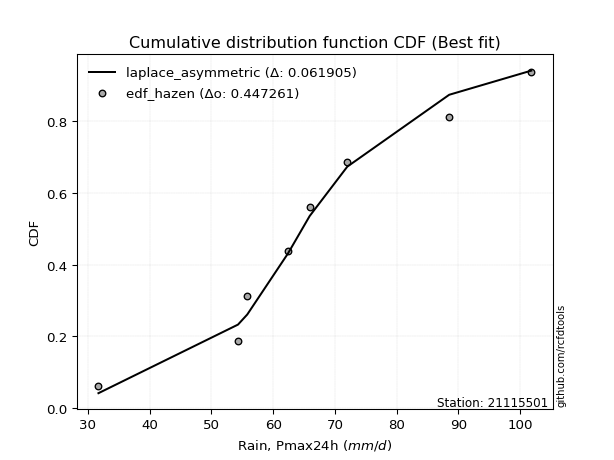</img>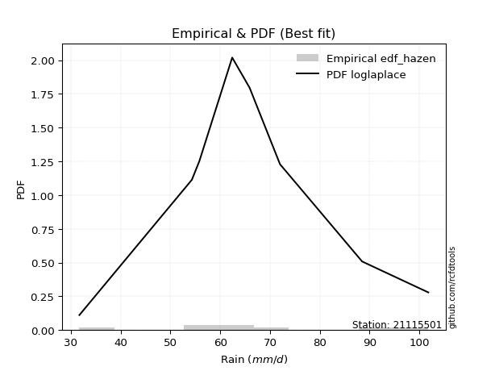</img>

</div>


### 3. EDF Weibull (1939)

Weibull plotting position formula is an empirical method used to estimate the non-exceedance probability or plotting position for a set of observed data, is often recommended or widely used in practice, particularly in flood frequency analysis.

<div align="center">


$P=m/(n+1)$


</div>


**3.1. Empirical values**

<div align="center">

|                | 0                  | 1                  | 2                  | 3                  | 4                  | 5                  | 6                  | 7                  |
|:---------------|:-------------------|:-------------------|:-------------------|:-------------------|:-------------------|:-------------------|:-------------------|:-------------------|
| date           | 2016               | 2023               | 2017               | 2019               | 2021               | 2018               | 2022               | 2020               |
| x              | 31.7               | 54.3               | 55.8               | 62.4               | 65.9               | 72.0               | 88.5               | 101.8              |
| m              | 1                  | 2                  | 3                  | 4                  | 5                  | 6                  | 7                  | 8                  |
| empirical_dist | edf_weibull        | edf_weibull        | edf_weibull        | edf_weibull        | edf_weibull        | edf_weibull        | edf_weibull        | edf_weibull        |
| empirical      | 0.1111111111111111 | 0.2222222222222222 | 0.3333333333333333 | 0.4444444444444444 | 0.5555555555555556 | 0.6666666666666666 | 0.7777777777777778 | 0.8888888888888888 |
| empirical_tr   | 1.125              | 1.2857142857142856 | 1.4999999999999998 | 1.7999999999999998 | 2.25               | 2.9999999999999996 | 4.5                | 8.999999999999996  |

</div>


**3.2. Kolmogorov-Smirnov fit test (sorted by Δ)**


<div align="center">

|                | 0                   | 1                   | 2                   | 3                   | 4                   | 5                   | 6                   | 7                   | 8                   | 9                   | 10                  | 11                  | 12                 | 13                 | 14                  | 15                  | 16                  | 17                  | 18                  | 19                  | 20                  | 21                  | 22                  | 23                  | 24                  | 25                  | 26                  | 27                 | 28                  | 29                  | 30                 | 31                 | 32                  | 33                 | 34                  | 35                  | 36                  | 37                  | 38                  | 39                  | 40                  | 41                  | 42                  | 43                  | 44                 | 45                 | 46                  | 47                  | 48                 | 49                  | 50                  | 51                  | 52                  | 53                  | 54                  | 55                  | 56                  | 57                  | 58                 | 59                 | 60                  | 61                 | 62                  | 63                 | 64                  | 65                 | 66                 | 67                  | 68                  | 69                  | 70                  | 71                  | 72                  | 73                  | 74                  | 75                 | 76                  | 77                  | 78                 | 79                 | 80                  | 81                  | 82                  | 83                  | 84                  | 85                  | 86                  | 87                 | 88                  | 89                 | 90                 | 91                 | 92                  | 93                 | 94                  | 95                  | 96                  | 97                  | 98                 | 99                  | 100                | 101                 | 102                 | 103                | 104                | 105                 | 106                 | 107                | 108                 | 109                 | 110                | 111                 | 112                | 113                 | 114                 | 115                 | 116                 | 117                 | 118                 | 119                | 120                 | 121                 | 122                 | 123                 | 124                 | 125                 | 126                | 127                 | 128                | 129                 | 130                | 131                 | 132                 | 133                 | 134                | 135                | 136                | 137                 | 138                | 139                | 140                | 141                 | 142                | 143                | 144                 | 145                 | 146                | 147                | 148                | 149                | 150                | 151                | 152                | 153                | 154                | 155                | 156                | 157                | 158                | 159                |
|:---------------|:--------------------|:--------------------|:--------------------|:--------------------|:--------------------|:--------------------|:--------------------|:--------------------|:--------------------|:--------------------|:--------------------|:--------------------|:-------------------|:-------------------|:--------------------|:--------------------|:--------------------|:--------------------|:--------------------|:--------------------|:--------------------|:--------------------|:--------------------|:--------------------|:--------------------|:--------------------|:--------------------|:-------------------|:--------------------|:--------------------|:-------------------|:-------------------|:--------------------|:-------------------|:--------------------|:--------------------|:--------------------|:--------------------|:--------------------|:--------------------|:--------------------|:--------------------|:--------------------|:--------------------|:-------------------|:-------------------|:--------------------|:--------------------|:-------------------|:--------------------|:--------------------|:--------------------|:--------------------|:--------------------|:--------------------|:--------------------|:--------------------|:--------------------|:-------------------|:-------------------|:--------------------|:-------------------|:--------------------|:-------------------|:--------------------|:-------------------|:-------------------|:--------------------|:--------------------|:--------------------|:--------------------|:--------------------|:--------------------|:--------------------|:--------------------|:-------------------|:--------------------|:--------------------|:-------------------|:-------------------|:--------------------|:--------------------|:--------------------|:--------------------|:--------------------|:--------------------|:--------------------|:-------------------|:--------------------|:-------------------|:-------------------|:-------------------|:--------------------|:-------------------|:--------------------|:--------------------|:--------------------|:--------------------|:-------------------|:--------------------|:-------------------|:--------------------|:--------------------|:-------------------|:-------------------|:--------------------|:--------------------|:-------------------|:--------------------|:--------------------|:-------------------|:--------------------|:-------------------|:--------------------|:--------------------|:--------------------|:--------------------|:--------------------|:--------------------|:-------------------|:--------------------|:--------------------|:--------------------|:--------------------|:--------------------|:--------------------|:-------------------|:--------------------|:-------------------|:--------------------|:-------------------|:--------------------|:--------------------|:--------------------|:-------------------|:-------------------|:-------------------|:--------------------|:-------------------|:-------------------|:-------------------|:--------------------|:-------------------|:-------------------|:--------------------|:--------------------|:-------------------|:-------------------|:-------------------|:-------------------|:-------------------|:-------------------|:-------------------|:-------------------|:-------------------|:-------------------|:-------------------|:-------------------|:-------------------|:-------------------|
| station        | 21115501            | 21115501            | 21115501            | 21115501            | 21115501            | 21115501            | 21115501            | 21115501            | 21115501            | 21115501            | 21115501            | 21115501            | 21115501           | 21115501           | 21115501            | 21115501            | 21115501            | 21115501            | 21115501            | 21115501            | 21115501            | 21115501            | 21115501            | 21115501            | 21115501            | 21115501            | 21115501            | 21115501           | 21115501            | 21115501            | 21115501           | 21115501           | 21115501            | 21115501           | 21115501            | 21115501            | 21115501            | 21115501            | 21115501            | 21115501            | 21115501            | 21115501            | 21115501            | 21115501            | 21115501           | 21115501           | 21115501            | 21115501            | 21115501           | 21115501            | 21115501            | 21115501            | 21115501            | 21115501            | 21115501            | 21115501            | 21115501            | 21115501            | 21115501           | 21115501           | 21115501            | 21115501           | 21115501            | 21115501           | 21115501            | 21115501           | 21115501           | 21115501            | 21115501            | 21115501            | 21115501            | 21115501            | 21115501            | 21115501            | 21115501            | 21115501           | 21115501            | 21115501            | 21115501           | 21115501           | 21115501            | 21115501            | 21115501            | 21115501            | 21115501            | 21115501            | 21115501            | 21115501           | 21115501            | 21115501           | 21115501           | 21115501           | 21115501            | 21115501           | 21115501            | 21115501            | 21115501            | 21115501            | 21115501           | 21115501            | 21115501           | 21115501            | 21115501            | 21115501           | 21115501           | 21115501            | 21115501            | 21115501           | 21115501            | 21115501            | 21115501           | 21115501            | 21115501           | 21115501            | 21115501            | 21115501            | 21115501            | 21115501            | 21115501            | 21115501           | 21115501            | 21115501            | 21115501            | 21115501            | 21115501            | 21115501            | 21115501           | 21115501            | 21115501           | 21115501            | 21115501           | 21115501            | 21115501            | 21115501            | 21115501           | 21115501           | 21115501           | 21115501            | 21115501           | 21115501           | 21115501           | 21115501            | 21115501           | 21115501           | 21115501            | 21115501            | 21115501           | 21115501           | 21115501           | 21115501           | 21115501           | 21115501           | 21115501           | 21115501           | 21115501           | 21115501           | 21115501           | 21115501           | 21115501           | 21115501           |
| empirical_dist | edf_weibull         | edf_weibull         | edf_weibull         | edf_weibull         | edf_weibull         | edf_weibull         | edf_weibull         | edf_weibull         | edf_weibull         | edf_weibull         | edf_weibull         | edf_weibull         | edf_weibull        | edf_weibull        | edf_weibull         | edf_weibull         | edf_weibull         | edf_weibull         | edf_weibull         | edf_weibull         | edf_weibull         | edf_weibull         | edf_weibull         | edf_weibull         | edf_weibull         | edf_weibull         | edf_weibull         | edf_weibull        | edf_weibull         | edf_weibull         | edf_weibull        | edf_weibull        | edf_weibull         | edf_weibull        | edf_weibull         | edf_weibull         | edf_weibull         | edf_weibull         | edf_weibull         | edf_weibull         | edf_weibull         | edf_weibull         | edf_weibull         | edf_weibull         | edf_weibull        | edf_weibull        | edf_weibull         | edf_weibull         | edf_weibull        | edf_weibull         | edf_weibull         | edf_weibull         | edf_weibull         | edf_weibull         | edf_weibull         | edf_weibull         | edf_weibull         | edf_weibull         | edf_weibull        | edf_weibull        | edf_weibull         | edf_weibull        | edf_weibull         | edf_weibull        | edf_weibull         | edf_weibull        | edf_weibull        | edf_weibull         | edf_weibull         | edf_weibull         | edf_weibull         | edf_weibull         | edf_weibull         | edf_weibull         | edf_weibull         | edf_weibull        | edf_weibull         | edf_weibull         | edf_weibull        | edf_weibull        | edf_weibull         | edf_weibull         | edf_weibull         | edf_weibull         | edf_weibull         | edf_weibull         | edf_weibull         | edf_weibull        | edf_weibull         | edf_weibull        | edf_weibull        | edf_weibull        | edf_weibull         | edf_weibull        | edf_weibull         | edf_weibull         | edf_weibull         | edf_weibull         | edf_weibull        | edf_weibull         | edf_weibull        | edf_weibull         | edf_weibull         | edf_weibull        | edf_weibull        | edf_weibull         | edf_weibull         | edf_weibull        | edf_weibull         | edf_weibull         | edf_weibull        | edf_weibull         | edf_weibull        | edf_weibull         | edf_weibull         | edf_weibull         | edf_weibull         | edf_weibull         | edf_weibull         | edf_weibull        | edf_weibull         | edf_weibull         | edf_weibull         | edf_weibull         | edf_weibull         | edf_weibull         | edf_weibull        | edf_weibull         | edf_weibull        | edf_weibull         | edf_weibull        | edf_weibull         | edf_weibull         | edf_weibull         | edf_weibull        | edf_weibull        | edf_weibull        | edf_weibull         | edf_weibull        | edf_weibull        | edf_weibull        | edf_weibull         | edf_weibull        | edf_weibull        | edf_weibull         | edf_weibull         | edf_weibull        | edf_weibull        | edf_weibull        | edf_weibull        | edf_weibull        | edf_weibull        | edf_weibull        | edf_weibull        | edf_weibull        | edf_weibull        | edf_weibull        | edf_weibull        | edf_weibull        | edf_weibull        |
| p_dist         | anglit              | cosine              | gennorm             | logjohnsonsu        | logpearson3         | logburr12           | logskewnorm         | logweibull_min      | logloggamma         | invgauss            | logexponpow         | weibull_min         | f                  | betaprime          | erlang              | gamma               | johnsonsu           | pearson3            | skewnorm            | invgamma            | t                   | crystalball         | norm                | truncnorm           | exponnorm           | alpha               | rice                | nct                | logdweibull         | loggennorm          | logdgamma          | semicircular       | loggenextreme       | logweibull_max     | logargus            | genlogistic         | logmielke           | logburr             | loglogistic         | loggenlogistic      | burr                | mielke              | logt                | maxwell             | logcrystalball     | logloglaplace      | loghypsecant        | loggumbel_l         | logexponnorm       | lognorm             | logf                | logfatiguelife      | logistic            | loglaplace          | loglaplace          | rayleigh            | lognct              | gumbel_r            | loggamma           | loggamma           | logbetaprime        | logrice            | hypsecant           | moyal              | logtriang           | vonmises_line      | halflogistic       | uniform             | halfnorm            | logerlang           | loginvgamma         | wrapcauchy          | loggengamma         | laplace             | dweibull            | dgamma             | loggausshyper       | loganglit           | kstwobign          | gompertz           | logalpha            | kappa4              | wald                | loginvgauss         | ksone               | logmaxwell          | logsemicircular     | kappa3             | arcsine             | gumbel_l           | loggumbel_r        | lograyleigh        | gausshyper          | beta               | logfoldnorm         | ncf                 | argus               | loggenhalflogistic  | logcosine          | logmoyal            | logexponweib       | logbeta             | loginvweibull       | logarcsine         | loghalfnorm        | bradford            | loghalflogistic     | logncf             | truncexpon          | logtruncweibull_min | logkstwobign       | logwald             | loglevy_l          | genpareto           | loggenexpon         | logtrapezoid        | logtruncnorm        | nakagami            | triang              | logvonmises_line   | logkappa4           | truncweibull_min    | logrdist            | logkappa3           | loguniform          | genhalflogistic     | lomax              | logksone            | genexpon           | levy_l              | logwrapcauchy      | lognakagami         | logtukeylambda      | loggompertz         | burr12             | loglomax           | logbradford        | halfgennorm         | johnsonsb          | loggenpareto       | tukeylambda        | logtruncexpon       | genextreme         | trapezoid          | invweibull          | logjohnsonsb        | rdist              | foldnorm           | weibull_max        | powerlaw           | gengamma           | fatiguelife        | exponweib          | logpowerlaw        | exponpow           | truncpareto        | logtruncpareto     | loghalfgennorm     | logvonmises        | vonmises           |
| delta          | 0.07627706827960445 | 0.07708483039588226 | 0.07726620706299064 | 0.07853342546796838 | 0.07890495535358248 | 0.07935555010702477 | 0.07971085395846433 | 0.07995430123747671 | 0.08044494141327718 | 0.08146852590694462 | 0.08158343469659124 | 0.08167205522293006 | 0.0828498454678962 | 0.0828707792308011 | 0.08300325323430635 | 0.08320305511505577 | 0.08326742781041718 | 0.08336006581344824 | 0.08372883440075096 | 0.08389591657518813 | 0.08404877096504304 | 0.08408208740123724 | 0.08408209331490635 | 0.08408209385382281 | 0.08418758434735452 | 0.08458307858004088 | 0.08506673984067158 | 0.0851238266021529 | 0.08593155303711508 | 0.08611074931168826 | 0.0871236769867001 | 0.087391439858022  | 0.08748620552365594 | 0.0875164798407777 | 0.08795531032130277 | 0.08817797483035561 | 0.08893851205718295 | 0.08899502677542181 | 0.08902630173993137 | 0.09010864484362346 | 0.09011634668244273 | 0.09016584346773426 | 0.09018189230635654 | 0.09087160888153838 | 0.0912180997512656 | 0.0927165234677898 | 0.09491097059336417 | 0.09562615459503354 | 0.0999449952844772 | 0.09994523733097371 | 0.09995490954943542 | 0.10025109101576879 | 0.10033810209810479 | 0.10339979731451066 | 0.10339979731451066 | 0.10383194121353924 | 0.10446481575377808 | 0.10533373432352852 | 0.1063658490205941 | 0.1063658490205941 | 0.10723976141587294 | 0.1082456326607491 | 0.10832733709688969 | 0.1108093467572953 | 0.11108933197829018 | 0.1111111096655244 | 0.1111111111111111 | 0.11111111111111116 | 0.11176003796794914 | 0.11200247109230355 | 0.11276712053721921 | 0.11398341451122757 | 0.11457749395353262 | 0.11499665322577979 | 0.11807356927979784 | 0.1192996706927879 | 0.11957229037945705 | 0.12257834944242246 | 0.123020331173817  | 0.123232492966589  | 0.12455482101816406 | 0.12677160418888267 | 0.12708874142368254 | 0.12968033539804963 | 0.12977492471073077 | 0.12987600760777446 | 0.13214629045523396 | 0.13370809020885   | 0.13641986867770567 | 0.1390519321612994 | 0.1401874811662256 | 0.1414714501029885 | 0.14232761545303374 | 0.1435539193521599 | 0.14520584922959917 | 0.14993623879986762 | 0.15032926651097367 | 0.15143365551245114 | 0.1534414119392244 | 0.15405543821482837 | 0.159103387715187  | 0.16937756443782143 | 0.16992851815819204 | 0.1719293818308668 | 0.1744440357355579 | 0.17613815722208237 | 0.17740337945766455 | 0.178712750486898  | 0.19141143822388879 | 0.19564919051291885 | 0.2055773169843394 | 0.20678080852356084 | 0.2124811642305276 | 0.21263406696703396 | 0.21554107031832992 | 0.21872588928630732 | 0.22222017378418762 | 0.22222222066503566 | 0.22294082221858608 | 0.2248085664272335 | 0.22481216686618338 | 0.23090610976100312 | 0.23381854122341658 | 0.23863619269254083 | 0.23908795176089048 | 0.24091535172315892 | 0.241098781085049  | 0.24553625609703822 | 0.2549567794856499 | 0.26127081971159144 | 0.2648244357658585 | 0.26849004761468875 | 0.28233314908929447 | 0.28325849144802173 | 0.3169714823961699 | 0.3190746238358583 | 0.3269718118348365 | 0.33088763761701867 | 0.3318198537532836 | 0.3331088704773727 | 0.338990971135373  | 0.33964326588069615 | 0.3441021914757736 | 0.3503607118558298 | 0.43334823756105906 | 0.48145797001855006 | 0.5333375148731058 | 0.5555555555555556 | 0.5782474039525889 | 0.5839399855705143 | 0.5873234428674724 | 0.5999357454962975 | 0.6020543643369023 | 0.6292444083751927 | 0.692273966003322  | 0.7055998295401458 | 0.7275616898786756 | 0.7777777777777778 | 1.0933265000050492 | 15.830210406420871 |
| deltao         | 0.4472608134160001  | 0.4472608134160001  | 0.4472608134160001  | 0.4472608134160001  | 0.4472608134160001  | 0.4472608134160001  | 0.4472608134160001  | 0.4472608134160001  | 0.4472608134160001  | 0.4472608134160001  | 0.4472608134160001  | 0.4472608134160001  | 0.4472608134160001 | 0.4472608134160001 | 0.4472608134160001  | 0.4472608134160001  | 0.4472608134160001  | 0.4472608134160001  | 0.4472608134160001  | 0.4472608134160001  | 0.4472608134160001  | 0.4472608134160001  | 0.4472608134160001  | 0.4472608134160001  | 0.4472608134160001  | 0.4472608134160001  | 0.4472608134160001  | 0.4472608134160001 | 0.4472608134160001  | 0.4472608134160001  | 0.4472608134160001 | 0.4472608134160001 | 0.4472608134160001  | 0.4472608134160001 | 0.4472608134160001  | 0.4472608134160001  | 0.4472608134160001  | 0.4472608134160001  | 0.4472608134160001  | 0.4472608134160001  | 0.4472608134160001  | 0.4472608134160001  | 0.4472608134160001  | 0.4472608134160001  | 0.4472608134160001 | 0.4472608134160001 | 0.4472608134160001  | 0.4472608134160001  | 0.4472608134160001 | 0.4472608134160001  | 0.4472608134160001  | 0.4472608134160001  | 0.4472608134160001  | 0.4472608134160001  | 0.4472608134160001  | 0.4472608134160001  | 0.4472608134160001  | 0.4472608134160001  | 0.4472608134160001 | 0.4472608134160001 | 0.4472608134160001  | 0.4472608134160001 | 0.4472608134160001  | 0.4472608134160001 | 0.4472608134160001  | 0.4472608134160001 | 0.4472608134160001 | 0.4472608134160001  | 0.4472608134160001  | 0.4472608134160001  | 0.4472608134160001  | 0.4472608134160001  | 0.4472608134160001  | 0.4472608134160001  | 0.4472608134160001  | 0.4472608134160001 | 0.4472608134160001  | 0.4472608134160001  | 0.4472608134160001 | 0.4472608134160001 | 0.4472608134160001  | 0.4472608134160001  | 0.4472608134160001  | 0.4472608134160001  | 0.4472608134160001  | 0.4472608134160001  | 0.4472608134160001  | 0.4472608134160001 | 0.4472608134160001  | 0.4472608134160001 | 0.4472608134160001 | 0.4472608134160001 | 0.4472608134160001  | 0.4472608134160001 | 0.4472608134160001  | 0.4472608134160001  | 0.4472608134160001  | 0.4472608134160001  | 0.4472608134160001 | 0.4472608134160001  | 0.4472608134160001 | 0.4472608134160001  | 0.4472608134160001  | 0.4472608134160001 | 0.4472608134160001 | 0.4472608134160001  | 0.4472608134160001  | 0.4472608134160001 | 0.4472608134160001  | 0.4472608134160001  | 0.4472608134160001 | 0.4472608134160001  | 0.4472608134160001 | 0.4472608134160001  | 0.4472608134160001  | 0.4472608134160001  | 0.4472608134160001  | 0.4472608134160001  | 0.4472608134160001  | 0.4472608134160001 | 0.4472608134160001  | 0.4472608134160001  | 0.4472608134160001  | 0.4472608134160001  | 0.4472608134160001  | 0.4472608134160001  | 0.4472608134160001 | 0.4472608134160001  | 0.4472608134160001 | 0.4472608134160001  | 0.4472608134160001 | 0.4472608134160001  | 0.4472608134160001  | 0.4472608134160001  | 0.4472608134160001 | 0.4472608134160001 | 0.4472608134160001 | 0.4472608134160001  | 0.4472608134160001 | 0.4472608134160001 | 0.4472608134160001 | 0.4472608134160001  | 0.4472608134160001 | 0.4472608134160001 | 0.4472608134160001  | 0.4472608134160001  | 0.4472608134160001 | 0.4472608134160001 | 0.4472608134160001 | 0.4472608134160001 | 0.4472608134160001 | 0.4472608134160001 | 0.4472608134160001 | 0.4472608134160001 | 0.4472608134160001 | 0.4472608134160001 | 0.4472608134160001 | 0.4472608134160001 | 0.4472608134160001 | 0.4472608134160001 |
| eval           | Δo > Δ              | Δo > Δ              | Δo > Δ              | Δo > Δ              | Δo > Δ              | Δo > Δ              | Δo > Δ              | Δo > Δ              | Δo > Δ              | Δo > Δ              | Δo > Δ              | Δo > Δ              | Δo > Δ             | Δo > Δ             | Δo > Δ              | Δo > Δ              | Δo > Δ              | Δo > Δ              | Δo > Δ              | Δo > Δ              | Δo > Δ              | Δo > Δ              | Δo > Δ              | Δo > Δ              | Δo > Δ              | Δo > Δ              | Δo > Δ              | Δo > Δ             | Δo > Δ              | Δo > Δ              | Δo > Δ             | Δo > Δ             | Δo > Δ              | Δo > Δ             | Δo > Δ              | Δo > Δ              | Δo > Δ              | Δo > Δ              | Δo > Δ              | Δo > Δ              | Δo > Δ              | Δo > Δ              | Δo > Δ              | Δo > Δ              | Δo > Δ             | Δo > Δ             | Δo > Δ              | Δo > Δ              | Δo > Δ             | Δo > Δ              | Δo > Δ              | Δo > Δ              | Δo > Δ              | Δo > Δ              | Δo > Δ              | Δo > Δ              | Δo > Δ              | Δo > Δ              | Δo > Δ             | Δo > Δ             | Δo > Δ              | Δo > Δ             | Δo > Δ              | Δo > Δ             | Δo > Δ              | Δo > Δ             | Δo > Δ             | Δo > Δ              | Δo > Δ              | Δo > Δ              | Δo > Δ              | Δo > Δ              | Δo > Δ              | Δo > Δ              | Δo > Δ              | Δo > Δ             | Δo > Δ              | Δo > Δ              | Δo > Δ             | Δo > Δ             | Δo > Δ              | Δo > Δ              | Δo > Δ              | Δo > Δ              | Δo > Δ              | Δo > Δ              | Δo > Δ              | Δo > Δ             | Δo > Δ              | Δo > Δ             | Δo > Δ             | Δo > Δ             | Δo > Δ              | Δo > Δ             | Δo > Δ              | Δo > Δ              | Δo > Δ              | Δo > Δ              | Δo > Δ             | Δo > Δ              | Δo > Δ             | Δo > Δ              | Δo > Δ              | Δo > Δ             | Δo > Δ             | Δo > Δ              | Δo > Δ              | Δo > Δ             | Δo > Δ              | Δo > Δ              | Δo > Δ             | Δo > Δ              | Δo > Δ             | Δo > Δ              | Δo > Δ              | Δo > Δ              | Δo > Δ              | Δo > Δ              | Δo > Δ              | Δo > Δ             | Δo > Δ              | Δo > Δ              | Δo > Δ              | Δo > Δ              | Δo > Δ              | Δo > Δ              | Δo > Δ             | Δo > Δ              | Δo > Δ             | Δo > Δ              | Δo > Δ             | Δo > Δ              | Δo > Δ              | Δo > Δ              | Δo > Δ             | Δo > Δ             | Δo > Δ             | Δo > Δ              | Δo > Δ             | Δo > Δ             | Δo > Δ             | Δo > Δ              | Δo > Δ             | Δo > Δ             | Δo > Δ              | Δo <= Δ             | Δo <= Δ            | Δo <= Δ            | Δo <= Δ            | Δo <= Δ            | Δo <= Δ            | Δo <= Δ            | Δo <= Δ            | Δo <= Δ            | Δo <= Δ            | Δo <= Δ            | Δo <= Δ            | Δo <= Δ            | Δo <= Δ            | Δo <= Δ            |
| fit            | 1                   | 1                   | 1                   | 1                   | 1                   | 1                   | 1                   | 1                   | 1                   | 1                   | 1                   | 1                   | 1                  | 1                  | 1                   | 1                   | 1                   | 1                   | 1                   | 1                   | 1                   | 1                   | 1                   | 1                   | 1                   | 1                   | 1                   | 1                  | 1                   | 1                   | 1                  | 1                  | 1                   | 1                  | 1                   | 1                   | 1                   | 1                   | 1                   | 1                   | 1                   | 1                   | 1                   | 1                   | 1                  | 1                  | 1                   | 1                   | 1                  | 1                   | 1                   | 1                   | 1                   | 1                   | 1                   | 1                   | 1                   | 1                   | 1                  | 1                  | 1                   | 1                  | 1                   | 1                  | 1                   | 1                  | 1                  | 1                   | 1                   | 1                   | 1                   | 1                   | 1                   | 1                   | 1                   | 1                  | 1                   | 1                   | 1                  | 1                  | 1                   | 1                   | 1                   | 1                   | 1                   | 1                   | 1                   | 1                  | 1                   | 1                  | 1                  | 1                  | 1                   | 1                  | 1                   | 1                   | 1                   | 1                   | 1                  | 1                   | 1                  | 1                   | 1                   | 1                  | 1                  | 1                   | 1                   | 1                  | 1                   | 1                   | 1                  | 1                   | 1                  | 1                   | 1                   | 1                   | 1                   | 1                   | 1                   | 1                  | 1                   | 1                   | 1                   | 1                   | 1                   | 1                   | 1                  | 1                   | 1                  | 1                   | 1                  | 1                   | 1                   | 1                   | 1                  | 1                  | 1                  | 1                   | 1                  | 1                  | 1                  | 1                   | 1                  | 1                  | 1                   | 0                   | 0                  | 0                  | 0                  | 0                  | 0                  | 0                  | 0                  | 0                  | 0                  | 0                  | 0                  | 0                  | 0                  | 0                  |
| n              | 8                   | 8                   | 8                   | 8                   | 8                   | 8                   | 8                   | 8                   | 8                   | 8                   | 8                   | 8                   | 8                  | 8                  | 8                   | 8                   | 8                   | 8                   | 8                   | 8                   | 8                   | 8                   | 8                   | 8                   | 8                   | 8                   | 8                   | 8                  | 8                   | 8                   | 8                  | 8                  | 8                   | 8                  | 8                   | 8                   | 8                   | 8                   | 8                   | 8                   | 8                   | 8                   | 8                   | 8                   | 8                  | 8                  | 8                   | 8                   | 8                  | 8                   | 8                   | 8                   | 8                   | 8                   | 8                   | 8                   | 8                   | 8                   | 8                  | 8                  | 8                   | 8                  | 8                   | 8                  | 8                   | 8                  | 8                  | 8                   | 8                   | 8                   | 8                   | 8                   | 8                   | 8                   | 8                   | 8                  | 8                   | 8                   | 8                  | 8                  | 8                   | 8                   | 8                   | 8                   | 8                   | 8                   | 8                   | 8                  | 8                   | 8                  | 8                  | 8                  | 8                   | 8                  | 8                   | 8                   | 8                   | 8                   | 8                  | 8                   | 8                  | 8                   | 8                   | 8                  | 8                  | 8                   | 8                   | 8                  | 8                   | 8                   | 8                  | 8                   | 8                  | 8                   | 8                   | 8                   | 8                   | 8                   | 8                   | 8                  | 8                   | 8                   | 8                   | 8                   | 8                   | 8                   | 8                  | 8                   | 8                  | 8                   | 8                  | 8                   | 8                   | 8                   | 8                  | 8                  | 8                  | 8                   | 8                  | 8                  | 8                  | 8                   | 8                  | 8                  | 8                   | 8                   | 8                  | 8                  | 8                  | 8                  | 8                  | 8                  | 8                  | 8                  | 8                  | 8                  | 8                  | 8                  | 8                  | 8                  |
| best_fit       | 1                   | 0                   | 0                   | 0                   | 0                   | 0                   | 0                   | 0                   | 0                   | 0                   | 0                   | 0                   | 0                  | 0                  | 0                   | 0                   | 0                   | 0                   | 0                   | 0                   | 0                   | 0                   | 0                   | 0                   | 0                   | 0                   | 0                   | 0                  | 0                   | 0                   | 0                  | 0                  | 0                   | 0                  | 0                   | 0                   | 0                   | 0                   | 0                   | 0                   | 0                   | 0                   | 0                   | 0                   | 0                  | 0                  | 0                   | 0                   | 0                  | 0                   | 0                   | 0                   | 0                   | 0                   | 0                   | 0                   | 0                   | 0                   | 0                  | 0                  | 0                   | 0                  | 0                   | 0                  | 0                   | 0                  | 0                  | 0                   | 0                   | 0                   | 0                   | 0                   | 0                   | 0                   | 0                   | 0                  | 0                   | 0                   | 0                  | 0                  | 0                   | 0                   | 0                   | 0                   | 0                   | 0                   | 0                   | 0                  | 0                   | 0                  | 0                  | 0                  | 0                   | 0                  | 0                   | 0                   | 0                   | 0                   | 0                  | 0                   | 0                  | 0                   | 0                   | 0                  | 0                  | 0                   | 0                   | 0                  | 0                   | 0                   | 0                  | 0                   | 0                  | 0                   | 0                   | 0                   | 0                   | 0                   | 0                   | 0                  | 0                   | 0                   | 0                   | 0                   | 0                   | 0                   | 0                  | 0                   | 0                  | 0                   | 0                  | 0                   | 0                   | 0                   | 0                  | 0                  | 0                  | 0                   | 0                  | 0                  | 0                  | 0                   | 0                  | 0                  | 0                   | 0                   | 0                  | 0                  | 0                  | 0                  | 0                  | 0                  | 0                  | 0                  | 0                  | 0                  | 0                  | 0                  | 0                  | 0                  |
| best_fit_sort  | 1                   | 2                   | 3                   | 4                   | 5                   | 6                   | 7                   | 8                   | 9                   | 10                  | 11                  | 12                  | 13                 | 14                 | 15                  | 16                  | 17                  | 18                  | 19                  | 20                  | 21                  | 22                  | 23                  | 24                  | 25                  | 26                  | 27                  | 28                 | 29                  | 30                  | 31                 | 32                 | 33                  | 34                 | 35                  | 36                  | 37                  | 38                  | 39                  | 40                  | 41                  | 42                  | 43                  | 44                  | 45                 | 46                 | 47                  | 48                  | 49                 | 50                  | 51                  | 52                  | 53                  | 54                  | 55                  | 56                  | 57                  | 58                  | 59                 | 60                 | 61                  | 62                 | 63                  | 64                 | 65                  | 66                 | 67                 | 68                  | 69                  | 70                  | 71                  | 72                  | 73                  | 74                  | 75                  | 76                 | 77                  | 78                  | 79                 | 80                 | 81                  | 82                  | 83                  | 84                  | 85                  | 86                  | 87                  | 88                 | 89                  | 90                 | 91                 | 92                 | 93                  | 94                 | 95                  | 96                  | 97                  | 98                  | 99                 | 100                 | 101                | 102                 | 103                 | 104                | 105                | 106                 | 107                 | 108                | 109                 | 110                 | 111                | 112                 | 113                | 114                 | 115                 | 116                 | 117                 | 118                 | 119                 | 120                | 121                 | 122                 | 123                 | 124                 | 125                 | 126                 | 127                | 128                 | 129                | 130                 | 131                | 132                 | 133                 | 134                 | 135                | 136                | 137                | 138                 | 139                | 140                | 141                | 142                 | 143                | 144                | 145                 | 146                 | 147                | 148                | 149                | 150                | 151                | 152                | 153                | 154                | 155                | 156                | 157                | 158                | 159                | 160                |

</div>


**3.3. Best fit**

<div align="center">

|   id |   station | empirical_dist   | p_dist   |     delta |   deltao | eval   |   fit |   n |   best_fit |   best_fit_sort |
|-----:|----------:|:-----------------|:---------|----------:|---------:|:-------|------:|----:|-----------:|----------------:|
|    0 |  21115501 | edf_weibull      | anglit   | 0.0762771 | 0.447261 | Δo > Δ |     1 |   8 |          1 |               1 |

</div>


<div align="center">

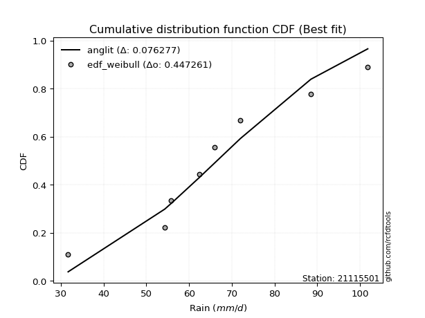</img>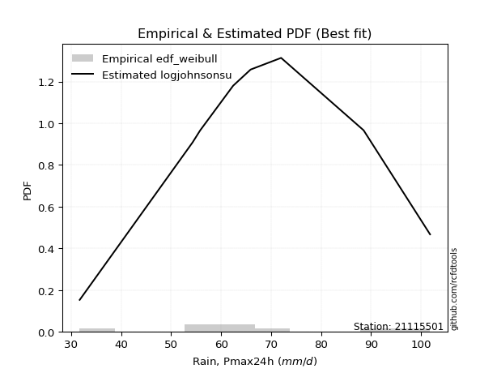</img>

</div>


### 4. EDF Beard (1943)

The Beard formula (or Beard´s plotting position formula) in hydrology is used to estimate the empirical non-exceedance probability _(P)_ of a flood event (or other extreme hydrological data point) within a given dataset.

<div align="center">


$P=(m-0.31)/(n+0.38)$


</div>


**4.1. Empirical values**

<div align="center">

|                | 0                   | 1                   | 2                  | 3                   | 4                  | 5                  | 6                  | 7                  |
|:---------------|:--------------------|:--------------------|:-------------------|:--------------------|:-------------------|:-------------------|:-------------------|:-------------------|
| date           | 2016                | 2023                | 2017               | 2019                | 2021               | 2018               | 2022               | 2020               |
| x              | 31.7                | 54.3                | 55.8               | 62.4                | 65.9               | 72.0               | 88.5               | 101.8              |
| m              | 1                   | 2                   | 3                  | 4                   | 5                  | 6                  | 7                  | 8                  |
| empirical_dist | edf_beard           | edf_beard           | edf_beard          | edf_beard           | edf_beard          | edf_beard          | edf_beard          | edf_beard          |
| empirical      | 0.08233890214797135 | 0.20167064439140808 | 0.3210023866348448 | 0.44033412887828155 | 0.5596658711217184 | 0.6789976133651551 | 0.7983293556085919 | 0.9176610978520287 |
| empirical_tr   | 1.0897269180754225  | 1.2526158445440956  | 1.4727592267135323 | 1.7867803837953091  | 2.2710027100271004 | 3.115241635687732  | 4.958579881656804  | 12.144927536231886 |

</div>


**4.2. Kolmogorov-Smirnov fit test (sorted by Δ)**


<div align="center">

|                | 0                   | 1                   | 2                   | 3                   | 4                   | 5                   | 6                   | 7                   | 8                   | 9                   | 10                  | 11                  | 12                  | 13                  | 14                  | 15                  | 16                  | 17                  | 18                  | 19                  | 20                  | 21                  | 22                  | 23                  | 24                  | 25                  | 26                  | 27                  | 28                 | 29                  | 30                  | 31                  | 32                  | 33                  | 34                  | 35                  | 36                  | 37                  | 38                  | 39                  | 40                  | 41                  | 42                  | 43                  | 44                  | 45                  | 46                  | 47                  | 48                  | 49                  | 50                  | 51                  | 52                  | 53                  | 54                  | 55                  | 56                  | 57                 | 58                  | 59                  | 60                  | 61                  | 62                  | 63                  | 64                  | 65                  | 66                 | 67                  | 68                  | 69                  | 70                  | 71                 | 72                  | 73                  | 74                  | 75                 | 76                  | 77                  | 78                  | 79                 | 80                  | 81                  | 82                 | 83                 | 84                  | 85                 | 86                  | 87                 | 88                  | 89                  | 90                  | 91                 | 92                  | 93                  | 94                 | 95                  | 96                 | 97                  | 98                  | 99                 | 100                 | 101                 | 102                 | 103                 | 104                 | 105                | 106                 | 107                 | 108                 | 109                 | 110                | 111                | 112                 | 113                 | 114                 | 115                 | 116                | 117                 | 118                 | 119                 | 120                 | 121                | 122                 | 123                 | 124                 | 125                | 126                 | 127                 | 128                 | 129                | 130                | 131                 | 132                | 133                 | 134                 | 135                | 136                | 137                | 138                 | 139                | 140                 | 141                | 142                 | 143                | 144                 | 145                | 146                | 147                | 148                | 149                | 150                | 151                | 152                | 153                | 154                | 155                | 156                | 157                | 158                | 159                |
|:---------------|:--------------------|:--------------------|:--------------------|:--------------------|:--------------------|:--------------------|:--------------------|:--------------------|:--------------------|:--------------------|:--------------------|:--------------------|:--------------------|:--------------------|:--------------------|:--------------------|:--------------------|:--------------------|:--------------------|:--------------------|:--------------------|:--------------------|:--------------------|:--------------------|:--------------------|:--------------------|:--------------------|:--------------------|:-------------------|:--------------------|:--------------------|:--------------------|:--------------------|:--------------------|:--------------------|:--------------------|:--------------------|:--------------------|:--------------------|:--------------------|:--------------------|:--------------------|:--------------------|:--------------------|:--------------------|:--------------------|:--------------------|:--------------------|:--------------------|:--------------------|:--------------------|:--------------------|:--------------------|:--------------------|:--------------------|:--------------------|:--------------------|:-------------------|:--------------------|:--------------------|:--------------------|:--------------------|:--------------------|:--------------------|:--------------------|:--------------------|:-------------------|:--------------------|:--------------------|:--------------------|:--------------------|:-------------------|:--------------------|:--------------------|:--------------------|:-------------------|:--------------------|:--------------------|:--------------------|:-------------------|:--------------------|:--------------------|:-------------------|:-------------------|:--------------------|:-------------------|:--------------------|:-------------------|:--------------------|:--------------------|:--------------------|:-------------------|:--------------------|:--------------------|:-------------------|:--------------------|:-------------------|:--------------------|:--------------------|:-------------------|:--------------------|:--------------------|:--------------------|:--------------------|:--------------------|:-------------------|:--------------------|:--------------------|:--------------------|:--------------------|:-------------------|:-------------------|:--------------------|:--------------------|:--------------------|:--------------------|:-------------------|:--------------------|:--------------------|:--------------------|:--------------------|:-------------------|:--------------------|:--------------------|:--------------------|:-------------------|:--------------------|:--------------------|:--------------------|:-------------------|:-------------------|:--------------------|:-------------------|:--------------------|:--------------------|:-------------------|:-------------------|:-------------------|:--------------------|:-------------------|:--------------------|:-------------------|:--------------------|:-------------------|:--------------------|:-------------------|:-------------------|:-------------------|:-------------------|:-------------------|:-------------------|:-------------------|:-------------------|:-------------------|:-------------------|:-------------------|:-------------------|:-------------------|:-------------------|:-------------------|
| station        | 21115501            | 21115501            | 21115501            | 21115501            | 21115501            | 21115501            | 21115501            | 21115501            | 21115501            | 21115501            | 21115501            | 21115501            | 21115501            | 21115501            | 21115501            | 21115501            | 21115501            | 21115501            | 21115501            | 21115501            | 21115501            | 21115501            | 21115501            | 21115501            | 21115501            | 21115501            | 21115501            | 21115501            | 21115501           | 21115501            | 21115501            | 21115501            | 21115501            | 21115501            | 21115501            | 21115501            | 21115501            | 21115501            | 21115501            | 21115501            | 21115501            | 21115501            | 21115501            | 21115501            | 21115501            | 21115501            | 21115501            | 21115501            | 21115501            | 21115501            | 21115501            | 21115501            | 21115501            | 21115501            | 21115501            | 21115501            | 21115501            | 21115501           | 21115501            | 21115501            | 21115501            | 21115501            | 21115501            | 21115501            | 21115501            | 21115501            | 21115501           | 21115501            | 21115501            | 21115501            | 21115501            | 21115501           | 21115501            | 21115501            | 21115501            | 21115501           | 21115501            | 21115501            | 21115501            | 21115501           | 21115501            | 21115501            | 21115501           | 21115501           | 21115501            | 21115501           | 21115501            | 21115501           | 21115501            | 21115501            | 21115501            | 21115501           | 21115501            | 21115501            | 21115501           | 21115501            | 21115501           | 21115501            | 21115501            | 21115501           | 21115501            | 21115501            | 21115501            | 21115501            | 21115501            | 21115501           | 21115501            | 21115501            | 21115501            | 21115501            | 21115501           | 21115501           | 21115501            | 21115501            | 21115501            | 21115501            | 21115501           | 21115501            | 21115501            | 21115501            | 21115501            | 21115501           | 21115501            | 21115501            | 21115501            | 21115501           | 21115501            | 21115501            | 21115501            | 21115501           | 21115501           | 21115501            | 21115501           | 21115501            | 21115501            | 21115501           | 21115501           | 21115501           | 21115501            | 21115501           | 21115501            | 21115501           | 21115501            | 21115501           | 21115501            | 21115501           | 21115501           | 21115501           | 21115501           | 21115501           | 21115501           | 21115501           | 21115501           | 21115501           | 21115501           | 21115501           | 21115501           | 21115501           | 21115501           | 21115501           |
| empirical_dist | edf_beard           | edf_beard           | edf_beard           | edf_beard           | edf_beard           | edf_beard           | edf_beard           | edf_beard           | edf_beard           | edf_beard           | edf_beard           | edf_beard           | edf_beard           | edf_beard           | edf_beard           | edf_beard           | edf_beard           | edf_beard           | edf_beard           | edf_beard           | edf_beard           | edf_beard           | edf_beard           | edf_beard           | edf_beard           | edf_beard           | edf_beard           | edf_beard           | edf_beard          | edf_beard           | edf_beard           | edf_beard           | edf_beard           | edf_beard           | edf_beard           | edf_beard           | edf_beard           | edf_beard           | edf_beard           | edf_beard           | edf_beard           | edf_beard           | edf_beard           | edf_beard           | edf_beard           | edf_beard           | edf_beard           | edf_beard           | edf_beard           | edf_beard           | edf_beard           | edf_beard           | edf_beard           | edf_beard           | edf_beard           | edf_beard           | edf_beard           | edf_beard          | edf_beard           | edf_beard           | edf_beard           | edf_beard           | edf_beard           | edf_beard           | edf_beard           | edf_beard           | edf_beard          | edf_beard           | edf_beard           | edf_beard           | edf_beard           | edf_beard          | edf_beard           | edf_beard           | edf_beard           | edf_beard          | edf_beard           | edf_beard           | edf_beard           | edf_beard          | edf_beard           | edf_beard           | edf_beard          | edf_beard          | edf_beard           | edf_beard          | edf_beard           | edf_beard          | edf_beard           | edf_beard           | edf_beard           | edf_beard          | edf_beard           | edf_beard           | edf_beard          | edf_beard           | edf_beard          | edf_beard           | edf_beard           | edf_beard          | edf_beard           | edf_beard           | edf_beard           | edf_beard           | edf_beard           | edf_beard          | edf_beard           | edf_beard           | edf_beard           | edf_beard           | edf_beard          | edf_beard          | edf_beard           | edf_beard           | edf_beard           | edf_beard           | edf_beard          | edf_beard           | edf_beard           | edf_beard           | edf_beard           | edf_beard          | edf_beard           | edf_beard           | edf_beard           | edf_beard          | edf_beard           | edf_beard           | edf_beard           | edf_beard          | edf_beard          | edf_beard           | edf_beard          | edf_beard           | edf_beard           | edf_beard          | edf_beard          | edf_beard          | edf_beard           | edf_beard          | edf_beard           | edf_beard          | edf_beard           | edf_beard          | edf_beard           | edf_beard          | edf_beard          | edf_beard          | edf_beard          | edf_beard          | edf_beard          | edf_beard          | edf_beard          | edf_beard          | edf_beard          | edf_beard          | edf_beard          | edf_beard          | edf_beard          | edf_beard          |
| p_dist         | loggennorm          | logdweibull         | logdgamma           | genlogistic         | logt                | logcrystalball      | exponnorm           | mielke              | burr                | loggenlogistic      | norm                | crystalball         | truncnorm           | t                   | pearson3            | logburr             | logmielke           | nct                 | johnsonsu           | erlang              | gamma               | loggumbel_l         | betaprime           | f                   | skewnorm            | logloggamma         | logistic            | logjohnsonsu        | logburr12          | logloglaplace       | logweibull_min      | vonmises_line       | loglaplace          | loglaplace          | alpha               | cosine              | loghypsecant        | invgamma            | rice                | weibull_min         | hypsecant           | gennorm             | logpearson3         | logskewnorm         | gumbel_r            | laplace             | maxwell             | logexponpow         | moyal               | anglit              | dweibull            | dgamma              | loggenextreme       | logweibull_max      | loglogistic         | invgauss            | rayleigh            | logargus           | semicircular        | logtriang           | logexponnorm        | lognorm             | logf                | uniform             | logfatiguelife      | halflogistic        | lognct             | loggamma            | loggamma            | logbetaprime        | logrice             | wald               | halfnorm            | logerlang           | loginvgamma         | wrapcauchy         | loggengamma         | gompertz            | loggausshyper       | loganglit          | gumbel_l            | kstwobign           | logalpha           | kappa4             | loginvgauss         | ksone              | logmaxwell          | logsemicircular    | kappa3              | gausshyper          | beta                | arcsine            | loggumbel_r         | lograyleigh         | argus              | loggenhalflogistic  | logfoldnorm        | ncf                 | logcosine           | logmoyal           | logexponweib        | logbeta             | loginvweibull       | logarcsine          | loghalfnorm         | bradford           | loghalflogistic     | logncf              | nakagami            | logtruncnorm        | logwald            | truncexpon         | logtruncweibull_min | logrdist            | logkstwobign        | logtrapezoid        | genpareto          | triang              | loggenexpon         | loglevy_l           | logvonmises_line    | logkappa4          | truncweibull_min    | genhalflogistic     | logkappa3           | loguniform         | lomax               | logksone            | logtukeylambda      | lognakagami        | genexpon           | logwrapcauchy       | levy_l             | loggompertz         | burr12              | loglomax           | logbradford        | halfgennorm        | johnsonsb           | loggenpareto       | tukeylambda         | logtruncexpon      | trapezoid           | genextreme         | invweibull          | logjohnsonsb       | rdist              | foldnorm           | weibull_max        | powerlaw           | gengamma           | fatiguelife        | exponweib          | logpowerlaw        | exponpow           | truncpareto        | logtruncpareto     | loghalfgennorm     | logvonmises        | vonmises           |
| delta          | 0.06382892612961621 | 0.06537997520630101 | 0.06657209915588602 | 0.06969733591524441 | 0.07021089876602327 | 0.07066652192045153 | 0.07127311995165936 | 0.07204189891643448 | 0.07220758640321578 | 0.07226688345710058 | 0.07252546539349558 | 0.07252547447941604 | 0.07252547962324396 | 0.07253755421484498 | 0.07485328027154631 | 0.07585695286551486 | 0.07600665063593148 | 0.07647425124536394 | 0.07647801325148001 | 0.07705950414307672 | 0.07735331860596212 | 0.07739286910970022 | 0.07766118292428087 | 0.07772016957566491 | 0.07808815715229417 | 0.07930733202469847 | 0.07978652426729071 | 0.08048081160218867 | 0.0805350589888395 | 0.08126669406330633 | 0.08166618050288399 | 0.08233890070238459 | 0.08284821948369658 | 0.08284821948369658 | 0.08334440255344489 | 0.08414268958595816 | 0.08542513803253632 | 0.08558872949777924 | 0.08623797667649846 | 0.08763895116268577 | 0.08777575926607561 | 0.08813794307340228 | 0.09036325073674539 | 0.09106181556929055 | 0.09240516272196986 | 0.09444507539496572 | 0.09466763043689685 | 0.09553193174065872 | 0.09644326022255284 | 0.09655421209011644 | 0.09752199144898377 | 0.09874809286197384 | 0.09981715222214438 | 0.09984742653926615 | 0.10042594061829324 | 0.10148906173801608 | 0.10464006173097723 | 0.1054127529057804 | 0.10794301768883613 | 0.11273794156466721 | 0.12049657311529133 | 0.12049681516178784 | 0.12050648738024955 | 0.12072593192813541 | 0.12080266884658292 | 0.12385222312650868 | 0.1250163935845922 | 0.12691742685140822 | 0.12691742685140822 | 0.12779133924668706 | 0.12879721049156323 | 0.1311990569898454 | 0.13231161579876327 | 0.13255404892311767 | 0.13331869836803334 | 0.1345349923420417 | 0.13512907178434674 | 0.13556343966507745 | 0.14012386821027117 | 0.1431299272732366 | 0.14316224772746222 | 0.14357190900463113 | 0.1451063988489782 | 0.1473231820196968 | 0.15023191322886376 | 0.1503265025415449 | 0.15042758543858858 | 0.1526978682860481 | 0.15425966803966412 | 0.15465856215152218 | 0.15588486605064833 | 0.1569714465085198 | 0.16073905899703972 | 0.16202302793380263 | 0.1626602132094621 | 0.16376460221093958 | 0.1657574270604133 | 0.17048781663068174 | 0.17399298977003852 | 0.1746070160456425 | 0.17965496554600113 | 0.18170851113630987 | 0.19048009598900617 | 0.19248095966168094 | 0.19499561356637202 | 0.1966897350528965 | 0.19795495728847867 | 0.19926432831771212 | 0.20167064283422154 | 0.20946791893204797 | 0.2108911240897237 | 0.2119630160547029 | 0.21620076834373297 | 0.22148759452492808 | 0.22612889481515352 | 0.23105683598479576 | 0.2331856447978481 | 0.23527176891707452 | 0.23609264814914405 | 0.24125337319366735 | 0.24536014425804764 | 0.2453637446969975 | 0.25145768759181725 | 0.25324629842164736 | 0.25918777052335495 | 0.2596395295917046 | 0.26165035891586313 | 0.26608783392785235 | 0.27000220239080597 | 0.2726003631808516 | 0.275508357316464  | 0.28537601359667264 | 0.2900430286747312 | 0.30381006927883586 | 0.33752306022698403 | 0.3396262016666724 | 0.3475233896656506 | 0.3514392154478328 | 0.35237143158409767 | 0.3536604483081868 | 0.35954254896618715 | 0.3601948437115103 | 0.36269165855431823 | 0.3646537693065877 | 0.46212044652419887 | 0.5020095478493642 | 0.55388909270392   | 0.5596658711217184 | 0.598798981783403  | 0.6044915634013284 | 0.6078750206982866 | 0.6204873233271115 | 0.6226059421677164 | 0.6497959862060068 | 0.7128255438341362 | 0.7261514073709598 | 0.7481132677094897 | 0.7983293556085919 | 1.1138780778358635 | 15.801438197457731 |
| deltao         | 0.4472608134160001  | 0.4472608134160001  | 0.4472608134160001  | 0.4472608134160001  | 0.4472608134160001  | 0.4472608134160001  | 0.4472608134160001  | 0.4472608134160001  | 0.4472608134160001  | 0.4472608134160001  | 0.4472608134160001  | 0.4472608134160001  | 0.4472608134160001  | 0.4472608134160001  | 0.4472608134160001  | 0.4472608134160001  | 0.4472608134160001  | 0.4472608134160001  | 0.4472608134160001  | 0.4472608134160001  | 0.4472608134160001  | 0.4472608134160001  | 0.4472608134160001  | 0.4472608134160001  | 0.4472608134160001  | 0.4472608134160001  | 0.4472608134160001  | 0.4472608134160001  | 0.4472608134160001 | 0.4472608134160001  | 0.4472608134160001  | 0.4472608134160001  | 0.4472608134160001  | 0.4472608134160001  | 0.4472608134160001  | 0.4472608134160001  | 0.4472608134160001  | 0.4472608134160001  | 0.4472608134160001  | 0.4472608134160001  | 0.4472608134160001  | 0.4472608134160001  | 0.4472608134160001  | 0.4472608134160001  | 0.4472608134160001  | 0.4472608134160001  | 0.4472608134160001  | 0.4472608134160001  | 0.4472608134160001  | 0.4472608134160001  | 0.4472608134160001  | 0.4472608134160001  | 0.4472608134160001  | 0.4472608134160001  | 0.4472608134160001  | 0.4472608134160001  | 0.4472608134160001  | 0.4472608134160001 | 0.4472608134160001  | 0.4472608134160001  | 0.4472608134160001  | 0.4472608134160001  | 0.4472608134160001  | 0.4472608134160001  | 0.4472608134160001  | 0.4472608134160001  | 0.4472608134160001 | 0.4472608134160001  | 0.4472608134160001  | 0.4472608134160001  | 0.4472608134160001  | 0.4472608134160001 | 0.4472608134160001  | 0.4472608134160001  | 0.4472608134160001  | 0.4472608134160001 | 0.4472608134160001  | 0.4472608134160001  | 0.4472608134160001  | 0.4472608134160001 | 0.4472608134160001  | 0.4472608134160001  | 0.4472608134160001 | 0.4472608134160001 | 0.4472608134160001  | 0.4472608134160001 | 0.4472608134160001  | 0.4472608134160001 | 0.4472608134160001  | 0.4472608134160001  | 0.4472608134160001  | 0.4472608134160001 | 0.4472608134160001  | 0.4472608134160001  | 0.4472608134160001 | 0.4472608134160001  | 0.4472608134160001 | 0.4472608134160001  | 0.4472608134160001  | 0.4472608134160001 | 0.4472608134160001  | 0.4472608134160001  | 0.4472608134160001  | 0.4472608134160001  | 0.4472608134160001  | 0.4472608134160001 | 0.4472608134160001  | 0.4472608134160001  | 0.4472608134160001  | 0.4472608134160001  | 0.4472608134160001 | 0.4472608134160001 | 0.4472608134160001  | 0.4472608134160001  | 0.4472608134160001  | 0.4472608134160001  | 0.4472608134160001 | 0.4472608134160001  | 0.4472608134160001  | 0.4472608134160001  | 0.4472608134160001  | 0.4472608134160001 | 0.4472608134160001  | 0.4472608134160001  | 0.4472608134160001  | 0.4472608134160001 | 0.4472608134160001  | 0.4472608134160001  | 0.4472608134160001  | 0.4472608134160001 | 0.4472608134160001 | 0.4472608134160001  | 0.4472608134160001 | 0.4472608134160001  | 0.4472608134160001  | 0.4472608134160001 | 0.4472608134160001 | 0.4472608134160001 | 0.4472608134160001  | 0.4472608134160001 | 0.4472608134160001  | 0.4472608134160001 | 0.4472608134160001  | 0.4472608134160001 | 0.4472608134160001  | 0.4472608134160001 | 0.4472608134160001 | 0.4472608134160001 | 0.4472608134160001 | 0.4472608134160001 | 0.4472608134160001 | 0.4472608134160001 | 0.4472608134160001 | 0.4472608134160001 | 0.4472608134160001 | 0.4472608134160001 | 0.4472608134160001 | 0.4472608134160001 | 0.4472608134160001 | 0.4472608134160001 |
| eval           | Δo > Δ              | Δo > Δ              | Δo > Δ              | Δo > Δ              | Δo > Δ              | Δo > Δ              | Δo > Δ              | Δo > Δ              | Δo > Δ              | Δo > Δ              | Δo > Δ              | Δo > Δ              | Δo > Δ              | Δo > Δ              | Δo > Δ              | Δo > Δ              | Δo > Δ              | Δo > Δ              | Δo > Δ              | Δo > Δ              | Δo > Δ              | Δo > Δ              | Δo > Δ              | Δo > Δ              | Δo > Δ              | Δo > Δ              | Δo > Δ              | Δo > Δ              | Δo > Δ             | Δo > Δ              | Δo > Δ              | Δo > Δ              | Δo > Δ              | Δo > Δ              | Δo > Δ              | Δo > Δ              | Δo > Δ              | Δo > Δ              | Δo > Δ              | Δo > Δ              | Δo > Δ              | Δo > Δ              | Δo > Δ              | Δo > Δ              | Δo > Δ              | Δo > Δ              | Δo > Δ              | Δo > Δ              | Δo > Δ              | Δo > Δ              | Δo > Δ              | Δo > Δ              | Δo > Δ              | Δo > Δ              | Δo > Δ              | Δo > Δ              | Δo > Δ              | Δo > Δ             | Δo > Δ              | Δo > Δ              | Δo > Δ              | Δo > Δ              | Δo > Δ              | Δo > Δ              | Δo > Δ              | Δo > Δ              | Δo > Δ             | Δo > Δ              | Δo > Δ              | Δo > Δ              | Δo > Δ              | Δo > Δ             | Δo > Δ              | Δo > Δ              | Δo > Δ              | Δo > Δ             | Δo > Δ              | Δo > Δ              | Δo > Δ              | Δo > Δ             | Δo > Δ              | Δo > Δ              | Δo > Δ             | Δo > Δ             | Δo > Δ              | Δo > Δ             | Δo > Δ              | Δo > Δ             | Δo > Δ              | Δo > Δ              | Δo > Δ              | Δo > Δ             | Δo > Δ              | Δo > Δ              | Δo > Δ             | Δo > Δ              | Δo > Δ             | Δo > Δ              | Δo > Δ              | Δo > Δ             | Δo > Δ              | Δo > Δ              | Δo > Δ              | Δo > Δ              | Δo > Δ              | Δo > Δ             | Δo > Δ              | Δo > Δ              | Δo > Δ              | Δo > Δ              | Δo > Δ             | Δo > Δ             | Δo > Δ              | Δo > Δ              | Δo > Δ              | Δo > Δ              | Δo > Δ             | Δo > Δ              | Δo > Δ              | Δo > Δ              | Δo > Δ              | Δo > Δ             | Δo > Δ              | Δo > Δ              | Δo > Δ              | Δo > Δ             | Δo > Δ              | Δo > Δ              | Δo > Δ              | Δo > Δ             | Δo > Δ             | Δo > Δ              | Δo > Δ             | Δo > Δ              | Δo > Δ              | Δo > Δ             | Δo > Δ             | Δo > Δ             | Δo > Δ              | Δo > Δ             | Δo > Δ              | Δo > Δ             | Δo > Δ              | Δo > Δ             | Δo <= Δ             | Δo <= Δ            | Δo <= Δ            | Δo <= Δ            | Δo <= Δ            | Δo <= Δ            | Δo <= Δ            | Δo <= Δ            | Δo <= Δ            | Δo <= Δ            | Δo <= Δ            | Δo <= Δ            | Δo <= Δ            | Δo <= Δ            | Δo <= Δ            | Δo <= Δ            |
| fit            | 1                   | 1                   | 1                   | 1                   | 1                   | 1                   | 1                   | 1                   | 1                   | 1                   | 1                   | 1                   | 1                   | 1                   | 1                   | 1                   | 1                   | 1                   | 1                   | 1                   | 1                   | 1                   | 1                   | 1                   | 1                   | 1                   | 1                   | 1                   | 1                  | 1                   | 1                   | 1                   | 1                   | 1                   | 1                   | 1                   | 1                   | 1                   | 1                   | 1                   | 1                   | 1                   | 1                   | 1                   | 1                   | 1                   | 1                   | 1                   | 1                   | 1                   | 1                   | 1                   | 1                   | 1                   | 1                   | 1                   | 1                   | 1                  | 1                   | 1                   | 1                   | 1                   | 1                   | 1                   | 1                   | 1                   | 1                  | 1                   | 1                   | 1                   | 1                   | 1                  | 1                   | 1                   | 1                   | 1                  | 1                   | 1                   | 1                   | 1                  | 1                   | 1                   | 1                  | 1                  | 1                   | 1                  | 1                   | 1                  | 1                   | 1                   | 1                   | 1                  | 1                   | 1                   | 1                  | 1                   | 1                  | 1                   | 1                   | 1                  | 1                   | 1                   | 1                   | 1                   | 1                   | 1                  | 1                   | 1                   | 1                   | 1                   | 1                  | 1                  | 1                   | 1                   | 1                   | 1                   | 1                  | 1                   | 1                   | 1                   | 1                   | 1                  | 1                   | 1                   | 1                   | 1                  | 1                   | 1                   | 1                   | 1                  | 1                  | 1                   | 1                  | 1                   | 1                   | 1                  | 1                  | 1                  | 1                   | 1                  | 1                   | 1                  | 1                   | 1                  | 0                   | 0                  | 0                  | 0                  | 0                  | 0                  | 0                  | 0                  | 0                  | 0                  | 0                  | 0                  | 0                  | 0                  | 0                  | 0                  |
| n              | 8                   | 8                   | 8                   | 8                   | 8                   | 8                   | 8                   | 8                   | 8                   | 8                   | 8                   | 8                   | 8                   | 8                   | 8                   | 8                   | 8                   | 8                   | 8                   | 8                   | 8                   | 8                   | 8                   | 8                   | 8                   | 8                   | 8                   | 8                   | 8                  | 8                   | 8                   | 8                   | 8                   | 8                   | 8                   | 8                   | 8                   | 8                   | 8                   | 8                   | 8                   | 8                   | 8                   | 8                   | 8                   | 8                   | 8                   | 8                   | 8                   | 8                   | 8                   | 8                   | 8                   | 8                   | 8                   | 8                   | 8                   | 8                  | 8                   | 8                   | 8                   | 8                   | 8                   | 8                   | 8                   | 8                   | 8                  | 8                   | 8                   | 8                   | 8                   | 8                  | 8                   | 8                   | 8                   | 8                  | 8                   | 8                   | 8                   | 8                  | 8                   | 8                   | 8                  | 8                  | 8                   | 8                  | 8                   | 8                  | 8                   | 8                   | 8                   | 8                  | 8                   | 8                   | 8                  | 8                   | 8                  | 8                   | 8                   | 8                  | 8                   | 8                   | 8                   | 8                   | 8                   | 8                  | 8                   | 8                   | 8                   | 8                   | 8                  | 8                  | 8                   | 8                   | 8                   | 8                   | 8                  | 8                   | 8                   | 8                   | 8                   | 8                  | 8                   | 8                   | 8                   | 8                  | 8                   | 8                   | 8                   | 8                  | 8                  | 8                   | 8                  | 8                   | 8                   | 8                  | 8                  | 8                  | 8                   | 8                  | 8                   | 8                  | 8                   | 8                  | 8                   | 8                  | 8                  | 8                  | 8                  | 8                  | 8                  | 8                  | 8                  | 8                  | 8                  | 8                  | 8                  | 8                  | 8                  | 8                  |
| best_fit       | 1                   | 0                   | 0                   | 0                   | 0                   | 0                   | 0                   | 0                   | 0                   | 0                   | 0                   | 0                   | 0                   | 0                   | 0                   | 0                   | 0                   | 0                   | 0                   | 0                   | 0                   | 0                   | 0                   | 0                   | 0                   | 0                   | 0                   | 0                   | 0                  | 0                   | 0                   | 0                   | 0                   | 0                   | 0                   | 0                   | 0                   | 0                   | 0                   | 0                   | 0                   | 0                   | 0                   | 0                   | 0                   | 0                   | 0                   | 0                   | 0                   | 0                   | 0                   | 0                   | 0                   | 0                   | 0                   | 0                   | 0                   | 0                  | 0                   | 0                   | 0                   | 0                   | 0                   | 0                   | 0                   | 0                   | 0                  | 0                   | 0                   | 0                   | 0                   | 0                  | 0                   | 0                   | 0                   | 0                  | 0                   | 0                   | 0                   | 0                  | 0                   | 0                   | 0                  | 0                  | 0                   | 0                  | 0                   | 0                  | 0                   | 0                   | 0                   | 0                  | 0                   | 0                   | 0                  | 0                   | 0                  | 0                   | 0                   | 0                  | 0                   | 0                   | 0                   | 0                   | 0                   | 0                  | 0                   | 0                   | 0                   | 0                   | 0                  | 0                  | 0                   | 0                   | 0                   | 0                   | 0                  | 0                   | 0                   | 0                   | 0                   | 0                  | 0                   | 0                   | 0                   | 0                  | 0                   | 0                   | 0                   | 0                  | 0                  | 0                   | 0                  | 0                   | 0                   | 0                  | 0                  | 0                  | 0                   | 0                  | 0                   | 0                  | 0                   | 0                  | 0                   | 0                  | 0                  | 0                  | 0                  | 0                  | 0                  | 0                  | 0                  | 0                  | 0                  | 0                  | 0                  | 0                  | 0                  | 0                  |
| best_fit_sort  | 1                   | 2                   | 3                   | 4                   | 5                   | 6                   | 7                   | 8                   | 9                   | 10                  | 11                  | 12                  | 13                  | 14                  | 15                  | 16                  | 17                  | 18                  | 19                  | 20                  | 21                  | 22                  | 23                  | 24                  | 25                  | 26                  | 27                  | 28                  | 29                 | 30                  | 31                  | 32                  | 33                  | 34                  | 35                  | 36                  | 37                  | 38                  | 39                  | 40                  | 41                  | 42                  | 43                  | 44                  | 45                  | 46                  | 47                  | 48                  | 49                  | 50                  | 51                  | 52                  | 53                  | 54                  | 55                  | 56                  | 57                  | 58                 | 59                  | 60                  | 61                  | 62                  | 63                  | 64                  | 65                  | 66                  | 67                 | 68                  | 69                  | 70                  | 71                  | 72                 | 73                  | 74                  | 75                  | 76                 | 77                  | 78                  | 79                  | 80                 | 81                  | 82                  | 83                 | 84                 | 85                  | 86                 | 87                  | 88                 | 89                  | 90                  | 91                  | 92                 | 93                  | 94                  | 95                 | 96                  | 97                 | 98                  | 99                  | 100                | 101                 | 102                 | 103                 | 104                 | 105                 | 106                | 107                 | 108                 | 109                 | 110                 | 111                | 112                | 113                 | 114                 | 115                 | 116                 | 117                | 118                 | 119                 | 120                 | 121                 | 122                | 123                 | 124                 | 125                 | 126                | 127                 | 128                 | 129                 | 130                | 131                | 132                 | 133                | 134                 | 135                 | 136                | 137                | 138                | 139                 | 140                | 141                 | 142                | 143                 | 144                | 145                 | 146                | 147                | 148                | 149                | 150                | 151                | 152                | 153                | 154                | 155                | 156                | 157                | 158                | 159                | 160                |

</div>


**4.3. Best fit**

<div align="center">

|   id |   station | empirical_dist   | p_dist     |     delta |   deltao | eval   |   fit |   n |   best_fit |   best_fit_sort |
|-----:|----------:|:-----------------|:-----------|----------:|---------:|:-------|------:|----:|-----------:|----------------:|
|    0 |  21115501 | edf_beard        | loggennorm | 0.0638289 | 0.447261 | Δo > Δ |     1 |   8 |          1 |               1 |

</div>


<div align="center">

</img>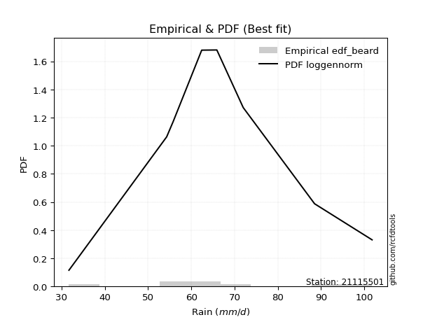</img>

</div>


### 5. EDF Chegodayev (1955)

The Chegodayev formula is an empirical plotting position formula used in hydrological frequency analysis to estimate the exceedance probability or return period of a specific event from a set of observed data. It is primarily used for plotting observed data points on probability paper to fit a theoretical distribution, particularly for analyzing extreme events like maximum flood flows or rainfall intensities. The constant _b_ value in the generalized plotting position formula is 0.3.

<div align="center">


$P=(m-b)/(n+1-2b)$


</div>


**5.1. Empirical values**

<div align="center">

|                | 0                   | 1                   | 2                   | 3                   | 4                  | 5                  | 6                  | 7                  |
|:---------------|:--------------------|:--------------------|:--------------------|:--------------------|:-------------------|:-------------------|:-------------------|:-------------------|
| date           | 2016                | 2023                | 2017                | 2019                | 2021               | 2018               | 2022               | 2020               |
| x              | 31.7                | 54.3                | 55.8                | 62.4                | 65.9               | 72.0               | 88.5               | 101.8              |
| m              | 1                   | 2                   | 3                   | 4                   | 5                  | 6                  | 7                  | 8                  |
| empirical_dist | edf_chegodayev      | edf_chegodayev      | edf_chegodayev      | edf_chegodayev      | edf_chegodayev     | edf_chegodayev     | edf_chegodayev     | edf_chegodayev     |
| empirical      | 0.08333333333333333 | 0.20238095238095236 | 0.32142857142857145 | 0.44047619047619047 | 0.5595238095238095 | 0.6785714285714286 | 0.7976190476190476 | 0.9166666666666666 |
| empirical_tr   | 1.090909090909091   | 1.253731343283582   | 1.4736842105263157  | 1.7872340425531914  | 2.27027027027027   | 3.1111111111111116 | 4.941176470588234  | 11.999999999999995 |

</div>


**5.2. Kolmogorov-Smirnov fit test (sorted by Δ)**


<div align="center">

|                | 0                   | 1                   | 2                   | 3                   | 4                  | 5                  | 6                  | 7                   | 8                   | 9                   | 10                  | 11                  | 12                 | 13                  | 14                  | 15                  | 16                  | 17                  | 18                  | 19                  | 20                  | 21                 | 22                  | 23                  | 24                 | 25                 | 26                 | 27                  | 28                  | 29                  | 30                  | 31                  | 32                  | 33                  | 34                  | 35                 | 36                  | 37                  | 38                  | 39                 | 40                  | 41                  | 42                  | 43                  | 44                  | 45                  | 46                  | 47                  | 48                  | 49                  | 50                  | 51                  | 52                  | 53                  | 54                  | 55                  | 56                  | 57                  | 58                  | 59                  | 60                  | 61                  | 62                  | 63                  | 64                  | 65                 | 66                  | 67                  | 68                  | 69                 | 70                  | 71                 | 72                 | 73                 | 74                  | 75                  | 76                  | 77                  | 78                 | 79                  | 80                  | 81                  | 82                  | 83                  | 84                  | 85                  | 86                 | 87                  | 88                  | 89                 | 90                  | 91                  | 92                  | 93                  | 94                  | 95                 | 96                  | 97                  | 98                  | 99                  | 100                 | 101                | 102                | 103                 | 104                 | 105                 | 106                | 107                 | 108                | 109                | 110                | 111                 | 112                 | 113                 | 114                 | 115                | 116                 | 117                 | 118                 | 119                | 120                 | 121                 | 122                | 123                | 124                 | 125                 | 126                | 127                | 128                | 129                | 130                 | 131                 | 132                 | 133                | 134                | 135                 | 136                 | 137                 | 138                 | 139                | 140                | 141                 | 142                 | 143                 | 144                 | 145                | 146                | 147                | 148                | 149                | 150                | 151                | 152                | 153                | 154                | 155                | 156                | 157                | 158                | 159                |
|:---------------|:--------------------|:--------------------|:--------------------|:--------------------|:-------------------|:-------------------|:-------------------|:--------------------|:--------------------|:--------------------|:--------------------|:--------------------|:-------------------|:--------------------|:--------------------|:--------------------|:--------------------|:--------------------|:--------------------|:--------------------|:--------------------|:-------------------|:--------------------|:--------------------|:-------------------|:-------------------|:-------------------|:--------------------|:--------------------|:--------------------|:--------------------|:--------------------|:--------------------|:--------------------|:--------------------|:-------------------|:--------------------|:--------------------|:--------------------|:-------------------|:--------------------|:--------------------|:--------------------|:--------------------|:--------------------|:--------------------|:--------------------|:--------------------|:--------------------|:--------------------|:--------------------|:--------------------|:--------------------|:--------------------|:--------------------|:--------------------|:--------------------|:--------------------|:--------------------|:--------------------|:--------------------|:--------------------|:--------------------|:--------------------|:--------------------|:-------------------|:--------------------|:--------------------|:--------------------|:-------------------|:--------------------|:-------------------|:-------------------|:-------------------|:--------------------|:--------------------|:--------------------|:--------------------|:-------------------|:--------------------|:--------------------|:--------------------|:--------------------|:--------------------|:--------------------|:--------------------|:-------------------|:--------------------|:--------------------|:-------------------|:--------------------|:--------------------|:--------------------|:--------------------|:--------------------|:-------------------|:--------------------|:--------------------|:--------------------|:--------------------|:--------------------|:-------------------|:-------------------|:--------------------|:--------------------|:--------------------|:-------------------|:--------------------|:-------------------|:-------------------|:-------------------|:--------------------|:--------------------|:--------------------|:--------------------|:-------------------|:--------------------|:--------------------|:--------------------|:-------------------|:--------------------|:--------------------|:-------------------|:-------------------|:--------------------|:--------------------|:-------------------|:-------------------|:-------------------|:-------------------|:--------------------|:--------------------|:--------------------|:-------------------|:-------------------|:--------------------|:--------------------|:--------------------|:--------------------|:-------------------|:-------------------|:--------------------|:--------------------|:--------------------|:--------------------|:-------------------|:-------------------|:-------------------|:-------------------|:-------------------|:-------------------|:-------------------|:-------------------|:-------------------|:-------------------|:-------------------|:-------------------|:-------------------|:-------------------|:-------------------|
| station        | 21115501            | 21115501            | 21115501            | 21115501            | 21115501           | 21115501           | 21115501           | 21115501            | 21115501            | 21115501            | 21115501            | 21115501            | 21115501           | 21115501            | 21115501            | 21115501            | 21115501            | 21115501            | 21115501            | 21115501            | 21115501            | 21115501           | 21115501            | 21115501            | 21115501           | 21115501           | 21115501           | 21115501            | 21115501            | 21115501            | 21115501            | 21115501            | 21115501            | 21115501            | 21115501            | 21115501           | 21115501            | 21115501            | 21115501            | 21115501           | 21115501            | 21115501            | 21115501            | 21115501            | 21115501            | 21115501            | 21115501            | 21115501            | 21115501            | 21115501            | 21115501            | 21115501            | 21115501            | 21115501            | 21115501            | 21115501            | 21115501            | 21115501            | 21115501            | 21115501            | 21115501            | 21115501            | 21115501            | 21115501            | 21115501            | 21115501           | 21115501            | 21115501            | 21115501            | 21115501           | 21115501            | 21115501           | 21115501           | 21115501           | 21115501            | 21115501            | 21115501            | 21115501            | 21115501           | 21115501            | 21115501            | 21115501            | 21115501            | 21115501            | 21115501            | 21115501            | 21115501           | 21115501            | 21115501            | 21115501           | 21115501            | 21115501            | 21115501            | 21115501            | 21115501            | 21115501           | 21115501            | 21115501            | 21115501            | 21115501            | 21115501            | 21115501           | 21115501           | 21115501            | 21115501            | 21115501            | 21115501           | 21115501            | 21115501           | 21115501           | 21115501           | 21115501            | 21115501            | 21115501            | 21115501            | 21115501           | 21115501            | 21115501            | 21115501            | 21115501           | 21115501            | 21115501            | 21115501           | 21115501           | 21115501            | 21115501            | 21115501           | 21115501           | 21115501           | 21115501           | 21115501            | 21115501            | 21115501            | 21115501           | 21115501           | 21115501            | 21115501            | 21115501            | 21115501            | 21115501           | 21115501           | 21115501            | 21115501            | 21115501            | 21115501            | 21115501           | 21115501           | 21115501           | 21115501           | 21115501           | 21115501           | 21115501           | 21115501           | 21115501           | 21115501           | 21115501           | 21115501           | 21115501           | 21115501           | 21115501           |
| empirical_dist | edf_chegodayev      | edf_chegodayev      | edf_chegodayev      | edf_chegodayev      | edf_chegodayev     | edf_chegodayev     | edf_chegodayev     | edf_chegodayev      | edf_chegodayev      | edf_chegodayev      | edf_chegodayev      | edf_chegodayev      | edf_chegodayev     | edf_chegodayev      | edf_chegodayev      | edf_chegodayev      | edf_chegodayev      | edf_chegodayev      | edf_chegodayev      | edf_chegodayev      | edf_chegodayev      | edf_chegodayev     | edf_chegodayev      | edf_chegodayev      | edf_chegodayev     | edf_chegodayev     | edf_chegodayev     | edf_chegodayev      | edf_chegodayev      | edf_chegodayev      | edf_chegodayev      | edf_chegodayev      | edf_chegodayev      | edf_chegodayev      | edf_chegodayev      | edf_chegodayev     | edf_chegodayev      | edf_chegodayev      | edf_chegodayev      | edf_chegodayev     | edf_chegodayev      | edf_chegodayev      | edf_chegodayev      | edf_chegodayev      | edf_chegodayev      | edf_chegodayev      | edf_chegodayev      | edf_chegodayev      | edf_chegodayev      | edf_chegodayev      | edf_chegodayev      | edf_chegodayev      | edf_chegodayev      | edf_chegodayev      | edf_chegodayev      | edf_chegodayev      | edf_chegodayev      | edf_chegodayev      | edf_chegodayev      | edf_chegodayev      | edf_chegodayev      | edf_chegodayev      | edf_chegodayev      | edf_chegodayev      | edf_chegodayev      | edf_chegodayev     | edf_chegodayev      | edf_chegodayev      | edf_chegodayev      | edf_chegodayev     | edf_chegodayev      | edf_chegodayev     | edf_chegodayev     | edf_chegodayev     | edf_chegodayev      | edf_chegodayev      | edf_chegodayev      | edf_chegodayev      | edf_chegodayev     | edf_chegodayev      | edf_chegodayev      | edf_chegodayev      | edf_chegodayev      | edf_chegodayev      | edf_chegodayev      | edf_chegodayev      | edf_chegodayev     | edf_chegodayev      | edf_chegodayev      | edf_chegodayev     | edf_chegodayev      | edf_chegodayev      | edf_chegodayev      | edf_chegodayev      | edf_chegodayev      | edf_chegodayev     | edf_chegodayev      | edf_chegodayev      | edf_chegodayev      | edf_chegodayev      | edf_chegodayev      | edf_chegodayev     | edf_chegodayev     | edf_chegodayev      | edf_chegodayev      | edf_chegodayev      | edf_chegodayev     | edf_chegodayev      | edf_chegodayev     | edf_chegodayev     | edf_chegodayev     | edf_chegodayev      | edf_chegodayev      | edf_chegodayev      | edf_chegodayev      | edf_chegodayev     | edf_chegodayev      | edf_chegodayev      | edf_chegodayev      | edf_chegodayev     | edf_chegodayev      | edf_chegodayev      | edf_chegodayev     | edf_chegodayev     | edf_chegodayev      | edf_chegodayev      | edf_chegodayev     | edf_chegodayev     | edf_chegodayev     | edf_chegodayev     | edf_chegodayev      | edf_chegodayev      | edf_chegodayev      | edf_chegodayev     | edf_chegodayev     | edf_chegodayev      | edf_chegodayev      | edf_chegodayev      | edf_chegodayev      | edf_chegodayev     | edf_chegodayev     | edf_chegodayev      | edf_chegodayev      | edf_chegodayev      | edf_chegodayev      | edf_chegodayev     | edf_chegodayev     | edf_chegodayev     | edf_chegodayev     | edf_chegodayev     | edf_chegodayev     | edf_chegodayev     | edf_chegodayev     | edf_chegodayev     | edf_chegodayev     | edf_chegodayev     | edf_chegodayev     | edf_chegodayev     | edf_chegodayev     | edf_chegodayev     |
| p_dist         | loggennorm          | logdweibull         | logdgamma           | genlogistic         | logt               | exponnorm          | mielke             | logcrystalball      | burr                | loggenlogistic      | norm                | crystalball         | truncnorm          | t                   | pearson3            | logburr             | logmielke           | nct                 | johnsonsu           | erlang              | gamma               | betaprime          | f                   | loggumbel_l         | skewnorm           | logloggamma        | logjohnsonsu       | logburr12           | logistic            | logloglaplace       | logweibull_min      | alpha               | vonmises_line       | loglaplace          | loglaplace          | cosine             | loghypsecant        | invgamma            | rice                | weibull_min        | gennorm             | hypsecant           | logpearson3         | logskewnorm         | gumbel_r            | maxwell             | logexponpow         | laplace             | moyal               | anglit              | dweibull            | loggenextreme       | logweibull_max      | dgamma              | loglogistic         | invgauss            | rayleigh            | logargus            | semicircular        | logtriang           | logexponnorm        | lognorm             | logf                | uniform             | logfatiguelife      | halflogistic       | lognct              | loggamma            | loggamma            | logbetaprime       | logrice             | wald               | halfnorm           | logerlang          | loginvgamma         | wrapcauchy          | loggengamma         | gompertz            | loggausshyper      | loganglit           | kstwobign           | gumbel_l            | logalpha            | kappa4              | loginvgauss         | ksone               | logmaxwell         | logsemicircular     | kappa3              | gausshyper         | beta                | arcsine             | loggumbel_r         | lograyleigh         | argus               | loggenhalflogistic | logfoldnorm         | ncf                 | logcosine           | logmoyal            | logexponweib        | logbeta            | loginvweibull      | logarcsine          | loghalfnorm         | bradford            | loghalflogistic    | logncf              | nakagami           | logtruncnorm       | logwald            | truncexpon          | logtruncweibull_min | logrdist            | logkstwobign        | logtrapezoid       | genpareto           | triang              | loggenexpon         | loglevy_l          | logvonmises_line    | logkappa4           | truncweibull_min   | genhalflogistic    | logkappa3           | loguniform          | lomax              | logksone           | logtukeylambda     | lognakagami        | genexpon            | logwrapcauchy       | levy_l              | loggompertz        | burr12             | loglomax            | logbradford         | halfgennorm         | johnsonsb           | loggenpareto       | tukeylambda        | logtruncexpon       | trapezoid           | genextreme          | invweibull          | logjohnsonsb       | rdist              | foldnorm           | weibull_max        | powerlaw           | gengamma           | fatiguelife        | exponweib          | logpowerlaw        | exponpow           | truncpareto        | logtruncpareto     | loghalfgennorm     | logvonmises        | vonmises           |
| delta          | 0.06453923411916052 | 0.06609028319584531 | 0.06728240714543032 | 0.06898702792570013 | 0.069500590776479  | 0.0711310583537505 | 0.0713315909268902 | 0.07137682990999583 | 0.07149727841367151 | 0.07155657546755631 | 0.07238340379558672 | 0.07238341288150718 | 0.0723834180253351 | 0.07239549261693612 | 0.07414297228200203 | 0.07514664487597059 | 0.07529634264638721 | 0.07576394325581967 | 0.07576770526193574 | 0.07634919615353244 | 0.07664301061641784 | 0.0769508749347366 | 0.07700986158612064 | 0.07725080751179136 | 0.0773778491627499 | 0.0785970240351542 | 0.0797705036126444 | 0.07982475099929523 | 0.08049683225683502 | 0.08055638607376206 | 0.08095587251333972 | 0.08263409456390061 | 0.08333333188774661 | 0.08355852747324088 | 0.08355852747324088 | 0.0837165047922317 | 0.08471483004299205 | 0.08487842150823496 | 0.08552766868695419 | 0.0869286431731415 | 0.08771175827967581 | 0.08848606725561992 | 0.08965294274720112 | 0.09035150757974628 | 0.09169485473242558 | 0.09395732244735258 | 0.09482162375111444 | 0.09515538338451002 | 0.09573295223300857 | 0.09584390410057217 | 0.09823229943852807 | 0.09939096742841791 | 0.09942124174553968 | 0.09945840085151814 | 0.09971563262874897 | 0.10077875374847181 | 0.10392975374143296 | 0.10470244491623612 | 0.10723270969929186 | 0.11231175677094074 | 0.11978626512574705 | 0.11978650717224357 | 0.11979617939070528 | 0.12001562393859114 | 0.12009236085703864 | 0.1231419151369644 | 0.12430608559504794 | 0.12620711886186395 | 0.12620711886186395 | 0.1270810312571428 | 0.12808690250201896 | 0.1310569953919365 | 0.131601307809219  | 0.1318437409335734 | 0.13260839037848907 | 0.13382468435249742 | 0.13441876379480247 | 0.13513725487135098 | 0.1394135602207269 | 0.14241961928369232 | 0.14286160101508685 | 0.14302018612955336 | 0.14439609085943392 | 0.14661287403015252 | 0.14952160523931948 | 0.14961619455200062 | 0.1497172774490443 | 0.15198756029650382 | 0.15354936005011985 | 0.1542323773577957 | 0.15545868125692186 | 0.15626113851897552 | 0.16002875100749545 | 0.16131271994425836 | 0.16223402841573564 | 0.1633384174172131 | 0.16504711907086903 | 0.16977750864113747 | 0.17328268178049425 | 0.17389670805609822 | 0.17894465755645686 | 0.1812823263425834 | 0.1897697879994619 | 0.19177065167213667 | 0.19428530557682774 | 0.19597942706335222 | 0.1972446492989344 | 0.19855402032816785 | 0.2023809508237658 | 0.2098941037257746 | 0.2107490624918148 | 0.21125270806515864 | 0.2154904603541887  | 0.22191377931865472 | 0.22541858682560925 | 0.2306306511910693 | 0.23247533680830382 | 0.23484558412334805 | 0.23538234015959977 | 0.2402589420083054 | 0.24464983626850337 | 0.24465343670745324 | 0.250747379602273  | 0.2528201136279209 | 0.25847746253381065 | 0.25892922160216036 | 0.2609400509263189 | 0.2653775259383081 | 0.2704283871845326 | 0.2724583015829427 | 0.27479804932691976 | 0.28466570560712834 | 0.28904859748936923 | 0.3030997612892916 | 0.3368127522374398 | 0.33891589367712815 | 0.34681308167610636 | 0.35072890745828855 | 0.35166112359455337 | 0.3529501403186426 | 0.3588322409766429 | 0.35948453572196604 | 0.36226547376059176 | 0.36394346131704347 | 0.46112601533883685 | 0.50129923985982   | 0.5531787847143756 | 0.5595238095238095 | 0.5980886737938587 | 0.6037812554117842 | 0.6071647127087423 | 0.6197770153375673 | 0.6218956341781722 | 0.6490856782164626 | 0.7121152358445919 | 0.7254410993814157 | 0.7474029597199455 | 0.7976190476190476 | 1.1131677698463192 | 15.802432628643095 |
| deltao         | 0.4472608134160001  | 0.4472608134160001  | 0.4472608134160001  | 0.4472608134160001  | 0.4472608134160001 | 0.4472608134160001 | 0.4472608134160001 | 0.4472608134160001  | 0.4472608134160001  | 0.4472608134160001  | 0.4472608134160001  | 0.4472608134160001  | 0.4472608134160001 | 0.4472608134160001  | 0.4472608134160001  | 0.4472608134160001  | 0.4472608134160001  | 0.4472608134160001  | 0.4472608134160001  | 0.4472608134160001  | 0.4472608134160001  | 0.4472608134160001 | 0.4472608134160001  | 0.4472608134160001  | 0.4472608134160001 | 0.4472608134160001 | 0.4472608134160001 | 0.4472608134160001  | 0.4472608134160001  | 0.4472608134160001  | 0.4472608134160001  | 0.4472608134160001  | 0.4472608134160001  | 0.4472608134160001  | 0.4472608134160001  | 0.4472608134160001 | 0.4472608134160001  | 0.4472608134160001  | 0.4472608134160001  | 0.4472608134160001 | 0.4472608134160001  | 0.4472608134160001  | 0.4472608134160001  | 0.4472608134160001  | 0.4472608134160001  | 0.4472608134160001  | 0.4472608134160001  | 0.4472608134160001  | 0.4472608134160001  | 0.4472608134160001  | 0.4472608134160001  | 0.4472608134160001  | 0.4472608134160001  | 0.4472608134160001  | 0.4472608134160001  | 0.4472608134160001  | 0.4472608134160001  | 0.4472608134160001  | 0.4472608134160001  | 0.4472608134160001  | 0.4472608134160001  | 0.4472608134160001  | 0.4472608134160001  | 0.4472608134160001  | 0.4472608134160001  | 0.4472608134160001 | 0.4472608134160001  | 0.4472608134160001  | 0.4472608134160001  | 0.4472608134160001 | 0.4472608134160001  | 0.4472608134160001 | 0.4472608134160001 | 0.4472608134160001 | 0.4472608134160001  | 0.4472608134160001  | 0.4472608134160001  | 0.4472608134160001  | 0.4472608134160001 | 0.4472608134160001  | 0.4472608134160001  | 0.4472608134160001  | 0.4472608134160001  | 0.4472608134160001  | 0.4472608134160001  | 0.4472608134160001  | 0.4472608134160001 | 0.4472608134160001  | 0.4472608134160001  | 0.4472608134160001 | 0.4472608134160001  | 0.4472608134160001  | 0.4472608134160001  | 0.4472608134160001  | 0.4472608134160001  | 0.4472608134160001 | 0.4472608134160001  | 0.4472608134160001  | 0.4472608134160001  | 0.4472608134160001  | 0.4472608134160001  | 0.4472608134160001 | 0.4472608134160001 | 0.4472608134160001  | 0.4472608134160001  | 0.4472608134160001  | 0.4472608134160001 | 0.4472608134160001  | 0.4472608134160001 | 0.4472608134160001 | 0.4472608134160001 | 0.4472608134160001  | 0.4472608134160001  | 0.4472608134160001  | 0.4472608134160001  | 0.4472608134160001 | 0.4472608134160001  | 0.4472608134160001  | 0.4472608134160001  | 0.4472608134160001 | 0.4472608134160001  | 0.4472608134160001  | 0.4472608134160001 | 0.4472608134160001 | 0.4472608134160001  | 0.4472608134160001  | 0.4472608134160001 | 0.4472608134160001 | 0.4472608134160001 | 0.4472608134160001 | 0.4472608134160001  | 0.4472608134160001  | 0.4472608134160001  | 0.4472608134160001 | 0.4472608134160001 | 0.4472608134160001  | 0.4472608134160001  | 0.4472608134160001  | 0.4472608134160001  | 0.4472608134160001 | 0.4472608134160001 | 0.4472608134160001  | 0.4472608134160001  | 0.4472608134160001  | 0.4472608134160001  | 0.4472608134160001 | 0.4472608134160001 | 0.4472608134160001 | 0.4472608134160001 | 0.4472608134160001 | 0.4472608134160001 | 0.4472608134160001 | 0.4472608134160001 | 0.4472608134160001 | 0.4472608134160001 | 0.4472608134160001 | 0.4472608134160001 | 0.4472608134160001 | 0.4472608134160001 | 0.4472608134160001 |
| eval           | Δo > Δ              | Δo > Δ              | Δo > Δ              | Δo > Δ              | Δo > Δ             | Δo > Δ             | Δo > Δ             | Δo > Δ              | Δo > Δ              | Δo > Δ              | Δo > Δ              | Δo > Δ              | Δo > Δ             | Δo > Δ              | Δo > Δ              | Δo > Δ              | Δo > Δ              | Δo > Δ              | Δo > Δ              | Δo > Δ              | Δo > Δ              | Δo > Δ             | Δo > Δ              | Δo > Δ              | Δo > Δ             | Δo > Δ             | Δo > Δ             | Δo > Δ              | Δo > Δ              | Δo > Δ              | Δo > Δ              | Δo > Δ              | Δo > Δ              | Δo > Δ              | Δo > Δ              | Δo > Δ             | Δo > Δ              | Δo > Δ              | Δo > Δ              | Δo > Δ             | Δo > Δ              | Δo > Δ              | Δo > Δ              | Δo > Δ              | Δo > Δ              | Δo > Δ              | Δo > Δ              | Δo > Δ              | Δo > Δ              | Δo > Δ              | Δo > Δ              | Δo > Δ              | Δo > Δ              | Δo > Δ              | Δo > Δ              | Δo > Δ              | Δo > Δ              | Δo > Δ              | Δo > Δ              | Δo > Δ              | Δo > Δ              | Δo > Δ              | Δo > Δ              | Δo > Δ              | Δo > Δ              | Δo > Δ             | Δo > Δ              | Δo > Δ              | Δo > Δ              | Δo > Δ             | Δo > Δ              | Δo > Δ             | Δo > Δ             | Δo > Δ             | Δo > Δ              | Δo > Δ              | Δo > Δ              | Δo > Δ              | Δo > Δ             | Δo > Δ              | Δo > Δ              | Δo > Δ              | Δo > Δ              | Δo > Δ              | Δo > Δ              | Δo > Δ              | Δo > Δ             | Δo > Δ              | Δo > Δ              | Δo > Δ             | Δo > Δ              | Δo > Δ              | Δo > Δ              | Δo > Δ              | Δo > Δ              | Δo > Δ             | Δo > Δ              | Δo > Δ              | Δo > Δ              | Δo > Δ              | Δo > Δ              | Δo > Δ             | Δo > Δ             | Δo > Δ              | Δo > Δ              | Δo > Δ              | Δo > Δ             | Δo > Δ              | Δo > Δ             | Δo > Δ             | Δo > Δ             | Δo > Δ              | Δo > Δ              | Δo > Δ              | Δo > Δ              | Δo > Δ             | Δo > Δ              | Δo > Δ              | Δo > Δ              | Δo > Δ             | Δo > Δ              | Δo > Δ              | Δo > Δ             | Δo > Δ             | Δo > Δ              | Δo > Δ              | Δo > Δ             | Δo > Δ             | Δo > Δ             | Δo > Δ             | Δo > Δ              | Δo > Δ              | Δo > Δ              | Δo > Δ             | Δo > Δ             | Δo > Δ              | Δo > Δ              | Δo > Δ              | Δo > Δ              | Δo > Δ             | Δo > Δ             | Δo > Δ              | Δo > Δ              | Δo > Δ              | Δo <= Δ             | Δo <= Δ            | Δo <= Δ            | Δo <= Δ            | Δo <= Δ            | Δo <= Δ            | Δo <= Δ            | Δo <= Δ            | Δo <= Δ            | Δo <= Δ            | Δo <= Δ            | Δo <= Δ            | Δo <= Δ            | Δo <= Δ            | Δo <= Δ            | Δo <= Δ            |
| fit            | 1                   | 1                   | 1                   | 1                   | 1                  | 1                  | 1                  | 1                   | 1                   | 1                   | 1                   | 1                   | 1                  | 1                   | 1                   | 1                   | 1                   | 1                   | 1                   | 1                   | 1                   | 1                  | 1                   | 1                   | 1                  | 1                  | 1                  | 1                   | 1                   | 1                   | 1                   | 1                   | 1                   | 1                   | 1                   | 1                  | 1                   | 1                   | 1                   | 1                  | 1                   | 1                   | 1                   | 1                   | 1                   | 1                   | 1                   | 1                   | 1                   | 1                   | 1                   | 1                   | 1                   | 1                   | 1                   | 1                   | 1                   | 1                   | 1                   | 1                   | 1                   | 1                   | 1                   | 1                   | 1                   | 1                  | 1                   | 1                   | 1                   | 1                  | 1                   | 1                  | 1                  | 1                  | 1                   | 1                   | 1                   | 1                   | 1                  | 1                   | 1                   | 1                   | 1                   | 1                   | 1                   | 1                   | 1                  | 1                   | 1                   | 1                  | 1                   | 1                   | 1                   | 1                   | 1                   | 1                  | 1                   | 1                   | 1                   | 1                   | 1                   | 1                  | 1                  | 1                   | 1                   | 1                   | 1                  | 1                   | 1                  | 1                  | 1                  | 1                   | 1                   | 1                   | 1                   | 1                  | 1                   | 1                   | 1                   | 1                  | 1                   | 1                   | 1                  | 1                  | 1                   | 1                   | 1                  | 1                  | 1                  | 1                  | 1                   | 1                   | 1                   | 1                  | 1                  | 1                   | 1                   | 1                   | 1                   | 1                  | 1                  | 1                   | 1                   | 1                   | 0                   | 0                  | 0                  | 0                  | 0                  | 0                  | 0                  | 0                  | 0                  | 0                  | 0                  | 0                  | 0                  | 0                  | 0                  | 0                  |
| n              | 8                   | 8                   | 8                   | 8                   | 8                  | 8                  | 8                  | 8                   | 8                   | 8                   | 8                   | 8                   | 8                  | 8                   | 8                   | 8                   | 8                   | 8                   | 8                   | 8                   | 8                   | 8                  | 8                   | 8                   | 8                  | 8                  | 8                  | 8                   | 8                   | 8                   | 8                   | 8                   | 8                   | 8                   | 8                   | 8                  | 8                   | 8                   | 8                   | 8                  | 8                   | 8                   | 8                   | 8                   | 8                   | 8                   | 8                   | 8                   | 8                   | 8                   | 8                   | 8                   | 8                   | 8                   | 8                   | 8                   | 8                   | 8                   | 8                   | 8                   | 8                   | 8                   | 8                   | 8                   | 8                   | 8                  | 8                   | 8                   | 8                   | 8                  | 8                   | 8                  | 8                  | 8                  | 8                   | 8                   | 8                   | 8                   | 8                  | 8                   | 8                   | 8                   | 8                   | 8                   | 8                   | 8                   | 8                  | 8                   | 8                   | 8                  | 8                   | 8                   | 8                   | 8                   | 8                   | 8                  | 8                   | 8                   | 8                   | 8                   | 8                   | 8                  | 8                  | 8                   | 8                   | 8                   | 8                  | 8                   | 8                  | 8                  | 8                  | 8                   | 8                   | 8                   | 8                   | 8                  | 8                   | 8                   | 8                   | 8                  | 8                   | 8                   | 8                  | 8                  | 8                   | 8                   | 8                  | 8                  | 8                  | 8                  | 8                   | 8                   | 8                   | 8                  | 8                  | 8                   | 8                   | 8                   | 8                   | 8                  | 8                  | 8                   | 8                   | 8                   | 8                   | 8                  | 8                  | 8                  | 8                  | 8                  | 8                  | 8                  | 8                  | 8                  | 8                  | 8                  | 8                  | 8                  | 8                  | 8                  |
| best_fit       | 1                   | 0                   | 0                   | 0                   | 0                  | 0                  | 0                  | 0                   | 0                   | 0                   | 0                   | 0                   | 0                  | 0                   | 0                   | 0                   | 0                   | 0                   | 0                   | 0                   | 0                   | 0                  | 0                   | 0                   | 0                  | 0                  | 0                  | 0                   | 0                   | 0                   | 0                   | 0                   | 0                   | 0                   | 0                   | 0                  | 0                   | 0                   | 0                   | 0                  | 0                   | 0                   | 0                   | 0                   | 0                   | 0                   | 0                   | 0                   | 0                   | 0                   | 0                   | 0                   | 0                   | 0                   | 0                   | 0                   | 0                   | 0                   | 0                   | 0                   | 0                   | 0                   | 0                   | 0                   | 0                   | 0                  | 0                   | 0                   | 0                   | 0                  | 0                   | 0                  | 0                  | 0                  | 0                   | 0                   | 0                   | 0                   | 0                  | 0                   | 0                   | 0                   | 0                   | 0                   | 0                   | 0                   | 0                  | 0                   | 0                   | 0                  | 0                   | 0                   | 0                   | 0                   | 0                   | 0                  | 0                   | 0                   | 0                   | 0                   | 0                   | 0                  | 0                  | 0                   | 0                   | 0                   | 0                  | 0                   | 0                  | 0                  | 0                  | 0                   | 0                   | 0                   | 0                   | 0                  | 0                   | 0                   | 0                   | 0                  | 0                   | 0                   | 0                  | 0                  | 0                   | 0                   | 0                  | 0                  | 0                  | 0                  | 0                   | 0                   | 0                   | 0                  | 0                  | 0                   | 0                   | 0                   | 0                   | 0                  | 0                  | 0                   | 0                   | 0                   | 0                   | 0                  | 0                  | 0                  | 0                  | 0                  | 0                  | 0                  | 0                  | 0                  | 0                  | 0                  | 0                  | 0                  | 0                  | 0                  |
| best_fit_sort  | 1                   | 2                   | 3                   | 4                   | 5                  | 6                  | 7                  | 8                   | 9                   | 10                  | 11                  | 12                  | 13                 | 14                  | 15                  | 16                  | 17                  | 18                  | 19                  | 20                  | 21                  | 22                 | 23                  | 24                  | 25                 | 26                 | 27                 | 28                  | 29                  | 30                  | 31                  | 32                  | 33                  | 34                  | 35                  | 36                 | 37                  | 38                  | 39                  | 40                 | 41                  | 42                  | 43                  | 44                  | 45                  | 46                  | 47                  | 48                  | 49                  | 50                  | 51                  | 52                  | 53                  | 54                  | 55                  | 56                  | 57                  | 58                  | 59                  | 60                  | 61                  | 62                  | 63                  | 64                  | 65                  | 66                 | 67                  | 68                  | 69                  | 70                 | 71                  | 72                 | 73                 | 74                 | 75                  | 76                  | 77                  | 78                  | 79                 | 80                  | 81                  | 82                  | 83                  | 84                  | 85                  | 86                  | 87                 | 88                  | 89                  | 90                 | 91                  | 92                  | 93                  | 94                  | 95                  | 96                 | 97                  | 98                  | 99                  | 100                 | 101                 | 102                | 103                | 104                 | 105                 | 106                 | 107                | 108                 | 109                | 110                | 111                | 112                 | 113                 | 114                 | 115                 | 116                | 117                 | 118                 | 119                 | 120                | 121                 | 122                 | 123                | 124                | 125                 | 126                 | 127                | 128                | 129                | 130                | 131                 | 132                 | 133                 | 134                | 135                | 136                 | 137                 | 138                 | 139                 | 140                | 141                | 142                 | 143                 | 144                 | 145                 | 146                | 147                | 148                | 149                | 150                | 151                | 152                | 153                | 154                | 155                | 156                | 157                | 158                | 159                | 160                |

</div>


**5.3. Best fit**

<div align="center">

|   id |   station | empirical_dist   | p_dist     |     delta |   deltao | eval   |   fit |   n |   best_fit |   best_fit_sort |
|-----:|----------:|:-----------------|:-----------|----------:|---------:|:-------|------:|----:|-----------:|----------------:|
|    0 |  21115501 | edf_chegodayev   | loggennorm | 0.0645392 | 0.447261 | Δo > Δ |     1 |   8 |          1 |               1 |

</div>


<div align="center">

</img></img>

</div>


### 6. EDF Blom (1958)

The Blom formula is a specific "plotting position" formula used in hydrology and statistical analysis to estimate the empirical cumulative probability (or non-exceedance probability) of a data series. It is particularly recommended for data that are approximately normally distributed. The constant _a_ is set to 0.375 (or 3/8).

<div align="center">


$P=(m-a)/(n+1-2a)$


</div>


**6.1. Empirical values**

<div align="center">

|                | 0                   | 1                   | 2                  | 3                  | 4                  | 5                  | 6                 | 7                  |
|:---------------|:--------------------|:--------------------|:-------------------|:-------------------|:-------------------|:-------------------|:------------------|:-------------------|
| date           | 2016                | 2023                | 2017               | 2019               | 2021               | 2018               | 2022              | 2020               |
| x              | 31.7                | 54.3                | 55.8               | 62.4               | 65.9               | 72.0               | 88.5              | 101.8              |
| m              | 1                   | 2                   | 3                  | 4                  | 5                  | 6                  | 7                 | 8                  |
| empirical_dist | edf_blom            | edf_blom            | edf_blom           | edf_blom           | edf_blom           | edf_blom           | edf_blom          | edf_blom           |
| empirical      | 0.07575757575757576 | 0.19696969696969696 | 0.3181818181818182 | 0.4393939393939394 | 0.5606060606060606 | 0.6818181818181818 | 0.803030303030303 | 0.9242424242424242 |
| empirical_tr   | 1.0819672131147542  | 1.2452830188679247  | 1.4666666666666666 | 1.783783783783784  | 2.275862068965517  | 3.1428571428571423 | 5.076923076923076 | 13.199999999999992 |

</div>


**6.2. Kolmogorov-Smirnov fit test (sorted by Δ)**


<div align="center">

|                | 0                   | 1                   | 2                   | 3                   | 4                   | 5                   | 6                  | 7                  | 8                   | 9                  | 10                  | 11                  | 12                 | 13                 | 14                 | 15                  | 16                  | 17                  | 18                  | 19                  | 20                  | 21                 | 22                  | 23                  | 24                  | 25                  | 26                  | 27                  | 28                  | 29                 | 30                 | 31                 | 32                  | 33                  | 34                  | 35                  | 36                 | 37                 | 38                  | 39                  | 40                  | 41                  | 42                 | 43                  | 44                  | 45                  | 46                  | 47                  | 48                  | 49                  | 50                  | 51                  | 52                  | 53                  | 54                  | 55                 | 56                  | 57                  | 58                  | 59                 | 60                  | 61                  | 62                  | 63                  | 64                  | 65                 | 66                  | 67                  | 68                  | 69                  | 70                  | 71                  | 72                 | 73                 | 74                  | 75                  | 76                  | 77                  | 78                  | 79                 | 80                 | 81                  | 82                 | 83                  | 84                  | 85                  | 86                 | 87                 | 88                  | 89                  | 90                  | 91                  | 92                  | 93                 | 94                  | 95                  | 96                  | 97                  | 98                  | 99                  | 100                 | 101                 | 102                | 103                 | 104                 | 105                 | 106                 | 107                | 108                 | 109                 | 110                 | 111                 | 112                 | 113                 | 114                 | 115                 | 116                | 117                 | 118                 | 119                 | 120                 | 121                 | 122                 | 123                 | 124                | 125                 | 126                 | 127                 | 128                 | 129                | 130                | 131                 | 132                | 133                | 134                 | 135                | 136                | 137                | 138                | 139                 | 140                 | 141                | 142                | 143                 | 144                | 145                | 146                | 147                | 148                | 149                | 150                | 151                | 152                | 153                | 154                | 155                | 156                | 157                | 158                | 159                |
|:---------------|:--------------------|:--------------------|:--------------------|:--------------------|:--------------------|:--------------------|:-------------------|:-------------------|:--------------------|:-------------------|:--------------------|:--------------------|:-------------------|:-------------------|:-------------------|:--------------------|:--------------------|:--------------------|:--------------------|:--------------------|:--------------------|:-------------------|:--------------------|:--------------------|:--------------------|:--------------------|:--------------------|:--------------------|:--------------------|:-------------------|:-------------------|:-------------------|:--------------------|:--------------------|:--------------------|:--------------------|:-------------------|:-------------------|:--------------------|:--------------------|:--------------------|:--------------------|:-------------------|:--------------------|:--------------------|:--------------------|:--------------------|:--------------------|:--------------------|:--------------------|:--------------------|:--------------------|:--------------------|:--------------------|:--------------------|:-------------------|:--------------------|:--------------------|:--------------------|:-------------------|:--------------------|:--------------------|:--------------------|:--------------------|:--------------------|:-------------------|:--------------------|:--------------------|:--------------------|:--------------------|:--------------------|:--------------------|:-------------------|:-------------------|:--------------------|:--------------------|:--------------------|:--------------------|:--------------------|:-------------------|:-------------------|:--------------------|:-------------------|:--------------------|:--------------------|:--------------------|:-------------------|:-------------------|:--------------------|:--------------------|:--------------------|:--------------------|:--------------------|:-------------------|:--------------------|:--------------------|:--------------------|:--------------------|:--------------------|:--------------------|:--------------------|:--------------------|:-------------------|:--------------------|:--------------------|:--------------------|:--------------------|:-------------------|:--------------------|:--------------------|:--------------------|:--------------------|:--------------------|:--------------------|:--------------------|:--------------------|:-------------------|:--------------------|:--------------------|:--------------------|:--------------------|:--------------------|:--------------------|:--------------------|:-------------------|:--------------------|:--------------------|:--------------------|:--------------------|:-------------------|:-------------------|:--------------------|:-------------------|:-------------------|:--------------------|:-------------------|:-------------------|:-------------------|:-------------------|:--------------------|:--------------------|:-------------------|:-------------------|:--------------------|:-------------------|:-------------------|:-------------------|:-------------------|:-------------------|:-------------------|:-------------------|:-------------------|:-------------------|:-------------------|:-------------------|:-------------------|:-------------------|:-------------------|:-------------------|:-------------------|
| station        | 21115501            | 21115501            | 21115501            | 21115501            | 21115501            | 21115501            | 21115501           | 21115501           | 21115501            | 21115501           | 21115501            | 21115501            | 21115501           | 21115501           | 21115501           | 21115501            | 21115501            | 21115501            | 21115501            | 21115501            | 21115501            | 21115501           | 21115501            | 21115501            | 21115501            | 21115501            | 21115501            | 21115501            | 21115501            | 21115501           | 21115501           | 21115501           | 21115501            | 21115501            | 21115501            | 21115501            | 21115501           | 21115501           | 21115501            | 21115501            | 21115501            | 21115501            | 21115501           | 21115501            | 21115501            | 21115501            | 21115501            | 21115501            | 21115501            | 21115501            | 21115501            | 21115501            | 21115501            | 21115501            | 21115501            | 21115501           | 21115501            | 21115501            | 21115501            | 21115501           | 21115501            | 21115501            | 21115501            | 21115501            | 21115501            | 21115501           | 21115501            | 21115501            | 21115501            | 21115501            | 21115501            | 21115501            | 21115501           | 21115501           | 21115501            | 21115501            | 21115501            | 21115501            | 21115501            | 21115501           | 21115501           | 21115501            | 21115501           | 21115501            | 21115501            | 21115501            | 21115501           | 21115501           | 21115501            | 21115501            | 21115501            | 21115501            | 21115501            | 21115501           | 21115501            | 21115501            | 21115501            | 21115501            | 21115501            | 21115501            | 21115501            | 21115501            | 21115501           | 21115501            | 21115501            | 21115501            | 21115501            | 21115501           | 21115501            | 21115501            | 21115501            | 21115501            | 21115501            | 21115501            | 21115501            | 21115501            | 21115501           | 21115501            | 21115501            | 21115501            | 21115501            | 21115501            | 21115501            | 21115501            | 21115501           | 21115501            | 21115501            | 21115501            | 21115501            | 21115501           | 21115501           | 21115501            | 21115501           | 21115501           | 21115501            | 21115501           | 21115501           | 21115501           | 21115501           | 21115501            | 21115501            | 21115501           | 21115501           | 21115501            | 21115501           | 21115501           | 21115501           | 21115501           | 21115501           | 21115501           | 21115501           | 21115501           | 21115501           | 21115501           | 21115501           | 21115501           | 21115501           | 21115501           | 21115501           | 21115501           |
| empirical_dist | edf_blom            | edf_blom            | edf_blom            | edf_blom            | edf_blom            | edf_blom            | edf_blom           | edf_blom           | edf_blom            | edf_blom           | edf_blom            | edf_blom            | edf_blom           | edf_blom           | edf_blom           | edf_blom            | edf_blom            | edf_blom            | edf_blom            | edf_blom            | edf_blom            | edf_blom           | edf_blom            | edf_blom            | edf_blom            | edf_blom            | edf_blom            | edf_blom            | edf_blom            | edf_blom           | edf_blom           | edf_blom           | edf_blom            | edf_blom            | edf_blom            | edf_blom            | edf_blom           | edf_blom           | edf_blom            | edf_blom            | edf_blom            | edf_blom            | edf_blom           | edf_blom            | edf_blom            | edf_blom            | edf_blom            | edf_blom            | edf_blom            | edf_blom            | edf_blom            | edf_blom            | edf_blom            | edf_blom            | edf_blom            | edf_blom           | edf_blom            | edf_blom            | edf_blom            | edf_blom           | edf_blom            | edf_blom            | edf_blom            | edf_blom            | edf_blom            | edf_blom           | edf_blom            | edf_blom            | edf_blom            | edf_blom            | edf_blom            | edf_blom            | edf_blom           | edf_blom           | edf_blom            | edf_blom            | edf_blom            | edf_blom            | edf_blom            | edf_blom           | edf_blom           | edf_blom            | edf_blom           | edf_blom            | edf_blom            | edf_blom            | edf_blom           | edf_blom           | edf_blom            | edf_blom            | edf_blom            | edf_blom            | edf_blom            | edf_blom           | edf_blom            | edf_blom            | edf_blom            | edf_blom            | edf_blom            | edf_blom            | edf_blom            | edf_blom            | edf_blom           | edf_blom            | edf_blom            | edf_blom            | edf_blom            | edf_blom           | edf_blom            | edf_blom            | edf_blom            | edf_blom            | edf_blom            | edf_blom            | edf_blom            | edf_blom            | edf_blom           | edf_blom            | edf_blom            | edf_blom            | edf_blom            | edf_blom            | edf_blom            | edf_blom            | edf_blom           | edf_blom            | edf_blom            | edf_blom            | edf_blom            | edf_blom           | edf_blom           | edf_blom            | edf_blom           | edf_blom           | edf_blom            | edf_blom           | edf_blom           | edf_blom           | edf_blom           | edf_blom            | edf_blom            | edf_blom           | edf_blom           | edf_blom            | edf_blom           | edf_blom           | edf_blom           | edf_blom           | edf_blom           | edf_blom           | edf_blom           | edf_blom           | edf_blom           | edf_blom           | edf_blom           | edf_blom           | edf_blom           | edf_blom           | edf_blom           | edf_blom           |
| p_dist         | logdgamma           | logdweibull         | loggennorm          | logcrystalball      | genlogistic         | logt                | exponnorm          | logistic           | norm                | crystalball        | truncnorm           | t                   | mielke             | burr               | loggenlogistic     | loglaplace          | loglaplace          | loggumbel_l         | vonmises_line       | pearson3            | logburr             | logmielke          | nct                 | johnsonsu           | erlang              | gamma               | betaprime           | f                   | skewnorm            | hypsecant          | logloggamma        | logjohnsonsu       | logburr12           | logloglaplace       | logweibull_min      | cosine              | alpha              | laplace            | loghypsecant        | invgamma            | rice                | gennorm             | weibull_min        | dweibull            | dgamma              | logpearson3         | logskewnorm         | gumbel_r            | maxwell             | logexponpow         | moyal               | anglit              | loggenextreme       | logweibull_max      | loglogistic         | invgauss           | rayleigh            | logargus            | semicircular        | logtriang          | logexponnorm        | lognorm             | logf                | uniform             | logfatiguelife      | halflogistic       | lognct              | loggamma            | loggamma            | wald                | logbetaprime        | logrice             | halfnorm           | logerlang          | loginvgamma         | gompertz            | wrapcauchy          | loggengamma         | gumbel_l            | loggausshyper      | loganglit          | kstwobign           | logalpha           | kappa4              | loginvgauss         | ksone               | logmaxwell         | logsemicircular    | gausshyper          | beta                | kappa3              | arcsine             | loggumbel_r         | argus              | loggenhalflogistic  | lograyleigh         | logfoldnorm         | ncf                 | logcosine           | logmoyal            | logexponweib        | logbeta             | loginvweibull      | nakagami            | logarcsine          | loghalfnorm         | bradford            | loghalflogistic    | logncf              | logtruncnorm        | logwald             | truncexpon          | logrdist            | logtruncweibull_min | logkstwobign        | logtrapezoid        | genpareto          | triang              | loggenexpon         | loglevy_l           | logvonmises_line    | logkappa4           | genhalflogistic     | truncweibull_min    | logkappa3          | loguniform          | lomax               | logtukeylambda      | logksone            | lognakagami        | genexpon           | logwrapcauchy       | levy_l             | loggompertz        | burr12              | loglomax           | logbradford        | halfgennorm        | johnsonsb          | loggenpareto        | tukeylambda         | logtruncexpon      | trapezoid          | genextreme          | invweibull         | logjohnsonsb       | rdist              | foldnorm           | weibull_max        | powerlaw           | gengamma           | fatiguelife        | exponweib          | logpowerlaw        | exponpow           | truncpareto        | logtruncpareto     | loghalfgennorm     | logvonmises        | vonmises           |
| delta          | 0.06360213502170026 | 0.06493279989273515 | 0.06624305954663662 | 0.06898235053029389 | 0.07439828333695553 | 0.07491184618773439 | 0.0752059791108583 | 0.0752210314332814 | 0.07527584505528728 | 0.0752758542376738 | 0.07527585482308397 | 0.07530001657415886 | 0.0767428463381456 | 0.0769085338249269 | 0.0769678308788117 | 0.07814727206198546 | 0.07814727206198546 | 0.07833305859404238 | 0.07857837259321587 | 0.07955422769325743 | 0.08055790028722598 | 0.0807075980576426 | 0.08117519866707507 | 0.08117896067319114 | 0.08176045156478784 | 0.08205426602767324 | 0.08236213034599199 | 0.08242111699737603 | 0.08278910457400529 | 0.0830748118443645 | 0.0840082794464096 | 0.0851817590238998 | 0.08523600641055062 | 0.08596764148501745 | 0.08636712792459511 | 0.08696325803898486 | 0.088045349975156  | 0.0897441279732546 | 0.09012608545424744 | 0.09028967691949036 | 0.09093892409820958 | 0.09095851152642898 | 0.0923398985843969 | 0.09282104402727265 | 0.09404714544026271 | 0.09506419815845651 | 0.09576276299100167 | 0.09710611014368098 | 0.09936857785860798 | 0.10023287916236984 | 0.10114420764426396 | 0.10125515951182756 | 0.10263772067517107 | 0.10266799499229284 | 0.10512688804000436 | 0.1061900091597272 | 0.10934100915268835 | 0.11011370032749151 | 0.11264396511054725 | 0.1155585100176939 | 0.12519752053700245 | 0.12519776258349896 | 0.12520743480196067 | 0.12542687934984653 | 0.12550361626829404 | 0.1285531705482198 | 0.12971734100630333 | 0.13161837427311934 | 0.13161837427311934 | 0.13213924647418757 | 0.13249228666839818 | 0.13349815791327435 | 0.1370125632204744 | 0.1372549963448288 | 0.13801964578974446 | 0.13838400811810414 | 0.13923593976375281 | 0.13983001920605787 | 0.14410243721180438 | 0.1448248156319823 | 0.1478308746949477 | 0.14827285642634225 | 0.1498073462706893 | 0.15202412944140792 | 0.15493286065057488 | 0.15502744996325601 | 0.1551285328602997 | 0.1573988157077592 | 0.15747913060454888 | 0.15870543450367502 | 0.15896061546137524 | 0.16167239393023092 | 0.16544000641875084 | 0.1654807816624888 | 0.16658517066396628 | 0.16672397535551375 | 0.17045837448212442 | 0.17518876405239286 | 0.17869393719174964 | 0.17930796346735361 | 0.18435591296771225 | 0.18452907958933656 | 0.1951810434107173 | 0.19696969541251041 | 0.19718190708339206 | 0.19969656098808314 | 0.20139068247460762 | 0.2026559047101898 | 0.20396527573942325 | 0.20664735047902133 | 0.21183131357406587 | 0.21666396347641403 | 0.21866702607190144 | 0.2209017157654441  | 0.23082984223686465 | 0.23387740443782246 | 0.2378865922195592 | 0.23809233737010121 | 0.24079359557085517 | 0.24783469958406296 | 0.25006109167975876 | 0.25006469211870863 | 0.25606686687467406 | 0.25615863501352837 | 0.2638887179450661 | 0.26434047701341573 | 0.26635130633757426 | 0.26718163393777933 | 0.27078878134956347 | 0.2735405526651938 | 0.2802093047381751 | 0.29007696101838376 | 0.2966243550651268 | 0.308511016700547  | 0.34222400764869515 | 0.3443271490883835 | 0.3522243370873617 | 0.3561401628695439 | 0.3570723790058088 | 0.35836139572989795 | 0.36424349638789827 | 0.3648957911332214 | 0.3655122270073449 | 0.36935471672829884 | 0.4687017729145944 | 0.5067104952710753 | 0.558590040125631  | 0.5606060606060606 | 0.603499929205114  | 0.6091925108230396 | 0.6125759681199976 | 0.6251882707488228 | 0.6273068895894276 | 0.654496933627718  | 0.7175264912558472 | 0.7308523547926711 | 0.752814215131201  | 0.803030303030303  | 1.1185790252575745 | 15.794856871067337 |
| deltao         | 0.4472608134160001  | 0.4472608134160001  | 0.4472608134160001  | 0.4472608134160001  | 0.4472608134160001  | 0.4472608134160001  | 0.4472608134160001 | 0.4472608134160001 | 0.4472608134160001  | 0.4472608134160001 | 0.4472608134160001  | 0.4472608134160001  | 0.4472608134160001 | 0.4472608134160001 | 0.4472608134160001 | 0.4472608134160001  | 0.4472608134160001  | 0.4472608134160001  | 0.4472608134160001  | 0.4472608134160001  | 0.4472608134160001  | 0.4472608134160001 | 0.4472608134160001  | 0.4472608134160001  | 0.4472608134160001  | 0.4472608134160001  | 0.4472608134160001  | 0.4472608134160001  | 0.4472608134160001  | 0.4472608134160001 | 0.4472608134160001 | 0.4472608134160001 | 0.4472608134160001  | 0.4472608134160001  | 0.4472608134160001  | 0.4472608134160001  | 0.4472608134160001 | 0.4472608134160001 | 0.4472608134160001  | 0.4472608134160001  | 0.4472608134160001  | 0.4472608134160001  | 0.4472608134160001 | 0.4472608134160001  | 0.4472608134160001  | 0.4472608134160001  | 0.4472608134160001  | 0.4472608134160001  | 0.4472608134160001  | 0.4472608134160001  | 0.4472608134160001  | 0.4472608134160001  | 0.4472608134160001  | 0.4472608134160001  | 0.4472608134160001  | 0.4472608134160001 | 0.4472608134160001  | 0.4472608134160001  | 0.4472608134160001  | 0.4472608134160001 | 0.4472608134160001  | 0.4472608134160001  | 0.4472608134160001  | 0.4472608134160001  | 0.4472608134160001  | 0.4472608134160001 | 0.4472608134160001  | 0.4472608134160001  | 0.4472608134160001  | 0.4472608134160001  | 0.4472608134160001  | 0.4472608134160001  | 0.4472608134160001 | 0.4472608134160001 | 0.4472608134160001  | 0.4472608134160001  | 0.4472608134160001  | 0.4472608134160001  | 0.4472608134160001  | 0.4472608134160001 | 0.4472608134160001 | 0.4472608134160001  | 0.4472608134160001 | 0.4472608134160001  | 0.4472608134160001  | 0.4472608134160001  | 0.4472608134160001 | 0.4472608134160001 | 0.4472608134160001  | 0.4472608134160001  | 0.4472608134160001  | 0.4472608134160001  | 0.4472608134160001  | 0.4472608134160001 | 0.4472608134160001  | 0.4472608134160001  | 0.4472608134160001  | 0.4472608134160001  | 0.4472608134160001  | 0.4472608134160001  | 0.4472608134160001  | 0.4472608134160001  | 0.4472608134160001 | 0.4472608134160001  | 0.4472608134160001  | 0.4472608134160001  | 0.4472608134160001  | 0.4472608134160001 | 0.4472608134160001  | 0.4472608134160001  | 0.4472608134160001  | 0.4472608134160001  | 0.4472608134160001  | 0.4472608134160001  | 0.4472608134160001  | 0.4472608134160001  | 0.4472608134160001 | 0.4472608134160001  | 0.4472608134160001  | 0.4472608134160001  | 0.4472608134160001  | 0.4472608134160001  | 0.4472608134160001  | 0.4472608134160001  | 0.4472608134160001 | 0.4472608134160001  | 0.4472608134160001  | 0.4472608134160001  | 0.4472608134160001  | 0.4472608134160001 | 0.4472608134160001 | 0.4472608134160001  | 0.4472608134160001 | 0.4472608134160001 | 0.4472608134160001  | 0.4472608134160001 | 0.4472608134160001 | 0.4472608134160001 | 0.4472608134160001 | 0.4472608134160001  | 0.4472608134160001  | 0.4472608134160001 | 0.4472608134160001 | 0.4472608134160001  | 0.4472608134160001 | 0.4472608134160001 | 0.4472608134160001 | 0.4472608134160001 | 0.4472608134160001 | 0.4472608134160001 | 0.4472608134160001 | 0.4472608134160001 | 0.4472608134160001 | 0.4472608134160001 | 0.4472608134160001 | 0.4472608134160001 | 0.4472608134160001 | 0.4472608134160001 | 0.4472608134160001 | 0.4472608134160001 |
| eval           | Δo > Δ              | Δo > Δ              | Δo > Δ              | Δo > Δ              | Δo > Δ              | Δo > Δ              | Δo > Δ             | Δo > Δ             | Δo > Δ              | Δo > Δ             | Δo > Δ              | Δo > Δ              | Δo > Δ             | Δo > Δ             | Δo > Δ             | Δo > Δ              | Δo > Δ              | Δo > Δ              | Δo > Δ              | Δo > Δ              | Δo > Δ              | Δo > Δ             | Δo > Δ              | Δo > Δ              | Δo > Δ              | Δo > Δ              | Δo > Δ              | Δo > Δ              | Δo > Δ              | Δo > Δ             | Δo > Δ             | Δo > Δ             | Δo > Δ              | Δo > Δ              | Δo > Δ              | Δo > Δ              | Δo > Δ             | Δo > Δ             | Δo > Δ              | Δo > Δ              | Δo > Δ              | Δo > Δ              | Δo > Δ             | Δo > Δ              | Δo > Δ              | Δo > Δ              | Δo > Δ              | Δo > Δ              | Δo > Δ              | Δo > Δ              | Δo > Δ              | Δo > Δ              | Δo > Δ              | Δo > Δ              | Δo > Δ              | Δo > Δ             | Δo > Δ              | Δo > Δ              | Δo > Δ              | Δo > Δ             | Δo > Δ              | Δo > Δ              | Δo > Δ              | Δo > Δ              | Δo > Δ              | Δo > Δ             | Δo > Δ              | Δo > Δ              | Δo > Δ              | Δo > Δ              | Δo > Δ              | Δo > Δ              | Δo > Δ             | Δo > Δ             | Δo > Δ              | Δo > Δ              | Δo > Δ              | Δo > Δ              | Δo > Δ              | Δo > Δ             | Δo > Δ             | Δo > Δ              | Δo > Δ             | Δo > Δ              | Δo > Δ              | Δo > Δ              | Δo > Δ             | Δo > Δ             | Δo > Δ              | Δo > Δ              | Δo > Δ              | Δo > Δ              | Δo > Δ              | Δo > Δ             | Δo > Δ              | Δo > Δ              | Δo > Δ              | Δo > Δ              | Δo > Δ              | Δo > Δ              | Δo > Δ              | Δo > Δ              | Δo > Δ             | Δo > Δ              | Δo > Δ              | Δo > Δ              | Δo > Δ              | Δo > Δ             | Δo > Δ              | Δo > Δ              | Δo > Δ              | Δo > Δ              | Δo > Δ              | Δo > Δ              | Δo > Δ              | Δo > Δ              | Δo > Δ             | Δo > Δ              | Δo > Δ              | Δo > Δ              | Δo > Δ              | Δo > Δ              | Δo > Δ              | Δo > Δ              | Δo > Δ             | Δo > Δ              | Δo > Δ              | Δo > Δ              | Δo > Δ              | Δo > Δ             | Δo > Δ             | Δo > Δ              | Δo > Δ             | Δo > Δ             | Δo > Δ              | Δo > Δ             | Δo > Δ             | Δo > Δ             | Δo > Δ             | Δo > Δ              | Δo > Δ              | Δo > Δ             | Δo > Δ             | Δo > Δ              | Δo <= Δ            | Δo <= Δ            | Δo <= Δ            | Δo <= Δ            | Δo <= Δ            | Δo <= Δ            | Δo <= Δ            | Δo <= Δ            | Δo <= Δ            | Δo <= Δ            | Δo <= Δ            | Δo <= Δ            | Δo <= Δ            | Δo <= Δ            | Δo <= Δ            | Δo <= Δ            |
| fit            | 1                   | 1                   | 1                   | 1                   | 1                   | 1                   | 1                  | 1                  | 1                   | 1                  | 1                   | 1                   | 1                  | 1                  | 1                  | 1                   | 1                   | 1                   | 1                   | 1                   | 1                   | 1                  | 1                   | 1                   | 1                   | 1                   | 1                   | 1                   | 1                   | 1                  | 1                  | 1                  | 1                   | 1                   | 1                   | 1                   | 1                  | 1                  | 1                   | 1                   | 1                   | 1                   | 1                  | 1                   | 1                   | 1                   | 1                   | 1                   | 1                   | 1                   | 1                   | 1                   | 1                   | 1                   | 1                   | 1                  | 1                   | 1                   | 1                   | 1                  | 1                   | 1                   | 1                   | 1                   | 1                   | 1                  | 1                   | 1                   | 1                   | 1                   | 1                   | 1                   | 1                  | 1                  | 1                   | 1                   | 1                   | 1                   | 1                   | 1                  | 1                  | 1                   | 1                  | 1                   | 1                   | 1                   | 1                  | 1                  | 1                   | 1                   | 1                   | 1                   | 1                   | 1                  | 1                   | 1                   | 1                   | 1                   | 1                   | 1                   | 1                   | 1                   | 1                  | 1                   | 1                   | 1                   | 1                   | 1                  | 1                   | 1                   | 1                   | 1                   | 1                   | 1                   | 1                   | 1                   | 1                  | 1                   | 1                   | 1                   | 1                   | 1                   | 1                   | 1                   | 1                  | 1                   | 1                   | 1                   | 1                   | 1                  | 1                  | 1                   | 1                  | 1                  | 1                   | 1                  | 1                  | 1                  | 1                  | 1                   | 1                   | 1                  | 1                  | 1                   | 0                  | 0                  | 0                  | 0                  | 0                  | 0                  | 0                  | 0                  | 0                  | 0                  | 0                  | 0                  | 0                  | 0                  | 0                  | 0                  |
| n              | 8                   | 8                   | 8                   | 8                   | 8                   | 8                   | 8                  | 8                  | 8                   | 8                  | 8                   | 8                   | 8                  | 8                  | 8                  | 8                   | 8                   | 8                   | 8                   | 8                   | 8                   | 8                  | 8                   | 8                   | 8                   | 8                   | 8                   | 8                   | 8                   | 8                  | 8                  | 8                  | 8                   | 8                   | 8                   | 8                   | 8                  | 8                  | 8                   | 8                   | 8                   | 8                   | 8                  | 8                   | 8                   | 8                   | 8                   | 8                   | 8                   | 8                   | 8                   | 8                   | 8                   | 8                   | 8                   | 8                  | 8                   | 8                   | 8                   | 8                  | 8                   | 8                   | 8                   | 8                   | 8                   | 8                  | 8                   | 8                   | 8                   | 8                   | 8                   | 8                   | 8                  | 8                  | 8                   | 8                   | 8                   | 8                   | 8                   | 8                  | 8                  | 8                   | 8                  | 8                   | 8                   | 8                   | 8                  | 8                  | 8                   | 8                   | 8                   | 8                   | 8                   | 8                  | 8                   | 8                   | 8                   | 8                   | 8                   | 8                   | 8                   | 8                   | 8                  | 8                   | 8                   | 8                   | 8                   | 8                  | 8                   | 8                   | 8                   | 8                   | 8                   | 8                   | 8                   | 8                   | 8                  | 8                   | 8                   | 8                   | 8                   | 8                   | 8                   | 8                   | 8                  | 8                   | 8                   | 8                   | 8                   | 8                  | 8                  | 8                   | 8                  | 8                  | 8                   | 8                  | 8                  | 8                  | 8                  | 8                   | 8                   | 8                  | 8                  | 8                   | 8                  | 8                  | 8                  | 8                  | 8                  | 8                  | 8                  | 8                  | 8                  | 8                  | 8                  | 8                  | 8                  | 8                  | 8                  | 8                  |
| best_fit       | 1                   | 0                   | 0                   | 0                   | 0                   | 0                   | 0                  | 0                  | 0                   | 0                  | 0                   | 0                   | 0                  | 0                  | 0                  | 0                   | 0                   | 0                   | 0                   | 0                   | 0                   | 0                  | 0                   | 0                   | 0                   | 0                   | 0                   | 0                   | 0                   | 0                  | 0                  | 0                  | 0                   | 0                   | 0                   | 0                   | 0                  | 0                  | 0                   | 0                   | 0                   | 0                   | 0                  | 0                   | 0                   | 0                   | 0                   | 0                   | 0                   | 0                   | 0                   | 0                   | 0                   | 0                   | 0                   | 0                  | 0                   | 0                   | 0                   | 0                  | 0                   | 0                   | 0                   | 0                   | 0                   | 0                  | 0                   | 0                   | 0                   | 0                   | 0                   | 0                   | 0                  | 0                  | 0                   | 0                   | 0                   | 0                   | 0                   | 0                  | 0                  | 0                   | 0                  | 0                   | 0                   | 0                   | 0                  | 0                  | 0                   | 0                   | 0                   | 0                   | 0                   | 0                  | 0                   | 0                   | 0                   | 0                   | 0                   | 0                   | 0                   | 0                   | 0                  | 0                   | 0                   | 0                   | 0                   | 0                  | 0                   | 0                   | 0                   | 0                   | 0                   | 0                   | 0                   | 0                   | 0                  | 0                   | 0                   | 0                   | 0                   | 0                   | 0                   | 0                   | 0                  | 0                   | 0                   | 0                   | 0                   | 0                  | 0                  | 0                   | 0                  | 0                  | 0                   | 0                  | 0                  | 0                  | 0                  | 0                   | 0                   | 0                  | 0                  | 0                   | 0                  | 0                  | 0                  | 0                  | 0                  | 0                  | 0                  | 0                  | 0                  | 0                  | 0                  | 0                  | 0                  | 0                  | 0                  | 0                  |
| best_fit_sort  | 1                   | 2                   | 3                   | 4                   | 5                   | 6                   | 7                  | 8                  | 9                   | 10                 | 11                  | 12                  | 13                 | 14                 | 15                 | 16                  | 17                  | 18                  | 19                  | 20                  | 21                  | 22                 | 23                  | 24                  | 25                  | 26                  | 27                  | 28                  | 29                  | 30                 | 31                 | 32                 | 33                  | 34                  | 35                  | 36                  | 37                 | 38                 | 39                  | 40                  | 41                  | 42                  | 43                 | 44                  | 45                  | 46                  | 47                  | 48                  | 49                  | 50                  | 51                  | 52                  | 53                  | 54                  | 55                  | 56                 | 57                  | 58                  | 59                  | 60                 | 61                  | 62                  | 63                  | 64                  | 65                  | 66                 | 67                  | 68                  | 69                  | 70                  | 71                  | 72                  | 73                 | 74                 | 75                  | 76                  | 77                  | 78                  | 79                  | 80                 | 81                 | 82                  | 83                 | 84                  | 85                  | 86                  | 87                 | 88                 | 89                  | 90                  | 91                  | 92                  | 93                  | 94                 | 95                  | 96                  | 97                  | 98                  | 99                  | 100                 | 101                 | 102                 | 103                | 104                 | 105                 | 106                 | 107                 | 108                | 109                 | 110                 | 111                 | 112                 | 113                 | 114                 | 115                 | 116                 | 117                | 118                 | 119                 | 120                 | 121                 | 122                 | 123                 | 124                 | 125                | 126                 | 127                 | 128                 | 129                 | 130                | 131                | 132                 | 133                | 134                | 135                 | 136                | 137                | 138                | 139                | 140                 | 141                 | 142                | 143                | 144                 | 145                | 146                | 147                | 148                | 149                | 150                | 151                | 152                | 153                | 154                | 155                | 156                | 157                | 158                | 159                | 160                |

</div>


**6.3. Best fit**

<div align="center">

|   id |   station | empirical_dist   | p_dist    |     delta |   deltao | eval   |   fit |   n |   best_fit |   best_fit_sort |
|-----:|----------:|:-----------------|:----------|----------:|---------:|:-------|------:|----:|-----------:|----------------:|
|    0 |  21115501 | edf_blom         | logdgamma | 0.0636021 | 0.447261 | Δo > Δ |     1 |   8 |          1 |               1 |

</div>


<div align="center">

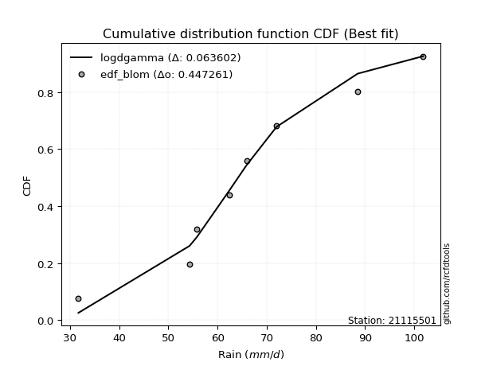</img></img>

</div>


### 7. EDF Tukey (1962)

In hydrology, the Tukey formula is used as a plotting position formula to estimate the empirical probability or frequency of a flood event (or other hydrological data). The formula parameter is given as _c=0.333_ (or 1/3).

<div align="center">


$P=(m-c)/(n+1-2c)$


</div>


**7.1. Empirical values**

<div align="center">

|                | 0                  | 1         | 2                  | 3                  | 4                 | 5                  | 6                 | 7                  |
|:---------------|:-------------------|:----------|:-------------------|:-------------------|:------------------|:-------------------|:------------------|:-------------------|
| date           | 2016               | 2023      | 2017               | 2019               | 2021              | 2018               | 2022              | 2020               |
| x              | 31.7               | 54.3      | 55.8               | 62.4               | 65.9              | 72.0               | 88.5              | 101.8              |
| m              | 1                  | 2         | 3                  | 4                  | 5                 | 6                  | 7                 | 8                  |
| empirical_dist | edf_tukey          | edf_tukey | edf_tukey          | edf_tukey          | edf_tukey         | edf_tukey          | edf_tukey         | edf_tukey          |
| empirical      | 0.08               | 0.2       | 0.32               | 0.44               | 0.56              | 0.68               | 0.8               | 0.92               |
| empirical_tr   | 1.0869565217391304 | 1.25      | 1.4705882352941178 | 1.7857142857142856 | 2.272727272727273 | 3.1250000000000004 | 5.000000000000001 | 12.500000000000007 |

</div>


**7.2. Kolmogorov-Smirnov fit test (sorted by Δ)**


<div align="center">

|                | 0                   | 1                   | 2                   | 3                   | 4                   | 5                   | 6                   | 7                   | 8                   | 9                   | 10                  | 11                  | 12                  | 13                  | 14                  | 15                  | 16                  | 17                  | 18                  | 19                  | 20                  | 21                  | 22                  | 23                  | 24                  | 25                  | 26                 | 27                  | 28                 | 29                 | 30                  | 31                  | 32                 | 33                  | 34                  | 35                  | 36                  | 37                  | 38                  | 39                  | 40                  | 41                  | 42                  | 43                  | 44                  | 45                  | 46                  | 47                  | 48                  | 49                  | 50                  | 51                  | 52                  | 53                  | 54                  | 55                  | 56                 | 57                  | 58                 | 59                  | 60                 | 61                  | 62                  | 63                  | 64                  | 65                  | 66                  | 67                 | 68                 | 69                  | 70                 | 71                  | 72                  | 73                  | 74                 | 75                  | 76                  | 77                  | 78                  | 79                  | 80                  | 81                 | 82                  | 83                  | 84                  | 85                  | 86                  | 87                  | 88                  | 89                 | 90                 | 91                  | 92                 | 93                 | 94                 | 95                  | 96                  | 97                  | 98                 | 99                  | 100                | 101                 | 102                 | 103                | 104                | 105                 | 106                 | 107                 | 108                | 109                 | 110                 | 111                 | 112                 | 113                 | 114                | 115                 | 116                 | 117                | 118                 | 119                | 120                | 121                 | 122                | 123                 | 124                | 125                | 126                | 127                | 128                 | 129                 | 130                | 131                | 132                 | 133                 | 134                | 135                 | 136                | 137                 | 138                 | 139                | 140                | 141                 | 142                | 143                | 144                 | 145                | 146                | 147                | 148                | 149                | 150                | 151                | 152                | 153                | 154                | 155                | 156                | 157                | 158                | 159                |
|:---------------|:--------------------|:--------------------|:--------------------|:--------------------|:--------------------|:--------------------|:--------------------|:--------------------|:--------------------|:--------------------|:--------------------|:--------------------|:--------------------|:--------------------|:--------------------|:--------------------|:--------------------|:--------------------|:--------------------|:--------------------|:--------------------|:--------------------|:--------------------|:--------------------|:--------------------|:--------------------|:-------------------|:--------------------|:-------------------|:-------------------|:--------------------|:--------------------|:-------------------|:--------------------|:--------------------|:--------------------|:--------------------|:--------------------|:--------------------|:--------------------|:--------------------|:--------------------|:--------------------|:--------------------|:--------------------|:--------------------|:--------------------|:--------------------|:--------------------|:--------------------|:--------------------|:--------------------|:--------------------|:--------------------|:--------------------|:--------------------|:-------------------|:--------------------|:-------------------|:--------------------|:-------------------|:--------------------|:--------------------|:--------------------|:--------------------|:--------------------|:--------------------|:-------------------|:-------------------|:--------------------|:-------------------|:--------------------|:--------------------|:--------------------|:-------------------|:--------------------|:--------------------|:--------------------|:--------------------|:--------------------|:--------------------|:-------------------|:--------------------|:--------------------|:--------------------|:--------------------|:--------------------|:--------------------|:--------------------|:-------------------|:-------------------|:--------------------|:-------------------|:-------------------|:-------------------|:--------------------|:--------------------|:--------------------|:-------------------|:--------------------|:-------------------|:--------------------|:--------------------|:-------------------|:-------------------|:--------------------|:--------------------|:--------------------|:-------------------|:--------------------|:--------------------|:--------------------|:--------------------|:--------------------|:-------------------|:--------------------|:--------------------|:-------------------|:--------------------|:-------------------|:-------------------|:--------------------|:-------------------|:--------------------|:-------------------|:-------------------|:-------------------|:-------------------|:--------------------|:--------------------|:-------------------|:-------------------|:--------------------|:--------------------|:-------------------|:--------------------|:-------------------|:--------------------|:--------------------|:-------------------|:-------------------|:--------------------|:-------------------|:-------------------|:--------------------|:-------------------|:-------------------|:-------------------|:-------------------|:-------------------|:-------------------|:-------------------|:-------------------|:-------------------|:-------------------|:-------------------|:-------------------|:-------------------|:-------------------|:-------------------|
| station        | 21115501            | 21115501            | 21115501            | 21115501            | 21115501            | 21115501            | 21115501            | 21115501            | 21115501            | 21115501            | 21115501            | 21115501            | 21115501            | 21115501            | 21115501            | 21115501            | 21115501            | 21115501            | 21115501            | 21115501            | 21115501            | 21115501            | 21115501            | 21115501            | 21115501            | 21115501            | 21115501           | 21115501            | 21115501           | 21115501           | 21115501            | 21115501            | 21115501           | 21115501            | 21115501            | 21115501            | 21115501            | 21115501            | 21115501            | 21115501            | 21115501            | 21115501            | 21115501            | 21115501            | 21115501            | 21115501            | 21115501            | 21115501            | 21115501            | 21115501            | 21115501            | 21115501            | 21115501            | 21115501            | 21115501            | 21115501            | 21115501           | 21115501            | 21115501           | 21115501            | 21115501           | 21115501            | 21115501            | 21115501            | 21115501            | 21115501            | 21115501            | 21115501           | 21115501           | 21115501            | 21115501           | 21115501            | 21115501            | 21115501            | 21115501           | 21115501            | 21115501            | 21115501            | 21115501            | 21115501            | 21115501            | 21115501           | 21115501            | 21115501            | 21115501            | 21115501            | 21115501            | 21115501            | 21115501            | 21115501           | 21115501           | 21115501            | 21115501           | 21115501           | 21115501           | 21115501            | 21115501            | 21115501            | 21115501           | 21115501            | 21115501           | 21115501            | 21115501            | 21115501           | 21115501           | 21115501            | 21115501            | 21115501            | 21115501           | 21115501            | 21115501            | 21115501            | 21115501            | 21115501            | 21115501           | 21115501            | 21115501            | 21115501           | 21115501            | 21115501           | 21115501           | 21115501            | 21115501           | 21115501            | 21115501           | 21115501           | 21115501           | 21115501           | 21115501            | 21115501            | 21115501           | 21115501           | 21115501            | 21115501            | 21115501           | 21115501            | 21115501           | 21115501            | 21115501            | 21115501           | 21115501           | 21115501            | 21115501           | 21115501           | 21115501            | 21115501           | 21115501           | 21115501           | 21115501           | 21115501           | 21115501           | 21115501           | 21115501           | 21115501           | 21115501           | 21115501           | 21115501           | 21115501           | 21115501           | 21115501           |
| empirical_dist | edf_tukey           | edf_tukey           | edf_tukey           | edf_tukey           | edf_tukey           | edf_tukey           | edf_tukey           | edf_tukey           | edf_tukey           | edf_tukey           | edf_tukey           | edf_tukey           | edf_tukey           | edf_tukey           | edf_tukey           | edf_tukey           | edf_tukey           | edf_tukey           | edf_tukey           | edf_tukey           | edf_tukey           | edf_tukey           | edf_tukey           | edf_tukey           | edf_tukey           | edf_tukey           | edf_tukey          | edf_tukey           | edf_tukey          | edf_tukey          | edf_tukey           | edf_tukey           | edf_tukey          | edf_tukey           | edf_tukey           | edf_tukey           | edf_tukey           | edf_tukey           | edf_tukey           | edf_tukey           | edf_tukey           | edf_tukey           | edf_tukey           | edf_tukey           | edf_tukey           | edf_tukey           | edf_tukey           | edf_tukey           | edf_tukey           | edf_tukey           | edf_tukey           | edf_tukey           | edf_tukey           | edf_tukey           | edf_tukey           | edf_tukey           | edf_tukey          | edf_tukey           | edf_tukey          | edf_tukey           | edf_tukey          | edf_tukey           | edf_tukey           | edf_tukey           | edf_tukey           | edf_tukey           | edf_tukey           | edf_tukey          | edf_tukey          | edf_tukey           | edf_tukey          | edf_tukey           | edf_tukey           | edf_tukey           | edf_tukey          | edf_tukey           | edf_tukey           | edf_tukey           | edf_tukey           | edf_tukey           | edf_tukey           | edf_tukey          | edf_tukey           | edf_tukey           | edf_tukey           | edf_tukey           | edf_tukey           | edf_tukey           | edf_tukey           | edf_tukey          | edf_tukey          | edf_tukey           | edf_tukey          | edf_tukey          | edf_tukey          | edf_tukey           | edf_tukey           | edf_tukey           | edf_tukey          | edf_tukey           | edf_tukey          | edf_tukey           | edf_tukey           | edf_tukey          | edf_tukey          | edf_tukey           | edf_tukey           | edf_tukey           | edf_tukey          | edf_tukey           | edf_tukey           | edf_tukey           | edf_tukey           | edf_tukey           | edf_tukey          | edf_tukey           | edf_tukey           | edf_tukey          | edf_tukey           | edf_tukey          | edf_tukey          | edf_tukey           | edf_tukey          | edf_tukey           | edf_tukey          | edf_tukey          | edf_tukey          | edf_tukey          | edf_tukey           | edf_tukey           | edf_tukey          | edf_tukey          | edf_tukey           | edf_tukey           | edf_tukey          | edf_tukey           | edf_tukey          | edf_tukey           | edf_tukey           | edf_tukey          | edf_tukey          | edf_tukey           | edf_tukey          | edf_tukey          | edf_tukey           | edf_tukey          | edf_tukey          | edf_tukey          | edf_tukey          | edf_tukey          | edf_tukey          | edf_tukey          | edf_tukey          | edf_tukey          | edf_tukey          | edf_tukey          | edf_tukey          | edf_tukey          | edf_tukey          | edf_tukey          |
| p_dist         | loggennorm          | logdweibull         | logdgamma           | logcrystalball      | genlogistic         | logt                | exponnorm           | norm                | crystalball         | truncnorm           | t                   | mielke              | burr                | loggenlogistic      | pearson3            | logburr             | logmielke           | loggumbel_l         | logistic            | nct                 | johnsonsu           | erlang              | gamma               | betaprime           | f                   | skewnorm            | vonmises_line      | logloggamma         | loglaplace         | loglaplace         | logjohnsonsu        | logburr12           | logloglaplace      | logweibull_min      | alpha               | cosine              | hypsecant           | loghypsecant        | invgamma            | rice                | gennorm             | weibull_min         | logpearson3         | logskewnorm         | laplace             | gumbel_r            | dweibull            | maxwell             | dgamma              | logexponpow         | moyal               | anglit              | loggenextreme       | logweibull_max      | loglogistic         | invgauss            | rayleigh           | logargus            | semicircular       | logtriang           | logexponnorm       | lognorm             | logf                | uniform             | logfatiguelife      | halflogistic        | lognct              | loggamma           | loggamma           | logbetaprime        | logrice            | wald                | halfnorm            | logerlang           | loginvgamma        | wrapcauchy          | gompertz            | loggengamma         | loggausshyper       | gumbel_l            | loganglit           | kstwobign          | logalpha            | kappa4              | loginvgauss         | ksone               | logmaxwell          | logsemicircular     | gausshyper          | kappa3             | beta               | arcsine             | loggumbel_r        | argus              | lograyleigh        | loggenhalflogistic  | logfoldnorm         | ncf                 | logcosine          | logmoyal            | logexponweib       | logbeta             | loginvweibull       | logarcsine         | loghalfnorm        | bradford            | loghalflogistic     | nakagami            | logncf             | logtruncnorm        | logwald             | truncexpon          | logtruncweibull_min | logrdist            | logkstwobign       | logtrapezoid        | genpareto           | triang             | loggenexpon         | loglevy_l          | logvonmises_line   | logkappa4           | truncweibull_min   | genhalflogistic     | logkappa3          | loguniform         | lomax              | logksone           | logtukeylambda      | lognakagami         | genexpon           | logwrapcauchy      | levy_l              | loggompertz         | burr12             | loglomax            | logbradford        | halfgennorm         | johnsonsb           | loggenpareto       | tukeylambda        | logtruncexpon       | trapezoid          | genextreme         | invweibull          | logjohnsonsb       | rdist              | foldnorm           | weibull_max        | powerlaw           | gengamma           | fatiguelife        | exponweib          | logpowerlaw        | exponpow           | truncpareto        | logtruncpareto     | loghalfgennorm     | logvonmises        | vonmises           |
| delta          | 0.06321275651633357 | 0.06370933081489283 | 0.06490145476447784 | 0.06899587752904335 | 0.07136798030665248 | 0.07188154315743134 | 0.07218053082272957 | 0.07345766323710556 | 0.07345767241949208 | 0.07345767300490225 | 0.07348183475597714 | 0.07371254330784255 | 0.07387823079462386 | 0.07393752784850866 | 0.07652392466295438 | 0.07752759725692293 | 0.07767729502733955 | 0.07772699798798188 | 0.07811587987588253 | 0.07814489563677202 | 0.07814865764288809 | 0.07873014853448479 | 0.07902396299737019 | 0.07933182731568894 | 0.07939081396707298 | 0.07975880154370224 | 0.0799999985544132 | 0.08097797641610655 | 0.0811775750922884 | 0.0811775750922884 | 0.08215145599359674 | 0.08220570338024757 | 0.0829373384547144 | 0.08333682489429206 | 0.08501504694485296 | 0.08514507622080314 | 0.08610511487466743 | 0.08709578242394439 | 0.08725937388918731 | 0.08790862106790653 | 0.08914032970824726 | 0.08930959555409385 | 0.09203389512815346 | 0.09273245996069862 | 0.09277443100355753 | 0.09407580711337793 | 0.09585134705757559 | 0.09633827482830493 | 0.09707744847056565 | 0.09720257613206679 | 0.09811390461396091 | 0.09822485648152451 | 0.10081953885698935 | 0.10084981317411112 | 0.10209658500970131 | 0.10315970612942416 | 0.1063107061223853 | 0.10708339729718847 | 0.1096136620802442 | 0.11374032819951219 | 0.1221672175066994 | 0.12216745955319591 | 0.12217713177165762 | 0.12239657631954348 | 0.12247331323799099 | 0.12552286751791675 | 0.12668703797600028 | 0.1285880712428163 | 0.1285880712428163 | 0.12946198363809513 | 0.1304678548829713 | 0.13153318586812696 | 0.13398226019017134 | 0.13422469331452574 | 0.1349893427594414 | 0.13620563673344976 | 0.13656582629992242 | 0.13679971617575482 | 0.14179451260167925 | 0.14349637660574388 | 0.14480057166464466 | 0.1452425533960392 | 0.14677704324038626 | 0.14899382641110487 | 0.15190255762027183 | 0.15199714693295296 | 0.15209822982999666 | 0.15436851267745616 | 0.15566094878636716 | 0.1559303124310722 | 0.1568872526854933 | 0.15864209089992787 | 0.1624097033884478 | 0.1636625998443071 | 0.1636936723252107 | 0.16476698884578456 | 0.16742807145182137 | 0.17215846102208981 | 0.1756636341614466 | 0.17627766043705057 | 0.1813256099374092 | 0.18271089777115485 | 0.19215074038041424 | 0.194151604053089  | 0.1966662579577801 | 0.19836037944430457 | 0.19962560167988674 | 0.19999999844281346 | 0.2009349727091202 | 0.20846553229720316 | 0.21122525296800526 | 0.21363366044611098 | 0.21787141273514105 | 0.22048520789008327 | 0.2277995392065616 | 0.23205922261964074 | 0.23485628918925616 | 0.2362741555519195 | 0.23776329254055212 | 0.2435922753416387 | 0.2470307886494557 | 0.24703438908840558 | 0.2531283319832253 | 0.25424868505649234 | 0.260858414914763  | 0.2613101739831127 | 0.2633210033072712 | 0.2677584783192604 | 0.26899981575596116 | 0.27293449205913317 | 0.2771790017078721 | 0.2870466579880807 | 0.29238193082270253 | 0.30548071367024393 | 0.3391937046183921 | 0.34129684605808047 | 0.3491940340570587 | 0.35310985983924087 | 0.35404207597550585 | 0.3553310926995949 | 0.3612131933575952 | 0.36186548810291835 | 0.3636940451891632 | 0.3663244136979958 | 0.46445934867217026 | 0.5036801922407723 | 0.555559737095328  | 0.56               | 0.600469626174811  | 0.6061622077927364 | 0.6095456650896947 | 0.6221579677185196 | 0.6242765865591244 | 0.6514666305974148 | 0.7144961882255443 | 0.7278220517623679 | 0.7497839121008978 | 0.8                | 1.1155487222272715 | 15.79909929530976  |
| deltao         | 0.4472608134160001  | 0.4472608134160001  | 0.4472608134160001  | 0.4472608134160001  | 0.4472608134160001  | 0.4472608134160001  | 0.4472608134160001  | 0.4472608134160001  | 0.4472608134160001  | 0.4472608134160001  | 0.4472608134160001  | 0.4472608134160001  | 0.4472608134160001  | 0.4472608134160001  | 0.4472608134160001  | 0.4472608134160001  | 0.4472608134160001  | 0.4472608134160001  | 0.4472608134160001  | 0.4472608134160001  | 0.4472608134160001  | 0.4472608134160001  | 0.4472608134160001  | 0.4472608134160001  | 0.4472608134160001  | 0.4472608134160001  | 0.4472608134160001 | 0.4472608134160001  | 0.4472608134160001 | 0.4472608134160001 | 0.4472608134160001  | 0.4472608134160001  | 0.4472608134160001 | 0.4472608134160001  | 0.4472608134160001  | 0.4472608134160001  | 0.4472608134160001  | 0.4472608134160001  | 0.4472608134160001  | 0.4472608134160001  | 0.4472608134160001  | 0.4472608134160001  | 0.4472608134160001  | 0.4472608134160001  | 0.4472608134160001  | 0.4472608134160001  | 0.4472608134160001  | 0.4472608134160001  | 0.4472608134160001  | 0.4472608134160001  | 0.4472608134160001  | 0.4472608134160001  | 0.4472608134160001  | 0.4472608134160001  | 0.4472608134160001  | 0.4472608134160001  | 0.4472608134160001 | 0.4472608134160001  | 0.4472608134160001 | 0.4472608134160001  | 0.4472608134160001 | 0.4472608134160001  | 0.4472608134160001  | 0.4472608134160001  | 0.4472608134160001  | 0.4472608134160001  | 0.4472608134160001  | 0.4472608134160001 | 0.4472608134160001 | 0.4472608134160001  | 0.4472608134160001 | 0.4472608134160001  | 0.4472608134160001  | 0.4472608134160001  | 0.4472608134160001 | 0.4472608134160001  | 0.4472608134160001  | 0.4472608134160001  | 0.4472608134160001  | 0.4472608134160001  | 0.4472608134160001  | 0.4472608134160001 | 0.4472608134160001  | 0.4472608134160001  | 0.4472608134160001  | 0.4472608134160001  | 0.4472608134160001  | 0.4472608134160001  | 0.4472608134160001  | 0.4472608134160001 | 0.4472608134160001 | 0.4472608134160001  | 0.4472608134160001 | 0.4472608134160001 | 0.4472608134160001 | 0.4472608134160001  | 0.4472608134160001  | 0.4472608134160001  | 0.4472608134160001 | 0.4472608134160001  | 0.4472608134160001 | 0.4472608134160001  | 0.4472608134160001  | 0.4472608134160001 | 0.4472608134160001 | 0.4472608134160001  | 0.4472608134160001  | 0.4472608134160001  | 0.4472608134160001 | 0.4472608134160001  | 0.4472608134160001  | 0.4472608134160001  | 0.4472608134160001  | 0.4472608134160001  | 0.4472608134160001 | 0.4472608134160001  | 0.4472608134160001  | 0.4472608134160001 | 0.4472608134160001  | 0.4472608134160001 | 0.4472608134160001 | 0.4472608134160001  | 0.4472608134160001 | 0.4472608134160001  | 0.4472608134160001 | 0.4472608134160001 | 0.4472608134160001 | 0.4472608134160001 | 0.4472608134160001  | 0.4472608134160001  | 0.4472608134160001 | 0.4472608134160001 | 0.4472608134160001  | 0.4472608134160001  | 0.4472608134160001 | 0.4472608134160001  | 0.4472608134160001 | 0.4472608134160001  | 0.4472608134160001  | 0.4472608134160001 | 0.4472608134160001 | 0.4472608134160001  | 0.4472608134160001 | 0.4472608134160001 | 0.4472608134160001  | 0.4472608134160001 | 0.4472608134160001 | 0.4472608134160001 | 0.4472608134160001 | 0.4472608134160001 | 0.4472608134160001 | 0.4472608134160001 | 0.4472608134160001 | 0.4472608134160001 | 0.4472608134160001 | 0.4472608134160001 | 0.4472608134160001 | 0.4472608134160001 | 0.4472608134160001 | 0.4472608134160001 |
| eval           | Δo > Δ              | Δo > Δ              | Δo > Δ              | Δo > Δ              | Δo > Δ              | Δo > Δ              | Δo > Δ              | Δo > Δ              | Δo > Δ              | Δo > Δ              | Δo > Δ              | Δo > Δ              | Δo > Δ              | Δo > Δ              | Δo > Δ              | Δo > Δ              | Δo > Δ              | Δo > Δ              | Δo > Δ              | Δo > Δ              | Δo > Δ              | Δo > Δ              | Δo > Δ              | Δo > Δ              | Δo > Δ              | Δo > Δ              | Δo > Δ             | Δo > Δ              | Δo > Δ             | Δo > Δ             | Δo > Δ              | Δo > Δ              | Δo > Δ             | Δo > Δ              | Δo > Δ              | Δo > Δ              | Δo > Δ              | Δo > Δ              | Δo > Δ              | Δo > Δ              | Δo > Δ              | Δo > Δ              | Δo > Δ              | Δo > Δ              | Δo > Δ              | Δo > Δ              | Δo > Δ              | Δo > Δ              | Δo > Δ              | Δo > Δ              | Δo > Δ              | Δo > Δ              | Δo > Δ              | Δo > Δ              | Δo > Δ              | Δo > Δ              | Δo > Δ             | Δo > Δ              | Δo > Δ             | Δo > Δ              | Δo > Δ             | Δo > Δ              | Δo > Δ              | Δo > Δ              | Δo > Δ              | Δo > Δ              | Δo > Δ              | Δo > Δ             | Δo > Δ             | Δo > Δ              | Δo > Δ             | Δo > Δ              | Δo > Δ              | Δo > Δ              | Δo > Δ             | Δo > Δ              | Δo > Δ              | Δo > Δ              | Δo > Δ              | Δo > Δ              | Δo > Δ              | Δo > Δ             | Δo > Δ              | Δo > Δ              | Δo > Δ              | Δo > Δ              | Δo > Δ              | Δo > Δ              | Δo > Δ              | Δo > Δ             | Δo > Δ             | Δo > Δ              | Δo > Δ             | Δo > Δ             | Δo > Δ             | Δo > Δ              | Δo > Δ              | Δo > Δ              | Δo > Δ             | Δo > Δ              | Δo > Δ             | Δo > Δ              | Δo > Δ              | Δo > Δ             | Δo > Δ             | Δo > Δ              | Δo > Δ              | Δo > Δ              | Δo > Δ             | Δo > Δ              | Δo > Δ              | Δo > Δ              | Δo > Δ              | Δo > Δ              | Δo > Δ             | Δo > Δ              | Δo > Δ              | Δo > Δ             | Δo > Δ              | Δo > Δ             | Δo > Δ             | Δo > Δ              | Δo > Δ             | Δo > Δ              | Δo > Δ             | Δo > Δ             | Δo > Δ             | Δo > Δ             | Δo > Δ              | Δo > Δ              | Δo > Δ             | Δo > Δ             | Δo > Δ              | Δo > Δ              | Δo > Δ             | Δo > Δ              | Δo > Δ             | Δo > Δ              | Δo > Δ              | Δo > Δ             | Δo > Δ             | Δo > Δ              | Δo > Δ             | Δo > Δ             | Δo <= Δ             | Δo <= Δ            | Δo <= Δ            | Δo <= Δ            | Δo <= Δ            | Δo <= Δ            | Δo <= Δ            | Δo <= Δ            | Δo <= Δ            | Δo <= Δ            | Δo <= Δ            | Δo <= Δ            | Δo <= Δ            | Δo <= Δ            | Δo <= Δ            | Δo <= Δ            |
| fit            | 1                   | 1                   | 1                   | 1                   | 1                   | 1                   | 1                   | 1                   | 1                   | 1                   | 1                   | 1                   | 1                   | 1                   | 1                   | 1                   | 1                   | 1                   | 1                   | 1                   | 1                   | 1                   | 1                   | 1                   | 1                   | 1                   | 1                  | 1                   | 1                  | 1                  | 1                   | 1                   | 1                  | 1                   | 1                   | 1                   | 1                   | 1                   | 1                   | 1                   | 1                   | 1                   | 1                   | 1                   | 1                   | 1                   | 1                   | 1                   | 1                   | 1                   | 1                   | 1                   | 1                   | 1                   | 1                   | 1                   | 1                  | 1                   | 1                  | 1                   | 1                  | 1                   | 1                   | 1                   | 1                   | 1                   | 1                   | 1                  | 1                  | 1                   | 1                  | 1                   | 1                   | 1                   | 1                  | 1                   | 1                   | 1                   | 1                   | 1                   | 1                   | 1                  | 1                   | 1                   | 1                   | 1                   | 1                   | 1                   | 1                   | 1                  | 1                  | 1                   | 1                  | 1                  | 1                  | 1                   | 1                   | 1                   | 1                  | 1                   | 1                  | 1                   | 1                   | 1                  | 1                  | 1                   | 1                   | 1                   | 1                  | 1                   | 1                   | 1                   | 1                   | 1                   | 1                  | 1                   | 1                   | 1                  | 1                   | 1                  | 1                  | 1                   | 1                  | 1                   | 1                  | 1                  | 1                  | 1                  | 1                   | 1                   | 1                  | 1                  | 1                   | 1                   | 1                  | 1                   | 1                  | 1                   | 1                   | 1                  | 1                  | 1                   | 1                  | 1                  | 0                   | 0                  | 0                  | 0                  | 0                  | 0                  | 0                  | 0                  | 0                  | 0                  | 0                  | 0                  | 0                  | 0                  | 0                  | 0                  |
| n              | 8                   | 8                   | 8                   | 8                   | 8                   | 8                   | 8                   | 8                   | 8                   | 8                   | 8                   | 8                   | 8                   | 8                   | 8                   | 8                   | 8                   | 8                   | 8                   | 8                   | 8                   | 8                   | 8                   | 8                   | 8                   | 8                   | 8                  | 8                   | 8                  | 8                  | 8                   | 8                   | 8                  | 8                   | 8                   | 8                   | 8                   | 8                   | 8                   | 8                   | 8                   | 8                   | 8                   | 8                   | 8                   | 8                   | 8                   | 8                   | 8                   | 8                   | 8                   | 8                   | 8                   | 8                   | 8                   | 8                   | 8                  | 8                   | 8                  | 8                   | 8                  | 8                   | 8                   | 8                   | 8                   | 8                   | 8                   | 8                  | 8                  | 8                   | 8                  | 8                   | 8                   | 8                   | 8                  | 8                   | 8                   | 8                   | 8                   | 8                   | 8                   | 8                  | 8                   | 8                   | 8                   | 8                   | 8                   | 8                   | 8                   | 8                  | 8                  | 8                   | 8                  | 8                  | 8                  | 8                   | 8                   | 8                   | 8                  | 8                   | 8                  | 8                   | 8                   | 8                  | 8                  | 8                   | 8                   | 8                   | 8                  | 8                   | 8                   | 8                   | 8                   | 8                   | 8                  | 8                   | 8                   | 8                  | 8                   | 8                  | 8                  | 8                   | 8                  | 8                   | 8                  | 8                  | 8                  | 8                  | 8                   | 8                   | 8                  | 8                  | 8                   | 8                   | 8                  | 8                   | 8                  | 8                   | 8                   | 8                  | 8                  | 8                   | 8                  | 8                  | 8                   | 8                  | 8                  | 8                  | 8                  | 8                  | 8                  | 8                  | 8                  | 8                  | 8                  | 8                  | 8                  | 8                  | 8                  | 8                  |
| best_fit       | 1                   | 0                   | 0                   | 0                   | 0                   | 0                   | 0                   | 0                   | 0                   | 0                   | 0                   | 0                   | 0                   | 0                   | 0                   | 0                   | 0                   | 0                   | 0                   | 0                   | 0                   | 0                   | 0                   | 0                   | 0                   | 0                   | 0                  | 0                   | 0                  | 0                  | 0                   | 0                   | 0                  | 0                   | 0                   | 0                   | 0                   | 0                   | 0                   | 0                   | 0                   | 0                   | 0                   | 0                   | 0                   | 0                   | 0                   | 0                   | 0                   | 0                   | 0                   | 0                   | 0                   | 0                   | 0                   | 0                   | 0                  | 0                   | 0                  | 0                   | 0                  | 0                   | 0                   | 0                   | 0                   | 0                   | 0                   | 0                  | 0                  | 0                   | 0                  | 0                   | 0                   | 0                   | 0                  | 0                   | 0                   | 0                   | 0                   | 0                   | 0                   | 0                  | 0                   | 0                   | 0                   | 0                   | 0                   | 0                   | 0                   | 0                  | 0                  | 0                   | 0                  | 0                  | 0                  | 0                   | 0                   | 0                   | 0                  | 0                   | 0                  | 0                   | 0                   | 0                  | 0                  | 0                   | 0                   | 0                   | 0                  | 0                   | 0                   | 0                   | 0                   | 0                   | 0                  | 0                   | 0                   | 0                  | 0                   | 0                  | 0                  | 0                   | 0                  | 0                   | 0                  | 0                  | 0                  | 0                  | 0                   | 0                   | 0                  | 0                  | 0                   | 0                   | 0                  | 0                   | 0                  | 0                   | 0                   | 0                  | 0                  | 0                   | 0                  | 0                  | 0                   | 0                  | 0                  | 0                  | 0                  | 0                  | 0                  | 0                  | 0                  | 0                  | 0                  | 0                  | 0                  | 0                  | 0                  | 0                  |
| best_fit_sort  | 1                   | 2                   | 3                   | 4                   | 5                   | 6                   | 7                   | 8                   | 9                   | 10                  | 11                  | 12                  | 13                  | 14                  | 15                  | 16                  | 17                  | 18                  | 19                  | 20                  | 21                  | 22                  | 23                  | 24                  | 25                  | 26                  | 27                 | 28                  | 29                 | 30                 | 31                  | 32                  | 33                 | 34                  | 35                  | 36                  | 37                  | 38                  | 39                  | 40                  | 41                  | 42                  | 43                  | 44                  | 45                  | 46                  | 47                  | 48                  | 49                  | 50                  | 51                  | 52                  | 53                  | 54                  | 55                  | 56                  | 57                 | 58                  | 59                 | 60                  | 61                 | 62                  | 63                  | 64                  | 65                  | 66                  | 67                  | 68                 | 69                 | 70                  | 71                 | 72                  | 73                  | 74                  | 75                 | 76                  | 77                  | 78                  | 79                  | 80                  | 81                  | 82                 | 83                  | 84                  | 85                  | 86                  | 87                  | 88                  | 89                  | 90                 | 91                 | 92                  | 93                 | 94                 | 95                 | 96                  | 97                  | 98                  | 99                 | 100                 | 101                | 102                 | 103                 | 104                | 105                | 106                 | 107                 | 108                 | 109                | 110                 | 111                 | 112                 | 113                 | 114                 | 115                | 116                 | 117                 | 118                | 119                 | 120                | 121                | 122                 | 123                | 124                 | 125                | 126                | 127                | 128                | 129                 | 130                 | 131                | 132                | 133                 | 134                 | 135                | 136                 | 137                | 138                 | 139                 | 140                | 141                | 142                 | 143                | 144                | 145                 | 146                | 147                | 148                | 149                | 150                | 151                | 152                | 153                | 154                | 155                | 156                | 157                | 158                | 159                | 160                |

</div>


**7.3. Best fit**

<div align="center">

|   id |   station | empirical_dist   | p_dist     |     delta |   deltao | eval   |   fit |   n |   best_fit |   best_fit_sort |
|-----:|----------:|:-----------------|:-----------|----------:|---------:|:-------|------:|----:|-----------:|----------------:|
|    0 |  21115501 | edf_tukey        | loggennorm | 0.0632128 | 0.447261 | Δo > Δ |     1 |   8 |          1 |               1 |

</div>


<div align="center">

</img>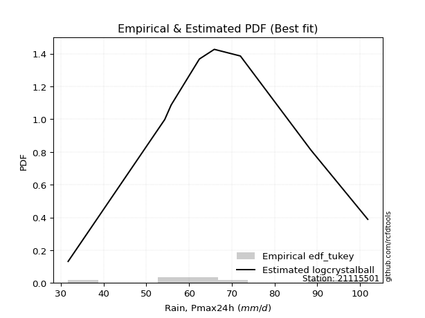</img>

</div>


### 8. EDF Gringorten (1963)

Gringorten plotting position formula is essential for estimating the probability and return periods of extreme events like floods and heavy rainfall. The constant _a=0.44_.

<div align="center">


$P=(m-a)/(n+1-2a)$


</div>


**8.1. Empirical values**

<div align="center">

|                | 0                   | 1                   | 2                  | 3                  | 4                  | 5                  | 6                  | 7                  |
|:---------------|:--------------------|:--------------------|:-------------------|:-------------------|:-------------------|:-------------------|:-------------------|:-------------------|
| date           | 2016                | 2023                | 2017               | 2019               | 2021               | 2018               | 2022               | 2020               |
| x              | 31.7                | 54.3                | 55.8               | 62.4               | 65.9               | 72.0               | 88.5               | 101.8              |
| m              | 1                   | 2                   | 3                  | 4                  | 5                  | 6                  | 7                  | 8                  |
| empirical_dist | edf_gringorten      | edf_gringorten      | edf_gringorten     | edf_gringorten     | edf_gringorten     | edf_gringorten     | edf_gringorten     | edf_gringorten     |
| empirical      | 0.06896551724137932 | 0.19211822660098524 | 0.3152709359605912 | 0.4384236453201971 | 0.5615763546798029 | 0.6847290640394089 | 0.8078817733990148 | 0.9310344827586208 |
| empirical_tr   | 1.0740740740740742  | 1.2378048780487805  | 1.460431654676259  | 1.780701754385965  | 2.2808988764044944 | 3.1718750000000004 | 5.205128205128205  | 14.500000000000018 |

</div>


**8.2. Kolmogorov-Smirnov fit test (sorted by Δ)**


<div align="center">

|                | 0                   | 1                   | 2                   | 3                   | 4                   | 5                   | 6                   | 7                   | 8                   | 9                  | 10                  | 11                  | 12                  | 13                  | 14                 | 15                  | 16                  | 17                  | 18                  | 19                  | 20                  | 21                  | 22                 | 23                  | 24                  | 25                  | 26                  | 27                  | 28                  | 29                  | 30                  | 31                  | 32                  | 33                 | 34                  | 35                  | 36                  | 37                  | 38                  | 39                  | 40                  | 41                  | 42                  | 43                  | 44                  | 45                  | 46                 | 47                 | 48                 | 49                  | 50                  | 51                 | 52                  | 53                  | 54                  | 55                  | 56                  | 57                  | 58                  | 59                  | 60                  | 61                  | 62                 | 63                  | 64                  | 65                  | 66                  | 67                  | 68                  | 69                  | 70                 | 71                  | 72                 | 73                  | 74                  | 75                  | 76                  | 77                 | 78                  | 79                  | 80                  | 81                  | 82                  | 83                  | 84                 | 85                  | 86                  | 87                  | 88                  | 89                  | 90                  | 91                  | 92                  | 93                  | 94                  | 95                  | 96                  | 97                 | 98                  | 99                  | 100                 | 101                 | 102                | 103                 | 104                 | 105                 | 106                 | 107                 | 108                 | 109                 | 110                 | 111                 | 112                 | 113                 | 114                 | 115                | 116                 | 117                 | 118                | 119                 | 120                 | 121                 | 122                | 123                | 124                 | 125                | 126                | 127                | 128                 | 129                | 130                | 131                 | 132                | 133                 | 134                | 135                | 136                | 137                 | 138                | 139                | 140                | 141                | 142                 | 143                | 144                | 145                | 146                | 147                | 148                | 149                | 150                | 151                | 152                | 153                | 154                | 155                | 156                | 157                | 158                | 159                |
|:---------------|:--------------------|:--------------------|:--------------------|:--------------------|:--------------------|:--------------------|:--------------------|:--------------------|:--------------------|:-------------------|:--------------------|:--------------------|:--------------------|:--------------------|:-------------------|:--------------------|:--------------------|:--------------------|:--------------------|:--------------------|:--------------------|:--------------------|:-------------------|:--------------------|:--------------------|:--------------------|:--------------------|:--------------------|:--------------------|:--------------------|:--------------------|:--------------------|:--------------------|:-------------------|:--------------------|:--------------------|:--------------------|:--------------------|:--------------------|:--------------------|:--------------------|:--------------------|:--------------------|:--------------------|:--------------------|:--------------------|:-------------------|:-------------------|:-------------------|:--------------------|:--------------------|:-------------------|:--------------------|:--------------------|:--------------------|:--------------------|:--------------------|:--------------------|:--------------------|:--------------------|:--------------------|:--------------------|:-------------------|:--------------------|:--------------------|:--------------------|:--------------------|:--------------------|:--------------------|:--------------------|:-------------------|:--------------------|:-------------------|:--------------------|:--------------------|:--------------------|:--------------------|:-------------------|:--------------------|:--------------------|:--------------------|:--------------------|:--------------------|:--------------------|:-------------------|:--------------------|:--------------------|:--------------------|:--------------------|:--------------------|:--------------------|:--------------------|:--------------------|:--------------------|:--------------------|:--------------------|:--------------------|:-------------------|:--------------------|:--------------------|:--------------------|:--------------------|:-------------------|:--------------------|:--------------------|:--------------------|:--------------------|:--------------------|:--------------------|:--------------------|:--------------------|:--------------------|:--------------------|:--------------------|:--------------------|:-------------------|:--------------------|:--------------------|:-------------------|:--------------------|:--------------------|:--------------------|:-------------------|:-------------------|:--------------------|:-------------------|:-------------------|:-------------------|:--------------------|:-------------------|:-------------------|:--------------------|:-------------------|:--------------------|:-------------------|:-------------------|:-------------------|:--------------------|:-------------------|:-------------------|:-------------------|:-------------------|:--------------------|:-------------------|:-------------------|:-------------------|:-------------------|:-------------------|:-------------------|:-------------------|:-------------------|:-------------------|:-------------------|:-------------------|:-------------------|:-------------------|:-------------------|:-------------------|:-------------------|:-------------------|
| station        | 21115501            | 21115501            | 21115501            | 21115501            | 21115501            | 21115501            | 21115501            | 21115501            | 21115501            | 21115501           | 21115501            | 21115501            | 21115501            | 21115501            | 21115501           | 21115501            | 21115501            | 21115501            | 21115501            | 21115501            | 21115501            | 21115501            | 21115501           | 21115501            | 21115501            | 21115501            | 21115501            | 21115501            | 21115501            | 21115501            | 21115501            | 21115501            | 21115501            | 21115501           | 21115501            | 21115501            | 21115501            | 21115501            | 21115501            | 21115501            | 21115501            | 21115501            | 21115501            | 21115501            | 21115501            | 21115501            | 21115501           | 21115501           | 21115501           | 21115501            | 21115501            | 21115501           | 21115501            | 21115501            | 21115501            | 21115501            | 21115501            | 21115501            | 21115501            | 21115501            | 21115501            | 21115501            | 21115501           | 21115501            | 21115501            | 21115501            | 21115501            | 21115501            | 21115501            | 21115501            | 21115501           | 21115501            | 21115501           | 21115501            | 21115501            | 21115501            | 21115501            | 21115501           | 21115501            | 21115501            | 21115501            | 21115501            | 21115501            | 21115501            | 21115501           | 21115501            | 21115501            | 21115501            | 21115501            | 21115501            | 21115501            | 21115501            | 21115501            | 21115501            | 21115501            | 21115501            | 21115501            | 21115501           | 21115501            | 21115501            | 21115501            | 21115501            | 21115501           | 21115501            | 21115501            | 21115501            | 21115501            | 21115501            | 21115501            | 21115501            | 21115501            | 21115501            | 21115501            | 21115501            | 21115501            | 21115501           | 21115501            | 21115501            | 21115501           | 21115501            | 21115501            | 21115501            | 21115501           | 21115501           | 21115501            | 21115501           | 21115501           | 21115501           | 21115501            | 21115501           | 21115501           | 21115501            | 21115501           | 21115501            | 21115501           | 21115501           | 21115501           | 21115501            | 21115501           | 21115501           | 21115501           | 21115501           | 21115501            | 21115501           | 21115501           | 21115501           | 21115501           | 21115501           | 21115501           | 21115501           | 21115501           | 21115501           | 21115501           | 21115501           | 21115501           | 21115501           | 21115501           | 21115501           | 21115501           | 21115501           |
| empirical_dist | edf_gringorten      | edf_gringorten      | edf_gringorten      | edf_gringorten      | edf_gringorten      | edf_gringorten      | edf_gringorten      | edf_gringorten      | edf_gringorten      | edf_gringorten     | edf_gringorten      | edf_gringorten      | edf_gringorten      | edf_gringorten      | edf_gringorten     | edf_gringorten      | edf_gringorten      | edf_gringorten      | edf_gringorten      | edf_gringorten      | edf_gringorten      | edf_gringorten      | edf_gringorten     | edf_gringorten      | edf_gringorten      | edf_gringorten      | edf_gringorten      | edf_gringorten      | edf_gringorten      | edf_gringorten      | edf_gringorten      | edf_gringorten      | edf_gringorten      | edf_gringorten     | edf_gringorten      | edf_gringorten      | edf_gringorten      | edf_gringorten      | edf_gringorten      | edf_gringorten      | edf_gringorten      | edf_gringorten      | edf_gringorten      | edf_gringorten      | edf_gringorten      | edf_gringorten      | edf_gringorten     | edf_gringorten     | edf_gringorten     | edf_gringorten      | edf_gringorten      | edf_gringorten     | edf_gringorten      | edf_gringorten      | edf_gringorten      | edf_gringorten      | edf_gringorten      | edf_gringorten      | edf_gringorten      | edf_gringorten      | edf_gringorten      | edf_gringorten      | edf_gringorten     | edf_gringorten      | edf_gringorten      | edf_gringorten      | edf_gringorten      | edf_gringorten      | edf_gringorten      | edf_gringorten      | edf_gringorten     | edf_gringorten      | edf_gringorten     | edf_gringorten      | edf_gringorten      | edf_gringorten      | edf_gringorten      | edf_gringorten     | edf_gringorten      | edf_gringorten      | edf_gringorten      | edf_gringorten      | edf_gringorten      | edf_gringorten      | edf_gringorten     | edf_gringorten      | edf_gringorten      | edf_gringorten      | edf_gringorten      | edf_gringorten      | edf_gringorten      | edf_gringorten      | edf_gringorten      | edf_gringorten      | edf_gringorten      | edf_gringorten      | edf_gringorten      | edf_gringorten     | edf_gringorten      | edf_gringorten      | edf_gringorten      | edf_gringorten      | edf_gringorten     | edf_gringorten      | edf_gringorten      | edf_gringorten      | edf_gringorten      | edf_gringorten      | edf_gringorten      | edf_gringorten      | edf_gringorten      | edf_gringorten      | edf_gringorten      | edf_gringorten      | edf_gringorten      | edf_gringorten     | edf_gringorten      | edf_gringorten      | edf_gringorten     | edf_gringorten      | edf_gringorten      | edf_gringorten      | edf_gringorten     | edf_gringorten     | edf_gringorten      | edf_gringorten     | edf_gringorten     | edf_gringorten     | edf_gringorten      | edf_gringorten     | edf_gringorten     | edf_gringorten      | edf_gringorten     | edf_gringorten      | edf_gringorten     | edf_gringorten     | edf_gringorten     | edf_gringorten      | edf_gringorten     | edf_gringorten     | edf_gringorten     | edf_gringorten     | edf_gringorten      | edf_gringorten     | edf_gringorten     | edf_gringorten     | edf_gringorten     | edf_gringorten     | edf_gringorten     | edf_gringorten     | edf_gringorten     | edf_gringorten     | edf_gringorten     | edf_gringorten     | edf_gringorten     | edf_gringorten     | edf_gringorten     | edf_gringorten     | edf_gringorten     | edf_gringorten     |
| p_dist         | logdgamma           | logdweibull         | loggennorm          | loglaplace          | loglaplace          | logcrystalball      | logistic            | hypsecant           | genlogistic         | truncnorm          | crystalball         | norm                | t                   | logt                | loggumbel_l        | exponnorm           | vonmises_line       | mielke              | burr                | loggenlogistic      | pearson3            | laplace             | logburr            | logmielke           | nct                 | johnsonsu           | erlang              | gamma               | betaprime           | f                   | skewnorm            | dweibull            | logloggamma         | dgamma             | cosine              | logjohnsonsu        | logburr12           | logloglaplace       | logweibull_min      | alpha               | gennorm             | loghypsecant        | invgamma            | rice                | weibull_min         | logpearson3         | logskewnorm        | gumbel_r           | maxwell            | logexponpow         | loggenextreme       | logweibull_max     | moyal               | anglit              | loglogistic         | invgauss            | rayleigh            | logargus            | semicircular        | logtriang           | logexponnorm        | lognorm             | logf               | uniform             | logfatiguelife      | wald                | halflogistic        | lognct              | loggamma            | loggamma            | logbetaprime       | logrice             | gompertz           | halfnorm            | logerlang           | loginvgamma         | wrapcauchy          | loggengamma        | gumbel_l            | loggausshyper       | loganglit           | kstwobign           | logalpha            | kappa4              | loginvgauss        | ksone               | logmaxwell          | gausshyper          | beta                | logsemicircular     | kappa3              | arcsine             | argus               | loggenhalflogistic  | loggumbel_r         | lograyleigh         | logfoldnorm         | ncf                | logcosine           | logmoyal            | logbeta             | logexponweib        | nakagami           | loginvweibull       | logarcsine          | logtruncnorm        | loghalfnorm         | bradford            | loghalflogistic     | logncf              | logwald             | logrdist            | truncexpon          | logtruncweibull_min | logkstwobign        | logtrapezoid       | triang              | genpareto           | loggenexpon        | loglevy_l           | logvonmises_line    | logkappa4           | genhalflogistic    | truncweibull_min   | logtukeylambda      | logkappa3          | loguniform         | lomax              | lognakagami         | logksone           | genexpon           | logwrapcauchy       | levy_l             | loggompertz         | burr12             | loglomax           | logbradford        | halfgennorm         | johnsonsb          | loggenpareto       | trapezoid          | tukeylambda        | logtruncexpon       | genextreme         | invweibull         | logjohnsonsb       | foldnorm           | rdist              | weibull_max        | powerlaw           | gengamma           | fatiguelife        | exponweib          | logpowerlaw        | exponpow           | truncpareto        | logtruncpareto     | loghalfgennorm     | logvonmises        | vonmises           |
| delta          | 0.06845360539041198 | 0.06978427026144687 | 0.07109452991534834 | 0.07329580169327365 | 0.07329580169327365 | 0.07383382089900561 | 0.07619132550702379 | 0.07822334147565269 | 0.07924975370566725 | 0.0796093634256497 | 0.07960937488186001 | 0.07960938175494711 | 0.07961985398703661 | 0.07976331655644611 | 0.0800270471225607 | 0.08005744947957003 | 0.08148925481444302 | 0.08159431670685732 | 0.08176000419363863 | 0.08181930124752343 | 0.08440569806196915 | 0.08489265760454279 | 0.0854093706559377 | 0.08555906842635433 | 0.08602666903578679 | 0.08603043104190286 | 0.08661192193349956 | 0.08690573639638496 | 0.08721360071470372 | 0.08727258736608776 | 0.08764057494271701 | 0.08796957365856084 | 0.08885974981512132 | 0.0891956750715509 | 0.08987414026021201 | 0.09003322939261152 | 0.09008747677926235 | 0.09081911185372918 | 0.09121859829330684 | 0.09289682034386773 | 0.09386939374765613 | 0.09497755582295916 | 0.09514114728820208 | 0.09579039446692131 | 0.09719136895310862 | 0.09991566852716824 | 0.1006142333597134 | 0.1019575805123927 | 0.1042200482273197 | 0.10508434953108156 | 0.10554860289639822 | 0.10557887721352   | 0.10599567801297569 | 0.10610662988053929 | 0.10997835840871609 | 0.11104147952843893 | 0.11419247952140008 | 0.11496517069620324 | 0.11749543547925898 | 0.11846939223892106 | 0.13004899090571417 | 0.13004923295221069 | 0.1300589051706724 | 0.13027834971855826 | 0.13035508663700576 | 0.13310954054792984 | 0.13340464091693152 | 0.13456881137501506 | 0.13646984464183107 | 0.13646984464183107 | 0.1373437570371099 | 0.13834962828198608 | 0.1412948903393313 | 0.14186403358918612 | 0.14210646671354052 | 0.14287111615845619 | 0.14408741013246454 | 0.1446814895747696 | 0.14507273128554676 | 0.14967628600069402 | 0.15268234506365944 | 0.15312432679505397 | 0.15465881663940104 | 0.15687559981011964 | 0.1597843310192866 | 0.15987892033196774 | 0.15998000322901143 | 0.16039001282577603 | 0.16161631672490218 | 0.16225028607647093 | 0.16381208583008697 | 0.16652386429894264 | 0.16839166388371596 | 0.16949605288519343 | 0.17029147678746256 | 0.17157544572422548 | 0.17530984485083614 | 0.1800402344211046 | 0.18354540756046137 | 0.18415943383606534 | 0.18743996181056372 | 0.18920738333642398 | 0.1921182250437987 | 0.20003251377942902 | 0.20203337745210379 | 0.20373646825779435 | 0.20454803135679486 | 0.20624215284331934 | 0.20750737507890152 | 0.20881674610813497 | 0.21280160764780814 | 0.22139953811293595 | 0.22151543384512576 | 0.22575318613415582 | 0.23568131260557637 | 0.2367882866590496 | 0.24100321959132837 | 0.24273806258827094 | 0.2456450659395669 | 0.25462675810025936 | 0.25491256204847046 | 0.25491616248742033 | 0.2589777490959012 | 0.2610101053822401 | 0.26427075171655234 | 0.2687401883137778 | 0.2691919473821275 | 0.271202776706286  | 0.27451084673893605 | 0.2756402517182752 | 0.2850607751068869 | 0.29492843138709546 | 0.3034164135813232 | 0.31336248706925873 | 0.3470754780174069 | 0.3491786194570953 | 0.3570758074560735 | 0.36099163323825567 | 0.3619238493745206 | 0.3632128660986097 | 0.3684231092285721 | 0.36909496675661   | 0.36974726150193316 | 0.3742061870970106 | 0.475493831430791  | 0.5115619656397871 | 0.5615763546798029 | 0.5634415104943428 | 0.6083513995738259 | 0.6140439811917513 | 0.6174274384887094 | 0.6300397411175345 | 0.6321583599581393 | 0.6593484039964297 | 0.722377961624559  | 0.7357038251613828 | 0.7576656854999126 | 0.8078817733990148 | 1.1234304956262862 | 15.78806481255114  |
| deltao         | 0.4472608134160001  | 0.4472608134160001  | 0.4472608134160001  | 0.4472608134160001  | 0.4472608134160001  | 0.4472608134160001  | 0.4472608134160001  | 0.4472608134160001  | 0.4472608134160001  | 0.4472608134160001 | 0.4472608134160001  | 0.4472608134160001  | 0.4472608134160001  | 0.4472608134160001  | 0.4472608134160001 | 0.4472608134160001  | 0.4472608134160001  | 0.4472608134160001  | 0.4472608134160001  | 0.4472608134160001  | 0.4472608134160001  | 0.4472608134160001  | 0.4472608134160001 | 0.4472608134160001  | 0.4472608134160001  | 0.4472608134160001  | 0.4472608134160001  | 0.4472608134160001  | 0.4472608134160001  | 0.4472608134160001  | 0.4472608134160001  | 0.4472608134160001  | 0.4472608134160001  | 0.4472608134160001 | 0.4472608134160001  | 0.4472608134160001  | 0.4472608134160001  | 0.4472608134160001  | 0.4472608134160001  | 0.4472608134160001  | 0.4472608134160001  | 0.4472608134160001  | 0.4472608134160001  | 0.4472608134160001  | 0.4472608134160001  | 0.4472608134160001  | 0.4472608134160001 | 0.4472608134160001 | 0.4472608134160001 | 0.4472608134160001  | 0.4472608134160001  | 0.4472608134160001 | 0.4472608134160001  | 0.4472608134160001  | 0.4472608134160001  | 0.4472608134160001  | 0.4472608134160001  | 0.4472608134160001  | 0.4472608134160001  | 0.4472608134160001  | 0.4472608134160001  | 0.4472608134160001  | 0.4472608134160001 | 0.4472608134160001  | 0.4472608134160001  | 0.4472608134160001  | 0.4472608134160001  | 0.4472608134160001  | 0.4472608134160001  | 0.4472608134160001  | 0.4472608134160001 | 0.4472608134160001  | 0.4472608134160001 | 0.4472608134160001  | 0.4472608134160001  | 0.4472608134160001  | 0.4472608134160001  | 0.4472608134160001 | 0.4472608134160001  | 0.4472608134160001  | 0.4472608134160001  | 0.4472608134160001  | 0.4472608134160001  | 0.4472608134160001  | 0.4472608134160001 | 0.4472608134160001  | 0.4472608134160001  | 0.4472608134160001  | 0.4472608134160001  | 0.4472608134160001  | 0.4472608134160001  | 0.4472608134160001  | 0.4472608134160001  | 0.4472608134160001  | 0.4472608134160001  | 0.4472608134160001  | 0.4472608134160001  | 0.4472608134160001 | 0.4472608134160001  | 0.4472608134160001  | 0.4472608134160001  | 0.4472608134160001  | 0.4472608134160001 | 0.4472608134160001  | 0.4472608134160001  | 0.4472608134160001  | 0.4472608134160001  | 0.4472608134160001  | 0.4472608134160001  | 0.4472608134160001  | 0.4472608134160001  | 0.4472608134160001  | 0.4472608134160001  | 0.4472608134160001  | 0.4472608134160001  | 0.4472608134160001 | 0.4472608134160001  | 0.4472608134160001  | 0.4472608134160001 | 0.4472608134160001  | 0.4472608134160001  | 0.4472608134160001  | 0.4472608134160001 | 0.4472608134160001 | 0.4472608134160001  | 0.4472608134160001 | 0.4472608134160001 | 0.4472608134160001 | 0.4472608134160001  | 0.4472608134160001 | 0.4472608134160001 | 0.4472608134160001  | 0.4472608134160001 | 0.4472608134160001  | 0.4472608134160001 | 0.4472608134160001 | 0.4472608134160001 | 0.4472608134160001  | 0.4472608134160001 | 0.4472608134160001 | 0.4472608134160001 | 0.4472608134160001 | 0.4472608134160001  | 0.4472608134160001 | 0.4472608134160001 | 0.4472608134160001 | 0.4472608134160001 | 0.4472608134160001 | 0.4472608134160001 | 0.4472608134160001 | 0.4472608134160001 | 0.4472608134160001 | 0.4472608134160001 | 0.4472608134160001 | 0.4472608134160001 | 0.4472608134160001 | 0.4472608134160001 | 0.4472608134160001 | 0.4472608134160001 | 0.4472608134160001 |
| eval           | Δo > Δ              | Δo > Δ              | Δo > Δ              | Δo > Δ              | Δo > Δ              | Δo > Δ              | Δo > Δ              | Δo > Δ              | Δo > Δ              | Δo > Δ             | Δo > Δ              | Δo > Δ              | Δo > Δ              | Δo > Δ              | Δo > Δ             | Δo > Δ              | Δo > Δ              | Δo > Δ              | Δo > Δ              | Δo > Δ              | Δo > Δ              | Δo > Δ              | Δo > Δ             | Δo > Δ              | Δo > Δ              | Δo > Δ              | Δo > Δ              | Δo > Δ              | Δo > Δ              | Δo > Δ              | Δo > Δ              | Δo > Δ              | Δo > Δ              | Δo > Δ             | Δo > Δ              | Δo > Δ              | Δo > Δ              | Δo > Δ              | Δo > Δ              | Δo > Δ              | Δo > Δ              | Δo > Δ              | Δo > Δ              | Δo > Δ              | Δo > Δ              | Δo > Δ              | Δo > Δ             | Δo > Δ             | Δo > Δ             | Δo > Δ              | Δo > Δ              | Δo > Δ             | Δo > Δ              | Δo > Δ              | Δo > Δ              | Δo > Δ              | Δo > Δ              | Δo > Δ              | Δo > Δ              | Δo > Δ              | Δo > Δ              | Δo > Δ              | Δo > Δ             | Δo > Δ              | Δo > Δ              | Δo > Δ              | Δo > Δ              | Δo > Δ              | Δo > Δ              | Δo > Δ              | Δo > Δ             | Δo > Δ              | Δo > Δ             | Δo > Δ              | Δo > Δ              | Δo > Δ              | Δo > Δ              | Δo > Δ             | Δo > Δ              | Δo > Δ              | Δo > Δ              | Δo > Δ              | Δo > Δ              | Δo > Δ              | Δo > Δ             | Δo > Δ              | Δo > Δ              | Δo > Δ              | Δo > Δ              | Δo > Δ              | Δo > Δ              | Δo > Δ              | Δo > Δ              | Δo > Δ              | Δo > Δ              | Δo > Δ              | Δo > Δ              | Δo > Δ             | Δo > Δ              | Δo > Δ              | Δo > Δ              | Δo > Δ              | Δo > Δ             | Δo > Δ              | Δo > Δ              | Δo > Δ              | Δo > Δ              | Δo > Δ              | Δo > Δ              | Δo > Δ              | Δo > Δ              | Δo > Δ              | Δo > Δ              | Δo > Δ              | Δo > Δ              | Δo > Δ             | Δo > Δ              | Δo > Δ              | Δo > Δ             | Δo > Δ              | Δo > Δ              | Δo > Δ              | Δo > Δ             | Δo > Δ             | Δo > Δ              | Δo > Δ             | Δo > Δ             | Δo > Δ             | Δo > Δ              | Δo > Δ             | Δo > Δ             | Δo > Δ              | Δo > Δ             | Δo > Δ              | Δo > Δ             | Δo > Δ             | Δo > Δ             | Δo > Δ              | Δo > Δ             | Δo > Δ             | Δo > Δ             | Δo > Δ             | Δo > Δ              | Δo > Δ             | Δo <= Δ            | Δo <= Δ            | Δo <= Δ            | Δo <= Δ            | Δo <= Δ            | Δo <= Δ            | Δo <= Δ            | Δo <= Δ            | Δo <= Δ            | Δo <= Δ            | Δo <= Δ            | Δo <= Δ            | Δo <= Δ            | Δo <= Δ            | Δo <= Δ            | Δo <= Δ            |
| fit            | 1                   | 1                   | 1                   | 1                   | 1                   | 1                   | 1                   | 1                   | 1                   | 1                  | 1                   | 1                   | 1                   | 1                   | 1                  | 1                   | 1                   | 1                   | 1                   | 1                   | 1                   | 1                   | 1                  | 1                   | 1                   | 1                   | 1                   | 1                   | 1                   | 1                   | 1                   | 1                   | 1                   | 1                  | 1                   | 1                   | 1                   | 1                   | 1                   | 1                   | 1                   | 1                   | 1                   | 1                   | 1                   | 1                   | 1                  | 1                  | 1                  | 1                   | 1                   | 1                  | 1                   | 1                   | 1                   | 1                   | 1                   | 1                   | 1                   | 1                   | 1                   | 1                   | 1                  | 1                   | 1                   | 1                   | 1                   | 1                   | 1                   | 1                   | 1                  | 1                   | 1                  | 1                   | 1                   | 1                   | 1                   | 1                  | 1                   | 1                   | 1                   | 1                   | 1                   | 1                   | 1                  | 1                   | 1                   | 1                   | 1                   | 1                   | 1                   | 1                   | 1                   | 1                   | 1                   | 1                   | 1                   | 1                  | 1                   | 1                   | 1                   | 1                   | 1                  | 1                   | 1                   | 1                   | 1                   | 1                   | 1                   | 1                   | 1                   | 1                   | 1                   | 1                   | 1                   | 1                  | 1                   | 1                   | 1                  | 1                   | 1                   | 1                   | 1                  | 1                  | 1                   | 1                  | 1                  | 1                  | 1                   | 1                  | 1                  | 1                   | 1                  | 1                   | 1                  | 1                  | 1                  | 1                   | 1                  | 1                  | 1                  | 1                  | 1                   | 1                  | 0                  | 0                  | 0                  | 0                  | 0                  | 0                  | 0                  | 0                  | 0                  | 0                  | 0                  | 0                  | 0                  | 0                  | 0                  | 0                  |
| n              | 8                   | 8                   | 8                   | 8                   | 8                   | 8                   | 8                   | 8                   | 8                   | 8                  | 8                   | 8                   | 8                   | 8                   | 8                  | 8                   | 8                   | 8                   | 8                   | 8                   | 8                   | 8                   | 8                  | 8                   | 8                   | 8                   | 8                   | 8                   | 8                   | 8                   | 8                   | 8                   | 8                   | 8                  | 8                   | 8                   | 8                   | 8                   | 8                   | 8                   | 8                   | 8                   | 8                   | 8                   | 8                   | 8                   | 8                  | 8                  | 8                  | 8                   | 8                   | 8                  | 8                   | 8                   | 8                   | 8                   | 8                   | 8                   | 8                   | 8                   | 8                   | 8                   | 8                  | 8                   | 8                   | 8                   | 8                   | 8                   | 8                   | 8                   | 8                  | 8                   | 8                  | 8                   | 8                   | 8                   | 8                   | 8                  | 8                   | 8                   | 8                   | 8                   | 8                   | 8                   | 8                  | 8                   | 8                   | 8                   | 8                   | 8                   | 8                   | 8                   | 8                   | 8                   | 8                   | 8                   | 8                   | 8                  | 8                   | 8                   | 8                   | 8                   | 8                  | 8                   | 8                   | 8                   | 8                   | 8                   | 8                   | 8                   | 8                   | 8                   | 8                   | 8                   | 8                   | 8                  | 8                   | 8                   | 8                  | 8                   | 8                   | 8                   | 8                  | 8                  | 8                   | 8                  | 8                  | 8                  | 8                   | 8                  | 8                  | 8                   | 8                  | 8                   | 8                  | 8                  | 8                  | 8                   | 8                  | 8                  | 8                  | 8                  | 8                   | 8                  | 8                  | 8                  | 8                  | 8                  | 8                  | 8                  | 8                  | 8                  | 8                  | 8                  | 8                  | 8                  | 8                  | 8                  | 8                  | 8                  |
| best_fit       | 1                   | 0                   | 0                   | 0                   | 0                   | 0                   | 0                   | 0                   | 0                   | 0                  | 0                   | 0                   | 0                   | 0                   | 0                  | 0                   | 0                   | 0                   | 0                   | 0                   | 0                   | 0                   | 0                  | 0                   | 0                   | 0                   | 0                   | 0                   | 0                   | 0                   | 0                   | 0                   | 0                   | 0                  | 0                   | 0                   | 0                   | 0                   | 0                   | 0                   | 0                   | 0                   | 0                   | 0                   | 0                   | 0                   | 0                  | 0                  | 0                  | 0                   | 0                   | 0                  | 0                   | 0                   | 0                   | 0                   | 0                   | 0                   | 0                   | 0                   | 0                   | 0                   | 0                  | 0                   | 0                   | 0                   | 0                   | 0                   | 0                   | 0                   | 0                  | 0                   | 0                  | 0                   | 0                   | 0                   | 0                   | 0                  | 0                   | 0                   | 0                   | 0                   | 0                   | 0                   | 0                  | 0                   | 0                   | 0                   | 0                   | 0                   | 0                   | 0                   | 0                   | 0                   | 0                   | 0                   | 0                   | 0                  | 0                   | 0                   | 0                   | 0                   | 0                  | 0                   | 0                   | 0                   | 0                   | 0                   | 0                   | 0                   | 0                   | 0                   | 0                   | 0                   | 0                   | 0                  | 0                   | 0                   | 0                  | 0                   | 0                   | 0                   | 0                  | 0                  | 0                   | 0                  | 0                  | 0                  | 0                   | 0                  | 0                  | 0                   | 0                  | 0                   | 0                  | 0                  | 0                  | 0                   | 0                  | 0                  | 0                  | 0                  | 0                   | 0                  | 0                  | 0                  | 0                  | 0                  | 0                  | 0                  | 0                  | 0                  | 0                  | 0                  | 0                  | 0                  | 0                  | 0                  | 0                  | 0                  |
| best_fit_sort  | 1                   | 2                   | 3                   | 4                   | 5                   | 6                   | 7                   | 8                   | 9                   | 10                 | 11                  | 12                  | 13                  | 14                  | 15                 | 16                  | 17                  | 18                  | 19                  | 20                  | 21                  | 22                  | 23                 | 24                  | 25                  | 26                  | 27                  | 28                  | 29                  | 30                  | 31                  | 32                  | 33                  | 34                 | 35                  | 36                  | 37                  | 38                  | 39                  | 40                  | 41                  | 42                  | 43                  | 44                  | 45                  | 46                  | 47                 | 48                 | 49                 | 50                  | 51                  | 52                 | 53                  | 54                  | 55                  | 56                  | 57                  | 58                  | 59                  | 60                  | 61                  | 62                  | 63                 | 64                  | 65                  | 66                  | 67                  | 68                  | 69                  | 70                  | 71                 | 72                  | 73                 | 74                  | 75                  | 76                  | 77                  | 78                 | 79                  | 80                  | 81                  | 82                  | 83                  | 84                  | 85                 | 86                  | 87                  | 88                  | 89                  | 90                  | 91                  | 92                  | 93                  | 94                  | 95                  | 96                  | 97                  | 98                 | 99                  | 100                 | 101                 | 102                 | 103                | 104                 | 105                 | 106                 | 107                 | 108                 | 109                 | 110                 | 111                 | 112                 | 113                 | 114                 | 115                 | 116                | 117                 | 118                 | 119                | 120                 | 121                 | 122                 | 123                | 124                | 125                 | 126                | 127                | 128                | 129                 | 130                | 131                | 132                 | 133                | 134                 | 135                | 136                | 137                | 138                 | 139                | 140                | 141                | 142                | 143                 | 144                | 145                | 146                | 147                | 148                | 149                | 150                | 151                | 152                | 153                | 154                | 155                | 156                | 157                | 158                | 159                | 160                |

</div>


**8.3. Best fit**

<div align="center">

|   id |   station | empirical_dist   | p_dist    |     delta |   deltao | eval   |   fit |   n |   best_fit |   best_fit_sort |
|-----:|----------:|:-----------------|:----------|----------:|---------:|:-------|------:|----:|-----------:|----------------:|
|    0 |  21115501 | edf_gringorten   | logdgamma | 0.0684536 | 0.447261 | Δo > Δ |     1 |   8 |          1 |               1 |

</div>


<div align="center">

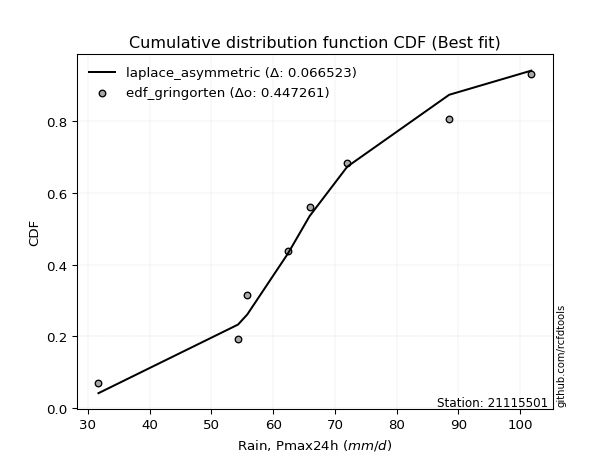</img></img>

</div>


### 9. EDF Filliben (1975)

The specific values of the constants (0.3175) (often denoted as $alpha$) and (0.365) are derived from a method proposed by James J. Filliben in a 1975 paper. This particular formula is the mean value of the $i$-th order statistic of the normal distribution and is considered a robust and effective plotting position formula for the normal probability plot correlation coefficient test for normality.

<div align="center">


$P=(m-0.3175)/(n+0.365)$


</div>


**9.1. Empirical values**

<div align="center">

|                | 0                  | 1                   | 2                  | 3                   | 4                  | 5                  | 6                  | 7                  |
|:---------------|:-------------------|:--------------------|:-------------------|:--------------------|:-------------------|:-------------------|:-------------------|:-------------------|
| date           | 2016               | 2023                | 2017               | 2019                | 2021               | 2018               | 2022               | 2020               |
| x              | 31.7               | 54.3                | 55.8               | 62.4                | 65.9               | 72.0               | 88.5               | 101.8              |
| m              | 1                  | 2                   | 3                  | 4                   | 5                  | 6                  | 7                  | 8                  |
| empirical_dist | edf_filliben       | edf_filliben        | edf_filliben       | edf_filliben        | edf_filliben       | edf_filliben       | edf_filliben       | edf_filliben       |
| empirical      | 0.0815899581589958 | 0.20113568439928273 | 0.3206814106395696 | 0.44022713687985654 | 0.5597728631201434 | 0.6793185893604303 | 0.7988643156007172 | 0.9184100418410042 |
| empirical_tr   | 1.0888382687927107 | 1.2517770295548074  | 1.4720633523977125 | 1.7864388681260008  | 2.271554650373387  | 3.118359739049394  | 4.971768202080237  | 12.256410256410254 |

</div>


**9.2. Kolmogorov-Smirnov fit test (sorted by Δ)**


<div align="center">

|                | 0                   | 1                   | 2                   | 3                   | 4                   | 5                   | 6                   | 7                   | 8                   | 9                   | 10                  | 11                  | 12                  | 13                  | 14                  | 15                  | 16                  | 17                 | 18                  | 19                  | 20                  | 21                  | 22                  | 23                  | 24                  | 25                  | 26                  | 27                  | 28                  | 29                  | 30                  | 31                  | 32                 | 33                 | 34                  | 35                  | 36                  | 37                  | 38                  | 39                  | 40                  | 41                  | 42                  | 43                 | 44                  | 45                  | 46                  | 47                  | 48                 | 49                  | 50                 | 51                  | 52                  | 53                 | 54                 | 55                  | 56                  | 57                  | 58                  | 59                  | 60                  | 61                 | 62                 | 63                  | 64                  | 65                  | 66                  | 67                  | 68                  | 69                  | 70                  | 71                  | 72                  | 73                  | 74                 | 75                  | 76                 | 77                 | 78                  | 79                  | 80                  | 81                  | 82                  | 83                  | 84                 | 85                  | 86                  | 87                  | 88                  | 89                  | 90                  | 91                  | 92                  | 93                 | 94                  | 95                  | 96                  | 97                 | 98                  | 99                  | 100                | 101                 | 102                 | 103                | 104                 | 105                 | 106                 | 107                 | 108                 | 109                 | 110                 | 111                 | 112                 | 113                | 114                 | 115                | 116                 | 117                 | 118                | 119                | 120                | 121                 | 122                | 123                | 124                 | 125                 | 126                 | 127                | 128                 | 129                 | 130                 | 131                | 132                | 133                | 134                 | 135                 | 136                 | 137                | 138                 | 139                 | 140                | 141                | 142                | 143                 | 144                | 145                | 146                | 147                | 148                | 149                | 150                | 151                | 152                | 153                | 154                | 155                | 156                | 157                | 158                | 159                |
|:---------------|:--------------------|:--------------------|:--------------------|:--------------------|:--------------------|:--------------------|:--------------------|:--------------------|:--------------------|:--------------------|:--------------------|:--------------------|:--------------------|:--------------------|:--------------------|:--------------------|:--------------------|:-------------------|:--------------------|:--------------------|:--------------------|:--------------------|:--------------------|:--------------------|:--------------------|:--------------------|:--------------------|:--------------------|:--------------------|:--------------------|:--------------------|:--------------------|:-------------------|:-------------------|:--------------------|:--------------------|:--------------------|:--------------------|:--------------------|:--------------------|:--------------------|:--------------------|:--------------------|:-------------------|:--------------------|:--------------------|:--------------------|:--------------------|:-------------------|:--------------------|:-------------------|:--------------------|:--------------------|:-------------------|:-------------------|:--------------------|:--------------------|:--------------------|:--------------------|:--------------------|:--------------------|:-------------------|:-------------------|:--------------------|:--------------------|:--------------------|:--------------------|:--------------------|:--------------------|:--------------------|:--------------------|:--------------------|:--------------------|:--------------------|:-------------------|:--------------------|:-------------------|:-------------------|:--------------------|:--------------------|:--------------------|:--------------------|:--------------------|:--------------------|:-------------------|:--------------------|:--------------------|:--------------------|:--------------------|:--------------------|:--------------------|:--------------------|:--------------------|:-------------------|:--------------------|:--------------------|:--------------------|:-------------------|:--------------------|:--------------------|:-------------------|:--------------------|:--------------------|:-------------------|:--------------------|:--------------------|:--------------------|:--------------------|:--------------------|:--------------------|:--------------------|:--------------------|:--------------------|:-------------------|:--------------------|:-------------------|:--------------------|:--------------------|:-------------------|:-------------------|:-------------------|:--------------------|:-------------------|:-------------------|:--------------------|:--------------------|:--------------------|:-------------------|:--------------------|:--------------------|:--------------------|:-------------------|:-------------------|:-------------------|:--------------------|:--------------------|:--------------------|:-------------------|:--------------------|:--------------------|:-------------------|:-------------------|:-------------------|:--------------------|:-------------------|:-------------------|:-------------------|:-------------------|:-------------------|:-------------------|:-------------------|:-------------------|:-------------------|:-------------------|:-------------------|:-------------------|:-------------------|:-------------------|:-------------------|:-------------------|
| station        | 21115501            | 21115501            | 21115501            | 21115501            | 21115501            | 21115501            | 21115501            | 21115501            | 21115501            | 21115501            | 21115501            | 21115501            | 21115501            | 21115501            | 21115501            | 21115501            | 21115501            | 21115501           | 21115501            | 21115501            | 21115501            | 21115501            | 21115501            | 21115501            | 21115501            | 21115501            | 21115501            | 21115501            | 21115501            | 21115501            | 21115501            | 21115501            | 21115501           | 21115501           | 21115501            | 21115501            | 21115501            | 21115501            | 21115501            | 21115501            | 21115501            | 21115501            | 21115501            | 21115501           | 21115501            | 21115501            | 21115501            | 21115501            | 21115501           | 21115501            | 21115501           | 21115501            | 21115501            | 21115501           | 21115501           | 21115501            | 21115501            | 21115501            | 21115501            | 21115501            | 21115501            | 21115501           | 21115501           | 21115501            | 21115501            | 21115501            | 21115501            | 21115501            | 21115501            | 21115501            | 21115501            | 21115501            | 21115501            | 21115501            | 21115501           | 21115501            | 21115501           | 21115501           | 21115501            | 21115501            | 21115501            | 21115501            | 21115501            | 21115501            | 21115501           | 21115501            | 21115501            | 21115501            | 21115501            | 21115501            | 21115501            | 21115501            | 21115501            | 21115501           | 21115501            | 21115501            | 21115501            | 21115501           | 21115501            | 21115501            | 21115501           | 21115501            | 21115501            | 21115501           | 21115501            | 21115501            | 21115501            | 21115501            | 21115501            | 21115501            | 21115501            | 21115501            | 21115501            | 21115501           | 21115501            | 21115501           | 21115501            | 21115501            | 21115501           | 21115501           | 21115501           | 21115501            | 21115501           | 21115501           | 21115501            | 21115501            | 21115501            | 21115501           | 21115501            | 21115501            | 21115501            | 21115501           | 21115501           | 21115501           | 21115501            | 21115501            | 21115501            | 21115501           | 21115501            | 21115501            | 21115501           | 21115501           | 21115501           | 21115501            | 21115501           | 21115501           | 21115501           | 21115501           | 21115501           | 21115501           | 21115501           | 21115501           | 21115501           | 21115501           | 21115501           | 21115501           | 21115501           | 21115501           | 21115501           | 21115501           |
| empirical_dist | edf_filliben        | edf_filliben        | edf_filliben        | edf_filliben        | edf_filliben        | edf_filliben        | edf_filliben        | edf_filliben        | edf_filliben        | edf_filliben        | edf_filliben        | edf_filliben        | edf_filliben        | edf_filliben        | edf_filliben        | edf_filliben        | edf_filliben        | edf_filliben       | edf_filliben        | edf_filliben        | edf_filliben        | edf_filliben        | edf_filliben        | edf_filliben        | edf_filliben        | edf_filliben        | edf_filliben        | edf_filliben        | edf_filliben        | edf_filliben        | edf_filliben        | edf_filliben        | edf_filliben       | edf_filliben       | edf_filliben        | edf_filliben        | edf_filliben        | edf_filliben        | edf_filliben        | edf_filliben        | edf_filliben        | edf_filliben        | edf_filliben        | edf_filliben       | edf_filliben        | edf_filliben        | edf_filliben        | edf_filliben        | edf_filliben       | edf_filliben        | edf_filliben       | edf_filliben        | edf_filliben        | edf_filliben       | edf_filliben       | edf_filliben        | edf_filliben        | edf_filliben        | edf_filliben        | edf_filliben        | edf_filliben        | edf_filliben       | edf_filliben       | edf_filliben        | edf_filliben        | edf_filliben        | edf_filliben        | edf_filliben        | edf_filliben        | edf_filliben        | edf_filliben        | edf_filliben        | edf_filliben        | edf_filliben        | edf_filliben       | edf_filliben        | edf_filliben       | edf_filliben       | edf_filliben        | edf_filliben        | edf_filliben        | edf_filliben        | edf_filliben        | edf_filliben        | edf_filliben       | edf_filliben        | edf_filliben        | edf_filliben        | edf_filliben        | edf_filliben        | edf_filliben        | edf_filliben        | edf_filliben        | edf_filliben       | edf_filliben        | edf_filliben        | edf_filliben        | edf_filliben       | edf_filliben        | edf_filliben        | edf_filliben       | edf_filliben        | edf_filliben        | edf_filliben       | edf_filliben        | edf_filliben        | edf_filliben        | edf_filliben        | edf_filliben        | edf_filliben        | edf_filliben        | edf_filliben        | edf_filliben        | edf_filliben       | edf_filliben        | edf_filliben       | edf_filliben        | edf_filliben        | edf_filliben       | edf_filliben       | edf_filliben       | edf_filliben        | edf_filliben       | edf_filliben       | edf_filliben        | edf_filliben        | edf_filliben        | edf_filliben       | edf_filliben        | edf_filliben        | edf_filliben        | edf_filliben       | edf_filliben       | edf_filliben       | edf_filliben        | edf_filliben        | edf_filliben        | edf_filliben       | edf_filliben        | edf_filliben        | edf_filliben       | edf_filliben       | edf_filliben       | edf_filliben        | edf_filliben       | edf_filliben       | edf_filliben       | edf_filliben       | edf_filliben       | edf_filliben       | edf_filliben       | edf_filliben       | edf_filliben       | edf_filliben       | edf_filliben       | edf_filliben       | edf_filliben       | edf_filliben       | edf_filliben       | edf_filliben       |
| p_dist         | loggennorm          | logdweibull         | logdgamma           | logcrystalball      | genlogistic         | logt                | exponnorm           | mielke              | burr                | norm                | crystalball         | truncnorm           | t                   | loggenlogistic      | pearson3            | logburr             | logmielke           | nct                | johnsonsu           | loggumbel_l         | erlang              | gamma               | betaprime           | f                   | skewnorm            | logistic            | logloggamma         | logjohnsonsu        | logburr12           | vonmises_line       | logloglaplace       | logweibull_min      | loglaplace         | loglaplace         | alpha               | cosine              | loghypsecant        | invgamma            | rice                | hypsecant           | weibull_min         | gennorm             | logpearson3         | logskewnorm        | gumbel_r            | laplace             | maxwell             | logexponpow         | moyal              | dweibull            | anglit             | dgamma              | loggenextreme       | logweibull_max     | loglogistic        | invgauss            | rayleigh            | logargus            | semicircular        | logtriang           | logexponnorm        | lognorm            | logf               | uniform             | logfatiguelife      | halflogistic        | lognct              | loggamma            | loggamma            | logbetaprime        | logrice             | wald                | halfnorm            | logerlang           | loginvgamma        | wrapcauchy          | loggengamma        | gompertz           | loggausshyper       | gumbel_l            | loganglit           | kstwobign           | logalpha            | kappa4              | loginvgauss        | ksone               | logmaxwell          | logsemicircular     | kappa3              | gausshyper          | beta                | arcsine             | loggumbel_r         | lograyleigh        | argus               | loggenhalflogistic  | logfoldnorm         | ncf                | logcosine           | logmoyal            | logexponweib       | logbeta             | loginvweibull       | logarcsine         | loghalfnorm         | bradford            | loghalflogistic     | logncf              | nakagami            | logtruncnorm        | logwald             | truncexpon          | logtruncweibull_min | logrdist           | logkstwobign        | logtrapezoid       | genpareto           | triang              | loggenexpon        | loglevy_l          | logvonmises_line   | logkappa4           | truncweibull_min   | genhalflogistic    | logkappa3           | loguniform          | lomax               | logksone           | logtukeylambda      | lognakagami         | genexpon            | logwrapcauchy      | levy_l             | loggompertz        | burr12              | loglomax            | logbradford         | halfgennorm        | johnsonsb           | loggenpareto        | tukeylambda        | logtruncexpon      | trapezoid          | genextreme          | invweibull         | logjohnsonsb       | rdist              | foldnorm           | weibull_max        | powerlaw           | gengamma           | fatiguelife        | exponweib          | logpowerlaw        | exponpow           | truncpareto        | logtruncpareto     | loghalfgennorm     | logvonmises        | vonmises           |
| delta          | 0.06329396613749083 | 0.06484501521417563 | 0.06603713916376064 | 0.07013156192832615 | 0.07023229590736976 | 0.07074585875814862 | 0.07149912018315985 | 0.07257685890855983 | 0.07274254639534114 | 0.07277625259753584 | 0.07277626177992236 | 0.07277626236533252 | 0.07280042411640741 | 0.07280184344922594 | 0.07538824026367166 | 0.07639191285764022 | 0.07654161062805684 | 0.0770092112374893 | 0.07701297324360537 | 0.07749986110812523 | 0.07759446413520207 | 0.07788827859808747 | 0.07819614291640622 | 0.07825512956779027 | 0.07862311714441952 | 0.07925156427516533 | 0.07984229201682383 | 0.08101577159431403 | 0.08107001898096486 | 0.08158995671340907 | 0.08180165405543169 | 0.08220114049500934 | 0.0823132594915712 | 0.0823132594915712 | 0.08387936254557024 | 0.08446366558123342 | 0.08596009802466167 | 0.08612368948990459 | 0.08677293666862382 | 0.08724079927395023 | 0.08817391115481113 | 0.08845891906867753 | 0.09089821072887075 | 0.0915967755614159 | 0.09294012271409521 | 0.09391011540284033 | 0.09520259042902221 | 0.09606689173278407 | 0.0969782202146782 | 0.09698703145685839 | 0.0970891720822418 | 0.09821313286984845 | 0.10013812821741963 | 0.1001684025345414 | 0.1009609006104186 | 0.10202402173014144 | 0.10517502172310259 | 0.10594771289790575 | 0.10847797768096148 | 0.11305891755994246 | 0.12103153310741668 | 0.1210317751539132 | 0.1210414473723749 | 0.12126089192026077 | 0.12133762883870827 | 0.12438718311863403 | 0.12555135357671757 | 0.12745238684353358 | 0.12745238684353358 | 0.12832629923881242 | 0.12933217048368859 | 0.13130604898827042 | 0.13284657579088863 | 0.13308900891524303 | 0.1338536583601587 | 0.13506995233416705 | 0.1356640317764721 | 0.1358844156603527 | 0.14065882820239653 | 0.14326923972588723 | 0.14366488726536195 | 0.14410686899675648 | 0.14564135884110355 | 0.14785814201182215 | 0.1507668732209891 | 0.15086146253367025 | 0.15096254543071394 | 0.15323282827817344 | 0.15479462803178948 | 0.15497953814679744 | 0.15620584204592358 | 0.15750640650064515 | 0.16127401898916507 | 0.162557987925928  | 0.16298118920473736 | 0.16408557820621483 | 0.16629238705253865 | 0.1710227766228071 | 0.17452794976216388 | 0.17514197603776785 | 0.1801899255381265 | 0.18202948713158512 | 0.19101505598113153 | 0.1930159196538063 | 0.19553057355849737 | 0.19722469504502185 | 0.19848991728060403 | 0.19979928830983748 | 0.20113568284209618 | 0.20914694293677277 | 0.21099811608814872 | 0.21249797604682827 | 0.21673572833585833 | 0.2211666185296529 | 0.22666385480727888 | 0.231377811980071  | 0.23372060478997345 | 0.23559274491234977 | 0.2366276081412694 | 0.2420023171826429 | 0.245895104250173  | 0.24589870468912287 | 0.2519926475839426 | 0.2535672744169226 | 0.25972273051548034 | 0.26017448958382994 | 0.26218531890798846 | 0.2666227939199777 | 0.26968122639553077 | 0.27270735517927663 | 0.27604331730858933 | 0.285910973588798  | 0.2907919726637067 | 0.3043450292709612 | 0.33805802021910936 | 0.34016116165879773 | 0.34805834965777593 | 0.3519741754399581 | 0.35290639157622306 | 0.35419540830031215 | 0.3600775089583125 | 0.3607298037036356 | 0.3630126345495935 | 0.36518872929871304 | 0.4628693905131744 | 0.5025445078414895 | 0.5544240526960452 | 0.5597728631201434 | 0.5993339417755283 | 0.6050265233934538 | 0.6084099806904119 | 0.6210222833192369 | 0.6231409021598417 | 0.6503309461981321 | 0.7133605038262615 | 0.7266863673630852 | 0.7486482277016151 | 0.7988643156007172 | 1.1144130378279888 | 15.800689253468757 |
| deltao         | 0.4472608134160001  | 0.4472608134160001  | 0.4472608134160001  | 0.4472608134160001  | 0.4472608134160001  | 0.4472608134160001  | 0.4472608134160001  | 0.4472608134160001  | 0.4472608134160001  | 0.4472608134160001  | 0.4472608134160001  | 0.4472608134160001  | 0.4472608134160001  | 0.4472608134160001  | 0.4472608134160001  | 0.4472608134160001  | 0.4472608134160001  | 0.4472608134160001 | 0.4472608134160001  | 0.4472608134160001  | 0.4472608134160001  | 0.4472608134160001  | 0.4472608134160001  | 0.4472608134160001  | 0.4472608134160001  | 0.4472608134160001  | 0.4472608134160001  | 0.4472608134160001  | 0.4472608134160001  | 0.4472608134160001  | 0.4472608134160001  | 0.4472608134160001  | 0.4472608134160001 | 0.4472608134160001 | 0.4472608134160001  | 0.4472608134160001  | 0.4472608134160001  | 0.4472608134160001  | 0.4472608134160001  | 0.4472608134160001  | 0.4472608134160001  | 0.4472608134160001  | 0.4472608134160001  | 0.4472608134160001 | 0.4472608134160001  | 0.4472608134160001  | 0.4472608134160001  | 0.4472608134160001  | 0.4472608134160001 | 0.4472608134160001  | 0.4472608134160001 | 0.4472608134160001  | 0.4472608134160001  | 0.4472608134160001 | 0.4472608134160001 | 0.4472608134160001  | 0.4472608134160001  | 0.4472608134160001  | 0.4472608134160001  | 0.4472608134160001  | 0.4472608134160001  | 0.4472608134160001 | 0.4472608134160001 | 0.4472608134160001  | 0.4472608134160001  | 0.4472608134160001  | 0.4472608134160001  | 0.4472608134160001  | 0.4472608134160001  | 0.4472608134160001  | 0.4472608134160001  | 0.4472608134160001  | 0.4472608134160001  | 0.4472608134160001  | 0.4472608134160001 | 0.4472608134160001  | 0.4472608134160001 | 0.4472608134160001 | 0.4472608134160001  | 0.4472608134160001  | 0.4472608134160001  | 0.4472608134160001  | 0.4472608134160001  | 0.4472608134160001  | 0.4472608134160001 | 0.4472608134160001  | 0.4472608134160001  | 0.4472608134160001  | 0.4472608134160001  | 0.4472608134160001  | 0.4472608134160001  | 0.4472608134160001  | 0.4472608134160001  | 0.4472608134160001 | 0.4472608134160001  | 0.4472608134160001  | 0.4472608134160001  | 0.4472608134160001 | 0.4472608134160001  | 0.4472608134160001  | 0.4472608134160001 | 0.4472608134160001  | 0.4472608134160001  | 0.4472608134160001 | 0.4472608134160001  | 0.4472608134160001  | 0.4472608134160001  | 0.4472608134160001  | 0.4472608134160001  | 0.4472608134160001  | 0.4472608134160001  | 0.4472608134160001  | 0.4472608134160001  | 0.4472608134160001 | 0.4472608134160001  | 0.4472608134160001 | 0.4472608134160001  | 0.4472608134160001  | 0.4472608134160001 | 0.4472608134160001 | 0.4472608134160001 | 0.4472608134160001  | 0.4472608134160001 | 0.4472608134160001 | 0.4472608134160001  | 0.4472608134160001  | 0.4472608134160001  | 0.4472608134160001 | 0.4472608134160001  | 0.4472608134160001  | 0.4472608134160001  | 0.4472608134160001 | 0.4472608134160001 | 0.4472608134160001 | 0.4472608134160001  | 0.4472608134160001  | 0.4472608134160001  | 0.4472608134160001 | 0.4472608134160001  | 0.4472608134160001  | 0.4472608134160001 | 0.4472608134160001 | 0.4472608134160001 | 0.4472608134160001  | 0.4472608134160001 | 0.4472608134160001 | 0.4472608134160001 | 0.4472608134160001 | 0.4472608134160001 | 0.4472608134160001 | 0.4472608134160001 | 0.4472608134160001 | 0.4472608134160001 | 0.4472608134160001 | 0.4472608134160001 | 0.4472608134160001 | 0.4472608134160001 | 0.4472608134160001 | 0.4472608134160001 | 0.4472608134160001 |
| eval           | Δo > Δ              | Δo > Δ              | Δo > Δ              | Δo > Δ              | Δo > Δ              | Δo > Δ              | Δo > Δ              | Δo > Δ              | Δo > Δ              | Δo > Δ              | Δo > Δ              | Δo > Δ              | Δo > Δ              | Δo > Δ              | Δo > Δ              | Δo > Δ              | Δo > Δ              | Δo > Δ             | Δo > Δ              | Δo > Δ              | Δo > Δ              | Δo > Δ              | Δo > Δ              | Δo > Δ              | Δo > Δ              | Δo > Δ              | Δo > Δ              | Δo > Δ              | Δo > Δ              | Δo > Δ              | Δo > Δ              | Δo > Δ              | Δo > Δ             | Δo > Δ             | Δo > Δ              | Δo > Δ              | Δo > Δ              | Δo > Δ              | Δo > Δ              | Δo > Δ              | Δo > Δ              | Δo > Δ              | Δo > Δ              | Δo > Δ             | Δo > Δ              | Δo > Δ              | Δo > Δ              | Δo > Δ              | Δo > Δ             | Δo > Δ              | Δo > Δ             | Δo > Δ              | Δo > Δ              | Δo > Δ             | Δo > Δ             | Δo > Δ              | Δo > Δ              | Δo > Δ              | Δo > Δ              | Δo > Δ              | Δo > Δ              | Δo > Δ             | Δo > Δ             | Δo > Δ              | Δo > Δ              | Δo > Δ              | Δo > Δ              | Δo > Δ              | Δo > Δ              | Δo > Δ              | Δo > Δ              | Δo > Δ              | Δo > Δ              | Δo > Δ              | Δo > Δ             | Δo > Δ              | Δo > Δ             | Δo > Δ             | Δo > Δ              | Δo > Δ              | Δo > Δ              | Δo > Δ              | Δo > Δ              | Δo > Δ              | Δo > Δ             | Δo > Δ              | Δo > Δ              | Δo > Δ              | Δo > Δ              | Δo > Δ              | Δo > Δ              | Δo > Δ              | Δo > Δ              | Δo > Δ             | Δo > Δ              | Δo > Δ              | Δo > Δ              | Δo > Δ             | Δo > Δ              | Δo > Δ              | Δo > Δ             | Δo > Δ              | Δo > Δ              | Δo > Δ             | Δo > Δ              | Δo > Δ              | Δo > Δ              | Δo > Δ              | Δo > Δ              | Δo > Δ              | Δo > Δ              | Δo > Δ              | Δo > Δ              | Δo > Δ             | Δo > Δ              | Δo > Δ             | Δo > Δ              | Δo > Δ              | Δo > Δ             | Δo > Δ             | Δo > Δ             | Δo > Δ              | Δo > Δ             | Δo > Δ             | Δo > Δ              | Δo > Δ              | Δo > Δ              | Δo > Δ             | Δo > Δ              | Δo > Δ              | Δo > Δ              | Δo > Δ             | Δo > Δ             | Δo > Δ             | Δo > Δ              | Δo > Δ              | Δo > Δ              | Δo > Δ             | Δo > Δ              | Δo > Δ              | Δo > Δ             | Δo > Δ             | Δo > Δ             | Δo > Δ              | Δo <= Δ            | Δo <= Δ            | Δo <= Δ            | Δo <= Δ            | Δo <= Δ            | Δo <= Δ            | Δo <= Δ            | Δo <= Δ            | Δo <= Δ            | Δo <= Δ            | Δo <= Δ            | Δo <= Δ            | Δo <= Δ            | Δo <= Δ            | Δo <= Δ            | Δo <= Δ            |
| fit            | 1                   | 1                   | 1                   | 1                   | 1                   | 1                   | 1                   | 1                   | 1                   | 1                   | 1                   | 1                   | 1                   | 1                   | 1                   | 1                   | 1                   | 1                  | 1                   | 1                   | 1                   | 1                   | 1                   | 1                   | 1                   | 1                   | 1                   | 1                   | 1                   | 1                   | 1                   | 1                   | 1                  | 1                  | 1                   | 1                   | 1                   | 1                   | 1                   | 1                   | 1                   | 1                   | 1                   | 1                  | 1                   | 1                   | 1                   | 1                   | 1                  | 1                   | 1                  | 1                   | 1                   | 1                  | 1                  | 1                   | 1                   | 1                   | 1                   | 1                   | 1                   | 1                  | 1                  | 1                   | 1                   | 1                   | 1                   | 1                   | 1                   | 1                   | 1                   | 1                   | 1                   | 1                   | 1                  | 1                   | 1                  | 1                  | 1                   | 1                   | 1                   | 1                   | 1                   | 1                   | 1                  | 1                   | 1                   | 1                   | 1                   | 1                   | 1                   | 1                   | 1                   | 1                  | 1                   | 1                   | 1                   | 1                  | 1                   | 1                   | 1                  | 1                   | 1                   | 1                  | 1                   | 1                   | 1                   | 1                   | 1                   | 1                   | 1                   | 1                   | 1                   | 1                  | 1                   | 1                  | 1                   | 1                   | 1                  | 1                  | 1                  | 1                   | 1                  | 1                  | 1                   | 1                   | 1                   | 1                  | 1                   | 1                   | 1                   | 1                  | 1                  | 1                  | 1                   | 1                   | 1                   | 1                  | 1                   | 1                   | 1                  | 1                  | 1                  | 1                   | 0                  | 0                  | 0                  | 0                  | 0                  | 0                  | 0                  | 0                  | 0                  | 0                  | 0                  | 0                  | 0                  | 0                  | 0                  | 0                  |
| n              | 8                   | 8                   | 8                   | 8                   | 8                   | 8                   | 8                   | 8                   | 8                   | 8                   | 8                   | 8                   | 8                   | 8                   | 8                   | 8                   | 8                   | 8                  | 8                   | 8                   | 8                   | 8                   | 8                   | 8                   | 8                   | 8                   | 8                   | 8                   | 8                   | 8                   | 8                   | 8                   | 8                  | 8                  | 8                   | 8                   | 8                   | 8                   | 8                   | 8                   | 8                   | 8                   | 8                   | 8                  | 8                   | 8                   | 8                   | 8                   | 8                  | 8                   | 8                  | 8                   | 8                   | 8                  | 8                  | 8                   | 8                   | 8                   | 8                   | 8                   | 8                   | 8                  | 8                  | 8                   | 8                   | 8                   | 8                   | 8                   | 8                   | 8                   | 8                   | 8                   | 8                   | 8                   | 8                  | 8                   | 8                  | 8                  | 8                   | 8                   | 8                   | 8                   | 8                   | 8                   | 8                  | 8                   | 8                   | 8                   | 8                   | 8                   | 8                   | 8                   | 8                   | 8                  | 8                   | 8                   | 8                   | 8                  | 8                   | 8                   | 8                  | 8                   | 8                   | 8                  | 8                   | 8                   | 8                   | 8                   | 8                   | 8                   | 8                   | 8                   | 8                   | 8                  | 8                   | 8                  | 8                   | 8                   | 8                  | 8                  | 8                  | 8                   | 8                  | 8                  | 8                   | 8                   | 8                   | 8                  | 8                   | 8                   | 8                   | 8                  | 8                  | 8                  | 8                   | 8                   | 8                   | 8                  | 8                   | 8                   | 8                  | 8                  | 8                  | 8                   | 8                  | 8                  | 8                  | 8                  | 8                  | 8                  | 8                  | 8                  | 8                  | 8                  | 8                  | 8                  | 8                  | 8                  | 8                  | 8                  |
| best_fit       | 1                   | 0                   | 0                   | 0                   | 0                   | 0                   | 0                   | 0                   | 0                   | 0                   | 0                   | 0                   | 0                   | 0                   | 0                   | 0                   | 0                   | 0                  | 0                   | 0                   | 0                   | 0                   | 0                   | 0                   | 0                   | 0                   | 0                   | 0                   | 0                   | 0                   | 0                   | 0                   | 0                  | 0                  | 0                   | 0                   | 0                   | 0                   | 0                   | 0                   | 0                   | 0                   | 0                   | 0                  | 0                   | 0                   | 0                   | 0                   | 0                  | 0                   | 0                  | 0                   | 0                   | 0                  | 0                  | 0                   | 0                   | 0                   | 0                   | 0                   | 0                   | 0                  | 0                  | 0                   | 0                   | 0                   | 0                   | 0                   | 0                   | 0                   | 0                   | 0                   | 0                   | 0                   | 0                  | 0                   | 0                  | 0                  | 0                   | 0                   | 0                   | 0                   | 0                   | 0                   | 0                  | 0                   | 0                   | 0                   | 0                   | 0                   | 0                   | 0                   | 0                   | 0                  | 0                   | 0                   | 0                   | 0                  | 0                   | 0                   | 0                  | 0                   | 0                   | 0                  | 0                   | 0                   | 0                   | 0                   | 0                   | 0                   | 0                   | 0                   | 0                   | 0                  | 0                   | 0                  | 0                   | 0                   | 0                  | 0                  | 0                  | 0                   | 0                  | 0                  | 0                   | 0                   | 0                   | 0                  | 0                   | 0                   | 0                   | 0                  | 0                  | 0                  | 0                   | 0                   | 0                   | 0                  | 0                   | 0                   | 0                  | 0                  | 0                  | 0                   | 0                  | 0                  | 0                  | 0                  | 0                  | 0                  | 0                  | 0                  | 0                  | 0                  | 0                  | 0                  | 0                  | 0                  | 0                  | 0                  |
| best_fit_sort  | 1                   | 2                   | 3                   | 4                   | 5                   | 6                   | 7                   | 8                   | 9                   | 10                  | 11                  | 12                  | 13                  | 14                  | 15                  | 16                  | 17                  | 18                 | 19                  | 20                  | 21                  | 22                  | 23                  | 24                  | 25                  | 26                  | 27                  | 28                  | 29                  | 30                  | 31                  | 32                  | 33                 | 34                 | 35                  | 36                  | 37                  | 38                  | 39                  | 40                  | 41                  | 42                  | 43                  | 44                 | 45                  | 46                  | 47                  | 48                  | 49                 | 50                  | 51                 | 52                  | 53                  | 54                 | 55                 | 56                  | 57                  | 58                  | 59                  | 60                  | 61                  | 62                 | 63                 | 64                  | 65                  | 66                  | 67                  | 68                  | 69                  | 70                  | 71                  | 72                  | 73                  | 74                  | 75                 | 76                  | 77                 | 78                 | 79                  | 80                  | 81                  | 82                  | 83                  | 84                  | 85                 | 86                  | 87                  | 88                  | 89                  | 90                  | 91                  | 92                  | 93                  | 94                 | 95                  | 96                  | 97                  | 98                 | 99                  | 100                 | 101                | 102                 | 103                 | 104                | 105                 | 106                 | 107                 | 108                 | 109                 | 110                 | 111                 | 112                 | 113                 | 114                | 115                 | 116                | 117                 | 118                 | 119                | 120                | 121                | 122                 | 123                | 124                | 125                 | 126                 | 127                 | 128                | 129                 | 130                 | 131                 | 132                | 133                | 134                | 135                 | 136                 | 137                 | 138                | 139                 | 140                 | 141                | 142                | 143                | 144                 | 145                | 146                | 147                | 148                | 149                | 150                | 151                | 152                | 153                | 154                | 155                | 156                | 157                | 158                | 159                | 160                |

</div>


**9.3. Best fit**

<div align="center">

|   id |   station | empirical_dist   | p_dist     |    delta |   deltao | eval   |   fit |   n |   best_fit |   best_fit_sort |
|-----:|----------:|:-----------------|:-----------|---------:|---------:|:-------|------:|----:|-----------:|----------------:|
|    0 |  21115501 | edf_filliben     | loggennorm | 0.063294 | 0.447261 | Δo > Δ |     1 |   8 |          1 |               1 |

</div>


<div align="center">

</img></img>

</div>


### 10. EDF Jenkinson (1977)

The Jenkinson formula in hydrology is an empirical plotting position formula used to estimate the non-exceedance probability _(P)_ or return period _(T)_ of a given ordered observation within a sample. It is a widely used method in the frequency analysis of extreme events such as floods and rainfall, as it provides a distribution-free way to plot data. _a≈0.31_ and _b≈0.38_ are constants derived to approximate the median of the probability distribution for the given rank.

<div align="center">


$P=(m-a)/(n+b)$


</div>


**10.1. Empirical values**

<div align="center">

|                | 0                   | 1                   | 2                  | 3                   | 4                  | 5                  | 6                  | 7                  |
|:---------------|:--------------------|:--------------------|:-------------------|:--------------------|:-------------------|:-------------------|:-------------------|:-------------------|
| date           | 2016                | 2023                | 2017               | 2019                | 2021               | 2018               | 2022               | 2020               |
| x              | 31.7                | 54.3                | 55.8               | 62.4                | 65.9               | 72.0               | 88.5               | 101.8              |
| m              | 1                   | 2                   | 3                  | 4                   | 5                  | 6                  | 7                  | 8                  |
| empirical_dist | edf_jenkinson       | edf_jenkinson       | edf_jenkinson      | edf_jenkinson       | edf_jenkinson      | edf_jenkinson      | edf_jenkinson      | edf_jenkinson      |
| empirical      | 0.08233890214797135 | 0.20167064439140808 | 0.3210023866348448 | 0.44033412887828155 | 0.5596658711217184 | 0.6789976133651551 | 0.7983293556085919 | 0.9176610978520287 |
| empirical_tr   | 1.0897269180754225  | 1.2526158445440956  | 1.4727592267135323 | 1.7867803837953091  | 2.2710027100271004 | 3.115241635687732  | 4.958579881656804  | 12.144927536231886 |

</div>


**10.2. Kolmogorov-Smirnov fit test (sorted by Δ)**


<div align="center">

|                | 0                   | 1                   | 2                   | 3                   | 4                   | 5                   | 6                   | 7                   | 8                   | 9                   | 10                  | 11                  | 12                  | 13                  | 14                  | 15                  | 16                  | 17                  | 18                  | 19                  | 20                  | 21                  | 22                  | 23                  | 24                  | 25                  | 26                  | 27                  | 28                 | 29                  | 30                  | 31                  | 32                  | 33                  | 34                  | 35                  | 36                  | 37                  | 38                  | 39                  | 40                  | 41                  | 42                  | 43                  | 44                  | 45                  | 46                  | 47                  | 48                  | 49                  | 50                  | 51                  | 52                  | 53                  | 54                  | 55                  | 56                  | 57                 | 58                  | 59                  | 60                  | 61                  | 62                  | 63                  | 64                  | 65                  | 66                 | 67                  | 68                  | 69                  | 70                  | 71                 | 72                  | 73                  | 74                  | 75                 | 76                  | 77                  | 78                  | 79                 | 80                  | 81                  | 82                 | 83                 | 84                  | 85                 | 86                  | 87                 | 88                  | 89                  | 90                  | 91                 | 92                  | 93                  | 94                 | 95                  | 96                 | 97                  | 98                  | 99                 | 100                 | 101                 | 102                 | 103                 | 104                 | 105                | 106                 | 107                 | 108                 | 109                 | 110                | 111                | 112                 | 113                 | 114                 | 115                 | 116                | 117                 | 118                 | 119                 | 120                 | 121                | 122                 | 123                 | 124                 | 125                | 126                 | 127                 | 128                 | 129                | 130                | 131                 | 132                | 133                 | 134                 | 135                | 136                | 137                | 138                 | 139                | 140                 | 141                | 142                 | 143                | 144                 | 145                | 146                | 147                | 148                | 149                | 150                | 151                | 152                | 153                | 154                | 155                | 156                | 157                | 158                | 159                |
|:---------------|:--------------------|:--------------------|:--------------------|:--------------------|:--------------------|:--------------------|:--------------------|:--------------------|:--------------------|:--------------------|:--------------------|:--------------------|:--------------------|:--------------------|:--------------------|:--------------------|:--------------------|:--------------------|:--------------------|:--------------------|:--------------------|:--------------------|:--------------------|:--------------------|:--------------------|:--------------------|:--------------------|:--------------------|:-------------------|:--------------------|:--------------------|:--------------------|:--------------------|:--------------------|:--------------------|:--------------------|:--------------------|:--------------------|:--------------------|:--------------------|:--------------------|:--------------------|:--------------------|:--------------------|:--------------------|:--------------------|:--------------------|:--------------------|:--------------------|:--------------------|:--------------------|:--------------------|:--------------------|:--------------------|:--------------------|:--------------------|:--------------------|:-------------------|:--------------------|:--------------------|:--------------------|:--------------------|:--------------------|:--------------------|:--------------------|:--------------------|:-------------------|:--------------------|:--------------------|:--------------------|:--------------------|:-------------------|:--------------------|:--------------------|:--------------------|:-------------------|:--------------------|:--------------------|:--------------------|:-------------------|:--------------------|:--------------------|:-------------------|:-------------------|:--------------------|:-------------------|:--------------------|:-------------------|:--------------------|:--------------------|:--------------------|:-------------------|:--------------------|:--------------------|:-------------------|:--------------------|:-------------------|:--------------------|:--------------------|:-------------------|:--------------------|:--------------------|:--------------------|:--------------------|:--------------------|:-------------------|:--------------------|:--------------------|:--------------------|:--------------------|:-------------------|:-------------------|:--------------------|:--------------------|:--------------------|:--------------------|:-------------------|:--------------------|:--------------------|:--------------------|:--------------------|:-------------------|:--------------------|:--------------------|:--------------------|:-------------------|:--------------------|:--------------------|:--------------------|:-------------------|:-------------------|:--------------------|:-------------------|:--------------------|:--------------------|:-------------------|:-------------------|:-------------------|:--------------------|:-------------------|:--------------------|:-------------------|:--------------------|:-------------------|:--------------------|:-------------------|:-------------------|:-------------------|:-------------------|:-------------------|:-------------------|:-------------------|:-------------------|:-------------------|:-------------------|:-------------------|:-------------------|:-------------------|:-------------------|:-------------------|
| station        | 21115501            | 21115501            | 21115501            | 21115501            | 21115501            | 21115501            | 21115501            | 21115501            | 21115501            | 21115501            | 21115501            | 21115501            | 21115501            | 21115501            | 21115501            | 21115501            | 21115501            | 21115501            | 21115501            | 21115501            | 21115501            | 21115501            | 21115501            | 21115501            | 21115501            | 21115501            | 21115501            | 21115501            | 21115501           | 21115501            | 21115501            | 21115501            | 21115501            | 21115501            | 21115501            | 21115501            | 21115501            | 21115501            | 21115501            | 21115501            | 21115501            | 21115501            | 21115501            | 21115501            | 21115501            | 21115501            | 21115501            | 21115501            | 21115501            | 21115501            | 21115501            | 21115501            | 21115501            | 21115501            | 21115501            | 21115501            | 21115501            | 21115501           | 21115501            | 21115501            | 21115501            | 21115501            | 21115501            | 21115501            | 21115501            | 21115501            | 21115501           | 21115501            | 21115501            | 21115501            | 21115501            | 21115501           | 21115501            | 21115501            | 21115501            | 21115501           | 21115501            | 21115501            | 21115501            | 21115501           | 21115501            | 21115501            | 21115501           | 21115501           | 21115501            | 21115501           | 21115501            | 21115501           | 21115501            | 21115501            | 21115501            | 21115501           | 21115501            | 21115501            | 21115501           | 21115501            | 21115501           | 21115501            | 21115501            | 21115501           | 21115501            | 21115501            | 21115501            | 21115501            | 21115501            | 21115501           | 21115501            | 21115501            | 21115501            | 21115501            | 21115501           | 21115501           | 21115501            | 21115501            | 21115501            | 21115501            | 21115501           | 21115501            | 21115501            | 21115501            | 21115501            | 21115501           | 21115501            | 21115501            | 21115501            | 21115501           | 21115501            | 21115501            | 21115501            | 21115501           | 21115501           | 21115501            | 21115501           | 21115501            | 21115501            | 21115501           | 21115501           | 21115501           | 21115501            | 21115501           | 21115501            | 21115501           | 21115501            | 21115501           | 21115501            | 21115501           | 21115501           | 21115501           | 21115501           | 21115501           | 21115501           | 21115501           | 21115501           | 21115501           | 21115501           | 21115501           | 21115501           | 21115501           | 21115501           | 21115501           |
| empirical_dist | edf_jenkinson       | edf_jenkinson       | edf_jenkinson       | edf_jenkinson       | edf_jenkinson       | edf_jenkinson       | edf_jenkinson       | edf_jenkinson       | edf_jenkinson       | edf_jenkinson       | edf_jenkinson       | edf_jenkinson       | edf_jenkinson       | edf_jenkinson       | edf_jenkinson       | edf_jenkinson       | edf_jenkinson       | edf_jenkinson       | edf_jenkinson       | edf_jenkinson       | edf_jenkinson       | edf_jenkinson       | edf_jenkinson       | edf_jenkinson       | edf_jenkinson       | edf_jenkinson       | edf_jenkinson       | edf_jenkinson       | edf_jenkinson      | edf_jenkinson       | edf_jenkinson       | edf_jenkinson       | edf_jenkinson       | edf_jenkinson       | edf_jenkinson       | edf_jenkinson       | edf_jenkinson       | edf_jenkinson       | edf_jenkinson       | edf_jenkinson       | edf_jenkinson       | edf_jenkinson       | edf_jenkinson       | edf_jenkinson       | edf_jenkinson       | edf_jenkinson       | edf_jenkinson       | edf_jenkinson       | edf_jenkinson       | edf_jenkinson       | edf_jenkinson       | edf_jenkinson       | edf_jenkinson       | edf_jenkinson       | edf_jenkinson       | edf_jenkinson       | edf_jenkinson       | edf_jenkinson      | edf_jenkinson       | edf_jenkinson       | edf_jenkinson       | edf_jenkinson       | edf_jenkinson       | edf_jenkinson       | edf_jenkinson       | edf_jenkinson       | edf_jenkinson      | edf_jenkinson       | edf_jenkinson       | edf_jenkinson       | edf_jenkinson       | edf_jenkinson      | edf_jenkinson       | edf_jenkinson       | edf_jenkinson       | edf_jenkinson      | edf_jenkinson       | edf_jenkinson       | edf_jenkinson       | edf_jenkinson      | edf_jenkinson       | edf_jenkinson       | edf_jenkinson      | edf_jenkinson      | edf_jenkinson       | edf_jenkinson      | edf_jenkinson       | edf_jenkinson      | edf_jenkinson       | edf_jenkinson       | edf_jenkinson       | edf_jenkinson      | edf_jenkinson       | edf_jenkinson       | edf_jenkinson      | edf_jenkinson       | edf_jenkinson      | edf_jenkinson       | edf_jenkinson       | edf_jenkinson      | edf_jenkinson       | edf_jenkinson       | edf_jenkinson       | edf_jenkinson       | edf_jenkinson       | edf_jenkinson      | edf_jenkinson       | edf_jenkinson       | edf_jenkinson       | edf_jenkinson       | edf_jenkinson      | edf_jenkinson      | edf_jenkinson       | edf_jenkinson       | edf_jenkinson       | edf_jenkinson       | edf_jenkinson      | edf_jenkinson       | edf_jenkinson       | edf_jenkinson       | edf_jenkinson       | edf_jenkinson      | edf_jenkinson       | edf_jenkinson       | edf_jenkinson       | edf_jenkinson      | edf_jenkinson       | edf_jenkinson       | edf_jenkinson       | edf_jenkinson      | edf_jenkinson      | edf_jenkinson       | edf_jenkinson      | edf_jenkinson       | edf_jenkinson       | edf_jenkinson      | edf_jenkinson      | edf_jenkinson      | edf_jenkinson       | edf_jenkinson      | edf_jenkinson       | edf_jenkinson      | edf_jenkinson       | edf_jenkinson      | edf_jenkinson       | edf_jenkinson      | edf_jenkinson      | edf_jenkinson      | edf_jenkinson      | edf_jenkinson      | edf_jenkinson      | edf_jenkinson      | edf_jenkinson      | edf_jenkinson      | edf_jenkinson      | edf_jenkinson      | edf_jenkinson      | edf_jenkinson      | edf_jenkinson      | edf_jenkinson      |
| p_dist         | loggennorm          | logdweibull         | logdgamma           | genlogistic         | logt                | logcrystalball      | exponnorm           | mielke              | burr                | loggenlogistic      | norm                | crystalball         | truncnorm           | t                   | pearson3            | logburr             | logmielke           | nct                 | johnsonsu           | erlang              | gamma               | loggumbel_l         | betaprime           | f                   | skewnorm            | logloggamma         | logistic            | logjohnsonsu        | logburr12          | logloglaplace       | logweibull_min      | vonmises_line       | loglaplace          | loglaplace          | alpha               | cosine              | loghypsecant        | invgamma            | rice                | weibull_min         | hypsecant           | gennorm             | logpearson3         | logskewnorm         | gumbel_r            | laplace             | maxwell             | logexponpow         | moyal               | anglit              | dweibull            | dgamma              | loggenextreme       | logweibull_max      | loglogistic         | invgauss            | rayleigh            | logargus           | semicircular        | logtriang           | logexponnorm        | lognorm             | logf                | uniform             | logfatiguelife      | halflogistic        | lognct             | loggamma            | loggamma            | logbetaprime        | logrice             | wald               | halfnorm            | logerlang           | loginvgamma         | wrapcauchy         | loggengamma         | gompertz            | loggausshyper       | loganglit          | gumbel_l            | kstwobign           | logalpha           | kappa4             | loginvgauss         | ksone              | logmaxwell          | logsemicircular    | kappa3              | gausshyper          | beta                | arcsine            | loggumbel_r         | lograyleigh         | argus              | loggenhalflogistic  | logfoldnorm        | ncf                 | logcosine           | logmoyal           | logexponweib        | logbeta             | loginvweibull       | logarcsine          | loghalfnorm         | bradford           | loghalflogistic     | logncf              | nakagami            | logtruncnorm        | logwald            | truncexpon         | logtruncweibull_min | logrdist            | logkstwobign        | logtrapezoid        | genpareto          | triang              | loggenexpon         | loglevy_l           | logvonmises_line    | logkappa4          | truncweibull_min    | genhalflogistic     | logkappa3           | loguniform         | lomax               | logksone            | logtukeylambda      | lognakagami        | genexpon           | logwrapcauchy       | levy_l             | loggompertz         | burr12              | loglomax           | logbradford        | halfgennorm        | johnsonsb           | loggenpareto       | tukeylambda         | logtruncexpon      | trapezoid           | genextreme         | invweibull          | logjohnsonsb       | rdist              | foldnorm           | weibull_max        | powerlaw           | gengamma           | fatiguelife        | exponweib          | logpowerlaw        | exponpow           | truncpareto        | logtruncpareto     | loghalfgennorm     | logvonmises        | vonmises           |
| delta          | 0.06382892612961621 | 0.06537997520630101 | 0.06657209915588602 | 0.06969733591524441 | 0.07021089876602327 | 0.07066652192045153 | 0.07127311995165936 | 0.07204189891643448 | 0.07220758640321578 | 0.07226688345710058 | 0.07252546539349558 | 0.07252547447941604 | 0.07252547962324396 | 0.07253755421484498 | 0.07485328027154631 | 0.07585695286551486 | 0.07600665063593148 | 0.07647425124536394 | 0.07647801325148001 | 0.07705950414307672 | 0.07735331860596212 | 0.07739286910970022 | 0.07766118292428087 | 0.07772016957566491 | 0.07808815715229417 | 0.07930733202469847 | 0.07978652426729071 | 0.08048081160218867 | 0.0805350589888395 | 0.08126669406330633 | 0.08166618050288399 | 0.08233890070238459 | 0.08284821948369658 | 0.08284821948369658 | 0.08334440255344489 | 0.08414268958595816 | 0.08542513803253632 | 0.08558872949777924 | 0.08623797667649846 | 0.08763895116268577 | 0.08777575926607561 | 0.08813794307340228 | 0.09036325073674539 | 0.09106181556929055 | 0.09240516272196986 | 0.09444507539496572 | 0.09466763043689685 | 0.09553193174065872 | 0.09644326022255284 | 0.09655421209011644 | 0.09752199144898377 | 0.09874809286197384 | 0.09981715222214438 | 0.09984742653926615 | 0.10042594061829324 | 0.10148906173801608 | 0.10464006173097723 | 0.1054127529057804 | 0.10794301768883613 | 0.11273794156466721 | 0.12049657311529133 | 0.12049681516178784 | 0.12050648738024955 | 0.12072593192813541 | 0.12080266884658292 | 0.12385222312650868 | 0.1250163935845922 | 0.12691742685140822 | 0.12691742685140822 | 0.12779133924668706 | 0.12879721049156323 | 0.1311990569898454 | 0.13231161579876327 | 0.13255404892311767 | 0.13331869836803334 | 0.1345349923420417 | 0.13512907178434674 | 0.13556343966507745 | 0.14012386821027117 | 0.1431299272732366 | 0.14316224772746222 | 0.14357190900463113 | 0.1451063988489782 | 0.1473231820196968 | 0.15023191322886376 | 0.1503265025415449 | 0.15042758543858858 | 0.1526978682860481 | 0.15425966803966412 | 0.15465856215152218 | 0.15588486605064833 | 0.1569714465085198 | 0.16073905899703972 | 0.16202302793380263 | 0.1626602132094621 | 0.16376460221093958 | 0.1657574270604133 | 0.17048781663068174 | 0.17399298977003852 | 0.1746070160456425 | 0.17965496554600113 | 0.18170851113630987 | 0.19048009598900617 | 0.19248095966168094 | 0.19499561356637202 | 0.1966897350528965 | 0.19795495728847867 | 0.19926432831771212 | 0.20167064283422154 | 0.20946791893204797 | 0.2108911240897237 | 0.2119630160547029 | 0.21620076834373297 | 0.22148759452492808 | 0.22612889481515352 | 0.23105683598479576 | 0.2331856447978481 | 0.23527176891707452 | 0.23609264814914405 | 0.24125337319366735 | 0.24536014425804764 | 0.2453637446969975 | 0.25145768759181725 | 0.25324629842164736 | 0.25918777052335495 | 0.2596395295917046 | 0.26165035891586313 | 0.26608783392785235 | 0.27000220239080597 | 0.2726003631808516 | 0.275508357316464  | 0.28537601359667264 | 0.2900430286747312 | 0.30381006927883586 | 0.33752306022698403 | 0.3396262016666724 | 0.3475233896656506 | 0.3514392154478328 | 0.35237143158409767 | 0.3536604483081868 | 0.35954254896618715 | 0.3601948437115103 | 0.36269165855431823 | 0.3646537693065877 | 0.46212044652419887 | 0.5020095478493642 | 0.55388909270392   | 0.5596658711217184 | 0.598798981783403  | 0.6044915634013284 | 0.6078750206982866 | 0.6204873233271115 | 0.6226059421677164 | 0.6497959862060068 | 0.7128255438341362 | 0.7261514073709598 | 0.7481132677094897 | 0.7983293556085919 | 1.1138780778358635 | 15.801438197457731 |
| deltao         | 0.4472608134160001  | 0.4472608134160001  | 0.4472608134160001  | 0.4472608134160001  | 0.4472608134160001  | 0.4472608134160001  | 0.4472608134160001  | 0.4472608134160001  | 0.4472608134160001  | 0.4472608134160001  | 0.4472608134160001  | 0.4472608134160001  | 0.4472608134160001  | 0.4472608134160001  | 0.4472608134160001  | 0.4472608134160001  | 0.4472608134160001  | 0.4472608134160001  | 0.4472608134160001  | 0.4472608134160001  | 0.4472608134160001  | 0.4472608134160001  | 0.4472608134160001  | 0.4472608134160001  | 0.4472608134160001  | 0.4472608134160001  | 0.4472608134160001  | 0.4472608134160001  | 0.4472608134160001 | 0.4472608134160001  | 0.4472608134160001  | 0.4472608134160001  | 0.4472608134160001  | 0.4472608134160001  | 0.4472608134160001  | 0.4472608134160001  | 0.4472608134160001  | 0.4472608134160001  | 0.4472608134160001  | 0.4472608134160001  | 0.4472608134160001  | 0.4472608134160001  | 0.4472608134160001  | 0.4472608134160001  | 0.4472608134160001  | 0.4472608134160001  | 0.4472608134160001  | 0.4472608134160001  | 0.4472608134160001  | 0.4472608134160001  | 0.4472608134160001  | 0.4472608134160001  | 0.4472608134160001  | 0.4472608134160001  | 0.4472608134160001  | 0.4472608134160001  | 0.4472608134160001  | 0.4472608134160001 | 0.4472608134160001  | 0.4472608134160001  | 0.4472608134160001  | 0.4472608134160001  | 0.4472608134160001  | 0.4472608134160001  | 0.4472608134160001  | 0.4472608134160001  | 0.4472608134160001 | 0.4472608134160001  | 0.4472608134160001  | 0.4472608134160001  | 0.4472608134160001  | 0.4472608134160001 | 0.4472608134160001  | 0.4472608134160001  | 0.4472608134160001  | 0.4472608134160001 | 0.4472608134160001  | 0.4472608134160001  | 0.4472608134160001  | 0.4472608134160001 | 0.4472608134160001  | 0.4472608134160001  | 0.4472608134160001 | 0.4472608134160001 | 0.4472608134160001  | 0.4472608134160001 | 0.4472608134160001  | 0.4472608134160001 | 0.4472608134160001  | 0.4472608134160001  | 0.4472608134160001  | 0.4472608134160001 | 0.4472608134160001  | 0.4472608134160001  | 0.4472608134160001 | 0.4472608134160001  | 0.4472608134160001 | 0.4472608134160001  | 0.4472608134160001  | 0.4472608134160001 | 0.4472608134160001  | 0.4472608134160001  | 0.4472608134160001  | 0.4472608134160001  | 0.4472608134160001  | 0.4472608134160001 | 0.4472608134160001  | 0.4472608134160001  | 0.4472608134160001  | 0.4472608134160001  | 0.4472608134160001 | 0.4472608134160001 | 0.4472608134160001  | 0.4472608134160001  | 0.4472608134160001  | 0.4472608134160001  | 0.4472608134160001 | 0.4472608134160001  | 0.4472608134160001  | 0.4472608134160001  | 0.4472608134160001  | 0.4472608134160001 | 0.4472608134160001  | 0.4472608134160001  | 0.4472608134160001  | 0.4472608134160001 | 0.4472608134160001  | 0.4472608134160001  | 0.4472608134160001  | 0.4472608134160001 | 0.4472608134160001 | 0.4472608134160001  | 0.4472608134160001 | 0.4472608134160001  | 0.4472608134160001  | 0.4472608134160001 | 0.4472608134160001 | 0.4472608134160001 | 0.4472608134160001  | 0.4472608134160001 | 0.4472608134160001  | 0.4472608134160001 | 0.4472608134160001  | 0.4472608134160001 | 0.4472608134160001  | 0.4472608134160001 | 0.4472608134160001 | 0.4472608134160001 | 0.4472608134160001 | 0.4472608134160001 | 0.4472608134160001 | 0.4472608134160001 | 0.4472608134160001 | 0.4472608134160001 | 0.4472608134160001 | 0.4472608134160001 | 0.4472608134160001 | 0.4472608134160001 | 0.4472608134160001 | 0.4472608134160001 |
| eval           | Δo > Δ              | Δo > Δ              | Δo > Δ              | Δo > Δ              | Δo > Δ              | Δo > Δ              | Δo > Δ              | Δo > Δ              | Δo > Δ              | Δo > Δ              | Δo > Δ              | Δo > Δ              | Δo > Δ              | Δo > Δ              | Δo > Δ              | Δo > Δ              | Δo > Δ              | Δo > Δ              | Δo > Δ              | Δo > Δ              | Δo > Δ              | Δo > Δ              | Δo > Δ              | Δo > Δ              | Δo > Δ              | Δo > Δ              | Δo > Δ              | Δo > Δ              | Δo > Δ             | Δo > Δ              | Δo > Δ              | Δo > Δ              | Δo > Δ              | Δo > Δ              | Δo > Δ              | Δo > Δ              | Δo > Δ              | Δo > Δ              | Δo > Δ              | Δo > Δ              | Δo > Δ              | Δo > Δ              | Δo > Δ              | Δo > Δ              | Δo > Δ              | Δo > Δ              | Δo > Δ              | Δo > Δ              | Δo > Δ              | Δo > Δ              | Δo > Δ              | Δo > Δ              | Δo > Δ              | Δo > Δ              | Δo > Δ              | Δo > Δ              | Δo > Δ              | Δo > Δ             | Δo > Δ              | Δo > Δ              | Δo > Δ              | Δo > Δ              | Δo > Δ              | Δo > Δ              | Δo > Δ              | Δo > Δ              | Δo > Δ             | Δo > Δ              | Δo > Δ              | Δo > Δ              | Δo > Δ              | Δo > Δ             | Δo > Δ              | Δo > Δ              | Δo > Δ              | Δo > Δ             | Δo > Δ              | Δo > Δ              | Δo > Δ              | Δo > Δ             | Δo > Δ              | Δo > Δ              | Δo > Δ             | Δo > Δ             | Δo > Δ              | Δo > Δ             | Δo > Δ              | Δo > Δ             | Δo > Δ              | Δo > Δ              | Δo > Δ              | Δo > Δ             | Δo > Δ              | Δo > Δ              | Δo > Δ             | Δo > Δ              | Δo > Δ             | Δo > Δ              | Δo > Δ              | Δo > Δ             | Δo > Δ              | Δo > Δ              | Δo > Δ              | Δo > Δ              | Δo > Δ              | Δo > Δ             | Δo > Δ              | Δo > Δ              | Δo > Δ              | Δo > Δ              | Δo > Δ             | Δo > Δ             | Δo > Δ              | Δo > Δ              | Δo > Δ              | Δo > Δ              | Δo > Δ             | Δo > Δ              | Δo > Δ              | Δo > Δ              | Δo > Δ              | Δo > Δ             | Δo > Δ              | Δo > Δ              | Δo > Δ              | Δo > Δ             | Δo > Δ              | Δo > Δ              | Δo > Δ              | Δo > Δ             | Δo > Δ             | Δo > Δ              | Δo > Δ             | Δo > Δ              | Δo > Δ              | Δo > Δ             | Δo > Δ             | Δo > Δ             | Δo > Δ              | Δo > Δ             | Δo > Δ              | Δo > Δ             | Δo > Δ              | Δo > Δ             | Δo <= Δ             | Δo <= Δ            | Δo <= Δ            | Δo <= Δ            | Δo <= Δ            | Δo <= Δ            | Δo <= Δ            | Δo <= Δ            | Δo <= Δ            | Δo <= Δ            | Δo <= Δ            | Δo <= Δ            | Δo <= Δ            | Δo <= Δ            | Δo <= Δ            | Δo <= Δ            |
| fit            | 1                   | 1                   | 1                   | 1                   | 1                   | 1                   | 1                   | 1                   | 1                   | 1                   | 1                   | 1                   | 1                   | 1                   | 1                   | 1                   | 1                   | 1                   | 1                   | 1                   | 1                   | 1                   | 1                   | 1                   | 1                   | 1                   | 1                   | 1                   | 1                  | 1                   | 1                   | 1                   | 1                   | 1                   | 1                   | 1                   | 1                   | 1                   | 1                   | 1                   | 1                   | 1                   | 1                   | 1                   | 1                   | 1                   | 1                   | 1                   | 1                   | 1                   | 1                   | 1                   | 1                   | 1                   | 1                   | 1                   | 1                   | 1                  | 1                   | 1                   | 1                   | 1                   | 1                   | 1                   | 1                   | 1                   | 1                  | 1                   | 1                   | 1                   | 1                   | 1                  | 1                   | 1                   | 1                   | 1                  | 1                   | 1                   | 1                   | 1                  | 1                   | 1                   | 1                  | 1                  | 1                   | 1                  | 1                   | 1                  | 1                   | 1                   | 1                   | 1                  | 1                   | 1                   | 1                  | 1                   | 1                  | 1                   | 1                   | 1                  | 1                   | 1                   | 1                   | 1                   | 1                   | 1                  | 1                   | 1                   | 1                   | 1                   | 1                  | 1                  | 1                   | 1                   | 1                   | 1                   | 1                  | 1                   | 1                   | 1                   | 1                   | 1                  | 1                   | 1                   | 1                   | 1                  | 1                   | 1                   | 1                   | 1                  | 1                  | 1                   | 1                  | 1                   | 1                   | 1                  | 1                  | 1                  | 1                   | 1                  | 1                   | 1                  | 1                   | 1                  | 0                   | 0                  | 0                  | 0                  | 0                  | 0                  | 0                  | 0                  | 0                  | 0                  | 0                  | 0                  | 0                  | 0                  | 0                  | 0                  |
| n              | 8                   | 8                   | 8                   | 8                   | 8                   | 8                   | 8                   | 8                   | 8                   | 8                   | 8                   | 8                   | 8                   | 8                   | 8                   | 8                   | 8                   | 8                   | 8                   | 8                   | 8                   | 8                   | 8                   | 8                   | 8                   | 8                   | 8                   | 8                   | 8                  | 8                   | 8                   | 8                   | 8                   | 8                   | 8                   | 8                   | 8                   | 8                   | 8                   | 8                   | 8                   | 8                   | 8                   | 8                   | 8                   | 8                   | 8                   | 8                   | 8                   | 8                   | 8                   | 8                   | 8                   | 8                   | 8                   | 8                   | 8                   | 8                  | 8                   | 8                   | 8                   | 8                   | 8                   | 8                   | 8                   | 8                   | 8                  | 8                   | 8                   | 8                   | 8                   | 8                  | 8                   | 8                   | 8                   | 8                  | 8                   | 8                   | 8                   | 8                  | 8                   | 8                   | 8                  | 8                  | 8                   | 8                  | 8                   | 8                  | 8                   | 8                   | 8                   | 8                  | 8                   | 8                   | 8                  | 8                   | 8                  | 8                   | 8                   | 8                  | 8                   | 8                   | 8                   | 8                   | 8                   | 8                  | 8                   | 8                   | 8                   | 8                   | 8                  | 8                  | 8                   | 8                   | 8                   | 8                   | 8                  | 8                   | 8                   | 8                   | 8                   | 8                  | 8                   | 8                   | 8                   | 8                  | 8                   | 8                   | 8                   | 8                  | 8                  | 8                   | 8                  | 8                   | 8                   | 8                  | 8                  | 8                  | 8                   | 8                  | 8                   | 8                  | 8                   | 8                  | 8                   | 8                  | 8                  | 8                  | 8                  | 8                  | 8                  | 8                  | 8                  | 8                  | 8                  | 8                  | 8                  | 8                  | 8                  | 8                  |
| best_fit       | 1                   | 0                   | 0                   | 0                   | 0                   | 0                   | 0                   | 0                   | 0                   | 0                   | 0                   | 0                   | 0                   | 0                   | 0                   | 0                   | 0                   | 0                   | 0                   | 0                   | 0                   | 0                   | 0                   | 0                   | 0                   | 0                   | 0                   | 0                   | 0                  | 0                   | 0                   | 0                   | 0                   | 0                   | 0                   | 0                   | 0                   | 0                   | 0                   | 0                   | 0                   | 0                   | 0                   | 0                   | 0                   | 0                   | 0                   | 0                   | 0                   | 0                   | 0                   | 0                   | 0                   | 0                   | 0                   | 0                   | 0                   | 0                  | 0                   | 0                   | 0                   | 0                   | 0                   | 0                   | 0                   | 0                   | 0                  | 0                   | 0                   | 0                   | 0                   | 0                  | 0                   | 0                   | 0                   | 0                  | 0                   | 0                   | 0                   | 0                  | 0                   | 0                   | 0                  | 0                  | 0                   | 0                  | 0                   | 0                  | 0                   | 0                   | 0                   | 0                  | 0                   | 0                   | 0                  | 0                   | 0                  | 0                   | 0                   | 0                  | 0                   | 0                   | 0                   | 0                   | 0                   | 0                  | 0                   | 0                   | 0                   | 0                   | 0                  | 0                  | 0                   | 0                   | 0                   | 0                   | 0                  | 0                   | 0                   | 0                   | 0                   | 0                  | 0                   | 0                   | 0                   | 0                  | 0                   | 0                   | 0                   | 0                  | 0                  | 0                   | 0                  | 0                   | 0                   | 0                  | 0                  | 0                  | 0                   | 0                  | 0                   | 0                  | 0                   | 0                  | 0                   | 0                  | 0                  | 0                  | 0                  | 0                  | 0                  | 0                  | 0                  | 0                  | 0                  | 0                  | 0                  | 0                  | 0                  | 0                  |
| best_fit_sort  | 1                   | 2                   | 3                   | 4                   | 5                   | 6                   | 7                   | 8                   | 9                   | 10                  | 11                  | 12                  | 13                  | 14                  | 15                  | 16                  | 17                  | 18                  | 19                  | 20                  | 21                  | 22                  | 23                  | 24                  | 25                  | 26                  | 27                  | 28                  | 29                 | 30                  | 31                  | 32                  | 33                  | 34                  | 35                  | 36                  | 37                  | 38                  | 39                  | 40                  | 41                  | 42                  | 43                  | 44                  | 45                  | 46                  | 47                  | 48                  | 49                  | 50                  | 51                  | 52                  | 53                  | 54                  | 55                  | 56                  | 57                  | 58                 | 59                  | 60                  | 61                  | 62                  | 63                  | 64                  | 65                  | 66                  | 67                 | 68                  | 69                  | 70                  | 71                  | 72                 | 73                  | 74                  | 75                  | 76                 | 77                  | 78                  | 79                  | 80                 | 81                  | 82                  | 83                 | 84                 | 85                  | 86                 | 87                  | 88                 | 89                  | 90                  | 91                  | 92                 | 93                  | 94                  | 95                 | 96                  | 97                 | 98                  | 99                  | 100                | 101                 | 102                 | 103                 | 104                 | 105                 | 106                | 107                 | 108                 | 109                 | 110                 | 111                | 112                | 113                 | 114                 | 115                 | 116                 | 117                | 118                 | 119                 | 120                 | 121                 | 122                | 123                 | 124                 | 125                 | 126                | 127                 | 128                 | 129                 | 130                | 131                | 132                 | 133                | 134                 | 135                 | 136                | 137                | 138                | 139                 | 140                | 141                 | 142                | 143                 | 144                | 145                 | 146                | 147                | 148                | 149                | 150                | 151                | 152                | 153                | 154                | 155                | 156                | 157                | 158                | 159                | 160                |

</div>


**10.3. Best fit**

<div align="center">

|   id |   station | empirical_dist   | p_dist     |     delta |   deltao | eval   |   fit |   n |   best_fit |   best_fit_sort |
|-----:|----------:|:-----------------|:-----------|----------:|---------:|:-------|------:|----:|-----------:|----------------:|
|    0 |  21115501 | edf_jenkinson    | loggennorm | 0.0638289 | 0.447261 | Δo > Δ |     1 |   8 |          1 |               1 |

</div>


<div align="center">

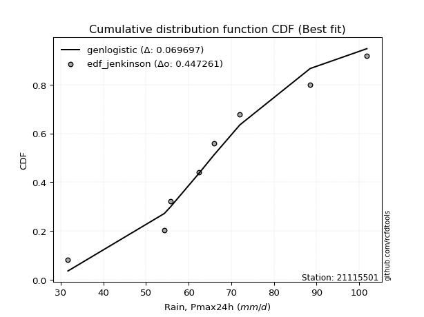</img>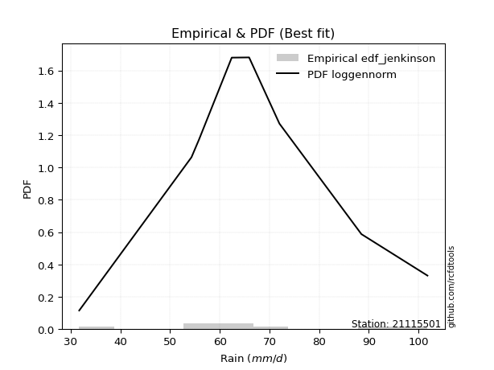</img>

</div>


### 11. EDF Cunnane (1978)

Cunnane´s work in statistical hydrology has focused on the performance and evaluation of different probability distributions (such as GEV, Gumbel, Lognormal) for flood frequency estimation. _b_ is a constant, typically set to 0.4.

<div align="center">


$P=(m-b)/(n+1-2b)$


</div>


**11.1. Empirical values**

<div align="center">

|                | 0                   | 1                   | 2                  | 3                  | 4                  | 5                  | 6                  | 7                  |
|:---------------|:--------------------|:--------------------|:-------------------|:-------------------|:-------------------|:-------------------|:-------------------|:-------------------|
| date           | 2016                | 2023                | 2017               | 2019               | 2021               | 2018               | 2022               | 2020               |
| x              | 31.7                | 54.3                | 55.8               | 62.4               | 65.9               | 72.0               | 88.5               | 101.8              |
| m              | 1                   | 2                   | 3                  | 4                  | 5                  | 6                  | 7                  | 8                  |
| empirical_dist | edf_cunnane         | edf_cunnane         | edf_cunnane        | edf_cunnane        | edf_cunnane        | edf_cunnane        | edf_cunnane        | edf_cunnane        |
| empirical      | 0.07317073170731708 | 0.19512195121951223 | 0.3170731707317074 | 0.4390243902439025 | 0.5609756097560976 | 0.6829268292682927 | 0.8048780487804879 | 0.926829268292683  |
| empirical_tr   | 1.0789473684210527  | 1.2424242424242424  | 1.4642857142857144 | 1.782608695652174  | 2.277777777777778  | 3.153846153846154  | 5.125000000000001  | 13.666666666666675 |

</div>


**11.2. Kolmogorov-Smirnov fit test (sorted by Δ)**


<div align="center">

|                | 0                   | 1                   | 2                   | 3                   | 4                   | 5                   | 6                   | 7                   | 8                  | 9                   | 10                  | 11                  | 12                  | 13                  | 14                  | 15                  | 16                  | 17                  | 18                  | 19                  | 20                  | 21                  | 22                  | 23                 | 24                  | 25                  | 26                  | 27                  | 28                  | 29                  | 30                  | 31                  | 32                  | 33                  | 34                  | 35                  | 36                  | 37                  | 38                  | 39                  | 40                  | 41                  | 42                  | 43                  | 44                  | 45                  | 46                 | 47                  | 48                  | 49                  | 50                 | 51                 | 52                  | 53                  | 54                 | 55                  | 56                  | 57                  | 58                  | 59                  | 60                  | 61                 | 62                 | 63                  | 64                  | 65                  | 66                  | 67                  | 68                  | 69                  | 70                  | 71                  | 72                  | 73                  | 74                 | 75                 | 76                  | 77                 | 78                  | 79                  | 80                  | 81                  | 82                  | 83                  | 84                 | 85                  | 86                  | 87                  | 88                  | 89                 | 90                  | 91                  | 92                  | 93                  | 94                  | 95                  | 96                  | 97                 | 98                  | 99                  | 100                 | 101                 | 102                 | 103                 | 104                | 105                 | 106                 | 107                 | 108                 | 109                 | 110                 | 111                 | 112                 | 113                 | 114                 | 115                 | 116                 | 117                 | 118                | 119                | 120                | 121                | 122                | 123                | 124                 | 125                 | 126                 | 127                 | 128                 | 129                | 130                 | 131                | 132                 | 133                | 134                 | 135                | 136                 | 137                | 138                 | 139                 | 140                | 141                | 142                | 143                 | 144                | 145                | 146                | 147                | 148                | 149                | 150                | 151                | 152                | 153                | 154                | 155                | 156                | 157                | 158                | 159                |
|:---------------|:--------------------|:--------------------|:--------------------|:--------------------|:--------------------|:--------------------|:--------------------|:--------------------|:-------------------|:--------------------|:--------------------|:--------------------|:--------------------|:--------------------|:--------------------|:--------------------|:--------------------|:--------------------|:--------------------|:--------------------|:--------------------|:--------------------|:--------------------|:-------------------|:--------------------|:--------------------|:--------------------|:--------------------|:--------------------|:--------------------|:--------------------|:--------------------|:--------------------|:--------------------|:--------------------|:--------------------|:--------------------|:--------------------|:--------------------|:--------------------|:--------------------|:--------------------|:--------------------|:--------------------|:--------------------|:--------------------|:-------------------|:--------------------|:--------------------|:--------------------|:-------------------|:-------------------|:--------------------|:--------------------|:-------------------|:--------------------|:--------------------|:--------------------|:--------------------|:--------------------|:--------------------|:-------------------|:-------------------|:--------------------|:--------------------|:--------------------|:--------------------|:--------------------|:--------------------|:--------------------|:--------------------|:--------------------|:--------------------|:--------------------|:-------------------|:-------------------|:--------------------|:-------------------|:--------------------|:--------------------|:--------------------|:--------------------|:--------------------|:--------------------|:-------------------|:--------------------|:--------------------|:--------------------|:--------------------|:-------------------|:--------------------|:--------------------|:--------------------|:--------------------|:--------------------|:--------------------|:--------------------|:-------------------|:--------------------|:--------------------|:--------------------|:--------------------|:--------------------|:--------------------|:-------------------|:--------------------|:--------------------|:--------------------|:--------------------|:--------------------|:--------------------|:--------------------|:--------------------|:--------------------|:--------------------|:--------------------|:--------------------|:--------------------|:-------------------|:-------------------|:-------------------|:-------------------|:-------------------|:-------------------|:--------------------|:--------------------|:--------------------|:--------------------|:--------------------|:-------------------|:--------------------|:-------------------|:--------------------|:-------------------|:--------------------|:-------------------|:--------------------|:-------------------|:--------------------|:--------------------|:-------------------|:-------------------|:-------------------|:--------------------|:-------------------|:-------------------|:-------------------|:-------------------|:-------------------|:-------------------|:-------------------|:-------------------|:-------------------|:-------------------|:-------------------|:-------------------|:-------------------|:-------------------|:-------------------|:-------------------|
| station        | 21115501            | 21115501            | 21115501            | 21115501            | 21115501            | 21115501            | 21115501            | 21115501            | 21115501           | 21115501            | 21115501            | 21115501            | 21115501            | 21115501            | 21115501            | 21115501            | 21115501            | 21115501            | 21115501            | 21115501            | 21115501            | 21115501            | 21115501            | 21115501           | 21115501            | 21115501            | 21115501            | 21115501            | 21115501            | 21115501            | 21115501            | 21115501            | 21115501            | 21115501            | 21115501            | 21115501            | 21115501            | 21115501            | 21115501            | 21115501            | 21115501            | 21115501            | 21115501            | 21115501            | 21115501            | 21115501            | 21115501           | 21115501            | 21115501            | 21115501            | 21115501           | 21115501           | 21115501            | 21115501            | 21115501           | 21115501            | 21115501            | 21115501            | 21115501            | 21115501            | 21115501            | 21115501           | 21115501           | 21115501            | 21115501            | 21115501            | 21115501            | 21115501            | 21115501            | 21115501            | 21115501            | 21115501            | 21115501            | 21115501            | 21115501           | 21115501           | 21115501            | 21115501           | 21115501            | 21115501            | 21115501            | 21115501            | 21115501            | 21115501            | 21115501           | 21115501            | 21115501            | 21115501            | 21115501            | 21115501           | 21115501            | 21115501            | 21115501            | 21115501            | 21115501            | 21115501            | 21115501            | 21115501           | 21115501            | 21115501            | 21115501            | 21115501            | 21115501            | 21115501            | 21115501           | 21115501            | 21115501            | 21115501            | 21115501            | 21115501            | 21115501            | 21115501            | 21115501            | 21115501            | 21115501            | 21115501            | 21115501            | 21115501            | 21115501           | 21115501           | 21115501           | 21115501           | 21115501           | 21115501           | 21115501            | 21115501            | 21115501            | 21115501            | 21115501            | 21115501           | 21115501            | 21115501           | 21115501            | 21115501           | 21115501            | 21115501           | 21115501            | 21115501           | 21115501            | 21115501            | 21115501           | 21115501           | 21115501           | 21115501            | 21115501           | 21115501           | 21115501           | 21115501           | 21115501           | 21115501           | 21115501           | 21115501           | 21115501           | 21115501           | 21115501           | 21115501           | 21115501           | 21115501           | 21115501           | 21115501           |
| empirical_dist | edf_cunnane         | edf_cunnane         | edf_cunnane         | edf_cunnane         | edf_cunnane         | edf_cunnane         | edf_cunnane         | edf_cunnane         | edf_cunnane        | edf_cunnane         | edf_cunnane         | edf_cunnane         | edf_cunnane         | edf_cunnane         | edf_cunnane         | edf_cunnane         | edf_cunnane         | edf_cunnane         | edf_cunnane         | edf_cunnane         | edf_cunnane         | edf_cunnane         | edf_cunnane         | edf_cunnane        | edf_cunnane         | edf_cunnane         | edf_cunnane         | edf_cunnane         | edf_cunnane         | edf_cunnane         | edf_cunnane         | edf_cunnane         | edf_cunnane         | edf_cunnane         | edf_cunnane         | edf_cunnane         | edf_cunnane         | edf_cunnane         | edf_cunnane         | edf_cunnane         | edf_cunnane         | edf_cunnane         | edf_cunnane         | edf_cunnane         | edf_cunnane         | edf_cunnane         | edf_cunnane        | edf_cunnane         | edf_cunnane         | edf_cunnane         | edf_cunnane        | edf_cunnane        | edf_cunnane         | edf_cunnane         | edf_cunnane        | edf_cunnane         | edf_cunnane         | edf_cunnane         | edf_cunnane         | edf_cunnane         | edf_cunnane         | edf_cunnane        | edf_cunnane        | edf_cunnane         | edf_cunnane         | edf_cunnane         | edf_cunnane         | edf_cunnane         | edf_cunnane         | edf_cunnane         | edf_cunnane         | edf_cunnane         | edf_cunnane         | edf_cunnane         | edf_cunnane        | edf_cunnane        | edf_cunnane         | edf_cunnane        | edf_cunnane         | edf_cunnane         | edf_cunnane         | edf_cunnane         | edf_cunnane         | edf_cunnane         | edf_cunnane        | edf_cunnane         | edf_cunnane         | edf_cunnane         | edf_cunnane         | edf_cunnane        | edf_cunnane         | edf_cunnane         | edf_cunnane         | edf_cunnane         | edf_cunnane         | edf_cunnane         | edf_cunnane         | edf_cunnane        | edf_cunnane         | edf_cunnane         | edf_cunnane         | edf_cunnane         | edf_cunnane         | edf_cunnane         | edf_cunnane        | edf_cunnane         | edf_cunnane         | edf_cunnane         | edf_cunnane         | edf_cunnane         | edf_cunnane         | edf_cunnane         | edf_cunnane         | edf_cunnane         | edf_cunnane         | edf_cunnane         | edf_cunnane         | edf_cunnane         | edf_cunnane        | edf_cunnane        | edf_cunnane        | edf_cunnane        | edf_cunnane        | edf_cunnane        | edf_cunnane         | edf_cunnane         | edf_cunnane         | edf_cunnane         | edf_cunnane         | edf_cunnane        | edf_cunnane         | edf_cunnane        | edf_cunnane         | edf_cunnane        | edf_cunnane         | edf_cunnane        | edf_cunnane         | edf_cunnane        | edf_cunnane         | edf_cunnane         | edf_cunnane        | edf_cunnane        | edf_cunnane        | edf_cunnane         | edf_cunnane        | edf_cunnane        | edf_cunnane        | edf_cunnane        | edf_cunnane        | edf_cunnane        | edf_cunnane        | edf_cunnane        | edf_cunnane        | edf_cunnane        | edf_cunnane        | edf_cunnane        | edf_cunnane        | edf_cunnane        | edf_cunnane        | edf_cunnane        |
| p_dist         | logdgamma           | logdweibull         | loggennorm          | logcrystalball      | logistic            | genlogistic         | loglaplace          | loglaplace          | truncnorm          | crystalball         | norm                | t                   | logt                | exponnorm           | mielke              | loggumbel_l         | burr                | loggenlogistic      | vonmises_line       | hypsecant           | pearson3            | logburr             | logmielke           | nct                | johnsonsu           | erlang              | gamma               | betaprime           | f                   | skewnorm            | logloggamma         | logjohnsonsu        | logburr12           | logloglaplace       | laplace             | cosine              | logweibull_min      | alpha               | dweibull            | loghypsecant        | gennorm             | invgamma            | dgamma              | rice                | weibull_min         | logpearson3         | logskewnorm        | gumbel_r            | maxwell             | logexponpow         | moyal              | anglit             | loggenextreme       | logweibull_max      | loglogistic        | invgauss            | rayleigh            | logargus            | semicircular        | logtriang           | logexponnorm        | lognorm            | logf               | uniform             | logfatiguelife      | halflogistic        | lognct              | wald                | loggamma            | loggamma            | logbetaprime        | logrice             | halfnorm            | logerlang           | gompertz           | loginvgamma        | wrapcauchy          | loggengamma        | gumbel_l            | loggausshyper       | loganglit           | kstwobign           | logalpha            | kappa4              | loginvgauss        | ksone               | logmaxwell          | gausshyper          | logsemicircular     | beta               | kappa3              | arcsine             | argus               | loggumbel_r         | loggenhalflogistic  | lograyleigh         | logfoldnorm         | ncf                | logcosine           | logmoyal            | logbeta             | logexponweib        | nakagami            | loginvweibull       | logarcsine         | loghalfnorm         | bradford            | loghalflogistic     | logtruncnorm        | logncf              | logwald             | truncexpon          | logrdist            | logtruncweibull_min | logkstwobign        | logtrapezoid        | triang              | genpareto           | loggenexpon        | loglevy_l          | logvonmises_line   | logkappa4          | genhalflogistic    | truncweibull_min   | logkappa3           | logtukeylambda      | loguniform          | lomax               | logksone            | lognakagami        | genexpon            | logwrapcauchy      | levy_l              | loggompertz        | burr12              | loglomax           | logbradford         | halfgennorm        | johnsonsb           | loggenpareto        | tukeylambda        | trapezoid          | logtruncexpon      | genextreme          | invweibull         | logjohnsonsb       | rdist              | foldnorm           | weibull_max        | powerlaw           | gengamma           | fatiguelife        | exponweib          | logpowerlaw        | exponpow           | truncpareto        | logtruncpareto     | loghalfgennorm     | logvonmises        | vonmises           |
| delta          | 0.06544988077188499 | 0.06678054564291988 | 0.06809080529682135 | 0.07083009628047862 | 0.07559058058331847 | 0.07624602908714026 | 0.07629952631180059 | 0.07629952631180059 | 0.0766056388071227 | 0.07660565026333302 | 0.07660565713642012 | 0.07661612936850962 | 0.07675959193791912 | 0.07705372486104303 | 0.07859059208833033 | 0.07870260774407944 | 0.07875627957511164 | 0.07881557662899644 | 0.07968702004332684 | 0.08122706609417962 | 0.08140197344344216 | 0.08240564603741071 | 0.08255534380782734 | 0.0830229444172598 | 0.08302670642337587 | 0.08360819731497257 | 0.08390201177785797 | 0.08420987609617672 | 0.08426886274756076 | 0.08463685032419002 | 0.08585602519659433 | 0.08702950477408453 | 0.08708375216073536 | 0.08781538723520219 | 0.08789638222306972 | 0.08807190548909583 | 0.08821487367477984 | 0.08989309572534074 | 0.09097329827708778 | 0.09197383120443217 | 0.09206715897653994 | 0.09213742266967509 | 0.09219939969007784 | 0.09278666984839432 | 0.09418764433458163 | 0.09691194390864125 | 0.0976105087411864 | 0.09895385589386571 | 0.10121632360879271 | 0.10208062491255457 | 0.1029919533944487 | 0.1031029052620123 | 0.10374636812528204 | 0.10377664244240381 | 0.1069746337901891 | 0.10803775490991194 | 0.11118875490287308 | 0.11196144607767625 | 0.11449171086073198 | 0.11666715746780487 | 0.12704526628718718 | 0.1270455083336837 | 0.1270551805521454 | 0.12727462510003126 | 0.12735136201847877 | 0.13040091629840453 | 0.13156508675648806 | 0.13250879562422446 | 0.13346612002330407 | 0.13346612002330407 | 0.13434003241858292 | 0.13534590366345908 | 0.13886030897065912 | 0.13910274209501353 | 0.1394926555682151 | 0.1398673915399292 | 0.14108368551393755 | 0.1416777649562426 | 0.14447198636184144 | 0.14667256138216703 | 0.14967862044513244 | 0.15012060217652698 | 0.15165509202087404 | 0.15387187519159265 | 0.1567806064007596 | 0.15687519571344075 | 0.15697627861048444 | 0.15858777805465984 | 0.15924656145794394 | 0.159814081953786  | 0.16080836121155997 | 0.16352013968041565 | 0.16658942911259977 | 0.16728775216893557 | 0.16769381811407724 | 0.16857172110569849 | 0.17230612023230915 | 0.1770365098025776 | 0.18054168294193437 | 0.18115570921753835 | 0.18563772703944753 | 0.18620365871789699 | 0.19512194966232568 | 0.19702878916090202 | 0.1990296528335768 | 0.20154430673826787 | 0.20323842822479235 | 0.20450365046037453 | 0.20553870302891053 | 0.20581302148960798 | 0.21220086272410277 | 0.21851170922659877 | 0.21959730334181976 | 0.22274946151562883 | 0.23267758798704938 | 0.23498605188793342 | 0.23920098482021218 | 0.23973433796974394 | 0.2426413413210399 | 0.2504215436343216 | 0.2519088374299435 | 0.2519124378688934 | 0.257175514324785  | 0.2580063807637131 | 0.26573646369525084 | 0.26607298648766853 | 0.26618822276360043 | 0.26819905208775896 | 0.27263652709974817 | 0.2739101018152307 | 0.28205705048835983 | 0.2919247067685685 | 0.29921119911538546 | 0.3103587624507317 | 0.34407175339887985 | 0.3461748948385682 | 0.35407208283754643 | 0.3579879086197286 | 0.35892012475599366 | 0.36020914148008265 | 0.366091242138083  | 0.3666208744574559 | 0.3667435368834061 | 0.37120246247848354 | 0.4712886169648532 | 0.50855824102126   | 0.5604377858758157 | 0.5609756097560976 | 0.6053476749552988 | 0.6110402565732242 | 0.6144237138701824 | 0.6270360164990074 | 0.6291546353396122 | 0.6563446793779026 | 0.719374237006032  | 0.7327001005428557 | 0.7546619608813856 | 0.8048780487804879 | 1.1204267710077593 | 15.792270027017077 |
| deltao         | 0.4472608134160001  | 0.4472608134160001  | 0.4472608134160001  | 0.4472608134160001  | 0.4472608134160001  | 0.4472608134160001  | 0.4472608134160001  | 0.4472608134160001  | 0.4472608134160001 | 0.4472608134160001  | 0.4472608134160001  | 0.4472608134160001  | 0.4472608134160001  | 0.4472608134160001  | 0.4472608134160001  | 0.4472608134160001  | 0.4472608134160001  | 0.4472608134160001  | 0.4472608134160001  | 0.4472608134160001  | 0.4472608134160001  | 0.4472608134160001  | 0.4472608134160001  | 0.4472608134160001 | 0.4472608134160001  | 0.4472608134160001  | 0.4472608134160001  | 0.4472608134160001  | 0.4472608134160001  | 0.4472608134160001  | 0.4472608134160001  | 0.4472608134160001  | 0.4472608134160001  | 0.4472608134160001  | 0.4472608134160001  | 0.4472608134160001  | 0.4472608134160001  | 0.4472608134160001  | 0.4472608134160001  | 0.4472608134160001  | 0.4472608134160001  | 0.4472608134160001  | 0.4472608134160001  | 0.4472608134160001  | 0.4472608134160001  | 0.4472608134160001  | 0.4472608134160001 | 0.4472608134160001  | 0.4472608134160001  | 0.4472608134160001  | 0.4472608134160001 | 0.4472608134160001 | 0.4472608134160001  | 0.4472608134160001  | 0.4472608134160001 | 0.4472608134160001  | 0.4472608134160001  | 0.4472608134160001  | 0.4472608134160001  | 0.4472608134160001  | 0.4472608134160001  | 0.4472608134160001 | 0.4472608134160001 | 0.4472608134160001  | 0.4472608134160001  | 0.4472608134160001  | 0.4472608134160001  | 0.4472608134160001  | 0.4472608134160001  | 0.4472608134160001  | 0.4472608134160001  | 0.4472608134160001  | 0.4472608134160001  | 0.4472608134160001  | 0.4472608134160001 | 0.4472608134160001 | 0.4472608134160001  | 0.4472608134160001 | 0.4472608134160001  | 0.4472608134160001  | 0.4472608134160001  | 0.4472608134160001  | 0.4472608134160001  | 0.4472608134160001  | 0.4472608134160001 | 0.4472608134160001  | 0.4472608134160001  | 0.4472608134160001  | 0.4472608134160001  | 0.4472608134160001 | 0.4472608134160001  | 0.4472608134160001  | 0.4472608134160001  | 0.4472608134160001  | 0.4472608134160001  | 0.4472608134160001  | 0.4472608134160001  | 0.4472608134160001 | 0.4472608134160001  | 0.4472608134160001  | 0.4472608134160001  | 0.4472608134160001  | 0.4472608134160001  | 0.4472608134160001  | 0.4472608134160001 | 0.4472608134160001  | 0.4472608134160001  | 0.4472608134160001  | 0.4472608134160001  | 0.4472608134160001  | 0.4472608134160001  | 0.4472608134160001  | 0.4472608134160001  | 0.4472608134160001  | 0.4472608134160001  | 0.4472608134160001  | 0.4472608134160001  | 0.4472608134160001  | 0.4472608134160001 | 0.4472608134160001 | 0.4472608134160001 | 0.4472608134160001 | 0.4472608134160001 | 0.4472608134160001 | 0.4472608134160001  | 0.4472608134160001  | 0.4472608134160001  | 0.4472608134160001  | 0.4472608134160001  | 0.4472608134160001 | 0.4472608134160001  | 0.4472608134160001 | 0.4472608134160001  | 0.4472608134160001 | 0.4472608134160001  | 0.4472608134160001 | 0.4472608134160001  | 0.4472608134160001 | 0.4472608134160001  | 0.4472608134160001  | 0.4472608134160001 | 0.4472608134160001 | 0.4472608134160001 | 0.4472608134160001  | 0.4472608134160001 | 0.4472608134160001 | 0.4472608134160001 | 0.4472608134160001 | 0.4472608134160001 | 0.4472608134160001 | 0.4472608134160001 | 0.4472608134160001 | 0.4472608134160001 | 0.4472608134160001 | 0.4472608134160001 | 0.4472608134160001 | 0.4472608134160001 | 0.4472608134160001 | 0.4472608134160001 | 0.4472608134160001 |
| eval           | Δo > Δ              | Δo > Δ              | Δo > Δ              | Δo > Δ              | Δo > Δ              | Δo > Δ              | Δo > Δ              | Δo > Δ              | Δo > Δ             | Δo > Δ              | Δo > Δ              | Δo > Δ              | Δo > Δ              | Δo > Δ              | Δo > Δ              | Δo > Δ              | Δo > Δ              | Δo > Δ              | Δo > Δ              | Δo > Δ              | Δo > Δ              | Δo > Δ              | Δo > Δ              | Δo > Δ             | Δo > Δ              | Δo > Δ              | Δo > Δ              | Δo > Δ              | Δo > Δ              | Δo > Δ              | Δo > Δ              | Δo > Δ              | Δo > Δ              | Δo > Δ              | Δo > Δ              | Δo > Δ              | Δo > Δ              | Δo > Δ              | Δo > Δ              | Δo > Δ              | Δo > Δ              | Δo > Δ              | Δo > Δ              | Δo > Δ              | Δo > Δ              | Δo > Δ              | Δo > Δ             | Δo > Δ              | Δo > Δ              | Δo > Δ              | Δo > Δ             | Δo > Δ             | Δo > Δ              | Δo > Δ              | Δo > Δ             | Δo > Δ              | Δo > Δ              | Δo > Δ              | Δo > Δ              | Δo > Δ              | Δo > Δ              | Δo > Δ             | Δo > Δ             | Δo > Δ              | Δo > Δ              | Δo > Δ              | Δo > Δ              | Δo > Δ              | Δo > Δ              | Δo > Δ              | Δo > Δ              | Δo > Δ              | Δo > Δ              | Δo > Δ              | Δo > Δ             | Δo > Δ             | Δo > Δ              | Δo > Δ             | Δo > Δ              | Δo > Δ              | Δo > Δ              | Δo > Δ              | Δo > Δ              | Δo > Δ              | Δo > Δ             | Δo > Δ              | Δo > Δ              | Δo > Δ              | Δo > Δ              | Δo > Δ             | Δo > Δ              | Δo > Δ              | Δo > Δ              | Δo > Δ              | Δo > Δ              | Δo > Δ              | Δo > Δ              | Δo > Δ             | Δo > Δ              | Δo > Δ              | Δo > Δ              | Δo > Δ              | Δo > Δ              | Δo > Δ              | Δo > Δ             | Δo > Δ              | Δo > Δ              | Δo > Δ              | Δo > Δ              | Δo > Δ              | Δo > Δ              | Δo > Δ              | Δo > Δ              | Δo > Δ              | Δo > Δ              | Δo > Δ              | Δo > Δ              | Δo > Δ              | Δo > Δ             | Δo > Δ             | Δo > Δ             | Δo > Δ             | Δo > Δ             | Δo > Δ             | Δo > Δ              | Δo > Δ              | Δo > Δ              | Δo > Δ              | Δo > Δ              | Δo > Δ             | Δo > Δ              | Δo > Δ             | Δo > Δ              | Δo > Δ             | Δo > Δ              | Δo > Δ             | Δo > Δ              | Δo > Δ             | Δo > Δ              | Δo > Δ              | Δo > Δ             | Δo > Δ             | Δo > Δ             | Δo > Δ              | Δo <= Δ            | Δo <= Δ            | Δo <= Δ            | Δo <= Δ            | Δo <= Δ            | Δo <= Δ            | Δo <= Δ            | Δo <= Δ            | Δo <= Δ            | Δo <= Δ            | Δo <= Δ            | Δo <= Δ            | Δo <= Δ            | Δo <= Δ            | Δo <= Δ            | Δo <= Δ            |
| fit            | 1                   | 1                   | 1                   | 1                   | 1                   | 1                   | 1                   | 1                   | 1                  | 1                   | 1                   | 1                   | 1                   | 1                   | 1                   | 1                   | 1                   | 1                   | 1                   | 1                   | 1                   | 1                   | 1                   | 1                  | 1                   | 1                   | 1                   | 1                   | 1                   | 1                   | 1                   | 1                   | 1                   | 1                   | 1                   | 1                   | 1                   | 1                   | 1                   | 1                   | 1                   | 1                   | 1                   | 1                   | 1                   | 1                   | 1                  | 1                   | 1                   | 1                   | 1                  | 1                  | 1                   | 1                   | 1                  | 1                   | 1                   | 1                   | 1                   | 1                   | 1                   | 1                  | 1                  | 1                   | 1                   | 1                   | 1                   | 1                   | 1                   | 1                   | 1                   | 1                   | 1                   | 1                   | 1                  | 1                  | 1                   | 1                  | 1                   | 1                   | 1                   | 1                   | 1                   | 1                   | 1                  | 1                   | 1                   | 1                   | 1                   | 1                  | 1                   | 1                   | 1                   | 1                   | 1                   | 1                   | 1                   | 1                  | 1                   | 1                   | 1                   | 1                   | 1                   | 1                   | 1                  | 1                   | 1                   | 1                   | 1                   | 1                   | 1                   | 1                   | 1                   | 1                   | 1                   | 1                   | 1                   | 1                   | 1                  | 1                  | 1                  | 1                  | 1                  | 1                  | 1                   | 1                   | 1                   | 1                   | 1                   | 1                  | 1                   | 1                  | 1                   | 1                  | 1                   | 1                  | 1                   | 1                  | 1                   | 1                   | 1                  | 1                  | 1                  | 1                   | 0                  | 0                  | 0                  | 0                  | 0                  | 0                  | 0                  | 0                  | 0                  | 0                  | 0                  | 0                  | 0                  | 0                  | 0                  | 0                  |
| n              | 8                   | 8                   | 8                   | 8                   | 8                   | 8                   | 8                   | 8                   | 8                  | 8                   | 8                   | 8                   | 8                   | 8                   | 8                   | 8                   | 8                   | 8                   | 8                   | 8                   | 8                   | 8                   | 8                   | 8                  | 8                   | 8                   | 8                   | 8                   | 8                   | 8                   | 8                   | 8                   | 8                   | 8                   | 8                   | 8                   | 8                   | 8                   | 8                   | 8                   | 8                   | 8                   | 8                   | 8                   | 8                   | 8                   | 8                  | 8                   | 8                   | 8                   | 8                  | 8                  | 8                   | 8                   | 8                  | 8                   | 8                   | 8                   | 8                   | 8                   | 8                   | 8                  | 8                  | 8                   | 8                   | 8                   | 8                   | 8                   | 8                   | 8                   | 8                   | 8                   | 8                   | 8                   | 8                  | 8                  | 8                   | 8                  | 8                   | 8                   | 8                   | 8                   | 8                   | 8                   | 8                  | 8                   | 8                   | 8                   | 8                   | 8                  | 8                   | 8                   | 8                   | 8                   | 8                   | 8                   | 8                   | 8                  | 8                   | 8                   | 8                   | 8                   | 8                   | 8                   | 8                  | 8                   | 8                   | 8                   | 8                   | 8                   | 8                   | 8                   | 8                   | 8                   | 8                   | 8                   | 8                   | 8                   | 8                  | 8                  | 8                  | 8                  | 8                  | 8                  | 8                   | 8                   | 8                   | 8                   | 8                   | 8                  | 8                   | 8                  | 8                   | 8                  | 8                   | 8                  | 8                   | 8                  | 8                   | 8                   | 8                  | 8                  | 8                  | 8                   | 8                  | 8                  | 8                  | 8                  | 8                  | 8                  | 8                  | 8                  | 8                  | 8                  | 8                  | 8                  | 8                  | 8                  | 8                  | 8                  |
| best_fit       | 1                   | 0                   | 0                   | 0                   | 0                   | 0                   | 0                   | 0                   | 0                  | 0                   | 0                   | 0                   | 0                   | 0                   | 0                   | 0                   | 0                   | 0                   | 0                   | 0                   | 0                   | 0                   | 0                   | 0                  | 0                   | 0                   | 0                   | 0                   | 0                   | 0                   | 0                   | 0                   | 0                   | 0                   | 0                   | 0                   | 0                   | 0                   | 0                   | 0                   | 0                   | 0                   | 0                   | 0                   | 0                   | 0                   | 0                  | 0                   | 0                   | 0                   | 0                  | 0                  | 0                   | 0                   | 0                  | 0                   | 0                   | 0                   | 0                   | 0                   | 0                   | 0                  | 0                  | 0                   | 0                   | 0                   | 0                   | 0                   | 0                   | 0                   | 0                   | 0                   | 0                   | 0                   | 0                  | 0                  | 0                   | 0                  | 0                   | 0                   | 0                   | 0                   | 0                   | 0                   | 0                  | 0                   | 0                   | 0                   | 0                   | 0                  | 0                   | 0                   | 0                   | 0                   | 0                   | 0                   | 0                   | 0                  | 0                   | 0                   | 0                   | 0                   | 0                   | 0                   | 0                  | 0                   | 0                   | 0                   | 0                   | 0                   | 0                   | 0                   | 0                   | 0                   | 0                   | 0                   | 0                   | 0                   | 0                  | 0                  | 0                  | 0                  | 0                  | 0                  | 0                   | 0                   | 0                   | 0                   | 0                   | 0                  | 0                   | 0                  | 0                   | 0                  | 0                   | 0                  | 0                   | 0                  | 0                   | 0                   | 0                  | 0                  | 0                  | 0                   | 0                  | 0                  | 0                  | 0                  | 0                  | 0                  | 0                  | 0                  | 0                  | 0                  | 0                  | 0                  | 0                  | 0                  | 0                  | 0                  |
| best_fit_sort  | 1                   | 2                   | 3                   | 4                   | 5                   | 6                   | 7                   | 8                   | 9                  | 10                  | 11                  | 12                  | 13                  | 14                  | 15                  | 16                  | 17                  | 18                  | 19                  | 20                  | 21                  | 22                  | 23                  | 24                 | 25                  | 26                  | 27                  | 28                  | 29                  | 30                  | 31                  | 32                  | 33                  | 34                  | 35                  | 36                  | 37                  | 38                  | 39                  | 40                  | 41                  | 42                  | 43                  | 44                  | 45                  | 46                  | 47                 | 48                  | 49                  | 50                  | 51                 | 52                 | 53                  | 54                  | 55                 | 56                  | 57                  | 58                  | 59                  | 60                  | 61                  | 62                 | 63                 | 64                  | 65                  | 66                  | 67                  | 68                  | 69                  | 70                  | 71                  | 72                  | 73                  | 74                  | 75                 | 76                 | 77                  | 78                 | 79                  | 80                  | 81                  | 82                  | 83                  | 84                  | 85                 | 86                  | 87                  | 88                  | 89                  | 90                 | 91                  | 92                  | 93                  | 94                  | 95                  | 96                  | 97                  | 98                 | 99                  | 100                 | 101                 | 102                 | 103                 | 104                 | 105                | 106                 | 107                 | 108                 | 109                 | 110                 | 111                 | 112                 | 113                 | 114                 | 115                 | 116                 | 117                 | 118                 | 119                | 120                | 121                | 122                | 123                | 124                | 125                 | 126                 | 127                 | 128                 | 129                 | 130                | 131                 | 132                | 133                 | 134                | 135                 | 136                | 137                 | 138                | 139                 | 140                 | 141                | 142                | 143                | 144                 | 145                | 146                | 147                | 148                | 149                | 150                | 151                | 152                | 153                | 154                | 155                | 156                | 157                | 158                | 159                | 160                |

</div>


**11.3. Best fit**

<div align="center">

|   id |   station | empirical_dist   | p_dist    |     delta |   deltao | eval   |   fit |   n |   best_fit |   best_fit_sort |
|-----:|----------:|:-----------------|:----------|----------:|---------:|:-------|------:|----:|-----------:|----------------:|
|    0 |  21115501 | edf_cunnane      | logdgamma | 0.0654499 | 0.447261 | Δo > Δ |     1 |   8 |          1 |               1 |

</div>


<div align="center">

</img></img>

</div>


### 12. EDF Adamowski (1981)

The Adamowski formula in hydrology refers to a specific plotting position formula used for estimating the non-parametric empirical distribution of hydrological events (like flood peaks) to calculate their return periods. This formula provides an alternative to traditional parametric methods (like the Gumbel or Log Pearson Type III distributions). 

<div align="center">


$P=(m-0.25)/(n+0.5)$


</div>


**12.1. Empirical values**

<div align="center">

|                | 0                   | 1                   | 2                  | 3                  | 4                  | 5                  | 6                  | 7                  |
|:---------------|:--------------------|:--------------------|:-------------------|:-------------------|:-------------------|:-------------------|:-------------------|:-------------------|
| date           | 2016                | 2023                | 2017               | 2019               | 2021               | 2018               | 2022               | 2020               |
| x              | 31.7                | 54.3                | 55.8               | 62.4               | 65.9               | 72.0               | 88.5               | 101.8              |
| m              | 1                   | 2                   | 3                  | 4                  | 5                  | 6                  | 7                  | 8                  |
| empirical_dist | edf_adamowski       | edf_adamowski       | edf_adamowski      | edf_adamowski      | edf_adamowski      | edf_adamowski      | edf_adamowski      | edf_adamowski      |
| empirical      | 0.08823529411764706 | 0.20588235294117646 | 0.3235294117647059 | 0.4411764705882353 | 0.5588235294117647 | 0.6764705882352942 | 0.7941176470588235 | 0.9117647058823529 |
| empirical_tr   | 1.096774193548387   | 1.259259259259259   | 1.4782608695652173 | 1.7894736842105263 | 2.2666666666666666 | 3.0909090909090913 | 4.857142857142856  | 11.33333333333333  |

</div>


**12.2. Kolmogorov-Smirnov fit test (sorted by Δ)**


<div align="center">

|                | 0                  | 1                   | 2                   | 3                   | 4                   | 5                  | 6                  | 7                   | 8                   | 9                  | 10                  | 11                  | 12                  | 13                  | 14                  | 15                  | 16                  | 17                  | 18                  | 19                  | 20                  | 21                  | 22                  | 23                  | 24                 | 25                 | 26                  | 27                  | 28                  | 29                  | 30                  | 31                  | 32                  | 33                  | 34                  | 35                 | 36                  | 37                  | 38                  | 39                  | 40                  | 41                  | 42                  | 43                  | 44                  | 45                  | 46                  | 47                  | 48                  | 49                  | 50                 | 51                  | 52                  | 53                 | 54                  | 55                  | 56                  | 57                  | 58                  | 59                 | 60                  | 61                  | 62                  | 63                  | 64                  | 65                 | 66                  | 67                  | 68                  | 69                  | 70                  | 71                 | 72                 | 73                  | 74                  | 75                  | 76                  | 77                  | 78                 | 79                 | 80                  | 81                 | 82                  | 83                  | 84                  | 85                  | 86                 | 87                 | 88                  | 89                  | 90                  | 91                 | 92                  | 93                  | 94                 | 95                  | 96                  | 97                  | 98                  | 99                  | 100                 | 101                 | 102                | 103                 | 104                 | 105                 | 106                | 107                 | 108                 | 109                 | 110                 | 111                 | 112                 | 113                 | 114                 | 115                 | 116                | 117                 | 118                | 119                 | 120                 | 121                 | 122                 | 123                 | 124                | 125                 | 126                 | 127                 | 128                | 129                | 130                 | 131                 | 132                 | 133                | 134                 | 135                | 136                 | 137                | 138                | 139                 | 140                 | 141                | 142                | 143                 | 144                 | 145                | 146                | 147                | 148                | 149                | 150                | 151                | 152                | 153                | 154                | 155                | 156                | 157                | 158                | 159                |
|:---------------|:-------------------|:--------------------|:--------------------|:--------------------|:--------------------|:-------------------|:-------------------|:--------------------|:--------------------|:-------------------|:--------------------|:--------------------|:--------------------|:--------------------|:--------------------|:--------------------|:--------------------|:--------------------|:--------------------|:--------------------|:--------------------|:--------------------|:--------------------|:--------------------|:-------------------|:-------------------|:--------------------|:--------------------|:--------------------|:--------------------|:--------------------|:--------------------|:--------------------|:--------------------|:--------------------|:-------------------|:--------------------|:--------------------|:--------------------|:--------------------|:--------------------|:--------------------|:--------------------|:--------------------|:--------------------|:--------------------|:--------------------|:--------------------|:--------------------|:--------------------|:-------------------|:--------------------|:--------------------|:-------------------|:--------------------|:--------------------|:--------------------|:--------------------|:--------------------|:-------------------|:--------------------|:--------------------|:--------------------|:--------------------|:--------------------|:-------------------|:--------------------|:--------------------|:--------------------|:--------------------|:--------------------|:-------------------|:-------------------|:--------------------|:--------------------|:--------------------|:--------------------|:--------------------|:-------------------|:-------------------|:--------------------|:-------------------|:--------------------|:--------------------|:--------------------|:--------------------|:-------------------|:-------------------|:--------------------|:--------------------|:--------------------|:-------------------|:--------------------|:--------------------|:-------------------|:--------------------|:--------------------|:--------------------|:--------------------|:--------------------|:--------------------|:--------------------|:-------------------|:--------------------|:--------------------|:--------------------|:-------------------|:--------------------|:--------------------|:--------------------|:--------------------|:--------------------|:--------------------|:--------------------|:--------------------|:--------------------|:-------------------|:--------------------|:-------------------|:--------------------|:--------------------|:--------------------|:--------------------|:--------------------|:-------------------|:--------------------|:--------------------|:--------------------|:-------------------|:-------------------|:--------------------|:--------------------|:--------------------|:-------------------|:--------------------|:-------------------|:--------------------|:-------------------|:-------------------|:--------------------|:--------------------|:-------------------|:-------------------|:--------------------|:--------------------|:-------------------|:-------------------|:-------------------|:-------------------|:-------------------|:-------------------|:-------------------|:-------------------|:-------------------|:-------------------|:-------------------|:-------------------|:-------------------|:-------------------|:-------------------|
| station        | 21115501           | 21115501            | 21115501            | 21115501            | 21115501            | 21115501           | 21115501           | 21115501            | 21115501            | 21115501           | 21115501            | 21115501            | 21115501            | 21115501            | 21115501            | 21115501            | 21115501            | 21115501            | 21115501            | 21115501            | 21115501            | 21115501            | 21115501            | 21115501            | 21115501           | 21115501           | 21115501            | 21115501            | 21115501            | 21115501            | 21115501            | 21115501            | 21115501            | 21115501            | 21115501            | 21115501           | 21115501            | 21115501            | 21115501            | 21115501            | 21115501            | 21115501            | 21115501            | 21115501            | 21115501            | 21115501            | 21115501            | 21115501            | 21115501            | 21115501            | 21115501           | 21115501            | 21115501            | 21115501           | 21115501            | 21115501            | 21115501            | 21115501            | 21115501            | 21115501           | 21115501            | 21115501            | 21115501            | 21115501            | 21115501            | 21115501           | 21115501            | 21115501            | 21115501            | 21115501            | 21115501            | 21115501           | 21115501           | 21115501            | 21115501            | 21115501            | 21115501            | 21115501            | 21115501           | 21115501           | 21115501            | 21115501           | 21115501            | 21115501            | 21115501            | 21115501            | 21115501           | 21115501           | 21115501            | 21115501            | 21115501            | 21115501           | 21115501            | 21115501            | 21115501           | 21115501            | 21115501            | 21115501            | 21115501            | 21115501            | 21115501            | 21115501            | 21115501           | 21115501            | 21115501            | 21115501            | 21115501           | 21115501            | 21115501            | 21115501            | 21115501            | 21115501            | 21115501            | 21115501            | 21115501            | 21115501            | 21115501           | 21115501            | 21115501           | 21115501            | 21115501            | 21115501            | 21115501            | 21115501            | 21115501           | 21115501            | 21115501            | 21115501            | 21115501           | 21115501           | 21115501            | 21115501            | 21115501            | 21115501           | 21115501            | 21115501           | 21115501            | 21115501           | 21115501           | 21115501            | 21115501            | 21115501           | 21115501           | 21115501            | 21115501            | 21115501           | 21115501           | 21115501           | 21115501           | 21115501           | 21115501           | 21115501           | 21115501           | 21115501           | 21115501           | 21115501           | 21115501           | 21115501           | 21115501           | 21115501           |
| empirical_dist | edf_adamowski      | edf_adamowski       | edf_adamowski       | edf_adamowski       | edf_adamowski       | edf_adamowski      | edf_adamowski      | edf_adamowski       | edf_adamowski       | edf_adamowski      | edf_adamowski       | edf_adamowski       | edf_adamowski       | edf_adamowski       | edf_adamowski       | edf_adamowski       | edf_adamowski       | edf_adamowski       | edf_adamowski       | edf_adamowski       | edf_adamowski       | edf_adamowski       | edf_adamowski       | edf_adamowski       | edf_adamowski      | edf_adamowski      | edf_adamowski       | edf_adamowski       | edf_adamowski       | edf_adamowski       | edf_adamowski       | edf_adamowski       | edf_adamowski       | edf_adamowski       | edf_adamowski       | edf_adamowski      | edf_adamowski       | edf_adamowski       | edf_adamowski       | edf_adamowski       | edf_adamowski       | edf_adamowski       | edf_adamowski       | edf_adamowski       | edf_adamowski       | edf_adamowski       | edf_adamowski       | edf_adamowski       | edf_adamowski       | edf_adamowski       | edf_adamowski      | edf_adamowski       | edf_adamowski       | edf_adamowski      | edf_adamowski       | edf_adamowski       | edf_adamowski       | edf_adamowski       | edf_adamowski       | edf_adamowski      | edf_adamowski       | edf_adamowski       | edf_adamowski       | edf_adamowski       | edf_adamowski       | edf_adamowski      | edf_adamowski       | edf_adamowski       | edf_adamowski       | edf_adamowski       | edf_adamowski       | edf_adamowski      | edf_adamowski      | edf_adamowski       | edf_adamowski       | edf_adamowski       | edf_adamowski       | edf_adamowski       | edf_adamowski      | edf_adamowski      | edf_adamowski       | edf_adamowski      | edf_adamowski       | edf_adamowski       | edf_adamowski       | edf_adamowski       | edf_adamowski      | edf_adamowski      | edf_adamowski       | edf_adamowski       | edf_adamowski       | edf_adamowski      | edf_adamowski       | edf_adamowski       | edf_adamowski      | edf_adamowski       | edf_adamowski       | edf_adamowski       | edf_adamowski       | edf_adamowski       | edf_adamowski       | edf_adamowski       | edf_adamowski      | edf_adamowski       | edf_adamowski       | edf_adamowski       | edf_adamowski      | edf_adamowski       | edf_adamowski       | edf_adamowski       | edf_adamowski       | edf_adamowski       | edf_adamowski       | edf_adamowski       | edf_adamowski       | edf_adamowski       | edf_adamowski      | edf_adamowski       | edf_adamowski      | edf_adamowski       | edf_adamowski       | edf_adamowski       | edf_adamowski       | edf_adamowski       | edf_adamowski      | edf_adamowski       | edf_adamowski       | edf_adamowski       | edf_adamowski      | edf_adamowski      | edf_adamowski       | edf_adamowski       | edf_adamowski       | edf_adamowski      | edf_adamowski       | edf_adamowski      | edf_adamowski       | edf_adamowski      | edf_adamowski      | edf_adamowski       | edf_adamowski       | edf_adamowski      | edf_adamowski      | edf_adamowski       | edf_adamowski       | edf_adamowski      | edf_adamowski      | edf_adamowski      | edf_adamowski      | edf_adamowski      | edf_adamowski      | edf_adamowski      | edf_adamowski      | edf_adamowski      | edf_adamowski      | edf_adamowski      | edf_adamowski      | edf_adamowski      | edf_adamowski      | edf_adamowski      |
| p_dist         | logt               | loggennorm          | logdweibull         | exponnorm           | pearson3            | logdgamma          | norm               | crystalball         | truncnorm           | t                  | genlogistic         | nct                 | johnsonsu           | logmielke           | logburr             | erlang              | gamma               | betaprime           | f                   | loggenlogistic      | burr                | mielke              | skewnorm            | logcrystalball      | logloggamma        | logjohnsonsu       | logburr12           | logloglaplace       | logweibull_min      | alpha               | loggumbel_l         | loghypsecant        | invgamma            | cosine              | rice                | weibull_min        | logistic            | gennorm             | logpearson3         | logskewnorm         | loglaplace          | loglaplace          | gumbel_r            | vonmises_line       | maxwell             | logexponpow         | hypsecant           | moyal               | anglit              | loglogistic         | invgauss           | loggenextreme       | logweibull_max      | laplace            | rayleigh            | logargus            | dweibull            | dgamma              | semicircular        | logtriang          | logexponnorm        | lognorm             | logf                | uniform             | logfatiguelife      | halflogistic       | lognct              | loggamma            | loggamma            | logbetaprime        | logrice             | halfnorm           | logerlang          | loginvgamma         | wrapcauchy          | wald                | loggengamma         | gompertz            | loggausshyper      | loganglit          | kstwobign           | logalpha           | gumbel_l            | kappa4              | loginvgauss         | ksone               | logmaxwell         | logsemicircular    | kappa3              | gausshyper          | arcsine             | beta               | loggumbel_r         | lograyleigh         | argus              | loggenhalflogistic  | logfoldnorm         | ncf                 | logcosine           | logmoyal            | logexponweib        | logbeta             | loginvweibull      | logarcsine          | loghalfnorm         | bradford            | loghalflogistic    | logncf              | nakagami            | truncexpon          | logwald             | logtruncweibull_min | logtruncnorm        | logkstwobign        | logrdist            | logtrapezoid        | genpareto          | loggenexpon         | triang             | loglevy_l           | logvonmises_line    | logkappa4           | truncweibull_min    | genhalflogistic     | logkappa3          | loguniform          | lomax               | logksone            | genexpon           | lognakagami        | logtukeylambda      | logwrapcauchy       | levy_l              | loggompertz        | burr12              | loglomax           | logbradford         | halfgennorm        | johnsonsb          | loggenpareto        | tukeylambda         | logtruncexpon      | trapezoid          | genextreme          | invweibull          | logjohnsonsb       | rdist              | foldnorm           | weibull_max        | powerlaw           | gengamma           | fatiguelife        | exponweib          | logpowerlaw        | exponpow           | truncpareto        | logtruncpareto     | loghalfgennorm     | logvonmises        | vonmises           |
| delta          | 0.0673060753128925 | 0.06804063467938459 | 0.06959168375606939 | 0.07043077824170568 | 0.07064157172177793 | 0.0707838077056544 | 0.0716831236835419 | 0.07168313276946237 | 0.07168313791329028 | 0.0716952125048913 | 0.07183810554930992 | 0.07226254269559557 | 0.07226630470171164 | 0.07259864277613726 | 0.07265515749437612 | 0.07284779559330834 | 0.07314161005619374 | 0.07344947437451249 | 0.07350846102589653 | 0.07376877556257777 | 0.07377647740139703 | 0.07382597418668857 | 0.07387644860252579 | 0.07487823047021991 | 0.0750956234749301 | 0.0762691030524203 | 0.07632335043907112 | 0.07705498551353795 | 0.07745447195311561 | 0.07913269400367651 | 0.07928628531398785 | 0.08121342948276794 | 0.08137702094801086 | 0.08161566445609725 | 0.08202626812673008 | 0.0834272426129174 | 0.08399823281705909 | 0.08561091794354136 | 0.08615154218697701 | 0.08685010701952217 | 0.08705992803346496 | 0.08705992803346496 | 0.08819345417220148 | 0.08823529267206032 | 0.09045592188712848 | 0.09132022319089034 | 0.09198746781584399 | 0.09223155167278446 | 0.09234250354034806 | 0.09621423206852486 | 0.0972773531882477 | 0.09729012709228346 | 0.09732040140940523 | 0.0986567839447341 | 0.10042835318120885 | 0.10120104435601202 | 0.10173369999875215 | 0.10295980141174221 | 0.10373130913906775 | 0.1102109164348063 | 0.11628486456552295 | 0.11628510661201946 | 0.11629477883048117 | 0.11651422337836703 | 0.11659096029681454 | 0.1196405145767403 | 0.12080468503482383 | 0.12270571830163984 | 0.12270571830163984 | 0.12357963069691869 | 0.12458550194179485 | 0.1280999072489949 | 0.1283423403733493 | 0.12910698981826496 | 0.13032328379227331 | 0.13035671527989168 | 0.13091736323457837 | 0.13303641453521653 | 0.1359121596605028 | 0.1389182187234682 | 0.13936020045486275 | 0.1408946902992098 | 0.14231990601750855 | 0.14311147346992842 | 0.14602020467909538 | 0.14611479399177651 | 0.1462158768888202 | 0.1484861597362797 | 0.15004795948989574 | 0.15213153702166127 | 0.15275973795875142 | 0.1533578409207874 | 0.15652735044727134 | 0.15781131938403425 | 0.1601331880796012 | 0.16123757708107866 | 0.16154571851064492 | 0.16627610808091337 | 0.16978128122027014 | 0.17039530749587412 | 0.17544325699623275 | 0.17918148600644895 | 0.1862683874392378 | 0.18826925111191256 | 0.19078390501660364 | 0.19247802650312812 | 0.1937432487387103 | 0.19505261976794375 | 0.20588235138398991 | 0.20775130750493453 | 0.21004878237976998 | 0.2119890597939646  | 0.21199494406190905 | 0.22191718626538515 | 0.22401461965478917 | 0.22852981085493485 | 0.2289739362480797 | 0.23188093959937567 | 0.2327447437872136 | 0.23535698122399162 | 0.24114843570827926 | 0.24115203614722913 | 0.24724597904204887 | 0.25071927329178645 | 0.2549760619735866 | 0.25542782104193623 | 0.25743865036609476 | 0.26187612537808397 | 0.2712966487666956 | 0.2717580214708979 | 0.27252922752066705 | 0.28116430504690426 | 0.28414663670505547 | 0.2995983607290675 | 0.33331135167721565 | 0.335414493116904  | 0.34331168111588223 | 0.3472275068980644 | 0.3481597230343293 | 0.34944873975841845 | 0.35533084041641877 | 0.3559831351617419 | 0.3601646334244573 | 0.36044206075681934 | 0.45622405455452314 | 0.4977978392995958 | 0.5496773841541516 | 0.5588235294117647 | 0.5945872732336346 | 0.60027985485156   | 0.6036633121485182 | 0.6162756147773432 | 0.618394233617948  | 0.6455842776562384 | 0.7086138352843678 | 0.7219396988211915 | 0.7439015591597213 | 0.7941176470588235 | 1.109666369286095  | 15.807334589427407 |
| deltao         | 0.4472608134160001 | 0.4472608134160001  | 0.4472608134160001  | 0.4472608134160001  | 0.4472608134160001  | 0.4472608134160001 | 0.4472608134160001 | 0.4472608134160001  | 0.4472608134160001  | 0.4472608134160001 | 0.4472608134160001  | 0.4472608134160001  | 0.4472608134160001  | 0.4472608134160001  | 0.4472608134160001  | 0.4472608134160001  | 0.4472608134160001  | 0.4472608134160001  | 0.4472608134160001  | 0.4472608134160001  | 0.4472608134160001  | 0.4472608134160001  | 0.4472608134160001  | 0.4472608134160001  | 0.4472608134160001 | 0.4472608134160001 | 0.4472608134160001  | 0.4472608134160001  | 0.4472608134160001  | 0.4472608134160001  | 0.4472608134160001  | 0.4472608134160001  | 0.4472608134160001  | 0.4472608134160001  | 0.4472608134160001  | 0.4472608134160001 | 0.4472608134160001  | 0.4472608134160001  | 0.4472608134160001  | 0.4472608134160001  | 0.4472608134160001  | 0.4472608134160001  | 0.4472608134160001  | 0.4472608134160001  | 0.4472608134160001  | 0.4472608134160001  | 0.4472608134160001  | 0.4472608134160001  | 0.4472608134160001  | 0.4472608134160001  | 0.4472608134160001 | 0.4472608134160001  | 0.4472608134160001  | 0.4472608134160001 | 0.4472608134160001  | 0.4472608134160001  | 0.4472608134160001  | 0.4472608134160001  | 0.4472608134160001  | 0.4472608134160001 | 0.4472608134160001  | 0.4472608134160001  | 0.4472608134160001  | 0.4472608134160001  | 0.4472608134160001  | 0.4472608134160001 | 0.4472608134160001  | 0.4472608134160001  | 0.4472608134160001  | 0.4472608134160001  | 0.4472608134160001  | 0.4472608134160001 | 0.4472608134160001 | 0.4472608134160001  | 0.4472608134160001  | 0.4472608134160001  | 0.4472608134160001  | 0.4472608134160001  | 0.4472608134160001 | 0.4472608134160001 | 0.4472608134160001  | 0.4472608134160001 | 0.4472608134160001  | 0.4472608134160001  | 0.4472608134160001  | 0.4472608134160001  | 0.4472608134160001 | 0.4472608134160001 | 0.4472608134160001  | 0.4472608134160001  | 0.4472608134160001  | 0.4472608134160001 | 0.4472608134160001  | 0.4472608134160001  | 0.4472608134160001 | 0.4472608134160001  | 0.4472608134160001  | 0.4472608134160001  | 0.4472608134160001  | 0.4472608134160001  | 0.4472608134160001  | 0.4472608134160001  | 0.4472608134160001 | 0.4472608134160001  | 0.4472608134160001  | 0.4472608134160001  | 0.4472608134160001 | 0.4472608134160001  | 0.4472608134160001  | 0.4472608134160001  | 0.4472608134160001  | 0.4472608134160001  | 0.4472608134160001  | 0.4472608134160001  | 0.4472608134160001  | 0.4472608134160001  | 0.4472608134160001 | 0.4472608134160001  | 0.4472608134160001 | 0.4472608134160001  | 0.4472608134160001  | 0.4472608134160001  | 0.4472608134160001  | 0.4472608134160001  | 0.4472608134160001 | 0.4472608134160001  | 0.4472608134160001  | 0.4472608134160001  | 0.4472608134160001 | 0.4472608134160001 | 0.4472608134160001  | 0.4472608134160001  | 0.4472608134160001  | 0.4472608134160001 | 0.4472608134160001  | 0.4472608134160001 | 0.4472608134160001  | 0.4472608134160001 | 0.4472608134160001 | 0.4472608134160001  | 0.4472608134160001  | 0.4472608134160001 | 0.4472608134160001 | 0.4472608134160001  | 0.4472608134160001  | 0.4472608134160001 | 0.4472608134160001 | 0.4472608134160001 | 0.4472608134160001 | 0.4472608134160001 | 0.4472608134160001 | 0.4472608134160001 | 0.4472608134160001 | 0.4472608134160001 | 0.4472608134160001 | 0.4472608134160001 | 0.4472608134160001 | 0.4472608134160001 | 0.4472608134160001 | 0.4472608134160001 |
| eval           | Δo > Δ             | Δo > Δ              | Δo > Δ              | Δo > Δ              | Δo > Δ              | Δo > Δ             | Δo > Δ             | Δo > Δ              | Δo > Δ              | Δo > Δ             | Δo > Δ              | Δo > Δ              | Δo > Δ              | Δo > Δ              | Δo > Δ              | Δo > Δ              | Δo > Δ              | Δo > Δ              | Δo > Δ              | Δo > Δ              | Δo > Δ              | Δo > Δ              | Δo > Δ              | Δo > Δ              | Δo > Δ             | Δo > Δ             | Δo > Δ              | Δo > Δ              | Δo > Δ              | Δo > Δ              | Δo > Δ              | Δo > Δ              | Δo > Δ              | Δo > Δ              | Δo > Δ              | Δo > Δ             | Δo > Δ              | Δo > Δ              | Δo > Δ              | Δo > Δ              | Δo > Δ              | Δo > Δ              | Δo > Δ              | Δo > Δ              | Δo > Δ              | Δo > Δ              | Δo > Δ              | Δo > Δ              | Δo > Δ              | Δo > Δ              | Δo > Δ             | Δo > Δ              | Δo > Δ              | Δo > Δ             | Δo > Δ              | Δo > Δ              | Δo > Δ              | Δo > Δ              | Δo > Δ              | Δo > Δ             | Δo > Δ              | Δo > Δ              | Δo > Δ              | Δo > Δ              | Δo > Δ              | Δo > Δ             | Δo > Δ              | Δo > Δ              | Δo > Δ              | Δo > Δ              | Δo > Δ              | Δo > Δ             | Δo > Δ             | Δo > Δ              | Δo > Δ              | Δo > Δ              | Δo > Δ              | Δo > Δ              | Δo > Δ             | Δo > Δ             | Δo > Δ              | Δo > Δ             | Δo > Δ              | Δo > Δ              | Δo > Δ              | Δo > Δ              | Δo > Δ             | Δo > Δ             | Δo > Δ              | Δo > Δ              | Δo > Δ              | Δo > Δ             | Δo > Δ              | Δo > Δ              | Δo > Δ             | Δo > Δ              | Δo > Δ              | Δo > Δ              | Δo > Δ              | Δo > Δ              | Δo > Δ              | Δo > Δ              | Δo > Δ             | Δo > Δ              | Δo > Δ              | Δo > Δ              | Δo > Δ             | Δo > Δ              | Δo > Δ              | Δo > Δ              | Δo > Δ              | Δo > Δ              | Δo > Δ              | Δo > Δ              | Δo > Δ              | Δo > Δ              | Δo > Δ             | Δo > Δ              | Δo > Δ             | Δo > Δ              | Δo > Δ              | Δo > Δ              | Δo > Δ              | Δo > Δ              | Δo > Δ             | Δo > Δ              | Δo > Δ              | Δo > Δ              | Δo > Δ             | Δo > Δ             | Δo > Δ              | Δo > Δ              | Δo > Δ              | Δo > Δ             | Δo > Δ              | Δo > Δ             | Δo > Δ              | Δo > Δ             | Δo > Δ             | Δo > Δ              | Δo > Δ              | Δo > Δ             | Δo > Δ             | Δo > Δ              | Δo <= Δ             | Δo <= Δ            | Δo <= Δ            | Δo <= Δ            | Δo <= Δ            | Δo <= Δ            | Δo <= Δ            | Δo <= Δ            | Δo <= Δ            | Δo <= Δ            | Δo <= Δ            | Δo <= Δ            | Δo <= Δ            | Δo <= Δ            | Δo <= Δ            | Δo <= Δ            |
| fit            | 1                  | 1                   | 1                   | 1                   | 1                   | 1                  | 1                  | 1                   | 1                   | 1                  | 1                   | 1                   | 1                   | 1                   | 1                   | 1                   | 1                   | 1                   | 1                   | 1                   | 1                   | 1                   | 1                   | 1                   | 1                  | 1                  | 1                   | 1                   | 1                   | 1                   | 1                   | 1                   | 1                   | 1                   | 1                   | 1                  | 1                   | 1                   | 1                   | 1                   | 1                   | 1                   | 1                   | 1                   | 1                   | 1                   | 1                   | 1                   | 1                   | 1                   | 1                  | 1                   | 1                   | 1                  | 1                   | 1                   | 1                   | 1                   | 1                   | 1                  | 1                   | 1                   | 1                   | 1                   | 1                   | 1                  | 1                   | 1                   | 1                   | 1                   | 1                   | 1                  | 1                  | 1                   | 1                   | 1                   | 1                   | 1                   | 1                  | 1                  | 1                   | 1                  | 1                   | 1                   | 1                   | 1                   | 1                  | 1                  | 1                   | 1                   | 1                   | 1                  | 1                   | 1                   | 1                  | 1                   | 1                   | 1                   | 1                   | 1                   | 1                   | 1                   | 1                  | 1                   | 1                   | 1                   | 1                  | 1                   | 1                   | 1                   | 1                   | 1                   | 1                   | 1                   | 1                   | 1                   | 1                  | 1                   | 1                  | 1                   | 1                   | 1                   | 1                   | 1                   | 1                  | 1                   | 1                   | 1                   | 1                  | 1                  | 1                   | 1                   | 1                   | 1                  | 1                   | 1                  | 1                   | 1                  | 1                  | 1                   | 1                   | 1                  | 1                  | 1                   | 0                   | 0                  | 0                  | 0                  | 0                  | 0                  | 0                  | 0                  | 0                  | 0                  | 0                  | 0                  | 0                  | 0                  | 0                  | 0                  |
| n              | 8                  | 8                   | 8                   | 8                   | 8                   | 8                  | 8                  | 8                   | 8                   | 8                  | 8                   | 8                   | 8                   | 8                   | 8                   | 8                   | 8                   | 8                   | 8                   | 8                   | 8                   | 8                   | 8                   | 8                   | 8                  | 8                  | 8                   | 8                   | 8                   | 8                   | 8                   | 8                   | 8                   | 8                   | 8                   | 8                  | 8                   | 8                   | 8                   | 8                   | 8                   | 8                   | 8                   | 8                   | 8                   | 8                   | 8                   | 8                   | 8                   | 8                   | 8                  | 8                   | 8                   | 8                  | 8                   | 8                   | 8                   | 8                   | 8                   | 8                  | 8                   | 8                   | 8                   | 8                   | 8                   | 8                  | 8                   | 8                   | 8                   | 8                   | 8                   | 8                  | 8                  | 8                   | 8                   | 8                   | 8                   | 8                   | 8                  | 8                  | 8                   | 8                  | 8                   | 8                   | 8                   | 8                   | 8                  | 8                  | 8                   | 8                   | 8                   | 8                  | 8                   | 8                   | 8                  | 8                   | 8                   | 8                   | 8                   | 8                   | 8                   | 8                   | 8                  | 8                   | 8                   | 8                   | 8                  | 8                   | 8                   | 8                   | 8                   | 8                   | 8                   | 8                   | 8                   | 8                   | 8                  | 8                   | 8                  | 8                   | 8                   | 8                   | 8                   | 8                   | 8                  | 8                   | 8                   | 8                   | 8                  | 8                  | 8                   | 8                   | 8                   | 8                  | 8                   | 8                  | 8                   | 8                  | 8                  | 8                   | 8                   | 8                  | 8                  | 8                   | 8                   | 8                  | 8                  | 8                  | 8                  | 8                  | 8                  | 8                  | 8                  | 8                  | 8                  | 8                  | 8                  | 8                  | 8                  | 8                  |
| best_fit       | 1                  | 0                   | 0                   | 0                   | 0                   | 0                  | 0                  | 0                   | 0                   | 0                  | 0                   | 0                   | 0                   | 0                   | 0                   | 0                   | 0                   | 0                   | 0                   | 0                   | 0                   | 0                   | 0                   | 0                   | 0                  | 0                  | 0                   | 0                   | 0                   | 0                   | 0                   | 0                   | 0                   | 0                   | 0                   | 0                  | 0                   | 0                   | 0                   | 0                   | 0                   | 0                   | 0                   | 0                   | 0                   | 0                   | 0                   | 0                   | 0                   | 0                   | 0                  | 0                   | 0                   | 0                  | 0                   | 0                   | 0                   | 0                   | 0                   | 0                  | 0                   | 0                   | 0                   | 0                   | 0                   | 0                  | 0                   | 0                   | 0                   | 0                   | 0                   | 0                  | 0                  | 0                   | 0                   | 0                   | 0                   | 0                   | 0                  | 0                  | 0                   | 0                  | 0                   | 0                   | 0                   | 0                   | 0                  | 0                  | 0                   | 0                   | 0                   | 0                  | 0                   | 0                   | 0                  | 0                   | 0                   | 0                   | 0                   | 0                   | 0                   | 0                   | 0                  | 0                   | 0                   | 0                   | 0                  | 0                   | 0                   | 0                   | 0                   | 0                   | 0                   | 0                   | 0                   | 0                   | 0                  | 0                   | 0                  | 0                   | 0                   | 0                   | 0                   | 0                   | 0                  | 0                   | 0                   | 0                   | 0                  | 0                  | 0                   | 0                   | 0                   | 0                  | 0                   | 0                  | 0                   | 0                  | 0                  | 0                   | 0                   | 0                  | 0                  | 0                   | 0                   | 0                  | 0                  | 0                  | 0                  | 0                  | 0                  | 0                  | 0                  | 0                  | 0                  | 0                  | 0                  | 0                  | 0                  | 0                  |
| best_fit_sort  | 1                  | 2                   | 3                   | 4                   | 5                   | 6                  | 7                  | 8                   | 9                   | 10                 | 11                  | 12                  | 13                  | 14                  | 15                  | 16                  | 17                  | 18                  | 19                  | 20                  | 21                  | 22                  | 23                  | 24                  | 25                 | 26                 | 27                  | 28                  | 29                  | 30                  | 31                  | 32                  | 33                  | 34                  | 35                  | 36                 | 37                  | 38                  | 39                  | 40                  | 41                  | 42                  | 43                  | 44                  | 45                  | 46                  | 47                  | 48                  | 49                  | 50                  | 51                 | 52                  | 53                  | 54                 | 55                  | 56                  | 57                  | 58                  | 59                  | 60                 | 61                  | 62                  | 63                  | 64                  | 65                  | 66                 | 67                  | 68                  | 69                  | 70                  | 71                  | 72                 | 73                 | 74                  | 75                  | 76                  | 77                  | 78                  | 79                 | 80                 | 81                  | 82                 | 83                  | 84                  | 85                  | 86                  | 87                 | 88                 | 89                  | 90                  | 91                  | 92                 | 93                  | 94                  | 95                 | 96                  | 97                  | 98                  | 99                  | 100                 | 101                 | 102                 | 103                | 104                 | 105                 | 106                 | 107                | 108                 | 109                 | 110                 | 111                 | 112                 | 113                 | 114                 | 115                 | 116                 | 117                | 118                 | 119                | 120                 | 121                 | 122                 | 123                 | 124                 | 125                | 126                 | 127                 | 128                 | 129                | 130                | 131                 | 132                 | 133                 | 134                | 135                 | 136                | 137                 | 138                | 139                | 140                 | 141                 | 142                | 143                | 144                 | 145                 | 146                | 147                | 148                | 149                | 150                | 151                | 152                | 153                | 154                | 155                | 156                | 157                | 158                | 159                | 160                |

</div>


**12.3. Best fit**

<div align="center">

|   id |   station | empirical_dist   | p_dist   |     delta |   deltao | eval   |   fit |   n |   best_fit |   best_fit_sort |
|-----:|----------:|:-----------------|:---------|----------:|---------:|:-------|------:|----:|-----------:|----------------:|
|    0 |  21115501 | edf_adamowski    | logt     | 0.0673061 | 0.447261 | Δo > Δ |     1 |   8 |          1 |               1 |

</div>


<div align="center">

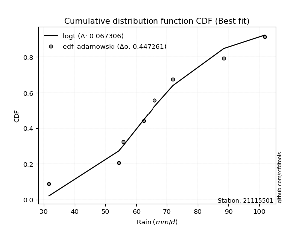</img>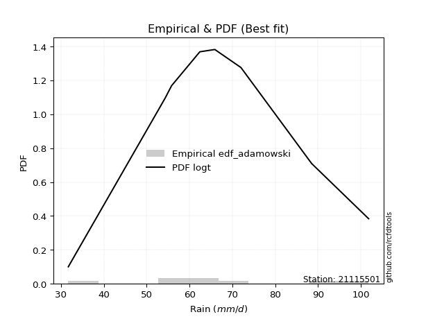</img>

</div>


## C. Best fit & Estimate extreme values for specific return periods - Tr

Best fit in probability distribution analysis means finding the theoretical distribution (like Normal, Poisson, Exponential, etc.) that most accurately mirrors your real-world data´s patterns (shape, center, spread) for better predictions, using methods like visual checks (Q-Q plots), goodness-of-fit tests (Kolmogorov-Smirnov, Chi-Squared), and information criteria (AIC) to score and select the simplest, most representative model.


### 1. Best fit (ordered by delta Δ)

:file_folder:Table: [bestfit_21115501.csv](table/bestfit_21115501.csv)

<div align="center">

|   id |   station | empirical_dist   | p_dist     |     delta |   deltao | eval   |   fit |   n |   best_fit |   best_fit_sort |
|-----:|----------:|:-----------------|:-----------|----------:|---------:|:-------|------:|----:|-----------:|----------------:|
|    0 |  21115501 | edf_tukey        | loggennorm | 0.0632128 | 0.447261 | Δo > Δ |     1 |   8 |          1 |               1 |
|    1 |  21115501 | edf_filliben     | loggennorm | 0.063294  | 0.447261 | Δo > Δ |     1 |   8 |          1 |               2 |
|    2 |  21115501 | edf_blom         | logdgamma  | 0.0636021 | 0.447261 | Δo > Δ |     1 |   8 |          1 |               3 |
|    3 |  21115501 | edf_jenkinson    | loggennorm | 0.0638289 | 0.447261 | Δo > Δ |     1 |   8 |          1 |               4 |
|    4 |  21115501 | edf_beard        | loggennorm | 0.0638289 | 0.447261 | Δo > Δ |     1 |   8 |          1 |               5 |
|    5 |  21115501 | edf_chegodayev   | loggennorm | 0.0645392 | 0.447261 | Δo > Δ |     1 |   8 |          1 |               6 |
|    6 |  21115501 | edf_cunnane      | logdgamma  | 0.0654499 | 0.447261 | Δo > Δ |     1 |   8 |          1 |               7 |
|    7 |  21115501 | edf_adamowski    | logt       | 0.0673061 | 0.447261 | Δo > Δ |     1 |   8 |          1 |               8 |
|    8 |  21115501 | edf_gringorten   | logdgamma  | 0.0684536 | 0.447261 | Δo > Δ |     1 |   8 |          1 |               9 |
|    9 |  21115501 | edf_hazen        | loglaplace | 0.0727757 | 0.447261 | Δo > Δ |     1 |   8 |          1 |              10 |
|   10 |  21115501 | edf_hazen        | loglaplace | 0.0727757 | 0.447261 | Δo > Δ |     1 |   8 |          1 |              11 |
|   11 |  21115501 | edf_weibull      | anglit     | 0.0762771 | 0.447261 | Δo > Δ |     1 |   8 |          1 |              12 |
|   12 |  21115501 | edf_california   | dgamma     | 0.0840895 | 0.447261 | Δo > Δ |     1 |   8 |          1 |              13 |

</div>


### 2. Extreme values and % difference analysis

In hydrology, a return period (or recurrence interval $Tr$) is the statistical average time between extreme events like floods or droughts of a specific magnitude, indicating how rare an event is, with a 100-year flood, for example, having a 1% chance of occurring in any given year, not that it happens exactly every century. It is a key tool for infrastructure design (like bridges or dams) and risk assessment, calculated from historical data to determine the probability of future events, although it is important to remember it is statistical average, and events can cluster or be missed.

The extreme value porcentage difference is evaluated as $pdiff = 1 - (ETrBf / ETr) * 100$, where _ETrBf_ correspond to the bestfit extreme value for a specific recurrence interval and _ETr_ correspond to the extreme value for one of the most used PDFsused in hydrology.

> risk_rate: assuming the return period as the project useful life.

:file_folder:Table: [extreme_21115501.csv](table/extreme_21115501.csv), all PDFs.  
:file_folder:Table: [extremepdiff_21115501.csv](table/extremepdiff_21115501.csv), % difference between bestfit and most used PDFs in Hydrology.

<div align="center">

Extreme values table for only best fit PDFs
|   id |      tr |   prob_l |     prob_g |    alpha |   anglit |   arcsine |    argus |     beta |   betaprime |   bradford |     burr |   burr12 |   cosine |   crystalball |   dgamma |   dweibull |   erlang |   exponnorm |   exponpow |   exponweib |        f |   fatiguelife |   foldnorm |    gamma |   gausshyper |   genexpon |       genextreme |   gengamma |   genhalflogistic |   genlogistic |   gennorm |   genpareto |   gompertz |   gumbel_l |   gumbel_r |   halfgennorm |   halflogistic |   halfnorm |   hypsecant |   invgamma |   invgauss |      invweibull |   johnsonsb |   johnsonsu |   kappa3 |   kappa4 |   ksone |   kstwobign |   laplace |   levy_l |   loggamma |   logistic |   loglaplace |    lomax |   maxwell |   mielke |    moyal |   nakagami |      ncf |      nct |     norm |   pearson3 |   powerlaw |   rayleigh |   rdist |     rice |   semicircular |   skewnorm |        t |   trapezoid |   triang |   truncexpon |   truncnorm |   truncpareto |   truncweibull_min |   tukeylambda |   uniform |   vonmises |   vonmises_line |     wald |   weibull_max |   weibull_min |   wrapcauchy |   logalpha |   loganglit |   logarcsine |   logargus |   logbeta |   logbetaprime |   logbradford |   logburr |   logburr12 |   logcosine |   logcrystalball |   logdgamma |   logdweibull |   logerlang |   logexponnorm |   logexponpow |   logexponweib |     logf |   logfatiguelife |   logfoldnorm |   loggausshyper |   loggenexpon |   loggenextreme |   loggengamma |   loggenhalflogistic |   loggenlogistic |   loggennorm |   loggenpareto |   loggompertz |   loggumbel_l |   loggumbel_r |   loghalfgennorm |   loghalflogistic |   loghalfnorm |   loghypsecant |   loginvgamma |   loginvgauss |   loginvweibull |   logjohnsonsb |   logjohnsonsu |   logkappa3 |   logkappa4 |   logksone |   logkstwobign |   loglevy_l |   logloggamma |   loglogistic |   logloglaplace |   loglomax |   logmaxwell |   logmielke |   logmoyal |   lognakagami |   logncf |   lognct |   lognorm |   logpearson3 |   logpowerlaw |   lograyleigh |   logrdist |   logrice |   logsemicircular |   logskewnorm |     logt |   logtrapezoid |   logtriang |   logtruncexpon |   logtruncnorm |   logtruncpareto |   logtruncweibull_min |   logtukeylambda |   loguniform |   logvonmises |   logvonmises_line |   logwald |   logweibull_max |   logweibull_min |   logwrapcauchy |   station |   n |   risk_rate |
|-----:|--------:|---------:|-----------:|---------:|---------:|----------:|---------:|---------:|------------:|-----------:|---------:|---------:|---------:|--------------:|---------:|-----------:|---------:|------------:|-----------:|------------:|---------:|--------------:|-----------:|---------:|-------------:|-----------:|-----------------:|-----------:|------------------:|--------------:|----------:|------------:|-----------:|-----------:|-----------:|--------------:|---------------:|-----------:|------------:|-----------:|-----------:|----------------:|------------:|------------:|---------:|---------:|--------:|------------:|----------:|---------:|-----------:|-----------:|-------------:|---------:|----------:|---------:|---------:|-----------:|---------:|---------:|---------:|-----------:|-----------:|-----------:|--------:|---------:|---------------:|-----------:|---------:|------------:|---------:|-------------:|------------:|--------------:|-------------------:|--------------:|----------:|-----------:|----------------:|---------:|--------------:|--------------:|-------------:|-----------:|------------:|-------------:|-----------:|----------:|---------------:|--------------:|----------:|------------:|------------:|-----------------:|------------:|--------------:|------------:|---------------:|--------------:|---------------:|---------:|-----------------:|--------------:|----------------:|--------------:|----------------:|--------------:|---------------------:|-----------------:|-------------:|---------------:|--------------:|--------------:|--------------:|-----------------:|------------------:|--------------:|---------------:|--------------:|--------------:|----------------:|---------------:|---------------:|------------:|------------:|-----------:|---------------:|------------:|--------------:|--------------:|----------------:|-----------:|-------------:|------------:|-----------:|--------------:|---------:|---------:|----------:|--------------:|--------------:|--------------:|-----------:|----------:|------------------:|--------------:|---------:|---------------:|------------:|----------------:|---------------:|-----------------:|----------------------:|-----------------:|-------------:|--------------:|-------------------:|----------:|-----------------:|-----------------:|----------------:|----------:|----:|------------:|
|    0 |    2    | 0.5      | 0.5        |  65.2875 |  66.55   |   66.55   |  71.0206 |  70.0883 |     65.8359 |    61.0722 |  65.4266 |  51.3143 |  66.8131 |       66.55   |  64.2317 |    64.3078 |  65.8837 |     66.4858 |    31.7004 |     32.2477 |  65.8321 |       31.7    |    70.7531 |  65.8641 |      70.3127 |    55.8553 |     38.4435      |    32.6431 |           77.3148 |       65.4    |   67.0723 |     61.5495 |    69.5832 |    69.8622 |    63.2378 |       49.5999 |        61.5912 |    62.423  |     66.55   |    65.1506 |    64.4523 |   580.682       |     96.5285 |     65.9149 |  63.4684 |  65.1096 |  66.75  |     62.6337 |   66.55   |  67.3282 |    62.9586 |    66.55   |      63.2519 |  56.8707 |   64.8257 |  65.425  |  62.1685 |    66.6166 |  66.9408 |  65.8932 |  66.55   |    66.0858 |    33.5376 |    64.2141 | 27.0424 |  65.6781 |        66.55   |    65.6561 |  66.5507 |     84.1718 |  75.6576 |      59.8639 |     66.55   |       31.9561 |            57.3856 |       51.777  |   66.75   |   0.165122 |         66.7461 |  60.0145 |       101.512 |       65.6638 |      66.0219 |    61.9534 |     63.2519 |      63.2519 |    66.5977 |   72.1834 |        62.901  |       51.2811 |   65.4425 |     66.1279 |     60.9553 |          65.4594 |     64.1422 |       64.1435 |     62.591  |        63.2519 |       65.8664 |        62.1547 |  63.2478 |          63.2092 |       61.1691 |         65.9101 |       57.9663 |         67.4351 |       62.5781 |              70.8608 |          65.4268 |      64.1349 |        43.9856 |       53.9462 |       66.7818 |       59.9086 |          31.6998 |           58.3121 |       59.1133 |        63.2519 |       62.6426 |       61.8487 |         60.4938 |        31.8391 |        66.1791 |     31.7    |     57.9158 |    56.8072 |        58.5857 |     66.9645 |       66.0946 |       63.2519 |         62.4    |    51.1599 |      61.4887 |     65.4431 |    58.8674 |       55.0783 |   63.139 |  63.0729 |   63.2519 |       65.5361 |       33.0447 |       60.8753 |    74.1918 |   62.9027 |           63.2519 |       65.598  |  64.8813 |        75.9154 |     67.5682 |         50.6217 |        63.32   |          31.8597 |               59.2025 |          74.3488 |      56.8072 |      0.11859  |            56.7309 |   56.8243 |          67.4369 |          65.96   |         56.8072 |  21115501 |   8 |    0.75     |
|    1 |    2.33 | 0.570815 | 0.429185   |  68.8865 |  70.7408 |   72.8411 |  75.2225 |  75.8592 |     69.4528 |    66.0637 |  68.7684 |  57.0338 |  70.6725 |       70.1478 |  67.0501 |    67.1758 |  69.4984 |     70.0807 |    31.703  |     32.9113 |  69.4494 |       32.5436 |    70.9009 |  69.4783 |      75.1972 |    61.1775 |     56.3151      |    33.6292 |           81.8818 |       68.7767 |   70.9053 |     69.0594 |    73.4895 |    72.9923 |    66.5716 |       56.1103 |        65.0188 |    66.306  |     69.4293 |    68.7626 |    68.2015 | 17543           |    100.407  |     69.523  |  68.0121 |  70.2695 |  72.707 |     66.7783 |   68.7272 |  77.7158 |    66.8688 |    69.7199 |      65.5505 |  62.4166 |   68.5636 |  68.7645 |  65.3244 |    70.149  |  74.5913 |  69.4836 |  70.1478 |    69.6951 |    35.3853 |    68.0073 | 35.3026 |  69.4181 |        71.0447 |    69.2444 |  70.1489 |     88.2446 |  79.9791 |      64.7077 |     70.1478 |       32.1604 |            62.332  |       54.6956 |   71.7142 |   0.504452 |         70.3244 |  62.3737 |       101.69  |       69.4318 |      71.0899 |    65.8473 |     67.7507 |      70.1243 |    71.0598 |   76.8708 |        66.7886 |       55.718  |   68.8319 |     69.8503 |     65.0664 |          68.7846 |     66.9717 |       66.9419 |     66.4534 |        67.0952 |       69.8356 |        67.1137 |  67.092  |          67.0429 |       65.2868 |         71.4579 |       62.6453 |         71.5156 |       66.5023 |              76.0746 |          68.7693 |      66.8503 |        57.2312 |       58.8492 |       70.2985 |       63.2742 |          31.6998 |           61.6833 |       62.9992 |        66.3095 |       66.5888 |       65.8607 |         65.2859 |        32.5503 |        69.9216 |     31.7    |     63.0848 |    62.728  |        63.4299 |     75.978  |       69.7894 |       66.6262 |         64.8237 |    56.8544 |      65.3749 |     68.8347 |    61.9935 |       56.1381 |   70.42  |  66.9552 |   67.0952 |       69.3557 |       34.2914 |       64.7814 |    78.6026 |   66.8094 |           68.0892 |       69.3728 |  68.3121 |        81.2397 |     72.305  |         54.8697 |        65.3595 |          31.9845 |               63.7433 |          77.9415 |      61.7    |      0.125689 |            60.1616 |   59.0654 |          71.5174 |          69.6747 |         70.8875 |  21115501 |   8 |    0.729209 |
|    2 |    5    | 0.8      | 0.2        |  82.9294 |  85.5269 |   89.6171 |  88.7008 |  92.3555 |     83.2968 |    83.8974 |  82.1257 |  96.0548 |  84.5804 |       83.5183 |  78.7949 |    79.0954 |  83.3074 |     83.4794 |    32.5676 |     48.1385 |  83.297  |       50.4653 |    71.526  |  83.2873 |      90.3921 |    87.787  |   6857.57        |    51.9295 |           93.9732 |       82.3787 |   84.6495 |     90.1405 |    86.1096 |    83.1045 |    81.055  |      102.297  |        80.5282 |    82.7266 |     80.979  |    82.9263 |    83.2565 |     5.97497e+10 |    101.792  |     83.2959 |  83.8887 |  87.2061 |  91.986 |     84.3839 |   79.6129 |  94.9256 |    83.9762 |    81.9594 |      78.3587 |  90.1446 |   83.2756 |  82.1192 |  79.9425 |    86.8257 | 107.837  |  83.1594 |  83.5183 |    83.3688 |    53.4071 |    83.193  | 57.8404 |  83.5978 |        86.3833 |    83.129  |  83.5208 |     99.9292 |  92.377  |      82.5406 |     83.5183 |       36.0694 |            81.0566 |       64.0902 |   87.78   |   1.75533  |         83.7441 |  75.58   |       101.798 |       83.677  |      87.4904 |    83.1742 |     86.3372 |      92.3252 |    86.2607 |   90.9147 |        83.6853 |       75.1355 |   82.2516 |     83.7626 |     82.3197 |          82.2104 |     80.7005 |       80.8481 |     83.3064 |        83.5402 |       84.3299 |        84.8255 |  83.5568 |          83.4608 |       83.6513 |         89.8594 |       85.696  |         85.6981 |       83.6777 |              91.3261 |          82.1271 |      81.007  |        93.2529 |       83.3689 |       82.9754 |       80.2336 |          31.6998 |           79.5454 |       82.4636 |        80.1336 |       84.1202 |       84.0345 |         90.9196 |        96.0354 |        83.8676 |     31.7    |     82.5241 |    86.4592 |        88.8898 |     93.6591 |       83.6544 |       81.4322 |         78.8457 |    96.4082 |      83.2085 |     82.2581 |    78.7834 |       72.9203 |  107.153 |  83.6892 |   83.5402 |       83.9719 |       47.2301 |       83.0958 |    93.2244 |   83.7034 |           87.5581 |       83.5546 |  83.3675 |        98.6792 |     87.8194 |         73.8372 |        75.4763 |          34.3497 |               81.2238 |          90.5242 |      80.6139 |      0.156136 |            75.0535 |   73.3456 |          85.6996 |          83.6523 |         93.2021 |  21115501 |   8 |    0.67232  |
|    3 |   10    | 0.9      | 0.1        |  92.8711 |  93.896  |   93.667  |  95.2003 |  98.0397 |     92.8349 |    92.5563 |  92.7038 | inf      |  92.9831 |       92.3879 |  88.9164 |    89.0732 |  92.7982 |     92.4093 |    45.6656 |    104.152  |  92.8387 |       75.2105 |    71.9885 |  92.7795 |      96.5418 |   111.942  | 666701           |   108.529  |           98.1967 |       92.7783 |   93.2718 |     97.233  |    93.136  |    88.7345 |    92.8516 |      164.88   |        93.4082 |    94.8775 |     90.2017 |    93.0105 |    94.2751 |     1.25136e+16 |    101.8    |     92.7622 |  93.5612 |  94.6328 | 100.398 |     97.7883 |   89.4946 |  99.0805 |    98.0071 |    90.9734 |      92.1404 | 115.315  |   93.6291 |  92.6988 |  92.6699 |   100.018  | 134.299  |  92.5459 |  92.3879 |    92.6678 |    72.0024 |    94.0208 | 63.675  |  93.1675 |        94.2537 |    92.8417 |  92.3914 |    104.493  |  97.2197 |      91.6377 |     92.3879 |       46.9748 |            90.8124 |       68.1219 |   94.79   |   2.46958  |         91.8244 |  89.5951 |       101.8   |       93.1988 |      94.6454 |    97.744  |     99.0354 |      98.6636 |    94.0125 |   96.5715 |        97.4186 |       86.988  |   92.8437 |     92.9775 |     94.8892 |          92.2821 |     94.9259 |       95.0948 |     97.0782 |        96.6165 |       93.3869 |        93.6851 |  96.6672 |          96.5327 |       98.7739 |         97.0491 |      107.301  |         93.4471 |       97.7686 |              97.0447 |          92.7042 |      95.3432 |       100.196  |      105.634  |       90.9993 |       97.3539 |          31.6998 |           98.251  |      100.644  |        93.2149 |       98.8205 |       99.6795 |        119.072  |       101.727  |        92.9912 |     31.7    |     92.185  |    99.4521 |       114.931  |     98.5113 |       92.8921 |       94.4017 |         94.9319 |   155.805  |      98.603  |     92.8501 |    97.0644 |      106.077  |  143.392 |  97.1323 |   96.6166 |       93.808  |       64.0105 |       99.2378 |    98.6231 |   97.3005 |           99.6181 |       93.181  |  96.684  |       106.467  |     94.747  |         85.9261 |        83.8487 |          41.5128 |               90.7059 |          96.2793 |      90.5897 |      0.180614 |            85.9153 |   92.2941 |          93.4482 |          92.9856 |         97.8019 |  21115501 |   8 |    0.651322 |
|    4 |   15    | 0.933333 | 0.0666667  |  98.0343 |  97.4698 |   94.4395 |  97.6712 |  99.6072 |     97.7017 |    95.5706 |  98.8522 | inf      |  96.8106 |       96.814  |  94.7522 |    94.7287 |  97.6339 |     96.8808 |    76.7173 |    174.634  |  97.7076 |       91.3943 |    72.2291 |  97.6163 |      98.4628 |   126.072  |      8.84124e+06 |   173.179  |           99.477  |       98.5195 |   97.4463 |     99.1605 |    96.3181 |    91.2842 |    99.5071 |      211.192  |       100.697  |   101.201  |     95.4651 |    98.2627 |   100.098  |     1.25739e+19 |    101.8    |     97.5887 |  98.4582 |  97.0957 | 103.202 |    104.904  |   95.275  | 100.336  |   105.97   |    95.8846 |     101.3    | 130.039  |   98.9414 |  98.8478 | 100.056  |   106.99   | 148.881  |  97.3318 |  96.814  |    97.3767 |    80.4872 |    99.5998 | 64.8619 |  97.9761 |        97.323  |    97.8324 |  96.818  |    105.958  |  98.7735 |      94.8948 |     96.814  |       56.1888 |            94.3261 |       69.4448 |   97.1267 |   2.73836  |         94.9798 |  98.595  |       101.8   |       97.9419 |      97.0303 |   106.157  |    105.012  |      99.9211 |    97.0219 |   98.3845 |       105.167  |       91.5559 |   99.0401 |     97.5556 |    101.234  |          97.7179 |    104.269  |      104.358  |    104.876  |       103.889  |       97.6843 |        97.0478 | 103.965  |         103.809  |      107.329  |         99.0692 |      120.512  |         96.632  |      105.766  |              98.783  |          98.8521 |     104.548  |       101.207  |      118.661  |       94.884  |      108.579  |          31.6998 |          110.724  |      111.638  |       101.616  |      107.291  |      108.848  |        138.646  |       101.792  |        97.4632 |     94.2827 |     95.4908 |   104.203  |       131.727  |    100.026  |       97.4962 |      102.318  |        106.207  |   206.371  |     107.576  |     99.0471 |   109.561  |      133.296  |  166.493 | 104.659  |  103.889  |       98.6864 |       73.2173 |      108.743  |   100.05   |  104.913  |          104.759  |       98.0988 | 104.971  |       109.094  |     97.0836 |         90.7226 |        88.0319 |          48.4925 |               94.2029 |          98.1813 |      94.1821 |      0.194392 |            90.6271 |  106.97   |          96.6329 |          97.6426 |         99.1607 |  21115501 |   8 |    0.644736 |
|    5 |   20    | 0.95     | 0.05       | 101.492  |  99.5721 |   94.7115 |  99.0275 | 100.305  |    100.928  |    97.1026 | 103.291  | inf      |  99.1645 |       99.7126 |  98.8686 |    98.6819 | 100.837  |     99.8155 |   122.493  |    250.409  | 100.935  |      103.376  |    72.3896 | 100.82   |      99.384  |   136.098  |      5.40168e+07 |   238.996  |          100.092  |      102.507  |  100.139  |    100.011  |    98.2988 |    92.8713 |   104.167  |      248.602  |       105.804  |   105.417  |     99.1781 |   101.785  |   104.033  |     1.59022e+21 |    101.8    |    100.787  | 101.793  |  98.3211 | 104.604 |    109.698  |   99.3763 | 100.978  |   111.574  |    99.2791 |     108.346  | 140.486  |  102.467  | 103.287  | 105.288  |   111.658  | 158.939  | 100.505  |  99.7126 |   100.485  |    85.2413 |   103.308  | 65.2966 | 101.135  |        99.0253 |   101.148  |  99.7168 |    106.68   |  99.54   |      96.5704 |     99.7126 |       63.0966 |            96.1368 |       70.0996 |   98.295  |   2.87754  |         96.6355 | 105.302  |       101.8   |      101.041  |      98.2228 |   112.14   |    108.694  |     100.368  |    98.6875 |   99.2731 |       110.601  |       93.972  |  103.544  |    100.544  |    105.345  |         101.439  |    111.415  |      111.4    |    110.356  |       108.945  |      100.414  |        98.9249 | 109.042  |         108.87   |      113.332  |         99.9627 |      130.192  |         98.4532 |      111.394  |              99.611  |         103.291  |     111.49   |       101.508  |      127.904  |       97.3854 |      117.199  |          31.6998 |          120.396  |      119.628  |       107.994  |      113.305  |      115.423  |        154.237  |       101.798  |       100.355  |     96.1358 |     97.1393 |   106.663  |       144.404  |    100.811  |      100.506  |      108.173  |        115.201  |   251.947  |     113.978  |    103.552  |   119.372  |      156.225  |  183.874 | 109.913  |  108.945  |      101.855  |       78.8736 |      115.559  |   100.658  |  110.226  |          107.725  |      101.372  | 111.22   |       110.413  |     98.2574 |         93.2939 |        90.5967 |          54.3924 |               96.0233 |          99.1194 |      96.0314 |      0.204058 |            93.2135 |  119.404  |          98.454  |         100.689  |         99.8253 |  21115501 |   8 |    0.641514 |
|    6 |   25    | 0.96     | 0.04       | 104.077  | 100.997  |   94.8377 |  99.9021 | 100.689  |    103.322  |    98.0299 | 106.801  | inf      | 100.815  |      101.846  | 102.051  |   101.719  | 103.213  |    101.979  |   179.434  |    328.054  | 103.331  |      112.897  |    72.509  | 103.197  |      99.9198 |   143.874  |      2.17755e+08 |   303.994  |          100.452  |      105.566  |  102.102  |    100.477  |    99.7082 |    94.0006 |   107.757  |      280.301  |       109.738  |   108.553  |    102.052  |   104.421  |   106.991  |     6.61513e+22 |    101.8    |    103.161  | 104.344  |  99.0532 | 105.445 |    113.289  |  102.557  | 101.382  |   115.909  |   101.876  |     114.147  | 148.589  |  105.084  | 106.796  | 109.342  |   115.137  | 166.603  | 102.86   | 101.846  |   102.786  |    88.2692 |   106.063  | 65.5041 | 103.464  |       100.13   |   103.612  | 101.851  |    107.11   |  99.9967 |      97.5914 |    101.846  |       68.3032 |            97.2412 |       70.4895 |   98.996  |   2.96226  |         97.6493 | 110.674  |       101.8   |      103.317  |      98.9382 |   116.803  |    111.263  |     100.576  |    99.7665 |   99.7992 |       114.794  |       95.4663 |  107.127  |    102.74   |    108.328  |         104.263  |    117.278  |      117.15   |    114.591  |       112.824  |      102.38   |       100.165  | 112.938  |         112.755  |      117.965  |        100.451  |      137.888  |         99.6599 |      115.748  |             100.092  |         106.801  |     117.124  |       101.631  |      135.074  |       99.2054 |      124.304  |          31.6998 |          128.419  |      125.941  |       113.204  |      117.988  |      120.579  |        167.431  |       101.799  |       102.462  |     97.2651 |     98.121  |   108.167  |       154.693  |    101.306  |      102.719  |      112.878  |        122.818  |   294.143  |     118.975  |    107.137  |   127.578  |      176.167  |  197.967 | 113.954  |  112.824  |      104.169  |       82.6777 |      120.899  |   100.981  |  114.312  |          109.693  |      103.811  | 116.328  |       111.207  |     98.9635 |         94.8967 |        92.3427 |          59.2647 |               97.1398 |          99.6757 |      97.1584 |      0.211525 |            94.8368 |  130.398  |          99.6606 |         102.93   |        100.221  |  21115501 |   8 |    0.639603 |
|    7 |   50    | 0.98     | 0.02       | 111.674  | 104.504  |   95.0063 | 101.885  | 101.358  |    110.272  |    99.9026 | 118.2    | inf      | 105.138  |      107.956  | 111.889  |   111.018  | 110.103  |    108.194  |   558.211  |    710.859  | 110.284  |      143.442  |    72.856  | 110.09   |     100.938  |   168.029  |      1.59602e+10 |   604.749  |          101.151  |      114.94   |  107.642  |    101.282  |   103.534  |    97.0664 |   118.814  |      394.283  |       121.861  |   117.671  |    110.961  |   112.176  |   115.761  |     6.42924e+27 |    101.8    |    110.053  | 112.287  | 100.507  | 107.128 |    123.833  |  112.439  | 102.29   |   129.391  |   109.81   |     134.223  | 173.76   |  112.675  | 118.192  | 121.93   |   125.262  | 189.79   | 109.703  | 107.956  |   109.435  |    94.7412 |   114.061  | 65.7932 | 110.154  |       102.653  |   110.763  | 107.962  |    107.965  | 100.903  |      99.6702 |    107.956  |       81.9739 |            99.4918 |       71.2597 |  100.398  |   3.13373  |         99.7116 | 128.213  |       101.8   |      109.808  |     100.369  |   131.502  |    117.848  |     100.854  |   102.227  |  100.83   |       127.78   |       98.5599 |  118.914  |    109      |    116.543  |         112.771  |    137.449  |      136.765  |    127.74   |       124.712  |      107.809  |       103.166  | 124.887  |         124.669  |      132.311  |        101.285  |      162.929  |        102.508  |      129.287  |             101.007  |         118.201  |     136.14   |       101.769  |      157.35   |      104.319  |      149.011  |          99.4923 |          156.661  |      146.248  |       131.009  |      132.721  |      136.993  |        215.6    |       101.8    |       108.391  |     99.5636 |    100.046  |   111.239  |       189.34   |    102.431  |      109.037  |      128.559  |        150.673  |   476.021  |     134.744  |    118.932  |   156.821  |      251.038  |  245.479 | 126.402  |  124.712  |      110.689  |       91.3717 |      137.838  |   101.509  |  126.886  |          114.326  |      110.954  | 134.056  |       112.799  |    100.38   |         98.246  |        96.4617 |          74.0554 |               99.43   |         100.766  |      99.4521 |      0.234732 |            98.2324 |  173.847  |         102.508  |         109.335  |        101.01   |  21115501 |   8 |    0.63583  |
|    8 |   75    | 0.986667 | 0.0133333  | 115.873  | 106.047  |   95.0375 | 102.672  | 101.543  |    114.059  |   100.532  | 125.292  | inf      | 107.202  |      111.235  | 117.619  |   116.377  | 113.854  |    111.541  |  1005.8    |   1067.25   | 114.072  |      161.838  |    73.0449 | 113.842  |     101.254  |   182.159  |      1.93682e+11 |   868.258  |          101.375  |      120.367  |  110.568  |    101.501  |   105.469  |    98.6166 |   125.241  |      472.285  |       128.908  |   122.634  |    116.168  |   116.468  |   120.652  |     5.09513e+30 |    101.8    |    113.808  | 117.062  | 100.986  | 107.688 |    129.634  |  118.22   | 102.663  |   137.335  |   114.392  |     147.566  | 188.484  |  116.802  | 125.279  | 129.291  |   130.774  | 202.998  | 113.437  | 111.235  |   113.038  |    97.027  |   118.412  | 65.8504 | 113.753  |       103.661  |   114.653  | 111.241  |    108.247  | 101.203  |     100.374  |    111.235  |       87.7672 |           100.255  |       71.5121 |  100.865  |   3.1913   |        100.406  | 139.006  |       101.8   |      113.273  |     100.846  |   140.3    |    120.868  |     100.906  |   103.208  |  101.165  |       135.394  |       99.6233 |  126.372  |    112.343  |    120.683  |         117.607  |    150.77   |      149.594  |    135.473  |       131.599  |      110.601  |       104.506  | 131.815  |         131.576  |      140.716  |        101.507  |      178.427  |        103.69   |      137.262  |             101.293  |         125.294  |     148.421  |       101.789  |      170.382  |      107.005  |      165.57   |         100.269  |          175.851  |      158.646  |       142.684  |      141.518  |      146.93   |        249.733  |       101.8    |       111.5    |    100.342  |    100.666  |   112.282  |       211.609  |    102.897  |      112.415  |      138.59   |        170.488  |   631.019  |     144.176  |    126.399  |   176.936  |      304.735  |  276.134 | 133.653  |  131.599  |      114.106  |       94.6361 |      148.03   |   101.642  |  134.203  |          116.23   |      114.893  | 146.073  |       113.331  |    100.853  |         99.4073 |        98.0753 |          81.3148 |              100.211  |         101.12   |     100.229  |      0.248422 |            99.4044 |  207.502  |         103.691  |         112.763  |        101.273  |  21115501 |   8 |    0.634587 |
|    9 |  100    | 0.99     | 0.01       | 118.763  | 106.965  |   95.0485 | 103.111  | 101.624  |    116.642  |   100.848  | 130.543  | inf      | 108.495  |      113.452  | 121.675  |   120.148  | 116.411  |    113.81   |  1474.4    |   1397.46   | 116.657  |      175.074  |    73.1736 | 116.4    |     101.405  |   192.185  |      1.13328e+12 |  1103.92   |          101.485  |      124.202  |  112.53   |    101.597  |   106.735  |    99.6306 |   129.79   |      532.905  |       133.896  |   126.015  |    119.861  |   119.424  |   124.035  |     5.74054e+32 |    101.8    |    116.372  | 120.545  | 101.224  | 107.969 |    133.608  |  122.321  | 102.882  |   143.012  |   117.627  |     157.83   | 198.931  |  119.613  | 130.525  | 134.513  |   134.528  | 212.239  | 115.987  | 113.452  |   115.49   |    98.1948 |   121.376  | 65.8712 | 116.191  |       104.225  |   117.302  | 113.458  |    108.388  | 101.353  |     100.729  |    113.452  |       90.9478 |           100.639  |       71.637  |  101.099  |   3.22013  |        100.754  | 146.875  |       101.8   |      115.608  |     101.085  |   146.651  |    122.701  |     100.924  |   103.757  |  101.329  |       140.821  |      100.161  |  131.96   |    114.598  |    123.352  |         120.992  |    160.98   |      159.363  |    140.993  |       136.471  |      112.443  |       105.326  | 136.719  |         136.465  |      146.701  |        101.604  |      189.826  |        104.367  |      142.963  |             101.43   |         130.545  |     157.7    |       101.794  |      179.629  |      108.799  |      178.39   |         100.66   |          190.838  |      167.689  |       151.591  |      147.859  |      154.152  |        277.109  |       101.8    |       113.573  |    100.733  |    100.968  |   112.807  |       228.361  |    103.17   |      114.694  |      146.14   |        186.45   |   770.819  |     150.977  |    131.996  |   192.753  |      347.714  |  299.282 | 138.801  |  136.471  |      116.38   |       96.3448 |      155.402  |   101.697  |  139.394  |          117.311  |      117.603  | 155.525  |       113.598  |    101.09   |         99.9967 |        98.9389 |          85.5816 |              100.605  |         101.295  |     100.619  |      0.258227 |            99.9971 |  236.078  |         104.367  |         115.078  |        101.405  |  21115501 |   8 |    0.633968 |
|   10 |  200    | 0.995    | 0.005      | 125.475  | 108.699  |   95.059  | 103.874  | 101.73   |    122.572  |   101.323  | 144.026  | inf      | 111.126  |      118.482  | 131.424  |   129.141  | 122.276  |    118.975  |  3333.9    |   2529.84   | 122.589  |      207.474  |    73.468  | 122.268  |     101.619  |   216.34   |      7.92288e+13 |  1874.28   |          101.647  |      133.41   |  116.934  |    101.72   |   109.485  |   101.835  |   140.725  |      697.649  |       145.887  |   133.747  |    128.758  |   126.294  |   131.937  |     4.91679e+37 |    101.8    |    122.257  | 129.359  | 101.577  | 108.389 |    142.763  |  132.203  | 103.295  |   156.877  |   125.388  |     185.589  | 224.102  |  126.045  | 143.992  | 147.095  |   143.104  | 234.131  | 121.85   | 118.482  |   121.095  |    99.9781 |   128.158  | 65.8922 | 121.731  |       105.209  |   123.36   | 118.489  |    108.599  | 101.577  |     101.263  |    118.482  |       96.1133 |           101.217  |       71.8219 |  101.45   |   3.26341  |        101.277  | 166.476  |       101.8   |      120.878  |     101.442  |   162.374  |    126.239  |     100.941  |   104.713  |  101.571  |       154.019  |      100.976  |  146.576  |    119.692  |    128.964  |         129.024  |    188.449  |      185.41   |    154.453  |       148.203  |      116.486  |       106.976  | 148.534  |         148.244  |      161.24   |        101.725  |      218.741  |        105.578  |      156.88   |             101.627  |         144.033  |     182.152  |       101.799  |      201.911  |      112.802  |      213.421  |         101.249  |          232.304  |      190.357  |       175.399  |      163.522  |      172.197  |        355.84   |       101.8    |       118.181  |    101.323  |    101.406  |   113.6    |       272.164  |    103.69   |      119.845  |      165.97   |        232.81   |  1248.93   |     167.766  |    146.641  |   236.915  |      469.652  |  360.231 | 151.253  |  148.203  |      121.413  |       99.0087 |      173.68   |   101.764  |  151.935  |          119.219  |      123.898  | 182.257  |       113.997  |    101.446  |        100.892  |       100.315  |          92.9675 |              101.2    |         101.552  |     101.208  |      0.282278 |           100.894  |  325.561  |         105.578  |         120.317  |        101.602  |  21115501 |   8 |    0.633042 |
|   11 |  250    | 0.996    | 0.004      | 127.57   | 109.14   |   95.0603 | 104.052  | 101.748  |    124.402  |   101.419  | 148.638  | inf      | 111.847  |      120.019  | 134.556  |   132.011  | 124.085  |    120.56   |  4217.53   |   3017.2    | 124.421  |      218.034  |    73.5585 | 124.079  |     101.659  |   224.116  |      3.10368e+14 |  2193.57   |          101.679  |      136.367  |  118.268  |    101.741  |   110.295  |   102.483  |   144.241  |      756.485  |       149.742  |   136.126  |    131.622  |   128.44   |   134.416  |     1.89444e+39 |    101.8    |    124.075  | 132.343  | 101.647  | 108.474 |    145.596  |  135.384  | 103.403  |   161.406  |   127.88   |     195.525  | 232.205  |  128.025  | 148.597  | 151.145  |   145.74   | 241.08   | 123.663  | 120.019  |   122.82   |   100.339  |   130.246  | 65.8949 | 123.426  |       105.44   |   125.223  | 120.026  |    108.642  | 101.621  |     101.37   |    120.019  |       97.2071 |           101.334  |       71.8584 |  101.52   |   3.27207  |        101.381  | 172.96   |       101.8   |      122.482  |     101.514  |   167.575  |    127.156  |     100.943  |   104.937  |  101.619  |       158.313  |      101.14   |  151.665  |    121.244  |    130.546  |         131.581  |    198.238  |      194.614  |    158.843  |       151.985  |      117.685  |       107.431  | 152.345  |         152.044  |      165.964  |        101.745  |      228.503  |        105.869  |      161.425  |             101.665  |         148.647  |     190.702  |       101.799  |      209.084  |      114.008  |      226.085  |         101.368  |          247.463  |      197.929  |       183.832  |      168.692  |      178.215  |        385.629  |       101.8    |       119.562  |    101.442  |    101.491  |   113.759  |       287.353  |    103.826  |      121.414  |      172.89   |        250.558  |  1459.03   |     173.301  |    151.742  |   253.183  |      514.932  |  381.521 | 155.284  |  151.985  |      122.914  |       99.5566 |      179.728  |   101.774  |  155.991  |          119.671  |      125.864  | 192.311  |       114.077  |    101.517  |        101.073  |       100.603  |          94.6075 |              101.319  |         101.602  |     101.326  |      0.290177 |           101.075  |  362.083  |         105.87   |         121.914  |        101.642  |  21115501 |   8 |    0.632858 |
|   12 |  500    | 0.998    | 0.002      | 133.911  | 110.234  |   95.062  | 104.463  | 101.779  |    129.885  |   101.609  | 163.889  | inf      | 113.766  |      124.578  | 144.27   |   140.857  | 129.501  |    125.275  |  8161.29   |   5014.49   | 129.905  |      251.158  |    73.8285 | 129.497  |     101.735  |   248.272  |      2.14986e+16 |  3454.07   |          101.741  |      145.543  |  122.192  |    101.777  |   112.615  |   104.342  |   155.153  |      958.002  |       161.708  |   143.219  |    140.519  |   134.936  |   141.946  |     1.583e+44   |    101.8    |    129.523  | 142.135  | 101.786  | 108.642 |    154.087  |  145.265  | 103.68   |   175.703  |   135.607  |     229.914  | 257.376  |  133.932  | 163.82   | 163.727  |   153.589  | 262.412  | 129.105  | 124.578  |   127.968  |   101.067  |   136.475  | 65.8986 | 128.459  |       105.971  |   130.779  | 124.585  |    108.726  | 101.711  |     101.585  |    124.578  |       99.4591 |           101.567  |       71.9305 |  101.66   |   3.28939  |        101.591  | 193.579  |       101.8   |      127.216  |     101.657  |   184.208  |    129.458  |     100.946  |   105.453  |  101.712  |       171.825  |      101.469  |  168.823  |    125.831  |    134.852  |         139.459  |    231.958  |      226.045  |    172.684  |       163.779  |      121.144  |       108.669  | 164.237  |         163.901  |      180.803  |        101.779  |      260.31   |        106.555  |      175.772  |             101.737  |         163.906  |     219.58   |       101.8    |      231.37   |      117.536  |      270.377  |         101.605  |          301.105  |      222.339  |       212.702  |      185.191  |      197.614  |        494.923  |       101.8    |       123.58   |    101.679  |    101.654  |   114.078  |       338.138  |    104.177  |      126.051  |      196.241  |        316.793  |  2365.88   |     190.927  |    168.952  |   311.188  |      676.554  |  453.332 | 167.908  |  163.78   |      127.25   |      100.668  |      199.054  |   101.791  |  168.676  |          120.718  |      131.823  | 229.417  |       114.237  |    101.659  |        101.436  |       101.192  |          98.0713 |              101.559  |         101.702  |     101.563  |      0.315297 |           101.437  |  507.728  |         106.554  |         126.642  |        101.721  |  21115501 |   8 |    0.632489 |
|   13 |  750    | 0.998667 | 0.00133333 | 137.518  | 110.719  |   95.0623 | 104.628  | 101.788  |    132.964  |   101.673  | 173.507  | inf      | 114.696  |      127.11   | 149.942  |   145.988  | 132.54   |    127.906  | 11514.2    |   6588.52   | 132.986  |      270.729  |    73.9793 | 132.539  |     101.759  |   262.402  |      2.56084e+17 |  4409.65   |          101.761  |      150.904  |  124.353  |    101.787  |   113.855  |   105.336  |   161.532  |     1089.46   |       168.703  |   147.182  |    145.724  |   138.632  |   146.246  |     1.19364e+47 |    101.8    |    132.586  | 148.265  | 101.831  | 108.698 |    158.856  |  151.046  | 103.812  |   184.245  |   140.121  |     252.77   | 272.1    |  137.236  | 173.418  | 171.087  |   157.968  | 274.732  | 132.169  | 127.11   |   130.849  |   101.31   |   139.959  | 65.8994 | 131.259  |       106.185  |   133.883  | 127.117  |    108.754  | 101.74   |     101.656  |    127.11   |      100.229  |           101.644  |       71.9542 |  101.707  |   3.29517  |        101.66   | 205.941  |       101.8   |      129.831  |     101.705  |   194.295  |    130.49   |     100.947  |   105.661  |  101.742  |       179.863  |      101.579  |  179.907  |    128.369  |    136.99   |         144.034  |    254.251  |      246.61   |    180.938  |       170.722  |      123.006  |       109.295  | 171.242  |         170.885  |      189.613  |        101.788  |      279.997  |        106.837  |      184.34   |             101.76   |         173.531  |     238.231  |       101.8    |      244.407  |      119.467  |      300.186  |         101.684  |          337.7    |      237.264  |       231.647  |      195.171  |      209.487  |        572.65   |       101.8    |       125.761  |    101.758  |    101.706  |   114.184  |       370.509  |    104.344  |      128.617  |      211.317  |        365.048  |  3139.88   |     201.555  |    180.078  |   351.098  |      787.23   |  499.623 | 175.376  |  170.722  |      129.581  |      101.043  |      210.753  |   101.795  |  176.168  |          121.142  |      135.218  | 256.298  |       114.291  |    101.707  |        101.557  |       101.392  |          99.2835 |              101.639  |         101.735  |     101.642  |      0.330457 |           101.558  |  621.818  |         106.837  |         129.261  |        101.747  |  21115501 |   8 |    0.632366 |
|   14 | 1000    | 0.999    | 0.001      | 140.037  | 111.007  |   95.0624 | 104.72   | 101.792  |    135.099  |   101.705  | 180.667  | inf      | 115.283  |      128.853  | 153.962  |   149.61   | 134.646  |    129.723  | 14466      |   7921.3    | 135.121  |      284.69   |    74.0835 | 134.646  |     101.77   |   272.427  |      1.48461e+18 |  5200.29   |          101.771  |      154.707  |  125.834  |    101.791  |   114.689  |   106.004  |   166.057  |     1189      |       173.664  |   149.918  |    149.416  |   141.214  |   149.257  |     1.31196e+49 |    101.8    |    134.71   | 152.811  | 101.854  | 108.726 |    162.161  |  155.147  | 103.895  |   190.391  |   143.323  |     270.351  | 282.546  |  139.52   | 180.56   | 176.309  |   160.989  | 283.411  | 134.297  | 128.853  |   132.841  |   101.433  |   142.366  | 65.8996 | 133.188  |       106.305  |   136.027  | 128.861  |    108.768  | 101.755  |     101.692  |    128.853  |      100.618  |           101.683  |       71.9659 |  101.73   |   3.29805  |        101.695  | 214.834  |       101.8   |      131.626  |     101.729  |   201.624  |    131.109  |     100.947  |   105.777  |  101.757  |       185.631  |      101.634  |  188.291  |    130.113  |    138.356  |         147.269  |    271.343  |      262.272  |    186.872  |       175.672  |      124.263  |       109.705  | 176.239  |         175.868  |      195.926  |        101.792  |      294.468  |        106.999  |      190.505  |             101.771  |         180.696  |     252.318  |       101.8    |      253.657  |      120.784  |      323.304  |         101.723  |          366.323  |      248.152  |       246.104  |      202.409  |      218.16   |        635.078  |       101.8    |       127.242  |    101.798  |    101.731  |   114.237  |       394.735  |    104.449  |      130.379  |      222.706  |        404.531  |  3838.67   |     209.245  |    188.496  |   382.482  |      873.693  |  534.534 | 180.717  |  175.673  |      131.152  |      101.231  |      219.237  |   101.797  |  181.52   |          121.381  |      137.592  | 278.314  |       114.317  |    101.73   |        101.618  |       101.494  |          99.9009 |              101.68   |         101.752  |     101.681  |      0.341449 |           101.618  |  719.427  |         106.999  |         131.062  |        101.76   |  21115501 |   8 |    0.632305 |


</div>


<div align="center">

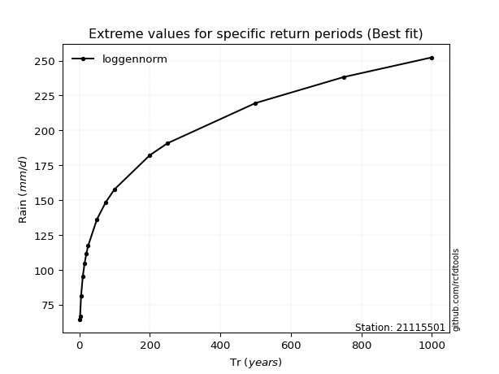</img>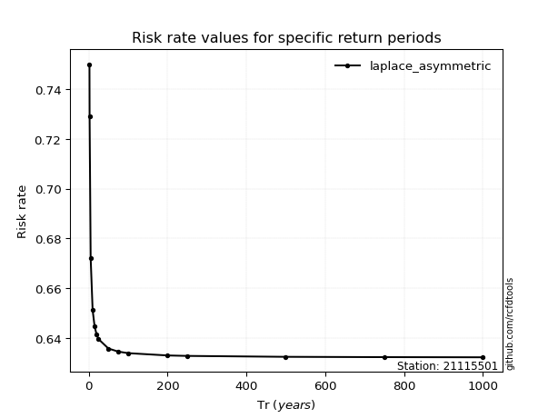</img>

</div>


<sub>**APP DISCLAIMER**: NO WARRANTY - This software is provided by [github.com/rcfdtools](https://github.com/rcfdtools) "as is", without any express or implied warranty, including warranties of merchantability, fitness for a particular purpose, or non-infringement. There is no guarantee that the software will be error-free or operate without interruption. LIMITATION OF LIABILITY - Neither the authors nor copyright holders will be liable for claims or damages arising from the software or its use. You are responsible for determining if the software is appropriate for your use and assume all associated risks, including errors, legal compliance, and data loss. NO PROFESSIONAL ADVICE - The software provides general information and does not offer professional advice. It should not replace consultation with professional advisors.</sub>