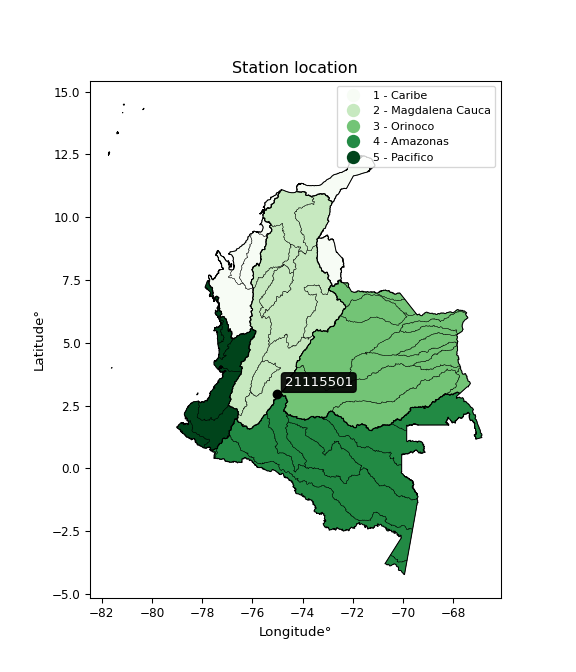

<div align="center">


</div>

# PMP Station (Rain, Pmax24h): 21115501

Probable Maximum Precipitation (PMP) is the greatest amount of rainfall for a specific duration that is meteorologically possible for a given location, acting as a "worst-case" scenario for extreme storms, crucial for designing safety-critical infrastructure like bridges, river deviations, dams, spillways, and nuclear plants to prevent catastrophic failure. PMP is calculated by hydrologists using meteorological data to determine the upper limit of extreme rainfall, often leading to the Probable Maximum Flood (PMF) for flood control design, and is increasingly being studied for climate change impacts. Probable Maximum Precipitation (PMP) is the theoretical upper limit of rainfall, a deterministic estimate for extreme events, while probability distributions (like GEV, Gumbel) describe the likelihood and frequency of various precipitation amounts, including rare ones, showing how often events occur, with PMP representing the extreme end of these distributions, used for critical infrastructure design to ensure safety against the worst conceivable weather, unlike standard statistical forecasts which cover typical probabilities.

The most common probability distributions in hydrology, used for analyzing floods, rainfall, and streamflow, include the Normal, Log-Normal, Gumbel, Gamma (including Log-Pearson Type III), and Generalized Extreme Value (GEV) distributions, often chosen based on the data´s skewness and whether modeling extremes or general conditions, with Gumbel and GEV popular for extreme events like floods, while the Normal distribution serves as a baseline, though often requiring transformations for skewed hydrological data. These distributions help in designing water infrastructure, managing water resources, and forecasting hydrologic events.

> Hydrological data often isn´t perfectly normal (it´s skewed), so different distributions are needed for different applications, such as: **Flood Frequency Analysis**: Using Gumbel, GEV, or Log-Pearson Type III for predicting extreme flood magnitudes and their return periods, **Rainfall Analysis**: Normal for annual totals, but Log-Normal, Weibull, or GEV for intensity or extreme daily rainfall, **Streamflow Modeling**: Gamma and Log-Normal for maximum flows, GEV for minimum flows, and Kappa for daily flows.

<div align="center">

</img>

</div>


## A. General information


### 1. General running parameters

• app_version: _v20260108_. • runtime: _2026-01-09 11:32:22.148588_. • Python version: _3.14.0_. • SciPy version: _1.16.3_. • Pandas version: _2.3.3_. • NumPy version: _2.3.5_. • Stations dataset (station_dataset_file): _dataset/pmax24h_in/automatic_colombia_2003_2024.csv_. • Stations catalog (station_catalog_file): _dataset/CNE.xls_. • Minimum year to eval til year_max (date_min): _1900_. • Maximum year to eval since year_min (date_max): _2024_. • Creates, save and include plots into reports (create_plot): _False_. • Plot only fit distributions with Δo > Δ (plot_only_fit): _True_. • Plot only simple graphs avoiding multiple CDFs and multiple Extreme values plots (plot_only_simple): _True_. • Eval low extreme values, if False, evaluates high extreme values (low_extreme): _False_. • Eval every SciPy distribution as logarithmic (pdist_logarithmic_on): _True_. • Standard deviation normalized (ddof): _1.0_. • Return periods to eval in years (Tr): _[2, 2.33, 5, 10, 15, 20, 25, 50, 75, 100, 200, 250, 500, 750, 1000]_. • Minimum data sample per station, 0 means any (minimum_sample): _5_. • Z-Score maximum threshold to adjust a value, 0 means disable (zscore_max): _3.5_. • Z-Score minimum threshold to adjust a value, 0 means disable (zscore_min): _-2.5_. • Avoid zeros, e.g. rain = 0 (avoid_zeros): _True_. • Avoid null values (avoid_nans): _True_. 

:file_folder:Table: [dataset.csv](../../dataset/pmax24h_in/automatic_colombia_2003_2024.csv)

> Delta Degrees of Freedom (DDOF): is a parameter used in the formulas for calculating variance and standard deviation. When ddof=0, the divisor is $N$ (the total number of observations) and this is used when your data set is the entire population. When ddof=1, the divisor is $N-1$ and this is used when your data set is a sample drawn from a larger population. Using $N-1$ provides an unbiased estimate of the population variance (known as Bessel´s correction).


### 2. Station info and location

|   id |   CODIGO | NOMBRE                   | CATEGORIA               | TECNOLOGIA                | ESTADO   | FECHA_INSTALACION   |   FECHA_SUSPENSION |   ALTITUD |   LATITUD |   LONGITUD | DEPARTAMENTO   | MUNICIPIO   | AREA_OPERATIVA                    | ENTIDAD                                    | AREA_HIDROGRAFICA   | ZONA_HIDROGRAFICA   | SUBZONA_HIDROGRAFICA      |   CORRIENTE | Catalogo   |   Version |
|-----:|---------:|:-------------------------|:------------------------|:--------------------------|:---------|:--------------------|-------------------:|----------:|----------:|-----------:|:---------------|:------------|:----------------------------------|:-------------------------------------------|:--------------------|:--------------------|:--------------------------|------------:|:-----------|----------:|
|    0 | 21115501 | TELLO  - AUT  [21115501] | Climatológica Principal | Automática con Telemetría | Activa   | 25/07/2013          |                nan |      1492 |   2.96067 |   -75.0285 | Huila          | Tello       | Area Operativa 04 - Huila-Caquetá | CENTRO NACIONAL DE INVESTIGACIONES DE CAFE | Magdalena Cauca     | Alto Magdalena      | Rio Fortalecillas y otros |         nan | CNE_OE     |  20251226 |

<div align="center">

Dynamic map: [:earth_americas:Google](http://maps.google.com/maps?q=2.960666667,-75.02849722) [:earth_americas:OSM](https://www.openstreetmap.org/#map=18/2.960666667/-75.02849722&layers=P) [:earth_americas:Bing](https://www.bing.com/maps?cp=2.960666667~-75.02849722&lvl=18) [:earth_americas:Apple](https://maps.apple.com/frame?center=2.960666667%2C-75.02849722&span=0.003%2C0.006)

</div>


<div align="center">

```geojson
{
  "type": "Feature",
  "geometry": {
    "type": "Point", 
    "coordinates": [-75.02849722, 2.960666667]
  }, 
  "properties": {
    "Name": "21115501"
  }
}
```

</div>


### 3. Discrete values table and plot

<div align="center">

|               |          0 |          1 |          2 |           3 |          4 |            5 |         6 |           7 |
|:--------------|-----------:|-----------:|-----------:|------------:|-----------:|-------------:|----------:|------------:|
| Date          | 2016       | 2017       | 2018       | 2019        | 2020       | 2021         | 2022      | 2023        |
| Value         |   31.7     |   55.8     |   72       |   62.4      |  101.8     |   65.9       |   88.5    |   54.3      |
| Value_initial |   31.7     |   55.8     |   72       |   62.4      |  101.8     |   65.9       |   88.5    |   54.3      |
| count         |    8       |    8       |    8       |    8        |    8       |    8         |    8      |    8        |
| mean          |   66.55    |   66.55    |   66.55    |   66.55     |   66.55    |   66.55      |   66.55   |   66.55     |
| std           |   21.5535  |   21.5535  |   21.5535  |   21.5535   |   21.5535  |   21.5535    |   21.5535 |   21.5535   |
| zscore        |   -1.61691 |   -0.49876 |    0.25286 |   -0.192545 |    1.63547 |   -0.0301576 |    1.0184 |   -0.568354 |


</div>


> The initial value (value_initial) correspond to the initial obtained or null completed value, and value (value) is adjusted only when the initial value is outside the valid range (outlier) definite through the Z-Score value. If Z-Score is active, values out of range or outliers are replaced with the station mean value. A Z-Score (or standard score) measures how many standard deviations a data point is from the mean of a dataset, indicating its relative position; positive scores mean above the mean, negative mean below, and a score of zero is exactly at the mean, allowing for comparison of values from different distributions. It´s calculated using the formula $z=(x–μ)/σ$, where $x$ is the data point, $μ$ is the mean, and $σ$ is the standard deviation, helping identify outliers and understand probability.
>
> <sub>**Note**: In this study, "completing" (filling gaps in) and "extending" (forecasting or lengthening the historical record) rainfall data series are avoided for certain critical analyses because they introduce artificial bias and uncertainty, which can distort the statistics of rare events (extremes), alter day-to-day variability, and compromise the integrity and homogeneity of the original data. Some reasons against Completing/Extending rainfall data are: **Distortion of Extremes and Variability**: The primary issue is that most gap-filling or extension methods rely on averaging or regression with nearby stations, which inherently smooths the data. Rainfall is highly variable in space and time, with a large percentage of zero values and occasional large storms. Infilling methods often underestimate the highest values and overestimate the lowest (zero) values, which severely distorts analyses focused on flood frequency, drought severity, and intensity-duration-frequency (IDF) curves, **Loss of Data Homogeneity**: Infilled or extended data are synthetic estimates, not actual measurements. Combining these estimates with observed data can violate the assumption of data homogeneity, which requires that the data properties do not change over time. Inhomogeneity can lead to incorrect conclusions about long-term trends or changes in climate patterns, **Propagation of Errors**: Errors and biases from the original data (e.g., wind-induced undercatch, instrument errors, site changes) or the data used for imputation can propagate through the analysis, leading to unreliable hydrological models and inaccurate predictions, **Compromised Statistical Integrity**: For statistical analyses, especially those involving the frequency of events, using artificial data can introduce time bias or autocorrelation that doesn´t exist in reality, making it difficult to assess the true probability of events, **Difficulty in Validation**: It is difficult to accurately validate the quality of filled or extended data, especially for past periods where ground-truth measurements are unavailable. The reliability of imputation techniques heavily depends on the density of the surrounding station network and the complexity of the local topography.</sub>


### 4. Active continuous probability distributions from SciPy (45 of 104 available)

A Probability Density Function (PDF) describes the relative likelihood of a continuous random variable falling within a specific range, where the total area under its curve equals 1, and the area over any interval gives the actual probability for that range. Unlike discrete probabilities (like rolling a die), a PDF shows density, not direct probability for a single point (which is zero), with higher points indicating higher likelihood, often visualized as a bell curve for normal distributions.

A log of a probability density function (log-PDF) is simply the logarithm of the PDF´s value, denoted as $log(f(x))$, useful for converting multiplication of probabilities into addition, improving numerical stability with tiny numbers, and connecting to information theory concepts like entropy. Instead of dealing with very small probabilities (e.g., 0.000001), log-PDFs use negative numbers (e.g., $log(0.00001) ≈ -11.51$ that are easier for computers to handle, preventing underflow errors and simplifying complex calculations. In this study, each active probability distribution from SciPy is also evaluated in the $log$ form.

[scipy.stats](https://docs.scipy.org/doc/scipy/reference/stats.html) is a Python´s powerful submodule within the SciPy library for comprehensive statistical analysis, offering over 130 probability distributions (like Normal, Poisson), functions for descriptive stats (mean, variance), hypothesis testing (t-tests, chi-square), random variable generation, and statistical tests, making it essential for data science, modeling, and research. It provides tools to explore, model, and draw conclusions from data efficiently, working seamlessly with NumPy.

<div align="center">

|   id | p_dist             |   n_parameter | fit_method   | label                                                                       | active   | ref                                                                                                        |
|-----:|:-------------------|--------------:|:-------------|:----------------------------------------------------------------------------|:---------|:-----------------------------------------------------------------------------------------------------------|
|    0 | alpha              |             3 | MLE          | Alpha                                                                       | True     | [:mortar_board:](https://docs.scipy.org/doc/scipy/reference/generated/scipy.stats.alpha.html)              |
|    1 | betaprime          |             4 | MLE          | Beta prime                                                                  | True     | [:mortar_board:](https://docs.scipy.org/doc/scipy/reference/generated/scipy.stats.betaprime.html)          |
|    2 | chi2               |             3 | MLE          | Chi²                                                                        | True     | [:mortar_board:](https://docs.scipy.org/doc/scipy/reference/generated/scipy.stats.chi2.html)               |
|    3 | crystalball        |             4 | MLE          | Crystalball                                                                 | True     | [:mortar_board:](https://docs.scipy.org/doc/scipy/reference/generated/scipy.stats.crystalball.html)        |
|    4 | dweibull           |             3 | MLE          | Double Weibull                                                              | True     | [:mortar_board:](https://docs.scipy.org/doc/scipy/reference/generated/scipy.stats.dweibull.html)           |
|    5 | erlang             |             3 | MLE          | Erlang                                                                      | True     | [:mortar_board:](https://docs.scipy.org/doc/scipy/reference/generated/scipy.stats.erlang.html)             |
|    6 | expon              |             2 | MLE          | Exponential                                                                 | True     | [:mortar_board:](https://docs.scipy.org/doc/scipy/reference/generated/scipy.stats.expon.html)              |
|    7 | exponnorm          |             3 | MLE          | Exponentially modified Normal                                               | True     | [:mortar_board:](https://docs.scipy.org/doc/scipy/reference/generated/scipy.stats.exponnorm.html)          |
|    8 | f                  |             4 | MLE          | F                                                                           | True     | [:mortar_board:](https://docs.scipy.org/doc/scipy/reference/generated/scipy.stats.f.html)                  |
|    9 | fatiguelife        |             3 | MLE          | Fatigue-life (Birnbaum-Saunders)                                            | True     | [:mortar_board:](https://docs.scipy.org/doc/scipy/reference/generated/scipy.stats.fatiguelife.html)        |
|   10 | fisk               |             3 | MLE          | Fisk                                                                        | True     | [:mortar_board:](https://docs.scipy.org/doc/scipy/reference/generated/scipy.stats.fisk.html)               |
|   11 | gamma              |             3 | MLE          | Gamma                                                                       | True     | [:mortar_board:](https://docs.scipy.org/doc/scipy/reference/generated/scipy.stats.gamma.html)              |
|   12 | genexpon           |             5 | MLE          | Generalized exponential                                                     | True     | [:mortar_board:](https://docs.scipy.org/doc/scipy/reference/generated/scipy.stats.genexpon.html)           |
|   13 | genlogistic        |             3 | MLE          | Generalized logistic                                                        | True     | [:mortar_board:](https://docs.scipy.org/doc/scipy/reference/generated/scipy.stats.genlogistic.html)        |
|   14 | gibrat             |             2 | MM           | Gibrat                                                                      | True     | [:mortar_board:](https://docs.scipy.org/doc/scipy/reference/generated/scipy.stats.gibrat.html)             |
|   15 | gompertz           |             3 | MLE          | Gompertz (or truncated Gumbel)                                              | True     | [:mortar_board:](https://docs.scipy.org/doc/scipy/reference/generated/scipy.stats.gompertz.html)           |
|   16 | gumbel_l           |             2 | MM           | Gumbel Left Skew                                                            | True     | [:mortar_board:](https://docs.scipy.org/doc/scipy/reference/generated/scipy.stats.gumbel_l.html)           |
|   17 | gumbel_r           |             2 | MM           | Gumbel Right Skew                                                           | True     | [:mortar_board:](https://docs.scipy.org/doc/scipy/reference/generated/scipy.stats.gumbel_r.html)           |
|   18 | halflogistic       |             2 | MM           | Half-logistic                                                               | True     | [:mortar_board:](https://docs.scipy.org/doc/scipy/reference/generated/scipy.stats.halflogistic.html)       |
|   19 | halfnorm           |             2 | MM           | Half Normal                                                                 | True     | [:mortar_board:](https://docs.scipy.org/doc/scipy/reference/generated/scipy.stats.halfnorm.html)           |
|   20 | hypsecant          |             2 | MM           | hyperbolic secant                                                           | True     | [:mortar_board:](https://docs.scipy.org/doc/scipy/reference/generated/scipy.stats.hypsecant.html)          |
|   21 | invgamma           |             3 | MLE          | Inverted gamma                                                              | True     | [:mortar_board:](https://docs.scipy.org/doc/scipy/reference/generated/scipy.stats.invgamma.html)           |
|   22 | invgauss           |             3 | MLE          | Inverse Gaussian                                                            | True     | [:mortar_board:](https://docs.scipy.org/doc/scipy/reference/generated/scipy.stats.invgauss.html)           |
|   23 | invweibull         |             3 | MLE          | Inverted Weibull                                                            | True     | [:mortar_board:](https://docs.scipy.org/doc/scipy/reference/generated/scipy.stats.invweibull.html)         |
|   24 | kappa4             |             4 | MLE          | Kappa 4                                                                     | True     | [:mortar_board:](https://docs.scipy.org/doc/scipy/reference/generated/scipy.stats.kappa4.html)             |
|   25 | kstwobign          |             2 | MLE          | Limiting distribution of scaled Kolmogorov-Smirnov two-sided test statistic | True     | [:mortar_board:](https://docs.scipy.org/doc/scipy/reference/generated/scipy.stats.kstwobign.html)          |
|   26 | laplace            |             2 | MM           | Laplace                                                                     | True     | [:mortar_board:](https://docs.scipy.org/doc/scipy/reference/generated/scipy.stats.laplace.html)            |
|   27 | laplace_asymmetric |             3 | MLE          | Asymmetric Laplace                                                          | True     | [:mortar_board:](https://docs.scipy.org/doc/scipy/reference/generated/scipy.stats.laplace_asymmetric.html) |
|   28 | loggamma           |             3 | MLE          | Log gamma                                                                   | True     | [:mortar_board:](https://docs.scipy.org/doc/scipy/reference/generated/scipy.stats.loggamma.html)           |
|   29 | logistic           |             2 | MM           | Logistic (or Sech-squared)                                                  | True     | [:mortar_board:](https://docs.scipy.org/doc/scipy/reference/generated/scipy.stats.logistic.html)           |
|   30 | lognorm            |             3 | MLE          | Log Normal                                                                  | True     | [:mortar_board:](https://docs.scipy.org/doc/scipy/reference/generated/scipy.stats.lognorm.html)            |
|   31 | maxwell            |             2 | MM           | Maxwell                                                                     | True     | [:mortar_board:](https://docs.scipy.org/doc/scipy/reference/generated/scipy.stats.maxwell.html)            |
|   32 | mielke             |             4 | MLE          | Mielke Beta-Kappa / Dagum                                                   | True     | [:mortar_board:](https://docs.scipy.org/doc/scipy/reference/generated/scipy.stats.mielke.html)             |
|   33 | moyal              |             2 | MM           | Moyal                                                                       | True     | [:mortar_board:](https://docs.scipy.org/doc/scipy/reference/generated/scipy.stats.moyal.html)              |
|   34 | nakagami           |             3 | MLE          | Nakagami                                                                    | True     | [:mortar_board:](https://docs.scipy.org/doc/scipy/reference/generated/scipy.stats.nakagami.html)           |
|   35 | ncf                |             5 | MLE          | Non-central F distribution                                                  | True     | [:mortar_board:](https://docs.scipy.org/doc/scipy/reference/generated/scipy.stats.ncf.html)                |
|   36 | nct                |             4 | MLE          | Non-central Student’s t                                                     | True     | [:mortar_board:](https://docs.scipy.org/doc/scipy/reference/generated/scipy.stats.nct.html)                |
|   37 | norm               |             2 | MM           | Normal                                                                      | True     | [:mortar_board:](https://docs.scipy.org/doc/scipy/reference/generated/scipy.stats.norm.html)               |
|   38 | pearson3           |             3 | MM           | Pearson type III                                                            | True     | [:mortar_board:](https://docs.scipy.org/doc/scipy/reference/generated/scipy.stats.pearson3.html)           |
|   39 | rayleigh           |             2 | MM           | Rayleigh                                                                    | True     | [:mortar_board:](https://docs.scipy.org/doc/scipy/reference/generated/scipy.stats.rayleigh.html)           |
|   40 | rice               |             3 | MLE          | Rice                                                                        | True     | [:mortar_board:](https://docs.scipy.org/doc/scipy/reference/generated/scipy.stats.rice.html)               |
|   41 | t                  |             3 | MLE          | Student’s t                                                                 | True     | [:mortar_board:](https://docs.scipy.org/doc/scipy/reference/generated/scipy.stats.t.html)                  |
|   42 | truncnorm          |             4 | MLE          | Truncated normal                                                            | True     | [:mortar_board:](https://docs.scipy.org/doc/scipy/reference/generated/scipy.stats.truncnorm.html)          |
|   43 | wald               |             2 | MM           | Wald                                                                        | True     | [:mortar_board:](https://docs.scipy.org/doc/scipy/reference/generated/scipy.stats.wald.html)               |
|   44 | weibull_min        |             3 | MLE          | Weibull minimum                                                             | True     | [:mortar_board:](https://docs.scipy.org/doc/scipy/reference/generated/scipy.stats.weibull_min.html)        |

</div>

> **n_parameter:** # arguments & localization & scale.
>
> **Fit methods:** (MLE) maximum likelihood, (MM) L-moments.
>
>**Inactive** (With the only purpose of prevent loops, zero divisions, infinite values, over high estimated values or horizontal trending for recurrence intervals estimations, the follow distributions were disabled.)**:** foldnorm, gennorm, norminvgauss, powernorm, powerlognorm, skewnorm, genextreme, anglit, arcsine, argus, beta, bradford, burr, burr12, cauchy, cosine, halfcauchy, foldcauchy, skewcauchy, wrapcauchy, dgamma, gengamma, exponweib, exponpow, truncexpon, gausshyper, genhalflogistic, genhyperbolic, geninvgauss, halfgennorm, johnsonsb, johnsonsu, kappa3, ksone, kstwo, loglaplace, levy, levy_l, levy_stable, ncx2, pareto, genpareto, truncpareto, lomax, powerlaw, rdist, rel_breitwigner, recipinvgauss, semicircular, studentized_range, trapezoid, triang, truncweibull_min, tukeylambda, uniform, loguniform, vonmises, vonmises_line, weibull_max, 


## B. Probability (PDF) vs. Empirical (EDF) distributions functions

A continuous probability distribution (CPD) describes probabilities for variables that can take any value within a range (like rain any time), unlike discrete variables with specific outcomes (like temperature). It uses a Probability Density Function (PDF), a curve where the total area under it equals 1, and the probability of the variable falling within an interval (a to b) is found by calculating the area under the curve between those points. A key feature is that the probability of hitting any single exact value is zero, so probabilities are always expressed for ranges, e.g., $P(a ≤ X ≤ b)$.

<div align="center">

Distributions parameters from station values
|    |   station | p_dist                |   n |             loc |           scale | shape                 | shape1                 | shape2                 | shape3   |
|---:|----------:|:----------------------|----:|----------------:|----------------:|:----------------------|:-----------------------|:-----------------------|:---------|
|  0 |  21115501 | alpha                 |   8 |  -288.001       |  6251.63        | 17.695543105201793    |                        |                        |          |
|  1 |  21115501 | betaprime             |   8 |  -125.927       | 14973.2         | 92.09172486191326     | 7165.000965986096      |                        |          |
|  2 |  21115501 | chi2                  |   8 |   -86.3654      |     1.34229     | 113.88177992580407    |                        |                        |          |
|  3 |  21115501 | crystalball           |   8 |    66.55        |    20.1614      | 5254.167758644642     | 87.64590176101632      |                        |          |
|  4 |  21115501 | dweibull              |   8 |    64.3078      |    16.0196      | 1.0923958702848355    |                        |                        |          |
|  5 |  21115501 | erlang                |   8 |  -136.507       |     2.00455     | 101.29863158321928    |                        |                        |          |
|  6 |  21115501 | expon                 |   8 |    31.7         |    34.85        |                       |                        |                        |          |
|  7 |  21115501 | exponnorm             |   8 |    62.1696      |    19.6812      | 0.2225669958294273    |                        |                        |          |
|  8 |  21115501 | f                     |   8 |  -123.056       |   189.6         | 176.9202583365592     | 64034.91850634171      |                        |          |
|  9 |  21115501 | fatiguelife           |   8 |    31.7         |     4.59858e-06 | 2400.2083192928085    |                        |                        |          |
| 10 |  21115501 | fisk                  |   8 |  -121.08        |   186.524       | 16.26278741931381     |                        |                        |          |
| 11 |  21115501 | gamma                 |   8 |  -135.62        |     2.01299     | 100.42489341469434    |                        |                        |          |
| 12 |  21115501 | genexpon              |   8 |    31.7         |     1.40706     | 0.040376175488074095  | 1.8693461086419356e-08 | 0.8354598516442571     |          |
| 13 |  21115501 | genlogistic           |   8 |    57.1487      |    13.2063      | 1.616592912969601     |                        |                        |          |
| 14 |  21115501 | gibrat                |   8 |    51.1694      |     9.32881     |                       |                        |                        |          |
| 15 |  21115501 | gompertz              |   8 |  -121.79        |    19.6191      | 4.023001832327267e-05 |                        |                        |          |
| 16 |  21115501 | gumbel_l              |   8 |    75.6237      |    15.7198      |                       |                        |                        |          |
| 17 |  21115501 | gumbel_r              |   8 |    57.4763      |    15.7198      |                       |                        |                        |          |
| 18 |  21115501 | halflogistic          |   8 |    42.6541      |    17.2373      |                       |                        |                        |          |
| 19 |  21115501 | halfnorm              |   8 |    39.8642      |    33.4457      |                       |                        |                        |          |
| 20 |  21115501 | hypsecant             |   8 |    66.55        |    12.8352      |                       |                        |                        |          |
| 21 |  21115501 | invgamma              |   8 |  -146.989       | 23821.6         | 112.6253950786978     |                        |                        |          |
| 22 |  21115501 | invgauss              |   8 |   -47.497       |  3313.24        | 0.03436746343642208   |                        |                        |          |
| 23 |  21115501 | invweibull            |   8 |    31.7         |     1.3827      | 0.06124856637586795   |                        |                        |          |
| 24 |  21115501 | kappa4                |   8 |    24.9971      |    78.5636      | 1.0933719725058468    | 1.0213219744464124     |                        |          |
| 25 |  21115501 | kstwobign             |   8 |   -10.7828      |    88.7129      |                       |                        |                        |          |
| 26 |  21115501 | laplace               |   8 |    66.55        |    14.2563      |                       |                        |                        |          |
| 27 |  21115501 | laplace_asymmetric    |   8 |    62.4         |    15.0749      | 0.8717856868313393    |                        |                        |          |
| 28 |  21115501 | loggamma              |   8 | -4091.36        |   610.476       | 908.1551791461518     |                        |                        |          |
| 29 |  21115501 | logistic              |   8 |    66.55        |    11.1156      |                       |                        |                        |          |
| 30 |  21115501 | lognorm               |   8 |    31.7         |     0.366566    | 12.201431380869701    |                        |                        |          |
| 31 |  21115501 | maxwell               |   8 |    18.7759      |    29.938       |                       |                        |                        |          |
| 32 |  21115501 | mielke                |   8 |    -0.743522    |    75.0884      | 3.9887234670200256    | 7.169510493499692      |                        |          |
| 33 |  21115501 | moyal                 |   8 |    55.0204      |     9.07582     |                       |                        |                        |          |
| 34 |  21115501 | nakagami              |   8 |    54.3         |    26.5155      | 0.27929455892640803   |                        |                        |          |
| 35 |  21115501 | ncf                   |   8 |    -3.36717     |    78.4027      | 6.3140814414577955    | 4843.280145884432      | 1.4173767878619564e-09 |          |
| 36 |  21115501 | nct                   |   8 |   -91.0378      |    17.5683      | 136.00902924644583    | 8.91499778424356       |                        |          |
| 37 |  21115501 | norm                  |   8 |    66.55        |    20.1614      |                       |                        |                        |          |
| 38 |  21115501 | pearson3              |   8 |    66.55        |    20.1614      | 0.13816929205950312   |                        |                        |          |
| 39 |  21115501 | rayleigh              |   8 |    27.98        |    30.7744      |                       |                        |                        |          |
| 40 |  21115501 | rice                  |   8 |    21.6527      |    22.7925      | 1.6317698999311667    |                        |                        |          |
| 41 |  21115501 | t                     |   8 |    66.5507      |    20.1636      | 1228926.9606831528    |                        |                        |          |
| 42 |  21115501 | truncnorm             |   8 |    66.55        |    20.1614      | -650.0574253866059    | 602.6099522037232      |                        |          |
| 43 |  21115501 | wald                  |   8 |    46.3887      |    20.1614      |                       |                        |                        |          |
| 44 |  21115501 | weibull_min           |   8 |    16.1428      |    56.6774      | 2.7153349141210374    |                        |                        |          |
| 45 |  21115501 | logalpha              |   8 |    -5.30286     |   261.978       | 27.783526511812767    |                        |                        |          |
| 46 |  21115501 | logbetaprime          |   8 |    -4.80203     |    57.805       | 822.2783560600881     | 5312.794172418184      |                        |          |
| 47 |  21115501 | logchi2               |   8 |     3.45632     |     0.949546    | 1.0609834534310512    |                        |                        |          |
| 48 |  21115501 | logcrystalball        |   8 |     4.21123     |     0.25493     | 0.9756839180762615    | 70.95737464948995      |                        |          |
| 49 |  21115501 | logdweibull           |   8 |     4.16112     |     0.251345    | 1.0601295448137624    |                        |                        |          |
| 50 |  21115501 | logerlang             |   8 |    -1.85315     |     0.0186776   | 321.0264328187593     |                        |                        |          |
| 51 |  21115501 | logexpon              |   8 |     3.45632     |     0.690808    |                       |                        |                        |          |
| 52 |  21115501 | logexponnorm          |   8 |     4.14688     |     0.330556    | 0.0007391969266159607 |                        |                        |          |
| 53 |  21115501 | logf                  |   8 |  -167.843       |   171.99        | 1257825.6919412422    | 950310.4140185593      |                        |          |
| 54 |  21115501 | logfatiguelife        |   8 |  -131.264       |   135.41        | 0.0024362229589791297 |                        |                        |          |
| 55 |  21115501 | logfisk               |   8 |    -2.01229e+07 |     2.01229e+07 | 110426610.45737368    |                        |                        |          |
| 56 |  21115501 | loggamma              |   8 |    -1.32117     |     0.0207198   | 264.0252742857832     |                        |                        |          |
| 57 |  21115501 | loggenexpon           |   8 |     3.45563     |     0.00554972  | 0.0023289558048176628 | 3.365602393580798      | 2.2054103236595883e-05 |          |
| 58 |  21115501 | loggenlogistic        |   8 |     4.31103     |     0.140409    | 0.5500740339116934    |                        |                        |          |
| 59 |  21115501 | loggibrat             |   8 |     3.89492     |     0.152969    |                       |                        |                        |          |
| 60 |  21115501 | loggompertz           |   8 |     3.45632     |     1.00107     | 0.9890667739079801    |                        |                        |          |
| 61 |  21115501 | loggumbel_l           |   8 |     4.29589     |     0.257734    |                       |                        |                        |          |
| 62 |  21115501 | loggumbel_r           |   8 |     3.99836     |     0.257734    |                       |                        |                        |          |
| 63 |  21115501 | loghalflogistic       |   8 |     3.75529     |     0.282646    |                       |                        |                        |          |
| 64 |  21115501 | loghalfnorm           |   8 |     3.70958     |     0.548381    |                       |                        |                        |          |
| 65 |  21115501 | loghypsecant          |   8 |     4.14712     |     0.210439    |                       |                        |                        |          |
| 66 |  21115501 | loginvgamma           |   8 |    -2.49756     |  2522.62        | 380.5319577687959     |                        |                        |          |
| 67 |  21115501 | loginvgauss           |   8 |     0.672088    |   338.705       | 0.010245719433825302  |                        |                        |          |
| 68 |  21115501 | loginvweibull         |   8 |    -2.98637e+07 |     2.98637e+07 | 83076772.45013495     |                        |                        |          |
| 69 |  21115501 | logkappa4             |   8 |     3.42143     |     1.30103     | 1.0174539318461768    | 1.082763061548102      |                        |          |
| 70 |  21115501 | logkstwobign          |   8 |     2.66325     |     1.70044     |                       |                        |                        |          |
| 71 |  21115501 | loglaplace            |   8 |     4.14712     |     0.233739    |                       |                        |                        |          |
| 72 |  21115501 | loglaplace_asymmetric |   8 |     4.18814     |     0.242912    | 1.0878261041777888    |                        |                        |          |
| 73 |  21115501 | logloggamma           |   8 |     4.09631     |     0.363807    | 1.6159725640103213    |                        |                        |          |
| 74 |  21115501 | loglogistic           |   8 |     4.14712     |     0.182246    |                       |                        |                        |          |
| 75 |  21115501 | loglognorm            |   8 |     3.45632     |     0.00949065  | 11.60358533882211     |                        |                        |          |
| 76 |  21115501 | logmaxwell            |   8 |     3.36384     |     0.490849    |                       |                        |                        |          |
| 77 |  21115501 | logmielke             |   8 |    -0.0228816   |     4.37565     | 14.699561805220814    | 33.04955772496316      |                        |          |
| 78 |  21115501 | logmoyal              |   8 |     3.95809     |     0.148803    |                       |                        |                        |          |
| 79 |  21115501 | lognakagami           |   8 |     3.99452     |     0.43853     | 0.07794904383576126   |                        |                        |          |
| 80 |  21115501 | logncf                |   8 |    -3.46565     |     7.61014     | 664.0679567140885     | 597.5106257561033      | 1.5310790876778476e-05 |          |
| 81 |  21115501 | lognct                |   8 |   -13.1627      |     0.275586    | 4178.270910359877     | 62.796501182068994     |                        |          |
| 82 |  21115501 | lognorm               |   8 |     4.14712     |     0.330557    |                       |                        |                        |          |
| 83 |  21115501 | logpearson3           |   8 |     4.14712     |     0.330557    | -0.6481204054438173   |                        |                        |          |
| 84 |  21115501 | lograyleigh           |   8 |     3.51476     |     0.504557    |                       |                        |                        |          |
| 85 |  21115501 | logrice               |   8 |     3.21008     |     0.350863    | 2.45361247756545      |                        |                        |          |
| 86 |  21115501 | logt                  |   8 |     4.17256     |     0.276401    | 5.887061429095263     |                        |                        |          |
| 87 |  21115501 | logtruncnorm          |   8 |    -0.112705    |     1.03956     | 3.9509127981570353    | 4.55548089592508       |                        |          |
| 88 |  21115501 | logwald               |   8 |     3.81655     |     0.330575    |                       |                        |                        |          |
| 89 |  21115501 | logweibull_min        |   8 |     0.633982    |     3.65656     | 13.01991653353884     |                        |                        |          |

</div>

> **loc** (Location parameter): This shifts the distribution along the x-axis. For many common distributions, like the normal (Gaussian) distribution, loc represents the mean $μ$. For others, like the uniform distribution, it might represent the minimum value, or for the beta distribution, the left end of the support interval.
>
> **scale** (Scale parameter): This determines the width or spread of the distribution. For the normal distribution, scale represents the standard deviation $σ$. For a uniform distribution, it defines the length of the interval (from $loc$ to $loc + scale$).
>
> **shape** (Shape parameters): Refers to parameters that define the specific form of a probability distribution, distinct from its location (loc) and scale (scale). These parameters are required arguments for most distribution functions. For example, a normal (Gaussian) distribution is fully defined by its location (mean) and scale (standard deviation), so it has no specific shape parameters beyond loc and scale. However, other distributions have intrinsic properties that need specification, as Gamma distribution that takes a shape parameter, often named $a$ or $alpha$.


### 0. Cumulative distribution values - CDF (90 evaluated)

Cumulative Distribution Function (CDF), denoted as $F$<sub>$X$</sub>$(x)$, is a function that gives the probability that a random variable $X$ will take a value less than or equal to a specific value, $x$ (i.e., $(P(X≥x)$. It essentially "accumulates" probabilities from a given point up to the far right (positive infinity), providing a complete picture of the distribution´s probabilities for both discrete (like rain) and continuous (like temperature) variables, helping to find probabilities over ranges or above certain values. Each station is evaluated separately ordering the $x$ values ascending, calculating the CDF and PDF values for the activated distributions and their logarithmic forms.

<div align="center">

CDF ordered by x ascending and calculating $log(f(x))$ separately
|   id |   Station |   date |     x |   count |   mean |     std |     zscore |   Value_initial |   station |   m |     alpha |   alpha_pdf |   betaprime |   betaprime_pdf |      chi2 |   chi2_pdf |   crystalball |   crystalball_pdf |   dweibull |   dweibull_pdf |    erlang |   erlang_pdf |    expon |   expon_pdf |   exponnorm |   exponnorm_pdf |         f |      f_pdf |   fatiguelife |   fatiguelife_pdf |      fisk |   fisk_pdf |    gamma |   gamma_pdf |    genexpon |   genexpon_pdf |   genlogistic |   genlogistic_pdf |   gibrat |   gibrat_pdf |   gompertz |   gompertz_pdf |   gumbel_l |   gumbel_l_pdf |   gumbel_r |   gumbel_r_pdf |   halflogistic |   halflogistic_pdf |   halfnorm |   halfnorm_pdf |   hypsecant |   hypsecant_pdf |   invgamma |   invgamma_pdf |   invgauss |   invgauss_pdf |   invweibull |   invweibull_pdf |      kappa4 |   kappa4_pdf |   kstwobign |   kstwobign_pdf |   laplace |   laplace_pdf |   laplace_asymmetric |   laplace_asymmetric_pdf |   loggamma |   loggamma_pdf |   logistic |   logistic_pdf |   lognorm |   lognorm_pdf |   maxwell |   maxwell_pdf |    mielke |   mielke_pdf |       moyal |   moyal_pdf |    nakagami |    nakagami_pdf |      ncf |    ncf_pdf |       nct |    nct_pdf |      norm |   norm_pdf |   pearson3 |   pearson3_pdf |   rayleigh |   rayleigh_pdf |      rice |   rice_pdf |         t |      t_pdf |   truncnorm |   truncnorm_pdf |     wald |   wald_pdf |   weibull_min |   weibull_min_pdf |   logalpha |   logalpha_pdf |   logbetaprime |   logbetaprime_pdf |     logchi2 |   logchi2_pdf |   logcrystalball |   logcrystalball_pdf |   logdweibull |   logdweibull_pdf |   logerlang |   logerlang_pdf |   logexpon |   logexpon_pdf |   logexponnorm |   logexponnorm_pdf |      logf |   logf_pdf |   logfatiguelife |   logfatiguelife_pdf |   logfisk |   logfisk_pdf |   loggenexpon |   loggenexpon_pdf |   loggenlogistic |   loggenlogistic_pdf |   loggibrat |   loggibrat_pdf |   loggompertz |   loggompertz_pdf |   loggumbel_l |   loggumbel_l_pdf |   loggumbel_r |   loggumbel_r_pdf |   loghalflogistic |   loghalflogistic_pdf |   loghalfnorm |   loghalfnorm_pdf |   loghypsecant |   loghypsecant_pdf |   loginvgamma |   loginvgamma_pdf |   loginvgauss |   loginvgauss_pdf |   loginvweibull |   loginvweibull_pdf |   logkappa4 |   logkappa4_pdf |   logkstwobign |   logkstwobign_pdf |   loglaplace |   loglaplace_pdf |   loglaplace_asymmetric |   loglaplace_asymmetric_pdf |   logloggamma |   logloggamma_pdf |   loglogistic |   loglogistic_pdf |   loglognorm |   loglognorm_pdf |   logmaxwell |   logmaxwell_pdf |   logmielke |   logmielke_pdf |    logmoyal |   logmoyal_pdf |   lognakagami |   lognakagami_pdf |   logncf |   logncf_pdf |    lognct |   lognct_pdf |   logpearson3 |   logpearson3_pdf |   lograyleigh |   lograyleigh_pdf |   logrice |   logrice_pdf |      logt |   logt_pdf |   logtruncnorm |   logtruncnorm_pdf |   logwald |   logwald_pdf |   logweibull_min |   logweibull_min_pdf |
|-----:|----------:|-------:|------:|--------:|-------:|--------:|-----------:|----------------:|----------:|----:|----------:|------------:|------------:|----------------:|----------:|-----------:|--------------:|------------------:|-----------:|---------------:|----------:|-------------:|---------:|------------:|------------:|----------------:|----------:|-----------:|--------------:|------------------:|----------:|-----------:|---------:|------------:|------------:|---------------:|--------------:|------------------:|---------:|-------------:|-----------:|---------------:|-----------:|---------------:|-----------:|---------------:|---------------:|-------------------:|-----------:|---------------:|------------:|----------------:|-----------:|---------------:|-----------:|---------------:|-------------:|-----------------:|------------:|-------------:|------------:|----------------:|----------:|--------------:|---------------------:|-------------------------:|-----------:|---------------:|-----------:|---------------:|----------:|--------------:|----------:|--------------:|----------:|-------------:|------------:|------------:|------------:|----------------:|---------:|-----------:|----------:|-----------:|----------:|-----------:|-----------:|---------------:|-----------:|---------------:|----------:|-----------:|----------:|-----------:|------------:|----------------:|---------:|-----------:|--------------:|------------------:|-----------:|---------------:|---------------:|-------------------:|------------:|--------------:|-----------------:|---------------------:|--------------:|------------------:|------------:|----------------:|-----------:|---------------:|---------------:|-------------------:|----------:|-----------:|-----------------:|---------------------:|----------:|--------------:|--------------:|------------------:|-----------------:|---------------------:|------------:|----------------:|--------------:|------------------:|--------------:|------------------:|--------------:|------------------:|------------------:|----------------------:|--------------:|------------------:|---------------:|-------------------:|--------------:|------------------:|--------------:|------------------:|----------------:|--------------------:|------------:|----------------:|---------------:|-------------------:|-------------:|-----------------:|------------------------:|----------------------------:|--------------:|------------------:|--------------:|------------------:|-------------:|-----------------:|-------------:|-----------------:|------------:|----------------:|------------:|---------------:|--------------:|------------------:|---------:|-------------:|----------:|-------------:|--------------:|------------------:|--------------:|------------------:|----------:|--------------:|----------:|-----------:|---------------:|-------------------:|----------:|--------------:|-----------------:|---------------------:|
|    0 |  21115501 |   2016 |  31.7 |       8 |  66.55 | 21.5535 | -1.61691   |            31.7 |  21115501 |   1 | 0.0315082 |  0.0043343  |   0.0352406 |      0.00440826 | 0.0341063 | 0.00444203 |     0.0419449 |         0.004442  |  0.0568808 |     0.00414204 | 0.0356241 |   0.00440878 | 0        |  0.0286944  |   0.0413764 |      0.00443242 | 0.0352035 | 0.00440874 |     0.0235507 |       2.72488e+11 | 0.0374917 | 0.00384121 | 0.035648 |  0.00441424 | 4.43105e-08 |     0.0286954  |     0.0356176 |        0.0038059  | 0        |   0          |  0.0955975 |     0.00463383 |  0.0593328 |     0.00366014 | 0.00577738 |     0.00189414 |       0        |         0          |   0        |     0          |   0.0420776 |      0.00326877 |  0.0305791 |     0.00434536 |  0.0296426 |     0.00468554 |  0.000398593 |      5.37889e+10 | 2.55802e-15 |    0.293831  |   0.0241266 |      0.00554248 | 0.0433831 |    0.00304309 |            0.0417627 |               0.00317779 |   0.016511 |       0.133735 |  0.0416767 |     0.00359314 | 0.0183165 |      0.135924 | 0.0202395 |    0.00452486 | 0.0351352 |   0.00430914 | 0.000301764 | 0.000231831 | 0           |      0          | 0.144126 | 0.00888971 | 0.0369971 | 0.00440276 | 0.0419449 |  0.004442  |   0.037594 |     0.00442452 | 0.00727917 |     0.0038993  | 0.0260444 | 0.00525454 | 0.0419586 | 0.00444269 |   0.0419449 |       0.004442  | 0        | 0          |     0.0294391 |        0.00506188 |  0.0167764 |       0.142337 |      0.0175939 |           0.137549 | 5.74948e-09 |    6.8681e+06 |        0.0358125 |             0.131541 |      0.025308 |          0.113572 |   0.0171437 |        0.137651 |   0        |       1.44758  |      0.0183164 |           0.135924 | 0.0181375 |   0.135347 |        0.0179807 |             0.134755 | 0.0196469 |      0.105696 |   0.000288491 |          0.421185 |        0.0350943 |             0.137176 |    0        |        0        |   4.29733e-09 |          0.988014 |     0.0377524 |          0.143677 |   0.000277001 |        0.00880383 |          0        |              0        |      0        |          0        |      0.0238791 |           0.113367 |     0.0157375 |          0.134046 |     0.0164696 |          0.146675 |       0.0152419 |            0.177393 |   0.0106756 |        0.833879 |      0.0184987 |           0.241268 |    0.0260272 |         0.111351 |               0.0339802 |                    0.128593 |     0.0362393 |          0.150568 |     0.0220848 |          0.118505 |   0.00408291 |      2.34166e+12 |   0.00175956 |         0.056679 |   0.0343844 |        0.145199 | 6.73718e-08 |    6.80942e-06 |    0          |       0           | 0.116968 |     0.356162 | 0.0186543 |     0.139783 |     0.0322062 |          0.155319 |      0        |          0        | 0.0150745 |      0.145692 | 0.0209292 |   0.100644 |    0           |           0        |  0        |      0        |        0.0337508 |             0.153041 |
|    1 |  21115501 |   2023 |  54.3 |       8 |  66.55 | 21.5535 | -0.568354  |            54.3 |  21115501 |   2 | 0.285015  |  0.0181146  |   0.279332  |      0.0174102  | 0.282845  | 0.0176451  |     0.271728  |         0.0164522 |  0.274914  |     0.0179493  | 0.27873   |   0.0173505  | 0.477167 |  0.0150024  |   0.272176  |      0.0165411  | 0.279391  | 0.0174147  |     0.822158  |       0.00532136  | 0.268573  | 0.0182158  | 0.279024 |  0.017364   | 0.477179    |     0.0150026  |     0.271368  |        0.0183937  | 0.137444 |   0.0702098  |  0.272427  |     0.011796   |  0.227068  |     0.0126642  | 0.294076   |     0.0228963  |       0.325523 |         0.0259332  |   0.333982 |     0.0217343  |   0.233985  |      0.016632   |  0.287259  |     0.0182626  |  0.30316   |     0.0186214  |  0.430539    |      0.000983291 | 0.348994    |    0.0141845 |   0.345243  |      0.019014   | 0.211735  |    0.0148521  |            0.233148  |               0.0177405  |   0.328588 |       1.09448  |  0.249355  |     0.0168392  | 0.322167  |      1.08489  | 0.296338  |    0.0185599  | 0.273713  |   0.0179026  | 0.298114    | 0.0266179   | 1.55719e-09 | 122417          | 0.372158 | 0.0104577  | 0.278145  | 0.0172941  | 0.271728  |  0.0164522 |   0.276524 |     0.0170749  | 0.306311   |     0.0192784  | 0.287909  | 0.0173112  | 0.271738  | 0.0164508  |   0.271728  |       0.0164522 | 0.26294  | 0.0502921  |     0.28931   |        0.017272   |  0.346777  |       1.11876  |      0.329462  |           1.09328  | 0.525004    |    0.428488   |        0.265952  |             0.997565 |      0.261902 |          1.07768  |   0.334225  |        1.10589  |   0.541181 |       0.664178 |      0.322167  |           1.08489  | 0.322177  |   1.08581  |        0.322473  |             1.08873  | 0.277575  |      1.10042  |   0.437763    |          0.965346 |        0.273938  |             0.971251 |    0.333957 |        3.65307  |   0.505481    |          0.836447 |     0.266981  |          0.883329 |   0.36241     |        1.4272     |          0.399626 |              1.48649  |      0.396666 |          1.27124  |      0.287096  |           1.18668  |     0.334989  |          1.10225  |     0.351903  |          1.10525  |       0.392151  |            1.02121  |   0.447034  |        0.819085 |      0.4278    |           0.972262 |    0.260276  |         1.11353  |               0.260485  |                    0.985768 |     0.280978  |          0.917163 |     0.302097  |          1.15687  |   0.636076   |      0.0601274   |   0.352098   |         1.17551  |   0.277677  |        0.959024 | 0.376278    |    1.60377     |    0.00392146 |       1.37663e+12 | 0.400935 |     0.649777 | 0.326687  |     1.08433  |     0.292034  |          0.944479 |      0.363694 |          1.19916  | 0.330468  |      1.08726  | 0.271882  |   1.09438  |    2.04844e-06 |           4.30907  |  0.397742 |      2.50643  |        0.283337  |             0.925024 |
|    2 |  21115501 |   2017 |  55.8 |       8 |  66.55 | 21.5535 | -0.49876   |            55.8 |  21115501 |   3 | 0.31266   |  0.0187287  |   0.305946  |      0.0180606  | 0.309791  | 0.0182668  |     0.296949  |         0.0171654 |  0.302985  |     0.0194875  | 0.305258  |   0.0180064  | 0.499193 |  0.0143703  |   0.29753   |      0.0172533  | 0.306011  | 0.0180644  |     0.829902  |       0.00500926  | 0.296636  | 0.0191832  | 0.305572 |  0.0180188  | 0.499205    |     0.0143705  |     0.299634  |        0.0192749  | 0.241833 |   0.0674127  |  0.290584  |     0.0124155  |  0.246745  |     0.0135775  | 0.328727   |     0.0232648  |       0.363856 |         0.0251667  |   0.366259 |     0.0212962  |   0.260018  |      0.0180793  |  0.315109  |     0.0188525  |  0.331427  |     0.0190494  |  0.431966    |      0.000921513 | 0.370218    |    0.014116  |   0.373746  |      0.0189736  | 0.235228  |    0.0164999  |            0.261336  |               0.0198855  |   0.358878 |       1.12752  |  0.275457  |     0.017955   | 0.352266  |      1.12315  | 0.324501  |    0.0189729  | 0.301243  |   0.0187915  | 0.338083    | 0.0266133   | 0.156231    |      0.0581385  | 0.387807 | 0.0104052  | 0.304605  | 0.0179725  | 0.296949  |  0.0171654 |   0.302653 |     0.017751   | 0.335424   |     0.0195219  | 0.314271  | 0.017826   | 0.296957  | 0.0171638  |   0.296949  |       0.0171654 | 0.335074 | 0.0457553  |     0.315601  |        0.0177703  |  0.377637  |       1.14502  |      0.359731  |           1.12722  | 0.536463    |    0.412701   |        0.294353  |             1.08623  |      0.292808 |          1.19198  |   0.364817  |        1.13829  |   0.558927 |       0.638489 |      0.352265  |           1.12315  | 0.352299  |   1.12393  |        0.352676  |             1.12693  | 0.308533  |      1.17073  |   0.463942    |          0.955525 |        0.301441  |             1.04745  |    0.425758 |        3.09023  |   0.528055    |          0.820291 |     0.291936  |          0.948412 |   0.40126     |        1.42165    |          0.439336 |              1.42755  |      0.43085  |          1.23731  |      0.320705  |           1.27892  |     0.365438  |          1.13137  |     0.382328  |          1.12668  |       0.419887  |            1.01362  |   0.469382  |        0.821166 |      0.454105  |           0.957907 |    0.292459  |         1.25122  |               0.288781  |                    1.09285  |     0.306774  |          0.976064 |     0.33452   |          1.22152  |   0.637673   |      0.0571446   |   0.384337   |         1.18937  |   0.304791  |        1.0311   | 0.419458    |    1.56251     |    0.553279   |       3.16448     | 0.418704 |     0.654161 | 0.356736  |     1.12011  |     0.318489  |          0.996887 |      0.396426 |          1.20208  | 0.360561  |      1.12038  | 0.302713  |   1.16751  |    0.111534    |           3.8838   |  0.461763 |      2.19737  |        0.309326  |             0.982356 |
|    3 |  21115501 |   2019 |  62.4 |       8 |  66.55 | 21.5535 | -0.192545  |            62.4 |  21115501 |   4 | 0.442032  |  0.0200981  |   0.43186   |      0.0197581  | 0.436522  | 0.0197897  |     0.418458  |         0.0193726 |  0.453399  |     0.0253994  | 0.43093   |   0.0197416  | 0.585598 |  0.011891   |   0.419547  |      0.0194326  | 0.431939  | 0.0197582  |     0.859145  |       0.00391846  | 0.433497  | 0.0217668  | 0.431306 |  0.0197476  | 0.58561     |     0.0118911  |     0.435669  |        0.0214325  | 0.573596 |   0.0349166  |  0.381603  |     0.0151506  |  0.350262  |     0.017822   | 0.481383   |     0.022388   |       0.517389 |         0.021242   |   0.499564 |     0.0190113  |   0.398828  |      0.0235577  |  0.444871  |     0.0200889  |  0.460077  |     0.0195703  |  0.437335    |      0.000721617 | 0.462528    |    0.0138702 |   0.495851  |      0.0177907  | 0.37372   |    0.0262145  |            0.431822  |               0.0328579  |   0.489427 |       1.1867   |  0.407732  |     0.0217251  | 0.48364   |      1.20586  | 0.452783  |    0.0195731  | 0.43509   |   0.0213261  | 0.505448    | 0.0234509   | 0.398564    |      0.0269306  | 0.455338 | 0.0100201  | 0.430407  | 0.0198139  | 0.418458  |  0.0193726 |   0.427099 |     0.0196403  | 0.464995   |     0.0194442  | 0.437143  | 0.0191331  | 0.418454  | 0.0193705  |   0.418458  |       0.0193726 | 0.571533 | 0.0272235  |     0.437859  |        0.019007   |  0.508435  |       1.17344  |      0.49048   |           1.1906   | 0.579385    |    0.357508   |        0.433072  |             1.36677  |      0.454236 |          1.67742  |   0.496355  |        1.1932   |   0.624828 |       0.543091 |      0.48364   |           1.20587  | 0.483719  |   1.20585  |        0.484421  |             1.20851  | 0.451771  |      1.35914  |   0.56734     |          0.887493 |        0.435125  |             1.32913  |    0.67175  |        1.51426  |   0.615751    |          0.746773 |     0.412973  |          1.21327  |   0.553337    |        1.27053    |          0.584431 |              1.16478  |      0.560573 |          1.07908  |      0.479504  |           1.50946  |     0.495449  |          1.17332  |     0.510129  |          1.1397   |       0.529493  |            0.936571 |   0.561733  |        0.831569 |      0.556684  |           0.870919 |    0.47182   |         2.01858  |               0.440859  |                    1.66837  |     0.428695  |          1.19632  |     0.481408  |          1.36988  |   0.643487   |      0.0474456   |   0.517268   |         1.16891  |   0.43596   |        1.30336  | 0.579211    |    1.27484     |    0.712934   |       0.793578    | 0.492258 |     0.657968 | 0.487202  |     1.19293  |     0.440776  |          1.17969  |      0.528613 |          1.14581  | 0.490501  |      1.18387  | 0.446257  |   1.36762  |    0.46419     |           2.5177   |  0.651225 |      1.28392  |        0.431516  |             1.19451  |
|    4 |  21115501 |   2021 |  65.9 |       8 |  66.55 | 21.5535 | -0.0301576 |            65.9 |  21115501 |   5 | 0.512216  |  0.0199038  |   0.501269  |      0.0198033  | 0.505861  | 0.0197331  |     0.48714   |         0.0197771 |  0.538579  |     0.0254205  | 0.500323  |   0.0198108  | 0.625195 |  0.0107548  |   0.488393  |      0.0198094  | 0.501344  | 0.0198012  |     0.872062  |       0.00347523  | 0.509925  | 0.0217355  | 0.500712 |  0.0198124  | 0.625208    |     0.0107548  |     0.510651  |        0.0212621  | 0.6761   |   0.0243991  |  0.437013  |     0.0164869  |  0.416504  |     0.0199964  | 0.557016   |     0.0207347  |       0.587796 |         0.0189849  |   0.563696 |     0.0176202  |   0.483887  |      0.0247681  |  0.5149    |     0.0198256  |  0.527747  |     0.0190119  |  0.439726    |      0.000647015 | 0.510891    |    0.0137687 |   0.556279  |      0.0167019  | 0.477715  |    0.0335091  |            0.535933  |               0.0268371  |   0.553831 |       1.16852  |  0.485385  |     0.0224718  | 0.549372  |      1.19763  | 0.520658  |    0.0191312  | 0.510188  |   0.0214267  | 0.582898    | 0.0207603   | 0.48424     |      0.0223616  | 0.48992  | 0.00973252 | 0.500135  | 0.0199275  | 0.48714   |  0.0197771 |   0.496318 |     0.0198134  | 0.531936   |     0.0187411  | 0.504247  | 0.0191291  | 0.487128  | 0.019775   |   0.48714   |       0.0197771 | 0.654922 | 0.0207733  |     0.504486  |        0.0189871  |  0.57173   |       1.14144  |      0.555146  |           1.17413  | 0.59827     |    0.334968   |        0.509553  |             1.42583  |      0.544857 |          1.67877  |   0.561037  |        1.17214  |   0.653326 |       0.501838 |      0.549372  |           1.19763  | 0.549439  |   1.19718  |        0.550273  |             1.19934  | 0.526465  |      1.36806  |   0.614543    |          0.841222 |        0.51014   |             1.41064  |    0.742376 |        1.10097  |   0.655434    |          0.707171 |     0.482273  |          1.32238  |   0.619489    |        1.15099    |          0.644426 |              1.03436  |      0.617161 |          0.994228 |      0.561648  |           1.48432  |     0.55892   |          1.14796  |     0.571475  |          1.10433  |       0.579103  |            0.880042 |   0.607284  |        0.837976 |      0.60278   |           0.817606 |    0.580468  |         1.79487  |               0.541992  |                    2.05109  |     0.496237  |          1.27426  |     0.556025  |          1.35455  |   0.645974   |      0.0437988   |   0.579804   |         1.11912  |   0.509631  |        1.38816  | 0.644347    |    1.11254     |    0.750303   |       0.595686    | 0.528018 |     0.651704 | 0.552124  |     1.18108  |     0.506836  |          1.23666  |      0.589582 |          1.0856   | 0.554845  |      1.16923  | 0.521543  |   1.38104  |    0.587803    |           2.02899  |  0.713323 |      1.00571  |        0.498845  |             1.2683   |
|    5 |  21115501 |   2018 |  72   |       8 |  66.55 | 21.5535 |  0.25286   |            72   |  21115501 |   6 | 0.62928   |  0.0182245  |   0.618975  |      0.0185208  | 0.622675  | 0.0183095  |     0.606542  |         0.0190775 |  0.680773  |     0.0203419  | 0.618192  |   0.0185641  | 0.685378 |  0.00902788 |   0.607819  |      0.0190532  | 0.61903   | 0.0185162  |     0.89128   |       0.00285328  | 0.636866  | 0.0194793  | 0.618568 |  0.0185586  | 0.685391    |     0.00902783 |     0.634651  |        0.0190465  | 0.789104 |   0.0138701  |  0.543434  |     0.0182463  |  0.548022  |     0.0228327  | 0.672359   |     0.0169787  |       0.691714 |         0.015128   |   0.663365 |     0.0150358  |   0.631272  |      0.0227206  |  0.631205  |     0.0180638  |  0.638128  |     0.0169936  |  0.443354    |      0.000548073 | 0.59443     |    0.013628  |   0.65139   |      0.0144298  | 0.658851  |    0.0239298  |            0.67388   |               0.0188596  |   0.653817 |       1.07898  |  0.620178  |     0.0211917  | 0.65243   |      1.11767  | 0.632482  |    0.0173448  | 0.636041  |   0.0194126  | 0.69475     | 0.015971    | 0.604005    |      0.0172847  | 0.547513 | 0.00913282 | 0.618844  | 0.0187123  | 0.606542  |  0.0190775 |   0.614722 |     0.0187287  | 0.640498   |     0.0167098  | 0.618139  | 0.017984   | 0.606518  | 0.0190758  |   0.606542  |       0.0190775 | 0.757239 | 0.0134286  |     0.617563  |        0.0178696  |  0.668533  |       1.0357   |      0.655703  |           1.08591  | 0.626472    |    0.303021   |        0.635234  |             1.38529  |      0.677567 |          1.29787  |   0.661118  |        1.07747  |   0.695024 |       0.441477 |      0.65243   |           1.11767  | 0.652431  |   1.11668  |        0.653407  |             1.11769  | 0.64377   |      1.25848  |   0.685239    |          0.75388  |        0.635911  |             1.3973   |    0.819779 |        0.687893 |   0.715048    |          0.638895 |     0.604702  |          1.42349  |   0.712018    |        0.938326   |          0.726989 |              0.834059 |      0.698916 |          0.852399 |      0.684626  |           1.26522  |     0.656724  |          1.0513   |     0.664992  |          0.999951 |       0.652445  |            0.775063 |   0.682016  |        0.850958 |      0.671065  |           0.72419  |    0.712738  |         1.22899  |               0.691896  |                    1.37977  |     0.612081  |          1.32444  |     0.670579  |          1.21212  |   0.649627   |      0.0389266   |   0.673805   |         0.997433 |   0.634012  |        1.38951  | 0.731711    |    0.86672     |    0.794695   |       0.426154    | 0.584889 |     0.631031 | 0.653567  |     1.09845  |     0.618053  |          1.26002  |      0.680224 |          0.957037 | 0.655149  |      1.08521  | 0.640184  |   1.27468  |    0.739026    |           1.42134  |  0.787584 |      0.695476 |        0.613911  |             1.31331  |
|    6 |  21115501 |   2022 |  88.5 |       8 |  66.55 | 21.5535 |  1.0184    |            88.5 |  21115501 |   7 | 0.862361  |  0.0097031  |   0.860649  |      0.0102188  | 0.860308  | 0.0100302  |     0.86186   |         0.0109397 |  0.895851  |     0.00737773 | 0.860781  |   0.0102636  | 0.80404  |  0.00562297 |   0.861965  |      0.0108577  | 0.860628  | 0.0102159  |     0.928436  |       0.00176027  | 0.869365  | 0.00881269 | 0.860981 |  0.0102514  | 0.804051    |     0.00562285 |     0.865956  |        0.00902925 | 0.917234 |   0.00408583 |  0.837648  |     0.0150446  |  0.896532  |     0.0149313  | 0.87026    |     0.00769312 |       0.869212 |         0.00709132 |   0.854101 |     0.00828736 |   0.886105  |      0.00868553 |  0.861674  |     0.00959976 |  0.85434   |     0.00913975 |  0.450919    |      0.00038727  | 0.817406    |    0.0134519 |   0.836735  |      0.00822514 | 0.892774  |    0.00752129 |            0.874405  |               0.00726321 |   0.839374 |       0.696498 |  0.878116  |     0.00962869 | 0.845208  |      0.720227 | 0.856745  |    0.00959906 | 0.867944  |   0.00871863 | 0.874367    | 0.00686382  | 0.815924    |      0.0091972  | 0.682605 | 0.00720345 | 0.862902  | 0.010264   | 0.86186   |  0.0109397 |   0.861138 |     0.0104606  | 0.855388   |     0.00924114 | 0.857137  | 0.0103704  | 0.861827  | 0.0109403  |   0.86186   |       0.0109397 | 0.894753 | 0.00493566 |     0.856436  |        0.010457   |  0.844349  |       0.653685 |      0.842361  |           0.698727 | 0.682648    |    0.244647   |        0.868996  |             0.811067 |      0.863709 |          0.583463 |   0.845272  |        0.685534 |   0.773772 |       0.327484 |      0.845209  |           0.720227 | 0.844984  |   0.719374 |        0.845882  |             0.717822 | 0.848651  |      0.704843 |   0.817546    |          0.527388 |        0.867886  |             0.772123 |    0.910951 |        0.273962 |   0.82953     |          0.469702 |     0.873404  |          1.01517  |   0.858535    |        0.508082   |          0.858423 |              0.465441 |      0.841572 |          0.538166 |      0.872689  |           0.588978 |     0.83688   |          0.676799 |     0.83573   |          0.643165 |       0.78621   |            0.526074 |   0.862499  |        0.908229 |      0.797779  |           0.507482 |    0.881178  |         0.508355 |               0.877709  |                    0.547654 |     0.858223  |          0.945977 |     0.863303  |          0.647539 |   0.656765   |      0.0308674   |   0.842183   |         0.628079 |   0.866716  |        0.777614 | 0.863913    |    0.452813    |    0.86178    |       0.251398    | 0.706751 |     0.542157 | 0.843023  |     0.710096 |     0.851773  |          0.914806 |      0.841386 |          0.603262 | 0.842479  |      0.704232 | 0.847463  |   0.709014 |    0.936566    |           0.602806 |  0.887223 |      0.326358 |        0.857732  |             0.938446 |
|    7 |  21115501 |   2020 | 101.8 |       8 |  66.55 | 21.5535 |  1.63547   |           101.8 |  21115501 |   8 | 0.951294  |  0.00415549 |   0.95386   |      0.00427849 | 0.952296  | 0.00427218 |     0.959802  |         0.0042914 |  0.960238  |     0.00293307 | 0.954279  |   0.00427883 | 0.866209 |  0.00383905 |   0.959239  |      0.00427724 | 0.953827  | 0.0042791  |     0.948096  |       0.00123276  | 0.947647  | 0.00362004 | 0.954349 |  0.00427205 | 0.866219    |     0.00383891 |     0.947367  |        0.0038145  | 0.954624 |   0.00188469 |  0.972153  |     0.0050829  |  0.994941  |     0.00170129 | 0.942114   |     0.00357367 |       0.937336 |         0.00352148 |   0.93595  |     0.00429478 |   0.95921   |      0.00316931 |  0.950063  |     0.00416559 |  0.941056  |     0.0042996  |  0.455541    |      0.000312951 | 0.998207    |    0.0145683 |   0.920181  |      0.00456651 | 0.957817  |    0.00295889 |            0.941798  |               0.00336585 |   0.917507 |       0.427619 |  0.959737  |     0.00347637 | 0.925016  |      0.428162 | 0.947143  |    0.00438203 | 0.944977  |   0.00355531 | 0.939427    | 0.00333063  | 0.9096      |      0.00516673 | 0.767909 | 0.00564537 | 0.95573   | 0.00420122 | 0.959802  |  0.0042914 |   0.955938 |     0.00428488 | 0.943696   |     0.00438866 | 0.953042  | 0.0044574  | 0.959782  | 0.0042926  |   0.959802  |       0.0042914 | 0.941976 | 0.0024903  |     0.953535  |        0.00452052 |  0.917752  |       0.403665 |      0.920421  |           0.424553 | 0.714688    |    0.21402    |        0.951397  |             0.388405 |      0.925674 |          0.325177 |   0.921715  |        0.415167 |   0.815274 |       0.267406 |      0.925017  |           0.428161 | 0.924729  |   0.428129 |        0.925358  |             0.426035 | 0.923605  |      0.3872   |   0.8811      |          0.383627 |        0.944962  |             0.362043 |    0.940643 |        0.162235 |   0.887324    |          0.357062 |     0.971505  |          0.393376 |   0.915213    |        0.314614   |          0.911275 |              0.299983 |      0.904224 |          0.363395 |      0.933899  |           0.311855 |     0.913281  |          0.422572 |     0.90898   |          0.410832 |       0.849644  |            0.385119 |   1         |       12.7418   |      0.859664  |           0.380066 |    0.934723  |         0.279273 |               0.934673  |                    0.292554 |     0.956062  |          0.452765 |     0.931581  |          0.349736 |   0.660807   |      0.027041    |   0.913466   |         0.398369 |   0.94413   |        0.362217 | 0.91473     |    0.285428    |    0.892439   |       0.190742    | 0.777135 |     0.461672 | 0.92215   |     0.428236 |     0.949742  |          0.480312 |      0.910389 |          0.390103 | 0.921222  |      0.428152 | 0.922383  |   0.383845 |    1           |           0.329355 |  0.923821 |      0.207112 |        0.955179  |             0.45425  |


</div>

An Empirical Distribution Function (EDF) is a step-function estimate of a true cumulative distribution function (CDF) based on observed sample data, representing the proportion of data points less than or equal to a given value. It is calculated by ordering your data and jumping up by $1/n$ (where $n$ is sample size) at each unique data point, allowing analysis without assuming an underlying population distribution, and it gets closer to the true CDF as the sample size grows. For the empirical probability calculations, the parameter $m$ correspond to the order number which means the position of the $x$ values in an ascending order list.

The Kolmogorov-Smirnov (K-S) test is a non-parametric statistical test used to determine if a sample data set comes from a specific theoretical distribution (one-sample) or if two different samples come from the same underlying distribution (two-sample), by comparing their cumulative distribution functions (CDFs). It calculates the maximum vertical difference (D statistic) between these functions, with a small p-value indicating a significant difference and rejection of the null hypothesis (that the data/samples match).


### 1. EDF California (1923)

California´s estimates the true probability distribution of water-related data (like rainfall, streamflow) using observed samples, crucial for risk assessment.

<div align="center">


$P=m/n$


</div>


**1.1. Empirical values**

<div align="center">

|                | 0                  | 1                  | 2              | 3              | 4                  | 5              | 6              | 7              |
|:---------------|:-------------------|:-------------------|:---------------|:---------------|:-------------------|:---------------|:---------------|:---------------|
| date           | 2016               | 2023               | 2017           | 2019           | 2021               | 2018           | 2022           | 2020           |
| x              | 31.7               | 54.3               | 55.8           | 62.4           | 65.9               | 72.0           | 88.5           | 101.8          |
| m              | 1                  | 2                  | 3              | 4              | 5                  | 6              | 7              | 8              |
| empirical_dist | edf_california     | edf_california     | edf_california | edf_california | edf_california     | edf_california | edf_california | edf_california |
| empirical      | 0.125              | 0.25               | 0.375          | 0.5            | 0.625              | 0.75           | 0.875          | 1.0            |
| empirical_tr   | 1.1428571428571428 | 1.3333333333333333 | 1.6            | 2.0            | 2.6666666666666665 | 4.0            | 8.0            | inf            |

</div>


**1.2. Kolmogorov-Smirnov fit test (sorted by Δ)**


<div align="center">

|                | 0                   | 1                     | 2                   | 3                   | 4                  | 5                   | 6                   | 7                   | 8                   | 9                  | 10                 | 11                  | 12                  | 13                  | 14                 | 15                  | 16                  | 17                  | 18                  | 19                  | 20                  | 21                  | 22                  | 23                  | 24                  | 25                  | 26                  | 27                 | 28                 | 29                  | 30                  | 31                  | 32                  | 33                  | 34                  | 35                 | 36                 | 37                 | 38                  | 39                 | 40                 | 41                 | 42                 | 43                  | 44                  | 45                  | 46                  | 47                  | 48                  | 49                  | 50                  | 51                  | 52                  | 53                 | 54                  | 55                  | 56                 | 57                  | 58                  | 59                  | 60                  | 61                  | 62                 | 63                 | 64                  | 65                 | 66                  | 67                  | 68                  | 69                  | 70                  | 71                  | 72                 | 73                  | 74                 | 75                  | 76                  | 77                 | 78                 | 79                  | 80                  | 81                  | 82                  | 83                  | 84                  | 85                 | 86                 | 87                  | 88                 | 89                 |
|:---------------|:--------------------|:----------------------|:--------------------|:--------------------|:-------------------|:--------------------|:--------------------|:--------------------|:--------------------|:-------------------|:-------------------|:--------------------|:--------------------|:--------------------|:-------------------|:--------------------|:--------------------|:--------------------|:--------------------|:--------------------|:--------------------|:--------------------|:--------------------|:--------------------|:--------------------|:--------------------|:--------------------|:-------------------|:-------------------|:--------------------|:--------------------|:--------------------|:--------------------|:--------------------|:--------------------|:-------------------|:-------------------|:-------------------|:--------------------|:-------------------|:-------------------|:-------------------|:-------------------|:--------------------|:--------------------|:--------------------|:--------------------|:--------------------|:--------------------|:--------------------|:--------------------|:--------------------|:--------------------|:-------------------|:--------------------|:--------------------|:-------------------|:--------------------|:--------------------|:--------------------|:--------------------|:--------------------|:-------------------|:-------------------|:--------------------|:-------------------|:--------------------|:--------------------|:--------------------|:--------------------|:--------------------|:--------------------|:-------------------|:--------------------|:-------------------|:--------------------|:--------------------|:-------------------|:-------------------|:--------------------|:--------------------|:--------------------|:--------------------|:--------------------|:--------------------|:-------------------|:-------------------|:--------------------|:-------------------|:-------------------|
| station        | 21115501            | 21115501              | 21115501            | 21115501            | 21115501           | 21115501            | 21115501            | 21115501            | 21115501            | 21115501           | 21115501           | 21115501            | 21115501            | 21115501            | 21115501           | 21115501            | 21115501            | 21115501            | 21115501            | 21115501            | 21115501            | 21115501            | 21115501            | 21115501            | 21115501            | 21115501            | 21115501            | 21115501           | 21115501           | 21115501            | 21115501            | 21115501            | 21115501            | 21115501            | 21115501            | 21115501           | 21115501           | 21115501           | 21115501            | 21115501           | 21115501           | 21115501           | 21115501           | 21115501            | 21115501            | 21115501            | 21115501            | 21115501            | 21115501            | 21115501            | 21115501            | 21115501            | 21115501            | 21115501           | 21115501            | 21115501            | 21115501           | 21115501            | 21115501            | 21115501            | 21115501            | 21115501            | 21115501           | 21115501           | 21115501            | 21115501           | 21115501            | 21115501            | 21115501            | 21115501            | 21115501            | 21115501            | 21115501           | 21115501            | 21115501           | 21115501            | 21115501            | 21115501           | 21115501           | 21115501            | 21115501            | 21115501            | 21115501            | 21115501            | 21115501            | 21115501           | 21115501           | 21115501            | 21115501           | 21115501           |
| empirical_dist | edf_california      | edf_california        | edf_california      | edf_california      | edf_california     | edf_california      | edf_california      | edf_california      | edf_california      | edf_california     | edf_california     | edf_california      | edf_california      | edf_california      | edf_california     | edf_california      | edf_california      | edf_california      | edf_california      | edf_california      | edf_california      | edf_california      | edf_california      | edf_california      | edf_california      | edf_california      | edf_california      | edf_california     | edf_california     | edf_california      | edf_california      | edf_california      | edf_california      | edf_california      | edf_california      | edf_california     | edf_california     | edf_california     | edf_california      | edf_california     | edf_california     | edf_california     | edf_california     | edf_california      | edf_california      | edf_california      | edf_california      | edf_california      | edf_california      | edf_california      | edf_california      | edf_california      | edf_california      | edf_california     | edf_california      | edf_california      | edf_california     | edf_california      | edf_california      | edf_california      | edf_california      | edf_california      | edf_california     | edf_california     | edf_california      | edf_california     | edf_california      | edf_california      | edf_california      | edf_california      | edf_california      | edf_california      | edf_california     | edf_california      | edf_california     | edf_california      | edf_california      | edf_california     | edf_california     | edf_california      | edf_california      | edf_california      | edf_california      | edf_california      | edf_california      | edf_california     | edf_california     | edf_california      | edf_california     | edf_california     |
| p_dist         | dweibull            | loglaplace_asymmetric | loglaplace          | logdweibull         | kstwobign          | loghypsecant        | loglogistic         | logfisk             | lognct              | lognorm            | lognorm            | logexponnorm        | logf                | logfatiguelife      | logbetaprime       | logerlang           | logalpha            | loggamma            | loggamma            | loginvgauss         | loginvgamma         | logt                | logrice             | invgauss            | laplace_asymmetric  | mielke              | loggenlogistic      | fisk               | genlogistic        | logcrystalball      | logmielke           | maxwell             | rayleigh            | invgamma            | gumbel_r            | alpha              | logmaxwell         | moyal              | loggumbel_r         | lograyleigh        | halfnorm           | halflogistic       | wald               | logmoyal            | chi2                | f                   | betaprime           | nct                 | gamma               | erlang              | rice                | logpearson3         | weibull_min         | gibrat             | pearson3            | logweibull_min      | logloggamma        | logistic            | hypsecant           | exponnorm           | norm                | crystalball         | truncnorm          | t                  | loggumbel_l         | loghalfnorm        | laplace             | loghalflogistic     | loginvweibull       | logwald             | kappa4              | loggibrat           | logkstwobign       | loggenexpon         | logkappa4          | gompertz            | gumbel_l            | logncf             | expon              | genexpon            | ncf                 | lognakagami         | nakagami            | loggompertz         | logtruncnorm        | logchi2            | logexpon           | loglognorm          | invweibull         | fatiguelife        |
| delta          | 0.08642073217692348 | 0.09101984734742147   | 0.09897281175266823 | 0.09969200257275868 | 0.1008734409866712 | 0.10112085171398386 | 0.10291519062882026 | 0.10623003714629742 | 0.10634571099366025 | 0.1066834783999293 | 0.1066834783999293 | 0.10668359685061411 | 0.10686249563311644 | 0.10701926503021185 | 0.1074061303724598 | 0.10785627335311873 | 0.10822363218342841 | 0.10848896785419919 | 0.10848896785419919 | 0.10853044736623141 | 0.10926252380704778 | 0.10981641042678181 | 0.10992549825946035 | 0.11187187357605999 | 0.11366354815164897 | 0.11481153283935575 | 0.11486036796636911 | 0.1150752291854521 | 0.1153488463921789 | 0.11544665733438575 | 0.11598774616825192 | 0.11751807476620857 | 0.11772083010242813 | 0.11879525380042777 | 0.11922262321241742 | 0.1207196487722999 | 0.1232404381869797 | 0.1246982356461842 | 0.12472299930838816 | 0.125              | 0.125              | 0.125              | 0.125              | 0.12627766043705058 | 0.12732509557468108 | 0.13097048384655263 | 0.13102464635792255 | 0.13115582895157207 | 0.13143222024501078 | 0.13180830047948155 | 0.13186056284266534 | 0.13194671615331988 | 0.13243734510707306 | 0.1331665462340722 | 0.13527754697157113 | 0.13608899612926284 | 0.1379190289398835 | 0.13961497082722085 | 0.14111301753550165 | 0.14218053082272952 | 0.14345766323710551 | 0.14345767241949203 | 0.1434576730049022 | 0.1434818347559771 | 0.14529798308315178 | 0.1466662579577801 | 0.14728509263895095 | 0.14962560167988675 | 0.15035592904201722 | 0.15122525296800526 | 0.15557032767345036 | 0.17174985613178562 | 0.1777995392065616 | 0.18776329254055213 | 0.1970343890884056 | 0.20656582629992237 | 0.20849637660574383 | 0.2228647021504887 | 0.2271671914548472 | 0.22717900170787209 | 0.23209131167478714 | 0.24607854156769418 | 0.24999999844281345 | 0.25548071367024394 | 0.26346553229720315 | 0.2853117865338263 | 0.2911806069875317 | 0.38607634288712445 | 0.5444593486721703 | 0.5721579677185197 |
| deltao         | 0.4472608134160001  | 0.4472608134160001    | 0.4472608134160001  | 0.4472608134160001  | 0.4472608134160001 | 0.4472608134160001  | 0.4472608134160001  | 0.4472608134160001  | 0.4472608134160001  | 0.4472608134160001 | 0.4472608134160001 | 0.4472608134160001  | 0.4472608134160001  | 0.4472608134160001  | 0.4472608134160001 | 0.4472608134160001  | 0.4472608134160001  | 0.4472608134160001  | 0.4472608134160001  | 0.4472608134160001  | 0.4472608134160001  | 0.4472608134160001  | 0.4472608134160001  | 0.4472608134160001  | 0.4472608134160001  | 0.4472608134160001  | 0.4472608134160001  | 0.4472608134160001 | 0.4472608134160001 | 0.4472608134160001  | 0.4472608134160001  | 0.4472608134160001  | 0.4472608134160001  | 0.4472608134160001  | 0.4472608134160001  | 0.4472608134160001 | 0.4472608134160001 | 0.4472608134160001 | 0.4472608134160001  | 0.4472608134160001 | 0.4472608134160001 | 0.4472608134160001 | 0.4472608134160001 | 0.4472608134160001  | 0.4472608134160001  | 0.4472608134160001  | 0.4472608134160001  | 0.4472608134160001  | 0.4472608134160001  | 0.4472608134160001  | 0.4472608134160001  | 0.4472608134160001  | 0.4472608134160001  | 0.4472608134160001 | 0.4472608134160001  | 0.4472608134160001  | 0.4472608134160001 | 0.4472608134160001  | 0.4472608134160001  | 0.4472608134160001  | 0.4472608134160001  | 0.4472608134160001  | 0.4472608134160001 | 0.4472608134160001 | 0.4472608134160001  | 0.4472608134160001 | 0.4472608134160001  | 0.4472608134160001  | 0.4472608134160001  | 0.4472608134160001  | 0.4472608134160001  | 0.4472608134160001  | 0.4472608134160001 | 0.4472608134160001  | 0.4472608134160001 | 0.4472608134160001  | 0.4472608134160001  | 0.4472608134160001 | 0.4472608134160001 | 0.4472608134160001  | 0.4472608134160001  | 0.4472608134160001  | 0.4472608134160001  | 0.4472608134160001  | 0.4472608134160001  | 0.4472608134160001 | 0.4472608134160001 | 0.4472608134160001  | 0.4472608134160001 | 0.4472608134160001 |
| eval           | Δo > Δ              | Δo > Δ                | Δo > Δ              | Δo > Δ              | Δo > Δ             | Δo > Δ              | Δo > Δ              | Δo > Δ              | Δo > Δ              | Δo > Δ             | Δo > Δ             | Δo > Δ              | Δo > Δ              | Δo > Δ              | Δo > Δ             | Δo > Δ              | Δo > Δ              | Δo > Δ              | Δo > Δ              | Δo > Δ              | Δo > Δ              | Δo > Δ              | Δo > Δ              | Δo > Δ              | Δo > Δ              | Δo > Δ              | Δo > Δ              | Δo > Δ             | Δo > Δ             | Δo > Δ              | Δo > Δ              | Δo > Δ              | Δo > Δ              | Δo > Δ              | Δo > Δ              | Δo > Δ             | Δo > Δ             | Δo > Δ             | Δo > Δ              | Δo > Δ             | Δo > Δ             | Δo > Δ             | Δo > Δ             | Δo > Δ              | Δo > Δ              | Δo > Δ              | Δo > Δ              | Δo > Δ              | Δo > Δ              | Δo > Δ              | Δo > Δ              | Δo > Δ              | Δo > Δ              | Δo > Δ             | Δo > Δ              | Δo > Δ              | Δo > Δ             | Δo > Δ              | Δo > Δ              | Δo > Δ              | Δo > Δ              | Δo > Δ              | Δo > Δ             | Δo > Δ             | Δo > Δ              | Δo > Δ             | Δo > Δ              | Δo > Δ              | Δo > Δ              | Δo > Δ              | Δo > Δ              | Δo > Δ              | Δo > Δ             | Δo > Δ              | Δo > Δ             | Δo > Δ              | Δo > Δ              | Δo > Δ             | Δo > Δ             | Δo > Δ              | Δo > Δ              | Δo > Δ              | Δo > Δ              | Δo > Δ              | Δo > Δ              | Δo > Δ             | Δo > Δ             | Δo > Δ              | Δo <= Δ            | Δo <= Δ            |
| fit            | 1                   | 1                     | 1                   | 1                   | 1                  | 1                   | 1                   | 1                   | 1                   | 1                  | 1                  | 1                   | 1                   | 1                   | 1                  | 1                   | 1                   | 1                   | 1                   | 1                   | 1                   | 1                   | 1                   | 1                   | 1                   | 1                   | 1                   | 1                  | 1                  | 1                   | 1                   | 1                   | 1                   | 1                   | 1                   | 1                  | 1                  | 1                  | 1                   | 1                  | 1                  | 1                  | 1                  | 1                   | 1                   | 1                   | 1                   | 1                   | 1                   | 1                   | 1                   | 1                   | 1                   | 1                  | 1                   | 1                   | 1                  | 1                   | 1                   | 1                   | 1                   | 1                   | 1                  | 1                  | 1                   | 1                  | 1                   | 1                   | 1                   | 1                   | 1                   | 1                   | 1                  | 1                   | 1                  | 1                   | 1                   | 1                  | 1                  | 1                   | 1                   | 1                   | 1                   | 1                   | 1                   | 1                  | 1                  | 1                   | 0                  | 0                  |
| n              | 8                   | 8                     | 8                   | 8                   | 8                  | 8                   | 8                   | 8                   | 8                   | 8                  | 8                  | 8                   | 8                   | 8                   | 8                  | 8                   | 8                   | 8                   | 8                   | 8                   | 8                   | 8                   | 8                   | 8                   | 8                   | 8                   | 8                   | 8                  | 8                  | 8                   | 8                   | 8                   | 8                   | 8                   | 8                   | 8                  | 8                  | 8                  | 8                   | 8                  | 8                  | 8                  | 8                  | 8                   | 8                   | 8                   | 8                   | 8                   | 8                   | 8                   | 8                   | 8                   | 8                   | 8                  | 8                   | 8                   | 8                  | 8                   | 8                   | 8                   | 8                   | 8                   | 8                  | 8                  | 8                   | 8                  | 8                   | 8                   | 8                   | 8                   | 8                   | 8                   | 8                  | 8                   | 8                  | 8                   | 8                   | 8                  | 8                  | 8                   | 8                   | 8                   | 8                   | 8                   | 8                   | 8                  | 8                  | 8                   | 8                  | 8                  |
| best_fit       | 1                   | 0                     | 0                   | 0                   | 0                  | 0                   | 0                   | 0                   | 0                   | 0                  | 0                  | 0                   | 0                   | 0                   | 0                  | 0                   | 0                   | 0                   | 0                   | 0                   | 0                   | 0                   | 0                   | 0                   | 0                   | 0                   | 0                   | 0                  | 0                  | 0                   | 0                   | 0                   | 0                   | 0                   | 0                   | 0                  | 0                  | 0                  | 0                   | 0                  | 0                  | 0                  | 0                  | 0                   | 0                   | 0                   | 0                   | 0                   | 0                   | 0                   | 0                   | 0                   | 0                   | 0                  | 0                   | 0                   | 0                  | 0                   | 0                   | 0                   | 0                   | 0                   | 0                  | 0                  | 0                   | 0                  | 0                   | 0                   | 0                   | 0                   | 0                   | 0                   | 0                  | 0                   | 0                  | 0                   | 0                   | 0                  | 0                  | 0                   | 0                   | 0                   | 0                   | 0                   | 0                   | 0                  | 0                  | 0                   | 0                  | 0                  |
| best_fit_sort  | 1                   | 2                     | 3                   | 4                   | 5                  | 6                   | 7                   | 8                   | 9                   | 10                 | 11                 | 12                  | 13                  | 14                  | 15                 | 16                  | 17                  | 18                  | 19                  | 20                  | 21                  | 22                  | 23                  | 24                  | 25                  | 26                  | 27                  | 28                 | 29                 | 30                  | 31                  | 32                  | 33                  | 34                  | 35                  | 36                 | 37                 | 38                 | 39                  | 40                 | 41                 | 42                 | 43                 | 44                  | 45                  | 46                  | 47                  | 48                  | 49                  | 50                  | 51                  | 52                  | 53                  | 54                 | 55                  | 56                  | 57                 | 58                  | 59                  | 60                  | 61                  | 62                  | 63                 | 64                 | 65                  | 66                 | 67                  | 68                  | 69                  | 70                  | 71                  | 72                  | 73                 | 74                  | 75                 | 76                  | 77                  | 78                 | 79                 | 80                  | 81                  | 82                  | 83                  | 84                  | 85                  | 86                 | 87                 | 88                  | 89                 | 90                 |

</div>


**1.3. Best fit**

<div align="center">

|   id |   station | empirical_dist   | p_dist   |     delta |   deltao | eval   |   fit |   n |   best_fit |   best_fit_sort |
|-----:|----------:|:-----------------|:---------|----------:|---------:|:-------|------:|----:|-----------:|----------------:|
|    0 |  21115501 | edf_california   | dweibull | 0.0864207 | 0.447261 | Δo > Δ |     1 |   8 |          1 |               1 |

</div>


### 2. EDF Hazen (1930)

Hazen method for plotting positions is a formula used to estimate the empirical cumulative probability distribution of flood events or other hydrological data. This formula often results in biased estimations, particularly when extrapolating to extreme events (high return periods).

<div align="center">


$P=(m-0.5)/n$


</div>


**2.1. Empirical values**

<div align="center">

|                | 0                  | 1                  | 2                  | 3                  | 4                  | 5         | 6                 | 7         |
|:---------------|:-------------------|:-------------------|:-------------------|:-------------------|:-------------------|:----------|:------------------|:----------|
| date           | 2016               | 2023               | 2017               | 2019               | 2021               | 2018      | 2022              | 2020      |
| x              | 31.7               | 54.3               | 55.8               | 62.4               | 65.9               | 72.0      | 88.5              | 101.8     |
| m              | 1                  | 2                  | 3                  | 4                  | 5                  | 6         | 7                 | 8         |
| empirical_dist | edf_hazen          | edf_hazen          | edf_hazen          | edf_hazen          | edf_hazen          | edf_hazen | edf_hazen         | edf_hazen |
| empirical      | 0.0625             | 0.1875             | 0.3125             | 0.4375             | 0.5625             | 0.6875    | 0.8125            | 0.9375    |
| empirical_tr   | 1.0666666666666667 | 1.2307692307692308 | 1.4545454545454546 | 1.7777777777777777 | 2.2857142857142856 | 3.2       | 5.333333333333333 | 16.0      |

</div>


**2.2. Kolmogorov-Smirnov fit test (sorted by Δ)**


<div align="center">

|                | 0                   | 1                   | 2                     | 3                   | 4                   | 5                   | 6                   | 7                   | 8                   | 9                   | 10                  | 11                  | 12                  | 13                  | 14                  | 15                  | 16                  | 17                  | 18                  | 19                  | 20                  | 21                  | 22                  | 23                  | 24                 | 25                 | 26                  | 27                  | 28                  | 29                  | 30                  | 31                  | 32                 | 33                  | 34                  | 35                  | 36                  | 37                  | 38                  | 39                  | 40                  | 41                  | 42                  | 43                  | 44                 | 45                  | 46                  | 47                  | 48                 | 49                  | 50                  | 51                 | 52                 | 53                 | 54                  | 55                 | 56                  | 57                  | 58                  | 59                  | 60                  | 61                 | 62                  | 63                  | 64                  | 65                  | 66                 | 67                  | 68                  | 69                  | 70                  | 71                  | 72                  | 73                 | 74                  | 75                 | 76                  | 77                  | 78                 | 79                  | 80                 | 81                 | 82                 | 83                 | 84                  | 85                 | 86                 | 87                  | 88                 | 89                 |
|:---------------|:--------------------|:--------------------|:----------------------|:--------------------|:--------------------|:--------------------|:--------------------|:--------------------|:--------------------|:--------------------|:--------------------|:--------------------|:--------------------|:--------------------|:--------------------|:--------------------|:--------------------|:--------------------|:--------------------|:--------------------|:--------------------|:--------------------|:--------------------|:--------------------|:-------------------|:-------------------|:--------------------|:--------------------|:--------------------|:--------------------|:--------------------|:--------------------|:-------------------|:--------------------|:--------------------|:--------------------|:--------------------|:--------------------|:--------------------|:--------------------|:--------------------|:--------------------|:--------------------|:--------------------|:-------------------|:--------------------|:--------------------|:--------------------|:-------------------|:--------------------|:--------------------|:-------------------|:-------------------|:-------------------|:--------------------|:-------------------|:--------------------|:--------------------|:--------------------|:--------------------|:--------------------|:-------------------|:--------------------|:--------------------|:--------------------|:--------------------|:-------------------|:--------------------|:--------------------|:--------------------|:--------------------|:--------------------|:--------------------|:-------------------|:--------------------|:-------------------|:--------------------|:--------------------|:-------------------|:--------------------|:-------------------|:-------------------|:-------------------|:-------------------|:--------------------|:-------------------|:-------------------|:--------------------|:-------------------|:-------------------|
| station        | 21115501            | 21115501            | 21115501              | 21115501            | 21115501            | 21115501            | 21115501            | 21115501            | 21115501            | 21115501            | 21115501            | 21115501            | 21115501            | 21115501            | 21115501            | 21115501            | 21115501            | 21115501            | 21115501            | 21115501            | 21115501            | 21115501            | 21115501            | 21115501            | 21115501           | 21115501           | 21115501            | 21115501            | 21115501            | 21115501            | 21115501            | 21115501            | 21115501           | 21115501            | 21115501            | 21115501            | 21115501            | 21115501            | 21115501            | 21115501            | 21115501            | 21115501            | 21115501            | 21115501            | 21115501           | 21115501            | 21115501            | 21115501            | 21115501           | 21115501            | 21115501            | 21115501           | 21115501           | 21115501           | 21115501            | 21115501           | 21115501            | 21115501            | 21115501            | 21115501            | 21115501            | 21115501           | 21115501            | 21115501            | 21115501            | 21115501            | 21115501           | 21115501            | 21115501            | 21115501            | 21115501            | 21115501            | 21115501            | 21115501           | 21115501            | 21115501           | 21115501            | 21115501            | 21115501           | 21115501            | 21115501           | 21115501           | 21115501           | 21115501           | 21115501            | 21115501           | 21115501           | 21115501            | 21115501           | 21115501           |
| empirical_dist | edf_hazen           | edf_hazen           | edf_hazen             | edf_hazen           | edf_hazen           | edf_hazen           | edf_hazen           | edf_hazen           | edf_hazen           | edf_hazen           | edf_hazen           | edf_hazen           | edf_hazen           | edf_hazen           | edf_hazen           | edf_hazen           | edf_hazen           | edf_hazen           | edf_hazen           | edf_hazen           | edf_hazen           | edf_hazen           | edf_hazen           | edf_hazen           | edf_hazen          | edf_hazen          | edf_hazen           | edf_hazen           | edf_hazen           | edf_hazen           | edf_hazen           | edf_hazen           | edf_hazen          | edf_hazen           | edf_hazen           | edf_hazen           | edf_hazen           | edf_hazen           | edf_hazen           | edf_hazen           | edf_hazen           | edf_hazen           | edf_hazen           | edf_hazen           | edf_hazen          | edf_hazen           | edf_hazen           | edf_hazen           | edf_hazen          | edf_hazen           | edf_hazen           | edf_hazen          | edf_hazen          | edf_hazen          | edf_hazen           | edf_hazen          | edf_hazen           | edf_hazen           | edf_hazen           | edf_hazen           | edf_hazen           | edf_hazen          | edf_hazen           | edf_hazen           | edf_hazen           | edf_hazen           | edf_hazen          | edf_hazen           | edf_hazen           | edf_hazen           | edf_hazen           | edf_hazen           | edf_hazen           | edf_hazen          | edf_hazen           | edf_hazen          | edf_hazen           | edf_hazen           | edf_hazen          | edf_hazen           | edf_hazen          | edf_hazen          | edf_hazen          | edf_hazen          | edf_hazen           | edf_hazen          | edf_hazen          | edf_hazen           | edf_hazen          | edf_hazen          |
| p_dist         | laplace_asymmetric  | loglaplace          | loglaplace_asymmetric | logdweibull         | logistic            | logcrystalball      | hypsecant           | fisk                | loggumbel_l         | genlogistic         | truncnorm           | crystalball         | norm                | t                   | logt                | exponnorm           | laplace             | mielke              | loggenlogistic      | dweibull            | pearson3            | logfisk             | logmielke           | nct                 | erlang             | gamma              | betaprime           | f                   | logloggamma         | chi2                | logweibull_min      | alpha               | loghypsecant       | invgamma            | rice                | weibull_min         | logpearson3         | gumbel_r            | maxwell             | moyal               | loglogistic         | invgauss            | rayleigh            | wald                | logexponnorm       | lognorm             | lognorm             | logf                | logfatiguelife     | gibrat              | halflogistic        | lognct             | loggamma           | loggamma           | logbetaprime        | logrice            | gompertz            | gumbel_l            | halfnorm            | logerlang           | loginvgamma         | kstwobign          | logalpha            | kappa4              | loginvgauss         | logmaxwell          | loggumbel_r        | lograyleigh         | ncf                 | nakagami            | logmoyal            | logtruncnorm        | loginvweibull       | loghalfnorm        | loghalflogistic     | logncf             | logwald             | loggibrat           | logkstwobign       | loggenexpon         | logkappa4          | lognakagami        | expon              | genexpon           | loggompertz         | logchi2            | logexpon           | loglognorm          | invweibull         | fatiguelife        |
| delta          | 0.06190468254005721 | 0.07277571401498645 | 0.07298501330422519   | 0.07440249686243211 | 0.07711497082722085 | 0.07845204749999085 | 0.07861301753550165 | 0.08107345223812523 | 0.08279798308315178 | 0.08386798030665249 | 0.08422759002663494 | 0.08422760148284525 | 0.08422760835593235 | 0.08423808058802185 | 0.08438154315743135 | 0.08467567608055526 | 0.08478509263895095 | 0.08621254330784256 | 0.08643752784850867 | 0.08741427290718573 | 0.08902392466295439 | 0.09007537154574824 | 0.09017729502733957 | 0.09064489563677203 | 0.0912301485344848 | 0.0915239629973702 | 0.09183182731568895 | 0.09189081396707299 | 0.09347797641610656 | 0.09534526263492693 | 0.09583682489429207 | 0.09751504694485297 | 0.0995957824239444 | 0.09975937388918732 | 0.10040862106790654 | 0.10180959555409386 | 0.10453389512815348 | 0.10657580711337794 | 0.10883827482830494 | 0.11061390461396092 | 0.11459658500970132 | 0.11565970612942417 | 0.11881070612238531 | 0.13403318586812696 | 0.1346672175066994 | 0.13466745955319592 | 0.13466745955319592 | 0.13467713177165763 | 0.134973313237991  | 0.13609575640079763 | 0.13802286751791676 | 0.1391870379760003 | 0.1410880712428163 | 0.1410880712428163 | 0.14196198363809515 | 0.1429678548829713 | 0.14406582629992237 | 0.14599637660574383 | 0.14648226019017135 | 0.14672469331452576 | 0.14748934275944142 | 0.1577425533960392 | 0.15927704324038627 | 0.16149382641110488 | 0.16440255762027184 | 0.16459822982999667 | 0.1749097033884478 | 0.17619367232521072 | 0.18465846102208983 | 0.18749999844281345 | 0.18877766043705058 | 0.20096553229720315 | 0.20465074038041425 | 0.2091662579577801 | 0.21212560167988675 | 0.2134349727091202 | 0.21372525296800526 | 0.23424985613178562 | 0.2402995392065616 | 0.25026329254055213 | 0.2595343890884056 | 0.2754344920591332 | 0.2896671914548472 | 0.2896790017078721 | 0.31798071367024394 | 0.3375039881003765 | 0.3536806069875317 | 0.44857634288712445 | 0.4819593486721702 | 0.6346579677185197 |
| deltao         | 0.4472608134160001  | 0.4472608134160001  | 0.4472608134160001    | 0.4472608134160001  | 0.4472608134160001  | 0.4472608134160001  | 0.4472608134160001  | 0.4472608134160001  | 0.4472608134160001  | 0.4472608134160001  | 0.4472608134160001  | 0.4472608134160001  | 0.4472608134160001  | 0.4472608134160001  | 0.4472608134160001  | 0.4472608134160001  | 0.4472608134160001  | 0.4472608134160001  | 0.4472608134160001  | 0.4472608134160001  | 0.4472608134160001  | 0.4472608134160001  | 0.4472608134160001  | 0.4472608134160001  | 0.4472608134160001 | 0.4472608134160001 | 0.4472608134160001  | 0.4472608134160001  | 0.4472608134160001  | 0.4472608134160001  | 0.4472608134160001  | 0.4472608134160001  | 0.4472608134160001 | 0.4472608134160001  | 0.4472608134160001  | 0.4472608134160001  | 0.4472608134160001  | 0.4472608134160001  | 0.4472608134160001  | 0.4472608134160001  | 0.4472608134160001  | 0.4472608134160001  | 0.4472608134160001  | 0.4472608134160001  | 0.4472608134160001 | 0.4472608134160001  | 0.4472608134160001  | 0.4472608134160001  | 0.4472608134160001 | 0.4472608134160001  | 0.4472608134160001  | 0.4472608134160001 | 0.4472608134160001 | 0.4472608134160001 | 0.4472608134160001  | 0.4472608134160001 | 0.4472608134160001  | 0.4472608134160001  | 0.4472608134160001  | 0.4472608134160001  | 0.4472608134160001  | 0.4472608134160001 | 0.4472608134160001  | 0.4472608134160001  | 0.4472608134160001  | 0.4472608134160001  | 0.4472608134160001 | 0.4472608134160001  | 0.4472608134160001  | 0.4472608134160001  | 0.4472608134160001  | 0.4472608134160001  | 0.4472608134160001  | 0.4472608134160001 | 0.4472608134160001  | 0.4472608134160001 | 0.4472608134160001  | 0.4472608134160001  | 0.4472608134160001 | 0.4472608134160001  | 0.4472608134160001 | 0.4472608134160001 | 0.4472608134160001 | 0.4472608134160001 | 0.4472608134160001  | 0.4472608134160001 | 0.4472608134160001 | 0.4472608134160001  | 0.4472608134160001 | 0.4472608134160001 |
| eval           | Δo > Δ              | Δo > Δ              | Δo > Δ                | Δo > Δ              | Δo > Δ              | Δo > Δ              | Δo > Δ              | Δo > Δ              | Δo > Δ              | Δo > Δ              | Δo > Δ              | Δo > Δ              | Δo > Δ              | Δo > Δ              | Δo > Δ              | Δo > Δ              | Δo > Δ              | Δo > Δ              | Δo > Δ              | Δo > Δ              | Δo > Δ              | Δo > Δ              | Δo > Δ              | Δo > Δ              | Δo > Δ             | Δo > Δ             | Δo > Δ              | Δo > Δ              | Δo > Δ              | Δo > Δ              | Δo > Δ              | Δo > Δ              | Δo > Δ             | Δo > Δ              | Δo > Δ              | Δo > Δ              | Δo > Δ              | Δo > Δ              | Δo > Δ              | Δo > Δ              | Δo > Δ              | Δo > Δ              | Δo > Δ              | Δo > Δ              | Δo > Δ             | Δo > Δ              | Δo > Δ              | Δo > Δ              | Δo > Δ             | Δo > Δ              | Δo > Δ              | Δo > Δ             | Δo > Δ             | Δo > Δ             | Δo > Δ              | Δo > Δ             | Δo > Δ              | Δo > Δ              | Δo > Δ              | Δo > Δ              | Δo > Δ              | Δo > Δ             | Δo > Δ              | Δo > Δ              | Δo > Δ              | Δo > Δ              | Δo > Δ             | Δo > Δ              | Δo > Δ              | Δo > Δ              | Δo > Δ              | Δo > Δ              | Δo > Δ              | Δo > Δ             | Δo > Δ              | Δo > Δ             | Δo > Δ              | Δo > Δ              | Δo > Δ             | Δo > Δ              | Δo > Δ             | Δo > Δ             | Δo > Δ             | Δo > Δ             | Δo > Δ              | Δo > Δ             | Δo > Δ             | Δo <= Δ             | Δo <= Δ            | Δo <= Δ            |
| fit            | 1                   | 1                   | 1                     | 1                   | 1                   | 1                   | 1                   | 1                   | 1                   | 1                   | 1                   | 1                   | 1                   | 1                   | 1                   | 1                   | 1                   | 1                   | 1                   | 1                   | 1                   | 1                   | 1                   | 1                   | 1                  | 1                  | 1                   | 1                   | 1                   | 1                   | 1                   | 1                   | 1                  | 1                   | 1                   | 1                   | 1                   | 1                   | 1                   | 1                   | 1                   | 1                   | 1                   | 1                   | 1                  | 1                   | 1                   | 1                   | 1                  | 1                   | 1                   | 1                  | 1                  | 1                  | 1                   | 1                  | 1                   | 1                   | 1                   | 1                   | 1                   | 1                  | 1                   | 1                   | 1                   | 1                   | 1                  | 1                   | 1                   | 1                   | 1                   | 1                   | 1                   | 1                  | 1                   | 1                  | 1                   | 1                   | 1                  | 1                   | 1                  | 1                  | 1                  | 1                  | 1                   | 1                  | 1                  | 0                   | 0                  | 0                  |
| n              | 8                   | 8                   | 8                     | 8                   | 8                   | 8                   | 8                   | 8                   | 8                   | 8                   | 8                   | 8                   | 8                   | 8                   | 8                   | 8                   | 8                   | 8                   | 8                   | 8                   | 8                   | 8                   | 8                   | 8                   | 8                  | 8                  | 8                   | 8                   | 8                   | 8                   | 8                   | 8                   | 8                  | 8                   | 8                   | 8                   | 8                   | 8                   | 8                   | 8                   | 8                   | 8                   | 8                   | 8                   | 8                  | 8                   | 8                   | 8                   | 8                  | 8                   | 8                   | 8                  | 8                  | 8                  | 8                   | 8                  | 8                   | 8                   | 8                   | 8                   | 8                   | 8                  | 8                   | 8                   | 8                   | 8                   | 8                  | 8                   | 8                   | 8                   | 8                   | 8                   | 8                   | 8                  | 8                   | 8                  | 8                   | 8                   | 8                  | 8                   | 8                  | 8                  | 8                  | 8                  | 8                   | 8                  | 8                  | 8                   | 8                  | 8                  |
| best_fit       | 1                   | 0                   | 0                     | 0                   | 0                   | 0                   | 0                   | 0                   | 0                   | 0                   | 0                   | 0                   | 0                   | 0                   | 0                   | 0                   | 0                   | 0                   | 0                   | 0                   | 0                   | 0                   | 0                   | 0                   | 0                  | 0                  | 0                   | 0                   | 0                   | 0                   | 0                   | 0                   | 0                  | 0                   | 0                   | 0                   | 0                   | 0                   | 0                   | 0                   | 0                   | 0                   | 0                   | 0                   | 0                  | 0                   | 0                   | 0                   | 0                  | 0                   | 0                   | 0                  | 0                  | 0                  | 0                   | 0                  | 0                   | 0                   | 0                   | 0                   | 0                   | 0                  | 0                   | 0                   | 0                   | 0                   | 0                  | 0                   | 0                   | 0                   | 0                   | 0                   | 0                   | 0                  | 0                   | 0                  | 0                   | 0                   | 0                  | 0                   | 0                  | 0                  | 0                  | 0                  | 0                   | 0                  | 0                  | 0                   | 0                  | 0                  |
| best_fit_sort  | 1                   | 2                   | 3                     | 4                   | 5                   | 6                   | 7                   | 8                   | 9                   | 10                  | 11                  | 12                  | 13                  | 14                  | 15                  | 16                  | 17                  | 18                  | 19                  | 20                  | 21                  | 22                  | 23                  | 24                  | 25                 | 26                 | 27                  | 28                  | 29                  | 30                  | 31                  | 32                  | 33                 | 34                  | 35                  | 36                  | 37                  | 38                  | 39                  | 40                  | 41                  | 42                  | 43                  | 44                  | 45                 | 46                  | 47                  | 48                  | 49                 | 50                  | 51                  | 52                 | 53                 | 54                 | 55                  | 56                 | 57                  | 58                  | 59                  | 60                  | 61                  | 62                 | 63                  | 64                  | 65                  | 66                  | 67                 | 68                  | 69                  | 70                  | 71                  | 72                  | 73                  | 74                 | 75                  | 76                 | 77                  | 78                  | 79                 | 80                  | 81                 | 82                 | 83                 | 84                 | 85                  | 86                 | 87                 | 88                  | 89                 | 90                 |

</div>


**2.3. Best fit**

<div align="center">

|   id |   station | empirical_dist   | p_dist             |     delta |   deltao | eval   |   fit |   n |   best_fit |   best_fit_sort |
|-----:|----------:|:-----------------|:-------------------|----------:|---------:|:-------|------:|----:|-----------:|----------------:|
|    0 |  21115501 | edf_hazen        | laplace_asymmetric | 0.0619047 | 0.447261 | Δo > Δ |     1 |   8 |          1 |               1 |

</div>


### 3. EDF Weibull (1939)

Weibull plotting position formula is an empirical method used to estimate the non-exceedance probability or plotting position for a set of observed data, is often recommended or widely used in practice, particularly in flood frequency analysis.

<div align="center">


$P=m/(n+1)$


</div>


**3.1. Empirical values**

<div align="center">

|                | 0                  | 1                  | 2                  | 3                  | 4                  | 5                  | 6                  | 7                  |
|:---------------|:-------------------|:-------------------|:-------------------|:-------------------|:-------------------|:-------------------|:-------------------|:-------------------|
| date           | 2016               | 2023               | 2017               | 2019               | 2021               | 2018               | 2022               | 2020               |
| x              | 31.7               | 54.3               | 55.8               | 62.4               | 65.9               | 72.0               | 88.5               | 101.8              |
| m              | 1                  | 2                  | 3                  | 4                  | 5                  | 6                  | 7                  | 8                  |
| empirical_dist | edf_weibull        | edf_weibull        | edf_weibull        | edf_weibull        | edf_weibull        | edf_weibull        | edf_weibull        | edf_weibull        |
| empirical      | 0.1111111111111111 | 0.2222222222222222 | 0.3333333333333333 | 0.4444444444444444 | 0.5555555555555556 | 0.6666666666666666 | 0.7777777777777778 | 0.8888888888888888 |
| empirical_tr   | 1.125              | 1.2857142857142856 | 1.4999999999999998 | 1.7999999999999998 | 2.25               | 2.9999999999999996 | 4.5                | 8.999999999999996  |

</div>


**3.2. Kolmogorov-Smirnov fit test (sorted by Δ)**


<div align="center">

|                | 0                   | 1                   | 2                   | 3                   | 4                   | 5                   | 6                  | 7                  | 8                   | 9                   | 10                  | 11                  | 12                  | 13                  | 14                  | 15                  | 16                  | 17                  | 18                  | 19                 | 20                  | 21                  | 22                  | 23                  | 24                  | 25                  | 26                  | 27                  | 28                 | 29                  | 30                  | 31                  | 32                  | 33                  | 34                    | 35                 | 36                  | 37                  | 38                  | 39                  | 40                  | 41                  | 42                  | 43                  | 44                  | 45                 | 46                 | 47                  | 48                 | 49                  | 50                 | 51                 | 52                  | 53                  | 54                  | 55                  | 56                  | 57                 | 58                 | 59                  | 60                  | 61                  | 62                  | 63                  | 64                 | 65                  | 66                 | 67                 | 68                  | 69                  | 70                  | 71                 | 72                  | 73                 | 74                 | 75                  | 76                  | 77                  | 78                  | 79                  | 80                 | 81                 | 82                 | 83                  | 84                  | 85                 | 86                  | 87                  | 88                  | 89                 |
|:---------------|:--------------------|:--------------------|:--------------------|:--------------------|:--------------------|:--------------------|:-------------------|:-------------------|:--------------------|:--------------------|:--------------------|:--------------------|:--------------------|:--------------------|:--------------------|:--------------------|:--------------------|:--------------------|:--------------------|:-------------------|:--------------------|:--------------------|:--------------------|:--------------------|:--------------------|:--------------------|:--------------------|:--------------------|:-------------------|:--------------------|:--------------------|:--------------------|:--------------------|:--------------------|:----------------------|:-------------------|:--------------------|:--------------------|:--------------------|:--------------------|:--------------------|:--------------------|:--------------------|:--------------------|:--------------------|:-------------------|:-------------------|:--------------------|:-------------------|:--------------------|:-------------------|:-------------------|:--------------------|:--------------------|:--------------------|:--------------------|:--------------------|:-------------------|:-------------------|:--------------------|:--------------------|:--------------------|:--------------------|:--------------------|:-------------------|:--------------------|:-------------------|:-------------------|:--------------------|:--------------------|:--------------------|:-------------------|:--------------------|:-------------------|:-------------------|:--------------------|:--------------------|:--------------------|:--------------------|:--------------------|:-------------------|:-------------------|:-------------------|:--------------------|:--------------------|:-------------------|:--------------------|:--------------------|:--------------------|:-------------------|
| station        | 21115501            | 21115501            | 21115501            | 21115501            | 21115501            | 21115501            | 21115501           | 21115501           | 21115501            | 21115501            | 21115501            | 21115501            | 21115501            | 21115501            | 21115501            | 21115501            | 21115501            | 21115501            | 21115501            | 21115501           | 21115501            | 21115501            | 21115501            | 21115501            | 21115501            | 21115501            | 21115501            | 21115501            | 21115501           | 21115501            | 21115501            | 21115501            | 21115501            | 21115501            | 21115501              | 21115501           | 21115501            | 21115501            | 21115501            | 21115501            | 21115501            | 21115501            | 21115501            | 21115501            | 21115501            | 21115501           | 21115501           | 21115501            | 21115501           | 21115501            | 21115501           | 21115501           | 21115501            | 21115501            | 21115501            | 21115501            | 21115501            | 21115501           | 21115501           | 21115501            | 21115501            | 21115501            | 21115501            | 21115501            | 21115501           | 21115501            | 21115501           | 21115501           | 21115501            | 21115501            | 21115501            | 21115501           | 21115501            | 21115501           | 21115501           | 21115501            | 21115501            | 21115501            | 21115501            | 21115501            | 21115501           | 21115501           | 21115501           | 21115501            | 21115501            | 21115501           | 21115501            | 21115501            | 21115501            | 21115501           |
| empirical_dist | edf_weibull         | edf_weibull         | edf_weibull         | edf_weibull         | edf_weibull         | edf_weibull         | edf_weibull        | edf_weibull        | edf_weibull         | edf_weibull         | edf_weibull         | edf_weibull         | edf_weibull         | edf_weibull         | edf_weibull         | edf_weibull         | edf_weibull         | edf_weibull         | edf_weibull         | edf_weibull        | edf_weibull         | edf_weibull         | edf_weibull         | edf_weibull         | edf_weibull         | edf_weibull         | edf_weibull         | edf_weibull         | edf_weibull        | edf_weibull         | edf_weibull         | edf_weibull         | edf_weibull         | edf_weibull         | edf_weibull           | edf_weibull        | edf_weibull         | edf_weibull         | edf_weibull         | edf_weibull         | edf_weibull         | edf_weibull         | edf_weibull         | edf_weibull         | edf_weibull         | edf_weibull        | edf_weibull        | edf_weibull         | edf_weibull        | edf_weibull         | edf_weibull        | edf_weibull        | edf_weibull         | edf_weibull         | edf_weibull         | edf_weibull         | edf_weibull         | edf_weibull        | edf_weibull        | edf_weibull         | edf_weibull         | edf_weibull         | edf_weibull         | edf_weibull         | edf_weibull        | edf_weibull         | edf_weibull        | edf_weibull        | edf_weibull         | edf_weibull         | edf_weibull         | edf_weibull        | edf_weibull         | edf_weibull        | edf_weibull        | edf_weibull         | edf_weibull         | edf_weibull         | edf_weibull         | edf_weibull         | edf_weibull        | edf_weibull        | edf_weibull        | edf_weibull         | edf_weibull         | edf_weibull        | edf_weibull         | edf_weibull         | edf_weibull         | edf_weibull        |
| p_dist         | logpearson3         | logweibull_min      | logloggamma         | invgauss            | weibull_min         | chi2                | f                  | betaprime          | erlang              | gamma               | pearson3            | invgamma            | t                   | crystalball         | norm                | truncnorm           | exponnorm           | alpha               | rice                | nct                | logdweibull         | genlogistic         | logmielke           | loglogistic         | loggenlogistic      | mielke              | logt                | maxwell             | logcrystalball     | logfisk             | fisk                | loghypsecant        | loggumbel_l         | laplace_asymmetric  | loglaplace_asymmetric | logexponnorm       | lognorm             | lognorm             | logf                | logfatiguelife      | logistic            | loglaplace          | rayleigh            | lognct              | gumbel_r            | loggamma           | loggamma           | logbetaprime        | logrice            | hypsecant           | moyal              | halflogistic       | halfnorm            | logerlang           | loginvgamma         | laplace             | dweibull            | kstwobign          | gompertz           | logalpha            | kappa4              | wald                | loginvgauss         | logmaxwell          | gumbel_l           | gibrat              | loggumbel_r        | lograyleigh        | ncf                 | logmoyal            | loginvweibull       | loghalfnorm        | loghalflogistic     | logncf             | logkstwobign       | logwald             | loggenexpon         | logtruncnorm        | nakagami            | logkappa4           | loggibrat          | expon              | genexpon           | lognakagami         | loggompertz         | logchi2            | logexpon            | loglognorm          | invweibull          | fatiguelife        |
| delta          | 0.07890495535358248 | 0.07995430123747671 | 0.08044494141327718 | 0.08146852590694462 | 0.08167205522293006 | 0.08253052348314682 | 0.0828498454678962 | 0.0828707792308011 | 0.08300325323430635 | 0.08320305511505577 | 0.08336006581344824 | 0.08389591657518813 | 0.08404877096504304 | 0.08408208740123724 | 0.08408209331490635 | 0.08408209385382281 | 0.08418758434735452 | 0.08458307858004088 | 0.08506673984067158 | 0.0851238266021529 | 0.08593155303711508 | 0.08817797483035561 | 0.08893851205718295 | 0.08902630173993137 | 0.09010864484362346 | 0.09016584346773426 | 0.09018189230635654 | 0.09087160888153838 | 0.0912180997512656 | 0.09146424563162261 | 0.09158674151891588 | 0.09491097059336417 | 0.09562615459503354 | 0.09662690476227942 | 0.09993106534805274   | 0.0999449952844772 | 0.09994523733097371 | 0.09994523733097371 | 0.09995490954943542 | 0.10025109101576879 | 0.10033810209810479 | 0.10339979731451066 | 0.10383194121353924 | 0.10446481575377808 | 0.10533373432352852 | 0.1063658490205941 | 0.1063658490205941 | 0.10723976141587294 | 0.1082456326607491 | 0.10832733709688969 | 0.1108093467572953 | 0.1111111111111111 | 0.11176003796794914 | 0.11200247109230355 | 0.11276712053721921 | 0.11499665322577979 | 0.11807356927979784 | 0.123020331173817  | 0.123232492966589  | 0.12455482101816406 | 0.12677160418888267 | 0.12708874142368254 | 0.12968033539804963 | 0.12987600760777446 | 0.1390519321612994 | 0.13945652805363062 | 0.1401874811662256 | 0.1414714501029885 | 0.14993623879986762 | 0.15405543821482837 | 0.16992851815819204 | 0.1744440357355579 | 0.17740337945766455 | 0.178712750486898  | 0.2055773169843394 | 0.20678080852356084 | 0.21554107031832992 | 0.22222017378418762 | 0.22222222066503566 | 0.22481216686618338 | 0.2273054116873412 | 0.254944969232625  | 0.2549567794856499 | 0.26849004761468875 | 0.28325849144802173 | 0.3027817658781543 | 0.31895838476530947 | 0.41385412066490224 | 0.43334823756105906 | 0.5999357454962975 |
| deltao         | 0.4472608134160001  | 0.4472608134160001  | 0.4472608134160001  | 0.4472608134160001  | 0.4472608134160001  | 0.4472608134160001  | 0.4472608134160001 | 0.4472608134160001 | 0.4472608134160001  | 0.4472608134160001  | 0.4472608134160001  | 0.4472608134160001  | 0.4472608134160001  | 0.4472608134160001  | 0.4472608134160001  | 0.4472608134160001  | 0.4472608134160001  | 0.4472608134160001  | 0.4472608134160001  | 0.4472608134160001 | 0.4472608134160001  | 0.4472608134160001  | 0.4472608134160001  | 0.4472608134160001  | 0.4472608134160001  | 0.4472608134160001  | 0.4472608134160001  | 0.4472608134160001  | 0.4472608134160001 | 0.4472608134160001  | 0.4472608134160001  | 0.4472608134160001  | 0.4472608134160001  | 0.4472608134160001  | 0.4472608134160001    | 0.4472608134160001 | 0.4472608134160001  | 0.4472608134160001  | 0.4472608134160001  | 0.4472608134160001  | 0.4472608134160001  | 0.4472608134160001  | 0.4472608134160001  | 0.4472608134160001  | 0.4472608134160001  | 0.4472608134160001 | 0.4472608134160001 | 0.4472608134160001  | 0.4472608134160001 | 0.4472608134160001  | 0.4472608134160001 | 0.4472608134160001 | 0.4472608134160001  | 0.4472608134160001  | 0.4472608134160001  | 0.4472608134160001  | 0.4472608134160001  | 0.4472608134160001 | 0.4472608134160001 | 0.4472608134160001  | 0.4472608134160001  | 0.4472608134160001  | 0.4472608134160001  | 0.4472608134160001  | 0.4472608134160001 | 0.4472608134160001  | 0.4472608134160001 | 0.4472608134160001 | 0.4472608134160001  | 0.4472608134160001  | 0.4472608134160001  | 0.4472608134160001 | 0.4472608134160001  | 0.4472608134160001 | 0.4472608134160001 | 0.4472608134160001  | 0.4472608134160001  | 0.4472608134160001  | 0.4472608134160001  | 0.4472608134160001  | 0.4472608134160001 | 0.4472608134160001 | 0.4472608134160001 | 0.4472608134160001  | 0.4472608134160001  | 0.4472608134160001 | 0.4472608134160001  | 0.4472608134160001  | 0.4472608134160001  | 0.4472608134160001 |
| eval           | Δo > Δ              | Δo > Δ              | Δo > Δ              | Δo > Δ              | Δo > Δ              | Δo > Δ              | Δo > Δ             | Δo > Δ             | Δo > Δ              | Δo > Δ              | Δo > Δ              | Δo > Δ              | Δo > Δ              | Δo > Δ              | Δo > Δ              | Δo > Δ              | Δo > Δ              | Δo > Δ              | Δo > Δ              | Δo > Δ             | Δo > Δ              | Δo > Δ              | Δo > Δ              | Δo > Δ              | Δo > Δ              | Δo > Δ              | Δo > Δ              | Δo > Δ              | Δo > Δ             | Δo > Δ              | Δo > Δ              | Δo > Δ              | Δo > Δ              | Δo > Δ              | Δo > Δ                | Δo > Δ             | Δo > Δ              | Δo > Δ              | Δo > Δ              | Δo > Δ              | Δo > Δ              | Δo > Δ              | Δo > Δ              | Δo > Δ              | Δo > Δ              | Δo > Δ             | Δo > Δ             | Δo > Δ              | Δo > Δ             | Δo > Δ              | Δo > Δ             | Δo > Δ             | Δo > Δ              | Δo > Δ              | Δo > Δ              | Δo > Δ              | Δo > Δ              | Δo > Δ             | Δo > Δ             | Δo > Δ              | Δo > Δ              | Δo > Δ              | Δo > Δ              | Δo > Δ              | Δo > Δ             | Δo > Δ              | Δo > Δ             | Δo > Δ             | Δo > Δ              | Δo > Δ              | Δo > Δ              | Δo > Δ             | Δo > Δ              | Δo > Δ             | Δo > Δ             | Δo > Δ              | Δo > Δ              | Δo > Δ              | Δo > Δ              | Δo > Δ              | Δo > Δ             | Δo > Δ             | Δo > Δ             | Δo > Δ              | Δo > Δ              | Δo > Δ             | Δo > Δ              | Δo > Δ              | Δo > Δ              | Δo <= Δ            |
| fit            | 1                   | 1                   | 1                   | 1                   | 1                   | 1                   | 1                  | 1                  | 1                   | 1                   | 1                   | 1                   | 1                   | 1                   | 1                   | 1                   | 1                   | 1                   | 1                   | 1                  | 1                   | 1                   | 1                   | 1                   | 1                   | 1                   | 1                   | 1                   | 1                  | 1                   | 1                   | 1                   | 1                   | 1                   | 1                     | 1                  | 1                   | 1                   | 1                   | 1                   | 1                   | 1                   | 1                   | 1                   | 1                   | 1                  | 1                  | 1                   | 1                  | 1                   | 1                  | 1                  | 1                   | 1                   | 1                   | 1                   | 1                   | 1                  | 1                  | 1                   | 1                   | 1                   | 1                   | 1                   | 1                  | 1                   | 1                  | 1                  | 1                   | 1                   | 1                   | 1                  | 1                   | 1                  | 1                  | 1                   | 1                   | 1                   | 1                   | 1                   | 1                  | 1                  | 1                  | 1                   | 1                   | 1                  | 1                   | 1                   | 1                   | 0                  |
| n              | 8                   | 8                   | 8                   | 8                   | 8                   | 8                   | 8                  | 8                  | 8                   | 8                   | 8                   | 8                   | 8                   | 8                   | 8                   | 8                   | 8                   | 8                   | 8                   | 8                  | 8                   | 8                   | 8                   | 8                   | 8                   | 8                   | 8                   | 8                   | 8                  | 8                   | 8                   | 8                   | 8                   | 8                   | 8                     | 8                  | 8                   | 8                   | 8                   | 8                   | 8                   | 8                   | 8                   | 8                   | 8                   | 8                  | 8                  | 8                   | 8                  | 8                   | 8                  | 8                  | 8                   | 8                   | 8                   | 8                   | 8                   | 8                  | 8                  | 8                   | 8                   | 8                   | 8                   | 8                   | 8                  | 8                   | 8                  | 8                  | 8                   | 8                   | 8                   | 8                  | 8                   | 8                  | 8                  | 8                   | 8                   | 8                   | 8                   | 8                   | 8                  | 8                  | 8                  | 8                   | 8                   | 8                  | 8                   | 8                   | 8                   | 8                  |
| best_fit       | 1                   | 0                   | 0                   | 0                   | 0                   | 0                   | 0                  | 0                  | 0                   | 0                   | 0                   | 0                   | 0                   | 0                   | 0                   | 0                   | 0                   | 0                   | 0                   | 0                  | 0                   | 0                   | 0                   | 0                   | 0                   | 0                   | 0                   | 0                   | 0                  | 0                   | 0                   | 0                   | 0                   | 0                   | 0                     | 0                  | 0                   | 0                   | 0                   | 0                   | 0                   | 0                   | 0                   | 0                   | 0                   | 0                  | 0                  | 0                   | 0                  | 0                   | 0                  | 0                  | 0                   | 0                   | 0                   | 0                   | 0                   | 0                  | 0                  | 0                   | 0                   | 0                   | 0                   | 0                   | 0                  | 0                   | 0                  | 0                  | 0                   | 0                   | 0                   | 0                  | 0                   | 0                  | 0                  | 0                   | 0                   | 0                   | 0                   | 0                   | 0                  | 0                  | 0                  | 0                   | 0                   | 0                  | 0                   | 0                   | 0                   | 0                  |
| best_fit_sort  | 1                   | 2                   | 3                   | 4                   | 5                   | 6                   | 7                  | 8                  | 9                   | 10                  | 11                  | 12                  | 13                  | 14                  | 15                  | 16                  | 17                  | 18                  | 19                  | 20                 | 21                  | 22                  | 23                  | 24                  | 25                  | 26                  | 27                  | 28                  | 29                 | 30                  | 31                  | 32                  | 33                  | 34                  | 35                    | 36                 | 37                  | 38                  | 39                  | 40                  | 41                  | 42                  | 43                  | 44                  | 45                  | 46                 | 47                 | 48                  | 49                 | 50                  | 51                 | 52                 | 53                  | 54                  | 55                  | 56                  | 57                  | 58                 | 59                 | 60                  | 61                  | 62                  | 63                  | 64                  | 65                 | 66                  | 67                 | 68                 | 69                  | 70                  | 71                  | 72                 | 73                  | 74                 | 75                 | 76                  | 77                  | 78                  | 79                  | 80                  | 81                 | 82                 | 83                 | 84                  | 85                  | 86                 | 87                  | 88                  | 89                  | 90                 |

</div>


**3.3. Best fit**

<div align="center">

|   id |   station | empirical_dist   | p_dist      |    delta |   deltao | eval   |   fit |   n |   best_fit |   best_fit_sort |
|-----:|----------:|:-----------------|:------------|---------:|---------:|:-------|------:|----:|-----------:|----------------:|
|    0 |  21115501 | edf_weibull      | logpearson3 | 0.078905 | 0.447261 | Δo > Δ |     1 |   8 |          1 |               1 |

</div>


### 4. EDF Beard (1943)

The Beard formula (or Beard´s plotting position formula) in hydrology is used to estimate the empirical non-exceedance probability _(P)_ of a flood event (or other extreme hydrological data point) within a given dataset.

<div align="center">


$P=(m-0.31)/(n+0.38)$


</div>


**4.1. Empirical values**

<div align="center">

|                | 0                   | 1                   | 2                  | 3                   | 4                  | 5                  | 6                  | 7                  |
|:---------------|:--------------------|:--------------------|:-------------------|:--------------------|:-------------------|:-------------------|:-------------------|:-------------------|
| date           | 2016                | 2023                | 2017               | 2019                | 2021               | 2018               | 2022               | 2020               |
| x              | 31.7                | 54.3                | 55.8               | 62.4                | 65.9               | 72.0               | 88.5               | 101.8              |
| m              | 1                   | 2                   | 3                  | 4                   | 5                  | 6                  | 7                  | 8                  |
| empirical_dist | edf_beard           | edf_beard           | edf_beard          | edf_beard           | edf_beard          | edf_beard          | edf_beard          | edf_beard          |
| empirical      | 0.08233890214797135 | 0.20167064439140808 | 0.3210023866348448 | 0.44033412887828155 | 0.5596658711217184 | 0.6789976133651551 | 0.7983293556085919 | 0.9176610978520287 |
| empirical_tr   | 1.0897269180754225  | 1.2526158445440956  | 1.4727592267135323 | 1.7867803837953091  | 2.2710027100271004 | 3.115241635687732  | 4.958579881656804  | 12.144927536231886 |

</div>


**4.2. Kolmogorov-Smirnov fit test (sorted by Δ)**


<div align="center">

|                | 0                   | 1                   | 2                   | 3                   | 4                   | 5                   | 6                   | 7                   | 8                   | 9                   | 10                  | 11                  | 12                  | 13                  | 14                  | 15                  | 16                  | 17                  | 18                  | 19                  | 20                  | 21                  | 22                  | 23                    | 24                  | 25                  | 26                  | 27                  | 28                  | 29                  | 30                  | 31                  | 32                  | 33                  | 34                  | 35                  | 36                  | 37                  | 38                  | 39                  | 40                  | 41                  | 42                  | 43                  | 44                  | 45                  | 46                  | 47                  | 48                  | 49                 | 50                  | 51                  | 52                  | 53                  | 54                 | 55                  | 56                  | 57                  | 58                  | 59                  | 60                  | 61                  | 62                 | 63                 | 64                  | 65                  | 66                  | 67                  | 68                  | 69                 | 70                  | 71                  | 72                  | 73                  | 74                  | 75                  | 76                 | 77                  | 78                  | 79                  | 80                 | 81                 | 82                 | 83                 | 84                  | 85                  | 86                 | 87                  | 88                  | 89                 |
|:---------------|:--------------------|:--------------------|:--------------------|:--------------------|:--------------------|:--------------------|:--------------------|:--------------------|:--------------------|:--------------------|:--------------------|:--------------------|:--------------------|:--------------------|:--------------------|:--------------------|:--------------------|:--------------------|:--------------------|:--------------------|:--------------------|:--------------------|:--------------------|:----------------------|:--------------------|:--------------------|:--------------------|:--------------------|:--------------------|:--------------------|:--------------------|:--------------------|:--------------------|:--------------------|:--------------------|:--------------------|:--------------------|:--------------------|:--------------------|:--------------------|:--------------------|:--------------------|:--------------------|:--------------------|:--------------------|:--------------------|:--------------------|:--------------------|:--------------------|:-------------------|:--------------------|:--------------------|:--------------------|:--------------------|:-------------------|:--------------------|:--------------------|:--------------------|:--------------------|:--------------------|:--------------------|:--------------------|:-------------------|:-------------------|:--------------------|:--------------------|:--------------------|:--------------------|:--------------------|:-------------------|:--------------------|:--------------------|:--------------------|:--------------------|:--------------------|:--------------------|:-------------------|:--------------------|:--------------------|:--------------------|:-------------------|:-------------------|:-------------------|:-------------------|:--------------------|:--------------------|:-------------------|:--------------------|:--------------------|:-------------------|
| station        | 21115501            | 21115501            | 21115501            | 21115501            | 21115501            | 21115501            | 21115501            | 21115501            | 21115501            | 21115501            | 21115501            | 21115501            | 21115501            | 21115501            | 21115501            | 21115501            | 21115501            | 21115501            | 21115501            | 21115501            | 21115501            | 21115501            | 21115501            | 21115501              | 21115501            | 21115501            | 21115501            | 21115501            | 21115501            | 21115501            | 21115501            | 21115501            | 21115501            | 21115501            | 21115501            | 21115501            | 21115501            | 21115501            | 21115501            | 21115501            | 21115501            | 21115501            | 21115501            | 21115501            | 21115501            | 21115501            | 21115501            | 21115501            | 21115501            | 21115501           | 21115501            | 21115501            | 21115501            | 21115501            | 21115501           | 21115501            | 21115501            | 21115501            | 21115501            | 21115501            | 21115501            | 21115501            | 21115501           | 21115501           | 21115501            | 21115501            | 21115501            | 21115501            | 21115501            | 21115501           | 21115501            | 21115501            | 21115501            | 21115501            | 21115501            | 21115501            | 21115501           | 21115501            | 21115501            | 21115501            | 21115501           | 21115501           | 21115501           | 21115501           | 21115501            | 21115501            | 21115501           | 21115501            | 21115501            | 21115501           |
| empirical_dist | edf_beard           | edf_beard           | edf_beard           | edf_beard           | edf_beard           | edf_beard           | edf_beard           | edf_beard           | edf_beard           | edf_beard           | edf_beard           | edf_beard           | edf_beard           | edf_beard           | edf_beard           | edf_beard           | edf_beard           | edf_beard           | edf_beard           | edf_beard           | edf_beard           | edf_beard           | edf_beard           | edf_beard             | edf_beard           | edf_beard           | edf_beard           | edf_beard           | edf_beard           | edf_beard           | edf_beard           | edf_beard           | edf_beard           | edf_beard           | edf_beard           | edf_beard           | edf_beard           | edf_beard           | edf_beard           | edf_beard           | edf_beard           | edf_beard           | edf_beard           | edf_beard           | edf_beard           | edf_beard           | edf_beard           | edf_beard           | edf_beard           | edf_beard          | edf_beard           | edf_beard           | edf_beard           | edf_beard           | edf_beard          | edf_beard           | edf_beard           | edf_beard           | edf_beard           | edf_beard           | edf_beard           | edf_beard           | edf_beard          | edf_beard          | edf_beard           | edf_beard           | edf_beard           | edf_beard           | edf_beard           | edf_beard          | edf_beard           | edf_beard           | edf_beard           | edf_beard           | edf_beard           | edf_beard           | edf_beard          | edf_beard           | edf_beard           | edf_beard           | edf_beard          | edf_beard          | edf_beard          | edf_beard          | edf_beard           | edf_beard           | edf_beard          | edf_beard           | edf_beard           | edf_beard          |
| p_dist         | logdweibull         | genlogistic         | logt                | logcrystalball      | fisk                | exponnorm           | mielke              | loggenlogistic      | norm                | crystalball         | truncnorm           | t                   | pearson3            | logfisk             | logmielke           | laplace_asymmetric  | nct                 | erlang              | gamma               | loggumbel_l         | betaprime           | f                   | logloggamma         | loglaplace_asymmetric | logistic            | chi2                | logweibull_min      | loglaplace          | alpha               | loghypsecant        | invgamma            | rice                | weibull_min         | hypsecant           | logpearson3         | gumbel_r            | laplace             | maxwell             | moyal               | dweibull            | loglogistic         | invgauss            | rayleigh            | logexponnorm        | lognorm             | lognorm             | logf                | logfatiguelife      | halflogistic        | lognct             | loggamma            | loggamma            | logbetaprime        | logrice             | wald               | halfnorm            | logerlang           | gibrat              | loginvgamma         | gompertz            | gumbel_l            | kstwobign           | logalpha           | kappa4             | loginvgauss         | logmaxwell          | loggumbel_r         | lograyleigh         | ncf                 | logmoyal           | loginvweibull       | loghalfnorm         | loghalflogistic     | logncf              | nakagami            | logtruncnorm        | logwald            | logkstwobign        | loggibrat           | loggenexpon         | logkappa4          | lognakagami        | expon              | genexpon           | loggompertz         | logchi2             | logexpon           | loglognorm          | invweibull          | fatiguelife        |
| delta          | 0.06537997520630101 | 0.06969733591524441 | 0.07021089876602327 | 0.07066652192045153 | 0.07103516368810181 | 0.07127311995165936 | 0.07204189891643448 | 0.07226688345710058 | 0.07252546539349558 | 0.07252547447941604 | 0.07252547962324396 | 0.07253755421484498 | 0.07485328027154631 | 0.07590472715434016 | 0.07600665063593148 | 0.07607532693146535 | 0.07647425124536394 | 0.07705950414307672 | 0.07735331860596212 | 0.07739286910970022 | 0.07766118292428087 | 0.07772016957566491 | 0.07930733202469847 | 0.07937948751723867   | 0.07978652426729071 | 0.08117461824351885 | 0.08166618050288399 | 0.08284821948369658 | 0.08334440255344489 | 0.08542513803253632 | 0.08558872949777924 | 0.08623797667649846 | 0.08763895116268577 | 0.08777575926607561 | 0.09036325073674539 | 0.09240516272196986 | 0.09444507539496572 | 0.09466763043689685 | 0.09644326022255284 | 0.09752199144898377 | 0.10042594061829324 | 0.10148906173801608 | 0.10464006173097723 | 0.12049657311529133 | 0.12049681516178784 | 0.12049681516178784 | 0.12050648738024955 | 0.12080266884658292 | 0.12385222312650868 | 0.1250163935845922 | 0.12691742685140822 | 0.12691742685140822 | 0.12779133924668706 | 0.12879721049156323 | 0.1311990569898454 | 0.13231161579876327 | 0.13255404892311767 | 0.13326162752251608 | 0.13331869836803334 | 0.13556343966507745 | 0.14316224772746222 | 0.14357190900463113 | 0.1451063988489782 | 0.1473231820196968 | 0.15023191322886376 | 0.15042758543858858 | 0.16073905899703972 | 0.16202302793380263 | 0.17048781663068174 | 0.1746070160456425 | 0.19048009598900617 | 0.19499561356637202 | 0.19795495728847867 | 0.19926432831771212 | 0.20167064283422154 | 0.20946791893204797 | 0.2108911240897237 | 0.22612889481515352 | 0.23141572725350407 | 0.23609264814914405 | 0.2453637446969975 | 0.2726003631808516 | 0.2754965470634391 | 0.275508357316464  | 0.30381006927883586 | 0.32333334370896843 | 0.3395099625961236 | 0.43440569849571636 | 0.46212044652419887 | 0.6204873233271115 |
| deltao         | 0.4472608134160001  | 0.4472608134160001  | 0.4472608134160001  | 0.4472608134160001  | 0.4472608134160001  | 0.4472608134160001  | 0.4472608134160001  | 0.4472608134160001  | 0.4472608134160001  | 0.4472608134160001  | 0.4472608134160001  | 0.4472608134160001  | 0.4472608134160001  | 0.4472608134160001  | 0.4472608134160001  | 0.4472608134160001  | 0.4472608134160001  | 0.4472608134160001  | 0.4472608134160001  | 0.4472608134160001  | 0.4472608134160001  | 0.4472608134160001  | 0.4472608134160001  | 0.4472608134160001    | 0.4472608134160001  | 0.4472608134160001  | 0.4472608134160001  | 0.4472608134160001  | 0.4472608134160001  | 0.4472608134160001  | 0.4472608134160001  | 0.4472608134160001  | 0.4472608134160001  | 0.4472608134160001  | 0.4472608134160001  | 0.4472608134160001  | 0.4472608134160001  | 0.4472608134160001  | 0.4472608134160001  | 0.4472608134160001  | 0.4472608134160001  | 0.4472608134160001  | 0.4472608134160001  | 0.4472608134160001  | 0.4472608134160001  | 0.4472608134160001  | 0.4472608134160001  | 0.4472608134160001  | 0.4472608134160001  | 0.4472608134160001 | 0.4472608134160001  | 0.4472608134160001  | 0.4472608134160001  | 0.4472608134160001  | 0.4472608134160001 | 0.4472608134160001  | 0.4472608134160001  | 0.4472608134160001  | 0.4472608134160001  | 0.4472608134160001  | 0.4472608134160001  | 0.4472608134160001  | 0.4472608134160001 | 0.4472608134160001 | 0.4472608134160001  | 0.4472608134160001  | 0.4472608134160001  | 0.4472608134160001  | 0.4472608134160001  | 0.4472608134160001 | 0.4472608134160001  | 0.4472608134160001  | 0.4472608134160001  | 0.4472608134160001  | 0.4472608134160001  | 0.4472608134160001  | 0.4472608134160001 | 0.4472608134160001  | 0.4472608134160001  | 0.4472608134160001  | 0.4472608134160001 | 0.4472608134160001 | 0.4472608134160001 | 0.4472608134160001 | 0.4472608134160001  | 0.4472608134160001  | 0.4472608134160001 | 0.4472608134160001  | 0.4472608134160001  | 0.4472608134160001 |
| eval           | Δo > Δ              | Δo > Δ              | Δo > Δ              | Δo > Δ              | Δo > Δ              | Δo > Δ              | Δo > Δ              | Δo > Δ              | Δo > Δ              | Δo > Δ              | Δo > Δ              | Δo > Δ              | Δo > Δ              | Δo > Δ              | Δo > Δ              | Δo > Δ              | Δo > Δ              | Δo > Δ              | Δo > Δ              | Δo > Δ              | Δo > Δ              | Δo > Δ              | Δo > Δ              | Δo > Δ                | Δo > Δ              | Δo > Δ              | Δo > Δ              | Δo > Δ              | Δo > Δ              | Δo > Δ              | Δo > Δ              | Δo > Δ              | Δo > Δ              | Δo > Δ              | Δo > Δ              | Δo > Δ              | Δo > Δ              | Δo > Δ              | Δo > Δ              | Δo > Δ              | Δo > Δ              | Δo > Δ              | Δo > Δ              | Δo > Δ              | Δo > Δ              | Δo > Δ              | Δo > Δ              | Δo > Δ              | Δo > Δ              | Δo > Δ             | Δo > Δ              | Δo > Δ              | Δo > Δ              | Δo > Δ              | Δo > Δ             | Δo > Δ              | Δo > Δ              | Δo > Δ              | Δo > Δ              | Δo > Δ              | Δo > Δ              | Δo > Δ              | Δo > Δ             | Δo > Δ             | Δo > Δ              | Δo > Δ              | Δo > Δ              | Δo > Δ              | Δo > Δ              | Δo > Δ             | Δo > Δ              | Δo > Δ              | Δo > Δ              | Δo > Δ              | Δo > Δ              | Δo > Δ              | Δo > Δ             | Δo > Δ              | Δo > Δ              | Δo > Δ              | Δo > Δ             | Δo > Δ             | Δo > Δ             | Δo > Δ             | Δo > Δ              | Δo > Δ              | Δo > Δ             | Δo > Δ              | Δo <= Δ             | Δo <= Δ            |
| fit            | 1                   | 1                   | 1                   | 1                   | 1                   | 1                   | 1                   | 1                   | 1                   | 1                   | 1                   | 1                   | 1                   | 1                   | 1                   | 1                   | 1                   | 1                   | 1                   | 1                   | 1                   | 1                   | 1                   | 1                     | 1                   | 1                   | 1                   | 1                   | 1                   | 1                   | 1                   | 1                   | 1                   | 1                   | 1                   | 1                   | 1                   | 1                   | 1                   | 1                   | 1                   | 1                   | 1                   | 1                   | 1                   | 1                   | 1                   | 1                   | 1                   | 1                  | 1                   | 1                   | 1                   | 1                   | 1                  | 1                   | 1                   | 1                   | 1                   | 1                   | 1                   | 1                   | 1                  | 1                  | 1                   | 1                   | 1                   | 1                   | 1                   | 1                  | 1                   | 1                   | 1                   | 1                   | 1                   | 1                   | 1                  | 1                   | 1                   | 1                   | 1                  | 1                  | 1                  | 1                  | 1                   | 1                   | 1                  | 1                   | 0                   | 0                  |
| n              | 8                   | 8                   | 8                   | 8                   | 8                   | 8                   | 8                   | 8                   | 8                   | 8                   | 8                   | 8                   | 8                   | 8                   | 8                   | 8                   | 8                   | 8                   | 8                   | 8                   | 8                   | 8                   | 8                   | 8                     | 8                   | 8                   | 8                   | 8                   | 8                   | 8                   | 8                   | 8                   | 8                   | 8                   | 8                   | 8                   | 8                   | 8                   | 8                   | 8                   | 8                   | 8                   | 8                   | 8                   | 8                   | 8                   | 8                   | 8                   | 8                   | 8                  | 8                   | 8                   | 8                   | 8                   | 8                  | 8                   | 8                   | 8                   | 8                   | 8                   | 8                   | 8                   | 8                  | 8                  | 8                   | 8                   | 8                   | 8                   | 8                   | 8                  | 8                   | 8                   | 8                   | 8                   | 8                   | 8                   | 8                  | 8                   | 8                   | 8                   | 8                  | 8                  | 8                  | 8                  | 8                   | 8                   | 8                  | 8                   | 8                   | 8                  |
| best_fit       | 1                   | 0                   | 0                   | 0                   | 0                   | 0                   | 0                   | 0                   | 0                   | 0                   | 0                   | 0                   | 0                   | 0                   | 0                   | 0                   | 0                   | 0                   | 0                   | 0                   | 0                   | 0                   | 0                   | 0                     | 0                   | 0                   | 0                   | 0                   | 0                   | 0                   | 0                   | 0                   | 0                   | 0                   | 0                   | 0                   | 0                   | 0                   | 0                   | 0                   | 0                   | 0                   | 0                   | 0                   | 0                   | 0                   | 0                   | 0                   | 0                   | 0                  | 0                   | 0                   | 0                   | 0                   | 0                  | 0                   | 0                   | 0                   | 0                   | 0                   | 0                   | 0                   | 0                  | 0                  | 0                   | 0                   | 0                   | 0                   | 0                   | 0                  | 0                   | 0                   | 0                   | 0                   | 0                   | 0                   | 0                  | 0                   | 0                   | 0                   | 0                  | 0                  | 0                  | 0                  | 0                   | 0                   | 0                  | 0                   | 0                   | 0                  |
| best_fit_sort  | 1                   | 2                   | 3                   | 4                   | 5                   | 6                   | 7                   | 8                   | 9                   | 10                  | 11                  | 12                  | 13                  | 14                  | 15                  | 16                  | 17                  | 18                  | 19                  | 20                  | 21                  | 22                  | 23                  | 24                    | 25                  | 26                  | 27                  | 28                  | 29                  | 30                  | 31                  | 32                  | 33                  | 34                  | 35                  | 36                  | 37                  | 38                  | 39                  | 40                  | 41                  | 42                  | 43                  | 44                  | 45                  | 46                  | 47                  | 48                  | 49                  | 50                 | 51                  | 52                  | 53                  | 54                  | 55                 | 56                  | 57                  | 58                  | 59                  | 60                  | 61                  | 62                  | 63                 | 64                 | 65                  | 66                  | 67                  | 68                  | 69                  | 70                 | 71                  | 72                  | 73                  | 74                  | 75                  | 76                  | 77                 | 78                  | 79                  | 80                  | 81                 | 82                 | 83                 | 84                 | 85                  | 86                  | 87                 | 88                  | 89                  | 90                 |

</div>


**4.3. Best fit**

<div align="center">

|   id |   station | empirical_dist   | p_dist      |   delta |   deltao | eval   |   fit |   n |   best_fit |   best_fit_sort |
|-----:|----------:|:-----------------|:------------|--------:|---------:|:-------|------:|----:|-----------:|----------------:|
|    0 |  21115501 | edf_beard        | logdweibull | 0.06538 | 0.447261 | Δo > Δ |     1 |   8 |          1 |               1 |

</div>


### 5. EDF Chegodayev (1955)

The Chegodayev formula is an empirical plotting position formula used in hydrological frequency analysis to estimate the exceedance probability or return period of a specific event from a set of observed data. It is primarily used for plotting observed data points on probability paper to fit a theoretical distribution, particularly for analyzing extreme events like maximum flood flows or rainfall intensities. The constant _b_ value in the generalized plotting position formula is 0.3.

<div align="center">


$P=(m-b)/(n+1-2b)$


</div>


**5.1. Empirical values**

<div align="center">

|                | 0                   | 1                   | 2                   | 3                   | 4                  | 5                  | 6                  | 7                  |
|:---------------|:--------------------|:--------------------|:--------------------|:--------------------|:-------------------|:-------------------|:-------------------|:-------------------|
| date           | 2016                | 2023                | 2017                | 2019                | 2021               | 2018               | 2022               | 2020               |
| x              | 31.7                | 54.3                | 55.8                | 62.4                | 65.9               | 72.0               | 88.5               | 101.8              |
| m              | 1                   | 2                   | 3                   | 4                   | 5                  | 6                  | 7                  | 8                  |
| empirical_dist | edf_chegodayev      | edf_chegodayev      | edf_chegodayev      | edf_chegodayev      | edf_chegodayev     | edf_chegodayev     | edf_chegodayev     | edf_chegodayev     |
| empirical      | 0.08333333333333333 | 0.20238095238095236 | 0.32142857142857145 | 0.44047619047619047 | 0.5595238095238095 | 0.6785714285714286 | 0.7976190476190476 | 0.9166666666666666 |
| empirical_tr   | 1.090909090909091   | 1.253731343283582   | 1.4736842105263157  | 1.7872340425531914  | 2.27027027027027   | 3.1111111111111116 | 4.941176470588234  | 11.999999999999995 |

</div>


**5.2. Kolmogorov-Smirnov fit test (sorted by Δ)**


<div align="center">

|                | 0                   | 1                   | 2                  | 3                  | 4                  | 5                   | 6                   | 7                   | 8                   | 9                   | 10                 | 11                  | 12                  | 13                  | 14                  | 15                  | 16                  | 17                  | 18                  | 19                 | 20                  | 21                  | 22                 | 23                    | 24                  | 25                  | 26                  | 27                  | 28                  | 29                  | 30                  | 31                  | 32                 | 33                  | 34                  | 35                  | 36                  | 37                  | 38                  | 39                  | 40                  | 41                  | 42                  | 43                  | 44                  | 45                  | 46                  | 47                  | 48                 | 49                  | 50                  | 51                  | 52                 | 53                  | 54                 | 55                 | 56                 | 57                  | 58                  | 59                  | 60                  | 61                  | 62                  | 63                  | 64                  | 65                 | 66                  | 67                  | 68                  | 69                  | 70                 | 71                  | 72                 | 73                  | 74                 | 75                 | 76                 | 77                  | 78                  | 79                  | 80                  | 81                 | 82                 | 83                  | 84                 | 85                 | 86                  | 87                 | 88                  | 89                 |
|:---------------|:--------------------|:--------------------|:-------------------|:-------------------|:-------------------|:--------------------|:--------------------|:--------------------|:--------------------|:--------------------|:-------------------|:--------------------|:--------------------|:--------------------|:--------------------|:--------------------|:--------------------|:--------------------|:--------------------|:-------------------|:--------------------|:--------------------|:-------------------|:----------------------|:--------------------|:--------------------|:--------------------|:--------------------|:--------------------|:--------------------|:--------------------|:--------------------|:-------------------|:--------------------|:--------------------|:--------------------|:--------------------|:--------------------|:--------------------|:--------------------|:--------------------|:--------------------|:--------------------|:--------------------|:--------------------|:--------------------|:--------------------|:--------------------|:-------------------|:--------------------|:--------------------|:--------------------|:-------------------|:--------------------|:-------------------|:-------------------|:-------------------|:--------------------|:--------------------|:--------------------|:--------------------|:--------------------|:--------------------|:--------------------|:--------------------|:-------------------|:--------------------|:--------------------|:--------------------|:--------------------|:-------------------|:--------------------|:-------------------|:--------------------|:-------------------|:-------------------|:-------------------|:--------------------|:--------------------|:--------------------|:--------------------|:-------------------|:-------------------|:--------------------|:-------------------|:-------------------|:--------------------|:-------------------|:--------------------|:-------------------|
| station        | 21115501            | 21115501            | 21115501           | 21115501           | 21115501           | 21115501            | 21115501            | 21115501            | 21115501            | 21115501            | 21115501           | 21115501            | 21115501            | 21115501            | 21115501            | 21115501            | 21115501            | 21115501            | 21115501            | 21115501           | 21115501            | 21115501            | 21115501           | 21115501              | 21115501            | 21115501            | 21115501            | 21115501            | 21115501            | 21115501            | 21115501            | 21115501            | 21115501           | 21115501            | 21115501            | 21115501            | 21115501            | 21115501            | 21115501            | 21115501            | 21115501            | 21115501            | 21115501            | 21115501            | 21115501            | 21115501            | 21115501            | 21115501            | 21115501           | 21115501            | 21115501            | 21115501            | 21115501           | 21115501            | 21115501           | 21115501           | 21115501           | 21115501            | 21115501            | 21115501            | 21115501            | 21115501            | 21115501            | 21115501            | 21115501            | 21115501           | 21115501            | 21115501            | 21115501            | 21115501            | 21115501           | 21115501            | 21115501           | 21115501            | 21115501           | 21115501           | 21115501           | 21115501            | 21115501            | 21115501            | 21115501            | 21115501           | 21115501           | 21115501            | 21115501           | 21115501           | 21115501            | 21115501           | 21115501            | 21115501           |
| empirical_dist | edf_chegodayev      | edf_chegodayev      | edf_chegodayev     | edf_chegodayev     | edf_chegodayev     | edf_chegodayev      | edf_chegodayev      | edf_chegodayev      | edf_chegodayev      | edf_chegodayev      | edf_chegodayev     | edf_chegodayev      | edf_chegodayev      | edf_chegodayev      | edf_chegodayev      | edf_chegodayev      | edf_chegodayev      | edf_chegodayev      | edf_chegodayev      | edf_chegodayev     | edf_chegodayev      | edf_chegodayev      | edf_chegodayev     | edf_chegodayev        | edf_chegodayev      | edf_chegodayev      | edf_chegodayev      | edf_chegodayev      | edf_chegodayev      | edf_chegodayev      | edf_chegodayev      | edf_chegodayev      | edf_chegodayev     | edf_chegodayev      | edf_chegodayev      | edf_chegodayev      | edf_chegodayev      | edf_chegodayev      | edf_chegodayev      | edf_chegodayev      | edf_chegodayev      | edf_chegodayev      | edf_chegodayev      | edf_chegodayev      | edf_chegodayev      | edf_chegodayev      | edf_chegodayev      | edf_chegodayev      | edf_chegodayev     | edf_chegodayev      | edf_chegodayev      | edf_chegodayev      | edf_chegodayev     | edf_chegodayev      | edf_chegodayev     | edf_chegodayev     | edf_chegodayev     | edf_chegodayev      | edf_chegodayev      | edf_chegodayev      | edf_chegodayev      | edf_chegodayev      | edf_chegodayev      | edf_chegodayev      | edf_chegodayev      | edf_chegodayev     | edf_chegodayev      | edf_chegodayev      | edf_chegodayev      | edf_chegodayev      | edf_chegodayev     | edf_chegodayev      | edf_chegodayev     | edf_chegodayev      | edf_chegodayev     | edf_chegodayev     | edf_chegodayev     | edf_chegodayev      | edf_chegodayev      | edf_chegodayev      | edf_chegodayev      | edf_chegodayev     | edf_chegodayev     | edf_chegodayev      | edf_chegodayev     | edf_chegodayev     | edf_chegodayev      | edf_chegodayev     | edf_chegodayev      | edf_chegodayev     |
| p_dist         | logdweibull         | genlogistic         | logt               | exponnorm          | mielke             | logcrystalball      | loggenlogistic      | fisk                | norm                | crystalball         | truncnorm          | t                   | pearson3            | logfisk             | logmielke           | nct                 | erlang              | gamma               | laplace_asymmetric  | betaprime          | f                   | loggumbel_l         | logloggamma        | loglaplace_asymmetric | chi2                | logistic            | logweibull_min      | alpha               | loglaplace          | loghypsecant        | invgamma            | rice                | weibull_min        | hypsecant           | logpearson3         | gumbel_r            | maxwell             | laplace             | moyal               | dweibull            | loglogistic         | invgauss            | rayleigh            | logexponnorm        | lognorm             | lognorm             | logf                | logfatiguelife      | halflogistic       | lognct              | loggamma            | loggamma            | logbetaprime       | logrice             | wald               | halfnorm           | logerlang          | loginvgamma         | gibrat              | gompertz            | kstwobign           | gumbel_l            | logalpha            | kappa4              | loginvgauss         | logmaxwell         | loggumbel_r         | lograyleigh         | ncf                 | logmoyal            | loginvweibull      | loghalfnorm         | loghalflogistic    | logncf              | nakagami           | logtruncnorm       | logwald            | logkstwobign        | loggibrat           | loggenexpon         | logkappa4           | lognakagami        | expon              | genexpon            | loggompertz        | logchi2            | logexpon            | loglognorm         | invweibull          | fatiguelife        |
| delta          | 0.06609028319584531 | 0.06898702792570013 | 0.069500590776479  | 0.0711310583537505 | 0.0713315909268902 | 0.07137682990999583 | 0.07155657546755631 | 0.07174547167764611 | 0.07238340379558672 | 0.07238341288150718 | 0.0723834180253351 | 0.07239549261693612 | 0.07414297228200203 | 0.07519441916479588 | 0.07529634264638721 | 0.07576394325581967 | 0.07634919615353244 | 0.07664301061641784 | 0.07678563492100965 | 0.0769508749347366 | 0.07700986158612064 | 0.07725080751179136 | 0.0785970240351542 | 0.08008979550678297   | 0.08046431025397457 | 0.08049683225683502 | 0.08095587251333972 | 0.08263409456390061 | 0.08355852747324088 | 0.08471483004299205 | 0.08487842150823496 | 0.08552766868695419 | 0.0869286431731415 | 0.08848606725561992 | 0.08965294274720112 | 0.09169485473242558 | 0.09395732244735258 | 0.09515538338451002 | 0.09573295223300857 | 0.09823229943852807 | 0.09971563262874897 | 0.10077875374847181 | 0.10392975374143296 | 0.11978626512574705 | 0.11978650717224357 | 0.11978650717224357 | 0.11979617939070528 | 0.12009236085703864 | 0.1231419151369644 | 0.12430608559504794 | 0.12620711886186395 | 0.12620711886186395 | 0.1270810312571428 | 0.12808690250201896 | 0.1310569953919365 | 0.131601307809219  | 0.1318437409335734 | 0.13260839037848907 | 0.13311956592460716 | 0.13513725487135098 | 0.14286160101508685 | 0.14302018612955336 | 0.14439609085943392 | 0.14661287403015252 | 0.14952160523931948 | 0.1497172774490443 | 0.16002875100749545 | 0.16131271994425836 | 0.16977750864113747 | 0.17389670805609822 | 0.1897697879994619 | 0.19428530557682774 | 0.1972446492989344 | 0.19855402032816785 | 0.2023809508237658 | 0.2098941037257746 | 0.2107490624918148 | 0.22541858682560925 | 0.23127366565559515 | 0.23538234015959977 | 0.24465343670745324 | 0.2724583015829427 | 0.2747862390738949 | 0.27479804932691976 | 0.3030997612892916 | 0.3226230357194242 | 0.33879965460657935 | 0.4336953905061721 | 0.46112601533883685 | 0.6197770153375673 |
| deltao         | 0.4472608134160001  | 0.4472608134160001  | 0.4472608134160001 | 0.4472608134160001 | 0.4472608134160001 | 0.4472608134160001  | 0.4472608134160001  | 0.4472608134160001  | 0.4472608134160001  | 0.4472608134160001  | 0.4472608134160001 | 0.4472608134160001  | 0.4472608134160001  | 0.4472608134160001  | 0.4472608134160001  | 0.4472608134160001  | 0.4472608134160001  | 0.4472608134160001  | 0.4472608134160001  | 0.4472608134160001 | 0.4472608134160001  | 0.4472608134160001  | 0.4472608134160001 | 0.4472608134160001    | 0.4472608134160001  | 0.4472608134160001  | 0.4472608134160001  | 0.4472608134160001  | 0.4472608134160001  | 0.4472608134160001  | 0.4472608134160001  | 0.4472608134160001  | 0.4472608134160001 | 0.4472608134160001  | 0.4472608134160001  | 0.4472608134160001  | 0.4472608134160001  | 0.4472608134160001  | 0.4472608134160001  | 0.4472608134160001  | 0.4472608134160001  | 0.4472608134160001  | 0.4472608134160001  | 0.4472608134160001  | 0.4472608134160001  | 0.4472608134160001  | 0.4472608134160001  | 0.4472608134160001  | 0.4472608134160001 | 0.4472608134160001  | 0.4472608134160001  | 0.4472608134160001  | 0.4472608134160001 | 0.4472608134160001  | 0.4472608134160001 | 0.4472608134160001 | 0.4472608134160001 | 0.4472608134160001  | 0.4472608134160001  | 0.4472608134160001  | 0.4472608134160001  | 0.4472608134160001  | 0.4472608134160001  | 0.4472608134160001  | 0.4472608134160001  | 0.4472608134160001 | 0.4472608134160001  | 0.4472608134160001  | 0.4472608134160001  | 0.4472608134160001  | 0.4472608134160001 | 0.4472608134160001  | 0.4472608134160001 | 0.4472608134160001  | 0.4472608134160001 | 0.4472608134160001 | 0.4472608134160001 | 0.4472608134160001  | 0.4472608134160001  | 0.4472608134160001  | 0.4472608134160001  | 0.4472608134160001 | 0.4472608134160001 | 0.4472608134160001  | 0.4472608134160001 | 0.4472608134160001 | 0.4472608134160001  | 0.4472608134160001 | 0.4472608134160001  | 0.4472608134160001 |
| eval           | Δo > Δ              | Δo > Δ              | Δo > Δ             | Δo > Δ             | Δo > Δ             | Δo > Δ              | Δo > Δ              | Δo > Δ              | Δo > Δ              | Δo > Δ              | Δo > Δ             | Δo > Δ              | Δo > Δ              | Δo > Δ              | Δo > Δ              | Δo > Δ              | Δo > Δ              | Δo > Δ              | Δo > Δ              | Δo > Δ             | Δo > Δ              | Δo > Δ              | Δo > Δ             | Δo > Δ                | Δo > Δ              | Δo > Δ              | Δo > Δ              | Δo > Δ              | Δo > Δ              | Δo > Δ              | Δo > Δ              | Δo > Δ              | Δo > Δ             | Δo > Δ              | Δo > Δ              | Δo > Δ              | Δo > Δ              | Δo > Δ              | Δo > Δ              | Δo > Δ              | Δo > Δ              | Δo > Δ              | Δo > Δ              | Δo > Δ              | Δo > Δ              | Δo > Δ              | Δo > Δ              | Δo > Δ              | Δo > Δ             | Δo > Δ              | Δo > Δ              | Δo > Δ              | Δo > Δ             | Δo > Δ              | Δo > Δ             | Δo > Δ             | Δo > Δ             | Δo > Δ              | Δo > Δ              | Δo > Δ              | Δo > Δ              | Δo > Δ              | Δo > Δ              | Δo > Δ              | Δo > Δ              | Δo > Δ             | Δo > Δ              | Δo > Δ              | Δo > Δ              | Δo > Δ              | Δo > Δ             | Δo > Δ              | Δo > Δ             | Δo > Δ              | Δo > Δ             | Δo > Δ             | Δo > Δ             | Δo > Δ              | Δo > Δ              | Δo > Δ              | Δo > Δ              | Δo > Δ             | Δo > Δ             | Δo > Δ              | Δo > Δ             | Δo > Δ             | Δo > Δ              | Δo > Δ             | Δo <= Δ             | Δo <= Δ            |
| fit            | 1                   | 1                   | 1                  | 1                  | 1                  | 1                   | 1                   | 1                   | 1                   | 1                   | 1                  | 1                   | 1                   | 1                   | 1                   | 1                   | 1                   | 1                   | 1                   | 1                  | 1                   | 1                   | 1                  | 1                     | 1                   | 1                   | 1                   | 1                   | 1                   | 1                   | 1                   | 1                   | 1                  | 1                   | 1                   | 1                   | 1                   | 1                   | 1                   | 1                   | 1                   | 1                   | 1                   | 1                   | 1                   | 1                   | 1                   | 1                   | 1                  | 1                   | 1                   | 1                   | 1                  | 1                   | 1                  | 1                  | 1                  | 1                   | 1                   | 1                   | 1                   | 1                   | 1                   | 1                   | 1                   | 1                  | 1                   | 1                   | 1                   | 1                   | 1                  | 1                   | 1                  | 1                   | 1                  | 1                  | 1                  | 1                   | 1                   | 1                   | 1                   | 1                  | 1                  | 1                   | 1                  | 1                  | 1                   | 1                  | 0                   | 0                  |
| n              | 8                   | 8                   | 8                  | 8                  | 8                  | 8                   | 8                   | 8                   | 8                   | 8                   | 8                  | 8                   | 8                   | 8                   | 8                   | 8                   | 8                   | 8                   | 8                   | 8                  | 8                   | 8                   | 8                  | 8                     | 8                   | 8                   | 8                   | 8                   | 8                   | 8                   | 8                   | 8                   | 8                  | 8                   | 8                   | 8                   | 8                   | 8                   | 8                   | 8                   | 8                   | 8                   | 8                   | 8                   | 8                   | 8                   | 8                   | 8                   | 8                  | 8                   | 8                   | 8                   | 8                  | 8                   | 8                  | 8                  | 8                  | 8                   | 8                   | 8                   | 8                   | 8                   | 8                   | 8                   | 8                   | 8                  | 8                   | 8                   | 8                   | 8                   | 8                  | 8                   | 8                  | 8                   | 8                  | 8                  | 8                  | 8                   | 8                   | 8                   | 8                   | 8                  | 8                  | 8                   | 8                  | 8                  | 8                   | 8                  | 8                   | 8                  |
| best_fit       | 1                   | 0                   | 0                  | 0                  | 0                  | 0                   | 0                   | 0                   | 0                   | 0                   | 0                  | 0                   | 0                   | 0                   | 0                   | 0                   | 0                   | 0                   | 0                   | 0                  | 0                   | 0                   | 0                  | 0                     | 0                   | 0                   | 0                   | 0                   | 0                   | 0                   | 0                   | 0                   | 0                  | 0                   | 0                   | 0                   | 0                   | 0                   | 0                   | 0                   | 0                   | 0                   | 0                   | 0                   | 0                   | 0                   | 0                   | 0                   | 0                  | 0                   | 0                   | 0                   | 0                  | 0                   | 0                  | 0                  | 0                  | 0                   | 0                   | 0                   | 0                   | 0                   | 0                   | 0                   | 0                   | 0                  | 0                   | 0                   | 0                   | 0                   | 0                  | 0                   | 0                  | 0                   | 0                  | 0                  | 0                  | 0                   | 0                   | 0                   | 0                   | 0                  | 0                  | 0                   | 0                  | 0                  | 0                   | 0                  | 0                   | 0                  |
| best_fit_sort  | 1                   | 2                   | 3                  | 4                  | 5                  | 6                   | 7                   | 8                   | 9                   | 10                  | 11                 | 12                  | 13                  | 14                  | 15                  | 16                  | 17                  | 18                  | 19                  | 20                 | 21                  | 22                  | 23                 | 24                    | 25                  | 26                  | 27                  | 28                  | 29                  | 30                  | 31                  | 32                  | 33                 | 34                  | 35                  | 36                  | 37                  | 38                  | 39                  | 40                  | 41                  | 42                  | 43                  | 44                  | 45                  | 46                  | 47                  | 48                  | 49                 | 50                  | 51                  | 52                  | 53                 | 54                  | 55                 | 56                 | 57                 | 58                  | 59                  | 60                  | 61                  | 62                  | 63                  | 64                  | 65                  | 66                 | 67                  | 68                  | 69                  | 70                  | 71                 | 72                  | 73                 | 74                  | 75                 | 76                 | 77                 | 78                  | 79                  | 80                  | 81                  | 82                 | 83                 | 84                  | 85                 | 86                 | 87                  | 88                 | 89                  | 90                 |

</div>


**5.3. Best fit**

<div align="center">

|   id |   station | empirical_dist   | p_dist      |     delta |   deltao | eval   |   fit |   n |   best_fit |   best_fit_sort |
|-----:|----------:|:-----------------|:------------|----------:|---------:|:-------|------:|----:|-----------:|----------------:|
|    0 |  21115501 | edf_chegodayev   | logdweibull | 0.0660903 | 0.447261 | Δo > Δ |     1 |   8 |          1 |               1 |

</div>


### 6. EDF Blom (1958)

The Blom formula is a specific "plotting position" formula used in hydrology and statistical analysis to estimate the empirical cumulative probability (or non-exceedance probability) of a data series. It is particularly recommended for data that are approximately normally distributed. The constant _a_ is set to 0.375 (or 3/8).

<div align="center">


$P=(m-a)/(n+1-2a)$


</div>


**6.1. Empirical values**

<div align="center">

|                | 0                   | 1                   | 2                  | 3                  | 4                  | 5                  | 6                 | 7                  |
|:---------------|:--------------------|:--------------------|:-------------------|:-------------------|:-------------------|:-------------------|:------------------|:-------------------|
| date           | 2016                | 2023                | 2017               | 2019               | 2021               | 2018               | 2022              | 2020               |
| x              | 31.7                | 54.3                | 55.8               | 62.4               | 65.9               | 72.0               | 88.5              | 101.8              |
| m              | 1                   | 2                   | 3                  | 4                  | 5                  | 6                  | 7                 | 8                  |
| empirical_dist | edf_blom            | edf_blom            | edf_blom           | edf_blom           | edf_blom           | edf_blom           | edf_blom          | edf_blom           |
| empirical      | 0.07575757575757576 | 0.19696969696969696 | 0.3181818181818182 | 0.4393939393939394 | 0.5606060606060606 | 0.6818181818181818 | 0.803030303030303 | 0.9242424242424242 |
| empirical_tr   | 1.0819672131147542  | 1.2452830188679247  | 1.4666666666666666 | 1.783783783783784  | 2.275862068965517  | 3.1428571428571423 | 5.076923076923076 | 13.199999999999992 |

</div>


**6.2. Kolmogorov-Smirnov fit test (sorted by Δ)**


<div align="center">

|                | 0                   | 1                   | 2                   | 3                   | 4                   | 5                     | 6                   | 7                  | 8                  | 9                   | 10                 | 11                  | 12                  | 13                 | 14                 | 15                  | 16                  | 17                  | 18                  | 19                 | 20                  | 21                  | 22                  | 23                  | 24                  | 25                 | 26                 | 27                  | 28                  | 29                 | 30                 | 31                  | 32                  | 33                  | 34                 | 35                  | 36                  | 37                  | 38                  | 39                  | 40                  | 41                 | 42                  | 43                  | 44                  | 45                  | 46                  | 47                  | 48                 | 49                  | 50                  | 51                  | 52                  | 53                  | 54                  | 55                  | 56                 | 57                 | 58                  | 59                  | 60                  | 61                  | 62                 | 63                  | 64                  | 65                 | 66                  | 67                  | 68                  | 69                  | 70                 | 71                  | 72                  | 73                 | 74                  | 75                  | 76                  | 77                  | 78                  | 79                  | 80                  | 81                 | 82                  | 83                 | 84                 | 85                  | 86                 | 87                 | 88                 | 89                 |
|:---------------|:--------------------|:--------------------|:--------------------|:--------------------|:--------------------|:----------------------|:--------------------|:-------------------|:-------------------|:--------------------|:-------------------|:--------------------|:--------------------|:-------------------|:-------------------|:--------------------|:--------------------|:--------------------|:--------------------|:-------------------|:--------------------|:--------------------|:--------------------|:--------------------|:--------------------|:-------------------|:-------------------|:--------------------|:--------------------|:-------------------|:-------------------|:--------------------|:--------------------|:--------------------|:-------------------|:--------------------|:--------------------|:--------------------|:--------------------|:--------------------|:--------------------|:-------------------|:--------------------|:--------------------|:--------------------|:--------------------|:--------------------|:--------------------|:-------------------|:--------------------|:--------------------|:--------------------|:--------------------|:--------------------|:--------------------|:--------------------|:-------------------|:-------------------|:--------------------|:--------------------|:--------------------|:--------------------|:-------------------|:--------------------|:--------------------|:-------------------|:--------------------|:--------------------|:--------------------|:--------------------|:-------------------|:--------------------|:--------------------|:-------------------|:--------------------|:--------------------|:--------------------|:--------------------|:--------------------|:--------------------|:--------------------|:-------------------|:--------------------|:-------------------|:-------------------|:--------------------|:-------------------|:-------------------|:-------------------|:-------------------|
| station        | 21115501            | 21115501            | 21115501            | 21115501            | 21115501            | 21115501              | 21115501            | 21115501           | 21115501           | 21115501            | 21115501           | 21115501            | 21115501            | 21115501           | 21115501           | 21115501            | 21115501            | 21115501            | 21115501            | 21115501           | 21115501            | 21115501            | 21115501            | 21115501            | 21115501            | 21115501           | 21115501           | 21115501            | 21115501            | 21115501           | 21115501           | 21115501            | 21115501            | 21115501            | 21115501           | 21115501            | 21115501            | 21115501            | 21115501            | 21115501            | 21115501            | 21115501           | 21115501            | 21115501            | 21115501            | 21115501            | 21115501            | 21115501            | 21115501           | 21115501            | 21115501            | 21115501            | 21115501            | 21115501            | 21115501            | 21115501            | 21115501           | 21115501           | 21115501            | 21115501            | 21115501            | 21115501            | 21115501           | 21115501            | 21115501            | 21115501           | 21115501            | 21115501            | 21115501            | 21115501            | 21115501           | 21115501            | 21115501            | 21115501           | 21115501            | 21115501            | 21115501            | 21115501            | 21115501            | 21115501            | 21115501            | 21115501           | 21115501            | 21115501           | 21115501           | 21115501            | 21115501           | 21115501           | 21115501           | 21115501           |
| empirical_dist | edf_blom            | edf_blom            | edf_blom            | edf_blom            | edf_blom            | edf_blom              | edf_blom            | edf_blom           | edf_blom           | edf_blom            | edf_blom           | edf_blom            | edf_blom            | edf_blom           | edf_blom           | edf_blom            | edf_blom            | edf_blom            | edf_blom            | edf_blom           | edf_blom            | edf_blom            | edf_blom            | edf_blom            | edf_blom            | edf_blom           | edf_blom           | edf_blom            | edf_blom            | edf_blom           | edf_blom           | edf_blom            | edf_blom            | edf_blom            | edf_blom           | edf_blom            | edf_blom            | edf_blom            | edf_blom            | edf_blom            | edf_blom            | edf_blom           | edf_blom            | edf_blom            | edf_blom            | edf_blom            | edf_blom            | edf_blom            | edf_blom           | edf_blom            | edf_blom            | edf_blom            | edf_blom            | edf_blom            | edf_blom            | edf_blom            | edf_blom           | edf_blom           | edf_blom            | edf_blom            | edf_blom            | edf_blom            | edf_blom           | edf_blom            | edf_blom            | edf_blom           | edf_blom            | edf_blom            | edf_blom            | edf_blom            | edf_blom           | edf_blom            | edf_blom            | edf_blom           | edf_blom            | edf_blom            | edf_blom            | edf_blom            | edf_blom            | edf_blom            | edf_blom            | edf_blom           | edf_blom            | edf_blom           | edf_blom           | edf_blom            | edf_blom           | edf_blom           | edf_blom           | edf_blom           |
| p_dist         | logdweibull         | logcrystalball      | laplace_asymmetric  | fisk                | genlogistic         | loglaplace_asymmetric | logt                | exponnorm          | logistic           | norm                | crystalball        | truncnorm           | t                   | mielke             | loggenlogistic     | loglaplace          | loggumbel_l         | pearson3            | logfisk             | logmielke          | nct                 | erlang              | gamma               | betaprime           | f                   | hypsecant          | logloggamma        | chi2                | logweibull_min      | alpha              | laplace            | loghypsecant        | invgamma            | rice                | weibull_min        | dweibull            | logpearson3         | gumbel_r            | maxwell             | moyal               | loglogistic         | invgauss           | rayleigh            | logexponnorm        | lognorm             | lognorm             | logf                | logfatiguelife      | halflogistic       | lognct              | loggamma            | loggamma            | wald                | logbetaprime        | logrice             | gibrat              | halfnorm           | logerlang          | loginvgamma         | gompertz            | gumbel_l            | kstwobign           | logalpha           | kappa4              | loginvgauss         | logmaxwell         | loggumbel_r         | lograyleigh         | ncf                 | logmoyal            | loginvweibull      | nakagami            | loghalfnorm         | loghalflogistic    | logncf              | logtruncnorm        | logwald             | logkstwobign        | loggibrat           | loggenexpon         | logkappa4           | lognakagami        | expon               | genexpon           | loggompertz        | logchi2             | logexpon           | loglognorm         | invweibull         | fatiguelife        |
| delta          | 0.06493279989273515 | 0.06898235053029389 | 0.07137437950975423 | 0.07160375526842827 | 0.07439828333695553 | 0.07467854009552755   | 0.07491184618773439 | 0.0752059791108583 | 0.0752210314332814 | 0.07527584505528728 | 0.0752758542376738 | 0.07527585482308397 | 0.07530001657415886 | 0.0767428463381456 | 0.0769678308788117 | 0.07814727206198546 | 0.07833305859404238 | 0.07955422769325743 | 0.08060567457605128 | 0.0807075980576426 | 0.08117519866707507 | 0.08176045156478784 | 0.08205426602767324 | 0.08236213034599199 | 0.08242111699737603 | 0.0830748118443645 | 0.0840082794464096 | 0.08587556566522997 | 0.08636712792459511 | 0.088045349975156  | 0.0897441279732546 | 0.09012608545424744 | 0.09028967691949036 | 0.09093892409820958 | 0.0923398985843969 | 0.09282104402727265 | 0.09506419815845651 | 0.09710611014368098 | 0.09936857785860798 | 0.10114420764426396 | 0.10512688804000436 | 0.1061900091597272 | 0.10934100915268835 | 0.12519752053700245 | 0.12519776258349896 | 0.12519776258349896 | 0.12520743480196067 | 0.12550361626829404 | 0.1285531705482198 | 0.12971734100630333 | 0.13161837427311934 | 0.13161837427311934 | 0.13213924647418757 | 0.13249228666839818 | 0.13349815791327435 | 0.13420181700685824 | 0.1370125632204744 | 0.1372549963448288 | 0.13801964578974446 | 0.13838400811810414 | 0.14410243721180438 | 0.14827285642634225 | 0.1498073462706893 | 0.15202412944140792 | 0.15493286065057488 | 0.1551285328602997 | 0.16544000641875084 | 0.16672397535551375 | 0.17518876405239286 | 0.17930796346735361 | 0.1951810434107173 | 0.19696969541251041 | 0.19969656098808314 | 0.2026559047101898 | 0.20396527573942325 | 0.20664735047902133 | 0.21183131357406587 | 0.23082984223686465 | 0.23235591673784622 | 0.24079359557085517 | 0.25006469211870863 | 0.2735405526651938 | 0.28019749448515024 | 0.2802093047381751 | 0.308511016700547  | 0.32803429113067956 | 0.3442109100178347 | 0.4391066459174275 | 0.4687017729145944 | 0.6251882707488228 |
| deltao         | 0.4472608134160001  | 0.4472608134160001  | 0.4472608134160001  | 0.4472608134160001  | 0.4472608134160001  | 0.4472608134160001    | 0.4472608134160001  | 0.4472608134160001 | 0.4472608134160001 | 0.4472608134160001  | 0.4472608134160001 | 0.4472608134160001  | 0.4472608134160001  | 0.4472608134160001 | 0.4472608134160001 | 0.4472608134160001  | 0.4472608134160001  | 0.4472608134160001  | 0.4472608134160001  | 0.4472608134160001 | 0.4472608134160001  | 0.4472608134160001  | 0.4472608134160001  | 0.4472608134160001  | 0.4472608134160001  | 0.4472608134160001 | 0.4472608134160001 | 0.4472608134160001  | 0.4472608134160001  | 0.4472608134160001 | 0.4472608134160001 | 0.4472608134160001  | 0.4472608134160001  | 0.4472608134160001  | 0.4472608134160001 | 0.4472608134160001  | 0.4472608134160001  | 0.4472608134160001  | 0.4472608134160001  | 0.4472608134160001  | 0.4472608134160001  | 0.4472608134160001 | 0.4472608134160001  | 0.4472608134160001  | 0.4472608134160001  | 0.4472608134160001  | 0.4472608134160001  | 0.4472608134160001  | 0.4472608134160001 | 0.4472608134160001  | 0.4472608134160001  | 0.4472608134160001  | 0.4472608134160001  | 0.4472608134160001  | 0.4472608134160001  | 0.4472608134160001  | 0.4472608134160001 | 0.4472608134160001 | 0.4472608134160001  | 0.4472608134160001  | 0.4472608134160001  | 0.4472608134160001  | 0.4472608134160001 | 0.4472608134160001  | 0.4472608134160001  | 0.4472608134160001 | 0.4472608134160001  | 0.4472608134160001  | 0.4472608134160001  | 0.4472608134160001  | 0.4472608134160001 | 0.4472608134160001  | 0.4472608134160001  | 0.4472608134160001 | 0.4472608134160001  | 0.4472608134160001  | 0.4472608134160001  | 0.4472608134160001  | 0.4472608134160001  | 0.4472608134160001  | 0.4472608134160001  | 0.4472608134160001 | 0.4472608134160001  | 0.4472608134160001 | 0.4472608134160001 | 0.4472608134160001  | 0.4472608134160001 | 0.4472608134160001 | 0.4472608134160001 | 0.4472608134160001 |
| eval           | Δo > Δ              | Δo > Δ              | Δo > Δ              | Δo > Δ              | Δo > Δ              | Δo > Δ                | Δo > Δ              | Δo > Δ             | Δo > Δ             | Δo > Δ              | Δo > Δ             | Δo > Δ              | Δo > Δ              | Δo > Δ             | Δo > Δ             | Δo > Δ              | Δo > Δ              | Δo > Δ              | Δo > Δ              | Δo > Δ             | Δo > Δ              | Δo > Δ              | Δo > Δ              | Δo > Δ              | Δo > Δ              | Δo > Δ             | Δo > Δ             | Δo > Δ              | Δo > Δ              | Δo > Δ             | Δo > Δ             | Δo > Δ              | Δo > Δ              | Δo > Δ              | Δo > Δ             | Δo > Δ              | Δo > Δ              | Δo > Δ              | Δo > Δ              | Δo > Δ              | Δo > Δ              | Δo > Δ             | Δo > Δ              | Δo > Δ              | Δo > Δ              | Δo > Δ              | Δo > Δ              | Δo > Δ              | Δo > Δ             | Δo > Δ              | Δo > Δ              | Δo > Δ              | Δo > Δ              | Δo > Δ              | Δo > Δ              | Δo > Δ              | Δo > Δ             | Δo > Δ             | Δo > Δ              | Δo > Δ              | Δo > Δ              | Δo > Δ              | Δo > Δ             | Δo > Δ              | Δo > Δ              | Δo > Δ             | Δo > Δ              | Δo > Δ              | Δo > Δ              | Δo > Δ              | Δo > Δ             | Δo > Δ              | Δo > Δ              | Δo > Δ             | Δo > Δ              | Δo > Δ              | Δo > Δ              | Δo > Δ              | Δo > Δ              | Δo > Δ              | Δo > Δ              | Δo > Δ             | Δo > Δ              | Δo > Δ             | Δo > Δ             | Δo > Δ              | Δo > Δ             | Δo > Δ             | Δo <= Δ            | Δo <= Δ            |
| fit            | 1                   | 1                   | 1                   | 1                   | 1                   | 1                     | 1                   | 1                  | 1                  | 1                   | 1                  | 1                   | 1                   | 1                  | 1                  | 1                   | 1                   | 1                   | 1                   | 1                  | 1                   | 1                   | 1                   | 1                   | 1                   | 1                  | 1                  | 1                   | 1                   | 1                  | 1                  | 1                   | 1                   | 1                   | 1                  | 1                   | 1                   | 1                   | 1                   | 1                   | 1                   | 1                  | 1                   | 1                   | 1                   | 1                   | 1                   | 1                   | 1                  | 1                   | 1                   | 1                   | 1                   | 1                   | 1                   | 1                   | 1                  | 1                  | 1                   | 1                   | 1                   | 1                   | 1                  | 1                   | 1                   | 1                  | 1                   | 1                   | 1                   | 1                   | 1                  | 1                   | 1                   | 1                  | 1                   | 1                   | 1                   | 1                   | 1                   | 1                   | 1                   | 1                  | 1                   | 1                  | 1                  | 1                   | 1                  | 1                  | 0                  | 0                  |
| n              | 8                   | 8                   | 8                   | 8                   | 8                   | 8                     | 8                   | 8                  | 8                  | 8                   | 8                  | 8                   | 8                   | 8                  | 8                  | 8                   | 8                   | 8                   | 8                   | 8                  | 8                   | 8                   | 8                   | 8                   | 8                   | 8                  | 8                  | 8                   | 8                   | 8                  | 8                  | 8                   | 8                   | 8                   | 8                  | 8                   | 8                   | 8                   | 8                   | 8                   | 8                   | 8                  | 8                   | 8                   | 8                   | 8                   | 8                   | 8                   | 8                  | 8                   | 8                   | 8                   | 8                   | 8                   | 8                   | 8                   | 8                  | 8                  | 8                   | 8                   | 8                   | 8                   | 8                  | 8                   | 8                   | 8                  | 8                   | 8                   | 8                   | 8                   | 8                  | 8                   | 8                   | 8                  | 8                   | 8                   | 8                   | 8                   | 8                   | 8                   | 8                   | 8                  | 8                   | 8                  | 8                  | 8                   | 8                  | 8                  | 8                  | 8                  |
| best_fit       | 1                   | 0                   | 0                   | 0                   | 0                   | 0                     | 0                   | 0                  | 0                  | 0                   | 0                  | 0                   | 0                   | 0                  | 0                  | 0                   | 0                   | 0                   | 0                   | 0                  | 0                   | 0                   | 0                   | 0                   | 0                   | 0                  | 0                  | 0                   | 0                   | 0                  | 0                  | 0                   | 0                   | 0                   | 0                  | 0                   | 0                   | 0                   | 0                   | 0                   | 0                   | 0                  | 0                   | 0                   | 0                   | 0                   | 0                   | 0                   | 0                  | 0                   | 0                   | 0                   | 0                   | 0                   | 0                   | 0                   | 0                  | 0                  | 0                   | 0                   | 0                   | 0                   | 0                  | 0                   | 0                   | 0                  | 0                   | 0                   | 0                   | 0                   | 0                  | 0                   | 0                   | 0                  | 0                   | 0                   | 0                   | 0                   | 0                   | 0                   | 0                   | 0                  | 0                   | 0                  | 0                  | 0                   | 0                  | 0                  | 0                  | 0                  |
| best_fit_sort  | 1                   | 2                   | 3                   | 4                   | 5                   | 6                     | 7                   | 8                  | 9                  | 10                  | 11                 | 12                  | 13                  | 14                 | 15                 | 16                  | 17                  | 18                  | 19                  | 20                 | 21                  | 22                  | 23                  | 24                  | 25                  | 26                 | 27                 | 28                  | 29                  | 30                 | 31                 | 32                  | 33                  | 34                  | 35                 | 36                  | 37                  | 38                  | 39                  | 40                  | 41                  | 42                 | 43                  | 44                  | 45                  | 46                  | 47                  | 48                  | 49                 | 50                  | 51                  | 52                  | 53                  | 54                  | 55                  | 56                  | 57                 | 58                 | 59                  | 60                  | 61                  | 62                  | 63                 | 64                  | 65                  | 66                 | 67                  | 68                  | 69                  | 70                  | 71                 | 72                  | 73                  | 74                 | 75                  | 76                  | 77                  | 78                  | 79                  | 80                  | 81                  | 82                 | 83                  | 84                 | 85                 | 86                  | 87                 | 88                 | 89                 | 90                 |

</div>


**6.3. Best fit**

<div align="center">

|   id |   station | empirical_dist   | p_dist      |     delta |   deltao | eval   |   fit |   n |   best_fit |   best_fit_sort |
|-----:|----------:|:-----------------|:------------|----------:|---------:|:-------|------:|----:|-----------:|----------------:|
|    0 |  21115501 | edf_blom         | logdweibull | 0.0649328 | 0.447261 | Δo > Δ |     1 |   8 |          1 |               1 |

</div>


### 7. EDF Tukey (1962)

In hydrology, the Tukey formula is used as a plotting position formula to estimate the empirical probability or frequency of a flood event (or other hydrological data). The formula parameter is given as _c=0.333_ (or 1/3).

<div align="center">


$P=(m-c)/(n+1-2c)$


</div>


**7.1. Empirical values**

<div align="center">

|                | 0                  | 1         | 2                  | 3                  | 4                 | 5                  | 6                 | 7                  |
|:---------------|:-------------------|:----------|:-------------------|:-------------------|:------------------|:-------------------|:------------------|:-------------------|
| date           | 2016               | 2023      | 2017               | 2019               | 2021              | 2018               | 2022              | 2020               |
| x              | 31.7               | 54.3      | 55.8               | 62.4               | 65.9              | 72.0               | 88.5              | 101.8              |
| m              | 1                  | 2         | 3                  | 4                  | 5                 | 6                  | 7                 | 8                  |
| empirical_dist | edf_tukey          | edf_tukey | edf_tukey          | edf_tukey          | edf_tukey         | edf_tukey          | edf_tukey         | edf_tukey          |
| empirical      | 0.08               | 0.2       | 0.32               | 0.44               | 0.56              | 0.68               | 0.8               | 0.92               |
| empirical_tr   | 1.0869565217391304 | 1.25      | 1.4705882352941178 | 1.7857142857142856 | 2.272727272727273 | 3.1250000000000004 | 5.000000000000001 | 12.500000000000007 |

</div>


**7.2. Kolmogorov-Smirnov fit test (sorted by Δ)**


<div align="center">

|                | 0                   | 1                   | 2                   | 3                   | 4                   | 5                   | 6                   | 7                   | 8                   | 9                   | 10                  | 11                  | 12                  | 13                  | 14                  | 15                  | 16                    | 17                  | 18                  | 19                  | 20                  | 21                  | 22                  | 23                  | 24                  | 25                 | 26                  | 27                  | 28                  | 29                  | 30                  | 31                  | 32                  | 33                  | 34                  | 35                  | 36                  | 37                  | 38                  | 39                  | 40                  | 41                  | 42                 | 43                 | 44                  | 45                  | 46                  | 47                  | 48                  | 49                  | 50                 | 51                 | 52                  | 53                 | 54                  | 55                  | 56                  | 57                  | 58                 | 59                  | 60                  | 61                 | 62                  | 63                  | 64                  | 65                  | 66                 | 67                 | 68                  | 69                  | 70                  | 71                 | 72                  | 73                  | 74                 | 75                  | 76                  | 77                 | 78                  | 79                  | 80                  | 81                  | 82                 | 83                 | 84                  | 85                 | 86                  | 87                  | 88                  | 89                 |
|:---------------|:--------------------|:--------------------|:--------------------|:--------------------|:--------------------|:--------------------|:--------------------|:--------------------|:--------------------|:--------------------|:--------------------|:--------------------|:--------------------|:--------------------|:--------------------|:--------------------|:----------------------|:--------------------|:--------------------|:--------------------|:--------------------|:--------------------|:--------------------|:--------------------|:--------------------|:-------------------|:--------------------|:--------------------|:--------------------|:--------------------|:--------------------|:--------------------|:--------------------|:--------------------|:--------------------|:--------------------|:--------------------|:--------------------|:--------------------|:--------------------|:--------------------|:--------------------|:-------------------|:-------------------|:--------------------|:--------------------|:--------------------|:--------------------|:--------------------|:--------------------|:-------------------|:-------------------|:--------------------|:-------------------|:--------------------|:--------------------|:--------------------|:--------------------|:-------------------|:--------------------|:--------------------|:-------------------|:--------------------|:--------------------|:--------------------|:--------------------|:-------------------|:-------------------|:--------------------|:--------------------|:--------------------|:-------------------|:--------------------|:--------------------|:-------------------|:--------------------|:--------------------|:-------------------|:--------------------|:--------------------|:--------------------|:--------------------|:-------------------|:-------------------|:--------------------|:-------------------|:--------------------|:--------------------|:--------------------|:-------------------|
| station        | 21115501            | 21115501            | 21115501            | 21115501            | 21115501            | 21115501            | 21115501            | 21115501            | 21115501            | 21115501            | 21115501            | 21115501            | 21115501            | 21115501            | 21115501            | 21115501            | 21115501              | 21115501            | 21115501            | 21115501            | 21115501            | 21115501            | 21115501            | 21115501            | 21115501            | 21115501           | 21115501            | 21115501            | 21115501            | 21115501            | 21115501            | 21115501            | 21115501            | 21115501            | 21115501            | 21115501            | 21115501            | 21115501            | 21115501            | 21115501            | 21115501            | 21115501            | 21115501           | 21115501           | 21115501            | 21115501            | 21115501            | 21115501            | 21115501            | 21115501            | 21115501           | 21115501           | 21115501            | 21115501           | 21115501            | 21115501            | 21115501            | 21115501            | 21115501           | 21115501            | 21115501            | 21115501           | 21115501            | 21115501            | 21115501            | 21115501            | 21115501           | 21115501           | 21115501            | 21115501            | 21115501            | 21115501           | 21115501            | 21115501            | 21115501           | 21115501            | 21115501            | 21115501           | 21115501            | 21115501            | 21115501            | 21115501            | 21115501           | 21115501           | 21115501            | 21115501           | 21115501            | 21115501            | 21115501            | 21115501           |
| empirical_dist | edf_tukey           | edf_tukey           | edf_tukey           | edf_tukey           | edf_tukey           | edf_tukey           | edf_tukey           | edf_tukey           | edf_tukey           | edf_tukey           | edf_tukey           | edf_tukey           | edf_tukey           | edf_tukey           | edf_tukey           | edf_tukey           | edf_tukey             | edf_tukey           | edf_tukey           | edf_tukey           | edf_tukey           | edf_tukey           | edf_tukey           | edf_tukey           | edf_tukey           | edf_tukey          | edf_tukey           | edf_tukey           | edf_tukey           | edf_tukey           | edf_tukey           | edf_tukey           | edf_tukey           | edf_tukey           | edf_tukey           | edf_tukey           | edf_tukey           | edf_tukey           | edf_tukey           | edf_tukey           | edf_tukey           | edf_tukey           | edf_tukey          | edf_tukey          | edf_tukey           | edf_tukey           | edf_tukey           | edf_tukey           | edf_tukey           | edf_tukey           | edf_tukey          | edf_tukey          | edf_tukey           | edf_tukey          | edf_tukey           | edf_tukey           | edf_tukey           | edf_tukey           | edf_tukey          | edf_tukey           | edf_tukey           | edf_tukey          | edf_tukey           | edf_tukey           | edf_tukey           | edf_tukey           | edf_tukey          | edf_tukey          | edf_tukey           | edf_tukey           | edf_tukey           | edf_tukey          | edf_tukey           | edf_tukey           | edf_tukey          | edf_tukey           | edf_tukey           | edf_tukey          | edf_tukey           | edf_tukey           | edf_tukey           | edf_tukey           | edf_tukey          | edf_tukey          | edf_tukey           | edf_tukey          | edf_tukey           | edf_tukey           | edf_tukey           | edf_tukey          |
| p_dist         | logdweibull         | logcrystalball      | fisk                | genlogistic         | logt                | exponnorm           | norm                | crystalball         | truncnorm           | t                   | mielke              | loggenlogistic      | laplace_asymmetric  | pearson3            | logfisk             | logmielke           | loglaplace_asymmetric | loggumbel_l         | logistic            | nct                 | erlang              | gamma               | betaprime           | f                   | logloggamma         | loglaplace         | chi2                | logweibull_min      | alpha               | hypsecant           | loghypsecant        | invgamma            | rice                | weibull_min         | logpearson3         | laplace             | gumbel_r            | dweibull            | maxwell             | moyal               | loglogistic         | invgauss            | rayleigh           | logexponnorm       | lognorm             | lognorm             | logf                | logfatiguelife      | halflogistic        | lognct              | loggamma           | loggamma           | logbetaprime        | logrice            | wald                | gibrat              | halfnorm            | logerlang           | loginvgamma        | gompertz            | gumbel_l            | kstwobign          | logalpha            | kappa4              | loginvgauss         | logmaxwell          | loggumbel_r        | lograyleigh        | ncf                 | logmoyal            | loginvweibull       | loghalfnorm        | loghalflogistic     | nakagami            | logncf             | logtruncnorm        | logwald             | logkstwobign       | loggibrat           | loggenexpon         | logkappa4           | lognakagami         | expon              | genexpon           | loggompertz         | logchi2            | logexpon            | loglognorm          | invweibull          | fatiguelife        |
| delta          | 0.06370933081489283 | 0.06899587752904335 | 0.06936451929669363 | 0.07136798030665248 | 0.07188154315743134 | 0.07218053082272957 | 0.07345766323710556 | 0.07345767241949208 | 0.07345767300490225 | 0.07348183475597714 | 0.07371254330784255 | 0.07393752784850866 | 0.07440468254005717 | 0.07652392466295438 | 0.07757537154574823 | 0.07767729502733955 | 0.07770884312583048   | 0.07772699798798188 | 0.07811587987588253 | 0.07814489563677202 | 0.07873014853448479 | 0.07902396299737019 | 0.07933182731568894 | 0.07939081396707298 | 0.08097797641610655 | 0.0811775750922884 | 0.08284526263492692 | 0.08333682489429206 | 0.08501504694485296 | 0.08610511487466743 | 0.08709578242394439 | 0.08725937388918731 | 0.08790862106790653 | 0.08930959555409385 | 0.09203389512815346 | 0.09277443100355753 | 0.09407580711337793 | 0.09585134705757559 | 0.09633827482830493 | 0.09811390461396091 | 0.10209658500970131 | 0.10315970612942416 | 0.1063107061223853 | 0.1221672175066994 | 0.12216745955319591 | 0.12216745955319591 | 0.12217713177165762 | 0.12247331323799099 | 0.12552286751791675 | 0.12668703797600028 | 0.1285880712428163 | 0.1285880712428163 | 0.12946198363809513 | 0.1304678548829713 | 0.13153318586812696 | 0.13359575640079763 | 0.13398226019017134 | 0.13422469331452574 | 0.1349893427594414 | 0.13656582629992242 | 0.14349637660574388 | 0.1452425533960392 | 0.14677704324038626 | 0.14899382641110487 | 0.15190255762027183 | 0.15209822982999666 | 0.1624097033884478 | 0.1636936723252107 | 0.17215846102208981 | 0.17627766043705057 | 0.19215074038041424 | 0.1966662579577801 | 0.19962560167988674 | 0.19999999844281346 | 0.2009349727091202 | 0.20846553229720316 | 0.21122525296800526 | 0.2277995392065616 | 0.23174985613178561 | 0.23776329254055212 | 0.24703438908840558 | 0.27293449205913317 | 0.2771671914548472 | 0.2771790017078721 | 0.30548071367024393 | 0.3250039881003765 | 0.34118060698753166 | 0.43607634288712444 | 0.46445934867217026 | 0.6221579677185196 |
| deltao         | 0.4472608134160001  | 0.4472608134160001  | 0.4472608134160001  | 0.4472608134160001  | 0.4472608134160001  | 0.4472608134160001  | 0.4472608134160001  | 0.4472608134160001  | 0.4472608134160001  | 0.4472608134160001  | 0.4472608134160001  | 0.4472608134160001  | 0.4472608134160001  | 0.4472608134160001  | 0.4472608134160001  | 0.4472608134160001  | 0.4472608134160001    | 0.4472608134160001  | 0.4472608134160001  | 0.4472608134160001  | 0.4472608134160001  | 0.4472608134160001  | 0.4472608134160001  | 0.4472608134160001  | 0.4472608134160001  | 0.4472608134160001 | 0.4472608134160001  | 0.4472608134160001  | 0.4472608134160001  | 0.4472608134160001  | 0.4472608134160001  | 0.4472608134160001  | 0.4472608134160001  | 0.4472608134160001  | 0.4472608134160001  | 0.4472608134160001  | 0.4472608134160001  | 0.4472608134160001  | 0.4472608134160001  | 0.4472608134160001  | 0.4472608134160001  | 0.4472608134160001  | 0.4472608134160001 | 0.4472608134160001 | 0.4472608134160001  | 0.4472608134160001  | 0.4472608134160001  | 0.4472608134160001  | 0.4472608134160001  | 0.4472608134160001  | 0.4472608134160001 | 0.4472608134160001 | 0.4472608134160001  | 0.4472608134160001 | 0.4472608134160001  | 0.4472608134160001  | 0.4472608134160001  | 0.4472608134160001  | 0.4472608134160001 | 0.4472608134160001  | 0.4472608134160001  | 0.4472608134160001 | 0.4472608134160001  | 0.4472608134160001  | 0.4472608134160001  | 0.4472608134160001  | 0.4472608134160001 | 0.4472608134160001 | 0.4472608134160001  | 0.4472608134160001  | 0.4472608134160001  | 0.4472608134160001 | 0.4472608134160001  | 0.4472608134160001  | 0.4472608134160001 | 0.4472608134160001  | 0.4472608134160001  | 0.4472608134160001 | 0.4472608134160001  | 0.4472608134160001  | 0.4472608134160001  | 0.4472608134160001  | 0.4472608134160001 | 0.4472608134160001 | 0.4472608134160001  | 0.4472608134160001 | 0.4472608134160001  | 0.4472608134160001  | 0.4472608134160001  | 0.4472608134160001 |
| eval           | Δo > Δ              | Δo > Δ              | Δo > Δ              | Δo > Δ              | Δo > Δ              | Δo > Δ              | Δo > Δ              | Δo > Δ              | Δo > Δ              | Δo > Δ              | Δo > Δ              | Δo > Δ              | Δo > Δ              | Δo > Δ              | Δo > Δ              | Δo > Δ              | Δo > Δ                | Δo > Δ              | Δo > Δ              | Δo > Δ              | Δo > Δ              | Δo > Δ              | Δo > Δ              | Δo > Δ              | Δo > Δ              | Δo > Δ             | Δo > Δ              | Δo > Δ              | Δo > Δ              | Δo > Δ              | Δo > Δ              | Δo > Δ              | Δo > Δ              | Δo > Δ              | Δo > Δ              | Δo > Δ              | Δo > Δ              | Δo > Δ              | Δo > Δ              | Δo > Δ              | Δo > Δ              | Δo > Δ              | Δo > Δ             | Δo > Δ             | Δo > Δ              | Δo > Δ              | Δo > Δ              | Δo > Δ              | Δo > Δ              | Δo > Δ              | Δo > Δ             | Δo > Δ             | Δo > Δ              | Δo > Δ             | Δo > Δ              | Δo > Δ              | Δo > Δ              | Δo > Δ              | Δo > Δ             | Δo > Δ              | Δo > Δ              | Δo > Δ             | Δo > Δ              | Δo > Δ              | Δo > Δ              | Δo > Δ              | Δo > Δ             | Δo > Δ             | Δo > Δ              | Δo > Δ              | Δo > Δ              | Δo > Δ             | Δo > Δ              | Δo > Δ              | Δo > Δ             | Δo > Δ              | Δo > Δ              | Δo > Δ             | Δo > Δ              | Δo > Δ              | Δo > Δ              | Δo > Δ              | Δo > Δ             | Δo > Δ             | Δo > Δ              | Δo > Δ             | Δo > Δ              | Δo > Δ              | Δo <= Δ             | Δo <= Δ            |
| fit            | 1                   | 1                   | 1                   | 1                   | 1                   | 1                   | 1                   | 1                   | 1                   | 1                   | 1                   | 1                   | 1                   | 1                   | 1                   | 1                   | 1                     | 1                   | 1                   | 1                   | 1                   | 1                   | 1                   | 1                   | 1                   | 1                  | 1                   | 1                   | 1                   | 1                   | 1                   | 1                   | 1                   | 1                   | 1                   | 1                   | 1                   | 1                   | 1                   | 1                   | 1                   | 1                   | 1                  | 1                  | 1                   | 1                   | 1                   | 1                   | 1                   | 1                   | 1                  | 1                  | 1                   | 1                  | 1                   | 1                   | 1                   | 1                   | 1                  | 1                   | 1                   | 1                  | 1                   | 1                   | 1                   | 1                   | 1                  | 1                  | 1                   | 1                   | 1                   | 1                  | 1                   | 1                   | 1                  | 1                   | 1                   | 1                  | 1                   | 1                   | 1                   | 1                   | 1                  | 1                  | 1                   | 1                  | 1                   | 1                   | 0                   | 0                  |
| n              | 8                   | 8                   | 8                   | 8                   | 8                   | 8                   | 8                   | 8                   | 8                   | 8                   | 8                   | 8                   | 8                   | 8                   | 8                   | 8                   | 8                     | 8                   | 8                   | 8                   | 8                   | 8                   | 8                   | 8                   | 8                   | 8                  | 8                   | 8                   | 8                   | 8                   | 8                   | 8                   | 8                   | 8                   | 8                   | 8                   | 8                   | 8                   | 8                   | 8                   | 8                   | 8                   | 8                  | 8                  | 8                   | 8                   | 8                   | 8                   | 8                   | 8                   | 8                  | 8                  | 8                   | 8                  | 8                   | 8                   | 8                   | 8                   | 8                  | 8                   | 8                   | 8                  | 8                   | 8                   | 8                   | 8                   | 8                  | 8                  | 8                   | 8                   | 8                   | 8                  | 8                   | 8                   | 8                  | 8                   | 8                   | 8                  | 8                   | 8                   | 8                   | 8                   | 8                  | 8                  | 8                   | 8                  | 8                   | 8                   | 8                   | 8                  |
| best_fit       | 1                   | 0                   | 0                   | 0                   | 0                   | 0                   | 0                   | 0                   | 0                   | 0                   | 0                   | 0                   | 0                   | 0                   | 0                   | 0                   | 0                     | 0                   | 0                   | 0                   | 0                   | 0                   | 0                   | 0                   | 0                   | 0                  | 0                   | 0                   | 0                   | 0                   | 0                   | 0                   | 0                   | 0                   | 0                   | 0                   | 0                   | 0                   | 0                   | 0                   | 0                   | 0                   | 0                  | 0                  | 0                   | 0                   | 0                   | 0                   | 0                   | 0                   | 0                  | 0                  | 0                   | 0                  | 0                   | 0                   | 0                   | 0                   | 0                  | 0                   | 0                   | 0                  | 0                   | 0                   | 0                   | 0                   | 0                  | 0                  | 0                   | 0                   | 0                   | 0                  | 0                   | 0                   | 0                  | 0                   | 0                   | 0                  | 0                   | 0                   | 0                   | 0                   | 0                  | 0                  | 0                   | 0                  | 0                   | 0                   | 0                   | 0                  |
| best_fit_sort  | 1                   | 2                   | 3                   | 4                   | 5                   | 6                   | 7                   | 8                   | 9                   | 10                  | 11                  | 12                  | 13                  | 14                  | 15                  | 16                  | 17                    | 18                  | 19                  | 20                  | 21                  | 22                  | 23                  | 24                  | 25                  | 26                 | 27                  | 28                  | 29                  | 30                  | 31                  | 32                  | 33                  | 34                  | 35                  | 36                  | 37                  | 38                  | 39                  | 40                  | 41                  | 42                  | 43                 | 44                 | 45                  | 46                  | 47                  | 48                  | 49                  | 50                  | 51                 | 52                 | 53                  | 54                 | 55                  | 56                  | 57                  | 58                  | 59                 | 60                  | 61                  | 62                 | 63                  | 64                  | 65                  | 66                  | 67                 | 68                 | 69                  | 70                  | 71                  | 72                 | 73                  | 74                  | 75                 | 76                  | 77                  | 78                 | 79                  | 80                  | 81                  | 82                  | 83                 | 84                 | 85                  | 86                 | 87                  | 88                  | 89                  | 90                 |

</div>


**7.3. Best fit**

<div align="center">

|   id |   station | empirical_dist   | p_dist      |     delta |   deltao | eval   |   fit |   n |   best_fit |   best_fit_sort |
|-----:|----------:|:-----------------|:------------|----------:|---------:|:-------|------:|----:|-----------:|----------------:|
|    0 |  21115501 | edf_tukey        | logdweibull | 0.0637093 | 0.447261 | Δo > Δ |     1 |   8 |          1 |               1 |

</div>


### 8. EDF Gringorten (1963)

Gringorten plotting position formula is essential for estimating the probability and return periods of extreme events like floods and heavy rainfall. The constant _a=0.44_.

<div align="center">


$P=(m-a)/(n+1-2a)$


</div>


**8.1. Empirical values**

<div align="center">

|                | 0                   | 1                   | 2                  | 3                  | 4                  | 5                  | 6                  | 7                  |
|:---------------|:--------------------|:--------------------|:-------------------|:-------------------|:-------------------|:-------------------|:-------------------|:-------------------|
| date           | 2016                | 2023                | 2017               | 2019               | 2021               | 2018               | 2022               | 2020               |
| x              | 31.7                | 54.3                | 55.8               | 62.4               | 65.9               | 72.0               | 88.5               | 101.8              |
| m              | 1                   | 2                   | 3                  | 4                  | 5                  | 6                  | 7                  | 8                  |
| empirical_dist | edf_gringorten      | edf_gringorten      | edf_gringorten     | edf_gringorten     | edf_gringorten     | edf_gringorten     | edf_gringorten     | edf_gringorten     |
| empirical      | 0.06896551724137932 | 0.19211822660098524 | 0.3152709359605912 | 0.4384236453201971 | 0.5615763546798029 | 0.6847290640394089 | 0.8078817733990148 | 0.9310344827586208 |
| empirical_tr   | 1.0740740740740742  | 1.2378048780487805  | 1.460431654676259  | 1.780701754385965  | 2.2808988764044944 | 3.1718750000000004 | 5.205128205128205  | 14.500000000000018 |

</div>


**8.2. Kolmogorov-Smirnov fit test (sorted by Δ)**


<div align="center">

|                | 0                   | 1                   | 2                     | 3                   | 4                   | 5                   | 6                  | 7                   | 8                   | 9                  | 10                  | 11                  | 12                  | 13                  | 14                 | 15                  | 16                  | 17                  | 18                  | 19                  | 20                 | 21                  | 22                  | 23                  | 24                  | 25                  | 26                  | 27                  | 28                  | 29                 | 30                  | 31                  | 32                  | 33                  | 34                  | 35                  | 36                  | 37                 | 38                 | 39                  | 40                  | 41                  | 42                  | 43                  | 44                  | 45                  | 46                 | 47                  | 48                  | 49                  | 50                  | 51                 | 52                  | 53                  | 54                 | 55                  | 56                 | 57                  | 58                  | 59                  | 60                  | 61                  | 62                  | 63                  | 64                 | 65                  | 66                  | 67                  | 68                 | 69                  | 70                 | 71                  | 72                  | 73                  | 74                  | 75                  | 76                  | 77                 | 78                  | 79                 | 80                  | 81                  | 82                 | 83                 | 84                  | 85                 | 86                  | 87                  | 88                 | 89                 |
|:---------------|:--------------------|:--------------------|:----------------------|:--------------------|:--------------------|:--------------------|:-------------------|:--------------------|:--------------------|:-------------------|:--------------------|:--------------------|:--------------------|:--------------------|:-------------------|:--------------------|:--------------------|:--------------------|:--------------------|:--------------------|:-------------------|:--------------------|:--------------------|:--------------------|:--------------------|:--------------------|:--------------------|:--------------------|:--------------------|:-------------------|:--------------------|:--------------------|:--------------------|:--------------------|:--------------------|:--------------------|:--------------------|:-------------------|:-------------------|:--------------------|:--------------------|:--------------------|:--------------------|:--------------------|:--------------------|:--------------------|:-------------------|:--------------------|:--------------------|:--------------------|:--------------------|:-------------------|:--------------------|:--------------------|:-------------------|:--------------------|:-------------------|:--------------------|:--------------------|:--------------------|:--------------------|:--------------------|:--------------------|:--------------------|:-------------------|:--------------------|:--------------------|:--------------------|:-------------------|:--------------------|:-------------------|:--------------------|:--------------------|:--------------------|:--------------------|:--------------------|:--------------------|:-------------------|:--------------------|:-------------------|:--------------------|:--------------------|:-------------------|:-------------------|:--------------------|:-------------------|:--------------------|:--------------------|:-------------------|:-------------------|
| station        | 21115501            | 21115501            | 21115501              | 21115501            | 21115501            | 21115501            | 21115501           | 21115501            | 21115501            | 21115501           | 21115501            | 21115501            | 21115501            | 21115501            | 21115501           | 21115501            | 21115501            | 21115501            | 21115501            | 21115501            | 21115501           | 21115501            | 21115501            | 21115501            | 21115501            | 21115501            | 21115501            | 21115501            | 21115501            | 21115501           | 21115501            | 21115501            | 21115501            | 21115501            | 21115501            | 21115501            | 21115501            | 21115501           | 21115501           | 21115501            | 21115501            | 21115501            | 21115501            | 21115501            | 21115501            | 21115501            | 21115501           | 21115501            | 21115501            | 21115501            | 21115501            | 21115501           | 21115501            | 21115501            | 21115501           | 21115501            | 21115501           | 21115501            | 21115501            | 21115501            | 21115501            | 21115501            | 21115501            | 21115501            | 21115501           | 21115501            | 21115501            | 21115501            | 21115501           | 21115501            | 21115501           | 21115501            | 21115501            | 21115501            | 21115501            | 21115501            | 21115501            | 21115501           | 21115501            | 21115501           | 21115501            | 21115501            | 21115501           | 21115501           | 21115501            | 21115501           | 21115501            | 21115501            | 21115501           | 21115501           |
| empirical_dist | edf_gringorten      | edf_gringorten      | edf_gringorten        | edf_gringorten      | edf_gringorten      | edf_gringorten      | edf_gringorten     | edf_gringorten      | edf_gringorten      | edf_gringorten     | edf_gringorten      | edf_gringorten      | edf_gringorten      | edf_gringorten      | edf_gringorten     | edf_gringorten      | edf_gringorten      | edf_gringorten      | edf_gringorten      | edf_gringorten      | edf_gringorten     | edf_gringorten      | edf_gringorten      | edf_gringorten      | edf_gringorten      | edf_gringorten      | edf_gringorten      | edf_gringorten      | edf_gringorten      | edf_gringorten     | edf_gringorten      | edf_gringorten      | edf_gringorten      | edf_gringorten      | edf_gringorten      | edf_gringorten      | edf_gringorten      | edf_gringorten     | edf_gringorten     | edf_gringorten      | edf_gringorten      | edf_gringorten      | edf_gringorten      | edf_gringorten      | edf_gringorten      | edf_gringorten      | edf_gringorten     | edf_gringorten      | edf_gringorten      | edf_gringorten      | edf_gringorten      | edf_gringorten     | edf_gringorten      | edf_gringorten      | edf_gringorten     | edf_gringorten      | edf_gringorten     | edf_gringorten      | edf_gringorten      | edf_gringorten      | edf_gringorten      | edf_gringorten      | edf_gringorten      | edf_gringorten      | edf_gringorten     | edf_gringorten      | edf_gringorten      | edf_gringorten      | edf_gringorten     | edf_gringorten      | edf_gringorten     | edf_gringorten      | edf_gringorten      | edf_gringorten      | edf_gringorten      | edf_gringorten      | edf_gringorten      | edf_gringorten     | edf_gringorten      | edf_gringorten     | edf_gringorten      | edf_gringorten      | edf_gringorten     | edf_gringorten     | edf_gringorten      | edf_gringorten     | edf_gringorten      | edf_gringorten      | edf_gringorten     | edf_gringorten     |
| p_dist         | laplace_asymmetric  | logdweibull         | loglaplace_asymmetric | loglaplace          | logcrystalball      | logistic            | fisk               | hypsecant           | genlogistic         | truncnorm          | crystalball         | norm                | t                   | logt                | loggumbel_l        | exponnorm           | mielke              | loggenlogistic      | pearson3            | laplace             | logfisk            | logmielke           | nct                 | erlang              | gamma               | betaprime           | f                   | dweibull            | logloggamma         | chi2               | logweibull_min      | alpha               | loghypsecant        | invgamma            | rice                | weibull_min         | logpearson3         | gumbel_r           | maxwell            | moyal               | loglogistic         | invgauss            | rayleigh            | logexponnorm        | lognorm             | lognorm             | logf               | logfatiguelife      | wald                | halflogistic        | lognct              | gibrat             | loggamma            | loggamma            | logbetaprime       | logrice             | gompertz           | halfnorm            | logerlang           | loginvgamma         | gumbel_l            | kstwobign           | logalpha            | kappa4              | loginvgauss        | logmaxwell          | loggumbel_r         | lograyleigh         | ncf                | logmoyal            | nakagami           | loginvweibull       | logtruncnorm        | loghalfnorm         | loghalflogistic     | logncf              | logwald             | loggibrat          | logkstwobign        | loggenexpon        | logkappa4           | lognakagami         | expon              | genexpon           | loggompertz         | logchi2            | logexpon            | loglognorm          | invweibull         | fatiguelife        |
| delta          | 0.06652290914104242 | 0.06978427026144687 | 0.06982706972681574   | 0.07329580169327365 | 0.07383382089900561 | 0.07619132550702379 | 0.07645522563714   | 0.07822334147565269 | 0.07924975370566725 | 0.0796093634256497 | 0.07960937488186001 | 0.07960938175494711 | 0.07961985398703661 | 0.07976331655644611 | 0.0800270471225607 | 0.08005744947957003 | 0.08159431670685732 | 0.08181930124752343 | 0.08440569806196915 | 0.08489265760454279 | 0.085457144944763  | 0.08555906842635433 | 0.08602666903578679 | 0.08661192193349956 | 0.08690573639638496 | 0.08721360071470372 | 0.08727258736608776 | 0.08796957365856084 | 0.08885974981512132 | 0.0907270360339417 | 0.09121859829330684 | 0.09289682034386773 | 0.09497755582295916 | 0.09514114728820208 | 0.09579039446692131 | 0.09719136895310862 | 0.09991566852716824 | 0.1019575805123927 | 0.1042200482273197 | 0.10599567801297569 | 0.10997835840871609 | 0.11104147952843893 | 0.11419247952140008 | 0.13004899090571417 | 0.13004923295221069 | 0.13004923295221069 | 0.1300589051706724 | 0.13035508663700576 | 0.13310954054792984 | 0.13340464091693152 | 0.13456881137501506 | 0.1351721110806005 | 0.13646984464183107 | 0.13646984464183107 | 0.1373437570371099 | 0.13834962828198608 | 0.1412948903393313 | 0.14186403358918612 | 0.14210646671354052 | 0.14287111615845619 | 0.14507273128554676 | 0.15312432679505397 | 0.15465881663940104 | 0.15687559981011964 | 0.1597843310192866 | 0.15998000322901143 | 0.17029147678746256 | 0.17157544572422548 | 0.1800402344211046 | 0.18415943383606534 | 0.1921182250437987 | 0.20003251377942902 | 0.20373646825779435 | 0.20454803135679486 | 0.20750737507890152 | 0.20881674610813497 | 0.21280160764780814 | 0.2333262108115885 | 0.23568131260557637 | 0.2456450659395669 | 0.25491616248742033 | 0.27451084673893605 | 0.285048964853862  | 0.2850607751068869 | 0.31336248706925873 | 0.3328857614993913 | 0.34906238038654647 | 0.44395811628613924 | 0.475493831430791  | 0.6300397411175345 |
| deltao         | 0.4472608134160001  | 0.4472608134160001  | 0.4472608134160001    | 0.4472608134160001  | 0.4472608134160001  | 0.4472608134160001  | 0.4472608134160001 | 0.4472608134160001  | 0.4472608134160001  | 0.4472608134160001 | 0.4472608134160001  | 0.4472608134160001  | 0.4472608134160001  | 0.4472608134160001  | 0.4472608134160001 | 0.4472608134160001  | 0.4472608134160001  | 0.4472608134160001  | 0.4472608134160001  | 0.4472608134160001  | 0.4472608134160001 | 0.4472608134160001  | 0.4472608134160001  | 0.4472608134160001  | 0.4472608134160001  | 0.4472608134160001  | 0.4472608134160001  | 0.4472608134160001  | 0.4472608134160001  | 0.4472608134160001 | 0.4472608134160001  | 0.4472608134160001  | 0.4472608134160001  | 0.4472608134160001  | 0.4472608134160001  | 0.4472608134160001  | 0.4472608134160001  | 0.4472608134160001 | 0.4472608134160001 | 0.4472608134160001  | 0.4472608134160001  | 0.4472608134160001  | 0.4472608134160001  | 0.4472608134160001  | 0.4472608134160001  | 0.4472608134160001  | 0.4472608134160001 | 0.4472608134160001  | 0.4472608134160001  | 0.4472608134160001  | 0.4472608134160001  | 0.4472608134160001 | 0.4472608134160001  | 0.4472608134160001  | 0.4472608134160001 | 0.4472608134160001  | 0.4472608134160001 | 0.4472608134160001  | 0.4472608134160001  | 0.4472608134160001  | 0.4472608134160001  | 0.4472608134160001  | 0.4472608134160001  | 0.4472608134160001  | 0.4472608134160001 | 0.4472608134160001  | 0.4472608134160001  | 0.4472608134160001  | 0.4472608134160001 | 0.4472608134160001  | 0.4472608134160001 | 0.4472608134160001  | 0.4472608134160001  | 0.4472608134160001  | 0.4472608134160001  | 0.4472608134160001  | 0.4472608134160001  | 0.4472608134160001 | 0.4472608134160001  | 0.4472608134160001 | 0.4472608134160001  | 0.4472608134160001  | 0.4472608134160001 | 0.4472608134160001 | 0.4472608134160001  | 0.4472608134160001 | 0.4472608134160001  | 0.4472608134160001  | 0.4472608134160001 | 0.4472608134160001 |
| eval           | Δo > Δ              | Δo > Δ              | Δo > Δ                | Δo > Δ              | Δo > Δ              | Δo > Δ              | Δo > Δ             | Δo > Δ              | Δo > Δ              | Δo > Δ             | Δo > Δ              | Δo > Δ              | Δo > Δ              | Δo > Δ              | Δo > Δ             | Δo > Δ              | Δo > Δ              | Δo > Δ              | Δo > Δ              | Δo > Δ              | Δo > Δ             | Δo > Δ              | Δo > Δ              | Δo > Δ              | Δo > Δ              | Δo > Δ              | Δo > Δ              | Δo > Δ              | Δo > Δ              | Δo > Δ             | Δo > Δ              | Δo > Δ              | Δo > Δ              | Δo > Δ              | Δo > Δ              | Δo > Δ              | Δo > Δ              | Δo > Δ             | Δo > Δ             | Δo > Δ              | Δo > Δ              | Δo > Δ              | Δo > Δ              | Δo > Δ              | Δo > Δ              | Δo > Δ              | Δo > Δ             | Δo > Δ              | Δo > Δ              | Δo > Δ              | Δo > Δ              | Δo > Δ             | Δo > Δ              | Δo > Δ              | Δo > Δ             | Δo > Δ              | Δo > Δ             | Δo > Δ              | Δo > Δ              | Δo > Δ              | Δo > Δ              | Δo > Δ              | Δo > Δ              | Δo > Δ              | Δo > Δ             | Δo > Δ              | Δo > Δ              | Δo > Δ              | Δo > Δ             | Δo > Δ              | Δo > Δ             | Δo > Δ              | Δo > Δ              | Δo > Δ              | Δo > Δ              | Δo > Δ              | Δo > Δ              | Δo > Δ             | Δo > Δ              | Δo > Δ             | Δo > Δ              | Δo > Δ              | Δo > Δ             | Δo > Δ             | Δo > Δ              | Δo > Δ             | Δo > Δ              | Δo > Δ              | Δo <= Δ            | Δo <= Δ            |
| fit            | 1                   | 1                   | 1                     | 1                   | 1                   | 1                   | 1                  | 1                   | 1                   | 1                  | 1                   | 1                   | 1                   | 1                   | 1                  | 1                   | 1                   | 1                   | 1                   | 1                   | 1                  | 1                   | 1                   | 1                   | 1                   | 1                   | 1                   | 1                   | 1                   | 1                  | 1                   | 1                   | 1                   | 1                   | 1                   | 1                   | 1                   | 1                  | 1                  | 1                   | 1                   | 1                   | 1                   | 1                   | 1                   | 1                   | 1                  | 1                   | 1                   | 1                   | 1                   | 1                  | 1                   | 1                   | 1                  | 1                   | 1                  | 1                   | 1                   | 1                   | 1                   | 1                   | 1                   | 1                   | 1                  | 1                   | 1                   | 1                   | 1                  | 1                   | 1                  | 1                   | 1                   | 1                   | 1                   | 1                   | 1                   | 1                  | 1                   | 1                  | 1                   | 1                   | 1                  | 1                  | 1                   | 1                  | 1                   | 1                   | 0                  | 0                  |
| n              | 8                   | 8                   | 8                     | 8                   | 8                   | 8                   | 8                  | 8                   | 8                   | 8                  | 8                   | 8                   | 8                   | 8                   | 8                  | 8                   | 8                   | 8                   | 8                   | 8                   | 8                  | 8                   | 8                   | 8                   | 8                   | 8                   | 8                   | 8                   | 8                   | 8                  | 8                   | 8                   | 8                   | 8                   | 8                   | 8                   | 8                   | 8                  | 8                  | 8                   | 8                   | 8                   | 8                   | 8                   | 8                   | 8                   | 8                  | 8                   | 8                   | 8                   | 8                   | 8                  | 8                   | 8                   | 8                  | 8                   | 8                  | 8                   | 8                   | 8                   | 8                   | 8                   | 8                   | 8                   | 8                  | 8                   | 8                   | 8                   | 8                  | 8                   | 8                  | 8                   | 8                   | 8                   | 8                   | 8                   | 8                   | 8                  | 8                   | 8                  | 8                   | 8                   | 8                  | 8                  | 8                   | 8                  | 8                   | 8                   | 8                  | 8                  |
| best_fit       | 1                   | 0                   | 0                     | 0                   | 0                   | 0                   | 0                  | 0                   | 0                   | 0                  | 0                   | 0                   | 0                   | 0                   | 0                  | 0                   | 0                   | 0                   | 0                   | 0                   | 0                  | 0                   | 0                   | 0                   | 0                   | 0                   | 0                   | 0                   | 0                   | 0                  | 0                   | 0                   | 0                   | 0                   | 0                   | 0                   | 0                   | 0                  | 0                  | 0                   | 0                   | 0                   | 0                   | 0                   | 0                   | 0                   | 0                  | 0                   | 0                   | 0                   | 0                   | 0                  | 0                   | 0                   | 0                  | 0                   | 0                  | 0                   | 0                   | 0                   | 0                   | 0                   | 0                   | 0                   | 0                  | 0                   | 0                   | 0                   | 0                  | 0                   | 0                  | 0                   | 0                   | 0                   | 0                   | 0                   | 0                   | 0                  | 0                   | 0                  | 0                   | 0                   | 0                  | 0                  | 0                   | 0                  | 0                   | 0                   | 0                  | 0                  |
| best_fit_sort  | 1                   | 2                   | 3                     | 4                   | 5                   | 6                   | 7                  | 8                   | 9                   | 10                 | 11                  | 12                  | 13                  | 14                  | 15                 | 16                  | 17                  | 18                  | 19                  | 20                  | 21                 | 22                  | 23                  | 24                  | 25                  | 26                  | 27                  | 28                  | 29                  | 30                 | 31                  | 32                  | 33                  | 34                  | 35                  | 36                  | 37                  | 38                 | 39                 | 40                  | 41                  | 42                  | 43                  | 44                  | 45                  | 46                  | 47                 | 48                  | 49                  | 50                  | 51                  | 52                 | 53                  | 54                  | 55                 | 56                  | 57                 | 58                  | 59                  | 60                  | 61                  | 62                  | 63                  | 64                  | 65                 | 66                  | 67                  | 68                  | 69                 | 70                  | 71                 | 72                  | 73                  | 74                  | 75                  | 76                  | 77                  | 78                 | 79                  | 80                 | 81                  | 82                  | 83                 | 84                 | 85                  | 86                 | 87                  | 88                  | 89                 | 90                 |

</div>


**8.3. Best fit**

<div align="center">

|   id |   station | empirical_dist   | p_dist             |     delta |   deltao | eval   |   fit |   n |   best_fit |   best_fit_sort |
|-----:|----------:|:-----------------|:-------------------|----------:|---------:|:-------|------:|----:|-----------:|----------------:|
|    0 |  21115501 | edf_gringorten   | laplace_asymmetric | 0.0665229 | 0.447261 | Δo > Δ |     1 |   8 |          1 |               1 |

</div>


### 9. EDF Filliben (1975)

The specific values of the constants (0.3175) (often denoted as $alpha$) and (0.365) are derived from a method proposed by James J. Filliben in a 1975 paper. This particular formula is the mean value of the $i$-th order statistic of the normal distribution and is considered a robust and effective plotting position formula for the normal probability plot correlation coefficient test for normality.

<div align="center">


$P=(m-0.3175)/(n+0.365)$


</div>


**9.1. Empirical values**

<div align="center">

|                | 0                  | 1                   | 2                  | 3                   | 4                  | 5                  | 6                  | 7                  |
|:---------------|:-------------------|:--------------------|:-------------------|:--------------------|:-------------------|:-------------------|:-------------------|:-------------------|
| date           | 2016               | 2023                | 2017               | 2019                | 2021               | 2018               | 2022               | 2020               |
| x              | 31.7               | 54.3                | 55.8               | 62.4                | 65.9               | 72.0               | 88.5               | 101.8              |
| m              | 1                  | 2                   | 3                  | 4                   | 5                  | 6                  | 7                  | 8                  |
| empirical_dist | edf_filliben       | edf_filliben        | edf_filliben       | edf_filliben        | edf_filliben       | edf_filliben       | edf_filliben       | edf_filliben       |
| empirical      | 0.0815899581589958 | 0.20113568439928273 | 0.3206814106395696 | 0.44022713687985654 | 0.5597728631201434 | 0.6793185893604303 | 0.7988643156007172 | 0.9184100418410042 |
| empirical_tr   | 1.0888382687927107 | 1.2517770295548074  | 1.4720633523977125 | 1.7864388681260008  | 2.271554650373387  | 3.118359739049394  | 4.971768202080237  | 12.256410256410254 |

</div>


**9.2. Kolmogorov-Smirnov fit test (sorted by Δ)**


<div align="center">

|                | 0                   | 1                   | 2                   | 3                   | 4                   | 5                   | 6                   | 7                   | 8                   | 9                   | 10                  | 11                  | 12                  | 13                  | 14                  | 15                  | 16                 | 17                  | 18                  | 19                  | 20                  | 21                  | 22                    | 23                  | 24                  | 25                 | 26                  | 27                 | 28                  | 29                  | 30                  | 31                  | 32                  | 33                  | 34                  | 35                  | 36                  | 37                  | 38                 | 39                  | 40                 | 41                  | 42                  | 43                  | 44                 | 45                 | 46                 | 47                  | 48                  | 49                  | 50                  | 51                  | 52                  | 53                  | 54                  | 55                  | 56                  | 57                 | 58                 | 59                 | 60                  | 61                  | 62                  | 63                  | 64                 | 65                  | 66                  | 67                 | 68                 | 69                  | 70                  | 71                  | 72                  | 73                  | 74                  | 75                  | 76                  | 77                  | 78                  | 79                 | 80                  | 81                  | 82                  | 83                  | 84                 | 85                  | 86                 | 87                 | 88                 | 89                 |
|:---------------|:--------------------|:--------------------|:--------------------|:--------------------|:--------------------|:--------------------|:--------------------|:--------------------|:--------------------|:--------------------|:--------------------|:--------------------|:--------------------|:--------------------|:--------------------|:--------------------|:-------------------|:--------------------|:--------------------|:--------------------|:--------------------|:--------------------|:----------------------|:--------------------|:--------------------|:-------------------|:--------------------|:-------------------|:--------------------|:--------------------|:--------------------|:--------------------|:--------------------|:--------------------|:--------------------|:--------------------|:--------------------|:--------------------|:-------------------|:--------------------|:-------------------|:--------------------|:--------------------|:--------------------|:-------------------|:-------------------|:-------------------|:--------------------|:--------------------|:--------------------|:--------------------|:--------------------|:--------------------|:--------------------|:--------------------|:--------------------|:--------------------|:-------------------|:-------------------|:-------------------|:--------------------|:--------------------|:--------------------|:--------------------|:-------------------|:--------------------|:--------------------|:-------------------|:-------------------|:--------------------|:--------------------|:--------------------|:--------------------|:--------------------|:--------------------|:--------------------|:--------------------|:--------------------|:--------------------|:-------------------|:--------------------|:--------------------|:--------------------|:--------------------|:-------------------|:--------------------|:-------------------|:-------------------|:-------------------|:-------------------|
| station        | 21115501            | 21115501            | 21115501            | 21115501            | 21115501            | 21115501            | 21115501            | 21115501            | 21115501            | 21115501            | 21115501            | 21115501            | 21115501            | 21115501            | 21115501            | 21115501            | 21115501           | 21115501            | 21115501            | 21115501            | 21115501            | 21115501            | 21115501              | 21115501            | 21115501            | 21115501           | 21115501            | 21115501           | 21115501            | 21115501            | 21115501            | 21115501            | 21115501            | 21115501            | 21115501            | 21115501            | 21115501            | 21115501            | 21115501           | 21115501            | 21115501           | 21115501            | 21115501            | 21115501            | 21115501           | 21115501           | 21115501           | 21115501            | 21115501            | 21115501            | 21115501            | 21115501            | 21115501            | 21115501            | 21115501            | 21115501            | 21115501            | 21115501           | 21115501           | 21115501           | 21115501            | 21115501            | 21115501            | 21115501            | 21115501           | 21115501            | 21115501            | 21115501           | 21115501           | 21115501            | 21115501            | 21115501            | 21115501            | 21115501            | 21115501            | 21115501            | 21115501            | 21115501            | 21115501            | 21115501           | 21115501            | 21115501            | 21115501            | 21115501            | 21115501           | 21115501            | 21115501           | 21115501           | 21115501           | 21115501           |
| empirical_dist | edf_filliben        | edf_filliben        | edf_filliben        | edf_filliben        | edf_filliben        | edf_filliben        | edf_filliben        | edf_filliben        | edf_filliben        | edf_filliben        | edf_filliben        | edf_filliben        | edf_filliben        | edf_filliben        | edf_filliben        | edf_filliben        | edf_filliben       | edf_filliben        | edf_filliben        | edf_filliben        | edf_filliben        | edf_filliben        | edf_filliben          | edf_filliben        | edf_filliben        | edf_filliben       | edf_filliben        | edf_filliben       | edf_filliben        | edf_filliben        | edf_filliben        | edf_filliben        | edf_filliben        | edf_filliben        | edf_filliben        | edf_filliben        | edf_filliben        | edf_filliben        | edf_filliben       | edf_filliben        | edf_filliben       | edf_filliben        | edf_filliben        | edf_filliben        | edf_filliben       | edf_filliben       | edf_filliben       | edf_filliben        | edf_filliben        | edf_filliben        | edf_filliben        | edf_filliben        | edf_filliben        | edf_filliben        | edf_filliben        | edf_filliben        | edf_filliben        | edf_filliben       | edf_filliben       | edf_filliben       | edf_filliben        | edf_filliben        | edf_filliben        | edf_filliben        | edf_filliben       | edf_filliben        | edf_filliben        | edf_filliben       | edf_filliben       | edf_filliben        | edf_filliben        | edf_filliben        | edf_filliben        | edf_filliben        | edf_filliben        | edf_filliben        | edf_filliben        | edf_filliben        | edf_filliben        | edf_filliben       | edf_filliben        | edf_filliben        | edf_filliben        | edf_filliben        | edf_filliben       | edf_filliben        | edf_filliben       | edf_filliben       | edf_filliben       | edf_filliben       |
| p_dist         | logdweibull         | logcrystalball      | genlogistic         | fisk                | logt                | exponnorm           | mielke              | norm                | crystalball         | truncnorm           | t                   | loggenlogistic      | pearson3            | laplace_asymmetric  | logfisk             | logmielke           | nct                | loggumbel_l         | erlang              | gamma               | betaprime           | f                   | loglaplace_asymmetric | logistic            | logloggamma         | chi2               | logweibull_min      | loglaplace         | alpha               | loghypsecant        | invgamma            | rice                | hypsecant           | weibull_min         | logpearson3         | gumbel_r            | laplace             | maxwell             | moyal              | dweibull            | loglogistic        | invgauss            | rayleigh            | logexponnorm        | lognorm            | lognorm            | logf               | logfatiguelife      | halflogistic        | lognct              | loggamma            | loggamma            | logbetaprime        | logrice             | wald                | halfnorm            | logerlang           | gibrat             | loginvgamma        | gompertz           | gumbel_l            | kstwobign           | logalpha            | kappa4              | loginvgauss        | logmaxwell          | loggumbel_r         | lograyleigh        | ncf                | logmoyal            | loginvweibull       | loghalfnorm         | loghalflogistic     | logncf              | nakagami            | logtruncnorm        | logwald             | logkstwobign        | loggibrat           | loggenexpon        | logkappa4           | lognakagami         | expon               | genexpon            | loggompertz        | logchi2             | logexpon           | loglognorm         | invweibull         | fatiguelife        |
| delta          | 0.06484501521417563 | 0.07013156192832615 | 0.07023229590736976 | 0.07050020369597643 | 0.07074585875814862 | 0.07149912018315985 | 0.07257685890855983 | 0.07277625259753584 | 0.07277626177992236 | 0.07277626236533252 | 0.07280042411640741 | 0.07280184344922594 | 0.07538824026367166 | 0.07554036693933996 | 0.07643968714646551 | 0.07654161062805684 | 0.0770092112374893 | 0.07749986110812523 | 0.07759446413520207 | 0.07788827859808747 | 0.07819614291640622 | 0.07825512956779027 | 0.07884452752511328   | 0.07925156427516533 | 0.07984229201682383 | 0.0817095782356442 | 0.08220114049500934 | 0.0823132594915712 | 0.08387936254557024 | 0.08596009802466167 | 0.08612368948990459 | 0.08677293666862382 | 0.08724079927395023 | 0.08817391115481113 | 0.09089821072887075 | 0.09294012271409521 | 0.09391011540284033 | 0.09520259042902221 | 0.0969782202146782 | 0.09698703145685839 | 0.1009609006104186 | 0.10202402173014144 | 0.10517502172310259 | 0.12103153310741668 | 0.1210317751539132 | 0.1210317751539132 | 0.1210414473723749 | 0.12133762883870827 | 0.12438718311863403 | 0.12555135357671757 | 0.12745238684353358 | 0.12745238684353358 | 0.12832629923881242 | 0.12933217048368859 | 0.13130604898827042 | 0.13284657579088863 | 0.13308900891524303 | 0.1333686195209411 | 0.1338536583601587 | 0.1358844156603527 | 0.14326923972588723 | 0.14410686899675648 | 0.14564135884110355 | 0.14785814201182215 | 0.1507668732209891 | 0.15096254543071394 | 0.16127401898916507 | 0.162557987925928  | 0.1710227766228071 | 0.17514197603776785 | 0.19101505598113153 | 0.19553057355849737 | 0.19848991728060403 | 0.19979928830983748 | 0.20113568284209618 | 0.20914694293677277 | 0.21099811608814872 | 0.22666385480727888 | 0.23152271925192908 | 0.2366276081412694 | 0.24589870468912287 | 0.27270735517927663 | 0.27603150705556445 | 0.27604331730858933 | 0.3043450292709612 | 0.32386830370109376 | 0.3400449225882489 | 0.4349406584878417 | 0.4628693905131744 | 0.6210222833192369 |
| deltao         | 0.4472608134160001  | 0.4472608134160001  | 0.4472608134160001  | 0.4472608134160001  | 0.4472608134160001  | 0.4472608134160001  | 0.4472608134160001  | 0.4472608134160001  | 0.4472608134160001  | 0.4472608134160001  | 0.4472608134160001  | 0.4472608134160001  | 0.4472608134160001  | 0.4472608134160001  | 0.4472608134160001  | 0.4472608134160001  | 0.4472608134160001 | 0.4472608134160001  | 0.4472608134160001  | 0.4472608134160001  | 0.4472608134160001  | 0.4472608134160001  | 0.4472608134160001    | 0.4472608134160001  | 0.4472608134160001  | 0.4472608134160001 | 0.4472608134160001  | 0.4472608134160001 | 0.4472608134160001  | 0.4472608134160001  | 0.4472608134160001  | 0.4472608134160001  | 0.4472608134160001  | 0.4472608134160001  | 0.4472608134160001  | 0.4472608134160001  | 0.4472608134160001  | 0.4472608134160001  | 0.4472608134160001 | 0.4472608134160001  | 0.4472608134160001 | 0.4472608134160001  | 0.4472608134160001  | 0.4472608134160001  | 0.4472608134160001 | 0.4472608134160001 | 0.4472608134160001 | 0.4472608134160001  | 0.4472608134160001  | 0.4472608134160001  | 0.4472608134160001  | 0.4472608134160001  | 0.4472608134160001  | 0.4472608134160001  | 0.4472608134160001  | 0.4472608134160001  | 0.4472608134160001  | 0.4472608134160001 | 0.4472608134160001 | 0.4472608134160001 | 0.4472608134160001  | 0.4472608134160001  | 0.4472608134160001  | 0.4472608134160001  | 0.4472608134160001 | 0.4472608134160001  | 0.4472608134160001  | 0.4472608134160001 | 0.4472608134160001 | 0.4472608134160001  | 0.4472608134160001  | 0.4472608134160001  | 0.4472608134160001  | 0.4472608134160001  | 0.4472608134160001  | 0.4472608134160001  | 0.4472608134160001  | 0.4472608134160001  | 0.4472608134160001  | 0.4472608134160001 | 0.4472608134160001  | 0.4472608134160001  | 0.4472608134160001  | 0.4472608134160001  | 0.4472608134160001 | 0.4472608134160001  | 0.4472608134160001 | 0.4472608134160001 | 0.4472608134160001 | 0.4472608134160001 |
| eval           | Δo > Δ              | Δo > Δ              | Δo > Δ              | Δo > Δ              | Δo > Δ              | Δo > Δ              | Δo > Δ              | Δo > Δ              | Δo > Δ              | Δo > Δ              | Δo > Δ              | Δo > Δ              | Δo > Δ              | Δo > Δ              | Δo > Δ              | Δo > Δ              | Δo > Δ             | Δo > Δ              | Δo > Δ              | Δo > Δ              | Δo > Δ              | Δo > Δ              | Δo > Δ                | Δo > Δ              | Δo > Δ              | Δo > Δ             | Δo > Δ              | Δo > Δ             | Δo > Δ              | Δo > Δ              | Δo > Δ              | Δo > Δ              | Δo > Δ              | Δo > Δ              | Δo > Δ              | Δo > Δ              | Δo > Δ              | Δo > Δ              | Δo > Δ             | Δo > Δ              | Δo > Δ             | Δo > Δ              | Δo > Δ              | Δo > Δ              | Δo > Δ             | Δo > Δ             | Δo > Δ             | Δo > Δ              | Δo > Δ              | Δo > Δ              | Δo > Δ              | Δo > Δ              | Δo > Δ              | Δo > Δ              | Δo > Δ              | Δo > Δ              | Δo > Δ              | Δo > Δ             | Δo > Δ             | Δo > Δ             | Δo > Δ              | Δo > Δ              | Δo > Δ              | Δo > Δ              | Δo > Δ             | Δo > Δ              | Δo > Δ              | Δo > Δ             | Δo > Δ             | Δo > Δ              | Δo > Δ              | Δo > Δ              | Δo > Δ              | Δo > Δ              | Δo > Δ              | Δo > Δ              | Δo > Δ              | Δo > Δ              | Δo > Δ              | Δo > Δ             | Δo > Δ              | Δo > Δ              | Δo > Δ              | Δo > Δ              | Δo > Δ             | Δo > Δ              | Δo > Δ             | Δo > Δ             | Δo <= Δ            | Δo <= Δ            |
| fit            | 1                   | 1                   | 1                   | 1                   | 1                   | 1                   | 1                   | 1                   | 1                   | 1                   | 1                   | 1                   | 1                   | 1                   | 1                   | 1                   | 1                  | 1                   | 1                   | 1                   | 1                   | 1                   | 1                     | 1                   | 1                   | 1                  | 1                   | 1                  | 1                   | 1                   | 1                   | 1                   | 1                   | 1                   | 1                   | 1                   | 1                   | 1                   | 1                  | 1                   | 1                  | 1                   | 1                   | 1                   | 1                  | 1                  | 1                  | 1                   | 1                   | 1                   | 1                   | 1                   | 1                   | 1                   | 1                   | 1                   | 1                   | 1                  | 1                  | 1                  | 1                   | 1                   | 1                   | 1                   | 1                  | 1                   | 1                   | 1                  | 1                  | 1                   | 1                   | 1                   | 1                   | 1                   | 1                   | 1                   | 1                   | 1                   | 1                   | 1                  | 1                   | 1                   | 1                   | 1                   | 1                  | 1                   | 1                  | 1                  | 0                  | 0                  |
| n              | 8                   | 8                   | 8                   | 8                   | 8                   | 8                   | 8                   | 8                   | 8                   | 8                   | 8                   | 8                   | 8                   | 8                   | 8                   | 8                   | 8                  | 8                   | 8                   | 8                   | 8                   | 8                   | 8                     | 8                   | 8                   | 8                  | 8                   | 8                  | 8                   | 8                   | 8                   | 8                   | 8                   | 8                   | 8                   | 8                   | 8                   | 8                   | 8                  | 8                   | 8                  | 8                   | 8                   | 8                   | 8                  | 8                  | 8                  | 8                   | 8                   | 8                   | 8                   | 8                   | 8                   | 8                   | 8                   | 8                   | 8                   | 8                  | 8                  | 8                  | 8                   | 8                   | 8                   | 8                   | 8                  | 8                   | 8                   | 8                  | 8                  | 8                   | 8                   | 8                   | 8                   | 8                   | 8                   | 8                   | 8                   | 8                   | 8                   | 8                  | 8                   | 8                   | 8                   | 8                   | 8                  | 8                   | 8                  | 8                  | 8                  | 8                  |
| best_fit       | 1                   | 0                   | 0                   | 0                   | 0                   | 0                   | 0                   | 0                   | 0                   | 0                   | 0                   | 0                   | 0                   | 0                   | 0                   | 0                   | 0                  | 0                   | 0                   | 0                   | 0                   | 0                   | 0                     | 0                   | 0                   | 0                  | 0                   | 0                  | 0                   | 0                   | 0                   | 0                   | 0                   | 0                   | 0                   | 0                   | 0                   | 0                   | 0                  | 0                   | 0                  | 0                   | 0                   | 0                   | 0                  | 0                  | 0                  | 0                   | 0                   | 0                   | 0                   | 0                   | 0                   | 0                   | 0                   | 0                   | 0                   | 0                  | 0                  | 0                  | 0                   | 0                   | 0                   | 0                   | 0                  | 0                   | 0                   | 0                  | 0                  | 0                   | 0                   | 0                   | 0                   | 0                   | 0                   | 0                   | 0                   | 0                   | 0                   | 0                  | 0                   | 0                   | 0                   | 0                   | 0                  | 0                   | 0                  | 0                  | 0                  | 0                  |
| best_fit_sort  | 1                   | 2                   | 3                   | 4                   | 5                   | 6                   | 7                   | 8                   | 9                   | 10                  | 11                  | 12                  | 13                  | 14                  | 15                  | 16                  | 17                 | 18                  | 19                  | 20                  | 21                  | 22                  | 23                    | 24                  | 25                  | 26                 | 27                  | 28                 | 29                  | 30                  | 31                  | 32                  | 33                  | 34                  | 35                  | 36                  | 37                  | 38                  | 39                 | 40                  | 41                 | 42                  | 43                  | 44                  | 45                 | 46                 | 47                 | 48                  | 49                  | 50                  | 51                  | 52                  | 53                  | 54                  | 55                  | 56                  | 57                  | 58                 | 59                 | 60                 | 61                  | 62                  | 63                  | 64                  | 65                 | 66                  | 67                  | 68                 | 69                 | 70                  | 71                  | 72                  | 73                  | 74                  | 75                  | 76                  | 77                  | 78                  | 79                  | 80                 | 81                  | 82                  | 83                  | 84                  | 85                 | 86                  | 87                 | 88                 | 89                 | 90                 |

</div>


**9.3. Best fit**

<div align="center">

|   id |   station | empirical_dist   | p_dist      |    delta |   deltao | eval   |   fit |   n |   best_fit |   best_fit_sort |
|-----:|----------:|:-----------------|:------------|---------:|---------:|:-------|------:|----:|-----------:|----------------:|
|    0 |  21115501 | edf_filliben     | logdweibull | 0.064845 | 0.447261 | Δo > Δ |     1 |   8 |          1 |               1 |

</div>


### 10. EDF Jenkinson (1977)

The Jenkinson formula in hydrology is an empirical plotting position formula used to estimate the non-exceedance probability _(P)_ or return period _(T)_ of a given ordered observation within a sample. It is a widely used method in the frequency analysis of extreme events such as floods and rainfall, as it provides a distribution-free way to plot data. _a≈0.31_ and _b≈0.38_ are constants derived to approximate the median of the probability distribution for the given rank.

<div align="center">


$P=(m-a)/(n+b)$


</div>


**10.1. Empirical values**

<div align="center">

|                | 0                   | 1                   | 2                  | 3                   | 4                  | 5                  | 6                  | 7                  |
|:---------------|:--------------------|:--------------------|:-------------------|:--------------------|:-------------------|:-------------------|:-------------------|:-------------------|
| date           | 2016                | 2023                | 2017               | 2019                | 2021               | 2018               | 2022               | 2020               |
| x              | 31.7                | 54.3                | 55.8               | 62.4                | 65.9               | 72.0               | 88.5               | 101.8              |
| m              | 1                   | 2                   | 3                  | 4                   | 5                  | 6                  | 7                  | 8                  |
| empirical_dist | edf_jenkinson       | edf_jenkinson       | edf_jenkinson      | edf_jenkinson       | edf_jenkinson      | edf_jenkinson      | edf_jenkinson      | edf_jenkinson      |
| empirical      | 0.08233890214797135 | 0.20167064439140808 | 0.3210023866348448 | 0.44033412887828155 | 0.5596658711217184 | 0.6789976133651551 | 0.7983293556085919 | 0.9176610978520287 |
| empirical_tr   | 1.0897269180754225  | 1.2526158445440956  | 1.4727592267135323 | 1.7867803837953091  | 2.2710027100271004 | 3.115241635687732  | 4.958579881656804  | 12.144927536231886 |

</div>


**10.2. Kolmogorov-Smirnov fit test (sorted by Δ)**


<div align="center">

|                | 0                   | 1                   | 2                   | 3                   | 4                   | 5                   | 6                   | 7                   | 8                   | 9                   | 10                  | 11                  | 12                  | 13                  | 14                  | 15                  | 16                  | 17                  | 18                  | 19                  | 20                  | 21                  | 22                  | 23                    | 24                  | 25                  | 26                  | 27                  | 28                  | 29                  | 30                  | 31                  | 32                  | 33                  | 34                  | 35                  | 36                  | 37                  | 38                  | 39                  | 40                  | 41                  | 42                  | 43                  | 44                  | 45                  | 46                  | 47                  | 48                  | 49                 | 50                  | 51                  | 52                  | 53                  | 54                 | 55                  | 56                  | 57                  | 58                  | 59                  | 60                  | 61                  | 62                 | 63                 | 64                  | 65                  | 66                  | 67                  | 68                  | 69                 | 70                  | 71                  | 72                  | 73                  | 74                  | 75                  | 76                 | 77                  | 78                  | 79                  | 80                 | 81                 | 82                 | 83                 | 84                  | 85                  | 86                 | 87                  | 88                  | 89                 |
|:---------------|:--------------------|:--------------------|:--------------------|:--------------------|:--------------------|:--------------------|:--------------------|:--------------------|:--------------------|:--------------------|:--------------------|:--------------------|:--------------------|:--------------------|:--------------------|:--------------------|:--------------------|:--------------------|:--------------------|:--------------------|:--------------------|:--------------------|:--------------------|:----------------------|:--------------------|:--------------------|:--------------------|:--------------------|:--------------------|:--------------------|:--------------------|:--------------------|:--------------------|:--------------------|:--------------------|:--------------------|:--------------------|:--------------------|:--------------------|:--------------------|:--------------------|:--------------------|:--------------------|:--------------------|:--------------------|:--------------------|:--------------------|:--------------------|:--------------------|:-------------------|:--------------------|:--------------------|:--------------------|:--------------------|:-------------------|:--------------------|:--------------------|:--------------------|:--------------------|:--------------------|:--------------------|:--------------------|:-------------------|:-------------------|:--------------------|:--------------------|:--------------------|:--------------------|:--------------------|:-------------------|:--------------------|:--------------------|:--------------------|:--------------------|:--------------------|:--------------------|:-------------------|:--------------------|:--------------------|:--------------------|:-------------------|:-------------------|:-------------------|:-------------------|:--------------------|:--------------------|:-------------------|:--------------------|:--------------------|:-------------------|
| station        | 21115501            | 21115501            | 21115501            | 21115501            | 21115501            | 21115501            | 21115501            | 21115501            | 21115501            | 21115501            | 21115501            | 21115501            | 21115501            | 21115501            | 21115501            | 21115501            | 21115501            | 21115501            | 21115501            | 21115501            | 21115501            | 21115501            | 21115501            | 21115501              | 21115501            | 21115501            | 21115501            | 21115501            | 21115501            | 21115501            | 21115501            | 21115501            | 21115501            | 21115501            | 21115501            | 21115501            | 21115501            | 21115501            | 21115501            | 21115501            | 21115501            | 21115501            | 21115501            | 21115501            | 21115501            | 21115501            | 21115501            | 21115501            | 21115501            | 21115501           | 21115501            | 21115501            | 21115501            | 21115501            | 21115501           | 21115501            | 21115501            | 21115501            | 21115501            | 21115501            | 21115501            | 21115501            | 21115501           | 21115501           | 21115501            | 21115501            | 21115501            | 21115501            | 21115501            | 21115501           | 21115501            | 21115501            | 21115501            | 21115501            | 21115501            | 21115501            | 21115501           | 21115501            | 21115501            | 21115501            | 21115501           | 21115501           | 21115501           | 21115501           | 21115501            | 21115501            | 21115501           | 21115501            | 21115501            | 21115501           |
| empirical_dist | edf_jenkinson       | edf_jenkinson       | edf_jenkinson       | edf_jenkinson       | edf_jenkinson       | edf_jenkinson       | edf_jenkinson       | edf_jenkinson       | edf_jenkinson       | edf_jenkinson       | edf_jenkinson       | edf_jenkinson       | edf_jenkinson       | edf_jenkinson       | edf_jenkinson       | edf_jenkinson       | edf_jenkinson       | edf_jenkinson       | edf_jenkinson       | edf_jenkinson       | edf_jenkinson       | edf_jenkinson       | edf_jenkinson       | edf_jenkinson         | edf_jenkinson       | edf_jenkinson       | edf_jenkinson       | edf_jenkinson       | edf_jenkinson       | edf_jenkinson       | edf_jenkinson       | edf_jenkinson       | edf_jenkinson       | edf_jenkinson       | edf_jenkinson       | edf_jenkinson       | edf_jenkinson       | edf_jenkinson       | edf_jenkinson       | edf_jenkinson       | edf_jenkinson       | edf_jenkinson       | edf_jenkinson       | edf_jenkinson       | edf_jenkinson       | edf_jenkinson       | edf_jenkinson       | edf_jenkinson       | edf_jenkinson       | edf_jenkinson      | edf_jenkinson       | edf_jenkinson       | edf_jenkinson       | edf_jenkinson       | edf_jenkinson      | edf_jenkinson       | edf_jenkinson       | edf_jenkinson       | edf_jenkinson       | edf_jenkinson       | edf_jenkinson       | edf_jenkinson       | edf_jenkinson      | edf_jenkinson      | edf_jenkinson       | edf_jenkinson       | edf_jenkinson       | edf_jenkinson       | edf_jenkinson       | edf_jenkinson      | edf_jenkinson       | edf_jenkinson       | edf_jenkinson       | edf_jenkinson       | edf_jenkinson       | edf_jenkinson       | edf_jenkinson      | edf_jenkinson       | edf_jenkinson       | edf_jenkinson       | edf_jenkinson      | edf_jenkinson      | edf_jenkinson      | edf_jenkinson      | edf_jenkinson       | edf_jenkinson       | edf_jenkinson      | edf_jenkinson       | edf_jenkinson       | edf_jenkinson      |
| p_dist         | logdweibull         | genlogistic         | logt                | logcrystalball      | fisk                | exponnorm           | mielke              | loggenlogistic      | norm                | crystalball         | truncnorm           | t                   | pearson3            | logfisk             | logmielke           | laplace_asymmetric  | nct                 | erlang              | gamma               | loggumbel_l         | betaprime           | f                   | logloggamma         | loglaplace_asymmetric | logistic            | chi2                | logweibull_min      | loglaplace          | alpha               | loghypsecant        | invgamma            | rice                | weibull_min         | hypsecant           | logpearson3         | gumbel_r            | laplace             | maxwell             | moyal               | dweibull            | loglogistic         | invgauss            | rayleigh            | logexponnorm        | lognorm             | lognorm             | logf                | logfatiguelife      | halflogistic        | lognct             | loggamma            | loggamma            | logbetaprime        | logrice             | wald               | halfnorm            | logerlang           | gibrat              | loginvgamma         | gompertz            | gumbel_l            | kstwobign           | logalpha           | kappa4             | loginvgauss         | logmaxwell          | loggumbel_r         | lograyleigh         | ncf                 | logmoyal           | loginvweibull       | loghalfnorm         | loghalflogistic     | logncf              | nakagami            | logtruncnorm        | logwald            | logkstwobign        | loggibrat           | loggenexpon         | logkappa4          | lognakagami        | expon              | genexpon           | loggompertz         | logchi2             | logexpon           | loglognorm          | invweibull          | fatiguelife        |
| delta          | 0.06537997520630101 | 0.06969733591524441 | 0.07021089876602327 | 0.07066652192045153 | 0.07103516368810181 | 0.07127311995165936 | 0.07204189891643448 | 0.07226688345710058 | 0.07252546539349558 | 0.07252547447941604 | 0.07252547962324396 | 0.07253755421484498 | 0.07485328027154631 | 0.07590472715434016 | 0.07600665063593148 | 0.07607532693146535 | 0.07647425124536394 | 0.07705950414307672 | 0.07735331860596212 | 0.07739286910970022 | 0.07766118292428087 | 0.07772016957566491 | 0.07930733202469847 | 0.07937948751723867   | 0.07978652426729071 | 0.08117461824351885 | 0.08166618050288399 | 0.08284821948369658 | 0.08334440255344489 | 0.08542513803253632 | 0.08558872949777924 | 0.08623797667649846 | 0.08763895116268577 | 0.08777575926607561 | 0.09036325073674539 | 0.09240516272196986 | 0.09444507539496572 | 0.09466763043689685 | 0.09644326022255284 | 0.09752199144898377 | 0.10042594061829324 | 0.10148906173801608 | 0.10464006173097723 | 0.12049657311529133 | 0.12049681516178784 | 0.12049681516178784 | 0.12050648738024955 | 0.12080266884658292 | 0.12385222312650868 | 0.1250163935845922 | 0.12691742685140822 | 0.12691742685140822 | 0.12779133924668706 | 0.12879721049156323 | 0.1311990569898454 | 0.13231161579876327 | 0.13255404892311767 | 0.13326162752251608 | 0.13331869836803334 | 0.13556343966507745 | 0.14316224772746222 | 0.14357190900463113 | 0.1451063988489782 | 0.1473231820196968 | 0.15023191322886376 | 0.15042758543858858 | 0.16073905899703972 | 0.16202302793380263 | 0.17048781663068174 | 0.1746070160456425 | 0.19048009598900617 | 0.19499561356637202 | 0.19795495728847867 | 0.19926432831771212 | 0.20167064283422154 | 0.20946791893204797 | 0.2108911240897237 | 0.22612889481515352 | 0.23141572725350407 | 0.23609264814914405 | 0.2453637446969975 | 0.2726003631808516 | 0.2754965470634391 | 0.275508357316464  | 0.30381006927883586 | 0.32333334370896843 | 0.3395099625961236 | 0.43440569849571636 | 0.46212044652419887 | 0.6204873233271115 |
| deltao         | 0.4472608134160001  | 0.4472608134160001  | 0.4472608134160001  | 0.4472608134160001  | 0.4472608134160001  | 0.4472608134160001  | 0.4472608134160001  | 0.4472608134160001  | 0.4472608134160001  | 0.4472608134160001  | 0.4472608134160001  | 0.4472608134160001  | 0.4472608134160001  | 0.4472608134160001  | 0.4472608134160001  | 0.4472608134160001  | 0.4472608134160001  | 0.4472608134160001  | 0.4472608134160001  | 0.4472608134160001  | 0.4472608134160001  | 0.4472608134160001  | 0.4472608134160001  | 0.4472608134160001    | 0.4472608134160001  | 0.4472608134160001  | 0.4472608134160001  | 0.4472608134160001  | 0.4472608134160001  | 0.4472608134160001  | 0.4472608134160001  | 0.4472608134160001  | 0.4472608134160001  | 0.4472608134160001  | 0.4472608134160001  | 0.4472608134160001  | 0.4472608134160001  | 0.4472608134160001  | 0.4472608134160001  | 0.4472608134160001  | 0.4472608134160001  | 0.4472608134160001  | 0.4472608134160001  | 0.4472608134160001  | 0.4472608134160001  | 0.4472608134160001  | 0.4472608134160001  | 0.4472608134160001  | 0.4472608134160001  | 0.4472608134160001 | 0.4472608134160001  | 0.4472608134160001  | 0.4472608134160001  | 0.4472608134160001  | 0.4472608134160001 | 0.4472608134160001  | 0.4472608134160001  | 0.4472608134160001  | 0.4472608134160001  | 0.4472608134160001  | 0.4472608134160001  | 0.4472608134160001  | 0.4472608134160001 | 0.4472608134160001 | 0.4472608134160001  | 0.4472608134160001  | 0.4472608134160001  | 0.4472608134160001  | 0.4472608134160001  | 0.4472608134160001 | 0.4472608134160001  | 0.4472608134160001  | 0.4472608134160001  | 0.4472608134160001  | 0.4472608134160001  | 0.4472608134160001  | 0.4472608134160001 | 0.4472608134160001  | 0.4472608134160001  | 0.4472608134160001  | 0.4472608134160001 | 0.4472608134160001 | 0.4472608134160001 | 0.4472608134160001 | 0.4472608134160001  | 0.4472608134160001  | 0.4472608134160001 | 0.4472608134160001  | 0.4472608134160001  | 0.4472608134160001 |
| eval           | Δo > Δ              | Δo > Δ              | Δo > Δ              | Δo > Δ              | Δo > Δ              | Δo > Δ              | Δo > Δ              | Δo > Δ              | Δo > Δ              | Δo > Δ              | Δo > Δ              | Δo > Δ              | Δo > Δ              | Δo > Δ              | Δo > Δ              | Δo > Δ              | Δo > Δ              | Δo > Δ              | Δo > Δ              | Δo > Δ              | Δo > Δ              | Δo > Δ              | Δo > Δ              | Δo > Δ                | Δo > Δ              | Δo > Δ              | Δo > Δ              | Δo > Δ              | Δo > Δ              | Δo > Δ              | Δo > Δ              | Δo > Δ              | Δo > Δ              | Δo > Δ              | Δo > Δ              | Δo > Δ              | Δo > Δ              | Δo > Δ              | Δo > Δ              | Δo > Δ              | Δo > Δ              | Δo > Δ              | Δo > Δ              | Δo > Δ              | Δo > Δ              | Δo > Δ              | Δo > Δ              | Δo > Δ              | Δo > Δ              | Δo > Δ             | Δo > Δ              | Δo > Δ              | Δo > Δ              | Δo > Δ              | Δo > Δ             | Δo > Δ              | Δo > Δ              | Δo > Δ              | Δo > Δ              | Δo > Δ              | Δo > Δ              | Δo > Δ              | Δo > Δ             | Δo > Δ             | Δo > Δ              | Δo > Δ              | Δo > Δ              | Δo > Δ              | Δo > Δ              | Δo > Δ             | Δo > Δ              | Δo > Δ              | Δo > Δ              | Δo > Δ              | Δo > Δ              | Δo > Δ              | Δo > Δ             | Δo > Δ              | Δo > Δ              | Δo > Δ              | Δo > Δ             | Δo > Δ             | Δo > Δ             | Δo > Δ             | Δo > Δ              | Δo > Δ              | Δo > Δ             | Δo > Δ              | Δo <= Δ             | Δo <= Δ            |
| fit            | 1                   | 1                   | 1                   | 1                   | 1                   | 1                   | 1                   | 1                   | 1                   | 1                   | 1                   | 1                   | 1                   | 1                   | 1                   | 1                   | 1                   | 1                   | 1                   | 1                   | 1                   | 1                   | 1                   | 1                     | 1                   | 1                   | 1                   | 1                   | 1                   | 1                   | 1                   | 1                   | 1                   | 1                   | 1                   | 1                   | 1                   | 1                   | 1                   | 1                   | 1                   | 1                   | 1                   | 1                   | 1                   | 1                   | 1                   | 1                   | 1                   | 1                  | 1                   | 1                   | 1                   | 1                   | 1                  | 1                   | 1                   | 1                   | 1                   | 1                   | 1                   | 1                   | 1                  | 1                  | 1                   | 1                   | 1                   | 1                   | 1                   | 1                  | 1                   | 1                   | 1                   | 1                   | 1                   | 1                   | 1                  | 1                   | 1                   | 1                   | 1                  | 1                  | 1                  | 1                  | 1                   | 1                   | 1                  | 1                   | 0                   | 0                  |
| n              | 8                   | 8                   | 8                   | 8                   | 8                   | 8                   | 8                   | 8                   | 8                   | 8                   | 8                   | 8                   | 8                   | 8                   | 8                   | 8                   | 8                   | 8                   | 8                   | 8                   | 8                   | 8                   | 8                   | 8                     | 8                   | 8                   | 8                   | 8                   | 8                   | 8                   | 8                   | 8                   | 8                   | 8                   | 8                   | 8                   | 8                   | 8                   | 8                   | 8                   | 8                   | 8                   | 8                   | 8                   | 8                   | 8                   | 8                   | 8                   | 8                   | 8                  | 8                   | 8                   | 8                   | 8                   | 8                  | 8                   | 8                   | 8                   | 8                   | 8                   | 8                   | 8                   | 8                  | 8                  | 8                   | 8                   | 8                   | 8                   | 8                   | 8                  | 8                   | 8                   | 8                   | 8                   | 8                   | 8                   | 8                  | 8                   | 8                   | 8                   | 8                  | 8                  | 8                  | 8                  | 8                   | 8                   | 8                  | 8                   | 8                   | 8                  |
| best_fit       | 1                   | 0                   | 0                   | 0                   | 0                   | 0                   | 0                   | 0                   | 0                   | 0                   | 0                   | 0                   | 0                   | 0                   | 0                   | 0                   | 0                   | 0                   | 0                   | 0                   | 0                   | 0                   | 0                   | 0                     | 0                   | 0                   | 0                   | 0                   | 0                   | 0                   | 0                   | 0                   | 0                   | 0                   | 0                   | 0                   | 0                   | 0                   | 0                   | 0                   | 0                   | 0                   | 0                   | 0                   | 0                   | 0                   | 0                   | 0                   | 0                   | 0                  | 0                   | 0                   | 0                   | 0                   | 0                  | 0                   | 0                   | 0                   | 0                   | 0                   | 0                   | 0                   | 0                  | 0                  | 0                   | 0                   | 0                   | 0                   | 0                   | 0                  | 0                   | 0                   | 0                   | 0                   | 0                   | 0                   | 0                  | 0                   | 0                   | 0                   | 0                  | 0                  | 0                  | 0                  | 0                   | 0                   | 0                  | 0                   | 0                   | 0                  |
| best_fit_sort  | 1                   | 2                   | 3                   | 4                   | 5                   | 6                   | 7                   | 8                   | 9                   | 10                  | 11                  | 12                  | 13                  | 14                  | 15                  | 16                  | 17                  | 18                  | 19                  | 20                  | 21                  | 22                  | 23                  | 24                    | 25                  | 26                  | 27                  | 28                  | 29                  | 30                  | 31                  | 32                  | 33                  | 34                  | 35                  | 36                  | 37                  | 38                  | 39                  | 40                  | 41                  | 42                  | 43                  | 44                  | 45                  | 46                  | 47                  | 48                  | 49                  | 50                 | 51                  | 52                  | 53                  | 54                  | 55                 | 56                  | 57                  | 58                  | 59                  | 60                  | 61                  | 62                  | 63                 | 64                 | 65                  | 66                  | 67                  | 68                  | 69                  | 70                 | 71                  | 72                  | 73                  | 74                  | 75                  | 76                  | 77                 | 78                  | 79                  | 80                  | 81                 | 82                 | 83                 | 84                 | 85                  | 86                  | 87                 | 88                  | 89                  | 90                 |

</div>


**10.3. Best fit**

<div align="center">

|   id |   station | empirical_dist   | p_dist      |   delta |   deltao | eval   |   fit |   n |   best_fit |   best_fit_sort |
|-----:|----------:|:-----------------|:------------|--------:|---------:|:-------|------:|----:|-----------:|----------------:|
|    0 |  21115501 | edf_jenkinson    | logdweibull | 0.06538 | 0.447261 | Δo > Δ |     1 |   8 |          1 |               1 |

</div>


### 11. EDF Cunnane (1978)

Cunnane´s work in statistical hydrology has focused on the performance and evaluation of different probability distributions (such as GEV, Gumbel, Lognormal) for flood frequency estimation. _b_ is a constant, typically set to 0.4.

<div align="center">


$P=(m-b)/(n+1-2b)$


</div>


**11.1. Empirical values**

<div align="center">

|                | 0                   | 1                   | 2                  | 3                  | 4                  | 5                  | 6                  | 7                  |
|:---------------|:--------------------|:--------------------|:-------------------|:-------------------|:-------------------|:-------------------|:-------------------|:-------------------|
| date           | 2016                | 2023                | 2017               | 2019               | 2021               | 2018               | 2022               | 2020               |
| x              | 31.7                | 54.3                | 55.8               | 62.4               | 65.9               | 72.0               | 88.5               | 101.8              |
| m              | 1                   | 2                   | 3                  | 4                  | 5                  | 6                  | 7                  | 8                  |
| empirical_dist | edf_cunnane         | edf_cunnane         | edf_cunnane        | edf_cunnane        | edf_cunnane        | edf_cunnane        | edf_cunnane        | edf_cunnane        |
| empirical      | 0.07317073170731708 | 0.19512195121951223 | 0.3170731707317074 | 0.4390243902439025 | 0.5609756097560976 | 0.6829268292682927 | 0.8048780487804879 | 0.926829268292683  |
| empirical_tr   | 1.0789473684210527  | 1.2424242424242424  | 1.4642857142857144 | 1.782608695652174  | 2.277777777777778  | 3.153846153846154  | 5.125000000000001  | 13.666666666666675 |

</div>


**11.2. Kolmogorov-Smirnov fit test (sorted by Δ)**


<div align="center">

|                | 0                   | 1                   | 2                   | 3                     | 4                  | 5                   | 6                   | 7                   | 8                  | 9                   | 10                  | 11                  | 12                  | 13                  | 14                  | 15                  | 16                  | 17                  | 18                  | 19                  | 20                  | 21                 | 22                  | 23                  | 24                  | 25                  | 26                  | 27                 | 28                  | 29                  | 30                  | 31                  | 32                  | 33                  | 34                  | 35                  | 36                  | 37                  | 38                  | 39                 | 40                 | 41                  | 42                  | 43                  | 44                 | 45                 | 46                 | 47                  | 48                  | 49                  | 50                  | 51                  | 52                  | 53                  | 54                  | 55                  | 56                  | 57                  | 58                 | 59                 | 60                  | 61                  | 62                  | 63                  | 64                 | 65                  | 66                  | 67                  | 68                 | 69                  | 70                  | 71                  | 72                  | 73                  | 74                  | 75                  | 76                  | 77                  | 78                  | 79                 | 80                 | 81                 | 82                  | 83                  | 84                 | 85                  | 86                 | 87                 | 88                 | 89                 |
|:---------------|:--------------------|:--------------------|:--------------------|:----------------------|:-------------------|:--------------------|:--------------------|:--------------------|:-------------------|:--------------------|:--------------------|:--------------------|:--------------------|:--------------------|:--------------------|:--------------------|:--------------------|:--------------------|:--------------------|:--------------------|:--------------------|:-------------------|:--------------------|:--------------------|:--------------------|:--------------------|:--------------------|:-------------------|:--------------------|:--------------------|:--------------------|:--------------------|:--------------------|:--------------------|:--------------------|:--------------------|:--------------------|:--------------------|:--------------------|:-------------------|:-------------------|:--------------------|:--------------------|:--------------------|:-------------------|:-------------------|:-------------------|:--------------------|:--------------------|:--------------------|:--------------------|:--------------------|:--------------------|:--------------------|:--------------------|:--------------------|:--------------------|:--------------------|:-------------------|:-------------------|:--------------------|:--------------------|:--------------------|:--------------------|:-------------------|:--------------------|:--------------------|:--------------------|:-------------------|:--------------------|:--------------------|:--------------------|:--------------------|:--------------------|:--------------------|:--------------------|:--------------------|:--------------------|:--------------------|:-------------------|:-------------------|:-------------------|:--------------------|:--------------------|:-------------------|:--------------------|:-------------------|:-------------------|:-------------------|:-------------------|
| station        | 21115501            | 21115501            | 21115501            | 21115501              | 21115501           | 21115501            | 21115501            | 21115501            | 21115501           | 21115501            | 21115501            | 21115501            | 21115501            | 21115501            | 21115501            | 21115501            | 21115501            | 21115501            | 21115501            | 21115501            | 21115501            | 21115501           | 21115501            | 21115501            | 21115501            | 21115501            | 21115501            | 21115501           | 21115501            | 21115501            | 21115501            | 21115501            | 21115501            | 21115501            | 21115501            | 21115501            | 21115501            | 21115501            | 21115501            | 21115501           | 21115501           | 21115501            | 21115501            | 21115501            | 21115501           | 21115501           | 21115501           | 21115501            | 21115501            | 21115501            | 21115501            | 21115501            | 21115501            | 21115501            | 21115501            | 21115501            | 21115501            | 21115501            | 21115501           | 21115501           | 21115501            | 21115501            | 21115501            | 21115501            | 21115501           | 21115501            | 21115501            | 21115501            | 21115501           | 21115501            | 21115501            | 21115501            | 21115501            | 21115501            | 21115501            | 21115501            | 21115501            | 21115501            | 21115501            | 21115501           | 21115501           | 21115501           | 21115501            | 21115501            | 21115501           | 21115501            | 21115501           | 21115501           | 21115501           | 21115501           |
| empirical_dist | edf_cunnane         | edf_cunnane         | edf_cunnane         | edf_cunnane           | edf_cunnane        | edf_cunnane         | edf_cunnane         | edf_cunnane         | edf_cunnane        | edf_cunnane         | edf_cunnane         | edf_cunnane         | edf_cunnane         | edf_cunnane         | edf_cunnane         | edf_cunnane         | edf_cunnane         | edf_cunnane         | edf_cunnane         | edf_cunnane         | edf_cunnane         | edf_cunnane        | edf_cunnane         | edf_cunnane         | edf_cunnane         | edf_cunnane         | edf_cunnane         | edf_cunnane        | edf_cunnane         | edf_cunnane         | edf_cunnane         | edf_cunnane         | edf_cunnane         | edf_cunnane         | edf_cunnane         | edf_cunnane         | edf_cunnane         | edf_cunnane         | edf_cunnane         | edf_cunnane        | edf_cunnane        | edf_cunnane         | edf_cunnane         | edf_cunnane         | edf_cunnane        | edf_cunnane        | edf_cunnane        | edf_cunnane         | edf_cunnane         | edf_cunnane         | edf_cunnane         | edf_cunnane         | edf_cunnane         | edf_cunnane         | edf_cunnane         | edf_cunnane         | edf_cunnane         | edf_cunnane         | edf_cunnane        | edf_cunnane        | edf_cunnane         | edf_cunnane         | edf_cunnane         | edf_cunnane         | edf_cunnane        | edf_cunnane         | edf_cunnane         | edf_cunnane         | edf_cunnane        | edf_cunnane         | edf_cunnane         | edf_cunnane         | edf_cunnane         | edf_cunnane         | edf_cunnane         | edf_cunnane         | edf_cunnane         | edf_cunnane         | edf_cunnane         | edf_cunnane        | edf_cunnane        | edf_cunnane        | edf_cunnane         | edf_cunnane         | edf_cunnane        | edf_cunnane         | edf_cunnane        | edf_cunnane        | edf_cunnane        | edf_cunnane        |
| p_dist         | logdweibull         | laplace_asymmetric  | logcrystalball      | loglaplace_asymmetric | fisk               | logistic            | genlogistic         | loglaplace          | truncnorm          | crystalball         | norm                | t                   | logt                | exponnorm           | mielke              | loggumbel_l         | loggenlogistic      | hypsecant           | pearson3            | logfisk             | logmielke           | nct                | erlang              | gamma               | betaprime           | f                   | logloggamma         | chi2               | laplace             | logweibull_min      | alpha               | dweibull            | loghypsecant        | invgamma            | rice                | weibull_min         | logpearson3         | gumbel_r            | maxwell             | moyal              | loglogistic        | invgauss            | rayleigh            | logexponnorm        | lognorm            | lognorm            | logf               | logfatiguelife      | halflogistic        | lognct              | wald                | loggamma            | loggamma            | logbetaprime        | gibrat              | logrice             | halfnorm            | logerlang           | gompertz           | loginvgamma        | gumbel_l            | kstwobign           | logalpha            | kappa4              | loginvgauss        | logmaxwell          | loggumbel_r         | lograyleigh         | ncf                | logmoyal            | nakagami            | loginvweibull       | loghalfnorm         | loghalflogistic     | logtruncnorm        | logncf              | logwald             | logkstwobign        | loggibrat           | loggenexpon        | logkappa4          | lognakagami        | expon               | genexpon            | loggompertz        | logchi2             | logexpon           | loglognorm         | invweibull         | fatiguelife        |
| delta          | 0.06678054564291988 | 0.06952663375956936 | 0.07083009628047862 | 0.07283079434534268   | 0.073451501018613  | 0.07559058058331847 | 0.07624602908714026 | 0.07629952631180059 | 0.0766056388071227 | 0.07660565026333302 | 0.07660565713642012 | 0.07661612936850962 | 0.07675959193791912 | 0.07705372486104303 | 0.07859059208833033 | 0.07870260774407944 | 0.07881557662899644 | 0.08122706609417962 | 0.08140197344344216 | 0.08245342032623601 | 0.08255534380782734 | 0.0830229444172598 | 0.08360819731497257 | 0.08390201177785797 | 0.08420987609617672 | 0.08426886274756076 | 0.08585602519659433 | 0.0877233114154147 | 0.08789638222306972 | 0.08821487367477984 | 0.08989309572534074 | 0.09097329827708778 | 0.09197383120443217 | 0.09213742266967509 | 0.09278666984839432 | 0.09418764433458163 | 0.09691194390864125 | 0.09895385589386571 | 0.10121632360879271 | 0.1029919533944487 | 0.1069746337901891 | 0.10803775490991194 | 0.11118875490287308 | 0.12704526628718718 | 0.1270455083336837 | 0.1270455083336837 | 0.1270551805521454 | 0.12735136201847877 | 0.13040091629840453 | 0.13156508675648806 | 0.13250879562422446 | 0.13346612002330407 | 0.13346612002330407 | 0.13434003241858292 | 0.13457136615689513 | 0.13534590366345908 | 0.13886030897065912 | 0.13910274209501353 | 0.1394926555682151 | 0.1398673915399292 | 0.14447198636184144 | 0.15012060217652698 | 0.15165509202087404 | 0.15387187519159265 | 0.1567806064007596 | 0.15697627861048444 | 0.16728775216893557 | 0.16857172110569849 | 0.1770365098025776 | 0.18115570921753835 | 0.19512194966232568 | 0.19702878916090202 | 0.20154430673826787 | 0.20450365046037453 | 0.20553870302891053 | 0.20581302148960798 | 0.21220086272410277 | 0.23267758798704938 | 0.23272546588788312 | 0.2426413413210399 | 0.2519124378688934 | 0.2739101018152307 | 0.28204524023533495 | 0.28205705048835983 | 0.3103587624507317 | 0.32988203688086426 | 0.3460586557680194 | 0.4409543916676122 | 0.4712886169648532 | 0.6270360164990074 |
| deltao         | 0.4472608134160001  | 0.4472608134160001  | 0.4472608134160001  | 0.4472608134160001    | 0.4472608134160001 | 0.4472608134160001  | 0.4472608134160001  | 0.4472608134160001  | 0.4472608134160001 | 0.4472608134160001  | 0.4472608134160001  | 0.4472608134160001  | 0.4472608134160001  | 0.4472608134160001  | 0.4472608134160001  | 0.4472608134160001  | 0.4472608134160001  | 0.4472608134160001  | 0.4472608134160001  | 0.4472608134160001  | 0.4472608134160001  | 0.4472608134160001 | 0.4472608134160001  | 0.4472608134160001  | 0.4472608134160001  | 0.4472608134160001  | 0.4472608134160001  | 0.4472608134160001 | 0.4472608134160001  | 0.4472608134160001  | 0.4472608134160001  | 0.4472608134160001  | 0.4472608134160001  | 0.4472608134160001  | 0.4472608134160001  | 0.4472608134160001  | 0.4472608134160001  | 0.4472608134160001  | 0.4472608134160001  | 0.4472608134160001 | 0.4472608134160001 | 0.4472608134160001  | 0.4472608134160001  | 0.4472608134160001  | 0.4472608134160001 | 0.4472608134160001 | 0.4472608134160001 | 0.4472608134160001  | 0.4472608134160001  | 0.4472608134160001  | 0.4472608134160001  | 0.4472608134160001  | 0.4472608134160001  | 0.4472608134160001  | 0.4472608134160001  | 0.4472608134160001  | 0.4472608134160001  | 0.4472608134160001  | 0.4472608134160001 | 0.4472608134160001 | 0.4472608134160001  | 0.4472608134160001  | 0.4472608134160001  | 0.4472608134160001  | 0.4472608134160001 | 0.4472608134160001  | 0.4472608134160001  | 0.4472608134160001  | 0.4472608134160001 | 0.4472608134160001  | 0.4472608134160001  | 0.4472608134160001  | 0.4472608134160001  | 0.4472608134160001  | 0.4472608134160001  | 0.4472608134160001  | 0.4472608134160001  | 0.4472608134160001  | 0.4472608134160001  | 0.4472608134160001 | 0.4472608134160001 | 0.4472608134160001 | 0.4472608134160001  | 0.4472608134160001  | 0.4472608134160001 | 0.4472608134160001  | 0.4472608134160001 | 0.4472608134160001 | 0.4472608134160001 | 0.4472608134160001 |
| eval           | Δo > Δ              | Δo > Δ              | Δo > Δ              | Δo > Δ                | Δo > Δ             | Δo > Δ              | Δo > Δ              | Δo > Δ              | Δo > Δ             | Δo > Δ              | Δo > Δ              | Δo > Δ              | Δo > Δ              | Δo > Δ              | Δo > Δ              | Δo > Δ              | Δo > Δ              | Δo > Δ              | Δo > Δ              | Δo > Δ              | Δo > Δ              | Δo > Δ             | Δo > Δ              | Δo > Δ              | Δo > Δ              | Δo > Δ              | Δo > Δ              | Δo > Δ             | Δo > Δ              | Δo > Δ              | Δo > Δ              | Δo > Δ              | Δo > Δ              | Δo > Δ              | Δo > Δ              | Δo > Δ              | Δo > Δ              | Δo > Δ              | Δo > Δ              | Δo > Δ             | Δo > Δ             | Δo > Δ              | Δo > Δ              | Δo > Δ              | Δo > Δ             | Δo > Δ             | Δo > Δ             | Δo > Δ              | Δo > Δ              | Δo > Δ              | Δo > Δ              | Δo > Δ              | Δo > Δ              | Δo > Δ              | Δo > Δ              | Δo > Δ              | Δo > Δ              | Δo > Δ              | Δo > Δ             | Δo > Δ             | Δo > Δ              | Δo > Δ              | Δo > Δ              | Δo > Δ              | Δo > Δ             | Δo > Δ              | Δo > Δ              | Δo > Δ              | Δo > Δ             | Δo > Δ              | Δo > Δ              | Δo > Δ              | Δo > Δ              | Δo > Δ              | Δo > Δ              | Δo > Δ              | Δo > Δ              | Δo > Δ              | Δo > Δ              | Δo > Δ             | Δo > Δ             | Δo > Δ             | Δo > Δ              | Δo > Δ              | Δo > Δ             | Δo > Δ              | Δo > Δ             | Δo > Δ             | Δo <= Δ            | Δo <= Δ            |
| fit            | 1                   | 1                   | 1                   | 1                     | 1                  | 1                   | 1                   | 1                   | 1                  | 1                   | 1                   | 1                   | 1                   | 1                   | 1                   | 1                   | 1                   | 1                   | 1                   | 1                   | 1                   | 1                  | 1                   | 1                   | 1                   | 1                   | 1                   | 1                  | 1                   | 1                   | 1                   | 1                   | 1                   | 1                   | 1                   | 1                   | 1                   | 1                   | 1                   | 1                  | 1                  | 1                   | 1                   | 1                   | 1                  | 1                  | 1                  | 1                   | 1                   | 1                   | 1                   | 1                   | 1                   | 1                   | 1                   | 1                   | 1                   | 1                   | 1                  | 1                  | 1                   | 1                   | 1                   | 1                   | 1                  | 1                   | 1                   | 1                   | 1                  | 1                   | 1                   | 1                   | 1                   | 1                   | 1                   | 1                   | 1                   | 1                   | 1                   | 1                  | 1                  | 1                  | 1                   | 1                   | 1                  | 1                   | 1                  | 1                  | 0                  | 0                  |
| n              | 8                   | 8                   | 8                   | 8                     | 8                  | 8                   | 8                   | 8                   | 8                  | 8                   | 8                   | 8                   | 8                   | 8                   | 8                   | 8                   | 8                   | 8                   | 8                   | 8                   | 8                   | 8                  | 8                   | 8                   | 8                   | 8                   | 8                   | 8                  | 8                   | 8                   | 8                   | 8                   | 8                   | 8                   | 8                   | 8                   | 8                   | 8                   | 8                   | 8                  | 8                  | 8                   | 8                   | 8                   | 8                  | 8                  | 8                  | 8                   | 8                   | 8                   | 8                   | 8                   | 8                   | 8                   | 8                   | 8                   | 8                   | 8                   | 8                  | 8                  | 8                   | 8                   | 8                   | 8                   | 8                  | 8                   | 8                   | 8                   | 8                  | 8                   | 8                   | 8                   | 8                   | 8                   | 8                   | 8                   | 8                   | 8                   | 8                   | 8                  | 8                  | 8                  | 8                   | 8                   | 8                  | 8                   | 8                  | 8                  | 8                  | 8                  |
| best_fit       | 1                   | 0                   | 0                   | 0                     | 0                  | 0                   | 0                   | 0                   | 0                  | 0                   | 0                   | 0                   | 0                   | 0                   | 0                   | 0                   | 0                   | 0                   | 0                   | 0                   | 0                   | 0                  | 0                   | 0                   | 0                   | 0                   | 0                   | 0                  | 0                   | 0                   | 0                   | 0                   | 0                   | 0                   | 0                   | 0                   | 0                   | 0                   | 0                   | 0                  | 0                  | 0                   | 0                   | 0                   | 0                  | 0                  | 0                  | 0                   | 0                   | 0                   | 0                   | 0                   | 0                   | 0                   | 0                   | 0                   | 0                   | 0                   | 0                  | 0                  | 0                   | 0                   | 0                   | 0                   | 0                  | 0                   | 0                   | 0                   | 0                  | 0                   | 0                   | 0                   | 0                   | 0                   | 0                   | 0                   | 0                   | 0                   | 0                   | 0                  | 0                  | 0                  | 0                   | 0                   | 0                  | 0                   | 0                  | 0                  | 0                  | 0                  |
| best_fit_sort  | 1                   | 2                   | 3                   | 4                     | 5                  | 6                   | 7                   | 8                   | 9                  | 10                  | 11                  | 12                  | 13                  | 14                  | 15                  | 16                  | 17                  | 18                  | 19                  | 20                  | 21                  | 22                 | 23                  | 24                  | 25                  | 26                  | 27                  | 28                 | 29                  | 30                  | 31                  | 32                  | 33                  | 34                  | 35                  | 36                  | 37                  | 38                  | 39                  | 40                 | 41                 | 42                  | 43                  | 44                  | 45                 | 46                 | 47                 | 48                  | 49                  | 50                  | 51                  | 52                  | 53                  | 54                  | 55                  | 56                  | 57                  | 58                  | 59                 | 60                 | 61                  | 62                  | 63                  | 64                  | 65                 | 66                  | 67                  | 68                  | 69                 | 70                  | 71                  | 72                  | 73                  | 74                  | 75                  | 76                  | 77                  | 78                  | 79                  | 80                 | 81                 | 82                 | 83                  | 84                  | 85                 | 86                  | 87                 | 88                 | 89                 | 90                 |

</div>


**11.3. Best fit**

<div align="center">

|   id |   station | empirical_dist   | p_dist      |     delta |   deltao | eval   |   fit |   n |   best_fit |   best_fit_sort |
|-----:|----------:|:-----------------|:------------|----------:|---------:|:-------|------:|----:|-----------:|----------------:|
|    0 |  21115501 | edf_cunnane      | logdweibull | 0.0667805 | 0.447261 | Δo > Δ |     1 |   8 |          1 |               1 |

</div>


### 12. EDF Adamowski (1981)

The Adamowski formula in hydrology refers to a specific plotting position formula used for estimating the non-parametric empirical distribution of hydrological events (like flood peaks) to calculate their return periods. This formula provides an alternative to traditional parametric methods (like the Gumbel or Log Pearson Type III distributions). 

<div align="center">


$P=(m-0.25)/(n+0.5)$


</div>


**12.1. Empirical values**

<div align="center">

|                | 0                   | 1                   | 2                  | 3                  | 4                  | 5                  | 6                  | 7                  |
|:---------------|:--------------------|:--------------------|:-------------------|:-------------------|:-------------------|:-------------------|:-------------------|:-------------------|
| date           | 2016                | 2023                | 2017               | 2019               | 2021               | 2018               | 2022               | 2020               |
| x              | 31.7                | 54.3                | 55.8               | 62.4               | 65.9               | 72.0               | 88.5               | 101.8              |
| m              | 1                   | 2                   | 3                  | 4                  | 5                  | 6                  | 7                  | 8                  |
| empirical_dist | edf_adamowski       | edf_adamowski       | edf_adamowski      | edf_adamowski      | edf_adamowski      | edf_adamowski      | edf_adamowski      | edf_adamowski      |
| empirical      | 0.08823529411764706 | 0.20588235294117646 | 0.3235294117647059 | 0.4411764705882353 | 0.5588235294117647 | 0.6764705882352942 | 0.7941176470588235 | 0.9117647058823529 |
| empirical_tr   | 1.096774193548387   | 1.259259259259259   | 1.4782608695652173 | 1.7894736842105263 | 2.2666666666666666 | 3.0909090909090913 | 4.857142857142856  | 11.33333333333333  |

</div>


**12.2. Kolmogorov-Smirnov fit test (sorted by Δ)**


<div align="center">

|                | 0                  | 1                   | 2                   | 3                   | 4                  | 5                   | 6                   | 7                   | 8                  | 9                   | 10                  | 11                  | 12                  | 13                  | 14                  | 15                  | 16                  | 17                  | 18                  | 19                 | 20                  | 21                  | 22                  | 23                  | 24                  | 25                  | 26                  | 27                  | 28                  | 29                 | 30                    | 31                  | 32                  | 33                  | 34                  | 35                  | 36                  | 37                  | 38                  | 39                 | 40                 | 41                  | 42                  | 43                  | 44                  | 45                  | 46                  | 47                  | 48                 | 49                  | 50                  | 51                  | 52                  | 53                  | 54                 | 55                 | 56                  | 57                  | 58                  | 59                  | 60                  | 61                 | 62                  | 63                  | 64                  | 65                 | 66                  | 67                  | 68                  | 69                  | 70                 | 71                  | 72                 | 73                  | 74                  | 75                  | 76                  | 77                  | 78                  | 79                  | 80                  | 81                  | 82                 | 83                 | 84                 | 85                  | 86                 | 87                 | 88                  | 89                 |
|:---------------|:-------------------|:--------------------|:--------------------|:--------------------|:-------------------|:--------------------|:--------------------|:--------------------|:-------------------|:--------------------|:--------------------|:--------------------|:--------------------|:--------------------|:--------------------|:--------------------|:--------------------|:--------------------|:--------------------|:-------------------|:--------------------|:--------------------|:--------------------|:--------------------|:--------------------|:--------------------|:--------------------|:--------------------|:--------------------|:-------------------|:----------------------|:--------------------|:--------------------|:--------------------|:--------------------|:--------------------|:--------------------|:--------------------|:--------------------|:-------------------|:-------------------|:--------------------|:--------------------|:--------------------|:--------------------|:--------------------|:--------------------|:--------------------|:-------------------|:--------------------|:--------------------|:--------------------|:--------------------|:--------------------|:-------------------|:-------------------|:--------------------|:--------------------|:--------------------|:--------------------|:--------------------|:-------------------|:--------------------|:--------------------|:--------------------|:-------------------|:--------------------|:--------------------|:--------------------|:--------------------|:-------------------|:--------------------|:-------------------|:--------------------|:--------------------|:--------------------|:--------------------|:--------------------|:--------------------|:--------------------|:--------------------|:--------------------|:-------------------|:-------------------|:-------------------|:--------------------|:-------------------|:-------------------|:--------------------|:-------------------|
| station        | 21115501           | 21115501            | 21115501            | 21115501            | 21115501           | 21115501            | 21115501            | 21115501            | 21115501           | 21115501            | 21115501            | 21115501            | 21115501            | 21115501            | 21115501            | 21115501            | 21115501            | 21115501            | 21115501            | 21115501           | 21115501            | 21115501            | 21115501            | 21115501            | 21115501            | 21115501            | 21115501            | 21115501            | 21115501            | 21115501           | 21115501              | 21115501            | 21115501            | 21115501            | 21115501            | 21115501            | 21115501            | 21115501            | 21115501            | 21115501           | 21115501           | 21115501            | 21115501            | 21115501            | 21115501            | 21115501            | 21115501            | 21115501            | 21115501           | 21115501            | 21115501            | 21115501            | 21115501            | 21115501            | 21115501           | 21115501           | 21115501            | 21115501            | 21115501            | 21115501            | 21115501            | 21115501           | 21115501            | 21115501            | 21115501            | 21115501           | 21115501            | 21115501            | 21115501            | 21115501            | 21115501           | 21115501            | 21115501           | 21115501            | 21115501            | 21115501            | 21115501            | 21115501            | 21115501            | 21115501            | 21115501            | 21115501            | 21115501           | 21115501           | 21115501           | 21115501            | 21115501           | 21115501           | 21115501            | 21115501           |
| empirical_dist | edf_adamowski      | edf_adamowski       | edf_adamowski       | edf_adamowski       | edf_adamowski      | edf_adamowski       | edf_adamowski       | edf_adamowski       | edf_adamowski      | edf_adamowski       | edf_adamowski       | edf_adamowski       | edf_adamowski       | edf_adamowski       | edf_adamowski       | edf_adamowski       | edf_adamowski       | edf_adamowski       | edf_adamowski       | edf_adamowski      | edf_adamowski       | edf_adamowski       | edf_adamowski       | edf_adamowski       | edf_adamowski       | edf_adamowski       | edf_adamowski       | edf_adamowski       | edf_adamowski       | edf_adamowski      | edf_adamowski         | edf_adamowski       | edf_adamowski       | edf_adamowski       | edf_adamowski       | edf_adamowski       | edf_adamowski       | edf_adamowski       | edf_adamowski       | edf_adamowski      | edf_adamowski      | edf_adamowski       | edf_adamowski       | edf_adamowski       | edf_adamowski       | edf_adamowski       | edf_adamowski       | edf_adamowski       | edf_adamowski      | edf_adamowski       | edf_adamowski       | edf_adamowski       | edf_adamowski       | edf_adamowski       | edf_adamowski      | edf_adamowski      | edf_adamowski       | edf_adamowski       | edf_adamowski       | edf_adamowski       | edf_adamowski       | edf_adamowski      | edf_adamowski       | edf_adamowski       | edf_adamowski       | edf_adamowski      | edf_adamowski       | edf_adamowski       | edf_adamowski       | edf_adamowski       | edf_adamowski      | edf_adamowski       | edf_adamowski      | edf_adamowski       | edf_adamowski       | edf_adamowski       | edf_adamowski       | edf_adamowski       | edf_adamowski       | edf_adamowski       | edf_adamowski       | edf_adamowski       | edf_adamowski      | edf_adamowski      | edf_adamowski      | edf_adamowski       | edf_adamowski      | edf_adamowski      | edf_adamowski       | edf_adamowski      |
| p_dist         | logt               | logdweibull         | exponnorm           | pearson3            | norm               | crystalball         | truncnorm           | logfisk             | t                  | genlogistic         | nct                 | logmielke           | erlang              | gamma               | betaprime           | f                   | loggenlogistic      | mielke              | logcrystalball      | logloggamma        | fisk                | chi2                | logweibull_min      | alpha               | loggumbel_l         | laplace_asymmetric  | loghypsecant        | invgamma            | rice                | weibull_min        | loglaplace_asymmetric | logistic            | logpearson3         | loglaplace          | gumbel_r            | maxwell             | hypsecant           | moyal               | loglogistic         | invgauss           | laplace            | rayleigh            | dweibull            | logexponnorm        | lognorm             | lognorm             | logf                | logfatiguelife      | halflogistic       | lognct              | loggamma            | loggamma            | logbetaprime        | logrice             | halfnorm           | logerlang          | loginvgamma         | wald                | gibrat              | gompertz            | kstwobign           | logalpha           | gumbel_l            | kappa4              | loginvgauss         | logmaxwell         | loggumbel_r         | lograyleigh         | ncf                 | logmoyal            | loginvweibull      | loghalfnorm         | loghalflogistic    | logncf              | nakagami            | logwald             | logtruncnorm        | logkstwobign        | loggibrat           | loggenexpon         | logkappa4           | expon               | genexpon           | lognakagami        | loggompertz        | logchi2             | logexpon           | loglognorm         | invweibull          | fatiguelife        |
| delta          | 0.0673060753128925 | 0.06959168375606939 | 0.07043077824170568 | 0.07064157172177793 | 0.0716831236835419 | 0.07168313276946237 | 0.07168313791329028 | 0.07169301860457178 | 0.0716952125048913 | 0.07183810554930992 | 0.07226254269559557 | 0.07259864277613726 | 0.07284779559330834 | 0.07314161005619374 | 0.07344947437451249 | 0.07350846102589653 | 0.07376877556257777 | 0.07382597418668857 | 0.07487823047021991 | 0.0750956234749301 | 0.07524687223787019 | 0.07696290969375047 | 0.07745447195311561 | 0.07913269400367651 | 0.07928628531398785 | 0.08028703548123373 | 0.08121342948276794 | 0.08137702094801086 | 0.08202626812673008 | 0.0834272426129174 | 0.08359119606700705   | 0.08399823281705909 | 0.08615154218697701 | 0.08705992803346496 | 0.08819345417220148 | 0.09045592188712848 | 0.09198746781584399 | 0.09223155167278446 | 0.09621423206852486 | 0.0972773531882477 | 0.0986567839447341 | 0.10042835318120885 | 0.10173369999875215 | 0.11628486456552295 | 0.11628510661201946 | 0.11628510661201946 | 0.11629477883048117 | 0.11659096029681454 | 0.1196405145767403 | 0.12080468503482383 | 0.12270571830163984 | 0.12270571830163984 | 0.12357963069691869 | 0.12458550194179485 | 0.1280999072489949 | 0.1283423403733493 | 0.12910698981826496 | 0.13035671527989168 | 0.13241928581256235 | 0.13303641453521653 | 0.13936020045486275 | 0.1408946902992098 | 0.14231990601750855 | 0.14311147346992842 | 0.14602020467909538 | 0.1462158768888202 | 0.15652735044727134 | 0.15781131938403425 | 0.16627610808091337 | 0.17039530749587412 | 0.1862683874392378 | 0.19078390501660364 | 0.1937432487387103 | 0.19505261976794375 | 0.20588235138398991 | 0.21004878237976998 | 0.21199494406190905 | 0.22191718626538515 | 0.23057338554355034 | 0.23188093959937567 | 0.24115203614722913 | 0.27128483851367075 | 0.2712966487666956 | 0.2717580214708979 | 0.2995983607290675 | 0.31912163515920006 | 0.3352982540463552 | 0.430193989945948  | 0.45622405455452314 | 0.6162756147773432 |
| deltao         | 0.4472608134160001 | 0.4472608134160001  | 0.4472608134160001  | 0.4472608134160001  | 0.4472608134160001 | 0.4472608134160001  | 0.4472608134160001  | 0.4472608134160001  | 0.4472608134160001 | 0.4472608134160001  | 0.4472608134160001  | 0.4472608134160001  | 0.4472608134160001  | 0.4472608134160001  | 0.4472608134160001  | 0.4472608134160001  | 0.4472608134160001  | 0.4472608134160001  | 0.4472608134160001  | 0.4472608134160001 | 0.4472608134160001  | 0.4472608134160001  | 0.4472608134160001  | 0.4472608134160001  | 0.4472608134160001  | 0.4472608134160001  | 0.4472608134160001  | 0.4472608134160001  | 0.4472608134160001  | 0.4472608134160001 | 0.4472608134160001    | 0.4472608134160001  | 0.4472608134160001  | 0.4472608134160001  | 0.4472608134160001  | 0.4472608134160001  | 0.4472608134160001  | 0.4472608134160001  | 0.4472608134160001  | 0.4472608134160001 | 0.4472608134160001 | 0.4472608134160001  | 0.4472608134160001  | 0.4472608134160001  | 0.4472608134160001  | 0.4472608134160001  | 0.4472608134160001  | 0.4472608134160001  | 0.4472608134160001 | 0.4472608134160001  | 0.4472608134160001  | 0.4472608134160001  | 0.4472608134160001  | 0.4472608134160001  | 0.4472608134160001 | 0.4472608134160001 | 0.4472608134160001  | 0.4472608134160001  | 0.4472608134160001  | 0.4472608134160001  | 0.4472608134160001  | 0.4472608134160001 | 0.4472608134160001  | 0.4472608134160001  | 0.4472608134160001  | 0.4472608134160001 | 0.4472608134160001  | 0.4472608134160001  | 0.4472608134160001  | 0.4472608134160001  | 0.4472608134160001 | 0.4472608134160001  | 0.4472608134160001 | 0.4472608134160001  | 0.4472608134160001  | 0.4472608134160001  | 0.4472608134160001  | 0.4472608134160001  | 0.4472608134160001  | 0.4472608134160001  | 0.4472608134160001  | 0.4472608134160001  | 0.4472608134160001 | 0.4472608134160001 | 0.4472608134160001 | 0.4472608134160001  | 0.4472608134160001 | 0.4472608134160001 | 0.4472608134160001  | 0.4472608134160001 |
| eval           | Δo > Δ             | Δo > Δ              | Δo > Δ              | Δo > Δ              | Δo > Δ             | Δo > Δ              | Δo > Δ              | Δo > Δ              | Δo > Δ             | Δo > Δ              | Δo > Δ              | Δo > Δ              | Δo > Δ              | Δo > Δ              | Δo > Δ              | Δo > Δ              | Δo > Δ              | Δo > Δ              | Δo > Δ              | Δo > Δ             | Δo > Δ              | Δo > Δ              | Δo > Δ              | Δo > Δ              | Δo > Δ              | Δo > Δ              | Δo > Δ              | Δo > Δ              | Δo > Δ              | Δo > Δ             | Δo > Δ                | Δo > Δ              | Δo > Δ              | Δo > Δ              | Δo > Δ              | Δo > Δ              | Δo > Δ              | Δo > Δ              | Δo > Δ              | Δo > Δ             | Δo > Δ             | Δo > Δ              | Δo > Δ              | Δo > Δ              | Δo > Δ              | Δo > Δ              | Δo > Δ              | Δo > Δ              | Δo > Δ             | Δo > Δ              | Δo > Δ              | Δo > Δ              | Δo > Δ              | Δo > Δ              | Δo > Δ             | Δo > Δ             | Δo > Δ              | Δo > Δ              | Δo > Δ              | Δo > Δ              | Δo > Δ              | Δo > Δ             | Δo > Δ              | Δo > Δ              | Δo > Δ              | Δo > Δ             | Δo > Δ              | Δo > Δ              | Δo > Δ              | Δo > Δ              | Δo > Δ             | Δo > Δ              | Δo > Δ             | Δo > Δ              | Δo > Δ              | Δo > Δ              | Δo > Δ              | Δo > Δ              | Δo > Δ              | Δo > Δ              | Δo > Δ              | Δo > Δ              | Δo > Δ             | Δo > Δ             | Δo > Δ             | Δo > Δ              | Δo > Δ             | Δo > Δ             | Δo <= Δ             | Δo <= Δ            |
| fit            | 1                  | 1                   | 1                   | 1                   | 1                  | 1                   | 1                   | 1                   | 1                  | 1                   | 1                   | 1                   | 1                   | 1                   | 1                   | 1                   | 1                   | 1                   | 1                   | 1                  | 1                   | 1                   | 1                   | 1                   | 1                   | 1                   | 1                   | 1                   | 1                   | 1                  | 1                     | 1                   | 1                   | 1                   | 1                   | 1                   | 1                   | 1                   | 1                   | 1                  | 1                  | 1                   | 1                   | 1                   | 1                   | 1                   | 1                   | 1                   | 1                  | 1                   | 1                   | 1                   | 1                   | 1                   | 1                  | 1                  | 1                   | 1                   | 1                   | 1                   | 1                   | 1                  | 1                   | 1                   | 1                   | 1                  | 1                   | 1                   | 1                   | 1                   | 1                  | 1                   | 1                  | 1                   | 1                   | 1                   | 1                   | 1                   | 1                   | 1                   | 1                   | 1                   | 1                  | 1                  | 1                  | 1                   | 1                  | 1                  | 0                   | 0                  |
| n              | 8                  | 8                   | 8                   | 8                   | 8                  | 8                   | 8                   | 8                   | 8                  | 8                   | 8                   | 8                   | 8                   | 8                   | 8                   | 8                   | 8                   | 8                   | 8                   | 8                  | 8                   | 8                   | 8                   | 8                   | 8                   | 8                   | 8                   | 8                   | 8                   | 8                  | 8                     | 8                   | 8                   | 8                   | 8                   | 8                   | 8                   | 8                   | 8                   | 8                  | 8                  | 8                   | 8                   | 8                   | 8                   | 8                   | 8                   | 8                   | 8                  | 8                   | 8                   | 8                   | 8                   | 8                   | 8                  | 8                  | 8                   | 8                   | 8                   | 8                   | 8                   | 8                  | 8                   | 8                   | 8                   | 8                  | 8                   | 8                   | 8                   | 8                   | 8                  | 8                   | 8                  | 8                   | 8                   | 8                   | 8                   | 8                   | 8                   | 8                   | 8                   | 8                   | 8                  | 8                  | 8                  | 8                   | 8                  | 8                  | 8                   | 8                  |
| best_fit       | 1                  | 0                   | 0                   | 0                   | 0                  | 0                   | 0                   | 0                   | 0                  | 0                   | 0                   | 0                   | 0                   | 0                   | 0                   | 0                   | 0                   | 0                   | 0                   | 0                  | 0                   | 0                   | 0                   | 0                   | 0                   | 0                   | 0                   | 0                   | 0                   | 0                  | 0                     | 0                   | 0                   | 0                   | 0                   | 0                   | 0                   | 0                   | 0                   | 0                  | 0                  | 0                   | 0                   | 0                   | 0                   | 0                   | 0                   | 0                   | 0                  | 0                   | 0                   | 0                   | 0                   | 0                   | 0                  | 0                  | 0                   | 0                   | 0                   | 0                   | 0                   | 0                  | 0                   | 0                   | 0                   | 0                  | 0                   | 0                   | 0                   | 0                   | 0                  | 0                   | 0                  | 0                   | 0                   | 0                   | 0                   | 0                   | 0                   | 0                   | 0                   | 0                   | 0                  | 0                  | 0                  | 0                   | 0                  | 0                  | 0                   | 0                  |
| best_fit_sort  | 1                  | 2                   | 3                   | 4                   | 5                  | 6                   | 7                   | 8                   | 9                  | 10                  | 11                  | 12                  | 13                  | 14                  | 15                  | 16                  | 17                  | 18                  | 19                  | 20                 | 21                  | 22                  | 23                  | 24                  | 25                  | 26                  | 27                  | 28                  | 29                  | 30                 | 31                    | 32                  | 33                  | 34                  | 35                  | 36                  | 37                  | 38                  | 39                  | 40                 | 41                 | 42                  | 43                  | 44                  | 45                  | 46                  | 47                  | 48                  | 49                 | 50                  | 51                  | 52                  | 53                  | 54                  | 55                 | 56                 | 57                  | 58                  | 59                  | 60                  | 61                  | 62                 | 63                  | 64                  | 65                  | 66                 | 67                  | 68                  | 69                  | 70                  | 71                 | 72                  | 73                 | 74                  | 75                  | 76                  | 77                  | 78                  | 79                  | 80                  | 81                  | 82                  | 83                 | 84                 | 85                 | 86                  | 87                 | 88                 | 89                  | 90                 |

</div>


**12.3. Best fit**

<div align="center">

|   id |   station | empirical_dist   | p_dist   |     delta |   deltao | eval   |   fit |   n |   best_fit |   best_fit_sort |
|-----:|----------:|:-----------------|:---------|----------:|---------:|:-------|------:|----:|-----------:|----------------:|
|    0 |  21115501 | edf_adamowski    | logt     | 0.0673061 | 0.447261 | Δo > Δ |     1 |   8 |          1 |               1 |

</div>


## C. Best fit & Estimate extreme values for specific return periods - Tr

Best fit in probability distribution analysis means finding the theoretical distribution (like Normal, Poisson, Exponential) that most accurately mirrors your real-world data´s patterns (shape, center, spread) for better predictions, using methods like visual checks (Q-Q plots), goodness-of-fit tests (Kolmogorov-Smirnov, Chi-Squared), and information criteria (AIC) to score and select the simplest, most representative model.


### 1. Best fit (ordered by delta Δ)

:file_folder:Table: [bestfit_21115501.csv](table/bestfit_21115501.csv)

<div align="center">

|   id |   station | empirical_dist   | p_dist             |     delta |   deltao | eval   |   fit |   n |   best_fit |   best_fit_sort |
|-----:|----------:|:-----------------|:-------------------|----------:|---------:|:-------|------:|----:|-----------:|----------------:|
|    0 |  21115501 | edf_hazen        | laplace_asymmetric | 0.0619047 | 0.447261 | Δo > Δ |     1 |   8 |          1 |               1 |
|    1 |  21115501 | edf_tukey        | logdweibull        | 0.0637093 | 0.447261 | Δo > Δ |     1 |   8 |          1 |               2 |
|    2 |  21115501 | edf_filliben     | logdweibull        | 0.064845  | 0.447261 | Δo > Δ |     1 |   8 |          1 |               3 |
|    3 |  21115501 | edf_blom         | logdweibull        | 0.0649328 | 0.447261 | Δo > Δ |     1 |   8 |          1 |               4 |
|    4 |  21115501 | edf_beard        | logdweibull        | 0.06538   | 0.447261 | Δo > Δ |     1 |   8 |          1 |               5 |
|    5 |  21115501 | edf_jenkinson    | logdweibull        | 0.06538   | 0.447261 | Δo > Δ |     1 |   8 |          1 |               6 |
|    6 |  21115501 | edf_chegodayev   | logdweibull        | 0.0660903 | 0.447261 | Δo > Δ |     1 |   8 |          1 |               7 |
|    7 |  21115501 | edf_gringorten   | laplace_asymmetric | 0.0665229 | 0.447261 | Δo > Δ |     1 |   8 |          1 |               8 |
|    8 |  21115501 | edf_cunnane      | logdweibull        | 0.0667805 | 0.447261 | Δo > Δ |     1 |   8 |          1 |               9 |
|    9 |  21115501 | edf_adamowski    | logt               | 0.0673061 | 0.447261 | Δo > Δ |     1 |   8 |          1 |              10 |
|   10 |  21115501 | edf_weibull      | logpearson3        | 0.078905  | 0.447261 | Δo > Δ |     1 |   8 |          1 |              11 |
|   11 |  21115501 | edf_california   | dweibull           | 0.0864207 | 0.447261 | Δo > Δ |     1 |   8 |          1 |              12 |

</div>


### 2. Extreme values and % difference analysis

In hydrology, a return period (or recurrence interval $Tr$) is the statistical average time between extreme events like floods or droughts of a specific magnitude, indicating how rare an event is, with a 100-year flood, for example, having a 1% chance of occurring in any given year, not that it happens exactly every century. It is a key tool for infrastructure design (like bridges or dams) and risk assessment, calculated from historical data to determine the probability of future events, although it is important to remember it is statistical average, and events can cluster or be missed.

The extreme value porcentage difference is evaluated as $pdiff = 1 - (ETrBf / ETr) * 100$, where _ETrBf_ correspond to the bestfit extreme value for a specific recurrence interval and _ETr_ correspond to the extreme value for one of the most used PDFsused in hydrology.

> risk_rate: assuming the return period as the project useful life.

:file_folder:Table: [extreme_21115501.csv](table/extreme_21115501.csv), all PDFs.  
:file_folder:Table: [extremepdiff_21115501.csv](table/extremepdiff_21115501.csv), % difference between bestfit and most used PDFs in Hydrology.

<div align="center">

Extreme values table for only best fit PDFs
|   id |      tr |   prob_l |     prob_g |    alpha |   betaprime |     chi2 |   crystalball |   dweibull |   erlang |    expon |   exponnorm |        f |   fatiguelife |     fisk |    gamma |   genexpon |   genlogistic |   gibrat |   gompertz |   gumbel_l |   gumbel_r |   halflogistic |   halfnorm |   hypsecant |   invgamma |   invgauss |      invweibull |   kappa4 |   kstwobign |   laplace |   laplace_asymmetric |   loggamma |   logistic |   lognorm |   maxwell |   mielke |    moyal |   nakagami |      ncf |      nct |     norm |   pearson3 |   rayleigh |     rice |        t |   truncnorm |     wald |   weibull_min |   logalpha |   logbetaprime |          logchi2 |   logcrystalball |   logdweibull |   logerlang |   logexpon |   logexponnorm |     logf |   logfatiguelife |   logfisk |   loggenexpon |   loggenlogistic |   loggibrat |   loggompertz |   loggumbel_l |   loggumbel_r |   loghalflogistic |   loghalfnorm |   loghypsecant |   loginvgamma |   loginvgauss |   loginvweibull |   logkappa4 |   logkstwobign |   loglaplace |   loglaplace_asymmetric |   logloggamma |   loglogistic |    loglognorm |   logmaxwell |   logmielke |   logmoyal |   lognakagami |   logncf |   lognct |   logpearson3 |   lograyleigh |   logrice |     logt |   logtruncnorm |   logwald |   logweibull_min |   station |   n |   risk_rate |
|-----:|--------:|---------:|-----------:|---------:|------------:|---------:|--------------:|-----------:|---------:|---------:|------------:|---------:|--------------:|---------:|---------:|-----------:|--------------:|---------:|-----------:|-----------:|-----------:|---------------:|-----------:|------------:|-----------:|-----------:|----------------:|---------:|------------:|----------:|---------------------:|-----------:|-----------:|----------:|----------:|---------:|---------:|-----------:|---------:|---------:|---------:|-----------:|-----------:|---------:|---------:|------------:|---------:|--------------:|-----------:|---------------:|-----------------:|-----------------:|--------------:|------------:|-----------:|---------------:|---------:|-----------------:|----------:|--------------:|-----------------:|------------:|--------------:|--------------:|--------------:|------------------:|--------------:|---------------:|--------------:|--------------:|----------------:|------------:|---------------:|-------------:|------------------------:|--------------:|--------------:|--------------:|-------------:|------------:|-----------:|--------------:|---------:|---------:|--------------:|--------------:|----------:|---------:|---------------:|----------:|-----------------:|----------:|----:|------------:|
|    0 |    2    | 0.5      | 0.5        |  65.2875 |     65.8359 |  65.6032 |       66.55   |    64.3078 |  65.8837 |  55.8562 |     66.4858 |  65.8321 |       31.7    |  65.4441 |  65.8641 |    55.8553 |       65.4    |  60.4982 |    69.5832 |    69.8622 |    63.2378 |        61.5912 |    62.423  |     66.55   |    65.1506 |    64.4523 |   580.682       |  65.1096 |     62.6337 |   66.55   |              64.6104 |    62.9586 |    66.55   |   63.2519 |   64.8257 |  65.425  |  62.1685 |    66.6166 |  66.9408 |  65.8932 |  66.55   |    66.0858 |    64.2141 |  65.6781 |  66.5507 |     66.55   |  60.0145 |       65.6638 |    61.9534 |        62.901  |     51.3405      |          65.4594 |       64.1435 |     62.591  |    51.1697 |        63.2519 |  63.2478 |          63.2092 |   64.6398 |       57.9663 |          65.4268 |     57.2763 |       53.9462 |       66.7818 |       59.9086 |           58.3121 |       59.1133 |        63.2519 |       62.6426 |       61.8487 |         60.4938 |     57.9158 |        58.5857 |      63.2519 |                 64.5106 |       66.0946 |       63.2519 |  32.0023      |      61.4887 |     65.4431 |    58.8674 |       55.0783 |   63.139 |  63.0729 |       65.5361 |       60.8753 |   62.9027 |  64.8813 |        63.32   |   56.8243 |          65.96   |  21115501 |   8 |    0.75     |
|    1 |    2.33 | 0.570815 | 0.429185   |  68.8865 |     69.4528 |  69.2344 |       70.1478 |    67.1758 |  69.4984 |  61.1785 |     70.0807 |  69.4494 |       32.5436 |  68.7437 |  69.4783 |    61.1775 |       68.7767 |  62.3207 |    73.4895 |    72.9923 |    66.5716 |        65.0188 |    66.306  |     69.4293 |    68.7626 |    68.2015 | 17543           |  70.2695 |     66.7783 |   68.7272 |              67.2512 |    66.8688 |    69.7199 |   67.0952 |   68.5636 |  68.7645 |  65.3244 |    70.149  |  74.5913 |  69.4836 |  70.1478 |    69.6951 |    68.0073 |  69.4181 |  70.1489 |     70.1478 |  62.3737 |       69.4318 |    65.8473 |        66.7886 |     60.943       |          68.7846 |       66.9419 |     66.4534 |    56.8632 |        67.0952 |  67.092  |          67.0429 |   68.0878 |       62.6453 |          68.7693 |     59.0138 |       58.8492 |       70.2985 |       63.2742 |           61.6833 |       62.9992 |        66.3095 |       66.5888 |       65.8607 |         65.2859 |     63.0848 |        63.4299 |      65.5505 |                 66.8635 |       69.7894 |       66.6262 |  34.1779      |      65.3749 |     68.8347 |    61.9935 |       56.1381 |   70.42  |  66.9552 |       69.3557 |       64.7814 |   66.8094 |  68.3121 |        65.3595 |   59.0654 |          69.6747 |  21115501 |   8 |    0.729209 |
|    2 |    5    | 0.8      | 0.2        |  82.9294 |     83.2968 |  83.2336 |       83.5183 |    79.0954 |  83.3074 |  87.7889 |     83.4794 |  83.297  |       50.4653 |  82.0413 |  83.2873 |    87.787  |       82.3787 |  72.8134 |    86.1096 |    83.1045 |    81.055  |        80.5282 |    82.7266 |     80.979  |    82.9263 |    83.2565 |     5.97497e+10 |  87.2061 |     84.3839 |   79.6129 |              80.4549 |    83.9762 |    81.9594 |   83.5402 |   83.2756 |  82.1192 |  79.9425 |    86.8257 | 107.837  |  83.1594 |  83.5183 |    83.3688 |    83.193  |  83.5978 |  83.5208 |     83.5183 |  75.58   |       83.677  |    83.1742 |        83.6853 |    166.402       |          82.2104 |       80.8481 |     83.3064 |    96.3637 |        83.5402 |  83.5568 |          83.4608 |   83.217  |       85.696  |          82.1271 |     70.0932 |       83.3689 |       82.9754 |       80.2336 |           79.5454 |       82.4636 |        80.1336 |       84.1202 |       84.0345 |         90.9196 |     82.5241 |        88.8898 |      78.3587 |                 79.2937 |       83.6544 |       81.4322 |   2.15762e+73 |      83.2085 |     82.2581 |    78.7834 |       72.9203 |  107.153 |  83.6892 |       83.9719 |       83.0958 |   83.7034 |  83.3675 |        75.4763 |   73.3456 |          83.6523 |  21115501 |   8 |    0.67232  |
|    3 |   10    | 0.9      | 0.1        |  92.8711 |     92.8349 |  92.9651 |       92.3879 |    89.0732 |  92.7982 | 111.945  |     92.4093 |  92.8387 |       75.2105 |  92.4266 |  92.7795 |   111.942  |       92.7783 |  84.7739 |    93.136  |    88.7345 |    92.8516 |        93.4082 |    94.8775 |     90.2017 |    93.0105 |    94.2751 |     1.25136e+16 |  94.6328 |     97.7883 |   89.4946 |              92.4408 |    98.0071 |    90.9734 |   96.6166 |   93.6291 |  92.6988 |  92.6699 |   100.018  | 134.299  |  92.5459 |  92.3879 |    92.6678 |    94.0208 |  93.1675 |  92.3914 |     92.3879 |  89.5951 |       93.1988 |    97.744  |        97.4186 |    467.907       |          92.2821 |       95.0948 |     97.0782 |   155.549  |        96.6165 |  96.6672 |          96.5327 |   96.4695 |      107.301  |          92.7042 |     85.2806 |      105.634  |       90.9993 |       97.3539 |           98.251  |      100.644  |        93.2149 |       98.8205 |       99.6795 |        119.072  |     92.185  |       114.931  |      92.1404 |                 92.5675 |       92.8921 |       94.4017 | inf           |      98.603  |     92.8501 |    97.0644 |      106.077  |  143.392 |  97.1323 |       93.808  |       99.2378 |   97.3005 |  96.684  |        83.8487 |   92.2941 |          92.9856 |  21115501 |   8 |    0.651322 |
|    4 |   15    | 0.933333 | 0.0666667  |  98.0343 |     97.7017 |  97.9558 |       96.814  |    94.7287 |  97.6339 | 126.076  |     96.8808 |  97.7076 |       91.3943 |  98.3067 |  97.6163 |   126.072  |       98.5195 |  93.0236 |    96.3181 |    91.2842 |    99.5071 |       100.697  |   101.201  |     95.4651 |    98.2627 |   100.098  |     1.25739e+19 |  97.0957 |    104.904  |   95.275  |              99.452  |   105.97   |    95.8846 |  103.889  |   98.9414 |  98.8478 | 100.056  |   106.99   | 148.881  |  97.3318 |  96.814  |    97.3767 |    99.5998 |  97.9761 |  96.818  |     96.814  |  98.595  |       97.9419 |   106.157  |       105.167  |    883.76        |          97.7179 |      104.358  |    104.876  |   205.832  |       103.889  | 103.965  |         103.809  |  104.558  |      120.512  |          98.8521 |     97.6337 |      118.661  |       94.884  |      108.579  |          110.724  |      111.638  |       101.616  |      107.291  |      108.848  |        138.646  |     95.4908 |       131.727  |     101.3    |                101.34   |       97.4962 |      102.318  | inf           |     107.576  |     99.0471 |   109.561  |      133.296  |  166.493 | 104.659  |       98.6864 |      108.743  |  104.913  | 104.971  |        88.0319 |  106.97   |          97.6426 |  21115501 |   8 |    0.644736 |
|    5 |   20    | 0.95     | 0.05       | 101.492  |    100.928  | 101.273  |       99.7126 |    98.6819 | 100.837  | 136.101  |     99.8155 | 100.935  |      103.376  | 102.465  | 100.82   |   136.098  |      102.507  |  99.495  |    98.2988 |    92.8713 |   104.167  |       105.804  |   105.417  |     99.1781 |   101.785  |   104.033  |     1.59022e+21 |  98.3211 |    109.698  |   99.3763 |             104.427  |   111.574  |    99.2791 |  108.945  |  102.467  | 103.287  | 105.288  |   111.658  | 158.939  | 100.505  |  99.7126 |   100.485  |   103.308  | 101.135  |  99.7168 |     99.7126 | 105.302  |      101.041  |   112.14   |       110.601  |   1401.7         |         101.439  |      111.4    |    110.356  |   251.085  |       108.945  | 109.042  |         108.87   |  110.541  |      130.192  |         103.291  |    108.564  |      127.904  |       97.3854 |      117.199  |          120.396  |      119.628  |       107.994  |      113.305  |      115.423  |        154.237  |     97.1393 |       144.404  |     108.346  |                108.063  |      100.506  |      108.173  | inf           |     113.978  |    103.552  |   119.372  |      156.225  |  183.874 | 109.913  |      101.855  |      115.559  |  110.226  | 111.22   |        90.5967 |  119.404  |         100.689  |  21115501 |   8 |    0.641514 |
|    6 |   25    | 0.96     | 0.04       | 104.077  |    103.322  | 103.74   |      101.846  |   101.719  | 103.213  | 143.878  |    101.979  | 103.331  |      112.897  | 105.7    | 103.197  |   143.874  |      105.566  | 104.89   |    99.7082 |    94.0006 |   107.757  |       109.738  |   108.553  |    102.052  |   104.421  |   106.991  |     6.61513e+22 |  99.0532 |    113.289  |  102.557  |             108.285  |   115.909  |   101.876  |  112.824  |  105.084  | 106.796  | 109.342  |   115.137  | 166.603  | 102.86   | 101.846  |   102.786  |   106.063  | 103.464  | 101.851  |    101.846  | 110.674  |      103.317  |   116.803  |       114.794  |   2014.23        |         104.263  |      117.15   |    114.591  |   292.932  |       112.824  | 112.938  |         112.755  |  115.349  |      137.888  |         106.801  |    118.605  |      135.074  |       99.2054 |      124.304  |          128.419  |      125.941  |       113.204  |      117.988  |      120.579  |        167.431  |     98.121  |       154.693  |     114.147  |                113.584  |      102.719  |      112.878  | inf           |     118.975  |    107.137  |   127.578  |      176.167  |  197.967 | 113.954  |      104.169  |      120.899  |  114.312  | 116.328  |        92.3427 |  130.398  |         102.93   |  21115501 |   8 |    0.639603 |
|    7 |   50    | 0.98     | 0.02       | 111.674  |    110.272  | 110.921  |      107.956  |   111.018  | 110.103  | 168.034  |    108.194  | 110.284  |      143.442  | 115.875  | 110.09   |   168.029  |      114.94   | 123.907  |   103.534  |    97.0664 |   118.814  |       121.861  |   117.671  |    110.961  |   112.176  |   115.761  |     6.42924e+27 | 100.507  |    123.833  |  112.439  |             120.271  |   129.391  |   109.81   |  124.712  |  112.675  | 118.192  | 121.93   |   125.262  | 189.79   | 109.703  | 107.956  |   109.435  |   114.061  | 110.154  | 107.962  |    107.956  | 128.213  |      109.808  |   131.502  |       127.78   |   6346.82        |         112.771  |      136.765  |    127.74   |   472.848  |       124.712  | 124.887  |         124.669  |  131.372  |      162.929  |         118.201  |    162.005  |      157.35   |      104.319  |      149.011  |          156.661  |      146.248  |       131.009  |      132.721  |      136.993  |        215.6    |    100.046  |       189.34   |     134.223  |                132.599  |      109.037  |      128.559  | inf           |     134.744  |    118.932  |   156.821  |      251.038  |  245.479 | 126.402  |      110.689  |      137.838  |  126.886  | 134.056  |        96.4617 |  173.847  |         109.335  |  21115501 |   8 |    0.63583  |
|    8 |   75    | 0.986667 | 0.0133333  | 115.873  |    114.059  | 114.846  |      111.235  |   116.377  | 113.854  | 182.164  |    111.541  | 114.072  |      161.838  | 121.958  | 113.842  |   182.159  |      120.367  | 136.751  |   105.469  |    98.6166 |   125.241  |       128.908  |   122.634  |    116.168  |   116.468  |   120.652  |     5.09513e+30 | 100.986  |    129.634  |  118.22   |             127.282  |   137.335  |   114.392  |  131.599  |  116.802  | 125.279  | 129.291  |   130.774  | 202.998  | 113.437  | 111.235  |   113.038  |   118.412  | 113.753  | 111.241  |    111.235  | 139.006  |      113.273  |   140.3    |       135.394  |  12572.5         |         117.607  |      149.594  |    135.473  |   625.701  |       131.599  | 131.815  |         131.576  |  141.621  |      178.427  |         125.294  |    199.985  |      170.382  |      107.005  |      165.57   |          175.851  |      158.646  |       142.684  |      141.518  |      146.93   |        249.733  |    100.666  |       211.609  |     147.566  |                145.164  |      112.415  |      138.59   | inf           |     144.176  |    126.399  |   176.936  |      304.735  |  276.134 | 133.653  |      114.106  |      148.03   |  134.203  | 146.073  |        98.0753 |  207.502  |         112.763  |  21115501 |   8 |    0.634587 |
|    9 |  100    | 0.99     | 0.01       | 118.763  |    116.642  | 117.529  |      113.452  |   120.148  | 116.411  | 192.19   |    113.81   | 116.657  |      175.074  | 126.347  | 116.4    |   192.185  |      124.202  | 146.701  |   106.735  |    99.6306 |   129.79   |       133.896  |   126.015  |    119.861  |   119.424  |   124.035  |     5.74054e+32 | 101.224  |    133.608  |  122.321  |             132.257  |   143.012  |   117.627  |  136.471  |  119.613  | 130.525  | 134.513  |   134.528  | 212.239  | 115.987  | 113.452  |   115.49   |   121.376  | 116.191  | 113.458  |    113.452  | 146.875  |      115.608  |   146.651  |       140.821  |  20510.2         |         120.992  |      159.363  |    140.993  |   763.265  |       136.471  | 136.719  |         136.465  |  149.335  |      189.826  |         130.545  |    235.425  |      179.629  |      108.799  |      178.39   |          190.838  |      167.689  |       151.591  |      147.859  |      154.152  |        277.109  |    100.968  |       228.361  |     157.83   |                154.796  |      114.694  |      146.14   | inf           |     150.977  |    131.996  |   192.753  |      347.714  |  299.282 | 138.801  |      116.38   |      155.402  |  139.394  | 155.525  |        98.9389 |  236.078  |         115.078  |  21115501 |   8 |    0.633968 |
|   10 |  200    | 0.995    | 0.005      | 125.475  |    122.572  | 123.702  |      118.482  |   129.141  | 122.276  | 216.346  |    118.975  | 122.589  |      207.474  | 137.2    | 122.268  |   216.34   |      133.41   | 173.771  |   109.485  |   101.835  |   140.725  |       145.887  |   133.747  |    128.758  |   126.294  |   131.937  |     4.91679e+37 | 101.577  |    142.763  |  132.203  |             144.243  |   156.877  |   125.388  |  148.203  |  126.045  | 143.992  | 147.095  |   143.104  | 234.131  | 121.85   | 118.482  |   121.095  |   128.158  | 121.731  | 118.489  |    118.482  | 166.476  |      120.878  |   162.374  |       154.019  |  67536.5         |         129.024  |      185.41   |    154.453  |  1232.05   |       148.203  | 148.534  |         148.244  |  169.596  |      218.741  |         144.033  |    366.967  |      201.911  |      112.802  |      213.421  |          232.304  |      190.357  |       175.399  |      163.522  |      172.197  |        355.84   |    101.406  |       272.164  |     185.589  |                180.709  |      119.845  |      165.97   | inf           |     167.766  |    146.641  |   236.915  |      469.652  |  360.231 | 151.253  |      121.413  |      173.68   |  151.935  | 182.257  |       100.315  |  325.561  |         120.317  |  21115501 |   8 |    0.633042 |
|   11 |  250    | 0.996    | 0.004      | 127.57   |    124.402  | 125.612  |      120.019  |   132.011  | 124.085  | 224.123  |    120.56   | 124.421  |      218.034  | 140.785  | 124.079  |   224.116  |      136.367  | 183.483  |   110.295  |   102.483  |   144.241  |       149.742  |   136.126  |    131.622  |   128.44   |   134.416  |     1.89444e+39 | 101.647  |    145.596  |  135.384  |             148.101  |   161.406  |   127.88   |  151.985  |  128.025  | 148.597  | 151.145  |   145.74   | 241.08   | 123.663  | 120.019  |   122.82   |   130.246  | 123.426  | 120.026  |    120.019  | 172.96   |      122.482  |   167.575  |       158.313  |  99442           |         131.581  |      194.614  |    158.843  |  1437.39   |       151.985  | 152.345  |         152.044  |  176.667  |      228.503  |         148.647  |    430.323  |      209.084  |      114.008  |      226.085  |          247.463  |      197.929  |       183.832  |      168.692  |      178.215  |        385.629  |    101.491  |       287.353  |     195.525  |                189.941  |      121.414  |      172.89   | inf           |     173.301  |    151.742  |   253.183  |      514.932  |  381.521 | 155.284  |      122.914  |      179.728  |  155.991  | 192.311  |       100.603  |  362.083  |         121.914  |  21115501 |   8 |    0.632858 |
|   12 |  500    | 0.998    | 0.002      | 133.911  |    129.885  | 131.343  |      124.578  |   140.857  | 129.501  | 248.279  |    125.275  | 129.905  |      251.158  | 152.221  | 129.497  |   248.272  |      145.543  | 217.05   |   112.615  |   104.342  |   155.153  |       161.708  |   143.219  |    140.519  |   134.936  |   141.946  |     1.583e+44   | 101.786  |    154.087  |  145.265  |             160.087  |   175.703  |   135.607  |  163.78   |  133.932  | 163.82   | 163.727  |   153.589  | 262.412  | 129.105  | 124.578  |   127.968  |   136.475  | 128.459  | 124.585  |    124.578  | 193.579  |      127.216  |   184.208  |       171.825  | 333556           |         139.459  |      226.045  |    172.684  |  2320.22   |       163.779  | 164.237  |         163.901  |  200.526  |      260.31   |         163.906  |    746.165  |      231.37   |      117.536  |      270.377  |          301.105  |      222.339  |       212.702  |      185.191  |      197.614  |        494.923  |    101.654  |       338.138  |     229.914  |                221.737  |      126.051  |      196.241  | inf           |     190.927  |    168.952  |   311.188  |      676.554  |  453.332 | 167.908  |      127.25   |      199.054  |  168.676  | 229.417  |       101.192  |  507.728  |         126.642  |  21115501 |   8 |    0.632489 |
|   13 |  750    | 0.998667 | 0.00133333 | 137.518  |    132.964  | 134.57   |      127.11   |   145.988  | 132.54   | 262.41   |    127.906  | 132.986  |      270.729  | 159.132  | 132.539  |   262.402  |      150.904  | 239.249  |   113.855  |   105.336  |   161.532  |       168.703  |   147.182  |    145.724  |   138.632  |   146.246  |     1.19364e+47 | 101.831  |    158.856  |  151.046  |             167.099  |   184.245  |   140.121  |  170.722  |  137.236  | 173.418  | 171.087  |   157.968  | 274.732  | 132.169  | 127.11   |   130.849  |   139.959  | 131.259  | 127.117  |    127.11   | 205.941  |      129.831  |   194.295  |       179.863  | 680535           |         144.034  |      246.61   |    180.938  |  3070.26   |       170.722  | 171.242  |         170.885  |  215.93   |      279.997  |         173.531  |   1073.8    |      244.407  |      119.467  |      300.186  |          337.7    |      237.264  |       231.647  |      195.171  |      209.487  |        572.65   |    101.706  |       370.509  |     252.77   |                242.751  |      128.617  |      211.317  | inf           |     201.555  |    180.078  |   351.098  |      787.23   |  499.623 | 175.376  |      129.581  |      210.753  |  176.168  | 256.298  |       101.392  |  621.818  |         129.261  |  21115501 |   8 |    0.632366 |
|   14 | 1000    | 0.999    | 0.001      | 140.037  |    135.099  | 136.809  |      128.853  |   149.61   | 134.646  | 272.435  |    129.723  | 135.121  |      284.69   | 164.139  | 134.646  |   272.427  |      154.707  | 256.237  |   114.689  |   106.004  |   166.057  |       173.664  |   149.918  |    149.416  |   141.214  |   149.257  |     1.31196e+49 | 101.854  |    162.161  |  155.147  |             172.073  |   190.391  |   143.323  |  175.673  |  139.52   | 180.56   | 176.309  |   160.989  | 283.411  | 134.297  | 128.853  |   132.841  |   142.366  | 133.188  | 128.861  |    128.853  | 214.834  |      131.626  |   201.624  |       185.631  |      1.13094e+06 |         147.269  |      262.272  |    186.872  |  3745.27   |       175.672  | 176.239  |         175.868  |  227.565  |      294.468  |         180.696  |   1418.72   |      253.657  |      120.784  |      323.304  |          366.323  |      248.152  |       246.104  |      202.409  |      218.16   |        635.078  |    101.731  |       394.735  |     270.351  |                258.856  |      130.379  |      222.706  | inf           |     209.245  |    188.496  |   382.482  |      873.693  |  534.534 | 180.717  |      131.152  |      219.237  |  181.52   | 278.314  |       101.494  |  719.427  |         131.062  |  21115501 |   8 |    0.632305 |


</div>


<sub>**APP DISCLAIMER**: NO WARRANTY - This software is provided by [github.com/rcfdtools](https://github.com/rcfdtools) "as is", without any express or implied warranty, including warranties of merchantability, fitness for a particular purpose, or non-infringement. There is no guarantee that the software will be error-free or operate without interruption. LIMITATION OF LIABILITY - Neither the authors nor copyright holders will be liable for claims or damages arising from the software or its use. You are responsible for determining if the software is appropriate for your use and assume all associated risks, including errors, legal compliance, and data loss. NO PROFESSIONAL ADVICE - The software provides general information and does not offer professional advice. It should not replace consultation with professional advisors.</sub>