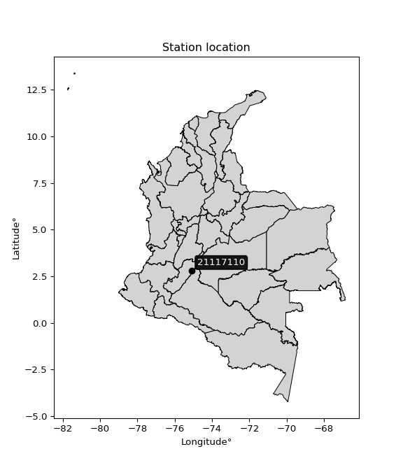

<div align="center">


</div>

# PMP Station (rain, Pmax24h): 21117110

Probable Maximum Precipitation (PMP) is the greatest amount of rainfall for a specific duration that is meteorologically possible for a given location, acting as a "worst-case" scenario for extreme storms, crucial for designing safety-critical infrastructure like bridges, river deviations, dams, spillways, and nuclear plants to prevent catastrophic failure. PMP is calculated by hydrologists using meteorological data to determine the upper limit of extreme rainfall, often leading to the Probable Maximum Flood (PMF) for flood control design, and is increasingly being studied for climate change impacts.

<div align="center">

</img>

</div>


## A. General information


### 1. General running parameters

• app_version: _v20251228_. • runtime: _2025-12-28 08:43:48.795225_. • Python version: _3.14.0_. • SciPy version: _1.16.3_. • Pandas version: _2.3.3_. • NumPy version: _2.3.5_. • Stations dataset (station_dataset_file): _dataset/pmax24h_in/automatic_colombia_2003_2024.csv_. • Stations catalog (station_catalog_file): _dataset/CNE_IDEAM.xls_. • Minimum year to eval til year_max (date_min): _1900_. • Maximum year to eval since year_min (date_max): _2024_. • Creates, save and include plots into reports (create_plot): _False_. • Plot only fit distributions with Δo > Δ (plot_only_fit): _True_. • Eval low extreme values, if False, evaluates high extreme values (low_extreme): _False_. • Eval every SciPy distribution as logarithmic (pdist_logarithmic_on): _True_. • Standard deviation normalized (ddof): _1.0_. • Return periods to eval in years (Tr): _[2, 2.33, 5, 10, 15, 20, 25, 50, 75, 100, 200, 250, 500, 750, 1000]_. • Minimum data sample per station, 0 means any (minimum_sample): _5_. • Z-Score maximum threshold to adjust a value, 0 means disable (zscore_max): _3.5_. • Z-Score minimum threshold to adjust a value, 0 means disable (zscore_min): _-2.5_. • Avoid zeros, e.g. rain = 0 (avoid_zeros): _True_. • Avoid null values (avoid_nans): _True_. [:file_folder:Dataset file.](../../dataset/pmax24h_in/automatic_colombia_2003_2024.csv)

> Delta Degrees of Freedom (DDOF): is a parameter used in the formulas for calculating variance and standard deviation. When ddof=0, the divisor is $N$ (the total number of observations) and this is used when your data set is the entire population. When ddof=1, the divisor is $N-1$ and this is used when your data set is a sample drawn from a larger population. Using $N-1$ provides an unbiased estimate of the population variance (known as Bessel´s correction).


### 2. Station info and location

|   id |   CODIGO | NOMBRE                    | CATEGORIA    | TECNOLOGIA                | ESTADO     | FECHA_INSTALACION   | FECHA_SUSPENSION   |   ALTITUD |   LATITUD |   LONGITUD | DEPARTAMENTO   | MUNICIPIO   | AREA_OPERATIVA                    | ENTIDAD                                                     | AREA_HIDROGRAFICA   | ZONA_HIDROGRAFICA   | SUBZONA_HIDROGRAFICA      | CORRIENTE   | Catalogo   |
|-----:|---------:|:--------------------------|:-------------|:--------------------------|:-----------|:--------------------|:-------------------|----------:|----------:|-----------:|:---------------|:------------|:----------------------------------|:------------------------------------------------------------|:--------------------|:--------------------|:--------------------------|:------------|:-----------|
|    0 | 21117110 | MOTILON  - AUT [21117110] | Limnimétrica | Automática con Telemetría | Suspendida | 15/06/1983          | 23/05/2019         |      1440 |   2.80558 |   -75.0856 | Huila          | Rivera      | Area Operativa 04 - Huila-Caquetá | INSTITUTO DE HIDROLOGIA METEOROLOGIA Y ESTUDIOS AMBIENTALES | Magdalena Cauca     | Alto Magdalena      | Rio Fortalecillas y otros | Motilon     | CNE_IDEAM  |

<div align="center">

Map location in: [:earth_americas:Google](http://maps.google.com/maps?q=2.805583333,-75.08555556) [:earth_americas:OSM](https://www.openstreetmap.org/#map=18/2.805583333/-75.08555556&layers=P) [:earth_americas:Bing](https://www.bing.com/maps?cp=2.805583333~-75.08555556&lvl=18) [:earth_americas:Apple](https://maps.apple.com/frame?center=2.805583333%2C-75.08555556&span=0.003%2C0.006)

</div>


<div align="center">

```geojson
{
  "type": "Feature",
  "geometry": {
    "type": "Point", 
    "coordinates": [-75.08555556, 2.805583333]
  }, 
  "properties": {
    "Name": "21117110"
  }
}
```

</div>


### 3. Discrete values table and plot

|               |          0 |           1 |           2 |          3 |           4 |          5 |            6 |           7 |           8 |          9 |          10 |          11 |
|:--------------|-----------:|------------:|------------:|-----------:|------------:|-----------:|-------------:|------------:|------------:|-----------:|------------:|------------:|
| Date          | 2005       | 2012        | 2013        | 2014       | 2015        | 2016       | 2017         | 2018        | 2019        | 2020       | 2021        | 2022        |
| Value         |    1.1     |   27        |   52        |   71.1     |   57.6      |   60       |   40.5       |   34.3      |   41.9      |   15.5     |   41.3      |   23.4      |
| Value_initial |    1.1     |   27        |   52        |   71.1     |   57.6      |   60       |   40.5       |   34.3      |   41.9      |   15.5     |   41.3      |   23.4      |
| count         |   12       |   12        |   12        |   12       |   12        |   12       |   12         |   12        |   12        |   12       |   12        |   12        |
| mean          |   38.8083  |   38.8083   |   38.8083   |   38.8083  |   38.8083   |   38.8083  |   38.8083    |   38.8083   |   38.8083   |   38.8083  |   38.8083   |   38.8083   |
| std           |   20       |   20        |   20        |   20       |   20        |   20       |   20         |   20        |   20        |   20       |   20        |   20        |
| zscore        |   -1.88542 |   -0.590417 |    0.659584 |    1.61459 |    0.939584 |    1.05958 |    0.0845834 |   -0.225417 |    0.154584 |   -1.16542 |    0.124583 |   -0.770418 |

> The initial value (value_initial) correspond to the initial obtained or null completed value, and value (value) is adjusted only when the initial value is outside the valid range definite through the Z-Score value. If Z-Score is active, values out of range or outliers are replaced with the station mean value


### 4. Active continuous probability distributions from SciPy (44 of 104 available)

[scipy.stats](https://docs.scipy.org/doc/scipy/reference/stats.html) is a Python´s powerful submodule within the SciPy library for comprehensive statistical analysis, offering over 130 probability distributions (like Normal, Poisson), functions for descriptive stats (mean, variance), hypothesis testing (t-tests, chi-square), random variable generation, and statistical tests, making it essential for data science, modeling, and research. It provides tools to explore, model, and draw conclusions from data efficiently, working seamlessly with NumPy.

<div align="center">

|   id | p_dist             |   n_parameter | fit_method   | label                                                                       | active   | ref                                                                                                        |
|-----:|:-------------------|--------------:|:-------------|:----------------------------------------------------------------------------|:---------|:-----------------------------------------------------------------------------------------------------------|
|    0 | alpha              |             3 | MLE          | Alpha                                                                       | True     | [:mortar_board:](https://docs.scipy.org/doc/scipy/reference/generated/scipy.stats.alpha.html)              |
|    1 | betaprime          |             4 | MLE          | Beta prime                                                                  | True     | [:mortar_board:](https://docs.scipy.org/doc/scipy/reference/generated/scipy.stats.betaprime.html)          |
|    2 | chi2               |             3 | MLE          | Chi²                                                                        | True     | [:mortar_board:](https://docs.scipy.org/doc/scipy/reference/generated/scipy.stats.chi2.html)               |
|    3 | crystalball        |             4 | MLE          | Crystalball                                                                 | True     | [:mortar_board:](https://docs.scipy.org/doc/scipy/reference/generated/scipy.stats.crystalball.html)        |
|    4 | erlang             |             3 | MLE          | Erlang                                                                      | True     | [:mortar_board:](https://docs.scipy.org/doc/scipy/reference/generated/scipy.stats.erlang.html)             |
|    5 | expon              |             2 | MLE          | Exponential                                                                 | True     | [:mortar_board:](https://docs.scipy.org/doc/scipy/reference/generated/scipy.stats.expon.html)              |
|    6 | exponnorm          |             3 | MLE          | Exponentially modified Normal                                               | True     | [:mortar_board:](https://docs.scipy.org/doc/scipy/reference/generated/scipy.stats.exponnorm.html)          |
|    7 | f                  |             4 | MLE          | F                                                                           | True     | [:mortar_board:](https://docs.scipy.org/doc/scipy/reference/generated/scipy.stats.f.html)                  |
|    8 | fatiguelife        |             3 | MLE          | Fatigue-life (Birnbaum-Saunders)                                            | True     | [:mortar_board:](https://docs.scipy.org/doc/scipy/reference/generated/scipy.stats.fatiguelife.html)        |
|    9 | fisk               |             3 | MLE          | Fisk                                                                        | True     | [:mortar_board:](https://docs.scipy.org/doc/scipy/reference/generated/scipy.stats.fisk.html)               |
|   10 | gamma              |             3 | MLE          | Gamma                                                                       | True     | [:mortar_board:](https://docs.scipy.org/doc/scipy/reference/generated/scipy.stats.gamma.html)              |
|   11 | genexpon           |             5 | MLE          | Generalized exponential                                                     | True     | [:mortar_board:](https://docs.scipy.org/doc/scipy/reference/generated/scipy.stats.genexpon.html)           |
|   12 | genlogistic        |             3 | MLE          | Generalized logistic                                                        | True     | [:mortar_board:](https://docs.scipy.org/doc/scipy/reference/generated/scipy.stats.genlogistic.html)        |
|   13 | gibrat             |             2 | MM           | Gibrat                                                                      | True     | [:mortar_board:](https://docs.scipy.org/doc/scipy/reference/generated/scipy.stats.gibrat.html)             |
|   14 | gompertz           |             3 | MLE          | Gompertz (or truncated Gumbel)                                              | True     | [:mortar_board:](https://docs.scipy.org/doc/scipy/reference/generated/scipy.stats.gompertz.html)           |
|   15 | gumbel_l           |             2 | MM           | Gumbel Left Skew                                                            | True     | [:mortar_board:](https://docs.scipy.org/doc/scipy/reference/generated/scipy.stats.gumbel_l.html)           |
|   16 | gumbel_r           |             2 | MM           | Gumbel Right Skew                                                           | True     | [:mortar_board:](https://docs.scipy.org/doc/scipy/reference/generated/scipy.stats.gumbel_r.html)           |
|   17 | halflogistic       |             2 | MM           | Half-logistic                                                               | True     | [:mortar_board:](https://docs.scipy.org/doc/scipy/reference/generated/scipy.stats.halflogistic.html)       |
|   18 | halfnorm           |             2 | MM           | Half Normal                                                                 | True     | [:mortar_board:](https://docs.scipy.org/doc/scipy/reference/generated/scipy.stats.halfnorm.html)           |
|   19 | hypsecant          |             2 | MM           | hyperbolic secant                                                           | True     | [:mortar_board:](https://docs.scipy.org/doc/scipy/reference/generated/scipy.stats.hypsecant.html)          |
|   20 | invgamma           |             3 | MLE          | Inverted gamma                                                              | True     | [:mortar_board:](https://docs.scipy.org/doc/scipy/reference/generated/scipy.stats.invgamma.html)           |
|   21 | invgauss           |             3 | MLE          | Inverse Gaussian                                                            | True     | [:mortar_board:](https://docs.scipy.org/doc/scipy/reference/generated/scipy.stats.invgauss.html)           |
|   22 | invweibull         |             3 | MLE          | Inverted Weibull                                                            | True     | [:mortar_board:](https://docs.scipy.org/doc/scipy/reference/generated/scipy.stats.invweibull.html)         |
|   23 | johnsonsu          |             4 | MLE          | Johnson Su                                                                  | True     | [:mortar_board:](https://docs.scipy.org/doc/scipy/reference/generated/scipy.stats.johnsonsu.html)          |
|   24 | kstwobign          |             2 | MLE          | Limiting distribution of scaled Kolmogorov-Smirnov two-sided test statistic | True     | [:mortar_board:](https://docs.scipy.org/doc/scipy/reference/generated/scipy.stats.kstwobign.html)          |
|   25 | laplace            |             2 | MM           | Laplace                                                                     | True     | [:mortar_board:](https://docs.scipy.org/doc/scipy/reference/generated/scipy.stats.laplace.html)            |
|   26 | laplace_asymmetric |             3 | MLE          | Asymmetric Laplace                                                          | True     | [:mortar_board:](https://docs.scipy.org/doc/scipy/reference/generated/scipy.stats.laplace_asymmetric.html) |
|   27 | loggamma           |             3 | MLE          | Log gamma                                                                   | True     | [:mortar_board:](https://docs.scipy.org/doc/scipy/reference/generated/scipy.stats.loggamma.html)           |
|   28 | logistic           |             2 | MM           | Logistic (or Sech-squared)                                                  | True     | [:mortar_board:](https://docs.scipy.org/doc/scipy/reference/generated/scipy.stats.logistic.html)           |
|   29 | lognorm            |             3 | MLE          | Log Normal                                                                  | True     | [:mortar_board:](https://docs.scipy.org/doc/scipy/reference/generated/scipy.stats.lognorm.html)            |
|   30 | maxwell            |             2 | MM           | Maxwell                                                                     | True     | [:mortar_board:](https://docs.scipy.org/doc/scipy/reference/generated/scipy.stats.maxwell.html)            |
|   31 | mielke             |             4 | MLE          | Mielke Beta-Kappa / Dagum                                                   | True     | [:mortar_board:](https://docs.scipy.org/doc/scipy/reference/generated/scipy.stats.mielke.html)             |
|   32 | moyal              |             2 | MM           | Moyal                                                                       | True     | [:mortar_board:](https://docs.scipy.org/doc/scipy/reference/generated/scipy.stats.moyal.html)              |
|   33 | nakagami           |             3 | MLE          | Nakagami                                                                    | True     | [:mortar_board:](https://docs.scipy.org/doc/scipy/reference/generated/scipy.stats.nakagami.html)           |
|   34 | ncf                |             5 | MLE          | Non-central F distribution                                                  | True     | [:mortar_board:](https://docs.scipy.org/doc/scipy/reference/generated/scipy.stats.ncf.html)                |
|   35 | nct                |             4 | MLE          | Non-central Student’s t                                                     | True     | [:mortar_board:](https://docs.scipy.org/doc/scipy/reference/generated/scipy.stats.nct.html)                |
|   36 | norm               |             2 | MM           | Normal                                                                      | True     | [:mortar_board:](https://docs.scipy.org/doc/scipy/reference/generated/scipy.stats.norm.html)               |
|   37 | pearson3           |             3 | MM           | Pearson type III                                                            | True     | [:mortar_board:](https://docs.scipy.org/doc/scipy/reference/generated/scipy.stats.pearson3.html)           |
|   38 | rayleigh           |             2 | MM           | Rayleigh                                                                    | True     | [:mortar_board:](https://docs.scipy.org/doc/scipy/reference/generated/scipy.stats.rayleigh.html)           |
|   39 | rice               |             3 | MLE          | Rice                                                                        | True     | [:mortar_board:](https://docs.scipy.org/doc/scipy/reference/generated/scipy.stats.rice.html)               |
|   40 | t                  |             3 | MLE          | Student’s t                                                                 | True     | [:mortar_board:](https://docs.scipy.org/doc/scipy/reference/generated/scipy.stats.t.html)                  |
|   41 | truncnorm          |             4 | MLE          | Truncated normal                                                            | True     | [:mortar_board:](https://docs.scipy.org/doc/scipy/reference/generated/scipy.stats.truncnorm.html)          |
|   42 | wald               |             2 | MM           | Wald                                                                        | True     | [:mortar_board:](https://docs.scipy.org/doc/scipy/reference/generated/scipy.stats.wald.html)               |
|   43 | weibull_min        |             3 | MLE          | Weibull minimum                                                             | True     | [:mortar_board:](https://docs.scipy.org/doc/scipy/reference/generated/scipy.stats.weibull_min.html)        |

</div>

> **n_parameter:** # arguments & localization & scale.
>
> **Fit methods:** (MLE) maximum likelihood, (MM) L-moments.
>
>**Inactive:** foldnorm, gennorm, norminvgauss, powernorm, powerlognorm, skewnorm, genextreme, anglit, arcsine, argus, beta, bradford, burr, burr12, cauchy, cosine, halfcauchy, foldcauchy, skewcauchy, wrapcauchy, dgamma, gengamma, exponweib, exponpow, truncexpon, gausshyper, genhalflogistic, genhyperbolic, geninvgauss, halfgennorm, johnsonsb, kappa4, kappa3, ksone, kstwo, loglaplace, levy, levy_l, levy_stable, ncx2, pareto, genpareto, truncpareto, lomax, powerlaw, rdist, rel_breitwigner, recipinvgauss, semicircular, studentized_range, trapezoid, triang, truncweibull_min, tukeylambda, uniform, loguniform, vonmises, vonmises_line, weibull_max, dweibull, 


## B. Probability distributions vs. Empirical distributions

A continuous probability distribution (CPD) describes probabilities for variables that can take any value within a range (like rain any time), unlike discrete variables with specific outcomes (like temperature). It uses a Probability Density Function (PDF), a curve where the total area under it equals 1, and the probability of the variable falling within an interval (a to b) is found by calculating the area under the curve between those points. A key feature is that the probability of hitting any single exact value is zero, so probabilities are always expressed for ranges, e.g., $P(a ≤ X ≤ b)$.

<div align="center">

Distributions parameters from station values
|    |   station | p_dist                |   n |               loc |            scale | shape                  | shape1                 | shape2                 | shape3   |
|---:|----------:|:----------------------|----:|------------------:|-----------------:|:-----------------------|:-----------------------|:-----------------------|:---------|
|  0 |  21117110 | alpha                 |  12 |      -0.00505308  |      3.81658     | 4.115825546766897e-09  |                        |                        |          |
|  1 |  21117110 | betaprime             |  12 |    -311.955       |  64493.3         | 330.99318401533606     | 60826.89061332133      |                        |          |
|  2 |  21117110 | chi2                  |  12 |       1.1         |      2.75329     | 1.2159238567294084     |                        |                        |          |
|  3 |  21117110 | crystalball           |  12 |      38.8083      |     19.1485      | 5031.187915124611      | 1517.8677108364814     |                        |          |
|  4 |  21117110 | erlang                |  12 |    -317.353       |      1.05174     | 338.60242741847264     |                        |                        |          |
|  5 |  21117110 | expon                 |  12 |       1.1         |     37.7083      |                        |                        |                        |          |
|  6 |  21117110 | exponnorm             |  12 |      38.7888      |     19.1485      | 0.0010157263561608244  |                        |                        |          |
|  7 |  21117110 | f                     |  12 |   -4543.83        |   4582.65        | 139556.48014235118     | 629047.9955933525      |                        |          |
|  8 |  21117110 | fatiguelife           |  12 |   -1115.86        |   1154.38        | 0.01651039788740373    |                        |                        |          |
|  9 |  21117110 | fisk                  |  12 |      -5.66998e+09 |      5.66998e+09 | 506546574.4316325      |                        |                        |          |
| 10 |  21117110 | gamma                 |  12 |    -305.86        |      1.08111     | 318.81999311954746     |                        |                        |          |
| 11 |  21117110 | genexpon              |  12 |       1.09996     |      2.40556     | 0.059392929062606986   | 1.4584684762032133e-05 | 1.797956466500744      |          |
| 12 |  21117110 | genlogistic           |  12 |      44.0138      |     10.0109      | 0.7538042477699722     |                        |                        |          |
| 13 |  21117110 | gibrat                |  12 |      24.2004      |      8.86014     |                        |                        |                        |          |
| 14 |  21117110 | gompertz              |  12 |      15.5         |      6.3723      | 0.0013358729360785082  |                        |                        |          |
| 15 |  21117110 | gumbel_l              |  12 |      47.4262      |     14.93        |                        |                        |                        |          |
| 16 |  21117110 | gumbel_r              |  12 |      30.1905      |     14.93        |                        |                        |                        |          |
| 17 |  21117110 | halflogistic          |  12 |      16.1129      |     16.3713      |                        |                        |                        |          |
| 18 |  21117110 | halfnorm              |  12 |      13.4632      |     31.7654      |                        |                        |                        |          |
| 19 |  21117110 | hypsecant             |  12 |      38.8083      |     12.1903      |                        |                        |                        |          |
| 20 |  21117110 | invgamma              |  12 |    -211.597       |  41523.2         | 166.9312581000264      |                        |                        |          |
| 21 |  21117110 | invgauss              |  12 |     -99.7318      |   6396.69        | 0.021609199709295895   |                        |                        |          |
| 22 |  21117110 | invweibull            |  12 | -203542           | 203570           | 10731.92414864563      |                        |                        |          |
| 23 |  21117110 | johnsonsu             |  12 |      -3.78638e+08 |      5.17919e+08 | -22715889.172772303    | 33507297.718356155     |                        |          |
| 24 |  21117110 | kstwobign             |  12 |     -39.3488      |     89.5336      |                        |                        |                        |          |
| 25 |  21117110 | laplace               |  12 |      38.8083      |     13.54        |                        |                        |                        |          |
| 26 |  21117110 | laplace_asymmetric    |  12 |      41.3         |     14.9403      | 1.0893904182100531     |                        |                        |          |
| 27 |  21117110 | loggamma              |  12 |     -67.7925      |     52.7845      | 8.029394738723528      |                        |                        |          |
| 28 |  21117110 | logistic              |  12 |      38.8083      |     10.5571      |                        |                        |                        |          |
| 29 |  21117110 | lognorm               |  12 |       1.1         |      1.37824     | 10.972682327784694     |                        |                        |          |
| 30 |  21117110 | maxwell               |  12 |      -6.56562     |     28.4339      |                        |                        |                        |          |
| 31 |  21117110 | mielke                |  12 |       1.1         |     70.222       | 0.9332118608095956     | 982.4575965264987      |                        |          |
| 32 |  21117110 | moyal                 |  12 |      27.858       |      8.61986     |                        |                        |                        |          |
| 33 |  21117110 | nakagami              |  12 |   -4408.6         |   4447.43        | 13467.779501823135     |                        |                        |          |
| 34 |  21117110 | ncf                   |  12 |      -0.00807792  |      2.33501e-06 | 8.347277969371664e-07  | 3.8903708322741535     | 11.796092836630912     |          |
| 35 |  21117110 | nct                   |  12 |   -1209.26        |     19.1149      | 540340.0902672912      | 65.29266902137212      |                        |          |
| 36 |  21117110 | norm                  |  12 |      38.8083      |     19.1485      |                        |                        |                        |          |
| 37 |  21117110 | pearson3              |  12 |      38.8083      |     19.1486      | -0.23155065571042432   |                        |                        |          |
| 38 |  21117110 | rayleigh              |  12 |       2.17608     |     29.2283      |                        |                        |                        |          |
| 39 |  21117110 | rice                  |  12 |      -8.85896     |     20.8329      | 2.019941395171629      |                        |                        |          |
| 40 |  21117110 | t                     |  12 |      38.8118      |     19.1476      | 213802.3712182377      |                        |                        |          |
| 41 |  21117110 | truncnorm             |  12 |      -1.17694     |      7.823       | -0.5441795080432137    | 9.2390338231293        |                        |          |
| 42 |  21117110 | wald                  |  12 |      19.6598      |     19.1485      |                        |                        |                        |          |
| 43 |  21117110 | weibull_min           |  12 |     -35.9164      |     82.0005      | 4.519738743816364      |                        |                        |          |
| 44 |  21117110 | logalpha              |  12 |     -38.0352      |   1448.8         | 35.051934810276464     |                        |                        |          |
| 45 |  21117110 | logbetaprime          |  12 |     -38.4299      |    393.019       | 1527.2725878615884     | 14366.485946181307     |                        |          |
| 46 |  21117110 | logchi2               |  12 |       0.0953102   |      1.7068      | 1.7112762915570217     |                        |                        |          |
| 47 |  21117110 | logcrystalball        |  12 |       4.10392     |      0.114175    | 0.1479749006631969     | 11.965755990599781     |                        |          |
| 48 |  21117110 | logerlang             |  12 |     -11.2779      |      0.0950394   | 153.9769631933591      |                        |                        |          |
| 49 |  21117110 | logexpon              |  12 |       0.0953102   |      3.2664      |                        |                        |                        |          |
| 50 |  21117110 | logexponnorm          |  12 |       3.36117     |      1.06825     | 0.0005063644545989866  |                        |                        |          |
| 51 |  21117110 | logf                  |  12 |   -1322.73        |   1326.09        | 3664284.0500450414     | 18902206.586974632     |                        |          |
| 52 |  21117110 | logfatiguelife        |  12 |   -1292.99        |   1296.34        | 0.0008238852239125577  |                        |                        |          |
| 53 |  21117110 | logfisk               |  12 |      -1.76784e+08 |      1.76784e+08 | 386153127.89691615     |                        |                        |          |
| 54 |  21117110 | loggamma              |  12 |     -18.5725      |      0.0612027   | 358.15163998867865     |                        |                        |          |
| 55 |  21117110 | loggenexpon           |  12 |       0.0330369   |      0.00784955  | 0.0003157273565725545  | 0.6830340572776523     | 1.2738564942349997e-05 |          |
| 56 |  21117110 | loggenlogistic        |  12 |       4.2641      |      8.59507e-07 | 9.537800303774737e-07  |                        |                        |          |
| 57 |  21117110 | loggibrat             |  12 |       2.54673     |      0.494305    |                        |                        |                        |          |
| 58 |  21117110 | loggompertz           |  12 |       0.0382336   |      0.555146    | 0.0012481163221225366  |                        |                        |          |
| 59 |  21117110 | loggumbel_l           |  12 |       3.84248     |      0.832914    |                        |                        |                        |          |
| 60 |  21117110 | loggumbel_r           |  12 |       2.88094     |      0.832914    |                        |                        |                        |          |
| 61 |  21117110 | loghalflogistic       |  12 |       2.0956      |      0.913306    |                        |                        |                        |          |
| 62 |  21117110 | loghalfnorm           |  12 |       1.9478      |      1.77208     |                        |                        |                        |          |
| 63 |  21117110 | loghypsecant          |  12 |       3.36171     |      0.680072    |                        |                        |                        |          |
| 64 |  21117110 | loginvgamma           |  12 |     -23.6417      |  15035.9         | 557.6119968980397      |                        |                        |          |
| 65 |  21117110 | loginvgauss           |  12 |     -10.8565      |   1910.54        | 0.007437977690897463   |                        |                        |          |
| 66 |  21117110 | loginvweibull         |  12 |      -1.66925e+08 |      1.66925e+08 | 111401595.61060241     |                        |                        |          |
| 67 |  21117110 | logjohnsonsu          |  12 |       4.3686      |      0.00470638  | 6.220197435453407      | 1.1014794327319928     |                        |          |
| 68 |  21117110 | logkstwobign          |  12 |      -2.9463      |      7.26665     |                        |                        |                        |          |
| 69 |  21117110 | loglaplace            |  12 |       3.36171     |      0.75537     |                        |                        |                        |          |
| 70 |  21117110 | loglaplace_asymmetric |  12 |       4.26412     |      0.00880385  | 102.50666646383823     |                        |                        |          |
| 71 |  21117110 | logloggamma           |  12 |       4.26415     |      6.29834e-06 | 6.9446122164542475e-06 |                        |                        |          |
| 72 |  21117110 | loglogistic           |  12 |       3.36171     |      0.588959    |                        |                        |                        |          |
| 73 |  21117110 | loglognorm            |  12 | -262144           | 262147           | 4.075034066253332e-06  |                        |                        |          |
| 74 |  21117110 | logmaxwell            |  12 |       0.830409    |      1.58626     |                        |                        |                        |          |
| 75 |  21117110 | logmielke             |  12 |      -4.91489e+07 |      4.91489e+07 | 52534062.8409685       | 5116692942.565748      |                        |          |
| 76 |  21117110 | logmoyal              |  12 |       2.75081     |      0.480883    |                        |                        |                        |          |
| 77 |  21117110 | lognakagami           |  12 |   -1251.99        |   1255.35        | 343384.4897141546      |                        |                        |          |
| 78 |  21117110 | logncf                |  12 |     -51.7262      |     55.0805      | 7554.712574710087      | 13844.916315730767     | 2.9606813620845807e-06 |          |
| 79 |  21117110 | lognct                |  12 |     -58.2465      |      1.00906     | 12673.678181458505     | 61.05163885759049      |                        |          |
| 80 |  21117110 | lognorm               |  12 |       3.36171     |      1.06825     |                        |                        |                        |          |
| 81 |  21117110 | logpearson3           |  12 |       3.36171     |      1.06825     | -2.275815713113002     |                        |                        |          |
| 82 |  21117110 | lograyleigh           |  12 |       1.31813     |      1.63055     |                        |                        |                        |          |
| 83 |  21117110 | logrice               |  12 |    -538.904       |      1.06769     | 507.88796991259096     |                        |                        |          |
| 84 |  21117110 | logt                  |  12 |       3.50596     |      1.0328      | 4.547939771594779      |                        |                        |          |
| 85 |  21117110 | logtruncnorm          |  12 |      -0.293007    |      4.26065     | 0.09078787796600368    | 1.0695780931750603     |                        |          |
| 86 |  21117110 | logwald               |  12 |       2.29348     |      1.06824     |                        |                        |                        |          |
| 87 |  21117110 | logweibull_min        |  12 |      -9.05904e+07 |      9.05904e+07 | 165064070.44529253     |                        |                        |          |

</div>

> **loc** (Location parameter): This shifts the distribution along the x-axis. For many common distributions, like the normal (Gaussian) distribution, loc represents the mean $μ$. For others, like the uniform distribution, it might represent the minimum value, or for the beta distribution, the left end of the support interval.
>
> **scale** (Scale parameter): This determines the width or spread of the distribution. For the normal distribution, scale represents the standard deviation $σ$. For a uniform distribution, it defines the length of the interval (from $loc$ to $loc + scale$).
>
> **shape** (Shape parameters): Refers to parameters that define the specific form of a probability distribution, distinct from its location (loc) and scale (scale). These parameters are required arguments for most distribution functions. For example, a normal (Gaussian) distribution is fully defined by its location (mean) and scale (standard deviation), so it has no specific shape parameters beyond loc and scale. However, other distributions have intrinsic properties that need specification, as Gamma distribution that takes a shape parameter, often named $a$ or $alpha$.


### 0. Cumulative distribution values - CDF (88 evaluated)

Cumulative Distribution Function (CDF), denoted as $F$<sub>$X$</sub>$(x)$, is a function that gives the probability that a random variable $X$ will take a value less than or equal to a specific value, $x$ (i.e., $(P(X≥x)$. It essentially "accumulates" probabilities from a given point up to the far right (positive infinity), providing a complete picture of the distribution´s probabilities for both discrete (like rain) and continuous (like temperature) variables, helping to find probabilities over ranges or above certain values.

<div align="center">

CDF ordered by x ascending and calculating $log(f(x))$ separately
|   id |   Station |   date |    x |   count |    mean |   std |     zscore |   Value_initial |   station |   m |       alpha |   alpha_pdf |   betaprime |   betaprime_pdf |        chi2 |         chi2_pdf |   crystalball |   crystalball_pdf |    erlang |   erlang_pdf |    expon |   expon_pdf |   exponnorm |   exponnorm_pdf |         f |      f_pdf |   fatiguelife |   fatiguelife_pdf |      fisk |   fisk_pdf |     gamma |   gamma_pdf |    genexpon |   genexpon_pdf |   genlogistic |   genlogistic_pdf |   gibrat |   gibrat_pdf |    gompertz |   gompertz_pdf |   gumbel_l |   gumbel_l_pdf |    gumbel_r |   gumbel_r_pdf |   halflogistic |   halflogistic_pdf |   halfnorm |   halfnorm_pdf |   hypsecant |   hypsecant_pdf |   invgamma |   invgamma_pdf |   invgauss |   invgauss_pdf |   invweibull |   invweibull_pdf |   johnsonsu |   johnsonsu_pdf |   kstwobign |   kstwobign_pdf |   laplace |   laplace_pdf |   laplace_asymmetric |   laplace_asymmetric_pdf |   loggamma |   loggamma_pdf |   logistic |   logistic_pdf |    lognorm |   lognorm_pdf |    maxwell |   maxwell_pdf |      mielke |   mielke_pdf |       moyal |   moyal_pdf |   nakagami |   nakagami_pdf |      ncf |    ncf_pdf |       nct |    nct_pdf |      norm |   norm_pdf |   pearson3 |   pearson3_pdf |   rayleigh |   rayleigh_pdf |      rice |   rice_pdf |         t |      t_pdf |   truncnorm |   truncnorm_pdf |      wald |   wald_pdf |   weibull_min |   weibull_min_pdf |   logalpha |   logalpha_pdf |   logbetaprime |   logbetaprime_pdf |     logchi2 |   logchi2_pdf |   logcrystalball |   logcrystalball_pdf |   logerlang |   logerlang_pdf |   logexpon |   logexpon_pdf |   logexponnorm |   logexponnorm_pdf |       logf |   logf_pdf |   logfatiguelife |   logfatiguelife_pdf |     logfisk |   logfisk_pdf |   loggenexpon |   loggenexpon_pdf |   loggenlogistic |   loggenlogistic_pdf |   loggibrat |   loggibrat_pdf |   loggompertz |   loggompertz_pdf |   loggumbel_l |   loggumbel_l_pdf |   loggumbel_r |   loggumbel_r_pdf |   loghalflogistic |   loghalflogistic_pdf |   loghalfnorm |   loghalfnorm_pdf |   loghypsecant |   loghypsecant_pdf |   loginvgamma |   loginvgamma_pdf |   loginvgauss |   loginvgauss_pdf |   loginvweibull |   loginvweibull_pdf |   logjohnsonsu |   logjohnsonsu_pdf |   logkstwobign |   logkstwobign_pdf |   loglaplace |   loglaplace_pdf |   loglaplace_asymmetric |   loglaplace_asymmetric_pdf |   logloggamma |   logloggamma_pdf |   loglogistic |   loglogistic_pdf |   loglognorm |   loglognorm_pdf |   logmaxwell |   logmaxwell_pdf |   logmielke |   logmielke_pdf |    logmoyal |   logmoyal_pdf |   lognakagami |   lognakagami_pdf |     logncf |   logncf_pdf |     lognct |   lognct_pdf |   logpearson3 |   logpearson3_pdf |   lograyleigh |   lograyleigh_pdf |    logrice |   logrice_pdf |      logt |   logt_pdf |   logtruncnorm |   logtruncnorm_pdf |   logwald |   logwald_pdf |   logweibull_min |   logweibull_min_pdf |
|-----:|----------:|-------:|-----:|--------:|--------:|------:|-----------:|----------------:|----------:|----:|------------:|------------:|------------:|----------------:|------------:|-----------------:|--------------:|------------------:|----------:|-------------:|---------:|------------:|------------:|----------------:|----------:|-----------:|--------------:|------------------:|----------:|-----------:|----------:|------------:|------------:|---------------:|--------------:|------------------:|---------:|-------------:|------------:|---------------:|-----------:|---------------:|------------:|---------------:|---------------:|-------------------:|-----------:|---------------:|------------:|----------------:|-----------:|---------------:|-----------:|---------------:|-------------:|-----------------:|------------:|----------------:|------------:|----------------:|----------:|--------------:|---------------------:|-------------------------:|-----------:|---------------:|-----------:|---------------:|-----------:|--------------:|-----------:|--------------:|------------:|-------------:|------------:|------------:|-----------:|---------------:|---------:|-----------:|----------:|-----------:|----------:|-----------:|-----------:|---------------:|-----------:|---------------:|----------:|-----------:|----------:|-----------:|------------:|----------------:|----------:|-----------:|--------------:|------------------:|-----------:|---------------:|---------------:|-------------------:|------------:|--------------:|-----------------:|---------------------:|------------:|----------------:|-----------:|---------------:|---------------:|-------------------:|-----------:|-----------:|-----------------:|---------------------:|------------:|--------------:|--------------:|------------------:|-----------------:|---------------------:|------------:|----------------:|--------------:|------------------:|--------------:|------------------:|--------------:|------------------:|------------------:|----------------------:|--------------:|------------------:|---------------:|-------------------:|--------------:|------------------:|--------------:|------------------:|----------------:|--------------------:|---------------:|-------------------:|---------------:|-------------------:|-------------:|-----------------:|------------------------:|----------------------------:|--------------:|------------------:|--------------:|------------------:|-------------:|-----------------:|-------------:|-----------------:|------------:|----------------:|------------:|---------------:|--------------:|------------------:|-----------:|-------------:|-----------:|-------------:|--------------:|------------------:|--------------:|------------------:|-----------:|--------------:|----------:|-----------:|---------------:|-------------------:|----------:|--------------:|-----------------:|---------------------:|
|    0 |  21117110 |   2005 |  1.1 |      12 | 38.8083 |    20 | -1.88542   |             1.1 |  21117110 |   1 | 0.000552841 | 0.00640656  |   0.0218878 |      0.00291759 | 1.20574e-10 | 330134           |     0.0244619 |        0.00299699 | 0.0226844 |   0.00299912 | 0        |  0.0265193  |   0.0244622 |      0.00299702 | 0.0242612 | 0.00299142 |     0.0229685 |        0.00295176 | 0.0318237 | 0.0027526  | 0.0221417 |  0.00295414 | 9.35281e-07 |     0.0246899  |     0.0390999 |        0.00290423 | 0        |   0          | 0           |    0           |  0.0439255 |     0.00287651 | 0.000895773 |    0.000421056 |       0        |         0          |  0         |     0          |   0.0288522 |      0.00236357 |   0.017761 |     0.00280241 |  0.0184159 |     0.00309205 |    0.0136465 |       0.00308981 |   0.0244523 |      0.00299623 |   0.0131528 |      0.00360592 | 0.0308661 |    0.00227962 |            0.0459084 |               0.00282065 | 0.00162969 |     0.00506054 |  0.027336  |     0.00251856 | 0.00111522 |    0.00348347 | 0.00509918 |    0.00196672 | 9.04557e-09 |    0.0500229 | 2.34191e-06 | 3.15396e-06 |  0.0244656 |     0.00300387 | 0.006938 | 0.00471243 | 0.0244759 | 0.00299849 | 0.0244619 | 0.00299699 |  0.0304156 |     0.0031367  |   0        |     0          | 0.0157068 | 0.00331878 | 0.0244466 | 0.00299552 |    0.45461  |     0.0691544   | 0         | 0          |     0.0270915 |        0.00326267 | 0.00162077 |     0.00521814 |     0.00146807 |         0.00451476 | 1.39055e-15 |    85.7345    |         0.016312 |            0.0135261 |  0.00146748 |      0.00480566 |   0        |      0.306147  |     0.00111522 |         0.00348349 | 0.00114466 | 0.00356711 |       0.00110582 |           0.00346599 | 0.000500206 |    0.00109207 |    0.00277472 |         0.0488797 |          0       |            0.0108678 |    0        |        0        |   0.000135143 |        0.00249139 |      0.01106  |         0.0132049 |   4.89898e-13 |       1.66715e-11 |          0        |              0        |      0        |          0        |     0.00522329 |         0.00768016 |     0.0010007 |        0.00349869 |    0.00140111 |        0.00490052 |      0.00300194 |           0.0116369 |      0.0203925 |          0.0126876 |     0.00523838 |          0.0225324 |   0.00662181 |       0.00876631 |              0.00985758 |                   0.0109231 |     0.0100861 |         0.0111211 |    0.00388766 |        0.00657523 |   0.00111521 |       0.00348347 |     0        |         0        |   0.0113768 |       0.0121604 | 2.38558e-56 |    6.22983e-54 |    0.00114333 |        0.00355735 | 0.00133319 |   0.00415407 | 0.00118133 |   0.00367695 |     0.0188016 |         0.0162944 |      0        |          0        | 0.00110919 |    0.00346807 | 0.0123335 |  0.0122928 |    0.000435832 |           0.290101 |  0        |      0        |       0.00127569 |           0.00232294 |
|    1 |  21117110 |   2020 | 15.5 |      12 | 38.8083 |    20 | -1.16542   |            15.5 |  21117110 |   2 | 0.805565    | 0.0122888   |   0.110387  |      0.0102096  | 0.969456    |      0.00619544  |     0.111757  |        0.00993194 | 0.112899  |   0.0103552  | 0.317422 |  0.0181015  |   0.111758  |      0.009932   | 0.111635  | 0.00994971 |     0.111224  |        0.0101473  | 0.106336  | 0.00848968 | 0.111675  |  0.0103182  | 0.299257    |     0.0173055  |     0.111972  |        0.00796955 | 0        |   0          | 1.28115e-09 |    0.000209638 |  0.111166  |     0.00701569 | 0.0689059   |    0.0123459   |       0        |         0          |  0.0511247 |     0.0250665  |   0.0934032 |      0.00755259 |   0.111221 |     0.0111158  |  0.121056  |     0.0119652  |    0.134009  |       0.0142     |   0.111736  |      0.00993136 |   0.152836  |      0.015534   | 0.0894045 |    0.00660297 |            0.111207  |               0.00683265 | 0.304704   |     0.30798    |  0.0990497 |     0.00845295 | 0.280553   |    0.315417   | 0.104077   |    0.0125052  | 0.227954    |    0.0147729 | 0.0405664   | 0.0116413   |  0.112001  |     0.00995814 | 0.205896 | 0.0177091  | 0.1118    | 0.00993403 | 0.111757  | 0.00993194 |  0.114583  |     0.00926079 |   0.098687 |     0.0140572  | 0.113952  | 0.0109151  | 0.111712  | 0.0099295  |    0.976639 |     0.00743685  | 0         | 0          |     0.114213  |        0.0094433  | 0.316074   |     0.309989   |     0.295159   |         0.310219   | 0.609192    |     0.126467  |         0.188582 |            0.19548   |  0.307796   |      0.306839   |   0.555107 |      0.136203  |     0.280554   |         0.315417   | 0.282418   | 0.315889   |       0.281119   |           0.315939   | 0.139278    |    0.261856   |    0.465197   |         0.225558  |          0       |            0.20469   |    0.174968 |        1.32781  |   0.148818    |        0.248966   |      0.233892 |         0.245062  |   0.306304    |       0.435113    |          0.339248 |              0.484455 |      0.3455   |          0.407351 |     0.242973   |         0.323577   |     0.297544  |        0.312296   |    0.319571   |        0.305139   |      0.370177   |           0.24551   |      0.162905  |          0.166588  |     0.427366   |          0.227563  |   0.219789   |       0.290968   |              0.184884   |                   0.204868  |     0.186447  |         0.205578  |    0.258423   |        0.325388   |   0.280554   |       0.315417   |     0.306256 |         0.353273 |   0.192351  |       0.205599  | 0.312292    |    0.503125    |    0.281256   |        0.315001   | 0.2907     |   0.310681   | 0.283176   |   0.313961   |     0.195869  |         0.180014  |      0.316589 |          0.365706 | 0.280451   |    0.31553    | 0.247621  |  0.266654  |    0.701927    |           0.226075 |  0.289299 |      0.920651 |       0.14641    |           0.246214   |
|    2 |  21117110 |   2022 | 23.4 |      12 | 38.8083 |    20 | -0.770418  |            23.4 |  21117110 |   3 | 0.870466    | 0.00548556  |   0.211843  |      0.0154393  | 0.993666    |      0.00124322  |     0.210504  |        0.015072   | 0.215473  |   0.0155678  | 0.446438 |  0.0146801  |   0.210505  |      0.0150721  | 0.210544  | 0.0150918  |     0.212271  |        0.0154192  | 0.194198  | 0.0139801  | 0.214087  |  0.0155664  | 0.423461    |     0.0142382  |     0.193459  |        0.0129192  | 0        |   0          | 0.00327382  |    0.000721868 |  0.1813    |     0.0109692  | 0.206823    |    0.0218305   |       0.218955 |         0.0290771  |  0.245581  |     0.0239187  |   0.175294  |      0.0136638  |   0.221473 |     0.016653   |  0.236962  |     0.0171314  |    0.265749  |       0.0185664  |   0.210481  |      0.0150722  |   0.290166  |      0.0186053  | 0.160232  |    0.011834   |            0.180689  |               0.0111017  | 0.44002    |     0.342539   |  0.188541  |     0.0144919  | 0.422453   |    0.366375   | 0.225494   |    0.0178856  | 0.342849    |    0.0143476 | 0.195286    | 0.0259117   |  0.210967  |     0.0150987  | 0.3395   | 0.0157361  | 0.210559  | 0.0150726  | 0.210504  | 0.015072   |  0.206316  |     0.0140335  |   0.231751 |     0.0190862  | 0.219713  | 0.0157833  | 0.210441  | 0.0150701  |    0.998812 |     0.000518813 | 0.0595877 | 0.0460037  |     0.206567  |        0.013989   | 0.450901   |     0.338121   |     0.43271    |         0.350923   | 0.657752    |     0.109775  |         0.291497 |            0.314402  |  0.441875   |      0.33776    |   0.607816 |      0.120066  |     0.422454   |         0.366375   | 0.424343   | 0.366006   |       0.423189   |           0.366641   | 0.284635    |    0.444767   |    0.555809   |         0.213056  |          0       |            0.323297  |    0.580722 |        0.644789 |   0.288052    |        0.437315   |      0.353947 |         0.338863  |   0.485987    |       0.421022    |          0.521749 |              0.398431 |      0.503468 |          0.357324 |     0.403693   |         0.446793   |     0.434885  |        0.347609   |    0.451248   |        0.328038   |      0.470045   |           0.236819  |      0.254231  |          0.290439  |     0.518313   |          0.212676  |   0.37916    |       0.501952   |              0.291823   |                   0.323366  |     0.293626  |         0.323755  |    0.412214   |        0.411393   |   0.422454   |       0.366374   |     0.456813 |         0.369178 |   0.298743  |       0.31932   | 0.510263    |    0.439784    |    0.42288    |        0.365488   | 0.428896   |   0.35351    | 0.424002   |   0.362726   |     0.287297  |         0.270889  |      0.468992 |          0.366419 | 0.422416   |    0.366564   | 0.373788  |  0.340886  |    0.791776    |           0.210052 |  0.577093 |      0.505506 |       0.284879   |           0.436905   |
|    3 |  21117110 |   2012 | 27   |      12 | 38.8083 |    20 | -0.590417  |            27   |  21117110 |   4 | 0.88761     | 0.00413416  |   0.271309  |      0.0175388  | 0.996865    |      0.000609735 |     0.268726  |        0.0172265  | 0.275359  |   0.0176422  | 0.496842 |  0.0133434  |   0.268728  |      0.0172266  | 0.268827  | 0.0172398  |     0.271768  |        0.0175806  | 0.249489  | 0.0167281  | 0.274002  |  0.0176594  | 0.472506    |     0.013027   |     0.244719  |        0.0155795  | 0.12464  |   0.0733827  | 0.00676069  |    0.00126558  |  0.224761  |     0.0132192  | 0.289892    |    0.0240427   |       0.320771 |         0.0273987  |  0.33      |     0.0229378  |   0.230958  |      0.0173269  |   0.285164 |     0.0186441  |  0.301784  |     0.0187825  |    0.334166  |       0.0193102  |   0.268705  |      0.0172271  |   0.357751  |      0.0188346  | 0.209035  |    0.0154383  |            0.22542   |               0.01385    | 0.489264   |     0.344823   |  0.246286  |     0.0175833  | 0.475415   |    0.372743   | 0.292948   |    0.0194813  | 0.394237    |    0.0142049 | 0.293246    | 0.0279995   |  0.269276  |     0.0172478  | 0.393771 | 0.0144028  | 0.268781  | 0.0172259  | 0.268726  | 0.0172265  |  0.260776  |     0.0161992  |   0.302787 |     0.0202595  | 0.280035  | 0.0176706  | 0.268657  | 0.0172251  |    0.999776 |     0.000109941 | 0.253697  | 0.053456   |     0.260655  |        0.0160395  | 0.499363   |     0.338349   |     0.483272   |         0.354794   | 0.673085    |     0.104575  |         0.340519 |            0.37252   |  0.490361   |      0.339051   |   0.624626 |      0.11492   |     0.475416   |         0.372743   | 0.477227   | 0.37209    |       0.47618    |           0.37288    | 0.352286    |    0.49842    |    0.585871   |         0.206962  |          0       |            0.378937  |    0.661197 |        0.488466 |   0.355976    |        0.511914   |      0.404745 |         0.370744  |   0.54462     |       0.397337    |          0.576418 |              0.365563 |      0.553169 |          0.337131 |     0.469216   |         0.465866   |     0.484835  |        0.349566   |    0.498181   |        0.327155   |      0.503503   |           0.23057   |      0.300379  |          0.3572    |     0.548268   |          0.205868  |   0.458244   |       0.606649   |              0.341967   |                   0.378931  |     0.343811  |         0.379089  |    0.472068   |        0.423153   |   0.475416   |       0.372742   |     0.509274 |         0.363118 |   0.348118  |       0.372095  | 0.570442    |    0.400729    |    0.475708   |        0.371764   | 0.47987    |   0.357932   | 0.476403   |   0.368589   |     0.329064  |         0.314113  |      0.520771 |          0.356483 | 0.475406   |    0.372942   | 0.423784  |  0.356687  |    0.821425    |           0.204308 |  0.642318 |      0.410042 |       0.352857   |           0.513153   |
|    4 |  21117110 |   2018 | 34.3 |      12 | 38.8083 |    20 | -0.225417  |            34.3 |  21117110 |   5 | 0.911415    | 0.00257164  |   0.41086   |      0.0202888  | 0.999235    |      0.000146935 |     0.406933  |        0.0202646  | 0.415406  |   0.0203173  | 0.5854   |  0.0109949  |   0.406935  |      0.0202646  | 0.407046  | 0.0202523  |     0.412225  |        0.0204979  | 0.389558  | 0.0212449  | 0.414294  |  0.0203645  | 0.559524    |     0.010878   |     0.377701  |        0.0206244  | 0.552085 |   0.0391638  | 0.0239038   |    0.00391063  |  0.339741  |     0.0183582  | 0.467956    |    0.0238015   |       0.504599 |         0.0227648  |  0.488149  |     0.0202559  |   0.384875  |      0.0244224  |   0.430624 |     0.0207199  |  0.445484  |     0.0201154  |    0.474273  |       0.018651   |   0.40692   |      0.020266   |   0.492126  |      0.0176844  | 0.358398  |    0.0264695  |            0.353005  |               0.0216889  | 0.571131   |     0.336997   |  0.394833  |     0.022633   | 0.564487   |    0.368563   | 0.441094   |    0.0206353  | 0.497042    |    0.0139713 | 0.491326    | 0.0251351   |  0.407571  |     0.0202654  | 0.489039 | 0.0117422  | 0.406975  | 0.0202614  | 0.406933  | 0.0202646  |  0.392869  |     0.0197145  |   0.453366 |     0.020555   | 0.419127  | 0.0200584  | 0.406859  | 0.0202647  |    0.999996 |     2.46834e-06 | 0.554896  | 0.0300549  |     0.39103   |        0.019442   | 0.579336   |     0.327829   |     0.567741   |         0.348515   | 0.697128    |     0.0964853 |         0.443832 |            0.497416  |  0.570707   |      0.330206   |   0.651144 |      0.106801  |     0.564488   |         0.368563   | 0.566102   | 0.367519   |       0.565257   |           0.368469   | 0.478443    |    0.545066   |    0.634027   |         0.195196  |          0       |            0.494193  |    0.755831 |        0.317467 |   0.492279    |        0.62106    |      0.499142 |         0.415781  |   0.633866    |       0.346963    |          0.657328 |              0.310914 |      0.629615 |          0.301456 |     0.580311   |         0.453235   |     0.567725  |        0.340725   |    0.575365   |        0.315964   |      0.557172   |           0.217485  |      0.403118  |          0.511602  |     0.596051   |          0.193264  |   0.602576   |       0.526132   |              0.445809   |                   0.493997  |     0.447625  |         0.493556  |    0.573092   |        0.415407   |   0.564487   |       0.368561   |     0.593873 |         0.341773 |   0.449589  |       0.480555  | 0.65819     |    0.33281     |    0.564538   |        0.367547   | 0.565166   |   0.352214   | 0.564425   |   0.364055   |     0.414738  |         0.406902  |      0.603215 |          0.330871 | 0.564524   |    0.368754   | 0.510672  |  0.365587  |    0.869154    |           0.19456  |  0.725706 |      0.294653 |       0.48985    |           0.625627   |
|    5 |  21117110 |   2017 | 40.5 |      12 | 38.8083 |    20 |  0.0845834 |            40.5 |  21117110 |   6 | 0.924931    | 0.00184786  |   0.538304  |      0.0204695  | 0.999766    |      4.45646e-05 |     0.535199  |        0.020753   | 0.542805  |   0.0204272  | 0.64826  |  0.00932792 |   0.535201  |      0.0207529  | 0.535158  | 0.020717   |     0.541333  |        0.0207836  | 0.526158  | 0.0222735  | 0.542022  |  0.0204834  | 0.622057    |     0.00933365 |     0.513586  |        0.0226951  | 0.728929 |   0.0203257  | 0.0640662   |    0.0099209   |  0.46678   |     0.0224581  | 0.605734    |    0.0203391   |       0.632044 |         0.0183406  |  0.605308  |     0.0174854  |   0.544031  |      0.0258623  |   0.558351 |     0.0201337  |  0.568034  |     0.0191221  |    0.583918  |       0.0165603  |   0.535194  |      0.0207546  |   0.595892  |      0.0156892  | 0.558724  |    0.0325904  |            0.516675  |               0.0317449  | 0.626095   |     0.323585   |  0.539974  |     0.0235293  | 0.624718   |    0.355051   | 0.56651    |    0.0195378  | 0.583156    |    0.0138124 | 0.631002    | 0.019808    |  0.535777  |     0.0207335  | 0.555598 | 0.00978367 | 0.535215  | 0.0207483  | 0.535199  | 0.020753   |  0.519944  |     0.0209434  |   0.576674 |     0.0189906  | 0.544626  | 0.0201028  | 0.535129  | 0.0207543  |    1        |     4.95576e-08 | 0.701132  | 0.0182839  |     0.516665  |        0.0207843  | 0.632674   |     0.313285   |     0.624642   |         0.335253   | 0.712723    |     0.0912776 |         0.535532 |            0.610556  |  0.624524   |      0.31665    |   0.668446 |      0.101504  |     0.624719   |         0.355051   | 0.626139   | 0.353825   |       0.62546    |           0.354808   | 0.568727    |    0.535763   |    0.665713   |         0.186094  |          0       |            0.594254  |    0.801874 |        0.241109 |   0.599388    |        0.661024   |      0.57005  |         0.435717  |   0.688345    |       0.308642    |          0.705948 |              0.274628 |      0.67759  |          0.275956 |     0.652726   |         0.415204   |     0.623235  |        0.326427   |    0.626758   |        0.301872   |      0.592448   |           0.206981  |      0.499846  |          0.658499  |     0.627391   |          0.183898  |   0.681049   |       0.422245   |              0.535932   |                   0.593861  |     0.537625  |         0.592791  |    0.640284   |        0.391063   |   0.624718   |       0.355049   |     0.648941 |         0.320312 |   0.536966  |       0.57395   | 0.70973     |    0.288127    |    0.624604   |        0.354098   | 0.622693   |   0.339049   | 0.623915   |   0.350696   |     0.489206  |         0.493238  |      0.656341 |          0.308047 | 0.624785   |    0.355221   | 0.570933  |  0.357901  |    0.900914    |           0.187718 |  0.769711 |      0.237558 |       0.597889   |           0.667494   |
|    6 |  21117110 |   2021 | 41.3 |      12 | 38.8083 |    20 |  0.124583  |            41.3 |  21117110 |   7 | 0.92638     | 0.00177727  |   0.55463   |      0.0203403  | 0.999799    |      3.82361e-05 |     0.551766  |        0.0206585  | 0.559094  |   0.0202895  | 0.655643 |  0.00913211 |   0.551767  |      0.0206585  | 0.551695  | 0.0206202  |     0.557914  |        0.020661   | 0.543936  | 0.0221621  | 0.558356  |  0.0203457  | 0.629451    |     0.00915106 |     0.531755  |        0.0227172  | 0.744567 |   0.0187955  | 0.0724846   |    0.0111468   |  0.48492   |     0.0228882  | 0.621786    |    0.0197888   |       0.646491 |         0.0177765  |  0.619146  |     0.0171092  |   0.564613  |      0.0255756  |   0.574371 |     0.0199129  |  0.583234  |     0.0188738  |    0.597036  |       0.016233   |   0.551763  |      0.0206601  |   0.608326  |      0.015396   | 0.584041  |    0.0307206  |            0.542705  |               0.0333442  | 0.632406   |     0.321619   |  0.558732  |     0.0233539  | 0.631642   |    0.352932   | 0.582039   |    0.0192805  | 0.594199    |    0.0137939 | 0.646566    | 0.0191042   |  0.552327  |     0.0206367  | 0.563333 | 0.00955532 | 0.551778  | 0.0206537  | 0.551766  | 0.0206585  |  0.536703  |     0.0209492  |   0.59175  |     0.0186966  | 0.560657  | 0.0199691  | 0.551697  | 0.0206599  |    1        |     2.85913e-08 | 0.715325  | 0.0172121  |     0.533308  |        0.0208179  | 0.638782   |     0.31123    |     0.63118    |         0.333254   | 0.714503    |     0.0906852 |         0.547622 |            0.625611  |  0.630699   |      0.314699   |   0.670426 |      0.100898  |     0.631643   |         0.352931   | 0.633039   | 0.351689   |       0.632379   |           0.352672   | 0.579174    |    0.532388   |    0.669342   |         0.184982  |          0       |            0.607294  |    0.806518 |        0.233704 |   0.612335    |        0.662602   |      0.578588 |         0.437213  |   0.694338    |       0.304103    |          0.711279 |              0.270491 |      0.682958 |          0.272941 |     0.660793   |         0.409595   |     0.6296    |        0.324354   |    0.632644   |        0.299918   |      0.596484   |           0.205689  |      0.512917  |          0.678028  |     0.630977   |          0.182773  |   0.689202   |       0.411451   |              0.547675   |                   0.606873  |     0.549347  |         0.605715  |    0.647897   |        0.387338   |   0.631642   |       0.352929   |     0.655179 |         0.317501 |   0.548311  |       0.586076  | 0.715317    |    0.283107    |    0.63151    |        0.35199    | 0.629306   |   0.337046   | 0.630755   |   0.348616   |     0.498968  |         0.505042  |      0.662339 |          0.305155 | 0.631713   |    0.353098   | 0.577918  |  0.356277  |    0.904577    |           0.18691  |  0.774301 |      0.231773 |       0.610964   |           0.669222   |
|    7 |  21117110 |   2019 | 41.9 |      12 | 38.8083 |    20 |  0.154584  |            41.9 |  21117110 |   8 | 0.927431    | 0.00172695  |   0.5668    |      0.0202216  | 0.999821    |      3.40902e-05 |     0.564133  |        0.0205643  | 0.571231  |   0.0201647  | 0.661079 |  0.00898795 |   0.564135  |      0.0205643  | 0.56404   | 0.0205244  |     0.570277  |        0.0205459  | 0.557199  | 0.0220423  | 0.570527  |  0.0202207  | 0.634901    |     0.00901646 |     0.54538   |        0.0226929  | 0.755524 |   0.0177407  | 0.0794712   |    0.0121551   |  0.498744  |     0.0231873  | 0.633533    |    0.0193684   |       0.657031 |         0.0173569  |  0.629327  |     0.0168253  |   0.579877  |      0.0252938  |   0.586265 |     0.019728   |  0.594499  |     0.0186723  |    0.606701  |       0.0159822  |   0.564131  |      0.0205659  |   0.617497  |      0.0151728  | 0.602071  |    0.029389   |            0.56228   |               0.0319168  | 0.637034   |     0.320121   |  0.572694  |     0.0231801  | 0.636721   |    0.351301   | 0.593546   |    0.0190728  | 0.602471    |    0.0137802 | 0.657871    | 0.0185816   |  0.564682  |     0.0205409  | 0.569016 | 0.0093877  | 0.564143  | 0.0205595  | 0.564133  | 0.0205643  |  0.549268  |     0.0209291  |   0.602899 |     0.0184649  | 0.572603  | 0.0198488  | 0.564066  | 0.0205659  |    1        |     1.87974e-08 | 0.725424  | 0.0164588  |     0.545801  |        0.0208203  | 0.64326    |     0.309672   |     0.635976   |         0.331725   | 0.715808    |     0.0902511 |         0.556727 |            0.63697   |  0.635228   |      0.313215   |   0.671878 |      0.100454  |     0.636722   |         0.351301   | 0.6381     | 0.350048   |       0.637454   |           0.351029   | 0.586833    |    0.529611   |    0.672004   |         0.184156  |          0       |            0.617092  |    0.80985  |        0.228425 |   0.621897    |        0.663269   |      0.584901 |         0.438185  |   0.6987      |       0.30076     |          0.715158 |              0.267462 |      0.686879 |          0.270719 |     0.66667    |         0.405344   |     0.634267  |        0.322776   |    0.636959   |        0.298441   |      0.599444   |           0.204729  |      0.522802  |          0.692699  |     0.633607   |          0.181941  |   0.695081   |       0.403669   |              0.556498   |                   0.616651  |     0.558153  |         0.615425  |    0.653464   |        0.38449    |   0.636721   |       0.351299   |     0.659744 |         0.315395 |   0.556829  |       0.595181  | 0.719374    |    0.279441    |    0.636575   |        0.350369   | 0.634156   |   0.335511   | 0.635771   |   0.347017   |     0.506317  |         0.514011  |      0.666725 |          0.303    | 0.636794   |    0.351465   | 0.583048  |  0.354987  |    0.907269    |           0.186314 |  0.777614 |      0.227618 |       0.620622   |           0.669986   |
|    8 |  21117110 |   2013 | 52   |      12 | 38.8083 |    20 |  0.659584  |            52   |  21117110 |   9 | 0.941497    | 0.00112293  |   0.752569  |      0.0159443  | 0.999974    |      4.99345e-06 |     0.754561  |        0.016433   | 0.756011  |   0.0158173  | 0.740717 |  0.00687602 |   0.754563  |      0.0164329  | 0.754014  | 0.0163916  |     0.759025  |        0.0161585  | 0.75623   | 0.0164692  | 0.755796  |  0.0158542  | 0.715498    |     0.00702604 |     0.755585  |        0.0176661  | 0.873576 |   0.00746368 | 0.335829    |    0.0427909   |  0.742943  |     0.0233892  | 0.792903    |    0.0123239   |       0.799071 |         0.0110402  |  0.774935  |     0.0120335  |   0.792001  |      0.015874   |   0.763079 |     0.0148393  |  0.760895  |     0.0139604  |    0.745702  |       0.0115341  |   0.754572  |      0.0164338  |   0.751102  |      0.0112791  | 0.811266  |    0.0139389  |            0.790416  |               0.0152821  | 0.703406   |     0.293252   |  0.777222  |     0.016401   | 0.70948    |    0.320702   | 0.76355    |    0.0142721  | 0.740591    |    0.0135782 | 0.805291    | 0.0110673   |  0.754785  |     0.0163976  | 0.651127 | 0.00700373 | 0.754525  | 0.0164294  | 0.754561  | 0.016433   |  0.748336  |     0.0175994  |   0.766111 |     0.0136408  | 0.755089  | 0.0157051  | 0.754515  | 0.0164354  |    1        |     6.67829e-12 | 0.844369  | 0.00824791 |     0.745907  |        0.0178967  | 0.707325   |     0.282529   |     0.704756   |         0.30376    | 0.734616    |     0.0840164 |         0.714788 |            0.836665  |  0.700164   |      0.286981   |   0.69287  |      0.0940271 |     0.709481   |         0.320702   | 0.710577   | 0.319364   |       0.710138   |           0.32028    | 0.694791    |    0.4632     |    0.710407   |         0.171372  |          0       |            0.784199  |    0.851826 |        0.164654 |   0.762044    |        0.615916   |      0.680018 |         0.43776   |   0.758322    |       0.251872    |          0.768188 |              0.224397 |      0.74176  |          0.237633 |     0.746719   |         0.334358   |     0.701089  |        0.294781   |    0.698772   |        0.273066   |      0.642066   |           0.189853  |      0.697252  |          0.921338  |     0.671539   |          0.1693    |   0.770902   |       0.303293   |              0.706954   |                   0.783369  |     0.708217  |         0.780886  |    0.73125    |        0.333679   |   0.70948    |       0.3207     |     0.724235 |         0.281087 |   0.701409  |       0.749719  | 0.774086    |    0.228515    |    0.709152   |        0.319958   | 0.703731   |   0.307271   | 0.707676   |   0.317146   |     0.634346  |         0.685069  |      0.728528 |          0.268862 | 0.709584   |    0.32082    | 0.656985  |  0.327298  |    0.946539    |           0.177368 |  0.820797 |      0.175123 |       0.76225    |           0.622311   |
|    9 |  21117110 |   2015 | 57.6 |      12 | 38.8083 |    20 |  0.939584  |            57.6 |  21117110 |  10 | 0.947175    | 0.000915673 |   0.832397  |      0.0125225  | 0.999991    |      1.73367e-06 |     0.836793  |        0.012872   | 0.835098  |   0.0123884  | 0.7765   |  0.00592708 |   0.836795  |      0.0128719  | 0.836062  | 0.0128492  |     0.839624  |        0.0125782  | 0.8365    | 0.0122186  | 0.835046  |  0.01241    | 0.752245    |     0.00611855 |     0.841429  |        0.0129698  | 0.907742 |   0.00495222 | 0.627411    |    0.0578044   |  0.861475  |     0.0183404  | 0.852591    |    0.00910697  |       0.853001 |         0.0083191  |  0.835307  |     0.00956667 |   0.865754  |      0.0106889  |   0.836879 |     0.0115185  |  0.830653  |     0.0109653  |    0.803782  |       0.00925436 |   0.836808  |      0.0128722  |   0.808475  |      0.00924075 | 0.875195  |    0.00921745 |            0.860677  |               0.0101589  | 0.732636   |     0.278109   |  0.855697  |     0.0116964  | 0.741382   |    0.302806   | 0.834853   |    0.0111998  | 0.81636     |    0.0134838 | 0.858615    | 0.00811471  |  0.836834  |     0.0128431  | 0.687421 | 0.00599022 | 0.836743  | 0.0128703  | 0.836793  | 0.012872   |  0.837005  |     0.0139384  |   0.834348 |     0.010747   | 0.833902  | 0.0123961  | 0.83676   | 0.0128743  |    1        |     3.98246e-14 | 0.883407  | 0.00585842 |     0.83653   |        0.0143091  | 0.73547    |     0.267642   |     0.735018   |         0.287734   | 0.743066    |     0.0812288 |         0.806225 |            0.954109  |  0.728779   |      0.27238    |   0.702338 |      0.0911285 |     0.741382   |         0.302805   | 0.742342   | 0.301478   |       0.741993   |           0.302333   | 0.74001     |    0.420253   |    0.727615   |         0.165098  |          0       |            0.87845   |    0.867486 |        0.142263 |   0.822069    |        0.553719   |      0.72428  |         0.42649   |   0.782956    |       0.230003    |          0.790171 |              0.205643 |      0.765276 |          0.222251 |     0.779121   |         0.299343   |     0.730451  |        0.279176   |    0.726006   |        0.259328   |      0.661113   |           0.182587  |      0.795636  |          0.991325  |     0.688545   |          0.163249  |   0.799914   |       0.264885   |              0.791792   |                   0.877378  |     0.792763  |         0.874108  |    0.763982   |        0.306156   |   0.741381   |       0.302804   |     0.752092 |         0.263545 |   0.782438  |       0.836329  | 0.796347    |    0.207089    |    0.740983   |        0.302176   | 0.73434    |   0.291005   | 0.739238   |   0.299733   |     0.710276  |         0.806386  |      0.755162 |          0.251902 | 0.741496   |    0.302898   | 0.689581  |  0.309711  |    0.964464    |           0.173127 |  0.83768  |      0.155483 |       0.822861   |           0.558646   |
|   10 |  21117110 |   2016 | 60   |      12 | 38.8083 |    20 |  1.05958   |            60   |  21117110 |  11 | 0.949285    | 0.000844035 |   0.860658  |      0.0110321  | 0.999994    |      1.10306e-06 |     0.865788  |        0.0112932  | 0.86304   |   0.0109011  | 0.790281 |  0.0055616  |   0.865789  |      0.0112931  | 0.865014  | 0.0112803  |     0.867931  |        0.0110165  | 0.863754  | 0.0105136  | 0.863032  |  0.0109168  | 0.766503    |     0.00576644 |     0.87021   |        0.0110357  | 0.918699 |   0.00420364 | 0.762939    |    0.0535994   |  0.901867  |     0.0152585  | 0.873022    |    0.00794047  |       0.87176  |         0.00733093 |  0.857083  |     0.00858874 |   0.889213  |      0.0089057  |   0.862857 |     0.0101396  |  0.855483  |     0.00973496 |    0.824918  |       0.00836899 |   0.865803  |      0.0112932  |   0.829669  |      0.00842823 | 0.895468  |    0.00772025 |            0.883044  |               0.00852797 | 0.743859   |     0.271731   |  0.881565  |     0.00988984 | 0.753588   |    0.295188   | 0.860195   |    0.00992743 | 0.848676    |    0.0134464 | 0.876832    | 0.00708742  |  0.865765  |     0.011269   | 0.701336 | 0.00561107 | 0.865734  | 0.0112924  | 0.865788  | 0.0112932  |  0.86839   |     0.0122103  |   0.85871  |     0.00956338 | 0.861908  | 0.0109447  | 0.865761  | 0.0112953  |    1        |     3.79021e-15 | 0.896525  | 0.0050948  |     0.868782  |        0.0125574  | 0.746269   |     0.261428   |     0.746626   |         0.28095    | 0.746359    |     0.0801444 |         0.846215 |            1.0038    |  0.739773   |      0.266254   |   0.706035 |      0.0899967 |     0.753589   |         0.295188   | 0.754494   | 0.293873   |       0.75418    |           0.2947     | 0.756795    |    0.402038   |    0.734303   |         0.162566  |          0       |            0.919159  |    0.873131 |        0.134397 |   0.844045    |        0.522365   |      0.741559 |         0.419843  |   0.792173    |       0.22158     |          0.798419 |              0.19847  |      0.774225 |          0.216193 |     0.79106    |         0.28564    |     0.741714  |        0.272631   |    0.736476   |        0.253615   |      0.668507   |           0.179667  |      0.836199  |          0.992115  |     0.69516    |          0.160832  |   0.81044    |       0.25095    |              0.828431   |                   0.917977  |     0.829261  |         0.914351  |    0.77625    |        0.294903   |   0.753587   |       0.295187   |     0.762705 |         0.256409 |   0.817334  |       0.873629  | 0.804635    |    0.199022    |    0.753165   |        0.294608   | 0.746079   |   0.284108   | 0.751323   |   0.292327   |     0.744435  |         0.868948  |      0.765306 |          0.245069 | 0.753706   |    0.29527    | 0.70207   |  0.302106  |    0.971496    |           0.171435 |  0.843881 |      0.1484   |       0.845022   |           0.526498   |
|   11 |  21117110 |   2014 | 71.1 |      12 | 38.8083 |    20 |  1.61459   |            71.1 |  21117110 |  12 | 0.957194    | 0.000601434 |   0.94843   |      0.00515416 | 0.999999    |      1.3733e-07  |     0.954139  |        0.00502615 | 0.949562  |   0.00506492 | 0.843759 |  0.00414342 |   0.954139  |      0.00502611 | 0.953455  | 0.00505083 |     0.954081  |        0.00491654 | 0.94472   | 0.0046656  | 0.949621  |  0.00506429 | 0.822487    |     0.00438386 |     0.952408  |        0.00449218 | 0.952188 |   0.00212185 | 0.999732    |    0.00034643  |  0.992422  |     0.00247828 | 0.937475    |    0.00405412  |       0.93278  |         0.00396794 |  0.930392  |     0.00484268 |   0.95505   |      0.00367511 |   0.944372 |     0.00491711 |  0.935776  |     0.00504259 |    0.898329  |       0.0050767  |   0.954149  |      0.00502559 |   0.904679  |      0.00525163 | 0.953951  |    0.00340095 |            0.947938  |               0.00379613 | 0.787635   |     0.243706   |  0.955159  |     0.004057   | 0.800867   |    0.26139    | 0.941425   |    0.0050211  | 0.997008    |    0.012725  | 0.935117    | 0.00375525  |  0.953979  |     0.00502467 | 0.755321 | 0.00420135 | 0.954093  | 0.00502803 | 0.954139  | 0.00502615 |  0.961748  |     0.00502041 |   0.937984 |     0.00500338 | 0.949283  | 0.00514333 | 0.954129  | 0.00502722 |    1        |     2.10175e-20 | 0.938765  | 0.00278706 |     0.964259  |        0.00502876 | 0.788375   |     0.234424   |     0.791806   |         0.250989   | 0.759591    |     0.0758004 |         0.976839 |            0.376588  |  0.782719   |      0.239454   |   0.720921 |      0.0854393 |     0.800868   |         0.261389   | 0.801557   | 0.260169   |       0.801372   |           0.260861   | 0.818462    |    0.324551   |    0.760996   |         0.151924  |          0.99999 |            1.10963   |    0.893506 |        0.106968 |   0.9198      |        0.364703   |      0.80966  |         0.379106  |   0.826941    |       0.18866     |          0.829697 |              0.170591 |      0.808822 |          0.191628 |     0.834907   |         0.23202    |     0.785592  |        0.244044   |    0.777444   |        0.228878   |      0.697971   |           0.167495  |      0.979381  |          0.523114  |     0.721609   |          0.150813  |   0.84859    |       0.200445   |              0.999869   |                   1.10795   |     0.999939  |         1.10245   |    0.822322   |        0.24808    |   0.800866   |       0.261389   |     0.803684 |         0.226391 |   0.978624  |       0.918518  | 0.83575     |    0.168346    |    0.800363   |        0.261021   | 0.791751   |   0.253605   | 0.798196   |   0.259482   |     0.928901  |         1.48284   |      0.804489 |          0.216637 | 0.800995   |    0.261428   | 0.750508  |  0.26811   |    1           |           0.164414 |  0.866819 |      0.122842 |       0.921154   |           0.364947   |


</div>

An Empirical Distribution Function (EDF) is a step-function estimate of a true cumulative distribution function (CDF) based on observed sample data, representing the proportion of data points less than or equal to a given value. It is calculated by ordering your data and jumping up by $1/n$ (where $n$ is sample size) at each unique data point, allowing analysis without assuming an underlying population distribution, and it gets closer to the true CDF as the sample size grows.


### 1. Empirical - EDF California (1923)

California´s estimates the true probability distribution of water-related data (like rainfall, streamflow) using observed samples, crucial for risk assessment.

<div align="center">


$P=m/n$


</div>


**1.1. Empirical values**

<div align="center">

|                | 0                   | 1                   | 2                  | 3                  | 4                  | 5              | 6                  | 7                  | 8              | 9                  | 10                 | 11             |
|:---------------|:--------------------|:--------------------|:-------------------|:-------------------|:-------------------|:---------------|:-------------------|:-------------------|:---------------|:-------------------|:-------------------|:---------------|
| date           | 2005                | 2020                | 2022               | 2012               | 2018               | 2017           | 2021               | 2019               | 2013           | 2015               | 2016               | 2014           |
| x              | 1.1                 | 15.5                | 23.4               | 27.0               | 34.3               | 40.5           | 41.3               | 41.9               | 52.0           | 57.6               | 60.0               | 71.1           |
| m              | 1                   | 2                   | 3                  | 4                  | 5                  | 6              | 7                  | 8                  | 9              | 10                 | 11                 | 12             |
| empirical_dist | edf_california      | edf_california      | edf_california     | edf_california     | edf_california     | edf_california | edf_california     | edf_california     | edf_california | edf_california     | edf_california     | edf_california |
| empirical      | 0.08333333333333333 | 0.16666666666666666 | 0.25               | 0.3333333333333333 | 0.4166666666666667 | 0.5            | 0.5833333333333334 | 0.6666666666666666 | 0.75           | 0.8333333333333334 | 0.9166666666666666 | 1.0            |
| empirical_tr   | 1.090909090909091   | 1.2                 | 1.3333333333333333 | 1.4999999999999998 | 1.7142857142857144 | 2.0            | 2.4000000000000004 | 2.9999999999999996 | 4.0            | 6.000000000000002  | 11.999999999999995 | inf            |

</div>


**1.2. Kolmogorov-Smirnov fit test (sorted by Δ)**


<div align="center">

|                | 0                   | 1                   | 2                   | 3                   | 4                   | 5                   | 6                   | 7                   | 8                   | 9                   | 10                  | 11                  | 12                  | 13                  | 14                  | 15                  | 16                  | 17                  | 18                  | 19                  | 20                  | 21                  | 22                  | 23                  | 24                  | 25                  | 26                  | 27                  | 28                  | 29                  | 30                    | 31                  | 32                  | 33                  | 34                  | 35                  | 36                  | 37                  | 38                  | 39                  | 40                  | 41                  | 42                  | 43                  | 44                  | 45                  | 46                  | 47                  | 48                  | 49                  | 50                  | 51                  | 52                  | 53                  | 54                  | 55                  | 56                  | 57                  | 58                  | 59                  | 60                  | 61                  | 62                  | 63                  | 64                  | 65                  | 66                  | 67                  | 68                  | 69                  | 70                  | 71                  | 72                  | 73                  | 74                  | 75                  | 76                  | 77                  | 78                  | 79                  | 80                  | 81                  | 82                  | 83                  | 84                  | 85                  | 86                  | 87                  |
|:---------------|:--------------------|:--------------------|:--------------------|:--------------------|:--------------------|:--------------------|:--------------------|:--------------------|:--------------------|:--------------------|:--------------------|:--------------------|:--------------------|:--------------------|:--------------------|:--------------------|:--------------------|:--------------------|:--------------------|:--------------------|:--------------------|:--------------------|:--------------------|:--------------------|:--------------------|:--------------------|:--------------------|:--------------------|:--------------------|:--------------------|:----------------------|:--------------------|:--------------------|:--------------------|:--------------------|:--------------------|:--------------------|:--------------------|:--------------------|:--------------------|:--------------------|:--------------------|:--------------------|:--------------------|:--------------------|:--------------------|:--------------------|:--------------------|:--------------------|:--------------------|:--------------------|:--------------------|:--------------------|:--------------------|:--------------------|:--------------------|:--------------------|:--------------------|:--------------------|:--------------------|:--------------------|:--------------------|:--------------------|:--------------------|:--------------------|:--------------------|:--------------------|:--------------------|:--------------------|:--------------------|:--------------------|:--------------------|:--------------------|:--------------------|:--------------------|:--------------------|:--------------------|:--------------------|:--------------------|:--------------------|:--------------------|:--------------------|:--------------------|:--------------------|:--------------------|:--------------------|:--------------------|:--------------------|
| station        | 21117110            | 21117110            | 21117110            | 21117110            | 21117110            | 21117110            | 21117110            | 21117110            | 21117110            | 21117110            | 21117110            | 21117110            | 21117110            | 21117110            | 21117110            | 21117110            | 21117110            | 21117110            | 21117110            | 21117110            | 21117110            | 21117110            | 21117110            | 21117110            | 21117110            | 21117110            | 21117110            | 21117110            | 21117110            | 21117110            | 21117110              | 21117110            | 21117110            | 21117110            | 21117110            | 21117110            | 21117110            | 21117110            | 21117110            | 21117110            | 21117110            | 21117110            | 21117110            | 21117110            | 21117110            | 21117110            | 21117110            | 21117110            | 21117110            | 21117110            | 21117110            | 21117110            | 21117110            | 21117110            | 21117110            | 21117110            | 21117110            | 21117110            | 21117110            | 21117110            | 21117110            | 21117110            | 21117110            | 21117110            | 21117110            | 21117110            | 21117110            | 21117110            | 21117110            | 21117110            | 21117110            | 21117110            | 21117110            | 21117110            | 21117110            | 21117110            | 21117110            | 21117110            | 21117110            | 21117110            | 21117110            | 21117110            | 21117110            | 21117110            | 21117110            | 21117110            | 21117110            | 21117110            |
| empirical_dist | edf_california      | edf_california      | edf_california      | edf_california      | edf_california      | edf_california      | edf_california      | edf_california      | edf_california      | edf_california      | edf_california      | edf_california      | edf_california      | edf_california      | edf_california      | edf_california      | edf_california      | edf_california      | edf_california      | edf_california      | edf_california      | edf_california      | edf_california      | edf_california      | edf_california      | edf_california      | edf_california      | edf_california      | edf_california      | edf_california      | edf_california        | edf_california      | edf_california      | edf_california      | edf_california      | edf_california      | edf_california      | edf_california      | edf_california      | edf_california      | edf_california      | edf_california      | edf_california      | edf_california      | edf_california      | edf_california      | edf_california      | edf_california      | edf_california      | edf_california      | edf_california      | edf_california      | edf_california      | edf_california      | edf_california      | edf_california      | edf_california      | edf_california      | edf_california      | edf_california      | edf_california      | edf_california      | edf_california      | edf_california      | edf_california      | edf_california      | edf_california      | edf_california      | edf_california      | edf_california      | edf_california      | edf_california      | edf_california      | edf_california      | edf_california      | edf_california      | edf_california      | edf_california      | edf_california      | edf_california      | edf_california      | edf_california      | edf_california      | edf_california      | edf_california      | edf_california      | edf_california      | edf_california      |
| p_dist         | invgauss            | maxwell             | invgamma            | rayleigh            | mielke              | logistic            | rice                | erlang              | kstwobign           | gamma               | fatiguelife         | logweibull_min      | loggompertz         | betaprime           | invweibull          | nakagami            | hypsecant           | nct                 | exponnorm           | crystalball         | norm                | johnsonsu           | t                   | f                   | gumbel_r            | laplace_asymmetric  | logloggamma         | fisk                | logmielke           | logcrystalball      | loglaplace_asymmetric | halfnorm            | pearson3            | weibull_min         | genlogistic         | laplace             | moyal               | logjohnsonsu        | loghypsecant        | halflogistic        | gumbel_l            | logpearson3         | genexpon            | loglogistic         | logfisk             | loglaplace          | loggumbel_l         | expon               | logf                | logfatiguelife      | logrice             | logexponnorm        | lognorm             | lognorm             | loglognorm          | lognakagami         | wald                | lognct              | logmaxwell          | logbetaprime        | logncf              | logalpha            | loggamma            | loggamma            | loginvgamma         | logerlang           | lograyleigh         | loginvgauss         | loggumbel_r         | ncf                 | logt                | gibrat              | loghalfnorm         | logmoyal            | loghalflogistic     | logkstwobign        | loginvweibull       | loggenexpon         | logwald             | loggibrat           | logexpon            | logchi2             | logtruncnorm        | gompertz            | alpha               | chi2                | truncnorm           | loggenlogistic      |
| delta          | 0.07216810854465028 | 0.07823415056698016 | 0.0804021235445801  | 0.08333333333333333 | 0.0928492251308472  | 0.09397270264061564 | 0.09406347065501297 | 0.09543562342083112 | 0.09589190310744733 | 0.09613991920940057 | 0.09639005241136156 | 0.09788888518812566 | 0.09938830530929565 | 0.09986699079635875 | 0.10167148929655567 | 0.10198514607097564 | 0.10237503718863428 | 0.1025239385663882  | 0.1025313724056438  | 0.10253331394913834 | 0.10253331619328576 | 0.10253520373265357 | 0.10260107675750019 | 0.1026270043544969  | 0.10573398476263818 | 0.10791367574662894 | 0.10851382295217504 | 0.10946753909815787 | 0.1098374128893399  | 0.1099398534172692  | 0.11016841051764559   | 0.11554193177757877 | 0.1173990814024537  | 0.120865922390746   | 0.12128716461500377 | 0.12429789244447567 | 0.13100150247261788 | 0.14386450854186494 | 0.16509333773394752 | 0.16666666666666666 | 0.16792257535850508 | 0.17223210082922258 | 0.17751339761906004 | 0.17767845709455254 | 0.18153781820924453 | 0.18590902703720708 | 0.19033956569001864 | 0.19643783216910726 | 0.1984432718495529  | 0.19862815264377565 | 0.19900464847621802 | 0.19913233808371633 | 0.1991330723956628  | 0.1991330723956628  | 0.19913400315165508 | 0.19963683314254266 | 0.20113155912952707 | 0.20180399801347282 | 0.20681258484087245 | 0.2081935578552654  | 0.2082488635248292  | 0.2116252514434308  | 0.21236544242864885 | 0.21236544242864885 | 0.21440830129582655 | 0.2172808276510655  | 0.21899245549425017 | 0.22255554672334366 | 0.23598695433670552 | 0.24467884022730713 | 0.24949192596648884 | 0.25                | 0.25346769215506904 | 0.2602632320659557  | 0.27174897150417643 | 0.2783913624259049  | 0.3020290766996099  | 0.3058091165696526  | 0.32709260671782947 | 0.33916385315730785 | 0.38844069975891615 | 0.442524921248416   | 0.5417760355023858  | 0.5871954658690193  | 0.6388987968139701  | 0.8027895542881116  | 0.8099726187048765  | 0.9166666666666666  |
| deltao         | 0.36218414519599995 | 0.36218414519599995 | 0.36218414519599995 | 0.36218414519599995 | 0.36218414519599995 | 0.36218414519599995 | 0.36218414519599995 | 0.36218414519599995 | 0.36218414519599995 | 0.36218414519599995 | 0.36218414519599995 | 0.36218414519599995 | 0.36218414519599995 | 0.36218414519599995 | 0.36218414519599995 | 0.36218414519599995 | 0.36218414519599995 | 0.36218414519599995 | 0.36218414519599995 | 0.36218414519599995 | 0.36218414519599995 | 0.36218414519599995 | 0.36218414519599995 | 0.36218414519599995 | 0.36218414519599995 | 0.36218414519599995 | 0.36218414519599995 | 0.36218414519599995 | 0.36218414519599995 | 0.36218414519599995 | 0.36218414519599995   | 0.36218414519599995 | 0.36218414519599995 | 0.36218414519599995 | 0.36218414519599995 | 0.36218414519599995 | 0.36218414519599995 | 0.36218414519599995 | 0.36218414519599995 | 0.36218414519599995 | 0.36218414519599995 | 0.36218414519599995 | 0.36218414519599995 | 0.36218414519599995 | 0.36218414519599995 | 0.36218414519599995 | 0.36218414519599995 | 0.36218414519599995 | 0.36218414519599995 | 0.36218414519599995 | 0.36218414519599995 | 0.36218414519599995 | 0.36218414519599995 | 0.36218414519599995 | 0.36218414519599995 | 0.36218414519599995 | 0.36218414519599995 | 0.36218414519599995 | 0.36218414519599995 | 0.36218414519599995 | 0.36218414519599995 | 0.36218414519599995 | 0.36218414519599995 | 0.36218414519599995 | 0.36218414519599995 | 0.36218414519599995 | 0.36218414519599995 | 0.36218414519599995 | 0.36218414519599995 | 0.36218414519599995 | 0.36218414519599995 | 0.36218414519599995 | 0.36218414519599995 | 0.36218414519599995 | 0.36218414519599995 | 0.36218414519599995 | 0.36218414519599995 | 0.36218414519599995 | 0.36218414519599995 | 0.36218414519599995 | 0.36218414519599995 | 0.36218414519599995 | 0.36218414519599995 | 0.36218414519599995 | 0.36218414519599995 | 0.36218414519599995 | 0.36218414519599995 | 0.36218414519599995 |
| eval           | Δo > Δ              | Δo > Δ              | Δo > Δ              | Δo > Δ              | Δo > Δ              | Δo > Δ              | Δo > Δ              | Δo > Δ              | Δo > Δ              | Δo > Δ              | Δo > Δ              | Δo > Δ              | Δo > Δ              | Δo > Δ              | Δo > Δ              | Δo > Δ              | Δo > Δ              | Δo > Δ              | Δo > Δ              | Δo > Δ              | Δo > Δ              | Δo > Δ              | Δo > Δ              | Δo > Δ              | Δo > Δ              | Δo > Δ              | Δo > Δ              | Δo > Δ              | Δo > Δ              | Δo > Δ              | Δo > Δ                | Δo > Δ              | Δo > Δ              | Δo > Δ              | Δo > Δ              | Δo > Δ              | Δo > Δ              | Δo > Δ              | Δo > Δ              | Δo > Δ              | Δo > Δ              | Δo > Δ              | Δo > Δ              | Δo > Δ              | Δo > Δ              | Δo > Δ              | Δo > Δ              | Δo > Δ              | Δo > Δ              | Δo > Δ              | Δo > Δ              | Δo > Δ              | Δo > Δ              | Δo > Δ              | Δo > Δ              | Δo > Δ              | Δo > Δ              | Δo > Δ              | Δo > Δ              | Δo > Δ              | Δo > Δ              | Δo > Δ              | Δo > Δ              | Δo > Δ              | Δo > Δ              | Δo > Δ              | Δo > Δ              | Δo > Δ              | Δo > Δ              | Δo > Δ              | Δo > Δ              | Δo > Δ              | Δo > Δ              | Δo > Δ              | Δo > Δ              | Δo > Δ              | Δo > Δ              | Δo > Δ              | Δo > Δ              | Δo > Δ              | Δo <= Δ             | Δo <= Δ             | Δo <= Δ             | Δo <= Δ             | Δo <= Δ             | Δo <= Δ             | Δo <= Δ             | Δo <= Δ             |
| fit            | 1                   | 1                   | 1                   | 1                   | 1                   | 1                   | 1                   | 1                   | 1                   | 1                   | 1                   | 1                   | 1                   | 1                   | 1                   | 1                   | 1                   | 1                   | 1                   | 1                   | 1                   | 1                   | 1                   | 1                   | 1                   | 1                   | 1                   | 1                   | 1                   | 1                   | 1                     | 1                   | 1                   | 1                   | 1                   | 1                   | 1                   | 1                   | 1                   | 1                   | 1                   | 1                   | 1                   | 1                   | 1                   | 1                   | 1                   | 1                   | 1                   | 1                   | 1                   | 1                   | 1                   | 1                   | 1                   | 1                   | 1                   | 1                   | 1                   | 1                   | 1                   | 1                   | 1                   | 1                   | 1                   | 1                   | 1                   | 1                   | 1                   | 1                   | 1                   | 1                   | 1                   | 1                   | 1                   | 1                   | 1                   | 1                   | 1                   | 1                   | 0                   | 0                   | 0                   | 0                   | 0                   | 0                   | 0                   | 0                   |
| n              | 12                  | 12                  | 12                  | 12                  | 12                  | 12                  | 12                  | 12                  | 12                  | 12                  | 12                  | 12                  | 12                  | 12                  | 12                  | 12                  | 12                  | 12                  | 12                  | 12                  | 12                  | 12                  | 12                  | 12                  | 12                  | 12                  | 12                  | 12                  | 12                  | 12                  | 12                    | 12                  | 12                  | 12                  | 12                  | 12                  | 12                  | 12                  | 12                  | 12                  | 12                  | 12                  | 12                  | 12                  | 12                  | 12                  | 12                  | 12                  | 12                  | 12                  | 12                  | 12                  | 12                  | 12                  | 12                  | 12                  | 12                  | 12                  | 12                  | 12                  | 12                  | 12                  | 12                  | 12                  | 12                  | 12                  | 12                  | 12                  | 12                  | 12                  | 12                  | 12                  | 12                  | 12                  | 12                  | 12                  | 12                  | 12                  | 12                  | 12                  | 12                  | 12                  | 12                  | 12                  | 12                  | 12                  | 12                  | 12                  |
| best_fit       | 1                   | 0                   | 0                   | 0                   | 0                   | 0                   | 0                   | 0                   | 0                   | 0                   | 0                   | 0                   | 0                   | 0                   | 0                   | 0                   | 0                   | 0                   | 0                   | 0                   | 0                   | 0                   | 0                   | 0                   | 0                   | 0                   | 0                   | 0                   | 0                   | 0                   | 0                     | 0                   | 0                   | 0                   | 0                   | 0                   | 0                   | 0                   | 0                   | 0                   | 0                   | 0                   | 0                   | 0                   | 0                   | 0                   | 0                   | 0                   | 0                   | 0                   | 0                   | 0                   | 0                   | 0                   | 0                   | 0                   | 0                   | 0                   | 0                   | 0                   | 0                   | 0                   | 0                   | 0                   | 0                   | 0                   | 0                   | 0                   | 0                   | 0                   | 0                   | 0                   | 0                   | 0                   | 0                   | 0                   | 0                   | 0                   | 0                   | 0                   | 0                   | 0                   | 0                   | 0                   | 0                   | 0                   | 0                   | 0                   |
| best_fit_sort  | 1                   | 2                   | 3                   | 4                   | 5                   | 6                   | 7                   | 8                   | 9                   | 10                  | 11                  | 12                  | 13                  | 14                  | 15                  | 16                  | 17                  | 18                  | 19                  | 20                  | 21                  | 22                  | 23                  | 24                  | 25                  | 26                  | 27                  | 28                  | 29                  | 30                  | 31                    | 32                  | 33                  | 34                  | 35                  | 36                  | 37                  | 38                  | 39                  | 40                  | 41                  | 42                  | 43                  | 44                  | 45                  | 46                  | 47                  | 48                  | 49                  | 50                  | 51                  | 52                  | 53                  | 54                  | 55                  | 56                  | 57                  | 58                  | 59                  | 60                  | 61                  | 62                  | 63                  | 64                  | 65                  | 66                  | 67                  | 68                  | 69                  | 70                  | 71                  | 72                  | 73                  | 74                  | 75                  | 76                  | 77                  | 78                  | 79                  | 80                  | 81                  | 82                  | 83                  | 84                  | 85                  | 86                  | 87                  | 88                  |

</div>


**1.3. Best fit**

<div align="center">

|   id |   station | empirical_dist   | p_dist   |     delta |   deltao | eval   |   fit |   n |   best_fit |   best_fit_sort |
|-----:|----------:|:-----------------|:---------|----------:|---------:|:-------|------:|----:|-----------:|----------------:|
|    0 |  21117110 | edf_california   | invgauss | 0.0721681 | 0.362184 | Δo > Δ |     1 |  12 |          1 |               1 |

</div>


### 2. Empirical - EDF Hazen (1930)

Hazen method for plotting positions is a formula used to estimate the empirical cumulative probability distribution of flood events or other hydrological data. This formula often results in biased estimations, particularly when extrapolating to extreme events (high return periods).

<div align="center">


$P=(m-0.5)/n$


</div>


**2.1. Empirical values**

<div align="center">

|                | 0                    | 1                  | 2                   | 3                  | 4         | 5                  | 6                  | 7                  | 8                  | 9                  | 10        | 11                 |
|:---------------|:---------------------|:-------------------|:--------------------|:-------------------|:----------|:-------------------|:-------------------|:-------------------|:-------------------|:-------------------|:----------|:-------------------|
| date           | 2005                 | 2020               | 2022                | 2012               | 2018      | 2017               | 2021               | 2019               | 2013               | 2015               | 2016      | 2014               |
| x              | 1.1                  | 15.5               | 23.4                | 27.0               | 34.3      | 40.5               | 41.3               | 41.9               | 52.0               | 57.6               | 60.0      | 71.1               |
| m              | 1                    | 2                  | 3                   | 4                  | 5         | 6                  | 7                  | 8                  | 9                  | 10                 | 11        | 12                 |
| empirical_dist | edf_hazen            | edf_hazen          | edf_hazen           | edf_hazen          | edf_hazen | edf_hazen          | edf_hazen          | edf_hazen          | edf_hazen          | edf_hazen          | edf_hazen | edf_hazen          |
| empirical      | 0.041666666666666664 | 0.125              | 0.20833333333333334 | 0.2916666666666667 | 0.375     | 0.4583333333333333 | 0.5416666666666666 | 0.625              | 0.7083333333333334 | 0.7916666666666666 | 0.875     | 0.9583333333333334 |
| empirical_tr   | 1.0434782608695652   | 1.1428571428571428 | 1.2631578947368423  | 1.411764705882353  | 1.6       | 1.8461538461538458 | 2.1818181818181817 | 2.6666666666666665 | 3.428571428571429  | 4.799999999999999  | 8.0       | 24.00000000000002  |

</div>


**2.2. Kolmogorov-Smirnov fit test (sorted by Δ)**


<div align="center">

|                | 0                   | 1                   | 2                   | 3                   | 4                   | 5                   | 6                   | 7                   | 8                   | 9                   | 10                  | 11                  | 12                  | 13                  | 14                  | 15                  | 16                  | 17                    | 18                  | 19                  | 20                  | 21                  | 22                  | 23                  | 24                  | 25                  | 26                  | 27                  | 28                  | 29                  | 30                  | 31                  | 32                  | 33                  | 34                  | 35                  | 36                  | 37                  | 38                  | 39                  | 40                  | 41                  | 42                  | 43                  | 44                  | 45                  | 46                  | 47                  | 48                  | 49                  | 50                  | 51                  | 52                  | 53                  | 54                  | 55                  | 56                  | 57                  | 58                  | 59                  | 60                  | 61                  | 62                  | 63                  | 64                  | 65                  | 66                  | 67                  | 68                  | 69                  | 70                  | 71                  | 72                  | 73                  | 74                  | 75                  | 76                  | 77                  | 78                  | 79                  | 80                  | 81                  | 82                  | 83                  | 84                  | 85                  | 86                  | 87                  |
|:---------------|:--------------------|:--------------------|:--------------------|:--------------------|:--------------------|:--------------------|:--------------------|:--------------------|:--------------------|:--------------------|:--------------------|:--------------------|:--------------------|:--------------------|:--------------------|:--------------------|:--------------------|:----------------------|:--------------------|:--------------------|:--------------------|:--------------------|:--------------------|:--------------------|:--------------------|:--------------------|:--------------------|:--------------------|:--------------------|:--------------------|:--------------------|:--------------------|:--------------------|:--------------------|:--------------------|:--------------------|:--------------------|:--------------------|:--------------------|:--------------------|:--------------------|:--------------------|:--------------------|:--------------------|:--------------------|:--------------------|:--------------------|:--------------------|:--------------------|:--------------------|:--------------------|:--------------------|:--------------------|:--------------------|:--------------------|:--------------------|:--------------------|:--------------------|:--------------------|:--------------------|:--------------------|:--------------------|:--------------------|:--------------------|:--------------------|:--------------------|:--------------------|:--------------------|:--------------------|:--------------------|:--------------------|:--------------------|:--------------------|:--------------------|:--------------------|:--------------------|:--------------------|:--------------------|:--------------------|:--------------------|:--------------------|:--------------------|:--------------------|:--------------------|:--------------------|:--------------------|:--------------------|:--------------------|
| station        | 21117110            | 21117110            | 21117110            | 21117110            | 21117110            | 21117110            | 21117110            | 21117110            | 21117110            | 21117110            | 21117110            | 21117110            | 21117110            | 21117110            | 21117110            | 21117110            | 21117110            | 21117110              | 21117110            | 21117110            | 21117110            | 21117110            | 21117110            | 21117110            | 21117110            | 21117110            | 21117110            | 21117110            | 21117110            | 21117110            | 21117110            | 21117110            | 21117110            | 21117110            | 21117110            | 21117110            | 21117110            | 21117110            | 21117110            | 21117110            | 21117110            | 21117110            | 21117110            | 21117110            | 21117110            | 21117110            | 21117110            | 21117110            | 21117110            | 21117110            | 21117110            | 21117110            | 21117110            | 21117110            | 21117110            | 21117110            | 21117110            | 21117110            | 21117110            | 21117110            | 21117110            | 21117110            | 21117110            | 21117110            | 21117110            | 21117110            | 21117110            | 21117110            | 21117110            | 21117110            | 21117110            | 21117110            | 21117110            | 21117110            | 21117110            | 21117110            | 21117110            | 21117110            | 21117110            | 21117110            | 21117110            | 21117110            | 21117110            | 21117110            | 21117110            | 21117110            | 21117110            | 21117110            |
| empirical_dist | edf_hazen           | edf_hazen           | edf_hazen           | edf_hazen           | edf_hazen           | edf_hazen           | edf_hazen           | edf_hazen           | edf_hazen           | edf_hazen           | edf_hazen           | edf_hazen           | edf_hazen           | edf_hazen           | edf_hazen           | edf_hazen           | edf_hazen           | edf_hazen             | edf_hazen           | edf_hazen           | edf_hazen           | edf_hazen           | edf_hazen           | edf_hazen           | edf_hazen           | edf_hazen           | edf_hazen           | edf_hazen           | edf_hazen           | edf_hazen           | edf_hazen           | edf_hazen           | edf_hazen           | edf_hazen           | edf_hazen           | edf_hazen           | edf_hazen           | edf_hazen           | edf_hazen           | edf_hazen           | edf_hazen           | edf_hazen           | edf_hazen           | edf_hazen           | edf_hazen           | edf_hazen           | edf_hazen           | edf_hazen           | edf_hazen           | edf_hazen           | edf_hazen           | edf_hazen           | edf_hazen           | edf_hazen           | edf_hazen           | edf_hazen           | edf_hazen           | edf_hazen           | edf_hazen           | edf_hazen           | edf_hazen           | edf_hazen           | edf_hazen           | edf_hazen           | edf_hazen           | edf_hazen           | edf_hazen           | edf_hazen           | edf_hazen           | edf_hazen           | edf_hazen           | edf_hazen           | edf_hazen           | edf_hazen           | edf_hazen           | edf_hazen           | edf_hazen           | edf_hazen           | edf_hazen           | edf_hazen           | edf_hazen           | edf_hazen           | edf_hazen           | edf_hazen           | edf_hazen           | edf_hazen           | edf_hazen           | edf_hazen           |
| p_dist         | fisk                | pearson3            | t                   | f                   | johnsonsu           | norm                | crystalball         | exponnorm           | nct                 | nakagami            | weibull_min         | genlogistic         | betaprime           | logistic            | laplace_asymmetric  | fatiguelife         | logcrystalball      | loglaplace_asymmetric | gamma               | erlang              | logloggamma         | hypsecant           | rice                | logmielke           | invgamma            | logjohnsonsu        | laplace             | maxwell             | invgauss            | rayleigh            | invweibull          | gumbel_l            | logpearson3         | mielke              | kstwobign           | logweibull_min      | logfisk             | loggompertz         | halfnorm            | gumbel_r            | loggumbel_l         | moyal               | halflogistic        | ncf                 | loglogistic         | loghypsecant        | logt                | logrice             | lognorm             | lognorm             | logexponnorm        | loglognorm          | lognakagami         | logfatiguelife      | genexpon            | lognct              | logf                | logncf              | logbetaprime        | loginvgamma         | loglaplace          | loggamma            | loggamma            | logerlang           | expon               | logalpha            | wald                | loginvgauss         | logmaxwell          | lograyleigh         | loginvweibull       | gibrat              | loggumbel_r         | loghalfnorm         | logmoyal            | logkstwobign        | loghalflogistic     | loggenexpon         | logwald             | loggibrat           | logexpon            | logchi2             | gompertz            | logtruncnorm        | alpha               | chi2                | truncnorm           | loggenlogistic      |
| delta          | 0.06782499427061578 | 0.07573241473578707 | 0.07679545060314336 | 0.0768247469846734  | 0.07686112124214167 | 0.07686523862278222 | 0.07686524064123773 | 0.0768672061086047  | 0.07688127300873177 | 0.07744345871217123 | 0.07919925572407938 | 0.07962049794833714 | 0.07997067832997745 | 0.08164097767871187 | 0.08208249052712102 | 0.08300001674949825 | 0.08316385878852803 | 0.08348925130377502   | 0.08368865439751899 | 0.08447163774232597 | 0.08529295988961202 | 0.08569783075748211 | 0.08629284580148916 | 0.09041008360721461 | 0.10001753675352204 | 0.10219784187519831 | 0.10293283056131342 | 0.10817714705882903 | 0.1097008445156204  | 0.11834044125331972 | 0.12558467481187502 | 0.12625590869183845 | 0.13056543416255595 | 0.13451589179751386 | 0.13755856977411401 | 0.13955555185479235 | 0.1398711515425779  | 0.14105497197596234 | 0.1469747559565064  | 0.14740065142930486 | 0.148672899023352   | 0.17266816913928457 | 0.17371097895743431 | 0.2030121735606405  | 0.20388108311045536 | 0.2053112430513191  | 0.2078252592998222  | 0.2140824618999985  | 0.21411978865003736 | 0.21411978865003736 | 0.2141207636163616  | 0.21412091060894337 | 0.21454674892156986 | 0.2148558297857666  | 0.21512776769325695 | 0.21566829945431717 | 0.21600969080994956 | 0.2205627877612972  | 0.2243763356928357  | 0.22655215805161535 | 0.22757569370387376 | 0.23168663955269772 | 0.23168663955269772 | 0.23354158872261607 | 0.23810449883577392 | 0.2425678959646436  | 0.24279822579619376 | 0.24291455228678024 | 0.2484792515075391  | 0.2606591221609168  | 0.26171156896910164 | 0.2705953323239973  | 0.2776536210033722  | 0.29513435882173567 | 0.3019298987326223  | 0.30997988853134273 | 0.31341563817084306 | 0.3474757832363192  | 0.3687592733844961  | 0.38083051982397453 | 0.4301073664255828  | 0.48419158791508266 | 0.5455287992023526  | 0.5834427021690525  | 0.6805654634806367  | 0.8444562209547782  | 0.8516392853715431  | 0.875               |
| deltao         | 0.36218414519599995 | 0.36218414519599995 | 0.36218414519599995 | 0.36218414519599995 | 0.36218414519599995 | 0.36218414519599995 | 0.36218414519599995 | 0.36218414519599995 | 0.36218414519599995 | 0.36218414519599995 | 0.36218414519599995 | 0.36218414519599995 | 0.36218414519599995 | 0.36218414519599995 | 0.36218414519599995 | 0.36218414519599995 | 0.36218414519599995 | 0.36218414519599995   | 0.36218414519599995 | 0.36218414519599995 | 0.36218414519599995 | 0.36218414519599995 | 0.36218414519599995 | 0.36218414519599995 | 0.36218414519599995 | 0.36218414519599995 | 0.36218414519599995 | 0.36218414519599995 | 0.36218414519599995 | 0.36218414519599995 | 0.36218414519599995 | 0.36218414519599995 | 0.36218414519599995 | 0.36218414519599995 | 0.36218414519599995 | 0.36218414519599995 | 0.36218414519599995 | 0.36218414519599995 | 0.36218414519599995 | 0.36218414519599995 | 0.36218414519599995 | 0.36218414519599995 | 0.36218414519599995 | 0.36218414519599995 | 0.36218414519599995 | 0.36218414519599995 | 0.36218414519599995 | 0.36218414519599995 | 0.36218414519599995 | 0.36218414519599995 | 0.36218414519599995 | 0.36218414519599995 | 0.36218414519599995 | 0.36218414519599995 | 0.36218414519599995 | 0.36218414519599995 | 0.36218414519599995 | 0.36218414519599995 | 0.36218414519599995 | 0.36218414519599995 | 0.36218414519599995 | 0.36218414519599995 | 0.36218414519599995 | 0.36218414519599995 | 0.36218414519599995 | 0.36218414519599995 | 0.36218414519599995 | 0.36218414519599995 | 0.36218414519599995 | 0.36218414519599995 | 0.36218414519599995 | 0.36218414519599995 | 0.36218414519599995 | 0.36218414519599995 | 0.36218414519599995 | 0.36218414519599995 | 0.36218414519599995 | 0.36218414519599995 | 0.36218414519599995 | 0.36218414519599995 | 0.36218414519599995 | 0.36218414519599995 | 0.36218414519599995 | 0.36218414519599995 | 0.36218414519599995 | 0.36218414519599995 | 0.36218414519599995 | 0.36218414519599995 |
| eval           | Δo > Δ              | Δo > Δ              | Δo > Δ              | Δo > Δ              | Δo > Δ              | Δo > Δ              | Δo > Δ              | Δo > Δ              | Δo > Δ              | Δo > Δ              | Δo > Δ              | Δo > Δ              | Δo > Δ              | Δo > Δ              | Δo > Δ              | Δo > Δ              | Δo > Δ              | Δo > Δ                | Δo > Δ              | Δo > Δ              | Δo > Δ              | Δo > Δ              | Δo > Δ              | Δo > Δ              | Δo > Δ              | Δo > Δ              | Δo > Δ              | Δo > Δ              | Δo > Δ              | Δo > Δ              | Δo > Δ              | Δo > Δ              | Δo > Δ              | Δo > Δ              | Δo > Δ              | Δo > Δ              | Δo > Δ              | Δo > Δ              | Δo > Δ              | Δo > Δ              | Δo > Δ              | Δo > Δ              | Δo > Δ              | Δo > Δ              | Δo > Δ              | Δo > Δ              | Δo > Δ              | Δo > Δ              | Δo > Δ              | Δo > Δ              | Δo > Δ              | Δo > Δ              | Δo > Δ              | Δo > Δ              | Δo > Δ              | Δo > Δ              | Δo > Δ              | Δo > Δ              | Δo > Δ              | Δo > Δ              | Δo > Δ              | Δo > Δ              | Δo > Δ              | Δo > Δ              | Δo > Δ              | Δo > Δ              | Δo > Δ              | Δo > Δ              | Δo > Δ              | Δo > Δ              | Δo > Δ              | Δo > Δ              | Δo > Δ              | Δo > Δ              | Δo > Δ              | Δo > Δ              | Δo > Δ              | Δo > Δ              | Δo <= Δ             | Δo <= Δ             | Δo <= Δ             | Δo <= Δ             | Δo <= Δ             | Δo <= Δ             | Δo <= Δ             | Δo <= Δ             | Δo <= Δ             | Δo <= Δ             |
| fit            | 1                   | 1                   | 1                   | 1                   | 1                   | 1                   | 1                   | 1                   | 1                   | 1                   | 1                   | 1                   | 1                   | 1                   | 1                   | 1                   | 1                   | 1                     | 1                   | 1                   | 1                   | 1                   | 1                   | 1                   | 1                   | 1                   | 1                   | 1                   | 1                   | 1                   | 1                   | 1                   | 1                   | 1                   | 1                   | 1                   | 1                   | 1                   | 1                   | 1                   | 1                   | 1                   | 1                   | 1                   | 1                   | 1                   | 1                   | 1                   | 1                   | 1                   | 1                   | 1                   | 1                   | 1                   | 1                   | 1                   | 1                   | 1                   | 1                   | 1                   | 1                   | 1                   | 1                   | 1                   | 1                   | 1                   | 1                   | 1                   | 1                   | 1                   | 1                   | 1                   | 1                   | 1                   | 1                   | 1                   | 1                   | 1                   | 0                   | 0                   | 0                   | 0                   | 0                   | 0                   | 0                   | 0                   | 0                   | 0                   |
| n              | 12                  | 12                  | 12                  | 12                  | 12                  | 12                  | 12                  | 12                  | 12                  | 12                  | 12                  | 12                  | 12                  | 12                  | 12                  | 12                  | 12                  | 12                    | 12                  | 12                  | 12                  | 12                  | 12                  | 12                  | 12                  | 12                  | 12                  | 12                  | 12                  | 12                  | 12                  | 12                  | 12                  | 12                  | 12                  | 12                  | 12                  | 12                  | 12                  | 12                  | 12                  | 12                  | 12                  | 12                  | 12                  | 12                  | 12                  | 12                  | 12                  | 12                  | 12                  | 12                  | 12                  | 12                  | 12                  | 12                  | 12                  | 12                  | 12                  | 12                  | 12                  | 12                  | 12                  | 12                  | 12                  | 12                  | 12                  | 12                  | 12                  | 12                  | 12                  | 12                  | 12                  | 12                  | 12                  | 12                  | 12                  | 12                  | 12                  | 12                  | 12                  | 12                  | 12                  | 12                  | 12                  | 12                  | 12                  | 12                  |
| best_fit       | 1                   | 0                   | 0                   | 0                   | 0                   | 0                   | 0                   | 0                   | 0                   | 0                   | 0                   | 0                   | 0                   | 0                   | 0                   | 0                   | 0                   | 0                     | 0                   | 0                   | 0                   | 0                   | 0                   | 0                   | 0                   | 0                   | 0                   | 0                   | 0                   | 0                   | 0                   | 0                   | 0                   | 0                   | 0                   | 0                   | 0                   | 0                   | 0                   | 0                   | 0                   | 0                   | 0                   | 0                   | 0                   | 0                   | 0                   | 0                   | 0                   | 0                   | 0                   | 0                   | 0                   | 0                   | 0                   | 0                   | 0                   | 0                   | 0                   | 0                   | 0                   | 0                   | 0                   | 0                   | 0                   | 0                   | 0                   | 0                   | 0                   | 0                   | 0                   | 0                   | 0                   | 0                   | 0                   | 0                   | 0                   | 0                   | 0                   | 0                   | 0                   | 0                   | 0                   | 0                   | 0                   | 0                   | 0                   | 0                   |
| best_fit_sort  | 1                   | 2                   | 3                   | 4                   | 5                   | 6                   | 7                   | 8                   | 9                   | 10                  | 11                  | 12                  | 13                  | 14                  | 15                  | 16                  | 17                  | 18                    | 19                  | 20                  | 21                  | 22                  | 23                  | 24                  | 25                  | 26                  | 27                  | 28                  | 29                  | 30                  | 31                  | 32                  | 33                  | 34                  | 35                  | 36                  | 37                  | 38                  | 39                  | 40                  | 41                  | 42                  | 43                  | 44                  | 45                  | 46                  | 47                  | 48                  | 49                  | 50                  | 51                  | 52                  | 53                  | 54                  | 55                  | 56                  | 57                  | 58                  | 59                  | 60                  | 61                  | 62                  | 63                  | 64                  | 65                  | 66                  | 67                  | 68                  | 69                  | 70                  | 71                  | 72                  | 73                  | 74                  | 75                  | 76                  | 77                  | 78                  | 79                  | 80                  | 81                  | 82                  | 83                  | 84                  | 85                  | 86                  | 87                  | 88                  |

</div>


**2.3. Best fit**

<div align="center">

|   id |   station | empirical_dist   | p_dist   |    delta |   deltao | eval   |   fit |   n |   best_fit |   best_fit_sort |
|-----:|----------:|:-----------------|:---------|---------:|---------:|:-------|------:|----:|-----------:|----------------:|
|    0 |  21117110 | edf_hazen        | fisk     | 0.067825 | 0.362184 | Δo > Δ |     1 |  12 |          1 |               1 |

</div>


### 3. Empirical - EDF Weibull (1939)

Weibull plotting position formula is an empirical method used to estimate the non-exceedance probability or plotting position for a set of observed data, is often recommended or widely used in practice, particularly in flood frequency analysis.

<div align="center">


$P=m/(n+1)$


</div>


**3.1. Empirical values**

<div align="center">

|                | 0                   | 1                   | 2                   | 3                  | 4                   | 5                   | 6                  | 7                  | 8                  | 9                  | 10                 | 11                 |
|:---------------|:--------------------|:--------------------|:--------------------|:-------------------|:--------------------|:--------------------|:-------------------|:-------------------|:-------------------|:-------------------|:-------------------|:-------------------|
| date           | 2005                | 2020                | 2022                | 2012               | 2018                | 2017                | 2021               | 2019               | 2013               | 2015               | 2016               | 2014               |
| x              | 1.1                 | 15.5                | 23.4                | 27.0               | 34.3                | 40.5                | 41.3               | 41.9               | 52.0               | 57.6               | 60.0               | 71.1               |
| m              | 1                   | 2                   | 3                   | 4                  | 5                   | 6                   | 7                  | 8                  | 9                  | 10                 | 11                 | 12                 |
| empirical_dist | edf_weibull         | edf_weibull         | edf_weibull         | edf_weibull        | edf_weibull         | edf_weibull         | edf_weibull        | edf_weibull        | edf_weibull        | edf_weibull        | edf_weibull        | edf_weibull        |
| empirical      | 0.07692307692307693 | 0.15384615384615385 | 0.23076923076923078 | 0.3076923076923077 | 0.38461538461538464 | 0.46153846153846156 | 0.5384615384615384 | 0.6153846153846154 | 0.6923076923076923 | 0.7692307692307693 | 0.8461538461538461 | 0.9230769230769231 |
| empirical_tr   | 1.0833333333333333  | 1.1818181818181819  | 1.3                 | 1.4444444444444444 | 1.625               | 1.8571428571428572  | 2.1666666666666665 | 2.6                | 3.25               | 4.333333333333334  | 6.5                | 13.000000000000009 |

</div>


**3.2. Kolmogorov-Smirnov fit test (sorted by Δ)**


<div align="center">

|                | 0                   | 1                   | 2                   | 3                   | 4                   | 5                   | 6                   | 7                   | 8                   | 9                   | 10                  | 11                  | 12                  | 13                  | 14                  | 15                    | 16                  | 17                  | 18                  | 19                  | 20                  | 21                  | 22                  | 23                  | 24                  | 25                  | 26                  | 27                  | 28                  | 29                  | 30                  | 31                  | 32                  | 33                  | 34                  | 35                  | 36                  | 37                  | 38                  | 39                  | 40                  | 41                  | 42                  | 43                  | 44                  | 45                  | 46                  | 47                  | 48                  | 49                  | 50                  | 51                  | 52                  | 53                  | 54                  | 55                  | 56                  | 57                  | 58                  | 59                  | 60                  | 61                  | 62                  | 63                  | 64                  | 65                  | 66                  | 67                  | 68                  | 69                  | 70                  | 71                  | 72                  | 73                  | 74                  | 75                  | 76                  | 77                  | 78                  | 79                  | 80                  | 81                  | 82                  | 83                  | 84                  | 85                  | 86                  | 87                  |
|:---------------|:--------------------|:--------------------|:--------------------|:--------------------|:--------------------|:--------------------|:--------------------|:--------------------|:--------------------|:--------------------|:--------------------|:--------------------|:--------------------|:--------------------|:--------------------|:----------------------|:--------------------|:--------------------|:--------------------|:--------------------|:--------------------|:--------------------|:--------------------|:--------------------|:--------------------|:--------------------|:--------------------|:--------------------|:--------------------|:--------------------|:--------------------|:--------------------|:--------------------|:--------------------|:--------------------|:--------------------|:--------------------|:--------------------|:--------------------|:--------------------|:--------------------|:--------------------|:--------------------|:--------------------|:--------------------|:--------------------|:--------------------|:--------------------|:--------------------|:--------------------|:--------------------|:--------------------|:--------------------|:--------------------|:--------------------|:--------------------|:--------------------|:--------------------|:--------------------|:--------------------|:--------------------|:--------------------|:--------------------|:--------------------|:--------------------|:--------------------|:--------------------|:--------------------|:--------------------|:--------------------|:--------------------|:--------------------|:--------------------|:--------------------|:--------------------|:--------------------|:--------------------|:--------------------|:--------------------|:--------------------|:--------------------|:--------------------|:--------------------|:--------------------|:--------------------|:--------------------|:--------------------|:--------------------|
| station        | 21117110            | 21117110            | 21117110            | 21117110            | 21117110            | 21117110            | 21117110            | 21117110            | 21117110            | 21117110            | 21117110            | 21117110            | 21117110            | 21117110            | 21117110            | 21117110              | 21117110            | 21117110            | 21117110            | 21117110            | 21117110            | 21117110            | 21117110            | 21117110            | 21117110            | 21117110            | 21117110            | 21117110            | 21117110            | 21117110            | 21117110            | 21117110            | 21117110            | 21117110            | 21117110            | 21117110            | 21117110            | 21117110            | 21117110            | 21117110            | 21117110            | 21117110            | 21117110            | 21117110            | 21117110            | 21117110            | 21117110            | 21117110            | 21117110            | 21117110            | 21117110            | 21117110            | 21117110            | 21117110            | 21117110            | 21117110            | 21117110            | 21117110            | 21117110            | 21117110            | 21117110            | 21117110            | 21117110            | 21117110            | 21117110            | 21117110            | 21117110            | 21117110            | 21117110            | 21117110            | 21117110            | 21117110            | 21117110            | 21117110            | 21117110            | 21117110            | 21117110            | 21117110            | 21117110            | 21117110            | 21117110            | 21117110            | 21117110            | 21117110            | 21117110            | 21117110            | 21117110            | 21117110            |
| empirical_dist | edf_weibull         | edf_weibull         | edf_weibull         | edf_weibull         | edf_weibull         | edf_weibull         | edf_weibull         | edf_weibull         | edf_weibull         | edf_weibull         | edf_weibull         | edf_weibull         | edf_weibull         | edf_weibull         | edf_weibull         | edf_weibull           | edf_weibull         | edf_weibull         | edf_weibull         | edf_weibull         | edf_weibull         | edf_weibull         | edf_weibull         | edf_weibull         | edf_weibull         | edf_weibull         | edf_weibull         | edf_weibull         | edf_weibull         | edf_weibull         | edf_weibull         | edf_weibull         | edf_weibull         | edf_weibull         | edf_weibull         | edf_weibull         | edf_weibull         | edf_weibull         | edf_weibull         | edf_weibull         | edf_weibull         | edf_weibull         | edf_weibull         | edf_weibull         | edf_weibull         | edf_weibull         | edf_weibull         | edf_weibull         | edf_weibull         | edf_weibull         | edf_weibull         | edf_weibull         | edf_weibull         | edf_weibull         | edf_weibull         | edf_weibull         | edf_weibull         | edf_weibull         | edf_weibull         | edf_weibull         | edf_weibull         | edf_weibull         | edf_weibull         | edf_weibull         | edf_weibull         | edf_weibull         | edf_weibull         | edf_weibull         | edf_weibull         | edf_weibull         | edf_weibull         | edf_weibull         | edf_weibull         | edf_weibull         | edf_weibull         | edf_weibull         | edf_weibull         | edf_weibull         | edf_weibull         | edf_weibull         | edf_weibull         | edf_weibull         | edf_weibull         | edf_weibull         | edf_weibull         | edf_weibull         | edf_weibull         | edf_weibull         |
| p_dist         | fisk                | pearson3            | weibull_min         | genlogistic         | t                   | f                   | johnsonsu           | norm                | crystalball         | exponnorm           | nct                 | logcrystalball      | nakagami            | logmielke           | betaprime           | loglaplace_asymmetric | logloggamma         | fatiguelife         | gamma               | erlang              | rice                | logistic            | logjohnsonsu        | invgamma            | laplace_asymmetric  | hypsecant           | maxwell             | invgauss            | logfisk             | logpearson3         | rayleigh            | gumbel_l            | laplace             | mielke              | invweibull          | loggumbel_l         | kstwobign           | logweibull_min      | loggompertz         | halfnorm            | gumbel_r            | ncf                 | moyal               | halflogistic        | logt                | loglogistic         | logrice             | lognorm             | lognorm             | logexponnorm        | loglognorm          | lognakagami         | logfatiguelife      | genexpon            | lognct              | logf                | loghypsecant        | logncf              | logbetaprime        | loginvgamma         | loggamma            | loggamma            | logerlang           | expon               | loglaplace          | logalpha            | loginvgauss         | logmaxwell          | lograyleigh         | loginvweibull       | wald                | loggumbel_r         | gibrat              | loghalfnorm         | logmoyal            | logkstwobign        | loghalflogistic     | loggenexpon         | logwald             | loggibrat           | logexpon            | logchi2             | gompertz            | logtruncnorm        | alpha               | chi2                | truncnorm           | loggenlogistic      |
| delta          | 0.06726939644125951 | 0.06777415740583437 | 0.0695838711086948  | 0.07219858877158936 | 0.0735903223980151  | 0.07361961877954515 | 0.07365599303701342 | 0.07366011041765397 | 0.07366011243610948 | 0.07366207790347645 | 0.07367614480360352 | 0.07399391376655229 | 0.07423833050704298 | 0.07542718513499647 | 0.0767655501248492  | 0.07679186585516162   | 0.07686224432685629 | 0.07979488854437    | 0.08048352619239074 | 0.08126650953719772 | 0.08308771759636091 | 0.08646577410226075 | 0.09258245725981373 | 0.09681240854839379 | 0.0981081315527621  | 0.09969324081591258 | 0.10497201885370078 | 0.10649571631049215 | 0.10718837298507411 | 0.10906741318364    | 0.11513531304819147 | 0.11664052407645387 | 0.1189584715869545  | 0.12161798218761832 | 0.12237954660674677 | 0.1231779860974544  | 0.13435344156898577 | 0.1363504236496641  | 0.1378498437708341  | 0.14376962775137814 | 0.1441955232241766  | 0.16775576330423025 | 0.16946304093415632 | 0.17050585075230607 | 0.17256884904341196 | 0.18847669809081674 | 0.19164656446410105 | 0.19168389121413992 | 0.19168389121413992 | 0.19168486618046415 | 0.19168501317304593 | 0.19211085148567242 | 0.19241993234986915 | 0.1926918702573595  | 0.19323240201841974 | 0.19357379337405212 | 0.19569585843593446 | 0.19812689032539976 | 0.20194043825693825 | 0.20411626061571791 | 0.20925074211680028 | 0.20925074211680028 | 0.21110569128671863 | 0.21566860139987648 | 0.21951062581151115 | 0.22013199852874615 | 0.2204786548508828  | 0.22604335407164167 | 0.2382232247250194  | 0.23927567153320417 | 0.2395930975910655  | 0.25521772356747474 | 0.26739020411886905 | 0.27269846138583825 | 0.2794940012967249  | 0.2875439910954453  | 0.29097974073494565 | 0.3250398858004218  | 0.3463233759485987  | 0.3712151352085899  | 0.4012612125794289  | 0.4553454340689288  | 0.5359134145869681  | 0.5610068047331551  | 0.6517193096344829  | 0.8156100671086244  | 0.8227931315253892  | 0.8461538461538461  |
| deltao         | 0.36218414519599995 | 0.36218414519599995 | 0.36218414519599995 | 0.36218414519599995 | 0.36218414519599995 | 0.36218414519599995 | 0.36218414519599995 | 0.36218414519599995 | 0.36218414519599995 | 0.36218414519599995 | 0.36218414519599995 | 0.36218414519599995 | 0.36218414519599995 | 0.36218414519599995 | 0.36218414519599995 | 0.36218414519599995   | 0.36218414519599995 | 0.36218414519599995 | 0.36218414519599995 | 0.36218414519599995 | 0.36218414519599995 | 0.36218414519599995 | 0.36218414519599995 | 0.36218414519599995 | 0.36218414519599995 | 0.36218414519599995 | 0.36218414519599995 | 0.36218414519599995 | 0.36218414519599995 | 0.36218414519599995 | 0.36218414519599995 | 0.36218414519599995 | 0.36218414519599995 | 0.36218414519599995 | 0.36218414519599995 | 0.36218414519599995 | 0.36218414519599995 | 0.36218414519599995 | 0.36218414519599995 | 0.36218414519599995 | 0.36218414519599995 | 0.36218414519599995 | 0.36218414519599995 | 0.36218414519599995 | 0.36218414519599995 | 0.36218414519599995 | 0.36218414519599995 | 0.36218414519599995 | 0.36218414519599995 | 0.36218414519599995 | 0.36218414519599995 | 0.36218414519599995 | 0.36218414519599995 | 0.36218414519599995 | 0.36218414519599995 | 0.36218414519599995 | 0.36218414519599995 | 0.36218414519599995 | 0.36218414519599995 | 0.36218414519599995 | 0.36218414519599995 | 0.36218414519599995 | 0.36218414519599995 | 0.36218414519599995 | 0.36218414519599995 | 0.36218414519599995 | 0.36218414519599995 | 0.36218414519599995 | 0.36218414519599995 | 0.36218414519599995 | 0.36218414519599995 | 0.36218414519599995 | 0.36218414519599995 | 0.36218414519599995 | 0.36218414519599995 | 0.36218414519599995 | 0.36218414519599995 | 0.36218414519599995 | 0.36218414519599995 | 0.36218414519599995 | 0.36218414519599995 | 0.36218414519599995 | 0.36218414519599995 | 0.36218414519599995 | 0.36218414519599995 | 0.36218414519599995 | 0.36218414519599995 | 0.36218414519599995 |
| eval           | Δo > Δ              | Δo > Δ              | Δo > Δ              | Δo > Δ              | Δo > Δ              | Δo > Δ              | Δo > Δ              | Δo > Δ              | Δo > Δ              | Δo > Δ              | Δo > Δ              | Δo > Δ              | Δo > Δ              | Δo > Δ              | Δo > Δ              | Δo > Δ                | Δo > Δ              | Δo > Δ              | Δo > Δ              | Δo > Δ              | Δo > Δ              | Δo > Δ              | Δo > Δ              | Δo > Δ              | Δo > Δ              | Δo > Δ              | Δo > Δ              | Δo > Δ              | Δo > Δ              | Δo > Δ              | Δo > Δ              | Δo > Δ              | Δo > Δ              | Δo > Δ              | Δo > Δ              | Δo > Δ              | Δo > Δ              | Δo > Δ              | Δo > Δ              | Δo > Δ              | Δo > Δ              | Δo > Δ              | Δo > Δ              | Δo > Δ              | Δo > Δ              | Δo > Δ              | Δo > Δ              | Δo > Δ              | Δo > Δ              | Δo > Δ              | Δo > Δ              | Δo > Δ              | Δo > Δ              | Δo > Δ              | Δo > Δ              | Δo > Δ              | Δo > Δ              | Δo > Δ              | Δo > Δ              | Δo > Δ              | Δo > Δ              | Δo > Δ              | Δo > Δ              | Δo > Δ              | Δo > Δ              | Δo > Δ              | Δo > Δ              | Δo > Δ              | Δo > Δ              | Δo > Δ              | Δo > Δ              | Δo > Δ              | Δo > Δ              | Δo > Δ              | Δo > Δ              | Δo > Δ              | Δo > Δ              | Δo > Δ              | Δo > Δ              | Δo <= Δ             | Δo <= Δ             | Δo <= Δ             | Δo <= Δ             | Δo <= Δ             | Δo <= Δ             | Δo <= Δ             | Δo <= Δ             | Δo <= Δ             |
| fit            | 1                   | 1                   | 1                   | 1                   | 1                   | 1                   | 1                   | 1                   | 1                   | 1                   | 1                   | 1                   | 1                   | 1                   | 1                   | 1                     | 1                   | 1                   | 1                   | 1                   | 1                   | 1                   | 1                   | 1                   | 1                   | 1                   | 1                   | 1                   | 1                   | 1                   | 1                   | 1                   | 1                   | 1                   | 1                   | 1                   | 1                   | 1                   | 1                   | 1                   | 1                   | 1                   | 1                   | 1                   | 1                   | 1                   | 1                   | 1                   | 1                   | 1                   | 1                   | 1                   | 1                   | 1                   | 1                   | 1                   | 1                   | 1                   | 1                   | 1                   | 1                   | 1                   | 1                   | 1                   | 1                   | 1                   | 1                   | 1                   | 1                   | 1                   | 1                   | 1                   | 1                   | 1                   | 1                   | 1                   | 1                   | 1                   | 1                   | 0                   | 0                   | 0                   | 0                   | 0                   | 0                   | 0                   | 0                   | 0                   |
| n              | 12                  | 12                  | 12                  | 12                  | 12                  | 12                  | 12                  | 12                  | 12                  | 12                  | 12                  | 12                  | 12                  | 12                  | 12                  | 12                    | 12                  | 12                  | 12                  | 12                  | 12                  | 12                  | 12                  | 12                  | 12                  | 12                  | 12                  | 12                  | 12                  | 12                  | 12                  | 12                  | 12                  | 12                  | 12                  | 12                  | 12                  | 12                  | 12                  | 12                  | 12                  | 12                  | 12                  | 12                  | 12                  | 12                  | 12                  | 12                  | 12                  | 12                  | 12                  | 12                  | 12                  | 12                  | 12                  | 12                  | 12                  | 12                  | 12                  | 12                  | 12                  | 12                  | 12                  | 12                  | 12                  | 12                  | 12                  | 12                  | 12                  | 12                  | 12                  | 12                  | 12                  | 12                  | 12                  | 12                  | 12                  | 12                  | 12                  | 12                  | 12                  | 12                  | 12                  | 12                  | 12                  | 12                  | 12                  | 12                  |
| best_fit       | 1                   | 0                   | 0                   | 0                   | 0                   | 0                   | 0                   | 0                   | 0                   | 0                   | 0                   | 0                   | 0                   | 0                   | 0                   | 0                     | 0                   | 0                   | 0                   | 0                   | 0                   | 0                   | 0                   | 0                   | 0                   | 0                   | 0                   | 0                   | 0                   | 0                   | 0                   | 0                   | 0                   | 0                   | 0                   | 0                   | 0                   | 0                   | 0                   | 0                   | 0                   | 0                   | 0                   | 0                   | 0                   | 0                   | 0                   | 0                   | 0                   | 0                   | 0                   | 0                   | 0                   | 0                   | 0                   | 0                   | 0                   | 0                   | 0                   | 0                   | 0                   | 0                   | 0                   | 0                   | 0                   | 0                   | 0                   | 0                   | 0                   | 0                   | 0                   | 0                   | 0                   | 0                   | 0                   | 0                   | 0                   | 0                   | 0                   | 0                   | 0                   | 0                   | 0                   | 0                   | 0                   | 0                   | 0                   | 0                   |
| best_fit_sort  | 1                   | 2                   | 3                   | 4                   | 5                   | 6                   | 7                   | 8                   | 9                   | 10                  | 11                  | 12                  | 13                  | 14                  | 15                  | 16                    | 17                  | 18                  | 19                  | 20                  | 21                  | 22                  | 23                  | 24                  | 25                  | 26                  | 27                  | 28                  | 29                  | 30                  | 31                  | 32                  | 33                  | 34                  | 35                  | 36                  | 37                  | 38                  | 39                  | 40                  | 41                  | 42                  | 43                  | 44                  | 45                  | 46                  | 47                  | 48                  | 49                  | 50                  | 51                  | 52                  | 53                  | 54                  | 55                  | 56                  | 57                  | 58                  | 59                  | 60                  | 61                  | 62                  | 63                  | 64                  | 65                  | 66                  | 67                  | 68                  | 69                  | 70                  | 71                  | 72                  | 73                  | 74                  | 75                  | 76                  | 77                  | 78                  | 79                  | 80                  | 81                  | 82                  | 83                  | 84                  | 85                  | 86                  | 87                  | 88                  |

</div>


**3.3. Best fit**

<div align="center">

|   id |   station | empirical_dist   | p_dist   |     delta |   deltao | eval   |   fit |   n |   best_fit |   best_fit_sort |
|-----:|----------:|:-----------------|:---------|----------:|---------:|:-------|------:|----:|-----------:|----------------:|
|    0 |  21117110 | edf_weibull      | fisk     | 0.0672694 | 0.362184 | Δo > Δ |     1 |  12 |          1 |               1 |

</div>


### 4. Empirical - EDF Beard (1943)

The Beard formula (or Beard´s plotting position formula) in hydrology is used to estimate the empirical non-exceedance probability _(P)_ of a flood event (or other extreme hydrological data point) within a given dataset.

<div align="center">


$P=(m-0.31)/(n+0.38)$


</div>


**4.1. Empirical values**

<div align="center">

|                | 0                    | 1                   | 2                   | 3                  | 4                  | 5                  | 6                  | 7                  | 8                  | 9                  | 10                 | 11                 |
|:---------------|:---------------------|:--------------------|:--------------------|:-------------------|:-------------------|:-------------------|:-------------------|:-------------------|:-------------------|:-------------------|:-------------------|:-------------------|
| date           | 2005                 | 2020                | 2022                | 2012               | 2018               | 2017               | 2021               | 2019               | 2013               | 2015               | 2016               | 2014               |
| x              | 1.1                  | 15.5                | 23.4                | 27.0               | 34.3               | 40.5               | 41.3               | 41.9               | 52.0               | 57.6               | 60.0               | 71.1               |
| m              | 1                    | 2                   | 3                   | 4                  | 5                  | 6                  | 7                  | 8                  | 9                  | 10                 | 11                 | 12                 |
| empirical_dist | edf_beard            | edf_beard           | edf_beard           | edf_beard          | edf_beard          | edf_beard          | edf_beard          | edf_beard          | edf_beard          | edf_beard          | edf_beard          | edf_beard          |
| empirical      | 0.055735056542810975 | 0.13651050080775443 | 0.21728594507269788 | 0.2980613893376413 | 0.3788368336025848 | 0.4596122778675283 | 0.5403877221324718 | 0.6211631663974152 | 0.7019386106623585 | 0.7827140549273021 | 0.8634894991922455 | 0.9442649434571889 |
| empirical_tr   | 1.0590248075278015   | 1.1580916744621141  | 1.2776057791537667  | 1.424626006904488  | 1.6098829648894668 | 1.850523168908819  | 2.1757469244288226 | 2.6396588486140726 | 3.3550135501355    | 4.6022304832713745 | 7.325443786982245  | 17.942028985507218 |

</div>


**4.2. Kolmogorov-Smirnov fit test (sorted by Δ)**


<div align="center">

|                | 0                   | 1                   | 2                   | 3                   | 4                   | 5                   | 6                   | 7                   | 8                   | 9                   | 10                  | 11                  | 12                  | 13                    | 14                  | 15                  | 16                  | 17                  | 18                  | 19                  | 20                  | 21                  | 22                  | 23                  | 24                  | 25                  | 26                  | 27                  | 28                  | 29                  | 30                  | 31                  | 32                  | 33                  | 34                  | 35                  | 36                  | 37                  | 38                  | 39                  | 40                  | 41                  | 42                  | 43                  | 44                  | 45                  | 46                  | 47                  | 48                  | 49                  | 50                  | 51                  | 52                  | 53                  | 54                  | 55                  | 56                  | 57                  | 58                  | 59                  | 60                  | 61                  | 62                  | 63                  | 64                  | 65                  | 66                  | 67                  | 68                  | 69                  | 70                  | 71                  | 72                  | 73                  | 74                  | 75                  | 76                  | 77                  | 78                  | 79                  | 80                  | 81                  | 82                  | 83                  | 84                  | 85                  | 86                  | 87                  |
|:---------------|:--------------------|:--------------------|:--------------------|:--------------------|:--------------------|:--------------------|:--------------------|:--------------------|:--------------------|:--------------------|:--------------------|:--------------------|:--------------------|:----------------------|:--------------------|:--------------------|:--------------------|:--------------------|:--------------------|:--------------------|:--------------------|:--------------------|:--------------------|:--------------------|:--------------------|:--------------------|:--------------------|:--------------------|:--------------------|:--------------------|:--------------------|:--------------------|:--------------------|:--------------------|:--------------------|:--------------------|:--------------------|:--------------------|:--------------------|:--------------------|:--------------------|:--------------------|:--------------------|:--------------------|:--------------------|:--------------------|:--------------------|:--------------------|:--------------------|:--------------------|:--------------------|:--------------------|:--------------------|:--------------------|:--------------------|:--------------------|:--------------------|:--------------------|:--------------------|:--------------------|:--------------------|:--------------------|:--------------------|:--------------------|:--------------------|:--------------------|:--------------------|:--------------------|:--------------------|:--------------------|:--------------------|:--------------------|:--------------------|:--------------------|:--------------------|:--------------------|:--------------------|:--------------------|:--------------------|:--------------------|:--------------------|:--------------------|:--------------------|:--------------------|:--------------------|:--------------------|:--------------------|:--------------------|
| station        | 21117110            | 21117110            | 21117110            | 21117110            | 21117110            | 21117110            | 21117110            | 21117110            | 21117110            | 21117110            | 21117110            | 21117110            | 21117110            | 21117110              | 21117110            | 21117110            | 21117110            | 21117110            | 21117110            | 21117110            | 21117110            | 21117110            | 21117110            | 21117110            | 21117110            | 21117110            | 21117110            | 21117110            | 21117110            | 21117110            | 21117110            | 21117110            | 21117110            | 21117110            | 21117110            | 21117110            | 21117110            | 21117110            | 21117110            | 21117110            | 21117110            | 21117110            | 21117110            | 21117110            | 21117110            | 21117110            | 21117110            | 21117110            | 21117110            | 21117110            | 21117110            | 21117110            | 21117110            | 21117110            | 21117110            | 21117110            | 21117110            | 21117110            | 21117110            | 21117110            | 21117110            | 21117110            | 21117110            | 21117110            | 21117110            | 21117110            | 21117110            | 21117110            | 21117110            | 21117110            | 21117110            | 21117110            | 21117110            | 21117110            | 21117110            | 21117110            | 21117110            | 21117110            | 21117110            | 21117110            | 21117110            | 21117110            | 21117110            | 21117110            | 21117110            | 21117110            | 21117110            | 21117110            |
| empirical_dist | edf_beard           | edf_beard           | edf_beard           | edf_beard           | edf_beard           | edf_beard           | edf_beard           | edf_beard           | edf_beard           | edf_beard           | edf_beard           | edf_beard           | edf_beard           | edf_beard             | edf_beard           | edf_beard           | edf_beard           | edf_beard           | edf_beard           | edf_beard           | edf_beard           | edf_beard           | edf_beard           | edf_beard           | edf_beard           | edf_beard           | edf_beard           | edf_beard           | edf_beard           | edf_beard           | edf_beard           | edf_beard           | edf_beard           | edf_beard           | edf_beard           | edf_beard           | edf_beard           | edf_beard           | edf_beard           | edf_beard           | edf_beard           | edf_beard           | edf_beard           | edf_beard           | edf_beard           | edf_beard           | edf_beard           | edf_beard           | edf_beard           | edf_beard           | edf_beard           | edf_beard           | edf_beard           | edf_beard           | edf_beard           | edf_beard           | edf_beard           | edf_beard           | edf_beard           | edf_beard           | edf_beard           | edf_beard           | edf_beard           | edf_beard           | edf_beard           | edf_beard           | edf_beard           | edf_beard           | edf_beard           | edf_beard           | edf_beard           | edf_beard           | edf_beard           | edf_beard           | edf_beard           | edf_beard           | edf_beard           | edf_beard           | edf_beard           | edf_beard           | edf_beard           | edf_beard           | edf_beard           | edf_beard           | edf_beard           | edf_beard           | edf_beard           | edf_beard           |
| p_dist         | fisk                | pearson3            | weibull_min         | t                   | f                   | johnsonsu           | norm                | crystalball         | exponnorm           | nct                 | genlogistic         | logcrystalball      | nakagami            | loglaplace_asymmetric | logloggamma         | betaprime           | logistic            | logmielke           | fatiguelife         | gamma               | erlang              | rice                | laplace_asymmetric  | hypsecant           | logjohnsonsu        | invgamma            | maxwell             | invgauss            | laplace             | rayleigh            | logpearson3         | gumbel_l            | invweibull          | mielke              | logfisk             | kstwobign           | loggumbel_l         | logweibull_min      | loggompertz         | halfnorm            | gumbel_r            | moyal               | halflogistic        | ncf                 | logt                | loglogistic         | loghypsecant        | logrice             | lognorm             | lognorm             | logexponnorm        | loglognorm          | lognakagami         | logfatiguelife      | genexpon            | lognct              | logf                | logncf              | logbetaprime        | loginvgamma         | loggamma            | loggamma            | loglaplace          | logerlang           | expon               | logalpha            | loginvgauss         | logmaxwell          | wald                | lograyleigh         | loginvweibull       | loggumbel_r         | gibrat              | loghalfnorm         | logmoyal            | logkstwobign        | loghalflogistic     | loggenexpon         | logwald             | loggibrat           | logexpon            | logchi2             | gompertz            | logtruncnorm        | alpha               | chi2                | truncnorm           | loggenlogistic      |
| delta          | 0.06654604973642081 | 0.07189558113320227 | 0.07536242212149458 | 0.07551650606894839 | 0.07554580245047843 | 0.0755821767079467  | 0.07558629408858725 | 0.07558629610704276 | 0.07558826157440973 | 0.0756023284745368  | 0.07578366434575234 | 0.07592009743748557 | 0.07616451417797626 | 0.07631948596781829   | 0.07801305858264468 | 0.07869173379578248 | 0.0803620331445169  | 0.08145747186785007 | 0.08172107221530328 | 0.08240970986332402 | 0.083192693208131   | 0.08501390126729419 | 0.08847721319809587 | 0.09006232246124635 | 0.09836100827261351 | 0.09873859221932707 | 0.10689820252463406 | 0.10842189998142543 | 0.10932755323228827 | 0.11706149671912475 | 0.11905493335480144 | 0.12241907508925365 | 0.12430573027768005 | 0.12556328005814932 | 0.12580276166643345 | 0.13627962523991904 | 0.1366612717939873  | 0.13827660732059738 | 0.13977602744176737 | 0.14569581142231142 | 0.1461217068951099  | 0.1713892246050896  | 0.17243203442323934 | 0.18894378368449605 | 0.19375686942367776 | 0.19492847137109082 | 0.2014744094487343  | 0.20512985016063395 | 0.20516717691067282 | 0.20516717691067282 | 0.20516815187699705 | 0.20516829886957882 | 0.20559413718220532 | 0.20590321804640205 | 0.2061751559538924  | 0.20671568771495263 | 0.20705707907058502 | 0.21161017602193266 | 0.21542372395347115 | 0.2175995463122508  | 0.22273402781333318 | 0.22273402781333318 | 0.22373886010128896 | 0.22458897698325153 | 0.22915188709640938 | 0.23361528422527905 | 0.2339619405474157  | 0.23952663976817457 | 0.24151928126199879 | 0.2517065104215523  | 0.25275895722973707 | 0.26870100926400764 | 0.2693163877898023  | 0.28618174708237115 | 0.2929772869932578  | 0.3010272767919782  | 0.30446302643147855 | 0.3385231714969547  | 0.3598066616451316  | 0.37699368622138973 | 0.4185968656178284  | 0.47268108710732826 | 0.5416919655997678  | 0.5744900904296879  | 0.6690549626728823  | 0.8329457201470238  | 0.8401287845637887  | 0.8634894991922455  |
| deltao         | 0.36218414519599995 | 0.36218414519599995 | 0.36218414519599995 | 0.36218414519599995 | 0.36218414519599995 | 0.36218414519599995 | 0.36218414519599995 | 0.36218414519599995 | 0.36218414519599995 | 0.36218414519599995 | 0.36218414519599995 | 0.36218414519599995 | 0.36218414519599995 | 0.36218414519599995   | 0.36218414519599995 | 0.36218414519599995 | 0.36218414519599995 | 0.36218414519599995 | 0.36218414519599995 | 0.36218414519599995 | 0.36218414519599995 | 0.36218414519599995 | 0.36218414519599995 | 0.36218414519599995 | 0.36218414519599995 | 0.36218414519599995 | 0.36218414519599995 | 0.36218414519599995 | 0.36218414519599995 | 0.36218414519599995 | 0.36218414519599995 | 0.36218414519599995 | 0.36218414519599995 | 0.36218414519599995 | 0.36218414519599995 | 0.36218414519599995 | 0.36218414519599995 | 0.36218414519599995 | 0.36218414519599995 | 0.36218414519599995 | 0.36218414519599995 | 0.36218414519599995 | 0.36218414519599995 | 0.36218414519599995 | 0.36218414519599995 | 0.36218414519599995 | 0.36218414519599995 | 0.36218414519599995 | 0.36218414519599995 | 0.36218414519599995 | 0.36218414519599995 | 0.36218414519599995 | 0.36218414519599995 | 0.36218414519599995 | 0.36218414519599995 | 0.36218414519599995 | 0.36218414519599995 | 0.36218414519599995 | 0.36218414519599995 | 0.36218414519599995 | 0.36218414519599995 | 0.36218414519599995 | 0.36218414519599995 | 0.36218414519599995 | 0.36218414519599995 | 0.36218414519599995 | 0.36218414519599995 | 0.36218414519599995 | 0.36218414519599995 | 0.36218414519599995 | 0.36218414519599995 | 0.36218414519599995 | 0.36218414519599995 | 0.36218414519599995 | 0.36218414519599995 | 0.36218414519599995 | 0.36218414519599995 | 0.36218414519599995 | 0.36218414519599995 | 0.36218414519599995 | 0.36218414519599995 | 0.36218414519599995 | 0.36218414519599995 | 0.36218414519599995 | 0.36218414519599995 | 0.36218414519599995 | 0.36218414519599995 | 0.36218414519599995 |
| eval           | Δo > Δ              | Δo > Δ              | Δo > Δ              | Δo > Δ              | Δo > Δ              | Δo > Δ              | Δo > Δ              | Δo > Δ              | Δo > Δ              | Δo > Δ              | Δo > Δ              | Δo > Δ              | Δo > Δ              | Δo > Δ                | Δo > Δ              | Δo > Δ              | Δo > Δ              | Δo > Δ              | Δo > Δ              | Δo > Δ              | Δo > Δ              | Δo > Δ              | Δo > Δ              | Δo > Δ              | Δo > Δ              | Δo > Δ              | Δo > Δ              | Δo > Δ              | Δo > Δ              | Δo > Δ              | Δo > Δ              | Δo > Δ              | Δo > Δ              | Δo > Δ              | Δo > Δ              | Δo > Δ              | Δo > Δ              | Δo > Δ              | Δo > Δ              | Δo > Δ              | Δo > Δ              | Δo > Δ              | Δo > Δ              | Δo > Δ              | Δo > Δ              | Δo > Δ              | Δo > Δ              | Δo > Δ              | Δo > Δ              | Δo > Δ              | Δo > Δ              | Δo > Δ              | Δo > Δ              | Δo > Δ              | Δo > Δ              | Δo > Δ              | Δo > Δ              | Δo > Δ              | Δo > Δ              | Δo > Δ              | Δo > Δ              | Δo > Δ              | Δo > Δ              | Δo > Δ              | Δo > Δ              | Δo > Δ              | Δo > Δ              | Δo > Δ              | Δo > Δ              | Δo > Δ              | Δo > Δ              | Δo > Δ              | Δo > Δ              | Δo > Δ              | Δo > Δ              | Δo > Δ              | Δo > Δ              | Δo > Δ              | Δo > Δ              | Δo <= Δ             | Δo <= Δ             | Δo <= Δ             | Δo <= Δ             | Δo <= Δ             | Δo <= Δ             | Δo <= Δ             | Δo <= Δ             | Δo <= Δ             |
| fit            | 1                   | 1                   | 1                   | 1                   | 1                   | 1                   | 1                   | 1                   | 1                   | 1                   | 1                   | 1                   | 1                   | 1                     | 1                   | 1                   | 1                   | 1                   | 1                   | 1                   | 1                   | 1                   | 1                   | 1                   | 1                   | 1                   | 1                   | 1                   | 1                   | 1                   | 1                   | 1                   | 1                   | 1                   | 1                   | 1                   | 1                   | 1                   | 1                   | 1                   | 1                   | 1                   | 1                   | 1                   | 1                   | 1                   | 1                   | 1                   | 1                   | 1                   | 1                   | 1                   | 1                   | 1                   | 1                   | 1                   | 1                   | 1                   | 1                   | 1                   | 1                   | 1                   | 1                   | 1                   | 1                   | 1                   | 1                   | 1                   | 1                   | 1                   | 1                   | 1                   | 1                   | 1                   | 1                   | 1                   | 1                   | 1                   | 1                   | 0                   | 0                   | 0                   | 0                   | 0                   | 0                   | 0                   | 0                   | 0                   |
| n              | 12                  | 12                  | 12                  | 12                  | 12                  | 12                  | 12                  | 12                  | 12                  | 12                  | 12                  | 12                  | 12                  | 12                    | 12                  | 12                  | 12                  | 12                  | 12                  | 12                  | 12                  | 12                  | 12                  | 12                  | 12                  | 12                  | 12                  | 12                  | 12                  | 12                  | 12                  | 12                  | 12                  | 12                  | 12                  | 12                  | 12                  | 12                  | 12                  | 12                  | 12                  | 12                  | 12                  | 12                  | 12                  | 12                  | 12                  | 12                  | 12                  | 12                  | 12                  | 12                  | 12                  | 12                  | 12                  | 12                  | 12                  | 12                  | 12                  | 12                  | 12                  | 12                  | 12                  | 12                  | 12                  | 12                  | 12                  | 12                  | 12                  | 12                  | 12                  | 12                  | 12                  | 12                  | 12                  | 12                  | 12                  | 12                  | 12                  | 12                  | 12                  | 12                  | 12                  | 12                  | 12                  | 12                  | 12                  | 12                  |
| best_fit       | 1                   | 0                   | 0                   | 0                   | 0                   | 0                   | 0                   | 0                   | 0                   | 0                   | 0                   | 0                   | 0                   | 0                     | 0                   | 0                   | 0                   | 0                   | 0                   | 0                   | 0                   | 0                   | 0                   | 0                   | 0                   | 0                   | 0                   | 0                   | 0                   | 0                   | 0                   | 0                   | 0                   | 0                   | 0                   | 0                   | 0                   | 0                   | 0                   | 0                   | 0                   | 0                   | 0                   | 0                   | 0                   | 0                   | 0                   | 0                   | 0                   | 0                   | 0                   | 0                   | 0                   | 0                   | 0                   | 0                   | 0                   | 0                   | 0                   | 0                   | 0                   | 0                   | 0                   | 0                   | 0                   | 0                   | 0                   | 0                   | 0                   | 0                   | 0                   | 0                   | 0                   | 0                   | 0                   | 0                   | 0                   | 0                   | 0                   | 0                   | 0                   | 0                   | 0                   | 0                   | 0                   | 0                   | 0                   | 0                   |
| best_fit_sort  | 1                   | 2                   | 3                   | 4                   | 5                   | 6                   | 7                   | 8                   | 9                   | 10                  | 11                  | 12                  | 13                  | 14                    | 15                  | 16                  | 17                  | 18                  | 19                  | 20                  | 21                  | 22                  | 23                  | 24                  | 25                  | 26                  | 27                  | 28                  | 29                  | 30                  | 31                  | 32                  | 33                  | 34                  | 35                  | 36                  | 37                  | 38                  | 39                  | 40                  | 41                  | 42                  | 43                  | 44                  | 45                  | 46                  | 47                  | 48                  | 49                  | 50                  | 51                  | 52                  | 53                  | 54                  | 55                  | 56                  | 57                  | 58                  | 59                  | 60                  | 61                  | 62                  | 63                  | 64                  | 65                  | 66                  | 67                  | 68                  | 69                  | 70                  | 71                  | 72                  | 73                  | 74                  | 75                  | 76                  | 77                  | 78                  | 79                  | 80                  | 81                  | 82                  | 83                  | 84                  | 85                  | 86                  | 87                  | 88                  |

</div>


**4.3. Best fit**

<div align="center">

|   id |   station | empirical_dist   | p_dist   |    delta |   deltao | eval   |   fit |   n |   best_fit |   best_fit_sort |
|-----:|----------:|:-----------------|:---------|---------:|---------:|:-------|------:|----:|-----------:|----------------:|
|    0 |  21117110 | edf_beard        | fisk     | 0.066546 | 0.362184 | Δo > Δ |     1 |  12 |          1 |               1 |

</div>


### 5. Empirical - EDF Chegodayev (1955)

The Chegodayev formula is an empirical plotting position formula used in hydrological frequency analysis to estimate the exceedance probability or return period of a specific event from a set of observed data. It is primarily used for plotting observed data points on probability paper to fit a theoretical distribution, particularly for analyzing extreme events like maximum flood flows or rainfall intensities. The constant _b_ value in the generalized plotting position formula is 0.3.

<div align="center">


$P=(m-b)/(n+1-2b)$


</div>


**5.1. Empirical values**

<div align="center">

|                | 0                  | 1                   | 2                   | 3                   | 4                  | 5                  | 6                  | 7                  | 8                  | 9                 | 10                 | 11                 |
|:---------------|:-------------------|:--------------------|:--------------------|:--------------------|:-------------------|:-------------------|:-------------------|:-------------------|:-------------------|:------------------|:-------------------|:-------------------|
| date           | 2005               | 2020                | 2022                | 2012                | 2018               | 2017               | 2021               | 2019               | 2013               | 2015              | 2016               | 2014               |
| x              | 1.1                | 15.5                | 23.4                | 27.0                | 34.3               | 40.5               | 41.3               | 41.9               | 52.0               | 57.6              | 60.0               | 71.1               |
| m              | 1                  | 2                   | 3                   | 4                   | 5                  | 6                  | 7                  | 8                  | 9                  | 10                | 11                 | 12                 |
| empirical_dist | edf_chegodayev     | edf_chegodayev      | edf_chegodayev      | edf_chegodayev      | edf_chegodayev     | edf_chegodayev     | edf_chegodayev     | edf_chegodayev     | edf_chegodayev     | edf_chegodayev    | edf_chegodayev     | edf_chegodayev     |
| empirical      | 0.0564516129032258 | 0.13709677419354838 | 0.21774193548387097 | 0.29838709677419356 | 0.3790322580645161 | 0.4596774193548387 | 0.5403225806451613 | 0.6209677419354839 | 0.7016129032258064 | 0.782258064516129 | 0.8629032258064515 | 0.9435483870967741 |
| empirical_tr   | 1.0598290598290598 | 1.158878504672897   | 1.2783505154639176  | 1.425287356321839   | 1.6103896103896105 | 1.8507462686567164 | 2.1754385964912277 | 2.6382978723404253 | 3.3513513513513504 | 4.592592592592592 | 7.294117647058818  | 17.714285714285694 |

</div>


**5.2. Kolmogorov-Smirnov fit test (sorted by Δ)**


<div align="center">

|                | 0                   | 1                   | 2                   | 3                   | 4                   | 5                   | 6                   | 7                   | 8                   | 9                   | 10                  | 11                  | 12                  | 13                    | 14                  | 15                  | 16                  | 17                  | 18                  | 19                  | 20                  | 21                  | 22                  | 23                  | 24                  | 25                  | 26                  | 27                  | 28                  | 29                  | 30                  | 31                  | 32                  | 33                  | 34                  | 35                  | 36                  | 37                  | 38                  | 39                  | 40                  | 41                  | 42                  | 43                  | 44                  | 45                  | 46                  | 47                  | 48                  | 49                  | 50                  | 51                  | 52                  | 53                  | 54                  | 55                  | 56                  | 57                  | 58                  | 59                  | 60                  | 61                  | 62                  | 63                  | 64                  | 65                  | 66                  | 67                  | 68                  | 69                  | 70                  | 71                  | 72                  | 73                  | 74                  | 75                  | 76                  | 77                  | 78                  | 79                  | 80                  | 81                  | 82                  | 83                  | 84                  | 85                  | 86                  | 87                  |
|:---------------|:--------------------|:--------------------|:--------------------|:--------------------|:--------------------|:--------------------|:--------------------|:--------------------|:--------------------|:--------------------|:--------------------|:--------------------|:--------------------|:----------------------|:--------------------|:--------------------|:--------------------|:--------------------|:--------------------|:--------------------|:--------------------|:--------------------|:--------------------|:--------------------|:--------------------|:--------------------|:--------------------|:--------------------|:--------------------|:--------------------|:--------------------|:--------------------|:--------------------|:--------------------|:--------------------|:--------------------|:--------------------|:--------------------|:--------------------|:--------------------|:--------------------|:--------------------|:--------------------|:--------------------|:--------------------|:--------------------|:--------------------|:--------------------|:--------------------|:--------------------|:--------------------|:--------------------|:--------------------|:--------------------|:--------------------|:--------------------|:--------------------|:--------------------|:--------------------|:--------------------|:--------------------|:--------------------|:--------------------|:--------------------|:--------------------|:--------------------|:--------------------|:--------------------|:--------------------|:--------------------|:--------------------|:--------------------|:--------------------|:--------------------|:--------------------|:--------------------|:--------------------|:--------------------|:--------------------|:--------------------|:--------------------|:--------------------|:--------------------|:--------------------|:--------------------|:--------------------|:--------------------|:--------------------|
| station        | 21117110            | 21117110            | 21117110            | 21117110            | 21117110            | 21117110            | 21117110            | 21117110            | 21117110            | 21117110            | 21117110            | 21117110            | 21117110            | 21117110              | 21117110            | 21117110            | 21117110            | 21117110            | 21117110            | 21117110            | 21117110            | 21117110            | 21117110            | 21117110            | 21117110            | 21117110            | 21117110            | 21117110            | 21117110            | 21117110            | 21117110            | 21117110            | 21117110            | 21117110            | 21117110            | 21117110            | 21117110            | 21117110            | 21117110            | 21117110            | 21117110            | 21117110            | 21117110            | 21117110            | 21117110            | 21117110            | 21117110            | 21117110            | 21117110            | 21117110            | 21117110            | 21117110            | 21117110            | 21117110            | 21117110            | 21117110            | 21117110            | 21117110            | 21117110            | 21117110            | 21117110            | 21117110            | 21117110            | 21117110            | 21117110            | 21117110            | 21117110            | 21117110            | 21117110            | 21117110            | 21117110            | 21117110            | 21117110            | 21117110            | 21117110            | 21117110            | 21117110            | 21117110            | 21117110            | 21117110            | 21117110            | 21117110            | 21117110            | 21117110            | 21117110            | 21117110            | 21117110            | 21117110            |
| empirical_dist | edf_chegodayev      | edf_chegodayev      | edf_chegodayev      | edf_chegodayev      | edf_chegodayev      | edf_chegodayev      | edf_chegodayev      | edf_chegodayev      | edf_chegodayev      | edf_chegodayev      | edf_chegodayev      | edf_chegodayev      | edf_chegodayev      | edf_chegodayev        | edf_chegodayev      | edf_chegodayev      | edf_chegodayev      | edf_chegodayev      | edf_chegodayev      | edf_chegodayev      | edf_chegodayev      | edf_chegodayev      | edf_chegodayev      | edf_chegodayev      | edf_chegodayev      | edf_chegodayev      | edf_chegodayev      | edf_chegodayev      | edf_chegodayev      | edf_chegodayev      | edf_chegodayev      | edf_chegodayev      | edf_chegodayev      | edf_chegodayev      | edf_chegodayev      | edf_chegodayev      | edf_chegodayev      | edf_chegodayev      | edf_chegodayev      | edf_chegodayev      | edf_chegodayev      | edf_chegodayev      | edf_chegodayev      | edf_chegodayev      | edf_chegodayev      | edf_chegodayev      | edf_chegodayev      | edf_chegodayev      | edf_chegodayev      | edf_chegodayev      | edf_chegodayev      | edf_chegodayev      | edf_chegodayev      | edf_chegodayev      | edf_chegodayev      | edf_chegodayev      | edf_chegodayev      | edf_chegodayev      | edf_chegodayev      | edf_chegodayev      | edf_chegodayev      | edf_chegodayev      | edf_chegodayev      | edf_chegodayev      | edf_chegodayev      | edf_chegodayev      | edf_chegodayev      | edf_chegodayev      | edf_chegodayev      | edf_chegodayev      | edf_chegodayev      | edf_chegodayev      | edf_chegodayev      | edf_chegodayev      | edf_chegodayev      | edf_chegodayev      | edf_chegodayev      | edf_chegodayev      | edf_chegodayev      | edf_chegodayev      | edf_chegodayev      | edf_chegodayev      | edf_chegodayev      | edf_chegodayev      | edf_chegodayev      | edf_chegodayev      | edf_chegodayev      | edf_chegodayev      |
| p_dist         | fisk                | pearson3            | weibull_min         | t                   | f                   | johnsonsu           | norm                | crystalball         | exponnorm           | nct                 | genlogistic         | logcrystalball      | nakagami            | loglaplace_asymmetric | logloggamma         | betaprime           | logistic            | logmielke           | fatiguelife         | gamma               | erlang              | rice                | laplace_asymmetric  | hypsecant           | logjohnsonsu        | invgamma            | maxwell             | invgauss            | laplace             | rayleigh            | logpearson3         | gumbel_l            | invweibull          | logfisk             | mielke              | loggumbel_l         | kstwobign           | logweibull_min      | loggompertz         | halfnorm            | gumbel_r            | moyal               | halflogistic        | ncf                 | logt                | loglogistic         | loghypsecant        | logrice             | lognorm             | lognorm             | logexponnorm        | loglognorm          | lognakagami         | logfatiguelife      | genexpon            | lognct              | logf                | logncf              | logbetaprime        | loginvgamma         | loggamma            | loggamma            | loglaplace          | logerlang           | expon               | logalpha            | loginvgauss         | logmaxwell          | wald                | lograyleigh         | loginvweibull       | loggumbel_r         | gibrat              | loghalfnorm         | logmoyal            | logkstwobign        | loghalflogistic     | loggenexpon         | logwald             | loggibrat           | logexpon            | logchi2             | gompertz            | logtruncnorm        | alpha               | chi2                | truncnorm           | loggenlogistic      |
| delta          | 0.0664809082491104  | 0.07170015667127094 | 0.07516699765956325 | 0.07545136458163798 | 0.07548066096316802 | 0.0755170352206363  | 0.07552115260127684 | 0.07552115461973236 | 0.07552312008709933 | 0.07553718698722639 | 0.07558823988382102 | 0.07585495595017516 | 0.07609937269066586 | 0.07625434448050789   | 0.07794791709533427 | 0.07862659230847208 | 0.08029689165720649 | 0.08100148145667699 | 0.08165593072799288 | 0.08234456837601362 | 0.08312755172082059 | 0.08494875977998378 | 0.08880292063464801 | 0.09038802989779848 | 0.09816558381068219 | 0.09867345073201667 | 0.10683306103732365 | 0.10835675849411502 | 0.1096532606688404  | 0.11699635523181434 | 0.11846865996900746 | 0.12222365062732232 | 0.12424058879036964 | 0.12508620530601866 | 0.12510728964697623 | 0.1362052813828142  | 0.13621448375260864 | 0.13821146583328697 | 0.13971088595445696 | 0.145630669935001   | 0.1460565654077995  | 0.1713240831177792  | 0.17236689293592894 | 0.18822722732408126 | 0.19304031306326297 | 0.19447248095991773 | 0.20127898498680297 | 0.20467385974946087 | 0.20471118649949974 | 0.20471118649949974 | 0.20471216146582397 | 0.20471230845840574 | 0.20513814677103223 | 0.20544722763522896 | 0.20571916554271932 | 0.20625969730377955 | 0.20660108865941193 | 0.21115418561075958 | 0.21496773354229806 | 0.21714355590107773 | 0.2222780374021601  | 0.2222780374021601  | 0.22354343563935763 | 0.22413298657207845 | 0.2286958966852363  | 0.23315929381410597 | 0.23350595013624262 | 0.23907064935700148 | 0.24145413977468838 | 0.2512505200103792  | 0.252302966818564   | 0.2682450188528346  | 0.2692512463024919  | 0.28572575667119804 | 0.2925212965820847  | 0.3005712863808051  | 0.30400703602030543 | 0.3380671810857816  | 0.3593506712339585  | 0.3767982617594584  | 0.4180105922320344  | 0.4720948137215343  | 0.5414965411378365  | 0.5740341000185148  | 0.6684686892870884  | 0.8323594467612299  | 0.8395425111779947  | 0.8629032258064515  |
| deltao         | 0.36218414519599995 | 0.36218414519599995 | 0.36218414519599995 | 0.36218414519599995 | 0.36218414519599995 | 0.36218414519599995 | 0.36218414519599995 | 0.36218414519599995 | 0.36218414519599995 | 0.36218414519599995 | 0.36218414519599995 | 0.36218414519599995 | 0.36218414519599995 | 0.36218414519599995   | 0.36218414519599995 | 0.36218414519599995 | 0.36218414519599995 | 0.36218414519599995 | 0.36218414519599995 | 0.36218414519599995 | 0.36218414519599995 | 0.36218414519599995 | 0.36218414519599995 | 0.36218414519599995 | 0.36218414519599995 | 0.36218414519599995 | 0.36218414519599995 | 0.36218414519599995 | 0.36218414519599995 | 0.36218414519599995 | 0.36218414519599995 | 0.36218414519599995 | 0.36218414519599995 | 0.36218414519599995 | 0.36218414519599995 | 0.36218414519599995 | 0.36218414519599995 | 0.36218414519599995 | 0.36218414519599995 | 0.36218414519599995 | 0.36218414519599995 | 0.36218414519599995 | 0.36218414519599995 | 0.36218414519599995 | 0.36218414519599995 | 0.36218414519599995 | 0.36218414519599995 | 0.36218414519599995 | 0.36218414519599995 | 0.36218414519599995 | 0.36218414519599995 | 0.36218414519599995 | 0.36218414519599995 | 0.36218414519599995 | 0.36218414519599995 | 0.36218414519599995 | 0.36218414519599995 | 0.36218414519599995 | 0.36218414519599995 | 0.36218414519599995 | 0.36218414519599995 | 0.36218414519599995 | 0.36218414519599995 | 0.36218414519599995 | 0.36218414519599995 | 0.36218414519599995 | 0.36218414519599995 | 0.36218414519599995 | 0.36218414519599995 | 0.36218414519599995 | 0.36218414519599995 | 0.36218414519599995 | 0.36218414519599995 | 0.36218414519599995 | 0.36218414519599995 | 0.36218414519599995 | 0.36218414519599995 | 0.36218414519599995 | 0.36218414519599995 | 0.36218414519599995 | 0.36218414519599995 | 0.36218414519599995 | 0.36218414519599995 | 0.36218414519599995 | 0.36218414519599995 | 0.36218414519599995 | 0.36218414519599995 | 0.36218414519599995 |
| eval           | Δo > Δ              | Δo > Δ              | Δo > Δ              | Δo > Δ              | Δo > Δ              | Δo > Δ              | Δo > Δ              | Δo > Δ              | Δo > Δ              | Δo > Δ              | Δo > Δ              | Δo > Δ              | Δo > Δ              | Δo > Δ                | Δo > Δ              | Δo > Δ              | Δo > Δ              | Δo > Δ              | Δo > Δ              | Δo > Δ              | Δo > Δ              | Δo > Δ              | Δo > Δ              | Δo > Δ              | Δo > Δ              | Δo > Δ              | Δo > Δ              | Δo > Δ              | Δo > Δ              | Δo > Δ              | Δo > Δ              | Δo > Δ              | Δo > Δ              | Δo > Δ              | Δo > Δ              | Δo > Δ              | Δo > Δ              | Δo > Δ              | Δo > Δ              | Δo > Δ              | Δo > Δ              | Δo > Δ              | Δo > Δ              | Δo > Δ              | Δo > Δ              | Δo > Δ              | Δo > Δ              | Δo > Δ              | Δo > Δ              | Δo > Δ              | Δo > Δ              | Δo > Δ              | Δo > Δ              | Δo > Δ              | Δo > Δ              | Δo > Δ              | Δo > Δ              | Δo > Δ              | Δo > Δ              | Δo > Δ              | Δo > Δ              | Δo > Δ              | Δo > Δ              | Δo > Δ              | Δo > Δ              | Δo > Δ              | Δo > Δ              | Δo > Δ              | Δo > Δ              | Δo > Δ              | Δo > Δ              | Δo > Δ              | Δo > Δ              | Δo > Δ              | Δo > Δ              | Δo > Δ              | Δo > Δ              | Δo > Δ              | Δo > Δ              | Δo <= Δ             | Δo <= Δ             | Δo <= Δ             | Δo <= Δ             | Δo <= Δ             | Δo <= Δ             | Δo <= Δ             | Δo <= Δ             | Δo <= Δ             |
| fit            | 1                   | 1                   | 1                   | 1                   | 1                   | 1                   | 1                   | 1                   | 1                   | 1                   | 1                   | 1                   | 1                   | 1                     | 1                   | 1                   | 1                   | 1                   | 1                   | 1                   | 1                   | 1                   | 1                   | 1                   | 1                   | 1                   | 1                   | 1                   | 1                   | 1                   | 1                   | 1                   | 1                   | 1                   | 1                   | 1                   | 1                   | 1                   | 1                   | 1                   | 1                   | 1                   | 1                   | 1                   | 1                   | 1                   | 1                   | 1                   | 1                   | 1                   | 1                   | 1                   | 1                   | 1                   | 1                   | 1                   | 1                   | 1                   | 1                   | 1                   | 1                   | 1                   | 1                   | 1                   | 1                   | 1                   | 1                   | 1                   | 1                   | 1                   | 1                   | 1                   | 1                   | 1                   | 1                   | 1                   | 1                   | 1                   | 1                   | 0                   | 0                   | 0                   | 0                   | 0                   | 0                   | 0                   | 0                   | 0                   |
| n              | 12                  | 12                  | 12                  | 12                  | 12                  | 12                  | 12                  | 12                  | 12                  | 12                  | 12                  | 12                  | 12                  | 12                    | 12                  | 12                  | 12                  | 12                  | 12                  | 12                  | 12                  | 12                  | 12                  | 12                  | 12                  | 12                  | 12                  | 12                  | 12                  | 12                  | 12                  | 12                  | 12                  | 12                  | 12                  | 12                  | 12                  | 12                  | 12                  | 12                  | 12                  | 12                  | 12                  | 12                  | 12                  | 12                  | 12                  | 12                  | 12                  | 12                  | 12                  | 12                  | 12                  | 12                  | 12                  | 12                  | 12                  | 12                  | 12                  | 12                  | 12                  | 12                  | 12                  | 12                  | 12                  | 12                  | 12                  | 12                  | 12                  | 12                  | 12                  | 12                  | 12                  | 12                  | 12                  | 12                  | 12                  | 12                  | 12                  | 12                  | 12                  | 12                  | 12                  | 12                  | 12                  | 12                  | 12                  | 12                  |
| best_fit       | 1                   | 0                   | 0                   | 0                   | 0                   | 0                   | 0                   | 0                   | 0                   | 0                   | 0                   | 0                   | 0                   | 0                     | 0                   | 0                   | 0                   | 0                   | 0                   | 0                   | 0                   | 0                   | 0                   | 0                   | 0                   | 0                   | 0                   | 0                   | 0                   | 0                   | 0                   | 0                   | 0                   | 0                   | 0                   | 0                   | 0                   | 0                   | 0                   | 0                   | 0                   | 0                   | 0                   | 0                   | 0                   | 0                   | 0                   | 0                   | 0                   | 0                   | 0                   | 0                   | 0                   | 0                   | 0                   | 0                   | 0                   | 0                   | 0                   | 0                   | 0                   | 0                   | 0                   | 0                   | 0                   | 0                   | 0                   | 0                   | 0                   | 0                   | 0                   | 0                   | 0                   | 0                   | 0                   | 0                   | 0                   | 0                   | 0                   | 0                   | 0                   | 0                   | 0                   | 0                   | 0                   | 0                   | 0                   | 0                   |
| best_fit_sort  | 1                   | 2                   | 3                   | 4                   | 5                   | 6                   | 7                   | 8                   | 9                   | 10                  | 11                  | 12                  | 13                  | 14                    | 15                  | 16                  | 17                  | 18                  | 19                  | 20                  | 21                  | 22                  | 23                  | 24                  | 25                  | 26                  | 27                  | 28                  | 29                  | 30                  | 31                  | 32                  | 33                  | 34                  | 35                  | 36                  | 37                  | 38                  | 39                  | 40                  | 41                  | 42                  | 43                  | 44                  | 45                  | 46                  | 47                  | 48                  | 49                  | 50                  | 51                  | 52                  | 53                  | 54                  | 55                  | 56                  | 57                  | 58                  | 59                  | 60                  | 61                  | 62                  | 63                  | 64                  | 65                  | 66                  | 67                  | 68                  | 69                  | 70                  | 71                  | 72                  | 73                  | 74                  | 75                  | 76                  | 77                  | 78                  | 79                  | 80                  | 81                  | 82                  | 83                  | 84                  | 85                  | 86                  | 87                  | 88                  |

</div>


**5.3. Best fit**

<div align="center">

|   id |   station | empirical_dist   | p_dist   |     delta |   deltao | eval   |   fit |   n |   best_fit |   best_fit_sort |
|-----:|----------:|:-----------------|:---------|----------:|---------:|:-------|------:|----:|-----------:|----------------:|
|    0 |  21117110 | edf_chegodayev   | fisk     | 0.0664809 | 0.362184 | Δo > Δ |     1 |  12 |          1 |               1 |

</div>


### 6. Empirical - EDF Blom (1958)

The Blom formula is a specific "plotting position" formula used in hydrology and statistical analysis to estimate the empirical cumulative probability (or non-exceedance probability) of a data series. It is particularly recommended for data that are approximately normally distributed. The constant _a_ is set to 0.375 (or 3/8).

<div align="center">


$P=(m-a)/(n+1-2a)$


</div>


**6.1. Empirical values**

<div align="center">

|                | 0                   | 1                  | 2                   | 3                   | 4                   | 5                   | 6                  | 7                  | 8                  | 9                  | 10                 | 11                 |
|:---------------|:--------------------|:-------------------|:--------------------|:--------------------|:--------------------|:--------------------|:-------------------|:-------------------|:-------------------|:-------------------|:-------------------|:-------------------|
| date           | 2005                | 2020               | 2022                | 2012                | 2018                | 2017                | 2021               | 2019               | 2013               | 2015               | 2016               | 2014               |
| x              | 1.1                 | 15.5               | 23.4                | 27.0                | 34.3                | 40.5                | 41.3               | 41.9               | 52.0               | 57.6               | 60.0               | 71.1               |
| m              | 1                   | 2                  | 3                   | 4                   | 5                   | 6                   | 7                  | 8                  | 9                  | 10                 | 11                 | 12                 |
| empirical_dist | edf_blom            | edf_blom           | edf_blom            | edf_blom            | edf_blom            | edf_blom            | edf_blom           | edf_blom           | edf_blom           | edf_blom           | edf_blom           | edf_blom           |
| empirical      | 0.05102040816326531 | 0.1326530612244898 | 0.21428571428571427 | 0.29591836734693877 | 0.37755102040816324 | 0.45918367346938777 | 0.5408163265306123 | 0.6224489795918368 | 0.7040816326530612 | 0.7857142857142857 | 0.8673469387755102 | 0.9489795918367347 |
| empirical_tr   | 1.053763440860215   | 1.1529411764705884 | 1.2727272727272727  | 1.4202898550724639  | 1.6065573770491803  | 1.8490566037735847  | 2.177777777777778  | 2.6486486486486487 | 3.3793103448275863 | 4.666666666666666  | 7.5384615384615365 | 19.60000000000002  |

</div>


**6.2. Kolmogorov-Smirnov fit test (sorted by Δ)**


<div align="center">

|                | 0                   | 1                   | 2                   | 3                   | 4                   | 5                   | 6                   | 7                   | 8                   | 9                   | 10                  | 11                  | 12                  | 13                    | 14                  | 15                  | 16                  | 17                  | 18                  | 19                  | 20                  | 21                  | 22                  | 23                  | 24                  | 25                  | 26                  | 27                  | 28                  | 29                  | 30                  | 31                  | 32                  | 33                  | 34                  | 35                  | 36                  | 37                  | 38                  | 39                  | 40                  | 41                  | 42                  | 43                  | 44                  | 45                  | 46                  | 47                  | 48                  | 49                  | 50                  | 51                  | 52                  | 53                  | 54                  | 55                  | 56                  | 57                  | 58                  | 59                  | 60                  | 61                  | 62                  | 63                  | 64                  | 65                  | 66                  | 67                  | 68                  | 69                  | 70                  | 71                  | 72                  | 73                  | 74                  | 75                  | 76                  | 77                  | 78                  | 79                  | 80                  | 81                  | 82                  | 83                  | 84                  | 85                  | 86                  | 87                  |
|:---------------|:--------------------|:--------------------|:--------------------|:--------------------|:--------------------|:--------------------|:--------------------|:--------------------|:--------------------|:--------------------|:--------------------|:--------------------|:--------------------|:----------------------|:--------------------|:--------------------|:--------------------|:--------------------|:--------------------|:--------------------|:--------------------|:--------------------|:--------------------|:--------------------|:--------------------|:--------------------|:--------------------|:--------------------|:--------------------|:--------------------|:--------------------|:--------------------|:--------------------|:--------------------|:--------------------|:--------------------|:--------------------|:--------------------|:--------------------|:--------------------|:--------------------|:--------------------|:--------------------|:--------------------|:--------------------|:--------------------|:--------------------|:--------------------|:--------------------|:--------------------|:--------------------|:--------------------|:--------------------|:--------------------|:--------------------|:--------------------|:--------------------|:--------------------|:--------------------|:--------------------|:--------------------|:--------------------|:--------------------|:--------------------|:--------------------|:--------------------|:--------------------|:--------------------|:--------------------|:--------------------|:--------------------|:--------------------|:--------------------|:--------------------|:--------------------|:--------------------|:--------------------|:--------------------|:--------------------|:--------------------|:--------------------|:--------------------|:--------------------|:--------------------|:--------------------|:--------------------|:--------------------|:--------------------|
| station        | 21117110            | 21117110            | 21117110            | 21117110            | 21117110            | 21117110            | 21117110            | 21117110            | 21117110            | 21117110            | 21117110            | 21117110            | 21117110            | 21117110              | 21117110            | 21117110            | 21117110            | 21117110            | 21117110            | 21117110            | 21117110            | 21117110            | 21117110            | 21117110            | 21117110            | 21117110            | 21117110            | 21117110            | 21117110            | 21117110            | 21117110            | 21117110            | 21117110            | 21117110            | 21117110            | 21117110            | 21117110            | 21117110            | 21117110            | 21117110            | 21117110            | 21117110            | 21117110            | 21117110            | 21117110            | 21117110            | 21117110            | 21117110            | 21117110            | 21117110            | 21117110            | 21117110            | 21117110            | 21117110            | 21117110            | 21117110            | 21117110            | 21117110            | 21117110            | 21117110            | 21117110            | 21117110            | 21117110            | 21117110            | 21117110            | 21117110            | 21117110            | 21117110            | 21117110            | 21117110            | 21117110            | 21117110            | 21117110            | 21117110            | 21117110            | 21117110            | 21117110            | 21117110            | 21117110            | 21117110            | 21117110            | 21117110            | 21117110            | 21117110            | 21117110            | 21117110            | 21117110            | 21117110            |
| empirical_dist | edf_blom            | edf_blom            | edf_blom            | edf_blom            | edf_blom            | edf_blom            | edf_blom            | edf_blom            | edf_blom            | edf_blom            | edf_blom            | edf_blom            | edf_blom            | edf_blom              | edf_blom            | edf_blom            | edf_blom            | edf_blom            | edf_blom            | edf_blom            | edf_blom            | edf_blom            | edf_blom            | edf_blom            | edf_blom            | edf_blom            | edf_blom            | edf_blom            | edf_blom            | edf_blom            | edf_blom            | edf_blom            | edf_blom            | edf_blom            | edf_blom            | edf_blom            | edf_blom            | edf_blom            | edf_blom            | edf_blom            | edf_blom            | edf_blom            | edf_blom            | edf_blom            | edf_blom            | edf_blom            | edf_blom            | edf_blom            | edf_blom            | edf_blom            | edf_blom            | edf_blom            | edf_blom            | edf_blom            | edf_blom            | edf_blom            | edf_blom            | edf_blom            | edf_blom            | edf_blom            | edf_blom            | edf_blom            | edf_blom            | edf_blom            | edf_blom            | edf_blom            | edf_blom            | edf_blom            | edf_blom            | edf_blom            | edf_blom            | edf_blom            | edf_blom            | edf_blom            | edf_blom            | edf_blom            | edf_blom            | edf_blom            | edf_blom            | edf_blom            | edf_blom            | edf_blom            | edf_blom            | edf_blom            | edf_blom            | edf_blom            | edf_blom            | edf_blom            |
| p_dist         | fisk                | pearson3            | t                   | f                   | johnsonsu           | norm                | crystalball         | exponnorm           | nct                 | nakagami            | weibull_min         | genlogistic         | logcrystalball      | loglaplace_asymmetric | betaprime           | logloggamma         | logistic            | fatiguelife         | gamma               | erlang              | logmielke           | rice                | laplace_asymmetric  | hypsecant           | invgamma            | logjohnsonsu        | laplace             | maxwell             | invgauss            | rayleigh            | logpearson3         | gumbel_l            | invweibull          | mielke              | logfisk             | kstwobign           | logweibull_min      | loggumbel_l         | loggompertz         | halfnorm            | gumbel_r            | moyal               | halflogistic        | ncf                 | loglogistic         | logt                | loghypsecant        | logrice             | lognorm             | lognorm             | logexponnorm        | loglognorm          | lognakagami         | logfatiguelife      | genexpon            | lognct              | logf                | logncf              | logbetaprime        | loginvgamma         | loglaplace          | loggamma            | loggamma            | logerlang           | expon               | logalpha            | loginvgauss         | wald                | logmaxwell          | lograyleigh         | loginvweibull       | gibrat              | loggumbel_r         | loghalfnorm         | logmoyal            | logkstwobign        | loghalflogistic     | loggenexpon         | logwald             | loggibrat           | logexpon            | logchi2             | gompertz            | logtruncnorm        | alpha               | chi2                | truncnorm           | loggenlogistic      |
| delta          | 0.06697465413456133 | 0.07318139432762383 | 0.0759451104670889  | 0.07597440684861895 | 0.07601078110608722 | 0.07601489848672777 | 0.07601490050518328 | 0.07601686597255025 | 0.07603093287267731 | 0.07659311857611678 | 0.07664823531591614 | 0.0770694775401739  | 0.0772114778361471  | 0.07753687035139409   | 0.079120338193923   | 0.0793405789372311  | 0.08079063754265742 | 0.0821496766134438  | 0.08283831426146454 | 0.08362129760627152 | 0.08445770265483368 | 0.08544250566543471 | 0.08633419120739316 | 0.08791930047054364 | 0.09916719661746759 | 0.09964682146703507 | 0.10718453124158556 | 0.10732680692277458 | 0.10885050437956595 | 0.11749010111726527 | 0.12291237293806612 | 0.12370488828367521 | 0.12473433467582057 | 0.12856351084513293 | 0.13051741004597928 | 0.13670822963805956 | 0.1387052117187379  | 0.1396615025809709  | 0.1402046318399079  | 0.14612441582045194 | 0.1465503112932504  | 0.17181782900323012 | 0.17286063882137986 | 0.19365843206404187 | 0.19792870215807443 | 0.19847151780322358 | 0.20276022264315585 | 0.20813008094761756 | 0.20816740769765643 | 0.20816740769765643 | 0.20816838266398066 | 0.20816852965656243 | 0.20859436796918893 | 0.20890344883338566 | 0.20917538674087602 | 0.20971591850193624 | 0.21005730985756862 | 0.21461040680891627 | 0.21842395474045476 | 0.22059977709923442 | 0.22502467329571052 | 0.2257342586003168  | 0.2257342586003168  | 0.22758920777023514 | 0.232152117883393   | 0.23661551501226266 | 0.2369621713343993  | 0.2419478856601393  | 0.24252687055515817 | 0.25470674120853587 | 0.2557591880167207  | 0.26974499218794284 | 0.2717012400509913  | 0.28918197786935473 | 0.2959775177802414  | 0.3040275075789618  | 0.3074632572184621  | 0.3415234022839383  | 0.36280689243211517 | 0.3782794994158113  | 0.42245430520109295 | 0.4765385266905928  | 0.5429777787941894  | 0.5774903212166715  | 0.6729124022561469  | 0.8368031597302884  | 0.8439862241470533  | 0.8673469387755102  |
| deltao         | 0.36218414519599995 | 0.36218414519599995 | 0.36218414519599995 | 0.36218414519599995 | 0.36218414519599995 | 0.36218414519599995 | 0.36218414519599995 | 0.36218414519599995 | 0.36218414519599995 | 0.36218414519599995 | 0.36218414519599995 | 0.36218414519599995 | 0.36218414519599995 | 0.36218414519599995   | 0.36218414519599995 | 0.36218414519599995 | 0.36218414519599995 | 0.36218414519599995 | 0.36218414519599995 | 0.36218414519599995 | 0.36218414519599995 | 0.36218414519599995 | 0.36218414519599995 | 0.36218414519599995 | 0.36218414519599995 | 0.36218414519599995 | 0.36218414519599995 | 0.36218414519599995 | 0.36218414519599995 | 0.36218414519599995 | 0.36218414519599995 | 0.36218414519599995 | 0.36218414519599995 | 0.36218414519599995 | 0.36218414519599995 | 0.36218414519599995 | 0.36218414519599995 | 0.36218414519599995 | 0.36218414519599995 | 0.36218414519599995 | 0.36218414519599995 | 0.36218414519599995 | 0.36218414519599995 | 0.36218414519599995 | 0.36218414519599995 | 0.36218414519599995 | 0.36218414519599995 | 0.36218414519599995 | 0.36218414519599995 | 0.36218414519599995 | 0.36218414519599995 | 0.36218414519599995 | 0.36218414519599995 | 0.36218414519599995 | 0.36218414519599995 | 0.36218414519599995 | 0.36218414519599995 | 0.36218414519599995 | 0.36218414519599995 | 0.36218414519599995 | 0.36218414519599995 | 0.36218414519599995 | 0.36218414519599995 | 0.36218414519599995 | 0.36218414519599995 | 0.36218414519599995 | 0.36218414519599995 | 0.36218414519599995 | 0.36218414519599995 | 0.36218414519599995 | 0.36218414519599995 | 0.36218414519599995 | 0.36218414519599995 | 0.36218414519599995 | 0.36218414519599995 | 0.36218414519599995 | 0.36218414519599995 | 0.36218414519599995 | 0.36218414519599995 | 0.36218414519599995 | 0.36218414519599995 | 0.36218414519599995 | 0.36218414519599995 | 0.36218414519599995 | 0.36218414519599995 | 0.36218414519599995 | 0.36218414519599995 | 0.36218414519599995 |
| eval           | Δo > Δ              | Δo > Δ              | Δo > Δ              | Δo > Δ              | Δo > Δ              | Δo > Δ              | Δo > Δ              | Δo > Δ              | Δo > Δ              | Δo > Δ              | Δo > Δ              | Δo > Δ              | Δo > Δ              | Δo > Δ                | Δo > Δ              | Δo > Δ              | Δo > Δ              | Δo > Δ              | Δo > Δ              | Δo > Δ              | Δo > Δ              | Δo > Δ              | Δo > Δ              | Δo > Δ              | Δo > Δ              | Δo > Δ              | Δo > Δ              | Δo > Δ              | Δo > Δ              | Δo > Δ              | Δo > Δ              | Δo > Δ              | Δo > Δ              | Δo > Δ              | Δo > Δ              | Δo > Δ              | Δo > Δ              | Δo > Δ              | Δo > Δ              | Δo > Δ              | Δo > Δ              | Δo > Δ              | Δo > Δ              | Δo > Δ              | Δo > Δ              | Δo > Δ              | Δo > Δ              | Δo > Δ              | Δo > Δ              | Δo > Δ              | Δo > Δ              | Δo > Δ              | Δo > Δ              | Δo > Δ              | Δo > Δ              | Δo > Δ              | Δo > Δ              | Δo > Δ              | Δo > Δ              | Δo > Δ              | Δo > Δ              | Δo > Δ              | Δo > Δ              | Δo > Δ              | Δo > Δ              | Δo > Δ              | Δo > Δ              | Δo > Δ              | Δo > Δ              | Δo > Δ              | Δo > Δ              | Δo > Δ              | Δo > Δ              | Δo > Δ              | Δo > Δ              | Δo > Δ              | Δo > Δ              | Δo > Δ              | Δo <= Δ             | Δo <= Δ             | Δo <= Δ             | Δo <= Δ             | Δo <= Δ             | Δo <= Δ             | Δo <= Δ             | Δo <= Δ             | Δo <= Δ             | Δo <= Δ             |
| fit            | 1                   | 1                   | 1                   | 1                   | 1                   | 1                   | 1                   | 1                   | 1                   | 1                   | 1                   | 1                   | 1                   | 1                     | 1                   | 1                   | 1                   | 1                   | 1                   | 1                   | 1                   | 1                   | 1                   | 1                   | 1                   | 1                   | 1                   | 1                   | 1                   | 1                   | 1                   | 1                   | 1                   | 1                   | 1                   | 1                   | 1                   | 1                   | 1                   | 1                   | 1                   | 1                   | 1                   | 1                   | 1                   | 1                   | 1                   | 1                   | 1                   | 1                   | 1                   | 1                   | 1                   | 1                   | 1                   | 1                   | 1                   | 1                   | 1                   | 1                   | 1                   | 1                   | 1                   | 1                   | 1                   | 1                   | 1                   | 1                   | 1                   | 1                   | 1                   | 1                   | 1                   | 1                   | 1                   | 1                   | 1                   | 1                   | 0                   | 0                   | 0                   | 0                   | 0                   | 0                   | 0                   | 0                   | 0                   | 0                   |
| n              | 12                  | 12                  | 12                  | 12                  | 12                  | 12                  | 12                  | 12                  | 12                  | 12                  | 12                  | 12                  | 12                  | 12                    | 12                  | 12                  | 12                  | 12                  | 12                  | 12                  | 12                  | 12                  | 12                  | 12                  | 12                  | 12                  | 12                  | 12                  | 12                  | 12                  | 12                  | 12                  | 12                  | 12                  | 12                  | 12                  | 12                  | 12                  | 12                  | 12                  | 12                  | 12                  | 12                  | 12                  | 12                  | 12                  | 12                  | 12                  | 12                  | 12                  | 12                  | 12                  | 12                  | 12                  | 12                  | 12                  | 12                  | 12                  | 12                  | 12                  | 12                  | 12                  | 12                  | 12                  | 12                  | 12                  | 12                  | 12                  | 12                  | 12                  | 12                  | 12                  | 12                  | 12                  | 12                  | 12                  | 12                  | 12                  | 12                  | 12                  | 12                  | 12                  | 12                  | 12                  | 12                  | 12                  | 12                  | 12                  |
| best_fit       | 1                   | 0                   | 0                   | 0                   | 0                   | 0                   | 0                   | 0                   | 0                   | 0                   | 0                   | 0                   | 0                   | 0                     | 0                   | 0                   | 0                   | 0                   | 0                   | 0                   | 0                   | 0                   | 0                   | 0                   | 0                   | 0                   | 0                   | 0                   | 0                   | 0                   | 0                   | 0                   | 0                   | 0                   | 0                   | 0                   | 0                   | 0                   | 0                   | 0                   | 0                   | 0                   | 0                   | 0                   | 0                   | 0                   | 0                   | 0                   | 0                   | 0                   | 0                   | 0                   | 0                   | 0                   | 0                   | 0                   | 0                   | 0                   | 0                   | 0                   | 0                   | 0                   | 0                   | 0                   | 0                   | 0                   | 0                   | 0                   | 0                   | 0                   | 0                   | 0                   | 0                   | 0                   | 0                   | 0                   | 0                   | 0                   | 0                   | 0                   | 0                   | 0                   | 0                   | 0                   | 0                   | 0                   | 0                   | 0                   |
| best_fit_sort  | 1                   | 2                   | 3                   | 4                   | 5                   | 6                   | 7                   | 8                   | 9                   | 10                  | 11                  | 12                  | 13                  | 14                    | 15                  | 16                  | 17                  | 18                  | 19                  | 20                  | 21                  | 22                  | 23                  | 24                  | 25                  | 26                  | 27                  | 28                  | 29                  | 30                  | 31                  | 32                  | 33                  | 34                  | 35                  | 36                  | 37                  | 38                  | 39                  | 40                  | 41                  | 42                  | 43                  | 44                  | 45                  | 46                  | 47                  | 48                  | 49                  | 50                  | 51                  | 52                  | 53                  | 54                  | 55                  | 56                  | 57                  | 58                  | 59                  | 60                  | 61                  | 62                  | 63                  | 64                  | 65                  | 66                  | 67                  | 68                  | 69                  | 70                  | 71                  | 72                  | 73                  | 74                  | 75                  | 76                  | 77                  | 78                  | 79                  | 80                  | 81                  | 82                  | 83                  | 84                  | 85                  | 86                  | 87                  | 88                  |

</div>


**6.3. Best fit**

<div align="center">

|   id |   station | empirical_dist   | p_dist   |     delta |   deltao | eval   |   fit |   n |   best_fit |   best_fit_sort |
|-----:|----------:|:-----------------|:---------|----------:|---------:|:-------|------:|----:|-----------:|----------------:|
|    0 |  21117110 | edf_blom         | fisk     | 0.0669747 | 0.362184 | Δo > Δ |     1 |  12 |          1 |               1 |

</div>


### 7. Empirical - EDF Tukey (1962)

In hydrology, the Tukey formula is used as a plotting position formula to estimate the empirical probability or frequency of a flood event (or other hydrological data). The formula parameter is given as _c=0.333_ (or 1/3).

<div align="center">


$P=(m-c)/(n+1-2c)$


</div>


**7.1. Empirical values**

<div align="center">

|                | 0                   | 1                   | 2                   | 3                  | 4                  | 5                  | 6                  | 7                  | 8                  | 9                  | 10                 | 11                 |
|:---------------|:--------------------|:--------------------|:--------------------|:-------------------|:-------------------|:-------------------|:-------------------|:-------------------|:-------------------|:-------------------|:-------------------|:-------------------|
| date           | 2005                | 2020                | 2022                | 2012               | 2018               | 2017               | 2021               | 2019               | 2013               | 2015               | 2016               | 2014               |
| x              | 1.1                 | 15.5                | 23.4                | 27.0               | 34.3               | 40.5               | 41.3               | 41.9               | 52.0               | 57.6               | 60.0               | 71.1               |
| m              | 1                   | 2                   | 3                   | 4                  | 5                  | 6                  | 7                  | 8                  | 9                  | 10                 | 11                 | 12                 |
| empirical_dist | edf_tukey           | edf_tukey           | edf_tukey           | edf_tukey          | edf_tukey          | edf_tukey          | edf_tukey          | edf_tukey          | edf_tukey          | edf_tukey          | edf_tukey          | edf_tukey          |
| empirical      | 0.05405405405405406 | 0.13513513513513514 | 0.21621621621621623 | 0.2972972972972973 | 0.3783783783783784 | 0.4594594594594595 | 0.5405405405405406 | 0.6216216216216216 | 0.7027027027027027 | 0.7837837837837838 | 0.8648648648648649 | 0.9459459459459459 |
| empirical_tr   | 1.0571428571428572  | 1.15625             | 1.2758620689655173  | 1.4230769230769231 | 1.608695652173913  | 1.8499999999999999 | 2.1764705882352944 | 2.642857142857143  | 3.363636363636364  | 4.625              | 7.400000000000003  | 18.5               |

</div>


**7.2. Kolmogorov-Smirnov fit test (sorted by Δ)**


<div align="center">

|                | 0                   | 1                   | 2                   | 3                   | 4                   | 5                   | 6                   | 7                   | 8                   | 9                   | 10                  | 11                  | 12                  | 13                    | 14                  | 15                  | 16                  | 17                  | 18                  | 19                  | 20                  | 21                  | 22                  | 23                  | 24                  | 25                  | 26                  | 27                  | 28                  | 29                  | 30                  | 31                  | 32                  | 33                  | 34                  | 35                  | 36                  | 37                  | 38                  | 39                  | 40                  | 41                  | 42                  | 43                  | 44                  | 45                  | 46                  | 47                  | 48                  | 49                  | 50                  | 51                  | 52                  | 53                  | 54                  | 55                  | 56                  | 57                  | 58                  | 59                  | 60                  | 61                  | 62                  | 63                  | 64                  | 65                  | 66                  | 67                  | 68                  | 69                  | 70                  | 71                  | 72                  | 73                  | 74                  | 75                  | 76                  | 77                  | 78                  | 79                  | 80                  | 81                  | 82                  | 83                  | 84                  | 85                  | 86                  | 87                  |
|:---------------|:--------------------|:--------------------|:--------------------|:--------------------|:--------------------|:--------------------|:--------------------|:--------------------|:--------------------|:--------------------|:--------------------|:--------------------|:--------------------|:----------------------|:--------------------|:--------------------|:--------------------|:--------------------|:--------------------|:--------------------|:--------------------|:--------------------|:--------------------|:--------------------|:--------------------|:--------------------|:--------------------|:--------------------|:--------------------|:--------------------|:--------------------|:--------------------|:--------------------|:--------------------|:--------------------|:--------------------|:--------------------|:--------------------|:--------------------|:--------------------|:--------------------|:--------------------|:--------------------|:--------------------|:--------------------|:--------------------|:--------------------|:--------------------|:--------------------|:--------------------|:--------------------|:--------------------|:--------------------|:--------------------|:--------------------|:--------------------|:--------------------|:--------------------|:--------------------|:--------------------|:--------------------|:--------------------|:--------------------|:--------------------|:--------------------|:--------------------|:--------------------|:--------------------|:--------------------|:--------------------|:--------------------|:--------------------|:--------------------|:--------------------|:--------------------|:--------------------|:--------------------|:--------------------|:--------------------|:--------------------|:--------------------|:--------------------|:--------------------|:--------------------|:--------------------|:--------------------|:--------------------|:--------------------|
| station        | 21117110            | 21117110            | 21117110            | 21117110            | 21117110            | 21117110            | 21117110            | 21117110            | 21117110            | 21117110            | 21117110            | 21117110            | 21117110            | 21117110              | 21117110            | 21117110            | 21117110            | 21117110            | 21117110            | 21117110            | 21117110            | 21117110            | 21117110            | 21117110            | 21117110            | 21117110            | 21117110            | 21117110            | 21117110            | 21117110            | 21117110            | 21117110            | 21117110            | 21117110            | 21117110            | 21117110            | 21117110            | 21117110            | 21117110            | 21117110            | 21117110            | 21117110            | 21117110            | 21117110            | 21117110            | 21117110            | 21117110            | 21117110            | 21117110            | 21117110            | 21117110            | 21117110            | 21117110            | 21117110            | 21117110            | 21117110            | 21117110            | 21117110            | 21117110            | 21117110            | 21117110            | 21117110            | 21117110            | 21117110            | 21117110            | 21117110            | 21117110            | 21117110            | 21117110            | 21117110            | 21117110            | 21117110            | 21117110            | 21117110            | 21117110            | 21117110            | 21117110            | 21117110            | 21117110            | 21117110            | 21117110            | 21117110            | 21117110            | 21117110            | 21117110            | 21117110            | 21117110            | 21117110            |
| empirical_dist | edf_tukey           | edf_tukey           | edf_tukey           | edf_tukey           | edf_tukey           | edf_tukey           | edf_tukey           | edf_tukey           | edf_tukey           | edf_tukey           | edf_tukey           | edf_tukey           | edf_tukey           | edf_tukey             | edf_tukey           | edf_tukey           | edf_tukey           | edf_tukey           | edf_tukey           | edf_tukey           | edf_tukey           | edf_tukey           | edf_tukey           | edf_tukey           | edf_tukey           | edf_tukey           | edf_tukey           | edf_tukey           | edf_tukey           | edf_tukey           | edf_tukey           | edf_tukey           | edf_tukey           | edf_tukey           | edf_tukey           | edf_tukey           | edf_tukey           | edf_tukey           | edf_tukey           | edf_tukey           | edf_tukey           | edf_tukey           | edf_tukey           | edf_tukey           | edf_tukey           | edf_tukey           | edf_tukey           | edf_tukey           | edf_tukey           | edf_tukey           | edf_tukey           | edf_tukey           | edf_tukey           | edf_tukey           | edf_tukey           | edf_tukey           | edf_tukey           | edf_tukey           | edf_tukey           | edf_tukey           | edf_tukey           | edf_tukey           | edf_tukey           | edf_tukey           | edf_tukey           | edf_tukey           | edf_tukey           | edf_tukey           | edf_tukey           | edf_tukey           | edf_tukey           | edf_tukey           | edf_tukey           | edf_tukey           | edf_tukey           | edf_tukey           | edf_tukey           | edf_tukey           | edf_tukey           | edf_tukey           | edf_tukey           | edf_tukey           | edf_tukey           | edf_tukey           | edf_tukey           | edf_tukey           | edf_tukey           | edf_tukey           |
| p_dist         | fisk                | pearson3            | t                   | f                   | johnsonsu           | norm                | crystalball         | exponnorm           | nct                 | weibull_min         | logcrystalball      | genlogistic         | nakagami            | loglaplace_asymmetric | logloggamma         | betaprime           | logistic            | fatiguelife         | logmielke           | gamma               | erlang              | rice                | laplace_asymmetric  | hypsecant           | logjohnsonsu        | invgamma            | maxwell             | laplace             | invgauss            | rayleigh            | logpearson3         | gumbel_l            | invweibull          | mielke              | logfisk             | kstwobign           | loggumbel_l         | logweibull_min      | loggompertz         | halfnorm            | gumbel_r            | moyal               | halflogistic        | ncf                 | logt                | loglogistic         | loghypsecant        | logrice             | lognorm             | lognorm             | logexponnorm        | loglognorm          | lognakagami         | logfatiguelife      | genexpon            | lognct              | logf                | logncf              | logbetaprime        | loginvgamma         | loggamma            | loggamma            | loglaplace          | logerlang           | expon               | logalpha            | loginvgauss         | logmaxwell          | wald                | lograyleigh         | loginvweibull       | gibrat              | loggumbel_r         | loghalfnorm         | logmoyal            | logkstwobign        | loghalflogistic     | loggenexpon         | logwald             | loggibrat           | logexpon            | logchi2             | gompertz            | logtruncnorm        | alpha               | chi2                | truncnorm           | loggenlogistic      |
| delta          | 0.06669886814448961 | 0.07235403635740867 | 0.07566932447701719 | 0.07569862085854723 | 0.0757349951160155  | 0.07573911249665605 | 0.07573911451511156 | 0.07574107998247853 | 0.0757551468826056  | 0.07582087734570098 | 0.07607291584555437 | 0.07624211956995874 | 0.07631733258604506 | 0.07647230437588709   | 0.07816587699071348 | 0.07884455220385128 | 0.0805148515525857  | 0.08187389062337208 | 0.08252720072433173 | 0.08256252827139282 | 0.0833455116161998  | 0.08516671967536299 | 0.08771312115775165 | 0.08929823042090212 | 0.09881946349681991 | 0.09889141062739587 | 0.10705102093270286 | 0.10856346119194404 | 0.10857471838949423 | 0.11721431512719355 | 0.12043029902742086 | 0.12287753031346005 | 0.12445854868574885 | 0.12663300891463097 | 0.12748376415519047 | 0.13643244364798784 | 0.13773100065046895 | 0.13842942572866618 | 0.13992884584983617 | 0.14584862983038022 | 0.1462745253031787  | 0.1715420430131584  | 0.17258485283130814 | 0.19062478617325307 | 0.19543787191243478 | 0.19599820022757247 | 0.2019328646729407  | 0.2061995790171156  | 0.20623690576715448 | 0.20623690576715448 | 0.2062378807334787  | 0.20623802772606048 | 0.20666386603868697 | 0.2069729469028837  | 0.20724488481037406 | 0.2077854165714343  | 0.20812680792706667 | 0.21267990487841432 | 0.2164934528099528  | 0.21866927516873247 | 0.22380375666981484 | 0.22380375666981484 | 0.22419731532549536 | 0.2256587058397332  | 0.23022161595289103 | 0.2346850130817607  | 0.23503166940389736 | 0.24059636862465622 | 0.24167209967006759 | 0.25277623927803394 | 0.2538286860862187  | 0.2694692061978711  | 0.2697707381204893  | 0.2872514759388528  | 0.29404701584973947 | 0.30209700564845987 | 0.3055327552879602  | 0.33959290035343637 | 0.36087639050161324 | 0.37745214144559613 | 0.41997223129044764 | 0.4740564527799475  | 0.5421504208239742  | 0.5755598192861696  | 0.6704303283455015  | 0.834321085819643   | 0.841504150236408   | 0.8648648648648649  |
| deltao         | 0.36218414519599995 | 0.36218414519599995 | 0.36218414519599995 | 0.36218414519599995 | 0.36218414519599995 | 0.36218414519599995 | 0.36218414519599995 | 0.36218414519599995 | 0.36218414519599995 | 0.36218414519599995 | 0.36218414519599995 | 0.36218414519599995 | 0.36218414519599995 | 0.36218414519599995   | 0.36218414519599995 | 0.36218414519599995 | 0.36218414519599995 | 0.36218414519599995 | 0.36218414519599995 | 0.36218414519599995 | 0.36218414519599995 | 0.36218414519599995 | 0.36218414519599995 | 0.36218414519599995 | 0.36218414519599995 | 0.36218414519599995 | 0.36218414519599995 | 0.36218414519599995 | 0.36218414519599995 | 0.36218414519599995 | 0.36218414519599995 | 0.36218414519599995 | 0.36218414519599995 | 0.36218414519599995 | 0.36218414519599995 | 0.36218414519599995 | 0.36218414519599995 | 0.36218414519599995 | 0.36218414519599995 | 0.36218414519599995 | 0.36218414519599995 | 0.36218414519599995 | 0.36218414519599995 | 0.36218414519599995 | 0.36218414519599995 | 0.36218414519599995 | 0.36218414519599995 | 0.36218414519599995 | 0.36218414519599995 | 0.36218414519599995 | 0.36218414519599995 | 0.36218414519599995 | 0.36218414519599995 | 0.36218414519599995 | 0.36218414519599995 | 0.36218414519599995 | 0.36218414519599995 | 0.36218414519599995 | 0.36218414519599995 | 0.36218414519599995 | 0.36218414519599995 | 0.36218414519599995 | 0.36218414519599995 | 0.36218414519599995 | 0.36218414519599995 | 0.36218414519599995 | 0.36218414519599995 | 0.36218414519599995 | 0.36218414519599995 | 0.36218414519599995 | 0.36218414519599995 | 0.36218414519599995 | 0.36218414519599995 | 0.36218414519599995 | 0.36218414519599995 | 0.36218414519599995 | 0.36218414519599995 | 0.36218414519599995 | 0.36218414519599995 | 0.36218414519599995 | 0.36218414519599995 | 0.36218414519599995 | 0.36218414519599995 | 0.36218414519599995 | 0.36218414519599995 | 0.36218414519599995 | 0.36218414519599995 | 0.36218414519599995 |
| eval           | Δo > Δ              | Δo > Δ              | Δo > Δ              | Δo > Δ              | Δo > Δ              | Δo > Δ              | Δo > Δ              | Δo > Δ              | Δo > Δ              | Δo > Δ              | Δo > Δ              | Δo > Δ              | Δo > Δ              | Δo > Δ                | Δo > Δ              | Δo > Δ              | Δo > Δ              | Δo > Δ              | Δo > Δ              | Δo > Δ              | Δo > Δ              | Δo > Δ              | Δo > Δ              | Δo > Δ              | Δo > Δ              | Δo > Δ              | Δo > Δ              | Δo > Δ              | Δo > Δ              | Δo > Δ              | Δo > Δ              | Δo > Δ              | Δo > Δ              | Δo > Δ              | Δo > Δ              | Δo > Δ              | Δo > Δ              | Δo > Δ              | Δo > Δ              | Δo > Δ              | Δo > Δ              | Δo > Δ              | Δo > Δ              | Δo > Δ              | Δo > Δ              | Δo > Δ              | Δo > Δ              | Δo > Δ              | Δo > Δ              | Δo > Δ              | Δo > Δ              | Δo > Δ              | Δo > Δ              | Δo > Δ              | Δo > Δ              | Δo > Δ              | Δo > Δ              | Δo > Δ              | Δo > Δ              | Δo > Δ              | Δo > Δ              | Δo > Δ              | Δo > Δ              | Δo > Δ              | Δo > Δ              | Δo > Δ              | Δo > Δ              | Δo > Δ              | Δo > Δ              | Δo > Δ              | Δo > Δ              | Δo > Δ              | Δo > Δ              | Δo > Δ              | Δo > Δ              | Δo > Δ              | Δo > Δ              | Δo > Δ              | Δo > Δ              | Δo <= Δ             | Δo <= Δ             | Δo <= Δ             | Δo <= Δ             | Δo <= Δ             | Δo <= Δ             | Δo <= Δ             | Δo <= Δ             | Δo <= Δ             |
| fit            | 1                   | 1                   | 1                   | 1                   | 1                   | 1                   | 1                   | 1                   | 1                   | 1                   | 1                   | 1                   | 1                   | 1                     | 1                   | 1                   | 1                   | 1                   | 1                   | 1                   | 1                   | 1                   | 1                   | 1                   | 1                   | 1                   | 1                   | 1                   | 1                   | 1                   | 1                   | 1                   | 1                   | 1                   | 1                   | 1                   | 1                   | 1                   | 1                   | 1                   | 1                   | 1                   | 1                   | 1                   | 1                   | 1                   | 1                   | 1                   | 1                   | 1                   | 1                   | 1                   | 1                   | 1                   | 1                   | 1                   | 1                   | 1                   | 1                   | 1                   | 1                   | 1                   | 1                   | 1                   | 1                   | 1                   | 1                   | 1                   | 1                   | 1                   | 1                   | 1                   | 1                   | 1                   | 1                   | 1                   | 1                   | 1                   | 1                   | 0                   | 0                   | 0                   | 0                   | 0                   | 0                   | 0                   | 0                   | 0                   |
| n              | 12                  | 12                  | 12                  | 12                  | 12                  | 12                  | 12                  | 12                  | 12                  | 12                  | 12                  | 12                  | 12                  | 12                    | 12                  | 12                  | 12                  | 12                  | 12                  | 12                  | 12                  | 12                  | 12                  | 12                  | 12                  | 12                  | 12                  | 12                  | 12                  | 12                  | 12                  | 12                  | 12                  | 12                  | 12                  | 12                  | 12                  | 12                  | 12                  | 12                  | 12                  | 12                  | 12                  | 12                  | 12                  | 12                  | 12                  | 12                  | 12                  | 12                  | 12                  | 12                  | 12                  | 12                  | 12                  | 12                  | 12                  | 12                  | 12                  | 12                  | 12                  | 12                  | 12                  | 12                  | 12                  | 12                  | 12                  | 12                  | 12                  | 12                  | 12                  | 12                  | 12                  | 12                  | 12                  | 12                  | 12                  | 12                  | 12                  | 12                  | 12                  | 12                  | 12                  | 12                  | 12                  | 12                  | 12                  | 12                  |
| best_fit       | 1                   | 0                   | 0                   | 0                   | 0                   | 0                   | 0                   | 0                   | 0                   | 0                   | 0                   | 0                   | 0                   | 0                     | 0                   | 0                   | 0                   | 0                   | 0                   | 0                   | 0                   | 0                   | 0                   | 0                   | 0                   | 0                   | 0                   | 0                   | 0                   | 0                   | 0                   | 0                   | 0                   | 0                   | 0                   | 0                   | 0                   | 0                   | 0                   | 0                   | 0                   | 0                   | 0                   | 0                   | 0                   | 0                   | 0                   | 0                   | 0                   | 0                   | 0                   | 0                   | 0                   | 0                   | 0                   | 0                   | 0                   | 0                   | 0                   | 0                   | 0                   | 0                   | 0                   | 0                   | 0                   | 0                   | 0                   | 0                   | 0                   | 0                   | 0                   | 0                   | 0                   | 0                   | 0                   | 0                   | 0                   | 0                   | 0                   | 0                   | 0                   | 0                   | 0                   | 0                   | 0                   | 0                   | 0                   | 0                   |
| best_fit_sort  | 1                   | 2                   | 3                   | 4                   | 5                   | 6                   | 7                   | 8                   | 9                   | 10                  | 11                  | 12                  | 13                  | 14                    | 15                  | 16                  | 17                  | 18                  | 19                  | 20                  | 21                  | 22                  | 23                  | 24                  | 25                  | 26                  | 27                  | 28                  | 29                  | 30                  | 31                  | 32                  | 33                  | 34                  | 35                  | 36                  | 37                  | 38                  | 39                  | 40                  | 41                  | 42                  | 43                  | 44                  | 45                  | 46                  | 47                  | 48                  | 49                  | 50                  | 51                  | 52                  | 53                  | 54                  | 55                  | 56                  | 57                  | 58                  | 59                  | 60                  | 61                  | 62                  | 63                  | 64                  | 65                  | 66                  | 67                  | 68                  | 69                  | 70                  | 71                  | 72                  | 73                  | 74                  | 75                  | 76                  | 77                  | 78                  | 79                  | 80                  | 81                  | 82                  | 83                  | 84                  | 85                  | 86                  | 87                  | 88                  |

</div>


**7.3. Best fit**

<div align="center">

|   id |   station | empirical_dist   | p_dist   |     delta |   deltao | eval   |   fit |   n |   best_fit |   best_fit_sort |
|-----:|----------:|:-----------------|:---------|----------:|---------:|:-------|------:|----:|-----------:|----------------:|
|    0 |  21117110 | edf_tukey        | fisk     | 0.0666989 | 0.362184 | Δo > Δ |     1 |  12 |          1 |               1 |

</div>


### 8. Empirical - EDF Gringorten (1963)

Gringorten plotting position formula is essential for estimating the probability and return periods of extreme events like floods and heavy rainfall. The constant _a=0.44_.

<div align="center">


$P=(m-a)/(n+1-2a)$


</div>


**8.1. Empirical values**

<div align="center">

|                | 0                   | 1                   | 2                   | 3                   | 4                   | 5                   | 6                  | 7                  | 8                  | 9                  | 10                 | 11                 |
|:---------------|:--------------------|:--------------------|:--------------------|:--------------------|:--------------------|:--------------------|:-------------------|:-------------------|:-------------------|:-------------------|:-------------------|:-------------------|
| date           | 2005                | 2020                | 2022                | 2012                | 2018                | 2017                | 2021               | 2019               | 2013               | 2015               | 2016               | 2014               |
| x              | 1.1                 | 15.5                | 23.4                | 27.0                | 34.3                | 40.5                | 41.3               | 41.9               | 52.0               | 57.6               | 60.0               | 71.1               |
| m              | 1                   | 2                   | 3                   | 4                   | 5                   | 6                   | 7                  | 8                  | 9                  | 10                 | 11                 | 12                 |
| empirical_dist | edf_gringorten      | edf_gringorten      | edf_gringorten      | edf_gringorten      | edf_gringorten      | edf_gringorten      | edf_gringorten     | edf_gringorten     | edf_gringorten     | edf_gringorten     | edf_gringorten     | edf_gringorten     |
| empirical      | 0.04620462046204621 | 0.12871287128712872 | 0.21122112211221125 | 0.29372937293729373 | 0.37623762376237624 | 0.45874587458745875 | 0.5412541254125413 | 0.6237623762376238 | 0.7062706270627064 | 0.7887788778877889 | 0.8712871287128714 | 0.9537953795379539 |
| empirical_tr   | 1.0484429065743945  | 1.1477272727272727  | 1.2677824267782427  | 1.4158878504672898  | 1.6031746031746033  | 1.8475609756097562  | 2.179856115107914  | 2.6578947368421053 | 3.4044943820224733 | 4.734375000000003  | 7.769230769230775  | 21.642857142857192 |

</div>


**8.2. Kolmogorov-Smirnov fit test (sorted by Δ)**


<div align="center">

|                | 0                   | 1                   | 2                   | 3                   | 4                   | 5                   | 6                   | 7                   | 8                   | 9                   | 10                  | 11                  | 12                  | 13                  | 14                    | 15                  | 16                  | 17                  | 18                  | 19                  | 20                  | 21                  | 22                  | 23                  | 24                  | 25                  | 26                  | 27                  | 28                  | 29                  | 30                  | 31                  | 32                  | 33                  | 34                  | 35                  | 36                  | 37                  | 38                  | 39                  | 40                  | 41                  | 42                  | 43                  | 44                  | 45                  | 46                  | 47                  | 48                  | 49                  | 50                  | 51                  | 52                  | 53                  | 54                  | 55                  | 56                  | 57                  | 58                  | 59                  | 60                  | 61                  | 62                  | 63                  | 64                  | 65                  | 66                  | 67                  | 68                  | 69                  | 70                  | 71                  | 72                  | 73                  | 74                  | 75                  | 76                  | 77                  | 78                  | 79                  | 80                  | 81                  | 82                  | 83                  | 84                  | 85                  | 86                  | 87                  |
|:---------------|:--------------------|:--------------------|:--------------------|:--------------------|:--------------------|:--------------------|:--------------------|:--------------------|:--------------------|:--------------------|:--------------------|:--------------------|:--------------------|:--------------------|:----------------------|:--------------------|:--------------------|:--------------------|:--------------------|:--------------------|:--------------------|:--------------------|:--------------------|:--------------------|:--------------------|:--------------------|:--------------------|:--------------------|:--------------------|:--------------------|:--------------------|:--------------------|:--------------------|:--------------------|:--------------------|:--------------------|:--------------------|:--------------------|:--------------------|:--------------------|:--------------------|:--------------------|:--------------------|:--------------------|:--------------------|:--------------------|:--------------------|:--------------------|:--------------------|:--------------------|:--------------------|:--------------------|:--------------------|:--------------------|:--------------------|:--------------------|:--------------------|:--------------------|:--------------------|:--------------------|:--------------------|:--------------------|:--------------------|:--------------------|:--------------------|:--------------------|:--------------------|:--------------------|:--------------------|:--------------------|:--------------------|:--------------------|:--------------------|:--------------------|:--------------------|:--------------------|:--------------------|:--------------------|:--------------------|:--------------------|:--------------------|:--------------------|:--------------------|:--------------------|:--------------------|:--------------------|:--------------------|:--------------------|
| station        | 21117110            | 21117110            | 21117110            | 21117110            | 21117110            | 21117110            | 21117110            | 21117110            | 21117110            | 21117110            | 21117110            | 21117110            | 21117110            | 21117110            | 21117110              | 21117110            | 21117110            | 21117110            | 21117110            | 21117110            | 21117110            | 21117110            | 21117110            | 21117110            | 21117110            | 21117110            | 21117110            | 21117110            | 21117110            | 21117110            | 21117110            | 21117110            | 21117110            | 21117110            | 21117110            | 21117110            | 21117110            | 21117110            | 21117110            | 21117110            | 21117110            | 21117110            | 21117110            | 21117110            | 21117110            | 21117110            | 21117110            | 21117110            | 21117110            | 21117110            | 21117110            | 21117110            | 21117110            | 21117110            | 21117110            | 21117110            | 21117110            | 21117110            | 21117110            | 21117110            | 21117110            | 21117110            | 21117110            | 21117110            | 21117110            | 21117110            | 21117110            | 21117110            | 21117110            | 21117110            | 21117110            | 21117110            | 21117110            | 21117110            | 21117110            | 21117110            | 21117110            | 21117110            | 21117110            | 21117110            | 21117110            | 21117110            | 21117110            | 21117110            | 21117110            | 21117110            | 21117110            | 21117110            |
| empirical_dist | edf_gringorten      | edf_gringorten      | edf_gringorten      | edf_gringorten      | edf_gringorten      | edf_gringorten      | edf_gringorten      | edf_gringorten      | edf_gringorten      | edf_gringorten      | edf_gringorten      | edf_gringorten      | edf_gringorten      | edf_gringorten      | edf_gringorten        | edf_gringorten      | edf_gringorten      | edf_gringorten      | edf_gringorten      | edf_gringorten      | edf_gringorten      | edf_gringorten      | edf_gringorten      | edf_gringorten      | edf_gringorten      | edf_gringorten      | edf_gringorten      | edf_gringorten      | edf_gringorten      | edf_gringorten      | edf_gringorten      | edf_gringorten      | edf_gringorten      | edf_gringorten      | edf_gringorten      | edf_gringorten      | edf_gringorten      | edf_gringorten      | edf_gringorten      | edf_gringorten      | edf_gringorten      | edf_gringorten      | edf_gringorten      | edf_gringorten      | edf_gringorten      | edf_gringorten      | edf_gringorten      | edf_gringorten      | edf_gringorten      | edf_gringorten      | edf_gringorten      | edf_gringorten      | edf_gringorten      | edf_gringorten      | edf_gringorten      | edf_gringorten      | edf_gringorten      | edf_gringorten      | edf_gringorten      | edf_gringorten      | edf_gringorten      | edf_gringorten      | edf_gringorten      | edf_gringorten      | edf_gringorten      | edf_gringorten      | edf_gringorten      | edf_gringorten      | edf_gringorten      | edf_gringorten      | edf_gringorten      | edf_gringorten      | edf_gringorten      | edf_gringorten      | edf_gringorten      | edf_gringorten      | edf_gringorten      | edf_gringorten      | edf_gringorten      | edf_gringorten      | edf_gringorten      | edf_gringorten      | edf_gringorten      | edf_gringorten      | edf_gringorten      | edf_gringorten      | edf_gringorten      | edf_gringorten      |
| p_dist         | fisk                | pearson3            | t                   | f                   | johnsonsu           | norm                | crystalball         | exponnorm           | nct                 | nakagami            | weibull_min         | genlogistic         | betaprime           | logcrystalball      | loglaplace_asymmetric | logistic            | logloggamma         | fatiguelife         | gamma               | erlang              | laplace_asymmetric  | hypsecant           | rice                | logmielke           | invgamma            | logjohnsonsu        | laplace             | maxwell             | invgauss            | rayleigh            | gumbel_l            | invweibull          | logpearson3         | mielke              | logfisk             | kstwobign           | logweibull_min      | loggompertz         | loggumbel_l         | halfnorm            | gumbel_r            | moyal               | halflogistic        | ncf                 | loglogistic         | logt                | loghypsecant        | logrice             | lognorm             | lognorm             | logexponnorm        | loglognorm          | lognakagami         | logfatiguelife      | genexpon            | lognct              | logf                | logncf              | logbetaprime        | loginvgamma         | loglaplace          | loggamma            | loggamma            | logerlang           | expon               | logalpha            | loginvgauss         | wald                | logmaxwell          | lograyleigh         | loginvweibull       | gibrat              | loggumbel_r         | loghalfnorm         | logmoyal            | logkstwobign        | loghalflogistic     | loggenexpon         | logwald             | loggibrat           | logexpon            | logchi2             | gompertz            | logtruncnorm        | alpha               | chi2                | truncnorm           | loggenlogistic      |
| delta          | 0.06741245301649035 | 0.07449479097341083 | 0.07638290934901792 | 0.07641220573054797 | 0.07644857998801624 | 0.07645269736865679 | 0.0764526993871123  | 0.07645466485447927 | 0.07646873175460633 | 0.0770309174580458  | 0.07796163196170314 | 0.0783828741859609  | 0.07955813707585202 | 0.08027607000965012 | 0.08060146252489711   | 0.08122843642458644 | 0.08240517111073412 | 0.08258747549537282 | 0.08327611314339356 | 0.08405909648820054 | 0.08414519679774801 | 0.08573030606089849 | 0.08588030454736373 | 0.0875222948283367  | 0.09960499549939661 | 0.10096021811282208 | 0.1049955368319404  | 0.1077646058047036  | 0.10928830326149497 | 0.11792789999919429 | 0.1250182849294622  | 0.1251721335577496  | 0.12685256287542734 | 0.13162810301863595 | 0.13533319774719843 | 0.13714602851998858 | 0.13914301060066692 | 0.1406424307218369  | 0.14413494522797254 | 0.14656221470238096 | 0.14698811017517943 | 0.17225562788515913 | 0.17329843770330888 | 0.19847421976526103 | 0.20099329433157745 | 0.20328730550444274 | 0.20407361928894285 | 0.21119467312112059 | 0.21123199987115945 | 0.21123199987115945 | 0.21123297483748368 | 0.21123312183006546 | 0.21165896014269195 | 0.21196804100688868 | 0.21223997891437904 | 0.21278051067543927 | 0.21312190203107165 | 0.2176749989824193  | 0.22148854691395778 | 0.22366436927273745 | 0.22633806994149752 | 0.2287988507738198  | 0.2287988507738198  | 0.23065379994373816 | 0.235216710056896   | 0.23968010718576568 | 0.24002676350790234 | 0.24238568454206832 | 0.2455914627286612  | 0.25777133338203895 | 0.2588237801902237  | 0.27018279106987186 | 0.27476583222449424 | 0.2922465700428578  | 0.2990421099537445  | 0.3070920997524649  | 0.3105278493919652  | 0.34458799445744137 | 0.36587148460561825 | 0.3795928960615983  | 0.42639449513845407 | 0.48047871662795394 | 0.5442911754399764  | 0.5805549133901746  | 0.676852592193508   | 0.8407433496676495  | 0.8479264140844144  | 0.8712871287128714  |
| deltao         | 0.36218414519599995 | 0.36218414519599995 | 0.36218414519599995 | 0.36218414519599995 | 0.36218414519599995 | 0.36218414519599995 | 0.36218414519599995 | 0.36218414519599995 | 0.36218414519599995 | 0.36218414519599995 | 0.36218414519599995 | 0.36218414519599995 | 0.36218414519599995 | 0.36218414519599995 | 0.36218414519599995   | 0.36218414519599995 | 0.36218414519599995 | 0.36218414519599995 | 0.36218414519599995 | 0.36218414519599995 | 0.36218414519599995 | 0.36218414519599995 | 0.36218414519599995 | 0.36218414519599995 | 0.36218414519599995 | 0.36218414519599995 | 0.36218414519599995 | 0.36218414519599995 | 0.36218414519599995 | 0.36218414519599995 | 0.36218414519599995 | 0.36218414519599995 | 0.36218414519599995 | 0.36218414519599995 | 0.36218414519599995 | 0.36218414519599995 | 0.36218414519599995 | 0.36218414519599995 | 0.36218414519599995 | 0.36218414519599995 | 0.36218414519599995 | 0.36218414519599995 | 0.36218414519599995 | 0.36218414519599995 | 0.36218414519599995 | 0.36218414519599995 | 0.36218414519599995 | 0.36218414519599995 | 0.36218414519599995 | 0.36218414519599995 | 0.36218414519599995 | 0.36218414519599995 | 0.36218414519599995 | 0.36218414519599995 | 0.36218414519599995 | 0.36218414519599995 | 0.36218414519599995 | 0.36218414519599995 | 0.36218414519599995 | 0.36218414519599995 | 0.36218414519599995 | 0.36218414519599995 | 0.36218414519599995 | 0.36218414519599995 | 0.36218414519599995 | 0.36218414519599995 | 0.36218414519599995 | 0.36218414519599995 | 0.36218414519599995 | 0.36218414519599995 | 0.36218414519599995 | 0.36218414519599995 | 0.36218414519599995 | 0.36218414519599995 | 0.36218414519599995 | 0.36218414519599995 | 0.36218414519599995 | 0.36218414519599995 | 0.36218414519599995 | 0.36218414519599995 | 0.36218414519599995 | 0.36218414519599995 | 0.36218414519599995 | 0.36218414519599995 | 0.36218414519599995 | 0.36218414519599995 | 0.36218414519599995 | 0.36218414519599995 |
| eval           | Δo > Δ              | Δo > Δ              | Δo > Δ              | Δo > Δ              | Δo > Δ              | Δo > Δ              | Δo > Δ              | Δo > Δ              | Δo > Δ              | Δo > Δ              | Δo > Δ              | Δo > Δ              | Δo > Δ              | Δo > Δ              | Δo > Δ                | Δo > Δ              | Δo > Δ              | Δo > Δ              | Δo > Δ              | Δo > Δ              | Δo > Δ              | Δo > Δ              | Δo > Δ              | Δo > Δ              | Δo > Δ              | Δo > Δ              | Δo > Δ              | Δo > Δ              | Δo > Δ              | Δo > Δ              | Δo > Δ              | Δo > Δ              | Δo > Δ              | Δo > Δ              | Δo > Δ              | Δo > Δ              | Δo > Δ              | Δo > Δ              | Δo > Δ              | Δo > Δ              | Δo > Δ              | Δo > Δ              | Δo > Δ              | Δo > Δ              | Δo > Δ              | Δo > Δ              | Δo > Δ              | Δo > Δ              | Δo > Δ              | Δo > Δ              | Δo > Δ              | Δo > Δ              | Δo > Δ              | Δo > Δ              | Δo > Δ              | Δo > Δ              | Δo > Δ              | Δo > Δ              | Δo > Δ              | Δo > Δ              | Δo > Δ              | Δo > Δ              | Δo > Δ              | Δo > Δ              | Δo > Δ              | Δo > Δ              | Δo > Δ              | Δo > Δ              | Δo > Δ              | Δo > Δ              | Δo > Δ              | Δo > Δ              | Δo > Δ              | Δo > Δ              | Δo > Δ              | Δo > Δ              | Δo > Δ              | Δo > Δ              | Δo <= Δ             | Δo <= Δ             | Δo <= Δ             | Δo <= Δ             | Δo <= Δ             | Δo <= Δ             | Δo <= Δ             | Δo <= Δ             | Δo <= Δ             | Δo <= Δ             |
| fit            | 1                   | 1                   | 1                   | 1                   | 1                   | 1                   | 1                   | 1                   | 1                   | 1                   | 1                   | 1                   | 1                   | 1                   | 1                     | 1                   | 1                   | 1                   | 1                   | 1                   | 1                   | 1                   | 1                   | 1                   | 1                   | 1                   | 1                   | 1                   | 1                   | 1                   | 1                   | 1                   | 1                   | 1                   | 1                   | 1                   | 1                   | 1                   | 1                   | 1                   | 1                   | 1                   | 1                   | 1                   | 1                   | 1                   | 1                   | 1                   | 1                   | 1                   | 1                   | 1                   | 1                   | 1                   | 1                   | 1                   | 1                   | 1                   | 1                   | 1                   | 1                   | 1                   | 1                   | 1                   | 1                   | 1                   | 1                   | 1                   | 1                   | 1                   | 1                   | 1                   | 1                   | 1                   | 1                   | 1                   | 1                   | 1                   | 0                   | 0                   | 0                   | 0                   | 0                   | 0                   | 0                   | 0                   | 0                   | 0                   |
| n              | 12                  | 12                  | 12                  | 12                  | 12                  | 12                  | 12                  | 12                  | 12                  | 12                  | 12                  | 12                  | 12                  | 12                  | 12                    | 12                  | 12                  | 12                  | 12                  | 12                  | 12                  | 12                  | 12                  | 12                  | 12                  | 12                  | 12                  | 12                  | 12                  | 12                  | 12                  | 12                  | 12                  | 12                  | 12                  | 12                  | 12                  | 12                  | 12                  | 12                  | 12                  | 12                  | 12                  | 12                  | 12                  | 12                  | 12                  | 12                  | 12                  | 12                  | 12                  | 12                  | 12                  | 12                  | 12                  | 12                  | 12                  | 12                  | 12                  | 12                  | 12                  | 12                  | 12                  | 12                  | 12                  | 12                  | 12                  | 12                  | 12                  | 12                  | 12                  | 12                  | 12                  | 12                  | 12                  | 12                  | 12                  | 12                  | 12                  | 12                  | 12                  | 12                  | 12                  | 12                  | 12                  | 12                  | 12                  | 12                  |
| best_fit       | 1                   | 0                   | 0                   | 0                   | 0                   | 0                   | 0                   | 0                   | 0                   | 0                   | 0                   | 0                   | 0                   | 0                   | 0                     | 0                   | 0                   | 0                   | 0                   | 0                   | 0                   | 0                   | 0                   | 0                   | 0                   | 0                   | 0                   | 0                   | 0                   | 0                   | 0                   | 0                   | 0                   | 0                   | 0                   | 0                   | 0                   | 0                   | 0                   | 0                   | 0                   | 0                   | 0                   | 0                   | 0                   | 0                   | 0                   | 0                   | 0                   | 0                   | 0                   | 0                   | 0                   | 0                   | 0                   | 0                   | 0                   | 0                   | 0                   | 0                   | 0                   | 0                   | 0                   | 0                   | 0                   | 0                   | 0                   | 0                   | 0                   | 0                   | 0                   | 0                   | 0                   | 0                   | 0                   | 0                   | 0                   | 0                   | 0                   | 0                   | 0                   | 0                   | 0                   | 0                   | 0                   | 0                   | 0                   | 0                   |
| best_fit_sort  | 1                   | 2                   | 3                   | 4                   | 5                   | 6                   | 7                   | 8                   | 9                   | 10                  | 11                  | 12                  | 13                  | 14                  | 15                    | 16                  | 17                  | 18                  | 19                  | 20                  | 21                  | 22                  | 23                  | 24                  | 25                  | 26                  | 27                  | 28                  | 29                  | 30                  | 31                  | 32                  | 33                  | 34                  | 35                  | 36                  | 37                  | 38                  | 39                  | 40                  | 41                  | 42                  | 43                  | 44                  | 45                  | 46                  | 47                  | 48                  | 49                  | 50                  | 51                  | 52                  | 53                  | 54                  | 55                  | 56                  | 57                  | 58                  | 59                  | 60                  | 61                  | 62                  | 63                  | 64                  | 65                  | 66                  | 67                  | 68                  | 69                  | 70                  | 71                  | 72                  | 73                  | 74                  | 75                  | 76                  | 77                  | 78                  | 79                  | 80                  | 81                  | 82                  | 83                  | 84                  | 85                  | 86                  | 87                  | 88                  |

</div>


**8.3. Best fit**

<div align="center">

|   id |   station | empirical_dist   | p_dist   |     delta |   deltao | eval   |   fit |   n |   best_fit |   best_fit_sort |
|-----:|----------:|:-----------------|:---------|----------:|---------:|:-------|------:|----:|-----------:|----------------:|
|    0 |  21117110 | edf_gringorten   | fisk     | 0.0674125 | 0.362184 | Δo > Δ |     1 |  12 |          1 |               1 |

</div>


### 9. Empirical - EDF Filliben (1975)

The specific values of the constants (0.3175) (often denoted as $alpha$) and (0.365) are derived from a method proposed by James J. Filliben in a 1975 paper. This particular formula is the mean value of the $i$-th order statistic of the normal distribution and is considered a robust and effective plotting position formula for the normal probability plot correlation coefficient test for normality.

<div align="center">


$P=(m-0.3175)/(n+0.365)$


</div>


**9.1. Empirical values**

<div align="center">

|                | 0                   | 1                   | 2                   | 3                   | 4                  | 5                  | 6                  | 7                  | 8                  | 9                  | 10                 | 11                 |
|:---------------|:--------------------|:--------------------|:--------------------|:--------------------|:-------------------|:-------------------|:-------------------|:-------------------|:-------------------|:-------------------|:-------------------|:-------------------|
| date           | 2005                | 2020                | 2022                | 2012                | 2018               | 2017               | 2021               | 2019               | 2013               | 2015               | 2016               | 2014               |
| x              | 1.1                 | 15.5                | 23.4                | 27.0                | 34.3               | 40.5               | 41.3               | 41.9               | 52.0               | 57.6               | 60.0               | 71.1               |
| m              | 1                   | 2                   | 3                   | 4                   | 5                  | 6                  | 7                  | 8                  | 9                  | 10                 | 11                 | 12                 |
| empirical_dist | edf_filliben        | edf_filliben        | edf_filliben        | edf_filliben        | edf_filliben       | edf_filliben       | edf_filliben       | edf_filliben       | edf_filliben       | edf_filliben       | edf_filliben       | edf_filliben       |
| empirical      | 0.05519611807521229 | 0.13606955115244643 | 0.21694298422968056 | 0.29781641730691466 | 0.3786898503841488 | 0.4595632834613829 | 0.540436716538617  | 0.6213101496158512 | 0.7021835826930852 | 0.7830570157703194 | 0.8639304488475535 | 0.9448038819247876 |
| empirical_tr   | 1.0584207147442757  | 1.1575005850690383  | 1.2770462174025305  | 1.4241289951050964  | 1.609502115196876  | 1.8503554059109617 | 2.1759788825340958 | 2.6406833956219966 | 3.357773251866937  | 4.6095060577819185 | 7.349182763744426  | 18.117216117216078 |

</div>


**9.2. Kolmogorov-Smirnov fit test (sorted by Δ)**


<div align="center">

|                | 0                   | 1                   | 2                   | 3                   | 4                   | 5                   | 6                   | 7                   | 8                   | 9                   | 10                  | 11                  | 12                  | 13                    | 14                  | 15                  | 16                  | 17                  | 18                  | 19                  | 20                  | 21                  | 22                  | 23                  | 24                  | 25                  | 26                  | 27                  | 28                  | 29                  | 30                  | 31                  | 32                  | 33                  | 34                  | 35                  | 36                  | 37                  | 38                  | 39                  | 40                  | 41                  | 42                  | 43                  | 44                  | 45                  | 46                  | 47                  | 48                  | 49                  | 50                  | 51                  | 52                  | 53                  | 54                  | 55                  | 56                  | 57                  | 58                  | 59                  | 60                  | 61                  | 62                  | 63                  | 64                  | 65                  | 66                  | 67                  | 68                  | 69                  | 70                  | 71                  | 72                  | 73                  | 74                  | 75                  | 76                  | 77                  | 78                  | 79                  | 80                  | 81                  | 82                  | 83                  | 84                  | 85                  | 86                  | 87                  |
|:---------------|:--------------------|:--------------------|:--------------------|:--------------------|:--------------------|:--------------------|:--------------------|:--------------------|:--------------------|:--------------------|:--------------------|:--------------------|:--------------------|:----------------------|:--------------------|:--------------------|:--------------------|:--------------------|:--------------------|:--------------------|:--------------------|:--------------------|:--------------------|:--------------------|:--------------------|:--------------------|:--------------------|:--------------------|:--------------------|:--------------------|:--------------------|:--------------------|:--------------------|:--------------------|:--------------------|:--------------------|:--------------------|:--------------------|:--------------------|:--------------------|:--------------------|:--------------------|:--------------------|:--------------------|:--------------------|:--------------------|:--------------------|:--------------------|:--------------------|:--------------------|:--------------------|:--------------------|:--------------------|:--------------------|:--------------------|:--------------------|:--------------------|:--------------------|:--------------------|:--------------------|:--------------------|:--------------------|:--------------------|:--------------------|:--------------------|:--------------------|:--------------------|:--------------------|:--------------------|:--------------------|:--------------------|:--------------------|:--------------------|:--------------------|:--------------------|:--------------------|:--------------------|:--------------------|:--------------------|:--------------------|:--------------------|:--------------------|:--------------------|:--------------------|:--------------------|:--------------------|:--------------------|:--------------------|
| station        | 21117110            | 21117110            | 21117110            | 21117110            | 21117110            | 21117110            | 21117110            | 21117110            | 21117110            | 21117110            | 21117110            | 21117110            | 21117110            | 21117110              | 21117110            | 21117110            | 21117110            | 21117110            | 21117110            | 21117110            | 21117110            | 21117110            | 21117110            | 21117110            | 21117110            | 21117110            | 21117110            | 21117110            | 21117110            | 21117110            | 21117110            | 21117110            | 21117110            | 21117110            | 21117110            | 21117110            | 21117110            | 21117110            | 21117110            | 21117110            | 21117110            | 21117110            | 21117110            | 21117110            | 21117110            | 21117110            | 21117110            | 21117110            | 21117110            | 21117110            | 21117110            | 21117110            | 21117110            | 21117110            | 21117110            | 21117110            | 21117110            | 21117110            | 21117110            | 21117110            | 21117110            | 21117110            | 21117110            | 21117110            | 21117110            | 21117110            | 21117110            | 21117110            | 21117110            | 21117110            | 21117110            | 21117110            | 21117110            | 21117110            | 21117110            | 21117110            | 21117110            | 21117110            | 21117110            | 21117110            | 21117110            | 21117110            | 21117110            | 21117110            | 21117110            | 21117110            | 21117110            | 21117110            |
| empirical_dist | edf_filliben        | edf_filliben        | edf_filliben        | edf_filliben        | edf_filliben        | edf_filliben        | edf_filliben        | edf_filliben        | edf_filliben        | edf_filliben        | edf_filliben        | edf_filliben        | edf_filliben        | edf_filliben          | edf_filliben        | edf_filliben        | edf_filliben        | edf_filliben        | edf_filliben        | edf_filliben        | edf_filliben        | edf_filliben        | edf_filliben        | edf_filliben        | edf_filliben        | edf_filliben        | edf_filliben        | edf_filliben        | edf_filliben        | edf_filliben        | edf_filliben        | edf_filliben        | edf_filliben        | edf_filliben        | edf_filliben        | edf_filliben        | edf_filliben        | edf_filliben        | edf_filliben        | edf_filliben        | edf_filliben        | edf_filliben        | edf_filliben        | edf_filliben        | edf_filliben        | edf_filliben        | edf_filliben        | edf_filliben        | edf_filliben        | edf_filliben        | edf_filliben        | edf_filliben        | edf_filliben        | edf_filliben        | edf_filliben        | edf_filliben        | edf_filliben        | edf_filliben        | edf_filliben        | edf_filliben        | edf_filliben        | edf_filliben        | edf_filliben        | edf_filliben        | edf_filliben        | edf_filliben        | edf_filliben        | edf_filliben        | edf_filliben        | edf_filliben        | edf_filliben        | edf_filliben        | edf_filliben        | edf_filliben        | edf_filliben        | edf_filliben        | edf_filliben        | edf_filliben        | edf_filliben        | edf_filliben        | edf_filliben        | edf_filliben        | edf_filliben        | edf_filliben        | edf_filliben        | edf_filliben        | edf_filliben        | edf_filliben        |
| p_dist         | fisk                | pearson3            | weibull_min         | t                   | f                   | johnsonsu           | norm                | crystalball         | exponnorm           | nct                 | genlogistic         | logcrystalball      | nakagami            | loglaplace_asymmetric | logloggamma         | betaprime           | logistic            | fatiguelife         | logmielke           | gamma               | erlang              | rice                | laplace_asymmetric  | hypsecant           | logjohnsonsu        | invgamma            | maxwell             | invgauss            | laplace             | rayleigh            | logpearson3         | gumbel_l            | invweibull          | mielke              | logfisk             | kstwobign           | loggumbel_l         | logweibull_min      | loggompertz         | halfnorm            | gumbel_r            | moyal               | halflogistic        | ncf                 | logt                | loglogistic         | loghypsecant        | logrice             | lognorm             | lognorm             | logexponnorm        | loglognorm          | lognakagami         | logfatiguelife      | genexpon            | lognct              | logf                | logncf              | logbetaprime        | loginvgamma         | loggamma            | loggamma            | loglaplace          | logerlang           | expon               | logalpha            | loginvgauss         | logmaxwell          | wald                | lograyleigh         | loginvweibull       | loggumbel_r         | gibrat              | loghalfnorm         | logmoyal            | logkstwobign        | loghalflogistic     | loggenexpon         | logwald             | loggibrat           | logexpon            | logchi2             | gompertz            | logtruncnorm        | alpha               | chi2                | truncnorm           | loggenlogistic      |
| delta          | 0.06659504414256617 | 0.07204256435163825 | 0.07550940533993056 | 0.07556550047509375 | 0.07559479685662379 | 0.07563117111409207 | 0.07563528849473261 | 0.07563529051318812 | 0.0756372559805551  | 0.07565132288068216 | 0.07593064756418832 | 0.07596909184363093 | 0.07621350858412163 | 0.07636848037396365   | 0.07806205298879004 | 0.07874072820192785 | 0.08041102755066226 | 0.08177006662144864 | 0.0818004327108674  | 0.08245870426946939 | 0.08324168761427636 | 0.08506289567343955 | 0.08823224116736916 | 0.08981735043051964 | 0.0985079914910495  | 0.09878758662547243 | 0.10694719693077942 | 0.1084708943875708  | 0.10908258120156156 | 0.11711049112527011 | 0.1194958830101095  | 0.12256605830768963 | 0.12435472468382541 | 0.12590624090116664 | 0.12634170013403212 | 0.1363286196460644  | 0.13700423263700462 | 0.13832560172674274 | 0.13982502184791273 | 0.14574480582845678 | 0.14617070130125526 | 0.17143821901123496 | 0.1724810288293847  | 0.18948272215209472 | 0.19429580789127643 | 0.19527143221410814 | 0.20162139266717027 | 0.20547281100365128 | 0.20551013775369015 | 0.20551013775369015 | 0.20551111272001438 | 0.20551125971259615 | 0.20593709802522264 | 0.20624617888941937 | 0.20651811679690973 | 0.20705864855796996 | 0.20740003991360234 | 0.21195313686495    | 0.21576668479648847 | 0.21794250715526814 | 0.2230769886563505  | 0.2230769886563505  | 0.22388584331972494 | 0.22493193782626886 | 0.2294948479394267  | 0.23395824506829638 | 0.23430490139043303 | 0.2398696006111919  | 0.24156827566814415 | 0.2520494712645696  | 0.2531019180727544  | 0.26904397010702497 | 0.2693653821959477  | 0.2865247079253885  | 0.29332024783627514 | 0.30137023763499554 | 0.30480598727449587 | 0.33886613233997204 | 0.3601496224881489  | 0.3771406694398257  | 0.4190378152731363  | 0.4731220367626362  | 0.5418389488182038  | 0.5748330512727053  | 0.6694959123281903  | 0.8333866698023318  | 0.8405697342190966  | 0.8639304488475535  |
| deltao         | 0.36218414519599995 | 0.36218414519599995 | 0.36218414519599995 | 0.36218414519599995 | 0.36218414519599995 | 0.36218414519599995 | 0.36218414519599995 | 0.36218414519599995 | 0.36218414519599995 | 0.36218414519599995 | 0.36218414519599995 | 0.36218414519599995 | 0.36218414519599995 | 0.36218414519599995   | 0.36218414519599995 | 0.36218414519599995 | 0.36218414519599995 | 0.36218414519599995 | 0.36218414519599995 | 0.36218414519599995 | 0.36218414519599995 | 0.36218414519599995 | 0.36218414519599995 | 0.36218414519599995 | 0.36218414519599995 | 0.36218414519599995 | 0.36218414519599995 | 0.36218414519599995 | 0.36218414519599995 | 0.36218414519599995 | 0.36218414519599995 | 0.36218414519599995 | 0.36218414519599995 | 0.36218414519599995 | 0.36218414519599995 | 0.36218414519599995 | 0.36218414519599995 | 0.36218414519599995 | 0.36218414519599995 | 0.36218414519599995 | 0.36218414519599995 | 0.36218414519599995 | 0.36218414519599995 | 0.36218414519599995 | 0.36218414519599995 | 0.36218414519599995 | 0.36218414519599995 | 0.36218414519599995 | 0.36218414519599995 | 0.36218414519599995 | 0.36218414519599995 | 0.36218414519599995 | 0.36218414519599995 | 0.36218414519599995 | 0.36218414519599995 | 0.36218414519599995 | 0.36218414519599995 | 0.36218414519599995 | 0.36218414519599995 | 0.36218414519599995 | 0.36218414519599995 | 0.36218414519599995 | 0.36218414519599995 | 0.36218414519599995 | 0.36218414519599995 | 0.36218414519599995 | 0.36218414519599995 | 0.36218414519599995 | 0.36218414519599995 | 0.36218414519599995 | 0.36218414519599995 | 0.36218414519599995 | 0.36218414519599995 | 0.36218414519599995 | 0.36218414519599995 | 0.36218414519599995 | 0.36218414519599995 | 0.36218414519599995 | 0.36218414519599995 | 0.36218414519599995 | 0.36218414519599995 | 0.36218414519599995 | 0.36218414519599995 | 0.36218414519599995 | 0.36218414519599995 | 0.36218414519599995 | 0.36218414519599995 | 0.36218414519599995 |
| eval           | Δo > Δ              | Δo > Δ              | Δo > Δ              | Δo > Δ              | Δo > Δ              | Δo > Δ              | Δo > Δ              | Δo > Δ              | Δo > Δ              | Δo > Δ              | Δo > Δ              | Δo > Δ              | Δo > Δ              | Δo > Δ                | Δo > Δ              | Δo > Δ              | Δo > Δ              | Δo > Δ              | Δo > Δ              | Δo > Δ              | Δo > Δ              | Δo > Δ              | Δo > Δ              | Δo > Δ              | Δo > Δ              | Δo > Δ              | Δo > Δ              | Δo > Δ              | Δo > Δ              | Δo > Δ              | Δo > Δ              | Δo > Δ              | Δo > Δ              | Δo > Δ              | Δo > Δ              | Δo > Δ              | Δo > Δ              | Δo > Δ              | Δo > Δ              | Δo > Δ              | Δo > Δ              | Δo > Δ              | Δo > Δ              | Δo > Δ              | Δo > Δ              | Δo > Δ              | Δo > Δ              | Δo > Δ              | Δo > Δ              | Δo > Δ              | Δo > Δ              | Δo > Δ              | Δo > Δ              | Δo > Δ              | Δo > Δ              | Δo > Δ              | Δo > Δ              | Δo > Δ              | Δo > Δ              | Δo > Δ              | Δo > Δ              | Δo > Δ              | Δo > Δ              | Δo > Δ              | Δo > Δ              | Δo > Δ              | Δo > Δ              | Δo > Δ              | Δo > Δ              | Δo > Δ              | Δo > Δ              | Δo > Δ              | Δo > Δ              | Δo > Δ              | Δo > Δ              | Δo > Δ              | Δo > Δ              | Δo > Δ              | Δo > Δ              | Δo <= Δ             | Δo <= Δ             | Δo <= Δ             | Δo <= Δ             | Δo <= Δ             | Δo <= Δ             | Δo <= Δ             | Δo <= Δ             | Δo <= Δ             |
| fit            | 1                   | 1                   | 1                   | 1                   | 1                   | 1                   | 1                   | 1                   | 1                   | 1                   | 1                   | 1                   | 1                   | 1                     | 1                   | 1                   | 1                   | 1                   | 1                   | 1                   | 1                   | 1                   | 1                   | 1                   | 1                   | 1                   | 1                   | 1                   | 1                   | 1                   | 1                   | 1                   | 1                   | 1                   | 1                   | 1                   | 1                   | 1                   | 1                   | 1                   | 1                   | 1                   | 1                   | 1                   | 1                   | 1                   | 1                   | 1                   | 1                   | 1                   | 1                   | 1                   | 1                   | 1                   | 1                   | 1                   | 1                   | 1                   | 1                   | 1                   | 1                   | 1                   | 1                   | 1                   | 1                   | 1                   | 1                   | 1                   | 1                   | 1                   | 1                   | 1                   | 1                   | 1                   | 1                   | 1                   | 1                   | 1                   | 1                   | 0                   | 0                   | 0                   | 0                   | 0                   | 0                   | 0                   | 0                   | 0                   |
| n              | 12                  | 12                  | 12                  | 12                  | 12                  | 12                  | 12                  | 12                  | 12                  | 12                  | 12                  | 12                  | 12                  | 12                    | 12                  | 12                  | 12                  | 12                  | 12                  | 12                  | 12                  | 12                  | 12                  | 12                  | 12                  | 12                  | 12                  | 12                  | 12                  | 12                  | 12                  | 12                  | 12                  | 12                  | 12                  | 12                  | 12                  | 12                  | 12                  | 12                  | 12                  | 12                  | 12                  | 12                  | 12                  | 12                  | 12                  | 12                  | 12                  | 12                  | 12                  | 12                  | 12                  | 12                  | 12                  | 12                  | 12                  | 12                  | 12                  | 12                  | 12                  | 12                  | 12                  | 12                  | 12                  | 12                  | 12                  | 12                  | 12                  | 12                  | 12                  | 12                  | 12                  | 12                  | 12                  | 12                  | 12                  | 12                  | 12                  | 12                  | 12                  | 12                  | 12                  | 12                  | 12                  | 12                  | 12                  | 12                  |
| best_fit       | 1                   | 0                   | 0                   | 0                   | 0                   | 0                   | 0                   | 0                   | 0                   | 0                   | 0                   | 0                   | 0                   | 0                     | 0                   | 0                   | 0                   | 0                   | 0                   | 0                   | 0                   | 0                   | 0                   | 0                   | 0                   | 0                   | 0                   | 0                   | 0                   | 0                   | 0                   | 0                   | 0                   | 0                   | 0                   | 0                   | 0                   | 0                   | 0                   | 0                   | 0                   | 0                   | 0                   | 0                   | 0                   | 0                   | 0                   | 0                   | 0                   | 0                   | 0                   | 0                   | 0                   | 0                   | 0                   | 0                   | 0                   | 0                   | 0                   | 0                   | 0                   | 0                   | 0                   | 0                   | 0                   | 0                   | 0                   | 0                   | 0                   | 0                   | 0                   | 0                   | 0                   | 0                   | 0                   | 0                   | 0                   | 0                   | 0                   | 0                   | 0                   | 0                   | 0                   | 0                   | 0                   | 0                   | 0                   | 0                   |
| best_fit_sort  | 1                   | 2                   | 3                   | 4                   | 5                   | 6                   | 7                   | 8                   | 9                   | 10                  | 11                  | 12                  | 13                  | 14                    | 15                  | 16                  | 17                  | 18                  | 19                  | 20                  | 21                  | 22                  | 23                  | 24                  | 25                  | 26                  | 27                  | 28                  | 29                  | 30                  | 31                  | 32                  | 33                  | 34                  | 35                  | 36                  | 37                  | 38                  | 39                  | 40                  | 41                  | 42                  | 43                  | 44                  | 45                  | 46                  | 47                  | 48                  | 49                  | 50                  | 51                  | 52                  | 53                  | 54                  | 55                  | 56                  | 57                  | 58                  | 59                  | 60                  | 61                  | 62                  | 63                  | 64                  | 65                  | 66                  | 67                  | 68                  | 69                  | 70                  | 71                  | 72                  | 73                  | 74                  | 75                  | 76                  | 77                  | 78                  | 79                  | 80                  | 81                  | 82                  | 83                  | 84                  | 85                  | 86                  | 87                  | 88                  |

</div>


**9.3. Best fit**

<div align="center">

|   id |   station | empirical_dist   | p_dist   |    delta |   deltao | eval   |   fit |   n |   best_fit |   best_fit_sort |
|-----:|----------:|:-----------------|:---------|---------:|---------:|:-------|------:|----:|-----------:|----------------:|
|    0 |  21117110 | edf_filliben     | fisk     | 0.066595 | 0.362184 | Δo > Δ |     1 |  12 |          1 |               1 |

</div>


### 10. Empirical - EDF Jenkinson (1977)

The Jenkinson formula in hydrology is an empirical plotting position formula used to estimate the non-exceedance probability _(P)_ or return period _(T)_ of a given ordered observation within a sample. It is a widely used method in the frequency analysis of extreme events such as floods and rainfall, as it provides a distribution-free way to plot data. _a≈0.31_ and _b≈0.38_ are constants derived to approximate the median of the probability distribution for the given rank.

<div align="center">


$P=(m-a)/(n+b)$


</div>


**10.1. Empirical values**

<div align="center">

|                | 0                    | 1                   | 2                   | 3                  | 4                  | 5                  | 6                  | 7                  | 8                  | 9                  | 10                 | 11                 |
|:---------------|:---------------------|:--------------------|:--------------------|:-------------------|:-------------------|:-------------------|:-------------------|:-------------------|:-------------------|:-------------------|:-------------------|:-------------------|
| date           | 2005                 | 2020                | 2022                | 2012               | 2018               | 2017               | 2021               | 2019               | 2013               | 2015               | 2016               | 2014               |
| x              | 1.1                  | 15.5                | 23.4                | 27.0               | 34.3               | 40.5               | 41.3               | 41.9               | 52.0               | 57.6               | 60.0               | 71.1               |
| m              | 1                    | 2                   | 3                   | 4                  | 5                  | 6                  | 7                  | 8                  | 9                  | 10                 | 11                 | 12                 |
| empirical_dist | edf_jenkinson        | edf_jenkinson       | edf_jenkinson       | edf_jenkinson      | edf_jenkinson      | edf_jenkinson      | edf_jenkinson      | edf_jenkinson      | edf_jenkinson      | edf_jenkinson      | edf_jenkinson      | edf_jenkinson      |
| empirical      | 0.055735056542810975 | 0.13651050080775443 | 0.21728594507269788 | 0.2980613893376413 | 0.3788368336025848 | 0.4596122778675283 | 0.5403877221324718 | 0.6211631663974152 | 0.7019386106623585 | 0.7827140549273021 | 0.8634894991922455 | 0.9442649434571889 |
| empirical_tr   | 1.0590248075278015   | 1.1580916744621141  | 1.2776057791537667  | 1.424626006904488  | 1.6098829648894668 | 1.850523168908819  | 2.1757469244288226 | 2.6396588486140726 | 3.3550135501355    | 4.6022304832713745 | 7.325443786982245  | 17.942028985507218 |

</div>


**10.2. Kolmogorov-Smirnov fit test (sorted by Δ)**


<div align="center">

|                | 0                   | 1                   | 2                   | 3                   | 4                   | 5                   | 6                   | 7                   | 8                   | 9                   | 10                  | 11                  | 12                  | 13                    | 14                  | 15                  | 16                  | 17                  | 18                  | 19                  | 20                  | 21                  | 22                  | 23                  | 24                  | 25                  | 26                  | 27                  | 28                  | 29                  | 30                  | 31                  | 32                  | 33                  | 34                  | 35                  | 36                  | 37                  | 38                  | 39                  | 40                  | 41                  | 42                  | 43                  | 44                  | 45                  | 46                  | 47                  | 48                  | 49                  | 50                  | 51                  | 52                  | 53                  | 54                  | 55                  | 56                  | 57                  | 58                  | 59                  | 60                  | 61                  | 62                  | 63                  | 64                  | 65                  | 66                  | 67                  | 68                  | 69                  | 70                  | 71                  | 72                  | 73                  | 74                  | 75                  | 76                  | 77                  | 78                  | 79                  | 80                  | 81                  | 82                  | 83                  | 84                  | 85                  | 86                  | 87                  |
|:---------------|:--------------------|:--------------------|:--------------------|:--------------------|:--------------------|:--------------------|:--------------------|:--------------------|:--------------------|:--------------------|:--------------------|:--------------------|:--------------------|:----------------------|:--------------------|:--------------------|:--------------------|:--------------------|:--------------------|:--------------------|:--------------------|:--------------------|:--------------------|:--------------------|:--------------------|:--------------------|:--------------------|:--------------------|:--------------------|:--------------------|:--------------------|:--------------------|:--------------------|:--------------------|:--------------------|:--------------------|:--------------------|:--------------------|:--------------------|:--------------------|:--------------------|:--------------------|:--------------------|:--------------------|:--------------------|:--------------------|:--------------------|:--------------------|:--------------------|:--------------------|:--------------------|:--------------------|:--------------------|:--------------------|:--------------------|:--------------------|:--------------------|:--------------------|:--------------------|:--------------------|:--------------------|:--------------------|:--------------------|:--------------------|:--------------------|:--------------------|:--------------------|:--------------------|:--------------------|:--------------------|:--------------------|:--------------------|:--------------------|:--------------------|:--------------------|:--------------------|:--------------------|:--------------------|:--------------------|:--------------------|:--------------------|:--------------------|:--------------------|:--------------------|:--------------------|:--------------------|:--------------------|:--------------------|
| station        | 21117110            | 21117110            | 21117110            | 21117110            | 21117110            | 21117110            | 21117110            | 21117110            | 21117110            | 21117110            | 21117110            | 21117110            | 21117110            | 21117110              | 21117110            | 21117110            | 21117110            | 21117110            | 21117110            | 21117110            | 21117110            | 21117110            | 21117110            | 21117110            | 21117110            | 21117110            | 21117110            | 21117110            | 21117110            | 21117110            | 21117110            | 21117110            | 21117110            | 21117110            | 21117110            | 21117110            | 21117110            | 21117110            | 21117110            | 21117110            | 21117110            | 21117110            | 21117110            | 21117110            | 21117110            | 21117110            | 21117110            | 21117110            | 21117110            | 21117110            | 21117110            | 21117110            | 21117110            | 21117110            | 21117110            | 21117110            | 21117110            | 21117110            | 21117110            | 21117110            | 21117110            | 21117110            | 21117110            | 21117110            | 21117110            | 21117110            | 21117110            | 21117110            | 21117110            | 21117110            | 21117110            | 21117110            | 21117110            | 21117110            | 21117110            | 21117110            | 21117110            | 21117110            | 21117110            | 21117110            | 21117110            | 21117110            | 21117110            | 21117110            | 21117110            | 21117110            | 21117110            | 21117110            |
| empirical_dist | edf_jenkinson       | edf_jenkinson       | edf_jenkinson       | edf_jenkinson       | edf_jenkinson       | edf_jenkinson       | edf_jenkinson       | edf_jenkinson       | edf_jenkinson       | edf_jenkinson       | edf_jenkinson       | edf_jenkinson       | edf_jenkinson       | edf_jenkinson         | edf_jenkinson       | edf_jenkinson       | edf_jenkinson       | edf_jenkinson       | edf_jenkinson       | edf_jenkinson       | edf_jenkinson       | edf_jenkinson       | edf_jenkinson       | edf_jenkinson       | edf_jenkinson       | edf_jenkinson       | edf_jenkinson       | edf_jenkinson       | edf_jenkinson       | edf_jenkinson       | edf_jenkinson       | edf_jenkinson       | edf_jenkinson       | edf_jenkinson       | edf_jenkinson       | edf_jenkinson       | edf_jenkinson       | edf_jenkinson       | edf_jenkinson       | edf_jenkinson       | edf_jenkinson       | edf_jenkinson       | edf_jenkinson       | edf_jenkinson       | edf_jenkinson       | edf_jenkinson       | edf_jenkinson       | edf_jenkinson       | edf_jenkinson       | edf_jenkinson       | edf_jenkinson       | edf_jenkinson       | edf_jenkinson       | edf_jenkinson       | edf_jenkinson       | edf_jenkinson       | edf_jenkinson       | edf_jenkinson       | edf_jenkinson       | edf_jenkinson       | edf_jenkinson       | edf_jenkinson       | edf_jenkinson       | edf_jenkinson       | edf_jenkinson       | edf_jenkinson       | edf_jenkinson       | edf_jenkinson       | edf_jenkinson       | edf_jenkinson       | edf_jenkinson       | edf_jenkinson       | edf_jenkinson       | edf_jenkinson       | edf_jenkinson       | edf_jenkinson       | edf_jenkinson       | edf_jenkinson       | edf_jenkinson       | edf_jenkinson       | edf_jenkinson       | edf_jenkinson       | edf_jenkinson       | edf_jenkinson       | edf_jenkinson       | edf_jenkinson       | edf_jenkinson       | edf_jenkinson       |
| p_dist         | fisk                | pearson3            | weibull_min         | t                   | f                   | johnsonsu           | norm                | crystalball         | exponnorm           | nct                 | genlogistic         | logcrystalball      | nakagami            | loglaplace_asymmetric | logloggamma         | betaprime           | logistic            | logmielke           | fatiguelife         | gamma               | erlang              | rice                | laplace_asymmetric  | hypsecant           | logjohnsonsu        | invgamma            | maxwell             | invgauss            | laplace             | rayleigh            | logpearson3         | gumbel_l            | invweibull          | mielke              | logfisk             | kstwobign           | loggumbel_l         | logweibull_min      | loggompertz         | halfnorm            | gumbel_r            | moyal               | halflogistic        | ncf                 | logt                | loglogistic         | loghypsecant        | logrice             | lognorm             | lognorm             | logexponnorm        | loglognorm          | lognakagami         | logfatiguelife      | genexpon            | lognct              | logf                | logncf              | logbetaprime        | loginvgamma         | loggamma            | loggamma            | loglaplace          | logerlang           | expon               | logalpha            | loginvgauss         | logmaxwell          | wald                | lograyleigh         | loginvweibull       | loggumbel_r         | gibrat              | loghalfnorm         | logmoyal            | logkstwobign        | loghalflogistic     | loggenexpon         | logwald             | loggibrat           | logexpon            | logchi2             | gompertz            | logtruncnorm        | alpha               | chi2                | truncnorm           | loggenlogistic      |
| delta          | 0.06654604973642081 | 0.07189558113320227 | 0.07536242212149458 | 0.07551650606894839 | 0.07554580245047843 | 0.0755821767079467  | 0.07558629408858725 | 0.07558629610704276 | 0.07558826157440973 | 0.0756023284745368  | 0.07578366434575234 | 0.07592009743748557 | 0.07616451417797626 | 0.07631948596781829   | 0.07801305858264468 | 0.07869173379578248 | 0.0803620331445169  | 0.08145747186785007 | 0.08172107221530328 | 0.08240970986332402 | 0.083192693208131   | 0.08501390126729419 | 0.08847721319809587 | 0.09006232246124635 | 0.09836100827261351 | 0.09873859221932707 | 0.10689820252463406 | 0.10842189998142543 | 0.10932755323228827 | 0.11706149671912475 | 0.11905493335480144 | 0.12241907508925365 | 0.12430573027768005 | 0.12556328005814932 | 0.12580276166643345 | 0.13627962523991904 | 0.1366612717939873  | 0.13827660732059738 | 0.13977602744176737 | 0.14569581142231142 | 0.1461217068951099  | 0.1713892246050896  | 0.17243203442323934 | 0.18894378368449605 | 0.19375686942367776 | 0.19492847137109082 | 0.2014744094487343  | 0.20512985016063395 | 0.20516717691067282 | 0.20516717691067282 | 0.20516815187699705 | 0.20516829886957882 | 0.20559413718220532 | 0.20590321804640205 | 0.2061751559538924  | 0.20671568771495263 | 0.20705707907058502 | 0.21161017602193266 | 0.21542372395347115 | 0.2175995463122508  | 0.22273402781333318 | 0.22273402781333318 | 0.22373886010128896 | 0.22458897698325153 | 0.22915188709640938 | 0.23361528422527905 | 0.2339619405474157  | 0.23952663976817457 | 0.24151928126199879 | 0.2517065104215523  | 0.25275895722973707 | 0.26870100926400764 | 0.2693163877898023  | 0.28618174708237115 | 0.2929772869932578  | 0.3010272767919782  | 0.30446302643147855 | 0.3385231714969547  | 0.3598066616451316  | 0.37699368622138973 | 0.4185968656178284  | 0.47268108710732826 | 0.5416919655997678  | 0.5744900904296879  | 0.6690549626728823  | 0.8329457201470238  | 0.8401287845637887  | 0.8634894991922455  |
| deltao         | 0.36218414519599995 | 0.36218414519599995 | 0.36218414519599995 | 0.36218414519599995 | 0.36218414519599995 | 0.36218414519599995 | 0.36218414519599995 | 0.36218414519599995 | 0.36218414519599995 | 0.36218414519599995 | 0.36218414519599995 | 0.36218414519599995 | 0.36218414519599995 | 0.36218414519599995   | 0.36218414519599995 | 0.36218414519599995 | 0.36218414519599995 | 0.36218414519599995 | 0.36218414519599995 | 0.36218414519599995 | 0.36218414519599995 | 0.36218414519599995 | 0.36218414519599995 | 0.36218414519599995 | 0.36218414519599995 | 0.36218414519599995 | 0.36218414519599995 | 0.36218414519599995 | 0.36218414519599995 | 0.36218414519599995 | 0.36218414519599995 | 0.36218414519599995 | 0.36218414519599995 | 0.36218414519599995 | 0.36218414519599995 | 0.36218414519599995 | 0.36218414519599995 | 0.36218414519599995 | 0.36218414519599995 | 0.36218414519599995 | 0.36218414519599995 | 0.36218414519599995 | 0.36218414519599995 | 0.36218414519599995 | 0.36218414519599995 | 0.36218414519599995 | 0.36218414519599995 | 0.36218414519599995 | 0.36218414519599995 | 0.36218414519599995 | 0.36218414519599995 | 0.36218414519599995 | 0.36218414519599995 | 0.36218414519599995 | 0.36218414519599995 | 0.36218414519599995 | 0.36218414519599995 | 0.36218414519599995 | 0.36218414519599995 | 0.36218414519599995 | 0.36218414519599995 | 0.36218414519599995 | 0.36218414519599995 | 0.36218414519599995 | 0.36218414519599995 | 0.36218414519599995 | 0.36218414519599995 | 0.36218414519599995 | 0.36218414519599995 | 0.36218414519599995 | 0.36218414519599995 | 0.36218414519599995 | 0.36218414519599995 | 0.36218414519599995 | 0.36218414519599995 | 0.36218414519599995 | 0.36218414519599995 | 0.36218414519599995 | 0.36218414519599995 | 0.36218414519599995 | 0.36218414519599995 | 0.36218414519599995 | 0.36218414519599995 | 0.36218414519599995 | 0.36218414519599995 | 0.36218414519599995 | 0.36218414519599995 | 0.36218414519599995 |
| eval           | Δo > Δ              | Δo > Δ              | Δo > Δ              | Δo > Δ              | Δo > Δ              | Δo > Δ              | Δo > Δ              | Δo > Δ              | Δo > Δ              | Δo > Δ              | Δo > Δ              | Δo > Δ              | Δo > Δ              | Δo > Δ                | Δo > Δ              | Δo > Δ              | Δo > Δ              | Δo > Δ              | Δo > Δ              | Δo > Δ              | Δo > Δ              | Δo > Δ              | Δo > Δ              | Δo > Δ              | Δo > Δ              | Δo > Δ              | Δo > Δ              | Δo > Δ              | Δo > Δ              | Δo > Δ              | Δo > Δ              | Δo > Δ              | Δo > Δ              | Δo > Δ              | Δo > Δ              | Δo > Δ              | Δo > Δ              | Δo > Δ              | Δo > Δ              | Δo > Δ              | Δo > Δ              | Δo > Δ              | Δo > Δ              | Δo > Δ              | Δo > Δ              | Δo > Δ              | Δo > Δ              | Δo > Δ              | Δo > Δ              | Δo > Δ              | Δo > Δ              | Δo > Δ              | Δo > Δ              | Δo > Δ              | Δo > Δ              | Δo > Δ              | Δo > Δ              | Δo > Δ              | Δo > Δ              | Δo > Δ              | Δo > Δ              | Δo > Δ              | Δo > Δ              | Δo > Δ              | Δo > Δ              | Δo > Δ              | Δo > Δ              | Δo > Δ              | Δo > Δ              | Δo > Δ              | Δo > Δ              | Δo > Δ              | Δo > Δ              | Δo > Δ              | Δo > Δ              | Δo > Δ              | Δo > Δ              | Δo > Δ              | Δo > Δ              | Δo <= Δ             | Δo <= Δ             | Δo <= Δ             | Δo <= Δ             | Δo <= Δ             | Δo <= Δ             | Δo <= Δ             | Δo <= Δ             | Δo <= Δ             |
| fit            | 1                   | 1                   | 1                   | 1                   | 1                   | 1                   | 1                   | 1                   | 1                   | 1                   | 1                   | 1                   | 1                   | 1                     | 1                   | 1                   | 1                   | 1                   | 1                   | 1                   | 1                   | 1                   | 1                   | 1                   | 1                   | 1                   | 1                   | 1                   | 1                   | 1                   | 1                   | 1                   | 1                   | 1                   | 1                   | 1                   | 1                   | 1                   | 1                   | 1                   | 1                   | 1                   | 1                   | 1                   | 1                   | 1                   | 1                   | 1                   | 1                   | 1                   | 1                   | 1                   | 1                   | 1                   | 1                   | 1                   | 1                   | 1                   | 1                   | 1                   | 1                   | 1                   | 1                   | 1                   | 1                   | 1                   | 1                   | 1                   | 1                   | 1                   | 1                   | 1                   | 1                   | 1                   | 1                   | 1                   | 1                   | 1                   | 1                   | 0                   | 0                   | 0                   | 0                   | 0                   | 0                   | 0                   | 0                   | 0                   |
| n              | 12                  | 12                  | 12                  | 12                  | 12                  | 12                  | 12                  | 12                  | 12                  | 12                  | 12                  | 12                  | 12                  | 12                    | 12                  | 12                  | 12                  | 12                  | 12                  | 12                  | 12                  | 12                  | 12                  | 12                  | 12                  | 12                  | 12                  | 12                  | 12                  | 12                  | 12                  | 12                  | 12                  | 12                  | 12                  | 12                  | 12                  | 12                  | 12                  | 12                  | 12                  | 12                  | 12                  | 12                  | 12                  | 12                  | 12                  | 12                  | 12                  | 12                  | 12                  | 12                  | 12                  | 12                  | 12                  | 12                  | 12                  | 12                  | 12                  | 12                  | 12                  | 12                  | 12                  | 12                  | 12                  | 12                  | 12                  | 12                  | 12                  | 12                  | 12                  | 12                  | 12                  | 12                  | 12                  | 12                  | 12                  | 12                  | 12                  | 12                  | 12                  | 12                  | 12                  | 12                  | 12                  | 12                  | 12                  | 12                  |
| best_fit       | 1                   | 0                   | 0                   | 0                   | 0                   | 0                   | 0                   | 0                   | 0                   | 0                   | 0                   | 0                   | 0                   | 0                     | 0                   | 0                   | 0                   | 0                   | 0                   | 0                   | 0                   | 0                   | 0                   | 0                   | 0                   | 0                   | 0                   | 0                   | 0                   | 0                   | 0                   | 0                   | 0                   | 0                   | 0                   | 0                   | 0                   | 0                   | 0                   | 0                   | 0                   | 0                   | 0                   | 0                   | 0                   | 0                   | 0                   | 0                   | 0                   | 0                   | 0                   | 0                   | 0                   | 0                   | 0                   | 0                   | 0                   | 0                   | 0                   | 0                   | 0                   | 0                   | 0                   | 0                   | 0                   | 0                   | 0                   | 0                   | 0                   | 0                   | 0                   | 0                   | 0                   | 0                   | 0                   | 0                   | 0                   | 0                   | 0                   | 0                   | 0                   | 0                   | 0                   | 0                   | 0                   | 0                   | 0                   | 0                   |
| best_fit_sort  | 1                   | 2                   | 3                   | 4                   | 5                   | 6                   | 7                   | 8                   | 9                   | 10                  | 11                  | 12                  | 13                  | 14                    | 15                  | 16                  | 17                  | 18                  | 19                  | 20                  | 21                  | 22                  | 23                  | 24                  | 25                  | 26                  | 27                  | 28                  | 29                  | 30                  | 31                  | 32                  | 33                  | 34                  | 35                  | 36                  | 37                  | 38                  | 39                  | 40                  | 41                  | 42                  | 43                  | 44                  | 45                  | 46                  | 47                  | 48                  | 49                  | 50                  | 51                  | 52                  | 53                  | 54                  | 55                  | 56                  | 57                  | 58                  | 59                  | 60                  | 61                  | 62                  | 63                  | 64                  | 65                  | 66                  | 67                  | 68                  | 69                  | 70                  | 71                  | 72                  | 73                  | 74                  | 75                  | 76                  | 77                  | 78                  | 79                  | 80                  | 81                  | 82                  | 83                  | 84                  | 85                  | 86                  | 87                  | 88                  |

</div>


**10.3. Best fit**

<div align="center">

|   id |   station | empirical_dist   | p_dist   |    delta |   deltao | eval   |   fit |   n |   best_fit |   best_fit_sort |
|-----:|----------:|:-----------------|:---------|---------:|---------:|:-------|------:|----:|-----------:|----------------:|
|    0 |  21117110 | edf_jenkinson    | fisk     | 0.066546 | 0.362184 | Δo > Δ |     1 |  12 |          1 |               1 |

</div>


### 11. Empirical - EDF Cunnane (1978)

Cunnane´s work in statistical hydrology has focused on the performance and evaluation of different probability distributions (such as GEV, Gumbel, Lognormal) for flood frequency estimation. _b_ is a constant, typically set to 0.4.

<div align="center">


$P=(m-b)/(n+1-2b)$


</div>


**11.1. Empirical values**

<div align="center">

|                | 0                   | 1                   | 2                   | 3                  | 4                  | 5                   | 6                  | 7                  | 8                  | 9                  | 10                 | 11                 |
|:---------------|:--------------------|:--------------------|:--------------------|:-------------------|:-------------------|:--------------------|:-------------------|:-------------------|:-------------------|:-------------------|:-------------------|:-------------------|
| date           | 2005                | 2020                | 2022                | 2012               | 2018               | 2017                | 2021               | 2019               | 2013               | 2015               | 2016               | 2014               |
| x              | 1.1                 | 15.5                | 23.4                | 27.0               | 34.3               | 40.5                | 41.3               | 41.9               | 52.0               | 57.6               | 60.0               | 71.1               |
| m              | 1                   | 2                   | 3                   | 4                  | 5                  | 6                   | 7                  | 8                  | 9                  | 10                 | 11                 | 12                 |
| empirical_dist | edf_cunnane         | edf_cunnane         | edf_cunnane         | edf_cunnane        | edf_cunnane        | edf_cunnane         | edf_cunnane        | edf_cunnane        | edf_cunnane        | edf_cunnane        | edf_cunnane        | edf_cunnane        |
| empirical      | 0.04918032786885246 | 0.13114754098360656 | 0.21311475409836067 | 0.2950819672131148 | 0.3770491803278688 | 0.45901639344262296 | 0.5409836065573771 | 0.6229508196721312 | 0.7049180327868853 | 0.7868852459016393 | 0.8688524590163935 | 0.9508196721311476 |
| empirical_tr   | 1.0517241379310345  | 1.150943396226415   | 1.2708333333333333  | 1.418604651162791  | 1.6052631578947367 | 1.8484848484848486  | 2.178571428571429  | 2.6521739130434785 | 3.388888888888889  | 4.692307692307692  | 7.625000000000004  | 20.333333333333357 |

</div>


**11.2. Kolmogorov-Smirnov fit test (sorted by Δ)**


<div align="center">

|                | 0                   | 1                   | 2                   | 3                   | 4                   | 5                   | 6                   | 7                   | 8                   | 9                   | 10                  | 11                  | 12                  | 13                    | 14                  | 15                  | 16                  | 17                  | 18                  | 19                  | 20                  | 21                  | 22                  | 23                  | 24                  | 25                  | 26                  | 27                  | 28                  | 29                  | 30                  | 31                  | 32                  | 33                  | 34                  | 35                  | 36                  | 37                  | 38                  | 39                  | 40                  | 41                  | 42                  | 43                  | 44                  | 45                  | 46                  | 47                  | 48                  | 49                  | 50                  | 51                  | 52                  | 53                  | 54                  | 55                  | 56                  | 57                  | 58                  | 59                  | 60                  | 61                  | 62                  | 63                  | 64                  | 65                  | 66                  | 67                  | 68                  | 69                  | 70                  | 71                  | 72                  | 73                  | 74                  | 75                  | 76                  | 77                  | 78                  | 79                  | 80                  | 81                  | 82                  | 83                  | 84                  | 85                  | 86                  | 87                  |
|:---------------|:--------------------|:--------------------|:--------------------|:--------------------|:--------------------|:--------------------|:--------------------|:--------------------|:--------------------|:--------------------|:--------------------|:--------------------|:--------------------|:----------------------|:--------------------|:--------------------|:--------------------|:--------------------|:--------------------|:--------------------|:--------------------|:--------------------|:--------------------|:--------------------|:--------------------|:--------------------|:--------------------|:--------------------|:--------------------|:--------------------|:--------------------|:--------------------|:--------------------|:--------------------|:--------------------|:--------------------|:--------------------|:--------------------|:--------------------|:--------------------|:--------------------|:--------------------|:--------------------|:--------------------|:--------------------|:--------------------|:--------------------|:--------------------|:--------------------|:--------------------|:--------------------|:--------------------|:--------------------|:--------------------|:--------------------|:--------------------|:--------------------|:--------------------|:--------------------|:--------------------|:--------------------|:--------------------|:--------------------|:--------------------|:--------------------|:--------------------|:--------------------|:--------------------|:--------------------|:--------------------|:--------------------|:--------------------|:--------------------|:--------------------|:--------------------|:--------------------|:--------------------|:--------------------|:--------------------|:--------------------|:--------------------|:--------------------|:--------------------|:--------------------|:--------------------|:--------------------|:--------------------|:--------------------|
| station        | 21117110            | 21117110            | 21117110            | 21117110            | 21117110            | 21117110            | 21117110            | 21117110            | 21117110            | 21117110            | 21117110            | 21117110            | 21117110            | 21117110              | 21117110            | 21117110            | 21117110            | 21117110            | 21117110            | 21117110            | 21117110            | 21117110            | 21117110            | 21117110            | 21117110            | 21117110            | 21117110            | 21117110            | 21117110            | 21117110            | 21117110            | 21117110            | 21117110            | 21117110            | 21117110            | 21117110            | 21117110            | 21117110            | 21117110            | 21117110            | 21117110            | 21117110            | 21117110            | 21117110            | 21117110            | 21117110            | 21117110            | 21117110            | 21117110            | 21117110            | 21117110            | 21117110            | 21117110            | 21117110            | 21117110            | 21117110            | 21117110            | 21117110            | 21117110            | 21117110            | 21117110            | 21117110            | 21117110            | 21117110            | 21117110            | 21117110            | 21117110            | 21117110            | 21117110            | 21117110            | 21117110            | 21117110            | 21117110            | 21117110            | 21117110            | 21117110            | 21117110            | 21117110            | 21117110            | 21117110            | 21117110            | 21117110            | 21117110            | 21117110            | 21117110            | 21117110            | 21117110            | 21117110            |
| empirical_dist | edf_cunnane         | edf_cunnane         | edf_cunnane         | edf_cunnane         | edf_cunnane         | edf_cunnane         | edf_cunnane         | edf_cunnane         | edf_cunnane         | edf_cunnane         | edf_cunnane         | edf_cunnane         | edf_cunnane         | edf_cunnane           | edf_cunnane         | edf_cunnane         | edf_cunnane         | edf_cunnane         | edf_cunnane         | edf_cunnane         | edf_cunnane         | edf_cunnane         | edf_cunnane         | edf_cunnane         | edf_cunnane         | edf_cunnane         | edf_cunnane         | edf_cunnane         | edf_cunnane         | edf_cunnane         | edf_cunnane         | edf_cunnane         | edf_cunnane         | edf_cunnane         | edf_cunnane         | edf_cunnane         | edf_cunnane         | edf_cunnane         | edf_cunnane         | edf_cunnane         | edf_cunnane         | edf_cunnane         | edf_cunnane         | edf_cunnane         | edf_cunnane         | edf_cunnane         | edf_cunnane         | edf_cunnane         | edf_cunnane         | edf_cunnane         | edf_cunnane         | edf_cunnane         | edf_cunnane         | edf_cunnane         | edf_cunnane         | edf_cunnane         | edf_cunnane         | edf_cunnane         | edf_cunnane         | edf_cunnane         | edf_cunnane         | edf_cunnane         | edf_cunnane         | edf_cunnane         | edf_cunnane         | edf_cunnane         | edf_cunnane         | edf_cunnane         | edf_cunnane         | edf_cunnane         | edf_cunnane         | edf_cunnane         | edf_cunnane         | edf_cunnane         | edf_cunnane         | edf_cunnane         | edf_cunnane         | edf_cunnane         | edf_cunnane         | edf_cunnane         | edf_cunnane         | edf_cunnane         | edf_cunnane         | edf_cunnane         | edf_cunnane         | edf_cunnane         | edf_cunnane         | edf_cunnane         |
| p_dist         | fisk                | pearson3            | t                   | f                   | johnsonsu           | norm                | crystalball         | exponnorm           | nct                 | nakagami            | weibull_min         | genlogistic         | logcrystalball      | loglaplace_asymmetric | betaprime           | logloggamma         | logistic            | fatiguelife         | gamma               | erlang              | laplace_asymmetric  | rice                | logmielke           | hypsecant           | invgamma            | logjohnsonsu        | laplace             | maxwell             | invgauss            | rayleigh            | gumbel_l            | logpearson3         | invweibull          | mielke              | logfisk             | kstwobign           | logweibull_min      | loggompertz         | loggumbel_l         | halfnorm            | gumbel_r            | moyal               | halflogistic        | ncf                 | loglogistic         | logt                | loghypsecant        | logrice             | lognorm             | lognorm             | logexponnorm        | loglognorm          | lognakagami         | logfatiguelife      | genexpon            | lognct              | logf                | logncf              | logbetaprime        | loginvgamma         | loglaplace          | loggamma            | loggamma            | logerlang           | expon               | logalpha            | loginvgauss         | wald                | logmaxwell          | lograyleigh         | loginvweibull       | gibrat              | loggumbel_r         | loghalfnorm         | logmoyal            | logkstwobign        | loghalflogistic     | loggenexpon         | logwald             | loggibrat           | logexpon            | logchi2             | gompertz            | logtruncnorm        | alpha               | chi2                | truncnorm           | loggenlogistic      |
| delta          | 0.06714193416132613 | 0.07368323440791824 | 0.07611239049385371 | 0.07614168687538375 | 0.07617806113285203 | 0.07618217851349257 | 0.07618218053194808 | 0.07618414599931506 | 0.07619821289944212 | 0.07676039860288159 | 0.07715007539621055 | 0.07757131762046832 | 0.0783824380235007  | 0.07870783053874769   | 0.0792876182206878  | 0.0805115391245847  | 0.08095791756942222 | 0.0823169566402086  | 0.08300559428822935 | 0.08378857763303632 | 0.08549779107356914 | 0.08560978569219951 | 0.08562866284218729 | 0.08708290033671962 | 0.0993344766442324  | 0.10014866154732949 | 0.10634813110776153 | 0.10749408694953938 | 0.10901778440633075 | 0.11765738114403007 | 0.12420672836396962 | 0.12441789317894947 | 0.12490161470258537 | 0.12973447103248653 | 0.13235749034039213 | 0.13687550966482437 | 0.1388724917455027  | 0.1403719118666727  | 0.14115923782116624 | 0.14629169584721674 | 0.14671759132001522 | 0.17198510902999492 | 0.17302791884814467 | 0.19549851235845472 | 0.19909966234542803 | 0.20031159809763643 | 0.20326206272345027 | 0.20930104113497117 | 0.20933836788501003 | 0.20933836788501003 | 0.20933934285133426 | 0.20933948984391604 | 0.20976532815654253 | 0.21007440902073926 | 0.21034634692822962 | 0.21088687868928985 | 0.21122827004492223 | 0.21578136699626987 | 0.21959491492780836 | 0.22177073728658803 | 0.22552651337600493 | 0.2269052187876704  | 0.2269052187876704  | 0.22876016795758874 | 0.2333230780707466  | 0.23778647519961627 | 0.23813313152175292 | 0.2421151656869041  | 0.24369783074251178 | 0.2558777013958895  | 0.2569301482040743  | 0.26991227221470765 | 0.27287220023834485 | 0.29035293805670837 | 0.297148477967595   | 0.30519846776631543 | 0.30863421740581576 | 0.3426943624712919  | 0.3639778526194688  | 0.3787813394961057  | 0.4239598254419762  | 0.47804404693147606 | 0.5434796188744838  | 0.5786612814040252  | 0.6744179224970301  | 0.8383086799711716  | 0.8454917443879365  | 0.8688524590163935  |
| deltao         | 0.36218414519599995 | 0.36218414519599995 | 0.36218414519599995 | 0.36218414519599995 | 0.36218414519599995 | 0.36218414519599995 | 0.36218414519599995 | 0.36218414519599995 | 0.36218414519599995 | 0.36218414519599995 | 0.36218414519599995 | 0.36218414519599995 | 0.36218414519599995 | 0.36218414519599995   | 0.36218414519599995 | 0.36218414519599995 | 0.36218414519599995 | 0.36218414519599995 | 0.36218414519599995 | 0.36218414519599995 | 0.36218414519599995 | 0.36218414519599995 | 0.36218414519599995 | 0.36218414519599995 | 0.36218414519599995 | 0.36218414519599995 | 0.36218414519599995 | 0.36218414519599995 | 0.36218414519599995 | 0.36218414519599995 | 0.36218414519599995 | 0.36218414519599995 | 0.36218414519599995 | 0.36218414519599995 | 0.36218414519599995 | 0.36218414519599995 | 0.36218414519599995 | 0.36218414519599995 | 0.36218414519599995 | 0.36218414519599995 | 0.36218414519599995 | 0.36218414519599995 | 0.36218414519599995 | 0.36218414519599995 | 0.36218414519599995 | 0.36218414519599995 | 0.36218414519599995 | 0.36218414519599995 | 0.36218414519599995 | 0.36218414519599995 | 0.36218414519599995 | 0.36218414519599995 | 0.36218414519599995 | 0.36218414519599995 | 0.36218414519599995 | 0.36218414519599995 | 0.36218414519599995 | 0.36218414519599995 | 0.36218414519599995 | 0.36218414519599995 | 0.36218414519599995 | 0.36218414519599995 | 0.36218414519599995 | 0.36218414519599995 | 0.36218414519599995 | 0.36218414519599995 | 0.36218414519599995 | 0.36218414519599995 | 0.36218414519599995 | 0.36218414519599995 | 0.36218414519599995 | 0.36218414519599995 | 0.36218414519599995 | 0.36218414519599995 | 0.36218414519599995 | 0.36218414519599995 | 0.36218414519599995 | 0.36218414519599995 | 0.36218414519599995 | 0.36218414519599995 | 0.36218414519599995 | 0.36218414519599995 | 0.36218414519599995 | 0.36218414519599995 | 0.36218414519599995 | 0.36218414519599995 | 0.36218414519599995 | 0.36218414519599995 |
| eval           | Δo > Δ              | Δo > Δ              | Δo > Δ              | Δo > Δ              | Δo > Δ              | Δo > Δ              | Δo > Δ              | Δo > Δ              | Δo > Δ              | Δo > Δ              | Δo > Δ              | Δo > Δ              | Δo > Δ              | Δo > Δ                | Δo > Δ              | Δo > Δ              | Δo > Δ              | Δo > Δ              | Δo > Δ              | Δo > Δ              | Δo > Δ              | Δo > Δ              | Δo > Δ              | Δo > Δ              | Δo > Δ              | Δo > Δ              | Δo > Δ              | Δo > Δ              | Δo > Δ              | Δo > Δ              | Δo > Δ              | Δo > Δ              | Δo > Δ              | Δo > Δ              | Δo > Δ              | Δo > Δ              | Δo > Δ              | Δo > Δ              | Δo > Δ              | Δo > Δ              | Δo > Δ              | Δo > Δ              | Δo > Δ              | Δo > Δ              | Δo > Δ              | Δo > Δ              | Δo > Δ              | Δo > Δ              | Δo > Δ              | Δo > Δ              | Δo > Δ              | Δo > Δ              | Δo > Δ              | Δo > Δ              | Δo > Δ              | Δo > Δ              | Δo > Δ              | Δo > Δ              | Δo > Δ              | Δo > Δ              | Δo > Δ              | Δo > Δ              | Δo > Δ              | Δo > Δ              | Δo > Δ              | Δo > Δ              | Δo > Δ              | Δo > Δ              | Δo > Δ              | Δo > Δ              | Δo > Δ              | Δo > Δ              | Δo > Δ              | Δo > Δ              | Δo > Δ              | Δo > Δ              | Δo > Δ              | Δo > Δ              | Δo <= Δ             | Δo <= Δ             | Δo <= Δ             | Δo <= Δ             | Δo <= Δ             | Δo <= Δ             | Δo <= Δ             | Δo <= Δ             | Δo <= Δ             | Δo <= Δ             |
| fit            | 1                   | 1                   | 1                   | 1                   | 1                   | 1                   | 1                   | 1                   | 1                   | 1                   | 1                   | 1                   | 1                   | 1                     | 1                   | 1                   | 1                   | 1                   | 1                   | 1                   | 1                   | 1                   | 1                   | 1                   | 1                   | 1                   | 1                   | 1                   | 1                   | 1                   | 1                   | 1                   | 1                   | 1                   | 1                   | 1                   | 1                   | 1                   | 1                   | 1                   | 1                   | 1                   | 1                   | 1                   | 1                   | 1                   | 1                   | 1                   | 1                   | 1                   | 1                   | 1                   | 1                   | 1                   | 1                   | 1                   | 1                   | 1                   | 1                   | 1                   | 1                   | 1                   | 1                   | 1                   | 1                   | 1                   | 1                   | 1                   | 1                   | 1                   | 1                   | 1                   | 1                   | 1                   | 1                   | 1                   | 1                   | 1                   | 0                   | 0                   | 0                   | 0                   | 0                   | 0                   | 0                   | 0                   | 0                   | 0                   |
| n              | 12                  | 12                  | 12                  | 12                  | 12                  | 12                  | 12                  | 12                  | 12                  | 12                  | 12                  | 12                  | 12                  | 12                    | 12                  | 12                  | 12                  | 12                  | 12                  | 12                  | 12                  | 12                  | 12                  | 12                  | 12                  | 12                  | 12                  | 12                  | 12                  | 12                  | 12                  | 12                  | 12                  | 12                  | 12                  | 12                  | 12                  | 12                  | 12                  | 12                  | 12                  | 12                  | 12                  | 12                  | 12                  | 12                  | 12                  | 12                  | 12                  | 12                  | 12                  | 12                  | 12                  | 12                  | 12                  | 12                  | 12                  | 12                  | 12                  | 12                  | 12                  | 12                  | 12                  | 12                  | 12                  | 12                  | 12                  | 12                  | 12                  | 12                  | 12                  | 12                  | 12                  | 12                  | 12                  | 12                  | 12                  | 12                  | 12                  | 12                  | 12                  | 12                  | 12                  | 12                  | 12                  | 12                  | 12                  | 12                  |
| best_fit       | 1                   | 0                   | 0                   | 0                   | 0                   | 0                   | 0                   | 0                   | 0                   | 0                   | 0                   | 0                   | 0                   | 0                     | 0                   | 0                   | 0                   | 0                   | 0                   | 0                   | 0                   | 0                   | 0                   | 0                   | 0                   | 0                   | 0                   | 0                   | 0                   | 0                   | 0                   | 0                   | 0                   | 0                   | 0                   | 0                   | 0                   | 0                   | 0                   | 0                   | 0                   | 0                   | 0                   | 0                   | 0                   | 0                   | 0                   | 0                   | 0                   | 0                   | 0                   | 0                   | 0                   | 0                   | 0                   | 0                   | 0                   | 0                   | 0                   | 0                   | 0                   | 0                   | 0                   | 0                   | 0                   | 0                   | 0                   | 0                   | 0                   | 0                   | 0                   | 0                   | 0                   | 0                   | 0                   | 0                   | 0                   | 0                   | 0                   | 0                   | 0                   | 0                   | 0                   | 0                   | 0                   | 0                   | 0                   | 0                   |
| best_fit_sort  | 1                   | 2                   | 3                   | 4                   | 5                   | 6                   | 7                   | 8                   | 9                   | 10                  | 11                  | 12                  | 13                  | 14                    | 15                  | 16                  | 17                  | 18                  | 19                  | 20                  | 21                  | 22                  | 23                  | 24                  | 25                  | 26                  | 27                  | 28                  | 29                  | 30                  | 31                  | 32                  | 33                  | 34                  | 35                  | 36                  | 37                  | 38                  | 39                  | 40                  | 41                  | 42                  | 43                  | 44                  | 45                  | 46                  | 47                  | 48                  | 49                  | 50                  | 51                  | 52                  | 53                  | 54                  | 55                  | 56                  | 57                  | 58                  | 59                  | 60                  | 61                  | 62                  | 63                  | 64                  | 65                  | 66                  | 67                  | 68                  | 69                  | 70                  | 71                  | 72                  | 73                  | 74                  | 75                  | 76                  | 77                  | 78                  | 79                  | 80                  | 81                  | 82                  | 83                  | 84                  | 85                  | 86                  | 87                  | 88                  |

</div>


**11.3. Best fit**

<div align="center">

|   id |   station | empirical_dist   | p_dist   |     delta |   deltao | eval   |   fit |   n |   best_fit |   best_fit_sort |
|-----:|----------:|:-----------------|:---------|----------:|---------:|:-------|------:|----:|-----------:|----------------:|
|    0 |  21117110 | edf_cunnane      | fisk     | 0.0671419 | 0.362184 | Δo > Δ |     1 |  12 |          1 |               1 |

</div>


### 12. Empirical - EDF Adamowski (1981)

The Adamowski formula in hydrology refers to a specific plotting position formula used for estimating the non-parametric empirical distribution of hydrological events (like flood peaks) to calculate their return periods. This formula provides an alternative to traditional parametric methods (like the Gumbel or Log Pearson Type III distributions). 

<div align="center">


$P=(m-0.25)/(n+0.5)$


</div>


**12.1. Empirical values**

<div align="center">

|                | 0                  | 1                  | 2                 | 3                  | 4                  | 5                  | 6                 | 7                  | 8                 | 9                 | 10                | 11                 |
|:---------------|:-------------------|:-------------------|:------------------|:-------------------|:-------------------|:-------------------|:------------------|:-------------------|:------------------|:------------------|:------------------|:-------------------|
| date           | 2005               | 2020               | 2022              | 2012               | 2018               | 2017               | 2021              | 2019               | 2013              | 2015              | 2016              | 2014               |
| x              | 1.1                | 15.5               | 23.4              | 27.0               | 34.3               | 40.5               | 41.3              | 41.9               | 52.0              | 57.6              | 60.0              | 71.1               |
| m              | 1                  | 2                  | 3                 | 4                  | 5                  | 6                  | 7                 | 8                  | 9                 | 10                | 11                | 12                 |
| empirical_dist | edf_adamowski      | edf_adamowski      | edf_adamowski     | edf_adamowski      | edf_adamowski      | edf_adamowski      | edf_adamowski     | edf_adamowski      | edf_adamowski     | edf_adamowski     | edf_adamowski     | edf_adamowski      |
| empirical      | 0.06               | 0.14               | 0.22              | 0.3                | 0.38               | 0.46               | 0.54              | 0.62               | 0.7               | 0.78              | 0.86              | 0.94               |
| empirical_tr   | 1.0638297872340425 | 1.1627906976744187 | 1.282051282051282 | 1.4285714285714286 | 1.6129032258064517 | 1.8518518518518516 | 2.173913043478261 | 2.6315789473684212 | 3.333333333333333 | 4.545454545454546 | 7.142857142857142 | 16.666666666666654 |

</div>


**12.2. Kolmogorov-Smirnov fit test (sorted by Δ)**


<div align="center">

|                | 0                   | 1                   | 2                   | 3                   | 4                   | 5                   | 6                   | 7                   | 8                   | 9                   | 10                  | 11                  | 12                  | 13                    | 14                  | 15                  | 16                  | 17                  | 18                  | 19                  | 20                  | 21                  | 22                  | 23                  | 24                  | 25                  | 26                  | 27                  | 28                  | 29                  | 30                  | 31                  | 32                  | 33                  | 34                  | 35                  | 36                  | 37                  | 38                  | 39                  | 40                  | 41                  | 42                  | 43                  | 44                  | 45                  | 46                  | 47                  | 48                  | 49                  | 50                  | 51                  | 52                  | 53                  | 54                  | 55                  | 56                  | 57                  | 58                  | 59                  | 60                  | 61                  | 62                  | 63                  | 64                  | 65                  | 66                  | 67                  | 68                  | 69                  | 70                  | 71                  | 72                  | 73                  | 74                  | 75                  | 76                  | 77                  | 78                  | 79                  | 80                  | 81                  | 82                  | 83                  | 84                  | 85                  | 86                  | 87                  |
|:---------------|:--------------------|:--------------------|:--------------------|:--------------------|:--------------------|:--------------------|:--------------------|:--------------------|:--------------------|:--------------------|:--------------------|:--------------------|:--------------------|:----------------------|:--------------------|:--------------------|:--------------------|:--------------------|:--------------------|:--------------------|:--------------------|:--------------------|:--------------------|:--------------------|:--------------------|:--------------------|:--------------------|:--------------------|:--------------------|:--------------------|:--------------------|:--------------------|:--------------------|:--------------------|:--------------------|:--------------------|:--------------------|:--------------------|:--------------------|:--------------------|:--------------------|:--------------------|:--------------------|:--------------------|:--------------------|:--------------------|:--------------------|:--------------------|:--------------------|:--------------------|:--------------------|:--------------------|:--------------------|:--------------------|:--------------------|:--------------------|:--------------------|:--------------------|:--------------------|:--------------------|:--------------------|:--------------------|:--------------------|:--------------------|:--------------------|:--------------------|:--------------------|:--------------------|:--------------------|:--------------------|:--------------------|:--------------------|:--------------------|:--------------------|:--------------------|:--------------------|:--------------------|:--------------------|:--------------------|:--------------------|:--------------------|:--------------------|:--------------------|:--------------------|:--------------------|:--------------------|:--------------------|:--------------------|
| station        | 21117110            | 21117110            | 21117110            | 21117110            | 21117110            | 21117110            | 21117110            | 21117110            | 21117110            | 21117110            | 21117110            | 21117110            | 21117110            | 21117110              | 21117110            | 21117110            | 21117110            | 21117110            | 21117110            | 21117110            | 21117110            | 21117110            | 21117110            | 21117110            | 21117110            | 21117110            | 21117110            | 21117110            | 21117110            | 21117110            | 21117110            | 21117110            | 21117110            | 21117110            | 21117110            | 21117110            | 21117110            | 21117110            | 21117110            | 21117110            | 21117110            | 21117110            | 21117110            | 21117110            | 21117110            | 21117110            | 21117110            | 21117110            | 21117110            | 21117110            | 21117110            | 21117110            | 21117110            | 21117110            | 21117110            | 21117110            | 21117110            | 21117110            | 21117110            | 21117110            | 21117110            | 21117110            | 21117110            | 21117110            | 21117110            | 21117110            | 21117110            | 21117110            | 21117110            | 21117110            | 21117110            | 21117110            | 21117110            | 21117110            | 21117110            | 21117110            | 21117110            | 21117110            | 21117110            | 21117110            | 21117110            | 21117110            | 21117110            | 21117110            | 21117110            | 21117110            | 21117110            | 21117110            |
| empirical_dist | edf_adamowski       | edf_adamowski       | edf_adamowski       | edf_adamowski       | edf_adamowski       | edf_adamowski       | edf_adamowski       | edf_adamowski       | edf_adamowski       | edf_adamowski       | edf_adamowski       | edf_adamowski       | edf_adamowski       | edf_adamowski         | edf_adamowski       | edf_adamowski       | edf_adamowski       | edf_adamowski       | edf_adamowski       | edf_adamowski       | edf_adamowski       | edf_adamowski       | edf_adamowski       | edf_adamowski       | edf_adamowski       | edf_adamowski       | edf_adamowski       | edf_adamowski       | edf_adamowski       | edf_adamowski       | edf_adamowski       | edf_adamowski       | edf_adamowski       | edf_adamowski       | edf_adamowski       | edf_adamowski       | edf_adamowski       | edf_adamowski       | edf_adamowski       | edf_adamowski       | edf_adamowski       | edf_adamowski       | edf_adamowski       | edf_adamowski       | edf_adamowski       | edf_adamowski       | edf_adamowski       | edf_adamowski       | edf_adamowski       | edf_adamowski       | edf_adamowski       | edf_adamowski       | edf_adamowski       | edf_adamowski       | edf_adamowski       | edf_adamowski       | edf_adamowski       | edf_adamowski       | edf_adamowski       | edf_adamowski       | edf_adamowski       | edf_adamowski       | edf_adamowski       | edf_adamowski       | edf_adamowski       | edf_adamowski       | edf_adamowski       | edf_adamowski       | edf_adamowski       | edf_adamowski       | edf_adamowski       | edf_adamowski       | edf_adamowski       | edf_adamowski       | edf_adamowski       | edf_adamowski       | edf_adamowski       | edf_adamowski       | edf_adamowski       | edf_adamowski       | edf_adamowski       | edf_adamowski       | edf_adamowski       | edf_adamowski       | edf_adamowski       | edf_adamowski       | edf_adamowski       | edf_adamowski       |
| p_dist         | fisk                | pearson3            | weibull_min         | genlogistic         | t                   | f                   | johnsonsu           | norm                | crystalball         | exponnorm           | nct                 | logcrystalball      | nakagami            | loglaplace_asymmetric | logloggamma         | betaprime           | logmielke           | logistic            | fatiguelife         | gamma               | erlang              | rice                | laplace_asymmetric  | hypsecant           | logjohnsonsu        | invgamma            | maxwell             | invgauss            | laplace             | logpearson3         | rayleigh            | gumbel_l            | logfisk             | mielke              | invweibull          | loggumbel_l         | kstwobign           | logweibull_min      | loggompertz         | halfnorm            | gumbel_r            | moyal               | halflogistic        | ncf                 | logt                | loglogistic         | loghypsecant        | logrice             | lognorm             | lognorm             | logexponnorm        | loglognorm          | lognakagami         | logfatiguelife      | genexpon            | lognct              | logf                | logncf              | logbetaprime        | loginvgamma         | loggamma            | loggamma            | logerlang           | loglaplace          | expon               | logalpha            | loginvgauss         | logmaxwell          | wald                | lograyleigh         | loginvweibull       | loggumbel_r         | gibrat              | loghalfnorm         | logmoyal            | logkstwobign        | loghalflogistic     | loggenexpon         | logwald             | loggibrat           | logexpon            | logchi2             | gompertz            | logtruncnorm        | alpha               | chi2                | truncnorm           | loggenlogistic      |
| delta          | 0.06615832760394907 | 0.07073241473578706 | 0.07419925572407937 | 0.07462049794833714 | 0.07512878393647665 | 0.07515808031800669 | 0.07519445457547497 | 0.07519857195611551 | 0.07519857397457103 | 0.075200539441938   | 0.07521460634206506 | 0.07553237530501383 | 0.07577679204550453 | 0.07593176383534656   | 0.07762533645017294 | 0.07830401166331075 | 0.07874341694054796 | 0.07997431101204516 | 0.08133335008283155 | 0.08202198773085229 | 0.08280497107565926 | 0.08462617913482245 | 0.09041582386045444 | 0.09200093312360491 | 0.09719784187519831 | 0.09835087008685534 | 0.10651048039216232 | 0.1080341778489537  | 0.11126616389464683 | 0.11556543416255594 | 0.11667377458665301 | 0.12125590869183844 | 0.12153781820924447 | 0.12315644372607987 | 0.12391800814520831 | 0.13394721686668518 | 0.1358919031074473  | 0.13788888518812564 | 0.13938830530929563 | 0.14530808928983968 | 0.14573398476263816 | 0.17100150247261786 | 0.1720443122907676  | 0.18467884022730707 | 0.18949192596648878 | 0.19309208270620137 | 0.2003112430513191  | 0.20241579523333184 | 0.2024531219833707  | 0.2024531219833707  | 0.20245409694969493 | 0.2024542439422767  | 0.2028800822549032  | 0.20318916311909993 | 0.2034611010265903  | 0.20400163278765052 | 0.2043430241432829  | 0.20889612109463054 | 0.21270966902616903 | 0.2148854913849487  | 0.22001997288603106 | 0.22001997288603106 | 0.22187492205594941 | 0.22257569370387376 | 0.22643783216910726 | 0.23090122929797693 | 0.23124788562011359 | 0.23681258484087245 | 0.24113155912952705 | 0.24899245549425017 | 0.2500449023024349  | 0.2659869543367055  | 0.2689286656573306  | 0.28346769215506906 | 0.2902632320659557  | 0.2983132218646761  | 0.30174897150417646 | 0.3358091165696526  | 0.3570926067178295  | 0.37583051982397453 | 0.41510736642558277 | 0.46919158791508264 | 0.5405287992023526  | 0.5717760355023859  | 0.6655654634806367  | 0.8294562209547782  | 0.8366392853715431  | 0.86                |
| deltao         | 0.36218414519599995 | 0.36218414519599995 | 0.36218414519599995 | 0.36218414519599995 | 0.36218414519599995 | 0.36218414519599995 | 0.36218414519599995 | 0.36218414519599995 | 0.36218414519599995 | 0.36218414519599995 | 0.36218414519599995 | 0.36218414519599995 | 0.36218414519599995 | 0.36218414519599995   | 0.36218414519599995 | 0.36218414519599995 | 0.36218414519599995 | 0.36218414519599995 | 0.36218414519599995 | 0.36218414519599995 | 0.36218414519599995 | 0.36218414519599995 | 0.36218414519599995 | 0.36218414519599995 | 0.36218414519599995 | 0.36218414519599995 | 0.36218414519599995 | 0.36218414519599995 | 0.36218414519599995 | 0.36218414519599995 | 0.36218414519599995 | 0.36218414519599995 | 0.36218414519599995 | 0.36218414519599995 | 0.36218414519599995 | 0.36218414519599995 | 0.36218414519599995 | 0.36218414519599995 | 0.36218414519599995 | 0.36218414519599995 | 0.36218414519599995 | 0.36218414519599995 | 0.36218414519599995 | 0.36218414519599995 | 0.36218414519599995 | 0.36218414519599995 | 0.36218414519599995 | 0.36218414519599995 | 0.36218414519599995 | 0.36218414519599995 | 0.36218414519599995 | 0.36218414519599995 | 0.36218414519599995 | 0.36218414519599995 | 0.36218414519599995 | 0.36218414519599995 | 0.36218414519599995 | 0.36218414519599995 | 0.36218414519599995 | 0.36218414519599995 | 0.36218414519599995 | 0.36218414519599995 | 0.36218414519599995 | 0.36218414519599995 | 0.36218414519599995 | 0.36218414519599995 | 0.36218414519599995 | 0.36218414519599995 | 0.36218414519599995 | 0.36218414519599995 | 0.36218414519599995 | 0.36218414519599995 | 0.36218414519599995 | 0.36218414519599995 | 0.36218414519599995 | 0.36218414519599995 | 0.36218414519599995 | 0.36218414519599995 | 0.36218414519599995 | 0.36218414519599995 | 0.36218414519599995 | 0.36218414519599995 | 0.36218414519599995 | 0.36218414519599995 | 0.36218414519599995 | 0.36218414519599995 | 0.36218414519599995 | 0.36218414519599995 |
| eval           | Δo > Δ              | Δo > Δ              | Δo > Δ              | Δo > Δ              | Δo > Δ              | Δo > Δ              | Δo > Δ              | Δo > Δ              | Δo > Δ              | Δo > Δ              | Δo > Δ              | Δo > Δ              | Δo > Δ              | Δo > Δ                | Δo > Δ              | Δo > Δ              | Δo > Δ              | Δo > Δ              | Δo > Δ              | Δo > Δ              | Δo > Δ              | Δo > Δ              | Δo > Δ              | Δo > Δ              | Δo > Δ              | Δo > Δ              | Δo > Δ              | Δo > Δ              | Δo > Δ              | Δo > Δ              | Δo > Δ              | Δo > Δ              | Δo > Δ              | Δo > Δ              | Δo > Δ              | Δo > Δ              | Δo > Δ              | Δo > Δ              | Δo > Δ              | Δo > Δ              | Δo > Δ              | Δo > Δ              | Δo > Δ              | Δo > Δ              | Δo > Δ              | Δo > Δ              | Δo > Δ              | Δo > Δ              | Δo > Δ              | Δo > Δ              | Δo > Δ              | Δo > Δ              | Δo > Δ              | Δo > Δ              | Δo > Δ              | Δo > Δ              | Δo > Δ              | Δo > Δ              | Δo > Δ              | Δo > Δ              | Δo > Δ              | Δo > Δ              | Δo > Δ              | Δo > Δ              | Δo > Δ              | Δo > Δ              | Δo > Δ              | Δo > Δ              | Δo > Δ              | Δo > Δ              | Δo > Δ              | Δo > Δ              | Δo > Δ              | Δo > Δ              | Δo > Δ              | Δo > Δ              | Δo > Δ              | Δo > Δ              | Δo > Δ              | Δo <= Δ             | Δo <= Δ             | Δo <= Δ             | Δo <= Δ             | Δo <= Δ             | Δo <= Δ             | Δo <= Δ             | Δo <= Δ             | Δo <= Δ             |
| fit            | 1                   | 1                   | 1                   | 1                   | 1                   | 1                   | 1                   | 1                   | 1                   | 1                   | 1                   | 1                   | 1                   | 1                     | 1                   | 1                   | 1                   | 1                   | 1                   | 1                   | 1                   | 1                   | 1                   | 1                   | 1                   | 1                   | 1                   | 1                   | 1                   | 1                   | 1                   | 1                   | 1                   | 1                   | 1                   | 1                   | 1                   | 1                   | 1                   | 1                   | 1                   | 1                   | 1                   | 1                   | 1                   | 1                   | 1                   | 1                   | 1                   | 1                   | 1                   | 1                   | 1                   | 1                   | 1                   | 1                   | 1                   | 1                   | 1                   | 1                   | 1                   | 1                   | 1                   | 1                   | 1                   | 1                   | 1                   | 1                   | 1                   | 1                   | 1                   | 1                   | 1                   | 1                   | 1                   | 1                   | 1                   | 1                   | 1                   | 0                   | 0                   | 0                   | 0                   | 0                   | 0                   | 0                   | 0                   | 0                   |
| n              | 12                  | 12                  | 12                  | 12                  | 12                  | 12                  | 12                  | 12                  | 12                  | 12                  | 12                  | 12                  | 12                  | 12                    | 12                  | 12                  | 12                  | 12                  | 12                  | 12                  | 12                  | 12                  | 12                  | 12                  | 12                  | 12                  | 12                  | 12                  | 12                  | 12                  | 12                  | 12                  | 12                  | 12                  | 12                  | 12                  | 12                  | 12                  | 12                  | 12                  | 12                  | 12                  | 12                  | 12                  | 12                  | 12                  | 12                  | 12                  | 12                  | 12                  | 12                  | 12                  | 12                  | 12                  | 12                  | 12                  | 12                  | 12                  | 12                  | 12                  | 12                  | 12                  | 12                  | 12                  | 12                  | 12                  | 12                  | 12                  | 12                  | 12                  | 12                  | 12                  | 12                  | 12                  | 12                  | 12                  | 12                  | 12                  | 12                  | 12                  | 12                  | 12                  | 12                  | 12                  | 12                  | 12                  | 12                  | 12                  |
| best_fit       | 1                   | 0                   | 0                   | 0                   | 0                   | 0                   | 0                   | 0                   | 0                   | 0                   | 0                   | 0                   | 0                   | 0                     | 0                   | 0                   | 0                   | 0                   | 0                   | 0                   | 0                   | 0                   | 0                   | 0                   | 0                   | 0                   | 0                   | 0                   | 0                   | 0                   | 0                   | 0                   | 0                   | 0                   | 0                   | 0                   | 0                   | 0                   | 0                   | 0                   | 0                   | 0                   | 0                   | 0                   | 0                   | 0                   | 0                   | 0                   | 0                   | 0                   | 0                   | 0                   | 0                   | 0                   | 0                   | 0                   | 0                   | 0                   | 0                   | 0                   | 0                   | 0                   | 0                   | 0                   | 0                   | 0                   | 0                   | 0                   | 0                   | 0                   | 0                   | 0                   | 0                   | 0                   | 0                   | 0                   | 0                   | 0                   | 0                   | 0                   | 0                   | 0                   | 0                   | 0                   | 0                   | 0                   | 0                   | 0                   |
| best_fit_sort  | 1                   | 2                   | 3                   | 4                   | 5                   | 6                   | 7                   | 8                   | 9                   | 10                  | 11                  | 12                  | 13                  | 14                    | 15                  | 16                  | 17                  | 18                  | 19                  | 20                  | 21                  | 22                  | 23                  | 24                  | 25                  | 26                  | 27                  | 28                  | 29                  | 30                  | 31                  | 32                  | 33                  | 34                  | 35                  | 36                  | 37                  | 38                  | 39                  | 40                  | 41                  | 42                  | 43                  | 44                  | 45                  | 46                  | 47                  | 48                  | 49                  | 50                  | 51                  | 52                  | 53                  | 54                  | 55                  | 56                  | 57                  | 58                  | 59                  | 60                  | 61                  | 62                  | 63                  | 64                  | 65                  | 66                  | 67                  | 68                  | 69                  | 70                  | 71                  | 72                  | 73                  | 74                  | 75                  | 76                  | 77                  | 78                  | 79                  | 80                  | 81                  | 82                  | 83                  | 84                  | 85                  | 86                  | 87                  | 88                  |

</div>


**12.3. Best fit**

<div align="center">

|   id |   station | empirical_dist   | p_dist   |     delta |   deltao | eval   |   fit |   n |   best_fit |   best_fit_sort |
|-----:|----------:|:-----------------|:---------|----------:|---------:|:-------|------:|----:|-----------:|----------------:|
|    0 |  21117110 | edf_adamowski    | fisk     | 0.0661583 | 0.362184 | Δo > Δ |     1 |  12 |          1 |               1 |

</div>


## C. Best fit & Estimate extreme values for specific return periods - Tr


### 1. Best fit (ordered by delta Δ)

<div align="center">

|   id |   station | empirical_dist   | p_dist   |     delta |   deltao | eval   |   fit |   n |   best_fit |   best_fit_sort |
|-----:|----------:|:-----------------|:---------|----------:|---------:|:-------|------:|----:|-----------:|----------------:|
|    0 |  21117110 | edf_adamowski    | fisk     | 0.0661583 | 0.362184 | Δo > Δ |     1 |  12 |          1 |               1 |
|    1 |  21117110 | edf_chegodayev   | fisk     | 0.0664809 | 0.362184 | Δo > Δ |     1 |  12 |          1 |               2 |
|    2 |  21117110 | edf_jenkinson    | fisk     | 0.066546  | 0.362184 | Δo > Δ |     1 |  12 |          1 |               3 |
|    3 |  21117110 | edf_beard        | fisk     | 0.066546  | 0.362184 | Δo > Δ |     1 |  12 |          1 |               4 |
|    4 |  21117110 | edf_filliben     | fisk     | 0.066595  | 0.362184 | Δo > Δ |     1 |  12 |          1 |               5 |
|    5 |  21117110 | edf_tukey        | fisk     | 0.0666989 | 0.362184 | Δo > Δ |     1 |  12 |          1 |               6 |
|    6 |  21117110 | edf_blom         | fisk     | 0.0669747 | 0.362184 | Δo > Δ |     1 |  12 |          1 |               7 |
|    7 |  21117110 | edf_cunnane      | fisk     | 0.0671419 | 0.362184 | Δo > Δ |     1 |  12 |          1 |               8 |
|    8 |  21117110 | edf_weibull      | fisk     | 0.0672694 | 0.362184 | Δo > Δ |     1 |  12 |          1 |               9 |
|    9 |  21117110 | edf_gringorten   | fisk     | 0.0674125 | 0.362184 | Δo > Δ |     1 |  12 |          1 |              10 |
|   10 |  21117110 | edf_hazen        | fisk     | 0.067825  | 0.362184 | Δo > Δ |     1 |  12 |          1 |              11 |
|   11 |  21117110 | edf_california   | invgauss | 0.0721681 | 0.362184 | Δo > Δ |     1 |  12 |          1 |              12 |

</div>

:file_folder:Tables: [bestfit_21117110.csv](table/bestfit_21117110.csv) | [extreme_21117110.csv](table/extreme_21117110.csv)


### 2. Extreme values

In hydrology, a return period (or recurrence interval $Tr$) is the statistical average time between extreme events like floods or droughts of a specific magnitude, indicating how rare an event is, with a 100-year flood, for example, having a 1% chance of occurring in any given year, not that it happens exactly every century. It is a key tool for infrastructure design (like bridges or dams) and risk assessment, calculated from historical data to determine the probability of future events, although it is important to remember it is statistical average, and events can cluster or be missed.

> risk_rate: assuming the return period as the project useful life.

|   id |      tr |   prob_l |     prob_g |      alpha |   betaprime |     chi2 |   crystalball |   erlang |    expon |   exponnorm |       f |   fatiguelife |     fisk |    gamma |   genexpon |   genlogistic |   gibrat |   gompertz |   gumbel_l |   gumbel_r |   halflogistic |   halfnorm |   hypsecant |   invgamma |   invgauss |   invweibull |   johnsonsu |   kstwobign |   laplace |   laplace_asymmetric |   loggamma |   logistic |   lognorm |   maxwell |   mielke |    moyal |   nakagami |       ncf |     nct |    norm |   pearson3 |   rayleigh |     rice |       t |   truncnorm |     wald |   weibull_min |   logalpha |   logbetaprime |          logchi2 |   logcrystalball |   logerlang |         logexpon |   logexponnorm |     logf |   logfatiguelife |   logfisk |   loggenexpon |   loggenlogistic |   loggibrat |   loggompertz |   loggumbel_l |   loggumbel_r |   loghalflogistic |   loghalfnorm |   loghypsecant |   loginvgamma |   loginvgauss |   loginvweibull |   logjohnsonsu |   logkstwobign |   loglaplace |   loglaplace_asymmetric |   logloggamma |   loglogistic |   loglognorm |   logmaxwell |   logmielke |   logmoyal |   lognakagami |   logncf |   lognct |   logpearson3 |   lograyleigh |   logrice |       logt |   logtruncnorm |    logwald |   logweibull_min |   station |   n |   risk_rate |
|-----:|--------:|---------:|-----------:|-----------:|------------:|---------:|--------------:|---------:|---------:|------------:|--------:|--------------:|---------:|---------:|-----------:|--------------:|---------:|-----------:|-----------:|-----------:|---------------:|-----------:|------------:|-----------:|-----------:|-------------:|------------:|------------:|----------:|---------------------:|-----------:|-----------:|----------:|----------:|---------:|---------:|-----------:|----------:|--------:|--------:|-----------:|-----------:|---------:|--------:|------------:|---------:|--------------:|-----------:|---------------:|-----------------:|-----------------:|------------:|-----------------:|---------------:|---------:|-----------------:|----------:|--------------:|-----------------:|------------:|--------------:|--------------:|--------------:|------------------:|--------------:|---------------:|--------------:|--------------:|----------------:|---------------:|---------------:|-------------:|------------------------:|--------------:|--------------:|-------------:|-------------:|------------:|-----------:|--------------:|---------:|---------:|--------------:|--------------:|----------:|-----------:|---------------:|-----------:|-----------------:|----------:|----:|------------:|
|    0 |    2    | 0.5      | 0.5        |    5.65342 |     38.6378 |  2.87807 |       38.8083 |  38.4166 |  27.2374 |     38.8082 | 38.8076 |       38.5201 |  39.3277 |  38.4601 |    29.1675 |       39.9007 |  33.0606 |    55.3497 |    41.9541 |    35.6625 |        34.0986 |    34.8887 |     38.8083 |    37.6443 |    37.0207 |      35.6932 |     38.8087 |     34.7468 |   38.8083 |              39.9661 |    27.8541 |    38.8083 |   28.8385 |   37.1706 |  34.5118 |  34.647  |    38.7792 |   35.2465 | 38.8072 | 38.8083 |    39.5467 |    36.5898 |  38.2936 | 38.8118 |     1.76531 |  32.6012 |       39.697  |    27.0509 |        28.3033 |      7.29649     |          38.126  |     27.779  |     10.5847      |        28.8384 |  28.7044 |          28.7789 |   35.682  |       18.1081 |              inf |     20.9268 |       34.7276 |       34.3708 |       24.1966 |           22.1751 |       23.1744 |        28.8385 |       28.1979 |       27.1505 |         26.5935 |        40.5095 |        21.4856 |      28.8385 |                 38.0413 |       37.9208 |       28.8385 |      28.8384 |      26.3205 |     37.8856 |    22.8638 |       28.8209 |  28.5614 |  28.7831 |       41.3843 |       25.4815 |   28.8382 |    33.3135 |        6.70708 |    20.398  |          34.8584 |  21117110 |  12 |    0.75     |
|    1 |    2.33 | 0.570815 | 0.429185   |    6.7279  |     42.0988 |  3.44372 |       42.2254 |  41.8794 |  32.9963 |     42.2253 | 42.2306 |       41.9262 |  42.5198 |  41.9143 |    35.3516 |       43.0238 |  34.7915 |    56.6164 |    44.927  |    38.8288 |        37.354  |    38.5766 |     41.543  |    41.1217 |    40.6456 |      39.7162 |     42.2255 |     38.9298 |   40.8762 |              42.1701 |    34.2679 |    41.819  |   34.8949 |   40.7207 |  39.6072 |  37.6443 |    42.199  |   42.0923 | 42.225  | 42.2254 |    42.9314 |    40.1924 |  41.81   | 42.2287 |     2.84992 |  34.8418 |       43.1027 |    33.4223 |        34.6042 |     11.6166      |          42.8242 |     34.3112 |     17.4311      |        34.8948 |  34.7433 |          34.822  |   40.6583 |       25.1197 |              inf |     23.0485 |       38.7796 |       40.5712 |       28.8714 |           26.5913 |       28.4681 |        33.5914 |       34.6128 |       33.8105 |         36.5413 |        44.7597 |        30.171  |      32.3648 |                 42.8716 |       42.7612 |       34.1127 |      34.8948 |      32.0854 |     42.8838 |    27.0252 |       34.8917 |  34.8553 |  34.9083 |       47.0778 |       31.1536 |   34.891  |    40.4867 |        8.89754 |    23.1139 |          38.8837 |  21117110 |  12 |    0.729209 |
|    2 |    5    | 0.8      | 0.2        |   15.0596  |     55.1612 |  6.61797 |       54.9241 |  54.9445 |  61.7892 |     54.924  | 54.9692 |       54.6726 |  54.8451 |  54.953  |    66.2704 |       54.682  |  44.7571 |    60.7107 |    54.5312 |    52.5846 |        52.0843 |    54.1722 |     52.5124 |    54.6253 |    54.9712 |      57.1947 |     54.9232 |     56.6982 |   51.215  |              52.6419 |    74.8709 |    53.4436 |   70.8649 |   54.6936 |  56.3876 |  51.528  |    54.9157 |   83.4133 | 54.9272 | 54.9241 |    55.1016 |    54.6152 |  55.0268 | 54.9268 |     7.22647 |  47.3847 |       55.1888 |    74.7813 |        73.4887 |    127.703       |          57.2239 |     76.564  |    211.11        |        70.8647 |  70.6768 |          70.7278 |   67.3095 |       93.3359 |              inf |     40.1883 |       55.4022 |       69.3282 |       62.1941 |           60.4817 |       67.9525 |        61.944  |       75.522  |       78.7312 |        145.329  |        57.854  |       127.611  |      57.6187 |                 58.1386 |       58.0767 |       65.247  |      70.8651 |      69.9594 |     58.8087 |    58.634  |       71.0012 |  73.48   |  71.5974 |       63.7153 |       69.6532 |   70.8302 |    86.8661 |       24.3379  |    46.5331 |          55.3467 |  21117110 |  12 |    0.67232  |
|    3 |   10    | 0.9      | 0.1        |   30.3669  |     64.0017 |  9.78125 |       63.3481 |  63.7835 |  87.9266 |     63.3481 | 63.435  |       63.2053 |  63.9221 |  63.7792 |    94.3377 |       63.0049 |  56.1166 |    62.9914 |    59.8783 |    63.7886 |        64.3172 |    65.7126 |     61.2718 |    64.1169 |    65.2512 |      71.4318 |     63.3466 |     70.2267 |   60.6002 |              62.148  |   127.005  |    62.0047 |  113.379  |   64.527  |  63.8251 |  63.616  |    63.3582 |  136.202  | 63.3541 | 63.3481 |    62.8247 |    64.899  |  63.886  | 63.3504 |    10.3285  |  60.6957 |       62.7018 |   129.835  |       121.775  |   1191.17        |          63.3633 |    132.448  |   2031.39        |       113.378  | 113.223  |         113.195  |   97.5683 |      238.306  |              inf |     75.7414 |       67.5801 |       93.425  |      116.199  |          119.675  |      129.361  |       100.978  |      128.831  |      141.681  |        447.395  |        64.0867 |       382.592  |      97.2641 |                 64.6587 |       64.6241 |      105.192  |     113.379  |     121.086  |     65.6596 |   115.086  |      113.757  | 121.118  | 115.441  |       69.6391 |      123.622  |  113.295  |   156.542  |       40.3035  |    97.7823 |          67.3684 |  21117110 |  12 |    0.651322 |
|    4 |   15    | 0.933333 | 0.0666667  |   45.6196  |     68.466  | 11.7029  |       67.5519 |  68.2459 | 103.216  |     67.5518 | 67.6642 |       67.4864 |  68.8678 |  68.2368 |   110.756  |       67.4895 |  63.952  |    64.0244 |    62.2999 |    70.1097 |        71.2399 |    71.7182 |     66.2707 |    69.0217 |    70.6232 |      79.4647 |     67.55   |     77.4086 |   66.0902 |              67.7087 |   165.827  |    66.6692 |  143.345  |   69.5724 |  66.3178 |  70.6313 |    67.5732 |  176.664  | 67.5595 | 67.5519 |    66.5756 |    70.1977 |  68.3265 | 67.554  |    11.9142  |  69.2435 |       66.3051 |   171.912  |       156.934  |   4460.72        |          65.8786 |    174.929  |   7637.95        |       143.344  | 143.246  |         143.144  |  119.442  |      386.398  |              inf |    117.267  |       73.9442 |      106.939  |      165.33   |          176.086  |      180.845  |       133.457  |      169.035  |      191.518  |        843.738  |        66.5464 |       685.305  |     132.119  |                 66.816  |       66.7911 |      136.457  |     143.346  |     160.448  |     67.9328 |   170.212  |      143.927  | 155.658  | 146.57   |       71.3105 |      166.138  |  143.221  |   219.435  |       48.2997  |   157.527  |          73.6403 |  21117110 |  12 |    0.644736 |
|    5 |   20    | 0.95     | 0.05       |   60.8589  |     71.4085 | 13.0894  |       70.3048 |  71.1868 | 114.064  |     70.3048 | 70.4355 |       70.2983 |  72.286  |  71.1751 |   122.405  |       70.5763 |  70.0982 |    64.6674 |    63.8073 |    74.5356 |        76.0902 |    75.7222 |     69.7972 |    72.2967 |    74.2309 |      85.0893 |     70.3028 |     82.2466 |   69.9854 |              71.6541 |   197.688  |    69.8932 |  167.14   |   72.9209 |  67.5665 |  75.5997 |    70.3342 |  210.841  | 70.3135 | 70.3048 |    68.9952 |    73.7196 |  71.2403 | 70.3069 |    12.9631  |  75.6132 |       68.6142 |   207.02   |       185.402  |  11435.1         |          67.4459 |    210.243  |  19546.8         |       167.139  | 167.103  |         166.935  |  137.364  |      532.843  |              inf |    165.232  |       78.205  |      116.32   |      211.634  |          230.801  |      226.107  |       162.473  |      202.317  |      234.013  |       1315.58   |        67.9516 |      1014.88   |     164.188  |                 67.8918 |       67.8719 |      163.345  |     167.142  |     193.402  |     69.0708 |   224.577  |      167.9    | 183.554  | 171.396  |       72.0643 |      202.207  |  166.982  |   279.692  |       53.0269  |   224.74   |          77.8358 |  21117110 |  12 |    0.641514 |
|    6 |   25    | 0.96     | 0.04       |   76.0928  |     73.5843 | 14.1758  |       72.3314 |  73.3613 | 122.478  |     72.3313 | 72.4763 |       72.3726 |  74.901  |  73.3478 |   131.441  |       72.9324 |  75.222  |    65.125  |    64.8799 |    77.9447 |        79.8271 |    78.7014 |     72.5265 |    74.7399 |    76.9326 |      89.4219 |     72.3292 |     85.8704 |   73.0068 |              74.7144 |   225.117  |    72.3595 |  187.146  |   75.4068 |  68.3165 |  79.4507 |    72.3671 |  241.016  | 72.3409 | 72.3314 |    70.7577 |    76.3363 |  73.388  | 72.3333 |    13.7399  |  80.7152 |       70.289  |   237.612  |       209.671  |  23784.9         |          68.574  |    240.926  |  40515.7         |       187.145  | 187.171  |         186.941  |  152.869  |      676.578  |              inf |    219.908  |       81.3859 |      123.493  |      255.966  |          284.299  |      266.988  |       189.194  |      231.156  |      271.628  |       1852.29   |        68.891  |      1361.9    |     194.332  |                 68.5365 |       68.5196 |      187.439  |     187.148  |     222.172  |     69.7589 |   278.4    |      188.065  | 207.294  | 192.333  |       72.4836 |      233.988  |  186.957  |   338.738  |       56.1384  |   298.739  |          80.9661 |  21117110 |  12 |    0.639603 |
|    7 |   50    | 0.98     | 0.02       |  152.239   |     79.8603 | 17.5997  |       78.1346 |  79.6324 | 148.616  |     78.1345 | 78.3245 |       78.3323 |  82.8904 |  79.6154 |   159.508  |       80.1119 |  93.2836 |    66.3673 |    67.7916 |    88.4466 |        91.341  |    87.3606 |     80.9882 |    81.8924 |    84.8885 |     102.769  |     78.1319 |     96.5118 |   82.3921 |              84.2205 |   327.426  |    79.8948 |  258.691  |   82.6163 |  69.8182 |  91.4058 |    78.19   |  359.999  | 78.1467 | 78.1346 |    75.7186 |    83.932  |  79.5494 | 78.1363 |    15.9826  |  97.3734 |       74.972  |   354.323  |       298.628  | 233638           |          71.7334 |    357.327  | 389859           |       258.691  | 258.999  |         258.523  |  211.95   |     1353.64   |              inf |    602.363  |       90.6884 |      145.274  |      459.859  |          540.423  |      432.797  |       303.334  |      340.1    |      419.286  |       5314.32   |        71.1848 |      3230.22   |     328.045  |                 69.8237 |       69.813  |      285.383  |     258.696  |     332.173  |     71.2076 |   542.402  |      260.234  | 294.047  | 267.621  |       73.2255 |      357.455  |  258.386  |   631.616  |       63.0702  |   756.633  |          90.1129 |  21117110 |  12 |    0.63583  |
|    8 |   75    | 0.986667 | 0.0133333  |  228.374   |     83.2556 | 19.6305  |       81.2484 |  83.0246 | 163.905  |     81.2483 | 81.4648 |       81.5423 |  87.5049 |  83.0065 |   175.926  |       84.25   | 105.482  |    66.9955 |    69.264  |    94.5507 |        98.034  |    92.0743 |     85.9332 |    85.8279 |    89.2937 |     110.527  |     81.2455 |    102.367  |   87.8821 |              89.7812 |   400.964  |    84.2469 |  307.769  |   86.536  |  70.3192 |  98.3969 |    81.3155 |  451.885  | 81.262  | 81.2484 |    78.328  |    88.0644 |  82.8617 | 81.25   |    17.1954  | 107.624  |       77.4182 |   440.383  |       361.34   | 894104           |          73.4061 |    442.586  |      1.46586e+06 |       307.768  | 308.317  |         307.652  |  255.975  |     1974.36   |              inf |   1189.67   |       95.7902 |      157.711  |      646.422  |          785.041  |      562.972  |       399.696  |      419.575  |      531.653  |       9806.26   |        72.2026 |      5195.19   |     445.602  |                 70.2522 |       70.2436 |      363.809  |     307.775  |     413.363  |     71.7743 |   801.132  |      309.782  | 355.001  | 319.582  |       73.4341 |      450.132  |  307.377  |   933.435  |       65.6148  |  1340.41   |          95.1245 |  21117110 |  12 |    0.634587 |
|    9 |  100    | 0.99     | 0.01       |  304.506   |     85.5631 | 21.0815  |       83.3544 |  85.3297 | 174.753  |     83.3544 | 83.5898 |       83.7182 |  90.7627 |  85.3112 |   187.575  |       87.1693 | 114.932  |    67.4065 |    70.227  |    98.8709 |       102.771  |    95.2854 |     89.4409 |    88.5294 |    92.3281 |     116.018  |     83.3514 |    106.378  |   91.7773 |              93.7266 |   460.142  |    87.3196 |  346.139  |   89.2059 |  70.5698 | 103.357  |    83.4298 |  529.69   | 83.3691 | 83.3544 |    80.0722 |    90.8797 |  85.1042 | 83.356  |    18.0189  | 115.098  |       79.0473 |   510.777  |       411.204  |      2.3217e+06  |          74.5346 |    512.016  |      3.75139e+06 |       346.138  | 346.897  |         346.075  |  292.46   |     2553.46   |              inf |   2015.54   |       99.2816 |      166.416  |      822.599  |         1022.5    |      673.419  |       486.089  |      484.156  |      625.395  |      15128.9    |        72.8177 |      7194.44   |     553.761  |                 70.4664 |       70.4588 |      431.837  |     346.146  |     479.752  |     72.1089 |  1056.51   |      348.541  | 403.37   | 360.36   |       73.5281 |      526.683  |  345.677  |  1249.48   |       66.9351  |  2033.81   |          98.5525 |  21117110 |  12 |    0.633968 |
|   10 |  200    | 0.995    | 0.005      |  609.029   |     90.8304 | 24.6066  |       88.1316 |  90.5909 | 200.891  |     88.1316 | 88.4127 |       88.6685 |  98.5778 |  90.5723 |   215.642  |       94.167  | 140.642  |    68.2997 |    72.3204 |   109.257  |       114.16   |   102.63   |     97.8914 |    94.7786 |    99.3776 |     129.22   |     88.1282 |    115.618  |  101.163  |             103.233  |   629.978  |    94.6904 |  451.85   |   95.3141 |  70.9462 | 115.307  |    88.227  |  771.877  | 88.1487 | 88.1316 |    83.9674 |    97.3214 |  90.197  | 88.1331 |    19.8951  | 133.714  |       82.6695 |   717.68   |       551.882  |      2.32718e+07 |          77.0967 |    714.702  |      3.60974e+07 |       451.848  | 453.274  |         451.986  |  402.608  |     4600.32   |              inf |   8458.99   |      107.316  |      187.031  |     1468.35   |         1930.16   |     1014.43   |       778.853  |      672.207  |      908.854  |      42905.1    |        74.0199 |     15228.8    |     934.784  |                 70.7875 |       70.7814 |      651.483  |     451.861  |     674.543  |     72.7844 |  2057.8    |      455.397  | 539.447  | 473.302  |       73.6514 |      754.427  |  451.183  |  2675.09   |       68.9783  |  5745.7    |         106.435  |  21117110 |  12 |    0.633042 |
|   11 |  250    | 0.996    | 0.004      |  761.29    |     92.4492 | 25.7488  |       89.5915 |  92.2077 | 209.305  |     89.5915 | 89.8874 |       90.1853 | 101.087  |  92.1893 |   224.678  |       96.4126 | 149.867  |    68.5625 |    72.9363 |   112.596  |       117.821  |   104.889  |    100.612  |    96.7226 |   101.579  |     133.465  |     89.588  |    118.477  |  104.184  |             106.293  |   693.818  |    97.0568 |  490.191  |   97.1944 |  71.0221 | 119.154  |    89.6933 |  870.062  | 89.6094 | 89.5915 |    85.1408 |    99.3043 |  91.755  | 89.5929 |    20.4705  | 139.873  |       83.7569 |   797.115  |       603.978  |      4.89488e+07 |          77.8825 |    792.038  |      7.48209e+07 |       490.189  | 491.884  |         490.416  |  446.116  |     5514.51   |              inf |  14152.3    |      109.801  |      193.569  |     1769.01   |         2367.55   |     1150.7    |       906.491  |      743.826  |     1020.38   |      59985.4    |        74.3396 |     19206.7    |    1106.41   |                 70.8517 |       70.8459 |      743.423  |     490.203  |     749.144  |     72.9777 |  2550.41   |      494.177  | 589.717  | 514.456  |       73.6727 |      842.672  |  489.445  |  3487.27   |       69.3962  |  8101.35   |         108.873  |  21117110 |  12 |    0.632858 |
|   12 |  500    | 0.998    | 0.002      | 1522.59    |     97.2753 | 29.3165  |       93.9209 |  97.0271 | 235.443  |     93.9208 | 94.2626 |       94.6945 | 108.868  |  97.0101 |   252.745  |      103.375  | 181.747  |    69.3159 |    74.7019 |   122.96   |       129.185  |   111.626  |    109.061  |   102.584  |   108.236  |     146.639  |     93.917  |    127.046  |  113.569  |             115.799  |   925.099  |   104.396  |  624.104  |  102.805  |  71.1808 | 131.104  |    94.0427 | 1257.84   | 93.9411 | 93.9209 |    88.5745 |   105.221  |  96.3789 | 93.9222 |    22.1818  | 159.456  |       86.9295 |  1091.41   |       789.831  |      4.94882e+08 |          80.2262 |   1076.61   |      7.19958e+08 |       624.103  | 626.835  |         624.705  |  613.282  |     9471.82   |              inf |  83804      |      117.25   |      213.606  |     3153.73   |         4463.02   |     1675.6    |      1452.41   |     1006.97   |     1444.35   |     169731      |        75.1742 |     38502.5    |    1867.68   |                 70.9801 |       70.9749 |     1119.55   |     624.123  |    1024.49   |     73.5383 |  4967.42   |      629.71   | 768.62   | 658.881  |       73.7104 |     1172.19   |  623.075  |  8547.23   |       70.2417  | 24155.2    |         116.173  |  21117110 |  12 |    0.632489 |
|   13 |  750    | 0.998667 | 0.00133333 | 2283.89    |     99.9726 | 31.4153  |       96.3259 |  99.7204 | 250.732  |     96.3258 | 96.6946 |       97.2067 | 113.414  |  99.7047 |   269.163  |      107.442  | 202.831  |    69.7186 |    75.6455 |   129.018  |       135.829  |   115.389  |    114.004  |   105.904  |   112.019  |     154.341  |     96.3218 |    131.86   |  119.059  |             121.36   |  1086.43   |   108.683  |  713.718  |  105.943  |  71.2418 | 138.094  |    96.4594 | 1557.61   | 96.3475 | 96.3259 |    90.4523 |   108.529  |  98.9499 | 96.3271 |    23.1353  | 171.197  |       88.6594 |  1302.06   |       917.231  |      1.91996e+09 |          81.5392 |   1278.66   |      2.70702e+09 |       713.715  | 717.216  |         714.618  |  738.6    |    12818.5    |              inf | 271711      |      121.437  |      225.152  |     4421.95   |         6465.27   |     2067.05   |      1913.57   |     1193.56   |     1756.7    |     311771      |        75.5725 |     56906.9    |    2536.98   |                 71.0229 |       71.0179 |     1422.08   |     713.741  |    1220.5    |     73.8492 |  7336.52   |      720.469  | 890.921  | 756.05   |       73.721  |     1409.79   |  712.49   | 15296.6    |       70.5264  | 46503      |         120.274  |  21117110 |  12 |    0.632366 |
|   14 | 1000    | 0.999    | 0.001      | 3045.19    |    101.837  | 32.909   |       97.9817 | 101.581  | 261.58   |     97.9816 | 98.3695 |       98.9393 | 116.638  | 101.567  |   280.812  |      110.326  | 218.966  |    69.9896 |    76.2806 |   133.316  |       140.541  |   117.988  |    117.511  |   108.217  |   114.66   |     159.805  |     97.9775 |    135.195  |  122.954  |             125.305  |  1214.05   |   111.724  |  782.789  |  108.112  |  71.2774 | 143.053  |    98.1236 | 1811.56   | 98.0043 | 97.9817 |    91.7329 |   110.815  | 100.721  | 97.9829 |    23.7928  | 179.643  |       89.8374 |  1471.46   |      1016.91   |      5.02869e+09 |          82.4488 |   1440.3    |      6.92774e+09 |       782.786  | 786.915  |         783.944  |  842.701  |    15800.1    |              inf | 668389      |      124.338  |      233.273  |     5620.02   |         8409.3    |     2389.56   |      2327.08   |     1342.75   |     2012.51   |     479902      |        75.8227 |     74595.9    |    3152.77   |                 71.0442 |       71.0394 |     1684.98   |     782.815  |    1377.49   |     74.0654 |  9675.02   |      790.454  | 986.454  | 831.199  |       73.7257 |     1601.57   |  781.404  | 23798.1    |       70.6692  | 74491.9    |         123.115  |  21117110 |  12 |    0.632305 |

<sub>**APP DISCLAIMER**: NO WARRANTY - This software is provided by [github.com/rcfdtools](https://github.com/rcfdtools) "as is", without any express or implied warranty, including warranties of merchantability, fitness for a particular purpose, or non-infringement. There is no guarantee that the software will be error-free or operate without interruption. LIMITATION OF LIABILITY - Neither the authors nor copyright holders will be liable for claims or damages arising from the software or its use. You are responsible for determining if the software is appropriate for your use and assume all associated risks, including errors, legal compliance, and data loss. NO PROFESSIONAL ADVICE - The software provides general information and does not offer professional advice. It should not replace consultation with professional advisors.</sub>