<div align="center">


</div>

# Station (rain, Pmax24h): 21127030

Probable Maximum Precipitation (PMP) is the greatest amount of rainfall for a specific duration that is meteorologically possible for a given location, acting as a "worst-case" scenario for extreme storms, crucial for designing safety-critical infrastructure like bridges, river deviations, dams, spillways, and nuclear plants to prevent catastrophic failure. PMP is calculated by hydrologists using meteorological data to determine the upper limit of extreme rainfall, often leading to the Probable Maximum Flood (PMF) for flood control design, and is increasingly being studied for climate change impacts.

<div align="center">

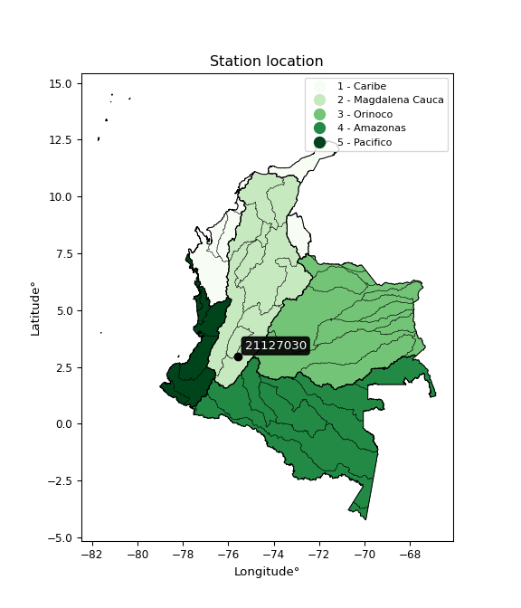</img>

</div>


## A. General information


### 1. General running parameters

• app_version: _v20251225_. • runtime: _2025-12-26 14:29:50.888910_. • Python version: _3.14.0_. • SciPy version: _1.16.3_. • Pandas version: _2.3.3_. • NumPy version: _2.3.5_. • Stations dataset (station_dataset_file): _dataset/pmax24h_in/automatic_colombia.csv_. • Stations catalog (station_catalog_file): _dataset/CNE_IDEAM.xls_. • Plot only fit distributions with Δo > Δ (plot_only_fit): _True_. • Eval low extreme values, if False, evaluates high extreme values (low_extreme): _False_. • Eval every SciPy distribution as logarithmic (pdist_logarithmic_on): _True_. • Standard deviation normalized (ddof): _1.0_. • Return periods to eval in years (Tr): _[2, 2.33, 5, 10, 15, 20, 25, 50, 75, 100, 200, 250, 500, 750, 1000]_. • Minimum data sample per station, 0 means any (minimum_sample): _5_. • Z-Score threshold to adjust a value, 0 means disable (zscore): _3.5_. • Avoid zeros, e.g. rain = 0 (avoid_zeros): _True_. • Avoid null values (avoid_nans): _True_. [:file_folder:Dataset file.](../../dataset/pmax24h_in/automatic_colombia.csv)


### 2. Station info and location

|   id |   CODIGO | NOMBRE                        | CATEGORIA    | TECNOLOGIA                              | ESTADO           | FECHA_INSTALACION   |   FECHA_SUSPENSION |   ALTITUD |   LATITUD |   LONGITUD | DEPARTAMENTO   | MUNICIPIO   | AREA_OPERATIVA                    | ENTIDAD                                                     | AREA_HIDROGRAFICA   | ZONA_HIDROGRAFICA   | SUBZONA_HIDROGRAFICA   | CORRIENTE   | OBSERVACION                                                                                   |   SUBRED | Catalogo   |
|-----:|---------:|:------------------------------|:-------------|:----------------------------------------|:-----------------|:--------------------|-------------------:|----------:|----------:|-----------:|:---------------|:------------|:----------------------------------|:------------------------------------------------------------|:--------------------|:--------------------|:-----------------------|:------------|:----------------------------------------------------------------------------------------------|---------:|:-----------|
|    0 | 21127030 | SANTA MARIA  - AUT [21127030] | Limnigráfica | Automática con Telemetría, Convencional | En Mantenimiento | 15/09/1971          |                nan |      1270 |   2.97178 |   -75.5924 | Huila          | Santa María | Area Operativa 04 - Huila-Caquetá | INSTITUTO DE HIDROLOGIA METEOROLOGIA Y ESTUDIOS AMBIENTALES | Magdalena Cauca     | Alto Magdalena      | Río Baché              | Bache       | Actializada Tecnologia y Tipo de Transmision por solicitud del coordinador del AO. (01022023) |      nan | CNE_IDEAM  |

<div align="center">

Map location in: [:earth_americas:Google](http://maps.google.com/maps?q=2.971777778,-75.59244444) [:earth_americas:OSM](https://www.openstreetmap.org/#map=18/2.971777778/-75.59244444&layers=P) [:earth_americas:Bing](https://www.bing.com/maps?cp=2.971777778~-75.59244444&lvl=18) [:earth_americas:Apple](https://maps.apple.com/frame?center=2.971777778%2C-75.59244444&span=0.003%2C0.006)

</div>


<div align="center">

```geojson
{
  "type": "Feature",
  "geometry": {
    "type": "Point", 
    "coordinates": [-75.59244444, 2.971777778]
  }, 
  "properties": {
    "Name": "21127030"
  }
}
```

</div>


### 3. Discrete values table and plot

|               |           0 |           1 |          2 |          3 |          4 |            5 |          6 |
|:--------------|------------:|------------:|-----------:|-----------:|-----------:|-------------:|-----------:|
| Date          | 2019        | 2020        | 2021       | 2022       | 2023       | 2024         | 2025       |
| Value         |   71.4      |   81        |  110.2     |   40.8     |   45.6     |   78         |  107.4     |
| Value_initial |   71.4      |   81        |  110.2     |   40.8     |   45.6     |   78         |  107.4     |
| count         |    7        |    7        |    7       |    7       |    7       |    7         |    7       |
| mean          |   76.3429   |   76.3429   |   76.3429  |   76.3429  |   76.3429  |   76.3429    |   76.3429  |
| std           |   26.9819   |   26.9819   |   26.9819  |   26.9819  |   26.9819  |   26.9819    |   26.9819  |
| zscore        |   -0.183192 |    0.172602 |    1.25481 |   -1.31729 |   -1.13939 |    0.0614168 |    1.15104 |

<div align="center">

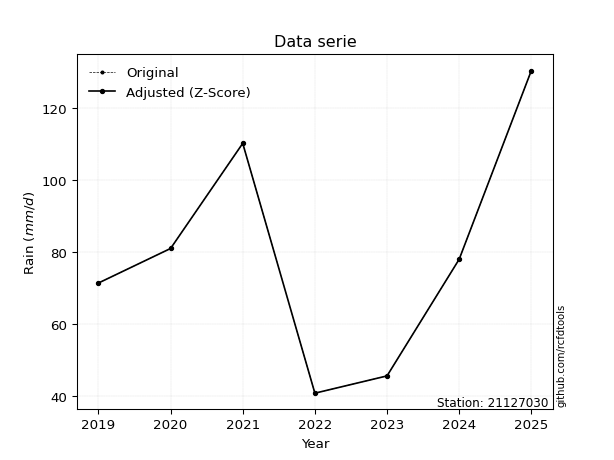</img>

</div>

> If Z-Score is active, values out of range or outliers are replaced with the station mean value.


### 4. Active continuous probability distributions from SciPy (45 of 104 available)

[scipy.stats](https://docs.scipy.org/doc/scipy/reference/stats.html) is a Python´s powerful submodule within the SciPy library for comprehensive statistical analysis, offering over 130 probability distributions (like Normal, Poisson), functions for descriptive stats (mean, variance), hypothesis testing (t-tests, chi-square), random variable generation, and statistical tests, making it essential for data science, modeling, and research. It provides tools to explore, model, and draw conclusions from data efficiently, working seamlessly with NumPy.

<div align="center">

|   id | p_dist             |   n_parameter | fit_method   | label                                                                       | active   | ref                                                                                                        |
|-----:|:-------------------|--------------:|:-------------|:----------------------------------------------------------------------------|:---------|:-----------------------------------------------------------------------------------------------------------|
|    0 | alpha              |             3 | MLE          | Alpha                                                                       | True     | [:mortar_board:](https://docs.scipy.org/doc/scipy/reference/generated/scipy.stats.alpha.html)              |
|    1 | betaprime          |             4 | MLE          | Beta prime                                                                  | True     | [:mortar_board:](https://docs.scipy.org/doc/scipy/reference/generated/scipy.stats.betaprime.html)          |
|    2 | chi2               |             3 | MLE          | Chi²                                                                        | True     | [:mortar_board:](https://docs.scipy.org/doc/scipy/reference/generated/scipy.stats.chi2.html)               |
|    3 | crystalball        |             4 | MLE          | Crystalball                                                                 | True     | [:mortar_board:](https://docs.scipy.org/doc/scipy/reference/generated/scipy.stats.crystalball.html)        |
|    4 | erlang             |             3 | MLE          | Erlang                                                                      | True     | [:mortar_board:](https://docs.scipy.org/doc/scipy/reference/generated/scipy.stats.erlang.html)             |
|    5 | expon              |             2 | MLE          | Exponential                                                                 | True     | [:mortar_board:](https://docs.scipy.org/doc/scipy/reference/generated/scipy.stats.expon.html)              |
|    6 | exponnorm          |             3 | MLE          | Exponentially modified Normal                                               | True     | [:mortar_board:](https://docs.scipy.org/doc/scipy/reference/generated/scipy.stats.exponnorm.html)          |
|    7 | f                  |             4 | MLE          | F                                                                           | True     | [:mortar_board:](https://docs.scipy.org/doc/scipy/reference/generated/scipy.stats.f.html)                  |
|    8 | fatiguelife        |             3 | MLE          | Fatigue-life (Birnbaum-Saunders)                                            | True     | [:mortar_board:](https://docs.scipy.org/doc/scipy/reference/generated/scipy.stats.fatiguelife.html)        |
|    9 | fisk               |             3 | MLE          | Fisk                                                                        | True     | [:mortar_board:](https://docs.scipy.org/doc/scipy/reference/generated/scipy.stats.fisk.html)               |
|   10 | gamma              |             3 | MLE          | Gamma                                                                       | True     | [:mortar_board:](https://docs.scipy.org/doc/scipy/reference/generated/scipy.stats.gamma.html)              |
|   11 | genexpon           |             5 | MLE          | Generalized exponential                                                     | True     | [:mortar_board:](https://docs.scipy.org/doc/scipy/reference/generated/scipy.stats.genexpon.html)           |
|   12 | genlogistic        |             3 | MLE          | Generalized logistic                                                        | True     | [:mortar_board:](https://docs.scipy.org/doc/scipy/reference/generated/scipy.stats.genlogistic.html)        |
|   13 | gibrat             |             2 | MM           | Gibrat                                                                      | True     | [:mortar_board:](https://docs.scipy.org/doc/scipy/reference/generated/scipy.stats.gibrat.html)             |
|   14 | gompertz           |             3 | MLE          | Gompertz (or truncated Gumbel)                                              | True     | [:mortar_board:](https://docs.scipy.org/doc/scipy/reference/generated/scipy.stats.gompertz.html)           |
|   15 | gumbel_l           |             2 | MM           | Gumbel Left Skew                                                            | True     | [:mortar_board:](https://docs.scipy.org/doc/scipy/reference/generated/scipy.stats.gumbel_l.html)           |
|   16 | gumbel_r           |             2 | MM           | Gumbel Right Skew                                                           | True     | [:mortar_board:](https://docs.scipy.org/doc/scipy/reference/generated/scipy.stats.gumbel_r.html)           |
|   17 | halflogistic       |             2 | MM           | Half-logistic                                                               | True     | [:mortar_board:](https://docs.scipy.org/doc/scipy/reference/generated/scipy.stats.halflogistic.html)       |
|   18 | halfnorm           |             2 | MM           | Half Normal                                                                 | True     | [:mortar_board:](https://docs.scipy.org/doc/scipy/reference/generated/scipy.stats.halfnorm.html)           |
|   19 | hypsecant          |             2 | MM           | hyperbolic secant                                                           | True     | [:mortar_board:](https://docs.scipy.org/doc/scipy/reference/generated/scipy.stats.hypsecant.html)          |
|   20 | invgamma           |             3 | MLE          | Inverted gamma                                                              | True     | [:mortar_board:](https://docs.scipy.org/doc/scipy/reference/generated/scipy.stats.invgamma.html)           |
|   21 | invgauss           |             3 | MLE          | Inverse Gaussian                                                            | True     | [:mortar_board:](https://docs.scipy.org/doc/scipy/reference/generated/scipy.stats.invgauss.html)           |
|   22 | invweibull         |             3 | MLE          | Inverted Weibull                                                            | True     | [:mortar_board:](https://docs.scipy.org/doc/scipy/reference/generated/scipy.stats.invweibull.html)         |
|   23 | johnsonsu          |             4 | MLE          | Johnson Su                                                                  | True     | [:mortar_board:](https://docs.scipy.org/doc/scipy/reference/generated/scipy.stats.johnsonsu.html)          |
|   24 | kstwobign          |             2 | MLE          | Limiting distribution of scaled Kolmogorov-Smirnov two-sided test statistic | True     | [:mortar_board:](https://docs.scipy.org/doc/scipy/reference/generated/scipy.stats.kstwobign.html)          |
|   25 | laplace            |             2 | MM           | Laplace                                                                     | True     | [:mortar_board:](https://docs.scipy.org/doc/scipy/reference/generated/scipy.stats.laplace.html)            |
|   26 | laplace_asymmetric |             3 | MLE          | Asymmetric Laplace                                                          | True     | [:mortar_board:](https://docs.scipy.org/doc/scipy/reference/generated/scipy.stats.laplace_asymmetric.html) |
|   27 | loggamma           |             3 | MLE          | Log gamma                                                                   | True     | [:mortar_board:](https://docs.scipy.org/doc/scipy/reference/generated/scipy.stats.loggamma.html)           |
|   28 | logistic           |             2 | MM           | Logistic (or Sech-squared)                                                  | True     | [:mortar_board:](https://docs.scipy.org/doc/scipy/reference/generated/scipy.stats.logistic.html)           |
|   29 | lognorm            |             3 | MLE          | Log Normal                                                                  | True     | [:mortar_board:](https://docs.scipy.org/doc/scipy/reference/generated/scipy.stats.lognorm.html)            |
|   30 | maxwell            |             2 | MM           | Maxwell                                                                     | True     | [:mortar_board:](https://docs.scipy.org/doc/scipy/reference/generated/scipy.stats.maxwell.html)            |
|   31 | mielke             |             4 | MLE          | Mielke Beta-Kappa / Dagum                                                   | True     | [:mortar_board:](https://docs.scipy.org/doc/scipy/reference/generated/scipy.stats.mielke.html)             |
|   32 | moyal              |             2 | MM           | Moyal                                                                       | True     | [:mortar_board:](https://docs.scipy.org/doc/scipy/reference/generated/scipy.stats.moyal.html)              |
|   33 | nakagami           |             3 | MLE          | Nakagami                                                                    | True     | [:mortar_board:](https://docs.scipy.org/doc/scipy/reference/generated/scipy.stats.nakagami.html)           |
|   34 | ncf                |             5 | MLE          | Non-central F distribution                                                  | True     | [:mortar_board:](https://docs.scipy.org/doc/scipy/reference/generated/scipy.stats.ncf.html)                |
|   35 | nct                |             4 | MLE          | Non-central Student’s t                                                     | True     | [:mortar_board:](https://docs.scipy.org/doc/scipy/reference/generated/scipy.stats.nct.html)                |
|   36 | norm               |             2 | MM           | Normal                                                                      | True     | [:mortar_board:](https://docs.scipy.org/doc/scipy/reference/generated/scipy.stats.norm.html)               |
|   37 | pareto             |             3 | MLE          | Pareto                                                                      | True     | [:mortar_board:](https://docs.scipy.org/doc/scipy/reference/generated/scipy.stats.pareto.html)             |
|   38 | pearson3           |             3 | MM           | Pearson type III                                                            | True     | [:mortar_board:](https://docs.scipy.org/doc/scipy/reference/generated/scipy.stats.pearson3.html)           |
|   39 | rayleigh           |             2 | MM           | Rayleigh                                                                    | True     | [:mortar_board:](https://docs.scipy.org/doc/scipy/reference/generated/scipy.stats.rayleigh.html)           |
|   40 | rice               |             3 | MLE          | Rice                                                                        | True     | [:mortar_board:](https://docs.scipy.org/doc/scipy/reference/generated/scipy.stats.rice.html)               |
|   41 | t                  |             3 | MLE          | Student’s t                                                                 | True     | [:mortar_board:](https://docs.scipy.org/doc/scipy/reference/generated/scipy.stats.t.html)                  |
|   42 | truncnorm          |             4 | MLE          | Truncated normal                                                            | True     | [:mortar_board:](https://docs.scipy.org/doc/scipy/reference/generated/scipy.stats.truncnorm.html)          |
|   43 | wald               |             2 | MM           | Wald                                                                        | True     | [:mortar_board:](https://docs.scipy.org/doc/scipy/reference/generated/scipy.stats.wald.html)               |
|   44 | weibull_min        |             3 | MLE          | Weibull minimum                                                             | True     | [:mortar_board:](https://docs.scipy.org/doc/scipy/reference/generated/scipy.stats.weibull_min.html)        |

</div>

> **n_parameter:** # arguments & localization & scale.
>
> **Fit methods:** (MLE) maximum likelihood, (MM) L-moments.
>
>**Inactive:** foldnorm, gennorm, norminvgauss, powernorm, powerlognorm, skewnorm, genextreme, anglit, arcsine, argus, beta, bradford, burr, burr12, cauchy, cosine, halfcauchy, foldcauchy, skewcauchy, wrapcauchy, dgamma, gengamma, exponweib, exponpow, truncexpon, gausshyper, genhalflogistic, genhyperbolic, geninvgauss, halfgennorm, johnsonsb, kappa4, kappa3, ksone, kstwo, loglaplace, levy, levy_l, levy_stable, ncx2, genpareto, truncpareto, lomax, powerlaw, rdist, rel_breitwigner, recipinvgauss, semicircular, studentized_range, trapezoid, triang, truncweibull_min, tukeylambda, uniform, loguniform, vonmises, vonmises_line, weibull_max, dweibull, 


## B. Probability distributions vs. Empirical distributions

A continuous probability distribution (CPD) describes probabilities for variables that can take any value within a range (like rain any time), unlike discrete variables with specific outcomes (like temperature). It uses a Probability Density Function (PDF), a curve where the total area under it equals 1, and the probability of the variable falling within an interval (a to b) is found by calculating the area under the curve between those points. A key feature is that the probability of hitting any single exact value is zero, so probabilities are always expressed for ranges, e.g., $P(a ≤ X ≤ b)$.

<div align="center">

Distributions parameters
|    |   station | p_dist                |   n |             loc |           scale | shape                  | shape1                | shape2             | shape3   |
|---:|----------:|:----------------------|----:|----------------:|----------------:|:-----------------------|:----------------------|:-------------------|:---------|
|  0 |  21127030 | alpha                 |   7 |  -274.113       |  4804.69        | 13.795785876739824     |                       |                    |          |
|  1 |  21127030 | betaprime             |   7 |   -60.6591      | 28254.4         | 28.89748528088102      | 5952.207824656289     |                    |          |
|  2 |  21127030 | chi2                  |   7 |    40.8         |     1.67626     | 0.32429446842060927    |                       |                    |          |
|  3 |  21127030 | crystalball           |   7 |    76.3429      |    24.9804      | 4369.1240329139        | 5363.791975288315     |                    |          |
|  4 |  21127030 | erlang                |   7 | -1100.04        |     0.531631    | 2212.765173332994      |                       |                    |          |
|  5 |  21127030 | expon                 |   7 |    40.8         |    35.5429      |                        |                       |                    |          |
|  6 |  21127030 | exponnorm             |   7 |    76.3154      |    24.9803      | 0.0011017575398577129  |                       |                    |          |
|  7 |  21127030 | f                     |   7 |     0.649146    |    75.6852      | 16.700652185682216     | 16516.727242957088    |                    |          |
|  8 |  21127030 | fatiguelife           |   7 |    40.8         |     1.76076e-05 | 1295.5298483906372     |                       |                    |          |
|  9 |  21127030 | fisk                  |   7 |    -3.46212e+08 |     3.46212e+08 | 22892902.337772567     |                       |                    |          |
| 10 |  21127030 | gamma                 |   7 | -1113.55        |     0.525825    | 2262.8893397596457     |                       |                    |          |
| 11 |  21127030 | genexpon              |   7 |    40.3177      |     1.84483     | 0.0513365183037114     | 9.305626802811512e-09 | 2.7943318269816806 |          |
| 12 |  21127030 | genlogistic           |   7 |   -49.9687      |    22.6011      | 154.34452680529705     |                       |                    |          |
| 13 |  21127030 | gibrat                |   7 |    57.286       |    11.5586      |                        |                       |                    |          |
| 14 |  21127030 | gompertz              |   7 |    71.4         |     4.66577     | 0.0007685515706159753  |                       |                    |          |
| 15 |  21127030 | gumbel_l              |   7 |    87.5854      |    19.4771      |                        |                       |                    |          |
| 16 |  21127030 | gumbel_r              |   7 |    65.1004      |    19.4771      |                        |                       |                    |          |
| 17 |  21127030 | halflogistic          |   7 |    46.7353      |    21.3573      |                        |                       |                    |          |
| 18 |  21127030 | halfnorm              |   7 |    43.2787      |    41.4398      |                        |                       |                    |          |
| 19 |  21127030 | hypsecant             |   7 |    76.3429      |    15.903       |                        |                       |                    |          |
| 20 |  21127030 | invgamma              |   7 |  -166.97        | 22157.3         | 92.02509516696784      |                       |                    |          |
| 21 |  21127030 | invgauss              |   7 |   -25.0771      |  1441.8         | 0.0704328336299137     |                       |                    |          |
| 22 |  21127030 | invweibull            |   7 |    40.8         |     1.4477      | 0.07454686318271966    |                       |                    |          |
| 23 |  21127030 | johnsonsu             |   7 |   475.619       |   438.7         | 19.33816456849452      | 23.705145886861132    |                    |          |
| 24 |  21127030 | kstwobign             |   7 |   -14.0586      |   103.11        |                        |                       |                    |          |
| 25 |  21127030 | laplace               |   7 |    76.3429      |    17.6638      |                        |                       |                    |          |
| 26 |  21127030 | laplace_asymmetric    |   7 |    78           |    20.0686      | 1.0420383958325146     |                       |                    |          |
| 27 |  21127030 | loggamma              |   7 |  -702.21        |   191.304       | 59.040329460151064     |                       |                    |          |
| 28 |  21127030 | logistic              |   7 |    76.3429      |    13.7724      |                        |                       |                    |          |
| 29 |  21127030 | lognorm               |   7 |    40.8         |     0.184268    | 12.63661159831706      |                       |                    |          |
| 30 |  21127030 | maxwell               |   7 |    17.1498      |    37.0937      |                        |                       |                    |          |
| 31 |  21127030 | mielke                |   7 |    -1.53913     |   112.313       | 2.356051134572483      | 860.1943517938197     |                    |          |
| 32 |  21127030 | moyal                 |   7 |    62.0575      |    11.2451      |                        |                       |                    |          |
| 33 |  21127030 | nakagami              |   7 |    40.8         |    44.1237      | 0.1770330886070811     |                       |                    |          |
| 34 |  21127030 | ncf                   |   7 |    -0.380357    |     0.026393    | 0.031732086414802296   | 26.94942988795924     | 85.44131856885025  |          |
| 35 |  21127030 | nct                   |   7 | -1663.36        |    24.9145      | 447386.7321593608      | 69.82658617347053     |                    |          |
| 36 |  21127030 | norm                  |   7 |    76.3429      |    24.9804      |                        |                       |                    |          |
| 37 |  21127030 | pareto                |   7 |    40.7686      |     0.0314157   | 0.16862930202076734    |                       |                    |          |
| 38 |  21127030 | pearson3              |   7 |    76.3429      |    24.9804      | -0.04769244965833231   |                       |                    |          |
| 39 |  21127030 | rayleigh              |   7 |    28.5539      |    38.1301      |                        |                       |                    |          |
| 40 |  21127030 | rice                  |   7 |    27.3224      |    29.9685      | 1.1706598987260928     |                       |                    |          |
| 41 |  21127030 | t                     |   7 |    76.343       |    24.9778      | 256412.2530341827      |                       |                    |          |
| 42 |  21127030 | truncnorm             |   7 |    76.3429      |    24.9804      | -701.7936332148597     | 1200.9025392970416    |                    |          |
| 43 |  21127030 | wald                  |   7 |    51.3625      |    24.9804      |                        |                       |                    |          |
| 44 |  21127030 | weibull_min           |   7 |    40.8         |    30.9138      | 0.3448313091466949     |                       |                    |          |
| 45 |  21127030 | logalpha              |   7 |    -6.3219      |   305.633       | 28.888233251861536     |                       |                    |          |
| 46 |  21127030 | logbetaprime          |   7 |    -3.37733     |    17.6017      | 456.56359990326746     | 1052.5500891137672    |                    |          |
| 47 |  21127030 | logchi2               |   7 |     3.70868     |     0.989189    | 1.0262024000458125     |                       |                    |          |
| 48 |  21127030 | logcrystalball        |   7 |     4.27527     |     0.357101    | 3585.1238758641184     | 16.230937379625473    |                    |          |
| 49 |  21127030 | logerlang             |   7 |    -1.36664     |     0.022949    | 245.76318625754334     |                       |                    |          |
| 50 |  21127030 | logexpon              |   7 |     3.70868     |     0.56659     |                        |                       |                    |          |
| 51 |  21127030 | logexponnorm          |   7 |     4.27498     |     0.357101    | 0.0008258537765638294  |                       |                    |          |
| 52 |  21127030 | logf                  |   7 |  -318.593       |   322.867       | 3656873.950636514      | 2960315.2180644227    |                    |          |
| 53 |  21127030 | logfatiguelife        |   7 |  -105.8         |   110.075       | 0.0032370023810630233  |                       |                    |          |
| 54 |  21127030 | logfisk               |   7 |    -1.74367e+07 |     1.74367e+07 | 81387333.5093511       |                       |                    |          |
| 55 |  21127030 | loggamma              |   7 |    -2.01224     |     0.0213183   | 294.9069639072251      |                       |                    |          |
| 56 |  21127030 | loggenexpon           |   7 |     3.70868     |     0.817341    | 1.1018688926610263     | 1.4094846810648727    | 0.6656687281965671 |          |
| 57 |  21127030 | loggenlogistic        |   7 |     4.7023      |     5.77877e-07 | 1.3493315282469655e-06 |                       |                    |          |
| 58 |  21127030 | loggibrat             |   7 |     4.00283     |     0.165244    |                        |                       |                    |          |
| 59 |  21127030 | loggompertz           |   7 |     3.70868     |     0.413654    | 0.22849810134375664    |                       |                    |          |
| 60 |  21127030 | loggumbel_l           |   7 |     4.43599     |     0.27843     |                        |                       |                    |          |
| 61 |  21127030 | loggumbel_r           |   7 |     4.11456     |     0.27843     |                        |                       |                    |          |
| 62 |  21127030 | loghalflogistic       |   7 |     3.85201     |     0.305317    |                        |                       |                    |          |
| 63 |  21127030 | loghalfnorm           |   7 |     3.80257     |     0.592436    |                        |                       |                    |          |
| 64 |  21127030 | loghypsecant          |   7 |     4.27527     |     0.227337    |                        |                       |                    |          |
| 65 |  21127030 | loginvgamma           |   7 |    -1.73986     |  1621.92        | 270.8756452471449      |                       |                    |          |
| 66 |  21127030 | loginvgauss           |   7 |     1.60145     |   136.091       | 0.019629370191838094   |                       |                    |          |
| 67 |  21127030 | loginvweibull         |   7 |    -5.909e+07   |     5.909e+07   | 169799643.72392386     |                       |                    |          |
| 68 |  21127030 | logjohnsonsu          |   7 |     4.78818     |     0.000708546 | 7.627436796134997      | 1.0988908938870878    |                    |          |
| 69 |  21127030 | logkstwobign          |   7 |     2.8904      |     1.57703     |                        |                       |                    |          |
| 70 |  21127030 | loglaplace            |   7 |     4.27527     |     0.252508    |                        |                       |                    |          |
| 71 |  21127030 | loglaplace_asymmetric |   7 |     4.39445     |     0.268291    | 1.2465127518999057     |                       |                    |          |
| 72 |  21127030 | logloggamma           |   7 |     4.70233     |     1.48806e-06 | 3.4947653425953115e-06 |                       |                    |          |
| 73 |  21127030 | loglogistic           |   7 |     4.27527     |     0.19688     |                        |                       |                    |          |
| 74 |  21127030 | loglognorm            |   7 |     3.70868     |     0.0038174   | 12.177950177815953     |                       |                    |          |
| 75 |  21127030 | logmaxwell            |   7 |     3.42909     |     0.530264    |                        |                       |                    |          |
| 76 |  21127030 | logmielke             |   7 |     2.52253     |     2.18291     | 4.438160156127523      | 3140.9852560289983    |                    |          |
| 77 |  21127030 | logmoyal              |   7 |     4.07106     |     0.160752    |                        |                       |                    |          |
| 78 |  21127030 | lognakagami           |   7 |     3.70868     |     0.722113    | 0.08057057385370045    |                       |                    |          |
| 79 |  21127030 | logncf                |   7 |    -1.16263     |     0.109081    | 4.954059097630483      | 775.1668660946027     | 241.0540121969967  |          |
| 80 |  21127030 | lognct                |   7 |   -34.8066      |     0.35681     | 3631308.2167951725     | 109.53104675055403    |                    |          |
| 81 |  21127030 | lognorm               |   7 |     4.27527     |     0.357101    |                        |                       |                    |          |
| 82 |  21127030 | logpareto             |   7 |     3.70815     |     0.000534146 | 0.16830691850109178    |                       |                    |          |
| 83 |  21127030 | logpearson3           |   7 |     4.27527     |     0.357101    | -0.41278656993563984   |                       |                    |          |
| 84 |  21127030 | lograyleigh           |   7 |     3.59212     |     0.545079    |                        |                       |                    |          |
| 85 |  21127030 | logrice               |   7 |     3.50561     |     0.406619    | 1.5343175754307903     |                       |                    |          |
| 86 |  21127030 | logt                  |   7 |     4.27532     |     0.357059    | 3432.7816194866455     |                       |                    |          |
| 87 |  21127030 | logtruncnorm          |   7 |    -0.111857    |     1.08005     | 4.055515736649953      | 4.457437586595201     |                    |          |
| 88 |  21127030 | logwald               |   7 |     3.91819     |     0.357078    |                        |                       |                    |          |
| 89 |  21127030 | logweibull_min        |   7 |    -9.32482e+06 |     9.32482e+06 | 32501341.704055525     |                       |                    |          |

</div>

> **loc** (Location parameter): This shifts the distribution along the x-axis. For many common distributions, like the normal (Gaussian) distribution, loc represents the mean $μ$. For others, like the uniform distribution, it might represent the minimum value, or for the beta distribution, the left end of the support interval.
>
> **scale** (Scale parameter): This determines the width or spread of the distribution. For the normal distribution, scale represents the standard deviation $σ$. For a uniform distribution, it defines the length of the interval (from $loc$ to $loc + scale$).
>
> **shape** (Shape parameters): Refers to parameters that define the specific form of a probability distribution, distinct from its location (loc) and scale (scale). These parameters are required arguments for most distribution functions. For example, a normal (Gaussian) distribution is fully defined by its location (mean) and scale (standard deviation), so it has no specific shape parameters beyond loc and scale. However, other distributions have intrinsic properties that need specification, as Gamma distribution that takes a shape parameter, often named $a$ or $alpha$.


### 0. Cumulative distribution values - CDF (90 evaluated)

> Ordered by x ascending and calculating $log(f(x))$ separately. 

|   id |   Station |   date |     x |   count |    mean |     std |     zscore |   Value_initial |   station |   m |     alpha |   alpha_pdf |   betaprime |   betaprime_pdf |       chi2 |    chi2_pdf |   crystalball |   crystalball_pdf |   erlang |   erlang_pdf |    expon |   expon_pdf |   exponnorm |   exponnorm_pdf |         f |      f_pdf |   fatiguelife |   fatiguelife_pdf |      fisk |   fisk_pdf |    gamma |   gamma_pdf |   genexpon |   genexpon_pdf |   genlogistic |   genlogistic_pdf |   gibrat |   gibrat_pdf |    gompertz |   gompertz_pdf |   gumbel_l |   gumbel_l_pdf |   gumbel_r |   gumbel_r_pdf |   halflogistic |   halflogistic_pdf |   halfnorm |   halfnorm_pdf |   hypsecant |   hypsecant_pdf |   invgamma |   invgamma_pdf |   invgauss |   invgauss_pdf |   invweibull |   invweibull_pdf |   johnsonsu |   johnsonsu_pdf |   kstwobign |   kstwobign_pdf |   laplace |   laplace_pdf |   laplace_asymmetric |   laplace_asymmetric_pdf |   loggamma |   loggamma_pdf |   logistic |   logistic_pdf |   lognorm |   lognorm_pdf |   maxwell |   maxwell_pdf |   mielke |   mielke_pdf |     moyal |   moyal_pdf |    nakagami |   nakagami_pdf |       ncf |    ncf_pdf |       nct |    nct_pdf |      norm |   norm_pdf |   pareto |   pareto_pdf |   pearson3 |   pearson3_pdf |   rayleigh |   rayleigh_pdf |      rice |   rice_pdf |         t |      t_pdf |   truncnorm |   truncnorm_pdf |     wald |   wald_pdf |   weibull_min |   weibull_min_pdf |   logalpha |   logalpha_pdf |   logbetaprime |   logbetaprime_pdf |     logchi2 |   logchi2_pdf |   logcrystalball |   logcrystalball_pdf |   logerlang |   logerlang_pdf |   logexpon |   logexpon_pdf |   logexponnorm |   logexponnorm_pdf |      logf |   logf_pdf |   logfatiguelife |   logfatiguelife_pdf |   logfisk |   logfisk_pdf |   loggenexpon |   loggenexpon_pdf |   loggenlogistic |   loggenlogistic_pdf |   loggibrat |   loggibrat_pdf |   loggompertz |   loggompertz_pdf |   loggumbel_l |   loggumbel_l_pdf |   loggumbel_r |   loggumbel_r_pdf |   loghalflogistic |   loghalflogistic_pdf |   loghalfnorm |   loghalfnorm_pdf |   loghypsecant |   loghypsecant_pdf |   loginvgamma |   loginvgamma_pdf |   loginvgauss |   loginvgauss_pdf |   loginvweibull |   loginvweibull_pdf |   logjohnsonsu |   logjohnsonsu_pdf |   logkstwobign |   logkstwobign_pdf |   loglaplace |   loglaplace_pdf |   loglaplace_asymmetric |   loglaplace_asymmetric_pdf |   logloggamma |   logloggamma_pdf |   loglogistic |   loglogistic_pdf |   loglognorm |   loglognorm_pdf |   logmaxwell |   logmaxwell_pdf |   logmielke |   logmielke_pdf |   logmoyal |   logmoyal_pdf |   lognakagami |   lognakagami_pdf |   logncf |   logncf_pdf |    lognct |   lognct_pdf |   logpareto |   logpareto_pdf |   logpearson3 |   logpearson3_pdf |   lograyleigh |   lograyleigh_pdf |   logrice |   logrice_pdf |      logt |   logt_pdf |   logtruncnorm |   logtruncnorm_pdf |   logwald |   logwald_pdf |   logweibull_min |   logweibull_min_pdf |
|-----:|----------:|-------:|------:|--------:|--------:|--------:|-----------:|----------------:|----------:|----:|----------:|------------:|------------:|----------------:|-----------:|------------:|--------------:|------------------:|---------:|-------------:|---------:|------------:|------------:|----------------:|----------:|-----------:|--------------:|------------------:|----------:|-----------:|---------:|------------:|-----------:|---------------:|--------------:|------------------:|---------:|-------------:|------------:|---------------:|-----------:|---------------:|-----------:|---------------:|---------------:|-------------------:|-----------:|---------------:|------------:|----------------:|-----------:|---------------:|-----------:|---------------:|-------------:|-----------------:|------------:|----------------:|------------:|----------------:|----------:|--------------:|---------------------:|-------------------------:|-----------:|---------------:|-----------:|---------------:|----------:|--------------:|----------:|--------------:|---------:|-------------:|----------:|------------:|------------:|---------------:|----------:|-----------:|----------:|-----------:|----------:|-----------:|---------:|-------------:|-----------:|---------------:|-----------:|---------------:|----------:|-----------:|----------:|-----------:|------------:|----------------:|---------:|-----------:|--------------:|------------------:|-----------:|---------------:|---------------:|-------------------:|------------:|--------------:|-----------------:|---------------------:|------------:|----------------:|-----------:|---------------:|---------------:|-------------------:|----------:|-----------:|-----------------:|---------------------:|----------:|--------------:|--------------:|------------------:|-----------------:|---------------------:|------------:|----------------:|--------------:|------------------:|--------------:|------------------:|--------------:|------------------:|------------------:|----------------------:|--------------:|------------------:|---------------:|-------------------:|--------------:|------------------:|--------------:|------------------:|----------------:|--------------------:|---------------:|-------------------:|---------------:|-------------------:|-------------:|-----------------:|------------------------:|----------------------------:|--------------:|------------------:|--------------:|------------------:|-------------:|-----------------:|-------------:|-----------------:|------------:|----------------:|-----------:|---------------:|--------------:|------------------:|---------:|-------------:|----------:|-------------:|------------:|----------------:|--------------:|------------------:|--------------:|------------------:|----------:|--------------:|----------:|-----------:|---------------:|-------------------:|----------:|--------------:|-----------------:|---------------------:|
|    0 |  21127030 |   2022 |  40.8 |       7 | 76.3429 | 26.9819 | -1.31729   |            40.8 |  21127030 |   1 | 0.0719542 |  0.00664417 |   0.0697738 |      0.00641749 | 0.00449379 | 1.02549e+11 |     0.0773926 |        0.00580374 | 0.076612 |   0.00587175 | 0        |  0.028135   |   0.0773914 |      0.00580369 | 0.0622908 | 0.00720424 |     0.0945374 |       1.81823e+10 | 0.0859355 | 0.00519407 | 0.076671 |  0.00587252 |  0.0133311 |     0.0274563  |      0.063484 |        0.00767525 | 0        |   0          | 0           |    0           |  0.0865537 |     0.00424574 |  0.0307428 |     0.00549616 |       0        |         0          |  0         |     0          |   0.0678567 |      0.00423467 |  0.0688711 |     0.00643248 |  0.0633387 |     0.00734171 |  8.63249e-06 |      1.05602e+09 |   0.0798183 |      0.00569569 |   0.0603036 |      0.00848259 | 0.066848  |    0.00378446 |            0.0878889 |               0.00420276 |  0.0575765 |       0.335528 |  0.070389  |     0.00475112 | 0.0562973 |      0.317299 | 0.0611048 |    0.00713568 | 0.100408 |   0.0055874  | 0.0100736 |  0.0033306  | 2.03766e-06 |    1.01538e+08 | 0.0557487 | 0.00775463 | 0.0774156 | 0.00580586 | 0.0773926 | 0.00580374 | 0        |  5.36768     |  0.0785377 |     0.00573976 |  0.0502664 |     0.00799952 | 0.0501438 | 0.00731755 | 0.0773714 | 0.00580309 |   0.0773926 |      0.00580374 | 0        | 0          |   4.04886e-06 |       1.96494e+08 |  0.0568346 |       0.346783 |      0.0938325 |           0.417468 | 1.05384e-08 |   1.21761e+07 |        0.0562973 |             0.317299 |   0.0543713 |        0.328797 |   0        |       1.76495  |      0.0562969 |           0.317297 | 0.0562713 |   0.317861 |        0.0555759 |             0.31641  | 0.0588607 |      0.258566 |   9.27611e-11 |          1.34811  |         0        |             0.229447 |    0        |        0        |   2.63003e-09 |          0.552389 |     0.0707487 |          0.24489  |     0.0136205 |          0.210164 |          0        |              0        |     0         |          0        |      0.052542  |           0.230071 |     0.0550316 |          0.34697  |      0.051378 |          0.360422 |       0.0502808 |            0.432031 |       0.117457 |           0.200577 |      0.0494285 |           0.493177 |     0.053025 |         0.209993 |               0.0782814 |                    0.234075 |     0.0969448 |          0.227679 |     0.0532598 |          0.256111 |   0.00723069 |      3.70786e+12 |    0.0358898 |         0.364029 |   0.0667343 |        0.249697 | 0.00202334 |      0.0653474 |    0.00301089 |       1.09253e+12 | 0.230922 |     0.43891  | 0.0562976 |     0.317311 |    0        |     315.095     |     0.0658224 |          0.297148 |     0.0226064 |          0.383459 | 0.0387939 |      0.385015 | 0.0563079 |   0.317185 |    0           |           0        |  0        |      0        |        0.0739651 |             0.248024 |
|    1 |  21127030 |   2023 |  45.6 |       7 | 76.3429 | 26.9819 | -1.13939   |            45.6 |  21127030 |   2 | 0.108913  |  0.00877582 |   0.105446  |      0.0084672  | 0.978249   | 0.00920586  |     0.109221  |        0.00748903 | 0.108862 |   0.00759598 | 0.126326 |  0.0245809  |   0.10922   |      0.00748899 | 0.102939  | 0.00972691 |     0.656531  |       0.0154417   | 0.114365  | 0.0066974  | 0.108922 |  0.00759582 |  0.136699  |     0.0240233  |      0.10718  |        0.0105144  | 0        |   0          | 0           |    0           |  0.109374  |     0.00529657 |  0.0657743 |     0.0091906  |       0        |         0          |  0.0446717 |     0.0192239  |   0.091479  |      0.00567345 |  0.10475   |     0.00854032 |  0.104816  |     0.00993159 |  0.400708    |      0.00569129  |   0.110934  |      0.00730011 |   0.108703  |      0.0116075  | 0.0877212 |    0.00496616 |            0.110565  |               0.00528711 |  0.10493   |       0.521964 |  0.0968954 |     0.00635377 | 0.101125  |      0.495479 | 0.100885  |    0.00942908 | 0.129316 |   0.00646332 | 0.0376416 |  0.00850003 | 0.362805    |    0.0267143   | 0.100733  | 0.0109611  | 0.109255  | 0.00749154 | 0.109221  | 0.00748903 | 0.572221 |  0.0149306   |  0.109954  |     0.00738141 |  0.0950968 |     0.0106094  | 0.0909256 | 0.00963624 | 0.109197  | 0.00748858 |   0.109221  |      0.00748903 | 0        | 0          |   0.40909     |       0.0223331   |  0.106062  |       0.544264 |      0.148674  |           0.570028 | 0.252676    |   1.12296     |        0.101125  |             0.495479 |   0.101237  |        0.520536 |   0.17824  |       1.45036  |      0.101124  |           0.495477 | 0.101192  |   0.496602 |        0.100374  |             0.495935 | 0.0951113 |      0.401716 |   0.146471    |          1.27813  |         0        |             0.29749  |    0        |        0        |   0.0680656   |          0.673606 |     0.103634  |          0.352219 |     0.05606   |          0.580136 |          0        |              0        |     0.0233401 |          1.34621  |      0.0853807 |           0.371081 |     0.104593  |          0.550226 |      0.103566 |          0.583209 |       0.113936  |            0.71116  |       0.142692 |           0.255885 |      0.122009  |           0.801022 |     0.082372 |         0.326215 |               0.109169  |                    0.326434 |     0.125884  |          0.295644 |     0.0900601 |          0.41624  |   0.609069   |      0.283454    |    0.0906964 |         0.622948 |   0.0993367 |        0.339818 | 0.0289594  |      0.499133  |    0.629306   |       0.910113    | 0.282128 |     0.480444 | 0.101127  |     0.4955   |    0.593161 |       0.612688  |     0.106506  |          0.440407 |     0.083618  |          0.702577 | 0.0936635 |      0.601315 | 0.101119  |   0.495305 |    0           |           0        |  0        |      0        |        0.107057  |             0.352415 |
|    2 |  21127030 |   2019 |  71.4 |       7 | 76.3429 | 26.9819 | -0.183192  |            71.4 |  21127030 |   3 | 0.456143  |  0.0159592  |   0.444071  |      0.0158258  | 0.999997   | 8.86818e-07 |     0.421574  |        0.0156606  | 0.424515 |   0.0157099  | 0.577232 |  0.0118946  |   0.421572  |      0.0156607  | 0.469537  | 0.015828   |     0.845558  |       0.00395256  | 0.415588  | 0.0160598  | 0.424505 |  0.0157059  |  0.578922  |     0.0117175  |      0.488383 |        0.0154501  | 0.579158 |   0.0277074  | 2.74258e-09 |    0.000164722 |  0.353134  |     0.0144675  |  0.484976  |     0.0180189  |       0.520794 |         0.0170614  |  0.502613  |     0.0152941  |   0.402621  |      0.0190863  |  0.447811  |     0.0159661  |  0.474508  |     0.0156902  |  0.450874    |      0.000874955 |   0.416355  |      0.0155035  |   0.501944  |      0.0152239  | 0.377956  |    0.0213972  |            0.379682  |               0.018156   |  0.500796  |       1.09035  |  0.411227  |     0.01758    | 0.492209  |      1.11696  | 0.455927  |    0.0157897  | 0.361668 |   0.0116825  | 0.509206  |  0.0188334  | 0.690525    |    0.00743079  | 0.498862  | 0.0158267  | 0.421658  | 0.0156605  | 0.421574  | 0.0156606  | 0.686698 |  0.00172476  |  0.418589  |     0.0155873  |  0.468117  |     0.0156745  | 0.44675   | 0.0158524  | 0.421564  | 0.0156621  |   0.421574  |      0.0156606  | 0.57588  | 0.0216943  |   0.630826    |       0.00414561  |  0.511254  |       1.08675  |      0.512767  |           0.93065  | 0.537876    |   0.407647    |        0.492209  |             1.11696  |   0.502836  |        1.1094   |   0.627564 |       0.657328 |      0.492208  |           1.11696  | 0.492884  |   1.11737  |        0.492676  |             1.11952  | 0.460118  |      1.15947  |   0.611094    |          0.769777 |         0        |             0.847561 |    0.682278 |        1.34304  |   0.480786    |          1.10951  |     0.421647  |          1.13741  |     0.562311  |          1.16267  |          0.592641 |              1.06246  |     0.5682    |          0.988796 |      0.490237  |           1.39951  |     0.514293  |          1.09078  |      0.522973 |          1.06855  |       0.549455  |            0.94549  |       0.35016  |           0.783058 |      0.57      |           0.923377 |     0.48638  |         1.92619  |               0.417239  |                    1.24762  |     0.360836  |          0.847439 |     0.491145  |          1.26941  |   0.658938   |      0.0538295   |    0.525554  |         1.07725  |   0.370918  |        0.942964 | 0.588192   |      1.16053   |    0.813662   |       0.224025    | 0.517493 |     0.536744 | 0.492218  |     1.11694  |    0.689826 |       0.0931971 |     0.4648    |          1.10853  |     0.53673   |          1.05434  | 0.510138  |      1.08292  | 0.492158  |   1.117    |    4.04991e-08 |           4.74887  |  0.660194 |      1.15057  |        0.417479  |             1.09718  |
|    3 |  21127030 |   2024 |  78   |       7 | 76.3429 | 26.9819 |  0.0614168 |            78   |  21127030 |   4 | 0.559814  |  0.0152859  |   0.547541  |      0.0153589  | 1          | 1.05145e-07 |     0.526446  |        0.0159351  | 0.529416 |   0.015894   | 0.648879 |  0.00987881 |   0.526444  |      0.0159352  | 0.57079   | 0.0147191  |     0.869058  |       0.00320606  | 0.523858  | 0.0164933  | 0.529382 |  0.0158908  |  0.649571  |     0.0097515  |      0.585389 |        0.0138453  | 0.720182 |   0.0162459  | 0.00239093  |    0.000676155 |  0.457366  |     0.0170314  |  0.597103  |     0.0158086  |       0.624252 |         0.014288   |  0.597898  |     0.0135543  |   0.533109  |      0.0199075  |  0.55188   |     0.0153968  |  0.574393  |     0.0144521  |  0.456095    |      0.000717532 |   0.520748  |      0.0159509  |   0.59728   |      0.0135955  | 0.544775  |    0.0257716  |            0.520578  |               0.0248935  |  0.595807  |       1.04894  |  0.530045  |     0.0180867  | 0.590196  |      1.08849  | 0.55825   |    0.0150733  | 0.443553 |   0.0131386  | 0.622576  |  0.0154697  | 0.735632    |    0.0062889   | 0.597559  | 0.0139879  | 0.526524  | 0.0159335  | 0.526446  | 0.0159351  | 0.696839 |  0.00137308  |  0.523294  |     0.0159596  |  0.56864   |     0.0146702  | 0.550014  | 0.0152983  | 0.526447  | 0.0159367  |   0.526446  |      0.0159351  | 0.693302 | 0.0144735  |   0.655586    |       0.00340303  |  0.605324  |       1.03177  |      0.593799  |           0.896269 | 0.571873    |   0.36296     |        0.590196  |             1.08849  |   0.599364  |        1.06375  |   0.681372 |       0.562361 |      0.590195  |           1.0885   | 0.590881  |   1.08812  |        0.590831  |             1.08968  | 0.562865  |      1.14845  |   0.674636    |          0.668718 |         0        |             1.0419   |    0.776832 |        0.843567 |   0.5794      |          1.11295  |     0.52868   |          1.27334  |     0.657654  |          0.989861 |          0.678598 |              0.883513 |     0.650391  |          0.869604 |      0.611662  |           1.31489  |     0.608486  |          1.03061  |      0.614464 |          0.993133 |       0.628462  |            0.83882  |       0.428556 |           0.999713 |      0.647072  |           0.818301 |     0.637836 |         1.43426  |               0.543497  |                    1.62515  |     0.444105  |          1.043    |     0.60196   |          1.21701  |   0.663346   |      0.0462534   |    0.617566  |         0.996971 |   0.461849  |        1.11754  | 0.680867   |      0.937909  |    0.832125   |       0.194847    | 0.564471 |     0.524793 | 0.590203  |     1.08847  |    0.697384 |       0.0785315 |     0.56458   |          1.13725  |     0.626116  |          0.962162 | 0.6039    |      1.02952  | 0.590151  |   1.08856  |    0.356907    |           3.39593  |  0.745459 |      0.803747 |        0.520696  |             1.22859  |
|    4 |  21127030 |   2020 |  81   |       7 | 76.3429 | 26.9819 |  0.172602  |            81   |  21127030 |   5 | 0.604793  |  0.0146725  |   0.592874  |      0.0148339  | 1          | 4.0266e-08  |     0.573947  |        0.0156951  | 0.576735 |   0.0156151  | 0.677299 |  0.00907921 |   0.573946  |      0.0156951  | 0.613872  | 0.0139832  |     0.878256  |       0.00293148  | 0.572945  | 0.0161791  | 0.576692 |  0.0156125  |  0.677637  |     0.00897048 |      0.625616 |        0.0129631  | 0.763818 |   0.0129946  | 0.00523294  |    0.00128248  |  0.509887  |     0.0179446  |  0.642715  |     0.0145871  |       0.665252 |         0.0130503  |  0.637319  |     0.0127232  |   0.591912  |      0.0191871  |  0.597252  |     0.0148223  |  0.616616  |     0.0136793  |  0.458164    |      0.000663151 |   0.568417  |      0.0157906  |   0.636809  |      0.0127503  | 0.615881  |    0.0217461  |            0.589732  |               0.0213027  |  0.634765  |       1.01401  |  0.583741  |     0.0176431  | 0.630711  |      1.05666  | 0.602626  |    0.0144867  | 0.483981 |   0.0138151  | 0.666659  |  0.0139274  | 0.753839    |    0.00585663  | 0.638076  | 0.013016   | 0.57402   | 0.0156928  | 0.573947  | 0.0156951  | 0.700775 |  0.0012542   |  0.570936  |     0.0157636  |  0.611684  |     0.0140076  | 0.595173  | 0.0147826  | 0.573953  | 0.0156966  |   0.573947  |      0.0156951  | 0.733157 | 0.0121783  |   0.665394    |       0.00314232  |  0.643544  |       0.992243 |      0.627165  |           0.870934 | 0.585255    |   0.346421    |        0.630711  |             1.05666  |   0.638834  |        1.0263   |   0.701905 |       0.526122 |      0.63071   |           1.05666  | 0.631375  |   1.05597  |        0.631378  |             1.05722  | 0.605623  |      1.11482  |   0.699096    |          0.627712 |         0        |             1.13788  |    0.805896 |        0.702047 |   0.621158    |          1.09822  |     0.577435  |          1.30734  |     0.693535  |          0.911544 |          0.710561 |              0.8108   |     0.68223   |          0.817642 |      0.659711  |           1.22758  |     0.646625  |          0.989132 |      0.651113 |          0.947958 |       0.65919   |            0.789408 |       0.46833  |           1.10993  |      0.677068  |           0.771156 |     0.688115 |         1.23515  |               0.608426  |                    1.8193   |     0.485265  |          1.13967  |     0.646875  |          1.16024  |   0.665041   |      0.0436219   |    0.654342  |         0.950931 |   0.505542  |        1.1986   | 0.714569   |      0.848919  |    0.839277   |       0.184371    | 0.584145 |     0.517618 | 0.630716  |     1.05663  |    0.700251 |       0.0735098 |     0.607363  |          1.12776  |     0.661533  |          0.914013 | 0.642071  |      0.991973 | 0.630667  |   1.05672  |    0.476214    |           2.93702  |  0.773693 |      0.695661 |        0.567776  |             1.26367  |
|    5 |  21127030 |   2025 | 107.4 |       7 | 76.3429 | 26.9819 |  1.15104   |           107.4 |  21127030 |   6 | 0.885323  |  0.00639452 |   0.882436  |      0.00672803 | 1          | 1.00305e-11 |     0.893114  |        0.00737338 | 0.892266 |   0.00727975 | 0.84646  |  0.00431986 |   0.893114  |      0.0073734  | 0.878094  | 0.00613517 |     0.933348  |       0.00145707  | 0.884887  | 0.00673551 | 0.892226 |  0.00728155 |  0.84537   |     0.00430294 |      0.864158 |        0.00557968 | 0.928795 |   0.00271464 | 0.82155     |    0.0659455   |  0.937074  |     0.00893563 |  0.892279  |     0.00522146 |       0.889647 |         0.00488189 |  0.878218  |     0.00581591 |   0.910287  |      0.00556685 |  0.883205  |     0.0065704  |  0.873637  |     0.00599726 |  0.471565    |      0.000396771 |   0.89415   |      0.00756986 |   0.875349  |      0.00569202 | 0.913826  |    0.00487858 |            0.895831  |               0.00540888 |  0.863137  |       0.574437 |  0.905083  |     0.00623766 | 0.869438  |      0.594166 | 0.884414  |    0.00659936 | 0.930656 |   0.0201275  | 0.894056  |  0.0046829  | 0.870654    |    0.00327102  | 0.872435  | 0.00533584 | 0.893111  | 0.00737151 | 0.893114  | 0.00737338 | 0.72518  |  0.00069551  |  0.893947  |     0.00748051 |  0.882102  |     0.00639367 | 0.886913  | 0.00685456 | 0.893136  | 0.007373   |   0.893114  |      0.00737338 | 0.908904 | 0.00336797 |   0.728281    |       0.00183313  |  0.864224  |       0.550731 |      0.832341  |           0.559451 | 0.668869    |   0.253988    |        0.869438  |             0.594166 |   0.867819  |        0.568054 |   0.818818 |       0.319777 |      0.869438  |           0.594168 | 0.869725  |   0.592689 |        0.869788  |             0.592217 | 0.851413  |      0.59049  |   0.837833    |          0.371134 |         0        |             2.19876  |    0.92005  |        0.220556 |   0.882718    |          0.672431 |     0.906773  |          0.794458 |     0.875589  |          0.417805 |          0.874127 |              0.386322 |     0.859852  |          0.453643 |      0.892083  |           0.465658 |     0.865376  |          0.543202 |      0.859384 |          0.520639 |       0.830882  |            0.442346 |       0.904185 |           1.67449  |      0.846328  |           0.440864 |     0.897956 |         0.40412  |               0.894422  |                    0.49053  |     0.941284  |          2.21065  |     0.884754  |          0.517902 |   0.675285   |      0.0305245   |    0.863407  |         0.523278 |   0.942603  |        1.94214  | 0.879123   |      0.373084  |    0.882662   |       0.128487    | 0.719366 |     0.433196 | 0.869436  |     0.594146 |    0.717129 |       0.0491621 |     0.875828  |          0.684689 |     0.861805  |          0.504407 | 0.86479   |      0.56186  | 0.8694    |   0.594149 |    0.976606    |           0.954529 |  0.898178 |      0.26813  |        0.89379   |             0.830094 |
|    6 |  21127030 |   2021 | 110.2 |       7 | 76.3429 | 26.9819 |  1.25481   |           110.2 |  21127030 |   7 | 0.902129  |  0.00561991 |   0.900128  |      0.00591834 | 1          | 4.20356e-12 |     0.912347  |        0.00637408 | 0.911271 |   0.00630484 | 0.858091 |  0.0039926  |   0.912347  |      0.00637409 | 0.894301  | 0.00544969 |     0.937292  |       0.00136133  | 0.902445  | 0.00582141 | 0.911235 |  0.00630668 |  0.856961  |     0.0039804  |      0.878978 |        0.00501463 | 0.9359   |   0.00237041 | 0.956774    |    0.0291097   |  0.958968  |     0.00672747 |  0.906001  |     0.00459184 |       0.902546 |         0.0043407  |  0.893668  |     0.00522662 |   0.924623  |      0.00469564 |  0.900478  |     0.00577688 |  0.88951   |     0.00534855 |  0.472653    |      0.000380472 |   0.91387   |      0.00652486 |   0.890473  |      0.00511789 | 0.926458  |    0.00416342 |            0.909926  |               0.00467699 |  0.87736   |       0.53104  |  0.921169  |     0.00527265 | 0.884115  |      0.546521 | 0.901791  |    0.0058216  | 0.987966 |   0.0205809  | 0.906397  |  0.00414281 | 0.879538    |    0.00307675  | 0.886576  | 0.00477388 | 0.912339  | 0.00637264 | 0.912347  | 0.00637408 | 0.727081 |  0.000662844 |  0.913442  |     0.00645441 |  0.898985  |     0.00567268 | 0.904927  | 0.00602091 | 0.912368  | 0.00637356 |   0.912347  |      0.00637408 | 0.917795 | 0.00299138 |   0.733297    |       0.00175138  |  0.877863  |       0.509352 |      0.846322  |           0.527048 | 0.675322    |   0.247523    |        0.884115  |             0.546521 |   0.881865  |        0.523704 |   0.826864 |       0.305576 |      0.884114  |           0.546522 | 0.884365  |   0.545111 |        0.884415  |             0.544609 | 0.865978  |      0.54172  |   0.847141    |          0.352318 |         0.999984 |             2.33493  |    0.925475 |        0.201396 |   0.899281    |          0.614537 |     0.925912  |          0.692506 |     0.88592   |          0.385411 |          0.883711 |              0.358733 |     0.871157  |          0.425081 |      0.903447  |           0.418228 |     0.878825  |          0.502204 |      0.872301 |          0.483383 |       0.841928  |            0.416274 |       0.94451  |           1.43337  |      0.857343  |           0.415274 |     0.907845 |         0.36496  |               0.906321  |                    0.435245 |     0.999934  |          2.34839  |     0.897427  |          0.467551 |   0.67606    |      0.0297047   |    0.876388  |         0.485702 |   0.993609  |        2.00142  | 0.888359   |      0.344972  |    0.88592    |       0.124712    | 0.730391 |     0.423521 | 0.884112  |     0.546504 |    0.718375 |       0.0476784 |     0.892689  |          0.62554  |     0.874336  |          0.469555 | 0.878712  |      0.520149 | 0.884076  |   0.546504 |    0.999917    |           0.858586 |  0.904815 |      0.247918 |        0.913946  |             0.735682 |

An Empirical Distribution Function (EDF) is a step-function estimate of a true cumulative distribution function (CDF) based on observed sample data, representing the proportion of data points less than or equal to a given value. It is calculated by ordering your data and jumping up by $1/n$ (where $n$ is sample size) at each unique data point, allowing analysis without assuming an underlying population distribution, and it gets closer to the true CDF as the sample size grows.


### 1. Empirical - EDF California (1923)

California´s estimates the true probability distribution of water-related data (like rainfall, streamflow) using observed samples, crucial for risk assessment.

<div align="center">


$P=m/n$


</div>


**1.1. Empirical values**

<div align="center">

|                | 0                   | 1                  | 2                   | 3                  | 4                  | 5                  | 6              |
|:---------------|:--------------------|:-------------------|:--------------------|:-------------------|:-------------------|:-------------------|:---------------|
| date           | 2022                | 2023               | 2019                | 2024               | 2020               | 2025               | 2021           |
| x              | 40.8                | 45.6               | 71.4                | 78.0               | 81.0               | 107.4              | 110.2          |
| m              | 1                   | 2                  | 3                   | 4                  | 5                  | 6                  | 7              |
| empirical_dist | edf_california      | edf_california     | edf_california      | edf_california     | edf_california     | edf_california     | edf_california |
| empirical      | 0.14285714285714285 | 0.2857142857142857 | 0.42857142857142855 | 0.5714285714285714 | 0.7142857142857143 | 0.8571428571428571 | 1.0            |
| empirical_tr   | 1.1666666666666665  | 1.4                | 1.75                | 2.333333333333333  | 3.5                | 6.999999999999997  | inf            |

</div>


**1.2. Kolmogorov-Smirnov fit test (sorted by Δ)**


<div align="center">

|                | 0                   | 1                   | 2                   | 3                   | 4                   | 5                   | 6                   | 7                   | 8                   | 9                   | 10                  | 11                  | 12                  | 13                  | 14                  | 15                    | 16                  | 17                  | 18                  | 19                  | 20                  | 21                  | 22                  | 23                  | 24                  | 25                  | 26                  | 27                  | 28                  | 29                  | 30                  | 31                  | 32                  | 33                  | 34                  | 35                  | 36                  | 37                  | 38                  | 39                  | 40                  | 41                  | 42                  | 43                  | 44                  | 45                  | 46                  | 47                  | 48                  | 49                  | 50                  | 51                  | 52                  | 53                  | 54                  | 55                  | 56                  | 57                  | 58                  | 59                  | 60                  | 61                  | 62                  | 63                  | 64                  | 65                  | 66                  | 67                  | 68                  | 69                  | 70                  | 71                  | 72                  | 73                  | 74                  | 75                  | 76                  | 77                  | 78                  | 79                  | 80                  | 81                  | 82                  | 83                  | 84                  | 85                  | 86                  | 87                  | 88                  | 89                  |
|:---------------|:--------------------|:--------------------|:--------------------|:--------------------|:--------------------|:--------------------|:--------------------|:--------------------|:--------------------|:--------------------|:--------------------|:--------------------|:--------------------|:--------------------|:--------------------|:----------------------|:--------------------|:--------------------|:--------------------|:--------------------|:--------------------|:--------------------|:--------------------|:--------------------|:--------------------|:--------------------|:--------------------|:--------------------|:--------------------|:--------------------|:--------------------|:--------------------|:--------------------|:--------------------|:--------------------|:--------------------|:--------------------|:--------------------|:--------------------|:--------------------|:--------------------|:--------------------|:--------------------|:--------------------|:--------------------|:--------------------|:--------------------|:--------------------|:--------------------|:--------------------|:--------------------|:--------------------|:--------------------|:--------------------|:--------------------|:--------------------|:--------------------|:--------------------|:--------------------|:--------------------|:--------------------|:--------------------|:--------------------|:--------------------|:--------------------|:--------------------|:--------------------|:--------------------|:--------------------|:--------------------|:--------------------|:--------------------|:--------------------|:--------------------|:--------------------|:--------------------|:--------------------|:--------------------|:--------------------|:--------------------|:--------------------|:--------------------|:--------------------|:--------------------|:--------------------|:--------------------|:--------------------|:--------------------|:--------------------|:--------------------|
| station        | 21127030            | 21127030            | 21127030            | 21127030            | 21127030            | 21127030            | 21127030            | 21127030            | 21127030            | 21127030            | 21127030            | 21127030            | 21127030            | 21127030            | 21127030            | 21127030              | 21127030            | 21127030            | 21127030            | 21127030            | 21127030            | 21127030            | 21127030            | 21127030            | 21127030            | 21127030            | 21127030            | 21127030            | 21127030            | 21127030            | 21127030            | 21127030            | 21127030            | 21127030            | 21127030            | 21127030            | 21127030            | 21127030            | 21127030            | 21127030            | 21127030            | 21127030            | 21127030            | 21127030            | 21127030            | 21127030            | 21127030            | 21127030            | 21127030            | 21127030            | 21127030            | 21127030            | 21127030            | 21127030            | 21127030            | 21127030            | 21127030            | 21127030            | 21127030            | 21127030            | 21127030            | 21127030            | 21127030            | 21127030            | 21127030            | 21127030            | 21127030            | 21127030            | 21127030            | 21127030            | 21127030            | 21127030            | 21127030            | 21127030            | 21127030            | 21127030            | 21127030            | 21127030            | 21127030            | 21127030            | 21127030            | 21127030            | 21127030            | 21127030            | 21127030            | 21127030            | 21127030            | 21127030            | 21127030            | 21127030            |
| empirical_dist | edf_california      | edf_california      | edf_california      | edf_california      | edf_california      | edf_california      | edf_california      | edf_california      | edf_california      | edf_california      | edf_california      | edf_california      | edf_california      | edf_california      | edf_california      | edf_california        | edf_california      | edf_california      | edf_california      | edf_california      | edf_california      | edf_california      | edf_california      | edf_california      | edf_california      | edf_california      | edf_california      | edf_california      | edf_california      | edf_california      | edf_california      | edf_california      | edf_california      | edf_california      | edf_california      | edf_california      | edf_california      | edf_california      | edf_california      | edf_california      | edf_california      | edf_california      | edf_california      | edf_california      | edf_california      | edf_california      | edf_california      | edf_california      | edf_california      | edf_california      | edf_california      | edf_california      | edf_california      | edf_california      | edf_california      | edf_california      | edf_california      | edf_california      | edf_california      | edf_california      | edf_california      | edf_california      | edf_california      | edf_california      | edf_california      | edf_california      | edf_california      | edf_california      | edf_california      | edf_california      | edf_california      | edf_california      | edf_california      | edf_california      | edf_california      | edf_california      | edf_california      | edf_california      | edf_california      | edf_california      | edf_california      | edf_california      | edf_california      | edf_california      | edf_california      | edf_california      | edf_california      | edf_california      | edf_california      | edf_california      |
| p_dist         | genexpon            | logbetaprime        | expon               | logkstwobign        | fisk                | loginvweibull       | johnsonsu           | laplace_asymmetric  | pearson3            | nct                 | crystalball         | norm                | truncnorm           | exponnorm           | t                   | loglaplace_asymmetric | gamma               | alpha               | erlang              | kstwobign           | genlogistic         | logweibull_min      | logpearson3         | logalpha            | betaprime           | loggamma            | loggamma            | invgauss            | invgamma            | loginvgamma         | loggumbel_l         | loginvgauss         | loggenexpon         | f                   | logerlang           | logf                | lognct              | logcrystalball      | lognorm             | lognorm             | logexponnorm        | logt                | maxwell             | ncf                 | logfatiguelife      | logistic            | logfisk             | rayleigh            | logrice             | hypsecant           | rice                | logmaxwell          | loglogistic         | laplace             | logexpon            | loghypsecant        | lograyleigh         | loglaplace          | gumbel_l            | logmielke           | loggompertz         | gumbel_r            | logloggamma         | loggumbel_r         | mielke              | halfnorm            | logjohnsonsu        | moyal               | logmoyal            | nakagami            | loghalfnorm         | weibull_min         | logncf              | wald                | halflogistic        | gibrat              | loggibrat           | logwald             | loghalflogistic     | pareto              | logpareto           | loglognorm          | logchi2             | lognakagami         | fatiguelife         | logtruncnorm        | invweibull          | chi2                | gompertz            | loggenlogistic      |
| delta          | 0.15035019205066164 | 0.15367788486734713 | 0.15938805777972967 | 0.16370499619084106 | 0.17134929301139606 | 0.17177820174439745 | 0.174780275491843   | 0.17514915021294625 | 0.17576023579612965 | 0.17645879236077955 | 0.17649297719082518 | 0.17649298506549282 | 0.17649298541533093 | 0.17649439259850414 | 0.1765169296368686  | 0.17654563422980152   | 0.17679197638504401 | 0.1768008588164261  | 0.17685261102450892 | 0.17701086290231838 | 0.1785338318140019  | 0.1786574781893115  | 0.1792084515059342  | 0.17965244771905026 | 0.18026812508870788 | 0.18078435597513737 | 0.18078435597513737 | 0.1808985674012153  | 0.18096397487584517 | 0.18112163967097028 | 0.1820801744397661  | 0.18214859737778732 | 0.1825228059959328  | 0.18277568057589744 | 0.18447703140501764 | 0.18452227634031884 | 0.18458761322543815 | 0.1845896459341007  | 0.18458966547016437 | 0.18458966547016437 | 0.18459024643889305 | 0.1845954559921706  | 0.18482912882638297 | 0.18498156081495642 | 0.18534043685603552 | 0.18881889611293168 | 0.19060294266664224 | 0.19061750839646457 | 0.19205078306380546 | 0.19423532671847232 | 0.1947886434118984  | 0.19501787766101947 | 0.19565421608103944 | 0.1979930627283264  | 0.19899305277096652 | 0.2003335939954909  | 0.2020963010980743  | 0.20334224707802734 | 0.2043989913775358  | 0.20874358777074742 | 0.21764866244606088 | 0.21993996238589092 | 0.2290205616572072  | 0.22965426451346144 | 0.23030443130838324 | 0.241042630933878   | 0.24595524414767245 | 0.24807271413900825 | 0.2567548887381773  | 0.261953325497369   | 0.2623741537736552  | 0.26670259769720683 | 0.26960910098564483 | 0.2857142857142857  | 0.2857142857142857  | 0.2857142857142857  | 0.2857142857142857  | 0.2857142857142857  | 0.2857142857142857  | 0.2865063251317922  | 0.3074465749636668  | 0.3239400892890776  | 0.32467786546807453 | 0.3850907150162211  | 0.4169864253268761  | 0.42857138807228373 | 0.5273474042839721  | 0.692534969302565   | 0.7090527746639959  | 0.8571428571428571  |
| deltao         | 0.48442053926100004 | 0.48442053926100004 | 0.48442053926100004 | 0.48442053926100004 | 0.48442053926100004 | 0.48442053926100004 | 0.48442053926100004 | 0.48442053926100004 | 0.48442053926100004 | 0.48442053926100004 | 0.48442053926100004 | 0.48442053926100004 | 0.48442053926100004 | 0.48442053926100004 | 0.48442053926100004 | 0.48442053926100004   | 0.48442053926100004 | 0.48442053926100004 | 0.48442053926100004 | 0.48442053926100004 | 0.48442053926100004 | 0.48442053926100004 | 0.48442053926100004 | 0.48442053926100004 | 0.48442053926100004 | 0.48442053926100004 | 0.48442053926100004 | 0.48442053926100004 | 0.48442053926100004 | 0.48442053926100004 | 0.48442053926100004 | 0.48442053926100004 | 0.48442053926100004 | 0.48442053926100004 | 0.48442053926100004 | 0.48442053926100004 | 0.48442053926100004 | 0.48442053926100004 | 0.48442053926100004 | 0.48442053926100004 | 0.48442053926100004 | 0.48442053926100004 | 0.48442053926100004 | 0.48442053926100004 | 0.48442053926100004 | 0.48442053926100004 | 0.48442053926100004 | 0.48442053926100004 | 0.48442053926100004 | 0.48442053926100004 | 0.48442053926100004 | 0.48442053926100004 | 0.48442053926100004 | 0.48442053926100004 | 0.48442053926100004 | 0.48442053926100004 | 0.48442053926100004 | 0.48442053926100004 | 0.48442053926100004 | 0.48442053926100004 | 0.48442053926100004 | 0.48442053926100004 | 0.48442053926100004 | 0.48442053926100004 | 0.48442053926100004 | 0.48442053926100004 | 0.48442053926100004 | 0.48442053926100004 | 0.48442053926100004 | 0.48442053926100004 | 0.48442053926100004 | 0.48442053926100004 | 0.48442053926100004 | 0.48442053926100004 | 0.48442053926100004 | 0.48442053926100004 | 0.48442053926100004 | 0.48442053926100004 | 0.48442053926100004 | 0.48442053926100004 | 0.48442053926100004 | 0.48442053926100004 | 0.48442053926100004 | 0.48442053926100004 | 0.48442053926100004 | 0.48442053926100004 | 0.48442053926100004 | 0.48442053926100004 | 0.48442053926100004 | 0.48442053926100004 |
| eval           | Δo > Δ              | Δo > Δ              | Δo > Δ              | Δo > Δ              | Δo > Δ              | Δo > Δ              | Δo > Δ              | Δo > Δ              | Δo > Δ              | Δo > Δ              | Δo > Δ              | Δo > Δ              | Δo > Δ              | Δo > Δ              | Δo > Δ              | Δo > Δ                | Δo > Δ              | Δo > Δ              | Δo > Δ              | Δo > Δ              | Δo > Δ              | Δo > Δ              | Δo > Δ              | Δo > Δ              | Δo > Δ              | Δo > Δ              | Δo > Δ              | Δo > Δ              | Δo > Δ              | Δo > Δ              | Δo > Δ              | Δo > Δ              | Δo > Δ              | Δo > Δ              | Δo > Δ              | Δo > Δ              | Δo > Δ              | Δo > Δ              | Δo > Δ              | Δo > Δ              | Δo > Δ              | Δo > Δ              | Δo > Δ              | Δo > Δ              | Δo > Δ              | Δo > Δ              | Δo > Δ              | Δo > Δ              | Δo > Δ              | Δo > Δ              | Δo > Δ              | Δo > Δ              | Δo > Δ              | Δo > Δ              | Δo > Δ              | Δo > Δ              | Δo > Δ              | Δo > Δ              | Δo > Δ              | Δo > Δ              | Δo > Δ              | Δo > Δ              | Δo > Δ              | Δo > Δ              | Δo > Δ              | Δo > Δ              | Δo > Δ              | Δo > Δ              | Δo > Δ              | Δo > Δ              | Δo > Δ              | Δo > Δ              | Δo > Δ              | Δo > Δ              | Δo > Δ              | Δo > Δ              | Δo > Δ              | Δo > Δ              | Δo > Δ              | Δo > Δ              | Δo > Δ              | Δo > Δ              | Δo > Δ              | Δo > Δ              | Δo > Δ              | Δo > Δ              | Δo <= Δ             | Δo <= Δ             | Δo <= Δ             | Δo <= Δ             |
| fit            | 1                   | 1                   | 1                   | 1                   | 1                   | 1                   | 1                   | 1                   | 1                   | 1                   | 1                   | 1                   | 1                   | 1                   | 1                   | 1                     | 1                   | 1                   | 1                   | 1                   | 1                   | 1                   | 1                   | 1                   | 1                   | 1                   | 1                   | 1                   | 1                   | 1                   | 1                   | 1                   | 1                   | 1                   | 1                   | 1                   | 1                   | 1                   | 1                   | 1                   | 1                   | 1                   | 1                   | 1                   | 1                   | 1                   | 1                   | 1                   | 1                   | 1                   | 1                   | 1                   | 1                   | 1                   | 1                   | 1                   | 1                   | 1                   | 1                   | 1                   | 1                   | 1                   | 1                   | 1                   | 1                   | 1                   | 1                   | 1                   | 1                   | 1                   | 1                   | 1                   | 1                   | 1                   | 1                   | 1                   | 1                   | 1                   | 1                   | 1                   | 1                   | 1                   | 1                   | 1                   | 1                   | 1                   | 0                   | 0                   | 0                   | 0                   |
| n              | 7                   | 7                   | 7                   | 7                   | 7                   | 7                   | 7                   | 7                   | 7                   | 7                   | 7                   | 7                   | 7                   | 7                   | 7                   | 7                     | 7                   | 7                   | 7                   | 7                   | 7                   | 7                   | 7                   | 7                   | 7                   | 7                   | 7                   | 7                   | 7                   | 7                   | 7                   | 7                   | 7                   | 7                   | 7                   | 7                   | 7                   | 7                   | 7                   | 7                   | 7                   | 7                   | 7                   | 7                   | 7                   | 7                   | 7                   | 7                   | 7                   | 7                   | 7                   | 7                   | 7                   | 7                   | 7                   | 7                   | 7                   | 7                   | 7                   | 7                   | 7                   | 7                   | 7                   | 7                   | 7                   | 7                   | 7                   | 7                   | 7                   | 7                   | 7                   | 7                   | 7                   | 7                   | 7                   | 7                   | 7                   | 7                   | 7                   | 7                   | 7                   | 7                   | 7                   | 7                   | 7                   | 7                   | 7                   | 7                   | 7                   | 7                   |
| best_fit       | 1                   | 0                   | 0                   | 0                   | 0                   | 0                   | 0                   | 0                   | 0                   | 0                   | 0                   | 0                   | 0                   | 0                   | 0                   | 0                     | 0                   | 0                   | 0                   | 0                   | 0                   | 0                   | 0                   | 0                   | 0                   | 0                   | 0                   | 0                   | 0                   | 0                   | 0                   | 0                   | 0                   | 0                   | 0                   | 0                   | 0                   | 0                   | 0                   | 0                   | 0                   | 0                   | 0                   | 0                   | 0                   | 0                   | 0                   | 0                   | 0                   | 0                   | 0                   | 0                   | 0                   | 0                   | 0                   | 0                   | 0                   | 0                   | 0                   | 0                   | 0                   | 0                   | 0                   | 0                   | 0                   | 0                   | 0                   | 0                   | 0                   | 0                   | 0                   | 0                   | 0                   | 0                   | 0                   | 0                   | 0                   | 0                   | 0                   | 0                   | 0                   | 0                   | 0                   | 0                   | 0                   | 0                   | 0                   | 0                   | 0                   | 0                   |
| best_fit_sort  | 1                   | 2                   | 3                   | 4                   | 5                   | 6                   | 7                   | 8                   | 9                   | 10                  | 11                  | 12                  | 13                  | 14                  | 15                  | 16                    | 17                  | 18                  | 19                  | 20                  | 21                  | 22                  | 23                  | 24                  | 25                  | 26                  | 27                  | 28                  | 29                  | 30                  | 31                  | 32                  | 33                  | 34                  | 35                  | 36                  | 37                  | 38                  | 39                  | 40                  | 41                  | 42                  | 43                  | 44                  | 45                  | 46                  | 47                  | 48                  | 49                  | 50                  | 51                  | 52                  | 53                  | 54                  | 55                  | 56                  | 57                  | 58                  | 59                  | 60                  | 61                  | 62                  | 63                  | 64                  | 65                  | 66                  | 67                  | 68                  | 69                  | 70                  | 71                  | 72                  | 73                  | 74                  | 75                  | 76                  | 77                  | 78                  | 79                  | 80                  | 81                  | 82                  | 83                  | 84                  | 85                  | 86                  | 87                  | 88                  | 89                  | 90                  |

</div>


<div align="center">

</img>

</div>


**1.3. Best fit**

<div align="center">

|   id |   station | empirical_dist   | p_dist   |   delta |   deltao | eval   |   fit |   n |   best_fit |   best_fit_sort |
|-----:|----------:|:-----------------|:---------|--------:|---------:|:-------|------:|----:|-----------:|----------------:|
|    0 |  21127030 | edf_california   | genexpon | 0.15035 | 0.484421 | Δo > Δ |     1 |   7 |          1 |               1 |

</div>


<div align="center">

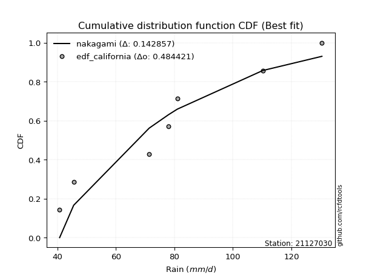</img>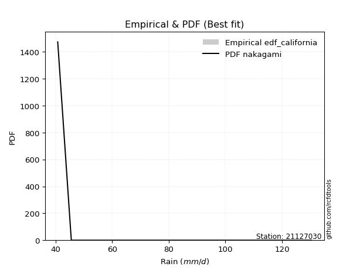</img>

</div>


### 2. Empirical - EDF Hazen (1930)

Hazen method for plotting positions is a formula used to estimate the empirical cumulative probability distribution of flood events or other hydrological data. This formula often results in biased estimations, particularly when extrapolating to extreme events (high return periods).

<div align="center">


$P=(m-0.5)/n$


</div>


**2.1. Empirical values**

<div align="center">

|                | 0                   | 1                   | 2                   | 3         | 4                  | 5                  | 6                  |
|:---------------|:--------------------|:--------------------|:--------------------|:----------|:-------------------|:-------------------|:-------------------|
| date           | 2022                | 2023                | 2019                | 2024      | 2020               | 2025               | 2021               |
| x              | 40.8                | 45.6                | 71.4                | 78.0      | 81.0               | 107.4              | 110.2              |
| m              | 1                   | 2                   | 3                   | 4         | 5                  | 6                  | 7                  |
| empirical_dist | edf_hazen           | edf_hazen           | edf_hazen           | edf_hazen | edf_hazen          | edf_hazen          | edf_hazen          |
| empirical      | 0.07142857142857142 | 0.21428571428571427 | 0.35714285714285715 | 0.5       | 0.6428571428571429 | 0.7857142857142857 | 0.9285714285714286 |
| empirical_tr   | 1.0769230769230769  | 1.2727272727272727  | 1.5555555555555558  | 2.0       | 2.8000000000000003 | 4.666666666666666  | 14.000000000000007 |

</div>


**2.2. Kolmogorov-Smirnov fit test (sorted by Δ)**


<div align="center">

|                | 0                   | 1                   | 2                   | 3                   | 4                   | 5                   | 6                   | 7                   | 8                   | 9                   | 10                  | 11                  | 12                  | 13                  | 14                    | 15                  | 16                  | 17                  | 18                  | 19                  | 20                  | 21                  | 22                  | 23                  | 24                  | 25                  | 26                  | 27                  | 28                  | 29                  | 30                  | 31                  | 32                  | 33                  | 34                  | 35                  | 36                  | 37                  | 38                  | 39                  | 40                  | 41                  | 42                  | 43                  | 44                  | 45                  | 46                  | 47                  | 48                  | 49                  | 50                  | 51                  | 52                  | 53                  | 54                  | 55                  | 56                  | 57                  | 58                  | 59                  | 60                  | 61                  | 62                  | 63                  | 64                  | 65                  | 66                  | 67                  | 68                  | 69                  | 70                  | 71                  | 72                  | 73                  | 74                  | 75                  | 76                  | 77                  | 78                  | 79                  | 80                  | 81                  | 82                  | 83                  | 84                  | 85                  | 86                  | 87                  | 88                  | 89                  |
|:---------------|:--------------------|:--------------------|:--------------------|:--------------------|:--------------------|:--------------------|:--------------------|:--------------------|:--------------------|:--------------------|:--------------------|:--------------------|:--------------------|:--------------------|:----------------------|:--------------------|:--------------------|:--------------------|:--------------------|:--------------------|:--------------------|:--------------------|:--------------------|:--------------------|:--------------------|:--------------------|:--------------------|:--------------------|:--------------------|:--------------------|:--------------------|:--------------------|:--------------------|:--------------------|:--------------------|:--------------------|:--------------------|:--------------------|:--------------------|:--------------------|:--------------------|:--------------------|:--------------------|:--------------------|:--------------------|:--------------------|:--------------------|:--------------------|:--------------------|:--------------------|:--------------------|:--------------------|:--------------------|:--------------------|:--------------------|:--------------------|:--------------------|:--------------------|:--------------------|:--------------------|:--------------------|:--------------------|:--------------------|:--------------------|:--------------------|:--------------------|:--------------------|:--------------------|:--------------------|:--------------------|:--------------------|:--------------------|:--------------------|:--------------------|:--------------------|:--------------------|:--------------------|:--------------------|:--------------------|:--------------------|:--------------------|:--------------------|:--------------------|:--------------------|:--------------------|:--------------------|:--------------------|:--------------------|:--------------------|:--------------------|
| station        | 21127030            | 21127030            | 21127030            | 21127030            | 21127030            | 21127030            | 21127030            | 21127030            | 21127030            | 21127030            | 21127030            | 21127030            | 21127030            | 21127030            | 21127030              | 21127030            | 21127030            | 21127030            | 21127030            | 21127030            | 21127030            | 21127030            | 21127030            | 21127030            | 21127030            | 21127030            | 21127030            | 21127030            | 21127030            | 21127030            | 21127030            | 21127030            | 21127030            | 21127030            | 21127030            | 21127030            | 21127030            | 21127030            | 21127030            | 21127030            | 21127030            | 21127030            | 21127030            | 21127030            | 21127030            | 21127030            | 21127030            | 21127030            | 21127030            | 21127030            | 21127030            | 21127030            | 21127030            | 21127030            | 21127030            | 21127030            | 21127030            | 21127030            | 21127030            | 21127030            | 21127030            | 21127030            | 21127030            | 21127030            | 21127030            | 21127030            | 21127030            | 21127030            | 21127030            | 21127030            | 21127030            | 21127030            | 21127030            | 21127030            | 21127030            | 21127030            | 21127030            | 21127030            | 21127030            | 21127030            | 21127030            | 21127030            | 21127030            | 21127030            | 21127030            | 21127030            | 21127030            | 21127030            | 21127030            | 21127030            |
| empirical_dist | edf_hazen           | edf_hazen           | edf_hazen           | edf_hazen           | edf_hazen           | edf_hazen           | edf_hazen           | edf_hazen           | edf_hazen           | edf_hazen           | edf_hazen           | edf_hazen           | edf_hazen           | edf_hazen           | edf_hazen             | edf_hazen           | edf_hazen           | edf_hazen           | edf_hazen           | edf_hazen           | edf_hazen           | edf_hazen           | edf_hazen           | edf_hazen           | edf_hazen           | edf_hazen           | edf_hazen           | edf_hazen           | edf_hazen           | edf_hazen           | edf_hazen           | edf_hazen           | edf_hazen           | edf_hazen           | edf_hazen           | edf_hazen           | edf_hazen           | edf_hazen           | edf_hazen           | edf_hazen           | edf_hazen           | edf_hazen           | edf_hazen           | edf_hazen           | edf_hazen           | edf_hazen           | edf_hazen           | edf_hazen           | edf_hazen           | edf_hazen           | edf_hazen           | edf_hazen           | edf_hazen           | edf_hazen           | edf_hazen           | edf_hazen           | edf_hazen           | edf_hazen           | edf_hazen           | edf_hazen           | edf_hazen           | edf_hazen           | edf_hazen           | edf_hazen           | edf_hazen           | edf_hazen           | edf_hazen           | edf_hazen           | edf_hazen           | edf_hazen           | edf_hazen           | edf_hazen           | edf_hazen           | edf_hazen           | edf_hazen           | edf_hazen           | edf_hazen           | edf_hazen           | edf_hazen           | edf_hazen           | edf_hazen           | edf_hazen           | edf_hazen           | edf_hazen           | edf_hazen           | edf_hazen           | edf_hazen           | edf_hazen           | edf_hazen           | edf_hazen           |
| p_dist         | fisk                | alpha               | gamma               | erlang              | nct                 | norm                | crystalball         | truncnorm           | exponnorm           | t                   | logpearson3         | logweibull_min      | pearson3            | johnsonsu           | loglaplace_asymmetric | betaprime           | invgamma            | laplace_asymmetric  | f                   | maxwell             | invgauss            | logfisk             | rayleigh            | logistic            | loggumbel_l         | rice                | hypsecant           | laplace             | genlogistic         | loghypsecant        | loglogistic         | logt                | logexponnorm        | lognorm             | lognorm             | logcrystalball      | lognct              | logfatiguelife      | logf                | loglaplace          | ncf                 | loggamma            | loggamma            | kstwobign           | logerlang           | loggompertz         | gumbel_r            | gumbel_l            | logrice             | logalpha            | logbetaprime        | logmielke           | loginvgamma         | logloggamma         | mielke              | loginvgauss         | logmaxwell          | halfnorm            | logjohnsonsu        | moyal               | lograyleigh         | loginvweibull       | logncf              | loggumbel_r         | loghalfnorm         | logkstwobign        | halflogistic        | wald                | expon               | genexpon            | gibrat              | logmoyal            | loghalflogistic     | logchi2             | loggenexpon         | logexpon            | weibull_min         | logwald             | loggibrat           | nakagami            | logtruncnorm        | pareto              | logpareto           | loglognorm          | invweibull          | lognakagami         | fatiguelife         | gompertz            | chi2                | loggenlogistic      |
| delta          | 0.09992072158282463 | 0.10537228738785467 | 0.10651144307589955 | 0.1065522056953907  | 0.10739683983587656 | 0.10739991941657678 | 0.1073999238609814  | 0.1073999312089906  | 0.10740011980724906 | 0.10742214665621941 | 0.10777988007736278 | 0.10807566104635624 | 0.10823288300946943 | 0.10843621049458974 | 0.10870736966551686   | 0.10883955366013644 | 0.10953540344727375 | 0.11011636436231476 | 0.11239378293136487 | 0.11340055739781156 | 0.11736530219186486 | 0.11917437123807081 | 0.11918893696789315 | 0.11936893620823352 | 0.1210587907567412  | 0.12336007198332696 | 0.12457303981497025 | 0.12811148059582966 | 0.13124006455416293 | 0.13309399656604176 | 0.13400248582195728 | 0.1350155982085232  | 0.1350654396194611  | 0.13506655269860107 | 0.13506655269860107 | 0.13506655340997947 | 0.13507505468037667 | 0.1355332111985707  | 0.1357413117552142  | 0.13783639909158063 | 0.1417193228649179  | 0.14365338613393713 | 0.14365338613393713 | 0.1448009436093301  | 0.1456936164258465  | 0.14622009101748945 | 0.14851139095731947 | 0.15135978027360308 | 0.15299500445664188 | 0.15411112263310162 | 0.15562408975371228 | 0.15688849213375877 | 0.15714990714856852 | 0.1575919902286358  | 0.15887585987981184 | 0.16582971056184875 | 0.16841078754787514 | 0.16961405950530659 | 0.17452667271910105 | 0.17664414271043682 | 0.17958685525963608 | 0.19231217631880665 | 0.19818052955707344 | 0.2051681611687463  | 0.2110567294076356  | 0.21285703930906014 | 0.21428571428571427 | 0.21873744794141098 | 0.22008946506135102 | 0.22177876347923303 | 0.22201526888370376 | 0.23104907663567192 | 0.23549771331300456 | 0.25324929403950314 | 0.2539513774245042  | 0.2704216241995379  | 0.27368323500784114 | 0.30305091662062394 | 0.3251355975315982  | 0.3333818969259404  | 0.35714281664371234 | 0.3579348965603636  | 0.3788751463922382  | 0.3947832235410187  | 0.4559188328554007  | 0.4565192864447925  | 0.4884149967554475  | 0.6376242032354245  | 0.7639635407311364  | 0.7857142857142857  |
| deltao         | 0.48442053926100004 | 0.48442053926100004 | 0.48442053926100004 | 0.48442053926100004 | 0.48442053926100004 | 0.48442053926100004 | 0.48442053926100004 | 0.48442053926100004 | 0.48442053926100004 | 0.48442053926100004 | 0.48442053926100004 | 0.48442053926100004 | 0.48442053926100004 | 0.48442053926100004 | 0.48442053926100004   | 0.48442053926100004 | 0.48442053926100004 | 0.48442053926100004 | 0.48442053926100004 | 0.48442053926100004 | 0.48442053926100004 | 0.48442053926100004 | 0.48442053926100004 | 0.48442053926100004 | 0.48442053926100004 | 0.48442053926100004 | 0.48442053926100004 | 0.48442053926100004 | 0.48442053926100004 | 0.48442053926100004 | 0.48442053926100004 | 0.48442053926100004 | 0.48442053926100004 | 0.48442053926100004 | 0.48442053926100004 | 0.48442053926100004 | 0.48442053926100004 | 0.48442053926100004 | 0.48442053926100004 | 0.48442053926100004 | 0.48442053926100004 | 0.48442053926100004 | 0.48442053926100004 | 0.48442053926100004 | 0.48442053926100004 | 0.48442053926100004 | 0.48442053926100004 | 0.48442053926100004 | 0.48442053926100004 | 0.48442053926100004 | 0.48442053926100004 | 0.48442053926100004 | 0.48442053926100004 | 0.48442053926100004 | 0.48442053926100004 | 0.48442053926100004 | 0.48442053926100004 | 0.48442053926100004 | 0.48442053926100004 | 0.48442053926100004 | 0.48442053926100004 | 0.48442053926100004 | 0.48442053926100004 | 0.48442053926100004 | 0.48442053926100004 | 0.48442053926100004 | 0.48442053926100004 | 0.48442053926100004 | 0.48442053926100004 | 0.48442053926100004 | 0.48442053926100004 | 0.48442053926100004 | 0.48442053926100004 | 0.48442053926100004 | 0.48442053926100004 | 0.48442053926100004 | 0.48442053926100004 | 0.48442053926100004 | 0.48442053926100004 | 0.48442053926100004 | 0.48442053926100004 | 0.48442053926100004 | 0.48442053926100004 | 0.48442053926100004 | 0.48442053926100004 | 0.48442053926100004 | 0.48442053926100004 | 0.48442053926100004 | 0.48442053926100004 | 0.48442053926100004 |
| eval           | Δo > Δ              | Δo > Δ              | Δo > Δ              | Δo > Δ              | Δo > Δ              | Δo > Δ              | Δo > Δ              | Δo > Δ              | Δo > Δ              | Δo > Δ              | Δo > Δ              | Δo > Δ              | Δo > Δ              | Δo > Δ              | Δo > Δ                | Δo > Δ              | Δo > Δ              | Δo > Δ              | Δo > Δ              | Δo > Δ              | Δo > Δ              | Δo > Δ              | Δo > Δ              | Δo > Δ              | Δo > Δ              | Δo > Δ              | Δo > Δ              | Δo > Δ              | Δo > Δ              | Δo > Δ              | Δo > Δ              | Δo > Δ              | Δo > Δ              | Δo > Δ              | Δo > Δ              | Δo > Δ              | Δo > Δ              | Δo > Δ              | Δo > Δ              | Δo > Δ              | Δo > Δ              | Δo > Δ              | Δo > Δ              | Δo > Δ              | Δo > Δ              | Δo > Δ              | Δo > Δ              | Δo > Δ              | Δo > Δ              | Δo > Δ              | Δo > Δ              | Δo > Δ              | Δo > Δ              | Δo > Δ              | Δo > Δ              | Δo > Δ              | Δo > Δ              | Δo > Δ              | Δo > Δ              | Δo > Δ              | Δo > Δ              | Δo > Δ              | Δo > Δ              | Δo > Δ              | Δo > Δ              | Δo > Δ              | Δo > Δ              | Δo > Δ              | Δo > Δ              | Δo > Δ              | Δo > Δ              | Δo > Δ              | Δo > Δ              | Δo > Δ              | Δo > Δ              | Δo > Δ              | Δo > Δ              | Δo > Δ              | Δo > Δ              | Δo > Δ              | Δo > Δ              | Δo > Δ              | Δo > Δ              | Δo > Δ              | Δo > Δ              | Δo > Δ              | Δo <= Δ             | Δo <= Δ             | Δo <= Δ             | Δo <= Δ             |
| fit            | 1                   | 1                   | 1                   | 1                   | 1                   | 1                   | 1                   | 1                   | 1                   | 1                   | 1                   | 1                   | 1                   | 1                   | 1                     | 1                   | 1                   | 1                   | 1                   | 1                   | 1                   | 1                   | 1                   | 1                   | 1                   | 1                   | 1                   | 1                   | 1                   | 1                   | 1                   | 1                   | 1                   | 1                   | 1                   | 1                   | 1                   | 1                   | 1                   | 1                   | 1                   | 1                   | 1                   | 1                   | 1                   | 1                   | 1                   | 1                   | 1                   | 1                   | 1                   | 1                   | 1                   | 1                   | 1                   | 1                   | 1                   | 1                   | 1                   | 1                   | 1                   | 1                   | 1                   | 1                   | 1                   | 1                   | 1                   | 1                   | 1                   | 1                   | 1                   | 1                   | 1                   | 1                   | 1                   | 1                   | 1                   | 1                   | 1                   | 1                   | 1                   | 1                   | 1                   | 1                   | 1                   | 1                   | 0                   | 0                   | 0                   | 0                   |
| n              | 7                   | 7                   | 7                   | 7                   | 7                   | 7                   | 7                   | 7                   | 7                   | 7                   | 7                   | 7                   | 7                   | 7                   | 7                     | 7                   | 7                   | 7                   | 7                   | 7                   | 7                   | 7                   | 7                   | 7                   | 7                   | 7                   | 7                   | 7                   | 7                   | 7                   | 7                   | 7                   | 7                   | 7                   | 7                   | 7                   | 7                   | 7                   | 7                   | 7                   | 7                   | 7                   | 7                   | 7                   | 7                   | 7                   | 7                   | 7                   | 7                   | 7                   | 7                   | 7                   | 7                   | 7                   | 7                   | 7                   | 7                   | 7                   | 7                   | 7                   | 7                   | 7                   | 7                   | 7                   | 7                   | 7                   | 7                   | 7                   | 7                   | 7                   | 7                   | 7                   | 7                   | 7                   | 7                   | 7                   | 7                   | 7                   | 7                   | 7                   | 7                   | 7                   | 7                   | 7                   | 7                   | 7                   | 7                   | 7                   | 7                   | 7                   |
| best_fit       | 1                   | 0                   | 0                   | 0                   | 0                   | 0                   | 0                   | 0                   | 0                   | 0                   | 0                   | 0                   | 0                   | 0                   | 0                     | 0                   | 0                   | 0                   | 0                   | 0                   | 0                   | 0                   | 0                   | 0                   | 0                   | 0                   | 0                   | 0                   | 0                   | 0                   | 0                   | 0                   | 0                   | 0                   | 0                   | 0                   | 0                   | 0                   | 0                   | 0                   | 0                   | 0                   | 0                   | 0                   | 0                   | 0                   | 0                   | 0                   | 0                   | 0                   | 0                   | 0                   | 0                   | 0                   | 0                   | 0                   | 0                   | 0                   | 0                   | 0                   | 0                   | 0                   | 0                   | 0                   | 0                   | 0                   | 0                   | 0                   | 0                   | 0                   | 0                   | 0                   | 0                   | 0                   | 0                   | 0                   | 0                   | 0                   | 0                   | 0                   | 0                   | 0                   | 0                   | 0                   | 0                   | 0                   | 0                   | 0                   | 0                   | 0                   |
| best_fit_sort  | 1                   | 2                   | 3                   | 4                   | 5                   | 6                   | 7                   | 8                   | 9                   | 10                  | 11                  | 12                  | 13                  | 14                  | 15                    | 16                  | 17                  | 18                  | 19                  | 20                  | 21                  | 22                  | 23                  | 24                  | 25                  | 26                  | 27                  | 28                  | 29                  | 30                  | 31                  | 32                  | 33                  | 34                  | 35                  | 36                  | 37                  | 38                  | 39                  | 40                  | 41                  | 42                  | 43                  | 44                  | 45                  | 46                  | 47                  | 48                  | 49                  | 50                  | 51                  | 52                  | 53                  | 54                  | 55                  | 56                  | 57                  | 58                  | 59                  | 60                  | 61                  | 62                  | 63                  | 64                  | 65                  | 66                  | 67                  | 68                  | 69                  | 70                  | 71                  | 72                  | 73                  | 74                  | 75                  | 76                  | 77                  | 78                  | 79                  | 80                  | 81                  | 82                  | 83                  | 84                  | 85                  | 86                  | 87                  | 88                  | 89                  | 90                  |

</div>


<div align="center">

</img>

</div>


**2.3. Best fit**

<div align="center">

|   id |   station | empirical_dist   | p_dist   |     delta |   deltao | eval   |   fit |   n |   best_fit |   best_fit_sort |
|-----:|----------:|:-----------------|:---------|----------:|---------:|:-------|------:|----:|-----------:|----------------:|
|    0 |  21127030 | edf_hazen        | fisk     | 0.0999207 | 0.484421 | Δo > Δ |     1 |   7 |          1 |               1 |

</div>


<div align="center">

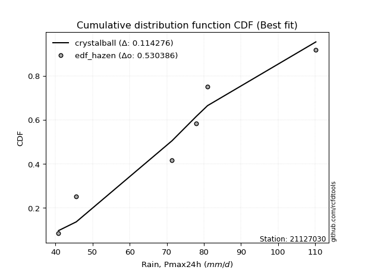</img>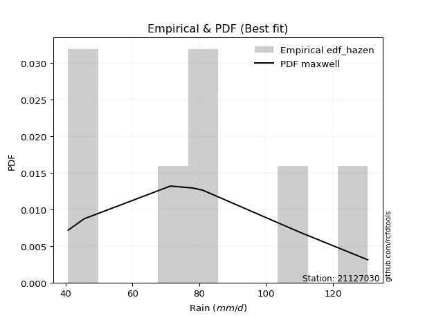</img>

</div>


### 3. Empirical - EDF Weibull (1939)

Weibull plotting position formula is an empirical method used to estimate the non-exceedance probability or plotting position for a set of observed data, is often recommended or widely used in practice, particularly in flood frequency analysis.

<div align="center">


$P=m/(n+1)$


</div>


**3.1. Empirical values**

<div align="center">

|                | 0                  | 1                  | 2           | 3           | 4                  | 5           | 6           |
|:---------------|:-------------------|:-------------------|:------------|:------------|:-------------------|:------------|:------------|
| date           | 2022               | 2023               | 2019        | 2024        | 2020               | 2025        | 2021        |
| x              | 40.8               | 45.6               | 71.4        | 78.0        | 81.0               | 107.4       | 110.2       |
| m              | 1                  | 2                  | 3           | 4           | 5                  | 6           | 7           |
| empirical_dist | edf_weibull        | edf_weibull        | edf_weibull | edf_weibull | edf_weibull        | edf_weibull | edf_weibull |
| empirical      | 0.125              | 0.25               | 0.375       | 0.5         | 0.625              | 0.75        | 0.875       |
| empirical_tr   | 1.1428571428571428 | 1.3333333333333333 | 1.6         | 2.0         | 2.6666666666666665 | 4.0         | 8.0         |

</div>


**3.2. Kolmogorov-Smirnov fit test (sorted by Δ)**


<div align="center">

|                | 0                   | 1                   | 2                   | 3                   | 4                   | 5                   | 6                   | 7                   | 8                   | 9                   | 10                  | 11                  | 12                  | 13                  | 14                  | 15                  | 16                  | 17                  | 18                    | 19                  | 20                  | 21                  | 22                  | 23                  | 24                  | 25                  | 26                  | 27                  | 28                  | 29                  | 30                  | 31                  | 32                  | 33                  | 34                  | 35                  | 36                  | 37                  | 38                  | 39                  | 40                  | 41                  | 42                  | 43                  | 44                  | 45                  | 46                  | 47                  | 48                  | 49                  | 50                  | 51                  | 52                  | 53                  | 54                  | 55                  | 56                  | 57                  | 58                  | 59                  | 60                  | 61                  | 62                  | 63                  | 64                  | 65                  | 66                  | 67                  | 68                  | 69                  | 70                  | 71                  | 72                  | 73                  | 74                  | 75                  | 76                  | 77                  | 78                  | 79                  | 80                  | 81                  | 82                  | 83                  | 84                  | 85                  | 86                  | 87                  | 88                  | 89                  |
|:---------------|:--------------------|:--------------------|:--------------------|:--------------------|:--------------------|:--------------------|:--------------------|:--------------------|:--------------------|:--------------------|:--------------------|:--------------------|:--------------------|:--------------------|:--------------------|:--------------------|:--------------------|:--------------------|:----------------------|:--------------------|:--------------------|:--------------------|:--------------------|:--------------------|:--------------------|:--------------------|:--------------------|:--------------------|:--------------------|:--------------------|:--------------------|:--------------------|:--------------------|:--------------------|:--------------------|:--------------------|:--------------------|:--------------------|:--------------------|:--------------------|:--------------------|:--------------------|:--------------------|:--------------------|:--------------------|:--------------------|:--------------------|:--------------------|:--------------------|:--------------------|:--------------------|:--------------------|:--------------------|:--------------------|:--------------------|:--------------------|:--------------------|:--------------------|:--------------------|:--------------------|:--------------------|:--------------------|:--------------------|:--------------------|:--------------------|:--------------------|:--------------------|:--------------------|:--------------------|:--------------------|:--------------------|:--------------------|:--------------------|:--------------------|:--------------------|:--------------------|:--------------------|:--------------------|:--------------------|:--------------------|:--------------------|:--------------------|:--------------------|:--------------------|:--------------------|:--------------------|:--------------------|:--------------------|:--------------------|:--------------------|
| station        | 21127030            | 21127030            | 21127030            | 21127030            | 21127030            | 21127030            | 21127030            | 21127030            | 21127030            | 21127030            | 21127030            | 21127030            | 21127030            | 21127030            | 21127030            | 21127030            | 21127030            | 21127030            | 21127030              | 21127030            | 21127030            | 21127030            | 21127030            | 21127030            | 21127030            | 21127030            | 21127030            | 21127030            | 21127030            | 21127030            | 21127030            | 21127030            | 21127030            | 21127030            | 21127030            | 21127030            | 21127030            | 21127030            | 21127030            | 21127030            | 21127030            | 21127030            | 21127030            | 21127030            | 21127030            | 21127030            | 21127030            | 21127030            | 21127030            | 21127030            | 21127030            | 21127030            | 21127030            | 21127030            | 21127030            | 21127030            | 21127030            | 21127030            | 21127030            | 21127030            | 21127030            | 21127030            | 21127030            | 21127030            | 21127030            | 21127030            | 21127030            | 21127030            | 21127030            | 21127030            | 21127030            | 21127030            | 21127030            | 21127030            | 21127030            | 21127030            | 21127030            | 21127030            | 21127030            | 21127030            | 21127030            | 21127030            | 21127030            | 21127030            | 21127030            | 21127030            | 21127030            | 21127030            | 21127030            | 21127030            |
| empirical_dist | edf_weibull         | edf_weibull         | edf_weibull         | edf_weibull         | edf_weibull         | edf_weibull         | edf_weibull         | edf_weibull         | edf_weibull         | edf_weibull         | edf_weibull         | edf_weibull         | edf_weibull         | edf_weibull         | edf_weibull         | edf_weibull         | edf_weibull         | edf_weibull         | edf_weibull           | edf_weibull         | edf_weibull         | edf_weibull         | edf_weibull         | edf_weibull         | edf_weibull         | edf_weibull         | edf_weibull         | edf_weibull         | edf_weibull         | edf_weibull         | edf_weibull         | edf_weibull         | edf_weibull         | edf_weibull         | edf_weibull         | edf_weibull         | edf_weibull         | edf_weibull         | edf_weibull         | edf_weibull         | edf_weibull         | edf_weibull         | edf_weibull         | edf_weibull         | edf_weibull         | edf_weibull         | edf_weibull         | edf_weibull         | edf_weibull         | edf_weibull         | edf_weibull         | edf_weibull         | edf_weibull         | edf_weibull         | edf_weibull         | edf_weibull         | edf_weibull         | edf_weibull         | edf_weibull         | edf_weibull         | edf_weibull         | edf_weibull         | edf_weibull         | edf_weibull         | edf_weibull         | edf_weibull         | edf_weibull         | edf_weibull         | edf_weibull         | edf_weibull         | edf_weibull         | edf_weibull         | edf_weibull         | edf_weibull         | edf_weibull         | edf_weibull         | edf_weibull         | edf_weibull         | edf_weibull         | edf_weibull         | edf_weibull         | edf_weibull         | edf_weibull         | edf_weibull         | edf_weibull         | edf_weibull         | edf_weibull         | edf_weibull         | edf_weibull         | edf_weibull         |
| p_dist         | fisk                | logbetaprime        | alpha               | kstwobign           | gamma               | erlang              | genlogistic         | nct                 | norm                | crystalball         | truncnorm           | exponnorm           | t                   | logpearson3         | logweibull_min      | logalpha            | pearson3            | johnsonsu           | loglaplace_asymmetric | betaprime           | logncf              | loggamma            | loggamma            | invgauss            | invgamma            | loginvgamma         | laplace_asymmetric  | f                   | loginvgauss         | logerlang           | logf                | lognct              | logcrystalball      | lognorm             | lognorm             | logexponnorm        | logt                | maxwell             | ncf                 | logfatiguelife      | logfisk             | rayleigh            | logistic            | logrice             | logjohnsonsu        | loggumbel_l         | rice                | logmaxwell          | loglogistic         | hypsecant           | laplace             | loghypsecant        | lograyleigh         | loglaplace          | loginvweibull       | mielke              | loggompertz         | gumbel_r            | gumbel_l            | logloggamma         | logmielke           | loggumbel_r         | logkstwobign        | logchi2             | expon               | genexpon            | halfnorm            | moyal               | logmoyal            | loghalfnorm         | loggenexpon         | loghalflogistic     | wald                | gibrat              | halflogistic        | logexpon            | weibull_min         | logwald             | loggibrat           | nakagami            | pareto              | logpareto           | loglognorm          | logtruncnorm        | invweibull          | lognakagami         | fatiguelife         | gompertz            | chi2                | loggenlogistic      |
| delta          | 0.13563500729711037 | 0.13776694689656943 | 0.1410865731021404  | 0.14129657718803268 | 0.14222572879018525 | 0.1422664914096764  | 0.1428195460997162  | 0.14311112555016225 | 0.14311420513086248 | 0.1431142095752671  | 0.1431142169232763  | 0.14311440552153476 | 0.1431364323705051  | 0.1434941657916485  | 0.14378994676064194 | 0.14393816200476456 | 0.14394716872375513 | 0.14415049620887543 | 0.14442165537980256   | 0.14455383937442218 | 0.14460910098564483 | 0.14507007026085167 | 0.14507007026085167 | 0.1451842816869296  | 0.14524968916155948 | 0.14540735395668458 | 0.14583065007660045 | 0.14706139486161174 | 0.1479725677047059  | 0.14876274569073195 | 0.14880799062603314 | 0.14887332751115245 | 0.148875360219815   | 0.14887537975587867 | 0.14887537975587867 | 0.14887596072460735 | 0.1488811702778849  | 0.14911484311209727 | 0.14926727510067073 | 0.14962615114174982 | 0.15488865695235654 | 0.15490322268217888 | 0.15508322192251922 | 0.15633649734951977 | 0.15666952986195815 | 0.1567730764710269  | 0.1590743576976127  | 0.15930359194673377 | 0.15993993036675375 | 0.16028732552925595 | 0.16382576631011536 | 0.1646193082812052  | 0.1663820153837886  | 0.16762796136374164 | 0.1744550334616638  | 0.18065628849987647 | 0.18193437673177518 | 0.18422567667160522 | 0.18707406598788878 | 0.19128446378003106 | 0.19260277784804447 | 0.19393997879917574 | 0.1949998964519173  | 0.19967786546807453 | 0.20223232220420817 | 0.20392162062209018 | 0.2053283452195923  | 0.21235842842472255 | 0.2210406030238916  | 0.2266598680593695  | 0.23609423456736134 | 0.25                | 0.25                | 0.25                | 0.25                | 0.25256448134239506 | 0.2558260921506983  | 0.2851937737634811  | 0.30727845467445536 | 0.31552475406879754 | 0.3222206108460779  | 0.3431608606779525  | 0.359068937826733   | 0.3749999595008552  | 0.4023474042839721  | 0.43866214358764966 | 0.4705578538983046  | 0.6197670603782816  | 0.7282492550168507  | 0.75                |
| deltao         | 0.48442053926100004 | 0.48442053926100004 | 0.48442053926100004 | 0.48442053926100004 | 0.48442053926100004 | 0.48442053926100004 | 0.48442053926100004 | 0.48442053926100004 | 0.48442053926100004 | 0.48442053926100004 | 0.48442053926100004 | 0.48442053926100004 | 0.48442053926100004 | 0.48442053926100004 | 0.48442053926100004 | 0.48442053926100004 | 0.48442053926100004 | 0.48442053926100004 | 0.48442053926100004   | 0.48442053926100004 | 0.48442053926100004 | 0.48442053926100004 | 0.48442053926100004 | 0.48442053926100004 | 0.48442053926100004 | 0.48442053926100004 | 0.48442053926100004 | 0.48442053926100004 | 0.48442053926100004 | 0.48442053926100004 | 0.48442053926100004 | 0.48442053926100004 | 0.48442053926100004 | 0.48442053926100004 | 0.48442053926100004 | 0.48442053926100004 | 0.48442053926100004 | 0.48442053926100004 | 0.48442053926100004 | 0.48442053926100004 | 0.48442053926100004 | 0.48442053926100004 | 0.48442053926100004 | 0.48442053926100004 | 0.48442053926100004 | 0.48442053926100004 | 0.48442053926100004 | 0.48442053926100004 | 0.48442053926100004 | 0.48442053926100004 | 0.48442053926100004 | 0.48442053926100004 | 0.48442053926100004 | 0.48442053926100004 | 0.48442053926100004 | 0.48442053926100004 | 0.48442053926100004 | 0.48442053926100004 | 0.48442053926100004 | 0.48442053926100004 | 0.48442053926100004 | 0.48442053926100004 | 0.48442053926100004 | 0.48442053926100004 | 0.48442053926100004 | 0.48442053926100004 | 0.48442053926100004 | 0.48442053926100004 | 0.48442053926100004 | 0.48442053926100004 | 0.48442053926100004 | 0.48442053926100004 | 0.48442053926100004 | 0.48442053926100004 | 0.48442053926100004 | 0.48442053926100004 | 0.48442053926100004 | 0.48442053926100004 | 0.48442053926100004 | 0.48442053926100004 | 0.48442053926100004 | 0.48442053926100004 | 0.48442053926100004 | 0.48442053926100004 | 0.48442053926100004 | 0.48442053926100004 | 0.48442053926100004 | 0.48442053926100004 | 0.48442053926100004 | 0.48442053926100004 |
| eval           | Δo > Δ              | Δo > Δ              | Δo > Δ              | Δo > Δ              | Δo > Δ              | Δo > Δ              | Δo > Δ              | Δo > Δ              | Δo > Δ              | Δo > Δ              | Δo > Δ              | Δo > Δ              | Δo > Δ              | Δo > Δ              | Δo > Δ              | Δo > Δ              | Δo > Δ              | Δo > Δ              | Δo > Δ                | Δo > Δ              | Δo > Δ              | Δo > Δ              | Δo > Δ              | Δo > Δ              | Δo > Δ              | Δo > Δ              | Δo > Δ              | Δo > Δ              | Δo > Δ              | Δo > Δ              | Δo > Δ              | Δo > Δ              | Δo > Δ              | Δo > Δ              | Δo > Δ              | Δo > Δ              | Δo > Δ              | Δo > Δ              | Δo > Δ              | Δo > Δ              | Δo > Δ              | Δo > Δ              | Δo > Δ              | Δo > Δ              | Δo > Δ              | Δo > Δ              | Δo > Δ              | Δo > Δ              | Δo > Δ              | Δo > Δ              | Δo > Δ              | Δo > Δ              | Δo > Δ              | Δo > Δ              | Δo > Δ              | Δo > Δ              | Δo > Δ              | Δo > Δ              | Δo > Δ              | Δo > Δ              | Δo > Δ              | Δo > Δ              | Δo > Δ              | Δo > Δ              | Δo > Δ              | Δo > Δ              | Δo > Δ              | Δo > Δ              | Δo > Δ              | Δo > Δ              | Δo > Δ              | Δo > Δ              | Δo > Δ              | Δo > Δ              | Δo > Δ              | Δo > Δ              | Δo > Δ              | Δo > Δ              | Δo > Δ              | Δo > Δ              | Δo > Δ              | Δo > Δ              | Δo > Δ              | Δo > Δ              | Δo > Δ              | Δo > Δ              | Δo > Δ              | Δo <= Δ             | Δo <= Δ             | Δo <= Δ             |
| fit            | 1                   | 1                   | 1                   | 1                   | 1                   | 1                   | 1                   | 1                   | 1                   | 1                   | 1                   | 1                   | 1                   | 1                   | 1                   | 1                   | 1                   | 1                   | 1                     | 1                   | 1                   | 1                   | 1                   | 1                   | 1                   | 1                   | 1                   | 1                   | 1                   | 1                   | 1                   | 1                   | 1                   | 1                   | 1                   | 1                   | 1                   | 1                   | 1                   | 1                   | 1                   | 1                   | 1                   | 1                   | 1                   | 1                   | 1                   | 1                   | 1                   | 1                   | 1                   | 1                   | 1                   | 1                   | 1                   | 1                   | 1                   | 1                   | 1                   | 1                   | 1                   | 1                   | 1                   | 1                   | 1                   | 1                   | 1                   | 1                   | 1                   | 1                   | 1                   | 1                   | 1                   | 1                   | 1                   | 1                   | 1                   | 1                   | 1                   | 1                   | 1                   | 1                   | 1                   | 1                   | 1                   | 1                   | 1                   | 0                   | 0                   | 0                   |
| n              | 7                   | 7                   | 7                   | 7                   | 7                   | 7                   | 7                   | 7                   | 7                   | 7                   | 7                   | 7                   | 7                   | 7                   | 7                   | 7                   | 7                   | 7                   | 7                     | 7                   | 7                   | 7                   | 7                   | 7                   | 7                   | 7                   | 7                   | 7                   | 7                   | 7                   | 7                   | 7                   | 7                   | 7                   | 7                   | 7                   | 7                   | 7                   | 7                   | 7                   | 7                   | 7                   | 7                   | 7                   | 7                   | 7                   | 7                   | 7                   | 7                   | 7                   | 7                   | 7                   | 7                   | 7                   | 7                   | 7                   | 7                   | 7                   | 7                   | 7                   | 7                   | 7                   | 7                   | 7                   | 7                   | 7                   | 7                   | 7                   | 7                   | 7                   | 7                   | 7                   | 7                   | 7                   | 7                   | 7                   | 7                   | 7                   | 7                   | 7                   | 7                   | 7                   | 7                   | 7                   | 7                   | 7                   | 7                   | 7                   | 7                   | 7                   |
| best_fit       | 1                   | 0                   | 0                   | 0                   | 0                   | 0                   | 0                   | 0                   | 0                   | 0                   | 0                   | 0                   | 0                   | 0                   | 0                   | 0                   | 0                   | 0                   | 0                     | 0                   | 0                   | 0                   | 0                   | 0                   | 0                   | 0                   | 0                   | 0                   | 0                   | 0                   | 0                   | 0                   | 0                   | 0                   | 0                   | 0                   | 0                   | 0                   | 0                   | 0                   | 0                   | 0                   | 0                   | 0                   | 0                   | 0                   | 0                   | 0                   | 0                   | 0                   | 0                   | 0                   | 0                   | 0                   | 0                   | 0                   | 0                   | 0                   | 0                   | 0                   | 0                   | 0                   | 0                   | 0                   | 0                   | 0                   | 0                   | 0                   | 0                   | 0                   | 0                   | 0                   | 0                   | 0                   | 0                   | 0                   | 0                   | 0                   | 0                   | 0                   | 0                   | 0                   | 0                   | 0                   | 0                   | 0                   | 0                   | 0                   | 0                   | 0                   |
| best_fit_sort  | 1                   | 2                   | 3                   | 4                   | 5                   | 6                   | 7                   | 8                   | 9                   | 10                  | 11                  | 12                  | 13                  | 14                  | 15                  | 16                  | 17                  | 18                  | 19                    | 20                  | 21                  | 22                  | 23                  | 24                  | 25                  | 26                  | 27                  | 28                  | 29                  | 30                  | 31                  | 32                  | 33                  | 34                  | 35                  | 36                  | 37                  | 38                  | 39                  | 40                  | 41                  | 42                  | 43                  | 44                  | 45                  | 46                  | 47                  | 48                  | 49                  | 50                  | 51                  | 52                  | 53                  | 54                  | 55                  | 56                  | 57                  | 58                  | 59                  | 60                  | 61                  | 62                  | 63                  | 64                  | 65                  | 66                  | 67                  | 68                  | 69                  | 70                  | 71                  | 72                  | 73                  | 74                  | 75                  | 76                  | 77                  | 78                  | 79                  | 80                  | 81                  | 82                  | 83                  | 84                  | 85                  | 86                  | 87                  | 88                  | 89                  | 90                  |

</div>


<div align="center">

</img>

</div>


**3.3. Best fit**

<div align="center">

|   id |   station | empirical_dist   | p_dist   |    delta |   deltao | eval   |   fit |   n |   best_fit |   best_fit_sort |
|-----:|----------:|:-----------------|:---------|---------:|---------:|:-------|------:|----:|-----------:|----------------:|
|    0 |  21127030 | edf_weibull      | fisk     | 0.135635 | 0.484421 | Δo > Δ |     1 |   7 |          1 |               1 |

</div>


<div align="center">

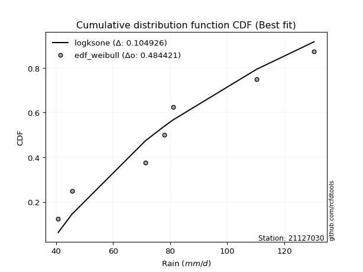</img>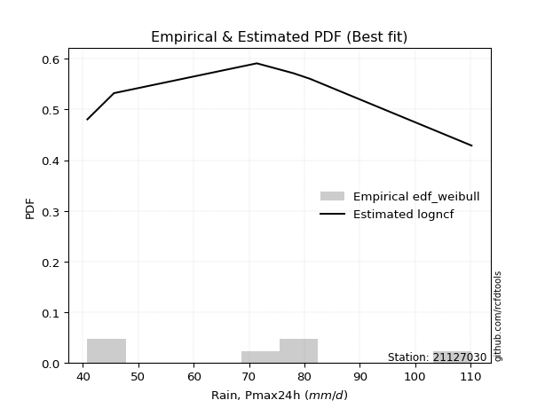</img>

</div>


### 4. Empirical - EDF Beard (1943)

The Beard formula (or Beard´s plotting position formula) in hydrology is used to estimate the empirical non-exceedance probability _(P)_ of a flood event (or other extreme hydrological data point) within a given dataset.

<div align="center">


$P=(m-0.31)/(n+0.38)$


</div>


**4.1. Empirical values**

<div align="center">

|                | 0                   | 1                   | 2                   | 3         | 4                  | 5                  | 6                  |
|:---------------|:--------------------|:--------------------|:--------------------|:----------|:-------------------|:-------------------|:-------------------|
| date           | 2022                | 2023                | 2019                | 2024      | 2020               | 2025               | 2021               |
| x              | 40.8                | 45.6                | 71.4                | 78.0      | 81.0               | 107.4              | 110.2              |
| m              | 1                   | 2                   | 3                   | 4         | 5                  | 6                  | 7                  |
| empirical_dist | edf_beard           | edf_beard           | edf_beard           | edf_beard | edf_beard          | edf_beard          | edf_beard          |
| empirical      | 0.09349593495934959 | 0.22899728997289973 | 0.36449864498644985 | 0.5       | 0.6355013550135502 | 0.7710027100271003 | 0.9065040650406505 |
| empirical_tr   | 1.1031390134529149  | 1.29701230228471    | 1.5735607675906182  | 2.0       | 2.743494423791822  | 4.366863905325444  | 10.695652173913055 |

</div>


**4.2. Kolmogorov-Smirnov fit test (sorted by Δ)**


<div align="center">

|                | 0                   | 1                   | 2                   | 3                   | 4                   | 5                   | 6                   | 7                   | 8                   | 9                   | 10                  | 11                  | 12                  | 13                  | 14                    | 15                  | 16                  | 17                  | 18                  | 19                  | 20                  | 21                  | 22                  | 23                  | 24                  | 25                  | 26                  | 27                  | 28                  | 29                  | 30                  | 31                  | 32                  | 33                  | 34                  | 35                  | 36                  | 37                  | 38                  | 39                  | 40                  | 41                  | 42                  | 43                  | 44                  | 45                  | 46                  | 47                  | 48                  | 49                  | 50                  | 51                  | 52                  | 53                  | 54                  | 55                  | 56                  | 57                  | 58                  | 59                  | 60                  | 61                  | 62                  | 63                  | 64                  | 65                  | 66                  | 67                  | 68                  | 69                  | 70                  | 71                  | 72                  | 73                  | 74                  | 75                  | 76                  | 77                  | 78                  | 79                  | 80                  | 81                  | 82                  | 83                  | 84                  | 85                  | 86                  | 87                  | 88                  | 89                  |
|:---------------|:--------------------|:--------------------|:--------------------|:--------------------|:--------------------|:--------------------|:--------------------|:--------------------|:--------------------|:--------------------|:--------------------|:--------------------|:--------------------|:--------------------|:----------------------|:--------------------|:--------------------|:--------------------|:--------------------|:--------------------|:--------------------|:--------------------|:--------------------|:--------------------|:--------------------|:--------------------|:--------------------|:--------------------|:--------------------|:--------------------|:--------------------|:--------------------|:--------------------|:--------------------|:--------------------|:--------------------|:--------------------|:--------------------|:--------------------|:--------------------|:--------------------|:--------------------|:--------------------|:--------------------|:--------------------|:--------------------|:--------------------|:--------------------|:--------------------|:--------------------|:--------------------|:--------------------|:--------------------|:--------------------|:--------------------|:--------------------|:--------------------|:--------------------|:--------------------|:--------------------|:--------------------|:--------------------|:--------------------|:--------------------|:--------------------|:--------------------|:--------------------|:--------------------|:--------------------|:--------------------|:--------------------|:--------------------|:--------------------|:--------------------|:--------------------|:--------------------|:--------------------|:--------------------|:--------------------|:--------------------|:--------------------|:--------------------|:--------------------|:--------------------|:--------------------|:--------------------|:--------------------|:--------------------|:--------------------|:--------------------|
| station        | 21127030            | 21127030            | 21127030            | 21127030            | 21127030            | 21127030            | 21127030            | 21127030            | 21127030            | 21127030            | 21127030            | 21127030            | 21127030            | 21127030            | 21127030              | 21127030            | 21127030            | 21127030            | 21127030            | 21127030            | 21127030            | 21127030            | 21127030            | 21127030            | 21127030            | 21127030            | 21127030            | 21127030            | 21127030            | 21127030            | 21127030            | 21127030            | 21127030            | 21127030            | 21127030            | 21127030            | 21127030            | 21127030            | 21127030            | 21127030            | 21127030            | 21127030            | 21127030            | 21127030            | 21127030            | 21127030            | 21127030            | 21127030            | 21127030            | 21127030            | 21127030            | 21127030            | 21127030            | 21127030            | 21127030            | 21127030            | 21127030            | 21127030            | 21127030            | 21127030            | 21127030            | 21127030            | 21127030            | 21127030            | 21127030            | 21127030            | 21127030            | 21127030            | 21127030            | 21127030            | 21127030            | 21127030            | 21127030            | 21127030            | 21127030            | 21127030            | 21127030            | 21127030            | 21127030            | 21127030            | 21127030            | 21127030            | 21127030            | 21127030            | 21127030            | 21127030            | 21127030            | 21127030            | 21127030            | 21127030            |
| empirical_dist | edf_beard           | edf_beard           | edf_beard           | edf_beard           | edf_beard           | edf_beard           | edf_beard           | edf_beard           | edf_beard           | edf_beard           | edf_beard           | edf_beard           | edf_beard           | edf_beard           | edf_beard             | edf_beard           | edf_beard           | edf_beard           | edf_beard           | edf_beard           | edf_beard           | edf_beard           | edf_beard           | edf_beard           | edf_beard           | edf_beard           | edf_beard           | edf_beard           | edf_beard           | edf_beard           | edf_beard           | edf_beard           | edf_beard           | edf_beard           | edf_beard           | edf_beard           | edf_beard           | edf_beard           | edf_beard           | edf_beard           | edf_beard           | edf_beard           | edf_beard           | edf_beard           | edf_beard           | edf_beard           | edf_beard           | edf_beard           | edf_beard           | edf_beard           | edf_beard           | edf_beard           | edf_beard           | edf_beard           | edf_beard           | edf_beard           | edf_beard           | edf_beard           | edf_beard           | edf_beard           | edf_beard           | edf_beard           | edf_beard           | edf_beard           | edf_beard           | edf_beard           | edf_beard           | edf_beard           | edf_beard           | edf_beard           | edf_beard           | edf_beard           | edf_beard           | edf_beard           | edf_beard           | edf_beard           | edf_beard           | edf_beard           | edf_beard           | edf_beard           | edf_beard           | edf_beard           | edf_beard           | edf_beard           | edf_beard           | edf_beard           | edf_beard           | edf_beard           | edf_beard           | edf_beard           |
| p_dist         | fisk                | alpha               | gamma               | erlang              | nct                 | norm                | crystalball         | truncnorm           | exponnorm           | t                   | logpearson3         | logweibull_min      | pearson3            | johnsonsu           | loglaplace_asymmetric | betaprime           | genlogistic         | invgauss            | invgamma            | laplace_asymmetric  | f                   | lognct              | logcrystalball      | lognorm             | lognorm             | logexponnorm        | logt                | maxwell             | logf                | logfatiguelife      | logfisk             | rayleigh            | logistic            | ncf                 | loggumbel_l         | loggamma            | loggamma            | kstwobign           | rice                | logerlang           | loglogistic         | hypsecant           | laplace             | loghypsecant        | logrice             | loglaplace          | logalpha            | logbetaprime        | loginvgamma         | loginvgauss         | mielke              | loggompertz         | logmaxwell          | gumbel_r            | gumbel_l            | logjohnsonsu        | logloggamma         | logmielke           | lograyleigh         | logncf              | halfnorm            | loginvweibull       | moyal               | loggumbel_r         | logkstwobign        | loghalfnorm         | expon               | genexpon            | logmoyal            | wald                | halflogistic        | gibrat              | loghalflogistic     | logchi2             | loggenexpon         | logexpon            | weibull_min         | logwald             | loggibrat           | nakagami            | pareto              | logpareto           | logtruncnorm        | loglognorm          | invweibull          | lognakagami         | fatiguelife         | gompertz            | chi2                | loggenlogistic      |
| delta          | 0.11463229727001008 | 0.12008386307504013 | 0.12122301876308494 | 0.1212637813825761  | 0.12210841552306195 | 0.12211149510376218 | 0.1221114995481668  | 0.122111506896176   | 0.12211169549443446 | 0.1221337223434048  | 0.12249145576454823 | 0.12278723673354164 | 0.12294445869665482 | 0.12314778618177513 | 0.12341894535270226   | 0.12355112934732189 | 0.12388427671057023 | 0.12418157165982932 | 0.1242469791344592  | 0.12482794004950015 | 0.12605868483451146 | 0.1278706174840522  | 0.12787265019271474 | 0.1278726697287784  | 0.1278726697287784  | 0.12787325069750707 | 0.12787846025078461 | 0.12811213308499703 | 0.1283855239116215  | 0.12862344111464954 | 0.13388594692525627 | 0.1339005126550786  | 0.13408051189541892 | 0.1343635350213252  | 0.1357703664439266  | 0.13629759829034443 | 0.13629759829034443 | 0.1374451557657374  | 0.13807164767051242 | 0.1383378285822538  | 0.13893722033965347 | 0.13928461550215565 | 0.14282305628301506 | 0.14361659825410494 | 0.14563921661304918 | 0.1466252513366414  | 0.14675533478950892 | 0.14826830191011958 | 0.14979411930497583 | 0.15847392271825606 | 0.15965357847277617 | 0.1609316667046749  | 0.16105499970428244 | 0.16322296664450492 | 0.16607135596078848 | 0.16717088487550835 | 0.17028175375293075 | 0.17160006782094417 | 0.17223106741604338 | 0.17611316602629534 | 0.18432563519249204 | 0.18495638847521395 | 0.19135571839762228 | 0.1978123733251536  | 0.20550125146546744 | 0.20565715803226925 | 0.21273367721775832 | 0.21442297563564033 | 0.22369328879207923 | 0.22899728997289973 | 0.22899728997289973 | 0.22899728997289973 | 0.22899728997289973 | 0.23118193050872504 | 0.2465955895809115  | 0.2630658363559452  | 0.26632744716424844 | 0.29569512877703125 | 0.3177798096880055  | 0.3260261090823477  | 0.3432233208731782  | 0.3641635707050528  | 0.36449860448730503 | 0.3800716478538333  | 0.4338514693246226  | 0.4491634986011998  | 0.4810592089118548  | 0.6302684153918318  | 0.749251965043951   | 0.7710027100271003  |
| deltao         | 0.48442053926100004 | 0.48442053926100004 | 0.48442053926100004 | 0.48442053926100004 | 0.48442053926100004 | 0.48442053926100004 | 0.48442053926100004 | 0.48442053926100004 | 0.48442053926100004 | 0.48442053926100004 | 0.48442053926100004 | 0.48442053926100004 | 0.48442053926100004 | 0.48442053926100004 | 0.48442053926100004   | 0.48442053926100004 | 0.48442053926100004 | 0.48442053926100004 | 0.48442053926100004 | 0.48442053926100004 | 0.48442053926100004 | 0.48442053926100004 | 0.48442053926100004 | 0.48442053926100004 | 0.48442053926100004 | 0.48442053926100004 | 0.48442053926100004 | 0.48442053926100004 | 0.48442053926100004 | 0.48442053926100004 | 0.48442053926100004 | 0.48442053926100004 | 0.48442053926100004 | 0.48442053926100004 | 0.48442053926100004 | 0.48442053926100004 | 0.48442053926100004 | 0.48442053926100004 | 0.48442053926100004 | 0.48442053926100004 | 0.48442053926100004 | 0.48442053926100004 | 0.48442053926100004 | 0.48442053926100004 | 0.48442053926100004 | 0.48442053926100004 | 0.48442053926100004 | 0.48442053926100004 | 0.48442053926100004 | 0.48442053926100004 | 0.48442053926100004 | 0.48442053926100004 | 0.48442053926100004 | 0.48442053926100004 | 0.48442053926100004 | 0.48442053926100004 | 0.48442053926100004 | 0.48442053926100004 | 0.48442053926100004 | 0.48442053926100004 | 0.48442053926100004 | 0.48442053926100004 | 0.48442053926100004 | 0.48442053926100004 | 0.48442053926100004 | 0.48442053926100004 | 0.48442053926100004 | 0.48442053926100004 | 0.48442053926100004 | 0.48442053926100004 | 0.48442053926100004 | 0.48442053926100004 | 0.48442053926100004 | 0.48442053926100004 | 0.48442053926100004 | 0.48442053926100004 | 0.48442053926100004 | 0.48442053926100004 | 0.48442053926100004 | 0.48442053926100004 | 0.48442053926100004 | 0.48442053926100004 | 0.48442053926100004 | 0.48442053926100004 | 0.48442053926100004 | 0.48442053926100004 | 0.48442053926100004 | 0.48442053926100004 | 0.48442053926100004 | 0.48442053926100004 |
| eval           | Δo > Δ              | Δo > Δ              | Δo > Δ              | Δo > Δ              | Δo > Δ              | Δo > Δ              | Δo > Δ              | Δo > Δ              | Δo > Δ              | Δo > Δ              | Δo > Δ              | Δo > Δ              | Δo > Δ              | Δo > Δ              | Δo > Δ                | Δo > Δ              | Δo > Δ              | Δo > Δ              | Δo > Δ              | Δo > Δ              | Δo > Δ              | Δo > Δ              | Δo > Δ              | Δo > Δ              | Δo > Δ              | Δo > Δ              | Δo > Δ              | Δo > Δ              | Δo > Δ              | Δo > Δ              | Δo > Δ              | Δo > Δ              | Δo > Δ              | Δo > Δ              | Δo > Δ              | Δo > Δ              | Δo > Δ              | Δo > Δ              | Δo > Δ              | Δo > Δ              | Δo > Δ              | Δo > Δ              | Δo > Δ              | Δo > Δ              | Δo > Δ              | Δo > Δ              | Δo > Δ              | Δo > Δ              | Δo > Δ              | Δo > Δ              | Δo > Δ              | Δo > Δ              | Δo > Δ              | Δo > Δ              | Δo > Δ              | Δo > Δ              | Δo > Δ              | Δo > Δ              | Δo > Δ              | Δo > Δ              | Δo > Δ              | Δo > Δ              | Δo > Δ              | Δo > Δ              | Δo > Δ              | Δo > Δ              | Δo > Δ              | Δo > Δ              | Δo > Δ              | Δo > Δ              | Δo > Δ              | Δo > Δ              | Δo > Δ              | Δo > Δ              | Δo > Δ              | Δo > Δ              | Δo > Δ              | Δo > Δ              | Δo > Δ              | Δo > Δ              | Δo > Δ              | Δo > Δ              | Δo > Δ              | Δo > Δ              | Δo > Δ              | Δo > Δ              | Δo > Δ              | Δo <= Δ             | Δo <= Δ             | Δo <= Δ             |
| fit            | 1                   | 1                   | 1                   | 1                   | 1                   | 1                   | 1                   | 1                   | 1                   | 1                   | 1                   | 1                   | 1                   | 1                   | 1                     | 1                   | 1                   | 1                   | 1                   | 1                   | 1                   | 1                   | 1                   | 1                   | 1                   | 1                   | 1                   | 1                   | 1                   | 1                   | 1                   | 1                   | 1                   | 1                   | 1                   | 1                   | 1                   | 1                   | 1                   | 1                   | 1                   | 1                   | 1                   | 1                   | 1                   | 1                   | 1                   | 1                   | 1                   | 1                   | 1                   | 1                   | 1                   | 1                   | 1                   | 1                   | 1                   | 1                   | 1                   | 1                   | 1                   | 1                   | 1                   | 1                   | 1                   | 1                   | 1                   | 1                   | 1                   | 1                   | 1                   | 1                   | 1                   | 1                   | 1                   | 1                   | 1                   | 1                   | 1                   | 1                   | 1                   | 1                   | 1                   | 1                   | 1                   | 1                   | 1                   | 0                   | 0                   | 0                   |
| n              | 7                   | 7                   | 7                   | 7                   | 7                   | 7                   | 7                   | 7                   | 7                   | 7                   | 7                   | 7                   | 7                   | 7                   | 7                     | 7                   | 7                   | 7                   | 7                   | 7                   | 7                   | 7                   | 7                   | 7                   | 7                   | 7                   | 7                   | 7                   | 7                   | 7                   | 7                   | 7                   | 7                   | 7                   | 7                   | 7                   | 7                   | 7                   | 7                   | 7                   | 7                   | 7                   | 7                   | 7                   | 7                   | 7                   | 7                   | 7                   | 7                   | 7                   | 7                   | 7                   | 7                   | 7                   | 7                   | 7                   | 7                   | 7                   | 7                   | 7                   | 7                   | 7                   | 7                   | 7                   | 7                   | 7                   | 7                   | 7                   | 7                   | 7                   | 7                   | 7                   | 7                   | 7                   | 7                   | 7                   | 7                   | 7                   | 7                   | 7                   | 7                   | 7                   | 7                   | 7                   | 7                   | 7                   | 7                   | 7                   | 7                   | 7                   |
| best_fit       | 1                   | 0                   | 0                   | 0                   | 0                   | 0                   | 0                   | 0                   | 0                   | 0                   | 0                   | 0                   | 0                   | 0                   | 0                     | 0                   | 0                   | 0                   | 0                   | 0                   | 0                   | 0                   | 0                   | 0                   | 0                   | 0                   | 0                   | 0                   | 0                   | 0                   | 0                   | 0                   | 0                   | 0                   | 0                   | 0                   | 0                   | 0                   | 0                   | 0                   | 0                   | 0                   | 0                   | 0                   | 0                   | 0                   | 0                   | 0                   | 0                   | 0                   | 0                   | 0                   | 0                   | 0                   | 0                   | 0                   | 0                   | 0                   | 0                   | 0                   | 0                   | 0                   | 0                   | 0                   | 0                   | 0                   | 0                   | 0                   | 0                   | 0                   | 0                   | 0                   | 0                   | 0                   | 0                   | 0                   | 0                   | 0                   | 0                   | 0                   | 0                   | 0                   | 0                   | 0                   | 0                   | 0                   | 0                   | 0                   | 0                   | 0                   |
| best_fit_sort  | 1                   | 2                   | 3                   | 4                   | 5                   | 6                   | 7                   | 8                   | 9                   | 10                  | 11                  | 12                  | 13                  | 14                  | 15                    | 16                  | 17                  | 18                  | 19                  | 20                  | 21                  | 22                  | 23                  | 24                  | 25                  | 26                  | 27                  | 28                  | 29                  | 30                  | 31                  | 32                  | 33                  | 34                  | 35                  | 36                  | 37                  | 38                  | 39                  | 40                  | 41                  | 42                  | 43                  | 44                  | 45                  | 46                  | 47                  | 48                  | 49                  | 50                  | 51                  | 52                  | 53                  | 54                  | 55                  | 56                  | 57                  | 58                  | 59                  | 60                  | 61                  | 62                  | 63                  | 64                  | 65                  | 66                  | 67                  | 68                  | 69                  | 70                  | 71                  | 72                  | 73                  | 74                  | 75                  | 76                  | 77                  | 78                  | 79                  | 80                  | 81                  | 82                  | 83                  | 84                  | 85                  | 86                  | 87                  | 88                  | 89                  | 90                  |

</div>


<div align="center">

</img>

</div>


**4.3. Best fit**

<div align="center">

|   id |   station | empirical_dist   | p_dist   |    delta |   deltao | eval   |   fit |   n |   best_fit |   best_fit_sort |
|-----:|----------:|:-----------------|:---------|---------:|---------:|:-------|------:|----:|-----------:|----------------:|
|    0 |  21127030 | edf_beard        | fisk     | 0.114632 | 0.484421 | Δo > Δ |     1 |   7 |          1 |               1 |

</div>


<div align="center">

</img>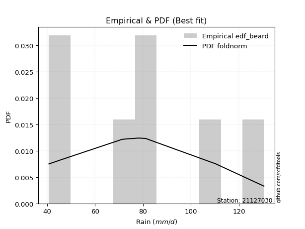</img>

</div>


### 5. Empirical - EDF Chegodayev (1955)

The Chegodayev formula is an empirical plotting position formula used in hydrological frequency analysis to estimate the exceedance probability or return period of a specific event from a set of observed data. It is primarily used for plotting observed data points on probability paper to fit a theoretical distribution, particularly for analyzing extreme events like maximum flood flows or rainfall intensities. The constant _b_ value in the generalized plotting position formula is 0.3.

<div align="center">


$P=(m-b)/(n+1-2b)$


</div>


**5.1. Empirical values**

<div align="center">

|                | 0                   | 1                   | 2                   | 3              | 4                  | 5                  | 6                  |
|:---------------|:--------------------|:--------------------|:--------------------|:---------------|:-------------------|:-------------------|:-------------------|
| date           | 2022                | 2023                | 2019                | 2024           | 2020               | 2025               | 2021               |
| x              | 40.8                | 45.6                | 71.4                | 78.0           | 81.0               | 107.4              | 110.2              |
| m              | 1                   | 2                   | 3                   | 4              | 5                  | 6                  | 7                  |
| empirical_dist | edf_chegodayev      | edf_chegodayev      | edf_chegodayev      | edf_chegodayev | edf_chegodayev     | edf_chegodayev     | edf_chegodayev     |
| empirical      | 0.09459459459459459 | 0.22972972972972971 | 0.36486486486486486 | 0.5            | 0.6351351351351351 | 0.7702702702702703 | 0.9054054054054054 |
| empirical_tr   | 1.1044776119402986  | 1.2982456140350878  | 1.574468085106383   | 2.0            | 2.7407407407407405 | 4.352941176470589  | 10.571428571428568 |

</div>


**5.2. Kolmogorov-Smirnov fit test (sorted by Δ)**


<div align="center">

|                | 0                   | 1                   | 2                   | 3                   | 4                   | 5                   | 6                   | 7                   | 8                   | 9                   | 10                  | 11                  | 12                  | 13                  | 14                  | 15                    | 16                  | 17                  | 18                  | 19                  | 20                  | 21                  | 22                  | 23                  | 24                  | 25                  | 26                  | 27                  | 28                  | 29                  | 30                  | 31                  | 32                  | 33                  | 34                  | 35                  | 36                  | 37                  | 38                  | 39                  | 40                  | 41                  | 42                  | 43                  | 44                  | 45                  | 46                  | 47                  | 48                  | 49                  | 50                  | 51                  | 52                  | 53                  | 54                  | 55                  | 56                  | 57                  | 58                  | 59                  | 60                  | 61                  | 62                  | 63                  | 64                  | 65                  | 66                  | 67                  | 68                  | 69                  | 70                  | 71                  | 72                  | 73                  | 74                  | 75                  | 76                  | 77                  | 78                  | 79                  | 80                  | 81                  | 82                  | 83                  | 84                  | 85                  | 86                  | 87                  | 88                  | 89                  |
|:---------------|:--------------------|:--------------------|:--------------------|:--------------------|:--------------------|:--------------------|:--------------------|:--------------------|:--------------------|:--------------------|:--------------------|:--------------------|:--------------------|:--------------------|:--------------------|:----------------------|:--------------------|:--------------------|:--------------------|:--------------------|:--------------------|:--------------------|:--------------------|:--------------------|:--------------------|:--------------------|:--------------------|:--------------------|:--------------------|:--------------------|:--------------------|:--------------------|:--------------------|:--------------------|:--------------------|:--------------------|:--------------------|:--------------------|:--------------------|:--------------------|:--------------------|:--------------------|:--------------------|:--------------------|:--------------------|:--------------------|:--------------------|:--------------------|:--------------------|:--------------------|:--------------------|:--------------------|:--------------------|:--------------------|:--------------------|:--------------------|:--------------------|:--------------------|:--------------------|:--------------------|:--------------------|:--------------------|:--------------------|:--------------------|:--------------------|:--------------------|:--------------------|:--------------------|:--------------------|:--------------------|:--------------------|:--------------------|:--------------------|:--------------------|:--------------------|:--------------------|:--------------------|:--------------------|:--------------------|:--------------------|:--------------------|:--------------------|:--------------------|:--------------------|:--------------------|:--------------------|:--------------------|:--------------------|:--------------------|:--------------------|
| station        | 21127030            | 21127030            | 21127030            | 21127030            | 21127030            | 21127030            | 21127030            | 21127030            | 21127030            | 21127030            | 21127030            | 21127030            | 21127030            | 21127030            | 21127030            | 21127030              | 21127030            | 21127030            | 21127030            | 21127030            | 21127030            | 21127030            | 21127030            | 21127030            | 21127030            | 21127030            | 21127030            | 21127030            | 21127030            | 21127030            | 21127030            | 21127030            | 21127030            | 21127030            | 21127030            | 21127030            | 21127030            | 21127030            | 21127030            | 21127030            | 21127030            | 21127030            | 21127030            | 21127030            | 21127030            | 21127030            | 21127030            | 21127030            | 21127030            | 21127030            | 21127030            | 21127030            | 21127030            | 21127030            | 21127030            | 21127030            | 21127030            | 21127030            | 21127030            | 21127030            | 21127030            | 21127030            | 21127030            | 21127030            | 21127030            | 21127030            | 21127030            | 21127030            | 21127030            | 21127030            | 21127030            | 21127030            | 21127030            | 21127030            | 21127030            | 21127030            | 21127030            | 21127030            | 21127030            | 21127030            | 21127030            | 21127030            | 21127030            | 21127030            | 21127030            | 21127030            | 21127030            | 21127030            | 21127030            | 21127030            |
| empirical_dist | edf_chegodayev      | edf_chegodayev      | edf_chegodayev      | edf_chegodayev      | edf_chegodayev      | edf_chegodayev      | edf_chegodayev      | edf_chegodayev      | edf_chegodayev      | edf_chegodayev      | edf_chegodayev      | edf_chegodayev      | edf_chegodayev      | edf_chegodayev      | edf_chegodayev      | edf_chegodayev        | edf_chegodayev      | edf_chegodayev      | edf_chegodayev      | edf_chegodayev      | edf_chegodayev      | edf_chegodayev      | edf_chegodayev      | edf_chegodayev      | edf_chegodayev      | edf_chegodayev      | edf_chegodayev      | edf_chegodayev      | edf_chegodayev      | edf_chegodayev      | edf_chegodayev      | edf_chegodayev      | edf_chegodayev      | edf_chegodayev      | edf_chegodayev      | edf_chegodayev      | edf_chegodayev      | edf_chegodayev      | edf_chegodayev      | edf_chegodayev      | edf_chegodayev      | edf_chegodayev      | edf_chegodayev      | edf_chegodayev      | edf_chegodayev      | edf_chegodayev      | edf_chegodayev      | edf_chegodayev      | edf_chegodayev      | edf_chegodayev      | edf_chegodayev      | edf_chegodayev      | edf_chegodayev      | edf_chegodayev      | edf_chegodayev      | edf_chegodayev      | edf_chegodayev      | edf_chegodayev      | edf_chegodayev      | edf_chegodayev      | edf_chegodayev      | edf_chegodayev      | edf_chegodayev      | edf_chegodayev      | edf_chegodayev      | edf_chegodayev      | edf_chegodayev      | edf_chegodayev      | edf_chegodayev      | edf_chegodayev      | edf_chegodayev      | edf_chegodayev      | edf_chegodayev      | edf_chegodayev      | edf_chegodayev      | edf_chegodayev      | edf_chegodayev      | edf_chegodayev      | edf_chegodayev      | edf_chegodayev      | edf_chegodayev      | edf_chegodayev      | edf_chegodayev      | edf_chegodayev      | edf_chegodayev      | edf_chegodayev      | edf_chegodayev      | edf_chegodayev      | edf_chegodayev      | edf_chegodayev      |
| p_dist         | fisk                | alpha               | gamma               | erlang              | nct                 | norm                | crystalball         | truncnorm           | exponnorm           | t                   | logpearson3         | genlogistic         | logweibull_min      | pearson3            | johnsonsu           | loglaplace_asymmetric | betaprime           | invgauss            | invgamma            | laplace_asymmetric  | f                   | logf                | lognct              | logcrystalball      | lognorm             | lognorm             | logexponnorm        | logt                | maxwell             | logfatiguelife      | ncf                 | logfisk             | rayleigh            | logistic            | loggamma            | loggamma            | loggumbel_l         | kstwobign           | logerlang           | rice                | loglogistic         | hypsecant           | laplace             | loghypsecant        | logrice             | logalpha            | loglaplace          | logbetaprime        | loginvgamma         | loginvgauss         | mielke              | logmaxwell          | loggompertz         | gumbel_r            | gumbel_l            | logjohnsonsu        | logloggamma         | lograyleigh         | logmielke           | logncf              | loginvweibull       | halfnorm            | moyal               | loggumbel_r         | logkstwobign        | loghalfnorm         | expon               | genexpon            | logmoyal            | wald                | halflogistic        | gibrat              | loghalflogistic     | logchi2             | loggenexpon         | logexpon            | weibull_min         | logwald             | loggibrat           | nakagami            | pareto              | logpareto           | logtruncnorm        | loglognorm          | invweibull          | lognakagami         | fatiguelife         | gompertz            | chi2                | loggenlogistic      |
| delta          | 0.11536473702684007 | 0.12081630283187011 | 0.12195545851991496 | 0.12199622113940611 | 0.12284085527989197 | 0.1228439348605922  | 0.12284393930499682 | 0.12284394665300602 | 0.12284413525126447 | 0.12286616210023482 | 0.12322389552137822 | 0.12351805683215522 | 0.12351967649037165 | 0.12367689845348484 | 0.12388022593860515 | 0.12415138510953228   | 0.12428356910415188 | 0.12491401141665931 | 0.12497941889128919 | 0.12556037980633017 | 0.12679112459134145 | 0.12853772035576286 | 0.12860305724088217 | 0.12860508994954473 | 0.12860510948560838 | 0.12860510948560838 | 0.12860569045433706 | 0.1286109000076146  | 0.128844572841827   | 0.12935588087147953 | 0.1339973151429102  | 0.13461838668208626 | 0.1346329524119086  | 0.13481295165224894 | 0.13593137841192943 | 0.13593137841192943 | 0.1365028062007566  | 0.1370789358873224  | 0.1379716087038388  | 0.1388040874273424  | 0.13966966009648346 | 0.14001705525898567 | 0.14355549603984508 | 0.1443490380109349  | 0.14527299673463417 | 0.1463891149110939  | 0.14735769109347135 | 0.14790208203170457 | 0.14942789942656082 | 0.15810770283984105 | 0.1603860182296062  | 0.16068877982586743 | 0.1616641064615049  | 0.16395540640133494 | 0.1668037957176185  | 0.16680466499709323 | 0.17101419350976077 | 0.17186484753762837 | 0.17233250757777419 | 0.1750145063910502  | 0.18459016859679894 | 0.18505807494932203 | 0.19208815815445227 | 0.1974461534467386  | 0.20513503158705243 | 0.2063895977890992  | 0.2123674573393433  | 0.21405675575722533 | 0.22332706891366422 | 0.22972972972972971 | 0.22972972972972971 | 0.22972972972972971 | 0.22972972972972971 | 0.2300832708734799  | 0.24622936970249648 | 0.2626996164775302  | 0.26596122728583343 | 0.29532890889861624 | 0.3174135898095905  | 0.3256598892039327  | 0.3424908811163482  | 0.36343113094822277 | 0.36486482436572004 | 0.3793392080970033  | 0.43275280968937746 | 0.4487972787227848  | 0.48069298903343977 | 0.6299021955134166  | 0.748519525287121   | 0.7702702702702703  |
| deltao         | 0.48442053926100004 | 0.48442053926100004 | 0.48442053926100004 | 0.48442053926100004 | 0.48442053926100004 | 0.48442053926100004 | 0.48442053926100004 | 0.48442053926100004 | 0.48442053926100004 | 0.48442053926100004 | 0.48442053926100004 | 0.48442053926100004 | 0.48442053926100004 | 0.48442053926100004 | 0.48442053926100004 | 0.48442053926100004   | 0.48442053926100004 | 0.48442053926100004 | 0.48442053926100004 | 0.48442053926100004 | 0.48442053926100004 | 0.48442053926100004 | 0.48442053926100004 | 0.48442053926100004 | 0.48442053926100004 | 0.48442053926100004 | 0.48442053926100004 | 0.48442053926100004 | 0.48442053926100004 | 0.48442053926100004 | 0.48442053926100004 | 0.48442053926100004 | 0.48442053926100004 | 0.48442053926100004 | 0.48442053926100004 | 0.48442053926100004 | 0.48442053926100004 | 0.48442053926100004 | 0.48442053926100004 | 0.48442053926100004 | 0.48442053926100004 | 0.48442053926100004 | 0.48442053926100004 | 0.48442053926100004 | 0.48442053926100004 | 0.48442053926100004 | 0.48442053926100004 | 0.48442053926100004 | 0.48442053926100004 | 0.48442053926100004 | 0.48442053926100004 | 0.48442053926100004 | 0.48442053926100004 | 0.48442053926100004 | 0.48442053926100004 | 0.48442053926100004 | 0.48442053926100004 | 0.48442053926100004 | 0.48442053926100004 | 0.48442053926100004 | 0.48442053926100004 | 0.48442053926100004 | 0.48442053926100004 | 0.48442053926100004 | 0.48442053926100004 | 0.48442053926100004 | 0.48442053926100004 | 0.48442053926100004 | 0.48442053926100004 | 0.48442053926100004 | 0.48442053926100004 | 0.48442053926100004 | 0.48442053926100004 | 0.48442053926100004 | 0.48442053926100004 | 0.48442053926100004 | 0.48442053926100004 | 0.48442053926100004 | 0.48442053926100004 | 0.48442053926100004 | 0.48442053926100004 | 0.48442053926100004 | 0.48442053926100004 | 0.48442053926100004 | 0.48442053926100004 | 0.48442053926100004 | 0.48442053926100004 | 0.48442053926100004 | 0.48442053926100004 | 0.48442053926100004 |
| eval           | Δo > Δ              | Δo > Δ              | Δo > Δ              | Δo > Δ              | Δo > Δ              | Δo > Δ              | Δo > Δ              | Δo > Δ              | Δo > Δ              | Δo > Δ              | Δo > Δ              | Δo > Δ              | Δo > Δ              | Δo > Δ              | Δo > Δ              | Δo > Δ                | Δo > Δ              | Δo > Δ              | Δo > Δ              | Δo > Δ              | Δo > Δ              | Δo > Δ              | Δo > Δ              | Δo > Δ              | Δo > Δ              | Δo > Δ              | Δo > Δ              | Δo > Δ              | Δo > Δ              | Δo > Δ              | Δo > Δ              | Δo > Δ              | Δo > Δ              | Δo > Δ              | Δo > Δ              | Δo > Δ              | Δo > Δ              | Δo > Δ              | Δo > Δ              | Δo > Δ              | Δo > Δ              | Δo > Δ              | Δo > Δ              | Δo > Δ              | Δo > Δ              | Δo > Δ              | Δo > Δ              | Δo > Δ              | Δo > Δ              | Δo > Δ              | Δo > Δ              | Δo > Δ              | Δo > Δ              | Δo > Δ              | Δo > Δ              | Δo > Δ              | Δo > Δ              | Δo > Δ              | Δo > Δ              | Δo > Δ              | Δo > Δ              | Δo > Δ              | Δo > Δ              | Δo > Δ              | Δo > Δ              | Δo > Δ              | Δo > Δ              | Δo > Δ              | Δo > Δ              | Δo > Δ              | Δo > Δ              | Δo > Δ              | Δo > Δ              | Δo > Δ              | Δo > Δ              | Δo > Δ              | Δo > Δ              | Δo > Δ              | Δo > Δ              | Δo > Δ              | Δo > Δ              | Δo > Δ              | Δo > Δ              | Δo > Δ              | Δo > Δ              | Δo > Δ              | Δo > Δ              | Δo <= Δ             | Δo <= Δ             | Δo <= Δ             |
| fit            | 1                   | 1                   | 1                   | 1                   | 1                   | 1                   | 1                   | 1                   | 1                   | 1                   | 1                   | 1                   | 1                   | 1                   | 1                   | 1                     | 1                   | 1                   | 1                   | 1                   | 1                   | 1                   | 1                   | 1                   | 1                   | 1                   | 1                   | 1                   | 1                   | 1                   | 1                   | 1                   | 1                   | 1                   | 1                   | 1                   | 1                   | 1                   | 1                   | 1                   | 1                   | 1                   | 1                   | 1                   | 1                   | 1                   | 1                   | 1                   | 1                   | 1                   | 1                   | 1                   | 1                   | 1                   | 1                   | 1                   | 1                   | 1                   | 1                   | 1                   | 1                   | 1                   | 1                   | 1                   | 1                   | 1                   | 1                   | 1                   | 1                   | 1                   | 1                   | 1                   | 1                   | 1                   | 1                   | 1                   | 1                   | 1                   | 1                   | 1                   | 1                   | 1                   | 1                   | 1                   | 1                   | 1                   | 1                   | 0                   | 0                   | 0                   |
| n              | 7                   | 7                   | 7                   | 7                   | 7                   | 7                   | 7                   | 7                   | 7                   | 7                   | 7                   | 7                   | 7                   | 7                   | 7                   | 7                     | 7                   | 7                   | 7                   | 7                   | 7                   | 7                   | 7                   | 7                   | 7                   | 7                   | 7                   | 7                   | 7                   | 7                   | 7                   | 7                   | 7                   | 7                   | 7                   | 7                   | 7                   | 7                   | 7                   | 7                   | 7                   | 7                   | 7                   | 7                   | 7                   | 7                   | 7                   | 7                   | 7                   | 7                   | 7                   | 7                   | 7                   | 7                   | 7                   | 7                   | 7                   | 7                   | 7                   | 7                   | 7                   | 7                   | 7                   | 7                   | 7                   | 7                   | 7                   | 7                   | 7                   | 7                   | 7                   | 7                   | 7                   | 7                   | 7                   | 7                   | 7                   | 7                   | 7                   | 7                   | 7                   | 7                   | 7                   | 7                   | 7                   | 7                   | 7                   | 7                   | 7                   | 7                   |
| best_fit       | 1                   | 0                   | 0                   | 0                   | 0                   | 0                   | 0                   | 0                   | 0                   | 0                   | 0                   | 0                   | 0                   | 0                   | 0                   | 0                     | 0                   | 0                   | 0                   | 0                   | 0                   | 0                   | 0                   | 0                   | 0                   | 0                   | 0                   | 0                   | 0                   | 0                   | 0                   | 0                   | 0                   | 0                   | 0                   | 0                   | 0                   | 0                   | 0                   | 0                   | 0                   | 0                   | 0                   | 0                   | 0                   | 0                   | 0                   | 0                   | 0                   | 0                   | 0                   | 0                   | 0                   | 0                   | 0                   | 0                   | 0                   | 0                   | 0                   | 0                   | 0                   | 0                   | 0                   | 0                   | 0                   | 0                   | 0                   | 0                   | 0                   | 0                   | 0                   | 0                   | 0                   | 0                   | 0                   | 0                   | 0                   | 0                   | 0                   | 0                   | 0                   | 0                   | 0                   | 0                   | 0                   | 0                   | 0                   | 0                   | 0                   | 0                   |
| best_fit_sort  | 1                   | 2                   | 3                   | 4                   | 5                   | 6                   | 7                   | 8                   | 9                   | 10                  | 11                  | 12                  | 13                  | 14                  | 15                  | 16                    | 17                  | 18                  | 19                  | 20                  | 21                  | 22                  | 23                  | 24                  | 25                  | 26                  | 27                  | 28                  | 29                  | 30                  | 31                  | 32                  | 33                  | 34                  | 35                  | 36                  | 37                  | 38                  | 39                  | 40                  | 41                  | 42                  | 43                  | 44                  | 45                  | 46                  | 47                  | 48                  | 49                  | 50                  | 51                  | 52                  | 53                  | 54                  | 55                  | 56                  | 57                  | 58                  | 59                  | 60                  | 61                  | 62                  | 63                  | 64                  | 65                  | 66                  | 67                  | 68                  | 69                  | 70                  | 71                  | 72                  | 73                  | 74                  | 75                  | 76                  | 77                  | 78                  | 79                  | 80                  | 81                  | 82                  | 83                  | 84                  | 85                  | 86                  | 87                  | 88                  | 89                  | 90                  |

</div>


<div align="center">

</img>

</div>


**5.3. Best fit**

<div align="center">

|   id |   station | empirical_dist   | p_dist   |    delta |   deltao | eval   |   fit |   n |   best_fit |   best_fit_sort |
|-----:|----------:|:-----------------|:---------|---------:|---------:|:-------|------:|----:|-----------:|----------------:|
|    0 |  21127030 | edf_chegodayev   | fisk     | 0.115365 | 0.484421 | Δo > Δ |     1 |   7 |          1 |               1 |

</div>


<div align="center">

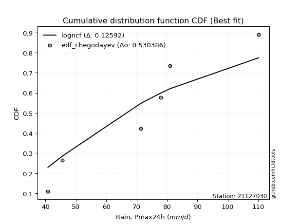</img>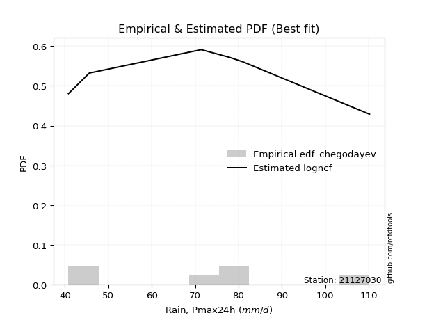</img>

</div>


### 6. Empirical - EDF Blom (1958)

The Blom formula is a specific "plotting position" formula used in hydrology and statistical analysis to estimate the empirical cumulative probability (or non-exceedance probability) of a data series. It is particularly recommended for data that are approximately normally distributed. The constant _a_ is set to 0.375 (or 3/8).

<div align="center">


$P=(m-a)/(n+1-2a)$


</div>


**6.1. Empirical values**

<div align="center">

|                | 0                   | 1                   | 2                  | 3        | 4                  | 5                  | 6                  |
|:---------------|:--------------------|:--------------------|:-------------------|:---------|:-------------------|:-------------------|:-------------------|
| date           | 2022                | 2023                | 2019               | 2024     | 2020               | 2025               | 2021               |
| x              | 40.8                | 45.6                | 71.4               | 78.0     | 81.0               | 107.4              | 110.2              |
| m              | 1                   | 2                   | 3                  | 4        | 5                  | 6                  | 7                  |
| empirical_dist | edf_blom            | edf_blom            | edf_blom           | edf_blom | edf_blom           | edf_blom           | edf_blom           |
| empirical      | 0.08620689655172414 | 0.22413793103448276 | 0.3620689655172414 | 0.5      | 0.6379310344827587 | 0.7758620689655172 | 0.9137931034482759 |
| empirical_tr   | 1.0943396226415094  | 1.288888888888889   | 1.5675675675675675 | 2.0      | 2.7619047619047623 | 4.461538461538462  | 11.600000000000007 |

</div>


**6.2. Kolmogorov-Smirnov fit test (sorted by Δ)**


<div align="center">

|                | 0                   | 1                   | 2                   | 3                   | 4                   | 5                   | 6                   | 7                   | 8                   | 9                   | 10                  | 11                  | 12                  | 13                  | 14                    | 15                  | 16                  | 17                  | 18                  | 19                  | 20                  | 21                  | 22                  | 23                  | 24                  | 25                  | 26                  | 27                  | 28                  | 29                  | 30                  | 31                  | 32                  | 33                  | 34                  | 35                  | 36                  | 37                  | 38                  | 39                  | 40                  | 41                  | 42                  | 43                  | 44                  | 45                  | 46                  | 47                  | 48                  | 49                  | 50                  | 51                  | 52                  | 53                  | 54                  | 55                  | 56                  | 57                  | 58                  | 59                  | 60                  | 61                  | 62                  | 63                  | 64                  | 65                  | 66                  | 67                  | 68                  | 69                  | 70                  | 71                  | 72                  | 73                  | 74                  | 75                  | 76                  | 77                  | 78                  | 79                  | 80                  | 81                  | 82                  | 83                  | 84                  | 85                  | 86                  | 87                  | 88                  | 89                  |
|:---------------|:--------------------|:--------------------|:--------------------|:--------------------|:--------------------|:--------------------|:--------------------|:--------------------|:--------------------|:--------------------|:--------------------|:--------------------|:--------------------|:--------------------|:----------------------|:--------------------|:--------------------|:--------------------|:--------------------|:--------------------|:--------------------|:--------------------|:--------------------|:--------------------|:--------------------|:--------------------|:--------------------|:--------------------|:--------------------|:--------------------|:--------------------|:--------------------|:--------------------|:--------------------|:--------------------|:--------------------|:--------------------|:--------------------|:--------------------|:--------------------|:--------------------|:--------------------|:--------------------|:--------------------|:--------------------|:--------------------|:--------------------|:--------------------|:--------------------|:--------------------|:--------------------|:--------------------|:--------------------|:--------------------|:--------------------|:--------------------|:--------------------|:--------------------|:--------------------|:--------------------|:--------------------|:--------------------|:--------------------|:--------------------|:--------------------|:--------------------|:--------------------|:--------------------|:--------------------|:--------------------|:--------------------|:--------------------|:--------------------|:--------------------|:--------------------|:--------------------|:--------------------|:--------------------|:--------------------|:--------------------|:--------------------|:--------------------|:--------------------|:--------------------|:--------------------|:--------------------|:--------------------|:--------------------|:--------------------|:--------------------|
| station        | 21127030            | 21127030            | 21127030            | 21127030            | 21127030            | 21127030            | 21127030            | 21127030            | 21127030            | 21127030            | 21127030            | 21127030            | 21127030            | 21127030            | 21127030              | 21127030            | 21127030            | 21127030            | 21127030            | 21127030            | 21127030            | 21127030            | 21127030            | 21127030            | 21127030            | 21127030            | 21127030            | 21127030            | 21127030            | 21127030            | 21127030            | 21127030            | 21127030            | 21127030            | 21127030            | 21127030            | 21127030            | 21127030            | 21127030            | 21127030            | 21127030            | 21127030            | 21127030            | 21127030            | 21127030            | 21127030            | 21127030            | 21127030            | 21127030            | 21127030            | 21127030            | 21127030            | 21127030            | 21127030            | 21127030            | 21127030            | 21127030            | 21127030            | 21127030            | 21127030            | 21127030            | 21127030            | 21127030            | 21127030            | 21127030            | 21127030            | 21127030            | 21127030            | 21127030            | 21127030            | 21127030            | 21127030            | 21127030            | 21127030            | 21127030            | 21127030            | 21127030            | 21127030            | 21127030            | 21127030            | 21127030            | 21127030            | 21127030            | 21127030            | 21127030            | 21127030            | 21127030            | 21127030            | 21127030            | 21127030            |
| empirical_dist | edf_blom            | edf_blom            | edf_blom            | edf_blom            | edf_blom            | edf_blom            | edf_blom            | edf_blom            | edf_blom            | edf_blom            | edf_blom            | edf_blom            | edf_blom            | edf_blom            | edf_blom              | edf_blom            | edf_blom            | edf_blom            | edf_blom            | edf_blom            | edf_blom            | edf_blom            | edf_blom            | edf_blom            | edf_blom            | edf_blom            | edf_blom            | edf_blom            | edf_blom            | edf_blom            | edf_blom            | edf_blom            | edf_blom            | edf_blom            | edf_blom            | edf_blom            | edf_blom            | edf_blom            | edf_blom            | edf_blom            | edf_blom            | edf_blom            | edf_blom            | edf_blom            | edf_blom            | edf_blom            | edf_blom            | edf_blom            | edf_blom            | edf_blom            | edf_blom            | edf_blom            | edf_blom            | edf_blom            | edf_blom            | edf_blom            | edf_blom            | edf_blom            | edf_blom            | edf_blom            | edf_blom            | edf_blom            | edf_blom            | edf_blom            | edf_blom            | edf_blom            | edf_blom            | edf_blom            | edf_blom            | edf_blom            | edf_blom            | edf_blom            | edf_blom            | edf_blom            | edf_blom            | edf_blom            | edf_blom            | edf_blom            | edf_blom            | edf_blom            | edf_blom            | edf_blom            | edf_blom            | edf_blom            | edf_blom            | edf_blom            | edf_blom            | edf_blom            | edf_blom            | edf_blom            |
| p_dist         | fisk                | alpha               | gamma               | erlang              | nct                 | norm                | crystalball         | truncnorm           | exponnorm           | t                   | logpearson3         | logweibull_min      | pearson3            | johnsonsu           | loglaplace_asymmetric | betaprime           | invgauss            | invgamma            | laplace_asymmetric  | f                   | maxwell             | genlogistic         | logfisk             | rayleigh            | logistic            | logt                | logexponnorm        | lognorm             | lognorm             | logcrystalball      | lognct              | logfatiguelife      | logf                | loggumbel_l         | rice                | loglogistic         | hypsecant           | ncf                 | laplace             | loggamma            | loggamma            | loghypsecant        | kstwobign           | logerlang           | loglaplace          | logrice             | logalpha            | logbetaprime        | loginvgamma         | mielke              | loggompertz         | gumbel_r            | loginvgauss         | gumbel_l            | logmaxwell          | logloggamma         | logmielke           | logjohnsonsu        | lograyleigh         | halfnorm            | logncf              | moyal               | loginvweibull       | loggumbel_r         | loghalfnorm         | logkstwobign        | expon               | genexpon            | halflogistic        | wald                | gibrat              | logmoyal            | loghalflogistic     | logchi2             | loggenexpon         | logexpon            | weibull_min         | logwald             | loggibrat           | nakagami            | pareto              | logtruncnorm        | logpareto           | loglognorm          | invweibull          | lognakagami         | fatiguelife         | gompertz            | chi2                | loggenlogistic      |
| delta          | 0.10977293833159311 | 0.11522450413662316 | 0.11636365982466801 | 0.11640442244415916 | 0.11724905658464502 | 0.11725213616534524 | 0.11725214060974987 | 0.11725214795775907 | 0.11725233655601752 | 0.11727436340498787 | 0.11763209682613127 | 0.1179278777951247  | 0.11808509975823789 | 0.1182884272433582  | 0.11855958641428532   | 0.11869177040890493 | 0.11932221272141236 | 0.11938762019604224 | 0.11996858111108322 | 0.1211993258960945  | 0.12325277414658005 | 0.1263139561797787  | 0.1290265879868393  | 0.12904115371666164 | 0.12922115295700198 | 0.13008948983413898 | 0.13013933124507687 | 0.13014044432421684 | 0.13014044432421684 | 0.13014044503559524 | 0.13014894630599244 | 0.13060710282418647 | 0.13081520338082997 | 0.13091100750550966 | 0.13321228873209545 | 0.1340778614012365  | 0.13442525656373872 | 0.13679321449053367 | 0.13796369734459812 | 0.1387272777595529  | 0.1387272777595529  | 0.13875723931568795 | 0.13987483523494587 | 0.14076750805146226 | 0.1417658923982244  | 0.14806889608225765 | 0.14918501425871739 | 0.15069798137932805 | 0.1522237987741843  | 0.15479421953435923 | 0.15607230776625794 | 0.15836360770608798 | 0.16090360218746452 | 0.16121199702237154 | 0.1634846791734909  | 0.16542239481451382 | 0.16674070888252723 | 0.16960056434471682 | 0.17466074688525185 | 0.17946627625407507 | 0.18340220443392075 | 0.1864963594592053  | 0.18738606794442242 | 0.20024205279436208 | 0.20613062103325136 | 0.2079309309346759  | 0.2151633566869668  | 0.2168526551048488  | 0.22413793103448276 | 0.22413793103448276 | 0.22413793103448276 | 0.2261229682612877  | 0.23057160493862033 | 0.23847096891635045 | 0.24902526905011996 | 0.2654955158251537  | 0.2687571266334569  | 0.2981248082462397  | 0.320209489157214   | 0.32845578855155616 | 0.34808267981159513 | 0.36206892501809657 | 0.3690229296434697  | 0.38493100679225023 | 0.441140507732248   | 0.4515931780704083  | 0.48348888838106324 | 0.6326980948610402  | 0.7541113239823679  | 0.7758620689655172  |
| deltao         | 0.48442053926100004 | 0.48442053926100004 | 0.48442053926100004 | 0.48442053926100004 | 0.48442053926100004 | 0.48442053926100004 | 0.48442053926100004 | 0.48442053926100004 | 0.48442053926100004 | 0.48442053926100004 | 0.48442053926100004 | 0.48442053926100004 | 0.48442053926100004 | 0.48442053926100004 | 0.48442053926100004   | 0.48442053926100004 | 0.48442053926100004 | 0.48442053926100004 | 0.48442053926100004 | 0.48442053926100004 | 0.48442053926100004 | 0.48442053926100004 | 0.48442053926100004 | 0.48442053926100004 | 0.48442053926100004 | 0.48442053926100004 | 0.48442053926100004 | 0.48442053926100004 | 0.48442053926100004 | 0.48442053926100004 | 0.48442053926100004 | 0.48442053926100004 | 0.48442053926100004 | 0.48442053926100004 | 0.48442053926100004 | 0.48442053926100004 | 0.48442053926100004 | 0.48442053926100004 | 0.48442053926100004 | 0.48442053926100004 | 0.48442053926100004 | 0.48442053926100004 | 0.48442053926100004 | 0.48442053926100004 | 0.48442053926100004 | 0.48442053926100004 | 0.48442053926100004 | 0.48442053926100004 | 0.48442053926100004 | 0.48442053926100004 | 0.48442053926100004 | 0.48442053926100004 | 0.48442053926100004 | 0.48442053926100004 | 0.48442053926100004 | 0.48442053926100004 | 0.48442053926100004 | 0.48442053926100004 | 0.48442053926100004 | 0.48442053926100004 | 0.48442053926100004 | 0.48442053926100004 | 0.48442053926100004 | 0.48442053926100004 | 0.48442053926100004 | 0.48442053926100004 | 0.48442053926100004 | 0.48442053926100004 | 0.48442053926100004 | 0.48442053926100004 | 0.48442053926100004 | 0.48442053926100004 | 0.48442053926100004 | 0.48442053926100004 | 0.48442053926100004 | 0.48442053926100004 | 0.48442053926100004 | 0.48442053926100004 | 0.48442053926100004 | 0.48442053926100004 | 0.48442053926100004 | 0.48442053926100004 | 0.48442053926100004 | 0.48442053926100004 | 0.48442053926100004 | 0.48442053926100004 | 0.48442053926100004 | 0.48442053926100004 | 0.48442053926100004 | 0.48442053926100004 |
| eval           | Δo > Δ              | Δo > Δ              | Δo > Δ              | Δo > Δ              | Δo > Δ              | Δo > Δ              | Δo > Δ              | Δo > Δ              | Δo > Δ              | Δo > Δ              | Δo > Δ              | Δo > Δ              | Δo > Δ              | Δo > Δ              | Δo > Δ                | Δo > Δ              | Δo > Δ              | Δo > Δ              | Δo > Δ              | Δo > Δ              | Δo > Δ              | Δo > Δ              | Δo > Δ              | Δo > Δ              | Δo > Δ              | Δo > Δ              | Δo > Δ              | Δo > Δ              | Δo > Δ              | Δo > Δ              | Δo > Δ              | Δo > Δ              | Δo > Δ              | Δo > Δ              | Δo > Δ              | Δo > Δ              | Δo > Δ              | Δo > Δ              | Δo > Δ              | Δo > Δ              | Δo > Δ              | Δo > Δ              | Δo > Δ              | Δo > Δ              | Δo > Δ              | Δo > Δ              | Δo > Δ              | Δo > Δ              | Δo > Δ              | Δo > Δ              | Δo > Δ              | Δo > Δ              | Δo > Δ              | Δo > Δ              | Δo > Δ              | Δo > Δ              | Δo > Δ              | Δo > Δ              | Δo > Δ              | Δo > Δ              | Δo > Δ              | Δo > Δ              | Δo > Δ              | Δo > Δ              | Δo > Δ              | Δo > Δ              | Δo > Δ              | Δo > Δ              | Δo > Δ              | Δo > Δ              | Δo > Δ              | Δo > Δ              | Δo > Δ              | Δo > Δ              | Δo > Δ              | Δo > Δ              | Δo > Δ              | Δo > Δ              | Δo > Δ              | Δo > Δ              | Δo > Δ              | Δo > Δ              | Δo > Δ              | Δo > Δ              | Δo > Δ              | Δo > Δ              | Δo > Δ              | Δo <= Δ             | Δo <= Δ             | Δo <= Δ             |
| fit            | 1                   | 1                   | 1                   | 1                   | 1                   | 1                   | 1                   | 1                   | 1                   | 1                   | 1                   | 1                   | 1                   | 1                   | 1                     | 1                   | 1                   | 1                   | 1                   | 1                   | 1                   | 1                   | 1                   | 1                   | 1                   | 1                   | 1                   | 1                   | 1                   | 1                   | 1                   | 1                   | 1                   | 1                   | 1                   | 1                   | 1                   | 1                   | 1                   | 1                   | 1                   | 1                   | 1                   | 1                   | 1                   | 1                   | 1                   | 1                   | 1                   | 1                   | 1                   | 1                   | 1                   | 1                   | 1                   | 1                   | 1                   | 1                   | 1                   | 1                   | 1                   | 1                   | 1                   | 1                   | 1                   | 1                   | 1                   | 1                   | 1                   | 1                   | 1                   | 1                   | 1                   | 1                   | 1                   | 1                   | 1                   | 1                   | 1                   | 1                   | 1                   | 1                   | 1                   | 1                   | 1                   | 1                   | 1                   | 0                   | 0                   | 0                   |
| n              | 7                   | 7                   | 7                   | 7                   | 7                   | 7                   | 7                   | 7                   | 7                   | 7                   | 7                   | 7                   | 7                   | 7                   | 7                     | 7                   | 7                   | 7                   | 7                   | 7                   | 7                   | 7                   | 7                   | 7                   | 7                   | 7                   | 7                   | 7                   | 7                   | 7                   | 7                   | 7                   | 7                   | 7                   | 7                   | 7                   | 7                   | 7                   | 7                   | 7                   | 7                   | 7                   | 7                   | 7                   | 7                   | 7                   | 7                   | 7                   | 7                   | 7                   | 7                   | 7                   | 7                   | 7                   | 7                   | 7                   | 7                   | 7                   | 7                   | 7                   | 7                   | 7                   | 7                   | 7                   | 7                   | 7                   | 7                   | 7                   | 7                   | 7                   | 7                   | 7                   | 7                   | 7                   | 7                   | 7                   | 7                   | 7                   | 7                   | 7                   | 7                   | 7                   | 7                   | 7                   | 7                   | 7                   | 7                   | 7                   | 7                   | 7                   |
| best_fit       | 1                   | 0                   | 0                   | 0                   | 0                   | 0                   | 0                   | 0                   | 0                   | 0                   | 0                   | 0                   | 0                   | 0                   | 0                     | 0                   | 0                   | 0                   | 0                   | 0                   | 0                   | 0                   | 0                   | 0                   | 0                   | 0                   | 0                   | 0                   | 0                   | 0                   | 0                   | 0                   | 0                   | 0                   | 0                   | 0                   | 0                   | 0                   | 0                   | 0                   | 0                   | 0                   | 0                   | 0                   | 0                   | 0                   | 0                   | 0                   | 0                   | 0                   | 0                   | 0                   | 0                   | 0                   | 0                   | 0                   | 0                   | 0                   | 0                   | 0                   | 0                   | 0                   | 0                   | 0                   | 0                   | 0                   | 0                   | 0                   | 0                   | 0                   | 0                   | 0                   | 0                   | 0                   | 0                   | 0                   | 0                   | 0                   | 0                   | 0                   | 0                   | 0                   | 0                   | 0                   | 0                   | 0                   | 0                   | 0                   | 0                   | 0                   |
| best_fit_sort  | 1                   | 2                   | 3                   | 4                   | 5                   | 6                   | 7                   | 8                   | 9                   | 10                  | 11                  | 12                  | 13                  | 14                  | 15                    | 16                  | 17                  | 18                  | 19                  | 20                  | 21                  | 22                  | 23                  | 24                  | 25                  | 26                  | 27                  | 28                  | 29                  | 30                  | 31                  | 32                  | 33                  | 34                  | 35                  | 36                  | 37                  | 38                  | 39                  | 40                  | 41                  | 42                  | 43                  | 44                  | 45                  | 46                  | 47                  | 48                  | 49                  | 50                  | 51                  | 52                  | 53                  | 54                  | 55                  | 56                  | 57                  | 58                  | 59                  | 60                  | 61                  | 62                  | 63                  | 64                  | 65                  | 66                  | 67                  | 68                  | 69                  | 70                  | 71                  | 72                  | 73                  | 74                  | 75                  | 76                  | 77                  | 78                  | 79                  | 80                  | 81                  | 82                  | 83                  | 84                  | 85                  | 86                  | 87                  | 88                  | 89                  | 90                  |

</div>


<div align="center">

</img>

</div>


**6.3. Best fit**

<div align="center">

|   id |   station | empirical_dist   | p_dist   |    delta |   deltao | eval   |   fit |   n |   best_fit |   best_fit_sort |
|-----:|----------:|:-----------------|:---------|---------:|---------:|:-------|------:|----:|-----------:|----------------:|
|    0 |  21127030 | edf_blom         | fisk     | 0.109773 | 0.484421 | Δo > Δ |     1 |   7 |          1 |               1 |

</div>


<div align="center">

</img>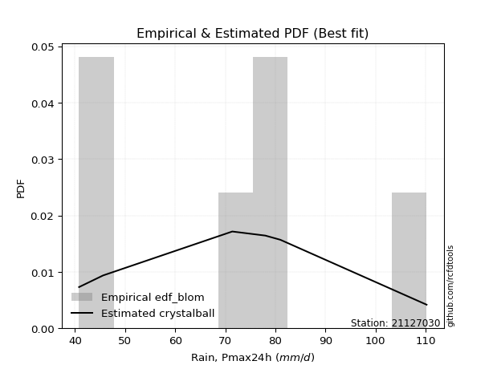</img>

</div>


### 7. Empirical - EDF Tukey (1962)

In hydrology, the Tukey formula is used as a plotting position formula to estimate the empirical probability or frequency of a flood event (or other hydrological data). The formula parameter is given as _c=0.333_ (or 1/3).

<div align="center">


$P=(m-c)/(n+1-2c)$


</div>


**7.1. Empirical values**

<div align="center">

|                | 0                   | 1                   | 2                   | 3         | 4                  | 5                  | 6                  |
|:---------------|:--------------------|:--------------------|:--------------------|:----------|:-------------------|:-------------------|:-------------------|
| date           | 2022                | 2023                | 2019                | 2024      | 2020               | 2025               | 2021               |
| x              | 40.8                | 45.6                | 71.4                | 78.0      | 81.0               | 107.4              | 110.2              |
| m              | 1                   | 2                   | 3                   | 4         | 5                  | 6                  | 7                  |
| empirical_dist | edf_tukey           | edf_tukey           | edf_tukey           | edf_tukey | edf_tukey          | edf_tukey          | edf_tukey          |
| empirical      | 0.09090909090909091 | 0.22727272727272727 | 0.36363636363636365 | 0.5       | 0.6363636363636364 | 0.7727272727272727 | 0.9090909090909091 |
| empirical_tr   | 1.1                 | 1.2941176470588236  | 1.5714285714285714  | 2.0       | 2.75               | 4.3999999999999995 | 10.999999999999996 |

</div>


**7.2. Kolmogorov-Smirnov fit test (sorted by Δ)**


<div align="center">

|                | 0                   | 1                   | 2                   | 3                   | 4                   | 5                   | 6                   | 7                   | 8                   | 9                   | 10                  | 11                  | 12                  | 13                  | 14                    | 15                  | 16                  | 17                  | 18                  | 19                  | 20                  | 21                  | 22                  | 23                  | 24                  | 25                  | 26                  | 27                  | 28                  | 29                  | 30                  | 31                  | 32                  | 33                  | 34                  | 35                  | 36                  | 37                  | 38                  | 39                  | 40                  | 41                  | 42                  | 43                  | 44                  | 45                  | 46                  | 47                  | 48                  | 49                  | 50                  | 51                  | 52                  | 53                  | 54                  | 55                  | 56                  | 57                  | 58                  | 59                  | 60                  | 61                  | 62                  | 63                  | 64                  | 65                  | 66                  | 67                  | 68                  | 69                  | 70                  | 71                  | 72                  | 73                  | 74                  | 75                  | 76                  | 77                  | 78                  | 79                  | 80                  | 81                  | 82                  | 83                  | 84                  | 85                  | 86                  | 87                  | 88                  | 89                  |
|:---------------|:--------------------|:--------------------|:--------------------|:--------------------|:--------------------|:--------------------|:--------------------|:--------------------|:--------------------|:--------------------|:--------------------|:--------------------|:--------------------|:--------------------|:----------------------|:--------------------|:--------------------|:--------------------|:--------------------|:--------------------|:--------------------|:--------------------|:--------------------|:--------------------|:--------------------|:--------------------|:--------------------|:--------------------|:--------------------|:--------------------|:--------------------|:--------------------|:--------------------|:--------------------|:--------------------|:--------------------|:--------------------|:--------------------|:--------------------|:--------------------|:--------------------|:--------------------|:--------------------|:--------------------|:--------------------|:--------------------|:--------------------|:--------------------|:--------------------|:--------------------|:--------------------|:--------------------|:--------------------|:--------------------|:--------------------|:--------------------|:--------------------|:--------------------|:--------------------|:--------------------|:--------------------|:--------------------|:--------------------|:--------------------|:--------------------|:--------------------|:--------------------|:--------------------|:--------------------|:--------------------|:--------------------|:--------------------|:--------------------|:--------------------|:--------------------|:--------------------|:--------------------|:--------------------|:--------------------|:--------------------|:--------------------|:--------------------|:--------------------|:--------------------|:--------------------|:--------------------|:--------------------|:--------------------|:--------------------|:--------------------|
| station        | 21127030            | 21127030            | 21127030            | 21127030            | 21127030            | 21127030            | 21127030            | 21127030            | 21127030            | 21127030            | 21127030            | 21127030            | 21127030            | 21127030            | 21127030              | 21127030            | 21127030            | 21127030            | 21127030            | 21127030            | 21127030            | 21127030            | 21127030            | 21127030            | 21127030            | 21127030            | 21127030            | 21127030            | 21127030            | 21127030            | 21127030            | 21127030            | 21127030            | 21127030            | 21127030            | 21127030            | 21127030            | 21127030            | 21127030            | 21127030            | 21127030            | 21127030            | 21127030            | 21127030            | 21127030            | 21127030            | 21127030            | 21127030            | 21127030            | 21127030            | 21127030            | 21127030            | 21127030            | 21127030            | 21127030            | 21127030            | 21127030            | 21127030            | 21127030            | 21127030            | 21127030            | 21127030            | 21127030            | 21127030            | 21127030            | 21127030            | 21127030            | 21127030            | 21127030            | 21127030            | 21127030            | 21127030            | 21127030            | 21127030            | 21127030            | 21127030            | 21127030            | 21127030            | 21127030            | 21127030            | 21127030            | 21127030            | 21127030            | 21127030            | 21127030            | 21127030            | 21127030            | 21127030            | 21127030            | 21127030            |
| empirical_dist | edf_tukey           | edf_tukey           | edf_tukey           | edf_tukey           | edf_tukey           | edf_tukey           | edf_tukey           | edf_tukey           | edf_tukey           | edf_tukey           | edf_tukey           | edf_tukey           | edf_tukey           | edf_tukey           | edf_tukey             | edf_tukey           | edf_tukey           | edf_tukey           | edf_tukey           | edf_tukey           | edf_tukey           | edf_tukey           | edf_tukey           | edf_tukey           | edf_tukey           | edf_tukey           | edf_tukey           | edf_tukey           | edf_tukey           | edf_tukey           | edf_tukey           | edf_tukey           | edf_tukey           | edf_tukey           | edf_tukey           | edf_tukey           | edf_tukey           | edf_tukey           | edf_tukey           | edf_tukey           | edf_tukey           | edf_tukey           | edf_tukey           | edf_tukey           | edf_tukey           | edf_tukey           | edf_tukey           | edf_tukey           | edf_tukey           | edf_tukey           | edf_tukey           | edf_tukey           | edf_tukey           | edf_tukey           | edf_tukey           | edf_tukey           | edf_tukey           | edf_tukey           | edf_tukey           | edf_tukey           | edf_tukey           | edf_tukey           | edf_tukey           | edf_tukey           | edf_tukey           | edf_tukey           | edf_tukey           | edf_tukey           | edf_tukey           | edf_tukey           | edf_tukey           | edf_tukey           | edf_tukey           | edf_tukey           | edf_tukey           | edf_tukey           | edf_tukey           | edf_tukey           | edf_tukey           | edf_tukey           | edf_tukey           | edf_tukey           | edf_tukey           | edf_tukey           | edf_tukey           | edf_tukey           | edf_tukey           | edf_tukey           | edf_tukey           | edf_tukey           |
| p_dist         | fisk                | alpha               | gamma               | erlang              | nct                 | norm                | crystalball         | truncnorm           | exponnorm           | t                   | logpearson3         | logweibull_min      | pearson3            | johnsonsu           | loglaplace_asymmetric | betaprime           | invgauss            | invgamma            | laplace_asymmetric  | f                   | genlogistic         | maxwell             | logt                | logexponnorm        | lognorm             | lognorm             | logcrystalball      | lognct              | logfatiguelife      | logf                | logfisk             | rayleigh            | logistic            | loggumbel_l         | ncf                 | rice                | loggamma            | loggamma            | loglogistic         | hypsecant           | kstwobign           | logerlang           | laplace             | loghypsecant        | loglaplace          | logrice             | logalpha            | logbetaprime        | loginvgamma         | mielke              | loggompertz         | loginvgauss         | gumbel_r            | logmaxwell          | gumbel_l            | logjohnsonsu        | logloggamma         | logmielke           | lograyleigh         | logncf              | halfnorm            | loginvweibull       | moyal               | loggumbel_r         | loghalfnorm         | logkstwobign        | expon               | genexpon            | logmoyal            | wald                | halflogistic        | gibrat              | loghalflogistic     | logchi2             | loggenexpon         | logexpon            | weibull_min         | logwald             | loggibrat           | nakagami            | pareto              | logtruncnorm        | logpareto           | loglognorm          | invweibull          | lognakagami         | fatiguelife         | gompertz            | chi2                | loggenlogistic      |
| delta          | 0.11290773456983762 | 0.11835930037486767 | 0.11949845606291254 | 0.11953921868240369 | 0.12038385282288955 | 0.12038693240358977 | 0.1203869368479944  | 0.1203869441960036  | 0.12038713279426205 | 0.1204091596432324  | 0.12076689306437577 | 0.12106267403336923 | 0.12121989599648242 | 0.12142322348160273 | 0.12169438265252985   | 0.12182656664714943 | 0.12245700895965686 | 0.12252241643428674 | 0.12310337734932775 | 0.124334122134339   | 0.12474655806065643 | 0.12638757038482457 | 0.12852209171501672 | 0.1285719331259546  | 0.12857304620509458 | 0.12857304620509458 | 0.12857304691647298 | 0.12858154818687018 | 0.1290397047050642  | 0.1292478052617077  | 0.1321613842250838  | 0.13217594995490614 | 0.13235594919524651 | 0.1340458037437542  | 0.1352258163714114  | 0.13634708497033995 | 0.13715987964043064 | 0.13715987964043064 | 0.137212657639481   | 0.13756005280198325 | 0.1383074371158236  | 0.13920010993234    | 0.14109849358284265 | 0.14189203555393248 | 0.14490068863646893 | 0.14650149796313539 | 0.14761761613959512 | 0.14913058326020578 | 0.15065640065506203 | 0.15792901577260376 | 0.15920710400450244 | 0.15933620406834226 | 0.16149840394433246 | 0.16191728105436864 | 0.16434679326061608 | 0.1680331662255945  | 0.16855719105275835 | 0.16987550512077176 | 0.17309334876612958 | 0.1787000100765539  | 0.18260107249231958 | 0.18581866982530015 | 0.18963115569744982 | 0.19867465467523981 | 0.2045632229141291  | 0.20636353281555364 | 0.21359595856784452 | 0.21528525698572654 | 0.22455557014216543 | 0.22727272727272727 | 0.22727272727272727 | 0.22727272727272727 | 0.22900420681949807 | 0.2337687745589836  | 0.2474578709309977  | 0.2639281177060314  | 0.26718972851433465 | 0.29655741012711745 | 0.3186420910380917  | 0.3268883904324339  | 0.3449478835733506  | 0.36363632313721883 | 0.3658881334052252  | 0.3817962105540057  | 0.43643831337488115 | 0.450025779951286   | 0.481921490261941   | 0.6311306967419179  | 0.7509765277441234  | 0.7727272727272727  |
| deltao         | 0.48442053926100004 | 0.48442053926100004 | 0.48442053926100004 | 0.48442053926100004 | 0.48442053926100004 | 0.48442053926100004 | 0.48442053926100004 | 0.48442053926100004 | 0.48442053926100004 | 0.48442053926100004 | 0.48442053926100004 | 0.48442053926100004 | 0.48442053926100004 | 0.48442053926100004 | 0.48442053926100004   | 0.48442053926100004 | 0.48442053926100004 | 0.48442053926100004 | 0.48442053926100004 | 0.48442053926100004 | 0.48442053926100004 | 0.48442053926100004 | 0.48442053926100004 | 0.48442053926100004 | 0.48442053926100004 | 0.48442053926100004 | 0.48442053926100004 | 0.48442053926100004 | 0.48442053926100004 | 0.48442053926100004 | 0.48442053926100004 | 0.48442053926100004 | 0.48442053926100004 | 0.48442053926100004 | 0.48442053926100004 | 0.48442053926100004 | 0.48442053926100004 | 0.48442053926100004 | 0.48442053926100004 | 0.48442053926100004 | 0.48442053926100004 | 0.48442053926100004 | 0.48442053926100004 | 0.48442053926100004 | 0.48442053926100004 | 0.48442053926100004 | 0.48442053926100004 | 0.48442053926100004 | 0.48442053926100004 | 0.48442053926100004 | 0.48442053926100004 | 0.48442053926100004 | 0.48442053926100004 | 0.48442053926100004 | 0.48442053926100004 | 0.48442053926100004 | 0.48442053926100004 | 0.48442053926100004 | 0.48442053926100004 | 0.48442053926100004 | 0.48442053926100004 | 0.48442053926100004 | 0.48442053926100004 | 0.48442053926100004 | 0.48442053926100004 | 0.48442053926100004 | 0.48442053926100004 | 0.48442053926100004 | 0.48442053926100004 | 0.48442053926100004 | 0.48442053926100004 | 0.48442053926100004 | 0.48442053926100004 | 0.48442053926100004 | 0.48442053926100004 | 0.48442053926100004 | 0.48442053926100004 | 0.48442053926100004 | 0.48442053926100004 | 0.48442053926100004 | 0.48442053926100004 | 0.48442053926100004 | 0.48442053926100004 | 0.48442053926100004 | 0.48442053926100004 | 0.48442053926100004 | 0.48442053926100004 | 0.48442053926100004 | 0.48442053926100004 | 0.48442053926100004 |
| eval           | Δo > Δ              | Δo > Δ              | Δo > Δ              | Δo > Δ              | Δo > Δ              | Δo > Δ              | Δo > Δ              | Δo > Δ              | Δo > Δ              | Δo > Δ              | Δo > Δ              | Δo > Δ              | Δo > Δ              | Δo > Δ              | Δo > Δ                | Δo > Δ              | Δo > Δ              | Δo > Δ              | Δo > Δ              | Δo > Δ              | Δo > Δ              | Δo > Δ              | Δo > Δ              | Δo > Δ              | Δo > Δ              | Δo > Δ              | Δo > Δ              | Δo > Δ              | Δo > Δ              | Δo > Δ              | Δo > Δ              | Δo > Δ              | Δo > Δ              | Δo > Δ              | Δo > Δ              | Δo > Δ              | Δo > Δ              | Δo > Δ              | Δo > Δ              | Δo > Δ              | Δo > Δ              | Δo > Δ              | Δo > Δ              | Δo > Δ              | Δo > Δ              | Δo > Δ              | Δo > Δ              | Δo > Δ              | Δo > Δ              | Δo > Δ              | Δo > Δ              | Δo > Δ              | Δo > Δ              | Δo > Δ              | Δo > Δ              | Δo > Δ              | Δo > Δ              | Δo > Δ              | Δo > Δ              | Δo > Δ              | Δo > Δ              | Δo > Δ              | Δo > Δ              | Δo > Δ              | Δo > Δ              | Δo > Δ              | Δo > Δ              | Δo > Δ              | Δo > Δ              | Δo > Δ              | Δo > Δ              | Δo > Δ              | Δo > Δ              | Δo > Δ              | Δo > Δ              | Δo > Δ              | Δo > Δ              | Δo > Δ              | Δo > Δ              | Δo > Δ              | Δo > Δ              | Δo > Δ              | Δo > Δ              | Δo > Δ              | Δo > Δ              | Δo > Δ              | Δo > Δ              | Δo <= Δ             | Δo <= Δ             | Δo <= Δ             |
| fit            | 1                   | 1                   | 1                   | 1                   | 1                   | 1                   | 1                   | 1                   | 1                   | 1                   | 1                   | 1                   | 1                   | 1                   | 1                     | 1                   | 1                   | 1                   | 1                   | 1                   | 1                   | 1                   | 1                   | 1                   | 1                   | 1                   | 1                   | 1                   | 1                   | 1                   | 1                   | 1                   | 1                   | 1                   | 1                   | 1                   | 1                   | 1                   | 1                   | 1                   | 1                   | 1                   | 1                   | 1                   | 1                   | 1                   | 1                   | 1                   | 1                   | 1                   | 1                   | 1                   | 1                   | 1                   | 1                   | 1                   | 1                   | 1                   | 1                   | 1                   | 1                   | 1                   | 1                   | 1                   | 1                   | 1                   | 1                   | 1                   | 1                   | 1                   | 1                   | 1                   | 1                   | 1                   | 1                   | 1                   | 1                   | 1                   | 1                   | 1                   | 1                   | 1                   | 1                   | 1                   | 1                   | 1                   | 1                   | 0                   | 0                   | 0                   |
| n              | 7                   | 7                   | 7                   | 7                   | 7                   | 7                   | 7                   | 7                   | 7                   | 7                   | 7                   | 7                   | 7                   | 7                   | 7                     | 7                   | 7                   | 7                   | 7                   | 7                   | 7                   | 7                   | 7                   | 7                   | 7                   | 7                   | 7                   | 7                   | 7                   | 7                   | 7                   | 7                   | 7                   | 7                   | 7                   | 7                   | 7                   | 7                   | 7                   | 7                   | 7                   | 7                   | 7                   | 7                   | 7                   | 7                   | 7                   | 7                   | 7                   | 7                   | 7                   | 7                   | 7                   | 7                   | 7                   | 7                   | 7                   | 7                   | 7                   | 7                   | 7                   | 7                   | 7                   | 7                   | 7                   | 7                   | 7                   | 7                   | 7                   | 7                   | 7                   | 7                   | 7                   | 7                   | 7                   | 7                   | 7                   | 7                   | 7                   | 7                   | 7                   | 7                   | 7                   | 7                   | 7                   | 7                   | 7                   | 7                   | 7                   | 7                   |
| best_fit       | 1                   | 0                   | 0                   | 0                   | 0                   | 0                   | 0                   | 0                   | 0                   | 0                   | 0                   | 0                   | 0                   | 0                   | 0                     | 0                   | 0                   | 0                   | 0                   | 0                   | 0                   | 0                   | 0                   | 0                   | 0                   | 0                   | 0                   | 0                   | 0                   | 0                   | 0                   | 0                   | 0                   | 0                   | 0                   | 0                   | 0                   | 0                   | 0                   | 0                   | 0                   | 0                   | 0                   | 0                   | 0                   | 0                   | 0                   | 0                   | 0                   | 0                   | 0                   | 0                   | 0                   | 0                   | 0                   | 0                   | 0                   | 0                   | 0                   | 0                   | 0                   | 0                   | 0                   | 0                   | 0                   | 0                   | 0                   | 0                   | 0                   | 0                   | 0                   | 0                   | 0                   | 0                   | 0                   | 0                   | 0                   | 0                   | 0                   | 0                   | 0                   | 0                   | 0                   | 0                   | 0                   | 0                   | 0                   | 0                   | 0                   | 0                   |
| best_fit_sort  | 1                   | 2                   | 3                   | 4                   | 5                   | 6                   | 7                   | 8                   | 9                   | 10                  | 11                  | 12                  | 13                  | 14                  | 15                    | 16                  | 17                  | 18                  | 19                  | 20                  | 21                  | 22                  | 23                  | 24                  | 25                  | 26                  | 27                  | 28                  | 29                  | 30                  | 31                  | 32                  | 33                  | 34                  | 35                  | 36                  | 37                  | 38                  | 39                  | 40                  | 41                  | 42                  | 43                  | 44                  | 45                  | 46                  | 47                  | 48                  | 49                  | 50                  | 51                  | 52                  | 53                  | 54                  | 55                  | 56                  | 57                  | 58                  | 59                  | 60                  | 61                  | 62                  | 63                  | 64                  | 65                  | 66                  | 67                  | 68                  | 69                  | 70                  | 71                  | 72                  | 73                  | 74                  | 75                  | 76                  | 77                  | 78                  | 79                  | 80                  | 81                  | 82                  | 83                  | 84                  | 85                  | 86                  | 87                  | 88                  | 89                  | 90                  |

</div>


<div align="center">

</img>

</div>


**7.3. Best fit**

<div align="center">

|   id |   station | empirical_dist   | p_dist   |    delta |   deltao | eval   |   fit |   n |   best_fit |   best_fit_sort |
|-----:|----------:|:-----------------|:---------|---------:|---------:|:-------|------:|----:|-----------:|----------------:|
|    0 |  21127030 | edf_tukey        | fisk     | 0.112908 | 0.484421 | Δo > Δ |     1 |   7 |          1 |               1 |

</div>


<div align="center">

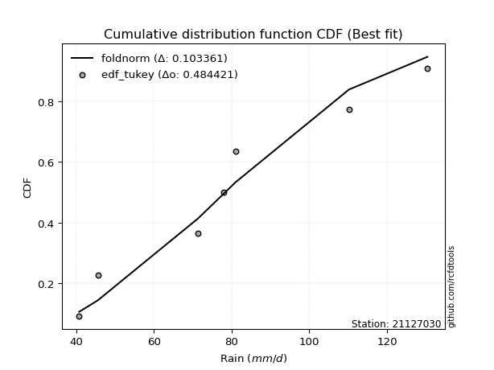</img></img>

</div>


### 8. Empirical - EDF Gringorten (1963)

Gringorten plotting position formula is essential for estimating the probability and return periods of extreme events like floods and heavy rainfall. The constant _a=0.44_.

<div align="center">


$P=(m-a)/(n+1-2a)$


</div>


**8.1. Empirical values**

<div align="center">

|                | 0                   | 1                   | 2                  | 3              | 4                  | 5                  | 6                  |
|:---------------|:--------------------|:--------------------|:-------------------|:---------------|:-------------------|:-------------------|:-------------------|
| date           | 2022                | 2023                | 2019               | 2024           | 2020               | 2025               | 2021               |
| x              | 40.8                | 45.6                | 71.4               | 78.0           | 81.0               | 107.4              | 110.2              |
| m              | 1                   | 2                   | 3                  | 4              | 5                  | 6                  | 7                  |
| empirical_dist | edf_gringorten      | edf_gringorten      | edf_gringorten     | edf_gringorten | edf_gringorten     | edf_gringorten     | edf_gringorten     |
| empirical      | 0.07865168539325844 | 0.21910112359550563 | 0.3595505617977528 | 0.5            | 0.6404494382022471 | 0.7808988764044943 | 0.9213483146067415 |
| empirical_tr   | 1.0853658536585364  | 1.2805755395683454  | 1.5614035087719298 | 2.0            | 2.781249999999999  | 4.564102564102562  | 12.714285714285701 |

</div>


**8.2. Kolmogorov-Smirnov fit test (sorted by Δ)**


<div align="center">

|                | 0                   | 1                   | 2                   | 3                   | 4                   | 5                   | 6                   | 7                   | 8                   | 9                   | 10                  | 11                  | 12                  | 13                  | 14                    | 15                  | 16                  | 17                  | 18                  | 19                  | 20                  | 21                  | 22                  | 23                  | 24                  | 25                  | 26                  | 27                  | 28                  | 29                  | 30                  | 31                  | 32                  | 33                  | 34                  | 35                  | 36                  | 37                  | 38                  | 39                  | 40                  | 41                  | 42                  | 43                  | 44                  | 45                  | 46                  | 47                  | 48                  | 49                  | 50                  | 51                  | 52                  | 53                  | 54                  | 55                  | 56                  | 57                  | 58                  | 59                  | 60                  | 61                  | 62                  | 63                  | 64                  | 65                  | 66                  | 67                  | 68                  | 69                  | 70                  | 71                  | 72                  | 73                  | 74                  | 75                  | 76                  | 77                  | 78                  | 79                  | 80                  | 81                  | 82                  | 83                  | 84                  | 85                  | 86                  | 87                  | 88                  | 89                  |
|:---------------|:--------------------|:--------------------|:--------------------|:--------------------|:--------------------|:--------------------|:--------------------|:--------------------|:--------------------|:--------------------|:--------------------|:--------------------|:--------------------|:--------------------|:----------------------|:--------------------|:--------------------|:--------------------|:--------------------|:--------------------|:--------------------|:--------------------|:--------------------|:--------------------|:--------------------|:--------------------|:--------------------|:--------------------|:--------------------|:--------------------|:--------------------|:--------------------|:--------------------|:--------------------|:--------------------|:--------------------|:--------------------|:--------------------|:--------------------|:--------------------|:--------------------|:--------------------|:--------------------|:--------------------|:--------------------|:--------------------|:--------------------|:--------------------|:--------------------|:--------------------|:--------------------|:--------------------|:--------------------|:--------------------|:--------------------|:--------------------|:--------------------|:--------------------|:--------------------|:--------------------|:--------------------|:--------------------|:--------------------|:--------------------|:--------------------|:--------------------|:--------------------|:--------------------|:--------------------|:--------------------|:--------------------|:--------------------|:--------------------|:--------------------|:--------------------|:--------------------|:--------------------|:--------------------|:--------------------|:--------------------|:--------------------|:--------------------|:--------------------|:--------------------|:--------------------|:--------------------|:--------------------|:--------------------|:--------------------|:--------------------|
| station        | 21127030            | 21127030            | 21127030            | 21127030            | 21127030            | 21127030            | 21127030            | 21127030            | 21127030            | 21127030            | 21127030            | 21127030            | 21127030            | 21127030            | 21127030              | 21127030            | 21127030            | 21127030            | 21127030            | 21127030            | 21127030            | 21127030            | 21127030            | 21127030            | 21127030            | 21127030            | 21127030            | 21127030            | 21127030            | 21127030            | 21127030            | 21127030            | 21127030            | 21127030            | 21127030            | 21127030            | 21127030            | 21127030            | 21127030            | 21127030            | 21127030            | 21127030            | 21127030            | 21127030            | 21127030            | 21127030            | 21127030            | 21127030            | 21127030            | 21127030            | 21127030            | 21127030            | 21127030            | 21127030            | 21127030            | 21127030            | 21127030            | 21127030            | 21127030            | 21127030            | 21127030            | 21127030            | 21127030            | 21127030            | 21127030            | 21127030            | 21127030            | 21127030            | 21127030            | 21127030            | 21127030            | 21127030            | 21127030            | 21127030            | 21127030            | 21127030            | 21127030            | 21127030            | 21127030            | 21127030            | 21127030            | 21127030            | 21127030            | 21127030            | 21127030            | 21127030            | 21127030            | 21127030            | 21127030            | 21127030            |
| empirical_dist | edf_gringorten      | edf_gringorten      | edf_gringorten      | edf_gringorten      | edf_gringorten      | edf_gringorten      | edf_gringorten      | edf_gringorten      | edf_gringorten      | edf_gringorten      | edf_gringorten      | edf_gringorten      | edf_gringorten      | edf_gringorten      | edf_gringorten        | edf_gringorten      | edf_gringorten      | edf_gringorten      | edf_gringorten      | edf_gringorten      | edf_gringorten      | edf_gringorten      | edf_gringorten      | edf_gringorten      | edf_gringorten      | edf_gringorten      | edf_gringorten      | edf_gringorten      | edf_gringorten      | edf_gringorten      | edf_gringorten      | edf_gringorten      | edf_gringorten      | edf_gringorten      | edf_gringorten      | edf_gringorten      | edf_gringorten      | edf_gringorten      | edf_gringorten      | edf_gringorten      | edf_gringorten      | edf_gringorten      | edf_gringorten      | edf_gringorten      | edf_gringorten      | edf_gringorten      | edf_gringorten      | edf_gringorten      | edf_gringorten      | edf_gringorten      | edf_gringorten      | edf_gringorten      | edf_gringorten      | edf_gringorten      | edf_gringorten      | edf_gringorten      | edf_gringorten      | edf_gringorten      | edf_gringorten      | edf_gringorten      | edf_gringorten      | edf_gringorten      | edf_gringorten      | edf_gringorten      | edf_gringorten      | edf_gringorten      | edf_gringorten      | edf_gringorten      | edf_gringorten      | edf_gringorten      | edf_gringorten      | edf_gringorten      | edf_gringorten      | edf_gringorten      | edf_gringorten      | edf_gringorten      | edf_gringorten      | edf_gringorten      | edf_gringorten      | edf_gringorten      | edf_gringorten      | edf_gringorten      | edf_gringorten      | edf_gringorten      | edf_gringorten      | edf_gringorten      | edf_gringorten      | edf_gringorten      | edf_gringorten      | edf_gringorten      |
| p_dist         | fisk                | alpha               | gamma               | erlang              | nct                 | norm                | crystalball         | truncnorm           | exponnorm           | t                   | logpearson3         | logweibull_min      | pearson3            | johnsonsu           | loglaplace_asymmetric | betaprime           | invgamma            | laplace_asymmetric  | invgauss            | f                   | maxwell             | logfisk             | rayleigh            | logistic            | loggumbel_l         | rice                | genlogistic         | hypsecant           | loglogistic         | logt                | logexponnorm        | lognorm             | lognorm             | logcrystalball      | lognct              | laplace             | logfatiguelife      | logf                | loghypsecant        | loglaplace          | ncf                 | loggamma            | loggamma            | kstwobign           | logerlang           | logrice             | loggompertz         | logalpha            | logbetaprime        | gumbel_r            | loginvgamma         | gumbel_l            | mielke              | logloggamma         | logmielke           | loginvgauss         | logmaxwell          | logjohnsonsu        | halfnorm            | lograyleigh         | moyal               | loginvweibull       | logncf              | loggumbel_r         | loghalfnorm         | logkstwobign        | expon               | halflogistic        | wald                | genexpon            | gibrat              | logmoyal            | loghalflogistic     | logchi2             | loggenexpon         | logexpon            | weibull_min         | logwald             | loggibrat           | nakagami            | pareto              | logtruncnorm        | logpareto           | loglognorm          | invweibull          | lognakagami         | fatiguelife         | gompertz            | chi2                | loggenlogistic      |
| delta          | 0.10473613089261598 | 0.11018769669764603 | 0.11132685238569096 | 0.11136761500518211 | 0.11221224914566796 | 0.11221532872636819 | 0.11221533317077281 | 0.11221534051878201 | 0.11221552911704047 | 0.11223755596601082 | 0.11259528938715413 | 0.11289107035614765 | 0.11304829231926083 | 0.11325161980438114 | 0.11352277897530827   | 0.11365496296992779 | 0.1143508127570651  | 0.11493177367210616 | 0.11495759753696921 | 0.11616251845711736 | 0.11821596670760291 | 0.12398978054786217 | 0.1240043462776845  | 0.12418434551802493 | 0.1258742000665326  | 0.12817548129311832 | 0.12883235989926728 | 0.12938844912476166 | 0.13159478116706164 | 0.13260789355362756 | 0.13265773496456545 | 0.13265884804370542 | 0.13265884804370542 | 0.13265884875508382 | 0.13266735002548102 | 0.13292688990562107 | 0.13312550654367505 | 0.13333360710031855 | 0.13372043187671084 | 0.13783639909158063 | 0.13931161821002225 | 0.14124568147904148 | 0.14124568147904148 | 0.14239323895443445 | 0.14328591177095085 | 0.15058729980174623 | 0.1510355003272808  | 0.15170341797820597 | 0.15321638509881663 | 0.15332680026711082 | 0.15474220249367288 | 0.1561751895833945  | 0.15646815522491603 | 0.16038558737553676 | 0.16170390144355018 | 0.1634220059069531  | 0.1660030828929795  | 0.17211896806420524 | 0.17442946881509794 | 0.17717915060474043 | 0.18145955202022818 | 0.189904471663911   | 0.19095741559238633 | 0.20276045651385066 | 0.20864902475273994 | 0.2104493346541645  | 0.21768176040645537 | 0.21910112359550563 | 0.21910112359550563 | 0.21937105882433738 | 0.22018208023881813 | 0.22864137198077628 | 0.23309000865810892 | 0.24602618007481603 | 0.25154367276960854 | 0.26801391954464227 | 0.2712755303529455  | 0.3006432119657283  | 0.32272789287670256 | 0.33097419227104474 | 0.3531194872505723  | 0.359550521298608   | 0.3740597370824469  | 0.3899678142312274  | 0.4486957188907136  | 0.45411158178989686 | 0.4860072921005518  | 0.6352164985805286  | 0.7591481314213451  | 0.7808988764044943  |
| deltao         | 0.48442053926100004 | 0.48442053926100004 | 0.48442053926100004 | 0.48442053926100004 | 0.48442053926100004 | 0.48442053926100004 | 0.48442053926100004 | 0.48442053926100004 | 0.48442053926100004 | 0.48442053926100004 | 0.48442053926100004 | 0.48442053926100004 | 0.48442053926100004 | 0.48442053926100004 | 0.48442053926100004   | 0.48442053926100004 | 0.48442053926100004 | 0.48442053926100004 | 0.48442053926100004 | 0.48442053926100004 | 0.48442053926100004 | 0.48442053926100004 | 0.48442053926100004 | 0.48442053926100004 | 0.48442053926100004 | 0.48442053926100004 | 0.48442053926100004 | 0.48442053926100004 | 0.48442053926100004 | 0.48442053926100004 | 0.48442053926100004 | 0.48442053926100004 | 0.48442053926100004 | 0.48442053926100004 | 0.48442053926100004 | 0.48442053926100004 | 0.48442053926100004 | 0.48442053926100004 | 0.48442053926100004 | 0.48442053926100004 | 0.48442053926100004 | 0.48442053926100004 | 0.48442053926100004 | 0.48442053926100004 | 0.48442053926100004 | 0.48442053926100004 | 0.48442053926100004 | 0.48442053926100004 | 0.48442053926100004 | 0.48442053926100004 | 0.48442053926100004 | 0.48442053926100004 | 0.48442053926100004 | 0.48442053926100004 | 0.48442053926100004 | 0.48442053926100004 | 0.48442053926100004 | 0.48442053926100004 | 0.48442053926100004 | 0.48442053926100004 | 0.48442053926100004 | 0.48442053926100004 | 0.48442053926100004 | 0.48442053926100004 | 0.48442053926100004 | 0.48442053926100004 | 0.48442053926100004 | 0.48442053926100004 | 0.48442053926100004 | 0.48442053926100004 | 0.48442053926100004 | 0.48442053926100004 | 0.48442053926100004 | 0.48442053926100004 | 0.48442053926100004 | 0.48442053926100004 | 0.48442053926100004 | 0.48442053926100004 | 0.48442053926100004 | 0.48442053926100004 | 0.48442053926100004 | 0.48442053926100004 | 0.48442053926100004 | 0.48442053926100004 | 0.48442053926100004 | 0.48442053926100004 | 0.48442053926100004 | 0.48442053926100004 | 0.48442053926100004 | 0.48442053926100004 |
| eval           | Δo > Δ              | Δo > Δ              | Δo > Δ              | Δo > Δ              | Δo > Δ              | Δo > Δ              | Δo > Δ              | Δo > Δ              | Δo > Δ              | Δo > Δ              | Δo > Δ              | Δo > Δ              | Δo > Δ              | Δo > Δ              | Δo > Δ                | Δo > Δ              | Δo > Δ              | Δo > Δ              | Δo > Δ              | Δo > Δ              | Δo > Δ              | Δo > Δ              | Δo > Δ              | Δo > Δ              | Δo > Δ              | Δo > Δ              | Δo > Δ              | Δo > Δ              | Δo > Δ              | Δo > Δ              | Δo > Δ              | Δo > Δ              | Δo > Δ              | Δo > Δ              | Δo > Δ              | Δo > Δ              | Δo > Δ              | Δo > Δ              | Δo > Δ              | Δo > Δ              | Δo > Δ              | Δo > Δ              | Δo > Δ              | Δo > Δ              | Δo > Δ              | Δo > Δ              | Δo > Δ              | Δo > Δ              | Δo > Δ              | Δo > Δ              | Δo > Δ              | Δo > Δ              | Δo > Δ              | Δo > Δ              | Δo > Δ              | Δo > Δ              | Δo > Δ              | Δo > Δ              | Δo > Δ              | Δo > Δ              | Δo > Δ              | Δo > Δ              | Δo > Δ              | Δo > Δ              | Δo > Δ              | Δo > Δ              | Δo > Δ              | Δo > Δ              | Δo > Δ              | Δo > Δ              | Δo > Δ              | Δo > Δ              | Δo > Δ              | Δo > Δ              | Δo > Δ              | Δo > Δ              | Δo > Δ              | Δo > Δ              | Δo > Δ              | Δo > Δ              | Δo > Δ              | Δo > Δ              | Δo > Δ              | Δo > Δ              | Δo > Δ              | Δo > Δ              | Δo <= Δ             | Δo <= Δ             | Δo <= Δ             | Δo <= Δ             |
| fit            | 1                   | 1                   | 1                   | 1                   | 1                   | 1                   | 1                   | 1                   | 1                   | 1                   | 1                   | 1                   | 1                   | 1                   | 1                     | 1                   | 1                   | 1                   | 1                   | 1                   | 1                   | 1                   | 1                   | 1                   | 1                   | 1                   | 1                   | 1                   | 1                   | 1                   | 1                   | 1                   | 1                   | 1                   | 1                   | 1                   | 1                   | 1                   | 1                   | 1                   | 1                   | 1                   | 1                   | 1                   | 1                   | 1                   | 1                   | 1                   | 1                   | 1                   | 1                   | 1                   | 1                   | 1                   | 1                   | 1                   | 1                   | 1                   | 1                   | 1                   | 1                   | 1                   | 1                   | 1                   | 1                   | 1                   | 1                   | 1                   | 1                   | 1                   | 1                   | 1                   | 1                   | 1                   | 1                   | 1                   | 1                   | 1                   | 1                   | 1                   | 1                   | 1                   | 1                   | 1                   | 1                   | 1                   | 0                   | 0                   | 0                   | 0                   |
| n              | 7                   | 7                   | 7                   | 7                   | 7                   | 7                   | 7                   | 7                   | 7                   | 7                   | 7                   | 7                   | 7                   | 7                   | 7                     | 7                   | 7                   | 7                   | 7                   | 7                   | 7                   | 7                   | 7                   | 7                   | 7                   | 7                   | 7                   | 7                   | 7                   | 7                   | 7                   | 7                   | 7                   | 7                   | 7                   | 7                   | 7                   | 7                   | 7                   | 7                   | 7                   | 7                   | 7                   | 7                   | 7                   | 7                   | 7                   | 7                   | 7                   | 7                   | 7                   | 7                   | 7                   | 7                   | 7                   | 7                   | 7                   | 7                   | 7                   | 7                   | 7                   | 7                   | 7                   | 7                   | 7                   | 7                   | 7                   | 7                   | 7                   | 7                   | 7                   | 7                   | 7                   | 7                   | 7                   | 7                   | 7                   | 7                   | 7                   | 7                   | 7                   | 7                   | 7                   | 7                   | 7                   | 7                   | 7                   | 7                   | 7                   | 7                   |
| best_fit       | 1                   | 0                   | 0                   | 0                   | 0                   | 0                   | 0                   | 0                   | 0                   | 0                   | 0                   | 0                   | 0                   | 0                   | 0                     | 0                   | 0                   | 0                   | 0                   | 0                   | 0                   | 0                   | 0                   | 0                   | 0                   | 0                   | 0                   | 0                   | 0                   | 0                   | 0                   | 0                   | 0                   | 0                   | 0                   | 0                   | 0                   | 0                   | 0                   | 0                   | 0                   | 0                   | 0                   | 0                   | 0                   | 0                   | 0                   | 0                   | 0                   | 0                   | 0                   | 0                   | 0                   | 0                   | 0                   | 0                   | 0                   | 0                   | 0                   | 0                   | 0                   | 0                   | 0                   | 0                   | 0                   | 0                   | 0                   | 0                   | 0                   | 0                   | 0                   | 0                   | 0                   | 0                   | 0                   | 0                   | 0                   | 0                   | 0                   | 0                   | 0                   | 0                   | 0                   | 0                   | 0                   | 0                   | 0                   | 0                   | 0                   | 0                   |
| best_fit_sort  | 1                   | 2                   | 3                   | 4                   | 5                   | 6                   | 7                   | 8                   | 9                   | 10                  | 11                  | 12                  | 13                  | 14                  | 15                    | 16                  | 17                  | 18                  | 19                  | 20                  | 21                  | 22                  | 23                  | 24                  | 25                  | 26                  | 27                  | 28                  | 29                  | 30                  | 31                  | 32                  | 33                  | 34                  | 35                  | 36                  | 37                  | 38                  | 39                  | 40                  | 41                  | 42                  | 43                  | 44                  | 45                  | 46                  | 47                  | 48                  | 49                  | 50                  | 51                  | 52                  | 53                  | 54                  | 55                  | 56                  | 57                  | 58                  | 59                  | 60                  | 61                  | 62                  | 63                  | 64                  | 65                  | 66                  | 67                  | 68                  | 69                  | 70                  | 71                  | 72                  | 73                  | 74                  | 75                  | 76                  | 77                  | 78                  | 79                  | 80                  | 81                  | 82                  | 83                  | 84                  | 85                  | 86                  | 87                  | 88                  | 89                  | 90                  |

</div>


<div align="center">

</img>

</div>


**8.3. Best fit**

<div align="center">

|   id |   station | empirical_dist   | p_dist   |    delta |   deltao | eval   |   fit |   n |   best_fit |   best_fit_sort |
|-----:|----------:|:-----------------|:---------|---------:|---------:|:-------|------:|----:|-----------:|----------------:|
|    0 |  21127030 | edf_gringorten   | fisk     | 0.104736 | 0.484421 | Δo > Δ |     1 |   7 |          1 |               1 |

</div>


<div align="center">

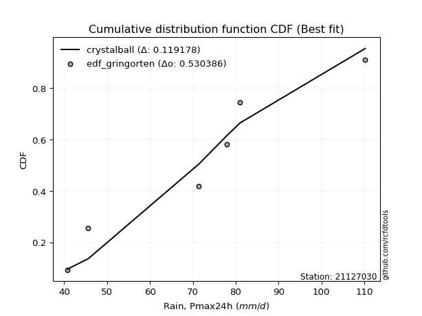</img>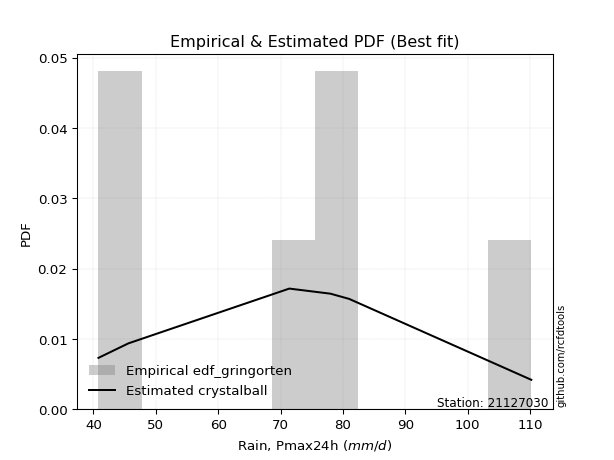</img>

</div>


### 9. Empirical - EDF Filliben (1975)

The specific values of the constants (0.3175) (often denoted as $alpha$) and (0.365) are derived from a method proposed by James J. Filliben in a 1975 paper. This particular formula is the mean value of the $i$-th order statistic of the normal distribution and is considered a robust and effective plotting position formula for the normal probability plot correlation coefficient test for normality.

<div align="center">


$P=(m-0.3175)/(n+0.365)$


</div>


**9.1. Empirical values**

<div align="center">

|                | 0                   | 1                   | 2                   | 3            | 4                  | 5                  | 6                  |
|:---------------|:--------------------|:--------------------|:--------------------|:-------------|:-------------------|:-------------------|:-------------------|
| date           | 2022                | 2023                | 2019                | 2024         | 2020               | 2025               | 2021               |
| x              | 40.8                | 45.6                | 71.4                | 78.0         | 81.0               | 107.4              | 110.2              |
| m              | 1                   | 2                   | 3                   | 4            | 5                  | 6                  | 7                  |
| empirical_dist | edf_filliben        | edf_filliben        | edf_filliben        | edf_filliben | edf_filliben       | edf_filliben       | edf_filliben       |
| empirical      | 0.09266802443991853 | 0.22844534962661237 | 0.36422267481330617 | 0.5          | 0.6357773251866938 | 0.7715546503733877 | 0.9073319755600815 |
| empirical_tr   | 1.1021324354657687  | 1.2960844698636163  | 1.5728777362520021  | 2.0          | 2.7455731593662627 | 4.377414561664191  | 10.791208791208794 |

</div>


**9.2. Kolmogorov-Smirnov fit test (sorted by Δ)**


<div align="center">

|                | 0                   | 1                   | 2                   | 3                   | 4                   | 5                   | 6                   | 7                   | 8                   | 9                   | 10                  | 11                  | 12                  | 13                  | 14                    | 15                  | 16                  | 17                  | 18                  | 19                  | 20                  | 21                  | 22                  | 23                  | 24                  | 25                  | 26                  | 27                  | 28                  | 29                  | 30                  | 31                  | 32                  | 33                  | 34                  | 35                  | 36                  | 37                  | 38                  | 39                  | 40                  | 41                  | 42                  | 43                  | 44                  | 45                  | 46                  | 47                  | 48                  | 49                  | 50                  | 51                  | 52                  | 53                  | 54                  | 55                  | 56                  | 57                  | 58                  | 59                  | 60                  | 61                  | 62                  | 63                  | 64                  | 65                  | 66                  | 67                  | 68                  | 69                  | 70                  | 71                  | 72                  | 73                  | 74                  | 75                  | 76                  | 77                  | 78                  | 79                  | 80                  | 81                  | 82                  | 83                  | 84                  | 85                  | 86                  | 87                  | 88                  | 89                  |
|:---------------|:--------------------|:--------------------|:--------------------|:--------------------|:--------------------|:--------------------|:--------------------|:--------------------|:--------------------|:--------------------|:--------------------|:--------------------|:--------------------|:--------------------|:----------------------|:--------------------|:--------------------|:--------------------|:--------------------|:--------------------|:--------------------|:--------------------|:--------------------|:--------------------|:--------------------|:--------------------|:--------------------|:--------------------|:--------------------|:--------------------|:--------------------|:--------------------|:--------------------|:--------------------|:--------------------|:--------------------|:--------------------|:--------------------|:--------------------|:--------------------|:--------------------|:--------------------|:--------------------|:--------------------|:--------------------|:--------------------|:--------------------|:--------------------|:--------------------|:--------------------|:--------------------|:--------------------|:--------------------|:--------------------|:--------------------|:--------------------|:--------------------|:--------------------|:--------------------|:--------------------|:--------------------|:--------------------|:--------------------|:--------------------|:--------------------|:--------------------|:--------------------|:--------------------|:--------------------|:--------------------|:--------------------|:--------------------|:--------------------|:--------------------|:--------------------|:--------------------|:--------------------|:--------------------|:--------------------|:--------------------|:--------------------|:--------------------|:--------------------|:--------------------|:--------------------|:--------------------|:--------------------|:--------------------|:--------------------|:--------------------|
| station        | 21127030            | 21127030            | 21127030            | 21127030            | 21127030            | 21127030            | 21127030            | 21127030            | 21127030            | 21127030            | 21127030            | 21127030            | 21127030            | 21127030            | 21127030              | 21127030            | 21127030            | 21127030            | 21127030            | 21127030            | 21127030            | 21127030            | 21127030            | 21127030            | 21127030            | 21127030            | 21127030            | 21127030            | 21127030            | 21127030            | 21127030            | 21127030            | 21127030            | 21127030            | 21127030            | 21127030            | 21127030            | 21127030            | 21127030            | 21127030            | 21127030            | 21127030            | 21127030            | 21127030            | 21127030            | 21127030            | 21127030            | 21127030            | 21127030            | 21127030            | 21127030            | 21127030            | 21127030            | 21127030            | 21127030            | 21127030            | 21127030            | 21127030            | 21127030            | 21127030            | 21127030            | 21127030            | 21127030            | 21127030            | 21127030            | 21127030            | 21127030            | 21127030            | 21127030            | 21127030            | 21127030            | 21127030            | 21127030            | 21127030            | 21127030            | 21127030            | 21127030            | 21127030            | 21127030            | 21127030            | 21127030            | 21127030            | 21127030            | 21127030            | 21127030            | 21127030            | 21127030            | 21127030            | 21127030            | 21127030            |
| empirical_dist | edf_filliben        | edf_filliben        | edf_filliben        | edf_filliben        | edf_filliben        | edf_filliben        | edf_filliben        | edf_filliben        | edf_filliben        | edf_filliben        | edf_filliben        | edf_filliben        | edf_filliben        | edf_filliben        | edf_filliben          | edf_filliben        | edf_filliben        | edf_filliben        | edf_filliben        | edf_filliben        | edf_filliben        | edf_filliben        | edf_filliben        | edf_filliben        | edf_filliben        | edf_filliben        | edf_filliben        | edf_filliben        | edf_filliben        | edf_filliben        | edf_filliben        | edf_filliben        | edf_filliben        | edf_filliben        | edf_filliben        | edf_filliben        | edf_filliben        | edf_filliben        | edf_filliben        | edf_filliben        | edf_filliben        | edf_filliben        | edf_filliben        | edf_filliben        | edf_filliben        | edf_filliben        | edf_filliben        | edf_filliben        | edf_filliben        | edf_filliben        | edf_filliben        | edf_filliben        | edf_filliben        | edf_filliben        | edf_filliben        | edf_filliben        | edf_filliben        | edf_filliben        | edf_filliben        | edf_filliben        | edf_filliben        | edf_filliben        | edf_filliben        | edf_filliben        | edf_filliben        | edf_filliben        | edf_filliben        | edf_filliben        | edf_filliben        | edf_filliben        | edf_filliben        | edf_filliben        | edf_filliben        | edf_filliben        | edf_filliben        | edf_filliben        | edf_filliben        | edf_filliben        | edf_filliben        | edf_filliben        | edf_filliben        | edf_filliben        | edf_filliben        | edf_filliben        | edf_filliben        | edf_filliben        | edf_filliben        | edf_filliben        | edf_filliben        | edf_filliben        |
| p_dist         | fisk                | alpha               | gamma               | erlang              | nct                 | norm                | crystalball         | truncnorm           | exponnorm           | t                   | logpearson3         | logweibull_min      | pearson3            | johnsonsu           | loglaplace_asymmetric | betaprime           | invgauss            | invgamma            | genlogistic         | laplace_asymmetric  | f                   | maxwell             | logt                | logexponnorm        | lognorm             | lognorm             | logcrystalball      | lognct              | logfatiguelife      | logf                | logfisk             | rayleigh            | logistic            | ncf                 | loggumbel_l         | loggamma            | loggamma            | rice                | kstwobign           | loglogistic         | logerlang           | hypsecant           | laplace             | loghypsecant        | logrice             | loglaplace          | logalpha            | logbetaprime        | loginvgamma         | loginvgauss         | mielke              | loggompertz         | logmaxwell          | gumbel_r            | gumbel_l            | logjohnsonsu        | logloggamma         | logmielke           | lograyleigh         | logncf              | halfnorm            | loginvweibull       | moyal               | loggumbel_r         | loghalfnorm         | logkstwobign        | expon               | genexpon            | logmoyal            | wald                | halflogistic        | gibrat              | loghalflogistic     | logchi2             | loggenexpon         | logexpon            | weibull_min         | logwald             | loggibrat           | nakagami            | pareto              | logtruncnorm        | logpareto           | loglognorm          | invweibull          | lognakagami         | fatiguelife         | gompertz            | chi2                | loggenlogistic      |
| delta          | 0.11408035692372272 | 0.11953192272875277 | 0.12067107841679758 | 0.12071184103628874 | 0.12155647517677459 | 0.12155955475747482 | 0.12155955920187944 | 0.12155956654988864 | 0.1215597551481471  | 0.12158178199711744 | 0.12193951541826087 | 0.12223529638725428 | 0.12239251835036746 | 0.12259584583548777 | 0.1228670050064149    | 0.12299918900103453 | 0.12362963131354196 | 0.12369503878817184 | 0.12416024688371391 | 0.12427599970321279 | 0.1255067444882241  | 0.12756019273870967 | 0.1279357805380742  | 0.12798562194901208 | 0.12798673502815205 | 0.12798673502815205 | 0.12798673573953046 | 0.12799523700992765 | 0.12845339352812168 | 0.12866149408476518 | 0.1333340065789689  | 0.13334857230879124 | 0.13352857154913156 | 0.13463950519446888 | 0.13521842609763923 | 0.13657356846348812 | 0.13657356846348812 | 0.13751970732422505 | 0.13772112593888108 | 0.1383852799933661  | 0.13861379875539748 | 0.1387326751558683  | 0.1422711159367277  | 0.14306465790781758 | 0.14591518678619286 | 0.14607331099035403 | 0.1470313049626526  | 0.14854427208326326 | 0.1500700894781195  | 0.15874989289139974 | 0.1591016381264888  | 0.16037972635838754 | 0.16133096987742612 | 0.16267102629821756 | 0.16551941561450112 | 0.16744685504865198 | 0.1697298134066434  | 0.1710481274746568  | 0.17250703758918706 | 0.17694107654572633 | 0.18377369484620468 | 0.18523235864835763 | 0.19080377805133492 | 0.1980883434982973  | 0.2051052176859819  | 0.20577722163861112 | 0.213009647390902   | 0.21469894580878401 | 0.2239692589652229  | 0.22844534962661237 | 0.22844534962661237 | 0.22844534962661237 | 0.22844534962661237 | 0.23200984102815603 | 0.24687155975405517 | 0.2633418065290889  | 0.2666034173373921  | 0.2959710989501749  | 0.3180557798611492  | 0.3263020792554914  | 0.34377526121946556 | 0.36422263431416135 | 0.36471551105134015 | 0.38062358820012065 | 0.4346793798440536  | 0.4494394687743435  | 0.48133517908499845 | 0.6305443855649754  | 0.7498039053902383  | 0.7715546503733877  |
| deltao         | 0.48442053926100004 | 0.48442053926100004 | 0.48442053926100004 | 0.48442053926100004 | 0.48442053926100004 | 0.48442053926100004 | 0.48442053926100004 | 0.48442053926100004 | 0.48442053926100004 | 0.48442053926100004 | 0.48442053926100004 | 0.48442053926100004 | 0.48442053926100004 | 0.48442053926100004 | 0.48442053926100004   | 0.48442053926100004 | 0.48442053926100004 | 0.48442053926100004 | 0.48442053926100004 | 0.48442053926100004 | 0.48442053926100004 | 0.48442053926100004 | 0.48442053926100004 | 0.48442053926100004 | 0.48442053926100004 | 0.48442053926100004 | 0.48442053926100004 | 0.48442053926100004 | 0.48442053926100004 | 0.48442053926100004 | 0.48442053926100004 | 0.48442053926100004 | 0.48442053926100004 | 0.48442053926100004 | 0.48442053926100004 | 0.48442053926100004 | 0.48442053926100004 | 0.48442053926100004 | 0.48442053926100004 | 0.48442053926100004 | 0.48442053926100004 | 0.48442053926100004 | 0.48442053926100004 | 0.48442053926100004 | 0.48442053926100004 | 0.48442053926100004 | 0.48442053926100004 | 0.48442053926100004 | 0.48442053926100004 | 0.48442053926100004 | 0.48442053926100004 | 0.48442053926100004 | 0.48442053926100004 | 0.48442053926100004 | 0.48442053926100004 | 0.48442053926100004 | 0.48442053926100004 | 0.48442053926100004 | 0.48442053926100004 | 0.48442053926100004 | 0.48442053926100004 | 0.48442053926100004 | 0.48442053926100004 | 0.48442053926100004 | 0.48442053926100004 | 0.48442053926100004 | 0.48442053926100004 | 0.48442053926100004 | 0.48442053926100004 | 0.48442053926100004 | 0.48442053926100004 | 0.48442053926100004 | 0.48442053926100004 | 0.48442053926100004 | 0.48442053926100004 | 0.48442053926100004 | 0.48442053926100004 | 0.48442053926100004 | 0.48442053926100004 | 0.48442053926100004 | 0.48442053926100004 | 0.48442053926100004 | 0.48442053926100004 | 0.48442053926100004 | 0.48442053926100004 | 0.48442053926100004 | 0.48442053926100004 | 0.48442053926100004 | 0.48442053926100004 | 0.48442053926100004 |
| eval           | Δo > Δ              | Δo > Δ              | Δo > Δ              | Δo > Δ              | Δo > Δ              | Δo > Δ              | Δo > Δ              | Δo > Δ              | Δo > Δ              | Δo > Δ              | Δo > Δ              | Δo > Δ              | Δo > Δ              | Δo > Δ              | Δo > Δ                | Δo > Δ              | Δo > Δ              | Δo > Δ              | Δo > Δ              | Δo > Δ              | Δo > Δ              | Δo > Δ              | Δo > Δ              | Δo > Δ              | Δo > Δ              | Δo > Δ              | Δo > Δ              | Δo > Δ              | Δo > Δ              | Δo > Δ              | Δo > Δ              | Δo > Δ              | Δo > Δ              | Δo > Δ              | Δo > Δ              | Δo > Δ              | Δo > Δ              | Δo > Δ              | Δo > Δ              | Δo > Δ              | Δo > Δ              | Δo > Δ              | Δo > Δ              | Δo > Δ              | Δo > Δ              | Δo > Δ              | Δo > Δ              | Δo > Δ              | Δo > Δ              | Δo > Δ              | Δo > Δ              | Δo > Δ              | Δo > Δ              | Δo > Δ              | Δo > Δ              | Δo > Δ              | Δo > Δ              | Δo > Δ              | Δo > Δ              | Δo > Δ              | Δo > Δ              | Δo > Δ              | Δo > Δ              | Δo > Δ              | Δo > Δ              | Δo > Δ              | Δo > Δ              | Δo > Δ              | Δo > Δ              | Δo > Δ              | Δo > Δ              | Δo > Δ              | Δo > Δ              | Δo > Δ              | Δo > Δ              | Δo > Δ              | Δo > Δ              | Δo > Δ              | Δo > Δ              | Δo > Δ              | Δo > Δ              | Δo > Δ              | Δo > Δ              | Δo > Δ              | Δo > Δ              | Δo > Δ              | Δo > Δ              | Δo <= Δ             | Δo <= Δ             | Δo <= Δ             |
| fit            | 1                   | 1                   | 1                   | 1                   | 1                   | 1                   | 1                   | 1                   | 1                   | 1                   | 1                   | 1                   | 1                   | 1                   | 1                     | 1                   | 1                   | 1                   | 1                   | 1                   | 1                   | 1                   | 1                   | 1                   | 1                   | 1                   | 1                   | 1                   | 1                   | 1                   | 1                   | 1                   | 1                   | 1                   | 1                   | 1                   | 1                   | 1                   | 1                   | 1                   | 1                   | 1                   | 1                   | 1                   | 1                   | 1                   | 1                   | 1                   | 1                   | 1                   | 1                   | 1                   | 1                   | 1                   | 1                   | 1                   | 1                   | 1                   | 1                   | 1                   | 1                   | 1                   | 1                   | 1                   | 1                   | 1                   | 1                   | 1                   | 1                   | 1                   | 1                   | 1                   | 1                   | 1                   | 1                   | 1                   | 1                   | 1                   | 1                   | 1                   | 1                   | 1                   | 1                   | 1                   | 1                   | 1                   | 1                   | 0                   | 0                   | 0                   |
| n              | 7                   | 7                   | 7                   | 7                   | 7                   | 7                   | 7                   | 7                   | 7                   | 7                   | 7                   | 7                   | 7                   | 7                   | 7                     | 7                   | 7                   | 7                   | 7                   | 7                   | 7                   | 7                   | 7                   | 7                   | 7                   | 7                   | 7                   | 7                   | 7                   | 7                   | 7                   | 7                   | 7                   | 7                   | 7                   | 7                   | 7                   | 7                   | 7                   | 7                   | 7                   | 7                   | 7                   | 7                   | 7                   | 7                   | 7                   | 7                   | 7                   | 7                   | 7                   | 7                   | 7                   | 7                   | 7                   | 7                   | 7                   | 7                   | 7                   | 7                   | 7                   | 7                   | 7                   | 7                   | 7                   | 7                   | 7                   | 7                   | 7                   | 7                   | 7                   | 7                   | 7                   | 7                   | 7                   | 7                   | 7                   | 7                   | 7                   | 7                   | 7                   | 7                   | 7                   | 7                   | 7                   | 7                   | 7                   | 7                   | 7                   | 7                   |
| best_fit       | 1                   | 0                   | 0                   | 0                   | 0                   | 0                   | 0                   | 0                   | 0                   | 0                   | 0                   | 0                   | 0                   | 0                   | 0                     | 0                   | 0                   | 0                   | 0                   | 0                   | 0                   | 0                   | 0                   | 0                   | 0                   | 0                   | 0                   | 0                   | 0                   | 0                   | 0                   | 0                   | 0                   | 0                   | 0                   | 0                   | 0                   | 0                   | 0                   | 0                   | 0                   | 0                   | 0                   | 0                   | 0                   | 0                   | 0                   | 0                   | 0                   | 0                   | 0                   | 0                   | 0                   | 0                   | 0                   | 0                   | 0                   | 0                   | 0                   | 0                   | 0                   | 0                   | 0                   | 0                   | 0                   | 0                   | 0                   | 0                   | 0                   | 0                   | 0                   | 0                   | 0                   | 0                   | 0                   | 0                   | 0                   | 0                   | 0                   | 0                   | 0                   | 0                   | 0                   | 0                   | 0                   | 0                   | 0                   | 0                   | 0                   | 0                   |
| best_fit_sort  | 1                   | 2                   | 3                   | 4                   | 5                   | 6                   | 7                   | 8                   | 9                   | 10                  | 11                  | 12                  | 13                  | 14                  | 15                    | 16                  | 17                  | 18                  | 19                  | 20                  | 21                  | 22                  | 23                  | 24                  | 25                  | 26                  | 27                  | 28                  | 29                  | 30                  | 31                  | 32                  | 33                  | 34                  | 35                  | 36                  | 37                  | 38                  | 39                  | 40                  | 41                  | 42                  | 43                  | 44                  | 45                  | 46                  | 47                  | 48                  | 49                  | 50                  | 51                  | 52                  | 53                  | 54                  | 55                  | 56                  | 57                  | 58                  | 59                  | 60                  | 61                  | 62                  | 63                  | 64                  | 65                  | 66                  | 67                  | 68                  | 69                  | 70                  | 71                  | 72                  | 73                  | 74                  | 75                  | 76                  | 77                  | 78                  | 79                  | 80                  | 81                  | 82                  | 83                  | 84                  | 85                  | 86                  | 87                  | 88                  | 89                  | 90                  |

</div>


<div align="center">

</img>

</div>


**9.3. Best fit**

<div align="center">

|   id |   station | empirical_dist   | p_dist   |   delta |   deltao | eval   |   fit |   n |   best_fit |   best_fit_sort |
|-----:|----------:|:-----------------|:---------|--------:|---------:|:-------|------:|----:|-----------:|----------------:|
|    0 |  21127030 | edf_filliben     | fisk     | 0.11408 | 0.484421 | Δo > Δ |     1 |   7 |          1 |               1 |

</div>


<div align="center">

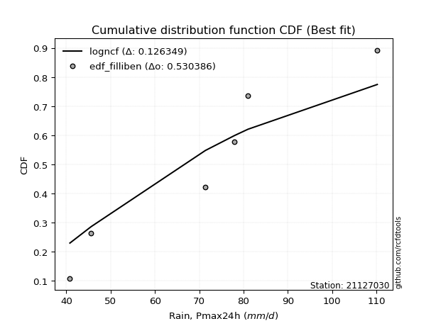</img></img>

</div>


### 10. Empirical - EDF Jenkinson (1977)

The Jenkinson formula in hydrology is an empirical plotting position formula used to estimate the non-exceedance probability _(P)_ or return period _(T)_ of a given ordered observation within a sample. It is a widely used method in the frequency analysis of extreme events such as floods and rainfall, as it provides a distribution-free way to plot data. _a≈0.31_ and _b≈0.38_ are constants derived to approximate the median of the probability distribution for the given rank.

<div align="center">


$P=(m-a)/(n+b)$


</div>


**10.1. Empirical values**

<div align="center">

|                | 0                   | 1                   | 2                   | 3             | 4                  | 5                  | 6                  |
|:---------------|:--------------------|:--------------------|:--------------------|:--------------|:-------------------|:-------------------|:-------------------|
| date           | 2022                | 2023                | 2019                | 2024          | 2020               | 2025               | 2021               |
| x              | 40.8                | 45.6                | 71.4                | 78.0          | 81.0               | 107.4              | 110.2              |
| m              | 1                   | 2                   | 3                   | 4             | 5                  | 6                  | 7                  |
| empirical_dist | edf_jenkinson       | edf_jenkinson       | edf_jenkinson       | edf_jenkinson | edf_jenkinson      | edf_jenkinson      | edf_jenkinson      |
| empirical      | 0.09349593495934959 | 0.22899728997289973 | 0.36449864498644985 | 0.5           | 0.6355013550135502 | 0.7710027100271003 | 0.9065040650406505 |
| empirical_tr   | 1.1031390134529149  | 1.29701230228471    | 1.5735607675906182  | 2.0           | 2.743494423791822  | 4.366863905325444  | 10.695652173913055 |

</div>


**10.2. Kolmogorov-Smirnov fit test (sorted by Δ)**


<div align="center">

|                | 0                   | 1                   | 2                   | 3                   | 4                   | 5                   | 6                   | 7                   | 8                   | 9                   | 10                  | 11                  | 12                  | 13                  | 14                    | 15                  | 16                  | 17                  | 18                  | 19                  | 20                  | 21                  | 22                  | 23                  | 24                  | 25                  | 26                  | 27                  | 28                  | 29                  | 30                  | 31                  | 32                  | 33                  | 34                  | 35                  | 36                  | 37                  | 38                  | 39                  | 40                  | 41                  | 42                  | 43                  | 44                  | 45                  | 46                  | 47                  | 48                  | 49                  | 50                  | 51                  | 52                  | 53                  | 54                  | 55                  | 56                  | 57                  | 58                  | 59                  | 60                  | 61                  | 62                  | 63                  | 64                  | 65                  | 66                  | 67                  | 68                  | 69                  | 70                  | 71                  | 72                  | 73                  | 74                  | 75                  | 76                  | 77                  | 78                  | 79                  | 80                  | 81                  | 82                  | 83                  | 84                  | 85                  | 86                  | 87                  | 88                  | 89                  |
|:---------------|:--------------------|:--------------------|:--------------------|:--------------------|:--------------------|:--------------------|:--------------------|:--------------------|:--------------------|:--------------------|:--------------------|:--------------------|:--------------------|:--------------------|:----------------------|:--------------------|:--------------------|:--------------------|:--------------------|:--------------------|:--------------------|:--------------------|:--------------------|:--------------------|:--------------------|:--------------------|:--------------------|:--------------------|:--------------------|:--------------------|:--------------------|:--------------------|:--------------------|:--------------------|:--------------------|:--------------------|:--------------------|:--------------------|:--------------------|:--------------------|:--------------------|:--------------------|:--------------------|:--------------------|:--------------------|:--------------------|:--------------------|:--------------------|:--------------------|:--------------------|:--------------------|:--------------------|:--------------------|:--------------------|:--------------------|:--------------------|:--------------------|:--------------------|:--------------------|:--------------------|:--------------------|:--------------------|:--------------------|:--------------------|:--------------------|:--------------------|:--------------------|:--------------------|:--------------------|:--------------------|:--------------------|:--------------------|:--------------------|:--------------------|:--------------------|:--------------------|:--------------------|:--------------------|:--------------------|:--------------------|:--------------------|:--------------------|:--------------------|:--------------------|:--------------------|:--------------------|:--------------------|:--------------------|:--------------------|:--------------------|
| station        | 21127030            | 21127030            | 21127030            | 21127030            | 21127030            | 21127030            | 21127030            | 21127030            | 21127030            | 21127030            | 21127030            | 21127030            | 21127030            | 21127030            | 21127030              | 21127030            | 21127030            | 21127030            | 21127030            | 21127030            | 21127030            | 21127030            | 21127030            | 21127030            | 21127030            | 21127030            | 21127030            | 21127030            | 21127030            | 21127030            | 21127030            | 21127030            | 21127030            | 21127030            | 21127030            | 21127030            | 21127030            | 21127030            | 21127030            | 21127030            | 21127030            | 21127030            | 21127030            | 21127030            | 21127030            | 21127030            | 21127030            | 21127030            | 21127030            | 21127030            | 21127030            | 21127030            | 21127030            | 21127030            | 21127030            | 21127030            | 21127030            | 21127030            | 21127030            | 21127030            | 21127030            | 21127030            | 21127030            | 21127030            | 21127030            | 21127030            | 21127030            | 21127030            | 21127030            | 21127030            | 21127030            | 21127030            | 21127030            | 21127030            | 21127030            | 21127030            | 21127030            | 21127030            | 21127030            | 21127030            | 21127030            | 21127030            | 21127030            | 21127030            | 21127030            | 21127030            | 21127030            | 21127030            | 21127030            | 21127030            |
| empirical_dist | edf_jenkinson       | edf_jenkinson       | edf_jenkinson       | edf_jenkinson       | edf_jenkinson       | edf_jenkinson       | edf_jenkinson       | edf_jenkinson       | edf_jenkinson       | edf_jenkinson       | edf_jenkinson       | edf_jenkinson       | edf_jenkinson       | edf_jenkinson       | edf_jenkinson         | edf_jenkinson       | edf_jenkinson       | edf_jenkinson       | edf_jenkinson       | edf_jenkinson       | edf_jenkinson       | edf_jenkinson       | edf_jenkinson       | edf_jenkinson       | edf_jenkinson       | edf_jenkinson       | edf_jenkinson       | edf_jenkinson       | edf_jenkinson       | edf_jenkinson       | edf_jenkinson       | edf_jenkinson       | edf_jenkinson       | edf_jenkinson       | edf_jenkinson       | edf_jenkinson       | edf_jenkinson       | edf_jenkinson       | edf_jenkinson       | edf_jenkinson       | edf_jenkinson       | edf_jenkinson       | edf_jenkinson       | edf_jenkinson       | edf_jenkinson       | edf_jenkinson       | edf_jenkinson       | edf_jenkinson       | edf_jenkinson       | edf_jenkinson       | edf_jenkinson       | edf_jenkinson       | edf_jenkinson       | edf_jenkinson       | edf_jenkinson       | edf_jenkinson       | edf_jenkinson       | edf_jenkinson       | edf_jenkinson       | edf_jenkinson       | edf_jenkinson       | edf_jenkinson       | edf_jenkinson       | edf_jenkinson       | edf_jenkinson       | edf_jenkinson       | edf_jenkinson       | edf_jenkinson       | edf_jenkinson       | edf_jenkinson       | edf_jenkinson       | edf_jenkinson       | edf_jenkinson       | edf_jenkinson       | edf_jenkinson       | edf_jenkinson       | edf_jenkinson       | edf_jenkinson       | edf_jenkinson       | edf_jenkinson       | edf_jenkinson       | edf_jenkinson       | edf_jenkinson       | edf_jenkinson       | edf_jenkinson       | edf_jenkinson       | edf_jenkinson       | edf_jenkinson       | edf_jenkinson       | edf_jenkinson       |
| p_dist         | fisk                | alpha               | gamma               | erlang              | nct                 | norm                | crystalball         | truncnorm           | exponnorm           | t                   | logpearson3         | logweibull_min      | pearson3            | johnsonsu           | loglaplace_asymmetric | betaprime           | genlogistic         | invgauss            | invgamma            | laplace_asymmetric  | f                   | lognct              | logcrystalball      | lognorm             | lognorm             | logexponnorm        | logt                | maxwell             | logf                | logfatiguelife      | logfisk             | rayleigh            | logistic            | ncf                 | loggumbel_l         | loggamma            | loggamma            | kstwobign           | rice                | logerlang           | loglogistic         | hypsecant           | laplace             | loghypsecant        | logrice             | loglaplace          | logalpha            | logbetaprime        | loginvgamma         | loginvgauss         | mielke              | loggompertz         | logmaxwell          | gumbel_r            | gumbel_l            | logjohnsonsu        | logloggamma         | logmielke           | lograyleigh         | logncf              | halfnorm            | loginvweibull       | moyal               | loggumbel_r         | logkstwobign        | loghalfnorm         | expon               | genexpon            | logmoyal            | wald                | halflogistic        | gibrat              | loghalflogistic     | logchi2             | loggenexpon         | logexpon            | weibull_min         | logwald             | loggibrat           | nakagami            | pareto              | logpareto           | logtruncnorm        | loglognorm          | invweibull          | lognakagami         | fatiguelife         | gompertz            | chi2                | loggenlogistic      |
| delta          | 0.11463229727001008 | 0.12008386307504013 | 0.12122301876308494 | 0.1212637813825761  | 0.12210841552306195 | 0.12211149510376218 | 0.1221114995481668  | 0.122111506896176   | 0.12211169549443446 | 0.1221337223434048  | 0.12249145576454823 | 0.12278723673354164 | 0.12294445869665482 | 0.12314778618177513 | 0.12341894535270226   | 0.12355112934732189 | 0.12388427671057023 | 0.12418157165982932 | 0.1242469791344592  | 0.12482794004950015 | 0.12605868483451146 | 0.1278706174840522  | 0.12787265019271474 | 0.1278726697287784  | 0.1278726697287784  | 0.12787325069750707 | 0.12787846025078461 | 0.12811213308499703 | 0.1283855239116215  | 0.12862344111464954 | 0.13388594692525627 | 0.1339005126550786  | 0.13408051189541892 | 0.1343635350213252  | 0.1357703664439266  | 0.13629759829034443 | 0.13629759829034443 | 0.1374451557657374  | 0.13807164767051242 | 0.1383378285822538  | 0.13893722033965347 | 0.13928461550215565 | 0.14282305628301506 | 0.14361659825410494 | 0.14563921661304918 | 0.1466252513366414  | 0.14675533478950892 | 0.14826830191011958 | 0.14979411930497583 | 0.15847392271825606 | 0.15965357847277617 | 0.1609316667046749  | 0.16105499970428244 | 0.16322296664450492 | 0.16607135596078848 | 0.16717088487550835 | 0.17028175375293075 | 0.17160006782094417 | 0.17223106741604338 | 0.17611316602629534 | 0.18432563519249204 | 0.18495638847521395 | 0.19135571839762228 | 0.1978123733251536  | 0.20550125146546744 | 0.20565715803226925 | 0.21273367721775832 | 0.21442297563564033 | 0.22369328879207923 | 0.22899728997289973 | 0.22899728997289973 | 0.22899728997289973 | 0.22899728997289973 | 0.23118193050872504 | 0.2465955895809115  | 0.2630658363559452  | 0.26632744716424844 | 0.29569512877703125 | 0.3177798096880055  | 0.3260261090823477  | 0.3432233208731782  | 0.3641635707050528  | 0.36449860448730503 | 0.3800716478538333  | 0.4338514693246226  | 0.4491634986011998  | 0.4810592089118548  | 0.6302684153918318  | 0.749251965043951   | 0.7710027100271003  |
| deltao         | 0.48442053926100004 | 0.48442053926100004 | 0.48442053926100004 | 0.48442053926100004 | 0.48442053926100004 | 0.48442053926100004 | 0.48442053926100004 | 0.48442053926100004 | 0.48442053926100004 | 0.48442053926100004 | 0.48442053926100004 | 0.48442053926100004 | 0.48442053926100004 | 0.48442053926100004 | 0.48442053926100004   | 0.48442053926100004 | 0.48442053926100004 | 0.48442053926100004 | 0.48442053926100004 | 0.48442053926100004 | 0.48442053926100004 | 0.48442053926100004 | 0.48442053926100004 | 0.48442053926100004 | 0.48442053926100004 | 0.48442053926100004 | 0.48442053926100004 | 0.48442053926100004 | 0.48442053926100004 | 0.48442053926100004 | 0.48442053926100004 | 0.48442053926100004 | 0.48442053926100004 | 0.48442053926100004 | 0.48442053926100004 | 0.48442053926100004 | 0.48442053926100004 | 0.48442053926100004 | 0.48442053926100004 | 0.48442053926100004 | 0.48442053926100004 | 0.48442053926100004 | 0.48442053926100004 | 0.48442053926100004 | 0.48442053926100004 | 0.48442053926100004 | 0.48442053926100004 | 0.48442053926100004 | 0.48442053926100004 | 0.48442053926100004 | 0.48442053926100004 | 0.48442053926100004 | 0.48442053926100004 | 0.48442053926100004 | 0.48442053926100004 | 0.48442053926100004 | 0.48442053926100004 | 0.48442053926100004 | 0.48442053926100004 | 0.48442053926100004 | 0.48442053926100004 | 0.48442053926100004 | 0.48442053926100004 | 0.48442053926100004 | 0.48442053926100004 | 0.48442053926100004 | 0.48442053926100004 | 0.48442053926100004 | 0.48442053926100004 | 0.48442053926100004 | 0.48442053926100004 | 0.48442053926100004 | 0.48442053926100004 | 0.48442053926100004 | 0.48442053926100004 | 0.48442053926100004 | 0.48442053926100004 | 0.48442053926100004 | 0.48442053926100004 | 0.48442053926100004 | 0.48442053926100004 | 0.48442053926100004 | 0.48442053926100004 | 0.48442053926100004 | 0.48442053926100004 | 0.48442053926100004 | 0.48442053926100004 | 0.48442053926100004 | 0.48442053926100004 | 0.48442053926100004 |
| eval           | Δo > Δ              | Δo > Δ              | Δo > Δ              | Δo > Δ              | Δo > Δ              | Δo > Δ              | Δo > Δ              | Δo > Δ              | Δo > Δ              | Δo > Δ              | Δo > Δ              | Δo > Δ              | Δo > Δ              | Δo > Δ              | Δo > Δ                | Δo > Δ              | Δo > Δ              | Δo > Δ              | Δo > Δ              | Δo > Δ              | Δo > Δ              | Δo > Δ              | Δo > Δ              | Δo > Δ              | Δo > Δ              | Δo > Δ              | Δo > Δ              | Δo > Δ              | Δo > Δ              | Δo > Δ              | Δo > Δ              | Δo > Δ              | Δo > Δ              | Δo > Δ              | Δo > Δ              | Δo > Δ              | Δo > Δ              | Δo > Δ              | Δo > Δ              | Δo > Δ              | Δo > Δ              | Δo > Δ              | Δo > Δ              | Δo > Δ              | Δo > Δ              | Δo > Δ              | Δo > Δ              | Δo > Δ              | Δo > Δ              | Δo > Δ              | Δo > Δ              | Δo > Δ              | Δo > Δ              | Δo > Δ              | Δo > Δ              | Δo > Δ              | Δo > Δ              | Δo > Δ              | Δo > Δ              | Δo > Δ              | Δo > Δ              | Δo > Δ              | Δo > Δ              | Δo > Δ              | Δo > Δ              | Δo > Δ              | Δo > Δ              | Δo > Δ              | Δo > Δ              | Δo > Δ              | Δo > Δ              | Δo > Δ              | Δo > Δ              | Δo > Δ              | Δo > Δ              | Δo > Δ              | Δo > Δ              | Δo > Δ              | Δo > Δ              | Δo > Δ              | Δo > Δ              | Δo > Δ              | Δo > Δ              | Δo > Δ              | Δo > Δ              | Δo > Δ              | Δo > Δ              | Δo <= Δ             | Δo <= Δ             | Δo <= Δ             |
| fit            | 1                   | 1                   | 1                   | 1                   | 1                   | 1                   | 1                   | 1                   | 1                   | 1                   | 1                   | 1                   | 1                   | 1                   | 1                     | 1                   | 1                   | 1                   | 1                   | 1                   | 1                   | 1                   | 1                   | 1                   | 1                   | 1                   | 1                   | 1                   | 1                   | 1                   | 1                   | 1                   | 1                   | 1                   | 1                   | 1                   | 1                   | 1                   | 1                   | 1                   | 1                   | 1                   | 1                   | 1                   | 1                   | 1                   | 1                   | 1                   | 1                   | 1                   | 1                   | 1                   | 1                   | 1                   | 1                   | 1                   | 1                   | 1                   | 1                   | 1                   | 1                   | 1                   | 1                   | 1                   | 1                   | 1                   | 1                   | 1                   | 1                   | 1                   | 1                   | 1                   | 1                   | 1                   | 1                   | 1                   | 1                   | 1                   | 1                   | 1                   | 1                   | 1                   | 1                   | 1                   | 1                   | 1                   | 1                   | 0                   | 0                   | 0                   |
| n              | 7                   | 7                   | 7                   | 7                   | 7                   | 7                   | 7                   | 7                   | 7                   | 7                   | 7                   | 7                   | 7                   | 7                   | 7                     | 7                   | 7                   | 7                   | 7                   | 7                   | 7                   | 7                   | 7                   | 7                   | 7                   | 7                   | 7                   | 7                   | 7                   | 7                   | 7                   | 7                   | 7                   | 7                   | 7                   | 7                   | 7                   | 7                   | 7                   | 7                   | 7                   | 7                   | 7                   | 7                   | 7                   | 7                   | 7                   | 7                   | 7                   | 7                   | 7                   | 7                   | 7                   | 7                   | 7                   | 7                   | 7                   | 7                   | 7                   | 7                   | 7                   | 7                   | 7                   | 7                   | 7                   | 7                   | 7                   | 7                   | 7                   | 7                   | 7                   | 7                   | 7                   | 7                   | 7                   | 7                   | 7                   | 7                   | 7                   | 7                   | 7                   | 7                   | 7                   | 7                   | 7                   | 7                   | 7                   | 7                   | 7                   | 7                   |
| best_fit       | 1                   | 0                   | 0                   | 0                   | 0                   | 0                   | 0                   | 0                   | 0                   | 0                   | 0                   | 0                   | 0                   | 0                   | 0                     | 0                   | 0                   | 0                   | 0                   | 0                   | 0                   | 0                   | 0                   | 0                   | 0                   | 0                   | 0                   | 0                   | 0                   | 0                   | 0                   | 0                   | 0                   | 0                   | 0                   | 0                   | 0                   | 0                   | 0                   | 0                   | 0                   | 0                   | 0                   | 0                   | 0                   | 0                   | 0                   | 0                   | 0                   | 0                   | 0                   | 0                   | 0                   | 0                   | 0                   | 0                   | 0                   | 0                   | 0                   | 0                   | 0                   | 0                   | 0                   | 0                   | 0                   | 0                   | 0                   | 0                   | 0                   | 0                   | 0                   | 0                   | 0                   | 0                   | 0                   | 0                   | 0                   | 0                   | 0                   | 0                   | 0                   | 0                   | 0                   | 0                   | 0                   | 0                   | 0                   | 0                   | 0                   | 0                   |
| best_fit_sort  | 1                   | 2                   | 3                   | 4                   | 5                   | 6                   | 7                   | 8                   | 9                   | 10                  | 11                  | 12                  | 13                  | 14                  | 15                    | 16                  | 17                  | 18                  | 19                  | 20                  | 21                  | 22                  | 23                  | 24                  | 25                  | 26                  | 27                  | 28                  | 29                  | 30                  | 31                  | 32                  | 33                  | 34                  | 35                  | 36                  | 37                  | 38                  | 39                  | 40                  | 41                  | 42                  | 43                  | 44                  | 45                  | 46                  | 47                  | 48                  | 49                  | 50                  | 51                  | 52                  | 53                  | 54                  | 55                  | 56                  | 57                  | 58                  | 59                  | 60                  | 61                  | 62                  | 63                  | 64                  | 65                  | 66                  | 67                  | 68                  | 69                  | 70                  | 71                  | 72                  | 73                  | 74                  | 75                  | 76                  | 77                  | 78                  | 79                  | 80                  | 81                  | 82                  | 83                  | 84                  | 85                  | 86                  | 87                  | 88                  | 89                  | 90                  |

</div>


<div align="center">

</img>

</div>


**10.3. Best fit**

<div align="center">

|   id |   station | empirical_dist   | p_dist   |    delta |   deltao | eval   |   fit |   n |   best_fit |   best_fit_sort |
|-----:|----------:|:-----------------|:---------|---------:|---------:|:-------|------:|----:|-----------:|----------------:|
|    0 |  21127030 | edf_jenkinson    | fisk     | 0.114632 | 0.484421 | Δo > Δ |     1 |   7 |          1 |               1 |

</div>


<div align="center">

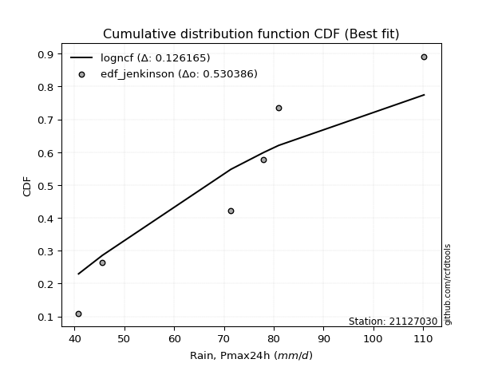</img>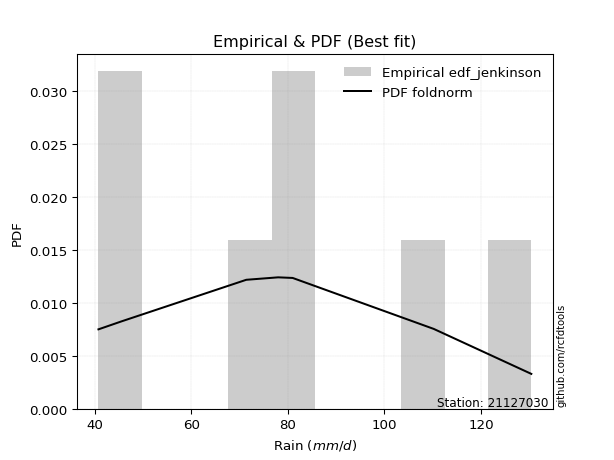</img>

</div>


### 11. Empirical - EDF Cunnane (1978)

Cunnane´s work in statistical hydrology has focused on the performance and evaluation of different probability distributions (such as GEV, Gumbel, Lognormal) for flood frequency estimation. _b_ is a constant, typically set to 0.4.

<div align="center">


$P=(m-b)/(n+1-2b)$


</div>


**11.1. Empirical values**

<div align="center">

|                | 0                   | 1                   | 2                  | 3           | 4                  | 5                  | 6                  |
|:---------------|:--------------------|:--------------------|:-------------------|:------------|:-------------------|:-------------------|:-------------------|
| date           | 2022                | 2023                | 2019               | 2024        | 2020               | 2025               | 2021               |
| x              | 40.8                | 45.6                | 71.4               | 78.0        | 81.0               | 107.4              | 110.2              |
| m              | 1                   | 2                   | 3                  | 4           | 5                  | 6                  | 7                  |
| empirical_dist | edf_cunnane         | edf_cunnane         | edf_cunnane        | edf_cunnane | edf_cunnane        | edf_cunnane        | edf_cunnane        |
| empirical      | 0.08333333333333333 | 0.22222222222222224 | 0.3611111111111111 | 0.5         | 0.6388888888888888 | 0.7777777777777777 | 0.9166666666666666 |
| empirical_tr   | 1.090909090909091   | 1.2857142857142856  | 1.565217391304348  | 2.0         | 2.7692307692307687 | 4.499999999999998  | 11.999999999999995 |

</div>


**11.2. Kolmogorov-Smirnov fit test (sorted by Δ)**


<div align="center">

|                | 0                   | 1                   | 2                   | 3                   | 4                   | 5                   | 6                   | 7                   | 8                   | 9                   | 10                  | 11                  | 12                  | 13                  | 14                    | 15                  | 16                  | 17                  | 18                  | 19                  | 20                  | 21                  | 22                  | 23                  | 24                  | 25                  | 26                  | 27                  | 28                  | 29                  | 30                  | 31                  | 32                  | 33                  | 34                  | 35                  | 36                  | 37                  | 38                  | 39                  | 40                  | 41                  | 42                  | 43                  | 44                  | 45                  | 46                  | 47                  | 48                  | 49                  | 50                  | 51                  | 52                  | 53                  | 54                  | 55                  | 56                  | 57                  | 58                  | 59                  | 60                  | 61                  | 62                  | 63                  | 64                  | 65                  | 66                  | 67                  | 68                  | 69                  | 70                  | 71                  | 72                  | 73                  | 74                  | 75                  | 76                  | 77                  | 78                  | 79                  | 80                  | 81                  | 82                  | 83                  | 84                  | 85                  | 86                  | 87                  | 88                  | 89                  |
|:---------------|:--------------------|:--------------------|:--------------------|:--------------------|:--------------------|:--------------------|:--------------------|:--------------------|:--------------------|:--------------------|:--------------------|:--------------------|:--------------------|:--------------------|:----------------------|:--------------------|:--------------------|:--------------------|:--------------------|:--------------------|:--------------------|:--------------------|:--------------------|:--------------------|:--------------------|:--------------------|:--------------------|:--------------------|:--------------------|:--------------------|:--------------------|:--------------------|:--------------------|:--------------------|:--------------------|:--------------------|:--------------------|:--------------------|:--------------------|:--------------------|:--------------------|:--------------------|:--------------------|:--------------------|:--------------------|:--------------------|:--------------------|:--------------------|:--------------------|:--------------------|:--------------------|:--------------------|:--------------------|:--------------------|:--------------------|:--------------------|:--------------------|:--------------------|:--------------------|:--------------------|:--------------------|:--------------------|:--------------------|:--------------------|:--------------------|:--------------------|:--------------------|:--------------------|:--------------------|:--------------------|:--------------------|:--------------------|:--------------------|:--------------------|:--------------------|:--------------------|:--------------------|:--------------------|:--------------------|:--------------------|:--------------------|:--------------------|:--------------------|:--------------------|:--------------------|:--------------------|:--------------------|:--------------------|:--------------------|:--------------------|
| station        | 21127030            | 21127030            | 21127030            | 21127030            | 21127030            | 21127030            | 21127030            | 21127030            | 21127030            | 21127030            | 21127030            | 21127030            | 21127030            | 21127030            | 21127030              | 21127030            | 21127030            | 21127030            | 21127030            | 21127030            | 21127030            | 21127030            | 21127030            | 21127030            | 21127030            | 21127030            | 21127030            | 21127030            | 21127030            | 21127030            | 21127030            | 21127030            | 21127030            | 21127030            | 21127030            | 21127030            | 21127030            | 21127030            | 21127030            | 21127030            | 21127030            | 21127030            | 21127030            | 21127030            | 21127030            | 21127030            | 21127030            | 21127030            | 21127030            | 21127030            | 21127030            | 21127030            | 21127030            | 21127030            | 21127030            | 21127030            | 21127030            | 21127030            | 21127030            | 21127030            | 21127030            | 21127030            | 21127030            | 21127030            | 21127030            | 21127030            | 21127030            | 21127030            | 21127030            | 21127030            | 21127030            | 21127030            | 21127030            | 21127030            | 21127030            | 21127030            | 21127030            | 21127030            | 21127030            | 21127030            | 21127030            | 21127030            | 21127030            | 21127030            | 21127030            | 21127030            | 21127030            | 21127030            | 21127030            | 21127030            |
| empirical_dist | edf_cunnane         | edf_cunnane         | edf_cunnane         | edf_cunnane         | edf_cunnane         | edf_cunnane         | edf_cunnane         | edf_cunnane         | edf_cunnane         | edf_cunnane         | edf_cunnane         | edf_cunnane         | edf_cunnane         | edf_cunnane         | edf_cunnane           | edf_cunnane         | edf_cunnane         | edf_cunnane         | edf_cunnane         | edf_cunnane         | edf_cunnane         | edf_cunnane         | edf_cunnane         | edf_cunnane         | edf_cunnane         | edf_cunnane         | edf_cunnane         | edf_cunnane         | edf_cunnane         | edf_cunnane         | edf_cunnane         | edf_cunnane         | edf_cunnane         | edf_cunnane         | edf_cunnane         | edf_cunnane         | edf_cunnane         | edf_cunnane         | edf_cunnane         | edf_cunnane         | edf_cunnane         | edf_cunnane         | edf_cunnane         | edf_cunnane         | edf_cunnane         | edf_cunnane         | edf_cunnane         | edf_cunnane         | edf_cunnane         | edf_cunnane         | edf_cunnane         | edf_cunnane         | edf_cunnane         | edf_cunnane         | edf_cunnane         | edf_cunnane         | edf_cunnane         | edf_cunnane         | edf_cunnane         | edf_cunnane         | edf_cunnane         | edf_cunnane         | edf_cunnane         | edf_cunnane         | edf_cunnane         | edf_cunnane         | edf_cunnane         | edf_cunnane         | edf_cunnane         | edf_cunnane         | edf_cunnane         | edf_cunnane         | edf_cunnane         | edf_cunnane         | edf_cunnane         | edf_cunnane         | edf_cunnane         | edf_cunnane         | edf_cunnane         | edf_cunnane         | edf_cunnane         | edf_cunnane         | edf_cunnane         | edf_cunnane         | edf_cunnane         | edf_cunnane         | edf_cunnane         | edf_cunnane         | edf_cunnane         | edf_cunnane         |
| p_dist         | fisk                | alpha               | gamma               | erlang              | nct                 | norm                | crystalball         | truncnorm           | exponnorm           | t                   | logpearson3         | logweibull_min      | pearson3            | johnsonsu           | loglaplace_asymmetric | betaprime           | invgauss            | invgamma            | laplace_asymmetric  | f                   | maxwell             | logfisk             | rayleigh            | genlogistic         | logistic            | loggumbel_l         | logt                | logexponnorm        | lognorm             | lognorm             | logcrystalball      | lognct              | rice                | logfatiguelife      | logf                | loglogistic         | hypsecant           | laplace             | loghypsecant        | ncf                 | loggamma            | loggamma            | loglaplace          | kstwobign           | logerlang           | logrice             | logalpha            | logbetaprime        | loginvgamma         | loggompertz         | mielke              | gumbel_r            | gumbel_l            | loginvgauss         | logloggamma         | logmaxwell          | logmielke           | logjohnsonsu        | lograyleigh         | halfnorm            | moyal               | logncf              | loginvweibull       | loggumbel_r         | loghalfnorm         | logkstwobign        | expon               | genexpon            | halflogistic        | wald                | gibrat              | logmoyal            | loghalflogistic     | logchi2             | loggenexpon         | logexpon            | weibull_min         | logwald             | loggibrat           | nakagami            | pareto              | logtruncnorm        | logpareto           | loglognorm          | invweibull          | lognakagami         | fatiguelife         | gompertz            | chi2                | loggenlogistic      |
| delta          | 0.10785722951933259 | 0.11330879532436264 | 0.11444795101240757 | 0.11448871363189872 | 0.11533334777238458 | 0.1153364273530848  | 0.11533643179748942 | 0.11533643914549863 | 0.11533662774375708 | 0.11535865459272743 | 0.11571638801387074 | 0.11601216898286426 | 0.11616939094597745 | 0.11637271843109775 | 0.11664387760202488   | 0.1167760615966444  | 0.11740650390915183 | 0.11747191138378171 | 0.11805287229882278 | 0.11928361708383398 | 0.12133706533431952 | 0.12711087917457878 | 0.1271254449044011  | 0.12727181058590897 | 0.12730544414474154 | 0.12899529869324922 | 0.13104734424026926 | 0.13109718565120715 | 0.13109829873034712 | 0.13109829873034712 | 0.13109829944172552 | 0.13110680071212272 | 0.13129657991983493 | 0.13156495723031675 | 0.13177305778696025 | 0.13216215258897598 | 0.13250954775147827 | 0.13604798853233768 | 0.13684153050342746 | 0.13775106889666394 | 0.13968513216568318 | 0.13968513216568318 | 0.1398501835859639  | 0.14083268964107615 | 0.14172536245759254 | 0.14902675048838793 | 0.15014286866484766 | 0.15165583578545833 | 0.15318165318031457 | 0.15415659895399741 | 0.15490760591155778 | 0.15644789889382743 | 0.1592962882101111  | 0.1618614565935948  | 0.16350668600225338 | 0.1644425335796212  | 0.1648250000702668  | 0.17055841875084699 | 0.17561860129138213 | 0.17755056744181455 | 0.1845806506469448  | 0.18627576765231146 | 0.1883439223505527  | 0.20119990720049236 | 0.20708847543938164 | 0.20888878534080618 | 0.21612121109309707 | 0.21781050951097908 | 0.22222222222222224 | 0.22222222222222224 | 0.22222222222222224 | 0.22708082266741797 | 0.2315294593447506  | 0.24134453213474116 | 0.24998312345625023 | 0.26645337023128396 | 0.2697149810395872  | 0.29908266265237    | 0.32116734356334425 | 0.32941364295768644 | 0.3499983886238557  | 0.3611110706119663  | 0.3709386384557303  | 0.3868467156045108  | 0.4440140709506387  | 0.45255103247653855 | 0.4844467427871935  | 0.6336559492671704  | 0.7560270327946285  | 0.7777777777777777  |
| deltao         | 0.48442053926100004 | 0.48442053926100004 | 0.48442053926100004 | 0.48442053926100004 | 0.48442053926100004 | 0.48442053926100004 | 0.48442053926100004 | 0.48442053926100004 | 0.48442053926100004 | 0.48442053926100004 | 0.48442053926100004 | 0.48442053926100004 | 0.48442053926100004 | 0.48442053926100004 | 0.48442053926100004   | 0.48442053926100004 | 0.48442053926100004 | 0.48442053926100004 | 0.48442053926100004 | 0.48442053926100004 | 0.48442053926100004 | 0.48442053926100004 | 0.48442053926100004 | 0.48442053926100004 | 0.48442053926100004 | 0.48442053926100004 | 0.48442053926100004 | 0.48442053926100004 | 0.48442053926100004 | 0.48442053926100004 | 0.48442053926100004 | 0.48442053926100004 | 0.48442053926100004 | 0.48442053926100004 | 0.48442053926100004 | 0.48442053926100004 | 0.48442053926100004 | 0.48442053926100004 | 0.48442053926100004 | 0.48442053926100004 | 0.48442053926100004 | 0.48442053926100004 | 0.48442053926100004 | 0.48442053926100004 | 0.48442053926100004 | 0.48442053926100004 | 0.48442053926100004 | 0.48442053926100004 | 0.48442053926100004 | 0.48442053926100004 | 0.48442053926100004 | 0.48442053926100004 | 0.48442053926100004 | 0.48442053926100004 | 0.48442053926100004 | 0.48442053926100004 | 0.48442053926100004 | 0.48442053926100004 | 0.48442053926100004 | 0.48442053926100004 | 0.48442053926100004 | 0.48442053926100004 | 0.48442053926100004 | 0.48442053926100004 | 0.48442053926100004 | 0.48442053926100004 | 0.48442053926100004 | 0.48442053926100004 | 0.48442053926100004 | 0.48442053926100004 | 0.48442053926100004 | 0.48442053926100004 | 0.48442053926100004 | 0.48442053926100004 | 0.48442053926100004 | 0.48442053926100004 | 0.48442053926100004 | 0.48442053926100004 | 0.48442053926100004 | 0.48442053926100004 | 0.48442053926100004 | 0.48442053926100004 | 0.48442053926100004 | 0.48442053926100004 | 0.48442053926100004 | 0.48442053926100004 | 0.48442053926100004 | 0.48442053926100004 | 0.48442053926100004 | 0.48442053926100004 |
| eval           | Δo > Δ              | Δo > Δ              | Δo > Δ              | Δo > Δ              | Δo > Δ              | Δo > Δ              | Δo > Δ              | Δo > Δ              | Δo > Δ              | Δo > Δ              | Δo > Δ              | Δo > Δ              | Δo > Δ              | Δo > Δ              | Δo > Δ                | Δo > Δ              | Δo > Δ              | Δo > Δ              | Δo > Δ              | Δo > Δ              | Δo > Δ              | Δo > Δ              | Δo > Δ              | Δo > Δ              | Δo > Δ              | Δo > Δ              | Δo > Δ              | Δo > Δ              | Δo > Δ              | Δo > Δ              | Δo > Δ              | Δo > Δ              | Δo > Δ              | Δo > Δ              | Δo > Δ              | Δo > Δ              | Δo > Δ              | Δo > Δ              | Δo > Δ              | Δo > Δ              | Δo > Δ              | Δo > Δ              | Δo > Δ              | Δo > Δ              | Δo > Δ              | Δo > Δ              | Δo > Δ              | Δo > Δ              | Δo > Δ              | Δo > Δ              | Δo > Δ              | Δo > Δ              | Δo > Δ              | Δo > Δ              | Δo > Δ              | Δo > Δ              | Δo > Δ              | Δo > Δ              | Δo > Δ              | Δo > Δ              | Δo > Δ              | Δo > Δ              | Δo > Δ              | Δo > Δ              | Δo > Δ              | Δo > Δ              | Δo > Δ              | Δo > Δ              | Δo > Δ              | Δo > Δ              | Δo > Δ              | Δo > Δ              | Δo > Δ              | Δo > Δ              | Δo > Δ              | Δo > Δ              | Δo > Δ              | Δo > Δ              | Δo > Δ              | Δo > Δ              | Δo > Δ              | Δo > Δ              | Δo > Δ              | Δo > Δ              | Δo > Δ              | Δo > Δ              | Δo <= Δ             | Δo <= Δ             | Δo <= Δ             | Δo <= Δ             |
| fit            | 1                   | 1                   | 1                   | 1                   | 1                   | 1                   | 1                   | 1                   | 1                   | 1                   | 1                   | 1                   | 1                   | 1                   | 1                     | 1                   | 1                   | 1                   | 1                   | 1                   | 1                   | 1                   | 1                   | 1                   | 1                   | 1                   | 1                   | 1                   | 1                   | 1                   | 1                   | 1                   | 1                   | 1                   | 1                   | 1                   | 1                   | 1                   | 1                   | 1                   | 1                   | 1                   | 1                   | 1                   | 1                   | 1                   | 1                   | 1                   | 1                   | 1                   | 1                   | 1                   | 1                   | 1                   | 1                   | 1                   | 1                   | 1                   | 1                   | 1                   | 1                   | 1                   | 1                   | 1                   | 1                   | 1                   | 1                   | 1                   | 1                   | 1                   | 1                   | 1                   | 1                   | 1                   | 1                   | 1                   | 1                   | 1                   | 1                   | 1                   | 1                   | 1                   | 1                   | 1                   | 1                   | 1                   | 0                   | 0                   | 0                   | 0                   |
| n              | 7                   | 7                   | 7                   | 7                   | 7                   | 7                   | 7                   | 7                   | 7                   | 7                   | 7                   | 7                   | 7                   | 7                   | 7                     | 7                   | 7                   | 7                   | 7                   | 7                   | 7                   | 7                   | 7                   | 7                   | 7                   | 7                   | 7                   | 7                   | 7                   | 7                   | 7                   | 7                   | 7                   | 7                   | 7                   | 7                   | 7                   | 7                   | 7                   | 7                   | 7                   | 7                   | 7                   | 7                   | 7                   | 7                   | 7                   | 7                   | 7                   | 7                   | 7                   | 7                   | 7                   | 7                   | 7                   | 7                   | 7                   | 7                   | 7                   | 7                   | 7                   | 7                   | 7                   | 7                   | 7                   | 7                   | 7                   | 7                   | 7                   | 7                   | 7                   | 7                   | 7                   | 7                   | 7                   | 7                   | 7                   | 7                   | 7                   | 7                   | 7                   | 7                   | 7                   | 7                   | 7                   | 7                   | 7                   | 7                   | 7                   | 7                   |
| best_fit       | 1                   | 0                   | 0                   | 0                   | 0                   | 0                   | 0                   | 0                   | 0                   | 0                   | 0                   | 0                   | 0                   | 0                   | 0                     | 0                   | 0                   | 0                   | 0                   | 0                   | 0                   | 0                   | 0                   | 0                   | 0                   | 0                   | 0                   | 0                   | 0                   | 0                   | 0                   | 0                   | 0                   | 0                   | 0                   | 0                   | 0                   | 0                   | 0                   | 0                   | 0                   | 0                   | 0                   | 0                   | 0                   | 0                   | 0                   | 0                   | 0                   | 0                   | 0                   | 0                   | 0                   | 0                   | 0                   | 0                   | 0                   | 0                   | 0                   | 0                   | 0                   | 0                   | 0                   | 0                   | 0                   | 0                   | 0                   | 0                   | 0                   | 0                   | 0                   | 0                   | 0                   | 0                   | 0                   | 0                   | 0                   | 0                   | 0                   | 0                   | 0                   | 0                   | 0                   | 0                   | 0                   | 0                   | 0                   | 0                   | 0                   | 0                   |
| best_fit_sort  | 1                   | 2                   | 3                   | 4                   | 5                   | 6                   | 7                   | 8                   | 9                   | 10                  | 11                  | 12                  | 13                  | 14                  | 15                    | 16                  | 17                  | 18                  | 19                  | 20                  | 21                  | 22                  | 23                  | 24                  | 25                  | 26                  | 27                  | 28                  | 29                  | 30                  | 31                  | 32                  | 33                  | 34                  | 35                  | 36                  | 37                  | 38                  | 39                  | 40                  | 41                  | 42                  | 43                  | 44                  | 45                  | 46                  | 47                  | 48                  | 49                  | 50                  | 51                  | 52                  | 53                  | 54                  | 55                  | 56                  | 57                  | 58                  | 59                  | 60                  | 61                  | 62                  | 63                  | 64                  | 65                  | 66                  | 67                  | 68                  | 69                  | 70                  | 71                  | 72                  | 73                  | 74                  | 75                  | 76                  | 77                  | 78                  | 79                  | 80                  | 81                  | 82                  | 83                  | 84                  | 85                  | 86                  | 87                  | 88                  | 89                  | 90                  |

</div>


<div align="center">

</img>

</div>


**11.3. Best fit**

<div align="center">

|   id |   station | empirical_dist   | p_dist   |    delta |   deltao | eval   |   fit |   n |   best_fit |   best_fit_sort |
|-----:|----------:|:-----------------|:---------|---------:|---------:|:-------|------:|----:|-----------:|----------------:|
|    0 |  21127030 | edf_cunnane      | fisk     | 0.107857 | 0.484421 | Δo > Δ |     1 |   7 |          1 |               1 |

</div>


<div align="center">

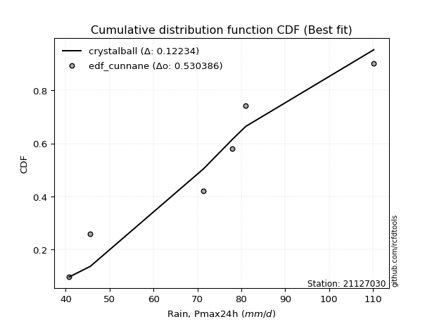</img></img>

</div>


### 12. Empirical - EDF Adamowski (1981)

The Adamowski formula in hydrology refers to a specific plotting position formula used for estimating the non-parametric empirical distribution of hydrological events (like flood peaks) to calculate their return periods. This formula provides an alternative to traditional parametric methods (like the Gumbel or Log Pearson Type III distributions). 

<div align="center">


$P=(m-0.25)/(n+0.5)$


</div>


**12.1. Empirical values**

<div align="center">

|                | 0                  | 1                   | 2                   | 3             | 4                  | 5                  | 6                  |
|:---------------|:-------------------|:--------------------|:--------------------|:--------------|:-------------------|:-------------------|:-------------------|
| date           | 2022               | 2023                | 2019                | 2024          | 2020               | 2025               | 2021               |
| x              | 40.8               | 45.6                | 71.4                | 78.0          | 81.0               | 107.4              | 110.2              |
| m              | 1                  | 2                   | 3                   | 4             | 5                  | 6                  | 7                  |
| empirical_dist | edf_adamowski      | edf_adamowski       | edf_adamowski       | edf_adamowski | edf_adamowski      | edf_adamowski      | edf_adamowski      |
| empirical      | 0.1                | 0.23333333333333334 | 0.36666666666666664 | 0.5           | 0.6333333333333333 | 0.7666666666666667 | 0.9                |
| empirical_tr   | 1.1111111111111112 | 1.3043478260869565  | 1.5789473684210527  | 2.0           | 2.727272727272727  | 4.2857142857142865 | 10.000000000000002 |

</div>


**12.2. Kolmogorov-Smirnov fit test (sorted by Δ)**


<div align="center">

|                | 0                   | 1                   | 2                   | 3                   | 4                   | 5                   | 6                   | 7                   | 8                   | 9                   | 10                  | 11                  | 12                  | 13                  | 14                  | 15                    | 16                  | 17                  | 18                  | 19                  | 20                  | 21                  | 22                  | 23                  | 24                  | 25                  | 26                  | 27                  | 28                  | 29                  | 30                  | 31                  | 32                  | 33                  | 34                  | 35                  | 36                  | 37                  | 38                  | 39                  | 40                  | 41                  | 42                  | 43                  | 44                  | 45                  | 46                  | 47                  | 48                  | 49                  | 50                  | 51                  | 52                  | 53                  | 54                  | 55                  | 56                  | 57                  | 58                  | 59                  | 60                  | 61                  | 62                  | 63                  | 64                  | 65                  | 66                  | 67                  | 68                  | 69                  | 70                  | 71                  | 72                  | 73                  | 74                  | 75                  | 76                  | 77                  | 78                  | 79                  | 80                  | 81                  | 82                  | 83                  | 84                  | 85                  | 86                  | 87                  | 88                  | 89                  |
|:---------------|:--------------------|:--------------------|:--------------------|:--------------------|:--------------------|:--------------------|:--------------------|:--------------------|:--------------------|:--------------------|:--------------------|:--------------------|:--------------------|:--------------------|:--------------------|:----------------------|:--------------------|:--------------------|:--------------------|:--------------------|:--------------------|:--------------------|:--------------------|:--------------------|:--------------------|:--------------------|:--------------------|:--------------------|:--------------------|:--------------------|:--------------------|:--------------------|:--------------------|:--------------------|:--------------------|:--------------------|:--------------------|:--------------------|:--------------------|:--------------------|:--------------------|:--------------------|:--------------------|:--------------------|:--------------------|:--------------------|:--------------------|:--------------------|:--------------------|:--------------------|:--------------------|:--------------------|:--------------------|:--------------------|:--------------------|:--------------------|:--------------------|:--------------------|:--------------------|:--------------------|:--------------------|:--------------------|:--------------------|:--------------------|:--------------------|:--------------------|:--------------------|:--------------------|:--------------------|:--------------------|:--------------------|:--------------------|:--------------------|:--------------------|:--------------------|:--------------------|:--------------------|:--------------------|:--------------------|:--------------------|:--------------------|:--------------------|:--------------------|:--------------------|:--------------------|:--------------------|:--------------------|:--------------------|:--------------------|:--------------------|
| station        | 21127030            | 21127030            | 21127030            | 21127030            | 21127030            | 21127030            | 21127030            | 21127030            | 21127030            | 21127030            | 21127030            | 21127030            | 21127030            | 21127030            | 21127030            | 21127030              | 21127030            | 21127030            | 21127030            | 21127030            | 21127030            | 21127030            | 21127030            | 21127030            | 21127030            | 21127030            | 21127030            | 21127030            | 21127030            | 21127030            | 21127030            | 21127030            | 21127030            | 21127030            | 21127030            | 21127030            | 21127030            | 21127030            | 21127030            | 21127030            | 21127030            | 21127030            | 21127030            | 21127030            | 21127030            | 21127030            | 21127030            | 21127030            | 21127030            | 21127030            | 21127030            | 21127030            | 21127030            | 21127030            | 21127030            | 21127030            | 21127030            | 21127030            | 21127030            | 21127030            | 21127030            | 21127030            | 21127030            | 21127030            | 21127030            | 21127030            | 21127030            | 21127030            | 21127030            | 21127030            | 21127030            | 21127030            | 21127030            | 21127030            | 21127030            | 21127030            | 21127030            | 21127030            | 21127030            | 21127030            | 21127030            | 21127030            | 21127030            | 21127030            | 21127030            | 21127030            | 21127030            | 21127030            | 21127030            | 21127030            |
| empirical_dist | edf_adamowski       | edf_adamowski       | edf_adamowski       | edf_adamowski       | edf_adamowski       | edf_adamowski       | edf_adamowski       | edf_adamowski       | edf_adamowski       | edf_adamowski       | edf_adamowski       | edf_adamowski       | edf_adamowski       | edf_adamowski       | edf_adamowski       | edf_adamowski         | edf_adamowski       | edf_adamowski       | edf_adamowski       | edf_adamowski       | edf_adamowski       | edf_adamowski       | edf_adamowski       | edf_adamowski       | edf_adamowski       | edf_adamowski       | edf_adamowski       | edf_adamowski       | edf_adamowski       | edf_adamowski       | edf_adamowski       | edf_adamowski       | edf_adamowski       | edf_adamowski       | edf_adamowski       | edf_adamowski       | edf_adamowski       | edf_adamowski       | edf_adamowski       | edf_adamowski       | edf_adamowski       | edf_adamowski       | edf_adamowski       | edf_adamowski       | edf_adamowski       | edf_adamowski       | edf_adamowski       | edf_adamowski       | edf_adamowski       | edf_adamowski       | edf_adamowski       | edf_adamowski       | edf_adamowski       | edf_adamowski       | edf_adamowski       | edf_adamowski       | edf_adamowski       | edf_adamowski       | edf_adamowski       | edf_adamowski       | edf_adamowski       | edf_adamowski       | edf_adamowski       | edf_adamowski       | edf_adamowski       | edf_adamowski       | edf_adamowski       | edf_adamowski       | edf_adamowski       | edf_adamowski       | edf_adamowski       | edf_adamowski       | edf_adamowski       | edf_adamowski       | edf_adamowski       | edf_adamowski       | edf_adamowski       | edf_adamowski       | edf_adamowski       | edf_adamowski       | edf_adamowski       | edf_adamowski       | edf_adamowski       | edf_adamowski       | edf_adamowski       | edf_adamowski       | edf_adamowski       | edf_adamowski       | edf_adamowski       | edf_adamowski       |
| p_dist         | fisk                | alpha               | gamma               | erlang              | genlogistic         | nct                 | norm                | crystalball         | truncnorm           | exponnorm           | t                   | logpearson3         | logweibull_min      | pearson3            | johnsonsu           | loglaplace_asymmetric | betaprime           | invgauss            | invgamma            | laplace_asymmetric  | f                   | logf                | lognct              | logcrystalball      | lognorm             | lognorm             | logexponnorm        | logt                | maxwell             | ncf                 | logfatiguelife      | loggamma            | loggamma            | kstwobign           | logerlang           | logfisk             | rayleigh            | logistic            | loggumbel_l         | rice                | loglogistic         | logrice             | hypsecant           | logalpha            | logbetaprime        | laplace             | loginvgamma         | loghypsecant        | loglaplace          | loginvgauss         | logmaxwell          | mielke              | logjohnsonsu        | loggompertz         | gumbel_r            | logncf              | lograyleigh         | gumbel_l            | logloggamma         | logmielke           | loginvweibull       | halfnorm            | loggumbel_r         | moyal               | logkstwobign        | loghalfnorm         | expon               | genexpon            | logmoyal            | logchi2             | halflogistic        | loghalflogistic     | wald                | gibrat              | loggenexpon         | logexpon            | weibull_min         | logwald             | loggibrat           | nakagami            | pareto              | logpareto           | logtruncnorm        | loglognorm          | invweibull          | lognakagami         | fatiguelife         | gompertz            | chi2                | loggenlogistic      |
| delta          | 0.11896834063044369 | 0.12441990643547374 | 0.12555906212351853 | 0.12559982474300968 | 0.12615287943304954 | 0.12644445888349554 | 0.12644753846419576 | 0.12644754290860039 | 0.1264475502566096  | 0.12644773885486804 | 0.1264697657038384  | 0.12682749912498184 | 0.12712328009397522 | 0.1272805020570884  | 0.12748382954220872 | 0.12775498871313584   | 0.12788717270775551 | 0.12851761502026293 | 0.1285830224948928  | 0.12916398340993374 | 0.13039472819494508 | 0.13214132395936648 | 0.1322066608444858  | 0.13220869355314835 | 0.132208713089212   | 0.132208713089212   | 0.13220929405794069 | 0.13221450361121823 | 0.1324481764454306  | 0.13260060843400406 | 0.13295948447508316 | 0.13412957661012764 | 0.13412957661012764 | 0.1352771340855206  | 0.136169806902037   | 0.13822199028568988 | 0.1382365560155122  | 0.1384165552558525  | 0.14010640980436018 | 0.14240769103094603 | 0.14327326370008708 | 0.1434711949328324  | 0.14362065886258923 | 0.14458731310929213 | 0.1461002802299028  | 0.14715909964344864 | 0.14762609762475903 | 0.14795264161453853 | 0.15096129469707498 | 0.15630590103803926 | 0.15888697802406565 | 0.16398962183320975 | 0.16500286319529145 | 0.16526771006510851 | 0.16755901000493856 | 0.16960910098564486 | 0.1700630457358266  | 0.17040739932122206 | 0.17461779711336434 | 0.17593611118137775 | 0.18278836679499716 | 0.18866167855292565 | 0.19564435164493682 | 0.1956917617580559  | 0.20333322978525065 | 0.20999320139270283 | 0.21056565553754153 | 0.21225495395542354 | 0.22152526711186243 | 0.22467786546807456 | 0.23333333333333334 | 0.23333333333333334 | 0.23333333333333334 | 0.23333333333333334 | 0.2444275679006947  | 0.2608978146757284  | 0.26415942548403165 | 0.29352710709681445 | 0.3156117880077887  | 0.3238580874021309  | 0.33888727751274456 | 0.35982752734461915 | 0.3666666261675218  | 0.37573560449339966 | 0.4273474042839721  | 0.446995476920983   | 0.478891187231638   | 0.6281003937116149  | 0.7449159216835173  | 0.7666666666666667  |
| deltao         | 0.48442053926100004 | 0.48442053926100004 | 0.48442053926100004 | 0.48442053926100004 | 0.48442053926100004 | 0.48442053926100004 | 0.48442053926100004 | 0.48442053926100004 | 0.48442053926100004 | 0.48442053926100004 | 0.48442053926100004 | 0.48442053926100004 | 0.48442053926100004 | 0.48442053926100004 | 0.48442053926100004 | 0.48442053926100004   | 0.48442053926100004 | 0.48442053926100004 | 0.48442053926100004 | 0.48442053926100004 | 0.48442053926100004 | 0.48442053926100004 | 0.48442053926100004 | 0.48442053926100004 | 0.48442053926100004 | 0.48442053926100004 | 0.48442053926100004 | 0.48442053926100004 | 0.48442053926100004 | 0.48442053926100004 | 0.48442053926100004 | 0.48442053926100004 | 0.48442053926100004 | 0.48442053926100004 | 0.48442053926100004 | 0.48442053926100004 | 0.48442053926100004 | 0.48442053926100004 | 0.48442053926100004 | 0.48442053926100004 | 0.48442053926100004 | 0.48442053926100004 | 0.48442053926100004 | 0.48442053926100004 | 0.48442053926100004 | 0.48442053926100004 | 0.48442053926100004 | 0.48442053926100004 | 0.48442053926100004 | 0.48442053926100004 | 0.48442053926100004 | 0.48442053926100004 | 0.48442053926100004 | 0.48442053926100004 | 0.48442053926100004 | 0.48442053926100004 | 0.48442053926100004 | 0.48442053926100004 | 0.48442053926100004 | 0.48442053926100004 | 0.48442053926100004 | 0.48442053926100004 | 0.48442053926100004 | 0.48442053926100004 | 0.48442053926100004 | 0.48442053926100004 | 0.48442053926100004 | 0.48442053926100004 | 0.48442053926100004 | 0.48442053926100004 | 0.48442053926100004 | 0.48442053926100004 | 0.48442053926100004 | 0.48442053926100004 | 0.48442053926100004 | 0.48442053926100004 | 0.48442053926100004 | 0.48442053926100004 | 0.48442053926100004 | 0.48442053926100004 | 0.48442053926100004 | 0.48442053926100004 | 0.48442053926100004 | 0.48442053926100004 | 0.48442053926100004 | 0.48442053926100004 | 0.48442053926100004 | 0.48442053926100004 | 0.48442053926100004 | 0.48442053926100004 |
| eval           | Δo > Δ              | Δo > Δ              | Δo > Δ              | Δo > Δ              | Δo > Δ              | Δo > Δ              | Δo > Δ              | Δo > Δ              | Δo > Δ              | Δo > Δ              | Δo > Δ              | Δo > Δ              | Δo > Δ              | Δo > Δ              | Δo > Δ              | Δo > Δ                | Δo > Δ              | Δo > Δ              | Δo > Δ              | Δo > Δ              | Δo > Δ              | Δo > Δ              | Δo > Δ              | Δo > Δ              | Δo > Δ              | Δo > Δ              | Δo > Δ              | Δo > Δ              | Δo > Δ              | Δo > Δ              | Δo > Δ              | Δo > Δ              | Δo > Δ              | Δo > Δ              | Δo > Δ              | Δo > Δ              | Δo > Δ              | Δo > Δ              | Δo > Δ              | Δo > Δ              | Δo > Δ              | Δo > Δ              | Δo > Δ              | Δo > Δ              | Δo > Δ              | Δo > Δ              | Δo > Δ              | Δo > Δ              | Δo > Δ              | Δo > Δ              | Δo > Δ              | Δo > Δ              | Δo > Δ              | Δo > Δ              | Δo > Δ              | Δo > Δ              | Δo > Δ              | Δo > Δ              | Δo > Δ              | Δo > Δ              | Δo > Δ              | Δo > Δ              | Δo > Δ              | Δo > Δ              | Δo > Δ              | Δo > Δ              | Δo > Δ              | Δo > Δ              | Δo > Δ              | Δo > Δ              | Δo > Δ              | Δo > Δ              | Δo > Δ              | Δo > Δ              | Δo > Δ              | Δo > Δ              | Δo > Δ              | Δo > Δ              | Δo > Δ              | Δo > Δ              | Δo > Δ              | Δo > Δ              | Δo > Δ              | Δo > Δ              | Δo > Δ              | Δo > Δ              | Δo > Δ              | Δo <= Δ             | Δo <= Δ             | Δo <= Δ             |
| fit            | 1                   | 1                   | 1                   | 1                   | 1                   | 1                   | 1                   | 1                   | 1                   | 1                   | 1                   | 1                   | 1                   | 1                   | 1                   | 1                     | 1                   | 1                   | 1                   | 1                   | 1                   | 1                   | 1                   | 1                   | 1                   | 1                   | 1                   | 1                   | 1                   | 1                   | 1                   | 1                   | 1                   | 1                   | 1                   | 1                   | 1                   | 1                   | 1                   | 1                   | 1                   | 1                   | 1                   | 1                   | 1                   | 1                   | 1                   | 1                   | 1                   | 1                   | 1                   | 1                   | 1                   | 1                   | 1                   | 1                   | 1                   | 1                   | 1                   | 1                   | 1                   | 1                   | 1                   | 1                   | 1                   | 1                   | 1                   | 1                   | 1                   | 1                   | 1                   | 1                   | 1                   | 1                   | 1                   | 1                   | 1                   | 1                   | 1                   | 1                   | 1                   | 1                   | 1                   | 1                   | 1                   | 1                   | 1                   | 0                   | 0                   | 0                   |
| n              | 7                   | 7                   | 7                   | 7                   | 7                   | 7                   | 7                   | 7                   | 7                   | 7                   | 7                   | 7                   | 7                   | 7                   | 7                   | 7                     | 7                   | 7                   | 7                   | 7                   | 7                   | 7                   | 7                   | 7                   | 7                   | 7                   | 7                   | 7                   | 7                   | 7                   | 7                   | 7                   | 7                   | 7                   | 7                   | 7                   | 7                   | 7                   | 7                   | 7                   | 7                   | 7                   | 7                   | 7                   | 7                   | 7                   | 7                   | 7                   | 7                   | 7                   | 7                   | 7                   | 7                   | 7                   | 7                   | 7                   | 7                   | 7                   | 7                   | 7                   | 7                   | 7                   | 7                   | 7                   | 7                   | 7                   | 7                   | 7                   | 7                   | 7                   | 7                   | 7                   | 7                   | 7                   | 7                   | 7                   | 7                   | 7                   | 7                   | 7                   | 7                   | 7                   | 7                   | 7                   | 7                   | 7                   | 7                   | 7                   | 7                   | 7                   |
| best_fit       | 1                   | 0                   | 0                   | 0                   | 0                   | 0                   | 0                   | 0                   | 0                   | 0                   | 0                   | 0                   | 0                   | 0                   | 0                   | 0                     | 0                   | 0                   | 0                   | 0                   | 0                   | 0                   | 0                   | 0                   | 0                   | 0                   | 0                   | 0                   | 0                   | 0                   | 0                   | 0                   | 0                   | 0                   | 0                   | 0                   | 0                   | 0                   | 0                   | 0                   | 0                   | 0                   | 0                   | 0                   | 0                   | 0                   | 0                   | 0                   | 0                   | 0                   | 0                   | 0                   | 0                   | 0                   | 0                   | 0                   | 0                   | 0                   | 0                   | 0                   | 0                   | 0                   | 0                   | 0                   | 0                   | 0                   | 0                   | 0                   | 0                   | 0                   | 0                   | 0                   | 0                   | 0                   | 0                   | 0                   | 0                   | 0                   | 0                   | 0                   | 0                   | 0                   | 0                   | 0                   | 0                   | 0                   | 0                   | 0                   | 0                   | 0                   |
| best_fit_sort  | 1                   | 2                   | 3                   | 4                   | 5                   | 6                   | 7                   | 8                   | 9                   | 10                  | 11                  | 12                  | 13                  | 14                  | 15                  | 16                    | 17                  | 18                  | 19                  | 20                  | 21                  | 22                  | 23                  | 24                  | 25                  | 26                  | 27                  | 28                  | 29                  | 30                  | 31                  | 32                  | 33                  | 34                  | 35                  | 36                  | 37                  | 38                  | 39                  | 40                  | 41                  | 42                  | 43                  | 44                  | 45                  | 46                  | 47                  | 48                  | 49                  | 50                  | 51                  | 52                  | 53                  | 54                  | 55                  | 56                  | 57                  | 58                  | 59                  | 60                  | 61                  | 62                  | 63                  | 64                  | 65                  | 66                  | 67                  | 68                  | 69                  | 70                  | 71                  | 72                  | 73                  | 74                  | 75                  | 76                  | 77                  | 78                  | 79                  | 80                  | 81                  | 82                  | 83                  | 84                  | 85                  | 86                  | 87                  | 88                  | 89                  | 90                  |

</div>


<div align="center">

</img>

</div>


**12.3. Best fit**

<div align="center">

|   id |   station | empirical_dist   | p_dist   |    delta |   deltao | eval   |   fit |   n |   best_fit |   best_fit_sort |
|-----:|----------:|:-----------------|:---------|---------:|---------:|:-------|------:|----:|-----------:|----------------:|
|    0 |  21127030 | edf_adamowski    | fisk     | 0.118968 | 0.484421 | Δo > Δ |     1 |   7 |          1 |               1 |

</div>


<div align="center">

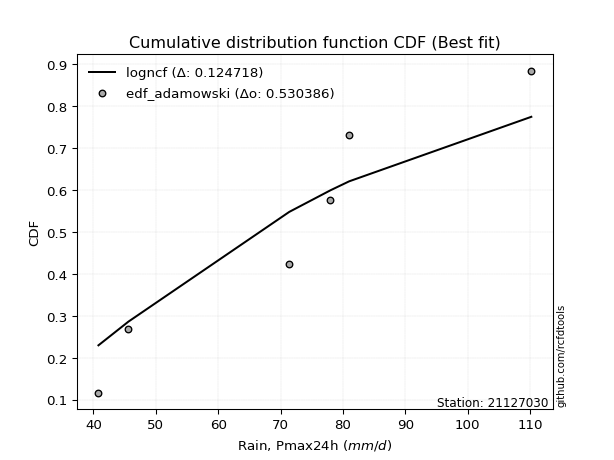</img></img>

</div>


## C. Best fit & Estimate extreme values for specific return periods - Tr


### 1. Best fit (ordered by delta Δ)

<div align="center">

|   id |   station | empirical_dist   | p_dist   |     delta |   deltao | eval   |   fit |   n |   best_fit |   best_fit_sort |
|-----:|----------:|:-----------------|:---------|----------:|---------:|:-------|------:|----:|-----------:|----------------:|
|    0 |  21127030 | edf_hazen        | fisk     | 0.0999207 | 0.484421 | Δo > Δ |     1 |   7 |          1 |               1 |
|    1 |  21127030 | edf_gringorten   | fisk     | 0.104736  | 0.484421 | Δo > Δ |     1 |   7 |          1 |               2 |
|    2 |  21127030 | edf_cunnane      | fisk     | 0.107857  | 0.484421 | Δo > Δ |     1 |   7 |          1 |               3 |
|    3 |  21127030 | edf_blom         | fisk     | 0.109773  | 0.484421 | Δo > Δ |     1 |   7 |          1 |               4 |
|    4 |  21127030 | edf_tukey        | fisk     | 0.112908  | 0.484421 | Δo > Δ |     1 |   7 |          1 |               5 |
|    5 |  21127030 | edf_filliben     | fisk     | 0.11408   | 0.484421 | Δo > Δ |     1 |   7 |          1 |               6 |
|    6 |  21127030 | edf_beard        | fisk     | 0.114632  | 0.484421 | Δo > Δ |     1 |   7 |          1 |               7 |
|    7 |  21127030 | edf_jenkinson    | fisk     | 0.114632  | 0.484421 | Δo > Δ |     1 |   7 |          1 |               8 |
|    8 |  21127030 | edf_chegodayev   | fisk     | 0.115365  | 0.484421 | Δo > Δ |     1 |   7 |          1 |               9 |
|    9 |  21127030 | edf_adamowski    | fisk     | 0.118968  | 0.484421 | Δo > Δ |     1 |   7 |          1 |              10 |
|   10 |  21127030 | edf_weibull      | fisk     | 0.135635  | 0.484421 | Δo > Δ |     1 |   7 |          1 |              11 |
|   11 |  21127030 | edf_california   | genexpon | 0.15035   | 0.484421 | Δo > Δ |     1 |   7 |          1 |              12 |

</div>

:file_folder:Tables: [bestfit_21127030.csv](table/bestfit_21127030.csv) | [extreme_21127030.csv](table/extreme_21127030.csv)


### 2. Extreme values

In hydrology, a return period (or recurrence interval $Tr$) is the statistical average time between extreme events like floods or droughts of a specific magnitude, indicating how rare an event is, with a 100-year flood, for example, having a 1% chance of occurring in any given year, not that it happens exactly every century. It is a key tool for infrastructure design (like bridges or dams) and risk assessment, calculated from historical data to determine the probability of future events, although it is important to remember it is statistical average, and events can cluster or be missed.

> risk_rate: assuming the return period as the project useful life.

|   id |      tr |   prob_l |     prob_g |    alpha |   betaprime |    chi2 |   crystalball |   erlang |    expon |   exponnorm |        f |   fatiguelife |     fisk |    gamma |   genexpon |   genlogistic |   gibrat |   gompertz |   gumbel_l |   gumbel_r |   halflogistic |   halfnorm |   hypsecant |   invgamma |   invgauss |     invweibull |   johnsonsu |   kstwobign |   laplace |   laplace_asymmetric |   loggamma |   logistic |   lognorm |   maxwell |   mielke |    moyal |   nakagami |      ncf |      nct |     norm |           pareto |   pearson3 |   rayleigh |     rice |        t |   truncnorm |     wald |   weibull_min |   logalpha |   logbetaprime |          logchi2 |   logcrystalball |   logerlang |   logexpon |   logexponnorm |     logf |   logfatiguelife |   logfisk |   loggenexpon |   loggenlogistic |   loggibrat |   loggompertz |   loggumbel_l |   loggumbel_r |   loghalflogistic |   loghalfnorm |   loghypsecant |   loginvgamma |   loginvgauss |   loginvweibull |   logjohnsonsu |   logkstwobign |   loglaplace |   loglaplace_asymmetric |   logloggamma |   loglogistic |    loglognorm |   logmaxwell |   logmielke |   logmoyal |   lognakagami |   logncf |   lognct |        logpareto |   logpearson3 |   lograyleigh |   logrice |     logt |   logtruncnorm |   logwald |   logweibull_min |   station |   n |   risk_rate |
|-----:|--------:|---------:|-----------:|---------:|------------:|--------:|--------------:|---------:|---------:|------------:|---------:|--------------:|---------:|---------:|-----------:|--------------:|---------:|-----------:|-----------:|-----------:|---------------:|-----------:|------------:|-----------:|-----------:|---------------:|------------:|------------:|----------:|---------------------:|-----------:|-----------:|----------:|----------:|---------:|---------:|-----------:|---------:|---------:|---------:|-----------------:|-----------:|-----------:|---------:|---------:|------------:|---------:|--------------:|-----------:|---------------:|-----------------:|-----------------:|------------:|-----------:|---------------:|---------:|-----------------:|----------:|--------------:|-----------------:|------------:|--------------:|--------------:|--------------:|------------------:|--------------:|---------------:|--------------:|--------------:|----------------:|---------------:|---------------:|-------------:|------------------------:|--------------:|--------------:|--------------:|-------------:|------------:|-----------:|--------------:|---------:|---------:|-----------------:|--------------:|--------------:|----------:|---------:|---------------:|----------:|-----------------:|----------:|----:|------------:|
|    0 |    2    | 0.5      | 0.5        |  74.1588 |     74.9422 | 40.8299 |       76.3429 |  76.1536 |  65.4364 |     76.3429 |  73.3384 |       40.8    |  76.5557 |  76.1553 |    65.2266 |       72.1555 |  68.8446 |    103.153 |    80.4467 |    72.239  |        70.1987 |    71.2294 |     76.3429 |    74.6798 |    73.0364 |  238.455       |     76.6995 |     71.2724 |   76.3429 |              77.1566 |    71.3479 |    76.3429 |   71.8997 |   74.2064 |  82.1487 |  70.9141 |    52.7304 |  71.4719 |  76.3378 |  76.3429 |     42.6842      |    76.5414 |    73.4486 |  74.7739 |  76.343  |     76.3429 |  68.2453 |       51.4795 |    70.6653 |        70.4283 |     65.434       |          71.8997 |     71.2177 |    60.4256 |        71.8998 |  71.8552 |          71.8686 |   73.8879 |       62.6368 |              inf |     64.5908 |       72.6445 |       76.2439 |       67.803  |           65.8538 |       66.831  |        71.8997 |       70.4723 |       69.8891 |         67.8566 |        83.2557 |        66.3871 |      71.8997 |                 75.8541 |       82.0383 |       71.8997 |  40.956       |      69.7369 |     80.6247 |    66.5309 |       41.9026 |  69.1162 |  71.8991 |    42.1391       |       73.6833 |       68.9856 |   70.7355 |  71.9029 |        81.6692 |   64.041  |          76.6864 |  21127030 |   7 |    0.75     |
|    1 |    2.33 | 0.570815 | 0.429185   |  78.7228 |     79.5272 | 40.8683 |       80.8006 |  80.6215 |  70.8646 |     80.8007 |  78.0018 |       41.7411 |  80.8685 |  80.6242 |    70.7148 |       76.9584 |  71.1027 |    104.081 |    84.3251 |    76.3696 |        74.4457 |    76.0405 |     79.9104 |    79.2383 |    77.7529 | 3440.29        |     81.1519 |     76.0897 |   79.0405 |              80.1319 |    76.1786 |    80.2705 |   76.6306 |   78.8377 |  86.9884 |  74.8243 |    58.2513 |  76.127  |  80.796  |  80.8006 |     45.5069      |    80.9924 |    78.1485 |  79.3692 |  80.8003 |     80.8006 |  71.1683 |       59.8254 |    75.4686 |        76.0405 |     77.7735      |          76.6306 |     75.9546 |    65.8871 |        76.6307 |  76.5826 |          76.5881 |   78.543  |       67.8928 |              inf |     66.71   |       77.4012 |       80.5904 |       71.9272 |           69.9758 |       71.5895 |        75.6616 |       75.2434 |       74.7179 |         73.054  |        87.9542 |        71.4631 |      74.7265 |                 79.2898 |       86.7982 |       76.052  |  42.1916      |      74.5102 |     85.3171 |    70.3556 |       43.3522 |  78.9507 |  76.6301 |    44.2338       |       78.429  |       73.7797 |   75.5636 |  76.6339 |        83.8352 |   66.7734 |          81.1949 |  21127030 |   7 |    0.729209 |
|    2 |    5    | 0.8      | 0.2        |  96.7857 |     97.4717 | 41.4285 |       97.3669 |  97.3247 |  98.004  |     97.3669 |  97.0656 |       61.7329 |  97.5208 |  97.3297 |    98.1544 |       97.8067 |  84.1033 |    107.081 |    96.8542 |    94.3149 |        93.6622 |    96.3859 |     94.2207 |    97.2178 |    97.3309 |    7.92533e+08 |     97.5046 |     96.5525 |   92.528  |              94.8374 |    97.5663 |    95.4355 |   97.1072 |   97.0662 | 100.625  |  92.9365 |    89.6909 |  96.4647 |  97.3649 |  97.3669 |    479.456       |    97.4227 |    96.9639 |  97.1698 |  97.3649 |     97.3669 |  87.5313 |      163.686  |    97.0702 |       101.707  |    216.501       |          97.1072 |     96.9051 |   101.552  |        97.1073 |  97.0524 |          97.0405 |   99.44   |       97.8761 |              inf |     80.3357 |       96.6501 |       96.3982 |       92.9616 |           92.0989 |       95.7569 |        92.8365 |       96.8054 |       97.2214 |        100.668  |       101.281  |        97.7244 |      90.6171 |                 93.6023 |      100.214  |       94.4627 |   2.90472e+48 |      96.6907 |     99.3254 |    91.1477 |       67.3771 | 131.845  |  97.1072 | 81191.9          |       97.583  |       96.5494 |   97.1408 |  97.1118 |        93.5586 |   84.3693 |          97.6522 |  21127030 |   7 |    0.67232  |
|    3 |   10    | 0.9      | 0.1        | 109.824  |    110.178  | 42.4269 |      108.357  | 108.491  | 122.64   |    108.356  | 111.27   |       89.3365 | 109.785  | 108.497  |   123.063  |      114.776  |  98.9226 |    108.751 |   103.83   |   108.931  |       109.621  |   111.441  |    105.648  |   110.117  |   112.247  |    1.86574e+13 |    108.188  |    112.132  |  104.772  |             108.187  |   115.373  |   106.604  |  113.626  |  109.894  | 105.862  | 108.706  |   117.392  | 113.184  | 108.357  | 108.357  |  26790.2         |   108.226  |   110.38   | 109.397  | 108.353  |    108.357  | 104.896  |      387.99   |   115.479  |       123.999  |    626.604       |         113.626  |    114.33   |   150.401  |       113.626  | 113.578  |         113.57   |  118.308  |      131.924  |              inf |     99.2929 |      110.329  |      106.507  |      114.563  |          115.7    |      118.753  |       109.311  |      115.306  |      117.359  |        130.709  |       107.133  |       124.019  |     107.95   |                108.662  |      105.368  |      110.815  | inf           |     116.152  |    105.028  |   114.195  |      124.349  | 188.348  | 113.627  |     2.31845e+204 |      111.525  |      116.961  |  115.138  | 113.635  |       100.198  |  108.14   |         108.22   |  21127030 |   7 |    0.651322 |
|    4 |   15    | 0.933333 | 0.0666667  | 116.68   |    116.764  | 43.167  |      113.841  | 114.09   | 137.052  |    113.841  | 118.838  |      107.39   | 116.466  | 114.095  |   137.634  |      124.348  | 109.144  |    109.508 |   106.989  |   117.177  |       118.652  |   119.276  |    112.169  |   116.868  |   120.309  |    5.46263e+15 |    113.472  |    120.403  |  111.934  |             115.996  |   125.571  |   112.689  |  122.893  |  116.476  | 107.533  | 117.858  |   132.385  | 122.712  | 113.843  | 113.841  | 296227           |   113.589  |   117.292  | 115.581  | 113.837  |    113.841  | 116.047  |      596.505  |   126.196  |       137.107  |   1207.22        |         122.893  |    124.304  |   189.244  |       122.893  | 122.853  |         122.854  |  130.054  |      155.644  |              inf |    114.916  |      117.323  |      111.427  |      128.897  |          131.645  |      132.828  |       119.991  |      126.126  |      129.465  |        151.459  |       109.37   |       140.744  |     119.588  |                118.571  |      107.013  |      120.886  | inf           |     127.612  |    106.887  |   130.157  |      180.093  | 226.182  | 122.894  |   inf            |      118.816  |      129.108  |  125.414  | 122.906  |       103.025  |  126.827  |         113.375  |  21127030 |   7 |    0.644736 |
|    5 |   20    | 0.95     | 0.05       | 121.304  |    121.165  | 43.7447 |      117.432  | 117.765  | 147.277  |    117.432  | 123.97   |      120.756  | 121.085  | 117.771  |   147.972  |      131.049  | 117.162  |    109.979 |   108.955  |   122.951  |       124.979  |   124.499  |    116.77   |   121.407  |   125.823  |    2.91352e+17 |    116.916  |    125.975  |  117.015  |             121.536  |   132.784  |   116.895  |  129.367  |  120.845  | 108.355  | 124.339  |   142.485  | 129.439  | 117.435  | 117.432  |      1.63111e+06 |   117.09   |   121.887  | 119.653  | 117.428  |    117.432  | 124.357  |      785.527  |   133.851  |       146.519  |   1943.74        |         129.367  |    131.356  |   222.746  |       129.367  | 129.335  |         129.345  |  138.848  |      174.472  |              inf |    128.874  |      121.948  |      114.603  |      139.987  |          144.108  |      143.127  |       128.148  |      133.875  |      138.278  |        167.918  |       110.63   |       153.263  |     128.598  |                126.145  |      107.822  |      128.377  | inf           |     135.835  |    107.809  |   142.793  |      232.825  | 255.463  | 129.368  |   inf            |      123.702  |      137.873  |  132.661  | 129.384  |       104.602  |  142.823  |         116.707  |  21127030 |   7 |    0.641514 |
|    6 |   25    | 0.96     | 0.04       | 124.778  |    124.45   | 44.2177 |      120.076  | 120.476  | 155.208  |    120.076  | 127.838  |      131.376  | 124.618  | 120.481  |   155.991  |      136.21   | 123.847  |    110.314 |   110.355  |   127.399  |       129.854  |   128.386  |    120.33   |   124.81   |   130.001  |    6.23266e+18 |    119.442  |    130.148  |  120.957  |             125.833  |   138.383  |   120.112  |  134.349  |  124.088  | 108.845  | 129.363  |   150.032  | 134.656  | 120.08   | 120.076  |      6.12587e+06 |   119.663  |   125.3    | 122.662  | 120.071  |    120.076  | 131.013  |      958.032  |   139.837  |       153.903  |   2827.21        |         134.349  |    136.83   |   252.766  |       134.349  | 134.324  |         134.344  |  145.974  |      190.345  |              inf |    141.797  |      125.371  |      116.919  |      149.176  |          154.509  |      151.304  |       134.839  |      139.947  |      145.263  |        181.805  |       111.466  |       163.365  |     136.052  |                132.351  |      108.304  |      134.42   | inf           |     142.28   |    108.36   |   153.425  |      282.729  | 279.68   | 134.352  |   inf            |      127.351  |      144.768  |  138.274  | 134.37   |       105.61   |  157.079  |         119.138  |  21127030 |   7 |    0.639603 |
|    7 |   50    | 0.98     | 0.02       | 135.074  |    134.073  | 45.7992 |      127.646  | 128.259  | 179.844  |    127.646  | 139.339  |      165.45   | 135.412  | 128.264  |   180.9    |      152.11   | 147.409  |    111.224 |   114.153  |   141.099  |       144.875  |   139.682  |    131.369  |   134.853  |   142.548  |    7.80837e+22 |    126.638  |    142.403  |  133.2    |             139.183  |   155.899  |   129.943  |  149.705  |  133.493  | 109.815  | 144.959  |   172.036  | 150.967  | 127.654  | 127.646  |      3.73528e+08 |   127.005  |   135.209  | 131.319  | 127.641  |    127.646  | 152.744  |     1655.53   |   158.804  |       177.423  |   9269.31        |         149.705  |    153.952  |   374.351  |       149.705  | 149.707  |         149.763  |  170.093  |      247.746  |              inf |    198.591  |      135.241  |      123.443  |      181.449  |          191.518  |      177.823  |       157.888  |      159.249  |      167.921  |        232.228  |       113.485  |       197.043  |     162.076  |                153.646  |      109.259  |      154.701  | inf           |     162.755  |    109.456  |   191.744  |      500.966  | 364.137  | 149.709  |   inf            |      138.032  |      166.798  |  155.754  | 149.741  |       107.785  |  214.302  |         125.994  |  21127030 |   7 |    0.63583  |
|    8 |   75    | 0.986667 | 0.0133333  | 140.82   |    139.368  | 46.7869 |      131.708  | 132.449  | 194.256  |    131.708  | 145.774  |      185.97   | 141.647  | 132.454  |   195.471  |      161.35   | 163.323  |    111.684 |   116.074  |   149.062  |       153.606  |   145.831  |    137.82   |   140.43   |   149.644  |    1.88109e+25 |    130.475  |    149.146  |  140.362  |             146.992  |   166.286  |   135.62   |  158.656  |  138.606  | 110.137  | 154.08   |   184.022  | 160.643  | 131.717  | 131.708  |      4.13593e+09 |   130.93   |   140.6    | 135.987  | 131.703  |    131.708  | 166.117  |     2190.13   |   170.224  |       191.658  |  18814.8         |         158.656  |    164.103  |   471.032  |       158.656  | 158.678  |         158.76   |  185.8    |      287.905  |              inf |    249.326  |      140.57   |      126.88   |      203.326  |          216.98   |      194.164  |       173.141  |      170.915  |      181.933  |        267.735  |       114.37   |       218.448  |     179.549  |                167.657  |      109.575  |      167.78   | inf           |     175.098  |    109.821  |   218.446  |      685.055  | 420.703  | 158.66   |   inf            |      143.892  |      180.161  |  166.059  | 158.702  |       108.563  |  259.443  |         129.61   |  21127030 |   7 |    0.634587 |
|    9 |  100    | 0.99     | 0.01       | 144.799  |    143.002  | 47.51   |      134.456  | 135.289  | 204.481  |    134.456  | 150.231  |      200.736  | 146.048  | 135.293  |   205.809  |      167.891  | 175.651  |    111.984 |   117.33   |   154.698  |       159.786  |   150.021  |    142.396  |   144.28   |   154.591  |    9.12409e+26 |    133.061  |    153.766  |  145.444  |             152.532  |   173.739  |   139.629  |  165.011  |  142.089  | 110.299  | 160.55   |   192.179  | 167.591  | 134.466  | 134.456  |      2.27762e+10 |   133.578  |   144.273  | 139.152  | 134.45   |    134.456  | 175.867  |     2632.26   |   178.495  |       201.998  |  31242.2         |         165.011  |    171.387  |   554.421  |       165.011  | 165.049  |         165.153  |  197.754  |      319.826  |              inf |    297.379  |      144.183  |      129.179  |      220.386  |          237.021  |      206.147  |       184.845  |      179.385  |      192.252  |        296.1    |       114.903  |       234.441  |     193.077  |                178.366  |      109.733  |      177.676  | inf           |     184.037  |    110.003  |   239.616  |      847.683  | 464.386  | 165.016  |   inf            |      147.901  |      189.872  |  173.425  | 165.066  |       108.963  |  298.242  |         132.031  |  21127030 |   7 |    0.633968 |
|   10 |  200    | 0.995    | 0.005      | 154.114  |    151.403  | 49.3145 |      140.688  | 141.745  | 229.117  |    140.688  | 160.658  |      236.879  | 156.607  | 141.748  |   230.718  |      183.614  | 209.191  |    112.639 |   120.061  |   168.248  |       174.644  |   159.602  |    153.42   |   153.251  |   166.263  |    1.03033e+31 |    138.9    |    164.406  |  157.688  |             165.881  |   192.033  |   149.244  |  180.387  |  150.058  | 110.558  | 176.14   |   210.799  | 184.675  | 140.701  | 140.688  |      1.3888e+12  |   139.569  |   152.677  | 146.352  | 140.682  |    140.688  | 200.153  |     3932.42   |   199.071  |       227.806  | 107488           |         180.387  |    189.263  |   821.108  |       180.387  | 180.468  |         180.634  |  229.662  |      410.36   |              inf |    480.344  |      152.401  |      134.322  |      267.487  |          293.11   |      236.409  |       216.396  |      200.523  |      218.511  |        377.204  |       115.936  |       275.874  |     230.008  |                207.063  |      109.968  |      203.857  | inf           |     206.242  |    110.277  |   299.434  |     1377.25   | 583.018  | 180.394  |   inf            |      157.115  |      214.108  |  191.403  | 180.468  |       109.578  |  422.022  |         137.45   |  21127030 |   7 |    0.633042 |
|   11 |  250    | 0.996    | 0.004      | 157.043  |    154.014  | 49.9112 |      142.593  | 143.723  | 237.048  |    142.592  | 163.933  |      248.658  | 159.997  | 143.725  |   238.737  |      188.668  | 221.226  |    112.831 |   120.865  |   172.604  |       179.42   |   162.549  |    156.969  |   156.06   |   169.957  |    2.06961e+32 |    140.677  |    167.699  |  161.629  |             170.179  |   198.036  |   152.331  |  185.365  |  152.511  | 110.618  | 181.158  |   216.514  | 190.292  | 142.607  | 142.593  |      5.21594e+12 |   141.395  |   155.263  | 148.557  | 142.586  |    142.593  | 208.187  |     4426.98   |   205.905  |       236.401  | 160566           |         185.365  |    195.128  |   931.769  |       185.365  | 185.462  |         185.651  |  240.96   |      444.178  |              inf |    570.519  |      154.917  |      135.873  |      284.673  |          313.823  |      246.584  |       227.657  |      207.565  |      227.414  |        407.734  |       116.21   |       290.124  |     243.34   |                217.251  |      110.015  |      213.054  | inf           |     213.602  |    110.334  |   321.705  |     1597.93   | 625.59   | 185.373  |   inf            |      159.961  |      222.174  |  197.27   | 185.456  |       109.703  |  473.384  |         139.087  |  21127030 |   7 |    0.632858 |
|   12 |  500    | 0.998    | 0.002      | 165.972  |    161.88   | 51.805  |      148.24   | 149.6    | 261.685  |    148.24   | 173.891  |      285.608  | 170.51   | 149.601  |   263.645  |      204.357  | 262.816  |    113.383 |   123.168  |   186.124  |       194.245  |   171.337  |    167.992  |   164.584  |   181.268  |    2.29013e+36 |    145.926  |    177.567  |  173.873  |             183.528  |   217.07   |   161.905  |  200.952  |  159.831  | 110.764  | 196.747  |   233.512  | 208.154  | 148.257  | 148.24   |      3.18046e+14 |   146.796  |   162.982  | 155.11   | 148.234  |    148.24   | 233.734  |     6221.36   |   227.847  |       264.057  | 563704           |         200.952  |    213.728  |  1379.97   |       200.952  | 201.103  |         201.372  |  279.657  |      566.535  |              inf |   1033.93   |      162.385  |      140.422  |      345.369  |          387.907  |      279.595  |       266.513  |      230.24   |      256.589  |        519.142  |       116.921  |       337.39   |     289.886  |                252.205  |      110.109  |      244.303  | inf           |     237.164  |    110.46   |   402.013  |     2483.15   | 773.066  | 200.962  |   inf            |      168.471  |      248.091  |  215.771  | 201.077  |       109.955  |  682.037  |         143.887  |  21127030 |   7 |    0.632489 |
|   13 |  750    | 0.998667 | 0.00133333 | 171.094  |    166.329  | 52.9369 |      151.378  | 152.872  | 276.096  |    151.378  | 179.583  |      307.44   | 176.652  | 152.873  |   278.216  |      213.529  | 290.321  |    113.678 |   124.399  |   194.027  |       202.912  |   176.247  |    174.44   |   169.448  |   187.784  |    5.29614e+38 |    148.829  |    183.111  |  181.035  |             191.337  |   228.499  |   167.499  |  210.17   |  163.925  | 110.835  | 205.866  |   242.98   | 218.918  | 151.397  | 151.378  |      3.52161e+15 |   149.787  |   167.298  | 158.758  | 151.371  |    151.378  | 249.052  |     7464.65   |   241.216  |       280.944  |      1.18173e+06 |         210.17   |    224.894  |  1736.36   |       210.17   | 210.357  |         210.678  |  305.08   |      652.139  |              inf |   1532.02   |      166.537  |      142.915  |      386.681  |          439.071  |      299.924  |       292.247  |      244.103  |      274.79   |        597.883  |       117.258  |       367.245  |     321.138  |                275.204  |      110.141  |      264.64   | inf           |     251.458  |    110.512  |   457.988  |     3171.58   | 871.042  | 210.181  |   inf            |      173.237  |      263.88   |  226.804  | 210.318  |       110.04   |  848.981  |         146.52   |  21127030 |   7 |    0.632366 |
|   14 | 1000    | 0.999    | 0.001      | 174.69   |    169.426  | 53.7492 |      153.538  | 155.129  | 286.321  |    153.538  | 183.569  |      323.014  | 181.007  | 155.129  |   288.554  |      220.035  | 311.369  |    113.876 |   125.228  |   199.634  |       209.06   |   179.638  |    179.015  |   172.851  |   192.37   |    2.51714e+40 |    150.822  |    186.952  |  186.116  |             196.877  |   236.747  |   171.465  |  216.761  |  166.754  | 110.881  | 212.336  |   249.506  | 226.708  | 153.558  | 153.538  |      1.93932e+16 |   151.844  |   170.28   | 161.272  | 153.531  |    153.538  | 260.07   |     8439.34   |   250.954  |       293.258  |      2.00241e+06 |         216.761  |    232.954  |  2043.76   |       216.761  | 216.975  |         217.337  |  324.498  |      720.167  |              inf |   2069.9    |      169.396  |      144.618  |      418.948  |          479.406  |      314.821  |       311.999  |      254.223  |      288.246  |        660.876  |       117.47   |       389.464  |     345.334  |                292.782  |      110.156  |      280.08   | inf           |     261.837  |    110.545  |   502.369  |     3753.01   | 946.316  | 216.774  |   inf            |      176.531  |      275.374  |  234.733  | 216.927  |       110.083  |  993.799  |         148.319  |  21127030 |   7 |    0.632305 |

<div align="center">

</img>

</div>


<div align="center">

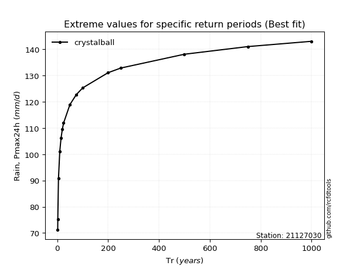</img>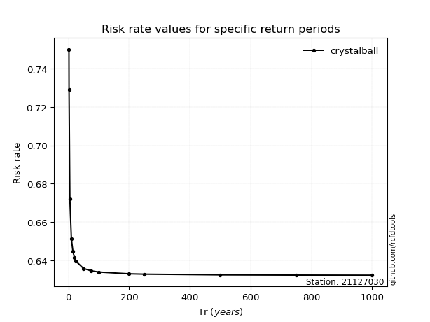</img>

</div>


<sub>**APP DISCLAIMER**: NO WARRANTY - This software is provided by [github.com/rcfdtools](https://github.com/rcfdtools) "as is", without any express or implied warranty, including warranties of merchantability, fitness for a particular purpose, or non-infringement. There is no guarantee that the software will be error-free or operate without interruption. LIMITATION OF LIABILITY - Neither the authors nor copyright holders will be liable for claims or damages arising from the software or its use. You are responsible for determining if the software is appropriate for your use and assume all associated risks, including errors, legal compliance, and data loss. NO PROFESSIONAL ADVICE - The software provides general information and does not offer professional advice. It should not replace consultation with professional advisors.</sub>