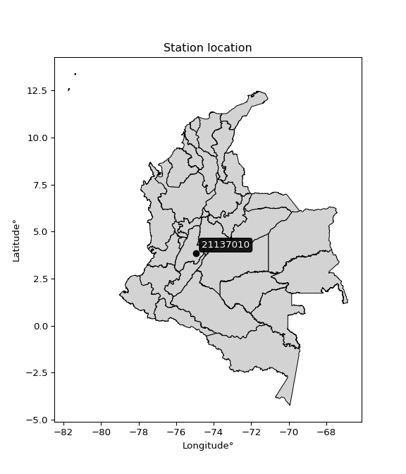

<div align="center">


</div>

# PMP Station (Rain, Pmax24h): 21137010

Probable Maximum Precipitation (PMP) is the greatest amount of rainfall for a specific duration that is meteorologically possible for a given location, acting as a "worst-case" scenario for extreme storms, crucial for designing safety-critical infrastructure like bridges, river deviations, dams, spillways, and nuclear plants to prevent catastrophic failure. PMP is calculated by hydrologists using meteorological data to determine the upper limit of extreme rainfall, often leading to the Probable Maximum Flood (PMF) for flood control design, and is increasingly being studied for climate change impacts. Probable Maximum Precipitation (PMP) is the theoretical upper limit of rainfall, a deterministic estimate for extreme events, while probability distributions (like GEV, Gumbel) describe the likelihood and frequency of various precipitation amounts, including rare ones, showing how often events occur, with PMP representing the extreme end of these distributions, used for critical infrastructure design to ensure safety against the worst conceivable weather, unlike standard statistical forecasts which cover typical probabilities.

The most common probability distributions in hydrology, used for analyzing floods, rainfall, and streamflow, include the Normal, Log-Normal, Gumbel, Gamma (including Log-Pearson Type III), and Generalized Extreme Value (GEV) distributions, often chosen based on the data´s skewness and whether modeling extremes or general conditions, with Gumbel and GEV popular for extreme events like floods, while the Normal distribution serves as a baseline, though often requiring transformations for skewed hydrological data. These distributions help in designing water infrastructure, managing water resources, and forecasting hydrologic events.

> Hydrological data often isn´t perfectly normal (it´s skewed), so different distributions are needed for different applications, such as: **Flood Frequency Analysis**: Using Gumbel, GEV, or Log-Pearson Type III for predicting extreme flood magnitudes and their return periods, **Rainfall Analysis**: Normal for annual totals, but Log-Normal, Weibull, or GEV for intensity or extreme daily rainfall, **Streamflow Modeling**: Gamma and Log-Normal for maximum flows, GEV for minimum flows, and Kappa for daily flows.

<div align="center">

</img>

</div>


## A. General information


### 1. General running parameters

• app_version: _v20260108_. • runtime: _2026-01-08 18:05:13.093906_. • Python version: _3.14.0_. • SciPy version: _1.16.3_. • Pandas version: _2.3.3_. • NumPy version: _2.3.5_. • Stations dataset (station_dataset_file): _dataset/pmax24h_in/automatic_colombia_2003_2024.csv_. • Stations catalog (station_catalog_file): _dataset/CNE.xls_. • Minimum year to eval til year_max (date_min): _1900_. • Maximum year to eval since year_min (date_max): _2024_. • Creates, save and include plots into reports (create_plot): _False_. • Plot only fit distributions with Δo > Δ (plot_only_fit): _True_. • Plot only simple graphs avoiding multiple CDFs and multiple Extreme values plots (plot_only_simple): _False_. • Eval low extreme values, if False, evaluates high extreme values (low_extreme): _False_. • Eval every SciPy distribution as logarithmic (pdist_logarithmic_on): _True_. • Standard deviation normalized (ddof): _1.0_. • Return periods to eval in years (Tr): _[2, 2.33, 5, 10, 15, 20, 25, 50, 75, 100, 200, 250, 500, 750, 1000]_. • Minimum data sample per station, 0 means any (minimum_sample): _5_. • Z-Score maximum threshold to adjust a value, 0 means disable (zscore_max): _3.5_. • Z-Score minimum threshold to adjust a value, 0 means disable (zscore_min): _-2.5_. • Avoid zeros, e.g. rain = 0 (avoid_zeros): _True_. • Avoid null values (avoid_nans): _True_. 

:file_folder:Table: [dataset.csv](../../dataset/pmax24h_in/automatic_colombia_2003_2024.csv)

> Delta Degrees of Freedom (DDOF): is a parameter used in the formulas for calculating variance and standard deviation. When ddof=0, the divisor is $N$ (the total number of observations) and this is used when your data set is the entire population. When ddof=1, the divisor is $N-1$ and this is used when your data set is a sample drawn from a larger population. Using $N-1$ provides an unbiased estimate of the population variance (known as Bessel´s correction).


### 2. Station info and location

|   id |   CODIGO | NOMBRE                        | CATEGORIA    | TECNOLOGIA                | ESTADO           | FECHA_INSTALACION   |   FECHA_SUSPENSION |   ALTITUD |   LATITUD |   LONGITUD | DEPARTAMENTO   | MUNICIPIO    | AREA_OPERATIVA             | ENTIDAD                                                     | AREA_HIDROGRAFICA   | ZONA_HIDROGRAFICA   | SUBZONA_HIDROGRAFICA                                | CORRIENTE   | Catalogo   |   Version |
|-----:|---------:|:------------------------------|:-------------|:--------------------------|:-----------------|:--------------------|-------------------:|----------:|----------:|-----------:|:---------------|:-------------|:---------------------------|:------------------------------------------------------------|:--------------------|:--------------------|:----------------------------------------------------|:------------|:-----------|----------:|
|    0 | 21137010 | PURIFICACION - AUT [21137010] | Limnigráfica | Automática con Telemetría | En Mantenimiento | 15/11/1959          |                nan |       293 |   3.84953 |   -74.9358 | Tolima         | Purificación | Area Operativa 10 - Tolima | INSTITUTO DE HIDROLOGIA METEOROLOGIA Y ESTUDIOS AMBIENTALES | Magdalena Cauca     | Alto Magdalena      | Río Aipe, Río Chenche y otros directos al Magdalena | Magdalena   | CNE_IDEAM  |  20251226 |

<div align="center">

Dynamic map: [:earth_americas:Google](http://maps.google.com/maps?q=3.849527778,-74.93577778) [:earth_americas:OSM](https://www.openstreetmap.org/#map=18/3.849527778/-74.93577778&layers=P) [:earth_americas:Bing](https://www.bing.com/maps?cp=3.849527778~-74.93577778&lvl=18) [:earth_americas:Apple](https://maps.apple.com/frame?center=3.849527778%2C-74.93577778&span=0.003%2C0.006)

</div>


<div align="center">

```geojson
{
  "type": "Feature",
  "geometry": {
    "type": "Point", 
    "coordinates": [-74.93577778, 3.849527778]
  }, 
  "properties": {
    "Name": "21137010"
  }
}
```

</div>


### 3. Discrete values table and plot

<div align="center">

|               |           0 |           1 |           2 |           3 |            4 |          5 |           6 |           7 |          8 |          9 |
|:--------------|------------:|------------:|------------:|------------:|-------------:|-----------:|------------:|------------:|-----------:|-----------:|
| Date          | 2012        | 2013        | 2014        | 2015        | 2016         | 2017       | 2018        | 2019        | 2020       | 2023       |
| Value         |   91.9      |   76.8      |   68.2      |   65.7      |  109.9       |  364.7     |  147.2      |  144.7      |   56.2     |    4.4     |
| Value_initial |   91.9      |   76.8      |   68.2      |   65.7      |  109.9       |  364.7     |  147.2      |  144.7      |   56.2     |    4.4     |
| count         |   10        |   10        |   10        |   10        |   10         |   10       |   10        |   10        |   10       |   10       |
| mean          |  112.97     |  112.97     |  112.97     |  112.97     |  112.97      |  112.97    |  112.97     |  112.97     |  112.97    |  112.97    |
| std           |   98.0687   |   98.0687   |   98.0687   |   98.0687   |   98.0687    |   98.0687  |   98.0687   |   98.0687   |   98.0687  |   98.0687  |
| zscore        |   -0.214849 |   -0.368823 |   -0.456517 |   -0.482009 |   -0.0313046 |    2.56687 |    0.349041 |    0.323549 |   -0.57888 |   -1.10708 |


</div>


> The initial value (value_initial) correspond to the initial obtained or null completed value, and value (value) is adjusted only when the initial value is outside the valid range (outlier) definite through the Z-Score value. If Z-Score is active, values out of range or outliers are replaced with the station mean value. A Z-Score (or standard score) measures how many standard deviations a data point is from the mean of a dataset, indicating its relative position; positive scores mean above the mean, negative mean below, and a score of zero is exactly at the mean, allowing for comparison of values from different distributions. It´s calculated using the formula $z=(x–μ)/σ$, where $x$ is the data point, $μ$ is the mean, and $σ$ is the standard deviation, helping identify outliers and understand probability.
>
> <sub>**Note**: In this study, "completing" (filling gaps in) and "extending" (forecasting or lengthening the historical record) rainfall data series are avoided for certain critical analyses because they introduce artificial bias and uncertainty, which can distort the statistics of rare events (extremes), alter day-to-day variability, and compromise the integrity and homogeneity of the original data. Some reasons against Completing/Extending rainfall data are: **Distortion of Extremes and Variability**: The primary issue is that most gap-filling or extension methods rely on averaging or regression with nearby stations, which inherently smooths the data. Rainfall is highly variable in space and time, with a large percentage of zero values and occasional large storms. Infilling methods often underestimate the highest values and overestimate the lowest (zero) values, which severely distorts analyses focused on flood frequency, drought severity, and intensity-duration-frequency (IDF) curves, **Loss of Data Homogeneity**: Infilled or extended data are synthetic estimates, not actual measurements. Combining these estimates with observed data can violate the assumption of data homogeneity, which requires that the data properties do not change over time. Inhomogeneity can lead to incorrect conclusions about long-term trends or changes in climate patterns, **Propagation of Errors**: Errors and biases from the original data (e.g., wind-induced undercatch, instrument errors, site changes) or the data used for imputation can propagate through the analysis, leading to unreliable hydrological models and inaccurate predictions, **Compromised Statistical Integrity**: For statistical analyses, especially those involving the frequency of events, using artificial data can introduce time bias or autocorrelation that doesn´t exist in reality, making it difficult to assess the true probability of events, **Difficulty in Validation**: It is difficult to accurately validate the quality of filled or extended data, especially for past periods where ground-truth measurements are unavailable. The reliability of imputation techniques heavily depends on the density of the surrounding station network and the complexity of the local topography.</sub>


### 4. Active continuous probability distributions from SciPy (43 of 104 available)

A Probability Density Function (PDF) describes the relative likelihood of a continuous random variable falling within a specific range, where the total area under its curve equals 1, and the area over any interval gives the actual probability for that range. Unlike discrete probabilities (like rolling a die), a PDF shows density, not direct probability for a single point (which is zero), with higher points indicating higher likelihood, often visualized as a bell curve for normal distributions.

A log of a probability density function (log-PDF) is simply the logarithm of the PDF´s value, denoted as $log(f(x))$, useful for converting multiplication of probabilities into addition, improving numerical stability with tiny numbers, and connecting to information theory concepts like entropy. Instead of dealing with very small probabilities (e.g., 0.000001), log-PDFs use negative numbers (e.g., $log(0.00001) ≈ -11.51$ that are easier for computers to handle, preventing underflow errors and simplifying complex calculations. In this study, each active probability distribution from SciPy is also evaluated in the $log$ form.

[scipy.stats](https://docs.scipy.org/doc/scipy/reference/stats.html) is a Python´s powerful submodule within the SciPy library for comprehensive statistical analysis, offering over 130 probability distributions (like Normal, Poisson), functions for descriptive stats (mean, variance), hypothesis testing (t-tests, chi-square), random variable generation, and statistical tests, making it essential for data science, modeling, and research. It provides tools to explore, model, and draw conclusions from data efficiently, working seamlessly with NumPy.

<div align="center">

|   id | p_dist             |   n_parameter | fit_method   | label                                                                       | active   | ref                                                                                                        |
|-----:|:-------------------|--------------:|:-------------|:----------------------------------------------------------------------------|:---------|:-----------------------------------------------------------------------------------------------------------|
|    0 | alpha              |             3 | MLE          | Alpha                                                                       | True     | [:mortar_board:](https://docs.scipy.org/doc/scipy/reference/generated/scipy.stats.alpha.html)              |
|    1 | betaprime          |             4 | MLE          | Beta prime                                                                  | True     | [:mortar_board:](https://docs.scipy.org/doc/scipy/reference/generated/scipy.stats.betaprime.html)          |
|    2 | chi2               |             3 | MLE          | Chi²                                                                        | True     | [:mortar_board:](https://docs.scipy.org/doc/scipy/reference/generated/scipy.stats.chi2.html)               |
|    3 | crystalball        |             4 | MLE          | Crystalball                                                                 | True     | [:mortar_board:](https://docs.scipy.org/doc/scipy/reference/generated/scipy.stats.crystalball.html)        |
|    4 | erlang             |             3 | MLE          | Erlang                                                                      | True     | [:mortar_board:](https://docs.scipy.org/doc/scipy/reference/generated/scipy.stats.erlang.html)             |
|    5 | expon              |             2 | MLE          | Exponential                                                                 | True     | [:mortar_board:](https://docs.scipy.org/doc/scipy/reference/generated/scipy.stats.expon.html)              |
|    6 | exponnorm          |             3 | MLE          | Exponentially modified Normal                                               | True     | [:mortar_board:](https://docs.scipy.org/doc/scipy/reference/generated/scipy.stats.exponnorm.html)          |
|    7 | f                  |             4 | MLE          | F                                                                           | True     | [:mortar_board:](https://docs.scipy.org/doc/scipy/reference/generated/scipy.stats.f.html)                  |
|    8 | fatiguelife        |             3 | MLE          | Fatigue-life (Birnbaum-Saunders)                                            | True     | [:mortar_board:](https://docs.scipy.org/doc/scipy/reference/generated/scipy.stats.fatiguelife.html)        |
|    9 | fisk               |             3 | MLE          | Fisk                                                                        | True     | [:mortar_board:](https://docs.scipy.org/doc/scipy/reference/generated/scipy.stats.fisk.html)               |
|   10 | gamma              |             3 | MLE          | Gamma                                                                       | True     | [:mortar_board:](https://docs.scipy.org/doc/scipy/reference/generated/scipy.stats.gamma.html)              |
|   11 | genexpon           |             5 | MLE          | Generalized exponential                                                     | True     | [:mortar_board:](https://docs.scipy.org/doc/scipy/reference/generated/scipy.stats.genexpon.html)           |
|   12 | genlogistic        |             3 | MLE          | Generalized logistic                                                        | True     | [:mortar_board:](https://docs.scipy.org/doc/scipy/reference/generated/scipy.stats.genlogistic.html)        |
|   13 | gibrat             |             2 | MM           | Gibrat                                                                      | True     | [:mortar_board:](https://docs.scipy.org/doc/scipy/reference/generated/scipy.stats.gibrat.html)             |
|   14 | gompertz           |             3 | MLE          | Gompertz (or truncated Gumbel)                                              | True     | [:mortar_board:](https://docs.scipy.org/doc/scipy/reference/generated/scipy.stats.gompertz.html)           |
|   15 | gumbel_l           |             2 | MM           | Gumbel Left Skew                                                            | True     | [:mortar_board:](https://docs.scipy.org/doc/scipy/reference/generated/scipy.stats.gumbel_l.html)           |
|   16 | gumbel_r           |             2 | MM           | Gumbel Right Skew                                                           | True     | [:mortar_board:](https://docs.scipy.org/doc/scipy/reference/generated/scipy.stats.gumbel_r.html)           |
|   17 | halflogistic       |             2 | MM           | Half-logistic                                                               | True     | [:mortar_board:](https://docs.scipy.org/doc/scipy/reference/generated/scipy.stats.halflogistic.html)       |
|   18 | halfnorm           |             2 | MM           | Half Normal                                                                 | True     | [:mortar_board:](https://docs.scipy.org/doc/scipy/reference/generated/scipy.stats.halfnorm.html)           |
|   19 | hypsecant          |             2 | MM           | hyperbolic secant                                                           | True     | [:mortar_board:](https://docs.scipy.org/doc/scipy/reference/generated/scipy.stats.hypsecant.html)          |
|   20 | invgamma           |             3 | MLE          | Inverted gamma                                                              | True     | [:mortar_board:](https://docs.scipy.org/doc/scipy/reference/generated/scipy.stats.invgamma.html)           |
|   21 | invgauss           |             3 | MLE          | Inverse Gaussian                                                            | True     | [:mortar_board:](https://docs.scipy.org/doc/scipy/reference/generated/scipy.stats.invgauss.html)           |
|   22 | invweibull         |             3 | MLE          | Inverted Weibull                                                            | True     | [:mortar_board:](https://docs.scipy.org/doc/scipy/reference/generated/scipy.stats.invweibull.html)         |
|   23 | kstwobign          |             2 | MLE          | Limiting distribution of scaled Kolmogorov-Smirnov two-sided test statistic | True     | [:mortar_board:](https://docs.scipy.org/doc/scipy/reference/generated/scipy.stats.kstwobign.html)          |
|   24 | laplace            |             2 | MM           | Laplace                                                                     | True     | [:mortar_board:](https://docs.scipy.org/doc/scipy/reference/generated/scipy.stats.laplace.html)            |
|   25 | laplace_asymmetric |             3 | MLE          | Asymmetric Laplace                                                          | True     | [:mortar_board:](https://docs.scipy.org/doc/scipy/reference/generated/scipy.stats.laplace_asymmetric.html) |
|   26 | loggamma           |             3 | MLE          | Log gamma                                                                   | True     | [:mortar_board:](https://docs.scipy.org/doc/scipy/reference/generated/scipy.stats.loggamma.html)           |
|   27 | logistic           |             2 | MM           | Logistic (or Sech-squared)                                                  | True     | [:mortar_board:](https://docs.scipy.org/doc/scipy/reference/generated/scipy.stats.logistic.html)           |
|   28 | lognorm            |             3 | MLE          | Log Normal                                                                  | True     | [:mortar_board:](https://docs.scipy.org/doc/scipy/reference/generated/scipy.stats.lognorm.html)            |
|   29 | maxwell            |             2 | MM           | Maxwell                                                                     | True     | [:mortar_board:](https://docs.scipy.org/doc/scipy/reference/generated/scipy.stats.maxwell.html)            |
|   30 | mielke             |             4 | MLE          | Mielke Beta-Kappa / Dagum                                                   | True     | [:mortar_board:](https://docs.scipy.org/doc/scipy/reference/generated/scipy.stats.mielke.html)             |
|   31 | moyal              |             2 | MM           | Moyal                                                                       | True     | [:mortar_board:](https://docs.scipy.org/doc/scipy/reference/generated/scipy.stats.moyal.html)              |
|   32 | nakagami           |             3 | MLE          | Nakagami                                                                    | True     | [:mortar_board:](https://docs.scipy.org/doc/scipy/reference/generated/scipy.stats.nakagami.html)           |
|   33 | ncf                |             5 | MLE          | Non-central F distribution                                                  | True     | [:mortar_board:](https://docs.scipy.org/doc/scipy/reference/generated/scipy.stats.ncf.html)                |
|   34 | nct                |             4 | MLE          | Non-central Student’s t                                                     | True     | [:mortar_board:](https://docs.scipy.org/doc/scipy/reference/generated/scipy.stats.nct.html)                |
|   35 | norm               |             2 | MM           | Normal                                                                      | True     | [:mortar_board:](https://docs.scipy.org/doc/scipy/reference/generated/scipy.stats.norm.html)               |
|   36 | pearson3           |             3 | MM           | Pearson type III                                                            | True     | [:mortar_board:](https://docs.scipy.org/doc/scipy/reference/generated/scipy.stats.pearson3.html)           |
|   37 | rayleigh           |             2 | MM           | Rayleigh                                                                    | True     | [:mortar_board:](https://docs.scipy.org/doc/scipy/reference/generated/scipy.stats.rayleigh.html)           |
|   38 | rice               |             3 | MLE          | Rice                                                                        | True     | [:mortar_board:](https://docs.scipy.org/doc/scipy/reference/generated/scipy.stats.rice.html)               |
|   39 | t                  |             3 | MLE          | Student’s t                                                                 | True     | [:mortar_board:](https://docs.scipy.org/doc/scipy/reference/generated/scipy.stats.t.html)                  |
|   40 | truncnorm          |             4 | MLE          | Truncated normal                                                            | True     | [:mortar_board:](https://docs.scipy.org/doc/scipy/reference/generated/scipy.stats.truncnorm.html)          |
|   41 | wald               |             2 | MM           | Wald                                                                        | True     | [:mortar_board:](https://docs.scipy.org/doc/scipy/reference/generated/scipy.stats.wald.html)               |
|   42 | weibull_min        |             3 | MLE          | Weibull minimum                                                             | True     | [:mortar_board:](https://docs.scipy.org/doc/scipy/reference/generated/scipy.stats.weibull_min.html)        |

</div>

> **n_parameter:** # arguments & localization & scale.
>
> **Fit methods:** (MLE) maximum likelihood, (MM) L-moments.
>
>**Inactive** (With the only purpose of prevent loops, zero divisions, infinite values, over high estimated values or horizontal trending for recurrence intervals estimations, the follow distributions were disabled.)**:** foldnorm, gennorm, norminvgauss, powernorm, powerlognorm, skewnorm, genextreme, anglit, arcsine, argus, beta, bradford, burr, burr12, cauchy, cosine, halfcauchy, foldcauchy, skewcauchy, wrapcauchy, dgamma, gengamma, exponweib, exponpow, truncexpon, gausshyper, genhalflogistic, genhyperbolic, geninvgauss, halfgennorm, johnsonsb, johnsonsu, kappa4, kappa3, ksone, kstwo, loglaplace, levy, levy_l, levy_stable, ncx2, pareto, genpareto, truncpareto, lomax, powerlaw, rdist, rel_breitwigner, recipinvgauss, semicircular, studentized_range, trapezoid, triang, truncweibull_min, tukeylambda, uniform, loguniform, vonmises, vonmises_line, weibull_max, dweibull, 


## B. Probability (PDF) vs. Empirical (EDF) distributions functions

A continuous probability distribution (CPD) describes probabilities for variables that can take any value within a range (like rain any time), unlike discrete variables with specific outcomes (like temperature). It uses a Probability Density Function (PDF), a curve where the total area under it equals 1, and the probability of the variable falling within an interval (a to b) is found by calculating the area under the curve between those points. A key feature is that the probability of hitting any single exact value is zero, so probabilities are always expressed for ranges, e.g., $P(a ≤ X ≤ b)$.

<div align="center">

Distributions parameters from station values
|    |   station | p_dist                |   n |              loc |           scale | shape                  | shape1              | shape2                 | shape3   |
|---:|----------:|:----------------------|----:|-----------------:|----------------:|:-----------------------|:--------------------|:-----------------------|:---------|
|  0 |  21137010 | alpha                 |  10 |     -0.0297075   |    13.8873      | 1.2375411733633953e-10 |                     |                        |          |
|  1 |  21137010 | betaprime             |  10 |    -27.229       |   245.612       | 4.415184347445793      | 8.809254208319015   |                        |          |
|  2 |  21137010 | chi2                  |  10 |      4.4         |     3.36766     | 0.278876656720483      |                     |                        |          |
|  3 |  21137010 | crystalball           |  10 |    112.97        |    93.0361      | 10178.12336793862      | 1911.1261978123712  |                        |          |
|  4 |  21137010 | erlang                |  10 |      4.4         |     3.37641     | 0.26519312400233985    |                     |                        |          |
|  5 |  21137010 | expon                 |  10 |      4.4         |   108.57        |                        |                     |                        |          |
|  6 |  21137010 | exponnorm             |  10 |     35.631       |    29.0324      | 2.663883358477214      |                     |                        |          |
|  7 |  21137010 | f                     |  10 |     -4.6541      |   117.615       | 3.4517325435127306     | 27590.15577881265   |                        |          |
|  8 |  21137010 | fatiguelife           |  10 |      4.4         |     0.000407921 | 489.30786746893784     |                     |                        |          |
|  9 |  21137010 | fisk                  |  10 |    -35.2162      |   125.694       | 3.3651771572943403     |                     |                        |          |
| 10 |  21137010 | gamma                 |  10 |      4.4         |     3.30173     | 0.4894814496162914     |                     |                        |          |
| 11 |  21137010 | genexpon              |  10 |      4.4         |   110.869       | 0.5288617275273979     | 0.8462843038639791  | 1.6181788599722582     |          |
| 12 |  21137010 | genlogistic           |  10 |   -307.67        |    58.5052      | 700.6046176766247      |                     |                        |          |
| 13 |  21137010 | gibrat                |  10 |     41.9952      |    43.0484      |                        |                     |                        |          |
| 14 |  21137010 | gompertz              |  10 |      4.4         |   619.765       | 4.848918156650102      |                     |                        |          |
| 15 |  21137010 | gumbel_l              |  10 |    154.841       |    72.54        |                        |                     |                        |          |
| 16 |  21137010 | gumbel_r              |  10 |     71.0988      |    72.54        |                        |                     |                        |          |
| 17 |  21137010 | halflogistic          |  10 |      2.70058     |    79.5426      |                        |                     |                        |          |
| 18 |  21137010 | halfnorm              |  10 |    -10.1734      |   154.337       |                        |                     |                        |          |
| 19 |  21137010 | hypsecant             |  10 |    112.97        |    59.2286      |                        |                     |                        |          |
| 20 |  21137010 | invgamma              |  10 |    -77.3014      |  1016.81        | 6.360973636175798      |                     |                        |          |
| 21 |  21137010 | invgauss              |  10 |    -46.6594      |   532.264       | 0.29990637606760995    |                     |                        |          |
| 22 |  21137010 | invweibull            |  10 |   -263.122       |   333.731       | 6.1174553997009085     |                     |                        |          |
| 23 |  21137010 | kstwobign             |  10 |   -148.538       |   305.228       |                        |                     |                        |          |
| 24 |  21137010 | laplace               |  10 |    112.97        |    65.7865      |                        |                     |                        |          |
| 25 |  21137010 | laplace_asymmetric    |  10 |     65.7         |    44.4371      | 0.6007683566960376     |                     |                        |          |
| 26 |  21137010 | loggamma              |  10 | -26005.8         |  3597.76        | 1422.075270061528      |                     |                        |          |
| 27 |  21137010 | logistic              |  10 |    112.97        |    51.2935      |                        |                     |                        |          |
| 28 |  21137010 | lognorm               |  10 |      4.4         |     1.96723     | 11.79023102892831      |                     |                        |          |
| 29 |  21137010 | maxwell               |  10 |   -107.487       |   138.151       |                        |                     |                        |          |
| 30 |  21137010 | mielke                |  10 |      4.4         |   153.077       | 0.9357530326190289     | 2.7933511363868044  |                        |          |
| 31 |  21137010 | moyal                 |  10 |     59.766       |    41.881       |                        |                     |                        |          |
| 32 |  21137010 | nakagami              |  10 |     56.2         |    88.1939      | 0.17523224765579765    |                     |                        |          |
| 33 |  21137010 | ncf                   |  10 |     -0.624341    |    15.0862      | 1.2114147503233363     | 18.351368294542404  | 6.908495740457596      |          |
| 34 |  21137010 | nct                   |  10 |     -0.10268     |    39.982       | 3.118697850315323      | 2.0730708369034425  |                        |          |
| 35 |  21137010 | norm                  |  10 |    112.97        |    93.0361      |                        |                     |                        |          |
| 36 |  21137010 | pearson3              |  10 |    112.97        |    93.0361      | 1.7768514870106782     |                     |                        |          |
| 37 |  21137010 | rayleigh              |  10 |    -65.0135      |   142.01        |                        |                     |                        |          |
| 38 |  21137010 | rice                  |  10 |    -31.4325      |   121.466       | 0.00034542643251133547 |                     |                        |          |
| 39 |  21137010 | t                     |  10 |     83.8895      |    35.1905      | 1.5200371553850824     |                     |                        |          |
| 40 |  21137010 | truncnorm             |  10 |     62.9257      |    11.6823      | -19.780674636439592    | 25.83164687917194   |                        |          |
| 41 |  21137010 | wald                  |  10 |     19.9338      |    93.0361      |                        |                     |                        |          |
| 42 |  21137010 | weibull_min           |  10 |     56.2         |    64.3758      | 0.63898406066047       |                     |                        |          |
| 43 |  21137010 | logalpha              |  10 |    -34.6222      |  1331.21        | 34.21513332783884      |                     |                        |          |
| 44 |  21137010 | logbetaprime          |  10 |    -22.3991      |   253.743       | 596.6988469431553      | 5666.308225256313   |                        |          |
| 45 |  21137010 | logchi2               |  10 |    -12.7407      |     0.0396643   | 430.0745517274397      |                     |                        |          |
| 46 |  21137010 | logcrystalball        |  10 |      4.33451     |     1.08282     | 643.0869885923368      | 124.50852493820332  |                        |          |
| 47 |  21137010 | logerlang             |  10 |    -13.7655      |     0.0735615   | 245.90308069737353     |                     |                        |          |
| 48 |  21137010 | logexpon              |  10 |      1.4816      |     2.8529      |                        |                     |                        |          |
| 49 |  21137010 | logexponnorm          |  10 |      4.33363     |     1.08283     | 0.0008035703086339194  |                     |                        |          |
| 50 |  21137010 | logf                  |  10 |  -1774.07        |  1778.4         | 21779197.43476609      | 7149621.888171094   |                        |          |
| 51 |  21137010 | logfatiguelife        |  10 |  -1151.63        |  1155.97        | 0.0009380800878321036  |                     |                        |          |
| 52 |  21137010 | logfisk               |  10 |     -1.2737e+08  |     1.2737e+08  | 250671741.17014766     |                     |                        |          |
| 53 |  21137010 | loggamma              |  10 |    -16.475       |     0.061881    | 335.98512013561026     |                     |                        |          |
| 54 |  21137010 | loggenexpon           |  10 |      1.37087     |     0.0146798   | 0.000723468541913259   | 2.5814250753389167  | 1.4294445936970651e-05 |          |
| 55 |  21137010 | loggenlogistic        |  10 |      4.95187     |     0.320432    | 0.40410336110671663    |                     |                        |          |
| 56 |  21137010 | loggibrat             |  10 |      3.50847     |     0.50102     |                        |                     |                        |          |
| 57 |  21137010 | loggompertz           |  10 |      1.4816      |     0.845032    | 0.020621207474689124   |                     |                        |          |
| 58 |  21137010 | loggumbel_l           |  10 |      4.82183     |     0.844272    |                        |                     |                        |          |
| 59 |  21137010 | loggumbel_r           |  10 |      3.84718     |     0.844272    |                        |                     |                        |          |
| 60 |  21137010 | loghalflogistic       |  10 |      3.05105     |     0.925811    |                        |                     |                        |          |
| 61 |  21137010 | loghalfnorm           |  10 |      2.90132     |     1.79624     |                        |                     |                        |          |
| 62 |  21137010 | loghypsecant          |  10 |      4.33451     |     0.689345    |                        |                     |                        |          |
| 63 |  21137010 | loginvgamma           |  10 |    -25.3731      | 20271           | 684.044112566176       |                     |                        |          |
| 64 |  21137010 | loginvgauss           |  10 |     -9.43729     |  1773.22        | 0.007739360983032184   |                     |                        |          |
| 65 |  21137010 | loginvweibull         |  10 |     -1.29885e+08 |     1.29885e+08 | 95108913.61051995      |                     |                        |          |
| 66 |  21137010 | logkstwobign          |  10 |     -1.40976     |     6.60333     |                        |                     |                        |          |
| 67 |  21137010 | loglaplace            |  10 |      4.33451     |     0.76567     |                        |                     |                        |          |
| 68 |  21137010 | loglaplace_asymmetric |  10 |      4.5207      |     0.663206    | 1.1501733181844838     |                     |                        |          |
| 69 |  21137010 | logloggamma           |  10 |      4.79568     |     0.801282    | 1.0010261405725593     |                     |                        |          |
| 70 |  21137010 | loglogistic           |  10 |      4.33451     |     0.59699     |                        |                     |                        |          |
| 71 |  21137010 | loglognorm            |  10 |      1.4816      |     0.0759045   | 11.156178675870967     |                     |                        |          |
| 72 |  21137010 | logmaxwell            |  10 |      1.76867     |     1.6079      |                        |                     |                        |          |
| 73 |  21137010 | logmielke             |  10 |     -5.5676e+07  |     5.5676e+07  | 72530715.73913616      | 172057091.8778972   |                        |          |
| 74 |  21137010 | logmoyal              |  10 |      3.71528     |     0.48744     |                        |                     |                        |          |
| 75 |  21137010 | lognakagami           |  10 |      4.02892     |     0.853849    | 0.26985143894406793    |                     |                        |          |
| 76 |  21137010 | logncf                |  10 |     -9.95221     |     0.00152084  | 0.06959088481532295    | 1900.7394915732266  | 653.0201000487369      |          |
| 77 |  21137010 | lognct                |  10 |     68.9597      |     1.04293     | 27071.376891523774     | -61.962859353327445 |                        |          |
| 78 |  21137010 | lognorm               |  10 |      4.33451     |     1.08282     |                        |                     |                        |          |
| 79 |  21137010 | logpearson3           |  10 |      4.33451     |     1.08281     | -1.4824627951738656    |                     |                        |          |
| 80 |  21137010 | lograyleigh           |  10 |      2.26299     |     1.65283     |                        |                     |                        |          |
| 81 |  21137010 | logrice               |  10 |   -366.813       |     1.08282     | 342.75818077540634     |                     |                        |          |
| 82 |  21137010 | logt                  |  10 |      4.48196     |     0.41464     | 1.5276699713891082     |                     |                        |          |
| 83 |  21137010 | logtruncnorm          |  10 |      1.18816     |     4.19259     | 0.06998976338748172    | 1.123634510367093   |                        |          |
| 84 |  21137010 | logwald               |  10 |      3.25172     |     1.08279     |                        |                     |                        |          |
| 85 |  21137010 | logweibull_min        |  10 |      1.4816      |     1.70637     | 0.6513456553130166     |                     |                        |          |

</div>

> **loc** (Location parameter): This shifts the distribution along the x-axis. For many common distributions, like the normal (Gaussian) distribution, loc represents the mean $μ$. For others, like the uniform distribution, it might represent the minimum value, or for the beta distribution, the left end of the support interval.
>
> **scale** (Scale parameter): This determines the width or spread of the distribution. For the normal distribution, scale represents the standard deviation $σ$. For a uniform distribution, it defines the length of the interval (from $loc$ to $loc + scale$).
>
> **shape** (Shape parameters): Refers to parameters that define the specific form of a probability distribution, distinct from its location (loc) and scale (scale). These parameters are required arguments for most distribution functions. For example, a normal (Gaussian) distribution is fully defined by its location (mean) and scale (standard deviation), so it has no specific shape parameters beyond loc and scale. However, other distributions have intrinsic properties that need specification, as Gamma distribution that takes a shape parameter, often named $a$ or $alpha$.


### 0. Cumulative distribution values - CDF (86 evaluated)

Cumulative Distribution Function (CDF), denoted as $F$<sub>$X$</sub>$(x)$, is a function that gives the probability that a random variable $X$ will take a value less than or equal to a specific value, $x$ (i.e., $(P(X≥x)$. It essentially "accumulates" probabilities from a given point up to the far right (positive infinity), providing a complete picture of the distribution´s probabilities for both discrete (like rain) and continuous (like temperature) variables, helping to find probabilities over ranges or above certain values. Each station is evaluated separately ordering the $x$ values ascending, calculating the CDF and PDF values for the activated distributions and their logarithmic forms.

<div align="center">

CDF ordered by x ascending and calculating $log(f(x))$ separately
|   id |   Station |   date |     x |   count |   mean |     std |     zscore |   Value_initial |   station |   m |      alpha |   alpha_pdf |   betaprime |   betaprime_pdf |       chi2 |    chi2_pdf |   crystalball |   crystalball_pdf |      erlang |   erlang_pdf |    expon |   expon_pdf |   exponnorm |   exponnorm_pdf |         f |       f_pdf |   fatiguelife |   fatiguelife_pdf |      fisk |    fisk_pdf |       gamma |   gamma_pdf |    genexpon |   genexpon_pdf |   genlogistic |   genlogistic_pdf |   gibrat |   gibrat_pdf |    gompertz |   gompertz_pdf |   gumbel_l |   gumbel_l_pdf |   gumbel_r |   gumbel_r_pdf |   halflogistic |   halflogistic_pdf |   halfnorm |   halfnorm_pdf |   hypsecant |   hypsecant_pdf |   invgamma |   invgamma_pdf |   invgauss |   invgauss_pdf |   invweibull |   invweibull_pdf |   kstwobign |   kstwobign_pdf |   laplace |   laplace_pdf |   laplace_asymmetric |   laplace_asymmetric_pdf |   loggamma |   loggamma_pdf |   logistic |   logistic_pdf |    lognorm |   lognorm_pdf |   maxwell |   maxwell_pdf |      mielke |   mielke_pdf |     moyal |   moyal_pdf |    nakagami |   nakagami_pdf |       ncf |    ncf_pdf |       nct |     nct_pdf |     norm |   norm_pdf |   pearson3 |   pearson3_pdf |   rayleigh |   rayleigh_pdf |      rice |    rice_pdf |         t |       t_pdf |   truncnorm |   truncnorm_pdf |     wald |    wald_pdf |   weibull_min |   weibull_min_pdf |   logalpha |   logalpha_pdf |   logbetaprime |   logbetaprime_pdf |    logchi2 |   logchi2_pdf |   logcrystalball |   logcrystalball_pdf |   logerlang |   logerlang_pdf |   logexpon |   logexpon_pdf |   logexponnorm |   logexponnorm_pdf |       logf |   logf_pdf |   logfatiguelife |   logfatiguelife_pdf |    logfisk |   logfisk_pdf |   loggenexpon |   loggenexpon_pdf |   loggenlogistic |   loggenlogistic_pdf |   loggibrat |   loggibrat_pdf |   loggompertz |   loggompertz_pdf |   loggumbel_l |   loggumbel_l_pdf |   loggumbel_r |   loggumbel_r_pdf |   loghalflogistic |   loghalflogistic_pdf |   loghalfnorm |   loghalfnorm_pdf |   loghypsecant |   loghypsecant_pdf |   loginvgamma |   loginvgamma_pdf |   loginvgauss |   loginvgauss_pdf |   loginvweibull |   loginvweibull_pdf |   logkstwobign |   logkstwobign_pdf |   loglaplace |   loglaplace_pdf |   loglaplace_asymmetric |   loglaplace_asymmetric_pdf |   logloggamma |   logloggamma_pdf |   loglogistic |   loglogistic_pdf |   loglognorm |   loglognorm_pdf |   logmaxwell |   logmaxwell_pdf |   logmielke |   logmielke_pdf |    logmoyal |   logmoyal_pdf |   lognakagami |   lognakagami_pdf |     logncf |   logncf_pdf |     lognct |   lognct_pdf |   logpearson3 |   logpearson3_pdf |   lograyleigh |   lograyleigh_pdf |    logrice |   logrice_pdf |      logt |   logt_pdf |   logtruncnorm |   logtruncnorm_pdf |   logwald |   logwald_pdf |   logweibull_min |   logweibull_min_pdf |
|-----:|----------:|-------:|------:|--------:|-------:|--------:|-----------:|----------------:|----------:|----:|-----------:|------------:|------------:|----------------:|-----------:|------------:|--------------:|------------------:|------------:|-------------:|---------:|------------:|------------:|----------------:|----------:|------------:|--------------:|------------------:|----------:|------------:|------------:|------------:|------------:|---------------:|--------------:|------------------:|---------:|-------------:|------------:|---------------:|-----------:|---------------:|-----------:|---------------:|---------------:|-------------------:|-----------:|---------------:|------------:|----------------:|-----------:|---------------:|-----------:|---------------:|-------------:|-----------------:|------------:|----------------:|----------:|--------------:|---------------------:|-------------------------:|-----------:|---------------:|-----------:|---------------:|-----------:|--------------:|----------:|--------------:|------------:|-------------:|----------:|------------:|------------:|---------------:|----------:|-----------:|----------:|------------:|---------:|-----------:|-----------:|---------------:|-----------:|---------------:|----------:|------------:|----------:|------------:|------------:|----------------:|---------:|------------:|--------------:|------------------:|-----------:|---------------:|---------------:|-------------------:|-----------:|--------------:|-----------------:|---------------------:|------------:|----------------:|-----------:|---------------:|---------------:|-------------------:|-----------:|-----------:|-----------------:|---------------------:|-----------:|--------------:|--------------:|------------------:|-----------------:|---------------------:|------------:|----------------:|--------------:|------------------:|--------------:|------------------:|--------------:|------------------:|------------------:|----------------------:|--------------:|------------------:|---------------:|-------------------:|--------------:|------------------:|--------------:|------------------:|----------------:|--------------------:|---------------:|-------------------:|-------------:|-----------------:|------------------------:|----------------------------:|--------------:|------------------:|--------------:|------------------:|-------------:|-----------------:|-------------:|-----------------:|------------:|----------------:|------------:|---------------:|--------------:|------------------:|-----------:|-------------:|-----------:|-------------:|--------------:|------------------:|--------------:|------------------:|-----------:|--------------:|----------:|-----------:|---------------:|-------------------:|----------:|--------------:|-----------------:|---------------------:|
|    0 |  21137010 |   2023 |   4.4 |      10 | 112.97 | 98.0687 | -1.10708   |             4.4 |  21137010 |   1 | 0.00171831 | 0.00414556  |   0.0223509 |     0.00227711  | 0.00651899 | 1.02344e+12 |      0.121612 |        0.00217043 | 8.17378e-05 |  2.44053e+10 | 0        | 0.00921065  |   0.0231242 |     0.00152446  | 0.0179042 | 0.00324868  |     0.0340846 |       1.3462e+08  | 0.0201246 | 0.00167508  | 2.69932e-08 | 1.48762e+07 | 1.11375e-13 |    0.00477015  |     0.0343243 |       0.0019735   | 0        |  0           | 3.20971e-14 |    0.0078238   |   0.118115 |    0.00152809  |  0.0814328 |    0.00281544  |      0.0106821 |        0.00628522  |  0.0752288 |    0.00514675  |    0.100955 |     0.00167606  |  0.0211909 |    0.00197905  |  0.0220451 |     0.00226325 |    0.0208965 |      0.00184838  |   0.0367367 |      0.00212052 | 0.0959924 |   0.00145915  |            0.0266906 |              0.000999783 | 0.00460664 |       0.013073 |   0.10749  |    0.00187033  | 0.00421063 |     0.0114551 |  0.11648  |   0.00272902  | 4.19628e-11 |  0.03153     | 0.0527805 | 0.00282794  | 0           |    0           | 0.0184071 | 0.00326955 | 0.0245823 | 0.00137786  | 0.121612 | 0.00217043 |   0        |    0           |   0.1126   |    0.00305439  | 0.0425797 | 0.00232527  | 0.0955363 | 0.00151867  | 2.72494e-07 |    1.21197e-07  | 0        | 0           |   0           |       0           | 0.00394518 |      0.0119505 |     0.00523669 |          0.0142206 | 0.00515763 |     0.0144367 |       0.00421064 |            0.0114551 |  0.00487726 |       0.0137499 |   0        |      0.35052   |     0.00421089 |          0.0114557 | 0.00419886 |   0.011435 |       0.00419523 |            0.0114294 | 0.00274664 |     0.0053907 |    0.00648605 |         0.0678011 |        0.0125702 |            0.0158522 |    0        |       0         |   1.65725e-08 |         0.0244029 |     0.0189511 |         0.0222326 |   6.99042e-08 |       1.36419e-06 |          0        |             0         |      0        |          0        |      0.0101504 |          0.0147223 |    0.00425154 |         0.0125947 |    0.00518748 |         0.0156724 |      0.00587796 |           0.0221085 |     0.00918713 |          0.0377145 |    0.0120442 |        0.0157303 |               0.0105978 |                   0.0138932 |      0.015786 |         0.019564  |    0.00833592 |         0.0138469 |   0.00135115 |       1.7906e+12 |     0        |         0        |   0.0111658 |       0.0145456 | 4.73582e-23 |     4.7964e-21 |   0           |       0           | 0.00624796 |    0.0167443 | 0.00418029 |    0.0113509 |      0.022551 |         0.0244682 |      0        |          0        | 0.00421063 |     0.0114551 | 0.0182904 | 0.00912306 |    7.82094e-07 |           0.277941 |  0        |      0        |       4.4974e-11 |       131927         |
|    1 |  21137010 |   2020 |  56.2 |      10 | 112.97 | 98.0687 | -0.57888   |            56.2 |  21137010 |   2 | 0.804928   | 0.00339924  |   0.283181  |     0.00648886  | 0.999989   | 1.74566e-06 |      0.270867 |        0.00355965 | 1           |  2.54106e-09 | 0.379427 | 0.00571588  |   0.242166  |     0.0067044   | 0.303994  | 0.00605595  |     0.766775  |       0.00215119  | 0.255105  | 0.00699517  | 1           | 6.30496e-09 | 0.305845    |    0.00612203  |     0.248316  |       0.00590672  | 0.133771 |  0.0151891   | 0.344719    |    0.0055737   |   0.226405 |    0.00273763  |  0.292878  |    0.00495801  |      0.324165  |        0.0056254   |  0.332844  |    0.00471312  |    0.233116 |     0.00359335  |  0.274597  |    0.00666604  |  0.281539  |     0.00636048 |    0.269829  |      0.0067716   |   0.240819  |      0.00527418 | 0.210959  |   0.00320673  |            0.185796  |              0.00695958  | 0.40668    |       0.345209 |   0.248474 |    0.00364051  | 0.388889   |     0.354045  |  0.295367 |   0.00401851  | 0.35708     |  0.00615233  | 0.296721  | 0.00576682  | 1.82361e-06 |    8.99469e+07 | 0.295919  | 0.00627488 | 0.246904  | 0.0071372   | 0.270867 | 0.00355965 |   0.321119 |    0.00648538  |   0.305302 |    0.00417549  | 0.229142  | 0.0045786   | 0.267655  | 0.00630728  | 0.282403    |    0.0289339    | 0.260307 | 0.0109287   |   6.36278e-11 |    5721.98        | 0.410338   |      0.346479  |     0.403664   |          0.339425  | 0.410185   |     0.338003  |       0.388889   |            0.354045  |  0.406908   |       0.34005   |   0.590527 |      0.143529  |     0.388891   |          0.354043  | 0.38844    |   0.353599 |       0.388342   |            0.353485  | 0.292895   |     0.4076    |    0.520674   |         0.241504  |        0.305435  |            0.364723  |    0.515172 |       0.765986  |   0.329411    |         0.333472  |     0.323587  |         0.313222  |   0.446492    |       0.426429    |          0.483939 |             0.413585  |      0.469836 |          0.364756 |      0.363298  |          0.419825  |    0.413466   |         0.347389  |    0.431918   |         0.332175  |      0.451397   |           0.262912  |     0.493775   |          0.239441  |    0.335457  |        0.438122  |               0.298884  |                   0.391824  |      0.318436 |         0.326332  |    0.374752   |         0.39249   |   0.623589   |       0.0133591  |     0.422604 |         0.365077 |   0.300728  |       0.369113  | 0.468511    |     0.456206   |   6.37856e-09 |       3.87594e+06 | 0.409935   |    0.325607  | 0.387956   |    0.354738  |      0.304916 |         0.281161  |      0.434908 |          0.365288 | 0.388889   |     0.354045  | 0.208596  | 0.397133   |    0.653196    |           0.221475 |  0.526927 |      0.573179 |       0.726975   |            0.0906297 |
|    2 |  21137010 |   2015 |  65.7 |      10 | 112.97 | 98.0687 | -0.482009  |            65.7 |  21137010 |   3 | 0.83267    | 0.00250808  |   0.344725  |     0.00643644  | 0.999998   | 3.68523e-07 |      0.305698 |        0.00376879 | 1           |  1.34689e-10 | 0.43142  | 0.00523699  |   0.307603  |     0.00701104  | 0.360627  | 0.00585284  |     0.78589   |       0.00188361  | 0.323253  | 0.00729484  | 1           | 3.25657e-10 | 0.363072    |    0.00591286  |     0.305918  |       0.00618808  | 0.275372 |  0.0140855   | 0.395962    |    0.00521719  |   0.2537   |    0.00301058  |  0.340526  |    0.00505702  |      0.37653   |        0.00539475  |  0.377003  |    0.00458131  |    0.269296 |     0.00402342  |  0.338107  |    0.00666585  |  0.341709  |     0.00627852 |    0.334574  |      0.00681516  |   0.291919  |      0.0054618  | 0.243733  |   0.0037049   |            0.265204  |              0.00993408  | 0.461172   |       0.351498 |   0.28464  |    0.00396971  | 0.445128   |     0.364938  |  0.334137 |   0.00413672  | 0.414203    |  0.00586762  | 0.35154   | 0.00574997  | 0.364732    |    0.0134321   | 0.355031  | 0.00614735 | 0.316708  | 0.00748665  | 0.305698 | 0.00376879 |   0.380764 |    0.00606702  |   0.345324 |    0.00424333  | 0.27366   | 0.00478187  | 0.335203  | 0.00791061  | 0.593856    |    0.0331997    | 0.35783  | 0.00956017  |   0.255055    |       0.0147535   | 0.464913   |      0.351275  |     0.457284   |          0.346171  | 0.463465   |     0.343245  |       0.445128   |            0.364938  |  0.460555   |       0.345879  |   0.612341 |      0.135882  |     0.44513    |          0.364936  | 0.444569   |   0.364495 |       0.444493   |            0.364377  | 0.360316   |     0.453615  |    0.557868   |         0.234556  |        0.367026  |            0.424116  |    0.618093 |       0.563579  |   0.384245    |         0.368366  |     0.375245  |         0.348089  |   0.51163     |       0.406114    |          0.545859 |             0.379147  |      0.525209 |          0.344077 |      0.431544  |          0.45112   |    0.468182   |         0.352163  |    0.483933   |         0.332947  |      0.491915   |           0.255549  |     0.530536   |          0.231099  |    0.411362  |        0.537258  |               0.366796  |                   0.480853  |      0.372452 |         0.365174  |    0.437757   |         0.412278  |   0.625613   |       0.012566   |     0.479492 |         0.362303 |   0.363149  |       0.430291  | 0.536843    |     0.417702   |   0.310477    |       1.06528     | 0.461221   |    0.33022   | 0.444326   |    0.365918  |      0.351567 |         0.316588  |      0.491449 |          0.357812 | 0.445128   |     0.364938  | 0.283717  | 0.57157    |    0.687345    |           0.215805 |  0.606839 |      0.455303 |       0.740629   |            0.0843294 |
|    3 |  21137010 |   2014 |  68.2 |      10 | 112.97 | 98.0687 | -0.456517  |            68.2 |  21137010 |   4 | 0.838715   | 0.00233139  |   0.360765  |     0.00639386  | 0.999998   | 2.45654e-07 |      0.315183 |        0.00381922 | 1           |  6.2375e-11  | 0.444363 | 0.00511778  |   0.325162  |     0.00703225  | 0.375178  | 0.00578684  |     0.790522  |       0.00182286  | 0.341523  | 0.00731779  | 1           | 1.49644e-10 | 0.377772    |    0.00584596  |     0.321444  |       0.00623059  | 0.309813 |  0.0134594   | 0.408891    |    0.00512616  |   0.261318 |    0.00308434  |  0.353182  |    0.0050673   |      0.389937  |        0.00533016  |  0.38841   |    0.00454437  |    0.279495 |     0.00413549  |  0.354729  |    0.00662993  |  0.357348  |     0.0062312  |    0.351579  |      0.00678568  |   0.30561   |      0.00549003 | 0.253173  |   0.00384841  |            0.289625  |              0.00960393  | 0.47431    |       0.352016 |   0.294668 |    0.00405195  | 0.458787   |     0.366461  |  0.34451  |   0.00416085  | 0.428772    |  0.00578677  | 0.365883  | 0.00572301  | 0.395779    |    0.011527    | 0.370333  | 0.00609315 | 0.335459  | 0.00750911  | 0.315183 | 0.00381922 |   0.39579  |    0.00595358  |   0.355947 |    0.00425432  | 0.285668  | 0.00482386  | 0.355483  | 0.00830926  | 0.674176    |    0.0308403    | 0.381255 | 0.0091801   |   0.289545    |       0.0129324   | 0.478036   |      0.351428  |     0.470226   |          0.346843  | 0.476291   |     0.343577  |       0.458787   |            0.366461  |  0.473481   |       0.34633   |   0.617383 |      0.134115  |     0.458788   |          0.366459  | 0.458117   |   0.366022 |       0.458131   |            0.365904  | 0.377425   |     0.462445  |    0.566593   |         0.232691  |        0.383129  |            0.438189  |    0.638406 |       0.52479   |   0.398151    |         0.376315  |     0.388396  |         0.356174  |   0.526683    |       0.399973    |          0.559863 |             0.370785  |      0.537963 |          0.338929 |      0.448481  |          0.455722  |    0.481338   |         0.352307  |    0.496356   |         0.33229   |      0.50142    |           0.25346   |     0.539126   |          0.228936  |    0.431924  |        0.564112  |               0.3852    |                   0.504981  |      0.386259 |         0.374189  |    0.453209   |         0.4151    |   0.626079   |       0.0123899  |     0.492994 |         0.360676 |   0.379489  |       0.444731  | 0.552256    |     0.407698   |   0.348207    |       0.960515    | 0.47356    |    0.3305    | 0.458022   |    0.367503  |      0.363554 |         0.325346  |      0.504764 |          0.355214 | 0.458786   |     0.366461  | 0.305918  | 0.617427   |    0.695379    |           0.214427 |  0.623392 |      0.431465 |       0.743752   |            0.0829165 |
|    4 |  21137010 |   2013 |  76.8 |      10 | 112.97 | 98.0687 | -0.368823  |            76.8 |  21137010 |   5 | 0.85656    | 0.00184674  |   0.414888  |     0.00617607  | 1          | 6.14518e-08 |      0.348722 |        0.00397592 | 1           |  4.45116e-12 | 0.486677 | 0.00472803  |   0.385406  |     0.00693704  | 0.423873  | 0.00553106  |     0.805377  |       0.00163747  | 0.404272  | 0.00723517  | 1           | 1.03709e-11 | 0.426963    |    0.00558714  |     0.375352  |       0.0062823   | 0.415832 |  0.0112062   | 0.451658    |    0.00482173  |   0.28895  |    0.00334266  |  0.396763  |    0.00505617  |      0.434787  |        0.00509765  |  0.426924  |    0.00441074  |    0.316678 |     0.00450734  |  0.41092   |    0.00641659  |  0.410032  |     0.00600651 |    0.409158  |      0.0065804   |   0.353045  |      0.00552607 | 0.28853   |   0.00438586  |            0.367598  |              0.00854977  | 0.5161     |       0.351118 |   0.33067  |    0.00431492  | 0.502468   |     0.368422  |  0.380579 |   0.00422153  | 0.477284    |  0.00549067  | 0.41451   | 0.00557175  | 0.477852    |    0.00806373  | 0.421767  | 0.00585622 | 0.399744  | 0.00739492  | 0.348722 | 0.00397592 |   0.445302 |    0.00556074  |   0.392629 |    0.00427102  | 0.327659  | 0.0049322   | 0.431983  | 0.00938417  | 0.88251     |    0.0168695    | 0.454742 | 0.00792974  |   0.382966    |       0.00924118  | 0.519688   |      0.349394  |     0.511436   |          0.346541  | 0.517052   |     0.342275  |       0.502468   |            0.368422  |  0.51459    |       0.345347  |   0.632983 |      0.128647  |     0.502469   |          0.368419  | 0.502388   |   0.368006 |       0.501747   |            0.367891  | 0.433701   |     0.483364  |    0.593855   |         0.226291  |        0.437732  |            0.480567  |    0.694297 |       0.421067  |   0.444272    |         0.39991   |     0.432169  |         0.380628  |   0.572912    |       0.377989    |          0.602315 |             0.34414   |      0.577223 |          0.322137 |      0.503093  |          0.461735  |    0.523092   |         0.350227  |    0.535602   |         0.328126  |      0.531094   |           0.2461    |     0.56589    |          0.2217    |    0.504355  |        0.647336  |               0.450092  |                   0.590051  |      0.43234  |         0.401418  |    0.502805   |         0.418754  |   0.627518   |       0.0118608  |     0.535418 |         0.35321  |   0.434925  |       0.487972  | 0.598741    |     0.374991   |   0.448703    |       0.75369     | 0.512769   |    0.329288  | 0.501838   |    0.369636  |      0.40387  |         0.353708  |      0.546375 |          0.345088 | 0.502468   |     0.368422  | 0.387535  | 0.751555   |    0.720582    |           0.209991 |  0.670556 |      0.365043 |       0.753342   |            0.0786416 |
|    5 |  21137010 |   2012 |  91.9 |      10 | 112.97 | 98.0687 | -0.214849  |            91.9 |  21137010 |   6 | 0.879925   | 0.00129626  |   0.504089  |     0.00560932  | 1          | 5.54736e-09 |      0.410417 |        0.00417947 | 1           |  4.42354e-14 | 0.553328 | 0.00411413  |   0.485958  |     0.00630651  | 0.503564  | 0.00501403  |     0.828059  |       0.00137868  | 0.509463  | 0.00661594  | 1           | 9.71916e-14 | 0.50744     |    0.00506099  |     0.469021  |       0.00606626  | 0.558747 |  0.00790723  | 0.520621    |    0.00431928  |   0.342905 |    0.00380386  |  0.472038  |    0.00488499  |      0.508498  |        0.00466058  |  0.491622  |    0.00415421  |    0.38908  |     0.00505125  |  0.503511  |    0.00581035  |  0.496766  |     0.00545741 |    0.504086  |      0.00594999  |   0.435772  |      0.00539437 | 0.362973  |   0.00551745  |            0.484374  |              0.00697101  | 0.578487   |       0.342615 |   0.398727 |    0.00467396  | 0.568263   |     0.363022  |  0.444637 |   0.00424579  | 0.555921    |  0.00491482  | 0.495631  | 0.00514595  | 0.577768    |    0.00553489  | 0.506235  | 0.00531132 | 0.506604  | 0.00667508  | 0.410417 | 0.00417947 |   0.524127 |    0.00488509  |   0.456894 |    0.00422576  | 0.402791  | 0.00499226  | 0.576622  | 0.00929977  | 0.993434    |    0.00157633   | 0.560021 | 0.00609741  |   0.496462    |       0.00618357  | 0.581622   |      0.339339  |     0.5731     |          0.339186  | 0.577836   |     0.333714  |       0.568263   |            0.363022  |  0.575954   |       0.337072  |   0.655363 |      0.120802  |     0.568264   |          0.36302   | 0.56761    |   0.362671 |       0.567453   |            0.362567  | 0.52161    |     0.491096  |    0.633517   |         0.215423  |        0.528731  |            0.529039  |    0.759055 |       0.307775  |   0.518759    |         0.428265  |     0.503414  |         0.411727  |   0.637412    |       0.339999    |          0.660507 |             0.304453  |      0.632699 |          0.295858 |      0.58495   |          0.445411  |    0.585165   |         0.34005   |    0.593528   |         0.316233  |      0.574144   |           0.23328   |     0.604642   |          0.209945  |    0.607934  |        0.512056  |               0.569503  |                   0.746594  |      0.507623 |         0.435654  |    0.577346   |         0.408746  |   0.629581   |       0.0111403  |     0.597372 |         0.336003 |   0.527279  |       0.536407  | 0.661588    |     0.325522   |   0.56699     |       0.579713    | 0.571287   |    0.321589  | 0.567868   |    0.36441   |      0.471254 |         0.397051  |      0.606601 |          0.325121 | 0.568263   |     0.363022  | 0.53184   | 0.817996   |    0.757663    |           0.203152 |  0.728707 |      0.286763 |       0.76692    |            0.072752  |
|    6 |  21137010 |   2016 | 109.9 |      10 | 112.97 | 98.0687 | -0.0313046 |           109.9 |  21137010 |   7 | 0.899472   | 0.000909625 |   0.597842  |     0.00479687  | 1          | 3.26233e-10 |      0.486838 |        0.0042857  | 1           |  1.86554e-16 | 0.62157  | 0.00348559  |   0.589986  |     0.00523349  | 0.587931  | 0.00435877  |     0.850675  |       0.00114504  | 0.618578  | 0.00547132  | 1           | 3.78889e-16 | 0.592496    |    0.00438744  |     0.573111  |       0.00545098  | 0.675727 |  0.00529541  | 0.593359    |    0.00377187  |   0.416198 |    0.00433138  |  0.556699  |    0.00449512  |      0.587506  |        0.00411626  |  0.563427  |    0.00381976  |    0.483508 |     0.00536705  |  0.600197  |    0.00491999  |  0.58821   |     0.0046955  |    0.602799  |      0.00500388  |   0.529658  |      0.00500431 | 0.477203  |   0.00725382  |            0.595752  |              0.00546524  | 0.63842    |       0.326302 |   0.485042 |    0.00486955  | 0.631995   |     0.348074  |  0.520365 |   0.00414648  | 0.637803    |  0.00417952  | 0.582581  | 0.00450152  | 0.663114    |    0.00409447  | 0.595223  | 0.00456954 | 0.615895  | 0.00544278  | 0.486838 | 0.0042857  |   0.605227 |    0.00413895  |   0.531649 |    0.00406214  | 0.491828  | 0.00486795  | 0.721519  | 0.00658856  | 0.999971    |    1.05321e-05  | 0.654605 | 0.00450685  |   0.589589    |       0.00434926  | 0.640856   |      0.321835  |     0.632537   |          0.324204  | 0.63622    |     0.317989  |       0.631995   |            0.348074  |  0.634947   |       0.32139   |   0.676308 |      0.113461  |     0.631995   |          0.348072  | 0.631285   |   0.347817 |       0.631114   |            0.347735  | 0.607906   |     0.469099  |    0.670993   |         0.203439  |        0.625169  |            0.541851  |    0.806751 |       0.230206  |   0.596939    |         0.443249  |     0.579025  |         0.431401  |   0.694642    |       0.299784    |          0.711549 |             0.26663   |      0.683232 |          0.269117 |      0.661202  |          0.403798  |    0.64451    |         0.322348  |    0.648591   |         0.298579  |      0.614616   |           0.219068  |     0.641096   |          0.197575  |    0.689614  |        0.405379  |               0.684319  |                   0.547474  |      0.587632 |         0.456164  |    0.648285   |         0.381935  |   0.631516   |       0.0105031  |     0.655497 |         0.313084 |   0.624883  |       0.547215  | 0.7156      |     0.279047   |   0.65992     |       0.465346    | 0.627638   |    0.307499  | 0.631855   |    0.349514  |      0.54602  |         0.438308  |      0.662642 |          0.300894 | 0.631995   |     0.348074  | 0.667135  | 0.668184   |    0.793381    |           0.196199 |  0.774533 |      0.22837  |       0.779453   |            0.0674808 |
|    7 |  21137010 |   2019 | 144.7 |      10 | 112.97 | 98.0687 |  0.323549  |           144.7 |  21137010 |   8 | 0.923558   | 0.000526555 |   0.737686  |     0.00328542  | 1          | 1.45571e-12 |      0.633467 |        0.00404577 | 1           |  5.05416e-21 | 0.725349 | 0.00252971  |   0.738114  |     0.0033851   | 0.718412  | 0.00317117  |     0.884649  |       0.00083089  | 0.769747  | 0.00331505  | 1           | 8.66701e-21 | 0.723261    |    0.00315993  |     0.735539  |       0.00386073  | 0.807722 |  0.00266156  | 0.708249    |    0.00286249  |   0.580852 |    0.0050243   |  0.695909  |    0.00347798  |      0.712676  |        0.00309327  |  0.684367  |    0.00312472  |    0.662909 |     0.00468564  |  0.741977  |    0.00328612  |  0.726464  |     0.00329105 |    0.745789  |      0.00328131  |   0.685492  |      0.00391278 | 0.691325  |   0.00469208  |            0.747465  |              0.00341415  | 0.723337   |       0.288959 |   0.649899 |    0.00443585  | 0.722804   |     0.309356  |  0.656821 |   0.00363694  | 0.759226    |  0.00283859  | 0.716779  | 0.00323553  | 0.777571    |    0.00264759  | 0.729768  | 0.00320168 | 0.765401  | 0.00327082  | 0.633467 | 0.00404577 |   0.727426 |    0.00293884  |   0.663916 |    0.0034949   | 0.65053   | 0.00417198  | 0.868126  | 0.00246688  | 1           |    7.82935e-13  | 0.775496 | 0.00264397  |   0.706395    |       0.00259795  | 0.724394   |      0.283607  |     0.717169   |          0.288968  | 0.719093   |     0.282592  |       0.722804   |            0.309356  |  0.718716   |       0.285628  |   0.706062 |      0.103031  |     0.722804   |          0.309354  | 0.722049   |   0.309287 |       0.721861   |            0.309251  | 0.727092   |     0.390521  |    0.724243   |         0.183458  |        0.766448  |            0.466112  |    0.858539 |       0.152879  |   0.71811     |         0.429277  |     0.698335  |         0.428212  |   0.768711    |       0.239498    |          0.777446 |             0.213639  |      0.75161  |          0.228172 |      0.760462  |          0.315606  |    0.728131   |         0.283673  |    0.726027   |         0.263017  |      0.671695   |           0.195733  |     0.692757   |          0.177958  |    0.783295  |        0.283026  |               0.804091  |                   0.339758  |      0.713192 |         0.447289  |    0.745035   |         0.318193  |   0.634285   |       0.0096518  |     0.735893 |         0.270264 |   0.76697   |       0.466672  | 0.783495    |     0.216551   |   0.769341    |       0.336967    | 0.708099   |    0.275714  | 0.723045   |    0.310637  |      0.673925 |         0.48716   |      0.739674 |          0.258403 | 0.722804   |     0.309356  | 0.806409  | 0.360261   |    0.84586     |           0.185309 |  0.827976 |      0.164467 |       0.797012   |            0.0603573 |
|    8 |  21137010 |   2018 | 147.2 |      10 | 112.97 | 98.0687 |  0.349041  |           147.2 |  21137010 |   9 | 0.924852   | 0.000508903 |   0.745779  |     0.00318946  | 1          | 9.89178e-13 |      0.643534 |        0.00400741 | 1           |  2.37929e-21 | 0.731601 | 0.00247213  |   0.746441  |     0.00327775  | 0.726243  | 0.003094    |     0.886704  |       0.000813111 | 0.777875  | 0.00318752  | 1           | 4.02823e-21 | 0.731061    |    0.00308035  |     0.745049  |       0.00374712  | 0.814228 |  0.00254381  | 0.715332    |    0.00280428  |   0.593439 |    0.0050443   |  0.704508  |    0.00340168  |      0.720323  |        0.00302439  |  0.692116  |    0.00307393  |    0.6745   |     0.00458671  |  0.750065  |    0.00318446  |  0.734579  |     0.00320132 |    0.75386   |      0.00317564  |   0.695169  |      0.00382889 | 0.702835  |   0.00451712  |            0.755858  |              0.00330069  | 0.728263   |       0.286254 |   0.660906 |    0.00436915  | 0.728079   |     0.306438  |  0.665853 |   0.00358828  | 0.766216    |  0.00275338  | 0.724763  | 0.00315238  | 0.784098    |    0.00257396  | 0.737663  | 0.00311405 | 0.773421  | 0.00314584  | 0.643534 | 0.00400741 |   0.734681 |    0.00286513  |   0.672591 |    0.00344527  | 0.660878  | 0.00410592  | 0.874088  | 0.00230428  | 1           |    1.71093e-13  | 0.781989 | 0.00255081  |   0.712787    |       0.00251596  | 0.729229   |      0.280888  |     0.722097   |          0.286388  | 0.723912   |     0.28004   |       0.728079   |            0.306438  |  0.723586   |       0.283038  |   0.707822 |      0.102414  |     0.728078   |          0.306436  | 0.727322   |   0.306382 |       0.727133   |            0.306349  | 0.73373    |     0.3845    |    0.727375   |         0.182172  |        0.774363  |            0.457906  |    0.861126 |       0.149231  |   0.725441    |         0.426674  |     0.705654  |         0.426385  |   0.772783    |       0.235931    |          0.781079 |             0.21058   |      0.755497 |          0.225664 |      0.765819  |          0.309889  |    0.732967   |         0.280921  |    0.730511   |         0.26056   |      0.675035   |           0.194254  |     0.695795   |          0.17673   |    0.78809   |        0.276765  |               0.809825  |                   0.329813  |      0.720832 |         0.444784  |    0.750447   |         0.313701  |   0.63445    |       0.00960326 |     0.740498 |         0.267404 |   0.774892  |       0.458217  | 0.787175    |     0.213056   |   0.775055    |       0.330174    | 0.712802   |    0.273416  | 0.728341   |    0.3077    |      0.682287 |         0.489134  |      0.744077 |          0.255638 | 0.728079   |     0.306438  | 0.812452  | 0.345364   |    0.849028    |           0.184625 |  0.830766 |      0.161266 |       0.798042   |            0.0599486 |
|    9 |  21137010 |   2017 | 364.7 |      10 | 112.97 | 98.0687 |  2.56687   |           364.7 |  21137010 |  10 | 0.969627   | 8.3234e-05  |   0.9816    |     0.000203223 | 1          | 4.21645e-27 |      0.996592 |        0.00011029 | 1           |  1.2734e-49  | 0.963796 | 0.000333459 |   0.984769  |     0.000196936 | 0.98134   | 0.000242576 |     0.972616  |       0.000168111 | 0.98006   | 0.000164447 | 1           | 6.17923e-50 | 0.980719    |    0.000238378 |     0.992875  |       0.000121351 | 0.978017 |  0.000162537 | 0.978141    |    0.000305866 |   1        |    3.61322e-09 |  0.982685  |    0.000236622 |      0.979108  |        0.000259913 |  0.984856  |    0.000270628 |    0.990921 |     0.000153267 |  0.979993  |    0.000201986 |  0.982182  |     0.00022076 |    0.979271  |      0.000199878 |   0.992999  |      0.00015428 | 0.989107  |   0.000165584 |            0.9871    |              0.000174407 | 0.916175   |       0.12929  |   0.992664 |    0.000141965 | 0.925757   |     0.12972   |  0.991445 |   0.000196052 | 0.971087    |  0.000211486 | 0.979066  | 0.000249863 | 0.990871    |    0.000164459 | 0.978949  | 0.00022685 | 0.977627  | 0.000177221 | 0.996592 | 0.00011029 |   0.976895 |    0.000265192 |   0.989726 |    0.000218918 | 0.995097  | 0.000131637 | 0.984008  | 8.51145e-05 | 1           |    4.33188e-147 | 0.973662 | 0.000223851 |   0.934241    |       0.000370715 | 0.913543   |      0.127774  |     0.912227   |          0.132898  | 0.910191   |     0.13139   |       0.925757   |            0.12972   |  0.911363   |       0.13166   |   0.787415 |      0.0745154 |     0.925756   |          0.12972   | 0.925217   |   0.130159 |       0.925072   |            0.130268  | 0.942633   |     0.106424  |    0.861394   |         0.114066  |        0.979713  |            0.0611009 |    0.940933 |       0.0492212 |   0.978115    |         0.0995167 |     0.972182  |         0.118026  |   0.915757    |       0.0954554   |          0.911805 |             0.0910616 |      0.904864 |          0.110348 |      0.934439  |          0.0944355 |    0.916495   |         0.126143  |    0.904694   |         0.12588   |      0.816904   |           0.120972  |     0.827557   |          0.115396  |    0.935206  |        0.0846237 |               0.960572  |                   0.0683786 |      0.980955 |         0.0941784 |    0.932186   |         0.10589   |   0.642171   |       0.00757543 |     0.914155 |         0.120845 |   0.979503  |       0.0611739 | 0.915224    |     0.0866325  |   0.951257    |       0.0939407   | 0.898961   |    0.136525  | 0.926514   |    0.129534  |      1        |         0         |      0.911061 |          0.118377 | 0.925757   |     0.12972   | 0.945382  | 0.0539383  |    0.999996    |           0.148203 |  0.924187 |      0.062883 |       0.844032   |            0.042731  |


</div>

An Empirical Distribution Function (EDF) is a step-function estimate of a true cumulative distribution function (CDF) based on observed sample data, representing the proportion of data points less than or equal to a given value. It is calculated by ordering your data and jumping up by $1/n$ (where $n$ is sample size) at each unique data point, allowing analysis without assuming an underlying population distribution, and it gets closer to the true CDF as the sample size grows. For the empirical probability calculations, the parameter $m$ correspond to the order number which means the position of the $x$ values in an ascending order list.

The Kolmogorov-Smirnov (K-S) test is a non-parametric statistical test used to determine if a sample data set comes from a specific theoretical distribution (one-sample) or if two different samples come from the same underlying distribution (two-sample), by comparing their cumulative distribution functions (CDFs). It calculates the maximum vertical difference (D statistic) between these functions, with a small p-value indicating a significant difference and rejection of the null hypothesis (that the data/samples match).


### 1. EDF California (1923)

California´s estimates the true probability distribution of water-related data (like rainfall, streamflow) using observed samples, crucial for risk assessment.

<div align="center">


$P=m/n$


</div>


**1.1. Empirical values**

<div align="center">

|                | 0                  | 1              | 2                  | 3                  | 4              | 5              | 6                 | 7                 | 8                  | 9              |
|:---------------|:-------------------|:---------------|:-------------------|:-------------------|:---------------|:---------------|:------------------|:------------------|:-------------------|:---------------|
| date           | 2023               | 2020           | 2015               | 2014               | 2013           | 2012           | 2016              | 2019              | 2018               | 2017           |
| x              | 4.4                | 56.2           | 65.7               | 68.2               | 76.8           | 91.9           | 109.9             | 144.7             | 147.2              | 364.7          |
| m              | 1                  | 2              | 3                  | 4                  | 5              | 6              | 7                 | 8                 | 9                  | 10             |
| empirical_dist | edf_california     | edf_california | edf_california     | edf_california     | edf_california | edf_california | edf_california    | edf_california    | edf_california     | edf_california |
| empirical      | 0.1                | 0.2            | 0.3                | 0.4                | 0.5            | 0.6            | 0.7               | 0.8               | 0.9                | 1.0            |
| empirical_tr   | 1.1111111111111112 | 1.25           | 1.4285714285714286 | 1.6666666666666667 | 2.0            | 2.5            | 3.333333333333333 | 5.000000000000001 | 10.000000000000002 | inf            |

</div>


**1.2. Kolmogorov-Smirnov fit test (sorted by Δ)**


<div align="center">

|                | 0                  | 1                     | 2                  | 3                   | 4                   | 5                   | 6                   | 7                  | 8                  | 9                  | 10                  | 11                  | 12                  | 13                  | 14                 | 15                 | 16                 | 17                  | 18                  | 19                 | 20                 | 21                  | 22                 | 23                  | 24                  | 25                 | 26                 | 27                  | 28                  | 29                  | 30                  | 31                 | 32                 | 33                  | 34                  | 35                  | 36                  | 37                  | 38                  | 39                  | 40                  | 41                  | 42                 | 43                  | 44                 | 45                  | 46                 | 47                 | 48                  | 49                  | 50                  | 51                 | 52                  | 53                 | 54                  | 55                  | 56                  | 57                  | 58                  | 59                 | 60                 | 61                  | 62                  | 63                  | 64                 | 65                 | 66                  | 67                 | 68                 | 69                 | 70                 | 71                 | 72                  | 73                  | 74                 | 75                 | 76                  | 77                 | 78                  | 79                  | 80                 | 81                 | 82                 | 83                 | 84                 | 85                 |
|:---------------|:-------------------|:----------------------|:-------------------|:--------------------|:--------------------|:--------------------|:--------------------|:-------------------|:-------------------|:-------------------|:--------------------|:--------------------|:--------------------|:--------------------|:-------------------|:-------------------|:-------------------|:--------------------|:--------------------|:-------------------|:-------------------|:--------------------|:-------------------|:--------------------|:--------------------|:-------------------|:-------------------|:--------------------|:--------------------|:--------------------|:--------------------|:-------------------|:-------------------|:--------------------|:--------------------|:--------------------|:--------------------|:--------------------|:--------------------|:--------------------|:--------------------|:--------------------|:-------------------|:--------------------|:-------------------|:--------------------|:-------------------|:-------------------|:--------------------|:--------------------|:--------------------|:-------------------|:--------------------|:-------------------|:--------------------|:--------------------|:--------------------|:--------------------|:--------------------|:-------------------|:-------------------|:--------------------|:--------------------|:--------------------|:-------------------|:-------------------|:--------------------|:-------------------|:-------------------|:-------------------|:-------------------|:-------------------|:--------------------|:--------------------|:-------------------|:-------------------|:--------------------|:-------------------|:--------------------|:--------------------|:-------------------|:-------------------|:-------------------|:-------------------|:-------------------|:-------------------|
| station        | 21137010           | 21137010              | 21137010           | 21137010            | 21137010            | 21137010            | 21137010            | 21137010           | 21137010           | 21137010           | 21137010            | 21137010            | 21137010            | 21137010            | 21137010           | 21137010           | 21137010           | 21137010            | 21137010            | 21137010           | 21137010           | 21137010            | 21137010           | 21137010            | 21137010            | 21137010           | 21137010           | 21137010            | 21137010            | 21137010            | 21137010            | 21137010           | 21137010           | 21137010            | 21137010            | 21137010            | 21137010            | 21137010            | 21137010            | 21137010            | 21137010            | 21137010            | 21137010           | 21137010            | 21137010           | 21137010            | 21137010           | 21137010           | 21137010            | 21137010            | 21137010            | 21137010           | 21137010            | 21137010           | 21137010            | 21137010            | 21137010            | 21137010            | 21137010            | 21137010           | 21137010           | 21137010            | 21137010            | 21137010            | 21137010           | 21137010           | 21137010            | 21137010           | 21137010           | 21137010           | 21137010           | 21137010           | 21137010            | 21137010            | 21137010           | 21137010           | 21137010            | 21137010           | 21137010            | 21137010            | 21137010           | 21137010           | 21137010           | 21137010           | 21137010           | 21137010           |
| empirical_dist | edf_california     | edf_california        | edf_california     | edf_california      | edf_california      | edf_california      | edf_california      | edf_california     | edf_california     | edf_california     | edf_california      | edf_california      | edf_california      | edf_california      | edf_california     | edf_california     | edf_california     | edf_california      | edf_california      | edf_california     | edf_california     | edf_california      | edf_california     | edf_california      | edf_california      | edf_california     | edf_california     | edf_california      | edf_california      | edf_california      | edf_california      | edf_california     | edf_california     | edf_california      | edf_california      | edf_california      | edf_california      | edf_california      | edf_california      | edf_california      | edf_california      | edf_california      | edf_california     | edf_california      | edf_california     | edf_california      | edf_california     | edf_california     | edf_california      | edf_california      | edf_california      | edf_california     | edf_california      | edf_california     | edf_california      | edf_california      | edf_california      | edf_california      | edf_california      | edf_california     | edf_california     | edf_california      | edf_california      | edf_california      | edf_california     | edf_california     | edf_california      | edf_california     | edf_california     | edf_california     | edf_california     | edf_california     | edf_california      | edf_california      | edf_california     | edf_california     | edf_california      | edf_california     | edf_california      | edf_california      | edf_california     | edf_california     | edf_california     | edf_california     | edf_california     | edf_california     |
| p_dist         | t                  | loglaplace_asymmetric | gibrat             | logt                | wald                | fisk                | logmielke           | loggenlogistic     | nct                | loglaplace         | laplace_asymmetric  | invweibull          | invgamma            | exponnorm           | betaprime          | genlogistic        | mielke             | ncf                 | loghypsecant        | pearson3           | invgauss           | logfisk             | genexpon           | f                   | loggompertz         | loglogistic        | moyal              | logloggamma         | expon               | halflogistic        | gompertz            | lognct             | logfatiguelife     | logf                | logrice             | lognorm             | lognorm             | logcrystalball      | logexponnorm        | loggumbel_l         | gumbel_r            | nakagami            | lognakagami        | weibull_min         | logbetaprime       | kstwobign           | loggamma           | loggamma           | logerlang           | halfnorm            | logncf              | logchi2            | logalpha            | loginvgamma        | logpearson3         | logmaxwell          | hypsecant           | rayleigh            | loginvgauss         | maxwell            | lograyleigh        | laplace             | logistic            | rice                | loggumbel_r        | loginvweibull      | norm                | crystalball        | logmoyal           | loghalfnorm        | loghalflogistic    | logkstwobign       | gumbel_l            | loggibrat           | loggenexpon        | logwald            | logexpon            | truncnorm          | loglognorm          | logtruncnorm        | logweibull_min     | fatiguelife        | alpha              | chi2               | gamma              | erlang             |
| delta          | 0.0681264112941542 | 0.09888448100056713   | 0.1                | 0.11246484565675385 | 0.11801111437325362 | 0.12212535968463223 | 0.12510764309613776 | 0.1256370585666926 | 0.1265786358026978 | 0.1354567123970069 | 0.14414243632373258 | 0.14614040741554624 | 0.14993509334651012 | 0.15355862282259414 | 0.1542205689963141 | 0.1549514183607179 | 0.1570800735531036 | 0.16233736168925594 | 0.16329838632686644 | 0.1653189257245914 | 0.1654206440682251 | 0.16627024514435274 | 0.1689386891735477 | 0.17375667397444483 | 0.17455862143572343 | 0.1747517183369891 | 0.1752368554903997 | 0.17916763111773892 | 0.17942669389782667 | 0.17967749165027913 | 0.18466794291931188 | 0.1879555854989834 | 0.1883418404721106 | 0.18843996296804888 | 0.18888852958096203 | 0.18888854412988126 | 0.18888854412988126 | 0.18888863878036927 | 0.18889067679246918 | 0.19434553186811332 | 0.19549167043592985 | 0.19999817638863568 | 0.1999999936214439 | 0.19999999993637224 | 0.2036635575677696 | 0.20483117762970438 | 0.2066797986065842 | 0.2066797986065842 | 0.20690767242675978 | 0.20788428836928607 | 0.20993487816742973 | 0.2101846708328889 | 0.21033782691859482 | 0.2134656614343899 | 0.21771342263847582 | 0.22260369681612002 | 0.22549976743000544 | 0.22740891108748007 | 0.23191831598893248 | 0.2341470469768071 | 0.2349076184804148 | 0.23702662257984763 | 0.23909361532752338 | 0.23912236430742073 | 0.2464922724396182 | 0.2513971437033405 | 0.25646584313355303 | 0.2564658451458871 | 0.2685113942125968 | 0.2698359028967885 | 0.2839390550608462 | 0.2937753005287069 | 0.30656137210291245 | 0.31809288009573194 | 0.3206738329881476 | 0.3269269471661725 | 0.39052703653992954 | 0.3934341226984256 | 0.42358930855754057 | 0.45319572002333913 | 0.5269752138140134 | 0.5667752240118713 | 0.6049279253557722 | 0.7999893206829478 | 0.7999999798035378 | 0.7999999917915133 |
| deltao         | 0.3942745923300002 | 0.3942745923300002    | 0.3942745923300002 | 0.3942745923300002  | 0.3942745923300002  | 0.3942745923300002  | 0.3942745923300002  | 0.3942745923300002 | 0.3942745923300002 | 0.3942745923300002 | 0.3942745923300002  | 0.3942745923300002  | 0.3942745923300002  | 0.3942745923300002  | 0.3942745923300002 | 0.3942745923300002 | 0.3942745923300002 | 0.3942745923300002  | 0.3942745923300002  | 0.3942745923300002 | 0.3942745923300002 | 0.3942745923300002  | 0.3942745923300002 | 0.3942745923300002  | 0.3942745923300002  | 0.3942745923300002 | 0.3942745923300002 | 0.3942745923300002  | 0.3942745923300002  | 0.3942745923300002  | 0.3942745923300002  | 0.3942745923300002 | 0.3942745923300002 | 0.3942745923300002  | 0.3942745923300002  | 0.3942745923300002  | 0.3942745923300002  | 0.3942745923300002  | 0.3942745923300002  | 0.3942745923300002  | 0.3942745923300002  | 0.3942745923300002  | 0.3942745923300002 | 0.3942745923300002  | 0.3942745923300002 | 0.3942745923300002  | 0.3942745923300002 | 0.3942745923300002 | 0.3942745923300002  | 0.3942745923300002  | 0.3942745923300002  | 0.3942745923300002 | 0.3942745923300002  | 0.3942745923300002 | 0.3942745923300002  | 0.3942745923300002  | 0.3942745923300002  | 0.3942745923300002  | 0.3942745923300002  | 0.3942745923300002 | 0.3942745923300002 | 0.3942745923300002  | 0.3942745923300002  | 0.3942745923300002  | 0.3942745923300002 | 0.3942745923300002 | 0.3942745923300002  | 0.3942745923300002 | 0.3942745923300002 | 0.3942745923300002 | 0.3942745923300002 | 0.3942745923300002 | 0.3942745923300002  | 0.3942745923300002  | 0.3942745923300002 | 0.3942745923300002 | 0.3942745923300002  | 0.3942745923300002 | 0.3942745923300002  | 0.3942745923300002  | 0.3942745923300002 | 0.3942745923300002 | 0.3942745923300002 | 0.3942745923300002 | 0.3942745923300002 | 0.3942745923300002 |
| eval           | Δo > Δ             | Δo > Δ                | Δo > Δ             | Δo > Δ              | Δo > Δ              | Δo > Δ              | Δo > Δ              | Δo > Δ             | Δo > Δ             | Δo > Δ             | Δo > Δ              | Δo > Δ              | Δo > Δ              | Δo > Δ              | Δo > Δ             | Δo > Δ             | Δo > Δ             | Δo > Δ              | Δo > Δ              | Δo > Δ             | Δo > Δ             | Δo > Δ              | Δo > Δ             | Δo > Δ              | Δo > Δ              | Δo > Δ             | Δo > Δ             | Δo > Δ              | Δo > Δ              | Δo > Δ              | Δo > Δ              | Δo > Δ             | Δo > Δ             | Δo > Δ              | Δo > Δ              | Δo > Δ              | Δo > Δ              | Δo > Δ              | Δo > Δ              | Δo > Δ              | Δo > Δ              | Δo > Δ              | Δo > Δ             | Δo > Δ              | Δo > Δ             | Δo > Δ              | Δo > Δ             | Δo > Δ             | Δo > Δ              | Δo > Δ              | Δo > Δ              | Δo > Δ             | Δo > Δ              | Δo > Δ             | Δo > Δ              | Δo > Δ              | Δo > Δ              | Δo > Δ              | Δo > Δ              | Δo > Δ             | Δo > Δ             | Δo > Δ              | Δo > Δ              | Δo > Δ              | Δo > Δ             | Δo > Δ             | Δo > Δ              | Δo > Δ             | Δo > Δ             | Δo > Δ             | Δo > Δ             | Δo > Δ             | Δo > Δ              | Δo > Δ              | Δo > Δ             | Δo > Δ             | Δo > Δ              | Δo > Δ             | Δo <= Δ             | Δo <= Δ             | Δo <= Δ            | Δo <= Δ            | Δo <= Δ            | Δo <= Δ            | Δo <= Δ            | Δo <= Δ            |
| fit            | 1                  | 1                     | 1                  | 1                   | 1                   | 1                   | 1                   | 1                  | 1                  | 1                  | 1                   | 1                   | 1                   | 1                   | 1                  | 1                  | 1                  | 1                   | 1                   | 1                  | 1                  | 1                   | 1                  | 1                   | 1                   | 1                  | 1                  | 1                   | 1                   | 1                   | 1                   | 1                  | 1                  | 1                   | 1                   | 1                   | 1                   | 1                   | 1                   | 1                   | 1                   | 1                   | 1                  | 1                   | 1                  | 1                   | 1                  | 1                  | 1                   | 1                   | 1                   | 1                  | 1                   | 1                  | 1                   | 1                   | 1                   | 1                   | 1                   | 1                  | 1                  | 1                   | 1                   | 1                   | 1                  | 1                  | 1                   | 1                  | 1                  | 1                  | 1                  | 1                  | 1                   | 1                   | 1                  | 1                  | 1                   | 1                  | 0                   | 0                   | 0                  | 0                  | 0                  | 0                  | 0                  | 0                  |
| n              | 10                 | 10                    | 10                 | 10                  | 10                  | 10                  | 10                  | 10                 | 10                 | 10                 | 10                  | 10                  | 10                  | 10                  | 10                 | 10                 | 10                 | 10                  | 10                  | 10                 | 10                 | 10                  | 10                 | 10                  | 10                  | 10                 | 10                 | 10                  | 10                  | 10                  | 10                  | 10                 | 10                 | 10                  | 10                  | 10                  | 10                  | 10                  | 10                  | 10                  | 10                  | 10                  | 10                 | 10                  | 10                 | 10                  | 10                 | 10                 | 10                  | 10                  | 10                  | 10                 | 10                  | 10                 | 10                  | 10                  | 10                  | 10                  | 10                  | 10                 | 10                 | 10                  | 10                  | 10                  | 10                 | 10                 | 10                  | 10                 | 10                 | 10                 | 10                 | 10                 | 10                  | 10                  | 10                 | 10                 | 10                  | 10                 | 10                  | 10                  | 10                 | 10                 | 10                 | 10                 | 10                 | 10                 |
| best_fit       | 1                  | 0                     | 0                  | 0                   | 0                   | 0                   | 0                   | 0                  | 0                  | 0                  | 0                   | 0                   | 0                   | 0                   | 0                  | 0                  | 0                  | 0                   | 0                   | 0                  | 0                  | 0                   | 0                  | 0                   | 0                   | 0                  | 0                  | 0                   | 0                   | 0                   | 0                   | 0                  | 0                  | 0                   | 0                   | 0                   | 0                   | 0                   | 0                   | 0                   | 0                   | 0                   | 0                  | 0                   | 0                  | 0                   | 0                  | 0                  | 0                   | 0                   | 0                   | 0                  | 0                   | 0                  | 0                   | 0                   | 0                   | 0                   | 0                   | 0                  | 0                  | 0                   | 0                   | 0                   | 0                  | 0                  | 0                   | 0                  | 0                  | 0                  | 0                  | 0                  | 0                   | 0                   | 0                  | 0                  | 0                   | 0                  | 0                   | 0                   | 0                  | 0                  | 0                  | 0                  | 0                  | 0                  |
| best_fit_sort  | 1                  | 2                     | 3                  | 4                   | 5                   | 6                   | 7                   | 8                  | 9                  | 10                 | 11                  | 12                  | 13                  | 14                  | 15                 | 16                 | 17                 | 18                  | 19                  | 20                 | 21                 | 22                  | 23                 | 24                  | 25                  | 26                 | 27                 | 28                  | 29                  | 30                  | 31                  | 32                 | 33                 | 34                  | 35                  | 36                  | 37                  | 38                  | 39                  | 40                  | 41                  | 42                  | 43                 | 44                  | 45                 | 46                  | 47                 | 48                 | 49                  | 50                  | 51                  | 52                 | 53                  | 54                 | 55                  | 56                  | 57                  | 58                  | 59                  | 60                 | 61                 | 62                  | 63                  | 64                  | 65                 | 66                 | 67                  | 68                 | 69                 | 70                 | 71                 | 72                 | 73                  | 74                  | 75                 | 76                 | 77                  | 78                 | 79                  | 80                  | 81                 | 82                 | 83                 | 84                 | 85                 | 86                 |

</div>


**1.3. Best fit**

<div align="center">

|   id |   station | empirical_dist   | p_dist   |     delta |   deltao | eval   |   fit |   n |   best_fit |   best_fit_sort |
|-----:|----------:|:-----------------|:---------|----------:|---------:|:-------|------:|----:|-----------:|----------------:|
|    0 |  21137010 | edf_california   | t        | 0.0681264 | 0.394275 | Δo > Δ |     1 |  10 |          1 |               1 |

</div>


### 2. EDF Hazen (1930)

Hazen method for plotting positions is a formula used to estimate the empirical cumulative probability distribution of flood events or other hydrological data. This formula often results in biased estimations, particularly when extrapolating to extreme events (high return periods).

<div align="center">


$P=(m-0.5)/n$


</div>


**2.1. Empirical values**

<div align="center">

|                | 0                  | 1                  | 2                  | 3                  | 4                  | 5                  | 6                 | 7         | 8                 | 9                  |
|:---------------|:-------------------|:-------------------|:-------------------|:-------------------|:-------------------|:-------------------|:------------------|:----------|:------------------|:-------------------|
| date           | 2023               | 2020               | 2015               | 2014               | 2013               | 2012               | 2016              | 2019      | 2018              | 2017               |
| x              | 4.4                | 56.2               | 65.7               | 68.2               | 76.8               | 91.9               | 109.9             | 144.7     | 147.2             | 364.7              |
| m              | 1                  | 2                  | 3                  | 4                  | 5                  | 6                  | 7                 | 8         | 9                 | 10                 |
| empirical_dist | edf_hazen          | edf_hazen          | edf_hazen          | edf_hazen          | edf_hazen          | edf_hazen          | edf_hazen         | edf_hazen | edf_hazen         | edf_hazen          |
| empirical      | 0.05               | 0.15               | 0.25               | 0.35               | 0.45               | 0.55               | 0.65              | 0.75      | 0.85              | 0.95               |
| empirical_tr   | 1.0526315789473684 | 1.1764705882352942 | 1.3333333333333333 | 1.5384615384615383 | 1.8181818181818181 | 2.2222222222222223 | 2.857142857142857 | 4.0       | 6.666666666666666 | 19.999999999999982 |

</div>


**2.2. Kolmogorov-Smirnov fit test (sorted by Δ)**


<div align="center">

|                | 0                   | 1                    | 2                   | 3                   | 4                   | 5                   | 6                   | 7                   | 8                   | 9                   | 10                  | 11                 | 12                  | 13                  | 14                 | 15                  | 16                  | 17                    | 18                  | 19                 | 20                  | 21                  | 22                  | 23                  | 24                  | 25                  | 26                  | 27                 | 28                 | 29                  | 30                  | 31                 | 32                  | 33                 | 34                  | 35                  | 36                  | 37                 | 38                  | 39                 | 40                  | 41                  | 42                  | 43                  | 44                  | 45                  | 46                 | 47                 | 48                  | 49                 | 50                  | 51                  | 52                  | 53                  | 54                 | 55                 | 56                 | 57                 | 58                 | 59                 | 60                 | 61                 | 62                  | 63                 | 64                  | 65                  | 66                 | 67                 | 68                 | 69                 | 70                  | 71                 | 72                  | 73                  | 74                 | 75                 | 76                  | 77                 | 78                  | 79                 | 80                 | 81                 | 82                 | 83                 | 84                 | 85                 |
|:---------------|:--------------------|:---------------------|:--------------------|:--------------------|:--------------------|:--------------------|:--------------------|:--------------------|:--------------------|:--------------------|:--------------------|:-------------------|:--------------------|:--------------------|:-------------------|:--------------------|:--------------------|:----------------------|:--------------------|:-------------------|:--------------------|:--------------------|:--------------------|:--------------------|:--------------------|:--------------------|:--------------------|:-------------------|:-------------------|:--------------------|:--------------------|:-------------------|:--------------------|:-------------------|:--------------------|:--------------------|:--------------------|:-------------------|:--------------------|:-------------------|:--------------------|:--------------------|:--------------------|:--------------------|:--------------------|:--------------------|:-------------------|:-------------------|:--------------------|:-------------------|:--------------------|:--------------------|:--------------------|:--------------------|:-------------------|:-------------------|:-------------------|:-------------------|:-------------------|:-------------------|:-------------------|:-------------------|:--------------------|:-------------------|:--------------------|:--------------------|:-------------------|:-------------------|:-------------------|:-------------------|:--------------------|:-------------------|:--------------------|:--------------------|:-------------------|:-------------------|:--------------------|:-------------------|:--------------------|:-------------------|:-------------------|:-------------------|:-------------------|:-------------------|:-------------------|:-------------------|
| station        | 21137010            | 21137010             | 21137010            | 21137010            | 21137010            | 21137010            | 21137010            | 21137010            | 21137010            | 21137010            | 21137010            | 21137010           | 21137010            | 21137010            | 21137010           | 21137010            | 21137010            | 21137010              | 21137010            | 21137010           | 21137010            | 21137010            | 21137010            | 21137010            | 21137010            | 21137010            | 21137010            | 21137010           | 21137010           | 21137010            | 21137010            | 21137010           | 21137010            | 21137010           | 21137010            | 21137010            | 21137010            | 21137010           | 21137010            | 21137010           | 21137010            | 21137010            | 21137010            | 21137010            | 21137010            | 21137010            | 21137010           | 21137010           | 21137010            | 21137010           | 21137010            | 21137010            | 21137010            | 21137010            | 21137010           | 21137010           | 21137010           | 21137010           | 21137010           | 21137010           | 21137010           | 21137010           | 21137010            | 21137010           | 21137010            | 21137010            | 21137010           | 21137010           | 21137010           | 21137010           | 21137010            | 21137010           | 21137010            | 21137010            | 21137010           | 21137010           | 21137010            | 21137010           | 21137010            | 21137010           | 21137010           | 21137010           | 21137010           | 21137010           | 21137010           | 21137010           |
| empirical_dist | edf_hazen           | edf_hazen            | edf_hazen           | edf_hazen           | edf_hazen           | edf_hazen           | edf_hazen           | edf_hazen           | edf_hazen           | edf_hazen           | edf_hazen           | edf_hazen          | edf_hazen           | edf_hazen           | edf_hazen          | edf_hazen           | edf_hazen           | edf_hazen             | edf_hazen           | edf_hazen          | edf_hazen           | edf_hazen           | edf_hazen           | edf_hazen           | edf_hazen           | edf_hazen           | edf_hazen           | edf_hazen          | edf_hazen          | edf_hazen           | edf_hazen           | edf_hazen          | edf_hazen           | edf_hazen          | edf_hazen           | edf_hazen           | edf_hazen           | edf_hazen          | edf_hazen           | edf_hazen          | edf_hazen           | edf_hazen           | edf_hazen           | edf_hazen           | edf_hazen           | edf_hazen           | edf_hazen          | edf_hazen          | edf_hazen           | edf_hazen          | edf_hazen           | edf_hazen           | edf_hazen           | edf_hazen           | edf_hazen          | edf_hazen          | edf_hazen          | edf_hazen          | edf_hazen          | edf_hazen          | edf_hazen          | edf_hazen          | edf_hazen           | edf_hazen          | edf_hazen           | edf_hazen           | edf_hazen          | edf_hazen          | edf_hazen          | edf_hazen          | edf_hazen           | edf_hazen          | edf_hazen           | edf_hazen           | edf_hazen          | edf_hazen          | edf_hazen           | edf_hazen          | edf_hazen           | edf_hazen          | edf_hazen          | edf_hazen          | edf_hazen          | edf_hazen          | edf_hazen          | edf_hazen          |
| p_dist         | gibrat              | logt                 | laplace_asymmetric  | nct                 | exponnorm           | genlogistic         | fisk                | wald                | t                   | invweibull          | invgamma            | invgauss           | betaprime           | logfisk             | gumbel_r           | ncf                 | moyal               | loglaplace_asymmetric | nakagami            | lognakagami        | weibull_min         | logmielke           | f                   | kstwobign           | loggenlogistic      | genexpon            | logpearson3         | logloggamma        | pearson3           | loggumbel_l         | halflogistic        | hypsecant          | rayleigh            | loggompertz        | halfnorm            | maxwell             | loglaplace          | laplace            | logistic            | rice               | gompertz            | norm                | crystalball         | mielke              | loghypsecant        | loglogistic         | expon              | lognct             | logfatiguelife      | logf               | logrice             | lognorm             | lognorm             | logcrystalball      | logexponnorm       | logbetaprime       | gumbel_l           | loggamma           | loggamma           | logerlang          | logncf             | logchi2            | logalpha            | loginvgamma        | logmaxwell          | loginvgauss         | lograyleigh        | loggumbel_r        | loginvweibull      | logmoyal           | loghalfnorm         | loghalflogistic    | logkstwobign        | loggibrat           | loggenexpon        | logwald            | logexpon            | truncnorm          | loglognorm          | logtruncnorm       | logweibull_min     | fatiguelife        | alpha              | chi2               | gamma              | erlang             |
| delta          | 0.05772235669044612 | 0.062464845656753865 | 0.09414243632373254 | 0.09690385354464989 | 0.10355862282259409 | 0.10495141836071786 | 0.10510453151617002 | 0.11030675209000543 | 0.11812641129415424 | 0.11982875495899167 | 0.12459665915510279 | 0.131539292431075  | 0.13318122306544825 | 0.14289464565098456 | 0.1454916704359298 | 0.14591877363203257 | 0.14672052071306743 | 0.14888448100056714   | 0.14999817638863566 | 0.1499999936214439 | 0.14999999993637222 | 0.15072836240887869 | 0.15399407188543127 | 0.15483117762970433 | 0.15543457778952838 | 0.15584492549643866 | 0.16771342263847577 | 0.1684360281791937 | 0.1711190111820803 | 0.17358668908947492 | 0.17416506586017313 | 0.1754997674300054 | 0.17740891108748003 | 0.1794105315963733 | 0.18284355985266418 | 0.18414704697680706 | 0.18545671239700692 | 0.1870266225798477 | 0.18909361532752333 | 0.1891223643074207 | 0.19471889925177369 | 0.20646584313355298 | 0.20646584514588706 | 0.20708007355310362 | 0.21329838632686646 | 0.22475171833698912 | 0.2294266938978267 | 0.2379555854989834 | 0.23834184047211063 | 0.2384399629680489 | 0.23888852958096204 | 0.23888854412988128 | 0.23888854412988128 | 0.23888863878036928 | 0.2388906767924692 | 0.2536635575677696 | 0.2565613721029124 | 0.2566797986065842 | 0.2566797986065842 | 0.2569076724267598 | 0.2599348781674298 | 0.2601846708328889 | 0.26033782691859486 | 0.2634656614343899 | 0.27260369681612007 | 0.28191831598893247 | 0.2849076184804148 | 0.2964922724396182 | 0.3013971437033405 | 0.3185113942125968 | 0.31983590289678854 | 0.3339390550608462 | 0.34377530052870686 | 0.36809288009573193 | 0.3706738329881476 | 0.3769269471661725 | 0.44052703653992953 | 0.4434341226984255 | 0.47358930855754056 | 0.5031957200233391 | 0.5769752138140134 | 0.6167752240118712 | 0.6549279253557722 | 0.8499893206829479 | 0.8499999798035377 | 0.8499999917915133 |
| deltao         | 0.3942745923300002  | 0.3942745923300002   | 0.3942745923300002  | 0.3942745923300002  | 0.3942745923300002  | 0.3942745923300002  | 0.3942745923300002  | 0.3942745923300002  | 0.3942745923300002  | 0.3942745923300002  | 0.3942745923300002  | 0.3942745923300002 | 0.3942745923300002  | 0.3942745923300002  | 0.3942745923300002 | 0.3942745923300002  | 0.3942745923300002  | 0.3942745923300002    | 0.3942745923300002  | 0.3942745923300002 | 0.3942745923300002  | 0.3942745923300002  | 0.3942745923300002  | 0.3942745923300002  | 0.3942745923300002  | 0.3942745923300002  | 0.3942745923300002  | 0.3942745923300002 | 0.3942745923300002 | 0.3942745923300002  | 0.3942745923300002  | 0.3942745923300002 | 0.3942745923300002  | 0.3942745923300002 | 0.3942745923300002  | 0.3942745923300002  | 0.3942745923300002  | 0.3942745923300002 | 0.3942745923300002  | 0.3942745923300002 | 0.3942745923300002  | 0.3942745923300002  | 0.3942745923300002  | 0.3942745923300002  | 0.3942745923300002  | 0.3942745923300002  | 0.3942745923300002 | 0.3942745923300002 | 0.3942745923300002  | 0.3942745923300002 | 0.3942745923300002  | 0.3942745923300002  | 0.3942745923300002  | 0.3942745923300002  | 0.3942745923300002 | 0.3942745923300002 | 0.3942745923300002 | 0.3942745923300002 | 0.3942745923300002 | 0.3942745923300002 | 0.3942745923300002 | 0.3942745923300002 | 0.3942745923300002  | 0.3942745923300002 | 0.3942745923300002  | 0.3942745923300002  | 0.3942745923300002 | 0.3942745923300002 | 0.3942745923300002 | 0.3942745923300002 | 0.3942745923300002  | 0.3942745923300002 | 0.3942745923300002  | 0.3942745923300002  | 0.3942745923300002 | 0.3942745923300002 | 0.3942745923300002  | 0.3942745923300002 | 0.3942745923300002  | 0.3942745923300002 | 0.3942745923300002 | 0.3942745923300002 | 0.3942745923300002 | 0.3942745923300002 | 0.3942745923300002 | 0.3942745923300002 |
| eval           | Δo > Δ              | Δo > Δ               | Δo > Δ              | Δo > Δ              | Δo > Δ              | Δo > Δ              | Δo > Δ              | Δo > Δ              | Δo > Δ              | Δo > Δ              | Δo > Δ              | Δo > Δ             | Δo > Δ              | Δo > Δ              | Δo > Δ             | Δo > Δ              | Δo > Δ              | Δo > Δ                | Δo > Δ              | Δo > Δ             | Δo > Δ              | Δo > Δ              | Δo > Δ              | Δo > Δ              | Δo > Δ              | Δo > Δ              | Δo > Δ              | Δo > Δ             | Δo > Δ             | Δo > Δ              | Δo > Δ              | Δo > Δ             | Δo > Δ              | Δo > Δ             | Δo > Δ              | Δo > Δ              | Δo > Δ              | Δo > Δ             | Δo > Δ              | Δo > Δ             | Δo > Δ              | Δo > Δ              | Δo > Δ              | Δo > Δ              | Δo > Δ              | Δo > Δ              | Δo > Δ             | Δo > Δ             | Δo > Δ              | Δo > Δ             | Δo > Δ              | Δo > Δ              | Δo > Δ              | Δo > Δ              | Δo > Δ             | Δo > Δ             | Δo > Δ             | Δo > Δ             | Δo > Δ             | Δo > Δ             | Δo > Δ             | Δo > Δ             | Δo > Δ              | Δo > Δ             | Δo > Δ              | Δo > Δ              | Δo > Δ             | Δo > Δ             | Δo > Δ             | Δo > Δ             | Δo > Δ              | Δo > Δ             | Δo > Δ              | Δo > Δ              | Δo > Δ             | Δo > Δ             | Δo <= Δ             | Δo <= Δ            | Δo <= Δ             | Δo <= Δ            | Δo <= Δ            | Δo <= Δ            | Δo <= Δ            | Δo <= Δ            | Δo <= Δ            | Δo <= Δ            |
| fit            | 1                   | 1                    | 1                   | 1                   | 1                   | 1                   | 1                   | 1                   | 1                   | 1                   | 1                   | 1                  | 1                   | 1                   | 1                  | 1                   | 1                   | 1                     | 1                   | 1                  | 1                   | 1                   | 1                   | 1                   | 1                   | 1                   | 1                   | 1                  | 1                  | 1                   | 1                   | 1                  | 1                   | 1                  | 1                   | 1                   | 1                   | 1                  | 1                   | 1                  | 1                   | 1                   | 1                   | 1                   | 1                   | 1                   | 1                  | 1                  | 1                   | 1                  | 1                   | 1                   | 1                   | 1                   | 1                  | 1                  | 1                  | 1                  | 1                  | 1                  | 1                  | 1                  | 1                   | 1                  | 1                   | 1                   | 1                  | 1                  | 1                  | 1                  | 1                   | 1                  | 1                   | 1                   | 1                  | 1                  | 0                   | 0                  | 0                   | 0                  | 0                  | 0                  | 0                  | 0                  | 0                  | 0                  |
| n              | 10                  | 10                   | 10                  | 10                  | 10                  | 10                  | 10                  | 10                  | 10                  | 10                  | 10                  | 10                 | 10                  | 10                  | 10                 | 10                  | 10                  | 10                    | 10                  | 10                 | 10                  | 10                  | 10                  | 10                  | 10                  | 10                  | 10                  | 10                 | 10                 | 10                  | 10                  | 10                 | 10                  | 10                 | 10                  | 10                  | 10                  | 10                 | 10                  | 10                 | 10                  | 10                  | 10                  | 10                  | 10                  | 10                  | 10                 | 10                 | 10                  | 10                 | 10                  | 10                  | 10                  | 10                  | 10                 | 10                 | 10                 | 10                 | 10                 | 10                 | 10                 | 10                 | 10                  | 10                 | 10                  | 10                  | 10                 | 10                 | 10                 | 10                 | 10                  | 10                 | 10                  | 10                  | 10                 | 10                 | 10                  | 10                 | 10                  | 10                 | 10                 | 10                 | 10                 | 10                 | 10                 | 10                 |
| best_fit       | 1                   | 0                    | 0                   | 0                   | 0                   | 0                   | 0                   | 0                   | 0                   | 0                   | 0                   | 0                  | 0                   | 0                   | 0                  | 0                   | 0                   | 0                     | 0                   | 0                  | 0                   | 0                   | 0                   | 0                   | 0                   | 0                   | 0                   | 0                  | 0                  | 0                   | 0                   | 0                  | 0                   | 0                  | 0                   | 0                   | 0                   | 0                  | 0                   | 0                  | 0                   | 0                   | 0                   | 0                   | 0                   | 0                   | 0                  | 0                  | 0                   | 0                  | 0                   | 0                   | 0                   | 0                   | 0                  | 0                  | 0                  | 0                  | 0                  | 0                  | 0                  | 0                  | 0                   | 0                  | 0                   | 0                   | 0                  | 0                  | 0                  | 0                  | 0                   | 0                  | 0                   | 0                   | 0                  | 0                  | 0                   | 0                  | 0                   | 0                  | 0                  | 0                  | 0                  | 0                  | 0                  | 0                  |
| best_fit_sort  | 1                   | 2                    | 3                   | 4                   | 5                   | 6                   | 7                   | 8                   | 9                   | 10                  | 11                  | 12                 | 13                  | 14                  | 15                 | 16                  | 17                  | 18                    | 19                  | 20                 | 21                  | 22                  | 23                  | 24                  | 25                  | 26                  | 27                  | 28                 | 29                 | 30                  | 31                  | 32                 | 33                  | 34                 | 35                  | 36                  | 37                  | 38                 | 39                  | 40                 | 41                  | 42                  | 43                  | 44                  | 45                  | 46                  | 47                 | 48                 | 49                  | 50                 | 51                  | 52                  | 53                  | 54                  | 55                 | 56                 | 57                 | 58                 | 59                 | 60                 | 61                 | 62                 | 63                  | 64                 | 65                  | 66                  | 67                 | 68                 | 69                 | 70                 | 71                  | 72                 | 73                  | 74                  | 75                 | 76                 | 77                  | 78                 | 79                  | 80                 | 81                 | 82                 | 83                 | 84                 | 85                 | 86                 |

</div>


**2.3. Best fit**

<div align="center">

|   id |   station | empirical_dist   | p_dist   |     delta |   deltao | eval   |   fit |   n |   best_fit |   best_fit_sort |
|-----:|----------:|:-----------------|:---------|----------:|---------:|:-------|------:|----:|-----------:|----------------:|
|    0 |  21137010 | edf_hazen        | gibrat   | 0.0577224 | 0.394275 | Δo > Δ |     1 |  10 |          1 |               1 |

</div>


### 3. EDF Weibull (1939)

Weibull plotting position formula is an empirical method used to estimate the non-exceedance probability or plotting position for a set of observed data, is often recommended or widely used in practice, particularly in flood frequency analysis.

<div align="center">


$P=m/(n+1)$


</div>


**3.1. Empirical values**

<div align="center">

|                | 0                   | 1                   | 2                  | 3                   | 4                   | 5                  | 6                  | 7                  | 8                  | 9                  |
|:---------------|:--------------------|:--------------------|:-------------------|:--------------------|:--------------------|:-------------------|:-------------------|:-------------------|:-------------------|:-------------------|
| date           | 2023                | 2020                | 2015               | 2014                | 2013                | 2012               | 2016               | 2019               | 2018               | 2017               |
| x              | 4.4                 | 56.2                | 65.7               | 68.2                | 76.8                | 91.9               | 109.9              | 144.7              | 147.2              | 364.7              |
| m              | 1                   | 2                   | 3                  | 4                   | 5                   | 6                  | 7                  | 8                  | 9                  | 10                 |
| empirical_dist | edf_weibull         | edf_weibull         | edf_weibull        | edf_weibull         | edf_weibull         | edf_weibull        | edf_weibull        | edf_weibull        | edf_weibull        | edf_weibull        |
| empirical      | 0.09090909090909091 | 0.18181818181818182 | 0.2727272727272727 | 0.36363636363636365 | 0.45454545454545453 | 0.5454545454545454 | 0.6363636363636364 | 0.7272727272727273 | 0.8181818181818182 | 0.9090909090909091 |
| empirical_tr   | 1.1                 | 1.2222222222222223  | 1.375              | 1.5714285714285714  | 1.8333333333333335  | 2.1999999999999997 | 2.75               | 3.666666666666667  | 5.500000000000002  | 10.999999999999996 |

</div>


**3.2. Kolmogorov-Smirnov fit test (sorted by Δ)**


<div align="center">

|                | 0                   | 1                  | 2                   | 3                   | 4                  | 5                   | 6                   | 7                   | 8                   | 9                   | 10                  | 11                  | 12                  | 13                  | 14                  | 15                 | 16                    | 17                  | 18                  | 19                  | 20                  | 21                  | 22                  | 23                  | 24                  | 25                  | 26                 | 27                 | 28                  | 29                  | 30                  | 31                  | 32                 | 33                 | 34                 | 35                  | 36                  | 37                  | 38                  | 39                 | 40                  | 41                 | 42                  | 43                  | 44                  | 45                 | 46                  | 47                  | 48                 | 49                  | 50                  | 51                  | 52                  | 53                  | 54                  | 55                 | 56                  | 57                  | 58                  | 59                  | 60                  | 61                  | 62                 | 63                  | 64                 | 65                  | 66                 | 67                 | 68                 | 69                 | 70                 | 71                 | 72                  | 73                 | 74                 | 75                 | 76                 | 77                  | 78                  | 79                 | 80                 | 81                 | 82                 | 83                 | 84                 | 85                 |
|:---------------|:--------------------|:-------------------|:--------------------|:--------------------|:-------------------|:--------------------|:--------------------|:--------------------|:--------------------|:--------------------|:--------------------|:--------------------|:--------------------|:--------------------|:--------------------|:-------------------|:----------------------|:--------------------|:--------------------|:--------------------|:--------------------|:--------------------|:--------------------|:--------------------|:--------------------|:--------------------|:-------------------|:-------------------|:--------------------|:--------------------|:--------------------|:--------------------|:-------------------|:-------------------|:-------------------|:--------------------|:--------------------|:--------------------|:--------------------|:-------------------|:--------------------|:-------------------|:--------------------|:--------------------|:--------------------|:-------------------|:--------------------|:--------------------|:-------------------|:--------------------|:--------------------|:--------------------|:--------------------|:--------------------|:--------------------|:-------------------|:--------------------|:--------------------|:--------------------|:--------------------|:--------------------|:--------------------|:-------------------|:--------------------|:-------------------|:--------------------|:-------------------|:-------------------|:-------------------|:-------------------|:-------------------|:-------------------|:--------------------|:-------------------|:-------------------|:-------------------|:-------------------|:--------------------|:--------------------|:-------------------|:-------------------|:-------------------|:-------------------|:-------------------|:-------------------|:-------------------|
| station        | 21137010            | 21137010           | 21137010            | 21137010            | 21137010           | 21137010            | 21137010            | 21137010            | 21137010            | 21137010            | 21137010            | 21137010            | 21137010            | 21137010            | 21137010            | 21137010           | 21137010              | 21137010            | 21137010            | 21137010            | 21137010            | 21137010            | 21137010            | 21137010            | 21137010            | 21137010            | 21137010           | 21137010           | 21137010            | 21137010            | 21137010            | 21137010            | 21137010           | 21137010           | 21137010           | 21137010            | 21137010            | 21137010            | 21137010            | 21137010           | 21137010            | 21137010           | 21137010            | 21137010            | 21137010            | 21137010           | 21137010            | 21137010            | 21137010           | 21137010            | 21137010            | 21137010            | 21137010            | 21137010            | 21137010            | 21137010           | 21137010            | 21137010            | 21137010            | 21137010            | 21137010            | 21137010            | 21137010           | 21137010            | 21137010           | 21137010            | 21137010           | 21137010           | 21137010           | 21137010           | 21137010           | 21137010           | 21137010            | 21137010           | 21137010           | 21137010           | 21137010           | 21137010            | 21137010            | 21137010           | 21137010           | 21137010           | 21137010           | 21137010           | 21137010           | 21137010           |
| empirical_dist | edf_weibull         | edf_weibull        | edf_weibull         | edf_weibull         | edf_weibull        | edf_weibull         | edf_weibull         | edf_weibull         | edf_weibull         | edf_weibull         | edf_weibull         | edf_weibull         | edf_weibull         | edf_weibull         | edf_weibull         | edf_weibull        | edf_weibull           | edf_weibull         | edf_weibull         | edf_weibull         | edf_weibull         | edf_weibull         | edf_weibull         | edf_weibull         | edf_weibull         | edf_weibull         | edf_weibull        | edf_weibull        | edf_weibull         | edf_weibull         | edf_weibull         | edf_weibull         | edf_weibull        | edf_weibull        | edf_weibull        | edf_weibull         | edf_weibull         | edf_weibull         | edf_weibull         | edf_weibull        | edf_weibull         | edf_weibull        | edf_weibull         | edf_weibull         | edf_weibull         | edf_weibull        | edf_weibull         | edf_weibull         | edf_weibull        | edf_weibull         | edf_weibull         | edf_weibull         | edf_weibull         | edf_weibull         | edf_weibull         | edf_weibull        | edf_weibull         | edf_weibull         | edf_weibull         | edf_weibull         | edf_weibull         | edf_weibull         | edf_weibull        | edf_weibull         | edf_weibull        | edf_weibull         | edf_weibull        | edf_weibull        | edf_weibull        | edf_weibull        | edf_weibull        | edf_weibull        | edf_weibull         | edf_weibull        | edf_weibull        | edf_weibull        | edf_weibull        | edf_weibull         | edf_weibull         | edf_weibull        | edf_weibull        | edf_weibull        | edf_weibull        | edf_weibull        | edf_weibull        | edf_weibull        |
| p_dist         | nct                 | fisk               | exponnorm           | logt                | genlogistic        | laplace_asymmetric  | invweibull          | wald                | gibrat              | invgamma            | invgauss            | betaprime           | logfisk             | gumbel_r            | ncf                 | moyal              | loglaplace_asymmetric | logmielke           | f                   | kstwobign           | loggenlogistic      | genexpon            | logpearson3         | logloggamma         | pearson3            | t                   | loggumbel_l        | halflogistic       | rayleigh            | loggompertz         | halfnorm            | maxwell             | loglaplace         | hypsecant          | logistic           | rice                | gompertz            | norm                | crystalball         | mielke             | loghypsecant        | nakagami           | lognakagami         | weibull_min         | laplace             | loglogistic        | expon               | lognct              | logfatiguelife     | logf                | logrice             | lognorm             | lognorm             | logcrystalball      | logexponnorm        | logbetaprime       | gumbel_l            | loggamma            | loggamma            | logerlang           | logncf              | logchi2             | logalpha           | loginvgamma         | logmaxwell         | loginvgauss         | lograyleigh        | loggumbel_r        | loginvweibull      | logmoyal           | loghalfnorm        | loghalflogistic    | logkstwobign        | loggenexpon        | logwald            | loggibrat          | logexpon           | loglognorm          | truncnorm           | logtruncnorm       | logweibull_min     | fatiguelife        | alpha              | chi2               | gamma              | erlang             |
| delta          | 0.06853594675877828 | 0.0732863496979882 | 0.07567823260813744 | 0.07913639142883322 | 0.0837839374355932 | 0.08694777785456037 | 0.08801057314080984 | 0.09090909090909091 | 0.09090909090909091 | 0.09277847733692096 | 0.09972111061289318 | 0.10136304124726642 | 0.11107646383280273 | 0.11367348861774806 | 0.11410059181385074 | 0.1149023388948856 | 0.11706629918238531   | 0.11891018059069686 | 0.12217589006724944 | 0.12301299581152259 | 0.12361639597134655 | 0.12402674367825683 | 0.13589524082029403 | 0.13661784636101187 | 0.13930082936389848 | 0.14085368402142695 | 0.1417685072712931 | 0.1423468840419913 | 0.14559072926929828 | 0.14759234977819147 | 0.15102537803448235 | 0.15232886515862532 | 0.1536385305788251 | 0.1563746772791999 | 0.1572754335093416 | 0.15730418248923894 | 0.16290071743359186 | 0.17464766131537124 | 0.17464766332770532 | 0.1752618917349218 | 0.18148020450868463 | 0.1818163582068175 | 0.18181817543962572 | 0.18181818175455405 | 0.18248116803439307 | 0.1929335365188073 | 0.19760851207964486 | 0.20613740368080158 | 0.2065236586539288 | 0.20662178114986707 | 0.20707034776278022 | 0.20707036231169945 | 0.20707036231169945 | 0.20707045696218745 | 0.20707249497428737 | 0.2218453757495878 | 0.22474319028473067 | 0.22486161678840239 | 0.22486161678840239 | 0.22508949060857797 | 0.22811669634924792 | 0.22836648901470707 | 0.228519645100413  | 0.23164747961620807 | 0.2407855149979382 | 0.25010013417075067 | 0.253089436662233  | 0.2646740906214364 | 0.2695789618851587 | 0.286693212394415  | 0.2880177210786067 | 0.3021208732426644 | 0.31195711871052506 | 0.3388556511699658 | 0.3451087653479907 | 0.3453656073684592 | 0.4087088547217477 | 0.44177112673935875 | 0.44797957724388016 | 0.4713775382051573 | 0.5451570319958317 | 0.5849570421936894 | 0.6231097435375903 | 0.8181711388647661 | 0.8181817979853558 | 0.8181818099733316 |
| deltao         | 0.3942745923300002  | 0.3942745923300002 | 0.3942745923300002  | 0.3942745923300002  | 0.3942745923300002 | 0.3942745923300002  | 0.3942745923300002  | 0.3942745923300002  | 0.3942745923300002  | 0.3942745923300002  | 0.3942745923300002  | 0.3942745923300002  | 0.3942745923300002  | 0.3942745923300002  | 0.3942745923300002  | 0.3942745923300002 | 0.3942745923300002    | 0.3942745923300002  | 0.3942745923300002  | 0.3942745923300002  | 0.3942745923300002  | 0.3942745923300002  | 0.3942745923300002  | 0.3942745923300002  | 0.3942745923300002  | 0.3942745923300002  | 0.3942745923300002 | 0.3942745923300002 | 0.3942745923300002  | 0.3942745923300002  | 0.3942745923300002  | 0.3942745923300002  | 0.3942745923300002 | 0.3942745923300002 | 0.3942745923300002 | 0.3942745923300002  | 0.3942745923300002  | 0.3942745923300002  | 0.3942745923300002  | 0.3942745923300002 | 0.3942745923300002  | 0.3942745923300002 | 0.3942745923300002  | 0.3942745923300002  | 0.3942745923300002  | 0.3942745923300002 | 0.3942745923300002  | 0.3942745923300002  | 0.3942745923300002 | 0.3942745923300002  | 0.3942745923300002  | 0.3942745923300002  | 0.3942745923300002  | 0.3942745923300002  | 0.3942745923300002  | 0.3942745923300002 | 0.3942745923300002  | 0.3942745923300002  | 0.3942745923300002  | 0.3942745923300002  | 0.3942745923300002  | 0.3942745923300002  | 0.3942745923300002 | 0.3942745923300002  | 0.3942745923300002 | 0.3942745923300002  | 0.3942745923300002 | 0.3942745923300002 | 0.3942745923300002 | 0.3942745923300002 | 0.3942745923300002 | 0.3942745923300002 | 0.3942745923300002  | 0.3942745923300002 | 0.3942745923300002 | 0.3942745923300002 | 0.3942745923300002 | 0.3942745923300002  | 0.3942745923300002  | 0.3942745923300002 | 0.3942745923300002 | 0.3942745923300002 | 0.3942745923300002 | 0.3942745923300002 | 0.3942745923300002 | 0.3942745923300002 |
| eval           | Δo > Δ              | Δo > Δ             | Δo > Δ              | Δo > Δ              | Δo > Δ             | Δo > Δ              | Δo > Δ              | Δo > Δ              | Δo > Δ              | Δo > Δ              | Δo > Δ              | Δo > Δ              | Δo > Δ              | Δo > Δ              | Δo > Δ              | Δo > Δ             | Δo > Δ                | Δo > Δ              | Δo > Δ              | Δo > Δ              | Δo > Δ              | Δo > Δ              | Δo > Δ              | Δo > Δ              | Δo > Δ              | Δo > Δ              | Δo > Δ             | Δo > Δ             | Δo > Δ              | Δo > Δ              | Δo > Δ              | Δo > Δ              | Δo > Δ             | Δo > Δ             | Δo > Δ             | Δo > Δ              | Δo > Δ              | Δo > Δ              | Δo > Δ              | Δo > Δ             | Δo > Δ              | Δo > Δ             | Δo > Δ              | Δo > Δ              | Δo > Δ              | Δo > Δ             | Δo > Δ              | Δo > Δ              | Δo > Δ             | Δo > Δ              | Δo > Δ              | Δo > Δ              | Δo > Δ              | Δo > Δ              | Δo > Δ              | Δo > Δ             | Δo > Δ              | Δo > Δ              | Δo > Δ              | Δo > Δ              | Δo > Δ              | Δo > Δ              | Δo > Δ             | Δo > Δ              | Δo > Δ             | Δo > Δ              | Δo > Δ             | Δo > Δ             | Δo > Δ             | Δo > Δ             | Δo > Δ             | Δo > Δ             | Δo > Δ              | Δo > Δ             | Δo > Δ             | Δo > Δ             | Δo <= Δ            | Δo <= Δ             | Δo <= Δ             | Δo <= Δ            | Δo <= Δ            | Δo <= Δ            | Δo <= Δ            | Δo <= Δ            | Δo <= Δ            | Δo <= Δ            |
| fit            | 1                   | 1                  | 1                   | 1                   | 1                  | 1                   | 1                   | 1                   | 1                   | 1                   | 1                   | 1                   | 1                   | 1                   | 1                   | 1                  | 1                     | 1                   | 1                   | 1                   | 1                   | 1                   | 1                   | 1                   | 1                   | 1                   | 1                  | 1                  | 1                   | 1                   | 1                   | 1                   | 1                  | 1                  | 1                  | 1                   | 1                   | 1                   | 1                   | 1                  | 1                   | 1                  | 1                   | 1                   | 1                   | 1                  | 1                   | 1                   | 1                  | 1                   | 1                   | 1                   | 1                   | 1                   | 1                   | 1                  | 1                   | 1                   | 1                   | 1                   | 1                   | 1                   | 1                  | 1                   | 1                  | 1                   | 1                  | 1                  | 1                  | 1                  | 1                  | 1                  | 1                   | 1                  | 1                  | 1                  | 0                  | 0                   | 0                   | 0                  | 0                  | 0                  | 0                  | 0                  | 0                  | 0                  |
| n              | 10                  | 10                 | 10                  | 10                  | 10                 | 10                  | 10                  | 10                  | 10                  | 10                  | 10                  | 10                  | 10                  | 10                  | 10                  | 10                 | 10                    | 10                  | 10                  | 10                  | 10                  | 10                  | 10                  | 10                  | 10                  | 10                  | 10                 | 10                 | 10                  | 10                  | 10                  | 10                  | 10                 | 10                 | 10                 | 10                  | 10                  | 10                  | 10                  | 10                 | 10                  | 10                 | 10                  | 10                  | 10                  | 10                 | 10                  | 10                  | 10                 | 10                  | 10                  | 10                  | 10                  | 10                  | 10                  | 10                 | 10                  | 10                  | 10                  | 10                  | 10                  | 10                  | 10                 | 10                  | 10                 | 10                  | 10                 | 10                 | 10                 | 10                 | 10                 | 10                 | 10                  | 10                 | 10                 | 10                 | 10                 | 10                  | 10                  | 10                 | 10                 | 10                 | 10                 | 10                 | 10                 | 10                 |
| best_fit       | 1                   | 0                  | 0                   | 0                   | 0                  | 0                   | 0                   | 0                   | 0                   | 0                   | 0                   | 0                   | 0                   | 0                   | 0                   | 0                  | 0                     | 0                   | 0                   | 0                   | 0                   | 0                   | 0                   | 0                   | 0                   | 0                   | 0                  | 0                  | 0                   | 0                   | 0                   | 0                   | 0                  | 0                  | 0                  | 0                   | 0                   | 0                   | 0                   | 0                  | 0                   | 0                  | 0                   | 0                   | 0                   | 0                  | 0                   | 0                   | 0                  | 0                   | 0                   | 0                   | 0                   | 0                   | 0                   | 0                  | 0                   | 0                   | 0                   | 0                   | 0                   | 0                   | 0                  | 0                   | 0                  | 0                   | 0                  | 0                  | 0                  | 0                  | 0                  | 0                  | 0                   | 0                  | 0                  | 0                  | 0                  | 0                   | 0                   | 0                  | 0                  | 0                  | 0                  | 0                  | 0                  | 0                  |
| best_fit_sort  | 1                   | 2                  | 3                   | 4                   | 5                  | 6                   | 7                   | 8                   | 9                   | 10                  | 11                  | 12                  | 13                  | 14                  | 15                  | 16                 | 17                    | 18                  | 19                  | 20                  | 21                  | 22                  | 23                  | 24                  | 25                  | 26                  | 27                 | 28                 | 29                  | 30                  | 31                  | 32                  | 33                 | 34                 | 35                 | 36                  | 37                  | 38                  | 39                  | 40                 | 41                  | 42                 | 43                  | 44                  | 45                  | 46                 | 47                  | 48                  | 49                 | 50                  | 51                  | 52                  | 53                  | 54                  | 55                  | 56                 | 57                  | 58                  | 59                  | 60                  | 61                  | 62                  | 63                 | 64                  | 65                 | 66                  | 67                 | 68                 | 69                 | 70                 | 71                 | 72                 | 73                  | 74                 | 75                 | 76                 | 77                 | 78                  | 79                  | 80                 | 81                 | 82                 | 83                 | 84                 | 85                 | 86                 |

</div>


**3.3. Best fit**

<div align="center">

|   id |   station | empirical_dist   | p_dist   |     delta |   deltao | eval   |   fit |   n |   best_fit |   best_fit_sort |
|-----:|----------:|:-----------------|:---------|----------:|---------:|:-------|------:|----:|-----------:|----------------:|
|    0 |  21137010 | edf_weibull      | nct      | 0.0685359 | 0.394275 | Δo > Δ |     1 |  10 |          1 |               1 |

</div>


### 4. EDF Beard (1943)

The Beard formula (or Beard´s plotting position formula) in hydrology is used to estimate the empirical non-exceedance probability _(P)_ of a flood event (or other extreme hydrological data point) within a given dataset.

<div align="center">


$P=(m-0.31)/(n+0.38)$


</div>


**4.1. Empirical values**

<div align="center">

|                | 0                   | 1                   | 2                  | 3                   | 4                   | 5                  | 6                  | 7                  | 8                  | 9                  |
|:---------------|:--------------------|:--------------------|:-------------------|:--------------------|:--------------------|:-------------------|:-------------------|:-------------------|:-------------------|:-------------------|
| date           | 2023                | 2020                | 2015               | 2014                | 2013                | 2012               | 2016               | 2019               | 2018               | 2017               |
| x              | 4.4                 | 56.2                | 65.7               | 68.2                | 76.8                | 91.9               | 109.9              | 144.7              | 147.2              | 364.7              |
| m              | 1                   | 2                   | 3                  | 4                   | 5                   | 6                  | 7                  | 8                  | 9                  | 10                 |
| empirical_dist | edf_beard           | edf_beard           | edf_beard          | edf_beard           | edf_beard           | edf_beard          | edf_beard          | edf_beard          | edf_beard          | edf_beard          |
| empirical      | 0.06647398843930635 | 0.16281310211946048 | 0.2591522157996146 | 0.35549132947976875 | 0.45183044315992293 | 0.5481695568400771 | 0.6445086705202312 | 0.7408477842003853 | 0.8371868978805393 | 0.9335260115606935 |
| empirical_tr   | 1.0712074303405574  | 1.1944764096662832  | 1.3498049414824447 | 1.5515695067264574  | 1.8242530755711774  | 2.213219616204691  | 2.813008130081301  | 3.8587360594795537 | 6.142011834319521  | 15.043478260869529 |

</div>


**4.2. Kolmogorov-Smirnov fit test (sorted by Δ)**


<div align="center">

|                | 0                   | 1                   | 2                  | 3                   | 4                   | 5                   | 6                   | 7                   | 8                   | 9                  | 10                  | 11                  | 12                  | 13                  | 14                  | 15                  | 16                  | 17                    | 18                 | 19                  | 20                 | 21                 | 22                  | 23                  | 24                 | 25                  | 26                  | 27                  | 28                  | 29                  | 30                  | 31                  | 32                 | 33                 | 34                 | 35                  | 36                  | 37                 | 38                  | 39                 | 40                  | 41                  | 42                  | 43                  | 44                  | 45                  | 46                 | 47                  | 48                  | 49                 | 50                  | 51                 | 52                 | 53                 | 54                 | 55                  | 56                  | 57                  | 58                  | 59                 | 60                  | 61                 | 62                  | 63                 | 64                  | 65                 | 66                  | 67                 | 68                 | 69                 | 70                 | 71                  | 72                 | 73                  | 74                 | 75                 | 76                  | 77                 | 78                 | 79                  | 80                 | 81                 | 82                 | 83                 | 84                 | 85                 |
|:---------------|:--------------------|:--------------------|:-------------------|:--------------------|:--------------------|:--------------------|:--------------------|:--------------------|:--------------------|:-------------------|:--------------------|:--------------------|:--------------------|:--------------------|:--------------------|:--------------------|:--------------------|:----------------------|:-------------------|:--------------------|:-------------------|:-------------------|:--------------------|:--------------------|:-------------------|:--------------------|:--------------------|:--------------------|:--------------------|:--------------------|:--------------------|:--------------------|:-------------------|:-------------------|:-------------------|:--------------------|:--------------------|:-------------------|:--------------------|:-------------------|:--------------------|:--------------------|:--------------------|:--------------------|:--------------------|:--------------------|:-------------------|:--------------------|:--------------------|:-------------------|:--------------------|:-------------------|:-------------------|:-------------------|:-------------------|:--------------------|:--------------------|:--------------------|:--------------------|:-------------------|:--------------------|:-------------------|:--------------------|:-------------------|:--------------------|:-------------------|:--------------------|:-------------------|:-------------------|:-------------------|:-------------------|:--------------------|:-------------------|:--------------------|:-------------------|:-------------------|:--------------------|:-------------------|:-------------------|:--------------------|:-------------------|:-------------------|:-------------------|:-------------------|:-------------------|:-------------------|
| station        | 21137010            | 21137010            | 21137010           | 21137010            | 21137010            | 21137010            | 21137010            | 21137010            | 21137010            | 21137010           | 21137010            | 21137010            | 21137010            | 21137010            | 21137010            | 21137010            | 21137010            | 21137010              | 21137010           | 21137010            | 21137010           | 21137010           | 21137010            | 21137010            | 21137010           | 21137010            | 21137010            | 21137010            | 21137010            | 21137010            | 21137010            | 21137010            | 21137010           | 21137010           | 21137010           | 21137010            | 21137010            | 21137010           | 21137010            | 21137010           | 21137010            | 21137010            | 21137010            | 21137010            | 21137010            | 21137010            | 21137010           | 21137010            | 21137010            | 21137010           | 21137010            | 21137010           | 21137010           | 21137010           | 21137010           | 21137010            | 21137010            | 21137010            | 21137010            | 21137010           | 21137010            | 21137010           | 21137010            | 21137010           | 21137010            | 21137010           | 21137010            | 21137010           | 21137010           | 21137010           | 21137010           | 21137010            | 21137010           | 21137010            | 21137010           | 21137010           | 21137010            | 21137010           | 21137010           | 21137010            | 21137010           | 21137010           | 21137010           | 21137010           | 21137010           | 21137010           |
| empirical_dist | edf_beard           | edf_beard           | edf_beard          | edf_beard           | edf_beard           | edf_beard           | edf_beard           | edf_beard           | edf_beard           | edf_beard          | edf_beard           | edf_beard           | edf_beard           | edf_beard           | edf_beard           | edf_beard           | edf_beard           | edf_beard             | edf_beard          | edf_beard           | edf_beard          | edf_beard          | edf_beard           | edf_beard           | edf_beard          | edf_beard           | edf_beard           | edf_beard           | edf_beard           | edf_beard           | edf_beard           | edf_beard           | edf_beard          | edf_beard          | edf_beard          | edf_beard           | edf_beard           | edf_beard          | edf_beard           | edf_beard          | edf_beard           | edf_beard           | edf_beard           | edf_beard           | edf_beard           | edf_beard           | edf_beard          | edf_beard           | edf_beard           | edf_beard          | edf_beard           | edf_beard          | edf_beard          | edf_beard          | edf_beard          | edf_beard           | edf_beard           | edf_beard           | edf_beard           | edf_beard          | edf_beard           | edf_beard          | edf_beard           | edf_beard          | edf_beard           | edf_beard          | edf_beard           | edf_beard          | edf_beard          | edf_beard          | edf_beard          | edf_beard           | edf_beard          | edf_beard           | edf_beard          | edf_beard          | edf_beard           | edf_beard          | edf_beard          | edf_beard           | edf_beard          | edf_beard          | edf_beard          | edf_beard          | edf_beard          | edf_beard          |
| p_dist         | logt                | gibrat              | nct                | laplace_asymmetric  | exponnorm           | genlogistic         | fisk                | wald                | invweibull          | invgamma           | invgauss            | betaprime           | t                   | logfisk             | gumbel_r            | ncf                 | moyal               | loglaplace_asymmetric | logmielke          | f                   | kstwobign          | loggenlogistic     | genexpon            | logpearson3         | logloggamma        | pearson3            | loggumbel_l         | halflogistic        | hypsecant           | nakagami            | lognakagami         | weibull_min         | rayleigh           | loggompertz        | halfnorm           | maxwell             | loglaplace          | logistic           | rice                | gompertz           | laplace             | norm                | crystalball         | mielke              | loghypsecant        | loglogistic         | expon              | lognct              | logfatiguelife      | logf               | logrice             | lognorm            | lognorm            | logcrystalball     | logexponnorm       | logbetaprime        | gumbel_l            | loggamma            | loggamma            | logerlang          | logncf              | logchi2            | logalpha            | loginvgamma        | logmaxwell          | loginvgauss        | lograyleigh         | loggumbel_r        | loginvweibull      | logmoyal           | loghalfnorm        | loghalflogistic     | logkstwobign       | loggenexpon         | loggibrat          | logwald            | logexpon            | truncnorm          | loglognorm         | logtruncnorm        | logweibull_min     | fatiguelife        | alpha              | chi2               | gamma              | erlang             |
| delta          | 0.06556133450117518 | 0.06687457249006079 | 0.0840907514251894 | 0.08423276646902877 | 0.09074552070313346 | 0.09213831624125723 | 0.09229142939670953 | 0.09867791016407917 | 0.10701565283953118 | 0.1117835570356423 | 0.11872619031161452 | 0.12036812094598776 | 0.12727862709376891 | 0.13008154353152407 | 0.13267856831646918 | 0.13310567151257208 | 0.13390741859360694 | 0.13607137888110665   | 0.1379152602894182 | 0.14118096976597078 | 0.1420180755102437 | 0.1426214756700679 | 0.14303182337697817 | 0.15490032051901514 | 0.1556229260597332 | 0.15830590906261982 | 0.16077358697001443 | 0.16135196374071265 | 0.16268666531054476 | 0.16281127850809615 | 0.16281309574090438 | 0.16281310205583271 | 0.1645958089680194 | 0.1665974294769128 | 0.1700304577332037 | 0.17133394485734643 | 0.17264361027754643 | 0.1762805132080627 | 0.17630926218796006 | 0.1819057971323132 | 0.18519617941992472 | 0.19365274101409236 | 0.19365274302642643 | 0.19426697143364313 | 0.20048528420740597 | 0.21193861621752863 | 0.2166135917783662 | 0.22514248337952292 | 0.22552873835265014 | 0.2256268608485884 | 0.22607542746150155 | 0.2260754420104208 | 0.2260754420104208 | 0.2260755366609088 | 0.2260775746730087 | 0.24085045544830913 | 0.24374826998345178 | 0.24386669648712372 | 0.24386669648712372 | 0.2440945703072993 | 0.24712177604796925 | 0.2473715687134284 | 0.24752472479913434 | 0.2506525593149294 | 0.25979059469665955 | 0.269105213869472  | 0.27209451636095433 | 0.2836791703201577 | 0.28858404158388   | 0.3056982920931363 | 0.307022800777328  | 0.32112595294138574 | 0.3309621984092464 | 0.35786073086868714 | 0.3589406642961173 | 0.364113845046712  | 0.42771393442046907 | 0.4452645658583485 | 0.4607762064380801 | 0.49038261790387866 | 0.564162111694553  | 0.6039621218924107 | 0.6421148232363116 | 0.8371762185634875 | 0.8371868776840772 | 0.8371868896720529 |
| deltao         | 0.3942745923300002  | 0.3942745923300002  | 0.3942745923300002 | 0.3942745923300002  | 0.3942745923300002  | 0.3942745923300002  | 0.3942745923300002  | 0.3942745923300002  | 0.3942745923300002  | 0.3942745923300002 | 0.3942745923300002  | 0.3942745923300002  | 0.3942745923300002  | 0.3942745923300002  | 0.3942745923300002  | 0.3942745923300002  | 0.3942745923300002  | 0.3942745923300002    | 0.3942745923300002 | 0.3942745923300002  | 0.3942745923300002 | 0.3942745923300002 | 0.3942745923300002  | 0.3942745923300002  | 0.3942745923300002 | 0.3942745923300002  | 0.3942745923300002  | 0.3942745923300002  | 0.3942745923300002  | 0.3942745923300002  | 0.3942745923300002  | 0.3942745923300002  | 0.3942745923300002 | 0.3942745923300002 | 0.3942745923300002 | 0.3942745923300002  | 0.3942745923300002  | 0.3942745923300002 | 0.3942745923300002  | 0.3942745923300002 | 0.3942745923300002  | 0.3942745923300002  | 0.3942745923300002  | 0.3942745923300002  | 0.3942745923300002  | 0.3942745923300002  | 0.3942745923300002 | 0.3942745923300002  | 0.3942745923300002  | 0.3942745923300002 | 0.3942745923300002  | 0.3942745923300002 | 0.3942745923300002 | 0.3942745923300002 | 0.3942745923300002 | 0.3942745923300002  | 0.3942745923300002  | 0.3942745923300002  | 0.3942745923300002  | 0.3942745923300002 | 0.3942745923300002  | 0.3942745923300002 | 0.3942745923300002  | 0.3942745923300002 | 0.3942745923300002  | 0.3942745923300002 | 0.3942745923300002  | 0.3942745923300002 | 0.3942745923300002 | 0.3942745923300002 | 0.3942745923300002 | 0.3942745923300002  | 0.3942745923300002 | 0.3942745923300002  | 0.3942745923300002 | 0.3942745923300002 | 0.3942745923300002  | 0.3942745923300002 | 0.3942745923300002 | 0.3942745923300002  | 0.3942745923300002 | 0.3942745923300002 | 0.3942745923300002 | 0.3942745923300002 | 0.3942745923300002 | 0.3942745923300002 |
| eval           | Δo > Δ              | Δo > Δ              | Δo > Δ             | Δo > Δ              | Δo > Δ              | Δo > Δ              | Δo > Δ              | Δo > Δ              | Δo > Δ              | Δo > Δ             | Δo > Δ              | Δo > Δ              | Δo > Δ              | Δo > Δ              | Δo > Δ              | Δo > Δ              | Δo > Δ              | Δo > Δ                | Δo > Δ             | Δo > Δ              | Δo > Δ             | Δo > Δ             | Δo > Δ              | Δo > Δ              | Δo > Δ             | Δo > Δ              | Δo > Δ              | Δo > Δ              | Δo > Δ              | Δo > Δ              | Δo > Δ              | Δo > Δ              | Δo > Δ             | Δo > Δ             | Δo > Δ             | Δo > Δ              | Δo > Δ              | Δo > Δ             | Δo > Δ              | Δo > Δ             | Δo > Δ              | Δo > Δ              | Δo > Δ              | Δo > Δ              | Δo > Δ              | Δo > Δ              | Δo > Δ             | Δo > Δ              | Δo > Δ              | Δo > Δ             | Δo > Δ              | Δo > Δ             | Δo > Δ             | Δo > Δ             | Δo > Δ             | Δo > Δ              | Δo > Δ              | Δo > Δ              | Δo > Δ              | Δo > Δ             | Δo > Δ              | Δo > Δ             | Δo > Δ              | Δo > Δ             | Δo > Δ              | Δo > Δ             | Δo > Δ              | Δo > Δ             | Δo > Δ             | Δo > Δ             | Δo > Δ             | Δo > Δ              | Δo > Δ             | Δo > Δ              | Δo > Δ             | Δo > Δ             | Δo <= Δ             | Δo <= Δ            | Δo <= Δ            | Δo <= Δ             | Δo <= Δ            | Δo <= Δ            | Δo <= Δ            | Δo <= Δ            | Δo <= Δ            | Δo <= Δ            |
| fit            | 1                   | 1                   | 1                  | 1                   | 1                   | 1                   | 1                   | 1                   | 1                   | 1                  | 1                   | 1                   | 1                   | 1                   | 1                   | 1                   | 1                   | 1                     | 1                  | 1                   | 1                  | 1                  | 1                   | 1                   | 1                  | 1                   | 1                   | 1                   | 1                   | 1                   | 1                   | 1                   | 1                  | 1                  | 1                  | 1                   | 1                   | 1                  | 1                   | 1                  | 1                   | 1                   | 1                   | 1                   | 1                   | 1                   | 1                  | 1                   | 1                   | 1                  | 1                   | 1                  | 1                  | 1                  | 1                  | 1                   | 1                   | 1                   | 1                   | 1                  | 1                   | 1                  | 1                   | 1                  | 1                   | 1                  | 1                   | 1                  | 1                  | 1                  | 1                  | 1                   | 1                  | 1                   | 1                  | 1                  | 0                   | 0                  | 0                  | 0                   | 0                  | 0                  | 0                  | 0                  | 0                  | 0                  |
| n              | 10                  | 10                  | 10                 | 10                  | 10                  | 10                  | 10                  | 10                  | 10                  | 10                 | 10                  | 10                  | 10                  | 10                  | 10                  | 10                  | 10                  | 10                    | 10                 | 10                  | 10                 | 10                 | 10                  | 10                  | 10                 | 10                  | 10                  | 10                  | 10                  | 10                  | 10                  | 10                  | 10                 | 10                 | 10                 | 10                  | 10                  | 10                 | 10                  | 10                 | 10                  | 10                  | 10                  | 10                  | 10                  | 10                  | 10                 | 10                  | 10                  | 10                 | 10                  | 10                 | 10                 | 10                 | 10                 | 10                  | 10                  | 10                  | 10                  | 10                 | 10                  | 10                 | 10                  | 10                 | 10                  | 10                 | 10                  | 10                 | 10                 | 10                 | 10                 | 10                  | 10                 | 10                  | 10                 | 10                 | 10                  | 10                 | 10                 | 10                  | 10                 | 10                 | 10                 | 10                 | 10                 | 10                 |
| best_fit       | 1                   | 0                   | 0                  | 0                   | 0                   | 0                   | 0                   | 0                   | 0                   | 0                  | 0                   | 0                   | 0                   | 0                   | 0                   | 0                   | 0                   | 0                     | 0                  | 0                   | 0                  | 0                  | 0                   | 0                   | 0                  | 0                   | 0                   | 0                   | 0                   | 0                   | 0                   | 0                   | 0                  | 0                  | 0                  | 0                   | 0                   | 0                  | 0                   | 0                  | 0                   | 0                   | 0                   | 0                   | 0                   | 0                   | 0                  | 0                   | 0                   | 0                  | 0                   | 0                  | 0                  | 0                  | 0                  | 0                   | 0                   | 0                   | 0                   | 0                  | 0                   | 0                  | 0                   | 0                  | 0                   | 0                  | 0                   | 0                  | 0                  | 0                  | 0                  | 0                   | 0                  | 0                   | 0                  | 0                  | 0                   | 0                  | 0                  | 0                   | 0                  | 0                  | 0                  | 0                  | 0                  | 0                  |
| best_fit_sort  | 1                   | 2                   | 3                  | 4                   | 5                   | 6                   | 7                   | 8                   | 9                   | 10                 | 11                  | 12                  | 13                  | 14                  | 15                  | 16                  | 17                  | 18                    | 19                 | 20                  | 21                 | 22                 | 23                  | 24                  | 25                 | 26                  | 27                  | 28                  | 29                  | 30                  | 31                  | 32                  | 33                 | 34                 | 35                 | 36                  | 37                  | 38                 | 39                  | 40                 | 41                  | 42                  | 43                  | 44                  | 45                  | 46                  | 47                 | 48                  | 49                  | 50                 | 51                  | 52                 | 53                 | 54                 | 55                 | 56                  | 57                  | 58                  | 59                  | 60                 | 61                  | 62                 | 63                  | 64                 | 65                  | 66                 | 67                  | 68                 | 69                 | 70                 | 71                 | 72                  | 73                 | 74                  | 75                 | 76                 | 77                  | 78                 | 79                 | 80                  | 81                 | 82                 | 83                 | 84                 | 85                 | 86                 |

</div>


**4.3. Best fit**

<div align="center">

|   id |   station | empirical_dist   | p_dist   |     delta |   deltao | eval   |   fit |   n |   best_fit |   best_fit_sort |
|-----:|----------:|:-----------------|:---------|----------:|---------:|:-------|------:|----:|-----------:|----------------:|
|    0 |  21137010 | edf_beard        | logt     | 0.0655613 | 0.394275 | Δo > Δ |     1 |  10 |          1 |               1 |

</div>


### 5. EDF Chegodayev (1955)

The Chegodayev formula is an empirical plotting position formula used in hydrological frequency analysis to estimate the exceedance probability or return period of a specific event from a set of observed data. It is primarily used for plotting observed data points on probability paper to fit a theoretical distribution, particularly for analyzing extreme events like maximum flood flows or rainfall intensities. The constant _b_ value in the generalized plotting position formula is 0.3.

<div align="center">


$P=(m-b)/(n+1-2b)$


</div>


**5.1. Empirical values**

<div align="center">

|                | 0                  | 1                   | 2                   | 3                  | 4                  | 5                  | 6                  | 7                  | 8                  | 9                  |
|:---------------|:-------------------|:--------------------|:--------------------|:-------------------|:-------------------|:-------------------|:-------------------|:-------------------|:-------------------|:-------------------|
| date           | 2023               | 2020                | 2015                | 2014               | 2013               | 2012               | 2016               | 2019               | 2018               | 2017               |
| x              | 4.4                | 56.2                | 65.7                | 68.2               | 76.8               | 91.9               | 109.9              | 144.7              | 147.2              | 364.7              |
| m              | 1                  | 2                   | 3                   | 4                  | 5                  | 6                  | 7                  | 8                  | 9                  | 10                 |
| empirical_dist | edf_chegodayev     | edf_chegodayev      | edf_chegodayev      | edf_chegodayev     | edf_chegodayev     | edf_chegodayev     | edf_chegodayev     | edf_chegodayev     | edf_chegodayev     | edf_chegodayev     |
| empirical      | 0.0673076923076923 | 0.16346153846153846 | 0.25961538461538464 | 0.3557692307692308 | 0.4519230769230769 | 0.5480769230769231 | 0.6442307692307693 | 0.7403846153846154 | 0.8365384615384615 | 0.9326923076923076 |
| empirical_tr   | 1.0721649484536082 | 1.1954022988505746  | 1.3506493506493507  | 1.5522388059701495 | 1.8245614035087718 | 2.2127659574468086 | 2.810810810810811  | 3.8518518518518525 | 6.117647058823526  | 14.857142857142836 |

</div>


**5.2. Kolmogorov-Smirnov fit test (sorted by Δ)**


<div align="center">

|                | 0                  | 1                  | 2                   | 3                   | 4                   | 5                   | 6                   | 7                   | 8                  | 9                   | 10                  | 11                  | 12                  | 13                 | 14                  | 15                 | 16                  | 17                    | 18                  | 19                 | 20                 | 21                 | 22                 | 23                  | 24                  | 25                  | 26                  | 27                  | 28                  | 29                  | 30                  | 31                 | 32                 | 33                  | 34                 | 35                  | 36                  | 37                 | 38                  | 39                  | 40                  | 41                  | 42                  | 43                  | 44                 | 45                  | 46                  | 47                  | 48                  | 49                  | 50                  | 51                 | 52                 | 53                  | 54                  | 55                  | 56                  | 57                  | 58                  | 59                  | 60                  | 61                  | 62                  | 63                  | 64                  | 65                  | 66                 | 67                  | 68                  | 69                  | 70                 | 71                 | 72                  | 73                 | 74                 | 75                  | 76                 | 77                  | 78                  | 79                 | 80                 | 81                 | 82                 | 83                 | 84                 | 85                 |
|:---------------|:-------------------|:-------------------|:--------------------|:--------------------|:--------------------|:--------------------|:--------------------|:--------------------|:-------------------|:--------------------|:--------------------|:--------------------|:--------------------|:-------------------|:--------------------|:-------------------|:--------------------|:----------------------|:--------------------|:-------------------|:-------------------|:-------------------|:-------------------|:--------------------|:--------------------|:--------------------|:--------------------|:--------------------|:--------------------|:--------------------|:--------------------|:-------------------|:-------------------|:--------------------|:-------------------|:--------------------|:--------------------|:-------------------|:--------------------|:--------------------|:--------------------|:--------------------|:--------------------|:--------------------|:-------------------|:--------------------|:--------------------|:--------------------|:--------------------|:--------------------|:--------------------|:-------------------|:-------------------|:--------------------|:--------------------|:--------------------|:--------------------|:--------------------|:--------------------|:--------------------|:--------------------|:--------------------|:--------------------|:--------------------|:--------------------|:--------------------|:-------------------|:--------------------|:--------------------|:--------------------|:-------------------|:-------------------|:--------------------|:-------------------|:-------------------|:--------------------|:-------------------|:--------------------|:--------------------|:-------------------|:-------------------|:-------------------|:-------------------|:-------------------|:-------------------|:-------------------|
| station        | 21137010           | 21137010           | 21137010            | 21137010            | 21137010            | 21137010            | 21137010            | 21137010            | 21137010           | 21137010            | 21137010            | 21137010            | 21137010            | 21137010           | 21137010            | 21137010           | 21137010            | 21137010              | 21137010            | 21137010           | 21137010           | 21137010           | 21137010           | 21137010            | 21137010            | 21137010            | 21137010            | 21137010            | 21137010            | 21137010            | 21137010            | 21137010           | 21137010           | 21137010            | 21137010           | 21137010            | 21137010            | 21137010           | 21137010            | 21137010            | 21137010            | 21137010            | 21137010            | 21137010            | 21137010           | 21137010            | 21137010            | 21137010            | 21137010            | 21137010            | 21137010            | 21137010           | 21137010           | 21137010            | 21137010            | 21137010            | 21137010            | 21137010            | 21137010            | 21137010            | 21137010            | 21137010            | 21137010            | 21137010            | 21137010            | 21137010            | 21137010           | 21137010            | 21137010            | 21137010            | 21137010           | 21137010           | 21137010            | 21137010           | 21137010           | 21137010            | 21137010           | 21137010            | 21137010            | 21137010           | 21137010           | 21137010           | 21137010           | 21137010           | 21137010           | 21137010           |
| empirical_dist | edf_chegodayev     | edf_chegodayev     | edf_chegodayev      | edf_chegodayev      | edf_chegodayev      | edf_chegodayev      | edf_chegodayev      | edf_chegodayev      | edf_chegodayev     | edf_chegodayev      | edf_chegodayev      | edf_chegodayev      | edf_chegodayev      | edf_chegodayev     | edf_chegodayev      | edf_chegodayev     | edf_chegodayev      | edf_chegodayev        | edf_chegodayev      | edf_chegodayev     | edf_chegodayev     | edf_chegodayev     | edf_chegodayev     | edf_chegodayev      | edf_chegodayev      | edf_chegodayev      | edf_chegodayev      | edf_chegodayev      | edf_chegodayev      | edf_chegodayev      | edf_chegodayev      | edf_chegodayev     | edf_chegodayev     | edf_chegodayev      | edf_chegodayev     | edf_chegodayev      | edf_chegodayev      | edf_chegodayev     | edf_chegodayev      | edf_chegodayev      | edf_chegodayev      | edf_chegodayev      | edf_chegodayev      | edf_chegodayev      | edf_chegodayev     | edf_chegodayev      | edf_chegodayev      | edf_chegodayev      | edf_chegodayev      | edf_chegodayev      | edf_chegodayev      | edf_chegodayev     | edf_chegodayev     | edf_chegodayev      | edf_chegodayev      | edf_chegodayev      | edf_chegodayev      | edf_chegodayev      | edf_chegodayev      | edf_chegodayev      | edf_chegodayev      | edf_chegodayev      | edf_chegodayev      | edf_chegodayev      | edf_chegodayev      | edf_chegodayev      | edf_chegodayev     | edf_chegodayev      | edf_chegodayev      | edf_chegodayev      | edf_chegodayev     | edf_chegodayev     | edf_chegodayev      | edf_chegodayev     | edf_chegodayev     | edf_chegodayev      | edf_chegodayev     | edf_chegodayev      | edf_chegodayev      | edf_chegodayev     | edf_chegodayev     | edf_chegodayev     | edf_chegodayev     | edf_chegodayev     | edf_chegodayev     | edf_chegodayev     |
| p_dist         | logt               | gibrat             | nct                 | laplace_asymmetric  | exponnorm           | genlogistic         | fisk                | wald                | invweibull         | invgamma            | invgauss            | betaprime           | t                   | logfisk            | gumbel_r            | ncf                | moyal               | loglaplace_asymmetric | logmielke           | f                  | kstwobign          | loggenlogistic     | genexpon           | logpearson3         | logloggamma         | pearson3            | loggumbel_l         | halflogistic        | hypsecant           | nakagami            | lognakagami         | weibull_min        | rayleigh           | loggompertz         | halfnorm           | maxwell             | loglaplace          | logistic           | rice                | gompertz            | laplace             | norm                | crystalball         | mielke              | loghypsecant       | loglogistic         | expon               | lognct              | logfatiguelife      | logf                | logrice             | lognorm            | lognorm            | logcrystalball      | logexponnorm        | logbetaprime        | gumbel_l            | loggamma            | loggamma            | logerlang           | logncf              | logchi2             | logalpha            | loginvgamma         | logmaxwell          | loginvgauss         | lograyleigh        | loggumbel_r         | loginvweibull       | logmoyal            | loghalfnorm        | loghalflogistic    | logkstwobign        | loggenexpon        | loggibrat          | logwald             | logexpon           | truncnorm           | loglognorm          | logtruncnorm       | logweibull_min     | fatiguelife        | alpha              | chi2               | gamma              | erlang             |
| delta          | 0.0660245033169451 | 0.0673377413058307 | 0.08344231508311142 | 0.08432540023218277 | 0.09009708436105557 | 0.09148987989917934 | 0.09164299305463156 | 0.09821474134830915 | 0.1063672164974532 | 0.11113512069356432 | 0.11807775396953654 | 0.11971968460390978 | 0.12774179590953882 | 0.1294331071894461 | 0.13203013197439128 | 0.1324572351704941 | 0.13325898225152896 | 0.13542294253902867   | 0.13726682394734022 | 0.1405325334238928 | 0.1413696391681658 | 0.1419730393279899 | 0.1423833870349002 | 0.15425188417693725 | 0.15497448971765523 | 0.15765747272054184 | 0.16012515062793645 | 0.16070352739863467 | 0.16203822896846687 | 0.16345971485017413 | 0.16346153208298236 | 0.1634615383979107 | 0.1639473726259415 | 0.16594899313483483 | 0.1693820213911257 | 0.17068550851526854 | 0.17199517393546845 | 0.1756320768659848 | 0.17566082584588216 | 0.18125736079023522 | 0.18510354565677078 | 0.19300430467201446 | 0.19300430668434854 | 0.19361853509156515 | 0.199836847865328  | 0.21129017987545065 | 0.21596515543628822 | 0.22449404703744494 | 0.22488030201057216 | 0.22497842450651043 | 0.22542699111942358 | 0.2254270056683428 | 0.2254270056683428 | 0.22542710031883081 | 0.22542913833093073 | 0.24020201910623115 | 0.24309983364137389 | 0.24321826014504574 | 0.24321826014504574 | 0.24344613396522133 | 0.24647333970589128 | 0.24672313237135043 | 0.24687628845705636 | 0.25000412297285146 | 0.25914215835458154 | 0.26845677752739405 | 0.2714460800188764 | 0.28303073397807976 | 0.28793560524180206 | 0.30504985575105836 | 0.30637436443525   | 0.3204775165993078 | 0.33031376206716845 | 0.3572122945266092 | 0.3584774954803473 | 0.36346540870463406 | 0.4270654980783911 | 0.44535719962150244 | 0.46012777009600214 | 0.4897341815618007 | 0.563513675352475  | 0.6033136855503328 | 0.6414663868942337 | 0.8365277822214094 | 0.8365384413419993 | 0.8365384533299749 |
| deltao         | 0.3942745923300002 | 0.3942745923300002 | 0.3942745923300002  | 0.3942745923300002  | 0.3942745923300002  | 0.3942745923300002  | 0.3942745923300002  | 0.3942745923300002  | 0.3942745923300002 | 0.3942745923300002  | 0.3942745923300002  | 0.3942745923300002  | 0.3942745923300002  | 0.3942745923300002 | 0.3942745923300002  | 0.3942745923300002 | 0.3942745923300002  | 0.3942745923300002    | 0.3942745923300002  | 0.3942745923300002 | 0.3942745923300002 | 0.3942745923300002 | 0.3942745923300002 | 0.3942745923300002  | 0.3942745923300002  | 0.3942745923300002  | 0.3942745923300002  | 0.3942745923300002  | 0.3942745923300002  | 0.3942745923300002  | 0.3942745923300002  | 0.3942745923300002 | 0.3942745923300002 | 0.3942745923300002  | 0.3942745923300002 | 0.3942745923300002  | 0.3942745923300002  | 0.3942745923300002 | 0.3942745923300002  | 0.3942745923300002  | 0.3942745923300002  | 0.3942745923300002  | 0.3942745923300002  | 0.3942745923300002  | 0.3942745923300002 | 0.3942745923300002  | 0.3942745923300002  | 0.3942745923300002  | 0.3942745923300002  | 0.3942745923300002  | 0.3942745923300002  | 0.3942745923300002 | 0.3942745923300002 | 0.3942745923300002  | 0.3942745923300002  | 0.3942745923300002  | 0.3942745923300002  | 0.3942745923300002  | 0.3942745923300002  | 0.3942745923300002  | 0.3942745923300002  | 0.3942745923300002  | 0.3942745923300002  | 0.3942745923300002  | 0.3942745923300002  | 0.3942745923300002  | 0.3942745923300002 | 0.3942745923300002  | 0.3942745923300002  | 0.3942745923300002  | 0.3942745923300002 | 0.3942745923300002 | 0.3942745923300002  | 0.3942745923300002 | 0.3942745923300002 | 0.3942745923300002  | 0.3942745923300002 | 0.3942745923300002  | 0.3942745923300002  | 0.3942745923300002 | 0.3942745923300002 | 0.3942745923300002 | 0.3942745923300002 | 0.3942745923300002 | 0.3942745923300002 | 0.3942745923300002 |
| eval           | Δo > Δ             | Δo > Δ             | Δo > Δ              | Δo > Δ              | Δo > Δ              | Δo > Δ              | Δo > Δ              | Δo > Δ              | Δo > Δ             | Δo > Δ              | Δo > Δ              | Δo > Δ              | Δo > Δ              | Δo > Δ             | Δo > Δ              | Δo > Δ             | Δo > Δ              | Δo > Δ                | Δo > Δ              | Δo > Δ             | Δo > Δ             | Δo > Δ             | Δo > Δ             | Δo > Δ              | Δo > Δ              | Δo > Δ              | Δo > Δ              | Δo > Δ              | Δo > Δ              | Δo > Δ              | Δo > Δ              | Δo > Δ             | Δo > Δ             | Δo > Δ              | Δo > Δ             | Δo > Δ              | Δo > Δ              | Δo > Δ             | Δo > Δ              | Δo > Δ              | Δo > Δ              | Δo > Δ              | Δo > Δ              | Δo > Δ              | Δo > Δ             | Δo > Δ              | Δo > Δ              | Δo > Δ              | Δo > Δ              | Δo > Δ              | Δo > Δ              | Δo > Δ             | Δo > Δ             | Δo > Δ              | Δo > Δ              | Δo > Δ              | Δo > Δ              | Δo > Δ              | Δo > Δ              | Δo > Δ              | Δo > Δ              | Δo > Δ              | Δo > Δ              | Δo > Δ              | Δo > Δ              | Δo > Δ              | Δo > Δ             | Δo > Δ              | Δo > Δ              | Δo > Δ              | Δo > Δ             | Δo > Δ             | Δo > Δ              | Δo > Δ             | Δo > Δ             | Δo > Δ              | Δo <= Δ            | Δo <= Δ             | Δo <= Δ             | Δo <= Δ            | Δo <= Δ            | Δo <= Δ            | Δo <= Δ            | Δo <= Δ            | Δo <= Δ            | Δo <= Δ            |
| fit            | 1                  | 1                  | 1                   | 1                   | 1                   | 1                   | 1                   | 1                   | 1                  | 1                   | 1                   | 1                   | 1                   | 1                  | 1                   | 1                  | 1                   | 1                     | 1                   | 1                  | 1                  | 1                  | 1                  | 1                   | 1                   | 1                   | 1                   | 1                   | 1                   | 1                   | 1                   | 1                  | 1                  | 1                   | 1                  | 1                   | 1                   | 1                  | 1                   | 1                   | 1                   | 1                   | 1                   | 1                   | 1                  | 1                   | 1                   | 1                   | 1                   | 1                   | 1                   | 1                  | 1                  | 1                   | 1                   | 1                   | 1                   | 1                   | 1                   | 1                   | 1                   | 1                   | 1                   | 1                   | 1                   | 1                   | 1                  | 1                   | 1                   | 1                   | 1                  | 1                  | 1                   | 1                  | 1                  | 1                   | 0                  | 0                   | 0                   | 0                  | 0                  | 0                  | 0                  | 0                  | 0                  | 0                  |
| n              | 10                 | 10                 | 10                  | 10                  | 10                  | 10                  | 10                  | 10                  | 10                 | 10                  | 10                  | 10                  | 10                  | 10                 | 10                  | 10                 | 10                  | 10                    | 10                  | 10                 | 10                 | 10                 | 10                 | 10                  | 10                  | 10                  | 10                  | 10                  | 10                  | 10                  | 10                  | 10                 | 10                 | 10                  | 10                 | 10                  | 10                  | 10                 | 10                  | 10                  | 10                  | 10                  | 10                  | 10                  | 10                 | 10                  | 10                  | 10                  | 10                  | 10                  | 10                  | 10                 | 10                 | 10                  | 10                  | 10                  | 10                  | 10                  | 10                  | 10                  | 10                  | 10                  | 10                  | 10                  | 10                  | 10                  | 10                 | 10                  | 10                  | 10                  | 10                 | 10                 | 10                  | 10                 | 10                 | 10                  | 10                 | 10                  | 10                  | 10                 | 10                 | 10                 | 10                 | 10                 | 10                 | 10                 |
| best_fit       | 1                  | 0                  | 0                   | 0                   | 0                   | 0                   | 0                   | 0                   | 0                  | 0                   | 0                   | 0                   | 0                   | 0                  | 0                   | 0                  | 0                   | 0                     | 0                   | 0                  | 0                  | 0                  | 0                  | 0                   | 0                   | 0                   | 0                   | 0                   | 0                   | 0                   | 0                   | 0                  | 0                  | 0                   | 0                  | 0                   | 0                   | 0                  | 0                   | 0                   | 0                   | 0                   | 0                   | 0                   | 0                  | 0                   | 0                   | 0                   | 0                   | 0                   | 0                   | 0                  | 0                  | 0                   | 0                   | 0                   | 0                   | 0                   | 0                   | 0                   | 0                   | 0                   | 0                   | 0                   | 0                   | 0                   | 0                  | 0                   | 0                   | 0                   | 0                  | 0                  | 0                   | 0                  | 0                  | 0                   | 0                  | 0                   | 0                   | 0                  | 0                  | 0                  | 0                  | 0                  | 0                  | 0                  |
| best_fit_sort  | 1                  | 2                  | 3                   | 4                   | 5                   | 6                   | 7                   | 8                   | 9                  | 10                  | 11                  | 12                  | 13                  | 14                 | 15                  | 16                 | 17                  | 18                    | 19                  | 20                 | 21                 | 22                 | 23                 | 24                  | 25                  | 26                  | 27                  | 28                  | 29                  | 30                  | 31                  | 32                 | 33                 | 34                  | 35                 | 36                  | 37                  | 38                 | 39                  | 40                  | 41                  | 42                  | 43                  | 44                  | 45                 | 46                  | 47                  | 48                  | 49                  | 50                  | 51                  | 52                 | 53                 | 54                  | 55                  | 56                  | 57                  | 58                  | 59                  | 60                  | 61                  | 62                  | 63                  | 64                  | 65                  | 66                  | 67                 | 68                  | 69                  | 70                  | 71                 | 72                 | 73                  | 74                 | 75                 | 76                  | 77                 | 78                  | 79                  | 80                 | 81                 | 82                 | 83                 | 84                 | 85                 | 86                 |

</div>


**5.3. Best fit**

<div align="center">

|   id |   station | empirical_dist   | p_dist   |     delta |   deltao | eval   |   fit |   n |   best_fit |   best_fit_sort |
|-----:|----------:|:-----------------|:---------|----------:|---------:|:-------|------:|----:|-----------:|----------------:|
|    0 |  21137010 | edf_chegodayev   | logt     | 0.0660245 | 0.394275 | Δo > Δ |     1 |  10 |          1 |               1 |

</div>


### 6. EDF Blom (1958)

The Blom formula is a specific "plotting position" formula used in hydrology and statistical analysis to estimate the empirical cumulative probability (or non-exceedance probability) of a data series. It is particularly recommended for data that are approximately normally distributed. The constant _a_ is set to 0.375 (or 3/8).

<div align="center">


$P=(m-a)/(n+1-2a)$


</div>


**6.1. Empirical values**

<div align="center">

|                | 0                   | 1                   | 2                   | 3                   | 4                   | 5                  | 6                  | 7                  | 8                  | 9                  |
|:---------------|:--------------------|:--------------------|:--------------------|:--------------------|:--------------------|:-------------------|:-------------------|:-------------------|:-------------------|:-------------------|
| date           | 2023                | 2020                | 2015                | 2014                | 2013                | 2012               | 2016               | 2019               | 2018               | 2017               |
| x              | 4.4                 | 56.2                | 65.7                | 68.2                | 76.8                | 91.9               | 109.9              | 144.7              | 147.2              | 364.7              |
| m              | 1                   | 2                   | 3                   | 4                   | 5                   | 6                  | 7                  | 8                  | 9                  | 10                 |
| empirical_dist | edf_blom            | edf_blom            | edf_blom            | edf_blom            | edf_blom            | edf_blom           | edf_blom           | edf_blom           | edf_blom           | edf_blom           |
| empirical      | 0.06097560975609756 | 0.15853658536585366 | 0.25609756097560976 | 0.35365853658536583 | 0.45121951219512196 | 0.5487804878048781 | 0.6463414634146342 | 0.7439024390243902 | 0.8414634146341463 | 0.9390243902439024 |
| empirical_tr   | 1.064935064935065   | 1.1884057971014492  | 1.3442622950819672  | 1.5471698113207546  | 1.8222222222222222  | 2.2162162162162162 | 2.827586206896552  | 3.9047619047619047 | 6.307692307692307  | 16.399999999999984 |

</div>


**6.2. Kolmogorov-Smirnov fit test (sorted by Δ)**


<div align="center">

|                | 0                   | 1                   | 2                   | 3                   | 4                   | 5                  | 6                   | 7                   | 8                   | 9                   | 10                  | 11                 | 12                  | 13                 | 14                  | 15                 | 16                  | 17                    | 18                  | 19                 | 20                  | 21                 | 22                 | 23                  | 24                  | 25                 | 26                 | 27                  | 28                  | 29                  | 30                  | 31                  | 32                  | 33                  | 34                 | 35                 | 36                  | 37                  | 38                  | 39                  | 40                  | 41                  | 42                 | 43                  | 44                 | 45                  | 46                  | 47                  | 48                  | 49                  | 50                  | 51                  | 52                  | 53                  | 54                  | 55                  | 56                  | 57                  | 58                  | 59                  | 60                 | 61                 | 62                 | 63                 | 64                 | 65                 | 66                 | 67                 | 68                 | 69                 | 70                  | 71                  | 72                 | 73                  | 74                  | 75                 | 76                  | 77                 | 78                 | 79                  | 80                 | 81                 | 82                 | 83                 | 84                 | 85                 |
|:---------------|:--------------------|:--------------------|:--------------------|:--------------------|:--------------------|:-------------------|:--------------------|:--------------------|:--------------------|:--------------------|:--------------------|:-------------------|:--------------------|:-------------------|:--------------------|:-------------------|:--------------------|:----------------------|:--------------------|:-------------------|:--------------------|:-------------------|:-------------------|:--------------------|:--------------------|:-------------------|:-------------------|:--------------------|:--------------------|:--------------------|:--------------------|:--------------------|:--------------------|:--------------------|:-------------------|:-------------------|:--------------------|:--------------------|:--------------------|:--------------------|:--------------------|:--------------------|:-------------------|:--------------------|:-------------------|:--------------------|:--------------------|:--------------------|:--------------------|:--------------------|:--------------------|:--------------------|:--------------------|:--------------------|:--------------------|:--------------------|:--------------------|:--------------------|:--------------------|:--------------------|:-------------------|:-------------------|:-------------------|:-------------------|:-------------------|:-------------------|:-------------------|:-------------------|:-------------------|:-------------------|:--------------------|:--------------------|:-------------------|:--------------------|:--------------------|:-------------------|:--------------------|:-------------------|:-------------------|:--------------------|:-------------------|:-------------------|:-------------------|:-------------------|:-------------------|:-------------------|
| station        | 21137010            | 21137010            | 21137010            | 21137010            | 21137010            | 21137010           | 21137010            | 21137010            | 21137010            | 21137010            | 21137010            | 21137010           | 21137010            | 21137010           | 21137010            | 21137010           | 21137010            | 21137010              | 21137010            | 21137010           | 21137010            | 21137010           | 21137010           | 21137010            | 21137010            | 21137010           | 21137010           | 21137010            | 21137010            | 21137010            | 21137010            | 21137010            | 21137010            | 21137010            | 21137010           | 21137010           | 21137010            | 21137010            | 21137010            | 21137010            | 21137010            | 21137010            | 21137010           | 21137010            | 21137010           | 21137010            | 21137010            | 21137010            | 21137010            | 21137010            | 21137010            | 21137010            | 21137010            | 21137010            | 21137010            | 21137010            | 21137010            | 21137010            | 21137010            | 21137010            | 21137010           | 21137010           | 21137010           | 21137010           | 21137010           | 21137010           | 21137010           | 21137010           | 21137010           | 21137010           | 21137010            | 21137010            | 21137010           | 21137010            | 21137010            | 21137010           | 21137010            | 21137010           | 21137010           | 21137010            | 21137010           | 21137010           | 21137010           | 21137010           | 21137010           | 21137010           |
| empirical_dist | edf_blom            | edf_blom            | edf_blom            | edf_blom            | edf_blom            | edf_blom           | edf_blom            | edf_blom            | edf_blom            | edf_blom            | edf_blom            | edf_blom           | edf_blom            | edf_blom           | edf_blom            | edf_blom           | edf_blom            | edf_blom              | edf_blom            | edf_blom           | edf_blom            | edf_blom           | edf_blom           | edf_blom            | edf_blom            | edf_blom           | edf_blom           | edf_blom            | edf_blom            | edf_blom            | edf_blom            | edf_blom            | edf_blom            | edf_blom            | edf_blom           | edf_blom           | edf_blom            | edf_blom            | edf_blom            | edf_blom            | edf_blom            | edf_blom            | edf_blom           | edf_blom            | edf_blom           | edf_blom            | edf_blom            | edf_blom            | edf_blom            | edf_blom            | edf_blom            | edf_blom            | edf_blom            | edf_blom            | edf_blom            | edf_blom            | edf_blom            | edf_blom            | edf_blom            | edf_blom            | edf_blom           | edf_blom           | edf_blom           | edf_blom           | edf_blom           | edf_blom           | edf_blom           | edf_blom           | edf_blom           | edf_blom           | edf_blom            | edf_blom            | edf_blom           | edf_blom            | edf_blom            | edf_blom           | edf_blom            | edf_blom           | edf_blom           | edf_blom            | edf_blom           | edf_blom           | edf_blom           | edf_blom           | edf_blom           | edf_blom           |
| p_dist         | logt                | gibrat              | laplace_asymmetric  | nct                 | exponnorm           | genlogistic        | fisk                | wald                | invweibull          | invgamma            | invgauss            | t                  | betaprime           | logfisk            | gumbel_r            | ncf                | moyal               | loglaplace_asymmetric | logmielke           | f                  | kstwobign           | loggenlogistic     | genexpon           | nakagami            | lognakagami         | weibull_min        | logpearson3        | logloggamma         | pearson3            | loggumbel_l         | halflogistic        | hypsecant           | rayleigh            | loggompertz         | halfnorm           | maxwell            | loglaplace          | logistic            | rice                | laplace             | gompertz            | norm                | crystalball        | mielke              | loghypsecant       | loglogistic         | expon               | lognct              | logfatiguelife      | logf                | logrice             | lognorm             | lognorm             | logcrystalball      | logexponnorm        | logbetaprime        | gumbel_l            | loggamma            | loggamma            | logerlang           | logncf             | logchi2            | logalpha           | loginvgamma        | logmaxwell         | loginvgauss        | lograyleigh        | loggumbel_r        | loginvweibull      | logmoyal           | loghalfnorm         | loghalflogistic     | logkstwobign       | loggibrat           | loggenexpon         | logwald            | logexpon            | truncnorm          | loglognorm         | logtruncnorm        | logweibull_min     | fatiguelife        | alpha              | chi2               | gamma              | erlang             |
| delta          | 0.06368435785187582 | 0.06381991766605588 | 0.08560585095787887 | 0.08836726817879623 | 0.09502203745674043 | 0.0964148329948642 | 0.09656794615031636 | 0.10177016672415176 | 0.11129216959313801 | 0.11606007378924912 | 0.12300270706522135 | 0.124223972269764  | 0.12464463769959458 | 0.1343580602851309 | 0.13695508507007614 | 0.1373821882661789 | 0.13818393534721377 | 0.14034789563471348   | 0.14219177704302502 | 0.1454574865195776 | 0.14629459226385066 | 0.1468979924236747 | 0.147308340130585  | 0.15853476175448933 | 0.15853657898729756 | 0.1585365853022259 | 0.1591768372726221 | 0.15989944281334004 | 0.16258242581622664 | 0.16505010372362125 | 0.16562848049431947 | 0.16696318206415173 | 0.16887232572162636 | 0.17087394623051963 | 0.1743069744868105 | 0.1756104616109534 | 0.17692012703115326 | 0.18055702996166967 | 0.18058577894156702 | 0.18580711038472575 | 0.18618231388592002 | 0.19792925776769932 | 0.1979292597800334 | 0.19854348818724996 | 0.2047618009610128 | 0.21621513297113545 | 0.22089010853197302 | 0.22941900013312974 | 0.22980525510625696 | 0.22990337760219523 | 0.23035194421510838 | 0.23035195876402761 | 0.23035195876402761 | 0.23035205341451562 | 0.23035409142661553 | 0.24512697220191595 | 0.24802478673705874 | 0.24814321324073055 | 0.24814321324073055 | 0.24837108706090613 | 0.2513982928015761 | 0.2516480854670352 | 0.2518012415527412 | 0.2549290760685362 | 0.2640671114502664 | 0.2733817306230788 | 0.2763710331145611 | 0.2879556870737645 | 0.2928605583374868 | 0.3099748088467431 | 0.31129931753093487 | 0.32540246969499254 | 0.3352387151628532 | 0.36199531912012217 | 0.36213724762229393 | 0.3683903618003188 | 0.43199045117407586 | 0.4446536348935475 | 0.4650527231916869 | 0.49465913465748546 | 0.5684386284481597 | 0.6082386386460176 | 0.6463913399899185 | 0.8414527353170942 | 0.841463394437684  | 0.8414634064256596 |
| deltao         | 0.3942745923300002  | 0.3942745923300002  | 0.3942745923300002  | 0.3942745923300002  | 0.3942745923300002  | 0.3942745923300002 | 0.3942745923300002  | 0.3942745923300002  | 0.3942745923300002  | 0.3942745923300002  | 0.3942745923300002  | 0.3942745923300002 | 0.3942745923300002  | 0.3942745923300002 | 0.3942745923300002  | 0.3942745923300002 | 0.3942745923300002  | 0.3942745923300002    | 0.3942745923300002  | 0.3942745923300002 | 0.3942745923300002  | 0.3942745923300002 | 0.3942745923300002 | 0.3942745923300002  | 0.3942745923300002  | 0.3942745923300002 | 0.3942745923300002 | 0.3942745923300002  | 0.3942745923300002  | 0.3942745923300002  | 0.3942745923300002  | 0.3942745923300002  | 0.3942745923300002  | 0.3942745923300002  | 0.3942745923300002 | 0.3942745923300002 | 0.3942745923300002  | 0.3942745923300002  | 0.3942745923300002  | 0.3942745923300002  | 0.3942745923300002  | 0.3942745923300002  | 0.3942745923300002 | 0.3942745923300002  | 0.3942745923300002 | 0.3942745923300002  | 0.3942745923300002  | 0.3942745923300002  | 0.3942745923300002  | 0.3942745923300002  | 0.3942745923300002  | 0.3942745923300002  | 0.3942745923300002  | 0.3942745923300002  | 0.3942745923300002  | 0.3942745923300002  | 0.3942745923300002  | 0.3942745923300002  | 0.3942745923300002  | 0.3942745923300002  | 0.3942745923300002 | 0.3942745923300002 | 0.3942745923300002 | 0.3942745923300002 | 0.3942745923300002 | 0.3942745923300002 | 0.3942745923300002 | 0.3942745923300002 | 0.3942745923300002 | 0.3942745923300002 | 0.3942745923300002  | 0.3942745923300002  | 0.3942745923300002 | 0.3942745923300002  | 0.3942745923300002  | 0.3942745923300002 | 0.3942745923300002  | 0.3942745923300002 | 0.3942745923300002 | 0.3942745923300002  | 0.3942745923300002 | 0.3942745923300002 | 0.3942745923300002 | 0.3942745923300002 | 0.3942745923300002 | 0.3942745923300002 |
| eval           | Δo > Δ              | Δo > Δ              | Δo > Δ              | Δo > Δ              | Δo > Δ              | Δo > Δ             | Δo > Δ              | Δo > Δ              | Δo > Δ              | Δo > Δ              | Δo > Δ              | Δo > Δ             | Δo > Δ              | Δo > Δ             | Δo > Δ              | Δo > Δ             | Δo > Δ              | Δo > Δ                | Δo > Δ              | Δo > Δ             | Δo > Δ              | Δo > Δ             | Δo > Δ             | Δo > Δ              | Δo > Δ              | Δo > Δ             | Δo > Δ             | Δo > Δ              | Δo > Δ              | Δo > Δ              | Δo > Δ              | Δo > Δ              | Δo > Δ              | Δo > Δ              | Δo > Δ             | Δo > Δ             | Δo > Δ              | Δo > Δ              | Δo > Δ              | Δo > Δ              | Δo > Δ              | Δo > Δ              | Δo > Δ             | Δo > Δ              | Δo > Δ             | Δo > Δ              | Δo > Δ              | Δo > Δ              | Δo > Δ              | Δo > Δ              | Δo > Δ              | Δo > Δ              | Δo > Δ              | Δo > Δ              | Δo > Δ              | Δo > Δ              | Δo > Δ              | Δo > Δ              | Δo > Δ              | Δo > Δ              | Δo > Δ             | Δo > Δ             | Δo > Δ             | Δo > Δ             | Δo > Δ             | Δo > Δ             | Δo > Δ             | Δo > Δ             | Δo > Δ             | Δo > Δ             | Δo > Δ              | Δo > Δ              | Δo > Δ             | Δo > Δ              | Δo > Δ              | Δo > Δ             | Δo <= Δ             | Δo <= Δ            | Δo <= Δ            | Δo <= Δ             | Δo <= Δ            | Δo <= Δ            | Δo <= Δ            | Δo <= Δ            | Δo <= Δ            | Δo <= Δ            |
| fit            | 1                   | 1                   | 1                   | 1                   | 1                   | 1                  | 1                   | 1                   | 1                   | 1                   | 1                   | 1                  | 1                   | 1                  | 1                   | 1                  | 1                   | 1                     | 1                   | 1                  | 1                   | 1                  | 1                  | 1                   | 1                   | 1                  | 1                  | 1                   | 1                   | 1                   | 1                   | 1                   | 1                   | 1                   | 1                  | 1                  | 1                   | 1                   | 1                   | 1                   | 1                   | 1                   | 1                  | 1                   | 1                  | 1                   | 1                   | 1                   | 1                   | 1                   | 1                   | 1                   | 1                   | 1                   | 1                   | 1                   | 1                   | 1                   | 1                   | 1                   | 1                  | 1                  | 1                  | 1                  | 1                  | 1                  | 1                  | 1                  | 1                  | 1                  | 1                   | 1                   | 1                  | 1                   | 1                   | 1                  | 0                   | 0                  | 0                  | 0                   | 0                  | 0                  | 0                  | 0                  | 0                  | 0                  |
| n              | 10                  | 10                  | 10                  | 10                  | 10                  | 10                 | 10                  | 10                  | 10                  | 10                  | 10                  | 10                 | 10                  | 10                 | 10                  | 10                 | 10                  | 10                    | 10                  | 10                 | 10                  | 10                 | 10                 | 10                  | 10                  | 10                 | 10                 | 10                  | 10                  | 10                  | 10                  | 10                  | 10                  | 10                  | 10                 | 10                 | 10                  | 10                  | 10                  | 10                  | 10                  | 10                  | 10                 | 10                  | 10                 | 10                  | 10                  | 10                  | 10                  | 10                  | 10                  | 10                  | 10                  | 10                  | 10                  | 10                  | 10                  | 10                  | 10                  | 10                  | 10                 | 10                 | 10                 | 10                 | 10                 | 10                 | 10                 | 10                 | 10                 | 10                 | 10                  | 10                  | 10                 | 10                  | 10                  | 10                 | 10                  | 10                 | 10                 | 10                  | 10                 | 10                 | 10                 | 10                 | 10                 | 10                 |
| best_fit       | 1                   | 0                   | 0                   | 0                   | 0                   | 0                  | 0                   | 0                   | 0                   | 0                   | 0                   | 0                  | 0                   | 0                  | 0                   | 0                  | 0                   | 0                     | 0                   | 0                  | 0                   | 0                  | 0                  | 0                   | 0                   | 0                  | 0                  | 0                   | 0                   | 0                   | 0                   | 0                   | 0                   | 0                   | 0                  | 0                  | 0                   | 0                   | 0                   | 0                   | 0                   | 0                   | 0                  | 0                   | 0                  | 0                   | 0                   | 0                   | 0                   | 0                   | 0                   | 0                   | 0                   | 0                   | 0                   | 0                   | 0                   | 0                   | 0                   | 0                   | 0                  | 0                  | 0                  | 0                  | 0                  | 0                  | 0                  | 0                  | 0                  | 0                  | 0                   | 0                   | 0                  | 0                   | 0                   | 0                  | 0                   | 0                  | 0                  | 0                   | 0                  | 0                  | 0                  | 0                  | 0                  | 0                  |
| best_fit_sort  | 1                   | 2                   | 3                   | 4                   | 5                   | 6                  | 7                   | 8                   | 9                   | 10                  | 11                  | 12                 | 13                  | 14                 | 15                  | 16                 | 17                  | 18                    | 19                  | 20                 | 21                  | 22                 | 23                 | 24                  | 25                  | 26                 | 27                 | 28                  | 29                  | 30                  | 31                  | 32                  | 33                  | 34                  | 35                 | 36                 | 37                  | 38                  | 39                  | 40                  | 41                  | 42                  | 43                 | 44                  | 45                 | 46                  | 47                  | 48                  | 49                  | 50                  | 51                  | 52                  | 53                  | 54                  | 55                  | 56                  | 57                  | 58                  | 59                  | 60                  | 61                 | 62                 | 63                 | 64                 | 65                 | 66                 | 67                 | 68                 | 69                 | 70                 | 71                  | 72                  | 73                 | 74                  | 75                  | 76                 | 77                  | 78                 | 79                 | 80                  | 81                 | 82                 | 83                 | 84                 | 85                 | 86                 |

</div>


**6.3. Best fit**

<div align="center">

|   id |   station | empirical_dist   | p_dist   |     delta |   deltao | eval   |   fit |   n |   best_fit |   best_fit_sort |
|-----:|----------:|:-----------------|:---------|----------:|---------:|:-------|------:|----:|-----------:|----------------:|
|    0 |  21137010 | edf_blom         | logt     | 0.0636844 | 0.394275 | Δo > Δ |     1 |  10 |          1 |               1 |

</div>


### 7. EDF Tukey (1962)

In hydrology, the Tukey formula is used as a plotting position formula to estimate the empirical probability or frequency of a flood event (or other hydrological data). The formula parameter is given as _c=0.333_ (or 1/3).

<div align="center">


$P=(m-c)/(n+1-2c)$


</div>


**7.1. Empirical values**

<div align="center">

|                | 0                   | 1                   | 2                   | 3                  | 4                   | 5                  | 6                  | 7                  | 8                  | 9                  |
|:---------------|:--------------------|:--------------------|:--------------------|:-------------------|:--------------------|:-------------------|:-------------------|:-------------------|:-------------------|:-------------------|
| date           | 2023                | 2020                | 2015                | 2014               | 2013                | 2012               | 2016               | 2019               | 2018               | 2017               |
| x              | 4.4                 | 56.2                | 65.7                | 68.2               | 76.8                | 91.9               | 109.9              | 144.7              | 147.2              | 364.7              |
| m              | 1                   | 2                   | 3                   | 4                  | 5                   | 6                  | 7                  | 8                  | 9                  | 10                 |
| empirical_dist | edf_tukey           | edf_tukey           | edf_tukey           | edf_tukey          | edf_tukey           | edf_tukey          | edf_tukey          | edf_tukey          | edf_tukey          | edf_tukey          |
| empirical      | 0.06451612903225806 | 0.16129032258064516 | 0.25806451612903225 | 0.3548387096774194 | 0.45161290322580644 | 0.5483870967741935 | 0.6451612903225806 | 0.7419354838709677 | 0.8387096774193549 | 0.9354838709677419 |
| empirical_tr   | 1.0689655172413792  | 1.1923076923076923  | 1.3478260869565217  | 1.55               | 1.823529411764706   | 2.214285714285714  | 2.818181818181818  | 3.875              | 6.200000000000001  | 15.499999999999988 |

</div>


**7.2. Kolmogorov-Smirnov fit test (sorted by Δ)**


<div align="center">

|                | 0                   | 1                   | 2                   | 3                   | 4                   | 5                   | 6                   | 7                   | 8                   | 9                   | 10                  | 11                  | 12                 | 13                 | 14                 | 15                 | 16                  | 17                    | 18                  | 19                 | 20                  | 21                  | 22                 | 23                  | 24                  | 25                  | 26                  | 27                  | 28                 | 29                  | 30                  | 31                 | 32                  | 33                  | 34                  | 35                  | 36                  | 37                  | 38                  | 39                  | 40                  | 41                  | 42                  | 43                  | 44                 | 45                  | 46                  | 47                  | 48                  | 49                  | 50                  | 51                  | 52                  | 53                  | 54                  | 55                  | 56                 | 57                  | 58                  | 59                  | 60                  | 61                  | 62                  | 63                  | 64                  | 65                  | 66                 | 67                  | 68                  | 69                  | 70                 | 71                 | 72                  | 73                 | 74                 | 75                  | 76                 | 77                  | 78                  | 79                 | 80                 | 81                 | 82                 | 83                 | 84                 | 85                 |
|:---------------|:--------------------|:--------------------|:--------------------|:--------------------|:--------------------|:--------------------|:--------------------|:--------------------|:--------------------|:--------------------|:--------------------|:--------------------|:-------------------|:-------------------|:-------------------|:-------------------|:--------------------|:----------------------|:--------------------|:-------------------|:--------------------|:--------------------|:-------------------|:--------------------|:--------------------|:--------------------|:--------------------|:--------------------|:-------------------|:--------------------|:--------------------|:-------------------|:--------------------|:--------------------|:--------------------|:--------------------|:--------------------|:--------------------|:--------------------|:--------------------|:--------------------|:--------------------|:--------------------|:--------------------|:-------------------|:--------------------|:--------------------|:--------------------|:--------------------|:--------------------|:--------------------|:--------------------|:--------------------|:--------------------|:--------------------|:--------------------|:-------------------|:--------------------|:--------------------|:--------------------|:--------------------|:--------------------|:--------------------|:--------------------|:--------------------|:--------------------|:-------------------|:--------------------|:--------------------|:--------------------|:-------------------|:-------------------|:--------------------|:-------------------|:-------------------|:--------------------|:-------------------|:--------------------|:--------------------|:-------------------|:-------------------|:-------------------|:-------------------|:-------------------|:-------------------|:-------------------|
| station        | 21137010            | 21137010            | 21137010            | 21137010            | 21137010            | 21137010            | 21137010            | 21137010            | 21137010            | 21137010            | 21137010            | 21137010            | 21137010           | 21137010           | 21137010           | 21137010           | 21137010            | 21137010              | 21137010            | 21137010           | 21137010            | 21137010            | 21137010           | 21137010            | 21137010            | 21137010            | 21137010            | 21137010            | 21137010           | 21137010            | 21137010            | 21137010           | 21137010            | 21137010            | 21137010            | 21137010            | 21137010            | 21137010            | 21137010            | 21137010            | 21137010            | 21137010            | 21137010            | 21137010            | 21137010           | 21137010            | 21137010            | 21137010            | 21137010            | 21137010            | 21137010            | 21137010            | 21137010            | 21137010            | 21137010            | 21137010            | 21137010           | 21137010            | 21137010            | 21137010            | 21137010            | 21137010            | 21137010            | 21137010            | 21137010            | 21137010            | 21137010           | 21137010            | 21137010            | 21137010            | 21137010           | 21137010           | 21137010            | 21137010           | 21137010           | 21137010            | 21137010           | 21137010            | 21137010            | 21137010           | 21137010           | 21137010           | 21137010           | 21137010           | 21137010           | 21137010           |
| empirical_dist | edf_tukey           | edf_tukey           | edf_tukey           | edf_tukey           | edf_tukey           | edf_tukey           | edf_tukey           | edf_tukey           | edf_tukey           | edf_tukey           | edf_tukey           | edf_tukey           | edf_tukey          | edf_tukey          | edf_tukey          | edf_tukey          | edf_tukey           | edf_tukey             | edf_tukey           | edf_tukey          | edf_tukey           | edf_tukey           | edf_tukey          | edf_tukey           | edf_tukey           | edf_tukey           | edf_tukey           | edf_tukey           | edf_tukey          | edf_tukey           | edf_tukey           | edf_tukey          | edf_tukey           | edf_tukey           | edf_tukey           | edf_tukey           | edf_tukey           | edf_tukey           | edf_tukey           | edf_tukey           | edf_tukey           | edf_tukey           | edf_tukey           | edf_tukey           | edf_tukey          | edf_tukey           | edf_tukey           | edf_tukey           | edf_tukey           | edf_tukey           | edf_tukey           | edf_tukey           | edf_tukey           | edf_tukey           | edf_tukey           | edf_tukey           | edf_tukey          | edf_tukey           | edf_tukey           | edf_tukey           | edf_tukey           | edf_tukey           | edf_tukey           | edf_tukey           | edf_tukey           | edf_tukey           | edf_tukey          | edf_tukey           | edf_tukey           | edf_tukey           | edf_tukey          | edf_tukey          | edf_tukey           | edf_tukey          | edf_tukey          | edf_tukey           | edf_tukey          | edf_tukey           | edf_tukey           | edf_tukey          | edf_tukey          | edf_tukey          | edf_tukey          | edf_tukey          | edf_tukey          | edf_tukey          |
| p_dist         | logt                | gibrat              | laplace_asymmetric  | nct                 | exponnorm           | genlogistic         | fisk                | wald                | invweibull          | invgamma            | invgauss            | betaprime           | t                  | logfisk            | gumbel_r           | ncf                | moyal               | loglaplace_asymmetric | logmielke           | f                  | kstwobign           | loggenlogistic      | genexpon           | logpearson3         | logloggamma         | pearson3            | nakagami            | lognakagami         | weibull_min        | loggumbel_l         | halflogistic        | hypsecant          | rayleigh            | loggompertz         | halfnorm            | maxwell             | loglaplace          | logistic            | rice                | gompertz            | laplace             | norm                | crystalball         | mielke              | loghypsecant       | loglogistic         | expon               | lognct              | logfatiguelife      | logf                | logrice             | lognorm             | lognorm             | logcrystalball      | logexponnorm        | logbetaprime        | gumbel_l           | loggamma            | loggamma            | logerlang           | logncf              | logchi2             | logalpha            | loginvgamma         | logmaxwell          | loginvgauss         | lograyleigh        | loggumbel_r         | loginvweibull       | logmoyal            | loghalfnorm        | loghalflogistic    | logkstwobign        | loggenexpon        | loggibrat          | logwald             | logexpon           | truncnorm           | loglognorm          | logtruncnorm       | logweibull_min     | fatiguelife        | alpha              | chi2               | gamma              | erlang             |
| delta          | 0.06447363483059276 | 0.06578687281947837 | 0.08401522653491228 | 0.08561353096400473 | 0.09226830024194899 | 0.09366109578007276 | 0.09381420893552486 | 0.09976560983466154 | 0.10853843237834651 | 0.11330633657445763 | 0.12024896985042985 | 0.12189090048480308 | 0.1261909274231865 | 0.1316043230703394 | 0.1342013478552847 | 0.1346284510513874 | 0.13543019813242227 | 0.13759415841992198   | 0.13943803982823352 | 0.1427037493047861 | 0.14354085504905922 | 0.14414425520888322 | 0.1445546029157935 | 0.15642310005783067 | 0.15714570559854854 | 0.15982868860143515 | 0.16128849896928082 | 0.16129031620208906 | 0.1612903225170174 | 0.16229636650882975 | 0.16287474327952797 | 0.1642094448493603 | 0.16611858850683492 | 0.16812020901572813 | 0.17155323727201902 | 0.17285672439616195 | 0.17416638981636176 | 0.17780329274687823 | 0.17783204172677558 | 0.18342857667112852 | 0.18541371935404116 | 0.19517552055290788 | 0.19517552256524195 | 0.19578975097245846 | 0.2020080637462213 | 0.21346139575634396 | 0.21813637131718153 | 0.22666526291833825 | 0.22705151789146547 | 0.22714964038740373 | 0.22759820700031688 | 0.22759822154923612 | 0.22759822154923612 | 0.22759831619972412 | 0.22760035421182404 | 0.24237323498712446 | 0.2452710495222673 | 0.24538947602593905 | 0.24538947602593905 | 0.24561734984611464 | 0.24864455558678458 | 0.24889434825224374 | 0.24904750433794967 | 0.25217533885374477 | 0.26131337423547485 | 0.27062799340828736 | 0.2736172958997697 | 0.28520194985897307 | 0.29010682112269537 | 0.30722107163195167 | 0.3085455803161433 | 0.3226487324802011 | 0.33248497794806176 | 0.3593835104075025 | 0.3600283639666997 | 0.36563662458552737 | 0.4292367139592844 | 0.44504702592423206 | 0.46229898597689545 | 0.491905397442694  | 0.5656848912333683 | 0.6054849014312261 | 0.643637602775127  | 0.8386989981023028 | 0.8387096572228926 | 0.8387096692108682 |
| deltao         | 0.3942745923300002  | 0.3942745923300002  | 0.3942745923300002  | 0.3942745923300002  | 0.3942745923300002  | 0.3942745923300002  | 0.3942745923300002  | 0.3942745923300002  | 0.3942745923300002  | 0.3942745923300002  | 0.3942745923300002  | 0.3942745923300002  | 0.3942745923300002 | 0.3942745923300002 | 0.3942745923300002 | 0.3942745923300002 | 0.3942745923300002  | 0.3942745923300002    | 0.3942745923300002  | 0.3942745923300002 | 0.3942745923300002  | 0.3942745923300002  | 0.3942745923300002 | 0.3942745923300002  | 0.3942745923300002  | 0.3942745923300002  | 0.3942745923300002  | 0.3942745923300002  | 0.3942745923300002 | 0.3942745923300002  | 0.3942745923300002  | 0.3942745923300002 | 0.3942745923300002  | 0.3942745923300002  | 0.3942745923300002  | 0.3942745923300002  | 0.3942745923300002  | 0.3942745923300002  | 0.3942745923300002  | 0.3942745923300002  | 0.3942745923300002  | 0.3942745923300002  | 0.3942745923300002  | 0.3942745923300002  | 0.3942745923300002 | 0.3942745923300002  | 0.3942745923300002  | 0.3942745923300002  | 0.3942745923300002  | 0.3942745923300002  | 0.3942745923300002  | 0.3942745923300002  | 0.3942745923300002  | 0.3942745923300002  | 0.3942745923300002  | 0.3942745923300002  | 0.3942745923300002 | 0.3942745923300002  | 0.3942745923300002  | 0.3942745923300002  | 0.3942745923300002  | 0.3942745923300002  | 0.3942745923300002  | 0.3942745923300002  | 0.3942745923300002  | 0.3942745923300002  | 0.3942745923300002 | 0.3942745923300002  | 0.3942745923300002  | 0.3942745923300002  | 0.3942745923300002 | 0.3942745923300002 | 0.3942745923300002  | 0.3942745923300002 | 0.3942745923300002 | 0.3942745923300002  | 0.3942745923300002 | 0.3942745923300002  | 0.3942745923300002  | 0.3942745923300002 | 0.3942745923300002 | 0.3942745923300002 | 0.3942745923300002 | 0.3942745923300002 | 0.3942745923300002 | 0.3942745923300002 |
| eval           | Δo > Δ              | Δo > Δ              | Δo > Δ              | Δo > Δ              | Δo > Δ              | Δo > Δ              | Δo > Δ              | Δo > Δ              | Δo > Δ              | Δo > Δ              | Δo > Δ              | Δo > Δ              | Δo > Δ             | Δo > Δ             | Δo > Δ             | Δo > Δ             | Δo > Δ              | Δo > Δ                | Δo > Δ              | Δo > Δ             | Δo > Δ              | Δo > Δ              | Δo > Δ             | Δo > Δ              | Δo > Δ              | Δo > Δ              | Δo > Δ              | Δo > Δ              | Δo > Δ             | Δo > Δ              | Δo > Δ              | Δo > Δ             | Δo > Δ              | Δo > Δ              | Δo > Δ              | Δo > Δ              | Δo > Δ              | Δo > Δ              | Δo > Δ              | Δo > Δ              | Δo > Δ              | Δo > Δ              | Δo > Δ              | Δo > Δ              | Δo > Δ             | Δo > Δ              | Δo > Δ              | Δo > Δ              | Δo > Δ              | Δo > Δ              | Δo > Δ              | Δo > Δ              | Δo > Δ              | Δo > Δ              | Δo > Δ              | Δo > Δ              | Δo > Δ             | Δo > Δ              | Δo > Δ              | Δo > Δ              | Δo > Δ              | Δo > Δ              | Δo > Δ              | Δo > Δ              | Δo > Δ              | Δo > Δ              | Δo > Δ             | Δo > Δ              | Δo > Δ              | Δo > Δ              | Δo > Δ             | Δo > Δ             | Δo > Δ              | Δo > Δ             | Δo > Δ             | Δo > Δ              | Δo <= Δ            | Δo <= Δ             | Δo <= Δ             | Δo <= Δ            | Δo <= Δ            | Δo <= Δ            | Δo <= Δ            | Δo <= Δ            | Δo <= Δ            | Δo <= Δ            |
| fit            | 1                   | 1                   | 1                   | 1                   | 1                   | 1                   | 1                   | 1                   | 1                   | 1                   | 1                   | 1                   | 1                  | 1                  | 1                  | 1                  | 1                   | 1                     | 1                   | 1                  | 1                   | 1                   | 1                  | 1                   | 1                   | 1                   | 1                   | 1                   | 1                  | 1                   | 1                   | 1                  | 1                   | 1                   | 1                   | 1                   | 1                   | 1                   | 1                   | 1                   | 1                   | 1                   | 1                   | 1                   | 1                  | 1                   | 1                   | 1                   | 1                   | 1                   | 1                   | 1                   | 1                   | 1                   | 1                   | 1                   | 1                  | 1                   | 1                   | 1                   | 1                   | 1                   | 1                   | 1                   | 1                   | 1                   | 1                  | 1                   | 1                   | 1                   | 1                  | 1                  | 1                   | 1                  | 1                  | 1                   | 0                  | 0                   | 0                   | 0                  | 0                  | 0                  | 0                  | 0                  | 0                  | 0                  |
| n              | 10                  | 10                  | 10                  | 10                  | 10                  | 10                  | 10                  | 10                  | 10                  | 10                  | 10                  | 10                  | 10                 | 10                 | 10                 | 10                 | 10                  | 10                    | 10                  | 10                 | 10                  | 10                  | 10                 | 10                  | 10                  | 10                  | 10                  | 10                  | 10                 | 10                  | 10                  | 10                 | 10                  | 10                  | 10                  | 10                  | 10                  | 10                  | 10                  | 10                  | 10                  | 10                  | 10                  | 10                  | 10                 | 10                  | 10                  | 10                  | 10                  | 10                  | 10                  | 10                  | 10                  | 10                  | 10                  | 10                  | 10                 | 10                  | 10                  | 10                  | 10                  | 10                  | 10                  | 10                  | 10                  | 10                  | 10                 | 10                  | 10                  | 10                  | 10                 | 10                 | 10                  | 10                 | 10                 | 10                  | 10                 | 10                  | 10                  | 10                 | 10                 | 10                 | 10                 | 10                 | 10                 | 10                 |
| best_fit       | 1                   | 0                   | 0                   | 0                   | 0                   | 0                   | 0                   | 0                   | 0                   | 0                   | 0                   | 0                   | 0                  | 0                  | 0                  | 0                  | 0                   | 0                     | 0                   | 0                  | 0                   | 0                   | 0                  | 0                   | 0                   | 0                   | 0                   | 0                   | 0                  | 0                   | 0                   | 0                  | 0                   | 0                   | 0                   | 0                   | 0                   | 0                   | 0                   | 0                   | 0                   | 0                   | 0                   | 0                   | 0                  | 0                   | 0                   | 0                   | 0                   | 0                   | 0                   | 0                   | 0                   | 0                   | 0                   | 0                   | 0                  | 0                   | 0                   | 0                   | 0                   | 0                   | 0                   | 0                   | 0                   | 0                   | 0                  | 0                   | 0                   | 0                   | 0                  | 0                  | 0                   | 0                  | 0                  | 0                   | 0                  | 0                   | 0                   | 0                  | 0                  | 0                  | 0                  | 0                  | 0                  | 0                  |
| best_fit_sort  | 1                   | 2                   | 3                   | 4                   | 5                   | 6                   | 7                   | 8                   | 9                   | 10                  | 11                  | 12                  | 13                 | 14                 | 15                 | 16                 | 17                  | 18                    | 19                  | 20                 | 21                  | 22                  | 23                 | 24                  | 25                  | 26                  | 27                  | 28                  | 29                 | 30                  | 31                  | 32                 | 33                  | 34                  | 35                  | 36                  | 37                  | 38                  | 39                  | 40                  | 41                  | 42                  | 43                  | 44                  | 45                 | 46                  | 47                  | 48                  | 49                  | 50                  | 51                  | 52                  | 53                  | 54                  | 55                  | 56                  | 57                 | 58                  | 59                  | 60                  | 61                  | 62                  | 63                  | 64                  | 65                  | 66                  | 67                 | 68                  | 69                  | 70                  | 71                 | 72                 | 73                  | 74                 | 75                 | 76                  | 77                 | 78                  | 79                  | 80                 | 81                 | 82                 | 83                 | 84                 | 85                 | 86                 |

</div>


**7.3. Best fit**

<div align="center">

|   id |   station | empirical_dist   | p_dist   |     delta |   deltao | eval   |   fit |   n |   best_fit |   best_fit_sort |
|-----:|----------:|:-----------------|:---------|----------:|---------:|:-------|------:|----:|-----------:|----------------:|
|    0 |  21137010 | edf_tukey        | logt     | 0.0644736 | 0.394275 | Δo > Δ |     1 |  10 |          1 |               1 |

</div>


### 8. EDF Gringorten (1963)

Gringorten plotting position formula is essential for estimating the probability and return periods of extreme events like floods and heavy rainfall. The constant _a=0.44_.

<div align="center">


$P=(m-a)/(n+1-2a)$


</div>


**8.1. Empirical values**

<div align="center">

|                | 0                   | 1                   | 2                  | 3                   | 4                  | 5                 | 6                  | 7                  | 8                  | 9                  |
|:---------------|:--------------------|:--------------------|:-------------------|:--------------------|:-------------------|:------------------|:-------------------|:-------------------|:-------------------|:-------------------|
| date           | 2023                | 2020                | 2015               | 2014                | 2013               | 2012              | 2016               | 2019               | 2018               | 2017               |
| x              | 4.4                 | 56.2                | 65.7               | 68.2                | 76.8               | 91.9              | 109.9              | 144.7              | 147.2              | 364.7              |
| m              | 1                   | 2                   | 3                  | 4                   | 5                  | 6                 | 7                  | 8                  | 9                  | 10                 |
| empirical_dist | edf_gringorten      | edf_gringorten      | edf_gringorten     | edf_gringorten      | edf_gringorten     | edf_gringorten    | edf_gringorten     | edf_gringorten     | edf_gringorten     | edf_gringorten     |
| empirical      | 0.05533596837944665 | 0.15415019762845852 | 0.2529644268774704 | 0.35177865612648224 | 0.4505928853754941 | 0.549407114624506 | 0.6482213438735178 | 0.7470355731225297 | 0.8458498023715416 | 0.9446640316205535 |
| empirical_tr   | 1.0585774058577406  | 1.1822429906542056  | 1.3386243386243388 | 1.542682926829268   | 1.8201438848920866 | 2.219298245614035 | 2.842696629213483  | 3.9531250000000004 | 6.487179487179492  | 18.071428571428605 |

</div>


**8.2. Kolmogorov-Smirnov fit test (sorted by Δ)**


<div align="center">

|                | 0                   | 1                   | 2                   | 3                   | 4                   | 5                  | 6                  | 7                  | 8                   | 9                   | 10                  | 11                  | 12                  | 13                  | 14                  | 15                  | 16                 | 17                    | 18                  | 19                  | 20                  | 21                  | 22                  | 23                 | 24                  | 25                  | 26                 | 27                  | 28                  | 29                 | 30                 | 31                  | 32                  | 33                  | 34                  | 35                 | 36                 | 37                  | 38                  | 39                  | 40                  | 41                  | 42                 | 43                 | 44                  | 45                 | 46                  | 47                  | 48                 | 49                  | 50                  | 51                  | 52                  | 53                  | 54                  | 55                 | 56                  | 57                 | 58                 | 59                  | 60                 | 61                 | 62                 | 63                 | 64                 | 65                 | 66                 | 67                 | 68                 | 69                 | 70                  | 71                 | 72                 | 73                  | 74                 | 75                 | 76                  | 77                 | 78                 | 79                  | 80                 | 81                 | 82                 | 83                 | 84                 | 85                 |
|:---------------|:--------------------|:--------------------|:--------------------|:--------------------|:--------------------|:-------------------|:-------------------|:-------------------|:--------------------|:--------------------|:--------------------|:--------------------|:--------------------|:--------------------|:--------------------|:--------------------|:-------------------|:----------------------|:--------------------|:--------------------|:--------------------|:--------------------|:--------------------|:-------------------|:--------------------|:--------------------|:-------------------|:--------------------|:--------------------|:-------------------|:-------------------|:--------------------|:--------------------|:--------------------|:--------------------|:-------------------|:-------------------|:--------------------|:--------------------|:--------------------|:--------------------|:--------------------|:-------------------|:-------------------|:--------------------|:-------------------|:--------------------|:--------------------|:-------------------|:--------------------|:--------------------|:--------------------|:--------------------|:--------------------|:--------------------|:-------------------|:--------------------|:-------------------|:-------------------|:--------------------|:-------------------|:-------------------|:-------------------|:-------------------|:-------------------|:-------------------|:-------------------|:-------------------|:-------------------|:-------------------|:--------------------|:-------------------|:-------------------|:--------------------|:-------------------|:-------------------|:--------------------|:-------------------|:-------------------|:--------------------|:-------------------|:-------------------|:-------------------|:-------------------|:-------------------|:-------------------|
| station        | 21137010            | 21137010            | 21137010            | 21137010            | 21137010            | 21137010           | 21137010           | 21137010           | 21137010            | 21137010            | 21137010            | 21137010            | 21137010            | 21137010            | 21137010            | 21137010            | 21137010           | 21137010              | 21137010            | 21137010            | 21137010            | 21137010            | 21137010            | 21137010           | 21137010            | 21137010            | 21137010           | 21137010            | 21137010            | 21137010           | 21137010           | 21137010            | 21137010            | 21137010            | 21137010            | 21137010           | 21137010           | 21137010            | 21137010            | 21137010            | 21137010            | 21137010            | 21137010           | 21137010           | 21137010            | 21137010           | 21137010            | 21137010            | 21137010           | 21137010            | 21137010            | 21137010            | 21137010            | 21137010            | 21137010            | 21137010           | 21137010            | 21137010           | 21137010           | 21137010            | 21137010           | 21137010           | 21137010           | 21137010           | 21137010           | 21137010           | 21137010           | 21137010           | 21137010           | 21137010           | 21137010            | 21137010           | 21137010           | 21137010            | 21137010           | 21137010           | 21137010            | 21137010           | 21137010           | 21137010            | 21137010           | 21137010           | 21137010           | 21137010           | 21137010           | 21137010           |
| empirical_dist | edf_gringorten      | edf_gringorten      | edf_gringorten      | edf_gringorten      | edf_gringorten      | edf_gringorten     | edf_gringorten     | edf_gringorten     | edf_gringorten      | edf_gringorten      | edf_gringorten      | edf_gringorten      | edf_gringorten      | edf_gringorten      | edf_gringorten      | edf_gringorten      | edf_gringorten     | edf_gringorten        | edf_gringorten      | edf_gringorten      | edf_gringorten      | edf_gringorten      | edf_gringorten      | edf_gringorten     | edf_gringorten      | edf_gringorten      | edf_gringorten     | edf_gringorten      | edf_gringorten      | edf_gringorten     | edf_gringorten     | edf_gringorten      | edf_gringorten      | edf_gringorten      | edf_gringorten      | edf_gringorten     | edf_gringorten     | edf_gringorten      | edf_gringorten      | edf_gringorten      | edf_gringorten      | edf_gringorten      | edf_gringorten     | edf_gringorten     | edf_gringorten      | edf_gringorten     | edf_gringorten      | edf_gringorten      | edf_gringorten     | edf_gringorten      | edf_gringorten      | edf_gringorten      | edf_gringorten      | edf_gringorten      | edf_gringorten      | edf_gringorten     | edf_gringorten      | edf_gringorten     | edf_gringorten     | edf_gringorten      | edf_gringorten     | edf_gringorten     | edf_gringorten     | edf_gringorten     | edf_gringorten     | edf_gringorten     | edf_gringorten     | edf_gringorten     | edf_gringorten     | edf_gringorten     | edf_gringorten      | edf_gringorten     | edf_gringorten     | edf_gringorten      | edf_gringorten     | edf_gringorten     | edf_gringorten      | edf_gringorten     | edf_gringorten     | edf_gringorten      | edf_gringorten     | edf_gringorten     | edf_gringorten     | edf_gringorten     | edf_gringorten     | edf_gringorten     |
| p_dist         | gibrat              | logt                | laplace_asymmetric  | nct                 | exponnorm           | genlogistic        | fisk               | wald               | invweibull          | invgamma            | t                   | invgauss            | betaprime           | logfisk             | gumbel_r            | ncf                 | moyal              | loglaplace_asymmetric | logmielke           | f                   | kstwobign           | loggenlogistic      | genexpon            | nakagami           | lognakagami         | weibull_min         | logpearson3        | logloggamma         | pearson3            | loggumbel_l        | halflogistic       | hypsecant           | rayleigh            | loggompertz         | halfnorm            | maxwell            | loglaplace         | logistic            | rice                | laplace             | gompertz            | norm                | crystalball        | mielke             | loghypsecant        | loglogistic        | expon               | lognct              | logfatiguelife     | logf                | logrice             | lognorm             | lognorm             | logcrystalball      | logexponnorm        | logbetaprime       | gumbel_l            | loggamma           | loggamma           | logerlang           | logncf             | logchi2            | logalpha           | loginvgamma        | logmaxwell         | loginvgauss        | lograyleigh        | loggumbel_r        | loginvweibull      | logmoyal           | loghalfnorm         | loghalflogistic    | logkstwobign       | loggibrat           | loggenexpon        | logwald            | logexpon            | truncnorm          | loglognorm         | logtruncnorm        | logweibull_min     | fatiguelife        | alpha              | chi2               | gamma              | erlang             |
| delta          | 0.06068678356791646 | 0.06305773103224793 | 0.08999223869527417 | 0.09275365591619136 | 0.09940842519413573 | 0.1008012207322595 | 0.1009543338877115 | 0.1061565544615469 | 0.11567855733053314 | 0.12044646152664426 | 0.12109083817162458 | 0.12738909480261648 | 0.12903102543698972 | 0.13874444802252603 | 0.14134147280747145 | 0.14176857600357404 | 0.1425703230846089 | 0.1447342833721086    | 0.14657816478042016 | 0.14984387425697274 | 0.15068098000124597 | 0.15128438016106985 | 0.15169472786798013 | 0.1541483740170942 | 0.15415019124990242 | 0.15415019756483075 | 0.1635632250100174 | 0.16428583055073517 | 0.16696881355362178 | 0.1694364914610164 | 0.1700148682317146 | 0.17134956980154703 | 0.17325871345902166 | 0.17526033396791477 | 0.17869336222420565 | 0.1799968493483487 | 0.1813065147685484 | 0.18494341769906497 | 0.18497216667896232 | 0.18643373720435363 | 0.19056870162331516 | 0.20231564550509462 | 0.2023156475174287 | 0.2029298759246451 | 0.20914818869840793 | 0.2206015207085306 | 0.22527649626936816 | 0.23380538787052488 | 0.2341916428436521 | 0.23428976533959037 | 0.23473833195250352 | 0.23473834650142275 | 0.23473834650142275 | 0.23473844115191075 | 0.23474047916401067 | 0.2495133599393111 | 0.25241117447445405 | 0.2525296009781257 | 0.2525296009781257 | 0.25275747479830124 | 0.2557846805389712 | 0.2560344732044304 | 0.2561876292901363 | 0.2593154638059314 | 0.2684534991876615 | 0.277768118360474  | 0.2807574208519563 | 0.2923420748111597 | 0.297246946074882  | 0.3143611965841383 | 0.31568570526832995 | 0.3297888574323877 | 0.3396251029002484 | 0.36512845321826154 | 0.3665236353596891 | 0.372776749537714  | 0.43637683891147105 | 0.4440270080739196 | 0.4694391109290821 | 0.49904552239488065 | 0.5728250161855549 | 0.6126250263834128 | 0.6507777277273137 | 0.8458391230544894 | 0.8458497821750792 | 0.8458497941630548 |
| deltao         | 0.3942745923300002  | 0.3942745923300002  | 0.3942745923300002  | 0.3942745923300002  | 0.3942745923300002  | 0.3942745923300002 | 0.3942745923300002 | 0.3942745923300002 | 0.3942745923300002  | 0.3942745923300002  | 0.3942745923300002  | 0.3942745923300002  | 0.3942745923300002  | 0.3942745923300002  | 0.3942745923300002  | 0.3942745923300002  | 0.3942745923300002 | 0.3942745923300002    | 0.3942745923300002  | 0.3942745923300002  | 0.3942745923300002  | 0.3942745923300002  | 0.3942745923300002  | 0.3942745923300002 | 0.3942745923300002  | 0.3942745923300002  | 0.3942745923300002 | 0.3942745923300002  | 0.3942745923300002  | 0.3942745923300002 | 0.3942745923300002 | 0.3942745923300002  | 0.3942745923300002  | 0.3942745923300002  | 0.3942745923300002  | 0.3942745923300002 | 0.3942745923300002 | 0.3942745923300002  | 0.3942745923300002  | 0.3942745923300002  | 0.3942745923300002  | 0.3942745923300002  | 0.3942745923300002 | 0.3942745923300002 | 0.3942745923300002  | 0.3942745923300002 | 0.3942745923300002  | 0.3942745923300002  | 0.3942745923300002 | 0.3942745923300002  | 0.3942745923300002  | 0.3942745923300002  | 0.3942745923300002  | 0.3942745923300002  | 0.3942745923300002  | 0.3942745923300002 | 0.3942745923300002  | 0.3942745923300002 | 0.3942745923300002 | 0.3942745923300002  | 0.3942745923300002 | 0.3942745923300002 | 0.3942745923300002 | 0.3942745923300002 | 0.3942745923300002 | 0.3942745923300002 | 0.3942745923300002 | 0.3942745923300002 | 0.3942745923300002 | 0.3942745923300002 | 0.3942745923300002  | 0.3942745923300002 | 0.3942745923300002 | 0.3942745923300002  | 0.3942745923300002 | 0.3942745923300002 | 0.3942745923300002  | 0.3942745923300002 | 0.3942745923300002 | 0.3942745923300002  | 0.3942745923300002 | 0.3942745923300002 | 0.3942745923300002 | 0.3942745923300002 | 0.3942745923300002 | 0.3942745923300002 |
| eval           | Δo > Δ              | Δo > Δ              | Δo > Δ              | Δo > Δ              | Δo > Δ              | Δo > Δ             | Δo > Δ             | Δo > Δ             | Δo > Δ              | Δo > Δ              | Δo > Δ              | Δo > Δ              | Δo > Δ              | Δo > Δ              | Δo > Δ              | Δo > Δ              | Δo > Δ             | Δo > Δ                | Δo > Δ              | Δo > Δ              | Δo > Δ              | Δo > Δ              | Δo > Δ              | Δo > Δ             | Δo > Δ              | Δo > Δ              | Δo > Δ             | Δo > Δ              | Δo > Δ              | Δo > Δ             | Δo > Δ             | Δo > Δ              | Δo > Δ              | Δo > Δ              | Δo > Δ              | Δo > Δ             | Δo > Δ             | Δo > Δ              | Δo > Δ              | Δo > Δ              | Δo > Δ              | Δo > Δ              | Δo > Δ             | Δo > Δ             | Δo > Δ              | Δo > Δ             | Δo > Δ              | Δo > Δ              | Δo > Δ             | Δo > Δ              | Δo > Δ              | Δo > Δ              | Δo > Δ              | Δo > Δ              | Δo > Δ              | Δo > Δ             | Δo > Δ              | Δo > Δ             | Δo > Δ             | Δo > Δ              | Δo > Δ             | Δo > Δ             | Δo > Δ             | Δo > Δ             | Δo > Δ             | Δo > Δ             | Δo > Δ             | Δo > Δ             | Δo > Δ             | Δo > Δ             | Δo > Δ              | Δo > Δ             | Δo > Δ             | Δo > Δ              | Δo > Δ             | Δo > Δ             | Δo <= Δ             | Δo <= Δ            | Δo <= Δ            | Δo <= Δ             | Δo <= Δ            | Δo <= Δ            | Δo <= Δ            | Δo <= Δ            | Δo <= Δ            | Δo <= Δ            |
| fit            | 1                   | 1                   | 1                   | 1                   | 1                   | 1                  | 1                  | 1                  | 1                   | 1                   | 1                   | 1                   | 1                   | 1                   | 1                   | 1                   | 1                  | 1                     | 1                   | 1                   | 1                   | 1                   | 1                   | 1                  | 1                   | 1                   | 1                  | 1                   | 1                   | 1                  | 1                  | 1                   | 1                   | 1                   | 1                   | 1                  | 1                  | 1                   | 1                   | 1                   | 1                   | 1                   | 1                  | 1                  | 1                   | 1                  | 1                   | 1                   | 1                  | 1                   | 1                   | 1                   | 1                   | 1                   | 1                   | 1                  | 1                   | 1                  | 1                  | 1                   | 1                  | 1                  | 1                  | 1                  | 1                  | 1                  | 1                  | 1                  | 1                  | 1                  | 1                   | 1                  | 1                  | 1                   | 1                  | 1                  | 0                   | 0                  | 0                  | 0                   | 0                  | 0                  | 0                  | 0                  | 0                  | 0                  |
| n              | 10                  | 10                  | 10                  | 10                  | 10                  | 10                 | 10                 | 10                 | 10                  | 10                  | 10                  | 10                  | 10                  | 10                  | 10                  | 10                  | 10                 | 10                    | 10                  | 10                  | 10                  | 10                  | 10                  | 10                 | 10                  | 10                  | 10                 | 10                  | 10                  | 10                 | 10                 | 10                  | 10                  | 10                  | 10                  | 10                 | 10                 | 10                  | 10                  | 10                  | 10                  | 10                  | 10                 | 10                 | 10                  | 10                 | 10                  | 10                  | 10                 | 10                  | 10                  | 10                  | 10                  | 10                  | 10                  | 10                 | 10                  | 10                 | 10                 | 10                  | 10                 | 10                 | 10                 | 10                 | 10                 | 10                 | 10                 | 10                 | 10                 | 10                 | 10                  | 10                 | 10                 | 10                  | 10                 | 10                 | 10                  | 10                 | 10                 | 10                  | 10                 | 10                 | 10                 | 10                 | 10                 | 10                 |
| best_fit       | 1                   | 0                   | 0                   | 0                   | 0                   | 0                  | 0                  | 0                  | 0                   | 0                   | 0                   | 0                   | 0                   | 0                   | 0                   | 0                   | 0                  | 0                     | 0                   | 0                   | 0                   | 0                   | 0                   | 0                  | 0                   | 0                   | 0                  | 0                   | 0                   | 0                  | 0                  | 0                   | 0                   | 0                   | 0                   | 0                  | 0                  | 0                   | 0                   | 0                   | 0                   | 0                   | 0                  | 0                  | 0                   | 0                  | 0                   | 0                   | 0                  | 0                   | 0                   | 0                   | 0                   | 0                   | 0                   | 0                  | 0                   | 0                  | 0                  | 0                   | 0                  | 0                  | 0                  | 0                  | 0                  | 0                  | 0                  | 0                  | 0                  | 0                  | 0                   | 0                  | 0                  | 0                   | 0                  | 0                  | 0                   | 0                  | 0                  | 0                   | 0                  | 0                  | 0                  | 0                  | 0                  | 0                  |
| best_fit_sort  | 1                   | 2                   | 3                   | 4                   | 5                   | 6                  | 7                  | 8                  | 9                   | 10                  | 11                  | 12                  | 13                  | 14                  | 15                  | 16                  | 17                 | 18                    | 19                  | 20                  | 21                  | 22                  | 23                  | 24                 | 25                  | 26                  | 27                 | 28                  | 29                  | 30                 | 31                 | 32                  | 33                  | 34                  | 35                  | 36                 | 37                 | 38                  | 39                  | 40                  | 41                  | 42                  | 43                 | 44                 | 45                  | 46                 | 47                  | 48                  | 49                 | 50                  | 51                  | 52                  | 53                  | 54                  | 55                  | 56                 | 57                  | 58                 | 59                 | 60                  | 61                 | 62                 | 63                 | 64                 | 65                 | 66                 | 67                 | 68                 | 69                 | 70                 | 71                  | 72                 | 73                 | 74                  | 75                 | 76                 | 77                  | 78                 | 79                 | 80                  | 81                 | 82                 | 83                 | 84                 | 85                 | 86                 |

</div>


**8.3. Best fit**

<div align="center">

|   id |   station | empirical_dist   | p_dist   |     delta |   deltao | eval   |   fit |   n |   best_fit |   best_fit_sort |
|-----:|----------:|:-----------------|:---------|----------:|---------:|:-------|------:|----:|-----------:|----------------:|
|    0 |  21137010 | edf_gringorten   | gibrat   | 0.0606868 | 0.394275 | Δo > Δ |     1 |  10 |          1 |               1 |

</div>


### 9. EDF Filliben (1975)

The specific values of the constants (0.3175) (often denoted as $alpha$) and (0.365) are derived from a method proposed by James J. Filliben in a 1975 paper. This particular formula is the mean value of the $i$-th order statistic of the normal distribution and is considered a robust and effective plotting position formula for the normal probability plot correlation coefficient test for normality.

<div align="center">


$P=(m-0.3175)/(n+0.365)$


</div>


**9.1. Empirical values**

<div align="center">

|                | 0                   | 1                  | 2                   | 3                  | 4                  | 5                  | 6                  | 7                  | 8                  | 9                  |
|:---------------|:--------------------|:-------------------|:--------------------|:-------------------|:-------------------|:-------------------|:-------------------|:-------------------|:-------------------|:-------------------|
| date           | 2023                | 2020               | 2015                | 2014               | 2013               | 2012               | 2016               | 2019               | 2018               | 2017               |
| x              | 4.4                 | 56.2               | 65.7                | 68.2               | 76.8               | 91.9               | 109.9              | 144.7              | 147.2              | 364.7              |
| m              | 1                   | 2                  | 3                   | 4                  | 5                  | 6                  | 7                  | 8                  | 9                  | 10                 |
| empirical_dist | edf_filliben        | edf_filliben       | edf_filliben        | edf_filliben       | edf_filliben       | edf_filliben       | edf_filliben       | edf_filliben       | edf_filliben       | edf_filliben       |
| empirical      | 0.06584659913169319 | 0.1623251326579836 | 0.25880366618427403 | 0.3552821997105644 | 0.4517607332368548 | 0.5482392667631452 | 0.6447178002894356 | 0.741196333815726  | 0.8376748673420163 | 0.9341534008683067 |
| empirical_tr   | 1.0704879938032532  | 1.193780593147135  | 1.3491701919947936  | 1.5510662177328844 | 1.8240211174659038 | 2.2135611318739987 | 2.814663951120163  | 3.8639328984156576 | 6.1604754829123305 | 15.186813186813156 |

</div>


**9.2. Kolmogorov-Smirnov fit test (sorted by Δ)**


<div align="center">

|                | 0                   | 1                   | 2                   | 3                   | 4                   | 5                   | 6                   | 7                   | 8                   | 9                   | 10                  | 11                  | 12                  | 13                  | 14                  | 15                  | 16                  | 17                    | 18                  | 19                  | 20                 | 21                  | 22                  | 23                  | 24                 | 25                 | 26                  | 27                  | 28                  | 29                 | 30                  | 31                  | 32                 | 33                 | 34                  | 35                  | 36                  | 37                 | 38                  | 39                  | 40                  | 41                  | 42                  | 43                  | 44                  | 45                  | 46                 | 47                 | 48                  | 49                 | 50                  | 51                  | 52                  | 53                  | 54                 | 55                  | 56                  | 57                 | 58                 | 59                 | 60                  | 61                 | 62                  | 63                 | 64                  | 65                 | 66                 | 67                 | 68                 | 69                 | 70                 | 71                  | 72                 | 73                 | 74                 | 75                 | 76                  | 77                 | 78                 | 79                  | 80                 | 81                 | 82                 | 83                 | 84                 | 85                 |
|:---------------|:--------------------|:--------------------|:--------------------|:--------------------|:--------------------|:--------------------|:--------------------|:--------------------|:--------------------|:--------------------|:--------------------|:--------------------|:--------------------|:--------------------|:--------------------|:--------------------|:--------------------|:----------------------|:--------------------|:--------------------|:-------------------|:--------------------|:--------------------|:--------------------|:-------------------|:-------------------|:--------------------|:--------------------|:--------------------|:-------------------|:--------------------|:--------------------|:-------------------|:-------------------|:--------------------|:--------------------|:--------------------|:-------------------|:--------------------|:--------------------|:--------------------|:--------------------|:--------------------|:--------------------|:--------------------|:--------------------|:-------------------|:-------------------|:--------------------|:-------------------|:--------------------|:--------------------|:--------------------|:--------------------|:-------------------|:--------------------|:--------------------|:-------------------|:-------------------|:-------------------|:--------------------|:-------------------|:--------------------|:-------------------|:--------------------|:-------------------|:-------------------|:-------------------|:-------------------|:-------------------|:-------------------|:--------------------|:-------------------|:-------------------|:-------------------|:-------------------|:--------------------|:-------------------|:-------------------|:--------------------|:-------------------|:-------------------|:-------------------|:-------------------|:-------------------|:-------------------|
| station        | 21137010            | 21137010            | 21137010            | 21137010            | 21137010            | 21137010            | 21137010            | 21137010            | 21137010            | 21137010            | 21137010            | 21137010            | 21137010            | 21137010            | 21137010            | 21137010            | 21137010            | 21137010              | 21137010            | 21137010            | 21137010           | 21137010            | 21137010            | 21137010            | 21137010           | 21137010           | 21137010            | 21137010            | 21137010            | 21137010           | 21137010            | 21137010            | 21137010           | 21137010           | 21137010            | 21137010            | 21137010            | 21137010           | 21137010            | 21137010            | 21137010            | 21137010            | 21137010            | 21137010            | 21137010            | 21137010            | 21137010           | 21137010           | 21137010            | 21137010           | 21137010            | 21137010            | 21137010            | 21137010            | 21137010           | 21137010            | 21137010            | 21137010           | 21137010           | 21137010           | 21137010            | 21137010           | 21137010            | 21137010           | 21137010            | 21137010           | 21137010           | 21137010           | 21137010           | 21137010           | 21137010           | 21137010            | 21137010           | 21137010           | 21137010           | 21137010           | 21137010            | 21137010           | 21137010           | 21137010            | 21137010           | 21137010           | 21137010           | 21137010           | 21137010           | 21137010           |
| empirical_dist | edf_filliben        | edf_filliben        | edf_filliben        | edf_filliben        | edf_filliben        | edf_filliben        | edf_filliben        | edf_filliben        | edf_filliben        | edf_filliben        | edf_filliben        | edf_filliben        | edf_filliben        | edf_filliben        | edf_filliben        | edf_filliben        | edf_filliben        | edf_filliben          | edf_filliben        | edf_filliben        | edf_filliben       | edf_filliben        | edf_filliben        | edf_filliben        | edf_filliben       | edf_filliben       | edf_filliben        | edf_filliben        | edf_filliben        | edf_filliben       | edf_filliben        | edf_filliben        | edf_filliben       | edf_filliben       | edf_filliben        | edf_filliben        | edf_filliben        | edf_filliben       | edf_filliben        | edf_filliben        | edf_filliben        | edf_filliben        | edf_filliben        | edf_filliben        | edf_filliben        | edf_filliben        | edf_filliben       | edf_filliben       | edf_filliben        | edf_filliben       | edf_filliben        | edf_filliben        | edf_filliben        | edf_filliben        | edf_filliben       | edf_filliben        | edf_filliben        | edf_filliben       | edf_filliben       | edf_filliben       | edf_filliben        | edf_filliben       | edf_filliben        | edf_filliben       | edf_filliben        | edf_filliben       | edf_filliben       | edf_filliben       | edf_filliben       | edf_filliben       | edf_filliben       | edf_filliben        | edf_filliben       | edf_filliben       | edf_filliben       | edf_filliben       | edf_filliben        | edf_filliben       | edf_filliben       | edf_filliben        | edf_filliben       | edf_filliben       | edf_filliben       | edf_filliben       | edf_filliben       | edf_filliben       |
| p_dist         | logt                | gibrat              | laplace_asymmetric  | nct                 | exponnorm           | genlogistic         | fisk                | wald                | invweibull          | invgamma            | invgauss            | betaprime           | t                   | logfisk             | gumbel_r            | ncf                 | moyal               | loglaplace_asymmetric | logmielke           | f                   | kstwobign          | loggenlogistic      | genexpon            | logpearson3         | logloggamma        | pearson3           | loggumbel_l         | halflogistic        | nakagami            | lognakagami        | weibull_min         | hypsecant           | rayleigh           | loggompertz        | halfnorm            | maxwell             | loglaplace          | logistic           | rice                | gompertz            | laplace             | norm                | crystalball         | mielke              | loghypsecant        | loglogistic         | expon              | lognct             | logfatiguelife      | logf               | logrice             | lognorm             | lognorm             | logcrystalball      | logexponnorm       | logbetaprime        | gumbel_l            | loggamma           | loggamma           | logerlang          | logncf              | logchi2            | logalpha            | loginvgamma        | logmaxwell          | loginvgauss        | lograyleigh        | loggumbel_r        | loginvweibull      | logmoyal           | loghalfnorm        | loghalflogistic     | logkstwobign       | loggenexpon        | loggibrat          | logwald            | logexpon            | truncnorm          | loglognorm         | logtruncnorm        | logweibull_min     | fatiguelife        | alpha              | chi2               | gamma              | erlang             |
| delta          | 0.06521278488583448 | 0.06652602287472009 | 0.08416305654596062 | 0.08457872088666629 | 0.09123349016461046 | 0.09262628570273423 | 0.09277939885818642 | 0.09902645977941976 | 0.10750362230100807 | 0.11227152649711919 | 0.11921415977309141 | 0.12085609040746464 | 0.12693007747842822 | 0.13056951299300096 | 0.13316653777794618 | 0.13359364097404897 | 0.13439538805508383 | 0.13655934834258354   | 0.13840322975089508 | 0.14166893922744767 | 0.1425060449717207 | 0.14310944513154478 | 0.14351979283845506 | 0.15538828998049214 | 0.1561108955212101 | 0.1587938785240967 | 0.16126155643149132 | 0.16183993320218953 | 0.16232330904661926 | 0.1623251262794275 | 0.16232513259435583 | 0.16317463477202176 | 0.1650837784294964 | 0.1670853989383897 | 0.17051842719468058 | 0.17182191431882343 | 0.17313157973902332 | 0.1767684826695397 | 0.17679723164943706 | 0.18239376659379009 | 0.18526588934299282 | 0.19414071047556936 | 0.19414071248790343 | 0.19475494089512002 | 0.20097325366888286 | 0.21242658567900552 | 0.2171015612398431 | 0.2256304528409998 | 0.22601670781412703 | 0.2261148303100653 | 0.22656339692297844 | 0.22656341147189768 | 0.22656341147189768 | 0.22656350612238568 | 0.2265655441344856 | 0.24133842490978602 | 0.24423623944492878 | 0.2443546659486006 | 0.2443546659486006 | 0.2445825397687762 | 0.24760974550944614 | 0.2478595381749053 | 0.24801269426061123 | 0.2511405287764063 | 0.26027856415813644 | 0.2695931833309489 | 0.2725824858224312 | 0.2841671397816346 | 0.2890720110453569 | 0.3061862615546132 | 0.3075107702388049 | 0.32161392240286263 | 0.3314501678707233 | 0.358348700330164  | 0.3592892139114579 | 0.3646018145081889 | 0.42820190388194596 | 0.4451948559352804 | 0.461264175899557  | 0.49087058736535555 | 0.5646500811560298 | 0.6044500913538877 | 0.6426027926977886 | 0.8376641880249642 | 0.8376748471455542 | 0.8376748591335297 |
| deltao         | 0.3942745923300002  | 0.3942745923300002  | 0.3942745923300002  | 0.3942745923300002  | 0.3942745923300002  | 0.3942745923300002  | 0.3942745923300002  | 0.3942745923300002  | 0.3942745923300002  | 0.3942745923300002  | 0.3942745923300002  | 0.3942745923300002  | 0.3942745923300002  | 0.3942745923300002  | 0.3942745923300002  | 0.3942745923300002  | 0.3942745923300002  | 0.3942745923300002    | 0.3942745923300002  | 0.3942745923300002  | 0.3942745923300002 | 0.3942745923300002  | 0.3942745923300002  | 0.3942745923300002  | 0.3942745923300002 | 0.3942745923300002 | 0.3942745923300002  | 0.3942745923300002  | 0.3942745923300002  | 0.3942745923300002 | 0.3942745923300002  | 0.3942745923300002  | 0.3942745923300002 | 0.3942745923300002 | 0.3942745923300002  | 0.3942745923300002  | 0.3942745923300002  | 0.3942745923300002 | 0.3942745923300002  | 0.3942745923300002  | 0.3942745923300002  | 0.3942745923300002  | 0.3942745923300002  | 0.3942745923300002  | 0.3942745923300002  | 0.3942745923300002  | 0.3942745923300002 | 0.3942745923300002 | 0.3942745923300002  | 0.3942745923300002 | 0.3942745923300002  | 0.3942745923300002  | 0.3942745923300002  | 0.3942745923300002  | 0.3942745923300002 | 0.3942745923300002  | 0.3942745923300002  | 0.3942745923300002 | 0.3942745923300002 | 0.3942745923300002 | 0.3942745923300002  | 0.3942745923300002 | 0.3942745923300002  | 0.3942745923300002 | 0.3942745923300002  | 0.3942745923300002 | 0.3942745923300002 | 0.3942745923300002 | 0.3942745923300002 | 0.3942745923300002 | 0.3942745923300002 | 0.3942745923300002  | 0.3942745923300002 | 0.3942745923300002 | 0.3942745923300002 | 0.3942745923300002 | 0.3942745923300002  | 0.3942745923300002 | 0.3942745923300002 | 0.3942745923300002  | 0.3942745923300002 | 0.3942745923300002 | 0.3942745923300002 | 0.3942745923300002 | 0.3942745923300002 | 0.3942745923300002 |
| eval           | Δo > Δ              | Δo > Δ              | Δo > Δ              | Δo > Δ              | Δo > Δ              | Δo > Δ              | Δo > Δ              | Δo > Δ              | Δo > Δ              | Δo > Δ              | Δo > Δ              | Δo > Δ              | Δo > Δ              | Δo > Δ              | Δo > Δ              | Δo > Δ              | Δo > Δ              | Δo > Δ                | Δo > Δ              | Δo > Δ              | Δo > Δ             | Δo > Δ              | Δo > Δ              | Δo > Δ              | Δo > Δ             | Δo > Δ             | Δo > Δ              | Δo > Δ              | Δo > Δ              | Δo > Δ             | Δo > Δ              | Δo > Δ              | Δo > Δ             | Δo > Δ             | Δo > Δ              | Δo > Δ              | Δo > Δ              | Δo > Δ             | Δo > Δ              | Δo > Δ              | Δo > Δ              | Δo > Δ              | Δo > Δ              | Δo > Δ              | Δo > Δ              | Δo > Δ              | Δo > Δ             | Δo > Δ             | Δo > Δ              | Δo > Δ             | Δo > Δ              | Δo > Δ              | Δo > Δ              | Δo > Δ              | Δo > Δ             | Δo > Δ              | Δo > Δ              | Δo > Δ             | Δo > Δ             | Δo > Δ             | Δo > Δ              | Δo > Δ             | Δo > Δ              | Δo > Δ             | Δo > Δ              | Δo > Δ             | Δo > Δ             | Δo > Δ             | Δo > Δ             | Δo > Δ             | Δo > Δ             | Δo > Δ              | Δo > Δ             | Δo > Δ             | Δo > Δ             | Δo > Δ             | Δo <= Δ             | Δo <= Δ            | Δo <= Δ            | Δo <= Δ             | Δo <= Δ            | Δo <= Δ            | Δo <= Δ            | Δo <= Δ            | Δo <= Δ            | Δo <= Δ            |
| fit            | 1                   | 1                   | 1                   | 1                   | 1                   | 1                   | 1                   | 1                   | 1                   | 1                   | 1                   | 1                   | 1                   | 1                   | 1                   | 1                   | 1                   | 1                     | 1                   | 1                   | 1                  | 1                   | 1                   | 1                   | 1                  | 1                  | 1                   | 1                   | 1                   | 1                  | 1                   | 1                   | 1                  | 1                  | 1                   | 1                   | 1                   | 1                  | 1                   | 1                   | 1                   | 1                   | 1                   | 1                   | 1                   | 1                   | 1                  | 1                  | 1                   | 1                  | 1                   | 1                   | 1                   | 1                   | 1                  | 1                   | 1                   | 1                  | 1                  | 1                  | 1                   | 1                  | 1                   | 1                  | 1                   | 1                  | 1                  | 1                  | 1                  | 1                  | 1                  | 1                   | 1                  | 1                  | 1                  | 1                  | 0                   | 0                  | 0                  | 0                   | 0                  | 0                  | 0                  | 0                  | 0                  | 0                  |
| n              | 10                  | 10                  | 10                  | 10                  | 10                  | 10                  | 10                  | 10                  | 10                  | 10                  | 10                  | 10                  | 10                  | 10                  | 10                  | 10                  | 10                  | 10                    | 10                  | 10                  | 10                 | 10                  | 10                  | 10                  | 10                 | 10                 | 10                  | 10                  | 10                  | 10                 | 10                  | 10                  | 10                 | 10                 | 10                  | 10                  | 10                  | 10                 | 10                  | 10                  | 10                  | 10                  | 10                  | 10                  | 10                  | 10                  | 10                 | 10                 | 10                  | 10                 | 10                  | 10                  | 10                  | 10                  | 10                 | 10                  | 10                  | 10                 | 10                 | 10                 | 10                  | 10                 | 10                  | 10                 | 10                  | 10                 | 10                 | 10                 | 10                 | 10                 | 10                 | 10                  | 10                 | 10                 | 10                 | 10                 | 10                  | 10                 | 10                 | 10                  | 10                 | 10                 | 10                 | 10                 | 10                 | 10                 |
| best_fit       | 1                   | 0                   | 0                   | 0                   | 0                   | 0                   | 0                   | 0                   | 0                   | 0                   | 0                   | 0                   | 0                   | 0                   | 0                   | 0                   | 0                   | 0                     | 0                   | 0                   | 0                  | 0                   | 0                   | 0                   | 0                  | 0                  | 0                   | 0                   | 0                   | 0                  | 0                   | 0                   | 0                  | 0                  | 0                   | 0                   | 0                   | 0                  | 0                   | 0                   | 0                   | 0                   | 0                   | 0                   | 0                   | 0                   | 0                  | 0                  | 0                   | 0                  | 0                   | 0                   | 0                   | 0                   | 0                  | 0                   | 0                   | 0                  | 0                  | 0                  | 0                   | 0                  | 0                   | 0                  | 0                   | 0                  | 0                  | 0                  | 0                  | 0                  | 0                  | 0                   | 0                  | 0                  | 0                  | 0                  | 0                   | 0                  | 0                  | 0                   | 0                  | 0                  | 0                  | 0                  | 0                  | 0                  |
| best_fit_sort  | 1                   | 2                   | 3                   | 4                   | 5                   | 6                   | 7                   | 8                   | 9                   | 10                  | 11                  | 12                  | 13                  | 14                  | 15                  | 16                  | 17                  | 18                    | 19                  | 20                  | 21                 | 22                  | 23                  | 24                  | 25                 | 26                 | 27                  | 28                  | 29                  | 30                 | 31                  | 32                  | 33                 | 34                 | 35                  | 36                  | 37                  | 38                 | 39                  | 40                  | 41                  | 42                  | 43                  | 44                  | 45                  | 46                  | 47                 | 48                 | 49                  | 50                 | 51                  | 52                  | 53                  | 54                  | 55                 | 56                  | 57                  | 58                 | 59                 | 60                 | 61                  | 62                 | 63                  | 64                 | 65                  | 66                 | 67                 | 68                 | 69                 | 70                 | 71                 | 72                  | 73                 | 74                 | 75                 | 76                 | 77                  | 78                 | 79                 | 80                  | 81                 | 82                 | 83                 | 84                 | 85                 | 86                 |

</div>


**9.3. Best fit**

<div align="center">

|   id |   station | empirical_dist   | p_dist   |     delta |   deltao | eval   |   fit |   n |   best_fit |   best_fit_sort |
|-----:|----------:|:-----------------|:---------|----------:|---------:|:-------|------:|----:|-----------:|----------------:|
|    0 |  21137010 | edf_filliben     | logt     | 0.0652128 | 0.394275 | Δo > Δ |     1 |  10 |          1 |               1 |

</div>


### 10. EDF Jenkinson (1977)

The Jenkinson formula in hydrology is an empirical plotting position formula used to estimate the non-exceedance probability _(P)_ or return period _(T)_ of a given ordered observation within a sample. It is a widely used method in the frequency analysis of extreme events such as floods and rainfall, as it provides a distribution-free way to plot data. _a≈0.31_ and _b≈0.38_ are constants derived to approximate the median of the probability distribution for the given rank.

<div align="center">


$P=(m-a)/(n+b)$


</div>


**10.1. Empirical values**

<div align="center">

|                | 0                   | 1                   | 2                  | 3                   | 4                   | 5                  | 6                  | 7                  | 8                  | 9                  |
|:---------------|:--------------------|:--------------------|:-------------------|:--------------------|:--------------------|:-------------------|:-------------------|:-------------------|:-------------------|:-------------------|
| date           | 2023                | 2020                | 2015               | 2014                | 2013                | 2012               | 2016               | 2019               | 2018               | 2017               |
| x              | 4.4                 | 56.2                | 65.7               | 68.2                | 76.8                | 91.9               | 109.9              | 144.7              | 147.2              | 364.7              |
| m              | 1                   | 2                   | 3                  | 4                   | 5                   | 6                  | 7                  | 8                  | 9                  | 10                 |
| empirical_dist | edf_jenkinson       | edf_jenkinson       | edf_jenkinson      | edf_jenkinson       | edf_jenkinson       | edf_jenkinson      | edf_jenkinson      | edf_jenkinson      | edf_jenkinson      | edf_jenkinson      |
| empirical      | 0.06647398843930635 | 0.16281310211946048 | 0.2591522157996146 | 0.35549132947976875 | 0.45183044315992293 | 0.5481695568400771 | 0.6445086705202312 | 0.7408477842003853 | 0.8371868978805393 | 0.9335260115606935 |
| empirical_tr   | 1.0712074303405574  | 1.1944764096662832  | 1.3498049414824447 | 1.5515695067264574  | 1.8242530755711774  | 2.213219616204691  | 2.813008130081301  | 3.8587360594795537 | 6.142011834319521  | 15.043478260869529 |

</div>


**10.2. Kolmogorov-Smirnov fit test (sorted by Δ)**


<div align="center">

|                | 0                   | 1                   | 2                  | 3                   | 4                   | 5                   | 6                   | 7                   | 8                   | 9                  | 10                  | 11                  | 12                  | 13                  | 14                  | 15                  | 16                  | 17                    | 18                 | 19                  | 20                 | 21                 | 22                  | 23                  | 24                 | 25                  | 26                  | 27                  | 28                  | 29                  | 30                  | 31                  | 32                 | 33                 | 34                 | 35                  | 36                  | 37                 | 38                  | 39                 | 40                  | 41                  | 42                  | 43                  | 44                  | 45                  | 46                 | 47                  | 48                  | 49                 | 50                  | 51                 | 52                 | 53                 | 54                 | 55                  | 56                  | 57                  | 58                  | 59                 | 60                  | 61                 | 62                  | 63                 | 64                  | 65                 | 66                  | 67                 | 68                 | 69                 | 70                 | 71                  | 72                 | 73                  | 74                 | 75                 | 76                  | 77                 | 78                 | 79                  | 80                 | 81                 | 82                 | 83                 | 84                 | 85                 |
|:---------------|:--------------------|:--------------------|:-------------------|:--------------------|:--------------------|:--------------------|:--------------------|:--------------------|:--------------------|:-------------------|:--------------------|:--------------------|:--------------------|:--------------------|:--------------------|:--------------------|:--------------------|:----------------------|:-------------------|:--------------------|:-------------------|:-------------------|:--------------------|:--------------------|:-------------------|:--------------------|:--------------------|:--------------------|:--------------------|:--------------------|:--------------------|:--------------------|:-------------------|:-------------------|:-------------------|:--------------------|:--------------------|:-------------------|:--------------------|:-------------------|:--------------------|:--------------------|:--------------------|:--------------------|:--------------------|:--------------------|:-------------------|:--------------------|:--------------------|:-------------------|:--------------------|:-------------------|:-------------------|:-------------------|:-------------------|:--------------------|:--------------------|:--------------------|:--------------------|:-------------------|:--------------------|:-------------------|:--------------------|:-------------------|:--------------------|:-------------------|:--------------------|:-------------------|:-------------------|:-------------------|:-------------------|:--------------------|:-------------------|:--------------------|:-------------------|:-------------------|:--------------------|:-------------------|:-------------------|:--------------------|:-------------------|:-------------------|:-------------------|:-------------------|:-------------------|:-------------------|
| station        | 21137010            | 21137010            | 21137010           | 21137010            | 21137010            | 21137010            | 21137010            | 21137010            | 21137010            | 21137010           | 21137010            | 21137010            | 21137010            | 21137010            | 21137010            | 21137010            | 21137010            | 21137010              | 21137010           | 21137010            | 21137010           | 21137010           | 21137010            | 21137010            | 21137010           | 21137010            | 21137010            | 21137010            | 21137010            | 21137010            | 21137010            | 21137010            | 21137010           | 21137010           | 21137010           | 21137010            | 21137010            | 21137010           | 21137010            | 21137010           | 21137010            | 21137010            | 21137010            | 21137010            | 21137010            | 21137010            | 21137010           | 21137010            | 21137010            | 21137010           | 21137010            | 21137010           | 21137010           | 21137010           | 21137010           | 21137010            | 21137010            | 21137010            | 21137010            | 21137010           | 21137010            | 21137010           | 21137010            | 21137010           | 21137010            | 21137010           | 21137010            | 21137010           | 21137010           | 21137010           | 21137010           | 21137010            | 21137010           | 21137010            | 21137010           | 21137010           | 21137010            | 21137010           | 21137010           | 21137010            | 21137010           | 21137010           | 21137010           | 21137010           | 21137010           | 21137010           |
| empirical_dist | edf_jenkinson       | edf_jenkinson       | edf_jenkinson      | edf_jenkinson       | edf_jenkinson       | edf_jenkinson       | edf_jenkinson       | edf_jenkinson       | edf_jenkinson       | edf_jenkinson      | edf_jenkinson       | edf_jenkinson       | edf_jenkinson       | edf_jenkinson       | edf_jenkinson       | edf_jenkinson       | edf_jenkinson       | edf_jenkinson         | edf_jenkinson      | edf_jenkinson       | edf_jenkinson      | edf_jenkinson      | edf_jenkinson       | edf_jenkinson       | edf_jenkinson      | edf_jenkinson       | edf_jenkinson       | edf_jenkinson       | edf_jenkinson       | edf_jenkinson       | edf_jenkinson       | edf_jenkinson       | edf_jenkinson      | edf_jenkinson      | edf_jenkinson      | edf_jenkinson       | edf_jenkinson       | edf_jenkinson      | edf_jenkinson       | edf_jenkinson      | edf_jenkinson       | edf_jenkinson       | edf_jenkinson       | edf_jenkinson       | edf_jenkinson       | edf_jenkinson       | edf_jenkinson      | edf_jenkinson       | edf_jenkinson       | edf_jenkinson      | edf_jenkinson       | edf_jenkinson      | edf_jenkinson      | edf_jenkinson      | edf_jenkinson      | edf_jenkinson       | edf_jenkinson       | edf_jenkinson       | edf_jenkinson       | edf_jenkinson      | edf_jenkinson       | edf_jenkinson      | edf_jenkinson       | edf_jenkinson      | edf_jenkinson       | edf_jenkinson      | edf_jenkinson       | edf_jenkinson      | edf_jenkinson      | edf_jenkinson      | edf_jenkinson      | edf_jenkinson       | edf_jenkinson      | edf_jenkinson       | edf_jenkinson      | edf_jenkinson      | edf_jenkinson       | edf_jenkinson      | edf_jenkinson      | edf_jenkinson       | edf_jenkinson      | edf_jenkinson      | edf_jenkinson      | edf_jenkinson      | edf_jenkinson      | edf_jenkinson      |
| p_dist         | logt                | gibrat              | nct                | laplace_asymmetric  | exponnorm           | genlogistic         | fisk                | wald                | invweibull          | invgamma           | invgauss            | betaprime           | t                   | logfisk             | gumbel_r            | ncf                 | moyal               | loglaplace_asymmetric | logmielke          | f                   | kstwobign          | loggenlogistic     | genexpon            | logpearson3         | logloggamma        | pearson3            | loggumbel_l         | halflogistic        | hypsecant           | nakagami            | lognakagami         | weibull_min         | rayleigh           | loggompertz        | halfnorm           | maxwell             | loglaplace          | logistic           | rice                | gompertz           | laplace             | norm                | crystalball         | mielke              | loghypsecant        | loglogistic         | expon              | lognct              | logfatiguelife      | logf               | logrice             | lognorm            | lognorm            | logcrystalball     | logexponnorm       | logbetaprime        | gumbel_l            | loggamma            | loggamma            | logerlang          | logncf              | logchi2            | logalpha            | loginvgamma        | logmaxwell          | loginvgauss        | lograyleigh         | loggumbel_r        | loginvweibull      | logmoyal           | loghalfnorm        | loghalflogistic     | logkstwobign       | loggenexpon         | loggibrat          | logwald            | logexpon            | truncnorm          | loglognorm         | logtruncnorm        | logweibull_min     | fatiguelife        | alpha              | chi2               | gamma              | erlang             |
| delta          | 0.06556133450117518 | 0.06687457249006079 | 0.0840907514251894 | 0.08423276646902877 | 0.09074552070313346 | 0.09213831624125723 | 0.09229142939670953 | 0.09867791016407917 | 0.10701565283953118 | 0.1117835570356423 | 0.11872619031161452 | 0.12036812094598776 | 0.12727862709376891 | 0.13008154353152407 | 0.13267856831646918 | 0.13310567151257208 | 0.13390741859360694 | 0.13607137888110665   | 0.1379152602894182 | 0.14118096976597078 | 0.1420180755102437 | 0.1426214756700679 | 0.14303182337697817 | 0.15490032051901514 | 0.1556229260597332 | 0.15830590906261982 | 0.16077358697001443 | 0.16135196374071265 | 0.16268666531054476 | 0.16281127850809615 | 0.16281309574090438 | 0.16281310205583271 | 0.1645958089680194 | 0.1665974294769128 | 0.1700304577332037 | 0.17133394485734643 | 0.17264361027754643 | 0.1762805132080627 | 0.17630926218796006 | 0.1819057971323132 | 0.18519617941992472 | 0.19365274101409236 | 0.19365274302642643 | 0.19426697143364313 | 0.20048528420740597 | 0.21193861621752863 | 0.2166135917783662 | 0.22514248337952292 | 0.22552873835265014 | 0.2256268608485884 | 0.22607542746150155 | 0.2260754420104208 | 0.2260754420104208 | 0.2260755366609088 | 0.2260775746730087 | 0.24085045544830913 | 0.24374826998345178 | 0.24386669648712372 | 0.24386669648712372 | 0.2440945703072993 | 0.24712177604796925 | 0.2473715687134284 | 0.24752472479913434 | 0.2506525593149294 | 0.25979059469665955 | 0.269105213869472  | 0.27209451636095433 | 0.2836791703201577 | 0.28858404158388   | 0.3056982920931363 | 0.307022800777328  | 0.32112595294138574 | 0.3309621984092464 | 0.35786073086868714 | 0.3589406642961173 | 0.364113845046712  | 0.42771393442046907 | 0.4452645658583485 | 0.4607762064380801 | 0.49038261790387866 | 0.564162111694553  | 0.6039621218924107 | 0.6421148232363116 | 0.8371762185634875 | 0.8371868776840772 | 0.8371868896720529 |
| deltao         | 0.3942745923300002  | 0.3942745923300002  | 0.3942745923300002 | 0.3942745923300002  | 0.3942745923300002  | 0.3942745923300002  | 0.3942745923300002  | 0.3942745923300002  | 0.3942745923300002  | 0.3942745923300002 | 0.3942745923300002  | 0.3942745923300002  | 0.3942745923300002  | 0.3942745923300002  | 0.3942745923300002  | 0.3942745923300002  | 0.3942745923300002  | 0.3942745923300002    | 0.3942745923300002 | 0.3942745923300002  | 0.3942745923300002 | 0.3942745923300002 | 0.3942745923300002  | 0.3942745923300002  | 0.3942745923300002 | 0.3942745923300002  | 0.3942745923300002  | 0.3942745923300002  | 0.3942745923300002  | 0.3942745923300002  | 0.3942745923300002  | 0.3942745923300002  | 0.3942745923300002 | 0.3942745923300002 | 0.3942745923300002 | 0.3942745923300002  | 0.3942745923300002  | 0.3942745923300002 | 0.3942745923300002  | 0.3942745923300002 | 0.3942745923300002  | 0.3942745923300002  | 0.3942745923300002  | 0.3942745923300002  | 0.3942745923300002  | 0.3942745923300002  | 0.3942745923300002 | 0.3942745923300002  | 0.3942745923300002  | 0.3942745923300002 | 0.3942745923300002  | 0.3942745923300002 | 0.3942745923300002 | 0.3942745923300002 | 0.3942745923300002 | 0.3942745923300002  | 0.3942745923300002  | 0.3942745923300002  | 0.3942745923300002  | 0.3942745923300002 | 0.3942745923300002  | 0.3942745923300002 | 0.3942745923300002  | 0.3942745923300002 | 0.3942745923300002  | 0.3942745923300002 | 0.3942745923300002  | 0.3942745923300002 | 0.3942745923300002 | 0.3942745923300002 | 0.3942745923300002 | 0.3942745923300002  | 0.3942745923300002 | 0.3942745923300002  | 0.3942745923300002 | 0.3942745923300002 | 0.3942745923300002  | 0.3942745923300002 | 0.3942745923300002 | 0.3942745923300002  | 0.3942745923300002 | 0.3942745923300002 | 0.3942745923300002 | 0.3942745923300002 | 0.3942745923300002 | 0.3942745923300002 |
| eval           | Δo > Δ              | Δo > Δ              | Δo > Δ             | Δo > Δ              | Δo > Δ              | Δo > Δ              | Δo > Δ              | Δo > Δ              | Δo > Δ              | Δo > Δ             | Δo > Δ              | Δo > Δ              | Δo > Δ              | Δo > Δ              | Δo > Δ              | Δo > Δ              | Δo > Δ              | Δo > Δ                | Δo > Δ             | Δo > Δ              | Δo > Δ             | Δo > Δ             | Δo > Δ              | Δo > Δ              | Δo > Δ             | Δo > Δ              | Δo > Δ              | Δo > Δ              | Δo > Δ              | Δo > Δ              | Δo > Δ              | Δo > Δ              | Δo > Δ             | Δo > Δ             | Δo > Δ             | Δo > Δ              | Δo > Δ              | Δo > Δ             | Δo > Δ              | Δo > Δ             | Δo > Δ              | Δo > Δ              | Δo > Δ              | Δo > Δ              | Δo > Δ              | Δo > Δ              | Δo > Δ             | Δo > Δ              | Δo > Δ              | Δo > Δ             | Δo > Δ              | Δo > Δ             | Δo > Δ             | Δo > Δ             | Δo > Δ             | Δo > Δ              | Δo > Δ              | Δo > Δ              | Δo > Δ              | Δo > Δ             | Δo > Δ              | Δo > Δ             | Δo > Δ              | Δo > Δ             | Δo > Δ              | Δo > Δ             | Δo > Δ              | Δo > Δ             | Δo > Δ             | Δo > Δ             | Δo > Δ             | Δo > Δ              | Δo > Δ             | Δo > Δ              | Δo > Δ             | Δo > Δ             | Δo <= Δ             | Δo <= Δ            | Δo <= Δ            | Δo <= Δ             | Δo <= Δ            | Δo <= Δ            | Δo <= Δ            | Δo <= Δ            | Δo <= Δ            | Δo <= Δ            |
| fit            | 1                   | 1                   | 1                  | 1                   | 1                   | 1                   | 1                   | 1                   | 1                   | 1                  | 1                   | 1                   | 1                   | 1                   | 1                   | 1                   | 1                   | 1                     | 1                  | 1                   | 1                  | 1                  | 1                   | 1                   | 1                  | 1                   | 1                   | 1                   | 1                   | 1                   | 1                   | 1                   | 1                  | 1                  | 1                  | 1                   | 1                   | 1                  | 1                   | 1                  | 1                   | 1                   | 1                   | 1                   | 1                   | 1                   | 1                  | 1                   | 1                   | 1                  | 1                   | 1                  | 1                  | 1                  | 1                  | 1                   | 1                   | 1                   | 1                   | 1                  | 1                   | 1                  | 1                   | 1                  | 1                   | 1                  | 1                   | 1                  | 1                  | 1                  | 1                  | 1                   | 1                  | 1                   | 1                  | 1                  | 0                   | 0                  | 0                  | 0                   | 0                  | 0                  | 0                  | 0                  | 0                  | 0                  |
| n              | 10                  | 10                  | 10                 | 10                  | 10                  | 10                  | 10                  | 10                  | 10                  | 10                 | 10                  | 10                  | 10                  | 10                  | 10                  | 10                  | 10                  | 10                    | 10                 | 10                  | 10                 | 10                 | 10                  | 10                  | 10                 | 10                  | 10                  | 10                  | 10                  | 10                  | 10                  | 10                  | 10                 | 10                 | 10                 | 10                  | 10                  | 10                 | 10                  | 10                 | 10                  | 10                  | 10                  | 10                  | 10                  | 10                  | 10                 | 10                  | 10                  | 10                 | 10                  | 10                 | 10                 | 10                 | 10                 | 10                  | 10                  | 10                  | 10                  | 10                 | 10                  | 10                 | 10                  | 10                 | 10                  | 10                 | 10                  | 10                 | 10                 | 10                 | 10                 | 10                  | 10                 | 10                  | 10                 | 10                 | 10                  | 10                 | 10                 | 10                  | 10                 | 10                 | 10                 | 10                 | 10                 | 10                 |
| best_fit       | 1                   | 0                   | 0                  | 0                   | 0                   | 0                   | 0                   | 0                   | 0                   | 0                  | 0                   | 0                   | 0                   | 0                   | 0                   | 0                   | 0                   | 0                     | 0                  | 0                   | 0                  | 0                  | 0                   | 0                   | 0                  | 0                   | 0                   | 0                   | 0                   | 0                   | 0                   | 0                   | 0                  | 0                  | 0                  | 0                   | 0                   | 0                  | 0                   | 0                  | 0                   | 0                   | 0                   | 0                   | 0                   | 0                   | 0                  | 0                   | 0                   | 0                  | 0                   | 0                  | 0                  | 0                  | 0                  | 0                   | 0                   | 0                   | 0                   | 0                  | 0                   | 0                  | 0                   | 0                  | 0                   | 0                  | 0                   | 0                  | 0                  | 0                  | 0                  | 0                   | 0                  | 0                   | 0                  | 0                  | 0                   | 0                  | 0                  | 0                   | 0                  | 0                  | 0                  | 0                  | 0                  | 0                  |
| best_fit_sort  | 1                   | 2                   | 3                  | 4                   | 5                   | 6                   | 7                   | 8                   | 9                   | 10                 | 11                  | 12                  | 13                  | 14                  | 15                  | 16                  | 17                  | 18                    | 19                 | 20                  | 21                 | 22                 | 23                  | 24                  | 25                 | 26                  | 27                  | 28                  | 29                  | 30                  | 31                  | 32                  | 33                 | 34                 | 35                 | 36                  | 37                  | 38                 | 39                  | 40                 | 41                  | 42                  | 43                  | 44                  | 45                  | 46                  | 47                 | 48                  | 49                  | 50                 | 51                  | 52                 | 53                 | 54                 | 55                 | 56                  | 57                  | 58                  | 59                  | 60                 | 61                  | 62                 | 63                  | 64                 | 65                  | 66                 | 67                  | 68                 | 69                 | 70                 | 71                 | 72                  | 73                 | 74                  | 75                 | 76                 | 77                  | 78                 | 79                 | 80                  | 81                 | 82                 | 83                 | 84                 | 85                 | 86                 |

</div>


**10.3. Best fit**

<div align="center">

|   id |   station | empirical_dist   | p_dist   |     delta |   deltao | eval   |   fit |   n |   best_fit |   best_fit_sort |
|-----:|----------:|:-----------------|:---------|----------:|---------:|:-------|------:|----:|-----------:|----------------:|
|    0 |  21137010 | edf_jenkinson    | logt     | 0.0655613 | 0.394275 | Δo > Δ |     1 |  10 |          1 |               1 |

</div>


### 11. EDF Cunnane (1978)

Cunnane´s work in statistical hydrology has focused on the performance and evaluation of different probability distributions (such as GEV, Gumbel, Lognormal) for flood frequency estimation. _b_ is a constant, typically set to 0.4.

<div align="center">


$P=(m-b)/(n+1-2b)$


</div>


**11.1. Empirical values**

<div align="center">

|                | 0                    | 1                   | 2                   | 3                   | 4                   | 5                  | 6                  | 7                  | 8                  | 9                  |
|:---------------|:---------------------|:--------------------|:--------------------|:--------------------|:--------------------|:-------------------|:-------------------|:-------------------|:-------------------|:-------------------|
| date           | 2023                 | 2020                | 2015                | 2014                | 2013                | 2012               | 2016               | 2019               | 2018               | 2017               |
| x              | 4.4                  | 56.2                | 65.7                | 68.2                | 76.8                | 91.9               | 109.9              | 144.7              | 147.2              | 364.7              |
| m              | 1                    | 2                   | 3                   | 4                   | 5                   | 6                  | 7                  | 8                  | 9                  | 10                 |
| empirical_dist | edf_cunnane          | edf_cunnane         | edf_cunnane         | edf_cunnane         | edf_cunnane         | edf_cunnane        | edf_cunnane        | edf_cunnane        | edf_cunnane        | edf_cunnane        |
| empirical      | 0.058823529411764705 | 0.15686274509803924 | 0.25490196078431376 | 0.35294117647058826 | 0.45098039215686275 | 0.5490196078431373 | 0.6470588235294118 | 0.7450980392156863 | 0.8431372549019608 | 0.9411764705882353 |
| empirical_tr   | 1.0625               | 1.1860465116279069  | 1.3421052631578947  | 1.5454545454545456  | 1.8214285714285712  | 2.217391304347826  | 2.8333333333333335 | 3.9230769230769234 | 6.375              | 16.999999999999996 |

</div>


**11.2. Kolmogorov-Smirnov fit test (sorted by Δ)**


<div align="center">

|                | 0                   | 1                  | 2                   | 3                   | 4                  | 5                   | 6                   | 7                   | 8                   | 9                   | 10                  | 11                  | 12                 | 13                 | 14                  | 15                  | 16                  | 17                    | 18                  | 19                  | 20                  | 21                  | 22                  | 23                 | 24                  | 25                  | 26                  | 27                  | 28                  | 29                  | 30                 | 31                 | 32                  | 33                  | 34                  | 35                  | 36                  | 37                  | 38                 | 39                  | 40                  | 41                 | 42                  | 43                  | 44                 | 45                  | 46                  | 47                  | 48                  | 49                  | 50                 | 51                  | 52                  | 53                  | 54                  | 55                  | 56                  | 57                  | 58                  | 59                 | 60                  | 61                 | 62                  | 63                 | 64                  | 65                 | 66                 | 67                 | 68                 | 69                 | 70                  | 71                 | 72                  | 73                  | 74                 | 75                 | 76                  | 77                  | 78                  | 79                  | 80                 | 81                 | 82                 | 83                 | 84                 | 85                 |
|:---------------|:--------------------|:-------------------|:--------------------|:--------------------|:-------------------|:--------------------|:--------------------|:--------------------|:--------------------|:--------------------|:--------------------|:--------------------|:-------------------|:-------------------|:--------------------|:--------------------|:--------------------|:----------------------|:--------------------|:--------------------|:--------------------|:--------------------|:--------------------|:-------------------|:--------------------|:--------------------|:--------------------|:--------------------|:--------------------|:--------------------|:-------------------|:-------------------|:--------------------|:--------------------|:--------------------|:--------------------|:--------------------|:--------------------|:-------------------|:--------------------|:--------------------|:-------------------|:--------------------|:--------------------|:-------------------|:--------------------|:--------------------|:--------------------|:--------------------|:--------------------|:-------------------|:--------------------|:--------------------|:--------------------|:--------------------|:--------------------|:--------------------|:--------------------|:--------------------|:-------------------|:--------------------|:-------------------|:--------------------|:-------------------|:--------------------|:-------------------|:-------------------|:-------------------|:-------------------|:-------------------|:--------------------|:-------------------|:--------------------|:--------------------|:-------------------|:-------------------|:--------------------|:--------------------|:--------------------|:--------------------|:-------------------|:-------------------|:-------------------|:-------------------|:-------------------|:-------------------|
| station        | 21137010            | 21137010           | 21137010            | 21137010            | 21137010           | 21137010            | 21137010            | 21137010            | 21137010            | 21137010            | 21137010            | 21137010            | 21137010           | 21137010           | 21137010            | 21137010            | 21137010            | 21137010              | 21137010            | 21137010            | 21137010            | 21137010            | 21137010            | 21137010           | 21137010            | 21137010            | 21137010            | 21137010            | 21137010            | 21137010            | 21137010           | 21137010           | 21137010            | 21137010            | 21137010            | 21137010            | 21137010            | 21137010            | 21137010           | 21137010            | 21137010            | 21137010           | 21137010            | 21137010            | 21137010           | 21137010            | 21137010            | 21137010            | 21137010            | 21137010            | 21137010           | 21137010            | 21137010            | 21137010            | 21137010            | 21137010            | 21137010            | 21137010            | 21137010            | 21137010           | 21137010            | 21137010           | 21137010            | 21137010           | 21137010            | 21137010           | 21137010           | 21137010           | 21137010           | 21137010           | 21137010            | 21137010           | 21137010            | 21137010            | 21137010           | 21137010           | 21137010            | 21137010            | 21137010            | 21137010            | 21137010           | 21137010           | 21137010           | 21137010           | 21137010           | 21137010           |
| empirical_dist | edf_cunnane         | edf_cunnane        | edf_cunnane         | edf_cunnane         | edf_cunnane        | edf_cunnane         | edf_cunnane         | edf_cunnane         | edf_cunnane         | edf_cunnane         | edf_cunnane         | edf_cunnane         | edf_cunnane        | edf_cunnane        | edf_cunnane         | edf_cunnane         | edf_cunnane         | edf_cunnane           | edf_cunnane         | edf_cunnane         | edf_cunnane         | edf_cunnane         | edf_cunnane         | edf_cunnane        | edf_cunnane         | edf_cunnane         | edf_cunnane         | edf_cunnane         | edf_cunnane         | edf_cunnane         | edf_cunnane        | edf_cunnane        | edf_cunnane         | edf_cunnane         | edf_cunnane         | edf_cunnane         | edf_cunnane         | edf_cunnane         | edf_cunnane        | edf_cunnane         | edf_cunnane         | edf_cunnane        | edf_cunnane         | edf_cunnane         | edf_cunnane        | edf_cunnane         | edf_cunnane         | edf_cunnane         | edf_cunnane         | edf_cunnane         | edf_cunnane        | edf_cunnane         | edf_cunnane         | edf_cunnane         | edf_cunnane         | edf_cunnane         | edf_cunnane         | edf_cunnane         | edf_cunnane         | edf_cunnane        | edf_cunnane         | edf_cunnane        | edf_cunnane         | edf_cunnane        | edf_cunnane         | edf_cunnane        | edf_cunnane        | edf_cunnane        | edf_cunnane        | edf_cunnane        | edf_cunnane         | edf_cunnane        | edf_cunnane         | edf_cunnane         | edf_cunnane        | edf_cunnane        | edf_cunnane         | edf_cunnane         | edf_cunnane         | edf_cunnane         | edf_cunnane        | edf_cunnane        | edf_cunnane        | edf_cunnane        | edf_cunnane        | edf_cunnane        |
| p_dist         | gibrat              | logt               | laplace_asymmetric  | nct                 | exponnorm          | genlogistic         | fisk                | wald                | invweibull          | invgamma            | t                   | invgauss            | betaprime          | logfisk            | gumbel_r            | ncf                 | moyal               | loglaplace_asymmetric | logmielke           | f                   | kstwobign           | loggenlogistic      | genexpon            | nakagami           | lognakagami         | weibull_min         | logpearson3         | logloggamma         | pearson3            | loggumbel_l         | halflogistic       | hypsecant          | rayleigh            | loggompertz         | halfnorm            | maxwell             | loglaplace          | logistic            | rice               | laplace             | gompertz            | norm               | crystalball         | mielke              | loghypsecant       | loglogistic         | expon               | lognct              | logfatiguelife      | logf                | logrice            | lognorm             | lognorm             | logcrystalball      | logexponnorm        | logbetaprime        | gumbel_l            | loggamma            | loggamma            | logerlang          | logncf              | logchi2            | logalpha            | loginvgamma        | logmaxwell          | loginvgauss        | lograyleigh        | loggumbel_r        | loginvweibull      | logmoyal           | loghalfnorm         | loghalflogistic    | logkstwobign        | loggibrat           | loggenexpon        | logwald            | logexpon            | truncnorm           | loglognorm          | logtruncnorm        | logweibull_min     | fatiguelife        | alpha              | chi2               | gamma              | erlang             |
| delta          | 0.06262431747475983 | 0.0634452378136166 | 0.08727969122569335 | 0.09004110844661065 | 0.0966958777245549 | 0.09808867326267867 | 0.09824178641813078 | 0.10344400699196618 | 0.11296600986095243 | 0.11773391405706354 | 0.12302837207846795 | 0.12467654733303576 | 0.126318477967409  | 0.1360319005529453 | 0.13862892533789062 | 0.13905602853399332 | 0.13985777561502818 | 0.1420217359025279    | 0.14386561731083944 | 0.14713132678739202 | 0.14796843253166514 | 0.14857183269148913 | 0.14898218039839942 | 0.1568609214866749 | 0.15686273871948314 | 0.15686274503441147 | 0.16085067754043658 | 0.16157328308115446 | 0.16425626608404106 | 0.16672394399143567 | 0.1673023207621339 | 0.1686370223319662 | 0.17054616598944083 | 0.17254778649833405 | 0.17598081475462493 | 0.17728430187876787 | 0.17859396729896768 | 0.18223087022948414 | 0.1822596192093815 | 0.18604623042298496 | 0.18785615415373444 | 0.1996030980355138 | 0.19960310004784787 | 0.20021732845506438 | 0.2064356412288272 | 0.21788897323894987 | 0.22256394879978744 | 0.23109284040094416 | 0.23147909537407138 | 0.23157721787000965 | 0.2320257844829228 | 0.23202579903184203 | 0.23202579903184203 | 0.23202589368233004 | 0.23202793169442995 | 0.24680081246973037 | 0.24969862700487322 | 0.24981705350854497 | 0.24981705350854497 | 0.2500449273287205 | 0.25307213306939047 | 0.2533219257348497 | 0.25347508182055556 | 0.2566029163363507 | 0.26574095171808076 | 0.2750555708908933 | 0.2780448733823756 | 0.289629527341579  | 0.2945343986053013 | 0.3116486491145576 | 0.31297315779874924 | 0.327076309962807  | 0.33691255543066767 | 0.36319091931141817 | 0.3638110878901084 | 0.3700642020681333 | 0.43366429144189034 | 0.44441451485528827 | 0.46672656345950136 | 0.49633297492529993 | 0.5701124687159742 | 0.609912478913832  | 0.648065180257733  | 0.8431265755849087 | 0.8431372347054985 | 0.8431372466934741 |
| deltao         | 0.3942745923300002  | 0.3942745923300002 | 0.3942745923300002  | 0.3942745923300002  | 0.3942745923300002 | 0.3942745923300002  | 0.3942745923300002  | 0.3942745923300002  | 0.3942745923300002  | 0.3942745923300002  | 0.3942745923300002  | 0.3942745923300002  | 0.3942745923300002 | 0.3942745923300002 | 0.3942745923300002  | 0.3942745923300002  | 0.3942745923300002  | 0.3942745923300002    | 0.3942745923300002  | 0.3942745923300002  | 0.3942745923300002  | 0.3942745923300002  | 0.3942745923300002  | 0.3942745923300002 | 0.3942745923300002  | 0.3942745923300002  | 0.3942745923300002  | 0.3942745923300002  | 0.3942745923300002  | 0.3942745923300002  | 0.3942745923300002 | 0.3942745923300002 | 0.3942745923300002  | 0.3942745923300002  | 0.3942745923300002  | 0.3942745923300002  | 0.3942745923300002  | 0.3942745923300002  | 0.3942745923300002 | 0.3942745923300002  | 0.3942745923300002  | 0.3942745923300002 | 0.3942745923300002  | 0.3942745923300002  | 0.3942745923300002 | 0.3942745923300002  | 0.3942745923300002  | 0.3942745923300002  | 0.3942745923300002  | 0.3942745923300002  | 0.3942745923300002 | 0.3942745923300002  | 0.3942745923300002  | 0.3942745923300002  | 0.3942745923300002  | 0.3942745923300002  | 0.3942745923300002  | 0.3942745923300002  | 0.3942745923300002  | 0.3942745923300002 | 0.3942745923300002  | 0.3942745923300002 | 0.3942745923300002  | 0.3942745923300002 | 0.3942745923300002  | 0.3942745923300002 | 0.3942745923300002 | 0.3942745923300002 | 0.3942745923300002 | 0.3942745923300002 | 0.3942745923300002  | 0.3942745923300002 | 0.3942745923300002  | 0.3942745923300002  | 0.3942745923300002 | 0.3942745923300002 | 0.3942745923300002  | 0.3942745923300002  | 0.3942745923300002  | 0.3942745923300002  | 0.3942745923300002 | 0.3942745923300002 | 0.3942745923300002 | 0.3942745923300002 | 0.3942745923300002 | 0.3942745923300002 |
| eval           | Δo > Δ              | Δo > Δ             | Δo > Δ              | Δo > Δ              | Δo > Δ             | Δo > Δ              | Δo > Δ              | Δo > Δ              | Δo > Δ              | Δo > Δ              | Δo > Δ              | Δo > Δ              | Δo > Δ             | Δo > Δ             | Δo > Δ              | Δo > Δ              | Δo > Δ              | Δo > Δ                | Δo > Δ              | Δo > Δ              | Δo > Δ              | Δo > Δ              | Δo > Δ              | Δo > Δ             | Δo > Δ              | Δo > Δ              | Δo > Δ              | Δo > Δ              | Δo > Δ              | Δo > Δ              | Δo > Δ             | Δo > Δ             | Δo > Δ              | Δo > Δ              | Δo > Δ              | Δo > Δ              | Δo > Δ              | Δo > Δ              | Δo > Δ             | Δo > Δ              | Δo > Δ              | Δo > Δ             | Δo > Δ              | Δo > Δ              | Δo > Δ             | Δo > Δ              | Δo > Δ              | Δo > Δ              | Δo > Δ              | Δo > Δ              | Δo > Δ             | Δo > Δ              | Δo > Δ              | Δo > Δ              | Δo > Δ              | Δo > Δ              | Δo > Δ              | Δo > Δ              | Δo > Δ              | Δo > Δ             | Δo > Δ              | Δo > Δ             | Δo > Δ              | Δo > Δ             | Δo > Δ              | Δo > Δ             | Δo > Δ             | Δo > Δ             | Δo > Δ             | Δo > Δ             | Δo > Δ              | Δo > Δ             | Δo > Δ              | Δo > Δ              | Δo > Δ             | Δo > Δ             | Δo <= Δ             | Δo <= Δ             | Δo <= Δ             | Δo <= Δ             | Δo <= Δ            | Δo <= Δ            | Δo <= Δ            | Δo <= Δ            | Δo <= Δ            | Δo <= Δ            |
| fit            | 1                   | 1                  | 1                   | 1                   | 1                  | 1                   | 1                   | 1                   | 1                   | 1                   | 1                   | 1                   | 1                  | 1                  | 1                   | 1                   | 1                   | 1                     | 1                   | 1                   | 1                   | 1                   | 1                   | 1                  | 1                   | 1                   | 1                   | 1                   | 1                   | 1                   | 1                  | 1                  | 1                   | 1                   | 1                   | 1                   | 1                   | 1                   | 1                  | 1                   | 1                   | 1                  | 1                   | 1                   | 1                  | 1                   | 1                   | 1                   | 1                   | 1                   | 1                  | 1                   | 1                   | 1                   | 1                   | 1                   | 1                   | 1                   | 1                   | 1                  | 1                   | 1                  | 1                   | 1                  | 1                   | 1                  | 1                  | 1                  | 1                  | 1                  | 1                   | 1                  | 1                   | 1                   | 1                  | 1                  | 0                   | 0                   | 0                   | 0                   | 0                  | 0                  | 0                  | 0                  | 0                  | 0                  |
| n              | 10                  | 10                 | 10                  | 10                  | 10                 | 10                  | 10                  | 10                  | 10                  | 10                  | 10                  | 10                  | 10                 | 10                 | 10                  | 10                  | 10                  | 10                    | 10                  | 10                  | 10                  | 10                  | 10                  | 10                 | 10                  | 10                  | 10                  | 10                  | 10                  | 10                  | 10                 | 10                 | 10                  | 10                  | 10                  | 10                  | 10                  | 10                  | 10                 | 10                  | 10                  | 10                 | 10                  | 10                  | 10                 | 10                  | 10                  | 10                  | 10                  | 10                  | 10                 | 10                  | 10                  | 10                  | 10                  | 10                  | 10                  | 10                  | 10                  | 10                 | 10                  | 10                 | 10                  | 10                 | 10                  | 10                 | 10                 | 10                 | 10                 | 10                 | 10                  | 10                 | 10                  | 10                  | 10                 | 10                 | 10                  | 10                  | 10                  | 10                  | 10                 | 10                 | 10                 | 10                 | 10                 | 10                 |
| best_fit       | 1                   | 0                  | 0                   | 0                   | 0                  | 0                   | 0                   | 0                   | 0                   | 0                   | 0                   | 0                   | 0                  | 0                  | 0                   | 0                   | 0                   | 0                     | 0                   | 0                   | 0                   | 0                   | 0                   | 0                  | 0                   | 0                   | 0                   | 0                   | 0                   | 0                   | 0                  | 0                  | 0                   | 0                   | 0                   | 0                   | 0                   | 0                   | 0                  | 0                   | 0                   | 0                  | 0                   | 0                   | 0                  | 0                   | 0                   | 0                   | 0                   | 0                   | 0                  | 0                   | 0                   | 0                   | 0                   | 0                   | 0                   | 0                   | 0                   | 0                  | 0                   | 0                  | 0                   | 0                  | 0                   | 0                  | 0                  | 0                  | 0                  | 0                  | 0                   | 0                  | 0                   | 0                   | 0                  | 0                  | 0                   | 0                   | 0                   | 0                   | 0                  | 0                  | 0                  | 0                  | 0                  | 0                  |
| best_fit_sort  | 1                   | 2                  | 3                   | 4                   | 5                  | 6                   | 7                   | 8                   | 9                   | 10                  | 11                  | 12                  | 13                 | 14                 | 15                  | 16                  | 17                  | 18                    | 19                  | 20                  | 21                  | 22                  | 23                  | 24                 | 25                  | 26                  | 27                  | 28                  | 29                  | 30                  | 31                 | 32                 | 33                  | 34                  | 35                  | 36                  | 37                  | 38                  | 39                 | 40                  | 41                  | 42                 | 43                  | 44                  | 45                 | 46                  | 47                  | 48                  | 49                  | 50                  | 51                 | 52                  | 53                  | 54                  | 55                  | 56                  | 57                  | 58                  | 59                  | 60                 | 61                  | 62                 | 63                  | 64                 | 65                  | 66                 | 67                 | 68                 | 69                 | 70                 | 71                  | 72                 | 73                  | 74                  | 75                 | 76                 | 77                  | 78                  | 79                  | 80                  | 81                 | 82                 | 83                 | 84                 | 85                 | 86                 |

</div>


**11.3. Best fit**

<div align="center">

|   id |   station | empirical_dist   | p_dist   |     delta |   deltao | eval   |   fit |   n |   best_fit |   best_fit_sort |
|-----:|----------:|:-----------------|:---------|----------:|---------:|:-------|------:|----:|-----------:|----------------:|
|    0 |  21137010 | edf_cunnane      | gibrat   | 0.0626243 | 0.394275 | Δo > Δ |     1 |  10 |          1 |               1 |

</div>


### 12. EDF Adamowski (1981)

The Adamowski formula in hydrology refers to a specific plotting position formula used for estimating the non-parametric empirical distribution of hydrological events (like flood peaks) to calculate their return periods. This formula provides an alternative to traditional parametric methods (like the Gumbel or Log Pearson Type III distributions). 

<div align="center">


$P=(m-0.25)/(n+0.5)$


</div>


**12.1. Empirical values**

<div align="center">

|                | 0                   | 1                   | 2                  | 3                   | 4                  | 5                  | 6                  | 7                  | 8                  | 9                  |
|:---------------|:--------------------|:--------------------|:-------------------|:--------------------|:-------------------|:-------------------|:-------------------|:-------------------|:-------------------|:-------------------|
| date           | 2023                | 2020                | 2015               | 2014                | 2013               | 2012               | 2016               | 2019               | 2018               | 2017               |
| x              | 4.4                 | 56.2                | 65.7               | 68.2                | 76.8               | 91.9               | 109.9              | 144.7              | 147.2              | 364.7              |
| m              | 1                   | 2                   | 3                  | 4                   | 5                  | 6                  | 7                  | 8                  | 9                  | 10                 |
| empirical_dist | edf_adamowski       | edf_adamowski       | edf_adamowski      | edf_adamowski       | edf_adamowski      | edf_adamowski      | edf_adamowski      | edf_adamowski      | edf_adamowski      | edf_adamowski      |
| empirical      | 0.07142857142857142 | 0.16666666666666666 | 0.2619047619047619 | 0.35714285714285715 | 0.4523809523809524 | 0.5476190476190477 | 0.6428571428571429 | 0.7380952380952381 | 0.8333333333333334 | 0.9285714285714286 |
| empirical_tr   | 1.0769230769230769  | 1.2                 | 1.3548387096774193 | 1.5555555555555558  | 1.826086956521739  | 2.210526315789474  | 2.8000000000000003 | 3.818181818181819  | 6.000000000000002  | 14.000000000000007 |

</div>


**12.2. Kolmogorov-Smirnov fit test (sorted by Δ)**


<div align="center">

|                | 0                   | 1                   | 2                   | 3                   | 4                   | 5                   | 6                   | 7                   | 8                   | 9                   | 10                  | 11                  | 12                 | 13                 | 14                 | 15                 | 16                  | 17                    | 18                  | 19                 | 20                  | 21                  | 22                 | 23                  | 24                  | 25                  | 26                  | 27                  | 28                  | 29                  | 30                  | 31                  | 32                  | 33                  | 34                 | 35                  | 36                  | 37                  | 38                  | 39                  | 40                  | 41                  | 42                  | 43                  | 44                 | 45                  | 46                  | 47                  | 48                  | 49                  | 50                  | 51                  | 52                  | 53                  | 54                  | 55                  | 56                 | 57                  | 58                  | 59                  | 60                  | 61                  | 62                  | 63                  | 64                  | 65                  | 66                 | 67                  | 68                  | 69                  | 70                 | 71                 | 72                  | 73                 | 74                 | 75                  | 76                 | 77                 | 78                  | 79                 | 80                 | 81                 | 82                 | 83                 | 84                 | 85                 |
|:---------------|:--------------------|:--------------------|:--------------------|:--------------------|:--------------------|:--------------------|:--------------------|:--------------------|:--------------------|:--------------------|:--------------------|:--------------------|:-------------------|:-------------------|:-------------------|:-------------------|:--------------------|:----------------------|:--------------------|:-------------------|:--------------------|:--------------------|:-------------------|:--------------------|:--------------------|:--------------------|:--------------------|:--------------------|:--------------------|:--------------------|:--------------------|:--------------------|:--------------------|:--------------------|:-------------------|:--------------------|:--------------------|:--------------------|:--------------------|:--------------------|:--------------------|:--------------------|:--------------------|:--------------------|:-------------------|:--------------------|:--------------------|:--------------------|:--------------------|:--------------------|:--------------------|:--------------------|:--------------------|:--------------------|:--------------------|:--------------------|:-------------------|:--------------------|:--------------------|:--------------------|:--------------------|:--------------------|:--------------------|:--------------------|:--------------------|:--------------------|:-------------------|:--------------------|:--------------------|:--------------------|:-------------------|:-------------------|:--------------------|:-------------------|:-------------------|:--------------------|:-------------------|:-------------------|:--------------------|:-------------------|:-------------------|:-------------------|:-------------------|:-------------------|:-------------------|:-------------------|
| station        | 21137010            | 21137010            | 21137010            | 21137010            | 21137010            | 21137010            | 21137010            | 21137010            | 21137010            | 21137010            | 21137010            | 21137010            | 21137010           | 21137010           | 21137010           | 21137010           | 21137010            | 21137010              | 21137010            | 21137010           | 21137010            | 21137010            | 21137010           | 21137010            | 21137010            | 21137010            | 21137010            | 21137010            | 21137010            | 21137010            | 21137010            | 21137010            | 21137010            | 21137010            | 21137010           | 21137010            | 21137010            | 21137010            | 21137010            | 21137010            | 21137010            | 21137010            | 21137010            | 21137010            | 21137010           | 21137010            | 21137010            | 21137010            | 21137010            | 21137010            | 21137010            | 21137010            | 21137010            | 21137010            | 21137010            | 21137010            | 21137010           | 21137010            | 21137010            | 21137010            | 21137010            | 21137010            | 21137010            | 21137010            | 21137010            | 21137010            | 21137010           | 21137010            | 21137010            | 21137010            | 21137010           | 21137010           | 21137010            | 21137010           | 21137010           | 21137010            | 21137010           | 21137010           | 21137010            | 21137010           | 21137010           | 21137010           | 21137010           | 21137010           | 21137010           | 21137010           |
| empirical_dist | edf_adamowski       | edf_adamowski       | edf_adamowski       | edf_adamowski       | edf_adamowski       | edf_adamowski       | edf_adamowski       | edf_adamowski       | edf_adamowski       | edf_adamowski       | edf_adamowski       | edf_adamowski       | edf_adamowski      | edf_adamowski      | edf_adamowski      | edf_adamowski      | edf_adamowski       | edf_adamowski         | edf_adamowski       | edf_adamowski      | edf_adamowski       | edf_adamowski       | edf_adamowski      | edf_adamowski       | edf_adamowski       | edf_adamowski       | edf_adamowski       | edf_adamowski       | edf_adamowski       | edf_adamowski       | edf_adamowski       | edf_adamowski       | edf_adamowski       | edf_adamowski       | edf_adamowski      | edf_adamowski       | edf_adamowski       | edf_adamowski       | edf_adamowski       | edf_adamowski       | edf_adamowski       | edf_adamowski       | edf_adamowski       | edf_adamowski       | edf_adamowski      | edf_adamowski       | edf_adamowski       | edf_adamowski       | edf_adamowski       | edf_adamowski       | edf_adamowski       | edf_adamowski       | edf_adamowski       | edf_adamowski       | edf_adamowski       | edf_adamowski       | edf_adamowski      | edf_adamowski       | edf_adamowski       | edf_adamowski       | edf_adamowski       | edf_adamowski       | edf_adamowski       | edf_adamowski       | edf_adamowski       | edf_adamowski       | edf_adamowski      | edf_adamowski       | edf_adamowski       | edf_adamowski       | edf_adamowski      | edf_adamowski      | edf_adamowski       | edf_adamowski      | edf_adamowski      | edf_adamowski       | edf_adamowski      | edf_adamowski      | edf_adamowski       | edf_adamowski      | edf_adamowski      | edf_adamowski      | edf_adamowski      | edf_adamowski      | edf_adamowski      | edf_adamowski      |
| p_dist         | logt                | gibrat              | nct                 | laplace_asymmetric  | exponnorm           | genlogistic         | fisk                | wald                | invweibull          | invgamma            | invgauss            | betaprime           | logfisk            | gumbel_r           | ncf                | t                  | moyal               | loglaplace_asymmetric | logmielke           | f                  | kstwobign           | loggenlogistic      | genexpon           | logpearson3         | logloggamma         | pearson3            | loggumbel_l         | halflogistic        | hypsecant           | rayleigh            | loggompertz         | halfnorm            | nakagami            | lognakagami         | weibull_min        | maxwell             | loglaplace          | logistic            | rice                | gompertz            | laplace             | norm                | crystalball         | mielke              | loghypsecant       | loglogistic         | expon               | lognct              | logfatiguelife      | logf                | logrice             | lognorm             | lognorm             | logcrystalball      | logexponnorm        | logbetaprime        | gumbel_l           | loggamma            | loggamma            | logerlang           | logncf              | logchi2             | logalpha            | loginvgamma         | logmaxwell          | loginvgauss         | lograyleigh        | loggumbel_r         | loginvweibull       | logmoyal            | loghalfnorm        | loghalflogistic    | logkstwobign        | loggenexpon        | loggibrat          | logwald             | logexpon           | truncnorm          | loglognorm          | logtruncnorm       | logweibull_min     | fatiguelife        | alpha              | chi2               | gamma              | erlang             |
| delta          | 0.06831388060632237 | 0.07142857142857142 | 0.08023718687798323 | 0.08478327569005822 | 0.08689195615592749 | 0.08828475169405126 | 0.08843786484950336 | 0.09592536405893187 | 0.10316208829232501 | 0.10792999248843613 | 0.11487262576440835 | 0.11651455639878158 | 0.1262279789843179 | 0.1288250037692632 | 0.1292521069653659 | 0.1300311731989161 | 0.13005385404640077 | 0.13221781433390048   | 0.13406169574221202 | 0.1373274052187646 | 0.13816451096303772 | 0.13876791112286171 | 0.139178258829772  | 0.15104675597180917 | 0.15176936151252704 | 0.15445234451541365 | 0.15692002242280825 | 0.15749839919350647 | 0.15934872785716692 | 0.16074224442081342 | 0.16274386492970663 | 0.16617689318599752 | 0.16666484305530233 | 0.16666666028811056 | 0.1666666666030389 | 0.16748038031014045 | 0.16879004573034026 | 0.17242694866085673 | 0.17245569764075408 | 0.17805223258510702 | 0.18464567019889533 | 0.18979917646688638 | 0.18979917847922045 | 0.19041340688643696 | 0.1966317196601998 | 0.20808505167032246 | 0.21276002723116003 | 0.22128891883231674 | 0.22167517380544396 | 0.22177329630138223 | 0.22222186291429538 | 0.22222187746321462 | 0.22222187746321462 | 0.22222197211370262 | 0.22222401012580253 | 0.23699689090110296 | 0.2398947054362458 | 0.24001313193991755 | 0.24001313193991755 | 0.24024100576009313 | 0.24326821150076308 | 0.24351800416622224 | 0.24367116025192817 | 0.24679899476772324 | 0.25593703014945335 | 0.26525164932226586 | 0.2682409518137482 | 0.27982560577295157 | 0.28473047703667387 | 0.30184472754593017 | 0.3031692362301218 | 0.3172723883941796 | 0.32710863386204025 | 0.354007166321481  | 0.35618811819097   | 0.36026028049950587 | 0.4238603698732629 | 0.4458150750793779 | 0.45692264189087395 | 0.4865290533566725 | 0.5603085471473468 | 0.6001085573452046 | 0.6382612586891055 | 0.8333226540162813 | 0.8333333131368711 | 0.8333333251248467 |
| deltao         | 0.3942745923300002  | 0.3942745923300002  | 0.3942745923300002  | 0.3942745923300002  | 0.3942745923300002  | 0.3942745923300002  | 0.3942745923300002  | 0.3942745923300002  | 0.3942745923300002  | 0.3942745923300002  | 0.3942745923300002  | 0.3942745923300002  | 0.3942745923300002 | 0.3942745923300002 | 0.3942745923300002 | 0.3942745923300002 | 0.3942745923300002  | 0.3942745923300002    | 0.3942745923300002  | 0.3942745923300002 | 0.3942745923300002  | 0.3942745923300002  | 0.3942745923300002 | 0.3942745923300002  | 0.3942745923300002  | 0.3942745923300002  | 0.3942745923300002  | 0.3942745923300002  | 0.3942745923300002  | 0.3942745923300002  | 0.3942745923300002  | 0.3942745923300002  | 0.3942745923300002  | 0.3942745923300002  | 0.3942745923300002 | 0.3942745923300002  | 0.3942745923300002  | 0.3942745923300002  | 0.3942745923300002  | 0.3942745923300002  | 0.3942745923300002  | 0.3942745923300002  | 0.3942745923300002  | 0.3942745923300002  | 0.3942745923300002 | 0.3942745923300002  | 0.3942745923300002  | 0.3942745923300002  | 0.3942745923300002  | 0.3942745923300002  | 0.3942745923300002  | 0.3942745923300002  | 0.3942745923300002  | 0.3942745923300002  | 0.3942745923300002  | 0.3942745923300002  | 0.3942745923300002 | 0.3942745923300002  | 0.3942745923300002  | 0.3942745923300002  | 0.3942745923300002  | 0.3942745923300002  | 0.3942745923300002  | 0.3942745923300002  | 0.3942745923300002  | 0.3942745923300002  | 0.3942745923300002 | 0.3942745923300002  | 0.3942745923300002  | 0.3942745923300002  | 0.3942745923300002 | 0.3942745923300002 | 0.3942745923300002  | 0.3942745923300002 | 0.3942745923300002 | 0.3942745923300002  | 0.3942745923300002 | 0.3942745923300002 | 0.3942745923300002  | 0.3942745923300002 | 0.3942745923300002 | 0.3942745923300002 | 0.3942745923300002 | 0.3942745923300002 | 0.3942745923300002 | 0.3942745923300002 |
| eval           | Δo > Δ              | Δo > Δ              | Δo > Δ              | Δo > Δ              | Δo > Δ              | Δo > Δ              | Δo > Δ              | Δo > Δ              | Δo > Δ              | Δo > Δ              | Δo > Δ              | Δo > Δ              | Δo > Δ             | Δo > Δ             | Δo > Δ             | Δo > Δ             | Δo > Δ              | Δo > Δ                | Δo > Δ              | Δo > Δ             | Δo > Δ              | Δo > Δ              | Δo > Δ             | Δo > Δ              | Δo > Δ              | Δo > Δ              | Δo > Δ              | Δo > Δ              | Δo > Δ              | Δo > Δ              | Δo > Δ              | Δo > Δ              | Δo > Δ              | Δo > Δ              | Δo > Δ             | Δo > Δ              | Δo > Δ              | Δo > Δ              | Δo > Δ              | Δo > Δ              | Δo > Δ              | Δo > Δ              | Δo > Δ              | Δo > Δ              | Δo > Δ             | Δo > Δ              | Δo > Δ              | Δo > Δ              | Δo > Δ              | Δo > Δ              | Δo > Δ              | Δo > Δ              | Δo > Δ              | Δo > Δ              | Δo > Δ              | Δo > Δ              | Δo > Δ             | Δo > Δ              | Δo > Δ              | Δo > Δ              | Δo > Δ              | Δo > Δ              | Δo > Δ              | Δo > Δ              | Δo > Δ              | Δo > Δ              | Δo > Δ             | Δo > Δ              | Δo > Δ              | Δo > Δ              | Δo > Δ             | Δo > Δ             | Δo > Δ              | Δo > Δ             | Δo > Δ             | Δo > Δ              | Δo <= Δ            | Δo <= Δ            | Δo <= Δ             | Δo <= Δ            | Δo <= Δ            | Δo <= Δ            | Δo <= Δ            | Δo <= Δ            | Δo <= Δ            | Δo <= Δ            |
| fit            | 1                   | 1                   | 1                   | 1                   | 1                   | 1                   | 1                   | 1                   | 1                   | 1                   | 1                   | 1                   | 1                  | 1                  | 1                  | 1                  | 1                   | 1                     | 1                   | 1                  | 1                   | 1                   | 1                  | 1                   | 1                   | 1                   | 1                   | 1                   | 1                   | 1                   | 1                   | 1                   | 1                   | 1                   | 1                  | 1                   | 1                   | 1                   | 1                   | 1                   | 1                   | 1                   | 1                   | 1                   | 1                  | 1                   | 1                   | 1                   | 1                   | 1                   | 1                   | 1                   | 1                   | 1                   | 1                   | 1                   | 1                  | 1                   | 1                   | 1                   | 1                   | 1                   | 1                   | 1                   | 1                   | 1                   | 1                  | 1                   | 1                   | 1                   | 1                  | 1                  | 1                   | 1                  | 1                  | 1                   | 0                  | 0                  | 0                   | 0                  | 0                  | 0                  | 0                  | 0                  | 0                  | 0                  |
| n              | 10                  | 10                  | 10                  | 10                  | 10                  | 10                  | 10                  | 10                  | 10                  | 10                  | 10                  | 10                  | 10                 | 10                 | 10                 | 10                 | 10                  | 10                    | 10                  | 10                 | 10                  | 10                  | 10                 | 10                  | 10                  | 10                  | 10                  | 10                  | 10                  | 10                  | 10                  | 10                  | 10                  | 10                  | 10                 | 10                  | 10                  | 10                  | 10                  | 10                  | 10                  | 10                  | 10                  | 10                  | 10                 | 10                  | 10                  | 10                  | 10                  | 10                  | 10                  | 10                  | 10                  | 10                  | 10                  | 10                  | 10                 | 10                  | 10                  | 10                  | 10                  | 10                  | 10                  | 10                  | 10                  | 10                  | 10                 | 10                  | 10                  | 10                  | 10                 | 10                 | 10                  | 10                 | 10                 | 10                  | 10                 | 10                 | 10                  | 10                 | 10                 | 10                 | 10                 | 10                 | 10                 | 10                 |
| best_fit       | 1                   | 0                   | 0                   | 0                   | 0                   | 0                   | 0                   | 0                   | 0                   | 0                   | 0                   | 0                   | 0                  | 0                  | 0                  | 0                  | 0                   | 0                     | 0                   | 0                  | 0                   | 0                   | 0                  | 0                   | 0                   | 0                   | 0                   | 0                   | 0                   | 0                   | 0                   | 0                   | 0                   | 0                   | 0                  | 0                   | 0                   | 0                   | 0                   | 0                   | 0                   | 0                   | 0                   | 0                   | 0                  | 0                   | 0                   | 0                   | 0                   | 0                   | 0                   | 0                   | 0                   | 0                   | 0                   | 0                   | 0                  | 0                   | 0                   | 0                   | 0                   | 0                   | 0                   | 0                   | 0                   | 0                   | 0                  | 0                   | 0                   | 0                   | 0                  | 0                  | 0                   | 0                  | 0                  | 0                   | 0                  | 0                  | 0                   | 0                  | 0                  | 0                  | 0                  | 0                  | 0                  | 0                  |
| best_fit_sort  | 1                   | 2                   | 3                   | 4                   | 5                   | 6                   | 7                   | 8                   | 9                   | 10                  | 11                  | 12                  | 13                 | 14                 | 15                 | 16                 | 17                  | 18                    | 19                  | 20                 | 21                  | 22                  | 23                 | 24                  | 25                  | 26                  | 27                  | 28                  | 29                  | 30                  | 31                  | 32                  | 33                  | 34                  | 35                 | 36                  | 37                  | 38                  | 39                  | 40                  | 41                  | 42                  | 43                  | 44                  | 45                 | 46                  | 47                  | 48                  | 49                  | 50                  | 51                  | 52                  | 53                  | 54                  | 55                  | 56                  | 57                 | 58                  | 59                  | 60                  | 61                  | 62                  | 63                  | 64                  | 65                  | 66                  | 67                 | 68                  | 69                  | 70                  | 71                 | 72                 | 73                  | 74                 | 75                 | 76                  | 77                 | 78                 | 79                  | 80                 | 81                 | 82                 | 83                 | 84                 | 85                 | 86                 |

</div>


**12.3. Best fit**

<div align="center">

|   id |   station | empirical_dist   | p_dist   |     delta |   deltao | eval   |   fit |   n |   best_fit |   best_fit_sort |
|-----:|----------:|:-----------------|:---------|----------:|---------:|:-------|------:|----:|-----------:|----------------:|
|    0 |  21137010 | edf_adamowski    | logt     | 0.0683139 | 0.394275 | Δo > Δ |     1 |  10 |          1 |               1 |

</div>


## C. Best fit & Estimate extreme values for specific return periods - Tr

Best fit in probability distribution analysis means finding the theoretical distribution (like Normal, Poisson, Exponential) that most accurately mirrors your real-world data´s patterns (shape, center, spread) for better predictions, using methods like visual checks (Q-Q plots), goodness-of-fit tests (Kolmogorov-Smirnov, Chi-Squared), and information criteria (AIC) to score and select the simplest, most representative model.


### 1. Best fit (ordered by delta Δ)

:file_folder:Table: [bestfit_21137010.csv](table/bestfit_21137010.csv)

<div align="center">

|   id |   station | empirical_dist   | p_dist   |     delta |   deltao | eval   |   fit |   n |   best_fit |   best_fit_sort |
|-----:|----------:|:-----------------|:---------|----------:|---------:|:-------|------:|----:|-----------:|----------------:|
|    0 |  21137010 | edf_hazen        | gibrat   | 0.0577224 | 0.394275 | Δo > Δ |     1 |  10 |          1 |               1 |
|    1 |  21137010 | edf_gringorten   | gibrat   | 0.0606868 | 0.394275 | Δo > Δ |     1 |  10 |          1 |               2 |
|    2 |  21137010 | edf_cunnane      | gibrat   | 0.0626243 | 0.394275 | Δo > Δ |     1 |  10 |          1 |               3 |
|    3 |  21137010 | edf_blom         | logt     | 0.0636844 | 0.394275 | Δo > Δ |     1 |  10 |          1 |               4 |
|    4 |  21137010 | edf_tukey        | logt     | 0.0644736 | 0.394275 | Δo > Δ |     1 |  10 |          1 |               5 |
|    5 |  21137010 | edf_filliben     | logt     | 0.0652128 | 0.394275 | Δo > Δ |     1 |  10 |          1 |               6 |
|    6 |  21137010 | edf_beard        | logt     | 0.0655613 | 0.394275 | Δo > Δ |     1 |  10 |          1 |               7 |
|    7 |  21137010 | edf_jenkinson    | logt     | 0.0655613 | 0.394275 | Δo > Δ |     1 |  10 |          1 |               8 |
|    8 |  21137010 | edf_chegodayev   | logt     | 0.0660245 | 0.394275 | Δo > Δ |     1 |  10 |          1 |               9 |
|    9 |  21137010 | edf_california   | t        | 0.0681264 | 0.394275 | Δo > Δ |     1 |  10 |          1 |              10 |
|   10 |  21137010 | edf_adamowski    | logt     | 0.0683139 | 0.394275 | Δo > Δ |     1 |  10 |          1 |              11 |
|   11 |  21137010 | edf_weibull      | nct      | 0.0685359 | 0.394275 | Δo > Δ |     1 |  10 |          1 |              12 |

</div>


### 2. Extreme values and % difference analysis

In hydrology, a return period (or recurrence interval $Tr$) is the statistical average time between extreme events like floods or droughts of a specific magnitude, indicating how rare an event is, with a 100-year flood, for example, having a 1% chance of occurring in any given year, not that it happens exactly every century. It is a key tool for infrastructure design (like bridges or dams) and risk assessment, calculated from historical data to determine the probability of future events, although it is important to remember it is statistical average, and events can cluster or be missed.

> risk_rate: assuming the return period as the project useful life.

:file_folder:Table: [extreme_21137010.csv](table/extreme_21137010.csv), all PDFs.  
:file_folder:Table: [extremepdiff_21137010.csv](table/extremepdiff_21137010.csv), % difference between bestfit and most used PDFs in Hydrology.

<div align="center">

Extreme values table for only best fit PDFs
|   id |      tr |   prob_l |     prob_g |      alpha |   betaprime |     chi2 |   crystalball |   erlang |    expon |   exponnorm |       f |   fatiguelife |    fisk |    gamma |   genexpon |   genlogistic |   gibrat |   gompertz |   gumbel_l |   gumbel_r |   halflogistic |   halfnorm |   hypsecant |   invgamma |   invgauss |   invweibull |   kstwobign |   laplace |   laplace_asymmetric |   loggamma |   logistic |   lognorm |   maxwell |    mielke |    moyal |   nakagami |      ncf |       nct |    norm |   pearson3 |   rayleigh |    rice |         t |   truncnorm |     wald |   weibull_min |   logalpha |   logbetaprime |   logchi2 |   logcrystalball |   logerlang |         logexpon |   logexponnorm |      logf |   logfatiguelife |   logfisk |   loggenexpon |   loggenlogistic |        loggibrat |   loggompertz |   loggumbel_l |   loggumbel_r |   loghalflogistic |   loghalfnorm |   loghypsecant |   loginvgamma |   loginvgauss |   loginvweibull |   logkstwobign |   loglaplace |   loglaplace_asymmetric |   logloggamma |   loglogistic |   loglognorm |   logmaxwell |   logmielke |   logmoyal |   lognakagami |    logncf |    lognct |   logpearson3 |   lograyleigh |   logrice |             logt |   logtruncnorm |     logwald |   logweibull_min |   station |   n |   risk_rate |
|-----:|--------:|---------:|-----------:|-----------:|------------:|---------:|--------------:|---------:|---------:|------------:|--------:|--------------:|--------:|---------:|-----------:|--------------:|---------:|-----------:|-----------:|-----------:|---------------:|-----------:|------------:|-----------:|-----------:|-------------:|------------:|----------:|---------------------:|-----------:|-----------:|----------:|----------:|----------:|---------:|-----------:|---------:|----------:|--------:|-----------:|-----------:|--------:|----------:|------------:|---------:|--------------:|-----------:|---------------:|----------:|-----------------:|------------:|-----------------:|---------------:|----------:|-----------------:|----------:|--------------:|-----------------:|-----------------:|--------------:|--------------:|--------------:|------------------:|--------------:|---------------:|--------------:|--------------:|----------------:|---------------:|-------------:|------------------------:|--------------:|--------------:|-------------:|-------------:|------------:|-----------:|--------------:|----------:|----------:|--------------:|--------------:|----------:|-----------------:|---------------:|------------:|-----------------:|----------:|----:|------------:|
|    0 |    2    | 0.5      | 0.5        |    20.5596 |     91.1731 |  4.42932 |       112.97  |  4.57565 |  79.655  |     94.1487 |  91.191 |       4.40041 |  90.478 |  5.12133 |    90.4377 |       97.0665 |  85.0436 |    87.2078 |    128.254 |    97.6856 |         90.087 |    93.9256 |     112.97  |    91.2972 |     92.494 |      91.2152 |     104.061 |   112.97  |              94.1762 |    73.3622 |    112.97  |   76.2873 |   105.013 |   80.9956 |  92.7513 |    79.6712 |  90.7312 |   90.9151 | 112.97  |    87.0658 |    102.191 | 111.582 |   83.8895 |     62.9257 |  82.8115 |       92.4758 |    72.6012 |        74.3087 |   73.0734 |          76.2873 |     73.6269 |     31.7879      |        76.287  |   76.3997 |          76.4361 |   87.9486 |       51.6186 |          86.9906 |     55.1188      |       87.9351 |       91.1401 |       63.8551 |           58.449  |       61.1214 |        76.2873 |       71.9119 |       68.9524 |         67.8193 |        57.6843 |      76.2873 |                 83.2141 |       90.3008 |       76.2873 |      4.74698 |      69.5396 |     87.2999 |    60.2913 |       82.5433 |   73.8823 |   76.4191 |       98.6517 |       67.2926 |   76.2874 |     88.4081      |        29.0956 |     53.7056 |     11.631       |  21137010 |  10 |    0.75     |
|    1 |    2.33 | 0.570815 | 0.429185   |    24.4693 |    104.411  |  4.47627 |       129.572 |  4.69762 |  96.2359 |    106.312  | 106.036 |       7.51093 | 101.594 |  5.396   |   105.059  |      109.48   |  93.4537 |   104.055  |    142.699 |   113.07   |        105.904 |   111.844  |     126.257 |   104.101  |    106.256 |     103.714  |     118.321 |   123.017 |             105.473  |    89.8696 |    127.598 |   92.5489 |   122.262 |   94.969  | 107.314  |    90.6593 | 104.683  |  102.021  | 129.572 |   101.895  |    119.695 | 126.554 |   91.2776 |     65.0104 |  93.6979 |      105.74   |    89.0295 |        91.2835 |   89.9909 |          92.5489 |     90.5117 |     49.1455      |        92.5486 |   92.7167 |          92.7568 |  101.662  |       69.4513 |          99.4177 |     60.7868      |      103.59   |      107.825  |       76.3758 |           70.2635 |       75.2942 |        89.0456 |       88.1199 |       85.5853 |         90.6011 |        78.5308 |      85.7504 |                 92.0619 |      105.911  |       90.4463 |      7.67022 |      84.9999 |     99.5807 |    71.4273 |       92.5111 |   91.7654 |   92.6468 |      116.208  |       82.4981 |   92.5489 |     96.4427      |        39.1447 |     60.9599 |     16.4655      |  21137010 |  10 |    0.729209 |
|    2 |    5    | 0.8      | 0.2        |    54.7856 |    166.235  |  5.35972 |       191.271 |  5.72645 | 179.137  |    165.552  | 174.493 |      73.5797  | 154.552 |  7.05167 |   172.709  |      163.397  | 141.873  |   182.037  |    189.362 |   179.904  |        177.473 |   187.618  |     179.553 |   164.7    |    170.442 |     163.341  |     178.896 |   173.25  |             161.952  |   193.282  |    184.078 |  189.774  |   190.151 |  160.511  | 174.771  |   153.602  | 169.915  |  156.262  | 191.271 |   173.179  |    189.77  | 186.492 |  124.295  |     72.7578 | 154.64   |      191.77   |   193.669  |       198.089  |  198.035  |         189.774  |    197.656  |    434.056       |       189.774  |  190.323  |         190.463  |  177.887  |      228.329  |         155.965  |    106.794       |      176.697  |      185.603  |      166.257  |          161.622  |      181.87   |       165.58   |      190.668  |      196.914  |        318.845  |       291.185  |     153.866  |                142.986  |      177.284  |      174.533  |    inf       |     187.317  |    155.774  |   156.614  |      159.331  |  209.231  |  189.379  |      186.684  |      186.489  |  189.774  |    142.202       |       113.684  |    123.901  |    152.119       |  21137010 |  10 |    0.67232  |
|    3 |   10    | 0.9      | 0.1        |   110.484  |    221.257  |  7.15279 |       232.201 |  7.07505 | 254.392  |    219.16   | 232.273 |     164.804   | 206.263 |  8.79172 |   230.656  |      207.306  | 197.065  |   245.22   |    215.342 |   234.34   |        236.909 |   243.689  |     222.112 |   220.215  |    226.334 |     219      |     225.015 |   218.849 |             213.222  |   324.493  |    225.673 |  305.576  |   237.928 |  223.006  | 233.502  |   209.244  | 227.758  |  210.455  | 232.201 |   235.695  |    239.736 | 229.229 |  160.541  |     77.8973 | 219.313  |      293.657  |   329.964  |       334.142  |  338.548  |         305.576  |    335.862  |   3135.85        |       305.577  |  306.736  |         307.044  |  268.592  |      534.157  |         208.501  |    203.01        |      238.379  |      251.133  |      313.281  |          322.803  |      349.278  |       271.723  |      322.877  |      351.595  |        888.49   |       789.749  |     261.597  |                213.241  |      236.18   |      283.221  |    inf       |     326.643  |    208.381  |   310.239  |      245.572  |  367.497  |  304.136  |      230.766  |      333.589  |  305.576  |    217.528       |       195.72   |    263.007  |   2042.12        |  21137010 |  10 |    0.651322 |
|    4 |   15    | 0.933333 | 0.0666667  |   165.984  |    254.099  |  8.5397  |       252.625 |  7.97881 | 298.413  |    250.518  | 265.007 |     224.466   | 240.143 |  9.87043 |   263.943  |      232.078  | 235.134  |   279.399  |    227.108 |   265.053  |        270.544 |   272.868  |     246.4   |   254.161  |    258.786 |     253.549  |     249.499 |   245.523 |             243.213  |   421.513  |    248.336 |  387.577  |   262.442 |  263.992  | 267.587  |   239.383  | 262.149  |  246.296  | 252.625 |   271.724  |    265.48  | 251.249 |  188.429  |     80.4619 | 260.844  |      362.272  |   432.784  |       434.919  |  444.147  |         387.577  |    439.169  |   9970.72        |       387.579  |  389.245  |         389.694  |  336.197  |      827.885  |         242.39   |    316.184       |      273.089  |      287.989  |      447.893  |          477.482  |      490.521  |       360.49   |      421.844  |      473.445  |       1584.01   |      1341.31   |     356.829  |                269.407  |      268.944  |      368.706  |    inf       |     434.493  |    242.454  |   461.301  |      308.746  |  489.229  |  385.178  |      250.031  |      450.134  |  387.577  |    301.472       |       238.334  |    426.465  |  11590.7         |  21137010 |  10 |    0.644736 |
|    5 |   20    | 0.95     | 0.05       |   221.434  |    277.889  |  9.63911 |       266.001 |  8.65761 | 329.647  |    272.767  | 287.888 |     268.639   | 266.3   | 10.6555  |   287.414  |      249.422  | 264.997  |   302.554  |    234.431 |   286.557  |        294.11  |   292.322  |     263.535 |   279.137  |    281.805 |     279.202  |     265.992 |   264.449 |             264.492  |   500.824  |    264.001 |  452.862  |   278.711 |  295.882  | 291.727  |   259.69   | 286.998  |  274.094  | 266.001 |   297.113  |    282.592 | 265.885 |  212.583  |     82.1415 | 291.793  |      414.661  |   517.94   |       517.368  |  531.32   |         452.862  |    524.172  |  22655           |       452.866  |  454.972  |         455.544  |  392.629  |     1107.88   |         268.467  |    447.591       |      297.228  |      313.613  |      575.266  |          628.171  |      615.161  |       440.048  |      503.399  |      577.049  |       2374.53   |      1916.43   |     444.756  |                318.016  |      291.595  |      442.441  |    inf       |     525.069  |    268.726  |   610.944  |      359.904  |  591.13   |  449.595  |      261.391  |      549.332  |  452.862  |    399.791       |       263.961  |    611.381  |  43412.6         |  21137010 |  10 |    0.641514 |
|    6 |   25    | 0.96     | 0.04       |   276.866  |    296.673  | 10.5471  |       275.847 |  9.20197 | 353.873  |    290.025  | 305.474 |     303.735   | 287.976 | 11.2737  |   305.562  |      262.782  | 289.892  |   319.938  |    239.643 |   303.12   |        312.266 |   306.797  |     276.795 |   299.089  |    299.678 |     299.827  |     278.347 |   279.129 |             280.997  |   568.911  |    275.984 |  507.85   |   290.789 |  322.525  | 310.437  |   274.864  | 306.582  |  297.202  | 275.847 |   316.724  |    295.305 | 276.759 |  234.441  |     83.3778 | 316.582  |      457.318  |   591.759  |       588.181  |  606.68   |         507.85   |    597.487  |  42819.3         |       507.854  |  510.352  |         511.035  |  442.114  |     1375.68   |         290.071  |    598.017       |      315.705  |      333.224  |      697.576  |          775.988  |      728.031  |       513.484  |      573.833  |      668.576  |       3243.42   |      2503.6    |     527.622  |                361.684  |      308.867  |      508.657  |    inf       |     604.32   |    290.52   |   759.586  |      403.479  |  680.107  |  503.788  |      269.076  |      636.939  |  507.85   |    516.017       |       280.998  |    815.846  | 126878           |  21137010 |  10 |    0.639603 |
|    7 |   50    | 0.98     | 0.02       |   553.936  |    357.18   | 13.6144  |       304.043 | 10.9728  | 429.128  |    343.632  | 359.359 |     416.342   | 364.338 | 13.2363  |   361.737  |      303.935  | 377.647  |   371.021  |    253.79  |   354.145  |        368.208 |   348.869  |     317.908 |   364.736  |    355.383 |     368.425  |     314.624 |   324.728 |             332.267  |   821.692  |    312.595 |  705.106  |   325.818 |  418.225  | 368.523  |   319.112  | 369.463  |  379.092  | 304.043 |   377.265  |    332.211 | 308.325 |  325.569  |     86.9183 | 397.518  |      600.479  |   870.877  |       851.251  |  889.982  |         705.106  |    871.958  | 309349           |       705.113  |  709.16   |         710.283  |  635.393  |     2579.43   |         366.426  |   1660.64        |      371.911  |      392.865  |     1263.29   |         1488.11   |     1187.96   |       828.583  |      838.285  |     1026.67   |       8475.91   |      5487.98   |     897.042  |                539.396  |      361.088  |      778.902  |    inf       |     908.499  |    367.711  |  1493.41   |      562.71   | 1020.65   |  697.791  |      287.834  |      978.682  |  705.106  |   1492.5         |       319.421  |   2092.67   |      4.57312e+06 |  21137010 |  10 |    0.63583  |
|    8 |   75    | 0.986667 | 0.0133333  |   830.967  |    394.292  | 15.5466  |       319.172 | 12.0535  | 473.15   |    374.99   | 390.459 |     484.159   | 416.409 | 14.4081  |   394.514  |      327.855  | 436.917  |   399.06   |    260.944 |   383.803  |        400.727 |   371.771  |     341.934 |   406.026  |    388.14  |     412.076  |     334.584 |   351.403 |             362.258  |  1002.48   |    333.741 |  840.864  |   344.863 |  485.204  | 402.491  |   343.213  | 407.889  |  435.341  | 319.172 |   412.466  |    352.288 | 325.498 |  400.948  |     88.818  | 447.323  |      691.311  |  1074.76   |      1039.49   | 1095.41   |         840.864  |   1070.07   | 983603           |       840.874  |  846.094  |         847.553  |  783.453  |     3631.57   |         418.849  |   3310.24        |      404.064  |      426.976  |     1784.07   |         2172.76   |     1550.83   |      1095.92   |     1029.89   |     1298.22   |      14813.9    |      8451.7    |    1223.6    |                681.466  |      390.769  |      996.243  |    inf       |    1133.93   |    420.824  |  2217.54   |      674.434  | 1272.49   |  830.999  |      295.958  |     1236.31   |  840.864  |   3586.95        |       333.684  |   3736.26   |      4.40334e+07 |  21137010 |  10 |    0.634587 |
|    9 |  100    | 0.99     | 0.01       |  1107.99   |    421.48   | 16.9665  |       329.404 | 12.8365  | 504.383  |    397.239  | 412.369 |     532.955   | 457.209 | 15.2481  |   417.749  |      344.785  | 482.831  |   418.212  |    265.623 |   404.793  |        423.744 |   387.373  |     358.976 |   436.759  |    411.468 |     444.781  |     348.259 |   370.328 |             383.537  |  1147.54   |    348.67  |  947.213  |   357.834 |  538.65   | 426.589  |   359.616  | 435.975  |  479.638  | 329.404 |   437.364  |    365.967 | 337.198 |  467.815  |     90.1029 | 483.635  |      758.773  |  1240.58   |      1190.55   | 1261.64   |         947.213  |   1229.94   |      2.2349e+06  |       947.225  |  953.418  |         955.156  |  908.324  |     4584.89   |         460.161  |   5648.52        |      426.594  |      450.874  |     2277.78   |         2840.25   |     1859.62   |      1336.36   |     1184.93   |     1524.3    |      21993.3    |     11361.4    |    1525.11   |                804.425  |      411.491  |     1185.3    |    inf       |    1318.73   |    462.733  |  2935.49   |      762.951  | 1478.8    |  935.2    |      300.729  |     1449.67   |  947.213  |   7800.75        |       341.117  |   5701.34   |      2.35803e+08 |  21137010 |  10 |    0.633968 |
|   10 |  200    | 0.995    | 0.005      |  2216.05   |    490.171  | 20.524   |       352.615 | 14.7683  | 579.638  |    450.847  | 464.719 |     652.4     | 570.745 | 17.2965  |   473.689  |      385.485  | 607.747  |   462.063  |    275.794 |   455.257  |        479.078 |   423.057  |     400.034 |   516.191  |    467.99  |     530.038  |     379.757 |   415.928 |             434.807  |  1562.17   |    384.482 | 1240.99   |   387.512 |  691.588  | 484.65   |   397.057  | 506.715  |  603.906  | 352.615 |   497.128  |    397.265 | 363.968 |  691.283  |     93.0175 | 574.085  |      931.158  |  1724.18   |      1622.39   | 1742.58   |        1240.99   |   1690.59   |      1.61461e+07 |      1241.01   | 1250.1    |        1252.67   | 1295.12   |     7816.44   |         576.222  |  24172.7         |      480.017  |      507.534  |     4098.12   |         5408.32   |     2816.99   |      2155.04   |     1633.57   |     2205.99   |      56869.8    |     22458.2    |    2592.94   |               1199.68   |      460.402  |     1798.23   |    inf       |    1862.81   |    580.68   |  5769.74   |     1011.25   | 2086.18   | 1222.46   |      309.577  |     2086.75   | 1240.99   | 104185           |       352.663  |  16336.3    |      1.69422e+10 |  21137010 |  10 |    0.633042 |
|   11 |  250    | 0.996    | 0.004      |  2770.08   |    513.311  | 21.704   |       359.708 | 15.4018  | 603.865  |    468.104  | 481.456 |     691.327   | 612.482 | 17.9623  |   491.69   |      398.569  | 652.567  |   475.544  |    278.786 |   471.48   |        496.867 |   434.034  |     413.251 |   543.511  |    486.281 |     559.571  |     389.505 |   430.608 |             451.313  |  1717.49   |    395.979 | 1347.79   |   396.648 |  749.27   | 503.341  |   408.548  | 530.479  |  649.942  | 359.708 |   516.31   |    406.899 | 372.209 |  787.653  |     93.9081 | 604.008  |      989.509  |  1908.62   |      1784.17   | 1924.64   |        1347.79   |   1864.38   |      3.0517e+07  |      1347.81   | 1358.01   |        1360.91   | 1451.35   |     9211.66   |         619.279  |  40725.7         |      496.98   |      525.522  |     4949.8    |         6652.48   |     3200.9    |      2513.4    |     1803.5    |     2473.58   |      77183.5    |     27730.7    |    3076.05   |               1364.41   |      475.871  |     2055.7    |    inf       |    2071.79   |    624.503  |  7171.88   |     1102.71   | 2319.63   | 1326.7    |      311.784  |     2334.37   | 1347.79   | 318082           |       355.031  |  23142.1    |      7.17316e+10 |  21137010 |  10 |    0.632858 |
|   12 |  500    | 0.998    | 0.002      |  5540.2    |    588.65   | 25.4566  |       380.743 | 17.3996  | 679.12   |    521.712  | 533.143 |     813.442   | 761.101 | 20.0467  |   547.593  |      439.181  | 807.463  |   515.643  |    287.365 |   521.834  |        552.082 |   466.765  |     454.306 |   634.36   |    543.388 |     658.425  |     418.717 |   476.207 |             502.583  |  2278.3    |    431.636 | 1721.65   |   423.909 |  960.424  | 561.401  |   442.726  | 607.637  |  815.316  | 380.743 |   575.741  |    435.645 | 396.796 | 1195.16   |     96.5494 | 699.155  |     1179.26   |  2587.46   |      2368.19   | 2589.14   |        1721.65   |   2496.37   |      2.20471e+08 |      1721.68   | 1736.03   |        1740.13   | 2066.21   |    15038.2    |         774.161  | 247058           |      549.019  |      580.701  |     8894.18   |        12649.8    |     4684.98   |      4053.02   |     2424.31   |     3488.39   |     199168      |     52170.7    |    5229.77   |               2034.8    |      523.156  |     3113.09   |    inf       |    2845.38   |    782.385  | 14096.2    |     1427      | 3185.15   | 1690.95   |      317.15   |     3261.89   | 1721.65   |      3.53996e+07 |       359.829  |  70035.8    |      7.74227e+12 |  21137010 |  10 |    0.632489 |
|   13 |  750    | 0.998667 | 0.00133333 |  8310.32   |    635.308  | 27.7041  |       392.428 | 18.5862  | 723.141  |    553.07   | 563.193 |     885.593   | 863.245 | 21.2759  |   580.289  |      462.922  | 909.902  |   537.951  |    291.949 |   551.27   |        584.36  |   485.05   |     478.321 |   692.04   |    576.994 |     721.628  |     435.128 |   502.882 |             532.574  |  2668.03   |    452.468 | 1972.46   |   439.156 | 1110.3    | 595.363  |   461.762  | 655.271  |  930.192  | 392.428 |   610.413  |    451.72  | 410.545 | 1535.22   |     98.0167 | 756.202  |     1296.02   |  3069.83   |      2773.96   | 3056.6    |        1972.46   |   2939.18   |      7.01007e+08 |      1972.5    | 1989.81   |        1994.78   | 2539.78   |    19780.8    |         881.898  | 813919           |      579.039  |      612.529  |    12528.4    |        18418.1    |     5796.01   |      5360.02   |     2861.67   |     4234.15   |     346653      |     74407.1    |    7133.62   |               2570.74   |      550.325  |     3967.25   |    inf       |    3397.89   |    892.401  | 20930.1    |     1647.7    | 3804.95   | 1934.8    |      319.466  |     3932.97   | 1972.46   |      1.79348e+09 |       361.446  | 136040      |      1.36985e+14 |  21137010 |  10 |    0.632366 |
|   14 | 1000    | 0.999    | 0.001      | 11080.4    |    669.645  | 29.3188  |       400.473 | 19.4351  | 754.375  |    575.319  | 584.44  |     937.059   | 943.529 | 22.152   |   603.485  |      479.763  | 988.294  |   553.305  |    295.035 |   572.151  |        607.256 |   497.678  |     495.36  |   735.161  |    600.924 |     769.072  |     446.497 |   521.807 |             553.853  |  2975.63   |    467.242 | 2166.08   |   449.695 | 1230.56   | 619.46   |   474.884  | 690.258  | 1021.12   | 400.473 |   634.976  |    462.828 | 420.046 | 1837.79   |     99.0269 | 797.238  |     1381.37   |  3456.03   |      3094.16   | 3428.38   |        2166.08   |   3290.45   |      1.5928e+09  |      2166.12   | 2185.81   |        2191.47   | 2940.04   |    23906.8    |         967.238  |      2.02682e+06 |      600.167  |      634.928  |    15975      |        24042.6    |     6713.62   |      6535.71   |     3209.9    |     4843.96   |     513589      |     95155.6    |    8891.44   |               3034.59   |      569.401  |     4711.55   |    inf       |    3841.29   |    979.644  | 27705.9    |     1819.56   | 4303.42   | 2122.8    |      320.823  |     4475.78   | 2166.08   |      5.8717e+10  |       362.258  | 219322      |      1.11508e+15 |  21137010 |  10 |    0.632305 |


</div>


<sub>**APP DISCLAIMER**: NO WARRANTY - This software is provided by [github.com/rcfdtools](https://github.com/rcfdtools) "as is", without any express or implied warranty, including warranties of merchantability, fitness for a particular purpose, or non-infringement. There is no guarantee that the software will be error-free or operate without interruption. LIMITATION OF LIABILITY - Neither the authors nor copyright holders will be liable for claims or damages arising from the software or its use. You are responsible for determining if the software is appropriate for your use and assume all associated risks, including errors, legal compliance, and data loss. NO PROFESSIONAL ADVICE - The software provides general information and does not offer professional advice. It should not replace consultation with professional advisors.</sub>