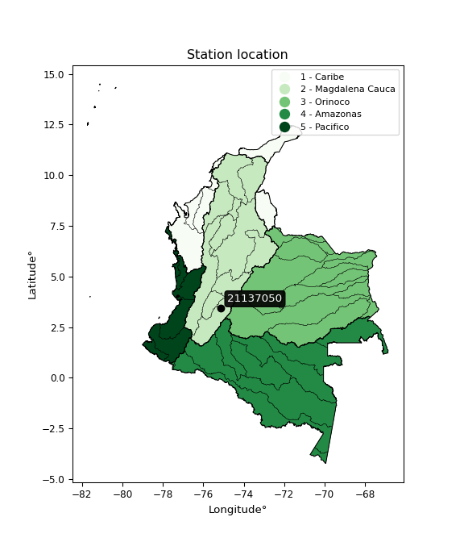

<div align="center">


</div>

# PMax24h Station (Rain): 21137050

Maximum Precipitation in 24 hours (PMax24h) is the greatest amount of rainfall for a specific duration that is meteorologically possible for a given location, acting as a "worst-case" scenario for extreme storms, crucial for designing safety-critical infrastructure like bridges, river deviations, dams, spillways, and nuclear plants to prevent catastrophic failure. The PMax24h is related with the Probable Maximum Precipitation (PMP) and it is calculated by hydrologists using meteorological data to determine the upper limit of extreme rainfall, often leading to the Probable Maximum Flood (PMF) for flood control design, and is increasingly being studied for climate change impacts. Probable Maximum Precipitation (PMP) is the theoretical upper limit of rainfall, a deterministic estimate for extreme events, while probability distributions (like GEV, Gumbel) describe the likelihood and frequency of various precipitation amounts, including rare ones, showing how often events occur, with PMP representing the extreme end of these distributions, used for critical infrastructure design to ensure safety against the worst conceivable weather, unlike standard statistical forecasts which cover typical probabilities.

The most common probability distributions in hydrology, used for analyzing floods, rainfall, and streamflow, include the Normal, Log-Normal, Gumbel, Gamma (including Log-Pearson Type III), and Generalized Extreme Value (GEV) distributions, often chosen based on the data´s skewness and whether modeling extremes or general conditions, with Gumbel and GEV popular for extreme events like floods, while the Normal distribution serves as a baseline, though often requiring transformations for skewed hydrological data. These distributions help in designing water infrastructure, managing water resources, and forecasting hydrologic events.

> Hydrological data often isn´t perfectly normal (it´s skewed), so different distributions are needed for different applications, such as: **Flood Frequency Analysis**: Using Gumbel, GEV, or Log-Pearson Type III for predicting extreme flood magnitudes and their return periods, **Rainfall Analysis**: Normal for annual totals, but Log-Normal, Weibull, or GEV for intensity or extreme daily rainfall, **Streamflow Modeling**: Gamma and Log-Normal for maximum flows, GEV for minimum flows, and Kappa for daily flows.

<div align="center">

</img>

</div>


## A. General information


### 1. General running parameters

• app_version: _v20260225_. • runtime: _2026-02-28 16:54:07.457399_. • Python version: _3.14.0_. • SciPy version: _1.16.3_. • Pandas version: _2.3.3_. • NumPy version: _2.3.5_. • Stations dataset (station_dataset_file): _dataset/pmax24h_in/automatic_colombia_2003_2025.csv_. • Stations catalog (station_catalog_file): _dataset/CNE.xls_. • Minimum year to eval til year_max (date_min): _1900_. • Maximum year to eval since year_min (date_max): _2025_. • Creates, save and include plots into reports (create_plot): _False_. • Plot only fit distributions with Δo > Δ (plot_only_fit): _True_. • Plot only simple graphs avoiding multiple CDFs and multiple Extreme values plots (plot_only_simple): _False_. • Eval low extreme values, if False, evaluates high extreme values (low_extreme): _False_. • Eval every SciPy distribution as logarithmic (pdist_logarithmic_on): _True_. • Standard deviation normalized (ddof): _1.0_. • Return periods to eval in years (Tr): _[2, 2.33, 5, 10, 15, 20, 25, 50, 75, 100, 200, 250, 500, 750, 1000]_. • Minimum data sample per station, 0 means any (minimum_sample): _5_. • Z-Score maximum threshold to adjust a value, 0 means disable (zscore_max): _3.5_. • Z-Score minimum threshold to adjust a value, 0 means disable (zscore_min): _-2.5_. • Avoid zeros, e.g. rain = 0 (avoid_zeros): _True_. • Avoid null values (avoid_nans): _True_. 

:file_folder:Table: [dataset.csv](../../dataset/pmax24h_in/automatic_colombia_2003_2025.csv)

> Delta Degrees of Freedom (DDOF): is a parameter used in the formulas for calculating variance and standard deviation. When ddof=0, the divisor is $N$ (the total number of observations) and this is used when your data set is the entire population. When ddof=1, the divisor is $N-1$ and this is used when your data set is a sample drawn from a larger population. Using $N-1$ provides an unbiased estimate of the population variance (known as Bessel´s correction).


### 2. Station info and location

|   id |   CODIGO | NOMBRE                      | CATEGORIA    | TECNOLOGIA                              | ESTADO           | FECHA_INSTALACION   |   FECHA_SUSPENSION |   ALTITUD |   LATITUD |   LONGITUD | DEPARTAMENTO   | MUNICIPIO   | AREA_OPERATIVA                    | ENTIDAD                                                     | AREA_HIDROGRAFICA   | ZONA_HIDROGRAFICA   | SUBZONA_HIDROGRAFICA                            | CORRIENTE   | Catalogo   |   Version |
|-----:|---------:|:----------------------------|:-------------|:----------------------------------------|:-----------------|:--------------------|-------------------:|----------:|----------:|-----------:|:---------------|:------------|:----------------------------------|:------------------------------------------------------------|:--------------------|:--------------------|:------------------------------------------------|:------------|:-----------|----------:|
|    0 | 21137050 | ANGOSTURA  - AUT [21137050] | Limnigráfica | Automática con Telemetría, Convencional | En Mantenimiento | 15/01/1975          |                nan |       345 |      3.44 |     -75.12 | Tolima         | Natagaima   | Area Operativa 04 - Huila-Caquetá | INSTITUTO DE HIDROLOGIA METEOROLOGIA Y ESTUDIOS AMBIENTALES | Magdalena Cauca     | Alto Magdalena      | Directos Magdalena entre ríos Cabrera y Sumapaz | Magdalena   | CNE_IDEAM  |  20251226 |

<div align="center">

Dynamic map: [:earth_americas:Google](http://maps.google.com/maps?q=3.44,-75.12) [:earth_americas:OSM](https://www.openstreetmap.org/#map=18/3.44/-75.12&layers=P) [:earth_americas:Bing](https://www.bing.com/maps?cp=3.44~-75.12&lvl=18) [:earth_americas:Apple](https://maps.apple.com/frame?center=3.44%2C-75.12&span=0.003%2C0.006)

</div>


<div align="center">

```geojson
{
  "type": "Feature",
  "geometry": {
    "type": "Point", 
    "coordinates": [-75.12, 3.44]
  }, 
  "properties": {
    "Name": "21137050"
  }
}
```

</div>


### 3. Discrete values table and plot

<div align="center">

|               |           0 |           1 |          2 |           3 |           4 |         5 |           6 |          7 |          8 |           9 |          10 |          11 |          12 |          13 |
|:--------------|------------:|------------:|-----------:|------------:|------------:|----------:|------------:|-----------:|-----------:|------------:|------------:|------------:|------------:|------------:|
| Date          | 2011        | 2012        | 2013       | 2014        | 2015        | 2016      | 2017        | 2018       | 2019       | 2020        | 2021        | 2022        | 2023        | 2025        |
| Value         |   59.4      |   84.9      |   53.4     |  100        |   77.3      |   75.6    |   69.3      |  210.5     |  201.4     |  141.4      |  133.6      |  142.8      |   71.6      |   83.4      |
| Value_initial |   59.4      |   84.9      |   53.4     |  100        |   77.3      |   75.6    |   69.3      |  210.5     |  201.4     |  141.4      |  133.6      |  142.8      |   71.6      |   83.4      |
| count         |   14        |   14        |   14       |   14        |   14        |   14      |   14        |   14       |   14       |   14        |   14        |   14        |   14        |   14        |
| mean          |  107.471    |  107.471    |  107.471   |  107.471    |  107.471    |  107.471  |  107.471    |  107.471   |  107.471   |  107.471    |  107.471    |  107.471    |  107.471    |  107.471    |
| std           |   50.8154   |   50.8154   |   50.8154  |   50.8154   |   50.8154   |   50.8154 |   50.8154   |   50.8154  |   50.8154  |   50.8154   |   50.8154   |   50.8154   |   50.8154   |   50.8154   |
| zscore        |   -0.946001 |   -0.444185 |   -1.06408 |   -0.147031 |   -0.593746 |   -0.6272 |   -0.751179 |    2.02751 |    1.84843 |    0.667683 |    0.514186 |    0.695234 |   -0.705917 |   -0.473704 |


</div>


> The initial value (value_initial) correspond to the initial obtained or null completed value, and value (value) is adjusted only when the initial value is outside the valid range (outlier) definite through the Z-Score value. If Z-Score is active, values out of range or outliers are replaced with the station mean value. A Z-Score (or standard score) measures how many standard deviations a data point is from the mean of a dataset, indicating its relative position; positive scores mean above the mean, negative mean below, and a score of zero is exactly at the mean, allowing for comparison of values from different distributions. It´s calculated using the formula $z=(x–μ)/σ$, where $x$ is the data point, $μ$ is the mean, and $σ$ is the standard deviation, helping identify outliers and understand probability.
>
> <sub>**Note**: In this study, "completing" (filling gaps in) and "extending" (forecasting or lengthening the historical record) rainfall data series are avoided for certain critical analyses because they introduce artificial bias and uncertainty, which can distort the statistics of rare events (extremes), alter day-to-day variability, and compromise the integrity and homogeneity of the original data. Some reasons against Completing/Extending rainfall data are: **Distortion of Extremes and Variability**: The primary issue is that most gap-filling or extension methods rely on averaging or regression with nearby stations, which inherently smooths the data. Rainfall is highly variable in space and time, with a large percentage of zero values and occasional large storms. Infilling methods often underestimate the highest values and overestimate the lowest (zero) values, which severely distorts analyses focused on flood frequency, drought severity, and intensity-duration-frequency (IDF) curves, **Loss of Data Homogeneity**: Infilled or extended data are synthetic estimates, not actual measurements. Combining these estimates with observed data can violate the assumption of data homogeneity, which requires that the data properties do not change over time. Inhomogeneity can lead to incorrect conclusions about long-term trends or changes in climate patterns, **Propagation of Errors**: Errors and biases from the original data (e.g., wind-induced undercatch, instrument errors, site changes) or the data used for imputation can propagate through the analysis, leading to unreliable hydrological models and inaccurate predictions, **Compromised Statistical Integrity**: For statistical analyses, especially those involving the frequency of events, using artificial data can introduce time bias or autocorrelation that doesn´t exist in reality, making it difficult to assess the true probability of events, **Difficulty in Validation**: It is difficult to accurately validate the quality of filled or extended data, especially for past periods where ground-truth measurements are unavailable. The reliability of imputation techniques heavily depends on the density of the surrounding station network and the complexity of the local topography.</sub>


### 4. Active continuous probability distributions from SciPy (80 of 104 available)

A Probability Density Function (PDF) describes the relative likelihood of a continuous random variable falling within a specific range, where the total area under its curve equals 1, and the area over any interval gives the actual probability for that range. Unlike discrete probabilities (like rolling a die), a PDF shows density, not direct probability for a single point (which is zero), with higher points indicating higher likelihood, often visualized as a bell curve for normal distributions.

A log of a probability density function (log-PDF) is simply the logarithm of the PDF´s value, denoted as $log(f(x))$, useful for converting multiplication of probabilities into addition, improving numerical stability with tiny numbers, and connecting to information theory concepts like entropy. Instead of dealing with very small probabilities (e.g., 0.000001), log-PDFs use negative numbers (e.g., $log(0.00001) ≈ -11.51$ that are easier for computers to handle, preventing underflow errors and simplifying complex calculations. In this study, each active probability distribution from SciPy is also evaluated in the $log$ form.

[scipy.stats](https://docs.scipy.org/doc/scipy/reference/stats.html) is a Python´s powerful submodule within the SciPy library for comprehensive statistical analysis, offering over 130 probability distributions (like Normal, Poisson, etc.), functions for descriptive stats (mean, variance), hypothesis testing (t-tests, chi-square), random variable generation, and statistical tests, making it essential for data science, modeling, and research. It provides tools to explore, model, and draw conclusions from data efficiently, working seamlessly with [NumPy](https://numpy.org/).

<div align="center">

|   id | p_dist           |   n_parameter | fit_method   | label                                                                       | active   | ref                                                                                                      |
|-----:|:-----------------|--------------:|:-------------|:----------------------------------------------------------------------------|:---------|:---------------------------------------------------------------------------------------------------------|
|    0 | alpha            |             3 | MLE          | Alpha                                                                       | True     | [:mortar_board:](https://docs.scipy.org/doc/scipy/reference/generated/scipy.stats.alpha.html)            |
|    1 | anglit           |             2 | MM           | Anglit                                                                      | True     | [:mortar_board:](https://docs.scipy.org/doc/scipy/reference/generated/scipy.stats.anglit.html)           |
|    2 | arcsine          |             2 | MM           | Arcsine                                                                     | True     | [:mortar_board:](https://docs.scipy.org/doc/scipy/reference/generated/scipy.stats.arcsine.html)          |
|    3 | argus            |             3 | MLE          | Argus                                                                       | True     | [:mortar_board:](https://docs.scipy.org/doc/scipy/reference/generated/scipy.stats.argus.html)            |
|    4 | beta             |             4 | MLE          | Beta                                                                        | True     | [:mortar_board:](https://docs.scipy.org/doc/scipy/reference/generated/scipy.stats.beta.html)             |
|    5 | betaprime        |             4 | MLE          | Beta prime                                                                  | True     | [:mortar_board:](https://docs.scipy.org/doc/scipy/reference/generated/scipy.stats.betaprime.html)        |
|    6 | bradford         |             3 | MLE          | Bradford                                                                    | True     | [:mortar_board:](https://docs.scipy.org/doc/scipy/reference/generated/scipy.stats.bradford.html)         |
|    7 | burr             |             4 | MLE          | Burr (Type III)                                                             | True     | [:mortar_board:](https://docs.scipy.org/doc/scipy/reference/generated/scipy.stats.burr.html)             |
|    8 | burr12           |             4 | MLE          | Burr (Type III) 12                                                          | True     | [:mortar_board:](https://docs.scipy.org/doc/scipy/reference/generated/scipy.stats.burr12.html)           |
|    9 | cosine           |             2 | MLE          | Cosine                                                                      | True     | [:mortar_board:](https://docs.scipy.org/doc/scipy/reference/generated/scipy.stats.cosine.html)           |
|   10 | crystalball      |             4 | MLE          | Crystalball                                                                 | True     | [:mortar_board:](https://docs.scipy.org/doc/scipy/reference/generated/scipy.stats.crystalball.html)      |
|   11 | dgamma           |             3 | MLE          | Double gamma                                                                | True     | [:mortar_board:](https://docs.scipy.org/doc/scipy/reference/generated/scipy.stats.dgamma.html)           |
|   12 | dweibull         |             3 | MLE          | Double Weibull                                                              | True     | [:mortar_board:](https://docs.scipy.org/doc/scipy/reference/generated/scipy.stats.dweibull.html)         |
|   13 | erlang           |             3 | MLE          | Erlang                                                                      | True     | [:mortar_board:](https://docs.scipy.org/doc/scipy/reference/generated/scipy.stats.erlang.html)           |
|   14 | exponnorm        |             3 | MLE          | Exponentially modified Normal                                               | True     | [:mortar_board:](https://docs.scipy.org/doc/scipy/reference/generated/scipy.stats.exponnorm.html)        |
|   15 | exponpow         |             3 | MLE          | Exponential power                                                           | True     | [:mortar_board:](https://docs.scipy.org/doc/scipy/reference/generated/scipy.stats.exponpow.html)         |
|   16 | exponweib        |             4 | MLE          | Exponentiated Weibull                                                       | True     | [:mortar_board:](https://docs.scipy.org/doc/scipy/reference/generated/scipy.stats.exponweib.html)        |
|   17 | f                |             4 | MLE          | F                                                                           | True     | [:mortar_board:](https://docs.scipy.org/doc/scipy/reference/generated/scipy.stats.f.html)                |
|   18 | fatiguelife      |             3 | MLE          | Fatigue-life (Birnbaum-Saunders)                                            | True     | [:mortar_board:](https://docs.scipy.org/doc/scipy/reference/generated/scipy.stats.fatiguelife.html)      |
|   19 | foldnorm         |             3 | MM           | Fold Normal                                                                 | True     | [:mortar_board:](https://docs.scipy.org/doc/scipy/reference/generated/scipy.stats.foldnorm.html)         |
|   20 | gamma            |             3 | MLE          | Gamma                                                                       | True     | [:mortar_board:](https://docs.scipy.org/doc/scipy/reference/generated/scipy.stats.gamma.html)            |
|   21 | gausshyper       |             6 | MLE          | Gauss hypergeometric                                                        | True     | [:mortar_board:](https://docs.scipy.org/doc/scipy/reference/generated/scipy.stats.gausshyper.html)       |
|   22 | genexpon         |             5 | MLE          | Generalized exponential                                                     | True     | [:mortar_board:](https://docs.scipy.org/doc/scipy/reference/generated/scipy.stats.genexpon.html)         |
|   23 | genextreme       |             3 | MLE          | Generalized exponential                                                     | True     | [:mortar_board:](https://docs.scipy.org/doc/scipy/reference/generated/scipy.stats.genextreme.html)       |
|   24 | gengamma         |             4 | MLE          | Generalized gamma                                                           | True     | [:mortar_board:](https://docs.scipy.org/doc/scipy/reference/generated/scipy.stats.gengamma.html)         |
|   25 | genhalflogistic  |             3 | MLE          | Generalized half-logistic                                                   | True     | [:mortar_board:](https://docs.scipy.org/doc/scipy/reference/generated/scipy.stats.genhalflogistic.html)  |
|   26 | genlogistic      |             3 | MLE          | Generalized logistic                                                        | True     | [:mortar_board:](https://docs.scipy.org/doc/scipy/reference/generated/scipy.stats.genlogistic.html)      |
|   27 | gennorm          |             3 | MLE          | Generalized Normal                                                          | True     | [:mortar_board:](https://docs.scipy.org/doc/scipy/reference/generated/scipy.stats.gennorm.html)          |
|   28 | genpareto        |             3 | MLE          | Generalized Pareto                                                          | True     | [:mortar_board:](https://docs.scipy.org/doc/scipy/reference/generated/scipy.stats.genpareto.html)        |
|   29 | gompertz         |             3 | MLE          | Gompertz (or truncated Gumbel)                                              | True     | [:mortar_board:](https://docs.scipy.org/doc/scipy/reference/generated/scipy.stats.gompertz.html)         |
|   30 | gumbel_l         |             2 | MM           | Gumbel Left Skew                                                            | True     | [:mortar_board:](https://docs.scipy.org/doc/scipy/reference/generated/scipy.stats.gumbel_l.html)         |
|   31 | gumbel_r         |             2 | MM           | Gumbel Right Skew                                                           | True     | [:mortar_board:](https://docs.scipy.org/doc/scipy/reference/generated/scipy.stats.gumbel_r.html)         |
|   32 | halfgennorm      |             3 | MLE          | Upper half of a generalized normal                                          | True     | [:mortar_board:](https://docs.scipy.org/doc/scipy/reference/generated/scipy.stats.halfgennorm.html)      |
|   33 | halflogistic     |             2 | MM           | Half-logistic                                                               | True     | [:mortar_board:](https://docs.scipy.org/doc/scipy/reference/generated/scipy.stats.halflogistic.html)     |
|   34 | halfnorm         |             2 | MM           | Half Normal                                                                 | True     | [:mortar_board:](https://docs.scipy.org/doc/scipy/reference/generated/scipy.stats.halfnorm.html)         |
|   35 | hypsecant        |             2 | MM           | hyperbolic secant                                                           | True     | [:mortar_board:](https://docs.scipy.org/doc/scipy/reference/generated/scipy.stats.hypsecant.html)        |
|   36 | invgamma         |             3 | MLE          | Inverted gamma                                                              | True     | [:mortar_board:](https://docs.scipy.org/doc/scipy/reference/generated/scipy.stats.invgamma.html)         |
|   37 | invgauss         |             3 | MLE          | Inverse Gaussian                                                            | True     | [:mortar_board:](https://docs.scipy.org/doc/scipy/reference/generated/scipy.stats.invgauss.html)         |
|   38 | invweibull       |             3 | MLE          | Inverted Weibull                                                            | True     | [:mortar_board:](https://docs.scipy.org/doc/scipy/reference/generated/scipy.stats.invweibull.html)       |
|   39 | johnsonsb        |             4 | MLE          | Johnson SB                                                                  | True     | [:mortar_board:](https://docs.scipy.org/doc/scipy/reference/generated/scipy.stats.johnsonsb.html)        |
|   40 | johnsonsu        |             4 | MLE          | Johnson Su                                                                  | True     | [:mortar_board:](https://docs.scipy.org/doc/scipy/reference/generated/scipy.stats.johnsonsu.html)        |
|   41 | kappa3           |             3 | MLE          | Kappa 3                                                                     | True     | [:mortar_board:](https://docs.scipy.org/doc/scipy/reference/generated/scipy.stats.kappa3.html)           |
|   42 | kappa4           |             4 | MLE          | Kappa 4                                                                     | True     | [:mortar_board:](https://docs.scipy.org/doc/scipy/reference/generated/scipy.stats.kappa4.html)           |
|   43 | ksone            |             3 | MLE          | Kolmogorov-Smirnov one-sided test statistic distribution                    | True     | [:mortar_board:](https://docs.scipy.org/doc/scipy/reference/generated/scipy.stats.ksone.html)            |
|   44 | kstwobign        |             2 | MLE          | Limiting distribution of scaled Kolmogorov-Smirnov two-sided test statistic | True     | [:mortar_board:](https://docs.scipy.org/doc/scipy/reference/generated/scipy.stats.kstwobign.html)        |
|   45 | laplace          |             2 | MM           | Laplace                                                                     | True     | [:mortar_board:](https://docs.scipy.org/doc/scipy/reference/generated/scipy.stats.laplace.html)          |
|   46 | levy_l           |             2 | MLE          | Left-skewed Levy                                                            | True     | [:mortar_board:](https://docs.scipy.org/doc/scipy/reference/generated/scipy.stats.levy_l.html)           |
|   47 | loggamma         |             3 | MLE          | Log gamma                                                                   | True     | [:mortar_board:](https://docs.scipy.org/doc/scipy/reference/generated/scipy.stats.loggamma.html)         |
|   48 | logistic         |             2 | MM           | Logistic (or Sech-squared)                                                  | True     | [:mortar_board:](https://docs.scipy.org/doc/scipy/reference/generated/scipy.stats.logistic.html)         |
|   49 | loglaplace       |             3 | MLE          | Log-Laplace                                                                 | True     | [:mortar_board:](https://docs.scipy.org/doc/scipy/reference/generated/scipy.stats.loglaplace.html)       |
|   50 | lomax            |             3 | MLE          | Lomax (Pareto of the second kind)                                           | True     | [:mortar_board:](https://docs.scipy.org/doc/scipy/reference/generated/scipy.stats.lomax.html)            |
|   51 | maxwell          |             2 | MM           | Maxwell                                                                     | True     | [:mortar_board:](https://docs.scipy.org/doc/scipy/reference/generated/scipy.stats.maxwell.html)          |
|   52 | mielke           |             4 | MLE          | Mielke Beta-Kappa / Dagum                                                   | True     | [:mortar_board:](https://docs.scipy.org/doc/scipy/reference/generated/scipy.stats.mielke.html)           |
|   53 | moyal            |             2 | MM           | Moyal                                                                       | True     | [:mortar_board:](https://docs.scipy.org/doc/scipy/reference/generated/scipy.stats.moyal.html)            |
|   54 | nakagami         |             3 | MLE          | Nakagami                                                                    | True     | [:mortar_board:](https://docs.scipy.org/doc/scipy/reference/generated/scipy.stats.nakagami.html)         |
|   55 | ncf              |             5 | MLE          | Non-central F distribution                                                  | True     | [:mortar_board:](https://docs.scipy.org/doc/scipy/reference/generated/scipy.stats.ncf.html)              |
|   56 | nct              |             4 | MLE          | Non-central Student’s t                                                     | True     | [:mortar_board:](https://docs.scipy.org/doc/scipy/reference/generated/scipy.stats.nct.html)              |
|   57 | norm             |             2 | MM           | Normal                                                                      | True     | [:mortar_board:](https://docs.scipy.org/doc/scipy/reference/generated/scipy.stats.norm.html)             |
|   58 | pearson3         |             3 | MM           | Pearson type III                                                            | True     | [:mortar_board:](https://docs.scipy.org/doc/scipy/reference/generated/scipy.stats.pearson3.html)         |
|   59 | powerlaw         |             3 | MLE          | Power-function                                                              | True     | [:mortar_board:](https://docs.scipy.org/doc/scipy/reference/generated/scipy.stats.powerlaw.html)         |
|   60 | rayleigh         |             2 | MM           | Rayleigh                                                                    | True     | [:mortar_board:](https://docs.scipy.org/doc/scipy/reference/generated/scipy.stats.rayleigh.html)         |
|   61 | rdist            |             3 | MLE          | R-distributed (symmetric beta)                                              | True     | [:mortar_board:](https://docs.scipy.org/doc/scipy/reference/generated/scipy.stats.rdist.html)            |
|   62 | rice             |             3 | MLE          | Rice                                                                        | True     | [:mortar_board:](https://docs.scipy.org/doc/scipy/reference/generated/scipy.stats.rice.html)             |
|   63 | semicircular     |             2 | MM           | Semicircular                                                                | True     | [:mortar_board:](https://docs.scipy.org/doc/scipy/reference/generated/scipy.stats.semicircular.html)     |
|   64 | skewnorm         |             3 | MLE          | Skew normal                                                                 | True     | [:mortar_board:](https://docs.scipy.org/doc/scipy/reference/generated/scipy.stats.skewnorm.html)         |
|   65 | t                |             3 | MLE          | Student’s t                                                                 | True     | [:mortar_board:](https://docs.scipy.org/doc/scipy/reference/generated/scipy.stats.t.html)                |
|   66 | trapezoid        |             4 | MLE          | Trapezoid                                                                   | True     | [:mortar_board:](https://docs.scipy.org/doc/scipy/reference/generated/scipy.stats.trapezoid.html)        |
|   67 | triang           |             3 | MLE          | Triangular                                                                  | True     | [:mortar_board:](https://docs.scipy.org/doc/scipy/reference/generated/scipy.stats.triang.html)           |
|   68 | truncexpon       |             3 | MLE          | Truncated exponential                                                       | True     | [:mortar_board:](https://docs.scipy.org/doc/scipy/reference/generated/scipy.stats.truncexpon.html)       |
|   69 | truncnorm        |             4 | MLE          | Truncated normal                                                            | True     | [:mortar_board:](https://docs.scipy.org/doc/scipy/reference/generated/scipy.stats.truncnorm.html)        |
|   70 | truncpareto      |             4 | MLE          | Upper truncated Pareto                                                      | True     | [:mortar_board:](https://docs.scipy.org/doc/scipy/reference/generated/scipy.stats.truncpareto.html)      |
|   71 | truncweibull_min |             5 | MLE          | Doubly truncated Weibull minimum                                            | True     | [:mortar_board:](https://docs.scipy.org/doc/scipy/reference/generated/scipy.stats.truncweibull_min.html) |
|   72 | tukeylambda      |             3 | MLE          | Tukey-Lamdba                                                                | True     | [:mortar_board:](https://docs.scipy.org/doc/scipy/reference/generated/scipy.stats.tukeylambda.html)      |
|   73 | uniform          |             2 | MLE          | Uniform                                                                     | True     | [:mortar_board:](https://docs.scipy.org/doc/scipy/reference/generated/scipy.stats.uniform.html)          |
|   74 | vonmises         |             3 | MLE          | Von Mises                                                                   | True     | [:mortar_board:](https://docs.scipy.org/doc/scipy/reference/generated/scipy.stats.vonmises.html)         |
|   75 | vonmises_line    |             3 | MLE          | Von Mises line                                                              | True     | [:mortar_board:](https://docs.scipy.org/doc/scipy/reference/generated/scipy.stats.vonmises_line.html)    |
|   76 | wald             |             2 | MM           | Wald                                                                        | True     | [:mortar_board:](https://docs.scipy.org/doc/scipy/reference/generated/scipy.stats.wald.html)             |
|   77 | weibull_max      |             3 | MLE          | Weibull maximum                                                             | True     | [:mortar_board:](https://docs.scipy.org/doc/scipy/reference/generated/scipy.stats.weibull_max.html)      |
|   78 | weibull_min      |             3 | MLE          | Weibull minimum                                                             | True     | [:mortar_board:](https://docs.scipy.org/doc/scipy/reference/generated/scipy.stats.weibull_min.html)      |
|   79 | wrapcauchy       |             3 | MLE          | Wrapped  Cauchy                                                             | True     | [:mortar_board:](https://docs.scipy.org/doc/scipy/reference/generated/scipy.stats.wrapcauchy.html)       |

</div>

> **n_parameter:** # arguments & localization & scale.
>
> **Fit methods:** (MLE) maximum likelihood, (MM) L-moments.
>
>**Inactive** (With the only purpose of prevent loops, zero divisions, infinite values, over high estimated values or horizontal trending for recurrence intervals estimations, the follow distributions were disabled.)**:** lognorm, norminvgauss, powernorm, powerlognorm, cauchy, halfcauchy, foldcauchy, skewcauchy, chi2, expon, fisk, genhyperbolic, geninvgauss, gibrat, kstwo, laplace_asymmetric, levy, levy_stable, ncx2, pareto, rel_breitwigner, recipinvgauss, studentized_range, loguniform, 


## B. Probability (PDF) vs. Empirical (EDF) distributions functions

A continuous probability distribution (CPD) describes probabilities for variables that can take any value within a range (like rain any time), unlike discrete variables with specific outcomes (like temperature). It uses a Probability Density Function (PDF), a curve where the total area under it equals 1, and the probability of the variable falling within an interval (a to b) is found by calculating the area under the curve between those points. A key feature is that the probability of hitting any single exact value is zero, so probabilities are always expressed for ranges, e.g., $P(a ≤ X ≤ b)$.

<div align="center">

Distributions parameters from station values
|     |   station | p_dist              |   n |              loc |           scale | shape                  | shape1                | shape2                 | shape3             |
|----:|----------:|:--------------------|----:|-----------------:|----------------:|:-----------------------|:----------------------|:-----------------------|:-------------------|
|   0 |  21137050 | alpha               |  14 |      4.64527     |   209.311       | 2.445541826122907      |                       |                        |                    |
|   1 |  21137050 | anglit              |  14 |    107.471       |   143.248       |                        |                       |                        |                    |
|   2 |  21137050 | arcsine             |  14 |     38.2217      |   138.499       |                        |                       |                        |                    |
|   3 |  21137050 | argus               |  14 |     -4.18004     |   220.627       | 5.181771528468344e-07  |                       |                        |                    |
|   4 |  21137050 | beta                |  14 |     53.4         |   158.375       | 0.43666983134768744    | 0.6034501571030138    |                        |                    |
|   5 |  21137050 | betaprime           |  14 |     -1.2485      |     2.54549     | 236.82961338807354     | 6.553126746308923     |                        |                    |
|   6 |  21137050 | bradford            |  14 |     53.4         |   157.1         | 0.8809724105331715     |                       |                        |                    |
|   7 |  21137050 | burr                |  14 |     -0.912032    |    12.1666      | 2.9902251201648293     | 292.7100140144829     |                        |                    |
|   8 |  21137050 | burr12              |  14 |      0.639076    |    52.4454      | 511.8604476949392      | 0.0031651659325183114 |                        |                    |
|   9 |  21137050 | cosine              |  14 |    114.718       |    42.0241      |                        |                       |                        |                    |
|  10 |  21137050 | crystalball         |  14 |    107.471       |    48.9669      | 8891.289299439648      | 3935.466996368061     |                        |                    |
|  11 |  21137050 | dgamma              |  14 |     95.1991      |    23.1329      | 1.6834386474954888     |                       |                        |                    |
|  12 |  21137050 | dweibull            |  14 |     96.2718      |    42.6748      | 1.320086647881055      |                       |                        |                    |
|  13 |  21137050 | erlang              |  14 |     53.4         |    58.0372      | 0.6768357405193732     |                       |                        |                    |
|  14 |  21137050 | exponnorm           |  14 |     53.334       |     0.0236118   | 2284.9534828497035     |                       |                        |                    |
|  15 |  21137050 | exponpow            |  14 |     53.4         |   113.324       | 0.8994237437593042     |                       |                        |                    |
|  16 |  21137050 | exponweib           |  14 |     53.4         |     1.38747     | 0.9573624461076167     | 0.20499371886334405   |                        |                    |
|  17 |  21137050 | f                   |  14 |     33.0831      |    49.8401      | 12278.358404558743     | 5.485973976652568     |                        |                    |
|  18 |  21137050 | fatiguelife         |  14 |     53.4         |     0.000540921 | 298.19662756423895     |                       |                        |                    |
|  19 |  21137050 | foldnorm            |  14 |     41.9996      |    73.4505      | 0.4888645619353702     |                       |                        |                    |
|  20 |  21137050 | gamma               |  14 |     53.4         |    65.3532      | 0.7591831665332325     |                       |                        |                    |
|  21 |  21137050 | gausshyper          |  14 |     53.4         |   167.65        | 0.6832478306390783     | 1.1193715988445323    | 0.9116874459661914     | 1.0631785496574309 |
|  22 |  21137050 | genexpon            |  14 |     53.4         |   107.628       | 1.779163668547998      | 7.373670173386994     | 0.06500204375375654    |                    |
|  23 |  21137050 | genextreme          |  14 |     53.7276      |     1.82105     | -5.558374908393368     |                       |                        |                    |
|  24 |  21137050 | gengamma            |  14 |     53.4         |     0.98572     | 1.263556963455514      | 0.22906465133404846   |                        |                    |
|  25 |  21137050 | genhalflogistic     |  14 |     53.3826      |    40.6755      | 0.00019225130925094175 |                       |                        |                    |
|  26 |  21137050 | genlogistic         |  14 |   -168.514       |    33.7488      | 1867.5625516883392     |                       |                        |                    |
|  27 |  21137050 | gennorm             |  14 |     83.4         |    11.4565      | 0.5833276145389134     |                       |                        |                    |
|  28 |  21137050 | genpareto           |  14 |     -1.16803     |   263.692       | -1.2457830707804343    |                       |                        |                    |
|  29 |  21137050 | gompertz            |  14 |     53.4         |   353.147       | 5.64321871569873       |                       |                        |                    |
|  30 |  21137050 | gumbel_l            |  14 |    129.509       |    38.1794      |                        |                       |                        |                    |
|  31 |  21137050 | gumbel_r            |  14 |     85.4337      |    38.1794      |                        |                       |                        |                    |
|  32 |  21137050 | halfgennorm         |  14 |     53.4         |     1.00251     | 0.32123402150718605    |                       |                        |                    |
|  33 |  21137050 | halflogistic        |  14 |     49.4342      |    41.865       |                        |                       |                        |                    |
|  34 |  21137050 | halfnorm            |  14 |     42.6584      |    81.2311      |                        |                       |                        |                    |
|  35 |  21137050 | hypsecant           |  14 |    107.471       |    31.1733      |                        |                       |                        |                    |
|  36 |  21137050 | invgamma            |  14 |     33.0681      |   136.79        | 2.74363242918412       |                       |                        |                    |
|  37 |  21137050 | invgauss            |  14 |     41.9464      |    83.8618      | 0.781344710891257      |                       |                        |                    |
|  38 |  21137050 | invweibull          |  14 |     18.9568      |    59.9701      | 2.2957268039741106     |                       |                        |                    |
|  39 |  21137050 | johnsonsb           |  14 |     53.4         |   157.254       | 0.18769519886704128    | 0.102030979484042     |                        |                    |
|  40 |  21137050 | johnsonsu           |  14 |     45.9084      |     0.370022    | -6.279350524612873     | 1.1490723615329927    |                        |                    |
|  41 |  21137050 | kappa3              |  14 |     53.3916      |   142.855       | 35.20955557620465      |                       |                        |                    |
|  42 |  21137050 | kappa4              |  14 |     37.9399      |   172.22        | 1.0984593925701396     | 0.9672951762833448    |                        |                    |
|  43 |  21137050 | ksone               |  14 |     37.69        |   188.52        | 1.0                    |                       |                        |                    |
|  44 |  21137050 | kstwobign           |  14 |    -34.7681      |   163.915       |                        |                       |                        |                    |
|  45 |  21137050 | laplace             |  14 |    107.471       |    34.6249      |                        |                       |                        |                    |
|  46 |  21137050 | levy_l              |  14 |    220.566       |    55.8088      |                        |                       |                        |                    |
|  47 |  21137050 | loggamma            |  14 | -16995.1         |  2247.79        | 2015.7544635737322     |                       |                        |                    |
|  48 |  21137050 | logistic            |  14 |    107.471       |    26.9969      |                        |                       |                        |                    |
|  49 |  21137050 | loglaplace          |  14 |     -0.259109    |    83.6591      | 2.899653699242422      |                       |                        |                    |
|  50 |  21137050 | lomax               |  14 |     53.4         | 11462.2         | 212.69657832670438     |                       |                        |                    |
|  51 |  21137050 | maxwell             |  14 |     -8.55964     |    72.7117      |                        |                       |                        |                    |
|  52 |  21137050 | mielke              |  14 |     -0.6254      |    10.8518      | 1186.5908833288108     | 2.979146079203268     |                        |                    |
|  53 |  21137050 | moyal               |  14 |     79.469       |    22.0429      |                        |                       |                        |                    |
|  54 |  21137050 | nakagami            |  14 |     53.4         |    80.4591      | 0.44141423159063853    |                       |                        |                    |
|  55 |  21137050 | ncf                 |  14 |     -0.103265    |     1.07149e-06 | 1.1285019705472636e-07 | 14.653495474486942    | 10.12344357025088      |                    |
|  56 |  21137050 | nct                 |  14 |     -0.275338    |     1.71977     | 3.697684946797768      | 49.26480320856507     |                        |                    |
|  57 |  21137050 | norm                |  14 |    107.471       |    48.9669      |                        |                       |                        |                    |
|  58 |  21137050 | pearson3            |  14 |    107.471       |    48.9669      | 0.9531073413630773     |                       |                        |                    |
|  59 |  21137050 | powerlaw            |  14 |     53.4         |   157.1         | 0.25207538662098733    |                       |                        |                    |
|  60 |  21137050 | rayleigh            |  14 |     13.7948      |    74.7431      |                        |                       |                        |                    |
|  61 |  21137050 | rdist               |  14 |     41.302       |    92.298       | 1.0459825150307234     |                       |                        |                    |
|  62 |  21137050 | rice                |  14 |     29.7638      |    64.947       | 0.00035930499569310323 |                       |                        |                    |
|  63 |  21137050 | semicircular        |  14 |    107.471       |    97.9339      |                        |                       |                        |                    |
|  64 |  21137050 | skewnorm            |  14 |     53.4         |    72.9461      | 101356308.93877599     |                       |                        |                    |
|  65 |  21137050 | t                   |  14 |    107.475       |    48.9675      | 2790559.482623305      |                       |                        |                    |
|  66 |  21137050 | trapezoid           |  14 |     37.69        |   188.52        | 1.0                    | 1.0                   |                        |                    |
|  67 |  21137050 | triang              |  14 |     53.4         |   195.11        | 1.154453616490392e-07  |                       |                        |                    |
|  68 |  21137050 | truncexpon          |  14 |     53.4         |   146.104       | 1.0752592990164258     |                       |                        |                    |
|  69 |  21137050 | truncnorm           |  14 |    107.471       |    48.9669      | -2329.9733917276894    | 38.94727619240559     |                        |                    |
|  70 |  21137050 | truncpareto         |  14 |     53.4         |     3.29636e-05 | 0.07692445885829428    | 4765862.205607156     |                        |                    |
|  71 |  21137050 | truncweibull_min    |  14 |     53.2409      |   162.935       | 0.6149581841736058     | 0.000976283309445398  | 0.9651651267780608     |                    |
|  72 |  21137050 | tukeylambda         |  14 |     45.5804      |   120.035       | 1.2346809951280606     |                       |                        |                    |
|  73 |  21137050 | uniform             |  14 |     53.4         |   157.1         |                        |                       |                        |                    |
|  74 |  21137050 | vonmises            |  14 |      2.30961     |     1           | 0.5919272398977898     |                       |                        |                    |
|  75 |  21137050 | vonmises_line       |  14 |     98.4154      |    35.6776      | 0.9340902978413154     |                       |                        |                    |
|  76 |  21137050 | wald                |  14 |     58.5045      |    48.967       |                        |                       |                        |                    |
|  77 |  21137050 | weibull_max         |  14 |    210.5         |     1.6572      | 0.20730475721632882    |                       |                        |                    |
|  78 |  21137050 | weibull_min         |  14 |     53.4         |    48.2249      | 0.8341287414548828     |                       |                        |                    |
|  79 |  21137050 | wrapcauchy          |  14 |     53.4         |    25.0032      | 0.33020581868472065    |                       |                        |                    |
|  80 |  21137050 | logalpha            |  14 |      2.31787     |    12.3342      | 5.625683537378016      |                       |                        |                    |
|  81 |  21137050 | loganglit           |  14 |      4.58413     |     1.23227     |                        |                       |                        |                    |
|  82 |  21137050 | logarcsine          |  14 |      3.98843     |     1.19139     |                        |                       |                        |                    |
|  83 |  21137050 | logargus            |  14 |      3.64459     |     1.76145     | 0.00021893847270990096 |                       |                        |                    |
|  84 |  21137050 | logbeta             |  14 |      3.97781     |     1.51625     | 0.7321419858896823     | 1.1738303035842002    |                        |                    |
|  85 |  21137050 | logbetaprime        |  14 |     -1.42917     |     3.69061     | 325.31108207218494     | 200.8379701216113     |                        |                    |
|  86 |  21137050 | logbradford         |  14 |      3.97781     |     1.37168     | 1.0371353025481524     |                       |                        |                    |
|  87 |  21137050 | logburr             |  14 |     -2.39387     |     4.85313     | 20.42050064474398      | 895.3608355973579     |                        |                    |
|  88 |  21137050 | logburr12           |  14 |     -0.160625    |     4.34298     | 42.239765879686615     | 0.25492595346346447   |                        |                    |
|  89 |  21137050 | logcosine           |  14 |      4.61466     |     0.349156    |                        |                       |                        |                    |
|  90 |  21137050 | logcrystalball      |  14 |      4.58412     |     0.421233    | 103.3673906237315      | 8.279982410998171     |                        |                    |
|  91 |  21137050 | logdgamma           |  14 |      4.54841     |     0.152706    | 2.364390280607732      |                       |                        |                    |
|  92 |  21137050 | logdweibull         |  14 |      4.70201     |     0.449008    | 2.322000896563262      |                       |                        |                    |
|  93 |  21137050 | logerlang           |  14 |      3.8939      |     0.308144    | 2.2399244240025156     |                       |                        |                    |
|  94 |  21137050 | logexponnorm        |  14 |      4.11744     |     0.148822    | 3.1358506828155552     |                       |                        |                    |
|  95 |  21137050 | logexponpow         |  14 |      3.97781     |     1.0448      | 0.8632311055659936     |                       |                        |                    |
|  96 |  21137050 | logexponweib        |  14 |      3.97781     |     0.77256     | 0.36992148746586373    | 1.3926045562579024    |                        |                    |
|  97 |  21137050 | logf                |  14 |      3.89286     |     0.691068    | 4.5054072286594025     | 18220.03108025015     |                        |                    |
|  98 |  21137050 | logfatiguelife      |  14 |      3.60367     |     0.88853     | 0.45453606698917415    |                       |                        |                    |
|  99 |  21137050 | logfoldnorm         |  14 |      3.97193     |     0.524081    | 1.0025315700313002     |                       |                        |                    |
| 100 |  21137050 | loggamma            |  14 |      3.8939      |     0.308137    | 2.24000895496966       |                       |                        |                    |
| 101 |  21137050 | loggausshyper       |  14 |      3.97781     |     1.37464     | 0.9148507203667278     | 0.9417693259186068    | 0.8284786769533061     | 1.1964224368438754 |
| 102 |  21137050 | loggenexpon         |  14 |      3.97772     |     0.0129983   | 0.01095088226148442    | 2.1575453500407793    | 0.0001409157929631426  |                    |
| 103 |  21137050 | loggenextreme       |  14 |      4.38486     |     0.338074    | -0.0021851168944602315 |                       |                        |                    |
| 104 |  21137050 | loggengamma         |  14 |      3.97781     |     0.852079    | 0.5815051145562141     | 1.4052554797001582    |                        |                    |
| 105 |  21137050 | loggenhalflogistic  |  14 |      3.8921      |     1.55529     | 1.0671790527077851     |                       |                        |                    |
| 106 |  21137050 | loggenlogistic      |  14 |      2.12722     |     0.337879    | 798.8050750410475      |                       |                        |                    |
| 107 |  21137050 | loggennorm          |  14 |      4.66365     |     0.685841    | 3039050.0297234654     |                       |                        |                    |
| 108 |  21137050 | loggenpareto        |  14 |     -0.0127403   |    12.7669      | -2.380896395697736     |                       |                        |                    |
| 109 |  21137050 | loggompertz         |  14 |      3.97781     |     1.03672     | 1.0403798303989928     |                       |                        |                    |
| 110 |  21137050 | loggumbel_l         |  14 |      4.7737      |     0.328432    |                        |                       |                        |                    |
| 111 |  21137050 | loggumbel_r         |  14 |      4.39455     |     0.328432    |                        |                       |                        |                    |
| 112 |  21137050 | loghalfgennorm      |  14 |      3.9778      |     1.37178     | 128709.27486853598     |                       |                        |                    |
| 113 |  21137050 | loghalflogistic     |  14 |      4.08488     |     0.360127    |                        |                       |                        |                    |
| 114 |  21137050 | loghalfnorm         |  14 |      4.02659     |     0.698768    |                        |                       |                        |                    |
| 115 |  21137050 | loghypsecant        |  14 |      4.58413     |     0.268164    |                        |                       |                        |                    |
| 116 |  21137050 | loginvgamma         |  14 |      0.469485    |   402.542       | 99.07987847676497      |                       |                        |                    |
| 117 |  21137050 | loginvgauss         |  14 |      3.56425     |     5.207       | 0.1958668670440229     |                       |                        |                    |
| 118 |  21137050 | loginvweibull       |  14 |   -152.348       |   156.733       | 463.59860675326706     |                       |                        |                    |
| 119 |  21137050 | logjohnsonsb        |  14 |      3.9778      |     1.37168     | -0.3343614545660256    | 0.1400572617413921    |                        |                    |
| 120 |  21137050 | logjohnsonsu        |  14 |      3.57653     |     0.0436602   | -8.673787617055694     | 2.3178017595250773    |                        |                    |
| 121 |  21137050 | logkappa3           |  14 |      3.97781     |     1.37084     | 4338.535079695745      |                       |                        |                    |
| 122 |  21137050 | logkappa4           |  14 |      3.85158     |     1.5711      | 1.0874949806857512     | 1.033187900341991     |                        |                    |
| 123 |  21137050 | logksone            |  14 |      3.84064     |     1.64601     | 1.0                    |                       |                        |                    |
| 124 |  21137050 | logkstwobign        |  14 |      3.19565     |     1.59179     |                        |                       |                        |                    |
| 125 |  21137050 | loglaplace          |  14 |      4.58413     |     0.297855    |                        |                       |                        |                    |
| 126 |  21137050 | loglevy_l           |  14 |      5.41936     |     0.372599    |                        |                       |                        |                    |
| 127 |  21137050 | logloggamma         |  14 |   -100.88        |    14.8411      | 1220.0498245222493     |                       |                        |                    |
| 128 |  21137050 | loglogistic         |  14 |      4.58413     |     0.232237    |                        |                       |                        |                    |
| 129 |  21137050 | logloglaplace       |  14 |      0.00216922  |     4.4393      | 13.338773154863187     |                       |                        |                    |
| 130 |  21137050 | loglomax            |  14 |      3.97781     |     8.79555e+11 | 184792701818.347       |                       |                        |                    |
| 131 |  21137050 | logmaxwell          |  14 |      3.58598     |     0.625492    |                        |                       |                        |                    |
| 132 |  21137050 | logmielke           |  14 |    -96.4694      |    99.4672      | 19431.460649716508     | 300.31326167778616    |                        |                    |
| 133 |  21137050 | logmoyal            |  14 |      4.34324     |     0.189621    |                        |                       |                        |                    |
| 134 |  21137050 | lognakagami         |  14 |      3.97781     |     0.692232    | 0.25920270851513894    |                       |                        |                    |
| 135 |  21137050 | logncf              |  14 |      0.971093    |     3.59501     | 244.84742579714856     | 411.36843151712685    | 1.5611346969048653e-10 |                    |
| 136 |  21137050 | lognct              |  14 |      0.190404    |     0.102491    | 61.803468680517994     | 42.31727297847141     |                        |                    |
| 137 |  21137050 | lognorm             |  14 |      4.58413     |     0.421231    |                        |                       |                        |                    |
| 138 |  21137050 | logpearson3         |  14 |      4.58413     |     0.421231    | 0.47727079577721       |                       |                        |                    |
| 139 |  21137050 | logpowerlaw         |  14 |      3.97781     |     1.37167     | 0.2903955372976841     |                       |                        |                    |
| 140 |  21137050 | lograyleigh         |  14 |      3.77829     |     0.642967    |                        |                       |                        |                    |
| 141 |  21137050 | logrdist            |  14 |      4.83666     |     0.858853    | 0.9986757432573458     |                       |                        |                    |
| 142 |  21137050 | logrice             |  14 |      3.83374     |     0.600331    | 0.23394838028118026    |                       |                        |                    |
| 143 |  21137050 | logsemicircular     |  14 |      4.58413     |     0.842462    |                        |                       |                        |                    |
| 144 |  21137050 | logskewnorm         |  14 |      4.03425     |     0.692676    | 6.047852394401384      |                       |                        |                    |
| 145 |  21137050 | logt                |  14 |      4.58413     |     0.42123     | 742790376.7678623      |                       |                        |                    |
| 146 |  21137050 | logtrapezoid        |  14 |      3.84064     |     1.64601     | 1.0                    | 1.0                   |                        |                    |
| 147 |  21137050 | logtriang           |  14 |      3.38662     |     1.96287     | 0.9999992608154881     |                       |                        |                    |
| 148 |  21137050 | logtruncexpon       |  14 |      3.97781     |     1.25875     | 1.0897168688715462     |                       |                        |                    |
| 149 |  21137050 | logtruncnorm        |  14 |      0.278326    |     0.693528    | 6.656573068175632      | 13.092560664389419    |                        |                    |
| 150 |  21137050 | logtruncpareto      |  14 |      3.97781     |     4.34687e-07 | 0.07692426364806125    | 3155549.2337047206    |                        |                    |
| 151 |  21137050 | logtruncweibull_min |  14 |      3.9769      |     1.42961     | 0.8785874776923592     | 0.000636521450332067  | 0.9601118574817646     |                    |
| 152 |  21137050 | logtukeylambda      |  14 |      4.66282     |     0.726256    | 1.0576538873411487     |                       |                        |                    |
| 153 |  21137050 | loguniform          |  14 |      3.97781     |     1.37167     |                        |                       |                        |                    |
| 154 |  21137050 | logvonmises         |  14 |     -1.70534     |     1           | 6.1017965268772185     |                       |                        |                    |
| 155 |  21137050 | logvonmises_line    |  14 |      4.66365     |     0.21831     | 6.545055515917103e-05  |                       |                        |                    |
| 156 |  21137050 | logwald             |  14 |      4.16287     |     0.421252    |                        |                       |                        |                    |
| 157 |  21137050 | logweibull_max      |  14 |      1.30608e+06 |     1.30608e+06 | 3859936.430284737      |                       |                        |                    |
| 158 |  21137050 | logweibull_min      |  14 |      3.93697     |     0.714012    | 1.4991184730238176     |                       |                        |                    |
| 159 |  21137050 | logwrapcauchy       |  14 |      3.97781     |     0.218309    | 0.5000000000000002     |                       |                        |                    |

</div>

> **loc** (Location parameter): This shifts the distribution along the x-axis. For many common distributions, like the normal (Gaussian) distribution, loc represents the mean $μ$. For others, like the uniform distribution, it might represent the minimum value, or for the beta distribution, the left end of the support interval.
>
> **scale** (Scale parameter): This determines the width or spread of the distribution. For the normal distribution, scale represents the standard deviation $σ$. For a uniform distribution, it defines the length of the interval (from $loc$ to $loc + scale$).
>
> **shape** (Shape parameters): Refers to parameters that define the specific form of a probability distribution, distinct from its location (loc) and scale (scale). These parameters are required arguments for most distribution functions. For example, a normal (Gaussian) distribution is fully defined by its location (mean) and scale (standard deviation), so it has no specific shape parameters beyond loc and scale. However, other distributions have intrinsic properties that need specification, as Gamma distribution that takes a shape parameter, often named $a$ or $alpha$.


### 0. Cumulative distribution values - CDF (160 evaluated)

Cumulative Distribution Function (CDF), denoted as $F$<sub>$X$</sub>$(x)$, is a function that gives the probability that a random variable $X$ will take a value less than or equal to a specific value, $x$ (i.e., $(P(X≥x)$. It essentially "accumulates" probabilities from a given point up to the far right (positive infinity), providing a complete picture of the distribution´s probabilities for both discrete (like rain) and continuous (like temperature) variables, helping to find probabilities over ranges or above certain values. Each station is evaluated separately ordering the $x$ values ascending, calculating the CDF and PDF values for the activated distributions and their logarithmic forms.

<div align="center">

CDF ordered by x ascending and calculating $log(f(x))$ separately
|   id |   Station |   date |     x |   count |    mean |     std |    zscore |   Value_initial |   station |   m |     alpha |   alpha_pdf |   anglit |   anglit_pdf |   arcsine |   arcsine_pdf |    argus |   argus_pdf |        beta |    beta_pdf |   betaprime |   betaprime_pdf |    bradford |   bradford_pdf |      burr |    burr_pdf |    burr12 |   burr12_pdf |   cosine |   cosine_pdf |   crystalball |   crystalball_pdf |   dgamma |   dgamma_pdf |   dweibull |   dweibull_pdf |      erlang |     erlang_pdf |   exponnorm |   exponnorm_pdf |    exponpow |   exponpow_pdf |   exponweib |   exponweib_pdf |         f |       f_pdf |   fatiguelife |   fatiguelife_pdf |   foldnorm |   foldnorm_pdf |       gamma |    gamma_pdf |   gausshyper |   gausshyper_pdf |    genexpon |   genexpon_pdf |   genextreme |   genextreme_pdf |    gengamma |   gengamma_pdf |   genhalflogistic |   genhalflogistic_pdf |   genlogistic |   genlogistic_pdf |   gennorm |   gennorm_pdf |   genpareto |   genpareto_pdf |    gompertz |   gompertz_pdf |   gumbel_l |   gumbel_l_pdf |   gumbel_r |   gumbel_r_pdf |   halfgennorm |   halfgennorm_pdf |   halflogistic |   halflogistic_pdf |   halfnorm |   halfnorm_pdf |   hypsecant |   hypsecant_pdf |   invgamma |   invgamma_pdf |   invgauss |   invgauss_pdf |   invweibull |   invweibull_pdf |   johnsonsb |   johnsonsb_pdf |   johnsonsu |   johnsonsu_pdf |      kappa3 |   kappa3_pdf |      kappa4 |   kappa4_pdf |     ksone |   ksone_pdf |   kstwobign |   kstwobign_pdf |   laplace |   laplace_pdf |   levy_l |   levy_l_pdf |   loggamma |   loggamma_pdf |   logistic |   logistic_pdf |   loglaplace |   loglaplace_pdf |       lomax |   lomax_pdf |   maxwell |   maxwell_pdf |   mielke |   mielke_pdf |    moyal |   moyal_pdf |    nakagami |   nakagami_pdf |      ncf |    ncf_pdf |       nct |     nct_pdf |     norm |    norm_pdf |   pearson3 |   pearson3_pdf |    powerlaw |   powerlaw_pdf |   rayleigh |   rayleigh_pdf |    rdist |      rdist_pdf |      rice |    rice_pdf |   semicircular |   semicircular_pdf |   skewnorm |   skewnorm_pdf |        t |       t_pdf |   trapezoid |   trapezoid_pdf |      triang |   triang_pdf |   truncexpon |   truncexpon_pdf |   truncnorm |   truncnorm_pdf |   truncpareto |   truncpareto_pdf |   truncweibull_min |   truncweibull_min_pdf |   tukeylambda |   tukeylambda_pdf |   uniform |   uniform_pdf |   vonmises |   vonmises_pdf |   vonmises_line |   vonmises_line_pdf |        wald |    wald_pdf |   weibull_max |   weibull_max_pdf |   weibull_min |   weibull_min_pdf |   wrapcauchy |   wrapcauchy_pdf |   logalpha |   logalpha_pdf |   loganglit |   loganglit_pdf |   logarcsine |   logarcsine_pdf |   logargus |   logargus_pdf |     logbeta |   logbeta_pdf |   logbetaprime |   logbetaprime_pdf |   logbradford |   logbradford_pdf |   logburr |   logburr_pdf |   logburr12 |   logburr12_pdf |   logcosine |   logcosine_pdf |   logcrystalball |   logcrystalball_pdf |   logdgamma |   logdgamma_pdf |   logdweibull |   logdweibull_pdf |   logerlang |   logerlang_pdf |   logexponnorm |   logexponnorm_pdf |   logexponpow |   logexponpow_pdf |   logexponweib |   logexponweib_pdf |      logf |   logf_pdf |   logfatiguelife |   logfatiguelife_pdf |   logfoldnorm |   logfoldnorm_pdf |   loggausshyper |   loggausshyper_pdf |   loggenexpon |   loggenexpon_pdf |   loggenextreme |   loggenextreme_pdf |   loggengamma |   loggengamma_pdf |   loggenhalflogistic |   loggenhalflogistic_pdf |   loggenlogistic |   loggenlogistic_pdf |   loggennorm |   loggennorm_pdf |   loggenpareto |   loggenpareto_pdf |   loggompertz |   loggompertz_pdf |   loggumbel_l |   loggumbel_l_pdf |   loggumbel_r |   loggumbel_r_pdf |   loghalfgennorm |   loghalfgennorm_pdf |   loghalflogistic |   loghalflogistic_pdf |   loghalfnorm |   loghalfnorm_pdf |   loghypsecant |   loghypsecant_pdf |   loginvgamma |   loginvgamma_pdf |   loginvgauss |   loginvgauss_pdf |   loginvweibull |   loginvweibull_pdf |   logjohnsonsb |   logjohnsonsb_pdf |   logjohnsonsu |   logjohnsonsu_pdf |   logkappa3 |   logkappa3_pdf |   logkappa4 |   logkappa4_pdf |   logksone |   logksone_pdf |   logkstwobign |   logkstwobign_pdf |   loglevy_l |   loglevy_l_pdf |   logloggamma |   logloggamma_pdf |   loglogistic |   loglogistic_pdf |   logloglaplace |   logloglaplace_pdf |    loglomax |   loglomax_pdf |   logmaxwell |   logmaxwell_pdf |   logmielke |   logmielke_pdf |   logmoyal |   logmoyal_pdf |   lognakagami |   lognakagami_pdf |    logncf |   logncf_pdf |    lognct |   lognct_pdf |   lognorm |   lognorm_pdf |   logpearson3 |   logpearson3_pdf |   logpowerlaw |   logpowerlaw_pdf |   lograyleigh |   lograyleigh_pdf |    logrdist |   logrdist_pdf |   logrice |   logrice_pdf |   logsemicircular |   logsemicircular_pdf |   logskewnorm |   logskewnorm_pdf |      logt |   logt_pdf |   logtrapezoid |   logtrapezoid_pdf |   logtriang |   logtriang_pdf |   logtruncexpon |   logtruncexpon_pdf |   logtruncnorm |   logtruncnorm_pdf |   logtruncpareto |   logtruncpareto_pdf |   logtruncweibull_min |   logtruncweibull_min_pdf |   logtukeylambda |   logtukeylambda_pdf |   loguniform |   loguniform_pdf |   logvonmises |   logvonmises_pdf |   logvonmises_line |   logvonmises_line_pdf |   logwald |   logwald_pdf |   logweibull_max |   logweibull_max_pdf |   logweibull_min |   logweibull_min_pdf |   logwrapcauchy |   logwrapcauchy_pdf |
|-----:|----------:|-------:|------:|--------:|--------:|--------:|----------:|----------------:|----------:|----:|----------:|------------:|---------:|-------------:|----------:|--------------:|---------:|------------:|------------:|------------:|------------:|----------------:|------------:|---------------:|----------:|------------:|----------:|-------------:|---------:|-------------:|--------------:|------------------:|---------:|-------------:|-----------:|---------------:|------------:|---------------:|------------:|----------------:|------------:|---------------:|------------:|----------------:|----------:|------------:|--------------:|------------------:|-----------:|---------------:|------------:|-------------:|-------------:|-----------------:|------------:|---------------:|-------------:|-----------------:|------------:|---------------:|------------------:|----------------------:|--------------:|------------------:|----------:|--------------:|------------:|----------------:|------------:|---------------:|-----------:|---------------:|-----------:|---------------:|--------------:|------------------:|---------------:|-------------------:|-----------:|---------------:|------------:|----------------:|-----------:|---------------:|-----------:|---------------:|-------------:|-----------------:|------------:|----------------:|------------:|----------------:|------------:|-------------:|------------:|-------------:|----------:|------------:|------------:|----------------:|----------:|--------------:|---------:|-------------:|-----------:|---------------:|-----------:|---------------:|-------------:|-----------------:|------------:|------------:|----------:|--------------:|---------:|-------------:|---------:|------------:|------------:|---------------:|---------:|-----------:|----------:|------------:|---------:|------------:|-----------:|---------------:|------------:|---------------:|-----------:|---------------:|---------:|---------------:|----------:|------------:|---------------:|-------------------:|-----------:|---------------:|---------:|------------:|------------:|----------------:|------------:|-------------:|-------------:|-----------------:|------------:|----------------:|--------------:|------------------:|-------------------:|-----------------------:|--------------:|------------------:|----------:|--------------:|-----------:|---------------:|----------------:|--------------------:|------------:|------------:|--------------:|------------------:|--------------:|------------------:|-------------:|-----------------:|-----------:|---------------:|------------:|----------------:|-------------:|-----------------:|-----------:|---------------:|------------:|--------------:|---------------:|-------------------:|--------------:|------------------:|----------:|--------------:|------------:|----------------:|------------:|----------------:|-----------------:|---------------------:|------------:|----------------:|--------------:|------------------:|------------:|----------------:|---------------:|-------------------:|--------------:|------------------:|---------------:|-------------------:|----------:|-----------:|-----------------:|---------------------:|--------------:|------------------:|----------------:|--------------------:|--------------:|------------------:|----------------:|--------------------:|--------------:|------------------:|---------------------:|-------------------------:|-----------------:|---------------------:|-------------:|-----------------:|---------------:|-------------------:|--------------:|------------------:|--------------:|------------------:|--------------:|------------------:|-----------------:|---------------------:|------------------:|----------------------:|--------------:|------------------:|---------------:|-------------------:|--------------:|------------------:|--------------:|------------------:|----------------:|--------------------:|---------------:|-------------------:|---------------:|-------------------:|------------:|----------------:|------------:|----------------:|-----------:|---------------:|---------------:|-------------------:|------------:|----------------:|--------------:|------------------:|--------------:|------------------:|----------------:|--------------------:|------------:|---------------:|-------------:|-----------------:|------------:|----------------:|-----------:|---------------:|--------------:|------------------:|----------:|-------------:|----------:|-------------:|----------:|--------------:|--------------:|------------------:|--------------:|------------------:|--------------:|------------------:|------------:|---------------:|----------:|--------------:|------------------:|----------------------:|--------------:|------------------:|----------:|-----------:|---------------:|-------------------:|------------:|----------------:|----------------:|--------------------:|---------------:|-------------------:|-----------------:|---------------------:|----------------------:|--------------------------:|-----------------:|---------------------:|-------------:|-----------------:|--------------:|------------------:|-------------------:|-----------------------:|----------:|--------------:|-----------------:|---------------------:|-----------------:|---------------------:|----------------:|--------------------:|
|    0 |  21137050 |   2013 |  53.4 |      14 | 107.471 | 50.8154 | -1.06408  |            53.4 |  21137050 |   1 | 0.0325661 | 0.00642045  | 0.157379 |  0.00508431  |  0.214803 |    0.00735732 | 0.100408 |  0.00342576 | 5.41705e-08 | 3.32909e+06 |   0.0605836 |     0.00653278  | 1.82829e-09 |     0.00887593 | 0.0361519 | 0.00657082  | 0.0098128 |  0.029057    | 0.109611 |   0.00420932 |      0.134744 |       0.00442821  | 0.181394 |   0.00587043 |   0.182822 |    0.00566368  | 1.87813e-11 | 1789.03        |  0.00122213 |      0.0184641  | 2.67226e-15 |     0.338262   |  0.00156737 |     4.32656e+10 | 0.0267467 | 0.00687741  |     0.0812217 |       3.36924e+07 |   0.109558 |     0.00955141 | 8.24706e-13 | 88.1162      |  9.26012e-12 |     891.994      | 8.56303e-08 |     0.0165307  |   0.00172713 |    176.586       | 7.06288e-05 |    2.8763e+09  |       0.000213877 |           0.0122924   |     0.0741346 |       0.00571144  |  0.193664 |   0.00483764  |    0.212834 |      0.00402205 | 2.72504e-15 |     0.0159798  |   0.127352 |    0.00311358  |  0.0988526 |    0.00599165  |   1.13556e-13 |       0.143973    |      0.0473284 |        0.0119164   |   0.105202 |     0.0097369  |    0.111206 |     0.00349522  |  0.026734  |    0.00687423  |  0.0223366 |    0.00779117  |    0.028106  |      0.00669113  | 0.000129941 |     7.26823e+09 |   0.0213928 |     0.00785264  | 5.31232e-05 |   0.00632669 | 2.98872e-15 |   0.155833   | 0.0833333 |  0.00530448 |   0.0655454 |     0.0055965   |  0.104896 |   0.00302951  | 0.436601 |   0.00116693 |  0.0178492 |       0.437244 |   0.118901 |    0.00388059  |    0.065301  |         0.219237 | 3.19835e-11 |  0.0185564  |  0.132957 |    0.00554204 |      nan |          nan | 0.070859 | 0.00639584  | 5.28432e-15 |     0.656562   | 0.271137 | 0.00666993 | 0.0460424 | 0.00665537  | 0.134744 | 0.00442821  |   0.109973 |     0.00638243 | 7.58459e-05 |    2.69074e+09 |   0.130979 |     0.00616084 | 0.543156 |     0.00358694 | 0.0640775 | 0.00524444  |       0.167288 |         0.00541988 |  0         |     0.010938   | 0.134729 | 0.00442782  |  0.00694444 |     0.000884079 | 1.26377e-07 |   0.0102506  |  4.23853e-08 |       0.0103894  |    0.134744 |     0.00442821  |      0        |    3364.5         |        1.05745e-09 |             0.0879919  |      0.538333 |        0.00490385 | 0         |    0.00636537 |    8.70445 |      0.218291  |        0.163328 |          0.00481726 | 0           | 0           |     0.0765956 |       0.000259679 |   6.22787e-14 |       7.3111      |  1.42825e-08 |       0.0126416  |  0.0355524 |       0.350359 |   0.0836234 |        0.449289 |     0        |         0        |  0.0531977 |       0.316374 | 4.82547e-12 |   7955.46     |       0.129375 |           0.437509 |   1.82037e-06 |          1.06262  | 0.0320051 |      0.352363 |   0.0307458 |        0.290766 |   0.0556262 |        0.341658 |        0.0750215 |             0.336124 |    0.082802 |        0.388324 |     0.0240556 |          0.234031 |   0.0178494 |        0.437264 |      0.0259696 |           0.317319 |   5.38007e-14 |        104.579    |    1.40867e-08 |        1.63409e+07 | 0.017936  |   0.435975 |        0.0248357 |             0.374242 |    0.00541812 |          0.921072 |     8.97723e-15 |           18.495    |   7.24135e-05 |          0.842579 |       0.0354813 |            0.35133  |   3.64026e-13 |        669.84     |            0.0283889 |                 0.341296 |        0.0356767 |             0.351226 |  2.35325e-06 |         0.729032 |       0.435954 |        0.172712    |   1.06837e-09 |          1.00353  |     0.0848145 |         0.246966  |     0.0285291 |          0.308962 |         0        |             0.728981 |          0        |              0        |     0         |          0        |      0.0661274 |           0.244823 |     0.0629752 |          0.368709 |     0.0257854 |          0.36993  |       0.0354788 |            0.351295 |      0.0199591 |     1065.29        |      0.0274945 |           0.363373 | 1.00605e-09 |        0.728072 | 2.13327e-15 |       12.2642   |  0.0833333 |        0.60753 |      0.0308041 |           0.363083 |    0.388828 |        0.123641 |     0.0773811 |          0.336521 |     0.0684491 |          0.274564 |        0.114799 |            0.385166 | 4.57095e-11 |       0.210098 |    0.0581947 |         0.411387 |   0.036187  |        0.350035 | 0.00876587 |       0.177712 |   1.03648e-08 |       1.20993e+07 | 0.0615488 |     0.347868 | 0.0580138 |     0.355967 | 0.0750204 |      0.336121 |     0.0587031 |          0.369292 |   3.17568e-05 |       2.07662e+10 |     0.0470082 |          0.459948 | 4.85972e-09 |    2.54494e+07 | 0.0276321 |      0.378232 |          0.08523  |              0.524653 |     0.0259443 |          0.357152 | 0.0750198 |   0.336121 |     0.00694444 |           0.101255 |   0.0907133 |        0.306885 |     1.53491e-06 |            1.19701  |    0           |           0        |         0        |       258824         |           1.27265e-08 |                  2.4287   |       0.00138774 |             0.817547 |    0         |         0.729036 |       1.07697 |          0.331839 |         1.5699e-07 |               0.728984 | 0         |      0        |        0.0356525 |             0.351284 |        0.0136224 |             0.49657  |        0        |            2.18711  |
|    1 |  21137050 |   2011 |  59.4 |      14 | 107.471 | 50.8154 | -0.946001 |            59.4 |  21137050 |   2 | 0.0848459 | 0.0108687   | 0.189051 |  0.00546674  |  0.255769 |    0.00638582 | 0.121947 |  0.0037523  | 0.179371    | 0.0131946   |   0.106508  |     0.0087058   | 0.0523793   |     0.00858701 | 0.0879791 | 0.0105585   | 0.168243  |  0.0229327   | 0.136468 |   0.00474056 |      0.163121 |       0.00503187  | 0.219516 |   0.00684418 |   0.219222 |    0.00647136  | 0.228371    |    0.0242097   |  0.106343   |      0.016564   | 0.0710902   |     0.0106382  |  0.75032    |     0.0115944   | 0.0847405 | 0.012098    |     0.638014  |       0.0110329   |   0.166542 |     0.00943559 | 0.170313    |  0.0204464   |  0.144257    |       0.0160571  | 0.0950977   |     0.0151829  |   0.552848   |      0.00982473  | 0.692941    |    0.0157024   |       0.0738347   |           0.0122257   |     0.11323   |       0.00730422  |  0.225976 |   0.005992    |    0.237059 |      0.00405307 | 0.0921697   |     0.0147555  |   0.147349 |    0.00355995  |  0.138402  |    0.00716888  |   0.239661    |       0.0243624   |      0.118464  |        0.0117755   |   0.163286 |     0.00961599 |    0.134174 |     0.00417781  |  0.0847056 |    0.0120942   |  0.0895014 |    0.0137502   |    0.0845473 |      0.0118563   | 0.443706    |     0.00698286  |   0.0884604 |     0.0136492   | 0.0380133   |   0.00632669 | 0.0510991   |   0.00774819 | 0.11516   |  0.00530448 |   0.103853  |     0.00714198  |  0.124743 |   0.00360271  | 0.443774 |   0.00122506 |  0.0887982 |       0.854832 |   0.144226 |    0.00457181  |    0.0933642 |         0.313455 | 0.105338    |  0.016593   |  0.168197 |    0.00619353 |      nan |          nan | 0.114904 | 0.00823448  | 0.0794797   |     0.0116746  | 0.311164 | 0.00665814 | 0.0955081 | 0.0097219   | 0.163121 | 0.00503187  |   0.151202 |     0.00733007 | 0.439087    |    0.0184472   |   0.169848 |     0.00677687 | 0.564783 |     0.00362457 | 0.0988746 | 0.00633124  |       0.200558 |         0.00566351 |  0.0655542 |     0.0109011  | 0.163104 | 0.00503147  |  0.0132619  |     0.00122173  | 0.0605583   |   0.00993542 |  0.0610737   |       0.00997136 |    0.163121 |     0.00503187  |      0.873869 |       0.00728064  |        0.181799    |             0.0191072  |      0.567771 |        0.00490942 | 0.0381922 |    0.00636537 |    9.63905 |      0.242574  |        0.194457 |          0.00556857 | 3.82305e-13 | 1.1874e-11  |     0.0781943 |       0.00027341  |   0.161212    |       0.0204997   |  0.0748072   |       0.0121299  |  0.087409  |       0.628104 |   0.13743   |        0.558808 |     0.183098 |         0.982229 |  0.0919991 |       0.411691 | 0.161925    |      1.10515  |       0.181231 |           0.535558 |   0.108829    |          0.983442 | 0.0858654 |      0.663566 |   0.0790154 |        0.644672 |   0.0993049 |        0.479434 |        0.117695  |             0.468431 |    0.134316 |        0.588355 |     0.0613911 |          0.484007 |   0.0888011 |        0.854858 |      0.0797214 |           0.711717 |   0.138815    |          1.11768  |    0.356102    |        1.66882     | 0.0886584 |   0.852552 |        0.0848347 |             0.745095 |    0.103497   |          0.921017 |     0.124204    |            1.02985  |   0.0951604   |          0.935734 |       0.087607  |            0.632196 |   0.201026    |          1.4909   |            0.0661609 |                 0.368698 |        0.0877229 |             0.630863 |  0.5         |         0.729033 |       0.454777 |        0.181       |   0.106438    |          0.993716 |     0.115355  |         0.330143  |     0.0763887 |          0.598192 |         0        |             0.728981 |          0        |              0        |     0.0658144 |          1.13796  |      0.0979384 |           0.359483 |     0.111381  |          0.543233 |     0.0845877 |          0.729332 |       0.0875994 |            0.632138 |      0.247938  |        0.45113     |      0.0844085 |           0.703999 | 0.0775276   |        0.728072 | 0.0912507   |        0.78902  |  0.148025  |        0.60753 |      0.085728  |           0.667273 |    0.4027   |        0.137301 |     0.119913  |          0.465245 |     0.104121  |          0.40166  |        0.163326 |            0.533686 | 0.0221236   |       0.205452 |    0.111551  |         0.58946  |   0.0879279 |        0.62661  | 0.0477706  |       0.587175 |   0.294839    |       1.42842     | 0.107152  |     0.511963 | 0.105277  |     0.535001 | 0.117693  |      0.468429 |     0.107478  |          0.548965 |   0.476069    |       1.29831     |     0.107078  |          0.660952 | 0.160405    |    0.768514    | 0.0812562 |      0.621514 |          0.145802 |              0.608298 |     0.085898  |          0.768522 | 0.117693  |   0.468429 |     0.0219115  |           0.179859 |   0.126334  |        0.36216  |     0.122221    |            1.09991  |    0           |           0        |         0.899501 |            0.406765  |           0.155803    |                  1.22975  |       0.0819919  |             0.739966 |    0.0776303 |         0.729036 |       1.11921 |          0.465133 |         0.0776251  |               0.72899  | 0         |      0        |        0.0877024 |             0.630825 |        0.089588  |             0.869484 |        0.20412  |            1.49141  |
|    2 |  21137050 |   2017 |  69.3 |      14 | 107.471 | 50.8154 | -0.751179 |            69.3 |  21137050 |   3 | 0.215794  | 0.0147064   | 0.245965 |  0.00601277  |  0.314165 |    0.00550905 | 0.161681 |  0.00427014 | 0.276702    | 0.00782595  |   0.205728  |     0.0110403   | 0.135186    |     0.00814932 | 0.213255  | 0.0139975   | 0.353688  |  0.0152504   | 0.187567 |   0.00556973 |      0.217832 |       0.00601246  | 0.295236 |   0.0084159  |   0.289717 |    0.00773791  | 0.413474    |    0.014898    |  0.256161   |      0.0137871  | 0.170081    |     0.00952147 |  0.815076   |     0.00394918  | 0.224981  | 0.0151417   |     0.71733   |       0.00611435  |   0.258615 |     0.00914495 | 0.335082    |  0.0138964   |  0.273852    |       0.0110937  | 0.235132    |     0.0131446  |   0.608135   |      0.00342235  | 0.781098    |    0.0053819   |       0.193211    |           0.0118344   |     0.196957  |       0.00947799  |  0.298778 |   0.00903441  |    0.277451 |      0.00410762 | 0.22886     |     0.0128901  |   0.186649 |    0.00440112  |  0.217428  |    0.00868979  |   0.410562    |       0.0126785   |      0.232906  |        0.0112953   |   0.257068 |     0.00930808 |    0.181983 |     0.00552491  |  0.224918  |    0.01514     |  0.238361  |    0.0151791   |    0.224387  |      0.0152911   | 0.485945    |     0.00284622  |   0.23635   |     0.0151415   | 0.100648    |   0.00632669 | 0.123964    |   0.0070851  | 0.167675  |  0.00530448 |   0.185003  |     0.00910408  |  0.166032 |   0.00479516  | 0.45642  |   0.00133209 |  0.242815  |       1.08151  |   0.195617 |    0.00582848  |    0.156655  |         0.525942 | 0.25535     |  0.0137988  |  0.234165 |    0.007092   |      nan |          nan | 0.207873 | 0.010313    | 0.187046    |     0.0102619  | 0.376323 | 0.00647583 | 0.208708  | 0.0126365   | 0.217832 | 0.00601246  |   0.229792 |     0.00844909 | 0.561359    |    0.00889967  |   0.240987 |     0.00754119 | 0.601121 |     0.00372505 | 0.169133  | 0.00778767  |       0.258301 |         0.0059864  |  0.172547  |     0.0106812  | 0.217811 | 0.00601206  |  0.0281147  |     0.00177885  | 0.156344    |   0.0094153  |  0.15652     |       0.00931809 |    0.217832 |     0.00601246  |      0.914885 |       0.00254898  |        0.327487    |             0.0118693  |      0.616448 |        0.0049258  | 0.101209  |    0.00636537 |   11.0909  |      0.106996  |        0.256042 |          0.00687586 | 0.0829483   | 0.0198366   |     0.0810242 |       0.000298939 |   0.327214    |       0.0139884   |  0.184279    |       0.00981678 |  0.212887  |       0.971438 |   0.233963  |        0.687105 |     0.302936 |         0.656125 |  0.165555  |       0.540582 | 0.309337    |      0.852214 |       0.273586 |           0.65671  |   0.252795    |          0.887688 | 0.21881   |      1.02286  |   0.225115  |        1.19929  |   0.188333  |        0.671681 |        0.205926  |             0.676318 |    0.251549 |        0.930775 |     0.170329  |          0.918777 |   0.242821  |        1.08153  |      0.232211  |           1.19931  |   0.296759    |          0.949869 |    0.548952    |        0.969942    | 0.242451  |   1.081    |        0.22863   |             1.06375  |    0.245271   |          0.916833 |     0.269609    |            0.873531 |   0.244787    |          0.990071 |       0.213888  |            0.976687 |   0.398042    |          1.10545  |            0.126451  |                 0.414956 |        0.213753  |             0.975167 |  0.5         |         0.729033 |       0.483732 |        0.195166    |   0.25723     |          0.958446 |     0.177973  |         0.49052   |     0.200188  |          0.980421 |         0        |             0.728981 |          0.210031 |              1.32715  |     0.23825   |          1.09055  |      0.17116   |           0.60795  |     0.214753  |          0.790608 |     0.226265  |          1.05525  |       0.213871  |            0.976632 |      0.295485  |        0.229075    |      0.222649  |           1.04167  | 0.18976     |        0.728072 | 0.208203    |        0.737091 |  0.241676  |        0.60753 |      0.215945  |           0.983486 |    0.425686 |        0.162065 |     0.20722   |          0.667678 |     0.18415   |          0.64692  |        0.267783 |            0.843168 | 0.0532865   |       0.198899 |    0.22005   |         0.805578 |   0.213238  |        0.971014 | 0.187412   |       1.16322  |   0.466013    |       0.900205    | 0.205148  |     0.755011 | 0.208091  |     0.791686 | 0.205925  |      0.676318 |     0.211772  |          0.794918 |   0.617392    |       0.687891    |     0.225935  |          0.861605 | 0.254916    |    0.516281    | 0.198371  |      0.875964 |          0.246308 |              0.689123 |     0.233693  |          1.06177  | 0.205924  |   0.676318 |     0.0584075  |           0.293651 |   0.188329  |        0.442179 |     0.281802    |            0.973135 |    0           |           0        |         0.936968 |            0.155129  |           0.323623    |                  0.977022 |       0.194759   |             0.725621 |    0.190012  |         0.729036 |       1.20741 |          0.680246 |         0.190001   |               0.729014 | 0.0461563 |      1.90799  |        0.213687  |             0.974595 |        0.240102  |             1.03751  |        0.354858 |            0.619968 |
|    3 |  21137050 |   2023 |  71.6 |      14 | 107.471 | 50.8154 | -0.705917 |            71.6 |  21137050 |   4 | 0.249866  | 0.0148834   | 0.259923 |  0.00612354  |  0.326676 |    0.00537369 | 0.171636 |  0.0043863  | 0.294074    | 0.0072994   |   0.231466  |     0.0113246   | 0.15382     |     0.00805394 | 0.245706  | 0.0141879   | 0.387285  |  0.013989    | 0.200586 |   0.00574985 |      0.231912 |       0.00622981  | 0.314953 |   0.00872322 |   0.307809 |    0.00798989  | 0.446335    |    0.0137074   |  0.287205   |      0.0132117  | 0.191782    |     0.00935164 |  0.82348    |     0.00338497  | 0.259758  | 0.0150649   |     0.730759  |       0.00557991  |   0.279552 |     0.00906061 | 0.365974    |  0.0129864   |  0.298646    |       0.010483   | 0.264855    |     0.0127031  |   0.615441   |      0.00295312  | 0.792544    |    0.00460718  |       0.220275    |           0.011697    |     0.2192    |       0.00985398  |  0.320743 |   0.0100987   |    0.286914 |      0.00412095 | 0.258038    |     0.0124835  |   0.197016 |    0.00461482  |  0.237716  |    0.00894518  |   0.438183    |       0.0113831   |      0.258714  |        0.0111438   |   0.278375 |     0.00921835 |    0.195089 |     0.0058737   |  0.259691  |    0.0150637   |  0.272872  |    0.0148092   |    0.259572  |      0.0152672   | 0.49211     |     0.00252874  |   0.270819  |     0.0148092   | 0.115199    |   0.00632669 | 0.140155    |   0.00699624 | 0.179875  |  0.00530448 |   0.206322  |     0.00942576  |  0.177435 |   0.00512451  | 0.459515 |   0.00135919 |  0.278269  |       1.08836  |   0.20937  |    0.00613161  |    0.174803  |         0.586873 | 0.286418    |  0.0132205  |  0.250676 |    0.0072632  |      nan |          nan | 0.231925 | 0.010589    | 0.210398    |     0.0100469  | 0.391144 | 0.0064104  | 0.238089  | 0.0128881   | 0.231912 | 0.00622981  |   0.249433 |     0.00862438 | 0.580806    |    0.00804433  |   0.258486 |     0.00767261 | 0.609724 |     0.00375625 | 0.187362  | 0.00805991  |       0.272142 |         0.00604875 |  0.197026  |     0.0106028  | 0.23189  | 0.00622941  |  0.0323549  |     0.00190828  | 0.177861    |   0.00929446 |  0.177784    |       0.00917255 |    0.231912 |     0.00622981  |      0.920332 |       0.00220384  |        0.353807    |             0.0110428  |      0.627783 |        0.00493098 | 0.11585   |    0.00636537 |   11.5462  |      0.261643  |        0.272201 |          0.00717443 | 0.13096     | 0.0215993   |     0.0817192 |       0.000305454 |   0.358281    |       0.0130468   |  0.206155    |       0.00920679 |  0.245382  |       1.01719  |   0.256761  |        0.709011 |     0.323882 |         0.628056 |  0.183625  |       0.566156 | 0.336656    |      0.82192  |       0.295365 |           0.677006 |   0.281483    |          0.869751 | 0.252922  |      1.06444  |   0.265224  |        1.25238  |   0.210866  |        0.708226 |        0.228702  |             0.718573 |    0.282944 |        0.990255 |     0.201485  |          0.986804 |   0.278275  |        1.08837  |      0.272049  |           1.23643  |   0.327337    |          0.923414 |    0.579303    |        0.891204    | 0.277894  |   1.08821  |        0.263798  |             1.08824  |    0.275167   |          0.914279 |     0.29774     |            0.850016 |   0.277122    |          0.990024 |       0.246547  |            1.02188  |   0.433145    |          1.04554  |            0.140177  |                 0.42593  |        0.246365  |             1.0206   |  0.5         |         0.729033 |       0.49016  |        0.198572    |   0.288351    |          0.947669 |     0.19464   |         0.530804  |     0.233101  |          1.03358  |         0        |             0.728981 |          0.252925 |              1.29958  |     0.273593  |          1.07404  |      0.19207   |           0.673562 |     0.241295  |          0.83451  |     0.261206  |          1.08274  |       0.246528  |            1.02183  |      0.302674  |        0.212039    |      0.25723   |           1.07431  | 0.213532    |        0.728072 | 0.232164    |        0.730785 |  0.261512  |        0.60753 |      0.24866   |           1.01861  |    0.431078 |        0.16827  |     0.229699  |          0.709009 |     0.206215  |          0.704843 |        0.29666  |            0.926951 | 0.0597585   |       0.197541 |    0.246927  |         0.840004 |   0.245725  |        1.01705  | 0.22646    |       1.22451  |   0.494434    |       0.842185    | 0.23055   |     0.800382 | 0.234699  |     0.837401 | 0.228701  |      0.718574 |     0.238429  |          0.837166 |   0.638919    |       0.632626    |     0.254523  |          0.88866  | 0.271367    |    0.492211    | 0.22758   |      0.912153 |          0.269015 |              0.701565 |     0.268457  |          1.06549  | 0.2287    |   0.718575 |     0.0683887  |           0.317753 |   0.203043  |        0.459128 |     0.313167    |            0.948217 |    0           |           0        |         0.941718 |            0.136613  |           0.354907    |                  0.939872 |       0.218423   |             0.723966 |    0.213815  |         0.729036 |       1.23035 |          0.72466  |         0.213804   |               0.729021 | 0.119887  |      2.48301  |        0.24628   |             1.01992  |        0.274093  |             1.04329  |        0.373632 |            0.533652 |
|    4 |  21137050 |   2016 |  75.6 |      14 | 107.471 | 50.8154 | -0.6272   |            75.6 |  21137050 |   5 | 0.309235  | 0.0147112   | 0.284779 |  0.00630109  |  0.347764 |    0.00517749 | 0.189579 |  0.00458424 | 0.321801    | 0.00660188  |   0.27741   |     0.0116037   | 0.185712    |     0.00789329 | 0.30245   | 0.0141063   | 0.439373  |  0.0121168   | 0.224189 |   0.0060488  |      0.257563 |       0.00659196  | 0.350731 |   0.00913371 |   0.340532 |    0.0083527   | 0.497618    |    0.0119989   |  0.33814    |      0.0122676  | 0.228646    |     0.00908525 |  0.835538   |     0.00269205  | 0.319093  | 0.0145332   |     0.751543  |       0.00484648  |   0.315479 |     0.00889977 | 0.415149    |  0.0116447   |  0.338769    |       0.00961272 | 0.314175    |     0.011963   |   0.626021   |      0.00237618  | 0.808934    |    0.00365336  |       0.266525    |           0.0114204   |     0.259709  |       0.0103711   |  0.365744 |   0.012562    |    0.303445 |      0.00414478 | 0.306594    |     0.0117994  |   0.216243 |    0.00500184  |  0.274233  |    0.00929288  |   0.480034    |       0.00963017  |      0.302711  |        0.0108488   |   0.314912 |     0.00904705 |    0.219837 |     0.00650468  |  0.319023  |    0.0145328   |  0.330433  |    0.0139356   |    0.319819  |      0.0147768   | 0.501384    |     0.00213492  |   0.328492  |     0.0139884   | 0.140506    |   0.00632669 | 0.167872    |   0.00686651 | 0.201093  |  0.00530448 |   0.244945  |     0.00985916  |  0.199164 |   0.00575206  | 0.465049 |   0.00140853 |  0.337264  |       1.0781   |   0.234952 |    0.00665815  |    0.209803  |         0.704379 | 0.337379    |  0.0122721  |  0.280266 |    0.00752365 |      nan |          nan | 0.274953 | 0.0108879   | 0.249896    |     0.00970814 | 0.416532 | 0.00628025 | 0.290003  | 0.0130066   | 0.257563 | 0.00659196  |   0.284421 |     0.00885399 | 0.610633    |    0.00693359  |   0.289569 |     0.00785968 | 0.62487  |     0.00381873 | 0.220451  | 0.00847097  |       0.296537 |         0.00614664 |  0.239127  |     0.010443   | 0.257539 | 0.00659158  |  0.0404383  |     0.00213338  | 0.214618    |   0.00908431 |  0.213976    |       0.00892483 |    0.257563 |     0.00659196  |      0.92824  |       0.00177935  |        0.395584    |             0.00989695 |      0.647527 |        0.00494133 | 0.141311  |    0.00636537 |   12.0927  |      0.107911  |        0.301906 |          0.00767215 | 0.218132    | 0.02153     |     0.0829646 |       0.000317376 |   0.407592    |       0.0116538   |  0.240926    |       0.00819223 |  0.302193  |       1.06754  |   0.296199  |        0.74104  |     0.35702  |         0.593195 |  0.215525  |       0.60716  | 0.380137    |      0.779142 |       0.332973 |           0.705495 |   0.327986    |          0.841443 | 0.31202   |      1.1037   |   0.334249  |        1.27406  |   0.250914  |        0.764031 |        0.269583  |             0.78434  |    0.338676 |        1.04969  |     0.257254  |          1.05421  |   0.337271  |        1.0781   |      0.339691  |           1.24113  |   0.376391    |          0.881745 |    0.624671    |        0.78177     | 0.336896  |   1.07847  |        0.323446  |             1.1008   |    0.324708   |          0.907895 |     0.342974    |            0.81495  |   0.330762    |          0.981799 |       0.303578  |            1.07089  |   0.487457    |          0.954219 |            0.16385   |                 0.445247 |        0.303342  |             1.07016  |  0.5         |         0.729033 |       0.501116 |        0.204619    |   0.339324    |          0.927154 |     0.225418  |         0.602415  |     0.291086  |          1.0938   |         0        |             0.728981 |          0.32212  |              1.24434  |     0.331134  |          1.04204  |      0.23182   |           0.790052 |     0.288417  |          0.896661 |     0.320685  |          1.10001  |       0.303557  |            1.07085  |      0.313602  |        0.191334    |      0.316477  |           1.09972  | 0.253111    |        0.728072 | 0.271643    |        0.721986 |  0.294538  |        0.60753 |      0.305089  |           1.05255  |    0.440526 |        0.179515 |     0.270025  |          0.773591 |     0.24716   |          0.801217 |        0.351206 |            1.08359  | 0.070436    |       0.1953   |    0.293915  |         0.886383 |   0.302539  |        1.06777  | 0.294636   |       1.27319  |   0.537947    |       0.761479    | 0.275923  |     0.866858 | 0.28205   |     0.902128 | 0.269582  |      0.784341 |     0.285605  |          0.895911 |   0.67126     |       0.560718    |     0.303793  |          0.921476 | 0.297232    |    0.460934    | 0.278493  |      0.957957 |          0.307649 |              0.719165 |     0.326021  |          1.04866  | 0.269581  |   0.784343 |     0.0867528  |           0.357882 |   0.228769  |        0.487347 |     0.363616    |            0.908139 |    0           |           0        |         0.948487 |            0.113753  |           0.404463    |                  0.884573 |       0.257715   |             0.721746 |    0.253446  |         0.729036 |       1.27166 |          0.79411  |         0.253434   |               0.729033 | 0.256385  |      2.4234   |        0.303215  |             1.06934  |        0.330721  |             1.03707  |        0.399634 |            0.429974 |
|    5 |  21137050 |   2015 |  77.3 |      14 | 107.471 | 50.8154 | -0.593746 |            77.3 |  21137050 |   6 | 0.334069  | 0.0144934   | 0.29555  |  0.00637063  |  0.356504 |    0.00510673 | 0.197443 |  0.00466673 | 0.332818    | 0.00636472  |   0.297178  |     0.0116464   | 0.199074    |     0.00782693 | 0.326302  | 0.0139448   | 0.459375  |  0.0114254   | 0.234576 |   0.00616981 |      0.268895 |       0.00673855  | 0.366355 |   0.00923915 |   0.354833 |    0.00846766  | 0.51748     |    0.0113779   |  0.35867    |      0.0118871  | 0.244001    |     0.00897965 |  0.839922   |     0.0024707   | 0.343524  | 0.0142009   |     0.75956   |       0.00458911  |   0.330547 |     0.00882616 | 0.434516    |  0.0111459   |  0.354839    |       0.00929742 | 0.334253    |     0.0116589  |   0.629899   |      0.00219155  | 0.814879    |    0.00334822  |       0.28583     |           0.0112894   |     0.277485  |       0.010537    |  0.388261 |   0.0139773   |    0.3105   |      0.00415516 | 0.326412    |     0.0115175  |   0.22489  |    0.00517189  |  0.290128  |    0.00940335  |   0.495881    |       0.00902522  |      0.321039  |        0.0107122   |   0.330225 |     0.00896863 |    0.231128 |     0.00677974  |  0.343454  |    0.0142008   |  0.353769  |    0.0135155   |    0.344667  |      0.0144461   | 0.504903    |     0.0020082   |   0.351932  |     0.0135844   | 0.151261    |   0.00632669 | 0.179504    |   0.00681856 | 0.21011   |  0.00530448 |   0.261826  |     0.00999592  |  0.209187 |   0.00604152  | 0.467462 |   0.0014304  |  0.361127  |       1.06752  |   0.246459 |    0.00687919  |    0.226066  |         0.758981 | 0.357915    |  0.01189    |  0.293139 |    0.00761952 |      nan |          nan | 0.293521 | 0.0109499   | 0.266284    |     0.00957328 | 0.427157 | 0.00621941 | 0.312076  | 0.0129522   | 0.268895 | 0.00673855  |   0.299534 |     0.00892341 | 0.622097    |    0.00656131  |   0.302985 |     0.00792334 | 0.631387 |     0.00384874 | 0.234981  | 0.0086214   |       0.307019 |         0.00618432 |  0.256816  |     0.0103664  | 0.26887  | 0.00673817  |  0.0441464  |     0.00222905  | 0.229986    |   0.00899499 |  0.229061    |       0.00882159 |    0.268895 |     0.00673855  |      0.931146 |       0.00164343  |        0.412059    |             0.00949173 |      0.655931 |        0.00494627 | 0.152132  |    0.00636537 |   12.394   |      0.251517  |        0.315119 |          0.00787189 | 0.254222    | 0.0208931   |     0.0835087 |       0.000322685 |   0.426958    |       0.0111357   |  0.254507    |       0.00778975 |  0.326069  |       1.07888  |   0.312808  |        0.752493 |     0.370085 |         0.582169 |  0.229208  |       0.623323 | 0.39729     |      0.763753 |       0.348771 |           0.715102 |   0.346574    |          0.830387 | 0.336639  |      1.10951  |   0.362469  |        1.26227  |   0.268137  |        0.784781 |        0.287303  |             0.809056 |    0.362074 |        1.05206  |     0.280804  |          1.06174  |   0.361133  |        1.06752  |      0.367134  |           1.22557  |   0.395816    |          0.865272 |    0.641619    |        0.742964    | 0.360769  |   1.06806  |        0.347893  |             1.09714  |    0.344859   |          0.904377 |     0.36095     |            0.801835 |   0.35253     |          0.975674 |       0.327521  |            1.08162  |   0.508287    |          0.919406 |            0.173843  |                 0.453553 |        0.327271  |             1.08114  |  0.5         |         0.729033 |       0.505696 |        0.207241    |   0.35984     |          0.917842 |     0.239154  |         0.633184  |     0.315581  |          1.10821  |         0        |             0.728981 |          0.34951  |              1.2188   |     0.354145  |          1.02743  |      0.249934  |           0.83916  |     0.308594  |          0.917604 |     0.345134  |          1.09807  |       0.327499  |            1.08159  |      0.317783  |        0.184863    |      0.340953  |           1.10069  | 0.269302    |        0.728072 | 0.287663    |        0.718871 |  0.308048  |        0.60753 |      0.328568  |           1.05826  |    0.444572 |        0.184478 |     0.287502  |          0.797972 |     0.265405  |          0.839511 |        0.376082 |            1.1544   | 0.0747689   |       0.194389 |    0.313796  |         0.901215 |   0.326421  |        1.07924  | 0.322996   |       1.2759   |   0.554556    |       0.732725    | 0.295464  |     0.890191 | 0.302359  |     0.923931 | 0.287301  |      0.809057 |     0.305749  |          0.915324 |   0.683456    |       0.536582    |     0.32439   |          0.930556 | 0.307364    |    0.450521    | 0.299952  |      0.971511 |          0.323711 |              0.725297 |     0.349211  |          1.03656  | 0.287301  |   0.809059 |     0.0948938  |           0.374297 |   0.239735  |        0.49889  |     0.383633    |            0.892236 |    0           |           0        |         0.950933 |            0.106405  |           0.423902    |                  0.863882 |       0.273757   |             0.720994 |    0.269658  |         0.729036 |       1.28962 |          0.820277 |         0.269646   |               0.729038 | 0.308685  |      2.27585  |        0.327126  |             1.08029  |        0.353705  |             1.02967  |        0.408832 |            0.398177 |
|    6 |  21137050 |   2025 |  83.4 |      14 | 107.471 | 50.8154 | -0.473704 |            83.4 |  21137050 |   7 | 0.419001  | 0.0132593   | 0.335105 |  0.00659036  |  0.386996 |    0.00490225 | 0.226793 |  0.0049542  | 0.369499    | 0.00570375  |   0.367964  |     0.0114874   | 0.246112    |     0.00759775 | 0.408602  | 0.0129503   | 0.522444  |  0.00934862  | 0.273462 |   0.00657057 |      0.311506 |       0.00721992  | 0.422676 |   0.00904613 |   0.407113 |    0.00858083  | 0.580954    |    0.0095173   |  0.427232   |      0.0106163  | 0.297674    |     0.00862277 |  0.853087   |     0.00189192  | 0.425834  | 0.0127356   |     0.78516   |       0.00384438  |   0.383525 |     0.00853777 | 0.497646    |  0.0096118   |  0.40854     |       0.00835144 | 0.402159    |     0.0106182  |   0.641674   |      0.0017073   | 0.832673    |    0.00254965  |       0.353127    |           0.0107611   |     0.342985  |       0.0108719   |  0.5      |   0.0279325   |    0.335963 |      0.00419377 | 0.393678    |     0.0105479  |   0.258355 |    0.00580592  |  0.348293  |    0.00962165  |   0.545409    |       0.00731701  |      0.38478   |        0.0101749   |   0.384017 |     0.00866151 |    0.275524 |     0.00777539  |  0.425766  |    0.0127363   |  0.431428  |    0.0119416   |    0.42837   |      0.0129372   | 0.516058    |     0.00167533  |   0.430118  |     0.0120385   | 0.189854    |   0.00632669 | 0.22063     |   0.0066713  | 0.242468  |  0.00530448 |   0.323801  |     0.0102691   |  0.249486 |   0.00720539  | 0.476438 |   0.00151371 |  0.440232  |       1.0108   |   0.290772 |    0.0076388   |    0.291731  |         0.97944  | 0.426481    |  0.0106146  |  0.340498 |    0.00788848 |      nan |          nan | 0.360353 | 0.0108953   | 0.323268    |     0.009115   | 0.464378 | 0.00597893 | 0.389584  | 0.012373    | 0.311506 | 0.00721992  |   0.35443  |     0.00904229 | 0.658785    |    0.00553545  |   0.351842 |     0.00807569 | 0.655236 |     0.00397606 | 0.288948  | 0.0090415   |       0.345114 |         0.00630109 |  0.31912   |     0.010051   | 0.31148  | 0.00721957  |  0.0587906  |     0.00257233  | 0.283878    |   0.00867451 |  0.281764    |       0.00846086 |    0.311506 |     0.00721992  |      0.939997 |       0.00128657  |        0.466167    |             0.00830978 |      0.686164 |        0.0049669  | 0.190961  |    0.00636537 |   13.3491  |      0.238806  |        0.365144 |          0.00850504 | 0.372324    | 0.0177201   |     0.0855381 |       0.00034304  |   0.489847    |       0.00954677  |  0.298013    |       0.00652149 |  0.408417  |       1.0803   |   0.371239  |        0.784141 |     0.413176 |         0.554864 |  0.278566  |       0.67559  | 0.453501    |      0.717879 |       0.404064 |           0.738343 |   0.408272    |          0.794721 | 0.420544  |      1.09059  |   0.454999  |        1.16179  |   0.330145  |        0.845131 |        0.351614  |             0.880789 |    0.438152 |        0.904276 |     0.359648  |          0.988484 |   0.440238  |        1.01079  |      0.456673  |           1.12177  |   0.459444    |          0.810463 |    0.693573    |        0.629448    | 0.439932  |   1.01176  |        0.429874  |             1.05466  |    0.412963   |          0.887598 |     0.420277    |            0.761392 |   0.42553     |          0.943841 |       0.409998  |            1.08102  |   0.573869    |          0.809715 |            0.209424  |                 0.483861 |        0.409745  |             1.08139  |  0.5         |         0.729033 |       0.521797 |        0.216939    |   0.428234    |          0.882095 |     0.291384  |         0.743157  |     0.400432  |          1.11585  |         0        |             0.728981 |          0.438474 |              1.12147  |     0.430118  |          0.971615 |      0.319961  |           1.00214  |     0.380396  |          0.967237 |     0.42737   |          1.06007  |       0.409975  |            1.08101  |      0.331162  |        0.168787    |      0.423695  |           1.0701   | 0.324602    |        0.728072 | 0.341907    |        0.709841 |  0.354193  |        0.60753 |      0.408806  |           1.04727  |    0.459279 |        0.203271 |     0.350949  |          0.869322 |     0.333809  |          0.95756  |        0.473873 |            1.42959  | 0.0894164   |       0.191311 |    0.383645  |         0.93318  |   0.408808  |        1.08098  | 0.418549   |       1.227    |   0.606866    |       0.647624    | 0.365556  |     0.950134 | 0.374726  |     0.975551 | 0.351612  |      0.880792 |     0.377177  |          0.959745 |   0.721548    |       0.469979    |     0.395729  |          0.943318 | 0.340451    |    0.422394    | 0.374876  |      0.995782 |          0.37947  |              0.74183  |     0.426008  |          0.983192 | 0.351612  |   0.880794 |     0.125453   |           0.430365 |   0.279125  |        0.538318 |     0.449398    |            0.839989 |    0           |           0        |         0.958231 |            0.0870187 |           0.487027    |                  0.799878 |       0.328438   |             0.718971 |    0.325032  |         0.729036 |       1.35495 |          0.896177 |         0.325021   |               0.729054 | 0.46048   |      1.72931  |        0.409532  |             1.0805   |        0.430463  |             0.987572 |        0.435876 |            0.320847 |
|    7 |  21137050 |   2012 |  84.9 |      14 | 107.471 | 50.8154 | -0.444185 |            84.9 |  21137050 |   8 | 0.438613  | 0.0128877   | 0.345026 |  0.00663712  |  0.394318 |    0.00486207 | 0.234276 |  0.00502274 | 0.377956    | 0.00557504  |   0.385122  |     0.0113853   | 0.257468    |     0.00754344 | 0.427797  | 0.0126394   | 0.536141  |  0.00891883  | 0.283385 |   0.00666045 |      0.322416 |       0.00732602  | 0.436071 |   0.00879563 |   0.419935 |    0.00850693  | 0.594936    |    0.00912938  |  0.442937   |      0.0103252  | 0.310545    |     0.00853844 |  0.855844   |     0.00178566  | 0.444644  | 0.0123432   |     0.790812  |       0.00369368  |   0.396275 |     0.00846136 | 0.511815    |  0.00928397  |  0.420917    |       0.00815323 | 0.417902    |     0.010374   |   0.644167   |      0.00161805  | 0.836386    |    0.00240299  |       0.369163    |           0.0106188   |     0.359313  |       0.0108946   |  0.53465  |   0.0205803   |    0.342261 |      0.0042036  | 0.409329    |     0.0103194  |   0.267184 |    0.00596667  |  0.362737  |    0.00963461  |   0.556129    |       0.00698061  |      0.399936  |        0.0100329   |   0.396949 |     0.0085802  |    0.287368 |     0.00801623  |  0.444577  |    0.0123439   |  0.449052  |    0.0115581   |    0.447469  |      0.0125271   | 0.518524    |     0.00161415  |   0.447888  |     0.0116558   | 0.199344    |   0.00632669 | 0.230613    |   0.00663974 | 0.250424  |  0.00530448 |   0.339221  |     0.010288    |  0.260531 |   0.0075244   | 0.478725 |   0.00153542 |  0.458101  |       0.993949 |   0.302362 |    0.00781347  |    0.309724  |         1.03985  | 0.442183    |  0.0103227  |  0.352368 |    0.0079364  |      nan |          nan | 0.376646 | 0.0108246   | 0.336858    |     0.00900621 | 0.473299 | 0.00591537 | 0.407987  | 0.0121612   | 0.322416 | 0.00732602  |   0.367995 |     0.00904221 | 0.666938    |    0.0053371   |   0.363972 |     0.00809535 | 0.661227 |     0.00401271 | 0.302568  | 0.00911633  |       0.354584 |         0.0063255  |  0.334132  |     0.00996428 | 0.322389 | 0.00732569  |  0.0627124  |     0.00265674  | 0.29683     |   0.0085957  |  0.294391    |       0.00837444 |    0.322416 |     0.00732602  |      0.941877 |       0.00122072  |        0.478449    |             0.00806881 |      0.693619 |        0.00497271 | 0.200509  |    0.00636537 |   13.7225  |      0.210167  |        0.378001 |          0.00863605 | 0.39829     | 0.0169034   |     0.0860566 |       0.000348383 |   0.503912    |       0.00920874  |  0.307591    |       0.00625305 |  0.427614  |       1.07311  |   0.385268  |        0.789858 |     0.423026 |         0.550364 |  0.290713  |       0.687148 | 0.466212    |      0.708309 |       0.417256 |           0.741591 |   0.422367    |          0.78679  | 0.439883  |      1.07874  |   0.475426  |        1.12971  |   0.345314  |        0.856724 |        0.367437  |             0.894303 |    0.453582 |        0.823451 |     0.37693   |          0.949195 |   0.458107  |        0.993943 |      0.476393  |           1.09042  |   0.473778    |          0.79781  |    0.704585    |        0.60626     | 0.45782   |   0.994973 |        0.44854   |             1.03933  |    0.42874    |          0.882476 |     0.433772    |            0.752748 |   0.442269    |          0.934141 |       0.429204  |            1.07343  |   0.588089    |          0.785815 |            0.218116  |                 0.491442 |        0.428959  |             1.07398  |  0.5         |         0.729033 |       0.525686 |        0.219399    |   0.443876    |          0.872843 |     0.304868  |         0.769677  |     0.420268  |          1.10925  |         0        |             0.728981 |          0.458247 |              1.09685  |     0.447311  |          0.957321 |      0.338137  |           1.03681  |     0.397699  |          0.973757 |     0.446139  |          1.04549  |       0.429181  |            1.07343  |      0.334147  |        0.166073    |      0.442653  |           1.05664  | 0.33758     |        0.728072 | 0.354544    |        0.708022 |  0.365023  |        0.60753 |      0.427402  |           1.03883  |    0.462945 |        0.208143 |     0.366568  |          0.882925 |     0.351091  |          0.981007 |        0.5      |            1.50235  | 0.0928203   |       0.190598 |    0.400311  |         0.936492 |   0.428018  |        1.07387  | 0.440234   |       1.20553  |   0.618252    |       0.629962    | 0.382579  |     0.959433 | 0.39218   |     0.982322 | 0.367435  |      0.894306 |     0.394337  |          0.965146 |   0.72981     |       0.457085    |     0.412539  |          0.942408 | 0.347932    |    0.417121    | 0.392637  |      0.996735 |          0.392721 |              0.744754 |     0.443407  |          0.968893 | 0.367435  |   0.894308 |     0.133242   |           0.443524 |   0.288803  |        0.547571 |     0.464266    |            0.828178 |    0           |           0        |         0.95975  |            0.0834212 |           0.501163    |                  0.78613  |       0.341251   |             0.718601 |    0.338027  |         0.729036 |       1.37105 |          0.910401 |         0.338017   |               0.729057 | 0.490272  |      1.61455  |        0.42873   |             1.0731   |        0.447953  |             0.974586 |        0.441478 |            0.307988 |
|    8 |  21137050 |   2014 | 100   |      14 | 107.471 | 50.8154 | -0.147031 |           100   |  21137050 |   9 | 0.60325   | 0.00896492  | 0.447937 |  0.00694296  |  0.46559  |    0.00462354 | 0.315056 |  0.00565986 | 0.454764    | 0.00470178  |   0.544563  |     0.00954883  | 0.367462    |     0.00703702 | 0.592593  | 0.00917988  | 0.644858  |  0.00579075  | 0.389652 |   0.00734456 |      0.439364 |       0.00805289  | 0.520429 |   0.00662132 |   0.519623 |    0.00681001  | 0.70879     |    0.00620134  |  0.57893    |      0.00780456 | 0.433214    |     0.0077119  |  0.877042   |     0.00111497  | 0.601813  | 0.00859584  |     0.837511  |       0.00259567  |   0.517678 |     0.00758986 | 0.631115    |  0.00670551  |  0.531583    |       0.00662155 | 0.55729     |     0.00816005 |   0.663731   |      0.0010503   | 0.864719    |    0.00147833  |       0.517634    |           0.00900069  |     0.519754  |       0.0100764   |  0.722568 |   0.00807105  |    0.406527 |      0.00431118 | 0.548881    |     0.00822565 |   0.369769 |    0.00762081  |  0.50519   |    0.0090351   |   0.642       |       0.00465249  |      0.539829  |        0.00846273  |   0.519754 |     0.00765618 |    0.42443  |     0.00992455  |  0.601762  |    0.00859705  |  0.596835  |    0.00818221  |    0.605978  |      0.00859848  | 0.539613    |     0.00123522  |   0.596817  |     0.00822377  | 0.294877    |   0.00632669 | 0.328832    |   0.00638532 | 0.330522  |  0.00530448 |   0.491494  |     0.00966475  |  0.402955 |   0.0116378   | 0.503724 |   0.00178612 |  0.606121  |       0.808168 |   0.43125  |    0.00908525  |    0.534108  |         1.56415  | 0.578094    |  0.00779733 |  0.473759 |    0.00802459 |      nan |          nan | 0.530206 | 0.00932896  | 0.464755    |     0.00793764 | 0.557453 | 0.00521749 | 0.57162   | 0.00940687  | 0.439364 | 0.00805289  |   0.50165  |     0.00851674 | 0.736134    |    0.003982    |   0.485784 |     0.00793481 | 0.725447 |     0.00455512 | 0.442757  | 0.00927869  |       0.451479 |         0.00648156 |  0.477065  |     0.00891908 | 0.439333 | 0.00805271  |  0.109245   |     0.00350649  | 0.420636    |   0.00780238 |  0.41453     |       0.00755216 |    0.439364 |     0.00805289  |      0.956711 |       0.000800675 |        0.58564     |             0.00628953 |      0.769252 |        0.00505172 | 0.296626  |    0.00636537 |   16.0245  |      0.0829982 |        0.514617 |          0.00921885 | 0.599563    | 0.0103013   |     0.0917691 |       0.000411211 |   0.621604    |       0.00658229  |  0.386065    |       0.00436337 |  0.592205  |       0.915298 |   0.517075  |        0.811038 |     0.511247 |         0.534684 |  0.411061  |       0.778523 | 0.575811    |      0.634291 |       0.538837 |           0.732315 |   0.545598    |          0.72074  | 0.60254   |      0.890342 |   0.634092  |        0.810727 |   0.491352  |        0.911487 |        0.519924  |             0.945902 |    0.512968 |        0.482019 |     0.486009  |          0.330756 |   0.606125  |        0.808158 |      0.630046  |           0.791608 |   0.594964    |          0.683124 |    0.788937    |        0.435393    | 0.606027  |   0.809327 |        0.603905  |             0.847998 |    0.567986   |          0.811371 |     0.551188    |            0.685001 |   0.586057    |          0.814526 |       0.593681  |            0.914335 |   0.700363    |          0.593662 |            0.304813  |                 0.570986 |        0.59363   |             0.915939 |  0.5         |         0.729033 |       0.563681 |        0.246211    |   0.578983    |          0.773817 |     0.450427  |         1.00167   |     0.590603  |          0.946978 |         0        |             0.728981 |          0.618372 |              0.857498 |     0.592329  |          0.810465 |      0.524955  |           1.18335  |     0.556817  |          0.944559 |     0.602785  |          0.856275 |       0.593661  |            0.914365 |      0.360059  |        0.153927    |      0.601435  |           0.868924 | 0.456763    |        0.728072 | 0.469308    |        0.695167 |  0.464473  |        0.60753 |      0.586935  |           0.893971 |    0.501268 |        0.263676 |     0.517435  |          0.938314 |     0.522639  |          1.07428  |        0.691537 |            0.893878 | 0.12349     |       0.184155 |    0.55207   |         0.897961 |   0.592818  |        0.917259 | 0.616203   |       0.930064 |   0.70972     |       0.494446    | 0.541542  |     0.956601 | 0.552701  |     0.952338 | 0.519923  |      0.945905 |     0.551454  |          0.930344 |   0.796788    |       0.368821    |     0.562621  |          0.874833 | 0.413207    |    0.384532    | 0.552226  |      0.932873 |          0.515901 |              0.75543  |     0.590189  |          0.820146 | 0.519923  |   0.945908 |     0.215735   |           0.564362 |   0.385393  |        0.632545 |     0.591391    |            0.727185 |    0           |           0        |         0.97131  |            0.0602368 |           0.620525    |                  0.676784 |       0.458691   |             0.716665 |    0.457367  |         0.729036 |       1.52631 |          0.961272 |         0.457362   |               0.729078 | 0.68731   |      0.879205 |        0.593282  |             0.915407 |        0.595611  |             0.821404 |        0.485713 |            0.246926 |
|    9 |  21137050 |   2021 | 133.6 |      14 | 107.471 | 50.8154 |  0.514186 |           133.6 |  21137050 |  10 | 0.800366  | 0.0036067   | 0.678382 |  0.00652153  |  0.623151 |    0.00496341 | 0.523564 |  0.0066322  | 0.597869    | 0.00399034  |   0.782566  |     0.00487294  | 0.587828    |     0.00612244 | 0.801184  | 0.00394646  | 0.778464  |  0.0026994   | 0.64064  |   0.00719856 |      0.70319  |       0.0070661   | 0.797734 |   0.00641653 |   0.783718 |    0.00640977  | 0.853941    |    0.00291647  |  0.774116   |      0.00418677 | 0.660673    |     0.00580218 |  0.903528   |     0.000567748 | 0.796211  | 0.00371131  |     0.901694  |       0.00139529  |   0.734561 |     0.00527819 | 0.796186    |  0.00351857  |  0.717751    |       0.00466796 | 0.766999    |     0.00460646 |   0.689537   |      0.000575002 | 0.899344    |    0.000729655 |       0.755759    |           0.00527332  |     0.785189  |       0.005626    |  0.87856  |   0.00261763  |    0.556365 |      0.00463081 | 0.762781    |     0.00475716 |   0.671461 |    0.00957839  |  0.753364  |    0.0055883   |   0.754471    |       0.00241913  |      0.763771  |        0.00497615  |   0.737091 |     0.00524869 |    0.740128 |     0.00744068  |  0.796193  |    0.00371198  |  0.789257  |    0.00387147  |    0.797783  |      0.00360918  | 0.576042    |     0.00101692  |   0.788226  |     0.00379511  | 0.507454    |   0.00632669 | 0.5367      |   0.00601467 | 0.508752  |  0.00530448 |   0.757993  |     0.00603366  |  0.764905 |   0.00678977  | 0.576916 |   0.00266617 |  0.791189  |       0.482181 |   0.724688 |    0.00739031  |    0.823839  |         0.591433 | 0.773053    |  0.00418205 |  0.718717 |    0.00620356 |      nan |          nan | 0.769584 | 0.00507877  | 0.691593    |     0.00557056 | 0.705837 | 0.00364847 | 0.793394  | 0.0043243   | 0.70319  | 0.0070661   |   0.742365 |     0.00564152 | 0.844099    |    0.00265308  |   0.723248 |     0.00593505 | 1        | 53806.1        | 0.721421  | 0.0068577   |       0.667812 |         0.00626488 |  0.728425  |     0.00597663 | 0.70316  | 0.00706635  |  0.258829   |     0.00539733  | 0.653139    |   0.00603711 |  0.641218    |       0.00600061 |    0.70319  |     0.0070661   |      0.976551 |       0.0004462   |        0.758296    |             0.00425037 |      0.945367 |        0.00558228 | 0.510503  |    0.00636537 |   21.3336  |      0.233461  |        0.783251 |          0.00607138 | 0.817339    | 0.00390954  |     0.109092  |       0.000651569 |   0.783136    |       0.00344752  |  0.50529     |       0.00320774 |  0.799375  |       0.520956 |   0.741603  |        0.710483 |     0.674671 |         0.626304 |  0.650473  |       0.851546 | 0.744599    |      0.535001 |       0.731831 |           0.577679 |   0.740256    |          0.627516 | 0.801439  |      0.496941 |   0.805281  |        0.41407  |   0.742166  |        0.772591 |        0.769639  |             0.721489 |    0.781018 |        0.853144 |     0.565544  |          0.735052 |   0.791191  |        0.482173 |      0.801103  |           0.426193 |   0.763947    |          0.485173 |    0.885151    |        0.246646    | 0.79135   |   0.482721 |        0.795894  |             0.491321 |    0.773064   |          0.587645 |     0.736662    |            0.602143 |   0.782803    |          0.53966  |       0.801088  |            0.523806 |   0.834469    |          0.350196 |            0.497354  |                 0.775632 |        0.801472  |             0.52488  |  0.5         |         0.729033 |       0.645282 |        0.327702    |   0.77221     |          0.553635 |     0.764513  |         1.03686   |     0.804132  |          0.533729 |         0        |             0.728981 |          0.809148 |              0.479385 |     0.785969  |          0.527645 |      0.806372  |           0.678339 |     0.789639  |          0.630625 |     0.796519  |          0.4946   |       0.801079  |            0.523841 |      0.406682  |        0.178777    |      0.797224  |           0.496025 | 0.667671    |        0.728072 | 0.668796    |        0.684299 |  0.640462  |        0.60753 |      0.795453  |           0.546924 |    0.600682 |        0.449414 |     0.76667   |          0.725326 |     0.792155  |          0.708954 |        0.863338 |            0.372578 | 0.175244    |       0.173276 |    0.776633  |         0.625517 |   0.801002  |        0.525678 | 0.815363   |       0.478075 |   0.826619    |       0.32331     | 0.781819  |     0.662003 | 0.786961  |     0.633181 | 0.769639  |      0.721491 |     0.781388  |          0.628075 |   0.889653    |       0.281723    |     0.778616  |          0.597933 | 0.521562    |    0.371136    | 0.781371  |      0.626684 |          0.729366 |              0.702389 |     0.785922  |          0.532371 | 0.76964   |   0.721492 |     0.410192   |           0.7782   |   0.590409  |        0.782918 |     0.77956     |            0.577695 |    2.17752e-05 |           9.80571  |         0.985449 |            0.0400228 |           0.794609    |                  0.533436 |       0.666431   |             0.718819 |    0.668555  |         0.729036 |       1.77701 |          0.710879 |         0.66856    |               0.729055 | 0.851841  |      0.35354  |        0.801085  |             0.525083 |        0.788484  |             0.514239 |        0.56133  |            0.314295 |
|   10 |  21137050 |   2020 | 141.4 |      14 | 107.471 | 50.8154 |  0.667683 |           141.4 |  21137050 |  11 | 0.825873  | 0.00295919  | 0.728093 |  0.0062122   |  0.662983 |    0.00527277 | 0.575757 |  0.00674181 | 0.628806    | 0.00394826  |   0.817394  |     0.0040782   | 0.634877    |     0.00594312 | 0.829201  | 0.00326215  | 0.798009  |  0.00232487  | 0.695449 |   0.0068364  |      0.75581  |       0.0064085   | 0.842947 |   0.00519696 |   0.829621 |    0.00536559  | 0.874913    |    0.00247436  |  0.804522   |      0.00362319 | 0.704137    |     0.00534214 |  0.907701   |     0.000504497 | 0.822667  | 0.00309446  |     0.911908  |       0.00122828  |   0.773599 |     0.00473356 | 0.82177     |  0.0030537   |  0.752909    |       0.00435254 | 0.800535    |     0.00400463 |   0.693794   |      0.00051854  | 0.90469     |    0.000644043 |       0.794003    |           0.00454467  |     0.825364  |       0.00469363  |  0.896974 |   0.00212584  |    0.592862 |      0.00472957 | 0.797484    |     0.00415195 |   0.744721 |    0.00912947  |  0.793839  |    0.00480044  |   0.772208    |       0.00213772  |      0.79991   |        0.00430126  |   0.775849 |     0.00469204 |    0.793206 |     0.0061768   |  0.822653  |    0.00309501  |  0.817115  |    0.0032898   |    0.823465  |      0.00299886  | 0.584       |     0.00102694  |   0.815459  |     0.00320704  | 0.556802    |   0.00632669 | 0.583343    |   0.00594549 | 0.550127  |  0.00530448 |   0.801711  |     0.00518531  |  0.812324 |   0.00542027  | 0.598878 |   0.00297423 |  0.817033  |       0.429468 |   0.778468 |    0.00638799  |    0.854395  |         0.488844 | 0.803427    |  0.00361988 |  0.764634 |    0.00556485 |      nan |          nan | 0.806132 | 0.00430995  | 0.73296     |     0.00503877 | 0.733024 | 0.00332609 | 0.82416   | 0.00358837  | 0.75581  | 0.0064085   |   0.783583 |     0.00493264 | 0.864081    |    0.00247515  |   0.767148 |     0.00531871 | 1        |     0          | 0.771741  | 0.00604107  |       0.716058 |         0.00609793 |  0.772325  |     0.00528345 | 0.755782 | 0.00640882  |  0.30264    |     0.00583628  | 0.69863     |   0.00562731 |  0.686795    |       0.00568866 |    0.75581  |     0.0064085   |      0.979861 |       0.000403758 |        0.790245    |             0.00394867 |      0.990805 |        0.00626119 | 0.560153  |    0.00636537 |   22.7121  |      0.214903  |        0.826639 |          0.00506507 | 0.844995    | 0.00320984  |     0.114523  |       0.000744523 |   0.808242    |       0.00300184  |  0.53056     |       0.00329185 |  0.827034  |       0.454971 |   0.780837  |        0.671411 |     0.7116   |         0.678915 |  0.698705  |       0.847204 | 0.774457    |      0.51744  |       0.763422 |           0.535503 |   0.775419    |          0.612011 | 0.827842  |      0.434767 |   0.827305  |        0.363383 |   0.784418  |        0.715383 |        0.808495  |             0.647343 |    0.82577  |        0.72364  |     0.612832  |          0.921202 |   0.817034  |        0.429461 |      0.823874  |           0.3774   |   0.79042     |          0.448036 |    0.898389    |        0.220418    | 0.817221  |   0.429878 |        0.822132  |             0.434346 |    0.804925   |          0.535164 |     0.770487    |            0.590308 |   0.811904    |          0.486364 |       0.828925  |            0.45836  |   0.853302    |          0.314163 |            0.542891  |                 0.830466 |        0.829363  |             0.459199 |  0.5         |         0.729033 |       0.664598 |        0.354045    |   0.802316    |          0.507494 |     0.820722  |         0.938233  |     0.832432  |          0.464847 |         0        |             0.728981 |          0.83467  |              0.421138 |     0.814418  |          0.475434 |      0.84163   |           0.566505 |     0.823337  |          0.557353 |     0.822915  |          0.43664  |       0.828918  |            0.458392 |      0.417221  |        0.193532    |      0.823651  |           0.436403 | 0.708983    |        0.728072 | 0.707605    |        0.683703 |  0.674935  |        0.60753 |      0.824709  |           0.484931 |    0.627874 |        0.511117 |     0.805786  |          0.652564 |     0.829529  |          0.608906 |        0.882821 |            0.3158   | 0.185018    |       0.171227 |    0.810292  |         0.560884 |   0.828934  |        0.459836 | 0.840649   |       0.414552 |   0.844192    |       0.296386    | 0.817262  |     0.587216 | 0.82079   |     0.559429 | 0.808496  |      0.647345 |     0.81504   |          0.558222 |   0.905299    |       0.269973    |     0.810811  |          0.536947 | 0.542684    |    0.373647    | 0.814996  |      0.55869  |          0.768607 |              0.679992 |     0.814613  |          0.479243 | 0.808496  |   0.647346 |     0.455537   |           0.820086 |   0.635669  |        0.812372 |     0.811612    |            0.552232 |    0.428628    |           5.6689   |         0.987647 |            0.037517  |           0.82422     |                  0.510501 |       0.707256   |             0.720204 |    0.709922  |         0.729036 |       1.81513 |          0.63226  |         0.709928   |               0.729044 | 0.870383  |      0.301676 |        0.828991  |             0.459484 |        0.816111  |             0.460098 |        0.580499 |            0.364721 |
|   11 |  21137050 |   2022 | 142.8 |      14 | 107.471 | 50.8154 |  0.695234 |           142.8 |  21137050 |  12 | 0.829945  | 0.00285832  | 0.736746 |  0.00614877  |  0.670415 |    0.00534434 | 0.585205 |  0.00675573 | 0.634331    | 0.00394461  |   0.823012  |     0.0039486   | 0.643176    |     0.00591205 | 0.833692  | 0.00315423  | 0.801222  |  0.00226536  | 0.704967 |   0.00675989 |      0.764692 |       0.00628023  | 0.850079 |   0.0049926  |   0.837005 |    0.00518349  | 0.878327    |    0.0024031   |  0.809529   |      0.00353039 | 0.711558    |     0.00525944 |  0.9084     |     0.000494423 | 0.82693   | 0.00299713  |     0.913608  |       0.00120101  |   0.780159 |     0.00463728 | 0.825992    |  0.00297764  |  0.758966    |       0.00429934 | 0.806071    |     0.00390414 |   0.694514   |      0.0005095   | 0.905582    |    0.000630438 |       0.800279    |           0.00442165  |     0.831826  |       0.00453818  |  0.899897 |   0.0020505   |    0.599497 |      0.0047487  | 0.803225    |     0.00405027 |   0.757413 |    0.0089996   |  0.800465  |    0.00466622  |   0.775169    |       0.00209246  |      0.805851  |        0.00418731  |   0.782349 |     0.00459408 |    0.8017   |     0.00595766  |  0.826918  |    0.00299766  |  0.821655  |    0.00319644  |    0.827596  |      0.00290307  | 0.58544     |     0.0010309   |   0.819883  |     0.00311315  | 0.565659    |   0.00632669 | 0.591658    |   0.00593341 | 0.557554  |  0.00530448 |   0.808868  |     0.00503942  |  0.819761 |   0.00520548  | 0.603085 |   0.00303558 |  0.821221  |       0.420763 |   0.787282 |    0.00620328  |    0.859133  |         0.472939 | 0.80843     |  0.00352733 |  0.772343 |    0.00544752 |      nan |          nan | 0.812076 | 0.00418298  | 0.739948    |     0.00494501 | 0.737641 | 0.00327049 | 0.829101  | 0.00347089  | 0.764692 | 0.00628023  |   0.790402 |     0.00480935 | 0.867525    |    0.00244611  |   0.774516 |     0.00520692 | 1        |     0          | 0.780095  | 0.00589297  |       0.724571 |         0.00606281 |  0.779637  |     0.00516157 | 0.764665 | 0.00628056  |  0.310866   |     0.00591506  | 0.706457    |   0.00555376 |  0.694721    |       0.00563441 |    0.764692 |     0.00628023  |      0.980421 |       0.000396953 |        0.795738    |             0.00389869 |      1        |        0.00832573 | 0.569064  |    0.00636537 |   22.9232  |      0.10024   |        0.83361  |          0.00489343 | 0.849412    | 0.00310095  |     0.115578  |       0.000763677 |   0.812393    |       0.00292918  |  0.535188    |       0.00331998 |  0.831463  |       0.44415  |   0.787416  |        0.664037 |     0.718345 |         0.690538 |  0.707045  |       0.845641 | 0.77954     |      0.514405 |       0.768661 |           0.528015 |   0.781436    |          0.609396 | 0.832075  |      0.424624 |   0.830845  |        0.355277 |   0.791414  |        0.704708 |        0.814808  |             0.634095 |    0.832789 |        0.701146 |     0.622035  |          0.946532 |   0.821223  |        0.420756 |      0.827554  |           0.369516 |   0.794803    |          0.441676 |    0.900539    |        0.216138    | 0.821413  |   0.421151 |        0.826365  |             0.424985 |    0.810152   |          0.525973 |     0.776293    |            0.588396 |   0.816651    |          0.477305 |       0.833388  |            0.447612 |   0.856368    |          0.308242 |            0.551123  |                 0.840677 |        0.833834  |             0.448409 |  0.5         |         0.729033 |       0.668112 |        0.359232    |   0.807277    |          0.499483 |     0.829864  |         0.917501  |     0.836956  |          0.453561 |         0        |             0.728981 |          0.838772 |              0.411607 |     0.819058  |          0.466596 |      0.847122  |           0.548425 |     0.828766  |          0.544809 |     0.827169  |          0.427121 |       0.833381  |            0.447643 |      0.419143  |        0.196658    |      0.827903  |           0.426634 | 0.716157    |        0.728072 | 0.714341    |        0.683657 |  0.68092   |        0.60753 |      0.829436  |           0.474579 |    0.632969 |        0.523199 |     0.812151  |          0.639505 |     0.835445  |          0.591968 |        0.885888 |            0.306922 | 0.186704    |       0.170869 |    0.815763  |         0.549703 |   0.833411  |        0.449022 | 0.844683   |       0.404334 |   0.84709     |       0.291891    | 0.822983  |     0.574282 | 0.82624   |     0.546826 | 0.814808  |      0.634097 |     0.82048   |          0.546248 |   0.90795     |       0.268051    |     0.816049  |          0.526463 | 0.546369    |    0.374258    | 0.820443  |      0.547026 |          0.775286 |              0.675637 |     0.81929   |          0.470252 | 0.814809  |   0.634097 |     0.463653   |           0.827359 |   0.643698  |        0.817487 |     0.817031    |            0.547926 |    0.481888    |           5.15089  |         0.988015 |            0.0371125 |           0.829231    |                  0.506656 |       0.714353   |             0.720487 |    0.717105  |         0.729036 |       1.82129 |          0.618364 |         0.717111   |               0.729042 | 0.873315  |      0.293634 |        0.833464  |             0.448706 |        0.8206    |             0.451039 |        0.584146 |            0.375735 |
|   12 |  21137050 |   2019 | 201.4 |      14 | 107.471 | 50.8154 |  1.84843  |           201.4 |  21137050 |  13 | 0.923148  | 0.000836436 | 0.983274 |  0.00179049  |  1        |    0          | 0.952177 |  0.004599   | 0.894346    | 0.00629384  |   0.949366  |     0.00102068  | 0.956465    |     0.00485039 | 0.936666  | 0.000905696 | 0.886365  |  0.000917028 | 0.968572 |   0.00199858 |      0.972457 |       0.00129423  | 0.981897 |   0.00068606 |   0.981328 |    0.000770815 | 0.960683    |    0.000743904 |  0.935714   |      0.00119155 | 0.923143    |     0.00211749 |  0.929102   |     0.000256192 | 0.927912  | 0.000932201 |     0.960295  |       0.000507612 |   0.94973  |     0.00147989 | 0.934908    |  0.00107581  |  0.95708     |       0.0025595  | 0.944229    |     0.00124864 |   0.716815   |      0.000290108 | 0.931445    |    0.000312471 |       0.948851    |           0.00122619  |     0.968082  |       0.000930478 |  0.965508 |   0.00056669  |    0.920015 |      0.00705544 | 0.947013    |     0.00128749 |   0.998602 |    0.000240604 |  0.953173  |    0.00119733  |   0.859862    |       0.000994559 |      0.948333  |        0.00120226  |   0.949322 |     0.00145531 |    0.968742 |     0.00100109  |  0.927915  |    0.000932303 |  0.933329  |    0.00105698  |    0.925192  |      0.000905203 | 0.681016    |     0.00418381  |   0.927638  |     0.00101783  | 0.933899    |   0.00574186 | 0.924453    |   0.00537693 | 0.868396  |  0.00530448 |   0.968528  |     0.00110653  |  0.966823 |   0.000958186 | 0.912071 |   0.00828249 |  0.922946  |       0.194884 |   0.970091 |    0.00107473  |    0.955593  |         0.149091 | 0.9347      |  0.00119629 |  0.960481 |    0.00141521 |      nan |          nan | 0.949824 | 0.00113664  | 0.92924     |     0.00180531 | 0.873482 | 0.00155616 | 0.941345  | 0.000955639 | 0.972457 | 0.00129423  |   0.953274 |     0.00130114 | 0.985071    |    0.00167779  |   0.95715  |     0.00143898 | 1        |     0          | 0.969559  | 0.00123866  |       0.995066 |         0.00184004 |  0.957531  |     0.00139659 | 0.972451 | 0.00129447  |  0.754111   |     0.00921277  | 0.941701    |   0.00247504 |  0.966715    |       0.00377277 |    0.972457 |     0.00129423  |      0.997968 |       0.000230661 |        0.977916    |             0.00249852 |      1        |        0          | 0.942075  |    0.00636537 |   32.1079  |      0.115957  |        0.986903 |          0.00146845 | 0.949835    | 0.000870036 |     0.240886  |       0.00781117  |   0.921768    |       0.00112349  |  0.888474    |       0.0115298  |  0.932801  |       0.179809 |   0.960467  |        0.31626  |     1        |         0        |  0.962959  |       0.535261 | 0.937313    |      0.396391 |       0.90551  |           0.275603 |   0.976752    |          0.530326 | 0.930233  |      0.178426 |   0.91595   |        0.16557  |   0.960951  |        0.275294 |        0.956556  |             0.218731 |    0.966702 |        0.168576 |     0.931336  |          0.524702 |   0.922946  |        0.194882 |      0.917459  |           0.176868 |   0.911072    |          0.243178 |    0.954048    |        0.106696    | 0.923172  |   0.194773 |        0.927138  |             0.18855  |    0.938227   |          0.233372 |     0.971572    |            0.57318  |   0.932566    |          0.216753 |       0.93591   |            0.182281 |   0.933119    |          0.153707 |            0.927177  |                 1.4879   |        0.936425  |             0.182039 |  0.5         |         0.729033 |       0.866739 |        1.26652     |   0.933011    |          0.241898 |     0.993564  |         0.0988768 |     0.939437  |          0.178699 |         0        |             0.728981 |          0.934707 |              0.175386 |     0.932741  |          0.214019 |      0.956821  |           0.160525 |     0.950615  |          0.198461 |     0.928021  |          0.187616 |       0.93591   |            0.182293 |      0.556532  |        1.2933      |      0.927816  |           0.184256 | 0.966503    |        0.728072 | 0.951243    |        0.706755 |  0.889818  |        0.60753 |      0.940387  |           0.19852  |    0.929295 |        1.23447  |     0.955907  |          0.223014 |     0.957111  |          0.176756 |        0.953335 |            0.117375 | 0.243386    |       0.158964 |    0.943851  |         0.220457 |   0.93612   |        0.182248 | 0.936937   |       0.16594  |   0.923983    |       0.164375    | 0.95138   |     0.20652  | 0.948769  |     0.20087  | 0.956556  |      0.21873  |     0.945159  |          0.210034 |   0.990535    |       0.216686    |     0.940404  |          0.220131 | 0.683561    |    0.441959    | 0.946323  |      0.213481 |          0.967928 |              0.390631 |     0.933491  |          0.213916 | 0.956557  |   0.218728 |     0.791777   |           1.08118  |   0.955476  |        0.995977 |     0.981893    |            0.416953 |    0.984953    |           0.16015  |         0.998833 |            0.0268726 |           0.982889    |                  0.393282 |       0.965763   |             0.756054 |    0.967782  |         0.729036 |       1.95685 |          0.205616 |         0.967779   |               0.728985 | 0.940114  |      0.123529 |        0.936189  |             0.182436 |        0.929448  |             0.204942 |        0.905859 |            2.02196  |
|   13 |  21137050 |   2018 | 210.5 |      14 | 107.471 | 50.8154 |  2.02751  |           210.5 |  21137050 |  14 | 0.930189  | 0.000715256 | 0.995629 |  0.000921091 |  1        |    0          | 0.987735 |  0.00305133 | 0.97055     | 0.0139741   |   0.957774  |     0.000833995 | 1           |     0.0047188  | 0.944251  | 0.000766041 | 0.89424   |  0.000816468 | 0.98361  |   0.00132312 |      0.982313 |       0.000890628 | 0.987199 |   0.00048969 |   0.987241 |    0.000540908 | 0.966889    |    0.000623802 |  0.945692   |      0.0010066  | 0.940676    |     0.00174264 |  0.931343   |     0.000236589 | 0.935765  | 0.000798024 |     0.964638  |       0.000448221 |   0.961785 |     0.00117787 | 0.943983    |  0.000922616 |  0.979109    |       0.00227033 | 0.95458     |     0.00103249 |   0.719368   |      0.000271348 | 0.934169    |    0.000286786 |       0.9589      |           0.000990401 |     0.975533  |       0.000716036 |  0.970242 |   0.000476845 |    1        |      5.32863    | 0.957647    |     0.00105598 |   0.999762 |    5.20578e-05 |  0.962917  |    0.000953053 |   0.868488    |       0.000903263 |      0.958216  |        0.000977222 |   0.961193 |     0.00116186 |    0.976648 |     0.000748443 |  0.935769  |    0.000798101 |  0.942224  |    0.000902568 |    0.932829  |      0.000777406 | 0.814473    |     0.17728     |   0.936218  |     0.000872274 | 0.977392    |   0.00344017 | 0.972589    |   0.00517606 | 0.916667  |  0.00530448 |   0.977286  |     0.000829383 |  0.974491 |   0.000736732 | 0.98146  |   0.00583498 |  0.931122  |       0.175426 |   0.978465 |    0.000780501 |    0.961716  |         0.128533 | 0.944723    |  0.00101186 |  0.971709 |    0.00106494 |      nan |          nan | 0.959173 | 0.000925271 | 0.94417     |     0.00148354 | 0.886839 | 0.00138293 | 0.949301  | 0.000798473 | 0.982313 | 0.000890628 |   0.963826 |     0.00102757 | 1           |    0.00160455  |   0.968666 |     0.00110329 | 1        |     0          | 0.979184  | 0.000891896 |       1        |         0          |  0.968732  |     0.00107589 | 0.982308 | 0.000890813 |  0.840278   |     0.00972487  | 0.962049    |   0.00199694 |  1           |       0.00354495 |    0.982313 |     0.000890628 |      1        |       0.000216305 |        1           |             0.00235733 |      1        |        0          | 1         |    0.00636537 |   33.7089  |      0.216348  |        1        |          0.00142474 | 0.957095    | 0.000730162 |     0.9986    |       1.02012e+10 |   0.931307    |       0.000976779 |  1           |       0.0126416  |  0.940284  |       0.159273 |   0.973248  |        0.261889 |     1        |         0        |  0.984119  |       0.414355 | 0.954373    |      0.375127 |       0.91708  |           0.248271 |   0.999996    |          0.521627 | 0.937683  |      0.159104 |   0.922931  |        0.150604 |   0.971969  |        0.223903 |        0.965388  |             0.181766 |    0.973418 |        0.136375 |     0.951815  |          0.404281 |   0.931122  |        0.175424 |      0.924917  |           0.160888 |   0.921343    |          0.221815 |    0.958548    |        0.0970919   | 0.931342  |   0.175285 |        0.935029  |             0.168923 |    0.947883   |          0.204003 |     0.997917    |            0.661719 |   0.941597    |          0.192302 |       0.943493  |            0.161323 |   0.939603    |          0.139945 |            1         |                12.9886   |        0.943997  |             0.161014 |  0.999998    |         0.729031 |       1        |        1.40417e+08 |   0.943089    |          0.214458 |     0.996888  |         0.0546899 |     0.946855  |          0.157435 |         0.999935 |             0.728888 |          0.942029 |              0.156308 |     0.941666  |          0.190248 |      0.963365  |           0.136311 |     0.958737  |          0.169692 |     0.935869  |          0.167872 |       0.943494  |            0.161333 |      0.999999  |        3.45735e+09 |      0.935518  |           0.164681 | 0.998677    |        0.725736 | 0.982882    |        0.729611 |  0.916667  |        0.60753 |      0.948625  |           0.174677 |    0.97907  |        0.916465 |     0.964914  |          0.185367 |     0.964278  |          0.148324 |        0.958225 |            0.104207 | 0.250378    |       0.157497 |    0.952921  |         0.19052  |   0.943701  |        0.161217 | 0.943862   |       0.147784 |   0.930964    |       0.151692    | 0.959807  |     0.17547  | 0.957     |     0.172212 | 0.965388  |      0.181765 |     0.953791  |          0.181162 |   1           |       0.211709    |     0.949499  |          0.191934 | 0.703513    |    0.461737    | 0.955093  |      0.183974 |          0.983612 |              0.315813 |     0.942406  |          0.189896 | 0.965389  |   0.181764 |     0.840278   |           1.1138   |   0.999998  |        1.01892  |     1           |            0.402569 |    0.990618    |           0.100706 |         1        |            0.0259414 |           1           |                  0.381155 |       1          |             1.19436  |    1         |         0.729036 |       1.96515 |          0.171111 |         0.999995   |               0.728984 | 0.945302  |      0.111492 |        0.943778  |             0.161397 |        0.938012  |             0.182945 |        1        |            2.18711  |


</div>

An Empirical Distribution Function (EDF) is a step-function estimate of a true cumulative distribution function (CDF) based on observed sample data, representing the proportion of data points less than or equal to a given value. It is calculated by ordering your data and jumping up by $1/n$ (where $n$ is sample size) at each unique data point, allowing analysis without assuming an underlying population distribution, and it gets closer to the true CDF as the sample size grows. For the empirical probability calculations, the parameter $m$ correspond to the order number which means the position of the $x$ values in an ascending order list.

The Kolmogorov-Smirnov (K-S) test is a non-parametric statistical test used to determine if a sample data set comes from a specific theoretical distribution (one-sample) or if two different samples come from the same underlying distribution (two-sample), by comparing their cumulative distribution functions (CDFs). It calculates the maximum vertical difference (D statistic) between these functions, with a small p-value indicating a significant difference and rejection of the null hypothesis (that the data/samples match).


### 1. EDF California (1923)

California´s estimates the true probability distribution of water-related data (like rainfall, streamflow) using observed samples, crucial for risk assessment.

<div align="center">


$P=m/n$


</div>


**1.1. Empirical values**

<div align="center">

|                | 0                   | 1                   | 2                   | 3                  | 4                   | 5                   | 6              | 7                  | 8                  | 9                  | 10                 | 11                 | 12                 | 13             |
|:---------------|:--------------------|:--------------------|:--------------------|:-------------------|:--------------------|:--------------------|:---------------|:-------------------|:-------------------|:-------------------|:-------------------|:-------------------|:-------------------|:---------------|
| date           | 2013                | 2011                | 2017                | 2023               | 2016                | 2015                | 2025           | 2012               | 2014               | 2021               | 2020               | 2022               | 2019               | 2018           |
| x              | 53.4                | 59.4                | 69.3                | 71.6               | 75.6                | 77.3                | 83.4           | 84.9               | 100.0              | 133.6              | 141.4              | 142.8              | 201.4              | 210.5          |
| m              | 1                   | 2                   | 3                   | 4                  | 5                   | 6                   | 7              | 8                  | 9                  | 10                 | 11                 | 12                 | 13                 | 14             |
| empirical_dist | edf_california      | edf_california      | edf_california      | edf_california     | edf_california      | edf_california      | edf_california | edf_california     | edf_california     | edf_california     | edf_california     | edf_california     | edf_california     | edf_california |
| empirical      | 0.07142857142857142 | 0.14285714285714285 | 0.21428571428571427 | 0.2857142857142857 | 0.35714285714285715 | 0.42857142857142855 | 0.5            | 0.5714285714285714 | 0.6428571428571429 | 0.7142857142857143 | 0.7857142857142857 | 0.8571428571428571 | 0.9285714285714286 | 1.0            |
| empirical_tr   | 1.0769230769230769  | 1.1666666666666665  | 1.2727272727272727  | 1.4                | 1.5555555555555558  | 1.75                | 2.0            | 2.333333333333333  | 2.8000000000000003 | 3.5                | 4.666666666666666  | 6.999999999999997  | 14.000000000000007 | inf            |

</div>


**1.2. Kolmogorov-Smirnov fit test (sorted by Δ)**


<div align="center">

|                | 0                   | 1                   | 2                   | 3                   | 4                   | 5                   | 6                   | 7                  | 8                   | 9                   | 10                  | 11                 | 12                  | 13                  | 14                  | 15                  | 16                  | 17                  | 18                  | 19                  | 20                 | 21                 | 22                  | 23                 | 24                 | 25                  | 26                  | 27                  | 28                  | 29                  | 30                 | 31                  | 32                  | 33                  | 34                  | 35                  | 36                  | 37                  | 38                  | 39                  | 40                  | 41                 | 42                  | 43                  | 44                  | 45                  | 46                 | 47                  | 48                 | 49                  | 50                  | 51                  | 52                  | 53                  | 54                  | 55                  | 56                  | 57                  | 58                 | 59                  | 60                  | 61                  | 62                  | 63                  | 64                  | 65                  | 66                  | 67                 | 68                  | 69                  | 70                 | 71                  | 72                  | 73                 | 74                  | 75                  | 76                 | 77                  | 78                  | 79                 | 80                  | 81                  | 82                  | 83                  | 84                  | 85                  | 86                 | 87                  | 88                  | 89                  | 90                  | 91                  | 92                  | 93                  | 94                  | 95                 | 96                  | 97                  | 98                  | 99                  | 100                 | 101                | 102                 | 103                 | 104                 | 105                 | 106                | 107                 | 108                 | 109                | 110                 | 111               | 112               | 113                 | 114                | 115                | 116                | 117                 | 118                | 119                | 120                 | 121                 | 122                 | 123                 | 124                | 125                | 126                | 127                | 128                | 129                | 130                 | 131                | 132                 | 133                 | 134                 | 135                 | 136                | 137                | 138                | 139                 | 140                 | 141                | 142                | 143                | 144                 | 145                 | 146                 | 147                | 148                | 149                | 150               | 151                | 152                | 153                | 154                | 155                | 156                | 157              | 158               | 159            |
|:---------------|:--------------------|:--------------------|:--------------------|:--------------------|:--------------------|:--------------------|:--------------------|:-------------------|:--------------------|:--------------------|:--------------------|:-------------------|:--------------------|:--------------------|:--------------------|:--------------------|:--------------------|:--------------------|:--------------------|:--------------------|:-------------------|:-------------------|:--------------------|:-------------------|:-------------------|:--------------------|:--------------------|:--------------------|:--------------------|:--------------------|:-------------------|:--------------------|:--------------------|:--------------------|:--------------------|:--------------------|:--------------------|:--------------------|:--------------------|:--------------------|:--------------------|:-------------------|:--------------------|:--------------------|:--------------------|:--------------------|:-------------------|:--------------------|:-------------------|:--------------------|:--------------------|:--------------------|:--------------------|:--------------------|:--------------------|:--------------------|:--------------------|:--------------------|:-------------------|:--------------------|:--------------------|:--------------------|:--------------------|:--------------------|:--------------------|:--------------------|:--------------------|:-------------------|:--------------------|:--------------------|:-------------------|:--------------------|:--------------------|:-------------------|:--------------------|:--------------------|:-------------------|:--------------------|:--------------------|:-------------------|:--------------------|:--------------------|:--------------------|:--------------------|:--------------------|:--------------------|:-------------------|:--------------------|:--------------------|:--------------------|:--------------------|:--------------------|:--------------------|:--------------------|:--------------------|:-------------------|:--------------------|:--------------------|:--------------------|:--------------------|:--------------------|:-------------------|:--------------------|:--------------------|:--------------------|:--------------------|:-------------------|:--------------------|:--------------------|:-------------------|:--------------------|:------------------|:------------------|:--------------------|:-------------------|:-------------------|:-------------------|:--------------------|:-------------------|:-------------------|:--------------------|:--------------------|:--------------------|:--------------------|:-------------------|:-------------------|:-------------------|:-------------------|:-------------------|:-------------------|:--------------------|:-------------------|:--------------------|:--------------------|:--------------------|:--------------------|:-------------------|:-------------------|:-------------------|:--------------------|:--------------------|:-------------------|:-------------------|:-------------------|:--------------------|:--------------------|:--------------------|:-------------------|:-------------------|:-------------------|:------------------|:-------------------|:-------------------|:-------------------|:-------------------|:-------------------|:-------------------|:-----------------|:------------------|:---------------|
| station        | 21137050            | 21137050            | 21137050            | 21137050            | 21137050            | 21137050            | 21137050            | 21137050           | 21137050            | 21137050            | 21137050            | 21137050           | 21137050            | 21137050            | 21137050            | 21137050            | 21137050            | 21137050            | 21137050            | 21137050            | 21137050           | 21137050           | 21137050            | 21137050           | 21137050           | 21137050            | 21137050            | 21137050            | 21137050            | 21137050            | 21137050           | 21137050            | 21137050            | 21137050            | 21137050            | 21137050            | 21137050            | 21137050            | 21137050            | 21137050            | 21137050            | 21137050           | 21137050            | 21137050            | 21137050            | 21137050            | 21137050           | 21137050            | 21137050           | 21137050            | 21137050            | 21137050            | 21137050            | 21137050            | 21137050            | 21137050            | 21137050            | 21137050            | 21137050           | 21137050            | 21137050            | 21137050            | 21137050            | 21137050            | 21137050            | 21137050            | 21137050            | 21137050           | 21137050            | 21137050            | 21137050           | 21137050            | 21137050            | 21137050           | 21137050            | 21137050            | 21137050           | 21137050            | 21137050            | 21137050           | 21137050            | 21137050            | 21137050            | 21137050            | 21137050            | 21137050            | 21137050           | 21137050            | 21137050            | 21137050            | 21137050            | 21137050            | 21137050            | 21137050            | 21137050            | 21137050           | 21137050            | 21137050            | 21137050            | 21137050            | 21137050            | 21137050           | 21137050            | 21137050            | 21137050            | 21137050            | 21137050           | 21137050            | 21137050            | 21137050           | 21137050            | 21137050          | 21137050          | 21137050            | 21137050           | 21137050           | 21137050           | 21137050            | 21137050           | 21137050           | 21137050            | 21137050            | 21137050            | 21137050            | 21137050           | 21137050           | 21137050           | 21137050           | 21137050           | 21137050           | 21137050            | 21137050           | 21137050            | 21137050            | 21137050            | 21137050            | 21137050           | 21137050           | 21137050           | 21137050            | 21137050            | 21137050           | 21137050           | 21137050           | 21137050            | 21137050            | 21137050            | 21137050           | 21137050           | 21137050           | 21137050          | 21137050           | 21137050           | 21137050           | 21137050           | 21137050           | 21137050           | 21137050         | 21137050          | 21137050       |
| empirical_dist | edf_california      | edf_california      | edf_california      | edf_california      | edf_california      | edf_california      | edf_california      | edf_california     | edf_california      | edf_california      | edf_california      | edf_california     | edf_california      | edf_california      | edf_california      | edf_california      | edf_california      | edf_california      | edf_california      | edf_california      | edf_california     | edf_california     | edf_california      | edf_california     | edf_california     | edf_california      | edf_california      | edf_california      | edf_california      | edf_california      | edf_california     | edf_california      | edf_california      | edf_california      | edf_california      | edf_california      | edf_california      | edf_california      | edf_california      | edf_california      | edf_california      | edf_california     | edf_california      | edf_california      | edf_california      | edf_california      | edf_california     | edf_california      | edf_california     | edf_california      | edf_california      | edf_california      | edf_california      | edf_california      | edf_california      | edf_california      | edf_california      | edf_california      | edf_california     | edf_california      | edf_california      | edf_california      | edf_california      | edf_california      | edf_california      | edf_california      | edf_california      | edf_california     | edf_california      | edf_california      | edf_california     | edf_california      | edf_california      | edf_california     | edf_california      | edf_california      | edf_california     | edf_california      | edf_california      | edf_california     | edf_california      | edf_california      | edf_california      | edf_california      | edf_california      | edf_california      | edf_california     | edf_california      | edf_california      | edf_california      | edf_california      | edf_california      | edf_california      | edf_california      | edf_california      | edf_california     | edf_california      | edf_california      | edf_california      | edf_california      | edf_california      | edf_california     | edf_california      | edf_california      | edf_california      | edf_california      | edf_california     | edf_california      | edf_california      | edf_california     | edf_california      | edf_california    | edf_california    | edf_california      | edf_california     | edf_california     | edf_california     | edf_california      | edf_california     | edf_california     | edf_california      | edf_california      | edf_california      | edf_california      | edf_california     | edf_california     | edf_california     | edf_california     | edf_california     | edf_california     | edf_california      | edf_california     | edf_california      | edf_california      | edf_california      | edf_california      | edf_california     | edf_california     | edf_california     | edf_california      | edf_california      | edf_california     | edf_california     | edf_california     | edf_california      | edf_california      | edf_california      | edf_california     | edf_california     | edf_california     | edf_california    | edf_california     | edf_california     | edf_california     | edf_california     | edf_california     | edf_california     | edf_california   | edf_california    | edf_california |
| p_dist         | logexponnorm        | logburr12           | logexponpow         | logbeta             | logtruncexpon       | logtruncweibull_min | weibull_min         | truncweibull_min   | logerlang           | loggamma            | loggamma            | logf               | gamma               | invgauss            | logfatiguelife      | logweibull_min      | johnsonsu           | invweibull          | loghalfnorm         | loginvgauss         | f                  | invgamma           | loggompertz         | logskewnorm        | exponnorm          | logjohnsonsu        | loggenexpon         | lomax               | logdgamma           | logmoyal            | logburr            | alpha               | dgamma              | loggausshyper       | burr12              | loggenextreme       | loginvweibull       | loggenlogistic      | logfoldnorm         | logweibull_max      | loghalflogistic     | logmielke          | burr                | logalpha            | logkstwobign        | logarcsine          | logloglaplace      | logbradford         | gausshyper         | loggumbel_r         | dweibull            | genexpon            | logbetaprime        | lograyleigh         | gompertz            | nct                 | gennorm             | logwald             | logmaxwell         | halflogistic        | loginvgamma         | wald                | halfnorm            | foldnorm            | logpearson3         | logsemicircular     | logrice             | lognct             | loggengamma         | loganglit           | betaprime          | arcsine             | logncf              | vonmises_line      | moyal               | halfgennorm         | erlang             | ncf                 | genhalflogistic     | pearson3           | logcrystalball      | lognorm             | logt                | logloggamma         | logksone            | rayleigh            | gumbel_r           | genlogistic         | semicircular        | logkappa4           | maxwell             | loglogistic         | beta                | logcosine           | anglit              | logtukeylambda     | kstwobign           | loghypsecant        | loguniform          | logvonmises_line    | logkappa3           | nakagami           | logdweibull         | skewnorm            | norm                | truncnorm           | crystalball        | t                   | lognakagami         | genpareto          | exponpow            | loglaplace        | loglaplace        | loggumbel_l         | rice               | logistic           | logwrapcauchy      | triang              | truncexpon         | logargus           | logtriang           | hypsecant           | cosine              | johnsonsb           | gumbel_l           | logrdist           | laplace            | bradford           | loglevy_l          | ksone              | wrapcauchy          | logexponweib       | argus               | kappa4              | powerlaw            | loggenhalflogistic  | loggenpareto       | levy_l             | uniform            | kappa3              | logpowerlaw         | genextreme         | loggennorm         | logjohnsonsb       | logtrapezoid        | tukeylambda         | rdist               | fatiguelife        | trapezoid          | gengamma           | exponweib         | logtruncnorm       | truncpareto        | weibull_max        | loglomax           | logtruncpareto     | loghalfgennorm     | logvonmises      | vonmises          | mielke         |
| delta          | 0.09503606486087224 | 0.09600274105697315 | 0.09765010351583348 | 0.10521699919577315 | 0.10716230208845251 | 0.10933678810872124 | 0.11292836518309471 | 0.1132016665211242 | 0.11332117221819571 | 0.11332721053244615 | 0.11332721053244615 | 0.1136089977238332 | 0.12079649730414713 | 0.12237660204626072 | 0.12288836940586079 | 0.12347547438023021 | 0.12354056632121252 | 0.12395950086882362 | 0.12411711720035895 | 0.12528972604353694 | 0.1267843760902354 | 0.1268514627227152 | 0.12755219432581266 | 0.1280214356243749 | 0.1284914738660634 | 0.12877511260886465 | 0.12915954466811175 | 0.12924602362830961 | 0.12988927398503114 | 0.13119455817796033 | 0.1315457734803031 | 0.13281518084159372 | 0.13535765925964494 | 0.13765639127774199 | 0.13940257391513408 | 0.14222491734939247 | 0.14224779456984843 | 0.14246953370333937 | 0.14268867495300697 | 0.14269809001600975 | 0.14285714285714285 | 0.1434103826148322 | 0.14363158560565847 | 0.14381477878486215 | 0.14402636440695676 | 0.14840280338681267 | 0.1490522672871789 | 0.14906132709675501 | 0.1505119097954452 | 0.15116008105509943 | 0.15149356677806725 | 0.15352643717827164 | 0.15417254193057134 | 0.15889001921941348 | 0.16210004459963012 | 0.16344172912953414 | 0.16427462335359067 | 0.16812945545712016 | 0.1711173610970711 | 0.17149224866852275 | 0.17373003278679627 | 0.17434965865398133 | 0.17447982229246084 | 0.17515362583743888 | 0.17709204539312323 | 0.17870788178705765 | 0.17879111849441603 | 0.1792490534248759 | 0.18375632887612717 | 0.18616018296808878 | 0.1863069212631151 | 0.18672829677792657 | 0.18884969024501758 | 0.1934278504761754 | 0.19478306053083838 | 0.19627632843096468 | 0.1991884299342576 | 0.19970813714345195 | 0.20226579563333585 | 0.2034338810120641 | 0.20399174920174412 | 0.20399307420953083 | 0.20399335615827008 | 0.20486040325775834 | 0.20640595386558702 | 0.20745705986602037 | 0.2086914874663081 | 0.21211556629221046 | 0.21684472131655552 | 0.21688418377860735 | 0.21906068084918684 | 0.22033801138542836 | 0.22281232520739136 | 0.22611408665705696 | 0.22640248873889457 | 0.2301780223442711 | 0.23220786816906686 | 0.23329157803712758 | 0.23340143035299032 | 0.23341190153562552 | 0.23384828766848792 | 0.2345701703197779 | 0.23510804216685577 | 0.23729651698273257 | 0.24901221451432776 | 0.24901221572970295 | 0.2490122245838881 | 0.24903933944197088 | 0.25172699672697885 | 0.2576461611491986 | 0.26088375345521075 | 0.261705017252293 | 0.261705017252293 | 0.26656096468645646 | 0.2688605568617933 | 0.2690665521023003 | 0.2729966657695707 | 0.27459838089306104 | 0.2770378622804739 | 0.2807157345978596 | 0.28262536143030603 | 0.28406049072113737 | 0.28804329849960686 | 0.30084900783535806 | 0.3042444726299489 | 0.3107742055092164 | 0.3108973048080032 | 0.3139604705970757 | 0.3173994019150064 | 0.3210042132702857 | 0.32195499657767324 | 0.3346659547410007 | 0.33715232832352515 | 0.34081512237884015 | 0.34707327769203344 | 0.35331223255436683 | 0.3645251907105863 | 0.3651722558578008 | 0.3709193416386286 | 0.37208464548586495 | 0.40310624906530057 | 0.4099903590836193 | 0.4285714285714286 | 0.4380001394996073 | 0.43818706009603864 | 0.46690419560699126 | 0.47172762905752175 | 0.5030445335288486 | 0.5462768679050588 | 0.5668120747874938 | 0.607462428639999 | 0.7142639391203128 | 0.7310116498736452 | 0.7415644751101074 | 0.7496219666054647 | 0.7566439168056387 | 0.9285714285714286 | 1.06272313442908 | 32.70887209735184 | nan            |
| deltao         | 0.343224222286      | 0.343224222286      | 0.343224222286      | 0.343224222286      | 0.343224222286      | 0.343224222286      | 0.343224222286      | 0.343224222286     | 0.343224222286      | 0.343224222286      | 0.343224222286      | 0.343224222286     | 0.343224222286      | 0.343224222286      | 0.343224222286      | 0.343224222286      | 0.343224222286      | 0.343224222286      | 0.343224222286      | 0.343224222286      | 0.343224222286     | 0.343224222286     | 0.343224222286      | 0.343224222286     | 0.343224222286     | 0.343224222286      | 0.343224222286      | 0.343224222286      | 0.343224222286      | 0.343224222286      | 0.343224222286     | 0.343224222286      | 0.343224222286      | 0.343224222286      | 0.343224222286      | 0.343224222286      | 0.343224222286      | 0.343224222286      | 0.343224222286      | 0.343224222286      | 0.343224222286      | 0.343224222286     | 0.343224222286      | 0.343224222286      | 0.343224222286      | 0.343224222286      | 0.343224222286     | 0.343224222286      | 0.343224222286     | 0.343224222286      | 0.343224222286      | 0.343224222286      | 0.343224222286      | 0.343224222286      | 0.343224222286      | 0.343224222286      | 0.343224222286      | 0.343224222286      | 0.343224222286     | 0.343224222286      | 0.343224222286      | 0.343224222286      | 0.343224222286      | 0.343224222286      | 0.343224222286      | 0.343224222286      | 0.343224222286      | 0.343224222286     | 0.343224222286      | 0.343224222286      | 0.343224222286     | 0.343224222286      | 0.343224222286      | 0.343224222286     | 0.343224222286      | 0.343224222286      | 0.343224222286     | 0.343224222286      | 0.343224222286      | 0.343224222286     | 0.343224222286      | 0.343224222286      | 0.343224222286      | 0.343224222286      | 0.343224222286      | 0.343224222286      | 0.343224222286     | 0.343224222286      | 0.343224222286      | 0.343224222286      | 0.343224222286      | 0.343224222286      | 0.343224222286      | 0.343224222286      | 0.343224222286      | 0.343224222286     | 0.343224222286      | 0.343224222286      | 0.343224222286      | 0.343224222286      | 0.343224222286      | 0.343224222286     | 0.343224222286      | 0.343224222286      | 0.343224222286      | 0.343224222286      | 0.343224222286     | 0.343224222286      | 0.343224222286      | 0.343224222286     | 0.343224222286      | 0.343224222286    | 0.343224222286    | 0.343224222286      | 0.343224222286     | 0.343224222286     | 0.343224222286     | 0.343224222286      | 0.343224222286     | 0.343224222286     | 0.343224222286      | 0.343224222286      | 0.343224222286      | 0.343224222286      | 0.343224222286     | 0.343224222286     | 0.343224222286     | 0.343224222286     | 0.343224222286     | 0.343224222286     | 0.343224222286      | 0.343224222286     | 0.343224222286      | 0.343224222286      | 0.343224222286      | 0.343224222286      | 0.343224222286     | 0.343224222286     | 0.343224222286     | 0.343224222286      | 0.343224222286      | 0.343224222286     | 0.343224222286     | 0.343224222286     | 0.343224222286      | 0.343224222286      | 0.343224222286      | 0.343224222286     | 0.343224222286     | 0.343224222286     | 0.343224222286    | 0.343224222286     | 0.343224222286     | 0.343224222286     | 0.343224222286     | 0.343224222286     | 0.343224222286     | 0.343224222286   | 0.343224222286    | 0.343224222286 |
| eval           | Δo > Δ              | Δo > Δ              | Δo > Δ              | Δo > Δ              | Δo > Δ              | Δo > Δ              | Δo > Δ              | Δo > Δ             | Δo > Δ              | Δo > Δ              | Δo > Δ              | Δo > Δ             | Δo > Δ              | Δo > Δ              | Δo > Δ              | Δo > Δ              | Δo > Δ              | Δo > Δ              | Δo > Δ              | Δo > Δ              | Δo > Δ             | Δo > Δ             | Δo > Δ              | Δo > Δ             | Δo > Δ             | Δo > Δ              | Δo > Δ              | Δo > Δ              | Δo > Δ              | Δo > Δ              | Δo > Δ             | Δo > Δ              | Δo > Δ              | Δo > Δ              | Δo > Δ              | Δo > Δ              | Δo > Δ              | Δo > Δ              | Δo > Δ              | Δo > Δ              | Δo > Δ              | Δo > Δ             | Δo > Δ              | Δo > Δ              | Δo > Δ              | Δo > Δ              | Δo > Δ             | Δo > Δ              | Δo > Δ             | Δo > Δ              | Δo > Δ              | Δo > Δ              | Δo > Δ              | Δo > Δ              | Δo > Δ              | Δo > Δ              | Δo > Δ              | Δo > Δ              | Δo > Δ             | Δo > Δ              | Δo > Δ              | Δo > Δ              | Δo > Δ              | Δo > Δ              | Δo > Δ              | Δo > Δ              | Δo > Δ              | Δo > Δ             | Δo > Δ              | Δo > Δ              | Δo > Δ             | Δo > Δ              | Δo > Δ              | Δo > Δ             | Δo > Δ              | Δo > Δ              | Δo > Δ             | Δo > Δ              | Δo > Δ              | Δo > Δ             | Δo > Δ              | Δo > Δ              | Δo > Δ              | Δo > Δ              | Δo > Δ              | Δo > Δ              | Δo > Δ             | Δo > Δ              | Δo > Δ              | Δo > Δ              | Δo > Δ              | Δo > Δ              | Δo > Δ              | Δo > Δ              | Δo > Δ              | Δo > Δ             | Δo > Δ              | Δo > Δ              | Δo > Δ              | Δo > Δ              | Δo > Δ              | Δo > Δ             | Δo > Δ              | Δo > Δ              | Δo > Δ              | Δo > Δ              | Δo > Δ             | Δo > Δ              | Δo > Δ              | Δo > Δ             | Δo > Δ              | Δo > Δ            | Δo > Δ            | Δo > Δ              | Δo > Δ             | Δo > Δ             | Δo > Δ             | Δo > Δ              | Δo > Δ             | Δo > Δ             | Δo > Δ              | Δo > Δ              | Δo > Δ              | Δo > Δ              | Δo > Δ             | Δo > Δ             | Δo > Δ             | Δo > Δ             | Δo > Δ             | Δo > Δ             | Δo > Δ              | Δo > Δ             | Δo > Δ              | Δo > Δ              | Δo <= Δ             | Δo <= Δ             | Δo <= Δ            | Δo <= Δ            | Δo <= Δ            | Δo <= Δ             | Δo <= Δ             | Δo <= Δ            | Δo <= Δ            | Δo <= Δ            | Δo <= Δ             | Δo <= Δ             | Δo <= Δ             | Δo <= Δ            | Δo <= Δ            | Δo <= Δ            | Δo <= Δ           | Δo <= Δ            | Δo <= Δ            | Δo <= Δ            | Δo <= Δ            | Δo <= Δ            | Δo <= Δ            | Δo <= Δ          | Δo <= Δ           | Δo <= Δ        |
| fit            | 1                   | 1                   | 1                   | 1                   | 1                   | 1                   | 1                   | 1                  | 1                   | 1                   | 1                   | 1                  | 1                   | 1                   | 1                   | 1                   | 1                   | 1                   | 1                   | 1                   | 1                  | 1                  | 1                   | 1                  | 1                  | 1                   | 1                   | 1                   | 1                   | 1                   | 1                  | 1                   | 1                   | 1                   | 1                   | 1                   | 1                   | 1                   | 1                   | 1                   | 1                   | 1                  | 1                   | 1                   | 1                   | 1                   | 1                  | 1                   | 1                  | 1                   | 1                   | 1                   | 1                   | 1                   | 1                   | 1                   | 1                   | 1                   | 1                  | 1                   | 1                   | 1                   | 1                   | 1                   | 1                   | 1                   | 1                   | 1                  | 1                   | 1                   | 1                  | 1                   | 1                   | 1                  | 1                   | 1                   | 1                  | 1                   | 1                   | 1                  | 1                   | 1                   | 1                   | 1                   | 1                   | 1                   | 1                  | 1                   | 1                   | 1                   | 1                   | 1                   | 1                   | 1                   | 1                   | 1                  | 1                   | 1                   | 1                   | 1                   | 1                   | 1                  | 1                   | 1                   | 1                   | 1                   | 1                  | 1                   | 1                   | 1                  | 1                   | 1                 | 1                 | 1                   | 1                  | 1                  | 1                  | 1                   | 1                  | 1                  | 1                   | 1                   | 1                   | 1                   | 1                  | 1                  | 1                  | 1                  | 1                  | 1                  | 1                   | 1                  | 1                   | 1                   | 0                   | 0                   | 0                  | 0                  | 0                  | 0                   | 0                   | 0                  | 0                  | 0                  | 0                   | 0                   | 0                   | 0                  | 0                  | 0                  | 0                 | 0                  | 0                  | 0                  | 0                  | 0                  | 0                  | 0                | 0                 | 0              |
| n              | 14                  | 14                  | 14                  | 14                  | 14                  | 14                  | 14                  | 14                 | 14                  | 14                  | 14                  | 14                 | 14                  | 14                  | 14                  | 14                  | 14                  | 14                  | 14                  | 14                  | 14                 | 14                 | 14                  | 14                 | 14                 | 14                  | 14                  | 14                  | 14                  | 14                  | 14                 | 14                  | 14                  | 14                  | 14                  | 14                  | 14                  | 14                  | 14                  | 14                  | 14                  | 14                 | 14                  | 14                  | 14                  | 14                  | 14                 | 14                  | 14                 | 14                  | 14                  | 14                  | 14                  | 14                  | 14                  | 14                  | 14                  | 14                  | 14                 | 14                  | 14                  | 14                  | 14                  | 14                  | 14                  | 14                  | 14                  | 14                 | 14                  | 14                  | 14                 | 14                  | 14                  | 14                 | 14                  | 14                  | 14                 | 14                  | 14                  | 14                 | 14                  | 14                  | 14                  | 14                  | 14                  | 14                  | 14                 | 14                  | 14                  | 14                  | 14                  | 14                  | 14                  | 14                  | 14                  | 14                 | 14                  | 14                  | 14                  | 14                  | 14                  | 14                 | 14                  | 14                  | 14                  | 14                  | 14                 | 14                  | 14                  | 14                 | 14                  | 14                | 14                | 14                  | 14                 | 14                 | 14                 | 14                  | 14                 | 14                 | 14                  | 14                  | 14                  | 14                  | 14                 | 14                 | 14                 | 14                 | 14                 | 14                 | 14                  | 14                 | 14                  | 14                  | 14                  | 14                  | 14                 | 14                 | 14                 | 14                  | 14                  | 14                 | 14                 | 14                 | 14                  | 14                  | 14                  | 14                 | 14                 | 14                 | 14                | 14                 | 14                 | 14                 | 14                 | 14                 | 14                 | 14               | 14                | 14             |
| best_fit       | 1                   | 0                   | 0                   | 0                   | 0                   | 0                   | 0                   | 0                  | 0                   | 0                   | 0                   | 0                  | 0                   | 0                   | 0                   | 0                   | 0                   | 0                   | 0                   | 0                   | 0                  | 0                  | 0                   | 0                  | 0                  | 0                   | 0                   | 0                   | 0                   | 0                   | 0                  | 0                   | 0                   | 0                   | 0                   | 0                   | 0                   | 0                   | 0                   | 0                   | 0                   | 0                  | 0                   | 0                   | 0                   | 0                   | 0                  | 0                   | 0                  | 0                   | 0                   | 0                   | 0                   | 0                   | 0                   | 0                   | 0                   | 0                   | 0                  | 0                   | 0                   | 0                   | 0                   | 0                   | 0                   | 0                   | 0                   | 0                  | 0                   | 0                   | 0                  | 0                   | 0                   | 0                  | 0                   | 0                   | 0                  | 0                   | 0                   | 0                  | 0                   | 0                   | 0                   | 0                   | 0                   | 0                   | 0                  | 0                   | 0                   | 0                   | 0                   | 0                   | 0                   | 0                   | 0                   | 0                  | 0                   | 0                   | 0                   | 0                   | 0                   | 0                  | 0                   | 0                   | 0                   | 0                   | 0                  | 0                   | 0                   | 0                  | 0                   | 0                 | 0                 | 0                   | 0                  | 0                  | 0                  | 0                   | 0                  | 0                  | 0                   | 0                   | 0                   | 0                   | 0                  | 0                  | 0                  | 0                  | 0                  | 0                  | 0                   | 0                  | 0                   | 0                   | 0                   | 0                   | 0                  | 0                  | 0                  | 0                   | 0                   | 0                  | 0                  | 0                  | 0                   | 0                   | 0                   | 0                  | 0                  | 0                  | 0                 | 0                  | 0                  | 0                  | 0                  | 0                  | 0                  | 0                | 0                 | 0              |
| best_fit_sort  | 1                   | 2                   | 3                   | 4                   | 5                   | 6                   | 7                   | 8                  | 9                   | 10                  | 11                  | 12                 | 13                  | 14                  | 15                  | 16                  | 17                  | 18                  | 19                  | 20                  | 21                 | 22                 | 23                  | 24                 | 25                 | 26                  | 27                  | 28                  | 29                  | 30                  | 31                 | 32                  | 33                  | 34                  | 35                  | 36                  | 37                  | 38                  | 39                  | 40                  | 41                  | 42                 | 43                  | 44                  | 45                  | 46                  | 47                 | 48                  | 49                 | 50                  | 51                  | 52                  | 53                  | 54                  | 55                  | 56                  | 57                  | 58                  | 59                 | 60                  | 61                  | 62                  | 63                  | 64                  | 65                  | 66                  | 67                  | 68                 | 69                  | 70                  | 71                 | 72                  | 73                  | 74                 | 75                  | 76                  | 77                 | 78                  | 79                  | 80                 | 81                  | 82                  | 83                  | 84                  | 85                  | 86                  | 87                 | 88                  | 89                  | 90                  | 91                  | 92                  | 93                  | 94                  | 95                  | 96                 | 97                  | 98                  | 99                  | 100                 | 101                 | 102                | 103                 | 104                 | 105                 | 106                 | 107                | 108                 | 109                 | 110                | 111                 | 112               | 113               | 114                 | 115                | 116                | 117                | 118                 | 119                | 120                | 121                 | 122                 | 123                 | 124                 | 125                | 126                | 127                | 128                | 129                | 130                | 131                 | 132                | 133                 | 134                 | 135                 | 136                 | 137                | 138                | 139                | 140                 | 141                 | 142                | 143                | 144                | 145                 | 146                 | 147                 | 148                | 149                | 150                | 151               | 152                | 153                | 154                | 155                | 156                | 157                | 158              | 159               | 160            |

</div>


**1.3. Best fit**

<div align="center">

|   id |   station | empirical_dist   | p_dist       |     delta |   deltao | eval   |   fit |   n |   best_fit |   best_fit_sort |
|-----:|----------:|:-----------------|:-------------|----------:|---------:|:-------|------:|----:|-----------:|----------------:|
|    0 |  21137050 | edf_california   | logexponnorm | 0.0950361 | 0.343224 | Δo > Δ |     1 |  14 |          1 |               1 |

</div>


### 2. EDF Hazen (1930)

Hazen method for plotting positions is a formula used to estimate the empirical cumulative probability distribution of flood events or other hydrological data. This formula often results in biased estimations, particularly when extrapolating to extreme events (high return periods).

<div align="center">


$P=(m-0.5)/n$


</div>


**2.1. Empirical values**

<div align="center">

|                | 0                   | 1                   | 2                   | 3                  | 4                   | 5                   | 6                  | 7                  | 8                  | 9                  | 10        | 11                 | 12                 | 13                 |
|:---------------|:--------------------|:--------------------|:--------------------|:-------------------|:--------------------|:--------------------|:-------------------|:-------------------|:-------------------|:-------------------|:----------|:-------------------|:-------------------|:-------------------|
| date           | 2013                | 2011                | 2017                | 2023               | 2016                | 2015                | 2025               | 2012               | 2014               | 2021               | 2020      | 2022               | 2019               | 2018               |
| x              | 53.4                | 59.4                | 69.3                | 71.6               | 75.6                | 77.3                | 83.4               | 84.9               | 100.0              | 133.6              | 141.4     | 142.8              | 201.4              | 210.5              |
| m              | 1                   | 2                   | 3                   | 4                  | 5                   | 6                   | 7                  | 8                  | 9                  | 10                 | 11        | 12                 | 13                 | 14                 |
| empirical_dist | edf_hazen           | edf_hazen           | edf_hazen           | edf_hazen          | edf_hazen           | edf_hazen           | edf_hazen          | edf_hazen          | edf_hazen          | edf_hazen          | edf_hazen | edf_hazen          | edf_hazen          | edf_hazen          |
| empirical      | 0.03571428571428571 | 0.10714285714285714 | 0.17857142857142858 | 0.25               | 0.32142857142857145 | 0.39285714285714285 | 0.4642857142857143 | 0.5357142857142857 | 0.6071428571428571 | 0.6785714285714286 | 0.75      | 0.8214285714285714 | 0.8928571428571429 | 0.9642857142857143 |
| empirical_tr   | 1.037037037037037   | 1.1199999999999999  | 1.2173913043478262  | 1.3333333333333333 | 1.4736842105263157  | 1.6470588235294117  | 1.8666666666666667 | 2.1538461538461537 | 2.545454545454545  | 3.1111111111111116 | 4.0       | 5.599999999999999  | 9.333333333333337  | 28.000000000000014 |

</div>


**2.2. Kolmogorov-Smirnov fit test (sorted by Δ)**


<div align="center">

|                | 0                   | 1                  | 2                  | 3                   | 4                  | 5                   | 6                   | 7                   | 8                   | 9                   | 10                  | 11                  | 12                  | 13                  | 14                  | 15                  | 16                  | 17                  | 18                  | 19                  | 20                  | 21                  | 22                  | 23                  | 24                  | 25                  | 26                  | 27                  | 28                  | 29                  | 30                  | 31                  | 32                  | 33                  | 34                 | 35                  | 36                  | 37                 | 38                  | 39                  | 40                  | 41                  | 42                  | 43                 | 44                  | 45                 | 46                  | 47                 | 48                  | 49                  | 50                  | 51                  | 52                 | 53                  | 54                  | 55                  | 56                  | 57                 | 58                  | 59                  | 60                 | 61                 | 62                 | 63                  | 64                 | 65                  | 66                  | 67                 | 68                  | 69                  | 70                 | 71                  | 72                  | 73                  | 74                  | 75                  | 76                  | 77                 | 78                  | 79                  | 80                  | 81                  | 82                  | 83                  | 84                  | 85                  | 86                 | 87                  | 88                  | 89                  | 90                 | 91                  | 92                  | 93                  | 94                  | 95                  | 96                 | 97                  | 98                  | 99                  | 100                 | 101                 | 102                | 103                 | 104                 | 105                 | 106                 | 107                | 108                | 109                 | 110                 | 111                 | 112                | 113                | 114                 | 115               | 116                 | 117                | 118                | 119                 | 120                 | 121                 | 122                | 123                | 124                | 125              | 126            | 127                 | 128                 | 129                 | 130                 | 131                 | 132                | 133                 | 134                 | 135                | 136                | 137                 | 138                | 139                 | 140                | 141                | 142                 | 143                 | 144               | 145               | 146                | 147                | 148                | 149                | 150                | 151                | 152                | 153                | 154               | 155                | 156                | 157                | 158               | 159            |
|:---------------|:--------------------|:-------------------|:-------------------|:--------------------|:-------------------|:--------------------|:--------------------|:--------------------|:--------------------|:--------------------|:--------------------|:--------------------|:--------------------|:--------------------|:--------------------|:--------------------|:--------------------|:--------------------|:--------------------|:--------------------|:--------------------|:--------------------|:--------------------|:--------------------|:--------------------|:--------------------|:--------------------|:--------------------|:--------------------|:--------------------|:--------------------|:--------------------|:--------------------|:--------------------|:-------------------|:--------------------|:--------------------|:-------------------|:--------------------|:--------------------|:--------------------|:--------------------|:--------------------|:-------------------|:--------------------|:-------------------|:--------------------|:-------------------|:--------------------|:--------------------|:--------------------|:--------------------|:-------------------|:--------------------|:--------------------|:--------------------|:--------------------|:-------------------|:--------------------|:--------------------|:-------------------|:-------------------|:-------------------|:--------------------|:-------------------|:--------------------|:--------------------|:-------------------|:--------------------|:--------------------|:-------------------|:--------------------|:--------------------|:--------------------|:--------------------|:--------------------|:--------------------|:-------------------|:--------------------|:--------------------|:--------------------|:--------------------|:--------------------|:--------------------|:--------------------|:--------------------|:-------------------|:--------------------|:--------------------|:--------------------|:-------------------|:--------------------|:--------------------|:--------------------|:--------------------|:--------------------|:-------------------|:--------------------|:--------------------|:--------------------|:--------------------|:--------------------|:-------------------|:--------------------|:--------------------|:--------------------|:--------------------|:-------------------|:-------------------|:--------------------|:--------------------|:--------------------|:-------------------|:-------------------|:--------------------|:------------------|:--------------------|:-------------------|:-------------------|:--------------------|:--------------------|:--------------------|:-------------------|:-------------------|:-------------------|:-----------------|:---------------|:--------------------|:--------------------|:--------------------|:--------------------|:--------------------|:-------------------|:--------------------|:--------------------|:-------------------|:-------------------|:--------------------|:-------------------|:--------------------|:-------------------|:-------------------|:--------------------|:--------------------|:------------------|:------------------|:-------------------|:-------------------|:-------------------|:-------------------|:-------------------|:-------------------|:-------------------|:-------------------|:------------------|:-------------------|:-------------------|:-------------------|:------------------|:---------------|
| station        | 21137050            | 21137050           | 21137050           | 21137050            | 21137050           | 21137050            | 21137050            | 21137050            | 21137050            | 21137050            | 21137050            | 21137050            | 21137050            | 21137050            | 21137050            | 21137050            | 21137050            | 21137050            | 21137050            | 21137050            | 21137050            | 21137050            | 21137050            | 21137050            | 21137050            | 21137050            | 21137050            | 21137050            | 21137050            | 21137050            | 21137050            | 21137050            | 21137050            | 21137050            | 21137050           | 21137050            | 21137050            | 21137050           | 21137050            | 21137050            | 21137050            | 21137050            | 21137050            | 21137050           | 21137050            | 21137050           | 21137050            | 21137050           | 21137050            | 21137050            | 21137050            | 21137050            | 21137050           | 21137050            | 21137050            | 21137050            | 21137050            | 21137050           | 21137050            | 21137050            | 21137050           | 21137050           | 21137050           | 21137050            | 21137050           | 21137050            | 21137050            | 21137050           | 21137050            | 21137050            | 21137050           | 21137050            | 21137050            | 21137050            | 21137050            | 21137050            | 21137050            | 21137050           | 21137050            | 21137050            | 21137050            | 21137050            | 21137050            | 21137050            | 21137050            | 21137050            | 21137050           | 21137050            | 21137050            | 21137050            | 21137050           | 21137050            | 21137050            | 21137050            | 21137050            | 21137050            | 21137050           | 21137050            | 21137050            | 21137050            | 21137050            | 21137050            | 21137050           | 21137050            | 21137050            | 21137050            | 21137050            | 21137050           | 21137050           | 21137050            | 21137050            | 21137050            | 21137050           | 21137050           | 21137050            | 21137050          | 21137050            | 21137050           | 21137050           | 21137050            | 21137050            | 21137050            | 21137050           | 21137050           | 21137050           | 21137050         | 21137050       | 21137050            | 21137050            | 21137050            | 21137050            | 21137050            | 21137050           | 21137050            | 21137050            | 21137050           | 21137050           | 21137050            | 21137050           | 21137050            | 21137050           | 21137050           | 21137050            | 21137050            | 21137050          | 21137050          | 21137050           | 21137050           | 21137050           | 21137050           | 21137050           | 21137050           | 21137050           | 21137050           | 21137050          | 21137050           | 21137050           | 21137050           | 21137050          | 21137050       |
| empirical_dist | edf_hazen           | edf_hazen          | edf_hazen          | edf_hazen           | edf_hazen          | edf_hazen           | edf_hazen           | edf_hazen           | edf_hazen           | edf_hazen           | edf_hazen           | edf_hazen           | edf_hazen           | edf_hazen           | edf_hazen           | edf_hazen           | edf_hazen           | edf_hazen           | edf_hazen           | edf_hazen           | edf_hazen           | edf_hazen           | edf_hazen           | edf_hazen           | edf_hazen           | edf_hazen           | edf_hazen           | edf_hazen           | edf_hazen           | edf_hazen           | edf_hazen           | edf_hazen           | edf_hazen           | edf_hazen           | edf_hazen          | edf_hazen           | edf_hazen           | edf_hazen          | edf_hazen           | edf_hazen           | edf_hazen           | edf_hazen           | edf_hazen           | edf_hazen          | edf_hazen           | edf_hazen          | edf_hazen           | edf_hazen          | edf_hazen           | edf_hazen           | edf_hazen           | edf_hazen           | edf_hazen          | edf_hazen           | edf_hazen           | edf_hazen           | edf_hazen           | edf_hazen          | edf_hazen           | edf_hazen           | edf_hazen          | edf_hazen          | edf_hazen          | edf_hazen           | edf_hazen          | edf_hazen           | edf_hazen           | edf_hazen          | edf_hazen           | edf_hazen           | edf_hazen          | edf_hazen           | edf_hazen           | edf_hazen           | edf_hazen           | edf_hazen           | edf_hazen           | edf_hazen          | edf_hazen           | edf_hazen           | edf_hazen           | edf_hazen           | edf_hazen           | edf_hazen           | edf_hazen           | edf_hazen           | edf_hazen          | edf_hazen           | edf_hazen           | edf_hazen           | edf_hazen          | edf_hazen           | edf_hazen           | edf_hazen           | edf_hazen           | edf_hazen           | edf_hazen          | edf_hazen           | edf_hazen           | edf_hazen           | edf_hazen           | edf_hazen           | edf_hazen          | edf_hazen           | edf_hazen           | edf_hazen           | edf_hazen           | edf_hazen          | edf_hazen          | edf_hazen           | edf_hazen           | edf_hazen           | edf_hazen          | edf_hazen          | edf_hazen           | edf_hazen         | edf_hazen           | edf_hazen          | edf_hazen          | edf_hazen           | edf_hazen           | edf_hazen           | edf_hazen          | edf_hazen          | edf_hazen          | edf_hazen        | edf_hazen      | edf_hazen           | edf_hazen           | edf_hazen           | edf_hazen           | edf_hazen           | edf_hazen          | edf_hazen           | edf_hazen           | edf_hazen          | edf_hazen          | edf_hazen           | edf_hazen          | edf_hazen           | edf_hazen          | edf_hazen          | edf_hazen           | edf_hazen           | edf_hazen         | edf_hazen         | edf_hazen          | edf_hazen          | edf_hazen          | edf_hazen          | edf_hazen          | edf_hazen          | edf_hazen          | edf_hazen          | edf_hazen         | edf_hazen          | edf_hazen          | edf_hazen          | edf_hazen         | edf_hazen      |
| p_dist         | loggompertz         | lomax              | exponnorm          | loggausshyper       | logdgamma          | logtruncexpon       | loggenexpon         | logfoldnorm         | logskewnorm         | loghalfnorm         | johnsonsu           | logweibull_min      | invgauss            | loggamma            | loggamma            | logerlang           | logf                | logbradford         | gausshyper          | logkstwobign        | logfatiguelife      | invgamma            | f                   | genexpon            | loginvgauss         | logexponpow         | logbetaprime        | logjohnsonsu        | invweibull          | logalpha            | alpha               | logmielke           | loginvweibull       | logweibull_max      | loggenextreme      | logexponnorm        | burr                | logburr            | loggenlogistic      | lograyleigh         | logarcsine          | loggumbel_r         | gompertz            | logburr12          | nct                 | loghalflogistic    | logbeta             | logmaxwell         | halflogistic        | logmoyal            | loginvgamma         | halfnorm            | wald               | foldnorm            | logpearson3         | logsemicircular     | logrice             | lognct             | logtruncweibull_min | dgamma              | dweibull           | weibull_min        | truncweibull_min   | loganglit           | betaprime          | logncf              | gamma               | vonmises_line      | moyal               | genhalflogistic     | pearson3           | logcrystalball      | lognorm             | logt                | logloggamma         | logksone            | rayleigh            | gumbel_r           | logwald             | burr12              | genlogistic         | arcsine             | semicircular        | logkappa4           | maxwell             | loglogistic         | logloglaplace      | beta                | logcosine           | anglit              | logtukeylambda     | kstwobign           | loghypsecant        | loguniform          | logvonmises_line    | logkappa3           | nakagami           | logdweibull         | gennorm             | skewnorm            | norm                | truncnorm           | crystalball        | t                   | loggengamma         | genpareto           | exponpow            | loglaplace         | loglaplace         | loggumbel_l         | halfgennorm         | rice                | logistic           | erlang             | ncf                 | logwrapcauchy     | triang              | truncexpon         | logargus           | logtriang           | hypsecant           | cosine              | gumbel_l           | logrdist           | laplace            | bradford         | ksone          | wrapcauchy          | lognakagami         | argus               | kappa4              | loggenhalflogistic  | uniform            | kappa3              | johnsonsb           | loglevy_l          | logexponweib       | powerlaw            | loggennorm         | loggenpareto        | levy_l             | logjohnsonsb       | logtrapezoid        | logpowerlaw         | genextreme        | tukeylambda       | rdist              | trapezoid          | fatiguelife        | gengamma           | exponweib          | logtruncnorm       | weibull_max        | loglomax           | truncpareto       | logtruncpareto     | loghalfgennorm     | logvonmises        | vonmises          | mielke         |
| delta          | 0.09363879599676495 | 0.0944812807545492 | 0.0955448308476885 | 0.10194210556345629 | 0.1024470205732192 | 0.10323077138492379 | 0.10423121627361609 | 0.10697438923872127 | 0.10735102658959317 | 0.10739785220365439 | 0.10965445019217201 | 0.10991229254886503 | 0.11068539592221538 | 0.11261756966530101 | 0.11261756966530101 | 0.11261943640452543 | 0.11277856598472868 | 0.11334704138246932 | 0.11479762408115951 | 0.11688123931141425 | 0.11732255687500226 | 0.11762142921437024 | 0.11763945749593374 | 0.11781215146398594 | 0.11794789799682637 | 0.11818766235470299 | 0.11845825621628564 | 0.11865286333443692 | 0.11921157079228151 | 0.12080315416003073 | 0.12179448360220158 | 0.12243082233844915 | 0.12250731685195049 | 0.12251385382740498 | 0.1225166746160089 | 0.12253192232146659 | 0.12261228597965601 | 0.1228672204918494 | 0.12290021271350893 | 0.12317573350512778 | 0.12436426824639926 | 0.12556106118794474 | 0.12638575888534442 | 0.1267092413643559 | 0.12772744341524844 | 0.1305769416676098 | 0.13076584512211456 | 0.1354030753827854 | 0.13577796295423705 | 0.13679116306130257 | 0.13801574707251058 | 0.13876553657817514 | 0.1387672497372865 | 0.13943934012315318 | 0.14137775967883753 | 0.14299359607277196 | 0.14307683278013034 | 0.1435347677105902 | 0.14505107382300694 | 0.14568007113561915 | 0.1471075010206821 | 0.1486426508973804 | 0.1489159522354099 | 0.15044589725380308 | 0.1505926355488294 | 0.15313540453073188 | 0.15651078301843283 | 0.1577135647618897 | 0.15906877481655268 | 0.16655150991905016 | 0.1677195952977784 | 0.16827746348745842 | 0.16827878849524514 | 0.16827907044398438 | 0.16914611754347264 | 0.17069166815130132 | 0.17174277415173467 | 0.1729772017520224 | 0.17326934418757078 | 0.17511685962941978 | 0.17640128057792476 | 0.17908834322523765 | 0.18113043560226982 | 0.18116989806432165 | 0.18334639513490114 | 0.18462372567114266 | 0.1847665530014646 | 0.18709803949310566 | 0.19039980094277126 | 0.19068820302460887 | 0.1944637366299854 | 0.19649358245478116 | 0.19757729232284188 | 0.19768714463870463 | 0.19769761582133982 | 0.19813400195420222 | 0.1988558846054922 | 0.19939375645257007 | 0.19998890906787636 | 0.20158223126844688 | 0.21329792880004206 | 0.21329793001541725 | 0.2132979388696024 | 0.21332505372768518 | 0.21947061459041287 | 0.22193187543491288 | 0.22516946774092506 | 0.2259907315380073 | 0.2259907315380073 | 0.23084667897217076 | 0.23199061414525038 | 0.23314627114750758 | 0.2333522663880146 | 0.2349027156485433 | 0.23542242285773768 | 0.237282380055285 | 0.23888409517877535 | 0.2413235765661882 | 0.2450014488835739 | 0.24691107571602033 | 0.24834620500685167 | 0.25232901278532116 | 0.2685301869156632 | 0.2750599197949307 | 0.2751830190937175 | 0.27824618488279 | 0.285289927556 | 0.28624071086338754 | 0.28744128244126455 | 0.30143804260923945 | 0.30510083666455445 | 0.31759794684008114 | 0.3352050559243429 | 0.33637035977157925 | 0.33656329354964376 | 0.3531136876292921 | 0.3703802404552864 | 0.38278756340631914 | 0.3928571428571429 | 0.40023947642487206 | 0.4008865415720865 | 0.4022858537853216 | 0.40247277438175294 | 0.43882053477958627 | 0.445704644797905 | 0.502618481321277 | 0.5074419147718074 | 0.5105625821907731 | 0.5387588192431343 | 0.6025263605017795 | 0.6431767143542847 | 0.6785496534060271 | 0.7058501893958217 | 0.7139076808911788 | 0.766725935587931 | 0.7923582025199245 | 0.8928571428571429 | 1.0984374201433655 | 32.74458638306613 | nan            |
| deltao         | 0.343224222286      | 0.343224222286     | 0.343224222286     | 0.343224222286      | 0.343224222286     | 0.343224222286      | 0.343224222286      | 0.343224222286      | 0.343224222286      | 0.343224222286      | 0.343224222286      | 0.343224222286      | 0.343224222286      | 0.343224222286      | 0.343224222286      | 0.343224222286      | 0.343224222286      | 0.343224222286      | 0.343224222286      | 0.343224222286      | 0.343224222286      | 0.343224222286      | 0.343224222286      | 0.343224222286      | 0.343224222286      | 0.343224222286      | 0.343224222286      | 0.343224222286      | 0.343224222286      | 0.343224222286      | 0.343224222286      | 0.343224222286      | 0.343224222286      | 0.343224222286      | 0.343224222286     | 0.343224222286      | 0.343224222286      | 0.343224222286     | 0.343224222286      | 0.343224222286      | 0.343224222286      | 0.343224222286      | 0.343224222286      | 0.343224222286     | 0.343224222286      | 0.343224222286     | 0.343224222286      | 0.343224222286     | 0.343224222286      | 0.343224222286      | 0.343224222286      | 0.343224222286      | 0.343224222286     | 0.343224222286      | 0.343224222286      | 0.343224222286      | 0.343224222286      | 0.343224222286     | 0.343224222286      | 0.343224222286      | 0.343224222286     | 0.343224222286     | 0.343224222286     | 0.343224222286      | 0.343224222286     | 0.343224222286      | 0.343224222286      | 0.343224222286     | 0.343224222286      | 0.343224222286      | 0.343224222286     | 0.343224222286      | 0.343224222286      | 0.343224222286      | 0.343224222286      | 0.343224222286      | 0.343224222286      | 0.343224222286     | 0.343224222286      | 0.343224222286      | 0.343224222286      | 0.343224222286      | 0.343224222286      | 0.343224222286      | 0.343224222286      | 0.343224222286      | 0.343224222286     | 0.343224222286      | 0.343224222286      | 0.343224222286      | 0.343224222286     | 0.343224222286      | 0.343224222286      | 0.343224222286      | 0.343224222286      | 0.343224222286      | 0.343224222286     | 0.343224222286      | 0.343224222286      | 0.343224222286      | 0.343224222286      | 0.343224222286      | 0.343224222286     | 0.343224222286      | 0.343224222286      | 0.343224222286      | 0.343224222286      | 0.343224222286     | 0.343224222286     | 0.343224222286      | 0.343224222286      | 0.343224222286      | 0.343224222286     | 0.343224222286     | 0.343224222286      | 0.343224222286    | 0.343224222286      | 0.343224222286     | 0.343224222286     | 0.343224222286      | 0.343224222286      | 0.343224222286      | 0.343224222286     | 0.343224222286     | 0.343224222286     | 0.343224222286   | 0.343224222286 | 0.343224222286      | 0.343224222286      | 0.343224222286      | 0.343224222286      | 0.343224222286      | 0.343224222286     | 0.343224222286      | 0.343224222286      | 0.343224222286     | 0.343224222286     | 0.343224222286      | 0.343224222286     | 0.343224222286      | 0.343224222286     | 0.343224222286     | 0.343224222286      | 0.343224222286      | 0.343224222286    | 0.343224222286    | 0.343224222286     | 0.343224222286     | 0.343224222286     | 0.343224222286     | 0.343224222286     | 0.343224222286     | 0.343224222286     | 0.343224222286     | 0.343224222286    | 0.343224222286     | 0.343224222286     | 0.343224222286     | 0.343224222286    | 0.343224222286 |
| eval           | Δo > Δ              | Δo > Δ             | Δo > Δ             | Δo > Δ              | Δo > Δ             | Δo > Δ              | Δo > Δ              | Δo > Δ              | Δo > Δ              | Δo > Δ              | Δo > Δ              | Δo > Δ              | Δo > Δ              | Δo > Δ              | Δo > Δ              | Δo > Δ              | Δo > Δ              | Δo > Δ              | Δo > Δ              | Δo > Δ              | Δo > Δ              | Δo > Δ              | Δo > Δ              | Δo > Δ              | Δo > Δ              | Δo > Δ              | Δo > Δ              | Δo > Δ              | Δo > Δ              | Δo > Δ              | Δo > Δ              | Δo > Δ              | Δo > Δ              | Δo > Δ              | Δo > Δ             | Δo > Δ              | Δo > Δ              | Δo > Δ             | Δo > Δ              | Δo > Δ              | Δo > Δ              | Δo > Δ              | Δo > Δ              | Δo > Δ             | Δo > Δ              | Δo > Δ             | Δo > Δ              | Δo > Δ             | Δo > Δ              | Δo > Δ              | Δo > Δ              | Δo > Δ              | Δo > Δ             | Δo > Δ              | Δo > Δ              | Δo > Δ              | Δo > Δ              | Δo > Δ             | Δo > Δ              | Δo > Δ              | Δo > Δ             | Δo > Δ             | Δo > Δ             | Δo > Δ              | Δo > Δ             | Δo > Δ              | Δo > Δ              | Δo > Δ             | Δo > Δ              | Δo > Δ              | Δo > Δ             | Δo > Δ              | Δo > Δ              | Δo > Δ              | Δo > Δ              | Δo > Δ              | Δo > Δ              | Δo > Δ             | Δo > Δ              | Δo > Δ              | Δo > Δ              | Δo > Δ              | Δo > Δ              | Δo > Δ              | Δo > Δ              | Δo > Δ              | Δo > Δ             | Δo > Δ              | Δo > Δ              | Δo > Δ              | Δo > Δ             | Δo > Δ              | Δo > Δ              | Δo > Δ              | Δo > Δ              | Δo > Δ              | Δo > Δ             | Δo > Δ              | Δo > Δ              | Δo > Δ              | Δo > Δ              | Δo > Δ              | Δo > Δ             | Δo > Δ              | Δo > Δ              | Δo > Δ              | Δo > Δ              | Δo > Δ             | Δo > Δ             | Δo > Δ              | Δo > Δ              | Δo > Δ              | Δo > Δ             | Δo > Δ             | Δo > Δ              | Δo > Δ            | Δo > Δ              | Δo > Δ             | Δo > Δ             | Δo > Δ              | Δo > Δ              | Δo > Δ              | Δo > Δ             | Δo > Δ             | Δo > Δ             | Δo > Δ           | Δo > Δ         | Δo > Δ              | Δo > Δ              | Δo > Δ              | Δo > Δ              | Δo > Δ              | Δo > Δ             | Δo > Δ              | Δo > Δ              | Δo <= Δ            | Δo <= Δ            | Δo <= Δ             | Δo <= Δ            | Δo <= Δ             | Δo <= Δ            | Δo <= Δ            | Δo <= Δ             | Δo <= Δ             | Δo <= Δ           | Δo <= Δ           | Δo <= Δ            | Δo <= Δ            | Δo <= Δ            | Δo <= Δ            | Δo <= Δ            | Δo <= Δ            | Δo <= Δ            | Δo <= Δ            | Δo <= Δ           | Δo <= Δ            | Δo <= Δ            | Δo <= Δ            | Δo <= Δ           | Δo <= Δ        |
| fit            | 1                   | 1                  | 1                  | 1                   | 1                  | 1                   | 1                   | 1                   | 1                   | 1                   | 1                   | 1                   | 1                   | 1                   | 1                   | 1                   | 1                   | 1                   | 1                   | 1                   | 1                   | 1                   | 1                   | 1                   | 1                   | 1                   | 1                   | 1                   | 1                   | 1                   | 1                   | 1                   | 1                   | 1                   | 1                  | 1                   | 1                   | 1                  | 1                   | 1                   | 1                   | 1                   | 1                   | 1                  | 1                   | 1                  | 1                   | 1                  | 1                   | 1                   | 1                   | 1                   | 1                  | 1                   | 1                   | 1                   | 1                   | 1                  | 1                   | 1                   | 1                  | 1                  | 1                  | 1                   | 1                  | 1                   | 1                   | 1                  | 1                   | 1                   | 1                  | 1                   | 1                   | 1                   | 1                   | 1                   | 1                   | 1                  | 1                   | 1                   | 1                   | 1                   | 1                   | 1                   | 1                   | 1                   | 1                  | 1                   | 1                   | 1                   | 1                  | 1                   | 1                   | 1                   | 1                   | 1                   | 1                  | 1                   | 1                   | 1                   | 1                   | 1                   | 1                  | 1                   | 1                   | 1                   | 1                   | 1                  | 1                  | 1                   | 1                   | 1                   | 1                  | 1                  | 1                   | 1                 | 1                   | 1                  | 1                  | 1                   | 1                   | 1                   | 1                  | 1                  | 1                  | 1                | 1              | 1                   | 1                   | 1                   | 1                   | 1                   | 1                  | 1                   | 1                   | 0                  | 0                  | 0                   | 0                  | 0                   | 0                  | 0                  | 0                   | 0                   | 0                 | 0                 | 0                  | 0                  | 0                  | 0                  | 0                  | 0                  | 0                  | 0                  | 0                 | 0                  | 0                  | 0                  | 0                 | 0              |
| n              | 14                  | 14                 | 14                 | 14                  | 14                 | 14                  | 14                  | 14                  | 14                  | 14                  | 14                  | 14                  | 14                  | 14                  | 14                  | 14                  | 14                  | 14                  | 14                  | 14                  | 14                  | 14                  | 14                  | 14                  | 14                  | 14                  | 14                  | 14                  | 14                  | 14                  | 14                  | 14                  | 14                  | 14                  | 14                 | 14                  | 14                  | 14                 | 14                  | 14                  | 14                  | 14                  | 14                  | 14                 | 14                  | 14                 | 14                  | 14                 | 14                  | 14                  | 14                  | 14                  | 14                 | 14                  | 14                  | 14                  | 14                  | 14                 | 14                  | 14                  | 14                 | 14                 | 14                 | 14                  | 14                 | 14                  | 14                  | 14                 | 14                  | 14                  | 14                 | 14                  | 14                  | 14                  | 14                  | 14                  | 14                  | 14                 | 14                  | 14                  | 14                  | 14                  | 14                  | 14                  | 14                  | 14                  | 14                 | 14                  | 14                  | 14                  | 14                 | 14                  | 14                  | 14                  | 14                  | 14                  | 14                 | 14                  | 14                  | 14                  | 14                  | 14                  | 14                 | 14                  | 14                  | 14                  | 14                  | 14                 | 14                 | 14                  | 14                  | 14                  | 14                 | 14                 | 14                  | 14                | 14                  | 14                 | 14                 | 14                  | 14                  | 14                  | 14                 | 14                 | 14                 | 14               | 14             | 14                  | 14                  | 14                  | 14                  | 14                  | 14                 | 14                  | 14                  | 14                 | 14                 | 14                  | 14                 | 14                  | 14                 | 14                 | 14                  | 14                  | 14                | 14                | 14                 | 14                 | 14                 | 14                 | 14                 | 14                 | 14                 | 14                 | 14                | 14                 | 14                 | 14                 | 14                | 14             |
| best_fit       | 1                   | 0                  | 0                  | 0                   | 0                  | 0                   | 0                   | 0                   | 0                   | 0                   | 0                   | 0                   | 0                   | 0                   | 0                   | 0                   | 0                   | 0                   | 0                   | 0                   | 0                   | 0                   | 0                   | 0                   | 0                   | 0                   | 0                   | 0                   | 0                   | 0                   | 0                   | 0                   | 0                   | 0                   | 0                  | 0                   | 0                   | 0                  | 0                   | 0                   | 0                   | 0                   | 0                   | 0                  | 0                   | 0                  | 0                   | 0                  | 0                   | 0                   | 0                   | 0                   | 0                  | 0                   | 0                   | 0                   | 0                   | 0                  | 0                   | 0                   | 0                  | 0                  | 0                  | 0                   | 0                  | 0                   | 0                   | 0                  | 0                   | 0                   | 0                  | 0                   | 0                   | 0                   | 0                   | 0                   | 0                   | 0                  | 0                   | 0                   | 0                   | 0                   | 0                   | 0                   | 0                   | 0                   | 0                  | 0                   | 0                   | 0                   | 0                  | 0                   | 0                   | 0                   | 0                   | 0                   | 0                  | 0                   | 0                   | 0                   | 0                   | 0                   | 0                  | 0                   | 0                   | 0                   | 0                   | 0                  | 0                  | 0                   | 0                   | 0                   | 0                  | 0                  | 0                   | 0                 | 0                   | 0                  | 0                  | 0                   | 0                   | 0                   | 0                  | 0                  | 0                  | 0                | 0              | 0                   | 0                   | 0                   | 0                   | 0                   | 0                  | 0                   | 0                   | 0                  | 0                  | 0                   | 0                  | 0                   | 0                  | 0                  | 0                   | 0                   | 0                 | 0                 | 0                  | 0                  | 0                  | 0                  | 0                  | 0                  | 0                  | 0                  | 0                 | 0                  | 0                  | 0                  | 0                 | 0              |
| best_fit_sort  | 1                   | 2                  | 3                  | 4                   | 5                  | 6                   | 7                   | 8                   | 9                   | 10                  | 11                  | 12                  | 13                  | 14                  | 15                  | 16                  | 17                  | 18                  | 19                  | 20                  | 21                  | 22                  | 23                  | 24                  | 25                  | 26                  | 27                  | 28                  | 29                  | 30                  | 31                  | 32                  | 33                  | 34                  | 35                 | 36                  | 37                  | 38                 | 39                  | 40                  | 41                  | 42                  | 43                  | 44                 | 45                  | 46                 | 47                  | 48                 | 49                  | 50                  | 51                  | 52                  | 53                 | 54                  | 55                  | 56                  | 57                  | 58                 | 59                  | 60                  | 61                 | 62                 | 63                 | 64                  | 65                 | 66                  | 67                  | 68                 | 69                  | 70                  | 71                 | 72                  | 73                  | 74                  | 75                  | 76                  | 77                  | 78                 | 79                  | 80                  | 81                  | 82                  | 83                  | 84                  | 85                  | 86                  | 87                 | 88                  | 89                  | 90                  | 91                 | 92                  | 93                  | 94                  | 95                  | 96                  | 97                 | 98                  | 99                  | 100                 | 101                 | 102                 | 103                | 104                 | 105                 | 106                 | 107                 | 108                | 109                | 110                 | 111                 | 112                 | 113                | 114                | 115                 | 116               | 117                 | 118                | 119                | 120                 | 121                 | 122                 | 123                | 124                | 125                | 126              | 127            | 128                 | 129                 | 130                 | 131                 | 132                 | 133                | 134                 | 135                 | 136                | 137                | 138                 | 139                | 140                 | 141                | 142                | 143                 | 144                 | 145               | 146               | 147                | 148                | 149                | 150                | 151                | 152                | 153                | 154                | 155               | 156                | 157                | 158                | 159               | 160            |

</div>


**2.3. Best fit**

<div align="center">

|   id |   station | empirical_dist   | p_dist      |     delta |   deltao | eval   |   fit |   n |   best_fit |   best_fit_sort |
|-----:|----------:|:-----------------|:------------|----------:|---------:|:-------|------:|----:|-----------:|----------------:|
|    0 |  21137050 | edf_hazen        | loggompertz | 0.0936388 | 0.343224 | Δo > Δ |     1 |  14 |          1 |               1 |

</div>


### 3. EDF Weibull (1939)

Weibull plotting position formula is an empirical method used to estimate the non-exceedance probability or plotting position for a set of observed data, is often recommended or widely used in practice, particularly in flood frequency analysis.

<div align="center">


$P=m/(n+1)$


</div>


**3.1. Empirical values**

<div align="center">

|                | 0                   | 1                   | 2           | 3                   | 4                  | 5                  | 6                  | 7                  | 8           | 9                  | 10                 | 11                | 12                 | 13                 |
|:---------------|:--------------------|:--------------------|:------------|:--------------------|:-------------------|:-------------------|:-------------------|:-------------------|:------------|:-------------------|:-------------------|:------------------|:-------------------|:-------------------|
| date           | 2013                | 2011                | 2017        | 2023                | 2016               | 2015               | 2025               | 2012               | 2014        | 2021               | 2020               | 2022              | 2019               | 2018               |
| x              | 53.4                | 59.4                | 69.3        | 71.6                | 75.6               | 77.3               | 83.4               | 84.9               | 100.0       | 133.6              | 141.4              | 142.8             | 201.4              | 210.5              |
| m              | 1                   | 2                   | 3           | 4                   | 5                  | 6                  | 7                  | 8                  | 9           | 10                 | 11                 | 12                | 13                 | 14                 |
| empirical_dist | edf_weibull         | edf_weibull         | edf_weibull | edf_weibull         | edf_weibull        | edf_weibull        | edf_weibull        | edf_weibull        | edf_weibull | edf_weibull        | edf_weibull        | edf_weibull       | edf_weibull        | edf_weibull        |
| empirical      | 0.06666666666666667 | 0.13333333333333333 | 0.2         | 0.26666666666666666 | 0.3333333333333333 | 0.4                | 0.4666666666666667 | 0.5333333333333333 | 0.6         | 0.6666666666666666 | 0.7333333333333333 | 0.8               | 0.8666666666666667 | 0.9333333333333333 |
| empirical_tr   | 1.0714285714285714  | 1.1538461538461537  | 1.25        | 1.3636363636363635  | 1.4999999999999998 | 1.6666666666666667 | 1.875              | 2.142857142857143  | 2.5         | 2.9999999999999996 | 3.749999999999999  | 5.000000000000001 | 7.500000000000002  | 15.000000000000004 |

</div>


**3.2. Kolmogorov-Smirnov fit test (sorted by Δ)**


<div align="center">

|                | 0                   | 1                   | 2                   | 3                   | 4                   | 5                   | 6                   | 7                   | 8                   | 9                   | 10                 | 11                  | 12                  | 13                  | 14                  | 15                  | 16                  | 17                  | 18                  | 19                | 20                  | 21                  | 22                  | 23                  | 24                 | 25                  | 26                 | 27                  | 28                  | 29                  | 30                  | 31                  | 32                  | 33                  | 34                  | 35                 | 36                  | 37                  | 38                 | 39                  | 40                 | 41                  | 42                  | 43                  | 44                  | 45                  | 46                  | 47                  | 48                  | 49                  | 50                 | 51                 | 52                 | 53                  | 54                 | 55                  | 56                  | 57                  | 58                  | 59                  | 60                  | 61                  | 62                 | 63                 | 64                  | 65                  | 66                  | 67                 | 68                  | 69                  | 70                 | 71                  | 72                  | 73                 | 74                  | 75                  | 76                | 77                  | 78                  | 79                 | 80                  | 81                  | 82                  | 83                  | 84                  | 85                  | 86                  | 87                  | 88                  | 89                 | 90                  | 91                  | 92                 | 93                  | 94                  | 95                  | 96                  | 97                  | 98                  | 99                 | 100                 | 101                 | 102                 | 103                 | 104                 | 105                 | 106                | 107                 | 108                 | 109                 | 110                 | 111                 | 112                 | 113                | 114                | 115                 | 116                 | 117                 | 118                 | 119                 | 120                | 121                | 122                 | 123                | 124                 | 125                 | 126                 | 127                 | 128                 | 129                | 130                | 131                 | 132                 | 133                | 134                 | 135                | 136               | 137                 | 138                | 139                | 140                | 141                 | 142                 | 143                 | 144                 | 145               | 146                | 147                | 148                | 149                | 150                | 151                | 152               | 153                | 154                | 155                | 156                | 157                | 158               | 159            |
|:---------------|:--------------------|:--------------------|:--------------------|:--------------------|:--------------------|:--------------------|:--------------------|:--------------------|:--------------------|:--------------------|:-------------------|:--------------------|:--------------------|:--------------------|:--------------------|:--------------------|:--------------------|:--------------------|:--------------------|:------------------|:--------------------|:--------------------|:--------------------|:--------------------|:-------------------|:--------------------|:-------------------|:--------------------|:--------------------|:--------------------|:--------------------|:--------------------|:--------------------|:--------------------|:--------------------|:-------------------|:--------------------|:--------------------|:-------------------|:--------------------|:-------------------|:--------------------|:--------------------|:--------------------|:--------------------|:--------------------|:--------------------|:--------------------|:--------------------|:--------------------|:-------------------|:-------------------|:-------------------|:--------------------|:-------------------|:--------------------|:--------------------|:--------------------|:--------------------|:--------------------|:--------------------|:--------------------|:-------------------|:-------------------|:--------------------|:--------------------|:--------------------|:-------------------|:--------------------|:--------------------|:-------------------|:--------------------|:--------------------|:-------------------|:--------------------|:--------------------|:------------------|:--------------------|:--------------------|:-------------------|:--------------------|:--------------------|:--------------------|:--------------------|:--------------------|:--------------------|:--------------------|:--------------------|:--------------------|:-------------------|:--------------------|:--------------------|:-------------------|:--------------------|:--------------------|:--------------------|:--------------------|:--------------------|:--------------------|:-------------------|:--------------------|:--------------------|:--------------------|:--------------------|:--------------------|:--------------------|:-------------------|:--------------------|:--------------------|:--------------------|:--------------------|:--------------------|:--------------------|:-------------------|:-------------------|:--------------------|:--------------------|:--------------------|:--------------------|:--------------------|:-------------------|:-------------------|:--------------------|:-------------------|:--------------------|:--------------------|:--------------------|:--------------------|:--------------------|:-------------------|:-------------------|:--------------------|:--------------------|:-------------------|:--------------------|:-------------------|:------------------|:--------------------|:-------------------|:-------------------|:-------------------|:--------------------|:--------------------|:--------------------|:--------------------|:------------------|:-------------------|:-------------------|:-------------------|:-------------------|:-------------------|:-------------------|:------------------|:-------------------|:-------------------|:-------------------|:-------------------|:-------------------|:------------------|:---------------|
| station        | 21137050            | 21137050            | 21137050            | 21137050            | 21137050            | 21137050            | 21137050            | 21137050            | 21137050            | 21137050            | 21137050           | 21137050            | 21137050            | 21137050            | 21137050            | 21137050            | 21137050            | 21137050            | 21137050            | 21137050          | 21137050            | 21137050            | 21137050            | 21137050            | 21137050           | 21137050            | 21137050           | 21137050            | 21137050            | 21137050            | 21137050            | 21137050            | 21137050            | 21137050            | 21137050            | 21137050           | 21137050            | 21137050            | 21137050           | 21137050            | 21137050           | 21137050            | 21137050            | 21137050            | 21137050            | 21137050            | 21137050            | 21137050            | 21137050            | 21137050            | 21137050           | 21137050           | 21137050           | 21137050            | 21137050           | 21137050            | 21137050            | 21137050            | 21137050            | 21137050            | 21137050            | 21137050            | 21137050           | 21137050           | 21137050            | 21137050            | 21137050            | 21137050           | 21137050            | 21137050            | 21137050           | 21137050            | 21137050            | 21137050           | 21137050            | 21137050            | 21137050          | 21137050            | 21137050            | 21137050           | 21137050            | 21137050            | 21137050            | 21137050            | 21137050            | 21137050            | 21137050            | 21137050            | 21137050            | 21137050           | 21137050            | 21137050            | 21137050           | 21137050            | 21137050            | 21137050            | 21137050            | 21137050            | 21137050            | 21137050           | 21137050            | 21137050            | 21137050            | 21137050            | 21137050            | 21137050            | 21137050           | 21137050            | 21137050            | 21137050            | 21137050            | 21137050            | 21137050            | 21137050           | 21137050           | 21137050            | 21137050            | 21137050            | 21137050            | 21137050            | 21137050           | 21137050           | 21137050            | 21137050           | 21137050            | 21137050            | 21137050            | 21137050            | 21137050            | 21137050           | 21137050           | 21137050            | 21137050            | 21137050           | 21137050            | 21137050           | 21137050          | 21137050            | 21137050           | 21137050           | 21137050           | 21137050            | 21137050            | 21137050            | 21137050            | 21137050          | 21137050           | 21137050           | 21137050           | 21137050           | 21137050           | 21137050           | 21137050          | 21137050           | 21137050           | 21137050           | 21137050           | 21137050           | 21137050          | 21137050       |
| empirical_dist | edf_weibull         | edf_weibull         | edf_weibull         | edf_weibull         | edf_weibull         | edf_weibull         | edf_weibull         | edf_weibull         | edf_weibull         | edf_weibull         | edf_weibull        | edf_weibull         | edf_weibull         | edf_weibull         | edf_weibull         | edf_weibull         | edf_weibull         | edf_weibull         | edf_weibull         | edf_weibull       | edf_weibull         | edf_weibull         | edf_weibull         | edf_weibull         | edf_weibull        | edf_weibull         | edf_weibull        | edf_weibull         | edf_weibull         | edf_weibull         | edf_weibull         | edf_weibull         | edf_weibull         | edf_weibull         | edf_weibull         | edf_weibull        | edf_weibull         | edf_weibull         | edf_weibull        | edf_weibull         | edf_weibull        | edf_weibull         | edf_weibull         | edf_weibull         | edf_weibull         | edf_weibull         | edf_weibull         | edf_weibull         | edf_weibull         | edf_weibull         | edf_weibull        | edf_weibull        | edf_weibull        | edf_weibull         | edf_weibull        | edf_weibull         | edf_weibull         | edf_weibull         | edf_weibull         | edf_weibull         | edf_weibull         | edf_weibull         | edf_weibull        | edf_weibull        | edf_weibull         | edf_weibull         | edf_weibull         | edf_weibull        | edf_weibull         | edf_weibull         | edf_weibull        | edf_weibull         | edf_weibull         | edf_weibull        | edf_weibull         | edf_weibull         | edf_weibull       | edf_weibull         | edf_weibull         | edf_weibull        | edf_weibull         | edf_weibull         | edf_weibull         | edf_weibull         | edf_weibull         | edf_weibull         | edf_weibull         | edf_weibull         | edf_weibull         | edf_weibull        | edf_weibull         | edf_weibull         | edf_weibull        | edf_weibull         | edf_weibull         | edf_weibull         | edf_weibull         | edf_weibull         | edf_weibull         | edf_weibull        | edf_weibull         | edf_weibull         | edf_weibull         | edf_weibull         | edf_weibull         | edf_weibull         | edf_weibull        | edf_weibull         | edf_weibull         | edf_weibull         | edf_weibull         | edf_weibull         | edf_weibull         | edf_weibull        | edf_weibull        | edf_weibull         | edf_weibull         | edf_weibull         | edf_weibull         | edf_weibull         | edf_weibull        | edf_weibull        | edf_weibull         | edf_weibull        | edf_weibull         | edf_weibull         | edf_weibull         | edf_weibull         | edf_weibull         | edf_weibull        | edf_weibull        | edf_weibull         | edf_weibull         | edf_weibull        | edf_weibull         | edf_weibull        | edf_weibull       | edf_weibull         | edf_weibull        | edf_weibull        | edf_weibull        | edf_weibull         | edf_weibull         | edf_weibull         | edf_weibull         | edf_weibull       | edf_weibull        | edf_weibull        | edf_weibull        | edf_weibull        | edf_weibull        | edf_weibull        | edf_weibull       | edf_weibull        | edf_weibull        | edf_weibull        | edf_weibull        | edf_weibull        | edf_weibull       | edf_weibull    |
| p_dist         | logexponpow         | loggausshyper       | loggompertz         | lomax               | logfoldnorm         | exponnorm           | logbeta             | logbradford         | gausshyper          | logdgamma           | logtruncexpon      | genexpon            | logbetaprime        | loggenexpon         | dweibull            | logskewnorm         | loghalfnorm         | lograyleigh         | johnsonsu           | logweibull_min    | invgauss            | gompertz            | loggamma            | loggamma            | logerlang          | logf                | nct                | weibull_min         | truncweibull_min    | logtruncweibull_min | logkstwobign        | logfatiguelife      | invgamma            | f                   | loginvgauss         | logjohnsonsu       | dgamma              | invweibull          | logalpha           | logmaxwell          | logarcsine         | halflogistic        | alpha               | logmielke           | loginvweibull       | logweibull_max      | loggenextreme       | logexponnorm        | burr                | logburr             | loggenlogistic     | gamma              | loginvgamma        | halfnorm            | foldnorm           | loggumbel_r         | logburr12           | logpearson3         | logsemicircular     | logrice             | lognct              | loghalflogistic     | loganglit          | arcsine            | betaprime           | logmoyal            | wald                | logncf             | burr12              | vonmises_line       | moyal              | genhalflogistic     | pearson3            | beta               | logcrystalball      | lognorm             | logt              | logloggamma         | logksone            | rayleigh           | gumbel_r            | genlogistic         | logdweibull         | semicircular        | logkappa4           | maxwell             | loglogistic         | logwald             | logcosine           | anglit             | logtukeylambda      | kstwobign           | loghypsecant       | loguniform          | logvonmises_line    | logkappa3           | nakagami            | logloglaplace       | loggengamma         | skewnorm           | genpareto           | ncf                 | halfgennorm         | norm                | truncnorm           | crystalball         | t                  | gennorm             | erlang              | logwrapcauchy       | exponpow            | loglaplace          | loglaplace          | loggumbel_l        | rice               | logistic            | triang              | truncexpon          | logargus            | logtriang           | hypsecant          | cosine             | logrdist            | wrapcauchy         | lognakagami         | gumbel_l            | laplace             | bradford            | ksone               | argus              | kappa4             | johnsonsb           | loggenhalflogistic  | loglevy_l          | uniform             | kappa3             | logexponweib      | powerlaw            | loggennorm         | loggenpareto       | levy_l             | logjohnsonsb        | logtrapezoid        | logpowerlaw         | genextreme          | tukeylambda       | rdist              | trapezoid          | fatiguelife        | gengamma           | exponweib          | logtruncnorm       | loglomax          | weibull_max        | truncpareto        | logtruncpareto     | loghalfgennorm     | logvonmises        | vonmises          | mielke         |
| delta          | 0.09728080760657443 | 0.10490575991995288 | 0.10554355790152692 | 0.10638604265931118 | 0.10639782009938104 | 0.10744959275245047 | 0.10933727369354312 | 0.11096608900151694 | 0.11241667170020714 | 0.11435178247798117 | 0.1152265994668592 | 0.11543119908303356 | 0.11607730383533327 | 0.11613597817837806 | 0.11705173862336771 | 0.11925578849435514 | 0.11930261410841636 | 0.12079478112417541 | 0.12155921209693399 | 0.121817054453627 | 0.12259015782697735 | 0.12400480650439205 | 0.12452233157006298 | 0.12452233157006298 | 0.1245241983092874 | 0.12468332788949066 | 0.1267270688636729 | 0.12721407946880897 | 0.12748738080683847 | 0.12794224845376156 | 0.12878600121617623 | 0.12922731877976423 | 0.12952619111913222 | 0.12954421940069571 | 0.12985265990158834 | 0.1305576252391989 | 0.13106707820464814 | 0.13111633269704348 | 0.1327079160647927 | 0.13302212300183303 | 0.1333333333333333 | 0.13339701057328468 | 0.13369924550696355 | 0.13433558424321113 | 0.13441207875671246 | 0.13441861573216696 | 0.13442143652077088 | 0.13443668422622856 | 0.13451704788441798 | 0.13477198239661137 | 0.1348049746182709 | 0.1350822115898614 | 0.1356347946915582 | 0.13638458419722277 | 0.1370583877422008 | 0.13746582309270672 | 0.13861400326911788 | 0.13899680729788516 | 0.14061264369181958 | 0.14069588039917796 | 0.14115381532963783 | 0.14248170357237178 | 0.1480649448728507 | 0.1481359622728567 | 0.14821168316787703 | 0.14869592496606454 | 0.15067201164204846 | 0.1507544521497795 | 0.15368828820084834 | 0.15533261238093732 | 0.1566878224356003 | 0.16417055753809778 | 0.16533864291682604 | 0.1656694680645343 | 0.16589651110650605 | 0.16589783611429276 | 0.165898118063032 | 0.16676516516252027 | 0.16831071577034895 | 0.1693618217707823 | 0.17059624937107004 | 0.17402032819697238 | 0.17796518502399872 | 0.17874948322131745 | 0.17878894568336928 | 0.18096544275394877 | 0.18224277329019029 | 0.18517410609233276 | 0.18801884856181889 | 0.1883072506436565 | 0.19208278424903302 | 0.19411263007382878 | 0.1951963399418895 | 0.19530619225775225 | 0.19531666344038745 | 0.19575304957324985 | 0.19647493222453982 | 0.19667131490622658 | 0.19804204316184143 | 0.1992012788874945 | 0.20050330400634153 | 0.20447004190535673 | 0.21056204271667894 | 0.21091697641908969 | 0.21091697763446488 | 0.21091698648865004 | 0.2109441013467328 | 0.21189367097263834 | 0.21347414421997185 | 0.21585380862671366 | 0.22278851535997268 | 0.22360977915705493 | 0.22360977915705493 | 0.2284657265912184 | 0.2307653187665552 | 0.23097131400706222 | 0.23650314279782297 | 0.23894262418523582 | 0.24262049650262152 | 0.24453012333506796 | 0.2459652526258993 | 0.2499480604043688 | 0.25363134836635937 | 0.2648121394348162 | 0.26601271101269314 | 0.26614923453471084 | 0.27280206671276513 | 0.27586523250183764 | 0.28290897517504765 | 0.2990570902282871 | 0.3027198842836021 | 0.31037281735916755 | 0.31521699445912876 | 0.3221613066769111 | 0.33282410354339054 | 0.3339894073906269 | 0.348951669026715 | 0.36135899197774773 | 0.3666666666666667 | 0.3692870954724911 | 0.3699341606197055 | 0.38085728235675026 | 0.40009182200080057 | 0.41739196335101486 | 0.41951416860742885 | 0.471666100368896 | 0.4764895338194265 | 0.4907552336043039 | 0.5173302478145629 | 0.5810977890732081 | 0.6169862381638085 | 0.6666448915012652 | 0.682955299938798 | 0.6844216179672503 | 0.7405354593974548 | 0.7661677263294483 | 0.8666666666666667 | 1.1103421820481274 | 32.77553876401851 | nan            |
| deltao         | 0.343224222286      | 0.343224222286      | 0.343224222286      | 0.343224222286      | 0.343224222286      | 0.343224222286      | 0.343224222286      | 0.343224222286      | 0.343224222286      | 0.343224222286      | 0.343224222286     | 0.343224222286      | 0.343224222286      | 0.343224222286      | 0.343224222286      | 0.343224222286      | 0.343224222286      | 0.343224222286      | 0.343224222286      | 0.343224222286    | 0.343224222286      | 0.343224222286      | 0.343224222286      | 0.343224222286      | 0.343224222286     | 0.343224222286      | 0.343224222286     | 0.343224222286      | 0.343224222286      | 0.343224222286      | 0.343224222286      | 0.343224222286      | 0.343224222286      | 0.343224222286      | 0.343224222286      | 0.343224222286     | 0.343224222286      | 0.343224222286      | 0.343224222286     | 0.343224222286      | 0.343224222286     | 0.343224222286      | 0.343224222286      | 0.343224222286      | 0.343224222286      | 0.343224222286      | 0.343224222286      | 0.343224222286      | 0.343224222286      | 0.343224222286      | 0.343224222286     | 0.343224222286     | 0.343224222286     | 0.343224222286      | 0.343224222286     | 0.343224222286      | 0.343224222286      | 0.343224222286      | 0.343224222286      | 0.343224222286      | 0.343224222286      | 0.343224222286      | 0.343224222286     | 0.343224222286     | 0.343224222286      | 0.343224222286      | 0.343224222286      | 0.343224222286     | 0.343224222286      | 0.343224222286      | 0.343224222286     | 0.343224222286      | 0.343224222286      | 0.343224222286     | 0.343224222286      | 0.343224222286      | 0.343224222286    | 0.343224222286      | 0.343224222286      | 0.343224222286     | 0.343224222286      | 0.343224222286      | 0.343224222286      | 0.343224222286      | 0.343224222286      | 0.343224222286      | 0.343224222286      | 0.343224222286      | 0.343224222286      | 0.343224222286     | 0.343224222286      | 0.343224222286      | 0.343224222286     | 0.343224222286      | 0.343224222286      | 0.343224222286      | 0.343224222286      | 0.343224222286      | 0.343224222286      | 0.343224222286     | 0.343224222286      | 0.343224222286      | 0.343224222286      | 0.343224222286      | 0.343224222286      | 0.343224222286      | 0.343224222286     | 0.343224222286      | 0.343224222286      | 0.343224222286      | 0.343224222286      | 0.343224222286      | 0.343224222286      | 0.343224222286     | 0.343224222286     | 0.343224222286      | 0.343224222286      | 0.343224222286      | 0.343224222286      | 0.343224222286      | 0.343224222286     | 0.343224222286     | 0.343224222286      | 0.343224222286     | 0.343224222286      | 0.343224222286      | 0.343224222286      | 0.343224222286      | 0.343224222286      | 0.343224222286     | 0.343224222286     | 0.343224222286      | 0.343224222286      | 0.343224222286     | 0.343224222286      | 0.343224222286     | 0.343224222286    | 0.343224222286      | 0.343224222286     | 0.343224222286     | 0.343224222286     | 0.343224222286      | 0.343224222286      | 0.343224222286      | 0.343224222286      | 0.343224222286    | 0.343224222286     | 0.343224222286     | 0.343224222286     | 0.343224222286     | 0.343224222286     | 0.343224222286     | 0.343224222286    | 0.343224222286     | 0.343224222286     | 0.343224222286     | 0.343224222286     | 0.343224222286     | 0.343224222286    | 0.343224222286 |
| eval           | Δo > Δ              | Δo > Δ              | Δo > Δ              | Δo > Δ              | Δo > Δ              | Δo > Δ              | Δo > Δ              | Δo > Δ              | Δo > Δ              | Δo > Δ              | Δo > Δ             | Δo > Δ              | Δo > Δ              | Δo > Δ              | Δo > Δ              | Δo > Δ              | Δo > Δ              | Δo > Δ              | Δo > Δ              | Δo > Δ            | Δo > Δ              | Δo > Δ              | Δo > Δ              | Δo > Δ              | Δo > Δ             | Δo > Δ              | Δo > Δ             | Δo > Δ              | Δo > Δ              | Δo > Δ              | Δo > Δ              | Δo > Δ              | Δo > Δ              | Δo > Δ              | Δo > Δ              | Δo > Δ             | Δo > Δ              | Δo > Δ              | Δo > Δ             | Δo > Δ              | Δo > Δ             | Δo > Δ              | Δo > Δ              | Δo > Δ              | Δo > Δ              | Δo > Δ              | Δo > Δ              | Δo > Δ              | Δo > Δ              | Δo > Δ              | Δo > Δ             | Δo > Δ             | Δo > Δ             | Δo > Δ              | Δo > Δ             | Δo > Δ              | Δo > Δ              | Δo > Δ              | Δo > Δ              | Δo > Δ              | Δo > Δ              | Δo > Δ              | Δo > Δ             | Δo > Δ             | Δo > Δ              | Δo > Δ              | Δo > Δ              | Δo > Δ             | Δo > Δ              | Δo > Δ              | Δo > Δ             | Δo > Δ              | Δo > Δ              | Δo > Δ             | Δo > Δ              | Δo > Δ              | Δo > Δ            | Δo > Δ              | Δo > Δ              | Δo > Δ             | Δo > Δ              | Δo > Δ              | Δo > Δ              | Δo > Δ              | Δo > Δ              | Δo > Δ              | Δo > Δ              | Δo > Δ              | Δo > Δ              | Δo > Δ             | Δo > Δ              | Δo > Δ              | Δo > Δ             | Δo > Δ              | Δo > Δ              | Δo > Δ              | Δo > Δ              | Δo > Δ              | Δo > Δ              | Δo > Δ             | Δo > Δ              | Δo > Δ              | Δo > Δ              | Δo > Δ              | Δo > Δ              | Δo > Δ              | Δo > Δ             | Δo > Δ              | Δo > Δ              | Δo > Δ              | Δo > Δ              | Δo > Δ              | Δo > Δ              | Δo > Δ             | Δo > Δ             | Δo > Δ              | Δo > Δ              | Δo > Δ              | Δo > Δ              | Δo > Δ              | Δo > Δ             | Δo > Δ             | Δo > Δ              | Δo > Δ             | Δo > Δ              | Δo > Δ              | Δo > Δ              | Δo > Δ              | Δo > Δ              | Δo > Δ             | Δo > Δ             | Δo > Δ              | Δo > Δ              | Δo > Δ             | Δo > Δ              | Δo > Δ             | Δo <= Δ           | Δo <= Δ             | Δo <= Δ            | Δo <= Δ            | Δo <= Δ            | Δo <= Δ             | Δo <= Δ             | Δo <= Δ             | Δo <= Δ             | Δo <= Δ           | Δo <= Δ            | Δo <= Δ            | Δo <= Δ            | Δo <= Δ            | Δo <= Δ            | Δo <= Δ            | Δo <= Δ           | Δo <= Δ            | Δo <= Δ            | Δo <= Δ            | Δo <= Δ            | Δo <= Δ            | Δo <= Δ           | Δo <= Δ        |
| fit            | 1                   | 1                   | 1                   | 1                   | 1                   | 1                   | 1                   | 1                   | 1                   | 1                   | 1                  | 1                   | 1                   | 1                   | 1                   | 1                   | 1                   | 1                   | 1                   | 1                 | 1                   | 1                   | 1                   | 1                   | 1                  | 1                   | 1                  | 1                   | 1                   | 1                   | 1                   | 1                   | 1                   | 1                   | 1                   | 1                  | 1                   | 1                   | 1                  | 1                   | 1                  | 1                   | 1                   | 1                   | 1                   | 1                   | 1                   | 1                   | 1                   | 1                   | 1                  | 1                  | 1                  | 1                   | 1                  | 1                   | 1                   | 1                   | 1                   | 1                   | 1                   | 1                   | 1                  | 1                  | 1                   | 1                   | 1                   | 1                  | 1                   | 1                   | 1                  | 1                   | 1                   | 1                  | 1                   | 1                   | 1                 | 1                   | 1                   | 1                  | 1                   | 1                   | 1                   | 1                   | 1                   | 1                   | 1                   | 1                   | 1                   | 1                  | 1                   | 1                   | 1                  | 1                   | 1                   | 1                   | 1                   | 1                   | 1                   | 1                  | 1                   | 1                   | 1                   | 1                   | 1                   | 1                   | 1                  | 1                   | 1                   | 1                   | 1                   | 1                   | 1                   | 1                  | 1                  | 1                   | 1                   | 1                   | 1                   | 1                   | 1                  | 1                  | 1                   | 1                  | 1                   | 1                   | 1                   | 1                   | 1                   | 1                  | 1                  | 1                   | 1                   | 1                  | 1                   | 1                  | 0                 | 0                   | 0                  | 0                  | 0                  | 0                   | 0                   | 0                   | 0                   | 0                 | 0                  | 0                  | 0                  | 0                  | 0                  | 0                  | 0                 | 0                  | 0                  | 0                  | 0                  | 0                  | 0                 | 0              |
| n              | 14                  | 14                  | 14                  | 14                  | 14                  | 14                  | 14                  | 14                  | 14                  | 14                  | 14                 | 14                  | 14                  | 14                  | 14                  | 14                  | 14                  | 14                  | 14                  | 14                | 14                  | 14                  | 14                  | 14                  | 14                 | 14                  | 14                 | 14                  | 14                  | 14                  | 14                  | 14                  | 14                  | 14                  | 14                  | 14                 | 14                  | 14                  | 14                 | 14                  | 14                 | 14                  | 14                  | 14                  | 14                  | 14                  | 14                  | 14                  | 14                  | 14                  | 14                 | 14                 | 14                 | 14                  | 14                 | 14                  | 14                  | 14                  | 14                  | 14                  | 14                  | 14                  | 14                 | 14                 | 14                  | 14                  | 14                  | 14                 | 14                  | 14                  | 14                 | 14                  | 14                  | 14                 | 14                  | 14                  | 14                | 14                  | 14                  | 14                 | 14                  | 14                  | 14                  | 14                  | 14                  | 14                  | 14                  | 14                  | 14                  | 14                 | 14                  | 14                  | 14                 | 14                  | 14                  | 14                  | 14                  | 14                  | 14                  | 14                 | 14                  | 14                  | 14                  | 14                  | 14                  | 14                  | 14                 | 14                  | 14                  | 14                  | 14                  | 14                  | 14                  | 14                 | 14                 | 14                  | 14                  | 14                  | 14                  | 14                  | 14                 | 14                 | 14                  | 14                 | 14                  | 14                  | 14                  | 14                  | 14                  | 14                 | 14                 | 14                  | 14                  | 14                 | 14                  | 14                 | 14                | 14                  | 14                 | 14                 | 14                 | 14                  | 14                  | 14                  | 14                  | 14                | 14                 | 14                 | 14                 | 14                 | 14                 | 14                 | 14                | 14                 | 14                 | 14                 | 14                 | 14                 | 14                | 14             |
| best_fit       | 1                   | 0                   | 0                   | 0                   | 0                   | 0                   | 0                   | 0                   | 0                   | 0                   | 0                  | 0                   | 0                   | 0                   | 0                   | 0                   | 0                   | 0                   | 0                   | 0                 | 0                   | 0                   | 0                   | 0                   | 0                  | 0                   | 0                  | 0                   | 0                   | 0                   | 0                   | 0                   | 0                   | 0                   | 0                   | 0                  | 0                   | 0                   | 0                  | 0                   | 0                  | 0                   | 0                   | 0                   | 0                   | 0                   | 0                   | 0                   | 0                   | 0                   | 0                  | 0                  | 0                  | 0                   | 0                  | 0                   | 0                   | 0                   | 0                   | 0                   | 0                   | 0                   | 0                  | 0                  | 0                   | 0                   | 0                   | 0                  | 0                   | 0                   | 0                  | 0                   | 0                   | 0                  | 0                   | 0                   | 0                 | 0                   | 0                   | 0                  | 0                   | 0                   | 0                   | 0                   | 0                   | 0                   | 0                   | 0                   | 0                   | 0                  | 0                   | 0                   | 0                  | 0                   | 0                   | 0                   | 0                   | 0                   | 0                   | 0                  | 0                   | 0                   | 0                   | 0                   | 0                   | 0                   | 0                  | 0                   | 0                   | 0                   | 0                   | 0                   | 0                   | 0                  | 0                  | 0                   | 0                   | 0                   | 0                   | 0                   | 0                  | 0                  | 0                   | 0                  | 0                   | 0                   | 0                   | 0                   | 0                   | 0                  | 0                  | 0                   | 0                   | 0                  | 0                   | 0                  | 0                 | 0                   | 0                  | 0                  | 0                  | 0                   | 0                   | 0                   | 0                   | 0                 | 0                  | 0                  | 0                  | 0                  | 0                  | 0                  | 0                 | 0                  | 0                  | 0                  | 0                  | 0                  | 0                 | 0              |
| best_fit_sort  | 1                   | 2                   | 3                   | 4                   | 5                   | 6                   | 7                   | 8                   | 9                   | 10                  | 11                 | 12                  | 13                  | 14                  | 15                  | 16                  | 17                  | 18                  | 19                  | 20                | 21                  | 22                  | 23                  | 24                  | 25                 | 26                  | 27                 | 28                  | 29                  | 30                  | 31                  | 32                  | 33                  | 34                  | 35                  | 36                 | 37                  | 38                  | 39                 | 40                  | 41                 | 42                  | 43                  | 44                  | 45                  | 46                  | 47                  | 48                  | 49                  | 50                  | 51                 | 52                 | 53                 | 54                  | 55                 | 56                  | 57                  | 58                  | 59                  | 60                  | 61                  | 62                  | 63                 | 64                 | 65                  | 66                  | 67                  | 68                 | 69                  | 70                  | 71                 | 72                  | 73                  | 74                 | 75                  | 76                  | 77                | 78                  | 79                  | 80                 | 81                  | 82                  | 83                  | 84                  | 85                  | 86                  | 87                  | 88                  | 89                  | 90                 | 91                  | 92                  | 93                 | 94                  | 95                  | 96                  | 97                  | 98                  | 99                  | 100                | 101                 | 102                 | 103                 | 104                 | 105                 | 106                 | 107                | 108                 | 109                 | 110                 | 111                 | 112                 | 113                 | 114                | 115                | 116                 | 117                 | 118                 | 119                 | 120                 | 121                | 122                | 123                 | 124                | 125                 | 126                 | 127                 | 128                 | 129                 | 130                | 131                | 132                 | 133                 | 134                | 135                 | 136                | 137               | 138                 | 139                | 140                | 141                | 142                 | 143                 | 144                 | 145                 | 146               | 147                | 148                | 149                | 150                | 151                | 152                | 153               | 154                | 155                | 156                | 157                | 158                | 159               | 160            |

</div>


**3.3. Best fit**

<div align="center">

|   id |   station | empirical_dist   | p_dist      |     delta |   deltao | eval   |   fit |   n |   best_fit |   best_fit_sort |
|-----:|----------:|:-----------------|:------------|----------:|---------:|:-------|------:|----:|-----------:|----------------:|
|    0 |  21137050 | edf_weibull      | logexponpow | 0.0972808 | 0.343224 | Δo > Δ |     1 |  14 |          1 |               1 |

</div>


### 4. EDF Beard (1943)

The Beard formula (or Beard´s plotting position formula) in hydrology is used to estimate the empirical non-exceedance probability _(P)_ of a flood event (or other extreme hydrological data point) within a given dataset.

<div align="center">


$P=(m-0.31)/(n+0.38)$


</div>


**4.1. Empirical values**

<div align="center">

|                | 0                   | 1                   | 2                  | 3                  | 4                   | 5                  | 6                   | 7                  | 8                  | 9                  | 10                 | 11                 | 12                 | 13                 |
|:---------------|:--------------------|:--------------------|:-------------------|:-------------------|:--------------------|:-------------------|:--------------------|:-------------------|:-------------------|:-------------------|:-------------------|:-------------------|:-------------------|:-------------------|
| date           | 2013                | 2011                | 2017               | 2023               | 2016                | 2015               | 2025                | 2012               | 2014               | 2021               | 2020               | 2022               | 2019               | 2018               |
| x              | 53.4                | 59.4                | 69.3               | 71.6               | 75.6                | 77.3               | 83.4                | 84.9               | 100.0              | 133.6              | 141.4              | 142.8              | 201.4              | 210.5              |
| m              | 1                   | 2                   | 3                  | 4                  | 5                   | 6                  | 7                   | 8                  | 9                  | 10                 | 11                 | 12                 | 13                 | 14                 |
| empirical_dist | edf_beard           | edf_beard           | edf_beard          | edf_beard          | edf_beard           | edf_beard          | edf_beard           | edf_beard          | edf_beard          | edf_beard          | edf_beard          | edf_beard          | edf_beard          | edf_beard          |
| empirical      | 0.04798331015299026 | 0.11752433936022252 | 0.1870653685674548 | 0.256606397774687  | 0.32614742698191934 | 0.3956884561891516 | 0.46522948539638387 | 0.5347705146036161 | 0.6043115438108483 | 0.6738525730180805 | 0.7433936022253128 | 0.8129346314325451 | 0.8824756606397773 | 0.9520166898470096 |
| empirical_tr   | 1.0504017531044558  | 1.1331757289204099  | 1.2301112061591104 | 1.3451824134705332 | 1.4840041279669762  | 1.6547756041426929 | 1.869960988296489   | 2.1494768310911807 | 2.527240773286467  | 3.066098081023453  | 3.8970189701897002 | 5.345724907063193  | 8.50887573964496   | 20.84057971014487  |

</div>


**4.2. Kolmogorov-Smirnov fit test (sorted by Δ)**


<div align="center">

|                | 0                 | 1                   | 2                   | 3                   | 4                  | 5                  | 6                   | 7                   | 8                   | 9                   | 10                  | 11                  | 12                  | 13                  | 14                  | 15                  | 16                  | 17                  | 18                  | 19                  | 20                  | 21                  | 22                  | 23                  | 24                  | 25                  | 26                  | 27                 | 28                 | 29                  | 30                  | 31                  | 32                  | 33                 | 34                  | 35                  | 36                 | 37                  | 38                  | 39                  | 40                  | 41                  | 42                  | 43                  | 44                 | 45                  | 46                 | 47                  | 48                  | 49                  | 50                  | 51                  | 52                | 53                  | 54                 | 55                 | 56                 | 57                  | 58                  | 59                 | 60                  | 61                  | 62                  | 63                 | 64                  | 65                  | 66                 | 67                  | 68                  | 69                 | 70                  | 71                  | 72                 | 73                  | 74                  | 75                 | 76                  | 77                  | 78                 | 79                  | 80                 | 81                  | 82                  | 83                  | 84                 | 85                  | 86                 | 87                 | 88                  | 89                 | 90                  | 91                  | 92                 | 93                 | 94                  | 95                  | 96                  | 97                  | 98                 | 99                  | 100                 | 101                | 102                 | 103                 | 104                | 105                 | 106                 | 107                 | 108                | 109                 | 110                 | 111                 | 112                | 113                | 114               | 115                 | 116                 | 117                 | 118                 | 119                 | 120                | 121                | 122                | 123                 | 124                 | 125                 | 126                | 127                 | 128                 | 129                | 130                | 131                 | 132                | 133                 | 134                | 135                | 136                | 137                 | 138                 | 139                 | 140                | 141                | 142                | 143                 | 144                | 145                 | 146                 | 147                | 148                | 149                | 150                | 151                | 152                | 153                | 154                | 155               | 156                | 157                | 158               | 159            |
|:---------------|:------------------|:--------------------|:--------------------|:--------------------|:-------------------|:-------------------|:--------------------|:--------------------|:--------------------|:--------------------|:--------------------|:--------------------|:--------------------|:--------------------|:--------------------|:--------------------|:--------------------|:--------------------|:--------------------|:--------------------|:--------------------|:--------------------|:--------------------|:--------------------|:--------------------|:--------------------|:--------------------|:-------------------|:-------------------|:--------------------|:--------------------|:--------------------|:--------------------|:-------------------|:--------------------|:--------------------|:-------------------|:--------------------|:--------------------|:--------------------|:--------------------|:--------------------|:--------------------|:--------------------|:-------------------|:--------------------|:-------------------|:--------------------|:--------------------|:--------------------|:--------------------|:--------------------|:------------------|:--------------------|:-------------------|:-------------------|:-------------------|:--------------------|:--------------------|:-------------------|:--------------------|:--------------------|:--------------------|:-------------------|:--------------------|:--------------------|:-------------------|:--------------------|:--------------------|:-------------------|:--------------------|:--------------------|:-------------------|:--------------------|:--------------------|:-------------------|:--------------------|:--------------------|:-------------------|:--------------------|:-------------------|:--------------------|:--------------------|:--------------------|:-------------------|:--------------------|:-------------------|:-------------------|:--------------------|:-------------------|:--------------------|:--------------------|:-------------------|:-------------------|:--------------------|:--------------------|:--------------------|:--------------------|:-------------------|:--------------------|:--------------------|:-------------------|:--------------------|:--------------------|:-------------------|:--------------------|:--------------------|:--------------------|:-------------------|:--------------------|:--------------------|:--------------------|:-------------------|:-------------------|:------------------|:--------------------|:--------------------|:--------------------|:--------------------|:--------------------|:-------------------|:-------------------|:-------------------|:--------------------|:--------------------|:--------------------|:-------------------|:--------------------|:--------------------|:-------------------|:-------------------|:--------------------|:-------------------|:--------------------|:-------------------|:-------------------|:-------------------|:--------------------|:--------------------|:--------------------|:-------------------|:-------------------|:-------------------|:--------------------|:-------------------|:--------------------|:--------------------|:-------------------|:-------------------|:-------------------|:-------------------|:-------------------|:-------------------|:-------------------|:-------------------|:------------------|:-------------------|:-------------------|:------------------|:---------------|
| station        | 21137050          | 21137050            | 21137050            | 21137050            | 21137050           | 21137050           | 21137050            | 21137050            | 21137050            | 21137050            | 21137050            | 21137050            | 21137050            | 21137050            | 21137050            | 21137050            | 21137050            | 21137050            | 21137050            | 21137050            | 21137050            | 21137050            | 21137050            | 21137050            | 21137050            | 21137050            | 21137050            | 21137050           | 21137050           | 21137050            | 21137050            | 21137050            | 21137050            | 21137050           | 21137050            | 21137050            | 21137050           | 21137050            | 21137050            | 21137050            | 21137050            | 21137050            | 21137050            | 21137050            | 21137050           | 21137050            | 21137050           | 21137050            | 21137050            | 21137050            | 21137050            | 21137050            | 21137050          | 21137050            | 21137050           | 21137050           | 21137050           | 21137050            | 21137050            | 21137050           | 21137050            | 21137050            | 21137050            | 21137050           | 21137050            | 21137050            | 21137050           | 21137050            | 21137050            | 21137050           | 21137050            | 21137050            | 21137050           | 21137050            | 21137050            | 21137050           | 21137050            | 21137050            | 21137050           | 21137050            | 21137050           | 21137050            | 21137050            | 21137050            | 21137050           | 21137050            | 21137050           | 21137050           | 21137050            | 21137050           | 21137050            | 21137050            | 21137050           | 21137050           | 21137050            | 21137050            | 21137050            | 21137050            | 21137050           | 21137050            | 21137050            | 21137050           | 21137050            | 21137050            | 21137050           | 21137050            | 21137050            | 21137050            | 21137050           | 21137050            | 21137050            | 21137050            | 21137050           | 21137050           | 21137050          | 21137050            | 21137050            | 21137050            | 21137050            | 21137050            | 21137050           | 21137050           | 21137050           | 21137050            | 21137050            | 21137050            | 21137050           | 21137050            | 21137050            | 21137050           | 21137050           | 21137050            | 21137050           | 21137050            | 21137050           | 21137050           | 21137050           | 21137050            | 21137050            | 21137050            | 21137050           | 21137050           | 21137050           | 21137050            | 21137050           | 21137050            | 21137050            | 21137050           | 21137050           | 21137050           | 21137050           | 21137050           | 21137050           | 21137050           | 21137050           | 21137050          | 21137050           | 21137050           | 21137050          | 21137050       |
| empirical_dist | edf_beard         | edf_beard           | edf_beard           | edf_beard           | edf_beard          | edf_beard          | edf_beard           | edf_beard           | edf_beard           | edf_beard           | edf_beard           | edf_beard           | edf_beard           | edf_beard           | edf_beard           | edf_beard           | edf_beard           | edf_beard           | edf_beard           | edf_beard           | edf_beard           | edf_beard           | edf_beard           | edf_beard           | edf_beard           | edf_beard           | edf_beard           | edf_beard          | edf_beard          | edf_beard           | edf_beard           | edf_beard           | edf_beard           | edf_beard          | edf_beard           | edf_beard           | edf_beard          | edf_beard           | edf_beard           | edf_beard           | edf_beard           | edf_beard           | edf_beard           | edf_beard           | edf_beard          | edf_beard           | edf_beard          | edf_beard           | edf_beard           | edf_beard           | edf_beard           | edf_beard           | edf_beard         | edf_beard           | edf_beard          | edf_beard          | edf_beard          | edf_beard           | edf_beard           | edf_beard          | edf_beard           | edf_beard           | edf_beard           | edf_beard          | edf_beard           | edf_beard           | edf_beard          | edf_beard           | edf_beard           | edf_beard          | edf_beard           | edf_beard           | edf_beard          | edf_beard           | edf_beard           | edf_beard          | edf_beard           | edf_beard           | edf_beard          | edf_beard           | edf_beard          | edf_beard           | edf_beard           | edf_beard           | edf_beard          | edf_beard           | edf_beard          | edf_beard          | edf_beard           | edf_beard          | edf_beard           | edf_beard           | edf_beard          | edf_beard          | edf_beard           | edf_beard           | edf_beard           | edf_beard           | edf_beard          | edf_beard           | edf_beard           | edf_beard          | edf_beard           | edf_beard           | edf_beard          | edf_beard           | edf_beard           | edf_beard           | edf_beard          | edf_beard           | edf_beard           | edf_beard           | edf_beard          | edf_beard          | edf_beard         | edf_beard           | edf_beard           | edf_beard           | edf_beard           | edf_beard           | edf_beard          | edf_beard          | edf_beard          | edf_beard           | edf_beard           | edf_beard           | edf_beard          | edf_beard           | edf_beard           | edf_beard          | edf_beard          | edf_beard           | edf_beard          | edf_beard           | edf_beard          | edf_beard          | edf_beard          | edf_beard           | edf_beard           | edf_beard           | edf_beard          | edf_beard          | edf_beard          | edf_beard           | edf_beard          | edf_beard           | edf_beard           | edf_beard          | edf_beard          | edf_beard          | edf_beard          | edf_beard          | edf_beard          | edf_beard          | edf_beard          | edf_beard         | edf_beard          | edf_beard          | edf_beard         | edf_beard      |
| p_dist         | loggompertz       | lomax               | exponnorm           | loggausshyper       | logtruncexpon      | logfoldnorm        | logdgamma           | loggenexpon         | logexponpow         | logskewnorm         | loghalfnorm         | logbradford         | gausshyper          | johnsonsu           | logweibull_min      | invgauss            | genexpon            | loggamma            | loggamma            | logerlang           | logf                | logbetaprime        | logarcsine          | logkstwobign        | logfatiguelife      | lograyleigh         | logbeta             | invgamma           | f                  | loginvgauss         | logjohnsonsu        | invweibull          | gompertz            | logalpha           | alpha               | nct                 | logmielke          | loginvweibull       | logweibull_max      | loggenextreme       | logexponnorm        | burr                | logburr             | loggenlogistic      | loggumbel_r        | logburr12           | dgamma             | logmaxwell          | halflogistic        | dweibull            | loghalflogistic     | logtruncweibull_min | loginvgamma       | halfnorm            | foldnorm           | weibull_min        | truncweibull_min   | logpearson3         | logmoyal            | logsemicircular    | logrice             | lognct              | wald                | gamma              | loganglit           | betaprime           | logncf             | vonmises_line       | moyal               | genhalflogistic    | burr12              | pearson3            | arcsine            | logcrystalball      | lognorm             | logt               | logloggamma         | logksone            | rayleigh           | gumbel_r            | genlogistic        | logwald             | beta                | semicircular        | logkappa4          | maxwell             | loglogistic        | logcosine          | logloglaplace       | anglit             | logdweibull         | logtukeylambda      | kstwobign          | loghypsecant       | loguniform          | logvonmises_line    | logkappa3           | nakagami            | skewnorm           | gennorm             | loggengamma         | norm               | truncnorm           | crystalball         | t                  | genpareto           | ncf                 | halfgennorm         | exponpow           | loglaplace          | loglaplace          | erlang              | logwrapcauchy      | loggumbel_l        | rice              | logistic            | triang              | truncexpon          | logargus            | logtriang           | hypsecant          | cosine             | logrdist           | gumbel_l            | laplace             | bradford            | wrapcauchy         | lognakagami         | ksone               | argus              | kappa4             | loggenhalflogistic  | johnsonsb          | uniform             | kappa3             | loglevy_l          | logexponweib       | powerlaw            | loggennorm          | loggenpareto        | levy_l             | logjohnsonsb       | logtrapezoid       | logpowerlaw         | genextreme         | tukeylambda         | rdist               | trapezoid          | fatiguelife        | gengamma           | exponweib          | logtruncnorm       | weibull_max        | loglomax           | truncpareto        | logtruncpareto    | loghalfgennorm     | logvonmises        | vonmises          | mielke         |
| delta          | 0.098357651550113 | 0.09920013630789726 | 0.10026368640103656 | 0.10099833445278672 | 0.1057071134139167 | 0.1060306181280517 | 0.10716587612656725 | 0.10895007182696415 | 0.10969372235867678 | 0.11206988214294122 | 0.11211670775700244 | 0.11240327027179975 | 0.11385385297048994 | 0.11437330574552007 | 0.11463114810221309 | 0.11540425147556344 | 0.11686838035331637 | 0.11733642521864907 | 0.11733642521864907 | 0.11733829195787349 | 0.11749742153807674 | 0.11751448510561607 | 0.11752433936022266 | 0.12160009486476231 | 0.12204141242835032 | 0.12223196239445822 | 0.12227190512608835 | 0.1223402847677183 | 0.1223583130492818 | 0.12266675355017442 | 0.12337171888778498 | 0.12393042634562956 | 0.12544198777467486 | 0.1255220097133788 | 0.12651333915554963 | 0.12678367230457888 | 0.1271496778917972 | 0.12722617240529854 | 0.12723270938075304 | 0.12723553016935696 | 0.12725077787481465 | 0.12733114153300407 | 0.12758607604519745 | 0.12761906826685698 | 0.1302799167412928 | 0.13142809691770396 | 0.1334110466969146 | 0.13445930427211583 | 0.13483419184356749 | 0.13483847658197756 | 0.13529579722095786 | 0.13655713382698073 | 0.137071975961841 | 0.13782176546750557 | 0.1384955690124836 | 0.1401487109013542 | 0.1404220122393837 | 0.14043398856816797 | 0.14151001861465062 | 0.1420498249621024 | 0.14213306166946077 | 0.14259099659992064 | 0.14348610529063455 | 0.1480168430224066 | 0.14950212614313352 | 0.14964886443815983 | 0.1521916334200623 | 0.15676979365122012 | 0.15812500370588312 | 0.1656077388083806 | 0.16662291963339357 | 0.16677582418710885 | 0.1668193187865331 | 0.16733369237678886 | 0.16733501738457557 | 0.1673352993333148 | 0.16820234643280307 | 0.16974789704063176 | 0.1707990030410651 | 0.17203343064135285 | 0.1754575094672552 | 0.17798819974091884 | 0.17860409949707934 | 0.18018666449160026 | 0.1802261269536521 | 0.18240262402423157 | 0.1836799545604731 | 0.1894560298321017 | 0.18948540855481266 | 0.1897444319139393 | 0.19089981645654375 | 0.19351996551931583 | 0.1955498113441116 | 0.1966335212121723 | 0.19674337352803506 | 0.19675384471067026 | 0.19719023084353265 | 0.19791211349482263 | 0.2006384601577773 | 0.20470776462122442 | 0.21097667459438665 | 0.2123541576893725 | 0.21235415890474768 | 0.21235416775893284 | 0.2123812826170156 | 0.21343793543888656 | 0.22315339841903312 | 0.22349667414922417 | 0.2242256966302555 | 0.22504696042733774 | 0.22504696042733774 | 0.22640877565251707 | 0.2287884400592587 | 0.2299029078615012 | 0.232202500036838 | 0.23240849527734503 | 0.23794032406810578 | 0.24037980545551862 | 0.24405767777290432 | 0.24596730460535077 | 0.2474024338961821 | 0.2513852416746516 | 0.2665659797989044 | 0.26758641580499365 | 0.27423924798304794 | 0.27730241377212045 | 0.2777467708673612 | 0.27894734244523833 | 0.28434615644533046 | 0.3004942714985699 | 0.3041570655538849 | 0.31665417572941157 | 0.3261818113322784 | 0.33426128481367334 | 0.3354265886609097 | 0.3408446631905875 | 0.3618863004592602 | 0.37429362341029293 | 0.38247566063977745 | 0.38797045198616753 | 0.3886175171333819 | 0.3937919137892953 | 0.4015290032710834 | 0.43032659478356006 | 0.4353231625805396 | 0.49034945688257237 | 0.49517289033310286 | 0.5020686421947468 | 0.5302648792471081 | 0.5940324205057533 | 0.6327952321369192 | 0.6738307978526791 | 0.6973562493997953 | 0.7016386564524741 | 0.7563444533705656 | 0.781976720302559 | 0.8824756606397773 | 1.1031562756967137 | 32.75685540750484 | nan            |
| deltao         | 0.343224222286    | 0.343224222286      | 0.343224222286      | 0.343224222286      | 0.343224222286     | 0.343224222286     | 0.343224222286      | 0.343224222286      | 0.343224222286      | 0.343224222286      | 0.343224222286      | 0.343224222286      | 0.343224222286      | 0.343224222286      | 0.343224222286      | 0.343224222286      | 0.343224222286      | 0.343224222286      | 0.343224222286      | 0.343224222286      | 0.343224222286      | 0.343224222286      | 0.343224222286      | 0.343224222286      | 0.343224222286      | 0.343224222286      | 0.343224222286      | 0.343224222286     | 0.343224222286     | 0.343224222286      | 0.343224222286      | 0.343224222286      | 0.343224222286      | 0.343224222286     | 0.343224222286      | 0.343224222286      | 0.343224222286     | 0.343224222286      | 0.343224222286      | 0.343224222286      | 0.343224222286      | 0.343224222286      | 0.343224222286      | 0.343224222286      | 0.343224222286     | 0.343224222286      | 0.343224222286     | 0.343224222286      | 0.343224222286      | 0.343224222286      | 0.343224222286      | 0.343224222286      | 0.343224222286    | 0.343224222286      | 0.343224222286     | 0.343224222286     | 0.343224222286     | 0.343224222286      | 0.343224222286      | 0.343224222286     | 0.343224222286      | 0.343224222286      | 0.343224222286      | 0.343224222286     | 0.343224222286      | 0.343224222286      | 0.343224222286     | 0.343224222286      | 0.343224222286      | 0.343224222286     | 0.343224222286      | 0.343224222286      | 0.343224222286     | 0.343224222286      | 0.343224222286      | 0.343224222286     | 0.343224222286      | 0.343224222286      | 0.343224222286     | 0.343224222286      | 0.343224222286     | 0.343224222286      | 0.343224222286      | 0.343224222286      | 0.343224222286     | 0.343224222286      | 0.343224222286     | 0.343224222286     | 0.343224222286      | 0.343224222286     | 0.343224222286      | 0.343224222286      | 0.343224222286     | 0.343224222286     | 0.343224222286      | 0.343224222286      | 0.343224222286      | 0.343224222286      | 0.343224222286     | 0.343224222286      | 0.343224222286      | 0.343224222286     | 0.343224222286      | 0.343224222286      | 0.343224222286     | 0.343224222286      | 0.343224222286      | 0.343224222286      | 0.343224222286     | 0.343224222286      | 0.343224222286      | 0.343224222286      | 0.343224222286     | 0.343224222286     | 0.343224222286    | 0.343224222286      | 0.343224222286      | 0.343224222286      | 0.343224222286      | 0.343224222286      | 0.343224222286     | 0.343224222286     | 0.343224222286     | 0.343224222286      | 0.343224222286      | 0.343224222286      | 0.343224222286     | 0.343224222286      | 0.343224222286      | 0.343224222286     | 0.343224222286     | 0.343224222286      | 0.343224222286     | 0.343224222286      | 0.343224222286     | 0.343224222286     | 0.343224222286     | 0.343224222286      | 0.343224222286      | 0.343224222286      | 0.343224222286     | 0.343224222286     | 0.343224222286     | 0.343224222286      | 0.343224222286     | 0.343224222286      | 0.343224222286      | 0.343224222286     | 0.343224222286     | 0.343224222286     | 0.343224222286     | 0.343224222286     | 0.343224222286     | 0.343224222286     | 0.343224222286     | 0.343224222286    | 0.343224222286     | 0.343224222286     | 0.343224222286    | 0.343224222286 |
| eval           | Δo > Δ            | Δo > Δ              | Δo > Δ              | Δo > Δ              | Δo > Δ             | Δo > Δ             | Δo > Δ              | Δo > Δ              | Δo > Δ              | Δo > Δ              | Δo > Δ              | Δo > Δ              | Δo > Δ              | Δo > Δ              | Δo > Δ              | Δo > Δ              | Δo > Δ              | Δo > Δ              | Δo > Δ              | Δo > Δ              | Δo > Δ              | Δo > Δ              | Δo > Δ              | Δo > Δ              | Δo > Δ              | Δo > Δ              | Δo > Δ              | Δo > Δ             | Δo > Δ             | Δo > Δ              | Δo > Δ              | Δo > Δ              | Δo > Δ              | Δo > Δ             | Δo > Δ              | Δo > Δ              | Δo > Δ             | Δo > Δ              | Δo > Δ              | Δo > Δ              | Δo > Δ              | Δo > Δ              | Δo > Δ              | Δo > Δ              | Δo > Δ             | Δo > Δ              | Δo > Δ             | Δo > Δ              | Δo > Δ              | Δo > Δ              | Δo > Δ              | Δo > Δ              | Δo > Δ            | Δo > Δ              | Δo > Δ             | Δo > Δ             | Δo > Δ             | Δo > Δ              | Δo > Δ              | Δo > Δ             | Δo > Δ              | Δo > Δ              | Δo > Δ              | Δo > Δ             | Δo > Δ              | Δo > Δ              | Δo > Δ             | Δo > Δ              | Δo > Δ              | Δo > Δ             | Δo > Δ              | Δo > Δ              | Δo > Δ             | Δo > Δ              | Δo > Δ              | Δo > Δ             | Δo > Δ              | Δo > Δ              | Δo > Δ             | Δo > Δ              | Δo > Δ             | Δo > Δ              | Δo > Δ              | Δo > Δ              | Δo > Δ             | Δo > Δ              | Δo > Δ             | Δo > Δ             | Δo > Δ              | Δo > Δ             | Δo > Δ              | Δo > Δ              | Δo > Δ             | Δo > Δ             | Δo > Δ              | Δo > Δ              | Δo > Δ              | Δo > Δ              | Δo > Δ             | Δo > Δ              | Δo > Δ              | Δo > Δ             | Δo > Δ              | Δo > Δ              | Δo > Δ             | Δo > Δ              | Δo > Δ              | Δo > Δ              | Δo > Δ             | Δo > Δ              | Δo > Δ              | Δo > Δ              | Δo > Δ             | Δo > Δ             | Δo > Δ            | Δo > Δ              | Δo > Δ              | Δo > Δ              | Δo > Δ              | Δo > Δ              | Δo > Δ             | Δo > Δ             | Δo > Δ             | Δo > Δ              | Δo > Δ              | Δo > Δ              | Δo > Δ             | Δo > Δ              | Δo > Δ              | Δo > Δ             | Δo > Δ             | Δo > Δ              | Δo > Δ             | Δo > Δ              | Δo > Δ             | Δo > Δ             | Δo <= Δ            | Δo <= Δ             | Δo <= Δ             | Δo <= Δ             | Δo <= Δ            | Δo <= Δ            | Δo <= Δ            | Δo <= Δ             | Δo <= Δ            | Δo <= Δ             | Δo <= Δ             | Δo <= Δ            | Δo <= Δ            | Δo <= Δ            | Δo <= Δ            | Δo <= Δ            | Δo <= Δ            | Δo <= Δ            | Δo <= Δ            | Δo <= Δ           | Δo <= Δ            | Δo <= Δ            | Δo <= Δ           | Δo <= Δ        |
| fit            | 1                 | 1                   | 1                   | 1                   | 1                  | 1                  | 1                   | 1                   | 1                   | 1                   | 1                   | 1                   | 1                   | 1                   | 1                   | 1                   | 1                   | 1                   | 1                   | 1                   | 1                   | 1                   | 1                   | 1                   | 1                   | 1                   | 1                   | 1                  | 1                  | 1                   | 1                   | 1                   | 1                   | 1                  | 1                   | 1                   | 1                  | 1                   | 1                   | 1                   | 1                   | 1                   | 1                   | 1                   | 1                  | 1                   | 1                  | 1                   | 1                   | 1                   | 1                   | 1                   | 1                 | 1                   | 1                  | 1                  | 1                  | 1                   | 1                   | 1                  | 1                   | 1                   | 1                   | 1                  | 1                   | 1                   | 1                  | 1                   | 1                   | 1                  | 1                   | 1                   | 1                  | 1                   | 1                   | 1                  | 1                   | 1                   | 1                  | 1                   | 1                  | 1                   | 1                   | 1                   | 1                  | 1                   | 1                  | 1                  | 1                   | 1                  | 1                   | 1                   | 1                  | 1                  | 1                   | 1                   | 1                   | 1                   | 1                  | 1                   | 1                   | 1                  | 1                   | 1                   | 1                  | 1                   | 1                   | 1                   | 1                  | 1                   | 1                   | 1                   | 1                  | 1                  | 1                 | 1                   | 1                   | 1                   | 1                   | 1                   | 1                  | 1                  | 1                  | 1                   | 1                   | 1                   | 1                  | 1                   | 1                   | 1                  | 1                  | 1                   | 1                  | 1                   | 1                  | 1                  | 0                  | 0                   | 0                   | 0                   | 0                  | 0                  | 0                  | 0                   | 0                  | 0                   | 0                   | 0                  | 0                  | 0                  | 0                  | 0                  | 0                  | 0                  | 0                  | 0                 | 0                  | 0                  | 0                 | 0              |
| n              | 14                | 14                  | 14                  | 14                  | 14                 | 14                 | 14                  | 14                  | 14                  | 14                  | 14                  | 14                  | 14                  | 14                  | 14                  | 14                  | 14                  | 14                  | 14                  | 14                  | 14                  | 14                  | 14                  | 14                  | 14                  | 14                  | 14                  | 14                 | 14                 | 14                  | 14                  | 14                  | 14                  | 14                 | 14                  | 14                  | 14                 | 14                  | 14                  | 14                  | 14                  | 14                  | 14                  | 14                  | 14                 | 14                  | 14                 | 14                  | 14                  | 14                  | 14                  | 14                  | 14                | 14                  | 14                 | 14                 | 14                 | 14                  | 14                  | 14                 | 14                  | 14                  | 14                  | 14                 | 14                  | 14                  | 14                 | 14                  | 14                  | 14                 | 14                  | 14                  | 14                 | 14                  | 14                  | 14                 | 14                  | 14                  | 14                 | 14                  | 14                 | 14                  | 14                  | 14                  | 14                 | 14                  | 14                 | 14                 | 14                  | 14                 | 14                  | 14                  | 14                 | 14                 | 14                  | 14                  | 14                  | 14                  | 14                 | 14                  | 14                  | 14                 | 14                  | 14                  | 14                 | 14                  | 14                  | 14                  | 14                 | 14                  | 14                  | 14                  | 14                 | 14                 | 14                | 14                  | 14                  | 14                  | 14                  | 14                  | 14                 | 14                 | 14                 | 14                  | 14                  | 14                  | 14                 | 14                  | 14                  | 14                 | 14                 | 14                  | 14                 | 14                  | 14                 | 14                 | 14                 | 14                  | 14                  | 14                  | 14                 | 14                 | 14                 | 14                  | 14                 | 14                  | 14                  | 14                 | 14                 | 14                 | 14                 | 14                 | 14                 | 14                 | 14                 | 14                | 14                 | 14                 | 14                | 14             |
| best_fit       | 1                 | 0                   | 0                   | 0                   | 0                  | 0                  | 0                   | 0                   | 0                   | 0                   | 0                   | 0                   | 0                   | 0                   | 0                   | 0                   | 0                   | 0                   | 0                   | 0                   | 0                   | 0                   | 0                   | 0                   | 0                   | 0                   | 0                   | 0                  | 0                  | 0                   | 0                   | 0                   | 0                   | 0                  | 0                   | 0                   | 0                  | 0                   | 0                   | 0                   | 0                   | 0                   | 0                   | 0                   | 0                  | 0                   | 0                  | 0                   | 0                   | 0                   | 0                   | 0                   | 0                 | 0                   | 0                  | 0                  | 0                  | 0                   | 0                   | 0                  | 0                   | 0                   | 0                   | 0                  | 0                   | 0                   | 0                  | 0                   | 0                   | 0                  | 0                   | 0                   | 0                  | 0                   | 0                   | 0                  | 0                   | 0                   | 0                  | 0                   | 0                  | 0                   | 0                   | 0                   | 0                  | 0                   | 0                  | 0                  | 0                   | 0                  | 0                   | 0                   | 0                  | 0                  | 0                   | 0                   | 0                   | 0                   | 0                  | 0                   | 0                   | 0                  | 0                   | 0                   | 0                  | 0                   | 0                   | 0                   | 0                  | 0                   | 0                   | 0                   | 0                  | 0                  | 0                 | 0                   | 0                   | 0                   | 0                   | 0                   | 0                  | 0                  | 0                  | 0                   | 0                   | 0                   | 0                  | 0                   | 0                   | 0                  | 0                  | 0                   | 0                  | 0                   | 0                  | 0                  | 0                  | 0                   | 0                   | 0                   | 0                  | 0                  | 0                  | 0                   | 0                  | 0                   | 0                   | 0                  | 0                  | 0                  | 0                  | 0                  | 0                  | 0                  | 0                  | 0                 | 0                  | 0                  | 0                 | 0              |
| best_fit_sort  | 1                 | 2                   | 3                   | 4                   | 5                  | 6                  | 7                   | 8                   | 9                   | 10                  | 11                  | 12                  | 13                  | 14                  | 15                  | 16                  | 17                  | 18                  | 19                  | 20                  | 21                  | 22                  | 23                  | 24                  | 25                  | 26                  | 27                  | 28                 | 29                 | 30                  | 31                  | 32                  | 33                  | 34                 | 35                  | 36                  | 37                 | 38                  | 39                  | 40                  | 41                  | 42                  | 43                  | 44                  | 45                 | 46                  | 47                 | 48                  | 49                  | 50                  | 51                  | 52                  | 53                | 54                  | 55                 | 56                 | 57                 | 58                  | 59                  | 60                 | 61                  | 62                  | 63                  | 64                 | 65                  | 66                  | 67                 | 68                  | 69                  | 70                 | 71                  | 72                  | 73                 | 74                  | 75                  | 76                 | 77                  | 78                  | 79                 | 80                  | 81                 | 82                  | 83                  | 84                  | 85                 | 86                  | 87                 | 88                 | 89                  | 90                 | 91                  | 92                  | 93                 | 94                 | 95                  | 96                  | 97                  | 98                  | 99                 | 100                 | 101                 | 102                | 103                 | 104                 | 105                | 106                 | 107                 | 108                 | 109                | 110                 | 111                 | 112                 | 113                | 114                | 115               | 116                 | 117                 | 118                 | 119                 | 120                 | 121                | 122                | 123                | 124                 | 125                 | 126                 | 127                | 128                 | 129                 | 130                | 131                | 132                 | 133                | 134                 | 135                | 136                | 137                | 138                 | 139                 | 140                 | 141                | 142                | 143                | 144                 | 145                | 146                 | 147                 | 148                | 149                | 150                | 151                | 152                | 153                | 154                | 155                | 156               | 157                | 158                | 159               | 160            |

</div>


**4.3. Best fit**

<div align="center">

|   id |   station | empirical_dist   | p_dist      |     delta |   deltao | eval   |   fit |   n |   best_fit |   best_fit_sort |
|-----:|----------:|:-----------------|:------------|----------:|---------:|:-------|------:|----:|-----------:|----------------:|
|    0 |  21137050 | edf_beard        | loggompertz | 0.0983577 | 0.343224 | Δo > Δ |     1 |  14 |          1 |               1 |

</div>


### 5. EDF Chegodayev (1955)

The Chegodayev formula is an empirical plotting position formula used in hydrological frequency analysis to estimate the exceedance probability or return period of a specific event from a set of observed data. It is primarily used for plotting observed data points on probability paper to fit a theoretical distribution, particularly for analyzing extreme events like maximum flood flows or rainfall intensities. The constant _b_ value in the generalized plotting position formula is 0.3.

<div align="center">


$P=(m-b)/(n+1-2b)$


</div>


**5.1. Empirical values**

<div align="center">

|                | 0                    | 1                   | 2                  | 3                  | 4                  | 5                  | 6                  | 7                  | 8                  | 9                 | 10                 | 11                 | 12                 | 13                 |
|:---------------|:---------------------|:--------------------|:-------------------|:-------------------|:-------------------|:-------------------|:-------------------|:-------------------|:-------------------|:------------------|:-------------------|:-------------------|:-------------------|:-------------------|
| date           | 2013                 | 2011                | 2017               | 2023               | 2016               | 2015               | 2025               | 2012               | 2014               | 2021              | 2020               | 2022               | 2019               | 2018               |
| x              | 53.4                 | 59.4                | 69.3               | 71.6               | 75.6               | 77.3               | 83.4               | 84.9               | 100.0              | 133.6             | 141.4              | 142.8              | 201.4              | 210.5              |
| m              | 1                    | 2                   | 3                  | 4                  | 5                  | 6                  | 7                  | 8                  | 9                  | 10                | 11                 | 12                 | 13                 | 14                 |
| empirical_dist | edf_chegodayev       | edf_chegodayev      | edf_chegodayev     | edf_chegodayev     | edf_chegodayev     | edf_chegodayev     | edf_chegodayev     | edf_chegodayev     | edf_chegodayev     | edf_chegodayev    | edf_chegodayev     | edf_chegodayev     | edf_chegodayev     | edf_chegodayev     |
| empirical      | 0.048611111111111105 | 0.11805555555555555 | 0.1875             | 0.2569444444444445 | 0.3263888888888889 | 0.3958333333333333 | 0.4652777777777778 | 0.5347222222222222 | 0.6041666666666666 | 0.673611111111111 | 0.7430555555555555 | 0.8124999999999999 | 0.8819444444444444 | 0.9513888888888888 |
| empirical_tr   | 1.051094890510949    | 1.1338582677165354  | 1.2307692307692308 | 1.3457943925233644 | 1.4845360824742266 | 1.6551724137931032 | 1.87012987012987   | 2.1492537313432836 | 2.526315789473684  | 3.063829787234042 | 3.8918918918918908 | 5.33333333333333   | 8.470588235294116  | 20.57142857142855  |

</div>


**5.2. Kolmogorov-Smirnov fit test (sorted by Δ)**


<div align="center">

|                | 0                  | 1                   | 2                   | 3                  | 4                  | 5                   | 6                   | 7                   | 8                   | 9                   | 10                  | 11                  | 12                  | 13                  | 14                  | 15                  | 16                  | 17                  | 18                  | 19                  | 20                  | 21                  | 22                  | 23                  | 24                  | 25                 | 26                  | 27                 | 28                 | 29                  | 30                  | 31                  | 32                  | 33                 | 34                  | 35                  | 36                 | 37                  | 38                  | 39                  | 40                  | 41                  | 42                  | 43                  | 44                 | 45                  | 46                  | 47                  | 48                 | 49                  | 50                  | 51                  | 52                 | 53                  | 54                 | 55                  | 56                  | 57                  | 58                  | 59                  | 60                  | 61                  | 62                  | 63                 | 64                 | 65                 | 66                 | 67                 | 68                 | 69                  | 70                  | 71                  | 72                  | 73                  | 74                  | 75                 | 76                  | 77                  | 78                  | 79                  | 80                  | 81                  | 82                  | 83                  | 84                  | 85                  | 86                  | 87                  | 88                  | 89                  | 90                  | 91                 | 92                  | 93                 | 94                  | 95                  | 96                  | 97                 | 98                 | 99                  | 100                 | 101                 | 102                 | 103                 | 104                | 105                 | 106                 | 107                 | 108                 | 109                 | 110                 | 111                 | 112                | 113                 | 114                | 115                | 116                 | 117                | 118                | 119                 | 120                 | 121                 | 122                | 123                | 124               | 125                | 126                 | 127                 | 128                 | 129                 | 130                 | 131                 | 132                | 133                | 134                 | 135                 | 136               | 137                 | 138                | 139                 | 140                 | 141                | 142                 | 143                 | 144                | 145                 | 146                 | 147                | 148                | 149                | 150                | 151                | 152                | 153                | 154                | 155               | 156                | 157                | 158               | 159            |
|:---------------|:-------------------|:--------------------|:--------------------|:-------------------|:-------------------|:--------------------|:--------------------|:--------------------|:--------------------|:--------------------|:--------------------|:--------------------|:--------------------|:--------------------|:--------------------|:--------------------|:--------------------|:--------------------|:--------------------|:--------------------|:--------------------|:--------------------|:--------------------|:--------------------|:--------------------|:-------------------|:--------------------|:-------------------|:-------------------|:--------------------|:--------------------|:--------------------|:--------------------|:-------------------|:--------------------|:--------------------|:-------------------|:--------------------|:--------------------|:--------------------|:--------------------|:--------------------|:--------------------|:--------------------|:-------------------|:--------------------|:--------------------|:--------------------|:-------------------|:--------------------|:--------------------|:--------------------|:-------------------|:--------------------|:-------------------|:--------------------|:--------------------|:--------------------|:--------------------|:--------------------|:--------------------|:--------------------|:--------------------|:-------------------|:-------------------|:-------------------|:-------------------|:-------------------|:-------------------|:--------------------|:--------------------|:--------------------|:--------------------|:--------------------|:--------------------|:-------------------|:--------------------|:--------------------|:--------------------|:--------------------|:--------------------|:--------------------|:--------------------|:--------------------|:--------------------|:--------------------|:--------------------|:--------------------|:--------------------|:--------------------|:--------------------|:-------------------|:--------------------|:-------------------|:--------------------|:--------------------|:--------------------|:-------------------|:-------------------|:--------------------|:--------------------|:--------------------|:--------------------|:--------------------|:-------------------|:--------------------|:--------------------|:--------------------|:--------------------|:--------------------|:--------------------|:--------------------|:-------------------|:--------------------|:-------------------|:-------------------|:--------------------|:-------------------|:-------------------|:--------------------|:--------------------|:--------------------|:-------------------|:-------------------|:------------------|:-------------------|:--------------------|:--------------------|:--------------------|:--------------------|:--------------------|:--------------------|:-------------------|:-------------------|:--------------------|:--------------------|:------------------|:--------------------|:-------------------|:--------------------|:--------------------|:-------------------|:--------------------|:--------------------|:-------------------|:--------------------|:--------------------|:-------------------|:-------------------|:-------------------|:-------------------|:-------------------|:-------------------|:-------------------|:-------------------|:------------------|:-------------------|:-------------------|:------------------|:---------------|
| station        | 21137050           | 21137050            | 21137050            | 21137050           | 21137050           | 21137050            | 21137050            | 21137050            | 21137050            | 21137050            | 21137050            | 21137050            | 21137050            | 21137050            | 21137050            | 21137050            | 21137050            | 21137050            | 21137050            | 21137050            | 21137050            | 21137050            | 21137050            | 21137050            | 21137050            | 21137050           | 21137050            | 21137050           | 21137050           | 21137050            | 21137050            | 21137050            | 21137050            | 21137050           | 21137050            | 21137050            | 21137050           | 21137050            | 21137050            | 21137050            | 21137050            | 21137050            | 21137050            | 21137050            | 21137050           | 21137050            | 21137050            | 21137050            | 21137050           | 21137050            | 21137050            | 21137050            | 21137050           | 21137050            | 21137050           | 21137050            | 21137050            | 21137050            | 21137050            | 21137050            | 21137050            | 21137050            | 21137050            | 21137050           | 21137050           | 21137050           | 21137050           | 21137050           | 21137050           | 21137050            | 21137050            | 21137050            | 21137050            | 21137050            | 21137050            | 21137050           | 21137050            | 21137050            | 21137050            | 21137050            | 21137050            | 21137050            | 21137050            | 21137050            | 21137050            | 21137050            | 21137050            | 21137050            | 21137050            | 21137050            | 21137050            | 21137050           | 21137050            | 21137050           | 21137050            | 21137050            | 21137050            | 21137050           | 21137050           | 21137050            | 21137050            | 21137050            | 21137050            | 21137050            | 21137050           | 21137050            | 21137050            | 21137050            | 21137050            | 21137050            | 21137050            | 21137050            | 21137050           | 21137050            | 21137050           | 21137050           | 21137050            | 21137050           | 21137050           | 21137050            | 21137050            | 21137050            | 21137050           | 21137050           | 21137050          | 21137050           | 21137050            | 21137050            | 21137050            | 21137050            | 21137050            | 21137050            | 21137050           | 21137050           | 21137050            | 21137050            | 21137050          | 21137050            | 21137050           | 21137050            | 21137050            | 21137050           | 21137050            | 21137050            | 21137050           | 21137050            | 21137050            | 21137050           | 21137050           | 21137050           | 21137050           | 21137050           | 21137050           | 21137050           | 21137050           | 21137050          | 21137050           | 21137050           | 21137050          | 21137050       |
| empirical_dist | edf_chegodayev     | edf_chegodayev      | edf_chegodayev      | edf_chegodayev     | edf_chegodayev     | edf_chegodayev      | edf_chegodayev      | edf_chegodayev      | edf_chegodayev      | edf_chegodayev      | edf_chegodayev      | edf_chegodayev      | edf_chegodayev      | edf_chegodayev      | edf_chegodayev      | edf_chegodayev      | edf_chegodayev      | edf_chegodayev      | edf_chegodayev      | edf_chegodayev      | edf_chegodayev      | edf_chegodayev      | edf_chegodayev      | edf_chegodayev      | edf_chegodayev      | edf_chegodayev     | edf_chegodayev      | edf_chegodayev     | edf_chegodayev     | edf_chegodayev      | edf_chegodayev      | edf_chegodayev      | edf_chegodayev      | edf_chegodayev     | edf_chegodayev      | edf_chegodayev      | edf_chegodayev     | edf_chegodayev      | edf_chegodayev      | edf_chegodayev      | edf_chegodayev      | edf_chegodayev      | edf_chegodayev      | edf_chegodayev      | edf_chegodayev     | edf_chegodayev      | edf_chegodayev      | edf_chegodayev      | edf_chegodayev     | edf_chegodayev      | edf_chegodayev      | edf_chegodayev      | edf_chegodayev     | edf_chegodayev      | edf_chegodayev     | edf_chegodayev      | edf_chegodayev      | edf_chegodayev      | edf_chegodayev      | edf_chegodayev      | edf_chegodayev      | edf_chegodayev      | edf_chegodayev      | edf_chegodayev     | edf_chegodayev     | edf_chegodayev     | edf_chegodayev     | edf_chegodayev     | edf_chegodayev     | edf_chegodayev      | edf_chegodayev      | edf_chegodayev      | edf_chegodayev      | edf_chegodayev      | edf_chegodayev      | edf_chegodayev     | edf_chegodayev      | edf_chegodayev      | edf_chegodayev      | edf_chegodayev      | edf_chegodayev      | edf_chegodayev      | edf_chegodayev      | edf_chegodayev      | edf_chegodayev      | edf_chegodayev      | edf_chegodayev      | edf_chegodayev      | edf_chegodayev      | edf_chegodayev      | edf_chegodayev      | edf_chegodayev     | edf_chegodayev      | edf_chegodayev     | edf_chegodayev      | edf_chegodayev      | edf_chegodayev      | edf_chegodayev     | edf_chegodayev     | edf_chegodayev      | edf_chegodayev      | edf_chegodayev      | edf_chegodayev      | edf_chegodayev      | edf_chegodayev     | edf_chegodayev      | edf_chegodayev      | edf_chegodayev      | edf_chegodayev      | edf_chegodayev      | edf_chegodayev      | edf_chegodayev      | edf_chegodayev     | edf_chegodayev      | edf_chegodayev     | edf_chegodayev     | edf_chegodayev      | edf_chegodayev     | edf_chegodayev     | edf_chegodayev      | edf_chegodayev      | edf_chegodayev      | edf_chegodayev     | edf_chegodayev     | edf_chegodayev    | edf_chegodayev     | edf_chegodayev      | edf_chegodayev      | edf_chegodayev      | edf_chegodayev      | edf_chegodayev      | edf_chegodayev      | edf_chegodayev     | edf_chegodayev     | edf_chegodayev      | edf_chegodayev      | edf_chegodayev    | edf_chegodayev      | edf_chegodayev     | edf_chegodayev      | edf_chegodayev      | edf_chegodayev     | edf_chegodayev      | edf_chegodayev      | edf_chegodayev     | edf_chegodayev      | edf_chegodayev      | edf_chegodayev     | edf_chegodayev     | edf_chegodayev     | edf_chegodayev     | edf_chegodayev     | edf_chegodayev     | edf_chegodayev     | edf_chegodayev     | edf_chegodayev    | edf_chegodayev     | edf_chegodayev     | edf_chegodayev    | edf_chegodayev |
| p_dist         | loggompertz        | lomax               | exponnorm           | loggausshyper      | logtruncexpon      | logfoldnorm         | logdgamma           | loggenexpon         | logexponpow         | logskewnorm         | logbradford         | loghalfnorm         | gausshyper          | johnsonsu           | logweibull_min      | invgauss            | genexpon            | logbetaprime        | loggamma            | loggamma            | logerlang           | logf                | logarcsine          | logbeta             | logkstwobign        | lograyleigh        | logfatiguelife      | invgamma           | f                  | loginvgauss         | logjohnsonsu        | invweibull          | gompertz            | logalpha           | nct                 | alpha               | logmielke          | loginvweibull       | logweibull_max      | loggenextreme       | logexponnorm        | burr                | logburr             | loggenlogistic      | loggumbel_r        | logburr12           | dgamma              | dweibull            | logmaxwell         | halflogistic        | loghalflogistic     | logtruncweibull_min | loginvgamma        | halfnorm            | foldnorm           | weibull_min         | truncweibull_min    | logpearson3         | logmoyal            | logsemicircular     | logrice             | lognct              | wald                | gamma              | loganglit          | betaprime          | logncf             | vonmises_line      | moyal              | genhalflogistic     | burr12              | arcsine             | pearson3            | logcrystalball      | lognorm             | logt               | logloggamma         | logksone            | rayleigh            | gumbel_r            | genlogistic         | beta                | logwald             | semicircular        | logkappa4           | maxwell             | loglogistic         | logcosine           | anglit              | logloglaplace       | logdweibull         | logtukeylambda     | kstwobign           | loghypsecant       | loguniform          | logvonmises_line    | logkappa3           | nakagami           | skewnorm           | gennorm             | loggengamma         | norm                | truncnorm           | crystalball         | t                  | genpareto           | ncf                 | halfgennorm         | exponpow            | loglaplace          | loglaplace          | erlang              | logwrapcauchy      | loggumbel_l         | rice               | logistic           | triang              | truncexpon         | logargus           | logtriang           | hypsecant           | cosine              | logrdist           | gumbel_l           | laplace           | bradford           | wrapcauchy          | lognakagami         | ksone               | argus               | kappa4              | loggenhalflogistic  | johnsonsb          | uniform            | kappa3              | loglevy_l           | logexponweib      | powerlaw            | loggennorm         | loggenpareto        | levy_l              | logjohnsonsb       | logtrapezoid        | logpowerlaw         | genextreme         | tukeylambda         | rdist               | trapezoid          | fatiguelife        | gengamma           | exponweib          | logtruncnorm       | weibull_max        | loglomax           | truncpareto        | logtruncpareto    | loghalfgennorm     | logvonmises        | vonmises          | mielke         |
| delta          | 0.0985991134570825 | 0.09944159821486676 | 0.10050514830800605 | 0.1009500420713928 | 0.1059485753208862 | 0.10598232574665778 | 0.10740733803353675 | 0.10919153373393364 | 0.10925909092613156 | 0.11231134404991072 | 0.11235497789040583 | 0.11235816966397194 | 0.11380556058909602 | 0.11461476765248957 | 0.11487261000918259 | 0.11564571338253293 | 0.11682008797192245 | 0.11746619272422215 | 0.11757788712561856 | 0.11757788712561856 | 0.11757975386484298 | 0.11773888344504624 | 0.11805555555555558 | 0.12183727369354314 | 0.12184155677173181 | 0.1221836700130643 | 0.12228287433531981 | 0.1225817466746878 | 0.1225997749562513 | 0.12290821545714392 | 0.12361318079475447 | 0.12417188825259906 | 0.12539369539328094 | 0.1257634716203483 | 0.12673537992318495 | 0.12675480106251913 | 0.1273911397987667 | 0.12746763431226804 | 0.12747417128772254 | 0.12747699207632646 | 0.12749223978178414 | 0.12757260343997356 | 0.12782753795216695 | 0.12786053017382648 | 0.1305213786482623 | 0.13166955882467346 | 0.13278324573879374 | 0.13421067562385672 | 0.1344110118907219 | 0.13478589946217356 | 0.13553725912792736 | 0.13612250239443552 | 0.1370236835804471 | 0.13777347308611165 | 0.1384472766310897 | 0.13971407946880898 | 0.13998738080683848 | 0.14038569618677404 | 0.14175148052162012 | 0.14200153258070847 | 0.14208476928806685 | 0.14254270421852672 | 0.14372756719760404 | 0.1475822115898614 | 0.1494538337617396 | 0.1496005720567659 | 0.1521433410386684 | 0.1567215012698262 | 0.1580767113244892 | 0.16555944642698667 | 0.16618828820084836 | 0.16619151782841227 | 0.16672753180571492 | 0.16728539999539493 | 0.16728672500318165 | 0.1672870069519209 | 0.16815405405140915 | 0.16969960465923783 | 0.17075071065967118 | 0.17198513825995893 | 0.17540921708586127 | 0.17816946806453415 | 0.17822966164788834 | 0.18013837211020634 | 0.18017783457225817 | 0.18235433164283765 | 0.18363166217907917 | 0.18940773745070777 | 0.18969613953254538 | 0.18972687046178216 | 0.19046518502399856 | 0.1934716731379219 | 0.19550151896271767 | 0.1965852288307784 | 0.19669508114664114 | 0.19670555232927633 | 0.19714193846213873 | 0.1978638211134287 | 0.2005901677763834 | 0.20494922652819392 | 0.21054204316184144 | 0.21230586530797857 | 0.21230586652335376 | 0.21230587537753892 | 0.2123329902356217 | 0.21300330400634138 | 0.22252559746091227 | 0.22306204271667895 | 0.22417740424886157 | 0.22499866804594382 | 0.22499866804594382 | 0.22597414421997186 | 0.2283538086267135 | 0.22985461548010727 | 0.2321542076554441 | 0.2323602028959511 | 0.23789203168671186 | 0.2403315130741247 | 0.2440093853915104 | 0.24591901222395685 | 0.24735414151478818 | 0.25133694929325767 | 0.2661313483663592 | 0.2675381234235997 | 0.274190955601654 | 0.2772541213907265 | 0.27731213943481603 | 0.27851271101269315 | 0.28429786406393653 | 0.30044597911717597 | 0.30410877317249096 | 0.31660588334801765 | 0.3256505951369454 | 0.3342129924322794 | 0.33537829627951576 | 0.34021686223246667 | 0.361451669026715 | 0.37385899197774775 | 0.3819444444444444 | 0.38734265102804666 | 0.38798971617526107 | 0.3933572823567501 | 0.40148071088968945 | 0.42989196335101487 | 0.4347919463852066 | 0.48972165592445155 | 0.49454508937498204 | 0.5016340107622016 | 0.5298302478145629 | 0.5935977890732081 | 0.6322640159415862 | 0.6735893359457096 | 0.6969216179672502 | 0.7010108554943535 | 0.7558132371752325 | 0.781445504107226 | 0.8819444444444444 | 1.1033977376036832 | 32.75748320846296 | nan            |
| deltao         | 0.343224222286     | 0.343224222286      | 0.343224222286      | 0.343224222286     | 0.343224222286     | 0.343224222286      | 0.343224222286      | 0.343224222286      | 0.343224222286      | 0.343224222286      | 0.343224222286      | 0.343224222286      | 0.343224222286      | 0.343224222286      | 0.343224222286      | 0.343224222286      | 0.343224222286      | 0.343224222286      | 0.343224222286      | 0.343224222286      | 0.343224222286      | 0.343224222286      | 0.343224222286      | 0.343224222286      | 0.343224222286      | 0.343224222286     | 0.343224222286      | 0.343224222286     | 0.343224222286     | 0.343224222286      | 0.343224222286      | 0.343224222286      | 0.343224222286      | 0.343224222286     | 0.343224222286      | 0.343224222286      | 0.343224222286     | 0.343224222286      | 0.343224222286      | 0.343224222286      | 0.343224222286      | 0.343224222286      | 0.343224222286      | 0.343224222286      | 0.343224222286     | 0.343224222286      | 0.343224222286      | 0.343224222286      | 0.343224222286     | 0.343224222286      | 0.343224222286      | 0.343224222286      | 0.343224222286     | 0.343224222286      | 0.343224222286     | 0.343224222286      | 0.343224222286      | 0.343224222286      | 0.343224222286      | 0.343224222286      | 0.343224222286      | 0.343224222286      | 0.343224222286      | 0.343224222286     | 0.343224222286     | 0.343224222286     | 0.343224222286     | 0.343224222286     | 0.343224222286     | 0.343224222286      | 0.343224222286      | 0.343224222286      | 0.343224222286      | 0.343224222286      | 0.343224222286      | 0.343224222286     | 0.343224222286      | 0.343224222286      | 0.343224222286      | 0.343224222286      | 0.343224222286      | 0.343224222286      | 0.343224222286      | 0.343224222286      | 0.343224222286      | 0.343224222286      | 0.343224222286      | 0.343224222286      | 0.343224222286      | 0.343224222286      | 0.343224222286      | 0.343224222286     | 0.343224222286      | 0.343224222286     | 0.343224222286      | 0.343224222286      | 0.343224222286      | 0.343224222286     | 0.343224222286     | 0.343224222286      | 0.343224222286      | 0.343224222286      | 0.343224222286      | 0.343224222286      | 0.343224222286     | 0.343224222286      | 0.343224222286      | 0.343224222286      | 0.343224222286      | 0.343224222286      | 0.343224222286      | 0.343224222286      | 0.343224222286     | 0.343224222286      | 0.343224222286     | 0.343224222286     | 0.343224222286      | 0.343224222286     | 0.343224222286     | 0.343224222286      | 0.343224222286      | 0.343224222286      | 0.343224222286     | 0.343224222286     | 0.343224222286    | 0.343224222286     | 0.343224222286      | 0.343224222286      | 0.343224222286      | 0.343224222286      | 0.343224222286      | 0.343224222286      | 0.343224222286     | 0.343224222286     | 0.343224222286      | 0.343224222286      | 0.343224222286    | 0.343224222286      | 0.343224222286     | 0.343224222286      | 0.343224222286      | 0.343224222286     | 0.343224222286      | 0.343224222286      | 0.343224222286     | 0.343224222286      | 0.343224222286      | 0.343224222286     | 0.343224222286     | 0.343224222286     | 0.343224222286     | 0.343224222286     | 0.343224222286     | 0.343224222286     | 0.343224222286     | 0.343224222286    | 0.343224222286     | 0.343224222286     | 0.343224222286    | 0.343224222286 |
| eval           | Δo > Δ             | Δo > Δ              | Δo > Δ              | Δo > Δ             | Δo > Δ             | Δo > Δ              | Δo > Δ              | Δo > Δ              | Δo > Δ              | Δo > Δ              | Δo > Δ              | Δo > Δ              | Δo > Δ              | Δo > Δ              | Δo > Δ              | Δo > Δ              | Δo > Δ              | Δo > Δ              | Δo > Δ              | Δo > Δ              | Δo > Δ              | Δo > Δ              | Δo > Δ              | Δo > Δ              | Δo > Δ              | Δo > Δ             | Δo > Δ              | Δo > Δ             | Δo > Δ             | Δo > Δ              | Δo > Δ              | Δo > Δ              | Δo > Δ              | Δo > Δ             | Δo > Δ              | Δo > Δ              | Δo > Δ             | Δo > Δ              | Δo > Δ              | Δo > Δ              | Δo > Δ              | Δo > Δ              | Δo > Δ              | Δo > Δ              | Δo > Δ             | Δo > Δ              | Δo > Δ              | Δo > Δ              | Δo > Δ             | Δo > Δ              | Δo > Δ              | Δo > Δ              | Δo > Δ             | Δo > Δ              | Δo > Δ             | Δo > Δ              | Δo > Δ              | Δo > Δ              | Δo > Δ              | Δo > Δ              | Δo > Δ              | Δo > Δ              | Δo > Δ              | Δo > Δ             | Δo > Δ             | Δo > Δ             | Δo > Δ             | Δo > Δ             | Δo > Δ             | Δo > Δ              | Δo > Δ              | Δo > Δ              | Δo > Δ              | Δo > Δ              | Δo > Δ              | Δo > Δ             | Δo > Δ              | Δo > Δ              | Δo > Δ              | Δo > Δ              | Δo > Δ              | Δo > Δ              | Δo > Δ              | Δo > Δ              | Δo > Δ              | Δo > Δ              | Δo > Δ              | Δo > Δ              | Δo > Δ              | Δo > Δ              | Δo > Δ              | Δo > Δ             | Δo > Δ              | Δo > Δ             | Δo > Δ              | Δo > Δ              | Δo > Δ              | Δo > Δ             | Δo > Δ             | Δo > Δ              | Δo > Δ              | Δo > Δ              | Δo > Δ              | Δo > Δ              | Δo > Δ             | Δo > Δ              | Δo > Δ              | Δo > Δ              | Δo > Δ              | Δo > Δ              | Δo > Δ              | Δo > Δ              | Δo > Δ             | Δo > Δ              | Δo > Δ             | Δo > Δ             | Δo > Δ              | Δo > Δ             | Δo > Δ             | Δo > Δ              | Δo > Δ              | Δo > Δ              | Δo > Δ             | Δo > Δ             | Δo > Δ            | Δo > Δ             | Δo > Δ              | Δo > Δ              | Δo > Δ              | Δo > Δ              | Δo > Δ              | Δo > Δ              | Δo > Δ             | Δo > Δ             | Δo > Δ              | Δo > Δ              | Δo <= Δ           | Δo <= Δ             | Δo <= Δ            | Δo <= Δ             | Δo <= Δ             | Δo <= Δ            | Δo <= Δ             | Δo <= Δ             | Δo <= Δ            | Δo <= Δ             | Δo <= Δ             | Δo <= Δ            | Δo <= Δ            | Δo <= Δ            | Δo <= Δ            | Δo <= Δ            | Δo <= Δ            | Δo <= Δ            | Δo <= Δ            | Δo <= Δ           | Δo <= Δ            | Δo <= Δ            | Δo <= Δ           | Δo <= Δ        |
| fit            | 1                  | 1                   | 1                   | 1                  | 1                  | 1                   | 1                   | 1                   | 1                   | 1                   | 1                   | 1                   | 1                   | 1                   | 1                   | 1                   | 1                   | 1                   | 1                   | 1                   | 1                   | 1                   | 1                   | 1                   | 1                   | 1                  | 1                   | 1                  | 1                  | 1                   | 1                   | 1                   | 1                   | 1                  | 1                   | 1                   | 1                  | 1                   | 1                   | 1                   | 1                   | 1                   | 1                   | 1                   | 1                  | 1                   | 1                   | 1                   | 1                  | 1                   | 1                   | 1                   | 1                  | 1                   | 1                  | 1                   | 1                   | 1                   | 1                   | 1                   | 1                   | 1                   | 1                   | 1                  | 1                  | 1                  | 1                  | 1                  | 1                  | 1                   | 1                   | 1                   | 1                   | 1                   | 1                   | 1                  | 1                   | 1                   | 1                   | 1                   | 1                   | 1                   | 1                   | 1                   | 1                   | 1                   | 1                   | 1                   | 1                   | 1                   | 1                   | 1                  | 1                   | 1                  | 1                   | 1                   | 1                   | 1                  | 1                  | 1                   | 1                   | 1                   | 1                   | 1                   | 1                  | 1                   | 1                   | 1                   | 1                   | 1                   | 1                   | 1                   | 1                  | 1                   | 1                  | 1                  | 1                   | 1                  | 1                  | 1                   | 1                   | 1                   | 1                  | 1                  | 1                 | 1                  | 1                   | 1                   | 1                   | 1                   | 1                   | 1                   | 1                  | 1                  | 1                   | 1                   | 0                 | 0                   | 0                  | 0                   | 0                   | 0                  | 0                   | 0                   | 0                  | 0                   | 0                   | 0                  | 0                  | 0                  | 0                  | 0                  | 0                  | 0                  | 0                  | 0                 | 0                  | 0                  | 0                 | 0              |
| n              | 14                 | 14                  | 14                  | 14                 | 14                 | 14                  | 14                  | 14                  | 14                  | 14                  | 14                  | 14                  | 14                  | 14                  | 14                  | 14                  | 14                  | 14                  | 14                  | 14                  | 14                  | 14                  | 14                  | 14                  | 14                  | 14                 | 14                  | 14                 | 14                 | 14                  | 14                  | 14                  | 14                  | 14                 | 14                  | 14                  | 14                 | 14                  | 14                  | 14                  | 14                  | 14                  | 14                  | 14                  | 14                 | 14                  | 14                  | 14                  | 14                 | 14                  | 14                  | 14                  | 14                 | 14                  | 14                 | 14                  | 14                  | 14                  | 14                  | 14                  | 14                  | 14                  | 14                  | 14                 | 14                 | 14                 | 14                 | 14                 | 14                 | 14                  | 14                  | 14                  | 14                  | 14                  | 14                  | 14                 | 14                  | 14                  | 14                  | 14                  | 14                  | 14                  | 14                  | 14                  | 14                  | 14                  | 14                  | 14                  | 14                  | 14                  | 14                  | 14                 | 14                  | 14                 | 14                  | 14                  | 14                  | 14                 | 14                 | 14                  | 14                  | 14                  | 14                  | 14                  | 14                 | 14                  | 14                  | 14                  | 14                  | 14                  | 14                  | 14                  | 14                 | 14                  | 14                 | 14                 | 14                  | 14                 | 14                 | 14                  | 14                  | 14                  | 14                 | 14                 | 14                | 14                 | 14                  | 14                  | 14                  | 14                  | 14                  | 14                  | 14                 | 14                 | 14                  | 14                  | 14                | 14                  | 14                 | 14                  | 14                  | 14                 | 14                  | 14                  | 14                 | 14                  | 14                  | 14                 | 14                 | 14                 | 14                 | 14                 | 14                 | 14                 | 14                 | 14                | 14                 | 14                 | 14                | 14             |
| best_fit       | 1                  | 0                   | 0                   | 0                  | 0                  | 0                   | 0                   | 0                   | 0                   | 0                   | 0                   | 0                   | 0                   | 0                   | 0                   | 0                   | 0                   | 0                   | 0                   | 0                   | 0                   | 0                   | 0                   | 0                   | 0                   | 0                  | 0                   | 0                  | 0                  | 0                   | 0                   | 0                   | 0                   | 0                  | 0                   | 0                   | 0                  | 0                   | 0                   | 0                   | 0                   | 0                   | 0                   | 0                   | 0                  | 0                   | 0                   | 0                   | 0                  | 0                   | 0                   | 0                   | 0                  | 0                   | 0                  | 0                   | 0                   | 0                   | 0                   | 0                   | 0                   | 0                   | 0                   | 0                  | 0                  | 0                  | 0                  | 0                  | 0                  | 0                   | 0                   | 0                   | 0                   | 0                   | 0                   | 0                  | 0                   | 0                   | 0                   | 0                   | 0                   | 0                   | 0                   | 0                   | 0                   | 0                   | 0                   | 0                   | 0                   | 0                   | 0                   | 0                  | 0                   | 0                  | 0                   | 0                   | 0                   | 0                  | 0                  | 0                   | 0                   | 0                   | 0                   | 0                   | 0                  | 0                   | 0                   | 0                   | 0                   | 0                   | 0                   | 0                   | 0                  | 0                   | 0                  | 0                  | 0                   | 0                  | 0                  | 0                   | 0                   | 0                   | 0                  | 0                  | 0                 | 0                  | 0                   | 0                   | 0                   | 0                   | 0                   | 0                   | 0                  | 0                  | 0                   | 0                   | 0                 | 0                   | 0                  | 0                   | 0                   | 0                  | 0                   | 0                   | 0                  | 0                   | 0                   | 0                  | 0                  | 0                  | 0                  | 0                  | 0                  | 0                  | 0                  | 0                 | 0                  | 0                  | 0                 | 0              |
| best_fit_sort  | 1                  | 2                   | 3                   | 4                  | 5                  | 6                   | 7                   | 8                   | 9                   | 10                  | 11                  | 12                  | 13                  | 14                  | 15                  | 16                  | 17                  | 18                  | 19                  | 20                  | 21                  | 22                  | 23                  | 24                  | 25                  | 26                 | 27                  | 28                 | 29                 | 30                  | 31                  | 32                  | 33                  | 34                 | 35                  | 36                  | 37                 | 38                  | 39                  | 40                  | 41                  | 42                  | 43                  | 44                  | 45                 | 46                  | 47                  | 48                  | 49                 | 50                  | 51                  | 52                  | 53                 | 54                  | 55                 | 56                  | 57                  | 58                  | 59                  | 60                  | 61                  | 62                  | 63                  | 64                 | 65                 | 66                 | 67                 | 68                 | 69                 | 70                  | 71                  | 72                  | 73                  | 74                  | 75                  | 76                 | 77                  | 78                  | 79                  | 80                  | 81                  | 82                  | 83                  | 84                  | 85                  | 86                  | 87                  | 88                  | 89                  | 90                  | 91                  | 92                 | 93                  | 94                 | 95                  | 96                  | 97                  | 98                 | 99                 | 100                 | 101                 | 102                 | 103                 | 104                 | 105                | 106                 | 107                 | 108                 | 109                 | 110                 | 111                 | 112                 | 113                | 114                 | 115                | 116                | 117                 | 118                | 119                | 120                 | 121                 | 122                 | 123                | 124                | 125               | 126                | 127                 | 128                 | 129                 | 130                 | 131                 | 132                 | 133                | 134                | 135                 | 136                 | 137               | 138                 | 139                | 140                 | 141                 | 142                | 143                 | 144                 | 145                | 146                 | 147                 | 148                | 149                | 150                | 151                | 152                | 153                | 154                | 155                | 156               | 157                | 158                | 159               | 160            |

</div>


**5.3. Best fit**

<div align="center">

|   id |   station | empirical_dist   | p_dist      |     delta |   deltao | eval   |   fit |   n |   best_fit |   best_fit_sort |
|-----:|----------:|:-----------------|:------------|----------:|---------:|:-------|------:|----:|-----------:|----------------:|
|    0 |  21137050 | edf_chegodayev   | loggompertz | 0.0985991 | 0.343224 | Δo > Δ |     1 |  14 |          1 |               1 |

</div>


### 6. EDF Blom (1958)

The Blom formula is a specific "plotting position" formula used in hydrology and statistical analysis to estimate the empirical cumulative probability (or non-exceedance probability) of a data series. It is particularly recommended for data that are approximately normally distributed. The constant _a_ is set to 0.375 (or 3/8).

<div align="center">


$P=(m-a)/(n+1-2a)$


</div>


**6.1. Empirical values**

<div align="center">

|                | 0                    | 1                   | 2                   | 3                  | 4                   | 5                   | 6                  | 7                  | 8                  | 9                  | 10                 | 11                 | 12                 | 13                 |
|:---------------|:---------------------|:--------------------|:--------------------|:-------------------|:--------------------|:--------------------|:-------------------|:-------------------|:-------------------|:-------------------|:-------------------|:-------------------|:-------------------|:-------------------|
| date           | 2013                 | 2011                | 2017                | 2023               | 2016                | 2015                | 2025               | 2012               | 2014               | 2021               | 2020               | 2022               | 2019               | 2018               |
| x              | 53.4                 | 59.4                | 69.3                | 71.6               | 75.6                | 77.3                | 83.4               | 84.9               | 100.0              | 133.6              | 141.4              | 142.8              | 201.4              | 210.5              |
| m              | 1                    | 2                   | 3                   | 4                  | 5                   | 6                   | 7                  | 8                  | 9                  | 10                 | 11                 | 12                 | 13                 | 14                 |
| empirical_dist | edf_blom             | edf_blom            | edf_blom            | edf_blom           | edf_blom            | edf_blom            | edf_blom           | edf_blom           | edf_blom           | edf_blom           | edf_blom           | edf_blom           | edf_blom           | edf_blom           |
| empirical      | 0.043859649122807015 | 0.11403508771929824 | 0.18421052631578946 | 0.2543859649122807 | 0.32456140350877194 | 0.39473684210526316 | 0.4649122807017544 | 0.5350877192982456 | 0.6052631578947368 | 0.6754385964912281 | 0.7456140350877193 | 0.8157894736842105 | 0.8859649122807017 | 0.956140350877193  |
| empirical_tr   | 1.0458715596330275   | 1.1287128712871288  | 1.2258064516129032  | 1.3411764705882354 | 1.4805194805194806  | 1.6521739130434783  | 1.8688524590163935 | 2.150943396226415  | 2.533333333333333  | 3.081081081081081  | 3.9310344827586206 | 5.428571428571428  | 8.769230769230768  | 22.799999999999986 |

</div>


**6.2. Kolmogorov-Smirnov fit test (sorted by Δ)**


<div align="center">

|                | 0                   | 1                   | 2                   | 3                  | 4                   | 5                   | 6                   | 7                   | 8                   | 9                   | 10                 | 11                  | 12                  | 13                  | 14                  | 15                  | 16                  | 17                  | 18                  | 19                  | 20                  | 21                  | 22                  | 23                 | 24                 | 25                  | 26                  | 27                  | 28                  | 29                  | 30                 | 31                  | 32                  | 33                  | 34                 | 35                  | 36                  | 37                  | 38                  | 39                  | 40                  | 41                  | 42                  | 43                  | 44                 | 45                  | 46                  | 47                 | 48                  | 49                 | 50                  | 51                  | 52                 | 53                 | 54                  | 55                 | 56                  | 57                  | 58                  | 59                  | 60                  | 61                  | 62                  | 63                | 64                  | 65                  | 66                 | 67                 | 68                 | 69                  | 70                  | 71                  | 72                  | 73                 | 74                  | 75                 | 76                  | 77                  | 78                  | 79                  | 80                  | 81                  | 82                  | 83                  | 84                  | 85                  | 86                  | 87                  | 88                  | 89                  | 90                  | 91                 | 92                  | 93                 | 94                  | 95                  | 96                  | 97                 | 98                 | 99                 | 100                 | 101                 | 102                 | 103                | 104                 | 105               | 106                 | 107                 | 108                 | 109                | 110                 | 111                | 112                 | 113                 | 114                | 115                | 116                 | 117                | 118                | 119                 | 120                 | 121                | 122                 | 123                 | 124                | 125                 | 126                 | 127                 | 128                 | 129                 | 130                 | 131                 | 132                | 133                | 134                 | 135                 | 136                | 137                 | 138                 | 139                | 140                 | 141                | 142                 | 143                | 144                | 145                | 146                | 147                | 148                | 149                | 150                | 151                | 152                | 153                | 154                | 155                | 156                | 157                | 158               | 159            |
|:---------------|:--------------------|:--------------------|:--------------------|:-------------------|:--------------------|:--------------------|:--------------------|:--------------------|:--------------------|:--------------------|:-------------------|:--------------------|:--------------------|:--------------------|:--------------------|:--------------------|:--------------------|:--------------------|:--------------------|:--------------------|:--------------------|:--------------------|:--------------------|:-------------------|:-------------------|:--------------------|:--------------------|:--------------------|:--------------------|:--------------------|:-------------------|:--------------------|:--------------------|:--------------------|:-------------------|:--------------------|:--------------------|:--------------------|:--------------------|:--------------------|:--------------------|:--------------------|:--------------------|:--------------------|:-------------------|:--------------------|:--------------------|:-------------------|:--------------------|:-------------------|:--------------------|:--------------------|:-------------------|:-------------------|:--------------------|:-------------------|:--------------------|:--------------------|:--------------------|:--------------------|:--------------------|:--------------------|:--------------------|:------------------|:--------------------|:--------------------|:-------------------|:-------------------|:-------------------|:--------------------|:--------------------|:--------------------|:--------------------|:-------------------|:--------------------|:-------------------|:--------------------|:--------------------|:--------------------|:--------------------|:--------------------|:--------------------|:--------------------|:--------------------|:--------------------|:--------------------|:--------------------|:--------------------|:--------------------|:--------------------|:--------------------|:-------------------|:--------------------|:-------------------|:--------------------|:--------------------|:--------------------|:-------------------|:-------------------|:-------------------|:--------------------|:--------------------|:--------------------|:-------------------|:--------------------|:------------------|:--------------------|:--------------------|:--------------------|:-------------------|:--------------------|:-------------------|:--------------------|:--------------------|:-------------------|:-------------------|:--------------------|:-------------------|:-------------------|:--------------------|:--------------------|:-------------------|:--------------------|:--------------------|:-------------------|:--------------------|:--------------------|:--------------------|:--------------------|:--------------------|:--------------------|:--------------------|:-------------------|:-------------------|:--------------------|:--------------------|:-------------------|:--------------------|:--------------------|:-------------------|:--------------------|:-------------------|:--------------------|:-------------------|:-------------------|:-------------------|:-------------------|:-------------------|:-------------------|:-------------------|:-------------------|:-------------------|:-------------------|:-------------------|:-------------------|:-------------------|:-------------------|:-------------------|:------------------|:---------------|
| station        | 21137050            | 21137050            | 21137050            | 21137050           | 21137050            | 21137050            | 21137050            | 21137050            | 21137050            | 21137050            | 21137050           | 21137050            | 21137050            | 21137050            | 21137050            | 21137050            | 21137050            | 21137050            | 21137050            | 21137050            | 21137050            | 21137050            | 21137050            | 21137050           | 21137050           | 21137050            | 21137050            | 21137050            | 21137050            | 21137050            | 21137050           | 21137050            | 21137050            | 21137050            | 21137050           | 21137050            | 21137050            | 21137050            | 21137050            | 21137050            | 21137050            | 21137050            | 21137050            | 21137050            | 21137050           | 21137050            | 21137050            | 21137050           | 21137050            | 21137050           | 21137050            | 21137050            | 21137050           | 21137050           | 21137050            | 21137050           | 21137050            | 21137050            | 21137050            | 21137050            | 21137050            | 21137050            | 21137050            | 21137050          | 21137050            | 21137050            | 21137050           | 21137050           | 21137050           | 21137050            | 21137050            | 21137050            | 21137050            | 21137050           | 21137050            | 21137050           | 21137050            | 21137050            | 21137050            | 21137050            | 21137050            | 21137050            | 21137050            | 21137050            | 21137050            | 21137050            | 21137050            | 21137050            | 21137050            | 21137050            | 21137050            | 21137050           | 21137050            | 21137050           | 21137050            | 21137050            | 21137050            | 21137050           | 21137050           | 21137050           | 21137050            | 21137050            | 21137050            | 21137050           | 21137050            | 21137050          | 21137050            | 21137050            | 21137050            | 21137050           | 21137050            | 21137050           | 21137050            | 21137050            | 21137050           | 21137050           | 21137050            | 21137050           | 21137050           | 21137050            | 21137050            | 21137050           | 21137050            | 21137050            | 21137050           | 21137050            | 21137050            | 21137050            | 21137050            | 21137050            | 21137050            | 21137050            | 21137050           | 21137050           | 21137050            | 21137050            | 21137050           | 21137050            | 21137050            | 21137050           | 21137050            | 21137050           | 21137050            | 21137050           | 21137050           | 21137050           | 21137050           | 21137050           | 21137050           | 21137050           | 21137050           | 21137050           | 21137050           | 21137050           | 21137050           | 21137050           | 21137050           | 21137050           | 21137050          | 21137050       |
| empirical_dist | edf_blom            | edf_blom            | edf_blom            | edf_blom           | edf_blom            | edf_blom            | edf_blom            | edf_blom            | edf_blom            | edf_blom            | edf_blom           | edf_blom            | edf_blom            | edf_blom            | edf_blom            | edf_blom            | edf_blom            | edf_blom            | edf_blom            | edf_blom            | edf_blom            | edf_blom            | edf_blom            | edf_blom           | edf_blom           | edf_blom            | edf_blom            | edf_blom            | edf_blom            | edf_blom            | edf_blom           | edf_blom            | edf_blom            | edf_blom            | edf_blom           | edf_blom            | edf_blom            | edf_blom            | edf_blom            | edf_blom            | edf_blom            | edf_blom            | edf_blom            | edf_blom            | edf_blom           | edf_blom            | edf_blom            | edf_blom           | edf_blom            | edf_blom           | edf_blom            | edf_blom            | edf_blom           | edf_blom           | edf_blom            | edf_blom           | edf_blom            | edf_blom            | edf_blom            | edf_blom            | edf_blom            | edf_blom            | edf_blom            | edf_blom          | edf_blom            | edf_blom            | edf_blom           | edf_blom           | edf_blom           | edf_blom            | edf_blom            | edf_blom            | edf_blom            | edf_blom           | edf_blom            | edf_blom           | edf_blom            | edf_blom            | edf_blom            | edf_blom            | edf_blom            | edf_blom            | edf_blom            | edf_blom            | edf_blom            | edf_blom            | edf_blom            | edf_blom            | edf_blom            | edf_blom            | edf_blom            | edf_blom           | edf_blom            | edf_blom           | edf_blom            | edf_blom            | edf_blom            | edf_blom           | edf_blom           | edf_blom           | edf_blom            | edf_blom            | edf_blom            | edf_blom           | edf_blom            | edf_blom          | edf_blom            | edf_blom            | edf_blom            | edf_blom           | edf_blom            | edf_blom           | edf_blom            | edf_blom            | edf_blom           | edf_blom           | edf_blom            | edf_blom           | edf_blom           | edf_blom            | edf_blom            | edf_blom           | edf_blom            | edf_blom            | edf_blom           | edf_blom            | edf_blom            | edf_blom            | edf_blom            | edf_blom            | edf_blom            | edf_blom            | edf_blom           | edf_blom           | edf_blom            | edf_blom            | edf_blom           | edf_blom            | edf_blom            | edf_blom           | edf_blom            | edf_blom           | edf_blom            | edf_blom           | edf_blom           | edf_blom           | edf_blom           | edf_blom           | edf_blom           | edf_blom           | edf_blom           | edf_blom           | edf_blom           | edf_blom           | edf_blom           | edf_blom           | edf_blom           | edf_blom           | edf_blom          | edf_blom       |
| p_dist         | loggompertz         | lomax               | exponnorm           | loggausshyper      | logtruncexpon       | logdgamma           | logfoldnorm         | loggenexpon         | logskewnorm         | loghalfnorm         | logexponpow        | logbradford         | johnsonsu           | logweibull_min      | invgauss            | gausshyper          | loggamma            | loggamma            | logerlang           | logf                | genexpon            | logbetaprime        | logarcsine          | logkstwobign       | logfatiguelife     | invgamma            | f                   | loginvgauss         | logjohnsonsu        | invweibull          | lograyleigh        | logalpha            | alpha               | logbeta             | logmielke          | loginvweibull       | logweibull_max      | loggenextreme       | logexponnorm        | burr                | gompertz            | logburr             | loggenlogistic      | nct                 | loggumbel_r        | logburr12           | loghalflogistic     | logmaxwell         | halflogistic        | loginvgamma        | dgamma              | halfnorm            | foldnorm           | dweibull           | logtruncweibull_min | logmoyal           | logpearson3         | wald                | logsemicircular     | logrice             | lognct              | weibull_min         | truncweibull_min    | loganglit         | betaprime           | gamma               | logncf             | vonmises_line      | moyal              | genhalflogistic     | pearson3            | logcrystalball      | lognorm             | logt               | logloggamma         | burr12             | logksone            | arcsine             | rayleigh            | gumbel_r            | genlogistic         | logwald             | semicircular        | logkappa4           | beta                | maxwell             | loglogistic         | logloglaplace       | logcosine           | anglit              | logdweibull         | logtukeylambda     | kstwobign           | loghypsecant       | loguniform          | logvonmises_line    | logkappa3           | nakagami           | skewnorm           | gennorm            | norm                | truncnorm           | crystalball         | t                  | loggengamma         | genpareto         | exponpow            | loglaplace          | loglaplace          | halfgennorm        | ncf                 | erlang             | loggumbel_l         | logwrapcauchy       | rice               | logistic           | triang              | truncexpon         | logargus           | logtriang           | hypsecant           | cosine             | gumbel_l            | logrdist            | laplace            | bradford            | wrapcauchy          | lognakagami         | ksone               | argus               | kappa4              | loggenhalflogistic  | johnsonsb          | uniform            | kappa3              | loglevy_l           | logexponweib       | powerlaw            | loggennorm          | loggenpareto       | levy_l              | logjohnsonsb       | logtrapezoid        | logpowerlaw        | genextreme         | tukeylambda        | rdist              | trapezoid          | fatiguelife        | gengamma           | exponweib          | logtruncnorm       | weibull_max        | loglomax           | truncpareto        | logtruncpareto     | loghalfgennorm     | logvonmises        | vonmises          | mielke         |
| delta          | 0.09677162807696549 | 0.09761411283474974 | 0.09867766292788904 | 0.1013155391474162 | 0.10412108994076918 | 0.10557985265341974 | 0.10634782282268118 | 0.10736404835381663 | 0.11048385866979371 | 0.11053068428385493 | 0.1125485646103421 | 0.11272047496642923 | 0.11278728227237256 | 0.11304512462906557 | 0.11381822800241592 | 0.11417105766511942 | 0.11575040174550155 | 0.11575040174550155 | 0.11575226848472597 | 0.11591139806492923 | 0.11718558504794585 | 0.11783168980024555 | 0.11872517050203837 | 0.1200140713916148 | 0.1204553889552028 | 0.12075426129457079 | 0.12077228957613428 | 0.12108073007702691 | 0.12178569541463746 | 0.12234440287248205 | 0.1225491670890877 | 0.12393598624023128 | 0.12492731568240212 | 0.12512674737775367 | 0.1255636544186497 | 0.12564014893215103 | 0.12564668590760553 | 0.12564950669620945 | 0.12566475440166713 | 0.12574511805985655 | 0.12575919246930434 | 0.12600005257204994 | 0.12603304479370947 | 0.12710087699920836 | 0.1286938932681453 | 0.12984207344455645 | 0.13370977374781035 | 0.1347765089667453 | 0.13515139653819697 | 0.1373891806564705 | 0.13753470772709783 | 0.13813897016213506 | 0.1388127737071131 | 0.1389621376121608 | 0.13941197607864605 | 0.1399239951415031 | 0.14075119326279745 | 0.14190008181748703 | 0.14236702965673187 | 0.14245026636409025 | 0.14290820129455012 | 0.14300355315301952 | 0.14327685449104902 | 0.149819330837763 | 0.14996606913278931 | 0.15087168527407194 | 0.1525088381146918 | 0.1570869983458496 | 0.1584422084005126 | 0.16592494350301007 | 0.16709302888173833 | 0.16765089707141834 | 0.16765222207920505 | 0.1676525040279443 | 0.16851955112743255 | 0.1694777618850589 | 0.17006510173526124 | 0.17094297981671636 | 0.17111620773569458 | 0.17235063533598233 | 0.17577471416188467 | 0.17640217626777133 | 0.18050386918622974 | 0.18054333164828157 | 0.18145894174874477 | 0.18271982871886105 | 0.18399715925510257 | 0.18789938508166515 | 0.18977323452673117 | 0.19006163660856878 | 0.19375465870820918 | 0.1938371702139453 | 0.19586701603874107 | 0.1969507259068018 | 0.19706057822266454 | 0.19707104940529974 | 0.19750743553816213 | 0.1982293181894521 | 0.2009556648524068 | 0.2031217411480769 | 0.21267136238400197 | 0.21267136359937716 | 0.21267137245356232 | 0.2126984873116451 | 0.21383151684605198 | 0.216292777690552 | 0.22454290132488497 | 0.22536416512196722 | 0.22536416512196722 | 0.2263515164008895 | 0.22727705944921636 | 0.2292636179041824 | 0.23022011255613067 | 0.23164328231092413 | 0.2325197047314675 | 0.2327256999719745 | 0.23825752876273526 | 0.2406970101501481 | 0.2443748824675338 | 0.24628450929998025 | 0.24771963859081159 | 0.2517024463692811 | 0.26790362049962313 | 0.26942082205056983 | 0.2745564526776774 | 0.27761961846674993 | 0.28060161311902665 | 0.28180218469690366 | 0.28466336113995994 | 0.30081147619319937 | 0.30447427024851437 | 0.31697138042404105 | 0.3296710629732027 | 0.3345784895083028 | 0.33574379335553917 | 0.34496832422077073 | 0.3647411427109255 | 0.37714846566195825 | 0.38596491228070173 | 0.3920941130163508 | 0.39274117816356513 | 0.3966467560409607 | 0.40184620796571285 | 0.4331814370352254 | 0.4388124142214639 | 0.4944731179127556 | 0.4992965513632861 | 0.5049234844464122 | 0.5331197214987734 | 0.5968872627574187 | 0.6362844837778435 | 0.6754168213258266 | 0.7002110916514608 | 0.7057623174826575 | 0.7598337050114898 | 0.7854659719434833 | 0.8859649122807017 | 1.1015702522235662 | 32.75273174647465 | nan            |
| deltao         | 0.343224222286      | 0.343224222286      | 0.343224222286      | 0.343224222286     | 0.343224222286      | 0.343224222286      | 0.343224222286      | 0.343224222286      | 0.343224222286      | 0.343224222286      | 0.343224222286     | 0.343224222286      | 0.343224222286      | 0.343224222286      | 0.343224222286      | 0.343224222286      | 0.343224222286      | 0.343224222286      | 0.343224222286      | 0.343224222286      | 0.343224222286      | 0.343224222286      | 0.343224222286      | 0.343224222286     | 0.343224222286     | 0.343224222286      | 0.343224222286      | 0.343224222286      | 0.343224222286      | 0.343224222286      | 0.343224222286     | 0.343224222286      | 0.343224222286      | 0.343224222286      | 0.343224222286     | 0.343224222286      | 0.343224222286      | 0.343224222286      | 0.343224222286      | 0.343224222286      | 0.343224222286      | 0.343224222286      | 0.343224222286      | 0.343224222286      | 0.343224222286     | 0.343224222286      | 0.343224222286      | 0.343224222286     | 0.343224222286      | 0.343224222286     | 0.343224222286      | 0.343224222286      | 0.343224222286     | 0.343224222286     | 0.343224222286      | 0.343224222286     | 0.343224222286      | 0.343224222286      | 0.343224222286      | 0.343224222286      | 0.343224222286      | 0.343224222286      | 0.343224222286      | 0.343224222286    | 0.343224222286      | 0.343224222286      | 0.343224222286     | 0.343224222286     | 0.343224222286     | 0.343224222286      | 0.343224222286      | 0.343224222286      | 0.343224222286      | 0.343224222286     | 0.343224222286      | 0.343224222286     | 0.343224222286      | 0.343224222286      | 0.343224222286      | 0.343224222286      | 0.343224222286      | 0.343224222286      | 0.343224222286      | 0.343224222286      | 0.343224222286      | 0.343224222286      | 0.343224222286      | 0.343224222286      | 0.343224222286      | 0.343224222286      | 0.343224222286      | 0.343224222286     | 0.343224222286      | 0.343224222286     | 0.343224222286      | 0.343224222286      | 0.343224222286      | 0.343224222286     | 0.343224222286     | 0.343224222286     | 0.343224222286      | 0.343224222286      | 0.343224222286      | 0.343224222286     | 0.343224222286      | 0.343224222286    | 0.343224222286      | 0.343224222286      | 0.343224222286      | 0.343224222286     | 0.343224222286      | 0.343224222286     | 0.343224222286      | 0.343224222286      | 0.343224222286     | 0.343224222286     | 0.343224222286      | 0.343224222286     | 0.343224222286     | 0.343224222286      | 0.343224222286      | 0.343224222286     | 0.343224222286      | 0.343224222286      | 0.343224222286     | 0.343224222286      | 0.343224222286      | 0.343224222286      | 0.343224222286      | 0.343224222286      | 0.343224222286      | 0.343224222286      | 0.343224222286     | 0.343224222286     | 0.343224222286      | 0.343224222286      | 0.343224222286     | 0.343224222286      | 0.343224222286      | 0.343224222286     | 0.343224222286      | 0.343224222286     | 0.343224222286      | 0.343224222286     | 0.343224222286     | 0.343224222286     | 0.343224222286     | 0.343224222286     | 0.343224222286     | 0.343224222286     | 0.343224222286     | 0.343224222286     | 0.343224222286     | 0.343224222286     | 0.343224222286     | 0.343224222286     | 0.343224222286     | 0.343224222286     | 0.343224222286    | 0.343224222286 |
| eval           | Δo > Δ              | Δo > Δ              | Δo > Δ              | Δo > Δ             | Δo > Δ              | Δo > Δ              | Δo > Δ              | Δo > Δ              | Δo > Δ              | Δo > Δ              | Δo > Δ             | Δo > Δ              | Δo > Δ              | Δo > Δ              | Δo > Δ              | Δo > Δ              | Δo > Δ              | Δo > Δ              | Δo > Δ              | Δo > Δ              | Δo > Δ              | Δo > Δ              | Δo > Δ              | Δo > Δ             | Δo > Δ             | Δo > Δ              | Δo > Δ              | Δo > Δ              | Δo > Δ              | Δo > Δ              | Δo > Δ             | Δo > Δ              | Δo > Δ              | Δo > Δ              | Δo > Δ             | Δo > Δ              | Δo > Δ              | Δo > Δ              | Δo > Δ              | Δo > Δ              | Δo > Δ              | Δo > Δ              | Δo > Δ              | Δo > Δ              | Δo > Δ             | Δo > Δ              | Δo > Δ              | Δo > Δ             | Δo > Δ              | Δo > Δ             | Δo > Δ              | Δo > Δ              | Δo > Δ             | Δo > Δ             | Δo > Δ              | Δo > Δ             | Δo > Δ              | Δo > Δ              | Δo > Δ              | Δo > Δ              | Δo > Δ              | Δo > Δ              | Δo > Δ              | Δo > Δ            | Δo > Δ              | Δo > Δ              | Δo > Δ             | Δo > Δ             | Δo > Δ             | Δo > Δ              | Δo > Δ              | Δo > Δ              | Δo > Δ              | Δo > Δ             | Δo > Δ              | Δo > Δ             | Δo > Δ              | Δo > Δ              | Δo > Δ              | Δo > Δ              | Δo > Δ              | Δo > Δ              | Δo > Δ              | Δo > Δ              | Δo > Δ              | Δo > Δ              | Δo > Δ              | Δo > Δ              | Δo > Δ              | Δo > Δ              | Δo > Δ              | Δo > Δ             | Δo > Δ              | Δo > Δ             | Δo > Δ              | Δo > Δ              | Δo > Δ              | Δo > Δ             | Δo > Δ             | Δo > Δ             | Δo > Δ              | Δo > Δ              | Δo > Δ              | Δo > Δ             | Δo > Δ              | Δo > Δ            | Δo > Δ              | Δo > Δ              | Δo > Δ              | Δo > Δ             | Δo > Δ              | Δo > Δ             | Δo > Δ              | Δo > Δ              | Δo > Δ             | Δo > Δ             | Δo > Δ              | Δo > Δ             | Δo > Δ             | Δo > Δ              | Δo > Δ              | Δo > Δ             | Δo > Δ              | Δo > Δ              | Δo > Δ             | Δo > Δ              | Δo > Δ              | Δo > Δ              | Δo > Δ              | Δo > Δ              | Δo > Δ              | Δo > Δ              | Δo > Δ             | Δo > Δ             | Δo > Δ              | Δo <= Δ             | Δo <= Δ            | Δo <= Δ             | Δo <= Δ             | Δo <= Δ            | Δo <= Δ             | Δo <= Δ            | Δo <= Δ             | Δo <= Δ            | Δo <= Δ            | Δo <= Δ            | Δo <= Δ            | Δo <= Δ            | Δo <= Δ            | Δo <= Δ            | Δo <= Δ            | Δo <= Δ            | Δo <= Δ            | Δo <= Δ            | Δo <= Δ            | Δo <= Δ            | Δo <= Δ            | Δo <= Δ            | Δo <= Δ           | Δo <= Δ        |
| fit            | 1                   | 1                   | 1                   | 1                  | 1                   | 1                   | 1                   | 1                   | 1                   | 1                   | 1                  | 1                   | 1                   | 1                   | 1                   | 1                   | 1                   | 1                   | 1                   | 1                   | 1                   | 1                   | 1                   | 1                  | 1                  | 1                   | 1                   | 1                   | 1                   | 1                   | 1                  | 1                   | 1                   | 1                   | 1                  | 1                   | 1                   | 1                   | 1                   | 1                   | 1                   | 1                   | 1                   | 1                   | 1                  | 1                   | 1                   | 1                  | 1                   | 1                  | 1                   | 1                   | 1                  | 1                  | 1                   | 1                  | 1                   | 1                   | 1                   | 1                   | 1                   | 1                   | 1                   | 1                 | 1                   | 1                   | 1                  | 1                  | 1                  | 1                   | 1                   | 1                   | 1                   | 1                  | 1                   | 1                  | 1                   | 1                   | 1                   | 1                   | 1                   | 1                   | 1                   | 1                   | 1                   | 1                   | 1                   | 1                   | 1                   | 1                   | 1                   | 1                  | 1                   | 1                  | 1                   | 1                   | 1                   | 1                  | 1                  | 1                  | 1                   | 1                   | 1                   | 1                  | 1                   | 1                 | 1                   | 1                   | 1                   | 1                  | 1                   | 1                  | 1                   | 1                   | 1                  | 1                  | 1                   | 1                  | 1                  | 1                   | 1                   | 1                  | 1                   | 1                   | 1                  | 1                   | 1                   | 1                   | 1                   | 1                   | 1                   | 1                   | 1                  | 1                  | 1                   | 0                   | 0                  | 0                   | 0                   | 0                  | 0                   | 0                  | 0                   | 0                  | 0                  | 0                  | 0                  | 0                  | 0                  | 0                  | 0                  | 0                  | 0                  | 0                  | 0                  | 0                  | 0                  | 0                  | 0                 | 0              |
| n              | 14                  | 14                  | 14                  | 14                 | 14                  | 14                  | 14                  | 14                  | 14                  | 14                  | 14                 | 14                  | 14                  | 14                  | 14                  | 14                  | 14                  | 14                  | 14                  | 14                  | 14                  | 14                  | 14                  | 14                 | 14                 | 14                  | 14                  | 14                  | 14                  | 14                  | 14                 | 14                  | 14                  | 14                  | 14                 | 14                  | 14                  | 14                  | 14                  | 14                  | 14                  | 14                  | 14                  | 14                  | 14                 | 14                  | 14                  | 14                 | 14                  | 14                 | 14                  | 14                  | 14                 | 14                 | 14                  | 14                 | 14                  | 14                  | 14                  | 14                  | 14                  | 14                  | 14                  | 14                | 14                  | 14                  | 14                 | 14                 | 14                 | 14                  | 14                  | 14                  | 14                  | 14                 | 14                  | 14                 | 14                  | 14                  | 14                  | 14                  | 14                  | 14                  | 14                  | 14                  | 14                  | 14                  | 14                  | 14                  | 14                  | 14                  | 14                  | 14                 | 14                  | 14                 | 14                  | 14                  | 14                  | 14                 | 14                 | 14                 | 14                  | 14                  | 14                  | 14                 | 14                  | 14                | 14                  | 14                  | 14                  | 14                 | 14                  | 14                 | 14                  | 14                  | 14                 | 14                 | 14                  | 14                 | 14                 | 14                  | 14                  | 14                 | 14                  | 14                  | 14                 | 14                  | 14                  | 14                  | 14                  | 14                  | 14                  | 14                  | 14                 | 14                 | 14                  | 14                  | 14                 | 14                  | 14                  | 14                 | 14                  | 14                 | 14                  | 14                 | 14                 | 14                 | 14                 | 14                 | 14                 | 14                 | 14                 | 14                 | 14                 | 14                 | 14                 | 14                 | 14                 | 14                 | 14                | 14             |
| best_fit       | 1                   | 0                   | 0                   | 0                  | 0                   | 0                   | 0                   | 0                   | 0                   | 0                   | 0                  | 0                   | 0                   | 0                   | 0                   | 0                   | 0                   | 0                   | 0                   | 0                   | 0                   | 0                   | 0                   | 0                  | 0                  | 0                   | 0                   | 0                   | 0                   | 0                   | 0                  | 0                   | 0                   | 0                   | 0                  | 0                   | 0                   | 0                   | 0                   | 0                   | 0                   | 0                   | 0                   | 0                   | 0                  | 0                   | 0                   | 0                  | 0                   | 0                  | 0                   | 0                   | 0                  | 0                  | 0                   | 0                  | 0                   | 0                   | 0                   | 0                   | 0                   | 0                   | 0                   | 0                 | 0                   | 0                   | 0                  | 0                  | 0                  | 0                   | 0                   | 0                   | 0                   | 0                  | 0                   | 0                  | 0                   | 0                   | 0                   | 0                   | 0                   | 0                   | 0                   | 0                   | 0                   | 0                   | 0                   | 0                   | 0                   | 0                   | 0                   | 0                  | 0                   | 0                  | 0                   | 0                   | 0                   | 0                  | 0                  | 0                  | 0                   | 0                   | 0                   | 0                  | 0                   | 0                 | 0                   | 0                   | 0                   | 0                  | 0                   | 0                  | 0                   | 0                   | 0                  | 0                  | 0                   | 0                  | 0                  | 0                   | 0                   | 0                  | 0                   | 0                   | 0                  | 0                   | 0                   | 0                   | 0                   | 0                   | 0                   | 0                   | 0                  | 0                  | 0                   | 0                   | 0                  | 0                   | 0                   | 0                  | 0                   | 0                  | 0                   | 0                  | 0                  | 0                  | 0                  | 0                  | 0                  | 0                  | 0                  | 0                  | 0                  | 0                  | 0                  | 0                  | 0                  | 0                  | 0                 | 0              |
| best_fit_sort  | 1                   | 2                   | 3                   | 4                  | 5                   | 6                   | 7                   | 8                   | 9                   | 10                  | 11                 | 12                  | 13                  | 14                  | 15                  | 16                  | 17                  | 18                  | 19                  | 20                  | 21                  | 22                  | 23                  | 24                 | 25                 | 26                  | 27                  | 28                  | 29                  | 30                  | 31                 | 32                  | 33                  | 34                  | 35                 | 36                  | 37                  | 38                  | 39                  | 40                  | 41                  | 42                  | 43                  | 44                  | 45                 | 46                  | 47                  | 48                 | 49                  | 50                 | 51                  | 52                  | 53                 | 54                 | 55                  | 56                 | 57                  | 58                  | 59                  | 60                  | 61                  | 62                  | 63                  | 64                | 65                  | 66                  | 67                 | 68                 | 69                 | 70                  | 71                  | 72                  | 73                  | 74                 | 75                  | 76                 | 77                  | 78                  | 79                  | 80                  | 81                  | 82                  | 83                  | 84                  | 85                  | 86                  | 87                  | 88                  | 89                  | 90                  | 91                  | 92                 | 93                  | 94                 | 95                  | 96                  | 97                  | 98                 | 99                 | 100                | 101                 | 102                 | 103                 | 104                | 105                 | 106               | 107                 | 108                 | 109                 | 110                | 111                 | 112                | 113                 | 114                 | 115                | 116                | 117                 | 118                | 119                | 120                 | 121                 | 122                | 123                 | 124                 | 125                | 126                 | 127                 | 128                 | 129                 | 130                 | 131                 | 132                 | 133                | 134                | 135                 | 136                 | 137                | 138                 | 139                 | 140                | 141                 | 142                | 143                 | 144                | 145                | 146                | 147                | 148                | 149                | 150                | 151                | 152                | 153                | 154                | 155                | 156                | 157                | 158                | 159               | 160            |

</div>


**6.3. Best fit**

<div align="center">

|   id |   station | empirical_dist   | p_dist      |     delta |   deltao | eval   |   fit |   n |   best_fit |   best_fit_sort |
|-----:|----------:|:-----------------|:------------|----------:|---------:|:-------|------:|----:|-----------:|----------------:|
|    0 |  21137050 | edf_blom         | loggompertz | 0.0967716 | 0.343224 | Δo > Δ |     1 |  14 |          1 |               1 |

</div>


### 7. EDF Tukey (1962)

In hydrology, the Tukey formula is used as a plotting position formula to estimate the empirical probability or frequency of a flood event (or other hydrological data). The formula parameter is given as _c=0.333_ (or 1/3).

<div align="center">


$P=(m-c)/(n+1-2c)$


</div>


**7.1. Empirical values**

<div align="center">

|                | 0                    | 1                   | 2                   | 3                  | 4                   | 5                  | 6                   | 7                  | 8                  | 9                  | 10                 | 11                | 12                 | 13                 |
|:---------------|:---------------------|:--------------------|:--------------------|:-------------------|:--------------------|:-------------------|:--------------------|:-------------------|:-------------------|:-------------------|:-------------------|:------------------|:-------------------|:-------------------|
| date           | 2013                 | 2011                | 2017                | 2023               | 2016                | 2015               | 2025                | 2012               | 2014               | 2021               | 2020               | 2022              | 2019               | 2018               |
| x              | 53.4                 | 59.4                | 69.3                | 71.6               | 75.6                | 77.3               | 83.4                | 84.9               | 100.0              | 133.6              | 141.4              | 142.8             | 201.4              | 210.5              |
| m              | 1                    | 2                   | 3                   | 4                  | 5                   | 6                  | 7                   | 8                  | 9                  | 10                 | 11                 | 12                | 13                 | 14                 |
| empirical_dist | edf_tukey            | edf_tukey           | edf_tukey           | edf_tukey          | edf_tukey           | edf_tukey          | edf_tukey           | edf_tukey          | edf_tukey          | edf_tukey          | edf_tukey          | edf_tukey         | edf_tukey          | edf_tukey          |
| empirical      | 0.046511627906976744 | 0.11627906976744186 | 0.18604651162790697 | 0.2558139534883721 | 0.32558139534883723 | 0.3953488372093023 | 0.46511627906976744 | 0.5348837209302325 | 0.6046511627906976 | 0.6744186046511628 | 0.7441860465116279 | 0.813953488372093 | 0.8837209302325582 | 0.9534883720930233 |
| empirical_tr   | 1.048780487804878    | 1.131578947368421   | 1.2285714285714286  | 1.34375            | 1.4827586206896552  | 1.653846153846154  | 1.8695652173913042  | 2.15               | 2.5294117647058822 | 3.071428571428571  | 3.9090909090909087 | 5.375             | 8.600000000000001  | 21.500000000000014 |

</div>


**7.2. Kolmogorov-Smirnov fit test (sorted by Δ)**


<div align="center">

|                | 0                   | 1                   | 2                   | 3                  | 4                   | 5                   | 6                   | 7                   | 8                   | 9                 | 10                  | 11                  | 12                  | 13                  | 14                  | 15                  | 16                  | 17                  | 18                  | 19                  | 20                  | 21                  | 22                  | 23                  | 24                 | 25                  | 26                  | 27                 | 28                 | 29                  | 30                  | 31                  | 32                  | 33                  | 34                 | 35                | 36                  | 37                  | 38                  | 39                  | 40                  | 41                  | 42                  | 43                  | 44                  | 45                  | 46                 | 47                  | 48                 | 49                  | 50                  | 51                  | 52                  | 53                  | 54              | 55                  | 56                 | 57                | 58                 | 59                  | 60                  | 61                  | 62                  | 63                  | 64                 | 65                 | 66                 | 67                 | 68                 | 69                  | 70                  | 71                  | 72                  | 73                 | 74                  | 75                  | 76                  | 77                  | 78                  | 79                  | 80                  | 81                  | 82                 | 83                  | 84                  | 85                  | 86                  | 87                  | 88                  | 89                  | 90                 | 91                 | 92                  | 93                 | 94                  | 95                  | 96                  | 97                | 98                 | 99                 | 100                 | 101                 | 102                 | 103                 | 104               | 105                | 106                 | 107                 | 108                 | 109                 | 110                 | 111                | 112                 | 113                 | 114                | 115                | 116                 | 117               | 118                | 119                 | 120                 | 121                 | 122                 | 123              | 124                | 125                | 126                 | 127                | 128                 | 129                 | 130                 | 131                 | 132                 | 133                | 134                 | 135                 | 136               | 137                 | 138                 | 139               | 140                 | 141                 | 142                 | 143                | 144                | 145                 | 146                 | 147                | 148                | 149                | 150             | 151                | 152                | 153                | 154                | 155                | 156                | 157                | 158               | 159            |
|:---------------|:--------------------|:--------------------|:--------------------|:-------------------|:--------------------|:--------------------|:--------------------|:--------------------|:--------------------|:------------------|:--------------------|:--------------------|:--------------------|:--------------------|:--------------------|:--------------------|:--------------------|:--------------------|:--------------------|:--------------------|:--------------------|:--------------------|:--------------------|:--------------------|:-------------------|:--------------------|:--------------------|:-------------------|:-------------------|:--------------------|:--------------------|:--------------------|:--------------------|:--------------------|:-------------------|:------------------|:--------------------|:--------------------|:--------------------|:--------------------|:--------------------|:--------------------|:--------------------|:--------------------|:--------------------|:--------------------|:-------------------|:--------------------|:-------------------|:--------------------|:--------------------|:--------------------|:--------------------|:--------------------|:----------------|:--------------------|:-------------------|:------------------|:-------------------|:--------------------|:--------------------|:--------------------|:--------------------|:--------------------|:-------------------|:-------------------|:-------------------|:-------------------|:-------------------|:--------------------|:--------------------|:--------------------|:--------------------|:-------------------|:--------------------|:--------------------|:--------------------|:--------------------|:--------------------|:--------------------|:--------------------|:--------------------|:-------------------|:--------------------|:--------------------|:--------------------|:--------------------|:--------------------|:--------------------|:--------------------|:-------------------|:-------------------|:--------------------|:-------------------|:--------------------|:--------------------|:--------------------|:------------------|:-------------------|:-------------------|:--------------------|:--------------------|:--------------------|:--------------------|:------------------|:-------------------|:--------------------|:--------------------|:--------------------|:--------------------|:--------------------|:-------------------|:--------------------|:--------------------|:-------------------|:-------------------|:--------------------|:------------------|:-------------------|:--------------------|:--------------------|:--------------------|:--------------------|:-----------------|:-------------------|:-------------------|:--------------------|:-------------------|:--------------------|:--------------------|:--------------------|:--------------------|:--------------------|:-------------------|:--------------------|:--------------------|:------------------|:--------------------|:--------------------|:------------------|:--------------------|:--------------------|:--------------------|:-------------------|:-------------------|:--------------------|:--------------------|:-------------------|:-------------------|:-------------------|:----------------|:-------------------|:-------------------|:-------------------|:-------------------|:-------------------|:-------------------|:-------------------|:------------------|:---------------|
| station        | 21137050            | 21137050            | 21137050            | 21137050           | 21137050            | 21137050            | 21137050            | 21137050            | 21137050            | 21137050          | 21137050            | 21137050            | 21137050            | 21137050            | 21137050            | 21137050            | 21137050            | 21137050            | 21137050            | 21137050            | 21137050            | 21137050            | 21137050            | 21137050            | 21137050           | 21137050            | 21137050            | 21137050           | 21137050           | 21137050            | 21137050            | 21137050            | 21137050            | 21137050            | 21137050           | 21137050          | 21137050            | 21137050            | 21137050            | 21137050            | 21137050            | 21137050            | 21137050            | 21137050            | 21137050            | 21137050            | 21137050           | 21137050            | 21137050           | 21137050            | 21137050            | 21137050            | 21137050            | 21137050            | 21137050        | 21137050            | 21137050           | 21137050          | 21137050           | 21137050            | 21137050            | 21137050            | 21137050            | 21137050            | 21137050           | 21137050           | 21137050           | 21137050           | 21137050           | 21137050            | 21137050            | 21137050            | 21137050            | 21137050           | 21137050            | 21137050            | 21137050            | 21137050            | 21137050            | 21137050            | 21137050            | 21137050            | 21137050           | 21137050            | 21137050            | 21137050            | 21137050            | 21137050            | 21137050            | 21137050            | 21137050           | 21137050           | 21137050            | 21137050           | 21137050            | 21137050            | 21137050            | 21137050          | 21137050           | 21137050           | 21137050            | 21137050            | 21137050            | 21137050            | 21137050          | 21137050           | 21137050            | 21137050            | 21137050            | 21137050            | 21137050            | 21137050           | 21137050            | 21137050            | 21137050           | 21137050           | 21137050            | 21137050          | 21137050           | 21137050            | 21137050            | 21137050            | 21137050            | 21137050         | 21137050           | 21137050           | 21137050            | 21137050           | 21137050            | 21137050            | 21137050            | 21137050            | 21137050            | 21137050           | 21137050            | 21137050            | 21137050          | 21137050            | 21137050            | 21137050          | 21137050            | 21137050            | 21137050            | 21137050           | 21137050           | 21137050            | 21137050            | 21137050           | 21137050           | 21137050           | 21137050        | 21137050           | 21137050           | 21137050           | 21137050           | 21137050           | 21137050           | 21137050           | 21137050          | 21137050       |
| empirical_dist | edf_tukey           | edf_tukey           | edf_tukey           | edf_tukey          | edf_tukey           | edf_tukey           | edf_tukey           | edf_tukey           | edf_tukey           | edf_tukey         | edf_tukey           | edf_tukey           | edf_tukey           | edf_tukey           | edf_tukey           | edf_tukey           | edf_tukey           | edf_tukey           | edf_tukey           | edf_tukey           | edf_tukey           | edf_tukey           | edf_tukey           | edf_tukey           | edf_tukey          | edf_tukey           | edf_tukey           | edf_tukey          | edf_tukey          | edf_tukey           | edf_tukey           | edf_tukey           | edf_tukey           | edf_tukey           | edf_tukey          | edf_tukey         | edf_tukey           | edf_tukey           | edf_tukey           | edf_tukey           | edf_tukey           | edf_tukey           | edf_tukey           | edf_tukey           | edf_tukey           | edf_tukey           | edf_tukey          | edf_tukey           | edf_tukey          | edf_tukey           | edf_tukey           | edf_tukey           | edf_tukey           | edf_tukey           | edf_tukey       | edf_tukey           | edf_tukey          | edf_tukey         | edf_tukey          | edf_tukey           | edf_tukey           | edf_tukey           | edf_tukey           | edf_tukey           | edf_tukey          | edf_tukey          | edf_tukey          | edf_tukey          | edf_tukey          | edf_tukey           | edf_tukey           | edf_tukey           | edf_tukey           | edf_tukey          | edf_tukey           | edf_tukey           | edf_tukey           | edf_tukey           | edf_tukey           | edf_tukey           | edf_tukey           | edf_tukey           | edf_tukey          | edf_tukey           | edf_tukey           | edf_tukey           | edf_tukey           | edf_tukey           | edf_tukey           | edf_tukey           | edf_tukey          | edf_tukey          | edf_tukey           | edf_tukey          | edf_tukey           | edf_tukey           | edf_tukey           | edf_tukey         | edf_tukey          | edf_tukey          | edf_tukey           | edf_tukey           | edf_tukey           | edf_tukey           | edf_tukey         | edf_tukey          | edf_tukey           | edf_tukey           | edf_tukey           | edf_tukey           | edf_tukey           | edf_tukey          | edf_tukey           | edf_tukey           | edf_tukey          | edf_tukey          | edf_tukey           | edf_tukey         | edf_tukey          | edf_tukey           | edf_tukey           | edf_tukey           | edf_tukey           | edf_tukey        | edf_tukey          | edf_tukey          | edf_tukey           | edf_tukey          | edf_tukey           | edf_tukey           | edf_tukey           | edf_tukey           | edf_tukey           | edf_tukey          | edf_tukey           | edf_tukey           | edf_tukey         | edf_tukey           | edf_tukey           | edf_tukey         | edf_tukey           | edf_tukey           | edf_tukey           | edf_tukey          | edf_tukey          | edf_tukey           | edf_tukey           | edf_tukey          | edf_tukey          | edf_tukey          | edf_tukey       | edf_tukey          | edf_tukey          | edf_tukey          | edf_tukey          | edf_tukey          | edf_tukey          | edf_tukey          | edf_tukey         | edf_tukey      |
| p_dist         | loggompertz         | lomax               | exponnorm           | loggausshyper      | logtruncexpon       | logfoldnorm         | logdgamma           | loggenexpon         | logexponpow         | logskewnorm       | loghalfnorm         | logbradford         | johnsonsu           | gausshyper          | logweibull_min      | invgauss            | loggamma            | loggamma            | logerlang           | logarcsine          | logf                | genexpon            | logbetaprime        | logkstwobign        | logfatiguelife     | invgamma            | f                   | loginvgauss        | lograyleigh        | logjohnsonsu        | logbeta             | invweibull          | logalpha            | gompertz            | alpha              | logmielke         | loginvweibull       | logweibull_max      | loggenextreme       | logexponnorm        | burr                | nct                 | logburr             | loggenlogistic      | loggumbel_r         | logburr12           | logmaxwell         | loghalflogistic     | dgamma             | halflogistic        | dweibull            | loginvgamma         | logtruncweibull_min | halfnorm            | foldnorm        | logpearson3         | logmoyal           | weibull_min       | truncweibull_min   | logsemicircular     | logrice             | lognct              | wald                | gamma               | loganglit          | betaprime          | logncf             | vonmises_line      | moyal              | genhalflogistic     | pearson3            | logcrystalball      | lognorm             | logt               | burr12              | arcsine             | logloggamma         | logksone            | rayleigh            | gumbel_r            | genlogistic         | logwald             | beta               | semicircular        | logkappa4           | maxwell             | loglogistic         | logloglaplace       | logcosine           | anglit              | logdweibull        | logtukeylambda     | kstwobign           | loghypsecant       | loguniform          | logvonmises_line    | logkappa3           | nakagami          | skewnorm           | gennorm            | loggengamma         | norm                | truncnorm           | crystalball         | t                 | genpareto          | exponpow            | halfgennorm         | ncf                 | loglaplace          | loglaplace          | erlang             | logwrapcauchy       | loggumbel_l         | rice               | logistic           | triang              | truncexpon        | logargus           | logtriang           | hypsecant           | cosine              | logrdist            | gumbel_l         | laplace            | bradford           | wrapcauchy          | lognakagami        | ksone               | argus               | kappa4              | loggenhalflogistic  | johnsonsb           | uniform            | kappa3              | loglevy_l           | logexponweib      | powerlaw            | loggennorm          | loggenpareto      | levy_l              | logjohnsonsb        | logtrapezoid        | logpowerlaw        | genextreme         | tukeylambda         | rdist               | trapezoid          | fatiguelife        | gengamma           | exponweib       | logtruncnorm       | weibull_max        | loglomax           | truncpareto        | logtruncpareto     | loghalfgennorm     | logvonmises        | vonmises          | mielke         |
| delta          | 0.09779161991703078 | 0.09863410467481504 | 0.09969765476795434 | 0.1011115407794031 | 0.10514108178083448 | 0.10614382445466808 | 0.10659984449348503 | 0.10838404019388193 | 0.11071257929822459 | 0.111503850509859 | 0.11155067612392022 | 0.11251647659841613 | 0.11380727411243785 | 0.11396705929710632 | 0.11406511646913087 | 0.11483821984248122 | 0.11677039358556685 | 0.11677039358556685 | 0.11677226032479127 | 0.11688918518992086 | 0.11693138990499452 | 0.11698158667993275 | 0.11762769143223245 | 0.12103406323168009 | 0.1214753807952681 | 0.12177425313463608 | 0.12179228141619958 | 0.1221007219170922 | 0.1223451687210746 | 0.12280568725470276 | 0.12329076206563616 | 0.12336439471254734 | 0.12495597808029657 | 0.12555519410129123 | 0.1259473075224674 | 0.126583646258715 | 0.12666014077221632 | 0.12666667774767082 | 0.12666949853627474 | 0.12668474624173243 | 0.12676510989992185 | 0.12689687863119525 | 0.12702004441211523 | 0.12705303663377476 | 0.12971388510821058 | 0.13086206528462174 | 0.1345725105987322 | 0.13472976558787564 | 0.1348827289429281 | 0.13494739817018386 | 0.13631015882799108 | 0.13718518228845739 | 0.13757599076652854 | 0.13793497179412195 | 0.1386087753391 | 0.14054719489478434 | 0.1409439869815684 | 0.141167567840902 | 0.1414408691789315 | 0.14216303128871877 | 0.14224626799607715 | 0.14270420292653702 | 0.14292007365755233 | 0.14903569996195443 | 0.1496153324697499 | 0.1497620707647762 | 0.1523048397466787 | 0.1568829999778365 | 0.1582382100324995 | 0.16572094513499697 | 0.16688903051372522 | 0.16744689870340523 | 0.16744822371119195 | 0.1674485056599312 | 0.16764177657294138 | 0.16829100103254663 | 0.16831555275941945 | 0.16986110336724813 | 0.17091220936768148 | 0.17214663696796922 | 0.17557071579387157 | 0.17742216810783662 | 0.1796229564366273 | 0.18029987081821663 | 0.18033933328026847 | 0.18251583035084795 | 0.18379316088708947 | 0.18891937692173044 | 0.18956923615871807 | 0.18985763824055568 | 0.1919186733960917 | 0.1936331718459322 | 0.19566301767072797 | 0.1967467275387887 | 0.19685657985465144 | 0.19686705103728663 | 0.19730343717014903 | 0.198025319821439 | 0.2007516664843937 | 0.2041417329881422 | 0.21199553153393447 | 0.21246736401598887 | 0.21246736523136406 | 0.21246737408554922 | 0.212494488943632 | 0.2144567923784345 | 0.22433890295687187 | 0.22451553108877198 | 0.22462508066504663 | 0.22516016675395412 | 0.22516016675395412 | 0.2274276325920649 | 0.22980729699880664 | 0.23001611418811757 | 0.2323157063634544 | 0.2325217016039614 | 0.23805353039472216 | 0.240493011782135 | 0.2441708840995207 | 0.24608051093196714 | 0.24751564022279848 | 0.25149844800126797 | 0.26758483673845235 | 0.26769962213161 | 0.2743524543096643 | 0.2774156200987368 | 0.27876562780690917 | 0.2799661993847862 | 0.28445936277194683 | 0.30060747782518626 | 0.30427027188050126 | 0.31676738205602795 | 0.32742708092505907 | 0.3343744911402897 | 0.33553979498752606 | 0.34231634543660105 | 0.362905157398808 | 0.37531248034984077 | 0.38372093023255816 | 0.389442134232181 | 0.39008919937939546 | 0.39481077072884324 | 0.40164220959769975 | 0.4313454517231079 | 0.4365684321733203 | 0.49182113912858594 | 0.49664457257911643 | 0.5030874991342947 | 0.5312837361866559 | 0.5950512774453012 | 0.6340405017297 | 0.6743968294857613 | 0.6983751063393433 | 0.7031103386984878 | 0.7575897229633463 | 0.7832219898953398 | 0.8837209302325582 | 1.1025902440636313 | 32.75538372525882 | nan            |
| deltao         | 0.343224222286      | 0.343224222286      | 0.343224222286      | 0.343224222286     | 0.343224222286      | 0.343224222286      | 0.343224222286      | 0.343224222286      | 0.343224222286      | 0.343224222286    | 0.343224222286      | 0.343224222286      | 0.343224222286      | 0.343224222286      | 0.343224222286      | 0.343224222286      | 0.343224222286      | 0.343224222286      | 0.343224222286      | 0.343224222286      | 0.343224222286      | 0.343224222286      | 0.343224222286      | 0.343224222286      | 0.343224222286     | 0.343224222286      | 0.343224222286      | 0.343224222286     | 0.343224222286     | 0.343224222286      | 0.343224222286      | 0.343224222286      | 0.343224222286      | 0.343224222286      | 0.343224222286     | 0.343224222286    | 0.343224222286      | 0.343224222286      | 0.343224222286      | 0.343224222286      | 0.343224222286      | 0.343224222286      | 0.343224222286      | 0.343224222286      | 0.343224222286      | 0.343224222286      | 0.343224222286     | 0.343224222286      | 0.343224222286     | 0.343224222286      | 0.343224222286      | 0.343224222286      | 0.343224222286      | 0.343224222286      | 0.343224222286  | 0.343224222286      | 0.343224222286     | 0.343224222286    | 0.343224222286     | 0.343224222286      | 0.343224222286      | 0.343224222286      | 0.343224222286      | 0.343224222286      | 0.343224222286     | 0.343224222286     | 0.343224222286     | 0.343224222286     | 0.343224222286     | 0.343224222286      | 0.343224222286      | 0.343224222286      | 0.343224222286      | 0.343224222286     | 0.343224222286      | 0.343224222286      | 0.343224222286      | 0.343224222286      | 0.343224222286      | 0.343224222286      | 0.343224222286      | 0.343224222286      | 0.343224222286     | 0.343224222286      | 0.343224222286      | 0.343224222286      | 0.343224222286      | 0.343224222286      | 0.343224222286      | 0.343224222286      | 0.343224222286     | 0.343224222286     | 0.343224222286      | 0.343224222286     | 0.343224222286      | 0.343224222286      | 0.343224222286      | 0.343224222286    | 0.343224222286     | 0.343224222286     | 0.343224222286      | 0.343224222286      | 0.343224222286      | 0.343224222286      | 0.343224222286    | 0.343224222286     | 0.343224222286      | 0.343224222286      | 0.343224222286      | 0.343224222286      | 0.343224222286      | 0.343224222286     | 0.343224222286      | 0.343224222286      | 0.343224222286     | 0.343224222286     | 0.343224222286      | 0.343224222286    | 0.343224222286     | 0.343224222286      | 0.343224222286      | 0.343224222286      | 0.343224222286      | 0.343224222286   | 0.343224222286     | 0.343224222286     | 0.343224222286      | 0.343224222286     | 0.343224222286      | 0.343224222286      | 0.343224222286      | 0.343224222286      | 0.343224222286      | 0.343224222286     | 0.343224222286      | 0.343224222286      | 0.343224222286    | 0.343224222286      | 0.343224222286      | 0.343224222286    | 0.343224222286      | 0.343224222286      | 0.343224222286      | 0.343224222286     | 0.343224222286     | 0.343224222286      | 0.343224222286      | 0.343224222286     | 0.343224222286     | 0.343224222286     | 0.343224222286  | 0.343224222286     | 0.343224222286     | 0.343224222286     | 0.343224222286     | 0.343224222286     | 0.343224222286     | 0.343224222286     | 0.343224222286    | 0.343224222286 |
| eval           | Δo > Δ              | Δo > Δ              | Δo > Δ              | Δo > Δ             | Δo > Δ              | Δo > Δ              | Δo > Δ              | Δo > Δ              | Δo > Δ              | Δo > Δ            | Δo > Δ              | Δo > Δ              | Δo > Δ              | Δo > Δ              | Δo > Δ              | Δo > Δ              | Δo > Δ              | Δo > Δ              | Δo > Δ              | Δo > Δ              | Δo > Δ              | Δo > Δ              | Δo > Δ              | Δo > Δ              | Δo > Δ             | Δo > Δ              | Δo > Δ              | Δo > Δ             | Δo > Δ             | Δo > Δ              | Δo > Δ              | Δo > Δ              | Δo > Δ              | Δo > Δ              | Δo > Δ             | Δo > Δ            | Δo > Δ              | Δo > Δ              | Δo > Δ              | Δo > Δ              | Δo > Δ              | Δo > Δ              | Δo > Δ              | Δo > Δ              | Δo > Δ              | Δo > Δ              | Δo > Δ             | Δo > Δ              | Δo > Δ             | Δo > Δ              | Δo > Δ              | Δo > Δ              | Δo > Δ              | Δo > Δ              | Δo > Δ          | Δo > Δ              | Δo > Δ             | Δo > Δ            | Δo > Δ             | Δo > Δ              | Δo > Δ              | Δo > Δ              | Δo > Δ              | Δo > Δ              | Δo > Δ             | Δo > Δ             | Δo > Δ             | Δo > Δ             | Δo > Δ             | Δo > Δ              | Δo > Δ              | Δo > Δ              | Δo > Δ              | Δo > Δ             | Δo > Δ              | Δo > Δ              | Δo > Δ              | Δo > Δ              | Δo > Δ              | Δo > Δ              | Δo > Δ              | Δo > Δ              | Δo > Δ             | Δo > Δ              | Δo > Δ              | Δo > Δ              | Δo > Δ              | Δo > Δ              | Δo > Δ              | Δo > Δ              | Δo > Δ             | Δo > Δ             | Δo > Δ              | Δo > Δ             | Δo > Δ              | Δo > Δ              | Δo > Δ              | Δo > Δ            | Δo > Δ             | Δo > Δ             | Δo > Δ              | Δo > Δ              | Δo > Δ              | Δo > Δ              | Δo > Δ            | Δo > Δ             | Δo > Δ              | Δo > Δ              | Δo > Δ              | Δo > Δ              | Δo > Δ              | Δo > Δ             | Δo > Δ              | Δo > Δ              | Δo > Δ             | Δo > Δ             | Δo > Δ              | Δo > Δ            | Δo > Δ             | Δo > Δ              | Δo > Δ              | Δo > Δ              | Δo > Δ              | Δo > Δ           | Δo > Δ             | Δo > Δ             | Δo > Δ              | Δo > Δ             | Δo > Δ              | Δo > Δ              | Δo > Δ              | Δo > Δ              | Δo > Δ              | Δo > Δ             | Δo > Δ              | Δo > Δ              | Δo <= Δ           | Δo <= Δ             | Δo <= Δ             | Δo <= Δ           | Δo <= Δ             | Δo <= Δ             | Δo <= Δ             | Δo <= Δ            | Δo <= Δ            | Δo <= Δ             | Δo <= Δ             | Δo <= Δ            | Δo <= Δ            | Δo <= Δ            | Δo <= Δ         | Δo <= Δ            | Δo <= Δ            | Δo <= Δ            | Δo <= Δ            | Δo <= Δ            | Δo <= Δ            | Δo <= Δ            | Δo <= Δ           | Δo <= Δ        |
| fit            | 1                   | 1                   | 1                   | 1                  | 1                   | 1                   | 1                   | 1                   | 1                   | 1                 | 1                   | 1                   | 1                   | 1                   | 1                   | 1                   | 1                   | 1                   | 1                   | 1                   | 1                   | 1                   | 1                   | 1                   | 1                  | 1                   | 1                   | 1                  | 1                  | 1                   | 1                   | 1                   | 1                   | 1                   | 1                  | 1                 | 1                   | 1                   | 1                   | 1                   | 1                   | 1                   | 1                   | 1                   | 1                   | 1                   | 1                  | 1                   | 1                  | 1                   | 1                   | 1                   | 1                   | 1                   | 1               | 1                   | 1                  | 1                 | 1                  | 1                   | 1                   | 1                   | 1                   | 1                   | 1                  | 1                  | 1                  | 1                  | 1                  | 1                   | 1                   | 1                   | 1                   | 1                  | 1                   | 1                   | 1                   | 1                   | 1                   | 1                   | 1                   | 1                   | 1                  | 1                   | 1                   | 1                   | 1                   | 1                   | 1                   | 1                   | 1                  | 1                  | 1                   | 1                  | 1                   | 1                   | 1                   | 1                 | 1                  | 1                  | 1                   | 1                   | 1                   | 1                   | 1                 | 1                  | 1                   | 1                   | 1                   | 1                   | 1                   | 1                  | 1                   | 1                   | 1                  | 1                  | 1                   | 1                 | 1                  | 1                   | 1                   | 1                   | 1                   | 1                | 1                  | 1                  | 1                   | 1                  | 1                   | 1                   | 1                   | 1                   | 1                   | 1                  | 1                   | 1                   | 0                 | 0                   | 0                   | 0                 | 0                   | 0                   | 0                   | 0                  | 0                  | 0                   | 0                   | 0                  | 0                  | 0                  | 0               | 0                  | 0                  | 0                  | 0                  | 0                  | 0                  | 0                  | 0                 | 0              |
| n              | 14                  | 14                  | 14                  | 14                 | 14                  | 14                  | 14                  | 14                  | 14                  | 14                | 14                  | 14                  | 14                  | 14                  | 14                  | 14                  | 14                  | 14                  | 14                  | 14                  | 14                  | 14                  | 14                  | 14                  | 14                 | 14                  | 14                  | 14                 | 14                 | 14                  | 14                  | 14                  | 14                  | 14                  | 14                 | 14                | 14                  | 14                  | 14                  | 14                  | 14                  | 14                  | 14                  | 14                  | 14                  | 14                  | 14                 | 14                  | 14                 | 14                  | 14                  | 14                  | 14                  | 14                  | 14              | 14                  | 14                 | 14                | 14                 | 14                  | 14                  | 14                  | 14                  | 14                  | 14                 | 14                 | 14                 | 14                 | 14                 | 14                  | 14                  | 14                  | 14                  | 14                 | 14                  | 14                  | 14                  | 14                  | 14                  | 14                  | 14                  | 14                  | 14                 | 14                  | 14                  | 14                  | 14                  | 14                  | 14                  | 14                  | 14                 | 14                 | 14                  | 14                 | 14                  | 14                  | 14                  | 14                | 14                 | 14                 | 14                  | 14                  | 14                  | 14                  | 14                | 14                 | 14                  | 14                  | 14                  | 14                  | 14                  | 14                 | 14                  | 14                  | 14                 | 14                 | 14                  | 14                | 14                 | 14                  | 14                  | 14                  | 14                  | 14               | 14                 | 14                 | 14                  | 14                 | 14                  | 14                  | 14                  | 14                  | 14                  | 14                 | 14                  | 14                  | 14                | 14                  | 14                  | 14                | 14                  | 14                  | 14                  | 14                 | 14                 | 14                  | 14                  | 14                 | 14                 | 14                 | 14              | 14                 | 14                 | 14                 | 14                 | 14                 | 14                 | 14                 | 14                | 14             |
| best_fit       | 1                   | 0                   | 0                   | 0                  | 0                   | 0                   | 0                   | 0                   | 0                   | 0                 | 0                   | 0                   | 0                   | 0                   | 0                   | 0                   | 0                   | 0                   | 0                   | 0                   | 0                   | 0                   | 0                   | 0                   | 0                  | 0                   | 0                   | 0                  | 0                  | 0                   | 0                   | 0                   | 0                   | 0                   | 0                  | 0                 | 0                   | 0                   | 0                   | 0                   | 0                   | 0                   | 0                   | 0                   | 0                   | 0                   | 0                  | 0                   | 0                  | 0                   | 0                   | 0                   | 0                   | 0                   | 0               | 0                   | 0                  | 0                 | 0                  | 0                   | 0                   | 0                   | 0                   | 0                   | 0                  | 0                  | 0                  | 0                  | 0                  | 0                   | 0                   | 0                   | 0                   | 0                  | 0                   | 0                   | 0                   | 0                   | 0                   | 0                   | 0                   | 0                   | 0                  | 0                   | 0                   | 0                   | 0                   | 0                   | 0                   | 0                   | 0                  | 0                  | 0                   | 0                  | 0                   | 0                   | 0                   | 0                 | 0                  | 0                  | 0                   | 0                   | 0                   | 0                   | 0                 | 0                  | 0                   | 0                   | 0                   | 0                   | 0                   | 0                  | 0                   | 0                   | 0                  | 0                  | 0                   | 0                 | 0                  | 0                   | 0                   | 0                   | 0                   | 0                | 0                  | 0                  | 0                   | 0                  | 0                   | 0                   | 0                   | 0                   | 0                   | 0                  | 0                   | 0                   | 0                 | 0                   | 0                   | 0                 | 0                   | 0                   | 0                   | 0                  | 0                  | 0                   | 0                   | 0                  | 0                  | 0                  | 0               | 0                  | 0                  | 0                  | 0                  | 0                  | 0                  | 0                  | 0                 | 0              |
| best_fit_sort  | 1                   | 2                   | 3                   | 4                  | 5                   | 6                   | 7                   | 8                   | 9                   | 10                | 11                  | 12                  | 13                  | 14                  | 15                  | 16                  | 17                  | 18                  | 19                  | 20                  | 21                  | 22                  | 23                  | 24                  | 25                 | 26                  | 27                  | 28                 | 29                 | 30                  | 31                  | 32                  | 33                  | 34                  | 35                 | 36                | 37                  | 38                  | 39                  | 40                  | 41                  | 42                  | 43                  | 44                  | 45                  | 46                  | 47                 | 48                  | 49                 | 50                  | 51                  | 52                  | 53                  | 54                  | 55              | 56                  | 57                 | 58                | 59                 | 60                  | 61                  | 62                  | 63                  | 64                  | 65                 | 66                 | 67                 | 68                 | 69                 | 70                  | 71                  | 72                  | 73                  | 74                 | 75                  | 76                  | 77                  | 78                  | 79                  | 80                  | 81                  | 82                  | 83                 | 84                  | 85                  | 86                  | 87                  | 88                  | 89                  | 90                  | 91                 | 92                 | 93                  | 94                 | 95                  | 96                  | 97                  | 98                | 99                 | 100                | 101                 | 102                 | 103                 | 104                 | 105               | 106                | 107                 | 108                 | 109                 | 110                 | 111                 | 112                | 113                 | 114                 | 115                | 116                | 117                 | 118               | 119                | 120                 | 121                 | 122                 | 123                 | 124              | 125                | 126                | 127                 | 128                | 129                 | 130                 | 131                 | 132                 | 133                 | 134                | 135                 | 136                 | 137               | 138                 | 139                 | 140               | 141                 | 142                 | 143                 | 144                | 145                | 146                 | 147                 | 148                | 149                | 150                | 151             | 152                | 153                | 154                | 155                | 156                | 157                | 158                | 159               | 160            |

</div>


**7.3. Best fit**

<div align="center">

|   id |   station | empirical_dist   | p_dist      |     delta |   deltao | eval   |   fit |   n |   best_fit |   best_fit_sort |
|-----:|----------:|:-----------------|:------------|----------:|---------:|:-------|------:|----:|-----------:|----------------:|
|    0 |  21137050 | edf_tukey        | loggompertz | 0.0977916 | 0.343224 | Δo > Δ |     1 |  14 |          1 |               1 |

</div>


### 8. EDF Gringorten (1963)

Gringorten plotting position formula is essential for estimating the probability and return periods of extreme events like floods and heavy rainfall. The constant _a=0.44_.

<div align="center">


$P=(m-a)/(n+1-2a)$


</div>


**8.1. Empirical values**

<div align="center">

|                | 0                  | 1                  | 2                  | 3                  | 4                   | 5                  | 6                   | 7                  | 8                  | 9                  | 10                 | 11                 | 12                 | 13                 |
|:---------------|:-------------------|:-------------------|:-------------------|:-------------------|:--------------------|:-------------------|:--------------------|:-------------------|:-------------------|:-------------------|:-------------------|:-------------------|:-------------------|:-------------------|
| date           | 2013               | 2011               | 2017               | 2023               | 2016                | 2015               | 2025                | 2012               | 2014               | 2021               | 2020               | 2022               | 2019               | 2018               |
| x              | 53.4               | 59.4               | 69.3               | 71.6               | 75.6                | 77.3               | 83.4                | 84.9               | 100.0              | 133.6              | 141.4              | 142.8              | 201.4              | 210.5              |
| m              | 1                  | 2                  | 3                  | 4                  | 5                   | 6                  | 7                   | 8                  | 9                  | 10                 | 11                 | 12                 | 13                 | 14                 |
| empirical_dist | edf_gringorten     | edf_gringorten     | edf_gringorten     | edf_gringorten     | edf_gringorten      | edf_gringorten     | edf_gringorten      | edf_gringorten     | edf_gringorten     | edf_gringorten     | edf_gringorten     | edf_gringorten     | edf_gringorten     | edf_gringorten     |
| empirical      | 0.0396600566572238 | 0.1104815864022663 | 0.1813031161473088 | 0.2521246458923513 | 0.32294617563739375 | 0.3937677053824363 | 0.46458923512747874 | 0.5354107648725213 | 0.6062322946175638 | 0.6770538243626063 | 0.7478753541076488 | 0.8186968838526913 | 0.8895184135977338 | 0.9603399433427763 |
| empirical_tr   | 1.041297935103245  | 1.124203821656051  | 1.221453287197232  | 1.3371212121212122 | 1.4769874476987446  | 1.6495327102803736 | 1.8677248677248677  | 2.152439024390244  | 2.539568345323741  | 3.096491228070176  | 3.966292134831462  | 5.5156250000000036 | 9.051282051282055  | 25.214285714285765 |

</div>


**8.2. Kolmogorov-Smirnov fit test (sorted by Δ)**


<div align="center">

|                | 0                   | 1                  | 2                  | 3                   | 4                   | 5                   | 6                   | 7                   | 8                   | 9                   | 10                  | 11                  | 12                  | 13                  | 14                  | 15                  | 16                  | 17                  | 18                  | 19                  | 20                 | 21                 | 22                  | 23                  | 24                  | 25                  | 26                  | 27                  | 28                 | 29                  | 30                  | 31                  | 32                  | 33                  | 34                  | 35                  | 36                 | 37                  | 38                  | 39                  | 40                  | 41                  | 42                  | 43                | 44                  | 45                 | 46                 | 47                  | 48                  | 49                  | 50                  | 51                 | 52                  | 53                 | 54                 | 55                  | 56                  | 57                  | 58                 | 59                  | 60                  | 61                 | 62                 | 63                  | 64                  | 65                  | 66                 | 67                  | 68                  | 69                  | 70                  | 71                  | 72                 | 73                  | 74                 | 75                  | 76                  | 77                  | 78                  | 79                  | 80                  | 81                  | 82                 | 83                  | 84                 | 85                  | 86                 | 87                 | 88                  | 89                  | 90                  | 91                  | 92                  | 93                  | 94                 | 95                  | 96                  | 97                  | 98                  | 99                  | 100                 | 101                | 102                 | 103                 | 104                 | 105                 | 106                 | 107                 | 108                 | 109                 | 110                 | 111                 | 112                 | 113                 | 114                 | 115                 | 116                | 117                 | 118                 | 119                | 120                 | 121                | 122                | 123                 | 124                 | 125                | 126                | 127                | 128                | 129               | 130              | 131                | 132                | 133                 | 134                | 135                 | 136                 | 137               | 138                 | 139               | 140                 | 141                 | 142                | 143                | 144                 | 145                | 146                | 147                | 148                | 149                | 150                | 151                | 152                | 153                | 154                | 155                | 156                | 157                | 158               | 159            |
|:---------------|:--------------------|:-------------------|:-------------------|:--------------------|:--------------------|:--------------------|:--------------------|:--------------------|:--------------------|:--------------------|:--------------------|:--------------------|:--------------------|:--------------------|:--------------------|:--------------------|:--------------------|:--------------------|:--------------------|:--------------------|:-------------------|:-------------------|:--------------------|:--------------------|:--------------------|:--------------------|:--------------------|:--------------------|:-------------------|:--------------------|:--------------------|:--------------------|:--------------------|:--------------------|:--------------------|:--------------------|:-------------------|:--------------------|:--------------------|:--------------------|:--------------------|:--------------------|:--------------------|:------------------|:--------------------|:-------------------|:-------------------|:--------------------|:--------------------|:--------------------|:--------------------|:-------------------|:--------------------|:-------------------|:-------------------|:--------------------|:--------------------|:--------------------|:-------------------|:--------------------|:--------------------|:-------------------|:-------------------|:--------------------|:--------------------|:--------------------|:-------------------|:--------------------|:--------------------|:--------------------|:--------------------|:--------------------|:-------------------|:--------------------|:-------------------|:--------------------|:--------------------|:--------------------|:--------------------|:--------------------|:--------------------|:--------------------|:-------------------|:--------------------|:-------------------|:--------------------|:-------------------|:-------------------|:--------------------|:--------------------|:--------------------|:--------------------|:--------------------|:--------------------|:-------------------|:--------------------|:--------------------|:--------------------|:--------------------|:--------------------|:--------------------|:-------------------|:--------------------|:--------------------|:--------------------|:--------------------|:--------------------|:--------------------|:--------------------|:--------------------|:--------------------|:--------------------|:--------------------|:--------------------|:--------------------|:--------------------|:-------------------|:--------------------|:--------------------|:-------------------|:--------------------|:-------------------|:-------------------|:--------------------|:--------------------|:-------------------|:-------------------|:-------------------|:-------------------|:------------------|:-----------------|:-------------------|:-------------------|:--------------------|:-------------------|:--------------------|:--------------------|:------------------|:--------------------|:------------------|:--------------------|:--------------------|:-------------------|:-------------------|:--------------------|:-------------------|:-------------------|:-------------------|:-------------------|:-------------------|:-------------------|:-------------------|:-------------------|:-------------------|:-------------------|:-------------------|:-------------------|:-------------------|:------------------|:---------------|
| station        | 21137050            | 21137050           | 21137050           | 21137050            | 21137050            | 21137050            | 21137050            | 21137050            | 21137050            | 21137050            | 21137050            | 21137050            | 21137050            | 21137050            | 21137050            | 21137050            | 21137050            | 21137050            | 21137050            | 21137050            | 21137050           | 21137050           | 21137050            | 21137050            | 21137050            | 21137050            | 21137050            | 21137050            | 21137050           | 21137050            | 21137050            | 21137050            | 21137050            | 21137050            | 21137050            | 21137050            | 21137050           | 21137050            | 21137050            | 21137050            | 21137050            | 21137050            | 21137050            | 21137050          | 21137050            | 21137050           | 21137050           | 21137050            | 21137050            | 21137050            | 21137050            | 21137050           | 21137050            | 21137050           | 21137050           | 21137050            | 21137050            | 21137050            | 21137050           | 21137050            | 21137050            | 21137050           | 21137050           | 21137050            | 21137050            | 21137050            | 21137050           | 21137050            | 21137050            | 21137050            | 21137050            | 21137050            | 21137050           | 21137050            | 21137050           | 21137050            | 21137050            | 21137050            | 21137050            | 21137050            | 21137050            | 21137050            | 21137050           | 21137050            | 21137050           | 21137050            | 21137050           | 21137050           | 21137050            | 21137050            | 21137050            | 21137050            | 21137050            | 21137050            | 21137050           | 21137050            | 21137050            | 21137050            | 21137050            | 21137050            | 21137050            | 21137050           | 21137050            | 21137050            | 21137050            | 21137050            | 21137050            | 21137050            | 21137050            | 21137050            | 21137050            | 21137050            | 21137050            | 21137050            | 21137050            | 21137050            | 21137050           | 21137050            | 21137050            | 21137050           | 21137050            | 21137050           | 21137050           | 21137050            | 21137050            | 21137050           | 21137050           | 21137050           | 21137050           | 21137050          | 21137050         | 21137050           | 21137050           | 21137050            | 21137050           | 21137050            | 21137050            | 21137050          | 21137050            | 21137050          | 21137050            | 21137050            | 21137050           | 21137050           | 21137050            | 21137050           | 21137050           | 21137050           | 21137050           | 21137050           | 21137050           | 21137050           | 21137050           | 21137050           | 21137050           | 21137050           | 21137050           | 21137050           | 21137050          | 21137050       |
| empirical_dist | edf_gringorten      | edf_gringorten     | edf_gringorten     | edf_gringorten      | edf_gringorten      | edf_gringorten      | edf_gringorten      | edf_gringorten      | edf_gringorten      | edf_gringorten      | edf_gringorten      | edf_gringorten      | edf_gringorten      | edf_gringorten      | edf_gringorten      | edf_gringorten      | edf_gringorten      | edf_gringorten      | edf_gringorten      | edf_gringorten      | edf_gringorten     | edf_gringorten     | edf_gringorten      | edf_gringorten      | edf_gringorten      | edf_gringorten      | edf_gringorten      | edf_gringorten      | edf_gringorten     | edf_gringorten      | edf_gringorten      | edf_gringorten      | edf_gringorten      | edf_gringorten      | edf_gringorten      | edf_gringorten      | edf_gringorten     | edf_gringorten      | edf_gringorten      | edf_gringorten      | edf_gringorten      | edf_gringorten      | edf_gringorten      | edf_gringorten    | edf_gringorten      | edf_gringorten     | edf_gringorten     | edf_gringorten      | edf_gringorten      | edf_gringorten      | edf_gringorten      | edf_gringorten     | edf_gringorten      | edf_gringorten     | edf_gringorten     | edf_gringorten      | edf_gringorten      | edf_gringorten      | edf_gringorten     | edf_gringorten      | edf_gringorten      | edf_gringorten     | edf_gringorten     | edf_gringorten      | edf_gringorten      | edf_gringorten      | edf_gringorten     | edf_gringorten      | edf_gringorten      | edf_gringorten      | edf_gringorten      | edf_gringorten      | edf_gringorten     | edf_gringorten      | edf_gringorten     | edf_gringorten      | edf_gringorten      | edf_gringorten      | edf_gringorten      | edf_gringorten      | edf_gringorten      | edf_gringorten      | edf_gringorten     | edf_gringorten      | edf_gringorten     | edf_gringorten      | edf_gringorten     | edf_gringorten     | edf_gringorten      | edf_gringorten      | edf_gringorten      | edf_gringorten      | edf_gringorten      | edf_gringorten      | edf_gringorten     | edf_gringorten      | edf_gringorten      | edf_gringorten      | edf_gringorten      | edf_gringorten      | edf_gringorten      | edf_gringorten     | edf_gringorten      | edf_gringorten      | edf_gringorten      | edf_gringorten      | edf_gringorten      | edf_gringorten      | edf_gringorten      | edf_gringorten      | edf_gringorten      | edf_gringorten      | edf_gringorten      | edf_gringorten      | edf_gringorten      | edf_gringorten      | edf_gringorten     | edf_gringorten      | edf_gringorten      | edf_gringorten     | edf_gringorten      | edf_gringorten     | edf_gringorten     | edf_gringorten      | edf_gringorten      | edf_gringorten     | edf_gringorten     | edf_gringorten     | edf_gringorten     | edf_gringorten    | edf_gringorten   | edf_gringorten     | edf_gringorten     | edf_gringorten      | edf_gringorten     | edf_gringorten      | edf_gringorten      | edf_gringorten    | edf_gringorten      | edf_gringorten    | edf_gringorten      | edf_gringorten      | edf_gringorten     | edf_gringorten     | edf_gringorten      | edf_gringorten     | edf_gringorten     | edf_gringorten     | edf_gringorten     | edf_gringorten     | edf_gringorten     | edf_gringorten     | edf_gringorten     | edf_gringorten     | edf_gringorten     | edf_gringorten     | edf_gringorten     | edf_gringorten     | edf_gringorten    | edf_gringorten |
| p_dist         | loggompertz         | lomax              | exponnorm          | loggausshyper       | logtruncexpon       | logdgamma           | loggenexpon         | logfoldnorm         | logskewnorm         | loghalfnorm         | johnsonsu           | logweibull_min      | invgauss            | logbradford         | loggamma            | loggamma            | logerlang           | logf                | gausshyper          | logexponpow         | genexpon           | logbetaprime       | logkstwobign        | logfatiguelife      | invgamma            | f                   | loginvgauss         | logjohnsonsu        | invweibull         | logarcsine          | logalpha            | lograyleigh         | alpha               | logmielke           | loginvweibull       | logweibull_max      | loggenextreme      | logexponnorm        | burr                | logburr             | loggenlogistic      | gompertz            | loggumbel_r         | nct               | logbeta             | logburr12          | loghalflogistic    | logmaxwell          | halflogistic        | loginvgamma         | logmoyal            | halfnorm           | foldnorm            | wald               | logpearson3        | dgamma              | logtruncweibull_min | logsemicircular     | logrice            | dweibull            | lognct              | weibull_min        | truncweibull_min   | loganglit           | betaprime           | logncf              | gamma              | vonmises_line       | moyal               | genhalflogistic     | pearson3            | logcrystalball      | lognorm            | logt                | logloggamma        | logksone            | rayleigh            | burr12              | gumbel_r            | logwald             | arcsine             | genlogistic         | semicircular       | logkappa4           | maxwell            | loglogistic         | beta               | logloglaplace      | logcosine           | anglit              | logtukeylambda      | kstwobign           | logdweibull         | loghypsecant        | loguniform         | logvonmises_line    | logkappa3           | nakagami            | skewnorm            | gennorm             | norm                | truncnorm          | crystalball         | t                   | loggengamma         | genpareto           | exponpow            | loglaplace          | loglaplace          | halfgennorm         | loggumbel_l         | ncf                 | erlang              | rice                | logistic            | logwrapcauchy       | triang             | truncexpon          | logargus            | logtriang          | hypsecant           | cosine             | gumbel_l           | logrdist            | laplace             | bradford           | wrapcauchy         | lognakagami        | ksone              | argus             | kappa4           | loggenhalflogistic | johnsonsb          | uniform             | kappa3             | loglevy_l           | logexponweib        | powerlaw          | loggennorm          | loggenpareto      | levy_l              | logjohnsonsb        | logtrapezoid       | logpowerlaw        | genextreme          | tukeylambda        | rdist              | trapezoid          | fatiguelife        | gengamma           | exponweib          | logtruncnorm       | weibull_max        | loglomax           | truncpareto        | logtruncpareto     | loghalfgennorm     | logvonmises        | vonmises          | mielke         |
| delta          | 0.09515640020558724 | 0.0959988849633715 | 0.0970624350565108 | 0.10163858472169185 | 0.10250586206939094 | 0.10396462478204149 | 0.10574882048243839 | 0.10667086839695683 | 0.10886863079841547 | 0.10891545641247669 | 0.11117205440099431 | 0.11142989675768733 | 0.11220300013103768 | 0.11304352054070488 | 0.11413517387412331 | 0.11413517387412331 | 0.11413704061334773 | 0.11429617019355098 | 0.11449410323939507 | 0.11545597477882277 | 0.1175086306222215 | 0.1181547353745212 | 0.11839884352023655 | 0.11884016108382456 | 0.11913903342319254 | 0.11915706170475604 | 0.11946550220564867 | 0.12017046754325922 | 0.1207291750011038 | 0.12163258067051905 | 0.12232075836885303 | 0.12287221266336334 | 0.12331208781102387 | 0.12394842654727145 | 0.12402492106077279 | 0.12403145803622728 | 0.1240342788248312 | 0.12404952653028889 | 0.12412989018847831 | 0.12438482470067169 | 0.12441781692233123 | 0.12608223804357999 | 0.12707866539676704 | 0.127423922573484 | 0.12803415754623435 | 0.1282268455731782 | 0.1320945458764321 | 0.13509955454102096 | 0.13547444211247262 | 0.13771222623074614 | 0.13830876727012487 | 0.1384620157364107 | 0.13913581928138874 | 0.1402848539461088 | 0.1410742388370731 | 0.14173430019268105 | 0.14231938624712673 | 0.14269007523100752 | 0.1427733119383659 | 0.14316173007774402 | 0.14323124686882577 | 0.1459109633215002 | 0.1461842646595297 | 0.15014237641203865 | 0.15028911470706496 | 0.15283188368896744 | 0.1537790954425526 | 0.15741004392012525 | 0.15876525397478825 | 0.16624798907728572 | 0.16741607445601397 | 0.16797394264569399 | 0.1679752676534807 | 0.16797554960221994 | 0.1688425967017082 | 0.17038814730953689 | 0.17143925330997023 | 0.17238517205353956 | 0.17267368091025798 | 0.17478694839639308 | 0.17514257228229957 | 0.17609775973616032 | 0.1808269147605054 | 0.18086637722255722 | 0.1830428742931367 | 0.18432020482937822 | 0.1843663519172256 | 0.1862841572102869 | 0.19009628010100682 | 0.19038468218284443 | 0.19416021578822096 | 0.19619006161301672 | 0.19666206887669002 | 0.19727377148107744 | 0.1973836237969402 | 0.19739409497957539 | 0.19783048111243778 | 0.19855236376372776 | 0.20127871042668244 | 0.20150651327669866 | 0.21299440795827762 | 0.2129944091736528 | 0.21299441802783797 | 0.21302153288592074 | 0.21673892701453265 | 0.21920018785903284 | 0.22486594689916062 | 0.22568721069624287 | 0.22568721069624287 | 0.22925892656937016 | 0.23054315813040632 | 0.23147665191479957 | 0.23217102807266307 | 0.23284275030574314 | 0.23304874554625016 | 0.23455069247940497 | 0.2385805743370109 | 0.24102005572442375 | 0.24469792804180945 | 0.2466075548742559 | 0.24804268416508723 | 0.2520254919435567 | 0.2682266660738988 | 0.27232823221905067 | 0.27487949825195307 | 0.2779426640410256 | 0.2835090232875075 | 0.2847095948653844 | 0.2849864067142356 | 0.301134521767475 | 0.30479731582279 | 0.3172944259983167 | 0.3332245642902346 | 0.33490153508257847 | 0.3360668389298148 | 0.34916791668635394 | 0.36764855287940623 | 0.380055875830439 | 0.38951841359773376 | 0.396293705481934 | 0.39694077062914834 | 0.39955416620944156 | 0.4021692535399885 | 0.4360888472037061 | 0.44236591553849586 | 0.4986727103783388 | 0.5034961438288693 | 0.5078308946148931 | 0.5360271316672541 | 0.5997946729258994 | 0.6398379850948754 | 0.6770320491972048 | 0.7031185018199416 | 0.7099619099482408 | 0.7633872063285219 | 0.7890194732605154 | 0.8895184135977338 | 1.0999550243521878 | 32.74853215400907 | nan            |
| deltao         | 0.343224222286      | 0.343224222286     | 0.343224222286     | 0.343224222286      | 0.343224222286      | 0.343224222286      | 0.343224222286      | 0.343224222286      | 0.343224222286      | 0.343224222286      | 0.343224222286      | 0.343224222286      | 0.343224222286      | 0.343224222286      | 0.343224222286      | 0.343224222286      | 0.343224222286      | 0.343224222286      | 0.343224222286      | 0.343224222286      | 0.343224222286     | 0.343224222286     | 0.343224222286      | 0.343224222286      | 0.343224222286      | 0.343224222286      | 0.343224222286      | 0.343224222286      | 0.343224222286     | 0.343224222286      | 0.343224222286      | 0.343224222286      | 0.343224222286      | 0.343224222286      | 0.343224222286      | 0.343224222286      | 0.343224222286     | 0.343224222286      | 0.343224222286      | 0.343224222286      | 0.343224222286      | 0.343224222286      | 0.343224222286      | 0.343224222286    | 0.343224222286      | 0.343224222286     | 0.343224222286     | 0.343224222286      | 0.343224222286      | 0.343224222286      | 0.343224222286      | 0.343224222286     | 0.343224222286      | 0.343224222286     | 0.343224222286     | 0.343224222286      | 0.343224222286      | 0.343224222286      | 0.343224222286     | 0.343224222286      | 0.343224222286      | 0.343224222286     | 0.343224222286     | 0.343224222286      | 0.343224222286      | 0.343224222286      | 0.343224222286     | 0.343224222286      | 0.343224222286      | 0.343224222286      | 0.343224222286      | 0.343224222286      | 0.343224222286     | 0.343224222286      | 0.343224222286     | 0.343224222286      | 0.343224222286      | 0.343224222286      | 0.343224222286      | 0.343224222286      | 0.343224222286      | 0.343224222286      | 0.343224222286     | 0.343224222286      | 0.343224222286     | 0.343224222286      | 0.343224222286     | 0.343224222286     | 0.343224222286      | 0.343224222286      | 0.343224222286      | 0.343224222286      | 0.343224222286      | 0.343224222286      | 0.343224222286     | 0.343224222286      | 0.343224222286      | 0.343224222286      | 0.343224222286      | 0.343224222286      | 0.343224222286      | 0.343224222286     | 0.343224222286      | 0.343224222286      | 0.343224222286      | 0.343224222286      | 0.343224222286      | 0.343224222286      | 0.343224222286      | 0.343224222286      | 0.343224222286      | 0.343224222286      | 0.343224222286      | 0.343224222286      | 0.343224222286      | 0.343224222286      | 0.343224222286     | 0.343224222286      | 0.343224222286      | 0.343224222286     | 0.343224222286      | 0.343224222286     | 0.343224222286     | 0.343224222286      | 0.343224222286      | 0.343224222286     | 0.343224222286     | 0.343224222286     | 0.343224222286     | 0.343224222286    | 0.343224222286   | 0.343224222286     | 0.343224222286     | 0.343224222286      | 0.343224222286     | 0.343224222286      | 0.343224222286      | 0.343224222286    | 0.343224222286      | 0.343224222286    | 0.343224222286      | 0.343224222286      | 0.343224222286     | 0.343224222286     | 0.343224222286      | 0.343224222286     | 0.343224222286     | 0.343224222286     | 0.343224222286     | 0.343224222286     | 0.343224222286     | 0.343224222286     | 0.343224222286     | 0.343224222286     | 0.343224222286     | 0.343224222286     | 0.343224222286     | 0.343224222286     | 0.343224222286    | 0.343224222286 |
| eval           | Δo > Δ              | Δo > Δ             | Δo > Δ             | Δo > Δ              | Δo > Δ              | Δo > Δ              | Δo > Δ              | Δo > Δ              | Δo > Δ              | Δo > Δ              | Δo > Δ              | Δo > Δ              | Δo > Δ              | Δo > Δ              | Δo > Δ              | Δo > Δ              | Δo > Δ              | Δo > Δ              | Δo > Δ              | Δo > Δ              | Δo > Δ             | Δo > Δ             | Δo > Δ              | Δo > Δ              | Δo > Δ              | Δo > Δ              | Δo > Δ              | Δo > Δ              | Δo > Δ             | Δo > Δ              | Δo > Δ              | Δo > Δ              | Δo > Δ              | Δo > Δ              | Δo > Δ              | Δo > Δ              | Δo > Δ             | Δo > Δ              | Δo > Δ              | Δo > Δ              | Δo > Δ              | Δo > Δ              | Δo > Δ              | Δo > Δ            | Δo > Δ              | Δo > Δ             | Δo > Δ             | Δo > Δ              | Δo > Δ              | Δo > Δ              | Δo > Δ              | Δo > Δ             | Δo > Δ              | Δo > Δ             | Δo > Δ             | Δo > Δ              | Δo > Δ              | Δo > Δ              | Δo > Δ             | Δo > Δ              | Δo > Δ              | Δo > Δ             | Δo > Δ             | Δo > Δ              | Δo > Δ              | Δo > Δ              | Δo > Δ             | Δo > Δ              | Δo > Δ              | Δo > Δ              | Δo > Δ              | Δo > Δ              | Δo > Δ             | Δo > Δ              | Δo > Δ             | Δo > Δ              | Δo > Δ              | Δo > Δ              | Δo > Δ              | Δo > Δ              | Δo > Δ              | Δo > Δ              | Δo > Δ             | Δo > Δ              | Δo > Δ             | Δo > Δ              | Δo > Δ             | Δo > Δ             | Δo > Δ              | Δo > Δ              | Δo > Δ              | Δo > Δ              | Δo > Δ              | Δo > Δ              | Δo > Δ             | Δo > Δ              | Δo > Δ              | Δo > Δ              | Δo > Δ              | Δo > Δ              | Δo > Δ              | Δo > Δ             | Δo > Δ              | Δo > Δ              | Δo > Δ              | Δo > Δ              | Δo > Δ              | Δo > Δ              | Δo > Δ              | Δo > Δ              | Δo > Δ              | Δo > Δ              | Δo > Δ              | Δo > Δ              | Δo > Δ              | Δo > Δ              | Δo > Δ             | Δo > Δ              | Δo > Δ              | Δo > Δ             | Δo > Δ              | Δo > Δ             | Δo > Δ             | Δo > Δ              | Δo > Δ              | Δo > Δ             | Δo > Δ             | Δo > Δ             | Δo > Δ             | Δo > Δ            | Δo > Δ           | Δo > Δ             | Δo > Δ             | Δo > Δ              | Δo > Δ             | Δo <= Δ             | Δo <= Δ             | Δo <= Δ           | Δo <= Δ             | Δo <= Δ           | Δo <= Δ             | Δo <= Δ             | Δo <= Δ            | Δo <= Δ            | Δo <= Δ             | Δo <= Δ            | Δo <= Δ            | Δo <= Δ            | Δo <= Δ            | Δo <= Δ            | Δo <= Δ            | Δo <= Δ            | Δo <= Δ            | Δo <= Δ            | Δo <= Δ            | Δo <= Δ            | Δo <= Δ            | Δo <= Δ            | Δo <= Δ           | Δo <= Δ        |
| fit            | 1                   | 1                  | 1                  | 1                   | 1                   | 1                   | 1                   | 1                   | 1                   | 1                   | 1                   | 1                   | 1                   | 1                   | 1                   | 1                   | 1                   | 1                   | 1                   | 1                   | 1                  | 1                  | 1                   | 1                   | 1                   | 1                   | 1                   | 1                   | 1                  | 1                   | 1                   | 1                   | 1                   | 1                   | 1                   | 1                   | 1                  | 1                   | 1                   | 1                   | 1                   | 1                   | 1                   | 1                 | 1                   | 1                  | 1                  | 1                   | 1                   | 1                   | 1                   | 1                  | 1                   | 1                  | 1                  | 1                   | 1                   | 1                   | 1                  | 1                   | 1                   | 1                  | 1                  | 1                   | 1                   | 1                   | 1                  | 1                   | 1                   | 1                   | 1                   | 1                   | 1                  | 1                   | 1                  | 1                   | 1                   | 1                   | 1                   | 1                   | 1                   | 1                   | 1                  | 1                   | 1                  | 1                   | 1                  | 1                  | 1                   | 1                   | 1                   | 1                   | 1                   | 1                   | 1                  | 1                   | 1                   | 1                   | 1                   | 1                   | 1                   | 1                  | 1                   | 1                   | 1                   | 1                   | 1                   | 1                   | 1                   | 1                   | 1                   | 1                   | 1                   | 1                   | 1                   | 1                   | 1                  | 1                   | 1                   | 1                  | 1                   | 1                  | 1                  | 1                   | 1                   | 1                  | 1                  | 1                  | 1                  | 1                 | 1                | 1                  | 1                  | 1                   | 1                  | 0                   | 0                   | 0                 | 0                   | 0                 | 0                   | 0                   | 0                  | 0                  | 0                   | 0                  | 0                  | 0                  | 0                  | 0                  | 0                  | 0                  | 0                  | 0                  | 0                  | 0                  | 0                  | 0                  | 0                 | 0              |
| n              | 14                  | 14                 | 14                 | 14                  | 14                  | 14                  | 14                  | 14                  | 14                  | 14                  | 14                  | 14                  | 14                  | 14                  | 14                  | 14                  | 14                  | 14                  | 14                  | 14                  | 14                 | 14                 | 14                  | 14                  | 14                  | 14                  | 14                  | 14                  | 14                 | 14                  | 14                  | 14                  | 14                  | 14                  | 14                  | 14                  | 14                 | 14                  | 14                  | 14                  | 14                  | 14                  | 14                  | 14                | 14                  | 14                 | 14                 | 14                  | 14                  | 14                  | 14                  | 14                 | 14                  | 14                 | 14                 | 14                  | 14                  | 14                  | 14                 | 14                  | 14                  | 14                 | 14                 | 14                  | 14                  | 14                  | 14                 | 14                  | 14                  | 14                  | 14                  | 14                  | 14                 | 14                  | 14                 | 14                  | 14                  | 14                  | 14                  | 14                  | 14                  | 14                  | 14                 | 14                  | 14                 | 14                  | 14                 | 14                 | 14                  | 14                  | 14                  | 14                  | 14                  | 14                  | 14                 | 14                  | 14                  | 14                  | 14                  | 14                  | 14                  | 14                 | 14                  | 14                  | 14                  | 14                  | 14                  | 14                  | 14                  | 14                  | 14                  | 14                  | 14                  | 14                  | 14                  | 14                  | 14                 | 14                  | 14                  | 14                 | 14                  | 14                 | 14                 | 14                  | 14                  | 14                 | 14                 | 14                 | 14                 | 14                | 14               | 14                 | 14                 | 14                  | 14                 | 14                  | 14                  | 14                | 14                  | 14                | 14                  | 14                  | 14                 | 14                 | 14                  | 14                 | 14                 | 14                 | 14                 | 14                 | 14                 | 14                 | 14                 | 14                 | 14                 | 14                 | 14                 | 14                 | 14                | 14             |
| best_fit       | 1                   | 0                  | 0                  | 0                   | 0                   | 0                   | 0                   | 0                   | 0                   | 0                   | 0                   | 0                   | 0                   | 0                   | 0                   | 0                   | 0                   | 0                   | 0                   | 0                   | 0                  | 0                  | 0                   | 0                   | 0                   | 0                   | 0                   | 0                   | 0                  | 0                   | 0                   | 0                   | 0                   | 0                   | 0                   | 0                   | 0                  | 0                   | 0                   | 0                   | 0                   | 0                   | 0                   | 0                 | 0                   | 0                  | 0                  | 0                   | 0                   | 0                   | 0                   | 0                  | 0                   | 0                  | 0                  | 0                   | 0                   | 0                   | 0                  | 0                   | 0                   | 0                  | 0                  | 0                   | 0                   | 0                   | 0                  | 0                   | 0                   | 0                   | 0                   | 0                   | 0                  | 0                   | 0                  | 0                   | 0                   | 0                   | 0                   | 0                   | 0                   | 0                   | 0                  | 0                   | 0                  | 0                   | 0                  | 0                  | 0                   | 0                   | 0                   | 0                   | 0                   | 0                   | 0                  | 0                   | 0                   | 0                   | 0                   | 0                   | 0                   | 0                  | 0                   | 0                   | 0                   | 0                   | 0                   | 0                   | 0                   | 0                   | 0                   | 0                   | 0                   | 0                   | 0                   | 0                   | 0                  | 0                   | 0                   | 0                  | 0                   | 0                  | 0                  | 0                   | 0                   | 0                  | 0                  | 0                  | 0                  | 0                 | 0                | 0                  | 0                  | 0                   | 0                  | 0                   | 0                   | 0                 | 0                   | 0                 | 0                   | 0                   | 0                  | 0                  | 0                   | 0                  | 0                  | 0                  | 0                  | 0                  | 0                  | 0                  | 0                  | 0                  | 0                  | 0                  | 0                  | 0                  | 0                 | 0              |
| best_fit_sort  | 1                   | 2                  | 3                  | 4                   | 5                   | 6                   | 7                   | 8                   | 9                   | 10                  | 11                  | 12                  | 13                  | 14                  | 15                  | 16                  | 17                  | 18                  | 19                  | 20                  | 21                 | 22                 | 23                  | 24                  | 25                  | 26                  | 27                  | 28                  | 29                 | 30                  | 31                  | 32                  | 33                  | 34                  | 35                  | 36                  | 37                 | 38                  | 39                  | 40                  | 41                  | 42                  | 43                  | 44                | 45                  | 46                 | 47                 | 48                  | 49                  | 50                  | 51                  | 52                 | 53                  | 54                 | 55                 | 56                  | 57                  | 58                  | 59                 | 60                  | 61                  | 62                 | 63                 | 64                  | 65                  | 66                  | 67                 | 68                  | 69                  | 70                  | 71                  | 72                  | 73                 | 74                  | 75                 | 76                  | 77                  | 78                  | 79                  | 80                  | 81                  | 82                  | 83                 | 84                  | 85                 | 86                  | 87                 | 88                 | 89                  | 90                  | 91                  | 92                  | 93                  | 94                  | 95                 | 96                  | 97                  | 98                  | 99                  | 100                 | 101                 | 102                | 103                 | 104                 | 105                 | 106                 | 107                 | 108                 | 109                 | 110                 | 111                 | 112                 | 113                 | 114                 | 115                 | 116                 | 117                | 118                 | 119                 | 120                | 121                 | 122                | 123                | 124                 | 125                 | 126                | 127                | 128                | 129                | 130               | 131              | 132                | 133                | 134                 | 135                | 136                 | 137                 | 138               | 139                 | 140               | 141                 | 142                 | 143                | 144                | 145                 | 146                | 147                | 148                | 149                | 150                | 151                | 152                | 153                | 154                | 155                | 156                | 157                | 158                | 159               | 160            |

</div>


**8.3. Best fit**

<div align="center">

|   id |   station | empirical_dist   | p_dist      |     delta |   deltao | eval   |   fit |   n |   best_fit |   best_fit_sort |
|-----:|----------:|:-----------------|:------------|----------:|---------:|:-------|------:|----:|-----------:|----------------:|
|    0 |  21137050 | edf_gringorten   | loggompertz | 0.0951564 | 0.343224 | Δo > Δ |     1 |  14 |          1 |               1 |

</div>


### 9. EDF Filliben (1975)

The specific values of the constants (0.3175) (often denoted as $alpha$) and (0.365) are derived from a method proposed by James J. Filliben in a 1975 paper. This particular formula is the mean value of the $i$-th order statistic of the normal distribution and is considered a robust and effective plotting position formula for the normal probability plot correlation coefficient test for normality.

<div align="center">


$P=(m-0.3175)/(n+0.365)$


</div>


**9.1. Empirical values**

<div align="center">

|                | 0                   | 1                   | 2                   | 3                   | 4                  | 5                  | 6                   | 7                  | 8                  | 9                  | 10                | 11                 | 12                 | 13                 |
|:---------------|:--------------------|:--------------------|:--------------------|:--------------------|:-------------------|:-------------------|:--------------------|:-------------------|:-------------------|:-------------------|:------------------|:-------------------|:-------------------|:-------------------|
| date           | 2013                | 2011                | 2017                | 2023                | 2016               | 2015               | 2025                | 2012               | 2014               | 2021               | 2020              | 2022               | 2019               | 2018               |
| x              | 53.4                | 59.4                | 69.3                | 71.6                | 75.6               | 77.3               | 83.4                | 84.9               | 100.0              | 133.6              | 141.4             | 142.8              | 201.4              | 210.5              |
| m              | 1                   | 2                   | 3                   | 4                   | 5                  | 6                  | 7                   | 8                  | 9                  | 10                 | 11                | 12                 | 13                 | 14                 |
| empirical_dist | edf_filliben        | edf_filliben        | edf_filliben        | edf_filliben        | edf_filliben       | edf_filliben       | edf_filliben        | edf_filliben       | edf_filliben       | edf_filliben       | edf_filliben      | edf_filliben       | edf_filliben       | edf_filliben       |
| empirical      | 0.04751131221719457 | 0.11712495649147234 | 0.18673860076575008 | 0.25635224504002785 | 0.3259658893143056 | 0.3955795335885834 | 0.46519317786286113 | 0.5348068221371389 | 0.6044204664114166 | 0.6740341106856943 | 0.743647754959972 | 0.8132613992342499 | 0.8828750435085276 | 0.9524886877828054 |
| empirical_tr   | 1.0498812351543945  | 1.132663118470333   | 1.2296169484271346  | 1.3447226772759187  | 1.4836044410018074 | 1.6544773970630582 | 1.8698340383989585  | 2.1496445940890387 | 2.5279366476022873 | 3.0678056593699936 | 3.900882552613712 | 5.355079217148182  | 8.537890044576521  | 21.047619047619023 |

</div>


**9.2. Kolmogorov-Smirnov fit test (sorted by Δ)**


<div align="center">

|                | 0                   | 1                  | 2                  | 3                   | 4                   | 5                  | 6                  | 7                  | 8                   | 9                   | 10                  | 11                  | 12                  | 13                  | 14                  | 15                  | 16                  | 17                  | 18                  | 19                  | 20                  | 21                  | 22                  | 23                  | 24                  | 25                  | 26                  | 27                  | 28                  | 29                  | 30                  | 31                  | 32                  | 33                  | 34                  | 35                  | 36                  | 37                 | 38                 | 39                 | 40                 | 41                  | 42                 | 43                  | 44                  | 45                 | 46                  | 47                  | 48                  | 49                 | 50                  | 51                  | 52                 | 53                  | 54                 | 55                  | 56                 | 57                 | 58                  | 59                  | 60                  | 61                  | 62                 | 63                  | 64                 | 65                  | 66                 | 67                  | 68                 | 69                  | 70                  | 71                  | 72                 | 73                  | 74                  | 75                 | 76                  | 77                  | 78                 | 79                  | 80                  | 81                 | 82                  | 83                  | 84                  | 85                  | 86                  | 87                 | 88                  | 89                 | 90                  | 91                  | 92                  | 93                 | 94                  | 95                  | 96                  | 97                  | 98                 | 99                  | 100                 | 101                 | 102                 | 103                 | 104                | 105                 | 106                | 107                 | 108                 | 109                 | 110                 | 111                 | 112                | 113               | 114                | 115                 | 116                 | 117                 | 118                 | 119                 | 120                | 121                | 122                | 123                 | 124                 | 125                 | 126                 | 127                 | 128                 | 129                | 130                | 131                 | 132                | 133                 | 134                | 135                | 136                | 137                 | 138                 | 139                | 140                | 141                | 142                 | 143                 | 144                | 145                | 146                | 147                | 148                | 149               | 150                | 151                | 152                | 153              | 154                | 155                | 156                | 157                | 158               | 159            |
|:---------------|:--------------------|:-------------------|:-------------------|:--------------------|:--------------------|:-------------------|:-------------------|:-------------------|:--------------------|:--------------------|:--------------------|:--------------------|:--------------------|:--------------------|:--------------------|:--------------------|:--------------------|:--------------------|:--------------------|:--------------------|:--------------------|:--------------------|:--------------------|:--------------------|:--------------------|:--------------------|:--------------------|:--------------------|:--------------------|:--------------------|:--------------------|:--------------------|:--------------------|:--------------------|:--------------------|:--------------------|:--------------------|:-------------------|:-------------------|:-------------------|:-------------------|:--------------------|:-------------------|:--------------------|:--------------------|:-------------------|:--------------------|:--------------------|:--------------------|:-------------------|:--------------------|:--------------------|:-------------------|:--------------------|:-------------------|:--------------------|:-------------------|:-------------------|:--------------------|:--------------------|:--------------------|:--------------------|:-------------------|:--------------------|:-------------------|:--------------------|:-------------------|:--------------------|:-------------------|:--------------------|:--------------------|:--------------------|:-------------------|:--------------------|:--------------------|:-------------------|:--------------------|:--------------------|:-------------------|:--------------------|:--------------------|:-------------------|:--------------------|:--------------------|:--------------------|:--------------------|:--------------------|:-------------------|:--------------------|:-------------------|:--------------------|:--------------------|:--------------------|:-------------------|:--------------------|:--------------------|:--------------------|:--------------------|:-------------------|:--------------------|:--------------------|:--------------------|:--------------------|:--------------------|:-------------------|:--------------------|:-------------------|:--------------------|:--------------------|:--------------------|:--------------------|:--------------------|:-------------------|:------------------|:-------------------|:--------------------|:--------------------|:--------------------|:--------------------|:--------------------|:-------------------|:-------------------|:-------------------|:--------------------|:--------------------|:--------------------|:--------------------|:--------------------|:--------------------|:-------------------|:-------------------|:--------------------|:-------------------|:--------------------|:-------------------|:-------------------|:-------------------|:--------------------|:--------------------|:-------------------|:-------------------|:-------------------|:--------------------|:--------------------|:-------------------|:-------------------|:-------------------|:-------------------|:-------------------|:------------------|:-------------------|:-------------------|:-------------------|:-----------------|:-------------------|:-------------------|:-------------------|:-------------------|:------------------|:---------------|
| station        | 21137050            | 21137050           | 21137050           | 21137050            | 21137050            | 21137050           | 21137050           | 21137050           | 21137050            | 21137050            | 21137050            | 21137050            | 21137050            | 21137050            | 21137050            | 21137050            | 21137050            | 21137050            | 21137050            | 21137050            | 21137050            | 21137050            | 21137050            | 21137050            | 21137050            | 21137050            | 21137050            | 21137050            | 21137050            | 21137050            | 21137050            | 21137050            | 21137050            | 21137050            | 21137050            | 21137050            | 21137050            | 21137050           | 21137050           | 21137050           | 21137050           | 21137050            | 21137050           | 21137050            | 21137050            | 21137050           | 21137050            | 21137050            | 21137050            | 21137050           | 21137050            | 21137050            | 21137050           | 21137050            | 21137050           | 21137050            | 21137050           | 21137050           | 21137050            | 21137050            | 21137050            | 21137050            | 21137050           | 21137050            | 21137050           | 21137050            | 21137050           | 21137050            | 21137050           | 21137050            | 21137050            | 21137050            | 21137050           | 21137050            | 21137050            | 21137050           | 21137050            | 21137050            | 21137050           | 21137050            | 21137050            | 21137050           | 21137050            | 21137050            | 21137050            | 21137050            | 21137050            | 21137050           | 21137050            | 21137050           | 21137050            | 21137050            | 21137050            | 21137050           | 21137050            | 21137050            | 21137050            | 21137050            | 21137050           | 21137050            | 21137050            | 21137050            | 21137050            | 21137050            | 21137050           | 21137050            | 21137050           | 21137050            | 21137050            | 21137050            | 21137050            | 21137050            | 21137050           | 21137050          | 21137050           | 21137050            | 21137050            | 21137050            | 21137050            | 21137050            | 21137050           | 21137050           | 21137050           | 21137050            | 21137050            | 21137050            | 21137050            | 21137050            | 21137050            | 21137050           | 21137050           | 21137050            | 21137050           | 21137050            | 21137050           | 21137050           | 21137050           | 21137050            | 21137050            | 21137050           | 21137050           | 21137050           | 21137050            | 21137050            | 21137050           | 21137050           | 21137050           | 21137050           | 21137050           | 21137050          | 21137050           | 21137050           | 21137050           | 21137050         | 21137050           | 21137050           | 21137050           | 21137050           | 21137050          | 21137050       |
| empirical_dist | edf_filliben        | edf_filliben       | edf_filliben       | edf_filliben        | edf_filliben        | edf_filliben       | edf_filliben       | edf_filliben       | edf_filliben        | edf_filliben        | edf_filliben        | edf_filliben        | edf_filliben        | edf_filliben        | edf_filliben        | edf_filliben        | edf_filliben        | edf_filliben        | edf_filliben        | edf_filliben        | edf_filliben        | edf_filliben        | edf_filliben        | edf_filliben        | edf_filliben        | edf_filliben        | edf_filliben        | edf_filliben        | edf_filliben        | edf_filliben        | edf_filliben        | edf_filliben        | edf_filliben        | edf_filliben        | edf_filliben        | edf_filliben        | edf_filliben        | edf_filliben       | edf_filliben       | edf_filliben       | edf_filliben       | edf_filliben        | edf_filliben       | edf_filliben        | edf_filliben        | edf_filliben       | edf_filliben        | edf_filliben        | edf_filliben        | edf_filliben       | edf_filliben        | edf_filliben        | edf_filliben       | edf_filliben        | edf_filliben       | edf_filliben        | edf_filliben       | edf_filliben       | edf_filliben        | edf_filliben        | edf_filliben        | edf_filliben        | edf_filliben       | edf_filliben        | edf_filliben       | edf_filliben        | edf_filliben       | edf_filliben        | edf_filliben       | edf_filliben        | edf_filliben        | edf_filliben        | edf_filliben       | edf_filliben        | edf_filliben        | edf_filliben       | edf_filliben        | edf_filliben        | edf_filliben       | edf_filliben        | edf_filliben        | edf_filliben       | edf_filliben        | edf_filliben        | edf_filliben        | edf_filliben        | edf_filliben        | edf_filliben       | edf_filliben        | edf_filliben       | edf_filliben        | edf_filliben        | edf_filliben        | edf_filliben       | edf_filliben        | edf_filliben        | edf_filliben        | edf_filliben        | edf_filliben       | edf_filliben        | edf_filliben        | edf_filliben        | edf_filliben        | edf_filliben        | edf_filliben       | edf_filliben        | edf_filliben       | edf_filliben        | edf_filliben        | edf_filliben        | edf_filliben        | edf_filliben        | edf_filliben       | edf_filliben      | edf_filliben       | edf_filliben        | edf_filliben        | edf_filliben        | edf_filliben        | edf_filliben        | edf_filliben       | edf_filliben       | edf_filliben       | edf_filliben        | edf_filliben        | edf_filliben        | edf_filliben        | edf_filliben        | edf_filliben        | edf_filliben       | edf_filliben       | edf_filliben        | edf_filliben       | edf_filliben        | edf_filliben       | edf_filliben       | edf_filliben       | edf_filliben        | edf_filliben        | edf_filliben       | edf_filliben       | edf_filliben       | edf_filliben        | edf_filliben        | edf_filliben       | edf_filliben       | edf_filliben       | edf_filliben       | edf_filliben       | edf_filliben      | edf_filliben       | edf_filliben       | edf_filliben       | edf_filliben     | edf_filliben       | edf_filliben       | edf_filliben       | edf_filliben       | edf_filliben      | edf_filliben   |
| p_dist         | loggompertz         | lomax              | exponnorm          | loggausshyper       | logtruncexpon       | logfoldnorm        | logdgamma          | loggenexpon        | logexponpow         | logskewnorm         | loghalfnorm         | logbradford         | gausshyper          | johnsonsu           | logweibull_min      | invgauss            | genexpon            | logarcsine          | loggamma            | loggamma            | logerlang           | logf                | logbetaprime        | logkstwobign        | logfatiguelife      | invgamma            | f                   | lograyleigh         | loginvgauss         | logbeta             | logjohnsonsu        | invweibull          | logalpha            | gompertz            | alpha               | nct                 | logmielke           | loginvweibull      | logweibull_max     | loggenextreme      | logexponnorm       | burr                | logburr            | loggenlogistic      | loggumbel_r         | logburr12          | dgamma              | logmaxwell          | halflogistic        | loghalflogistic    | dweibull            | logtruncweibull_min | loginvgamma        | halfnorm            | foldnorm           | logpearson3         | weibull_min        | truncweibull_min   | logmoyal            | logsemicircular     | logrice             | lognct              | wald               | gamma               | loganglit          | betaprime           | logncf             | vonmises_line       | moyal              | genhalflogistic     | pearson3            | burr12              | arcsine            | logcrystalball      | lognorm             | logt               | logloggamma         | logksone            | rayleigh           | gumbel_r            | genlogistic         | logwald            | beta                | semicircular        | logkappa4           | maxwell             | loglogistic         | logloglaplace      | logcosine           | anglit             | logdweibull         | logtukeylambda      | kstwobign           | loghypsecant       | loguniform          | logvonmises_line    | logkappa3           | nakagami            | skewnorm           | gennorm             | loggengamma         | norm                | truncnorm           | crystalball         | t                  | genpareto           | ncf                | halfgennorm         | exponpow            | loglaplace          | loglaplace          | erlang              | logwrapcauchy      | loggumbel_l       | rice               | logistic            | triang              | truncexpon          | logargus            | logtriang           | hypsecant          | cosine             | logrdist           | gumbel_l            | laplace             | bradford            | wrapcauchy          | lognakagami         | ksone               | argus              | kappa4             | loggenhalflogistic  | johnsonsb          | uniform             | kappa3             | loglevy_l          | logexponweib       | powerlaw            | loggennorm          | loggenpareto       | levy_l             | logjohnsonsb       | logtrapezoid        | logpowerlaw         | genextreme         | tukeylambda        | rdist              | trapezoid          | fatiguelife        | gengamma          | exponweib          | logtruncnorm       | weibull_max        | loglomax         | truncpareto        | logtruncpareto     | loghalfgennorm     | logvonmises        | vonmises          | mielke         |
| delta          | 0.09817611388249925 | 0.0990185986402835 | 0.1000821487334228 | 0.10103464198630951 | 0.10552557574630295 | 0.1060669256615745 | 0.1069843384589535 | 0.1087685341593504 | 0.11002049016038148 | 0.11188834447532747 | 0.11193517008938869 | 0.11243957780532254 | 0.11389016050401274 | 0.11419176807790632 | 0.11444961043459934 | 0.11522271380794968 | 0.11690468788683916 | 0.11712495649147237 | 0.11715488755103531 | 0.11715488755103531 | 0.11715675429025973 | 0.11731588387046299 | 0.11755079263913887 | 0.12141855719714856 | 0.12185987476073656 | 0.12215874710010455 | 0.12217677538166805 | 0.12226826992798101 | 0.12248521588256067 | 0.12259867292779306 | 0.12319018122017122 | 0.12374888867801581 | 0.12534047204576504 | 0.12547829530819765 | 0.12633180148793588 | 0.12681997983810167 | 0.12696814022418346 | 0.1270446347376848 | 0.1270511717131393 | 0.1270539925017432 | 0.1270692402072009 | 0.12714960386539031 | 0.1274045383775837 | 0.12743753059924323 | 0.13009837907367905 | 0.1312465592500902 | 0.13388304463271028 | 0.13449561180563863 | 0.13487049937709028 | 0.1351142595533441 | 0.13531047451777325 | 0.13688390162868544 | 0.1371082834953638 | 0.13785807300102837 | 0.1385318765460064 | 0.14047029610169076 | 0.1404754787030589 | 0.1407487800410884 | 0.14132848094703687 | 0.14208613249562518 | 0.14216936920298356 | 0.14262730413344343 | 0.1433045676230208 | 0.14834361082411132 | 0.1495384336766563 | 0.14968517197168263 | 0.1522279409535851 | 0.15680610118474292 | 0.1581613112394059 | 0.16564404634190338 | 0.16681213172063164 | 0.16694968743509828 | 0.1672913167223288 | 0.16736999991031165 | 0.16737132491809836 | 0.1673716068668376 | 0.16823865396632587 | 0.16978420457415455 | 0.1708353105745879 | 0.17206973817487564 | 0.17549381700077799 | 0.1778066620733051 | 0.17893086729878416 | 0.18022297202512305 | 0.18026243448717488 | 0.18243893155775437 | 0.18371626209399589 | 0.1893038708871989 | 0.18949233736562449 | 0.1897807394474621 | 0.19122658425824857 | 0.19355627305283862 | 0.19558611887763439 | 0.1966698287456951 | 0.19677968106155785 | 0.19679015224419305 | 0.19722653837705545 | 0.19794842102834542 | 0.2006747676913001 | 0.20452622695361067 | 0.21130344239609136 | 0.21239046522289529 | 0.21239046643827048 | 0.21239047529245564 | 0.2124175901505384 | 0.21376470324059138 | 0.2236253963548288 | 0.22382344195092888 | 0.22426200416377828 | 0.22508326796086053 | 0.22508326796086053 | 0.22673554345422178 | 0.2291152078609635 | 0.229939215395024 | 0.2322388075703608 | 0.23244480281086782 | 0.23797663160162857 | 0.24041611298904142 | 0.24409398530642712 | 0.24600361213887356 | 0.2474387414297049 | 0.2514215492081744 | 0.2668927476006092 | 0.26762272333851644 | 0.27427555551657073 | 0.27733872130564324 | 0.27807353866906603 | 0.27927411024694304 | 0.28438246397885325 | 0.3005305790320927 | 0.3041933730874077 | 0.31669048326293436 | 0.3265811942010286 | 0.33429759234719614 | 0.3354628961944325 | 0.3413166611263832 | 0.3622130682609649 | 0.37462039121199764 | 0.38287504350852763 | 0.3884424499219632 | 0.3890895150691776 | 0.3941186815910001 | 0.40156531080460617 | 0.43065336258526477 | 0.4357225454492898 | 0.4908214548183681 | 0.4956448882688986 | 0.5023954099964516 | 0.5305916470488128 | 0.594359188307458 | 0.6331946150056694 | 0.6740123355202928 | 0.6976830172015002 | 0.70211065438827 | 0.7567438362393157 | 0.7823761031713092 | 0.8828750435085276 | 1.1029747380290997 | 32.75638340956904 | nan            |
| deltao         | 0.343224222286      | 0.343224222286     | 0.343224222286     | 0.343224222286      | 0.343224222286      | 0.343224222286     | 0.343224222286     | 0.343224222286     | 0.343224222286      | 0.343224222286      | 0.343224222286      | 0.343224222286      | 0.343224222286      | 0.343224222286      | 0.343224222286      | 0.343224222286      | 0.343224222286      | 0.343224222286      | 0.343224222286      | 0.343224222286      | 0.343224222286      | 0.343224222286      | 0.343224222286      | 0.343224222286      | 0.343224222286      | 0.343224222286      | 0.343224222286      | 0.343224222286      | 0.343224222286      | 0.343224222286      | 0.343224222286      | 0.343224222286      | 0.343224222286      | 0.343224222286      | 0.343224222286      | 0.343224222286      | 0.343224222286      | 0.343224222286     | 0.343224222286     | 0.343224222286     | 0.343224222286     | 0.343224222286      | 0.343224222286     | 0.343224222286      | 0.343224222286      | 0.343224222286     | 0.343224222286      | 0.343224222286      | 0.343224222286      | 0.343224222286     | 0.343224222286      | 0.343224222286      | 0.343224222286     | 0.343224222286      | 0.343224222286     | 0.343224222286      | 0.343224222286     | 0.343224222286     | 0.343224222286      | 0.343224222286      | 0.343224222286      | 0.343224222286      | 0.343224222286     | 0.343224222286      | 0.343224222286     | 0.343224222286      | 0.343224222286     | 0.343224222286      | 0.343224222286     | 0.343224222286      | 0.343224222286      | 0.343224222286      | 0.343224222286     | 0.343224222286      | 0.343224222286      | 0.343224222286     | 0.343224222286      | 0.343224222286      | 0.343224222286     | 0.343224222286      | 0.343224222286      | 0.343224222286     | 0.343224222286      | 0.343224222286      | 0.343224222286      | 0.343224222286      | 0.343224222286      | 0.343224222286     | 0.343224222286      | 0.343224222286     | 0.343224222286      | 0.343224222286      | 0.343224222286      | 0.343224222286     | 0.343224222286      | 0.343224222286      | 0.343224222286      | 0.343224222286      | 0.343224222286     | 0.343224222286      | 0.343224222286      | 0.343224222286      | 0.343224222286      | 0.343224222286      | 0.343224222286     | 0.343224222286      | 0.343224222286     | 0.343224222286      | 0.343224222286      | 0.343224222286      | 0.343224222286      | 0.343224222286      | 0.343224222286     | 0.343224222286    | 0.343224222286     | 0.343224222286      | 0.343224222286      | 0.343224222286      | 0.343224222286      | 0.343224222286      | 0.343224222286     | 0.343224222286     | 0.343224222286     | 0.343224222286      | 0.343224222286      | 0.343224222286      | 0.343224222286      | 0.343224222286      | 0.343224222286      | 0.343224222286     | 0.343224222286     | 0.343224222286      | 0.343224222286     | 0.343224222286      | 0.343224222286     | 0.343224222286     | 0.343224222286     | 0.343224222286      | 0.343224222286      | 0.343224222286     | 0.343224222286     | 0.343224222286     | 0.343224222286      | 0.343224222286      | 0.343224222286     | 0.343224222286     | 0.343224222286     | 0.343224222286     | 0.343224222286     | 0.343224222286    | 0.343224222286     | 0.343224222286     | 0.343224222286     | 0.343224222286   | 0.343224222286     | 0.343224222286     | 0.343224222286     | 0.343224222286     | 0.343224222286    | 0.343224222286 |
| eval           | Δo > Δ              | Δo > Δ             | Δo > Δ             | Δo > Δ              | Δo > Δ              | Δo > Δ             | Δo > Δ             | Δo > Δ             | Δo > Δ              | Δo > Δ              | Δo > Δ              | Δo > Δ              | Δo > Δ              | Δo > Δ              | Δo > Δ              | Δo > Δ              | Δo > Δ              | Δo > Δ              | Δo > Δ              | Δo > Δ              | Δo > Δ              | Δo > Δ              | Δo > Δ              | Δo > Δ              | Δo > Δ              | Δo > Δ              | Δo > Δ              | Δo > Δ              | Δo > Δ              | Δo > Δ              | Δo > Δ              | Δo > Δ              | Δo > Δ              | Δo > Δ              | Δo > Δ              | Δo > Δ              | Δo > Δ              | Δo > Δ             | Δo > Δ             | Δo > Δ             | Δo > Δ             | Δo > Δ              | Δo > Δ             | Δo > Δ              | Δo > Δ              | Δo > Δ             | Δo > Δ              | Δo > Δ              | Δo > Δ              | Δo > Δ             | Δo > Δ              | Δo > Δ              | Δo > Δ             | Δo > Δ              | Δo > Δ             | Δo > Δ              | Δo > Δ             | Δo > Δ             | Δo > Δ              | Δo > Δ              | Δo > Δ              | Δo > Δ              | Δo > Δ             | Δo > Δ              | Δo > Δ             | Δo > Δ              | Δo > Δ             | Δo > Δ              | Δo > Δ             | Δo > Δ              | Δo > Δ              | Δo > Δ              | Δo > Δ             | Δo > Δ              | Δo > Δ              | Δo > Δ             | Δo > Δ              | Δo > Δ              | Δo > Δ             | Δo > Δ              | Δo > Δ              | Δo > Δ             | Δo > Δ              | Δo > Δ              | Δo > Δ              | Δo > Δ              | Δo > Δ              | Δo > Δ             | Δo > Δ              | Δo > Δ             | Δo > Δ              | Δo > Δ              | Δo > Δ              | Δo > Δ             | Δo > Δ              | Δo > Δ              | Δo > Δ              | Δo > Δ              | Δo > Δ             | Δo > Δ              | Δo > Δ              | Δo > Δ              | Δo > Δ              | Δo > Δ              | Δo > Δ             | Δo > Δ              | Δo > Δ             | Δo > Δ              | Δo > Δ              | Δo > Δ              | Δo > Δ              | Δo > Δ              | Δo > Δ             | Δo > Δ            | Δo > Δ             | Δo > Δ              | Δo > Δ              | Δo > Δ              | Δo > Δ              | Δo > Δ              | Δo > Δ             | Δo > Δ             | Δo > Δ             | Δo > Δ              | Δo > Δ              | Δo > Δ              | Δo > Δ              | Δo > Δ              | Δo > Δ              | Δo > Δ             | Δo > Δ             | Δo > Δ              | Δo > Δ             | Δo > Δ              | Δo > Δ             | Δo > Δ             | Δo <= Δ            | Δo <= Δ             | Δo <= Δ             | Δo <= Δ            | Δo <= Δ            | Δo <= Δ            | Δo <= Δ             | Δo <= Δ             | Δo <= Δ            | Δo <= Δ            | Δo <= Δ            | Δo <= Δ            | Δo <= Δ            | Δo <= Δ           | Δo <= Δ            | Δo <= Δ            | Δo <= Δ            | Δo <= Δ          | Δo <= Δ            | Δo <= Δ            | Δo <= Δ            | Δo <= Δ            | Δo <= Δ           | Δo <= Δ        |
| fit            | 1                   | 1                  | 1                  | 1                   | 1                   | 1                  | 1                  | 1                  | 1                   | 1                   | 1                   | 1                   | 1                   | 1                   | 1                   | 1                   | 1                   | 1                   | 1                   | 1                   | 1                   | 1                   | 1                   | 1                   | 1                   | 1                   | 1                   | 1                   | 1                   | 1                   | 1                   | 1                   | 1                   | 1                   | 1                   | 1                   | 1                   | 1                  | 1                  | 1                  | 1                  | 1                   | 1                  | 1                   | 1                   | 1                  | 1                   | 1                   | 1                   | 1                  | 1                   | 1                   | 1                  | 1                   | 1                  | 1                   | 1                  | 1                  | 1                   | 1                   | 1                   | 1                   | 1                  | 1                   | 1                  | 1                   | 1                  | 1                   | 1                  | 1                   | 1                   | 1                   | 1                  | 1                   | 1                   | 1                  | 1                   | 1                   | 1                  | 1                   | 1                   | 1                  | 1                   | 1                   | 1                   | 1                   | 1                   | 1                  | 1                   | 1                  | 1                   | 1                   | 1                   | 1                  | 1                   | 1                   | 1                   | 1                   | 1                  | 1                   | 1                   | 1                   | 1                   | 1                   | 1                  | 1                   | 1                  | 1                   | 1                   | 1                   | 1                   | 1                   | 1                  | 1                 | 1                  | 1                   | 1                   | 1                   | 1                   | 1                   | 1                  | 1                  | 1                  | 1                   | 1                   | 1                   | 1                   | 1                   | 1                   | 1                  | 1                  | 1                   | 1                  | 1                   | 1                  | 1                  | 0                  | 0                   | 0                   | 0                  | 0                  | 0                  | 0                   | 0                   | 0                  | 0                  | 0                  | 0                  | 0                  | 0                 | 0                  | 0                  | 0                  | 0                | 0                  | 0                  | 0                  | 0                  | 0                 | 0              |
| n              | 14                  | 14                 | 14                 | 14                  | 14                  | 14                 | 14                 | 14                 | 14                  | 14                  | 14                  | 14                  | 14                  | 14                  | 14                  | 14                  | 14                  | 14                  | 14                  | 14                  | 14                  | 14                  | 14                  | 14                  | 14                  | 14                  | 14                  | 14                  | 14                  | 14                  | 14                  | 14                  | 14                  | 14                  | 14                  | 14                  | 14                  | 14                 | 14                 | 14                 | 14                 | 14                  | 14                 | 14                  | 14                  | 14                 | 14                  | 14                  | 14                  | 14                 | 14                  | 14                  | 14                 | 14                  | 14                 | 14                  | 14                 | 14                 | 14                  | 14                  | 14                  | 14                  | 14                 | 14                  | 14                 | 14                  | 14                 | 14                  | 14                 | 14                  | 14                  | 14                  | 14                 | 14                  | 14                  | 14                 | 14                  | 14                  | 14                 | 14                  | 14                  | 14                 | 14                  | 14                  | 14                  | 14                  | 14                  | 14                 | 14                  | 14                 | 14                  | 14                  | 14                  | 14                 | 14                  | 14                  | 14                  | 14                  | 14                 | 14                  | 14                  | 14                  | 14                  | 14                  | 14                 | 14                  | 14                 | 14                  | 14                  | 14                  | 14                  | 14                  | 14                 | 14                | 14                 | 14                  | 14                  | 14                  | 14                  | 14                  | 14                 | 14                 | 14                 | 14                  | 14                  | 14                  | 14                  | 14                  | 14                  | 14                 | 14                 | 14                  | 14                 | 14                  | 14                 | 14                 | 14                 | 14                  | 14                  | 14                 | 14                 | 14                 | 14                  | 14                  | 14                 | 14                 | 14                 | 14                 | 14                 | 14                | 14                 | 14                 | 14                 | 14               | 14                 | 14                 | 14                 | 14                 | 14                | 14             |
| best_fit       | 1                   | 0                  | 0                  | 0                   | 0                   | 0                  | 0                  | 0                  | 0                   | 0                   | 0                   | 0                   | 0                   | 0                   | 0                   | 0                   | 0                   | 0                   | 0                   | 0                   | 0                   | 0                   | 0                   | 0                   | 0                   | 0                   | 0                   | 0                   | 0                   | 0                   | 0                   | 0                   | 0                   | 0                   | 0                   | 0                   | 0                   | 0                  | 0                  | 0                  | 0                  | 0                   | 0                  | 0                   | 0                   | 0                  | 0                   | 0                   | 0                   | 0                  | 0                   | 0                   | 0                  | 0                   | 0                  | 0                   | 0                  | 0                  | 0                   | 0                   | 0                   | 0                   | 0                  | 0                   | 0                  | 0                   | 0                  | 0                   | 0                  | 0                   | 0                   | 0                   | 0                  | 0                   | 0                   | 0                  | 0                   | 0                   | 0                  | 0                   | 0                   | 0                  | 0                   | 0                   | 0                   | 0                   | 0                   | 0                  | 0                   | 0                  | 0                   | 0                   | 0                   | 0                  | 0                   | 0                   | 0                   | 0                   | 0                  | 0                   | 0                   | 0                   | 0                   | 0                   | 0                  | 0                   | 0                  | 0                   | 0                   | 0                   | 0                   | 0                   | 0                  | 0                 | 0                  | 0                   | 0                   | 0                   | 0                   | 0                   | 0                  | 0                  | 0                  | 0                   | 0                   | 0                   | 0                   | 0                   | 0                   | 0                  | 0                  | 0                   | 0                  | 0                   | 0                  | 0                  | 0                  | 0                   | 0                   | 0                  | 0                  | 0                  | 0                   | 0                   | 0                  | 0                  | 0                  | 0                  | 0                  | 0                 | 0                  | 0                  | 0                  | 0                | 0                  | 0                  | 0                  | 0                  | 0                 | 0              |
| best_fit_sort  | 1                   | 2                  | 3                  | 4                   | 5                   | 6                  | 7                  | 8                  | 9                   | 10                  | 11                  | 12                  | 13                  | 14                  | 15                  | 16                  | 17                  | 18                  | 19                  | 20                  | 21                  | 22                  | 23                  | 24                  | 25                  | 26                  | 27                  | 28                  | 29                  | 30                  | 31                  | 32                  | 33                  | 34                  | 35                  | 36                  | 37                  | 38                 | 39                 | 40                 | 41                 | 42                  | 43                 | 44                  | 45                  | 46                 | 47                  | 48                  | 49                  | 50                 | 51                  | 52                  | 53                 | 54                  | 55                 | 56                  | 57                 | 58                 | 59                  | 60                  | 61                  | 62                  | 63                 | 64                  | 65                 | 66                  | 67                 | 68                  | 69                 | 70                  | 71                  | 72                  | 73                 | 74                  | 75                  | 76                 | 77                  | 78                  | 79                 | 80                  | 81                  | 82                 | 83                  | 84                  | 85                  | 86                  | 87                  | 88                 | 89                  | 90                 | 91                  | 92                  | 93                  | 94                 | 95                  | 96                  | 97                  | 98                  | 99                 | 100                 | 101                 | 102                 | 103                 | 104                 | 105                | 106                 | 107                | 108                 | 109                 | 110                 | 111                 | 112                 | 113                | 114               | 115                | 116                 | 117                 | 118                 | 119                 | 120                 | 121                | 122                | 123                | 124                 | 125                 | 126                 | 127                 | 128                 | 129                 | 130                | 131                | 132                 | 133                | 134                 | 135                | 136                | 137                | 138                 | 139                 | 140                | 141                | 142                | 143                 | 144                 | 145                | 146                | 147                | 148                | 149                | 150               | 151                | 152                | 153                | 154              | 155                | 156                | 157                | 158                | 159               | 160            |

</div>


**9.3. Best fit**

<div align="center">

|   id |   station | empirical_dist   | p_dist      |     delta |   deltao | eval   |   fit |   n |   best_fit |   best_fit_sort |
|-----:|----------:|:-----------------|:------------|----------:|---------:|:-------|------:|----:|-----------:|----------------:|
|    0 |  21137050 | edf_filliben     | loggompertz | 0.0981761 | 0.343224 | Δo > Δ |     1 |  14 |          1 |               1 |

</div>


### 10. EDF Jenkinson (1977)

The Jenkinson formula in hydrology is an empirical plotting position formula used to estimate the non-exceedance probability _(P)_ or return period _(T)_ of a given ordered observation within a sample. It is a widely used method in the frequency analysis of extreme events such as floods and rainfall, as it provides a distribution-free way to plot data. _a≈0.31_ and _b≈0.38_ are constants derived to approximate the median of the probability distribution for the given rank.

<div align="center">


$P=(m-a)/(n+b)$


</div>


**10.1. Empirical values**

<div align="center">

|                | 0                   | 1                   | 2                  | 3                  | 4                   | 5                  | 6                   | 7                  | 8                  | 9                  | 10                 | 11                 | 12                 | 13                 |
|:---------------|:--------------------|:--------------------|:-------------------|:-------------------|:--------------------|:-------------------|:--------------------|:-------------------|:-------------------|:-------------------|:-------------------|:-------------------|:-------------------|:-------------------|
| date           | 2013                | 2011                | 2017               | 2023               | 2016                | 2015               | 2025                | 2012               | 2014               | 2021               | 2020               | 2022               | 2019               | 2018               |
| x              | 53.4                | 59.4                | 69.3               | 71.6               | 75.6                | 77.3               | 83.4                | 84.9               | 100.0              | 133.6              | 141.4              | 142.8              | 201.4              | 210.5              |
| m              | 1                   | 2                   | 3                  | 4                  | 5                   | 6                  | 7                   | 8                  | 9                  | 10                 | 11                 | 12                 | 13                 | 14                 |
| empirical_dist | edf_jenkinson       | edf_jenkinson       | edf_jenkinson      | edf_jenkinson      | edf_jenkinson       | edf_jenkinson      | edf_jenkinson       | edf_jenkinson      | edf_jenkinson      | edf_jenkinson      | edf_jenkinson      | edf_jenkinson      | edf_jenkinson      | edf_jenkinson      |
| empirical      | 0.04798331015299026 | 0.11752433936022252 | 0.1870653685674548 | 0.256606397774687  | 0.32614742698191934 | 0.3956884561891516 | 0.46522948539638387 | 0.5347705146036161 | 0.6043115438108483 | 0.6738525730180805 | 0.7433936022253128 | 0.8129346314325451 | 0.8824756606397773 | 0.9520166898470096 |
| empirical_tr   | 1.0504017531044558  | 1.1331757289204099  | 1.2301112061591104 | 1.3451824134705332 | 1.4840041279669762  | 1.6547756041426929 | 1.869960988296489   | 2.1494768310911807 | 2.527240773286467  | 3.066098081023453  | 3.8970189701897002 | 5.345724907063193  | 8.50887573964496   | 20.84057971014487  |

</div>


**10.2. Kolmogorov-Smirnov fit test (sorted by Δ)**


<div align="center">

|                | 0                 | 1                   | 2                   | 3                   | 4                  | 5                  | 6                   | 7                   | 8                   | 9                   | 10                  | 11                  | 12                  | 13                  | 14                  | 15                  | 16                  | 17                  | 18                  | 19                  | 20                  | 21                  | 22                  | 23                  | 24                  | 25                  | 26                  | 27                 | 28                 | 29                  | 30                  | 31                  | 32                  | 33                 | 34                  | 35                  | 36                 | 37                  | 38                  | 39                  | 40                  | 41                  | 42                  | 43                  | 44                 | 45                  | 46                 | 47                  | 48                  | 49                  | 50                  | 51                  | 52                | 53                  | 54                 | 55                 | 56                 | 57                  | 58                  | 59                 | 60                  | 61                  | 62                  | 63                 | 64                  | 65                  | 66                 | 67                  | 68                  | 69                 | 70                  | 71                  | 72                 | 73                  | 74                  | 75                 | 76                  | 77                  | 78                 | 79                  | 80                 | 81                  | 82                  | 83                  | 84                 | 85                  | 86                 | 87                 | 88                  | 89                 | 90                  | 91                  | 92                 | 93                 | 94                  | 95                  | 96                  | 97                  | 98                 | 99                  | 100                 | 101                | 102                 | 103                 | 104                | 105                 | 106                 | 107                 | 108                | 109                 | 110                 | 111                 | 112                | 113                | 114               | 115                 | 116                 | 117                 | 118                 | 119                 | 120                | 121                | 122                | 123                 | 124                 | 125                 | 126                | 127                 | 128                 | 129                | 130                | 131                 | 132                | 133                 | 134                | 135                | 136                | 137                 | 138                 | 139                 | 140                | 141                | 142                | 143                 | 144                | 145                 | 146                 | 147                | 148                | 149                | 150                | 151                | 152                | 153                | 154                | 155               | 156                | 157                | 158               | 159            |
|:---------------|:------------------|:--------------------|:--------------------|:--------------------|:-------------------|:-------------------|:--------------------|:--------------------|:--------------------|:--------------------|:--------------------|:--------------------|:--------------------|:--------------------|:--------------------|:--------------------|:--------------------|:--------------------|:--------------------|:--------------------|:--------------------|:--------------------|:--------------------|:--------------------|:--------------------|:--------------------|:--------------------|:-------------------|:-------------------|:--------------------|:--------------------|:--------------------|:--------------------|:-------------------|:--------------------|:--------------------|:-------------------|:--------------------|:--------------------|:--------------------|:--------------------|:--------------------|:--------------------|:--------------------|:-------------------|:--------------------|:-------------------|:--------------------|:--------------------|:--------------------|:--------------------|:--------------------|:------------------|:--------------------|:-------------------|:-------------------|:-------------------|:--------------------|:--------------------|:-------------------|:--------------------|:--------------------|:--------------------|:-------------------|:--------------------|:--------------------|:-------------------|:--------------------|:--------------------|:-------------------|:--------------------|:--------------------|:-------------------|:--------------------|:--------------------|:-------------------|:--------------------|:--------------------|:-------------------|:--------------------|:-------------------|:--------------------|:--------------------|:--------------------|:-------------------|:--------------------|:-------------------|:-------------------|:--------------------|:-------------------|:--------------------|:--------------------|:-------------------|:-------------------|:--------------------|:--------------------|:--------------------|:--------------------|:-------------------|:--------------------|:--------------------|:-------------------|:--------------------|:--------------------|:-------------------|:--------------------|:--------------------|:--------------------|:-------------------|:--------------------|:--------------------|:--------------------|:-------------------|:-------------------|:------------------|:--------------------|:--------------------|:--------------------|:--------------------|:--------------------|:-------------------|:-------------------|:-------------------|:--------------------|:--------------------|:--------------------|:-------------------|:--------------------|:--------------------|:-------------------|:-------------------|:--------------------|:-------------------|:--------------------|:-------------------|:-------------------|:-------------------|:--------------------|:--------------------|:--------------------|:-------------------|:-------------------|:-------------------|:--------------------|:-------------------|:--------------------|:--------------------|:-------------------|:-------------------|:-------------------|:-------------------|:-------------------|:-------------------|:-------------------|:-------------------|:------------------|:-------------------|:-------------------|:------------------|:---------------|
| station        | 21137050          | 21137050            | 21137050            | 21137050            | 21137050           | 21137050           | 21137050            | 21137050            | 21137050            | 21137050            | 21137050            | 21137050            | 21137050            | 21137050            | 21137050            | 21137050            | 21137050            | 21137050            | 21137050            | 21137050            | 21137050            | 21137050            | 21137050            | 21137050            | 21137050            | 21137050            | 21137050            | 21137050           | 21137050           | 21137050            | 21137050            | 21137050            | 21137050            | 21137050           | 21137050            | 21137050            | 21137050           | 21137050            | 21137050            | 21137050            | 21137050            | 21137050            | 21137050            | 21137050            | 21137050           | 21137050            | 21137050           | 21137050            | 21137050            | 21137050            | 21137050            | 21137050            | 21137050          | 21137050            | 21137050           | 21137050           | 21137050           | 21137050            | 21137050            | 21137050           | 21137050            | 21137050            | 21137050            | 21137050           | 21137050            | 21137050            | 21137050           | 21137050            | 21137050            | 21137050           | 21137050            | 21137050            | 21137050           | 21137050            | 21137050            | 21137050           | 21137050            | 21137050            | 21137050           | 21137050            | 21137050           | 21137050            | 21137050            | 21137050            | 21137050           | 21137050            | 21137050           | 21137050           | 21137050            | 21137050           | 21137050            | 21137050            | 21137050           | 21137050           | 21137050            | 21137050            | 21137050            | 21137050            | 21137050           | 21137050            | 21137050            | 21137050           | 21137050            | 21137050            | 21137050           | 21137050            | 21137050            | 21137050            | 21137050           | 21137050            | 21137050            | 21137050            | 21137050           | 21137050           | 21137050          | 21137050            | 21137050            | 21137050            | 21137050            | 21137050            | 21137050           | 21137050           | 21137050           | 21137050            | 21137050            | 21137050            | 21137050           | 21137050            | 21137050            | 21137050           | 21137050           | 21137050            | 21137050           | 21137050            | 21137050           | 21137050           | 21137050           | 21137050            | 21137050            | 21137050            | 21137050           | 21137050           | 21137050           | 21137050            | 21137050           | 21137050            | 21137050            | 21137050           | 21137050           | 21137050           | 21137050           | 21137050           | 21137050           | 21137050           | 21137050           | 21137050          | 21137050           | 21137050           | 21137050          | 21137050       |
| empirical_dist | edf_jenkinson     | edf_jenkinson       | edf_jenkinson       | edf_jenkinson       | edf_jenkinson      | edf_jenkinson      | edf_jenkinson       | edf_jenkinson       | edf_jenkinson       | edf_jenkinson       | edf_jenkinson       | edf_jenkinson       | edf_jenkinson       | edf_jenkinson       | edf_jenkinson       | edf_jenkinson       | edf_jenkinson       | edf_jenkinson       | edf_jenkinson       | edf_jenkinson       | edf_jenkinson       | edf_jenkinson       | edf_jenkinson       | edf_jenkinson       | edf_jenkinson       | edf_jenkinson       | edf_jenkinson       | edf_jenkinson      | edf_jenkinson      | edf_jenkinson       | edf_jenkinson       | edf_jenkinson       | edf_jenkinson       | edf_jenkinson      | edf_jenkinson       | edf_jenkinson       | edf_jenkinson      | edf_jenkinson       | edf_jenkinson       | edf_jenkinson       | edf_jenkinson       | edf_jenkinson       | edf_jenkinson       | edf_jenkinson       | edf_jenkinson      | edf_jenkinson       | edf_jenkinson      | edf_jenkinson       | edf_jenkinson       | edf_jenkinson       | edf_jenkinson       | edf_jenkinson       | edf_jenkinson     | edf_jenkinson       | edf_jenkinson      | edf_jenkinson      | edf_jenkinson      | edf_jenkinson       | edf_jenkinson       | edf_jenkinson      | edf_jenkinson       | edf_jenkinson       | edf_jenkinson       | edf_jenkinson      | edf_jenkinson       | edf_jenkinson       | edf_jenkinson      | edf_jenkinson       | edf_jenkinson       | edf_jenkinson      | edf_jenkinson       | edf_jenkinson       | edf_jenkinson      | edf_jenkinson       | edf_jenkinson       | edf_jenkinson      | edf_jenkinson       | edf_jenkinson       | edf_jenkinson      | edf_jenkinson       | edf_jenkinson      | edf_jenkinson       | edf_jenkinson       | edf_jenkinson       | edf_jenkinson      | edf_jenkinson       | edf_jenkinson      | edf_jenkinson      | edf_jenkinson       | edf_jenkinson      | edf_jenkinson       | edf_jenkinson       | edf_jenkinson      | edf_jenkinson      | edf_jenkinson       | edf_jenkinson       | edf_jenkinson       | edf_jenkinson       | edf_jenkinson      | edf_jenkinson       | edf_jenkinson       | edf_jenkinson      | edf_jenkinson       | edf_jenkinson       | edf_jenkinson      | edf_jenkinson       | edf_jenkinson       | edf_jenkinson       | edf_jenkinson      | edf_jenkinson       | edf_jenkinson       | edf_jenkinson       | edf_jenkinson      | edf_jenkinson      | edf_jenkinson     | edf_jenkinson       | edf_jenkinson       | edf_jenkinson       | edf_jenkinson       | edf_jenkinson       | edf_jenkinson      | edf_jenkinson      | edf_jenkinson      | edf_jenkinson       | edf_jenkinson       | edf_jenkinson       | edf_jenkinson      | edf_jenkinson       | edf_jenkinson       | edf_jenkinson      | edf_jenkinson      | edf_jenkinson       | edf_jenkinson      | edf_jenkinson       | edf_jenkinson      | edf_jenkinson      | edf_jenkinson      | edf_jenkinson       | edf_jenkinson       | edf_jenkinson       | edf_jenkinson      | edf_jenkinson      | edf_jenkinson      | edf_jenkinson       | edf_jenkinson      | edf_jenkinson       | edf_jenkinson       | edf_jenkinson      | edf_jenkinson      | edf_jenkinson      | edf_jenkinson      | edf_jenkinson      | edf_jenkinson      | edf_jenkinson      | edf_jenkinson      | edf_jenkinson     | edf_jenkinson      | edf_jenkinson      | edf_jenkinson     | edf_jenkinson  |
| p_dist         | loggompertz       | lomax               | exponnorm           | loggausshyper       | logtruncexpon      | logfoldnorm        | logdgamma           | loggenexpon         | logexponpow         | logskewnorm         | loghalfnorm         | logbradford         | gausshyper          | johnsonsu           | logweibull_min      | invgauss            | genexpon            | loggamma            | loggamma            | logerlang           | logf                | logbetaprime        | logarcsine          | logkstwobign        | logfatiguelife      | lograyleigh         | logbeta             | invgamma           | f                  | loginvgauss         | logjohnsonsu        | invweibull          | gompertz            | logalpha           | alpha               | nct                 | logmielke          | loginvweibull       | logweibull_max      | loggenextreme       | logexponnorm        | burr                | logburr             | loggenlogistic      | loggumbel_r        | logburr12           | dgamma             | logmaxwell          | halflogistic        | dweibull            | loghalflogistic     | logtruncweibull_min | loginvgamma       | halfnorm            | foldnorm           | weibull_min        | truncweibull_min   | logpearson3         | logmoyal            | logsemicircular    | logrice             | lognct              | wald                | gamma              | loganglit           | betaprime           | logncf             | vonmises_line       | moyal               | genhalflogistic    | burr12              | pearson3            | arcsine            | logcrystalball      | lognorm             | logt               | logloggamma         | logksone            | rayleigh           | gumbel_r            | genlogistic        | logwald             | beta                | semicircular        | logkappa4          | maxwell             | loglogistic        | logcosine          | logloglaplace       | anglit             | logdweibull         | logtukeylambda      | kstwobign          | loghypsecant       | loguniform          | logvonmises_line    | logkappa3           | nakagami            | skewnorm           | gennorm             | loggengamma         | norm               | truncnorm           | crystalball         | t                  | genpareto           | ncf                 | halfgennorm         | exponpow           | loglaplace          | loglaplace          | erlang              | logwrapcauchy      | loggumbel_l        | rice              | logistic            | triang              | truncexpon          | logargus            | logtriang           | hypsecant          | cosine             | logrdist           | gumbel_l            | laplace             | bradford            | wrapcauchy         | lognakagami         | ksone               | argus              | kappa4             | loggenhalflogistic  | johnsonsb          | uniform             | kappa3             | loglevy_l          | logexponweib       | powerlaw            | loggennorm          | loggenpareto        | levy_l             | logjohnsonsb       | logtrapezoid       | logpowerlaw         | genextreme         | tukeylambda         | rdist               | trapezoid          | fatiguelife        | gengamma           | exponweib          | logtruncnorm       | weibull_max        | loglomax           | truncpareto        | logtruncpareto    | loghalfgennorm     | logvonmises        | vonmises          | mielke         |
| delta          | 0.098357651550113 | 0.09920013630789726 | 0.10026368640103656 | 0.10099833445278672 | 0.1057071134139167 | 0.1060306181280517 | 0.10716587612656725 | 0.10895007182696415 | 0.10969372235867678 | 0.11206988214294122 | 0.11211670775700244 | 0.11240327027179975 | 0.11385385297048994 | 0.11437330574552007 | 0.11463114810221309 | 0.11540425147556344 | 0.11686838035331637 | 0.11733642521864907 | 0.11733642521864907 | 0.11733829195787349 | 0.11749742153807674 | 0.11751448510561607 | 0.11752433936022266 | 0.12160009486476231 | 0.12204141242835032 | 0.12223196239445822 | 0.12227190512608835 | 0.1223402847677183 | 0.1223583130492818 | 0.12266675355017442 | 0.12337171888778498 | 0.12393042634562956 | 0.12544198777467486 | 0.1255220097133788 | 0.12651333915554963 | 0.12678367230457888 | 0.1271496778917972 | 0.12722617240529854 | 0.12723270938075304 | 0.12723553016935696 | 0.12725077787481465 | 0.12733114153300407 | 0.12758607604519745 | 0.12761906826685698 | 0.1302799167412928 | 0.13142809691770396 | 0.1334110466969146 | 0.13445930427211583 | 0.13483419184356749 | 0.13483847658197756 | 0.13529579722095786 | 0.13655713382698073 | 0.137071975961841 | 0.13782176546750557 | 0.1384955690124836 | 0.1401487109013542 | 0.1404220122393837 | 0.14043398856816797 | 0.14151001861465062 | 0.1420498249621024 | 0.14213306166946077 | 0.14259099659992064 | 0.14348610529063455 | 0.1480168430224066 | 0.14950212614313352 | 0.14964886443815983 | 0.1521916334200623 | 0.15676979365122012 | 0.15812500370588312 | 0.1656077388083806 | 0.16662291963339357 | 0.16677582418710885 | 0.1668193187865331 | 0.16733369237678886 | 0.16733501738457557 | 0.1673352993333148 | 0.16820234643280307 | 0.16974789704063176 | 0.1707990030410651 | 0.17203343064135285 | 0.1754575094672552 | 0.17798819974091884 | 0.17860409949707934 | 0.18018666449160026 | 0.1802261269536521 | 0.18240262402423157 | 0.1836799545604731 | 0.1894560298321017 | 0.18948540855481266 | 0.1897444319139393 | 0.19089981645654375 | 0.19351996551931583 | 0.1955498113441116 | 0.1966335212121723 | 0.19674337352803506 | 0.19675384471067026 | 0.19719023084353265 | 0.19791211349482263 | 0.2006384601577773 | 0.20470776462122442 | 0.21097667459438665 | 0.2123541576893725 | 0.21235415890474768 | 0.21235416775893284 | 0.2123812826170156 | 0.21343793543888656 | 0.22315339841903312 | 0.22349667414922417 | 0.2242256966302555 | 0.22504696042733774 | 0.22504696042733774 | 0.22640877565251707 | 0.2287884400592587 | 0.2299029078615012 | 0.232202500036838 | 0.23240849527734503 | 0.23794032406810578 | 0.24037980545551862 | 0.24405767777290432 | 0.24596730460535077 | 0.2474024338961821 | 0.2513852416746516 | 0.2665659797989044 | 0.26758641580499365 | 0.27423924798304794 | 0.27730241377212045 | 0.2777467708673612 | 0.27894734244523833 | 0.28434615644533046 | 0.3004942714985699 | 0.3041570655538849 | 0.31665417572941157 | 0.3261818113322784 | 0.33426128481367334 | 0.3354265886609097 | 0.3408446631905875 | 0.3618863004592602 | 0.37429362341029293 | 0.38247566063977745 | 0.38797045198616753 | 0.3886175171333819 | 0.3937919137892953 | 0.4015290032710834 | 0.43032659478356006 | 0.4353231625805396 | 0.49034945688257237 | 0.49517289033310286 | 0.5020686421947468 | 0.5302648792471081 | 0.5940324205057533 | 0.6327952321369192 | 0.6738307978526791 | 0.6973562493997953 | 0.7016386564524741 | 0.7563444533705656 | 0.781976720302559 | 0.8824756606397773 | 1.1031562756967137 | 32.75685540750484 | nan            |
| deltao         | 0.343224222286    | 0.343224222286      | 0.343224222286      | 0.343224222286      | 0.343224222286     | 0.343224222286     | 0.343224222286      | 0.343224222286      | 0.343224222286      | 0.343224222286      | 0.343224222286      | 0.343224222286      | 0.343224222286      | 0.343224222286      | 0.343224222286      | 0.343224222286      | 0.343224222286      | 0.343224222286      | 0.343224222286      | 0.343224222286      | 0.343224222286      | 0.343224222286      | 0.343224222286      | 0.343224222286      | 0.343224222286      | 0.343224222286      | 0.343224222286      | 0.343224222286     | 0.343224222286     | 0.343224222286      | 0.343224222286      | 0.343224222286      | 0.343224222286      | 0.343224222286     | 0.343224222286      | 0.343224222286      | 0.343224222286     | 0.343224222286      | 0.343224222286      | 0.343224222286      | 0.343224222286      | 0.343224222286      | 0.343224222286      | 0.343224222286      | 0.343224222286     | 0.343224222286      | 0.343224222286     | 0.343224222286      | 0.343224222286      | 0.343224222286      | 0.343224222286      | 0.343224222286      | 0.343224222286    | 0.343224222286      | 0.343224222286     | 0.343224222286     | 0.343224222286     | 0.343224222286      | 0.343224222286      | 0.343224222286     | 0.343224222286      | 0.343224222286      | 0.343224222286      | 0.343224222286     | 0.343224222286      | 0.343224222286      | 0.343224222286     | 0.343224222286      | 0.343224222286      | 0.343224222286     | 0.343224222286      | 0.343224222286      | 0.343224222286     | 0.343224222286      | 0.343224222286      | 0.343224222286     | 0.343224222286      | 0.343224222286      | 0.343224222286     | 0.343224222286      | 0.343224222286     | 0.343224222286      | 0.343224222286      | 0.343224222286      | 0.343224222286     | 0.343224222286      | 0.343224222286     | 0.343224222286     | 0.343224222286      | 0.343224222286     | 0.343224222286      | 0.343224222286      | 0.343224222286     | 0.343224222286     | 0.343224222286      | 0.343224222286      | 0.343224222286      | 0.343224222286      | 0.343224222286     | 0.343224222286      | 0.343224222286      | 0.343224222286     | 0.343224222286      | 0.343224222286      | 0.343224222286     | 0.343224222286      | 0.343224222286      | 0.343224222286      | 0.343224222286     | 0.343224222286      | 0.343224222286      | 0.343224222286      | 0.343224222286     | 0.343224222286     | 0.343224222286    | 0.343224222286      | 0.343224222286      | 0.343224222286      | 0.343224222286      | 0.343224222286      | 0.343224222286     | 0.343224222286     | 0.343224222286     | 0.343224222286      | 0.343224222286      | 0.343224222286      | 0.343224222286     | 0.343224222286      | 0.343224222286      | 0.343224222286     | 0.343224222286     | 0.343224222286      | 0.343224222286     | 0.343224222286      | 0.343224222286     | 0.343224222286     | 0.343224222286     | 0.343224222286      | 0.343224222286      | 0.343224222286      | 0.343224222286     | 0.343224222286     | 0.343224222286     | 0.343224222286      | 0.343224222286     | 0.343224222286      | 0.343224222286      | 0.343224222286     | 0.343224222286     | 0.343224222286     | 0.343224222286     | 0.343224222286     | 0.343224222286     | 0.343224222286     | 0.343224222286     | 0.343224222286    | 0.343224222286     | 0.343224222286     | 0.343224222286    | 0.343224222286 |
| eval           | Δo > Δ            | Δo > Δ              | Δo > Δ              | Δo > Δ              | Δo > Δ             | Δo > Δ             | Δo > Δ              | Δo > Δ              | Δo > Δ              | Δo > Δ              | Δo > Δ              | Δo > Δ              | Δo > Δ              | Δo > Δ              | Δo > Δ              | Δo > Δ              | Δo > Δ              | Δo > Δ              | Δo > Δ              | Δo > Δ              | Δo > Δ              | Δo > Δ              | Δo > Δ              | Δo > Δ              | Δo > Δ              | Δo > Δ              | Δo > Δ              | Δo > Δ             | Δo > Δ             | Δo > Δ              | Δo > Δ              | Δo > Δ              | Δo > Δ              | Δo > Δ             | Δo > Δ              | Δo > Δ              | Δo > Δ             | Δo > Δ              | Δo > Δ              | Δo > Δ              | Δo > Δ              | Δo > Δ              | Δo > Δ              | Δo > Δ              | Δo > Δ             | Δo > Δ              | Δo > Δ             | Δo > Δ              | Δo > Δ              | Δo > Δ              | Δo > Δ              | Δo > Δ              | Δo > Δ            | Δo > Δ              | Δo > Δ             | Δo > Δ             | Δo > Δ             | Δo > Δ              | Δo > Δ              | Δo > Δ             | Δo > Δ              | Δo > Δ              | Δo > Δ              | Δo > Δ             | Δo > Δ              | Δo > Δ              | Δo > Δ             | Δo > Δ              | Δo > Δ              | Δo > Δ             | Δo > Δ              | Δo > Δ              | Δo > Δ             | Δo > Δ              | Δo > Δ              | Δo > Δ             | Δo > Δ              | Δo > Δ              | Δo > Δ             | Δo > Δ              | Δo > Δ             | Δo > Δ              | Δo > Δ              | Δo > Δ              | Δo > Δ             | Δo > Δ              | Δo > Δ             | Δo > Δ             | Δo > Δ              | Δo > Δ             | Δo > Δ              | Δo > Δ              | Δo > Δ             | Δo > Δ             | Δo > Δ              | Δo > Δ              | Δo > Δ              | Δo > Δ              | Δo > Δ             | Δo > Δ              | Δo > Δ              | Δo > Δ             | Δo > Δ              | Δo > Δ              | Δo > Δ             | Δo > Δ              | Δo > Δ              | Δo > Δ              | Δo > Δ             | Δo > Δ              | Δo > Δ              | Δo > Δ              | Δo > Δ             | Δo > Δ             | Δo > Δ            | Δo > Δ              | Δo > Δ              | Δo > Δ              | Δo > Δ              | Δo > Δ              | Δo > Δ             | Δo > Δ             | Δo > Δ             | Δo > Δ              | Δo > Δ              | Δo > Δ              | Δo > Δ             | Δo > Δ              | Δo > Δ              | Δo > Δ             | Δo > Δ             | Δo > Δ              | Δo > Δ             | Δo > Δ              | Δo > Δ             | Δo > Δ             | Δo <= Δ            | Δo <= Δ             | Δo <= Δ             | Δo <= Δ             | Δo <= Δ            | Δo <= Δ            | Δo <= Δ            | Δo <= Δ             | Δo <= Δ            | Δo <= Δ             | Δo <= Δ             | Δo <= Δ            | Δo <= Δ            | Δo <= Δ            | Δo <= Δ            | Δo <= Δ            | Δo <= Δ            | Δo <= Δ            | Δo <= Δ            | Δo <= Δ           | Δo <= Δ            | Δo <= Δ            | Δo <= Δ           | Δo <= Δ        |
| fit            | 1                 | 1                   | 1                   | 1                   | 1                  | 1                  | 1                   | 1                   | 1                   | 1                   | 1                   | 1                   | 1                   | 1                   | 1                   | 1                   | 1                   | 1                   | 1                   | 1                   | 1                   | 1                   | 1                   | 1                   | 1                   | 1                   | 1                   | 1                  | 1                  | 1                   | 1                   | 1                   | 1                   | 1                  | 1                   | 1                   | 1                  | 1                   | 1                   | 1                   | 1                   | 1                   | 1                   | 1                   | 1                  | 1                   | 1                  | 1                   | 1                   | 1                   | 1                   | 1                   | 1                 | 1                   | 1                  | 1                  | 1                  | 1                   | 1                   | 1                  | 1                   | 1                   | 1                   | 1                  | 1                   | 1                   | 1                  | 1                   | 1                   | 1                  | 1                   | 1                   | 1                  | 1                   | 1                   | 1                  | 1                   | 1                   | 1                  | 1                   | 1                  | 1                   | 1                   | 1                   | 1                  | 1                   | 1                  | 1                  | 1                   | 1                  | 1                   | 1                   | 1                  | 1                  | 1                   | 1                   | 1                   | 1                   | 1                  | 1                   | 1                   | 1                  | 1                   | 1                   | 1                  | 1                   | 1                   | 1                   | 1                  | 1                   | 1                   | 1                   | 1                  | 1                  | 1                 | 1                   | 1                   | 1                   | 1                   | 1                   | 1                  | 1                  | 1                  | 1                   | 1                   | 1                   | 1                  | 1                   | 1                   | 1                  | 1                  | 1                   | 1                  | 1                   | 1                  | 1                  | 0                  | 0                   | 0                   | 0                   | 0                  | 0                  | 0                  | 0                   | 0                  | 0                   | 0                   | 0                  | 0                  | 0                  | 0                  | 0                  | 0                  | 0                  | 0                  | 0                 | 0                  | 0                  | 0                 | 0              |
| n              | 14                | 14                  | 14                  | 14                  | 14                 | 14                 | 14                  | 14                  | 14                  | 14                  | 14                  | 14                  | 14                  | 14                  | 14                  | 14                  | 14                  | 14                  | 14                  | 14                  | 14                  | 14                  | 14                  | 14                  | 14                  | 14                  | 14                  | 14                 | 14                 | 14                  | 14                  | 14                  | 14                  | 14                 | 14                  | 14                  | 14                 | 14                  | 14                  | 14                  | 14                  | 14                  | 14                  | 14                  | 14                 | 14                  | 14                 | 14                  | 14                  | 14                  | 14                  | 14                  | 14                | 14                  | 14                 | 14                 | 14                 | 14                  | 14                  | 14                 | 14                  | 14                  | 14                  | 14                 | 14                  | 14                  | 14                 | 14                  | 14                  | 14                 | 14                  | 14                  | 14                 | 14                  | 14                  | 14                 | 14                  | 14                  | 14                 | 14                  | 14                 | 14                  | 14                  | 14                  | 14                 | 14                  | 14                 | 14                 | 14                  | 14                 | 14                  | 14                  | 14                 | 14                 | 14                  | 14                  | 14                  | 14                  | 14                 | 14                  | 14                  | 14                 | 14                  | 14                  | 14                 | 14                  | 14                  | 14                  | 14                 | 14                  | 14                  | 14                  | 14                 | 14                 | 14                | 14                  | 14                  | 14                  | 14                  | 14                  | 14                 | 14                 | 14                 | 14                  | 14                  | 14                  | 14                 | 14                  | 14                  | 14                 | 14                 | 14                  | 14                 | 14                  | 14                 | 14                 | 14                 | 14                  | 14                  | 14                  | 14                 | 14                 | 14                 | 14                  | 14                 | 14                  | 14                  | 14                 | 14                 | 14                 | 14                 | 14                 | 14                 | 14                 | 14                 | 14                | 14                 | 14                 | 14                | 14             |
| best_fit       | 1                 | 0                   | 0                   | 0                   | 0                  | 0                  | 0                   | 0                   | 0                   | 0                   | 0                   | 0                   | 0                   | 0                   | 0                   | 0                   | 0                   | 0                   | 0                   | 0                   | 0                   | 0                   | 0                   | 0                   | 0                   | 0                   | 0                   | 0                  | 0                  | 0                   | 0                   | 0                   | 0                   | 0                  | 0                   | 0                   | 0                  | 0                   | 0                   | 0                   | 0                   | 0                   | 0                   | 0                   | 0                  | 0                   | 0                  | 0                   | 0                   | 0                   | 0                   | 0                   | 0                 | 0                   | 0                  | 0                  | 0                  | 0                   | 0                   | 0                  | 0                   | 0                   | 0                   | 0                  | 0                   | 0                   | 0                  | 0                   | 0                   | 0                  | 0                   | 0                   | 0                  | 0                   | 0                   | 0                  | 0                   | 0                   | 0                  | 0                   | 0                  | 0                   | 0                   | 0                   | 0                  | 0                   | 0                  | 0                  | 0                   | 0                  | 0                   | 0                   | 0                  | 0                  | 0                   | 0                   | 0                   | 0                   | 0                  | 0                   | 0                   | 0                  | 0                   | 0                   | 0                  | 0                   | 0                   | 0                   | 0                  | 0                   | 0                   | 0                   | 0                  | 0                  | 0                 | 0                   | 0                   | 0                   | 0                   | 0                   | 0                  | 0                  | 0                  | 0                   | 0                   | 0                   | 0                  | 0                   | 0                   | 0                  | 0                  | 0                   | 0                  | 0                   | 0                  | 0                  | 0                  | 0                   | 0                   | 0                   | 0                  | 0                  | 0                  | 0                   | 0                  | 0                   | 0                   | 0                  | 0                  | 0                  | 0                  | 0                  | 0                  | 0                  | 0                  | 0                 | 0                  | 0                  | 0                 | 0              |
| best_fit_sort  | 1                 | 2                   | 3                   | 4                   | 5                  | 6                  | 7                   | 8                   | 9                   | 10                  | 11                  | 12                  | 13                  | 14                  | 15                  | 16                  | 17                  | 18                  | 19                  | 20                  | 21                  | 22                  | 23                  | 24                  | 25                  | 26                  | 27                  | 28                 | 29                 | 30                  | 31                  | 32                  | 33                  | 34                 | 35                  | 36                  | 37                 | 38                  | 39                  | 40                  | 41                  | 42                  | 43                  | 44                  | 45                 | 46                  | 47                 | 48                  | 49                  | 50                  | 51                  | 52                  | 53                | 54                  | 55                 | 56                 | 57                 | 58                  | 59                  | 60                 | 61                  | 62                  | 63                  | 64                 | 65                  | 66                  | 67                 | 68                  | 69                  | 70                 | 71                  | 72                  | 73                 | 74                  | 75                  | 76                 | 77                  | 78                  | 79                 | 80                  | 81                 | 82                  | 83                  | 84                  | 85                 | 86                  | 87                 | 88                 | 89                  | 90                 | 91                  | 92                  | 93                 | 94                 | 95                  | 96                  | 97                  | 98                  | 99                 | 100                 | 101                 | 102                | 103                 | 104                 | 105                | 106                 | 107                 | 108                 | 109                | 110                 | 111                 | 112                 | 113                | 114                | 115               | 116                 | 117                 | 118                 | 119                 | 120                 | 121                | 122                | 123                | 124                 | 125                 | 126                 | 127                | 128                 | 129                 | 130                | 131                | 132                 | 133                | 134                 | 135                | 136                | 137                | 138                 | 139                 | 140                 | 141                | 142                | 143                | 144                 | 145                | 146                 | 147                 | 148                | 149                | 150                | 151                | 152                | 153                | 154                | 155                | 156               | 157                | 158                | 159               | 160            |

</div>


**10.3. Best fit**

<div align="center">

|   id |   station | empirical_dist   | p_dist      |     delta |   deltao | eval   |   fit |   n |   best_fit |   best_fit_sort |
|-----:|----------:|:-----------------|:------------|----------:|---------:|:-------|------:|----:|-----------:|----------------:|
|    0 |  21137050 | edf_jenkinson    | loggompertz | 0.0983577 | 0.343224 | Δo > Δ |     1 |  14 |          1 |               1 |

</div>


### 11. EDF Cunnane (1978)

Cunnane´s work in statistical hydrology has focused on the performance and evaluation of different probability distributions (such as GEV, Gumbel, Lognormal) for flood frequency estimation. _b_ is a constant, typically set to 0.4.

<div align="center">


$P=(m-b)/(n+1-2b)$


</div>


**11.1. Empirical values**

<div align="center">

|                | 0                   | 1                   | 2                   | 3                  | 4                  | 5                   | 6                  | 7                  | 8                  | 9                  | 10                 | 11                 | 12                 | 13                 |
|:---------------|:--------------------|:--------------------|:--------------------|:-------------------|:-------------------|:--------------------|:-------------------|:-------------------|:-------------------|:-------------------|:-------------------|:-------------------|:-------------------|:-------------------|
| date           | 2013                | 2011                | 2017                | 2023               | 2016               | 2015                | 2025               | 2012               | 2014               | 2021               | 2020               | 2022               | 2019               | 2018               |
| x              | 53.4                | 59.4                | 69.3                | 71.6               | 75.6               | 77.3                | 83.4               | 84.9               | 100.0              | 133.6              | 141.4              | 142.8              | 201.4              | 210.5              |
| m              | 1                   | 2                   | 3                   | 4                  | 5                  | 6                   | 7                  | 8                  | 9                  | 10                 | 11                 | 12                 | 13                 | 14                 |
| empirical_dist | edf_cunnane         | edf_cunnane         | edf_cunnane         | edf_cunnane        | edf_cunnane        | edf_cunnane         | edf_cunnane        | edf_cunnane        | edf_cunnane        | edf_cunnane        | edf_cunnane        | edf_cunnane        | edf_cunnane        | edf_cunnane        |
| empirical      | 0.04225352112676056 | 0.11267605633802819 | 0.18309859154929578 | 0.2535211267605634 | 0.323943661971831  | 0.39436619718309857 | 0.4647887323943662 | 0.5352112676056338 | 0.6056338028169014 | 0.676056338028169  | 0.7464788732394366 | 0.8169014084507042 | 0.8873239436619719 | 0.9577464788732395 |
| empirical_tr   | 1.0441176470588234  | 1.126984126984127   | 1.2241379310344827  | 1.3396226415094339 | 1.4791666666666667 | 1.6511627906976742  | 1.8684210526315792 | 2.1515151515151514 | 2.5357142857142856 | 3.0869565217391304 | 3.9444444444444446 | 5.461538461538463  | 8.875000000000004  | 23.6666666666667   |

</div>


**11.2. Kolmogorov-Smirnov fit test (sorted by Δ)**


<div align="center">

|                | 0                   | 1                  | 2                  | 3                   | 4                   | 5                  | 6                   | 7                   | 8                   | 9                   | 10                  | 11                  | 12                  | 13                  | 14                  | 15                  | 16                  | 17                  | 18                  | 19                  | 20                | 21                 | 22                  | 23                  | 24                  | 25                  | 26                  | 27                  | 28                  | 29                  | 30                  | 31                  | 32                  | 33                  | 34                 | 35                  | 36                 | 37                 | 38                 | 39                | 40                  | 41                  | 42                  | 43                 | 44                  | 45                 | 46                 | 47                  | 48                 | 49                  | 50                 | 51                  | 52                  | 53                  | 54                  | 55                  | 56                 | 57                 | 58               | 59                 | 60                  | 61                 | 62                 | 63                  | 64                  | 65                  | 66                  | 67                  | 68                  | 69                 | 70                  | 71                  | 72                 | 73                  | 74                 | 75                  | 76                  | 77                  | 78                  | 79                 | 80                  | 81                  | 82                  | 83                 | 84                 | 85                 | 86                  | 87                 | 88                  | 89                  | 90                  | 91                  | 92                  | 93                  | 94                  | 95                  | 96                  | 97                  | 98                  | 99                  | 100                 | 101                | 102                 | 103                 | 104                 | 105                 | 106                | 107                 | 108                 | 109                 | 110                 | 111                 | 112                 | 113                 | 114                 | 115                 | 116                | 117                 | 118                 | 119                | 120                 | 121                | 122                | 123                 | 124                 | 125                | 126                | 127                | 128                | 129                | 130                | 131                | 132                | 133                 | 134                | 135                | 136                 | 137               | 138                 | 139                | 140                | 141                 | 142               | 143                | 144                 | 145                | 146                | 147               | 148                | 149                | 150                | 151                | 152                | 153                | 154              | 155                | 156                | 157                | 158              | 159            |
|:---------------|:--------------------|:-------------------|:-------------------|:--------------------|:--------------------|:-------------------|:--------------------|:--------------------|:--------------------|:--------------------|:--------------------|:--------------------|:--------------------|:--------------------|:--------------------|:--------------------|:--------------------|:--------------------|:--------------------|:--------------------|:------------------|:-------------------|:--------------------|:--------------------|:--------------------|:--------------------|:--------------------|:--------------------|:--------------------|:--------------------|:--------------------|:--------------------|:--------------------|:--------------------|:-------------------|:--------------------|:-------------------|:-------------------|:-------------------|:------------------|:--------------------|:--------------------|:--------------------|:-------------------|:--------------------|:-------------------|:-------------------|:--------------------|:-------------------|:--------------------|:-------------------|:--------------------|:--------------------|:--------------------|:--------------------|:--------------------|:-------------------|:-------------------|:-----------------|:-------------------|:--------------------|:-------------------|:-------------------|:--------------------|:--------------------|:--------------------|:--------------------|:--------------------|:--------------------|:-------------------|:--------------------|:--------------------|:-------------------|:--------------------|:-------------------|:--------------------|:--------------------|:--------------------|:--------------------|:-------------------|:--------------------|:--------------------|:--------------------|:-------------------|:-------------------|:-------------------|:--------------------|:-------------------|:--------------------|:--------------------|:--------------------|:--------------------|:--------------------|:--------------------|:--------------------|:--------------------|:--------------------|:--------------------|:--------------------|:--------------------|:--------------------|:-------------------|:--------------------|:--------------------|:--------------------|:--------------------|:-------------------|:--------------------|:--------------------|:--------------------|:--------------------|:--------------------|:--------------------|:--------------------|:--------------------|:--------------------|:-------------------|:--------------------|:--------------------|:-------------------|:--------------------|:-------------------|:-------------------|:--------------------|:--------------------|:-------------------|:-------------------|:-------------------|:-------------------|:-------------------|:-------------------|:-------------------|:-------------------|:--------------------|:-------------------|:-------------------|:--------------------|:------------------|:--------------------|:-------------------|:-------------------|:--------------------|:------------------|:-------------------|:--------------------|:-------------------|:-------------------|:------------------|:-------------------|:-------------------|:-------------------|:-------------------|:-------------------|:-------------------|:-----------------|:-------------------|:-------------------|:-------------------|:-----------------|:---------------|
| station        | 21137050            | 21137050           | 21137050           | 21137050            | 21137050            | 21137050           | 21137050            | 21137050            | 21137050            | 21137050            | 21137050            | 21137050            | 21137050            | 21137050            | 21137050            | 21137050            | 21137050            | 21137050            | 21137050            | 21137050            | 21137050          | 21137050           | 21137050            | 21137050            | 21137050            | 21137050            | 21137050            | 21137050            | 21137050            | 21137050            | 21137050            | 21137050            | 21137050            | 21137050            | 21137050           | 21137050            | 21137050           | 21137050           | 21137050           | 21137050          | 21137050            | 21137050            | 21137050            | 21137050           | 21137050            | 21137050           | 21137050           | 21137050            | 21137050           | 21137050            | 21137050           | 21137050            | 21137050            | 21137050            | 21137050            | 21137050            | 21137050           | 21137050           | 21137050         | 21137050           | 21137050            | 21137050           | 21137050           | 21137050            | 21137050            | 21137050            | 21137050            | 21137050            | 21137050            | 21137050           | 21137050            | 21137050            | 21137050           | 21137050            | 21137050           | 21137050            | 21137050            | 21137050            | 21137050            | 21137050           | 21137050            | 21137050            | 21137050            | 21137050           | 21137050           | 21137050           | 21137050            | 21137050           | 21137050            | 21137050            | 21137050            | 21137050            | 21137050            | 21137050            | 21137050            | 21137050            | 21137050            | 21137050            | 21137050            | 21137050            | 21137050            | 21137050           | 21137050            | 21137050            | 21137050            | 21137050            | 21137050           | 21137050            | 21137050            | 21137050            | 21137050            | 21137050            | 21137050            | 21137050            | 21137050            | 21137050            | 21137050           | 21137050            | 21137050            | 21137050           | 21137050            | 21137050           | 21137050           | 21137050            | 21137050            | 21137050           | 21137050           | 21137050           | 21137050           | 21137050           | 21137050           | 21137050           | 21137050           | 21137050            | 21137050           | 21137050           | 21137050            | 21137050          | 21137050            | 21137050           | 21137050           | 21137050            | 21137050          | 21137050           | 21137050            | 21137050           | 21137050           | 21137050          | 21137050           | 21137050           | 21137050           | 21137050           | 21137050           | 21137050           | 21137050         | 21137050           | 21137050           | 21137050           | 21137050         | 21137050       |
| empirical_dist | edf_cunnane         | edf_cunnane        | edf_cunnane        | edf_cunnane         | edf_cunnane         | edf_cunnane        | edf_cunnane         | edf_cunnane         | edf_cunnane         | edf_cunnane         | edf_cunnane         | edf_cunnane         | edf_cunnane         | edf_cunnane         | edf_cunnane         | edf_cunnane         | edf_cunnane         | edf_cunnane         | edf_cunnane         | edf_cunnane         | edf_cunnane       | edf_cunnane        | edf_cunnane         | edf_cunnane         | edf_cunnane         | edf_cunnane         | edf_cunnane         | edf_cunnane         | edf_cunnane         | edf_cunnane         | edf_cunnane         | edf_cunnane         | edf_cunnane         | edf_cunnane         | edf_cunnane        | edf_cunnane         | edf_cunnane        | edf_cunnane        | edf_cunnane        | edf_cunnane       | edf_cunnane         | edf_cunnane         | edf_cunnane         | edf_cunnane        | edf_cunnane         | edf_cunnane        | edf_cunnane        | edf_cunnane         | edf_cunnane        | edf_cunnane         | edf_cunnane        | edf_cunnane         | edf_cunnane         | edf_cunnane         | edf_cunnane         | edf_cunnane         | edf_cunnane        | edf_cunnane        | edf_cunnane      | edf_cunnane        | edf_cunnane         | edf_cunnane        | edf_cunnane        | edf_cunnane         | edf_cunnane         | edf_cunnane         | edf_cunnane         | edf_cunnane         | edf_cunnane         | edf_cunnane        | edf_cunnane         | edf_cunnane         | edf_cunnane        | edf_cunnane         | edf_cunnane        | edf_cunnane         | edf_cunnane         | edf_cunnane         | edf_cunnane         | edf_cunnane        | edf_cunnane         | edf_cunnane         | edf_cunnane         | edf_cunnane        | edf_cunnane        | edf_cunnane        | edf_cunnane         | edf_cunnane        | edf_cunnane         | edf_cunnane         | edf_cunnane         | edf_cunnane         | edf_cunnane         | edf_cunnane         | edf_cunnane         | edf_cunnane         | edf_cunnane         | edf_cunnane         | edf_cunnane         | edf_cunnane         | edf_cunnane         | edf_cunnane        | edf_cunnane         | edf_cunnane         | edf_cunnane         | edf_cunnane         | edf_cunnane        | edf_cunnane         | edf_cunnane         | edf_cunnane         | edf_cunnane         | edf_cunnane         | edf_cunnane         | edf_cunnane         | edf_cunnane         | edf_cunnane         | edf_cunnane        | edf_cunnane         | edf_cunnane         | edf_cunnane        | edf_cunnane         | edf_cunnane        | edf_cunnane        | edf_cunnane         | edf_cunnane         | edf_cunnane        | edf_cunnane        | edf_cunnane        | edf_cunnane        | edf_cunnane        | edf_cunnane        | edf_cunnane        | edf_cunnane        | edf_cunnane         | edf_cunnane        | edf_cunnane        | edf_cunnane         | edf_cunnane       | edf_cunnane         | edf_cunnane        | edf_cunnane        | edf_cunnane         | edf_cunnane       | edf_cunnane        | edf_cunnane         | edf_cunnane        | edf_cunnane        | edf_cunnane       | edf_cunnane        | edf_cunnane        | edf_cunnane        | edf_cunnane        | edf_cunnane        | edf_cunnane        | edf_cunnane      | edf_cunnane        | edf_cunnane        | edf_cunnane        | edf_cunnane      | edf_cunnane    |
| p_dist         | loggompertz         | lomax              | exponnorm          | loggausshyper       | logtruncexpon       | logdgamma          | logfoldnorm         | loggenexpon         | logskewnorm         | loghalfnorm         | johnsonsu           | logweibull_min      | logbradford         | invgauss            | logexponpow         | gausshyper          | loggamma            | loggamma            | logerlang           | logf                | genexpon          | logbetaprime       | logkstwobign        | logarcsine          | logfatiguelife      | invgamma            | f                   | loginvgauss         | logjohnsonsu        | invweibull          | lograyleigh         | logalpha            | alpha               | logmielke           | loginvweibull      | logweibull_max      | loggenextreme      | logexponnorm       | burr               | logburr           | loggenlogistic      | gompertz            | logbeta             | nct                | loggumbel_r         | logburr12          | loghalflogistic    | logmaxwell          | halflogistic       | loginvgamma         | halfnorm           | foldnorm            | dgamma              | logmoyal            | logtruncweibull_min | dweibull            | logpearson3        | wald               | logsemicircular  | logrice            | lognct              | weibull_min        | truncweibull_min   | loganglit           | betaprime           | gamma               | logncf              | vonmises_line       | moyal               | genhalflogistic    | pearson3            | logcrystalball      | lognorm            | logt                | logloggamma        | logksone            | burr12              | rayleigh            | gumbel_r            | arcsine            | logwald             | genlogistic         | semicircular        | logkappa4          | beta               | maxwell            | loglogistic         | logloglaplace      | logcosine           | anglit              | logtukeylambda      | logdweibull         | kstwobign           | loghypsecant        | loguniform          | logvonmises_line    | logkappa3           | nakagami            | skewnorm            | gennorm             | norm                | truncnorm          | crystalball         | t                   | loggengamma         | genpareto           | exponpow           | loglaplace          | loglaplace          | halfgennorm         | ncf                 | loggumbel_l         | erlang              | rice                | logwrapcauchy       | logistic            | triang             | truncexpon          | logargus            | logtriang          | hypsecant           | cosine             | gumbel_l           | logrdist            | laplace             | bradford           | wrapcauchy         | lognakagami        | ksone              | argus              | kappa4             | loggenhalflogistic | johnsonsb          | uniform             | kappa3             | loglevy_l          | logexponweib        | powerlaw          | loggennorm          | loggenpareto       | levy_l             | logjohnsonsb        | logtrapezoid      | logpowerlaw        | genextreme          | tukeylambda        | rdist              | trapezoid         | fatiguelife        | gengamma           | exponweib          | logtruncnorm       | weibull_max        | loglomax           | truncpareto      | logtruncpareto     | loghalfgennorm     | logvonmises        | vonmises         | mielke         |
| delta          | 0.09615388654002455 | 0.0969963712978088 | 0.0980599213909481 | 0.10143908745480434 | 0.10350334840382824 | 0.1049621111164788 | 0.10647137113006933 | 0.10674630681687569 | 0.10986611713285277 | 0.10991294274691399 | 0.11216954073543162 | 0.11242738309212463 | 0.11284402327381737 | 0.11320048646547498 | 0.11366049937683578 | 0.11429460597250757 | 0.11513266020856061 | 0.11513266020856061 | 0.11513452694778503 | 0.11529365652798829 | 0.117309133355334 | 0.1179552381076337 | 0.11939632985467385 | 0.11983710526853206 | 0.11983764741826186 | 0.12013651975762984 | 0.12015454803919334 | 0.12046298854008597 | 0.12116795387769652 | 0.12172666133554111 | 0.12267271539647584 | 0.12331824470329034 | 0.12430957414546118 | 0.12494591288170875 | 0.1250224073952101 | 0.12502894437066459 | 0.1250317651592685 | 0.1250470128647262 | 0.1251273765229156 | 0.125382311035109 | 0.12541530325676853 | 0.12588274077669248 | 0.12623868214424736 | 0.1272244253065965 | 0.12807615173120435 | 0.1292243319076155 | 0.1330920322108694 | 0.13490005727413346 | 0.1352749448455851 | 0.13751272896385863 | 0.1382625184695232 | 0.13893632201450123 | 0.13914083572314428 | 0.13930625360456217 | 0.14052391084513974 | 0.14056826560820726 | 0.1408747415701856 | 0.1412823402805461 | 0.14249057796412 | 0.1425738146714784 | 0.14303174960193826 | 0.1441154879195132 | 0.1443887892575427 | 0.14994287914515114 | 0.15008961744017746 | 0.15198362004056562 | 0.15263238642207994 | 0.15721054665323775 | 0.15856575670790074 | 0.1660484918103982 | 0.16721657718912647 | 0.16777444537880648 | 0.1677757703865932 | 0.16777605233533244 | 0.1686430994348207 | 0.17018865004264938 | 0.17058969665155257 | 0.17123975604308272 | 0.17247418364337047 | 0.1725491078127628 | 0.17578443473083039 | 0.17589826246927281 | 0.18062741749361788 | 0.1806668799556697 | 0.1825708765152385 | 0.1828433770262492 | 0.18412070756249072 | 0.1872816435447242 | 0.18989678283411932 | 0.19018518491595693 | 0.19396071852133345 | 0.19486659347470292 | 0.19599056434612921 | 0.19707427421418994 | 0.19718412653005268 | 0.19719459771268788 | 0.19763098384555028 | 0.19835286649684025 | 0.20107921315979493 | 0.20250399961113597 | 0.21279491069139012 | 0.2127949119067653 | 0.21279492076095047 | 0.21282203561903323 | 0.21494345161254566 | 0.21740471245704573 | 0.2246664496322731 | 0.22548771342935536 | 0.22548771342935536 | 0.22746345116738317 | 0.22888318744526281 | 0.23034366086351882 | 0.23037555267067608 | 0.23264325303885564 | 0.23275521707741786 | 0.23284924827936265 | 0.2383810770701234 | 0.24082055845753625 | 0.24449843077492195 | 0.2464080576073684 | 0.24784318689819973 | 0.2518259946766692 | 0.2680271688070113 | 0.27053275681706357 | 0.27468000098506556 | 0.2777431667741381 | 0.2817135478855204 | 0.2829141194633974 | 0.2847869094473481 | 0.3009350245005875 | 0.3045978185559025 | 0.3170949287314292 | 0.3310300943544727 | 0.33470203781569097 | 0.3358673416629273 | 0.3465744522168172 | 0.36585307747741924 | 0.378260400428452 | 0.38732394366197187 | 0.3937002410123972 | 0.3943473061596116 | 0.39775869080745446 | 0.401969756273101 | 0.4342933718017191 | 0.44017144560273397 | 0.4960792459088021 | 0.5009026793593325 | 0.506035419212906 | 0.5342316562652671 | 0.5979991975239124 | 0.6376435151591135 | 0.6760345628627675 | 0.7013230264179545 | 0.7073684454787041 | 0.76119273639276 | 0.7868250033247535 | 0.8873239436619719 | 1.1009525106866251 | 32.7511256184786 | nan            |
| deltao         | 0.343224222286      | 0.343224222286     | 0.343224222286     | 0.343224222286      | 0.343224222286      | 0.343224222286     | 0.343224222286      | 0.343224222286      | 0.343224222286      | 0.343224222286      | 0.343224222286      | 0.343224222286      | 0.343224222286      | 0.343224222286      | 0.343224222286      | 0.343224222286      | 0.343224222286      | 0.343224222286      | 0.343224222286      | 0.343224222286      | 0.343224222286    | 0.343224222286     | 0.343224222286      | 0.343224222286      | 0.343224222286      | 0.343224222286      | 0.343224222286      | 0.343224222286      | 0.343224222286      | 0.343224222286      | 0.343224222286      | 0.343224222286      | 0.343224222286      | 0.343224222286      | 0.343224222286     | 0.343224222286      | 0.343224222286     | 0.343224222286     | 0.343224222286     | 0.343224222286    | 0.343224222286      | 0.343224222286      | 0.343224222286      | 0.343224222286     | 0.343224222286      | 0.343224222286     | 0.343224222286     | 0.343224222286      | 0.343224222286     | 0.343224222286      | 0.343224222286     | 0.343224222286      | 0.343224222286      | 0.343224222286      | 0.343224222286      | 0.343224222286      | 0.343224222286     | 0.343224222286     | 0.343224222286   | 0.343224222286     | 0.343224222286      | 0.343224222286     | 0.343224222286     | 0.343224222286      | 0.343224222286      | 0.343224222286      | 0.343224222286      | 0.343224222286      | 0.343224222286      | 0.343224222286     | 0.343224222286      | 0.343224222286      | 0.343224222286     | 0.343224222286      | 0.343224222286     | 0.343224222286      | 0.343224222286      | 0.343224222286      | 0.343224222286      | 0.343224222286     | 0.343224222286      | 0.343224222286      | 0.343224222286      | 0.343224222286     | 0.343224222286     | 0.343224222286     | 0.343224222286      | 0.343224222286     | 0.343224222286      | 0.343224222286      | 0.343224222286      | 0.343224222286      | 0.343224222286      | 0.343224222286      | 0.343224222286      | 0.343224222286      | 0.343224222286      | 0.343224222286      | 0.343224222286      | 0.343224222286      | 0.343224222286      | 0.343224222286     | 0.343224222286      | 0.343224222286      | 0.343224222286      | 0.343224222286      | 0.343224222286     | 0.343224222286      | 0.343224222286      | 0.343224222286      | 0.343224222286      | 0.343224222286      | 0.343224222286      | 0.343224222286      | 0.343224222286      | 0.343224222286      | 0.343224222286     | 0.343224222286      | 0.343224222286      | 0.343224222286     | 0.343224222286      | 0.343224222286     | 0.343224222286     | 0.343224222286      | 0.343224222286      | 0.343224222286     | 0.343224222286     | 0.343224222286     | 0.343224222286     | 0.343224222286     | 0.343224222286     | 0.343224222286     | 0.343224222286     | 0.343224222286      | 0.343224222286     | 0.343224222286     | 0.343224222286      | 0.343224222286    | 0.343224222286      | 0.343224222286     | 0.343224222286     | 0.343224222286      | 0.343224222286    | 0.343224222286     | 0.343224222286      | 0.343224222286     | 0.343224222286     | 0.343224222286    | 0.343224222286     | 0.343224222286     | 0.343224222286     | 0.343224222286     | 0.343224222286     | 0.343224222286     | 0.343224222286   | 0.343224222286     | 0.343224222286     | 0.343224222286     | 0.343224222286   | 0.343224222286 |
| eval           | Δo > Δ              | Δo > Δ             | Δo > Δ             | Δo > Δ              | Δo > Δ              | Δo > Δ             | Δo > Δ              | Δo > Δ              | Δo > Δ              | Δo > Δ              | Δo > Δ              | Δo > Δ              | Δo > Δ              | Δo > Δ              | Δo > Δ              | Δo > Δ              | Δo > Δ              | Δo > Δ              | Δo > Δ              | Δo > Δ              | Δo > Δ            | Δo > Δ             | Δo > Δ              | Δo > Δ              | Δo > Δ              | Δo > Δ              | Δo > Δ              | Δo > Δ              | Δo > Δ              | Δo > Δ              | Δo > Δ              | Δo > Δ              | Δo > Δ              | Δo > Δ              | Δo > Δ             | Δo > Δ              | Δo > Δ             | Δo > Δ             | Δo > Δ             | Δo > Δ            | Δo > Δ              | Δo > Δ              | Δo > Δ              | Δo > Δ             | Δo > Δ              | Δo > Δ             | Δo > Δ             | Δo > Δ              | Δo > Δ             | Δo > Δ              | Δo > Δ             | Δo > Δ              | Δo > Δ              | Δo > Δ              | Δo > Δ              | Δo > Δ              | Δo > Δ             | Δo > Δ             | Δo > Δ           | Δo > Δ             | Δo > Δ              | Δo > Δ             | Δo > Δ             | Δo > Δ              | Δo > Δ              | Δo > Δ              | Δo > Δ              | Δo > Δ              | Δo > Δ              | Δo > Δ             | Δo > Δ              | Δo > Δ              | Δo > Δ             | Δo > Δ              | Δo > Δ             | Δo > Δ              | Δo > Δ              | Δo > Δ              | Δo > Δ              | Δo > Δ             | Δo > Δ              | Δo > Δ              | Δo > Δ              | Δo > Δ             | Δo > Δ             | Δo > Δ             | Δo > Δ              | Δo > Δ             | Δo > Δ              | Δo > Δ              | Δo > Δ              | Δo > Δ              | Δo > Δ              | Δo > Δ              | Δo > Δ              | Δo > Δ              | Δo > Δ              | Δo > Δ              | Δo > Δ              | Δo > Δ              | Δo > Δ              | Δo > Δ             | Δo > Δ              | Δo > Δ              | Δo > Δ              | Δo > Δ              | Δo > Δ             | Δo > Δ              | Δo > Δ              | Δo > Δ              | Δo > Δ              | Δo > Δ              | Δo > Δ              | Δo > Δ              | Δo > Δ              | Δo > Δ              | Δo > Δ             | Δo > Δ              | Δo > Δ              | Δo > Δ             | Δo > Δ              | Δo > Δ             | Δo > Δ             | Δo > Δ              | Δo > Δ              | Δo > Δ             | Δo > Δ             | Δo > Δ             | Δo > Δ             | Δo > Δ             | Δo > Δ             | Δo > Δ             | Δo > Δ             | Δo > Δ              | Δo > Δ             | Δo <= Δ            | Δo <= Δ             | Δo <= Δ           | Δo <= Δ             | Δo <= Δ            | Δo <= Δ            | Δo <= Δ             | Δo <= Δ           | Δo <= Δ            | Δo <= Δ             | Δo <= Δ            | Δo <= Δ            | Δo <= Δ           | Δo <= Δ            | Δo <= Δ            | Δo <= Δ            | Δo <= Δ            | Δo <= Δ            | Δo <= Δ            | Δo <= Δ          | Δo <= Δ            | Δo <= Δ            | Δo <= Δ            | Δo <= Δ          | Δo <= Δ        |
| fit            | 1                   | 1                  | 1                  | 1                   | 1                   | 1                  | 1                   | 1                   | 1                   | 1                   | 1                   | 1                   | 1                   | 1                   | 1                   | 1                   | 1                   | 1                   | 1                   | 1                   | 1                 | 1                  | 1                   | 1                   | 1                   | 1                   | 1                   | 1                   | 1                   | 1                   | 1                   | 1                   | 1                   | 1                   | 1                  | 1                   | 1                  | 1                  | 1                  | 1                 | 1                   | 1                   | 1                   | 1                  | 1                   | 1                  | 1                  | 1                   | 1                  | 1                   | 1                  | 1                   | 1                   | 1                   | 1                   | 1                   | 1                  | 1                  | 1                | 1                  | 1                   | 1                  | 1                  | 1                   | 1                   | 1                   | 1                   | 1                   | 1                   | 1                  | 1                   | 1                   | 1                  | 1                   | 1                  | 1                   | 1                   | 1                   | 1                   | 1                  | 1                   | 1                   | 1                   | 1                  | 1                  | 1                  | 1                   | 1                  | 1                   | 1                   | 1                   | 1                   | 1                   | 1                   | 1                   | 1                   | 1                   | 1                   | 1                   | 1                   | 1                   | 1                  | 1                   | 1                   | 1                   | 1                   | 1                  | 1                   | 1                   | 1                   | 1                   | 1                   | 1                   | 1                   | 1                   | 1                   | 1                  | 1                   | 1                   | 1                  | 1                   | 1                  | 1                  | 1                   | 1                   | 1                  | 1                  | 1                  | 1                  | 1                  | 1                  | 1                  | 1                  | 1                   | 1                  | 0                  | 0                   | 0                 | 0                   | 0                  | 0                  | 0                   | 0                 | 0                  | 0                   | 0                  | 0                  | 0                 | 0                  | 0                  | 0                  | 0                  | 0                  | 0                  | 0                | 0                  | 0                  | 0                  | 0                | 0              |
| n              | 14                  | 14                 | 14                 | 14                  | 14                  | 14                 | 14                  | 14                  | 14                  | 14                  | 14                  | 14                  | 14                  | 14                  | 14                  | 14                  | 14                  | 14                  | 14                  | 14                  | 14                | 14                 | 14                  | 14                  | 14                  | 14                  | 14                  | 14                  | 14                  | 14                  | 14                  | 14                  | 14                  | 14                  | 14                 | 14                  | 14                 | 14                 | 14                 | 14                | 14                  | 14                  | 14                  | 14                 | 14                  | 14                 | 14                 | 14                  | 14                 | 14                  | 14                 | 14                  | 14                  | 14                  | 14                  | 14                  | 14                 | 14                 | 14               | 14                 | 14                  | 14                 | 14                 | 14                  | 14                  | 14                  | 14                  | 14                  | 14                  | 14                 | 14                  | 14                  | 14                 | 14                  | 14                 | 14                  | 14                  | 14                  | 14                  | 14                 | 14                  | 14                  | 14                  | 14                 | 14                 | 14                 | 14                  | 14                 | 14                  | 14                  | 14                  | 14                  | 14                  | 14                  | 14                  | 14                  | 14                  | 14                  | 14                  | 14                  | 14                  | 14                 | 14                  | 14                  | 14                  | 14                  | 14                 | 14                  | 14                  | 14                  | 14                  | 14                  | 14                  | 14                  | 14                  | 14                  | 14                 | 14                  | 14                  | 14                 | 14                  | 14                 | 14                 | 14                  | 14                  | 14                 | 14                 | 14                 | 14                 | 14                 | 14                 | 14                 | 14                 | 14                  | 14                 | 14                 | 14                  | 14                | 14                  | 14                 | 14                 | 14                  | 14                | 14                 | 14                  | 14                 | 14                 | 14                | 14                 | 14                 | 14                 | 14                 | 14                 | 14                 | 14               | 14                 | 14                 | 14                 | 14               | 14             |
| best_fit       | 1                   | 0                  | 0                  | 0                   | 0                   | 0                  | 0                   | 0                   | 0                   | 0                   | 0                   | 0                   | 0                   | 0                   | 0                   | 0                   | 0                   | 0                   | 0                   | 0                   | 0                 | 0                  | 0                   | 0                   | 0                   | 0                   | 0                   | 0                   | 0                   | 0                   | 0                   | 0                   | 0                   | 0                   | 0                  | 0                   | 0                  | 0                  | 0                  | 0                 | 0                   | 0                   | 0                   | 0                  | 0                   | 0                  | 0                  | 0                   | 0                  | 0                   | 0                  | 0                   | 0                   | 0                   | 0                   | 0                   | 0                  | 0                  | 0                | 0                  | 0                   | 0                  | 0                  | 0                   | 0                   | 0                   | 0                   | 0                   | 0                   | 0                  | 0                   | 0                   | 0                  | 0                   | 0                  | 0                   | 0                   | 0                   | 0                   | 0                  | 0                   | 0                   | 0                   | 0                  | 0                  | 0                  | 0                   | 0                  | 0                   | 0                   | 0                   | 0                   | 0                   | 0                   | 0                   | 0                   | 0                   | 0                   | 0                   | 0                   | 0                   | 0                  | 0                   | 0                   | 0                   | 0                   | 0                  | 0                   | 0                   | 0                   | 0                   | 0                   | 0                   | 0                   | 0                   | 0                   | 0                  | 0                   | 0                   | 0                  | 0                   | 0                  | 0                  | 0                   | 0                   | 0                  | 0                  | 0                  | 0                  | 0                  | 0                  | 0                  | 0                  | 0                   | 0                  | 0                  | 0                   | 0                 | 0                   | 0                  | 0                  | 0                   | 0                 | 0                  | 0                   | 0                  | 0                  | 0                 | 0                  | 0                  | 0                  | 0                  | 0                  | 0                  | 0                | 0                  | 0                  | 0                  | 0                | 0              |
| best_fit_sort  | 1                   | 2                  | 3                  | 4                   | 5                   | 6                  | 7                   | 8                   | 9                   | 10                  | 11                  | 12                  | 13                  | 14                  | 15                  | 16                  | 17                  | 18                  | 19                  | 20                  | 21                | 22                 | 23                  | 24                  | 25                  | 26                  | 27                  | 28                  | 29                  | 30                  | 31                  | 32                  | 33                  | 34                  | 35                 | 36                  | 37                 | 38                 | 39                 | 40                | 41                  | 42                  | 43                  | 44                 | 45                  | 46                 | 47                 | 48                  | 49                 | 50                  | 51                 | 52                  | 53                  | 54                  | 55                  | 56                  | 57                 | 58                 | 59               | 60                 | 61                  | 62                 | 63                 | 64                  | 65                  | 66                  | 67                  | 68                  | 69                  | 70                 | 71                  | 72                  | 73                 | 74                  | 75                 | 76                  | 77                  | 78                  | 79                  | 80                 | 81                  | 82                  | 83                  | 84                 | 85                 | 86                 | 87                  | 88                 | 89                  | 90                  | 91                  | 92                  | 93                  | 94                  | 95                  | 96                  | 97                  | 98                  | 99                  | 100                 | 101                 | 102                | 103                 | 104                 | 105                 | 106                 | 107                | 108                 | 109                 | 110                 | 111                 | 112                 | 113                 | 114                 | 115                 | 116                 | 117                | 118                 | 119                 | 120                | 121                 | 122                | 123                | 124                 | 125                 | 126                | 127                | 128                | 129                | 130                | 131                | 132                | 133                | 134                 | 135                | 136                | 137                 | 138               | 139                 | 140                | 141                | 142                 | 143               | 144                | 145                 | 146                | 147                | 148               | 149                | 150                | 151                | 152                | 153                | 154                | 155              | 156                | 157                | 158                | 159              | 160            |

</div>


**11.3. Best fit**

<div align="center">

|   id |   station | empirical_dist   | p_dist      |     delta |   deltao | eval   |   fit |   n |   best_fit |   best_fit_sort |
|-----:|----------:|:-----------------|:------------|----------:|---------:|:-------|------:|----:|-----------:|----------------:|
|    0 |  21137050 | edf_cunnane      | loggompertz | 0.0961539 | 0.343224 | Δo > Δ |     1 |  14 |          1 |               1 |

</div>


### 12. EDF Adamowski (1981)

The Adamowski formula in hydrology refers to a specific plotting position formula used for estimating the non-parametric empirical distribution of hydrological events (like flood peaks) to calculate their return periods. This formula provides an alternative to traditional parametric methods (like the Gumbel or Log Pearson Type III distributions). 

<div align="center">


$P=(m-0.25)/(n+0.5)$


</div>


**12.1. Empirical values**

<div align="center">

|                | 0                   | 1                  | 2                  | 3                   | 4                  | 5                   | 6                   | 7                  | 8                  | 9                  | 10                 | 11                 | 12                 | 13                 |
|:---------------|:--------------------|:-------------------|:-------------------|:--------------------|:-------------------|:--------------------|:--------------------|:-------------------|:-------------------|:-------------------|:-------------------|:-------------------|:-------------------|:-------------------|
| date           | 2013                | 2011               | 2017               | 2023                | 2016               | 2015                | 2025                | 2012               | 2014               | 2021               | 2020               | 2022               | 2019               | 2018               |
| x              | 53.4                | 59.4               | 69.3               | 71.6                | 75.6               | 77.3                | 83.4                | 84.9               | 100.0              | 133.6              | 141.4              | 142.8              | 201.4              | 210.5              |
| m              | 1                   | 2                  | 3                  | 4                   | 5                  | 6                   | 7                   | 8                  | 9                  | 10                 | 11                 | 12                 | 13                 | 14                 |
| empirical_dist | edf_adamowski       | edf_adamowski      | edf_adamowski      | edf_adamowski       | edf_adamowski      | edf_adamowski       | edf_adamowski       | edf_adamowski      | edf_adamowski      | edf_adamowski      | edf_adamowski      | edf_adamowski      | edf_adamowski      | edf_adamowski      |
| empirical      | 0.05172413793103448 | 0.1206896551724138 | 0.1896551724137931 | 0.25862068965517243 | 0.3275862068965517 | 0.39655172413793105 | 0.46551724137931033 | 0.5344827586206896 | 0.603448275862069  | 0.6724137931034483 | 0.7413793103448276 | 0.8103448275862069 | 0.8793103448275862 | 0.9482758620689655 |
| empirical_tr   | 1.0545454545454545  | 1.1372549019607843 | 1.2340425531914894 | 1.3488372093023255  | 1.4871794871794872 | 1.6571428571428573  | 1.8709677419354835  | 2.148148148148148  | 2.5217391304347827 | 3.0526315789473686 | 3.866666666666667  | 5.272727272727272  | 8.285714285714285  | 19.333333333333336 |

</div>


**12.2. Kolmogorov-Smirnov fit test (sorted by Δ)**


<div align="center">

|                | 0                   | 1                   | 2                  | 3                   | 4                   | 5                   | 6                   | 7                   | 8                  | 9                   | 10                  | 11                 | 12                  | 13                  | 14                  | 15                  | 16                 | 17                  | 18                  | 19                  | 20                  | 21                | 22                  | 23                  | 24                 | 25                  | 26                  | 27                  | 28                  | 29                  | 30                  | 31                  | 32                  | 33                  | 34                  | 35                 | 36                  | 37                 | 38                 | 39                  | 40                 | 41                  | 42                 | 43                  | 44                  | 45                  | 46                  | 47                  | 48                  | 49                 | 50                  | 51                  | 52                 | 53                  | 54                 | 55                  | 56                 | 57                  | 58                  | 59                  | 60                  | 61                  | 62                 | 63                 | 64                | 65                  | 66                 | 67                 | 68                 | 69                 | 70                  | 71                  | 72                  | 73                  | 74                  | 75                 | 76                  | 77                  | 78                  | 79                  | 80                  | 81                  | 82                 | 83                  | 84                  | 85                  | 86                  | 87                  | 88                  | 89                  | 90                  | 91                 | 92                  | 93                 | 94                  | 95                  | 96                  | 97                 | 98                 | 99                  | 100                 | 101                 | 102                 | 103                 | 104                 | 105                | 106                | 107                 | 108                 | 109                 | 110                 | 111                 | 112                 | 113                 | 114                | 115                | 116                 | 117                | 118                | 119                 | 120                | 121                | 122                 | 123                 | 124                | 125               | 126                 | 127                 | 128                 | 129                 | 130                 | 131                 | 132                | 133                | 134                 | 135                | 136                | 137                 | 138                | 139                | 140                | 141                 | 142                 | 143                | 144                 | 145                | 146                 | 147                 | 148                | 149                | 150               | 151                | 152                | 153                | 154                | 155                | 156                | 157               | 158                | 159            |
|:---------------|:--------------------|:--------------------|:-------------------|:--------------------|:--------------------|:--------------------|:--------------------|:--------------------|:-------------------|:--------------------|:--------------------|:-------------------|:--------------------|:--------------------|:--------------------|:--------------------|:-------------------|:--------------------|:--------------------|:--------------------|:--------------------|:------------------|:--------------------|:--------------------|:-------------------|:--------------------|:--------------------|:--------------------|:--------------------|:--------------------|:--------------------|:--------------------|:--------------------|:--------------------|:--------------------|:-------------------|:--------------------|:-------------------|:-------------------|:--------------------|:-------------------|:--------------------|:-------------------|:--------------------|:--------------------|:--------------------|:--------------------|:--------------------|:--------------------|:-------------------|:--------------------|:--------------------|:-------------------|:--------------------|:-------------------|:--------------------|:-------------------|:--------------------|:--------------------|:--------------------|:--------------------|:--------------------|:-------------------|:-------------------|:------------------|:--------------------|:-------------------|:-------------------|:-------------------|:-------------------|:--------------------|:--------------------|:--------------------|:--------------------|:--------------------|:-------------------|:--------------------|:--------------------|:--------------------|:--------------------|:--------------------|:--------------------|:-------------------|:--------------------|:--------------------|:--------------------|:--------------------|:--------------------|:--------------------|:--------------------|:--------------------|:-------------------|:--------------------|:-------------------|:--------------------|:--------------------|:--------------------|:-------------------|:-------------------|:--------------------|:--------------------|:--------------------|:--------------------|:--------------------|:--------------------|:-------------------|:-------------------|:--------------------|:--------------------|:--------------------|:--------------------|:--------------------|:--------------------|:--------------------|:-------------------|:-------------------|:--------------------|:-------------------|:-------------------|:--------------------|:-------------------|:-------------------|:--------------------|:--------------------|:-------------------|:------------------|:--------------------|:--------------------|:--------------------|:--------------------|:--------------------|:--------------------|:-------------------|:-------------------|:--------------------|:-------------------|:-------------------|:--------------------|:-------------------|:-------------------|:-------------------|:--------------------|:--------------------|:-------------------|:--------------------|:-------------------|:--------------------|:--------------------|:-------------------|:-------------------|:------------------|:-------------------|:-------------------|:-------------------|:-------------------|:-------------------|:-------------------|:------------------|:-------------------|:---------------|
| station        | 21137050            | 21137050            | 21137050           | 21137050            | 21137050            | 21137050            | 21137050            | 21137050            | 21137050           | 21137050            | 21137050            | 21137050           | 21137050            | 21137050            | 21137050            | 21137050            | 21137050           | 21137050            | 21137050            | 21137050            | 21137050            | 21137050          | 21137050            | 21137050            | 21137050           | 21137050            | 21137050            | 21137050            | 21137050            | 21137050            | 21137050            | 21137050            | 21137050            | 21137050            | 21137050            | 21137050           | 21137050            | 21137050           | 21137050           | 21137050            | 21137050           | 21137050            | 21137050           | 21137050            | 21137050            | 21137050            | 21137050            | 21137050            | 21137050            | 21137050           | 21137050            | 21137050            | 21137050           | 21137050            | 21137050           | 21137050            | 21137050           | 21137050            | 21137050            | 21137050            | 21137050            | 21137050            | 21137050           | 21137050           | 21137050          | 21137050            | 21137050           | 21137050           | 21137050           | 21137050           | 21137050            | 21137050            | 21137050            | 21137050            | 21137050            | 21137050           | 21137050            | 21137050            | 21137050            | 21137050            | 21137050            | 21137050            | 21137050           | 21137050            | 21137050            | 21137050            | 21137050            | 21137050            | 21137050            | 21137050            | 21137050            | 21137050           | 21137050            | 21137050           | 21137050            | 21137050            | 21137050            | 21137050           | 21137050           | 21137050            | 21137050            | 21137050            | 21137050            | 21137050            | 21137050            | 21137050           | 21137050           | 21137050            | 21137050            | 21137050            | 21137050            | 21137050            | 21137050            | 21137050            | 21137050           | 21137050           | 21137050            | 21137050           | 21137050           | 21137050            | 21137050           | 21137050           | 21137050            | 21137050            | 21137050           | 21137050          | 21137050            | 21137050            | 21137050            | 21137050            | 21137050            | 21137050            | 21137050           | 21137050           | 21137050            | 21137050           | 21137050           | 21137050            | 21137050           | 21137050           | 21137050           | 21137050            | 21137050            | 21137050           | 21137050            | 21137050           | 21137050            | 21137050            | 21137050           | 21137050           | 21137050          | 21137050           | 21137050           | 21137050           | 21137050           | 21137050           | 21137050           | 21137050          | 21137050           | 21137050       |
| empirical_dist | edf_adamowski       | edf_adamowski       | edf_adamowski      | edf_adamowski       | edf_adamowski       | edf_adamowski       | edf_adamowski       | edf_adamowski       | edf_adamowski      | edf_adamowski       | edf_adamowski       | edf_adamowski      | edf_adamowski       | edf_adamowski       | edf_adamowski       | edf_adamowski       | edf_adamowski      | edf_adamowski       | edf_adamowski       | edf_adamowski       | edf_adamowski       | edf_adamowski     | edf_adamowski       | edf_adamowski       | edf_adamowski      | edf_adamowski       | edf_adamowski       | edf_adamowski       | edf_adamowski       | edf_adamowski       | edf_adamowski       | edf_adamowski       | edf_adamowski       | edf_adamowski       | edf_adamowski       | edf_adamowski      | edf_adamowski       | edf_adamowski      | edf_adamowski      | edf_adamowski       | edf_adamowski      | edf_adamowski       | edf_adamowski      | edf_adamowski       | edf_adamowski       | edf_adamowski       | edf_adamowski       | edf_adamowski       | edf_adamowski       | edf_adamowski      | edf_adamowski       | edf_adamowski       | edf_adamowski      | edf_adamowski       | edf_adamowski      | edf_adamowski       | edf_adamowski      | edf_adamowski       | edf_adamowski       | edf_adamowski       | edf_adamowski       | edf_adamowski       | edf_adamowski      | edf_adamowski      | edf_adamowski     | edf_adamowski       | edf_adamowski      | edf_adamowski      | edf_adamowski      | edf_adamowski      | edf_adamowski       | edf_adamowski       | edf_adamowski       | edf_adamowski       | edf_adamowski       | edf_adamowski      | edf_adamowski       | edf_adamowski       | edf_adamowski       | edf_adamowski       | edf_adamowski       | edf_adamowski       | edf_adamowski      | edf_adamowski       | edf_adamowski       | edf_adamowski       | edf_adamowski       | edf_adamowski       | edf_adamowski       | edf_adamowski       | edf_adamowski       | edf_adamowski      | edf_adamowski       | edf_adamowski      | edf_adamowski       | edf_adamowski       | edf_adamowski       | edf_adamowski      | edf_adamowski      | edf_adamowski       | edf_adamowski       | edf_adamowski       | edf_adamowski       | edf_adamowski       | edf_adamowski       | edf_adamowski      | edf_adamowski      | edf_adamowski       | edf_adamowski       | edf_adamowski       | edf_adamowski       | edf_adamowski       | edf_adamowski       | edf_adamowski       | edf_adamowski      | edf_adamowski      | edf_adamowski       | edf_adamowski      | edf_adamowski      | edf_adamowski       | edf_adamowski      | edf_adamowski      | edf_adamowski       | edf_adamowski       | edf_adamowski      | edf_adamowski     | edf_adamowski       | edf_adamowski       | edf_adamowski       | edf_adamowski       | edf_adamowski       | edf_adamowski       | edf_adamowski      | edf_adamowski      | edf_adamowski       | edf_adamowski      | edf_adamowski      | edf_adamowski       | edf_adamowski      | edf_adamowski      | edf_adamowski      | edf_adamowski       | edf_adamowski       | edf_adamowski      | edf_adamowski       | edf_adamowski      | edf_adamowski       | edf_adamowski       | edf_adamowski      | edf_adamowski      | edf_adamowski     | edf_adamowski      | edf_adamowski      | edf_adamowski      | edf_adamowski      | edf_adamowski      | edf_adamowski      | edf_adamowski     | edf_adamowski      | edf_adamowski  |
| p_dist         | loggompertz         | lomax               | loggausshyper      | exponnorm           | logfoldnorm         | logexponpow         | logtruncexpon       | logdgamma           | loggenexpon        | logbradford         | logskewnorm         | loghalfnorm        | gausshyper          | johnsonsu           | logweibull_min      | genexpon            | invgauss           | logbetaprime        | loggamma            | loggamma            | logerlang           | logf              | logbeta             | logarcsine          | lograyleigh        | logkstwobign        | logfatiguelife      | invgamma            | f                   | loginvgauss         | logjohnsonsu        | gompertz            | invweibull          | nct                 | logalpha            | alpha              | logmielke           | loginvweibull      | logweibull_max     | loggenextreme       | logexponnorm       | burr                | logburr            | loggenlogistic      | dgamma              | dweibull            | loggumbel_r         | logburr12           | logtruncweibull_min | logmaxwell         | halflogistic        | loghalflogistic     | loginvgamma        | halfnorm            | weibull_min        | truncweibull_min    | foldnorm           | logpearson3         | logsemicircular     | logrice             | lognct              | logmoyal            | wald               | gamma              | loganglit         | betaprime           | logncf             | vonmises_line      | moyal              | arcsine            | burr12              | genhalflogistic     | pearson3            | logcrystalball      | lognorm             | logt               | logloggamma         | logksone            | rayleigh            | gumbel_r            | genlogistic         | beta                | logwald            | semicircular        | logkappa4           | maxwell             | loglogistic         | logdweibull         | logcosine           | anglit              | logloglaplace       | logtukeylambda     | kstwobign           | loghypsecant       | loguniform          | logvonmises_line    | logkappa3           | nakagami           | skewnorm           | gennorm             | loggengamma         | genpareto           | norm                | truncnorm           | crystalball         | t                  | ncf                | halfgennorm         | erlang              | exponpow            | loglaplace          | loglaplace          | logwrapcauchy       | loggumbel_l         | rice               | logistic           | triang              | truncexpon         | logargus           | logtriang           | hypsecant          | cosine             | logrdist            | gumbel_l            | laplace            | wrapcauchy        | lognakagami         | bradford            | ksone               | argus               | kappa4              | loggenhalflogistic  | johnsonsb          | uniform            | kappa3              | loglevy_l          | logexponweib       | powerlaw            | loggennorm         | loggenpareto       | levy_l             | logjohnsonsb        | logtrapezoid        | logpowerlaw        | genextreme          | tukeylambda        | rdist               | trapezoid           | fatiguelife        | gengamma           | exponweib         | logtruncnorm       | weibull_max        | loglomax           | truncpareto        | logtruncpareto     | loghalfgennorm     | logvonmises       | vonmises           | mielke         |
| delta          | 0.09979643146474526 | 0.10063891622252952 | 0.1007105784698602 | 0.10170246631566882 | 0.10574286214512518 | 0.10710391851233847 | 0.10714589332854896 | 0.10860465604119951 | 0.1103888517415964 | 0.11211551428887323 | 0.11350866205757348 | 0.1135554876716347 | 0.11356609698756343 | 0.11581208566015233 | 0.11606992801684535 | 0.11658062437038985 | 0.1168430313901957 | 0.11722672912268955 | 0.11877520513328133 | 0.11877520513328133 | 0.11877707187250575 | 0.118936201452709 | 0.11968210127975004 | 0.12068965517241381 | 0.1219442064115317 | 0.12303887477939457 | 0.12348019234298258 | 0.12377906468235056 | 0.12379709296391406 | 0.12410553346480668 | 0.12481049880241724 | 0.12515423179174834 | 0.12536920626026182 | 0.12649591632165236 | 0.12696078962801105 | 0.1279521190701819 | 0.12858845780642947 | 0.1286649523199308 | 0.1286714892953853 | 0.12867431008398922 | 0.1286895577894469 | 0.12876992144763633 | 0.1290248559598297 | 0.12905784818148924 | 0.12967021891887037 | 0.13109764880393335 | 0.13171869665592506 | 0.13286687683233622 | 0.13396732998064242 | 0.1341715482891893 | 0.13454643586064097 | 0.13673457713559012 | 0.1367842199789145 | 0.13753400948457906 | 0.1375589070550159 | 0.13783220839304539 | 0.1382078130295571 | 0.14014623258524145 | 0.14176206897917587 | 0.14184530568653425 | 0.14230324061699412 | 0.14294879852928288 | 0.1449248852052668 | 0.1454270391760683 | 0.149214370160207 | 0.14936110845523332 | 0.1519038774371358 | 0.1564820376682936 | 0.1578372477229566 | 0.1630784910084889 | 0.16403311578705526 | 0.16531998282545407 | 0.16648806820418233 | 0.16704593639386234 | 0.16704726140164905 | 0.1670475433503883 | 0.16791459044987656 | 0.16946014105770524 | 0.17051124705813858 | 0.17174567465842633 | 0.17516975348432867 | 0.17601429565074111 | 0.1794269796555511 | 0.17989890850867374 | 0.17993837097072557 | 0.18211486804130506 | 0.18339219857754657 | 0.18831001261020552 | 0.18916827384917517 | 0.18945667593101279 | 0.19092418846944492 | 0.1932322095363893 | 0.19526205536118507 | 0.1963457652292458 | 0.19645561754510854 | 0.19646608872774374 | 0.19690247486060614 | 0.1976243575118961 | 0.2003507041748508 | 0.20614654453585668 | 0.20838687074804835 | 0.21084813159254834 | 0.21206640170644597 | 0.21206640292182116 | 0.21206641177600632 | 0.2120935266340891 | 0.2194125706409889 | 0.22090687030288586 | 0.22381897180617877 | 0.22393794064732897 | 0.22475920444441122 | 0.22475920444441122 | 0.22619863621292047 | 0.22961515187857467 | 0.2319147440539115 | 0.2321207392944185 | 0.23765256808517926 | 0.2400920494725921 | 0.2437699217899778 | 0.24567954862242425 | 0.2471146779132556 | 0.2510974856917251 | 0.26397617595256617 | 0.26729865982206713 | 0.2739514920001214 | 0.275156967021023 | 0.27635753859890005 | 0.27701465778919393 | 0.28405840046240394 | 0.30020651551564337 | 0.30386930957095837 | 0.31636641974648505 | 0.3230164955200871 | 0.3339735288307468 | 0.33513883267798317 | 0.3371038354125433 | 0.3592964966129219 | 0.37170381956395465 | 0.3793103448275862 | 0.3842296242081233 | 0.3848766893553377 | 0.39120210994295707 | 0.40124124728815685 | 0.4277367909372218 | 0.43215784676834834 | 0.4866086291045282 | 0.49143206255505867 | 0.49947883834840856 | 0.5276750754007697 | 0.5914426166594151 | 0.629629916324728 | 0.6723920179380468 | 0.6947664455534571 | 0.6978978286744302 | 0.7531791375583743 | 0.7788114044903678 | 0.8793103448275862 | 1.104595055611346 | 32.760596235282875 | nan            |
| deltao         | 0.343224222286      | 0.343224222286      | 0.343224222286     | 0.343224222286      | 0.343224222286      | 0.343224222286      | 0.343224222286      | 0.343224222286      | 0.343224222286     | 0.343224222286      | 0.343224222286      | 0.343224222286     | 0.343224222286      | 0.343224222286      | 0.343224222286      | 0.343224222286      | 0.343224222286     | 0.343224222286      | 0.343224222286      | 0.343224222286      | 0.343224222286      | 0.343224222286    | 0.343224222286      | 0.343224222286      | 0.343224222286     | 0.343224222286      | 0.343224222286      | 0.343224222286      | 0.343224222286      | 0.343224222286      | 0.343224222286      | 0.343224222286      | 0.343224222286      | 0.343224222286      | 0.343224222286      | 0.343224222286     | 0.343224222286      | 0.343224222286     | 0.343224222286     | 0.343224222286      | 0.343224222286     | 0.343224222286      | 0.343224222286     | 0.343224222286      | 0.343224222286      | 0.343224222286      | 0.343224222286      | 0.343224222286      | 0.343224222286      | 0.343224222286     | 0.343224222286      | 0.343224222286      | 0.343224222286     | 0.343224222286      | 0.343224222286     | 0.343224222286      | 0.343224222286     | 0.343224222286      | 0.343224222286      | 0.343224222286      | 0.343224222286      | 0.343224222286      | 0.343224222286     | 0.343224222286     | 0.343224222286    | 0.343224222286      | 0.343224222286     | 0.343224222286     | 0.343224222286     | 0.343224222286     | 0.343224222286      | 0.343224222286      | 0.343224222286      | 0.343224222286      | 0.343224222286      | 0.343224222286     | 0.343224222286      | 0.343224222286      | 0.343224222286      | 0.343224222286      | 0.343224222286      | 0.343224222286      | 0.343224222286     | 0.343224222286      | 0.343224222286      | 0.343224222286      | 0.343224222286      | 0.343224222286      | 0.343224222286      | 0.343224222286      | 0.343224222286      | 0.343224222286     | 0.343224222286      | 0.343224222286     | 0.343224222286      | 0.343224222286      | 0.343224222286      | 0.343224222286     | 0.343224222286     | 0.343224222286      | 0.343224222286      | 0.343224222286      | 0.343224222286      | 0.343224222286      | 0.343224222286      | 0.343224222286     | 0.343224222286     | 0.343224222286      | 0.343224222286      | 0.343224222286      | 0.343224222286      | 0.343224222286      | 0.343224222286      | 0.343224222286      | 0.343224222286     | 0.343224222286     | 0.343224222286      | 0.343224222286     | 0.343224222286     | 0.343224222286      | 0.343224222286     | 0.343224222286     | 0.343224222286      | 0.343224222286      | 0.343224222286     | 0.343224222286    | 0.343224222286      | 0.343224222286      | 0.343224222286      | 0.343224222286      | 0.343224222286      | 0.343224222286      | 0.343224222286     | 0.343224222286     | 0.343224222286      | 0.343224222286     | 0.343224222286     | 0.343224222286      | 0.343224222286     | 0.343224222286     | 0.343224222286     | 0.343224222286      | 0.343224222286      | 0.343224222286     | 0.343224222286      | 0.343224222286     | 0.343224222286      | 0.343224222286      | 0.343224222286     | 0.343224222286     | 0.343224222286    | 0.343224222286     | 0.343224222286     | 0.343224222286     | 0.343224222286     | 0.343224222286     | 0.343224222286     | 0.343224222286    | 0.343224222286     | 0.343224222286 |
| eval           | Δo > Δ              | Δo > Δ              | Δo > Δ             | Δo > Δ              | Δo > Δ              | Δo > Δ              | Δo > Δ              | Δo > Δ              | Δo > Δ             | Δo > Δ              | Δo > Δ              | Δo > Δ             | Δo > Δ              | Δo > Δ              | Δo > Δ              | Δo > Δ              | Δo > Δ             | Δo > Δ              | Δo > Δ              | Δo > Δ              | Δo > Δ              | Δo > Δ            | Δo > Δ              | Δo > Δ              | Δo > Δ             | Δo > Δ              | Δo > Δ              | Δo > Δ              | Δo > Δ              | Δo > Δ              | Δo > Δ              | Δo > Δ              | Δo > Δ              | Δo > Δ              | Δo > Δ              | Δo > Δ             | Δo > Δ              | Δo > Δ             | Δo > Δ             | Δo > Δ              | Δo > Δ             | Δo > Δ              | Δo > Δ             | Δo > Δ              | Δo > Δ              | Δo > Δ              | Δo > Δ              | Δo > Δ              | Δo > Δ              | Δo > Δ             | Δo > Δ              | Δo > Δ              | Δo > Δ             | Δo > Δ              | Δo > Δ             | Δo > Δ              | Δo > Δ             | Δo > Δ              | Δo > Δ              | Δo > Δ              | Δo > Δ              | Δo > Δ              | Δo > Δ             | Δo > Δ             | Δo > Δ            | Δo > Δ              | Δo > Δ             | Δo > Δ             | Δo > Δ             | Δo > Δ             | Δo > Δ              | Δo > Δ              | Δo > Δ              | Δo > Δ              | Δo > Δ              | Δo > Δ             | Δo > Δ              | Δo > Δ              | Δo > Δ              | Δo > Δ              | Δo > Δ              | Δo > Δ              | Δo > Δ             | Δo > Δ              | Δo > Δ              | Δo > Δ              | Δo > Δ              | Δo > Δ              | Δo > Δ              | Δo > Δ              | Δo > Δ              | Δo > Δ             | Δo > Δ              | Δo > Δ             | Δo > Δ              | Δo > Δ              | Δo > Δ              | Δo > Δ             | Δo > Δ             | Δo > Δ              | Δo > Δ              | Δo > Δ              | Δo > Δ              | Δo > Δ              | Δo > Δ              | Δo > Δ             | Δo > Δ             | Δo > Δ              | Δo > Δ              | Δo > Δ              | Δo > Δ              | Δo > Δ              | Δo > Δ              | Δo > Δ              | Δo > Δ             | Δo > Δ             | Δo > Δ              | Δo > Δ             | Δo > Δ             | Δo > Δ              | Δo > Δ             | Δo > Δ             | Δo > Δ              | Δo > Δ              | Δo > Δ             | Δo > Δ            | Δo > Δ              | Δo > Δ              | Δo > Δ              | Δo > Δ              | Δo > Δ              | Δo > Δ              | Δo > Δ             | Δo > Δ             | Δo > Δ              | Δo > Δ             | Δo <= Δ            | Δo <= Δ             | Δo <= Δ            | Δo <= Δ            | Δo <= Δ            | Δo <= Δ             | Δo <= Δ             | Δo <= Δ            | Δo <= Δ             | Δo <= Δ            | Δo <= Δ             | Δo <= Δ             | Δo <= Δ            | Δo <= Δ            | Δo <= Δ           | Δo <= Δ            | Δo <= Δ            | Δo <= Δ            | Δo <= Δ            | Δo <= Δ            | Δo <= Δ            | Δo <= Δ           | Δo <= Δ            | Δo <= Δ        |
| fit            | 1                   | 1                   | 1                  | 1                   | 1                   | 1                   | 1                   | 1                   | 1                  | 1                   | 1                   | 1                  | 1                   | 1                   | 1                   | 1                   | 1                  | 1                   | 1                   | 1                   | 1                   | 1                 | 1                   | 1                   | 1                  | 1                   | 1                   | 1                   | 1                   | 1                   | 1                   | 1                   | 1                   | 1                   | 1                   | 1                  | 1                   | 1                  | 1                  | 1                   | 1                  | 1                   | 1                  | 1                   | 1                   | 1                   | 1                   | 1                   | 1                   | 1                  | 1                   | 1                   | 1                  | 1                   | 1                  | 1                   | 1                  | 1                   | 1                   | 1                   | 1                   | 1                   | 1                  | 1                  | 1                 | 1                   | 1                  | 1                  | 1                  | 1                  | 1                   | 1                   | 1                   | 1                   | 1                   | 1                  | 1                   | 1                   | 1                   | 1                   | 1                   | 1                   | 1                  | 1                   | 1                   | 1                   | 1                   | 1                   | 1                   | 1                   | 1                   | 1                  | 1                   | 1                  | 1                   | 1                   | 1                   | 1                  | 1                  | 1                   | 1                   | 1                   | 1                   | 1                   | 1                   | 1                  | 1                  | 1                   | 1                   | 1                   | 1                   | 1                   | 1                   | 1                   | 1                  | 1                  | 1                   | 1                  | 1                  | 1                   | 1                  | 1                  | 1                   | 1                   | 1                  | 1                 | 1                   | 1                   | 1                   | 1                   | 1                   | 1                   | 1                  | 1                  | 1                   | 1                  | 0                  | 0                   | 0                  | 0                  | 0                  | 0                   | 0                   | 0                  | 0                   | 0                  | 0                   | 0                   | 0                  | 0                  | 0                 | 0                  | 0                  | 0                  | 0                  | 0                  | 0                  | 0                 | 0                  | 0              |
| n              | 14                  | 14                  | 14                 | 14                  | 14                  | 14                  | 14                  | 14                  | 14                 | 14                  | 14                  | 14                 | 14                  | 14                  | 14                  | 14                  | 14                 | 14                  | 14                  | 14                  | 14                  | 14                | 14                  | 14                  | 14                 | 14                  | 14                  | 14                  | 14                  | 14                  | 14                  | 14                  | 14                  | 14                  | 14                  | 14                 | 14                  | 14                 | 14                 | 14                  | 14                 | 14                  | 14                 | 14                  | 14                  | 14                  | 14                  | 14                  | 14                  | 14                 | 14                  | 14                  | 14                 | 14                  | 14                 | 14                  | 14                 | 14                  | 14                  | 14                  | 14                  | 14                  | 14                 | 14                 | 14                | 14                  | 14                 | 14                 | 14                 | 14                 | 14                  | 14                  | 14                  | 14                  | 14                  | 14                 | 14                  | 14                  | 14                  | 14                  | 14                  | 14                  | 14                 | 14                  | 14                  | 14                  | 14                  | 14                  | 14                  | 14                  | 14                  | 14                 | 14                  | 14                 | 14                  | 14                  | 14                  | 14                 | 14                 | 14                  | 14                  | 14                  | 14                  | 14                  | 14                  | 14                 | 14                 | 14                  | 14                  | 14                  | 14                  | 14                  | 14                  | 14                  | 14                 | 14                 | 14                  | 14                 | 14                 | 14                  | 14                 | 14                 | 14                  | 14                  | 14                 | 14                | 14                  | 14                  | 14                  | 14                  | 14                  | 14                  | 14                 | 14                 | 14                  | 14                 | 14                 | 14                  | 14                 | 14                 | 14                 | 14                  | 14                  | 14                 | 14                  | 14                 | 14                  | 14                  | 14                 | 14                 | 14                | 14                 | 14                 | 14                 | 14                 | 14                 | 14                 | 14                | 14                 | 14             |
| best_fit       | 1                   | 0                   | 0                  | 0                   | 0                   | 0                   | 0                   | 0                   | 0                  | 0                   | 0                   | 0                  | 0                   | 0                   | 0                   | 0                   | 0                  | 0                   | 0                   | 0                   | 0                   | 0                 | 0                   | 0                   | 0                  | 0                   | 0                   | 0                   | 0                   | 0                   | 0                   | 0                   | 0                   | 0                   | 0                   | 0                  | 0                   | 0                  | 0                  | 0                   | 0                  | 0                   | 0                  | 0                   | 0                   | 0                   | 0                   | 0                   | 0                   | 0                  | 0                   | 0                   | 0                  | 0                   | 0                  | 0                   | 0                  | 0                   | 0                   | 0                   | 0                   | 0                   | 0                  | 0                  | 0                 | 0                   | 0                  | 0                  | 0                  | 0                  | 0                   | 0                   | 0                   | 0                   | 0                   | 0                  | 0                   | 0                   | 0                   | 0                   | 0                   | 0                   | 0                  | 0                   | 0                   | 0                   | 0                   | 0                   | 0                   | 0                   | 0                   | 0                  | 0                   | 0                  | 0                   | 0                   | 0                   | 0                  | 0                  | 0                   | 0                   | 0                   | 0                   | 0                   | 0                   | 0                  | 0                  | 0                   | 0                   | 0                   | 0                   | 0                   | 0                   | 0                   | 0                  | 0                  | 0                   | 0                  | 0                  | 0                   | 0                  | 0                  | 0                   | 0                   | 0                  | 0                 | 0                   | 0                   | 0                   | 0                   | 0                   | 0                   | 0                  | 0                  | 0                   | 0                  | 0                  | 0                   | 0                  | 0                  | 0                  | 0                   | 0                   | 0                  | 0                   | 0                  | 0                   | 0                   | 0                  | 0                  | 0                 | 0                  | 0                  | 0                  | 0                  | 0                  | 0                  | 0                 | 0                  | 0              |
| best_fit_sort  | 1                   | 2                   | 3                  | 4                   | 5                   | 6                   | 7                   | 8                   | 9                  | 10                  | 11                  | 12                 | 13                  | 14                  | 15                  | 16                  | 17                 | 18                  | 19                  | 20                  | 21                  | 22                | 23                  | 24                  | 25                 | 26                  | 27                  | 28                  | 29                  | 30                  | 31                  | 32                  | 33                  | 34                  | 35                  | 36                 | 37                  | 38                 | 39                 | 40                  | 41                 | 42                  | 43                 | 44                  | 45                  | 46                  | 47                  | 48                  | 49                  | 50                 | 51                  | 52                  | 53                 | 54                  | 55                 | 56                  | 57                 | 58                  | 59                  | 60                  | 61                  | 62                  | 63                 | 64                 | 65                | 66                  | 67                 | 68                 | 69                 | 70                 | 71                  | 72                  | 73                  | 74                  | 75                  | 76                 | 77                  | 78                  | 79                  | 80                  | 81                  | 82                  | 83                 | 84                  | 85                  | 86                  | 87                  | 88                  | 89                  | 90                  | 91                  | 92                 | 93                  | 94                 | 95                  | 96                  | 97                  | 98                 | 99                 | 100                 | 101                 | 102                 | 103                 | 104                 | 105                 | 106                | 107                | 108                 | 109                 | 110                 | 111                 | 112                 | 113                 | 114                 | 115                | 116                | 117                 | 118                | 119                | 120                 | 121                | 122                | 123                 | 124                 | 125                | 126               | 127                 | 128                 | 129                 | 130                 | 131                 | 132                 | 133                | 134                | 135                 | 136                | 137                | 138                 | 139                | 140                | 141                | 142                 | 143                 | 144                | 145                 | 146                | 147                 | 148                 | 149                | 150                | 151               | 152                | 153                | 154                | 155                | 156                | 157                | 158               | 159                | 160            |

</div>


**12.3. Best fit**

<div align="center">

|   id |   station | empirical_dist   | p_dist      |     delta |   deltao | eval   |   fit |   n |   best_fit |   best_fit_sort |
|-----:|----------:|:-----------------|:------------|----------:|---------:|:-------|------:|----:|-----------:|----------------:|
|    0 |  21137050 | edf_adamowski    | loggompertz | 0.0997964 | 0.343224 | Δo > Δ |     1 |  14 |          1 |               1 |

</div>


## C. Best fit & Estimate extreme values for specific return periods - Tr

Best fit in probability distribution analysis means finding the theoretical distribution (like Normal, Poisson, Exponential, etc.) that most accurately mirrors your real-world data´s patterns (shape, center, spread) for better predictions, using methods like visual checks (Q-Q plots), goodness-of-fit tests (Kolmogorov-Smirnov, Chi-Squared), and information criteria (AIC) to score and select the simplest, most representative model.


### 1. Best fit (ordered by delta Δ)

:file_folder:Table: [bestfit_21137050.csv](table/bestfit_21137050.csv)

<div align="center">

|   id |   station | empirical_dist   | p_dist       |     delta |   deltao | eval   |   fit |   n |   best_fit |   best_fit_sort |
|-----:|----------:|:-----------------|:-------------|----------:|---------:|:-------|------:|----:|-----------:|----------------:|
|    0 |  21137050 | edf_hazen        | loggompertz  | 0.0936388 | 0.343224 | Δo > Δ |     1 |  14 |          1 |               1 |
|    1 |  21137050 | edf_california   | logexponnorm | 0.0950361 | 0.343224 | Δo > Δ |     1 |  14 |          1 |               2 |
|    2 |  21137050 | edf_gringorten   | loggompertz  | 0.0951564 | 0.343224 | Δo > Δ |     1 |  14 |          1 |               3 |
|    3 |  21137050 | edf_cunnane      | loggompertz  | 0.0961539 | 0.343224 | Δo > Δ |     1 |  14 |          1 |               4 |
|    4 |  21137050 | edf_blom         | loggompertz  | 0.0967716 | 0.343224 | Δo > Δ |     1 |  14 |          1 |               5 |
|    5 |  21137050 | edf_weibull      | logexponpow  | 0.0972808 | 0.343224 | Δo > Δ |     1 |  14 |          1 |               6 |
|    6 |  21137050 | edf_tukey        | loggompertz  | 0.0977916 | 0.343224 | Δo > Δ |     1 |  14 |          1 |               7 |
|    7 |  21137050 | edf_filliben     | loggompertz  | 0.0981761 | 0.343224 | Δo > Δ |     1 |  14 |          1 |               8 |
|    8 |  21137050 | edf_jenkinson    | loggompertz  | 0.0983577 | 0.343224 | Δo > Δ |     1 |  14 |          1 |               9 |
|    9 |  21137050 | edf_beard        | loggompertz  | 0.0983577 | 0.343224 | Δo > Δ |     1 |  14 |          1 |              10 |
|   10 |  21137050 | edf_chegodayev   | loggompertz  | 0.0985991 | 0.343224 | Δo > Δ |     1 |  14 |          1 |              11 |
|   11 |  21137050 | edf_adamowski    | loggompertz  | 0.0997964 | 0.343224 | Δo > Δ |     1 |  14 |          1 |              12 |

</div>


### 2. Extreme values and % difference analysis

In hydrology, a return period (or recurrence interval $Tr$) is the statistical average time between extreme events like floods or droughts of a specific magnitude, indicating how rare an event is, with a 100-year flood, for example, having a 1% chance of occurring in any given year, not that it happens exactly every century. It is a key tool for infrastructure design (like bridges or dams) and risk assessment, calculated from historical data to determine the probability of future events, although it is important to remember it is statistical average, and events can cluster or be missed.

The extreme value porcentage difference is evaluated as $pdiff = 1 - (ETrBf / ETr) * 100$, where _ETrBf_ correspond to the bestfit extreme value for a specific recurrence interval and _ETr_ correspond to the extreme value for one of the most used PDFsused in hydrology.

> risk_rate: assuming the return period as the project useful life.

:file_folder:Table: [extreme_21137050.csv](table/extreme_21137050.csv), all PDFs.  
:file_folder:Table: [extremepdiff_21137050.csv](table/extremepdiff_21137050.csv), % difference between bestfit and most used PDFs in Hydrology.

<div align="center">

Extreme values table for only best fit PDFs
|   id |      tr |   prob_l |     prob_g |     alpha |   anglit |   arcsine |   argus |    beta |   betaprime |   bradford |     burr |   burr12 |   cosine |   crystalball |   dgamma |   dweibull |   erlang |   exponnorm |   exponpow |   exponweib |        f |   fatiguelife |   foldnorm |    gamma |   gausshyper |   genexpon |       genextreme |   gengamma |   genhalflogistic |   genlogistic |   gennorm |   genpareto |   gompertz |   gumbel_l |   gumbel_r |   halfgennorm |   halflogistic |   halfnorm |   hypsecant |   invgamma |   invgauss |   invweibull |   johnsonsb |   johnsonsu |   kappa3 |   kappa4 |   ksone |   kstwobign |   laplace |   levy_l |   loggamma |   logistic |   loglaplace |    lomax |   maxwell |   mielke |    moyal |   nakagami |      ncf |      nct |    norm |   pearson3 |   powerlaw |   rayleigh |    rdist |    rice |   semicircular |   skewnorm |       t |   trapezoid |   triang |   truncexpon |   truncnorm |   truncpareto |   truncweibull_min |   tukeylambda |   uniform |   vonmises |   vonmises_line |     wald |   weibull_max |   weibull_min |   wrapcauchy |   logalpha |   loganglit |   logarcsine |   logargus |   logbeta |   logbetaprime |   logbradford |   logburr |   logburr12 |   logcosine |   logcrystalball |   logdgamma |   logdweibull |   logerlang |   logexponnorm |   logexponpow |   logexponweib |     logf |   logfatiguelife |   logfoldnorm |   loggausshyper |   loggenexpon |   loggenextreme |   loggengamma |   loggenhalflogistic |   loggenlogistic |   loggennorm |   loggenpareto |   loggompertz |   loggumbel_l |   loggumbel_r |   loghalfgennorm |   loghalflogistic |   loghalfnorm |   loghypsecant |   loginvgamma |   loginvgauss |   loginvweibull |   logjohnsonsb |   logjohnsonsu |   logkappa3 |   logkappa4 |   logksone |   logkstwobign |   loglevy_l |   logloggamma |   loglogistic |   logloglaplace |         loglomax |   logmaxwell |   logmielke |   logmoyal |   lognakagami |   logncf |   lognct |   lognorm |   logpearson3 |   logpowerlaw |   lograyleigh |   logrdist |   logrice |   logsemicircular |   logskewnorm |     logt |   logtrapezoid |   logtriang |   logtruncexpon |   logtruncnorm |   logtruncpareto |   logtruncweibull_min |   logtukeylambda |   loguniform |   logvonmises |   logvonmises_line |   logwald |   logweibull_max |   logweibull_min |   logwrapcauchy |   station |   n |   risk_rate |
|-----:|--------:|---------:|-----------:|----------:|---------:|----------:|--------:|--------:|------------:|-----------:|---------:|---------:|---------:|--------------:|---------:|-----------:|---------:|------------:|-----------:|------------:|---------:|--------------:|-----------:|---------:|-------------:|-----------:|-----------------:|-----------:|------------------:|--------------:|----------:|------------:|-----------:|-----------:|-----------:|--------------:|---------------:|-----------:|------------:|-----------:|-----------:|-------------:|------------:|------------:|---------:|---------:|--------:|------------:|----------:|---------:|-----------:|-----------:|-------------:|---------:|----------:|---------:|---------:|-----------:|---------:|---------:|--------:|-----------:|-----------:|-----------:|---------:|--------:|---------------:|-----------:|--------:|------------:|---------:|-------------:|------------:|--------------:|-------------------:|--------------:|----------:|-----------:|----------------:|---------:|--------------:|--------------:|-------------:|-----------:|------------:|-------------:|-----------:|----------:|---------------:|--------------:|----------:|------------:|------------:|-----------------:|------------:|--------------:|------------:|---------------:|--------------:|---------------:|---------:|-----------------:|--------------:|----------------:|--------------:|----------------:|--------------:|---------------------:|-----------------:|-------------:|---------------:|--------------:|--------------:|--------------:|-----------------:|------------------:|--------------:|---------------:|--------------:|--------------:|----------------:|---------------:|---------------:|------------:|------------:|-----------:|---------------:|------------:|--------------:|--------------:|----------------:|-----------------:|-------------:|------------:|-----------:|--------------:|---------:|---------:|----------:|--------------:|--------------:|--------------:|-----------:|----------:|------------------:|--------------:|---------:|---------------:|------------:|----------------:|---------------:|-----------------:|----------------------:|-----------------:|-------------:|--------------:|-------------------:|----------:|-----------------:|-----------------:|----------------:|----------:|----:|------------:|
|    0 |    2    | 0.5      | 0.5        |   89.9179 |  107.471 |   107.471 | 130.029 | 109.994 |     95.4891 |    119.645 |  90.9343 |  81.0869 |  114.718 |       107.471 |  95.1991 |    96.2718 |  75.7992 |     90.7306 |    108.945 |     53.5871 |  89.6229 |       53.4005 |    97.6928 |  83.6456 |      95.3672 |    93.3494 |     55.9126      |    54.1888 |           98.0645 |       98.0583 |   83.4    |     121.244 |    94.3124 |    115.516 |    99.4269 |       77.7603 |        95.4276 |    97.4479 |     107.471 |    89.6286 |    89.5397 |      89.3078 |     74.9595 |     89.6087 |  132.422 |  127.527 | 131.95  |     100.883 |   107.471 |   97.892 |    88.6395 |    107.471 |      97.9175 |  90.8146 |   103.283 |  90.9139 |  96.8299 |    104.531 |  89.4919 |  92.9041 | 107.471 |    99.8064 |    63.4455 |    101.798 |  41.302  | 106.233 |        107.471 |    102.601 | 107.475 |     170.994 |  110.546 |      111.78  |     107.471 |       53.4083 |            87.6405 |       45.5804 |   131.95  |    2.30961 |         98.4154 |  91.5984 |       210.217 |       84.4774 |      131.95  |    90.9534 |     97.9175 |      97.9176 |    111.731 |   89.1235 |        94.8744 |       93.9648 |   89.8821 |     86.8027 |     100.953 |          97.9174 |     94.4817 |       110.168 |     88.639  |        86.7935 |       87.78   |        66.1034 |  88.6614 |          89.3179 |       92.1611 |         92.9358 |       90.4308 |         90.814  |       76.6115 |              134.056 |          90.8305 |      106.022 |         75.188 |       90.6613 |       104.934 |       91.3706 |          53.3993 |           88.2809 |       89.8285 |        97.9175 |       94.2543 |       89.502  |         90.816  |        187.554 |        89.7548 |      53.4   |     104.523 |    106.022 |        91.1922 |     99.5185 |       98.1598 |       97.9175 |         84.9    |   1446.6         |      94.4527 |     90.9118 |    89.352  |       72.0779 |  95.7879 |  94.6978 |   97.9175 |       94.7019 |       60.5752 |       93.2535 |    126.048 |   94.6573 |           97.9175 |       90.1478 |  97.9175 |        149.09  |     118.46  |         88.7105 |        143.312 |          53.4053 |               84.7746 |          105.934 |      106.022 |      0.181711 |            106.023 |   85.4191 |          90.8558 |          89.6681 |         106.022 |  21137050 |  14 |    0.75     |
|    1 |    2.33 | 0.570815 | 0.429185   |   96.5451 |  117.65  |   122.751 | 140.667 | 126.872 |    102.812  |    130.836 |  97.6923 |  89.0392 |  124.106 |       116.21  | 106.275  |   106.551  |  82.3504 |     98.9701 |    119.162 |     53.9072 |  96.549  |       54.9328 |   107.222  |  91.7567 |     106.145  |   101.68   |     61.5671      |    55.0762 |          106.151  |      105.217  |   86.8402 |     136.708 |   102.723  |    123.118 |   107.524  |       87.0742 |       103.753  |   106.879  |     114.465 |    96.5548 |    96.9317 |      96.1163 |    128.467  |     96.9509 |  143.615 |  139.296 | 145.3   |     108.541 |   112.759 |  131.276 |    95.8541 |    115.17  |     102.475  |  99.0745 |   112.362 |  97.6733 | 104.495  |    114.267 | 102.592  |  99.9145 | 116.21  |   108.402  |    70.3894 |    111.011 |  61.0614 | 114.238 |        118.388 |    111.07  | 116.214 |     180.121 |  120.689 |      122.315 |     116.21  |       53.4231 |            97.6824 |       60.0201 |   143.075 |    2.57975 |        106.146  |  97.3281 |       210.398 |       92.8564 |      153.065 |    97.7265 |    106.878  |     111.672  |    121.634 |   99.2174 |       104.505  |      103.594  |   96.5902 |     93.053  |     109.143 |         105.561  |    108.081  |       134.544 |     95.8535 |        93.2836 |       96.5861 |        70.9293 |  95.87   |          96.2794 |      100.35   |        102.929  |       98.1639 |         97.5714 |       83.087  |              146.135 |          97.5806 |      106.022 |        102.907 |       98.9548 |       112.025 |       97.9617 |          53.3993 |           94.8347 |       97.4196 |       103.989  |      101.501  |       96.4324 |         97.5736 |        203.389 |        96.6248 |      53.4   |     115.816 |    119.129 |        98.2326 |    124.366  |      105.886  |      104.622  |         89.3529 |   2992.53        |     102.125  |     97.6675 |    95.4419 |       79.0681 | 103.135  | 101.934  |  105.562  |      102.119  |       65.1539 |      100.945  |    152.373 |  102.029  |          107.558  |       97.6969 | 105.562  |        161.458 |     130.27  |         97.2407 |        145.525 |          53.4144 |               93.1309 |          116.936 |      116.837 |      0.195649 |            116.837 |   89.7351 |          97.6152 |          97.0807 |         137.549 |  21137050 |  14 |    0.729209 |
|    2 |    5    | 0.8      | 0.2        |  133.499  |  153.561 |   163.496 | 174.787 | 183.205 |    137.331  |    170.685 | 133.301  | 142.263  |  157.938 |       148.683 | 133.955  |   136.212  | 118.035  |    140.166  |    161.587 |     65.9526 | 134.634  |       87.4711 |   147.222  | 134.695  |     152.762  |   141.267  |   1421.72        |    73.3052 |          142.737  |      136.314  |  112.119  |     181.997 |   142.009  |    147.678 |   142.7    |      155.844  |       141.421  |   146.76   |     142.516 |   134.638  |   136.459  |     134.219  |    210.396  |    136.812  |  179.841 |  178.831 | 188.506 |     141.071 |   139.198 |  186.585 |   136.111  |    144.897 |     128.644  | 140.461  |   148.094 | 133.318  | 139.998  |    156.114 | 164.523  | 135.156  | 148.683 |   144.833  |   118.223  |    147.893 | 114.747  | 146.287 |        155.641 |    146.884 | 148.687 |     206.307 |  161.254 |      162.792 |     148.683 |       54.6239 |           143.899  |      106.06   |   179.08  |    3.62724 |        136.447  | 129.403  |       210.499 |      138.719  |      192.962 |   133.761  |    145.563  |     158.547  |    159.722 |  148.666  |       151.958  |      147.247  |  133.215  |    131.931  |     144.568 |         139.581  |    136.701  |       169.766 |    136.11   |       133.256  |      144.505  |       102.641  | 136.061  |         134.731  |      140.115  |        148.71   |      138.057  |        133.323  |      122.065  |              183.053 |         133.227  |      106.022 |        187.409 |      140.758  |       138.379 |      132.579  |          53.3993 |          131.127  |      137.29   |       132.368  |      135.852  |      134.551  |        133.326  |        210.435 |       134.354  |      53.4   |     161.852 |    173.721 |       134.725  |    179.916  |      140.163  |      135.108  |        116.413  | 113349           |     138.875  |    133.346  |   129.533  |      123.622  | 137.429  | 136.442  |  139.581  |      137.745  |      100.879  |      138.635  |    252.604 |  137.755  |          148.191  |      137.27   | 139.58   |        202.934 |     171.102 |        138.482  |        157.004 |          54.0901 |              134.962  |          160.769 |      159.996 |      0.257968 |            159.995 |  118.249  |         133.325  |         136.694  |         189.757 |  21137050 |  14 |    0.67232  |
|    3 |   10    | 0.9      | 0.1        |  179.037  |  173.888 |   173.332 | 191.241 | 202.284 |    168.786  |    189.964 | 171.598  | inf      |  178.378 |       170.225 | 154.68   |   157.469  | 152.784  |    177.563  |    191.509 |    127.68   | 177.464  |      132.398  |   176.468  | 175.569  |     181.259  |   174.714  |  88707           |   134.506  |          173.115  |      161.641  |  142.85   |     198.481 |   174.243  |    161.352 |   171.351  |      253.208  |       172.703  |   176.272  |     164.915 |   177.464  |   176.392  |     178.783  |    210.651  |    179.216  |  195.746 |  196.88  | 207.358 |     165.838 |   163.198 |  199.938 |   181.511  |    166.79  |     158.144  | 178.16   |   173.24  | 171.696  | 170.91   |    187.401 | 220.657  | 170.539  | 170.225 |   173.078  |   156.832  |    174.191 | 128.466  | 169.138 |        174.757 |    173.386 | 170.23  |     216.536 |  186.811 |      184.708 |     170.225 |       64.469  |           173.12   |      125.278  |   194.79  |    4.35082 |        159.47   | 163.442  |       210.5   |      184.474  |      202.39  |   173.668  |    173.376  |     172.546  |    182.144 |  184.079  |       197.501  |      174.941  |  174.988  |    184.526  |     171.327 |         167.999  |    160.501  |       191.166 |    181.511  |       184.15   |      192.814  |       142.445  | 181.342  |         178.045  |      175.998  |        177.305  |      177.373  |        172.004  |      168.557  |              197.66  |         171.68   |      106.022 |        205.856 |      179.1    |       155.652 |      169.634  |          53.3993 |          171.615  |      176.967  |       160.498  |      167.353  |      177.373  |        172.006  |        210.497 |       177.211  |     183.819 |     187.165 |    204.804 |       171.358  |    196.692  |      168.657  |      163.106  |        150.02   |      3.0706e+06  |     172.412  |    171.891  |   168.991  |      176.877  | 168.153  | 168.403  |  167.998  |      170.866  |      138.671  |      173.829  |    285.329 |  170.63   |          174.677  |      176.549  | 167.998  |        221.891 |     190.33  |        167.801  |        168.039 |          59.4734 |              165.517  |          184.37  |      183.519 |      0.311074 |            183.519 |  158.48   |         171.865  |         178.112  |         200.814 |  21137050 |  14 |    0.651322 |
|    4 |   15    | 0.933333 | 0.0666667  |  215.065  |  182.568 |   175.208 | 197.496 | 206.877 |    187.953  |    196.666 | 197.842  | inf      |  187.688 |       180.975 | 166.152  |   168.824  | 173.704  |    199.438  |    206.471 |    219.226  | 207.529  |      161.781  |   191.564  | 199.954  |     192.547  |   193.375  | 932739           |   207.625  |          190.305  |      175.931  |  163.636  |     203.247 |   191.819  |    167.545 |   187.516  |      327.16   |       190.406  |   191.629  |     177.699 |   207.524  |   201.404  |     211.152  |    210.654  |    207.281  |  201.302 |  203.056 | 213.642 |     178.987 |   177.237 |  203.972 |   213.212  |    178.718 |     178.444  | 200.27   |   186.142 | 198.015  | 188.85   |    203.723 | 254.614  | 193.656  | 180.975 |   188.437  |   172.884  |    187.741 | 131.224  | 180.912 |        182.211 |    187.177 | 180.98  |     219.818 |  198.132 |      192.809 |     180.975 |       78.6715 |           184.542  |      131.428  |   200.027 |    4.67371 |        171.643  | 185.301  |       210.5   |      212.608  |      205.168 |   202      |    186.817  |     175.354  |    191.471 |  199.399  |       226.079  |      185.8    |  205.013  |    226.827  |     185.106 |         184.275  |    174.982  |       202.176 |    213.212  |       222.51   |      222.955  |       171.133  | 212.939  |         208.423  |      197.343  |        188.199  |      202.118  |        198.627  |      201.682  |              202.23  |         198.085  |      106.022 |        208.719 |      201.669  |       164.169 |      194.941  |          53.3993 |          199.844  |      201.96   |       179.154  |      186.613  |      207.403  |        198.627  |        210.499 |       207.771  |     192.431 |     196.337 |    216.355 |       194.696  |    202.061  |      184.922  |      180.731  |        175.1    |      2.11525e+07 |     192.65   |    198.406  |   197.191  |      213.862  | 186.626  | 188.095  |  184.275  |      191.249  |      157.499  |      195.319  |    292.025 |  190.519  |          186.245  |      201.252  | 184.275  |        228.341 |     196.946 |        180.171  |        174.777 |          67.7695 |              178.512  |          192.867 |      192.105 |      0.342175 |            192.105 |  191.267  |         198.337  |         205.351  |         204.098 |  21137050 |  14 |    0.644736 |
|    5 |   20    | 0.95     | 0.05       |  246.92   |  187.674 |   175.869 | 200.93  | 208.721 |    202.026  |    200.07  | 218.558  | inf      |  193.414 |       188.015 | 174.11   |   176.543  | 188.738  |    214.959  |    216.205 |    326.595  | 231.575  |      183.536  |   201.583  | 217.408  |     198.675  |   206.259  |      4.84558e+06 |   283.949  |          202.347  |      185.935  |  179.536  |     205.432 |   203.78   |    171.399 |   198.834  |      387.78   |       202.809  |   201.868  |     186.717 |   231.567  |   219.819  |     237.643  |    210.654  |    228.789  |  204.317 |  206.188 | 216.784 |     187.844 |   187.198 |  206.038 |   238.439  |    186.962 |     194.409  | 215.982  |   194.705 | 218.799  | 201.555  |    214.613 | 279.419  | 211.383  | 188.015 |   198.961  |   181.575  |    196.747 | 132.227  | 188.738 |        186.346 |    196.372 | 188.02  |     221.437 |  204.882 |      197.035 |     188.015 |       92.3769 |           190.621  |      134.427  |   202.645 |    4.85384 |        179.354  | 201.59   |       210.5   |      233.092  |      206.52  |   225.037  |    195.206  |     176.353  |    196.792 |  208.079  |       247.397  |      191.584  |  229.504  |    263.856  |     194.125 |         195.78   |    185.653  |       209.57  |    238.439  |       254.481  |      245.129  |       194.182  | 238.074  |         232.697  |      212.733  |        193.878  |      220.54   |        219.701  |      228.244  |              204.439 |         218.954  |      106.022 |        209.6   |      217.737  |       169.704 |      214.875  |          53.3993 |          222.345  |      220.556  |       193.605  |      200.78   |      231.41   |        219.7    |        210.5   |       232.546  |     196.886 |     201.046 |    222.372 |       212.184  |    204.867  |      196.393  |      194.014  |        195.962  |      8.31822e+07 |     207.377  |    219.392  |   219.964  |      242.875  | 200.074  | 202.651  |  195.779  |      206.287  |      168.577  |      211.052  |    294.419 |  205.004  |          192.988  |      219.613  | 195.779  |        231.592 |     200.294 |        186.986  |        179.687 |          76.6338 |              185.688  |          197.224 |      196.547 |      0.364528 |            196.547 |  220.038  |         219.264  |         226.196  |         205.708 |  21137050 |  14 |    0.641514 |
|    6 |   25    | 0.96     | 0.04       |  276.375  |  191.134 |   176.175 | 203.144 | 209.661 |    213.251  |    202.13  | 235.975  | inf      |  197.429 |       193.197 | 180.2    |   182.369  | 200.49   |    226.998  |    223.321 |    443.014  | 251.978  |      200.821  |   209.013  | 231.019  |     202.548  |   216.064  |      1.72403e+07 |   360.601  |          211.625  |      193.642  |  192.498  |     206.662 |   212.785  |    174.142 |   207.552  |      439.663  |       212.365  |   209.487  |     193.696 |   251.964  |   234.458  |     260.513  |    210.654  |    246.433  |  206.303 |  208.085 | 218.669 |     194.479 |   194.924 |  207.334 |   259.749  |    193.269 |     207.769  | 228.184  |   201.062 | 236.279  | 211.403  |    222.718 | 299.127  | 225.98   | 193.197 |   206.947  |   187.012  |    203.438 | 132.703  | 194.552 |        189.028 |    203.213 | 193.202 |     222.401 |  209.488 |      199.631 |     193.197 |      104.31   |           194.393  |      136.194  |   204.216 |    4.96753 |        184.64   | 214.637  |       210.5   |      249.255  |      207.323 |   244.909  |    201.104  |     176.819  |    200.302 |  213.716  |       264.584  |      195.174  |  250.627  |    297.529  |     200.711 |         204.705  |    194.193  |       215.119 |    259.75   |       282.411  |      262.764  |       213.723  | 259.302  |         253.275  |      224.834  |        197.347  |      235.352  |        237.456  |      250.77   |              205.734 |         236.515  |      106.022 |        209.971 |      230.229  |       173.756 |      231.609  |          53.3993 |          241.394  |      235.494  |       205.585  |      212.094  |      251.774  |        237.454  |        210.5   |       253.813  |     199.609 |     203.904 |    226.063 |       226.304  |    206.649  |      205.279  |      204.831  |        214.202  |      2.40598e+08 |     219.033  |    237.072  |   239.411  |      267.038  | 210.732  | 214.32   |  204.705  |      218.318  |      175.845  |      223.557  |    295.535 |  216.474  |          197.493  |      234.353  | 204.704  |        233.55  |     202.316 |        191.302  |        183.572 |          85.156  |              190.237  |          199.868 |      199.262 |      0.382105 |            199.262 |  246.175  |         236.876  |         243.295  |         206.667 |  21137050 |  14 |    0.639603 |
|    7 |   50    | 0.98     | 0.02       |  407.088  |  199.652 |   176.584 | 208.164 | 211.103 |    250.088  |    206.288 | 298.802  | inf      |  207.944 |       208.037 | 198.766  |   199.731  | 237.406  |    264.395  |    243.399 |   1073.38   | 326.743  |      256.279  |   230.504  | 273.629  |     210.894  |   245.571  |      8.60088e+08 |   725.612  |          240.209  |      217.381  |  236.102  |     208.882 |   239.38   |    181.588 |   234.407  |      629.427  |       241.809  |   231.63   |     215.335 |   326.711  |   281.728  |     347.116  |    210.654  |    306.951  |  211.29  |  211.939 | 222.44  |     213.96  |   218.925 |  210.254 |   337.136  |    212.538 |     255.414  | 266.169  |   219.498 | 299.373  | 241.975  |    246.281 | 363.322  | 276.721  | 208.037 |   230.946  |   198.4    |    222.863 | 133.361  | 211.43  |        195.156 |    223.098 | 208.042 |     224.315 |  220.917 |      204.964 |     208.037 |      141.746  |           202.236  |      139.629  |   207.358 |    5.20521 |        196.782  | 257.235  |       210.5   |      300.843  |      208.916 |   320.844  |    216.392  |     177.442  |    208.493 |  226.333  |       321.972  |      202.639  |  330.782  |    439.165  |     219.033 |         232.579  |    222.411  |       231.565 |    337.138  |       390.272  |      319.864  |       284.719  | 336.35   |         328.552  |      263.469  |        204.361  |      284.453  |        301.762  |      332.863  |              208.237 |         299.97   |      106.022 |        210.398 |      269.183  |       185.249 |      291.801  |          53.3993 |          310.974  |      284.909  |       247.647  |      249.294  |      326.38   |        301.753  |        210.5   |       333.772  |     205.168 |     209.668 |    233.629 |       273.436  |    210.716  |      232.956  |      241.761  |        285.166  |      6.51776e+09 |     256.677  |    301.105  |   311.428  |      351.947  | 245.295  | 252.95   |  232.579  |      257.964  |      191.963  |      264.214  |    297.031 |  253.53   |          208.183  |      283.058  | 232.578  |        237.486 |     206.388 |        200.489  |        196.073 |         117.801  |              199.93   |          205.205 |      204.804 |      0.438502 |            204.805 |  355.138  |         300.53   |         302.062  |         208.582 |  21137050 |  14 |    0.63583  |
|    8 |   75    | 0.986667 | 0.0133333  |  526.126  |  203.4   |   176.66  | 210.155 | 211.432 |    273.188  |    207.686 | 342.716  | inf      |  212.965 |       216     | 209.434  |   209.46   | 259.233  |    286.27   |    253.954 |   1711.71   | 379.915  |      289.678  |   242.137  | 298.74   |     213.931  |   262.226  |      8.34611e+09 |  1054.34   |          256.823  |      231.179  |  263.846  |     209.523 |   254.056  |    185.353 |   250.017  |      761.643  |       258.924  |   243.684  |     227.98  |   379.866  |   310.51   |     411.085  |    210.654  |    346.634  |  213.73  |  213.25  | 223.696 |     224.679 |   232.964 |  211.453 |   391.539  |    223.668 |     288.2    | 288.446  |   229.522 | 343.503  | 259.852  |    259.108 | 403.222  | 310.748  | 216     |   244.523  |   202.353  |    233.43  | 133.49   | 220.613 |        197.604 |    233.923 | 216.005 |     224.949 |  225.98  |      206.786 |     216     |      160.132  |           204.943  |      140.731  |   208.405 |    5.28667 |        201.239  | 283.448  |       210.5   |      331.898  |      209.445 |   378.288  |    223.484  |     177.558  |    211.833 |  231.126  |       358.627  |      205.214  |  390.41   |    558.096  |     228.364 |         249.069  |    240.252  |       240.76  |    391.543  |       471.57   |      354.828  |       334.367  | 390.487  |         381.971  |      286.883  |        206.693  |      315.476  |        346.924  |      390.602  |              209.034 |         344.407  |      106.022 |        210.461 |      292.064  |       191.348 |      333.736  |          53.3993 |          360.3    |      316.037  |       276.105  |      272.67   |      379.443  |        346.908  |        210.5   |       392.622  |     207.056 |     211.591 |    236.206 |       303.433  |    212.41   |      249.276  |      266.051  |        339.502  |      4.4899e+10  |     279.791  |    346.082  |   363.202  |      409.036  | 266.663  | 277.428  |  249.068  |      282.919  |      197.853  |      289.358  |    297.308 |  276.285  |          212.613  |      313.701  | 249.067  |        238.804 |     207.755 |        203.73   |        203.698 |         137.804  |              203.35   |          206.989 |      206.685 |      0.473081 |            206.686 |  444.973  |         345.118  |         340.78   |         209.22  |  21137050 |  14 |    0.634587 |
|    9 |  100    | 0.99     | 0.01       |  640.391  |  205.629 |   176.687 | 211.266 | 211.562 |    290.35   |    208.388 | 377.632  | inf      |  216.112 |       221.386 | 216.936  |   216.203  | 274.805  |    301.791  |    260.997 |   2331.81   | 422.646  |      313.71   |   250.038  | 316.625  |     215.524  |   273.799  |      4.16872e+10 |  1353.06   |          268.581  |      240.945  |  284.492  |     209.818 |   264.111  |    187.816 |   261.064  |      865.488  |       271.038  |   251.896  |     236.95  |   422.583  |   331.382  |     463.761  |    210.654  |    376.842  |  215.345 |  213.914 | 224.325 |     232.023 |   242.925 |  212.154 |   434.914  |    231.525 |     313.984  | 304.278  |   236.349 | 378.606  | 272.536  |    267.846 | 432.695  | 337.12   | 221.386 |   253.986  |   204.36   |    240.629 | 133.537  | 226.869 |        198.974 |    241.297 | 221.391 |     225.265 |  228.999 |      207.706 |     221.386 |      170.835  |           206.314  |      141.271  |   208.929 |    5.32766 |        203.523  | 302.56   |       210.5   |      354.29   |      209.709 |   426.775  |    227.81   |     177.599  |    213.721 |  233.699  |       386.144  |      206.519  |  439.888  |    665.225  |     234.414 |         260.879  |    253.575  |       247.138 |    434.919  |       539.328  |      380.307  |       373.701  | 433.635  |         424.84   |      303.893  |        207.847  |      338.577  |        382.944  |      436.557  |              209.422 |         379.781  |      106.022 |        210.48  |      308.338  |       195.445 |      367.009  |          53.3993 |          399.872  |      339.169  |       298.254  |      290.057  |      422.1    |        382.923  |        210.5   |       441.121  |     208.006 |     212.548 |    237.506 |       325.863  |    213.407  |      260.943  |      284.656  |        385.477  |      1.76565e+11 |     296.716  |    381.961  |   405.074  |      453.12   | 282.393  | 295.734  |  260.879  |      301.489  |      200.904  |      307.845  |    297.406 |  292.946  |          215.135  |      336.454  | 260.878  |        239.464 |     208.439 |        205.385  |        209.252 |         150.888  |              205.099  |          207.88  |      207.632 |      0.498477 |            207.634 |  524.492  |         380.619  |         370.378  |         209.539 |  21137050 |  14 |    0.633968 |
|   10 |  200    | 0.995    | 0.005      | 1080.07   |  209.84  |   176.713 | 213.198 | 211.708 |    334.592  |    209.442 | 476.787  | inf      |  222.511 |       233.602 | 234.823  |   231.977  | 312.563  |    339.188  |    276.668 |   4595.57   | 545.87   |      372.536  |   268.038  | 359.91   |     218.058  |   300.919  |      1.99211e+12 |  2350.87   |          296.847  |      264.422  |  337.394  |     210.212 |   287.223  |    193.169 |   287.624  |     1151.75   |       300.162  |   270.677  |     258.56  |   545.761  |   383.049  |     621.199  |    210.654  |    457.089  |  219.012 |  214.924 | 225.267 |     248.938 |   266.925 |  213.483 |   558.464  |    250.374 |     385.985  | 342.512  |   251.969 | 478.355  | 303.095  |    287.828 | 508.054  | 409.354  | 233.602 |   276.298  |   207.407  |    257.102 | 133.583  | 241.182 |        201.364 |    258.162 | 233.607 |     225.738 |  234.713 |      209.096 |     233.602 |      189.117  |           208.393  |      142.06   |   209.714 |    5.38936 |        206.996  | 350.166  |       210.5   |      409.366  |      210.104 |   579.439  |    236.214  |     177.638  |    217.043 |  237.9    |       458.051  |      208.497  |  590.163  |   1035.86   |     247.214 |         289.788  |    288.166  |       262.106 |    558.472  |       745.312  |      443.909  |       484.332  | 556.483  |         548.199  |      346.32   |        209.546  |      398.16   |        485.719  |      566.789  |              209.986 |         480.413  |      106.022 |        210.496 |      347.67   |       204.655 |      461.216  |         209.08   |          513.715  |      398.639  |       359.186  |      334.947  |      545.206  |        485.678  |        210.5   |       586.94   |     209.439 |     213.97  |    239.469 |       384.038  |    215.308  |      289.42   |      334.764  |        529.52   |      4.78313e+12 |     339.388  |    484.369  |   526.866  |      572.484  | 322.407  | 343.372  |  289.787  |      349.433  |      205.616  |      354.711  |    297.499 |  334.939  |          219.603  |      394.892  | 289.786  |        240.455 |     209.469 |        207.914  |        223.139 |         176.015  |              207.769  |          209.207 |      209.061 |      0.563128 |            209.063 |  789.951  |         481.635  |         449.622  |         210.019 |  21137050 |  14 |    0.633042 |
|   11 |  250    | 0.996    | 0.004      | 1295.72   |  210.912 |   176.716 | 213.65  | 211.729 |    349.773  |    209.653 | 513.886  | inf      |  224.265 |       237.335 | 240.533  |   236.93   | 324.782  |    351.227  |    281.369 |   5617.06   | 592.6    |      391.707  |   273.556  | 373.895  |     218.596  |   309.438  |      6.90538e+12 |  2771.56   |          305.933  |      271.97   |  355.35   |     210.282 |   294.353  |    194.744 |   296.163  |     1255.23   |       309.525  |   276.455  |     265.516 |   592.472  |   400.06   |     682.821  |    210.654  |    485.296  |  220.153 |  215.129 | 225.456 |     254.173 |   274.651 |  213.829 |   604.785  |    256.425 |     412.512  | 354.847  |   256.777 | 515.697  | 312.932  |    293.974 | 533.717  | 435.537  | 237.335 |   283.353  |   208.022  |    262.173 | 133.589  | 245.589 |        201.925 |    263.351 | 237.341 |     225.833 |  236.17  |      209.376 |     237.335 |      193.128  |           208.812  |      142.214  |   209.872 |    5.40172 |        207.695  | 365.915  |       210.5   |      427.413  |      210.184 |   642.746  |    238.402  |     177.643  |    217.828 |  238.815  |       483.008  |      208.896  |  650.033  |   1201.98   |     250.844 |         299.245  |    300.11   |       266.824 |    604.795  |       827.112  |      465.03   |       525.256  | 602.523  |         594.892  |      360.433  |        209.878  |      418.575  |        524.339  |      615.308  |              210.095 |         518.122  |      106.022 |        210.498 |      360.367  |       207.447 |      496.368  |         209.367  |          556.801  |      418.953  |       381.336  |      350.371  |      591.937  |        524.289  |        210.5   |       644.524  |     209.727 |     214.251 |    239.863 |       404.066  |    215.806  |      298.713  |      352.652  |        588.596  |      1.38348e+13 |     353.721  |    522.865  |   573.394  |      615.127  | 335.968  | 359.862  |  299.244  |      365.896  |      206.579  |      370.525  |    297.51  |  349.037  |          220.665  |      414.835  | 299.243  |        240.653 |     209.675 |        208.427  |        227.766 |         182.042  |              208.311  |          209.471 |      209.348 |      0.585131 |            209.35  |  904.569  |         519.497  |         477.704  |         210.115 |  21137050 |  14 |    0.632858 |
|   12 |  500    | 0.998    | 0.002      | 2362.56   |  213.57  |   176.72  | 214.689 | 211.761 |    400.138  |    210.077 | 648.401  | inf      |  228.934 |       248.406 | 258.147  |   251.975  | 362.897  |    388.623  |    295.063 |  10002      | 764.459  |      451.848  |   289.962  | 417.468  |     219.726  |   335.299  |      3.27224e+14 |  4460.75   |          334.132  |      295.397  |  413.899  |     210.408 |   315.624  |    199.259 |   322.665  |     1613.81   |       338.585  |   293.681  |     287.124 |   764.253  |   453.935  |     917.202  |    210.654  |    580.842  |  223.647 |  215.546 | 225.833 |     269.861 |   298.651 |  214.722 |   772.993  |    275.192 |     507.107  | 393.245  |   271.125 | 651.172  | 343.49   |    312.294 | 618.204  | 527.44   | 248.406 |   304.929  |   209.257  |    277.302 | 133.597  | 258.735 |        203.216 |    278.82  | 248.412 |     226.021 |  239.784 |      209.937 |     248.406 |      201.54   |           209.654  |      142.515  |   210.186 |    5.42646 |        209.097  | 415.993  |       210.5   |      484.383  |      210.342 |   904.222  |    243.915  |     177.649  |    219.643 |  240.778  |       566.682  |      209.697  |  883.378  |   1946.76   |     260.764 |         329.146  |    339.981  |       281.238 |    773.009  |      1143.01   |      532.579  |       671.398  | 769.64   |         766.27   |      405.763  |        210.526  |      486.044  |        665.035  |      789.935  |              210.307 |         655.075  |      106.022 |        210.5   |      399.905  |       215.663 |      623.469  |         209.942  |          714.934  |      485.873  |       459.234  |      401.606  |      764.032  |        664.948  |        210.5   |       866.848  |     210.304 |     214.806 |    240.654 |       470.559  |    217.096  |      328.02   |      414.437  |        827      |      3.74784e+14 |     400.188  |    663.184  |   745.79   |      761.845  | 380.386  | 415.068  |  329.144  |      420.513  |      208.526  |      422.028  |    297.525 |  394.724  |          223.129  |      480.476  | 329.143  |        241.05  |     210.087 |        209.459  |        242.636 |         195.327  |              209.4    |          209.993 |      209.923 |      0.65787  |            209.925 | 1391.68   |         657.036  |         573.754  |         210.308 |  21137050 |  14 |    0.632489 |
|   13 |  750    | 0.998667 | 0.00133333 | 3423.38   |  214.746 |   176.721 | 215.107 | 211.768 |    432.027  |    210.218 | 742.777  | inf      |  231.196 |       254.556 | 268.376  |   260.561  | 385.292  |    410.499  |    302.509 |  13623.3    | 887.01   |      487.381  |   299.097  | 443.036  |     220.127  |   350.037  |      3.12199e+15 |  5764.16   |          350.616  |      309.092  |  450.049  |     210.445 |   327.497  |    201.672 |   338.158  |     1850.77   |       355.574  |   303.305  |     299.764 |   886.742  |   486.11   |    1090.88   |    210.654  |    642.627  |  225.679 |  215.688 | 225.959 |     278.674 |   312.69  |  215.145 |   891.144  |    286.157 |     572.202  | 415.765  |   279.15  | 746.287  | 361.366  |    322.526 | 671.213  | 589.581  | 254.556 |   317.341  |   209.671  |    285.763 | 133.599  | 266.087 |        203.735 |    287.463 | 254.562 |     226.084 |  241.385 |      210.124 |     254.556 |      204.464  |           209.935  |      142.613  |   210.291 |    5.43471 |        209.564  | 446.019  |       210.5   |      518.308  |      210.395 |  1121.16   |    246.396  |     177.65   |    220.376 |  241.495  |       620.268  |      209.965  | 1062.05   |   2619.44   |     265.712 |         347.028  |    365.401  |       289.525 |    891.164  |      1381.11   |      573.416  |       771.876  | 886.972  |         888.199  |      433.366  |        210.736  |      528.487  |        764.305  |      911.108  |              210.375 |         751.342  |      106.022 |        210.5   |      423.099  |       220.186 |      712.355  |         210.134  |          827.434  |      527.808  |       511.983  |      434.091  |      886.984  |        764.188  |        210.5   |      1035.27   |     210.497 |     214.988 |    240.918 |       512.605  |    217.711  |      345.495  |      455.429  |       1017.47   |      2.58178e+15 |     428.791  |    762.255  |   869.756  |      858.38   | 408.084  | 450.403  |  347.027  |      455.07   |      209.181  |      453.888  |    297.528 |  422.828  |          224.129  |      521.569  | 347.025  |        241.183 |     210.225 |        209.805  |        251.695 |         200.159  |              209.766  |          210.165 |      210.115 |      0.703972 |            210.117 | 1801.85   |         753.74   |         636.64   |         210.372 |  21137050 |  14 |    0.632366 |
|   14 | 1000    | 0.999    | 0.001      | 4482.43   |  215.447 |   176.721 | 215.341 | 211.771 |    455.827  |    210.288 | 817.926  | inf      |  232.623 |       258.791 | 275.605  |   266.567  | 401.22   |    426.02   |    307.568 |  16775      | 985.607  |      512.728  |   305.394  | 461.208  |     220.336  |   360.331  |      1.54629e+16 |  6854.06   |          362.307  |      318.807  |  476.528  |     210.461 |   335.686  |    203.296 |   349.148  |     2031.6    |       367.625  |   309.951  |     308.732 |   985.287  |   509.206  |    1234.07   |    210.654  |    689.266  |  227.122 |  215.759 | 226.021 |     284.779 |   322.651 |  215.411 |   985.262  |    293.932 |     623.394  | 431.769  |   284.697 | 822.056  | 374.048  |    329.592 | 710.547  | 637.928  | 258.791 |   326.066  |   209.878  |    291.609 | 133.599  | 271.167 |        204.027 |    293.431 | 258.796 |     226.116 |  242.34  |      210.218 |     258.791 |      205.949  |           210.076  |      142.661  |   210.343 |    5.43883 |        209.798  | 467.617  |       210.5   |      542.632  |      210.421 |  1316.27   |    247.887  |     177.651  |    220.789 |  241.874  |       660.527  |      210.099  | 1213.01   |   3255.74   |     268.881 |         359.902  |    384.452  |       295.352 |    985.286  |      1579.56   |      602.968  |       850.734  | 980.409  |         986.155  |      453.455  |        210.838  |      559.998  |        843.644  |     1006.77   |              210.408 |         828.088  |      106.022 |        210.5   |      439.583  |       223.284 |      782.987  |         210.23   |          917.811  |      558.864  |       553.044  |      458.357  |      986.045  |        843.5    |        210.5   |      1176.59   |     210.594 |     215.078 |    241.051 |       543.917  |    218.098  |      358.052  |      486.934  |       1183.24   |      1.01528e+16 |     449.746  |    841.475  |   970.017  |      932.018  | 428.553  | 476.958  |  359.9    |      480.838  |      209.509  |      477.299  |    297.529 |  443.408  |          224.692  |      551.982  | 359.899  |        241.249 |     210.294 |        209.978  |        258.288 |         202.657  |              209.949  |          210.25  |      210.211 |      0.738533 |            210.213 | 2169.76   |         830.847  |         684.517  |         210.404 |  21137050 |  14 |    0.632305 |


</div>


<sub>**APP DISCLAIMER**: NO WARRANTY - This software is provided by [github.com/rcfdtools](https://github.com/rcfdtools) "as is", without any express or implied warranty, including warranties of merchantability, fitness for a particular purpose, or non-infringement. There is no guarantee that the software will be error-free or operate without interruption. LIMITATION OF LIABILITY - Neither the authors nor copyright holders will be liable for claims or damages arising from the software or its use. You are responsible for determining if the software is appropriate for your use and assume all associated risks, including errors, legal compliance, and data loss. NO PROFESSIONAL ADVICE - The software provides general information and does not offer professional advice. It should not replace consultation with professional advisors.</sub>